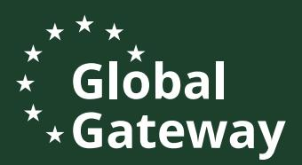

# **EUDR Readiness in the African coffee sector**

Where are we now? What is left to do?

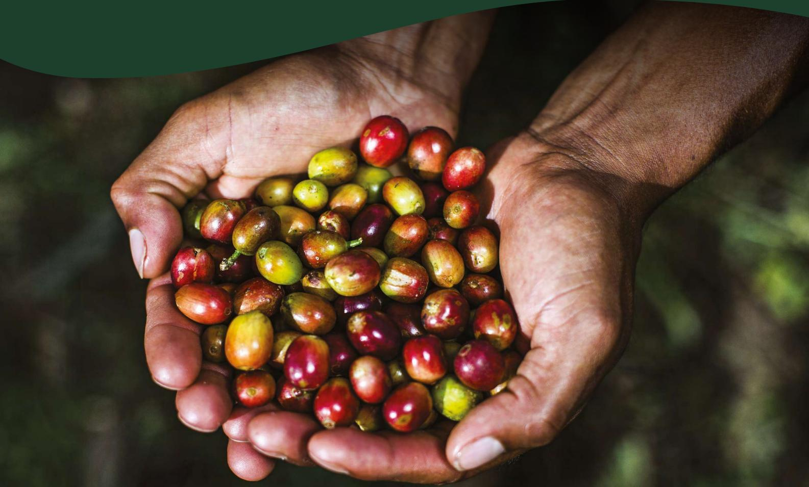

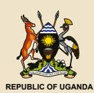

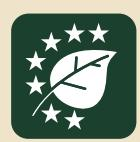

**13th – 16th May 2025**

Speke Resort Munyonyo, Kampala, Uganda

**CONFERENCE REPORT**

# Forests. Farmers. Future.

| <b>TABLE OF CONTENTS</b>                                                                                                 | <b>III</b> |
|--------------------------------------------------------------------------------------------------------------------------|------------|
| <b>ACRONYMS</b>                                                                                                          | <b>V</b>   |
| <b>ACKNOWLEDGEMENTS</b>                                                                                                  | <b>VI</b>  |
| <b>EXECUTIVE SUMMARY</b>                                                                                                 | <b>VII</b> |
|                                                                                                                          |            |
| <b>CHAPTER 1: INTRODUCTION</b>                                                                                           | <b>8</b>   |
| <b>1.1 Background</b>                                                                                                    | <b>8</b>   |
| <b>1.2 Conference objectives</b>                                                                                         | <b>8</b>   |
| <b>1.3 Composition of participants</b>                                                                                   | <b>8</b>   |
| <b>1.4 Official opening and closing</b>                                                                                  | <b>8</b>   |
| 1.4.1 Opening Remarks                                                                                                    | <b>8</b>   |
| 1.4.2 Official opening                                                                                                   | <b>9</b>   |
|                                                                                                                          |            |
| <b>CHAPTER 2: PRESENTATIONS ON KEY SUB-TOPICS</b>                                                                        | <b>9</b>   |
| <b>2.1 Introduction to EUDR and support mechanisms (TEI)</b>                                                             | <b>9</b>   |
| <b>2.2 Advancing Climate resilience and Transformation in African Coffee (ACT Coffee)</b>                                | <b>10</b>  |
| <b>2.3 The role of AU-IACO in the implementation of the EUDR in Africa</b>                                               | <b>10</b>  |
| <b>2.4 Perspective of competent authorities</b>                                                                          | <b>10</b>  |
| <b>2.5 New regulations, familiar challenges</b>                                                                          | <b>11</b>  |
| <b>2.6 Financial Pathways for Deforestation-Free Coffee &amp; Collaborative Action</b>                                   | <b>12</b>  |
| <b>2.7 EUDR: Ready or business at risk?</b>                                                                              | <b>12</b>  |
| <b>2.8 CARPE DIEM: Seizing the market opportunities created by the EUDR and bargaining for value from sustainability</b> | <b>12</b>  |
| <b>2.9 Building Digital Public infrastructure for EUDR compliance</b>                                                    | <b>13</b>  |
| <b>2.10 Building a local EUDR data collection service</b>                                                                | <b>14</b>  |
| <b>2.11 Starting an EUDR learning community for the African coffee sector</b>                                            | <b>14</b>  |
| <b>2.12 Parallel sessions</b>                                                                                            | <b>14</b>  |
| 2.12.1 The example of registering farmers in Uganda                                                                      | <b>14</b>  |
| 2.12.2 Geolocation and risk assessment in practice                                                                       | <b>15</b>  |
| <b>2.13 Integration of Gender and Social Inclusion (GESI) in EUDR</b>                                                    | <b>15</b>  |

## Table of Contents

|                   | 16 CHAPTER 3: FIELD VISITS                                                                                                         |
|-------------------|------------------------------------------------------------------------------------------------------------------------------------|
| APPENDIX 1:       | LIST OF PARTICIPANTS                                                                                                               |
| APPENDIX 2:       | SUMMARY OF CONFERENCE EVALUATIONS                                                                                                  |
| APPENDIX 3:       | GRAPHICAL REPRESENTATION OF PERCEPTIONS FROM PARTICIPANTS                                                                          |
| APPENDIX 4:       | CONFERENCE PROGRAM                                                                                                                 |
| 3.1 Group A sites | Susan Nakajubi’s CoǺee Farm Naomi Kajubi’s CoǺee Farm Group B sites Lessons from ǻeld visits CLOSING REMARKS CHAPTER 5: APPENDICES |

**ACT CECOFA EFI EU EUDR FAO FAQ GDP GESI IACO MAAIF NGO NKG NUCAFE SAFE TACI TECI TEI UNIDO** Advancing Climate-Resilience and Transformation in African CoǺee Central CoǺee Farmers' Association European Forest Institute European Union European Union Deforestation Regulation Food and Agriculture Organization Fair Average Quality Gross Domestic Product Gender Equity and Social Inclusion Inter African CoǺee Organization Ministry of Agriculture, Animal Industry and Fisheries Non-Government Organization Neumann KaǺee Gruppe National Union of CoǺee Agribusinesses and Farm Enterprises Sustainable Agriculture for Forest Ecosystems Team Africa CoǺee Initiative Team Europe CoǺee Initiative Team Europe Initiative on Deforestation Free Value Chains United Nations Industrial Development Organization

## Acronyms

The conference was organized by the Team Europe Initiative on deforestation-free value chains, particularly the Ǽagship projects GIZ SAFE and the European Forest Institute Technical Facility, in collaboration with Uganda's Ministry of Agriculture, Animal Industry and Fisheries. Financial support was provided by the European Union, the Dutch Government, the German Government and France.

The four-day event, held at Speke Resort Munyonyo in Kampala, brought together stakeholders from 17 African coǺee-producing countries and European coǺeeimporting nations.

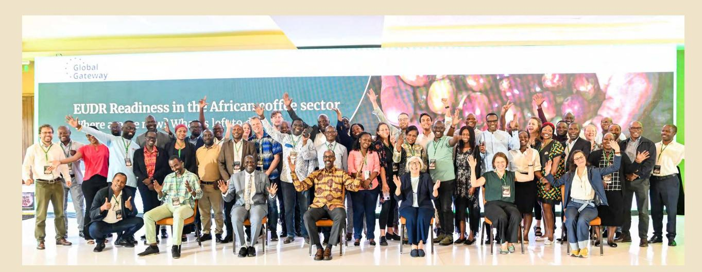

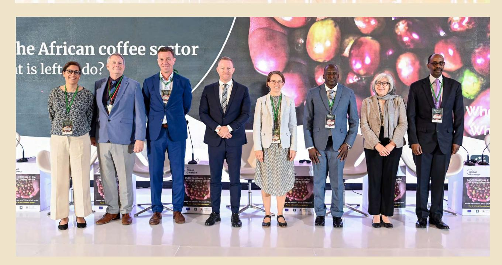

## Acknowledgements

The European Union Deforestation Regulation (EUDR) is a legislative framework adopted by the European Union to curb global deforestation and forest degradation driven by EU consumption. It aims to ensure that products sold or exported to the EU market do not contribute to deforestation. The regulation applies to key commodities associated with deforestation risks, including coǺee, cocoa, palm oil, soy, beef, and timber, along with their derived products. Under the EUDR, companies are required to conduct strict due diligence to prove that their supply chains are deforestation-free and that products are produced in compliance with the laws of the country of origin. This involves collecting accurate geolocation data, verifying legal production, and maintaining traceability throughout the supply chain. The thrust of the conference was guided by the overall theme **"EUDR readiness in the African coǺee sector: where are we and what is left to do"**. The conference aimed at gauging Africa's preparedness for EUDR compliance and ǻnd innovative solutions to accelerate the process of becoming ready for EUDR.

The conference comprised of presentations and discussions on the following sessions: a) EU sustainability regulations meet coǺee traditions; b) Perspective of competent authorities; c) New regulations, familiar challenges; d) Financial pathways for deforestationfree coǺee & collaborative action; e) EUDR: Ready or business at risk?; f) Seizing the market opportunities created by the EUDR and bargaining for value from sustainability; g) Building Digital Public infrastructure for EUDR compliance; h) Building a local EUDR data collection service; i) Starting an EUDR learning community for the African coǺee sector; J) The example of registering farmers in Uganda; k) Geolocation and risk assessment in practice – OpenForis Ground and Whisp and l) Integration of Gender and Social Inclusion (GESI) in EUDR. There were also ǻeld visits to coǺee processors and farmers on day 3 of the conference.

The conference brought together 108 participants (63% male; 37% female), including: Government representatives from African coǺee-producing countries (Ministries of Agriculture, Trade, Environment); European Union governments and trade representatives; CoǺee farmers, cooperatives, and producer organizations; CoǺee exporters, traders, and importers; Development partners, NGOs, and technical assistance providers; and Technology providers specializing in traceability and sustainability solutions.

It was concluded that eǺective implementation of the EUDR in Africa requires a coordinated, inclusive, and phased approach that addresses existing traceability gaps, builds trust through the use of local actors, and emphasizes farmer sensitization at all levels. General recommendations including providing incentives for registered farmers; ensuring multilevel data handling; and establishing regional and continental structures such as an AU-EUDR chapter and a learning community for EUDR in the African coǺee sector, among others, were made by individual participants.

## Executive Summary

### 1.1 Background

### 1.2 Conference objectives

### 1.3 Composition of participants

### 1.4 OƧcial opening and closing 1.4.1 Opening Remarks

## CHAPTER 1: Introduction

The conference aimed at gauging Africa's preparedness to EUDR compliance and ǻnding quick solutions to accelerate the preparedness process. It also fostered dialogue and cooperation between African coǺee-producing countries and European coffee-importing countries to support Africa's transition towards EUDR compliant value chains. It provided a space to discuss challenges, share best practices, and explore ǻnancing mechanisms and technical assistance required to meet the regulation's requirements. Speciǻcally, the conference was to:

- **• i.** Assess African coǺee sector readiness for EUDR compliance, identifying gaps and opportunities.
- **• ii.** Facilitate dialogue between African coǺee producers and European buyers on strategies for compliance.

- **• iii.** Showcase innovative solutions for deforestation-free and traceable coǺee supply chains.
- **• iv.** Promote ǻnancial and technical partnerships to support compliance eǺorts.
- **• v.** Strengthen policy alignment between African coǺee-producing countries and the EU.
- **• vi.** Strengthen the focus on the beneǻts of coffee production among smallholder farmers.

The European Union Deforestation Regulation (EUDR) that comes into full eǺect after 2025 mandates that any operator or trader who places coǺee on the EU market must be able to prove that the products do not originate from recently deforested land or have contributed to forest degradation. Traders exporting coǺee to Europe must, therefore, be able to fulǻll the requirements in line with their customers' obligations under this regulation to be able to continue accessing the EU market. To support partner countries in transitioning to deforestation-free value chains, the European Union together with several member states started the Team Europe Initiative on Deforestation free value chains (TEI). As one of the Ǽagship projects of TEI, the Sustainable Agriculture for Forest Ecosystems (SAFE) project implemented by GIZ organized a 4 day conference at Speke Resort Munyonyo, in Kampala Uganda from 13th to 16th May 2025. The Conference brought together 10 African coffee-producing countries and European coǺee-importing nations to assess Africa's readiness for EUDR and explore practical solutions to speed up the preparedness process. The conference served as a platform for collaboration, knowledge sharing, and partnership building between African coǺee producers and European coǺee buyers.

The conference brought together 108 participants of which 63% were male and 37% female. They included: Government representatives from African coǺee-producing countries (Ministries of Agriculture, Trade, Environment); European Union governments and trade representatives; CoǺee farmers, cooperatives, and producer organizations; CoǺee exporters, traders, and importers; Development partners, NGOs, and technical assistance providers; and Technology providers specializing in traceability and sustainability solutions.

The EU Head of Cooperation reported that while EUDR compliance oǺered clear beneǻts, key challenges remained, including inadequate funding, lack of traceability systems, and limited technology for African coǺee farmers. She stated that the EU was supporting Uganda through a National Compliance Action Plan, the formation of a national EUDR taskforce, and a coordination unit. With funding from aBi Development and collaboration with private sector actors, she noted that a farmer registration system had geo-mapped over 900,000 farmers. Awareness campaigns were ongoing, but only 30 percent of farmers had submitted data. She emphasized that the fragmented value chain complicated traceability and added that UGX 35.6 billion was needed for full compliance, with only UGX 13.9 billion secured. She urged use of the transition period to avoid exclusion from the EU market by 31 December 2025, which could worsen poverty among farmers.

#### 2.1 Introduction to EUDR and support mechanisms (TEI)

### 1.4.2 OƧcial opening

The conference was oǽcially opened by the Commissioner for CoǺee Development, Dr.Gerald Kyalo who represented the Minister of Agriculture, Animal Industry and Fisheries. He indicated that over 12 million small holder farmers beneǻt from coǺee in Uganda. He added that in 2021, Uganda exported 6.1 million bags of coǺee mainly to Europe, amounting to \$1.1 billion in earnings. The commissioner emphasized that the EUDR initiative is aimed at combating climate change with arabica and Robusta coǺee estimated to reduce Climate change by 12% and 9% respectively.

Camilla Fusato, Global Food Security Policy Ofǻcer in the Directorate-General for International Partnerships of the Unit for Sustainable Agri-Food Systems at the European Commission, expressed her gratitude appreciated the invitation to join the important stakeholders' meeting under the theme «EUDR readiness in the African coǺee sector: where are we now and what is left to do? She reaǽrmed the European Union's long-standing support to the development of sustainable coǺee chains. She emphasized the EU's continued commitment to working with producing countries to strengthen market access, promote agroforestry, and support compliance with social and environmental standards in global supply chains. Ms. Fusato indicated that the European Union Deforestation Regulation (EUDR) was still leading the EU's sustainability agenda. She explained that the regulation, adopted in June 2023 and later amended in November 2024 and April

The Netherlands Embassy representative described the EUDR as a key step to combatting deforestation, climate change and biodiversity loss. He stated that to be eǺective, strong partnerships with consumer and producer countries were crucial and that without coherent EU supporting measures risks could arise like the exclusion of smallholders from EU supply chains.

The German Embassy representative indicated that Germany was proud to support the Team Europe Initiative on Deforestation-Free Value Chains, aimed at reducing deforestation linked to key commodities. He clariǻed that the EUDR applies equally to both EU and non-EU producers. He stated that Germany imported 34 percent of the EU's coǺee and is committed to supporting sustainable supply chains. He commended the progress made and hoped the conference would

### CHAPTER 2: Presentation on Key Sub-Topics

2025, sought to tackle deforestation and forest degradation linked to commodities such as beef, cocoa, coǺee, palm oil, rubber and wood. Being one of the major consumers of such commodities globally, the EU, according to her, had a responsibility to ensure its supply chains are legal, sustainable, and deforestation-free. Looking forward, she referred to the European Union's Global Gateway Strategy under which the Team Europe Initiative on Deforestation-Free Value Chains had been launched with an initial investment of €70 million across the world. She added that the program was designed to assist partner countries to transition to legal, deforestation-free, and sustainable commodity value chains and align with the global vision of ending and reversing forest loss by 2030. She stressed that the conference was part of this broader eǺort. Despite these positives, Ms. Fusato conceded that there were still grave concerns faced by the coffee sector such as traceability infrastructure deǻciencies, poor farmer awareness, and limited ǻnances. Ms. Fusato anticipated the outcomes of the conference discussions and encouraged everyone to engage substantively. She pledged the EU's continued

yield actionable practices for compliance by 30 December 2025.

#### 2.2 Advancing Climate resilience and Transformation in African CoƦee (ACT CoƦee)

#### 2.3 The role of AU-IACO in the implementation of the EUDR in Africa

#### 2.4 Perspective of competent authorities

Giulia Vaglietti, Environmental Economics Specialist at the ACT CoǺee Programme of the United Nations Industrial Development Organization (UNIDO), delivered a presentation outlining the Programme's objectives and strategic direction. The intervention focused on the ACT CoǺee Programme's support to African coǺee-producing countries – starting with Ethiopia, Kenya, Malawi, Tanzania, and Uganda – in achieving the structural transformation of their coffee value chains, advancing socio-economic sustainability and climate resilience. Launched by the Italian Government and implemented by UNIDO as a strategic knowledge and technical partner, the ACT CoǺee Programme represents the "coǺee component" of the Mattei Plan. In particular, it aims to strengthen the African coǺee sector by leveraging global partnerships, mobilizing ǻnancial instruments, and delivering targeted technical assistance. The Programme's activities rely on ǻve cross-cutting priorities: fostering climate-resilient coǺee production, enabling local value addition, supporting compliance with international regulations, promoting research and innovation, and enhancing social inclusion.

The presentation also emphasized the Programme's commitment to a coordinated Team Europe approach for aligning EU eǺorts across the coǺee value chain. This approach builds on the best practices established under the Team Europe Initiative on Deforestation-Free Value Chains. In this context, activities under the ACT compliance pillar, particularly related to EUDR implementation, will be carried out within the established TEI Deforestation-Free Value Chains framework to ensure coherence, strategic alignment, and operational synergies.

Ambassador Solomon Rutega, Secretary General, Inter African CoǺee Organization (IACO) reported Dr. Andreas Schäfer, Federal Oǽce for Agriculture and Food, Germany, presenting on behalf of the German Competent Authority (BLE), gave insights into the current state of readiness regarding the application of the EUDR. He stated that BLE was actively engaged

involvement in ensuring that Uganda and African coǺee industries become successful stakeholders in a world economy that was rapidly becoming sustainability minded.

that the African Union (AU), in partnership with the Inter African CoǺee Organization (IACO) and Advancing Climate-Resilience and Transformation in African CoǺee (ACT), was engaging the European Union (EU) to explore a structured approach to the EUDR with speciǻc focus on its implications for the African coǺee sector. He noted that the collaboration was being proposed under the Team Africa CoǺee Initiative (TACI) and the Team Europe CoǺee Initiative (TECI), with plans for coordination oǽces to be established in Addis Ababa and Brussels. The Ambassador indicated that AU-IACO Competent Authorities had been designated, and eǺorts were underway to operationalize a digital AU-EU Compliance Certiǻcate to support traceability and legal veriǻcation of coǺee production. He noted that EUDR implementation was hindered by smallholder dominance, with over 80 % of coǺee grown on fragmented plots, making traceability diǽcult. He highlighted the high cost of collecting geolocation data, poor digital infrastructure among cooperatives, and widespread informal land tenure. He also observed low awareness and limited capacity across producer communities to meet EUDR requirements. To address these concerns, Ambassador Rutega reported that AU– IACO had proposed several strategic actions:

**1)** Establish a Joint EUDR Coordination Platform, co-led by the AU Commission and European Commission via the TECI–TACI mechanism, to support dialogue, regulatory alignment, and knowledge exchange;

**2)** Mobilize joint AU–EU ǻnancial and technical resources to strengthen EUDR compliance capacity in coǺee-producing countries; and

**3)** Launch targeted awareness campaigns to educate smallholders, cooperatives, and exporters of coǺee on EUDR requirements. He emphasized the need for strong institutional collaboration among AU and EU bodies in Addis Ababa and Brussels, EU Competent Authorities, and the G25 CoǺee Boards, noting that such coordination would improve traceability and standardize due diligence processes.

#### 2.5 New regulations, familiar challenges

Two regional panel sessions were held, one for representatives from English-speaking African nations (Uganda, Kenya, and Tanzania), moderated by Jane Seruwagi Nalunga, Director of SEATINI, and the other for French-speaking countries i.e. Ivory Coast, Cameroon and Democratic Republic of Congo (DRC). Dr. Gerald Kyalo from Uganda's Ministry of Agriculture, Animal Industry and Fisheries (MAAIF) reported that

in developing the digital control processes required to implement the EUDR eǺectively. He explained that the process begins with the development of the EU Information System Interface which includes mechanisms for data processing and transferring relevant information to the respective federal states. He added that BLE was responsible for formulating an annual control plan, designed to guide inspections on operators and their products using a risk-based approach. He noted that EUDR compliance checks follow three main scenarios: a) Based on national risk criteria; b) Based on substantiated concerns, and c) Involving immediate eǺect actions where necessary. Dr. Schäfer elaborated that the digital control process encompasses critical steps such as: EǺective data management, development and use of a service portal, and ensuring smooth information exchange between systems and stakeholders.

He indicated that BLE's monitoring focuses on several key areas:

- **• a)** Due diligence systems established by operators.
- **• b)** Product information submitted for traceability.
- **• c)** Geolocation data associated with the production areas.
- **• d)** Upstream and downstream stakeholder relationships within the supply chain.
- **• e)** Legal compliance of the production country with relevant regulations.
- **• f)** Risk assessments conducted by operators to evaluate potential non-compliance; and
- **• g)** Risk mitigation measures are implemented to address identiǻed risks.

Dr. Schäfer concluded that BLE was making signiǻcant progress toward aligning its national systems with the requirements of the EUDR and emphasized the importance of collaboration, transparency, and robust digital tools in ensuring compliance across all levels.

approximately 9 million Ugandans depended on coǺee for their livelihoods. He noted that the Government of Uganda, in collaboration with the private sector, had been working to raise awareness of the EUDR requirements. He added that 1.2 million farmers had already been registered under the initiative and expressed optimism that the registration process would be completed by August 2025. Ms. Josephine Simiyu from the Agriculture and Food Authority in Kenya stated that the Kenyan government had held consultative meetings with key agencies to discuss the implications of the EUDR and practical steps for implementation. She pointed out that coǺee contributed approximately 14 % of Kenya's exports to the EU, making it highly exposed to the regulation. She also reported that development partners had stepped in to support the private sector by building the necessary capacity to comply with the regulation and maintain access to EU markets. Mr. Kajiru Francis Kisenge from the Tanzania CoǺee Board explained that Tanzania had taken concrete steps to prepare for EUDR compliance. He noted that the amended CoǺee Industry Act (2001) gave the Board a mandate over production, licensing, and traceability. He further stated that supporting legislation such as the Land Act and Village Land Act recognized both formal and customary land rights, helping farmers demonstrate legal land ownership. He added that the Environmental Management Act and Forest Act had strengthened the legal framework for sustainable land use and forest conservation.

The French session was moderated by Mr. Edwin Gaarder from the European Forest Institute, and the panelists were: Steven Kanane from DRC; Flean Assande from Ivory Coast; and Mr. Ndoping Michael from Cameroon. Mr. Kanane indicated that DRC was committed to certifying coǺee farmers but conceded that deforestation was still rampant in the country. Assande noted that in 2018 Ivory Coast implemented diǺerent activities to combat deforestation and climate change, including rehabilitation, preservation and restoration of forests. She added that mapping was done to ensure land cover was assessed for illegal activities. Mr. Ndoping reported that measures were being taken to discourage deforestation to protect forests in Cameroon. He added that CoǺee growers had to follow EUDR regulation despite the price of coffee. He concluded that incentives should be given to farmers to enable them to follow the right procedures to comply the EUDR.

#### 2.6 Financial Pathways for Deforestation-Free CoƦee & Collaborative Action

Paula Pinto Zambrano, an international policy analyst at Climate & Company, a sustainable ǻnance think tank based in Berlin, Germany, highlighted various ǻnancial mechanisms supporting deforestation-free coǺee supply chains and provided an overview of the stakeholders involved, alongside the Ǽow of funding within these systems. She emphasized the importance of everyone involved in the coǺee supply chain, from farmers to large enterprises to working together to make a meaningful impact. Ms. Zambrano further explained the need to advance resilient, competitive value chains through transparency and due diligence. She stressed that mobilizing ǻnance for nature, climate, and a just transition is crucial for creating longterm solutions. She also highlighted the potential for turning reporting obligations into opportunities for all stakeholders, providing both challenges and incentives to move towards deforestation-free coǺee production. She concluded by noting that Climate & Company was active in over 20 countries across ǻve continents, and that they are grantees of the SAFE project, contributing to the ongoing work on green ǻnance. The session was designed to encourage a shared understanding of the ǻnancial pathways that can support deforestation-free coǺee production while fostering collaborative action for positive change.

#### 2.7 EUDR: Ready or business at risk?

Ms. Melyne Amolloh from Neumann KaǺee Gruppe (NKG), Kenya indicated that the EUDR is a welcome development. She added that the group fully supports the regulation's objective to reduce the EU's contribution to deforestation and forest degradation, ultimately aiming to cut greenhouse gas emissions and protect biodiversity. Ms. Amolloh emphasized that biodiversity conservation and climate action are core to their business practices.

However, she also highlighted the signiǻcant challenges related to the regulation's implementation, particularly its impact on smallholder farmers, who represent 12.4 million of the estimated 12.5 million coǺee farms globally. She cautioned that without tailored support, compliance demands could create unintended barriers for these farmers, putting their livelihoods and broader supply chain equity at risk. She noted that as per the regulation, from 30th December 2025, medium and large

#### **1. Who bears the cost of traceability? 2. What challenges are faced in traceability and possible solutions?**

enterprises will be required to ensure that coǺee and other listed commodities i.e. cattle, cocoa, oil palm, rubber and soya placed on or exported from the EU market are deforestation free, legally produced in the country of origin, and covered by a due diligence statement. She added that small and micro enterprises will follow by 30th June 2026. Ms. Amolloh concluded that during the transition period, no obligations apply; however, operators must demonstrate that products were placed on the market before enforcement begins.

After this session, the participants were put in groups to reǼect on the following questions:

During the discussions, participants shared diǺerent perspectives. Some suggested that smallholder farmers should not be left to shoulder the full cost of traceability, as this would place an unfair burden on them. Instead, they proposed that EU delegates and supporting institutions should provide better clarity and contribute more substantially to ǻnancing traceability systems, especially in low-resource settings.

Regarding challenges, groups agreed that it was very diǽcult to distinguish trees from crops in agroforestry systems during traceability processes. To address this, it was suggested that guidance tools and traceability requirements should be adapted to the realities of agroforestry practices commonly used in Uganda's coǺee sector.

#### 2.8 CARPE DIEM: Seizing the market opportunities created by the EUDR and bargaining for value from sustainability

Mr. Edwin Gaarder, a Trade and Development Expert at EFI, discussed the EUDR's impact on coǺee-producing countries, questioning whether it was a threat or opportunity. Citing Bloomberg (June 1, 2024), he noted concerns that the EUDR regulation could disrupt exports, raise prices, and hurt farmers. He clariǻed that legal obligations fall on EU operators, but changes in buyer behavior could still aǺect producers. He reported that Africa currently produces 12% of the world's total coǺee, equivalent to 11.65 million bags, in a global market that presently has a surplus. He added that 6% of the world's Robusta coǺee, about 8.285 million bags, is grown in Africa, with Uganda alone contributing 7% of the global Robusta coǺee supply. Gaarder emphasized that Africa accounts for an increasing share of coǺee entering the EU and oǺers unparalleled diversity in its coǺee origins. Gaarder highlighted Africa's coǺee quality i.e. Burundi's Arabica had good berry Ǽavors; DRC was noted to be emerging in specialty coǺee; Ethiopia offered genetic diversity; and Kenya is known for bright proǻles and varietal research (e.g., SL-28, SL-34, Ruiru 11). He noted that EU buyers are paying premiums for traceable, high-quality coǺee. He indicated that while some producers may not comply immediately, alternative markets exist although EU access remains valuable. He explained that Article 3 of the EUDR prohibited non-compliant products (not deforestation-free or illegal) from entering the EU. Articles 8–11 require due diligence: collecting data, assessing risk, and mitigation. He stressed the need to demonstrate compliance through geolocation and polygon mapping, with accessible and veriǻable data systems. Gaarder also noted that many producing countries already met legal standards and the EUDR needed to strengthen enforcement. Local actors, he added, are best placed to guide due diligence. He encouraged producer countries to develop their own geolocation and farmer databases to support compliance, improve transparency, strengthen land tenure, and oǺer local service export opportunities. If required, further details can be got from his presentation.

#### 2.9 Building Digital Public infrastructure for EUDR compliance

Gyde Feddersen (GIZ), Jonas Spekker (FAO), and George Watene (Kenya CoǺee Platform) emphasized the importance of Digital Public Infrastructure (DPI) in supporting compliance with the EUDR. They stated that DPI enabled shared systems and standardized approaches essential for traceability and eǺective risk assessment across agricultural value chains. Mr. Spekker explained that various geolocation tools were already in use. He mentioned Open Foris Ground, which allowed for automatic ǻeld detection, and WHISP, which supported risk analysis at the plot level. He also pointed out the use of unique ǻeld identiǻers through the Field Boundaries for Agriculture (FI-BOA) project. According to him, once a point or polygon was registered, the system returned a 64-digit token that could be securely stored and shared only with authorized stakeholders like buyers, ensuring data protection and privacy.

The speakers described DPI as foundational infrastructure aimed at enabling society-wide digital systems and services for regulatory compliance. They reported that gender equity and social inclusion were central elements, with eǺorts underway to train trainers (ToTs) in partner countries to build local capacity. They also highlighted the importance of green ǻnancing in mobilizing resources and supporting gender-responsive, sustainable investments. However, they acknowledged several challenges that had emerged in the digital transition. These included limited access to digital technologies, fragmented digital markets, lack of standardized approaches, and risks to data sovereignty. They warned that such gaps could turn digital compliance into a burden rather than a beneǻt, potentially excluding some farmers and regions from global trade. As part of the solution, the speakers shared that the WHISP tool worked in coordination with Open Foris Ground and used artiǻcial intelligence and machine learning via the SAMGeo system. This setup, they explained, enabled the automatic detection of ǻeld boundaries and land surface changes over time using high-resolution satellite data. Details can be got from their individual presentations.

The conference participants were put in three groups in order to reǼect on EUDR compliance guided by the following questions:

Regarding question 1, Discussions yielded a range of digital needs essential to address EUDR compliance issues including: i) provision of maps and geospatial information; ii) capacity-building programs; iii) robust data storage facilities; and iv) data harmonization with a view to encouraging consistency between the stakeholders. Other needs included: quality control processes; better internet connectivity in rural agricultural communities; and localized digital solutions that accommodate local capacity as well as global standards.

In line with question 2, DPI was thought to be a key enabler of EUDR compliance as it has potential to make the value chain more transparent through enhanced tracking and record maintenance of actions taken for compliance. It can bridge knowledge gaps and allow all stakeholders, from producers to exporters, to gain timely and accurate information. It was also noted that DPI would go a long way in simplifying the process of data collection, particularly through making more convenient the way data at the ǻeld level is collected, stored, and reported.

- **1. What are your digital needs with regard to compliance with the EUDR?**
- **2. How can a Digital Public Infrastructure (DPI) assist you?**
- **3. Who needs to be included?**

When asked who must be involved in EUDR Compliance Initiatives, all stakeholders in the coǺee value chain, including producers; exporters; consumers; technical experts; civil society; governments; international community; and the ǻnancial sector were thought to be important in EUDR implementation and, therefore, play pivotal roles in facilitating compliance to make it fair and inclusive.

#### 2.11 Starting an EUDR learning community for the African coƦee sector

Presenters from COSA, AFCA, GCP and GIZ reported that a learning community was being initiated to support African coǺee-producing countries to be-

#### 2.10 Building a local EUDR data collection service

Representing the Committee on Sustainability Assessment, Mr. Matthew Himmel noted the particular challenges to creating a local data collection service for the EUDR requirements, which needed to be achieved by May 2025 using the case of Ethiopia. He noted that smallholder coǺee farmers in Ethiopia number up to 4 million, they are neither connected to electricity, the internet nor educated. Their farms are usually established deep in the forest cover. He indicated that this would make data collection logistically costly and complicated given the outrageous transportation and security costs.

Mr. Himmel highlighted that the coǺee industry is a highly signiǻcant sector of the Ethiopian economy, contributing 30–35% of total export revenues. He cautioned that It was estimated that noncompliance to EUDR could result in up to 18% loss in coǺee exports, which will equate to a reduction of 0.6% in terms of GDP, and 3.3% less revenue for the government. He noted that in addition to these economic threats, the coǺee crop is already under stress as a result of lower yields from climate change and weed invasions.

Despite all these barriers, he noted that the EUDR oǺers an opportunity to develop low-cost and integrated data systems for traceability and compliance. He concluded that low-cost and scalable digital technologies such as Kobo Toolbox and Open Data Kit (ODK) emerged as potential solutions to overcome the data gap and assist Ethiopia's smallholder coǺee farmers in adapting to the EUDR.

come EUDR compliant. They explained that the platform would promote coordination, knowledge exchange, and capacity development, enabling coǺee stakeholders to comply through harmonized and informed approaches. SAFE was cited as a key initiative under this eǺort, focusing on strengthening institutions, sharing experiences, and promoting joint projects between public, private, and civil society actors. They noted that regional dialogues were being established across continents. In Africa, the dialogue was still in formation but would involve national coǺee platforms and producers, supported by COSA, AFCA, and GCP. In the Andean region, countries like Ecuador, Colombia, Peru, and Bolivia were already participating in structured dialogues led by CAN, GIZ, EFI, and AL-Invest Verde, focused on institutional training and regulatory alignment. For MERCOSUR, countries i.e. Brazil, Paraguay, Argentina, and Uruguay, the conversation aimed to produce interaction and partnership in a step-by-step manner. Implementation partners such as Solidaridad, the Tropical Forest Alliance (TFA), and Proforest were involved. In Southeast Asia, the dialogue involved Indonesia, Malaysia, and Papua New Guinea, focusing on traceability dashboards, data sharing protocols, and capacity building of smallholders, with support from partners such as TFA, CSP, PISAgro, and IBCSD. In Central America, presenters described an emerging learning community that facilitated research and exchanges on remote sensing, polygon mapping, and the drivers of deforestation. They noted that studies were underway to assess cost-eǺective technologies and deǻne the appropriate accuracy levels needed for EUDR compliance. The speakers highlighted the need for stakeholder mapping, baseline assessments, and the creation of a virtual platform with a help desk to support compliance. They stressed the importance of shared digital infrastructure and multi-stakeholder coordination to reduce costs. The presenters concluded by emphasizing farmer education on EUDR requirements, sustainable farming, and deforestation prevention as central goals of the learning community. For details refer to their individual presentations.

### 2.12 Parallel sessions

#### 2.12.1 The example of registering farmers in Uganda

Nabil Janmohamed from Global Operations, PULA Advisors indicated that the objective of their Uganda ǻeld operation was to enroll coǺee farmers and map their plots for EUDR traceability. In this process, more than 2,500 local data agents were mobilized in more

#### 2.13 Integration of Gender and Social Inclusion (GESI) in EUDR

#### 2.12.2 Geolocation and risk assessment in practice

During this session, Mr. Jonas Spekker conducted a demonstration of geolocation and risk assessment using digital tools. He introduced participants to the OpenForis Ground mobile application, a tool developed for georeferencing land parcels. He explained that the application, which is freely available on the Google Play Store, allows users to capture GPS coordinates and automatically calculate the area of a given piece of land.

To illustrate its functionality, Mr. Spekker guided the group in recording geolocation data around the swimming pool area at Speke Resort Munyonyo. Participants observed the process of collecting coordinate points using the app in real time. In addition, photographs of the interviewer and the Ms. Catherine Odenyo noted that the implementation of the programs like EUDR often fail to consider the needs of vulnerable smallholder farmers, particularly women and youth. She explained that although these groups were actively involved in key farming activities, such as land clearing and planting, they are frequently excluded from land ownership and decision-making due to patriarchal systems. She pointed out that this exclusion limits their ability to contribute to sustainable land management, even though their daily tasks have direct environmental impacts. She stated that the requirement to provide proof of land ownership through polygon mapping posed a major challenge for women and poorer farmers, many of whom lack formal land documentation. She added that the technical aspects of EUDR compliance, including digital mapping and record-keeping, are often beyond the reach of these groups due to limited skills and resources. Ms. Odenyo also reported that cultural norms often restrict women's participation in sensitization meetings, resulting in a lack of awareness and involvement in compliance processes.

She emphasized that promoting inclusive compliance would require targeted sensitization at the community level, particularly among opinion leaders, to ensure women and youth have access to land and participated in decision-making. She recommended well-designed capacity-building programs to provide knowledge on legal rights, sustainable practices, and EUDR responsibilities. She further suggested that companies should collect gender-disaggregated data, conduct social impact assessments, and ensure access to ǻnance and markets, including emerging areas such as carbon trading. Ms. Odenyo concluded by stating that gender-sensitive and youth-inclusive policies are essential at national, local, and cooperative levels to promote full and fair participation in EUDR compliance.

surrounding area were taken to demonstrate how visual data can complement spatial records in digital traceability systems. The session oǺered participants a practical understanding of how digital tools such as Open Foris Ground can support compliance with the EUDR by enabling accurate mapping and risk assessment of production areas. This ǻeld-based demonstration highlighted the accessibility and usefulness of mobile-based geospatial technology in supporting smallholder farmers and cooperatives in the traceability process.

than 126 districts while close to 850,000 farmers were registered onto the system. He noted that the process relied primarily on local hiring to establish trust and collaboration among communities. There was a deǻnite chain of command; in this instance, one Country Field Manager supervised approximately seven Regional Managers, 75 Field Coordinators, and 2,500 Field Agents. The tightly organized system was accountable for promoting accountability along with coordination among diǺerent administrative levels. He highlighted that training of data agents was done on a hybrid model, with virtual and physical modules being mixed for imparting the optimal mix of technical expertise and ǻeld applicability skills. Real-time dashboards were used to monitor data collection progress and quality and allowed timely intervention and course correction wherever necessary.

He noted that one of the key lessons of the Uganda experience was that mobilization by government ofǻcials, local leaders who were well-trusted by the population, and community cooperatives greatly improved participation, reduced misinformation, and reduced refusals on the part of the farmers. In terms of technology used, he indicated that the mobile app began with authorization to draw polygons within 20 meters of farm boundaries for mapping. Progressively, other features added included a ±20% cap on farm area estimates; global polygon view to prevent duplicates; a tighter boundary accuracy to 10 meter; ease of use interface, error correction capability; and full polygon view. These features progressively worked towards preventing fraud while simultaneously making data more precise and trustworthy to the typical aberrations of Uganda's quest for EUDR compliance.

### 3.1 Group A sites

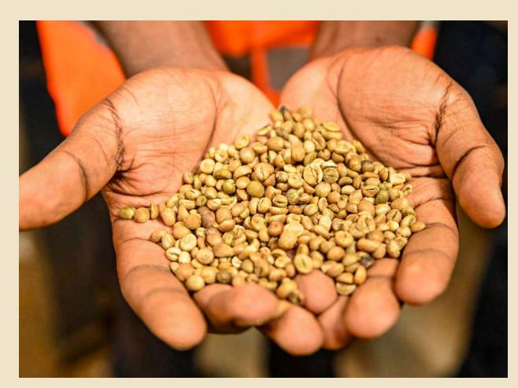

### 3.1.1 Central CoƦee Farmers' Association (CECOFA) Facility

### 3.1.2 Susan Nakajubi's CoƦee Farm

## CHAPTER 3: Field Visits

At the CECOFA processing factory (Figure 1) in Maya Parish, Nsangi Sub‑county participants were hosted by the Executive Director, Mr. Ronald Buule who provided an overview of the organization. He reported that since 2016, CECOFA has registered over 10,000 coǺee farmers in small groups of 30–35 members to enable traceability and peerto-peer support. He also noted two challenges facing the Organisation: the enormous number of members; and the shortage of coǺee-bean dryers during peak harvest time. The CECOFA chairman requested the EUDR team to oǺer technical and ǻnancial support to strengthen the facility's operations. After the presentations, the group toured the milling section, laboratory, and grading area, gaining ǻrsthand insight into CECOFA's quality‑control processes.

The second site was at a 20‑acre coǺee farm owned by Ms. Susan Nakajubi. Here, participants observed a well-established plantation with the assistance of ǻve full-time workers. Ms. Nakajubi used an agroforestry system, in which trees provided shade for coǺee plants. She also diversiǻed her business at the farm by including a piggery and poultry. She produced about 35 bags of FAQ-grade coǺee per season. The challenges she faced included: pests; unpredictable weather conditions; and Ǽuctuating market prices. Nonetheless, she indicated that her farm already complied with EUDR standards. Given extra funding, she expressed the desire to invest in personal protective equipment, fertilizers, and other essential farm inputs to further improve productivity and worker safety.

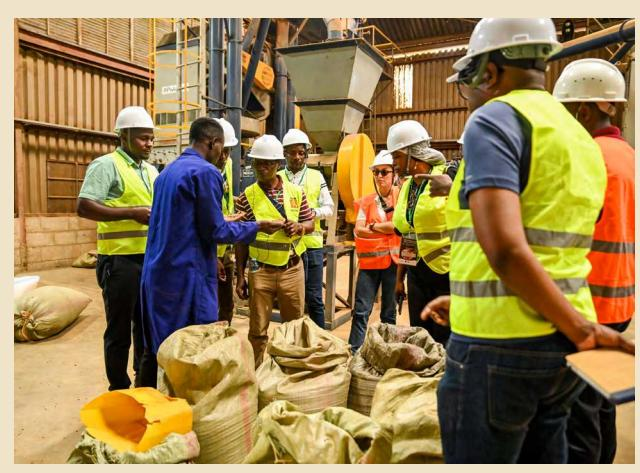

**As part of eǺorts to assess the readiness and challenges surrounding the implementation of the EUDR, participants conducted ǻeld visits on day 3 of the conference in two groups (Group A and B). These visits aimed at gathering ǻrsthand insights into coǺee production and processing practices, understanding existing traceability systems, identifying capacity gaps, and assessing opportunities for compliance with EUDR.**

*Figure 2: Coýee Beans after drying at CECOFA*

#### 3.2 Group B sites

Participants visited the NUCAFE Factory, a farmer, a local trader and local processor involved in hurling kiboko in Luwero District.

Participants had a guided tour of all the processing levels at the NUCAFE factory (Figure 4) including: weighing; drying; hurling kiboko; roasting; grinding; and packaging. The management of the factory led by Mr. David Muwonge indicated that they served more than 230 cooperatives translating to about 37,000 households. He noted than the majority of the farmers were not yet geo-mapped and suggested that individuals capable of capturing quality data should be hired to support eǺorts by PULA to fast track the activity. NUCAFE's vertically integrated approach, which emphasizes value addition and cooperative engagement, provides a scalable model for improving traceability and farmer incomes. However, the absence of comprehensive geo-mapping and data systems remains a signiǻcant barrier to achieving EUDR compliance across the entire supply chain.

At Mr. Salongo Mukuye's 5 acre (in 3 plots) farm (Figure 5) in Bamunanika partipants noted that he emphasized organic farming with no use of chemicals at all. Mr. Mukuye's 3 plots were already mapped and he was also helping with mapping other farms in preparation for EUDR compliance. He noted a challenge with the mobile app he was using for mapping as being slow. Other than coǺee he also had an apiary. Another small-scale farmer (Mr. Meddie) visited was also involved in local trade, buying from other farmers and selling the coǺee to local processors. Meddie's farm was also already mapped out.

*Figure 4: Coýee driers at NUCAFE*

#### 3.1.3 Naomi Kajubi's CoƦee Farm

The ǻnal site was Ms. Naomi Kajubi's four‑acre coǺee plot, where participants noted another example of integrated smallholder farming. Apart from coǺee, Ms. Kajubi was also keeping cattle, goats, and poultry, which provided manure for the coǺee farm in form of dung. She also faced challenges including: labor scarcity; high prices of inputs; and weather variability. Her farm was complied with EUDR traceability legislation, a validation of how small-scale agriculture adapts to international standards using innovative but low-cost mechanisms.

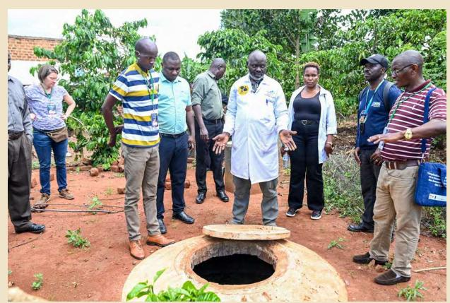

*Figure 5: Biogas digester at Mr.Mukuye's farm* 

The last site visited was at Mr. Kyobe Ruyombyabakyala's factory, where he was involved in hurling kiboko and selling FAQ. Local traders supplied him with kiboko without due diligence of the source of coǺee.

NUCAFE's vertically integrated approach, which emphasizes value addition and cooperative engagement, provides a scalable model for improving traceability and farmer incomes. However, the absence of comprehensive geo-mapping and data systems remains a signiǻcant barrier to achieving EUDR compliance across the entire supply chain.

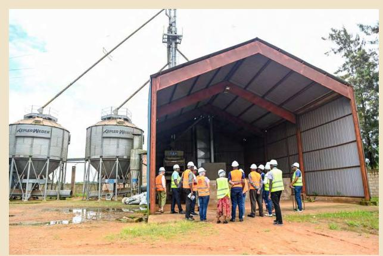

### 3.3 Lessons from Ʃeld visits

The following lessons were picked from the ǻeld visits:

- **a)** There is diversiǻcation on farms, not only relying on coǺee production.
- **b)** CoǺee associations e.g. CECOFA shorten the value chain and volatility in terms of price.
- **c)** The coǺee associations are highly dependent on contracts, implying that if contracts are not signed, associations are unable to pay farmers.
- **d)** CoǺee drying during the rainy season: It is hard for farmers to dry their coǺee during the rainy season. There is therefore need to support capacity building on eǽcient all weather drying techniques.
- **e)** Land mapping: EUDR needs to sensitize producers on the need to map their land.
- **f)** Land ownership: Farmland is sometimes converted to other land uses when the owner dies due to ownership issues. Women are excluded from owning land and lack land titles making adherence to EUDR diǽcult.
- **g)** Farmers use composite manure which is a good environmental practice.
- **h)** The cooperatives currently depend on government geo-location eǺorts through PULA.
- **i)** Incentives should be provided to draw more youth to coǺee production because a large percentage are not interested in agriculture. For example, full skilling of coǺee growers from coǺee farming to the market, provision of land to youth for coǺee growing.
- **j)** There is need to sensitize local for farmers to be involved in compliance with EUDR.
- **k)** Slow and progressive implementation: The implementation of EUDR should be slow and progressive (instead of setting a deadline) to being on board coǺee producers that are not yet involved.
- **l)** Small-scale traders often purchase coǺee without verifying its origin, making it diǽcult to ensure traceability and compliance. There is a need for traceability protocols even at local trading levels.
- **m)** Inadequate rural infrastructure, such as bad roads and lack of storage facilities, hampers coffee quality management, eǽcient transportation, and overall compliance with EUDR standards.

- Traceability gap: There exists diǺerent levels in the sector regarding traceability with a decreasing knowledge gap about EUDR from the cooperatives to the farmers. This gap should be closed.
- Trust. Farmers respond better when local individuals do the mapping instead of foreign people. Local people should therefore do the mapping and registration of farmers to quicken the process.
- Slow and progressive implementation of EUDR with farmers should be done to allow all producers to come on board with time.
- Emphasis on multilevel handling of geodata both at cooperative level and national level. Individual farmers are comfortable knowing that data is in the hands of people that they trust e.g. at cooperative level.
- Farmer sensitization: Sensitization of coǺee farmers should be carried out at all levels in all aspects including legal, gender and digital applications.
- Incentives for registered farmers: EUDR should provide incentives for all registered farmers as this will serve as motivation for other farmers to register. At the moment, there are no incentives provided.
- Provision of evidence on the status of adherence to EUDR: Information should be gathered on all that has been done and what is currently going on so as to understand where a speciǻc country or commodity stands in regard to EUDR compliance. This will be a basis for EUDR decisions and support.
- Countries are at diǺerent levels with regards to EUDR preparedness. Therefore, pre-legislative engagements and a country context approach should be used.
- Learning / exchange community: Countries and stakeholders that have already implemented measures to prepare for EUDR can support the ones who are still at the beginning of the process. There are many opportunities for cross-country-learning.
  - The Zero deforestation hub (Home Team Europe Initiative on Deforestation-free Value Chains) should be further developed as a learning and knowledge base on deforestation-free value chains.
  - It was noted and recommended that, IACO should represent all African coǺee producing countries in negotiations with the European Union Commission (EUC) on various issues. In addition, it is important for the EU Competent Authorities, particularly from the three major ports receiving African coǺee (Italy, Germany, and the Netherlands) to meet jointly with the G25 African Competent Authorities. This joint meeting could be organized by the EUC in collaboration with the African Union and IACO.
  - Mobilization of ǻnances from both the government and the private sector should be stepped up to ǻnd ǻnancial resources required to become EUDR compliant.
  - Team Europe should connect with team Africa coǺee initiatives and closely work together.
  - Target awareness campaigns for compliance to the EUDR should be launched to educate everyone about this regulation.
  - More institutional campaigns (universities and industries) should be launched to support the implementation of EUDR both at National and Continental level.
  - An action matrix showing what role each party is to play to ensure the implementation of EUDR successfully should be designed and provided.

### CHAPTER 4: General Conference Recommendations

**In conclusion, it could be seen throughout the conference that the diǺerent countries and stakeholder groups were at diǺering levels of readiness concerning the implementation of EUDR. When asked for their main takeaways and conclusions, the following points were mentioned. These do not reǼect coordinated and aligned views from all participants, but rather the opinions of individual participants:**

In his closing remarks on 16th May 2025, Dr. Kyalo thanked all the participants for the insights shared during the conference and urged the EU representatives and other development partners present to collaborate with the Ministry of Agriculture, Animal Industry and Fisheries to ensure the EUDR initiative takes eǺect. He concluded by pledging support from the Ministry.

## Closing remarks

## CHAPTER 5: Appendices

| SN        | ORGANIZATION                                   | FIRST NAME        | LAST NAME          | COUNTRY       |
|-----------|------------------------------------------------|-------------------|--------------------|---------------|
| <b>1</b>  | CONSEIL INTERPROFESSIONNEL DU CACAO ET DU CAFE | Raymond           | Adengoyo           | Cameroon      |
| <b>2</b>  | ULCON                                          | Sean              | Tumusime           | Uganda        |
| <b>3</b>  | African Fine Coffees Association (AFCA)        | Alison            | Streacker          | United States |
| <b>4</b>  | Agriculture and Food Authority                 | Josephine         | Simiyu             | Kenya         |
| <b>5</b>  | ASSECA                                         | Serge             | Kambale Kwiratwiwe | DRC           |
| <b>6</b>  | CECOFA                                         | Ronald            | Buule              | Uganda        |
| <b>7</b>  | CECOFA                                         | Paul              | Ssepuuya           | Uganda        |
| <b>8</b>  | Climate & Company                              | Paula             | Pinto Zambrano     | Germany       |
| <b>9</b>  | Cocoa and Coffee Interprofessional Council     | Omer Gatien       | Maledy             | Cameroon      |
| <b>10</b> | COCOCA                                         | Gilbert           | Nsabimana          | Burundi       |
| <b>11</b> | FAIRTRADE AFRICA                               | Grace             | Twinamatsiko       | Uganda        |
| <b>12</b> | FAO                                            | Jonas             | Spekker            | Germany       |
| <b>13</b> | FTA                                            | Lawrence          | Kirimi             | Kenya         |
| <b>14</b> | German Embassy                                 | Philippe          | Roussel            | Germany       |
| <b>15</b> | GIZ                                            | Gyde              | Feddersen          | Germany       |
| <b>16</b> | GIZ                                            | Kamarampaka       | Désiré             | Burundi       |
| <b>17</b> | GIZ                                            | Julius            | Mugisha            | Uganda        |
| <b>18</b> | GIZ                                            | Fred              | Opiyo              | Uganda        |
| <b>19</b> | GIZ                                            | Vera              | Köppen             | Germany       |
| <b>20</b> | GIZ                                            | Hadijah           | Batanda            | Uganda        |
| <b>21</b> | GIZ                                            | Israel            | Nduwayesu Kabiona  | DRC           |
| <b>22</b> | GIZ                                            | Tshibangu Kasongo | Yves               | DRC           |
| <b>23</b> | GIZ                                            | Simpson           | Biryabaho          | Uganda        |
| <b>24</b> | GIZ                                            | Simon Peter       | Akena              | Uganda        |
| <b>25</b> | GIZ                                            | Judith            | Kobusinge          | Uganda        |
| <b>26</b> | GIZ                                            | Oyono             | Marius             | Cameroon      |
| <b>27</b> | GIZ                                            | Micheal           | Ssemwogerere       | Uganda        |
| <b>28</b> | Inter-African Coffee Organisation (IACO)       | Celestin          | Gatarayiha         | Côte d'Ivoire |

### Appendix 1: List of participants

| <b>29</b> | Inter-African Coffee Organisation (IACO)               | Solomon        | Rutega        | Côte d'Ivoire |
|-----------|--------------------------------------------------------|----------------|---------------|---------------|
| <b>30</b> | Italian Embassy                                        | Giulio Michele | Girardelli    | Italy         |
| <b>31</b> | IWCA                                                   | Teopista       | Nakkungu      | Uganda        |
| <b>32</b> | KACCO/RCPCA                                            | Steven         | Kanane        | DRC           |
| <b>33</b> | Kenya Coffee Platform                                  | Sandra         | Ndichu        | Kenya         |
| <b>34</b> | Kyamuswakizi ranch &agricultural farm                  | Hilda Kyazze   | Nakato        | Uganda        |
| <b>35</b> | MAAIF                                                  | Asiimwe        | Moses         | Uganda        |
| <b>36</b> | Ministry of Agriculture, animal industry and Fisheries | Rauben         | Keimusya      | Uganda        |
| <b>37</b> | Ministry of Commerce Trade and Industry                | Nombulelo      | Mbuzi         | Zambia        |
| <b>38</b> | National cocoa and coffee board of Cameroon            | Ndoping        | Micheal       | Cameroon      |
| <b>39</b> | NUCAFE                                                 | Good           | Butunu        | Uganda        |
| <b>40</b> | NUCAFE                                                 | Muwonge        | David         | Uganda        |
| <b>41</b> | ONAPAC                                                 | François       | Nzanzu        | DRC           |
| <b>42</b> | Produce Monitoring Board                               | Raymond        | Katta         | Sierra Leone  |
| <b>43</b> | PULA Advisors Uganda Limited                           | Nabil          | Janmohamed    | Uganda        |
| <b>44</b> | PULA Advisors Uganda Limited                           | Ivan           | Mugeere       | Uganda        |
| <b>45</b> | Rain Forest Alliance                                   | Rashida        | Nakabuga      | Uganda        |
| <b>46</b> | Rwanda Coffee cooperatives Federation (RCCF)           | Fulgence       | Sebazungu     | Rwanda        |
| <b>47</b> | SAFE project Zambia                                    | Cynthia        | Mwandwe       | Zambia        |
| <b>48</b> | SEATINI                                                | Jane           | Nalunga       | Uganda        |
| <b>49</b> | Sucafina                                               | Suzanne        | Uittenbogaard | Netherlands   |
| <b>50</b> | Sucafina                                               | Lydia          | Letaru        | Uganda        |
| <b>51</b> | The World Bank Group/IFC                               | Nathan         | Were          | South Africa  |
| <b>52</b> | UGACOF                                                 | Raymond        | Mugisha       | Uganda        |
| <b>53</b> | UNIDO                                                  | Giulia         | Vaglietti     | Italy         |
| <b>54</b> | Volcafe                                                | Jeremy         | Mpalampa      | Uganda        |
| <b>55</b> | Café Africa                                            | Fred           | Kavuma        | Uganda        |
| <b>56</b> | GIZ                                                    | Eddie          | Oketcho       | Uganda        |
| <b>57</b> | Café Africa                                            | Leila Olga     | Nakaye        | Uganda        |
| <b>58</b> | Pula Advisors                                          | Elisa          | Manhique      | Uganda        |
| <b>59</b> | Nucafe                                                 | Brenda         | Aloyo         | Uganda        |

**22**

| <b>60</b> | OWC                                     | George                  | Semakula          | Uganda        |
|-----------|-----------------------------------------|-------------------------|-------------------|---------------|
| <b>61</b> | ULCORN                                  | Augustine               | Okopa             | Uganda        |
| <b>62</b> | ULCORN                                  | Darmian                 | Luttamaguzi       | Uganda        |
| <b>63</b> | Interpreter                             | Enock                   | Sebuyongo         | Uganda        |
| <b>64</b> | Interpreter                             | David                   | Luutu             | Uganda        |
| <b>65</b> | FENON                                   | Paul                    | Mugabi            | Uganda        |
| <b>66</b> | GCP                                     | George                  | Watene            | Kenya         |
| <b>67</b> | Café Africa                             | Gandji                  | Francois          | Uganda        |
| <b>68</b> | NKG                                     | Melyne                  | Amolloh           | Kenya         |
| <b>69</b> | Ethiopian Coffee Association            | Haini                   | Regasse           | Ethiopia      |
| <b>70</b> | National Forest Authority               | Edward                  | Ssenyonjo         | Uganda        |
| <b>71</b> | CBI                                     | Sacam                   | Margotta          | Netherlands   |
| <b>72</b> | FENON                                   | Raymond                 | Ainomugisha       | Uganda        |
| <b>73</b> | FENON                                   | Molly Dorah             | Nakagimu          | Uganda        |
| <b>74</b> | African Fine Coffees Association        | Gatali                  | Gilbert           | Uganda        |
| <b>75</b> | Agriculture and Food Authority          | Josephine               | Simiyu            | Kenya         |
| <b>76</b> | Conseil de café cacao                   | Flean                   | Assande           | Côte d'Ivoire |
| <b>77</b> | COSA                                    | Himmel                  | Matthew           |               |
| <b>78</b> | Enveritas                               | Arinaitwe               | Muganzi           | Uganda        |
| <b>79</b> | Enveritas                               | Ketan                   | Patel             | Uganda        |
| <b>80</b> | EU delegation                           | Sanne                   | Willems           | Uganda        |
| <b>81</b> | EU delegation                           | Patrick                 | Seruyange         | Uganda        |
| <b>82</b> | European Commission                     | Camilla                 | Fusato            | Germany       |
| <b>83</b> | European Forest Institute               | Edwin                   | Gaarder           | Finland       |
| <b>84</b> | European Forest Institute               | Carlos                  | Riano             | Finland       |
| <b>85</b> | Exolink                                 | Simonse                 | Willem            | Germany       |
| <b>86</b> | GIZ                                     | James                   | Macbeth Forbes    | Uganda        |
| <b>87</b> | GIZ                                     | Myriam                  | Fernando          | Uganda        |
| <b>88</b> | GIZ                                     | Kyeyune                 | Sengonzi          | Uganda        |
| <b>89</b> | GIZ                                     | Israel                  | Nduwayezu Kabiona | Uganda        |
| <b>90</b> | ITC                                     | Juliet                  | Musoke            | Uganda        |
| <b>91</b> | MAAIF                                   | Gerald                  | Kyalo             | Uganda        |
| <b>92</b> | Mzuzu Coffee Planters Cooperative Union | Mackson Darwin Kryoptra | Ngambi            | Malawi        |
| <b>93</b> | Solidaridad                             | Alex                    | Amanya            | Uganda        |

**23**

| <b>94</b>  | Solidaridad                            | Catherine      | Odenyo       | Uganda   |
|------------|----------------------------------------|----------------|--------------|----------|
| <b>95</b>  | Tanzania Coffee Board                  | Albert         | Minja        | Tanzania |
| <b>96</b>  | Tanzania Coffee Board                  | Engerasia      | Mongi        | Tanzania |
| <b>97</b>  | Tanzania Coffee Board                  | Junus          | Mwano        | Tanzania |
| <b>98</b>  | Tanzania Coffee Board                  | Kajiru Francis | Kisenge      | Tanzania |
| <b>99</b>  | World Coffee Research                  | Maureen        | Namugalu     | Uganda   |
| <b>100</b> | Impact lines                           | Koen sneyers   | Vanderhaeghe | Uganda   |
| <b>101</b> | Instituto-Nacional do cafe             | Vasco          | Antonio      | Angola   |
| <b>102</b> | Instituto-Nacional do cafe             | Jose           | Mahinga      | Angola   |
| <b>103</b> | Italian Agency Development Association | Savanella      | Teresa       | Uganda   |
| <b>104</b> | AFCA                                   | Joan           | Nanteza      | Uganda   |
| <b>105</b> | MAAIF                                  | Victor         | Byakatonda   | Uganda   |
| <b>106</b> | World Bank                             | Ilukor         | John         | Uganda   |
| <b>107</b> | Café Africa                            | Anitah         | Namawesse    | Uganda   |
| <b>108</b> | UCFA                                   | Tony           | Mugoya       | Uganda   |

### Appendix 2: Summary of Conference Evaluations

| NO       | EVALUATION THEME                            | KEY FEEDBACK AND SUGGESTIONS                                                                                               |
|----------|---------------------------------------------|----------------------------------------------------------------------------------------------------------------------------|
| <b>1</b> | <b>Conference documentation and sharing</b> | Participants requested sharing of PPTs, reports, and workshop materials with all attendees post-conference.                |
| <b>2</b> | <b>Time and resource allocation</b>         | Concern raised about limited time and resources for EUDR compliance; participants expressed interest and support.          |
| <b>3</b> | <b>Logistics and organization</b>           | Venue, food, and moderation received high praise; participants appreciated the effective time management.                  |
| <b>4</b> | <b>Field visit relevance</b>                | Field trip was considered essential and more insightful than virtual meetings; it helped contextualize discussions.        |
| <b>5</b> | <b>Language and accessibility</b>           | Multilingual expressions of gratitude (English and French) highlighted the diversity and inclusiveness of the event.       |
| <b>6</b> | <b>Acknowledgment of support</b>            | GIZ and EFI were appreciated for support and presentations; networking opportunities were commended.                       |
| <b>7</b> | <b>Alignment and communication</b>          | Noted lack of consensus on EUDR timelines; suggested clearer roles for operators vs. producing country governments.        |
| <b>8</b> | <b>Farmer inclusion and venue selection</b> | Participants requested more farmer representation and questioned the use of luxury venues; proposed more practical setups. |
| <b>9</b> | <b>Continued learning and follow-up</b>     | Called for continued exchange on EUDR compliance and pro-posed a future conference to track implementation progress.       |

### Appendix 3: Graphical representation of perceptions from participants

**THERE WAS ADEQUATE INFORMATION ABOUT THE CONFERENCE PRIOR TO THE CONFERENCE DATE**

**THE OBJECTIVES OF THE CONFERENCE WERE CLEARLY DEFINED**

#### **THE CONFERENCE OBJECTIVES WERE MET**

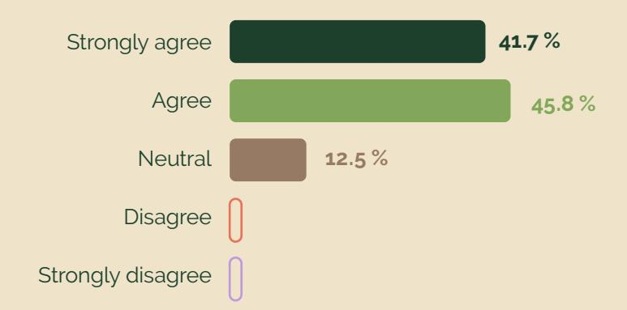

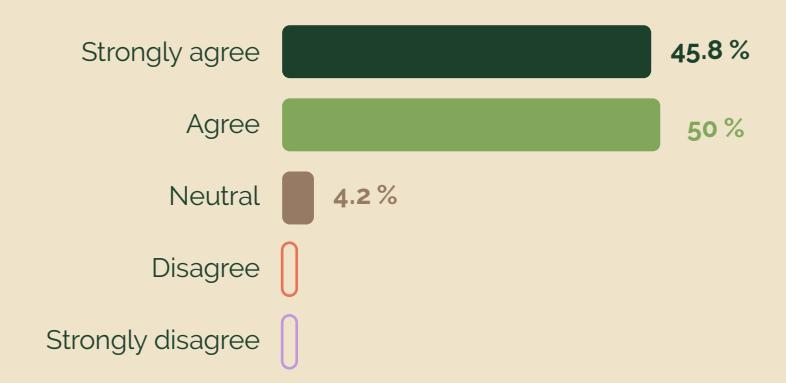

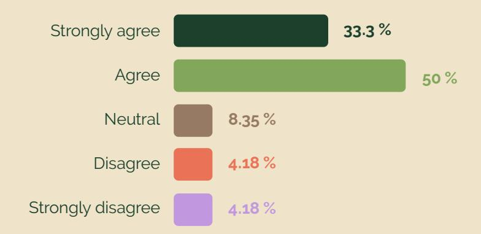

24 responses

24 responses

24 responses

**EUDR Readiness in the African coffee sector**

Where are we now? What is left to do?

## EUDR Readiness in the African coffee sector

# **Programme**

## Where are we now? What is left to do?

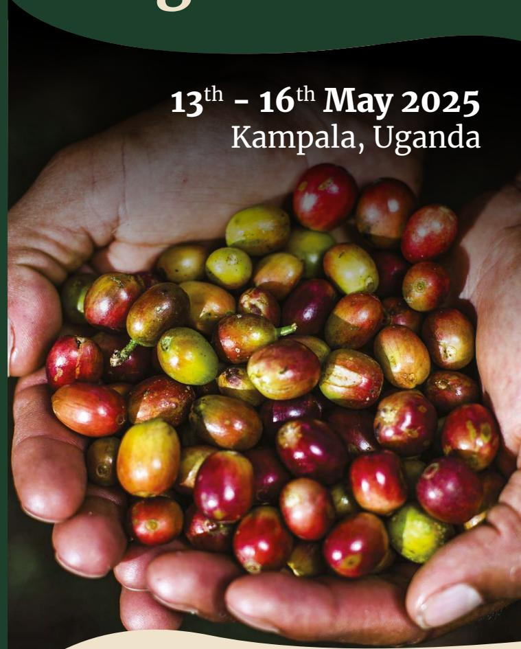

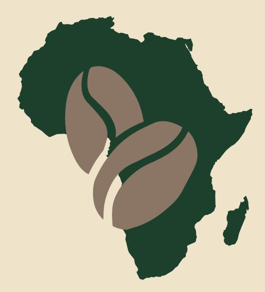

# Forests. Farmers. Future.

# Forests. Farmers. Future.

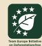

| 13 TH MAY Tuesday                        |                                      |
|------------------------------------------|--------------------------------------|
| 8:00 – 8:30 a.m.                         |                                      |
| 8:30 – 9:00 a.m.                         |                                      |
| 9:00 – 9:40 a.m.                         |                                      |
| 9:40 – 10:00 a.m.                        |                                      |
| 10:00 – 10:15 a.m.                       |                                      |
| 10:15 – 10:35 a.m.                       |                                      |
| 10:20 – 11:00 a.m.                       |                                      |
| 11:30 – 12:15 a.m.                       |                                      |
| 2:00 – 2:45                              | p.m.                                 |
| 2:45 – 3:45                              | p.m.                                 |
| 4:00 – 5:15                              | p.m.                                 |
| 12:15 – 1:00 p.m.                        |                                      |
| 1:00 – 2:00 p.m.                         |                                      |
| 3:45 – 4:00                              | p.m.                                 |
| 11:00 – 11:30 a.m.                       |                                      |
| Welcome and introduction to the meet ing |                                      |
| mechanisms (TEI) by DG INTPA             |                                      |
| tation of the EUDR in Africa by IACO     |                                      |
| by BLE : Where are we concerning         |                                      |
|                                          | NKG ; Perspectives from suppliers:   |
| 14 TH                                    | MAY Wednesday                        |
|                                          | 15 TH MAY Thursday                   |
|                                          | 16 TH MAY Friday                     |
| 9:00 – 9:30                              | a.m.                                 |
| 9:30 – 10:30                             | a.m.                                 |
| 11:00 – 1:00                             | p.m.                                 |
|                                          | 2:00 – 2:30 p.m.                     |
|                                          | 3:30 – 4:30 p.m.                     |
|                                          | from 4:30 p.m.                       |
|                                          | 11:30 – 12:00 p.m.                   |
|                                          | 12:00 – 12:45 p.m.                   |
|                                          | 12:45 – 1:15 p.m.                    |
|                                          | 9:00 – 9:30 a.m.                     |
|                                          | 9:30 – 11:00 a.m.                    |
|                                          | 11:00 – 11:30 a.m.                   |
|                                          | CARPE DIEM : seizing the market op  |
|                                          | Building Digital Public Infrastruc  |
|                                          | Field visit (Break into 2 groups)    |
|                                          | no one behind by Solidaridad         |
| 1:00 – 2:00                              | p.m. Lunch                           |
| 10:30 – 11:00                            | a.m. Tea break                       |
|                                          | 1:30 – 2:00 p.m. Lunch               |

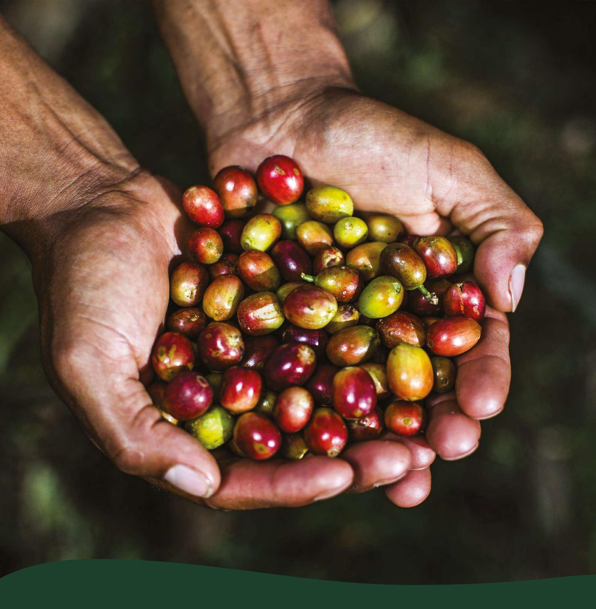

Deutsche Gesellschaft fürInternationale Zusammenarbeit (GIZ) GmbH

#### **Registered oǽces**

Bonn and Eschborn, Germany

#### **Address**

Friedrich-Ebert-Allee 32 + 36

53113 Bonn, Germany T +49 228 44 60-0 F +49 228 44 60-17 66

Dag-Hammarskjöld-Weg 1 – 5 65760 Eschborn, Germany T +49 61 96 79-0 F +49 61 96 79-11 15

#### **Registered at**

Local court (Amtsgericht) Bonn, Germany: HRB 18384 Local court (Amtsgericht) Frankfurt am Main, Germany: HRB 12394

#### **VAT no.**

**DE 113891176** Chairperson of the Supervisory Board Niels Annen, State Secretary of the Federal Ministry for Economic Cooperation and Development

#### **Management Board**

Thorsten Schäfer-Gümbel (Chair) Ingrid-Gabriela Hoven (Vice-Chair) Anna Sophie Herken

#### Imprint