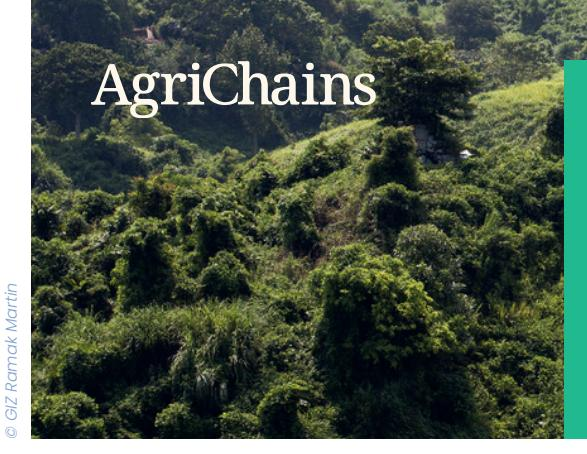
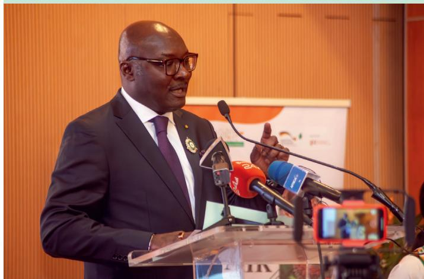

# **SUPPORTING THE OPERATIONALISATION OF CORPORATE SUSTAINABILITY DUE DILIGENCE IN AGRICULTURAL SUPPLY CHAINS**

## **PROJECT BACKGROUND**

Agricultural supply chains provide livelihoods for billions of people. However, the cultivation of crops, their processing and trading often result in substantial environmental, economic, and social damage. These adverse effects - for example deforestation due to the expansion of agriculture, child labour, poor working conditions and low wages and incomes – are frequently observed in the countries of production.

To address these effects, many countries initiated regulations which oblige companies to address social and environmental risks through due diligence in their operations. At the EU-level, the **Directive on Corporate Sustainability Due Diligence** (CSDDD) will require companies to conduct due diligence on social and environmental risks. Following a one-year postponement under the Omnibus I "stop-the-clock" directive, the CSDDD must be transposed into national law by 26 July 2027 and will apply from 26 July 2028. Additionally, the **Regulation on Deforestation-free Products** (EUDR), effective as of 30 December 2025, will oblige companies to ensure through due diligence that relevant agricultural and timber products are produced without deforestation and in compliance with relevant legislation of the country of production to protect climate and biodiversity. Germany has passed the **German Supply Chain Act** (Lieferkettensorgfaltspflichtengesetz, LkSG), effective as of January 2023. The LkSG aims to protect fundamental human rights in corporate supply chains, particularly focusing on the prohibition of child and forced labour.

Against this backdrop, the German Federal Ministry for Economic Cooperation and Development (BMZ) has commissioned the Deutsche Gesellschaft für Internationale Zusammenarbeit (GIZ) GmbH to support selected partner countries in adapting to the increased due diligence requirements. FIT for FAIR is one of the flagship projects of the Team Europe Initiative on deforestation-free value chains.

## **PROJECT OBJECTIVE**

FIT for FAIR aims to enable partner countries in creating conducive policies and a legislative environment that allows relevant supply chain actors to comply with the LkSG until the CSDDD takes effect, as well as with the EUDR. By doing so, the project seeks to support access to the German and European markets for its partners.

# **APPROACH AND IMPLEMENTATION**

FIT for FAIR provides information on the EUDR, LkSG and CSDDD to stakeholders. In the partner countries, national experts assess existing legislative and policy frameworks and compare them with EU and German due diligence requirements. The resulting status quo and gap analysis inform policy recommendations, which are presented to decision-makers to support partner countries maintain and expand access to the EU market.

**Commissioned by** German Federal Ministry for Economic Cooperation and Development (BMZ)

**Implemented by** Deutsche Gesellschaft für Internationale Zusammenarbeit (GIZ) GmbH

**January 2024 - July 2026**

**Enable partner countries to create a conducive legal-political environment allowing relevant supply chains actors to support compliance with the German Supply Chain Act (LkSG), the EU Corporate Sustainability Due Diligence Directive (CSDDD), and the EU Regulation on Deforestation-free Products (EUDR)**

**CÔTE D'IVOIRE**

**COLOMBIA**

**RWANDA**

**ETHIOPIA**

**THAILAND**

**CAMBODIA**

The project places special emphasis on creating a conducive environment enabling supply chain actors to create smallholder-inclusive supply chains. Lessons learned will be shared with European and German decision-makers to enhance networking and knowledge exchange.

#### **FIT for FAIR Working Groups**

FIT for FAIR establishes working groups in each project country. They involve key stakeholders from government, civil society, farmer and labour unions, the private sector, research and development. Through workshops, members will share expertise, address challenges, and explore policy opportunities linked to creating conducive policies and legislative environment allowing compliance with EUDR, LkSG and CSDDD. National and international experts provide guidance and support.

### **Political mandate and host organisation**

The project's host organisations provide expertise, facilitate and lead implementation, and document project activities. Governmental institutions ensure political backing by mobilizing government actors, providing key knowledge and adapting the national framework to due diligence requirements.

### **EXPECTED RESULTS**

- Assessment of the current state of the national due diligence framework
- Establishment of a gap analysis towards the alignment with German and EU due diligence legislation
- Development of policy recommendations and roadmaps and their communication to national decision-makers
- Establishment of a self-sustaining network to support policy implementation
- Transfer of experiences with operationalising due diligence in partner countries back to European and German decision-makers

**Published by** Deutsche Gesellschaft für internationale Zusammenarbeit (GIZ) GmbH

AgriChains is part of the Sustainable Agricultural Supply Chains Initiative (SASI). **https://www.sustainable-supply-chains.org**

GIZ is responsible for the content of this publication, on behalf of BMZ.

#### **Project Results in Colombia and Côte d'Ivoire**

In **Colombia**, FIT for FAIR wrapped up its project phase in March 2025. Led by Confecámaras, local stakeholders identiЃed gaps between national legislation and EU due diligence requirements. Key outputs included a national due diligence model, a 2025–2030 roadmap, and a Ѓnal report.

In **Côte d'Ivoire**, the project concluded in July 2025 after 18 months of intensive dialogue led by the Conseil National des Exportations (CNE). National stakeholders analysed existing frameworks, formulated policy recommendations, and deЃned a roadmap for implementation. CNE set up a Due Diligence Taskforce, bringing together relevant stakeholders, to follow up on the policy recommendations and their implementation.

*"The FIT for FAIR project is taking place in a context where it is becoming imperative to rethink practices, integrate sustainability standards into value chains, and ensure that products meet the new requirements of European markets. This is not a constraint, but an opportunity to transform the economy, preserve forests, and promote sustainable development in Côte d'Ivoire."*

Serge Martial Bombo, Secretary General, National Export Council (CNE)

