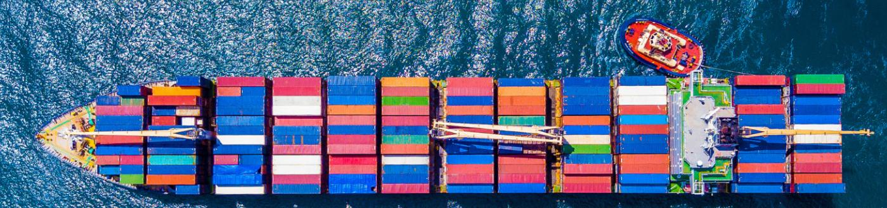
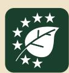
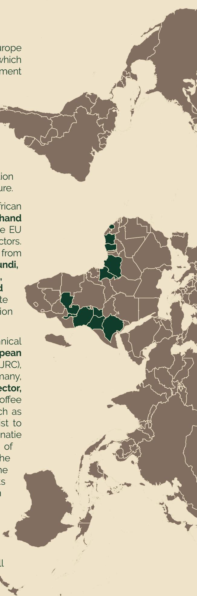

### Technical Summary Report TEI EUROTRIP – EUDR IN PRACTICE

**Bridging Continents Africa – Europe for Deforestation-Free Supply Chains**

**15 – 18 September 2025, Brussels**

The Eurotrip is an outreach activity of the Team Europe Initiative (TEI) on Deforestation-Free Value Chains, which aims to support partner countries in their commitment to sustainable, deforestation-free and legal value chains, in compliance with the European Union Deforestation-Free Products Regulation (EUDR). The Team Europe Initiative, supported by EU, Germany, Netherlands, France and Italy, is part of the Global Gateway strategy and pursues the overarching goal of building inclusive partnerships to reduce global commodity-driven deforestation and support the transition to sustainable, regenerative and climate-smart agriculture.

From 15–18 September 2025, 17 delegates from 12 African countries gathered in Brussels and Antwerp to gain **first-hand technical insights** on how the operationalisation of the EU Deforestation Regulation will be handled by Europeanactors. Both government and private sector representatives from relevant sectors of **coǺee and cocoa** from **Burundi, Cameroon, Côte d'Ivoire, Ethiopia, Ghana, Kenya, Malawi, Nigeria, Sierra Leone, Tanzania, Uganda, and Zambia** exchanged with key European public, private and civil society actors involved in the operationalisation of the regulation.

The programme of the 4-days trip included technical and multi-stakeholder exchanges with the **European Commission** (DG INTPA, DG ENV, DG TRADE, EEAS and JRC), the **National Competent Authorities** of Belgium, Germany, Netherlands, delegates from the **European private sector, such as HACOFCO, Ferrero, Tchibo**, the German CoǺee Association, and from the **European civil society**, such as FERN, Preferred by Nature, Fairtrade as well as a vist to the Port of Antwerp. At the warehouse of Molenbergnatie participants experienced the onloading and handling of cocoa and coǺee and gained an understanding of the practical procedures once the products arrive at the European harbour. Meanwhile the technical insights provided at inception by the European Commission and the National Competent Authorities on scope and key obligations of the EUDR allowed to clarify general concerns, the multi-stakeholder exchange allowed to further understand practical implications of compliance with the EUDR and foster crosssector collaboration. Please refer to Annex 1 for the full program of the multi-stakeholder exchange days.

**The exchange formats with stakeholders from the European Commission, the competent authorities, the private sector, the civil society and international organisations during the Eurotrip provided clarification on certain topics for the delegations to take back to their countries:**

- **Legality and risks assessment demand by the operators:** Potential diǺerences of interpretations of the legality criteria between diǺerent stakeholders require the operators to decide on the contents to be included in the due diligence process. The challenge of the legality aspects to account for,is bound to remain until suǽcient data is collected by the diǺerent actors involved in the assessment of conformity process. The EU Commission and several organisations are developing legality templates and legality assessment pilots. At the same time, the smallholders face the challenge of adapting their practices to meet the EUDR requirements. Hence, risk assessments still demand ǻnancial and time resources to set up credible systems.
- **Transparent traceability as holistic concept:** Countries are at very diǺerent stages in terms of traceability. While some countries have introduced national geolocation tracking systems, other countries are still struggling to manage geolocation-mapping on district levels. Clariǻcation of ǻnancing models for the establishment of national traceability systems is required together with an agreement on common data standards to avoid systems' fragmentations and assure interoperability across platforms and systems. Smallholders need stronger support on the selection and establishment of adequate traceability systems and how to manage the data. The sustainability of data systems and use beyond pilots including updates, maintenance, veriǻcation and ownership of data itself is part of the challenge, as well as data privacy concerns.
- **Data ownership:** Geolocation requirements raise concerns by indigenous groups about the ownership and use of data by private stakeholders. How rights will be respected and to what extent data collected can contribute to collective knowledge creation are still unresolved questions together with the fact that the geolocation requirements as stipulated in the EUDR are gender-blind and can contribute to intra-household and intra-community misuse of data.
- **Trustworthy information around EUDR in producing countries:** Both lack of information and diverging information are still rampant in some producing countries. Information and multi-language awareness campaigns for EUDR – carried out by public and private stakeholders to ensure that trustworthy knowledge is shared and all parts of a supply chain are aware of their responsibilities – are an ongoing challenge in some producing countries.
- **Cross-border permeability:** Borders in the African context go back to colonial times in disregard of communities and ethnic links stretching beyond established borders. Smallholders might work in one country together with other farmers, sometimes relatives, from the neighbouring country and sell in one or the other country. This creates the challenges of non-compliance with the EUDR requirements when commodities come from diǺerent countries through cross-border trade, are not integrated into data systems, and are therefore not traceable to their location of production.

### 1. Key challenges

### 2. Key take-aways from the discussions with the various stakeholders

**The producing countries in Africa identified the following key challenges in the implementation of the EUDR in their context:**

- **Forest Definition:** The FAO deǻnition of forests used for the EUDR is ambivalent to agroforestry systems, which classify as agricultural units, but show a higher forest canopy cover. These plots are susceptible to be identiǻed by satellite imaginery as forest areas, but deforestation is not a risk. Most important here is the question of land-use and the fact that if the major use of land is agricultural, it does not count as a forest. This can be the case for shade-grown cocoa or coǺee. Furthermore, speciǻc cases of non-extensive agroforestry can be compliant.
- **Interoperability of Traceability Systems:** Many open-source solutions can be an option to harmonise traceability systems. They can be integrated into existing systems, accessed anonymously, are transparent and easy to improve.
- **Risk classification:** The methodology around the risk classiǻcation benchmarking system is composed of quantitative aspects (e.g. absolute and relative share of deforestation) as well as qualitative aspects. The risk classiǻcation determines the share of goods that needs to be controlled by each national competent authority as well as information required for the due diligence statement. To determine the deforestation rate, data is used from the Global Forest Resources Assessment by the Food and Agriculture Organization (FAO) of the United Nations. A new assessment is expected in October 2025 which will be used for a ǻrst review envisaged in 2026 to base the classiǻcation on the most recent information.
  - **Legality and Due Diligence**: are the responsibility of the importer. It is the role of producing countries to provide information and support the operators, speciǻcally in terms of relevant legislation when importing into the EU: commodities and derivates goods imported into the EU must have been produced in compliance with the national laws of the country of production. Submitted documents will be checked on plausibility and with time, National competent authorities will jointly develop an overview for each country over time. It is a learning process for all involved actors and competent authorities will get into dialogue and request submission of additional documentation in case the provided information is not seen as suǽcient.
  - **EU delegation in producing countries:** DiǺerent support systems according to the countries' needs are elaborated in the framework of the collaboration between the EU and the state in the respective producing countries with the aim to propose custom-made preparedness. One example is the Technical Facility supported under the TEI. Governments in producing countries should approach the EU Delegation in their country to express their interest in accessing this support mechanism.

- **Data security and protection:** The Geo-ID provided by the operator does not contain personal data. However, the ongoing challenge concerns the actualisation of data by public and private stakeholders for smallholder farmers while ensuring continuous data anonymity.
- **InǼuence on European private sector:** With the EUDR, certain sustainability measures become mandatory for all aǺected companies which creates more of a level playing ǻeld between actors in the supply chain. The traceability requirements lead to the improvement of communication and trust in the value chains. To mitigate risks, companies are obliged to collect data and cooperate with exporters, cooperatives and farmers along the supply chain which enriches the collaboration process with the suppliers.
- **Contribution to risk assessment by producing countries:** Producing countries can play an important role in supporting the risk assessment process with their data and expertise in the context of collaboration with private sector exporters preparing due diligence statements.
- **Smallholder inclusion:** Simpliǻcation of geolocation process – for instance through geolocation points instead of polygons – as well as of prices for commodities ensuring living income for small-scale producers, are key questions to be addressed in the context of ensuring smallholder inclusion and avoid the risk of smallholders being left behind to switching to other commodities not yet included in the European regulation.

# 3. Important conclusions and Ʃndings

### 4. Conclusion

This TEI Eurotrip suceeded in clarifying most of the African delegation´s questions concerning the transformation of the conditions in their countries for exporting their products to the European market and to gain access to suited support mechanisms to comply with the EUDR African government and commodity sector representatives improved the contact to EU oǽcials and formed a solid basis for reliable and transparent information exchange. The event also provided valuable insights into the status of sustainable and deforestation-free production in other African countries, opportunities to discuss intensively with African delegates from the private and the public sectors of other countries and to form new bounds of regional cooperation. The African delegates presented a joint statement (Annex 2) and way forward for EUDR implementation from their perspectives at the end of the event. The Zero Deforestation Hub coordinates support measures implemented by the TEI Ǽagship operators in partner countries to strengthen capacities and align with the requirements of the EUDR. There are several support measures currently being implemented in African countries by the TEI Ǽagship projects, such as Sustainable Agriculture for Forest Ecosystems – SAFE Programme implemented by GIZ, the Technical Facility by the European Forestry Institute – EFI, The EU -Sustainable Cocoa Programme implemented by EFI, FAO, GIZ, JRC and GFA, Agrichains by GIZ, NISCOPS by Solidaridad Network and IDH and the Deforestation-Free Trade Gateway implemented by the International Trade Center – ITC.

- **Dry runs:** Importers and competent authorities have been conducting selected EUDR dry-runs, readiness checks and prepardness analysis. Theyobserve impressive development in many partner countries regarding the introduction of producer´s registers, preparation of tracebility systems, collaboration along the supply chain, and on-going improvements

in the data received, raising the operators' conǻdence that EUDR application in many cases will work. DiǺerent types of data are received requesting Ǽexibility in processing. Dry runs experiences also raise the awareness for sustainable production needs within the European company. They also demonstrate the areas where National Competent Authorities require more clarity.

# Further references

### Annexes

- **Annex 1:** Multi-stakeholder exchange agenda
- **Annex 2:** African delegates' joint-statement

**[Updated FAQ](https://eur-lex.europa.eu/legal-content/EN/TXT/PDF/?uri=OJ:C_202504524) [Smallholder inclusion](https://www.fern.org/) [Zero deforestation hub](https://zerodeforestationhub.eu/) [FAO agroforestry](https://www.fao.org/agroforestry/about-agroforestry/faqs/en ) [Interoperability](https://www.sustainable-supply-chains.org/topics/digitalisation-traceability/diasca)**

**Address**

**Registered at**

**DE 113891176**

**Management Board**

#### Imprit

# Annex 1: Multi-stakeholder exchange agenda

|       | Address | etc. panel | specific questions and clarify uncertainties/open questions on           |
|-------|---------|------------|--------------------------------------------------------------------------|
| 08:30 | –       | 09:00      | Registration & Networking Coffee                                         |
| 09:00 | –       | 09:30      | Opening Remarks – Simon Gmeiner (DG INTPA EU Commission)                 |
|       |         |            | Agenda Overview & Short Recap of the Previous Days – Marie Ganier       |
| 09:3o | –       | 10:45      | Interactive Marketplace - Intro of Participants & Poster Presentation    |
| 10:45 | –       | 11:15      | Coffee Break with networking opportunities                               |
| 11:15 | –       | 11:30      | Summary and reflection on marketplace inputs: Key factors of the African |
| 11:30 | –       | 13:00      | Challenges and Solutions, Parallel Breakout sessions                     |
|       |         |            | Breakout session with input from David Hadley and Zandra Martinez        |
|       |         |            | ( Preferred by Nature) , Moderation by Edwin Gaarder (EFI)               |

### **ft Programme**

|                                                                                           | Part B: Smallholder Inclusion                                                                        |
|-------------------------------------------------------------------------------------------|------------------------------------------------------------------------------------------------------|
| How to ensure smallholder needs are addressed                                             | in the transformation to deforestation-free value chains.                                            |
| Breakout session with input from                                                          | Indra van Gisbergen ( Fern) , Moderation by Stephanie Raymond (IDH) Part C: Transparent traceability |
| From plot to shelf: tools and criteria for                                                | inclusive, interoperable and secure traceability systems                                             |
| Breakout session                                                                          | with input from Astrid Verhegghen (FAO) and Lars                                                     |
| Kahnert (DIASCA),                                                                         | Moderation by Mathieu Lamolle (ITC)                                                                  |
| 13:00 – 14:30 Networking Lunch                                                            |                                                                                                      |
| 14:30 – 15:30 Challenges and Solutions: Report back and discussion                        | of the Breakout                                                                                      |
| Sessions in plenary                                                                       |                                                                                                      |
| 15:30 – 15:45 Coffee Break                                                                |                                                                                                      |
| 15:45 – 17:30 Panel Discussion on sharing good practice examples and international        |                                                                                                      |
| support measures                                                                          | for preparing for the EU market regulations                                                          |
| Representatives from producing African countries (                                        | Dr. Renuka Thakore -                                                                                 |
| COFAAA ), civil society (                                                                 | Carmel Rawhani – Fairtrade International ), private                                                  |
| sector ( Dr. Charlotte Heyl                                                               | – German Coffee Association ) and international                                                      |
| cooperation (                                                                             | Vera Koeppen – GIZ SAFE ) share their experiences and                                                |
| learnings as a basis for group                                                            | discussions.                                                                                         |
| 17:30- 17: 45 Wrap-Up Day 1                                                               |                                                                                                      |
| 17:45 – 19:00 Possibility for the day                                                     | bilateral discussions based on needs identified throughout                                           |
| 19:30 – 21:00 Joint networking dinner at Maison de Luxembourg (Rue de Luxembourg 37, 1050 | Brussels) - by registration                                                                          |
| 09:00 - 09:30 Recap Day 1 & Expectations for Day 2                                        |                                                                                                      |
| 09:30 – 10:45 The Company¥s View: Market                                                  | Implications and Trader¥s Responsibilities contracts with producers.                                 |
| Presentations and panel discussion                                                        | by Miriam Trinker (HACOFCO), Inga Followed by guided Q&A                                             |

| 10:45 | – 11:00 | Coffee break                                                            |
|-------|---------|-------------------------------------------------------------------------|
| 11:00 | – 12:30 | The Enforcement¥s View: Legal requirements and Enforcement              |
|       |         | Presentation of the planned EUDR desk checks and controls from National |
|       |         | interpretations on the legal requirements, learning opportunity about   |
|       |         | Tieme Wanders (NVWA), Bart de Sutter (FOD), Kathelijne de Ridder (FOD), |
| 12:30 | – 13:30 | Networking Lunch                                                        |
| 13:30 | – 15:00 | The Regulator¥s View: News and regulatory set up for the EUDR           |
| 15:00 | – 15:15 | Coffee break                                                            |
| 15:15 | – 16:00 | Wrap up, Closing Remarks, Evaluation, Take-Home Messages                |

### Annex 2: African delegates' joint-statement

### **Way Forward: African Position on EUDR Implementation**

#### **1. Call for Inclusive Implementation Frameworks**

- Advocate for EUDR mechanisms that reflect the realities of smallholder farmers in Africa and supply chains.
- Request differentiated timelines and support for African producers to avoid market exclusion due to diversity of farming and marketing African producers.
- Integrate the framework of Carbon credit into strategic plan
- Ensure that Environmental impact, social impact do not override the overall Economic impact which has direct positive effect on livelihood on small holder farmers from Africa.

#### **2. Establish a Continental EUDR Task Force**

- Form an African EUDR working Group to harmonize responses, share best practices, and engage with the EU as a bloc.
- Include representatives from ministries, private sector, civil society, and regional bodies like the African Union.

#### **3. Seek Technical & Financial Asistance**

- Urge the EU and other partners to provide support on : o Digital traceability systems o Capacity building for competent authorities o Farmer training and cooperative strengthening o Sensitizations and information dissemination to all producers nd stakeholders o Data integration and interoperability o Financial support to cover the cost of data collections
- Propose joint pilot projects to test EUDR compliance models in African contexts.

#### **4. Push for Transparent Risk Classification**

- Request clarity on how countries will be classified as "low," "standard," or "high" risk.
- Advocate for a fair and consultative process that considers national efforts and forest governance improvements.

#### **5. Develop National Readiness Roadmaps**

- Each country to draft a roadmap outlining: o Priority commodities affected o Existing gaps in traceability and governance o Timeline for building compliance capacity

- Share these roadmaps with EU stakeholders to demonstrate commitment and need for partnership.

#### **6. Promote South-South Collaboration**

- Encourage regional exchanges between African countries to share lessons, tools, and strategies. Experiences of countries advanced in the implementation of the regulations should be harnessed and shared.
- Leverage platforms like COMESA, ECOWAS, and SADC to coordinate efforts and avoid duplication.

#### **7. Engage EU Buyers and Importers**

- Facilitate dialogue between African exporters and EU importers to codesign practical solutions.
- Ensure that African producers are not unfairly dropped from supply chains due to compliance fears.

#### **8. Monitor and Evaluate Progress**

- Set up a monitoring framework to track EUDR readiness across the continent.
- Publish annual progress reports to maintain momentum and accountability.