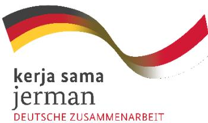
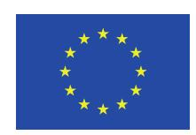
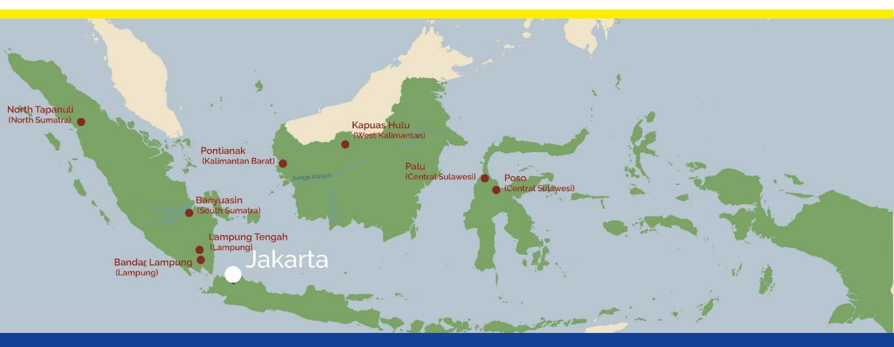
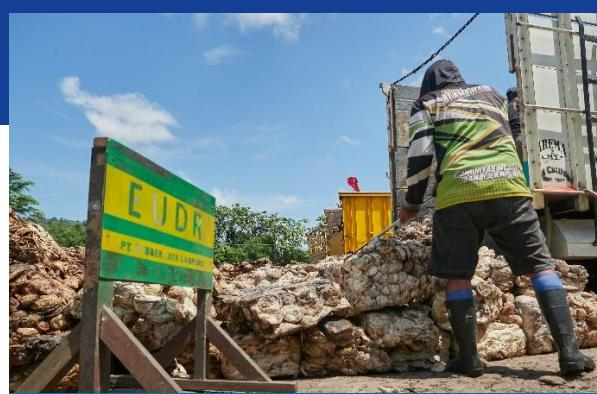
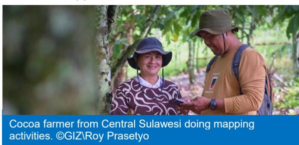
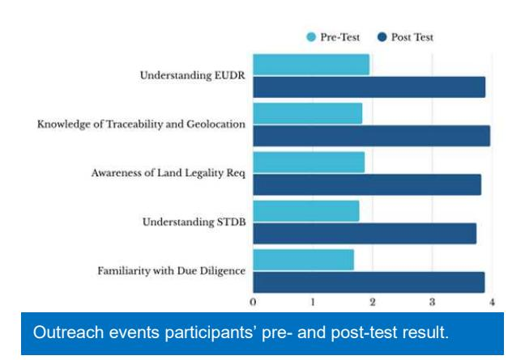

# **What is SEDARI?**

**SEDARI: Siap EUDR untuk Indonesia**, is a series of outreach events to communicate the European Union Regulation on Deforestation-free Products (EUDR) requirements, share knowledge and good practices, and facilitate discussions among sub-national stakeholders in Indonesia.

The events were conducted from **August to September 2025** by Saka Dala—a social enterprise working in partnership toward sustainable farm and forest products—on behalf of the European union in **eight districts**1 of **five provinces**1 that are Indonesia's major producing region of **natural rubber, cocoa, and coffee**.

|                                     | 8                                                                                                                                                                    |
|-------------------------------------|----------------------------------------------------------------------------------------------------------------------------------------------------------------------|
| Total Sessions                      |                                                                                                                                                                      |
| Offline Participants                | 456 (131 women)                                                                                                                                                      |
| Online Participants                 | 171 (75 women)                                                                                                                                                       |
| Types of Participating Institutions | <ul><li>National and Local government</li> <li>Farmers organisations</li> <li>Civil Society Organizations (CSOs)</li> <li>Academia</li> <li>Private sector</li></ul> |

# **SEDARI** Siap EUDR untuk Indonesia

Rubber segregation process in one of the rubber factories in Lampung. ©GIZ\Roy Prasetyo

1Banyuasin, Tapanuli Utara, Bandar Lampung, Lampung Tengah, Palu, Poso, Kapuas Hulu, and Pontianak 2North Sumatera, South Sumatera, Lampung, Central Sulawesi, West Kalimantan

Below are the key points that reflect current Indonesia's sub-national readiness for EUDR implementation:

#### **1. Smallholders face technical challenges before other barriers**

Smallholders in coffee, cocoa, and rubber sectors face low productivity, aging crops, pest issues, and limited adoption of Good Agriculture Practices (GAP) due to weak farmer organizations and under-resourced technology transfer institutions. They now also need to meet sustainable agriculture demands and compliance with international trade requirements like EUDR.

#### **2. Strong government support is essential**

Smallholders urgently need national and subnational government support to improve production and meet international trade requirements, including EUDR. Sustainable practices can help them access GAP technologies, increase productivity, and enter premium markets.

## **3. Strong willingness but uneven readiness**

Farmers and local governments demonstrated strong motivation to prepare for EUDR, yet technical readiness, especially around geolocation mapping, land legality status, and data standardization, remains low.

#### **4. Persistent barriers in Smallholder Plantation Registration Letter (Surat Tanda Daftar Budidaya/STDB) registration**

Every session identified low STDB registration as a major bottleneck. Most plantation offices lack sufficient human resources, budget, or digital tools to process large numbers of farmer applications.

## **5. Legality and land tenure uncertainty**

Legal clarity remains the most complex issue. Many smallholder plots fall within mixed zones: social forestry, protection forest, or overlapping concessions, making the process of verifying legality slow and fragmented.

## **6. Digital divide and traceability gaps**

While private sector partners like JB Cocoa, Mars, Kirana Megatara, and several coffee exporters have developed digital traceability systems, integration with government data remains limited. There is growing consensus that public–private data sharing and interoperability is critical.

#### **7. Policy alignment and decentralization challenges**

EUDR-related preparation involves multiple ministries and local agencies. Participants across provinces raised the need for a national coordination platform to ensure that provincial efforts align with national regulations and EU expectations.

#### **8. Inclusive participation**

Women's participation was visible across sessions, particularly in coffee and cocoa farmer groups, though most lacked formal decision-making roles. Integrating genderresponsive approaches in outreach and training was recommended by several provincial offices.

| Province/District             | Commodity        | Follow up Actions                                                      |
|-------------------------------|------------------|------------------------------------------------------------------------|
| Banyuasin                     | Natural Rubber   | Strengthen the Rubber Processing and Marketing Unit ( Unit             |
|                               |                  | Pengolahan dan Pemasaran Bokar /UPPB)                                  |
| North Tapanuli                | Coffee           | Deputy Head of North Tapanuli District will deploy 150 agricultural    |
| Lampung & Central Lampung     | Coffee, Cocoa,   |                                                                        |
| Central Sulawesi & Poso       | Coffee, Cocoa    | Under the coordination of the Provincial and District Development      |
| West Kalimantan & Kapuas Hulu | Natural Rubber   | Under the coordination of the Provincial Plantation Office, the        |
| Cross-cutting outcome         | Establishment of | WhatsApp communication group , fostering multi- stakeholders’          |
|                               | cooperation      | , and aligning local actions with the national STDB program to support |

**The outreach established a common understanding on EUDR main requirements:**  deforestation-free production after December 2020, legal sourcing, geolocation traceability, and simplified due diligence reporting (annual Due Diligent Statement) for direct exporters to the EU market.

**High appreciation and ownership:** Local governments, farmer groups, private companies, and development partners valued the sessions as a timely response to EUDR implementation challenges.

**Participants found the inputs clearer and more practical than previous national-level explanations**: Especially regarding geolocation traceability and documentation requirements. Local actors are eager to build on this momentum through coordinated data collection and districtlevel mapping support. Several stakeholders, including the Plantation Office and local cooperatives, are ready to lead follow-up actions.

**Improved awareness about STDB:** Following the event, farmers and officials better understand e-STDB registration benefits and its linkage with EUDR readiness.

# **Conclusion**