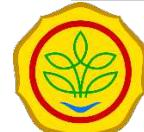
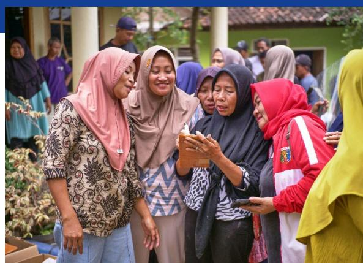
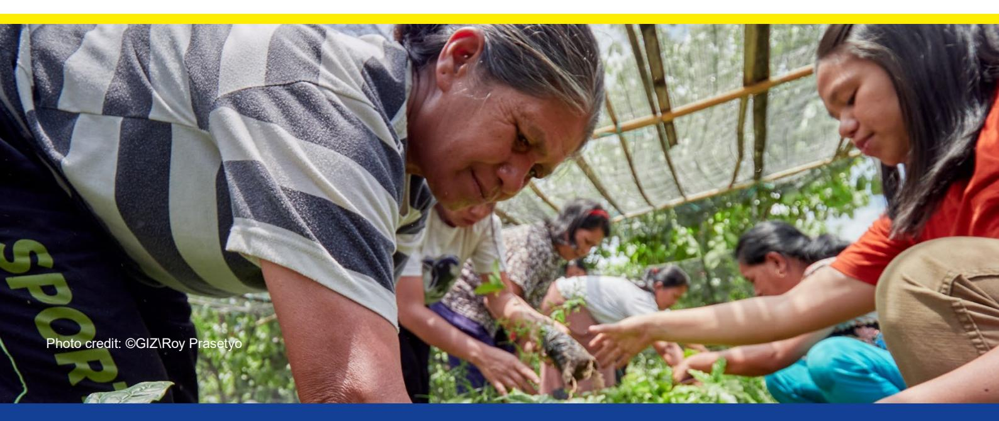
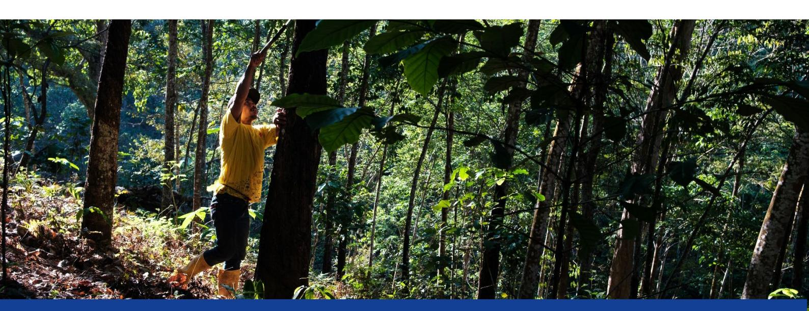

## **Background**

The **European Union Regulation on Deforestation-Free Products (EUDR**), entering into application by the end of 2026, requires deforestation‑free, legal, and traceable supply chains for key commodities.

In line to the above, Indonesia already implemented the **Electronic Smallholder Registration Certificate (e-STDB)** as Indonesia's primary mechanism to demonstrate legality and traceability of production, digitized by the Ministry of Agriculture (MoA).

The STDB itself was launched in 2013 through the Ministry of Agriculture's Regulation No. 98 of 2013 to ensure that **information on farmer's land that is under 25 hectares are captured and used for estate crop commodities cultivation are well recorded and can be used to inform estate crop-related development planning and policies**. In 2024, the MoA launched the STDB Acceleration Movement (*Gerakan Percepatan STDB*/Gercep STDB) to accelerate registration.

| Project     | Support to Indonesia’s EUDR                                                    |
|-------------|--------------------------------------------------------------------------------|
| Name        | Preparedness Through Electronic Smallholder Registration (e-STDB) Acceleration |
| Period      | 1 August – 26 December 2025                                                    |
| Implementer | World Resources Institute Indonesia (WRI)                                      |

# **Support to Indonesia's EUDR Preparedness** Through Electronic Smallholder Registration (e-STDB) Acceleration

GIZ-assisted women rubber farmers in Lampung province. ©GIZ\Roy Prasetyo

To support this national agenda, WRI Indonesia, with funding from GIZ on behalf of the European Union and the German Federal Ministry for Economic Cooperation and Development (BMZ), implemented a project (Aug–Dec 2025) to **strengthen the e**‑**STDB system, expand crosssector collaboration,** and **improve data governance for smallholder registration**.

# **Existing Issues**

Indonesia faces challenges in smallholder registration to the e-STDB system due to:

# **Objectives**

In response to the above issues faced by stakeholders in Indonesia, the project aims to:

- **1. Improve legality and traceability** by strengthening the completeness, accuracy, and interoperability of smallholder data.
- **2. Increase accountability of smallholder services** by enhancing institutional capacity and governance of e‑STDB implementation in five provinces.

#### Primary beneficiaries included:

- 1. MoA directorates
- 2. The Ministry of Agrarian Affairs and Spatial Planning/National Land Agency (ATR/BPN)
- 3. Provincial/district plantation agencies
- 4. Smallholders in agrarian reform villages
- 5. Non-Government Organizations (NGOs)
- 6. Private sector actors.

# **Outputs and Achievements**

#### **1. Strengthening the e**‑**STDB System**

- Facilitating the processing of 144,253 data in 2025, among which 52% was contributed by the government's activity through the National Budget (APBN 2025), Plantation Fund (BPDP), and Palm Oil Fund (DBH Sawit); while the remaining 48% was contributed by the works of NGOs or Private Sector.

- Technical Guidelines for e‑STDB formally approved by the Directorate of Plantation Product Downstreaming (*Hilirisasi Hasil Perkebunan*/HHP).
- Spatial Data Product Specification (*Spesifikasi Produk dan Data*/SPD) and endorsed by PUSDATIN, enabling future designation as official thematic geospatial information.
- Security audit according to the Electronic-Based Governance System (*Sistem Pemerintahan Berbasis Elektronik/*SPBE) and the National Cyber and Crypto Agency (*Badan Siber dan Sandi Negara*/BSSN) completed with all findings resolved.
- System handover to MoA completed.

#### **2. Interoperability and Data Integration**

- Interconnection established between national e‑STDB and local systems in the districts Sanggau and East Kutai.

Fragmented and incomplete data Low farmer participation Limited local government capacity Parallel data-collection initiatives by NGOs and private sector

| Province/ District West Java | Small holder | STDB Submission Percil | Small holder | STDB Issuance Percil |
|------------------------------|---------------|------------------------|---------------|----------------------|
| Bandung                      | 30            | 30                     | 20            | 20                   |
| Ciamis                       | 326           | 391                    | 176           | 241                  |
| Sub-Total Lampung            | 356           | 421                    | 196           | 261                  |
| Way Kanan                    | 227           | 263                    | 0             | 0                    |
| West Lampung                 | 716           | 716                    | 206           | 206                  |
| Sub-Total                    | 943           | 979                    | 206           | 206                  |
| TOTAL                        | 1299          | 1397                   | 402           | 467                  |

*Table 1: Result of the pilot activity in Agrarian Reform Villages*

- Initial discussion in integrating e-STDB with the Community Oil Palm Farming (*Perkebunan Sawit Rakyat/*PSR) Online, a smallholder database of the MoA's palm oil replanting programme, enabling future migration of replanting beneficiaries.
- Alignment with the national one-map policy.

#### **3. Cross-Sector Collaboration**

- Pilots conducted in Lampung Provinces (West Lampung, Waykanan) and West Java Provinces (Ciamis, Bandung) to integrate STDB with Agrarian Reform and Social Forestry programs.
- Multi-stakeholder dialogues engaged 300+ participants.
- Symbolic handover of STDB certificates to agrarian reform farmers.

Through the achievements, the project has contributed to improve **transparency, coherency, and accessibility of farmer data** as key foundations for legality and traceability in Indonesia, foster **cross-ministerial coordination**, and laid the **foundation for alignment with the Indonesia Sustainable Palm Oil (ISPO) and EUDR**.

The standardised guideline and protocols **improved consistency**, **reduce administrative burdens**, and **enhanced system security and governance**.

## **Challenges**

Despite the positive outcomes, the following challenges remains, including limited availability of human resources available for STDB processing and leadership changes at district level, and time pressure to complete e-STDB issuance.

Mitigation measures to address the aforementioned challenges included **flexible scheduling, intensified technical coordination**, and **mobilization of matching funds**.

#### **Lessons Learned**

#### **Project Management**

- 1. Trust and co-ownership with government counterparts are essential.
- 2. Government-led processes ensure sustainability.

#### **STDB Issuance**

- 1. Cross-sector collaboration is vital for scaling.
- 2. Interoperability is necessary to overcome fragmented data systems.
- 3. Funding diversification (BPDPKS, DBH Sawit, private sector) is essential
- 4. Verification costs must be explicitly funded in future schemes.

## **Conclusion**

The project successfully strengthened the **technical and institutional foundations of e STDB**, expanded **multi-stakeholder participation**, and improved **data governance**.

The progress done by the project provides a strong basis for scaling e STDB nationally in 2026 and beyond.

