# Technical Brief: Navigating Indonesia's Agricultural Sector Challenges Under the European Union Deforestation Regulation (EUDR)

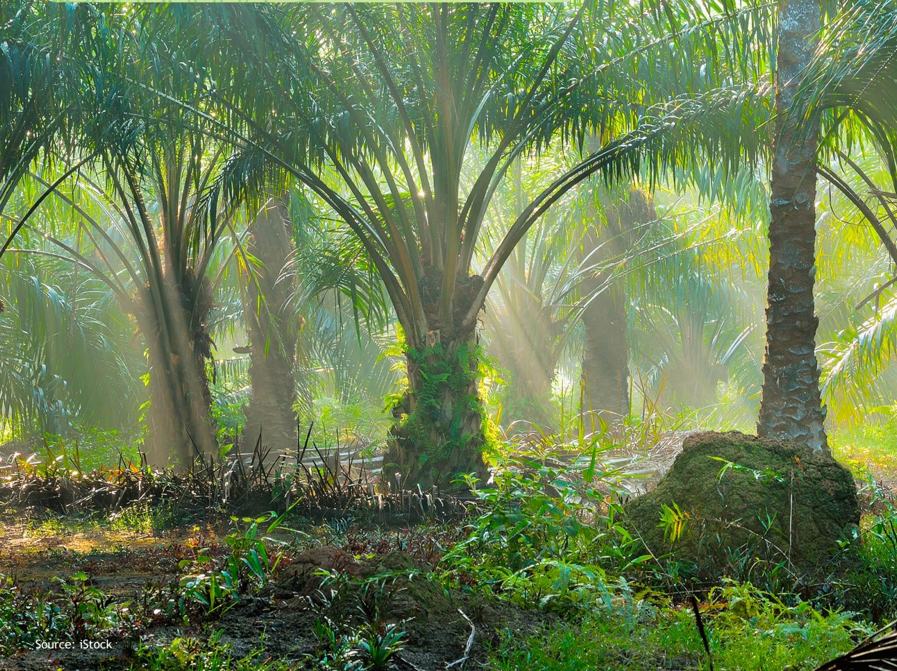

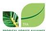

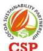

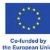

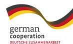

# Table of Contents

| Introduction                   | 3        |
|--------------------------------|----------|
| Cross-Sectoral FGD             | 4        |
| Smallholder Inclusion          | <i>4</i> |
| Progress toward EUDR Readiness | 6        |
| Traceability                   | 7        |
| Private Sector Perspectives    | 8        |
| Cross-Sectoral Conclusions     | 9        |
| Recommendations                | 11       |
| Smallholder Inclusion          | 11       |
| Capacity Building              | 11       |
| Sustainable Land Use           | 13       |
| Improved Mapping               | 13       |
| Mobilize National Dashboard    | 14       |
| Enhanced Government Role       | 15       |
| Diplomatic Efforts             | 15       |
| Conclusion                     | 16       |

# Glossary

| : European Forest Institute                                                                                                |
|----------------------------------------------------------------------------------------------------------------------------|
| : The electronic version of the STDB ( Surat Tanda Daftar Budidaya ), a certiÀcate verifying the legality of a plantation, |
| : The European Union Regulation on Deforestation-free Products                                                             |
| : Food and Agriculture Organization                                                                                        |
| : Focus Group Discussion                                                                                                   |
| : A national policy and initiative led by the Indonesian government aimed at integrating and synchronizing all geospatial  |
| : Instruksi Presiden , is a directive or instruction issued by the President of Indonesia to his subordinates (government  |
| : Non-Government Organizations                                                                                             |
| : An online platform designed to ensure transparency and traceability within supply chains, providing a centralized        |
| : Independent smallholder farmers who grow crops without formal ties to a company’s plasma scheme but may receive          |
| : Sistem Informasi Perizinan Perkebunan , a system managing permits for large-scale plantations (over 25 hectares),        |
| : Sistem Informasi Industri Nasional , a system providing information about Indonesia’s industrial sector, including       |
| : Sistem Monitoring Tanaman , a platform monitoring the growth and health of plantation crops using satellite imagery      |
| : Indonesian Sustainable Palm Oil is a mandatory certiÀcation system established by the Indonesian government for          |
| : Surat Tanda Daftar Usaha Perkebunan Untuk Budidaya , a certiÀcate verifying the legality of a plantation, containing     |
| : The NE block-chain platform tracks and veriÀes the origin of palm oil produced within a nucleus estate model, where      |

# Introduction

**The European Union Regulation on Deforestation-free Products (EUDR), set to become enforceable from December 30, 2025, signiÀes a pivotal shift in the global trade of commodities, aiming to signiÀcantly curtail deforestation associated with products entering the EU market. Indonesia, recognized as a major player in the production and export of palm oil, rubber, and cocoa, encounters a dual scenario of substantial challenges and potential opportunities as it navigates the complexities of adhering to this regulation.** 

The EUDR's core principle is due diligence, which places the responsibility on companies placing relevant products on the EU market or exporting them from the EU market. This means companies must assess risks in their supply chains and implement measures to mitigate any identiÀed risks. The EUDR's stringent requirements pertaining to traceability and the assurance of deforestation-free supply chains necessitate a comprehensive overhaul of existing practices, particularly for smallholder farmers who form the backbone of these industries. It's crucial to clarify that the term "compliance" under the EUDR speciÀcally refers to the obligations of operators and traders placing products on the EU market and their adherence to local laws. Smallholder farmers, while not directly required to be "compliant," may be asked to provide information like geolocation data or ensure they do not convert forest land.

This technical brief, drawing insights from the Cross Sector FGD Technical convened on July 23, 2024 and incorporating input from the Regional Technical Dialogue convened on September 5, 2024, delves into the multifaceted implications of the EUDR on Indonesia's agricultural landscape.

It provides a nuanced understanding of the challenges speciÀcally faced by independent small-scale farmers grappling with compliance costs to larger traders navigating the clarity over the compliance in general as December 2024 is nearing.

The brief further explores the potential opportunities that the EUDR presents, including the impetus for sustainable practices and enhanced market access. It is important to note that while the EUDR does not recognize any certiÀcation schemes as guaranteeing compliance, they can be used as tools to support due diligence by providing information for risk assessment. The EUDR places the ultimate responsibility on the companies to conduct due diligence. The EUDR presents a multifaceted challenge for Indonesia's agricultural sector, requiring a concerted effort to address compliance and sustainability concerns while capitalizing on emerging market opportunities. The focus will be on enhancing traceability, strengthening certiÀcation systems, empowering smallholder farmers, and promoting sustainable land-use practices. This aligns with the Indonesian government's ongoing efforts to transform the agricultural sector through initiatives such as the National Dashboard and E-STDB, which aim to improve traceability and transparency throughout the supply chain. By prioritizing these areas, Indonesia can not only ensure alignment with the EUDR but also create a more resilient and competitive agricultural sector capable of meeting the growing global demand for sustainable and responsibly sourced commodities. By offering a holistic perspective on the EUDR's impact and proposing actionable recommendations, these briefs aim to equip decision makers, industry leaders, and other stakeholders with the knowledge and tools needed to accelerate Indonesia's agricultural sector towards a sustainable and EUDR-compliant future.

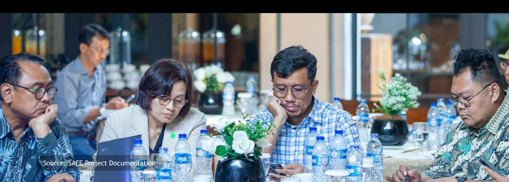

Indonesia had provided a solution of integrating the E-STDB with the National Dashboard. E-STDB stands for Electronic Surat Tanda Daftar Usaha Budidaya Perkebunan untuk Pekebun or Electronic Plantation Cultivation Business Registration CertiÀcate for Smallholders. It's an online system implemented by the Indonesian government to register and manage data related to smallholder plantations. The Indonesian National Dashboard, a digital platform designed to streamline data management and traceability in the agricultural sector, is pivotal in navigating the complexities of the EUDR with Geolocation Analysis (Map Overlay); Declaration of Deforestation-Free and Legal Areas; Transaction Recording (Traceability Tree). It aims to integrate various data sources, including those from the SIPERIBUN and SIMONTANA that currently serve as crucial data sources within the Indonesian agricultural sector, the National Dashboard is envisioned as the go-to platform for consolidating and streamlining all data typologies required by the EUDR. This includes information from traders and their entire supply chains and, all the way down to the smallholder level captured in the E-STDB system. By integrating these diverse data streams, the National Dashboard aims to provide a comprehensive and transparent overview of commodity production and trade, facilitating compliance veriÀcation and ensuring that products entering the EU market are deforestation-free. It is to create a transparent and veriÀable record of commodity supply chains. By providing a centralized platform for monitoring and verifying compliance with EUDR requirements, the National Dashboard aims to facilitate trade, enhance market access, and promote sustainable practices. It is intended to serve as a comprehensive traceability and compliance platform for all agricultural commodities traded globally. However, signiÀcant challenges remain in fully leveraging the National Dashboard (ND) as a tool to enhance Indonesia's agri-commodity competitiveness and ensure compliance with the EUDR. One major issue is data integration, as many smallholders and local governments still rely on manual or fragmented data collection processes, making it difÀcult to integrate accurate and real-time information into the system. Additionally, capacity building is a critical hurdle, as stakeholders—particularly smallholders and regional ofÀcials—often lack the technical knowledge and skills needed to effectively use the National Dashboard. Without proper training and support, the system's potential to improve traceability and transparency cannot be fully realized. Furthermore, stakeholder engagement remains a challenge, as many stakeholders are either unaware of the National Dashboard's beneÀts or hesitant to adopt it due to perceived complexity or costs. Overcoming these challenges is essential to fully harness the National Dashboard's potential. By addressing these issues through targeted training programs, improved data collection infrastructure, and stronger collaboration among stakeholders, Indonesia can strengthen its agri-commodity competitiveness in the global market, meet EUDR compliance requirements, and advance its sustainable development agenda.

# Key Findings from the Cross Sectoral FGD

**Indonesia has set an ambitious target to complete the registration of 2.5 million smallholder farmers in the palm oil, rubber, cocoa, and coffee sectors into the Sustainability Smallholder Database within the next two to three years.**

This initiative is part of the country's efforts to align with the EUDR. It's important to reiterate that smallholder farmers are not directly required to be "compliant" with the EUDR. The government's presentation highlights the pivotal role of STDB in the transformation of Indonesia's agricultural sector. While STDB serves as a crucial tool to meet market demands like the EU's deforestation regulations, it also represents a broader shift towards enhancing traceability, promoting sustainable practices, and empowering smallholder farmers. By enabling the registration and veriÀcation of land ownership and cultivation practices, STDB contributes to greater transparency and accountability throughout the agricultural supply chain, ultimately beneÀting both producers and consumers. To achieve this goal, the government has been actively accelerating the STDB issuance process. An evaluation to assess the progress of this acceleration will be conducted before the end of September 2024, providing valuable insights to further streamline the registration process and ensure that smallholders are adequately prepared for the EUDR's implementation.

The transition to the E-STDB system, while vital for achieving traceability under the EUDR, poses challenges due to the diverse needs and capacities of smallholder farmers, potentially hindering their inclusion in sustainable supply chains. This necessitates a gradual and inclusive approach to implementation, ensuring that smallholders are not left behind in the digital transformation. Moreover, the complexities of the agricultural supply chain, often involving numerous intermediaries, can obscure the true origin of commodities, making traceability difÀcult to achieve

# Smallholder Inclusion

even with E-STDB registration. Therefore, robust governance structures and strengthened oversight are essential to ensure transparency, accountability, and fair distribution of beneÀts throughout the value chain, ultimately fostering trust and enabling effective EUDR compliance.

Additionally, the role of intermediaries in the supply chain can pose a further challenge to smallholder inclusion and traceability. These intermediaries can create additional layers of complexity and potentially obscure the direct link between the farmer and the Ànal product. Capacity building efforts must also focus on educating and empowering intermediaries to participate effectively in the traceability system and ensure fair practices with smallholders.

Capacity building plays a pivotal role in empowering smallholders with the knowledge, skills, and resources needed to meet EUDR requirements and adopt sustainable practices. This includes providing training on sustainable farming techniques, Ànancial literacy, and traceability systems. Effective incentive schemes are also needed to motivate smallholders to participate in sustainable supply chains and invest in long-term improvements.

Addressing the role of intermediaries is essential for ensuring that smallholders receive fair prices and are not exploited. Strengthening farmer organizations and cooperatives can enhance their bargaining power and enable them to access markets directly. Improving connectivity and infrastructure in rural areas is also crucial for facilitating access to information, technology, and markets, reducing the isolation of smallholder farmers.

Ultimately, a multi-pronged approach is required to achieve meaningful smallholder inclusion. It necessitates collaboration among government agencies, the private sector, NGOs, and farmer organizations to strengthen institutions, provide comprehensive support, and create an enabling environment where smallholders can thrive in a sustainable and equitable agricultural landscape.

### **Indonesia is actively pursuing a multifaceted strategy to align its certiÀcation scheme with the EUDR and facilitate compliance across its agricultural sectors.**

A key focus is on accelerating data collection and registration of smallholder farmers in the E-STDB system, including the migration of existing data, to bolster traceability efforts. The integration of data from various platforms, such as E-STDB, SIPERIBUN, SIMONTANA, and SIINAS, into the National Dashboard is a priority, involving the development of an ISPO information system and its subsequent incorporation into the Dashboard. Additionally, proposed regulations on ISPO aim to cover both upstream and downstream palm oil policies, with mandatory ISPO certiÀcation for smallholders from 2025 onwards.

Beyond palm oil, Indonesia is preparing a mechanism for other strategic commodities like coffee, cocoa, and rubber, with a focus on segregated traceability. The alignment of references, data formats, and maps within the National Dashboard, considering Indonesian forest data, national laws, and data privacy concerns, is also crucial. Furthermore, efforts are underway to expedite the National Dashboard's function in facilitating exportimport relations and communicating with destination countries to enhance their understanding of the system. Acknowledging the complexities of the EUDR, Indonesia advocates for a transition period to ensure a smooth and effective implementation.

To address these obstacles, several recommendations based on the inputs from the Cross Sector FGD held on July 23rd, 2024 are proposed. Simplifying legal requirements can make them more accessible and user-friendly for all actors, particularly smallholders. [The EFI study](https://efi.int/news/three-new-publications-eu-deforestation-regulation-eudr-preparations-and-oil-palm-smallholder) on the alignment between ISPO and EUDR requirements provides crucial insights into ISPO's current standing from the EU's perspective. By highlighting areas of convergence and divergence between the two frameworks, this study serves as a valuable reference for understanding the speciÀc adjustments needed for ISPO to meet EUDR reuirements. This understanding can guide both domestic efforts to strengthen ISPO's compliance mechanisms and inform strategic negotiations with the EU. Identifying areas of misalignment enables Indonesia to proactively address potential barriers to market access and engage in constructive dialogue with the EU to advocate for recognition of its efforts towards sustainable palm oil production. This proactive approach will not only facilitate trade but also demonstrate Indonesia's commitment to responsible and deforestation-free practices in the palm oil sector. Increased funding, potentially through local government budgets or other Ànancial mechanisms, is

## Progress toward EUDR Readiness

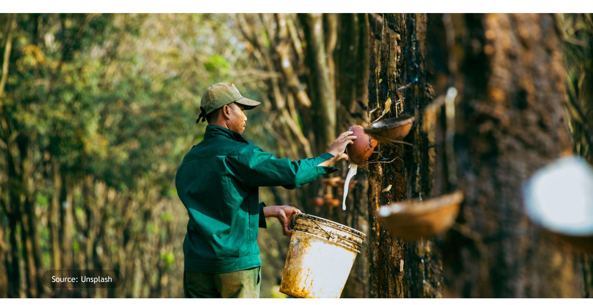

Indonesia has taken signiÀcant steps towards protecting its forests and promoting sustainable land use through regulations that prohibit the clearing of forested areas for plantation development. Key among these is the Presidential Instruction on Moratorium (Inpres Moratorium) No. 10/2011, which has been renewed several times, most recently in 2018 with Inpres No. 8/2018 speciÀcally addressing palm oil plantations. These regulations impose a moratorium on new permits for clearing primary natural forests and peatlands, effectively halting the conversion of these critical ecosystems for agricultural purposes. The Inpres Moratorium, which prohibits the clearing of primary forests and peatlands, establishes a crucial foundation for traceability in Indonesia's agricultural commodities by ensuring that products entering the market are not linked to deforestation. This policy creates clear geographical boundaries for protected areas, making it easier to track the origins of raw materials and verify that they come from legal and sustainable sources. By preventing deforestation in high-value ecological areas, the moratorium supports alignment with international regulations like the EU Deforestation Regulation (EUDR), which requires proof that commodities are deforestation-free. Additionally, the moratorium encourages improved mapping and data collection, which are essential for traceability systems such as the National Dashboard, e-STDB, and SIPERIBUN. This not only strengthens Indonesia's reputation as a producer of sustainable commodities but also enhances consumer and investor conÀdence. However, challenges remain in implementation, such as

## Traceability

monitoring and policy coordination, which need to be addressed to fully realize the moratorium's potential in supporting sustainable and traceable supply chains. The Inpres Moratorium serves as a critical policy framework that aligns environmental protection with market demands, ensuring Indonesia's agricultural products remain competitive in global markets.

Indonesia's legal framework reÁects its commitment to balancing economic growth with environmental protection, aiming to safeguard forests and biodiversity while promoting sustainable agricultural practices. A key component of this effort is traceability—the ability to track agricultural commodities from their origin to the end consumer—which is essential for complying with regulations like the EUDR. However, achieving traceability poses signiÀcant challenges, particularly for smallholder farmers who form the backbone of Indonesia's agricultural sector. Many farmers lack awareness of the EUDR's requirements and have limited access to clear information or technical guidance, creating a knowledge gap that undermines their ability to participate in traceability initiatives. Compounding this issue is the prevailing mindset among farmers, who often prioritize immediate sales and short-term proÀts over long-term sustainability. This focus on volume rather than traceability contributes to fragmented and opaque supply chains, making it difÀcult to verify whether commodities are truly deforestation-free. It's important to note that the EUDR only requires production to be in line with existing local laws and does not specify the quality of those laws. If the country does not require formal land titles, informal land titles or the absence of land conÁict is acceptable under the EUDR. Addressing these challenges requires not only raising awareness and providing technical support but also incentivizing farmers to adopt sustainable practices and integrate into transparent supply chains. By doing so, Indonesia can strengthen its commitment to environmental protection while ensuring its agricultural products remain competitive in global markets.

To address the challenges of implementing traceability in Indonesia's agricultural sector, a multi-pronged funding strategy is essential. First, accelerating the adoption of the electronic STDB (E-STDB) system and integrating it with the National Dashboard requires signiÀcant investment in technology infrastructure, user training, and system maintenance. This centralized platform will enhance data collection and management,

crucial to support capacity building programs and expand their reach to a broader range of stakeholders and regions. Establishing E-STDB clinics within a jurisdictional approach, led by local governments and supported by multi-stakeholder forums, can further streamline the certiÀcation process and ensure coordinated action among all stakeholders. Addressing challenges with ISPO compliance, market acceptance, and enforcement is also crucial for enhancing the effectiveness of certiÀcation efforts and fostering a sustainable agricultural sector. By implementing these recommendations, Indonesia can overcome the complexities and empower stakeholders to achieve EUDR alignment, unlocking opportunities for sustainable growth and market access.

**The implementation of E-STDB and adherence to the EUDR face considerable hurdles in Indonesia. The complexity of inter-ministerial and regional regulatory coordination, coupled with traceability concerns related to the National Dashboard, pose signiÀcant challenges for stakeholders. The FAO has issued Voluntary Guidelines on Responsible Governance of Tenure for land, Àsheries, and forests, emphasizing the importance of secure land rights for sustainable food security.** 

However, there are differences between these guidelines and Indonesian laws, which could make it harder for Indonesian companies to comply with the EUDR. The EUDR itself requires companies to prove their products are legal, which implicitly demands secure land tenure to prevent deforestation linked to land conÁicts. Furthermore, the E-STDB registration process encounters hurdles in effective socialization, securing buy-in from local governments and farmers, establishing robust collaboration, and ensuring efÀcient data collection.

To overcome these challenges, a multi-pronged approach is necessary. Facilitating E-STDB registration by streamlining procedures and providing clear guidance to farmers is essential. Besides their plasma smallholders, some private sector companies have business-to-business (B2B) relationships with independent farmers. The Electronic *Surat Tanda Daftar Budidaya* (E-STDB) plays a critical role in enhancing supply chain traceability and ensuring alignment with the EUDR. As an electronic document that records key information such as land location, crop type, and farmer or company details, the E-STDB enables companies to verify the origin of agricultural commodities and ensure they are not linked to deforestation or illegal land use. By integrating E-STDB data into systems like the National Dashboard, stakeholders can achieve greater transparency and real-time monitoring of supply chains, which is essential for meeting EUDR's due diligence requirements. For companies, clarity on E-STDB implementation is

# Private Sector Perspectives

ensuring transparency and traceability across supply chains. Second, diverse funding mechanisms—such as government subsidies, private sector investments, and innovative Ànancing like impact investing—are needed to overcome the Ànancial barriers smallholders face in adopting traceability technologies. For instance, companies can invest in these systems as part of their sustainability commitments, while governments can provide Àscal incentives. Finally, risk-sharing and investment schemes can incentivize collaboration among stakeholders, ensuring that the costs and beneÀts of traceability are equitably distributed. For example, companies could cover upfront technology costs, with farmers repaying gradually through increased proÀts. These funding approaches aim to reduce the Ànancial burden on smallholders, promote sustainable practices, and ensure compliance with regulations like the EUDR, ultimately enhancing the competitiveness of Indonesian agricultural products in global markets.

Indonesia is proactively addressing traceability challenges by implementing concrete measures to empower smallholder farmers and ensure alignment with international standards like the EUDR. For instance, the government has developed the National Dashboard and accelerated the adoption of the e-STDB system to enhance data transparency and traceability across agricultural supply chains. Additionally, initiatives such as the Inpres Moratorium on primary forest and peatland clearing demonstrate Indonesia's commitment to reducing deforestation and promoting sustainable practices. However, challenges remain, particularly for smallholders who often lack access to technology, funding, and technical knowledge needed to meet EUDR requirements. To address this, Indonesia is exploring diverse funding mechanisms, including government subsidies, private sector investments, and innovative Ànancing models, to support the adoption of traceability technologies. By strengthening collaboration between stakeholders—government, private sector, and farmers—Indonesia can overcome these hurdles, paving the way for a more sustainable and transparent agricultural sector. This will not only ensure compliance with global norms but also enhance the competitiveness of Indonesian commodities in both domestic and international markets.

crucial, as it helps them identify and mitigate risks, streamline compliance processes, and maintain access to international markets, particularly the EU. Without a clear understanding of how to utilize E-STDB effectively, businesses may face challenges in proving the deforestation-free status of their products, risking non-compliance and potential market exclusion. Therefore, the E-STDB not only supports Indonesia's commitment to sustainable agriculture but also empowers companies to meet global standards, enhancing their competitiveness and reputation in the international market. They need to understand if these independent farmers are also required to register on E-STDB, and how their data will be integrated into the National Dashboard alongside the company's plasma farmers. This clarity is crucial for them to meet due diligence requirements and avoid disruptions in their supply chains. It is important to reiterate that products are not automatically blocked at customs due to EUDR. Instead, due diligence statements will be checked, and non-compliant companies may face Ànes. If companies do not submit a due diligence statement linked to the EUDR, their products may be blocked at customs. The products that are not in line with the EUDR may be, rejected by buyers. This can cause Ànancial losses, and damage to their reputation. Active involvement of local governments is critical to driving the adoption of systems like the E-STDB at the grassroots level. Local authorities can play a key role in raising awareness, providing technical support, and ensuring that smallholder farmers understand the importance of traceability for meeting regulations like the EUDR. Additionally, capacity-building initiatives and the establishment of multi-stakeholder forums are essential to enhance collaboration among diverse actors, including farmers, companies, and NGOs. These forums can serve as platforms for sharing knowledge, addressing challenges, and aligning efforts toward a common goal. Equally important is the participation of the private sector in data collection and system integration. Companies can contribute resources, technology, and expertise to strengthen traceability systems, making them more comprehensive and reliable. By addressing these challenges through coordinated efforts, Indonesia can accelerate the implementation of the E-STDB, paving the way for greater transparency and sustainability in its agricultural sector. This will not only ensure alignment with the EUDR but also strengthen Indonesia's position in the global market as a reliable supplier of deforestation-free commodities.

# Cross-Sectoral Conclusions

The successful inclusion of smallholder farmers in sustainable supply chains and EUDR alignment hinges on the active involvement of district governments. They are instrumental in facilitating E-STDB registration, providing crucial support for certiÀcation processes, and implementing effective capacity-building initiatives. District governments are uniquely positioned to drive the adoption of the E-STDB (Electronic Surat Tanda Daftar Budidaya) system at the local level. Their proximity to smallholder farmers allows them to design targeted interventions that address speciÀc challenges, such as limited access to technology, lack of awareness about traceability requirements, and difÀculties in meeting EUDR alignment. District governments can play a pivotal role by raising awareness about the importance of E-STDB for traceability, providing technical assistance and training on how to use the system, and ensuring equitable access to resources like digital tools and market opportunities. By empowering district governments to take ownership of these efforts, Indonesia can accelerate the implementation of E-STDB, creating a more inclusive and resilient agricultural sector. This will not only help smallholders align with EUDR requirements but also strengthen the overall transparency and sustainability of Indonesia's agricultural supply chains, securing its position in the global market.

### Smallholder Inclusion

To enhance traceability within the Indonesian agricultural sector, it is imperative to accelerate the adoption of both the National Dashboard and the E-STDB system. It is important to note that the National Dashboard is not yet fully in place. One example is smallholder palm oil farmers in Indonesia, often referred to as "Plasma Swadaya" (Nucleus Estate), utilize the SIPERIBUN (*Sistem Informasi Perizinan Perkebunan*) system to register their plantations and track production data. The challenge lies in integrating this data with the National Dashboard, a centralized platform designed for EUDR alignment. To ensure seamless integration, collaboration is needed between the Ministry of Agriculture, which oversees SIPERIBUN,

### Traceability

A major takeaway from the discussions was the pressing need for adequate Ànancing to facilitate Indonesia's successful navigation of the EUDR landscape. Financial support is deemed essential for various aspects, including the registration of smallholders in the E-STDB system, investment in necessary technologies for traceability and data management, and comprehensive capacity-building initiatives for farmers and other stakeholders. To address this Ànancial gap, the FGD participants suggested exploring innovative Ànancing mechanisms, such as pooled funding involving various stakeholders, dedicated government budget allocations for smallholder support, and potentially even the introduction of green taxes. By securing sustainable funding streams, Indonesia can empower its agricultural sector to meet the EUDR's requirements, fostering a more sustainable and inclusive future for its farmers and communities.

and the National Dashboard's administrators. This integration will enable smallholders' data, gathered through government-led programs like e-STDB, to be accessible on the National Dashboard. This will enhance traceability, support alignment with EUDR requirements, and provide a transparent framework for monitoring agricultural practices. To establish a transparent and traceable agricultural supply chain that aligns with the EUDR, Indonesia must address several interconnected challenges. Firstly, targeted training programs are essential to improve stakeholder understanding and build capacity for effective data collection and management. Many smallholders and local actors lack the technical knowledge and skills needed to implement traceability systems like the e-STDB or integrate data into platforms such as the National Dashboard. Training can bridge this gap, ensuring that all stakeholders can contribute to and beneÀt from traceability initiatives. Secondly, securing sustainable funding mechanisms is critical to ensure the long-term viability of these efforts. Many traceability initiatives face Ànancial barriers, such as the high cost of technology, data collection tools, and training programs. Without reliable funding, even well-designed programs may struggle to scale or sustain their impact. Sustainable Ànancing—through government support, private sector investment, or innovative models like green bonds—can provide the necessary resources to overcome these challenges. Finally, streamlining data collection processes is key to reducing complexity and

improving efÀciency. Many smallholders and companies currently face fragmented and time-consuming data collection methods, which can hinder compliance with EUDR requirements. By simplifying these processes and providing accessible tools, Indonesia can make it easier for stakeholders to participate in traceability systems.

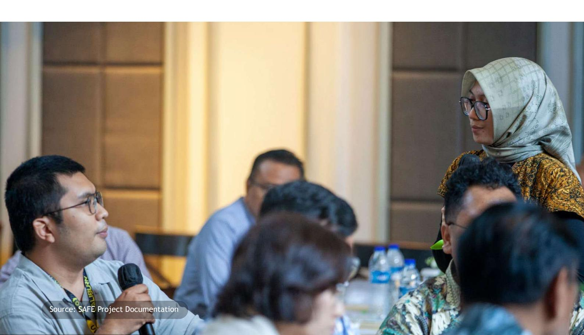

### Financing

### Capacity Building

## Technology Access

### Financial Support

### Streamlined Processes

### Stakeholder Collaboration

# Recommendations

**To ensure successful EUDR implementation, it's crucial to address several constraints such as:**

Despite Indonesia's strong commitment to forest conservation through policies like the Inpres Moratorium, smallholder farmers face signiÀcant challenges in meeting EUDR requirements. Many smallholders lack access to technology, resources, and technical knowledge needed to comply with traceability and sustainability standards. Additionally, regional governments often struggle with data management, relying on manual processes and lacking the capacity to support smallholders effectively. These issues threaten the sustainability and competitiveness of Indonesia's agricultural sector.

To address these challenges, tangible actions are needed:

Provide targeted training programs for smallholders and local governments on data collection, traceability systems (like the National Dashboard), and EUDR alignment.

Equip smallholders with affordable digital tools and platforms to simplify data entry and reporting.

Develop funding mechanisms, such as subsidies or public-private partnerships, to help smallholders adopt sustainable practices and meet compliance costs.

Transition from manual to digital data management systems, ensuring seamless integration with platforms like the National Dashboard.

Establish multi-stakeholder forums to align efforts, share best practices, and address challenges collectively.

Indonesia can create a more inclusive agricultural sector that supports smallholders, ensures EUDR alignment, and balances economic growth with environmental sustainability.

# Smallholder Inclusions

Source: iStock

To facilitate successful EUDR compliance and promote sustainable practices in Indonesia's agricultural sector, capacity building initiatives must address speciÀc needs across the supply chain. For smallholder farmers, this includes hands-on training in sustainable farming techniques like agroforestry and organic pest control, enhancing their ability to produce commodities in

# Capacity Building

an environmentally responsible manner. Additionally, training on Ànancial literacy and access to credit will enable smallholders to make informed decisions and invest in necessary improvements. Providing education and support on utilizing traceability systems and digital tools, such as the E-STDB platform, will empower farmers to participate in transparent and compliant supply chains. For government ofÀcials at both national and district levels, capacity building should focus on enhancing their understanding of the EUDR's legal and technical requirements, strengthening their data management and monitoring capabilities, and improving coordination across different ministries and agencies. Industry players also require support in implementing robust traceability systems, conducting due diligence assessments, and understanding international market demands for sustainable commodities. Overall, effective capacity building should adopt a multi-faceted approach, providing tailored training and resources to various stakeholders to help them navigate the complexities of the EUDR, adopt sustainable practices, and contribute to a more resilient and equitable agricultural sector in Indonesia.

This includes training smallholder farmers on how to use systems like the E-STDB and integrate data into platforms such as the National Dashboard, while also equipping local governments with the skills to manage and monitor compliance. Additionally, private sector actors need guidance on conducting due diligence and aligning their operations with EUDR requirements. By offering accessible resources, such as user-friendly digital tools and practical guides, and fostering collaboration through multistakeholder forums, Indonesia can ensure that all parties are empowered to participate in traceability initiatives. This comprehensive approach will not only enhance compliance with the EUDR but also promote sustainable agricultural practices, strengthen supply chain transparency, and support the inclusion of smallholders, ultimately driving economic growth and environmental sustainability. This includes funding for the system itself, helping smallholders register and adopt sustainable practices, and developing traceability infrastructure. Technology needs range from a robust E-STDB platform to traceability tools like GPS and blockchain, as well as remote sensing and data analytics capabilities. Training is also crucial, covering E-STDB usage, sustainable practices, traceability, due diligence, and digital literacy. These investments are essential to enable Indonesia to ensure EUDR compliance and promote a more sustainable agricultural sector. However, Àndings from Focus Group Discussions (FGDs) and stakeholder consultations highlight concerns about the potential for traceability costs to be passed down the supply chain, disproportionately burdening smallholder farmers. Many smallholders already operate on thin margins and lack the Ànancial capacity to absorb additional costs related to data collection, technology adoption, or compliance with EUDR requirements. Therefore, it is critical to implement safeguards that prevent these costs from being shifted onto smallholders. This can be achieved through equitable cost-sharing mechanisms, government subsidies, or private sector support, ensuring that the Ànancial responsibility for traceability is distributed fairly across the supply chain. To shield smallholders from additional Ànancial burdens, Indonesia can foster a more inclusive and sustainable agricultural sector that beneÀts all stakeholders. It is paramount to ensuring smallholder farmers can effectively participate in sustainable supply chains and meet the rigorous demands of the EUDR. This requires a nuanced understanding of the Indonesian context, acknowledging the unique challenges faced by smallholders, particularly in land ownership, their role within the supply chain, and the broader socio-economic realities they navigate. To facilitate their integration, the EU must collaborate with Indonesian stakeholders to develop tailored solutions that go beyond mere compliance. Indonesia needs Ànancial and technological support to implement E-STDB and meet EUDR requirements. Furthermore, recognizing the heterogeneity of smallholder farmers, the EU should adopt a Áexible approach that accommodates the varying scales of production, types of commodities, and regional speciÀcities. This approach can enable the EUDR's implementation to be both environmentally effective and socially equitable. Ultimately, incentivizing operators and traders who source from sustainable smallholders is key to ensuring the longevity of smallholder farming in Indonesia. By providing improved market access, preferential treatment, the EU can create a positive feedback loop that rewards responsible sourcing and fosters greater investment in these communities.

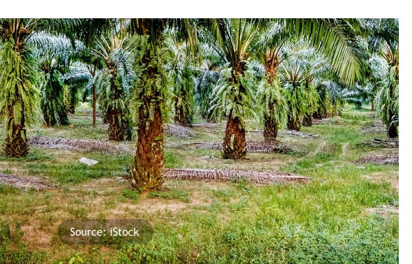

Improved mapping and data harmonization are critical for Indonesia to address the complexities of the EUDR, particularly in overcoming ambiguities and discrepancies in deÀning forest areas. Related to sustainable land use progression, improved mapping is essential. The EUDR forest deÀnition aligns with the FAO deÀnition. However, potential nuances in the Indonesian deÀnition need clariÀcation. There is a risk that agroforestry systems could be misinterpreted as forestry areas through satellite imagery, leading to overestimation of forest cover and unintentional non-compliance. Clear deÀnitions, guidelines, and ground-truthing are needed to address this, which can lead to confusion and inconsistencies in identifying deforestation and forest degradation (Carter et al 2023). In the mapping system, it is worthwhile to agree on a forest classiÀcation that harmonizes these differing deÀnitions (Yayasan Madani 2024a). At any rate, measures are needed to synchronize spatial aspects to Indonesia's One Map system (Yayasan Madani 2024b). This involves integrating data on land use, forest cover, and concession boundaries into a single, accessible platform, enabling realtime tracking of deforestation and land-use changes. This streamlined approach will facilitate compliance veriÀcation and empower stakeholders to monitor and address potential deforestation risks proactively. Mapping governance involves numerous actors beyond just farmers, leading to complex decision-making and potential conÁicts. Additionally, consolidating spatial data from various sources, including determining appropriate formats (polygons or GPS points) and maintaining consistency, poses technical challenges. The harmonization of internal deÀnitions related to mapping within the E-STDB and National Dashboard, especially concerning the use of polygons for STDB, further complicates the process.

Despite these hurdles, Indonesia can leverage these challenges as opportunities for improvement. The EUDR can act as a catalyst for enhanced multi-stakeholder collaboration in spatial data management, ensuring that all relevant parties contribute to and beneÀt from improved mapping efforts. Additionally, overcoming data consolidation and harmonization challenges can lead to increased accuracy and efÀciency in data management, facilitating better decision-making and

# Improved Mapping

This is especially important for smallholder farmers, who play a vital role in Indonesian agriculture and may face challenges in complying with the EUDR's strict requirements.

Indonesia through the Joint Task Force (JTF) voices concerns that imposing high compliance costs on smallholders, such as those related to traceability, could unfairly burden them and threaten their livelihoods. With millions of smallholders involved in the production of palm oil, cocoa, coffee, and rubber, the Indonesian government urges the EU to adopt a more inclusive approach that recognizes the unique challenges faced by smallholders and provides adequate support for them to meet EUDR requirements.

Furthermore, Indonesia highlights the need for the EU to assess its own infrastructure readiness and collaborate with producing countries to ensure a just and equitable transition towards sustainable agricultural practices, without unfairly disadvantaging smallholders or creating unnecessary barriers to trade. While the EUDR encourages sustainable land use practices like agroforestry and crop diversiÀcation, several challenges persist. Many smallholder farmers lack awareness of agroforestry's beneÀts, necessitating comprehensive training programs. Additionally, inaccurate land mapping and unclear boundaries between conservation and production areas hinder sustainable practices and compliance. Addressing land legality issues faced by smallholders is also critical for improving market access and providing legal certainty. Finally, to enhance income resilience against price Áuctuations, climate change, and natural disasters, initiatives supporting crop diversiÀcation and improved market access are needed.

# Sustainable Land Use

While still in a development process, Indonesia's National Dashboard is paramount to ensure its effectiveness as a central tool for EUDR compliance and traceability. To achieve this, the government must implement a robust policy framework that mandates its use across the supply chain, while also encouraging active participation from all stakeholders, particularly smallholder farmers. Indonesia's National Dashboard, a critical tool in demonstrating compliance with the EUDR, is currently designed to house data exclusively on commodities that meet Indonesian sustainability standards. While this approach showcases Indonesia's

## Mobilize National Dashboard

commitment to promoting sustainable practices within its borders, it raises questions about the recognition and acceptance of these national certiÀcations within the broader EUDR framework. Given the potential for differing standards and criteria between national and EU regulations, there is a pressing need for clear guidance within the EU implementing guidelines on how sustainably certiÀed commodities from thirdcountry national schemes will be treated. This clarity is essential to avoid confusion, prevent potential trade disruptions, and ensure a fair and transparent process for Indonesian producers seeking to access the EU market. Integrating data from intermediaries, such as traders and processors, is crucial for creating a comprehensive and transparent picture of commodity Áows. This collaborative approach, coupled with the inclusion of farmer associations in the Steering Committee, will not only bolster the platform's functionality but also foster a sense of ownership and shared responsibility among all actors in the agricultural sector. By strengthening the National Dashboard through policy support, stakeholder engagement, and data integration, Indonesia can establish a robust system for monitoring and verifying the sustainability of its commodity exports, thereby securing its access to the EU market and promoting a more sustainable and equitable future for its agricultural communities.

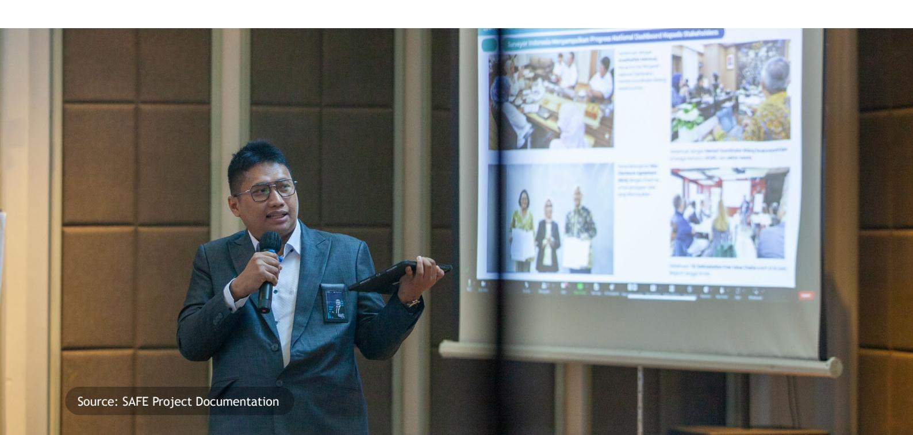

resource allocation. By investing in advanced mapping technologies and standardizing data deÀnitions, Indonesia can create a robust traceability system that not only meets EUDR requirements but also enhances market access for its agricultural products. This comprehensive approach to mapping and data harmonization will not only bolster Indonesia's EUDR compliance efforts but also contribute to sustainable land management practices and transparency in the agricultural sector.

**Indonesia, as a major producer of commodities like palm oil, rubber, and cocoa, recognizes the importance of sustainable practices for both environmental protection and market access. The government has been proactively improving its national sustainability schemes, to ensure that Indonesian products meet stringent environmental and social standards. These schemes, developed with careful consideration of local contexts and challenges, represent Indonesia's commitment to responsible production and trade.**

However, for these efforts to be truly effective in the context of the EUDR, it is imperative for the European Union to acknowledge and fully recognize that Indonesia's national systems and frameworks can fulÀll, with certain conditions, the necessary conditions for accessing the EU market.

The Indonesian government's role is paramount in successfully navigating the EUDR landscape. It must foster robust cross-sectoral coordination, ensuring alignment among various ministries and agencies to streamline regulations and enforcement efforts.

## Enhanced Government Role

# Diplomatic Efforts

Clear, accessible guidelines will enable stakeholders, especially smallholders, to understand and comply with EUDR requirements. Adequate funding for subnational governments and farmer associations is essential to facilitate capacity-building initiatives, technology adoption, and sustainable practices at the grassroots level. Exploring decentralized Ànance mechanisms can unlock innovative funding solutions to support smallholder compliance. Moreover, the government can act as a responsible data custodian, safeguarding sensitive smallholder information while ensuring transparency and traceability within the National Dashboard framework. This multifaceted approach will strengthen Indonesia's capacity to meet EUDR obligations, promoting sustainable agricultural practices and safeguarding the livelihoods of millions of farmers.

This involves advocating for greater Áexibility and support, particularly in areas such as capacity building, Ànancial assistance, and market access for smallholder farmers. Indonesia can leverage its position as a key player in the global commodity market to push for shared responsibility in achieving sustainable development goals. By engaging in constructive dialogues and negotiations, Indonesia can work towards a mutually beneÀcial outcome that promotes both environmental protection and economic growth.

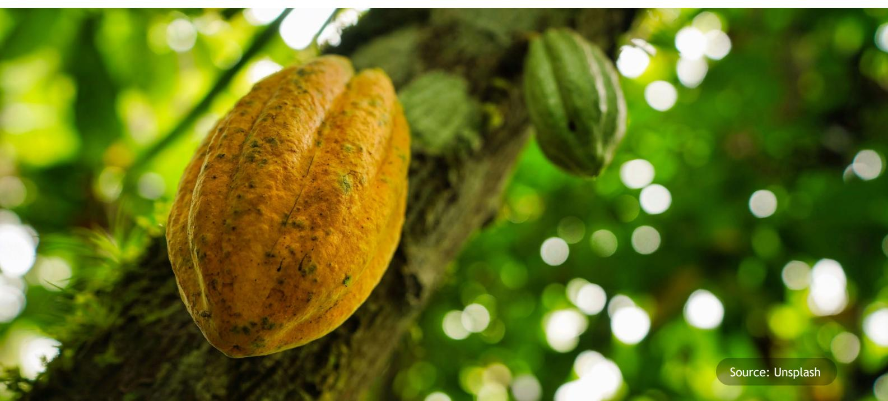

# Conclusion

**In conclusion, while the National Dashboard is instrumental in facilitating compliance with the EUDR, its signiÀcance extends far beyond mere regulatory adherence. It serves as a cornerstone for the longterm sustainability and resilience of Indonesia's agricultural commodities, positioning the nation as a global powerhouse in responsible and ethical production. By accelerating the development and implementation of the National Dashboard, Indonesia can proactively address the challenges posed by the EUDR and similar regulations, ensuring transparency, traceability, and sustainability throughout its supply chains.**

Beyond compliance, the National Dashboard can drive transformative change in Indonesia's agricultural sector. It empowers smallholder farmers by providing access to crucial information, technology, and market opportunities, fostering

inclusivity and economic growth. It enhances the credibility of Indonesian commodities in the global market, attracting responsible buyers and commanding premium prices. It promotes sustainable land-use practices, safeguards critical ecosystems, and contributes to the country's climate change mitigation efforts.

Ultimately, the National Dashboard represents a strategic investment in Indonesia's future. By harnessing its potential and embracing a collaborative approach, Indonesia can navigate the complexities of the EUDR and emerge as a global leader in sustainable commodity production, setting a benchmark for other nations to follow.

These concerns underscore the importance of ongoing dialogue and collaboration between the EU and producing countries like Indonesia to ensure that the EUDR is implemented in a fair, transparent, and effective manner that supports both environmental protection and sustainable development goals.