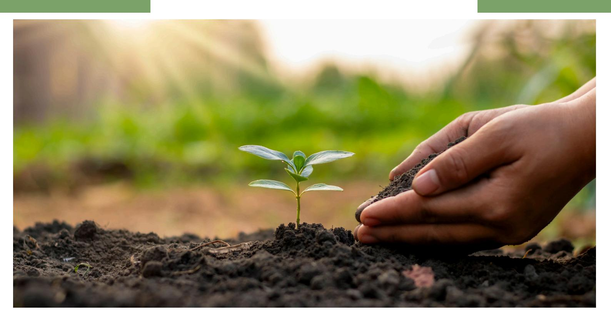
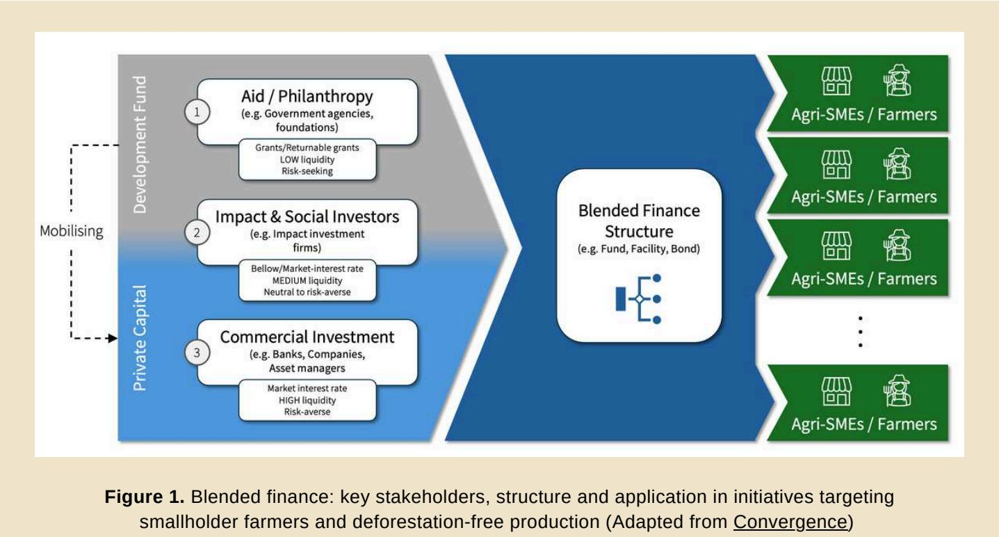
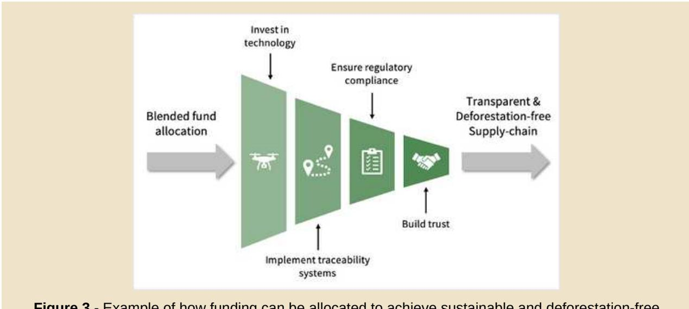
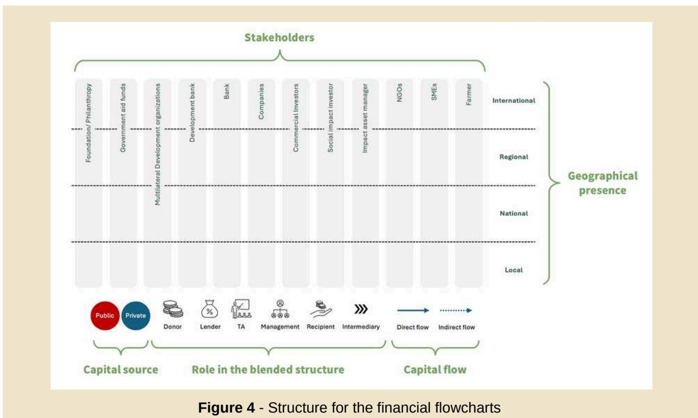
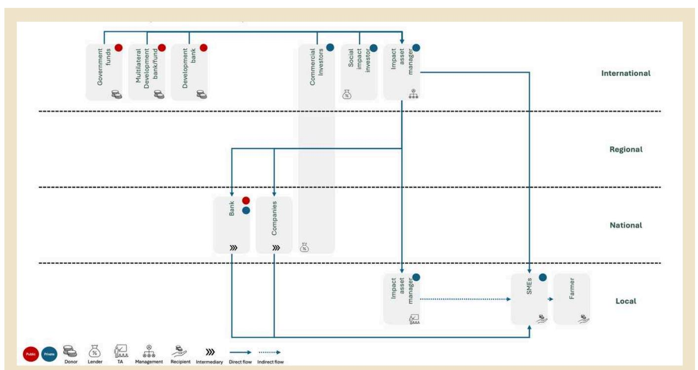
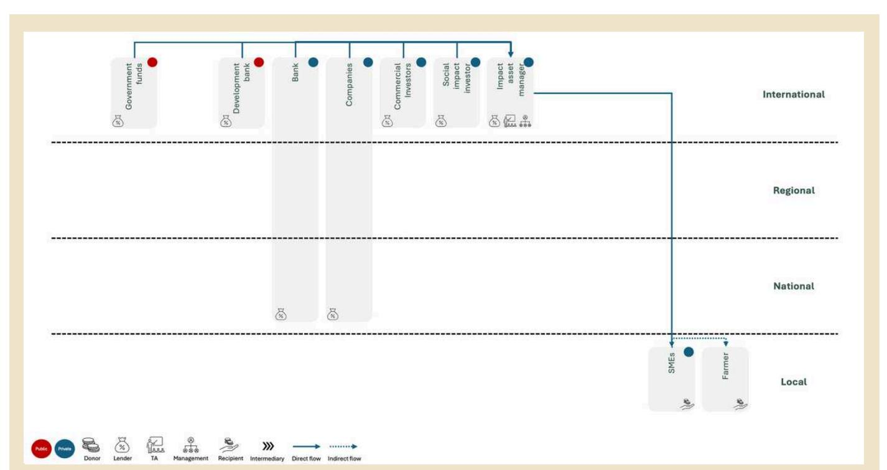
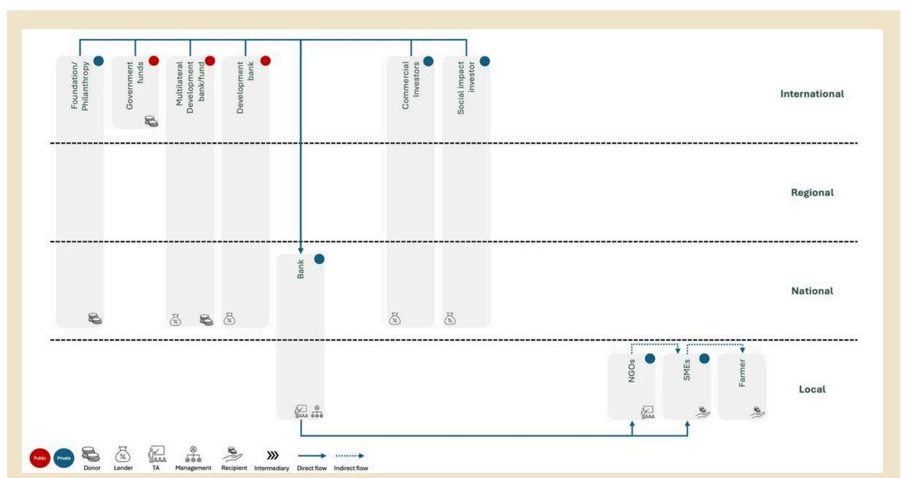
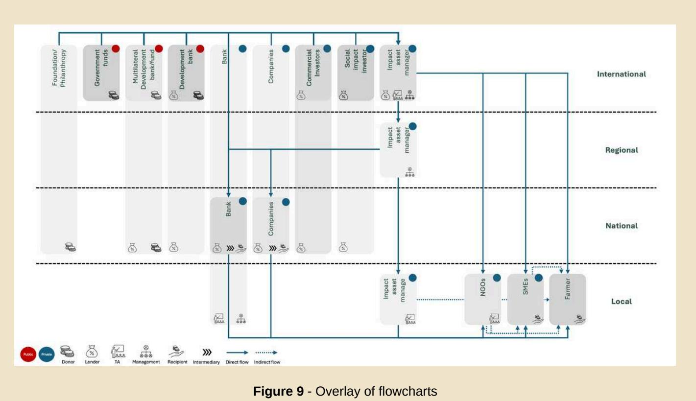
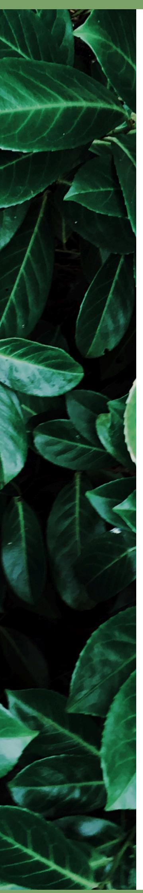

# FINANCE BRIEFING

# SUSTAINABLE FINANCE UPDATES

**Keeping you up to date with the latest developments in the Sustainable Finance space**

# **BLENDED FINANCE FOR SMALLHOLDER FARMERS: ENABLING SUSTAINABLE AND DEFORESTATION-FREE AGRICULTURAL PRACTICES**

Access to financial resources is crucial for promoting deforestation-free supply chains and enhancing transparency. Small-scale farmers, in particular, need support to implement sustainable land use practices and to adopt new technologies that national and international markets require, like traceability systems. However, these farmers often face significant barriers to accessing affordable credits due to perceived high investment risks, the high costs associated with small-scale operations, and insufficient or non-existent collateral. These challenges hinder their ability to secure the necessary funding.

Blended finance, which combines public/philanthropic and private capital, can help bridge this gap. By facilitating smallholders' access to finance, blended finance can support the adoption of sustainable and deforestation-free agricultural practices. This Finance Briefing explores the concept of blended finance, the key stakeholders involved and its potential to support smallholders. It also outlines pathways for smallholders to access such financing and highlights successful blended finance case studies, particularly those covering commodities included in the EU Deforestation Regulation (EUDR).

**By leveraging catalytic capital** from public, philanthropic, and/or impact investors – sources that can absorb higher risks and accept lower returns - to **attract private sector investments**, which are typically risk averse and demand market-beating net returns, blended finance structures aim to channel capital into revenue-generating **sustainable development projects.**

Catalytic capital, provided by government agencies, foundations, development banks, and multilateral organisations, is often deployed as concessional capital (i.e., below-market terms), guarantees/risk insurance, or technical assistance (TA). It serves to attract additional private capital, such as equity or debt, mobilised by banks, companies and/or commercial investors. This approach enables competitive returns for private capital by fully pricing risks into the loan. When joining a blended finance structure, Impact & Social investors might position themselves as "Development Fund" or "Private Capital" according to the expected return of their capital, from no returns up to market rates (Figure 1).

A blended finance structure has three main components:

**Leverage:** how much private capital was mobilised by catalytic capital (e.g. USD 1 of catalytic capital to USD 4 of private capital). **Impact**: the overall transaction must have a **positive impact** aligned with the Sustainable Development Goals (SDGs). **Financial return**: it varies from concessional to market rates

#### **WHAT IS BLENDED FINANCE?**

*It is a structuring approach that allows organizations with different objectives to invest alongside each other while achieving their own objectives, whether financial return, social impact, or a blend of both\*.*

Blended finance structures have their own application processes for accessing funding, which includes specific funding purposes (e.g. smallholders), minimum operational requirements (e.g. deforestation-free products), and loan conditions (e.g. minimum annual income and loan size). Finding the right balance between these requirements and the economic return for the different investors is the most challenging and what makes every blended finance instrument unique; see the Case Studies section.

Farmers can access blended finance directly or (and in practice much rather) through cooperatives/SMEs(small and medium enterprises) - see the Case Studies section. In blended finance structures for sustainable agriculture, large corporations, particularly those in the agri-food sector, referred to as "Company" in this briefing, play a crucial role. By acting as off-takers, they guarantee the purchase of deforestation-free products, thereby reducing farmers' transition risks to sustainable and traceable agricultural production.

In the context of sustainable agriculture and deforestation-free supply chains, blended finance can unlock critical investments in traceability systems, digital technologies, infrastructure, capacity building, and technical assistance, empowering smallholders to adopt and scale sustainable practices. Beyond regulatory compliance, these investments foster trust and transparency within supply chains, enhance market access, and drive long-term sustainability (Figure 3).

## HOW BLENDED FINANCE CAN SUPPORT SMALLHOLDER FARMERS TO PROMOTE SUSTAINABLE AND DEFORESTATION-FREE AGRICULTURAL PRACTICES

Blended finance has been widely used, with agriculture ranking as the third most targeted sector (27%) in blended finance structures\*. To generate sustainable development projects, blended finance can facilitate the adoption of sustainable practices, including deforestation-free production, ensuring that capital flows are allocated in line with farmers' needs and absorption capacity (Figure 1).

Additionally, it can help farmers overcome different challenges when it comes to financing the transition to deforestation-free production (Figure 2).

**Figure 2.** Barriers that blended finance can help to address to support smallholder farmers in their transition to deforestation-free production (Climate&Company analysis)

Successful blended finance case studies were selected from a comprehensive mapping of financial solutions developed in the context of the [collaboration between GIZ SAFE and Climate & Company](https://climateandcompany.org/projects/solutions-for-mobilising-financial-sources/). The selection criteria included: (1) support for deforestation-free production, (2) relevance to or applicability for smallholders, (3) geographical presence, (4) blended finance structure\*\* and (5) scalability. To facilitate the visualisations of financial flows, the funding sources, stakeholders involved and geographic level, a dedicated flowchart was created for each mechanism (Figure 4).

# **CASE STUDIES**

The effectiveness of blended finance depends on broader investment conditions, sectoral frameworks, and the willingness of financial institutions and end-users to engage with these instruments. While blended finance has shown promise in certain contexts, challenges remain regarding risk appetite, regulatory integration, and practical implementation—highlighting the need for tailored approaches and pilot projects to demonstrate viability.

**Figure 3** - Example of how funding can be allocated to achieve sustainable and deforestation-free supply chains (e.g. to meet the EUDR requirements) (Adapted from [Convergence\)](https://www.convergence.finance/blended-finance)

**Figure 5 -** LAFCo structure – financial flowchart

## **[LAFCO – LANDING FOR AFRICAN FARMING COMPANY](https://www.lendingforafricanfarming.com/about-us/)**

| Category        | Details                                                                                 |
|-----------------|-----------------------------------------------------------------------------------------|
| About           | Mauritius-based investment firm providing working capital loans to agricultural SMEs in |
| Region          | Sub-Saharan Africa                                                                      |
| Funding Focus   | Businesses engaging smallholder farmers (≤10 ha) to boost productivity, market          |
| Gender Equality | It fosters women participation, also tracking their representativeness in its supported |
| Commodities     | Coffee, Cocoa, Palm Oil, Soy, Rubber, Timber, Cattle                                    |

The diagram illustrates the connections between the International, Regional, and Local levels of the International Investment Project Planning and Management (IPPM) system. The International level is at the top, represented by a blue box labeled 'International'. The Regional level is between the International and Local levels, represented by a blue box labeled 'Regional'. The Local level is at the bottom, represented by a blue box labeled 'Local'.

The International level contains three stakeholder boxes: 'Government funds' (red circle), 'Development bank' (red circle), and 'Social impact investor' (blue circle). A blue arrow points from the 'Development bank' box to the 'International' level.

The Regional level contains a single box labeled 'Impact asset manager' (blue circle). A blue arrow points from the 'Impact asset manager' box to the 'Regional' level.

The Local level contains four stakeholder boxes: 'NGOs' (blue circle), 'SMEs' (blue circle), 'Former' (blue circle), and a small icon labeled 'NGOs' (blue circle). A blue arrow points from the 'NGOs' box to the 'Local' level.

At the bottom of the diagram, a row of icons indicates the system flow: 'Public', 'Project', 'Donor', 'Lender', 'License', 'Management', 'Recipient', 'Intermediary', 'Direct flow', and 'Indirect flow'.

**Figure 6 -** Eco.bunsiness structure – financial flowchart

#### **[ECO.BUSINESS FUND](https://www.ecobusiness.fund/en/)**

| Category        | Details                                                                               |
|-----------------|---------------------------------------------------------------------------------------|
| Region          | Latin America, Caribbean, and Sub-Saharan Africa                                      |
| Funding Focus   | Sustainable crop production, biodiversity conservation, and climate adaptation (e.g., |
| Gender Equality | It does not have gender inclusion as one of its goals                                 |
| Commodities     | Coffee, Cocoa, Palm Oil, Soy, Rubber, Timber, Cattle                                  |

| Category        | Details                                               |
|-----------------|-------------------------------------------------------|
| Region          | Latin America, Sub-Saharan Africa, and Southeast Asia |
| Gender Equality | It focuses on women inclusion                         |
| Commodities     | Coffee, Cocoa, Palm Oil, Soy, Rubber, Timber, Cattle  |

**Figure 7**- Farmfit structure – financial flowchart

### **[IDH - FARMFIT](https://www.idhsustainabletrade.com/farmfit-fund/)**

| Category        | Details                                                                              |
|-----------------|--------------------------------------------------------------------------------------|
| Region          | Amazon region                                                                        |
| Gender Equality | It directly targets the SDG 5 (gender equality) and foster women participation, also |
| Commodities     | Coffee, Cocoa, Palm Oil, Soy, Rubber, Timber, Cattle                                 |

**Figure 8 - Amazon Food & Forest – financial flowchart**

## **[AMAZON FOOD & FOREST BIOECONOMY FINANCING INITIATIVE](https://www.climatefinancelab.org/ideas/amazon-foodforest-bioeconomy-financing-initiative/)**

The actors that consistently play key roles in blended finance structures for smallholders are: (1) donors, government funds and development banks as catalytic capital providers, (2) commercial investors and impact asset managers as private capital providers, (3) SMEs, (4) farmers as recipients and (5) Technical Assistance (TA) provider (see Figure 9 overlaying all the flowcharts).

Technical Assistance (TA) is a common feature of the selected successful blended finance mechanisms targeting smallholder farmers. By tailoring support to local needs, these mechanisms help improve farmers' financial literacy, business management skills, and sustainable production practices.

The set of a minimum ticket size in most blended finance structures hinders smallholder farmers from getting directly funded. As a result, blended finance funds typically target SMEs that work directly with farmers, allowing them to consolidate credit demand and redistribute financing indirectly among their suppliers or associates.

With more ups than downs, blended finance holds immense potential to drive sustainable and deforestation-free agricultural practices by unlocking critical investments for smallholder farmers. By strategically combining catalytic and private capital, these financial mechanisms help overcome barriers to funding, enabling farmers to adopt innovative technologies, improve productivity, and ensure long-term environmental and economic sustainability. As the demand for traceable and deforestation-free supply chains keeps growing, blended finance will play a key role in bridging the financial gaps and fostering resilient agricultural ecosystems. We can create lasting impact by leveraging partnerships and innovative financial structures, empowering farmers, protecting forests, and supporting a more sustainable global food supply chain.

[1st Finance Briefing:](https://vcmprimer.org/wp-content/uploads/2023/11/vcm-explained-chapter7.pdf) [Why Sustainable Finance is Key to Promoting Deforestation-free](https://zerodeforestationhub.eu/finance-briefing-1-keeping-up-to-date-with-the-latest-developements-in-the-sustainable-finance-space/) [Supply Chain](https://zerodeforestationhub.eu/finance-briefing-1-keeping-up-to-date-with-the-latest-developements-in-the-sustainable-finance-space/)

# **READING**

# FURTHER READING & TRAINING

# **TRAINING**

[Convergence – Blending Global Finance. Demystifying Blended Finance](https://www.convergence.finance/course/2mAAiT6F3vKgk4gnq2bCRj/view/content.)

Disclaimer: This briefing is a partnership between Climate & Company and the SAFE (Sustainable Agriculture for Forest Ecosystems) project, financed by the European Union (EU), the German Federal Ministry for Economic Cooperation and Development (BMZ) and the Dutch Ministry of Foreign Affairs. SAFE is part of the Fund for the Promotion of Innovation in Agriculture (i4Ag) and implemented by Deutsche Gesellschaft für Internationale Zusammenarbeit (GIZ). The aim of the collaboration is to identify and foster solutions to mobilise financial sources, especially for vulnerable groups, and enhance gendertransformative financial frameworks for investments in deforestation-free supply chains.

Its contents are the sole responsibility of Climate & Company and do not necessarily reflect the views of the EU, the Federal Ministry for Economic Cooperation and Development (BMZ) and the Dutch Ministry of Foreign Affairs. To learn more visit: [SAFE - Team Europe Initiative on Deforestation-free](https://zerodeforestationhub.eu/) [Value Chains](https://zerodeforestationhub.eu/) and [Climate and Company's dedicated project page.](https://climateandcompany.org/projects/solutions-for-mobilising-financial-sources/)

#### **Contact information:**

Elisabeth Hock (elisabeth@climcom.org) Enzo Bernardinelli (enzo.bernardinelli@climcom.org) Paula Zambrano (paula@climcom.org) Sofia Helena Zanella Carra (sofia@climcom.org)