# Legality due diligence tool for oil palm produced in Colombia

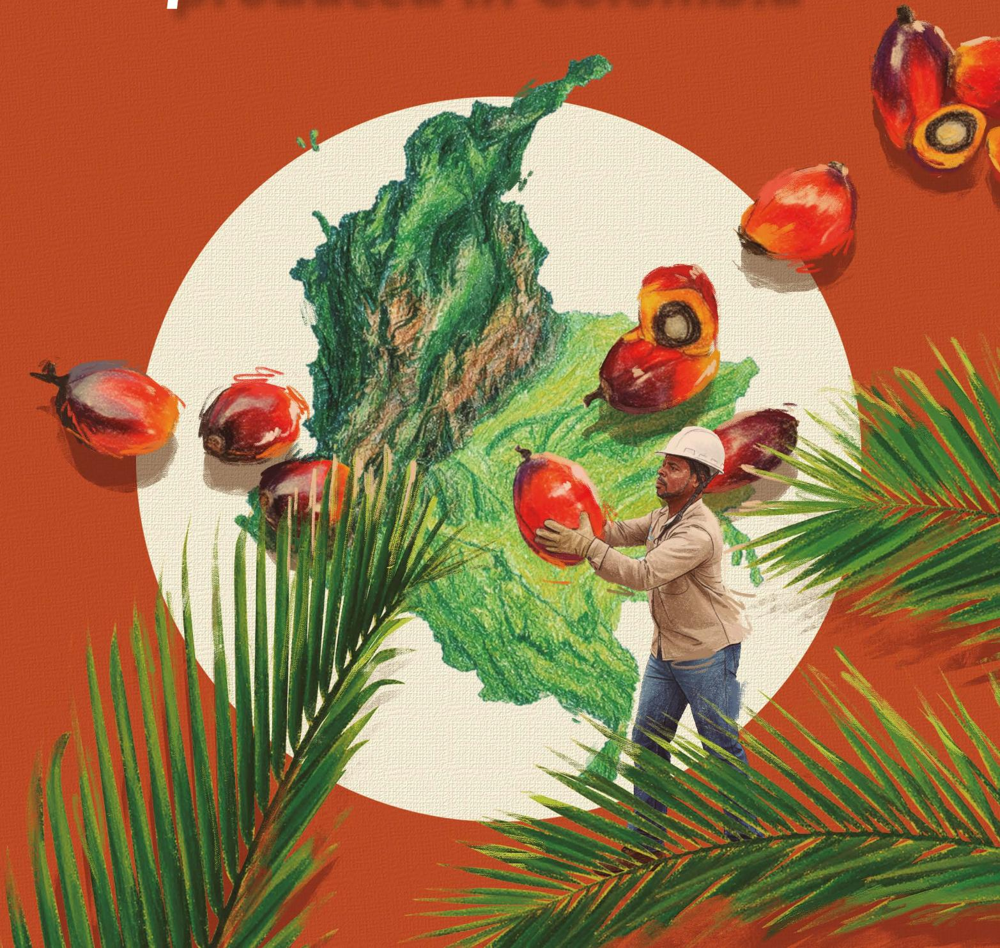

Disclaimer: This tool has been developed with the financial support of the European Union. The views expressed herein cannot be considered in any way as reflecting the official opinion of the European Union. This tool is intended to support the efforts of the palm oil sector to comply with the requirements of the EUDR. Its content is indicative, not legally binding, and does not constitute legal advice. No guarantee is given as to the accuracy, completeness or timeliness of the content. The authors of this tool accept no liability for any damage or loss that may arise from its use without proper legal advice. The authors welcome any comments or suggestions for improvement.

© European Forest Institute, 2025

# *Legality due diligence tool for oil palm produced in Colombia*

[Background](#page-5-0)

pág. 4 pág. 8

[Objectives and general](#page-9-0)  approach

The European Union Regulation on Deforestation ..... 5

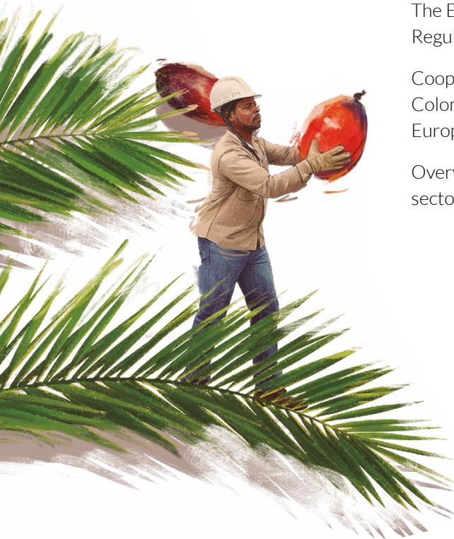

Cooperation between Colombia and the European Union ............................. 6

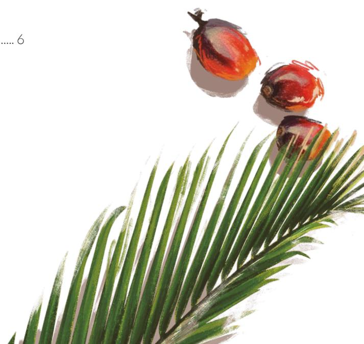

Overview of the oil palm sector in Colombia ........................... 6

# CONTENTS

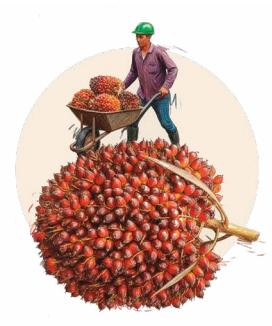

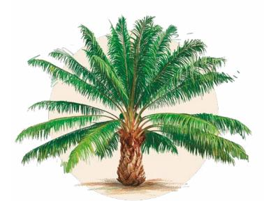

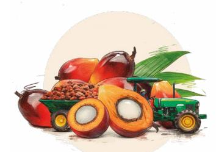

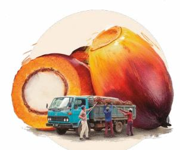

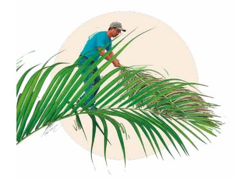

#### pág. 10 pág. 16 pág. 81

Methodology for [developing the tool](#page-11-0) Due diligence [recommendations on](#page-17-0)  Legal requirements relevant to palm oil

[Annex](#page-81-0)

#### **Category 1**

 Land-use rights ...............................17

**Category 2** Environmental protection ............32

**Category 3** Third parties' rights and FPIC .......52

**Category 4** Labour rights ....................................56

**Category 5** Human rights ....................................73

#### **Category 6**

Taxation, anti-corruption, trade and customs ..........................78

**Annex 1.** Mapping methodology .................82

**Annex 2.** Mapping of relevant Legal requirements for palm oil produced in Colombia .................84

**Annex 3.** Consultations carried out ........121

**Annex 4.**

Analysis of legal implementation

alignment with the APSColombia standard ...........122

Mapping of relevant national requirements ..................................11

Development of due diligence

recommendations .........................11

Scope of the recommendations ..12

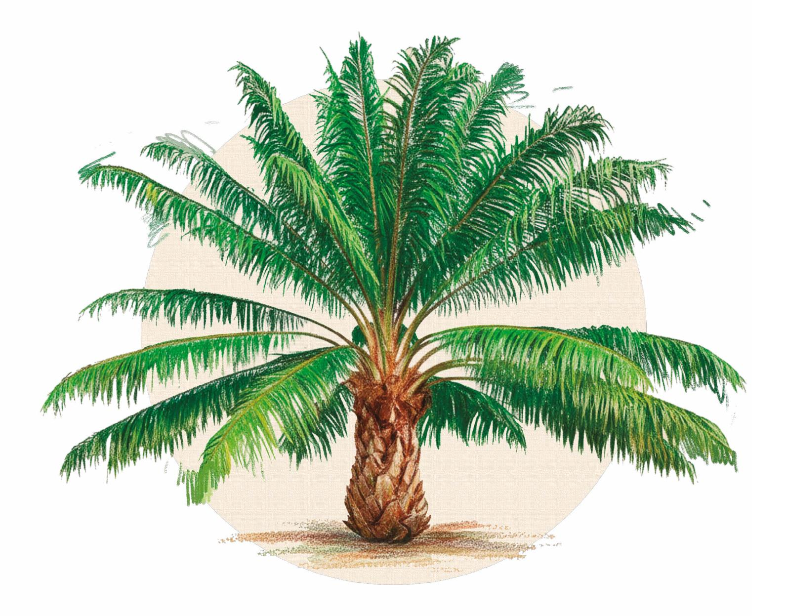

BACKGROUND

On 31 May 2023, the European Union (EU) adopted Regulation 2023/1115 on the placing on the EU market and export from the EU of certain commodities and products associated with deforestation and forest degradation (EUDR). This regulation requires operators and traders who place products from supply chains associated with deforestation or forest degradation on the EU market to demonstrate that these products are traceable, deforestation-free and legal. The scope of application covers seven commodities: coffee, cocoa, rubber, palm oil, soy, cattle and timber, as well as derived products.

The entry into application is scheduled for 31 December 2026 (and 30 June 2026 for micro and small enterprises established as such before 31 December 2020). Businesses affected by the regulation (operators and traders) will be required to carry out due diligence before exporting or trading their products, in order to gather sufficient information to demonstrate that the product presents no or negligible risk of non-compliance.

Consequently, operators who trade in palm oil or other derived products on the EU market must demonstrate that these have been produced in accordance with the relevant legislation of the country of production (Article 3), which is defined as that relating to the legal status of the production area. The EUDR adopts a flexible approach, listing general areas of law rather than specifying particular legal instruments, as these differ from country to country and may change over time. These areas are [for agricultural products, see Article 2.40 of the EUDR]:

- **a.** Land-use rights
- **b.** Environmental protection
- **c.** Third parties' rights
- **d.** Labour rights
- **e.** Human rights protected by international law
- **f.** Free, Prior and Informed Consent (FPIC), as set out in the United Nations Declaration on the Rights of Indigenous Peoples
- **g.** Tax, anti-corruption, trade and customs regulations

In this context, understanding the legislative framework of the country of origin, identifying the relevant Legal requirements for the product in question, and determining how to verify compliance with these requirements is a challenge not only for operators responsible for due diligence, but also for the competent EU authorities in charge of controls, and other stakeholders.

## The European Union Regulation on Deforestation

In early 2024, with the aim of facilitating access for Colombian products to the European market under the EUDR Regulation, the European Forest Institute (EFI) and the European Union Delegation to Colombia agreed to support the analysis of the relevant legal framework for Colombia. This work, carried out within the framework of the Technical Facility on deforestation-free value chains, also includes activities to support the economic, environmental and social sustainability of productive sectors.

This tool is the result of collaboration between various public, private and civil society entities, with significant leadership from the National Federation of Oil Palm Growers (FEDEPALMA), supported by EFI through the Technical Facility on Deforestation-free Value Chains, a programme funded by the EU and steered by the European Commission's Directorate General for International Partnerships (DG INTPA), the Forests, Climate and Peace Programme of the EU Delegation in Colombia, as well as the SAFE programme implemented by GIZ. In addition to EFI's technical support, the Ministry of Agriculture, Swisscontact and Particip also actively contributed.

The tool is based on the work of national and international experts in law and due diligence and on technical consultations with all national and international actors in the palm oil sector: the Ministries of Trade, Industry and Tourism; Agriculture and Rural Development; Environment and Sustainable Development; the Rural Agricultural Planning Unit (UPRA); and ProColombia; trade associations such as the National Federation of Coffee Growers (FNC); the National Federation of Cocoa Growers (FEDECACAO), the National Federation of Oil Palm Growers (FEDEPALMA), the National Association of Industrialists (ANDI), among others.

In addition, bilateral consultations have been held with key actors, as well as socialisation and feedback meetings with stakeholders, including cooperatives, civil society organisations such as Solidaridad Network, and multiple other institutions (see Annex 3).

## Cooperation between Colombia and the European Union

### Overview of the oil palm sector in Colombia

The Colombian palm oil sector has established itself as a pillar of sustainability, social inclusion and economic growth in the country. It currently has 609,000 hectares planted, of which 84% are in production and 16% are under development, distributed across 169 municipalities in 21 departments. It generates more than 233,000 jobs, of which more than 86% are formal, with salaries that exceed the legal minimum wage by an average of 1.4 times, benefiting thousands of rural families. Among them are more than 8,000 producers, most of whom are smallholders (74%), who find oil palm to be a productive and sustainable alternative.

In 2024, Colombia achieved a production of 1.72 million tonnes of crude palm oil and 7.8 million tonnes of fresh fruit bunches, representing 10.5% of the national agricultural GDP. Of this production, 32% is covered by sustainability certification, reflecting the sector's commitment to best environmental and social practices.

Colombia is currently the world's fourth-largest producer of palm oil and has a real-time satellite monitoring system for deforestation, which confirms that 99% of the area cultivated between 2011 and 2024 is deforestation-free. In addition, the carbon footprint of Colombian palm oil is low (182kg CO2e/Tons APC), complying with international standards such as CORSIA (Carbon Offsetting and Reduction Scheme for International Aviation), which strengthens its potential to supply the low-emission biofuel market.

Colombia has significant comparative advantages for EUDR implementation. First, according to studies by the Institute of Hydrology, Meteorology and Environmental Studies (IDEAM) and FEDEPALMA, more than 99% of the palm oil produced since 2011 comes from deforestation-free areas, demonstrating the sector's strong environmental commitment. Likewise, FEDEPALMA has made significant progress in georeferencing almost all of the country's palm oil plots and properties, thereby strengthening the traceability of production.

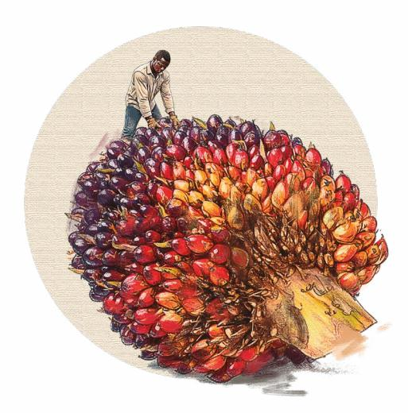

Furthermore, within the framework of the Zero Deforestation Palm Oil Agreement, signed in 2017—the first of its kind in the country—IDE-AM and FEDEPALMA conducted an analysis of deforestation associated with palm cultivation between 2011 and 2020. This study showed that this crop accounts for less than 1% of national deforestation. In addition, since the second half of 2023, FEDEPALMA has been strengthening the Traceability and Palm Registry project, through which 6,927 polygons have been surveyed, of which 528 were captured during 2025, substantially improving the accuracy of the records.

Similarly, in partnership with Satelligence, realtime satellite monitoring is being carried out covering 18.5 million hectares, equivalent to 16% of the national territory. This monitoring confirms that 99% of Colombian oil palm cultivation is deforestation-free and that only 0.08% was impacted between 2021 and 2023. In addition, the Sustainable Palm Oil Standard (APSColombia) was adopted, is promoted by the sector and adjusted to the national context. The scheme promotes sustainable practices and, as of June 2024, covers 20% of the country's palm oil production.

Finally, although progress has been remarkable, some challenges remain, especially in the formalisation of land tenure in rural areas, the verification of legality at the property level, and institutional coordination to provide greater support to smallholders. These challenges, however, represent opportunities to consolidate an increasingly responsible and sustainable palm oil industry.

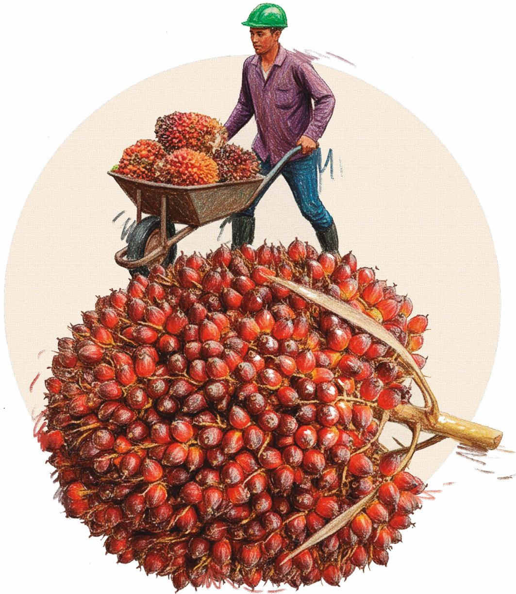

**2**

# OBJECTIVES AND GENERAL APPROACH

The objectives of this tool are to promote a national and consensual vision of the Colombian Legal requirements applicable to oil palm production and trade, and relevant to the EUDR; and to provide recommendations for verifying oil palm regulatory compliance and risk management, in support of operators' due diligence.

The tool was developed with the following aims:

- support the harmonisation of operators' due diligence approaches;
- encourage the simplification of procedures for supply chain actors who are likely to be required to provide data to their customers;
- facilitate a better understanding of national contexts by the competent authorities of EU Member States responsible for controls;
- ensure equitable access to information, reduce perceived risks, and position Colombian origin at a competitive advantage..

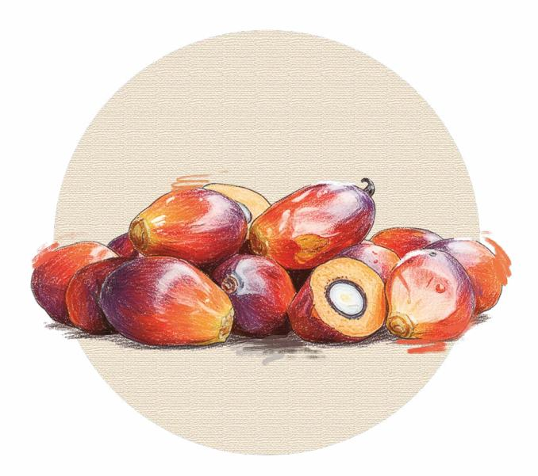

It is the responsibility of operators trading palm oil or its derived products on the EU market to identify the relevant Legal requirements for Colombia, within the meaning of Article 2(40) of the EUDR, and to adapt their due diligence to the risks identified. This tool provides guidance that can assist operators and other stakeholders in the sector in this regard. The tool is likely to evolve over time and be updated in response to various factors: possible legal reforms in the country, developments in public or private certification systems, lessons learned from the practical implementation of national due diligence recommendations, additional guidance provided by the European Commission or competent authorities, integration of best practices, technological advances, etc.

**It is important to note that the results presented are not legally binding, do not impose any obligations on the relevant parties, and do not constitute legal advice.**

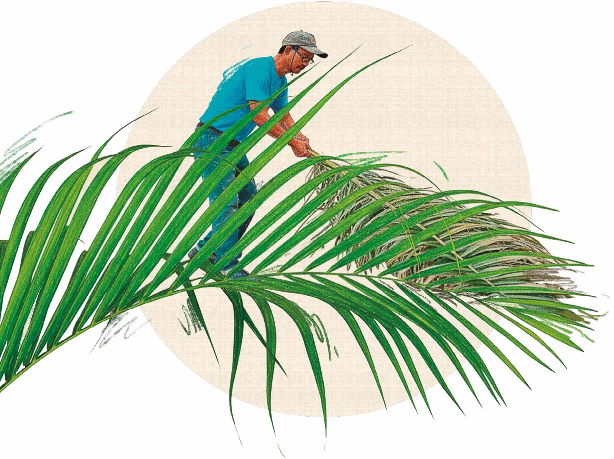

**3**

# **METHODOLOGY FOR DEVELOPING THE TOOL**

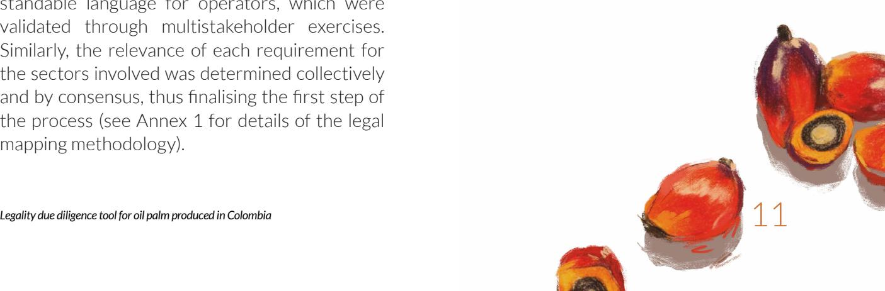

Based on various analyses of the applicable legal framework in the country, the EFI team, together with Swisscontact Colombia, consolidated and supplemented all relevant Legal requirements for the palm oil, coffee and cocoa sectors, organised comprehensively according to the areas of law listed in the EUDR. These were structured into subcategories under a legal taxonomy developed by EFI in collaboration with Preferred by Nature, in order to facilitate their analysis (see Legality Due Diligence Navigator [https://legalitynaviga](file:///Volumes/AngelicaVil/PA/PA%202026/Union%20Europea/EFI%20%2b%20PA/PROYECTOS%20-%20PRIMERA%20PARTE/20260319_PALMA/INGLES/%20https://legalitynavigator.efi.int/)[tor.efi](file:///Volumes/AngelicaVil/PA/PA%202026/Union%20Europea/EFI%20%2b%20PA/PROYECTOS%20-%20PRIMERA%20PARTE/20260319_PALMA/INGLES/%20https://legalitynavigator.efi.int/).int/).

For each subcategory, one or several Legal requirements were drafted in clear and understandable language for operators, which were validated through multistakeholder exercises. Similarly, the relevance of each requirement for the sectors involved was determined collectively and by consensus, thus finalising the first step of the process (see Annex 1 for details of the legal mapping methodology).

## Mapping of relevant national requirements

Mapping of the relevant national Legal requirements applicable to the production and trade of palm oil in Colombia in the context of the EUDR, collecting and supplementing with relevant information from the actors involved. The results of this step are captured in Annex 2 of this tool.

Development of due diligence recommendations for operators, based on the analysis of the level of implementation of the relevant Legal requirements and existing means of verification.

**The development of the tool was divided into two steps:**

### Development of due diligence recommendations

The second step, focused on developing a risk pre-assessment, began with the work of sectoral expert groups. For each relevant Legal requirement, a search for information and analysis of existing data was carried out to establish the level of implementation and the associated level of risk. This level was agreed upon based on evidence, with the purpose of formulating due diligence recommendations to guide operators. These recommendations, based on sectoral risk per requirement, serve as guidance for operators to conduct their own risk analysis in their supply chains.

## Scope of the recommendations

#### **Who are these recommendations aimed at?**

These recommendations are aimed at the various stakeholders involved in verifying the compliance of palm oil and derived products with the EUDR. They may be useful for:

- **• Operators**, within the meaning of the EUDR: any natural or legal person who, in the course of a commercial activity, places Colombian palm oil or derived products on the EU market or exports them.
- **• Traders**, within the meaning of the EUDR: any natural or legal person in the supply chain, other than the operator, who trades the products in question on the EU market.
- **•** EU **competent authorities**: authorities designated by Member States to ensure compliance with EUDR obligations.
- **• Supply chain actors** in Colombia: producers, cooperatives, traders, exporters and other stakeholders involved in the production and trade of palm oil, and from whom operators may request information, data and documents necessary to carry out their due diligence.
- **• Colombian public entities**: government administrations and agencies responsible for regulating the palm oil sector (production and trade), land, the environment and sustainable development.
- **• Civil society:** non-governmental organisations, associations and other actors that play a supervisory, support and promotional role in ensuring that palm oil and its derived products comply with Colombian legislation and international commitments.

#### **What are these recommendations for?**

These recommendations can be used in different ways and at different times, depending on the actors involved.

**Operators and traders** can use these recommendations to establish and document their due diligence system, ensuring that the palm oil they trade complies with the relevant Legal requirements. They can use them to identify the documents and information that need to be collected or other actions that need to be taken with their suppliers in Colombia, and to assess the risks associated with their supply chain.

**Competent authorities in the EU** can use these recommendations as a standard for assessing the compliance of products traded under the EUDR. They can also use them to harmonise their controls and interpret data from Colombia.

**Supply chain actors** in Colombia can use these recommendations to understand the implications of the EUDR requirements for palm oil and the expectations of European operators and traders subject to it. These recommendations can be used to structure and document the information they may provide to these operators and traders. They can also help them anticipate non-compliance risks and adapt their agricultural and commercial practices.

**Colombian public entities** can use these recommendations to guide the implementation of national legislation by producers and exporters, to ensure that palm oil traded complies with current Colombian laws. They can also use it to support smallholders' legal compliance by providing them with better access to information on current regulations and buyer requirements. They can build on these recommendations to make data more transparent and accessible, including by facilitating access to administrative documents, to help operators demonstrate the legality of palm oil.

**Civil society** can use these recommendations to monitor the implementation of Colombian Legal requirements by companies and authorities. They can be used to conduct analyses and produce reports on the risks of palm oil non-compliance. They can also be used to raise awareness among producers, companies and consumers about the legality of Colombian palm oil

#### **How to use these due diligence recommendations?**

The recommendations presented in this tool aim to address all relevant Legal requirements identified by stakeholders during the first phase of this study. They cover, in particular, all legal areas listed in Article 2(40) of the EUDR, in line with the precautionary approach adopted in the study (see Annex 1). However, a distinction is made between requirements directly related to the objectives of the EUDR and others, which are marked with an asterisk.

This flexible approach allows users of the recommendations to adapt their due diligence actions based on their interpretation of the scope of the EUDR.

#### **Light due diligence or standard due diligence**

This tool takes a pragmatic approach that seeks to identify risk-proportionate due diligence actions in order to limit the burden on those involved in the sector. For each requirement considered relevant to the production and trade of palm oil of Colombian origin, its level of implementation has been assessed. The level of implementation adopted by the tool is based on: relevant literature, expert knowledge of the sector, field surveys conducted as part of the development of the tool, and bilateral and multistakeholder consultations organised within the framework of the tool.

When the level of implementation assessed for a requirement is high, the risk of non-compliance is considered negligible. Therefore, light due diligence actions are recommended. On the other hand, when the level of implementation of a requirement is low or unknown, the risk of non-compliance is considered non-negligible. Therefore, standard due diligence is recommended.

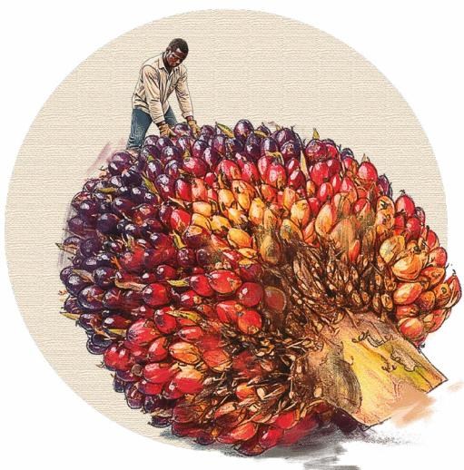

#### The relationship between the level of implementation and due diligence recommendations

H owever, this analysis is only indicative and has been carried out at country level only. **It is the responsibility of operators to carry out a risk analysis of non-compliance of their products for each shipment**. Within this framework, these recommendations offer a range of due diligence options. **These actions are not prescriptive and are not presented in any specific order. It is up to operators to choose among these options based on the context, their knowledge of their supply chains and the risks identified for palm oil and its derived products.**

## Role of certification in due diligence

Palm cultivation certification systems are voluntary, public or private mechanisms that seek to ensure that its production and trade comply with certain environmental, social and economic standards. They can be established by governments, international organisations, NGOs or private companies.

#### **The EUDR and certification**

Third-party certification and verification systems can play an important role in promoting sustainable agricultural and forestry practices and responsible sourcing. There are different types of

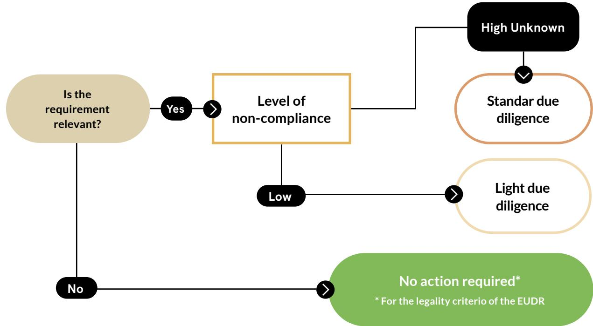

certification, which can be implemented at the national level on a mandatory basis or be private and voluntary (e.g. RSPO, APSColombia, Rainforest Alliance, or USDAOrganic).

According to the EUDR, for the purposes of risk assessment, operators may take into account information from certification schemes or other third-party verified schemes. However, the European Commission's guidance of 2 October 2024 indicates that self-declaration schemes that are not based on third-party certification procedures are, by definition, less robust due to a lack of independence and impartiality.

The Commission also specifies that certification systems should not replace the operator's due diligence responsibility. In other words, private certification schemes can be a tool to help European operators carry out due diligence to comply with legality, deforestation and traceability criteria.

Operators must be able to justify why and how certification schemes comply with EUDR requirements. To do so, three elements must be taken into account:

- **•** The certification system's coverage of the relevant Legal requirements for the EUDR.
- **•** The robustness of the certification system: in particular, the scope of certification (applicable to which actors in the value chain? to which products?), governance (management of internal procedures and updates, for example), accreditation processes for control bodies; auditor qualifications and audit frequency; non-compliance management, impartiality and conflict of interest management, etc. This information must be periodically reassessed by the operator, particularly in relation to the requirements of the EUDR.
- **•** Traceability and absence of mixing with non-certified products.

It should be noted that this tool has not carried out an exhaustive comparison of the coverage of the relevant Legal requirements by certification systems used in the palm oil sector in Colombia.

#### **APSColombia certification scheme**

In 2018, the Colombian palm oil sector, led by FEDEPALMA, decided to develop a strategy to differentiate and position Colombian palm oil as a sustainable product, committed to legality and productive inclusion. This led to the implementation of the Colombian Sustainable Palm Oil Programme between 2019 and 2022, which became, at the end of 2022, the certification scheme for the production of sustainable palm oil in Colombia (APSColombia).

The sustainable origin model is based on three main components: support and monitoring of the implementation of best sustainability practices; third-party assessment and certification of implementation of APSColombia standards for crops and extraction plants; and traceability assurance in the supply chain. Various organisations are involved in the development of this model, including FEDEPALMA, Cenipalma, the APSColombia Corporation, palm oil companies and international partners such as Solidaridad and IDH. The APSColombia certification scheme is based on standards NE001 and NE002, developed by FEDEPALMA and ICONTEC, the national standardisation body. The standards are based on a legal framework in accordance with the regulations applicable to either palm cultivation or extraction plants, which is complemented by other requirements associated with voluntary environmental, social and economic sustainability practices. Annex 4 presents the analysis of legal implementation under the NE001 standard for oil palm plantations against the requirements identified as relevant for EUDR compliance.

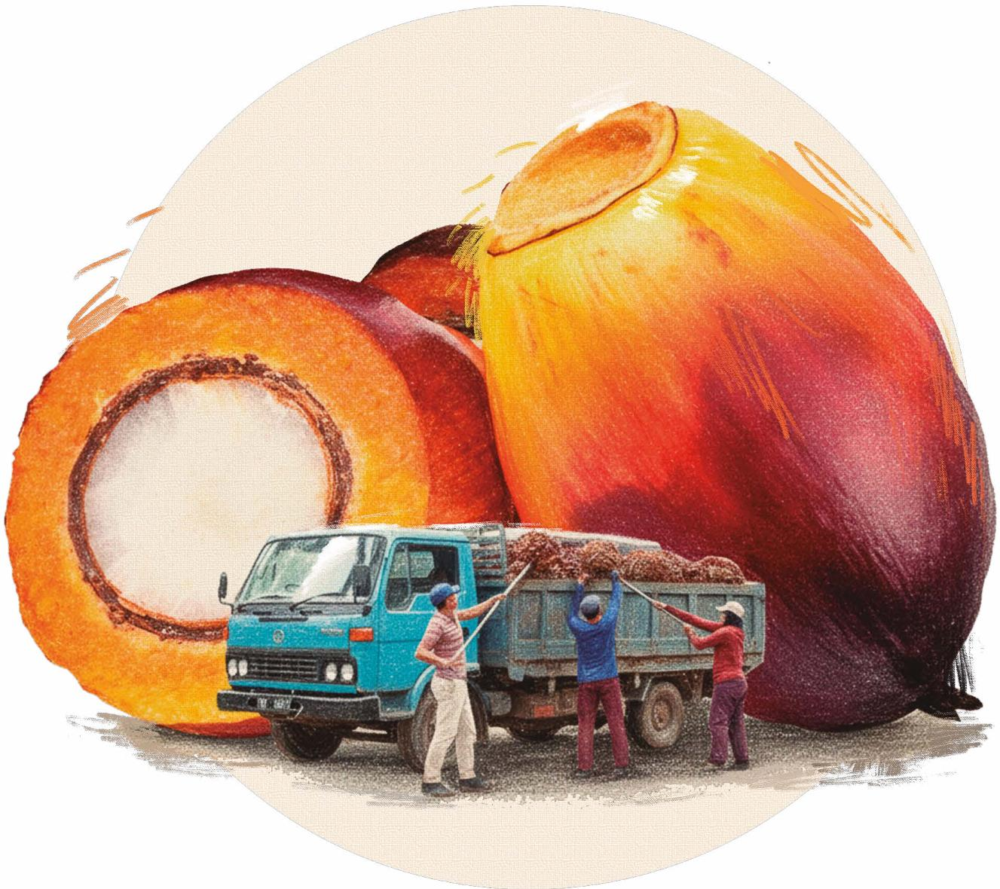

**4**

**DUE DILIGENCE  
RECOMMENDATIONS ON LEGAL  
REQUIREMENTS RELEVANT TO  
PALM OIL**

In Colombia, the land tenure regime is complex and diverse, with coexisting **forms of ownership, tenure and possession**, especially in rural areas where oil palm cultivation takes place. Although **title deeds** are the main legal means of proving tenure, Colombian legislation recognises other forms of legitimate access to land, such as **regular possession**, **lease agreements, collective rights of ethnic communities** and state-led **land formalisation** processes.

In practice, a significant proportion of small and medium-sized palm producers do not have formal titles, but they do have **locally recognised rights,**  and, in many cases, formalisation processes are underway. The **Rural Agricultural Planning Unit (UPRA)** and the **National Land Agency (ANT)**  have identified that informal tenure does not necessarily prevent access to sustainability pro-

#### CATEGORY 1 **LAND-USE RIGHTS**

grammes or disqualify production, provided that a legitimate link to the plot can be demonstrated. Colombian legislation expressly prohibits or conditions the establishment of agro-industrial crops in **forest reserve zones, protected areas**  or **collective territories without prior consent,**  unless there is express authorisation in the landuse or environmental planning instruments and from the competent authorities. Although it is not common practice and only covers 198 hectares throughout the country, there have been documented cases of encroachment of crops in unauthorised areas, such as indigenous reserves in departments such as Guaviare. In previous decades, this also occurred in Afro-Colombian collective territories in Nariño. All these situations have been reported to the competent authorities. Although they have largely been resolved, these events have damaged the sector's reputation.

| requirement Context Level of |                  |
|------------------------------|------------------|
| Note: Land tenure            |                  |
| Note                         | : The absence of |
| complaints or litigation     | , then           |

| requirement Context Level of |                |
|------------------------------|----------------|
| Formal titles:               | Request the    |
| Freedom (                    | Certificado de |
| Tradición y Libertad         | ) from         |
| improvements                 | (for           |
| Use rights:                  | On a random    |
| NB: This                     |                |

| Legal                                                                                                      | Level of Due diligence                                                                                                                                                                                                                                                                                                                                                                                                                                                                                                                                                                                                                                                                                                 |
|------------------------------------------------------------------------------------------------------------|------------------------------------------------------------------------------------------------------------------------------------------------------------------------------------------------------------------------------------------------------------------------------------------------------------------------------------------------------------------------------------------------------------------------------------------------------------------------------------------------------------------------------------------------------------------------------------------------------------------------------------------------------------------------------------------------------------------------|
| requirement Land use rights Land tenure                                                                    | Context implementation recommendations Colombia is characterised by a high level of legal and practical recognition of the rights of indigenous and Afro Colombian peoples. In Colombia, 37.8 million hectares are currently registered under collective ownership, distributed among indigenous reserves and lands of Geospatial analysis Afro-descendant communities. This Overlay the points or polygons is equivalent to of suppliers with layers of legally constituted collective territories (maps national territory. In from the Ministry of the Interior and particular, indigenous the National Land Agency (ANT) community lands have georeferenced information on High level of collective territories). |
| NB: Land                                                                                                   |                                                                                                                                                                                                                                                                                                                                                                                                                                                                                                                                                                                                                                                                                                                        |
| is established by collective ownership tenure can be individual or collective (see previous requirements). | the country. https:// implementation www.cifor-icraf.org/ If overlaps occur, but the producers Light due diligence publications/pdf_ belong to the indigenous reserve files/infobrief/6704- or the Afro-Colombian community infobrief.pdf council, no due diligence action is required. However, the following However, there are due diligence actions may be still requests for recommended as a good practice: the scaling up and recognition of the territorial rights of these groups. In departments such as Chocó and Nariño, there have been conflicts in the past over the expansion of oil palm cultivation in Afro-Colombian collective territories, which have been resolved in favour of the communities. |

| Legal requirement | Context                                                                                                                                                                                                                                                                                                                                                                                                                                                                                                                                                                                                                                                                                                                                                                                                                                                                                                                            | Level of implementation | Due diligence recommendations                                                                                                                                                                                                                                                                                                                                                                                                                                                                                                                                                                                                                                                                                                                                                                                                                                                                         |
|-------------------|------------------------------------------------------------------------------------------------------------------------------------------------------------------------------------------------------------------------------------------------------------------------------------------------------------------------------------------------------------------------------------------------------------------------------------------------------------------------------------------------------------------------------------------------------------------------------------------------------------------------------------------------------------------------------------------------------------------------------------------------------------------------------------------------------------------------------------------------------------------------------------------------------------------------------------|-------------------------|-------------------------------------------------------------------------------------------------------------------------------------------------------------------------------------------------------------------------------------------------------------------------------------------------------------------------------------------------------------------------------------------------------------------------------------------------------------------------------------------------------------------------------------------------------------------------------------------------------------------------------------------------------------------------------------------------------------------------------------------------------------------------------------------------------------------------------------------------------------------------------------------------------|
|                   | 
More recently, there have been reports of crops being planted in indigenous territories in Guaviare.
 
The greatest risk may arise in areas with a high presence of these collective territories of Afro-Colombian communities and indigenous reserves, such as Chocó, Nariño, Norte de Santander and Guaviare.
 
<b>Note:</b> Indigenous communities do not produce oil palm in their collective territories, but there are cases in Afro-Colombian community councils or collective territories. In cases of collective property ownership by Afro-Colombian community councils, this title is granted through an administrative procedure of collective titling, which is regulated by Law 70 of 1993 (Black Communities Law) and managed by the National Land Agency. If crops are grown in these territories by their inhabitants, they must have the respective permits from their traditional authorities.
 |                         | 
<b>Compilation and verification of documents:</b>
 
On a random basis (by sampling), a certificate of membership in the community (Afro-Colombian Community Council) may be requested from the Ministry of the Interior to validate that the producer is part of this community.
 <ul> <li>The internal authority of the collective territory (cabildo or community council) may issue a certificate of membership directly.</li> </ul> 
If there are overlaps in areas of production and the producer is not registered in the census or registry of the reserve or collective territory, it is necessary to provide documentary evidence of authorisation from the council or Community Council to produce in their territories. Internally, the Community Council Board is the body that represents the community, manages the archives and oversees socio-economic organisation.
 |

| requirement | Context | Level of |                              |
|-------------|---------|----------|------------------------------|
|             |         |          | data portal ( https://www.   |
|             |         |          | vance&page =1&pageSize=20 ). |

| Legal requirement (RUNAP). Row labels                                                                                                                                                                                                                           | Context Oil palm is located within the Agricultural Frontier; only 0.03% is located outside the Agricultural Frontier, corresponding to 21,910 ha. Palm oil in the Single National Register of Protected Areas Source: SISPA 2025- RUNAP: Gross area (ha) | Level of Due diligence implementation recommendations The Agricultural Frontier analysis approach for this legal criterion focuses on the legal regime involved in land use implementation. Geospatial analysis First, consult the UPRA’s SIPRA and perform a geospatial analy  High level of sis by overlaying the production implementation polygons, coordinates, cadastral % Light due |
|-----------------------------------------------------------------------------------------------------------------------------------------------------------------------------------------------------------------------------------------------------------------|-----------------------------------------------------------------------------------------------------------------------------------------------------------------------------------------------------------------------------------------------------------|---------------------------------------------------------------------------------------------------------------------------------------------------------------------------------------------------------------------------------------------------------------------------------------------------------------------------------------------------------------------------------------------|
| Type                                                                                                                                                                                                                                                            | Gross area (ha)                                                                                                                                                                                                                                           | %                                                                                                                                                                                                                                                                                                                                                                                           |
|                                                                                                                                                                                                                                                                 | 11,590                                                                                                                                                                                                                                                    | 95.9                                                                                                                                                                                                                                                                                                                                                                                        |
| districts                                                                                                                                                                                                                                                       | 410                                                                                                                                                                                                                                                       | 3.4                                                                                                                                                                                                                                                                                                                                                                                         |
| nature reserve                                                                                                                                                                                                                                                  | 73                                                                                                                                                                                                                                                        | 0.6                                                                                                                                                                                                                                                                                                                                                                                         |
|                                                                                                                                                                                                                                                                 | 8                                                                                                                                                                                                                                                         | 0.1                                                                                                                                                                                                                                                                                                                                                                                         |
| Total                                                                                                                                                                                                                                                           | 12.081                                                                                                                                                                                                                                                    | 100                                                                                                                                                                                                                                                                                                                                                                                         |
| Santander                                                                                                                                                                                                                                                       | 6,022                                                                                                                                                                                                                                                     | 49.8                                                                                                                                                                                                                                                                                                                                                                                        |
| Casanare                                                                                                                                                                                                                                                        | 3,197                                                                                                                                                                                                                                                     | 26.5                                                                                                                                                                                                                                                                                                                                                                                        |
| Cesar                                                                                                                                                                                                                                                           | 1,555                                                                                                                                                                                                                                                     | 12.9                                                                                                                                                                                                                                                                                                                                                                                        |
| Córdoba                                                                                                                                                                                                                                                         | 1,199                                                                                                                                                                                                                                                     | 9.9                                                                                                                                                                                                                                                                                                                                                                                         |
| Atlántico                                                                                                                                                                                                                                                       | 92                                                                                                                                                                                                                                                        | 0.8                                                                                                                                                                                                                                                                                                                                                                                         |
| Meta                                                                                                                                                                                                                                                            | 11                                                                                                                                                                                                                                                        | 0.1                                                                                                                                                                                                                                                                                                                                                                                         |
| Santander                                                                                                                                                                                                                                                       | 4                                                                                                                                                                                                                                                         | 0.0                                                                                                                                                                                                                                                                                                                                                                                         |
| Caldas                                                                                                                                                                                                                                                          | 1                                                                                                                                                                                                                                                         | 0.0                                                                                                                                                                                                                                                                                                                                                                                         |
| Sucre                                                                                                                                                                                                                                                           | 0                                                                                                                                                                                                                                                         | 0.0                                                                                                                                                                                                                                                                                                                                                                                         |
| La Guajira                                                                                                                                                                                                                                                      | 0                                                                                                                                                                                                                                                         | 0.0                                                                                                                                                                                                                                                                                                                                                                                         |
| Total                                                                                                                                                                                                                                                           | 12,081                                                                                                                                                                                                                                                    | 100                                                                                                                                                                                                                                                                                                                                                                                         |
|                                                                                                                                                                                                                                                                 |                                                                                                                                                                                                                                                           | registration folio with the Agricul                                                                                                                                                                                                                                                                                                                                                        |
| Land use rights                                                                                                                                                                                                                                                 |                                                                                                                                                                                                                                                           | If the plot is within the agricul                                                                                                                                                                                                                                                                                                                                                          |
|                                                                                                                                                                                                                                                                 |                                                                                                                                                                                                                                                           | tural frontier, no further due dil                                                                                                                                                                                                                                                                                                                                                         |
| Norte de The plot is located within the Agricultural Frontier; if it is located in conditional areas, Regional production is integrated management only permitted districts under certain conditions that Soil conservation must be met. Civil society National |                                                                                                                                                                                                                                                           | igence actions are recommend                                                                                                                                                                                                                                                                                                                                                               |
| protected forest reserves                                                                                                                                                                                                                                       |                                                                                                                                                                                                                                                           | agricultural frontier, request a mu                                                                                                                                                                                                                                                                                                                                                        |
|                                                                                                                                                                                                                                                                 |                                                                                                                                                                                                                                                           | whether the land use is agricul                                                                                                                                                                                                                                                                                                                                                            |
|                                                                                                                                                                                                                                                                 |                                                                                                                                                                                                                                                           | tural and allows for the cultiva                                                                                                                                                                                                                                                                                                                                                           |

| Legal requirement                                                                                                                                                                                                              | Context                                                                                                                                                                                                                                                                                                                                                                                                                                                                                                                            | Level of implementation                                                                                                                                                                                                                                                                                            | Due diligence recommendations                                                                                                                                                                                                                                                                                                                                                                                                                                                                                                                                                                                                                                                                                                                                                                                                                                                                                                                                                                                                                                                                                                                                                         |
|--------------------------------------------------------------------------------------------------------------------------------------------------------------------------------------------------------------------------------|------------------------------------------------------------------------------------------------------------------------------------------------------------------------------------------------------------------------------------------------------------------------------------------------------------------------------------------------------------------------------------------------------------------------------------------------------------------------------------------------------------------------------------|--------------------------------------------------------------------------------------------------------------------------------------------------------------------------------------------------------------------------------------------------------------------------------------------------------------------|---------------------------------------------------------------------------------------------------------------------------------------------------------------------------------------------------------------------------------------------------------------------------------------------------------------------------------------------------------------------------------------------------------------------------------------------------------------------------------------------------------------------------------------------------------------------------------------------------------------------------------------------------------------------------------------------------------------------------------------------------------------------------------------------------------------------------------------------------------------------------------------------------------------------------------------------------------------------------------------------------------------------------------------------------------------------------------------------------------------------------------------------------------------------------------------|
|                                                                                                                                                                                                                                |                                                                                                                                                                                                                                                                                                                                                                                                                                                                                                                                    |                                                                                                                                                                                                                                                                                                                    | 
<b>For plots outside the Agricultural Frontier:</b>
 
<b>Compilation and verification of documents</b>
 
Request a land-use certificate from the environmental authority and from your palm oil supplier or directly from the producer, demonstrating that agricultural use is permitted and that there are agreements in place for deforestation-free, sustainable production, or other enabling measures for agricultural use.
 
<b>For plots in conditional areas:</b>
 
<b>Collection and verification of data</b>
 <ul> <li>Request information from the competent environmental authority on any restrictions or requirements applicable to agricultural production on the plot.</li> <li>Request evidence or a declaration from the producer demonstrating compliance with these requirements.</li> </ul> 
<b>Field verifications</b>
 
If the above steps do not provide clarity on the legality of land use on the plots, conduct a field inspection.
 
<b>Implementation of procedures and processes</b>
 
Support producers in obtaining formal permits for their agricultural activity in restricted areas, if applicable.
 |
| 
<b>Land use rights</b>
 
<b>1.2.1.</b>
 
The plot is located within the Agricultural Frontier; if it is located in conditional areas, production is only permitted under certain conditions that must be met.
 | 
Studies by IDEAM and FEDEPALMA show that palm oil is not responsible for deforestation in Colombia (for the period 2011-2017, they indicate that only 0.4% of national deforestation was attributed to conversion to oil palm cultivation) and is therefore established on land with side the Agricultural Frontier, on areas previously subjected to deforestation for other uses (especially livestock farming). Only isolated cases have been reported in San José del Guaviare, which were reported to the authorities.
 | 
High level of implementation
 
<b>Light due diligence</b>
 <ul> <li>If the plot is within the Agricultural Frontier, its legality risk may be low.</li> <li>If the plot is located in a conditional Agricultural Frontier or outside the agricultural frontier, the risk related to the legal</li></ul> |                                                                                                                                                                                                                                                                                                                                                                                                                                                                                                                                                                                                                                                                                                                                                                                                                                                                                                                                                                                                                                                                                                                                                                                       |

| Legal requirement                                                                                                       | Context                                                                                                                                                                                                                                                                                                                                                                                                                                                                                                                                                                                                                        | Level of implementation                                                      | Due diligence recommendations                                                                                                                                                                                                                                                                                                                                                                                                                                                                                                                                                                                                                                                                       |
|-------------------------------------------------------------------------------------------------------------------------|--------------------------------------------------------------------------------------------------------------------------------------------------------------------------------------------------------------------------------------------------------------------------------------------------------------------------------------------------------------------------------------------------------------------------------------------------------------------------------------------------------------------------------------------------------------------------------------------------------------------------------|------------------------------------------------------------------------------|-----------------------------------------------------------------------------------------------------------------------------------------------------------------------------------------------------------------------------------------------------------------------------------------------------------------------------------------------------------------------------------------------------------------------------------------------------------------------------------------------------------------------------------------------------------------------------------------------------------------------------------------------------------------------------------------------------|
|                                                                                                                         | 
As mentioned in the previous requirement, most palm trees are located within the Agricultural Frontier, so there is very little or no risk.
 
In Colombia, the Land-Use Plan (POT) is the municipal instrument that defines the use and occupation of urban and rural land. Within this framework, agricultural activity—such as oil palm cultivation—is expressly permitted and regulated within the rural areas defined by each POT.
 
The local Land-Use Plan (by municipality) may have specific regulations for certain crops, so it is always advisable to review the specific POT of the municipality.
 |                                                                              | 
<b>Geospatial analysis:</b>
 <ul> <li>Compile the polygons of the areas of production to identify which municipalities they belong to.</li> </ul> 
<b>Consultations with stakeholders:</b>
 <ul> <li>Consult the municipalities where the areas of production are located to find out if they have a valid Land Use Plan (POT).</li> <li>If there is a POT, analyse it to identify the areas where agricultural activity is permitted.</li> </ul> 
<b>Second geospatial analysis:</b>
 <ul> <li>If the municipality has a POT, overlay the polygons of the areas of production with the map of zones where agriculture is permitted in the POT to verify implementation.</li> </ul> |
| 
<b>Land use rights</b>
 
<b>1.2.2.</b>
 
Agricultural activity is permitted under land use ordinances.
 |                                                                                                                                                                                                                                                                                                                                                                                                                                                                                                                                                                                                                                | 
<b>High level of implementation</b>
 
<b>Light due diligence</b>
 |                                                                                                                                                                                                                                                                                                                                                                                                                                                                                                                                                                                                                                                                                                     |

| Legal requirement                                             | Context                                                                                                                                                                                                                                                                                                                                                                                                            | Level of implementation      | Due diligence recommendations |
|---------------------------------------------------------------|--------------------------------------------------------------------------------------------------------------------------------------------------------------------------------------------------------------------------------------------------------------------------------------------------------------------------------------------------------------------------------------------------------------------|------------------------------|-------------------------------|
|                                                               | 
The 2022-2023 Management Report to Congress of the Ministry of Housing, City and Territory (MVCT) indicates that, as of 30 March 2023, of the country's 1,103 municipalities:
 <ul> <li>192 municipalities have an updated POT.</li> <li>877 municipalities have outdated POTs.</li> <li>30 municipalities have expired medium-term plans.</li> <li>4 municipalities have not formulated any POT.</li> </ul> | High level of implementation |                               |
| <b>Land use rights</b>                                        |                                                                                                                                                                                                                                                                                                                                                                                                                    |                              |                               |
| <b>1.2.2.</b>                                                 |                                                                                                                                                                                                                                                                                                                                                                                                                    |                              |                               |
| Agricultural activity is permitted under land use ordinances. |                                                                                                                                                                                                                                                                                                                                                                                                                    |                              |                               |

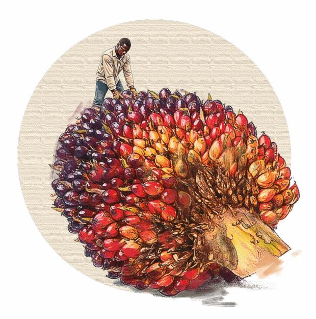

#### **Document collection and verification (sampling)**

Request signed contracts or supporting documents proving the status of the use right on another´s plot of land.

**Oral contract:** Verification through records, with neighbours, associations or cooperatives. Verification of thirdparty testimonies.

Preparation of minutes with witnesses if necessary

## Requirements 1.1.1

and 1.1.2 Confirm that there are no complains or disputes regarding the oil palm production land: national and international press, NGOs, interviews with stakeholders.

> In rural areas, consult the National Land Agency (ANT) to check for any complaints of irregular occupation of

plots.

#### **Document collection and verification (sampling basis)**

**Formal titles:**Request the Certificate of Tradition and Freedom from the Superintendency of Notaries and Registries.

**Informal title:** Unregistered sale or informal inheritance.

For **regular possessionr:** With proof of occupation and improvements (for eventual adjudication).

#### **Light due diligence**

**Land tenure is established by individual private ownership or by possession (regular or irregular)**

**The farmer exercises the right to produce on the plot on the basis of legal arrangaments such as lease, usufruct, sharecropping agreements, or provisional allocation contracts**

**There are no indications of complaints or litigation**

**There are indications of complains or litigation**

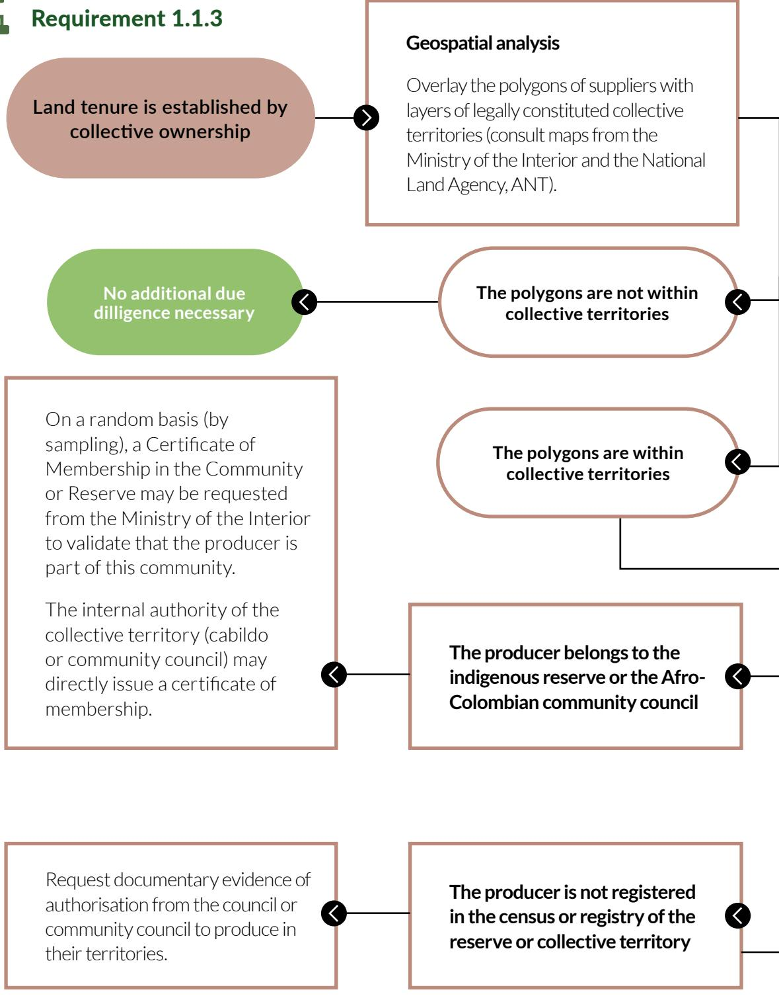

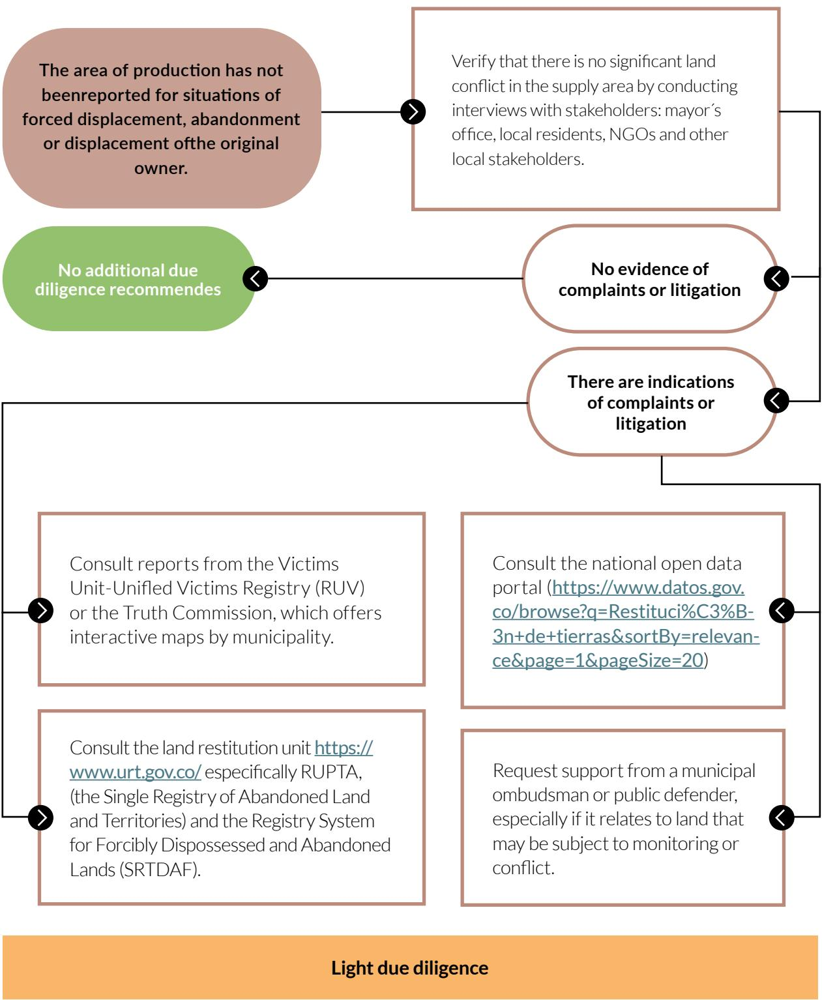

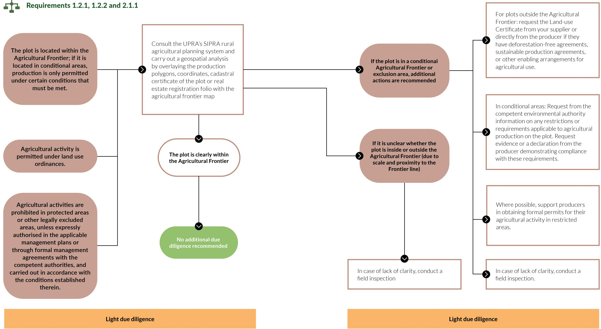

#### CATEGORY 2 ENVIRONMENTAL PROTECTION

The legal framework related to environmental protection in oil palm cultivation includes several key elements:

Use of agrochemicals: The use of pesticides and fertilisers is common on palm plantations. Colombian legislation requires producers to be duly authorised and trained to ensure safe and responsible use, minimising risks to soil, water bodies and nearby communities.

Water and soil conservation: Producers must have permits (concessions) for water use, especially if they use irrigation, and must comply with the provisions of these permits in relation to water flow. They are also required to protect riparian areas and aquatic ecosystems, which can be affected by agrochemical runoff and crop expansion.

Deforestation and land use: Colombia has made commitments to a deforestation-free palm supply chain, backed by national strategies and monitoring systems. Implementation of land-use rights and tenure standards is essential, especially in areas where palm expansion may threaten natural ecosystems. Currently, FEDEPALMA, in partnership with Satelligence, conducts real-time satellite monitoring covering nearly 18.5 million hectares, equivalent to 16% of Colombia's territory. Satelligence's historical analysis of deforestation for the period 2011–2023 reveals that only 1% of the area cultivated with oil palm is deforested, meaning that 99% of palm cultivation in Colombia is deforestation-free. Of that percentage, only 0.08% recorded deforestation between 2021 and 2023 [\(Launch of the geovisor as a watchdog](https://elpalmicultor.com/lanzamiento-geovisor-vigia-cero-deforestacion-cultivos-palma/)  [for deforestation in palm crops in Colombia - El](https://elpalmicultor.com/lanzamiento-geovisor-vigia-cero-deforestacion-cultivos-palma/)  [Palmicultor](https://elpalmicultor.com/lanzamiento-geovisor-vigia-cero-deforestacion-cultivos-palma/)).

Sustainability certifications: 32% of national palm oil production is certified under sustainability standards such as APSColombia, Roundtable on Sustainable Palm Oil (RSPO) and International Sustainability and Carbon Certification (ISCC), representing approximately 192,000 hectares planted and 390 producers.

This legal framework supports Colombia's national strategy for alignment with EUDR requirements, although challenges remain in uniform implementation, especially among smallholders.

| Legal requirement Type Regional integrated                                                                                                                                                                                                                                                                                                                                                                                                                                                                 | Context Level of Due diligence implementation recommendations Gross area (ha) % |
|------------------------------------------------------------------------------------------------------------------------------------------------------------------------------------------------------------------------------------------------------------------------------------------------------------------------------------------------------------------------------------------------------------------------------------------------------------------------------------------------------------|---------------------------------------------------------------------------------|
| 11,590 management districts Soil conservation                                                                                                                                                                                                                                                                                                                                                                                                                                                              | 95.9                                                                            |
| districts 410 Civil society                                                                                                                                                                                                                                                                                                                                                                                                                                                                                | 3.4                                                                             |
| nature reserve 73 National                                                                                                                                                                                                                                                                                                                                                                                                                                                                                 | 0.6                                                                             |
| 8 protected forest reserves                                                                                                                                                                                                                                                                                                                                                                                                                                                                                | 0.1                                                                             |
| Total 12,081 Environmental protection                                                                                                                                                                                                                                                                                                                                                                                                                                                                      | 100                                                                             |
| be carried out, it is prohibited to culti are generally restricted. Agricultural activities are considers the following: prohibited in protected areas Legal exclusions or other legally excluded areas, Páramos, national natural parks, unless expressly regional natural parks, second law authorised in Zone A areas, national and regional the applicable management plans or through formal management preservation). agreements with the competent Restricted areas authorities, and carried out in |                                                                                |
| under Law 70 of 1993, declared indig accordance with the conditions (b, c and uncategorised), recreation established                                                                                                                                                                                                                                                                                                                                                                                       |                                                                                |
| areas, soil conservation districts, inte therein. biosphere reserves, Important Bird                                                                                                                                                                                                                                                                                                                                                                                                                       |                                                                                |
| Area, areas with environmental poten volcanic threat.                                                                                                                                                                                                                                                                                                                                                                                                                                                      |                                                                                |

| requirement Context Level of          |   |
|---------------------------------------|---|
| 2) the types of herbicides, insecti   |  |
| or by periodically filling out a ques |  |
| Provide producers and cooper          |  |
| and fungicides authorised/not au      |  |
| Conduct training and communi          |  |

| Legal requirement | Context                                                                                                                                                                                                                                                                                                                                                                                                                                                                                                                                                                                                                                                           | Level of implementation | Due diligence recommendations                                                                                                                                                                                                                                                                                                                                                                                                                                                                                                                                                                                                                                                                                                                                                                                                                                                                                                                                                                                      |
|-------------------|-------------------------------------------------------------------------------------------------------------------------------------------------------------------------------------------------------------------------------------------------------------------------------------------------------------------------------------------------------------------------------------------------------------------------------------------------------------------------------------------------------------------------------------------------------------------------------------------------------------------------------------------------------------------|-------------------------|--------------------------------------------------------------------------------------------------------------------------------------------------------------------------------------------------------------------------------------------------------------------------------------------------------------------------------------------------------------------------------------------------------------------------------------------------------------------------------------------------------------------------------------------------------------------------------------------------------------------------------------------------------------------------------------------------------------------------------------------------------------------------------------------------------------------------------------------------------------------------------------------------------------------------------------------------------------------------------------------------------------------|
|                   | 
Based on the results of Cenipalma's Sustainability Index (IDS), as of 10 July 2025, it is noteworthy that the Colombian palm sector has consolidated adequate, responsible and controlled management of agrochemicals within its production processes. This technical tool, designed and implemented specifically for the sector, allows for a comprehensive evaluation of the implementation of best practices in the economic, environmental and social areas at the farm level.
 
<b>Environmental protection</b>
 
<b>2.1.2.</b>
 
Authorised agricultural inputs are used and managed appropriately according to technical procedures.
 |                         | 
<b>Compilation and verification of documents</b>
 <ul> <li>Pesticide or crop protection product management plan, including biological products where relevant.</li> <li>Plan or procedure for managing empty chemical containers</li> <li>Occupational health and contingency plan or procedure</li> <li>Training plan for employees on chemical management (include logs or attendance lists) in integrated chemical management.</li> <li>Solid waste management plan</li> <li>Company policies on the non-use of red-label products.</li> <li>Procedure for the proper use of pesticides and fertilisers.</li> <li>Log of chemical and biological product applications on farms.</li> <li>Plan for the management and use of personal protective equipment</li> <li>External audit reports</li> <li>Follow-up visit report by agronomists</li> <li>Possible reports from NGOs, cooperatives, and local authorities on possible cases of soil or watercourse contamination in the sourcing area.</li> </ul> |
|                   |                                                                                                                                                                                                                                                                                                                                                                                                                                                                                                                                                                                                                                                                   |                         |                                                                                                                                                                                                                                                                                                                                                                                                                                                                                                                                                                                                                                                                                                                                                                                                                                                                                                                                                                                                                    |

| requirement | Context Level of          |
|-------------|---------------------------|
|             | via VITAL - Comprehensive |
| 1.          | Segregation of            |
| 2.          | Characterisation of       |
|             | the waste (identi        |
| 3.          | Identification and        |

| Legal requirement                                                                                                                                                                                                             | Context                                                                                                                                                                                                                                                                                                                                                                                                                                                                                                                                                                                                                                                                                                                                                                                                                                                                                                                                                                                                                                                                                                                                       | Level of implementation | Due diligence recommendations                                                                                                                                                                                                                                                                               |
|-------------------------------------------------------------------------------------------------------------------------------------------------------------------------------------------------------------------------------|-----------------------------------------------------------------------------------------------------------------------------------------------------------------------------------------------------------------------------------------------------------------------------------------------------------------------------------------------------------------------------------------------------------------------------------------------------------------------------------------------------------------------------------------------------------------------------------------------------------------------------------------------------------------------------------------------------------------------------------------------------------------------------------------------------------------------------------------------------------------------------------------------------------------------------------------------------------------------------------------------------------------------------------------------------------------------------------------------------------------------------------------------|-------------------------|-------------------------------------------------------------------------------------------------------------------------------------------------------------------------------------------------------------------------------------------------------------------------------------------------------------|
|                                                                                                                                                                                                                               | 
Final treatment or disposal according to waste type, namely: composting or agricultural use for organic waste; selective collection for recyclable waste; and transfer to an authorised waste management operator for hazardous waste.
 
According to the IDS, 36% implement actions within their management to minimise the environmental impacts related to waste generation.
 
Through palm grower groups and their leadership, the sector develops training and post-consumer waste collection workshops, in coordination with programmes endorsed by the National Environmental Licensing Authority (ANLA). These actions cover the management and disposal of waste derived from agrochemicals and single-use plastics, following technical protocols and sustainability standards.
 
The Office of the Comptroller General of the Republic of Colombia has pointed out in environmental audits that some agro-industries do not comply with post-consumer management regulations, especially in industrial crops such as palm. It is reported that there is a greater risk of non-compliance among smallholders.
 |                         |                                                                                                                                                                                                                                                                                                             |
| 
<b>Environmental protection</b>
 
<b>2.1.4.</b>
 
Solid waste and agricultural input packaging are properly segregated, identified, and disposed of in accordance with applicable environmental regulations.
 |                                                                                                                                                                                                                                                                                                                                                                                                                                                                                                                                                                                                                                                                                                                                                                                                                                                                                                                                                                                                                                                                                                                                               |                         | 
<b>Implementation of procedures and processes</b>
 <ul> <li>Promote the establishment of an improvement plan that enables implementation of the Legal requirement within two years.</li> <li>Support producers with training to ensure the proper management of packaging and solid waste.</li> </ul> |

| requirement | Context | Level of |                               |
|-------------|---------|----------|-------------------------------|
|             |         |          | with VITAL ( Comprehensive    |
|             |         |          | sanctions ) and environmental |

| requirement | Context | Level of |                                               |
|-------------|---------|----------|-----------------------------------------------|
|             |         |          | Note: Implementation of this indicator can be |
|             |         |          | imply non -compliance.                        |
|             |         |          | Environmental Infringements ( RUIA )          |

| requirement        | Context | Level of                |
|--------------------|---------|-------------------------|
| (N 2 O).           |         |                         |
| 0.182 tonnes of CO | 2       |                         |
|                    |         | Infringements ( RUIA ). |

| Legal requirement                                                                                                                                                 | Context                                                                                                                                                                                                                                                                                                                                                                                                                                                                                                                                                                                                                                          | Level of implementation | Due diligence recommendations                                                                                                                                                                                                                                                                                                                                                                                                                                                                                                                                                                                                                                                                                                                                                                                                                  |
|-------------------------------------------------------------------------------------------------------------------------------------------------------------------|--------------------------------------------------------------------------------------------------------------------------------------------------------------------------------------------------------------------------------------------------------------------------------------------------------------------------------------------------------------------------------------------------------------------------------------------------------------------------------------------------------------------------------------------------------------------------------------------------------------------------------------------------|-------------------------|------------------------------------------------------------------------------------------------------------------------------------------------------------------------------------------------------------------------------------------------------------------------------------------------------------------------------------------------------------------------------------------------------------------------------------------------------------------------------------------------------------------------------------------------------------------------------------------------------------------------------------------------------------------------------------------------------------------------------------------------------------------------------------------------------------------------------------------------|
|                                                                                                                                                                   | 
Law 2111 of 2021 amends the Penal Code by introducing the crime of deforestation in Article 33. It does not establish a cut-off date or baseline for deforestation, but it does elevate it to the status of a crime, effective 29 July 2021. This latter date is taken as the cut-off date, and evidence may be overlaid and taken from this date onwards or from cases of deforestation reported after the law came into force.
 
It is widely recognised that, at present, palm cultivation in Colombia is not directly related to deforestation. There are analyses and studies on this subject by IDEAM and the industry itself.
 |                         | 
<b>Geospatial analysis</b>
 <ul> <li>Overlay the plantations' polygons with IDEAM deforestation layers and deforestation hotspots. If the polygons are in areas close to deforestation hotspots, the following is suggested:</li> <li>Use Satelligence information, provided by FEDEPALMA, which is freely available to the association.</li> <li>Request that the Satelligence information be used in the sourcing area to verify whether deforestation occurred before 29 July 2021.</li> </ul> 
<b>Compilation and verification of documents</b>
 <ul> <li>In a sample of producers near deforestation hotspots, verify whether they have been subject to environmental sanctions by the CARs. <a href="#">VITAL - Comprehensive Environmental Procedures Window - RUIA Consultation of Infractions or Sanctions</a>.</li> </ul> |
| 
<b>Environmental protection</b>
 
<b>2.2.1.</b>
 
The producer did not establish new oil palm plantations in areas deforested after 29 July 2021
 | 
Colombia has a real-time satellite monitoring system for deforestation, which confirms that 99% of the area cultivated between 2011 and 2024 is deforestation-free.
 
FEDEPALMA, in partnership with Satelligence, carries out real-time satellite monitoring covering nearly 18.5 million hectares, equivalent to 16% of Colombia's territory. Satelligence's historical analysis of deforestation for the period 2011–2023 reveals that only 1% of the area cultivated with oil palm is affected by deforestation, meaning that 99% of palm cultivation in Colombia
                                                                |                         |                                                                                                                                                                                                                                                                                                                                                                                                                                                                                                                                                                                                                                                                                                                                                                                                                                                |

| Legal requirement | Context                                                                                                                                                                                                                                                                                                                                                                                                                                                                                                                                             | Level of implementation                                               | Due diligence recommendations                                                                                                                                                                                                                                                                                                                                                                                                                                                                                                                                                                                                                                                                                                                                                                                                                                                                                                                                                 |
|-------------------|-----------------------------------------------------------------------------------------------------------------------------------------------------------------------------------------------------------------------------------------------------------------------------------------------------------------------------------------------------------------------------------------------------------------------------------------------------------------------------------------------------------------------------------------------------|-----------------------------------------------------------------------|-------------------------------------------------------------------------------------------------------------------------------------------------------------------------------------------------------------------------------------------------------------------------------------------------------------------------------------------------------------------------------------------------------------------------------------------------------------------------------------------------------------------------------------------------------------------------------------------------------------------------------------------------------------------------------------------------------------------------------------------------------------------------------------------------------------------------------------------------------------------------------------------------------------------------------------------------------------------------------|
|                   | 
FEDEPALMA studies (Biodiverse Palm Landscape Project) show that palm plantations have been shown to serve as a refuge for species and ecosystem functionality, especially in mature steps of cultivation, more than other crops and pastures.
 
Some protected wildlife species can be found on plantations. Farms near natural forests may have high levels of wildlife diversity. Poaching is not a common activity today and is highly controlled, but it can occur on plantations located near protected areas and natural forests.
 | 
High level of implementation
 
<b>Light due diligence</b>
 | 
<b>Information collection and verification</b>
 <ul> <li>Review the Single Register of Environmental Infringements (RUIA) <a href="https://vital.minambiente.gov.co/SILPA_UT_PRE/RUIA/ConsultarSancion.aspx?Ubic=ext">https://vital.minambiente.gov.co/SILPA_UT_PRE/RUIA/ConsultarSancion.aspx?Ubic=ext</a></li> <li>Where available, collect studies of fauna and flora on farms.</li> </ul> 
<b>Stakeholder consultations</b>
 <ul> <li>Confirm the correct implementation of biodiversity protection standards through interviews with community representatives, local NGOs, and local authorities.</li> </ul> 
<b>Implementation of procedures and processes</b>
 <ul> <li>Support producers in assessing the presence of sensitive species, identifying biological corridors, and listing threatened species.</li> <li>Conduct awareness campaigns for producers on the importance and protection of flora and fauna in areas of production.</li> </ul> |

| requirement Context Level of      |   |
|-----------------------------------|---|
| (level of knowledge of regula     |  |
| flora, etc.); and (2) direct moni |  |
| or absence of sensitive ecosys    |  |

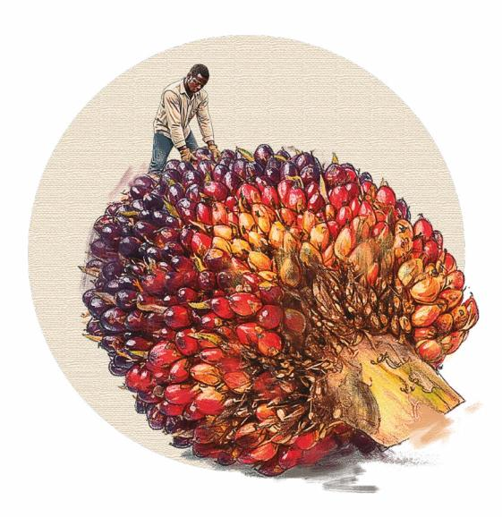

Requirement 2.1.2 Obtain the list of pesticides and fertilisers authorised by the ICA

> Collect information from producers on the application method of agrochemicals and the management of containers (control sheet/ questionnaire)

> Provide producers and cooperatives with an updated list of authorised agrochemicals

Provide producers with tools to monitor the implementation of fertilisers and pesticides and the treatment of containers

Training producers on authorised agrochemicals and container treatment

Consult possible reports from NGOs, cooperatives and the administration on possible cases of soil degradation in the collection area

Compile and verify various documents that demonstrate good management of agrochemicals, such as management plans, company policies, etc.

**Authorised agricultural inputs are used and handled appropriately in accordance with technical procedures.**

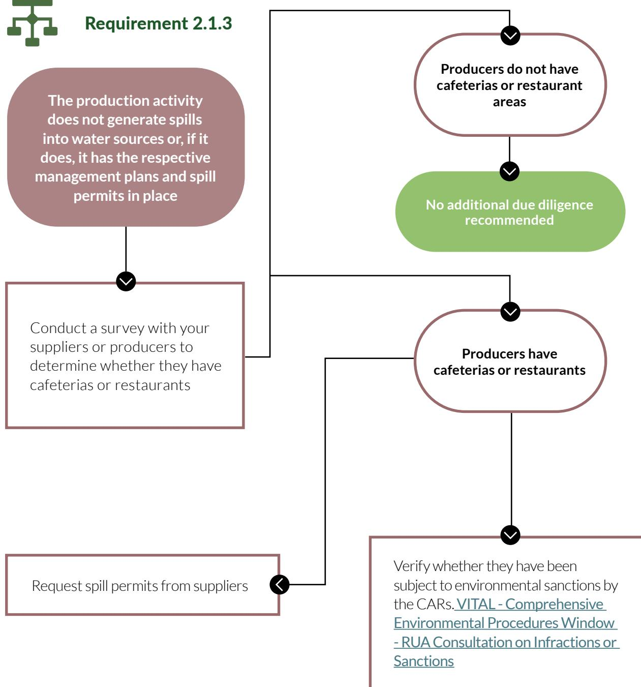

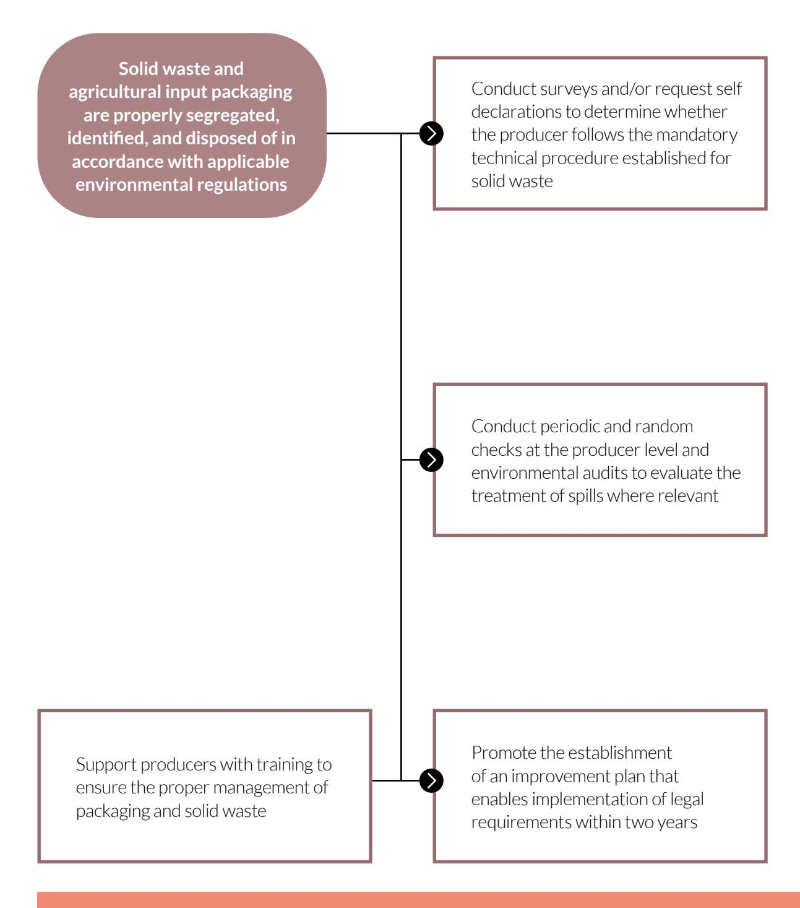

**Standard due diligence**

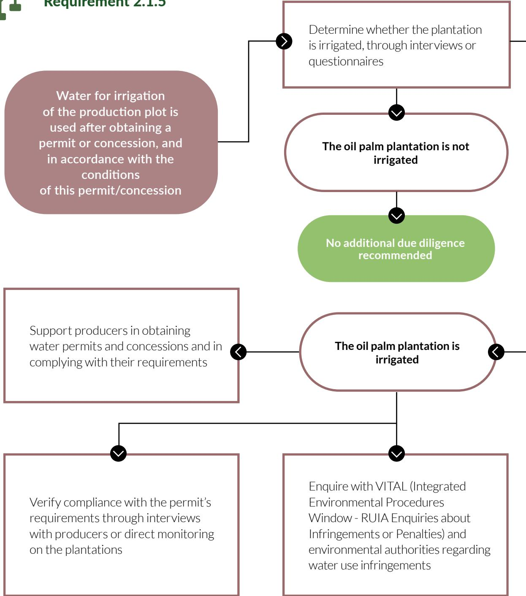

#### **Standard due diligence**

Confirm the absence of soil degradation in the area through interviews with cooperatives, NGOs, local authorities and other local actors

Support producers in best practices for the use of soils at risk of erosion, soil conservation and biodiversity loss, for example through training, awareness campaigns, etc.

Promote the use of legumes as shade and green manure (e.g. Flemingia congesta, Crotalaria sp.), which fix and return nitrogen to the soil

Compile and verify: reports from NGOs, cooperatives and the administration on soil degradation; soil management and use plan; good agricultural practices manual; integrated pest management plan or agrochemical molecule rotation plan; follow-up visit report by agronomists, etc.

> Obtain, where available, details on possible training for producers (training organisations, date, participants, content, etc.) in good agricultural practices. Consult the Single Register of Environmental Infringements

**Producers protect and conserve the soil**

Confirm the absence of air pollution in the sourcing area through interviews with cooperatives, NGOs, local authorities and other local actors

Promote good agricultural practices, including the prohibition and negative effects of crop residue burning

Collect and verify, by sampling: Technical recommendation protocols on agricultural practices related to the implementation of chemicals that generate atmospheric pollution; record of infringements in the Single Register of Environmental Infringements (RUIA)

> Train producers on the necessary permits and applicable conditions

Establish policies and provide technical assistance to producers that address the prohibition of crop residue burning and raise awareness of its negative environmental impacts

**Agricultural activity does not exceed legal limits for atmospheric pollutants, and the burning of agricultural waste is carried out after obtaining a permit and in accordance with legal conditions**

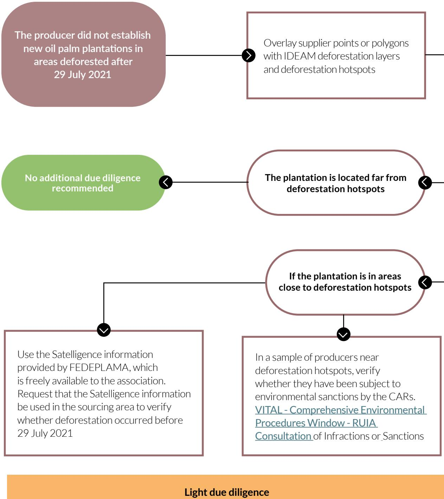

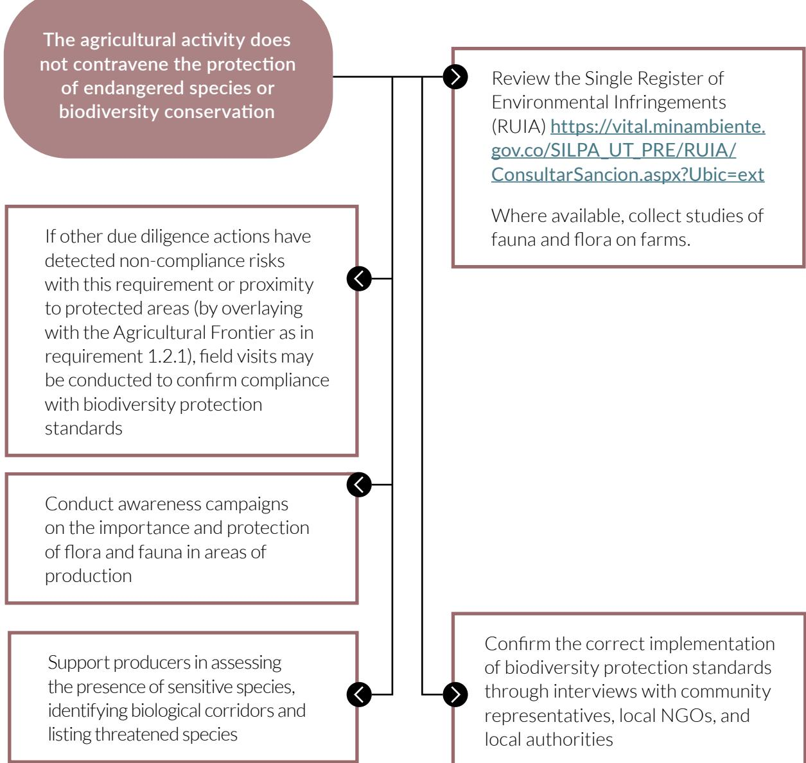

#### CATEGORY 3 THIRD PARTIES' RIGHTS AND FPIC

Although approximately 80% of oil palm producers are smallholders, there remains a potential risk that medium- and large-scale producers may adversely affect the rights of third parties, particularly in areas inhabited by Indigenous or peasant communities. Similar risks may also arise in smallholder contexts, although their nature and scale are generally different. However, the environmental standards outlined above already address risks of adverse impacts on third parties, insofar as they protect rights such as the community's right to a healthy environment, as recognised in the 1991 Constitution. Colombian law does not establish separate or additional standards specifically dedicated to third-party or community rights beyond those embedded in the existing environmental framework. Certain aspects of community rights are also addressed under the section on land-use rights, in relation to access to land, and under the environmental protection section, with regard to protection against environmental pollution. In Colombia, there is no domestic legal framework that explicitly regulates Free, Prior and Informed Consent (FPIC) as an autonomous legal concept. Instead, Colombian law provides for a Prior Consultation mechanism, which applies only to projects carried out within Indigenous territories or to projects that directly affect Indigenous or ethnic communities.

| requirement Context Level of                 |   |
|----------------------------------------------|---|
| implementation Due diligence recommendations |   |
| Overlay the polygons of the area of pro      |  |
| areas, archaeological sites and others al    |  |

| Legal requirement Context Level of implementation There have been isolated cases of territorial conflicts and human rights violations in the past, com  pounded by institutional weak  Geospatial analysis ness in some areas of the country Overlay the polygons of the such as Guaviare and Nariño, but this is not considered a recurring situation. Most of these cases have already been resolved or are Third parties’ being addressed. rights and FPIC High level of The following is a list of in  implementation digenous reserves located in palm-growing areas: Light due diligence 3.2.1. Indigenous reserves Province Gross area (ha) % The rights of El Cedro, Las | Due diligence recommendations production area with the maps of indigenous reserves and commu  nity councils held by the Ministry of the Interior. If there are over  laps between production areas and the producer is not registered in the census or register of the reserve or collective territory, or does not provide express authori  sation from the representatives of the collective territory, there are strong indications of illegality. The due diligence measures described |
|-------------------------------------------------------------------------------------------------------------------------------------------------------------------------------------------------------------------------------------------------------------------------------------------------------------------------------------------------------------------------------------------------------------------------------------------------------------------------------------------------------------------------------------------------------------------------------------------------------------------------------------------------------------------------------------|-----------------------------------------------------------------------------------------------------------------------------------------------------------------------------------------------------------------------------------------------------------------------------------------------------------------------------------------------------------------------------------------------------------------------------------------------------------------------------------------------|
| Nariño 183 92.7 Peñas, Pilví indigenous and and La Pintada below are recommended. Afro-Colombian Piguambi                                                                                                                                                                                                                                                                                                                                                                                                                                                                                                                                                                           |                                                                                                                                                                                                                                                                                                                                                                                                                                                                                               |
| Palangala Nariño 12 6.2 peoples are Stakeholder consultations Peña La respected                                                                                                                                                                                                                                                                                                                                                                                                                                                                                                                                                                                                     |                                                                                                                                                                                                                                                                                                                                                                                                                                                                                               |
| Alegria Nariño 1 0.5                                                                                                                                                                                                                                                                                                                                                                                                                                                                                                                                                                                                                                                                | Interviews with local authorities such as the Ombudsman’s Office                                                                                                                                                                                                                                                                                                                                                                                                                              |
| La Sal Meta 1 0.4 Sikuani de                                                                                                                                                                                                                                                                                                                                                                                                                                                                                                                                                                                                                                                        | and/or the Ministry of the Interior                                                                                                                                                                                                                                                                                                                                                                                                                                                           |
| Awalibá Meta 0 0.1 and local NGOs.                                                                                                                                                                                                                                                                                                                                                                                                                                                                                                                                                                                                                                                  |                                                                                                                                                                                                                                                                                                                                                                                                                                                                                               |
| Total 198 100 of documents                                                                                                                                                                                                                                                                                                                                                                                                                                                                                                                                                                                                                                                          | Compilation and verification Relevant documents generated                                                                                                                                                                                                                                                                                                                                                                                                                                     |
| during the prior consultation pro (Only in areas close to collective                                                                                                                                                                                                                                                                                                                                                                                                                                                                                                                                                                                                                |                                                                                                                                                                                                                                                                                                                                                                                                                                                                                              |
| cess, such as notifications, meet territories)                                                                                                                                                                                                                                                                                                                                                                                                                                                                                                                                                                                                                                      |  ing minutes, formal agreements with communities, participation                                                                                                                                                                                                                                                                                                                                                                                                                              |
| participation. Evaluate imple                                                                                                                                                                                                                                                                                                                                                                                                                                                                                                                                                                                                                                                       |                                                                                                                                                                                                                                                                                                                                                                                                                                                                                              |
| relations and ongoing dia                                                                                                                                                                                                                                                                                                                                                                                                                                                                                                                                                                                                                                                           |                                                                                                                                                                                                                                                                                                                                                                                                                                                                                              |
| mechanisms open to indige                                                                                                                                                                                                                                                                                                                                                                                                                                                                                                                                                                                                                                                           |                                                                                                                                                                                                                                                                                                                                                                                                                                                                                              |
| Agricultural projects are re  quired to carry out Free, Prior Third parties’ and Informed Consultation rights and FPIC (FPIC) with indigenous peoples and processes (and other ethnic communities) when these projects directly High level of                                                                                                                                                                                                                                                                                                                                                                                                                                      | report, and consultation results. Implementation of procedures Carry out prior consultation processes, when necessary,                                                                                                                                                                                                                                                                                                                                                                        |
| affect them, whether due to loca  implementation tion, use of natural resources or social, cultural or environmental Light due If the agricultural impacts. diligence activity audits or reviews. generates According to the SISPA for potential impacts oil palm crops are located in on ethnic collective territories (black, communities, indigenous and peasant reserve the FPIC or prior                                                                                                                                                                                                                                                                                      | with effective and documented mentation of prior consultation processes externally through Establish strong community logue, establish complaint nous peoples, and establish a mechanism for monitoring the                                                                                                                                                                                                                                                                                   |
| communities), a very low per  consultation agreements reached. centage that does not represent process was a significant risk. respected                                                                                                                                                                                                                                                                                                                                                                                                                                                                                                                                           |                                                                                                                                                                                                                                                                                                                                                                                                                                                                                               |

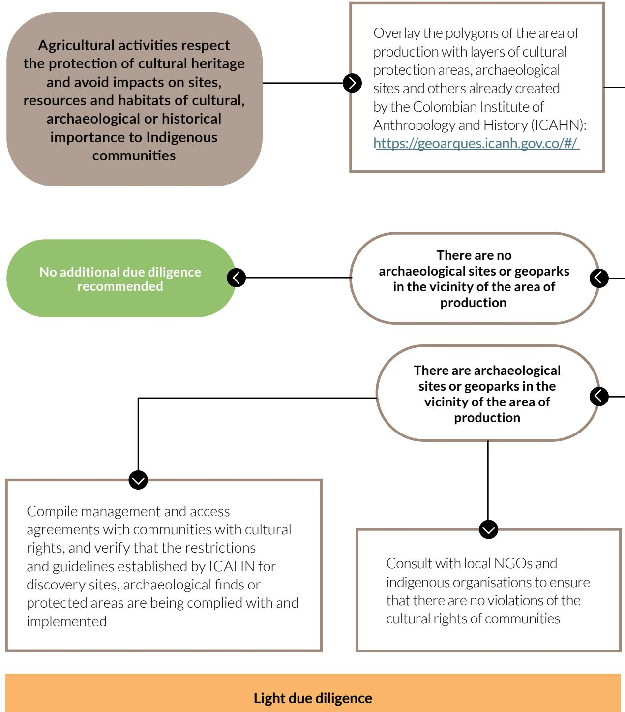

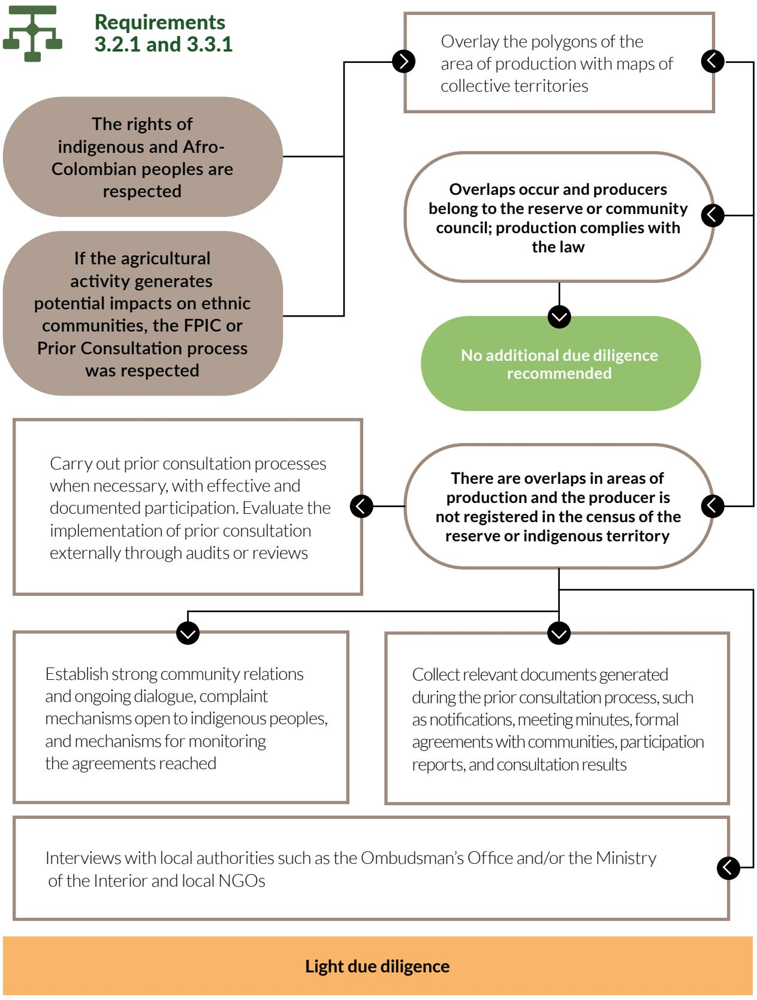

#### CATEGORY 4 **LABOUR RIGHTS**

Note: This category is specifically listed in Article 2.40 of the EUDR but is not directly related to the objectives of the Regulation.

In Colombia, informal employment remains a structural characteristic of the rural economy, with more than 80% of the agricultural workforce engaged in informal labour arrangements (National Administrative Department of Statistics, 2023). However, the oil palm sector presents a markedly different profile. According to data from FEDEPALMA's Employment and Social Security Observatory and studies conducted by Fedesarrollo, labour formalisation in the sector reaches approximately 80%, positioning it among the most advanced agricultural subsectors in terms of compliance with labour regulations.

The sector comprises a mix of large agro-industrial plantations and small- and medium-sized producers. Larger companies have generally adopted formal labour practices, including written employment contracts, affiliation to the social

security system, and implementation of occupational health and safety standards. Nevertheless, challenges remain in smaller segments of the value chain. Some smallholders continue to rely on informal or temporary labour arrangements, particularly for field activities such as harvesting, pruning, and maintenance. These activities are often carried out by casual workers engaged through oral agreements and without full access to statutory labour protections.

Labour relations within the sector therefore vary considerably. Among smallholders, work is frequently organised through family or community-based arrangements. In contrast, large plantations often subcontract labour services. Such subcontracting structures may weaken the direct employer–employee relationship, potentially limiting the effective enforcement of labour standards. As a result, certain categories of workers may remain outside the full scope of legal obligations relating to occupational health and safety, social security coverage, and freedom of association.

| Context Level of                  |   |
|-----------------------------------|---|
| information by sampling to deter  |  |
| conditions under which the activ  |  |
| ity qualifies as salaried employ  |  |
| of production, the following addi |  |
| working conditions), to obtain in |  |
| and possible cases of non-com     |  |

| Legal requirement                                                                                                                                                                                                               | Context                                                                                                                                                                                                                                                                                                                                                                                                                                                                                                                                                                                                                                           | Level of implementation                                               | Due diligence recommendations                                                                                                                                                                                                                                                                                                                                                                                        |
|---------------------------------------------------------------------------------------------------------------------------------------------------------------------------------------------------------------------------------|---------------------------------------------------------------------------------------------------------------------------------------------------------------------------------------------------------------------------------------------------------------------------------------------------------------------------------------------------------------------------------------------------------------------------------------------------------------------------------------------------------------------------------------------------------------------------------------------------------------------------------------------------|-----------------------------------------------------------------------|----------------------------------------------------------------------------------------------------------------------------------------------------------------------------------------------------------------------------------------------------------------------------------------------------------------------------------------------------------------------------------------------------------------------|
| 
<b>Labour rights</b>
 
<b>4.2.1.</b>
 
If a producer employs permanent workers, working hours must not exceed the limits established by law, and any overtime or work performed on Sundays must be remunerated
 | 
The risk is very low considering that workers on the plot always work during daylight hours and have midday breaks.
 
Informality is not associated with this type of labour abuse.
 
According to Cenipalma's IDS, 34% of farms do not report overtime pay or surcharges for Sundays and public holidays.
 
Forty-two percent make settlements with contracted personnel.
 
Sixty-four percent of farms provide workers with a detailed explanation of the terms of their employment.
 
The risk is very low considering that workers on oil palm plantations work during daylight hours and have midday breaks.
 | 
High level of implementation
 
<b>Light due diligence</b>
 | 
<b>Field verifications</b>
 
On a sample basis and/or if previous due diligence actions have indicated a risk of non-compliance, conduct periodic field verifications with producers to verify:
 <ul> <li>• that employers offer written contracts where necessary (permanent workers on defined terms)</li> <li>• that workers receive the minimum wage and that working hours are respected.</li> </ul> |
| 
<b>Labour rights</b>
 
<b>4.3.1.</b>
 
Workers must receive at least the legal minimum wage
                                                                                                                    | 
Although a significant part of the formal palm oil sector complies with the legal minimum wage, risks persist in some areas and segments, especially where there is greater informality, excessive outsourcing or oral contracts. The risk increases when poorly structured worker cooperatives or labour intermediaries are used, or when workers are paid by the task without ensuring that their final monthly income reaches the legal minimum. It has also been documented that, in some cases, payment in kind or based on productivity can conceal remuneration below the legal threshold.
                                          | 
High level of implementation
 
<b>Light due diligence</b>
 |                                                                                                                                                                                                                                                                                                                                                                                                                      |

| requirement | Context                             | Level of |
|-------------|-------------------------------------|----------|
|             | Employment Survey of the Co        |          |
|             | compared to other palm oil-produc  |          |

| Legal requirement | Context                                                                                                                                                                                                                                                                                                                                                                                                                                                                                                                                                                                                                                                                                                                                                                   | Level of implementation | Due diligence recommendations                                                                                                                                                                                                                                                                                                                                                                                                                                                                                                                                                                                                                                                                                                                                                                                                                                                                                                                                                                                                                                                                                                                                                                                                                                                                                                                                                                             |
|-------------------|---------------------------------------------------------------------------------------------------------------------------------------------------------------------------------------------------------------------------------------------------------------------------------------------------------------------------------------------------------------------------------------------------------------------------------------------------------------------------------------------------------------------------------------------------------------------------------------------------------------------------------------------------------------------------------------------------------------------------------------------------------------------------|-------------------------|-----------------------------------------------------------------------------------------------------------------------------------------------------------------------------------------------------------------------------------------------------------------------------------------------------------------------------------------------------------------------------------------------------------------------------------------------------------------------------------------------------------------------------------------------------------------------------------------------------------------------------------------------------------------------------------------------------------------------------------------------------------------------------------------------------------------------------------------------------------------------------------------------------------------------------------------------------------------------------------------------------------------------------------------------------------------------------------------------------------------------------------------------------------------------------------------------------------------------------------------------------------------------------------------------------------------------------------------------------------------------------------------------------------|
|                   | <ul> <li>• Working in areas with poisonous wildlife (in humid areas).</li> <li>• Working at heights.</li> </ul> 
Therefore, although the level of formality is high, it is not sufficient to sustain a low health and safety risk at the sectoral level.
 
In terms of the risks associated with work activities, small and medium-sized producers are mainly exposed to risk situations due to:
 <ul> <li>• Lack of adequate personal protective equipment (PPE).</li> <li>• Absence of training and periodic monitoring of physical, chemical, or ergonomic risks.</li> <li>• Risks from exposure to agrochemicals without containment measures.</li> <li>• Deficiencies in access to occupational health services and occupational accident care.</li> </ul> |                         | <ul> <li>• Confirm with the employer, and through a copy of the relevant certificate, that workers are affiliated with a Labour Risk Administrator as recorded in the Single Registry of Affiliates (<a href="#">RUAE</a>), and that workplace accidents are duly and timely reported. Collect any audit reports that prove the implementation of occupational health and safety requirements and adequate conditions in terms of infrastructure, equipment and safety implements at work.</li> <li>• Sectoral manuals with recommendations, trade union policies for safety and good working practices.</li> </ul> 
<b>Implementation of procedures and processes</b>
 <ul> <li>• Conduct employee training campaigns on risk prevention, use of hazardous materials, and first aid.</li> </ul> 
<b>Stakeholder consultations</b>
 <ul> <li>• Consult local NGOs specialising in these issues to obtain information on working conditions and possible cases of non-compliance with working conditions in the sourcing area.</li> </ul> 
<b>Field verifications</b>
 <ul> <li>• By sampling and/or if previous due diligence actions have indicated a risk of non-compliance, conduct field verifications to determine whether workers have access to protective equipment, whether they are carrying excessive loads, and whether there are documentary records of these proce</li></ul> |

| requirement Context       | Level of                        |
|---------------------------|---------------------------------|
| nation, which are reflect |                                |
| medium-sized produc       |                                |
| gaps in the palm oil sec  |                                |
| tor in Colombia”          | https://                        |
| www.co.undp.org           | ,                               |
| Alliance audits – includ  |                                |
| ing cases of non-com      |                                |
|                           | Review and implement the Gender |

| Legal requirement                                                                                                                                                                 | Context                                                                                                                                                                                                                                                                                                                                                                                                                                                                                                                                                              | Level of implementation | Due diligence recommendations                                                                                                                                                                                                                                                                                                                                                                                                                                                                                                                                                                                                                                                                                                                                                                                                                                                                                                                                                                                                                                                                                                                                                                                                       |
|-----------------------------------------------------------------------------------------------------------------------------------------------------------------------------------|----------------------------------------------------------------------------------------------------------------------------------------------------------------------------------------------------------------------------------------------------------------------------------------------------------------------------------------------------------------------------------------------------------------------------------------------------------------------------------------------------------------------------------------------------------------------|-------------------------|-------------------------------------------------------------------------------------------------------------------------------------------------------------------------------------------------------------------------------------------------------------------------------------------------------------------------------------------------------------------------------------------------------------------------------------------------------------------------------------------------------------------------------------------------------------------------------------------------------------------------------------------------------------------------------------------------------------------------------------------------------------------------------------------------------------------------------------------------------------------------------------------------------------------------------------------------------------------------------------------------------------------------------------------------------------------------------------------------------------------------------------------------------------------------------------------------------------------------------------|
|                                                                                                                                                                                   | 
The risk in small plantations is non-existent, as at least 25 employees are required to form a trade union.
 
The palm oil sector has been identified as one of the most committed to decent work in rural areas, with more than 200,000 direct and indirect jobs.
                                                                                                                                                                                                                                                                                       |                         | 
As a first step, identify whether there are farms with more than 25 permanent employees in the sourcing area. An average of 1 employee per 10 ha is estimated, so if the plantation area exceeds 250 ha, this requirement could be relevant.
 
For producers with farms with more than 25 employees:
 
<b>Implementation of procedures and processes</b>
 <ul> <li>Conduct training and/or information campaigns for workers on labour rights.</li> <li>Conduct internal and external audits to detect illegal outsourcing practices aimed at limiting workers' rights to union membership.</li> <li>Establish complaint mechanisms for direct and outsourced workers.</li> </ul> 
<b>Collection and verification of data</b>
 <ul> <li>Consult public reports from labour offices and local NGOs specialising in these issues, such as Human Rights Watch and ILO.</li> <li>Contract verification: Ensure that there are no clauses or practices in employment contracts that directly or indirectly limit the right of association.</li> <li>Map the risks of anti-union practices, including outsourcing schemes designed to prevent unionisation, through surveys of workers in sourcing areas.</li> </ul> |
| 
<b>Labour rights</b>
 
<b>4.6.1.</b>
 
Workers are free to join a trade union of their choice and shall not be subject to retaliation for exercising this right.
 | 
The results of the survey on trade union membership and employee funds in the Colombian agricultural sector indicate that 6.1% of those working in the sector were members of trade unions, while 2.6% were members of employee associations. However, the unionisation rate is high compared to the national total, which was estimated at 4.0% in 2024 (Alguero, 2024), and compared to the rate in the agricultural sector as a whole, which was 2.6% in 2020 (Vásquez, 2020).
 
There is no specific information available for the sector on guarant
 |                         |                                                                                                                                                                                                                                                                                                                                                                                                                                                                                                                                                                                                                                                                                                                                                                                                                                                                                                                                                                                                                                                                                                                                                                                                                                     |

| requirement Context          | Level of               |
|------------------------------|------------------------|
| Beneficiaries of Social Pro  |                       |
| SISBEN does not cover occu   |                       |
| system provided by the       | Labour                 |
| security without unfairly af |                       |
| 96% of farms verify that con |                       |
|                              | of Affiliates ( RUAF ) |

| Legal requirement                                                                                                                                                                      | Context                                                                                                                                                                                                                                                                                                                                  | Level of implementation                                               | Due diligence recommendations                                                                                                                                                                                                                                                                                                                                                                                                                                                                                                                                                                                                                                                                                                                        |
|----------------------------------------------------------------------------------------------------------------------------------------------------------------------------------------|------------------------------------------------------------------------------------------------------------------------------------------------------------------------------------------------------------------------------------------------------------------------------------------------------------------------------------------|-----------------------------------------------------------------------|------------------------------------------------------------------------------------------------------------------------------------------------------------------------------------------------------------------------------------------------------------------------------------------------------------------------------------------------------------------------------------------------------------------------------------------------------------------------------------------------------------------------------------------------------------------------------------------------------------------------------------------------------------------------------------------------------------------------------------------------------|
|                                                                                                                                                                                        |                                                                                                                                                                                                                                                                                                                                          |                                                                       | 
<b>Compilation and verification of documents</b>
 
For permanent employees, collect and analyse data on leave implementation, evidence of leave granted for maternity and paternity cases, if any, requesting the Integrated Contribution Settlement Form where payments during leave to the employer are recorded.
 
<b>Implementation of procedures and processes</b>
 <ul> <li>Conduct training campaigns for supervisors and human resources managers on leave regulations.</li> <li>Promote the adoption and implementation of written maternity and paternity protection policies on plantations.</li> <li>Establish confidential complaint mechanisms to report non-compliance with maternity and paternity leave.</li> </ul> |
| 
<b>Labour rights</b>
 
<b>4.8.1.</b>
 
The employer shall grant 18 weeks of paid maternity leave to pregnant employees and 8 days of paid paternity leave to fathers.
 | 
Large and medium-sized farms associated with trade unions tend to comply with these obligations, as they have high levels of labour formalisation. However, there may be a greater risk in small farms with oral contracts, informality or lack of affiliation to the health system, which prevents access to leave and benefits.
 | 
High level of implementation
 
<b>Light due diligence</b>
 |                                                                                                                                                                                                                                                                                                                                                                                                                                                                                                                                                                                                                                                                                                                                                      |

| Legal requirement | Context                                                                                                                                                                                                                                                                                                                                                                                                                                                                                                                                                                                                                                                                                                                                                                                                                                                                                                                                                                                                                                                                                                                                   | Level of implementation | Due diligence recommendations                                                                                                                                                                                                                                                                                                                                                                                                                                                                                                                                                                                                                                                                                                                                                   |
|-------------------|-------------------------------------------------------------------------------------------------------------------------------------------------------------------------------------------------------------------------------------------------------------------------------------------------------------------------------------------------------------------------------------------------------------------------------------------------------------------------------------------------------------------------------------------------------------------------------------------------------------------------------------------------------------------------------------------------------------------------------------------------------------------------------------------------------------------------------------------------------------------------------------------------------------------------------------------------------------------------------------------------------------------------------------------------------------------------------------------------------------------------------------------|-------------------------|---------------------------------------------------------------------------------------------------------------------------------------------------------------------------------------------------------------------------------------------------------------------------------------------------------------------------------------------------------------------------------------------------------------------------------------------------------------------------------------------------------------------------------------------------------------------------------------------------------------------------------------------------------------------------------------------------------------------------------------------------------------------------------|
|                   | 
At the sectoral level, the Gender Equality Policy identified the need to address gender-based violence. As part of closing gaps (in particular the gap "There is more violence against women than against men"), the sector has defined programmes to address and prevent it. One of these is the programme to promote women's participation and non-discrimination. To strengthen this programme, guidelines on non-discrimination and improving the working environment for women have been developed, in the form of a question-and-answer guide that provides companies with guidance on how to address violence in the workplace.
 
The second programme addresses gender-based violence in palm oil cultivation. In addition, there is a guide for the prevention of workplace and sexual harassment based on national regulations. <a href="https://fedepalma.org/comunicados/fedepalma-consolida-su-politica-de-genero-impulsando-la-equidad-en-el-sector-palmero-colombiano/">https://fedepalma.org/comunicados/fedepalma-consolida-su-politica-de-genero-impulsando-la-equidad-en-el-sector-palmero-colombiano/</a>
 |                         | 
<b>Collection and verification of data</b>
 <ul> <li>Collect relevant data such as public reports from local authorities.</li> </ul> 
<b>Implementation of procedures and processes</b>
 <ul> <li>Monitor effective sanctions for workplace or sexual harassment.</li> <li>Promote employee training, internal policies and protocols for employees for the prevention, detection and handling of cases of workplace or sexual harassment with your suppliers.</li> <li>Establish confidential reporting and complaint mechanisms for workplace or sexual harassment.</li> <li>Establish joint employer-employee committees, including a Workplace Coexistence Committee, as formal mechanisms for the prevention and management of workplace harassment.</li> </ul> |
|                   |                                                                                                                                                                                                                                                                                                                                                                                                                                                                                                                                                                                                                                                                                                                                                                                                                                                                                                                                                                                                                                                                                                                                           |                         |                                                                                                                                                                                                                                                                                                                                                                                                                                                                                                                                                                                                                                                                                                                                                                                 |

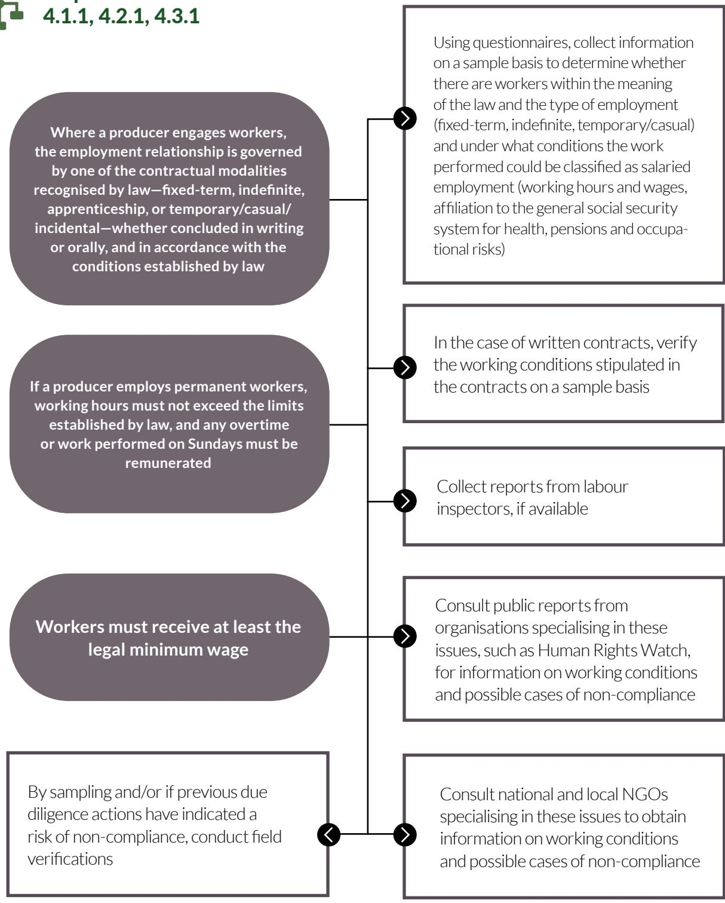

### Requirement 4.4.1

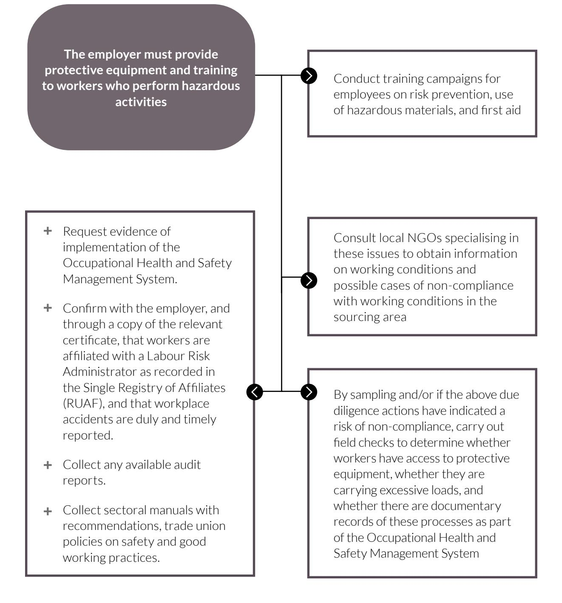

### Requirement 4.5.1

#### **Light due diligence**

Review the Ministry of Labour's equality indicators and monitoring tools to confirm that the requirement is reflected in the company's non-discrimination policy and integrated into its internal policies and procedures. Consult public reports from organisations specialising in these issues, such as ILO and Human Rights Watch (reports on human rights in various sectors, including palm oil, highlighting working conditions), for information on possible cases of discrimination in the sourcing area.

If credible evidence or substantiated allegations of discrimination are identified in the previous step, consult national and local NGOs specialising in discrimination issues to obtain information on possible cases of non-compliance in the sourcing area

Train supervisors, field managers and HR managers on inclusive and non-discriminatory practices. Establish a secure and anonymous channel for workers to report discrimination or unequal treatment. Implement internal audits to review labour practices, with a focus on inclusion. Include non-discrimination clauses in contracts with third parties (cooperatives). Review and implement the Gender Equality Sector Policy toolkit.

**No discrimination shall occur between workers on grounds of gender, race, religion, age, or any other protected characteristic, where capabilities and working conditions are equal**

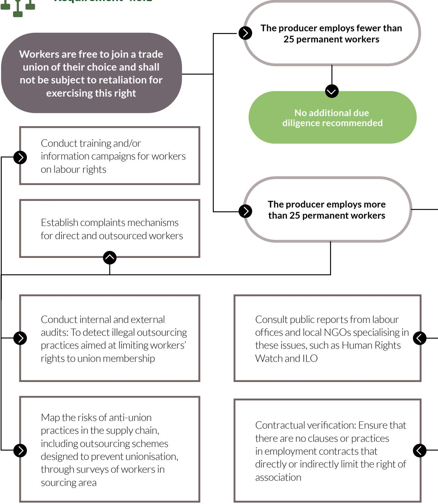

#### **Standard due diligence**

#### Requirement 4.6.1

### Requirement 4.7.1

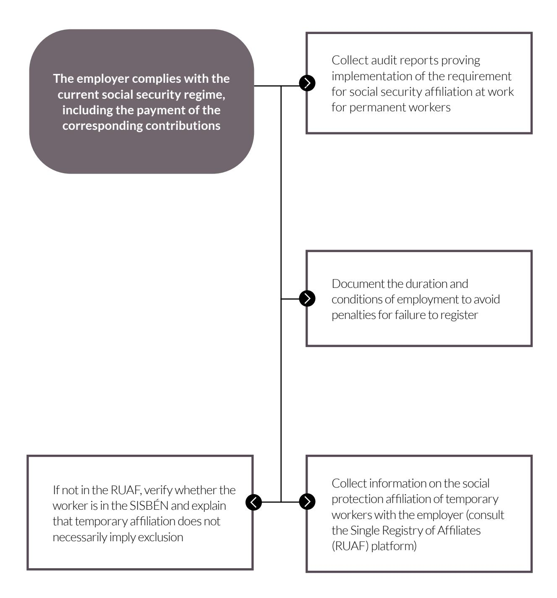

### Requirement 4.8.1

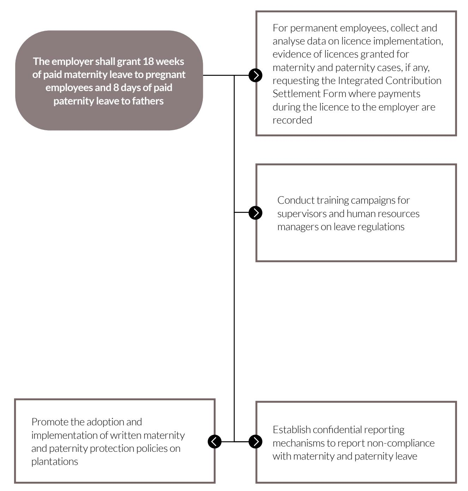

### Requirements 4.9.1

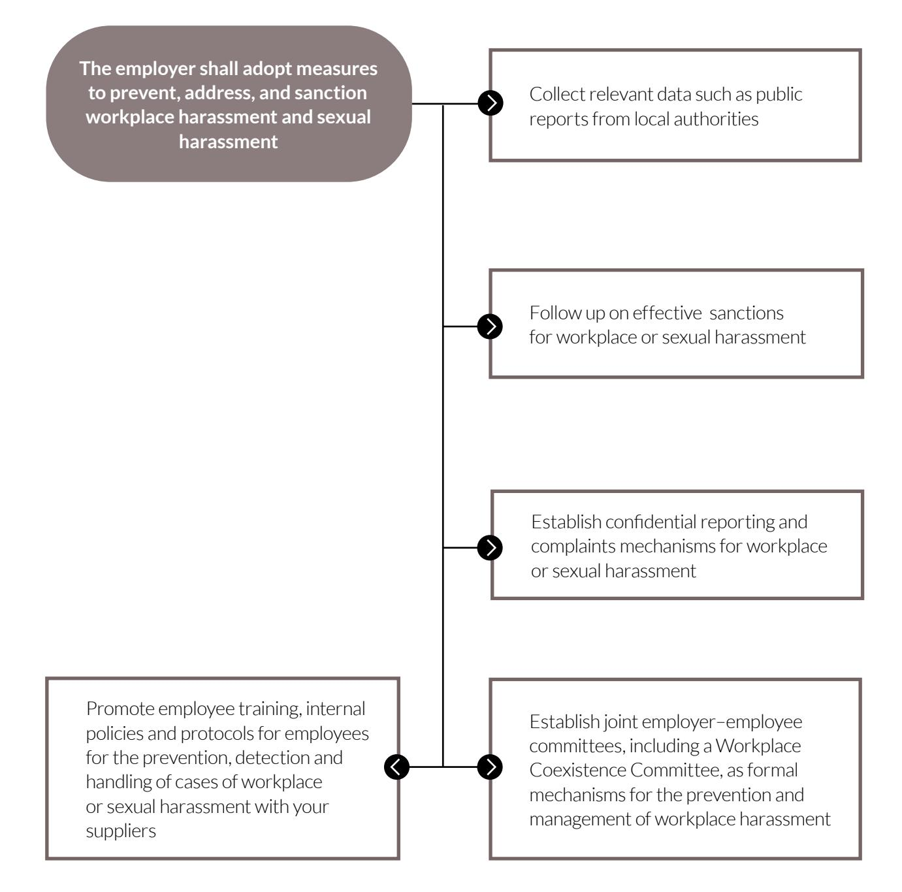

#### CATEGORY 5 **HUMAN RIGHTS**

**Note**: This category is explicitly included in Article 2(40) of the EUDR, although it is not directly related to the main objective of the Regulation.

Human rights requirements in Colombia's palm oil sector primarily focus on the prevention of child labour and forced labour. While, in certain rural contexts, children's participation in agricultural activities may be perceived as part of family-based learning, Colombian legislation—consistent with ILO Conventions No. 138 (Minimum Age) and No. 182 (Worst Forms of Child Labour)—prohibits any work that jeopardises the physical, mental, moral, or educational development of minors.

Colombian law permits employment from the age of 15, subject to prior authorisation from the Ministry of Labour. However, it strictly prohibits minors from engaging in hazardous activities, including certain tasks associated with palm cultivation. Decree 1174 of 2016 and Resolution 1796 of 2018 establish specific safeguards and conditions for the protection of minors in employment.

All forms of forced or compulsory labour are expressly prohibited under Colombian labour legislation, which provides for administrative and criminal sanctions against employers who engage in such practices. Although no systematic cases have been formally documented in the palm oil sector, residual risks may arise in contexts characterised by labour informality, insufficient oversight of subcontracting arrangements, or the recruitment of migrant workers under precarious conditions.

Most Legal requirements in this area derive from the Substantive Labour Code and Colombia's binding international obligations. Oversight and enforcement are primarily the responsibility of the Ministry of Labour and the judicial authorities.

| Legal requirement | Context               | Level of |                                |
|-------------------|-----------------------|----------|--------------------------------|
|                   | the palm agro-indus  |          |                                |
|                   |                       |          | conducted to confirm the cor  |

| Legal requirement                                                                                                                                                                                                           | Context                                                                                                                                                                                                                            | Level of implementation                                                      | Due diligence recommendations                                                                                                                                                                                                                                                                                                                                                                                                                                                                                                                                                                                                                                                                                                                                                                                                                                                                                            |
|-----------------------------------------------------------------------------------------------------------------------------------------------------------------------------------------------------------------------------|------------------------------------------------------------------------------------------------------------------------------------------------------------------------------------------------------------------------------------|------------------------------------------------------------------------------|--------------------------------------------------------------------------------------------------------------------------------------------------------------------------------------------------------------------------------------------------------------------------------------------------------------------------------------------------------------------------------------------------------------------------------------------------------------------------------------------------------------------------------------------------------------------------------------------------------------------------------------------------------------------------------------------------------------------------------------------------------------------------------------------------------------------------------------------------------------------------------------------------------------------------|
|  
<b>Human rights</b>
 
<b>5.2.1.</b>
 
Forced labour, including any practices that restrict workers' freedom of employment, is strictly prohibited
 | 
There is no evidence of forced labour in the oil palm sector. According to ILO, palm cultivation in Colombia has made progress in promoting decent work, with programmes such as the Plan Padrino for labour formalisation.
 | 
<b>High level of implementation</b>
 
<b>Light due diligence</b>
 | 
<b>Collection and verification of data</b>
 
Conduct questionnaires with workers (including subcontracted workers), trade unions (if any) and NGOs on working conditions, working hours, wages and other factors that may be indicators of forced labour or restrictions on workers' freedom of employment.
 
<b>Implementation of procedures and processes</b>
 <ul> <li>Recommend and monitor labour suppliers in the implementation of Codes of Conduct that include the prohibition of forced labour.</li> <li>Implement ongoing training programmes on labour rights for supervisors and workers, focusing on forced labour and freedom of employment.</li> <li>Conduct internal audits and external audits (by independent entities).</li> <li>Establish anonymous and confidential complaint mechanisms so that workers can report abusive labour practices without fear of reprisals.</li> </ul> |

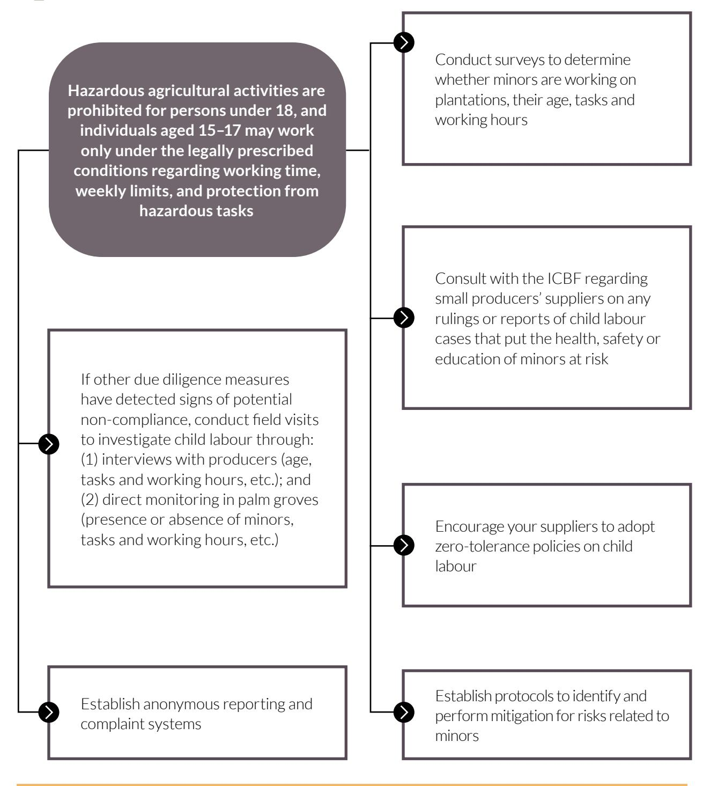

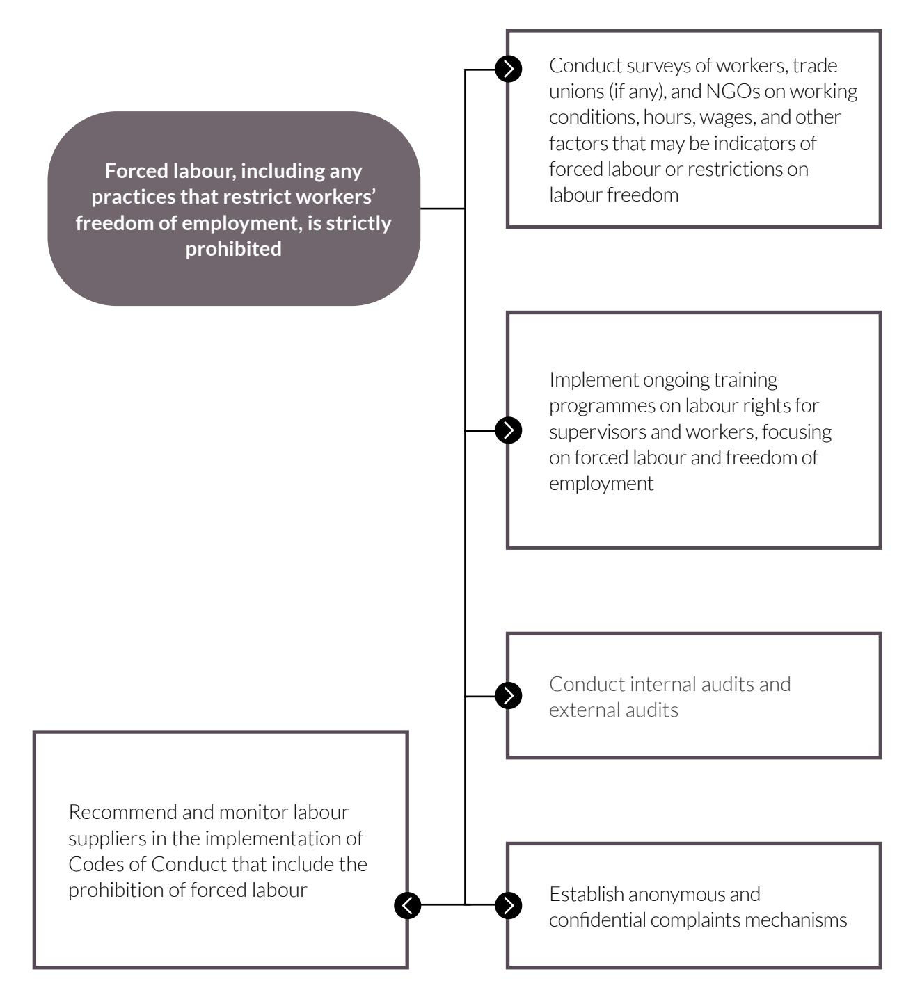

### Requirement 5.2.1

#### CATEGORY 6 **TAXATION, ANTI-CORRUPTION, TRADE AND CUSTOMS**

**Note**: This is the only category of law mentioned in Article 2.40 of the EUDR that may involve entities and activities throughout the supply chain of the country of production, and not only at the level of the production area.

In Colombia, tax implementation in the palm oil sector is dualistic. On the one hand, formally constituted companies—especially those linked to certification or export schemes—tend to implement their tax, trade and customs obligations in a documented and verifiable manner. On the other hand, there is still a **high** level of **informality in the primary links of the chain**, such as smallholders or contractors, which makes complete tax traceability difficult.

Tax authorities have identified cases of **partial evasion or underreporting of income** in rural areas, as well as intermediation practices that

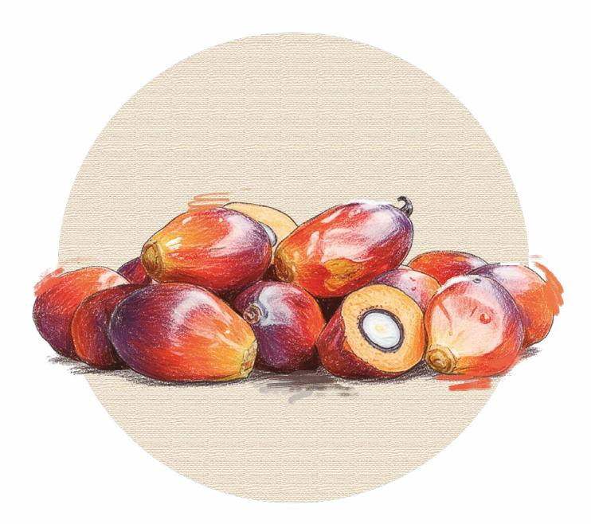

dilute fiscal responsibility. However, the export processes for crude and refined oil are subject to strict customs controls, and tax payments by exporters are generally well recorded.

In terms of the fight against corruption, Colombia has a robust legal framework but faces challenges in its implementation, especially in areas with low institutional presence. Law 1474 of 2011 (Anti-Corruption Statute) and Law 2195 of 2022 reinforce control mechanisms, although their implementation in the agro-industrial sector still needs to be strengthened.

In summary, although the formal palm oil sector complies with fiscal and commercial requirements at the upper levels of the chain, informality in primary production and institutional weakness in certain regions represent risks that must be considered in due diligence systems.

| requirement Context             | Level of     |
|---------------------------------|--------------|
| There is no risk of non-com     |             |
| Parafiscal resources are in     |             |
| vested, among other purpos      |             |
| es, in the sustainable develop  |             |
| include research and techno     |             |
| logical development in sustain  |             |
| support producers in adopt      |             |
| Unlike other parafiscal contri  |             |
| is why it is considered particu |             |
|                                 | documents by |

### Requirement 6.1.2

#### **Light due diligence**

#### **Light due diligence**

Collect and analyse, by sampling, proof of payment of parafiscal charges to extracting companies through FEDEPALMA, consultation to be carried out by the producer or oil trading company

Collect export declarations by sampling

**Palm buyers, processors, or exporters pay the parafiscal contributions defined by law**

**Exporters are responsible for customs duties and taxes as established by law**

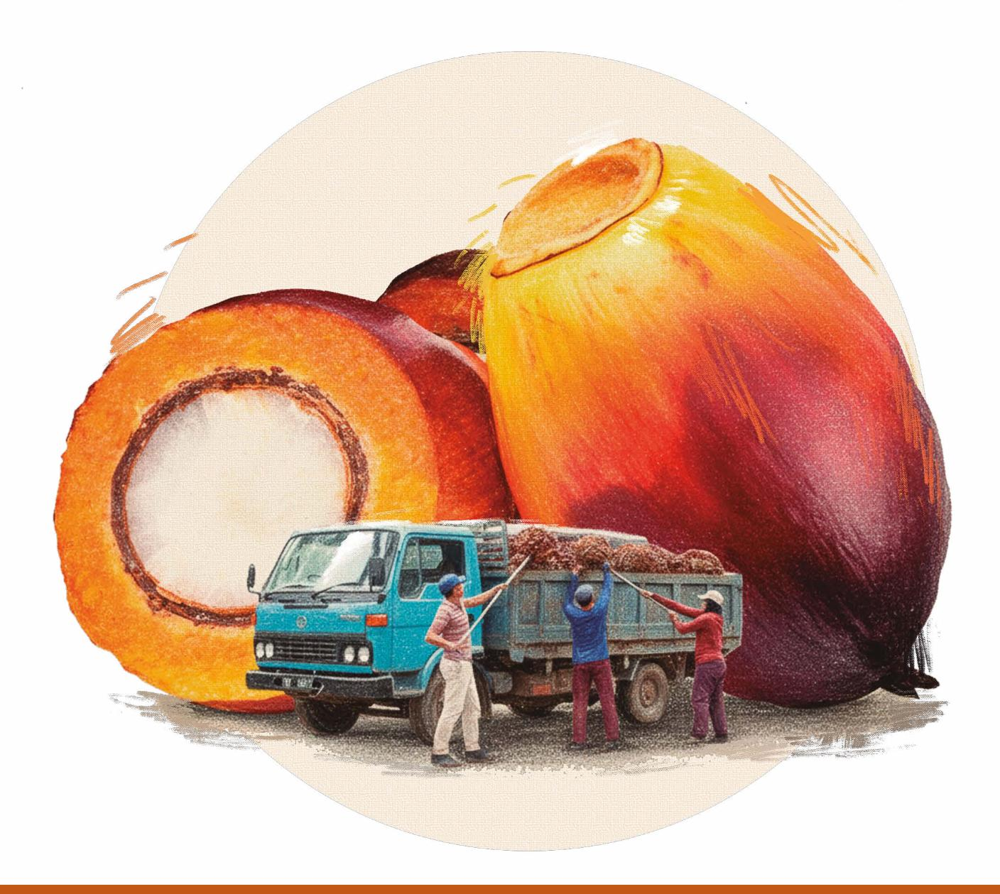

ANNEX

The first step in developing this tool for legality-related due diligence consisted in identifying the relevant Legal requirements under the EUDR for palm oil production in Colombia.

The EUDR defines the legality of commodities according to two criteria:

• National Legal requirements must refer to

- the legal status of the production area.
- There are seven legal areas [for agriculturrights; human rights protected under inter-Nations Declaration on the Rights of Indige-

al products]: land-use rights; environmental protection; the rights of third parties; labour national law; the principle of Free, Prior and Informed Consent, as set out in the United nous Peoples; and tax, anti-corruption, trade and customs regulations.

On 2 October 2024 (updated in April 2025), the European Commission published a guidance document for the implementation of the EUDR, which interprets the Regulation's provisions on the legality criterion. The document aims to assess the relevance of Legal requirements according to the following criteria:

- The requirements have a specific impact on the legal status of the commodity production toms standards].
- The requirements are linked to the Regulation's objectives of halting deforestation and forest degradation, as part of the EU's commitment to address climate change and biodiversity loss.

area [with the exception of tax, trade and cus-

Given that not all labour requirements, as well as certain human rights and third parties' rights, are directly related to the objectives of the EUDR, there is debate as to whether they fall within its scope of application.

In addition, the guidance document extends the scope of tax and anti-corruption regulations to steps in the value chain beyond the area of production. It should be noted that the Commission's guidance document is not legally binding. As specified in the guidance document itself, it does not replace, add to or modify the EUDR's provisions, which establish the legal obligations. Its purpose it to harmonise the implementation of the Regulation across EU member states.

Each EU Member State will adopt its own approach to monitoring operators' implementation of the EUDR. Ultimately, only the courts in each EU country can interpret EU regulations in a legally binding manner and determine the scope of the legality test.

In this context, **this tool takes a precautionary approach**. It considers all areas of law listed in Article 2.40 and includes all requirements that are considered relevant in these seven areas. It indicates with an asterisk those Legal requirements that are not directly linked to the objectives of the EUDR.

This comprehensive approach will allow end users to choose the scope of their work based on their reading of the EUDR and the accompanying guidance.

#### **How the relevance of the requirements has been determined**

Under the EUDR, operators are solely responsible for carrying out due diligence to ensure that the

## Annex 1. Mapping methodology

products they trade in present a negligible risk of illegality. However, the EU recognises that producing countries can facilitate the work of operators and competent authorities (see question 1.30 of the FAQs), in particular by providing information that allows for a better understanding of the applicable national laws. This is precisely the purpose of Annex 2, which maps the relevant Legal requirements for palm oil produced in Colombia.

All existing legal texts and requirements in Colombia that fall within the scope of application of the seven legal categories specified above have been identified. Stakeholders in the palm oil sector, through consultation workshops and bilateral working meetings (see Annex 3), assessed the relevance of each Legal requirement to determine implementation of the EUDR legality criterion.

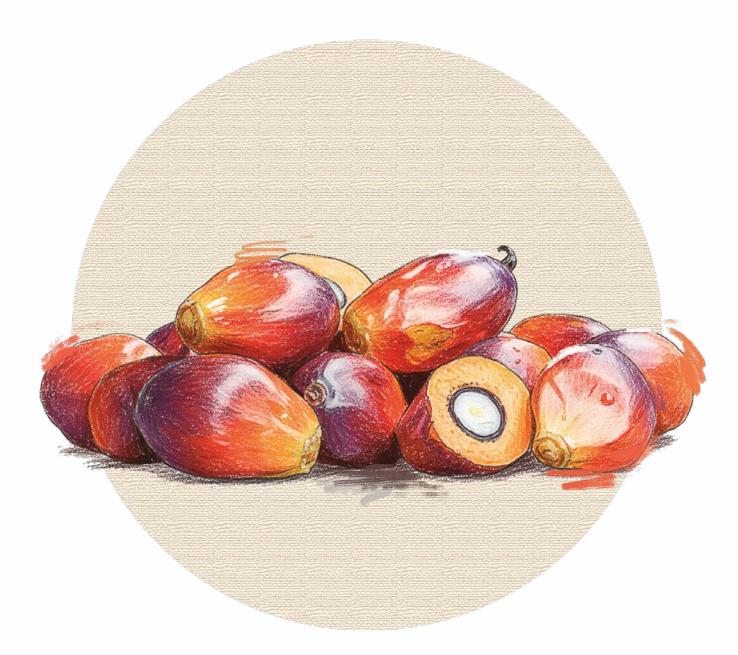

All identified Legal requirements were considered a priori relevant for assessing the conformity of palm oil or its derived products with the EUDR legality criterion, unless it can be clearly identified that:

- The Legal requirement does not apply to the oil palm plantation or to the workers and third parties involved in it [with the exception of tax, trade and customs standards]
- The Legal requirement is not relevant in the context of oil palm production, because the conditions for its implementation are not present
- The Legal requirement is generally applicable, is not subject to implementation texts that prevent its implementation or enforcement, and/or is covered by other more specific requirements.

The tables below, organised by area of law, show the requirements considered relevant and not relevant, and the justifications provided by the stakeholders consulted, for the cultivation of oil palm produced in Colombia. The tables below, presented by area of law, show the 42 Legal requirements identified, 33 considered relevant and 9 not relevant, and the justifications provided by the stakeholders consulted for each of the productive sectors evaluated, in this case for oil palm cultivation.

Requirements marked with an asterisk are not directly related to the EUDR objectives.

## Annex 2. Mapping of relevant Legal requirements for palm oil produced in Colombia

## Land-use rights

| Areas of law Legal requirement             | Legal basis Relevance  |
|--------------------------------------------|------------------------|
| NB: Land                                   |                        |
| 1991 Constitution:                         | Recognises and         |
| Civil Code (Law 57 of 1887):               | Regulates              |
| 2012): Judicial procedures for the defence |                        |
| Law 1561 of 2012:                          | Establishes a special  |
| Law 1448 of 2011:                          | Restitution of land to |
| Law 1776 of 2016:                          | Promotes the           |
| Law 1801 of 2016:                          | Police mechanisms for  |

| Areas of law Legal                 |                        |
|------------------------------------|------------------------|
| requirement                        | Legal basis Relevance  |
| NB: Land tenure                    |                        |
| Civil Code (arts. 762–828):        | Defines                |
| of 2012): Regulates possessory and |                        |
| Law 1776 of 2016:                  | Recognises             |
| Law 1448 of 2011:                  | Protects the rights    |
| Law 1801 of 2016:                  | Police protection of   |
| Supreme Court of Justice):         | Clarifies and          |
| NB: Land tenure                    |                        |
| Law 160 of 1994 (Art. 85):         | Regulates the          |
| Decree 1071 of 2015:               | Regulates the          |
| Decree Law 4633 of 2011:           | Measures for           |
| Law 1448 of 2011:                  | Restitution of land to |
| ILO Convention 169:                | International          |

| Areas of law Legal            |                       |
|-------------------------------|-----------------------|
| requirement                   | Legal basis Relevance |
| NB: Land tenure               |                       |
| 1991 Constitution:            | Recognises            |
| Law 70 of 1993:               | Regulates collective  |
| Decree 1071 of 2015:          | Regulates the         |
| Law 1448 of 2011:             | Restitution of land   |
| ILO Convention 169:           | International         |
| Decree 4634 of 2011:          | Measures for          |
| Decree 902 of 2017 (Art. 17): | Special               |

| Areas of law Legal requirement Legal basis | Relevance        |
|--------------------------------------------|------------------|
| Lease (arts. 1973–1991):                   | Use of a plot in |
| Bailment (arts. 2200–2212):                | Free loan        |
| Anticresis (arts. 2458–2460):              | Delivery of      |
| Usufruct (arts. 823–829):                  | Use rights       |
| Law 1776 of 2016 (ZIDRES):                 | Creates          |
| of 2015: Regulate contracts on             |                  |

| Areas of law Legal requirement | Legal basis Relevance                     |
|--------------------------------|-------------------------------------------|
| Art. 2:                        | Duty of the State to protect life, honour |
| Art. 58:                       | Protection of property and acquired       |
| Art. 64:                       | Progressive access to land for            |

| Areas of law                                               | Legal requirement                                                                                                                                                                             | Legal basis                                                                                                                                                                                                                                                                                                                                                                                                                                                                                                                                                                                                                                                                                                                                                                                                                                                                                                                                                                                                                                                                    | Relevance |
|------------------------------------------------------------|-----------------------------------------------------------------------------------------------------------------------------------------------------------------------------------------------|--------------------------------------------------------------------------------------------------------------------------------------------------------------------------------------------------------------------------------------------------------------------------------------------------------------------------------------------------------------------------------------------------------------------------------------------------------------------------------------------------------------------------------------------------------------------------------------------------------------------------------------------------------------------------------------------------------------------------------------------------------------------------------------------------------------------------------------------------------------------------------------------------------------------------------------------------------------------------------------------------------------------------------------------------------------------------------|-----------|
| <b>1.2 Legal regime for land use</b>                       |                                                                                                                                                                                               |                                                                                                                                                                                                                                                                                                                                                                                                                                                                                                                                                                                                                                                                                                                                                                                                                                                                                                                                                                                                                                                                                |           |
|                                                            | 
<b>1.2.1.</b> The plot is located within the Agricultural Frontier; if it is located in conditional areas, production is only permitted under certain conditions that must be met.
 | 
<b>Law 1776 of 2016, art. 4</b>
 <ul> <li>Entrusts the Ministry of Agriculture with defining the Agricultural Frontier, taking into account environmental reserves and land use restrictions.</li> </ul> 
<b>Resolution 216 of 2018 (MinAgricultura), amended by Resolution No. 327 of 2025</b>
 <ul> <li>Defines the National Agricultural Frontier and adopts the methodology for its identification.</li> </ul> 
<b>Resolution 128 of 2017 (OSPR Policy)</b>
 <ul> <li>Establishes guidelines for the productive and social management of rural property, including the management and regulation of the Agricultural Frontier.</li> </ul> 
<b>Agreement 024 of 1996 (INCORA)</b>
 <ul> <li>Regulates the creation of Peasant Reserve Zones (ZRC); its function is to prevent uncontrolled expansion of the Agricultural Frontier.</li> </ul> 
<b>Final Peace Agreement 2016, Point 1 (Comprehensive Rural Reform)</b>
 <ul> <li>Commits the State to developing an environmental zoning plan that delimits the Agricultural Frontier.</li> </ul> |           |
| 
<b>1.2. Legal requirements for land use are met</b>
 | 
<b>1.2.2.</b> Agricultural activity is permitted in accordance with land use ordinances.
                                                                                           | 
<b>Law 388 of 1997</b>
 <ul> <li>Main standard on land use planning. Creates Land Use Plans (POT), mandatory for municipalities and districts, to be updated every 12 years (Art. 10).</li> </ul> 
<b>Decree 1077 of 2015</b>
 <ul> <li>Regulates the formulation, adoption and implementation of POT, EOT and PBOT. Specifies urban planning, zoning and standards.</li> </ul> 
<b>Law 99 of 1993</b>
 <ul> <li>Integrates environmental criteria into land use plans, ensuring sustainability and protection of strategic areas.</li> </ul> 
<b>Law 1454 of 2011 (LOOT)</b>
 <ul> <li>General framework for territorial coordination between national, departmental and municipal levels in planning.</li> </ul> 
<b>Law 2079 of 2021</b>
 <ul> <li>Reinforces the focus on sustainability and habitat within land use planning.</li> </ul>                                                                                                                                                                                                        |           |

## Environmental protection

| Areas of law Legal requirement Legal basis    | Relevance |
|-----------------------------------------------|-----------|
| Art. 63: Natural parks are inalienable, impre |          |
| restricts land use and zones into strict con  |          |
| Regulates the management of natural resourc   |          |
| Regulates park categories; prohibits agricul  |          |
| Approves the international protection of wet  |          |
| Prohibits high-impact agricultural and extrac |          |

| Areas of law                                                                      | Legal requirement                                                                                                                                                                                                                                                                                                                 | Legal basis                                                                                                                                                                                                                                                                                                                                                                                                                                                                                                                                                                                                                                                                                                                                                                                                                                                                                                                                                                          | Relevance |
|-----------------------------------------------------------------------------------|-----------------------------------------------------------------------------------------------------------------------------------------------------------------------------------------------------------------------------------------------------------------------------------------------------------------------------------|--------------------------------------------------------------------------------------------------------------------------------------------------------------------------------------------------------------------------------------------------------------------------------------------------------------------------------------------------------------------------------------------------------------------------------------------------------------------------------------------------------------------------------------------------------------------------------------------------------------------------------------------------------------------------------------------------------------------------------------------------------------------------------------------------------------------------------------------------------------------------------------------------------------------------------------------------------------------------------------|-----------|
| <b>2. Environmental protection</b>                                                |                                                                                                                                                                                                                                                                                                                                   |                                                                                                                                                                                                                                                                                                                                                                                                                                                                                                                                                                                                                                                                                                                                                                                                                                                                                                                                                                                      |           |
|                                                                                   | 
<b>2.1.1.</b> Agricultural activities are prohibited in protected areas or other legally excluded areas, unless expressly authorised in the applicable management plans or through formal management agreements with the competent authorities, and carried out in accordance with the conditions established therein.
 | 
<b>Decree 1076 of 2015</b>
 <ul> <li>Sole Regulatory Decree for the environmental sector; organises SINAP categories (parks, forest reserves, management districts, recreation areas, etc.); allows agriculture only under sustainable criteria in areas such as Integrated Management Districts or Civil Society Reserves.</li> </ul> 
<b>Resolution 110 of 2022 (Ministry of Environment)</b>
 <ul> <li>Regulates the removal of Forest Reserve areas (Law 2/1959).</li> </ul> 
<b>Law 160 of 1994, Decree 902 of 2017, and ANT agreements</b>
 <ul> <li>Regulate the use of unallocated vacant land and land-use rights for agricultural purposes under sustainability.</li> </ul>                                                                                                                                                                                                                                                                                | Relevant  |
| 
<b>2.1. Environmental requirements for agricultural activities are met</b>
 | 
<b>2.1.2.</b> Authorised agricultural inputs are used and handled appropriately in accordance with technical procedures.
                                                                                                                                                                                               | 
<b>Law 9 of 1979 (National Health Code)</b>
 <ul> <li>Regulates the manufacture, import, trade and use of chemical inputs.</li> </ul> 
<b>Decree 2811 of 1974 (Natural Resources Code)</b>
 <ul> <li>Establishes guidelines for the use of chemical substances with environmental criteria.</li> </ul> 
<b>Decree 1843 of 1991</b>
 <ul> <li>Regulates the handling, use and storage of agricultural pesticides; requires training for users.</li> </ul> 
<b>Law 99 of 1993</b>
 <ul> <li>Empowers environmental authorities to control and sanction the improper use of agrochemicals.</li> </ul> 
<b>Resolution 447 of 1974, 209 of 1978, 1849 of 1985, 150 of 2003 and 062376 of 2020 (ICA)</b>
 <ul> <li>Prohibit dangerous pesticides (DDT, Aldrin, Endrin, organochlorines and others listed).</li> </ul> 
<b>Law 1650 of 2013</b>
 <ul> <li>Prohibits pesticides containing persistent and toxic substances (Stockholm Convention).</li> </ul> | Relevant  |

| Areas of law                                                                      | Legal requirement                                                                                                                   | Legal basis                                                                                                                                                                                                                                                                                                                                                                                                                                                                                                                                                                                                                                                                                                                                                                                                                                                                                                                                                                                                                                                                                                                                                                                                                                                                                                                                                                                                                                                                                                                                                                                              | Relevance |
|-----------------------------------------------------------------------------------|-------------------------------------------------------------------------------------------------------------------------------------|----------------------------------------------------------------------------------------------------------------------------------------------------------------------------------------------------------------------------------------------------------------------------------------------------------------------------------------------------------------------------------------------------------------------------------------------------------------------------------------------------------------------------------------------------------------------------------------------------------------------------------------------------------------------------------------------------------------------------------------------------------------------------------------------------------------------------------------------------------------------------------------------------------------------------------------------------------------------------------------------------------------------------------------------------------------------------------------------------------------------------------------------------------------------------------------------------------------------------------------------------------------------------------------------------------------------------------------------------------------------------------------------------------------------------------------------------------------------------------------------------------------------------------------------------------------------------------------------------------|-----------|
| <b>2. Environmental protection</b>                                                |                                                                                                                                     |                                                                                                                                                                                                                                                                                                                                                                                                                                                                                                                                                                                                                                                                                                                                                                                                                                                                                                                                                                                                                                                                                                                                                                                                                                                                                                                                                                                                                                                                                                                                                                                                          |           |
|                                                                                   |                                                                                                                                     | 
<b>Decree 1071 of 2015 (Agricultural Sector)</b>
 <ul> <li>ICA controls the registration, quality and safety of fertilisers, pesticides and bio-inputs; requires producers to allow inspections and report health risks.</li> </ul> 
<b>Resolution 789 of 2007 (ICA)</b>
 <ul> <li>Establishes obligations regarding the storage, transport, final disposal and registration of hazardous substances.</li> </ul> 
<b>Resolutions 375 of 2004 and 375 of 2021 (ICA)</b>
 <ul> <li>Regulate the registration and use of bio-inputs and plant extracts for agricultural use.</li> </ul> 
<b>Resolution 1382 of 2013 (ICA)</b>
 <ul> <li>Defines procedures for the registration of chemical pesticides for agricultural use.</li> </ul> 
<b>Resolution 3751 of 2013 (ICA)</b>
 <ul> <li>Regulates the registration, labelling and trade of fertilisers and soil conditioners.</li> </ul> 
<b>Resolution 1704 of 2018 (Ministry of Agriculture)</b>
 <ul> <li>Promotes the use of biological inputs and clean agriculture.</li> </ul> 
<b>Law 2183 of 2022</b>
 <ul> <li>Orders the creation of a technical protocol for bio-inputs, led by ANLA, with support from ICA and AGROSAVIA.</li> </ul> 
<b>Decree 1076 of 2015 (Environment Sector)</b>
 <ul> <li>Requires environmental licensing for activities that pose a risk to ecosystems and regulates the introduction of species and bio-inputs.</li> </ul> 
<b>Resolution 090832 of 2021 (ICA)</b>
 <ul> <li>Regulates the trade, distribution, and storage of agricultural inputs and seeds.</li> </ul> |           |
| 
<b>2.1. Environmental requirements for agricultural activities are met</b>
 | 
<b>2.1.2.</b> Authorised agricultural inputs are used and handled appropriately in accordance with technical procedures.
 |                                                                                                                                                                                                                                                                                                                                                                                                                                                                                                                                                                                                                                                                                                                                                                                                                                                                                                                                                                                                                                                                                                                                                                                                                                                                                                                                                                                                                                                                                                                                                                                                          |           |
|                                                                                   |                                                                                                                                     |                                                                                                                                                                                                                                                                                                                                                                                                                                                                                                                                                                                                                                                                                                                                                                                                                                                                                                                                                                                                                                                                                                                                                                                                                                                                                                                                                                                                                                                                                                                                                                                                          |           |

| Areas of law Legal requirement         | Legal basis Relevance |
|----------------------------------------|-----------------------|
| Law 1955 of 2019 (Art. 279):           | Exception             |
| Decree 3930 of 2010:                   | Regulates the use     |
| Resolution 631 of 2015:                | Sets parameters       |
| Resolution 699 of 2021:                | Regulates the         |
| and 137): Recognises water as a public |                       |
| Law 373 of 1997:                       | Mandates programmes   |
| scattered rural areas are              | exempt from the       |
| concession and spill permit process,   | but                   |
| quality parameters established in      | Resolutions           |

| Areas of law Legal                      |                             |
|-----------------------------------------|-----------------------------|
| requirement                             | Legal basis Relevance       |
| Decree 2981 of 2013, Articles 2 and 88: | Defines                     |
| Decree 2981 of 2013, Art. 110:          | Mandatory                   |
| Resolution 1402 of 2006:                | Develops Decree             |
| Resolution 1342 of 2020):               | Regulates the post         |
| Natural Resources, arts. 131-136):      | Regulates                   |
| Law 99 of 1993:                         | Creates the SINA and grants |
| Law 373 of 1997:                        | Establishes mandatory       |
| Decree 1541 of 1978:                    | Specifically regulates      |
| Resolution 0869 of 2004 (MAVDT):        | Technical                   |

| Areas of law Legal                          |                         |
|---------------------------------------------|-------------------------|
| requirement                                 | Legal basis Relevance   |
| Law 1955 of 2019 (Art. 279):                | Exemption               |
| 89): Recognises water as a public good; its |                         |
| Decree 1541 of 1978, art. 36:               | Regulates               |
| Law 99 of 1993:                             | Creates the Ministry of |
| Law 373 of 1997:                            | Establishes the         |
| Law 1450 of 2011 (PND):                     | Reaffirms access        |
| Chapter 2: Regulates water concessions,     |                         |
| Resolution 509 of 2013:                     | Establishes             |
| Decree Law 2811 of 1974, art. 83:           | Defines                 |
| into Decree 1076 of 2015):                  | Requires rural          |
| Circular 16 of 2019 (MADS):                 | Clarifies               |

| Areas of law Legal              |                         |
|---------------------------------|-------------------------|
| requirement                     | Legal basis Relevance   |
| Decree 2245 of 2017:            | Establishes technical   |
| Resolution 0957 of 2018 (MADS): | Adopts                  |
| Law 2111 of 2021:               | Reinforces the criminal |

| Areas of law Legal requirement                 | Legal basis Relevance                |
|------------------------------------------------|--------------------------------------|
| Law 68 of 1988:                                | Promotes practices for soil          |
| Decree 1743 of 1994:                           | Establishes mandatory                |
| licensing. Resolution 541 of 2015:             | Regulates                            |
| Code): Establishes general principles for soil |                                      |
| MADS 2013):                                    | Strategic guidelines for monitoring, |
| Law 99 of 1993:                                | General Environmental Law.           |
| Decree 948 of 1995:                            | Regulates air quality.               |
| Resolution 0391 of 2018:                       | Reinforces the                       |

| Areas of law Legal requirement         | Legal basis Relevance                |
|----------------------------------------|--------------------------------------|
| Natural Resources):                    | Regulates the sustainable            |
| Law 160 of 1994, art. 52:              | Creates the extinction               |
| Decree 1071 of 2015, art. 2.14.19.2.7: | Details                              |
| Resolution 261 of 2018 (UPRA):         | Defines the                          |
| Law 1333 of 2009:                      | Establishes the                      |
| Law 1708 of 2014:                      | Regulates judicial forfeiture,       |
| Art. 330):                             | Classifies deforestation as a crime, |
| Law 2111 of 2021                       | amends the Penal Code                |

| Areas of law Legal requirement | Legal basis Relevance            |
|--------------------------------|----------------------------------|
| establish an agro             |                                  |
| (including agrofor            |                                  |
| Agricultural Development):     | Classifies                       |
| Decree 1071 of 2015):          | Regulates                        |
| Decree 2398 of 2019:           | Updates                          |
| Code of Natural Resources):    | Defines                          |
| and 2.2.1.1.12.3:              | Requires the                     |
| of 2018 (MADS):                | Regulate the Single              |
| Mission):                      | Establishes strategic guidelines |

| Areas of law Legal requirement | Legal basis Relevance |
|--------------------------------|-----------------------|
| Code of Natural Resources):    | Defines               |
| Decree 1608 of 1978:           | Regulates             |
| Law 99 of 1993:                | Creates the Ministry  |
| Law 1930 of 2018:              | Regulates the         |
| Law 165 of 1994:               | Approves the          |

| Areas of law | Legal requirement | Legal basis                           | Relevance |
|--------------|-------------------|---------------------------------------|-----------|
|              |                   | Law 1333 of 2009: Establishes envi   |           |
|              |                   | offences affecting fauna and ecosys  |           |

## Third parties' rights and FPIC

| Areas of law Legal requirement | Legal basis Relevance |
|--------------------------------|-----------------------|
| 1991 Constitution:             | Recognises the right  |
| Law 45 of 1983:                | Approves the 1972     |
| Law 21 of 1991:                | Approves ILO          |
| by Law 2294 of 2023):          | Includes cultural     |
| Law 1185 of 2008:              | Amends the            |

| Areas of law Legal requirement | Legal basis Relevance  |
|--------------------------------|------------------------|
| Law 1448 of 2011:              | Guarantees the         |
| 1991 Constitution (Art. 79):   | Recognises             |
| 1991 Constitution (Art. 74):   | Guarantees             |
| C onstitutional jurisprudence: | The                    |
| Law 99 of 1993:                | Creates the National   |
| Decree 1076 of 2015:           | Compiles               |
| Sectoral laws:                 | These include Law 1252 |
| International instruments:     | Colombia               |

| Areas of law Legal                     |                          |
|----------------------------------------|--------------------------|
|                                        | Legal basis Relevance    |
| 80): Recognises the right to a healthy |                          |
| Law 99 of 1993:                        | Creates the National     |
| et seq.):                              | Compiles environmental   |
| 1503 of 2010:                          | These regulate technical |
| into Decree 1076):                     | Regulated the            |

| Areas of law Legal               |                         |
|----------------------------------|-------------------------|
|                                  | Legal basis Relevance   |
| 330, Transitional Provision 56): | Recognises              |
| Law 21 of 1991:                  | Approves ILO Convention |
| Law 89 of 1890:                  | Recognises the autonomy |
| Law 160 of 1994 (art. 94):       | Guarantees access to    |
| Decree 1088 of 1993:             | Regulates the creation  |
| Decree 2001 of 1998:             | Regulates the           |
| Decree 2333 of 2014:             | Protects lands          |
| Decree 1953 of 2014:             | Establishes a special   |
| Decree Law 4633 of 2011:         | Creates measures        |
| Decree 1500 of 2018:             | Recognises the Black    |
| Decree 1320 of 1998:             | Regulates prior         |
| Decree 2613 of 2016:             | Adopts a protocol       |

| Areas of law Legal requirement         | Legal basis Relevance |
|----------------------------------------|-----------------------|
| and 56): Recognises ethnic diversity,  |                       |
| Law 21 of 1991:                        | Approves ILO          |
| Law 70 of 1993:                        | Extends this right    |
| Law 99 of 1993:                        | Incorporates the      |
| Law 160 of 1994:                       | Reinforces ethnic     |
| Law 1753 of 2015 (PND):                | Reiterates            |
| 2026) : Consolidates the duty of prior |                       |
| Decree 1320 of 1998:                   | Regulates             |
| environment sector)                    | : Compiles            |

| Areas of law Legal requirement | Legal basis Relevance            |
|--------------------------------|----------------------------------|
|                                | Decree 1500 of 2018: Recognises  |
|                                | Decree 2353 of 2019: Defines     |
| 1.                             | Relocation or resettlement of    |
| 2.                             | Storage or disposal of hazardous |
| 3.                             | Projects that have a high impact |

## Labour rights

| Areas of law | Legal requirement | Legal basis                              | Relevance |
|--------------|-------------------|------------------------------------------|-----------|
|              |                   | Substantive Labour Code (CST): Regulates |           |
|              |                   | Agriculture): Defines guidelines for     |           |

| Areas of law Legal requirement | Legal basis Relevance |
|--------------------------------|-----------------------|
| Law 2101: of 2021:             | establishes a         |
| Law 789 of 2002:               | allows flexible       |
| 160 and 161:                   | Establishes maximum   |
| Resolution 464 of 2017:        | identifies            |
| Law 2101 of 2021,              | Art. 2 modifies Art.  |
| Substantive Labour Code:       | establishes the       |

| Areas of law Legal             |                       |
|--------------------------------|-----------------------|
| requirement                    | Legal basis Relevance |
| 56, 57 and 348                 | : establishes the     |
| tion 0312 of 2019:             | On the protection     |
| Law 55 of 1993:                | Approves “Con        |
| vention No. 170 and Recommenda |                      |
| Law 1496 of 2011:              | establishes equal     |
| Law 16 of 1972:                | prohibits             |
| Law 1482 of 2011:              | punishes acts of      |
| Law 1257 of 2008               | on discrimination     |

| Areas of law Legal                          |                              |
|---------------------------------------------|------------------------------|
| requirement                                 | Legal basis Relevance        |
| Law 2365 of 2024:                           | on sexual harassment in      |
| 2024: reinforce the obligation to prevent,  |                              |
| Summary: In Colombia, freedom of associ     |                             |
| a workers’ union and a minimum of five inde |                             |
| 1991 Constitution, Article 39:              | recognises                   |
| 359 and 373:                                | regulates trade union rights |
| a workers’ union and a minimum of 5 inde    |                             |
| Law 584 of 2000:                            | reinforces guarantees of     |

| Areas of law Legal requirement        | Legal basis Relevance    |
|---------------------------------------|--------------------------|
| 49): Establishes social security and  |                          |
| (1950): Regulates labour relations in |                          |
| Law 100 of 1993:                      | Creates the              |
| Law 1562 of 2012:                     | Strengthens the          |
| Resolution 0312 of 2019:              | Defines                  |
| Agriculture):                         | Recognises and regulates |
| Law 1438 of 2011,                     | in its Article 35,       |

| Areas of law Legal requirement      | Legal basis Relevance |
|-------------------------------------|-----------------------|
| Law 2466 of 2025                    | poses several         |
| Summary: In Colombia, maternity and |                       |
| Law 2114 of 2021:                   | Regulates             |

| Areas of law Legal requirement | Legal basis Relevance |
|--------------------------------|-----------------------|
| Law 1010 of 2006:              | establishes           |
| Law 2365 of 2024:              | broadened             |
| Law 1010 of 2006:              | establishes           |

## Human rights

| Areas of law Legal |                            |
|--------------------|----------------------------|
| requirement        | Legal basis Relevance      |
| Law 1098 of 2006:  | Code on Children and       |
| Law 12 of 1991:    | ratifies the Convention on |

| Areas of law Legal requirement   | Legal basis Relevance   |
|----------------------------------|-------------------------|
| Hazardous agri                  |                         |
| conditions regard               |                         |
| Law 515 of 1999:                 | incorporates ILO        |
| Law 1622 of 2013:                | recognises specific     |
| Resolution 3597 of 2013:         | sets                    |
| Law 23 of 1967:                  | ratifies ILO Convention |
| Decree 1280 of 1997:             | enacts Law 23,          |
| Law 985 of 2005:                 | defines and punishes    |
| 59: prohibits practices that may |                         |

### Tax, anti-corruption, trade and customs regulations

| Areas of law Legal requirement              | Legal basis Relevance             |
|---------------------------------------------|-----------------------------------|
| In Colombia,                                | the payment of unified prop      |
| erty tax is a tax obligation                | for owners,                       |
| Colombian Constitution, Art. 338):          | estab                            |
| Law 44 of 1990:                             | Establishes that this             |
| possessor, or usufructuary.                 | In its Article                    |
| of 1995: it established a property tax com |                                   |
| pensation corresponding to plots recog      |                                  |
| Municipal Tax Statute:                      | Each municipality                 |
| but the processes of                        | marketing, processing,            |
| packaging, storage, etc.                    | carried out in                    |
| Law 14 of 1983                              | – Defines activities that are and |
| Decree 1333 of 1986                         | – Municipal regime                |
| Concepts of the Council of State            | – Clarify that                    |
| Article 259 on ICA exempts agricultural     |                                   |

| Areas of law Legal requirement         | Legal basis Relevance    |
|----------------------------------------|--------------------------|
| Taxes 6.1.3.                           |                          |
| 365: regulates income tax payments and |                          |
| Natural persons:                       | Income exceeding         |
| Legal entities                         | (formal agricultural     |
| Special cases:                         | Producers covered by the |
| Simple Taxation Regime (RST)           | pay a single             |
| additional                             | tax benefits.            |

| Areas of law Legal requirement | Legal basis Relevance                 |
|--------------------------------|---------------------------------------|
| In Colombia,                   | parafiscal contributions              |
| Law 138 of 1994:               | On the purposes of the                |
| Decree 1071 of 2015:           | on the organisation                   |
| 32:                            | Defines the sectors that are subject  |
| 1.                             | Research, technology transfer, and    |
| 2.                             | Health protection programmes          |
| 3.                             | Marketing and competitiveness support |
| 4.                             | Consumption promotion programmes      |

| Areas of law Legal requirement         | Legal basis Relevance   |
|----------------------------------------|-------------------------|
| 5. Economic, social and infrastructure |                         |
| 6. Sustainability and environmental    |                         |
| 7. Export promotion and consumption    |                         |
| 8. Support for supply and demand       |                         |
| 9. Production adjustment and health    |                         |
| Regulation):                           | establishes the general |
| of 22 March 2016                       | clarifies the           |
| Resolution 46 of 2019,                 | annexes 1 to            |
| Decree 1165 of 2019:                   | establishes the         |
| Decree 920 of 2023:                    | introduces              |

| Areas of law Legal requirement | Legal basis Relevance   |
|--------------------------------|-------------------------|
| Decree 659 of 2024:            | amended certain         |
| Decree 360 of 7 April 2021:    | also forms              |
| Article 420:                   | Defines the events that |
| Article 421:                   | Establishes what is     |
| Law 1819 of 2016:              | Introduced              |
| Decree 4048 of 2008:           | Regulates               |

Colombia carried out a series of actions aimed at supporting the achievement of national objectives for the sustainability of the cocoa sector and access to the EU market. As such, in 2024 Colombia began developing tools to facilitate due diligence by operators within the framework of the EUDR.

This tool is based on the work of national and international experts in law and due diligence and on technical consultation with all national and international actors in the coffee, cocoa and palm oil sectors concerned: ministries and government entities, exporters, traders and producers, cooperatives and producer associations, certification bodies, civil society organisations and EU importing countries.

In addition, bilateral consultations have been held with key actors, as well as socialisation and feedback meetings with an expanded group of stakeholders, including cooperatives and exporting companies from the productive sectors.

Based on various analyses of the applicable legal framework in the country, the EFI team, together with Swisscontact, consolidated and supplemented all relevant standards for the palm, coffee and cocoa sectors in a first step, organised comprehensively according to the areas of law defined by the EUDR. These were structured into subcategories under a legal taxonomy developed by EFI in collaboration with Preferred by Nature, in order to facilitate their analysis.

For each subcategory, which groups together standards relating to the same objective, a Legal requirement was drafted in clear and understandable language for operators, which was validated through multistakeholder exercises. Likewise, the relevance of each requirement for the sectors involved was determined collectively and by consensus, thus closing the first step of the process (see Annex 2 of this tool).

The second step, focused on developing a risk pre-assessment, began with the work of sectoral expert groups. For each relevant Legal requirement, a search for information and analysis of existing data was carried out to establish the level of implementation and, failing that, the associated level of risk. This level was agreed upon based on evidence, with the purpose of formulating recommendations for due diligence actions to guide operators. These recommendations, based on sectoral risk per requirement, serve as guidance for operators to conduct their own risk analysis in their supply chains.

## Annex 3: Consultations carried out

Certification under the Colombian Sustainable Palm Oil standard, APSColombia, forms an integral part of the Colombian palm oil sector's sustainability strategy. It establishes a set of principles, practices and Legal requirements that frame the formal and responsible production of palm oil within the Colombian context.

The NE001 standard is the voluntary certification standard applicable to oil palm growers. Its implementation is ensured through a process known as the APSColombia Protocol. The standard can be consulted at: https://apscolombia.co/ wp-content/uploads/2023/03/NE\_0011-FED-EPALMA-Cultivo.pdf, where further information on the overall strategy is also available.

The APSColombia Protocol involves a two-stage assessment process consisting of:

- a second-party pre-audit conducted by the APSColombia Corporation; and
- a third-party certification audit carried out by an accredited conformity assessment body (CAB).

During this process, plantations' compliance with applicable Legal requirements is verified and the relevant supporting evidence is documented. The information collected is compiled and managed through the APSColombia Digital platform.

The analysis presented below was not conducted as part of the development of the legality due diligence tool supported by EFI or any third party. Rather, it results from an internal benchmarking exercise carried out by APSColombia, comparing the requirements of the certification standard with the Legal requirements identified as relevant in Annex 2 of this tool, which indicates a high level of alignment between them.

This analysis did not include a detailed review of conformity assessment procedures or information management systems. Such a review is envisaged as a subsequent step that could be undertaken with the support of EFI.

## Annex 4:

## Analysis of legal implementation alignment with the APSColombia standard

| Legal requirement          | APSColombia standard |                 |
|----------------------------|----------------------|-----------------|
| Category Requirement       | Scope                | Reference NE001 |
| use, land-use planning     | Included             | 4.9.1           |
| Agricultural Frontier      | Included             | 4.3.1           |
| agrochemicals              | Included             | 4.1.2, 4.5.3    |
| and hazardous waste        | Included             | 4.5.5           |
| and efficient water use    | Included             | 4.2.2, 4.2.3    |
| and protection zones       | Included             | 4.4.1           |
| Soil conservation          | Included             | 4.2.1           |
|                            | Included             | 4.3.2           |
| No deforestation           | Included             | 4.3.1           |
| and collective territories | Included             | 4.9.1           |
|                            | Included             | 4.9.1, 4.9.3    |
|                            | Included             | 4.7.1           |
| SGSST                      | Included             | 4.7.5           |
| Non-discrimination         | Included             | 4.7.2           |
| Freedom of association     | Included             | 4.7.6           |
| No child labour            | Included             | 4.7.4           |
| No forced labour           | Included             | 4.7.3           |
| human rights               | Included             | 4.9.1           |

