# Legality due diligence tool for coffee produced in Colombia

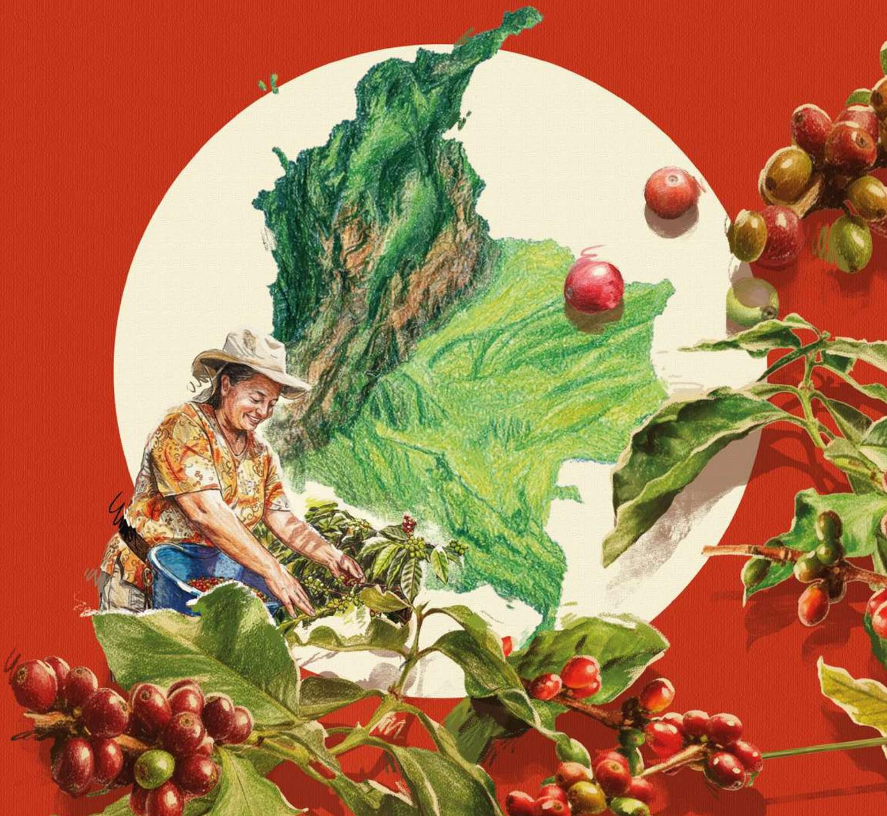

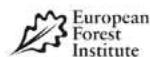

Disclaimer: This tool has been developed with the financial support of the European Union. The views expressed herein do not necessarily reflect the official opinion of the European Union. This tool is intended to support the coffee sector's efforts to comply with the requirements of the EUDR. Its content is for indicative purposes only, not legally binding, and does not constitute legal advice. No guarantee is given as to the accuracy, completeness or timeliness of the content. The authors of this tool accept no liability for any damage or loss that may arise from its use without proper legal advice. The authors welcome any comments or suggestions for improvement.

© European Forest Institute, 2025

# ***Legality due diligence tool for coffee produced in Colombia***

Team Europe Initiative on  
Deforestation-free Value Chains

# CONTENTS

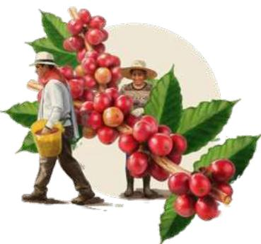

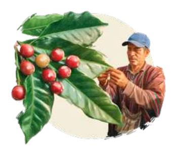

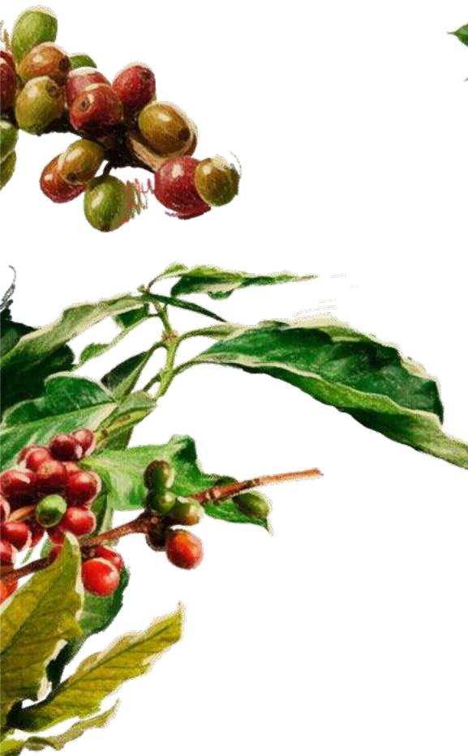

[Background](#page-5-0)

pag. 4 pag. 8

Objectives and [general approach](#page-9-0)

The European Union Deforestation Regulation ............. 5

Overview of the coffee sector in Colombia ......................................... 6

Cooperation between Colombia and the European Union ................................ 7

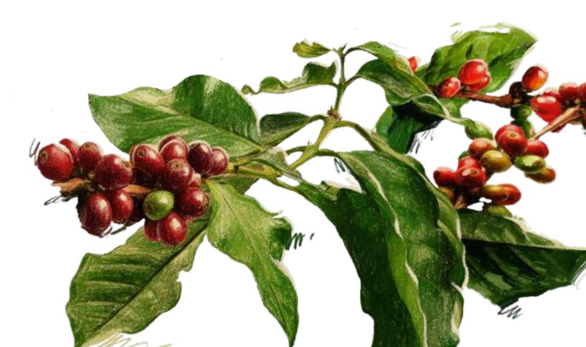

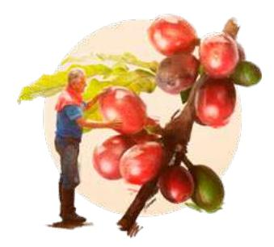

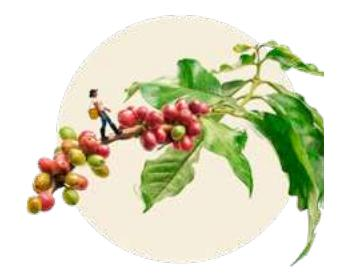

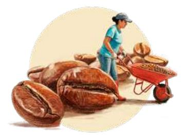

### pag. 10 pag. 16 pag. 78

Methodology for [developing the tool](#page-11-0) Recommendations for legal [due diligence in the context of](#page-17-0)  national coffee production

[Annex](#page-80-0)

**Category 1:** Land-use rights .................................17

**Category 2:** Environmental Protection .............30

### **Category 3:**

Third parties' rights and FPIC .......52

**Category 4:** Labour Rights ....................................56

**Category 5:** Human rights .....................................70

**Category 6:** Taxation, anti-corruption, trade and customs .......................................75 **Annex 1.** Mapping methodology .................79

**Annex 2.** Mapping of legal requirements relevant to coffee produced in Colombia .......................................81

**Annex 3.**

Consultations carried out

..........123

Mapping of relevant national requirements .....................................11

Development of due diligence recommendations ............................12

Scope of the recommendations ...12

- Who are these recommendations aimed at?
- What are these recommendations for?
- How to use these due diligence recommendations?
- Light or standard due diligence ....................................12 ...........13 ..................13 .....................................14

Role of certification in due diligence ....................................15

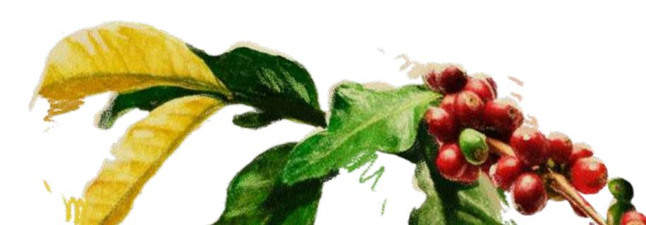

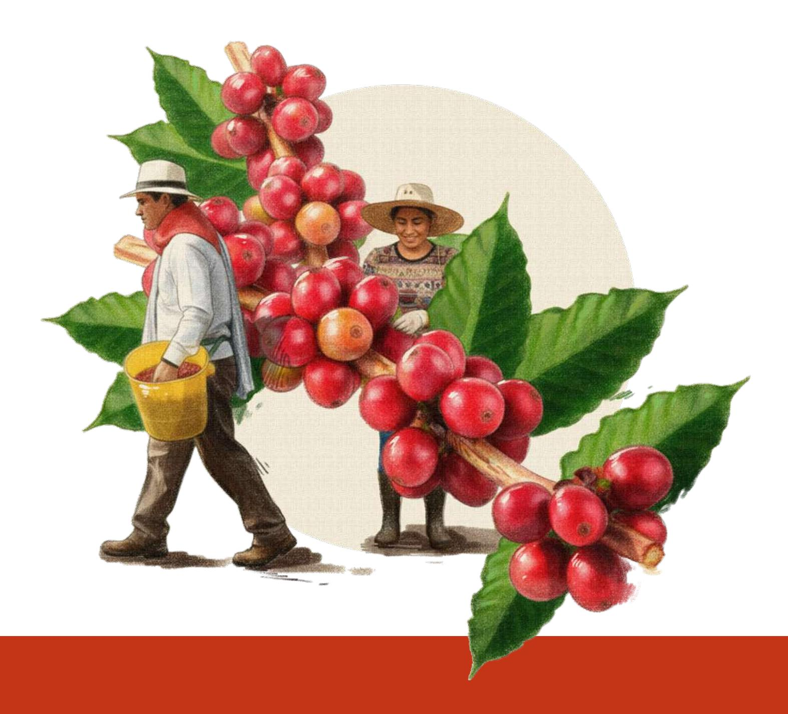

1 BACKGROUND On 31 May 2023, the European Union (EU) adopted Regulation 2023/1115 on the placing on the EU market and the export from the EU of certain commodities and products associated with deforestation and forest degradation (EUDR). This regulation requires operators and traders who place products from supply chains associated with deforestation or forest degradation on the EU market to demonstrate that these products are traceable, deforestation-free and legal. The scope of application covers seven commodities: coffee, cocoa, rubber, oil palm, soy, cattle, and timber, as well as derived products such as chocolate and cocoa paste. The regulation is scheduled to enter into force on 30 December 2026 (and 30 June 2027 for micro and small enterprises established as such before 31 December 2020). Businesses affected by the regulation (operators and traders) will be required to carry out due diligence before exporting or trading their products, in order to gather sufficient information to demonstrate that the product presents no or negligible risk of non-compliance.

Consequently, operators trading coffee or derived products on the EU market must demonstrate that these products have been produced in accordance with the relevant legislation of the country of production (Article 3), which is defined as that relating to the legal status of the production area. The EUDR adopts a flexible approach, listing general areas of law rather than specifying particular legal instruments, as these differ from country to country and may change over time. These areas are [for agricultural products, see Article 2.40 of the EUDR]:

- **a.** Land use rights
- **b.** Environmental protection
- **c.** Third parties' rights
- **d.** Labour rights
- **e.** Human rights protected by international law
- **f.** Free, Prior and Informed Consent (FPIC), as set out in the United Nations Declaration on the Rights of Indigenous Peoples
- **g.** Tax, anti-corruption, trade and customs regulations

In this context, understanding the legislative framework of the country of origin, identifying the relevant legal requirements for the product in question, and determining how to verify compliance with these requirements is a challenge not only for operators responsible for due diligence, but also for the competent EU authorities in charge of controls, and other stakeholders.

## The European Union Deforestation Regulation

In Colombia, coffee is recognised as a crop of major cultural, social, economic and environmental importance and, unlike other agricultural activities, is not directly associated with deforestation. Although there are 76,633 coffee-growing Agricultural Production Units (APUs) located near areas of deforestation, representing around 16% of national production, studies agree that coffee is mostly grown under schemes that respect forest cover and may even promote conservation, especially when cultivated under agroforestry and shade systems. In this context, Colombia has made progress in commitments such as the deforestation-free coffee agreement, "Coffee, Forests and Climate" (2021), which aims to strengthen the adaptation and resilience of coffee-growing communities to climate change, promote sustainable livelihoods, and contribute to the protection and restoration of forests. Likewise, when forest areas are converted to coffee cultivation, the country requires rigorous technical and environmental processes that guarantee responsible land use. These practices help Colombian coffee establish its position not only as a high-quality product, but also as a production model that, when well-managed, supports sustainability and ecosystem conservation.

Coffee farming is highly significant at the territorial level. Coffee is grown in 610 municipalities in Colombia, representing more than 54% of all municipalities. The cultivated area is 840,000 hectares (18% of the country's agricultural land) and is distributed across approximately 660,000 plots. Coffee production is carried out by around 560,000 producers, 54.1% of whom cultivate one (1) hectare or less, 97% cultivate less than five (5) hectares, and only the remaining 3.1% can be considered medium or large producers (with more than 5 hectares). This concentration of coffee cultivation on small plots with limited cultivated areas is one of the sociodemographic characteristics of this population and reflects the prevalence of family farming within the coffee production model. The population in coffee-growing households amounts to 1.8 million people, with an average of 3.8 members per household. Most of them live in rural areas (81.2%), have an average of 5.5 years of formal education, and 27.4% live in households that have been affected by the armed conflict.

In economic terms, coffee accounts for 15% of agricultural GDP and between 5% and 8% of the total value of the country's goods exports. Colombia achieved a historic record of 5.4 billion dollars in coffee exports for the 2024/2025 coffee year1 . The United States was the main destination, followed by the European Union and Canada2 . Domestic consumption continues to grow steadily and currently averages 2.2 kg per person per year.

The sector still faces structural challenges such as international price volatility, informal labour, harvest seasonality, deficiencies in processing and drying infrastructure, the growing risks of climate change, and the need for generational renewal. The National Federation of Coffee Growers

## Overview of the coffee sector in Colombia

**1.** <https://sectorial.co/informativa-cafe/exportaciones-de-cafe-colombiano-alcanzaron-cifra-record-de-us-5-400-millones/>

**2.** [https://www.elpais.com.co/colombia/colombia-celebra-un-record-historico-en-exportaciones-de-cafe-en-el-ultimo-ano-asi-fue](https://www.elpais.com.co/colombia/colombia-celebra-un-record-historico-en-exportaciones-de-cafe-en-el-ultimo-ano-asi-fue-el-registro-0119.html)[el-registro-0119.html](https://www.elpais.com.co/colombia/colombia-celebra-un-record-historico-en-exportaciones-de-cafe-en-el-ultimo-ano-asi-fue-el-registro-0119.html)

promotes comprehensive programmes aimed at addressing these challenges through innovation, environmental sustainability, gender equality, and institutional strengthening, which contribute to promoting continuous improvement throughout the Colombian coffee value chain3 .

In short, Colombian coffee farming combines a broad social and rural base, a solid production tradition, and significant weight in regional and national economies. Its major challenge is to transform these difficulties into opportunities through market diversification, technological innovation, improved social conditions, and the adoption of more sustainable practices, to ensure that coffee-growing families can live with dignity from their work and that Colombia continues to be recognised worldwide for its quality coffee.

## Cooperation between Colombia and the European Union

In early 2024, with the aim of facilitating access for Colombian products to the European market under the EUDR Regulation, the European Forest Institute (EFI) and the European Union Delegation to Colombia agreed to support the analysis of the relevant legal framework for Colombia. This work, carried out within the framework of the Technical Facility on deforestation-free value chains, also includes activities to support the economic, environmental and social sustainability of productive sectors.

This tool is the result of collaboration between various public, private and civil society entities, with significant leadership from the National Federation of Coffee Growers (FNC) supported by EFI through the Technical Facility on Deforestation-free Value Chains, a programme funded by the European Union and supervised by the European Commission's Directorate General for International Partnerships (DG INTPA), and also the Forests, Climate and Peace Programme of the European Union Delegation in Colombia.

EFI's technical support was provided with assis-

tance for stakeholder management and communications under the "Traceability and Sustainability of Export Products" project implemented by the Particip and Idem Concept consortium (TRACE COL) and funded by the European Union. EFI, TRACE COL, the Ministry of Agriculture and Rural Development, and SwissContact formed the committee that served as the technical secretariat for the work and coordinated the development of the process.

The tool is based on the work of national and international experts in law and due diligence and on technical consultation with all national and international actors in the coffee sector: the Ministry of Trade, Industry and Tourism, the Ministry of Agriculture and Rural Development, the Ministry of Environment and Sustainable Development, the Rural Agricultural Planning Unit (UPRA), and ProColombia, as well as trade associations such as the National Federation of Coffee Growers (FNC), the National Federation of Cocoa Growers (FE-DECACAO), the National Federation of Oil Palm Growers (FEDEPALMA), the APS Colombia Corporation, Asoexport, the National Association of Industrialists (ANDI), among others.

**3.** [https://sites.google.com/cafedecolombia.com.co/fnc-consciente/fnc-consciente; https://federaciondecafeteros.org/wp/](https://sites.google.com/cafedecolombia.com.co/fnc-consciente/fnc-consciente; https://federaciondecafeteros.org/wp/sostenibilidad/) [sostenibilidad/](https://sites.google.com/cafedecolombia.com.co/fnc-consciente/fnc-consciente; https://federaciondecafeteros.org/wp/sostenibilidad/);

[https://www.pactoglobal-colombia.org/objetivo-2030/federacion-nacional-de-cafeteros-lider-en-innovacion-y-sostenibilidad](https://www.pactoglobal-colombia.org/objetivo-2030/federacion-nacional-de-cafeteros-lider-en-innovacion-y-sostenibilidad-para-beneficio-de-los-caficultores-del-planeta.html )[para-beneficio-de-los-caficultores-del-planeta.html](https://www.pactoglobal-colombia.org/objetivo-2030/federacion-nacional-de-cafeteros-lider-en-innovacion-y-sostenibilidad-para-beneficio-de-los-caficultores-del-planeta.html ) 

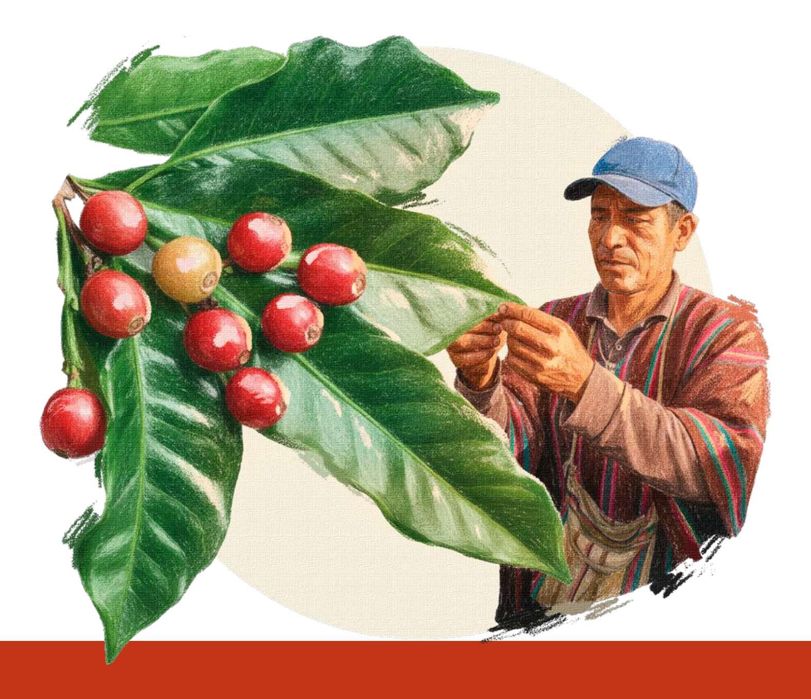

## 2 CONTEXTO OBJECTIVES AND GENERAL APPROACH

The objectives of this tool are to promote a national and consensual vision of the Colombian legal requirements applicable to coffee production and trade, and relevant to the EUDR; and to provide recommendations for verifying coffee regulatory implementation and risk management, in support of operators' due diligence.

The tool was developed with the following aims:

To support the harmonisation of operators' due diligence approaches To encourage the simplification of procedures for supply chain actors who may be required to provide data to their customers To facilitate a better understanding of national contexts by the competent authorities of EU Member States responsible for controls To ensure equitable access to information, reduce perceived risks, and position Colombian origin at a competitive advantage.

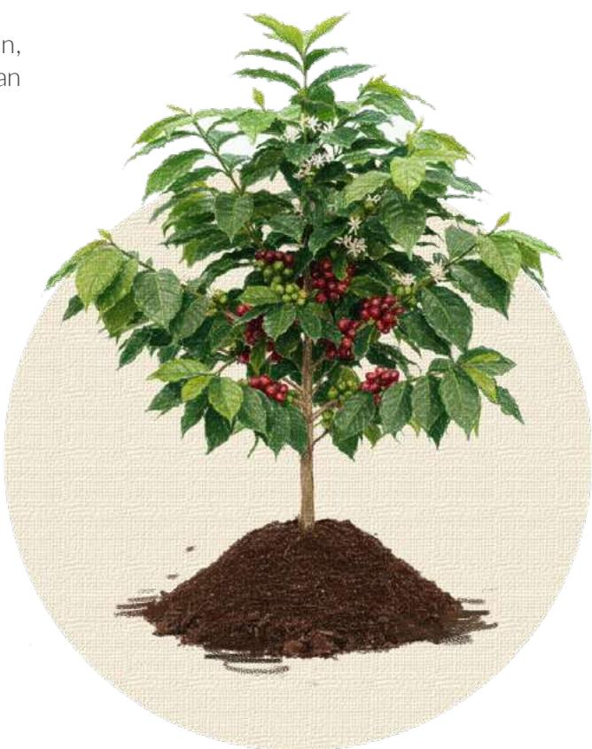

It is the responsibility of operators who place coffee or its derived products on the EU market to identify the relevant legal requirements for Colombia, within the meaning of Article 2(40) of the EUDR, and to adapt their due diligence to the risks identified. This tool provides guidance that can assist operators and other stakeholders in the sector in this regard. The tool is likely to evolve over time and be updated in response to various factors: possible legal reforms in the country, developments in public or private certification systems, lessons learned from the practical implementation of national due diligence recommendations, additional guidance provided by the European Commission or competent authorities, integration of best practices, technological advances, etc.

**It is important to note that the results presented are not legally binding, do not impose any obligations on the relevant parties, and do not constitute legal advice.**

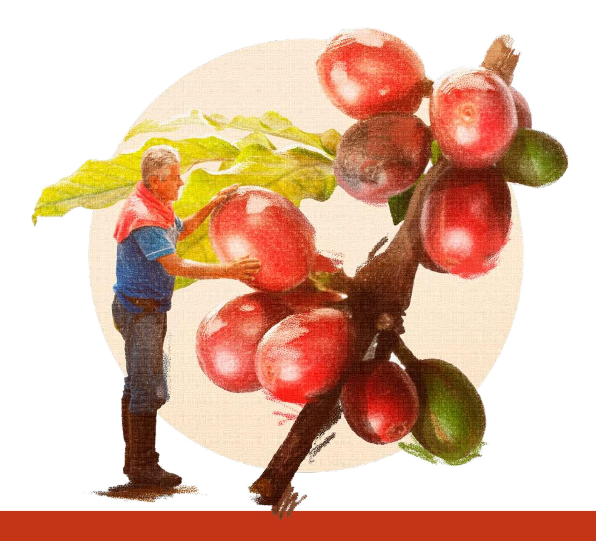

## 3 METHODOLOGY FOR DEVELOPING THE TOOL

Based on various analyses of the legal framework for implementation in the country developed by the National Association of Industrialists (ANDI), the Coffee, Forests and Climate Agreement, GIZ, FEDECACAO, FEDEPALMA and FNC, the EFI team, together with Swisscontact Colombia, consolidated and supplemented in a first step all the relevant standards for the palm, coffee and cocoa sectors, comprehensively organised according to the Areas of law defined by the EUDR. These were structured into subcategories under a legal taxonomy developed by EFI in collaboration with Preferred by Nature, in order to facilitate their analysis (see <https://legalitynavigator.efi.int>/).

In addition, bilateral consultations were held with key actors, as well as socialisation and feedback meetings with stakeholder groups, including cooperatives and export companies from the productive sectors (see Annex 3).

For each subcategory, which groups together standards relating to the same objective, a legal requirement was drafted in clear and understandable language for operators, which was validated through multi-stakeholder exercises. Likewise, the relevance of each requirement for the sectors involved was determined collectively and by consensus, thus closing the first step of the process (see Annex 1 which details the legal mapping methodology).

## Mapping of relevant national requirements

Mapping of the relevant national legal requirements applicable to the production and trade of Colombian coffee in the context of the EUDR, and collecting and supplementing with relevant information from the actors involved. The results of this step are captured in Annex 2 of this tool.

Development of due diligence recommendations for operators, based on an analysis of the level of implementation of relevant legal requirements and existing means of verification.

The second step focused on developing a risk pre-assessment and began with the work of sectoral expert groups. For each relevant legal requirement, a search for information and analysis of existing data was carried out to establish the status of implementation and, where this was not possible, the associated level of risk. This level was determined based on available evidence, with the aim of formulating recommendations for due diligence actions to guide operators. These recommendations, based on sectoral risk per requirement, serve as guidance for operators to conduct their own risk analysis in their supply chains.

The tool is based on technical consultation with all national and international actors in the affected coffee, cocoa and oil palm sectors: administration and ministries, exporters, traders and chocolate makers, cooperatives and producer associations, certification bodies, civil society organisations and EU importing countries (see Annex 3).

## Development of due diligence recommendations

## Scope of the recommendations

### **Who are these recommendations aimed at?**

These recommendations are aimed at the various stakeholders involved in verifying the compliance of coffee and derived products with the EUDR.

They may be useful for: **Operators, within the meaning of the EUDR:**  any natural or legal person who, in the course of a commercial activity, places Colombian coffee or derived products on the EU market or exports them. **Traders, within the meaning of the EUDR:**  any natural or legal person in the supply chain, other than the Operator, who trades the products in question on the EU market. **Competent authorities of the EU:** authorities designated by Member States to ensure compliance with the obligations of the EUDR. ducers, cooperatives, traders, exporters and sary to carry out their due diligence**. Colombian public entities:** government administrations and agencies responsible for regulating the coffee sector (production and trade), land, the environment, and sustainable development. **Civil society:** non-governmental organisations, associations and other actors that play a supervisory, supportive, and promotional role to ensure that coffee and its by-products comply with Colombian legislation and international commitments.

**Actors in the supply chain in Colombia:** proother stakeholders involved in coffee production and trade, from whom operators may request information, data and documents neces-

### **What are these recommendations for?**

These recommendations can be used in different ways and at different times depending on the actors involved.

**Operators and traders** can use these recommendations to establish and document their due diligence system, ensuring that the coffee they trade complies with the legal requirements of the EUDR. They can use them to identify the documents and information that need to be collected or other actions that need to be taken with their suppliers in Colombia, and to assess the risks associated with their supply chain.

**Competent authorities in the EU** can use these recommendations as a standard for assessing the compliance of products traded under the EUDR. They can also use them as a basis for harmonising their controls and interpreting documents from Colombia.

**Supply chain actors** in Colombia can use these recommendations to understand the implications of the EUDR requirements for coffee and the expectations of European operators and traders subject to it. The recommendations can be used to structure and document the information they may provide to these operators and traders. They can also help them anticipate non-compliance risks and adapt their agricultural and commercial practices accordingly.

**Colombian public entities** can use these recommendations to strengthen controls on implementation of national legislation by producers and exporters, in order to ensure that coffee traded complies with current Colombian laws. They can also use it to support small producers in implementation by providing them with better access to information on current regulations and buyer requirements. They can build on these recommendations to make data more transparent and accessible, including facilitating access to administrative documents, to help operators demonstrate the legality of coffee.

**Civil society** can use these recommendations to monitor the implementation of Colombian legal requirements by companies and authorities. They can be used to conduct analyses and produce reports on the risks of non-compliance in coffee. They can also be used to raise awareness among producers, companies and consumers about the legality of Colombian coffee.

### **How to use these due diligence recommendations?**

The recommendations presented in this document aim to address all relevant legal requirements identified by stakeholders during the first phase of this study. They cover, in particular, all the legal areas listed in Article 2.40 of the EUDR, in accordance with the precautionary approach adopted in the study (see Annex 1). However, a distinction is made between requirements directly related to the objectives of the EUDR and others, which are marked with an asterisk.

This flexible approach allows users of the recommendations to adapt their due diligence actions based on their interpretation of the scope of the EUDR.

### **Light or standard due diligence**

This study takes a pragmatic approach that seeks to identify due diligence actions proportionate to the risks, in order to limit the burden on those involved in the sector. The level of implementation has been assessed for each requirement considered relevant to coffee production and trade in Colombia. The level of implementation adopted by the study is based on relevant literature, expert knowledge of the sector, field surveys conducted as part of the study, and bilateral and multi-stakeholder consultations organised within the framework of the study.

### Articulación entre nivel de cumplimiento y las recomendaciones de DD

When the level of implementation assessed for a requirement is high, the risk of non-compliance is considered negligible. Therefore, light due diligence actions are recommended. On the other hand, when the level of implementation of a requirement is low or unknown, the risk of non-compliance is considered non-negligible. Therefore, standard due diligence is recommended.

However, this analysis is only indicative and has been carried out at country level only. **It is the responsibility of operators to carry out a non-compliance risk analysis of their products for each shipment.** Within this framework, these recommendations offer a range of due diligence options. **These actions are not prescriptive and are not presented in any specific order. It is up to operators to choose from these options based on the context, their knowledge of their supply chains, and the risks identified for coffee and derived products.**

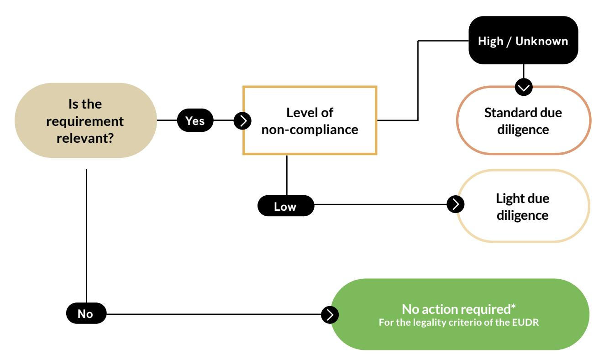

Coffee certification systems are voluntary, public or private mechanisms that seek to ensure that coffee production and trade comply with certain environmental, social and economic standards. They can be established by governments, international organisations, NGOs or private companies.

Third-party certification and verification systems can play an important role in promoting sustainable agricultural and forestry practices and responsible sourcing. There are different types of certifications, which can be implemented at the national level on a mandatory basis or be private and voluntary (e.g. Rainforest Alliance, Fairtrade, 4C or Organic).

According to the EUDR, for the purposes of risk assessment, operators may take into account information from certification schemes or other third-party verified schemes. However, the European Commission's guidelines of 2 October 2024 indicate that self-declaration schemes that are not based on third-party certification procedures are, by definition, less robust due to a lack of independence and impartiality.

The Commission also specifies that certification schemes should not replace the operator's responsibility for due diligence. In other words, private certification schemes can be a tool to help European operators carry out due diligence to comply with legality, deforestation and traceability criteria.

Operators must be able to justify why and how certification schemes comply with EUDR requirements. To do so, three elements must be taken into account:

The coverage of relevant legal requirements for the EUDR by the certification system. The robustness of the certification system: in particular, certification scope (applicable to which actors in the value chain? to which products?); governance (management of internal procedures and updates, for example); accreditation processes of the competent control bodies; auditor qualifications and audit frequency; non-compliance management, impartiality and conflict of interest management, etc. This information must be periodically reassessed by the operator, particularly in relation to EUDR requirements. Traceability and the absence of mixing with non-certified products.

It should be noted that this tool has not carried out an exhaustive comparison of the coverage of the relevant legal requirements by certification systems used in the coffee sector in Colombia.

## Role of certification in due diligence

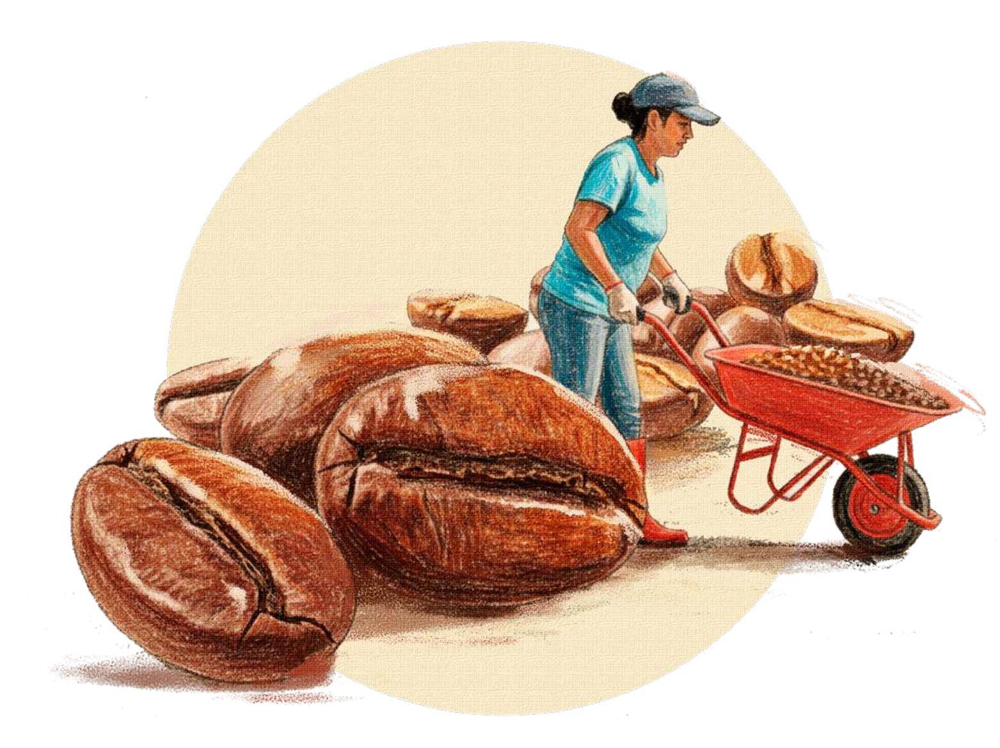

4

RECOMMENDATIONS FOR LEGAL DUE DILIGENCE IN THE CONTEXT OF NATIONAL COFFEE PRODUCTION

In Colombia, access and use of land are organised through various forms of tenure, including individual ownership, collective ownership particularly in indigenous and Afro-descendant communities—as well as leasing and possession arrangements. These schemes allow different actors to carry out productive activities without formal land ownership being the only enabling condition. However, in certain areas of the country, careful analysis is necessary, as there may be a history or evidence of forced displacement and conflicts associated with tenure, which poses additional challenges to ensuring legal certainty and sustainable land use.

Section 1.2 refers specifically to the legal regimes for land use in Colombia. Land use is mainly regulated by the Land Use Plans (Planes de Ordenamiento Territorial, POT), which define how the territory can be occupied and used in each municipality, incorporating environmental, risk and sustainability criteria. Alongside these plans, there is an official technical instrument known as the National Agricultural Frontier (Frontera Agrícola Nacional), which defines the areas in which agricultural activities can be carried out and those subject to legal restrictions or exclusions, such as moorlands, natural parks or forest reserves. This tool is essential, as it enables the identification of risks and limitations in land use, ensuring that production, as in the case of coffee, is carried out in a manner compatible with environmental conservation and current regulations.

In Colombia, coffee growing takes place primarily within the National Agricultural Frontier. Of the 487,353 registered coffee production units, 46% are located within this frontier, 38% in areas with restrictions, and 17% in areas with legal exclusions. Thanks to the Coffee Information System (SICA), which integrates more than 2.2 million georeferenced plots in 23 departments and 610 municipalities, it is possible to accurately determine the location of crops. Exclusions include strategic ecosystems such as moorlands, natural parks, and forest reserves, while restrictions refer to ethnic territories, environmental management areas, and disaster risk zones. This context highlights the need for coffee production to be developed under sustainability criteria and in harmony with environmental conservation and respect for collective territories.

> The tables below, organised by area of law, show the due diligence recommendations agreed upon by the stakeholders.

### CATEGORY 1 **LAND-USE RIGHTS**

| Context Level of                    |                         |
|-------------------------------------|-------------------------|
| NB : Land tenure                    |                         |
| Formal titles:                      | Request the Certificate |
| of Tradition and Freedom (          | Certificado             |
| de Tradición y Libertad             | ) from the              |
| Informal title                      | : Unregistered sale or  |
| Regular possession:                 | Supported               |
| Note : Implementation of this legal |                         |

| Legal requirement                                                                                                                                                                                             | Context                                                                                                                                                                                                                                                                                                                                                                                                                                                                                                                                                                                                                                                                                                                                                                                                    | Level of implementation                                                      | Due diligence recommendations                                                                                                                                                                                                                                                                                                                                                                                                                                                                                                                                                                                                                                                                                        |
|---------------------------------------------------------------------------------------------------------------------------------------------------------------------------------------------------------------|------------------------------------------------------------------------------------------------------------------------------------------------------------------------------------------------------------------------------------------------------------------------------------------------------------------------------------------------------------------------------------------------------------------------------------------------------------------------------------------------------------------------------------------------------------------------------------------------------------------------------------------------------------------------------------------------------------------------------------------------------------------------------------------------------------|------------------------------------------------------------------------------|----------------------------------------------------------------------------------------------------------------------------------------------------------------------------------------------------------------------------------------------------------------------------------------------------------------------------------------------------------------------------------------------------------------------------------------------------------------------------------------------------------------------------------------------------------------------------------------------------------------------------------------------------------------------------------------------------------------------|
|                                                                                                                                                                                                               | 
Colombia is characterised by a high level of legal and practical recognition of the rights of indigenous and Afro-Colombian peoples. Currently, 37.8 million hectares are registered under collective ownership, distributed among indigenous reserves and lands belonging to Afro-descendant communities.
 
This represents approximately 34% of the national territory. In particular, indigenous community lands account for 28.4% of the country, while more than 5.6 million hectares have been titled for Afro-Colombian communities, mostly in the Pacific region (95.3%). Collective tenure is primarily concentrated in indigenous and Afro-Colombian territories, where coffee is currently grown in a community setting, as is the case in areas of the Pacific, Chocó, Cauca, etc.
 |                                                                              | 
<b>Geospatial analysis</b>
 
Overlay the points or polygons of suppliers with layers of legally constituted collective territories (the Ministry of the Interior and the National Land Agency ANT have georeferenced information on collective territories).
 
If overlaps occur, but the producers belong to the indigenous reserve or the Afro-Colombian community council, no due diligence action is required.
 
If there are overlaps in areas of production and the producer is not registered in the census or registry of the reserve or collective territory, it is necessary to verify whether they have express authorisation from the representatives of the collective territory.
 |
| 
<b>Land use rights</b>
 
<b>1.1.2.</b>
 
<b>Land tenure is established by collective ownership</b>
 
<b>NB:</b> Land tenure can be individual or collective (see previous requirement).
 |                                                                                                                                                                                                                                                                                                                                                                                                                                                                                                                                                                                                                                                                                                                                                                                                            | 
<b>High level of implementation</b>
 
<b>Light due diligence</b>
 | 
<b>Compilation and verification of documents</b>
 
A Certificate of Membership from the Ministry of the Interior may be requested at random (by sampling) to validate that the producer belongs to a given community or reserve.
 
The internal authority of the collective territory (cabildo or community council) may issue a Certificate of Membership directly.
 
In cases of pro
                                                                                                                                                                                                                                                                                                         |

| Legal                                                                                                                                                                                                                                                    |                                                                                                                                                                                                                                                                                                                                                                                                                             | Level of                                         |                                                                                                                                                                                                                                                                                                                                                                                                                                                                                                                                                                         |
|----------------------------------------------------------------------------------------------------------------------------------------------------------------------------------------------------------------------------------------------------------|-----------------------------------------------------------------------------------------------------------------------------------------------------------------------------------------------------------------------------------------------------------------------------------------------------------------------------------------------------------------------------------------------------------------------------|--------------------------------------------------|-------------------------------------------------------------------------------------------------------------------------------------------------------------------------------------------------------------------------------------------------------------------------------------------------------------------------------------------------------------------------------------------------------------------------------------------------------------------------------------------------------------------------------------------------------------------------|
| requirement                                                                                                                                                                                                                                              | Context                                                                                                                                                                                                                                                                                                                                                                                                                     |                                                  |                                                                                                                                                                                                                                                                                                                                                                                                                                                                                                                                                                         |
| Land use rights The farmer exercises the right to production                                                                                                                                                                                             | Farmers who do not own or possess private land may exercise use rights through oral or written leases, usufruct agreements or provisional allocation contracts. In coffee production, this is uncommon, and no evidence has                                                                                                                                                                                                 | implementation                                   | Due diligence recommendations Consultations with stakeholders Confirm that there are no complaints or litigation concerning the production plots in the coffee chain. This can be verified through the national or international press, NGOs, interviews with stakeholders, and consultation with official channels regarding complaints and reports. The National Land Agency (ANT) can be consulted to find out if there are any processes of formalisation or allocation of vacant land, or complaints of irregular occupation of plots. If there are indications of |
| NB: This                                                                                                                                                                                                                                                 |                                                                                                                                                                                                                                                                                                                                                                                                                             |                                                  |                                                                                                                                                                                                                                                                                                                                                                                                                                                                                                                                                                         |
| on the plot through lease, usufruct, sharecropping agreement or provisional allocation contracts.. requirement comes into play/ is RELEVANT when the producer has mere tenure, i.e. does not have land ownership or possession as described in the above | been found of farmers producing coffee on land over which they do not have direct possession or ownership. This is because the nature of coffee cultivation is permanent, which discourages land use without legal stability. In some cases, land ownership is passed down through family succession or informal agreements, without legal documentation proving the use rights. However, the absence of such documentation | High level of implementation Light due diligence | complaints or litigation, then the following actions could be taken: Compilation and verification of documents On a random basis (by sampling from the list of producers in your supply chain), request signed contracts or supporting documents that prove the status of the right to produce on another person's plot of land. In the case of oral contracts Verification through records, with neighbours, associations or cooperatives. Verification of third party testimonies. Preparation of minutes with witnesses if necessary.                               |
| requirements.                                                                                                                                                                                                                                            | does not necessarily mean that it is illegal.                                                                                                                                                                                                                                                                                                                                                                               |                                                  | Note : Implementation of this indicator can be demonstrated using documentary evidence, such as lease agreements and others. However, the absence of documentary evidence does not imply non-compliance.                                                                                                                                                                                                                                                                                                                                                                |

| Legal requirement | Context                                                                                                                                                                                                                                                                                                                                                                                                                                                                                                                                                                                                                                               | Level of implementation                                                                                                                                                                                                                                                                                                                                                                       | Due diligence recommendations                                                                                                                                                                                                                                                                                                                                                                                                                                                                                                                                                                                                                                                                                                                                                                                                                                                                                                                                                                                                                           |
|-------------------|-------------------------------------------------------------------------------------------------------------------------------------------------------------------------------------------------------------------------------------------------------------------------------------------------------------------------------------------------------------------------------------------------------------------------------------------------------------------------------------------------------------------------------------------------------------------------------------------------------------------------------------------------------|-----------------------------------------------------------------------------------------------------------------------------------------------------------------------------------------------------------------------------------------------------------------------------------------------------------------------------------------------------------------------------------------------|---------------------------------------------------------------------------------------------------------------------------------------------------------------------------------------------------------------------------------------------------------------------------------------------------------------------------------------------------------------------------------------------------------------------------------------------------------------------------------------------------------------------------------------------------------------------------------------------------------------------------------------------------------------------------------------------------------------------------------------------------------------------------------------------------------------------------------------------------------------------------------------------------------------------------------------------------------------------------------------------------------------------------------------------------------|
|                   | 
Although the coffee sector in Colombia is not associated with forced displacement, the intensification of the armed conflict, due to the incursion of new actors associated with drug trafficking, has created adverse situations for coffee-growing areas. The introduction of coca cultivation marked a structural change in land distribution, as these territories experienced displacement of smallholder farmers and/or forced land sales.
 
<b>Land use rights</b>
 
<b>1.1.4.</b>
 
The area of production has not been reported for situations of forced expulsion, abandonment or displacement of the original owner.
 | 
High level of implementation
 
<b>Light due diligence</b>
 
However, if coffee-growing areas are affected by forced displacement, coffee cultivation is not the cause but rather the victim. No cases of forced displacement due to coffee cultivation have been identified, particularly given the permanent nature of the crop, which begins to produce after three years.
 | 
<b>Consultations with stakeholders</b>
 
Verify that there is no significant land conflict in the supply area by conducting interviews with stakeholders: mayor's office, local residents, NGOs and other local stakeholders.
 
If there is evidence of conflict, proceed to the next step:
 
<b>Data collection and verification</b>
 <ul> <li>Consult reports from the Victims Unit-Unified Victims Registry (RUV) or the Truth Commission, which offers interactive maps by municipality, for initial guidance. A productive plot on dispossessed land will only be determined to be illegal once a court ruling has been issued.</li> <li>Consult the website of the land restitution unit <a href="https://www.urt.gov">https://www.urt.gov</a>. co/, specifically RUPTA (the Single Registry of Abandoned Land and Territories) and the Registry System for Forcibly Dispossessed and Abandoned Lands (SRTDAF).</li> <li>Consult the open data portal (<a href="https://www.datos.gov">https://www.datos.gov</a>)</li> </ul> |

| requirement | Context                | Level of |
|-------------|------------------------|----------|
|             | and prioritised by the |          |
|             | municipalities), In    |          |

| Legal requirement                                                                                                                                                                                                                       | Context                                                                                                                                                                                                                                                                                                                                                                                                                                                                                                    | Level of implementation                                                                                                                                                                                    | Due diligence recommendations                                                                                                                                                                                                                                                                                                                                                                                                                                                                                                                                                                                                                                                                                                                                                                                                                                                                                                                                                                                                                                                                                                                                                                                                                                                                          |
|-----------------------------------------------------------------------------------------------------------------------------------------------------------------------------------------------------------------------------------------|------------------------------------------------------------------------------------------------------------------------------------------------------------------------------------------------------------------------------------------------------------------------------------------------------------------------------------------------------------------------------------------------------------------------------------------------------------------------------------------------------------|------------------------------------------------------------------------------------------------------------------------------------------------------------------------------------------------------------|--------------------------------------------------------------------------------------------------------------------------------------------------------------------------------------------------------------------------------------------------------------------------------------------------------------------------------------------------------------------------------------------------------------------------------------------------------------------------------------------------------------------------------------------------------------------------------------------------------------------------------------------------------------------------------------------------------------------------------------------------------------------------------------------------------------------------------------------------------------------------------------------------------------------------------------------------------------------------------------------------------------------------------------------------------------------------------------------------------------------------------------------------------------------------------------------------------------------------------------------------------------------------------------------------------|
| 
<b>Land use rights</b>
 
<b>1.2.1.</b>
 
The plot is located within the national Agricultural Frontier; if it is located in conditional areas, production is only permitted under certain conditions that must be met.
 | 
Of the 662,537 coffee farms identified in the country, 83% are located within the National Agricultural Frontier. Within this area, 39% are in areas with some type of restriction, of which 17% fall within areas with legal restrictions. To verify this, information from 100% of the georeferenced coffee plots registered in the Coffee Information System (SICA) is used, which includes more than 2.2 million plots distributed across 23 departments and 610 municipalities in the country.
 | 
<b>Variable implementation level</b>
 
<b>Standard due diligence</b>
 <ul> <li>If the plot is within the agricultural frontier, the risk related to legality of land use may be low.</li> </ul> | 
<b>Implementation of procedures and processes</b>
 
First, consult the UPRA Rural Agricultural Planning System (SIPRA) and perform a geospatial analysis by cross-referencing the production polygons, coordinates, cadastral certificate of the plot, or land registry folio with the Agricultural Frontier (AF) map:
 <ul> <li>If the plot is within the Agricultural Frontier, no further due diligence is required for this requirement, except for plots near the AF boundary.</li> <li>If the plot is located in a conditional AF or in an area excluded from the AF, additional DUE DILIGENCE actions are recommended.</li> </ul> 
<b>Document compilation and verification</b>
 
For plots near the AF boundary, where the scale does not allow for a clear determination of whether they are inside or outside, you can request (by sampling or systematically) the municipal land use certificate from the planning office to determine whether the land use is agricultural.
 
<b>For plots in exclusion zones:</b>
 
<b>Data collection and verification</b>
 
Request the land use certificate from the environmental authority, and from your coffee supplier or directly from the producer if they have deforestation-free agreements, sustainable
 |

| Legal requirement                                                                                                                    | Context                                                                                                                                                                                                                                                                                                                                                                                                                                                               | Level of implementation | Due diligence recommendations                                                                                                                                                                                                                                                                                                                                                                                                                                                                                                                                                                                         |
|--------------------------------------------------------------------------------------------------------------------------------------|-----------------------------------------------------------------------------------------------------------------------------------------------------------------------------------------------------------------------------------------------------------------------------------------------------------------------------------------------------------------------------------------------------------------------------------------------------------------------|-------------------------|-----------------------------------------------------------------------------------------------------------------------------------------------------------------------------------------------------------------------------------------------------------------------------------------------------------------------------------------------------------------------------------------------------------------------------------------------------------------------------------------------------------------------------------------------------------------------------------------------------------------------|
| 
<b>Land use rights</b>
 
<b>1.2.2.</b>
 
Agricultural activity is permitted in accordance with land use ordinances.
 | 
The 2022-2023 Management Report to Congress of the Ministry of Housing, City and Territory (MVCT) indicates that, as of 30 March 2023, of the 1,103 municipalities in the country:
 <ul> <li>• <b>192 municipalities</b> have updated POTs</li> <li>• <b>877 municipalities</b> have outdated POTs</li> <li>• <b>30 municipalities</b> have POTs whose medium-term validity has expired</li> <li>• <b>4 municipalities</b> have not formulated a POT</li> </ul> |                         | 
<b>For plots in restricted areas:</b>
 
<b>Data collection and verification</b>
 <ul> <li>• Ask the environmental authority in your jurisdiction about the type of conditions associated with agricultural production on the plot.</li> <li>• Request evidence or a statement from the producer that implements the applicable condition.</li> <li>• In case of lack of clarity, conduct a field inspection.</li> </ul> 
<b>Implementation of procedures and processes</b>
 
Where possible, support producers in obtaining formal permits for their agricultural activity in restricted areas.
 |

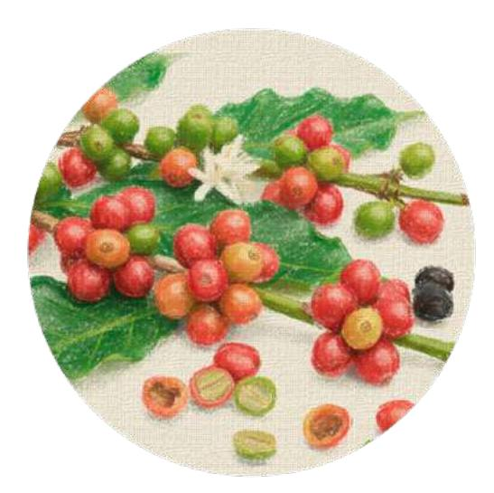

Confirm that there are no complaints or litigation concerning the production plots in coffee chain.This can be verified through the national or international press, NGOs, interviews with stakeholders, and consultations with official channels regarding

complaints and reports.

In rural areas, the National Land Agency (ANT) can be consulted to find out if there are any processes of formalisation or allocation of vacant plots, or complaints of irregular

occupation of plots.

### **Collect documents and verify (sampling)**

**Formal titles:** Request the Certificate of Tradition and Freedom from the Superintendency of Notaries and Registry.

**Informal title:** Unregistered sale or informal inheritance.

**Regular possession:** Proof of occupation and improvements (for eventual adjudication).

### **Light due diligence**

### **Collect documents and verify (sampling)**

Request signed contracts or supporting documents that prove the right to carry out production on another person's plot, such as minutes, through consultations with neighbours, associations or cooperatives, or verification of third-party testimonies.

**Land tenure is established by individual private ownership or by possession (regular or irregular).**

**The farmer exercises the right to production on the plot through lease, usufruct, sharecropping agreement or provisional allocation contracts.**

**No further due diligence action is required.**

> **There are indications of complaints or litigation.**

### Requirements 1.1.1 and 1.1.3

**There are no indications of complaints or litigation.**

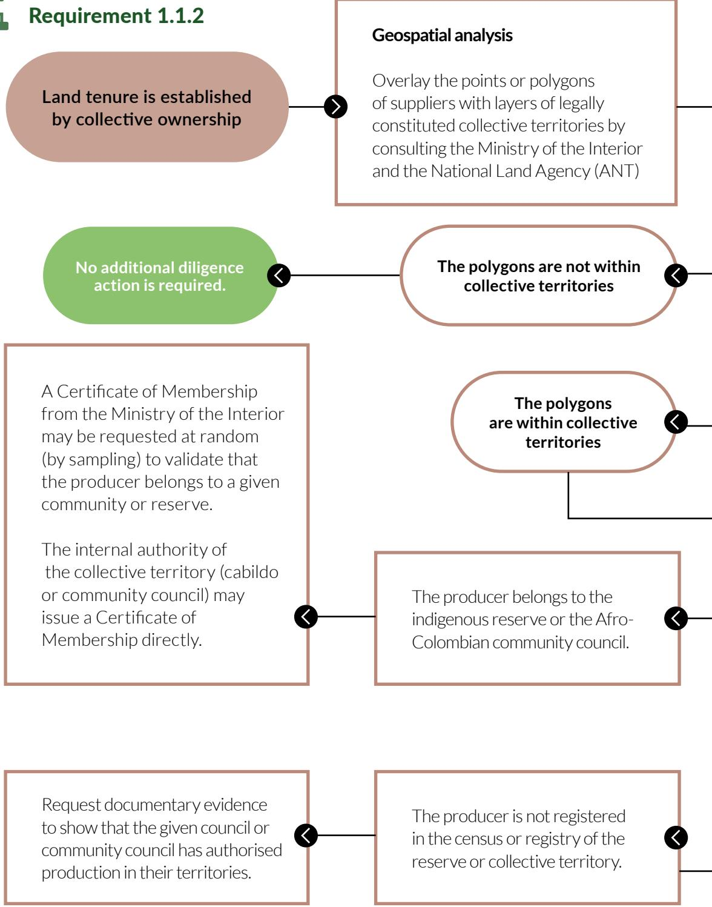

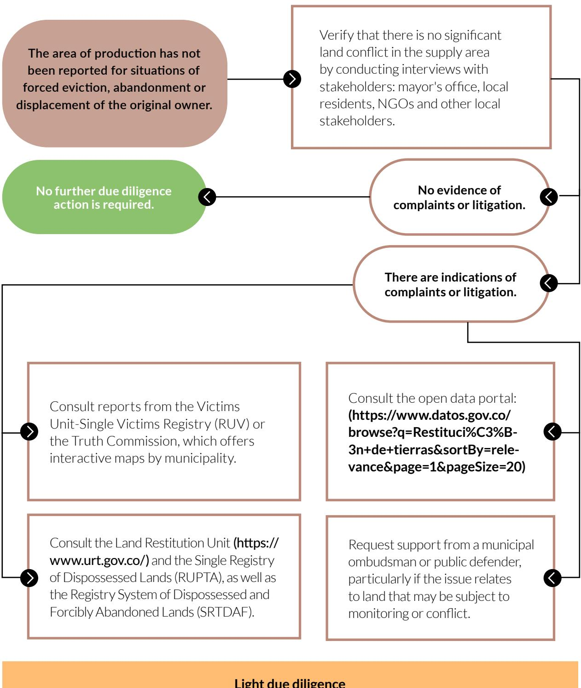

### Requirement 1.1.4

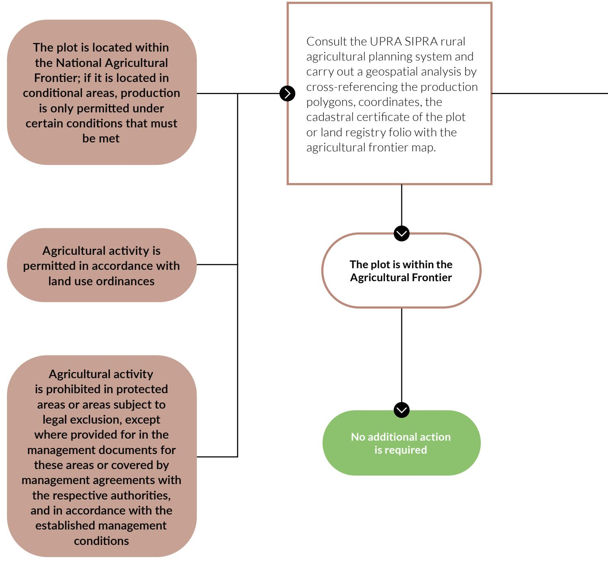

### Requirements 1.2.1, 1.2.2 and 2.1.1

**Standard du**

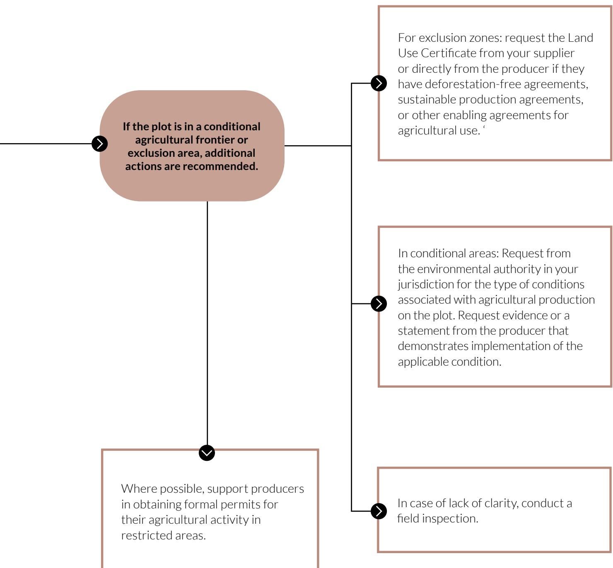

### CATEGORY 2 ENVIRONMENTAL PROTECTION

In Colombia, environmental regulations establish areas where agricultural activities are prohibited or restricted, which is essential for complying with standards such as the EUDR. In exclusion areas, such as moorlands, protected areas, or forest reserves, coffee and other products may not be grown, except in very specific cases where crops existed before the area was declared protected or when agroforests compatible with conservation are integrated. There are also territories with subject to specific restrictions, such as indigenous reserves, Afro-descendent community lands, or wetlands, where productive use may occur under particular rules and sustainable practices. In this context, the National Agricultural Frontier is the official tool that allows for the precise identification of which areas are suitable, which have restrictions, and where production conversion processes may be required, facilitating solid environmental due diligence in the face of non-compliance risks.

In addition to territorial exclusions and constraints, in Colombia it is essential to take into account other key environmental factors for adequate due diligence. These include soil management practices that prevent erosion and maintain fertility, responsible use of agricultural inputs to prevent contamination by agrochemicals, and proper handling of spills and solid waste that may affect nearby water bodies or ecosystems. Likewise, deforestation, pressure on water sources, and natural disasters such as landslides and floods reinforce the need for more sustainable production planning. These elements, together with legal verification of land use, form the core environmental risks and responsibilities that must be assessed when investing or producing in the Colombian agricultural sector.

The Colombian coffee sector does not face significant environmental challenges in terms of areas of production, although it does face challenges in fruit processing. Primary processing requires continuous attention to ensure sustainability, as in some cases it can generate spills into soil and water sources. While these requirements can create legal and operational uncertainty for producers, they have also driven significant advances in cleaner practices, such as ecological processing, micro-watershed management, and water decontamination. Coffee production is not associated with deforestation; studies of deforestation for coffee production based on analyses in departments such as Huila, the main national producer, show a decline in associated deforestation from 2020 to date.

| Legal requirement                                                                                                                                                                                                                                                                                                                                                       | Context                                                                                                                                                                                                                                                                                                                                                                                                                                                                                                                                                                 | Level of implementation                                               | Due diligence recommendations                                                                                                                                                                                                                                                             |
|-------------------------------------------------------------------------------------------------------------------------------------------------------------------------------------------------------------------------------------------------------------------------------------------------------------------------------------------------------------------------|-------------------------------------------------------------------------------------------------------------------------------------------------------------------------------------------------------------------------------------------------------------------------------------------------------------------------------------------------------------------------------------------------------------------------------------------------------------------------------------------------------------------------------------------------------------------------|-----------------------------------------------------------------------|-------------------------------------------------------------------------------------------------------------------------------------------------------------------------------------------------------------------------------------------------------------------------------------------|
| 
<b>Environmental Protection</b>
 
<b>2.1.1.</b>
 
Agricultural activity is prohibited in protected areas or areas subject to legal exclusion, except where provided for in the management documents for these areas or covered by management agreements with the respective authorities, and in accordance with the established management conditions.
 | 
Although most coffee crops in Colombia are grown outside strictly protected areas, there are cases where farms are located within or near areas with some category of environmental protection, such as forest reserves, protected areas, etc. In these cases, producers may face restrictions on continuing their activities if they do not have management agreements or if forest management plans do not provide for agricultural use.
                                                                                                                       | 
High level of implementation
 
<b>Light due diligence</b>
 | 
<b>See Due Diligence Actions for legal requirements</b>
 
<b>1.2.1 and 1.2.2</b>
                                                                                                                                                                                              |
| 
<b>Environmental Protection</b>
 
<b>2.1.2.</b>
 
Authorised agricultural inputs are used, managed and disposed of appropriately in accordance to technical procedures.
                                                                                                                                                                                | 
The use of agrochemicals is common in coffee cultivation. As the organiser of coffee production in the country and the representative and democratic body for growers, the National Federation of Coffee Growers coordinates the demands of the productive and commercial sectors to ensure compliance with both national and international regulations on hazards, personal protective equipment, waste management, withdrawal periods and trace presence. In this way, the FNC guides CENICAFE's research topics and supports regional and national activities
 | 
<b>Standard due diligence</b>
                                  | 
<b>Compilation and verification of documents:</b>
 
Obtain the list of pesticides and fertilisers authorised by the ICA.
 
<b>Implementation of procedures and processes</b>
 
For your company and its suppliers:
 <ul> <li>Systematic collection of info</li></ul> |

| Legal requirement                                                                                                                                                                        | Context                                                                                                                                                                                                                                                                                                                                                                                                                                                                           | Level of implementation              | Due diligence recommendations                                                                                                                                                                                                                                                                                                                                                                                                                                                                                                                                                                                                                                                                                                                                                                                                                                                                                                                                                                                                                                                                                                                                                                                                     |
|------------------------------------------------------------------------------------------------------------------------------------------------------------------------------------------|-----------------------------------------------------------------------------------------------------------------------------------------------------------------------------------------------------------------------------------------------------------------------------------------------------------------------------------------------------------------------------------------------------------------------------------------------------------------------------------|--------------------------------------|-----------------------------------------------------------------------------------------------------------------------------------------------------------------------------------------------------------------------------------------------------------------------------------------------------------------------------------------------------------------------------------------------------------------------------------------------------------------------------------------------------------------------------------------------------------------------------------------------------------------------------------------------------------------------------------------------------------------------------------------------------------------------------------------------------------------------------------------------------------------------------------------------------------------------------------------------------------------------------------------------------------------------------------------------------------------------------------------------------------------------------------------------------------------------------------------------------------------------------------|
|                                                                                                                                                                                          |                                                                                                                                                                                                                                                                                                                                                                                                                                                                                   |                                      | 
This information can be collected, for example, by periodically filling out a control sheet for the implementation of herbicides, fertilisers and pesticides and a control sheet for packaging, or periodically filling out a questionnaire.
 <ul> <li>• Provide producers and cooperatives with an updated list of herbicides, insecticides, fertilisers and fungicides that are authorised/unauthorised at the cooperative level.</li> <li>• Provide producers with tools to monitor the implementation of fertilisers and pesticides and the treatment of packaging.</li> <li>• Provide annual training to producers on authorised/unauthorised pesticides and fertilisers and on packaging treatment, e.g. through training, campaigns, etc.</li> </ul> 
<b>Consultations with stakeholders</b>
 
Consult possible reports from NGOs, cooperatives and government authorities on possible cases of soil degradation in the sourcing area.
 
<b>Compilation and verification of documents</b>
 <ul> <li>• Plan for the management of pesticides or crop protection products, including biological products where relevant.</li> <li>• Plan or procedure for handling empty chemical packaging.</li> </ul> |
| 
<b>Environmental Protection</b>
 
<b>2.1.2.</b>
 
Authorised agricultural inputs are used, managed and disposed of appropriately in accordance to technical procedures.
 | 
involving the use of agricultural inputs. This plan is implemented nationwide, covering all coffee-producing municipalities in the country and supporting exports through ALMACAFÉ's work on 100% of the bags leaving the ports.
 
No recent and reliable sources of information have been found to indicate the level of implementation of this requirement. Therefore, with the precautionary approach adopted by this tool, standard due diligence is recommended.
 | 
<b>Standard due diligence</b>
 |                                                                                                                                                                                                                                                                                                                                                                                                                                                                                                                                                                                                                                                                                                                                                                                                                                                                                                                                                                                                                                                                                                                                                                                                                                   |

| Legal requirement                                                                                                                                                                        | Context | Level of implementation                                                                                                                                                                                              | Due diligence recommendations                                                                                                                                                                                                                                                                                                                                                                                                                                                                                                                                                                                                                                                                        |
|------------------------------------------------------------------------------------------------------------------------------------------------------------------------------------------|---------|----------------------------------------------------------------------------------------------------------------------------------------------------------------------------------------------------------------------|------------------------------------------------------------------------------------------------------------------------------------------------------------------------------------------------------------------------------------------------------------------------------------------------------------------------------------------------------------------------------------------------------------------------------------------------------------------------------------------------------------------------------------------------------------------------------------------------------------------------------------------------------------------------------------------------------|
| 
<b>Environmental Protection</b>
 
<b>2.1.2.</b>
 
Authorised agricultural inputs are used, managed and disposed of appropriately in accordance to technical procedures.
 |         | 
<b>Standard due diligence</b>
 
<b>Note:</b> The law does not require direct documentation at the producer level for this indicator. Implementation would be demonstrated through practices on the farm.
 | <ul> <li>• Occupational health and contingency plan or procedure.</li> <li>• Training plan for employees in chemical management (include logs or attendance lists) in integrated chemical management.</li> <li>• Solid waste management plan.</li> <li>• Company policies prohibiting the use of red-labelled products.</li> <li>• Procedures for the proper use of pesticides and fertilisers.</li> <li>• Logbook of chemical and biological product implementations on farms.</li> <li>• Plan for the management and use of personal protective equipment.</li> <li>• Results of laboratory analyses to verify the presence of chemicals in coffee products, such as beans or cherries.</li> </ul> |

| Legal requirement | Context                                                                                                                                                                                                                                                                                                                                                                                                                                                                                                                                                                                                                                                                                       | Level of implementation | Due diligence recommendations                                                                                                                                                                                                                                                                                                                                                                                                                                                                                                                                                                                                                                                                                                                                                                                                                                                                                                                                                                                                                                                                                                                                                |
|-------------------|-----------------------------------------------------------------------------------------------------------------------------------------------------------------------------------------------------------------------------------------------------------------------------------------------------------------------------------------------------------------------------------------------------------------------------------------------------------------------------------------------------------------------------------------------------------------------------------------------------------------------------------------------------------------------------------------------|-------------------------|------------------------------------------------------------------------------------------------------------------------------------------------------------------------------------------------------------------------------------------------------------------------------------------------------------------------------------------------------------------------------------------------------------------------------------------------------------------------------------------------------------------------------------------------------------------------------------------------------------------------------------------------------------------------------------------------------------------------------------------------------------------------------------------------------------------------------------------------------------------------------------------------------------------------------------------------------------------------------------------------------------------------------------------------------------------------------------------------------------------------------------------------------------------------------|
|                   | 
There is no specific data on the level of implementation of this legal requirement. However, according to the characterisations carried out by the FNC in 2024, 66% were in the process of transitioning to an ecological processing facility, with the implementation of at least one water-saving and/or pollution control practice, 27% had an ecological processing facility, and only 7% of coffee producers had a conventional processing facility with high water consumption.
 
<b>2.1.3.</b>
 
The productive activity does not result in spills into water sources, or, if it does, the activity is covered by the appropriate management plans and spill permits.
 |                         | 
<b>Data collection and verification</b>
 
Verification of legal compliance for producers with more than 5 hectares:
 <ul> <li>Request spill permits from suppliers (Decree 3930 of 2010).</li> <li>Request water concessions if they collect water from natural sources.</li> <li>Verify whether they have been subject to environmental sanctions by the CARs (Regional Autonomous Corporations) via VITAL - Comprehensive Environmental Procedures Window - RUIA Consultation on Infractions or Sanctions</li> </ul> 
Assessment of processing practices for producers with less than 5 hectares:
 <ul> <li>Conduct surveys and/or request self-declarations to determine whether the producer uses traditional wet processing (higher risk) or clean technologies such as Ecomill®, Becolsub®, recirculation or wastewater treatment, as well as the volume of water used per kilogram of coffee processed.</li> </ul> 
<b>Implementation of procedures and processes</b>
 <ul> <li>If a risk of false declaration is identified, carry out on-site visual inspections to verify that there are no waste spills without proper treatment.</li> </ul> |
|                   |                                                                                                                                                                                                                                                                                                                                                                                                                                                                                                                                                                                                                                                                                               |                         |                                                                                                                                                                                                                                                                                                                                                                                                                                                                                                                                                                                                                                                                                                                                                                                                                                                                                                                                                                                                                                                                                                                                                                              |

| Legal requirement                                                                                                                                                                                                                       | Context                                                                                                                                                                                                                                                                                                                                                                                                                                                                                                                                                                                                                                                                                                                                                                                                                                                                                                                                                                                                                                                                                                                                                                                                                             | Level of implementation              | Due diligence recommendations                                                                                                                                                                                                                                                                                                                                                                                                                                                                                                                                                                                                             |
|-----------------------------------------------------------------------------------------------------------------------------------------------------------------------------------------------------------------------------------------|-------------------------------------------------------------------------------------------------------------------------------------------------------------------------------------------------------------------------------------------------------------------------------------------------------------------------------------------------------------------------------------------------------------------------------------------------------------------------------------------------------------------------------------------------------------------------------------------------------------------------------------------------------------------------------------------------------------------------------------------------------------------------------------------------------------------------------------------------------------------------------------------------------------------------------------------------------------------------------------------------------------------------------------------------------------------------------------------------------------------------------------------------------------------------------------------------------------------------------------|--------------------------------------|-------------------------------------------------------------------------------------------------------------------------------------------------------------------------------------------------------------------------------------------------------------------------------------------------------------------------------------------------------------------------------------------------------------------------------------------------------------------------------------------------------------------------------------------------------------------------------------------------------------------------------------------|
| 
<b>Environmental Protection</b>
 
<b>2.1.3.</b>
 
The productive activity does not result in spills into water sources, or, if it does, the activity is covered by the appropriate management plans and spill permits.
 | 
Recognising the country's context in this area, significant efforts, led by the FNC and Cenicafé, are being made to resolve this situation, including:
 <ul> <li>The FNC is promoting a change in the trading model, shifting from the traditional purchase of dry parchment coffee to the purchase of coffee cherries at processing and beneficiation centres. This approach will reduce water consumption, add value to by-products, and comply with environmental regulations.</li> <li>Cenicafé has developed and promoted technologies such as Ecomill® and Becolsub®, which allow wet processing with lower water consumption (up to 0.5 litres per kilogram of dry parchment coffee processed), significantly reducing pressure on water resources and concentrating the pollutant load, facilitating its treatment or recovery.</li> <li>The FNC promotes the use of technologies for the treatment of by-products generated in the process, such as pulp processors with honey water recirculation and green filters and is also committed to supporting the conversion of by-products into value-added co-products. This minimises the impact generated and ensures compliance with current regulations.</li> </ul> | 
<b>Standard due diligence</b>
 | <ul> <li>Promote the establishment of an improvement plan that ensures implementation of the legal requirement within two years.</li> <li>Promote training programmes with suppliers on: <ul> <li>- Efficient water management</li> <li>- Wastewater treatment</li> <li>- Applicable environmental regulations</li> </ul> </li> <li>Establish incentives for suppliers who adopt clean technologies.</li> <li>Include environmental clauses in purchase contracts.</li> <li>Provide training to producers to ensure proper management of packaging and solid waste.</li> <li>Coordinate with CAR, FNC, Cenicafé, and local orga</li></ul> |

| Legal requirement                                                                                                                                                                                                                        | Context                                                                                                                                                                                                                                                                                                                                                                                                                                                                                                                       | Level of implementation              | Due diligence recommendations                                                                                                                                                                                                                                                                                                                                                                                                                                                                                                                                                                       |
|------------------------------------------------------------------------------------------------------------------------------------------------------------------------------------------------------------------------------------------|-------------------------------------------------------------------------------------------------------------------------------------------------------------------------------------------------------------------------------------------------------------------------------------------------------------------------------------------------------------------------------------------------------------------------------------------------------------------------------------------------------------------------------|--------------------------------------|-----------------------------------------------------------------------------------------------------------------------------------------------------------------------------------------------------------------------------------------------------------------------------------------------------------------------------------------------------------------------------------------------------------------------------------------------------------------------------------------------------------------------------------------------------------------------------------------------------|
| 
<b>Environmental Protection</b>
 
<b>2.1.3.</b>
 
The productive activity does not result in spills into water sources, or, if it does, the activity is covered by the appropriate management plans and spill permits..
 | <ul> <li>Cenicafé has conducted studies and developed water quality monitoring protocols in coffee micro-watersheds, which are useful for determining the positive impacts generated by the implementation of good practices.</li> <li>The FNC continuously carries out training and awareness campaigns for coffee producers on topics related to good agricultural practices, efficient use of water resources, wastewater management, valorisation of by-products, and conservation of coffee micro-watersheds.</li> </ul> | 
<b>Standard due diligence</b>
 | 
To document due diligence, the FNC uses Cenicafé's knowledge and materials which explain how to manage waste at the farm level, as well as offering a free seminar featuring recommendations for use, management, and disposal.
                                                                                                                                                                                                                                                                                                                                                              |
| 
<b>Environmental Protection</b>
 
<b>2.1.4.</b>
 
Solid waste and agricultural packaging are managed in accordance with proper classification, identification, and disposal procedures.
                                 | 
No evidence has been identified.
                                                                                                                                                                                                                                                                                                                                                                                                                                                                                       | 
<b>Standard due diligence</b>
 | 
<b>These actions can be carried out in conjunction with those in requirement 2.1.3.</b>
 
<b>Data collection and verification</b>
 <ul> <li>If the farm implements or is certified in Good Agricultural Practices (GAP), no further due diligence actions are required.</li> <li>Conduct surveys and/or request self-declarations to determine whether the producer follows the mandatory technical procedure established for solid waste:</li> <li>1. Classified (organic, recyclable, hazardous, etc.).</li> <li>2. Characterised (identification of type, volume, origin).</li> </ul> |

| Legal requirement                                                                                                                                                                                                                                                             | Context | Level of implementation              | Due diligence recommendations                                                                                                                                                                                                                                                                                                                                                                                                                                                                                                                                                                                                                                                                                                                                                                                                                                                                                                                                                                                                                                                                                                                                                                                                                                                                                                                                                       |
|-------------------------------------------------------------------------------------------------------------------------------------------------------------------------------------------------------------------------------------------------------------------------------|---------|--------------------------------------|-------------------------------------------------------------------------------------------------------------------------------------------------------------------------------------------------------------------------------------------------------------------------------------------------------------------------------------------------------------------------------------------------------------------------------------------------------------------------------------------------------------------------------------------------------------------------------------------------------------------------------------------------------------------------------------------------------------------------------------------------------------------------------------------------------------------------------------------------------------------------------------------------------------------------------------------------------------------------------------------------------------------------------------------------------------------------------------------------------------------------------------------------------------------------------------------------------------------------------------------------------------------------------------------------------------------------------------------------------------------------------------|
|  
<b>Environmental Protection</b>
 
<b>2.1.4.</b>
 
Solid waste and agricultural packaging are managed in accordance with proper classification, identification, and disposal procedures.
 |         | 
<b>Standard due diligence</b>
 | <ol style="list-style-type: none;"> <li>3. Identified (labelling, proper storage).</li> <li>4. Disposed of according to type:               <ul style="list-style-type: none;"> <li>• Composting or agricultural use (organic waste)</li> <li>• Separate collection (recyclable waste)</li> <li>• Delivery to authorised waste manager (hazardous waste).</li> </ul> </li> </ol> 
<b>Implementation of procedures and processes</b>
 <ul style="list-style-type: none;"> <li>• If a risk of false declaration is identified, carry out on-site visual inspections to verify that there are no waste spills without proper treatment.</li> <li>• Promote the establishment of an improvement plan that ensures implementation of legal requirements within two years.</li> <li>• Provide training to producers to ensure the proper handling of packaging and solid waste. The FNC has Cenicafé's knowledge and materials which explain what to do with waste, and they also offer a free seminar featuring recommendations for use, management and disposal.</li> </ul> 
<b>Field verifications</b>
 <ul style="list-style-type: none;"> <li>• Verification at the producer level and environmental audits, on a regular basis and by sampling, to evaluate the treatment of spills where relevant.</li> <li>• Record these controls in the due diligence log.</li> </ul> |

| Legal requirement | Context                                                                                                                                                                                                                                                                                                                                                                                                                                                                                                                                                                                                                                                                                                                                                                                                                                                                                                                                              | Level of implementation | Due diligence recommendations                                                                                                                                                                                                                                                                                                                                                                                                                                                                                                                                                                                                                                                                                                                                                                                                                                                                                                                                                                                                                                                                                                                                                                                                                                                                                               |
|-------------------|------------------------------------------------------------------------------------------------------------------------------------------------------------------------------------------------------------------------------------------------------------------------------------------------------------------------------------------------------------------------------------------------------------------------------------------------------------------------------------------------------------------------------------------------------------------------------------------------------------------------------------------------------------------------------------------------------------------------------------------------------------------------------------------------------------------------------------------------------------------------------------------------------------------------------------------------------|-------------------------|-----------------------------------------------------------------------------------------------------------------------------------------------------------------------------------------------------------------------------------------------------------------------------------------------------------------------------------------------------------------------------------------------------------------------------------------------------------------------------------------------------------------------------------------------------------------------------------------------------------------------------------------------------------------------------------------------------------------------------------------------------------------------------------------------------------------------------------------------------------------------------------------------------------------------------------------------------------------------------------------------------------------------------------------------------------------------------------------------------------------------------------------------------------------------------------------------------------------------------------------------------------------------------------------------------------------------------|
|                   | 
The water used for processing is taken from rivers or rural aqueducts, or even from filtered rainwater, which may require a permit depending on its source.
 
In Colombia, there is no publicly available, consolidated, reliable national figure on how many water concessions have been granted specifically for coffee processing (washing/pulping), nor is there an official estimate of how many producers operate without a concession. Given this lack of data, and in line with the precautionary approach of this tool, the level of non-compliance is considered standard.
 
Traditional wet processing requires large amounts of water, which puts significant pressure on water resources. Washing and sorting consume 20 litres of clean water per kilogram of dry parchment coffee, and a similar volume is used in pulping and hydraulic transport of the pulp and coffee mucilage (Rodríguez-Valencia N. Z., 2013).
 |                         | 
These actions can be carried out in conjunction with those in requirement 2.1.3.
 
<b>Data collection and verification</b>
 
Verification of legal compliance for producers with more than 5 ha:
 <ul> <li>Ask suppliers with water concessions if they collect water from natural sources.</li> <li>Verify whether they have been subject to environmental sanctions by the CARs via VITAL - Comprehensive Environmental Procedures Window - RUIA Consultation on Infringements or Sanctions</li> </ul> 
<b>Implementation of procedures and processes</b>
 <ul> <li>Promote training programmes for suppliers on: <ul> <li>Efficient water management</li> <li>Wastewater treatment</li> <li>Current environmental regulations</li> </ul> </li> <li>Establish incentives for suppliers who adopt clean technologies.</li> <li>Include environmental clauses in purchase contracts.</li> <li>Coordinate with CAR, FNC, Cenicafé, and local organisations to access technical and legal information and/or participate in technological conversion programmes.</li> </ul> 
<b>Field verifications</b>
 <ul> <li>Verification at the producer level and environmental audits, on a periodic and sampling basis, to evaluate the treatment of spills where relevant.</li> <li>Record thes</li></ul> |

| Legal requirement                                                                                                                | Context                                                                                                                                                                                                                                                                                                                                                                                                                                                                                                                                                                                | Level of implementation | Due diligence recommendations                                                                                                                                                                                                                                                                                                                                                                                                                                                                                                                                                                                                                                                                                                                                                                                                                                                                                                                                                                                                                                                                                                                                                                                       |
|----------------------------------------------------------------------------------------------------------------------------------|----------------------------------------------------------------------------------------------------------------------------------------------------------------------------------------------------------------------------------------------------------------------------------------------------------------------------------------------------------------------------------------------------------------------------------------------------------------------------------------------------------------------------------------------------------------------------------------|-------------------------|---------------------------------------------------------------------------------------------------------------------------------------------------------------------------------------------------------------------------------------------------------------------------------------------------------------------------------------------------------------------------------------------------------------------------------------------------------------------------------------------------------------------------------------------------------------------------------------------------------------------------------------------------------------------------------------------------------------------------------------------------------------------------------------------------------------------------------------------------------------------------------------------------------------------------------------------------------------------------------------------------------------------------------------------------------------------------------------------------------------------------------------------------------------------------------------------------------------------|
|                                                                                                                                  | 
The National Federation of Coffee Growers of Colombia has historically promoted soil conservation practices in coffee-growing areas, especially on hillsides and slopes, through the implementation of terrace cultivation, contour planting, vegetation cover and agroforests, contributing to reducing erosion, improving fertility and ensuring the productive sustainability of coffee plantations.
 
In addition, the coffee plant is perennial, and part of the coffee-growing process takes place under agroforestry systems, which helps prevent soil degradation.
 |                         | 
<b>Stakeholders consultation</b>
 
Confirm the absence of soil degradation in the sourcing area through interviews with cooperatives, NGOs, local authorities and other local actors.
 
Consult any reports from NGOs, cooperatives and the administration related to possible cases of soil degradation in the sourcing area.
 
<b>Implementation of procedures and processes</b>
 <ul> <li>Support producers in best practices for the use of soils at risk of erosion, soil conservation and biodiversity loss, for example through training, campaigns, etc.</li> <li>Promote the use of legumes as shade and green manure, which fix and return nitrogen to the soil.</li> </ul> 
<b>Data collection and verification</b>
 
Obtain, where available, details on possible training courses for producers on good agricultural practices (training organisations, dates, participants, content, etc.):
 <ul> <li>Land use and soil management plan</li> <li>Good Agricultural Practices manual</li> <li>Integrated pest management plan or agrochemical molecule rotation plan</li> <li>Follow-up visit report by agronomists</li> <li>Regenerative agriculture report</li> </ul> |
| 
<b>Environmental Protection</b>
 
<b>2.1.8</b>
 
Producers have an obligation to protect and conserve the soil.
 |                                                                                                                                                                                                                                                                                                                                                                                                                                                                                                                                                                                        |                         |                                                                                                                                                                                                                                                                                                                                                                                                                                                                                                                                                                                                                                                                                                                                                                                                                                                                                                                                                                                                                                                                                                                                                                                                                     |

| Legal requirement | Context                                                                                                                                                                                                                                                                                                                                                                                                                                                                                                                                                   | Level of implementation | Due diligence recommendations                                                                                                                                                                                                                                                                                                                                                                                                                                                                                                                                                                                                                                                 |
|-------------------|-----------------------------------------------------------------------------------------------------------------------------------------------------------------------------------------------------------------------------------------------------------------------------------------------------------------------------------------------------------------------------------------------------------------------------------------------------------------------------------------------------------------------------------------------------------|-------------------------|-------------------------------------------------------------------------------------------------------------------------------------------------------------------------------------------------------------------------------------------------------------------------------------------------------------------------------------------------------------------------------------------------------------------------------------------------------------------------------------------------------------------------------------------------------------------------------------------------------------------------------------------------------------------------------|
|                   | 
Coffee cultivation and processing in Colombia may be a source of atmospheric pollution, depending on the practices used.
 
In general, the most critical moments at the production stage are:
 <ul> <li>When agricultural waste (husks, branches, leaves) is burned to clear or prepare the land.</li> </ul> 
<b>2.1.9.</b>
 
Agricultural activity does not exceed legal limits for atmospheric pollutants, and the burning of agricultural waste is carried out after obtaining a permit and in accordance with legal conditions.
 |                         | 
<b>Consultations with stakeholders:</b>
 
Confirm the absence of air pollution cases in the sourcing area through interviews with cooperatives, NGOs, local authorities and other local actors. Implementación de procedimientos/procesos
 
<b>Implementation of procedures and processes</b>
 <ul> <li>Promote good agricultural practices that include the prohibition and adverse effects of burning crop residues.</li> <li>Train producers on the necessary permits and applicable conditions for implementation.</li> <li>Provide policies and technical guidance that include the prohibition and adverse effects of burning crop residues.</li> </ul> |
|                   |                                                                                                                                                                                                                                                                                                                                                                                                                                                                                                                                                           |                         |                                                                                                                                                                                                                                                                                                                                                                                                                                                                                                                                                                                                                                                                               |

| Legal requirement                                                                                                                                                                             | Context                                                                                                                                                                                                                                                                                                                                                                                                                                                                                                                                                                                                                                                                                                                                                                                                                                                                                                                                                                                                                                                                                                                                                                                                                                                                                                                                                                                                                                                                                                                                                                                                                                                                                                            | Level of implementation                                                      | Due diligence recommendations                                                                                                                                                                                     |
|-----------------------------------------------------------------------------------------------------------------------------------------------------------------------------------------------|--------------------------------------------------------------------------------------------------------------------------------------------------------------------------------------------------------------------------------------------------------------------------------------------------------------------------------------------------------------------------------------------------------------------------------------------------------------------------------------------------------------------------------------------------------------------------------------------------------------------------------------------------------------------------------------------------------------------------------------------------------------------------------------------------------------------------------------------------------------------------------------------------------------------------------------------------------------------------------------------------------------------------------------------------------------------------------------------------------------------------------------------------------------------------------------------------------------------------------------------------------------------------------------------------------------------------------------------------------------------------------------------------------------------------------------------------------------------------------------------------------------------------------------------------------------------------------------------------------------------------------------------------------------------------------------------------------------------|------------------------------------------------------------------------------|-------------------------------------------------------------------------------------------------------------------------------------------------------------------------------------------------------------------|
| 
<b>Environmental Protection</b>
 
<b>2.2.1.</b>
 
The producer did not establish new areas of production for relevant products in areas of deforestation after 29 July 2021.
 | 
Law 2111 of 2021 amends the Penal Code by introducing the crime of deforestation in Article 33. While it does not establish a specific cut-off date or baseline for deforestation, it elevates it to the status of a criminal offence, effective as of 29 July 2021. Accordingly, this latter date is understood as the cut-off date, and evidence may be overlaid and considered from this date onwards, or from cases of deforestation reported since the law came into force.
 
It is widely recognised that, at present, coffee cultivation in Colombia is not directly related to deforestation; however, studies and research advances on this topic are still scarce.
 
According to the analysis carried out, there are 76,633 coffee production units (UPAs) close to deforestation hotspots, representing approximately 16% of the country's coffee production. This proximity does not imply a direct association with deforestation.
 
Although coffee is not currently closely linked to deforestation processes, in 2021 the zero deforestation agreement 'Coffee, Forest and Climate', was signed, which seeks to mitigate and adapt coffee farming to climate change and promote the protection and restoration of forests in the coffee supply chain in Colombia through an Acuerdo de Voluntades de Actores Público Privados (Agreement of Willingness between Public and Private Actors), focusing on three priority areas: Promoting the adaptation, mitigation and resilience of coffee-growing communities to climate change; promoting sustainable production and livelihoods for farmers; and contributing to the restoration and protection of forests in Colombia.
 | 
<b>High level of implementation</b>
 
<b>Light due diligence</b>
 | 
<b>Geospatial analysis</b>
 
Overlay supplier points or polygons with IDEAM deforestation layers and deforestation hotspots. If the polygons are in areas close to deforestation hotspots, the follow
 |

| Legal requirement                                                                                                                                                                                                                                                                             | Context                                                                                                                                                                                                                                                                                                                                                                                                                                                                                                                                                                                                                                                                                                                                                                                                                                                                          | Level of implementation                                                      | Due diligence recommendations                                                                                                                                                                                                                                                                                                                                                                                                                                                                                                                                                                                                                                                                                                                                                                                                                                                                                   |
|-----------------------------------------------------------------------------------------------------------------------------------------------------------------------------------------------------------------------------------------------------------------------------------------------|----------------------------------------------------------------------------------------------------------------------------------------------------------------------------------------------------------------------------------------------------------------------------------------------------------------------------------------------------------------------------------------------------------------------------------------------------------------------------------------------------------------------------------------------------------------------------------------------------------------------------------------------------------------------------------------------------------------------------------------------------------------------------------------------------------------------------------------------------------------------------------|------------------------------------------------------------------------------|-----------------------------------------------------------------------------------------------------------------------------------------------------------------------------------------------------------------------------------------------------------------------------------------------------------------------------------------------------------------------------------------------------------------------------------------------------------------------------------------------------------------------------------------------------------------------------------------------------------------------------------------------------------------------------------------------------------------------------------------------------------------------------------------------------------------------------------------------------------------------------------------------------------------|
|                                                                                                                                                                                                                                                                                               | 
By 2024, it was estimated that 37% of the hectares cultivated with coffee in Colombia were established under shade (Red AGRONET, 2024).
 
If forest plantations are converted into agricultural systems, procedures for forest use must be complied with within the framework of the law. This conversion can be an opportunity for sustainable productive reconversion, if it is done on a technical and environmental basis.
 
In cases where coffee is produced in agroforests, where shade or timber trees are used, and if the producer requires the use of timber for trading, this must also be done in accordance with forest registration and utilisation standards.
 
In Colombia, this is not a common practice, and there have been no recorded cases of transforming forest plantations into agricultural systems such as coffee cultivation.
 |                                                                              | 
<b>Consultation with stakeholders:</b>
 
Carry out surveys of coffee producers to verify whether they have established their coffee plantations on former forest plantations or agroforests, or whether they trade the timber harvested from their agroforests. If so:
 
<b>Document compilation and verification</b>
 <ul> <li>Obtain authorisation from the ICA or local environmental authority for forest use.</li> <li>In cases where there are no records with the ICA, inquiries should be made with the environmental authority in your jurisdiction.</li> <li>Compile evidence that ICA plantation registration commitments have been implemented (reforestation, compensation, etc.).</li> <li>Consult VITAL (Integrated Window for Environmental Procedures) and RUIA (Register of Environmental Offenders) to see if there are any proceedings related to deforestation.</li> </ul> |
| 
<b>Environmental Protection</b>
 
<b>2.2.2.</b>
 
Producers who establish an agroforestry system or transform their forest plantation into an agricultural production system (including agroforestry systems) on a plot of land must comply with the legal standards on use.
 |                                                                                                                                                                                                                                                                                                                                                                                                                                                                                                                                                                                                                                                                                                                                                                                                                                                                                  | 
<b>High level of implementation</b>
 
<b>Light due diligence</b>
 |                                                                                                                                                                                                                                                                                                                                                                                                                                                                                                                                                                                                                                                                                                                                                                                                                                                                                                                 |
|                                                                                                                                                                                                                                                                                               |                                                                                                                                                                                                                                                                                                                                                                                                                                                                                                                                                                                                                                                                                                                                                                                                                                                                                  |                                                                              |                                                                                                                                                                                                                                                                                                                                                                                                                                                                                                                                                                                                                                                                                                                                                                                                                                                                                                                 |
|                                                                                                                                                                                                                                                                                               |                                                                                                                                                                                                                                                                                                                                                                                                                                                                                                                                                                                                                                                                                                                                                                                                                                                                                  |                                                                              |                                                                                                                                                                                                                                                                                                                                                                                                                                                                                                                                                                                                                                                                                                                                                                                                                                                                                                                 |
|                                                                                                                                                                                                                                                                                               |                                                                                                                                                                                                                                                                                                                                                                                                                                                                                                                                                                                                                                                                                                                                                                                                                                                                                  |                                                                              |                                                                                                                                                                                                                                                                                                                                                                                                                                                                                                                                                                                                                                                                                                                                                                                                                                                                                                                 |

| Legal requirement | Context                                                                                                                                                                                                                                                                                                                                                                                                                                                                                                                                   | Level of implementation | Due diligence recommendations                                                                                                                                                                                                                                                                                                                                                                                                                                                                                                                                                                                                                                                                                                                                                                                                                                                                                                                                                                                                                                                                                                                                                                                                                                                                                                                                                                                                                                                                           |
|-------------------|-------------------------------------------------------------------------------------------------------------------------------------------------------------------------------------------------------------------------------------------------------------------------------------------------------------------------------------------------------------------------------------------------------------------------------------------------------------------------------------------------------------------------------------------|-------------------------|---------------------------------------------------------------------------------------------------------------------------------------------------------------------------------------------------------------------------------------------------------------------------------------------------------------------------------------------------------------------------------------------------------------------------------------------------------------------------------------------------------------------------------------------------------------------------------------------------------------------------------------------------------------------------------------------------------------------------------------------------------------------------------------------------------------------------------------------------------------------------------------------------------------------------------------------------------------------------------------------------------------------------------------------------------------------------------------------------------------------------------------------------------------------------------------------------------------------------------------------------------------------------------------------------------------------------------------------------------------------------------------------------------------------------------------------------------------------------------------------------------|
|                   | 
In Colombia, there are significant initiatives to conserve biodiversity in relation to coffee cultivation, both by the State and by the coffee sector, NGOs and individual producers. The focus is increasingly on producing coffee in an environmentally responsible manner and generating added value in markets, while simultaneously conserving endangered species and ecosystems.
 
<b>2.2.4.</b>
 
Agricultural activity does not violate the protection of endangered species or the conservation of biodiversity
 |                         | 
<b>Data collection and verification</b>
 <ul> <li>Review the Unified Register of Environmental Offences</li> </ul> 
<a href="https://vital.minambiente.gov.co/SILPA_UT_PRE/RUIA/ConsultarSancion.aspx?Ubic=ext">https://vital.minambiente.gov.co/SILPA_UT_PRE/RUIA/ConsultarSancion.aspx?Ubic=ext</a>
 <ul> <li>Where available, compile studies on the fauna and flora present on the farms.</li> </ul> 
<b>Consultations with stakeholders</b>
 <ul> <li>Support producers in assessing the presence of sensitive species, identifying biological corridors and compiling lists of threatened species.</li> <li>Conduct awareness campaigns for producers on the importance and protection of flora and fauna in areas of production.</li> </ul> 
<b>Field verifications</b>
 
If other due diligence actions have detected potential risks of non-compliance with this requirement or proximity to protected areas (by cross-referencing with Agricultural Frontier in 1.2.1), field visits may be conducted to verify the correct implementation of biodiversity protection standards through:
 <ol style="list-style-type: none;"> <li>(1) interviews with producers (level of knowledge of regulations, illegal hunting activities, protected fauna and flora species, etc.); and</li> <li>(2) direct monitoring through field visits (presence or absence of sensitive ecosystems such as watercourses and wetlands, as well as protected flora and fauna).</li> </ol> |
|                   |                                                                                                                                                                                                                                                                                                                                                                                                                                                                                                                                           |                         |                                                                                                                                                                                                                                                                                                                                                                                                                                                                                                                                                                                                                                                                                                                                                                                                                                                                                                                                                                                                                                                                                                                                                                                                                                                                                                                                                                                                                                                                                                         |

Requirement 2.1.2 Obtain a list of the pesticides and fertilisers authorised by the ICA.

> Collect information from producers on the agrochemical implementation method and the treatment of packaging.

Provide producers and cooperatives with an updated list of authorised agrochemicals.

Provide producers with tools to monitor the application of fertilisers and pesticides and the correct treatment of packaging.

Train producers on authorised agrochemicals and treatmen0t of packaging.

Consult reports from NGOs, cooperatives and government authorities on possible cases of soil degradation in the collection area.

Compile and verify various documents that demonstrate good management of agrochemicals, such as management plans, company policies, etc.

**Authorised agricultural inputs are used, managed, and disposed of appropriately in accordance with technical procedures.**

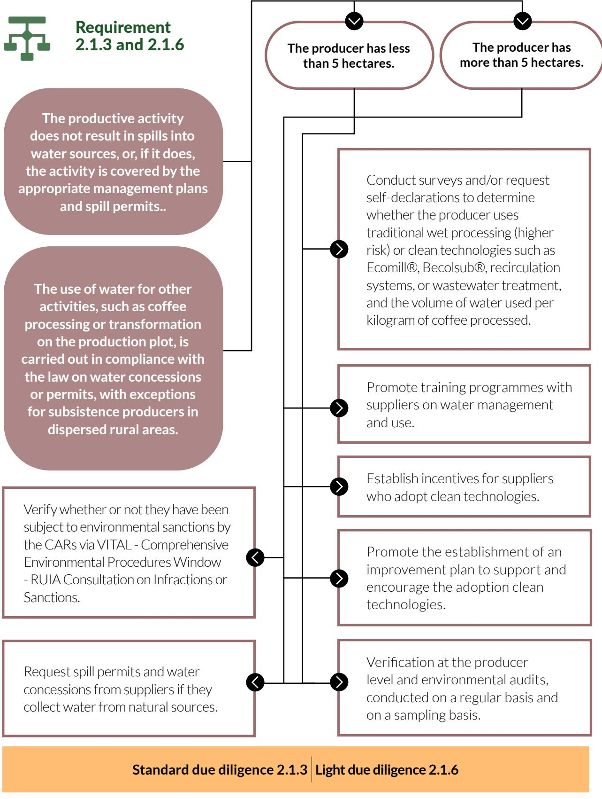

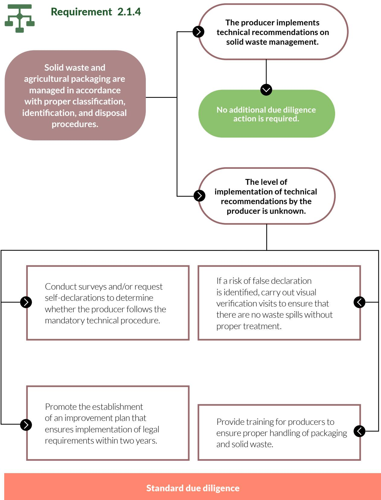

### Requirement 2.1.8

Confirm the absence of soil degradation in the sourcing area through interviews with cooperatives, NGOs, local authorities and other local actors.

Support producers in best practices for the use of soils at risk of erosion, soil conservation, and biodiversity loss, for example through training, campaigns, etc.

Promote the use of legumes as shade and green manure, which fix and return nitrogen to the soil.

Obtain, where available, details on possible training courses for producers on good agricultural practices (training organisations, date, participants, content, etc.).

Collect and verify: reports from NGOs, cooperatives, and government authorities on soil degradation; the soil management and use plan; the manual of good agricultural practices; the integrated pest management plan or agrochemical rotation plan; agronomists' follow-up visit reports; etc.

**Producers have an obligation to protect and conserve the soil.**

### Requirement 2.1.9

Confirm the absence of air pollution in the sourcing area through interviews with cooperatives, NGOs, local authorities and other local actors.

Promote good agricultural practices that include the prohibition and adverse effects of burning crop residues.

Train producers on the necessary permits and applicable conditions for implementation.

Collect and verify, through sampling: permits for the burning of agricultural waste; and policies or technical guidance that include the prohibition and adverse effects of burning crop residues.

### **Light due diligence**

**Agricultural activity does not exceed legal limits for atmospheric pollutants, and the burning of agricultural waste is carried out after obtaining a permit and in accordance with legal conditions.**

### Requirement 2.2.1

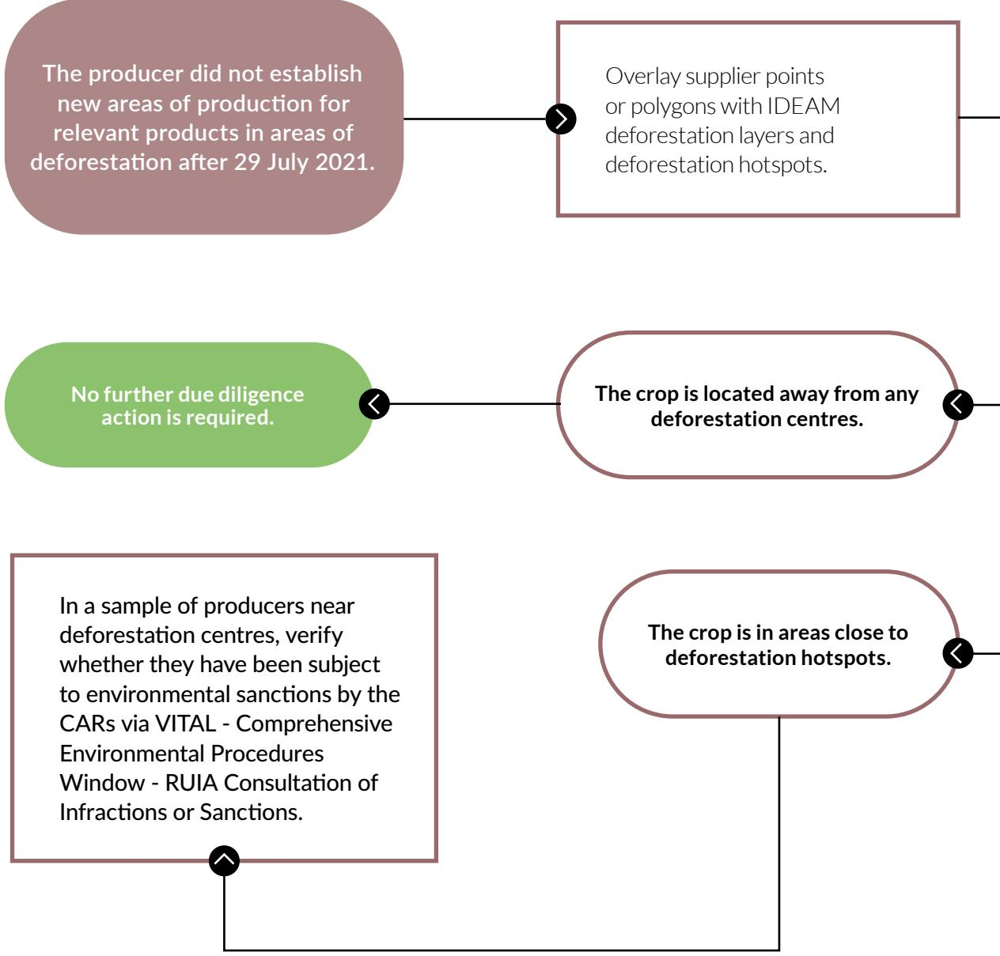

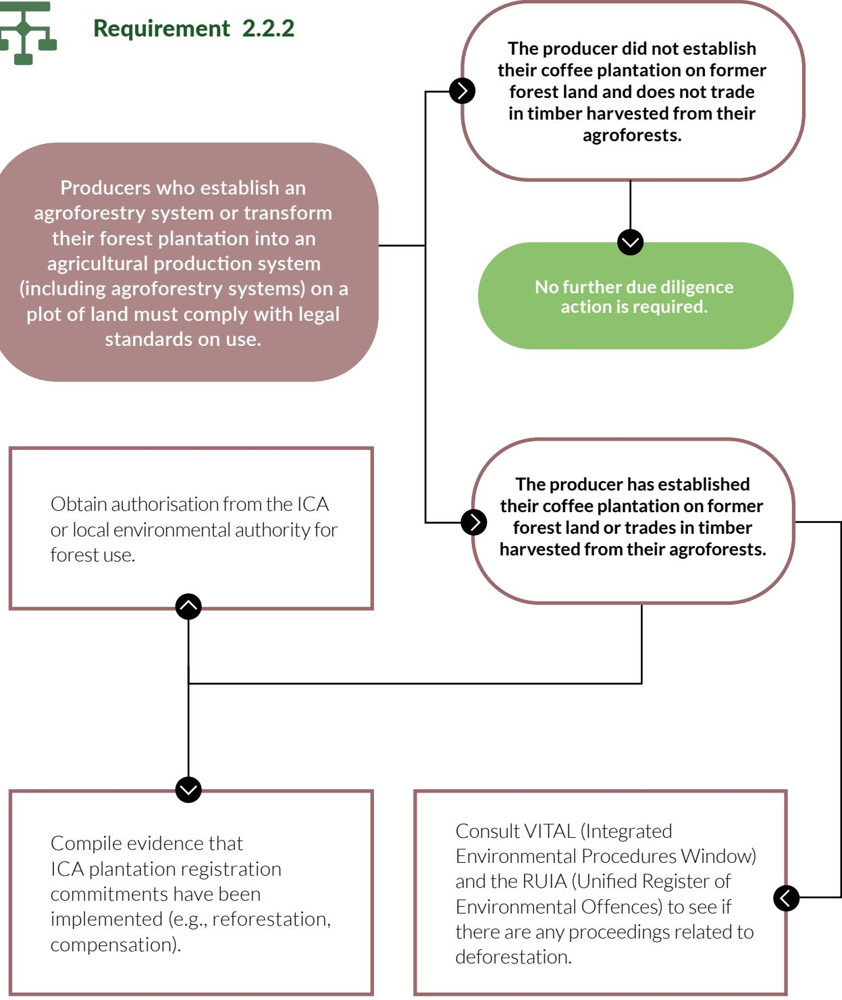

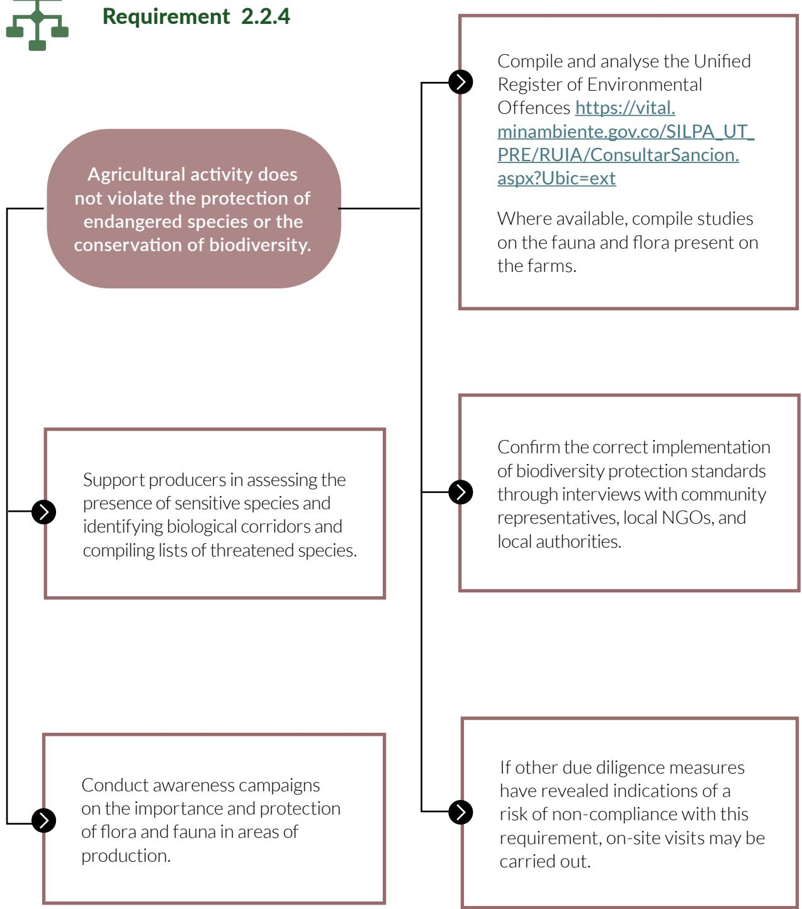

### CATEGORY 3 THIRD PARTIES' RIGHTS AND FPIC

In Colombia, prior consultation and Free, Prior and Informed Consent (FPIC) are distinct but complementary mechanisms for guaranteeing the rights of indigenous and Afro-Colombian communities. FPIC, backed by the 1991 Constitution and ILO Convention 169, is mandatory when a project threatens the physical, cultural or spiritual survival of a people, such as in cases of forced relocation or impact on sacred sites. Agricultural activity must respect cultural and natural heritage, avoiding impacts on collective territories and ensuring effective participation processes. Beyond a legal obligation, FPIC strengthens trust and promotes sustainable and culturally respectful agricultural production, as demonstrated by coffee experiences in Tolima and Cauca. To comply with the EUDR, due diligence must include verification of respect for ethnic and territorial rights.

The risk for the coffee sector in relation to third-party rights is negligible, given that most producers are smallholders located outside collective areas or within them but carried out by members of these communities.

| Requisito legal Contexto Nivel de           |   |
|---------------------------------------------|---|
| Overlay the polygons of the area of pro     |  |
| areas, archaeological sites and others al   |  |
| of Anthropology and History (ICAHN)         | 4 |
| geoparks in the vicinity of the area of pro |  |
| duction, measures must be taken to man      |  |

**4.** https://geoparques.icanh.gov.co/#/

| legal Contexto Nivel de                     |   |
|---------------------------------------------|---|
| belong to the reserve or community coun     |  |
| If there are overlaps in areas of produc    |  |
| indications of illegality, unless they pres |  |
| ent express authorisation from the rep      |  |
| leaders and representatives of indige       |  |
| and local NGOs, the Ombudsman's Of          |  |
| agreements with communities, participa      |  |
| 2.1% in areas re                           |   |
| indigenous commu                           |   |
| who carry out pro                          |   |
| reports of third par                       |   |

### Requirement 3.1.1

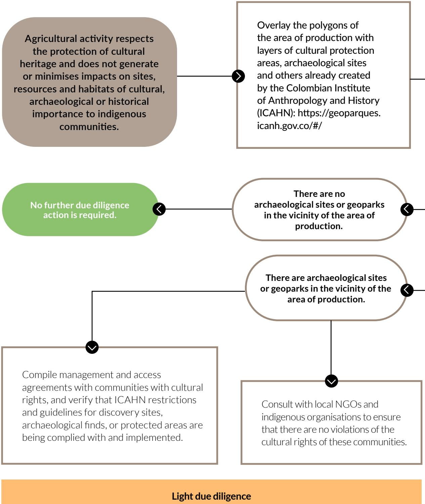

## Requirements

3.3.1 and 3.4.1 Overlay supplier points or polygons with layers of legally constituted collective territories.

> Carry out prior consultation processes where necessary, ensuring participation is effective and documented. Evaluate the implementation of prior consultation externally through audits or reviews by relevant entities.

Collect relevant documents generated during the prior consultation process, such as notifications, meeting minutes, formal agreements with communities, participation reports, and consultation results.

Consult with authorities from the affected communities, such as community leaders and representatives of indigenous or Afrodescendant organisations, local NGOs, the Ombudsman's Office and/or the Ministry of the Interior.

Establish strong community relations and ongoing dialogue, provide complaint mechanisms accesible to indigenous peoples, and implement mechanisms for monitoring the agreements reached.

**The rights of indigenous and Afro-Colombian peoples are respected.**

**If the agricultural activity generates potential impacts on ethnic communities, the FPIC or prior consultation process was respected.**

**Overlaps occur and producers are members of the reserve or community council; production complies with the law.**

**There are overlaps in areas of production and the producer is not registered as a member of the reserve or indigenous territory.**

**No further due diligence action is required.**

In Colombia, agricultural labour relations are regulated by standards designed to guarantee decent working conditions including formal contracts, respect for working hours and minimum wages, provision of protective equipment, social security registration, freedom of association, and prevention of discrimination and harassment. The coffee sector provides approximately 1.6 million jobs5 , but most of these are temporary and itinerant, which makes formalisation and social security coverage difficult. Although this does not necessarily imply illegality, it does reflect structural limitations for fully complying with international standards such as those required by the EUDR.

Occupational risks in a predominantly family-based coffee industry are low. However, there may be specific risks in units larger than 5 hectares. For temporary work, typical in the coffee sector, the seasonality of the harvest requires a large workforce for short periods. The Colombian labour system does not yet have simplified mechanisms adapted to the temporary and itinerant nature of agricultural work. Currently, regulations require formal contracts and full monthly social security contributions, even when employment lasts only days or weeks, which is complicated for small producers. The labour reform (Law 2466 of 2025) reinforces formalisation in the agricultural sector but does not introduce flexible schemes for temporary work, although the regulatory decrees have not yet been issued.

According to information from SICA, by 2024, 96.7% of coffee growers in Colombia will cultivate less than 5 hectares of coffee, classifying them as small-scale coffee growers. In these economic units, the use of household labour and financial resources are predominately used to ensure productive activity. As evidence of this, and to refine this analysis, figures from Colombia's National Administrative Department of Statistics (DANE) and its National Agricultural Survey (ENA) show that in 76.7% of coffee-growing UPAS (Agricultural Production Units), 100% of farm labour is provided by adults within the household. Additionally, 74% of these UPAS occupy plots of less than 5 hectares, while 26% of other coffee growers hire at least one permanent worker. This 5-hectare threshold is used in the following due diligence recommendations. It should be noted that the analyses and conclusions obtained were based on general trends and do not preclude exceptions. Overall, 96.7% of coffee growers in Colombia have less than 5 hectares (SICA 2024), which means that most of them are small-scale producers reliant on family and subsistence economies, without prejudice to exceptions.

**5.** Esta cifra es estimada por la FNC, a partir de las Gran Encuesta Integrada de Hogares y expandida teniendo en cuenta el universo de productores cafeteros del SICA.

| Context                   | Level of |
|---------------------------|----------|
| FNC 6                     |          |
| in the ILO's 2022 study 7 |          |
| tasks 8                   |          |

**6.** <https://federaciondecafeteros.org/static/files/ECC32.pdf>

**7.** [https://www.ilo.org/sites/default/files/wcmsp5/groups/public/@americas/@ro-lima/@sro-lima/documents/publication/](mailto:https://www.ilo.org/sites/default/files/wcmsp5/groups/public/@americas/@ro-lima/@sro-lima/documents/publication/wcms_863074.pdf)

[wcms\\_863074.pdf](mailto:https://www.ilo.org/sites/default/files/wcmsp5/groups/public/@americas/@ro-lima/@sro-lima/documents/publication/wcms_863074.pdf) **8.** [https://coffeewatch.org/documents/49/ReporterBrasil\\_Cafe\\_Colombia\\_ESPANOL.pdf](https://coffeewatch.org/documents/49/ReporterBrasil_Cafe_Colombia_ESPANOL.pdf)

| requirement | Context               | Level of |                      |
|-------------|-----------------------|----------|----------------------|
|             | Coffee Watch report 9 |          |                      |
|             |                       |          | Field verification s |

**9.** [https://coffeewatch.org/documents/49/ReporterBrasil\\_Cafe\\_Colombia\\_ESPANOL.pdf](https://coffeewatch.org/documents/49/ReporterBrasil_Cafe_Colombia_ESPANOL.pdf)

| Legal requirement                                                                                                            | Context                                                                                                                                                                                                                                                                                                                                                                                                                                                                                                                                                                                                                                                                                                                                                                                                     | Level of implementation                                                                                        | Due diligence recommendations                                                     |
|------------------------------------------------------------------------------------------------------------------------------|-------------------------------------------------------------------------------------------------------------------------------------------------------------------------------------------------------------------------------------------------------------------------------------------------------------------------------------------------------------------------------------------------------------------------------------------------------------------------------------------------------------------------------------------------------------------------------------------------------------------------------------------------------------------------------------------------------------------------------------------------------------------------------------------------------------|----------------------------------------------------------------------------------------------------------------|-----------------------------------------------------------------------------------|
|                                                                                                                              | 
Depending on the region and the agricultural and livestock activity carried out, the daily wages can vary. For this reason, the Agricultural Sector Price Information System (SIPSA) provides information on the different forms of remuneration used in the field: payments made per day, with or without meals, for livestock or agricultural work; as well as daily, weekly or monthly payments.
                                                                                                                                                                                                                                                                                                                                                                                                  |                                                                                                                |                                                                                   |
| 
<b>Labour Rights</b>
 
<b>4.3.1.</b>
 
Workers' wages must not be lower than the minimum stipulated by law.
 | 
Labour represents the largest share of total coffee production costs, which means it has a significant impact on the profitability and performance of the activity.
 
Harvesting activities are paid higher wages than the national average daily wage, in response to the demand for labour in the coffee industry, according to the National Federation of Coffee Growers (2016).
 
The Coffee Watch study also acknowledges compliance with the minimum wage, although it remains low for this type of work (p15-16). Workers claim to receive extra pay when the working day exceeds 8 hours.
 
However, a study published in 2022 by the ILO in Colombia pointed out that coffee pickers in the country who are paid by production can earn less than the national minimum wage.
 | 
In family farming: not applicable
 
On farms larger than 5 hectares: <b>standard due diligence</b>
 | <ul> <li>Integrate requirements 4.1 to 4.4 into due diligence actions.</li> </ul> |

| Legal requirement                                                                                                                                            | Context                                                                                                                                                                                                                                                                                                                                                                                                                                                                                                                                                                                                                                                                                                                                                                      | Level of implementation                                                                                        | Due diligence recommendations |
|--------------------------------------------------------------------------------------------------------------------------------------------------------------|------------------------------------------------------------------------------------------------------------------------------------------------------------------------------------------------------------------------------------------------------------------------------------------------------------------------------------------------------------------------------------------------------------------------------------------------------------------------------------------------------------------------------------------------------------------------------------------------------------------------------------------------------------------------------------------------------------------------------------------------------------------------------|----------------------------------------------------------------------------------------------------------------|-------------------------------|
|                                                                                                                                                              | 
The activities identified as hazardous in the coffee sector are:
 <ul> <li>• Implementation of pesticides and fungicides.</li> <li>• Work on steep slopes or erodible areas.</li> <li>• Use of machetes, chainsaws, and scythes.</li> <li>• Manual loading of heavy sacks (over 25 kg).</li> <li>• Working in areas with poisonous wildlife (in humid areas).</li> </ul> 
Coffee harvesting involves working on steep hills, where mechanisation is impossible and the risk associated with machinery is low, but pickers carry sacks weighing an average of 60 kg to the control and weighing point.
 
Currently, there is no universal diagnosis for workers in the coffee sector in terms of implementation of occupational health and safety standards.
 |                                                                                                                |                               |
| 
<b>Labour Rights</b>
 
<b>4.4.1.</b>
 
The employer must provide protective equipment and training to workers who perform risky activities.
 |                                                                                                                                                                                                                                                                                                                                                                                                                                                                                                                                                                                                                                                                                                                                                                              | 
In family farming: not applicable
 
On farms larger than 5 hectares: <b>standard due diligence</b>
 |                               |

| Legal requirement | Context                                                                                                                                                                                                                                                                                                                                                                                                                                                                                                                                                                 | Level of implementation | Due diligence recommendations |
|-------------------|-------------------------------------------------------------------------------------------------------------------------------------------------------------------------------------------------------------------------------------------------------------------------------------------------------------------------------------------------------------------------------------------------------------------------------------------------------------------------------------------------------------------------------------------------------------------------|-------------------------|-------------------------------|
|                   | 
Coffee growing is one of the most diverse economic activities. According to data from SICA and SIHC, 68.3% of coffee producers are men, 31.7% are women, 2.7% are young people, 38.5% are older adults, 20.6% are victims of armed conflict, 6.2% have certified disabilities, 8.9% are indigenous, 2.0% are Afro-descendants, and 0.1% are LGBT.
 
<b>Labour Rights</b>
 
<b>4.5.1.</b>
 
For equal work capacities and conditions, there is no discrimination between workers based on gender, race, religion, age or other conditions.
         |                         |                               |
|                   | 
The FNC has developed and implemented two population-oriented policies: (i) the Gender Equity Policy for Women Coffee Growers and (ii) the Generational Integration Policy. Both policies focus on the implementation of specific strategies aimed at removing the barriers that prevent women, young people and young adults from accessing the resources and opportunities mentioned.
 
There is insufficient monitoring of differential treatment of agricultural workers based on gender, race, religion, age, nationality or any other characteristic.
 |                         |                               |
|                   |                                                                                                                                                                                                                                                                                                                                                                                                                                                                                                                                                                         |                         |                               |

| Legal requirement                                                                                                                                    | Context                                                                                                                                                                                                                                                                                                                                          | Level of implementation                                                                                                                                 | Due diligence recommendations                                                                                                                                                                                                                                                                                                                                                                                                                                                                                                                                                                                                                                                                                                                                                                                                                                                                                                                                                                                                                                             |
|------------------------------------------------------------------------------------------------------------------------------------------------------|--------------------------------------------------------------------------------------------------------------------------------------------------------------------------------------------------------------------------------------------------------------------------------------------------------------------------------------------------|---------------------------------------------------------------------------------------------------------------------------------------------------------|---------------------------------------------------------------------------------------------------------------------------------------------------------------------------------------------------------------------------------------------------------------------------------------------------------------------------------------------------------------------------------------------------------------------------------------------------------------------------------------------------------------------------------------------------------------------------------------------------------------------------------------------------------------------------------------------------------------------------------------------------------------------------------------------------------------------------------------------------------------------------------------------------------------------------------------------------------------------------------------------------------------------------------------------------------------------------|
|                                                                                                                                                      |                                                                                                                                                                                                                                                                                                                                                  |                                                                                                                                                         | 
As a first step, identify whether there are farms with more than 25 permanent employees in the sourcing area.
 
For producers with farms with more than 25 employees:
 
<b>Consultations with stakeholders</b>
 <ul> <li>Consult public reports from labour offices and local NGOs specialising in these issues, such as Human Rights Watch and the ILO.</li> </ul> 
<b>Data collection and verification</b>
 <ul> <li>Contractual verification: Ensure that there are no clauses or practices in employment contracts that directly or indirectly limit the right of association.</li> </ul> 
<b>Implementation of procedures and processes</b>
 <ul> <li>Map the risks of anti-union practices in the supply chain, including outsourcing schemes designed to prevent unionisation.</li> <li>Conduct internal and external audits to detect illegal outsourcing practices aimed at limiting workers' rights to union membership.</li> <li>Establish channels for complaints and grievances for both direct and outsourced workers.</li> </ul> |
| 
<b>Labour Rights</b>
 
<b>4.6.1.</b>
 
Workers are free to join a trade union of their choice and cannot be penalised for doing so.
 | 
The risk in small-scale farms is non-existent, as at least 25 employees are required to form a trade union.
 
Due to the largely informal nature of the sector and the fact that most farms do not have more than 25 workers, no systemic cases of restrictions on this right have been identified for workers in the coffee sector.
 | 
In family farming: not applicable
 
High level of implementation on farms with more than 25 permanent employees: <b>light due diligence</b>
 |                                                                                                                                                                                                                                                                                                                                                                                                                                                                                                                                                                                                                                                                                                                                                                                                                                                                                                                                                                                                                                                                           |

| Legal requirement | Context                                                                                                                                                                                                                                                                                                                                                                                                                                                                                                                                                                                                                                                                                                                                                                                                                                                                                                                                                                                                                                                                                                                                                                                                                                                                                                                                                                                                                                      | Level of implementation | Due diligence recommendations                                                     |
|-------------------|----------------------------------------------------------------------------------------------------------------------------------------------------------------------------------------------------------------------------------------------------------------------------------------------------------------------------------------------------------------------------------------------------------------------------------------------------------------------------------------------------------------------------------------------------------------------------------------------------------------------------------------------------------------------------------------------------------------------------------------------------------------------------------------------------------------------------------------------------------------------------------------------------------------------------------------------------------------------------------------------------------------------------------------------------------------------------------------------------------------------------------------------------------------------------------------------------------------------------------------------------------------------------------------------------------------------------------------------------------------------------------------------------------------------------------------------|-------------------------|-----------------------------------------------------------------------------------|
|                   | 
<b>For employees with an employment contract:</b>
 
Employers are responsible for enrolling their workers in the General Social Security System for Health, Pensions and Occupational Risks, and for making the corresponding contributions in accordance with current regulations.
 
<b>For contractors providing services:</b>
 
Contractors are responsible for their own enrolment and payment of contributions to the General Social Security System for Health, Pensions and Occupational Risks. The contracting company must verify this enrolment and implementation of contributions both before and during the execution of the contract.
 
The GEIH figures for July 2024 reveal high levels of informal employment: <b>nearly 94% of people employed in coffee-related activities were not contributing to a pension.</b>
 
According to a project by the ILO and INCAS Global+ (2025), only 8.8% of the population in the coffee sector contributes to a pension or already receives a pension, 1% participates in the Periodic Economic Benefits (BEPS) scheme and 3% is affiliated with an Occupational Risk Management (ARL) company. It is estimated that around 78% of the population is covered by a grant-funded health scheme, which suggests it is a highly informal sector with significant challenges in terms of achieving decent work and improving conditions for coffee workers.
 |                         | <ul> <li>Integrate requirements 4.1 to 4.4 into due diligence actions.</li> </ul> |

| Legal requirement                                                                                                                                                                                        | Context                                                                                                                                                                                                                                                                                                                                                              | Level of implementation                                                                                                               | Due diligence recommendations                                                                                                                                                                                                                                                                                                                                                                |
|----------------------------------------------------------------------------------------------------------------------------------------------------------------------------------------------------------|----------------------------------------------------------------------------------------------------------------------------------------------------------------------------------------------------------------------------------------------------------------------------------------------------------------------------------------------------------------------|---------------------------------------------------------------------------------------------------------------------------------------|----------------------------------------------------------------------------------------------------------------------------------------------------------------------------------------------------------------------------------------------------------------------------------------------------------------------------------------------------------------------------------------------|
| 
<b>Labour Rights</b>
 
<b>4.8.1.</b>
 
The employer must grant pregnant women 18 weeks of maternity leave and fathers 8 days of paternity leave and pay leave benefits to both parents.
 | 
Large and medium-sized farms affiliated with trade unions tend to comply with these obligations, as they have high levels of labour formalisation. However, there may be greater risk or localised risk on small farms, where oral contracts, informal arrangements or lack of affiliation to the health system can limit access to leave and other benefits.
 | 
In family farming: not applicable
 
High implementation on farms larger than 5 hectares
 
<b>light due diligence</b>
 | 
Integrate requirements 4.1 to 4.4 into due diligence actions.
 
<b>Implementation of procedures and processes</b>
 <ul> <li>Training for supervisors and human resources managers on leave regulations.</li> <li>Written policies on maternity and paternity protection in farming.</li> <li>Establish confidential reporting mechanisms to report non-compliance with</li> </ul> |

| Legal requirement                                                                                                                                                                                                                  | Context                                                                  | Level of implementation                                                                                                  | Due diligence recommendations                                                                                                                                                                                                                                                                                                                                                                                                                                                                                                                                                                                                                                                                                                                                                                                               |
|------------------------------------------------------------------------------------------------------------------------------------------------------------------------------------------------------------------------------------|--------------------------------------------------------------------------|--------------------------------------------------------------------------------------------------------------------------|-----------------------------------------------------------------------------------------------------------------------------------------------------------------------------------------------------------------------------------------------------------------------------------------------------------------------------------------------------------------------------------------------------------------------------------------------------------------------------------------------------------------------------------------------------------------------------------------------------------------------------------------------------------------------------------------------------------------------------------------------------------------------------------------------------------------------------|
| 
<b>Labour Rights</b>
 
<b>4.9.1.</b>
 
The employer adopts measures to prevent, address and punish workplace harassment and sexual harassment in the workplace, in accordance with current Colombian legislation.
 | 
No evidence has been found for Colombian coffee farming industry.
 | 
In family farming: not applicable
 
High implementation on farms larger than 5 hectares: light due diligence
 | 
<b>Consultations with stakeholders</b>
 
Consult public reports from labour offices and local NGOs specialising in these issues, or other stakeholders who are familiar with your supply chain.
 
<b>Implementation of procedures and processes</b>
 <ul> <li>Promote employee training, internal policies and protocols for employees for the prevention, detection and handling of cases of workplace or sexual harassment with suppliers.</li> <li>Enable complaint and reporting mechanisms.</li> <li>Verify the follow-up of effective sanctions for workplace or sexual harassment.</li> <li>Establish mechanisms for complaints and grievances, and promote the creation of coexistence committees and joint staff committees as relevant bodies to prevent sexual and labour harassment.</li> </ul> |

### Requirements 4.1.1, 4.2.1, 4.3.1, 4.4.1, 4.5.1 and 4.7.1

**If the producer hires workers, they must do so under a fixed-term, indefinite apprenticeship, or temporary, occasional, or casual contract (written or oral), in accordance with the conditions stipulated by law**

**If the producer hires permanent workers, they must not exceed the working hours established by law, and if they do, overtime and Sunday work must be remunerated.**

**The employer must provide protective equipment and training to workers who perform risky activities.**

**For equal work capacities and conditions, there is no discrimination between workers based on gender, race, religion, age or other conditions.** 

**The employer complies with the current Social Security regime, including the payment of the corresponding contributions.**

**Workers' wages must not be lower than the minimum stipulated by law.**

> **Production plots are larger than 5 hectares.**

**Production plots are less than 5 hectares.**

**No further due diligence action is required.**

### **Light due diligence 4.1.1**

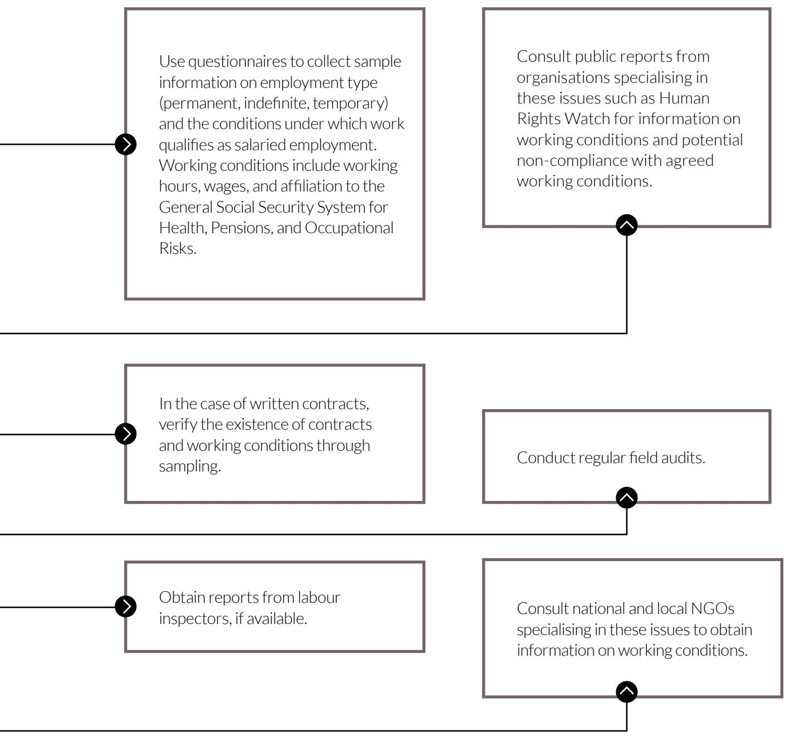

### Standard due diligence **4.2.1, 4.3.1, 4.4.1, 4.5.1 y 4.7.1**

### Requirement 4.6.1

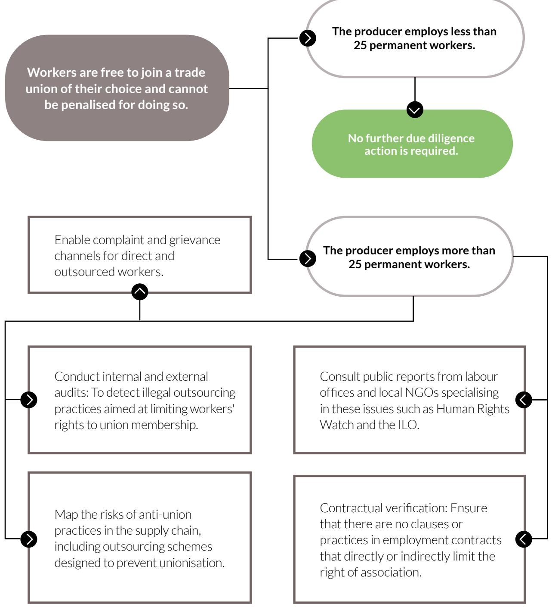

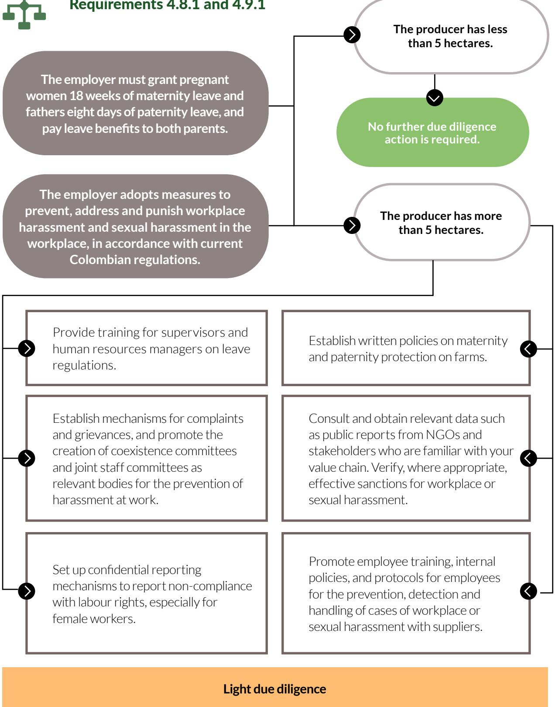

### Requirements 4.8.1 and 4.9.1

### CATEGORY 5 **HUMAN RIGHTS**

In the Colombian coffee sector, respect for human rights is essential for sustainability and access to international markets. National law and international commitments prohibit child and forced labour, although challenges persist due to informality and rural socio-economic conditions. In coffee farming, which is based on family agriculture, it is common for household members to participate in farming tasks, but this should not be confused with child labour, as regulations protect the education and well-being of minors. Compliance with these standards is key to the due diligence required by the EUDR.

The risk to the coffee sector is negligible, although in areas of high social vulnerability, isolated cases may occur, such as those reported in the table below.

| requirement Context            | Level of |
|--------------------------------|----------|
| In Colombia, labour legis      |         |
| tional treaties ratified by Co |         |
| lombia, such as ILO Conven     |         |
| working adolescents, ensur     |         |

| requirement Context                        | Level of |
|--------------------------------------------|----------|
| carried out by minors are not consid       |         |
| Official figures 10 recorded in the System |          |
| coffee growers with large farms and cer    |         |
| The figures also reflect a more favour     |         |
| educational materials aimed at prevent     |         |

**10.** <https://www.dol.gov/agencies/ilab/documento-tecnico-sobre-trabajo-infantil-en-el-sector-cafetero-derivado-del-estudio>

| Legal requirement                                                                                                                                                                                                | Context                                                                                                                                                                                                                                                                                                                                                                                                                                                                                                                                                                                                                                                                                                                                                                                                                                                                                                                                                                                                                                          | Level of implementation                                                                                                                  | Due diligence recommendations                                                                                                                                                                                                                                                                                                                                                                                                                                                                                                                                                                                                                                                                                                                                 |
|------------------------------------------------------------------------------------------------------------------------------------------------------------------------------------------------------------------|--------------------------------------------------------------------------------------------------------------------------------------------------------------------------------------------------------------------------------------------------------------------------------------------------------------------------------------------------------------------------------------------------------------------------------------------------------------------------------------------------------------------------------------------------------------------------------------------------------------------------------------------------------------------------------------------------------------------------------------------------------------------------------------------------------------------------------------------------------------------------------------------------------------------------------------------------------------------------------------------------------------------------------------------------|------------------------------------------------------------------------------------------------------------------------------------------|---------------------------------------------------------------------------------------------------------------------------------------------------------------------------------------------------------------------------------------------------------------------------------------------------------------------------------------------------------------------------------------------------------------------------------------------------------------------------------------------------------------------------------------------------------------------------------------------------------------------------------------------------------------------------------------------------------------------------------------------------------------|
|  
<b>Human rights</b>
 
<b>5.2.1.</b>
 
No one is forced or subjected to forced labour or practices that restrict freedom of employment.
 | 
EThe ILO and INCAS Global+ project (2025), developed with support from German cooperation (GIZ), identified the main labour risks in coffee farming—such as forced labour, child labour, or lack of social protection—and concluded that, although vulnerabilities may exist in steps such as harvesting and initial processing, no evidence of forced labour was found. On the contrary, the study highlights the existence of tools, testimonies and practices that strengthen decent work in the sector (ILO, 2025).
 
The "Sustainable and Resilient Supply Chains" initiative (2021), promoted by the ILO, SENA and the European Union, confirms this trend by characterising employment in coffee farming with an emphasis on occupational safety, access to labour rights, the impact of COVID-19 and the training of new generations. In particular, the pilot project on living wages in Huila seeks to guarantee decent incomes and prevent labour exploitation through social dialogue and training (TSM Noticias, 2021).
 | 
In family farming: not applicable
 
High level of implementation on farms larger than 5 hectares: <b>light due diligence</b>
 | 
<b>Consultations with stakeholders:</b>
 
Conduct surveys or interviews with workers, trade unions (if any), NGOs and community leaders on working hours, conditions, working hours, wages, and occupational safety. It is important to include both direct and subcontracted workers.
 
<b>Implementation of procedures and processes</b>
 <ul> <li>Recommend and monitor labour suppliers in the implementation of Codes of Conduct that prohibit forced labour</li> <li>Implement ongoing training programmes on labour rights for supervisors and workers, focusing on forced labour and freedom of employment</li> <li>Conduct internal audits and external audits carried out by independent entities</li> <li>Establish anon</li></ul> |

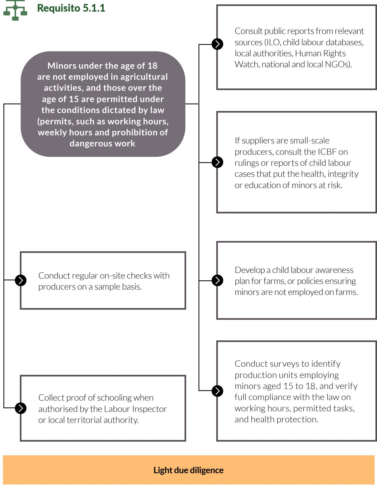

Conduct surveys or interviews with workers, trade unions (if any), NGOs, and community leaders on working conditions, working hours, wages, and occupational safety.

Implement ongoing training programmes on labour rights for supervisors and workers, focusing on forced labour and freedom of employment.

Conduct internal and external audits.

Establish anonymous and confidential complaints mechanisms.

**No one is forced or subjected to forced labour or practices that restrict freedom of employment**

### Requirement 5.2.1

### CATEGORY 6 **TAXATION, ANTI-CORRUPTION, TRADE AND CUSTOMS**

**N.B.**This is the only category in the EUDR that potentially affects entities throughout the supply chain in the country of production, and not only at the level of the coffee production plot.

In the Colombian agricultural sector, taxation, trade and the fight against corruption are key elements for ensuring legality and transparency within the framework of the EUDR. Productive activities, particularly coffee production, are governed by mechanisms such as export taxes and parafiscal levies, which finance research programmes, technical assistance and institutional strengthening in the sector. These instruments, together with customs and trade controls, facilitate product traceability and reinforce confidence in international markets. In addition, the organisational tradition of the coffee industry and the country's institutional strength have contributed to maintaining a low risk of corruption in coffee production and marketing, which is a favourable factor for implementation of the standard due diligence requirements set by European regulations.

In Colombia, coffee production and trade are governed by an institutional system that clearly regulates taxation, trade and customs, contributing to a low-risk environment for corruption in this activity. Coffee exports are not subject to direct taxes, but they are subject to parafiscal charges administered by the National Federation of Coffee Growers, which finance extension, research, promotion and sustainability services for the sector. In terms of customs, the country has a solid regulatory framework that guarantees the traceability and legality of exported beans, under the supervision of the DIAN and with internationally recognised standards. This scheme, combined with the highly organised nature of the coffee sector, allows the Colombian coffee value chain to be perceived as transparent and at low risk of corrupt practices, which is relevant in the

context of the due diligence requirements established by the EUDR.

Coffee is recognised as a legal and traditional agricultural product, with a strongly institutionalised value chain backed by the National Federation of Coffee Growers and other state entities that guarantee its traceability and transparency. Although there are economic sectors in the country that have been used for money laundering or other illicit practices, coffee has not been identified as a high-risk item in this regard, precisely because of its strict control systems, the formal nature of its exports, and the monitoring of parafiscal and customs quotas. Consequently, the risk of coffee farming being linked to corruption or money laundering is considered low, which strengthens confidence in this sector in terms of the legality standards and due diligence required in international markets such as Europe.

| Requisito legal | Contexto                        | Nivel de |                   |
|-----------------|---------------------------------|----------|-------------------|
|                 | is specific to the agricultural |          |                   |
| Taxation, anti |                                 |          | Colombian Coffee[ |

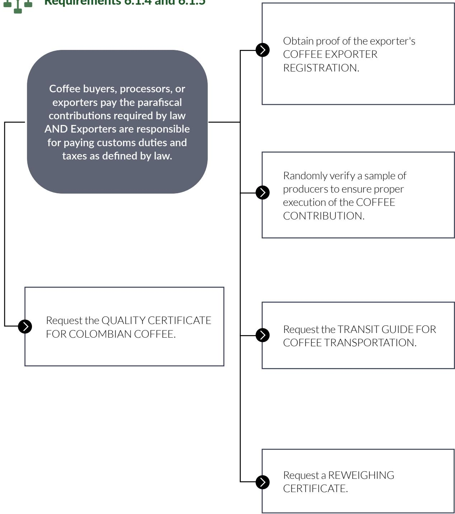

### Requirements 6.1.4 and 6.1.5

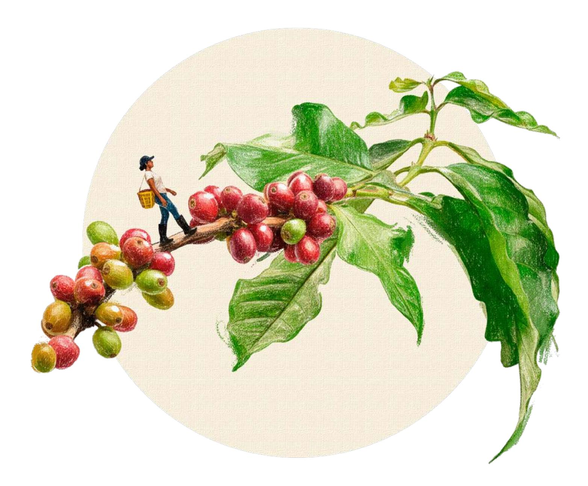

5 ANNEX The first step in developing this tool for legality-related due diligence is to identify the relevant legal requirements under the EUDR for coffee production in Colombia.

The EUDR defines the legality of commodities according to two criteria:

National legal requirements must refer to the legal status of the production area. There are seven legal areas [for agricultural products]: land-use rights; environmental protection; the rights of third parties; labour rights; human rights protected under international law; the principle of Free, Prior and Informed Consent, as set out in the United Nations Declaration on the Rights of Indigenous Peoples; and tax, anti-corruption, trade and customs regulations.

On 2 October 2024 (updated in April 2025), the European Commission published a guidance document for the implementation of the EUDR, which interprets the Regulation's provisions on the legality criterion. The document aims to assess the relevance of legal requirements according to the following criteria:

The requirements have a specific impact on the legal status of the commodity production area [with the exception of tax, trade and customs standards]. The requirements are linked to the Regulation's objectives of halting deforestation and forest degradation, as part of the EU's commitment to address climate change and biodiversity loss.

Given that not all labour requirements, as well as certain human rights and third parties' rights, are directly related to the objectives of the EUDR, there is debate as to whether they fall within its scope of application.

In addition, the guidance document extends the scope of tax and anti-corruption regulations to steps in the value chain beyond the area of production. It should be noted that the Commission's guidance document is not legally binding. As specified in the guidance document itself, it does not replace, add to or modify the EUDR's provisions, which establish the legal obligations. Its purpose it to harmonise the implementation of the Regulation across EU member states.

Each EU Member State will adopt its own approach to monitoring operators' implementation of the EUDR. Ultimately, only the courts in each EU country can interpret EU regulations in a legally binding manner and determine the scope of the legality test.

In this context, this tool takes a precautionary approach. It considers all areas of law listed in Article 2.40 and includes all requirements that are considered relevant in these seven areas. It indicates with an asterisk those legal requirements that are not directly linked to the objectives of the EUDR.

This comprehensive approach will allow end users to choose the scope of their work based on their reading of the EUDR and the accompanying guidance.

## Annex 1. Mapping methodology

### **How the relevance of the requirements has been determineds**

Under the EUDR, operators are solely responsible for carrying out due diligence to ensure that the products they trade in present a negligible risk of illegality. However, the EU recognises that producing countries can facilitate the work of operators and competent authorities (see question 1.30 of the FAQs), in particular by providing information that allows for a better understanding of the applicable national laws. This is precisely the purpose of Annex 2, which maps the relevant legal requirements for coffee produced in Colombia.

All existing legal texts and requirements in Colombia that fall within the scope of application of the seven legal categories specified above have been identified. Stakeholders in the coffee sector, through consultation workshops and bilateral working meetings (see Annex 3), assessed the relevance of each legal requirement to determine implementation of the EUDR legality criterion.

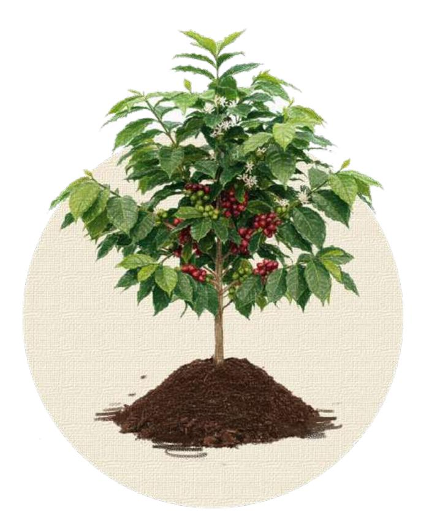

All identified legal requirements were considered a priori relevant for assessing the conformity of coffee or its derived products with the EUDR legality criterion, unless it can be clearly identified that:

The legal requirement does not apply to the coffee plot or to the workers and third parties involved in it [with the exception of tax, trade and customs standards] The legal requirement is not relevant in the context of coffee production, because the conditions for its implementation are not present The legal requirement is generally applicable, is not subject to implementation texts that prevent its implementation or enforcement, and/or is covered by other more specific requirements.

The tables below, organised by area of law, present the requirements retained as relevant or irrelevant for coffee produced in Colombia, along with the justifications provided by the stakeholders consulted.

The tables present the **42 legal requirements identified**, of which **33 are considered relevant and 9 irrelevant**,.

Requirements marked with an asterisk are not directly related to the purposes of the EUDR.

## Annex 2.

## Mapping of legal requirements relevant to coffee produced in Colombia

### **Land tenure regime**

In Colombia, land is a fundamental pillar of rural development, cultural identity, and social justice. The Colombian legal framework recognises various forms of tenure, aiming to balance individual property rights with the collective interest and the social function that property must fulfil. Within this context, two essential concepts are distinguished: **private property**, understood as the legally recognised right to property, and legitimate possession, which refers to the material and continuous exercise of rights over land, even in the absence of a formal title. Both enjoy legal protection and, under certain conditions, may give rise to the consolidation of ownership rights.

Possession represents a meeting point between social reality and legal formality. In rural Colombia, it is common for farmers, rural communities and ethnic groups to occupy and work land without a registered title, while exercising legitimate and prolonged possession. The legal system has recognised this situation and created mechanisms to formalise it, allowing holders to obtain title through administrative or judicial processes. In this way, possession becomes a path to legal certainty and the strengthening of the smallholder farming economy.

Private property is protected by the 1991 Constitution, which enshrines it as an inviolable right, although subject to social and ecological functions. Civil and agrarian laws develop this protection, regulating how property can be acquired, transferred and used, while incorporating principles that guarantee responsible and sustainable use. In this way, land is not conceived solely as an economic asset, but as a vital space for production, culture and environmental balance.

## Land-use rights

The Colombian State has also recognised the collective territorial rights of indigenous peoples, Afro-descendant communities and the Romani or Gypsy people. Through collective titling, the preservation of their ancestral territories, respect for their cultural identity and autonomy in land use are guaranteed. These entities—such as indigenous reserves and Afro-Colombian collective territories—are examples of collective property ownership with historical and legal value, backed by national laws and international instruments such as ILO Convention 169.

In addition, agrarian and civil legislation provides for various forms of use and exploitation of rural plots, such as lease agreements, loan agreements (*comodato*), usufruct, sharecropping (*aparcería*) or *anticresis* (an arrangement whereby a creditor uses a debtor's property to satisfy interest or debt), which allow for different degrees of access, administration and benefit from the land. These mechanisms are essential for promoting rural productivity, facilitating cooperation between landowners and workers, and ensuring sustainable land use.

Finally, land restitution is a central pillar of Colombia's policy of reparation for victims of the armed conflict. Through the Victims Law and complementary decrees, administrative and judicial procedures have been established to return the territories from which communities were dispossessed to smallholder farming families, indigenous communities, and Afro-descendant communities. This policy seeks not only to restore property rights, but also to rebuild the social fabric and ensure the dignified return of displaced populations.

In short, Colombia's legal framework on land reflects an effort to articulate social justice, historical recognition and sustainable rural development. Ownership, possession and collective territorial rights are not isolated categories, but interdependent elements that shape a comprehensive vision of the territory as a common good, a productive resource and a living space.

### **Legal regime for land use**

In Colombia, land management aims to balance agricultural production with environmental protection and sustainable development. One of the key instruments for achieving this is the delimitation of the agricultural frontier, which defines the areas where agricultural activities can be carried out without affecting strategic ecosystems such as moorlands, forests, or wetlands. Formalised by the Ministry of Agriculture in 2018 based on studies by the UPRA, this delimitation makes it possible to identify areas that are suitable, conditional or excluded for production, guiding the scaling up of agriculture and preventing conflicts over land use. In turn, the Policy on Productive and Social Land Use Planning for Rural Property promotes land use that responds to its natural vocation and criteria of sustainability, productivity, and equity.

Within this framework, Peasant Reserve Areas (*Zonas de Reserva Campesina*) play an essential role in protecting the rural economy and preventing the uncontrolled expansion of the agricultural frontier. All these strategies are linked to the commitments of the 2016 Peace Agreement, which proposes a national environmental zoning plan and comprehensive rural reform.

Land use planning in Colombia, primarily regulated by Law 388 of 1997, establishes Land Use Plans (POT) as mandatory planning instruments for municipalities and districts. These plans determine land use, incorporate environmental and risk criteria, and guide the balanced occupation of the territory. Their periodic updating ensures that urbanisation and rural development processes remain within sustainable limits. Together, the delimitation of the agricultural frontier and the POTs provide the foundation of a land use policy that aims to harmonise production, environmental conservation, and the well-being of the country's rural and urban communities.

| Areas of law Legal requirement         | Legal basis Relevance   |
|----------------------------------------|-------------------------|
| NB : Land tenure                       |                         |
| 1991 Constitution:                     | Recognises and protects |
| Civil Code (Law 57 of 1887)            | : Regulates             |
| of 2012) : Judicial procedures for the |                         |
| Law 1561 of 2012:                      | Establishes a           |
| Law 1448 of 2011:                      | Restitution of          |
| Law 1776 of 2016:                      | Promotes the            |
| Law 1801 of 2016:                      | Police and              |
| Legitimate Possessio                   | n                       |
| Civil Code (arts. 762–828):            | Defines                 |
| (Law 1564 of 2012):                    | Regulates               |
| Law 1776 of 2016:                      | Recognises              |
| Law 1448 of 2011                       | : Protects the          |
| 37): Empowers the National Land        |                         |
| Law 1801 of 2016:                      | Police and              |

| Areas of law Legal requirement | Legal basis Relevance   |
|--------------------------------|-------------------------|
| NB : Land tenure               |                         |
| Law 160 of 1994 (Art. 85)      | : Regulates             |
| Decree 1071 of 2015:           | Regulates               |
| Decree Law 4633 of 2011:       | Measures                |
| Law 1448 of 2011:              | Restitution of land to  |
| ILO Convention 169:            | International           |
| 1991 Constitution:             | Recognises ethnic and   |
| Law 70 of 1993                 | : Regulates collective  |
| Decree 1071 of 2015:           | Regulates               |
| Law 1448 of 2011:              | Restitution of          |
| ILO Convention 169:            | International standards |
| Decree 4634 of 2011:           | Measuresfor             |
| Decree 902 of 2017 (Art. 17):  | Special                 |

| Areas of law Legal requirement | Legal basis Relevance |
|--------------------------------|-----------------------|
| Lease (arts. 1973–1991):       | Use of a              |
| Bailment (arts. 2200–2212):    | Loan                  |
| Usufruct (arts. 823–829):      | Use                   |
| Emphyteusis:                   | Use and enjoyment of  |
| 1071/2015):                    | Joint exploitation of |
| of 2015: Regulate contracts on |                       |

| Areas of law Legal requirement | Legal basis Relevance          |
|--------------------------------|--------------------------------|
| Art. 2:                        | Duty of the State to protect   |
| Art. 58:                       | Protection of property         |
| Art. 64:                       | Progressive access to land for |
| 2016–2017:                     | Incorporate transitional       |
| restitution of land for        | indigenous, Afro              |
| descendant and Rom             | communities.                   |

| Areas of law Legal requirement                 | Legal basis Relevance              |
|------------------------------------------------|------------------------------------|
| the National                                   |                                    |
| Frontier ; if it                               |                                    |
| Entrusts the                                   | Ministry of Agriculture            |
| Defines the                                    | National Agricultural Frontier and |
| Establishes guidelines for                     | the productive                     |
| property                                       | , including the management and     |
| Regulates the creation of                      | Peasant Reserve Zones              |
| (ZRC); its function is to prevent uncontrolled |                                    |
| environmental zoning plan                      | that                               |
| Main standard for                              | land use planning                  |
| Creates                                        | Land Use Plans (POT) , mandatory   |
| Regulates the                                  | formulation, adoption,             |
| and implementation                             | of POT, EOT,                       |
| Integrates                                     | environmental criteria into        |
| Law 1454 of 2011 (LOOT                         | )                                  |
| General framework for                          | territorial                        |
| coordination                                   | between national, departmental     |
| Reinforces the focus on                        | sustainability                     |
| and habita                                     | t within land use planning.        |

In Colombia, environmental protection and sustainable management of natural resources are based on the 1991 Constitution, which recognises the right of all people to enjoy a healthy environment and grants special protection to natural parks due to their inalienable and imprescriptible nature. A robust legal framework has been developed that seeks to harmonise ecosystem conservation with the country's productive activities. From Law 2 of 1959, which defined large national forest reserves, to the most recent standards on waste management and emission control, environmental regulation has evolved towards a comprehensive approach to sustainability.

**Protected areas**, regulated by the National System of Protected Areas (SINAP), include different categories ranging from strict conservation to integrated management. Agricultural activities are restricted in these areas, although sustainable uses are permitted in specific contexts, such as Integrated Management Districts or Civil Society Nature Reserves. Complementarily, standards such as Law 1753 of 2015, as well as international commitments derived from the Ramsar Convention, protect wetlands and water sources from the scaling up of agricultural activities and intensive land use.

**Water, soil and waste management** is another essential pillar of environmental policy. Colombian regulations require permits for the use of water resources, with exceptions for dispersed rural dwellings, and promote water conservation and efficient use through specific plans. In relation to spills, Resolution 631 of 2015 establishes maximum pollutant limits for productive activities, including agricultural activities, in order to prevent the contamination of rivers and streams. Although small subsistence producers are exempt from Resolution 631 and from the implementation of complex procedures, they must ensure basic wastewater treatment through adequate systems.

With regard to **solid and hazardous waste**, legislation led by Decree 2981 of 2013 and Decree 4741 of 2005 requires municipalities, companies, and producers to implement comprehensive management plans that prioritise the reduction, reuse, and safe disposal of waste. The most recent resolutions reinforce the shared responsibility of manufacturers and importers in the collection and treatment of containers, packaging and chemicals, extending the chain of environmental responsibility beyond the point of consumption.

**Law 2111 of 2021** amends the Penal Code by **deforestation as a criminal offence in Article 330**. It does not establish a cut-off date or baseline for deforestation, nor does it use geographic information layers in the explanatory memorandum, but it does elevate deforestation to the status of a crime, effective 29 July 2021.

**Soil and air** also have specific protection standards. National policies promote agroecological practices, erosion prevention, and the restoration of degraded land, while air quality regulations prohibit open burning and promote the sustainable use of biomass. These measures are reinforced by criminal penalties, such as the criminalisation of deforestation in 2021, which demonstrates the state's commitment to combating forest cover loss and protecting biodiversity.

This regulatory framework reflects a vision of a country that seeks to balance agricultural productivity with environmental conservation. Rather than isolated prohibitions, environmental standards in Colombia make up a coordinated system that promotes sustainability, responsible use of natural resources, and shared responsibility among the state, rural communities, and the productive sector.

## Environmental protection

| Areas of law                                                               | Legal requirement | Legal basis                                                                                                                                                                                                                                                                                                                                                                                                                                                                                                                                                                                                                                                                                                                                                                                                                                                                                                                                                                                                                                                                                                                                                                                                                                                                                                                                                                                                                                                                                                                                                                                                                                                                                                                                                                                                                                                                                                                                                                                                                                                                                                                                                                                                                                                                      | Relevance |
|----------------------------------------------------------------------------|-------------------|----------------------------------------------------------------------------------------------------------------------------------------------------------------------------------------------------------------------------------------------------------------------------------------------------------------------------------------------------------------------------------------------------------------------------------------------------------------------------------------------------------------------------------------------------------------------------------------------------------------------------------------------------------------------------------------------------------------------------------------------------------------------------------------------------------------------------------------------------------------------------------------------------------------------------------------------------------------------------------------------------------------------------------------------------------------------------------------------------------------------------------------------------------------------------------------------------------------------------------------------------------------------------------------------------------------------------------------------------------------------------------------------------------------------------------------------------------------------------------------------------------------------------------------------------------------------------------------------------------------------------------------------------------------------------------------------------------------------------------------------------------------------------------------------------------------------------------------------------------------------------------------------------------------------------------------------------------------------------------------------------------------------------------------------------------------------------------------------------------------------------------------------------------------------------------------------------------------------------------------------------------------------------------|-----------|
| <b>2. Environmental protection</b>                                         |                   |                                                                                                                                                                                                                                                                                                                                                                                                                                                                                                                                                                                                                                                                                                                                                                                                                                                                                                                                                                                                                                                                                                                                                                                                                                                                                                                                                                                                                                                                                                                                                                                                                                                                                                                                                                                                                                                                                                                                                                                                                                                                                                                                                                                                                                                                                  |           |
|                                                                            |                   | 
<b>1991 Constitution</b>
 <ul> <li>• Art. 63: Natural parks are inalienable, imprescriptible and unseizable.</li> <li>• Art. 79: Right to a healthy environment and duty of the State to protect ecological areas.</li> </ul> 
<b>LLaw 2 of 1959</b>
 <ul> <li>• Delimits seven National Forest Reserves; restricts land use and zones into strict conservation (A), restricted use (B) and limited agricultural use (C).</li> </ul> 
<b>Decree 2811 of 1974 – Natural Resources Code</b>
 <ul> <li>• Regulates the management of natural resources; defines the National Park System (arts. 327-330).</li> </ul> 
<b>Decree 622 of 1977</b>
 <ul> <li>• Regulates national park categories and prohibits agricultural and extractive activities in areas covered by the system.</li> </ul> 
<b>Law 99 of 1993</b>
 <ul> <li>• Creates the Ministry of the Environment and the SINA; protects moorlands, water sources and water ecosystems.</li> </ul> 
<b>Decree 3600 of 2007</b>
 <ul> <li>• Regulates determinants of rural land use planning; classifies protected soils (moorlands, wetlands, riparian zones, aquifers).</li> </ul> 
<b>Law 357 of 1997 (Ramsar Convention)</b>
 <ul> <li>• Approves the international protection of wetlands.</li> </ul> 
<b>Decree 1667 of 2002</b>
 <ul> <li>• Designates Colombian wetlands as Ramsar sites.</li> </ul> 
<b>Law 1753 of 2015, art. 172</b>
 <ul> <li>• Prohibits high-impact agricultural and extractive activities in Ramsar wetlands.</li> </ul> 
<b>Decree 1076 of 2015</b>
 <ul> <li>• Sole regulatory body for the environmental sector; organises SINAP categories (parks, forest reserves, management districts, recreation areas, etc.); allows agriculture only under sustainable criteria in areas such as Integrated Management Districts or Civil Society Reserves.</li> </ul> 
<b>Resolution 110 of 2022 (Ministry of the Environment)</b>
 <ul> <li>• Regulates the removal of Forest Reserve areas (Law 2/1959).</li> </ul> 
<b>Law 160 of 1994, Decree 902 of 2017 and ANT agreements</b>
 <ul> <li>• Regulate the use of unallocated vacant land and land-use rights for agricultural purposes under sustainability criteria.</li> </ul> |           |
| <b>2.1. Environmental requirements for agricultural activities are met</b> |                   |                                                                                                                                                                                                                                                                                                                                                                                                                                                                                                                                                                                                                                                                                                                                                                                                                                                                                                                                                                                                                                                                                                                                                                                                                                                                                                                                                                                                                                                                                                                                                                                                                                                                                                                                                                                                                                                                                                                                                                                                                                                                                                                                                                                                                                                                                  |           |

| Areas of law | Legal requirement | Legal basis                                 | Relevance |
|--------------|-------------------|---------------------------------------------|-----------|
|              |                   | Decree 1843 of 199 1                        |           |
|              |                   | 1985 , 150 of 2003 and 062376 of 2020 (ICA) |           |

| Areas of law Legal requirement                   | Legal basis Relevance  |
|--------------------------------------------------|------------------------|
| Resolution 1704 of 2018 (MinAgricultura          | )                      |
| Law 1955 of 2019 (Art. 279):                     | Exemption              |
| Decree 3930 of 2010:                             | Regulates              |
| Resolution 631 of 2015:                          | Sets parameters        |
| Resolution 699 of 2021:                          | Regulates the spill of |
| and 137): Recognises water as a public good,     |                        |
| regulates their use under sustainability criteri | a.                     |

| Areas of law Legal requirement               | Legal basis Relevance |
|----------------------------------------------|-----------------------|
| Law 373 of 1997:                             | Mandates programmes   |
| NB: Subsistence producers in dispersed rural |                       |
| 88: Defines Comprehensive Solid Waste        |                       |
| Decree 2981 of 2013, art. 110:               | Defines               |
| 10: Regulates hazardous waste (RESPEL);      |                       |
| Resolution 1402 of 2006:                     | Develops              |
| by Res. 1342 of 2020):                       | Regulates the         |

| Areas of law Legal requirement Legal basis | Relevance                |
|--------------------------------------------|--------------------------|
| 80): Recognises the right to a healthy     |                          |
| environment and the state's obliga         |                         |
| tion to plan the management of nat         |                         |
| 136): Regulates water use, including       |                          |
| Law 99 of 1993:                            | Creates the SINA and     |
| Law 373 of 1997:                           | Establishes manda       |
| Decree 1541 of 1978:                       | Specifically reg        |
| Decree 1076 of 2015 (DUR Environ           |                         |
| ment): Compiles and updates environ        |                         |
| Technical guidelines for water efficien    |                         |
| Law 1955 of 2019 (Art. 279):               | Defines                  |
| 88, 89): Recognises water as a public      |                          |
| Decree 1541 of 1978, art. 36:              | Regulates                |
| Law 99 of 1993:                            | Establishes the Ministry |

| Areas of law Legal requirement      | Legal basis Relevance |
|-------------------------------------|-----------------------|
| Law 373 of 1997                     | : Establishes the     |
| Law 1450 of 2011 (PND):             | Reaffirms             |
| Part 2, Chapter 2:                  | Regulates water       |
| Resolution 509 of 2013:             | Establishes           |
| 83 : Defines a parallel strip of up |                       |
| 2015): Requires rural landowners    |                       |
| Circular 16 of 2019 (MADS):         | Clarifies             |
| Decree 2245 of 2017:                | Establishes           |
| of 2024: Regulate the environmental |                       |
| Law 2111 of 2021:                   | Reinforces            |

| Areas of law Legal requirement Legal basis          | Relevance               |
|-----------------------------------------------------|-------------------------|
| have conducted comprehensive studies on the de      |                        |
| limitation of waterways in Colombia. However, De    |                        |
| by Resolution 0957 of 2018 assign this responsibili |                        |
| The delimitation process is carried out by wa       |                        |
| prioritisation made by each environmental author    |                        |
| high water pressure or risk of occupation. How      |                        |
| country. The Ministry of Environment has promot     |                        |
| Law 68 of 1988: Promotes practices for              |                         |
| Decree 1743 of 1994                                 | : Establishes mandatory |
| Decree 2820 of 2010:                                | Regulates environmental |
| Resolution 541 of 2015:                             | Regulates               |
| Code): Establishes general principles for           |                         |
| 2013): Establishes strategic guidelines for soil    |                         |

| Areas of law Legal requirement           | Legal basis Relevance |
|------------------------------------------|-----------------------|
| Environmental Law)                       | : Recognises air      |
| quality . Establishes maximum limits for |                       |
| Resolution 532 of 2005:                  | Establishes           |
| Resolution 0391 of 2018:                 | Reinforces            |
| Code of Natural Resources):              | Regulates             |
| Law 160 of 1994, art. 52:                | Establishes the       |
| Resolution 261 of 2018 (UPRA):           | Defines               |

| Areas of law Legal requirement             | Legal basis Relevance       |
|--------------------------------------------|-----------------------------|
| Law 1333 of 2009:                          | Establishes the             |
| Law 1708 of 2014:                          | Regulates judicial          |
| Code, Art. 330):                           | Classifies deforestation    |
| force on 29 July 2021. The explanatory mem |                            |
| information, but it                        | does refer to supporting    |
| Agricultural Development):                 | Classifies                  |
| 1071 of 2015):                             | Regulates commercial forest |
| Decree 2398 of 2019                        | : Updates regulations       |

| Areas of law Legal requirement | Legal basis Relevance   |
|--------------------------------|-------------------------|
| Code of Natural Resources):    | Defines                 |
| and 2.2.1.1.12.3:              | Requires the            |
| 2018 (MADS)                    | : Regulate the National |
| Growth Mission)                | : Establishes           |

| Areas of law Legal requirement | Legal basis Relevance |
|--------------------------------|-----------------------|
| Code of Natural Resources):    | Defines               |
| Decree 1608 of 1978:           | Regulates             |
| Law 99 of 1993:                | Establishes the       |
| Law 1930 of 2018:              | Regulates the         |
| Law 165 of 1994:               | Approves the          |
| Law 1333 of 2009:              | Establishes           |

In Colombia, the concepts of "prior consultation" and "Free, Prior and Informed Consent" (FPIC) tend to be used interchangeably, but in law they are not the same. Free, Prior and Informed Consent (FPIC) is an essential principle, superior to consultation, which seeks to ensure that indigenous and Afro-Colombian communities actively participate in decisions that may significantly affect their territories, culture and ways of life. Prior consultation, on the other hand, is the right to be consulted and to participate; it seeks agreement but is not always binding. The 1991 Constitution recognises the ethnic and cultural diversity of the nation, protects historical and archaeological heritage, and grants these communities territorial and jurisdictional autonomy, principles reinforced by ILO Convention 169. Within this framework, agricultural activity must be carried out with respect for cultural and natural heritage, avoiding or minimising impacts on sacred sites, ancestral resources and habitats of cultural or historical importance. This entails recognising territorial rights, ensuring that productive projects comply with conservation standards and, when there is a risk of impact, implementing prior consultation processes that guarantee effective participation and equitable agreements. In Colombia, the Constitutional Court has ruled that Free, Prior and Informed Consent (FPIC) does not replace prior consultation but rather complements and strengthens it when a project or measure threatens the physical, cultural or spiritual survival of a community. In such cases, FPIC is mandatory, including situations involving forced transfers or relocations, the exploitation of resources that compromises the cultural or economic integrity of communities, or impacts on sacred sites essential to their survival.

Beyond being a legal obligation, FPIC is a tool that builds trust between producers, communities and the state, and ensures that agricultural development is guided by sustainability criteria and respect for cultural diversity. Examples such as the coffee initiatives in Tolima and Cauca, where indigenous communities have transformed coffee into a symbol of peace, identity and reconciliation, show that agricultural production can be compatible with cultural and environmental protection when relationships of dialogue and cooperation are established. In this regard, due diligence under the EUDR must include verification of respect for ethnic rights, protection of collective territories and the implementation of FPIC as an indispensable condition for responsible production, particularly whenever there are indications of non-compliance or the presence of indigenous or Afro-Colombian communities.

## Third parties' rights and FPIC

| Areas of law Legal            |                          |
|-------------------------------|--------------------------|
| requirement                   | Legal basis Pertinencia  |
| 1991 Constitution             | : Recognises             |
| Law 45 of 1983                | : Approves the 1972      |
| Law 21 of 1991:               | Approves ILO             |
| by Law 2294 of 2023)          | : Includes               |
| Law 1185 of 2008:             | Amends the               |
| Law 1448 of 2011:             | Guarantees the           |
| (Mincultura):                 | Establishes criteria for |
| 1991 Constitution (Art. 79):  | Recognises               |
| 1991 Constitution (Art. 74):  | Guarantees               |
| Constitutional jurisprudence: | The                      |
| Law 99 of 1993:               | Creates the National     |

| Areas of law Legal                 |                             |
|------------------------------------|-----------------------------|
| requirement                        | Legal basis Pertinencia     |
| Decree 1076 of 2015:               | Compiles                    |
| Sectoral laws                      | : These include Law 1252 of |
| International instruments:         | Colombia                    |
| and 80):                           | Recognises the right to a   |
| Law 99 of 1993:                    | Creates the National        |
| 2.2.2.3.2.2. et seq.)              | : Compiles                  |
| 1076): Regulates the procedure for |                             |

| Areas of law Legal                             |                         |
|------------------------------------------------|-------------------------|
| requirement                                    | Legal basis Pertinencia |
| 56): Recognises ethnic and cultural diversity, |                         |
| Law 21 of 1991:                                | Approves ILO Convention |
| Law 89 of 1890:                                | Recognises the          |
| Law 160 of 1994 (art. 94):                     | Guarantees              |
| Decree 1088 of 1993:                           | Regulates the           |
| Decree 2001 of 1998:                           | Regulates the           |
| Decree 2333 of 2014:                           | Protects lands          |
| Decree 1953 of 2014                            | : Establishes a         |
| Decree Law 4633 of 2011:                       | Creates                 |

| Areas of law Legal requirement             | Legal basis Pertinencia |
|--------------------------------------------|-------------------------|
| Decree 1500 of 2018:                       | Recognises the          |
| Decree 1320 of 1998:                       | Regulates               |
| Decree 2613 of 2016:                       | Adopts                  |
| and 1007/2018):                            | Promotes the            |
| 56): Recognises ethnic diversity, protects |                         |
| Law 21 of 1991:                            | Approves ILO            |
| Law 70 of 1993:                            | Extends this right      |
| Law 99 of 1993:                            | Incorporates the        |
| Law 160 of 1994                            | : Reinforces            |
| 2026) : Consolidates the duty of prior     |                         |
| Decree 1320 of 1998:                       | Regulates               |

| Areas of law Legal requirement Legal basis | Pertinencia            |
|--------------------------------------------|------------------------|
| environment sector):                       | Compiles               |
| Decree 1500 of 2018:                       | Recognises             |
| Prior Consultation:                        | The right of           |
| (FPIC, in the strict sense):               | This                   |
| requires the                               | explicit authorisation |

**The Colombian labour framework**, based on the **Substantive Labour Code (Código Sustantivo de Trabajo, CST)** and supplemented by various laws, establishes the basis for regulating relations between employers and workers in all economic sectors. This code sets out various types of contracts that adapted to the nature of the activities and the duration of the employment relationship. According to Article 23 of the CST, an **employment contract**  requires three essential elements, namely (i) the personal activity of the worker, (ii) the subordination or dependence of the worker on the employer, and (iii) a salary as remuneration for the service. If any of these elements is missing, the employment relationship is not established. It is therefore understood that in cases of subsistence family economy, there are **generally** no employment relationships. A **contract for work or labour** is used for specific tasks or projects and ends once its purpose has been fulfilled, although it is not commonly used in agricultural activities. A **fixed-term contract** has a specific duration that cannot exceed three years and must be formalised in writing, while an **indefinite-term contract** has no end date and can be agreed orally or in writing. There are also special types of contracts, such as **apprenticeship contracts**, which provide practical training for young people for a maximum of two years, and **occasional or temporary contracts**, which are used for non-routine, short-term work lasting up to 30 days.

With regard to **working hours**, Colombian legislation has introduced measures to increase flexibility and gradually reduce working hours. **Law 2101 of 2021** established the maximum weekly working hours at 42 hours, distributed over days agreed between the parties, while **Article 161 of the CST**  sets the daily limit at eight hours. These provisions seek to balance productivity with worker welfare. In terms of wages, the code distinguishes between **fixed, variable, comprehensive and in-kind wages**, ensuring compliance with the **current legal minimum wage,** which is adjusted annually.

The CST also establishes **employers' obligations regarding occupational health** and safety, requiring adequate conditions, protective equipment, and preventive measures to avoid accidents or occupational diseases. At the same time, **equal treatment and non-discrimination** are fundamental principles recognised by the Constitution and international ILO conventions, guaranteeing that all workers — regardless of gender, race or social status — have the same rights and opportunities.

**Freedom of association**, protected by Article 39 of the 1991 Constitution, gives workers and employers the right to associate to defend their interests. The CST specifies the requirements for creating trade unions, promoting dialogue and collective bargaining as pillars of labour relations. In terms of social security, all employers must enrol their workers in **health, pension and occupational risk** systems, while independent contractors are responsible for their own enrolment and contributions, under the supervision of the contracting party.

**Law 2114 of 2021 and Law 1822 of 2017** consolidated the extension of **maternity leave** to 18 weeks and **paternity leave** to eight working days, in addition to recognising leave for bereavement and family emergencies. Finally, **Law 1010 of 2006, supplemented by Law 2365 of 2024,**  strengthened protection against **workplace and sexual harassment**, establishing mechanisms for prevention, reporting and punishment within work environments.

These regulations aim to promote fairer, safer, and more equitable labour relations, balancing respect for workers' dignity with business productivity and the country's economic development. However, it is acknowledged that the system and standards are still not fully adapted to the realities and conditions of rural areas.

**NB:** According to cross-referenced data from DANE and FNC, 76% of coffee growers produce coffee through smallholder, family and community farming without permanent employees. Twenty-six per cent of other coffee growers hire at least one permanent worker. According to data from the National Agricultural Survey (DANE, 2019), around 80% fit the definition of family farming, where the workforce, as the name suggests, is essentially family-based. In addition, a study on coffee pickers found that around 45% of them are producers in small family agricultural production units (less than 1 ha). On the other hand, around 20% of pickers are interdepartmental itinerant workers, i.e., they migrate throughout the coffee-growing area following the harvest to maximise their income from this activity. The remainder, or 35%, are intradepartmental itinerant workers (Ensayos de Economía Cafetera, No. 32 (2016/17).

It should be noted that the analyses and conclusions obtained were based on general trends, without precluding exceptions. Moreover, 96.7% of coffee growers in Colombia have less than 5 hectares (SICA 2024), which means that, for the most part, they are small producers operating subsistence-oriented family economies, without prejudice to exceptions.

| Categoría legal | Requisito legal | Bases legales                       | Pertinencia |
|-----------------|-----------------|-------------------------------------|-------------|
|                 |                 | Substantive Labour Code (CST) :     |             |
|                 |                 | of Agriculture): Defines guidelines |             |

| Requisito legal            | Bases legales Pertinencia            |
|----------------------------|--------------------------------------|
| The implementation of      | Article 39                           |
| of the CST is as follows:  |                                      |
| As a general rule,         | employment contracts in              |
| Colombia may be agreed     | orally or in writing                 |
| Exception                  | : when the law requires the contract |
| to be in writing           | , as in the following cases:         |
| Fixed-term contract        | (Art. 46 CST): must                  |
| Apprenticeship contract    | (Law 789 of                          |
| Foreign workers            | : the immigration                    |
| Law 2101: of 2021:         | Establishes a maximum                |
| Law 789 of 2002:           | Permits                              |
| 160 and 161:               | Establishes maximum                  |
| Law 2101 of 2021, Art. 2.: | Amends                               |

| Categoría legal | Requisito legal | Bases legales               | Pertinencia |
|-----------------|-----------------|-----------------------------|-------------|
|                 |                 | 56, 57 and 348: Establishes |             |
|                 |                 | in agricultural work        |             |

| Requisito legal             | Bases legales Pertinencia |
|-----------------------------|---------------------------|
| Law 1496 of 2011:           | Establishes equal         |
| Law 16 of 1972:             | Prohibits discrimination  |
| Law 1482 of 2011:           | Punishes acts             |
| Law 1257 of 2008            | on discrimination         |
| Law 2365 of 2024            | on sexual                 |
| and 055 of 2024:            | Reinforce the             |
| 1991 Constitution, Art. 39: | Recognises                |
| Articles 359 and 373:       | Regulates trade           |
| Law 584 of 2000:            | Reinforces                |

| Categoría legal Requisito legal | Bases legales Pertinencia   |
|---------------------------------|-----------------------------|
| and 49):                        | Establishes social security |
| Law 100 of 1993:                | Creates the                 |
| Law 1562 of 2012:               | Strengthens the             |
| Sector):                        | Regulates the Occupational  |

| Categoría legal Requisito legal         | Bases legales Pertinencia |
|-----------------------------------------|---------------------------|
| Law 2114 of 2021:                       | Regulates                 |
| Law 1010 of 2006:                       | Establishes               |
| Law 2365 of 2024:                       | Broadens                  |
| Law 1010 of 2006:                       | Establishes               |
| mainly around two laws:                 | Law 1010 of               |
| 2006 establishes a formal definition of |                           |
| workplace harassment                    | , understood              |
| distress or demotivation.               | Law 2365                  |
| of 2024 broadened the scope of          |                           |
| incorporating                           | sexual harassment in      |

In Colombia, labour legislation establishes a solid framework for protecting children and young people from child labour and forms of labour exploitation. The **minimum age for working is 15,** subject to special conditions and prior authorisation from the Ministry of Labour or the competent authority. This framework seeks to ensure that the participation of adolescents in the world of work does not interfere with their right to education, health or holistic development.

Articles 171 and 424 of the **Substantive Labour Code (CST)** expressly prohibit the employment of minors under the age of 18 in work considered dangerous or unhealthy, such as work involving exposure to toxic substances, heavy machinery or physically hazardous conditions. This protection is reinforced by the **Childhood and Adolescence Code (Law 1098 of 2006),** which regulates the working hours of adolescent workers, limiting them to a maximum of six hours per day and 30 hours per week for children aged 15 to 17. In addition, it prohibits night work—defined as work between 6:00 p.m. and 6:00 a.m.—and requires that any productive activity be carried out in safe environments that are compatible with their educational process.

At the international level, Colombia has incorporated fundamental commitments through instruments of the **International Labour Organisation (ILO). Law 515 of 1999 ratified Convention 138**, which sets the minimum age for admission to employment, and **Law 12 of 1991** ratified the **Convention on the Rights of the Child**, consolidating the State's obligation to protect minors from any form of economic exploitation. Similarly, **Law 1622 of 2013,**  which established the Youth Citizenship Statute, recognises special rights and guarantees for young people, strengthening their social and labour participation in dignified conditions.

In rural areas, child labour presents particular characteristics. Colombian law **does not prohibit family agricultural work** if it is occasional, light and within the context of family culture or the household economy. Under these conditions, such activities are considered a form of learning or family collaboration rather than a formal employment relationship. However, the law is clear that these activities must not affect the health, education or integrity of the minor, and must never involve economic exploitation or coercion.

The country has also taken strong measures against **forced labour** and **human trafficking,** in compliance with **ILO Conventions 29 and 105,** approved by **Law 23 of 1967** and developed by **Decree 1280 of 1997.** These instruments commit the Colombian State to eliminating all forms of labour imposed through threat or coercion. Accordingly, **Law 985 of 2005** criminalises and punishes human trafficking, recognising it as a modern form of slavery and labour exploitation.

Finally, **Article 59 of the CST** prohibits practices that may generate economic dependence or coercion, such as improper wage deductions or the withholding of documents, which could constitute evidence of forced labour. This regulatory framework seeks not only to prevent child and forced labour, but also to promote an ethical, dignified and safe working environment for all people, particularly those in vulnerable situations.

| Areas of law Legal                         |                           |
|--------------------------------------------|---------------------------|
|                                            | Legal basis Relevance     |
| Substantive Labour Code, Arts. 171 and 424 | :                         |
| Law 1098 of 2006:                          | Code on Children and      |
| Law 12 of 1991                             | : Ratifies the Convention |
| Law 515 of 1999:                           | Incorporates ILO          |
| Law 1622 of 2013:                          | Recognises specific       |
| Resolution 3597 of 2013:                   | Set the                   |

| Areas of law Legal requirement | Legal basis Relevance |
|--------------------------------|-----------------------|
| Law 23 of 1967:                | Approves ILO          |
| Decree 1280 of 1997:           | Implements            |
| Law 985 of 2005:               | Defines and punishes  |

## Tax, anti-corruption, trade and customs regulations

N.B. This is the only category in the EUDR that potentially affects entities throughout the supply chain in the country of production, rather than only at the level of the coffee production plot .

In the Colombian agricultural sector, taxation, trade and the fight against corruption are key elements in ensuring legality and transparency within the EUDR framework. Productive activity, particularly coffee production, is regulated by mechanisms such as parafiscal levies, which fund research programmes, technical assistance and institutional strengthening in the sector. These instruments, together with customs and trade controls, facilitate product traceability and strengthen trust in international markets. In addition, the organisational tradition of the coffee industry and the country's institutional strength have contributed to maintaining a low risk of corruption in coffee production and marketing, which supports the implementation of the standard due diligence requirements set by European regulations.

In Colombia, coffee production and trade are governed by an institutional system that clearly regulates taxation, trade and customs, contributing to a low-risk environment for corruption in this activity. Coffee exports are not subject to direct taxes but are subject to parafiscal contributions administered by the National Federation of Coffee Growers. These contributions are used to finance extension services, guarantee coffee purchases through the National Coffee Fund, and support research, promotion and sustainability in the sector. In terms of customs, the country has a solid regulatory framework that guarantees the traceability and legality of exported beans, monitored by DIAN and aligned with internationally recognised standards. This scheme, combined with the highly organised nature of the coffee sector, allows the Colombian coffee value chain to be perceived as transparent and at low risk of corrupt practices, which is relevant in the context of the due diligence requirements established by the EUDR.

Coffee is recognised as a legal and traditional agricultural product, with a strongly institutionalised value chain backed by the National Federation of Coffee Growers and other state entities that ensure its traceability and transparency. Although there are economic sectors in the country that have been used for money laundering or other illicit practices, coffee has not been identified as a high-risk item due to its strict control systems, the formal nature of its exports, and the monitoring of parafiscal and customs contributions. Consequently, the risk of coffee farming being linked to corruption or money laundering is considered low, which strengthens confidence in this sector regarding the legality standards and due diligence required in international markets such as Europe.

| Categoría legal Requisito legal    | Bases legales Pertinencia  |
|------------------------------------|----------------------------|
| In Colombia,                       | the payment of the unified |
| property tax is a legal obligation | for                        |
| Law 44 of 1990:                    | Establishes that this      |
| 184 of Law 223 of 1995:            | Provides                   |
| Municipal Tax Statute:             | Each municipality          |
| not subject to ICA,                | but processes such as      |
| Law 14 of 1983                     | : Defines activities       |
| Decree 1333 of 1986                | : Municipal regime         |
| Concepts of the Council of State   | :                          |
| Article 259:                       | Exempts agricultural       |

| Categoría legal Requisito legal       | Bases legales Pertinencia    |
|---------------------------------------|------------------------------|
| to 365: Regulates income tax payments |                              |
| Special cases:                        | Producers covered by         |
| the Simple Taxation Regime (R         | ST) pay                      |
| may have additional                   | tax benefits                 |
| In Colombia,                          | parafiscal contributions are |

| Categoría legal                                       | Requisito legal                                                                                                                | Bases legales                                                                                                                                                                                                                                                                                                                                                                                                                                                                                                                                                                                                                                                                                                                                                                                                                                                                                                                                                                                                                                                                                                                                                                                                                                                                                                                                                                | Pertinencia |
|-------------------------------------------------------|--------------------------------------------------------------------------------------------------------------------------------|------------------------------------------------------------------------------------------------------------------------------------------------------------------------------------------------------------------------------------------------------------------------------------------------------------------------------------------------------------------------------------------------------------------------------------------------------------------------------------------------------------------------------------------------------------------------------------------------------------------------------------------------------------------------------------------------------------------------------------------------------------------------------------------------------------------------------------------------------------------------------------------------------------------------------------------------------------------------------------------------------------------------------------------------------------------------------------------------------------------------------------------------------------------------------------------------------------------------------------------------------------------------------------------------------------------------------------------------------------------------------|-------------|
| <b>6 Taxation, anti-corruption, trade and customs</b> |                                                                                                                                |                                                                                                                                                                                                                                                                                                                                                                                                                                                                                                                                                                                                                                                                                                                                                                                                                                                                                                                                                                                                                                                                                                                                                                                                                                                                                                                                                                              |             |
| <b>6.1. Taxes</b>                                 | <b>6.1.4. Coffee buyers, processors, or exporters pay the parafiscal contributions defined by law.</b> | 
<b>Law 222 of 1995 - Parafiscal Contributions:</b> Mandatory levies that affect a specific and unique social group and are used for the benefit of the sector that pays them, implying a direct benefit to the group subject to the contribution. In accordance with the provisions of Articles 64, 65, and 66 of the Political Constitution, parafiscal contributions are particularly important in the agricultural sector, as they establish a legal imperative for the legislature to grant special treatment to this sector (C.E., 2012).
 
<b>Law 101 of 1993, Art. 29 , 30, and 32):</b> Defines the sectors subject to this tax and how parafiscal funds are administered, including activities in the following areas:
 <ol style="list-style-type: none;"> <li>1. Research, technology transfer, and technical advice and assistance</li> <li>2. Health protection programmes</li> <li>3. Marketing and competitiveness support programmes</li> <li>4. Consumption promotion programmes (marketing and market development)</li> <li>5. Economic, social and infrastructure programmes for the benefit of the sectors</li> <li>6. Sustainability and environmental programme</li> <li>7. Export promotion and consumption promotion</li> <li>8. Support for supply and demand regulation</li> <li>9. Production adjustment and health control</li> </ol> |             |
|                                                       |                                                                                                                                | 
<b>Law 222 of 1995 - Parafiscal Contributions:</b> Mandatory levies that affect a specific and unique social group and are used for the benefit of the sector that pays them, implying a direct benefit to the group subject to the contribution. In accordance with the provisions of Articles 64, 65, and 66 of the Political Constitution, parafiscal contributions are particularly important in the agricultural sector, as they establish a legal imperative for the legislature to g
                                                                                                                                                                                                                                                                                                                                                                                                                                                                                                                                                                                                                                                                                                                                                                                                                                                                           |             |

| Categoría legal Requisito legal  | Bases legales Pertinencia |
|----------------------------------|---------------------------|
| Regulation):                     | Establishes the general   |
| of 22 March 2016:                | Clarifies the             |
| 1 to 10: Defines supplements and |                           |
| Decree 1165 of 2019:             | Establishes               |
| Decree 920 of 2023:              | Introduces                |
| Decree 659 of 2024:              | Amended                   |
| Decree 360 of 7 April 2021:      | Also                      |
| Coffee Exporter Registration:    | Law 9                     |

| Categoría legal Requisito legal      | Bases legales Pertinencia |
|--------------------------------------|---------------------------|
| Transport Guide for Coffee:          | Decree                    |
| Weighing Certificate:                | Decree 231 of 1938;       |
| Coffee: Article 23 of Law 9 of 1991; | FoNC                      |
| Coffee Contribution:                 | Article 19 of Law 9 of    |

| Categoría legal Requisito legal | Bases legales Pertinencia |
|---------------------------------|---------------------------|
| Article 420:                    | Defines the               |
| Article 421:                    | Establishes what is       |
| Law 1819 of 2016:               | Introduced relevant       |
| Decree 4048 of 2008:            | Regulates                 |

The process of identifying the legal requirements applicable to coffee chains under the European Union Regulation on Deforestation-free Products (EUDR) was carried in Colombia as a collaboration between various public, private and civil society entities. The National Federation of Coffee Growers (FNC) provided significant leadership, supported by EFI through the Technical Facility on Deforestation-free Value Chains11, with additional backing for stakeholder management and communications from the Traceability and Sustainability of Export Products project, implemented by the Particip and Idem Concept consortium (TRACE COL), funded by the European Union. EFI, TRACE COL, the Ministry of Agriculture and Rural Development, and SwissContact formed the committee that acted as the technical secretariat and coordinated the development of the process.

The purpose of the process was to develop, with technical and political legitimacy, the proposal for legal requirements described in this document to guide operators in the implementation of the EUDR, while ensuring competitiveness in international markets and sustainability in Peruvian Colombian agricultural production. From the outset, the process was conceived as a transparent, inclusive exercise based on open dialogue, integrating the voices of public entities, business associations, export companies, producer organisations, regional governments, civil society and academia.

Although the tool is based on the work of national and international experts in law and due diligence, its greatest contribution has come through technical consultation with all national and international actors in the coffee sector, including the Ministry of Trade, Industry and Tourism, Ministry of Agriculture and Rural Development, Ministry of Environment and Sustainable Development, the Rural Agricultural Planning Unit (UPRA), and ProColombia, as well as trade associations such as the National Federation of Coffee Growers (FNC), Asoexport, the APS Colombia Corporation, the National Association of Industrialists (ANDI), and civil society organisations.

The legal mapping was based on analyses of the Colombian regulatory framework carried out by the Coffee, Forest and Climate Agreement, ANDI and the Federation of Coffee Growers. Based on these analyses and using the taxonomy proposed by EFI and Preferred by Nature, Dr Jaime Augusto Correa Medina, a Colombian lawyer with a PhD in Law from the Externado University of Colombia specialising in procedural and agricultural law, and a researcher and lecturer, was commissioned by EFI to compile the relevant national regulations. He also developed concepts on certain legal requirements, such as regulations related to deforestation and forest use, and participated in deliberation sessions with actors in the chain to clarify the concerns and strengthen the debates.

The first step of the dialogue process involved a technical and legal review and the definition of the parameters of Annex 2. Below are some of the most important working sessions of the process, for which many more bilateral sessions were held with government entities, companies and civil society organisations:

## Annex 3. Consultations carried out

**11.** Programa financiado por la Unión Europea y supervisado por la Dirección General de Alianzas Internacionales de la Comisión Europea (DG INTPA)

November 2024 and January 2025: Working sessions of the Technical Working Group on legality to consolidate, review and adjust the "EUDR Colombia Legality Matrix", identifying key aspects of legal implementation in Colombia in relation to the EUDR and addressing issues such as land tenure, restitution and expropriation. 8 April 2025: The technical working group met at the EU delegation for a session on reviewing the legal requirements. 29 May 2025: A hybrid meeting was held at the Bankers' Club-Asoexport, attended by more than 60 participants to discuss progress and receive feedback from stakeholders in the coffee sector, government, trade associations and civil society on the progress of the analysis. 29 July 2025: A hybrid multi-stakeholder meeting was held to review the risk matrix and the level of implementation for the coffee sector. 2 September 2025: Working meeting with the Coffee Growers Federation, the UPRA, the European Union Delegation and the Ministry of Environment and Sustainable Development. 7 October 2025: Meeting with an expanded group to share and obtain feedback on the final results of the analysis of the legal requirements relevant to the coffee sector and the analysis of the level of implementation of these requirements, as well as the proposed actions for due diligence.

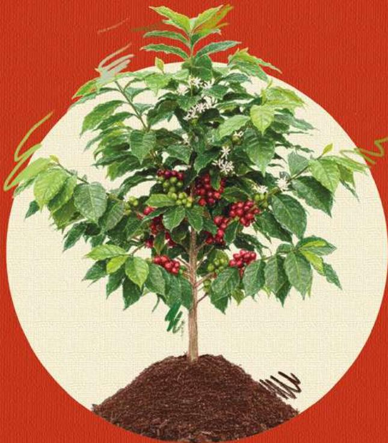

\*\*\*  
**Global  
Gateway**

Funded by  
the European Union

Team Europe Initiative on  
Deforestation-free Value Chains

France II  
OAFD

Merchandisier Européenne Initiatif  
Contributions sur la foreste  
Contributions sur la foreste  
Contributions sur la foreste

swisscontact

European  
Forest  
Institute

particle  
stern  
Merchandisier Européenne Initiatif  
Contributions sur la foreste  
Contributions sur la foreste