# Legality Due Diligence Tool for Cocoa produced in Colombia

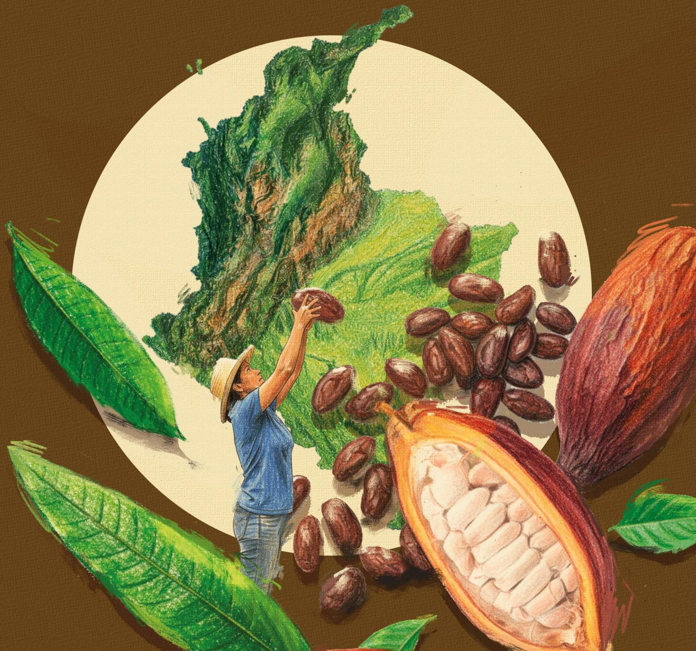

Disclaimer: This tool has been developed with the financial support of the European Union. The views expressed herein cannot be considered in any way as reflecting the official opinion of the European Union. This tool is intended to support the cocoa sector's efforts to comply with the requirements of the EUDR. Its content is indicative, not legally binding, and does not constitute legal advice. No guarantee is given as to the accuracy, completeness or timeliness of the content. The authors of this tool accept no liability for any damage or loss that may arise from its use without proper legal advice. The authors welcome any comments or suggestions for improvement.

© European Forest Institute, 2025

# ***Legality Due Diligence Tool for Cocoa produced in Colombia***

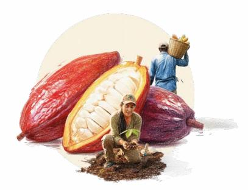

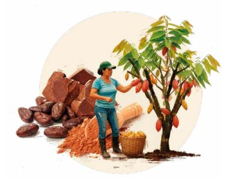

Background

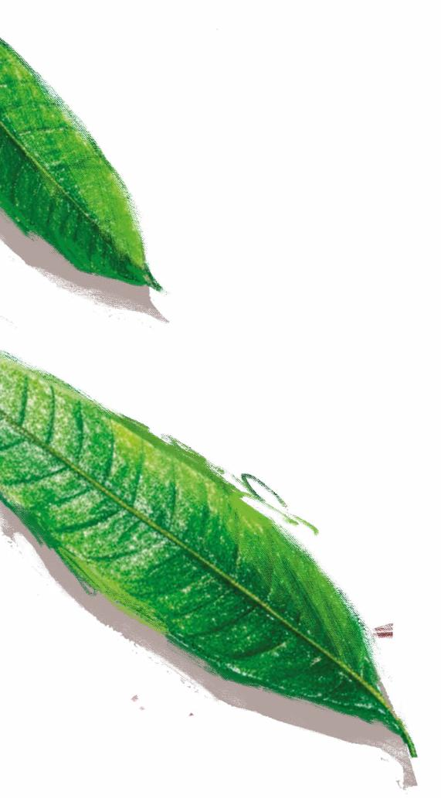

p. 4 p. 8

Objectives and general approach

The European Union Regulation on Deforestation ....... 5

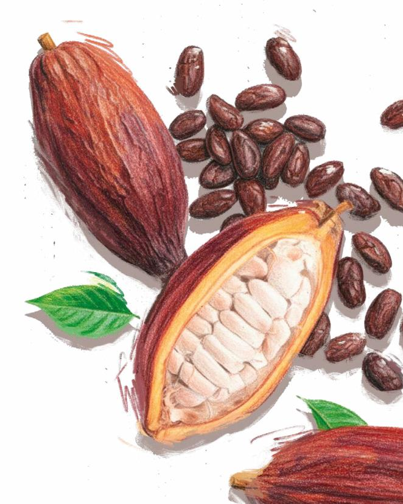

Overview of the cocoa sector in Colombia .......................................... 6

Cooperation between Colombia and the European Union ...................................................... 7

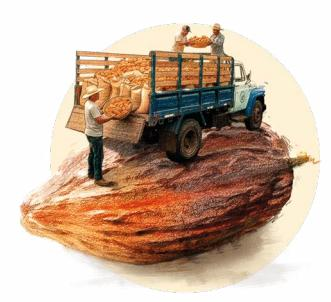

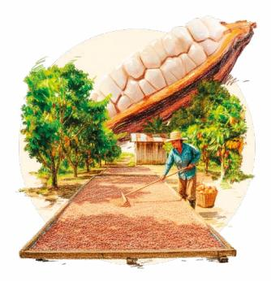

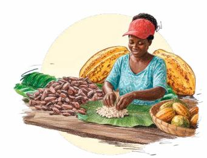

p. 10 p. 16 p. 78

Methodology for developing the tool Recommendations for legal due diligence in the context of national cocoa production

Annex

**Category 1:** Land-use rights ..............................17

**Category 2:** Environmental protection .........29

**Category 3:** Third parties' rights and FPIC ..50

**Category 4:** Labour rights\* ...................................55

**Category 5:** Human Rights\* .................................68

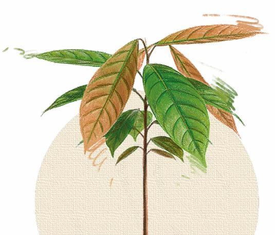

**Category 6:** Taxation, anti-corruption, trade and customs .......................73 **Annex 1.** Mapping methodology .............79

**Annex 2.**

Mapping of relevant legal requirements for cocoa produced in Colombia ...............81

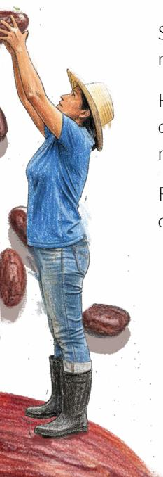

**Annex 3.**

Consultations carried out .....118

Mapping of relevant national requirements ...............11

Development of due diligence recommendations .......................12

Scope of the recommendations ........................12

How to use these due diligence recommendations? ......................13

Role of certification in due diligence ...........................................15

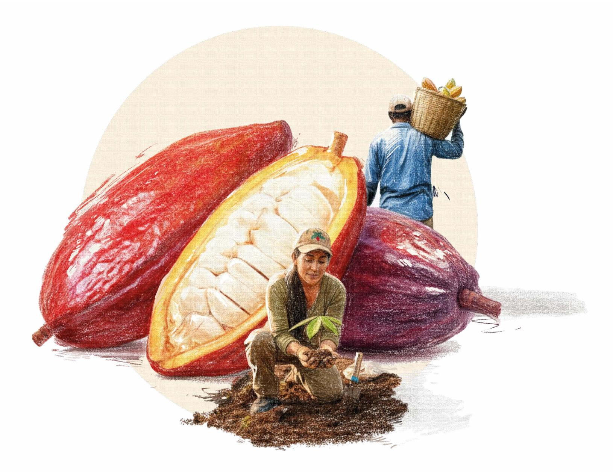

BACKGROUND

On 31 May 2023, the European Union (EU) adopted Regulation 2023/1115 on the placing on the EU market and export from the EU of certain commodities and products associated with deforestation and forest degradation (EUDR). This regulation requires operators and traders who place products from supply chains associated with deforestation or forest degradation on the EU market to demonstrate that these products are traceable, deforestation-free and legal. The scope of application covers seven commodities: coffee, cocoa, rubber, palm oil, soy, cattle and timber, as well as derived products, such as chocolate or cocoa paste.

The entry into application is scheduled for 31 December 2026 (and 30 June 2027 for micro and small enterprises established as such before 31 December 2020). Businesses affected by the regulation (operators and traders) will be required to carry out due diligence before exporting or trading their products, in order to gather sufficient information to demonstrate that the product presents no or negligible risk of non-compliance.

Consequently, operators who trade in cocoa or other derived products on the EU market must demonstrate that these have been produced in accordance with the relevant legislation of the country of production (Article 3), which is defined as that relating to the legal status of the production area. The EUDR adopts a flexible approach, listing general areas of law rather than specifying particular legal instruments, as these differ from country to country and may change over time. These areas are [for agricultural products, see Article 2(40) of the EUDR]:

- **a.** Land-use rights
- **b.** Environmental protection
- **c.** Third parties' rights
- **d.** Labour rights
- **e.** Human rights protected by international law
- **f.** Free, Prior and Informed Consent (FPIC), as set out in the United Nations Declaration on the Rights of Indigenous Peoples
- **g.** Tax, anti-corruption, trade and customs regulations

In this context, understanding the legislative framework of the country of origin, identifying the relevant legal requirements for the product in question, and determining how to verify compliance with these requirements is a challenge not only for operators responsible for due diligence, but also for the competent EU authorities in charge of controls and other stakeholders.

# The European Union Regulation on Deforestation

Cocoa farming is one of the most important agricultural chains for sustainable rural development in Colombia. Beyond its economic value, this crop represents a strategic opportunity for social inclusion, peacebuilding and environmental conservation. In Colombia, more than 60,000 families depend directly on cocoa farming, many of them located in areas historically affected by armed conflict and with high poverty rates. Cocoa farming has been promoted as an alternative to illicit crops, contributing to territorial stabilisation and the strengthening of local economies.

From a production standpoint, cacao, which originated in the Amazon, is characterised by high geographical dispersion and a predominance of small producers. The departments of Santander, Antioquia, Arauca, Huila, Tolima and Nariño account for a large part of national production. However, the average yield—close to 500 kg/ha/year—is well below the estimated technical potential of more than 1,200 kg/ha. This gap is explained by the ageing of crops, limited technical assistance, low access to improved genetic material and the poor adoption of good agricultural practices.

Despite these challenges, Colombia has more than three million hectares with agroecological suitability for cocoa farming and, according to the Rural Agricultural Planning Unit (UPRA), more than one million with high suitability. This represents an opportunity for orderly and sustainable scaling up in regions such as the Amazon, with high forestry and agroforestry potential, where cocoa can be integrated into resilient systems, contributing to the productive restoration of areas degraded by livestock farming, environmental conservation and efficient land use.

On a social level, cocoa has strong territorial and cultural roots. Its production is linked to local knowledge, traditional practices and community identity processes. In addition, cocoa farming actively involves women and young people, whose growing participation needs to be strengthened through differential and inclusive approaches. Associativity also plays a key role, allowing producers to access services, specialised markets and certification processes, although many organisations still face management and sustainability challenges.

The cocoa production chain reflects a combination of structural challenges and strategic opportunities. Strengthening it requires a comprehensive vision that articulates productivity, sustainability, social inclusion, and land-use planning. This approach allows cocoa farming to be projected not only as a crop of commercial interest, but also as an engine of rural transformation and equitable development in Colombia.

Contrary to what happens with other agricultural systems, cocoa farming in Colombia is not a major cause of deforestation. Cocoa adapts well to agroforests, where it coexists with native trees and contributes to ecosystem restoration. Initiatives such as "Cocoa, Forests and Peace" and the national roadmap for deforestation-free cocoa promote sustainable practices, georeferenced traceability and implementation of international standards such as the EUDR.

Although there is a risk of disorderly expansion into sensitive areas, this can be mitigated through land-use planning, technical assistance and satellite monitoring. In this sense, cocoa not only prevents deforestation, but can also be an active part of the solution, generating rural income without compromising the country's environmental heritage.

# Overview of the cocoa sector in Colombia

# Cooperation between Colombia and the European Union

In early 2024, the European Forest Institute (EFI) and the EU Delegation in Colombia agreed to provide technical [support](https://legalitynavigator.efi.int/) for the analysis of the relevant legal framework for cocoa, oil palm and coffee as one of the areas of work to facilitate access for these products to the EU market under the EUDR, among other lines of support for the economic, environmental and social sustainability of the sectors.

This tool is the result of collaboration between various public, private and civil society entities, with significant leadership from the National Federation of Cocoa Producers (Fedecacao), supported by EFI with the backing of the Technical Facility on Deforestation-free Value Chains, a programme funded by the EU and steered by the European Commission's Directorate General for International Partnerships (DG INTPA), the Forests, Climate and Peace Programme of the EU Delegation in Colombia, as well as the SAFE programme implemented by GIZ. The Ministry of Agriculture, Swisscontact and Particip actively joined EFI's technical support.

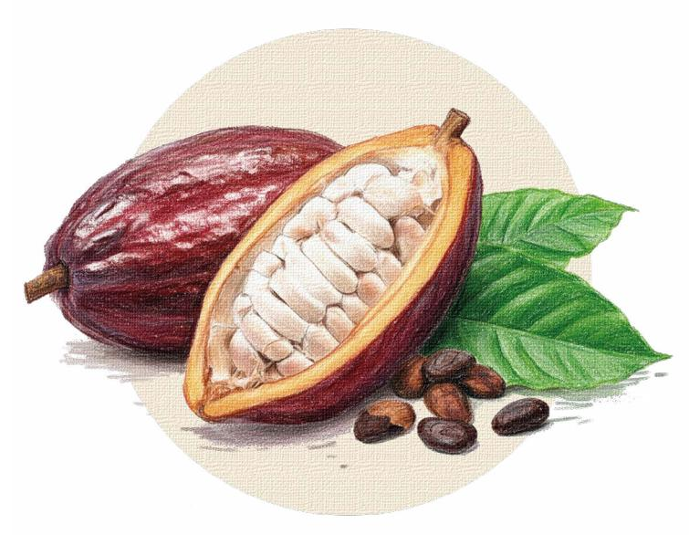

The tool is based on the work of national and international experts in law and due diligence and on technical consultation with multiple national and international actors in the cocoa sector and government: the Ministries of Trade, Industry and Tourism, Agriculture and Rural Development, Environment and Sustainable Development, the Rural Agricultural Planning Unit (UPRA), ProColombia, the Colombian Agricultural Institute (ICA), trade associations such as the National Federation of Coffee Growers (FNC), Fedecacao, the National Federation of Oil Palm Growers (Fedepalma), and the National Association of Industrialists (ANDI), among others. Civil society organisations, such as Solidaridad Network, the Alisos Foundation, the Bioversity-CIAT Alliance and many other institutions and cocoa companies also participated in providing feedback at different steps.

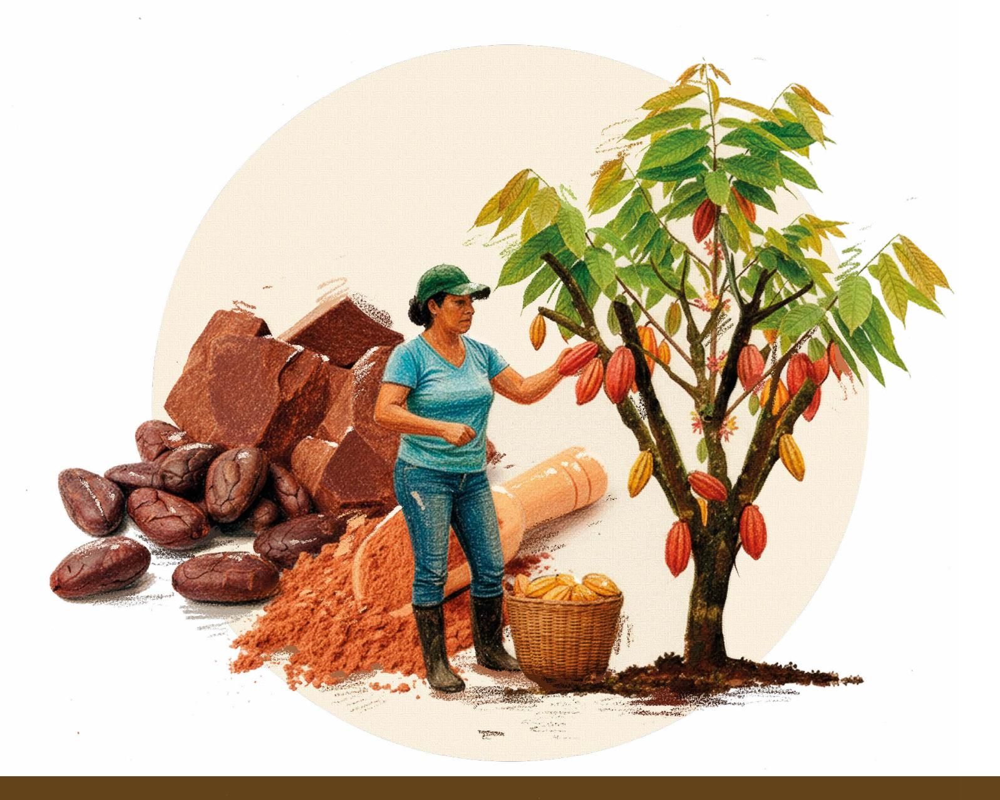

# 2 OBJECTIVES AND GENERAL APPROACH

The objectives of this tool are to promote a national and consensual vision of the Colombian legal requirements for cocoa production and trade, and relevant to the EUDR; and to provide recommendations for verifying cocoa regulatory compliance and risk management, to support operators' due diligence.

The tool was developed with the aim of:

supporting the harmonisation of operators' due diligence approaches; encouraging, the simplification of procedures for actors in the supply chain who are likely to have to provide data to their customers; facilitating a better understanding of national contexts by the competent authorities of EU Member States responsible for controls; ensuring equitable access to information, reduce perceived risks and position Colombian origin with a competitive advantage.

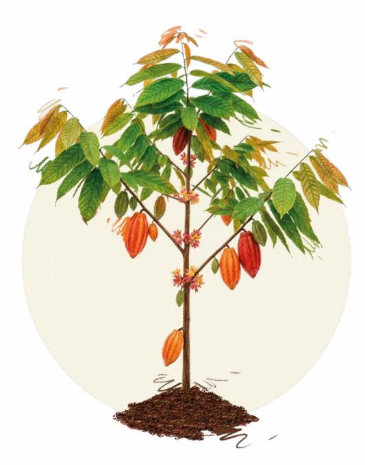

It is the responsibility of operators trading cocoa or derived products on the EU market to identify the relevant legal requirements for Colombia, within the meaning of Article 2(40) of the EUDR, and to tailor their due diligence to the risks identified. This tool provides guidance that may assist operators and other stakeholders in the sector in this regard.

It should be noted that this tool is likely to evolve over time and be updated due to various factors: possible legal reforms in the country, developments in public or private certification systems, lessons learnt from the practical implementation of national due diligence recommendations, additional guidance provided by the European Commission or competent authorities, integration of best practices and technological advances, etc.

**It is important to note that the results presented are not legally binding, do not impose any obligations on the relevant parties, and do not constitute legal advice.**

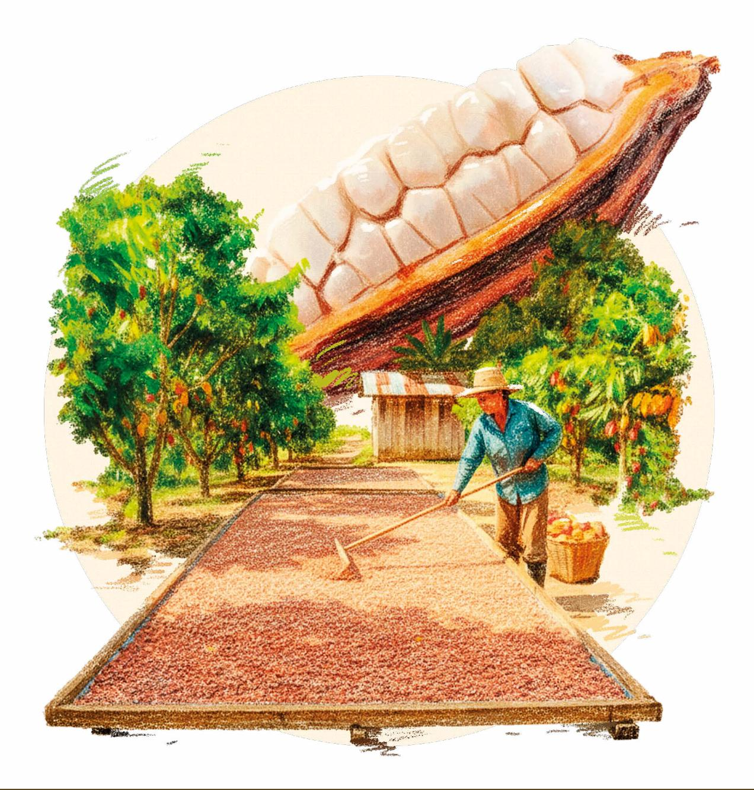

# 3 METHODOLOGY FOR DEVELOPING THE TOOL

Based on various analyses of the applicable legal framework in the country, the EFI team, together with Swisscontact Colombia, consolidated and supplemented all relevant legal requirements for the palm oil, coffee and cocoa sectors, organised comprehensively according to the areas of law listed in the EUDR. These were structured into subcategories under a legal taxonomy developed by EFI in collaboration with Preferred by Nature, in order to facilitate their analysis (see Legality Due Diligence Navigato[r https://legalitynaviga](https://legalitynavigator.efi.int/)[tor.efi.int/\).](https://legalitynavigator.efi.int/)

In addition, bilateral consultations have been held with key stakeholders, as well as outreach and feedback sessions with stakeholder groups, including cooperatives and export companies from the productive sectors (see Annex 3).

For each subcategory, one or several legal requirements were drafted in clear and understandable language for operators, which were validated through multistakeholder exercises. Similarly, the relevance of each requirement for the sectors involved was determined collectively and by consensus, thus finalising the first step of the process (see Annex 1 for details of the legal mapping methodology).

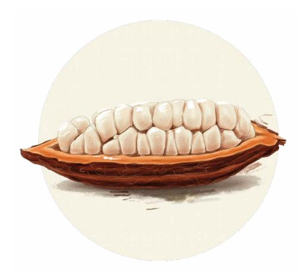

# Mapping of relevant national requirements

Mapping of the relevant national legal requirements applicable to the production and trade of cocoa in Colombia in the context of the EUDR, collecting and supplementing with relevant information from the actors involved. The results of this step are captured in Annex 2 of this tool.

Development of due diligence recommendations for operators, based on the analysis of the level of implementation of the relevant legal requirements and existing means of verification.

#### **The development of the tool was divided into two steps:**

The second step, focused on developing a risk pre-assessment, began with the work of sectoral expert groups. For each relevant legal requirement, a search for information and analysis of existing data was carried out to establish the level of implementation and the associated level of risk. This level was agreed upon based on evidence, with the purpose of formulating due diligence recommendations to guide operators. These recommendations, based on sectoral risk per require-

# Development of due diligence recommendations

# Scope of the recommendations

### **Who are these recommendations aimed at?**

These recommendations are aimed at the various stakeholders involved in verifying the compliance of cocoa and derived products with the EUDR. They may be useful for: **Operators,** within the meaning of the EUDR: any natural or legal person who, in the course of a commercial activity, places Colombian cocoa or derived products on the EU market or exports them. **Traders,** within the meaning of the EUDR: any natural or legal person in the supply chain, other than the operator, who trades the products in question on the EU market. **EU competent authorities:** authorities designated by Member States to ensure compliance with EUDR obligations. **Supply chain actors in Colombia:** producers, cooperatives, traders, exporters and other stakeholders involved in the production and trade of cocoa, and from whom operators may request information, data and documents necessary to carry out their due diligence. **Colombian public entities:** government administrations and agencies responsible for regulating the cocoa sector (production and trade), land, the environment and sustainable development. **Civil society:** non-governmental organisations, associations and other actors that play a supervisory, support and promotional role in ensuring that cocoa and its derived products comply with Colombian legislation and international commitments.

ment, serve as guidance for operators to conduct their own risk analysis in their supply chains.

The tool is based on technical consultation with all relevant national and international stakeholders in the coffee, cocoa and oil palm sectors: government departments and ministries, exporters, traders and chocolate manufacturers, producer cooperatives and associations, certification bodies, civil society organisations and EU importing countries (see Annex 3).

### **What are these recommendations for?**

These recommendations can be used in different ways and at different times, depending on the actors involved.

**Operators and traders** can use these recommendations to establish and document their due diligence system, ensuring that the cocoa they trade complies with the relevant legal requirements. They can use them to identify the documents and information that need to be collected or other actions that need to be taken with their suppliers in Colombia, and to assess the risks associated with their supply chain.

**Competent authorities in the EU** can use these recommendations as a standard for assessing the compliance of products traded under the EUDR. They can also use them to harmonise their controls and interpret data from Colombia.

**Supply chain actors** in Colombia can use these recommendations to understand the implications of the EUDR requirements for cocoa and the expectations of European operators and traders subject to it. These recommendations can be used to structure and document the information they may provide to these operators and traders. They can also help them anticipate non-compliance risks and adapt their agricultural and commercial practices**.**

**Colombian public entities** can use them recommendations to guide the implementation of national legislation by producers and exporters, to ensure that cocoa traded complies with current Colombian laws. They can also use it to support smallholders' legal compliance by providing them with better access to information on current regulations and buyer requirements. They can build on these recommendations to make data more transparent and accessible, including by facilitating access to administrative documents, to help operators demonstrate the legality of cocoa.

**Civil society** can use these recommendations to monitor the implementation of Colombian legal requirements by companies and authorities. They can be used to conduct analyses and produce reports on the risks of cocoa non-compliance. They can also be used to raise awareness among producers, companies and consumers about the legality of Colombian cocoa.

### **How to use these due diligence recommendations?**

The recommendations presented in this tool aim to address all relevant legal requirements identified by stakeholders during the first phase of this study. They cover, in particular, all legal areas listed in Article 2(40) of the EUDR, in line with the precautionary approach adopted in the study (see Annex 1). However, a distinction is made between requirements directly related to the objectives of the EUDR and others, which are marked with an asterisk.

This flexible approach allows users of the recommendations to adapt their due diligence actions based on their interpretation of the scope of the EUDR.

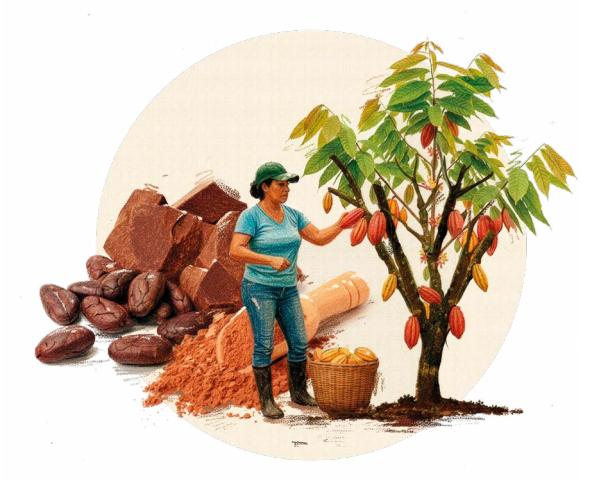

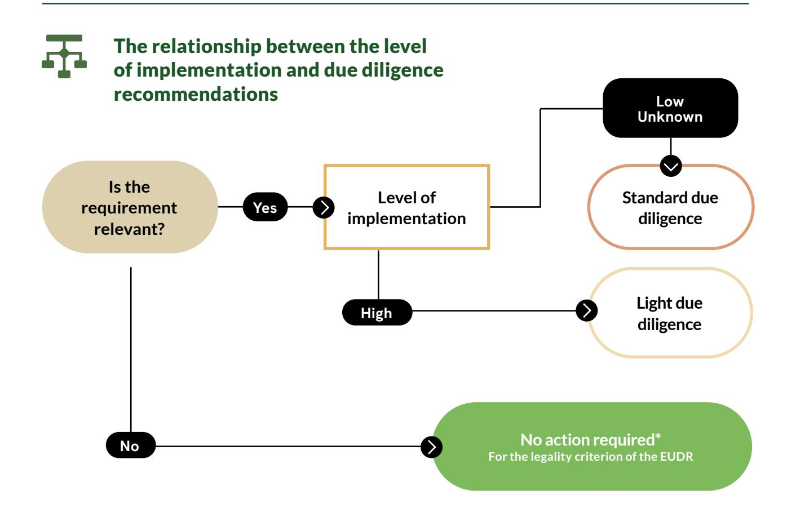

### **Light due diligence or standard due diligence**

This tool takes a pragmatic approach that seeks to identify risk-proportionate due diligence actions to limit the burden on those involved in the sector. For each requirement considered relevant to the production and trade of cocoa of Colombian origin, its level of implementation has been assessed. The level of implementation adopted by the tool is based on relevant literature, expert knowledge of the sector, field surveys conducted as part of the development of the tool, and bilateral and multistakeholder consultations organised within the framework of the tool. When the level of implementation assessed for a requirement is high, the risk of non-compliance is considered negligible. Therefore, light due diligence actions are recommended. On the other hand, when the level of implementation of a requirement is low or unknown, the risk of non-compliance is considered non-negligible. Therefore, standard due diligence is recommended.

However, this analysis is only indicative and has been carried out at country level only. **It is the responsibility of operators to carry out a risk analysis of non-compliance of their products for each shipment.** Within this framework, these recommendations offer a range of due diligence options. **These actions are not prescriptive and are not presented in any specific order. It is up to operators to choose among these options based on the context, their knowledge of their supply chains and the risks identified for cocoa and its derived products.**

Cocoa certification systems are voluntary, public or private mechanisms that seek to ensure that cocoa production and trade comply with certain environmental, social and economic standards. They can be established by governments, international organisations, NGOs or private companies.

certifications can be a tool to help European operators carry out due diligence to comply with legality, deforestation and traceability criteria.

Operators must be able to justify why and how certification schemes comply with EUDR requirements. To do so, three elements must be considered:

The certification system's coverage of the relevant legal requirements for the EUDR. The robustness of the certification system: in particular, the scope of certification (applicable to which actors in the value chain? to which products?), governance (management of internal procedures and updates, for example), accreditation processes for control bodies; auditor qualifications and audit frequency; non-compliance management, impartiality and conflict of interest management, etc. This information must be periodically reassessed by the operator, particularly in relation to the requirements of the EUDR. Traceability and absence of mixing with non-certified products.

It should be noted that this tool has not carried out an exhaustive comparison of the coverage of the relevant legal requirements by certification systems used in the cocoa sector in Colombia.

# Role of certification in due diligence

### **The EUDR and certification**

Third-party certification and verification systems can play an important role in promoting sustainable agricultural and forestry practices and responsible sourcing. There are different types of certifications, which can be implemented at national level on a mandatory basis or be private and voluntary (e.g. Rainforest Alliance, Fairtrade or Organic).

According to the EUDR, for the purposes of risk assessment, operators may consider information from certification schemes or other third-party verified schemes. However, the European Commission's guidelines of 2 October 2024 indicate that self-declaration schemes that are not based on third-party certification procedures are, by definition, less robust due to a lack of independence and impartiality.

The Commission also specifies that certification systems should not replace the operator's responsibility for due diligence. In other words, private

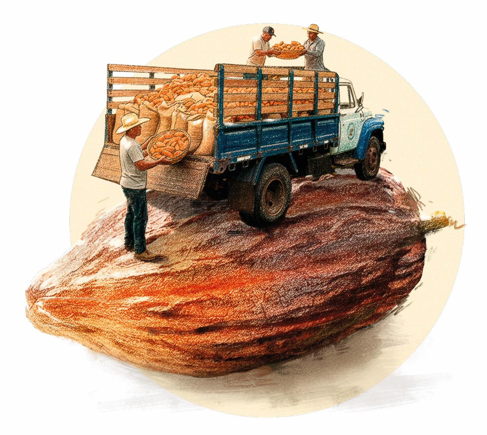

# 4 RECOMMENDATIONS FOR LEGAL DUE DILIGENCE IN THE CONTEXT OF NATIONAL COCOA PRODUCTION

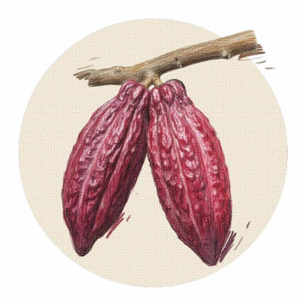

In Colombia, land is central to rural development, cultural identity and social justice. The legal framework recognises various forms of tenure, such as private property, legitimate possession and collective territorial rights, all of which are legally protected and aimed at ensuring legal certainty, equity and sustainability. However, more than 50% of the territory has informal tenure, which limits access to rural development programmes, makes the formal market more expensive and restricts opportunities for small producers, including cocoa farmers.

Cocoa production reflects these tensions: its sustainability and competitiveness depend largely on secure access to land. In the collective territories of Afro-descendant and indigenous communities covering more than 37 million hectares—successful cocoa production experiences with a territorial, environmental and cultural focus have emerged, such as those led by the Greater Community Council of the Atrato Integral Peasant Association (COCO-MACIA), ASOCAIMAN, the Cauca Regional Indigenous Council (CRIC) and the Association of Indigenous Councils of Northern Cauca (ACIN). These initiatives demonstrate the potential of cocoa as an engine for local development, replacing illicit economies and strengthening local economies.

Land leasing is a common practice, but it faces challenges such as contractual instability and a lack of incentives for sustainable practices. This calls for more stable and environmentally responsible regulatory frameworks. In turn, instruments such as the delimitation of the National Agricultural Frontier, Land-use Plans (POT) and Rural Planning Units (UPRA) are key to guiding land use according to its natural vocation, protecting strategic ecosystems and articulating policies for the substitution of illicit crops, reparation for victims and comprehensive rural development.

Together, these elements form a comprehensive vision of the territory as a common good, a productive resource and a living space, where access to and sustainable use of land are essential conditions for equitable, resilient cocoa farming that is compatible with the country's peace and sustainability objectives.

The tables below, organised by area of law, show the due diligence recommendations agreed upon by consensus by the stakeholders.

### CATEGORY 1 **LAND-USE RIGHTS**

| requirement Context Level of |                            |
|------------------------------|----------------------------|
| NB: Land tenure              |                            |
| UPRA, 2020 ).                |                            |
| or litigation,               | then the following actions |
| Formal titles:               | Request the Certificate    |
| of Tradition and Freedom (   | Certificado                |
| de Tradición y Libertad      | ) from the                 |
| Informal title               | : Unregistered sale or     |
| Regular possession:          | Supported                  |

| requirement | Context | Level of |                                    |
|-------------|---------|----------|------------------------------------|
| NB: This    |         |          |                                    |
|             |         |          | Note: Implementation of this legal |

| Legal requirement                                                                                                                                                                                     | Context                                                                                                                                                                                                                                                                                                                                                                                                                                                                                                                                                                                                                                                                                                                                                                                                                                                                                                                                                                                                                    | Level of implementation                                                                                                                                                                                                                                                                                                                                                                                                                                                                                                                                                        | Due diligence recommendations |
|-------------------------------------------------------------------------------------------------------------------------------------------------------------------------------------------------------|----------------------------------------------------------------------------------------------------------------------------------------------------------------------------------------------------------------------------------------------------------------------------------------------------------------------------------------------------------------------------------------------------------------------------------------------------------------------------------------------------------------------------------------------------------------------------------------------------------------------------------------------------------------------------------------------------------------------------------------------------------------------------------------------------------------------------------------------------------------------------------------------------------------------------------------------------------------------------------------------------------------------------|--------------------------------------------------------------------------------------------------------------------------------------------------------------------------------------------------------------------------------------------------------------------------------------------------------------------------------------------------------------------------------------------------------------------------------------------------------------------------------------------------------------------------------------------------------------------------------|-------------------------------|
| 
<b>Land-use rights</b>
 
<b>1.1.3</b>
 
Land tenure is established by collective ownership
 
<b>NB:</b> Land tenure can be individual or collective (see previous requirement).
 | 
Cocoa production on collectively owned lands in Colombia—including Indigenous reserves (resguardos indígenas) and territories titled to Afro-Colombian communities—offers significant opportunities for sustainable rural development, economic autonomy, and the conservation of forest ecosystems. However, these systems often face structural constraints, including limited access to credit, insufficient productive infrastructure, and security challenges in some rural areas, which can hinder the development of cocoa value chains in these territories.
 
The legal framework governing collective land tenure is mainly established through recognition of Indigenous territorial rights in the Colombian Constitution and related legislation, and through Law 70 of 1993, which grants collective land rights to Afro-Colombian communities and regulates the titling and governance of their territories along the Pacific region and other areas.
 
<i>(Continued on the next page)</i>
 | 
<b>Geospatial analysis</b>
 
Overlay the points or polygons of suppliers with layers of legally constituted collective territories (maps from the Ministry of the Interior and the National Land Agency (ANT) have georeferenced information on collective territories).
 
If overlaps occur, but the producers belong to the indigenous reserve or the Afro-Colombian community council, no due diligence action is required. However, the following due diligence actions may be recommended as a good practice:
 
<i>(Continued on the next page)</i>
 |                               |

| Legal requirement | Context                                                                                                                                                                                                                                                                                                                                                                                                                                                                                                                                                                                                                                                                                                                                                                                                                                                                                                                                                                                                                                                                                                                 | Level of implementation | Due diligence recommendations                                                                                                                                                                                                                                                                                                                                                                                                                                                                                                                                                                                                                                                                                                                                                                                                                                                                |
|-------------------|-------------------------------------------------------------------------------------------------------------------------------------------------------------------------------------------------------------------------------------------------------------------------------------------------------------------------------------------------------------------------------------------------------------------------------------------------------------------------------------------------------------------------------------------------------------------------------------------------------------------------------------------------------------------------------------------------------------------------------------------------------------------------------------------------------------------------------------------------------------------------------------------------------------------------------------------------------------------------------------------------------------------------------------------------------------------------------------------------------------------------|-------------------------|----------------------------------------------------------------------------------------------------------------------------------------------------------------------------------------------------------------------------------------------------------------------------------------------------------------------------------------------------------------------------------------------------------------------------------------------------------------------------------------------------------------------------------------------------------------------------------------------------------------------------------------------------------------------------------------------------------------------------------------------------------------------------------------------------------------------------------------------------------------------------------------------|
|                   | 
These collective property regimes recognise the autonomy of communities to manage and use their territories according to their traditional authorities and internal governance structures.
 
Data indicate that cocoa production also takes place within these collective territories. In Indigenous reserves, the largest number of cocoa-producing Agricultural Production Units (UPA) are located in the departments of Chocó (204 UPA), Putumayo (176 UPA), and Nariño (146 UPA). In addition, Afro-Colombian communities holding collective titles under Law 70 of 1993 account for approximately 15.6% of cocoa-producing UPAs, 11.5% of the planted area, 15.2% of the harvested area, and 9.8% of national cocoa production.
 
With stronger organisational capacities, responsible public-private partnerships, and sustained technical support, collective communities have the potential to further position themselves as important actors in Colombia's cocoa sector, contributing to production systems that combine local identity, environmental sustainability, and social inclusion.
 |                         | 
<b>Compilation and verification of documents</b>
 <ul> <li>On a random basis (by sampling), request a certificate of membership in the community (Afro-Colombian Community Council) from the Ministry of the Interior to validate that the producer is part of this community.</li> <li>The internal authority of the collective territory (cabildo or community council) may issue a certificate of membership directly.</li> </ul> 
If there are overlaps in areas of production and the producer is not registered in the census or registry of the reserve or collective territory, it is necessary to provide documentary evidence of authorisation from the council or community council to produce in their territories. Internally, the community council Board is the body that represents the community, manages the archives and oversees socioeconomic organisation.
 |

| requirement | Context | Level of |                                   |
|-------------|---------|----------|-----------------------------------|
|             |         |          | restitution unit https://www.urt. |
|             |         |          | gov.co/ , specifically the Single |

| Legal requirement                                                                                                                                                                                                             | Context                                                                                                                                                                                                                                                                                                                                                                              | Level of implementation                                                                                              | Due diligence recommendations                                                                                                                                                                                                                                                                                                                                                                                                                                                                                                                                                                                                                                                                                                                                                                                                                                                                                                                                                                                                                                                                                                                                                                                                                                                                                                                                   |
|-------------------------------------------------------------------------------------------------------------------------------------------------------------------------------------------------------------------------------|--------------------------------------------------------------------------------------------------------------------------------------------------------------------------------------------------------------------------------------------------------------------------------------------------------------------------------------------------------------------------------------|----------------------------------------------------------------------------------------------------------------------|-----------------------------------------------------------------------------------------------------------------------------------------------------------------------------------------------------------------------------------------------------------------------------------------------------------------------------------------------------------------------------------------------------------------------------------------------------------------------------------------------------------------------------------------------------------------------------------------------------------------------------------------------------------------------------------------------------------------------------------------------------------------------------------------------------------------------------------------------------------------------------------------------------------------------------------------------------------------------------------------------------------------------------------------------------------------------------------------------------------------------------------------------------------------------------------------------------------------------------------------------------------------------------------------------------------------------------------------------------------------|
|                                                                                                                                                                                                                               |                                                                                                                                                                                                                                                                                                                                                                                      |                                                                                                                      | 
<b>The Agricultural Frontier analysis approach for this legal criterion focuses on the legal regime involved in land use implementation.</b>
 
<b>Geospatial analysis</b>
 
First, consult the UPRA's Rural Agricultural Planning System (SIPRA) and perform a geospatial analysis by overlaying the production polygons, coordinates, and cadastral identification number of the plot or real estate registration number with the Agricultural Frontier map:
 <ul> <li>If the plot is within the Agricultural Frontier, no further due diligence actions are recommended for this requirement, except for plots near the Frontier line.</li> <li>If the plot is in a conditional area or outside the Agricultural Frontier, additional actions are recommended.</li> </ul> 
<b>Collection and verification of data</b>
 
For plots that are outside the Agricultural Frontier or near the Agricultural Frontier line, which, due to their scale, do not allow for a clear determination of whether they are inside or outside, a municipal land-use certificate can be requested from the planning office to determine whether the land use is agricultural and allows for cocoa farming with certain characteristics that condition the production system, which must be complied with.
 
<i>(Continued on the next page)</i>
 |
| 
<b>Land-use rights</b>
 
<b>1.2.1</b>
 
The plot is located within the Agricultural Frontier; if it is located in conditional areas, production is only permitted under certain conditions that must be met.
 | 
Of the 88,567 agricultural production units engaged in cocoa production, 64% are located within the agricultural frontier, representing 64% of the planted area and production. Thirty-one per cent of the Agricultural Production Units (UPA) in the National Agricultural Census are located in natural forests and non-agricultural areas, and 5% are in legal exclusions.
 | 
<b>Low level of implementation</b>
 
<b>Standard due diligence</b>
 <ul> <li>If the plot is wit</li></ul> |                                                                                                                                                                                                                                                                                                                                                                                                                                                                                                                                                                                                                                                                                                                                                                                                                                                                                                                                                                                                                                                                                                                                                                                                                                                                                                                                                                 |

| requirement Context | Level of                         |
|---------------------|----------------------------------|
| indicates that, as  | of 30                            |
| March 2023          | , of the                         |
|                     | For plots in conditional areas : |

Request signed contracts or supporting documents proving the status of the right to production on another's plot.

#### **In the case of oral contracts:**

Verification through records with neighbours, associations or cooperatives. Verification of third-party testimonies. Preparation of witness statements if necessary.

#### **Collect documents and verify (sampling):**

**Formal titles:** Request the Certificate of Tradition and Freedom (Certificado de Tradición y Libertad) from the Superintendency of Notaries and Registries.

**Informal title:** Unregistered sale or informal inheritance.

**Regular possession:** Supported by evidence of occupation and improvements (for eventual allocation).

#### Requirements 1.1.1 and 1.1.2

Confirm that there are no complaints or litigation regarding the land where cocoa is produced (national and international press, NGOs, among others), interviews with stakeholders, but also complaints mechanisms. In rural areas, the National Land Agency (ANT) can be consulted to find out if there are any processes of formalisation or allocation of vacant plots, or complaints of irregular occupation of plots.

#### **Light due diligence**

**Land tenure is established by individual private ownership or by possession (regular or irregular).** 

**The farmer exercises the right to produce on the plot on the basis of legal arrangements such as lease, usufruct, sharecropping agreements, or provisional allocation contracts.**

**There are no indications of complaints or litigation**

**No further action requested**

> **There are indications of complaints or litigation**

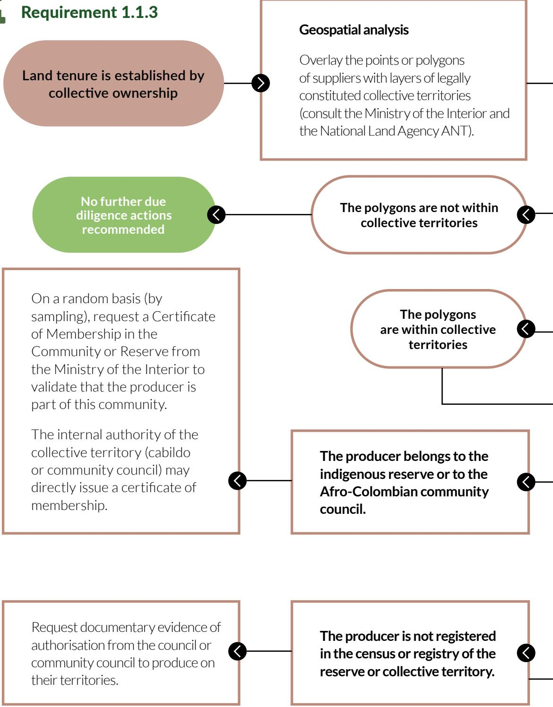

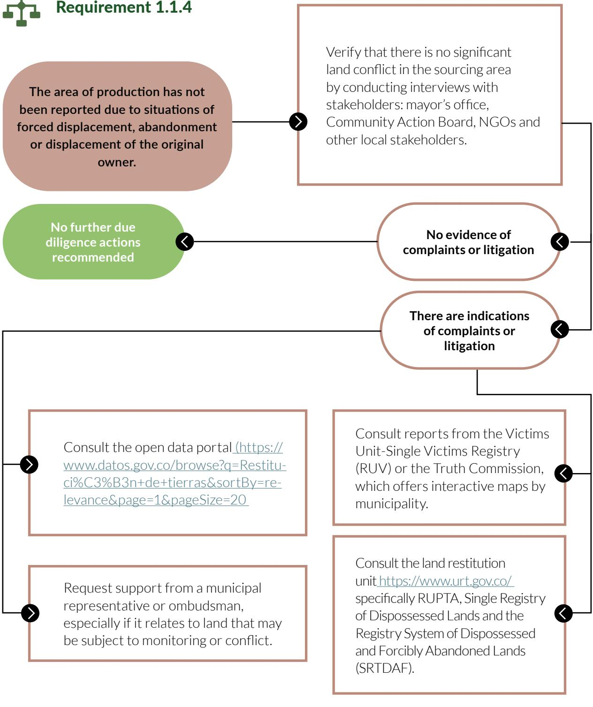

### Requirement 1.1.4

#### **Standard due diligence**

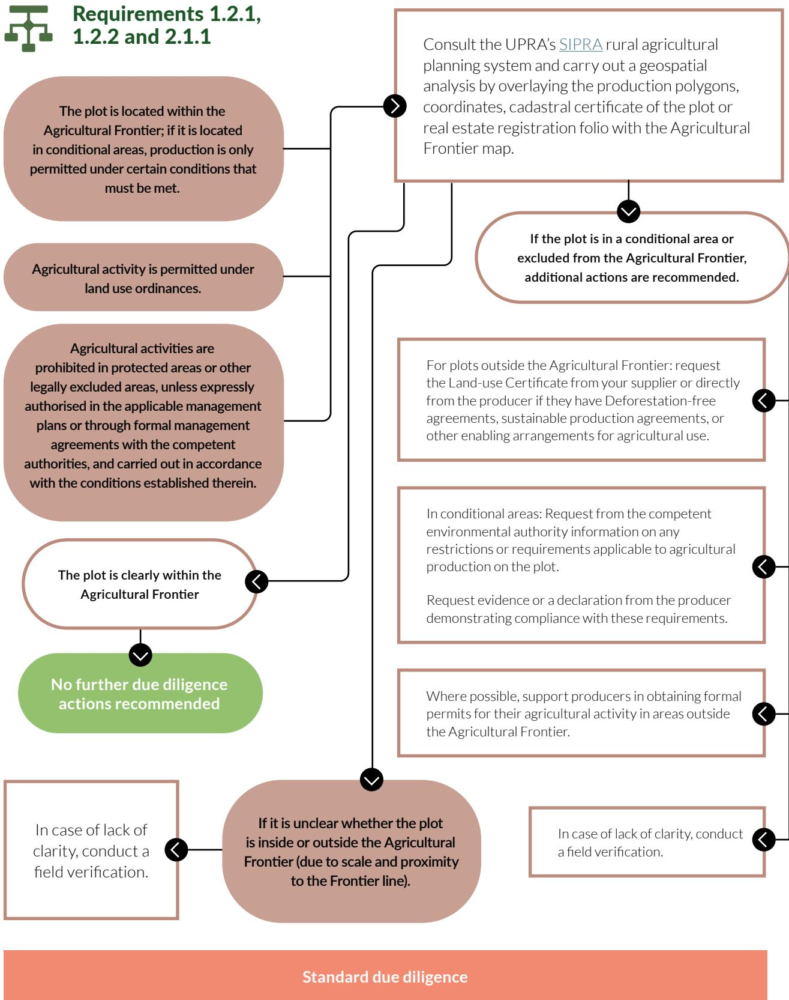

# Requirements 1.2.1,

### CATEGORY 2 ENVIRONMENTAL PROTECTION

Colombia has a robust environmental legal framework that seeks to balance agricultural production with ecosystem conservation. The 1991 Constitution recognises the right to a healthy environment and specifically protects areas such as natural parks, moorlands, wetlands and forest reserves, where agricultural activities are prohibited or restricted. These restrictions are complemented by standards on water use, waste management, emissions control and deforestation prevention, including its classification as a crime since 2021. Instruments such as the UPRA's national agricultural frontier and the Land-use Plans (POT) make it possible to identify areas that are suitable, restricted or excluded for production, facilitating land-use planning and environmental due diligence.

In this context, cocoa cultivation—most often developed under agroforestry systems—is generally considered to have a relatively low environmental impact when managed sustainably. However, unplanned expansion may create deforestation risks and conflicts with environmental regulations, particularly in excluded areas or zones subject to legal restrictions. In addition, informal land tenure—estimated to affect more than 50% of the national territory—limits traceability and complicates compliance with regulatory standards such as the EUDR. Productive activities in collective territories or environmentally sensitive areas also require a clear understanding of the applicable regulatory framework and land-use planning instruments. To mitigate these risks, cocoa development programmes promote planting on already cultivated land, the restoration of degraded soils, and the adoption of agroecological practices, with the aim of strengthening the environmental sustainability and traceability of the cocoa value chain.

| Legal requirement                                                                                                                                                                                                                                                                                                                                                          | Context                                                                                                                                                                                                                                                                                                    | Level of implementation                                                 | Due diligence recommendations                                                                |
|----------------------------------------------------------------------------------------------------------------------------------------------------------------------------------------------------------------------------------------------------------------------------------------------------------------------------------------------------------------------------|------------------------------------------------------------------------------------------------------------------------------------------------------------------------------------------------------------------------------------------------------------------------------------------------------------|-------------------------------------------------------------------------|----------------------------------------------------------------------------------------------|
| 
<b>Environmental protection</b>
 
<b>2.1.1</b>
 
Agricultural activities are prohibited in protected areas or other legally excluded areas, unless expressly authorised in the applicable management plans or through formal management agreements with the competent authorities, and carried out in accordance with the conditions established therein.
 | 
Of the 88,567 agricultural production units engaged in cocoa farming, 64% are located within the agricultural frontier, representing 64% of the planted area and production. Thirty-one per cent of the UPAs are located in natural forests and non-agricultural areas, and 5% in legal exclusions.
 | 
Low level of implementation
 
<b>Standard due diligence</b>
 | 
<i>See due diligence actions for legal requirements</i>
 
<b>1.2.1 and 1.2.2</b>
 |

| requirement | Context                               | Level of |                                     |
|-------------|---------------------------------------|----------|-------------------------------------|
|             | related to the low use of fertilisers |          |                                     |
|             |                                       |          | periodically filling out a fertil  |

| Legal requirement                                                                                                                                                      | Context                                                                                                                                                                                                                                                                                                                                                                                                                                                                                                                                                                                                                                       | Level of implementation                                              | Due diligence recommendations                                                                                                                                                                                                                                                                                                                                                                                                                                                                                                                                                                                                                                                                                                                                                                                                                                                                                                                                                                                                                                                                             |
|------------------------------------------------------------------------------------------------------------------------------------------------------------------------|-----------------------------------------------------------------------------------------------------------------------------------------------------------------------------------------------------------------------------------------------------------------------------------------------------------------------------------------------------------------------------------------------------------------------------------------------------------------------------------------------------------------------------------------------------------------------------------------------------------------------------------------------|----------------------------------------------------------------------|-----------------------------------------------------------------------------------------------------------------------------------------------------------------------------------------------------------------------------------------------------------------------------------------------------------------------------------------------------------------------------------------------------------------------------------------------------------------------------------------------------------------------------------------------------------------------------------------------------------------------------------------------------------------------------------------------------------------------------------------------------------------------------------------------------------------------------------------------------------------------------------------------------------------------------------------------------------------------------------------------------------------------------------------------------------------------------------------------------------|
| 
<b>Environmental protection</b>
 
<b>2.1.2</b>
 
Authorised agricultural inputs are used and managed appropriately according to technical procedures.
 | 
Cocoa producers have had access to a wide range of technical assistance from different entities; however, these processes have not had a broad impact. The low availability of resources for producers prevents them from carrying out activities and implementing inputs recommended by technical assistants.
 
The low level of phytosanitary control carried out on crops by producers contributes to the low productivity in the area. In addition, the lack of plant nutrition is another variable that limits production. These situations continue to confirm the low consumption of products and inputs in cocoa farming.
 | 
Low implementation level
 
<b>Standard due diligence</b>
 | <ul> <li>Train producers on authorised/unauthorised pesticides and fertilisers and on packaging treatment, e.g. through training, awareness campaigns, etc.</li> </ul> 
<b>Stakeholder consultations</b>
 
Consult NGOs, cooperatives and the administration on possible cases of soil degradation in the sourcing area.
 
<b>Compilation and verification of documents</b>
 
Consult possible reports from NGOs, cooperatives and the administration on possible cases of soil or water source contamination in the sourcing area.
 <ul> <li>Plan for the management of pesticides or crop protection products, including biological products where relevant.</li> </ul> <ul> <li>Plan or procedure for managing solid waste and/or empty chemical containers</li> <li>Occupational health and contingency plan or procedure</li> <li>Training plan for employees in chemical management (include logs or attendance lists) in integrated chemical management.</li> <li>Company policies on the non-use of red-label products.</li> </ul> 
<i>(Continued on the next page)</i>
 |
| 
<b>Environmental protection</b>
 
<b>2.1.4</b>
 
Solid waste and agricultural input packaging are properly segregated, identified, and disposed o
     |                                                                                                                                                                                                                                                                                                                                                                                                                                                                                                                                                                                                                                               |                                                                      |                                                                                                                                                                                                                                                                                                                                                                                                                                                                                                                                                                                                                                                                                                                                                                                                                                                                                                                                                                                                                                                                                                           |

| Legal requirement | Context                                                                                                                                                                                                                                                                                                                                                                                                                                                                                                                                                                                                                                                                                                                                                                                                                                                                                                                                                                                                                                                                                                                                                                                                                                                                                                                                                                                                                                                                                                                                                                                                                                                                                     | Level of implementation | Due diligence recommendations                                                                                                                                                                                                                                                                                                                                                                                                                                                                                                    |
|-------------------|---------------------------------------------------------------------------------------------------------------------------------------------------------------------------------------------------------------------------------------------------------------------------------------------------------------------------------------------------------------------------------------------------------------------------------------------------------------------------------------------------------------------------------------------------------------------------------------------------------------------------------------------------------------------------------------------------------------------------------------------------------------------------------------------------------------------------------------------------------------------------------------------------------------------------------------------------------------------------------------------------------------------------------------------------------------------------------------------------------------------------------------------------------------------------------------------------------------------------------------------------------------------------------------------------------------------------------------------------------------------------------------------------------------------------------------------------------------------------------------------------------------------------------------------------------------------------------------------------------------------------------------------------------------------------------------------|-------------------------|----------------------------------------------------------------------------------------------------------------------------------------------------------------------------------------------------------------------------------------------------------------------------------------------------------------------------------------------------------------------------------------------------------------------------------------------------------------------------------------------------------------------------------|
|                   | 
Within this BPA framework, Fedeca-cao-Fondo Nacional del Cacao has implemented training programmes that include the safe handling of hazardous waste and agrochemical containers. These training courses instruct producers on implementation of manufacturer recommendations, triple washing, the perforation of empty containers and the responsible disposal of expired or non-compliant inputs. All of this is part of a preventive approach aimed at ensuring crop safety, protecting human and ecosystem health, and facilitating the traceability and auditing of cocoa production, in accordance with ICONTEC Standard 5811. In this context, webinars for the general public and in-person workshops with producers benefiting from the project have been held.
 
In addition, the Bioentorno Foundation supports the implementation of these field training courses and hazardous waste collection routes. During 2022, 2023, 2024 and 2025, 2,224 cocoa farmers from across the country have been trained on this topic.
 
<b>BIOMASS WASTE:</b>
 
Solid waste from pruning can contribute an average of 1.8 tonnes of C/ha/year to the soil. Under this interpretation, agricultural pruning becomes relevant, as it can contribute to increasing the carbon input into the soil, which can be considered a high-impact mitigation strategy.
 
Most of this waste is organic in composition and, as it comes from living beings, it is renewable. It also consists mainly of water, cellulose and lignin, is generated in large quantities and contributes to crops by improving the biomass in the soil.
 
<i>(Continued on the next page)</i>
 |                         | <ul> <li>Procedure for the proper use of pesticides and fertilisers.</li> <li>Log of chemical and biological product implementations on farms.</li> <li>Plan for the management and use of personal protective equipment</li> <li>Laboratory analysis results to verify the presence of chemicals in cocoa products, such as beans.</li> </ul> 
<b>Collection and verification of data</b>
 <ul> <li>Conduct surveys and/or request self-declarations to determine whether the producer follows the mandatory tec</li></ul> |

| Legal requirement                                                                                                                                                                                                            | Context                                                                                                                                                                                                                                                                                                                                                                                                                                                                                                                                                                                                                                                  | Level of implementation                                                      | Due diligence recommendations                                                                                                                                                                                                                                                                                                                                                                                                                                                                                                                                                              |
|------------------------------------------------------------------------------------------------------------------------------------------------------------------------------------------------------------------------------|----------------------------------------------------------------------------------------------------------------------------------------------------------------------------------------------------------------------------------------------------------------------------------------------------------------------------------------------------------------------------------------------------------------------------------------------------------------------------------------------------------------------------------------------------------------------------------------------------------------------------------------------------------|------------------------------------------------------------------------------|--------------------------------------------------------------------------------------------------------------------------------------------------------------------------------------------------------------------------------------------------------------------------------------------------------------------------------------------------------------------------------------------------------------------------------------------------------------------------------------------------------------------------------------------------------------------------------------------|
| 
<b>Environmental protection</b>
 
<b>2.1.4</b>
 
Solid waste and agricultural input packaging are properly segregated, identified, and disposed of in accordance with applicable environmental regulations.
 | 
<b>INERT WASTE:</b>
 
These are materials used in agricultural activities that end up as waste (plastics, artificial substrates, metal or plastic containers, cardboard, etc.). They have a high potential to contaminate soil and water. Furthermore, due to their slow degradation, it is necessary to prevent contamination of natural areas by implementing the necessary control and collection measures for subsequent storage.
 
With resources from the National Cocoa Fund, training on environmental issues and a recycling campaign are being developed in the different technical units of Fedecacao at the national level.
 | 
<b>High level of implementation</b>
 
<b>Light due diligence</b>
 | 
<b>Implementation of procedures and processes</b>
 <ul> <li>Promote the establishment of an improvement plan that ensures implementation of the legal requirement within two years.</li> <li>Provide training to producers to ensure proper handling of packaging and solid waste</li> </ul> 
<b>Note:</b> The law does not require direct documentation at the producer level for this indicator. Implementation would be demonstrated through practices on the farm.
 
<i>These actions may be carried out in conjunction with those specified in requirement 2.1.2</i>
 |

| Legal requirement | Context                                                                                                                                                                                                                                                                                                                                                                                                                                                                                                                                                                                                                                                                                                                                                                                                                                                                                                                                                                                                                                                                                                                                                                                                            | Level of implementation | Due diligence recommendations                                                                                                                                                                                                                                                                                                                                                                                                                                                                                                                                                                                                                                                                                                                                                                                                                                                                                     |
|-------------------|--------------------------------------------------------------------------------------------------------------------------------------------------------------------------------------------------------------------------------------------------------------------------------------------------------------------------------------------------------------------------------------------------------------------------------------------------------------------------------------------------------------------------------------------------------------------------------------------------------------------------------------------------------------------------------------------------------------------------------------------------------------------------------------------------------------------------------------------------------------------------------------------------------------------------------------------------------------------------------------------------------------------------------------------------------------------------------------------------------------------------------------------------------------------------------------------------------------------|-------------------------|-------------------------------------------------------------------------------------------------------------------------------------------------------------------------------------------------------------------------------------------------------------------------------------------------------------------------------------------------------------------------------------------------------------------------------------------------------------------------------------------------------------------------------------------------------------------------------------------------------------------------------------------------------------------------------------------------------------------------------------------------------------------------------------------------------------------------------------------------------------------------------------------------------------------|
|                   | 
Cocoa farming depends mainly on rainfall, as it is a rain-fed crop; however, irrigation is not common in the cultivation process for this crop.
 
In addition, technical assistance includes topics on the efficient use and management of water for planting and crop management.
 
According to the National Consulting Centre in Colombia, 4,684 farms have irrigation systems, corresponding to 5% of the farms reported nationwide. This means that 95% of the country's cocoa farms only use rainwater for their crops, given that most of the country's cocoa-growing areas have sufficient rainfall to meet the plant's water needs. In dry areas, with less than 1,500 mm of annual rainfall, the need for irrigation in cocoa farming increases.
 
Irrigation has been identified as an important practice for improving cocoa productivity, especially in regions with prolonged dry periods. Similarly, irrigation is an indispensable practice for mitigating the possible effects of climate variability and change in the face of dry phenomena such as El Niño or a sharp reduction in water supply, as predicted by some models.
 
<i>(Continued on the next page)</i>
 |                         | 
As a first step, identify whether irrigation systems are used by surveying producers in the sourcing area.
 
If cocoa plantation uses irrigation that requires a concession, the following due diligence actions are recommended:
 
<b>Collection and verification of data</b>
 <ul> <li>Collect, on a sampling basis, valid permits or concessions issued by the irrigation district or rural aqueduct authority, or evidence that such permits are currently under application. Consult <a href="#">VITAL - Comprehensive Environmental Procedures Window - RUIA Consultation of Infractions or Sanctions</a> and environmental authorities about water use violations.</li> </ul> 
<b>Implementation of procedures and processes</b>
 <ul> <li>Support producers in obtaining water concessions and implementing their provisions.</li> </ul> 
<b>Field verifications</b>
 <ul></ul> |

| Legal requirement                                                                                                                                                                                                             | Context                                                                                                                                                                                                                                                                                                                                                                                                                                                                                                                                 | Level of implementation                                               | Due diligence recommendations                                                                                                                                                                                                                                                                                                                                                                                                                                                                                 |
|-------------------------------------------------------------------------------------------------------------------------------------------------------------------------------------------------------------------------------|-----------------------------------------------------------------------------------------------------------------------------------------------------------------------------------------------------------------------------------------------------------------------------------------------------------------------------------------------------------------------------------------------------------------------------------------------------------------------------------------------------------------------------------------|-----------------------------------------------------------------------|---------------------------------------------------------------------------------------------------------------------------------------------------------------------------------------------------------------------------------------------------------------------------------------------------------------------------------------------------------------------------------------------------------------------------------------------------------------------------------------------------------------|
| 
<b>Environmental protection</b>
 
<b>2.1.5</b>
 
Water for irrigation of the production plot is used after obtaining a permit or concession and in accordance with the conditions of this permit/concession.
 | 
The characterisation of cocoa farming 2017-2021 by Fedecacao (2021) indicates that 89.15% of crops lack irrigation systems. The 10.85% that do have water mainly use sprinkler irrigation, followed by channels, drip irrigation and gravity irrigation. Some of the key players in the value chain interviewed pointed out that no more than 1% of crops use irrigation.
 
It can thus be assumed that irrigation implementation is rare and that most plots do not have irrigation systems or access to irrigation water.
 | 
High level of implementation
 
<b>Light due diligence</b>
 |                                                                                                                                                                                                                                                                                                                                                                                                                                                                                                               |
| 
<b>Environmental protection</b>
 
<b>2.1.8</b>
 
Producers protect and conserve the soil
                                                                                                                     | 
As a perennial crop, cocoa production does not compromise soil integrity and complies with legal provisions. The risks of non-compliance are very low. In general, cocoa farming does not contribute to desertification or erosion.
 
Potential erosion, particularly on sloping land, is limited by the fact that cocoa plantations are perennial (soil fixation by seedlings) and by the practices used to create cocoa plantations (by hole, under forest cover, etc.).
 
<i>(Continued on the next page)</i>
       | 
High level of implementation
 
<b>Light due diligence</b>
 | 
<b>Stakeholder consultations</b>
 
Confirm the absence of soil degradation in the sourcing area through interviews with cooperatives, NGOs, local authorities, and other local actors.
 
<b>Implementation of procedures and processes</b>
 <ul> <li>Support producers in adopting best practices for managing soils at risk of erosion, soil degradation, and biodiversity loss, for example through training and awareness campaigns.</li> </ul> 
<i>(Continued on the next page)</i>
 |

| Legal requirement | Context                                                                                                                                                                                                                                                                                                                                                                                                                                                                                                                                                                                                                                                                                                                                                                                                                                                                                                                                                                                                                                                                                                                                                                                                                                                                                                                         | Level of implementation | Due diligence recommendations                                                                                                                                                                                                                                                                                                                                                                                                                                                                                                                                                                                                                                                                                                                                                                             |
|-------------------|---------------------------------------------------------------------------------------------------------------------------------------------------------------------------------------------------------------------------------------------------------------------------------------------------------------------------------------------------------------------------------------------------------------------------------------------------------------------------------------------------------------------------------------------------------------------------------------------------------------------------------------------------------------------------------------------------------------------------------------------------------------------------------------------------------------------------------------------------------------------------------------------------------------------------------------------------------------------------------------------------------------------------------------------------------------------------------------------------------------------------------------------------------------------------------------------------------------------------------------------------------------------------------------------------------------------------------|-------------------------|-----------------------------------------------------------------------------------------------------------------------------------------------------------------------------------------------------------------------------------------------------------------------------------------------------------------------------------------------------------------------------------------------------------------------------------------------------------------------------------------------------------------------------------------------------------------------------------------------------------------------------------------------------------------------------------------------------------------------------------------------------------------------------------------------------------|
|                   | 
Cocoa cultivation requires suitable agroecological conditions and is best established on flat or gently sloping soils with low erosion levels (Quiroz &amp; Mestanza, 2012).
 
There are many recognised benefits associated with cocoa cultivation; however, to achieve significant soil improvement through cocoa cultivation, agroforestry systems must be properly implemented.
 
Two key soil-management factors are particularly relevant: erosion and slope. Around 80% of cocoa production occurs in areas with light to moderate erosion, representing approximately 70,606 tonnes of cocoa. In terms of slope, about 65% of cocoa-growing areas are located on slopes below 25%, which are generally suitable for cultivation. However, 24% of cocoa areas are located on moderately steep slopes (50–75%), covering roughly 45,930 hectares and producing about 20,016 tonnes of cocoa. Approximately 1% of cocoa-growing areas occur on slopes above 75%, which are considered unsuitable for cultivation.
 
Risk analyses also indicate that 26% of cocoa areas are located in zones with low susceptibility to landslides, 34% in areas with medium susceptibility, and 40% in areas classified by UPRA as having high landslide susceptibility.
 
<i>(Continued on the next page)</i>
 |                         | <ul> <li>Promote the use of leguminous species as shade trees and green manure to enhance nitrogen fixation and improve soil fertility.</li> </ul> 
<b>Compilation and verification of documents</b>
 <ul> <li>Consult any reports from NGOs, cooperatives and the administration related to possible cases of soil degradation in the sourcing area.</li> <li>Obtain, where available, details on possible training of producers (training organisations, date, participants, content, etc.) in good agricultural practices.</li> <li>Soil management and use plan</li> <li>Good agricultural practices manual</li> <li>Integrated pest management plan or agrochemical molecule rotation plan</li> <li>Follow-up visit report by agronomists</li> <li>Report on regenerative agriculture</li></ul> |

| Legal requirement                                                                                                                                                                                                                                                                                              | Context                                                                                                                                                                                                                                                                                                                                                                                                                                                                                                                                                                                                                                                                                                                                                        | Level of implementation                                               | Due diligence recommendations                                                                                                                                                                                                                                                                                                                                                                                                                                                                                 |
|----------------------------------------------------------------------------------------------------------------------------------------------------------------------------------------------------------------------------------------------------------------------------------------------------------------|----------------------------------------------------------------------------------------------------------------------------------------------------------------------------------------------------------------------------------------------------------------------------------------------------------------------------------------------------------------------------------------------------------------------------------------------------------------------------------------------------------------------------------------------------------------------------------------------------------------------------------------------------------------------------------------------------------------------------------------------------------------|-----------------------------------------------------------------------|---------------------------------------------------------------------------------------------------------------------------------------------------------------------------------------------------------------------------------------------------------------------------------------------------------------------------------------------------------------------------------------------------------------------------------------------------------------------------------------------------------------|
| 
<b>Environmental protection</b>
 
<b>2.1.8</b>
 
Producers protect and conserve the soil
                                                                                                                                                                                                      | 
Agroforestry systems with cocoa provide several environmental benefits. They improve soil fertility and productivity, enhance nutrient availability through biological fixation, recycle nutrients from deeper soil layers, and increase soil organic matter (Beer et al., 2003). In addition, these systems reduce erosion and moisture loss, regulate soil temperature, and limit weed growth, contributing to improved soil conservation (Mera, 2017).
                                                                                                                                                                                                                                                                                               | 
High level of implementation
 
<b>Light due diligence</b>
 |                                                                                                                                                                                                                                                                                                                                                                                                                                                                                                               |
| 
<b>Environmental protection</b>
 
<b>2.1.9</b>
 
Agricultural activities do not exceed legally established limits for atmospheric pollutants, and the burning of agricultural waste is conducted only after obtaining the required permit and in accordance with applicable legal conditions.
 | 
When preparing plots, although it is not a widespread practice, organic waste may be burned, as well as inorganic waste (packaging, bags, etc.). This is because there is no culture among farmers to avoid such practices and a lack of information and training on their harmful effects.
 
In 2008, the "Manual of Good Agricultural Practices (GAP) in cocoa farming" was developed, focusing on cleaner production systems.
 
GHG studies indicate that agroforests with cocoa capture up to 49.4 tonnes of carbon per hectare, while traditional systems capture only 19.2 tonnes per hectare. (Ortiz-Rodríguez, Villamizar-Gallardo, Naranjo-Merino, García-Caceres &amp; Castaneda-Galvis, 2016).
 
(Continued on the next page)
 |                                                                       | 
<b>Stakeholder consultations</b>
 
Confirm the absence of air pollution cases in the sourcing area through interviews with cooperatives, NGOs, local authorities and other local actors.
 
<b>Implementation of procedures and processes</b>
 <ul> <li>Promote good agricultural practices, including the prohibition of crop residue burning</li> <li>Train producers on the necessary permits and applicable conditions for the burning of agricultural waste.</li> </ul> 
(Continued
 |

| requirement | Context                              | Level of |
|-------------|--------------------------------------|----------|
|             | status of a crime, effective 29 July |          |
|             | 2021. In this vein, the latter date  |          |

| Legal requirement                                                                                                                                        | Context                                                                                                                                                                                                                                                                                                                                                                                                                                                                                                                                                                                                                                                                                                                                                                                                                                                                                                                                                                                                                                                                                                                                                                                                                                                                                                                                                                                                                                                                                                                                                                             | Level of implementation                                                      | Due diligence recommendations                                                                                                                                                                                                                                                                                                      |
|----------------------------------------------------------------------------------------------------------------------------------------------------------|-------------------------------------------------------------------------------------------------------------------------------------------------------------------------------------------------------------------------------------------------------------------------------------------------------------------------------------------------------------------------------------------------------------------------------------------------------------------------------------------------------------------------------------------------------------------------------------------------------------------------------------------------------------------------------------------------------------------------------------------------------------------------------------------------------------------------------------------------------------------------------------------------------------------------------------------------------------------------------------------------------------------------------------------------------------------------------------------------------------------------------------------------------------------------------------------------------------------------------------------------------------------------------------------------------------------------------------------------------------------------------------------------------------------------------------------------------------------------------------------------------------------------------------------------------------------------------------|------------------------------------------------------------------------------|------------------------------------------------------------------------------------------------------------------------------------------------------------------------------------------------------------------------------------------------------------------------------------------------------------------------------------|
|                                                                                                                                                          | 
According to the analysis carried out by the UPRA, around 8% of cocoa production units are located near deforestation hotspots, representing approximately 9% of national production. Among the producing regions, the one with the highest number of UPA near deforestation hotspots is Nariño, followed by Santander and Antioquia.
 
The figures indicate that the amount of land used for cocoa farming in deforested areas is considerably low. Despite this, various initiatives have been developed in collaboration with other countries and private and public entities, such as the Joint Declaration of Intent for the Reduction of Deforestation (DCI). In 2019, the DCI was renewed due to Colombia's efforts to reduce deforestation, which included, among others, the signing of deforestation-free agreements with the palm oil, meat, dairy, coffee and cocoa value chains (MADS, 2021).
 
The deforestation-free cocoa agreement, "Cocoa, Forests and Peace," signed in 2018, promotes the implementation of sustainable production models, the protection and restoration of ecosystems and forests, and favours sustainable livelihoods for producers and the consolidation of peace. It should be noted that the "Cocoa, Forests and Peace" agreement focuses on post-conflict areas, allowing cocoa to be a sustainable alternative to the use of illicit crops, such as coca, concentrating on three regions: Alto Córdoba, Bajo Cauca Antioqueño and Sur de Bolívar; Nariño (Tumaco and the mountain range); and the Amazonian foothills.
 |                                                                              |                                                                                                                                                                                                                                                                                                                                    |
| 
<b>Environmental protection</b>
 
<b>2.2.1</b>
 
The producer did not establish new cocoa farms in areas deforested after 29 July 2021.
 |                                                                                                                                                                                                                                                                                                                                                                                                                                                                                                                                                                                                                                                                                                                                                                                                                                                                                                                                                                                                                                                                                                                                                                                                                                                                                                                                                                                                                                                                                                                                                                                     | 
<b>High level of implementation</b>
 
<b>Light due diligence</b>
 | 
<b>Collection and verification of data</b>
 
In a sample of producers near deforestation hotspots, verify whether they have been subject to environmental sanctions by the CARs. <a href="#">VITAL - Comprehensive Environmental Procedures Window</a> <a href="#">- RUIA Consultation of Infractions or Sanctions</a>
 |

| Legal requirement                                                                                                                                                                                                                                                                         | Context                                                                                                                                                                                                                                                                                                                                                                                                                                                                                                                                                                                                                                                                                                                                                                                                                                                                                                                                                                                                                                                                      | Level of implementation                                               | Due diligence recommendations                                                                                                                                                                                                                                                                                                                                                                                                                                                                                                                                                                                                                                                                                                                                                                           |
|-------------------------------------------------------------------------------------------------------------------------------------------------------------------------------------------------------------------------------------------------------------------------------------------|------------------------------------------------------------------------------------------------------------------------------------------------------------------------------------------------------------------------------------------------------------------------------------------------------------------------------------------------------------------------------------------------------------------------------------------------------------------------------------------------------------------------------------------------------------------------------------------------------------------------------------------------------------------------------------------------------------------------------------------------------------------------------------------------------------------------------------------------------------------------------------------------------------------------------------------------------------------------------------------------------------------------------------------------------------------------------|-----------------------------------------------------------------------|---------------------------------------------------------------------------------------------------------------------------------------------------------------------------------------------------------------------------------------------------------------------------------------------------------------------------------------------------------------------------------------------------------------------------------------------------------------------------------------------------------------------------------------------------------------------------------------------------------------------------------------------------------------------------------------------------------------------------------------------------------------------------------------------------------|
| 
<b>Environmental protection</b>
 
<b>2.2.2</b>
 
Producers who establish an agroforestry system or transform their forest plantation into an agricultural production system (including agroforests) on a plot of land must comply with the legal standards for land use.
 | 
In Colombia, cocoa is predominantly produced in agroforestry systems. The country has between 180,000 and 183,000 hectares of cocoa planted, according to Fedecacao/MADR (2019–2021). As most cocoa is cultivated under shade and in association with other species, technical literature estimates that over 80–90% of these areas function as agroforests, although there is no official disaggregated data.
 
These systems typically combine cocoa with species that provide shade and additional income before cocoa becomes productive, such as banana (temporary shade) and timber species used as permanent shade (e.g. teak, cedar, abarco), as well as avocado, rubber and other fruit trees.
 
Although no specific studies assess this issue, it is considered highly unlikely that cocoa plantations have been established in areas of forest plantations that could be confused with natural forests. Cocoa is the primary crop, and commercial timber extraction is uncommon, suggesting a low risk of non-compliance with this requirement.
 | 
High level of implementation
 
<b>Light due diligence</b>
 | 
<b>Collection and verification of data</b>
 
As a first step, through surveys of cocoa producers, identify whether they use timber for commercial purposes within their agroforests.
 
If this is the case, the following due diligence actions are recommended:
 
<b>Compilation and verification of documents</b>
 <ul> <li>Collect authorisation from the ICA or local environmental authority for forest use.</li> <li>Collect evidence of implementation of the commitments made at the time of registration of the ICA plantation (reforestation, compensation, etc.).</li> </ul> 
<b>Collection and verification of data</b>
 
In cases where there are no records with the ICA, inquiries should be made with the environmental authority in your jurisdiction:
 |

| requirement | Context                      | Level of |                                  |
|-------------|------------------------------|----------|----------------------------------|
|             | benefiting cocoa produc     |          |                                  |
|             | biodiversity and more effi  |          |                                  |
|             |                              |          | Environmental Violations VITAL : |

Requirement 2.1.2 Obtain the list of pesticides and fertilisers authorised by the ICA.

> Collection of information from producers on the implementation of agrochemicals and the packaging management.

Provide producers and cooperatives with an updated list of authorised agrochemicals.

Provide producers with tools to monitor the application of fertilisers and pesticides and the packaging management.

Training producers on authorised agrochemicals and container management.

Consult possible reports from NGOs, cooperatives and the administration on possible cases of soil degradation in the collection area.

Compile and verify various documents that demonstrate good management of agrochemicals, such as management plans, company policies, etc.

**Authorised agricultural inputs are used and managed appropriately in accordance with technical procedures.** 

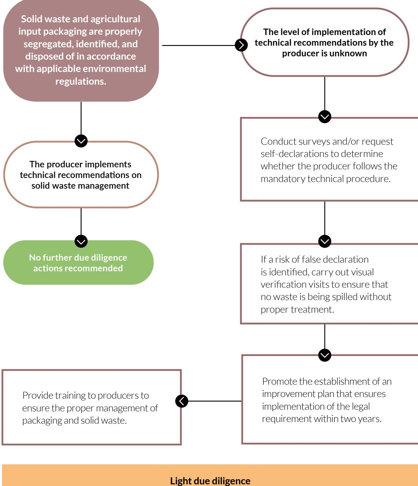

### Requirement 2.1.4

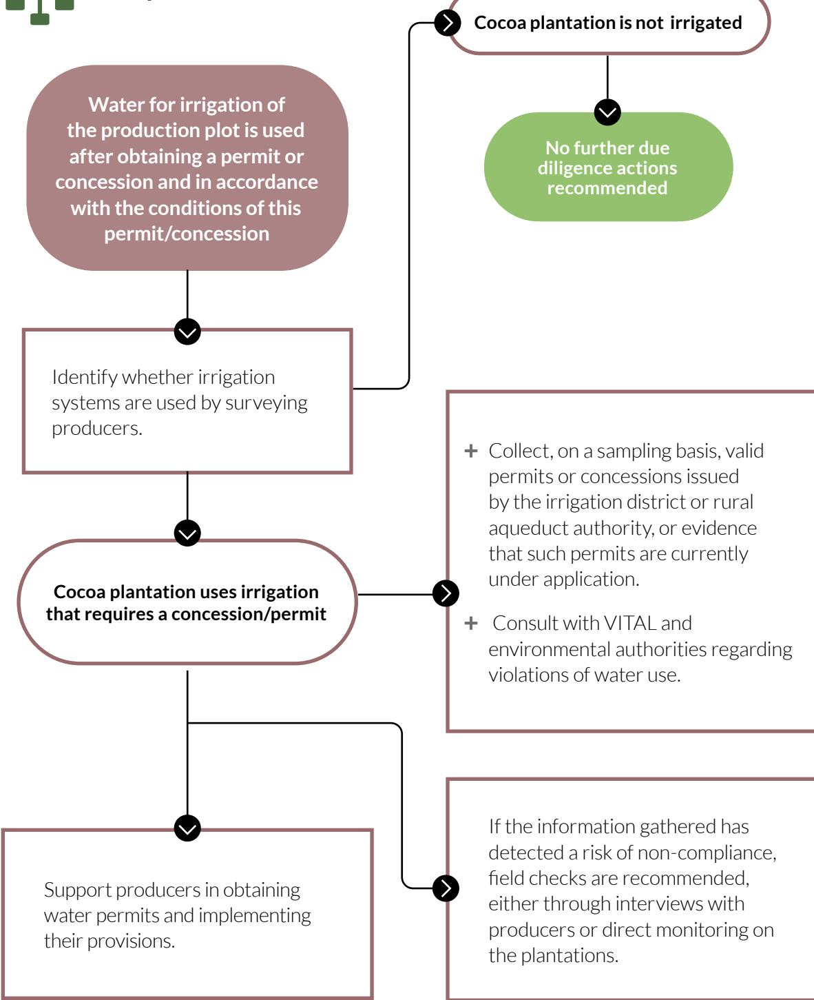

### Requirement 2.1.5

#### **Standard due diligence**

Requirement 2.1.8 Confirm the absence of soil degradation in the sourcing area through interviews with cooperatives, NGOs, local authorities and other local actors.

> Support producers in adopting best practices for managing soils at risk of erosion, soil degradation, and biodiversity loss, for example through training and awareness campaigns.

Compile and verify: reports from NGOs, cooperatives and the administration on soil degradation; land-use and management plan; manual of good agricultural practices; integrated pest management plan or agrochemical molecule rotation plan; follow-up visit report by agronomists, etc.

Promote the use of leguminous species as shade trees and green manure to enhance nitrogen fixation and improve soil fertility.

**Producers protect and conserve the soil.** 

### Requirement 2.1.9

Confirm the absence of air pollution in the sourcing area through interviews with cooperatives, NGOs, local authorities and other local actors.

Promote good agricultural practices, including the prohibition of crop residue burning.

Collect and verify, by sampling: permits for the burning of agricultural waste; and policies and evidence of technical assistance to producers that address the prohibition of crop residue burning and raise awareness of its negative environmental impacts.

**Agricultural activities do not exceed legally established limits for atmospheric pollutants, and the burning of agricultural waste is conducted only after obtaining the required permit and in accordance with applicable legal conditions.** 

Train producers on the necessary permits and applicable conditions for implementation.

### Requirement 2.2.1

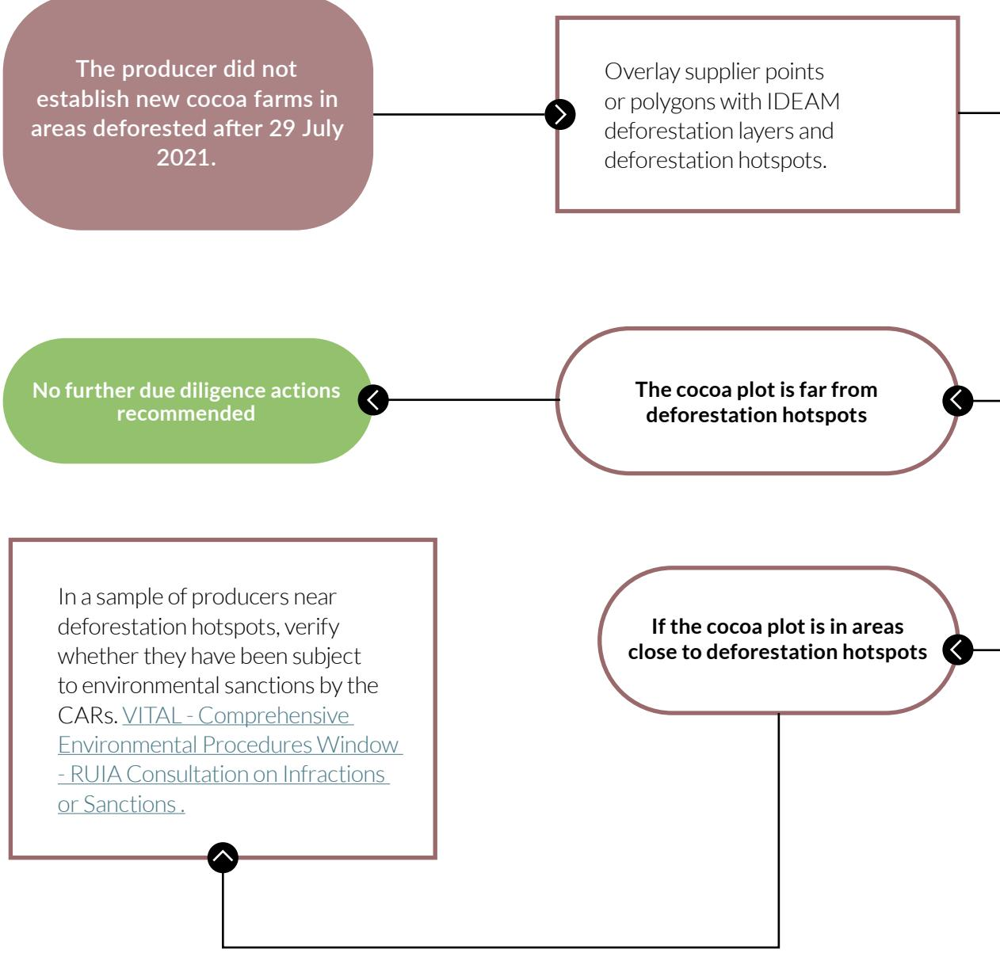

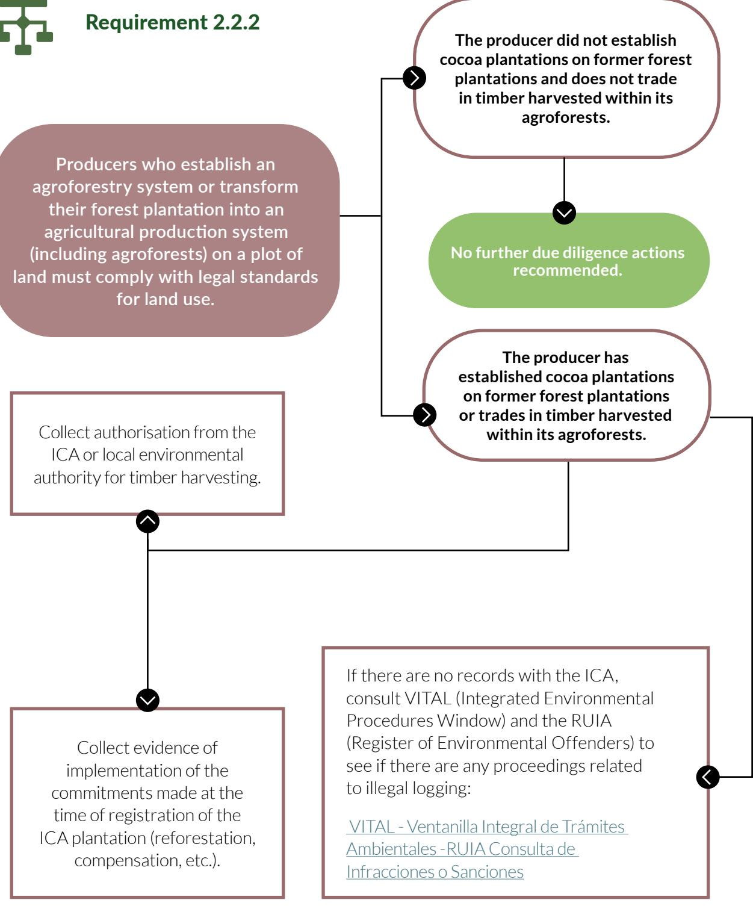

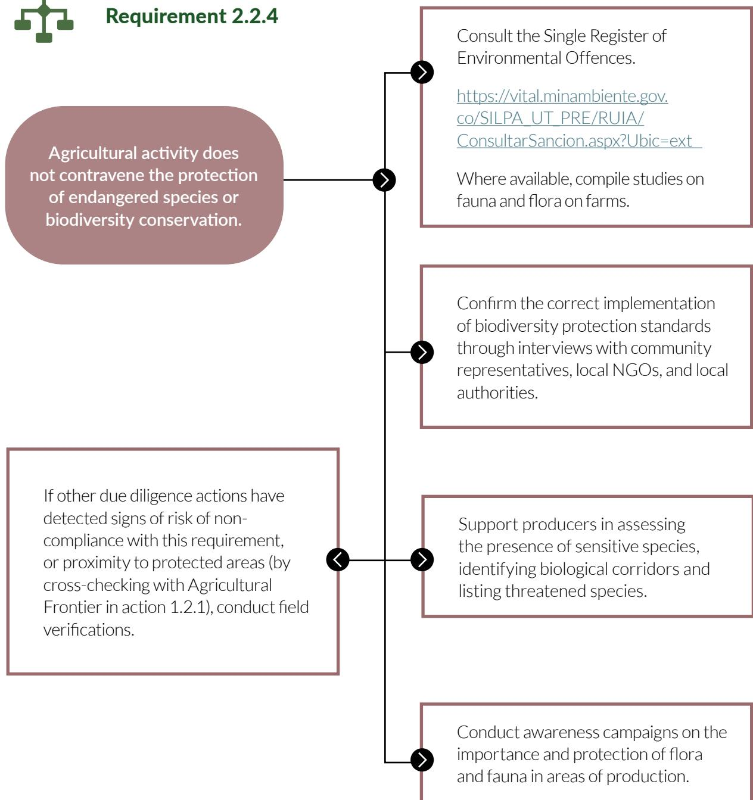

### CATEGORY 3 THIRD PARTIES' RIGHTS AND FPIC

In Colombia, prior consultation and Free, Prior and Informed Consent (FPIC) are complementary legal mechanisms that protect the rights of Indigenous and Afro-Colombian peoples. While often used interchangeably, FPIC has a broader scope and is required when projects may threaten the physical, cultural or spiritual survival of a community, such as in cases of forced relocation or impacts on sacred sites. Both mechanisms are grounded in the 1991 Constitution and ILO Convention 169, and apply particularly in collective territories, where agricultural activities must respect cultural and natural heritage and ensure effective community participation.

Beyond its legal function, FPIC can also help build trust between communities, producers and public authorities, supporting more sustainable and culturally respectful agricultural practices. Experiences in regions such as Tolima and Cauca show that productive development can be compatible with the protection of cultural identity when dialogue and cooperation are established.

At the national level, the risk of non-compliance in the cocoa sector regarding third-party rights and prior consultation requirements is considered low, as most producers are smallholders operating outside collective territories or within them as members of the communities themselves.

| Legal requirement                                                                                                                                                                                                                                                              | Context                                                                                                                                                                                                                                                                                                                                                                                                                                                                                                                | Level of implementation                                                      | Due diligence recommendations                                                                                                                                                                                                                                                                                                                                                                                                                                                                                                                                                                                                                                                                                                                                                                                                                                                                                                                                     |
|--------------------------------------------------------------------------------------------------------------------------------------------------------------------------------------------------------------------------------------------------------------------------------|------------------------------------------------------------------------------------------------------------------------------------------------------------------------------------------------------------------------------------------------------------------------------------------------------------------------------------------------------------------------------------------------------------------------------------------------------------------------------------------------------------------------|------------------------------------------------------------------------------|-------------------------------------------------------------------------------------------------------------------------------------------------------------------------------------------------------------------------------------------------------------------------------------------------------------------------------------------------------------------------------------------------------------------------------------------------------------------------------------------------------------------------------------------------------------------------------------------------------------------------------------------------------------------------------------------------------------------------------------------------------------------------------------------------------------------------------------------------------------------------------------------------------------------------------------------------------------------|
| 
<b>Third parties' rights and FPIC</b>
 
<b>3.1.1</b>
 
Agricultural activities respect the protection of cultural heritage and avoid impacts on sites, resources and habitats of cultural, archaeological or historical importance to Indigenous communities.
 | 
No further information is available regarding cocoa farming in areas of cultural heritage.
 
Beyond its gastronomic and cultural value, cocoa also represents a legacy of sustainability and conservation. In many rural communities, the cocoa harvest is a cause for celebration. Cocoa fairs and gatherings not only showcase the fruit in all its forms—from the pod to the most refined chocolate—but also celebrate the union between culture and nature.
 
<i>(Continued on the next page)</i>
 | 
<b>High level of implementation</b>
 
<b>Light due diligence</b>
 | 
<b>Geospatial analysis</b>
 
Overlay the polygons of the area of production with layers of cultural protection areas, archaeological sites and others already created by the Colombian Institute of Anthropology and History (ICANH): <a href="https://geoparques.icanh.gov.co/#/">https://geoparques.icanh.gov.co/#/</a>
 
If there are archaeological sites or geoparks in the vicinity of the area of production, measures should be taken to manage these sites and agreements should be made with local communities for their access for rituals and other cultural activities, as appropriate. The following due diligence actions are recommended.
 
<b>Stakeholder consultations</b>
 
In areas with sacred sites of indigenous communities, consult with local NGOs and indigenous organisations to ensure that there are no violations of the cultural rights of the communities.
 
<i>(Continued on the next page)</i>
 |

| Legal requirement                                                                                                                                                                                                                                                              | Context                                                                                                                                                                                                                                                                                                                                                                                                                                                                                                                                                                                                                                                                                                                                                                                                                                                                                                                                                                                                         | Level of implementation                                               | Due diligence recommendations                                                                                                                            |
|--------------------------------------------------------------------------------------------------------------------------------------------------------------------------------------------------------------------------------------------------------------------------------|-----------------------------------------------------------------------------------------------------------------------------------------------------------------------------------------------------------------------------------------------------------------------------------------------------------------------------------------------------------------------------------------------------------------------------------------------------------------------------------------------------------------------------------------------------------------------------------------------------------------------------------------------------------------------------------------------------------------------------------------------------------------------------------------------------------------------------------------------------------------------------------------------------------------------------------------------------------------------------------------------------------------|-----------------------------------------------------------------------|----------------------------------------------------------------------------------------------------------------------------------------------------------|
| 
<b>Third parties' rights and FPIC</b>
 
<b>3.1.1</b>
 
Agricultural activities respect the protection of cultural heritage and avoid impacts on sites, resources and habitats of cultural, archaeological or historical importance to Indigenous communities.
 | 
Black communities and the reserves established under Law 70 of 1993 account for 15.6% of the UPA, 11.5% of the planted area, 15.2% of the harvested area and 9.8% of national production. It was not possible to establish any specific relationship between the presence or impact of cocoa farming and sites of cultural and heritage significance.
 
The largest number of cocoa production units in indigenous reserves is mainly located in the departments of Chocó (204 UPA), Putumayo (176 UPA) and Nariño (146 UPA).
                                                                                                                                                                                                                                                                                                                                                                                                                                                                       | 
High level of implementation
 
<b>Light due diligence</b>
 | 
<b>Collection and verification of data</b>
 
Collect, by sampling, the management and access agreements of communities with cultural rights.
 |
| 
<b>Third parties' rights and FPIC</b>
 
<b>3.3.1</b>
 
The rights of indigenous and Afro-Colombian peoples are respected.
                                                                                                                                     | 
According to the UPRA, black communities and reserves under Law 70 of 1993 account for 15.6% of UPAs, 11.5% of the area planted, 15.2% of the area harvested and 9.8% of national production in terms of cocoa. Most cocoa production units in indigenous reserves are located in the departments of Chocó (204 UPAs), Putumayo (176 UPAs) and Nariño (146 UPAs).
 
The study by the National Council of Indigenous Territories (CNTI) on overlaps between Peasant Reserve Areas (ZRC) and indigenous territories concludes that there may be potential conflicts due to territorial overlap.
 
There is significant overlap between requests for the establishment of ZRCs and indigenous territories that are already established or in the process of formalisation. These situations can generate social and legal conflicts, especially when the agricultural development interests of farmers clash with the ancestral rights of indigenous peoples.
 
(Continued on the next page)
 | 
High level of implementation
 
<b>Lig</b>
                 |                                                                                                                                                          |

| Legal requirement                                                                                                                                                                                             | Context                                                                                                                                                                                                                                                                                                                                                                                                                         | Level of implementation                                                      | Due diligence recommendations                                                                                                                                                                                                                                                                                                                                                                                                                                                                                                                                                                                                                                                                                                                                                                                                                                                                                                                                                                                                                                                                                                                                                                                                                                                                                               |
|---------------------------------------------------------------------------------------------------------------------------------------------------------------------------------------------------------------|---------------------------------------------------------------------------------------------------------------------------------------------------------------------------------------------------------------------------------------------------------------------------------------------------------------------------------------------------------------------------------------------------------------------------------|------------------------------------------------------------------------------|-----------------------------------------------------------------------------------------------------------------------------------------------------------------------------------------------------------------------------------------------------------------------------------------------------------------------------------------------------------------------------------------------------------------------------------------------------------------------------------------------------------------------------------------------------------------------------------------------------------------------------------------------------------------------------------------------------------------------------------------------------------------------------------------------------------------------------------------------------------------------------------------------------------------------------------------------------------------------------------------------------------------------------------------------------------------------------------------------------------------------------------------------------------------------------------------------------------------------------------------------------------------------------------------------------------------------------|
|                                                                                                                                                                                                               | 
However, there is no accurate information available to assess the extent of cocoa farming by farmers specifically in formalised indigenous areas or areas in the process of formalisation.
                                                                                                                                                                                                                               | 
<b>High level of implementation</b>
 
<b>Light due diligence</b>
 | 
In these cases, the following additional due diligence actions are recommended:
 
<b>Stakeholder consultations</b>
 
Interviews with authorities from the affected communities, such as community leaders and representatives of indigenous or Afro-descendant organisations and local NGOs, the Ombudsman's Office and/or the Ministry of the Interior.
 
In the case of large-scale production that could impact ethnic communities, which is unlikely given the scale of the activity in the country:
 
<b>Document collection and verification</b>
 
Relevant documents generated during the prior consultation process, such as notifications, meeting minutes, formal agreements with communities, participation reports, and consultation results.
 
<b>Implementation of procedures and processes</b>
 <ul> <li>Conduct prior consultation processes, when necessary, with effective and documented participation.</li> <li>Establish strong community relations and ongoing dialogue.</li> <li>Establish complaint mechanisms open to indigenous peoples.</li> <li>Evaluate implementation of prior consultation externally through audits or reviews by independent entities.</li> <li>Establish a mechanism for monitoring the agreements that have been reached.</li> </ul> |
| 
<b>Third parties' rights and FPIC</b>
 
<b>3.3.2</b>
 
If the agricultural activity generates potential impacts on ethnic communities, the FPIC or Prior Consultation process was respected.
 | 
Cocoa production projects have no record of prior consultation or Free, Prior and Informed Consent (FPIC) processes, as there is generally insufficient evidence of encroachment by settlers or cocoa producers seeking to establish crops or projects in ethnic territories. Cocoa farming, which is generally conducted on a small scale, does not generally generate impacts that could affect the rights of indigeno
 |                                                                              |                                                                                                                                                                                                                                                                                                                                                                                                                                                                                                                                                                                                                                                                                                                                                                                                                                                                                                                                                                                                                                                                                                                                                                                                                                                                                                                             |

### Requirement 3.1.1

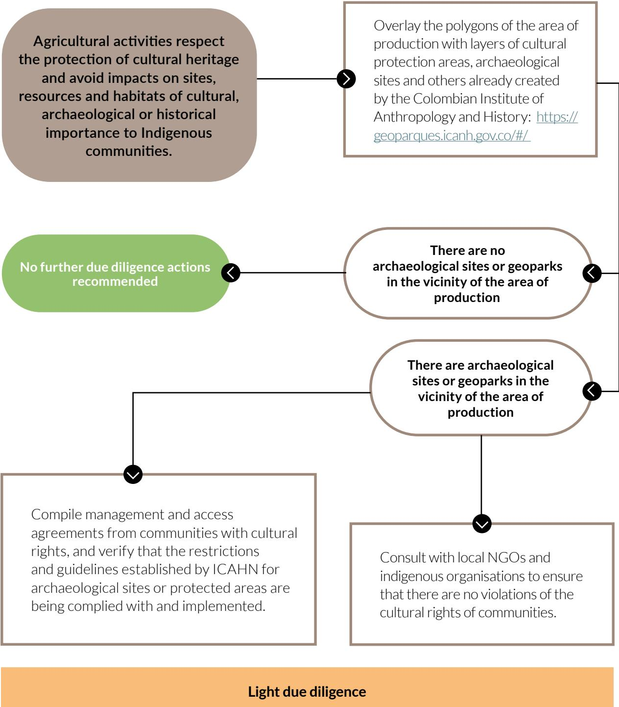

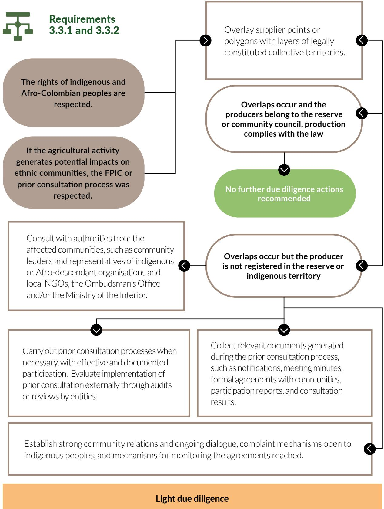

### CATEGORY 4 **LABOUR RIGHTS**

Labour relations in Colombia's agricultural sector are regulated by the Substantive Labour Code (CST) and complementary regulations that establish minimum standards for decent working conditions. These include the formalisation of contracts, respect for working hours (maximum 42 hours per week), payment of at least the legal minimum wage, provision of personal protective equipment (PPE), social security affiliation, freedom of association, and the prevention of discrimination and workplace harassment.

The cocoa sector generates more than 173,000 direct and indirect jobs, many of them temporary or seasonal, which can make formalisation and full social security coverage more challenging. In practice, some workers are covered by the public health system (SISBEN), a common situation in rural areas where temporary employment limits enrolment in the contributory system. Despite high levels of informality, the legal framework remains applicable, particularly in cases of labour inspections or workplace accidents.

The CST recognises several types of contracts including fixed-term, indefinite, project-based, occasional and apprenticeship contracts—which can be adapted to rural activities. In practice, agricultural workers are often paid daily or by piecework, sometimes through verbal agreements, which is permissible provided that minimum labour rights are respected. The Agricultural Sector Price Information System reports various forms of rural remuneration, including daily, weekly or monthly payments, with or without meals.

Regarding occupational health and safety, employers must provide appropriate PPE, train workers in risk prevention and maintain records within the Occupational Health and Safety Management System (SG-SST). These obligations apply equally to cocoa farming, regardless of the type of employment arrangement.

**Cocoa producers in different regions of Colombia often identify themselves as smallholder farmers, operating family-based production systems typically on plots of 5 hectares or less. For many, cocoa farming primarily represents a means of subsistence.**

**For the purposes of this tool, plots of 5 hectares or less are considered an indicator (or proxy criterion) of family farming. This interpretation follows a risk-based due diligence approach. Operators should conduct their own assessment based on their sourcing context and supply chain. Where a production unit regularly or extensively employs external salaried workers, it may no longer meet the principle of predominance of family labour and may therefore not qualify as family farming.**

| Legal requirement | Context                                                                                                                                                                                                                                                                                                                                                                                                                                                                                                                                                                                                                                                                                                                                                                                                                                                                                                                                                                                                        | Level of implementation | Due diligence recommendations                                                                                                                                                                                                                                                                                                                                                                                                                                                                                                                                                                                                                                                                                                                                                                                                                      |
|-------------------|----------------------------------------------------------------------------------------------------------------------------------------------------------------------------------------------------------------------------------------------------------------------------------------------------------------------------------------------------------------------------------------------------------------------------------------------------------------------------------------------------------------------------------------------------------------------------------------------------------------------------------------------------------------------------------------------------------------------------------------------------------------------------------------------------------------------------------------------------------------------------------------------------------------------------------------------------------------------------------------------------------------|-------------------------|----------------------------------------------------------------------------------------------------------------------------------------------------------------------------------------------------------------------------------------------------------------------------------------------------------------------------------------------------------------------------------------------------------------------------------------------------------------------------------------------------------------------------------------------------------------------------------------------------------------------------------------------------------------------------------------------------------------------------------------------------------------------------------------------------------------------------------------------------|
|                   | 
According to the Rural Agricultural Plan, employment in the cocoa value chain and its agro-industry includes private company employees or labourers (16,563 people), self-employed workers (36,737), employers (3,408), unpaid family workers (10,545), unpaid workers in businesses of other households (3,139), and day labourers or farmhands (8,826). Self-employed workers represent the largest group and are primarily engaged in production activities, along with employers, unpaid family workers and day labourers.
 
Based on data from the Large Integrated Household Survey, the population employed in the cocoa chain and its agro-industry is estimated at approximately 79,221 people, of whom 36% (28,189 people) have a formal employment contract. In cocoa farming specifically, around 77% of workers (47,154 people) do not have a written contract. In many cases, this reflects the prevalence of oral agreements, which are also recognised under Colombian labour law.
 |                         | 
<b>Implementation of procedures and processes</b>
 
The first step is to establish whether there are permanent workers in the area of production, as defined by law, i.e. people who are not members of the family unit. This step can be carried out using the threshold of 5 ha per farm.
 <ul> <li>For all producers with less than 5 hectares in production, no additional due diligence is recommended, as it is assumed that there will be no permanent workers and that temporary workers will have oral contracts.</li> <li>For producers with more than 5 ha, surveys can be conducted to determine whether they have workers within the meaning of the law.</li> </ul> 
If there are workers in the area of production, the following additional actions may be implemented.
 
<i>(Continued on the next page)</i>
 |
|                   |                                                                                                                                                                                                                                                                                                                                                                                                                                                                                                                                                                                                                                                                                                                                                                                                                                                                                                                                                                                                                |                         |                                                                                                                                                                                                                                                                                                                                                                                                                                                                                                                                                                                                                                                                                                                                                                                                                                                    |

| Legal requirement | Context                                                                                                                                                                                                                                                                                                                                                                                                                                                                                                                                                                                                                                                                                                                                                                                                                                                                                                                                                                                                                                                                                                                                                                                                                               | Level of implementation | Due diligence recommendations                                                                                                                                                                                                                                                                                                                                                                                                                                                                                                                                                                                                                                                                                                                                                                                                                                     |
|-------------------|---------------------------------------------------------------------------------------------------------------------------------------------------------------------------------------------------------------------------------------------------------------------------------------------------------------------------------------------------------------------------------------------------------------------------------------------------------------------------------------------------------------------------------------------------------------------------------------------------------------------------------------------------------------------------------------------------------------------------------------------------------------------------------------------------------------------------------------------------------------------------------------------------------------------------------------------------------------------------------------------------------------------------------------------------------------------------------------------------------------------------------------------------------------------------------------------------------------------------------------|-------------------------|-------------------------------------------------------------------------------------------------------------------------------------------------------------------------------------------------------------------------------------------------------------------------------------------------------------------------------------------------------------------------------------------------------------------------------------------------------------------------------------------------------------------------------------------------------------------------------------------------------------------------------------------------------------------------------------------------------------------------------------------------------------------------------------------------------------------------------------------------------------------|
|                   | 
According to Fedecacao, 83% of surveyed producers reported hiring day labourers for cocoa-related activities at least once in the previous year. Regarding labour intensity, 24% of producers work between 20 and 30 days per month on cocoa, 40% between 10 and 18 days, and 33% between 1 and 8 days per month.
 
A 2023 study by the International Labour Organisation (ILO) highlights several labour challenges in the cocoa sector. Although the standard working day is eight hours, schedules vary across regions and production cycles, particularly during weeding, pruning and replanting periods.
 
Because most cocoa production is carried out by family farming systems, working hours are often flexible and there is little distinction between work, caregiving and personal time. Tasks are also commonly gendered: men typically carry out activities such as pod harvesting and opening, as well as fermentation and drying when performed on farm, while women are more involved in processing. In addition, many producers cultivate multiple crops for both commercial and subsistence purposes, making it difficult to clearly isolate labour time dedicated specifically to cocoa farming.
 |                         | 
<b>Collection and verification of data</b>
 <ul> <li>Using questionnaires, collect information on the type of employment (fixed-term, indefinite, temporary/casual) and under what conditions the work performed could be classified as salaried employment. Working conditions are understood as including working hours and wages, affiliation to the General Social Security System for Health, Pensions and Occupational Risks.</li> <li>In the case of written contracts, verify the existence of contracts and working conditions by sampling.</li> <li>Collect reports from labour inspectors if available.</li> </ul> 
<b>Compilation and verification of documents</b>
 <ul> <li>Consult public reports from organisations specialising in these issues, such as the ILO and Human Rights Watch (reports on human rights in various</li></ul> |

| Legal requirement                                                                                                                                                                                                                                                                                                                                                                                                                                                                                                                                                                                                                                                                                                                      | Context                                                                                                                                                 | Level of implementation                                                                                                                                                                                                                                                                                                                                                                                                                                                                                                                                                                                                                                                                                                                                                                                                                                                                 | Due diligence recommendations |
|----------------------------------------------------------------------------------------------------------------------------------------------------------------------------------------------------------------------------------------------------------------------------------------------------------------------------------------------------------------------------------------------------------------------------------------------------------------------------------------------------------------------------------------------------------------------------------------------------------------------------------------------------------------------------------------------------------------------------------------|---------------------------------------------------------------------------------------------------------------------------------------------------------|-----------------------------------------------------------------------------------------------------------------------------------------------------------------------------------------------------------------------------------------------------------------------------------------------------------------------------------------------------------------------------------------------------------------------------------------------------------------------------------------------------------------------------------------------------------------------------------------------------------------------------------------------------------------------------------------------------------------------------------------------------------------------------------------------------------------------------------------------------------------------------------------|-------------------------------|
| 
The ILO (2023) report refers to a 2016 sociodemographic characterisation of cocoa producers, which indicates that 33% of producers earn a monthly income below the legal minimum wage.
 
Producers also report that low cocoa market prices in previous years, which vary across regions, have often resulted in insufficient and unstable incomes.
 
Within the cocoa sector, temporary labour is commonly used, particularly in larger production units, for activities such as planting, pruning, weed control, harvesting and fermentation. These tasks are typically remunerated on a daily or piecework basis.
 
The average daily wage ranges between COP 40,000 and COP 70,000, depending on the region.
 | 
Not relevant for family farming.
 
On farms larger than 5 hectares:
 
Low level of implementation
 
<b>Standard due diligence</b>
 | 
<b>Stakeholder consultations</b>
 
Consult national and local NGOs specialising in these issues to obtain information on working conditions and possible cases of non-compliance with labour conditions.
 
<b>Field verifications</b>
 
On a sample basis and/or if previous due diligence actions have indicated a risk of non-compliance, conduct periodic field verifications with producers on plots larger than 5 ha to verify:
 <ul> <li>That employers offer written contracts where necessary (permanent workers on defined terms).</li> <li>That workers receive the minimum wage and that working hours are respected, without discrimination between men and women.</li> <li>That workers have access to protective equipment, do not carry excessive loads, and that there are documentary records of these processes as part of the OHSMS.</li> </ul> |                               |
| 
Activities identified as hazardous in cocoa production:
 <ul> <li>Application of pesticides and fungicides.</li> <li>Work on steep slopes or in areas prone to erosion.</li> <li>Use of machetes, chainsaws, and scythes.</li> <li>Manual loading of heavy sacks (over 25 kg).</li> <li>Working in areas with poisonous wildlife (in humid areas).</li> </ul> 
Another example is weed management and hoeing in crops (macaneo). This activity requires labour at le
                                                                                                                                                                                                                                                       |                                                                                                                                                         |                                                                                                                                                                                                                                                                                                                                                                                                                                                                                                                                                                                                                                                                                                                                                                                                                                                                                         |                               |

| Legal requirement                                                                                                                                                                                                                           | Context                                                                                                                                                                                                                                                                                                                                                                                                                                                                                                                                                                                                                                                                                                                                                                     | Level of implementation                                                                                                                                 | Due diligence recommendations |
|---------------------------------------------------------------------------------------------------------------------------------------------------------------------------------------------------------------------------------------------|-----------------------------------------------------------------------------------------------------------------------------------------------------------------------------------------------------------------------------------------------------------------------------------------------------------------------------------------------------------------------------------------------------------------------------------------------------------------------------------------------------------------------------------------------------------------------------------------------------------------------------------------------------------------------------------------------------------------------------------------------------------------------------|---------------------------------------------------------------------------------------------------------------------------------------------------------|-------------------------------|
| 
<b>Labour rights</b>
 
<b>4.1.4</b>
 
The employer must provide protective equipment and training to workers who perform hazardous activities.
                                                                             | 
This is one of the activities most commonly contracted informally. The primary form of employment is daily wages, with a relationship assumed for each day of work and payment based on the time it takes to clear the plot. To perform this work, employers prefer that workers have their own tools (scythe, boots and, if possible, personal protective equipment).
 
According to ILO (2023), a preliminary review showed major deficiencies in this area in agricultural production, with the exception of those producers linked to sustainability standards that require protection during pesticide application and when handling associated machinery and tools, as well as insurance in terms of occupational risks.
                                  | 
Not relevant for family farming.
 
On farms larger than 5 hectares:
 
Low level of implementation
 
<b>Standard due diligence</b>
 |                               |
| 
<b>Labour rights</b>
 
<b>4.1.5</b>
 
No discrimination shall occur between workers on grounds of gender, race, religion, age, or any other protected characteristic, where capabilities and working conditions are equal.
 | 
In Colombia, the law guarantees equal conditions in agricultural work, but there are significant gaps and discriminatory practices in the cocoa sector, especially towards rural women, ethnic communities (indigenous and Afro-Colombian), young people and people in vulnerable situations. According to AGROSAVIA's "Analysis of gender equality in the cocoa sector in Colombia" (2020), rural women represent about 30% of the cocoa workforce, but they face:
 <ul> <li>Lower incomes: on average, they earn 25–30% less than men for the same tasks.</li> <li>Less access to land, inputs and credit.</li> <li>Low representation in leadership or management positions in cooperatives or associations.</li> </ul> 
<i>(Continued on the next page)</i>
 | 
Not relevant for family farming.
 
On farms larger than 5 hectares:
 
Low level of implementation
 
<b>Standard due diligence</b>
 | 
See the recomm
         |

| Legal requirement                                                                                                                                                                                                                           | Context                                                                                                                                                                                                                                                                                                                                                                                                                                                                                                                                                                                                                                                                                                                                                                                                                                                                                                                                                                                                                                                                                                                                                              | Level of implementation                                                                                                                                 | Due diligence recommendations |
|---------------------------------------------------------------------------------------------------------------------------------------------------------------------------------------------------------------------------------------------|----------------------------------------------------------------------------------------------------------------------------------------------------------------------------------------------------------------------------------------------------------------------------------------------------------------------------------------------------------------------------------------------------------------------------------------------------------------------------------------------------------------------------------------------------------------------------------------------------------------------------------------------------------------------------------------------------------------------------------------------------------------------------------------------------------------------------------------------------------------------------------------------------------------------------------------------------------------------------------------------------------------------------------------------------------------------------------------------------------------------------------------------------------------------|---------------------------------------------------------------------------------------------------------------------------------------------------------|-------------------------------|
| 
<b>Labour rights</b>
 
<b>4.1.5</b>
 
No discrimination shall occur between workers on grounds of gender, race, religion, age, or any other protected characteristic, where capabilities and working conditions are equal.
 | <ul> <li>In many cases, they work without direct remuneration, supporting family production units.</li> </ul> 
According to ILO 2023, although women's participation in the cocoa producer group is only 27.3%, key operators in the sector are interested in promoting greater participation by women. The tasks of drying or shelling (removing the cocoa beans from the pods) require attention and care and are carried out primarily by women.
                                                                                                                                                                                                                                                                                                                                                                                                                                                                                                                                                                                                                                                                                                            | 
Not relevant for family farming.
 
On farms larger than 5 hectares:
 
Low level of implementation
 
<b>Standard due diligence</b>
 |                               |
| 
<b>Labour rights</b>
 
<b>4.1.6</b>
 
The employer complies with the current social security regime, including the payment of the corresponding contributions.
                                                             | 
<b>For employees with an employment contract:</b>
 
The employer is responsible for registering workers with the General Social Security System for Health, Pensions and Occupational Risks, and for making the corresponding contributions in accordance with applicable regulations.
 
<b>For contractors providing services:</b>
 
The contractor is responsible for their own affiliation to, and payment of contributions to, the General Social Security System for Health, Pensions and Occupational Risks. The contracting company must verify that the contractor is duly affiliated and that contributions are paid before and throughout the execution of the contract.
 
In the specific case of the cocoa value chain and its agro-industry, available data indicate a high level of labour informality. According to information from the National Agricultural Census (CNA), only 8.8% of the population linked to the cocoa value chain is affiliated with the health system under the contributory regime, suggesting that the level of labour formality in the sector is below 10%.
 
(Continued on the next page)
 |                                                                                                                                                         | 
See the recommendat
    |

| Legal requirement                                                                                                                                                                | Context                                                                                                                                                                                                                                                                                                                                                                                                                                                                                                                                                                                                                                                                                                                                                           | Level of implementation                                                                                                                                     | Due diligence recommendations                                           |
|----------------------------------------------------------------------------------------------------------------------------------------------------------------------------------|-------------------------------------------------------------------------------------------------------------------------------------------------------------------------------------------------------------------------------------------------------------------------------------------------------------------------------------------------------------------------------------------------------------------------------------------------------------------------------------------------------------------------------------------------------------------------------------------------------------------------------------------------------------------------------------------------------------------------------------------------------------------|-------------------------------------------------------------------------------------------------------------------------------------------------------------|-------------------------------------------------------------------------|
| 
<b>Labour rights</b>
 
<b>4.1.6</b>
 
The employer complies with the current social security regime, including the payment of the corresponding contributions.
  | 
This places the cocoa value chain second among agricultural value chains in terms of presumed labour informality, after the sugar cane sector.
 
Working conditions are generally more precarious in the primary production segment of the value chain. Many workers engaged without formal contracts lack access to labour benefits, such as severance payments, Christmas bonuses and paid leave, which are typically associated with formal employment relationships.
                                                                                                                                                                                                                                                                              | 
Not relevant for family farming.
 
On farms larger than 5 hectares:
 
Low level of implementation
 
<b>Standard due diligence</b>
     | 
See the recommendations for requirements 4.1.1, 4.1.2 and 4.1.3
  |
| 
<b>Labour rights</b>
 
<b>4.1.7</b>
 
Workers are free to join a trade union of their choice and shall not be subject to retaliation for exercising this right.
 | 
Due to the informal nature of the sector and the fact that most farms have less than 25 employees, no systemic cases of this right being restricted for workers in the cocoa sector have been identified.
 
Social dialogue has been led by Fedecacao through a representative structure of municipal and departmental committees.
 
The Inter-sectoral Roundtable on Cocoa Traceability in Colombia is a forum for coordination and consultation between actors in the cocoa production chain (producers, processors, marketers, public, private and academic entities) which seeks, among other things, to contribute to reducing informality and creating environments that favour collective organisation and fair negotiation with workers.
 | 
Not relevant for family farming
 
High level of implementation on farms with more than 25 permanent employees
 
<b>Light due diligence</b>
 | 
As a first step, identify whether there are farms with more than
 |

| Legal requirement                                                                                                                                                                                                                | Context                                                                                                                                                                                                                                                                                                                                                                                                                                                                                                                                                                                                                                                                                                                                                                                         | Level of implementation                                                                                                                                     | Due diligence recommendations                                                                                                                                                                                                                                                                                                                                                                                                                                       |
|----------------------------------------------------------------------------------------------------------------------------------------------------------------------------------------------------------------------------------|-------------------------------------------------------------------------------------------------------------------------------------------------------------------------------------------------------------------------------------------------------------------------------------------------------------------------------------------------------------------------------------------------------------------------------------------------------------------------------------------------------------------------------------------------------------------------------------------------------------------------------------------------------------------------------------------------------------------------------------------------------------------------------------------------|-------------------------------------------------------------------------------------------------------------------------------------------------------------|---------------------------------------------------------------------------------------------------------------------------------------------------------------------------------------------------------------------------------------------------------------------------------------------------------------------------------------------------------------------------------------------------------------------------------------------------------------------|
| 
<b>Labour rights</b>
 
<b>4.1.7</b>
 
Workers are free to join a trade union of their choice and shall not be subject to retaliation for exercising this right.
                                                 |                                                                                                                                                                                                                                                                                                                                                                                                                                                                                                                                                                                                                                                                                                                                                                                                 | 
Not relevant for family farming
 
High level of implementation on farms with more than 25 permanent employees
 
<b>Light due diligence</b>
 | 
<b>Implementation of procedures and processes</b>
 <ul> <li>Map the risks of non-compliance with anti-union practices in the supply chain, including outsourcing schemes designed to prevent unionisation.</li> <li>Conduct internal and external audits: To detect illegal outsourcing practices aimed at limiting workers' rights to union membership.</li> <li>Enable channels for complaints and grievances for direct and outsourced workers.</li> </ul> |
| 
<b>Labour rights</b>
 
<b>4.2.1</b>
 
The employer shall grant 18 weeks of paid maternity leave to pregnant employees and 8 days of paid paternity leave to fathers.
 
<i>(Continued on the next page)</i>
 | 
Large and medium-sized farms, particularly those linked to producer associations or unions, tend to comply with these obligations, as they generally show higher levels of labour formalisation. However, greater or more localised risks may arise on small farms, where employment relationships are often informal, contracts may be oral, and workers may lack affiliation to the health system. In such cases, workers may not effectively access statutory benefits such as maternity or paternity leave and other employment protections.
 
No studies or empirical analyses were identified that specifically examine the implementation and impact of maternity and paternity leave in rural areas of Colombia, and even less so with a specific focus on cocoa producers.
 | 
Not relevant for family farming
 
On farms larger than 5 hectares:
 
High level of implementation
 
<b>Light due diligence</b>
        | 
<b>Stakeholder consultations</b>
 <ul> <li>Consult NGOs and stakeholders who are familiar with your value chain (at the supply chain level as a company).</li> </ul> 
<i>(Continued on the next page)</i>
                                                                                                                                                                                                                                               |

| Legal requirement                                                                                                                                                                     | Context                                                                                                                                                                                                                                                                                                                                                                                                                                                                                                                                                                                                                                                                                                                    | Level of implementation                                                                                                                              | Due diligence recommendations                                                                                                                                                                                                                                                                                                                                                                                                                                                                                                                                                                                                                                                                                                                                                                                                                                 |
|---------------------------------------------------------------------------------------------------------------------------------------------------------------------------------------|----------------------------------------------------------------------------------------------------------------------------------------------------------------------------------------------------------------------------------------------------------------------------------------------------------------------------------------------------------------------------------------------------------------------------------------------------------------------------------------------------------------------------------------------------------------------------------------------------------------------------------------------------------------------------------------------------------------------------|------------------------------------------------------------------------------------------------------------------------------------------------------|---------------------------------------------------------------------------------------------------------------------------------------------------------------------------------------------------------------------------------------------------------------------------------------------------------------------------------------------------------------------------------------------------------------------------------------------------------------------------------------------------------------------------------------------------------------------------------------------------------------------------------------------------------------------------------------------------------------------------------------------------------------------------------------------------------------------------------------------------------------|
| 
<b>Labour rights</b>
 
<b>4.2.1</b>
 
The employer shall grant 18 weeks of paid maternity leave to pregnant employees and 8 days of paid paternity leave to fathers.
 | 
Existing materials include a guide on the management of leave for civil servants, which outlines procedures and general coverage of such entitlements, as well as academic articles analysing the legal framework for job protection during parental leave in Colombia. However, these sources focus primarily on the formal urban labour market and do not assess implementation among informal agricultural workers or within production chains such as cocoa.
 
As a result, there is a significant knowledge gap regarding the effective implementation of parental leave rights in rural agricultural contexts, which could usefully be addressed through field-based studies in cocoa-producing regions.
 | 
Not relevant for family farming
 
On farms larger than 5 hectares:
 
High level of implementation
 
<b>Light due diligence</b>
 | 
<b>Implementation of procedures and processes</b>
 <ul> <li>Promote employee training, internal policies and protocols for employees for the prevention, detection and handling of cases of workplace or sexual harassment with your suppliers.</li> <li>Enable complaint mechanisms and grievance mechanisms.</li> <li>Create coexistence and joint staff committees as relevant bodies for the prevention of harassment in the workplace.</li> <li>Monitor effective sanctions for workplace or sexual harassment.</li> <li>Train supervisors and human resources managers on leave policies.</li> <li>Promote the adoption of written policies on maternity and paternity protection in the fields.</li> <li>Establish confidential reporting mechanisms to report non-compliance with labour rights, especially those of female workers.</li> </ul> |
| 
<b>Labour rights</b>
 
<b>4.2.2</b>
 
The employer shall adopt measures to prevent, address, and sanction workplace harassment and sexual harassment.
                | 
No analysis or research has been identified
                                                                                                                                                                                                                                                                                                                                                                                                                                                                                                                                                                                                                                                                         |                                                                                                                                                      |                                                                                                                                                                                                                                                                                                                                                                                                                                                                                                                                                                                                                                                                                                                                                                                                                                                               |

### Requirements 4.1.1, 4.1.2, 4.1.3, 4.1.4, 4.1.5, 4.1.6

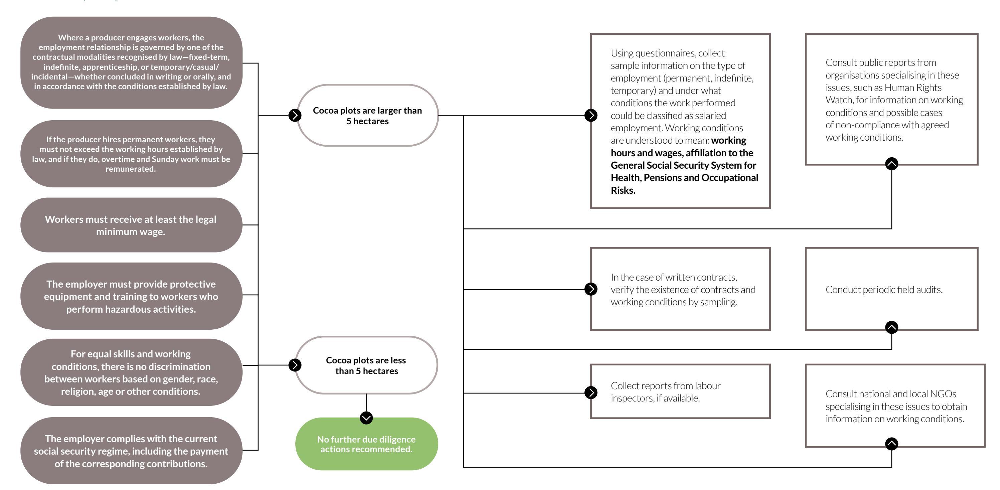

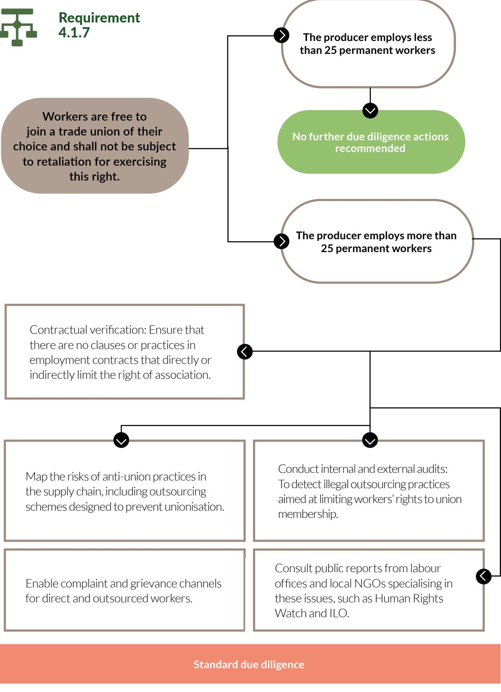

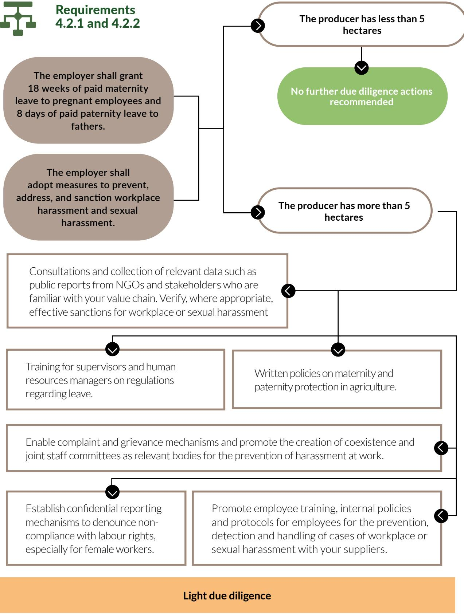

### CATEGORY 5 **HUMAN RIGHTS \***

**Note:** This category is explicitly included in Article 2(40) of the EUDR, although it is not directly related to the main objective of the Regulation.

In Colombia, child and forced labour are prohibited by a robust legal framework that includes the 1991 Constitution, the Substantive Labour Code (CST), the Childhood and Adolescence Code (Law 1098 of 2006) and various ILO conventions, such as Conventions 138, 182, 29 and 105. The minimum working age is 15, under special conditions and with authorisation from the Ministry of Labour, ensuring that the child's education, health and overall development are not affected. Night work, dangerous or unhealthy work, and any form of economic exploitation or coercion are prohibited.

In rural areas, the regulations allow minors to participate in family farming activities if these are occasional, light and carried out in cultural or domestic economic contexts, without constituting an employment relationship or affecting the fundamental rights of the minor. This distinction is key in sectors such as cocoa farming, where family farming predominates and it is common for children and adolescents to collaborate in unpaid tasks.

Forced labour is also expressly prohibited. Law 985 of 2005 and Decree 1280 of 1997 criminalise human trafficking and other forms of modern slavery. The CST prohibits practices such as the withholding of documents or undue wage deductions that may lead to economic dependence or coercion.

In the cocoa sector, the risk of child or forced labour is considered low at the national level. However, isolated cases may occur in areas of high social vulnerability. Therefore, due diligence should include verification of respect for children's rights and the prevention of any form of forced labour as part of ethical, legal and sustainable production.

| requirement              | Context Level of |
|--------------------------|------------------|
| minimum working age is   | 15 ,             |
| education. The           | Substantive      |
| Labour Code              | prohibits        |
| under the age of 18      | in               |
| hazardous work, and      | Law              |
| 1098 of 2006             | (Childhood       |
| to six hours per day and |                  |
| night work between       | 6:00             |

| requirement           | Context Level of  |
|-----------------------|-------------------|
| Colombia, such as ILO | Convention        |
| 138 and the           | Convention on the |
| Rights of the Child,  | which reinforce   |
| prevention of         | child labour and  |
| working adolescents   | , ensuring that   |

| Legal requirement                                                                                                                                                  | Context                                                                                                                                                                                                                                                                                                                                                                                                                                                                                                                                                                                                                                                                                         | Level of implementation                                                                               | Due diligence recommendations                                                                                                                                                                                                                                                                                                                                                                                                                                                                                                                                                                                                                                                                                                                                                                                                                                          |
|--------------------------------------------------------------------------------------------------------------------------------------------------------------------|-------------------------------------------------------------------------------------------------------------------------------------------------------------------------------------------------------------------------------------------------------------------------------------------------------------------------------------------------------------------------------------------------------------------------------------------------------------------------------------------------------------------------------------------------------------------------------------------------------------------------------------------------------------------------------------------------|-------------------------------------------------------------------------------------------------------|------------------------------------------------------------------------------------------------------------------------------------------------------------------------------------------------------------------------------------------------------------------------------------------------------------------------------------------------------------------------------------------------------------------------------------------------------------------------------------------------------------------------------------------------------------------------------------------------------------------------------------------------------------------------------------------------------------------------------------------------------------------------------------------------------------------------------------------------------------------------|
| 
<b>Human Rights</b>
 
<b>5.2.1</b>
 
Forced labour, including any practices that restrict workers' freedom of employment, is strictly prohibited.
 | 
A review of the available literature and secondary sources did not identify any reported cases of forced labour in the Colombian cocoa sector.
 
However, structural challenges remain regarding labour inspection and enforcement, particularly due to the dispersed nature of cocoa-producing areas and the limited operational capacity of the State to carry out regular inspections in remote rural territories.
 
It should also be noted that Colombia is not identified as a high-risk country for forced labour in cocoa production in major global assessments, such as those conducted by the International Labour Organisation (ILO) and the Walk Free Foundation.
 | 
High level of implementation on farms larger than 5 hectares
 
<b>Light due diligence</b>
 | 
<b>Stakeholder consultations</b>
 
Conduct surveys or interviews with workers, trade unions (if any), NGOs and community leaders on working conditions, working hours, wages and safety at work. It is important to include both direct and subcontracted workers.
 
<b>Implementation of procedures and processes</b>
 <ul> <li>• Encourage and monitor labour suppliers to adopt and implement Codes of Conduct that explicitly prohibit forced labour.</li> <li>• Implement training programmes on labour rights for supervisors and workers, focusing on forced labour and freedom of employment.</li> <li>• Conduct internal audits and external audits (by independent entities).</li> <li>• Establish anonymous and confidential complaint mechanisms so that workers can report abusive labour practices without fear of reprisals.</li> </ul> |

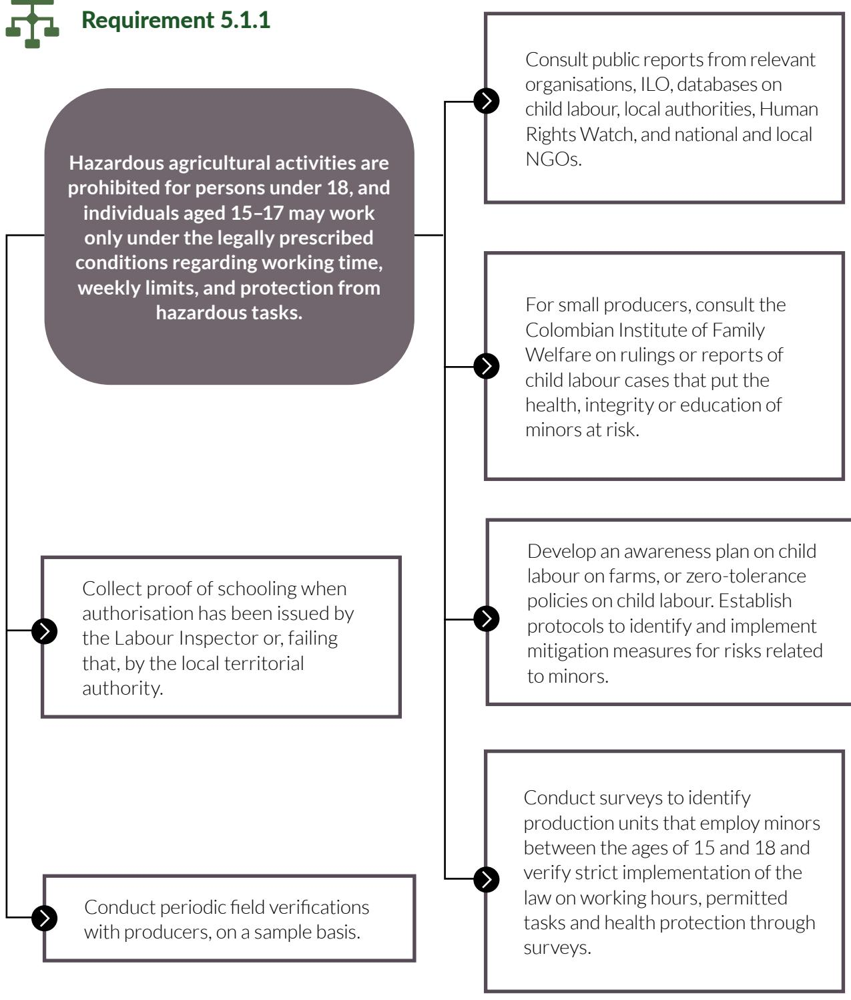

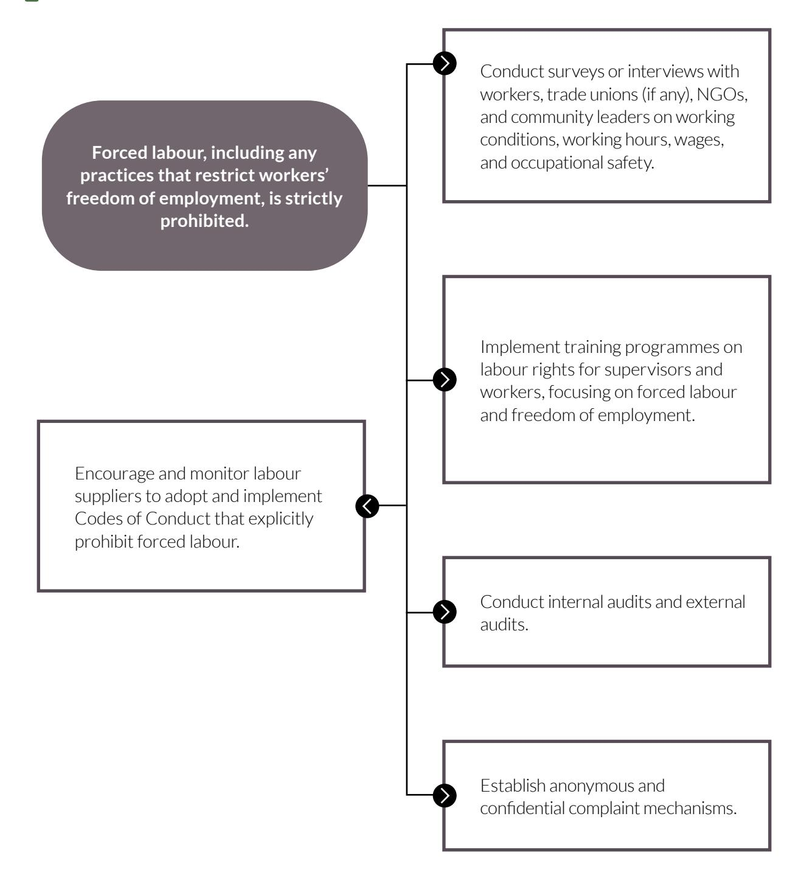

### Requirement 5.2.1

#### CATEGORY 6 **TAXATION, ANTI-CORRUPTION, TRADE AND CUSTOMS**

**Note:** This is the only category of law mentioned in Article 2(40) of the EUDR that may involve entities and activities throughout the supply chain of the country of production, and not only at the level of the production area.

In Colombia, taxation, trade and the fight against corruption are fundamental pillars for ensuring legality and traceability in agricultural supply chains. Cocoa is regulated by robust institutional frameworks that include parafiscal levies administered by Fedecacao. These resources finance research programmes, technical assistance, crop renewal and organisational strengthening, contributing to the sustainability and formalisation of the sector.

Export of cocoa is not subject to direct taxes but must comply with customs and health requirements established by the National Tax and

Customs Directorate (DIAN) and the ICA, which guarantees the traceability and legality of the exported grain. The cocoa sector, composed mainly of small and medium-sized producers organised into associations and cooperatives, has been strengthened by international cooperation programmes focused on the substitution of illicit crops and the formalisation of production.

Although some production areas coincide with territories historically affected by armed conflict or illegal economies, there is no significant evidence linking these chains to money laundering or corruption. On the contrary, the legal, traceable and organised nature of the value chain positions Colombian cocoa as a low-risk agricultural product in terms of the legality standards, transparency and sustainability required by international markets.

| requirement | Context                           | Level of |                                   |
|-------------|-----------------------------------|----------|-----------------------------------|
|             | Parafiscal resources are invest  |          |                                   |
|             |                                   |          | 2. Fiscal and parafiscal respon  |

| Legal requirement                                                                                                                                                                                                                         | Context                                                                                                                                                                                                                                                                                                                                                                                                                                                                                                                                                                                                                                                                                                                                                                                                                                                                                                                                                                                                                                                                                                                                                                                                                                                                                                                                                                                                                                                                                 | Level of implementation                                                      | Due diligence recommendations                                                                                                                                                                                                                                                                                        |
|-------------------------------------------------------------------------------------------------------------------------------------------------------------------------------------------------------------------------------------------|-----------------------------------------------------------------------------------------------------------------------------------------------------------------------------------------------------------------------------------------------------------------------------------------------------------------------------------------------------------------------------------------------------------------------------------------------------------------------------------------------------------------------------------------------------------------------------------------------------------------------------------------------------------------------------------------------------------------------------------------------------------------------------------------------------------------------------------------------------------------------------------------------------------------------------------------------------------------------------------------------------------------------------------------------------------------------------------------------------------------------------------------------------------------------------------------------------------------------------------------------------------------------------------------------------------------------------------------------------------------------------------------------------------------------------------------------------------------------------------------|------------------------------------------------------------------------------|----------------------------------------------------------------------------------------------------------------------------------------------------------------------------------------------------------------------------------------------------------------------------------------------------------------------|
|                                                                                                                                                                                                                                           | <ul> <li>Exporters may be subject to price stabilisation transfers or compensation payments through FEPCACAO, depending on the difference between the reference price set by the fund and the actual sale price.</li> </ul> 
Documentation required for each export:
 <ul> <li>Registration in the RUT (Registro Único Tributario) – the Single Tax Registry managed by DIAN, which identifies companies and individuals carrying out economic activities in Colombia.</li> <li>Customs agency representation: A licensed customs broker (Agencia de Aduanas) must represent the exporter before the national customs authority DIAN (Dirección de Impuestos y Aduanas Nacionales – National Tax and Customs Directorate), as well as before port authorities and shipping companies. Powers of attorney must be granted and the Circular 170 compliance form completed.</li> <li>Registration in VUCE (Ventanilla Única de Comercio Exterior) – the Single Window for Foreign Trade, an electronic government platform that centralises export and import procedures, including the FUCE (Formulario Único de Comercio Exterior – Single Foreign Trade Form).</li> <li>Anti-narcotics inspection: Personal appearance before POLFA (Policía Fiscal y Aduanera – Fiscal and Customs Police) to authorise the letter of responsibility, a control mechanism used to prevent the use of export shipments for drug trafficking.</li> </ul> 
<i>(Continued on the next page)</i>
 |                                                                              |                                                                                                                                                                                                                                                                                                                      |
| 
<b>Taxation, anti corruption, trade and customs</b>
 
<b>6.1.4</b>
 
Cocoa buyers, processors and exporters must pay the parafiscal contributions and the stabilisation transfers to the Cocoa Price Stabilisation Fund.
 |                                                                                                                                                                                                                                                                                                                                                                                                                                                                                                                                                                                                                                                                                                                                                                                                                                                                                                                                                                                                                                                                                                                                                                                                                                                                                                                                                                                                                                                                                         | 
<b>High level of implementation</b>
 
<b>Light due diligence</b>
 | 
<b>4. Request customs requirements</b>
 
Mandatory Documents:
 <ul> <li>Commercial invoice</li> <li>Packing list</li> <li>Letter of responsibility</li> <li>Weight and fumigation certificates</li> <li>Phytosanitary certificate (ICA)</li> <li>Certificate of origin (DIAN)</li> <li>Certific</li></ul> |

| Legal requirement                                                                                                                                                                                                                         | Context                                                                                                                                                                                                                                                                                                                                                                                                                                                                                                                                                                                                                                                                                                                             | Level of implementation                                               | Due diligence recommendations |
|-------------------------------------------------------------------------------------------------------------------------------------------------------------------------------------------------------------------------------------------|-------------------------------------------------------------------------------------------------------------------------------------------------------------------------------------------------------------------------------------------------------------------------------------------------------------------------------------------------------------------------------------------------------------------------------------------------------------------------------------------------------------------------------------------------------------------------------------------------------------------------------------------------------------------------------------------------------------------------------------|-----------------------------------------------------------------------|-------------------------------|
| 
<b>Taxation, anti corruption, trade and customs</b>
 
<b>6.1.4</b>
 
Cocoa buyers, processors and exporters must pay the parafiscal contributions and the stabilisation transfers to the Cocoa Price Stabilisation Fund.
 | <ul> <li>Certificate of good standing for the cocoa development levy, issued by the National Cocoa Fund, confirming that the exporter has complied with parafiscal contribution payments and uploaded to the DIAN export platform.</li> <li>Number of the current stabilisation agreement with FEPCACAO, confirming the exporter's participation in the cocoa price stabilisation mechanism.</li> </ul> 
According to Fedecacao (Federación Nacional de Cacaoteros – National Federation of Cocoa Growers), evasion of the cocoa development levy is minimal, partly because two large companies purchase nearly 80% of the cocoa beans produced nationally, which facilitates monitoring and collection of the contribution.
 | 
High level of implementation
 
<b>Light due diligence</b>
 |                               |
| 
<b>Taxation, anti corruption, trade and customs</b>
 
<b>6.2.1</b>
 
Exporters are responsible for customs duties and taxes, as established by law.
                                                                      | 
Cocoa exporters in Colombia who intend to export cocoa must have:
                                                                                                                                                                                                                                                                                                                                                                                                                                                                                                                                                                                                                                                            | 
High level of implementation
 
<b>Light due diligence</b>
 |                               |

### Requirements 6.1.4 and 6.2.1

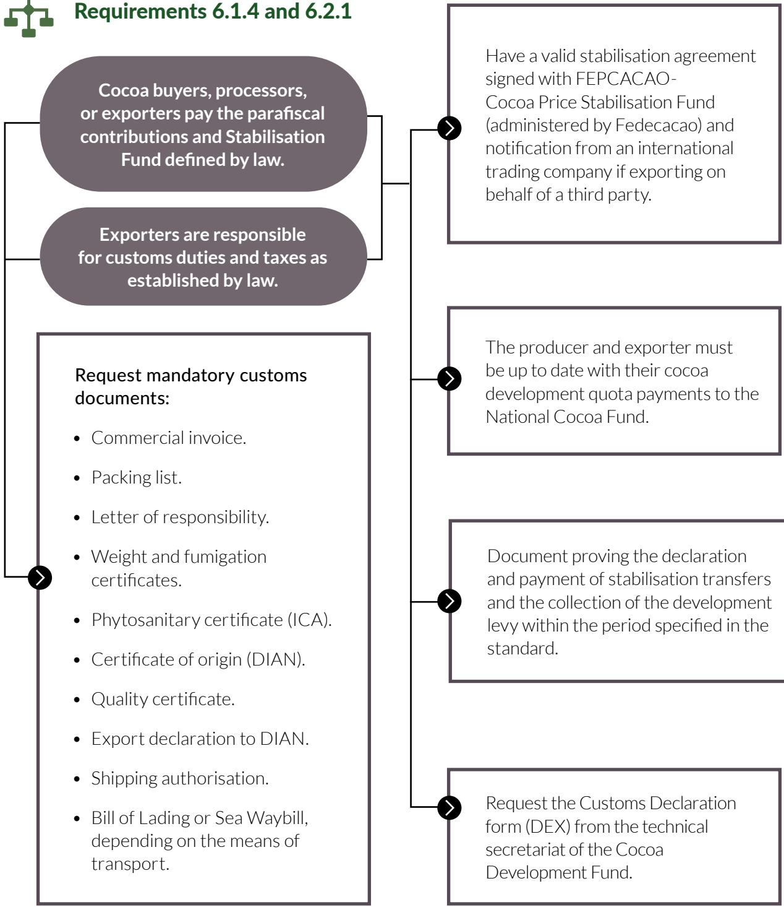

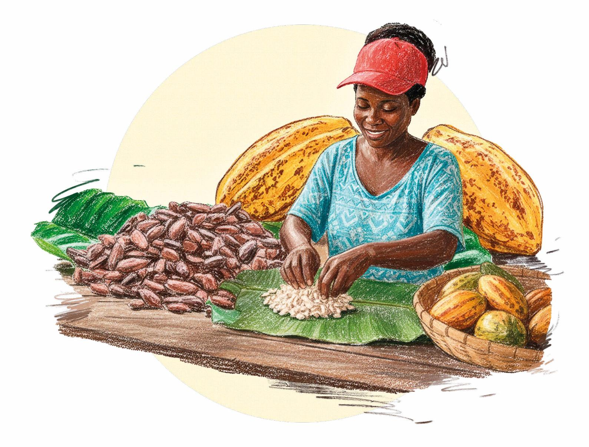

ANNEX

The first step in developing this tool for legality-related due diligence is to identify the relevant legal requirements under the EUDR for cocoa production in Colombia.

The EUDR defines the legality of commodities in light of two criteria:

National legal requirements must refer to the legal status of the production area There are seven legal areas [for agricultural products]: land-use rights; environmental protection; third parties' rights; labour rights; human rights protected under international law; the principle of Free, Prior and Informed Consent, as set out in the United Nations Declaration on the Rights of Indigenous Peoples; tax, anti-corruption, trade and customs regulations.

On 2 October 2024 (with an update in April 2025), the European Commission published a guidance document for the implementation of the EUDR, which interprets the provisions of the Regulation on the legality criterion. This document proposes to address the relevance of legal requirements through the following criteria:

The requirements have a specific impact on the legal status of the area of production of the commodities [with the exception of tax, trade and customs standards]; The requirements must be linked to the objectives of the Regulation to halt deforestation and forest degradation as part of the EU's commitment to addressing climate change and biodiversity loss.

Given that not all labour requirements, as well as certain human rights and third parties' rights, are directly related to the objectives of the EUDR, there is debate as to whether they fall within the scope of application of the Regulation.

On the other hand, the guidance document would extend the scope of tax and anti-corruption regulations to steps of value chains beyond the area of production. It should be noted that the Commission's guidance document is not legally binding. As specified in the guidance document itself, it does not replace, add to or modify the provisions of the EUDR, which sets out the legal obligations. However, it seeks to harmonise the implementation of the regulation among EU member states.

Each EU Member State will adopt its own approach to monitoring operators' implementation of the EUDR. Ultimately, only the judge in each EU country has the power to interpret EU regulations in a legally binding manner and determine the scope of the legality test.

In this context, **this tool takes a precautionary approach.** It considers all areas of law listed in Article 2(40) and includes all requirements that are considered relevant in these seven areas. However, it indicates with an asterisk those legal requirements that are not directly linked to the objectives of the EUDR.

This comprehensive approach will allow end users to choose the scope of their work based on their reading of the EUDR and the guidance provided.

# Annex 1. Mapping methodology

#### **How the relevance of the requirements has been determined**

Under the EUDR, the Operator is solely responsible for carrying out due diligence to ensure that the products it trades in present a negligible risk of illegality. However, the EU has recognised that producing countries can facilitate the work of operators and competent authorities (see question 1.30 of the FAQs), in particular by providing information that allows for a better understanding of the applicable national laws. This is precisely the objective of Annex 2, which contains the mapping of relevant legal requirements for cocoa produced in Colombia.

All existing legal texts and requirements in Colombia that fall within the scope of application of the seven legal categories specified above have been identified. Stakeholders in the cocoa sector, meeting in consultation workshops and bilateral working meetings (see Annex 3), assessed the relevance of each relevant legal requirement for determining implementation of the EUDR legality criterion.

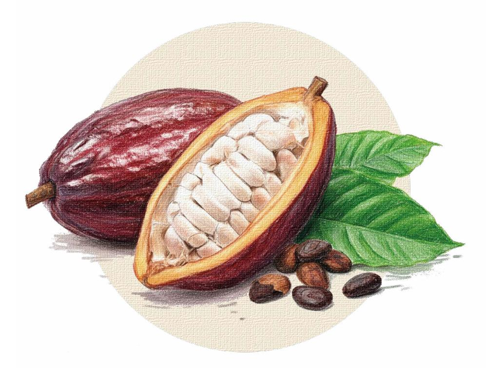

All identified legal requirements were considered a priori relevant for assessing the compliance of cocoa or its derived products with the EUDR legality criterion, unless it can be clearly identified that:

The legal requirement does not apply to the cocoa plot or to the workers and third parties involved in the plot [with the exception of tax, trade and customs standards], The relevant legal requirement is not found in the context of cocoa production, because the conditions for its implementation are not found there, The legal requirement is of general implementation, is not subject to implementing texts that prevent its implementation or the monitoring of its implementation or compliance, and/or is covered by other more specific requirements.

The tables below, organised by area of law, show the requirements retained as relevant and irrelevant, and the justifications provided by the stakeholders consulted for cocoa produced in Colombia.

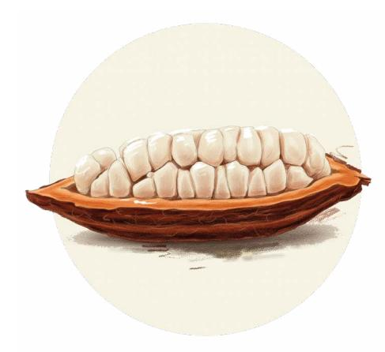

The tables show the 42 legal requirements identified, 33 considered relevant and 9 not relevant, and the justifications provided by the stakeholders consulted.

Requirements marked with an asterisk are not directly related to the EUDR objectives.

# Annex 2.

# Mapping of relevant legal requirements for cocoa produced in Colombia

# Land-use rights

| Areas of law Legal                    |                               |
|---------------------------------------|-------------------------------|
| requirement                           | Legal basis Relevance         |
| Note: Land                            |                               |
| Private property 1991 Constitution:   | Recognises                    |
| Civil Code (Law 57 of 1887):          | Regulates                     |
| of 2012): Judicial procedures for the |                               |
| Law 1561 of 2012:                     | Establishes a special process |
| Law 1448 of 2011:                     | Restitution of land           |
| Law 1776 of 2016:                     | Promotes the                  |
| Law 1801 of 2016:                     | Police mechanisms for         |

| Areas of law Legal requirement    | Legal basis Relevance |
|-----------------------------------|-----------------------|
| Note: Land tenure can             |                       |
| Civil Code (arts. 762–828):       | Defines               |
| (Law 1564 of 2012):               | Regulates             |
| Law 1776 of 2016:                 | Recognises            |
| Law 1448 of 2011:                 | Protects the          |
| Law 1801 of 2016:                 | Police protection     |
| the plot through lease,           |                       |
| Lease (arts. 1973–1991):          | Use of a              |
| Bailment (arts. 2200–2212):       | Free loan             |
| Usufruct (arts. 823–829):         | Use rights and        |
| Emphyteusis:                      | Use and enjoyment of  |
| 2815/1975, now Decree 1071/2015): | Joint                 |

| Areas of law Legal requirement | Legal basis Relevance  |
|--------------------------------|------------------------|
| the plot through lease,        |                        |
| of 2015: Regulate contracts on |                        |
| NB: Land tenure may be         |                        |
| Law 160 of 1994 (Art. 85):     | Regulates              |
| Decree 1071 of 2015:           | Regulates              |
| Decree Law 4633 of 2011:       | Measures for           |
| Law 1448 of 2011:              | Restitution of land to |
| ILO Convention 169:            | International          |
| 1991 Constitution:             | Recognises             |
| Law 70 of 1993:                | Regulates collective   |

| Areas of law Legal requirement  | Legal basis Relevance                   |
|---------------------------------|-----------------------------------------|
| NB: Land tenure                 |                                         |
| Decree 1071 of 2015:            | Regulates the                           |
| Law 1448 of 2011:               | Restitution of land                     |
| ILO Convention 169:             | International standards                 |
| Decree 4634 of 2011:            | Measures for                            |
| Decree 902 of 2017 (Art. 17):   | Special                                 |
| Art. 2:                         | Duty of the State to protect            |
| Art. 58:                        | Protection of property                  |
| Art. 64:                        | Progressive access to land for          |
| 2017 : Incorporate transitional |                                         |
| Creation of                     | the Registry of Forcibly                |
| Jurisdiction of the             | Land Restitution Unit (URT/             |
| UAEGRTD)                        | for administrative and judicial phases. |
| Creation of                     | the Single Registry of Abandoned        |

| Areas of law Legal requirement | Legal basis Relevance              |
|--------------------------------|------------------------------------|
| of land for                    | indigenous, Afro-descendant        |
| and Romani                     | communities.                       |
| the Agricultural               |                                    |
| Frontier ; if it is            |                                    |
| Defines the                    | National Agricultural Frontier and |
| Establishes guidelines for     | the productive                     |
| property,                      | including the management and       |
| Regulates the creation of      | Peasant Reserve                    |
| Zones (ZRC)                    | ; its function is to prevent       |
| an environmental zoning plan   | that                               |

| Areas of law Legal      |                                  |
|-------------------------|----------------------------------|
| requirement             | Legal basis Relevance            |
| Main standard on        | land use planning                |
| Creates                 | Land Use Plans (POT) , mandatory |
| Regulates the           | formulation, adoption            |
| and implementation      | of POT,                          |
| Integrates              | environmental criteria into      |
| General framework for   | territorial                      |
| coordination            | between national,                |
| Reinforces the focus on | sustainability                   |
| and habitat             | within land use planning.        |

# Environmental protection

| Areas of law                                                                                                                                      | Legal requirement                                                                                                                                                                                                                                                                                                                | Legal basis                                                                                                                                                                                                                                                                                                                                                                                                                                                                                                                                                                                                                                                                                                                                                                                                                                                                                                                                                                                                                                                                                                                                                                                                                                                                                                                                                                                                                                                                                                                                                                      | Relevance |
|---------------------------------------------------------------------------------------------------------------------------------------------------|----------------------------------------------------------------------------------------------------------------------------------------------------------------------------------------------------------------------------------------------------------------------------------------------------------------------------------|----------------------------------------------------------------------------------------------------------------------------------------------------------------------------------------------------------------------------------------------------------------------------------------------------------------------------------------------------------------------------------------------------------------------------------------------------------------------------------------------------------------------------------------------------------------------------------------------------------------------------------------------------------------------------------------------------------------------------------------------------------------------------------------------------------------------------------------------------------------------------------------------------------------------------------------------------------------------------------------------------------------------------------------------------------------------------------------------------------------------------------------------------------------------------------------------------------------------------------------------------------------------------------------------------------------------------------------------------------------------------------------------------------------------------------------------------------------------------------------------------------------------------------------------------------------------------------|-----------|
| <b>2.1 Environmental requirements applicable to agricultural activities</b>                                                                       |                                                                                                                                                                                                                                                                                                                                  |                                                                                                                                                                                                                                                                                                                                                                                                                                                                                                                                                                                                                                                                                                                                                                                                                                                                                                                                                                                                                                                                                                                                                                                                                                                                                                                                                                                                                                                                                                                                                                                  |           |
| 
<b>Environmental requirements for agricultural activities are met</b>
 
<b>NB: This tool was developed at the national level only</b>
 | 
<b>2.1.1.</b> Agricultural activities are prohibited in protected areas or other legally excluded areas, unless expressly authorised in the applicable management plans or through formal management agreements with the competent authorities, and carried out in accordance with the conditions established therein
 | 
<b>1991 Constitution</b>
 <ul> <li>• Art. 63: Natural parks are inalienable, imprescriptible and unseizable.</li> <li>• Art. 79: Right to a healthy environment and duty of the State to protect ecological areas.</li> </ul> 
<b>Law 2 of 1959</b>
 <ul> <li>• Delimits seven National Forest Reserves; restricts land use and zones into strict conservation (A), restricted use (B) and limited agricultural use (C).</li> </ul> 
<b>Decree 2811 of 1974 – Natural Resources Code</b>
 <ul> <li>• Regulates the management of natural resources; defines the National Park System (arts. 327-330).</li> </ul> 
<b>Decree 622 of 1977</b>
 <ul> <li>• Regulates park categories; prohibits agricultural and extractive activities in areas of the system.</li> </ul> 
<b>Law 99 of 1993</b>
 <ul> <li>• Creates the Ministry of the Environment and the SINA; protects moorlands, water sources and water ecosystems.</li> </ul> 
<b>Decree 3600 of 2007</b>
 <ul> <li>• Regulates determinants of rural land use planning; classifies protected soils (moorlands, wetlands, riparian zones, aquifers).</li> </ul> 
<b>Law 357 of 1997 (Ramsar Convention)</b>
 <ul> <li>• Approves the international protection of wetlands.</li> </ul> 
<b>Decree 1667 of 2002</b>
 <ul> <li>• Designates Colombian wetlands as Ramsar sites.</li> </ul> 
<b>Law 1753 of 2015, art. 172</b>
 <ul> <li>• Prohibits high-impact agricultural and extractive activities in Ramsar wetlands.</li> </ul> 
<i>(Continued on the next page)</i>
 | Relevant  |

| Areas of law                                                                | Legal requirement                                                                                                                                                                                                                                                                                                                | Legal basis                                                                                                                                                                                                                                                                                                                                                                                                                                                                                                                                                                                                                                                                                                   | Relevance |
|-----------------------------------------------------------------------------|----------------------------------------------------------------------------------------------------------------------------------------------------------------------------------------------------------------------------------------------------------------------------------------------------------------------------------|---------------------------------------------------------------------------------------------------------------------------------------------------------------------------------------------------------------------------------------------------------------------------------------------------------------------------------------------------------------------------------------------------------------------------------------------------------------------------------------------------------------------------------------------------------------------------------------------------------------------------------------------------------------------------------------------------------------|-----------|
| <b>2.1 Environmental requirements applicable to agricultural activities</b> |                                                                                                                                                                                                                                                                                                                                  |                                                                                                                                                                                                                                                                                                                                                                                                                                                                                                                                                                                                                                                                                                               |           |
|                                                                             | 
<b>2.1.1.</b> Agricultural activities are prohibited in protected areas or other legally excluded areas, unless expressly authorised in the applicable management plans or through formal management agreements with the competent authorities, and carried out in accordance with the conditions established therein
 | 
<b>Decree 1076 of 2015</b>
 <ul> <li>Sole Regulatory Decree for the environmental sector; organises SINAP categories (parks, forest reserves, management districts, recreation areas, etc.); allows agriculture only under sustainable criteria in areas such as Integrated Management Districts or Civil Society Reserves.</li> </ul> 
<b>Resolution 110 of 2022 (Ministry of Environment)</b>
 <ul> <li>Regulates the removal of Forest Reserve areas (Law 2/1959).</li> </ul> 
<b>Law 160 of 1994, Decree 902 of 2017 and ANT agreements</b>
 <ul> <li>Regulate the use of unallocated vacant land and land-use rights for agricultural purposes under sustainability criteria.</li> </ul> | Relevant  |
| <b>Environmental requirements for agricultural activities are met</b>       |                                                                                                                                                                                                                                                                                                                                  | 
<b>Law 9 of 1979 (National Health Code)</b>
 <ul> <li>Regulates the manufacture, import, trade and use of chemical inputs.</li> </ul> 
<b>Decree 2811 of 1974 (Natural Resources Code)</b>
 <ul> <li>Establishes guidelines for the use of chemical substances based on environmental criteria.</li> </ul> 
<b>Decree 1843 of 1991</b>
 <ul> <li>Regulates the handling, use and storage of agricultural pesticides; requires training for users.</li> </ul>                                                                                                                                                                                                                                  |           |
| <b>NB: This tool was developed at the national level only</b>               | 
<b>2.1.2.</b> Authorised agricultural inputs are used and managed appropriately according to technical procedures.
                                                                                                                                                                                                    | 
<b>Law 99 of 1993</b>
 <ul> <li>Empowers environmental authorities to control and sanction the improper use of agrochemicals.</li> </ul> 
<b>Resolution 447 of 1974, 209 of 1978, 1849 of 1985, 150 of 2003 and 062376 of 2020 (ICA)</b>
 <ul> <li>Prohibit hazardous pesticides (Dieldrin, Aldrin, Endrin, organochlorines and others listed).</li> </ul> 
<b>Law 1650 of 2013</b>
 <ul> <li>Prohibits pesticides containing persistent and toxic substances (Stockholm Convention).</li> </ul> 
<i>(Con</i>
                                                                                                                                                                           |           |

| Areas of law                                                                                                                                      | Legal requirement                                                                                                                | Legal basis                                                                                                                                                                                                                                                                                                                                                                                                                                                                                                                                                                                                                                                                                                                                                                                                                                                                                                                                                                                                                                                                                                                                                                                                                                                                                                                                                                                                                                                                                                                                                                                                       | Relevance       |
|---------------------------------------------------------------------------------------------------------------------------------------------------|----------------------------------------------------------------------------------------------------------------------------------|-------------------------------------------------------------------------------------------------------------------------------------------------------------------------------------------------------------------------------------------------------------------------------------------------------------------------------------------------------------------------------------------------------------------------------------------------------------------------------------------------------------------------------------------------------------------------------------------------------------------------------------------------------------------------------------------------------------------------------------------------------------------------------------------------------------------------------------------------------------------------------------------------------------------------------------------------------------------------------------------------------------------------------------------------------------------------------------------------------------------------------------------------------------------------------------------------------------------------------------------------------------------------------------------------------------------------------------------------------------------------------------------------------------------------------------------------------------------------------------------------------------------------------------------------------------------------------------------------------------------|-----------------|
| <b>2.1 Environmental requirements applicable to agricultural activities</b>                                                                       |                                                                                                                                  |                                                                                                                                                                                                                                                                                                                                                                                                                                                                                                                                                                                                                                                                                                                                                                                                                                                                                                                                                                                                                                                                                                                                                                                                                                                                                                                                                                                                                                                                                                                                                                                                                   |                 |
| 
<b>Environmental requirements for agricultural activities are met</b>
 
<b>NB: This tool was developed at the national level only</b>
 | 
<b>2.1.2.</b>
 
Authorised agricultural inputs are used and managed appropriately according to technical procedures.
 | 
<b>Decree 1071 of 2015 (Agricultural Sector)</b>
 <ul> <li>• ICA controls the registration, quality and safety of fertilisers, pesticides and bio-inputs; requires producers to allow inspections and report health risks.</li> </ul> 
<b>Resolution 789 of 2007 (ICA)</b>
 <ul> <li>• Establishes obligations regarding the storage, transport, final disposal and registration of hazardous substances.</li> </ul> 
<b>Resolutions 375 of 2004 and 375 of 2021 (ICA)</b>
 <ul> <li>• Regulate the registration and use of bio-inputs and plant extracts for agricultural use.</li> </ul> 
<b>Resolution 1382 of 2013 (ICA)</b>
 <ul> <li>• Defines procedures for the registration of chemical pesticides for agricultural use.</li> </ul> 
<b>Resolution 3751 of 2013 (ICA)</b>
 <ul> <li>• Regulates the registration, labelling and trade of fertilisers and soil conditioners.</li> </ul> 
<b>Resolution 1704 of 2018 (MinAgricultura)</b>
 <ul> <li>• Promotes the use of biological inputs and clean agriculture.</li> </ul> 
<b>Law 2183 of 2022</b>
 <ul> <li>• Orders the creation of a technical protocol for bio-inputs, led by ANLA, with support from ICA and AGROSAVIA.</li> </ul> 
<b>Decree 1076 of 2015 (Environment Sector)</b>
 <ul> <li>• Requires environmental licensing for activities that pose a risk to ecosystems and regulates the introduction of species and bio-inputs.</li> </ul> 
<b>Resolution 090832 of 2021 (ICA)</b>
 <ul> <li>• Regulates the trade, distribution, and storage of agricultural inputs and seeds.</li> </ul> | 
Relevant
 |

| Areas of law Legal requirement        | Legal basis Relevance |
|---------------------------------------|-----------------------|
| Decree 3930 of 2010:                  | Regulates             |
| Resolution 631 of 2015:               | Sets                  |
| Resolution 699 of 2021:               | Regulates             |
| 77 and 137):                          | Recognises water as a |
| 4; 2.2.6.1.3.1):                      | Compiles provisions   |
| Law 373 of 1997:                      | Mandates              |
| in scattered rural areas are          | exempt                |
| process but must ensure               | basic                 |
| sanitation (septic tanks or treatment |                       |
| parameters established in             | Resolutions           |

| Areas of law Legal requirement        | Legal basis Relevance     |
|---------------------------------------|---------------------------|
| 88: Defines Comprehensive Solid Waste |                           |
| Decree 2981 of 2013, Art. 110:        | Mandatory                 |
| Resolution 0754 of 2014:              | Approves                  |
| Resolution 1402 of 2006:              | Develops                  |
| Resolution 1342 of 2020):             | Regulates                 |
| and 80):                              | Recognises the right to a |
| 136): Regulates water use, including  |                           |
| Law 99 of 1993:                       | Creates the SINA and      |
| Law 373 of 1997:                      | Establishes mandatory     |

| Areas of law Legal                            |                               |
|-----------------------------------------------|-------------------------------|
| requirement                                   | Legal basis Relevance         |
| irrigation of                                 |                               |
| Decree 1541 of 1978:                          | Specifically                  |
| Law 41 of 1993:                               | For irrigation users          |
| such as the                                   |                               |
| 2: Regulates water concessions, requirements, |                               |
| Resolution 509 of 2013:                       | Establishes                   |
| Law 1955 of 2019 (art. 279):                  | Exception to                  |
| Natural Resources, arts. 86, 88, 89):         | Recognises                    |
| Decree 1541 of 1978, art. 36:                 | Regulates                     |
| Law 99 of 1993:                               | Creates the Ministry of       |
| Law 373 of 1997:                              | Establishes the Programme for |
| Law 1450 of 2011 (PND):                       | Reaffirms                     |

| Areas of law Legal requirement           | Legal basis Relevance        |
|------------------------------------------|------------------------------|
| 83: Defines waterways as strips of       |                              |
| 2015):                                   | Requires rural landowners    |
| Circular 16 of 2019 (MADS):              | Clarifies                    |
| Decree 2245 of 2017:                     | Establishes                  |
| of 2024:                                 | Regulate the environmental   |
| Law 2111 of 2021:                        | Reinforces the criminal      |
| indicating                               | how many regional autonomous |
| corporations (CARs)                      | have conducted               |
| Decree 2245 of 2017                      | and the Technical            |
| 2018 assign this responsibility directly |                              |
| it is expected that all                  | CARs and urban               |

| Areas of law Legal                        |                        |
|-------------------------------------------|------------------------|
| requirement                               | Legal basis Relevance  |
| activity respects                         |                        |
| Some CARs, such as                        | CORPOBOYACÁ,           |
| implementation of the technical guide but | has                    |
| Law 68 of 1988:                           | Promotes practices for |
| Decree 1743 of 1994:                      | Establishes            |
| Decree 2820 of 2010:                      | Regulates              |
| Resolution 541 of 2015:                   | Regulates              |
| Resources Code):                          | Establishes general    |
| (GIAS, MADS 2013):                        | Strategic              |

| Areas of law Legal             |                           |
|--------------------------------|---------------------------|
| requirement                    | Legal basis Relevance     |
| Law 99 of 1993:                | General Environmental     |
| Decree 948 of 1995:            | Regulates air             |
| Resolution 532 of 2005:        | Establishes               |
| Resolution 0391 of 2018:       | Reinforces the            |
| Resources Code):               | Regulates the sustainable |
| Law 160 of 1994, art. 52:      | Creates the               |
| Resolution 261 of 2018 (UPRA): | Defines                   |

| Areas of law Legal requirement | Legal basis Relevance       |
|--------------------------------|-----------------------------|
| Law 1333 of 2009:              | Establishes the             |
| Law 1708 of 2014:              | Regulates judicial          |
| forfeiture,                    | which can be implemented    |
| Code, art. 330):               | Classifies deforestation    |
| as a crime                     | , with criminal penalties   |
| Agricultural Development):     | Classifies                  |
| 1071 of 2015):                 | Regulates commercial forest |
| Decree 2398 of 2019:           | Updates regulations         |

| Areas of law Legal requirement          | Legal basis Relevance  |
|-----------------------------------------|------------------------|
| 2.2.1.1.12.2 and 2.2.1.1.12.3:          | Requires               |
| of 2018 (MADS):                         | Regulate the Single    |
| Growth Mission):                        | Establishes            |
| licence, including                      |                        |
| According to                            | Article 2.2.2.3.2.1 of |
| in Articles 2.2.2.3.2.2 and 2.2.2.3.2.3 |                        |

| Areas of law Legal requirement | Legal basis Relevance |
|--------------------------------|-----------------------|
| Code of Natural Resources):    | Defines               |
| Decree 1608 of 1978:           | Regulates             |
| Law 99 of 1993:                | Creates the Ministry  |
| Law 1930 of 2018:              | Regulates the         |
| Law 165 of 1994:               | Approves              |
| Law 1333 of 2009:              | Establishes           |

# Third parties' rights and FPIC

| Areas of law Legal requirement | Legal basis Relevance    |
|--------------------------------|--------------------------|
| 1991 Constitution:             | Recognises               |
| Law 45 of 1983:                | Approves the 1972        |
| Law 21 of 1991:                | Approves ILO Convention  |
| by Law 2294 of 2023):          | Includes                 |
| Law 1185 of 2008:              | Amends the               |
| Law 1448 of 2011:              | Guarantees the           |
| (Mincultura):                  | Establishes criteria for |
| 1991 Constitution (Art. 79):   | Recognises               |
| 1991 Constitution (Art. 74):   | Guarantees               |
| Constitutional jurisprudence:  | The                      |

| Areas of law Legal requirement            | Legal basis Relevance     |
|-------------------------------------------|---------------------------|
| Law 99 of 1993:                           | Creates the National      |
| Decree 1076 of 2015:                      | Compiles                  |
| Sectoral laws:                            | These include Law 1252 of |
| International instruments:                | Colombia                  |
| 80): Recognises the right to a healthy    |                           |
| Law 99 of 1993:                           | Creates the National      |
| seq.): Compiles environmental regulations |                           |
| 1503 of 2010:                             | These regulate technical  |
| into Decree 1076):                        | Regulated the             |

| Areas of law Legal requirement         | Legal basis Relevance      |
|----------------------------------------|----------------------------|
| In general, agricultural crops are not |                            |
| Assessments,                           | unless they are associated |
| 56): Recognises ethnic and cultural    |                            |
| Law 21 of 1991:                        | Approves ILO               |
| Law 89 of 1890:                        | Recognises                 |
| Law 160 of 1994 (art. 94):             | Guarantees                 |
| Decree 1088 of 1993:                   | Regulates the              |

| Areas of law Legal requirement             | Legal basis Relevance       |
|--------------------------------------------|-----------------------------|
| Decree 2001 of 1998:                       | Regulates the               |
| Decree 2333 of 2014:                       | Protects lands              |
| Decree 1953 of 2014:                       | Establishes a               |
| Decree Law 4633 of 2011:                   | Creates                     |
| Decree 1500 of 2018:                       | Recognises the              |
| Decree 1320 of 1998:                       | Regulates                   |
| Decree 2613 of 2016:                       | Adopts                      |
| 1007/2018):                                | Promote the participation   |
| 56): Recognises ethnic diversity, protects |                             |
| Law 21 of 1991:                            | Approves ILO Convention     |
| Law 70 of 1993:                            | Extends this right to Afro |
| Law 99 of 1993:                            | Incorporates the            |
| Law 160 of 1994:                           | Reinforces ethnic           |

| Areas of law Legal requirement        | Legal basis Relevance |
|---------------------------------------|-----------------------|
| Law 1753 of 2015 (PND):               | Reiterates prior      |
| 2026): Consolidates the duty of prior |                       |
| Decree 1320 of 1998:                  | Regulates the         |
| sector): Compiles standards on        |                       |
| Decree 1500 of 2018:                  | Recognises the Black  |
| Decree 2353 of 2019:                  | Defines               |
| Presidencial Directive 10 del 2013:   | Guides                |
| Prior Consultation:                   | This is the right of  |
| (FPIC in the strict sense):           | Goes beyond           |
| consultation, as it requires the      | express               |
| In Colombia, mandatory consent        | is                    |
| 1. Relocation or resettlement         |                       |
| 2. Storage or disposal of hazardous   |                       |
| 3. Projects that have a high impact   |                       |

# Labour rights\*

| Areas of law Legal requirement                | Legal basis Relevance |
|-----------------------------------------------|-----------------------|
| Substantive Labour Code (CST):                | Regulates             |
| Agriculture): Defines guidelines for Peasant, |                       |
| Implementation in the cocoa sector:           | General               |

Cocoa producers in different regions of the country tend to identify themselves as "small producers"; they work in production systems based on family labour, developed in areas of less than 5 hectares; for them, this type of cocoa farming represents "only a means of subsistence."

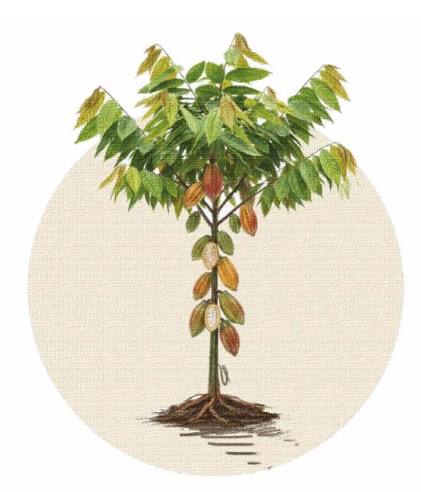

 This interpretation is based on the risk approach to due diligence. The operator must implement the analysis they deem appropriate based on their own criteria and in accordance with their supply chain, since if a production unit permanently or massively employs external salaried workers, it would no longer comply with the principle of predominance of family labour and might not be recognised as family farming.

| Areas of law Legal requirement | Legal basis Relevance   |
|--------------------------------|-------------------------|
| The implementation of          | Article                 |
| Code (CST)                     | is as follows:          |
| As a general rule,             | any employment          |
| concluded                      | verbally or in writing. |
| Exception:                     | when the law requires   |
| the contract to be in          | writing ,               |
| Fixed-term contract            | (Art. 46 CST): must     |
| Apprenticeship contract        | (Law 789                |
| Foreign workers:               | the immigration         |
| Therefore, if an               | oral contract           |
| an indefinite-term contract.   |                         |
| • Law 2101 of 2021:            | establishes             |
| Law 789 of 2002:               | allows                  |
| 160 and 161:                   | establish maximum       |
| Resolution 464 of 2017:        | identifies              |
| Law 2101 of 2021, Art. 2       | modifies Art.           |

| Areas of law Legal requirement | Legal basis Relevance             |
|--------------------------------|-----------------------------------|
| Substantive Labour Code        | : establishes                     |
| provide protective             |                                   |
| equipment and training         |                                   |
| 1.                             | Provide personal protective       |
| 2.                             | Train workers in prevention, risk |
| 3.                             | Maintain documentary records of   |
| 56, 57 and 348:                | establishes the                   |
| 0312 of 2019:                  | On the protection                 |
| Law 55 of 1993:                | Approves “Convention              |

| Areas of law Legal requirement       | Legal basis Relevance    |
|--------------------------------------|--------------------------|
| Law 1496 of 2011                     | : establishes equal      |
| Law 16 of 1972:                      | prohibits discrimination |
| Law 1482 of 2011:                    | punishes acts            |
| Law 1257 of 2008                     | on discrimination        |
| Law 2365 of 2024:                    | on sexual                |
| and 055 of 2024:                     | reinforce the            |
| 49): Establishes social security and |                          |
| Law 100 of 1993:                     | Creates the              |

| Areas of law Legal requirement | Legal basis Relevance |
|--------------------------------|-----------------------|
| Law 1562 of 2012:              | Strengthens           |
| Resolution 0312 of 2019:       | Defines               |
| of Agriculture):               | Recognises and        |

| Areas of law Legal requirement   | Legal basis Relevance |
|----------------------------------|-----------------------|
| • 1991 Constitution, Article 39: | recognises            |
| Articles 359 and 373:            | regulates trade       |
| Law 584 of 2000:                 | reinforces            |
| Law 2114 of 2021:                | Regulates maternity   |

| Areas of law Legal requirement | Legal basis Relevance  |
|--------------------------------|------------------------|
| structured around two laws.    | Law                    |
| 1010 of 2006                   | establishes a formal   |
| definition of                  | workplace harassment , |
| Law 2365 of 2024               | broadened the          |
| specifically incorporating     | sexual                 |
| Law 1010 of 2006:              | establishes            |
| Law 2365 of 2024:              | broadened              |

# Human rights\*

| Areas of law Legal requirement | Legal basis Relevance   |
|--------------------------------|-------------------------|
| Law 1098 of 2006:              | Code on Children and    |
| Law 12 of 1991:                | ratifies the Convention |
| Law 515 of 1999:               | incorporates ILO        |
| Law 1622 of 2013:              | recognises specific     |
| Resolution 3597 of 2013:       | set the minimum         |

| Areas of law Legal requirement | Legal basis Relevance |
|--------------------------------|-----------------------|
| Law 23 of 1967:                | approves ILO          |
| • Decree 1280 of 1997:         | enacts                |
| Law 985 of 2005:               | defines and punishes  |

N.B. This is the only category in the EUDR that potentially affects entities throughout the supply chain, and not just at the level of the cocoa production plot.

# Tax, anti-corruption, trade and customs regulations

| Areas of law Legal                           |                                 |
|----------------------------------------------|---------------------------------|
| requirement                                  | Legal basis Relevance           |
| In Colombia,                                 | the payment of unified property |
| tax is a tax obligation                      | for owners, possessors          |
| Art. 338, establishes the authority of local |                                 |
| Law 44 of 1990:                              | Establishes that this tax is    |
| usufructuary.                                | In its Article 24, amended by   |
| Article 184 of Law 223 of 1995:              | it established                  |
| Municipal Tax Statute:                       | Each municipality               |
| but the processes of                         | marketing, processing,          |
| packaging, storage, etc.                     | carried out in                  |
| • Law 14 of 1983                             | – Defines activities            |
| Decree 1333 of 1986                          | , agricultural production.      |
| Concepts of the Council of State             | –                               |

| Areas of law Legal requirement        | Legal basis Relevance             |
|---------------------------------------|-----------------------------------|
| to 365: regulates income tax payments |                                   |
| Natural persons:                      | Income exceeding                  |
| Legal entity                          | (formal agricultural enterprise): |
| Special cases:                        | Producers covered by the          |
| Simple Taxation Regime (RST)          | pay a single                      |
| may have additional                   | tax benefits.                     |

| Areas of law Legal requirement | Legal basis Relevance                    |
|--------------------------------|------------------------------------------|
| In Colombia,                   | parafiscal contributions                 |
| 32):                           | Defines the sectors that are subject     |
| 1.                             | Research, technology transfer, and       |
| 2.                             | Health protection programmes             |
| 3.                             | Marketing and competitiveness            |
| 4.                             | Consumption promotion programmes         |
| 5.                             | Economic, social and infrastructure      |
| 6.                             | Sustainability and environmental         |
| 7.                             | Export promotion and                     |
| 8.                             | Support for supply and demand regulation |
| 9.                             | Production adjustment and health control |
| Act 31 of 1965:                | In the case of the cocoa                 |

| Areas of law Legal                    |                         |
|---------------------------------------|-------------------------|
| requirement                           | Legal basis Relevance   |
| Article 420:                          | Defines the             |
| Article 421:                          | Establishes what is     |
| Law 1819 of 2016:                     | Introduced              |
| Regulation):                          | establishes the general |
| Law 67 of 1983                        | regulates development   |
| Decree 1000 of 1984                   | establishes in          |
| 2016 regulates Decree 390, developing |                         |
| of 22 March 2016                      | clarifies the           |

| Areas of law Legal          |                       |
|-----------------------------|-----------------------|
| requirement                 | Legal basis Relevance |
| Resolution 46 of 2019,      | annexes               |
| Decree 1165 of 2019:        | establishes           |
| Decree 920 of 2023:         | introduces            |
| Decree 659 of 2024:         | amended               |
| Decree 360 of 7 April 2021: | also                  |

Colombia carried out a series of actions aimed at supporting the achievement of national objectives for the sustainability of the cocoa sector and access to the EU market. As such, in 2024 Colombia began developing tools to facilitate due diligence by operators within the framework of the EUDR.

This tool is based on the work of national and international experts in law and due diligence and on technical consultation with all national and international actors in the coffee, cocoa and oil palm sectors concerned: ministries and government entities, exporters, traders and chocolate makers, cooperatives and producer associations, certification bodies, civil society organisations and EU importing countries.

In addition, bilateral consultations have been held with key actors, as well as socialisation and feedback meetings with an expanded group of stakeholders, including cooperatives and exporting companies from the productive sectors.

Based on various analyses of the applicable legal framework in the country, the EFI team, together with Swisscontact, consolidated and supplemented all relevant standards for the palm, coffee and cocoa sectors in a first step, organised comprehensively according to the areas of law defined by the EUDR. These were structured into subcategories under a legal taxonomy developed by EFI in collaboration with Preferred by Nature, in order to facilitate their analysis.

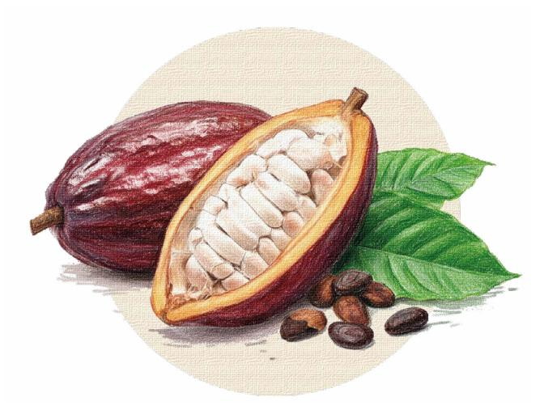

For each subcategory, which groups together standards relating to the same objective, a legal requirement was drafted in clear and understandable language for operators, which was validated through multistakeholder exercises. Likewise, the relevance of each requirement for the sectors involved was determined collectively and by consensus, thus closing the first step of the process (see Annex 2 of this tool).

The second step, focused on developing a risk preassessment, began with the work of sectoral expert groups. For each relevant legal requirement, a search for information and analysis of existing data was carried out to establish the level of implementation and, failing that, the associated level of risk. This level was agreed upon based on evidence, with the purpose of formulating recommendations for due diligence actions to guide operators. These recommendations, based on sectoral risk per requirement, serve as guidance for operators to conduct their own risk analysis in their supply chains.

# Annex 3. Consultations carried out

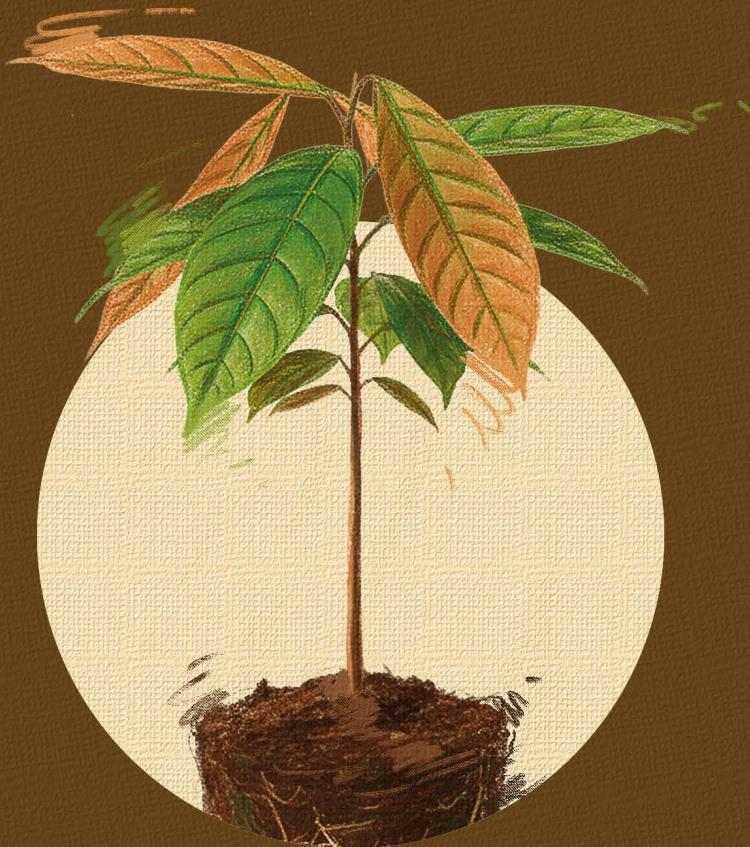