## Legality Due Diligence Tool for Cocoa

Disclaimer: This tool has been produced with the financial support of the

European Union. The views expressed herein cannot in any way be taken to reflect the official opinion of the European Union. This tool is intended to support the efforts of the cocoa sector and cocoa buyers in Honduras to comply with the requirements of the EUDR. Its content is an indicator, not legally binding, and does

not constitute legal advice. No warranty is given as to the accuracy,

completeness, or timeliness of the content. The authors of this tool accept no liability for any loss or damage that may arise from its use without appropriate

legal advice. The authors welcome any comments or suggestions for

improvement.

© European Forest Institute, 2025

© NIRAS A/S, 2025

## Contents

| 1. | Background ...................................................................................................................................... 3 |
|----|-----------------------------------------------------------------------------------------------------------------------------------------------------|
| 2. | Methodology for developing the legality due diligence tool .............................................. 6                                         |
| 3. | Due diligence recommendations on legality in the context of national cocoa                                                                          |

# **1. Background**

## Overview of the cocoa sector in Honduras

In Honduras, cocoa has established itself as a strategic crop for the rural economy and income generation in vulnerable areas. The country has more than 6,000 hectares under cultivation across nine departments, mainly in the northwest and the Atlantic region, where some 4,958 producers operate, 68% of whom are organised into 33 legally constituted associations. National production ranges between 1,700 and 2,300 metric tonnes annually, with exports reaching up to 2,000 tonnes, mainly destined for markets such as Switzerland, the United States, the Netherlands and Spain, as well as neighbouring countries for conventional cocoa. This sector generates revenues more than 200 million lempiras (6.4 million euros) and provides a direct livelihood for more than 4,500 families, with a high proportion of smallholders farming less than one hectare, reflecting a strong reliance on family farming.

Although cocoa does not carry the same economic weight as coffee or oil palm, its social and environmental significance is considerable, as it is grown in agroforests that contribute to ecosystem conservation and climate change mitigation. However, it faces challenges, such as the need to strengthen trade union institutions, provide production incentives, address vulnerability to diseases and climatic events, and manage the volatility of international prices. Despite this, there are opportunities to increase competitiveness through the digitalisation of traceability systems, the adoption of sustainable certifications, including organic and Fairtrade cocoa, and the strengthening of producer associations. These actions facilitate access to premium markets, strengthen governance, and position Honduran cocoa as a model of responsible production. They also support alignment with global sustainability commitments, as well as with the legality and deforestation-free criteria of the European Union Deforestation Regulation.

On 31 May 2023, the European Union (EU) adopted Regulation 2023/1115 on the placing on the EU market and the export from the EU of certain commodities and products associated with deforestation and forest degradation (EUDR). This regulation requires operators and traders placing products on the EU market that originate from supply chains associated with deforestation or forest degradation to demonstrate that these products are traceable, deforestationfree and legal. The scope of application covers seven commodities: coffee, cocoa, rubber, palm oil, soya, cattle and timber, as well as derived products such as chocolate and cocoa paste. The EUDR is scheduled to enter into application on 30 December 2026 for medium-sized and large operators and traders, and from 30 June 2027 for European micro and small enterprises established as such before 31 December 2020, in accordance with the amendment introduced by Regulation (EU) 2025/2650. Companies affected by the regulation (operators and traders) must carry out due diligence before exporting or trading their products,

in order to gather sufficient information to demonstrate that the product presents a zero or negligible risk of non-compliance.

Consequently, operators who trade in cocoa or derived products on the EU market must ensure that these have been produced in accordance with the relevant legislation of the country of production (Article 3), which is defined as that relating to the legal status of the production area. The EUDR adopts a flexible approach, listing various areas of law without specifying particular legal instruments, as these differ from country to country and may be subject to change. These areas are [for agricultural products]:

- a) Land-use rights
- b) Environmental protection
- c) Third parties' rights
- d) Labour rights
- e) Human rights protected by international law
- f) The principle of Free, Prior and Informed Consent, as set out in the United Nations Declaration on the Rights of Indigenous Peoples
- g) Tax regulations, anti-corruption measures, trade and customs regulations

In this context, understanding the legislative framework of the country of origin, identifying the relevant legal requirements for the product in question and determining the means to verify the implementation of these requirements poses a challenge not only for operators responsible for due diligence, but also for the competent EU authorities responsible for controls, as well as for the various stakeholders.

## Cooperation between Honduras and the European Union

In 2025, Honduras and the EU launched a collaboration aimed at supporting national objectives regarding the economic, environmental and social sustainability of cocoa, coffee and palm oil, and facilitating their access to the European Union market. This collaboration is being implemented through a series of technical partners, including the Inter-institutional Technical Committee for EUDR implementation, the European Forest Institute (EFI) and the NIRAS team, which are supporting Honduras in developing a framework to facilitate access to the European market for its agricultural products and promote transparency in supply chains.

In this context, the development of this tool by the Honduran government, with technical support from the EU (EFI and NIRAS), began in March 2025 with the aim of supporting due diligence for operators wishing to place Honduran products (coffee, cocoa and palm oil), or their derived products, on the EU market.

## Support for due diligence by operators in the cocoa sector in Honduras

EFI is leading this initiative with the support of the Technical Facility on Deforestation-free Value Chains, a programme funded by the EU and steered by the European Commission's Directorate General for International Partnerships (DG INTPA).

This work has benefited from the technical support of legal and due diligence experts contracted by NIRAS, as well as representatives of government institutions linked to the Inter-institutional Technical Committee (CTI) for support in implementation of the EUDR and the value chains affected by the Regulation.

## Objectives and general approach

The objectives of this tool are to promote a national and consensus-based view of the Honduran legal requirements for the implementation of cocoa production and trade that are relevant to the EUDR; and to provide recommendations for verifying compliance with these requirements and risk management, to support operators' due diligence.

The tool was developed with the aim of:

- supporting the harmonisation of operators' due diligence approaches;
- encouraging the simplification of procedures for supply chain actors who are likely to have to provide data to their customers;
- facilitating a better understanding of national contexts by the competent authorities of EU Member States responsible for controls;
- ensuring equitable access to information, reduce perceived risks and position Honduran origin with a competitive advantage.

#### It is important to note that the results presented are not legally binding, do not impose any obligations on the relevant parties, nor do they constitute legal advice.

It is the responsibility of operators trading in cocoa or its derived products on the EU market to identify the relevant legal requirements for Honduras, within the meaning of Article 2(40) of the EUDR, and to adapt their due diligence to the identified risks. This tool provides guidance that may assist operators and other stakeholders in the sector in this regard. It should be emphasised that this guidance is likely to evolve over time and be updated due to various factors: possible legal reforms in the country, developments in public or private certification schemes, lessons learnt from the practical implementation of national due diligence recommendations, additional guidance provided by the European Commission or the competent authorities, the integration of best practices and technological advances, etc.

# **2. Methodology for developing the legality due diligence tool**

The tool was developed in two steps:

- Step 1: Mapping of the relevant national legal requirements applicable to the production and trade of Honduran cocoa in the context of the EUDR, supplemented with relevant information from the stakeholders involved. The results of this step are set out in Annex 1 of the tool.
- Step 2: Development of due diligence recommendations for operators based on an analysis of the level of implementation of relevant legal requirements and existing means of verification. The results of this step are detailed below.

## Mapping of relevant national requirements

Based on various analyses of the applicable legal framework in the country, the EFI/NIRAS team, together with a legal expert, consolidated and supplemented, in a first step, all relevant standards for the palm, coffee and cocoa sectors, organised comprehensively according to the areas of law defined by the EUDR. These were structured into subcategories under a legal taxonomy developed by EFI in collaboration with Preferred by Nature to facilitate their analysis (see https://legalitynavigator.efi.int/).

For each subcategory, which groups together rights or obligations relating to the same objective, a legal requirement was drafted in clear and understandable language for operators, which was validated through multi-stakeholder exercises (see Annex 3). Furthermore, the relevance of each requirement for the sectors involved was determined collectively and by consensus, thus concluding the first step of the process.

## Development of due diligence recommendations

The second step, focused on developing a preliminary risk assessment, began with the work of sectoral expert groups. For each relevant legal requirement, a search for information and analysis of existing data was conducted to establish the status of implementation and the associated level of risk. This level was agreed upon based on evidence, with the aim of formulating due diligence recommendations to guide operators. These recommendations, based on sectoral risk per requirement, serve as guidance for operators to conduct their own risk analysis within their supply chains.

The tool is based on technical consultations with various national and international stakeholders in the coffee, cocoa and palm oil sectors, including

Honduran government bodies, producers, cooperatives, exporters and traders, certifiers and civil society (see Annex 3).

## Scope of the recommendations

## Who are these recommendations aimed at?

These recommendations are aimed at the various stakeholders involved in verifying the compliance of cocoa and derived products with the EUDR. They may be useful for:

- Operators (applicable to the EUDR): any natural or legal person who, in the course of a commercial activity, places cocoa or derived products on the EU market or exports them.
- Traders (applicable to the EUDR): any natural or legal person in the supply chain, other than the operator, who trades the products in question on the EU market.
- EU competent authorities: authorities designated by Member States to ensure compliance with the obligations of the EUDR.
- Supply chain actors in Honduras: producers, cooperatives, traders, exporters and other stakeholders involved in the production and trade of cocoa, from whom operators may request information, data and documents necessary to conduct their due diligence.
- Honduran public bodies: government departments and agencies responsible for regulating the cocoa sector (production and trade), land tenure, the environment and sustainable development.
- Civil society: non-governmental organisations, associations and other stakeholders that play a role in monitoring, supporting and promoting compliance of cocoa and its by-products with Honduran legislation and international commitments.

## What is the purpose of these recommendations?

These recommendations can be used in diverse ways and at various stages, depending on the stakeholders involved.

Operators and traders can use these recommendations to establish and document their due diligence system, ensuring that the cocoa they trade meets the legality criteria of the EUDR. They can use them to identify the documents and information that need to be collected or other actions that need to be carried out with their suppliers in Honduras, and to assess the risks associated with their supply chain.

The competent authorities in the EU can use these recommendations as a standard to assess the compliance of products traded with the EUDR. They can also use them to harmonise their controls and interpret documents and data from Honduras.

Supply chain actors in Honduras can use these recommendations to understand the implications of the EUDR requirements for Honduran cocoa and the expectations of European operators and traders subject to it. These recommendations can be used to structure and document the information they may provide to these operators and traders. They can also help them anticipate the risks of non-compliance and adapt their agricultural and commercial practices.

Honduran public bodies can use these recommendations to strengthen controls on producers' and exporters' implementation of national legislation, to ensure that derived products traded comply with current Honduran laws. They can also use them to support producers in achieving implementation, by providing them with better access to information on current regulations and buyers' requirements. They can draw on these recommendations to make data more transparent and accessible, including through facilitation of access to administrative documents, to help operators demonstrate the legality of cocoa and its derived products.

Civil society can use these recommendations to monitor the implementation of Honduran legal requirements by companies and authorities. They can be used to conduct analyses and produce reports on the risks of non-compliance of cocoa by-products. They can also use them to raise awareness among producers, companies and consumers about the legality of Honduran cocoa.

## How to use these due diligence recommendations?

The recommendations set out in this tool aim to address all relevant legal requirements identified by stakeholders during the first phase of the tool's development. In particular, they cover all the legal areas listed in Article 2.40 of the EUDR, in line with the precautionary approach adopted in the tool (see Annex 1).

This flexible approach allows users of the recommendations to tailor their due diligence actions according to their interpretation of the scope of the EUDR.

## Light or standard due diligence

This tool adopts a pragmatic approach that seeks to identify due diligence measures proportionate to the risks in order to limit the burden on those involved in the sector. The level of implementation of each requirement considered relevant to the production and trade of cocoa in Honduras has been assessed. The level of implementation adopted by the tool is based on: relevant literature, sector knowledge from experts, field surveys, and bilateral and multistakeholder consultations organised as part of the tool's development.

Where the level of implementation assessed for a requirement is high, the risk of non-compliance is considered negligible. Consequently, light due diligence measures are recommended. Conversely, where the level of implementation of a requirement is low or unknown, the risk of non-compliance is considered nonnegligible. Consequently, standard due diligence is recommended.

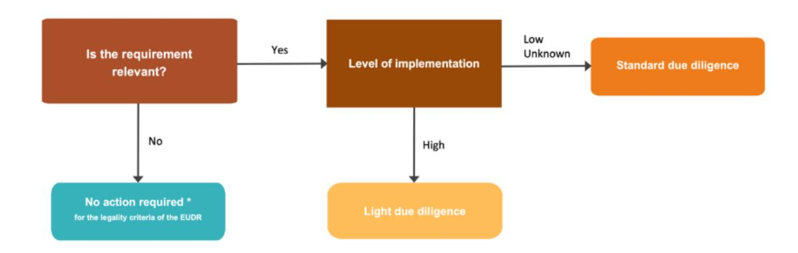

#### Link between implementation level and due diligence recommendations

However, this analysis is indicative and has been conducted solely at country level. It is the responsibility of operators to conduct a risk analysis of noncompliance for their products for each shipment. Within this framework, these recommendations offer a range of due diligence options. These actions are neither prescriptive nor presented in any specific order. It is up to operators to choose between these options, depending on the context, their knowledge of their supply chains and the risks identified for cocoa and its derived products.

## The role of certification in due diligence

Cocoa certification schemes are voluntary mechanisms, whether public or private, that seek to ensure that cocoa production and trade comply with certain environmental, social and economic standards. They may be established by governments, international organisations, NGOs or private companies.

## The EUDR and certification

Third-party certification and verification schemes can play a significant role in promoting sustainable agricultural and forestry practices and responsible sourcing. There are several types of certification, which may be implemented at the national level on a mandatory basis or be private and voluntary (e.g. Fairtrade or Rainforest Alliance).

Under the EUDR, for the purposes of risk assessment, operators may consider information from certification schemes or other third-party verified systems. However, the European Commission's guidance of 2 October 2024 indicates that self-declaration schemes not based on third-party certification procedures are, by definition, less robust due to a lack of independence and impartiality.

The European Commission also specifies that certification schemes must not replace the operator's responsibility for due diligence. In other words, private certifications can be a tool to help European operators carry out due diligence to meet the criteria on legality, deforestation and traceability.

Operators must be able to justify why and how certification schemes meet the EUDR's requirements. To do so, three elements must be taken into account:

- The certification scheme's coverage of the relevant legal requirements for the EUDR.
- The robustness of the certification system: in particular, the scope of the certification (to which actors in the value chain does it apply? which products?), governance (management of internal procedures and updates, for example), the accreditation processes for control bodies; the qualifications of auditors and the frequency of audits; the management of non-compliance, impartiality and the management of conflicts of interest, etc. This information must be periodically reviewed by the operator, particularly in relation to the requirements of the EUDR.
- Traceability and absence of mixing with non-certified products.

It should be noted that this tool did not conduct an exhaustive comparative analysis between the coverage of the relevant legal requirements and the certification systems used in the Honduran cocoa sector.

# **3. Due diligence recommendations on legality in the context of national cocoa production**

The tables below, presented by area of law, show the due diligence recommendations agreed upon by the stakeholders consulted regarding the legality of cocoa produced in Honduras.

## Land-use rights

In Honduras, agricultural land may be privately owned, state-owned or communal, with full title deeds granted by the Property Institute (IP) or the National Agrarian Institute (INA). Furthermore, the law recognises regular or irregular possession; production under informal possession is common in the cocoa sector. However, this situation does not automatically constitute illegality, although it may give rise to risks of legal uncertainty. Producers may also farm without owning the land through legal arrangements of mere tenure, such as usufruct, right of use or lease, although these often lack formal documentation and depend on the landowner's tolerance and/or their verbal agreement in good faith.

The cocoa sector in Honduras is dominated by smallholders, most of whom have less than three hectares and, in many cases, less than one. Corporate plantations are minimal and do not play a significant role in national production. Within this structure, based on family farming and agroforests, a lack of registered titles and incomplete documentation are common.

The Honduran State, through the Register of Abandoned Property (RBA), guarantees forcibly displaced persons the right to legal protection, the restitution of land, housing and property, and access to justice, preventing the dispossession or misuse of abandoned property.

As regards land-use planning, only 65 of the 298 municipalities nationwide have a valid Municipal Land-Use Plan (PMOT) drawn up by the municipalities in coordination with the State Secretariat for Natural Resources and the Environment (SERNA) and supervised by the National Institute for Forest Conservation and Development, Protected Areas and Wildlife (ICF) in forested areas. These plans guide land use, identify productive areas and warn against overexploitation, without specifying permitted crops, and only become binding if approved at a public town hall meeting.

| Legal requirement                                                                                                                                                                                                                                                                                                                                                                                                               | Context                                                                                                                                                                                                                                                                                                                                                                                                                                                                                                                                                                                                                                                                                                                                                                                                                                                                                                                                                                                                                                                                                                                                                                                                                                                                   | Level of implementation and due diligence            | Due diligence recommendations                                                                                                                                                                                       |
|---------------------------------------------------------------------------------------------------------------------------------------------------------------------------------------------------------------------------------------------------------------------------------------------------------------------------------------------------------------------------------------------------------------------------------|---------------------------------------------------------------------------------------------------------------------------------------------------------------------------------------------------------------------------------------------------------------------------------------------------------------------------------------------------------------------------------------------------------------------------------------------------------------------------------------------------------------------------------------------------------------------------------------------------------------------------------------------------------------------------------------------------------------------------------------------------------------------------------------------------------------------------------------------------------------------------------------------------------------------------------------------------------------------------------------------------------------------------------------------------------------------------------------------------------------------------------------------------------------------------------------------------------------------------------------------------------------------------|------------------------------------------------------|---------------------------------------------------------------------------------------------------------------------------------------------------------------------------------------------------------------------|
| <ol style="list-style-type: none;"> <li>1. Land-use rights</li> </ol>                                                                                                                                                                                                                                                                                                                                                           |                                                                                                                                                                                                                                                                                                                                                                                                                                                                                                                                                                                                                                                                                                                                                                                                                                                                                                                                                                                                                                                                                                                                                                                                                                                                           |                                                      |                                                                                                                                                                                                                     |
| 
<i>1.1 Land-use rights are guaranteed</i>
                                                                                                                                                                                                                                                                                                                                                                                |                                                                                                                                                                                                                                                                                                                                                                                                                                                                                                                                                                                                                                                                                                                                                                                                                                                                                                                                                                                                                                                                                                                                                                                                                                                                           |                                                      |                                                                                                                                                                                                                     |
| 
<b>1.1.1. The producer has land ownership (through a registered deed or title deed granting full ownership issued by the competent authority)</b>
 
<b>OR</b>
 
<b>The producer is the regular or irregular possessor of the land.</b>
 
<b>OR</b> The producer exercises use rights on the land without the intention of ownership, through mere tenure which includes usufruct, lease and loan for use.
 | 
In Honduras, land rights for crops range from private ownership to collective rights and community use, regulated by a legal framework that seeks to balance economic, social and environmental interests.
 
Agricultural land may be private, state-owned or communal, each governed by different laws regarding its use and titling. The legal framework covers concepts such as private ownership, which grants full rights through a registered title; possession, which is physical control over a plot and may be regular (documented and peaceful) or irregular (without legal title), and may lead to acquisitive prescription; and use rights, which allow a plot to be used for specific purposes without being the owner.
 
In the cocoa sector, there are small-scale farmers who do not hold formal land titles but cultivate land under irregular or informal tenure arrangements. However, farming without a formal title is not illegal. There are few land tenure disputes in production areas, and when they do arise, they are effectively resolved at the local level.
 
Producers can farm land without owning it through legal arrangements such as mere tenure, usufruct or lease. These arrangements allow them to use land
 | 
<b>High</b>
 
<b>Light due diligence</b>
 | 
<b>Consultations with stakeholders</b>
 <ul> <li>Confirm that there are no complaints or disputes regarding the production lands in the cocoa chain (national or international press, NGOs, among o</li></ul> |

| Legal requirement                                                                                                                                              | Context                                                                                                                                                                                                                                                                                                                                                                                                                                                                                                                                                                                                                                                                                                                                                                                                                                                                                                                                                                                                                               | Level of implementation and due diligence            | Due diligence recommendations                                                                                                                                                                                                           |
|----------------------------------------------------------------------------------------------------------------------------------------------------------------|---------------------------------------------------------------------------------------------------------------------------------------------------------------------------------------------------------------------------------------------------------------------------------------------------------------------------------------------------------------------------------------------------------------------------------------------------------------------------------------------------------------------------------------------------------------------------------------------------------------------------------------------------------------------------------------------------------------------------------------------------------------------------------------------------------------------------------------------------------------------------------------------------------------------------------------------------------------------------------------------------------------------------------------|------------------------------------------------------|-----------------------------------------------------------------------------------------------------------------------------------------------------------------------------------------------------------------------------------------|
|                                                                                                                                                                | 
belonging to others under certain conditions, without having full ownership. Formal documentation is often lacking; thus, many small-scale cocoa farmers work under informal or oral contracts, that is, without a written contract.
 
To strengthen land tenure and promote the sector's economic development, Decree 37-2016 was issued in 2016, allowing holders of plots cultivated for cocoa farming to apply to the National Agrarian Institute (INA) for full ownership, through accreditation of their status as cocoa farmers.
                                                                                                                                                                                                                                                                                                                                                                                                                                                                                   |                                                      | <ul> <li>• Documents relating to the resolution of land disputes (where relevant).</li> <li>• Private deed of sale.</li> <li>• Permits granted by local authorities supporting the existence and use of the plot.</li> <li>•</li> </ul> |
| 
<b>1.1.2. Land used for agricultural production must not have been subject to forced abandonment or the violent eviction of its previous occupants.</b>
 | 
In 2017, UNHCR conducted a general analysis of land, housing and forced displacement in Honduras. The report notes that displacement related to land tenure has not been fully documented or conceptualised by the Honduran state. Although legal instruments to recognise and protect these situations were introduced from 2013 onwards, gaps persist in the mechanisms for registering and protecting those affected.
 
In Honduras, there are no specific studies on forced displacement from land in the cocoa farming sector at the national level. Existing studies report some specific threats linked to illegal land purchases and land grabbing, specifically in the Wampusirpi region. WCS, <a href="https://programs.wcs.org/Portals/234/Newsletter/Boletin7EUDeSIRA/Perfil%20del%20mercado%20y%20la%20cadena%20del%20cacao%20en%20Wampusirpi_5GB.pdf">https://programs.wcs.org/Portals/234/Newsletter/Boletin7EUDeSIRA/Perfil%20del%20mercado%20y%20la%20cadena%20del%20cacao%20en%20Wampusirpi_5GB.pdf</a>
 | 
<b>High</b>
 
<b>Light due diligence</b>
 |                                                                                                                                                                                                                                         |

| Legal requirement                                                                                                                                                                                   | Context                                                                                                                                                                                                                                                                                                                                                                                                                                                  | Level of implementation and due diligence           | Due diligence recommendations                                                                                                                                                                                                                                                                                                                                                                                                                                                                                                                                                                                                                                                                                                                                                                                                                                                                                                                                                                                                                                                                                                                                                                                                                                  |
|-----------------------------------------------------------------------------------------------------------------------------------------------------------------------------------------------------|----------------------------------------------------------------------------------------------------------------------------------------------------------------------------------------------------------------------------------------------------------------------------------------------------------------------------------------------------------------------------------------------------------------------------------------------------------|-----------------------------------------------------|----------------------------------------------------------------------------------------------------------------------------------------------------------------------------------------------------------------------------------------------------------------------------------------------------------------------------------------------------------------------------------------------------------------------------------------------------------------------------------------------------------------------------------------------------------------------------------------------------------------------------------------------------------------------------------------------------------------------------------------------------------------------------------------------------------------------------------------------------------------------------------------------------------------------------------------------------------------------------------------------------------------------------------------------------------------------------------------------------------------------------------------------------------------------------------------------------------------------------------------------------------------|
| <i>1.2 Legal requirements for land use are met</i>                                                                                                                                                  |                                                                                                                                                                                                                                                                                                                                                                                                                                                          |                                                     |                                                                                                                                                                                                                                                                                                                                                                                                                                                                                                                                                                                                                                                                                                                                                                                                                                                                                                                                                                                                                                                                                                                                                                                                                                                                |
| 
<b>1.2.1. Agricultural activity is permitted in accordance with current regulations and land use. It does not contravene municipal urban, environmental or spatial planning regulations.</b>
 | 
In Honduras, only 65 of the 298 municipalities have a valid Municipal Spatial Planning Plan (PMOT) in place, which regulates land use and its compatibility with agricultural production and environmental protection. These plans identify productive zones and warn against overexploitation, but do not specify permitted crops. They are advisory in nature, unless approved at a public town hall meeting, which makes them legally binding.
 | 
<b>Low</b>
 
<b>Light due diligence</b>
 | 
<b>Geospatial analysis</b>
 <ul> <li>Compile the polygons of areas of production to identify which municipalities they belong to.</li> </ul> 
<b>Consultations with stakeholders</b>
 <ul> <li>Check with the local authorities responsible for the areas of production to find out whether they have a valid Local Land Use Plan (PMOT).</li> <li>If a PMOT exists, analyse it to identify the areas where agricultural activity is permitted.</li> </ul> 
<b>Second geospatial analysis</b>
 <ul> <li>If the municipality has a PMOT, overlay the polygons of the areas of production with the map of zones where agriculture is permitted in the PMOT to verify implementation.</li> <li>The polygons of the areas of production must be verified against the ICF's land use and forest cover map.</li> </ul> 
<b>Implementation of procedures and processes</b>
 <ul> <li>Promote the adoption of policies or procedures prohibiting agriculture in core zones of protected areas or areas of cultural interest.</li> </ul> 
<b>Field verifications</b>
 <ul> <li>Conduct field visits to confirm the correct implementation of the provisions of the Management Plan for protected areas in relation to cocoa plots.</li> </ul> |

## 1.1.1 Land tenure is clearly defined and respected

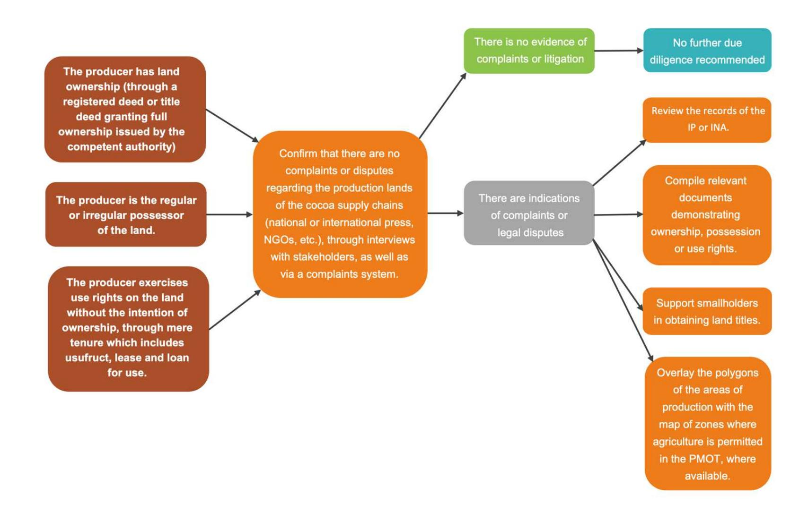

#### 1.1.2 No evidence of abandonment or forced eviction from the plot

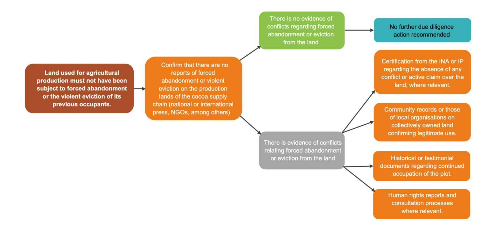

#### 1.2.1 Farming is permitted on the plot

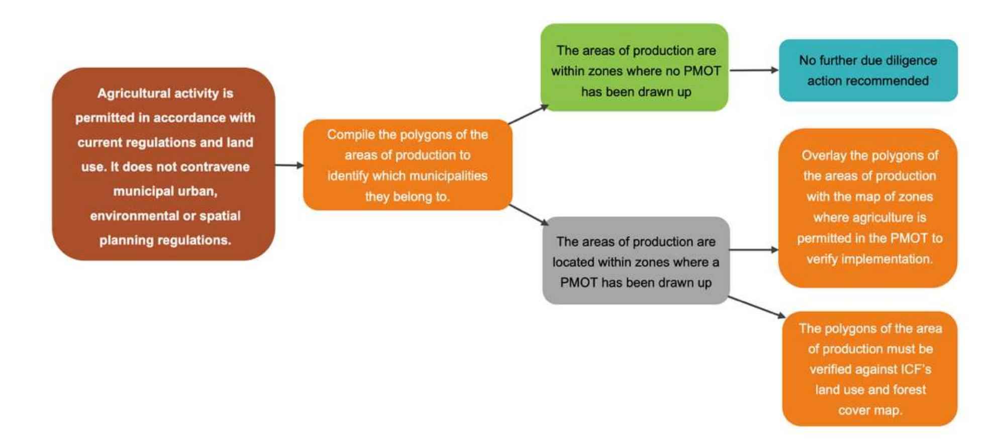

## Environmental protection

The legal framework governing cocoa production in Honduras is primarily based on the country's forestry, environmental and agricultural legislation, with a strong emphasis on the protection of natural resources, forest ecosystems and areas of special environmental value. The Forestry, Protected Areas and Wildlife Act, together with environmental legislation and sector-specific regulations, set out specific conditions for land use, water resource management, the handling of agricultural inputs and the protection of biodiversity. These provisions apply to agroforests, including cocoa farming, which in Honduras is predominantly conducted under shade-grown systems.

In territorial terms, a considerable proportion of cocoa production is in areas subject to some degree of environmental regulation, such as buffer zones of protected areas or agroforests of high ecological value. In these cases, agricultural activity is subject to specific authorisations by the Forest Conservation Institute (ICF) and implementation of approved management plans. Although there are no consolidated official figures on the total area of cocoa located within protected areas, various studies and local experiences—such as in Pico Pijol, Cusuco or Celaque—demonstrate the coexistence of cocoa production with conservation regimes.

Furthermore, regarding the use of inputs, the protection of water sources and biodiversity, the information gathered points to a high level of compliance. In the case of inputs, although there is an authorisation and control regime overseen by SAG/SENASA, cocoa exported to Europe complies with organic production standards, which tends to reduce the likelihood of unauthorised products or prohibited practices. Similarly, although there are control challenges in rural areas, production under agroforestry systems and evidence of benefits for biodiversity support the view that there is lower exposure to non-compliance in conservation matters.

| Legal requirement                                                                                                                                                                                                                                                                                              | Context                                                                                                                                                                                                                                                                                                                                                                                                                                                                                                                                                                                                                                                                                                                      | Level of implementation and due diligence              | Due diligence recommendations                                                                                                                                                                                                                                                                                                                                                                                                                                                                                                                                                                                                                                                                                                                                                                                                                                               |
|----------------------------------------------------------------------------------------------------------------------------------------------------------------------------------------------------------------------------------------------------------------------------------------------------------------|------------------------------------------------------------------------------------------------------------------------------------------------------------------------------------------------------------------------------------------------------------------------------------------------------------------------------------------------------------------------------------------------------------------------------------------------------------------------------------------------------------------------------------------------------------------------------------------------------------------------------------------------------------------------------------------------------------------------------|--------------------------------------------------------|-----------------------------------------------------------------------------------------------------------------------------------------------------------------------------------------------------------------------------------------------------------------------------------------------------------------------------------------------------------------------------------------------------------------------------------------------------------------------------------------------------------------------------------------------------------------------------------------------------------------------------------------------------------------------------------------------------------------------------------------------------------------------------------------------------------------------------------------------------------------------------|
| <b>2. Environmental protection</b>                                                                                                                                                                                                                                                                             |                                                                                                                                                                                                                                                                                                                                                                                                                                                                                                                                                                                                                                                                                                                              |                                                        |                                                                                                                                                                                                                                                                                                                                                                                                                                                                                                                                                                                                                                                                                                                                                                                                                                                                             |
| <i>2.1 Environmental requirements for agricultural activities</i>                                                                                                                                                                                                                                              |                                                                                                                                                                                                                                                                                                                                                                                                                                                                                                                                                                                                                                                                                                                              |                                                        |                                                                                                                                                                                                                                                                                                                                                                                                                                                                                                                                                                                                                                                                                                                                                                                                                                                                             |
| 
<b>2.1.1 Agricultural activity is not carried out in areas subject to special protection regimes, such as protected areas, designated micro-basins, national forests and national parks, except where it is located in buffer zones of protected areas and complies with the area's management plan</b>
 | 
In Honduras, national forests, protected areas and national parks are subject to special regimes. Agricultural activity, including cocoa farming, may only take place in buffer zones and with the express authorisation of the Forest Conservation Institute (ICF), through approved management plans or operational plans. In core areas, any new settlements are prohibited, and existing ones must be relocated.
 
There is no official figure or consolidated study indicating precisely how many hectares of cocoa in Honduras are located within protected areas, but there is evidence and partial estimates documented in cases such as Pico Pijol, Cusuco and Celaque, although without exact figures.
 | 
<b>Low</b>
 
<b>Standard due diligence</b>
 | 
<b>Geospatial analysis</b>
 <ul> <li>Overlay the farm polygons with the layers published on the ICF's GEOPORTAL and GEOFORESTAL websites to identify whether areas of production are within zones subject to special regimes.</li> </ul> 
If the areas of production are within zones subject to special regimes, a range of possible due diligence actions is recommended:
 
<b>Document collection and verification</b>
 <ul> <li>Obtain the management plans for protected areas where implementation is required and verify that the estates are in buffer zones and not in core zones.</li> </ul> 
<b>Implementation of procedures and processes</b>
 <ul> <li>Where relevant, support producers in obtaining formal permits for their agricultural activities.</li> <li>Encourage the adoption and implementation of policies or proce</li></ul> |

| Legal requirement                                                                                                                                                                                                                                   | Context                                                                                                                                                                                                                                                                                                                                                                                                                                                                                                                                                                                                                                                                                                                               | Level of implementation and due diligence            | Due diligence recommendations                                                                                                                                                                                                                                                                                                                                                                                                                                                                                                                                                                                                                                                                                                                                                                                                                                                  |
|-----------------------------------------------------------------------------------------------------------------------------------------------------------------------------------------------------------------------------------------------------|---------------------------------------------------------------------------------------------------------------------------------------------------------------------------------------------------------------------------------------------------------------------------------------------------------------------------------------------------------------------------------------------------------------------------------------------------------------------------------------------------------------------------------------------------------------------------------------------------------------------------------------------------------------------------------------------------------------------------------------|------------------------------------------------------|--------------------------------------------------------------------------------------------------------------------------------------------------------------------------------------------------------------------------------------------------------------------------------------------------------------------------------------------------------------------------------------------------------------------------------------------------------------------------------------------------------------------------------------------------------------------------------------------------------------------------------------------------------------------------------------------------------------------------------------------------------------------------------------------------------------------------------------------------------------------------------|
| <b>2.1.2. The producer uses only state-regulated inputs for agricultural production.</b>                                                                                                                                                            | 
In Honduras, agrochemicals or inputs are to be authorised by the Ministry of Agriculture and Livestock (SAG). However, producers do not need specific authorisation for their use, provided they adhere to the dosage indicated on the label. SENASA is responsible for the regulatory control of these products and for certifying the phytosanitary quality of exports.
 
Although the use of agrochemical products does not require prior permission, if producers use unauthorised products, in incorrect doses or without proper labelling, they would be engaging in illegal practices.
 
In practice, due to market demands, 100% of the cocoa exported to Europe complies with organic production standards.
 | 
<b>High</b>
 
<b>Light due diligence</b>
 | 
<b>Consultations with stakeholders</b>
 <ul> <li>Review the list of inputs authorised by SENASA.</li> </ul> 
<b>Implementation of procedures and processes</b>
 <ul> <li>Management plan for inputs or crop protection products, including biological products where relevant.</li> <li>Plan or procedure for the management of empty containers</li> <li>Occupational health and contingency plan or procedure</li> <li>Training plan (including logbooks or attendance lists)</li> <li>Solid waste management plan</li> <li>Plan for the management and use of personal protective equipment</li> </ul> 
<b>Document collection and verification</b>
 <ul> <li>Logbook or daily activity record for the farm detailing the implementation of biological products on each production plot or at association level.</li> <li>External audit reports</li> </ul> |
| <b>2.1.3. Agricultural activity is carried out in compliance with the minimum authorised distances from watercourses, ensuring the protection of riverbanks, wetlands and water recharge areas in accordance with current national regulations.</b> | 
The protection of water resources is a priority for the Honduran state. Specific management pl
                                                                                                                                                                                                                                                                                                                                                                                                                                                                                                                                                                                                                                 |                                                      |                                                                                                                                                                                                                                                                                                                                                                                                                                                                                                                                                                                                                                                                                                                                                                                                                                                                                |

| Legal requirement                                                                                                                                                                                          | Context                                                                                                                                                                                                                                                                                                                                                                                                                                                                                                                                                                                                                                                                                                                                                                              | Level of implementation and due diligence            | Due diligence recommendations                                                                                                                                                                                                                                     |
|------------------------------------------------------------------------------------------------------------------------------------------------------------------------------------------------------------|--------------------------------------------------------------------------------------------------------------------------------------------------------------------------------------------------------------------------------------------------------------------------------------------------------------------------------------------------------------------------------------------------------------------------------------------------------------------------------------------------------------------------------------------------------------------------------------------------------------------------------------------------------------------------------------------------------------------------------------------------------------------------------------|------------------------------------------------------|-------------------------------------------------------------------------------------------------------------------------------------------------------------------------------------------------------------------------------------------------------------------|
|                                                                                                                                                                                                            | regulations exist, implementation and enforcement are limited in agricultural areas.                                                                                                                                                                                                                                                                                                                                                                                                                                                                                                                                                                                                                                                                                                 |                                                      |                                                                                                                                                                                                                                                                   |
| 
<b>2.1.5. Solid agricultural production waste must be treated using appropriate techniques to prevent contamination of soils, rivers, lakes, lagoons and, in general, marine and inland waters.</b>
 | 
In Honduras, cocoa producers using inputs must wash containers three times after use and return them to temporary or authorised collection centres.
 
It is prohibited to discard, burn, bury, reuse or repurpose these containers for other uses. Any disposal outside the authorised channel constitutes a serious offence. Solid and organic waste generated in agriculture must be treated technically to prevent the contamination of soil and water bodies. There are official programmes such as Campo Limpio (SENASA) and regulatory frameworks managed by SERNA (DECA), which monitor implementation.
 
In implementation, organic products prepared by producers using traditional methods are implemented, usually with the advice of field technicians.
 | 
<b>High</b>
 
<b>Light due diligence</b>
 | 
<b>Document collection and verification</b>
 <ul> <li>• Evidence of implementation of a solid and organic waste management plan.</li> <li>• Procedure manual for the management of empty containers.</li> <li>• Farm solid waste collection log.</li> </ul> |

| <b>2.1.6. Producers implement appropriate techniques to maintain soil fertility and prevent degradation.</b> | 
Honduran regulations stipulate that land use must be rational and in accordance with the land's natural vocation, maintaining a balance between agricultural production and the conservation of ecosystems. The development of land-use plans falls to the municipalities, in coordination with SERNA, while the ICF regulates and supervises agricultural activity in forest areas.
 
In many regions of Honduras, cocoa is grown under shade in agroforests, which is compatible with soil and biodiversity conservation.
 | 
<b>High</b>
 
<b>Light due diligence</b>
 | 
<b>Geospatial analysis</b>
 
Overlay the polygons of the cocoa farms with the maps on the ICF Geoportal
 
<u><a href="https://infoagro.sag.gob.hn/agromapas/">Geoportal</a></u> and/or Agromapas (<u><a href="https://infoagro.sag.gob.hn/agromapas/">https://infoagro.sag.gob.hn/agromapas/</a></u>), which provide information on agroforests.
 
Possible additional due diligence measures, recommended particularly where cocoa farming is not carried out under agroforestry systems:
 
<b>At the sourcing area:</b>
 
<b>Data collection and verification</b>
 <ul> <li>Consult any reports from NGOs, cooperatives and the authorities regarding potential cases of soil degradation in the sourcing area.</li> </ul> 
<b>Consultations with stakeholders</b>
 <ul> <li>Confirm the absence of cases of soil degradation in the sourcing area through interviews with cooperatives, NGOs, local authorities and other local stakeholders.</li> </ul> 
<b>With producers and intermediaries in the supply chain:</b>
 
<b>Implementation of procedures and processes:</b>
 <ul> <li>Support producers in adopting best practices for the use of land at risk of erosion, soil conservation and biodiversity loss, for example through training, campaigns, etc.</li> </ul> 
<b>Collection of relevant data</b>
 <ul> <li>Obtain, where possible, details of any training received by producers (training organisations, date, participants, content, etc.) on good agricultural practices.</li> </ul> 
<b>Document collection and verification</b>
 <ul> <li>Land management and use plan.</li> <li>Good agricultural pr</li></ul> |
|--------------------------------------------------------------------------------------------------------------|-----------------------------------------------------------------------------------------------------------------------------------------------------------------------------------------------------------------------------------------------------------------------------------------------------------------------------------------------------------------------------------------------------------------------------------------------------------------------------------------------------------------------------------------|------------------------------------------------------|--------------------------------------------------------------------------------------------------------------------------------------------------------------------------------------------------------------------------------------------------------------------------------------------------------------------------------------------------------------------------------------------------------------------------------------------------------------------------------------------------------------------------------------------------------------------------------------------------------------------------------------------------------------------------------------------------------------------------------------------------------------------------------------------------------------------------------------------------------------------------------------------------------------------------------------------------------------------------------------------------------------------------------------------------------------------------------------------------------------------------------------------------------------------------------------------------------------------------------------------------------------------------------------------------------------------------------------------------------------------------------------------------------------------------------------------------------------------------------------------------------------------------------------------------------------------------------------------------------------------------------------------------------------------------------------------------|
|--------------------------------------------------------------------------------------------------------------|-----------------------------------------------------------------------------------------------------------------------------------------------------------------------------------------------------------------------------------------------------------------------------------------------------------------------------------------------------------------------------------------------------------------------------------------------------------------------------------------------------------------------------------------|------------------------------------------------------|--------------------------------------------------------------------------------------------------------------------------------------------------------------------------------------------------------------------------------------------------------------------------------------------------------------------------------------------------------------------------------------------------------------------------------------------------------------------------------------------------------------------------------------------------------------------------------------------------------------------------------------------------------------------------------------------------------------------------------------------------------------------------------------------------------------------------------------------------------------------------------------------------------------------------------------------------------------------------------------------------------------------------------------------------------------------------------------------------------------------------------------------------------------------------------------------------------------------------------------------------------------------------------------------------------------------------------------------------------------------------------------------------------------------------------------------------------------------------------------------------------------------------------------------------------------------------------------------------------------------------------------------------------------------------------------------------|

|                                                                                                                                                                                                                                                                                                                            | Level of                                                                                                                                                                                                                                                                                                                                                                                                                                                                                                                                                                                                                                                                                                                                                                                                                                                                                                                                                                                                                                                                                                                                                                                                                                                                                                                                                                                             |
|----------------------------------------------------------------------------------------------------------------------------------------------------------------------------------------------------------------------------------------------------------------------------------------------------------------------------|------------------------------------------------------------------------------------------------------------------------------------------------------------------------------------------------------------------------------------------------------------------------------------------------------------------------------------------------------------------------------------------------------------------------------------------------------------------------------------------------------------------------------------------------------------------------------------------------------------------------------------------------------------------------------------------------------------------------------------------------------------------------------------------------------------------------------------------------------------------------------------------------------------------------------------------------------------------------------------------------------------------------------------------------------------------------------------------------------------------------------------------------------------------------------------------------------------------------------------------------------------------------------------------------------------------------------------------------------------------------------------------------------|
| Legal requirement 2.2 Protection of forest ecosystems and wild fauna and flora 2.2.1. Commercial forestry activities carried out within the agricultural plot (as part of an agroforestry system) have a harvesting certificate, management plan, or conservation or restoration plan approved by the competent authority. | Context implementation Due diligence recommendations and due diligence Producers engaged in commercial forestry or High agroforests comply with the provisions of the in a forest area: Light due diligence Forestry, Protected Areas and Wildlife Act. Geospatial analysis Some local indigenous or community groups have Overlay the farm polygons with: satellite imagery or georeferenced organised themselves for the sustainable management of private community forests or cover data. Farm polygons can also be overlaid with Agromapas national forests through community forest management contracts, derived from the National maps detailing agroforestry production. Community Forestry Strategy. According to the CHOCOLATE-4-ALL study, in steps are recommended:                                                                                                                                                                                                                                                                                                                                                                                                                                                                                                                                                                                                                     |
| Honduras there are approximately                                                                                                                                                                                                                                                                                           | 4,400–4,500 hectares of cocoa managed as traditional Document collection and verification                                                                                                                                                                                                                                                                                                                                                                                                                                                                                                                                                                                                                                                                                                                                                                                                                                                                                                                                                                                                                                                                                                                                                                                                                                                                                                            |
| agroforests 2.2.3 Threatened or endangered species of flora and fauna are respected and protected in production activities. special protection                                                                                                                                                                             | , with part of that area (around 1,600 Where relevant, a community forest management contract, a ha) being promoted towards organic and management plan for forests or a special plan for agroforests. sustainable production, although these figures are based on project evaluations and not on a Forest utilisation permit or management plan issued by the ICF. consolidated official national register. Forest utilisation certificates issued by the ICF 79ee4670239bb46b030fa64f7f45c0df.pdf The hunting or capture of threatened or endangered High Document collection and verification species in production areas is prohibited. Light due diligence Compile and analyse the Public Prosecutor’s Office’s record of The exploitation, hunting, capture, trade or offences, via the Environmental Prosecutor’s Office, regarding destruction of flora and fauna that are subject to ecosystems, fauna and flora. due to their rarity, status within the ecosystem or Where available, collect wildlife studies on farms (list of birds on the risk of extinction they face, is prohibited. cocoa farms, etc.) Studies by the Honduran Agricultural Research Consultations with stakeholders Foundation (FHIA) show that cocoa agroforests in Honduras benefit local biodiversity and ecosystems. Confirm the correct implementation of biodiversity protection NGOs and local authorities. |

| Legal requirement | Context | Level of implementation and due diligence | Due diligence recommendations                                                                                                                                                                                                                                                                                                                                                                                                                                                                                                                                                                                                                                                                                                                                                                         |
|-------------------|---------|-------------------------------------------|-------------------------------------------------------------------------------------------------------------------------------------------------------------------------------------------------------------------------------------------------------------------------------------------------------------------------------------------------------------------------------------------------------------------------------------------------------------------------------------------------------------------------------------------------------------------------------------------------------------------------------------------------------------------------------------------------------------------------------------------------------------------------------------------------------|
|                   |         |                                           | 
<b>Implementation of procedures and processes</b>
 <ul> <li>Carry out awareness-raising campaigns for producers on the importance of and protection for flora and fauna in areas of production.</li> </ul> 
<b>Field verifications</b>
 <ul> <li>If other due diligence measures have identified a risk of non-compliance with this requirement, field visits may be carried out to confirm the correct implementation of biodiversity protection standards through: (1) interviews with producers (level of knowledge of regulations, illegal hunting activities, protected species of fauna and flora, etc.); and (2) direct monitoring on cocoa plots (presence or absence of sensitive ecosystems such as watercourses and wetlands, as well as protected flora and fauna).</li> </ul> |

## 2.1.1 The standards governing agriculture in restricted or legally excluded areas are observed

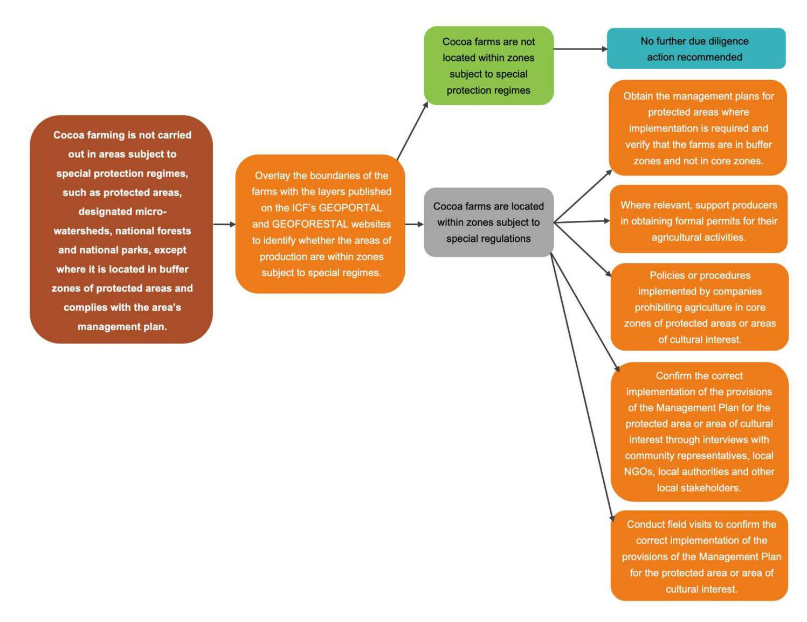

## 2.1.2 Only pesticides, herbicides, fertilisers and fungicides authorised by SENASA are used

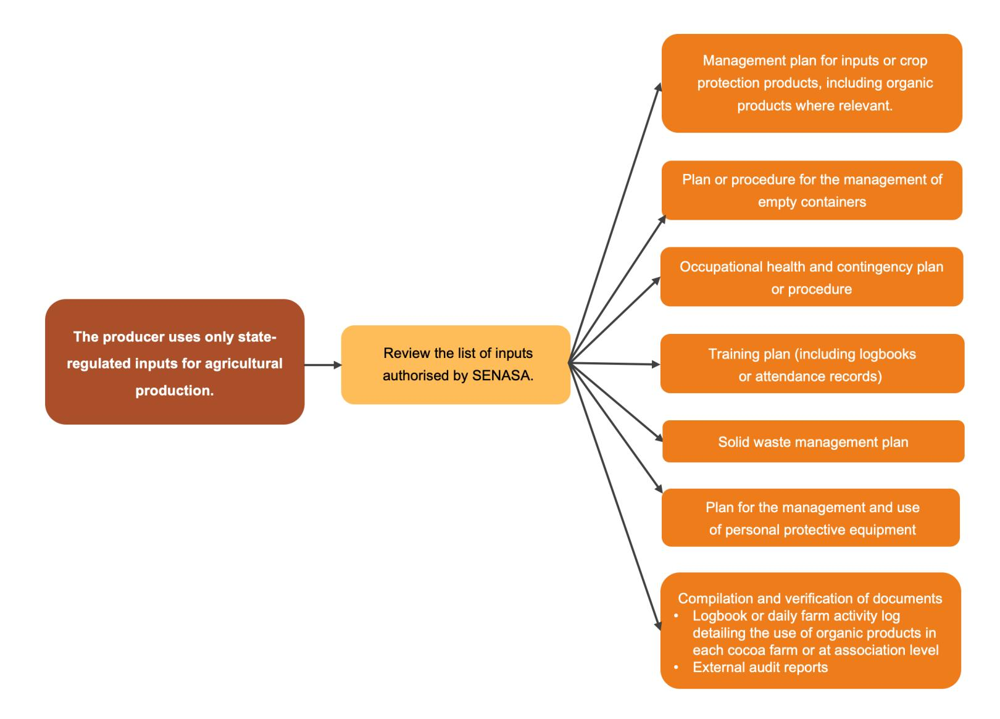

### 2.1.3 Agricultural resources are carried out in compliance with the minimum permitted distance from water courses

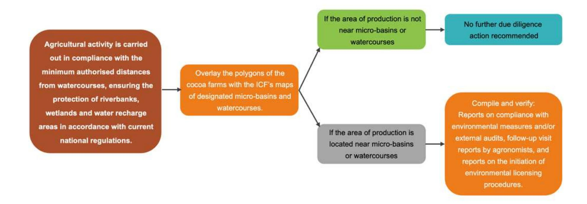

#### 2.1.5 Solid waste from agricultural production must be treated using appropriate technical methods

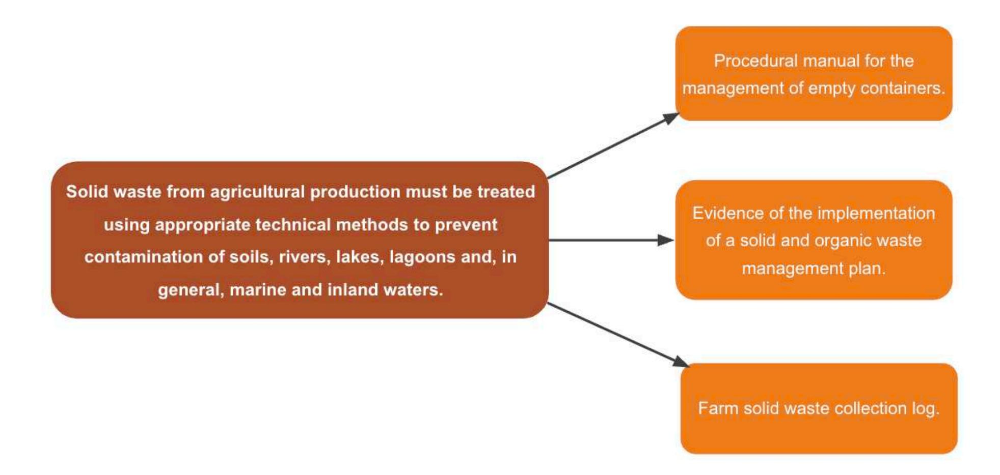

#### 2.1.6 Land is managed in accordance with the law

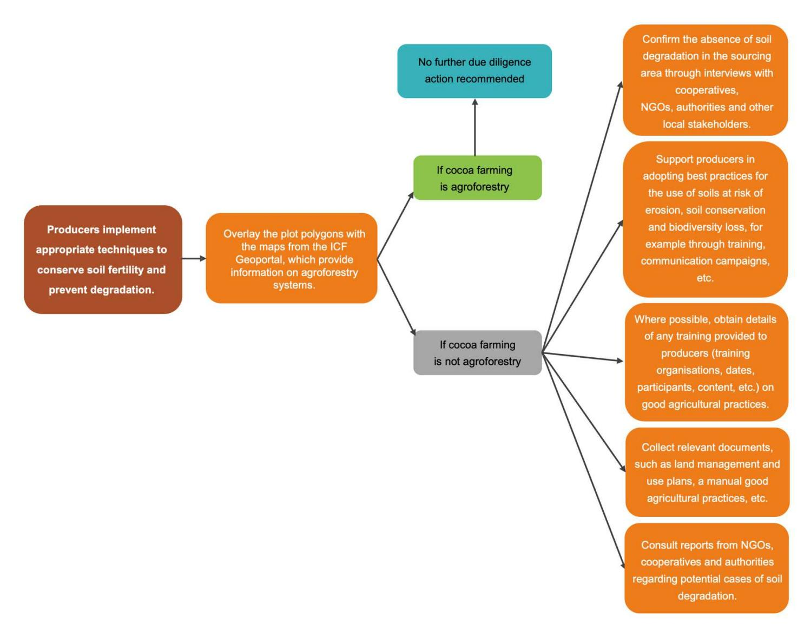

#### 2.2.1 Forest conversion complies with legal requirements

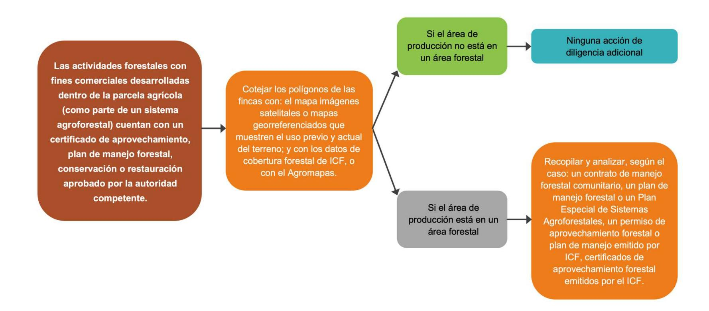

#### 2.2.3 The legal requirements for the conservation of biodiversity and the protection of endangered or protected species are met

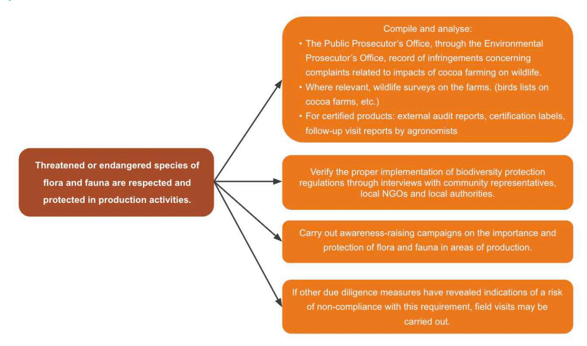

## Third parties' rights

In Honduras, verification of implementation of the main environmental requirements, particularly those relating to the use of inputs, the protection of soils and water resources, and the conservation of ecosystems, is considered sufficient to determine that the right of local communities to a healthy environment is being respected.

Cocoa production systems are generally established outside areas classified as cultural heritage or sites of archaeological importance. Furthermore, there are no official studies indicating that cocoa farming in Honduras is associated with significant social or environmental harm.

Overall, the available information characterises Honduran cocoa as a small-scale activity, carried out mainly under agroforestry systems and promoted as a sustainable production alternative, which allows for the risk of harm to third parties' rights to be considered low and justifies the recommendation of light due diligence.

| Legal requirement                                                                                                                                               | Context                                                                                                                                                                                                                                                                                                                                                                                                                                                           | Level of implementation and due diligence            | Due diligence recommendations                                                                                                                                                                                                                                                                                                                |
|-----------------------------------------------------------------------------------------------------------------------------------------------------------------|-------------------------------------------------------------------------------------------------------------------------------------------------------------------------------------------------------------------------------------------------------------------------------------------------------------------------------------------------------------------------------------------------------------------------------------------------------------------|------------------------------------------------------|----------------------------------------------------------------------------------------------------------------------------------------------------------------------------------------------------------------------------------------------------------------------------------------------------------------------------------------------|
| <b>3. Third parties' rights</b>                                                                                                                                 |                                                                                                                                                                                                                                                                                                                                                                                                                                                                   |                                                      |                                                                                                                                                                                                                                                                                                                                              |
| <i>3.1 Substantive rights</i>                                                                                                                                   |                                                                                                                                                                                                                                                                                                                                                                                                                                                                   |                                                      |                                                                                                                                                                                                                                                                                                                                              |
| 
<b>3.1.1 Production activities are not carried out in areas of cultural significance or in areas that may contain undiscovered archaeological sites.</b>
 | 
Cocoa production systems are preferably established outside the boundaries of areas designated as cultural heritage sites, as well as sites of archaeological importance. Where production does take place in areas of public interest, it is subject to management standards, farm plans and land-use rights.
 
The Institute of Anthropology and History maintains an inventory of the country's cultural heritage to ensure its proper protection.
 | 
<b>High</b>
 
<b>Light due diligence</b>
 | 
<b>Implementation of procedures and processes</b>
 <ul> <li>• Carry out an initial social and cultural mapping of the sourcing area.</li> <li>• Check with the Honduran Institute of Anthropology and History (IHAH) for records of ongoing proceedings regarding non-conflict with cultural heritage in the sourcing area.</li> </ul> |

| Legal requirement                                                                                                                                                                       | Context                                                                                                                                                                                                                                                                                                                                                                                                                                                                                                                                                                                          | Level of implementation and due diligence            | Due diligence recommendations                                                                                                                                                                                 |
|-----------------------------------------------------------------------------------------------------------------------------------------------------------------------------------------|--------------------------------------------------------------------------------------------------------------------------------------------------------------------------------------------------------------------------------------------------------------------------------------------------------------------------------------------------------------------------------------------------------------------------------------------------------------------------------------------------------------------------------------------------------------------------------------------------|------------------------------------------------------|---------------------------------------------------------------------------------------------------------------------------------------------------------------------------------------------------------------|
| <i>3.2. Procedural Rights</i>                                                                                                                                                           |                                                                                                                                                                                                                                                                                                                                                                                                                                                                                                                                                                                                  |                                                      |                                                                                                                                                                                                               |
| 
<b>3.2.1 If the productive activity causes damage to individuals, communities or the environment, those affected are entitled to claim full redress, including compensation.</b>
 | 
In Honduras, there are no formal or official studies demonstrating that cocoa farming causes harm to people, communities or the environment, nor that it is associated with forced displacement or land dispossession. The available information comes mainly from studies on rural development and value chains (CIAT, WCS, IICA, international cooperation), which describe cocoa farming as a small-scale activity managed within agroforestry systems and promoted as a sustainable production alternative, without evidence of significant negative social or environmental impacts.
 | 
<b>High</b>
 
<b>Light due diligence</b>
 | 
<b>Implementation of procedures and processes</b>
 <ul> <li><b>Consult</b> the complaints mechanisms or channels managed by the National Cocoa Chain Committee when such a situation arises.</li> </ul> |

#### 3.1.1 The rights of local communities are respected

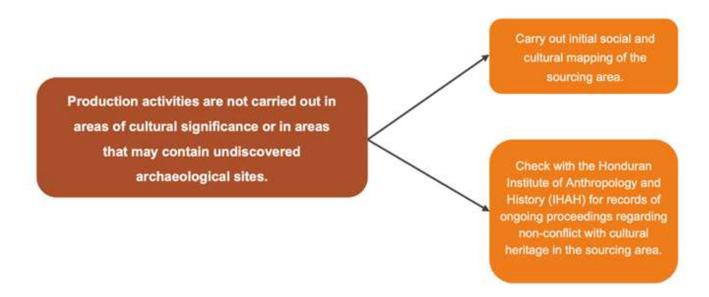

#### 3.2.1 Right to claim compensation for damages

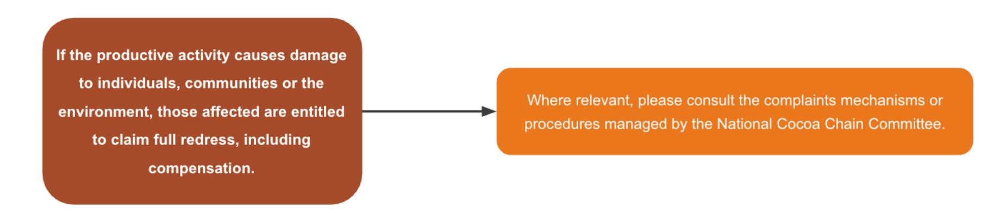

## Labour rights\*

In Honduras, labour legislation in the agricultural sector requires written contracts, except in specific cases, regulates the maximum working day of 12 hours, prohibits discrimination in the workplace, and guarantees rights such as the minimum wage, social security, and maternity leave. Furthermore, employers must implement health and safety measures, provide personal protective equipment, and comply with the General Regulations on Preventive Measures, while agro-industrial companies and cooperatives are subject to supervision by the labour inspectorate and specific regulations according to their type and size.

Under the Labour Code, agricultural or livestock farms that do not permanently employ more than 10 workers are exempt from its provisions, except those relating to the minimum wage. Conversely, agricultural holdings that permanently employ more than 10 workers must ensure compliance with the provisions of the Labour Code, including employer registration, internal regulations, affiliation to the Social Security system, and other obligations. Therefore, the first step in due diligence is to verify whether the agricultural holding has more than 10 permanent workers. This information can be obtained through supplier surveys or questionnaires.

If the holding does not exceed this threshold, no further action is required under labour rights, except for implementation of the minimum wage, which continues to apply to farms with fewer than 10 permanent workers or otherwise.

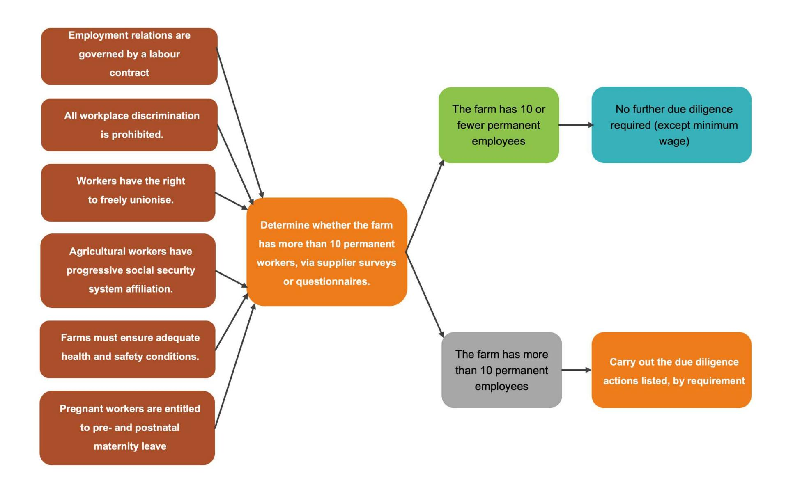

| Legal requirement                                                                                                                                                          | Context                                                                                                                                                                                                                                                                                                                                                                                                                                                                                                                                                                                                                                                                                                                                                                                                                                                                                                                                                                                                                                                                                                                                                                                                                             | Level of implementation and due diligence     | Due diligence recommendations                                                                                                                                                                                                                                                                                                                                                                                                                                                                                              |
|----------------------------------------------------------------------------------------------------------------------------------------------------------------------------|-------------------------------------------------------------------------------------------------------------------------------------------------------------------------------------------------------------------------------------------------------------------------------------------------------------------------------------------------------------------------------------------------------------------------------------------------------------------------------------------------------------------------------------------------------------------------------------------------------------------------------------------------------------------------------------------------------------------------------------------------------------------------------------------------------------------------------------------------------------------------------------------------------------------------------------------------------------------------------------------------------------------------------------------------------------------------------------------------------------------------------------------------------------------------------------------------------------------------------------|-----------------------------------------------|----------------------------------------------------------------------------------------------------------------------------------------------------------------------------------------------------------------------------------------------------------------------------------------------------------------------------------------------------------------------------------------------------------------------------------------------------------------------------------------------------------------------------|
| <b>4. Labour rights</b>                                                                                                                                                    |                                                                                                                                                                                                                                                                                                                                                                                                                                                                                                                                                                                                                                                                                                                                                                                                                                                                                                                                                                                                                                                                                                                                                                                                                                     |                                               |                                                                                                                                                                                                                                                                                                                                                                                                                                                                                                                            |
| <i>4.1 Workers' rights are respected</i>                                                                                                                                   |                                                                                                                                                                                                                                                                                                                                                                                                                                                                                                                                                                                                                                                                                                                                                                                                                                                                                                                                                                                                                                                                                                                                                                                                                                     |                                               |                                                                                                                                                                                                                                                                                                                                                                                                                                                                                                                            |
| <b>4.1.1. Relations between workers employed on the plot and employers are governed by a written or oral employment contract (where the term does not exceed 60 days).</b> | 
In Honduras, labour legislation recognises both written and oral contracts, and in the agricultural sector it is common for employment relationships to be established verbally. In the case of small-scale cocoa producers, who operate mainly as family farmers on small-scale plots, formal written employment contracts are not common. This does not imply the absence of an employment relationship, as oral contracts are also legally valid under the Honduran Labour Code.
 
On small-scale cocoa farming, generally between 1 and 5 hectares, the work is usually carried out by the farming family or by casual labourers, so permanent employment relationships requiring written formalisation do not always arise. In this context, formal employment is determined by the existence of a continuous and dependent employment relationship with workers; on small-scale farms, permanent staff are not hired.
 
A report on the cocoa value chain in Honduras indicates that approximately 85% of producers have plots which are less than 5 hectares, around 10% have plots between 5 and 50 hectares, and only 5% exceed 50 hectares, reflecting the predominance of smallholdings in this sector.
 | <b>High</b>  <b>Light due diligence</b> | 
<b>For contract requirements:</b>
 
<b>Geospatial analysis</b>
 
The first step is to establish whether there are permanent workers in the area of production, as defined by law, i.e. people who are not members of the immediate family. This step can be carried out using the threshold of 5 ha per farm.
 
Compile the polygons of the farms in the supply area to determine whether they exceed the 5-hectare threshold.
 <ul> <li>• For all producers with less than 5 ha under prod</li></ul> |

| Legal requirement                                                                                                                                                                                                                                                     | Context                                                                                                                                                                                                                                                                                                                                                                                                                                                                                                                                                                                                                                                                                                        | Level of implementation and due diligence            | Due diligence recommendations                                                                                                                                                                                                                                                                                                                                                                                                                                                                                                                                                                          |
|-----------------------------------------------------------------------------------------------------------------------------------------------------------------------------------------------------------------------------------------------------------------------|----------------------------------------------------------------------------------------------------------------------------------------------------------------------------------------------------------------------------------------------------------------------------------------------------------------------------------------------------------------------------------------------------------------------------------------------------------------------------------------------------------------------------------------------------------------------------------------------------------------------------------------------------------------------------------------------------------------|------------------------------------------------------|--------------------------------------------------------------------------------------------------------------------------------------------------------------------------------------------------------------------------------------------------------------------------------------------------------------------------------------------------------------------------------------------------------------------------------------------------------------------------------------------------------------------------------------------------------------------------------------------------------|
|                                                                                                                                                                                                                                                                       | more than ten workers, with the exception of the Code's provisions on working hours and wages.                                                                                                                                                                                                                                                                                                                                                                                                                                                                                                                                                                                                                 |                                                      | 
<b>Field checks</b> If there are workers in an area of production, conduct periodic sample field audits with producers to verify:
 <ul> <li>That employers provide written contracts where necessary (permanent workers on fixed-term contracts) and working hours are respected</li> </ul>                                                                                                                                                                                                                                                                                                  |
| 
<b>4.1.3. All forms of employment discrimination on the grounds of race, ethnicity, gender, political or religious orientation, economic status, or membership of indigenous peoples or Afro-Honduran communities are prohibited on agricultural holdings.</b>
 | 
Indirectly, analyses of labour discrimination in Honduras can serve as a general context for cocoa farming, as they reflect structural dynamics present in rural areas. However, there is no evidence establishing a direct link nor any indication of specific discriminatory practices within the cocoa sector; therefore, any correlation is contextual and not specifically attributable to this crop.
 
The stakeholders consulted during the development of this tool agreed that cocoa appears to be a sustainable and culturally significant livelihood option in indigenous and Afro-descendant communities, with no reports of systematic violations of labour rights or discrimination.
 | 
<b>High</b>
 
<b>Light due diligence</b>
 | 
<b>Data collection and verification</b>
 <ul> <li>Consult public reports from specialist organisations on these issues, specifically the Cocoa Barometer (detailed analyses of the supply chain, including discussions on labour rights) and Human Rights Watch (reports on human rights across various sectors, highlighting working conditions), as well as any reports produced by national and local NGOs.</li> </ul> 
<b>Document collection and verification</b>
 <ul> <li>If there are permanent or long-term employees on the farm who are migrant workers, members of in</li></ul> |

| Legal requirement                                                                                                                                                                  | Context                                                                                                                                                                                                                                                                                                                                                                                                                                                                                                                                                                                                                                                                                                                                                                                                                                                                                                                                                                                                                                                                                                                                                                      | Level of implementation and due diligence | Due diligence recommendations                                                                                                                                                                                                                                                       |
|------------------------------------------------------------------------------------------------------------------------------------------------------------------------------------|------------------------------------------------------------------------------------------------------------------------------------------------------------------------------------------------------------------------------------------------------------------------------------------------------------------------------------------------------------------------------------------------------------------------------------------------------------------------------------------------------------------------------------------------------------------------------------------------------------------------------------------------------------------------------------------------------------------------------------------------------------------------------------------------------------------------------------------------------------------------------------------------------------------------------------------------------------------------------------------------------------------------------------------------------------------------------------------------------------------------------------------------------------------------------|-------------------------------------------|-------------------------------------------------------------------------------------------------------------------------------------------------------------------------------------------------------------------------------------------------------------------------------------|
| Security system, taking into account geographical location and the capacity of the Honduran Social Security Institute (IHSS), where relevant.                                      | regulation, which means that many agricultural workers and small-scale producers are not subject to compulsory social security.                                                                                                                                                                                                                                                                                                                                                                                                                                                                                                                                                                                                                                                                                                                                                                                                                                                                                                                                                                                                                                              |                                           | compliance with worker health and safety standards (typically for temporary workers).  <b>Implementation of procedures and processes</b> <ul> <li>• Adopt an occupational health and safety policy</li> <li>• Establish a system for reporting workplace accidents</li> </ul> |
| <b>4.3. Workers' pay is in accordance with the law</b>                                                                                                                             |                                                                                                                                                                                                                                                                                                                                                                                                                                                                                                                                                                                                                                                                                                                                                                                                                                                                                                                                                                                                                                                                                                                                                                              |                                           |                                                                                                                                                                                                                                                                                     |
| <b>4.3.1. Workers in agricultural activities receive at least the minimum wage, and where applicable, wages are agreed with the employer on a piece-rate or per-service basis.</b> | 
The cocoa sector in Honduras is characterised mainly by small-scale production systems, with a high proportion of family units and casual labour, particularly during the harvest. In this context, there are no specific studies that directly assess implementation of the minimum wage in cocoa farming. However, various general analyses of the agricultural labour market indicate that in this type of production system, employment is often temporary and largely informal, and that payment by the day or by the task does not always meet the current statutory minimum wage.
 
The available literature also indicates that the agricultural sector has the lowest wage levels among formal sectors and high levels of informality, which hinders the effective implementation of the minimum wage, particularly for casual or family workers. In the case of cocoa, harvesting work is usually paid on a piecework basis (per job or task, rather than per hour worked), so that the final income depends on factors such as individual productivity, terrain conditions and the state of the crop. Specialised studies and articles, such as Carpi
 |                                           |                                                                                                                                                                                                                                                                                     |

| Legal requirement                                                                                                                                                                                                                     | Context                                                                                                                                                                                                                                                                                                                                                                                                                                                                                                                                                                                                                                                                                                                                                                                                                                                                                                 | Level of implementation and due diligence            | Due diligence recommendations                                                                                                                                                                |
|---------------------------------------------------------------------------------------------------------------------------------------------------------------------------------------------------------------------------------------|---------------------------------------------------------------------------------------------------------------------------------------------------------------------------------------------------------------------------------------------------------------------------------------------------------------------------------------------------------------------------------------------------------------------------------------------------------------------------------------------------------------------------------------------------------------------------------------------------------------------------------------------------------------------------------------------------------------------------------------------------------------------------------------------------------------------------------------------------------------------------------------------------------|------------------------------------------------------|----------------------------------------------------------------------------------------------------------------------------------------------------------------------------------------------|
|                                                                                                                                                                                                                                       | 
and opportunities in Central America (2020), identifies a potential risk of non-compliance with the minimum wage in relation to migrant workers from neighbouring countries. However, consultations with sector stakeholders during the development of this tool indicate that these practices are not widespread in Honduran cocoa production. Consequently, in light of the consensus among the parties consulted, the risk of non-compliance with the minimum wage requirement in the cocoa sector is considered low.
                                                                                                                                                                                                                                                                                                                                                                         |                                                      |                                                                                                                                                                                              |
| <b>4.4. Operations and activities are safe</b>                                                                                                                                                                                        |                                                                                                                                                                                                                                                                                                                                                                                                                                                                                                                                                                                                                                                                                                                                                                                                                                                                                                         |                                                      |                                                                                                                                                                                              |
| 
<b>4.4.1. Agricultural holdings must ensure adequate health and safety conditions in the workplace and are entitled to protection against the risks arising from the use of inputs and the operation of agricultural tools</b>
 | 
In Honduras, there are no specific studies on occupational health and safety aimed exclusively at formal workers in the cocoa sector. However, as cocoa falls within the scope of agriculture, formal workers are entitled to adequate health and safety conditions at work in accordance with national labour regulations, which includes protection against risks arising from the use of inputs and the operation of agricultural tools. The evidence available for the country is general to the agricultural sector and not disaggregated by crop, so there is no public information that specifically documents how these risks are managed on cocoa plantations.
 
However, consultations with sector stakeholders during the development of this tool indicate that the risk of non-compliance with occupational health and safety legislation in Honduran cocoa production is low.
 | 
<b>High</b>
 
<b>Light due diligence</b>
 | 
<b>Consultations with stakeholders</b>
 <ul> <li>Consult local organisations working to promote labour rights to obtain information on possible cases of non-compliance with</li></ul> |

## 4.1.1 Type of employment relationship, legal contractual relationship and 4.1.2 Working hours are respected

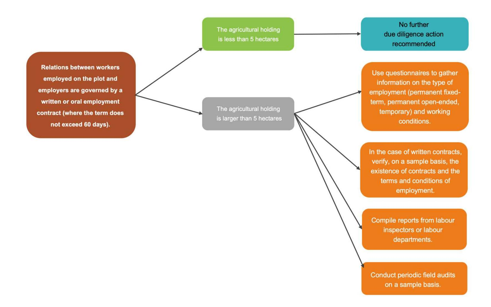

#### 4.1.3 Non-discrimination on grounds of sex or race, or against migrant worker

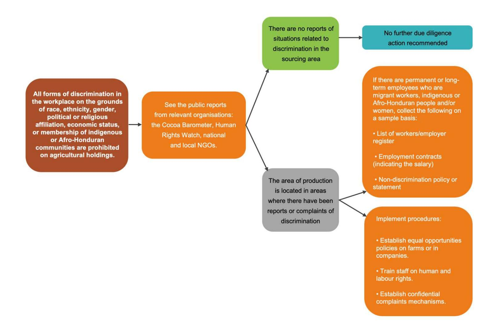

#### 4.1.4 Social security rights are respected

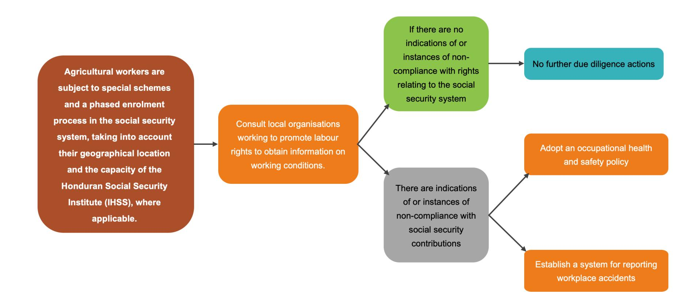

### 4.3.1 Workers in agricultural activities are paid the minimum wage

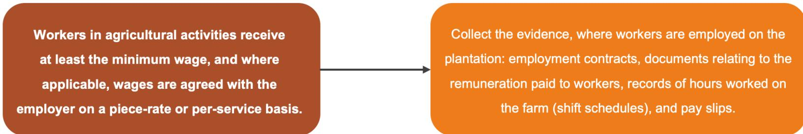

#### 4.4.1 Legal requirements regarding health and safety in the workplace are met

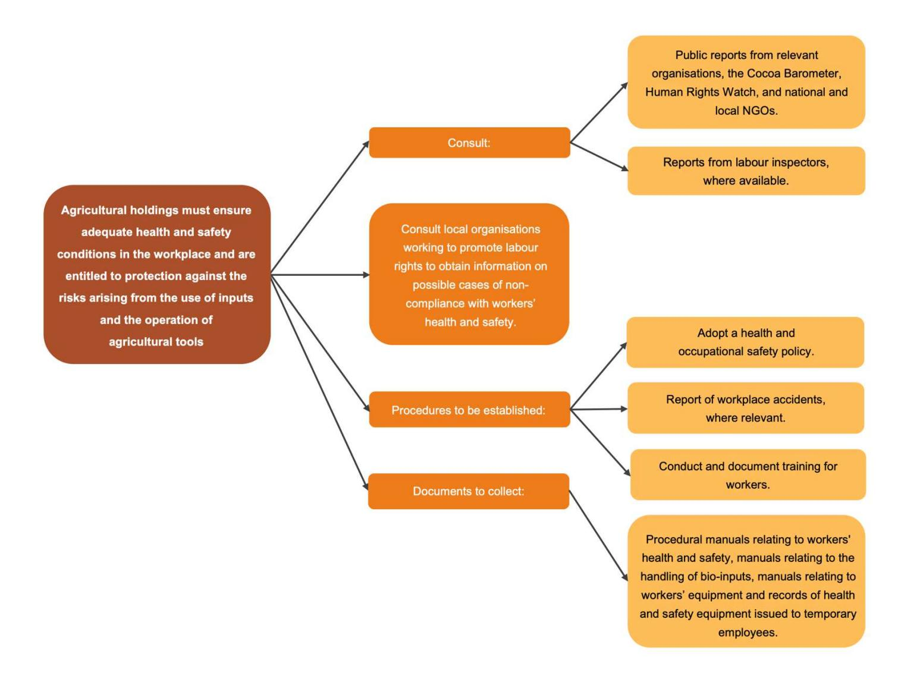

## Human rights\*

In Honduras, the cocoa sector is predominantly small-scale, operating within family-based agroforests, with the direct participation of producers, including members of indigenous peoples and Afro-descendants, organised into local cooperatives and associations. This production model shapes the nature of human rights risks and distinguishes them from those observed in other, larger-scale agro-industrial sectors. The Honduran state has a national and international legal framework that recognises and protects human rights in rural areas, including the rights of children and adolescents, the prohibition of forced labour and modern slavery, gender equality, and the collective rights of indigenous peoples and people of African descent. Furthermore, there are public institutions responsible for ensuring implementation and for addressing complaints and providing protection mechanisms.

With regard to cocoa farming, the available information does not identify any documented cases linking this crop to human rights violations, land tenure conflicts, failures in prior consultation processes, forced labour, human trafficking or gender-discriminatory practices. The existing evidence describes cocoa as a small-scale activity, managed mainly by family units, where the hiring of external labour is limited and predominantly temporary.

Overall, the stakeholders consulted for the development of this tool agree that, while structural human rights risks exist in the Honduran rural context in general, these do not manifest themselves significantly in the cocoa sector. Consequently, the risk of non-compliance with human rights-related requirements is considered low.

| Legal requirement                                                                                                                                                     | Context                                                                                                                                                                                                                                                                                                                                                                                                                                                                                                                                                                                                                                                                                                                                                                                                                                                                                                                                                                                                                                                                                                                                                                                                                                                                                                                                                                                                                 | Level of implementation and due diligence            | Due Diligence Recommendations                                                                                                                                                                                                                                                                                                             |
|-----------------------------------------------------------------------------------------------------------------------------------------------------------------------|-------------------------------------------------------------------------------------------------------------------------------------------------------------------------------------------------------------------------------------------------------------------------------------------------------------------------------------------------------------------------------------------------------------------------------------------------------------------------------------------------------------------------------------------------------------------------------------------------------------------------------------------------------------------------------------------------------------------------------------------------------------------------------------------------------------------------------------------------------------------------------------------------------------------------------------------------------------------------------------------------------------------------------------------------------------------------------------------------------------------------------------------------------------------------------------------------------------------------------------------------------------------------------------------------------------------------------------------------------------------------------------------------------------------------|------------------------------------------------------|-------------------------------------------------------------------------------------------------------------------------------------------------------------------------------------------------------------------------------------------------------------------------------------------------------------------------------------------|
| <b>5. Human rights</b>                                                                                                                                                |                                                                                                                                                                                                                                                                                                                                                                                                                                                                                                                                                                                                                                                                                                                                                                                                                                                                                                                                                                                                                                                                                                                                                                                                                                                                                                                                                                                                                         |                                                      |                                                                                                                                                                                                                                                                                                                                           |
| <i>5.1 Human rights are respected in accordance with national and international law</i>                                                                               |                                                                                                                                                                                                                                                                                                                                                                                                                                                                                                                                                                                                                                                                                                                                                                                                                                                                                                                                                                                                                                                                                                                                                                                                                                                                                                                                                                                                                         |                                                      |                                                                                                                                                                                                                                                                                                                                           |
| 
<b>5.1.1. Honduras protects the fundamental rights of indigenous and Afro-Honduran peoples in production areas, as enshrined in international instruments.</b>
 | 
The State of Honduras has a domestic and international legal framework in place to protect indigenous peoples and people of African descent; furthermore, there are public institutions responsible for implementation, including:
 <ul style="list-style-type: none;"> <li>a. The National Human Rights Commissioner (CONADEH), b. The National Coordination of Indigenous and Afro-Honduran Peoples of SEDESOL</li> <li>c. The Office of the Prosecutor for Ethnic Groups and Cultural Heritage of the Public Prosecutor's Office</li> <li>d. The Division for Indigenous and Afro-Honduran Peoples of the INA</li> <li>e. the Ministry of Labour and Social Security</li> <li>f. the Property Institute</li> </ul> 
All agricultural activities in Honduras respect the collective rights of indigenous and Afro-Honduran peoples, including the CPLI.
 
In practice, members of indigenous and Afro-descendant communities are cocoa producers and form cooperatives.
 
Based on the available information, there are no documented cases linking cocoa farming in Honduras to land tenure conflicts or failures in prior consultation. Evidence regarding these issues identifies some cases in other sectors; by contrast, cocoa is produced mainly on a small scale and under agroforests and is not reported as a source of conflict over land issues or matters related to consultation.
 | 
<b>High</b>
 
<b>Light due diligence</b>
 | 
<b>Data collection and verification</b>
 <ul style="list-style-type: none;"> <li>• Consult public reports from specialist organisations on these issues, in particular the Cocoa Barometer (detailed analyses of the supply chain, including discussions on human rights), reports on human rights in various sectors, as</li></ul> |

| Legal requirement                                                                                                                                 | Context                                                                                                                                                                                                                                                                                                                                                                                                                                                                                                                                                                                                                                                                                                   | Level of implementation and due diligence            | Due Diligence Recommendations                                                                                                                                                                                                                                                                                                                                                                                                                                                                                                                                                                                                                                                                                                                                                                                                                                                                                                                                                                                                                                                                                                                                                                                                |
|---------------------------------------------------------------------------------------------------------------------------------------------------|-----------------------------------------------------------------------------------------------------------------------------------------------------------------------------------------------------------------------------------------------------------------------------------------------------------------------------------------------------------------------------------------------------------------------------------------------------------------------------------------------------------------------------------------------------------------------------------------------------------------------------------------------------------------------------------------------------------|------------------------------------------------------|------------------------------------------------------------------------------------------------------------------------------------------------------------------------------------------------------------------------------------------------------------------------------------------------------------------------------------------------------------------------------------------------------------------------------------------------------------------------------------------------------------------------------------------------------------------------------------------------------------------------------------------------------------------------------------------------------------------------------------------------------------------------------------------------------------------------------------------------------------------------------------------------------------------------------------------------------------------------------------------------------------------------------------------------------------------------------------------------------------------------------------------------------------------------------------------------------------------------------|
| 
<b>5.1.2. In Honduras, young people aged between 14 and 18 are permitted to work with the authorisation of their parents or guardians.</b>
 | 
In Honduras, the rights of children and adolescents are recognised in the Constitution of the Republic, international treaties on the Rights of the Child, the Code on Children and Adolescents, and the Labour Code. The law prohibits children under 18 from performing work that is dangerous or that affects their health, safety or development, and stipulates that agricultural work permitted for adolescents must be light, non-hazardous and compatible with their schooling.
 
In practice, most cocoa plots in Honduras are 1 hectare or smaller, considered family subsistence farms, where the father and his family carry out the farm's management and harvesting activities.
 | 
<b>High</b>
 
<b>Light due diligence</b>
 | 
<b>Data collection and verification</b>
 <ul> <li>Consult public reports from organisations specialising in these issues, in particular complaints filed with the ILO, the Secretariat for Children, Adolescents and the Family, the State Secretariat for Labour and Social Security, databases on child labour, or local authorities. <a href="https://www.trabajo.gob.hn/entih-al-fin-contamos-con-datos-sobre-el-trabajo-infantil/">https://www.trabajo.gob.hn/entih-al-fin-contamos-con-datos-sobre-el-trabajo-infantil/</a>, and Human Rights Watch (reports on human rights in various sectors, including the cocoa sector), as well as any reports produced by national and local NGOs.</li> </ul> 
<b>Consultations with stakeholders</b>
 
Consult local organisations working to promote labour rights to obtain information on the risk of children under 14 working and of work posing risks to their health in the sourcing area.
 
<b>At plot level, determine the profile of workers on the farm:</b>
 
<b>Implementation of procedures and processes</b>
 <ul> <li>Implement projects to support the eradication of child labour in Honduras</li> <li>Implement a child</li></ul> |

| Legal requirement                                                                                                                                                                                                                                 | Context                                                                                                                                                                                                                                                                                                                                                                                                                                                                                        | Level of implementation and due diligence            | Due Diligence Recommendations                                                                                                                                                                                                                                                                                                                                                                                                                                                                                                                                                                       |
|---------------------------------------------------------------------------------------------------------------------------------------------------------------------------------------------------------------------------------------------------|------------------------------------------------------------------------------------------------------------------------------------------------------------------------------------------------------------------------------------------------------------------------------------------------------------------------------------------------------------------------------------------------------------------------------------------------------------------------------------------------|------------------------------------------------------|-----------------------------------------------------------------------------------------------------------------------------------------------------------------------------------------------------------------------------------------------------------------------------------------------------------------------------------------------------------------------------------------------------------------------------------------------------------------------------------------------------------------------------------------------------------------------------------------------------|
|                                                                                                                                                                                                                                                   |                                                                                                                                                                                                                                                                                                                                                                                                                                                                                                |                                                      | <ul> <li>• Proof of school attendance.</li> <li>• Awareness-raising plan on the prohibition of child labour on farms.</li> <li>• Policy on not employing minors on farms</li> <li>• Field worker log</li> </ul> 
<b>Field checks</b>
 <ul> <li>• Carry out periodic on-site checks with producers, based on sampling. Ensure that no child under the age of 14 works on the farm and that the tasks performed by children over the age of 14 do not pose a risk to their health, in particular through interviews with the workers concerned.</li> </ul>                                       |
| <b><i>5.2. Absence of modern slavery and forced labour</i></b>                                                                                                                                                                                    |                                                                                                                                                                                                                                                                                                                                                                                                                                                                                                |                                                      |                                                                                                                                                                                                                                                                                                                                                                                                                                                                                                                                                                                                     |
| 
<b>5.2.1. The employer does not withhold wages, employment benefits, identity documents, personal property or other economic or administrative rights for the purpose of coercing, restricting or conditioning the freedom of workers.</b>
 | 
Due to the socio-economic nature of the rural sector, the vast majority of workers are temporary employees who provide services according to the plantation's demand or requirements, receiving remuneration for the task as previously agreed.
 
In practice, cocoa management and harvesting activities are generally carried out directly by the farm owners, whose holdings do not normally exceed 1 ha. Consequently, they do not hire workers to perform labour or services.
 | 
<b>High</b>
 
<b>Light due diligence</b>
 | 
<b>Document collection and verification</b>
 
<b>On a samble basis:</b>
 <ul> <li>• Employment contracts specifying working hours and termination clauses.</li> <li>• Pay slips</li> <li>• Payroll ledger</li> <li>• External audit report</li> </ul> 
<b>Implementation of procedures and processes</b>
 <ul> <li>• Implement confidential complaint mechanisms and whistleblower protection.</li> <li>• Train staff on the risks of forced labour, particularly on remote farms or in rural areas.</li> <li>• Carry out awareness-raising campaigns and document them.</li> </ul> |
| 
<b>5.2.2. Every worker has the right to voluntarily te</b>
                                                                                                                                                                                 |                                                                                                                                                                                                                                                                                                                                                                                                                                                                                                |                                                      |                                                                                                                                                                                                                                                                                                                                                                                                                                                                                                                                                                                                     |

| Legal requirement                                                                                                                         | Context                                                                                                                                                                                                                                                                                                                                                                                                                                                                                                                                                                                                                                                                                              | Level of implementation and due diligence            | Due Diligence Recommendations |
|-------------------------------------------------------------------------------------------------------------------------------------------|------------------------------------------------------------------------------------------------------------------------------------------------------------------------------------------------------------------------------------------------------------------------------------------------------------------------------------------------------------------------------------------------------------------------------------------------------------------------------------------------------------------------------------------------------------------------------------------------------------------------------------------------------------------------------------------------------|------------------------------------------------------|-------------------------------|
|                                                                                                                                           | 
However, the majority of workers in the agricultural sector are temporary and have no financial dependence on their employer, meaning they can terminate their employment relationship whenever they choose.
 
In practice, farm work is carried out by the owners, with some specific tasks undertaken by temporary workers hired on a project or service basis.
                                                                                                                                                                                                                                                                                                                        |                                                      |                               |
| 
<b>5.2.3. All forms of slavery, servitude, forced or compulsory labour in agricultural and forestry activities are prohibited.</b>
 | 
The State of Honduras has put in place institutional mechanisms to combat these forms of exploitation through the Inter-institutional Commission against Commercial Sexual Exploitation and Trafficking in Persons (CICESCT). Investigations into human trafficking are carried out by the Unit against Trafficking, Commercial Sexual Exploitation and Human Trafficking, and the Prosecutor's Office against Organised Crime, both within the Public Prosecutor's Office.
 
Due to the socio-economic nature of the rural sector, the vast majority of workers are temporary employees who work during each harvest cycle, receiving remuneration for work or tasks agreed in advance.
 | 
<b>High</b>
 
<b>Light due diligence</b>
 |                               |
| 
<b><i>5.3 Women's rights are respected in accordance with international and national law</i></b>
                                   |                                                                                                                                                                                                                                                                                                                                                                                                                                                                                                                                                                                                                                                                                                      |                                                      |                               |
| 
<b>5.3.1. Rural women workers do not experience gender discrimination or sexual harassment in the workplace.</b>
                   | 
In Honduras, the Constitution of the Republic and national legislation prohibit all forms of discrimination and harassment, including sexual harassment, and guarantee rural women workers access to protection and reporting mechanisms. Such cases can be reported via the 911 and 114 hotlines, the Special Prosecutor's Office for the Protection of Women within the Public Prosecutor's Office, and the Municipa
                                                                                                                                                                                                                                                                        |                                                      |                               |

| Legal requirement | Context                                                                                                                                                                                                                                                                                                                                                                                                                                                                                                                                                                                                                                                                                                                                                                                                                                                                                                                                                                                                                                                                                                                                                                                                                                                                                                                                                                                                                                                                                                                                                                                                                                                                                                                                                            | Level of implementation and due diligence | Due Diligence Recommendations                                                                                                                                                                                                                                                                      |
|-------------------|--------------------------------------------------------------------------------------------------------------------------------------------------------------------------------------------------------------------------------------------------------------------------------------------------------------------------------------------------------------------------------------------------------------------------------------------------------------------------------------------------------------------------------------------------------------------------------------------------------------------------------------------------------------------------------------------------------------------------------------------------------------------------------------------------------------------------------------------------------------------------------------------------------------------------------------------------------------------------------------------------------------------------------------------------------------------------------------------------------------------------------------------------------------------------------------------------------------------------------------------------------------------------------------------------------------------------------------------------------------------------------------------------------------------------------------------------------------------------------------------------------------------------------------------------------------------------------------------------------------------------------------------------------------------------------------------------------------------------------------------------------------------|-------------------------------------------|----------------------------------------------------------------------------------------------------------------------------------------------------------------------------------------------------------------------------------------------------------------------------------------------------|
|                   | 
Social programmes have been implemented to integrate women into production, improving their access to credit schemes, land and technology, and more broadly giving them the chance at the same benefits and opportunities for sustainable development.
 
The Network of Women Cocoa and Chocolate Producers of Honduras (REDMUCH) promotes the production, processing, trade and empowerment of women cocoa producers in Honduras.
 
At the cooperative level, there are gender committees supported by CONAMUCCOP, which promote gender equality and equity within the Honduran cooperative movement.
 
There are social programmes run by the government and international institutions aimed at reducing the gender gap in the rural sector, including CREDIMUJER, MUCAMPAZ, FAO and the Spanish Cooperation project "Strengthening the resilience and leadership of rural women in the territorial economic recovery in southern Honduras."
 
The available evidence indicates that women account for around 25% of cocoa producers in Honduras, according to gender assessments of the value chain carried out by regional and cooperation bodies such as SI-Cacao, IICA and CIAT. These studies show significant female participation in a sector that is predominantly small-scale and family-based. At the same time, no reports or public complaints have been identified that document specific cases of gender discrimination in the Honduran cocoa sector; the existing literature focuses instead on highlighting structural gaps—such as access to land, funding, technical assistance and decision-making spaces—and on promoting gender equality, without attributing direct discriminatory practices to cocoa farming.
 |                                           | 
<b>Stakeholder consultation</b>
 <ul> <li>Consult local organisations working to promote labour rights to obtain information on working conditions and potential cases of sexual harassment.</li> </ul> 
<b>Implementation of procedures and processes</b>
 <ul> <li>Run sexu</li></ul> |

| Legal requirement | Context                                                                                    | Level of implementation and due diligence | Due Diligence Recommendations |
|-------------------|--------------------------------------------------------------------------------------------|-------------------------------------------|-------------------------------|
|                   | Project to improve the quality of life of women: AMUCAFE and REDMUCH                       |                                           |                               |
|                   | <a href="#">Project to Improve Quality of Life – Alliance of Women in Coffee (AMUCAFE)</a> |                                           |                               |
|                   | SICA Cocoa Gender Assessment                                                               |                                           |                               |
|                   | <a href="#">1diagnostico.pdf</a>                                                           |                                           |                               |

#### 5.1.1 Honduras protects the fundamental rights of indigenous and Afro-Honduran peoples

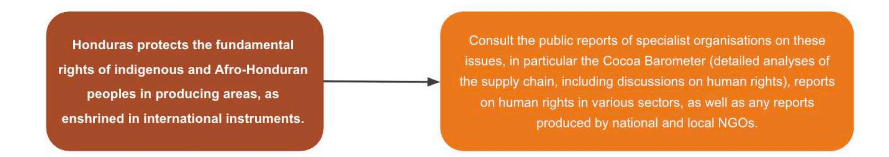

#### 5.1.2 Young people between 14 and 18 are permitted to work with authorisation

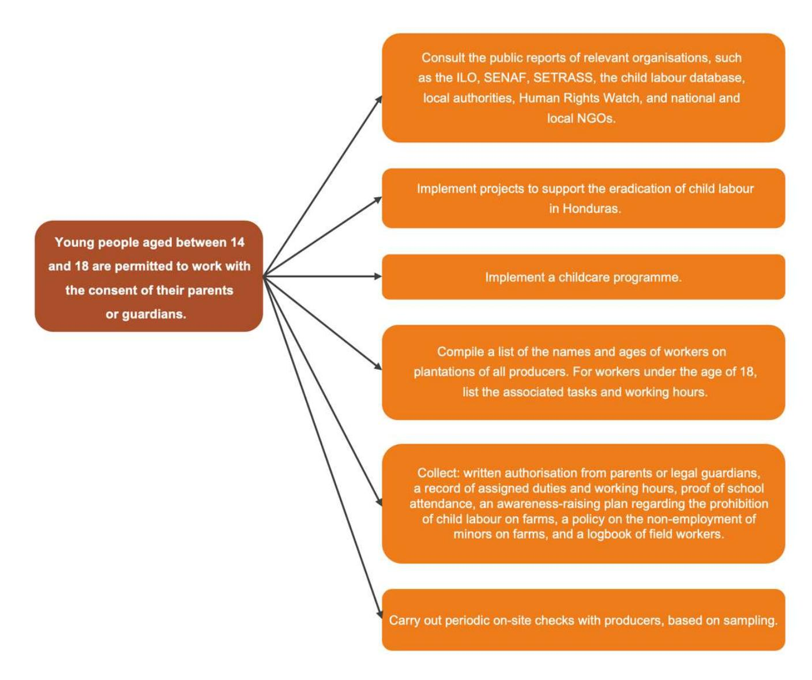

## 5.2.1, 5.2.2 and 5.2.3 No withholding of wages or benefits, no withholding of documents; freedom to terminate employment and no slavery and forced labour

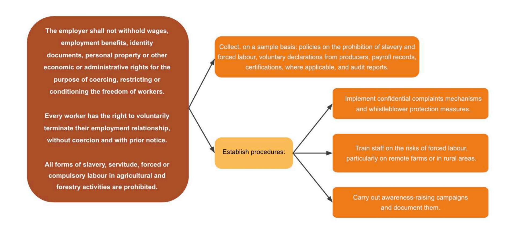

#### 5.3.1 No sexual harassment or gender discrimination

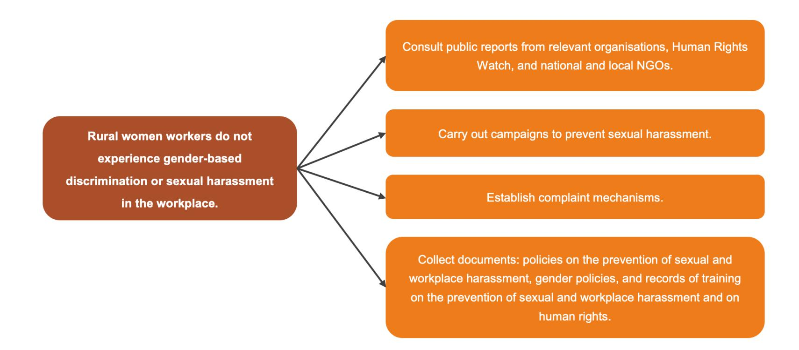

## Free, Prior and Informed Consent

Free, Prior and Informed Consent (FPIC) is a key principle for the protection of the rights of indigenous peoples and people of African descent in Honduras. This right is recognised through the ratification of Convention No. 169 of the International Labour Organisation (ILO) and other international human rights instruments to which the state is a party. FPIC stipulates that these peoples must be consulted in a free, prior and fully informed manner before the adoption of measures, projects or activities that may affect their lands, territories, natural resources or ways of life, thereby guaranteeing their participation and respect for their collective rights. At the same time, no reports or public complaints have been identified that document specific cases of gender discrimination in the Honduran cocoa sector; the existing literature focuses instead on highlighting structural gaps—such as access to land, funding, technical assistance and decision-making spaces—and on promoting gender equality, without attributing direct discriminatory practices to cocoa farming.

| Legal requirement                                                                                                                                                                                                   | Context                                                                                                                                                                                                                                                                                                                                                                                                                                                                                                                                                                                                        | Level of implementation and due diligence            | Due diligence recommendations                                                                                                                                                                                                                                                                                                                                                                                                                                                                                                                                                                                                                                         |
|---------------------------------------------------------------------------------------------------------------------------------------------------------------------------------------------------------------------|----------------------------------------------------------------------------------------------------------------------------------------------------------------------------------------------------------------------------------------------------------------------------------------------------------------------------------------------------------------------------------------------------------------------------------------------------------------------------------------------------------------------------------------------------------------------------------------------------------------|------------------------------------------------------|-----------------------------------------------------------------------------------------------------------------------------------------------------------------------------------------------------------------------------------------------------------------------------------------------------------------------------------------------------------------------------------------------------------------------------------------------------------------------------------------------------------------------------------------------------------------------------------------------------------------------------------------------------------------------|
| <b>6. The CPLI</b>                                                                                                                                                                                                  |                                                                                                                                                                                                                                                                                                                                                                                                                                                                                                                                                                                                                |                                                      |                                                                                                                                                                                                                                                                                                                                                                                                                                                                                                                                                                                                                                                                       |
| 
<b>6.1.1. Any production system affecting indigenous or Afro-Honduran peoples territories requires prior, free and informed consultation through open town hall meetings or their traditional protocols.</b>
 | 
The CPLI implementation occurs through open town hall meetings and/or protocols as instruments for obtaining the consent of indigenous and Afro-Honduran peoples regarding the implementation of projects that may affect them, including productive projects. These instruments are recognised, as appropriate, as valid forms of consultation under Convention 169, provided they are conducted in accordance with that Convention.
 
To obtain the consent of the affected communities, the consultation process is carried out through protocols or open meetings using mechanisms, including:
 | 
<b>High</b>
 
<b>Light due diligence</b>
 | 
<b>Geospatial analysis</b>
 <ul> <li>Check whether your suppliers' production plot polygons are within (or near) an indigenous territory by consulting the Geoportal, which contains maps of territories allocated to indigenous peoples.</li> </ul> 
If this is the case, additional due diligence measures are recommended:
 
<b>Consultations with stakeholders</b>
 <ul> <li>Consult with local organisations regarding any potential complaints or infringements of the rights of indigenous peoples.</li> </ul> 
<b>Document collection and verification</b>
 <ul> <li>Minutes of open council meetings or community protocols.</li> </ul> |

| Legal requirement | Context                                                                                                                                                                                                                                                                                                                                                                                                                                                                                                                                                                   | Level of implementation and due diligence | Due diligence recommendations                                       |
|-------------------|---------------------------------------------------------------------------------------------------------------------------------------------------------------------------------------------------------------------------------------------------------------------------------------------------------------------------------------------------------------------------------------------------------------------------------------------------------------------------------------------------------------------------------------------------------------------------|-------------------------------------------|---------------------------------------------------------------------|
|                   | <ol> <li>The type of consultation approved by the community organisation.</li> <li>The type of organisation existing within the community.</li> <li>The scale of the project to be developed and its link to SERNA's environmental classification.</li> </ol> 
Standards to implement the exercise of this right are currently under discussion.
 
In Honduras, there are no cases of Free, Prior and Informed Consent with indigenous communities for productive activities such as cocoa; reports generally relate more to infrastructure or energy projects
 |                                           | <ul> <li>Documented consent from indigenous authorities.</li> </ul> |

#### 6.1.1 CPLI is established when the rights of indigenous peoples or local communities are affected

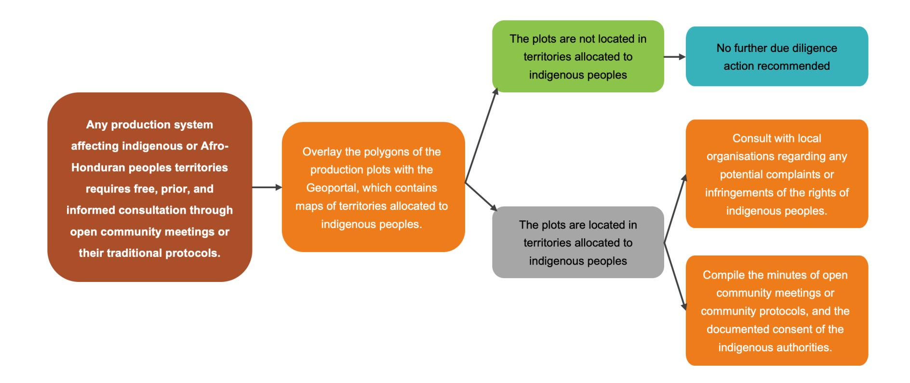

## Tax, anti-corruption, trade and customs regulations

Important Note. This is the only category in the EUDR that potentially affects entities throughout the supply chain, and not just at the level of the cocoa production plot.

In Honduras, to date, the formalities related to trade and export, and the taxes paid by exporters are generally well observed and documented.

| Legal requirement                                                                              | Context                                                                                                                                                                                                                                                                                                                                                                                                                                                                                                                                                                                                                                                                                                                                                                                                                                                                                                                                                                                                          | Level of implementation and due diligence            | Due diligence recommendations                                                                                                                                                                                                                                                                                                                                                                                                                                                                                                                                                                                          |
|------------------------------------------------------------------------------------------------|------------------------------------------------------------------------------------------------------------------------------------------------------------------------------------------------------------------------------------------------------------------------------------------------------------------------------------------------------------------------------------------------------------------------------------------------------------------------------------------------------------------------------------------------------------------------------------------------------------------------------------------------------------------------------------------------------------------------------------------------------------------------------------------------------------------------------------------------------------------------------------------------------------------------------------------------------------------------------------------------------------------|------------------------------------------------------|------------------------------------------------------------------------------------------------------------------------------------------------------------------------------------------------------------------------------------------------------------------------------------------------------------------------------------------------------------------------------------------------------------------------------------------------------------------------------------------------------------------------------------------------------------------------------------------------------------------------|
| 
7. Commercial, tax and customs obligations
                                              |                                                                                                                                                                                                                                                                                                                                                                                                                                                                                                                                                                                                                                                                                                                                                                                                                                                                                                                                                                                                                  |                                                      |                                                                                                                                                                                                                                                                                                                                                                                                                                                                                                                                                                                                                        |
| 
<i>7.1. Taxes and duties are paid</i>
                                                   |                                                                                                                                                                                                                                                                                                                                                                                                                                                                                                                                                                                                                                                                                                                                                                                                                                                                                                                                                                                                                  |                                                      |                                                                                                                                                                                                                                                                                                                                                                                                                                                                                                                                                                                                                        |
| 
<b>7.1.1. There are legal instruments certifying implementation of tax obligations.</b>
 | 
The cocoa sector comprises associations, federations, cooperatives and export companies. To operate legally and in accordance with the law for tax purposes, all must obtain a National Tax Registration (RTN), which is delivered by the tax authority known as the Revenue Administration Service (SAR). Through the RTN, each participant in the cocoa value chain must request the necessary tax documents to record income, costs and/or expenses. Each tax document and receipt, duly authorised in accordance with the Regulations on the Invoicing Regime, Other Tax Documents and the Tax Register of Printers, can be validated using the tool made available by the AATT.
 
As regards domestic taxes, associations and cooperatives are exempt from paying income tax and certain ancillary taxes. However, they are liable to pay reduced rates (15%) on their profits, known as the Social Contribution from the Social Sector of the Economy and the Cooperative Sector Contribution,
 | 
<b>High</b>
 
<b>Light due diligence</b>
 | 
<b>Document collection and verification</b>
 
<b>Collect on a sample basis:</b>
 <ul> <li>• National Tax Register (RTN) issued by the AATT of Honduras; an electronic certificate may be issued;</li> <li>• Duly authorised tax documents, which can be validated via the following link: <a href="https://oficinavirtual.sar.gob.hn/fac/validador-doc-fiscales/">https://oficinavirtual.sar.gob.hn/fac/validador-doc-fiscales/</a></li> <li>• Income Tax Return</li> <li>• Certificate of Tax Compliance requested individually and online by each taxpayer in the cocoa sector who so requests</li> </ul> |

| Legal requirement | Context                                                                                                                                                                                                                                                                                                                                                                                                                                                                                                                                                                                                                                                                                                                                                                                                                                                                                                                     | Level of implementation and due diligence | Due diligence recommendations |
|-------------------|-----------------------------------------------------------------------------------------------------------------------------------------------------------------------------------------------------------------------------------------------------------------------------------------------------------------------------------------------------------------------------------------------------------------------------------------------------------------------------------------------------------------------------------------------------------------------------------------------------------------------------------------------------------------------------------------------------------------------------------------------------------------------------------------------------------------------------------------------------------------------------------------------------------------------------|-------------------------------------------|-------------------------------|
|                   | 
as applicable. Exporters, on the other hand, are subject to the standard rate of 25% and ancillary taxes.
 
It should be noted that some companies with revenues exceeding one billion lempiras may be subject to a 1% or 0.75% levy on gross revenue, comparable to income tax at the standard rate of 25% calculated against declared net taxable income.
 
Some companies associated with the cocoa sector benefit from tax exemptions, which are processed through the Ministry of Finance (SEFIN) at the Directorate General of Tax Exemptions and Customs Duties.
 
Note:
 <ol> <li>There are a number of other tax obligations relating to the collection and/or withholding of direct and indirect taxes</li> <li>It is recommended to check with the local council regarding the municipal taxes applicable to the cocoa sector, as this tax is not administered by the AATT (SAR)</li> </ol> |                                           |                               |

| Legal requirement                                                                                                                                 | Context                                                                                                                                                                                                                                                                                                                                                                                                                                                                                                                                                                                                                                                                                                                                                                                                                                 | Level of implementation and due diligence            | Due diligence recommendations                                                                                                                                                                                |
|---------------------------------------------------------------------------------------------------------------------------------------------------|-----------------------------------------------------------------------------------------------------------------------------------------------------------------------------------------------------------------------------------------------------------------------------------------------------------------------------------------------------------------------------------------------------------------------------------------------------------------------------------------------------------------------------------------------------------------------------------------------------------------------------------------------------------------------------------------------------------------------------------------------------------------------------------------------------------------------------------------|------------------------------------------------------|--------------------------------------------------------------------------------------------------------------------------------------------------------------------------------------------------------------|
| <b>7.2. Customs and trade</b>                                                                                                                     |                                                                                                                                                                                                                                                                                                                                                                                                                                                                                                                                                                                                                                                                                                                                                                                                                                         |                                                      |                                                                                                                                                                                                              |
| 
<b>7.2.1. All exports must be carried out in accordance with current customs regulations, including special regimes where implemented.</b>
 | 
The Customs Service is responsible for demanding and verifying payment of duties.
 
In Honduras, agricultural, forestry and agro-industrial export activities are regulated by CAUCA and its implementing regulations RECAUCA, the Honduran Customs Act and the provisions for the implementation of special export regimes such as the Temporary Import Regime (RIT) and Free Zones (ZOL).
 
To export, companies must hold the certificates, licences and permits required by law. The Single Central American Declaration (DUCA) is a single document covering goods imported and exported between Central America and the European Union. The electronic transmission of the DUCA is mandatory for the correct implementation of customs regimes. This procedure significantly reduces the risk of non-compliance.
 | 
<b>High</b>
 
<b>Light due diligence</b>
 | 
<b>Document collection and verification:</b>
 <ul> <li>Collect, for example, Single Customs Declaration (DUCA) documents</li> </ul>                                                                    |
| 
<b>7.2.3. Companies must be legally incorporated and ensure implementation of the regulatory laws governing exports.</b>
                   | 
The CAI, or '<u>Printing Authorisation</u> Code,' is an alphanumeric code generated by the tax authorities to authorise the printing of invoices and other tax documents, ensuring their legal validity. To obtain the CAI, companies must submit their legal incorporation documents to the authorities. Consequently, if a company holds a CAI, it means that it meets the requirement of being legally incorporated.
                                                                                                                                                                                                                                                                                                                                                                                                          | 
<b>Top</b>
 
<b>Light due diligence</b>
  | 
<b>Document collection and verification</b>
 
Collect, for example:
 <ul> <li>CAI invoicing where relevant (applicable to the association or company that buys and sells with exporters</li></ul> |

| Legal requirement                                                                                                                               | Context                                                                                                                                                                                                                                                                                                              | Level of implementation and due diligence            | Due diligence recommendations                                                                                                                                                                                                                                                                                                                                                                                                                                                                                                                                                                                                                                                                                                                                                                                                                                                                          |
|-------------------------------------------------------------------------------------------------------------------------------------------------|----------------------------------------------------------------------------------------------------------------------------------------------------------------------------------------------------------------------------------------------------------------------------------------------------------------------|------------------------------------------------------|--------------------------------------------------------------------------------------------------------------------------------------------------------------------------------------------------------------------------------------------------------------------------------------------------------------------------------------------------------------------------------------------------------------------------------------------------------------------------------------------------------------------------------------------------------------------------------------------------------------------------------------------------------------------------------------------------------------------------------------------------------------------------------------------------------------------------------------------------------------------------------------------------------|
| <b>7.3 Corruption is prevented</b>                                                                                                              |                                                                                                                                                                                                                                                                                                                      |                                                      |                                                                                                                                                                                                                                                                                                                                                                                                                                                                                                                                                                                                                                                                                                                                                                                                                                                                                                        |
| 
<b>7.3.1. In Honduras, corrupt and fraudulent practices are punished through special procedures established in national legislation.</b>
 | 
The country has mechanisms and specialised institutions for combating corruption.
 
The fight against corruption forms part of the state's commitment to transparency, accountability and respect for the rule of law, which are fundamental elements in ensuring the legality of productive activities.
 | 
<b>High</b>
 
<b>Light due diligence</b>
 | 
<b>Data collection and verification</b>
 
Visit the OABI Transparency Portal (seized assets)
 
<u><a href="#">Office for the Administration of Seized Assets (OABI) on the SINGLE TRANSPARENCY PORTAL</a></u>
 
<b>Implementation of procedures and processes</b>
 <ul> <li>• Implement integrity and anti-corruption policies.</li> <li>• Train staff on ethics and legal implementation.</li> <li>• Establish due diligence systems, including the verification of the authenticity of documents (deeds, permits, titles, declarations, etc.) and blacklists.</li> <li>• Establish confidential and secure complaint mechanisms.</li> <li>• Establish batch traceability systems.</li> </ul> 
<b>Document collection and verification</b>
 <ul> <li>• Company code of conduct</li> <li>• Supplier Code of Conduct</li> <li>• No fraud and no speculation policy</li> </ul> |

## 7.1.1 Taxes and duties are paid

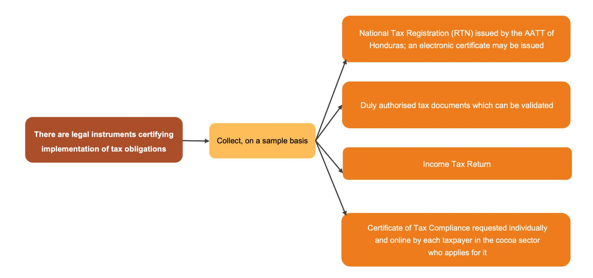

#### 7.2.1 Customs duties are paid, and trade quotas and regulations are complied with

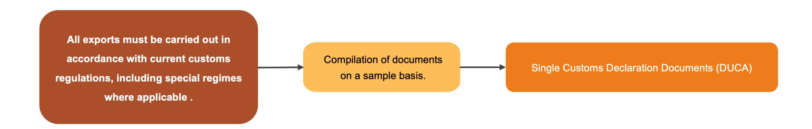

#### 7.2.3 Companies must be legally incorporated

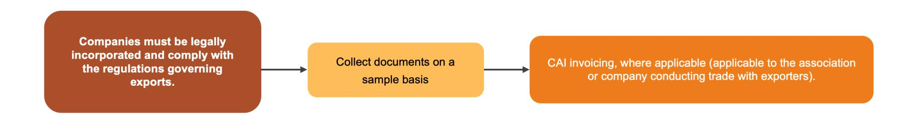

#### 7.3.1 Absence of corrupt practices

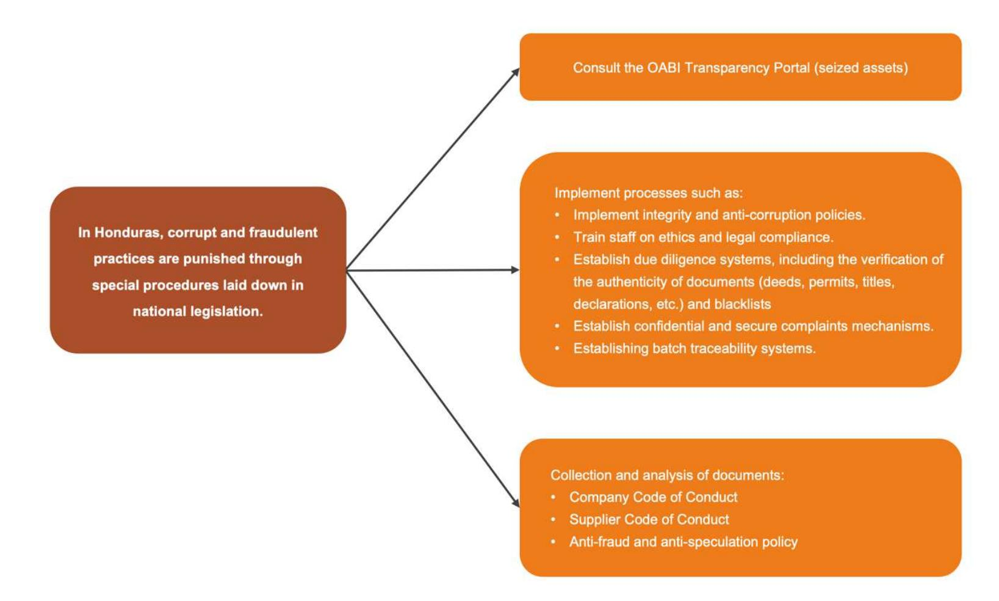

# **Annex 1 Mapping methodology**

The first step in developing this tool for legality due diligence is to identify the relevant legal requirements under the EUDR for cocoa production in Honduras.

The EUDR defines the legality of commodities in light of two criteria:

- National legal requirements must relate to the legal status of the production area
- There are seven legal areas [for agricultural products]: 1) land-use rights; 2) environmental protection; 3) third parties' rights; 4) labour rights; 5) human rights protected under international law; 6) the principle of Free, Prior and Informed Consent, as set out in the United Nations Declaration on the Rights of Indigenous Peoples; and 7) tax, anti-corruption, trade and customs regulations.

On 2 October 2024 (with an update in April 2025), the European Commission published a guidance document on the implementation of the EUDR, which interprets the Regulation's provisions on legality criteria. This document proposes addressing the relevance of relevant legal requirements through the following criteria:

- The requirements have a specific impact on the legal status of the production area of the commodities [with the exception of tax, trade and customs standards];
- The requirements must be linked to the Regulation's objectives of halting deforestation and forest degradation as part of the EU's commitment to tackling climate change and biodiversity loss.

Given that not all labour requirements, as well as certain human rights and third parties' rights, are directly related to the objectives of the EUDR, there is debate as to whether they fall within the scope of application of the Regulation.

Furthermore, the guidance document would extend the scope of tax and anticorruption regulations to steps of value chains beyond the area of production. It should be emphasised that the European Commission's guidance document is not legally binding. As specified in the guidance document itself, it does not replace, add to or amend the provisions of the EUDR, which sets out the legal obligations. However, it seeks to harmonise the implementation of the regulation across EU member states.

Each EU Member State will adopt its own approach to monitoring operators' implementation of the EUDR. Ultimately, only the courts in each EU country have the power to interpret the EU regulation in a legally binding manner and determine the scope of the legality test.

In this context, this tool adopts a precautionary approach. It considers all areas of law listed in Article 2.40 and includes all requirements deemed relevant across these seven areas.

This comprehensive approach will allow end users to choose the scope of their work based on their reading of the EUDR and the guidance provided.

#### How the relevance of the requirements has been determined

Under the EUDR, the Operator is solely responsible for carrying out due diligence to ensure that the products they trade in present a negligible risk of illegality. However, the EU has recognised that producing countries can facilitate the work of operators and competent authorities (see question 1.30 of the FAQs), in particular by providing information that allows for a better understanding of the applicable national laws.1 This is precisely the objective of Annex 2, which contains the mapping of relevant legal requirements for cocoa produced in Honduras.

All existing legal texts and requirements in Honduras falling within the scope of application of the seven legal areas specified above have been identified. Stakeholders in the cocoa sector, meeting in consultation workshops and bilateral working meetings (see Annex 3), assessed the relevance of each relevant legal requirement to determine implementation of the EUDR's legality criterion.

All the legal requirements identified were considered, a priori, to be relevant for assessing the compliance of cocoa or derived products with the EUDR's legality criterion, unless it can be clearly established that:

- The legal requirement does not relate to the cocoa plot or to the workers and third parties involved in the plot [with the exception of tax, trade and customs standards],
- The relevant legal requirement is not applicable because the conditions for its implementation do not apply in the context of cocoa production,
- The legal requirement is of general implementation, is not subject to implementing texts that prevent its implementation or the monitoring of implementation, and/or is covered by other more specific requirements.

This analysis includes all relevant legal requirements in the country. However, it is important to note that the implementation of certain legal requirements, due to the specific conditions of rural areas and the characteristics of the sector, cannot be implemented by producers, particularly smallholders. Nevertheless, this tool lists these requirements, acknowledging that they are current standards, but that the legal and technical conditions for their proper implementation do not exist in the rural and productive sectors of Honduras.

1 https://circabc.europa.eu/ui/group/34861680-e799-4d7c-bbadda83c45da458/library/e126f816-844b-41a9-89ef-cb2a33b6aa56/details

# **Annex 2 Mapping of relevant legal requirements**

The tables below, presented by area of law, show the 34 requirements identified, 29 of which were considered relevant and 5 as irrelevant, along with the justifications provided by the stakeholders consulted, for cocoa produced in Honduras.

## Land-use rights

| Subcategory                                                                                         | Legal requirement                                                                                                                                                                                                                                                                                                                                                                                                               | Details                                                                                                                                                                                                                                                                                                                                                                                                                                                                                                                                                                                                                                                                                                                                                                                                                                                                                                                                                                                                                                                                                                  | Legal basis                                                                                                                                                                                                                                                                                                                                                                                                                                                                                                                                                                                        | Relevance |
|-----------------------------------------------------------------------------------------------------|---------------------------------------------------------------------------------------------------------------------------------------------------------------------------------------------------------------------------------------------------------------------------------------------------------------------------------------------------------------------------------------------------------------------------------|----------------------------------------------------------------------------------------------------------------------------------------------------------------------------------------------------------------------------------------------------------------------------------------------------------------------------------------------------------------------------------------------------------------------------------------------------------------------------------------------------------------------------------------------------------------------------------------------------------------------------------------------------------------------------------------------------------------------------------------------------------------------------------------------------------------------------------------------------------------------------------------------------------------------------------------------------------------------------------------------------------------------------------------------------------------------------------------------------------|----------------------------------------------------------------------------------------------------------------------------------------------------------------------------------------------------------------------------------------------------------------------------------------------------------------------------------------------------------------------------------------------------------------------------------------------------------------------------------------------------------------------------------------------------------------------------------------------------|-----------|
| 
1.1 Land-use rights are guaranteed
 
1.1.1 Land tenure is clearly defined and respected
 | 
<b>1.1.1. The producer has land ownership (through a registered deed or title deed granting full ownership issued by the competent authority)</b>
 
<b>OR</b>
 
<b>The producer is the regular or irregular possessor of the land.</b>
 
<b>OR The producer exercises use rights on the land without the intention of ownership, through mere tenure which includes usufruct, lease and loan for use.</b>
 | 
In Honduras, land rights for crops range from private ownership to collective rights and community use, regulated by a legal framework that seeks to balance economic, social and environmental interests.
 
Agricultural land may be private, state-owned or communal, each governed by different laws regarding its use and titling. The legal framework covers concepts such as private ownership, which grants full rights through a registered title; possession, which is physical control over a plot of land and may be regular (documented and peaceful) or irregular (without legal title), and may lead to acquisitive prescription; and use rights, which allow a person to use property for specific purposes without being the owner.
 
In the cocoa sector, there are small-scale producers who do not hold formal titles but cultivate land under irregular or informal possession. However, cultivating land without a formal title does not constitute informality. There are few conflicts relating to land tenure in production areas, and when they do arise, they
 | 
<b>CONSTITUTION OF THE REPUBLIC:</b>
 
Articles 103, 104, 106 and 107
 
<b>CIVIL CODE Ownership:</b>
 
Articles 613 to 616
 
Possession: Articles 717 to 744
 
Usufruct: Articles 745 to 789
 
Use rights and habitation:
 
Articles 790 to 798
 
Easements: Articles 799 to 867
 
Action for recovery of property:
 
Articles 868 to 894   Lease:
 
Articles 1681 to 1682 Lease of rural plots: Articles 1744 to 1752
 
Limitation: Art. 2272
 
<b>PROPERTY LAW:</b>
 
Purpose and objectives of the register: Artic
 |           |

| Subcategory                                                                                         | Legal requirement                                                                                                                                               | Details                                                                                                                                                                                                                                                                                                                                                                                                                                                                                                                                                                                                                                                                                                                                                                         | Legal basis                                                                                                                                                                                                                                                                                                                                                                                                                                                              | Relevance |
|-----------------------------------------------------------------------------------------------------|-----------------------------------------------------------------------------------------------------------------------------------------------------------------|---------------------------------------------------------------------------------------------------------------------------------------------------------------------------------------------------------------------------------------------------------------------------------------------------------------------------------------------------------------------------------------------------------------------------------------------------------------------------------------------------------------------------------------------------------------------------------------------------------------------------------------------------------------------------------------------------------------------------------------------------------------------------------|--------------------------------------------------------------------------------------------------------------------------------------------------------------------------------------------------------------------------------------------------------------------------------------------------------------------------------------------------------------------------------------------------------------------------------------------------------------------------|-----------|
|                                                                                                     |                                                                                                                                                                 | 
are effectively resolved at the local level.
 
Producers can cultivate land without being the owners through legal arrangements such as mere possession, usufruct or lease. These arrangements allow them to use land belonging to others under certain conditions, without having full ownership. Formal documentation is often lacking; thus, many small-scale cocoa farmers work under informal or oral contracts, that is, without a written contract.
 
To strengthen land tenure and promote the sector's economic development, Decree 37-2016 was issued in 2016, allowing holders of plots cultivated for cocoa farming to apply to the National Agrarian Institute (INA) for full ownership, provided they can obtain accreditation as cocoa farmers.
 | 
<b>MUNICIPALITIES ACT:</b> Art. 13(2) and 68(1) and (3))
 
<b>LAW ON THE MODERNISATION AND DEVELOPMENT OF THE AGRICULTURAL SECTOR:</b> Articles 23 to 36 Art. 55
 
<b>LAND USE ORDINANCE:</b> Article 92
 
<b>LAW ON THE PROTECTION OF COFFEE AND COCOA FARMING</b>
 
<b>REGULATIONS OF THE PROPERTY LAW</b> Art. 76 to 81. Land Registry. Articles 178 to 207. Land Registry Articles 218 to 271. Regularisation
 |           |
| 1.1 Land-use rights are guaranteed 1.1.2 Absence of abandonment or forced eviction from the plot | 
<b>1.1.2. Land used for agricultural production must not have been subject to forced abandonment or the violent expulsion of its previous occupants.</b>
 | 
The Honduran State, through the Register of Abandoned Property (RBA), recognises the rights of forcibly displaced persons to legal protection, the restitution of land, housing and property, and access to justice. These measures seek to prevent the dispossession or misuse of property abandoned during displacement.
                                                                                                                                                                                                                                                                                                                                                                                                                                               | 
<b>CONSTITUTION OF THE REPUBLIC:</b> Art. 103
 
<b>LAW ON THE PREVENTION, CARE AND PROTECTION OF INTERNALLY DISPLACED PERSONS:</b> Art. 5(3), (7), (12). Art. 33 Art. 35(8), (12) and (19) Art. 52 Art. 53
                                                                                                                                                                                                                           | Relevant  |
| 1.2 The legal requirements for land use are met                                                     | 
<b>1.2.1. Agricultural activity is permitted in accordance with current regulations and land</b>
                                                         | 
In Honduras, only 65
                                                                                                                                                                                                                                                                                                                                                                                                                                                                                                                                                                                                                                                                                                                                                     |                                                                                                                                                                                                                                                                                                                                                                                                                                                                          |           |

| Subcategory                                 | Legal requirement                                                                                              | Details                                                                                                                                                                                                                                                                                                                                                                                                                                                                                                                                                            | Legal basis                                                                          | Relevance |
|---------------------------------------------|----------------------------------------------------------------------------------------------------------------|--------------------------------------------------------------------------------------------------------------------------------------------------------------------------------------------------------------------------------------------------------------------------------------------------------------------------------------------------------------------------------------------------------------------------------------------------------------------------------------------------------------------------------------------------------------------|--------------------------------------------------------------------------------------|-----------|
| 1.2.1. Agriculture is permitted on the plot | <b>use. It does not contravene municipal urban planning, environmental or territorial planning provisions.</b> | (PMOT) in place, which regulates land use and its compatibility with agricultural production and environmental protection. The drafting of territorial planning plans falls to the municipalities, in coordination with SERNA, whilst the ICF regulates and supervises agricultural activity in national forest zones and protected areas. These plans identify areas of production and warn against overexploitation, but do not specify permitted crops. They are advisory in nature, unless approved at a public town hall meeting, which renders them binding. | <b>GENERAL REGULATIONS OF THE LAND USE PLANNING ORDINANCE:</b> Art. 56 Art. 91 |           |

## Environmental protection

| Subcategory                                                                                                                                                    | Legal requirement                                                                                                                                                                                                                                                                                       | Details                                                                                                                                                                                                                                                                                                                                                                                                                                                                                                                                                                           | Legal basis                                                                                                                                                                                                                                                   | Relevance |
|----------------------------------------------------------------------------------------------------------------------------------------------------------------|---------------------------------------------------------------------------------------------------------------------------------------------------------------------------------------------------------------------------------------------------------------------------------------------------------|-----------------------------------------------------------------------------------------------------------------------------------------------------------------------------------------------------------------------------------------------------------------------------------------------------------------------------------------------------------------------------------------------------------------------------------------------------------------------------------------------------------------------------------------------------------------------------------|---------------------------------------------------------------------------------------------------------------------------------------------------------------------------------------------------------------------------------------------------------------|-----------|
| 2.1 Environmental requirements for agricultural activities  2.1.1 . Standards for agriculture in restricted or legally excluded areas are complied with. | <b>2.1.1 Agricultural activity is not carried out in areas subject to special protection regimes, such as protected areas, designated micro-basins, national forests and national parks, except where it is located in buffer zones of protected areas and complies with the area's management plan</b> | In Honduras, national forests, protected areas and national parks are subject to special regimes. Agricultural activity, including cocoa farming, may only take place in buffer zones and with the express authorisation of the Forest Conservation Institute (ICF), through approved management plans or operational plans.  In core areas, any new settlements are prohibited and existing ones must be relocated.                                                                                                                                                        | <b>GENERAL ENVIRONMENTAL LAW</b> Sections 35, 39, 40, 50  <b>FORESTRY, PROTECTED AREAS AND WILDLIFE ACT</b> Art. 6 and 109  <b>PROPERTY LAW</b> Sections 70 and 71                                                                       | Relevant  |
| 2.1 Environmental requirements for agricultural activities  2.1.2. Only pesticides, herbicides, fertilisers and fungicides authorised by SENASA are used | <b>2.1.2. The producer uses only state-regulated inputs for agricultural production.</b>                                                                                                                                                                                                                | In Honduras, bio-inputs require authorisation from the Ministry of Agriculture and Livestock (SAG). However, producers do not need specific authorisation for their implementation, provided they adhere to the dosage indicated on the label. SENASA is responsible for the regulatory control of these products and for certifying the phytosanitary quality of exports.  Although implementation does not require prior permission, if producers use unauthorised products, in incorrect doses or without proper labelling, they would be engaging in illegal practices. | <b>CONSTITUTION OF THE REPUBLIC</b> Art. 146  <b>HEALTH CODE:</b> Art. 128  <b>GENERAL ENVIRONMENTAL LAW:</b> Art. 68  <b>REGULATIONS ON THE REGISTRATION, USE AND CONTROL OF PLANT PROTECTION PRODUCTS:</b> Art. 6, 24, 51 and 54 | Relevant  |

| Subcategory                                                                                                                         | Legal requirement                                                                                                                                                                                                                                   | Details                                                                                                                                                                                                                                                                                                                                                                                                                                                                                    | Legal basis                                                                                                                                                                                                                                                                            | Relevance                                                                                  |
|-------------------------------------------------------------------------------------------------------------------------------------|-----------------------------------------------------------------------------------------------------------------------------------------------------------------------------------------------------------------------------------------------------|--------------------------------------------------------------------------------------------------------------------------------------------------------------------------------------------------------------------------------------------------------------------------------------------------------------------------------------------------------------------------------------------------------------------------------------------------------------------------------------------|----------------------------------------------------------------------------------------------------------------------------------------------------------------------------------------------------------------------------------------------------------------------------------------|--------------------------------------------------------------------------------------------|
| 2.1 Environmental requirements for agricultural activities  Water resources are protected and used in accordance with the law | <b>2.1.3. Agricultural activity is carried out in compliance with the minimum authorised distances from watercourses, ensuring the protection of riverbanks, wetlands and water recharge areas in accordance with current national regulations.</b> | The protection of water resources is a priority for the Honduran state. Specific management plans exist for water-producing micro-watersheds, and agricultural activities in these areas are only permitted if they are sustainable and provided for in those plans. The ICF maintains an official map of micro-watersheds designated as sourcing areas.                                                                                                                                   | <b>GENERAL ENVIRONMENTAL LAW:</b> Articles 30, 31, 33  <b>FOREST, PROTECTED AREAS AND WILDLIFE ACT</b>  <b>ARTICLE 123.—PROTECTION OF WATER SOURCES AND WATERCOURSES.</b> (Chapter 4)  <b>NATIONAL REGULATIONS ON WASTEWATER DISCHARGE AND REUSE</b> Art. 3 | Relevant                                                                                   |
| Water resources shall be protected and used in accordance with the law                                                              | <b>2.1.4. Productive activities do not result in spills into water sources or, if they do, they have the relevant spill permits</b>                                                                                                                 | There is a technical standard governing the discharge of wastewater into receiving bodies and sanitary sewers applicable to all natural or legal persons, public or private, carrying out activities that generate discharges; however, the competent authority (SERNA, Public Health) carries out inspections only on the industrial sector, not on producers' field activities.  There are no studies that allow for a precise assessment of the nature and volumes of the spills. | <b>TECHNICAL STANDARDS FOR THE DISCHARGE OF WASTEWATER INTO RECEIVING BODIES AND SANITARY SEWERS</b>  <b>CHAPTER III SCOPE OF IMPLEMENTATION</b> Art. 3 and 4                                                                                                                 | <b>Not applicable</b>  Because cocoa does not generate discharges into water bodies. |
| 2.1.5 Waste is reduced and managed in accordance with the law                                                                       | <b>2.1.5. Solid agricultural production waste must be treated using appropriate techniques to prevent contamination of soil</b>                                                                                                                     |                                                                                                                                                                                                                                                                                                                                                                                                                                                                                            |                                                                                                                                                                                                                                                                                        |                                                                                            |

| Subcategory                                                                                                                  | Legal requirement                                                                                                                                                                                                                                  | Details                                                                                                                                                                                                                                                                                                                                                                                                                                                                                                                                                        | Legal basis                                                                                                                | Relevance |
|------------------------------------------------------------------------------------------------------------------------------|----------------------------------------------------------------------------------------------------------------------------------------------------------------------------------------------------------------------------------------------------|----------------------------------------------------------------------------------------------------------------------------------------------------------------------------------------------------------------------------------------------------------------------------------------------------------------------------------------------------------------------------------------------------------------------------------------------------------------------------------------------------------------------------------------------------------------|----------------------------------------------------------------------------------------------------------------------------|-----------|
|                                                                                                                              |                                                                                                                                                                                                                                                    | contamination of soil and water bodies. There are official programmes such as Campo Limpio (SENASA) and regulatory frameworks managed by SERNA (DECA), which monitor implementation.                                                                                                                                                                                                                                                                                                                                                                           | ACCIDENTS AT WORK AND OCCUPATIONAL DISEASES. Article 443  GENERAL REGULATIONS ON ENVIRONMENTAL HEALTH Article 130 |           |
| 2.1 Environmental requirements for agricultural activities  2.1.6 Soil is managed in accordance with the law           | <b>2.1.6. Producers implement appropriate techniques to maintain soil fertility and prevent degradation.</b>                                                                                                                                       | Honduran regulations stipulate that land use must be rational and in accordance with the land's natural vocation, maintaining a balance between agricultural production and the conservation of ecosystems. The development of land-use plans falls to the municipalities, in coordination with SERNA, whilst the ICF regulates and supervises agricultural activity in forest areas (see legality criterion 1.2).  In many regions of Honduras, cocoa is grown under shade in agroforests, which is compatible with soil and biodiversity conservation. | GENERAL ENVIRONMENTAL LAW: Art. 49  FOREST, PROTECTED AREAS AND WILDLIFE ACT Art. 93 and 94                    | Relevant  |
| 2.2 Protection of forest ecosystems and wild fauna and flora  2.2.1 Forest conversion complies with legal requirements | <b>2.2.1. Commercial forestry activities carried out within the agricultural plot (as part of an agroforestry system) have a harvesting certificate, management plan, or conservation or restoration plan approved by the competent authority.</b> | A report by IICA / OPSAA indicates that by 2021, 3.73% of Honduras' land cover consisted of agroforests in coffee and fruit plantations, including cocoa, equivalent to some 419,902 hectares.  There are local indigenous or community populations that have managed to organise themselves for the rational exploitation of private community forests or national forests through community forest management contracts, derived from the National Community Forestry Strategy.                                                                        | FORESTRY, PROTECTED AREAS AND WILDLIFE ACT: Art. 11, paragraphs                                                         |           |

| Subcategory                                                                                                                                                                                      | Legal requirement                                                                                                                                                                                                                                             | Details                                                                                                                                                                                                                                                                                                                                                                                                                                                                                                                                                                                                                                                                                                                                                                            | Legal basis                                                                                                                            | Relevance                                                                |
|--------------------------------------------------------------------------------------------------------------------------------------------------------------------------------------------------|---------------------------------------------------------------------------------------------------------------------------------------------------------------------------------------------------------------------------------------------------------------|------------------------------------------------------------------------------------------------------------------------------------------------------------------------------------------------------------------------------------------------------------------------------------------------------------------------------------------------------------------------------------------------------------------------------------------------------------------------------------------------------------------------------------------------------------------------------------------------------------------------------------------------------------------------------------------------------------------------------------------------------------------------------------|----------------------------------------------------------------------------------------------------------------------------------------|--------------------------------------------------------------------------|
| 2.2.2 An environmental impact assessment has been carried out where required by law                                                                                                              | <b>management tool appropriate to the size and nature of the project, which may consist of an environmental management plan, an environmental technical report or an environmental summary table, as established by SERNA within the framework of SINEIA.</b> | care and preservation of the environment.  For projects, works or activities which, by their nature, fall below Category 1 and are classified as having very low environmental impact or risk, they will not be subject to environmental licensing procedures. However, at the request of a stakeholder, a certificate stating that no environmental licence is required will be issued.  <u>Based on the current categorisation table (2021) – SERNA</u>  Cocoa:  Less than 10 ha: certificate stating that no licence is required, upon request.  Over 10 ha – Category 1: requires a technical report  Between 20 and 40 ha – category 2: technical report plus summary table  Over 40 ha – category 3: environmental management plan | <b>REGULATIONS OF THE NATIONAL ENVIRONMENTAL IMPACT ASSESSMENT SYSTEM</b> Article 30  <u>CURRENT CATEGORISATION TABLE (2021)</u> | <b>areas of production for cocoa exceeding the 10-hectare threshold.</b> |
| 2.2 Protection of forest ecosystems and wild fauna and flora  2.2.3 Legal requirements for the conservation of biodiversity and the protection of threatened or protected species are met. | <b>2.2.3. Threatened or endangered species of flora and fauna are respected and protected in production activities.</b>                                                                                                                                       | The hunting or capture of threatened or endangered species in production areas is prohibited, and these areas are subject to the relevant legal standards. The exploitation, hunting, capture, trade or destruction of flora and fauna that are subject to special protection due to their rarity, status within the ecosystem or risk of extinction is prohibited.                                                                                                                                                                                                                                                                                                                                                                                                                | <b>GENERAL ENVIRONMENTAL LAW:</b> Art. 41, 44  <b>FOREST, PROTECTED AREAS AND WILDLIFE ACT:</b> Art. 117, 118              | <b>Relevant</b>                                                          |

## Third parties' rights

| Subcategory                                                                                                                                                                                                                                                                                                                  | Legal requirement                                                                                                                                                 | Details                                                                                                                                                                                                                                                                                                                                                                                                                                               | Legal basis                                                                                                               | Relevance                                                                                          |
|------------------------------------------------------------------------------------------------------------------------------------------------------------------------------------------------------------------------------------------------------------------------------------------------------------------------------|-------------------------------------------------------------------------------------------------------------------------------------------------------------------|-------------------------------------------------------------------------------------------------------------------------------------------------------------------------------------------------------------------------------------------------------------------------------------------------------------------------------------------------------------------------------------------------------------------------------------------------------|---------------------------------------------------------------------------------------------------------------------------|----------------------------------------------------------------------------------------------------|
| 3.1 Substantive rights (third parties' rights)  3.1.1 Sites, resources and habitats of cultural, archaeological or historical significance, or of religious or sacred significance to the traditional cultures of the communities affected by the operations, are identified and protected in accordance with the law. | <b>3.1.1. Production activities are not carried out in areas of cultural significance or in areas that may contain undiscovered archaeological sites.</b>         | Cocoa production systems are preferably established outside the boundaries of areas designated as cultural heritage sites, as well as sites of archaeological importance. Where production takes place in areas of public interest, it is subject to management standards, farm plans and land-use rights.  The Institute of Anthropology and History maintains an inventory of the nation's cultural heritage to ensure its proper protection. | <b>CONSTITUTION OF THE REPUBLIC:</b> Article 172  <b>LAW ON THE PROTECTION OF THE NATION'S CULTURAL HERITAGE</b> | Relevant                                                                                           |
| 3.1 Substantive rights  3.1.2 The rights of local communities to a healthy environment are respected                                                                                                                                                                                                                   | <b>3.1.2. Agricultural production does not generate environmental or other impacts that affect the right of local communities to enjoy a healthy environment.</b> | The right of local communities to enjoy a healthy environment for the sake of people's health is operationalised through various legal requirements in the category of environmental protection (the use of agrochemicals, the protection of soil and water resources). By verifying the implementation of these environmental requirements, it could be considered that the right to enjoy a healthy environment has been respected.                 | <b>CONSTITUTION OF THE REPUBLIC:</b> Art. 145  <b>GENERAL ENVIRONMENTAL LAW:</b> Art. 75                      | <b>Not Relevant:</b> This requirement would be covered by the other environmental requirements. |
| 3.2 Procedural rights  3.2.1 Right to claim compensation in the event of damage and loss                                                                                                                                                                                                                               | <b>3.2.1. If the productive activity causes damage to individuals, communities or the environment, those affected are entitl</b>                                  |                                                                                                                                                                                                                                                                                                                                                                                                                                                       |                                                                                                                           |                                                                                                    |

| Subcategory | Legal requirement | Details                                                                                                                                                                                                                                                                                                                                | Legal basis | Relevance |
|-------------|-------------------|----------------------------------------------------------------------------------------------------------------------------------------------------------------------------------------------------------------------------------------------------------------------------------------------------------------------------------------|-------------|-----------|
|             |                   | The effective protection of citizens' legitimate rights and interests in environmental matters is guaranteed through the implementation of Procedural Principles such as Due Process, the Right to be Heard, Procedural Economy, Party Contribution, Assessment of Evidence, Oral Proceedings, Immediacy, Concentration and Publicity. |             |           |

## Labour rights\*

| Subcategory                                                                                                        | Legal requirement                                                                                                                                                          | Details                                                                                                                                                                                                                                                                                                                                                                                                                                                                                                                                                                                                                                                                                                                                                                                                                                                                                                                                                                                                                                                                      | Legal basis                                                                                                            | Relevance       |
|--------------------------------------------------------------------------------------------------------------------|----------------------------------------------------------------------------------------------------------------------------------------------------------------------------|------------------------------------------------------------------------------------------------------------------------------------------------------------------------------------------------------------------------------------------------------------------------------------------------------------------------------------------------------------------------------------------------------------------------------------------------------------------------------------------------------------------------------------------------------------------------------------------------------------------------------------------------------------------------------------------------------------------------------------------------------------------------------------------------------------------------------------------------------------------------------------------------------------------------------------------------------------------------------------------------------------------------------------------------------------------------------|------------------------------------------------------------------------------------------------------------------------|-----------------|
| 4.1 Workers' rights are respected  4.1.1 Type of employment, legal contractual relationship                  | <b>4.1.1. Relations between workers employed on the plot and employers are governed by a written or oral employment contract (where the term does not exceed 60 days).</b> | The laws governing relations between employers and workers are matters of public policy, and any acts, stipulations or agreements that imply a waiver, diminish, restrict or distort workers' rights are null and void.  All employment contracts, as well as any amendments or extensions thereto, must be in writing, except for temporary work not exceeding sixty (60) days or where the work involves agriculture or livestock farming, unless the employer is an agro-industrial enterprise that permanently employs more than 10 workers.  Employment contracts in the agricultural sector may be agreed orally in accordance with labour legislation, and most workers in the cocoa sector at the primary production level do not have written contracts (ILO 2020).  Agro-industrial companies are supervised by the Labour Inspectorate; producer cooperatives and farmers' associations are regulated under the Social Economy framework; and the wages paid by small and medium-sized producers are also regulated by the Labour Inspectorate. | <b>CONSTITUTION OF THE REPUBLIC:</b> Art. 132, 138 and 141  <b>LABOUR CODE:</b> Art. 20, 21, 25, 39 and 46 | <b>Relevant</b> |
| 4.1 Workers' rights are respected  4.1.2 Working hours, rest periods, overtime and weekly rest are respected | <b>4.1.2. No worker may be required to perform work for more than 12 hours in any 24-hour period, except by agreement between the</b>                                      | No worker may be required to work for more than 12 hours in any period of 24 consecutive hours. In practice, post-harvest handling and fruit picking activities are carried out                                                                                                                                                                                                                                                                                                                                                                                                                                                                                                                                                                                                                                                                                                                                                                                                                                                                                              | <b>LABOUR CODE:</b> Art. 325(e), Art. 327, 338 and 340                                                           | <b>Relevant</b> |

|                                                                                                                                | 
<b>parties at the time the contact is defined.</b>
                                                                                                                                                                                                                   | 
during the day without exceeding the working hours established by law.
 
The Labour Code of 1959 (last amended in 2003), which regulates employment and working conditions, excludes from its scope of application agricultural estates that do not permanently employ more than ten workers, with the exception of the Code's provisions on working hours and wages.
                                                                                 | 
<b>LAW ON THE SEVENTH DAY AND THIRTEENTH MONTH AS A BONUS:</b> Art. 1, 4 and 16
                                                                                                                      |                        |
|--------------------------------------------------------------------------------------------------------------------------------|-----------------------------------------------------------------------------------------------------------------------------------------------------------------------------------------------------------------------------------------------------------------------------|-------------------------------------------------------------------------------------------------------------------------------------------------------------------------------------------------------------------------------------------------------------------------------------------------------------------------------------------------------------------------------------------------------------------------------------------------------------------|-----------------------------------------------------------------------------------------------------------------------------------------------------------------------------------------------------------------|------------------------|
| 
4.1 Workers' rights are respected
 
4.1.3 No discrimination on grounds of sex or race, nor against migrant workers
 | 
<b>4.1.3. All forms of employment discrimination on the grounds of race, ethnicity, gender, political or religious orientation, economic status, or membership of indigenous peoples or Afro-Honduran communities are prohibited on agricultural holdings.</b>
       | 
Discrimination on grounds of race, religion, political beliefs, membership of indigenous peoples or Afro-Honduran communities, or economic status is prohibited in establishments used for the general purposes of companies or workplaces. The social standing or access that workers may have to such establishments may not be made conditional upon the amount of their wages or the importance of the post they hold (Article 12 of the Labour Code).
 | 
<b>CONSTITUTION OF THE REPUBLIC:</b> Art. 60
 
<b>LABOUR CODE</b> Art. 12
 
<b>CRIMINAL CODE:</b> Art. 295
 
<b>EQUAL OPPORTUNITIES FOR WOMEN ACT:</b> Art. 49, 55 and 64
 | 
<b>Relevant</b>
 |
| 
4.1 Workers' rights are respected
 
4.1.4 Social security rights are respected
                                     | 
<b>4.1.4. Agricultural workers are subject to special schemes and to gradual enrolment processes within the Social Security system, taking into account geographical location and the capacity of the Honduran Social Security Institute (IHSS), where relevant.</b>
 | 
In Honduras, the right to social security has constitutional status, and related services are provided by the Honduran Social Security Institute.
                                                                                                                                                                                                                                                                                                          |                                                                                                                                                                                                                 |                        |

| 
4.2 Equality between men and women is maintained
 
4.2.1 Legal provisions on maternity and paternity leave are complied with
 | 
<b>4.2.1. All pregnant agricultural workers are entitled to the pre- and post-natal leave established by law.</b>
                                                                  | 
In Honduras, women are entitled to statutory pre- and post-natal leave.
 
Pregnant workers are entitled to 10 weeks' maternity leave and cannot be dismissed on the grounds of their pregnancy or leave.
                                                                                                                                                                                                                                                                                                                                                                                                                                                                                                                                                                       | 
<b>CONSTITUTION OF THE REPUBLIC:</b> Art. 111, Art. 142
 
<b>LABOUR CODE:</b> Art. 135, 140 and 144
 
<b>REGULATIONS FOR THE IMPLEMENTATION OF THE SOCIAL SECURITY ACT:</b> Art. 68
 | 
<b>Not applicable</b>
 
For female workers in agricultural enterprises with fewer than 10 permanent employees (not subject to the provisions of the Labour Code except as indicated in Title IV, Chapter IV). It is relevant for all other female workers. In practice, female farm workers are temporary, and are therefore not subject to the provisions of the Labour Code relating to maternity.
 |
|------------------------------------------------------------------------------------------------------------------------------------------|-------------------------------------------------------------------------------------------------------------------------------------------------------------------------------------------|--------------------------------------------------------------------------------------------------------------------------------------------------------------------------------------------------------------------------------------------------------------------------------------------------------------------------------------------------------------------------------------------------------------------------------------------------------------------------------------------------------------------------------------------------------------------------------------------------------------------------------------------------------------------------------------------------------------------------------------------------------------------------------------------|------------------------------------------------------------------------------------------------------------------------------------------------------------------------------------------------------------------|------------------------------------------------------------------------------------------------------------------------------------------------------------------------------------------------------------------------------------------------------------------------------------------------------------------------------------------------------------------------------------------------------------------|
| 
4.3 Workers' pay is lawful
 
4.3.1 Remuneration complies with legal requirements
                                             | 
<b>4.3.1. Workers in agricultural activities receive at least the minimum wage, and where applicable, wages are agreed with the employer on a piece-rate or per-service basis.</b>
 | 
Every worker is entitled to earn at least the minimum wage, sufficient to cover the normal needs of their household (applies to permanent employees).
 
Exceptions to the minimum wage, in accordance with the Labour Code, apply to agricultural or livestock holdings that do not permanently employ more than ten (10) workers; however, the implementation of Title IV, Chapter IV of the Labour Code relating to wages shall apply to them.
 
Art. 364. The calculation of remuneration for the purposes of payment may be agreed:
 
a) By unit of time (month, fortnight, week, day and hour);
 
b) Per unit of work (piece rate, task, lump sum or piecework); and,
 
c) On a profit-sharing basis, or based on the employer's sales or collections
 | 
<b>CONSTITUTION OF THE REPUB</b>
                                                                                                                                                                          |                                                                                                                                                                                                                                                                                                                                                                                                                  |

| 4.4 Operations and activities are safe  4.4.1 Legal requirements regarding health and safety in the workplace are met, including the handling of agrochemicals and machinery | <b>4.4 .1 Agricultural holdings must ensure adequate health and safety conditions in the workplace and are entitled to protection against the risks arising from the use of inputs and the operation of agricultural tools.</b> | In addition to the general provisions of the Labour Code regarding health and safety in the workplace, the provisions of the General Regulations on Preventive Measures against Occupational Accidents and Diseases must be complied with (Agreement STSS-007-02 and its amendments). | <b>CONSTITUTION OF THE REPUBLIC:</b> Art. 128(6)  <b>LABOUR CODE:</b> Art. 391, 397, 402, 413 and 430  <b>LABOUR INSPECTION ACT:</b> Art. 59  <b>GENERAL REGULATIONS ON PREVENTIVE MEASURES AGAINST ACCIDENTS AT WORK AND OCCUPATIONAL DISEASES:</b> Art. 4, 101, 103, 433 and 456 | <b>Relevant</b> |
|------------------------------------------------------------------------------------------------------------------------------------------------------------------------------------|---------------------------------------------------------------------------------------------------------------------------------------------------------------------------------------------------------------------------------|---------------------------------------------------------------------------------------------------------------------------------------------------------------------------------------------------------------------------------------------------------------------------------------|------------------------------------------------------------------------------------------------------------------------------------------------------------------------------------------------------------------------------------------------------------------------------------------------------------------|-----------------|
|------------------------------------------------------------------------------------------------------------------------------------------------------------------------------------|---------------------------------------------------------------------------------------------------------------------------------------------------------------------------------------------------------------------------------|---------------------------------------------------------------------------------------------------------------------------------------------------------------------------------------------------------------------------------------------------------------------------------------|------------------------------------------------------------------------------------------------------------------------------------------------------------------------------------------------------------------------------------------------------------------------------------------------------------------|-----------------|

## Human rights\*

| Subcategory                                                                      | Legal requirement                                                                                                                                              | Details                                                                                                                                                                                                                                                                                                                                                                                                                                                                                                                                                                                                                                                                                                                                                                                  | Legal basis                                                                                                                                                                                                                                                  | Relevance |
|----------------------------------------------------------------------------------|----------------------------------------------------------------------------------------------------------------------------------------------------------------|------------------------------------------------------------------------------------------------------------------------------------------------------------------------------------------------------------------------------------------------------------------------------------------------------------------------------------------------------------------------------------------------------------------------------------------------------------------------------------------------------------------------------------------------------------------------------------------------------------------------------------------------------------------------------------------------------------------------------------------------------------------------------------------|--------------------------------------------------------------------------------------------------------------------------------------------------------------------------------------------------------------------------------------------------------------|-----------|
| 5.1 Human rights are respected in accordance with national and international law | <b>5.1.1. Honduras protects the fundamental rights of indigenous and Afro-Honduran peoples in production areas, as enshrined in international instruments.</b> | The State of Honduras has a domestic and international legal framework for the protection of Indigenous and Afro-descendant peoples; furthermore, there are state institutions that ensure implementation, including: a. The National Human Rights Commissioner (CONADEH), b. The National Coordination of Indigenous and Afro-Honduran Peoples of SEDESOL c. The Office of the Prosecutor for Ethnic Groups and Cultural Heritage of the Public Prosecutor's Office d. The Division for Indigenous and Afro-Honduran Peoples of the INA e. the Secretariat of Labour and Social Security f. the Property Institute All agricultural activities in Honduras respect the collective rights of indigenous and Afro-Honduran peoples, including the principle of FPIC. | <b>CONSTITUTION OF THE REPUBLIC:</b> Articles 60, 145, 173 and 346  <b>FORESTRY, PROTECTED AREAS AND WILDLIFE ACT:</b> Article 133  <b>GENERAL ENVIRONMENTAL LAW:</b> Article 71  <b>PROPERTY LAW:</b> Articles 93, 96 and 100 | Relevant  |
| 5.1 Human rights are respected in accordance with national and international law | <b>5.1.2 In Honduras, young people aged between 14 and 18 are permitted to work with the authorisation of their parents or guardians.</b>                      | In Honduras, the rights of children and adolescents are recognised in the Constitution of the Republic, international treaties on the Rights of the Child, the Code on Children and Adolescents and the Labour Code. The law prohibits people under the age of 18 from performing work that is hazardous or that affects their health, safety or development, and stipulates that agricultural work permitted for                                                                                                                                                                                                                                                                                                                                                                        | <b>CONSTITUTION OF THE REPUBLIC:</b> Art. 124 Art. 128(7)  <b>LABOUR INSPECTION ACT</b> Art. 83  <b>CHILDREN AND ADOLESCENTS CODE:</b> Art. 114 and 115                                                                              | Relevant  |

| Subcategory Legal requirement Details | Legal basis Relevance |
|---------------------------------------|-----------------------|
| LABOUR CODE:                          | Art. 32               |
| ADOLESCENT WORK:                      | Art. 11               |
| LABOUR CODE:                          | Articles 111,         |

| Subcategory                                                                                                                                             | Legal requirement                                                                                                                  | Details                                                                                                                                                                                                                                                                                                                                                                                                                                                                                                                                                                                                                                                                                                                                                                                                                                                            | Legal basis                                                                                                                                                                          | Relevance |
|---------------------------------------------------------------------------------------------------------------------------------------------------------|------------------------------------------------------------------------------------------------------------------------------------|--------------------------------------------------------------------------------------------------------------------------------------------------------------------------------------------------------------------------------------------------------------------------------------------------------------------------------------------------------------------------------------------------------------------------------------------------------------------------------------------------------------------------------------------------------------------------------------------------------------------------------------------------------------------------------------------------------------------------------------------------------------------------------------------------------------------------------------------------------------------|--------------------------------------------------------------------------------------------------------------------------------------------------------------------------------------|-----------|
| 5.2 Absence of modern slavery and forced labour  5.2.3. No one shall be subjected to slavery or forced labour                                     | <b>5.2.3. All forms of slavery, servitude, forced or compulsory labour in agricultural and forestry activities are prohibited.</b> | The State of Honduras has put in place institutional mechanisms to combat these forms of exploitation, through the Inter-institutional Commission against Commercial Sexual Exploitation and Trafficking in Persons (CICESCT), and records information on internal and external trafficking in Honduras in the National Information System on Trafficking in Persons (SNITdP). Investigations into human trafficking are carried out by the Unit against Trafficking, Sexual and Commercial Exploitation and Human Trafficking, and the Public Prosecutor's Office for Organised Crime, both of which are part of the Public Prosecutor's Office.  Due to the socio-economic nature of the rural sector, the vast majority of workers are seasonal employees who work during each harvest cycle, receiving remuneration for work or tasks agreed in advance. | <b>CONSTITUTION OF THE REPUBLIC:</b> Articles 60, 61 and 69  <b>PENAL CODE OF HONDURAS:</b> Art. 221  <b>LAW AGAINST TRAFFICKING IN PERSONS:</b> Art. 41 and 42 | Relevant  |
| 5.3. Women's rights are respected in accordance with international and national law  5.3.1 There is no sexual harassment or gender discrimination | <b>5.3.1. Rural women workers do not experience gender discrimination or sexual harassment in the workplace.</b>                   | In Honduras, the Constitution of the Republic and national legislation prohibit all forms of discrimination and harassment, including sexual harassment, and guarantee rural women workers access to protection and reporting mechanisms. Such cases can be reported via the 911 and 114 hotlines, the Special Prosecutor's Office for the Protection of Women within the Public Prosecutor's Office, and the Municipal Women's Offices. The Secretariat for Women's Affairs (SEMUJER) is the lead institution for public policies on gender equality, with a mandate to promote gender justice ac                                                                                                                                                                                                                                                                 |                                                                                                                                                                                      |           |

|  | Subcategory | Legal requirement | Details                                                                                                                                                                                                                                   | Legal basis | Relevance |
|--|-------------|-------------------|-------------------------------------------------------------------------------------------------------------------------------------------------------------------------------------------------------------------------------------------|-------------|-----------|
|  |             |                   | Rural women workers are included in all state policies and in national legislation that prevents and punishes discriminatory activities such as sexual harassment, guaranteeing them access to the institutions that combat such conduct. |             |           |

## Free, Prior and Informed Consent

| Subcategory                                                                                       | Legal requirement                                                                                                                                                                                            | Details                                                                                                                                                                                                                                                                                                                                                                                                                                                                                                                                                                                                                                                                                                                                                                                                                                                                                                                                            | Legal basis                                                                                                                                                                                                                                                                                  | Relevance |
|---------------------------------------------------------------------------------------------------|--------------------------------------------------------------------------------------------------------------------------------------------------------------------------------------------------------------|----------------------------------------------------------------------------------------------------------------------------------------------------------------------------------------------------------------------------------------------------------------------------------------------------------------------------------------------------------------------------------------------------------------------------------------------------------------------------------------------------------------------------------------------------------------------------------------------------------------------------------------------------------------------------------------------------------------------------------------------------------------------------------------------------------------------------------------------------------------------------------------------------------------------------------------------------|----------------------------------------------------------------------------------------------------------------------------------------------------------------------------------------------------------------------------------------------------------------------------------------------|-----------|
| 6.1. The CPLI is required when the rights of indigenous peoples or local communities are affected | <b>6.1.1. Any production system affecting indigenous or Afro-Honduran peoples territories requires prior, free and informed consultation through open town hall meetings or their traditional protocols.</b> | The implementation of the FPIC is carried out through open town hall meetings and/or protocols as instruments to obtain the consent of indigenous and Afro-Honduran peoples in the implementation of projects that may affect them, including productive projects. These instruments are recognised, as appropriate, as valid consultations under Convention 169, provided they are conducted in accordance with that Convention.  To obtain the consent of the affected communities, the consultation process is carried out through protocols or open meetings using mechanisms, including:  1. The type of consultation approved by the community organisation.  2. The type of organisation existing within the community.  3. The scale of the project to be developed and its link to SERNA's environmental classification.  Standards to implement the exercise of this right are currently under discussion. | <b>CONSTITUTION OF THE REPUBLIC:</b> Art. 346  <b>ILO CONVENTION 169:</b> Art. 6  <b>CITIZEN PARTICIPATION ACT:</b> Art. 2 and 3  <b>LAW ON MECHANISMS FOR CITIZEN PARTICIPATION:</b> Art. 28  <b>LAW ON MUNICIPALITIES:</b> Art. 14(2) Art. 24(8) | Relevant  |

## Tax, anti-corruption, trade and customs regulations

| Subcategory Legal requirement Details Legal basis | Relevance     |
|---------------------------------------------------|---------------|
| REPUBLIC:                                         | Articles      |
| 2018                                              | The entire    |
| DECREE 53-2015                                    | Article 1     |
| Articles 2 and 3                                  | Article       |
| Articles 5 to 15:                                 | provisions of |

| Subcategory | Legal requirement | Details | Legal basis                  | Relevance |
|-------------|-------------------|---------|------------------------------|-----------|
|             |                   |         | 481-2017 Articles 1, 4       |           |
|             |                   |         | MUNICIPALITIES ACT: Articles |           |

| Subcategory | Legal requirement | Details | Legal basis             | Relevance |
|-------------|-------------------|---------|-------------------------|-----------|
|             |                   |         | CONSTITUTION OF THE     |           |
|             |                   |         | LAW ON THE DEFENCE AND  |           |
|             |                   |         | PROMOTION OF            |           |
|             |                   |         | COMMERCIAL CODE, Decree |           |

|                             | Subcategory | Legal requirement                                                                                                                        | Details                                                                           | Legal basis                                                                                                                                                                                                                                                                                                           | Relevance |
|-----------------------------|-------------|------------------------------------------------------------------------------------------------------------------------------------------|-----------------------------------------------------------------------------------|-----------------------------------------------------------------------------------------------------------------------------------------------------------------------------------------------------------------------------------------------------------------------------------------------------------------------|-----------|
| 7.3 Corruption is prevented |             | <b>7.3.1. In Honduras, corrupt and fraudulent practices are punished through special procedures established in national legislation.</b> | The country has mechanisms and specialised institutions for combating corruption. | <b>LAW ON TRANSPARENCY AND ACCESS TO PUBLIC INFORMATION:</b> 
Article 6
 
<b>LAW ON THE NATIONAL ANTI-CORRUPTION COUNCIL:</b> 
Articles 1 and 8
 
<b>CRIMINAL CODE:</b> 
Sections 484 and 488
 
<b>SPECIAL LAW AGAINST MONEY LAUNDERING</b> 
Sections 6, 18, 47, 63, 69 and 90

 | Relevant  |
|                             |             |                                                                                                                                          |                                                                                   |                                                                                                                                                                                                                                                                                                                       |           |

# **Annex 3: Enquiries made**

This tool was developed through a highly participatory process involving extensive consultation, led by the Inter-institutional Technical Committee for EUDR implementation, chaired by the National Institute for Forest Conservation and Development, Protected Areas and Wildlife (ICF). The process was carried out in coordination with the Secretariat of Agriculture and Livestock (SAG) and the Secretariat of Economic Development (SDE), with the participation of 14 government ministries and executive directorates of the Government of Honduras, alongside key stakeholders from the agricultural, forest and environmental sectors in Honduras. Around 18 working meetings were held, attended by relevant state institutions involved in agricultural legality, production associations and stakeholders in the cocoa value chain (producers, cooperatives, intermediaries, and exporters), organised through working subgroups led by the National Cocoa Chain Committee (CCNC). Finally, a workshop was held to review, provide feedback on and validate the results, attended by representatives from civil society, NGOs, projects and certification bodies.

In addition to the collective workshops held at different steps, bilateral meetings were convened with representative organisations and strategic stakeholders to gather specific input and ensure the technical and social validity of the tool.

Notable among the consultations were meetings with the National Federation of Cocoa Producers of Honduras (FENAPROCACAHO), Chocolats Halba, COAGRICSAL, ASOPROPIB and APROSACAO, where regulatory aspects and the specific conditions of the cocoa sector were reviewed. Furthermore, bilateral meetings took place with producers, cooperatives and intermediary traders in their respective areas, in order to incorporate their practical perspective on implementation of the law in the field.

Discussions were held with civil society organisations and non-governmental groups, whose role was fundamental in strengthening the tool's social and environmental perspective, ensuring the inclusion of elements of sustainability and human rights. Similarly, third-party certification bodies, such as the Rainforest Alliance, participated, sharing their experience in international standards and voluntary certifications, and contributing criteria for traceability and external verification.

This comprehensive consultation process not only enabled the validation of the tool's content but also strengthened its legitimacy by incorporating the diverse voices of the productive, institutional, social and environmental sectors, with a view to facilitating its future implementation and acceptance at national and international levels.

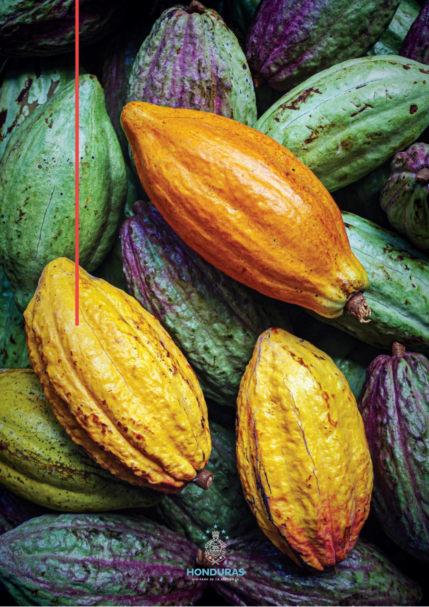

**HONDURAS**  
GOBIERNO DE LA REPUBLICA