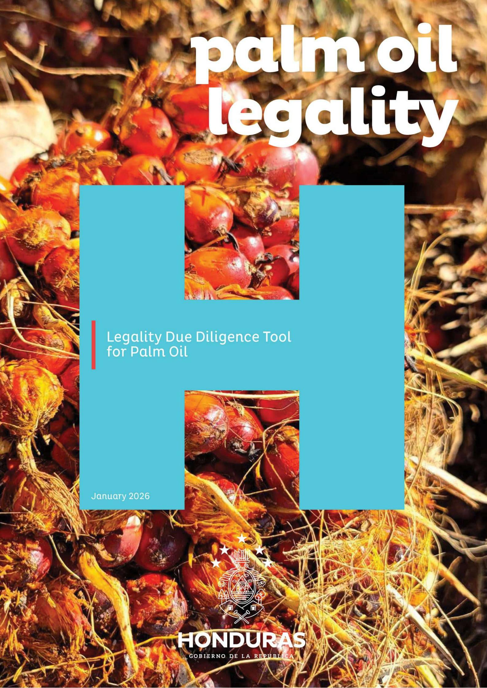

# palm oil legality

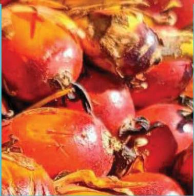

## Legality Due Diligence Tool for Palm Oil

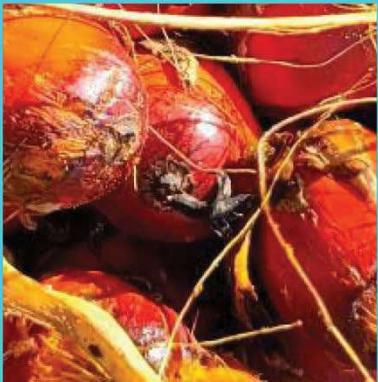

January 2026

Disclaimer: This tool has been developed with the financial support of the European Union. The views expressed herein cannot be considered in any way as reflecting the official opinion of the European Union. This tool is intended to support the oil palm sector's efforts to comply with the requirements of the EUDR. Its content is indicative, not legally binding, and does not constitute legal advice. No guarantee is given as to the accuracy, completeness or timeliness of the content. The authors of this tool accept no liability for any damage or loss that may arise from its use without proper legal advice. The authors welcome any comments or suggestions for improvement.

© European Forest Institute, 2026

© NIRAS A/S, 2026

### Index

| 1. Background........................................................................................................................ 4 |                                                                                                                    |
|-----------------------------------------------------------------------------------------------------------------------------------------|--------------------------------------------------------------------------------------------------------------------|
| Cooperation between Honduras and the European Union                                                                                     | ................................... 5                                                                              |
| Objectives and general approach                                                                                                         | ................................................................................ 6                                 |
| 2. Methodology for developing the tool.......................................................................... 7                      |                                                                                                                    |
| Mapping of relevant national requirements                                                                                               | ............................................................. 7                                                    |
| Development of due diligence recommendations                                                                                            | ................................................... 7                                                              |
| How to use these due diligence recommendations                                                                                          | ................................................. 9                                                                |
| Role of certification in due diligence.........................................................................                         | 10                                                                                                                 |
| 3. Recommendations for legality                                                                                                         | due diligence in the context of national oil                                                                       |
| palm production .....................................................................................................................11 |                                                                                                                    |
| Land-use rights                                                                                                                         | ................................................................................................................11 |
| Environmental protection...........................................................................................                     | 20                                                                                                                 |
| Third parties' rights                                                                                                                   | ........................................................................................................35         |
| Human rights* .................................................................................................................55       |                                                                                                                    |
| Free, Prior and Informed Consent                                                                                                        | 64                                                                                                                 |
| Mapping methodology                                                                                                                     | .................................................................................................. 73              |
| Land-use rights                                                                                                                         | ............................................................................................................... 75 |
| Third parties' rights                                                                                                                   | ........................................................................................................82         |
| Human rights* .................................................................................................................87       |                                                                                                                    |
| FPIC                                                                                                                                    | 89                                                                                                                 |
| Tax, anti-corruption, trade and customs regulations..........................................                                           | 90                                                                                                                 |
| Annex 3. Consultations carried out                                                                                                      | ...................................................................................92                              |

# **1. Background**

### Overview of the oil palm sector in Honduras

In Honduras, oil palm is one of the most important crops for the agricultural economy and rural employment. The country has around 190,000 hectares planted, mainly concentrated in the Aguán Valley and other areas of the Atlantic coast. This sector accounts for around 6% of the agricultural GDP and is the second most exported agro-industrial product after coffee. Palm oil is exported to markets such as Mexico, the United States and the European Union, the latter being a strategic destination that accounts for around 20% of total exports. This makes compliance with the European Union Regulation on deforestation-free products (EUDR) a priority for maintaining market access.

The production structure is made up of more than 17,000 producers, around 70% of which are small-scale farmers with less than 50 hectares. This reflects a high level of dependence on family farming but also poses challenges in terms of traceability and verification of land tenure legality. The sector generates more than 150,000 direct and indirect jobs and has significant social relevance in rural areas where production is concentrated.

However, the sector faces several challenges, such as ensuring complete traceability in order to comply with the EUDR, historical pressure on ecosystems and institutional fragmentation. Added to this are risks arising from international price volatility and vulnerability to climate change. Nevertheless, there are opportunities to strengthen competitiveness by implementing digital traceability systems and consolidating associations of small producers and extraction plants. These actions would enable access to premium markets, improve governance, and position Honduran palm oil as a model of responsible production aligned with global sustainability commitments.

## The European Union Deforestation Regulation

On 31 May 2023, the European Union (EU) adopted Regulation 2023/1115 on the placing on the EU market and export from the EU of certain commodities and products associated with deforestation and forest degradation (EUDR). This regulation requires operators and traders placing products from supply chains associated with deforestation or forest degradation on the EU market to demonstrate that these products are traceable, deforestation-free and legal. The scope of application covers seven commodities: coffee, cocoa, rubber, oil palm, soy, cattle and timber, as well as derived products such as chocolate and cocoa paste. Application of the regulation is scheduled for 30 December 2026 for large and medium-sized enterprises, and 30 June 2027 for micro and small enterprises. Companies affected by the regulation (operators and traders) will be required to carry out due diligence before placing products on the market or exporting them, in order to gather sufficient information to demonstrate that they present no or negligible risk of non-compliance.

Consequently, operators who trade in palm oil or derived products on the EU market must ensure that these have been produced in accordance with the relevant legislation of the country of production (Article 3), which is defined as that relating to the legal status of the production area. The EUDR takes a flexible approach, listing various areas of law without specifying specific legal instruments, as these differ from country to country and may be subject to change. These areas are [for agricultural products]:

- a) Land-use rights
- b) Environmental protection
- c) Third parties' rights
- d) Labour rights
- e) Human rights protected by international law
- f) The principle of Free, Prior and Informed Consent, as set out in the United Nations Declaration on the Rights of Indigenous Peoples
- g) Tax, anti-corruption, trade and customs regulations

In this context, understanding the legislative framework of the country of origin, identifying the relevant legal requirements for the product in question and determining the means of verifying compliance with these requirements is a challenge not only for operators responsible for due diligence, but also for the competent EU authorities responsible for controls, as well as for the various stakeholders.

### Cooperation between Honduras and the European Union

In 2025, Honduras and the EU launched a collaboration aimed at supporting national objectives for the economic, environmental and social sustainability of cocoa, coffee and palm oil, and facilitating their access to the European market. This collaboration is being implemented through a number of technical partners, including the Inter-agency Technical Committee on Government Support for Compliance with the EUDR (CTI),for the EUDR, the European Forest Institute (EFI) and the NIRAS team, who are supporting Honduras in developing a framework to facilitate access to the European market for its agricultural products and promote transparency in supply chains.

In this context, the development of this tool by the State of Honduras, with technical support from the EU (EFI and NIRAS), began in March 2025 with the aim of supporting the due diligence of operators wishing to place Honduran products (coffee, cocoa and palm oil), or derived products on the EU market.

### Support for due diligence of operators buying palm oil in Honduras

EFI led the development of this tool through its Technical Facility on Deforestation-free Value Chains, a programme financed by the EU and steered by the European Commission's Directorate General for International Partnerships (DG INTPA).

The development of this tool received technical support from legal and due diligence experts hired by NIRAS, as well as from representatives and legal representatives of government institutions linked to the CTI and value chains affected by the Regulation.

### Objectives and general approach

The objectives of this tool are to promote a national and consensual view of the Honduran legal requirements applicable to palm oil production and trade that are relevant to the EUDR; and to provide recommendations for verifying regulatory compliance of palm oil and risk management, in order to support operators' due diligence.

The tool was developed to:

- support the harmonisation of operators' due diligence approaches
- encourage the simplification of procedures for actors in the supply chain who are likely to have to provide data to their customers
- facilitate a better understanding of national contexts by the competent authorities of EU Member States responsible for controls
- ensure equitable access to information, reduce perceived risks and position Honduran origin with a competitive advantage

It is important to note that the results presented are not legally binding, do not impose any obligations on the relevant parties, and do not constitute legal advice.

It is the responsibility of operators placing palm oil or derived products on the EU market to identify the relevant legal requirements for Honduras, as defined in Article 2(40) of the EUDR, and to adapt their due diligence to the risks identified. This tool provides guidance that can assist operators and other stakeholders in the sector in this respect. It should be emphasised that this guidance is likely to evolve over time and be updated due to various factors, including possible legal reforms in the country, developments in public or private certification systems, lessons learnt from the practical implementation of due diligence recommendations, additional guidance provided by the European Commission or competent authorities, integration of best practices and technological developments, etc.

# **2. Methodology for developing the tool**

It was developed in two steps:

- Step 1: Mapping of the national legal requirements relevant to the production and trade of palm oil of Honduran origin in the context of the EUDR, integrating relevant information from stakeholders. The results of this step are captured in Annex 1 of the tool.
- Step 2: Development of due diligence recommendations for operators, based on an analysis of the level of implementation of relevant legal requirements and existing means of verification. The results of this step are detailed below.

### Mapping of relevant national requirements

Based on various analyses of the applicable legal framework in the country, the EFI and NIRAS team, together with a legal expert, first consolidated and supplemented all relevant legal requirements for the oil palm, coffee and cocoa sectors, and organised them comprehensively according to the areas of law listed in the EUDR. These requirements were then structured into subcategories under a legal taxonomy developed by EFI in collaboration with Preferred by Nature, in order to facilitate their analysis (see [https://legalitynavigator.efi.int/\)](https://legalitynavigator.efi.int/).

For each subcategory legal requirements were drafted in clear and understandable language for operators, which was validated through multistakeholder exercises (see Annex 3). Likewise, the relevance of each requirement for the sectors involved was determined collectively and by consensus, thus concluding the first step of the process.

### Development of due diligence recommendations

The second step, focused on developing a risk pre-assessment, began with the work of sectoral expert groups. For each relevant legal requirement, information was collected and existing data was analysed to determine the level of implementation and the associated risk. This level was agreed upon based on evidence, with the aim of formulating recommendations for due diligence actions to guide operators. These recommendations, based on sectoral risk for each legal requirement, serve as guidance for operators to conduct their own risk analysis in their supply chains.

The tool is based on technical consultations with various national and international actors involved in coffee, cocoa and palm oil, including Honduran government entities, producers, exporters and traders, certifiers and civil society (see Annex 3).

### Scope of the recommendations

### Who are these recommendations aimed at?

These recommendations are aimed at the various stakeholders interested in verifying the compliance of palm oil and derived products with the EUDR. They may be useful for:

- Operators (within the meaning of the EUDR): any natural or legal person who, in the course of a commercial activity, places palm oil or derived products on the EU market or exports them.
- Traders (within the meaning of the EUDR): any natural or legal person in the supply chain, other than the operator, who trades the products in question on the EU market.
- EU competent authorities: authorities designated by Member States to ensure compliance with EUDR obligations.
- Supply chain actors in Honduras: producers, cooperatives, traders, exporters, and other stakeholders involved in the production and trade of palm oil, from whom operators may request the information, data and documents necessary to carry out their due diligence.
- Honduran public entities: government authorities and agencies responsible for regulating the palm oil sector (production and trade), land tenure, the environment and sustainable development.
- Civil society: non-governmental organisations, associations, and other actors that play supervisory, support and advocacy roles to ensure that oil palm and derived products comply with Honduran legislation and international commitments.

#### What are these recommendations for?

These recommendations can be used in different ways and at different times depending on the actors involved.

Operators and traders can use these recommendations to establish and document their due diligence system, ensuring that the palm oil they trade complies with the legal requirements of the EUDR. They can use them to identify the documents and information that need to be collected or other actions that need to be taken with their suppliers in Honduras, and to assess the risks associated with their supply chain.

Competent EU authorities can use these recommendations as a standard for assessing the compliance of products traded under the EUDR. They can also use them to harmonise their controls and interpret documents originating from Honduras.

Supply chain actors in Honduras can use these recommendations to understand the implications of the EUDR requirements for Honduran palm oil and the expectations of European operators and traders. These recommendations can be used to structure and document the information they may provide to these operators and traders. They can also help them anticipate risks of noncompliance and adapt their agricultural and commercial practices.

Honduran public entities can use these recommendations to strengthen controls on implementation of national legislation by producers and exporters, in order to ensure that derived products traded comply with current Honduran laws. They can also use them to support producers in ensuring compliance by providing them with better access to information on current regulations and buyer requirements. They can build on these recommendations to make data more transparent and accessible, including facilitating access to administrative documents, to help operators demonstrate the legality of palm oil.

Civil society can use these recommendations to monitor the implementation of Honduran legal requirements by companies and authorities. They can be used to conduct analyses and produce reports on the risks of non-compliance for palm oil by-products. They can also be used to raise awareness among producers, companies and consumers about the legality of Honduran palm oil.

### How to use these due diligence recommendations

The recommendations presented in this document aim to address all relevant legal requirements identified by stakeholders during the first step of the development of the tool. They cover, in particular, all legal areas listed in Article 2.40 of the EUDR, in line with the precautionary approach adopted by the tool (see Annex 1).

This flexible approach allows users of the recommendations to adapt their due diligence actions based on their interpretation of the scope of the EUDR.

### Light due diligence or standard due diligence

This tool takes a pragmatic approach that seeks to identify risk-proportionate due diligence actions in order to limit the burden on those involved in the sector. The level of implementation each requirement considered relevant to palm oil production and trade in Honduras has been assessed. The level of implementation adopted by the tool is based on relevant literature, expert knowledge of the sector, field surveys and bilateral and multistakeholder consultations organised within the framework of the development of the tool.

When the level of implementation assessed for a requirement is high, light due diligence actions are recommended. On the other hand, when the level of implementation. with a requirement is low or unknown, standard due diligence is recommended.

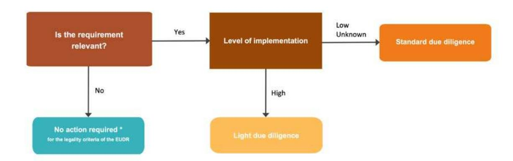

However, this analysis is only indicative and has been carried out at country level only. It is the responsibility of operators to carry out a non-compliance risk analysis of their products for each shipment. Within this framework, these recommendations offer a range of due diligence options. These actions are not prescriptive and are not presented in any specific order. It is up to operators to choose from these options based on the context, their knowledge of their supply chains, and the risks identified for oil palm and derived products.

### Role of certification in due diligence

Palm oil certification systems are voluntary, public or private mechanisms that seek to ensure that its production and trade comply with certain environmental, social and economic standards. They can be established by governments, international organisations, NGOs or private companies.

### The EUDR and certification

Third-party certification and verification systems can play an important role in promoting sustainable agricultural and forestry practices and responsible sourcing. There are different types of certifications, which can be implemented nationally on a mandatory basis or privately on a voluntary basis (e.g. Roundtable on Sustainable Palm Oil - RSPO).

According to the EUDR, for the purposes of risk assessment, operators may take into account information from certification schemes or other third-party verified schemes. However, the European Commission's guidance of 2 October 2024 indicates that self-declaration schemes that are not based on third-party certification procedures are, by definition, less robust due to a lack of independence and impartiality.

The European Commission also specifies that certification schemes should not replace the operator's responsibility for due diligence. In other words, private certification schemes can be a tool to help European operators carry out due diligence to comply with legality, deforestation and traceability criteria.

Operators must be able to justify why and how certification schemes comply with EUDR requirements. To do so, three elements must be taken into account:

- The certification system's coverage of the relevant legal requirements for the EUDR.
- The robustness of the certification system: in particular, the scope of certification (applicable to which actors in the value chain? to which products?), governance (management of internal procedures and updates, for example), accreditation processes for control bodies; auditor qualifications and audit frequency; non-compliance management, impartiality and conflict of interest management, etc. This information must be periodically reassessed by the operator, in particular in relation to the EUDR requirements.
- Traceability and the absence of mixing with non-certified products.

It should be noted that, in the development of this tool, no exhaustive comparison was conducted of the coverage of the relevant legal requirements by certification systems used in the Honduran oil palm sector.

# **3. Recommendations for legal due diligence in the context of national oil palm production**

The tables below, organised by area of law, present the due diligence recommendations agreed upon by the stakeholders consulted for the legality of palm oil produced in Honduras.

### Land-use rights

In Honduras, agricultural land may be privately owned, state-owned or communal (ejidal), with full title deeds granted by the Property Institute (IP) or the National Agrarian Institute (INA). In addition, the law recognises both regular and irregular possession. Informal possession is common in the palm oil sector, especially in small production units. However, this situation does not automatically constitute illegality, although it can create legal uncertainty. Producers can also cultivate land without owning it through legal arrangements of mere tenure, such as usufruct, the right of use, or lease agreements, although these often lack formal documentation and depend on the tolerance of the owner and/or a verbal agreement in good faith.

The oil palm sector in Honduras has a dual structure. On the one hand, there are large-scale plantations, generally operated by agro-industrial companies. These tend to have higher levels of formalisation in land tenure and implementation of legal requirements, although they are not exempt from risks associated with historical land conflicts, disputed allocation processes or overlapping third-party rights. On the other hand, a significant part of production comes from small and medium-sized producers, for whom informal possession, unregistered titles or incomplete documentation is more common.

The State of Honduras, through the Registry of Abandoned Property (RBA), guarantees forcibly displaced persons the right to legal protection, restitution of land, housing and property, and access to justice, preventing the dispossession or misuse of abandoned property. In terms of land use planning, only 65 of the 298 municipalities nationwide have a Municipal Land Use Plan (PMOT) in force, drawn up by the municipalities in coordination with the Secretariat of State for Natural Resources and the Environment (SERNA) and supervised by the National Institute for Forest Conservation and Development, Protected Areas and Wildlife (ICF) in forest areas. These plans guide land use, identify productive areas and warn against overexploitation, without specifying permitted crops, and only become mandatory if approved in open council.

There are conflicts over land tenure in oil palm production areas. These conflicts affect different types of producers in different ways, being more recurrent and visible in territories with a high concentration of small producers or a history of agrarian reform and historical occupation. Various titling initiatives promoted in recent years show that this problem is recognised at the institutional level: for example, the National Federation of Palm Producers, extraction companies, the National Agrarian Institute (INA) and organisations such as Solidaridad have developed projects to grant property titles to palm producers, with the aim of "guaranteeing legal security over the land" and preventing future conflicts [\(Solidaridad, 2021](https://www.solidaridadnetwork.org/news/land-titling-project-sees-progress-in-honduras/) and y [Canal 8 de Honduras 2024](https://cn8.spe.gob.hn/nacional/enhorabuena-legalizan-178-titulos-de-propiedad-a-palmeros-nacionales/)).

| Level of                                                                                                                                                                                                                                                                                                                                                                                                                                                            |                                                                                                                                                                                                                                                                                                                                                                                                                                                                                                                     |
|---------------------------------------------------------------------------------------------------------------------------------------------------------------------------------------------------------------------------------------------------------------------------------------------------------------------------------------------------------------------------------------------------------------------------------------------------------------------|---------------------------------------------------------------------------------------------------------------------------------------------------------------------------------------------------------------------------------------------------------------------------------------------------------------------------------------------------------------------------------------------------------------------------------------------------------------------------------------------------------------------|
| Legal requirement Context implementation / due diligence                                                                                                                                                                                                                                                                                                                                                                                                            | Due diligence recommendations                                                                                                                                                                                                                                                                                                                                                                                                                                                                                       |
| 1. Land-use rights 1.1 Land-use rights are guaranteed 1.1.1 Land tenure is well Low defined and respected: Standard due social and environmental interests.                                                                                                                                                                                                                                                                                                         | Consultations with stakeholders Confirm that there are no complaints or litigation                                                                                                                                                                                                                                                                                                                                                                                                                                  |
| (Smallholder Associative Enterprises) holds 14.04% of the titles, the Ethnic Sector                                                                                                                                                                                                                                                                                                                                                                                 |                                                                                                                                                                                                                                                                                                                                                                                                                                                                                                                     |
| In the oil palm sector, some small producers cultivate land under irregular or                                                                                                                                                                                                                                                                                                                                                                                      |                                                                                                                                                                                                                                                                                                                                                                                                                                                                                                                     |
| informal possession without holding formal titles. This type of cultivation without a                                                                                                                                                                                                                                                                                                                                                                               |                                                                                                                                                                                                                                                                                                                                                                                                                                                                                                                     |
| concerning the production lands of the palm oil Cases A: diligence The producer owns the land (through a registered public deed or title deed granted by the competent authority). OR recommended: owner. The producer is the formal or informal "possessor" of the land. OR unresolved. The producer exercises use rights over the land without any intention of ownership, through arrangements of formal title is not illegal. authority. mere tenure, including | chains by conducting stakeholder interviews, and consulting national and international press, NGOs, other sources, and the complaints system. If there are indications of complaints or conflicts in the sourcing area, the following due diligence actions are Compilation and verification of documents Review Property Institute or National Agrarian Institute records to confirm whether or not the conflict remains Systematically compile, as appropriate: Property title duly registered with the competent |
| Complete entry certification issued by the usufruct, lease and gratuitous loan.                                                                                                                                                                                                                                                                                                                                                                                     | General Directorate of Registries of the Property Institute.                                                                                                                                                                                                                                                                                                                                                                                                                                                        |
| Full Ownership                                                                                                                                                                                                                                                                                                                                                                                                                                                      | Title (Título de Dominio Pleno).                                                                                                                                                                                                                                                                                                                                                                                                                                                                                    |
| Usufructuary Ownership Title                                                                                                                                                                                                                                                                                                                                                                                                                                        | (Título de Dominio Útil).                                                                                                                                                                                                                                                                                                                                                                                                                                                                                           |

|                                                                                                                                                                                           | Level of                                                                                                                                                                                                                                                                            |
|-------------------------------------------------------------------------------------------------------------------------------------------------------------------------------------------|-------------------------------------------------------------------------------------------------------------------------------------------------------------------------------------------------------------------------------------------------------------------------------------|
| Legal requirement                                                                                                                                                                         | Context implementation / Due diligence recommendations due diligence Lease agreement.                                                                                                                                                                                               |
| informal or oral agreements, that is,                                                                                                                                                     | without a written contract.                                                                                                                                                                                                                                                         |
| promoted in recent years show that this problem is recognised at an                                                                                                                       | institutional                                                                                                                                                                                                                                                                       |
| (Solidaridad, 2024 an                                                                                                                                                                     | d Government of Honduras – INA, 2023).                                                                                                                                                                                                                                              |
|                                                                                                                                                                                           | Gratuitous loan (comódato) agreement.                                                                                                                                                                                                                                               |
|                                                                                                                                                                                           | Public deed establishing usufruct. Registered possession. Review of cadastral registration number. Land dispute resolution documents (where applicable).                                                                                                                            |
|                                                                                                                                                                                           | Private sale agreement. At the cooperative level, permits granted by local authorities supporting the existence and use of the plantation. Implementation of procedures and processes                                                                                               |
|                                                                                                                                                                                           | Support small producers in obtaining formal land titles.                                                                                                                                                                                                                            |
|                                                                                                                                                                                           | Segregate palm fruit originating from conflict                                                                                                                                                                                                                                     |
|                                                                                                                                                                                           | affected areas.                                                                                                                                                                                                                                                                     |
| In the case of oil palm 1.1.2 Land tenure is well defined and respected: Cases B:                                                                                                         | cultivation, land allocation through Agrarian Reform also Low Consultations with stakeholders Standard due Confirm that there are no complaints or litigation diligence concerning the production lands of the palm oil chains by conducting stakeholder interviews, and consulting |
| The community has acquired                                                                                                                                                                | Agrarian Institute facilitates land allocation through agrarian reform by providing national and international press, NGOs, other sources, and                                                                                                                                      |
| training programmes, technical assistance, and credit to support the land-use rights for collective use through the National Agrarian Institute agreement. and the Property Institute. OR | proper land use. the complaints system. Compilation and verification of documents Review Property Institute or National Agrarian Institute records to confirm whether or not the conflict remains                                                                                   |
| communal property rights, use rights, and the administration The community has acquired                                                                                                   | and management of unresolved.                                                                                                                                                                                                                                                       |
| the land, as well as land-use rights through the Agrarian Reform.                                                                                                                         | the sustainable use of natural resources, on land traditionally Systematically compile, as appropriate: Legal adjudication under Agrarian Reform                                                                                                                                    |
| that and are inalienable, unseizable and imprescriptible.                                                                                                                                 | the ancestral lands historically held by these groups are communal property Resolutions on communal collective allocation or tenure.                                                                                                                                                |

|                                                                                                                                                                                                                | Level of                                                                                                                                                                                                                                                                                                                                                                                                                                                                                                                                                                                                                                                                                                                                                                                                                          |
|----------------------------------------------------------------------------------------------------------------------------------------------------------------------------------------------------------------|-----------------------------------------------------------------------------------------------------------------------------------------------------------------------------------------------------------------------------------------------------------------------------------------------------------------------------------------------------------------------------------------------------------------------------------------------------------------------------------------------------------------------------------------------------------------------------------------------------------------------------------------------------------------------------------------------------------------------------------------------------------------------------------------------------------------------------------|
| Legal requirement                                                                                                                                                                                              | Context implementation / Due diligence recommendations due diligence which creates legal uncertainty.                                                                                                                                                                                                                                                                                                                                                                                                                                                                                                                                                                                                                                                                                                                             |
| land used for 1.1.3 No evidence of abandonment or forced expulsion from the plot: The land used for agricultural production must                                                                               | the production and export of oil palm products. Low Consultations with stakeholders Standard due As a first step, identify if there are conflicts in the area of diligence production: Consult with local governments (municipalities, where                                                                                                                                                                                                                                                                                                                                                                                                                                                                                                                                                                                      |
| of defence                                                                                                                                                                                                     | and restitution.                                                                                                                                                                                                                                                                                                                                                                                                                                                                                                                                                                                                                                                                                                                                                                                                                  |
| Property (RBA) is currently                                                                                                                                                                                    | being created and will be managed by the Property                                                                                                                                                                                                                                                                                                                                                                                                                                                                                                                                                                                                                                                                                                                                                                                 |
| registered, as well as                                                                                                                                                                                         | property seized from persons who fall within the provisions of                                                                                                                                                                                                                                                                                                                                                                                                                                                                                                                                                                                                                                                                                                                                                                    |
| is La Mosquitia, where the expansion                                                                                                                                                                           | of African palm plantations in the north poses                                                                                                                                                                                                                                                                                                                                                                                                                                                                                                                                                                                                                                                                                                                                                                                    |
| not have been subject to forced abandonment or violent expulsion of previous occupants. The producer must exercise legitimate tenure or ownership without active disputes that infringe on third party rights. | applicable) and local or national NGOs to see if there are signs of forced abandonment or violent expulsion. Cross-reference the geolocation of areas of production with the map of socio-territorial conflicts in Honduras: https://observatorio.cespad.org.hn/mapa/ Observatory on Violence and Forced Displacement, CESPAD https://cespad.org.hn/ Implementation of procedures and processes Encourage companies to have a clear policy or procedure for not purchasing palm fruit from lands in conflict or subject to forced displacement. Field verification Honduras. The report can be found at the following link: If there is a risk of conflict in the area of production, carry out field verification to ensure that the plots that are occupied and developed are not subject to forced displacement or litigation. |

| Legal requirement                                                                                                                                                                                                                                                  | Context                                                                                                                                                                                                                                                                                                                                                                                                                                                                                                                                                                                                                                                                                                                                                                                             | Level of implementation / due diligence              | Due diligence recommendations                                                                                                                                                                                                                                                                                                                                                                                                                                                                                                                                                                                                                                                                                                                                                                                                       |
|--------------------------------------------------------------------------------------------------------------------------------------------------------------------------------------------------------------------------------------------------------------------|-----------------------------------------------------------------------------------------------------------------------------------------------------------------------------------------------------------------------------------------------------------------------------------------------------------------------------------------------------------------------------------------------------------------------------------------------------------------------------------------------------------------------------------------------------------------------------------------------------------------------------------------------------------------------------------------------------------------------------------------------------------------------------------------------------|------------------------------------------------------|-------------------------------------------------------------------------------------------------------------------------------------------------------------------------------------------------------------------------------------------------------------------------------------------------------------------------------------------------------------------------------------------------------------------------------------------------------------------------------------------------------------------------------------------------------------------------------------------------------------------------------------------------------------------------------------------------------------------------------------------------------------------------------------------------------------------------------------|
| <b>1.2 Legal requirements for land use are met</b>                                                                                                                                                                                                                 |                                                                                                                                                                                                                                                                                                                                                                                                                                                                                                                                                                                                                                                                                                                                                                                                     |                                                      |                                                                                                                                                                                                                                                                                                                                                                                                                                                                                                                                                                                                                                                                                                                                                                                                                                     |
| 
<b>1.2.1. Agriculture is permitted on the plot</b>
 
<b>Agricultural activity is permitted in accordance with current regulations and land use. It does not contravene municipal urban planning, environmental or territorial planning provisions.</b>
 | 
In Honduras, only 65 of the 298 municipalities have a Municipal Land Use Plan (PMOT) in force, which regulates land use and its compatibility with agricultural production and environmental protection. These plans identify productive areas and warn against overexploitation, but do not specify permitted crops. They are advisory in nature and only become binding if approved by the municipal council through an open council (<i>cabildo abierto</i>).
 
In addition, the Ministry of Agriculture and Livestock (SAG) and other entities have published reports reflecting statistical data on palm production in the country, including sites that show where production is permitted, among them:
 
African Palm SAG Honduras
 
<a href="#">AC-PALMA-V201.pdf</a>
 | 
<b>High</b>
 
<b>Light due diligence</b>
 | 
<b>Geospatial analysis:</b> Compile polygons of areas of production to identify which municipalities they belong to.
 
<b>Consultations with stakeholders:</b> Consult the municipalities where the areas of production are located to find out if they have a valid Municipal Land Use Plan (PMOT).
 
If there is a PMOT, analyse it to identify the areas where agricultural activity is permitted.
 
<b>Second geospatial analysis:</b> If the municipality has a PMOT, overlay the polygons of the areas of production with the map of areas where agriculture is permitted in the PMOT to verify implementation.
 
Overlay the polygons with the SAG oil palm cultivation map to verify that the area of production is located in a zone where this agricultural activity is permitted.
 |

#### 1.1.1 Land tenure is well defined and respected

#### Cases A

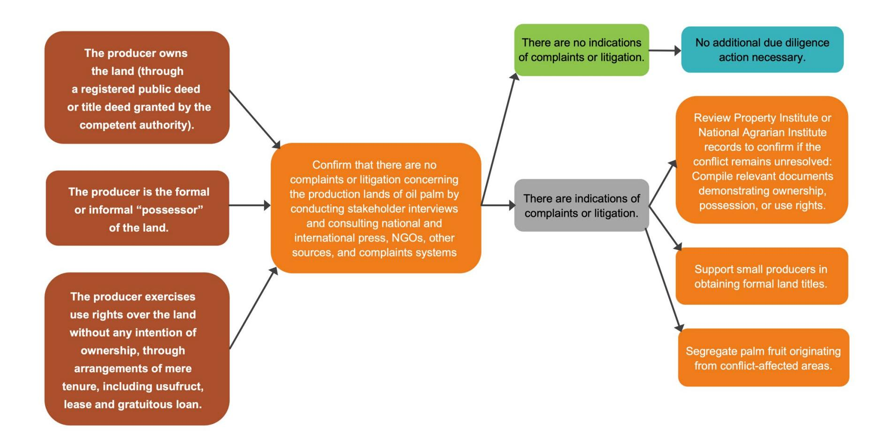

#### 1.1.2 Land tenure is well defined and respected.

#### Cases B

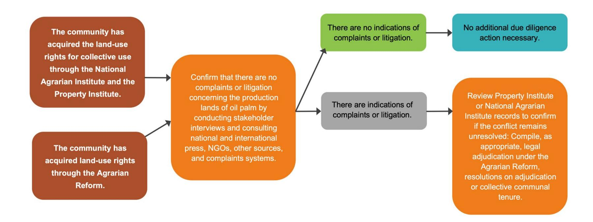

#### 1.1.3 No evidence of abandonment or forced expulsion from the plot

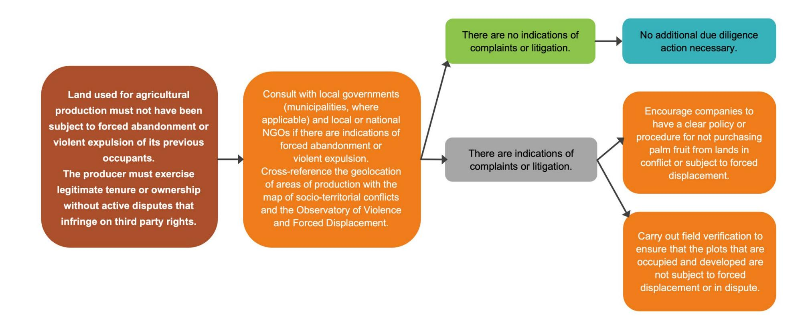

#### 1.2.1 Agriculture is permitted on the plot

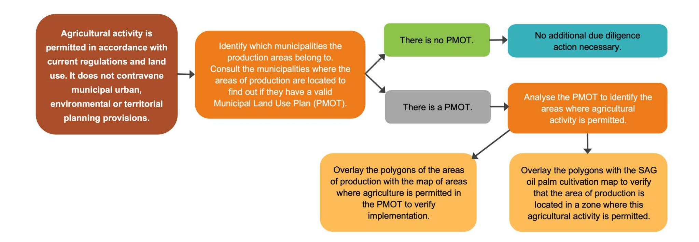

### Environmental protection

In Honduras, the environmental legal framework for oil palm implementation combines special conservation regimes (national forests, protected areas, national parks and RAMSAR wetlands), regulation of agricultural inputs, and an environmental categorisation and licensing system, namely the National Environmental Impact Assessment System (SINEIA) administered by SERNA, which is based on the size and type of plantation, as well as provisions to protect wildlife and water resources. Taken together, the regulations are extensive and cover the main environmental impacts associated with cultivation. However, the level of compliance and due diligence required vary depending on the issue and the practical evidence available.

According to the analysis contained in this tool, several areas of high level of implementation are identified where light due diligence is appropriate: the regime of protected areas and RAMSAR wetlands, given that production generally takes place outside or in buffer zones (with the historical and limited exception of a small area of the Jeanette Kawas National Park, where production is segregated for domestic consumption); the authorisation and regulatory control of herbicides, insecticides, fertilisers and fungicides by SAG/National Service for Agrifood Health and Safety (SENASA), where producers implement authorised products in accordance with the label dosage; and the protection of endangered species, for which no documented complaints or incidents have been reported to the competent authorities.

In contrast, the assessment points to areas where non-compliance has been reported or where information is lacking, which justifies standard due diligence, mainly due to gaps in supervision, traceability or lack of sufficient official information to verify in the field. These include the management of agrochemical packaging and waste and the treatment of solid/organic waste, despite clear rules and programmes such as Campo Limpio; the protection of water resources (micro-basins, discharges and, especially, water margins), where the absence of consolidated official information on protection limits requires the implementation of the precautionary principle; soil conservation and management, given that technical guidelines exist but there is limited information on effective implementation; air pollution and aerial burning/fumigation, due to the absence of systematic measurement and control mechanisms; and implementation of environmental licensing and associated obligations (SINEIA categorisation, environmental instruments and ICMA), which in practice requires enhanced verification.

|                                                                                                                                                                               | Level of                                                                                                                                                                                                                                                                                                                                                                                                                                                                                                                                                                                                                                                                                                                                                                                                                                                                                                                                                                                                                                                                                                                                                                                                                                                                                               |
|-------------------------------------------------------------------------------------------------------------------------------------------------------------------------------|--------------------------------------------------------------------------------------------------------------------------------------------------------------------------------------------------------------------------------------------------------------------------------------------------------------------------------------------------------------------------------------------------------------------------------------------------------------------------------------------------------------------------------------------------------------------------------------------------------------------------------------------------------------------------------------------------------------------------------------------------------------------------------------------------------------------------------------------------------------------------------------------------------------------------------------------------------------------------------------------------------------------------------------------------------------------------------------------------------------------------------------------------------------------------------------------------------------------------------------------------------------------------------------------------------|
| Legal requirement                                                                                                                                                             | Context implementation / Due diligence recommendations due diligence                                                                                                                                                                                                                                                                                                                                                                                                                                                                                                                                                                                                                                                                                                                                                                                                                                                                                                                                                                                                                                                                                                                                                                                                                                   |
| 2. Environmental protection 2.1 Environmental requirements for agricultural activities 2.1.1. Agricultural activity is not carried out in areas subject to special protection | High Geospatial analysis Overlay the polygons of the farms with the layers of protected Light due diligence                                                                                                                                                                                                                                                                                                                                                                                                                                                                                                                                                                                                                                                                                                                                                                                                                                                                                                                                                                                                                                                                                                                                                                                            |
| wetlands, which in this case                                                                                                                                                  | are RAMSAR sites.                                                                                                                                                                                                                                                                                                                                                                                                                                                                                                                                                                                                                                                                                                                                                                                                                                                                                                                                                                                                                                                                                                                                                                                                                                                                                      |
| areas, except in a small area of Jeannette                                                                                                                                    | Kawas National Park, which is                                                                                                                                                                                                                                                                                                                                                                                                                                                                                                                                                                                                                                                                                                                                                                                                                                                                                                                                                                                                                                                                                                                                                                                                                                                                          |
| regimes, such as protected areas, designated micro basins, national forests, and national parks. levels). domestic consumption.                                              | areas and designated micro-basins published on the ICF's GEOPORTAL and GEOFORESTAL websites to identify whether the areas of production are within zones subject to special regimes. If areas of production are within or near zones subject to special regimes, a range of possible due diligence actions are recommended: Compilation and verification of documents Obtain management plans for protected areas where implementation is required and verify that farms are in buffer zones and not in core zones. Implementation of procedures and processes Where relevant, support producers in obtaining formal permits for their agricultural activities. Encourage companies to adopt policies or procedures that prohibit agriculture in core zones of protected areas or areas of cultural interest. Consultations with stakeholders Confirm the correct implementation of the provisions of the Management Plan for the protected area or area of cultural interest through interviews with community representatives, local NGOs, local authorities and other local stakeholders. Field verifications Conduct field visits to confirm the correct implementation of the provisions of the Management Plan for the protected area or area of cultural interest, through: (1) interviews with |

|                                                                                                                                                                                                                                                          | Level of                                                                                                                                                                                                                                                                                                                                                                                                                                                                                                                                                                                                                                                                                                                                                                                                                                                                                                                                                                                                                                                                                                                                                                                                                                                                                                                                                                                  |
|----------------------------------------------------------------------------------------------------------------------------------------------------------------------------------------------------------------------------------------------------------|-------------------------------------------------------------------------------------------------------------------------------------------------------------------------------------------------------------------------------------------------------------------------------------------------------------------------------------------------------------------------------------------------------------------------------------------------------------------------------------------------------------------------------------------------------------------------------------------------------------------------------------------------------------------------------------------------------------------------------------------------------------------------------------------------------------------------------------------------------------------------------------------------------------------------------------------------------------------------------------------------------------------------------------------------------------------------------------------------------------------------------------------------------------------------------------------------------------------------------------------------------------------------------------------------------------------------------------------------------------------------------------------|
| Legal requirement 2.1.2. Producers use only state-regulated agrochemicals for agricultural production and in accordance with manufacturer-specified dosages. 2.1.3. Producers who use agrochemicals must treat containers to prevent soil contamination. | Context implementation / Due diligence recommendations due diligence community forest managers and palm producers in the forest; and (2) direct monitoring in the forest and on palm plantations. High Compilation and verification of documents Obtain the list of pesticides and fertilisers authorised by Light due diligence SENASA and ARSA. indicated on the label. List of pesticides and fertilisers approved by SENASA certifying the phytosanitary quality of exports. List of pesticides and related substances registered in Honduras Compilation and verification of documents Consult possible reports and/or conduct interviews with NGOs, cooperatives and the authorities on possible cases of soil at the national level. degradation in the sourcing area. Consultations with stakeholders Confirm the absence of cases of soil degradation in the sourcing area through interviews with cooperatives, NGOs, local authorities and other local actors. Implementation of procedures and processes Low Promote the adoption and implementation of these instruments by agricultural producers: Standard due authorised collection centres. diligence Plan for the management of pesticides or crop protection products, including biological products where relevant. The plan should include providing producers with a list of authorised pesticides and fertilisers. |
|                                                                                                                                                                                                                                                          | technical procedures to prevent contamination of soil and water bodies. Plan or procedure for managing empty chemical                                                                                                                                                                                                                                                                                                                                                                                                                                                                                                                                                                                                                                                                                                                                                                                                                                                                                                                                                                                                                                                                                                                                                                                                                                                                     |
|                                                                                                                                                                                                                                                          | Official programmes such as Campo Limpio (SENASA) and regulatory containers. basis. Occupational health and contingency plan or procedure. Training plan for employees on handling of chemical substances. Solid waste management plan. Company policies prohibiting the use of red-label products. Procedure for the proper use of pesticides and fertilisers.                                                                                                                                                                                                                                                                                                                                                                                                                                                                                                                                                                                                                                                                                                                                                                                                                                                                                                                                                                                                                           |

|                                                                                                                                                        | Level of                                                                                                                                                                                                                                                                                                                                                                                                                                                                                                                                                                                                                                                                                                                      |
|--------------------------------------------------------------------------------------------------------------------------------------------------------|-------------------------------------------------------------------------------------------------------------------------------------------------------------------------------------------------------------------------------------------------------------------------------------------------------------------------------------------------------------------------------------------------------------------------------------------------------------------------------------------------------------------------------------------------------------------------------------------------------------------------------------------------------------------------------------------------------------------------------|
| Legal requirement                                                                                                                                      | Context implementation / Due diligence recommendations due diligence Plan for the management and use of personal protective equipment. BPA palm manual for small producers Second compilation and verification of documents Logbook of chemical and biological product implementations on farms Logs or lists of training and attendance in integrated chemical management Certificates of delivery to collection or recycling centres                                                                                                                                                                                                                                                                                        |
| 2.1.4. Agricultural activity is carried out in compliance with minimum authorised                                                                      | ( Campo Limpio ) Record of final waste disposal (logs, photographs) Evidence of triple washing and proof of collection Low Geospatial analysis Standard due Overlay the polygons of the plantations with a map of water                                                                                                                                                                                                                                                                                                                                                                                                                                                                                                       |
| micro-basins designated                                                                                                                                | as sourcing areas. There is also a technical standard                                                                                                                                                                                                                                                                                                                                                                                                                                                                                                                                                                                                                                                                         |
| Agua de Honduras                                                                                                                                       | platform, there are still no official reports on the protection                                                                                                                                                                                                                                                                                                                                                                                                                                                                                                                                                                                                                                                               |
| distances from watercourses, ensuring the protection of riverbanks, wetlands and water recharge areas in accordance with current national regulations. | bodies, designated micro-basins, wetlands, rivers and water diligence recharge areas: https://sigmof.icf.gob.hn/reportes/watersheds/ directly to individual producers. https://geoportal.icf.gob.hn/ https://earth.google.com/web/ Honduras. However, there is a map of the country's rivers. If the area of production is located near bodies of water, wetlands, or water recharge areas, the following additional due diligence actions are recommended: Compilation and verification of documents Where relevant, show proof of a water contract issued by to recommend carrying out standard due diligence. SERNA. In palm oil production, there are some models for recycling water from the extraction plant to farms. |

|                                                                                                                            | Level of                                                                                                                                                                                                                                                                                                                                                                                                                                                                                                                                                |
|----------------------------------------------------------------------------------------------------------------------------|---------------------------------------------------------------------------------------------------------------------------------------------------------------------------------------------------------------------------------------------------------------------------------------------------------------------------------------------------------------------------------------------------------------------------------------------------------------------------------------------------------------------------------------------------------|
| Legal requirement                                                                                                          | Context implementation / Due diligence recommendations due diligence Implementation of procedures and processes Development and implementation of a remediation plan adapted to the specific conditions of the affected area. Implementation and training in Good Management Practices (GMP) in the use of agrochemicals, agricultural work and waste disposal.                                                                                                                                                                                         |
| 2.1.5. Producers implement appropriate techniques to conserve soil fertility and prevent degradation. and protected areas. | Design and implementation of management plans for riparian areas, with the aim of protecting water bodies and conserving associated ecosystems. These measures must be documented, monitored and evaluated in accordance with the guidelines established by the competent authorities. Low In the sourcing area: Standard due Compilation and verification of documents: diligence Consult any reports from NGOs, cooperatives and the authorities relating to possible cases of soil degradation in the sourcing area. Consultations with stakeholders |
| globally and in Mesoamerica, with some research specifically focused                                                       | on                                                                                                                                                                                                                                                                                                                                                                                                                                                                                                                                                      |
| Honduras. The scientific evidence is robust and generally                                                                  | indicates that: Confirm the absence of soil degradation in the sourcing area through interviews with cooperatives, NGOs, local                                                                                                                                                                                                                                                                                                                                                                                                                          |
| The negative impact is not inherent to palm oil the type of management and previous land use.                              | itself but rather depends on authorities and other local actors where it is evident that agriculture is permitted on productive plots. With good practices, impacts can be mitigated or even reversed. With producers and intermediaries in the supply chain:                                                                                                                                                                                                                                                                                           |
| management in oil palm cultivation. However, there is insufficient information                                             | Implementation of procedures and processes Support producers in best practices for the use of soils at risk of stakeholders have agreed to recommend standard due diligence. erosion, soil conservation and biodiversity loss, for example through training, campaigns, etc., including the dissemination and promotion of compliance with the GPP manual for small                                                                                                                                                                                     |
|                                                                                                                            | palm oil producers (https://fhia.org.hn/wp content/uploads/manual_buenas_practicas.pdf).                                                                                                                                                                                                                                                                                                                                                                                                                                                               |

|                                                                                                                               | Level of                                                                                                                                                                                                                                                                                                                                                                                                                                                                                                                                                                                                                                                  |
|-------------------------------------------------------------------------------------------------------------------------------|-----------------------------------------------------------------------------------------------------------------------------------------------------------------------------------------------------------------------------------------------------------------------------------------------------------------------------------------------------------------------------------------------------------------------------------------------------------------------------------------------------------------------------------------------------------------------------------------------------------------------------------------------------------|
| Legal requirement                                                                                                             | Context implementation / Due diligence recommendations due diligence Data collection and verification                                                                                                                                                                                                                                                                                                                                                                                                                                                                                                                                                     |
| 2.1.6. If the producer carries out aerial spraying of agrochemicals or prescribed burning, the relevant permits are in place. | Obtain details on possible training for producers (training organisations, date, participant log, content, etc.) in good agricultural practices. Compilation and verification of documents Land management and use plan Good agricultural practices manual Integrated pest management plan or agrochemical molecule rotation plan Follow-up visit report by agronomists Report on regenerative agriculture Low Implementation of procedures and processes from agrochemicals or emissions from fires. Standard due Encourage the adoption of the following practices by diligence agricultural producers: Avoid aerial applications near water sources or |
| According to USAID reports and certification                                                                                  | data, aerial application of community areas.                                                                                                                                                                                                                                                                                                                                                                                                                                                                                                                                                                                                              |
| agrochemicals on oil                                                                                                          | palm crops is rare in Honduras. It is strictly regulated and Promote sustainable alternatives (composting, mulching). Assess environmental risks before applying for permission to burn or apply agrochemicals by aerial spraying. Train personnel in mitigation measures.                                                                                                                                                                                                                                                                                                                                                                                |
| technologically advanced                                                                                                      | companies; it may only occur in isolated cases among small producers using traditional practices. Compilation and verification of documents By sampling, collect SENASA and/or Civil Aviation permits for aerial applications.                                                                                                                                                                                                                                                                                                                                                                                                                            |

|                                                                                                                                                      | Level of                                                                                                                                                                                                                                                                                                                                                                                                                                                                                                                                                                                                                                                                                                                                                                                                                                                                                                                                                                                                                                                                                                                                                                                                                                                                                                                                                                              |
|------------------------------------------------------------------------------------------------------------------------------------------------------|---------------------------------------------------------------------------------------------------------------------------------------------------------------------------------------------------------------------------------------------------------------------------------------------------------------------------------------------------------------------------------------------------------------------------------------------------------------------------------------------------------------------------------------------------------------------------------------------------------------------------------------------------------------------------------------------------------------------------------------------------------------------------------------------------------------------------------------------------------------------------------------------------------------------------------------------------------------------------------------------------------------------------------------------------------------------------------------------------------------------------------------------------------------------------------------------------------------------------------------------------------------------------------------------------------------------------------------------------------------------------------------|
| Legal requirement 2.2 Protection of forest ecosystems and wild fauna and flora                                                                       | Context implementation / Due diligence recommendations due diligence                                                                                                                                                                                                                                                                                                                                                                                                                                                                                                                                                                                                                                                                                                                                                                                                                                                                                                                                                                                                                                                                                                                                                                                                                                                                                                                  |
| Projects, works or activities 2.2.1. When the area of                                                                                                | classified as Category 1 and which, due to their Low Geospatial analysis                                                                                                                                                                                                                                                                                                                                                                                                                                                                                                                                                                                                                                                                                                                                                                                                                                                                                                                                                                                                                                                                                                                                                                                                                                                                                                              |
| nature, are considered to have production exceeds 25 hectares, the producer must have an environmental                                               | a very low environmental impact or risk, will not Standard due The first step is to determine whether the plantation was diligence established before 2022, the year in which SERNA's environmental categorisation was published.                                                                                                                                                                                                                                                                                                                                                                                                                                                                                                                                                                                                                                                                                                                                                                                                                                                                                                                                                                                                                                                                                                                                                     |
| required will be issued for smaller projects of up to management tool appropriate to the size and                                                    | 25 ha.                                                                                                                                                                                                                                                                                                                                                                                                                                                                                                                                                                                                                                                                                                                                                                                                                                                                                                                                                                                                                                                                                                                                                                                                                                                                                                                                                                                |
| Greater than 25 ha up to                                                                                                                             | 100 ha - Category 1: technical report required                                                                                                                                                                                                                                                                                                                                                                                                                                                                                                                                                                                                                                                                                                                                                                                                                                                                                                                                                                                                                                                                                                                                                                                                                                                                                                                                        |
| nature of the project, which may consist of an Oil palm environmental management Existing plantations: plan, an environmental                        | The second step is to establish whether the area of production is larger than 10 ha (new plantations) by analysing the polygons of the plantations. If the area is larger than 10 ha (or 25 ha for those established                                                                                                                                                                                                                                                                                                                                                                                                                                                                                                                                                                                                                                                                                                                                                                                                                                                                                                                                                                                                                                                                                                                                                                  |
| technical report or an environmental summary table, as established by SERNA within the framework of SINEIA. New plantations: environmental category. | before 2022), then the following actions are recommended: Compilation and verification of documents 101-200 ha - Category 2: technical report plus summary table 201- 400 ha - Category 3: environmental management plan Systematically collect producers' environmental licences: Greater than 400 ha - Category 4: EIA Consult the SERNA Transparency Portal, where you can find the list of licensed palm producers at this link: 11-14 ha - Category 1: technical report required Licences from the Secretariat of State for Natural Resources and the Environment (SERNA) on the SINGLE TRANSPARENCY 15- 30 ha - Category 2: technical report plus summary table PORTAL 31- 100 ha - Category 3: environmental management plan Greater than 100 ha - Category 4: EIA SERNA environmental categorisation certificate, where relevant. Copy of the approved instrument: environmental management plan, technical environmental report, or Environmental Registration Certificate. Environmental compliance reports (Environmental Measures Compliance Report, where relevant). These reports seek to ensure implementation of environmental mitigation measures. Official report from the environmental licensing system. Technical report. Minutes of consultations with communities potentially affected by Category 4 projects. Minutes of environmental inspections or audits. |

| Legal requirement                                                                                         | Context                                                                                                                                                                                                                                                                                                                                                                                                                                                                                                       | Level of implementation / due diligence       | Due diligence recommendations                                                                                                                                                                                                                                                                                                                                                                                                                                                                                                                                                                 |
|-----------------------------------------------------------------------------------------------------------|---------------------------------------------------------------------------------------------------------------------------------------------------------------------------------------------------------------------------------------------------------------------------------------------------------------------------------------------------------------------------------------------------------------------------------------------------------------------------------------------------------------|-----------------------------------------------|-----------------------------------------------------------------------------------------------------------------------------------------------------------------------------------------------------------------------------------------------------------------------------------------------------------------------------------------------------------------------------------------------------------------------------------------------------------------------------------------------------------------------------------------------------------------------------------------------|
|                                                                                                           |                                                                                                                                                                                                                                                                                                                                                                                                                                                                                                               |                                               | <b>Implementation of procedures and processes</b> Establishment of a complaints procedure.                                                                                                                                                                                                                                                                                                                                                                                                                                                                                                 |
| <b>2.2.2. Threatened species of flora and fauna are respected and protected in productive activities.</b> | 
The hunting or capture of endangered or threatened species is prohibited in productive areas, which are subject to the relevant legal standards.
 
The exploitation, hunting, capture, trade or destruction of flora and fauna subject to special protection due to their rarity, condition in the ecosystem or risk of extinction is prohibited.
 
The level of non-compliance is considered low, as there are no documented complaints or incidents reported to the competent authorities.
 | <b>High</b>  <b>Light due diligence</b> | 
<b>Data collection and verification</b>
 
Consult the documented complaints mechanism or incidents reported to the Forest Conservation Institute or the Environment Secretariat.
 
<b>Implementation of procedures and processes</b>
 
Conduct awareness campaigns on the importance and protection of flora and fauna in areas of production.
 
<b>Compilation and verification of documents</b>
 
Where relevant, submit documents containing fauna studies on the farms.
 
Producer's Letter of Commitment to the Protection of Wild Flora and Fauna.
 |

#### 2.1.1. Agricultural activity is not carried out in areas subject to special protection regimes

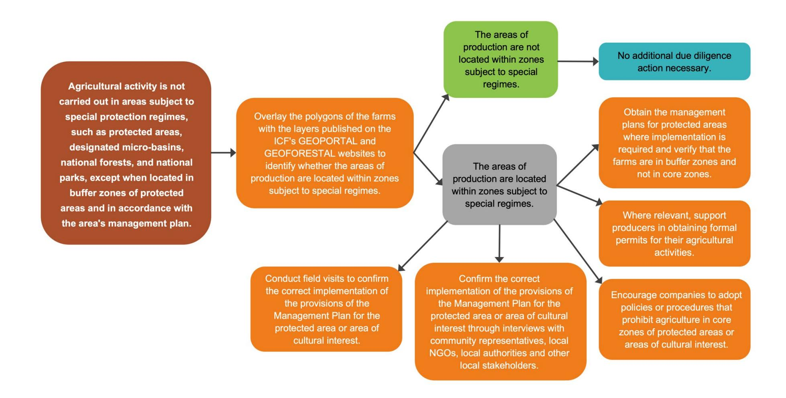

#### 2.1.2 and 2.1.3 Use of agrochemicals and treatment of containers

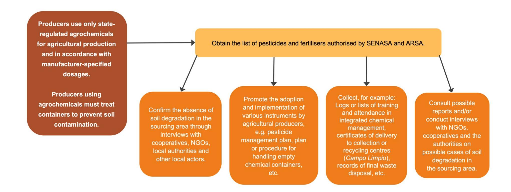

#### 2.1.4 Agricultural activity is carried out in compliance with the minimum authorised distances from watercourses

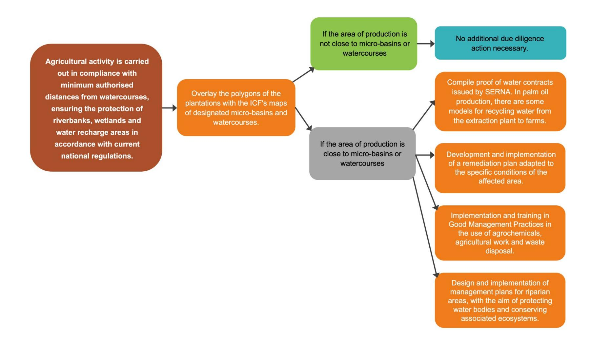

#### 2.1.5 Producers implement appropriate techniques for the conservation of soil fertility

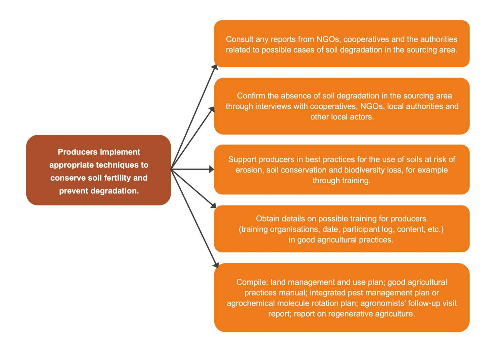

#### 2.1.6 Permits for aerial implementation of agrochemicals or prescribed burning

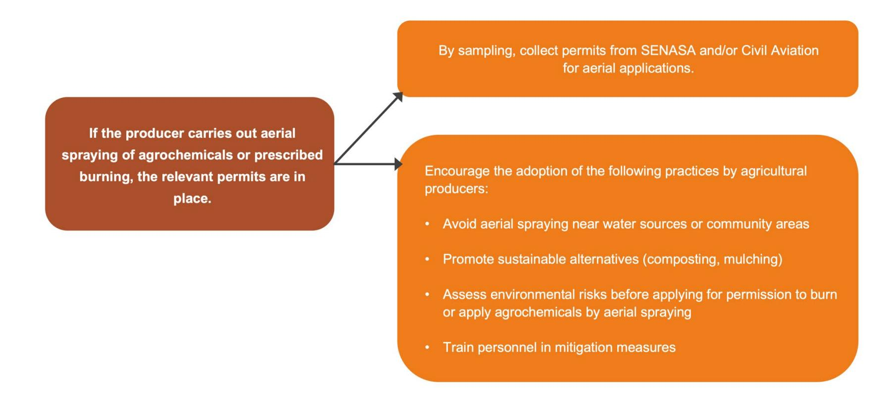

### 2.2.1 Environmental management tool appropriate to the size and nature of the project

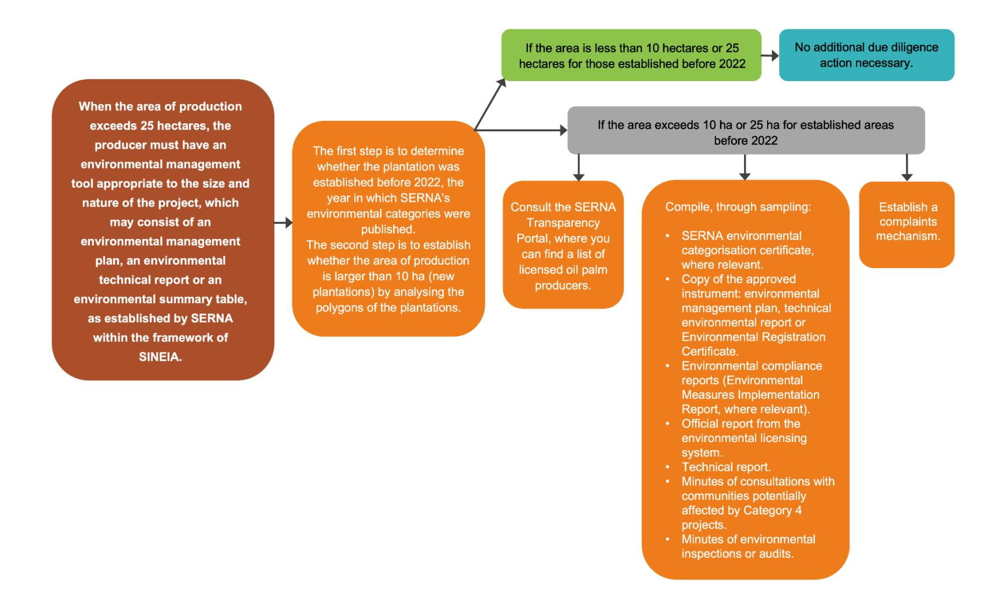

### 2.2.2 Protection of endangered species of flora and fauna

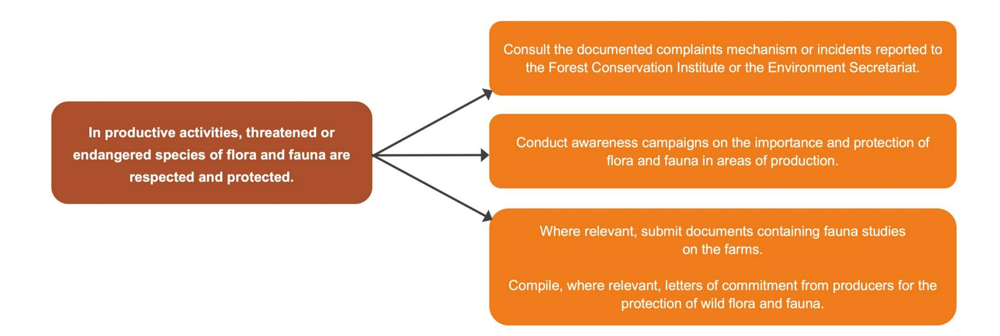

### Third parties' rights

In Honduras, third parties' rights related to oil palm production are mainly regulated through the protection of cultural and archaeological heritage and the procedural rights of communities and other actors to access complaint mechanisms and effective protection. The legal framework establishes clear obligations to prevent damage to public property and guarantees, at least formally, access to administrative and judicial proceedings in environmental matters.

This tool indicates a low level of non-compliance in this category of rights, for which light due diligence is appropriate. With regard to cultural and archaeological heritage, the regulations require that productive activities be carried out outside areas designated to be of cultural interest or, where applicable, in accordance with land-use rights and management standards. The existence of an official inventory managed by the Honduran Institute of Anthropology and History (IHAH) together with the absence of documented evidence of palm plantations on archaeological sites suggest that the risk of illegality is currently negligible, justifying light due diligence limited to basic verifications.

With regard to procedural rights, Honduran law recognises the principles of due process and provides mechanisms for the submission and resolution of environmental claims by communities and other stakeholders. Although there are occasional complaints in areas of high agricultural intensity, these are infrequent, dispersed and rarely result in formal sanctions, with most cases being resolved at the local level. The lack of systematic documentation at the national level does not point to a pattern of structural inadequate implementation, but rather a low recurrence of formalised conflicts.

|                                                                                                                                                                                                                          | Level of implementation /                                                                                                                                                                                                                                                                                                                                                                                                  |
|--------------------------------------------------------------------------------------------------------------------------------------------------------------------------------------------------------------------------|----------------------------------------------------------------------------------------------------------------------------------------------------------------------------------------------------------------------------------------------------------------------------------------------------------------------------------------------------------------------------------------------------------------------------|
| Legal requirement                                                                                                                                                                                                        | Context Due Diligence Recommendations due diligence                                                                                                                                                                                                                                                                                                                                                                        |
| 3. Third parties' rights 3.1 Substantive Rights 3.1.1. Productive activities are not carried out in areas of cultural importance. on sites of cultural importance is found. 3.2 Procedural rights 3.2.1. If agricultural | High Data collection and verification Conduct an initial social and cultural mapping of the Light due diligence plantation, where relevant. management standards, farm plans and land-use rights. Verify with the Honduran Institute of Anthropology and History (IHAH) that there are no open proceedings related to conflict with cultural heritage in the area of the plantation. High Data collection and verification |
| matters is guaranteed through the implementation of production causes damage or harm to individuals, communities or the environment, those publicity. affected have the right to                                         | procedural principles such as Formal complaints to the public prosecutor's office, Light due diligence FEMA inspection reports. Register from the Public Prosecutor's Office.                                                                                                                                                                                                                                              |
| claim full reparation, including compensation.                                                                                                                                                                           | Register of complaints filed with companies, minutes of hearings before the Public Prosecutor's Office, conflict resolution protocols by the competent authority.                                                                                                                                                                                                                                                          |
| rarely result in official sanctions.                                                                                                                                                                                     | Register of complaints filed with the National Human Rights Commissioner (CONADEH).                                                                                                                                                                                                                                                                                                                                        |

#### 3.1.1 Areas of cultural importance

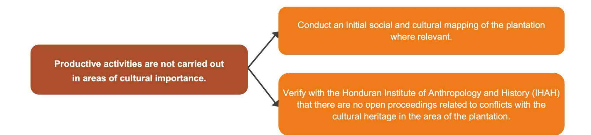

#### 3.2.1 Third parties' rights to claim full reparation, including compensation

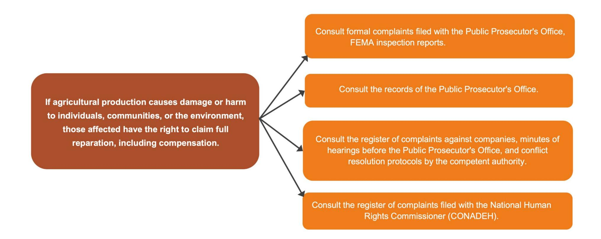

### Labour rights\*

In Honduras, labour rights applicable to oil palm production are governed by a public policy legal framework, primarily the Labour Code, which establishes minimum guarantees in terms of employment conditions, remuneration, non-discrimination, occupational health and safety, freedom of association and social protection. This framework sets different legal requirements for farms according to their size and number of permanent workers, which has direct implications for the scope of legal obligations and the level of due diligence required.

According to the Labour Code, agricultural or livestock farms that do not permanently employ more than ten workers are exempt from most of its provisions, with the exception of those relating to the minimum wage, which remain fully applicable to both permanent and temporary workers. By contrast, farms that permanently employ more than ten workers must implement all labour obligations, including, among others, employer registration, the adoption of internal regulations, observance of maximum working hours, affiliation with the Social Security system where applicable, and implementation of occupational health and safety standards. Consequently, the first step in labour due diligence is to verify whether a farm exceeds this threshold, information that can be gathered through supplier surveys, questionnaires, or producer statements.

Based on the consultations carried out during the development of this tool and the available information, the level of noncompliance in labour matters is classified as mostly low, which generally justifies light due diligence. This is based on the fact that small independent producers tend to employ fewer than ten permanent workers, complying with legal thresholds, and that medium and large companies in the sector have generally demonstrated adequate compliance with labour legislation, including hiring conditions, non-discrimination, working hours, social benefits and freedom of association.

However, specific occupational health and safety risks have been identified, associated with activities inherent to palm cultivation, including the use of agrochemicals, cutting tools, manual handling, working at height or in areas with poisonous wildlife. Although a clear and applicable regulatory framework is in place, practice indicates a need to strengthen training and the effective use of personal protective equipment. This is reflected in enhanced due diligence recommendations for these legal requirements.

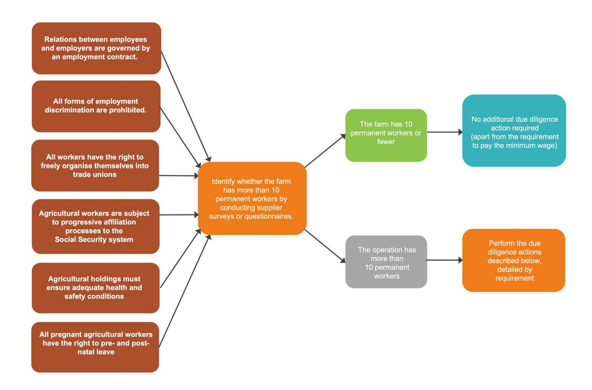

|                                                                                                                                                                                                                       | Level of implementation /                                                                                                                                                             |
|-----------------------------------------------------------------------------------------------------------------------------------------------------------------------------------------------------------------------|---------------------------------------------------------------------------------------------------------------------------------------------------------------------------------------|
| Legal requirement Context                                                                                                                                                                                             | Due Diligence Recommendations due Diligence                                                                                                                                           |
| 4. Labour Rights                                                                                                                                                                                                      |                                                                                                                                                                                       |
| 4.1 Workers ' rights are respected 4.1.1. Relations between The laws governing relations between employers and workers are workers employed on the matters of public policy, and any acts, stipulations or agreements | High Geospatial analysis The first step is to establish whether there are permanent Light due diligence                                                                               |
| that imply the waiver, reduction, restriction or distortion of workers' plantation and employers are governed by a written or oral guarantees are null and void. contract.                                            | workers in the area of production, as defined by law, i.e., workers who are not members of the family unit. This step                                                                 |
| Agro-industrial companies are subject to supervision by the Labour                                                                                                                                                    | can be carried out using the threshold of 50 ha per farm.                                                                                                                             |
| Inspectorate, while producer cooperatives and farmers' associations Labour Inspectorate.                                                                                                                              | additional due diligence action is recommended, as this farm size is generally assumed to imply the absence of permanent workers and the use of oral                                  |
| stakeholders agreed that the level of non-compliance is low. This is                                                                                                                                                  |                                                                                                                                                                                       |
| fewer than ten employees, in line with the thresholds established by                                                                                                                                                  |                                                                                                                                                                                       |
| implementation of labour legislation, including with regard to hiring                                                                                                                                                 |                                                                                                                                                                                       |
| main categories are identified: permanent employees and workers                                                                                                                                                       | contracts for temporary workers.                                                                                                                                                      |
| hired for specific tasks or jobs.                                                                                                                                                                                     | For farms exceeding 50 ha, it is recommended that surveys be conducted to determine whether workers are employed within the meaning of the law and                                    |
| current labour regulations. Stakeholders also recognised that large companies in the sector have demonstrated effective                                                                                               | whether the threshold of ten workers is reached. Data collection and verification In the case of written contracts, verify the existence of                                           |
| conditions, occupational health and safety and social benefits.                                                                                                                                                       | contracts and working conditions through sampling. Collect reports from labour inspectors, if available. Field verification If workers are present in the area of production, conduct |
|                                                                                                                                                                                                                       | periodic field audits with producers on a sampling basis to                                                                                                                           |
|                                                                                                                                                                                                                       | verify that written contracts are provided where required                                                                                                                             |
|                                                                                                                                                                                                                       | (for permanent workers with defined terms).                                                                                                                                           |

|                                                                                                                                                                      |                                                                                                                                                                                                                                                                                                                | Level of implementation /                                                                                                                                                                                                                                                                 |
|----------------------------------------------------------------------------------------------------------------------------------------------------------------------|----------------------------------------------------------------------------------------------------------------------------------------------------------------------------------------------------------------------------------------------------------------------------------------------------------------|-------------------------------------------------------------------------------------------------------------------------------------------------------------------------------------------------------------------------------------------------------------------------------------------|
| Legal requirement 4.1.2 All permanent or temporary workers on                                                                                                        | Context No worker may be required to work more than 12 hours in any 24- High hour period, unless this agreed by the parties when the employment Light due diligence                                                                                                                                            | Due Diligence Recommendations due Diligence Data collection and verification Use questionnaires to gather information on the type                                                                                                                                                         |
| agricultural plantations, including those hired for                                                                                                                  | contract is established. In practice, post-harvest management and fruit picking activities are carried out during daytime hours and do                                                                                                                                                                         | of employment (permanent, indefinite or temporary)                                                                                                                                                                                                                                        |
| specific tasks, by the day, or as day labourers, whether under verbal or written                                                                                     | not exceed the working hours set by law.                                                                                                                                                                                                                                                                       | and the conditions under which the work performed could be classified as salaried employment. Working                                                                                                                                                                                     |
| contracts, work in accordance with what has been agreed in the contractual relationship.                                                                             |                                                                                                                                                                                                                                                                                                                | conditions refer to working hours, wages and affiliation to the General Social Security System for Health, Pensions and Occupational Risks. Collect reports from labour inspectors, if available. Field verifications If there are workers in the area of production, conduct             |
| 4.1.3 All forms of labour discrimination based on race,                                                                                                              | Discrimination based on race, religion, political beliefs, membership High of indigenous or Afro-Honduran communities, or economic status is Light due diligence                                                                                                                                               | periodic field audits with producers on a sampling basis to verify that working hours are being respected. Compilation and verification of documents Consult public reports from specialised organisations on                                                                             |
| ethnicity, gender, political or religious beliefs, economic status or membership of indigenous or Afro-Honduran communities are prohibited on agricultural holdings. | prohibited in establishments open to general use by companies or workplaces. Workers’ social position or access to these establishments may not be conditioned on their wages or the level of the position they hold. (Article 12 Labour Code). In practice, some companies have internal regulations and non | these issues, in particular the Palm Barometer (detailed supply chain analyses, including discussions on labour rights) and Human Rights Watch (reports on human rights in various sectors, highlighting working conditions), as well as any reports produced by national and local NGOs. |
|                                                                                                                                                                      | discrimination policies, which are communicated to and implemented for their workers.                                                                                                                                                                                                                          | Consultation with stakeholders -Consult with NGOs and local entities regarding complaints                                                                                                                                                                                                 |
|                                                                                                                                                                      | According to a n https://rspo.org/wp-content/uploads/Informe                                                                                                                                                                                                                                                  | related to workplace discrimination.                                                                                                                                                                                                                                                      |
|                                                                                                                                                                      | sobre-Labour-Rights-in-HONDURAS-_sm.pdfR SPO report based on monitoring in 2023, issues related to gender discrimination are infrequent, with only seven of 124 respondents reporting this type of discrimination.                                                                                             | -If the above analyses and consultations reveal a risk, conduct interviews with the company's trade unions or at random with workers. Compilation and verification of documents                                                                                                           |
|                                                                                                                                                                      |                                                                                                                                                                                                                                                                                                                | Non-discrimination policy or statement from the agricultural producer. Farm worker contracts.                                                                                                                                                                                             |
|                                                                                                                                                                      |                                                                                                                                                                                                                                                                                                                | Log of training campaigns on labour rights, human                                                                                                                                                                                                                                         |
|                                                                                                                                                                      |                                                                                                                                                                                                                                                                                                                | rights, and gender issues.                                                                                                                                                                                                                                                                |

|                                                                                                                                                                                                                                                | Level of implementation /                                                                                                                                                                                                                                                                                                                                                                                                                                                                                                                                                         |
|------------------------------------------------------------------------------------------------------------------------------------------------------------------------------------------------------------------------------------------------|-----------------------------------------------------------------------------------------------------------------------------------------------------------------------------------------------------------------------------------------------------------------------------------------------------------------------------------------------------------------------------------------------------------------------------------------------------------------------------------------------------------------------------------------------------------------------------------|
| Legal requirement 4.1.4 All workers, without                                                                                                                                                                                                   | Context Due Diligence Recommendations due Diligence Implementation of procedures and processes Establish equal opportunity policies on farms or in companies. Train staff on human rights and labour rights. Create confidential channels for complaints or reports. In 1956, Honduras ratified the ILO Convention on Freedom of High Consultation with stakeholders                                                                                                                                                                                                              |
| Association and Protection of the Right to Organise distinction, have the right to form and join trade unions of their choice, without facing sanctions, dismissal, reprisals choice (Article 2). or discrimination for exercising this right. | (No. 87), which Light due diligence Consult with the Human Rights Secretariat and Labour Secretariat regarding possible complaints of freedom of association. Implementation of procedures and processes Honduran labour legislation guarantees the rights of unionisation and collective bargaining, as it has its origins in the collective Encourage manufacturing companies to establish achievements of workers following the 1954 Banana Strike. complaint systems. The palm sector, like other sectors, benefits from freedom of Compilation and verification of documents |
| association in accordance with                                                                                                                                                                                                                 | national regulations.                                                                                                                                                                                                                                                                                                                                                                                                                                                                                                                                                             |
| 4.1.5 Agricultural workers are covered by special regimes                                                                                                                                                                                      | Policy on trade union freedom or freedom association. Where applicable, minutes of workers’ meetings, whether or not they are unionised. High Implementation of procedures and processes related services are provided by the Honduran Social Security                                                                                                                                                                                                                                                                                                                            |
| gradually and progressively                                                                                                                                                                                                                    | incorporated into the Social Security                                                                                                                                                                                                                                                                                                                                                                                                                                                                                                                                             |
| system. In practice, temporary agricultural workers, as well as                                                                                                                                                                                | small                                                                                                                                                                                                                                                                                                                                                                                                                                                                                                                                                                             |
| rather than by the Honduran Social Security Institute, as the latter                                                                                                                                                                           |                                                                                                                                                                                                                                                                                                                                                                                                                                                                                                                                                                                   |
| and progressive Social Institute. Security affiliation, taking into account their geographical location and the capacities of the Honduran Social Security Institute (IHSS), where applicable.                                                 | Verify that permanent employees are registered with Light due diligence the IHSS. Since 1959, it has been agreed that agricultural workers would be Identify whether the producer is associated with a private or state health scheme, i.e., certificate from a private doctor or health centre where there is no social security. beneficiaries in all departments of the country.                                                                                                                                                                                               |

| Legal requirement                                                                                                       | Context                                                                                                                                                                                                                                                                                                                                                                                                                                                | Level of implementation / due Diligence              | Due Diligence Recommendations                                                                                                                                                                                                                                                                                                                                                                                                                                                                                                                                                                                                                                                                                                                                                                                                                                                                                                                                                                                                                      |
|-------------------------------------------------------------------------------------------------------------------------|--------------------------------------------------------------------------------------------------------------------------------------------------------------------------------------------------------------------------------------------------------------------------------------------------------------------------------------------------------------------------------------------------------------------------------------------------------|------------------------------------------------------|----------------------------------------------------------------------------------------------------------------------------------------------------------------------------------------------------------------------------------------------------------------------------------------------------------------------------------------------------------------------------------------------------------------------------------------------------------------------------------------------------------------------------------------------------------------------------------------------------------------------------------------------------------------------------------------------------------------------------------------------------------------------------------------------------------------------------------------------------------------------------------------------------------------------------------------------------------------------------------------------------------------------------------------------------|
| <i>4.2 Gender equality is ensured.</i>                                                                                  |                                                                                                                                                                                                                                                                                                                                                                                                                                                        |                                                      |                                                                                                                                                                                                                                                                                                                                                                                                                                                                                                                                                                                                                                                                                                                                                                                                                                                                                                                                                                                                                                                    |
| 
<b>4.2.1. All pregnant agricultural workers are entitled to pre- and post-natal leave as established by law.</b>
 | 
In Honduras, women are entitled to compulsory pre- and post-natal leave.
 
Pregnant workers are entitled to 10 weeks of maternity leave and cannot be dismissed on the grounds of their pregnancy or leave.
 
In practice, there are not many women working permanently on farms, as their work consists of collecting the fruit that falls to the ground from the palm. However, their rights are upheld in accordance with the law.
 | 
<b>High</b>
 
<b>Light due diligence</b>
 | 
<b>Implementation of procedures and processes</b>
 <ul> <li>• Ensure that there is a clear procedure for identifying, registering and protecting pregnant workers.</li> <li>• Provide training for producers on maternity rights.</li> <li>• Promote the inclusion of maternity protection clauses in the internal regulations or labour policies of agricultural producers.</li> <li>• Establish confidential mechanisms for reporting non-compliance with women workers' rights.</li> </ul> 
<b>Compilation and verification of documents:</b>
 
Conduct a sample collection of the following documents:
 <ul> <li>• Maternity leave permits.</li> <li>• Internal regulations or labour policy of the agricultural producer, with a maternity protection clause.</li> </ul> 
<b>Consultations with stakeholders:</b>
 
Consult local or national NGOs dedicated to protecting workers' rights and women's rights to ensure that there are no indications of violations of this requirement in the area of production.
 |

|                                                                                                                                                                                                                                                                                                                                             | Level of implementation /                                                                                                                                                                                                                                                                                                                                                                                                                                                                                                                                                                                                                                                                                                                                                                                                                                                                                                                                                                                     |
|---------------------------------------------------------------------------------------------------------------------------------------------------------------------------------------------------------------------------------------------------------------------------------------------------------------------------------------------|---------------------------------------------------------------------------------------------------------------------------------------------------------------------------------------------------------------------------------------------------------------------------------------------------------------------------------------------------------------------------------------------------------------------------------------------------------------------------------------------------------------------------------------------------------------------------------------------------------------------------------------------------------------------------------------------------------------------------------------------------------------------------------------------------------------------------------------------------------------------------------------------------------------------------------------------------------------------------------------------------------------|
| Legal requirement                                                                                                                                                                                                                                                                                                                           | Context Due Diligence Recommendations due Diligence                                                                                                                                                                                                                                                                                                                                                                                                                                                                                                                                                                                                                                                                                                                                                                                                                                                                                                                                                           |
| 4.3 Workers ' remuneration complies with the law. 4.3.1. Workers in agricultural activities receive the minimum wage, and for Exceptions: temporary jobs, remuneration is negotiated                                                                                                                                                        | All workers are entitled to a minimum wage sufficient to cover the High On the plantations: normal needs of their household (applies to permanent employees). Light due diligence Compilation and verification of documents Collect samples if workers are employed on the plantation: 1) Agricultural or livestock farms that do not permanently employ                                                                                                                                                                                                                                                                                                                                                                                                                                                                                                                                                                                                                                                      |
| a) By                                                                                                                                                                                                                                                                                                                                       | unit of time (month, fortnight, week, day, or hour)                                                                                                                                                                                                                                                                                                                                                                                                                                                                                                                                                                                                                                                                                                                                                                                                                                                                                                                                                           |
| b) By                                                                                                                                                                                                                                                                                                                                       | unit of work (piece, task, fixed price or piecework)                                                                                                                                                                                                                                                                                                                                                                                                                                                                                                                                                                                                                                                                                                                                                                                                                                                                                                                                                          |
| per job or task performed, in which case the wage is agreed in advance with the                                                                                                                                                                                                                                                             | Employment contracts - check that the stipulated more than ten (10) workers. However, the provisions of Title IV, wage is equal to or higher than the legal minimum. Chapter IV of the Labour Code relating to wages shall apply.                                                                                                                                                                                                                                                                                                                                                                                                                                                                                                                                                                                                                                                                                                                                                                             |
| employer. be agreed upon as follows: employer                                                                                                                                                                                                                                                                                               | Remuneration documents, e.g. pay slips. At the sourcing area level: Data collection and verification Consult official data from the labour department on working conditions in the productive sectors (oil palm) c) By participation in the profits, sales or collections made by the to ensure that the sourcing area does not present a                                                                                                                                                                                                                                                                                                                                                                                                                                                                                                                                                                                                                                                                     |
| 4.4 Operations and activities are safe 4.4.1. Agricultural operations must ensure adequate health and safety conditions in the workplace and workers have the right to be protected amendments). from risks arising from the use of chemical products (agrochemicals, fertilisers, pesticides) and the operation of agricultural machinery. | particularly high risk of non-compliance with This is considered low risk, given that documented and updated remuneration below the legal minimum. records of the employment relationship are maintained. In addition to the general provisions of the Labour Code on health High Document collection and verification and safety in the workplace, the provisions of the General Verify that an occupational health and safety Standard due diligence system exists and its implementation is underway. Request evidence of implementation of the Occupational Health and Safety Management All employers are required to adopt preventive measures, provide System (manuals, risk matrices, training schedules, personal protective equipment, train workers on occupational etc.). hazards, and ensure healthy and safe working environments. Audit reports proving implementation of In the palm sector, the following activities have been identified as occupational health and safety requirements and |
| high risk:                                                                                                                                                                                                                                                                                                                                  | adequate conditions in infrastructure, equipment Implementation of pesticides and fungicides and safety implements at work. Use of machetes, chainsaws, and scythes Sector-specific manuals with recommendations, Manual loading of heavy bunches trade union policies for safety and good working                                                                                                                                                                                                                                                                                                                                                                                                                                                                                                                                                                                                                                                                                                            |

| Level of implementation /                                                                                                                                                                                                                                                                                                                                                          |                                                                                                                                                                                                                                    |
|------------------------------------------------------------------------------------------------------------------------------------------------------------------------------------------------------------------------------------------------------------------------------------------------------------------------------------------------------------------------------------|------------------------------------------------------------------------------------------------------------------------------------------------------------------------------------------------------------------------------------|
| Legal requirement Context due Diligence                                                                                                                                                                                                                                                                                                                                            | Due Diligence Recommendations                                                                                                                                                                                                      |
| practices. Working in areas with poisonous wildlife (in humid areas) Working at heights employment). continuous training programmes and promote awareness of the SENASA. proper use of personal protective equipment. It is also necessary to differentiate the level of risk according to the type of product handled, using the corresponding safety data sheets as a reference. | (human rights and formalisation of Record of delivery of health and safety equipment. List of plant protection products approved by Implementation of procedures and processes                                                     |
| Encourage agricultural producers                                                                                                                                                                                                                                                                                                                                                   | to develop and implement an occupational health and safety policy.                                                                                                                                                                 |
| Encourage agricultural producers activities (participant log, etc.).                                                                                                                                                                                                                                                                                                               | to establish a system for reporting workplace accidents, where relevant. Ensure agricultural producers provide training for employees on risk prevention, use of hazardous materials and first aid, and maintain a record of these |
| Encourage agricultural producers farm.                                                                                                                                                                                                                                                                                                                                             | to display the list of plant protection products approved by SENASA on the                                                                                                                                                         |

### 4.1.1 Type of relationship, legal contractual relationship.

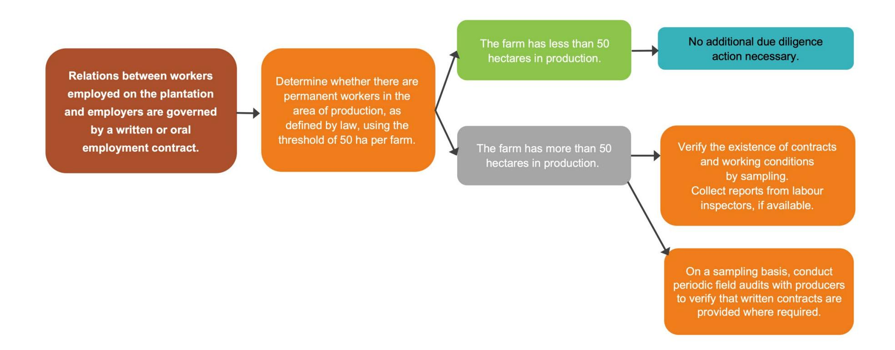

#### 4.1.2 Working hours

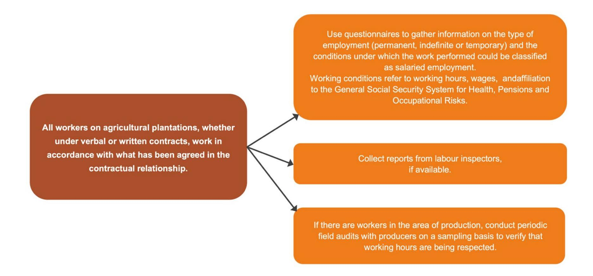

#### 4.1.3 Non-discrimination

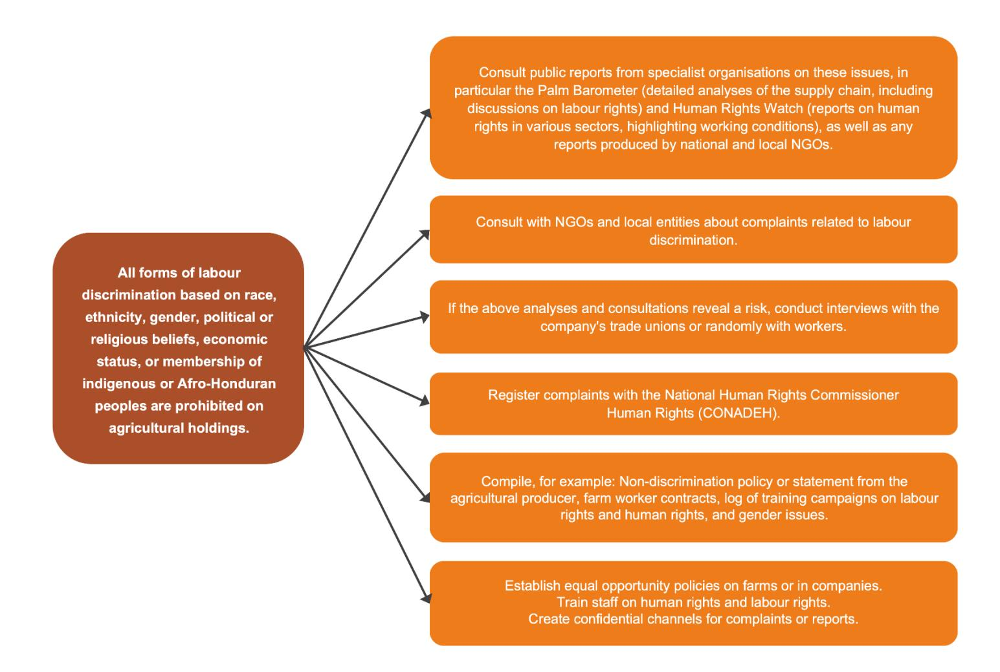

#### 4.1.4 Freedom of association

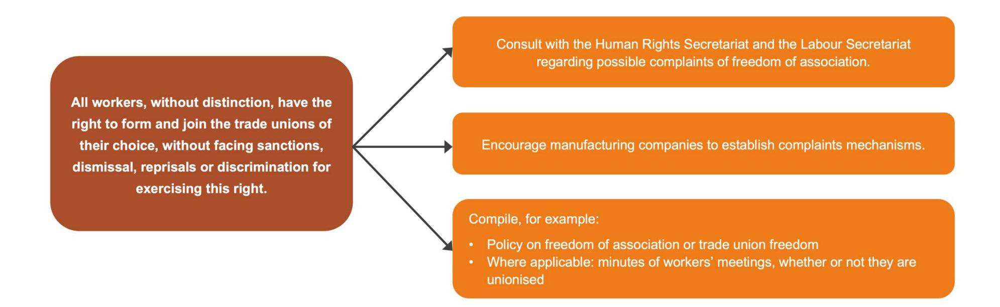

#### 4.1.5 Social security affiliation

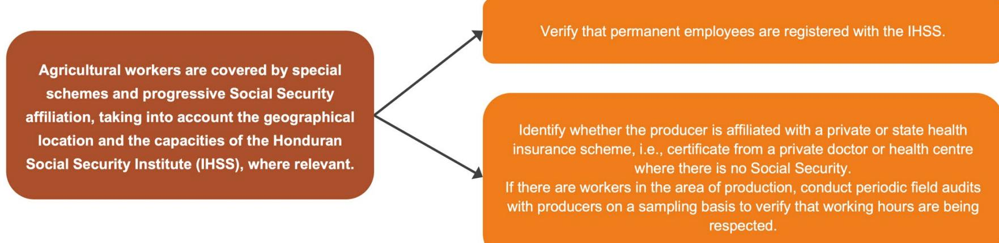

Agricultural workers are covered by special schemes and progressive Social Security affiliation, taking into account the geographical location and the capacities of the Honduran Social Security Institute (IHSS), where relevant.

#### 4.2.1 Right to pre- and post-natal leave

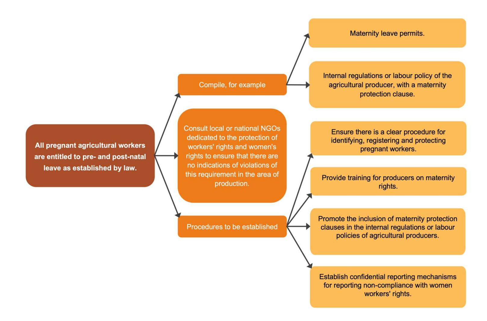

#### 4.3.1 Minimum wage

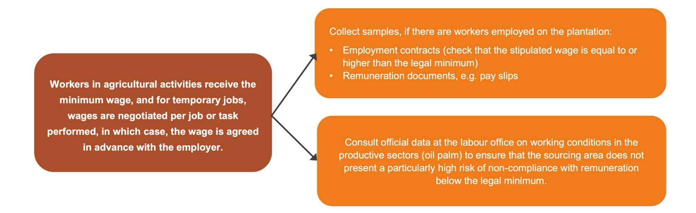

#### 4.4.1 Health and safety in the workplace

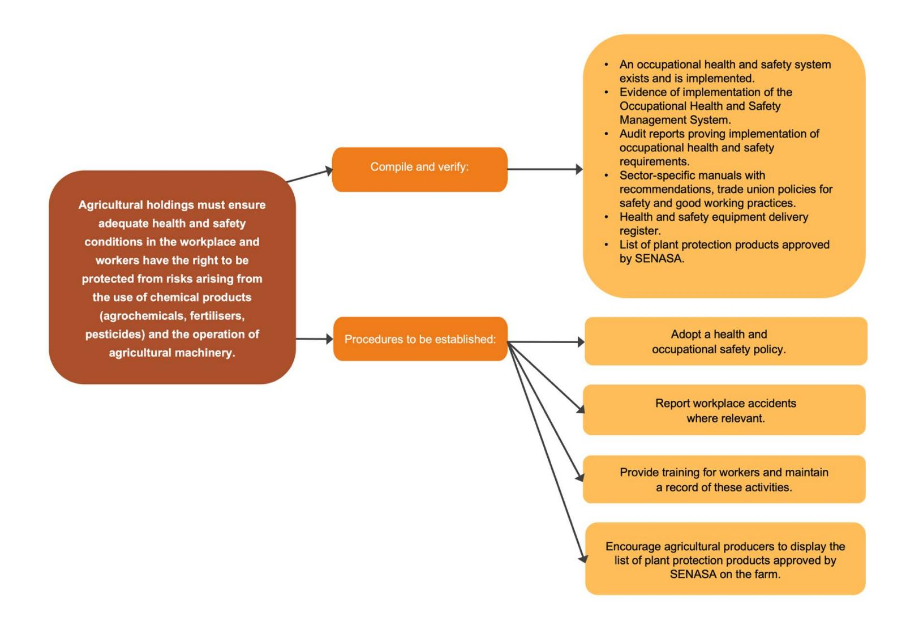

### Human rights\*

In Honduras, oil palm production takes place within a legal framework that recognises and protects human rights in accordance with national and international law, including the collective rights of indigenous and Afro-Honduran peoples, the rights of children and adolescents, gender equality and the prohibition of modern slavery and forced labour. These rights are backed by the Constitution, by industry and labour legislation, as well as international commitments ratified by the Honduran State.

According to the information gathered and the consultations carried out to develop this tool, the level of implementation with human rights in the palm oil chain is classified as high, which justifies light due diligence. This assessment is based, among other factors, on the existence of responsible sourcing policies by extractive companies, which include a ban on deforestation, respect for the rights of indigenous peoples and a commitment to human rights, as well as the requirement for verifiable documentation on the legal and transparent acquisition of land.

Available studies agree that there is no widespread national pattern of human rights violations attributable to the oil palm sector. Although territorial conflicts, threats and land disputes have been documented in specific regions—such as the Aguán Valley or in some Garifuna communities—these cases are not exclusively or systematically attributed to oil palm cultivation and are considered in the land use category. In the absence of evidence of structural impacts, the risk of implementation remains high.

With regard to the rights of children and adolescents, Honduran law expressly permits adolescent labour under strict conditions and prohibits hazardous child labour. In practice, child labour is not common in the palm oil chain due to the physically demanding nature of the activity and the size of the production units. The available evidence confirms a high rate of compliance, which reinforces the low-risk classification. Similarly, there are no signs of forced labour or modern slavery, given the predominantly temporary nature of agricultural employment and the absence of coercive economic dependence.

Finally, with regard to women's rights, the Honduran institutional and legal framework provides for specific mechanisms for the prevention and punishment of discrimination and harassment, and information available from the sector shows a low incidence of complaints, which also supports light due diligence.

|                                                                                                                                                                                                                                                                                                                   | Level of implementation/                                                                                                                                                                                                                                                                                                                                                                                                                                                                                                                                                                                                                                                                                                                                                                                                                                                                                                                                                                                                                                                                                                                                                                                                                                                                                                                                                                                                                                                                                                                                                                                                                                                   |
|-------------------------------------------------------------------------------------------------------------------------------------------------------------------------------------------------------------------------------------------------------------------------------------------------------------------|----------------------------------------------------------------------------------------------------------------------------------------------------------------------------------------------------------------------------------------------------------------------------------------------------------------------------------------------------------------------------------------------------------------------------------------------------------------------------------------------------------------------------------------------------------------------------------------------------------------------------------------------------------------------------------------------------------------------------------------------------------------------------------------------------------------------------------------------------------------------------------------------------------------------------------------------------------------------------------------------------------------------------------------------------------------------------------------------------------------------------------------------------------------------------------------------------------------------------------------------------------------------------------------------------------------------------------------------------------------------------------------------------------------------------------------------------------------------------------------------------------------------------------------------------------------------------------------------------------------------------------------------------------------------------|
| Legal requirement                                                                                                                                                                                                                                                                                                 | Context Due diligence recommendations due diligence                                                                                                                                                                                                                                                                                                                                                                                                                                                                                                                                                                                                                                                                                                                                                                                                                                                                                                                                                                                                                                                                                                                                                                                                                                                                                                                                                                                                                                                                                                                                                                                                                        |
| 5. Human rights 5.1.1. In agricultural activity, the fundamental rights of indigenous and Afro Honduran peoples in production areas are protected. cultivation: 5.1.2. In Honduras, young people between the ages of 14 and 18 are permitted to work with the authorisation of Code. their parents or guardians. | High Compilation and verification of documents indigenous and Afro-Honduran peoples, including FPIC. Consult public reports from specialised organisations on Light due diligence The stakeholders consulted agreed that the risk of non-compliance these issues, in particular the Palm Barometer (detailed with this requirement is low, in line with the responsible sourcing analyses of the supply chain, including discussions on policies of extractive companies. These policies include a ban on human rights). deforestation and respect for the rights of indigenous peoples and Consult local press and other media to identify possible violations of these rights. Studies agree that there is no widespread national pattern of Consultations with stakeholders impacts, but territorial conflicts, threats and land disputes have Consult specialised organisations on these issues, such been documented, as already seen in the land use category. These as national and local NGOs. studies do not always attribute the impact exclusively to palm Aguán Valley (land conflicts and rural violence) Garifuna communities (Yankunú, Triunfo de la Cruz, Vallecito) Organised farmers (MUCA, MARCA, MCA) The human rights of children and adolescents are enshrined in the High Document collection and verification Constitution of Honduras, in international treaties on the rights of Consult public reports from organisations specialising in Light due diligence the child, in the Children and Adolescents Code and in the Labour these issues, in particular complaints filed with the ILO, the Secretariat for Children, Adolescents and Family |
| Child labour is not common in the Honduran                                                                                                                                                                                                                                                                        | palm oil industry, as it is                                                                                                                                                                                                                                                                                                                                                                                                                                                                                                                                                                                                                                                                                                                                                                                                                                                                                                                                                                                                                                                                                                                                                                                                                                                                                                                                                                                                                                                                                                                                                                                                                                                |
| This is considered low risk, provided the law expressly permits such                                                                                                                                                                                                                                              |                                                                                                                                                                                                                                                                                                                                                                                                                                                                                                                                                                                                                                                                                                                                                                                                                                                                                                                                                                                                                                                                                                                                                                                                                                                                                                                                                                                                                                                                                                                                                                                                                                                                            |
|                                                                                                                                                                                                                                                                                                                   | (SENAF), the Secretariat of Labour and Social Security                                                                                                                                                                                                                                                                                                                                                                                                                                                                                                                                                                                                                                                                                                                                                                                                                                                                                                                                                                                                                                                                                                                                                                                                                                                                                                                                                                                                                                                                                                                                                                                                                     |
| out over large areas.                                                                                                                                                                                                                                                                                             | (SETRASS) , the child labour database or local                                                                                                                                                                                                                                                                                                                                                                                                                                                                                                                                                                                                                                                                                                                                                                                                                                                                                                                                                                                                                                                                                                                                                                                                                                                                                                                                                                                                                                                                                                                                                                                                                             |
|                                                                                                                                                                                                                                                                                                                   | authoritie s, and Human Rights Watch (reports on human rights in various sectors, including oil palm), as health, safety, or physical, mental or emotional development. well as any reports produced by national and local NGOs. hazardous and compatible with their school hours. Compile school maps of primary schools in the districts of the sourcing area to assess whether there is good work. As supporting evidence, there must be verifiable school coverage or whether the lack of schools increases the risk.                                                                                                                                                                                                                                                                                                                                                                                                                                                                                                                                                                                                                                                                                                                                                                                                                                                                                                                                                                                                                                                                                                                                                  |

|                                                                                                                                                                    | Level of implementation/                                                                                                                                                                                                                                                                                                                                                                                                                                                                                                                                                                                                                                                                                                                                                                                                                                                                                                          |
|--------------------------------------------------------------------------------------------------------------------------------------------------------------------|-----------------------------------------------------------------------------------------------------------------------------------------------------------------------------------------------------------------------------------------------------------------------------------------------------------------------------------------------------------------------------------------------------------------------------------------------------------------------------------------------------------------------------------------------------------------------------------------------------------------------------------------------------------------------------------------------------------------------------------------------------------------------------------------------------------------------------------------------------------------------------------------------------------------------------------|
| Legal requirement                                                                                                                                                  | Context Due diligence recommendations due diligence                                                                                                                                                                                                                                                                                                                                                                                                                                                                                                                                                                                                                                                                                                                                                                                                                                                                               |
| documentation, such as a contract signed by the child’s parent guardian.                                                                                           | or Consultations with stakeholders Consult local organisations working in labour rights to obtain information on the risk of child labour under the age of 14 companies have a policy prohibiting child labour, and only one and work that poses a risk to their health in the sourcing worker mentions the presence of minors in the workplace. The area.                                                                                                                                                                                                                                                                                                                                                                                                                                                                                                                                                                        |
| indicator for the prohibition of child labour is met, with companies. Supporting sources: RSPO Guidance on Children's Rights Honduras National Child Labour Survey | 99% of workers reporting that there are no minors working in their Implementation of procedures and processes Implement projects to support the eradication of child labour in Honduras Implement a childcare programme At the plantation level, determine the profile of farm workers: Data collection and verification Compile a list of the names and ages of plantation workers for all producers. For workers under the age of 18, list the tasks they perform and their working hours. This can be done, for example, through systematic surveys or by collecting geolocation data from the plantations. Intermediaries can support this data collection on producers and their employees. Written authorisation from parents or legal guardians Record of assigned duties and working hours Proof of schooling Awareness plan on no child labour on farms Policy of not employing minors on farms Logbook of field workers |

|                                                                                                                                                                                                   | Level of implementation/                                                                                                                                                                                                                                                                                                                                                                                                                                                                                                                                                                                                                                                                                                                                                                                                                                                                                                                                                                                                                                     |
|---------------------------------------------------------------------------------------------------------------------------------------------------------------------------------------------------|--------------------------------------------------------------------------------------------------------------------------------------------------------------------------------------------------------------------------------------------------------------------------------------------------------------------------------------------------------------------------------------------------------------------------------------------------------------------------------------------------------------------------------------------------------------------------------------------------------------------------------------------------------------------------------------------------------------------------------------------------------------------------------------------------------------------------------------------------------------------------------------------------------------------------------------------------------------------------------------------------------------------------------------------------------------|
| Legal requirement 5.2 Absence of modern slavery and forced labour 5.2.1 All workers have the right to voluntarily terminate their employment relationship without coercion and with prior notice. | Context Due diligence recommendations due diligence In the case of permanent work (more than 10 workers on the farm), High Compilation and verification of documents workers give advance notice. No formalities are required for the Light due diligence Consult public reports from organisations specialising in these issues such as Human Rights Watch (reports on human of the employee, the job position they hold, the date on which the rights in various sectors, including palm oil), as well as any notice period begins and the date on which it ends. In these cases, other reports produced by national and local NGOs.                                                                                                                                                                                                                                                                                                                                                                                                                       |
| assistance from not required.                                                                                                                                                                     | the Administrative or Judicial Labour Authorities is Compile: However, most workers in production systems are temporary and Contracts are not financially dependent on their employer, meaning they can Letters of resignation, where relevant terminate their employment relationship whenever they choose. Payment of labour rights (severance pay) When there are permanent workers on a farm, it is common for the worker to leave their job without prior notice. Consultations with stakeholders Consult local organisations working in labour rights and human rights to obtain information on the risk of forced labour and slavery in the sourcing area.                                                                                                                                                                                                                                                                                                                                                                                            |
| The Secretariat in the Office of Women (SEMUJER) is 5.3.1 Rural women workers do not suffer gender discrimination or sexual harassment in the workplace. Honduras. combat this behaviour.         | the government Low Data collection and verification institution for public policies in favour of women, created with the Light due diligence Consult public reports from organisations specialising in these issues, in particular Human Rights Watch (reports on human rights in various sectors, including palm oil, Complaints of sexual harassment can be made to 911, line 114, the highlighting working conditions), as well as any reports produced by national and local NGOs. Prosecutor's Office, and the Municipal Women's Offices. Ensure that the sourcing area does not present a particularly high risk of sexual harassment. Consultations with stakeholders as sexual harassment, guaranteeing access to institutions that Consult local organisations working to promote labour rights to obtain information on working conditions and possible According to an RSPO report based on surveys conducted in 2023, cases of sexual harassment. only two cases of gender-based harassment were reported, indicating a low level of harassment. |

| Legal requirement | Context | Level of implementation/ due diligence | Due diligence recommendations                                                                                                                                                                                                                                                                                                                                                                                                    |
|-------------------|---------|----------------------------------------|----------------------------------------------------------------------------------------------------------------------------------------------------------------------------------------------------------------------------------------------------------------------------------------------------------------------------------------------------------------------------------------------------------------------------------|
|                   |         |                                        | 
<b>Implementation of procedures and processes</b>
 <ul> <li>• Conduct sexual harassment prevention campaigns</li> <li>• Establish complaints mechanisms</li> </ul> 
<b>Compilation and verification of documents</b>
 <ul> <li>• Sexual and workplace harassment prevention policy</li> <li>• Gender policy</li> <li>• Records of training on sexual and workplace harassment prevention and human rights.</li> </ul> |

### 5.1.1 Fundamental rights of indigenous and Afro-Honduran peoples

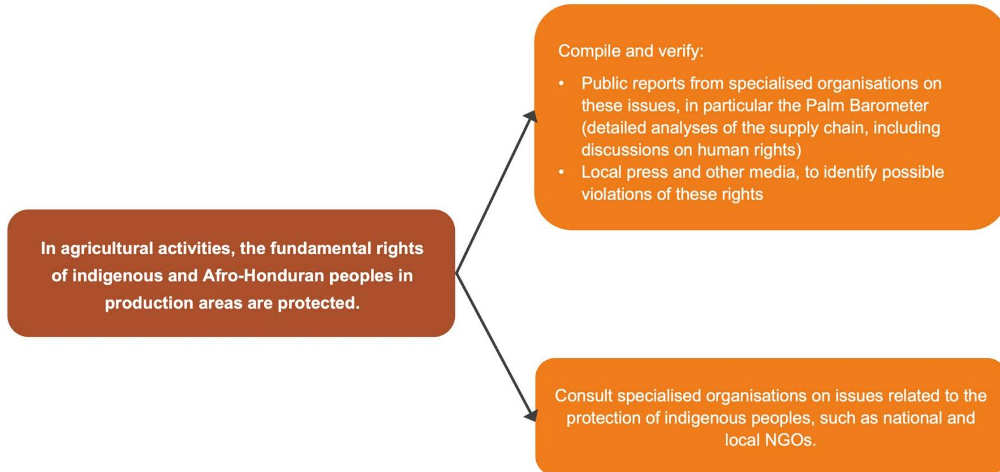

#### 5.1.2 Children are not employed below the legal age

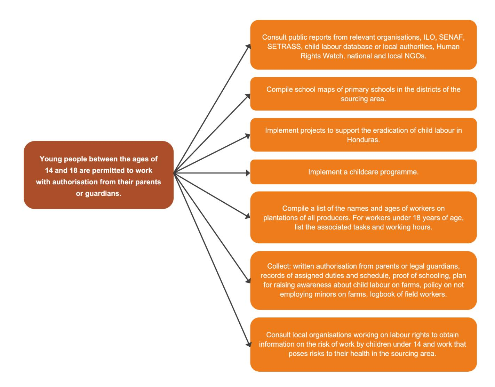

#### 5.2.1 Absence of modern slavery and forced labour

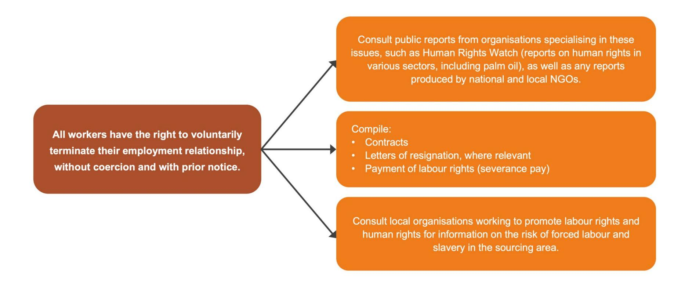

#### 5.3.1 No sexual harassment or gender discrimination

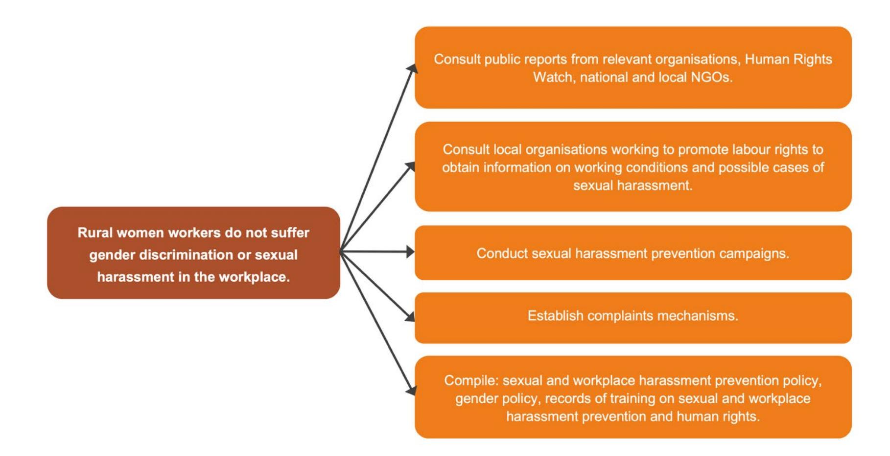

### Free, Prior and Informed Consent

In Honduras, the obligation to carry out Free, Prior and Informed Consent (FPIC, CPLI in Spanish) processes in the oil palm sector is not generally implemented and is only activated under specific legal conditions linked to the environmental categorisation of the project and the existence of a direct impact on indigenous or Afro-Honduran peoples. This differentiated approach has direct implications for determining the level of due diligence required.

In accordance with the national regulatory framework, projects classified as Category 4 under SERNA's environmental assessment system — generally associated with large-scale or high-impact projects — are those that may be subject to FPIC requirements, provided that they are also developed within indigenous or Afro-descendant territories, affect traditionally used lands, or generate impacts that affect collective rights. In this context, small producers, who in practice have less than 100 hectares, are not subject to the FPIC obligation, which significantly reduces the legal risk at the base of the supply chain.

When FPIC is implemented, consultations are carried out through community protocols or open councils, using mechanisms defined by the community itself depending on its form of organisation, the type of consultation agreed upon, and the size of the project. Although additional standards to implement this right are under discussion, the current framework clearly identifies the cases in which consultation is required. Based on available information and the consultations carried out for the development of this tool, the level of implementation with FPIC is considered high.

|    |                                                                                                                                                                                                                    |                                                                                                                                                                                                                                                                                                                                                                                                                                                                                                                                                                                                                                                                                                                                                                                                                                                                                                                                                                                                                                                                                                                                                                                                                                                                                                                                                                                                                                                                                                         | Level of                                                                                                                                                                                                                                                                                                                                                                                                                                                                                                                                                                                                                                                                |
|----|--------------------------------------------------------------------------------------------------------------------------------------------------------------------------------------------------------------------|---------------------------------------------------------------------------------------------------------------------------------------------------------------------------------------------------------------------------------------------------------------------------------------------------------------------------------------------------------------------------------------------------------------------------------------------------------------------------------------------------------------------------------------------------------------------------------------------------------------------------------------------------------------------------------------------------------------------------------------------------------------------------------------------------------------------------------------------------------------------------------------------------------------------------------------------------------------------------------------------------------------------------------------------------------------------------------------------------------------------------------------------------------------------------------------------------------------------------------------------------------------------------------------------------------------------------------------------------------------------------------------------------------------------------------------------------------------------------------------------------------|-------------------------------------------------------------------------------------------------------------------------------------------------------------------------------------------------------------------------------------------------------------------------------------------------------------------------------------------------------------------------------------------------------------------------------------------------------------------------------------------------------------------------------------------------------------------------------------------------------------------------------------------------------------------------|
|    | Legal requirement                                                                                                                                                                                                  | Context                                                                                                                                                                                                                                                                                                                                                                                                                                                                                                                                                                                                                                                                                                                                                                                                                                                                                                                                                                                                                                                                                                                                                                                                                                                                                                                                                                                                                                                                                                 | implementation / Due diligence recommendations due diligence                                                                                                                                                                                                                                                                                                                                                                                                                                                                                                                                                                                                            |
| 6. | Free, Prior and Informed Consent (FPIC)                                                                                                                                                                            |                                                                                                                                                                                                                                                                                                                                                                                                                                                                                                                                                                                                                                                                                                                                                                                                                                                                                                                                                                                                                                                                                                                                                                                                                                                                                                                                                                                                                                                                                                         |                                                                                                                                                                                                                                                                                                                                                                                                                                                                                                                                                                                                                                                                         |
|    | 6.1. Any production system that affects the territories of indigenous or Afro-Honduran category 4 projects. peoples requires FPIC through open councils or their traditional categorisation. FPIC is not required. | subject to FPIC. Honduras' national regulatory framework requires FPIC for To obtain the consent of the affected communities, the consultation process is carried out through protocols or open councils using mechanisms such as: 1. The type of consultation approved by the community organisation. 2. The type of organisation existing in the community. 3. The size of the project to be developed and its link to SERNA's environmental Standards to implement this right are currently under discussion. The council meeting is held only for projects classified as category 4 as described in section 2.2. In this context, the level of risk is considered low. In Honduras, oil palm crops or projects only require Free, Prior and Informed Consent (FPIC) when they directly affect indigenous or Afro-descendant peoples, either because they are developed within their territories, affect traditionally used lands, generate environmental or social impacts that affect their collective rights, or involve permits that impact their natural resources. If the project is outside ethnic territories and does not affect these communities, Although land conflicts, allegations of dispossession, and tensions between communities and agro-industrial companies have been documented, including some activities related to oil palm in areas such as Bajo Aguán. However, none of these reports formally assesses whether FPIC was implemented in accordance with Convention 169. | High or Geospatial analysis Verify whether the polygons are within indigenous Light due diligence territory by cross-referencing the polygons of the plantations with the Geoportal which contains maps of territories assigned to indigenous peoples. If the plantations are located within indigenous territories, additional due diligence actions are recommended: Consultations with stakeholders Consult with local organisations about possible complaints or violations of the rights of indigenous peoples. Compilation and verification of documents Minutes of open council meetings or community protocols. Documented consent from indigenous authorities. |

### 6.1 FPIC is obtained when the rights of indigenous peoples or local communities are affected

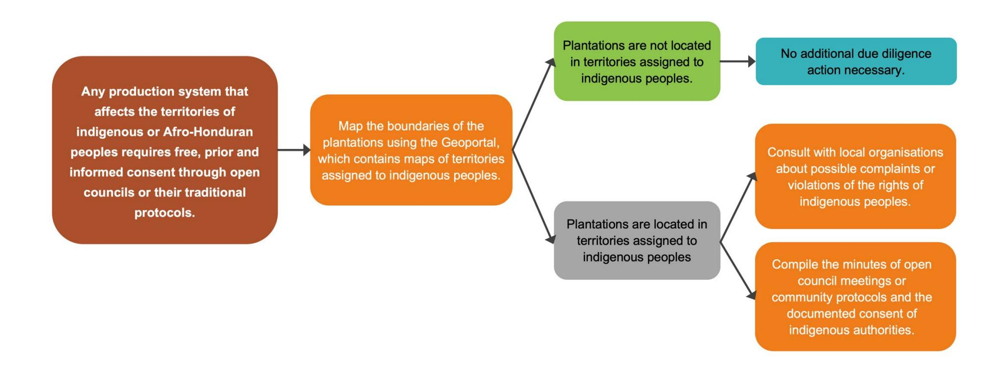

### Tax, anti-corruption, trade and customs regulations

N.B. This category is the only category in the EUDR that potentially affects entities throughout the supply chain, not just at the level of palm oil plantations.

In Honduras, to date, formalities related to trading and exporting and taxes paid by exporters are generally well respected and documented.

In Honduras, tax and customs compliance and the prevention of corruption in the palm oil value chain are underpinned by a regulatory framework for the implementation of which all actors, including small producers, associations, cooperatives, extractors and exporting companies, are responsible. This framework includes obligations relating to tax registration, invoicing, declaration and payment of internal taxes, as well as implementation of customs regimes applicable to exports, under the supervision of the Revenue Administration Service (SAR), the Customs Service and other competent authorities.

Despite the existence of defined rules, the analysis carried out for this tool identifies that, overall, the implementation of standard due diligence is justified in the tax and customs areas. This level of risk is mainly explained by the heterogeneity of the palm oil sector, where highly formalised operators (extractors and exporters) coexist with small producers and associations with limited administrative capacities and a lower degree of tax formalisation, as well as by historical weaknesses in the country's tax and customs control.

In terms of taxation, although all actors must have a National Tax Registry (RTN) and issue duly authorised tax receipts, practice shows risks of documentation errors, incomplete declarations or non-compliance with ancillary obligations, particularly at the production level. Added to this is the complexity of the applicable tax regime, which includes exemptions, reduced rates for associations and cooperatives, potential minimum taxes on gross income for large companies, withholding and collection obligations, and municipal taxes not administered by the central tax authority.

In customs and foreign trade, exports are regulated by CAUCA, RECAUCA, the Honduran Customs Law and the applicable special regimes. Although compliance with these requirements is necessary for exporting and in practice formal exporters tend to operate with high levels of compliance, the documentary traceability of products from origin can be affected by fiscal or administrative deficiencies in the earlier stages of the supply chain, reinforcing the need for standard controls throughout the supply chain.

Finally, in terms of corruption prevention, despite the existence of specialised institutions and regulatory frameworks, the national context of high perceived corruption and weaknesses in land tenure governance and buying and selling processes increase the risk of irregularities that may affect the legality and reputation of the palm sector. These factors do not imply a presumption of systematic illegality, but they do require additional verification and proportionate control mechanisms.

|                                                                                                                                                                                    | Level of implementation /                                                                                                             |
|------------------------------------------------------------------------------------------------------------------------------------------------------------------------------------|---------------------------------------------------------------------------------------------------------------------------------------|
| Legal requirement                                                                                                                                                                  | Context Due diligence recommendations due diligence                                                                                   |
| 7. Commercial, tax and customs obligations 7.1 Taxes and duties are paid 7.1.1 Producers and organisations that trade in palm oil pay the standard tax rate and any related taxes. | Low Data collection and verification Standard due By sampling, collect: diligence CAI invoices for palm fruit purchases in the field. |
| the Tax Administration Service (Servicio de Administración,                                                                                                                        | SAR). Through the Palm fruit delivery notes. validated using the tool made available by the Tax Administration.                       |
| In terms of internal taxes, associations and cooperatives are exempt from paying taxable income. Note:                                                                             | Directorate General of Tax Exemptions and Customs Franchises. withholding of direct and indirect taxes.                               |
| national Tax Administration (SAR/AATT).                                                                                                                                            |                                                                                                                                       |
| In Honduras, the oil palm sector presents higher                                                                                                                                   | tax and customs risk for small                                                                                                        |

|                                                                                                                                                       | Level of implementation /                                                                                                                                                                                                                                                        |
|-------------------------------------------------------------------------------------------------------------------------------------------------------|----------------------------------------------------------------------------------------------------------------------------------------------------------------------------------------------------------------------------------------------------------------------------------|
| Legal requirement                                                                                                                                     | Context Due diligence recommendations due diligence                                                                                                                                                                                                                              |
|                                                                                                                                                       | robust registration, traceability and compliance systems, the informality of the                                                                                                                                                                                                 |
| production                                                                                                                                            | base and the complexity of transport and storage chains increase                                                                                                                                                                                                                 |
| exposure to documentation                                                                                                                             | errors, incomplete declarations and challenges in                                                                                                                                                                                                                                |
| 7.2 Customs and trade 7.2.1 All exports must be carried out in accordance with taxes. applicable customs regulations, including special regimes where | fully verifying the origin of the product. Overall, this risk is manageable, but it High Document collection and verification Light due diligence Collect, through sampling, receipts for payment of customs duties.                                                             |
| regulated by CAUCA and its relevant.                                                                                                                  | implementing regulations (RECAUCA), the Honduran                                                                                                                                                                                                                                 |
| To be eligible 7.3 Corruption is prevented 7.3.1 In Honduras, corrupt and fraudulent practices are                                                    | to export, companies must comply with all customs requirements, therefore the level of non-compliance is considered very low. Low Data collection and verification                                                                                                               |
| governance of                                                                                                                                         | land tenure and a lack of transparency in sales processes hinder                                                                                                                                                                                                                 |
| punished through special procedures established in national legislation.                                                                              | Consult complaints on th e OABI Transparency Portal Standard due diligence (seized assets). in ensuring the legality of productive activities. Implementation of procedures and processes Encourage manufacturing companies to implement integrity and anti-corruption policies. |
| the sector.                                                                                                                                           | Provide staff training on ethics and legal compliance. Verify the authenticity of documents (deeds, permits, titles, declarations, etc.). Establish confidential and secure complaints mechanisms. Verify the traceability of batches.                                           |

### 7.1.1 Payment of general tax rates and related taxes

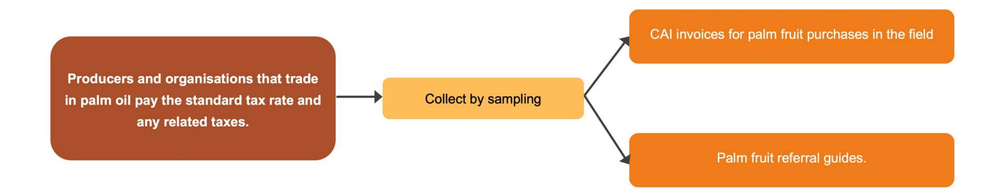

### 7.2.1 Customs duties are paid, trade quotas and regulations are complied with

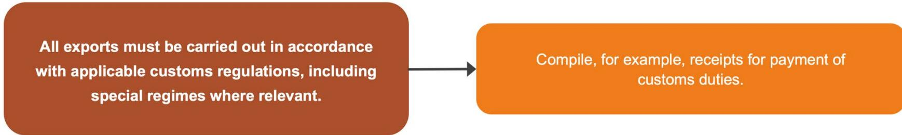

#### 7.3.1 Corruption is prevented

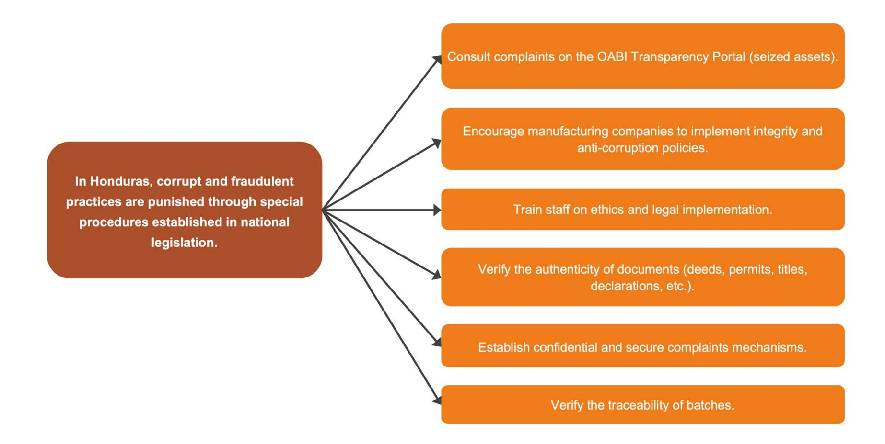

# **Annex 1**

### Mapping methodology

The first step in developing this legality due diligence tool is to identify the relevant national legal requirements for oil palm production in Honduras in the context of the EUDR.

The EUDR defines the legality of commodities in terms of two criteria:

- Relevant national legal requirements must relate to the legal status of the production area.
- There are seven areas of law relevant for agricultural products: 1) landuse rights; 2) environmental protection; 3) third parties' rights; 4) labour rights; (5) human rights protected under international law; 6) the principle of Free, Prior and Informed Consent, as set out in the United Nations Declaration on the Rights of Indigenous Peoples; and 7) tax, anticorruption, trade and customs regulations.

On 2 October 2024 (with an update in April 2025), the European Commission published a guidance document for the implementation of the EUDR, which interprets the legality criteria. This document proposes that a legal requirement should be considered relevant if:

- The requirement has a specific impact on the legal status of the area of production of the commodities [with the exception of tax, trade and customs standards]; and
- The requirement is linked to the objectives of the Regulation, in particular, to halt deforestation and forest degradation as part of the EU's commitment to addressing climate change and biodiversity loss.

Since not all labour requirements, nor some human rights and third parties' rights, are directly related to the objectives of the EUDR, there is debate over whether they fall within the scope of the Regulation.

In addition, the guidance document would extend the scope of tax and anticorruption regulations to steps in the value chain beyond the area of production. It should be noted that the European Commission's guidance document is not legally binding. As specified in the guidance document itself, it does not replace, add to or modify the provisions of the EUDR, which sets out the legal obligations. Its purpose is to harmonise EUDR implementation across EU Member States.

Each EU Member State will adopt its own approach to monitoring operators' compliance with the EUDR. Ultimately, only national courts have the authority to interpret EU regulations in a legally binding manner and determine the scope of the legality test.

In this context, this tool takes a precautionary approach. It considers all areas of law listed in Article 2(40) and includes all requirements that are considered relevant in these seven areas.

This comprehensive approach will allow end users to choose the scope of their due diligence based on their reading of the EUDR and the guidance provided.

### How the relevance of the requirements has been determined

Under the EUDR, the operator is responsible for carrying out due diligence to ensure that the products they trade in present a negligible risk of illegality. However, the EU has recognised that producing countries can facilitate the work of operators and competent authorities (see question 1(30) of the FAQs), in particular by providing information that allows for a better understanding of the applicable national laws. [1](#page-73-0) This is precisely the objective of Annex 2, which contains the mapping of the relevant legal requirements for palm oil produced in Honduras.

All existing legal texts and requirements in Honduras that fall within the seven legal areas specified above have been identified. Stakeholders in the palm oil sector, gathered in consultation workshops and bilateral meetings (see Annex 3), assessed the relevance of each relevant legal requirement to determine compliance with the EUDR legality criterion.

All identified legal requirements were considered a priori relevant for assessing the compliance of oil palm or its derived products with the EUDR legality criterion, unless it can be clearly identified that:

- The legal requirement does not apply to the oil palm plantation or to workers and third parties involved in the plantation [with the exception of tax, trade and customs standards].
- The legal requirement is not relevant because the conditions for its implementation are not found in the context of oil palm production.
- The legal requirement is of general implementation, is not covered by implementation texts, which prevents its implementation or compliance monitoring, and/or is covered by other more specific requirements.

This analysis covers all relevant legal requirements in the country. However, it is important to mention that the implementation of some legal requirements, due to the specific conditions of the rural environment and the characteristics of the oil palm sector, may not be feasible for producers, especially small ones. Nevertheless, this tool includes these requirements, acknowledging that they are binding, but that the legal and technical conditions for their proper enforcement in rural and productive areas of Honduras are not in place.

1 [https://circabc.europa.eu/ui/group/34861680-e799-4d7c-bbad-da83c45da458/library/e126f816-844b-41a9-89ef-](https://circabc.europa.eu/ui/group/34861680-e799-4d7c-bbad-da83c45da458/library/e126f816-844b-41a9-89ef-cb2a33b6aa56/details)

# **Annex 2. Mapping of relevant legal requirements**

The tables below, organised by area of law, present the legal requirements considered relevant and not relevant, and the justifications provided by the stakeholders consulted, for palm oil produced in Honduras.

The tables show the 33 legal requirements identified, of which 30 are considered relevant and 3 not relevant, and the justifications provided by the stakeholders consulted. Requirements marked with an asterisk are not directly related to the objectives of the EUDR.

### Land use rights

| Areas of law                                                                                 | Legal requirement                                                                                                                                                                                                                                                                                                                                                                                                                                                      | Legal basis                                                                                                                                                                                                                                                                                                                                                                                                                                                                                                                                | Relevance              |
|----------------------------------------------------------------------------------------------|------------------------------------------------------------------------------------------------------------------------------------------------------------------------------------------------------------------------------------------------------------------------------------------------------------------------------------------------------------------------------------------------------------------------------------------------------------------------|--------------------------------------------------------------------------------------------------------------------------------------------------------------------------------------------------------------------------------------------------------------------------------------------------------------------------------------------------------------------------------------------------------------------------------------------------------------------------------------------------------------------------------------------|------------------------|
| <ul style="list-style-type: none;"> <li>1. Land-use rights</li> </ul>                        |                                                                                                                                                                                                                                                                                                                                                                                                                                                                        |                                                                                                                                                                                                                                                                                                                                                                                                                                                                                                                                            |                        |
| <ul style="list-style-type: none;"> <li><i>1.1 Land use rights are guaranteed</i></li> </ul> |                                                                                                                                                                                                                                                                                                                                                                                                                                                                        |                                                                                                                                                                                                                                                                                                                                                                                                                                                                                                                                            |                        |
| 
<b>1.1.1 Land tenure is well defined and respected.</b>
 
<b>Cases A.</b>
        | 
Land tenure is well defined and respected
 
The producer has land <u>ownership</u> (through a registered public deed or title deed granted by the competent authority).
 
OR
 
The producer holds the land under formal or informal "possession".
 
OR
 
The producer <u>exercises the use rights</u> for the land without intention of ownership, through arrangements of mere tenure, including usufruct, lease and gratuitous loan.
 | 
CONSTITUTION OF THE REPUBLIC OF HONDURAS:
 
Articles 103, 104, 106, 107, 344 to 350: Agrarian Reform
 
<b>CIVIL CODE:</b>
 
Articles 613 to 630: Ownership
 
Articles 717 to 744: Possession
 
Articles 745 to 789: Usufruct
 
Articles 790 to 798: Use and Habitation Rights
 
Articles 799 to 867: Easements
 
Articles 868 to 894: Actions to Recover Ownership
 
Articles 1681 to 1682: Lease
 
Articles 1744 to 1752: Lease of Rural Plots
 
Article 2272: Prescription
 | 
<b>Relevant</b>
 |

| Areas of law                                            | Legal requirement                                                                | Legal basis                                                                                                                                                                                                                                                                                                                                                                                                                                                                                                                                                                                                                                                                                                                                                                                                                                                                                                                                    | Relevance       |
|---------------------------------------------------------|----------------------------------------------------------------------------------|------------------------------------------------------------------------------------------------------------------------------------------------------------------------------------------------------------------------------------------------------------------------------------------------------------------------------------------------------------------------------------------------------------------------------------------------------------------------------------------------------------------------------------------------------------------------------------------------------------------------------------------------------------------------------------------------------------------------------------------------------------------------------------------------------------------------------------------------------------------------------------------------------------------------------------------------|-----------------|
|                                                         |                                                                                  | 
<b>PROPERTY LAW:</b>
 
Articles 25 to 28: Purpose and Objectives of the Register
 
Article 37: Registration Entries
 
Articles 54 to 68: Real Estate Cadastre
 
Articles 69 to 109: Property Regularisation
 
Articles 93 to 102: Property Regularisation for Indigenous and Afro-Honduran Peoples
 
Article 125.
 
<b>MUNICIPALITIES ACT:</b>
 
Articles 13(2) and 68(1) and (3).
 
<b>LAW FOR THE MODERNISATION AND DEVELOPMENT OF THE AGRICULTURAL SECTOR:</b>
 
Articles 23 to 36
 
Article 55
 
<b>LAND USE PLANNING ORDINANCE:</b>
 
Article 92
 
<b>AGRICULTURAL REFORM LAW:</b>
 
Articles 12 to 22
 
Articles 23 to 36
 
Articles 89 and 92.
 
<b>REGULATIONS OF THE PROPERTY LAW:</b>
 
Articles 76 to 81. Land Registry.
 
Articles 178 to 207. Real Estate Cadastre
 
Articles 218 to 271. Property Regularisation
 |                 |
| <b>1.1.1 Land tenure is well defined and respected.</b> | The community has acquired the right to collective land use through the National | 
CONSTITUTION OF THE REPUBLIC OF HONDURAS:
 
Articles 103, 104, 106 and 107
                                                                                                                                                                                                                                                                                                                                                                                                                                                                                                                                                                                                                                                                                                                                                                                                                                                         | <b>Relevant</b> |

| Areas of law                                                               | Legal requirement                                                                                                                                                                                                                                                   | Legal basis                                                                                                                                                                                                                                                                                                                                                                                                                                                                                                                                     | Relevance       |
|----------------------------------------------------------------------------|---------------------------------------------------------------------------------------------------------------------------------------------------------------------------------------------------------------------------------------------------------------------|-------------------------------------------------------------------------------------------------------------------------------------------------------------------------------------------------------------------------------------------------------------------------------------------------------------------------------------------------------------------------------------------------------------------------------------------------------------------------------------------------------------------------------------------------|-----------------|
| <b>Type B cases.</b>                                                       | 
Agrarian Institute and the Property Institute.
 
OR
 
The community has acquired land-use rights through the Agrarian Reform.
                                                                                                                      | 
Articles 344 to 350. Agrarian Reform
 
<b>LAW FOR THE MODERNISATION AND DEVELOPMENT OF THE AGRICULTURAL SECTOR:</b>
 
Articles 23 to 36
 
Article 55
 
<b>LAND USE PLANNING ORDINANCE:</b>
 
Article 92
 
<b>AGRICULTURAL REFORM LAW:</b>
 
Articles 12 to 22
 
Articles 23 to 36
 
Articles 89 and 92.
 
<b>REGULATIONS OF THE PROPERTY LAW:</b>
 
Articles 76 to 81. Land Registry.
 
Articles 178 to 207. Real Estate Cadastre
 
Articles 218 to 271. Regularisation
 |                 |
| <b>1.1.2 No evidence of abandonment or forced expulsion from the plot.</b> | 
Land used for agricultural production must not have been subject to forced abandonment or violent expulsion of its previous occupants. The producer must exercise legitimate tenure or ownership without active disputes that violate third parties' rights.
 | 
CONSTITUTION OF THE REPUBLIC OF HONDURAS:
 
Article 103
 
Art. 106
 
<b>LAW FOR THE PREVENTION, CARE AND PROTECTION OF INTERNALLY DISPLACED PERSONS:</b>
 
Article 5(3)
 
Article 5(7)
 
Article 5(12)
 
Article 33
 
Article 35(8), (12) and (19)
 
Article 52
 
Article 53
                                                                                                                                                                                                           | <b>Relevant</b> |

| Areas of law                                       | Legal requirement                                                                                                                                                                          | Legal basis                                                                                                                                           | Relevance |
|----------------------------------------------------|--------------------------------------------------------------------------------------------------------------------------------------------------------------------------------------------|-------------------------------------------------------------------------------------------------------------------------------------------------------|-----------|
| <i>1.2 Legal requirements for land use are met</i> |                                                                                                                                                                                            |                                                                                                                                                       |           |
| 1.2.1. Agriculture is permitted on the plot.       | Agricultural activity is permitted in accordance with current regulations and land use. It does not contravene municipal urban planning, environmental or territorial planning provisions. | <b>LAND USE PLANNING ORDINANCE:</b> Article 27(2)(a) <b>GENERAL REGULATIONS OF THE LAND USE PLANNING ORDINANCE:</b> Article 56 Article 91 | Relevant  |

### Environmental protection

|    | Areas of law             | Legal requirement |            | Legal basis | Relevance |
|----|--------------------------|-------------------|------------|-------------|-----------|
| 2. | Environmental protection |                   |            |             |           |
|    |                          |                   | Article 68 |             |           |

| Areas of law | Legal requirement                        |                    | Legal basis | Relevance |
|--------------|------------------------------------------|--------------------|-------------|-----------|
|              | prescribed burning, the relevant permits |                    |             |           |
|              |                                          | Articles 59 and 62 |             |           |

| Areas of law                                                                                                                 | Legal requirement                                                                                                                                                                                                                                                                                                                               | Legal basis                                                                                                                                                                                                                                                                                                                                                                      | Relevance       |
|------------------------------------------------------------------------------------------------------------------------------|-------------------------------------------------------------------------------------------------------------------------------------------------------------------------------------------------------------------------------------------------------------------------------------------------------------------------------------------------|----------------------------------------------------------------------------------------------------------------------------------------------------------------------------------------------------------------------------------------------------------------------------------------------------------------------------------------------------------------------------------|-----------------|
|                                                                                                                              |                                                                                                                                                                                                                                                                                                                                                 | Regulation of aerial pesticide application  <b>REGULATIONS FOR THE REGISTRATION, USE AND CONTROL OF PLANT PROTECTION PRODUCTS:</b>  Article 137                                                                                                                                                                                                                      |                 |
| <i><b>2.2 Protection of forest ecosystems and wild fauna and flora</b></i>                                                   |                                                                                                                                                                                                                                                                                                                                                 |                                                                                                                                                                                                                                                                                                                                                                                  |                 |
| <b>2.2.1 An environmental impact assessment has been carried out when required by law.</b>                                   | When the area of production exceeds 25 hectares, the producer must have an environmental management tool appropriate to the size and nature of the project, which may consist of an environmental management plan, an environmental technical report or an environmental summary table, as established by SERNA within the framework of SINEIA. | <b>REGULATIONS OF THE GENERAL ENVIRONMENTAL LAW:</b>  Articles 88, 90 and 103  <b>REGULATIONS OF THE NATIONAL ENVIRONMENTAL IMPACT ASSESSMENT SYSTEM:</b>  Article 30                                                                                                                                                                                          | <b>Relevant</b> |
| <b>2.2.2 Legal requirements for biodiversity conservation and the protection of endangered or protected species are met.</b> | Threatened species of flora and fauna are respected and protected in productive activities.                                                                                                                                                                                                                                                     | <b>GENERAL ENVIRONMENTAL LAW:</b>  Articles 1, 4 and 44  <b>FOREST, PROTECTED AREAS AND WILDLIFE LAW:</b>  Articles 117 and 118  Agreement 020-2024. Special procedural regulations for the implementation of fines and penalties for administrative offences of a forestry nature in forest areas, protected areas and wildlife areas.  Article 1 | <b>Relevant</b> |

### Third parties' rights

| Subcategory                                                                                                                                                                                                                                                           | Legal requirement                                                                                                                                                     | Legal basis                                                                                                                | Relevance       |
|-----------------------------------------------------------------------------------------------------------------------------------------------------------------------------------------------------------------------------------------------------------------------|-----------------------------------------------------------------------------------------------------------------------------------------------------------------------|----------------------------------------------------------------------------------------------------------------------------|-----------------|
| <b>3. Third parties' rights</b>                                                                                                                                                                                                                                       |                                                                                                                                                                       |                                                                                                                            |                 |
| <i>3.1 Substantive rights</i>                                                                                                                                                                                                                                         |                                                                                                                                                                       |                                                                                                                            |                 |
| <b>3.1.1 Sites, resources and habitats of cultural, archaeological or historical significance, or of religious or sacred significance to the traditional cultures of communities affected by operations, are identified and protected in accordance with the law.</b> | Productive activities are not carried out in areas of cultural significance.                                                                                          | <b>CONSTITUTION OF THE REPUBLIC:</b> Article 172  <b>LAW FOR THE PROTECTION OF THE NATION'S CULTURAL HERITAGE</b> | <b>Relevant</b> |
| <i>3.2 Procedural rights</i>                                                                                                                                                                                                                                          |                                                                                                                                                                       |                                                                                                                            |                 |
| <b>3.2.1 Right to claim compensation in the event of damage and harm.</b>                                                                                                                                                                                             | If agricultural production causes harm to individuals, communities or the environment, those affected have the right to seek full reparation, including compensation. | <b>CIVIL CODE:</b> Article 1360 Article 1365 <b>GENERAL ENVIRONMENTAL LAW:</b> Article 120                     | <b>Relevant</b> |

### Labour Rights

|             | Areas of law Legal requirement Legal basis Relevance |
|-------------|------------------------------------------------------|
| 4.          | Labour rights                                        |
| 4.1 Workers | ' rights are respected                               |
|             | the plantation and their employers are               |
|             | according to their contractual                       |

| Areas of law                                                                                                      | Legal requirement                                                                                                                                                                                                                                           | Legal basis                                                                                                                                                                                                                | Relevance |
|-------------------------------------------------------------------------------------------------------------------|-------------------------------------------------------------------------------------------------------------------------------------------------------------------------------------------------------------------------------------------------------------|----------------------------------------------------------------------------------------------------------------------------------------------------------------------------------------------------------------------------|-----------|
| <b>4.1.4 Freedom of association, the right to organise, and the right to collective bargaining are respected.</b> | All workers, without distinction, have the right to organise freely in trade unions and to join the union of their choice, without being subject to sanctions, dismissal, reprisals or discrimination for exercising this right.                            | <b>CONSTITUTION OF THE REPUBLIC:</b> Articles 78 and 128(14) <b>LABOUR CODE:</b> Articles 54, 58, 72, 78 Article 96(3) Articles 469 and 476                                                                 | Relevant  |
| <b>4.1.5 Social security rights are respected.</b>                                                                | Agricultural workers are subject to special regimes and progressive affiliation processes to the Social Security system, taking into account the geographical location and the capacities of the Honduran Social Security Institute (IHSS), where relevant. | <b>CONSTITUTION OF THE REPUBLIC:</b> Articles 142, 143 <b>LABOUR CODE:</b> Article 95(10) <b>Social security law:</b> Article 3(d) Article 4(f) and g) <b>SOCIAL SECTOR ECONOMY LAW:</b> Article 7 | Relevant  |
| <b><i>4.2 Gender Equality is ensured</i></b>                                                                      |                                                                                                                                                                                                                                                             |                                                                                                                                                                                                                            |           |
| <b>4.2.1 Legal provisions on maternity and paternity leave are complied with.</b>                                 | All pregnant agricultural workers are entitled to pre- and post-natal leave as established by law.                                                                                                                                                          | <b>CONSTITUTION OF THE REPUBLIC:</b> Art. 111, Art. 142 <b>LABOUR CODE:</b> Articles 135, 140 and 144 <b>REGULATIONS FOR THE IMPLEMENTATION OF THE SOCIAL SECURITY LAW:</b> Article 68                      | Relevant  |

| Areas of law Legal requirement                   | Legal basis                                                    | Relevance |
|--------------------------------------------------|----------------------------------------------------------------|-----------|
| 4.3 Workers ' remuneration complies with the law |                                                                |           |
|                                                  | (Decree 193-1971) explicitly include coverage for occupational |           |

| Areas of law | Legal requirement | Legal basis                                                                                                                                                                                                                     | Relevance |
|--------------|-------------------|---------------------------------------------------------------------------------------------------------------------------------------------------------------------------------------------------------------------------------|-----------|
|              |                   | <ul> <li>Regulation STSS 053-04 (2004) supplements the Labour Code, establishing Occupational Health and Safety standards, with the IHSS involved in their implementation and the government conducting inspections.</li> </ul> |           |

## Human Rights\*

| Areas of law                                                                                                                                                                                                                            | Legal requirement                                                                                                                   | Legal basis                                                                                                                                                                                                                                                                                                                                                        | Relevance |
|-----------------------------------------------------------------------------------------------------------------------------------------------------------------------------------------------------------------------------------------|-------------------------------------------------------------------------------------------------------------------------------------|--------------------------------------------------------------------------------------------------------------------------------------------------------------------------------------------------------------------------------------------------------------------------------------------------------------------------------------------------------------------|-----------|
| <b>5. Human rights</b>                                                                                                                                                                                                                  |                                                                                                                                     |                                                                                                                                                                                                                                                                                                                                                                    |           |
| <i>5.1 Human rights are respected in accordance with national and international law</i>                                                                                                                                                 |                                                                                                                                     |                                                                                                                                                                                                                                                                                                                                                                    |           |
| <b>5.1.1 Human rights protected by international and national law are respected, such as the cultural or territorial rights of indigenous peoples, the right to health, the right to water, and the right to a healthy environment.</b> | In agricultural activities, the fundamental rights of indigenous and Afro-Honduran peoples are protected in production areas.       | <b>CONSTITUTION OF THE REPUBLIC:</b> Articles 60, 145, 173 and 346 <b>FOREST LAW, PROTECTED AREAS AND WILDLIFE:</b> Article 133 <b>GENERAL ENVIRONMENTAL LAW:</b> Article 71 <b>PROPERTY LAW:</b> Articles 93, 96 and 100                                                                                                                     | Relevant  |
| <i>5.2 Human rights are respected in accordance with national and international law</i>                                                                                                                                                 |                                                                                                                                     |                                                                                                                                                                                                                                                                                                                                                                    |           |
| <b>5.2.1 Children below the legal age are not employed.</b>                                                                                                                                                                             | In Honduras, young people between the ages of 14 and 18 are permitted to work with the authorisation of their parents or guardians. | <b>CONSTITUTION OF THE REPUBLIC:</b> Article 124, Article 128(7) <b>LABOUR INSPECTION LAW:</b> Article 83 <b>CODE ON CHILDREN AND ADOLESCENTS:</b> Articles 114 and 115 <b>LABOUR CODE:</b> Article 32 <b>REGULATIONS ON CHILD LABOUR IN HONDURAS:</b> Article 7 <b>REGULATIONS ON PROTECTED ADOLESCENT LABOUR:</b> Article 11 | Relevant  |

| Areas of law                                                                                                 | Legal requirement                                                                                                                                                                                                    | Legal basis                                                                                                                                                                            | Relevance                                                                                                                                                                                                                                           |
|--------------------------------------------------------------------------------------------------------------|----------------------------------------------------------------------------------------------------------------------------------------------------------------------------------------------------------------------|----------------------------------------------------------------------------------------------------------------------------------------------------------------------------------------|-----------------------------------------------------------------------------------------------------------------------------------------------------------------------------------------------------------------------------------------------------|
| <i>5.3 Absence of modern slavery and forced labour</i>                                                       |                                                                                                                                                                                                                      |                                                                                                                                                                                        |                                                                                                                                                                                                                                                     |
| <b>5.3.1 There is no withholding of wages, benefits, documents or property to restrict workers' freedom.</b> | The employer shall not withhold wages, employment benefits, identity documents, personal property or other economic or administrative rights for the purpose of coercing, restricting or conditioning their freedom. | <b>LABOUR CODE:</b> Article 96(5) Article 114(f)                                                                                                                                 | Not applicable In the current context of the oil palm sector in Honduras, there are no cases or documentary evidence linking this sector to restrictions on workers' freedom.                                                                    |
| <b>5.3.2 Workers are free to terminate their employment relationship with prior notice.</b>                  | All workers have the right to voluntarily terminate their employment relationship, without coercion and with prior notice.                                                                                           | <b>CONSTITUTION OF THE REPUBLIC:</b> Article 127  <b>LABOUR CODE:</b> Articles 111, 117 and 118                                                                            | Relevant                                                                                                                                                                                                                                            |
| <b>5.3.3 No one is subjected to slavery or forced labour.</b>                                                | All forms of slavery, servitude, forced or compulsory labour in any sector, including agricultural activities, are prohibited.                                                                                       | <b>CONSTITUTION OF THE REPUBLIC:</b> Articles 60, 61 and 69  <b>HONDURAN CRIMINAL CODE:</b> Article 221  <b>LAW AGAINST HUMAN TRAFFICKING:</b> Articles 41 and 42 | Not applicable In the current context of the oil palm sector in Honduras, there are no cases or documentary evidence linking this sector to slavery and forced labour. On the contrary, workers are free to leave their jobs whenever they wish. |
| <i>5.4 Women's rights are respected in accordance with international and national law</i>                    |                                                                                                                                                                                                                      |                                                                                                                                                                                        |                                                                                                                                                                                                                                                     |
| <b>5.4.1 There is no sexual harassment or gender discrimination.</b>                                         | Rural women workers do not suffer gender discrimination or sexual harassment in the workplace.                                                                                                                       | <b>LABOUR CODE:</b> Article 96(5) Article 114(b)  <b>EQUAL OPPORTUNITIES FOR WOMEN ACT:</b> Article 60  <b>CRIMINAL CODE:</b> Articles 256 and 294             | Relevant                                                                                                                                                                                                                                            |

### FPIC

|    | Subcategory Legal requirement           | Legal basis | Relevance |
|----|-----------------------------------------|-------------|-----------|
| 6. | Free, Prior and Informed Consent (FPIC) |             |           |
|    | Any production system that affects the  |             |           |

### Tax, anti-corruption, trade and customs regulations

| Areas of law Legal requirement             | Legal basis Relevance |
|--------------------------------------------|-----------------------|
| 7. Commercial, tax and customs obligations |                       |
| Article                                    | 15                    |
| Articles                                   | 77 and 78             |

| Areas of law | Legal requirement |                         | Legal basis | Relevance |
|--------------|-------------------|-------------------------|-------------|-----------|
|              |                   | ( Decree No. 170-2006): |             |           |
|              |                   | Articles 1 to 10        |             |           |

# **Annex 3. Consultations carried out**

This tool was developed through a highly participatory and extensive consultation process led by the Inter-institutional Technical Committee for compliance with the EUDR, chaired by the National Institute for Forest Conservation, Protected Areas and Wildlife (ICF in Spanish). The process was developed in coordination with the Secretariat of Agriculture and Livestock (SAG) and the Secretariat of Economic Development (SDE) and with the participation of 14 State Secretariats and Executive Directorates of the Government of Honduras, together with key actors from the agricultural, forestry and environmental sectors in Honduras. Approximately 18 working meetings were held, involving relevant state institutions linked to agricultural legality, production associations and actors in the palm oil value chain (producers, cooperatives, intermediaries, extraction plants and exporters), formed through working subgroups led by the Industrial Association of Palm Oil Producers of Honduras (AIPAH). Finally, a workshop was held to review, provide feedback and validate the results, which was attended by representatives of civil society, NGOs, projects and certifiers.

In addition to the collective workshops held at the different steps, bilateral meetings were held with representative organisations and strategic actors to gather specific input and ensure the technical and social validity of the instruments.

Some of the most notable consultations were meetings with AIPAH, the National Federation of Palm Oil Producers of Honduras (FENAPALMAH), the Union of Palm Growers of the Atlantic Coast (UNPALA), Aceites y Derivados S.A. (ACEYDESA), Grupo Jaremar and Corporación Dinant, where regulatory aspects and the particular conditions of the oil palm sector were reviewed. Bilateral meetings were also held with producers, cooperatives and intermediary traders in their territories in order to incorporate their practical perspective on compliance with legal requirements in the field.

Discussions were held with civil society and non-governmental organisations, whose role was fundamental in strengthening the social and environmental perspective of the tool, ensuring the inclusion of elements of sustainability and human rights. Similarly, third-party certification bodies, such as RSPO, also participated and shared their experience in international standards and voluntary certifications, contributing criteria for traceability and external verification.

This comprehensive consultation process not only validated the tool's content but also strengthened its legitimacy by gathering a diverse range of voices from the productive, institutional, social, and environmental sectors, with a view to facilitating its future implementation and acceptance at the national and international levels.

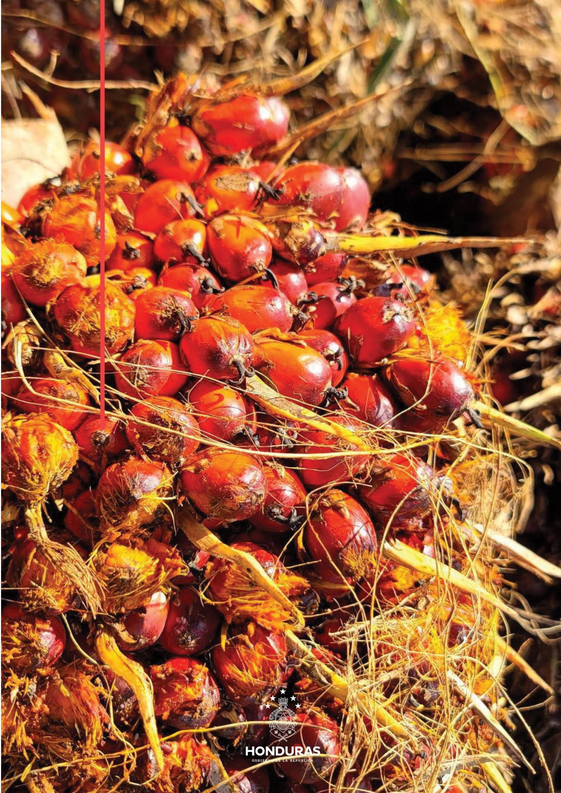