

# coffee legality

## Legality Due Diligence Tool for Coffee

November 2025

**HONDURAS**  
GOBIERNO DE LA REPUBLICA

Disclaimer: This tool has been developed with the financial support of the European Union. The views expressed herein cannot be considered in any way as reflecting the official opinion of the European Union. This tool is intended to support the efforts of the coffee sector to comply with the requirements of the EUDR. Its content is indicative, not legally binding, and does not constitute legal advice. No guarantee is given as to the accuracy, completeness or timeliness of the content. The authors of this tool accept no liability for any damage or loss that may arise from its use without proper legal advice. The authors welcome any comments or suggestions for improvement.

© European Forest Institute, 2025 © NIRAS A/S, 2025

## Index

| 1. Background ................................................................................................................4 |                                                          |
|---------------------------------------------------------------------------------------------------------------------------------|----------------------------------------------------------|
| The European Union Deforestation Regulation.................................................                                    | 4                                                        |
| Cooperation between Honduras and the European Union............................                                                 | 5                                                        |
| Support for due diligence by operators in the coffee sector in Honduras                                                         | 5                                                        |
| Objectives and general approach                                                                                                 | 5                                                        |
| 2. Methodology for developing the tool                                                                                          | 7                                                        |
| Mapping of relevant national requirements                                                                                       | .......................................................7 |
| Development of due diligence recommendations                                                                                    | .............................................7           |
| Scope of the recommendations                                                                                                    | 8                                                        |
| How to use these due diligence recommendations?                                                                                 | 9                                                        |
| Role of certification in due diligence...................................................................                       | 10                                                       |
| 3. Recommendations for legality due diligence in the context of national                                                        |                                                          |
| coffee production                                                                                                               | 11                                                       |
| Land-use rights                                                                                                                 | 11                                                       |
| Environmental protection......................................................................................                  | 16                                                       |
| Labour law* .................................................................................................................36 |                                                          |
| Human rights* ............................................................................................................48    |                                                          |
| Free, Prior and Informed Consent                                                                                                | 57                                                       |
| Tax, customs and anti-corruption standards                                                                                      | ..................................................59     |
| Annex 1 Mapping methodology                                                                                                     | 69                                                       |
| Annex 2 Mapping of relevant legal requirements                                                                                  | 72                                                       |
| Land-use rights                                                                                                                 | 72                                                       |
| Environmental protection......................................................................................                  | 76                                                       |
| Third parties' rights...................................................................................................        | 81                                                       |
| Human rights*                                                                                                                   | 87                                                       |
| Tax, customs and anti-corruption standards                                                                                      | 91                                                       |
| Annex 3: Consultations carried out                                                                                              | 96                                                       |

# **1.Background**

## The European Union Deforestation Regulation

On 31 May 2023, the European Union (EU) adopted Regulation 2023/1115 on the placing on the Union market and export from the Union of certain commodities and products associated with deforestation and forest degradation (EUDR). This regulation requires operators and traders who place products from supply chains associated with deforestation or forest degradation on the EU market to demonstrate that these products are traceable, deforestation-free and legal. The scope covers seven commodities: coffee, cocoa, rubber, palm oil, soy, cattle and timber, as well as derived products such as chocolate and cocoa paste. The entry into application is scheduled for 31 December 2026 (and 30 June 2027 for micro and small enterprises established as such before 31 December 2020). Businesses affected by the regulation (operators and traders) will be required to carry out due diligence before exporting or trading their products, in order to gather sufficient information to demonstrate that the product presents no or negligible risk of non-compliance.

Consequently, operators placing coffee or derived products on the EU market must ensure that these have been produced in accordance with the relevant legislation of the country of production (Article 3), which is defined as that relating to the legal status of the production area. The EUDR takes a flexible approach, listing various areas of law without specifying specific legal instruments, as these differ from country to country and may be subject to change. These areas are [for agricultural commodities]:

- a) Land-use rights
- b) Environmental protection
- c) Third parties' rights
- d) Labour rights
- e) Human rights protected by international law
- f) The principle of free, prior and informed consent, as set out in the United Nations Declaration on the Rights of Indigenous Peoples;
- g) Tax, anti-corruption, trade and customs regulations

In this context, understanding the legislative framework of the country of origin, identifying the relevant legal requirements relevant to the product in question and determining the means of verifying compliance with these requirements is a challenge not only for operators responsible for due diligence, but also for the competent authorities of the EU Member States responsible for controls, as well as for the various stakeholders.

## Cooperation between Honduras and the European Union

In 2025, Honduras and the EU launched a collaboration aimed at supporting national objectives for the economic, environmental and social sustainability of cocoa, coffee and palm oil, and facilitating their access to the European market. This collaboration is being implemented through several technical partners, including the Interinstitutional Technical Committee for EUDR Compliance (Comité Técnico Interinstitucional de apoyo para el cumplimiento del EUDR, CTI), the European Forest Institute (EFI) and the NIRAS team, which are supporting Honduras in developing a framework for facilitation of access to the European market for its commodities and promoting transparency in supply chains.

In this context, the development of this tool by the State of Honduras, with technical support from the EU (EFI and NIRAS), began in March 2025 with the aim of supporting due diligence by operators wishing to place Honduran products (coffee, cocoa and palm oil) or their derivatives on the EU market.

## Support for due diligence by operators in the coffee sector in Honduras

EFI led the development of this tool, through its Technical Facility on Deforestation-free Value Chains, a programme financed by the EU and steered by the European Commission's Directorate General for International Partnerships (DG INTPA).

The development of the tool received technical support from legal and due diligence experts hired by NIRAS, as well as from representatives of government institutions linked to the Inter-institutional Technical Committee for support in compliance with the EUDR and the value chains affected by the Regulation.

## Objectives and general approach

The objectives of this tool are to promote a national and consensual vision of the Honduran legal requirements applicable to coffee production and trade relevant to the EUDR; and to provide recommendations for verifying coffee regulatory compliance and risk management, to support operators' due diligence.

The tool was developed with the aim of:

- supporting the harmonisation of operators' due diligence approaches;
- encouraging the simplification of procedures for actors in the supply chain who are likely to have to provide data to their customers;
- facilitating a better understanding of national contexts by the competent authorities of EU Member States responsible for controls;
- ensuring equitable access to information, reducing perceived risks and positioning Honduran origin with a competitive advantage.

It is important to note that the results presented are not legally binding, do not impose any obligations on the relevant parties, and do not constitute legal advice.

It is the responsibility of operators placing coffee or derived products on the EU market to identify the relevant Honduran legal requirements, within the meaning of Article 2(40) of the EUDR, and to adapt their due diligence to the risks identified. This tool provides guidance that may assist operators and other stakeholders in the sector in this regard. It should be noted that this guidance is likely to evolve over time and be updated due to various factors: legal reforms in the country, developments in public or private certification systems, lessons learnt from the practical implementation of due diligence recommendations, additional guidance provided by the European Commission or competent authorities, integration of best practices and technological developments, etc.

# **2. Methodology for developing the tool**

The tool was developed in two steps:

- Step 1: Mapping of the relevant national legal requirements applicable to the production and trade of Honduran coffee in the context of the EUDR, supplemented with relevant information from the actors involved. The results of this step are captured in Annex 1 of the tool.
- Step 2: Development of due diligence recommendations for operators based on an analysis of the level of compliance with relevant legal requirements and existing means of verification. The results of this step are detailed below.

## Mapping of relevant national requirements

Based on various analyses of the applicable legal framework in the country, the EFI team, together with a legal expert, consolidated and supplemented all the relevant legal requirements for the oil palm, coffee and cocoa sectors in a first step, organised comprehensively according to the areas of law listed in the EUDR. These were structured into subcategories under a legal taxonomy developed by EFI in collaboration with Preferred by Nature in order to facilitate their analysis (see [https://legalitynavigator.efi.int/\)](https://legalitynavigator.efi.int/).

For each subcategory, a legal requirement was drafted in clear and nontechnical language, which was validated through multistakeholder consultations. Similarly, the relevance of each requirement for the sectors involved was determined collectively and by consensus, thus concluding the first stage of the process.

## Development of due diligence recommendations

The second step, focused on developing a risk pre-assessment, began with the work of sectoral expert groups. For each relevant legal requirement, a search for information and analysis of existing data was carried out to establish the level of implementation and the associated risk. This level was agreed upon based on evidence, with the purpose of formulating recommendations for due diligence actions to guide operators. These recommendations, based on sectoral risk per requirement, serve as guidance for operators to conduct their own risk analysis in their supply chain.

The tool is based on technical consultations with various national and international actors involved in coffee, cocoa and palm oil, including Honduran government entities, producers, exporters and traders, certifiers and civil society (see Annex 3).

## Scope of the recommendations

## Who are these recommendations aimed at?

These recommendations are aimed at the various stakeholders concerned with verifying the compliance of coffee and derived products with the EUDR. They may be useful for:

- Operators within the meaning of the EUDR: any natural or legal person who, in the course of a commercial activity, places coffee or derived products on the EU market or exports them.
- Traders within the meaning of the EUDR: any natural or legal person in the supply chain, other than the operator, who makes the products concerned available on the EU market.
- Competent authorities of the EU: authorities designated by the Member States to ensure compliance with the obligations of the EUDR.
- Supply chain actors in Honduras: producers, cooperatives, traders, exporters and other stakeholders involved in the production and trade of coffee, from whom operators may request information, data and documents necessary to carry out their due diligence.

## What are these recommendations for?

These recommendations can be used in different ways and at different times, depending on the actors involved.

Operators and traders can rely on these recommendations to set up and document their due diligence system, ensuring that the coffee they trade complies with the EUDR requirements on legality. They can use them to identify the documents and information to be collected or other actions to be carried out with their suppliers in Honduras, and to assess the risks associated with their supply chain.

The competent authorities of the EU can use these recommendations as a standard for assessing the compliance of products placed on the market with the EUDR. They can also rely on these recommendations to harmonise their controls and interpret documents from Honduras.

Actors in the supply chain in Honduras can use these recommendations to understand the implications of the EUDR requirements for Honduran coffee and the expectations of European operators and traders subject to it. These recommendations can be used to structure and document the information to be provided. They can also help them anticipate the risks of non-compliance and adapt their agricultural and commercial practices.

## How to use these due diligence recommendations?

The recommendations presented in this tool aim to address all relevant legal requirements identified by stakeholders during the first step of its development. They cover, in particular, all legal areas listed in Article 2.40 of the EUDR, in line with the precautionary approach adopted by the tool (see Annex 1).

This flexible approach allows users of the recommendations to adapt their due diligence actions based on their interpretation of the scope of the EUDR.

## Light or standard due diligence

This tool takes a pragmatic approach that seeks to identify risk-proportionate due diligence actions in order to limit the burden on those involved in the sector. For each requirement considered relevant to coffee production and trade in Honduras, its level of implementation has been assessed. The level of implementation adopted by the tool is based on: relevant literature, expert knowledge of the sector, field surveys, and bilateral and multistakeholder consultations organised within the framework of the tool's development.

When the level of implementation assessed for a requirement is high, the risk of non-compliance is considered negligible. Consequently, light due diligence actions are recommended. On the other hand, when the level of implementation of a requirement is low or unknown, the risk of non-compliance is considered non-negligible. Therefore, standard due diligence is recommended.

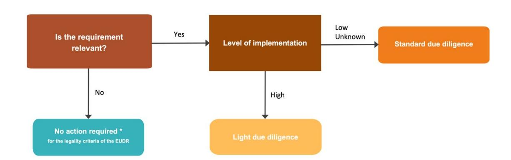

However, this analysis is indicative and has been carried out at country level only. It is the responsibility of operators to carry out a legal risk analysis of their products for each shipment. Within this framework, these recommendations offer a range of due diligence options. These actions are not prescriptive and are not presented in any specific order. It is up to operators to choose from these options based on the context, their knowledge of their supply chains, and the risks identified for coffee and its derived products.

## Role of certification in due diligence

Coffee certification systems are voluntary, public or private mechanisms that seek to ensure that coffee production and trade comply with certain environmental, social and economic requirements. They can be established by governments, international organisations, NGOs or private companies.

## The EUDR and certification

Third-party certification and verification systems can play an important role in promoting sustainable agricultural and forestry practices and responsible sourcing. There are different types of certifications, which can be implemented at national level on a mandatory basis or be private and voluntary (e.g. Fairtrade or Rainforest Alliance).

According to the EUDR, for the purposes of risk assessment, operators may take into account information from certification schemes or other third-party verified schemes. However, the European Commission's guidance of 2 October 2024 indicates that self-declaration schemes that are not based on third-party certification procedures are, by definition, less robust due to a lack of independence and impartiality.

The European Commission also specifies that certification systems should not replace the operator's responsibility for due diligence. In other words, private certification can help European operators carry out due diligence to comply with legality, deforestation and traceability criteria.

Operators must be able to justify why and how certification schemes are aligned with EUDR requirements. To do so, three elements must be taken into account:

- The certification system's coverage of the relevant legal requirements for the EUDR.
- The robustness of the certification system: in particular, the scope of certification (applicable to which actors in the value chain? to which products?), governance (management of internal procedures and updates, for example), accreditation processes for control bodies; auditor qualifications and audit frequency; non-compliance management, impartiality and conflict of interest management, etc. This information must be periodically reassessed by the operator, particularly in relation to the requirements of the EUDR.
- Traceability and absence of mixing with non-certified products.

# **3. Recommendations for legality due diligence in the context of national coffee production**

The tables below, organised by areas of law, set out the due diligence recommendations agreed upon by the stakeholders consulted regarding the legality of coffee produced in Honduras.

## Land-use rights

In Honduras, agricultural land can be privately owned, nationally owned or communal, with full title deeds granted by the Property Institute (IP) or the National Agrarian Institute (INA). In addition, the law recognises regular or irregular possession, with production under informal possession being common in the coffee sector, although this does not constitute illegality. Producers can also cultivate land without owning it through legal forms of mere tenure, such as usufruct, right of use or lease. However, these often lack formal documentation and depend on the tolerance of the owner and/or their verbal agreement in good faith.

The State of Honduras, through the Registry of Abandoned Property (RBA), guarantees forcibly displaced persons the right to legal protection, restitution of land, housing and property, and access to justice, preventing the dispossession or misuse of abandoned property. In terms of land-use planning, only 65 of the 298 municipalities nationwide have a Municipal Land Use Plan (PMOT) in force, drawn up by the municipalities in coordination with the Secretariat of State for Natural Resources and the Environment (SERNA) and supervised by the National Institute for Forest Conservation and Development, Protected Areas and Wildlife (ICF) in forest areas. These plans guide land use, identify productive areas and warn against overexploitation, without specifying permitted crops, and only become mandatory if approved in open council.

| Level of implementation                                                                                                                                                                                                                                                                                                                                                                                                                                                                                                                                                                                                                                                                                                                                                                                                                                                                                                                                                                                                                                                                                                                                                                 |                                                                                                                                                                                                                                                                                                                                                                                                                                                                                                                                                  |
|-----------------------------------------------------------------------------------------------------------------------------------------------------------------------------------------------------------------------------------------------------------------------------------------------------------------------------------------------------------------------------------------------------------------------------------------------------------------------------------------------------------------------------------------------------------------------------------------------------------------------------------------------------------------------------------------------------------------------------------------------------------------------------------------------------------------------------------------------------------------------------------------------------------------------------------------------------------------------------------------------------------------------------------------------------------------------------------------------------------------------------------------------------------------------------------------|--------------------------------------------------------------------------------------------------------------------------------------------------------------------------------------------------------------------------------------------------------------------------------------------------------------------------------------------------------------------------------------------------------------------------------------------------------------------------------------------------------------------------------------------------|
| Legal requirement Context and due diligence 1. Land-use rights 1.1.1 The producer is the In Honduras, rights over land for cultivation High owner of the land range from private ownership to collective Light due (through a registered rights and community use, regulated by a diligence public deed or title deed legal framework that seeks to balance granted by the competent economic, social and environmental authority). interests. OR Agricultural land can be private, national or communal, each with different laws The producer is the governing its use and titling. The legal regular or irregular regulation covers concepts such as private possessor of the land. property, which grants full rights through a registered title; possession, which is physical OR control over a plot, can be regular The producer exercises (documented and peaceful) or irregular the use rights over the (without legal title), and can give rise to land without intention of acquisitive prescription; and the right of use, ownership, through mere which allows a plot to be used for specific tenure, which includes purposes without being the owner. usufruct, lease and | Due diligence recommendations Consultations with stakeholders Confirm that there are no complaints or litigation regarding the land where coffee is produced (national or stakeholders, but also a complaints system. following actions could be taken: Compilation and verification of documents Honduran Coffee Institute (IHCAFE) card. collect any of the following permitted by law: Title deed duly registered with the competent authority. Full certification of registration issued by the Directorate General of Registries of the IP. |
| o In the coffee sector, there are small gratuitous use. producers who do not have formal titles but                                                                                                                                                                                                                                                                                                                                                                                                                                                                                                                                                                                                                                                                                                                                                                                                                                                                                                                                                                                                                                                                                     | Full title deed                                                                                                                                                                                                                                                                                                                                                                                                                                                                                                                                  |
| o cultivate under irregular or informal                                                                                                                                                                                                                                                                                                                                                                                                                                                                                                                                                                                                                                                                                                                                                                                                                                                                                                                                                                                                                                                                                                                                                 | Title of Useful Ownership                                                                                                                                                                                                                                                                                                                                                                                                                                                                                                                        |
| o possession. However, cultivating without a                                                                                                                                                                                                                                                                                                                                                                                                                                                                                                                                                                                                                                                                                                                                                                                                                                                                                                                                                                                                                                                                                                                                            | Lease agreement                                                                                                                                                                                                                                                                                                                                                                                                                                                                                                                                  |
| o formal title is not illegal. There are few conflicts over land tenure in production                                                                                                                                                                                                                                                                                                                                                                                                                                                                                                                                                                                                                                                                                                                                                                                                                                                                                                                                                                                                                                                                                                   | Loan agreement                                                                                                                                                                                                                                                                                                                                                                                                                                                                                                                                   |
| o areas, and when they do arise, they are                                                                                                                                                                                                                                                                                                                                                                                                                                                                                                                                                                                                                                                                                                                                                                                                                                                                                                                                                                                                                                                                                                                                               | Public deed of constitution of usufruct                                                                                                                                                                                                                                                                                                                                                                                                                                                                                                          |
| o effectively resolved at the local level.                                                                                                                                                                                                                                                                                                                                                                                                                                                                                                                                                                                                                                                                                                                                                                                                                                                                                                                                                                                                                                                                                                                                              | Registered possession                                                                                                                                                                                                                                                                                                                                                                                                                                                                                                                            |
| o Producers can cultivate land without                                                                                                                                                                                                                                                                                                                                                                                                                                                                                                                                                                                                                                                                                                                                                                                                                                                                                                                                                                                                                                                                                                                                                  | Review of cadastral registration number                                                                                                                                                                                                                                                                                                                                                                                                                                                                                                          |
| o owning it through legal arrangements such as mere tenure, usufruct or leasing. These                                                                                                                                                                                                                                                                                                                                                                                                                                                                                                                                                                                                                                                                                                                                                                                                                                                                                                                                                                                                                                                                                                  | Land dispute resolution documents (where applicable)                                                                                                                                                                                                                                                                                                                                                                                                                                                                                             |
| o arrangements allow them to use someone                                                                                                                                                                                                                                                                                                                                                                                                                                                                                                                                                                                                                                                                                                                                                                                                                                                                                                                                                                                                                                                                                                                                                | Private deed of sale                                                                                                                                                                                                                                                                                                                                                                                                                                                                                                                             |
| o else's land under certain conditions, without having full ownership. Formal documentation is often lacking, and many small coffee growers work under informal or                                                                                                                                                                                                                                                                                                                                                                                                                                                                                                                                                                                                                                                                                                                                                                                                                                                                                                                                                                                                                      | Permits granted by local authorities supporting the existence and use of the plot Implementation of procedures and processes                                                                                                                                                                                                                                                                                                                                                                                                                     |

| Level of implementation                                                                                                                                                                                                                                                                                                                                                                                                                                                                                                                                                                                                                                                                                                                                                          |                                                                                                                                                                                                                                                                                                                                                    |
|----------------------------------------------------------------------------------------------------------------------------------------------------------------------------------------------------------------------------------------------------------------------------------------------------------------------------------------------------------------------------------------------------------------------------------------------------------------------------------------------------------------------------------------------------------------------------------------------------------------------------------------------------------------------------------------------------------------------------------------------------------------------------------|----------------------------------------------------------------------------------------------------------------------------------------------------------------------------------------------------------------------------------------------------------------------------------------------------------------------------------------------------|
| Legal requirement Context and due diligence verbal agreements, i.e. without a written contract. To strengthen tenure and promote the economic development of the sector, decree 37-2016 was issued in 2016, allowing owners of coffee-growing plots to apply to the National Agrarian Institute (INA) for full ownership, with accreditation of their status as coffee growers. 1.1.2 Agricultural activity In Honduras, only 65 of the 298 High is permitted in municipalities have a Municipal Land Use                                                                                                                                                                                                                                                                        | Due diligence recommendations Develop or support programmes to assist producers with IHCAFE land titling. Geospatial analysis                                                                                                                                                                                                                      |
| Compile the polygons of the areas Light due accordance with current Plan (PMOT) in force, which regulates land diligence regulations and land use. use and its compatibility with agricultural It does not contravene production and environmental protection. municipal urban, These plans identify productive areas and environmental or warn against overexploitation, but do not territorial planning specify permitted crops. They are advisory in provisions. nature, unless approved in open council, which gives them binding force. The ICF estimates that 373,000 hectares were devoted to coffee cultivation in Honduras in 2020. There is no official figure or consolidated study that accurately serves as an indicator of how many hectares of coffee in Honduras | of production to identify which municipalities they belong to. Consultations with stakeholders Consult the municipalities where the areas of production Use Plan (PMOT). If there is a PMOT, analyse it to identify the areas where agricultural activity is permitted. Second geospatial analysis areas of production with the map of areas where |
| Overlay are located within protected areas, but there are evidence and partial estimates documented in cases such as Pico Pijol,                                                                                                                                                                                                                                                                                                                                                                                                                                                                                                                                                                                                                                                 | the polygons of the areas of production with the IHCAFE map of coffee-growing regions.                                                                                                                                                                                                                                                             |
| Map of coffee-growing regions Cusuco and Celaque, although without exact figures.                                                                                                                                                                                                                                                                                                                                                                                                                                                                                                                                                                                                                                                                                                | in the country (IHCAFE). This                                                                                                                                                                                                                                                                                                                      |
| permitte                                                                                                                                                                                                                                                                                                                                                                                                                                                                                                                                                                                                                                                                                                                                                                         | d.                                                                                                                                                                                                                                                                                                                                                 |

## 1.1.1 Land tenure is well-defined and respected

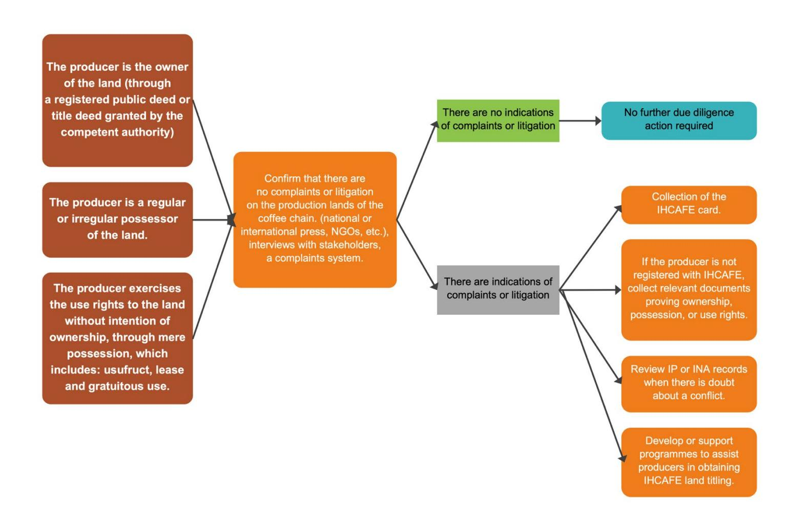

## 1.1.2 Agriculture is permitted on the plot.

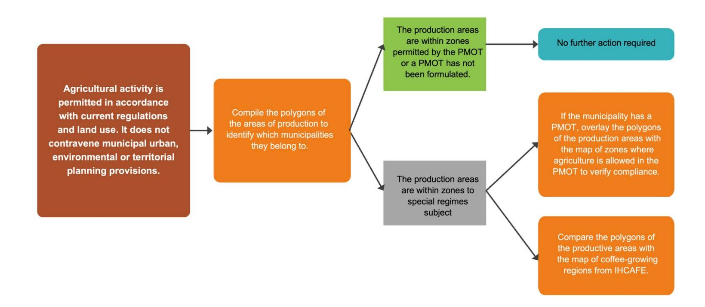

## Environmental protection

In Honduras, environmental legislation establishes that national forests, protected areas and parks are subject to special regimes allowing agricultural activities such as coffee only in buffer zones and under authorisation from the ICF through management plans. The use of agrochemicals requires authorisation from the Secretariat of Agriculture and Livestock (SAG) and control by the National Agricultural Health Service (SENASA), with proper management of packaging and waste being mandatory to prevent contamination. The protection of water resources is a priority, with specific plans for micro-basins and technical standards for waste discharge. Soil conservation must be rational and compatible with its natural vocation, favouring agroforestry. Low-impact agricultural projects do not require a full environmental impact assessment, although they may require a licence, while larger-scale projects must comply with the relevant procedures.

| Legal requirement                                                                                                                                                                                                                                                                                            | Context                                                                                                                                                                                                                                                                                                                                                                                                                                                                                                                                                                                                                                 | Level of implementation and due diligence              | Due diligence recommendations                                                                                                                                                                                                                                                                                                                                                                                                                                                                                                                                                                                |
|--------------------------------------------------------------------------------------------------------------------------------------------------------------------------------------------------------------------------------------------------------------------------------------------------------------|-----------------------------------------------------------------------------------------------------------------------------------------------------------------------------------------------------------------------------------------------------------------------------------------------------------------------------------------------------------------------------------------------------------------------------------------------------------------------------------------------------------------------------------------------------------------------------------------------------------------------------------------|--------------------------------------------------------|--------------------------------------------------------------------------------------------------------------------------------------------------------------------------------------------------------------------------------------------------------------------------------------------------------------------------------------------------------------------------------------------------------------------------------------------------------------------------------------------------------------------------------------------------------------------------------------------------------------|
| <b>2. Environmental requirements for agricultural activities</b>                                                                                                                                                                                                                                             |                                                                                                                                                                                                                                                                                                                                                                                                                                                                                                                                                                                                                                         |                                                        |                                                                                                                                                                                                                                                                                                                                                                                                                                                                                                                                                                                                              |
| 
<b>2.1.1 Agricultural activity is not carried out in areas subject to special protection regimes, such as protected areas, declared micro-basins, national forests, and national parks, except when located in buffer zones of protected areas and in accordance with the area's management plan.</b>
 | 
In Honduras, national forests, protected areas and national parks are subject to special regimes. Agricultural activities, including coffee cultivation, may only be carried out in buffer zones and with the express authorisation of the Forest Conservation Institute (ICF), through approved Management or Operational Plans. In core areas, any new settlements are prohibited and existing ones must be relocated. Coffee production is subject to special regulations (Decree 56-2007) that facilitate the obtaining of licences within protected areas, but under strict compliance with technical and legal conditions.
 | 
<b>Low</b>
 
<b>Standard due diligence</b>
 | 
<b>Geospatial analysis</b>
 <ul> <li>Overlay the polygons of the farms with the layers published on the ICF's GEOPORTAL and GEOFORESTAL websites to identify whether the area of production is within zones subject to special regimes.</li> </ul> 
If the areas of production are within zones subject to special regimes, a range of possible due diligence actions is recommended:
 
<b>Compilation and verification of documents</b>
 <ul> <li>Obtain management plans for protected areas in implementation and verify that farms are in buffer zones and not in core zones.</li> </ul> |

|                                                                                                         | Level of implementation                                                                                                                                                                                                                                                                                                                                                                                                                                                                                                                                                                                                                                                                                                              |
|---------------------------------------------------------------------------------------------------------|--------------------------------------------------------------------------------------------------------------------------------------------------------------------------------------------------------------------------------------------------------------------------------------------------------------------------------------------------------------------------------------------------------------------------------------------------------------------------------------------------------------------------------------------------------------------------------------------------------------------------------------------------------------------------------------------------------------------------------------|
| Legal requirement Honduras in 2020.                                                                     | Context Due diligence recommendations and due diligence Implementation of procedures and processes The ICF estimates that 373,000 hectares Where relevant, support producers in obtaining formal were devoted to coffee cultivation in permits for their agricultural activities. Adoption of policies or procedures implemented by There is no official figure or consolidated study that accurately serves as an areas or areas of cultural interest. indicator of how many hectares of coffee in Consultations with stakeholders Honduras are located within protected                                                                                                                                                            |
| areas, but there are 2.1.2 The producer uses only agrochemicals authorised for agricultural production. | evidence and partial estimates documented in cases such as Pico Pijol, Cusuco and Celaque, although without exact figures. Field verifications the provisions of the Management Plan for the protected community forest managers and coffee producers in the plots. In Honduras, herbicides, insecticides, Low Compilation and verification of documents fertilisers and fungicides require Standard due authorisation from the Secretariat of diligence which is the platform for verifying whether the pesticides Agriculture and Livestock (SAG). However, producers do not need specific SENASA and ARSA. authorisation to apply them, provided they respect the dosages indicated on the label.                                 |
| dynamic registry.                                                                                       | o Public consultation on fertilisers and pesticides SENASA is responsible for regulatory control of these products and for certifying http://profitofer.senasa.gob.hn:9000/#/consulta-publica the phytosanitary quality of exports. or: Tramites.diger.gob.hn Because the list of authorised products is extremely extensive and changes Implementation of procedures and processes periodically, there is no single static list Systematic collection of information from producers, if available to the public, but rather a insecticides, fertilisers and fungicides (directly or through Although prior permission is not required subcontracting); (2) the types of herbicides, insecticides, for application, if producers use |

| Legal requirement                                                                                                                        | Context                                                                                                                                                                                                                                                                                                                                                                                                                                                                                                                                                                                                                                                                                                                                                 | Level of implementation and due diligence | Due diligence recommendations                                                                                                                                                                                                                                                                                                                                                                                                                                                                                                                                                                                                                                                                                                                                                                                                                                                                                                                                                  |
|------------------------------------------------------------------------------------------------------------------------------------------|---------------------------------------------------------------------------------------------------------------------------------------------------------------------------------------------------------------------------------------------------------------------------------------------------------------------------------------------------------------------------------------------------------------------------------------------------------------------------------------------------------------------------------------------------------------------------------------------------------------------------------------------------------------------------------------------------------------------------------------------------------|-------------------------------------------|--------------------------------------------------------------------------------------------------------------------------------------------------------------------------------------------------------------------------------------------------------------------------------------------------------------------------------------------------------------------------------------------------------------------------------------------------------------------------------------------------------------------------------------------------------------------------------------------------------------------------------------------------------------------------------------------------------------------------------------------------------------------------------------------------------------------------------------------------------------------------------------------------------------------------------------------------------------------------------|
|                                                                                                                                          | 
unauthorised products, in improper doses or without adequate labelling, they would be engaging in illegal practices.
 
In practice, 70% of coffee in Honduras is conventional.
 
According to an article published by the Honduran forensic science journal. Very little education on the risks associated with pesticides can be seen in Honduras, despite being a country with an agricultural sector that represents 12.9% of its gross domestic product, and where agricultural production represents 35.6% of the total value of its exports, employing 35% of the economically active population. It is essential to educate and train farmers, applicators and users on the proper use, application and handling of pesticides.
 |                                           | 
fertilisers and fungicides used (check that they are included in the updated list of products authorised by SENASA); and (3) the treatment of packaging. This information can be collected, for example, by periodically filling out a control sheet on the implementation of fertilisers and pesticides and a control sheet on packaging, or by periodically filling out a questionnaire.
 <ul> <li>• Provide producers with the updated list of authorised/unauthorised herbicides, insecticides, fertilisers and fungicides at the cooperative level.</li> <li>• Provide producers with tools to monitor the implementation of fertilisers and pesticides and the treatment of packaging, e.g. monitoring sheets to collect information.</li> <li>• Support producers on authorised/unauthorised pesticides and fertilisers and on packaging treatment, e.g. through training, communication campaigns, etc.</li> </ul> 
<b>Consultations with stakeholders</b>
 |
| 
<b>2.1.3 Producers who use agrochemicals must treat the containers and waste to prevent alterations in soil and water bodies.</b>
 | 
In Honduras, coffee producers who use chemical pesticides must triple wash containers after use and return them to temporary or authoris
                                                                                                                                                                                                                                                                                                                                                                                                                                                                                                                                                                                                         |                                           |                                                                                                                                                                                                                                                                                                                                                                                                                                                                                                                                                                                                                                                                                                                                                                                                                                                                                                                                                                                |

| Level of implementation                                                                                                                                                                                                                                                                                                                                                                                                                                                                                                                                                                                                                                                                                                                                                                                           |                                                                                                                                                                                                                                                                                                                                                               |
|-------------------------------------------------------------------------------------------------------------------------------------------------------------------------------------------------------------------------------------------------------------------------------------------------------------------------------------------------------------------------------------------------------------------------------------------------------------------------------------------------------------------------------------------------------------------------------------------------------------------------------------------------------------------------------------------------------------------------------------------------------------------------------------------------------------------|---------------------------------------------------------------------------------------------------------------------------------------------------------------------------------------------------------------------------------------------------------------------------------------------------------------------------------------------------------------|
| Legal requirement Context and due diligence BPA and coffee research documents – IHCAFE Honduras farms. Producers who use agrochemicals must properly manage waste and packaging to avoid environmental damage. 2.1.4 Agricultural activity The protection of water resources is a Low is carried out in priority for the Honduran government.                                                                                                                                                                                                                                                                                                                                                                                                                                                                     | Due diligence recommendations Plan for the management and use of personal protective equipment External audit reports Follow-up visit report by agronomists Laboratory analysis results to verify the presence of chemicals in coffee products, such as beans or cherries. Geospatial analysis                                                                |
| Overlay Standard due compliance with the There are specific management plans for diligence                                                                                                                                                                                                                                                                                                                                                                                                                                                                                                                                                                                                                                                                                                                        | the polygons of the farms with the map of micro                                                                                                                                                                                                                                                                                                              |
| watershed minimum authorised water-producing micro-watersheds, and distances from agricultural activities in these areas are                                                                                                                                                                                                                                                                                                                                                                                                                                                                                                                                                                                                                                                                                      | and watercourses.                                                                                                                                                                                                                                                                                                                                             |
| Overlay watercourses, ensuring only permitted if they are sustainable and                                                                                                                                                                                                                                                                                                                                                                                                                                                                                                                                                                                                                                                                                                                                         | the polygons with the ICF's maps of declared micro                                                                                                                                                                                                                                                                                                           |
| watersheds the protection of riparian included in these plans. The ICF maintains margins, wetlands and an official map of micro-watersheds water recharge areas in declared as water supply areas. There is accordance with current also a technical standard for wastewater national regulations. discharges, with implementation for companies but not directly for individual recommended producers. There is a technical standard for wastewater discharges into receiving bodies and sanitary sewers that applies to both urban and rural areas. In practice, this has been interpreted as 30 metres on each side of main watercourses and 10 metres in small streams, in line with environmental regulations. Although the regulations exist, compliance and enforcement are limited in agricultural areas. | and watercourses. https://sigmof.icf.gob.hn/reportes/cuencas/ https://geoportal.icf.gob.hn/ Compilation and verification of documents Environmental measures compliance report (ICMA) External audit reports Certification seals for certified products Follow-up visit report by agronomists Reports on the initiation of environmental licensing procedures |

| Legal requirement                                                                                                                           | Context                                                                                                                                                                                                                                                                                                                                                                                                                                                                                                                                                                                                                                                                                                                                                                        | Level of implementation and due diligence              | Due diligence recommendations                                                                                                                                                                                                                                                                                                                                                                                                                               |
|---------------------------------------------------------------------------------------------------------------------------------------------|--------------------------------------------------------------------------------------------------------------------------------------------------------------------------------------------------------------------------------------------------------------------------------------------------------------------------------------------------------------------------------------------------------------------------------------------------------------------------------------------------------------------------------------------------------------------------------------------------------------------------------------------------------------------------------------------------------------------------------------------------------------------------------|--------------------------------------------------------|-------------------------------------------------------------------------------------------------------------------------------------------------------------------------------------------------------------------------------------------------------------------------------------------------------------------------------------------------------------------------------------------------------------------------------------------------------------|
| 
<b>2.1.4 The productive activity does not generate spills into water sources or, if it does, it has the respective spill permits</b>
 | 
There is a technical standard for wastewater discharges into receiving bodies and sanitary sewers, with implementation to all natural or legal persons, public or private, who carry out activities that generate discharges. However, the competent authority (SERNA, Public Health) only carries out inspections on industrial activities, not on the agricultural activities of producers.
 
There are no studies that allow for the precise characterisation and measurement of spill volumes.
                                                                                                                                                                                                                                                                 | 
<b>Low</b>
 
<b>Standard due diligence</b>
 | 
<b>Compilation and verification of documents</b>
 <ul> <li>• Laboratory analysis of the quality of wastewater on plantations larger than 40 hectares that benefit the plot.</li> <li>• Environmental compliance report (ICMA)</li> </ul> 
<b>Field verifications</b>
 <ul> <li>• Verification at the producer level and environmental audits, on a periodic and sampling basis, to evaluate the treatment of spills where applicable.</li> </ul> |
| 
<b>2.1.5 Producers implement appropriate techniques to conserve soil fertility and prevent degradation.</b>
                          | 
Honduran regulations establish that land use must be rational and in accordance with its natural vocation, maintaining a balance between agricultural production and ecosystem conservation. The development of land-use plans is the responsibility of the municipalities, in coordination with SERNA, while the ICF regulates and supervises agricultural activity in forest areas.
 
In many regions of Honduras, coffee is grown under agroforestry (shade) systems, which is compatible with soil and biodiversity conservation.
 
There is some evidence in Honduras that unshaded coffee plantations on steep slopes increase soil erosion. However, as the plantation matures and generates foliage, erosion decreases.
 
Clear conservation and
 |                                                        |                                                                                                                                                                                                                                                                                                                                                                                                                                                             |

|                                                                                                                                                                                                                                         | Level of implementation                                                                                                                                                                                                                                                                                                                                                                                                                                                                                                                                                                                                                                                                                                                                                                                                                                                                                                                                                                                           |
|-----------------------------------------------------------------------------------------------------------------------------------------------------------------------------------------------------------------------------------------|-------------------------------------------------------------------------------------------------------------------------------------------------------------------------------------------------------------------------------------------------------------------------------------------------------------------------------------------------------------------------------------------------------------------------------------------------------------------------------------------------------------------------------------------------------------------------------------------------------------------------------------------------------------------------------------------------------------------------------------------------------------------------------------------------------------------------------------------------------------------------------------------------------------------------------------------------------------------------------------------------------------------|
| Legal requirement farms. 2.2.1 Commercial forestry activities carried out within the agricultural plot (as part of an Wildlife Act. agroforestry system) have                                                                           | Context Due diligence recommendations and due diligence not yet widespread on many Honduran Collection of relevant data Obtain, if possible, details on the possible training of producers (training organisations, date, participants, content, etc.) in good agricultural practices. Compilation and verification of documents Soil management and use plan Good agricultural practices manual rotation plan Follow-up visit report by agronomists Report on regenerative agriculture Producers engaged in commercial forestry High or agroforestry comply with the provisions carried out within a forest area: Light due of the Forestry, Protected Areas and diligence Geospatial analysis                                                                                                                                                                                                                                                                                                                   |
| Some                                                                                                                                                                                                                                    | local indigenous or community                                                                                                                                                                                                                                                                                                                                                                                                                                                                                                                                                                                                                                                                                                                                                                                                                                                                                                                                                                                     |
| a certificate of use, management plan, conservation or restoration plan approved by the competent authority. 2.2.3 Threatened or endangered species of flora and fauna are respected and protected standards. in productive activities. | Overlay the polygons of the farms with: satellite imagery or A report by IICA/OPSAA indicates that by and with ICF forest cover data. corresponded to agroforests in coffee and fruit plantations, equivalent to some 419,902 hectares. steps are recommended: Compilation and verification of documents populations have managed to organise themselves for the rational exploitation of private community forests or national a management plan, or a Special Plan for Agroforests. forests through community forest Forest use permit or management plan issued by the ICF. management contracts, derived from the Forest use certificates issued by the ICF. National Community Forestry Strategy. The hunting or capture of threatened or High Compilation and verification of documents endangered species in productive areas is Light due Compile and analyse the Public Ministry's record of prohibited and subject to the relevant legal diligence infringements through the Environmental Prosecutor's |

| Level of implementation                                                                                                                                                                                                                                                                                                                                                                                                      |                                                                                                                                                                                                                                                                                                                                                                                                                           |
|------------------------------------------------------------------------------------------------------------------------------------------------------------------------------------------------------------------------------------------------------------------------------------------------------------------------------------------------------------------------------------------------------------------------------|---------------------------------------------------------------------------------------------------------------------------------------------------------------------------------------------------------------------------------------------------------------------------------------------------------------------------------------------------------------------------------------------------------------------------|
| Legal requirement Context and due diligence The exploitation, hunting, capture, commercialisation or destruction of flora and fauna that are subject to special protection due to their rarity, condition in the ecosystem or the danger of extinction                                                                                                                                                                       | Due diligence recommendations on coffee farms, to verify whether the producer has been involved in infringements related to the preservation of ecosystems, fauna and flora.                                                                                                                                                                                                                                              |
| conducted fauna studies they face is prohibited. farms, etc.). Specifically in coffee, studies show that Consultations with stakeholders agroforests in Honduras and other Central American countries benefit local biodiversity. Furthermore, there is also evidence that more intensive systems without shade represent a loss of species. This is confirmed by the study Tree Diversity in a Tropical Agricultural-Forest | on their farms (list of birds on coffee Confirm the correct implementation of biodiversity representatives, local NGOs, and local authorities. Implementation of procedures and processes                                                                                                                                                                                                                                 |
| Conduct awareness campaigns Mosaic Landscape in Honduras. areas.                                                                                                                                                                                                                                                                                                                                                             | for producers on the importance and protection of flora and fauna in sourcing                                                                                                                                                                                                                                                                                                                                             |
| Conduct awareness campaigns areas. Field verifications                                                                                                                                                                                                                                                                                                                                                                       | for producers on the importance and protection of flora and fauna in sourcing non-compliance with this requirement, field visits may be conducted to confirm the correct implementation of biodiversity protection standards through: (1) interviews with producers (level of knowledge of regulations, illegal and (2) direct observations on coffee plots (presence or wetlands, as well as protected flora and fauna). |

#### 2.1.1 Agriculture standards in restricted areas or areas of legal exclusion are respected

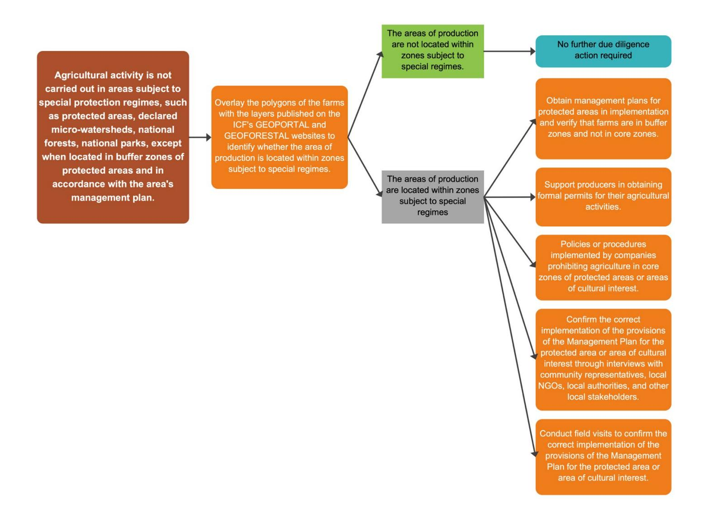

#### 2.1.2 and 2.1.4 Only pesticides, herbicides, fertilisers and fungicides authorised by SENASA are used, and waste management is carried out

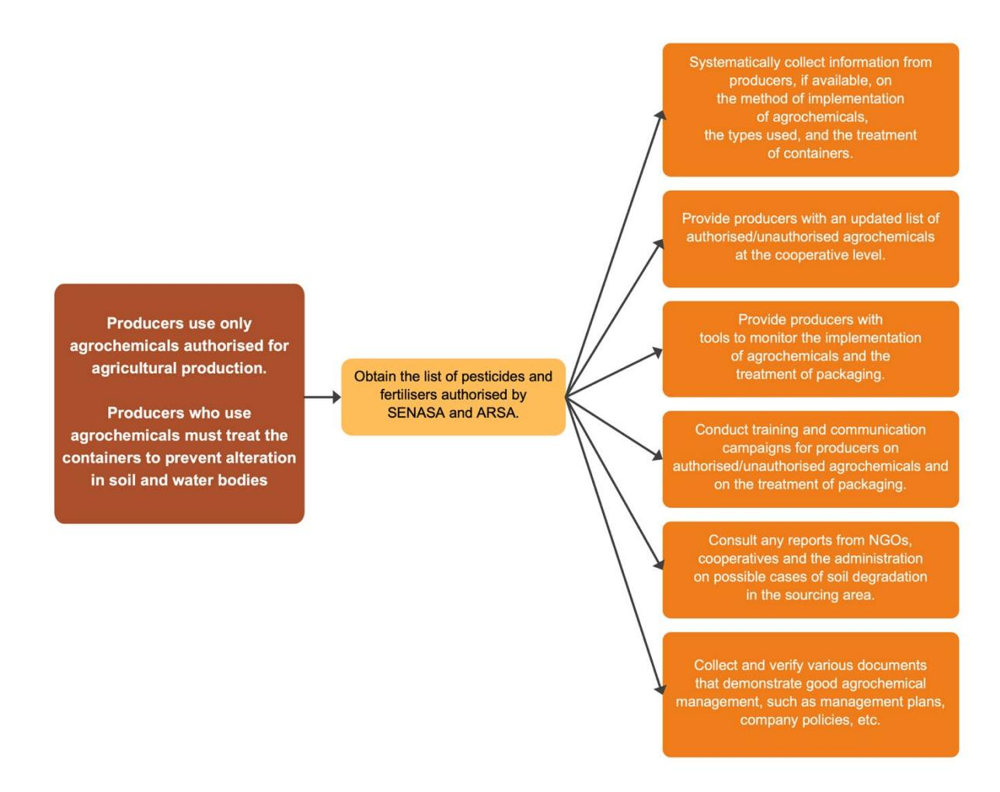

#### 2.1.3 Water resources are protected and used in accordance with the law

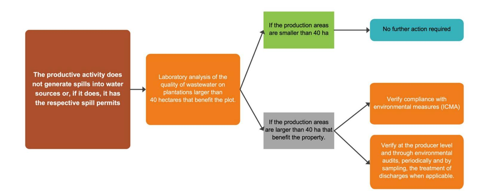

#### 2.1.5 Soils are managed in accordance with the law

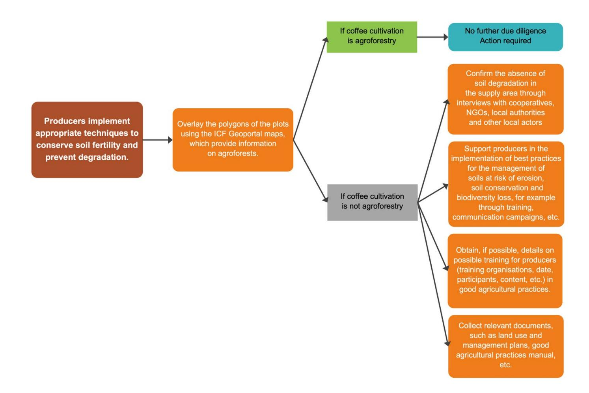

#### 2.2.1 Forest conversion complies with legal requirements

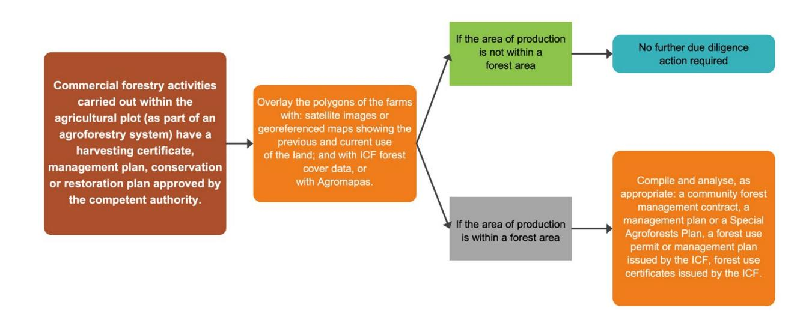

#### 2.2.3 Legal requirements for biodiversity conservation and the protection of endangered or protected species are met

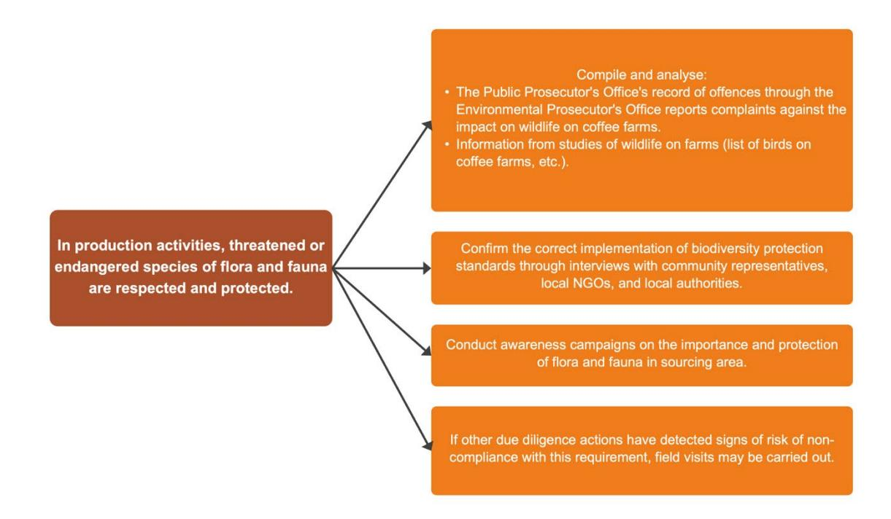

## Third parties' rights

In Honduras, the right of local communities to a healthy environment is guaranteed through compliance with legal environmental requirements related to the use of agrochemicals and the protection of soil and water resources. If compliance with these standards is verified, this right is considered to be respected, and in the event of proven damage caused by production systems, the producer is legally obliged to compensate for the damage in accordance with the General Environmental Law and by order of the competent authority.

| Legal requirement                                                                                   | Context                                                                                                                                                                                                                                                                                                                                                                                                                                                                                                                                                                                                                                                                                                                                                                                                                                                                                                                                                                                                                                       | Level of implementation and due diligence            | Due diligence recommendations                                                                                                                                                                                                                                                                                                                                                                                                                                                                                       |
|-----------------------------------------------------------------------------------------------------|-----------------------------------------------------------------------------------------------------------------------------------------------------------------------------------------------------------------------------------------------------------------------------------------------------------------------------------------------------------------------------------------------------------------------------------------------------------------------------------------------------------------------------------------------------------------------------------------------------------------------------------------------------------------------------------------------------------------------------------------------------------------------------------------------------------------------------------------------------------------------------------------------------------------------------------------------------------------------------------------------------------------------------------------------|------------------------------------------------------|---------------------------------------------------------------------------------------------------------------------------------------------------------------------------------------------------------------------------------------------------------------------------------------------------------------------------------------------------------------------------------------------------------------------------------------------------------------------------------------------------------------------|
| <b>3. Third parties' rights</b>                                                                     |                                                                                                                                                                                                                                                                                                                                                                                                                                                                                                                                                                                                                                                                                                                                                                                                                                                                                                                                                                                                                                               |                                                      |                                                                                                                                                                                                                                                                                                                                                                                                                                                                                                                     |
| 
<b>3.1.1 Local communities have been informed and consulted about agricultural projects.</b>
 | 
Specifically for coffee, there are no major conflicts; however, there are very specific cases where the <b>lack of legal recognition of territories</b> and the <b>lack of prior consultation/state facilitation</b> are structural factors, especially when seeking new sustainable methods such as shade-grown coffee in traditionally protected or communally managed areas. This is corroborated by the Inter-American Commission on Human Rights, Oxfam and the Honduran Centre for the Promotion of Community Development, which serve as indicators that the absence of this specific regulatory framework can lead to partial titling: some communities have community titles issued by the INA, but without full legal certainty.
 
There are also emblematic cases of territorial conflict: <b>Garifuna peoples (Honduran Black Fraternal Organisation) and Lenca communities (Civic Council of Popular and Indigenous Organisations of Honduras)</b> face land invasions by tourism, energy and agricultural projects.
 | 
<b>High</b>
 
<b>Light due diligence</b>
 | 
<b>Collection and verification of data</b>
 
By sampling, collect:
 <ul> <li>• Minutes of community consultations, where applicable.</li> <li>• Consent protocols, as applicable, where applicable.</li> <li>• Social impact assessment, community complaints report, conflict resolution, where applicable.</li> <li>• Approved environmental management instrument, where applicable.</li> <li>• Records from human rights institutions, the public prosecutor's office, or municipalities.</li> </ul> |

| Legal requirement                                                                                                                                                                              | Context                                                                                                                                                                                                                                                                                                                                                                                                                                                                                                                                                                     | Level of implementation and due diligence            | Due diligence recommendations                                                                                                                                                                                                                                                                                               |
|------------------------------------------------------------------------------------------------------------------------------------------------------------------------------------------------|-----------------------------------------------------------------------------------------------------------------------------------------------------------------------------------------------------------------------------------------------------------------------------------------------------------------------------------------------------------------------------------------------------------------------------------------------------------------------------------------------------------------------------------------------------------------------------|------------------------------------------------------|-----------------------------------------------------------------------------------------------------------------------------------------------------------------------------------------------------------------------------------------------------------------------------------------------------------------------------|
| 
<b>3.1.2 If coffee production causes damage or harm to individuals, communities or the environment, those affected have the right to claim full reparation, including compensation.</b>
 | 
When a production system causes proven damage, the producer is obliged to compensate for the environmental damage in accordance with the general environmental law and by order of the competent authority.
 
The effective protection of citizens' legitimate rights and interests in environmental matters is guaranteed through the implementation of procedural principles such as due process, adversarial proceedings, procedural economy, contribution of the parties, evaluation of evidence, oral proceedings, immediacy, concentration and publicity.
 | 
<b>High</b>
 
<b>Light due diligence</b>
 | 
<b>Implementation of procedures and processes</b>
 <ul> <li>Consult the channels or complaints mechanisms managed by IHCAFE when such a situation occurs.</li> </ul>                                                                                                                                                  |
| 
<b>3.2.2 Productive activities are not carried out in areas of cultural significance or are possibly established in undiscovered archaeological areas.</b>
                              | 
Coffee production systems are preferably established outside the boundaries of areas designated as cultural heritage sites, as well as sites of archaeological importance. In the case of production in areas of public interest, they are subject to management standards, farm plans and land-use rights.
 
The Institute of Anthropology and History maintains an inventory of the nation's cultural heritage for its proper protection.
                                                                                                                     | 
<b>High</b>
 
<b>Light due diligence</b>
 | 
<b>Implementation of procedures</b>
 <ul> <li>Conduct initial social and cultural mapping of the plot, where relevant.</li> <li>Verify with the Honduran Institute of Anthropology and History (IHAH) that there are no ongoing proceedings related to cultural heritage conflicts in the area of the plot</li> </ul> |

## 3.1.1 The rights of local communities are respected.

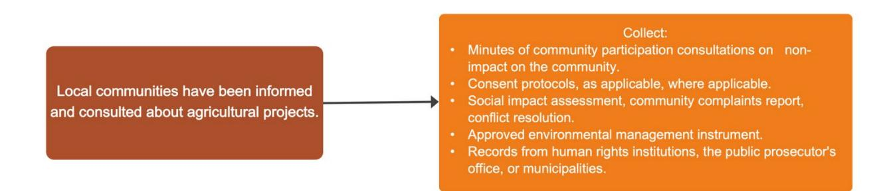

## 3.1.2 Right to claim compensation in the event of damage or injury

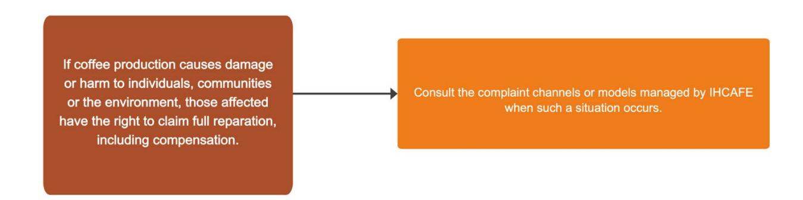

#### 3.2.1 Derecho a reclamar una indemnización en caso de daños y perjuicios

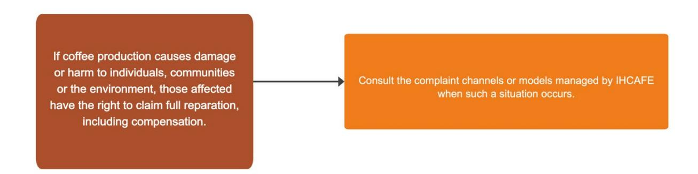

#### 3.2.2 Productive activities are not carried out in areas of cultural significance

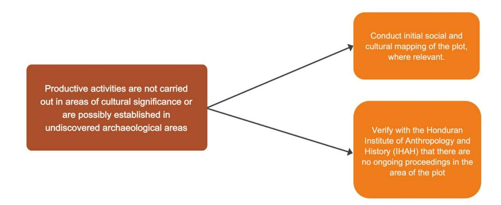

## Labour law\*

In Honduras, labour legislation in the agricultural sector requires written contracts, except in specific cases, regulates the maximum working day to 12 hours, prohibits discrimination in the workplace, and guarantees rights such as the minimum wage, social security, and maternity leave. In addition, employers must adopt health and safety measures, provide personal protective equipment, and comply with the General Regulations on Preventive Measures. Furthermore, agro-industrial companies and cooperatives are subject to supervision by the Labour Inspectorate and specific regulations according to their type and size.

According to the Labour Code, agricultural or livestock farms that do not permanently employ more than 10 workers are exempt from its provisions, except those relating to the minimum wage. On the other hand, agricultural operations that permanently employ more than 10 workers must ensure compliance with the provisions of the Labour Code, including employer registration, internal regulations, affiliation to the social security system, and others. Therefore, the first step in due diligence is to verify whether more than 10 permanent workers are employed on the area of production. This information can be obtained through supplier surveys or questionnaires.

If the farm does not exceed this threshold, no further action is required in terms of labour law, except for compliance with the minimum wage, which continues to implement both to farms with fewer than 10 workers and to nonpermanent workers.

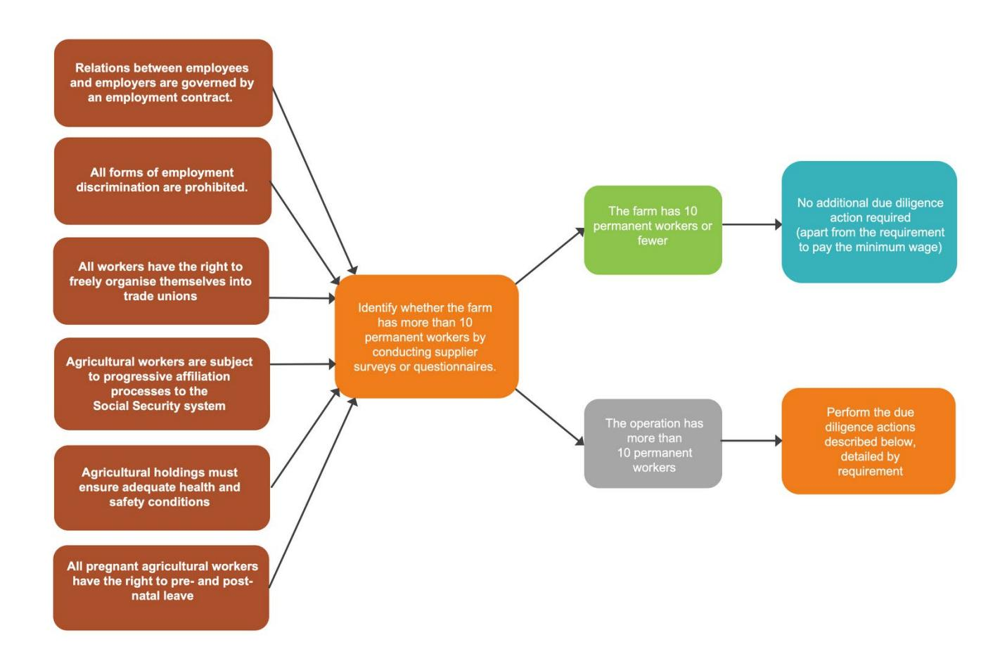

|                                                                                                                                                                     | Level of implementation                                                                                                                                                                                                                                                                                                                                                                                                                                                                                                                                                                                                                                                                                                                                                                                                                                                                                                                                                                                                                                                                                                                                                                                                                                                                                                                            |
|---------------------------------------------------------------------------------------------------------------------------------------------------------------------|----------------------------------------------------------------------------------------------------------------------------------------------------------------------------------------------------------------------------------------------------------------------------------------------------------------------------------------------------------------------------------------------------------------------------------------------------------------------------------------------------------------------------------------------------------------------------------------------------------------------------------------------------------------------------------------------------------------------------------------------------------------------------------------------------------------------------------------------------------------------------------------------------------------------------------------------------------------------------------------------------------------------------------------------------------------------------------------------------------------------------------------------------------------------------------------------------------------------------------------------------------------------------------------------------------------------------------------------------|
| Legal requirement 4. Labour rights 4.1.1 Relations between workers employed on the plot and employers are governed by a written or oral employment contract. 2020). | Context Due diligence recommendations and due diligence High The laws governing relations between employers and workers are public policy, and permanent workers. Light due any acts, stipulations or agreements that diligence involve waiving, diminishing, restricting or misrepresenting workers' guarantees are Compilation and verification of documents null and void. Collect samples of: Employment contracts in the agricultural Employment contracts sector can be agreed verbally in accordance Employer registration with labour legislation, and most workers in the coffee sector at the primary production Internal regulations level do not have written contracts (International Labour Organization (ILO) Agro-industrial companies are supervised by the Labour Inspectorate; producer cooperatives and farmers' associations are regulated under the Social Economy umbrella; and the wages paid by small and medium-sized producers are also regulated by the Labour Inspectorate. Coffee production in Honduras is dominated by small producers. Data indicate that there are currently around 120,000 coffee producers in Honduras. However, the actual number is likely to be higher (IHCAFE 2022). producers are small family units or individuals. Therefore, the vast majority of farms employ fewer than 10 permanent |
| workers (ILO                                                                                                                                                        | , Mapping the coffee value chain                                                                                                                                                                                                                                                                                                                                                                                                                                                                                                                                                                                                                                                                                                                                                                                                                                                                                                                                                                                                                                                                                                                                                                                                                                                                                                                   |
| in Honduras,                                                                                                                                                        | Geneva: International Labour Office, 204 (p. vii).                                                                                                                                                                                                                                                                                                                                                                                                                                                                                                                                                                                                                                                                                                                                                                                                                                                                                                                                                                                                                                                                                                                                                                                                                                                                                                 |

|                                                                                                                                                                                                                                                                                                                       | Level of implementation                                                                                                                                                                                                                                                                                                                                                                                                                                                                                                                                                                                                                                                                                                                                                                                                                                                                                                                                                                                                                 |
|-----------------------------------------------------------------------------------------------------------------------------------------------------------------------------------------------------------------------------------------------------------------------------------------------------------------------|-----------------------------------------------------------------------------------------------------------------------------------------------------------------------------------------------------------------------------------------------------------------------------------------------------------------------------------------------------------------------------------------------------------------------------------------------------------------------------------------------------------------------------------------------------------------------------------------------------------------------------------------------------------------------------------------------------------------------------------------------------------------------------------------------------------------------------------------------------------------------------------------------------------------------------------------------------------------------------------------------------------------------------------------|
| Legal requirement 4.1.2 All permanent or                                                                                                                                                                                                                                                                              | Context Due diligence recommendations and due diligence No worker may be required to work for more High At the sourcing area level                                                                                                                                                                                                                                                                                                                                                                                                                                                                                                                                                                                                                                                                                                                                                                                                                                                                                                      |
| than 12 temporary workers on agricultural holdings, including those hired on a per-job, per-day or per daylight hours without exceeding the shift basis, under oral or working hours established by law. written contracts, shall not work more than 12 hours per day and shall have 10 hours of uninterrupted rest. | hours in any 24-hour period. In Light due Collection and verification of relevant data practice, post-harvest handling and fruit diligence picking activities are carried out during conditions in productive sectors (coffee). Consult public reports from organisations specialising in The 1959 Labour Code (last amended in 2003), which regulates employment and human rights in various sectors, including coffee, working conditions, excludes the agricultural highlighting working conditions), as well as any reports farms that do not permanently employ more                                                                                                                                                                                                                                                                                                                                                                                                                                                               |
| Labour Code (US Department of State                                                                                                                                                                                                                                                                                   | 2022).                                                                                                                                                                                                                                                                                                                                                                                                                                                                                                                                                                                                                                                                                                                                                                                                                                                                                                                                                                                                                                  |
| Th e article                                                                                                                                                                                                                                                                                                          | by Carpio & Von der Lieth                                                                                                                                                                                                                                                                                                                                                                                                                                                                                                                                                                                                                                                                                                                                                                                                                                                                                                                                                                                                               |
| than time worked.                                                                                                                                                                                                                                                                                                     | There is a mismatch with                                                                                                                                                                                                                                                                                                                                                                                                                                                                                                                                                                                                                                                                                                                                                                                                                                                                                                                                                                                                                |
|                                                                                                                                                                                                                                                                                                                       | produced by national and local NGOs, including th e coffee than ten workers, with the exception of the                                                                                                                                                                                                                                                                                                                                                                                                                                                                                                                                                                                                                                                                                                                                                                                                                                                                                                                                  |
| the Honduran coffee industry. national labour regulations.                                                                                                                                                                                                                                                            | barometer; for information on working conditions and any Code's provisions on working hours and cases of non-compliance with working hours or wages. However, given that most workers remuneration below the legal minimum. involved in coffee production are informal, it Ensure that the sourcing area does not present a is noted that they are not protected by the particularly high risk of non-compliance with working hours or remuneration below the legal minimum. At the level of production plots: (Journal 25, Issue 16, SCA) does not provide a Collection and verification of documents fixed number of hours worked per day, but it does address how labour dynamics work in Collect samples, if there are workers employed on the plantation: Work in the sector is seasonal and intensive. Employment contracts (check that they mention working Payment is linked to performance rather hours and wage that comply with legal requirements) Documents relating to the remuneration paid to workers and working hours |
|                                                                                                                                                                                                                                                                                                                       | o Logbook of hours worked on the farm (shift schedules)                                                                                                                                                                                                                                                                                                                                                                                                                                                                                                                                                                                                                                                                                                                                                                                                                                                                                                                                                                                 |
| 4.1.3 Workers in agricultural activities receive at least the minimum wage, and employees). where applicable, the wage will be agreed with the employer, per job or service provided,                                                                                                                                 | o Pay slip All workers are entitled to earn a minimum High wage sufficient to cover the normal needs of Light due their household (applies to permanent diligence The following are exempt from the minimum wage and according to the Labour Code: Agricultural or livestock farms that do not permanently employ more than ten (10)                                                                                                                                                                                                                                                                                                                                                                                                                                                                                                                                                                                                                                                                                                    |

| Legal requirement                            | Context                                                                                                                                                                                                                                                                                                                                                                                                                                                                                                                                                                                                                                                                                                                                                                                                                                                                                                                                                                                                                                                                                                                                                                                                                                                                                                                                                                            | Level of implementation and due diligence | Due diligence recommendations |
|----------------------------------------------|------------------------------------------------------------------------------------------------------------------------------------------------------------------------------------------------------------------------------------------------------------------------------------------------------------------------------------------------------------------------------------------------------------------------------------------------------------------------------------------------------------------------------------------------------------------------------------------------------------------------------------------------------------------------------------------------------------------------------------------------------------------------------------------------------------------------------------------------------------------------------------------------------------------------------------------------------------------------------------------------------------------------------------------------------------------------------------------------------------------------------------------------------------------------------------------------------------------------------------------------------------------------------------------------------------------------------------------------------------------------------------|-------------------------------------------|-------------------------------|
| <b>depending on the area of the country.</b> | 
workers; however, the implementation of Title IV, Chapter IV of the Labour Code relating to wages shall apply.
 
Art. 364. The calculation of remuneration for the purpose of payment may be agreed upon:
 <ol type="a"> <li>Per unit of time (month, fortnight, week, day, and hour);</li> <li>Per unit of work (piece, task, fixed price or piecework); and c) By share in the profits, sales or collections made by the employer</li> </ol> 
Although an ILO report mentions a possible risk of non-compliance with the requirement to pay the minimum wage for immigrant workers from neighbouring countries, consultations carried out during the development of this tool serve as an indicator that these practices are not widespread in the sector and that this risk of illegality is low.
 
<b>According to the article by Carlos Carpio, piecework payment (by production, not by the hour):</b>
 
The wage of pickers is usually calculated <b>by the volume of coffee picked (cans, quintals, sacks)</b> and not by time worked. This means that <b>income depends on skill, physical endurance and hours worked</b>. In many documented cases, workers <b>do not reach the current legal minimum daily wage</b>, especially when growing conditions (slopes, plant density, condition of the coffee plantations) make picking difficult.
 |                                           |                               |

| Level of implementation                                                                                                                                                                                                                                                                                                                                                                                                                                                                                                                                                                                                                                                                                                                                                                                                                                                                                                                                                                  |                                                                                                                                                                                                                                                                                                                                                                                                                                                                                                                                                                                                                                                 |
|------------------------------------------------------------------------------------------------------------------------------------------------------------------------------------------------------------------------------------------------------------------------------------------------------------------------------------------------------------------------------------------------------------------------------------------------------------------------------------------------------------------------------------------------------------------------------------------------------------------------------------------------------------------------------------------------------------------------------------------------------------------------------------------------------------------------------------------------------------------------------------------------------------------------------------------------------------------------------------------|-------------------------------------------------------------------------------------------------------------------------------------------------------------------------------------------------------------------------------------------------------------------------------------------------------------------------------------------------------------------------------------------------------------------------------------------------------------------------------------------------------------------------------------------------------------------------------------------------------------------------------------------------|
| Legal requirement Context and due diligence 4.3.1 All forms of Discrimination on the basis of race, religion, High employment political beliefs, membership of indigenous                                                                                                                                                                                                                                                                                                                                                                                                                                                                                                                                                                                                                                                                                                                                                                                                                | Due diligence recommendations Geospatial analysis                                                                                                                                                                                                                                                                                                                                                                                                                                                                                                                                                                                               |
| position or access that workers may have to                                                                                                                                                                                                                                                                                                                                                                                                                                                                                                                                                                                                                                                                                                                                                                                                                                                                                                                                              |                                                                                                                                                                                                                                                                                                                                                                                                                                                                                                                                                                                                                                                 |
| of harvest workers, particularly immigrant                                                                                                                                                                                                                                                                                                                                                                                                                                                                                                                                                                                                                                                                                                                                                                                                                                                                                                                                               |                                                                                                                                                                                                                                                                                                                                                                                                                                                                                                                                                                                                                                                 |
| Overlay Light due discrimination on the peoples or Afro-Honduran peoples, or diligence grounds of race, ethnicity, economic status is prohibited in                                                                                                                                                                                                                                                                                                                                                                                                                                                                                                                                                                                                                                                                                                                                                                                                                                      | the geolocation of the production plots with the map of Honduras to identify whether the area of                                                                                                                                                                                                                                                                                                                                                                                                                                                                                                                                                |
| production is located close to gender, political or establishments that operate for the general religious orientation, use of companies or workplaces. The social economic status or membership of these establishments may not be conditioned indigenous or Afro on the amount of their wages or the Honduran peoples are importance of the position they hold (Article prohibited on agricultural 12 of the Labour Code). An ILO report holdings. indicates that there is possible exploitation workers from neighbouring countries (ILO, Mapping the coffee value chain in Honduras, Geneva: International Labour Office, 2024.) Consultations carried out for the development of this tool have indicated that this risk exists in the country's border areas. In terms of gender, Carpio's article points out, in a more qualitative than quantitative way, that women in the coffee sector tend to receive fewer opportunities for stable employment and are more concentrated in | a border. If located in border areas, the following additional due diligence actions are recommended: Collection and verification of data Consult public reports from organisations specialising in these issues, in particular the Coffee Barometer (detailed analysis of the supply chain, including discussions on labour law) and Human Rights Watch (reports on human rights in various sectors, highlighting working conditions), as well as any reports produced by national and local NGOs. Consult IHCAFE's Social Compliance System Compilation and verification of documents who are migrant workers, members of indigenous or Afro |
| o support activities on the farm (feeding,                                                                                                                                                                                                                                                                                                                                                                                                                                                                                                                                                                                                                                                                                                                                                                                                                                                                                                                                               | List of workers/employer register                                                                                                                                                                                                                                                                                                                                                                                                                                                                                                                                                                                                               |
| o sorting, cleaning beans) than in harvesting. Also, when they participate in the harvest,                                                                                                                                                                                                                                                                                                                                                                                                                                                                                                                                                                                                                                                                                                                                                                                                                                                                                               | Employment contracts (as an indicator of salary)                                                                                                                                                                                                                                                                                                                                                                                                                                                                                                                                                                                                |
| o they receive the same pay per can/quintal harvested, but tend to have less access to permanent or technical positions.                                                                                                                                                                                                                                                                                                                                                                                                                                                                                                                                                                                                                                                                                                                                                                                                                                                                 | Non-discrimination policy or statement Implementation of procedures and processes Establish equal opportunity policies on farms or in companies. Train staff on human rights and labour law. Create confidential channels for complaints or reports.                                                                                                                                                                                                                                                                                                                                                                                            |

|                                                                                                                                                                                                                                                                                                                          | Level of implementation                                                                                                                                                                                                                                                                                                                                                                                                                                                                                                                                                                                                                                                                                                                                                                                                                                                                                                                                                                                                                                                                                                                                                                                                                                                                |
|--------------------------------------------------------------------------------------------------------------------------------------------------------------------------------------------------------------------------------------------------------------------------------------------------------------------------|----------------------------------------------------------------------------------------------------------------------------------------------------------------------------------------------------------------------------------------------------------------------------------------------------------------------------------------------------------------------------------------------------------------------------------------------------------------------------------------------------------------------------------------------------------------------------------------------------------------------------------------------------------------------------------------------------------------------------------------------------------------------------------------------------------------------------------------------------------------------------------------------------------------------------------------------------------------------------------------------------------------------------------------------------------------------------------------------------------------------------------------------------------------------------------------------------------------------------------------------------------------------------------------|
| Legal requirement 4.4.1 Agricultural operations must guarantee adequate health and safety conditions in the workplace and workers have the right to be and its amendments). protected from risks arising from the use of chemicals (agrochemicals, fertilisers, pesticides) and the operation of agricultural machinery. | Context Due diligence recommendations and due diligence In addition to the general provisions of the Low At the sourcing area level: Labour Code on health and safety in the Standard due Data collection and verification workplace, the provisions of the General diligence Regulations on Preventive Measures for Consult public reports from organisations specialising in Occupational Accidents and Diseases must be complied with. (Agreement STSS-007-02 Rights Watch (reports on human rights in various sectors, including coffee, highlighting working conditions), as well as any reports produced by national and local NGOs. All employers must adopt preventive measures, provide personal protective equipment (PPE), train workers on Ensure that the sourcing area does not present a occupational hazards, and ensure healthy and safe working environments. According particularly high risk of damage to workers' health and to the ILO, poor health and safety conditions affect workers in primary coffee production. or non-compliance by employers to provide adequate Lack of knowledge about risks, as well as equipment. personal protective equipment (PPE), Collect reports from labour inspectors, if available. exposes field workers to insect bites, |
| pesticides, noise and heavy loads                                                                                                                                                                                                                                                                                        | (Mapping Consultations with stakeholders                                                                                                                                                                                                                                                                                                                                                                                                                                                                                                                                                                                                                                                                                                                                                                                                                                                                                                                                                                                                                                                                                                                                                                                                                                               |
| the coffee value chain in Honduras,                                                                                                                                                                                                                                                                                      | Gineva, International Labour Office, page X). to obtain information on working conditions and possible According to the Pan American Health cases of non-compliance with worker health and safety, Organisation, in the seven countries of the lack of adequate provisions for handling chemicals, or Central American subregion (Belize, Costa                                                                                                                                                                                                                                                                                                                                                                                                                                                                                                                                                                                                                                                                                                                                                                                                                                                                                                                                        |
| effects on health because they                                                                                                                                                                                                                                                                                           | do not                                                                                                                                                                                                                                                                                                                                                                                                                                                                                                                                                                                                                                                                                                                                                                                                                                                                                                                                                                                                                                                                                                                                                                                                                                                                                 |
| environmental deterioration.                                                                                                                                                                                                                                                                                             | failure by employers to provide adequate equipment. Rica, El Salvador, Guatemala, Honduras, Nicaragua and Panama), there has been a At the production site level: steady increase in the use of pesticides, Compilation and verification of documents reaching approximately 45 million kg per year of active ingredient in recent years, Procedure manuals related to worker health and safety imported and formulated in 42 plants Procedure manuals related to chemical handling located in these countries. Unfortunately, this increase is accompanied by the Procedure manuals related to workers' equipment inappropriate use of products, poor storage and production conditions, ignorance of the Health and safety equipment delivery log List of plant protection products approved by SENASA generate specific symptoms, lack of research on the long-term effects of the use of these products on the health of the population and                                                                                                                                                                                                                                                                                                                                        |

| Legal requirement | Context                                                                                                                                                                                                                                                                                                                                                                                                                               | Level of implementation and due diligence | Due diligence recommendations                                                                                                                                                                                                                                                                                                     |
|-------------------|---------------------------------------------------------------------------------------------------------------------------------------------------------------------------------------------------------------------------------------------------------------------------------------------------------------------------------------------------------------------------------------------------------------------------------------|-------------------------------------------|-----------------------------------------------------------------------------------------------------------------------------------------------------------------------------------------------------------------------------------------------------------------------------------------------------------------------------------|
|                   | 
<i><a href="#">According to a 2020 study on pesticides</a></i>, there is limited availability of information and access to adequate personal protective equipment (PPE) for those who handle pesticides. Furthermore, the promotion of integrated pest management alternatives and agroecological practices is very limited, which perpetuates an excessive dependence on chemical pesticides, even with inadequate practices.
 |                                           | 
<b>Implementation of procedures and processes</b>
 <ul> <li>• Adopt an occupational health and safety policy</li> <li>• Establish a system for reporting workplace accidents</li> <li>• Conduct and document training for farm workers on the use of personal protective equipment and the handling of chemicals</li> </ul> |

#### 4.1.1 Type of employment relationship

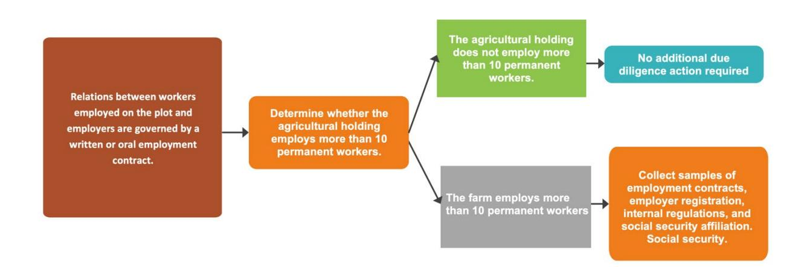

#### 4.1.2 and 4.1.3 Working hours are respected and remuneration complies with legal requirements

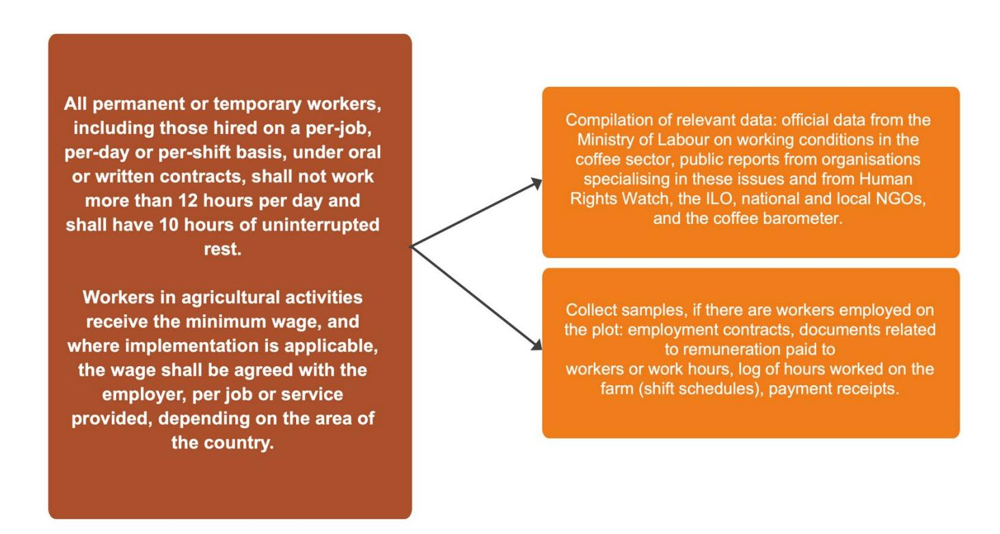

#### 4.1.3 No discrimination on the basis of sex or race, or against migrant workers

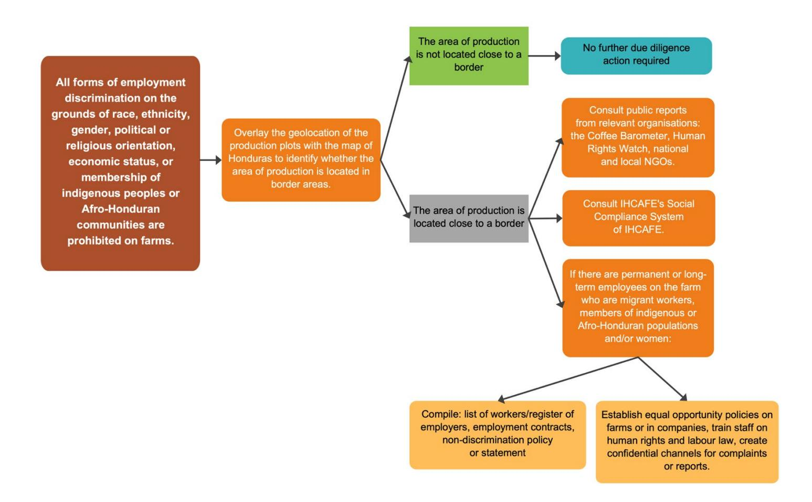

#### 4.4.1 Legal requirements regarding health and safety in the workplace are met

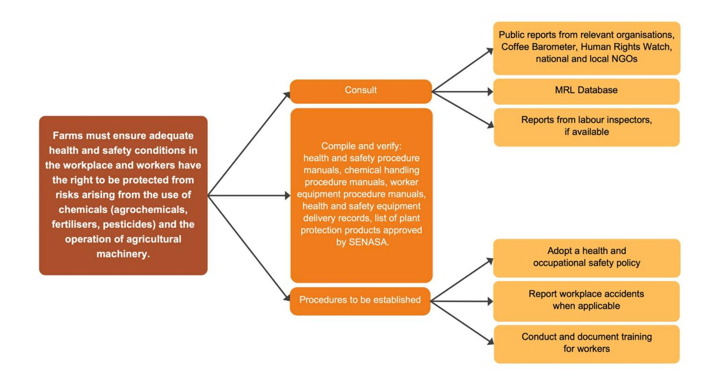

## Human rights\*

In Honduras, human rights in agricultural work include protecting children and adolescents. Dangerous work is prohibited, and conditions must be compatible with their education. Decent working conditions are promoted, especially for temporary rural workers, with remuneration agreed per task. Gender equality is supported through public policies and institutional mechanisms, such as the coffee subsector gender roundtable and the Secretariat in the Office of Women (SEMUJER). Efforts also combat human trafficking through the Inter-institutional Commission against Commercial Sexual Exploitation and Human Trafficking, the National Information System on Human Trafficking, and specialised units of the Public Prosecutor's Office. These measures ensure support for victims and punishment for those responsible.

|                                                                                                                                                                             | Level of                                                                                                                                                                                                                                                                                                                                                                                                                                                                                                                                                                                                                                                                                                                                                                                                                                                                                                                                                                                                                                                                                                                                                                                                                                                                                                                                                                                                                                                                                                        |
|-----------------------------------------------------------------------------------------------------------------------------------------------------------------------------|-----------------------------------------------------------------------------------------------------------------------------------------------------------------------------------------------------------------------------------------------------------------------------------------------------------------------------------------------------------------------------------------------------------------------------------------------------------------------------------------------------------------------------------------------------------------------------------------------------------------------------------------------------------------------------------------------------------------------------------------------------------------------------------------------------------------------------------------------------------------------------------------------------------------------------------------------------------------------------------------------------------------------------------------------------------------------------------------------------------------------------------------------------------------------------------------------------------------------------------------------------------------------------------------------------------------------------------------------------------------------------------------------------------------------------------------------------------------------------------------------------------------|
| Legal requirement 5. Human rights 5.1.1 In Honduras, young people between the ages of 14 and 18 are permitted to work with the authorisation of their parents or guardians. | Context implementation Due diligence recommendations and due diligence In Honduras, the rights of children and Low Compilation and verification of documents adolescents are recognised in the Standard due Consult public reports from organisations specialising in Constitution of the Republic, international diligence these issues, in particular complaints lodged with the ILO, treaties on the rights of the child, the Children and Adolescents Code, and the Secretariat of State for Labour and Social Security, the Labour Code. The law prohibits minors under database on child labour, or local municipal authorities. the age of 18 from performing dangerous https://www.trabajo.gob.hn/entih-al-fin-contamos-con work or work that affects their health, datos-sobre-el-trabajo-infantil/, and Human Rights safety or development, and stipulates that Watch (reports on human rights in various sectors, agricultural work permitted for adolescents including coffee), as well as any reports produced by must be light, non-hazardous and national and local NGOs. compatible with their schooling. Compile school maps of primary schools in the districts of However, ILO studies indicate that child the sourcing area to assess whether there is good school labour remains prevalent in the coffee coverage or whether the lack of schools increases the risk. sector, mainly in the form of unpaid family work during the harvest, which coincides Consultations with stakeholders |
| with school holidays (ILO, 2024                                                                                                                                             | , Mapping the                                                                                                                                                                                                                                                                                                                                                                                                                                                                                                                                                                                                                                                                                                                                                                                                                                                                                                                                                                                                                                                                                                                                                                                                                                                                                                                                                                                                                                                                                                   |
| coffee value chain in Honduras)                                                                                                                                             | . Children participate in tasks such as harvesting and weeding, and even in some stages of work that poses a risk to their health in the sourcing area. processing, both on family farms and on                                                                                                                                                                                                                                                                                                                                                                                                                                                                                                                                                                                                                                                                                                                                                                                                                                                                                                                                                                                                                                                                                                                                                                                                                                                                                                                 |
| third-party farms, sometimes during                                                                                                                                         | school                                                                                                                                                                                                                                                                                                                                                                                                                                                                                                                                                                                                                                                                                                                                                                                                                                                                                                                                                                                                                                                                                                                                                                                                                                                                                                                                                                                                                                                                                                          |

|                                                                                                                                                                       | Level of                                                                                                                                                                                                                                                                                                                                                                                                                                                                                                                                                                                                                                                                                                                                                                                                                                                                                             |
|-----------------------------------------------------------------------------------------------------------------------------------------------------------------------|------------------------------------------------------------------------------------------------------------------------------------------------------------------------------------------------------------------------------------------------------------------------------------------------------------------------------------------------------------------------------------------------------------------------------------------------------------------------------------------------------------------------------------------------------------------------------------------------------------------------------------------------------------------------------------------------------------------------------------------------------------------------------------------------------------------------------------------------------------------------------------------------------|
| Legal requirement                                                                                                                                                     | Context implementation Due diligence recommendations and due diligence hours and in hazardous conditions. Among Implementation of procedures and processes the causes are low family income, lack of Implement projects to support the eradication of child childcare and schooling options, shortage of labour in Honduras adult labour, and a cultural acceptance of child labour in coffee-growing areas, which Implement a childcare programme is more pronounced in indigenous At the plot level, determine the profile of farm workers: communities. The implementation of the law is limited and social programmes are unable Collection and verification of data to address the scale of the problem. In response to this situation, various initiatives have been launched. The project                                                                                                     |
| “El café de Honduras sí cumple”                                                                                                                                       | (Honduran example, through systematic surveys or by collecting coffee does comply) has documented success geolocation data from the plots. stories in eradicating child labour and improving working conditions in the sector and their employees. (ILO, 2023). The Honduran Coffee Institute (IHCAFE) promotes awareness-raising and Written authorisation from parents or legal guardians.                                                                                                                                                                                                                                                                                                                                                                                                                                                                                                         |
| training campaigns                                                                                                                                                    | aimed at producers to prevent child labour in coffee farming Record of assigned duties and working hours. (Campaña contra el trabajo infantil, IHCAFE, Proof of schooling.                                                                                                                                                                                                                                                                                                                                                                                                                                                                                                                                                                                                                                                                                                                           |
| 2024) . Similarly, research by the Regional                                                                                                                           | Cooperative Programme for Technological Awareness plan on no child labour on farms. Development and Modernisation of Coffee Policy of not employing minors on farms                                                                                                                                                                                                                                                                                                                                                                                                                                                                                                                                                                                                                                                                                                                                  |
| Growing (PROMECAFE) )                                                                                                                                                 | (Abordando el trabajo infantil en la cadena de subministro Logbook of field workers.                                                                                                                                                                                                                                                                                                                                                                                                                                                                                                                                                                                                                                                                                                                                                                                                                 |
| del cafe de Honduras, Meneses, 2021) 5.2.1 All workers have the right to voluntarily terminate their employment relationship, without coercion and with prior notice. | and the National Child Labour Survey have provided Field check data and recommendations to guide public Conduct periodic on-site verifications with producers, on policies and sectoral actions. a sample basis. Ensure that no child under the age of 14 works on the farm and that the tasks performed by children over the age of 14 do not pose a risk to their health, in particular through interviews with the workers concerned. In the case of permanent work (more than 10 High Collection and verification of data workers on the farm), workers give advance Light due For example, collect: notice. No formalities are required for the diligence drafting and delivery of the notice other Employment contracts with an indicator of working than the name and identity of the employee, hours and a clause for terminating the contract. the job position held, the date on which the |

|                                                                                                                                             | Level of                                                                                                                                                                                                                                                                                                                                                                                                                                                                |
|---------------------------------------------------------------------------------------------------------------------------------------------|-------------------------------------------------------------------------------------------------------------------------------------------------------------------------------------------------------------------------------------------------------------------------------------------------------------------------------------------------------------------------------------------------------------------------------------------------------------------------|
| Legal requirement required.                                                                                                                 | Context implementation Due diligence recommendations and due diligence notice period begins and the date on which it Payroll records ends; nor is the assistance of the Payment record book administrative or judicial labour authorities External audit report However, most workers in the productive systems are temporary and are not economically dependent on their employer.                                                                                     |
| They can terminate their employment                                                                                                         | relationship whenever they decide to do so. In practice, in the west (6,500 producers) and east (7,500 producers) of the country, there have been reports of the retention of documents belonging to migrants who offer their labour in these areas of the country.                                                                                                                                                                                                     |
| According to the                                                                                                                            | Origin Issue Assessment:                                                                                                                                                                                                                                                                                                                                                                                                                                                |
| Honduras Coffee, Rainforest Alliance                                                                                                        | ((2021), coffee is not on the USDOL list of goods produced by forced labour in Honduras. However, forced labour is often reported to occur in agriculture (Freedom House, 2020). The Rainforest Alliance (RA, 2020) risk map                                                                                                                                                                                                                                            |
| attached an average score for forced 5.2.2 The employer does                                                                                | labour in coffee, with no non-conformities found. Due to the socio-economic nature of the High Collection and verification of data                                                                                                                                                                                                                                                                                                                                      |
| rural sector, most not withhold wages, employment benefits, identity documents,                                                             | workers are temporary Light due For example, collect: employees who work during each harvest diligence cycle, receiving remuneration for work or Policies on non-slavery and non-forced labour                                                                                                                                                                                                                                                                          |
| tasks previously agreed upon. An personal property or                                                                                       | ILO Voluntary declaration by producers                                                                                                                                                                                                                                                                                                                                                                                                                                  |
| document other economic or administrative rights for the purpose of coercing, restricting or conditioning the freedom of workers. contexts. | is an indicator that no recent reports of forced labour have been identified Spreadsheets in the sector ( page X). Audit reports Although there are no specific complaints in the coffee sector about "withholding wages Implementation of procedures and processes as a way of retaining workers," general Implement confidential complaint mechanisms and evidence in the country suggests that this practice does exist in precarious work whistleblower protection. |

|                                                                                                                                                                                | Level of                                                                                                                                                                                                                                                                                                                                                                                                                                                                                                                                                                                                                                                                                                                                                                                                                                                                                                                                                                                                                                                                                                                                                                                                                                                                                                                                                                                                                                                                                                                                |
|--------------------------------------------------------------------------------------------------------------------------------------------------------------------------------|-----------------------------------------------------------------------------------------------------------------------------------------------------------------------------------------------------------------------------------------------------------------------------------------------------------------------------------------------------------------------------------------------------------------------------------------------------------------------------------------------------------------------------------------------------------------------------------------------------------------------------------------------------------------------------------------------------------------------------------------------------------------------------------------------------------------------------------------------------------------------------------------------------------------------------------------------------------------------------------------------------------------------------------------------------------------------------------------------------------------------------------------------------------------------------------------------------------------------------------------------------------------------------------------------------------------------------------------------------------------------------------------------------------------------------------------------------------------------------------------------------------------------------------------|
| Legal requirement 5.2.3 All forms of slavery, servitude, forced or                                                                                                             | Context implementation Due diligence recommendations and due diligence Train staff on the risks of forced labour, especially on The State of Honduras has put in place High remote farms or in rural areas. institutional mechanisms to combat these Light due                                                                                                                                                                                                                                                                                                                                                                                                                                                                                                                                                                                                                                                                                                                                                                                                                                                                                                                                                                                                                                                                                                                                                                                                                                                                          |
| rural sector, most                                                                                                                                                             | workers are temporary                                                                                                                                                                                                                                                                                                                                                                                                                                                                                                                                                                                                                                                                                                                                                                                                                                                                                                                                                                                                                                                                                                                                                                                                                                                                                                                                                                                                                                                                                                                   |
| compulsory labour in agricultural and forestry activities are prohibited. 5.3.1 Rural women workers do not suffer gender discrimination or sexual harassment in the workplace. | Conduct awareness campaigns and document them. forms of exploitation through the Inter diligence institutional Commission against Commercial Sexual Exploitation and Trafficking in Persons (CICESCT). Investigations into human trafficking are carried out by the Unit against Trafficking, Sexual Exploitation, Commercial Exploitation and Smuggling of Persons and the Prosecutor's Office against Organised Crime, both of which are part of the Public Prosecutor's Office. Due to the socio-economic nature of the employees who work during each harvest cycle, receiving remuneration for work or tasks agreed upon in advance. Efforts and initiatives are underway to prevent forced labour in Honduran coffee farming, particularly through codes of conduct and institutional compliance. Although there is not a wealth of academic research on this topic, there is practical evidence of how the public-private sector is seeking mitigation of this risk. In Honduras, the Constitution of the Republic High Collection and verification of data and national legislation prohibit all forms of Consult public reports from organisations specialising in Light due discrimination and harassment, including diligence these issues, in particular Human Rights Watch (reports sexual harassment, and guarantee rural on human rights in various sectors, including coffee, women workers access to protection and highlighting working conditions), as well as any reports reporting mechanisms. These cases can be |
| public policies                                                                                                                                                                | on gender equality, with a                                                                                                                                                                                                                                                                                                                                                                                                                                                                                                                                                                                                                                                                                                                                                                                                                                                                                                                                                                                                                                                                                                                                                                                                                                                                                                                                                                                                                                                                                                              |
|                                                                                                                                                                                | produced by national and local NGOs, to ensure that the reported through the 911 and 114 hotlines, sourcing area does not present a particularly high risk of the Special Prosecutor's Office for the sexual harassment. Protection of Women of the Public Ministry, and the Municipal Women's Offices. The Secretariat in the Office of Women (SEMUJER) is the governing institution for                                                                                                                                                                                                                                                                                                                                                                                                                                                                                                                                                                                                                                                                                                                                                                                                                                                                                                                                                                                                                                                                                                                                               |

|                          | Level of                                                                                                                                                                                                                                                                                                                                                                                                                                                                                                                                                                                                                                                                                                                                                                                                                                                                                                                                                                                                                                                                                                                                                                                                                                                                                                                                                         |
|--------------------------|------------------------------------------------------------------------------------------------------------------------------------------------------------------------------------------------------------------------------------------------------------------------------------------------------------------------------------------------------------------------------------------------------------------------------------------------------------------------------------------------------------------------------------------------------------------------------------------------------------------------------------------------------------------------------------------------------------------------------------------------------------------------------------------------------------------------------------------------------------------------------------------------------------------------------------------------------------------------------------------------------------------------------------------------------------------------------------------------------------------------------------------------------------------------------------------------------------------------------------------------------------------------------------------------------------------------------------------------------------------|
| Legal requirement chain. | Context implementation Due diligence recommendations and due diligence mandate to promote gender justice in all Consultation with stakeholders productive sectors. Consult local organisations working to promote labour In 2021, the coffee industry reaffirmed its law to obtain information on working conditions and commitment to the Gender Policy for the possible cases of sexual harassment. Coffee Subsector in Honduras, and the Gender Roundtable was established as a Implementation of procedures and processes coordination space for its implementation Conduct sexual harassment prevention campaigns (United Nations Development Programme, 2021). This policy seeks to eradicate Establish reporting channels discrimination against women, prevent harassment, and promote their participation Compilation and verification of documents and leadership throughout the coffee value Non-sexual and non-workplace harassment policy Gender policy However, the ILO report on the coffee value chain in Honduras identifies that some Records of training on sexual and workplace harassment gender gaps and situations of harassment prevention and human rights. and discrimination persist, especially in contexts of informal employment and low female presence in decision-making spaces (ILO, 2024). In response to this, organisations |
| such as the              | Alliance of Women in Coffee                                                                                                                                                                                                                                                                                                                                                                                                                                                                                                                                                                                                                                                                                                                                                                                                                                                                                                                                                                                                                                                                                                                                                                                                                                                                                                                                      |
| (AMUCAFE)                | and the Network of Women Cocoa and Chocolate Producers of Honduras (REDMUCH) are promoting projects to improve the quality of life of women coffee producers and workers, strengthening their economic autonomy and leadership skills (AMUCAFE–REDMUCH, 2024                                                                                                                                                                                                                                                                                                                                                                                                                                                                                                                                                                                                                                                                                                                                                                                                                                                                                                                                                                                                                                                                                                     |

#### 5.1.1 Children are not employed below the legal age

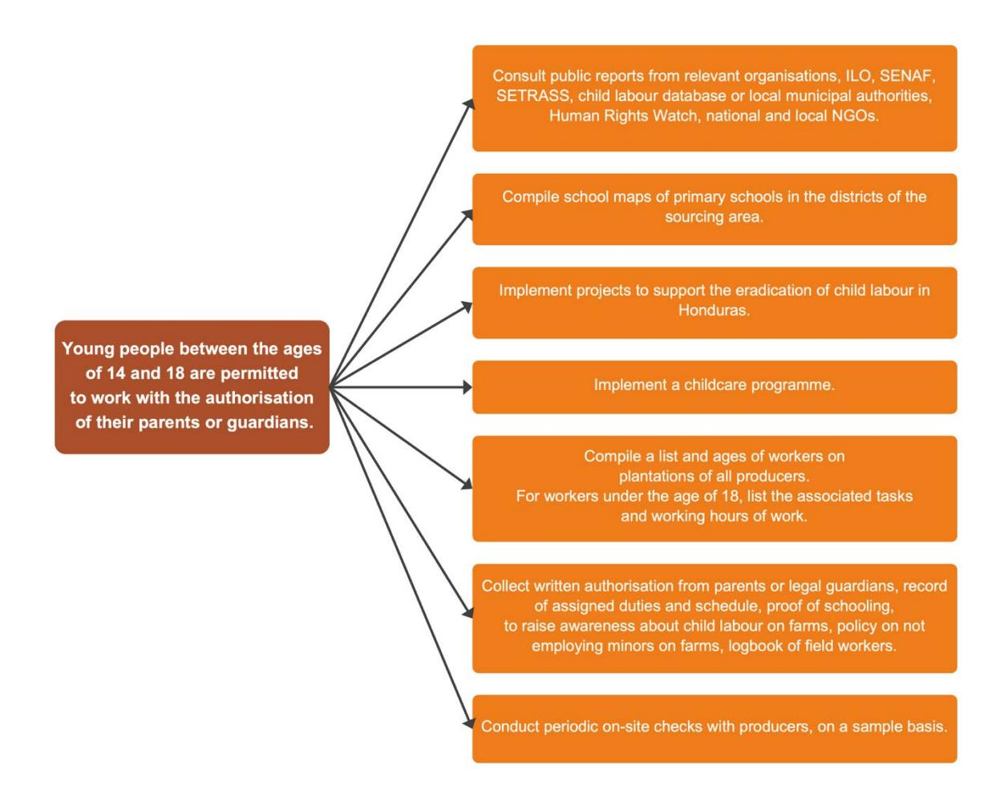

#### 5.2.1 Workers are free to terminate their employment relationship with prior notice

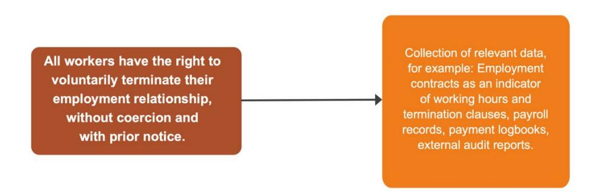

#### 5.2.2 No wages, benefits, documents or property are withheld from workers, and no one is subjected to slavery or forced labour

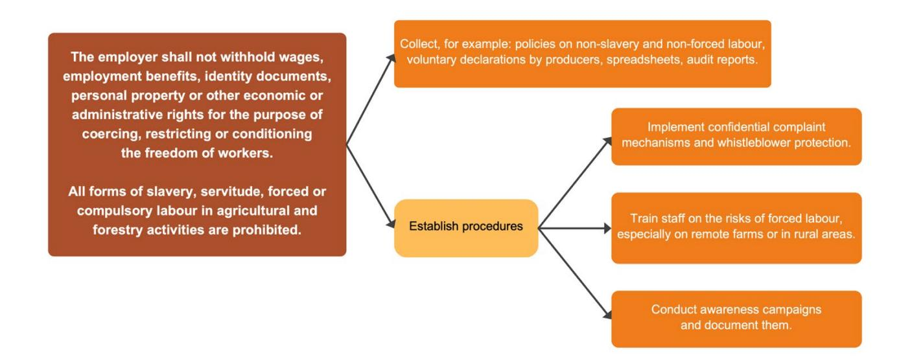

#### 5.3.1 There is no sexual harassment or gender discrimination

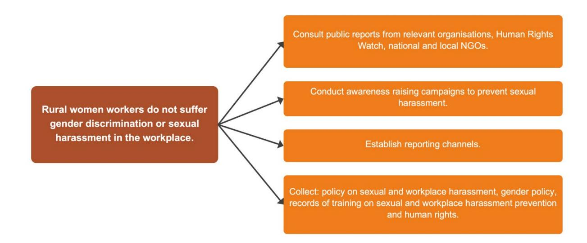

## Free, Prior and Informed Consent

The FPIC process is implemented through open community meetings and/or protocols as instruments for obtaining the consent of indigenous and Afro-Honduran peoples regarding the implementation of projects that may affect them, including productive projects. These instruments are recognised, where appropriate, as fulfilling the consultation requirements set out in ILO Convention No. 169, provided that they are carried out in accordance with that Convention.

|                   | Level of implementation                                                                                                                                                                                                                                                                                                                                                                                                                                                                                                                                                                                                                                                                                                                                                                                                                                            |
|-------------------|--------------------------------------------------------------------------------------------------------------------------------------------------------------------------------------------------------------------------------------------------------------------------------------------------------------------------------------------------------------------------------------------------------------------------------------------------------------------------------------------------------------------------------------------------------------------------------------------------------------------------------------------------------------------------------------------------------------------------------------------------------------------------------------------------------------------------------------------------------------------|
| Legal requirement | Context Due diligence recommendations and due diligence In order to obtain the consent of the affected High Geospatial analysis communities, the consultation process is carried Light due                                                                                                                                                                                                                                                                                                                                                                                                                                                                                                                                                                                                                                                                         |
| 1.                | The type of consultation approved by the                                                                                                                                                                                                                                                                                                                                                                                                                                                                                                                                                                                                                                                                                                                                                                                                                           |
| 2.                | The type of organisation existing in the                                                                                                                                                                                                                                                                                                                                                                                                                                                                                                                                                                                                                                                                                                                                                                                                                           |
| 3.                | The size of the project to be developed and                                                                                                                                                                                                                                                                                                                                                                                                                                                                                                                                                                                                                                                                                                                                                                                                                        |
|                   | Overlay your suppliers' plots with the maps of territories out through protocols or open councils using diligence                                                                                                                                                                                                                                                                                                                                                                                                                                                                                                                                                                                                                                                                                                                                                  |
|                   | assigned to indigenous peoples available on Geoportal mechanisms such as: to identify whether they are located in or near indigenous territory. community organisation. If this is the case, additional due diligence actions are recommended: community. Consultations with stakeholders Consult with local organisations about possible its link to the SERNA environmental categorisation. complaints or violations of the rights of indigenous peoples. Standards to implement this right are currently under discussion. Compilation and verification of documents In Honduras, cases of Free, Prior and Informed Minutes of open council meetings or community Consent with indigenous communities for coffee protocols. are exceptional; reports generally focus more on Documented consent from indigenous authorities. infrastructure or energy projects. |

#### FPIC is obtained when the rights of indigenous peoples or local communities are affected

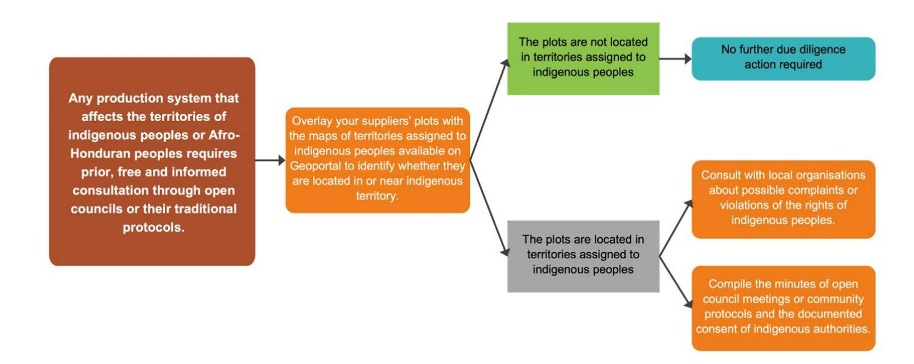

## Tax, customs and anti-corruption standards

N.B. This category is the only category in the EUDR that potentially affects entities throughout the supply chain, and not just at the level of coffee production.

In Honduras, to date, trade and export formalities and taxes paid by exporters are generally well respected and documented. However, withholding tax per quintal of coffee remains difficult to enforce due to the informal nature of the coffee sector.

| Legal requirement                                                                                         | Context                                                                                                                                                                                                                                                                                                                                                                                                                                                                                                                                                                                                                                                                    | Level of implementation and due diligence            | Due diligence recommendations                                                                                                                                                                            |
|-----------------------------------------------------------------------------------------------------------|----------------------------------------------------------------------------------------------------------------------------------------------------------------------------------------------------------------------------------------------------------------------------------------------------------------------------------------------------------------------------------------------------------------------------------------------------------------------------------------------------------------------------------------------------------------------------------------------------------------------------------------------------------------------------|------------------------------------------------------|----------------------------------------------------------------------------------------------------------------------------------------------------------------------------------------------------------|
| <b>7. Commercial, tax and customs obligations</b>                                                         |                                                                                                                                                                                                                                                                                                                                                                                                                                                                                                                                                                                                                                                                            |                                                      |                                                                                                                                                                                                          |
| <b>7.1.1 The producer has an IHCAFE card and pays withholding obligations in accordance with the law.</b> | 
Producers who register their harvest with IHCAFE are legally constituted with their own national tax registration.
 
By law, in order to export and market coffee, producers must be affiliated with IHCAFE. IHCAFE issues them a card with a unique code for each producer. With this document, the exporter issues them a withholding slip for each quintal of coffee marketed, and it is the exporter who pays the corresponding taxes.
 
The requirements for registering with IHCAFE are:
 <ul> <li>• National identity card</li> <li>• Land ownership document</li> <li>• Polygon or map of the plot</li> <li>• Farm inspection by IHCAFE</li> </ul> | 
<b>High</b>
 
<b>Light due diligence</b>
 | 
<b>Data collection and verification</b>
 
<b>Collect, for example:</b>
 <ul> <li>• IHCAFE card</li> <li>• Copy of IHCAFE withholding slip</li> <li>• Tax returns, where applicable</li> </ul> |

| Legal requirement | Context                                                                                                                                                                                                                                                                                                                                                                                                                                                                                                                                                                                                                                                                                                                                                                                                                                                                                                                                                                                                                                                                                                                                                                                                                                                                                                                                                                                                                                                                                                                                                                                                  | Level of implementation and due diligence | Due diligence recommendations |
|-------------------|----------------------------------------------------------------------------------------------------------------------------------------------------------------------------------------------------------------------------------------------------------------------------------------------------------------------------------------------------------------------------------------------------------------------------------------------------------------------------------------------------------------------------------------------------------------------------------------------------------------------------------------------------------------------------------------------------------------------------------------------------------------------------------------------------------------------------------------------------------------------------------------------------------------------------------------------------------------------------------------------------------------------------------------------------------------------------------------------------------------------------------------------------------------------------------------------------------------------------------------------------------------------------------------------------------------------------------------------------------------------------------------------------------------------------------------------------------------------------------------------------------------------------------------------------------------------------------------------------------|-------------------------------------------|-------------------------------|
|                   | 
The coffee sector is made up of small producers, associations, federations, cooperatives, and export companies. In order to operate legally and properly for tax purposes, they must obtain their National Tax Registration (RTN), which is requested from the tax administration agency known as the Revenue Administration Service (SAR). Through the RTN, each participant in the coffee value chain must request the necessary tax documents to record income, costs, and/or expenses. Each document and tax receipt duly authorised in accordance with the Regulations on Invoicing, Other Tax Documents, and Tax Registration of Printing Companies can be validated using the tool made available by the tax authorities.
 
With regard to internal taxes, associations and cooperatives are exempt from paying income tax and certain collateral taxes. However, they are subject to reduced rates (15%) on their profits, known as the Social Contribution of the Social Sector of the Economy and the Cooperative Sector Contribution, as applicable. Exporters, on the other hand, are subject to the general rate of 25% and collateral taxes.
 
It should be noted that some companies with revenues exceeding one billion lempiras may be subject to a 1% or 0.75% tax on gross revenues, comparable to the general income tax rate of 25% determined against declared net taxable income.
 
Some companies associated with the coffee sector have tax exemptions, which are processed by the Secretary of State in the Office of Finance (SEFIN) in the Directorate
 |                                           |                               |

| Legal requirement                                                                                                                               | Context                                                                                                                                                                                                                                                                                                                                                                                                                                                                                                                                                                                                                                                                                                                                                                                                                                                                                         | Level of implementation and due diligence            | Due diligence recommendations                                                                                                                                                                |
|-------------------------------------------------------------------------------------------------------------------------------------------------|-------------------------------------------------------------------------------------------------------------------------------------------------------------------------------------------------------------------------------------------------------------------------------------------------------------------------------------------------------------------------------------------------------------------------------------------------------------------------------------------------------------------------------------------------------------------------------------------------------------------------------------------------------------------------------------------------------------------------------------------------------------------------------------------------------------------------------------------------------------------------------------------------|------------------------------------------------------|----------------------------------------------------------------------------------------------------------------------------------------------------------------------------------------------|
|                                                                                                                                                 | 
General of Tax Exemptions and Customs Franchises.
 
Note:
 <ul> <li>• There are a number of other tax obligations related to the collection and/or withholding of direct and indirect taxes.</li> <li>• It is recommended that you check with the municipality to find out which municipal taxes the coffee sector must comply with, as this tax is not administered by the tax authorities (SAR).</li> </ul>                                                                                                                                                                                                                                                                                                                                                                                                                                                                        |                                                      |                                                                                                                                                                                              |
| 
<b>7.2.1 All exports must be carried out in accordance with current customs regulations, including special regimes where applicable.</b>
 | 
The Customs Service is responsible for demanding and verifying the payment of taxes.
 
In Honduras, agricultural, forestry and agro-industrial export activities are regulated by the Central American Uniform Customs Code (CAUCA) and its Regulations (RECAUCA), the Honduran Customs Law and the provisions for the implementation of special export regimes such as the Temporary Importation Regime (RIT) and Free Trade Zones (ZOLI).
 
In order to export, companies must have the certificates, licences and permits required by law. The Single Central American Declaration (DUCA) is a single document covering goods imported and exported between Central America and the European Union. Electronic transmission of the DUCA is mandatory for the correct implementation of customs procedures. This procedure significantly reduces the risk of non-compliance.
 | 
<b>High</b>
 
<b>Light due diligence</b>
 | 
<b>Collection and verification of documents:</b>
 <ul> <li>• Collect, by sampling, single customs declaration (SCD, declaración única aduanera (DUCA in Spanish) documents.</li> </ul> |

|                                                                                                            | Level of implementation                                                                                                                                                                                                                                                                                                                                                                                                                                                                                                                                                                                                                                                                                                                                                                                                                                                                                      |
|------------------------------------------------------------------------------------------------------------|--------------------------------------------------------------------------------------------------------------------------------------------------------------------------------------------------------------------------------------------------------------------------------------------------------------------------------------------------------------------------------------------------------------------------------------------------------------------------------------------------------------------------------------------------------------------------------------------------------------------------------------------------------------------------------------------------------------------------------------------------------------------------------------------------------------------------------------------------------------------------------------------------------------|
| Legal requirement 7.2.2 Companies must be legally constituted and comply with regulatory laws for exports. | Context Due diligence recommendations and due diligence In Honduras, economic activities are the High Collection and verification of data responsibility of private individuals; Light due Collect for example: however, the State may intervene for diligence reasons of public order and social interest, CAI and may enact economic, fiscal and public CAI invoicing where relevant safety laws to channel, stimulate, supervise, guide and supplement private initiative in                                                                                                                                                                                                                                                                                                                                                                                                                              |
| The CAI                                                                                                    | (Clave de Autorización de Impresión,                                                                                                                                                                                                                                                                                                                                                                                                                                                                                                                                                                                                                                                                                                                                                                                                                                                                         |
| in Spanish) or                                                                                             | ‘Print Authorisation Code’ is an                                                                                                                                                                                                                                                                                                                                                                                                                                                                                                                                                                                                                                                                                                                                                                                                                                                                             |
| coffee. incorporated. 7.3.1 In Honduras, corrupt and fraudulent practices                                  | IHCAFE withholding slip certain basic industries, which do not include alphanumeric code generated by the tax administration to authorise the printing of invoices and other tax receipts, ensuring their legal validity. To obtain the CAI, companies must submit their legal incorporation documents to the administration. Consequently, if a company has the CAI, it means that it complies with the requirement of being legally The country has specialised mechanisms and High Collection and verification of data institutions to combat corruption.                                                                                                                                                                                                                                                                                                                                                 |
| are punished through special procedures established in national legislation. chain:                        | Consult th e OABI Transparency Portal (seized assets) Light due The fight against corruption is part of the diligence State's commitment to transparency, Implementation of procedures and processes accountability and respect for the rule of law, which are fundamental elements in Implement integrity and anti-corruption policies. ensuring the legality of productive activities. Train staff on ethics and legal compliance. Honduras has developed measures such as Establish due diligence systems, including verification of the code of conduct for the coffee supply the authenticity of documents (deeds, permits, titles, declarations, etc.) and blacklists. With the support of the ILO and the Establish confidential and secure reporting channels. Honduran Council of Private Enterprise, a binding Code of Conduct Establish batch traceability systems. was authorised for IHCAFE and |

| Legal requirement | Context                                                                                                                                                                                                                                                                                                                                                                                                                                                                                                                                                                                                                                                                                          | Level of implementation and due diligence | Due diligence recommendations                                                                                                                                                    |
|-------------------|--------------------------------------------------------------------------------------------------------------------------------------------------------------------------------------------------------------------------------------------------------------------------------------------------------------------------------------------------------------------------------------------------------------------------------------------------------------------------------------------------------------------------------------------------------------------------------------------------------------------------------------------------------------------------------------------------|-------------------------------------------|----------------------------------------------------------------------------------------------------------------------------------------------------------------------------------|
|                   | 
voluntary adherence for the rest of the actors in the coffee supply chain.
 <ul> <li>The issues regulated in this Code of Conduct include compliance with laws and regulations, compensation and benefits, child labour, non-discrimination, no harassment or forced labour, freedom of association and collective bargaining, occupational health and safety, the environment, social security and trade requirements.</li> </ul> 
If the coffee beans, their production, or the farms from which they originate are declared as assets subject to seizure by the State, the coffee could be seized in Honduras and administered by the Seized Assets Administration Office (OABI).
 |                                           | 
<b>Collection and verification of documents</b>
 <ul> <li>Company code of conduct</li> <li>Supplier code of conduct</li> <li>No fraud and no speculation policy</li> </ul> |

#### 7.1.1 Property taxes, value-added taxes, corporate and export taxes, royalties and duties are paid

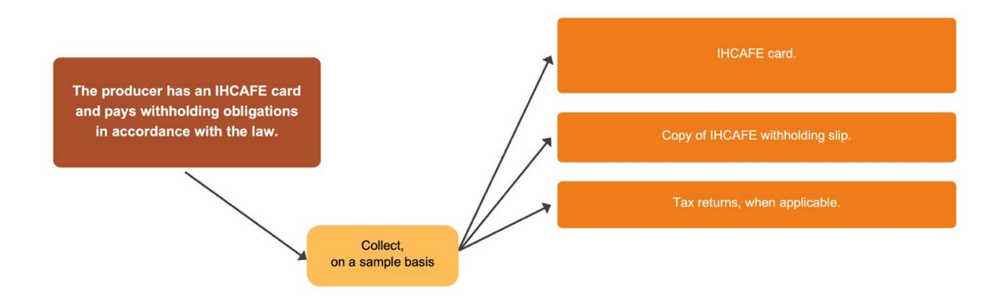

#### 7.2.1 Customs duties are paid, trade quotas and regulations are complied with

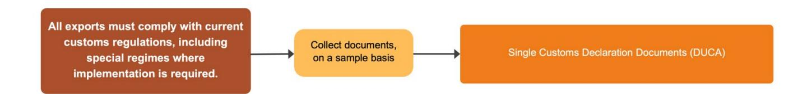

## 7.2.2 Companies must be legally constituted.

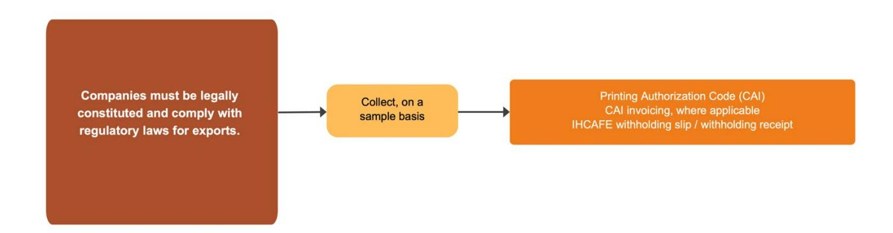

## 7.3.1 Absence of corrupt practices

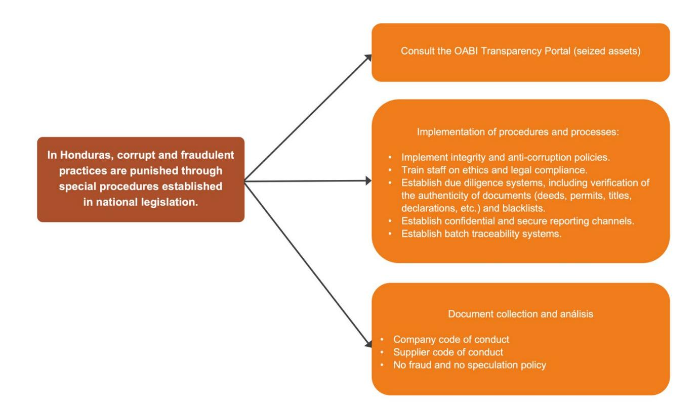

# **Annex 1 Mapping methodology**

The development of this tool for legality due diligence involves two key steps:

The first step is to identify the relevant national legal requirements under the EUDR for coffee production in Honduras.

The EUDR defines the legality of commodities in light of two criteria:

- National legal requirements must refer to the legal status of the production area
- There are seven legal areas [for agricultural products]: 1) land-use rights; 2) environmental protection; 3) third parties' rights; 4) labour law; (5) human rights protected under international law; 6) the principle of free, prior and informed consent, as set out in the United Nations Declaration on the Rights of Indigenous Peoples; and 7) tax, anti-corruption, trade and customs regulations.

On 2 October 2024 (with an update in April 2025), the European Commission published a guidance document for the implementation of the EUDR, which interprets the provisions of the Regulation on legality criteria. This document proposes to address the relevance of legal requirements through the following criteria:

- The requirements have a specific impact on the legal status of the area of production of the commodities [with the exception of tax, trade and customs standards];
- The requirements must be linked to the objectives of the Regulation to halt deforestation and forest degradation as part of the EU's commitment to addressing climate change and biodiversity loss.

Since not all labour requirements, nor some human rights and third parties' rights, are directly related to the objectives of the EUDR, there is debate over whether they fall within the scope of the Regulation.

In addition, the guidance document would extend the scope of tax and anticorruption regulations to steps in the value chain beyond the area of production. It should be noted that the European Commission's guidance document is not legally binding. As specified in the guidance document itself, it does not replace, add to or modify the provisions of the EUDR, which sets out the legal obligations. Its purpose is to harmonise EUDR implementation across EU Member States. Each EU Member State will adopt its own approach to monitoring operators' compliance with the EUDR. Ultimately, only national courts in each EU country have the power to interpret EU regulations in a binding manner and determine the scope of the legality test.

In this context, this tool takes a precautionary approach. It takes into account all the areas of law listed in Article 2(40) and includes all the requirements deemed

relevant in these seven areas. However, Annex 2 lists all legal requirements, whether or not they are directly linked to the objectives of the EUDR.

This comprehensive approach will allow end users to choose the scope of their due diligence based on their reading of the EUDR and the guidance provided.

#### How the relevance of the requirements has been determined

Under the EUDR, the operator is solely responsible for carrying out due diligence to ensure that the products it places on the market present a negligible risk of illegality. However, the EU has recognised that producing countries can facilitate the work of operators and competent authorities (see question 1(30) of the FAQs), in particular by providing information that allows for a better understanding of the applicable national laws.[1](#page-67-0) This is precisely the objective of Annex 2, which contains the mapping of relevant legal requirements relevant to coffee produced in Honduras.

All existing legal texts and requirements in Honduras that fall within the scope of the seven legal areas specified above have been identified. Coffee sector stakeholders gathered at consultation workshops and bilateral meetings (see Annex 3) assessed the relevance of each legal requirement to determine compliance with the EUDR legality criteria.

All identified legal requirements were considered a priori relevant for assessing the compliance of coffee or its derived products with the EUDR legality criteria, unless it can be clearly identified that:

- The legal requirement does not apply to the coffee plot or to the workers and third parties involved in the plot [with the exception of tax, trade and customs standards],
- The legal requirement is not relevant because the conditions for its implementation are not found in the context of coffee production,
- The legal requirement is of general implementation, is not subject to implementation texts, which prevents its implementation or compliance monitoring, and/or is covered by other more specific requirements.

This analysis includes all relevant legal requirements in the country. However, it is important to mention that some legal requirements, due to the specific conditions of rural areas and the characteristics of the sector, cannot be implemented by producers, especially small ones. Nevertheless, this tool mentions these requirements, recognising that they are binding, but that the legal and technical conditions for their proper enforcement in rural and productive areas of Honduras do not exist.

1 https://circabc.europa.eu/ui/group/34861680-e799-4d7c-bbadda83c45da458/library/e126f816-844b-41a9-89ef-cb2a33b6aa56/details

The next step is to assess the level of implementation of the relevant legal requirements defined in step 1, and subsequently to develop due diligence recommendations along two tracks: a streamlined approach for high levels of implementation, and a standard approach for those aspects where the implementation of the law reveals greater weaknesses or gaps in compliance. As mentioned above, this step was carried out through intensive analysis sessions and multi-stakeholder participatory workshops, as described in Annex 3 of this document.

# **Annex 2 Mapping of relevant legal requirements**

The tables below, presented by area of law, show the 34 requirements identified, 29 of which were considered relevant and 5 irrelevant, and the justifications provided by the stakeholders consulted for coffee produced in Honduras.

## Land-use rights

| Subcategory             | Legal requirement | Details |     | Legal basis         | Relevance |
|-------------------------|-------------------|---------|-----|---------------------|-----------|
| 1.1 Land-use rights are |                   |         |     |                     |           |
|                         |                   |         | 894 | Lease: Art. 1681 to |           |

| Subcategory | Legal requirement | Details                                                                                                                                                                                                                                                                                                                                                                                                                                                                                                                                                                                                                                                                                                                                                                                                                                                                                                                                                                                                                                                                                             | Legal basis                                                                                                                                                                                                                                                                                                                                                                                                                                                                                                                                                                                                                                                                                                                                                                | Relevance |
|-------------|-------------------|-----------------------------------------------------------------------------------------------------------------------------------------------------------------------------------------------------------------------------------------------------------------------------------------------------------------------------------------------------------------------------------------------------------------------------------------------------------------------------------------------------------------------------------------------------------------------------------------------------------------------------------------------------------------------------------------------------------------------------------------------------------------------------------------------------------------------------------------------------------------------------------------------------------------------------------------------------------------------------------------------------------------------------------------------------------------------------------------------------|----------------------------------------------------------------------------------------------------------------------------------------------------------------------------------------------------------------------------------------------------------------------------------------------------------------------------------------------------------------------------------------------------------------------------------------------------------------------------------------------------------------------------------------------------------------------------------------------------------------------------------------------------------------------------------------------------------------------------------------------------------------------------|-----------|
|             |                   | 
purposes without being the owner.
 
In the coffee sector, there are small producers who do not have formal titles but cultivate under irregular or informal possession. However, cultivating without a formal title is not illegal.
 
Producers can cultivate land without being owners through legal arrangements such as mere tenure, usufruct, or leasing. These arrangements allow them to use someone else's land under certain conditions, without having full ownership. Formal documentation is often lacking, and many small coffee growers work under informal or verbal agreements, i.e., without a written contract.
 
To strengthen tenure and promote the economic development of the sector, Decree 37-2016 was issued in 2016, allowing owners of coffee-growing plots to apply to the National Agrarian Institute (INA) for full ownership, with accreditation of their status as coffee growers.
 
In general, there are few conflicts over land tenure in production areas, and when they do arise, they are effectively resolved at the local level.
 | 
Regularisation: Articles 69 to 109.
 
Regularisation of property for indigenous peoples and Afro-Honduran peoples: Art. 93 to 102.
 
Art. 125.
 
MUNICIPALITIES LAW: Art. 13, paragraph 2) and 68, paragraphs 1) and 3))
 
LAW FOR THE MODERNISATION AND DEVELOPMENT OF THE AGRICULTURAL SECTOR: Articles 23 to 36
 
Article 55
 
LAND-USE PLANNING LAW: Art. 92
 
LAW FOR THE PROTECTION OF COFFEE AND COCOA GROWING ACTIVITIES
 
REGULATIONS OF THE PROPERTY LAW Art. 76 to 81. Property Registry. Art. 178 to 207. Real Estate Cadastre Art. 218 to 271.
 
Regularisation
 
REGULATIONS ON COFFEE TRADING
 
CONCORDANCE CONACAFE S.O. No. 136/2015: Art. 7. Documents required to register as a producer.
 |           |

| Subcategory                                                                                              | Legal requirement                                                                                                                                                                                                      | Details                                                                                                                                                                                                                                                                                                                                                                                                                                                                                                                                                                                                                                                                                                                                                                                              | Legal basis                                                                                                                                                                                                           | Relevance                                                                                                                                                                                                   |
|----------------------------------------------------------------------------------------------------------|------------------------------------------------------------------------------------------------------------------------------------------------------------------------------------------------------------------------|------------------------------------------------------------------------------------------------------------------------------------------------------------------------------------------------------------------------------------------------------------------------------------------------------------------------------------------------------------------------------------------------------------------------------------------------------------------------------------------------------------------------------------------------------------------------------------------------------------------------------------------------------------------------------------------------------------------------------------------------------------------------------------------------------|-----------------------------------------------------------------------------------------------------------------------------------------------------------------------------------------------------------------------|-------------------------------------------------------------------------------------------------------------------------------------------------------------------------------------------------------------|
|                                                                                                          | 
<b>The community has acquired the right to use the land collectively through the INA and the IP.</b>
 
<b>OR</b>
 
<b>The community has acquired the land-use rights through the Agrarian Reform.</b>
 | 
National, communal, and privately owned lands dedicated to coffee cultivation, in any region of the country and regardless of their vocation, are declared unaffected by agrarian reform.
 
Plots dedicated to coffee cultivation cannot be expropriated, regardless of their location, size, vocation, and condition, whether they are national, communal, or privately owned. With regard to coffee cultivation, no maximum or minimum limit shall be placed on the production unit that would allow it to be classified as a large estate or smallholding under Articles 25 of the Agrarian Reform Law and 34 of the Law for the Modernisation and Development of the Agricultural Sector.
 
In practice, there is no collectively owned land registered for coffee cultivation.
 | 
AGRICULTURAL REFORM LAW Articles 12 to 22 Articles 23 to 36
 
LAW ON THE PROTECTION OF COFFEE AND COCOA GROWING Art. 1 Art. 4
                                                             | 
<b>Not relevant</b> because agrarian reform does not apply to land used for coffee cultivation. Furthermore, in practice, there is no collectively owned land registered for coffee cultivation.
 |
| 1.1 Land-use rights are guaranteed  1.1.2 Absence of abandonment or forced expulsion from the plot | 
<b>Land used for agricultural production must not have been subject to forced abandonment or violent expulsion of its previous occupants.</b>
                                                                   | 
The Honduran State, through the Registry of Abandoned Property (RBA), recognises the rights of forcibly displaced persons to legal protection, restitution of land, housing and property, and access to justice. These measures seek to prevent the dispossession or misuse of property abandoned during displacement.
                                                                                                                                                                                                                                                                                                                                                                                                                                                                        | 
CONSTITUTION OF THE REPUBLIC: Art. 103
 
LAW FOR THE PREVENTION, CARE AND PROTECTION OF INTERNALLY DISPLACED PERSONS: Art. 5, paragraphs 3, 7 and 12. Art. 33 Art. 35, paragraphs 8), 12)
 | 
<b>Not relevant</b> No forced displacement has b
                                                                                                                                                 |

| Subcategory      | Legal requirement | Details                      | Legal basis | Relevance |
|------------------|-------------------|------------------------------|-------------|-----------|
| land use are met |                   |                              |             |           |
|                  |                   | is the responsibility of the |             |           |

## Environmental protection

| Subcategory                                                                                                                                                           | Legal requirement                                                                                                                                                                                                                                                                               | Details                                                                                                                                                                                                                                                                                                                                                                                                                                                                                                                                                                                                                                      | Legal basis                                                                                                                                                                                                                               | Relevance       |
|-----------------------------------------------------------------------------------------------------------------------------------------------------------------------|-------------------------------------------------------------------------------------------------------------------------------------------------------------------------------------------------------------------------------------------------------------------------------------------------|----------------------------------------------------------------------------------------------------------------------------------------------------------------------------------------------------------------------------------------------------------------------------------------------------------------------------------------------------------------------------------------------------------------------------------------------------------------------------------------------------------------------------------------------------------------------------------------------------------------------------------------------|-------------------------------------------------------------------------------------------------------------------------------------------------------------------------------------------------------------------------------------------|-----------------|
| 2.1 Environmental requirements for agricultural activities  2.1.1. Agriculture standards in restricted areas or areas subject to legal exclusion are respected. | <b>Agricultural activity is not carried out in areas subject to special protection regimes, such as protected areas, declared micro-basins, national forests, and national parks, except when located in buffer zones of protected areas and in accordance with the area's management plan.</b> | In Honduras, national forests, protected areas and national parks are subject to special regimes. Agricultural activity, including coffee cultivation, may only be carried out in buffer zones and with the express authorisation of the Forest Conservation Institute (ICF), through approved Management or Operational Plans.  In core areas, any new settlements are prohibited and existing ones must be relocated.  Coffee production is subject to special regulations (Decree 56-2007) that facilitate the obtaining of licences within protected areas, but under strict compliance with technical and legal conditions. | GENERAL ENVIRONMENTAL LAW Art. 35, 39, 40, 50  FOREST LAW, PROTECTED AREAS AND WILDLIFE Articles 6 and 109  PROPERTY LAW Art. 70 and 71                                                                              | <b>Relevant</b> |
| 2.1 Environmental requirements for agricultural activities  2.1.2. Only pesticides, herbicides, fertilisers and fungicides authorised by SENASA are used        | <b>Producers shall only use agrochemicals authorised for agricultural production.</b>                                                                                                                                                                                                           | In Honduras, herbicides, insecticides, fertilisers and fungicides require authorisation from the Secretariat of Agriculture and Livestock (SAG). SENASA is responsible for regulatory control of these products and for certifying the phytosanitary quality of exports.  However, producers do not need specific authorisation to implement them, provided they respect the dosage indicated as an indicator on the label.                                                                                                                                                                                                            | CONSTITUTION OF THE REPUBLIC: Art. 146  HEALTH CODE: Art. 128  GENERAL ENVIRONMENTAL LAW: Art. 68  REGULATIONS ON THE REGISTRATION, USE AND CONTROL OF PLANT PROTECTION PRODUCTS:  Art. 6 and 24, 51, 54 | <b>Rele</b>     |

| Subcategory                                                                                                                     | Legal requirement                                                                                                  | Details                                                                                                                                                                                                                                                                                                                                                                                                                                                                                                                                                                                                                                                                                                                                                                                             | Legal basis                                                                                                                                                                                                                                                                                                                                                                         | Relevance       |
|---------------------------------------------------------------------------------------------------------------------------------|--------------------------------------------------------------------------------------------------------------------|-----------------------------------------------------------------------------------------------------------------------------------------------------------------------------------------------------------------------------------------------------------------------------------------------------------------------------------------------------------------------------------------------------------------------------------------------------------------------------------------------------------------------------------------------------------------------------------------------------------------------------------------------------------------------------------------------------------------------------------------------------------------------------------------------------|-------------------------------------------------------------------------------------------------------------------------------------------------------------------------------------------------------------------------------------------------------------------------------------------------------------------------------------------------------------------------------------|-----------------|
|                                                                                                                                 |                                                                                                                    | Although prior permission is not required for implementation, if producers use unauthorised products, in inappropriate doses or without adequate labelling, they would be engaging in illegal practices.                                                                                                                                                                                                                                                                                                                                                                                                                                                                                                                                                                                            |                                                                                                                                                                                                                                                                                                                                                                                     |                 |
| 2.1 Environmental requirements for agricultural activities  2.1.3 Waste is reduced and managed in accordance with the law | <b>Producers who use agrochemicals must take measures to prevent alterations to soil and water bodies.</b>         | In Honduras, those who use pesticides must wash the containers three times before returning them to temporary or authorised collection centres.  It is prohibited to throw away, burn, bury, reuse or transform these containers for other uses. Any disposal outside the authorised channel constitutes a serious offence. Solid and organic waste generated in agriculture must be treated technically to avoid contamination of soil and water bodies. There are official programmes such as Campo Limpio (SENASA) and regulatory frameworks managed by SERNA (DECA) that monitor compliance.  IHCAFE has produced a guidance document on good agricultural practices and research for the coffee sector.  <a href="#">BPA and coffee research documents – IHCAFE Honduras</a> | GENERAL ENVIRONMENTAL LAW: Art. 67, 104, 455, 462  HEALTH CODE Art. 127  REGULATIONS ON THE REGISTRATION, USE AND CONTROL OF PLANT PROTECTION PRODUCTS: Art. 99, 101, 102 and 104  GENERAL REGULATIONS ON PREVENTIVE MEASURES FOR ACCIDENTS AT WORK AND OCCUPATIONAL DISEASES Art. 443  GENERAL REGULATIONS ON ENVIRONMENTAL HEALTH Art. 130 | <b>Relevant</b> |
| 2.1 Environmental requirements for agricultural activities                                                                      | <b>Agricultural activity is carried out in compliance with the minimum authorised distances from watercourses,</b> | The protection of water resources is a priority for the Honduran State. There are specific management plans for water-producing micro-basins,                                                                                                                                                                                                                                                                                                                                                                                                                                                                                                                                                                                                                                                       | GENERAL ENVIRONMENTAL LAW: Art. 30, 31, 33  FOREST, PROTECTED AREAS AND WILDLIFE LAW ARTICLE                                                                                                                                                                                                                                                                               | <b>Relevant</b> |

| Subcategory                                                                                                          | Legal requirement                                                                                                                | Details                                                                                                                                                                                                                                                                                                                                                                                                                                                                                                      | Legal basis                                                                                                                                        | Relevance       |
|----------------------------------------------------------------------------------------------------------------------|----------------------------------------------------------------------------------------------------------------------------------|--------------------------------------------------------------------------------------------------------------------------------------------------------------------------------------------------------------------------------------------------------------------------------------------------------------------------------------------------------------------------------------------------------------------------------------------------------------------------------------------------------------|----------------------------------------------------------------------------------------------------------------------------------------------------|-----------------|
| 2.1.3 Water resources are protected and used in accordance with the law                                              | <b>ensuring the protection of riverbanks, wetlands and water recharge areas in accordance with current national regulations.</b> | and agricultural activities in these areas are only permitted if they are sustainable and included in these plans. The ICF maintains an official map of micro-basins declared as water supply areas.                                                                                                                                                                                                                                                                                                         | 123.-PROTECTION OF WATER SOURCES AND WATERCOURSES. (Chapter 4)  NATIONAL REGULATIONS ON WASTEWATER DISCHARGE AND REUSE Art. 3             |                 |
|                                                                                                                      | <b>The productive activity does not generate spills into water sources or, if it does, it has the respective spill permits.</b>  | There is a technical standard for wastewater discharges into receiving bodies and sanitary sewers, with its implementation extending to all natural or legal persons, public or private, who carry out activities that generate discharges. However, the competent authority (SERNA, Public Health) only carries out inspections on the industrial side, not on the field activities of producers.  There are no studies that allow for the precise characterisation and measurement of spill volumes. | TECHNICAL STANDARDS FOR WASTEWATER DISCHARGES INTO RECEIVING BODIES AND SANITARY SEWERS  CHAPTER III SCOPE OF IMPLEMENTATION Art. 3 and 4 | <b>Relevant</b> |
| 2.1 Environmental requirements for agricultural activities  2.1.5 Soils are managed in accordance with the law | <b>Producers implement appropriate techniques to conserve soil fertility and prevent degradation.</b>                            | Honduran regulations establish that land use must be rational and in accordance with its natural vocation, maintaining a balance between agricultural production and ecosystem conservation. The development of land use plans is the responsibility of the municipalities, in coordination with SERNA, while the ICF regulates and supervises agricultural activity in forest areas (see legality criteria 1.2).                                                                                            | GENERAL ENVIRONMENTAL LAW: Art. 49  FOREST LAW, PROTECTED AREAS AND WILDLIFE Art. 93 and 94                                            | <b>Relevant</b> |

| Subcategory                                                                                                                                            | Legal requirement                                                                                                                                                                                                                                                                                                                                      | Details                                                                                                                                                                                                                                                                                                                                                                                                                                                                                                         | Legal basis                                                                                                              | Relevance       |
|--------------------------------------------------------------------------------------------------------------------------------------------------------|--------------------------------------------------------------------------------------------------------------------------------------------------------------------------------------------------------------------------------------------------------------------------------------------------------------------------------------------------------|-----------------------------------------------------------------------------------------------------------------------------------------------------------------------------------------------------------------------------------------------------------------------------------------------------------------------------------------------------------------------------------------------------------------------------------------------------------------------------------------------------------------|--------------------------------------------------------------------------------------------------------------------------|-----------------|
|                                                                                                                                                        |                                                                                                                                                                                                                                                                                                                                                        | In many regions of Honduras, coffee is grown in agroforestry systems (under shade), which is considered compatible with soil and biodiversity conservation.                                                                                                                                                                                                                                                                                                                                                     |                                                                                                                          |                 |
| 2.2 Protection of forest ecosystems and wild fauna and flora  2.2.1 Forest conversion complies with legal requirements                           | <b>Commercial forestry activities carried out within the agricultural plot (as part of an agroforestry system) have a harvesting certificate and a management plan, conservation or restoration plan approved by the competent authority.</b>                                                                                                          | Producers engaged in commercial forestry or agroforests activities comply with the provisions of the Forestry, Protected Areas and Wildlife Act.  There are local indigenous or community populations that have managed to organise themselves for the rational exploitation of private community forests or national forests through community forest management contracts, derived from the National Community Forestry Strategy.                                                                       | FOREST, PROTECTED AREAS AND WILDLIFE LAW: Art. 11, paragraphs 15 and 16.  SOCIAL FORESTRY SYSTEM. Art. 126 to 132. | <b>Relevant</b> |
| 2.2 Protection of forest ecosystems and wild fauna and flora  2.2.2 An environmental impact assessment has been carried out when required by law | <b>When the area of production exceeds 10 hectares, the producer must have an environmental management tool appropriate to the size and nature of the project, which may consist of an environmental management plan, an environmental technical report or an environmental summary table, as established by SERNA within the framework of SINEIA.</b> | The aim is to achieve sustainable development in the country, seeking a balance between the development of the project, work or activity and the care and preservation of the environment.  Projects, works or activities that, due to their nature, fall under Category 1 and are classified as having a very low environmental impact or risk, as such, will not be subject to environmental licensing procedures. However, at the request of a stakeholder, a certificate of non-requirement for the c |                                                                                                                          |                 |

| Subcategory | Legal requirement | Details                         | Legal basis | Relevance |
|-------------|-------------------|---------------------------------|-------------|-----------|
|             |                   | Less than 10 ha: certificate of |             |           |
|             |                   | Between 20 and 40 ha -          |             |           |

## Third parties' rights

| Subcategory                                                                                       | Legal requirement                                                                                                                                                                  | Details                                                                                                                                                                                                                                                                                                                                                                                                                                                                                                      | Legal basis                                                                                                                                                                | Relevance              |
|---------------------------------------------------------------------------------------------------|------------------------------------------------------------------------------------------------------------------------------------------------------------------------------------|--------------------------------------------------------------------------------------------------------------------------------------------------------------------------------------------------------------------------------------------------------------------------------------------------------------------------------------------------------------------------------------------------------------------------------------------------------------------------------------------------------------|----------------------------------------------------------------------------------------------------------------------------------------------------------------------------|------------------------|
| 
<b>3.1 Procedural rights</b>
 
<b>3.1.1 Right of local communities to be informed</b>
 | 
<b>Local communities have been informed and consulted about agricultural projects.</b>
                                                                                      | 
In Honduras, regulations on citizen participation establish that citizens must be included in the formulation, implementation and evaluation of policies, and they are recognised as having the right to intervene through mechanisms such as legislative initiatives and public consultations. At the local level, the Municipalities Act requires authorities to guarantee opportunities for participation and to convene open councils to inform and consult the population on relevant decisions.
 | 
CITIZEN PARTICIPATION LAW: Articles 2 and 3
 
LAW ON CITIZEN PARTICIPATION MECHANISMS: Art. 28
 
MUNICIPALITIES LAW: Art. 14 numeral 2, Art. 24 numeral 8
 | 
<b>Relevant</b>
 |
| 
<b>3.1.2 Right to claim compensation in the event of damage and harm</b>
                   | 
<b>If productive activity causes damage to individuals, communities or the environment, those affected have the right to claim full reparation, including compensation.</b>
 | 
When a productive system causes proven damages, the producer is obliged to compensate for the environmental damage based on implementation of the general environmental law and by order of the competent authority.
 
The effective protection of citizens' legitimate rights and interests in environmental matters is guaranteed through the implementation of procedural principles such as due process, adversarial proceedings, procedural economy, contribution of the
                    | 
CIVIL CODE: Art. 1360 Art. 1365
 
GENERAL ENVIRONMENTAL LAW: Art. 120
                                                                                          | 
<b>Relevant</b>
 |

| Subcategory                                                                                                                                                                                                                                                        | Legal requirement                                                                                                                                          | Details                                                                                                                                                                                                                                                                                                                                                                                                                                    | Legal basis                                                                                                  | Relevance                                                                                                                                                                          |
|--------------------------------------------------------------------------------------------------------------------------------------------------------------------------------------------------------------------------------------------------------------------|------------------------------------------------------------------------------------------------------------------------------------------------------------|--------------------------------------------------------------------------------------------------------------------------------------------------------------------------------------------------------------------------------------------------------------------------------------------------------------------------------------------------------------------------------------------------------------------------------------------|--------------------------------------------------------------------------------------------------------------|------------------------------------------------------------------------------------------------------------------------------------------------------------------------------------|
|                                                                                                                                                                                                                                                                    |                                                                                                                                                            | parties, assessment of evidence, oral proceedings, immediacy, concentration and publicity.                                                                                                                                                                                                                                                                                                                                                 |                                                                                                              |                                                                                                                                                                                    |
| 3.2 Substantive rights 3.2.1 The rights of local communities to a healthy environment are respected                                                                                                                                                             | <b>Agricultural production does not generate environmental or other impacts that affect the right of local communities to enjoy a healthy environment.</b> | The right of local communities to enjoy a healthy environment for human health is operationalised by various legal requirements in the category of environmental protection (the use of agrochemicals, the protection of soils and water resources). Verifying implementation of these environmental requirements could be considered to mean that the right to enjoy a healthy environment has been respected.                            | CONSTITUTION OF THE REPUBLIC: Art. 145  GENERAL ENVIRONMENTAL LAW: Art. 75                       | Not relevant because it is covered by other more detailed requirements in the tool (use of agrochemicals, protection of watercourses and micro-basins, protection of soils, etc.). |
| 3.2.2 Sites, resources and habitats of cultural, archaeological or historical importance, or of religious or sacred importance to the traditional cultures of the communities affected by the operations, are identified and protected in accordance with the law. | <b>Productive activities are not carried out in areas of cultural importance or are possibly established in undiscovered archaeological areas.</b>         | Cocoa production systems are preferably established outside the boundaries of areas designated as cultural heritage sites, as well as sites of archaeological importance. In the case of production in areas of public interest, they are subject to management standards, farm plans and land-use rights.  The Institute of Anthropology and History manages an inventory of the nation's cultural heritage for its proper defence. | CONSTITUTION OF THE REPUBLIC: Article 172  LAW FOR THE PROTECTION OF THE NATION'S CULTURAL HERITAGE | <b>Relevant</b>                                                                                                                                                                    |

## Labour rights\*

| Subcategory                                                                                                           | Legal requirement                                                                                                                                                                                                                                                                                                                                                                                                                | Details                                                                                                                                                                                                                                                                                                                                                                                                                                                                                                                                                                                                                                                                                                                                                                                                                                                                                                                                                                                                                                                 | Legal basis                                                                                                       | Relevance              |
|-----------------------------------------------------------------------------------------------------------------------|----------------------------------------------------------------------------------------------------------------------------------------------------------------------------------------------------------------------------------------------------------------------------------------------------------------------------------------------------------------------------------------------------------------------------------|---------------------------------------------------------------------------------------------------------------------------------------------------------------------------------------------------------------------------------------------------------------------------------------------------------------------------------------------------------------------------------------------------------------------------------------------------------------------------------------------------------------------------------------------------------------------------------------------------------------------------------------------------------------------------------------------------------------------------------------------------------------------------------------------------------------------------------------------------------------------------------------------------------------------------------------------------------------------------------------------------------------------------------------------------------|-------------------------------------------------------------------------------------------------------------------|------------------------|
| 
4.1 Workers' rights are respected
 
4.1.1 Type of employment relationship, legal contractual relationship
 | 
<b>Relations between workers employed on the farm and employers are governed by a written or verbal employment contract (when not exceeding 60 days).</b>
 
<b>Agricultural operations that permanently employ more than 10 workers must comply with the provisions of the Labour Code, including employer registration, internal regulations, affiliation to the Social Security system, and other obligations.</b>
 | 
The laws governing relations between employers and workers are of public order, and any acts, stipulations or agreements that imply a waiver, reduction, restriction or distortion of workers' guarantees are null and void.
 
All employment contracts, as well as any amendments or extensions thereto, must be in writing, except for temporary work not exceeding sixty (60) days or agricultural or livestock work, unless it involves agro-industrial companies that permanently employ more than 10 workers.
 
Employment contracts in the agricultural sector may be agreed verbally in accordance with labour legislation, and most workers in the coffee sector at the primary production level do not have written contracts (ILO 2020).
 
Agro-industrial companies are supervised by the Labour Inspectorate; producer cooperatives and farmers' associations are regulated under the Social Economy umbrella; and the wages paid by small and medium-sized producers are also regulated by the Labour Inspectorate.
 | 
CONSTITUTION OF THE REPUBLIC: Art. 132, 138 and 141
 
LABOUR CODE: Art. 20, 21, 25, 39 and 46
 | 
<b>Relevant</b>
 |
| 
4.1 Workers' rights are respected
                                                                              | 
<b>All permanent or temporary workers on agricultural holdings, including those hired on a</b>
                                                                                                                                                                                                                                                                                                                            | 
No worker may be required to work for more than twelve hours in any 24-hour period. In practice, post-harvest handling and fruit picking
                                                                                                                                                                                                                                                                                                                                                                                                                                                                                                                                                                                                                                                                                                                                                                                                                                                                                                         |                                                                                                                   |                        |

| 4.1.2 Working hours, rest periods, overtime and weekly rest periods are respected                                        | <b>project, daily or hourly basis, through oral or written contracts, do not work more than 12 hours per day and rest for 10 hours without interruption.</b>                                                                                                    | activities are carried out during daytime hours without exceeding the working hours established by law.                                                                                                                                                                                                                                                                                                                                     | LAW ON THE SEVENTH DAY AND THIRTEENTH MONTH IN CONCEPT OF BONUS Art. 1, 4 and 16                                                                                           |                 |
|--------------------------------------------------------------------------------------------------------------------------|-----------------------------------------------------------------------------------------------------------------------------------------------------------------------------------------------------------------------------------------------------------------|---------------------------------------------------------------------------------------------------------------------------------------------------------------------------------------------------------------------------------------------------------------------------------------------------------------------------------------------------------------------------------------------------------------------------------------------|-------------------------------------------------------------------------------------------------------------------------------------------------------------------------------|-----------------|
| 4.1 Workers' rights are respected  4.1.3 No discrimination on the basis of sex or race, or against migrant workers | <b>All forms of employment discrimination on the grounds of race, ethnicity, gender, political or religious orientation, economic status or membership of indigenous or Afro-Honduran peoples are prohibited on agricultural holdings.</b>                      | Article 12 Labour Code: Discrimination on the grounds of race, religion, political beliefs, membership of indigenous or Afro-Honduran peoples, or economic status is prohibited in establishments that operate for the general use of companies or workplaces. The social position or access that workers may have to these establishments may not be conditioned on the amount of their wages or the importance of the position they hold. | CONSTITUTION OF THE REPUBLIC: Art. 60  LABOUR CODE Art. 12  CRIMINAL CODE: Art. 295  EQUAL OPPORTUNITIES FOR WOMEN ACT:  Sections 49, 55 and 64 | <b>Relevant</b> |
| 4.1 Workers' rights are respected  4.1.4 Social security rights are respected                                      | <b>Agricultural workers are subject to special regimes and progressive affiliation processes to the social security system, considering the geographical location and the possibilities of the Honduran Social Security Institute (IHSS), where applicable.</b> | In Honduras, the right to social security has constitutional status, and related services are provided by the Honduran Social Security Institute.  Since 1959, it has been agreed that agricultural workers would be incorporated into the social security system in a gradual and progressive manner. In                                                                                                                             |                                                                                                                                                                               |                 |

| 
4.2 Equality between men and women is maintained
 
4.2.1 Legal provisions on maternity and paternity leave are complied with
 | 
<b>All pregnant agricultural workers are entitled to pre- and post-natal leave, as established by law.</b>
                                                                                                       | 
In Honduras, women are entitled to compulsory pre- and post-natal leave.
 
Pregnant workers are entitled to 10 weeks of maternity leave and cannot be dismissed on the grounds of their pregnancy or leave.
                                                                                                                                                                                                                  | 
CONSTITUTION OF THE REPUBLIC Art. 111, Art. 142
 
LABOUR CODE: Art. 135, 140 and 144
 
REGULATIONS FOR THE APPLICATION OF THE SOCIAL SECURITY LAW: Art. 68
                                                                                                           | 
<b>Not relevant</b> to female workers in agricultural enterprises with fewer than 10 permanent employees (not subject to the provisions of the Labour Code except as indicated in Title IV, Chapter IV)
 
Relevant to all other workers. In practice, farm workers are temporary, so they are not subject to the provisions of the Labour Code relating to maternity.
 |
|------------------------------------------------------------------------------------------------------------------------------------------|-------------------------------------------------------------------------------------------------------------------------------------------------------------------------------------------------------------------------|------------------------------------------------------------------------------------------------------------------------------------------------------------------------------------------------------------------------------------------------------------------------------------------------------------------------------------------------------------------------------------------------------------------------------------------|-------------------------------------------------------------------------------------------------------------------------------------------------------------------------------------------------------------------------------------------------------------------------------------------|-----------------------------------------------------------------------------------------------------------------------------------------------------------------------------------------------------------------------------------------------------------------------------------------------------------------------------------------------------------------------------------|
| 
4.3 Workers' remuneration is legal
 
4.3.1 Remuneration complies with legal requirements
                                     | 
<b>Workers in agricultural activities receive at least the minimum wage, and where applicable, the wage will be agreed with the employer, per job or service provided, depending on the area of the country.</b>
 | 
All workers are entitled to earn at least the minimum wage, sufficient to cover the normal needs of their household (applies to permanent employees).
 
According to the Labour Code, agricultural or livestock farms that do not permanently employ more than ten (10) workers are exempt from the minimum wage; however, the provisions of Title IV, Chapter IV of the Labour Code relating to wages shall be implemented.
 | 
CONSTITUTION OF THE REPUBLIC: Art. 128, paragraph 5
 
LABOUR CODE: Art. 2, paragraph 1
 
Articles 340, 364, 382 and 389
 
LAW ON THE SEVENTH DAY AND THIRTEENTH MONTH IN CONCEPT OF BONUS: Art. 1, 4 and 330
 
MINIMUM WAGE LAW Art. 20 and 39
 | 
<b>Relevant</b>
                                                                                                                                                                                                                                                                                                                                                            |

| 
4.3 Operations and activities are safe
 
4.3.2 Legal requirements regarding health and safety in the workplace are met, including the handling of agrochemicals and machinery
 | 
<b>Agricultural operations must ensure adequate health and safety conditions in the workplace and have the right to be protected from the risks arising from the use of chemicals (agrochemicals, fertilisers, pesticides) and the operation of agricultural machinery.</b>
 | 
In addition to the general provisions of the Labour Code on health and safety in the workplace, the provisions of the General Regulations on Preventive Measures for Occupational Accidents and Diseases must be complied with. (Agreement STSS-007-02 and its amendments).
 
All employers must adopt preventive measures, provide personal protective equipment (PPE), train workers on occupational hazards, and ensure healthy and safe working environments.
 | 
CONSTITUTION OF THE REPUBLIC: Art. 128, paragraph 6
 
LABOUR CODE: Art. 391, 397, 402, 413 and 430
 
LABOUR INSPECTION LAW Art. 59
 
GENERAL REGULATIONS ON PREVENTIVE MEASURES FOR WORKPLACE ACCIDENTS AND OCCUPATIONAL DISEASES: Art. 4, 101, 103, 433 and 456
 | 
<b>Relevant</b>
 |
|-------------------------------------------------------------------------------------------------------------------------------------------------------------------------------------------|------------------------------------------------------------------------------------------------------------------------------------------------------------------------------------------------------------------------------------------------------------------------------------|-------------------------------------------------------------------------------------------------------------------------------------------------------------------------------------------------------------------------------------------------------------------------------------------------------------------------------------------------------------------------------------------------------------------------------------------------------------------------------|--------------------------------------------------------------------------------------------------------------------------------------------------------------------------------------------------------------------------------------------------------------------------------------------------------|------------------------|
|-------------------------------------------------------------------------------------------------------------------------------------------------------------------------------------------|------------------------------------------------------------------------------------------------------------------------------------------------------------------------------------------------------------------------------------------------------------------------------------|-------------------------------------------------------------------------------------------------------------------------------------------------------------------------------------------------------------------------------------------------------------------------------------------------------------------------------------------------------------------------------------------------------------------------------------------------------------------------------|--------------------------------------------------------------------------------------------------------------------------------------------------------------------------------------------------------------------------------------------------------------------------------------------------------|------------------------|

## Human rights\*

| Subcategory               | Legal requirement | Details | Legal basis               | Relevance |
|---------------------------|-------------------|---------|---------------------------|-----------|
| 5.2.1 Workers are free to |                   |         |                           |           |
|                           |                   |         | Articles 111, 117 and 118 |           |

| Subcategory                                                                                                                                   | Legal requirement                                                                                                                                                                                                              | Details                                                                                                                                                                                                                                                                                                                                                                                                                                                                                                                                                                                                                                                                                                                        | Legal basis                                                                                                                                             | Relevance       |
|-----------------------------------------------------------------------------------------------------------------------------------------------|--------------------------------------------------------------------------------------------------------------------------------------------------------------------------------------------------------------------------------|--------------------------------------------------------------------------------------------------------------------------------------------------------------------------------------------------------------------------------------------------------------------------------------------------------------------------------------------------------------------------------------------------------------------------------------------------------------------------------------------------------------------------------------------------------------------------------------------------------------------------------------------------------------------------------------------------------------------------------|---------------------------------------------------------------------------------------------------------------------------------------------------------|-----------------|
|                                                                                                                                               |                                                                                                                                                                                                                                | However, most workers in production systems are temporary and are not economically dependent on their employer, meaning they can terminate their employment relationship whenever they choose.                                                                                                                                                                                                                                                                                                                                                                                                                                                                                                                                 |                                                                                                                                                         |                 |
| 5.2 Absence of modern slavery and forced labour 5.2.2 Wages, benefits, documents or property are not withheld to restrict workers' freedom | <b>Employers do not withhold wages, employment benefits, identity documents, personal property or other economic or administrative rights for the purpose of coercing, restricting or conditioning the freedom of workers.</b> | Due to the socio-economic nature of the rural sector, the vast majority of workers are temporary employees who work during each harvest cycle, receiving remuneration for work or tasks previously agreed upon.                                                                                                                                                                                                                                                                                                                                                                                                                                                                                                                | LABOUR CODE: Art. 96 numeral 5 Art. 114 subsection f                                                                                              | <b>Relevant</b> |
| 5.2 Absence of modern slavery and forced labour 5.2.3 No one shall be subjected to slavery or forced labour                                | <b>All forms of slavery, servitude, forced or compulsory labour in agricultural and forestry activities are prohibited.</b>                                                                                                    | The State of Honduras has put in place institutional mechanisms to combat these forms of exploitation through the Inter-institutional Commission against Commercial Sexual Exploitation and Trafficking in Persons (CICESCT) and records information on internal and external trafficking in Honduras in the National Information System on Trafficking in Persons (SNITdP). Investigations into human trafficking are carried out by the Unit against Trafficking, Sexual Exploitation, Commercial Exploitation and Smuggling of Persons and the Prosecutor's Office against Organised Crime, both of which are part of the Public Prosecutor's Office.  Due to the socio-economic nature of the rural sector, the vast | CONSTITUTION OF THE REPUBLIC: Art. 60, 61, and 69  HONDURAN CRIMINAL CODE: Art. 221  LAW AGAINST HUMAN TRAFFICKING: Art. 41 and 42 | <b>Relevant</b> |

| Subcategory                                                                                                                                                   | Legal requirement                                                                                                                                                                                                                                                                                                                                                                                                                                                                                                                                                                                                                                                                                                                                                                                                  | Details                                                                                                                                                                                                                                                                                                                                                                              | Legal basis | Relevance              |
|---------------------------------------------------------------------------------------------------------------------------------------------------------------|--------------------------------------------------------------------------------------------------------------------------------------------------------------------------------------------------------------------------------------------------------------------------------------------------------------------------------------------------------------------------------------------------------------------------------------------------------------------------------------------------------------------------------------------------------------------------------------------------------------------------------------------------------------------------------------------------------------------------------------------------------------------------------------------------------------------|--------------------------------------------------------------------------------------------------------------------------------------------------------------------------------------------------------------------------------------------------------------------------------------------------------------------------------------------------------------------------------------|-------------|------------------------|
|                                                                                                                                                               |                                                                                                                                                                                                                                                                                                                                                                                                                                                                                                                                                                                                                                                                                                                                                                                                                    | majority of workers are temporary employees who work during each harvest cycle, receiving remuneration for work or tasks agreed upon in advance.                                                                                                                                                                                                                                     |             |                        |
| 
5.3 Women's rights are respected in accordance with international and national law
 
5.3.1 There is no sexual harassment or gender discrimination
 | 
<b>Rural women workers do not suffer gender discrimination or sexual harassment in the workplace.</b>
 
In 2021, the coffee industry ratified its commitment to the Gender Policy for the Coffee Subsector in Honduras. To implement the gender policy for the coffee subsector in Honduras, a gender roundtable for the subsector has been established.
 
Complaints of sexual harassment can be made to 911, line 114, the Special Prosecutor's Office for the Protection of Women of the Public Prosecutor's Office, and the Municipal Women's Offices.
 
Rural women workers are included in all State Policies and national legislation that prevents and punishes discriminatory activities such as sexual harassment, guaranteeing access to institutions that combat this behaviour.
 | 
The Secretariat in the Office of Women (SEMUJER) is a governing institution for public policies in favour of women, created with the aim of ensuring that true gender equality and justice are achieved in Honduras.
 
LABOUR CODE Art. 96, paragraph 5 Art. 114, paragraph b
 
LAW ON EQUAL OPPORTUNITIES FOR WOMEN Art. 60
 
CRIMINAL CODE Art. 256 Art. 294
 |             | 
<b>Relevant</b>
 |

## **FPIC**

| Subcategory                                                                                          | Legal requirement                                                                                                                                                                                                    | Details                                                                                                                                                                                                                                                                                                                                                                                                                                                                                                                                                                                                                                                                                                                                                                                                                                                                                                                                                   | Legal basis                                                                                                                                                                                                                                                                    | Relevance              |
|------------------------------------------------------------------------------------------------------|----------------------------------------------------------------------------------------------------------------------------------------------------------------------------------------------------------------------|-----------------------------------------------------------------------------------------------------------------------------------------------------------------------------------------------------------------------------------------------------------------------------------------------------------------------------------------------------------------------------------------------------------------------------------------------------------------------------------------------------------------------------------------------------------------------------------------------------------------------------------------------------------------------------------------------------------------------------------------------------------------------------------------------------------------------------------------------------------------------------------------------------------------------------------------------------------|--------------------------------------------------------------------------------------------------------------------------------------------------------------------------------------------------------------------------------------------------------------------------------|------------------------|
| 
6.1. FPIC is required when the rights of indigenous peoples or local communities are affected
 | 
<b>Any productive system that affects the territories of indigenous peoples or Afro-Honduran peoples requires prior, free and informed consultation through open councils or their traditional protocols.</b>
 | 
The implementation of FPIC is carried out through open councils and/or protocols as instruments to obtain the consent of indigenous peoples and Afro-Honduran peoples in the execution of projects that may affect them, including productive projects. These instruments are recognised, as appropriate, as valid consultations established in Convention 169, provided that they are carried out in accordance with that Convention.
 
In order to obtain the consent of the affected communities, the consultation process is carried out through protocols or open councils using mechanisms such as:
 <ol> <li>The type of consultation approved by the community organisation.</li> <li>The type of organisation existing in the community.</li> <li>The size of the project to be developed and its link to the SERNA environmental categorisation.</li> </ol> 
Standards to implement this right are currently under discussion.
 | 
CONSTITUTION OF THE REPUBLIC: Art. 346
 
ILO CONVENTION 169: Art. 6
 
CITIZEN PARTICIPATION LAW: Arts. 2 and 3
 
CIVIC PARTICIPATION MECHANISMS ACT: Art. 28
 
MUNICIPALITIES LAW Art. 14, paragraph 2 Art. 24, paragraph 8
 | 
<b>Relevant</b>
 |

## Tax, customs and anti-corruption standards

| Subcategory Legal requirement Details | Legal basis Relevance |
|---------------------------------------|-----------------------|
| quintal of coffee marketed, and it    |                       |
| LAW No.                               | 24-1963               |
| decree No.                            | 119-2016              |
| DECREE No.                            | 56-2007:              |

| Subcategory | Legal requirement | Details                                                                                                                                                                                                                                                                                                                                                                                                                                                                                                                                                                                                                                                                                                                                                                                                                                                                                                                                                                                                                                                                                                                                                                                                               | Legal basis | Relevance |
|-------------|-------------------|-----------------------------------------------------------------------------------------------------------------------------------------------------------------------------------------------------------------------------------------------------------------------------------------------------------------------------------------------------------------------------------------------------------------------------------------------------------------------------------------------------------------------------------------------------------------------------------------------------------------------------------------------------------------------------------------------------------------------------------------------------------------------------------------------------------------------------------------------------------------------------------------------------------------------------------------------------------------------------------------------------------------------------------------------------------------------------------------------------------------------------------------------------------------------------------------------------------------------|-------------|-----------|
|             |                   | 
Each document and tax receipt duly authorised in accordance with the Regulations on Invoicing, Other Tax Documents and Tax Registration of Printing Companies can be validated using the tool made available by the tax authorities.
 
With regard to internal taxes, associations and cooperatives are exempt from paying income tax and certain collateral taxes. However, they are subject to reduced rates (15%) on their profits, known as the Social Contribution of the Social Sector of the Economy and the Cooperative Sector Contribution, as applicable. Exporters, on the other hand, are subject to the general rate of 25% and collateral taxes.
 
It should be noted that some companies with revenues exceeding one billion lempiras may be subject to a 1% or 0.75% tax on gross revenues, comparable to the general income tax rate of 25% determined against declared net taxable income.
 
Some companies associated with the coffee sector have tax exemptions, which are processed by the Ministry of Finance (SEFIN) in the Directorate General of Tax Exemptions and Customs Franchises.
 
Note:
 
There are a number of other tax obligations related to the
 |             |           |

| Subcategory Legal requirement | Details Legal basis Relevance |
|-------------------------------|-------------------------------|
| paid, trade quotas and        |                               |
| payment of taxes.             | In Honduras,                  |
| the Temporary Import Regime   | (RIT)                         |
|                               | TRADING OF COFFEE:            |

| Subcategory Legal requirement | Details Legal basis Relevance |
|-------------------------------|-------------------------------|
|                               | TRADING OF COFFEE:            |
| The CAI or                    | "Clave de Autorización        |
| de Impresión"                 | is an alphanumeric            |

| Subcategory                                                                                                                       | Legal requirement                                                                                                                        | Details                                                                                                                                                                                                                                                                                                                                                                                                                                                                                                                                                                                                                                                                                                                                                                                                                                                                                                                                                                          | Legal basis                                                                                                                                                                                                                                                               | Relevance              |
|-----------------------------------------------------------------------------------------------------------------------------------|------------------------------------------------------------------------------------------------------------------------------------------|----------------------------------------------------------------------------------------------------------------------------------------------------------------------------------------------------------------------------------------------------------------------------------------------------------------------------------------------------------------------------------------------------------------------------------------------------------------------------------------------------------------------------------------------------------------------------------------------------------------------------------------------------------------------------------------------------------------------------------------------------------------------------------------------------------------------------------------------------------------------------------------------------------------------------------------------------------------------------------|---------------------------------------------------------------------------------------------------------------------------------------------------------------------------------------------------------------------------------------------------------------------------|------------------------|
|                                                                                                                                   |                                                                                                                                          | company has the CAI, it means that it complies with the requirement of being legally incorporated.                                                                                                                                                                                                                                                                                                                                                                                                                                                                                                                                                                                                                                                                                                                                                                                                                                                                               |                                                                                                                                                                                                                                                                           |                        |
| 
7.3 Corruption is avoided
 
7.3.1 Absence of corrupt practices, including corruption, fraud and conflicts of interest
 | 
<b>In Honduras, corrupt and fraudulent practices are punished through special procedures established in national legislation.</b>
 | 
The country has specialised mechanisms and institutions to combat corruption.
 
The fight against corruption is part of the State's commitment to transparency, accountability and respect for the rule of law, which are fundamental elements in ensuring the legality of productive activities.
 
Honduras has developed measures such as the code of conduct for the coffee supply chain:
 
With the support of the ILO and the Honduran Council of Private Enterprise, a binding Code of Conduct was authorised for IHCAFE and voluntary adherence for the rest of the actors in the coffee supply chain.
 
2. The issues regulated in this Code of Conduct include compliance with laws and regulations, compensation and benefits, child labour, non-discrimination, no harassment or forced labour, freedom of association and collective bargaining, occupational health and safety, the environment, social security and trade requirements.
 | 
LAW ON TRANSPARENCY AND ACCESS TO PUBLIC INFORMATION: Article 6
 
NATIONAL ANTI-CORRUPTION COUNCIL ACT: Articles 1 and 8
 
CRIMINAL CODE: Art. 484 and 488
 
SPECIAL LAW AGAINST MONEY LAUNDERING Articles 6, 18, 47, 63, 69 and 90
 | 
<b>Relevant</b>
 |

# **Annex 3: Consultations carried out**

This tool was developed through a participatory and consultative process led by the Inter-institutional Technical Committee for EUDR Compliance, chaired by the National Institute for Forest Conservation and Development, Protected Areas and Wildlife (ICF). The process was developed in coordination with the Secretariat of Agriculture and Livestock (SAG) and the Secretariat of Economic Development (SDE) and with the participation of 14 State Secretariats and Executive Directorates of the Government of Honduras, together with key actors from the agricultural, forestry and environmental sectors in Honduras. Approximately 18 working meetings were held, involving relevant state institutions linked to agricultural legality, production associations and actors in the coffee value chain (producers, cooperatives, intermediaries, exporters), formed through working subgroups led by IHCAFE. Finally, a workshop was held to review, provide feedback and validate the results, which was attended by representatives of civil society, NGOs, projects and certifiers.

In addition to the collective workshops held at different stages, various bilateral meetings were held with representative organisations and strategic actors to gather specific input and ensure the technical and social validity of the instruments.

Noteworthy among the consultations were the meetings with IHCAFE, ADECAFEH, and UNECAFEH, where regulatory aspects and the particular conditions of the coffee sector were reviewed. Likewise, bilateral meetings were held with producers, cooperatives, and intermediary marketers in their territories in order to incorporate their practical vision of legal compliance in the field.

Dialogues were held with civil society organisations and non-governmental groups, whose role was fundamental in strengthening the social and environmental perspective of the tool, ensuring the inclusion of elements of sustainability and human rights. Similarly, third-party certification bodies, such as Rainforest Alliance, participated and shared their experience in international standards and voluntary certifications.

This comprehensive consultation process not only validated the tool's content but also strengthened its legitimacy by gathering a diversity of voices from the productive, institutional, social and environmental sectors, with a view to facilitating its future implementation and acceptance at the national and international levels.

**HONDURAS**  
GOBIERNO DE LA REPUBLICA