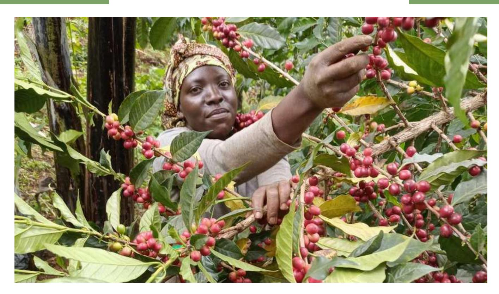
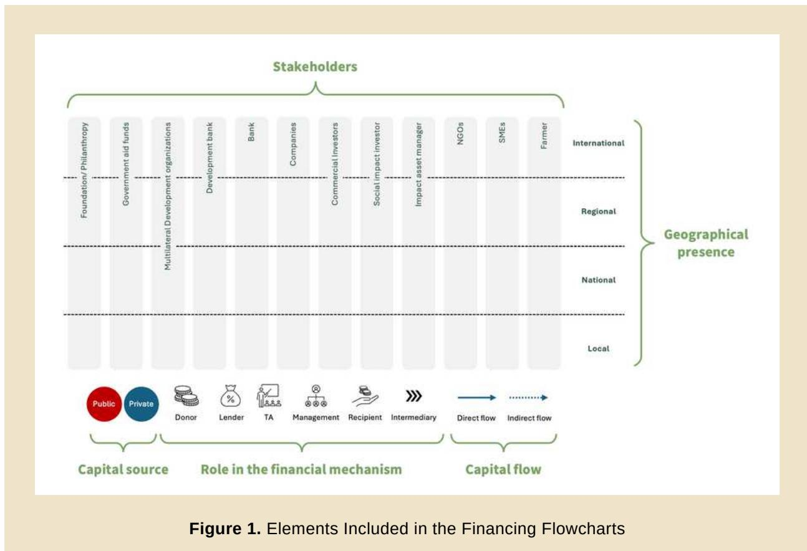
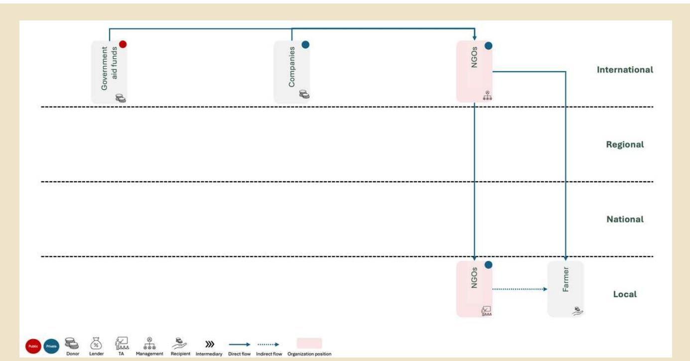
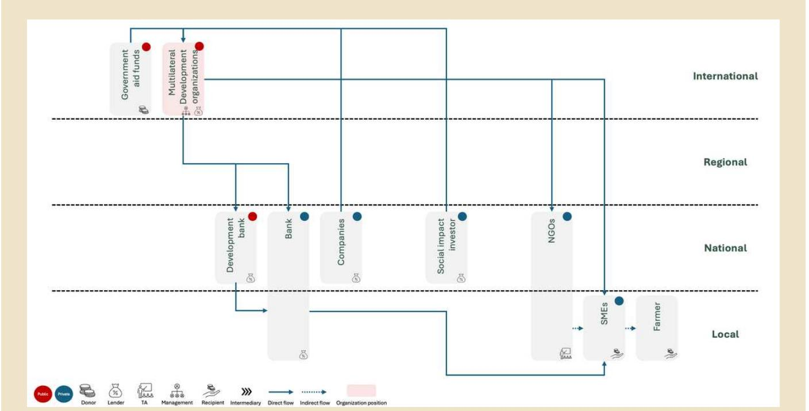
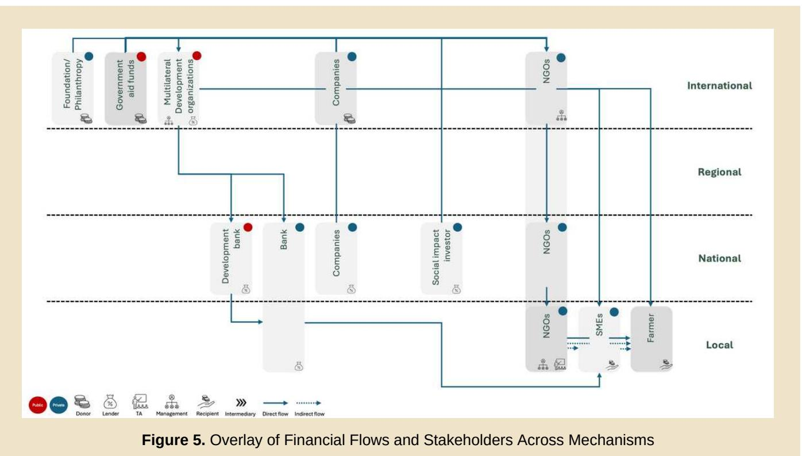
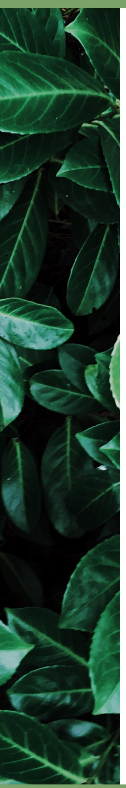

# FINANCE BRIEFING

# SUSTAINABLE FINANCE UPDATES

**Keeping you up to date with the latest developments in the Sustainable Finance space**

# **FINANCING DEFORESTATION-FREE COFFEE SUPPLY CHAINS "BREWING SOLUTIONS: FINANCIAL PATHWAYS FOR EUDR-COMPLIANT COFFEE & COLLABORATIVE ACTION"**

*This briefing aims to demonstrate that finance can serve as a lever—not a barrier—for systemic transformation. Unlocking finance strategically and collaboratively is key to transforming deforestation-free commitments into lasting impacts on the ground.*

The urgency of mobilising financing for deforestation-free coffee supply chains cannot be overstated. Between 2001 and 2015, coffee production was associated with the loss of 2.5 million hectares of forest, much of it in biodiversity hotspots ([European Commission Joint Research Centre, 202](https://data.consilium.europa.eu/doc/document/ST-14151-2021-ADD-4/en/pdf)1). As global coffee production expands, the associated deforestation and land-use change contribute significantly to greenhouse gas emissions, biodiversity loss, and ecosystem degradation, while increasing income instability and market exclusion for smallholder farmers. Addressing these challenges requires innovative and scalable financial solutions that can enhance smallholders' access to sustainable finance, thereby facilitating their transition to, and/or scaling up deforestation-free practices.

This transition and adoption of sustainable agricultural practices align with broader sustainability and climate objectives, particularly Sustainable Development Goal 13 (Climate Action) and Sustainable Development Goal 15 (Life on Land). It also supports compliance with the European Union Deforestation Regulation (EUDR), which imposes stringent due diligence requirements for companies placing forest-risk commodities on the European market.

Moving from high-level commitments to practical, ground-level impact requires financial mechanisms that are not only innovative, but also well-aligned with the realities of coffee value chains. While deforestation-free compliance places new demands on producers, smallholders often face high upfront costs, limited access to credit, and high risk. Financial solutions must be designed to address these barriers.

To enhance the creation of such financial solutions, as a first step, we aim to describe the diverse financial actors involved in this process and how capital tends to move through the system. Equally important is acknowledging the role of policy frameworks such as the EUDR, which create demand for new incentives, shape risk perceptions, and influence investment decisions across the value chain. Public institutions and regulatory bodies, while not always direct financiers, play a critical role in setting the rules of the game and enabling a supportive environment for effective and inclusive finance.

| Stakeholder             | Main Type of Finance Provided               | Examples                              |
|-------------------------|---------------------------------------------|---------------------------------------|
| Foundation/Philanthropy | Grants, early-stage funding                 | Moore Foundation, Fundo Vale, Good    |
| Government Funds        | Grants, concessional funding, technical     |                                       |
| Bank/Fund               | Loans, guarantees, grants                   | IDB, IFAD, Conservation International |
| Development Bank        | Concessional loans, blended finance         | BNDES (Brazil), KfW (Germany          |
| Banks                   | Working capital, trade finance,             |                                       |
| Companies               | Equity, loans and sourcing contracts        | Cargill, Bunge, Mondelēz              |
| Commercial Investors    | Loans and equity (focus on returns)         | Private funds, regular investment     |
| Social Impact Investor  | Loans and equity (patient capital and focus |                                       |
|                         | on social impact)                           | ASN Bank                              |
|                         | funds                                       | Bamboo Capital Partners               |
| NGOs                    | Technical assistance (non-financial),       |                                       |
|                         | project implementation                      | Solidaridad, Rainforest Alliance, iCS |
| SMEs and Cooperatives   | Loan recipients, implementers               | Various regional coffee cooperatives  |
| Farmers                 | Final recipients (through                   |                                       |
|                         | cooperatives/SMEs)                          | Smallholder coffee farmers (≤10 ha)   |

This section presents three financial mechanisms designed to support the transition to deforestationfree practices, including grants, blended finance and microfinance. The case studies presented here are real-life examples chosen from a comprehensive mapping of financial solutions developed in selected countries: Brazil, Ecuador, Zambia, DRC, Vietnam and Indonesia. The selection criteria included: (1) support for deforestation-free production; (2) relevance to or applicability for smallholders; (3) geographical presence; (4) scalability. To facilitate the visualisation of financial flows, including funding sources, stakeholders involved, and geographic scope (see Figure 1 as a guide on how to read Figures 2-4) the following dedicated flowcharts have been created for each mechanism.

| Category      | Details                                                                                        |
|---------------|------------------------------------------------------------------------------------------------|
| Region        | Africa, Latin America, and Asia                                                                |
| mechanism     | Grants                                                                                         |
| Stakeholders  | Solidaridad engages governments, private sector actors, donors (e.g., Dutch Ministry of        |
| Eligibility   | Smallholder farmers, cooperatives, SMEs, and producer organizations committed to               |
| Funding Focus | Sustainable agriculture, inclusive value chains, landscape restoration, and climate resilience |

### **SOLIDARIDAD**

| Category  | Details                                                                   |
|-----------|---------------------------------------------------------------------------|
| Region    | Amazon Basin (Bolivia, Brazil, Colombia, Ecuador, Guyana, Peru, Suriname) |
| mechanism | Blended Finance                                                           |

### **[GCF AMAZON BIOECONOMY \(IDB\)](https://www.greenclimate.fund/sites/default/files/document/funding-proposal-fp173.pdf)**

| Category      | Details                                                                                  |
|---------------|------------------------------------------------------------------------------------------|
| Region        | Zambia (Southern Africa)                                                                 |
| mechanism     | Microfinance                                                                             |
| Stakeholders  | FINCA Zambia operates with the support of FINCA Impact Finance network, investors, local |
| Eligibility   | Rural farmers, MSMEs, cooperatives, and individuals meeting the institution’s credit     |
| Funding Focus | Access to affordable loans for smallholder farmers, micro-enterprises, and agricultural  |

The diagram illustrates the firm component structure at the level of the firm component. It shows the flow of funds from the International level to the Local level.

**International Level:** A horizontal line separates the International and Regional levels. The International level contains three components: Foundation/Philanthropy, Government aid funds, and Companies. The Regional level contains a single component: NGOs.

**National Level:** A horizontal line separates the National and Regional levels. The National level contains a single component: Farmer.

**Local Level:** A horizontal line separates the Local level from the National level. The Local level contains a single component: Farmer.

**Flow Direction:** A blue arrow points from the International level to the National level, and another blue arrow points from the National level to the Local level.

### **[FINCA](https://finca.org/about-finca)**

The stakeholders and financial flows from the case studies presented above were overlaid (Figure 5, see below) to identify how capital moves through the system and where collaboration is essential. This visual mapping highlights the interconnected roles of funders, cooperatives, NGOs, and farmers, reinforcing that no single actor can drive the transition to deforestation-free coffee supply chains alone.

The grey scale depicted in Figure 5 represents the presence of stakeholders at various geographical levels for the case studies under consideration. Notably, NGOs are present at all levels, with a more prominent role in international and local contexts. Their responsibilities encompass management, technical assistance, and direct collaboration with SMEs and Farmers. Additionally, Companies and Banks play a crucial role in the mechanisms. At the same time, Governmental Funds, Multilateral Development Banks, and Foundations are pivotal in unlocking capital for sustainable agriculture by providing concessional capital for these innovative mechanisms that deliver change for the coffee supply chain. Furthermore, we can notice the presence of both international stakeholders, as significant capital providers and initiators of projects, and local stakeholders, such as NGOs providing specialised technical assistance to SMEs and Farmers, who are beneficiaries of these financial solutions.

The financial mechanisms showcased - ranging from grants to blended finance and microcredit demonstrate that effective solutions must combine affordability, technical support, and inclusivity. These instruments help de-risk investment, enhance access for smallholders, and support compliance with regulations like the EUDR.

[1st Finance Briefing: Why Sustainable Finance is Key to Promoting Deforestation-free](https://zerodeforestationhub.eu/finance-briefing-1-keeping-up-to-date-with-the-latest-developements-in-the-sustainable-finance-space/) [Supply Chains](https://zerodeforestationhub.eu/finance-briefing-1-keeping-up-to-date-with-the-latest-developements-in-the-sustainable-finance-space/) [2nd Finance Briefing: Sustainable Finance Taxonomies](https://zerodeforestationhub.eu/second-finance-briefing-sustainable-finance-taxonomies/) [3rd Finance Briefing: Carbon Crediting Mechanisms, Nature-Based solutions and](https://zerodeforestationhub.eu/3rd-finance-briefing-carbon-crediting-mechanisms-nature-based-solutions-and-smallholders/) [Smallholders](https://zerodeforestationhub.eu/3rd-finance-briefing-carbon-crediting-mechanisms-nature-based-solutions-and-smallholders/) [4th Finance Briefing: Blended finance for smallholder farmers: Enabling sustainable and](https://zerodeforestationhub.eu/4th-finance-briefing-blended-finance-for-smallholder-farmers-enabling-sustainable-and-deforestation-free-agricultural-practices/) [deforestation-free agricultural practices](https://zerodeforestationhub.eu/4th-finance-briefing-blended-finance-for-smallholder-farmers-enabling-sustainable-and-deforestation-free-agricultural-practices/)

# **READING**

# FURTHER READING & TRAINING

Disclaimer: This briefing is a partnership between Climate & Company and the SAFE (Sustainable Agriculture for Forest Ecosystems) project, financed by the European Union (EU), the German Federal Ministry for Economic Cooperation and Development (BMZ) and the Dutch Ministry of Foreign Affairs. SAFE is part of the Fund for the Promotion of Innovation in Agriculture (i4Ag) and implemented by Deutsche Gesellschaft für Internationale Zusammenarbeit (GIZ). The aim of the collaboration is to identify and foster solutions to mobilise financial sources, especially for vulnerable groups, and enhance gendertransformative financial frameworks for investments in deforestation-free supply chains.

Its contents are the sole responsibility of Climate & Company and do not necessarily reflect the views of the EU, the Federal Ministry for Economic Cooperation and Development (BMZ) and the Dutch Ministry of Foreign Affairs. To learn more visit: [SAFE - Team Europe Initiative on Deforestation-free](https://zerodeforestationhub.eu/) [Value Chains](https://zerodeforestationhub.eu/) and [Climate and Company's dedicated project page](https://climateandcompany.org/projects/solutions-for-mobilising-financial-sources/).

### **Contact information:**

Elisabeth Hock (elisabeth@climcom.org)

Enzo Bernardinelli (enzo.bernardinelli@climcom.org)

Paula Zambrano (paula@climcom.org)

Sofia Helena Zanella Carra (sofia@climcom.org)