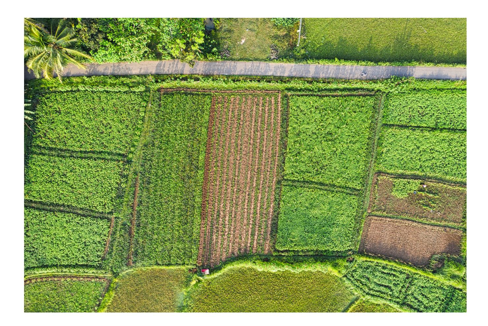
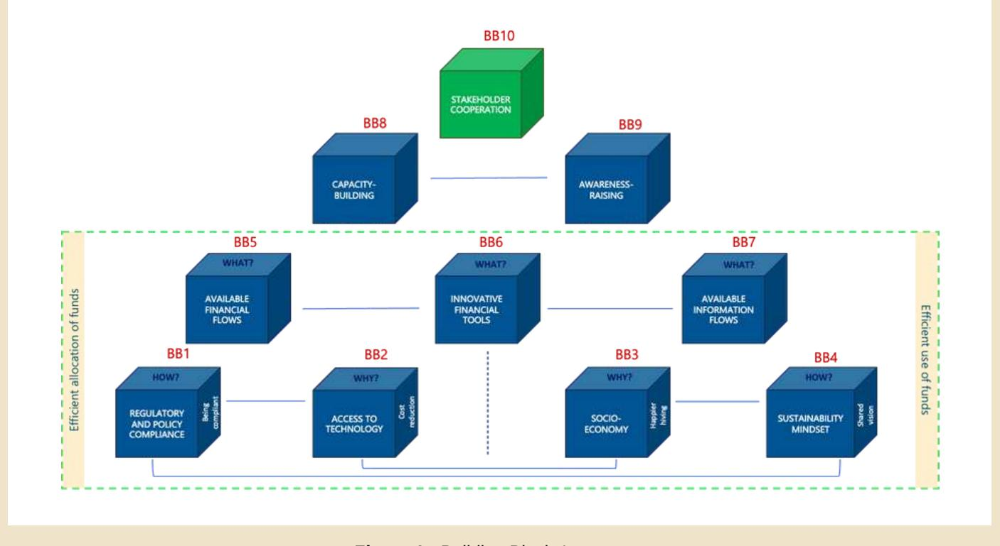

## FINANCE BRIEFING

# SUSTAINABLE FINANCE UPDATES

**Keeping you up to date with the latest developments in the Sustainable Finance space**

## **BUILDING BLOCKS FOR FINANCING DEFORESTATION-FREE SUPPLY CHAINS (SMALLHOLDER FOCUS)**

*This briefing aims to present the essential building blocks to establish a strong, resilient environment that supports deforestation-free supply chains and to bring smallholder farmers to the center of the discussion, guaranteeing their participation in the green transition.*

Smallholders are the backbone of global commodity supply chains. Studies suggest that five out of every six farms worldwide are smaller than two hectares, yet they produce up to 35% of the world's food while using only about 12% of global farmland . Despite their critical role, they face systemic barriers to financing: lack of collateral, credit history, and formal land documentation often exclude them from traditional banking systems . Low farm-level incomes and limited access to finance restrict smallholders' ability to invest in productivity and sustainability, while concerns about the long-term viability of farming reduce incentives to take on longer-term investments. In many remote regions, weak infrastructure and limited market access further reinforce these constraints. These challenges are compounded by price volatility, climate risks, and inadequate facilities, trapping smallholders in lowincome cycles despite their central role in global trade. The EU Deforestation Regulation (EUDR) adds new complexity: while the legal obligation falls on operators and traders placing products on the EU market, compliance depends on geolocation data, traceability, and evidence of deforestation-free production, requirements that often have to be generated upstream and can be difficult to obtain from smallholders who lack resources or technology . Without targeted support, millions risk exclusion from EU markets, threatening livelihoods and supply chain resilience. 1 2 3

Such support presumes two separate financing perspectives. The first relates to supporting smallholders to transition away from unsustainable agricultural practices by adopting practices, such as agroforestry, improving soil health, and establishing traceability systems. The second one concerns financing smallholders, who are already practicing sustainable farming. Here, investment is needed not only to improve productivity and quality, but also to strengthen resilience and ensure stable, reliable incomes (e.g., through guaranteed income models), so sustainable smallholders can remain competitive in more regulated markets.

To incorporate both of these scenarios, we have elaborated an overarching approach, based on the "Building Blocks" framework. By itself, the Building Blocks framework is not new and, particularly, has been used in research related to "green" transition, and sustainability of agricultural practices. However, it was mainly applied in broader contexts of the system transformation (e.g., "Transformative Change" , "Smallholder value chains as complex adaptive systems" ) or tailored to very specific sector contexts. At the same time, it has been less extensively used in the literature to address the financing gap challenge, while we consider it as the core analytical recommendation to leverage smallholder-oriented financial flows. 4 5

To this end, we adapt the "Building Blocks" framework to employ ten modular components designed in combination to unlock sustainable smallholder finance. Universal in its components yet adaptable through design efforts, the framework promotes cooperation among farmers, banks, governments, and NGOs to develop solutions suited to local contexts by leveraging financial innovations such as blended finance, risk-sharing mechanisms, and digital tools. By fostering multi-stakeholder partnerships, smallholder finance can shift from a bottleneck to a driver for EUDR-aligned, deforestation-free value chains.

1 [FAO \(2021](https://www.fao.org/family-farming/detail/en/c/1398060/#:~:text=The%20world))

2 [World Bank \(2022\)](https://documents1.worldbank.org/curated/en/408661644986413472/pdf/World-Development-Report-2022-Finance-for-an-Equitable-Recovery.pdf)

3 [Regeneration \(n.d.\)](https://www.regeneration.io/mrta-resources/eudr-smallholder-inclusion) 4 [International Cliamte Initiative \(2020\)](https://www.diw.de/documents/dokumentenarchiv/17/diw_01.c.794591.de/background_report_vivid.pdf)

The Building Blocks are fundamental, interchangeable components that, together, establish a comprehensive system to promote sustainable smallholder financing. They serve a dual purpose.

**Structural Role**: Defining the architecture of a resilient financing ecosystem. **Transformational Role**: Specific methods to catalyze systemic change when needed.

By organizing efforts around these Building Blocks, stakeholders can strengthen their focus on what content to address and how to manage it efficiently, whether the aim is to empower existing smallholder systems or drive transformation. Although definitions and classifications may differ, there is strong agreement on the focus areas of change, making the Building Blocks universal yet adaptable across diverse actors and regional contexts.

#### **METHODOLOGY**

The framework consists of ten building blocks, structured in two parts: the Foundation and the Roof. Importantly, building blocks differ from mere requirements or conditions in that they are enabling rather than restrictive, composable rather than binary, and architectural rather than regulatory. This means that each building block can possibly generate multiple context-specific requirements, which may also evolve over time.

#### **FOUNDATION**

Seven building blocks establish a solid foundation, supporting the remaining higher-level building blocks. These foundational building blocks are logically interconnected among each other, as conceptually, they are meant to work together to align incentives of actors along the value chain, as well as diverse stakeholders.

Specifically, seven building blocks were designed to address the three guiding questions (WHY, HOW, and WHAT):

**WHY** must stakeholders act: cost reduction (**BB2**) and improved livelihoods (**BB3**) **HOW** to implement sustainable practices: being regulatory-compliant (**BB1**) and having a shared vision (**BB4**) **WHAT** constitutes and allows for a sustainable practice: no capital flow barriers (**BB5**), no data flow barriers (**BB7**) and leveraging innovative financial instruments and mechanisms (**BB6**)

| Building Block                    | Explanation                                                                      |
|-----------------------------------|----------------------------------------------------------------------------------|
| BB2 - Access to Technology        | Digital and technological infrastructure for targeted financing for smallholders |
| BB4 - Sustainability mindset      | Stakeholders’ mindset empowering smallholders’ sustainable agri-practices        |
| BB5 - Available Financial flows   | Financial connectivity among stakeholders and risk-sharing capital structures    |
| BB6 - Innovative financial tools  | Access to innovative financial instruments and mechanisms                        |
| BB7 - Available Information flows | Data systems enabling information sharing and trust among stakeholders           |

|                                | Building Block | Explanation                                                                           |
|--------------------------------|----------------|---------------------------------------------------------------------------------------|
| BB8 – Capacity Building        |                | Developing stakeholders' capabilities to implement and disclose sustainable practices |
| BB9 – Awareness-raising        |                | Promoting importance and successful examples of sustainable practices                 |
| BB10 - Stakeholder cooperation |                | Mechanisms enabling collective stakeholder action, mutual responsibility              |

CASE STUDY 1 Besides, the same seven building blocks reflect two mirrored priorities:

**Efficient Allocation of Funds**: BB1, BB2, BB5, BB6 **Efficient Use of Funds**: BB3, BB4, BB6, BB7

These sides stand for two essential pillars for developing a robust funding environment for deforestation-free supply chains and are both leveraged through a common component of financial innovations (BB6).

Finally, foundational building blocks integrate three dimensions, forming a holistic approach to sustainability:

**Environmental stewardship**: BB1, BB4 *Technological i***nnovation**: BB2 **Social equity and economic viability**: BB3

#### **ROOF**

The top layer of the Building Blocks structure represents accelerators of transformation and overarching conditions for success.

These elements serve as catalysts, enabling core components and customizing them across various contexts. Together, the Foundation and Roof form a comprehensive, systemic, and practical approach to address challenges in funding deforestation-free supply chains and open related opportunities.

Discussions among various stakeholder groups to promote sustainable finance for smallholders can be organized around the same Building Blocks, while allowing for tailored design efforts and topics depending on participants and regional context.

#### **FINANCING BARRIERS AND OPPORTUNITIES ACROSS STAKEHOLDERS**

This section explores how the Building Blocks framework operates in practice: it exemplifies challenges and opportunities faced by key stakeholder groups towards creating a resilient environment that enables smallholder farmers to thrive in deforestation-free supply chains.

The analysis identifies the barriers and how they can become catalyst actions, unlocking capital for sustainable and inclusive supply chains, by mapping the relevant Building Blocks for each stakeholder:

| Stakeholder Challenge                                               |   |   |   | Building Blocks |   |   |   |   |    |
|---------------------------------------------------------------------|---|---|---|-----------------|---|---|---|---|----|
| 1 strategies success stories                                        | 2 | 3 | 4 | 5               | 6 | 7 | 8 | 9 | 10 |
| Smallholders finance data smallholders                              |   | X | X | X               | X | X | X | X | X  |
| X Banks schemes frameworks                                          |   | X | X | X               | X | X | X | X | X  |
| X models & national) economy ticket sizes compliance Regulatory     | X | X | X | X               | X | X | X | X | X  |
| X Authorities privacy requirements commitments Foundations/ farming |   |   | X | X               | X | X |   | X | X  |
| Philanthropies practices shocks                                     |   | X | X | X               | X | X | X | X | X  |

**Figure 1 -** Building Blocks' structure

The building blocks can be utilized in **transformational** or **strengthening** scenarios; the former possesses the greatest potential, as it predominantly occurs in developing countries and could yield the most significant benefits. In that sense, we analyzed the Uganda Coffee sector.

The Building Blocks are relevant to different stakeholders; they present challenges for each to address and, at the same time, offer opportunities once they are in place.

|     | Building Blocks Role in Uganda’s Coffee Sector Priority Actions (collective resposibilities) |
|-----|----------------------------------------------------------------------------------------------|
| BB2 | Access to Technology                                                                         |
| BB3 | Socio-Economy                                                                                |
| BB4 | Sustainability Mindset                                                                       |
| BB8 | Capacity-Building                                                                            |
| BB9 | Awareness-Raising                                                                            |

Uganda's coffee sector provides a high-impact reference case for understanding the systemic challenges and opportunities in creating deforestation-free supply chains. Coffee is Uganda's leading agricultural export, contributing up to 20–30% of foreign exchange earnings and supporting over 1.7 million smallholder households .However, the sector faces fragmented cooperative structures, limited access to finance, gender inequality, and climate vulnerability—issues that mirror the stakeholder challenges identified earlier. Evidence from Uganda's coffee-growing regions shows that farmers are already experiencing longer droughts and more erratic rainfall, which negatively affects flowering and bean filling, alongside increasing pressure from pests and diseases . These barriers not only constrain productivity but also heighten the risk of unsustainable practices, making Uganda an ideal example to demonstrate how the Building Blocks framework can transform risks into opportunities through coordinated action. 6 7

Gender inequality further compounds these challenges. In Kanungu district, women provide most coffee labour—58% during fieldwork/harvest and 72% in post-harvest handling—yet men largely control marketing, processing, and income from sales . Meanwhile, meeting emerging sustainability requirements such as the EUDR is essential to retain access to premium markets, which make up over 60% of Uganda's coffee exports . Together, these dynamics highlight the need for transformational action beyond incremental change. 8 6

6 [Uganda Coffee Platform \(2024\)](https://www.ugandacoffeeplatform.org/eudr/)

7 [Jassogne, Laderach & van Asten \(2012\)](https://biblio.iita.org/documents/S12RepJassogneImpactNothomNodev.pdf-4d7da0cf3f076d671d68b87f2b41b68d.pdf)

8 [Farm Africa \(2020\)](https://www.farmafrica.org/wp-content/uploads/2024/06/coffee-report-latest-26.09-v5-final-spread.pdf).

## KEY TAKEAWAYS

The shift towards deforestation-free supply chains places smallholders at the heart of global sustainability efforts. Yet, systemic barriers, such as a lack of financing, technical capacity, and regulatory complexity, threaten their inclusion. The Building Blocks framework provides a framework for addressing these challenges by combining financial innovation, capacity-building, and stakeholder collaboration. Success relies on integrated approaches that align incentives, simplify processes, and tailor solutions to local contexts, ensuring that smallholder finance moves from being a bottleneck to a driver of transformation. The five key takeaways, and some concrete examples, can be found below:

**Collaboration and capacity-building are essential**: Multi-stakeholder cooperation (BB10) and capacity-building (BB8) consistently accelerate systemic change. [SAFE Sustainable Finance Knowledge Journeys:](https://zerodeforestationhub.eu/session-1-sustainable-finance-knowledge-journey/) Online sessions to build capacities on how development cooperation, NGOs, Think Tanks, private sector, International Organizations, etc. are working together to close smallholder finance gaps, **Financial innovation and regulatory alignment are critical**: blended finance, risk-sharing mechanisms (BB6), and clear compliance frameworks (BB1) unlock sustainable finance to finance EUDR readiness. IDH's [Farmfit](https://www.idhsustainabletrade.com/farmfit/) and [PPI models](https://www.idhsustainabletrade.com/approach/production-protection/), Brazilian [rural credit](https://www.climatepolicyinitiative.org/publication/rural-credit-policy-in-brazil-agriculture-environmental-protection-and-economic-development/) (PRONAF/SNCR), [IFC/ World Bank](https://documents1.worldbank.org/curated/en/230301593604460136/pdf/Brazil-Rural-Finance-Policy-Note.pdf) guarantees for agri-SME. Check also this [Financial Solutions Database](https://climateandcompany.org/biodiversity-finance/press-release-new-tool-launch-financial-solutions-database-supporting-deforestation-free-agriculture-through-sustainable-finance/), an open‑access tool that catalogues real financing mechanisms to support smallholder‑inclusive, EUDR‑aligned, deforestation‑free supply chains. **Data and awareness matter:** Improving information flows (BB7) and raising awareness (BB9) complement technical and financial measures, empowering smallholders to participate in sustainable value chains. National cocoa traceability systems in [Ghana](https://www.sustainable-supply-chains.org/news/from-pilot-to-national-rollout-ghanas-cocoa-traceability-system/) and [Côte d'Ivoire](https://worldcocoafoundation.org/news-and-resources/article/cocoa-and-forests-initiative-reports-record-progress-in-ghana-and-cote-d-ivoire) ( an[d Cameroon](https://zerodeforestationhub.eu/news/digital-roots-towards-traceability-in-the-cocoa-sector-in-cameroon/)-in progress), [Proforest](https://www.proforest.net/knowledge-and-resources/insights/traceability-a-means-not-an-end) traceability & smallholder engagement.

On the other hand, if the goal is to create innovative and inclusive financial products, Band and financial institutions should spearhead them. Despite these initiatives having a single stakeholder in charge of their development, all actors should participate in and contribute to their planning and implementation.

Uganda's coffee sector can thus serve as a blueprint for other commodity systems, demonstrating how multi-stakeholder collaboration and innovative financing can deliver sustainable, deforestationfree supply chains.

This integrated approach ensures the creation of an enabling environment that unlocks capital and promotes transparency, driving scalability and resilience for smallholders in the country. To foster this environment, all the stakeholders should be involved in the implementation.

The leadership of this development will depend on the desired outcome. If the main goal is to implement a national monitoring system, the Local government should oversee it. To secure socioenvironmental safeguards for smallholder farmers, regulatory authorities should lead this development.

## **CONTACT INFORMATION:**

Disclaimer: This briefing is a partnership between Climate & Company and the SAFE (Sustainable Agriculture for Forest Ecosystems) project, financed by the European Union (EU), the German Federal Ministry for Economic Cooperation and Development (BMZ) and the Dutch Ministry of Foreign Affairs. SAFE is part of the Fund for the Promotion of Innovation in Agriculture (i4Ag) and implemented by Deutsche Gesellschaft für Internationale Zusammenarbeit (GIZ). The aim of the collaboration is to identify and foster solutions to mobilise financial sources, especially for vulnerable groups, and enhance gendertransformative financial frameworks for investments in deforestation-free supply chains.

Its contents are the sole responsibility of Climate & Company and do not necessarily reflect the views of the EU, the Federal Ministry for Economic Cooperation and Development (BMZ) and the Dutch Ministry of Foreign Affairs. To learn more visit: [SAFE - Team Europe Initiative on Deforestation-free](https://zerodeforestationhub.eu/) [Value Chains](https://zerodeforestationhub.eu/) and [Climate and Company's dedicated project page](https://climateandcompany.org/projects/solutions-for-mobilising-financial-sources/).

Elisabeth Hock (elisabeth@climcom.org) Enzo Bernardinelli (enzo.bernardinelli@climcom.org) Kristina Lyadskaya (kristina.lyadskaya@climcom.org) Paula Zambrano (paula@climcom.org)

**Socio-economic focus enables win-win**: Addressing socio-economic concerns of particular communities (BB3), helped by more technologically efficient allocation of funds (BB2) and shared benefits of sustainability (BB4), importantly contribute to removing barriers in financial flows to smallholders (BB5). [\(Proforest](https://www.proforest.net/what-we-do/production-landscapes/) and [GIZ](https://www.giz.de/en/expertise/climate-environment/forests) have their own advances in landscape and jurisdictional approaches. However, they have also joined forces with Nestlé & partners to form a multi-stakeholder landscape initiative [\(SUSTAIN KUTIM, Indonesia\)](https://www.proforest.net/news-and-events/news/giz-proforest-barry-callebaut-mcdonalds-nestle-and-pepsico-sign-agreement-to-promote-sustainable-landscape-in-east-kutai/) aligning companies, local government and communities to protect forests while supporting smallholders in palm oil and rubber supply chains. **Customisation drives impact**: Adapting Building Blocks to specific stakeholder needs, regional and sector realities, and transformation scenarios ensures practical implementation and scalability. [Indonesia & Malaysia:](https://zerodeforestationhub.eu/challenges-opportunities-for-smallholder-in-indonesia-and-malaysias-palm-oil-rubber-and-cocoa-sectors/) smallholder‑first customization for palm/rubber/cocoa—diagnose constraints, align ISPO/MSPO with EUDR, and scale traceability + finance