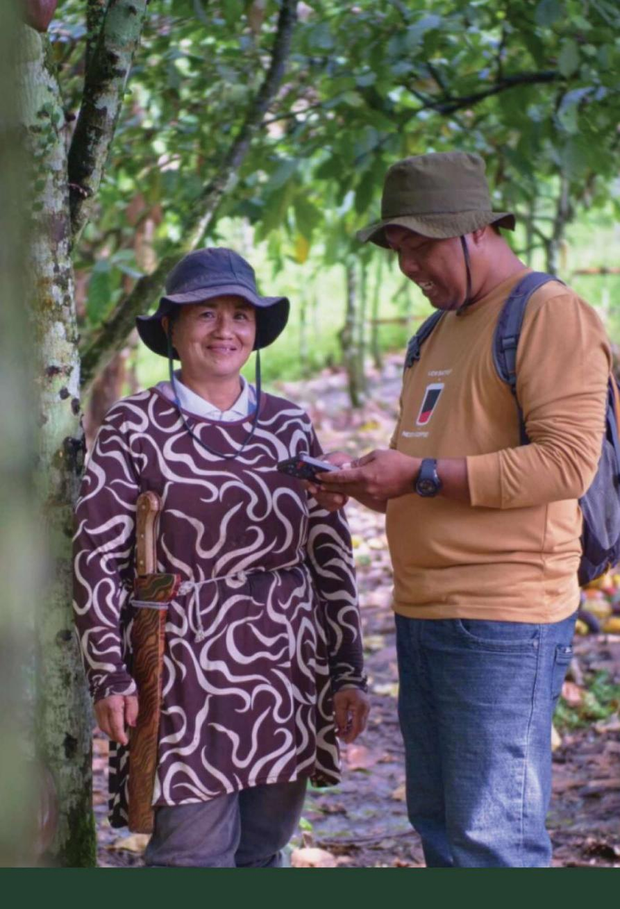

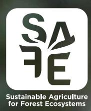

for GIZ Sustainable Agriculture for Forest Ecosystems (SAFE) Project Partners

# **A GUIDE FOR INTEGRATING GEDSI INTO THE AGRICULTURAL SUPPLY CHAIN**

#### **Published by**

Yayasan SATUNAMA Yogyakarta

#### **Authors**

Ima Susilowati, Yayasan SATUNAMA

Dati Fatimah, Yayasan SATUNAMA

#### **Reviewer**

Cecilia Novarina, GIZ

#### **Translator**

Theresia Wuryantari

#### **Layout**

Mohammad Furqon

#### **Photo Credits**

Roy Prasetyo, Nyani Quarmyne, Pieter Andas Parinatha

Printed on recycled paper

Jakarta, 2026

# Table of Content

| 1.3 Benefit of the Guide Chapter 2. Why GEDSI is Important            | ..........................................................................................................................3 |
|-----------------------------------------------------------------------|-----------------------------------------------------------------------------------------------------------------------------|
| 2.1. GEDSI Issues in Agricultural Supply Chain                        | ......................................................................5                                                     |
| 2.2. Benefits of Integrating GEDSI into the Agricultural Supply Chain | .................8                                                                                                          |
| the Agricultural Supply Chain                                         | .......................................................................15                                                   |
| 4.3 Monitoring & Evaluasi Hasil GEDSI                                 | .........................................................................................41                                 |

# List of Tables

| Table 2. Scope of GEDSI Analysis                                   | ....................................................................................................16 |
|--------------------------------------------------------------------|--------------------------------------------------------------------------------------------------------|
| Tabel 3. The Do’s & Don’ts in GEDSI Analysis                       | ............................................................................25                         |
| Table 5. Issues and Solutions for Integrating GEDSI in the Project | .........................28                                                                            |

# List of Figures

| Figure 1. Gender-based division of roles in the agricultural commodity supply chain ..... | 6  |
|-------------------------------------------------------------------------------------------|----|
| Figure 2. Twin-track approach in promoting GEDSI.....                                     | 12 |
| Figure 3. Stakeholder Mapping.....                                                        | 27 |

# List of Abbreviations

| ECOSOC | United Nations Economic and Social Council        |
|--------|---------------------------------------------------|
| EUDR   | European Union Deforestation Regulation           |
| FAO    | Food and Agriculture Organization                 |
| FGD    | Focused Group Discussion                          |
| GALS   | Gender Action Learning Systems                    |
| GAP    | Good Agricultural Practices                       |
| GDP    | Gross Domestic Product                            |
| GEDSI  | Gender Equality, Disability, and Social Inclusion |
| HAF    | Harvard Analytical Framework                      |
| GSVCA  | Gender-Sensitive Value Chain Analysis             |
| IFAD   | International Fund for Agricultural Development   |
| IFC    | International Finance Corporation                 |
| M&E    | Monitoring & Evaluation                           |
| KWT    | Kelompok Wanita Tani (Women Farmer Groups)        |
| PLUP   | Participatory Land Use Planning                   |
| PRA    | Participatory Rural Appraisal                     |
| SAFE   | Sustainable Agriculture for Forest Ecosystems     |

 Chapter 1. Introduction

# **1.1 About the Guide**

Companies, including social enterprises, play a crucial role in creating a more just and equitable community. Integrating Gender Equality, Disability, and Social Inclusion (GEDSI) has moved beyond a mere trend or moral obligation and has transformed into a smart business strategy. A wealth of research indicates that companies that adopt GEDSI practices tend to have better financial, higher innovation performance, and stronger reputation. This guide is developed to help you understand the importance of integrating GEDSI into your projects and how you can apply it effectively throughout all project aspects implemented by companies or organizations within the agricultural supply chain, ranging from changing company's or organization's internal culture to developing and applying business models.

This guide provides practical steps and real examples to help companies and organizations integrate GEDSI into their institutional arrangement and program implementation. This guide help users find the ways to ensure that the implementation of their projects meet the diverse needs of the community and contribute to positive social change. At the same time, companies or organizations can also create safe spaces for all employees through fair and inclusive policies. Adopting these principles allow companies to contribute to meaningful social change while capturing new market opportunities and attracting top talents to foster business or organizational growth to the next stage.

# **1.2 Target of the Guide**

This guide is intended to be used by the following target companies or organizations that:

Implement or plan projects that involve farmers from **different backgrounds**  (age, ethnicity, capacity, region) and aim to **increase the participation of** underrepresented groups, including women and people with disability. Provide support to **women farmers** and commit to taking this support to the next level by **understanding and addressing socio-economic, cultural, and geographical constraints** while learning from the experiences of others.

**inclusive partners** that

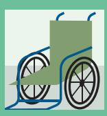

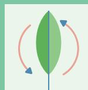

**inclusive agricultural supply chain support program** to

**A practical framework**  to integrate GEDSI into the development of commodities and agricultural supply chain

**Step-by-step guide** (on what pitfalls to avoid) and tips as well as real examples of applying GEDSI within the agricultural supply chain

**Key strategies** for applying GEDSI across all stages of the agricultural supply chain **Checklist of questions** to guide companies or organizations

**Self-diagnosis tools** to identify to what extent GEDSI strategies have worked well in their projects

#### **This guide provides**

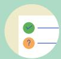

# **1.4 Key Points to Note When Using this Guide**

**Modular Format:** Users can refer directly to the most relevant chapters without having to read the entire document.

——————————————————————————————————————————————————— **Focus on all groups, especially women:** This guide builds on extensive data on the constraints women face in the supply chain, examples of successful program adaptations, and the need to support women farmers.

**Context is key:** Understanding local context is a prerequisite for successful GEDSI program implementation

**A flexible range of strategies:** This guide offers various strategies that users can select and adapt to meet their needs.

——————————————————————————————————————————————————— **Start small:** Use a simple approach in applying GEDSI perspective to a program. Gather feedback and adapt the strategy to mitigate any unintended effects.

**Intersectionality:** Gender, race, culture, religion, background, age, ability, and other factors influence how particular community groups benefit from the program outcomes. These diverse dimensions need to be taken into account to drive more inclusive social change.

Chapter 2.

Why GEDSI is Important in the Agricultural Supply Chain

# **2.1. GEDSI Issues in Agricultural Supply Chain**

The majority of the population in low-middle income countries rely their livelihoods on agriculture. However, unequality persists in agribusiness, which undermines smallholder farmers' welfare, rural productivity, and long-term sustainability (FAO 2023; IFC 2023). Women play a pivotal role in production and post-harvest processing, which often significantly determines the size and quality of the final commodities produced (FAO, 2016). Most women are also responsible for completing all domestic chores, allowing the men or their husbands to undertake non-domestic duties and focus to agriculture.

In spite of this, women's contributions continue to be overlooked and traditional knowledge marginalized. Major supply chains remain male-dominated, leaving women more vulnerable to eviction and economic dependence.

Rural women and marginalized groups at the further end of the agribusiness supply chain typically experience unfair trade and unequal relations, including the following:

> **Land ownership**: Indonesia is one of the three countries (together with Burkina Faso and Peru) where significant progress in women's rights to land ownership is not yet evident.

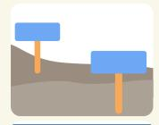

**Access to resources & services**: Women in the households headed by males are systematically disadvantaged in accessing extension services, high-yielding seeds, credit, and information on pesticide safety, even though they do most of the agricultural work.

**Trade condition**: Because women typically manage smaller plots of land and have limited bargaining power, they receive lower farm-gate selling prices and face higher transaction costs when selling to big traders. This perpetuates the significantly unequal trade relation with downstream actors.

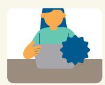

**Socio-economic vulnerability**: The poverty rate in Indonesia is twice as high in rural areas (13%) compared to urban areas (7%). At the same time, women have lower access to asset ownership, making them more vulnerable to income shocks and food insecurity.

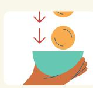

Source*: Country Gender Assessment of Agricultural and Rural Sector in Indonesia (FAO, 2019) dan The Status of Women in Agrifood System (FAO, 2023)* 

A study in Indonesia on the supply chains of rubber and oil palm commodities West Kalimantan, and cocoa and coffee commodities Central Sulawesi suggests an unequality between women and men at the input stage of the supply chain (in coffee and cocoa), post production stage (in rubber and oil palm), and marketing (in cocoa commodity), as shown in the table below1 :

**Figure 1.** Gender-based division of roles in the agricultural commodity supply chain

The assessment also shows that most farmers consider plantation crop commodities such as rubber, oil palm, and cocoa to be "male commodities". Men are primarily recognized as the business and land owners. The divisions of labour based on gender is seen as "normal" within the community and supply chain, which perpetuates gender stereotyping. The assessment is consistent with the findings of a SAF baseline study (2025) indicating that men dominate across the supply chain due to a common tendency among both men and women to recognize the traditional role of men as the heads of households and for men to be involved in formal processes such as farmer group membership and certification, while women remain undocumented in supply chain processes.

Across the supply chain, women make up the majority of those involved in maintenance and harvest, which are considered to be light and easy work. Women heads of households perform tasks they can manage independently and hire male workers for labour they cannot complete themselves, such as land preparation. The study also indicates that in the household, land is primarily owned by men (84.38%, n=300) while the majority of this land (63.60%) is inherited from parents.

Unequality is not only shaped by gender, but also by age, ethnicity, geography (such as the contrast between Underdeveloped, Frontier, and Outermost regions and the urban areas), and access to technology. For example, young women in remote villages face high maintenance costs, limited decision-making power, and low mobility. In contrast, young urban women with access to technology can easily participate in public life. Furthermore, minority ethnic groups are often reduced to passive listeners in the community who rarely voice their opinions, which further exacerbates their exclusion (*Minority Rights Group, 2025*).

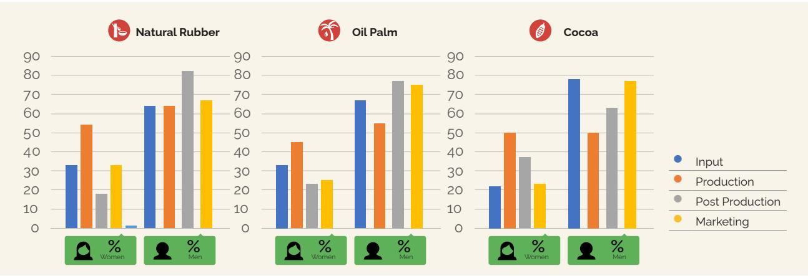

1 Excerpted from Cattleya et all, 2022, SASCI+ Gender and Social Gap Assessment and Advisory, GIZ

Coupled with intersectional factors, gender stereotypes2 shape the different perceived capacity of men and women, influence access to resources & livelihood options, and participation in decision making processes. To reduce such unequality, an intersectional analysis needs to be performed to reveal hidden power relations and develop policies and interventions that balance roles, ownership, and access to all groups.

In reference to project SAFE, this perspective requires a contextual analysis to identify discriminatory stereotypes to understand hidden power relations, how the stereotypes lead to unequalities, and how the systems intersect with each other.

2 A stereotype is a specific belief about individuals or groups based on the perception of their social identities

face in the supply chain are shaped

Introduced by Kimberlé Crenshaw in **way of thinking about identities and its relationship to power**" (Kimberlé Crenshaw, 2015 in UN Women Guide and Toolkit). For example, the may differ from those applicable to adult women and men.

surrounding responsibility and

#### **Gender stereotypes are formed**

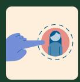

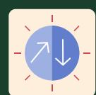

assigned with different

#### **Limited space for development**

#### **Unequal access & control to resources**

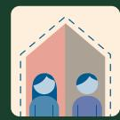

**Division of roles based on gender and social identities**

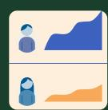

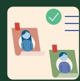

for generations,

#### **Different capacities are formed**

#### **Entrenched stereotypes**

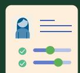

livelihoods

#### **Gender unequality is constructed**

# **How Intersections Influence and Shape Unequalities in the Supply Chain**

# **2.2. Benefits of Integrating GEDSI into the Agricultural Supply Chain**

Agribusiness plays a significant role in creating a resilient and sustainable agricultural supply chain. However, one key element that is often overlooked is the participation of women. When women are given equal access, they strengthen household and community incomes while improving commodity quality, productivity, and profit.

A case study by the International Finance Corporation (IFC) in 2019 on "Women Farmers in DCM Shriram" demonstrates how **gender-responsive interventions lead to tangible agronomic, economic, and social benefit.**

Through the Meetha-Sona-Unnati program that was implemented in 46 villages, women sugarcane farmers were provided with training and inputs, including DAP fertilizer, micro nutrients, and compost. This has enabled them to increase productivity by 25% from the average 40 t *ha*-¹ to 50 t *ha¹*, directly **boosting their income and even doubling household earnings for many participating farmers.**

Success stories from individuals like Pushpa Devi have encouraged other women to **take on greater roles in the supply chain, reduce labour-intensive workloads, and increase added value.**

Furthermore, higher crop yields **have strengthened company supply chain performance while enhancing climate resilience.** This proves that gendersensitive business solutions should not only be fair but also smart and profitable.

For companies that rely heavily on agricultural commodities, gender unequality means risk to business growth, profit, and sustainability. Eliminating genderspecific constraints affecting women is a business strategy that can unlock the full potential of the labour force, bringing diverse experience and innovative, creative approaches to problem solving. A study by McKinsey (2015, 2023) suggests that companies that promote women representation and leadership show a 39% greater likelihood of financial outperformance compared to companies with a "business as usual" approach. In addition, addressing gender unequalities could also potentially increase global Gross Domestic Product (GDP) by US\$ 4.5 trillion.

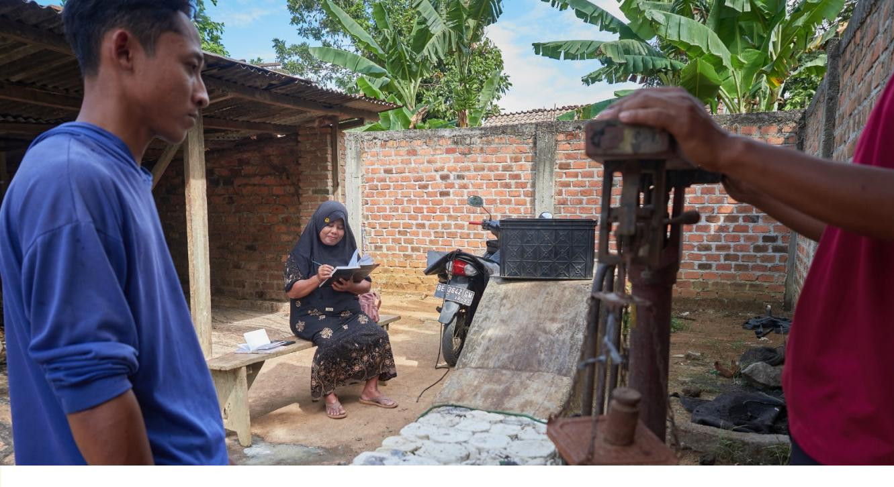

**Mapping of gender and social inclusion in the supply chain:** Identification of interventions and opportunities by involving the participation of longexcluded groups

# **Engaging non-agricultural**

**actors:** Promoting investment in women and marginalized groups by entities with business interests, including financial institutions

**Taking into account hidden solutions:** Some solutions may look gender neutral but they significantly shape how women and marginalized groups access resources, including access to disability-friendly and well-lit village infrastructure to guarantee women's safety.

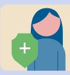

**Enabling environment:** An ecosystem that has the capacity to facilitate the changes needed to achieve strategic goals.

**Long-term investment:** Women's empowerment through a holistic program designed to enhance production sustainability and access new markets.

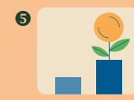

Chapter 3.

Strategies to Promote the

Mainstreaming of GEDSI in the

Agricultural Supply Chain

# **3.1. Mainstreaming of GEDSI**

The Agreed Conclusion 1997/2 of the United Nations Economic and Social Council (ECOSOC) defines gender mainstreaming as the process of assessing the implications for both women and men of any policies, programs, or planned legislation. It is a strategy aimed at ensuring that women's and men's experiences and needs become the primary consideration across the stages, from planning to evaluation. Therefore, it is expected that both **women and men can benefit equally** and that existing unequalities are not perpetuated. The ultimate goal is to achieve gender equality in all aspects of life, both political and socio-economic.

The document also indicates that **gender mainstreaming strategy does not replace specific approaches targeted at women (such as women's empowerment) or afÏrmative action (such as legislative and institutionalized ones).** Instead, it complements the approaches and is aimed at fostering a more inclusive community, where each and every individual, regardless of their gender, have equal opportunities to contribute and grow.

GEDSI approach offers a more comprehensive framework because it integrates the concept of intersectionality into gender mainstreaming. Such an approach recognizes that everyone has experiences shaped by the interaction of various social identities, and that that **unequalities are not only attributed to gender but also shaped by various other social identity factors, including age, ethnicity, disability, social class, sexual orientation, and other status/identities.** Therefore, GEDSI allows us to understand that no two women face the exact same experiences and challenges, as every woman has their own unique, intersecting identities, such as age and marital status.

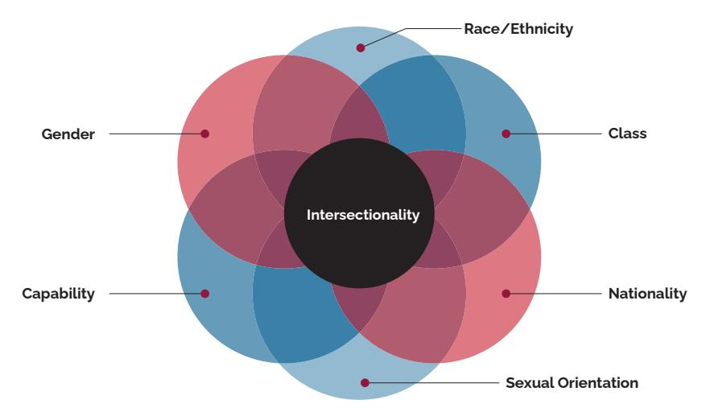

#### *Source: First Book, CC BY*

In principle, GEDSI is built upon gender mainstreaming by adopting a more comprehensive, intersectional approach to address systemic unequalities. It recognizes that gender equality cannot be achieved in isolation; rather it is intrinsically linked to social inclusion and individual welfare. Through intersectionality lenses and GEDSI approach, we can deepen our analysis of the social phenomena, design more inclusive policies and programs, and ensure that the solutions offered are really relevant with the diverse needs of different community groups to ultimately achieve real justice and equality for all.

# **3.2. Twin-Track Approach**

To address the complexity of GEDSI issues more effectively, many development organizations have adopted a twin track approach. Recognizing that there is no one-size-fits-all strategy, the GEDSI approach includes:

- 1. Integrating GEDSI perspective into all existing policies and programs to ensure they are GEDSI sensitive (mainstreaming)
- 2. Implementing targeted programs that support vulnerable groups, specifically women and girls, or other marginalized groups including people with disability and indigenous people.

When used and applied in isolation, the impacts and effectiveness of GEDSI approach will decline. Therefore, it is important to perceive these two tracks as part of one integrated and complementing strategy in achieving more meaningful and sustainable gender equality and social inclusion in the society.

**Figure 2. Twin-track approach in promoting GEDSI**

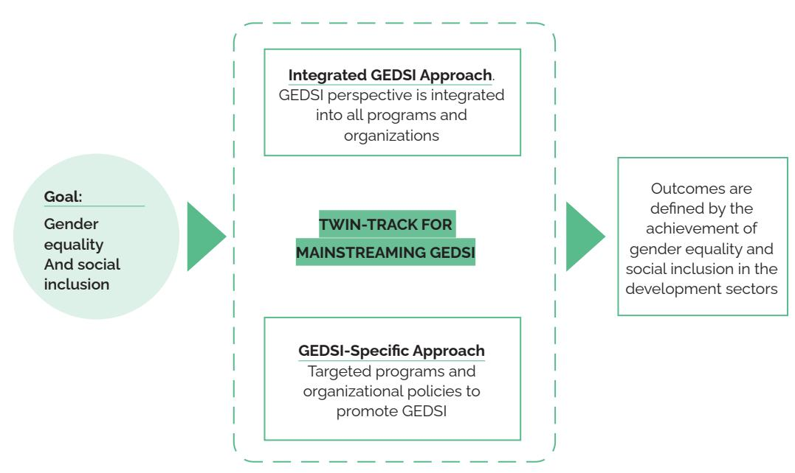

The twin-track approach to promote GEDSI further includes the following combined interventions:

#### **Table 1. Description on Approaches to Promote GEDSI**

| Aspect       | GEDSI Specific Approach Integrated GEDSI Approach |
|--------------|---------------------------------------------------|
| Description  | Address the specific                              |
| Intervention | Provision of services,                            |
| Focus        | Short-term action:                                |

| Examples | At the organizational |
|----------|-----------------------|
|          | tablishment of women  |
| Changes  | Gender transformation |

Sumber diadaptasi dari UN Women Guidance Note. Gender Mainstreaming in Development Programming (2012)

A right-based approach is a crucial foundation for promoting GEDSI. This principle emphasizes that equality is more than just a goal, but a human right that the state must guarantee. It means that the state must take the measures to progressively realize those rights and must not take retrogressive measures regarding existing achievements, even establishing minimum standards to satisfy.

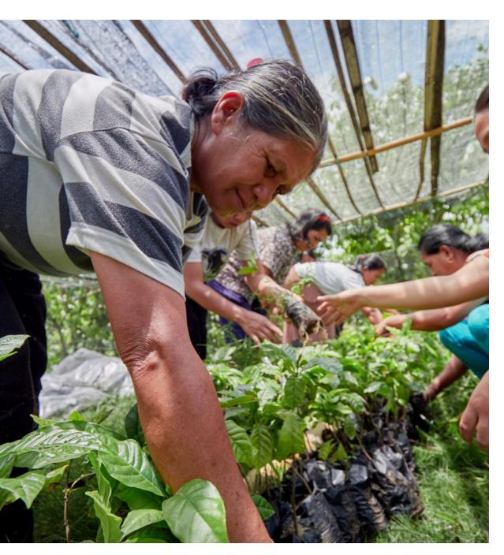

In practice, this approach emphasizes active community participation, transparency, and accountability. Furthermore, the principles of non-discrimination and equality must serve as the core foundation, ensuring that all policies and programs reach everyone without exception while taking into account the diverse and intersecting socio- economic factors.

Chapter 4.

Steps for Integrating GEDSI into the Agricultural Supply Chain

# **4.1. GEDSI Mainstreaming in Project Development**

#### **4.1.1 GEDSI Analysis**

Many analytical tools are available for developing a sustainable agricultural supply chain. Since GEDSI represents a deep dive into gender mainstreaming, some of its analytical framework can be developed and adapted from gender analysis tools. The tools for GEDSI analysis typically target two key objectives:

- 1. Identifying existing gender issues and social disparities; and
- 2. Identifying/formulating the strategies necessary to address existing gender issues and social disparity.

At least, GEDSI analysis addresses some of the following questions:

**What?**

What gender-related socio-economic contexts and norms must be examined?

**Bagaimana?**

How does the project address existing gender unequalities and social disparities; and what strategies and ways are in

place?

————————————————— How are roles divided

> across various productive, childrearing, and social

activities?

————————————————— How are the access and control to resources and

ownership, and public

services

**Siapa?**

Who makes the decisions in the household and community ————————————————— Who are more vulnerable to

> pressure and shocks, including disaster and economic crisis?

#### **Table 2. Scope of GEDSI Analysis**

The following table outlines several GEDSI analysis tools that are developed from gender analysis tools and their application in the development of sustainable agriculture. It should be noted that many gender analytical tools are adapted to various specific contexts and needs, as discussed below.

### **Moser Framework**

Moser Gender Analysis Framework is an analytical tool introduced by Caroline Moser to help practitioners examine who performs what, who has access and control, and who benefits from development interventions, including within the agricultural commodity sectors. It primarily aims to promote equitable and sustainable development interventions. This framework highlights the genderbased division of labour through the concept of the triple gender roles.

- 1. Reproductive roles (domestic and care tasks)
- 2. Productive roles (economic activities such as agriculture or trade), and
- 3. Community management roles (to ensure life sustainability, including activities to manage clean water or informal neighbourhood activities)

Within this scope, Moser helps identify the contributions of women (and other vulnerable groups, including the youth) that are often invisible and unrecognized in the existing social and economic systems.

In practice, the Moser Framework is used from the planning stage through to program evaluation. The key steps in the agricultural sector are as follows:

- **1. Mapping out the division of labour** between women and men across commodity chains (from on-farm to post-harvest)
- **2. Distinguishing between gender practical needs** (such as reducing workload, improving access to tools) and gender strategic needs (such as land right, position in decision making), and
- **3. Analysing access, control, and benefit distribution.** The results of the analysis will form the basis for designing interventions, such as technology, training, partnership schemes, or certification. These interventions aim to prevent increased workload for women while creating opportunities for structural changes that support social and economic sustainability.

The format for the application of Moser framework is available below3 :

3 C March, Ines Smyth & Maitrayee Mukhopadyay (1999). A Guide to Gender Analysis Framework. An Oxfam Publication. https://policy-practice.oxfam.org/resources/a-guide-to-gender-analysisframeworks-115397/

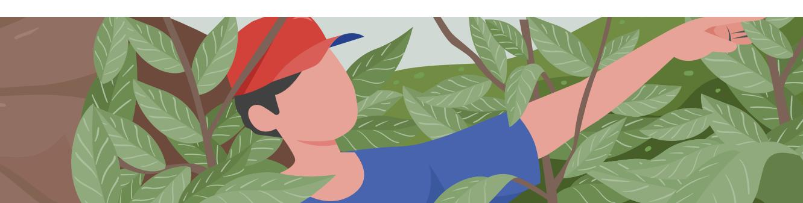

#### **Examples of Moser Tools 2: Gender Needs Assessment**

## **Women's Practical Gender Needs Women Strategic Gender Needs**

` Access to seedlings ` Fuel wood ` Reforestation activities and forestryrelated needs ` New oven ` Specific training ` Paid work ` Organized groups ` The right to a say ` Leadership capacity and leadership position in the project and community ` Education

#### *Adapted from MATCH 1991, 132*

The Moser framework serves as an accessible, practical and powerful tool for initial diagnosis, especially for the rural context. However, a key limitation of the framework is that it tends to provide a descriptive snapshot, which risks perpetuating traditional roles in the absence of a critical perspective. When used rigidly, it fails to capture power dynamics and intersectionality. Therefore, in developing sustainable agricultural commodities, the Moser Framework is most effective when combined with value chain analysis, institutional analyses, and a transformative gender approach. This ensures that women, men, and the younger generation can achieve more equitable economic, social, and environmental benefits

### **Harvard Analytical Framework (HAF)**

The Harvard Analytical Framework (HAF) is a gender analysis tool aimed at ensuring that development interventions, including those in the agricultural sector, are well targeted, efÏcient, and equitable by **understanding the division of roles and control over resources at the household and community levels**. In the agricultural context, this framework helps address the following key questions:

Who (women/men) are responsible for agricultural tasks

Who have access to inputs and services

Who control decisions and economic benefits

It includes mapping of activities across all commodity chains, analysis of access and control over resources and benefit, and the social and institutional factors shaping the disparity.

HAF can be applied through the following three primary stages:

### **Activity profile**

Mapping out division of roles between women and men in productive activities (planting, harvesting, post-harvest), reproductive activities (household care), and community activities

#### **Access and control profile**,

distinguishing who has access (to use) and who has control (to decide) over resources, including land, seeds, equipment, credit, training, and benefits such as income and premium price.

# **Analysis of influencing factors**,

such as customary norms, policies,

or market structures

One example can be found in the coffee commodity sector: women predominate in picking and sorting, while men control sales. The results of the analysis help adjust program design, for example by organizing training at times accessible to women and establishing collective income management.

The following table provides the example in the use of Harvard analytical tool4 :

| Contoh Alat Harvard 1: Profil Kegiatan |             |          |
|----------------------------------------|-------------|----------|
| Activity                               | Women/Girls | Men/Boys |
| Productive Activity                    |             |          |
| Agriculture:                           |             |          |
| Activity 1                             |             |          |
| Activity 2, etc.                       |             |          |
| Income Generating:                     |             |          |
| Activity 1                             |             |          |
| Activity 2, etc.                       |             |          |
| Employment:                            |             |          |
| Activity 1                             |             |          |
| Activity 2, etc.                       |             |          |
| Other:                                 |             |          |

4 C March, Ines Smyth & Maitrayee Mukhopadyay (1999). A Guide to Gender Analysis Framework. An Oxfam Publication. https://policy-practice.oxfam.org/resources/a-guide-to-gender-analysisframeworks-115397/

| Activity                                                 | Women/Girls | Men/Boys |
|----------------------------------------------------------|-------------|----------|
| Reproductive Activities                                  |             |          |
| Water related: 
activity 1
 
activity 2, dst.
 |             |          |
| Fuel related:                                            |             |          |
| Food preparation:                                        |             |          |
| Childcare:                                               |             |          |
| Health related:                                          |             |          |
| Cleaning and repair:                                     |             |          |
| Market related:                                          |             |          |
| Other:                                                   |             |          |

Adapted from: Overholt, Anderson, Cloud and Austin, *Gender Roles in Development Projects,* Kumarian

The primary strength of the Harvard Analytical Framework (HAF) lies in its clear, data-driven, and user-friendly structure as an initial diagnosis tool, which enables effective agricultural program planning and resource allocation. However, the framework tends to be descriptive and technical, falling short in examining the dynamics of power relations, household negotiations, and intersectionality (such as age, class, disability), especially when used in isolation. For this reason, practitioners are recommended to use HAF as an analytical foundation, later complementing it with other frameworks, including a transformative gender approach. This ensures that agricultural commodity development focuses not only on increasing production but also promoting more equitable and sustainable change.

## **Gender Action Learning Systems (GALS)**

Gender Action Learning Systems (GALS) is a gender analytical tool developed using participatory approach. It was first introduced by Linda Mayoux in 2007 with the support of various development organizations. GALS aims to address gender and social disparities in economic development through participatory and inclusive processes. This methodology is designed to **empower both women and men to improve their lives by using visualizations tools** to map out their hopes and plans. Ultimately, it promotes behaviour change at the household level and the wider community level through peer sharing.

Introduction on GALS, formulation of expected hopes and its road maps

> **Change Catalyst**

Implementation of road maps, with the support of peer sharing, monitoring & documentation

**Community Action Learning**

Review of achieved changes in relation to gender relations and empowerment of marginalized groups **Participatory Gender Review**

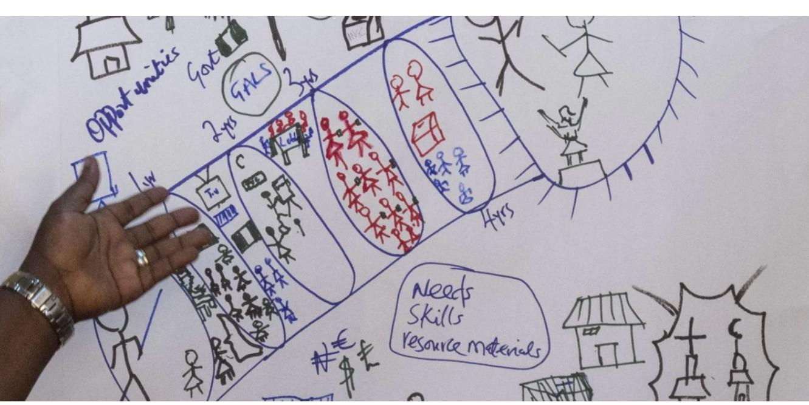

Focus on increased income, production, and market access for overall economic welfare improvement

**Community Action Learning**

Link with national and local institutions, public and private organizations for sustainability **Sustainability**

Although there is no standard format for this analytical tool, an example on the application of the tool is provided below5

GALS has been adopted by Koltiva, one of the SAFE project partners, which uses the tool in natural rubber commodity development. The tool can be applied to other commodities by taking into account the existing social context and the characteristic of the respective commodities.

## *Participatory Rural Appraisal* **(PRA)**

Participatory Rural Appraisal (PRA) is an approach and collection of tools used to understand conditions, local knowledge, social dynamics and power relations including gender relations - directly from the rural communities. In the context of sustainable agricultural commodity development, PRA aims at ensuring that planning and interventions focus not only on technical data, but also on the daily realities of women, men, and other vulnerable groups.

5 https://gamechangenetwork.org/testimonial/nigeria-oxfam/

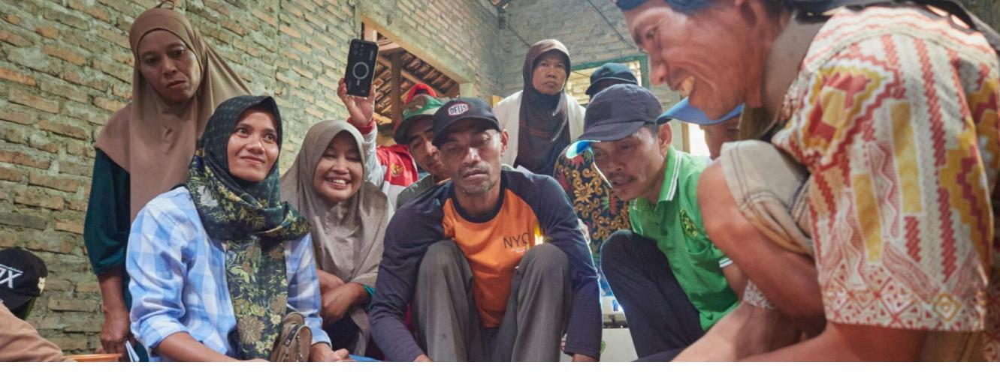

PRA is highly extensive and flexible in scopes, covering various tools from as timeuse analysis, historical timeline, social and resources mapping, social institutional mapping, Venn diagram, to separate gender and age-based group discussion. These tools allow practitioners to analyse how workloads, access, voice, and bargaining position differs by gender, and how commodity chain dynamics shape that relations.

PRA tools are typically used in development interventions in a participatory manner and in stages.

- **1. Facilitator creates a safe and inclusive space,** often by making separate discussion sessions for women and men to ensure everyone has an equal voice
- **2. PRA tools are selected based on the aim of the analysis**. Time-use analysis helps maps out women's and men's daily and seasonal workloads; historical timeline is used to track shifts in gender roles, access to land, or main commodities over time; while social institutional analysis (such as Venn diagram) identifies who the most influential actors are in the cooperative, farmer groups, or indigenous institutions, and who is being excluded
- **3. The results of the PRA are discussed back with the community** to develop solutions, including creating training schedules, strengthening women's roles in the cooperatives, and establishing a more equitable division of roles in farmers' households, to ensure findings are truly used to inform the program design.

The main strength of PRA lies in its ability to capture the dynamics, power relations, and social changes that are often overlooked by more technocratic analytical tools. This approach also fosters the community's sense of ownership and is very relevant to the diverse contexts of rural settings. However, PRA's results are heavily influenced by the quality of facilitation, which risks bias if dominant groups have stronger voices. It also takes considerable time and capacity. Furthermore, PRA is typically qualitative, meaning that it requires needs supplementary data for largerscale planning.

Examples of applying PRA tools in the agricultural sector include analysing women's working hours in cocoa cultivation, creating historical timeline of the introduction of oil palm and its impacts on women's control over land resources, and mapping of the cooperative institutions to ensure meaningful participation of women and youth. When used reflectively and combined with other gender analytical frameworks, PRA serves as a powerful tool for promoting the development of inclusive and sustainable agricultural commodities.

The following map of resources from a village in West Kalimantan provides the formats and examples of the use of PRA analytical tools6 .

**PETA SUMBER DAYA** Kampung Purus Baru, Katbar

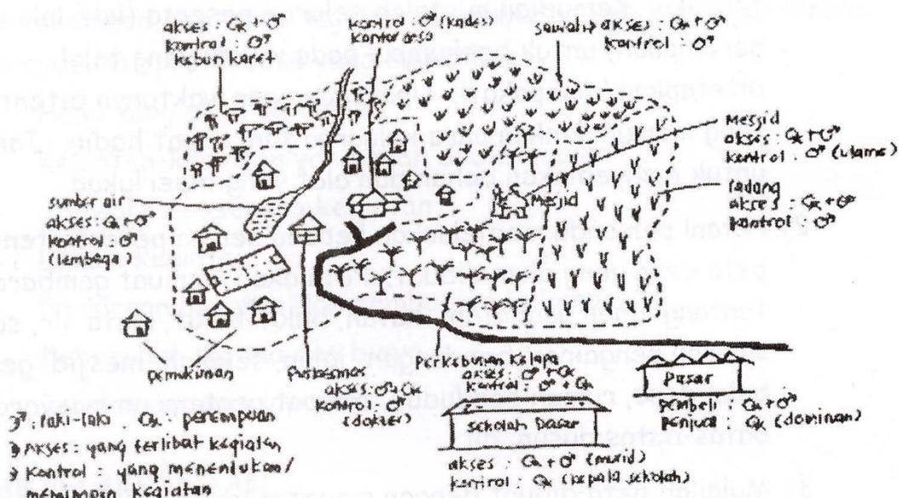

## **Gender-Sensitive Value Chain Analysis (GSVCA)**

Gender-Sensitive Value Chain Analysis (GSVCA) is an analytical tool introduced and promoted by various development agencies, including FAO, IFAD, and UN Women, to ensure that value chain development is not only economically efÏcient, but also inclusive and gender equitable. Its main aim is to **understand how women and men are involved in, benefit from, or are instead excluded across commodity chains** (encompassing input, production, post-harvest, processing, trade, and consumption).

The scope of this tool goes beyond mere economic activities by incorporating unpaid care work, power relations, and the broader market system context (such as access to capital, technology, and information, and enabling ecosystems such as policies, sustainability standards, and market dynamics.

In practice, GSVCA is applied through the following key steps:

- **1. Value chain mapping:** Identify the primary female and male actors at every stage, including the division of labour and gender-specific risks.
- **2. Gender analysis:** Examine each stage of the chain, focusing on access and

6 https://pdfs.semanticscholar.org/18b4/5b894be2e300cd1950ec1c0c915dd346456c.pdf

control over assets, income, technology, training, and unpaid care workloads that influence working hours and employment options

- **3. Market system and ecosystem analysis:** Evaluate who accesses credit, price information, and certifications. Analyse how policies, financial institutions, cooperatives, and buyers influence gender-based bargaining power.
- **4. Translate findings into intervention design:** Adjust service hours and locations, create inclusive financing schemes, strengthen women's organizations, or establish benefit sharing mechanisms to allow changes to happen at the household, business, and market system levels.

For example, in the cocoa commodity, women predominate in the fermentation and drying stages but have minimum control over sales. Gender-Sensitive Value Chain Analysis (GSVCA) promotes technical training that recognizes such contributions, micro credit access for post-harvest equipment, and transparency in premium distribution. In another instance, in the oil palm commodity, women are frequently involved as informal workers by collecting loose oil palm fruits (*brondolan*) and applying light fertilizer while bearing the primary responsibility for unpaid care work. This analysis highlights the importance of promoting labour recognition, strengthening occupational and health safety, providing communitybased childcare, and improving access to labour-saving technology to ease their workload.

GSVCA's strength lies in its holistic and systemic approach, as it links gender, markets and policies, which are relevant for sustainability. However, this tool is relatively complex and requires multi-level data and advanced analysis capacity. Without sufÏcient facilitation capacity and skills, there is a risk that using this tool will result only in technical recommendations without actually shifting power relations. Consequently, GSVCA is most effective when applied in a participatory manner and supplemented by a transformative gender approach to ensure sustainable and equal economic benefits.

The GSVA tool format is as follows7 .

7 FAO (2018). Developing Gender Sensitive Value Chain: Guidelines for Practitioners. https://openknowledge. fao.org/handle/20.500.14283/i9212en

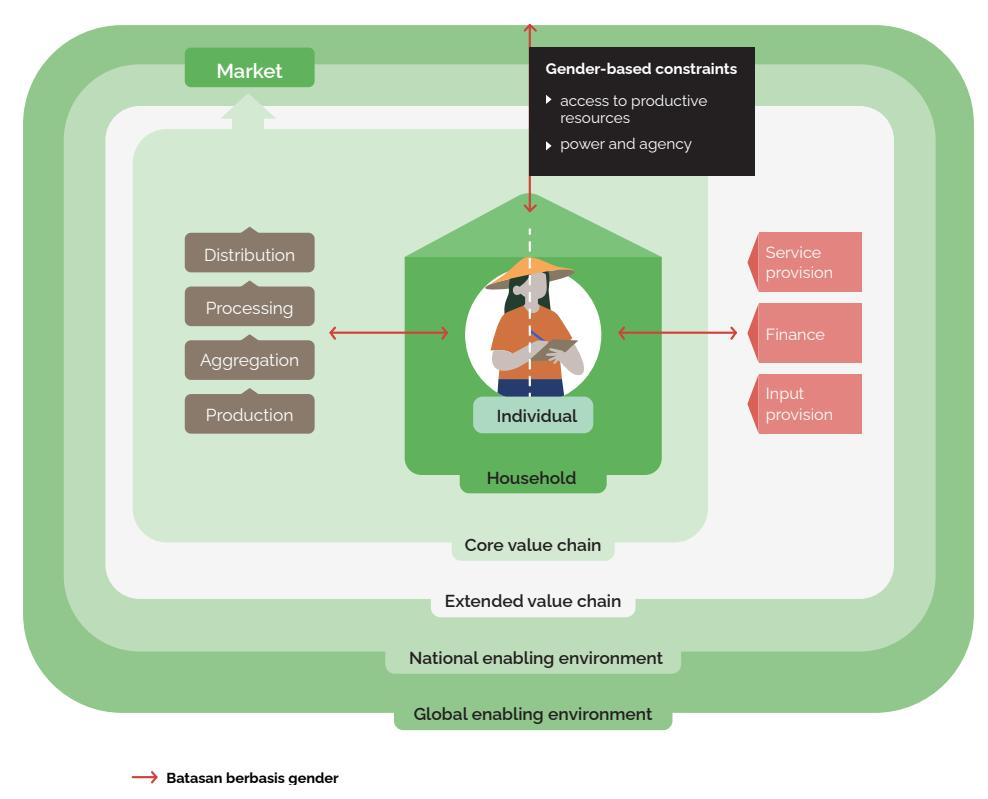

The above illustration shows that combining various tools for GEDSI analysis to align with organizational and project contexts and needs, in fact, strengthens the quality of the findings. Furthermore, during the analysis process, it is crucial to keep the following notes in mind:

**Tabel 3. The Do's & Don'ts in GEDSI Analysis**

| DO’s                                 | DON’Ts                                  |
|--------------------------------------|-----------------------------------------|
| analysis to understand               | how existing                            |
|                                      | on gender and social myths. For         |
| Gather or utilize disaggregated data | (by                                     |
|                                      | not based on data , which prevents from |

| Consult | the          | vulnerable     | groups                            | and                                  |
|---------|--------------|----------------|-----------------------------------|--------------------------------------|
|         | stakeholders | during         | the                               | research                             |
| process |              |                | . During consultation, ensure the |                                      |
| groups, |              | including      | indigenous                        | people,                              |
| youth,  | and          | other          | minorities.                       | Organize                             |
|         |              |                |                                   | For example, avoid studies that are  |
|         |              |                |                                   | undertaken solely by experts or      |
| groups. |              |                | Steps include: afÏrming women     |                                      |
| and     | youth        | representation | in                                | group                                |
|         | management,  | establishing   | quota                             | for                                  |
|         |              |                |                                   | Fail to provide opportunities, build |

Some of the main challenges in performing GEDSI Analysis are as follows:

- 1. InsufÏcient disaggregated data, specifically quantitative ones. Qualitative data from the observations of the previous activities and field conditions can be used as proxy.
- 2. The domination of the elites, including men, often prevents an assessment of women's perspective and needs. Therefore, data can be collected that actively involve women and the marginalized group, such as separate FGDs and interviews.

### **4.1.1 Stakeholder Mapping 8**

It is crucial for companies and organizations to conduct stakeholder mapping before executing project. This can be undertaken by reviewing the goals for the changes from GEDSI aspect, identifying the stakeholders, and analysing them, specifically when mapping their influence and interest. Stakeholder mapping can be grouped into the following stakeholder matrix:

8 Bagian ini dikembangkan dari ODI,<https://media.odi.org/documents/6459.pdf>

**Figure 3. Stakeholder Mapping**

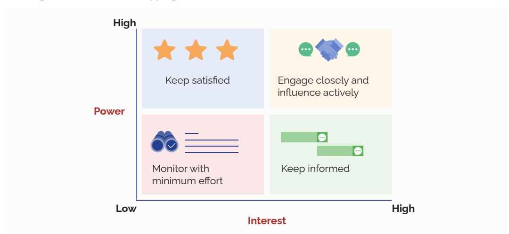

To interact with stakeholders, a strategy must be established to determine who will manage the contact how communication will be built. Furthermore, tailored messages should be developed to align and be relevant with all stakeholders, ensuring sustainable relationships. In this way, organizations and projects can systematically identify and engage key stakeholders, establish a solid alliance, and strategically influence policies to foster a more inclusive and sustainable environment.

### **4.1.2 Development of GEDSI Framework and Indicators**

The checklist below serves as a guide for integrating GEDSI aspects into the development of the program framework and indicators.

**Tabel 4. Checklist for Developing Frameworks and Indicators**

| Aspect                                                                                                                                                                                                                                               | Yes | No |
|------------------------------------------------------------------------------------------------------------------------------------------------------------------------------------------------------------------------------------------------------|-----|----|
| Program identifies gender and social disparity issues and details how it addresses those issues. In other words, has GEDSI analysis been performed during the program planning stage?                                                                |     |    |
| Has the program addressed the disparity between the needs of women and men and met the specific needs of marginalized groups?                                                                                                                        |     |    |
| Do the performance indicators and targets include gender-disaggregated ones or those related to shifts in gender relations? See the example in the box below, which specifically ensures the incorporation of GEDSI indicators into the SAFE project |     |    |

| Recurring issues Recommended initiatives |                                                |
|------------------------------------------|------------------------------------------------|
| Most programs tend to focus              |                                                |
| involvement (for example                 |                                                |
| target percentages of women              |                                                |
| `                                        | Has the involvement led to improved knowledge  |
| `                                        | Do women now have greater access to express    |
| `                                        | Has there been an improvement in productivity  |
| How are performance targets              |                                                |
| achieved, specifically those             |                                                |
| concerning women leadership              |                                                |
| and improved non-traditional             |                                                |
| `                                        | Has the organization promoted the use of       |
| `                                        | When facing severe social challenges, a        |
| `                                        | Have the challenges faced by women and         |
|                                          | marginalized groups that constraint their      |
| `                                        | Have the constraints been addressed? What      |
| `                                        | Has the program promoted non-traditional roles |

Integrating GEDSI aspects into the SAFE program framework can be achieved by assessing identified GEDSI issues and exploring opportunities to integrate GEDSIresponsive measures into planned indicators and activities.

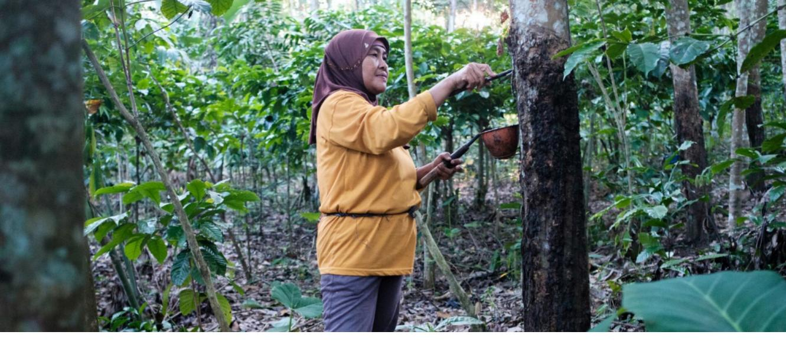

Within the SAFE project framework, GEDSI aspects need to be emphasized in achieving the expected changes. The GEDSI dimensions of the project-specific objectives are as follows:

*1. Specific objective indicator* **#2: 660 of targeted smallholder farmers (of which 40 % are women) from selected commodities confirm improved (socio-)economic conditions of working together in inclusive business partnerships, including in EU-related supply chains**  Initiatives to ensure the achievement of the changes outlined in the indicator

include:

` Disaggregating data by gender and one additional intersectionality criterion relevant to the national context ` Conducting regular monitoring to assess progress of achievement, including end of project assessment ` Implementing additional processes to ensure women account for 40% of the project achievement. This must be the results of deliberate initiative rather than an incidental outcome. By applying an intersectionality approach, this 40% of women need to take into account the diverse social dimensions, such as age or marital status, and ensure the involvement of women headed households

*2. Specific objective indicator* **#4: For selected commodities, 3 proposals for policy tools with an intersectional perspective for the promotion of sustainable supply chains have been submitted to relevant key stakeholders**

Initiatives to ensure the achievement of the changes outlined in the indicator include:

` Conducting an annual analysis of the proposed policy frameworks to determine if they integrate an intersectionality perspective. This includes taking into account two or more characteristics of marginalization (such as gender, age, indigenous status, disability, etc.). At least one chapter of the strategy documents must address the influence of these characteristics on political issues. ` In addition to analysing the substance, consultation processes should be conducted with organizations and groups that represent the marginalized populations (such as women's organizations, youth forums, disability organizations, or community-based organizations) to ensure the integration of their experiences, needs and concerns.

In the meantime, the details on the integration of GEDSI into output achievements and key activities must consider the specific GEDSI issues and actions that partner organizations can undertake. Any actions implemented by local partner organizations with the required capacity must also align with key project activities. This ensure that the initiatives are not reduced to ad hoc measures that do not contribute directly to target and indicator achievement. The table below provides further details on these points.

**Tabel 6. Memasukkan GEDSI dalam Indikator Kinerja**

| Output and                                                                                                  |                                                                                                                                                                                                                                                                |
|-------------------------------------------------------------------------------------------------------------|----------------------------------------------------------------------------------------------------------------------------------------------------------------------------------------------------------------------------------------------------------------|
| Indicator GEDSI Issues                                                                                      | Recommended Actions                                                                                                                                                                                                                                            |
| ` The limited                                                                                               |                                                                                                                                                                                                                                                                |
| ` Women and                                                                                                 |                                                                                                                                                                                                                                                                |
| Output Indicator                                                                                            | ` Foster partnership between producer                                                                                                                                                                                                                          |
| integration of small scale producers, especially women and smallholder other marginalized farmers (40      | organizations and private companies to promote inclusive commodity value chain and ensure the participation of the marginalized groups in the partnership                                                                                                      |
| groups, into the commodity supply are women) chain in selected                                              | ` Provide technical assistance in conducting value chain analysis and the analysis on business alignment with EUDR standards:                                                                                                                                  |
| supply chains marginalized are included groups face greater in tools for barriers to accessing meeting EUDR | traceability, due diligence system, and meeting the aspects of business inclusivity. Ensure women’s access and participation in the technical assistance.                                                                                                      |
| resources (such as requirements training, information, capital)                                             | ` Provide technical and financial assistance to producer organizations on due diligence and traceability, and promote the involvement of women and marginalized groups (such as youth groups) in this initiative                                               |
|                                                                                                             | ` Conduct annual analysis of traceability based on farmers’ assessment. Data must be measured and disaggregated by gender and one additional intersectionality criterion relevant to the national context (such as age or disability). Monitoring must examine |
|                                                                                                             | the trends over the years and evaluate the progressive realization of involving the marginalized groups, such as women headed                                                                                                                                  |
|                                                                                                             | household and young women, in these achievements.                                                                                                                                                                                                              |

| Output and                                                                                                                                                                                                                                                                                                                                                                                                                                                                             |                                                                                                                                                                                                                                                             |
|----------------------------------------------------------------------------------------------------------------------------------------------------------------------------------------------------------------------------------------------------------------------------------------------------------------------------------------------------------------------------------------------------------------------------------------------------------------------------------------|-------------------------------------------------------------------------------------------------------------------------------------------------------------------------------------------------------------------------------------------------------------|
| Indicator GEDSI Issues                                                                                                                                                                                                                                                                                                                                                                                                                                                                 | Recommended Actions                                                                                                                                                                                                                                         |
| ` Poor and non                                                                                                                                                                                                                                                                                                                                                                                                                                                                        |                                                                                                                                                                                                                                                             |
| ` Socio-political                                                                                                                                                                                                                                                                                                                                                                                                                                                                      |                                                                                                                                                                                                                                                             |
| ` Output indicator disaggregated data systems that weaken 3 proposals for decision making, policy tools with                                                                                                                                                                                                                                                                                                                                                                           | Provide support for enhanced inter-sectoral cooperation and exchange of disaggregated data for due diligence system and traceability                                                                                                                        |
| ` system due diligence, an intersectional and traceability perspective for adapting the aspects supporting enabling political sustainable conditions for production intersect sustainable                                                                                                                                                                                                                                                                                              | Provide Policy advisory and technical assistance for public and private actors in developing incentive mechanisms and financing schemes for producers in their transition toward inclusive and sustainable supply chains                                    |
| ` with gender social production have norms, meaning that been developed the same policies in multi can have different stakeholder implications on men roundtables and women based                                                                                                                                                                                                                                                                                                     | Create socio-political conditions that support sustainable production. This can refer to: strengthened land-use rights by emphasizing women’s access and control and managing disaggregated socio-environmental database to feed into due diligence systems |
| ` on how they intersect with existing social status                                                                                                                                                                                                                                                                                                                                                                                                                                    | Conduct annual review of supply chain policies applying an intersectional perspective, for example by examining the risk of marginalization faced by women through their diverse social statuses and identities                                             |
| ` Gender social norms                                                                                                                                                                                                                                                                                                                                                                                                                                                                  |                                                                                                                                                                                                                                                             |
| ` Output indicator often pose barriers to the marginalized 6600 smallholder groups in accessing farmers, 50 knowledge on sustainable are women, production. For confirm an example, the burden improvement in of care work, such their knowledge as childcare and of sustainable cooking, that is placed production on women often practices as constraints them a result of from participating SAFE training in capacity building measures activities, including those on agriculture | Conduct annual evaluation on farmers’ enhanced knowledge on sustainable production practices. Data is presented disaggregated by gender and one additional intersectionality criterion relevant to the national context.                                    |

| Output dan                                                                                                                                                                  |                                                                                                                                                                                                                                                                     |
|-----------------------------------------------------------------------------------------------------------------------------------------------------------------------------|---------------------------------------------------------------------------------------------------------------------------------------------------------------------------------------------------------------------------------------------------------------------|
| Indikator Isu GEDSI                                                                                                                                                         | Aksi Yang Bisa Dilakukan                                                                                                                                                                                                                                            |
| ` Despite its real impacts, GEDSI aspects are often considered irrelevant to sustainable production                                                                         |                                                                                                                                                                                                                                                                     |
| ` Gender social norms                                                                                                                                                       |                                                                                                                                                                                                                                                                     |
| ` Output indicator often pose barriers to the marginalized groups in accessing smallholder knowledge on sustainable of which production. For are women) example, prevailing | Identify how gender and social dynamics influence land use rights. This should include all forms of land ownership, including individual land title, community land rights, state land allocated to households or individual communities, and customary land tenure |
| ` confirm an norms assume that improvement in male participation their knowledge in training activities                                                                     | Analyse barriers to improving land use rights for smallholder farmers, with a focus on women smallholder farmers                                                                                                                                                    |
| ` of their land use sufÏciently represents rights due to the entire households SAFE training and groups, limiting measures women’s access to training opportunities         | Annually evaluate feedback questionnaires from smallholder farmers who completed land rights awareness training                                                                                                                                                     |

## **4.1.3 GEDSI-Responsive Budgeting and GEDSI Marker**

Developing GEDSI indicators and applying a gender inclusive budget in agricultural value chain projects starts with a clear understanding of those concepts. The indicators include classifying projects based on their level of contribution to promoting gender equality and social inclusion.

` 0: GEDSI Neutral. The project does not include explicit GEDSI-related outcomes in its objectives. ` 1: GEDSI Sensitive. The project recognizes unequalitiesGEDSI issues and their impacts, but does include any specific activities to address them. For example, a natural rubber production project might recognize that women actively engage in rubber tapping but fail to design targeted activities to support them. ` 2: GEDSI Responsive. The project designs targeted activities to address identified GEDSI unequalities. For example, an oil palm project might offer tailored training in financial management and literacy to women, explicitly recognizing women's roles in generating household income. ` 3: GEDSI Transformative. The project actively works to change unequitable GEDSI norms and relations, for example by facilitating the establishment of a women's cooperative that holds formal decision-making authorities within the value change and thereby having the capacity to shift traditional power structures.

A practical guide is for organizations to start simple when assigning gender markers and developing an inclusive budget.

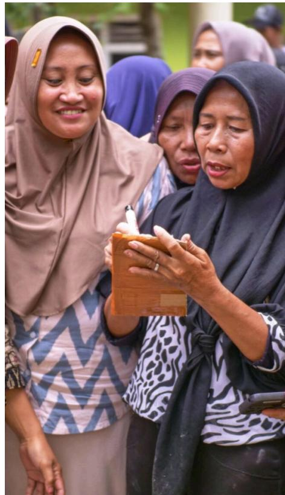

- 1. Assign a gender marker for your project based on the categorization above
- 2. Develop a GEDSI-responsive budget simply: There is no need to create an entirely new budget. It is sufÏcient to assign specific codes to budget lines that are dedicated to achieving your targeted gender objectives. For example, if your project is GEDSI-responsive, ensure that funds are clearly allocated for training women farmers. If your project is GEDSI-transformative, allocate funds to establish women's leadership. In this way, commitments to equality and social inclusion become specific, measurable, and supported by a clear fund allocation.

### **4.1.4 Risk Assessment**

Risk assessment in formulating a GEDSI strategy involves the identification, analysis, mitigation, and prevention of the potential unintended negative impacts. This process requires a gender- and socially-sensitive approach that takes into account how gender roles, social norms, and power dynamics influence various groups. A risk assessment aims at:

- 1. Defining the focus of intervention A rapid analysis is conducted to answer the following questions: ` Who *will* be advantaged? ` Who is *potentially* impacted? ` Who might be *excluded*?
- 2. Mapping relevant stakeholders and their respective roles ` Simple identification of the roles of each individual key stakeholder ` Simple assessment of the key stakeholders' access to resources
- 3. Identifying unintended risks ` Could the project potentially increase the burden or workload of specific groups? ` Is there any possibility of a group gaining more advantages than others?
- 4. Assessing risks and implications to the project ` How severe are the risks? ` What are the implications for the project or organization? Focus to medium to high-impact risk

- 5. Formulating and implementing a mitigation strategy ` What can be modified or adjusted? ` Who needs to be involved and how? ` What resources or support are required?
- 6. Implementing mitigation measures while monitoring progress and documenting lessons learnt

The table below provides an example of a risk analysis and mitigation measure identification within a project on women empowerment in sustainable oil palm development:

| Potential Risk                  | Mitigation Measures                         |
|---------------------------------|---------------------------------------------|
| Limited Representation: Women’s |                                             |
| and youth’s participation and   |                                             |
| a.                              | Set a quota for participation (for          |
| b.                              | Involve customary leaders and               |
| c.                              | Provide separate consultations or           |
| a.                              | Promote joint titling in land certification |
| b.                              | Involve women in data collection and        |

| Potential Risk | Mitigation Measures                    |
|----------------|----------------------------------------|
| a.             | Design gender-responsive GAP training  |
| b.             | Focus on targeted technical trainings  |
| c.             | Facilitate direct access to credit and |
| a.             | Integrate a module on Gender & Power   |
| b.             | Develop a safe and confidential        |

# **4.2 Mainstreaming GEDSI into Project Implementation**

## **4.2.1 Project Implementation Team Preparation**

A well-planned approach that integrates GEDSI principles in the project team preparation for the implementation of a sustainable and inclusive agricultural value chain project is crucial from the outset. The following measures serve as the guide for social and business organizations to ensure the establishment of a robust team that promotes an inclusive agricultural value chain.

- **1. Build a team that is diverse** in gender, age, social background, and expertise, including members from marginalized groups (women, youth, people with disabilities, and ethnic minorities). Selection should not be solely based on technical competencies, but also on a commitment to GEDSI and the ability to collaborate equally. Embracing diversity brings wider a perspective, increased sensitivity to community needs, a safer work culture, and empowerment for anyone involved. Efforts could include: ` Inclusive job postings that use gender-neutral language and explicitly welcome applications from people with disabilities and marginalized groups

- ` Remove personal identifiers, such as photos, age, and university names, from CV during initial shortlisting to minimize bias within the selection team. ` During interviews, ask a situational question, such as "Could you tell me your experience about a time when you had to ensure the active involvement of your team members with disabilities or diverse backgrounds?".
- 2. Following the establishment of the team, organize a **workshop to introduce GEDSI, different perspectives, and create common understanding on the project inclusive goals.** This step is crucial for organizations that are not familiar with GEDSI, as it helps eliminate stereotypes and create a common ground. Ask organizations that are familiar with GEDSI to lead sessions on sharing good practices and experiences to create trust and build capacity among new team members. The following steps can also be taken ` Hold regular sessions for all team members to identify and mitigate hidden prejudices regarding gender, physical features, and social backgrounds. ` Involve all team members in developing ofÏce house rules, including flexible working hours for the elderly and communication protocol that is free from discrimination and refrains from the use of sexist jokes ` Ensure that ofÏce physical infrastructure and digital software are accessible to individuals with disabilities and revise the leave policy to include paternity leaves and menstruation leaves
- 3. The next measure is **to create an inclusive and equitable work environment.** To achieve this, adopt the following BRAVING pillars: ` Establish clear boundaries ` Maintain reliability by keeping promises

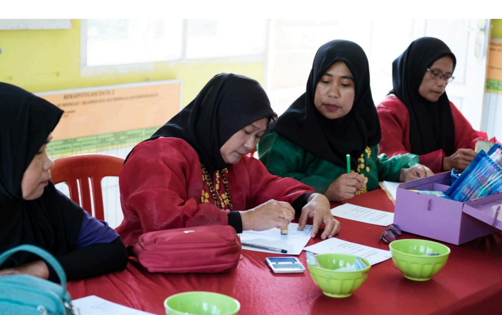

` Practice accountability by admitting mistakes ` Strengthen trust by maintaining data vault confidentiality ` Act with integrity even during difÏcult times ` Create a nonjudgmental space for team members to ask for help ` Emphasize generosity when interpreting the intention of others

Collectively, these BRAVING pillars provide the guide in establishing strength to create an inclusive, equitable, and high-performing workplace environment.

- 4. Define practical steps that include rotating leadership roles for specific tasks, creating anonymous feedback mechanisms, and offering flexible working hours to support family and community responsibilities, especially to women
- 5. Ensure project implementation teams reflect the diversity of the beneficiary communities. For example, when organizing farmer training sessions, recruit women trainers from various social backgrounds to build trust and ensure further accessibility of the training program
- 6. Ensure both male and female team members are available team during consultation processes in conservative communities to allow convenience and free participation

Applying these measures will enable the team to not only work more effectively but also model the application of GEDSI principles that the project is promoting across the agricultural value chains.

### **4.2.2 Collaborate and Work with Stakeholders**

Establishing collaborations with the stakeholders starts with understanding that effective partnerships are built not just on shared issues but also on aligned visions, strategic interests, and mutually reinforcing relationships. In the development of sustainable agricultural commodities, especially when introducing new approaches such as GEDSI to relatively conservative communities, organizations must position themselves as relevant partners. This means respecting local mandates and practices while successfully translating equality and inclusion principles into concrete technical, social, and economic benefits.

Strong collaboration is a gradual process, from establishing trust, creating collective sense of ownership, and demonstrating tangible impacts that strengthen all involved. Measures to be taken can include:

` Mapping of the stakeholders based on mandates, interests, influences, and attitude towards change ` Identification of intersecting visions and interests, and formulation of collaborative added values for each stakeholder ` Translate GEDSI into real technical issues and benefits (productivity, quality, sustainable, and farmers regeneration)

` Building initial relationship through informal dialog before offering formal program or cooperation ` Engage key actors as local champions to bridge the gap in the context of conservative communities ` Designing activities co-creatively and start from low risk, small-scale pilot initiatives ` Using non-confrontational local languages, narratives and examples ` Informing collaboration in simple ways with clear division of roles ` Maintaining regular communication and sharing initial outcomes to strengthen collective trust and commitment

The following guidance/checklist can also be used in integrating GEDSI aspects into project implementation.

#### 1. General guide for all activities

` Are women, men, youth, and vulnerable groups identified as primary stakeholders? ` Are data, participants, and beneficiaries disaggregated, at minimum, by gender and age? ` Are there any time, social norms, or access-related issues that constraint certain groups from participating? ` Could the activities increase workloads, particularly unpaid care work? ` Are the benefits of the activities equitably accessed and controlled across different target groups?

#### 2. Specific guide for individual activity

It should be noted that not all activities must meet all criteria from the very beginning. Instead, initiatives can start with the most realistic criteria or focus on those that can trigger a domino effect, promoting improvement across other aspects. Activities should also focus on wisely eliminating main obstacles, such as time constraints, access barriers, and restrictive social norms. It is crucial to document lessons from GEDSI as part of the monitoring process for future learning. Ultimately, it should be emphasized that integrating GEDSI is not about creating additional activities but rather about shifting our ways of working.

# **Training**

|                                                                                                                                             | Guiding Questions | Yes | No |
|---------------------------------------------------------------------------------------------------------------------------------------------|-------------------|-----|----|
| Are the time, location, and duration of the training accommodating to women and the groups with caregiving responsibility (e.g. childcare)? |                   |     |    |
| Are participants selected to ensure equitable representation of women, men, youth, and individuals with disabilities?                       |                   |     |    |
| Are the training contents and methods inclusive (e.g. using simple language, visual presentations, and practical exercises)?                |                   |     |    |

|                                                                                                             |  |  |
|--------------------------------------------------------------------------------------------------------------------------|---------------|---------------|
| Are there any separate or affirmative training sessions designed specifically for marginalized or excluded groups?       |               |               |
| Are the facilitators gender-responsive, and do they provide a safe space for all participants to express their opinions? |               |               |
| Is there a policy in place that prohibits all-male panels in training and dissemination activities?                      |               |               |

# **Mapping and Assessment**

| Guiding Questions                                                                                                               | Yes | No |
|---------------------------------------------------------------------------------------------------------------------------------|-----|----|
| Have GEDSI aspects been integrated into the formulation of objectives and assessment or mapping questions?                      |     |    |
| Is disaggregated data collected and analysed by gender & age?                                                                   |     |    |
| Are participatory methods (such as separate FGDs, PRAs, time-use analyses) used?                                                |     |    |
| Have the results of the GEDSI analysis been integrated, particularly to assess the power relations addressed in the assessment? |     |    |
| Has the mapping/assessment taken into account aspect of unpaid care work in relevant analyses?                                  |     |    |
| Have the voices of marginalized groups been accommodated in the analysis of this assessment?                                    |     |    |

# **Policy Advocacy**

| Guiding Questions                                                                                 | Yes | No |
|---------------------------------------------------------------------------------------------------|-----|----|
| Are different policies analysed for their different impacts on women, men, and vulnerable groups? |     |    |
| Are there any risks that these policies create obstacles or reinforce gender and social biases?   |     |    |
| Do advocacy recommendations incorporate relevant GEDSI recommendations?                           |     |    |
| Are women, youth, and marginalized groups actively involved as key actors in advocacy measures?   |     |    |

## **Event (Seminar, information dissemination, workshops, public consultations))**

| Guiding Questions                                                                                     | Yes | No |  |
|-------------------------------------------------------------------------------------------------------|-----|----|--|
| Are the times and locations of the events accessible to all, including individuals with disabilities? |     |    |  |

|                                                                                 |  |  |
|----------------------------------------------------------------------------------------------|---------------|---------------|
| Do the panels/resource persons and participants reflect gender and social diversity?         |               |               |
| Do advocacy recommendations incorporate relevant GEDSI recommendations?                      |               |               |
| Have women, youth, and marginalized groups been involved as key actors in advocacy measures? |               |               |
| Do the discussion methods provide equal spaces and opportunities for all participants?       |               |               |
| Is logistical support taken into account (e.g. transportation, informal childcare centre)    |               |               |

# **Communication media and knowledge products**

| Guiding Questions                                                                                                                    | Yes | No |
|--------------------------------------------------------------------------------------------------------------------------------------|-----|----|
| Are the language, visual presentations, and narratives free from gender bias and the labelling or sidelining of marginalized groups? |     |    |
| Do the stories and data presented uphold the identity, roles, and contributions of women and marginalized groups?                    |     |    |
| Are the media channels used accessible to both women and men, specifically those from marginalized groups?                           |     |    |
| Is the information relevant to both gender practical and strategic needs and other marginalized groups?                              |     |    |

# **Institutional strengthening and community empowerment**

|                                                                                                                          | Guiding Questions | Yes | No |
|--------------------------------------------------------------------------------------------------------------------------|-------------------|-----|----|
| Are women and marginalized groups actively included as members of the group?                                             |                   |     |    |
| Are women and marginalized groups involved in decision making processes?                                                 |                   |     |    |
| Do women and marginalized groups, including youth, have the opportunity to take on leadership roles in group management? |                   |     |    |
| Is there any GEDSI focal point or accountability mechanism within the group?                                             |                   |     |    |
| Has any capacity building on GEDSI been provided to group members?                                                       |                   |     |    |

# **Development of platforms and technologies, both traditional and digital**

| Guiding Questions                                                                                                                                | Yes | No |
|--------------------------------------------------------------------------------------------------------------------------------------------------|-----|----|
| Do women and men have equal access to hardware and the internet?                                                                                 |     |    |
| Is the design of these platforms friendly for and inclusive of varying levels of literacy?                                                       |     |    |
| Is there any risk of digital exclusion for certain groups? For example, do audio visual platforms risk excluding people with visual impairments? |     |    |
| Has technology actually reduced workloads instead of incrased them?                                                                              |     |    |

# **4.3 Monitoring & Evaluasi Hasil GEDSI**

An effective monitoring & evaluation system must be **objective, systematic, and free from bias** (such as gender, age, ethnicity, etc). At a minimum, it should include: (1) relevant indicators, (2) methods and tools to measure indicator achievement, and (3) sources of data for verification. Utilizing this framework ensures accurate outcomes, which increases stakeholders' trust and opens up investment opportunities for project scaling. The following points must be taken into account when implementing the monitoring and evaluation stages:

| requires                  | requires                   | requires                     |
|---------------------------|----------------------------|------------------------------|
|                           | Data processing            | Data analysis                |
| ` Sources of data         |                            |                              |
| ` Samples                 |                            |                              |
| ` Data collection methods |                            |                              |
| ` Data collection tools   |                            |                              |
|                           | ` Format of data structure |                              |
|                           | ` Tools for data           |                              |
|                           |                            | ` Assessing to what extent   |
|                           |                            | ` Identifying supporting and |
|                           |                            | ` Recommendations            |

Assessing GEDSI changes using a quantitative approach (for example, looking at increased income, the number of women completing training) without understanding the changes of context, through interviews, focus group discussions or life stories that explains **how these changes happen** can lead to misinterpretation. Combined quantitative and qualitative data gives a comprehensive overview of the conditions before and after project implementation, provides a more in-depth understanding of situations, and helps identify ways to improve project performance.

Monitoring and evaluation assess project effectiveness, to what extent indicators have been achieved. Below is an example of one indicator and how the achievement is measured.

*Specific objective indicator* **#2**: 6,600 of targeted smallholder farmers (of which 40 % are women) from selected commodities confirm improved (socio-)economic conditions of working together in inclusive business partnerships, including in EUrelated supply chains

#### **Table 6. Measurement in Monitoring & Evaluation**

| ` The percentage of targeted smallholder farmers reportng      |
|----------------------------------------------------------------|
| ` The percentage of the targeted female smallholder farmers    |
| ` Quantitative: Household Survey                               |
| ` Qualitative: Interviews or Focus Group Discussion            |
| ` Representative sample of smallholder farmer beneficiaries    |
| ` Representatives from smallholder farmers, private companies, |

To ensure a 40% representation of women that indicate project-driven outcomes through targeted rather than incidental interventions, specific measures must be taken. These include ensuring that all activities have a minimum of 40% women's attendance and that partnership registration is not based on the (typically male) head of household. Using an intersectionality approach to meet this 40% target of women's representation requires taking social diversity into account, such as representation age and marital status, specifically by ensuring the participation of female-headed households.

Finally, Monitoring and Evaluation frameworks should report on GEDSI-related barriers to meet the 40% target, how these barriers are addressed and the extent to which the efforts are successful.

Table 2 below provides the difference between project Monitoring and Evaluation:

#### **Table 2. Difference between Monitoring & Evaluation**

|                                                                                                                       | Monitoring                                                                                                | Evaluation |
|-----------------------------------------------------------------------------------------------------------------------|-----------------------------------------------------------------------------------------------------------|------------|
| Conducted continuously throughout project implementation                                                              | Conducted at the end of a project cycle or a specific period (for example annually)                       |            |
| Focuses on achievement of outputs and progress towards outcomes                                                       | Focuses on achievement of outcomes and the project's broader contribution to impacts                      |            |
| Informs adjustment to activity type, implementation quality, timeline, staffing, resource allocation and reallocation | Informs adaptation to project approaches, project outcome/objective levels, and at macro level strategies |            |

Both Monitoring and Evaluation assess performance, focus on lessons learned and good practices, and drive targeted changes. Because of these shared goals, they are collectively referred to as Monitoring and Evaluation (M&E).

# **4.4 Communicating GEDSI Results**

Language plays a key role in the ways we perceive the world, including the way of our thinking and act. Choices of words often reflect our unconscious assumption about values, gender roles, and the ability of women and men, the ability of individuals with disabilities, ethnicity characteristics, etc. Gender- or stereotype loaded language are still common among community members. For example, when discussing about farmer group leadership, people will automatically refer to male farmers.

It is worth noting that poor choices of words may be perceived as discriminatory, belittling, or biased, regardless of the speaker's good intentions. Such language constraints initiatives aimed at the empowerment of women, youth, and other groups.

Principles in communicating GEDSI

#### 1. Ensure the representation of all groups

Women and men across various intersections (including ethnicity, age, and disability status) must be represented equitably in all media products and messages and publications. It is important to ensure that statements from these groups are actively quoted in press releases, articles, and other forms of communication. Actively conveying messages that counter women's traditional roles under male domination (and vice versa) helps deconstruct prevailing gender stereotypes and norms. Over time, these messages, including the visual and written ones, can positively influence public behaviour. When preparing press releases, stories, or other materials, it is important to strategically plan messaging and clearly show how the voices of women and men of all identities have been captured.

#### 2. Challenge stereotypes

Language often perpetuates stereotypes about gender, ethnicity, disability, or other groups. Our perception of gender, ethnicity, or other groups are often shaped by such stereotypes. It is therefore essential to refrain from using stereotypes, as any forms of stereotyping impedes and belittle the affected individuals/groups. While gender stereotypes restrict and demean both women and men, ethnic stereotyping impedes or undermines certain ethnic groups. Stereotypes also provide an inaccurate representation.

It is essential to avoid portraying specific professions or roles as being suitable only for certain groups. For example, communication should not imply that leadership positions must be male while administrative roles like a treasurer must be female. Similarly, materials must avoid suggesting that a specific ethnic group is unsuited for farming.

#### 3. Use equitable language when addressing individuals

Addressing a married woman by her husband's name based on her marital status is no longer considered appropriate because a woman is an independent individual. Such forms of address create imbalance regarding who is viewed considered important in public life. Therefore, it is recommended not to refer to a woman strictly as a wife, widow, or mother unless it is contextually necessary.

#### 4. Promote balance across gender and other social identities

In written and oral communication, especially when using specific languages, it is essential to use terms that promote balance and non-bias across gender and other social identities. Table 3 provides examples of those terms.

#### **Table 3. Examples of the Use of Gender-Sensitive Terms**

| Gender Biased | Sensitive Gender |
|---------------|------------------|
| Stewardess    | Flight attendant |
| Waitresses    | Server           |
| Firemen       | Fire fighters    |
| Weathermen    | Meteorologist    |

It is advised to avoid using biased terms in order to create a more genderinclusive language. In a similar fashion, word order can often be misleading, creating the assumption that one gender is superior to the other or that the other gender is merely supplementary.

### 5. Focus on the individuals, not their identities

Identity-biased language refers to the use of demeaning terms or phrases, generalizations, or defining an individual by their social identity.

#### **Tabel 4. Focus on Identity vs Individual**

| Identity Bias 9                  | Focus to Individual                          |
|----------------------------------|----------------------------------------------|
| Deaf and dumb (disability bias)  | Individuals with hearing disability or users |
| Cripple (disability bias)        | Individuals with physical disabilities or    |
|                                  | He is dishonest in business. Such            |
| because they are more meticulous |                                              |

9 Indonesia has a long-standing history of using the term *penyandang cacat* (literally meaning 'people with defects') to refer to persons with disability, which are now considered derogatory. To counter that the Indonesian Committee on the Rights of Persons has promoted the *penyandang disabilitas* ('persons with disability') because the outdated term tends to devalue and pathologize persons with disabilities and promote inequality and discrimination. Although the new terminology is widely accepted, the outdated term is still used by those unaware of the distinction, and can even found in Indonesian legislations. Source: UNICEF Indonesia (2023). *Landscape analysis on children with disabilities in Indonesia: Embracing diversity and inclusion for all.* https://www.unicef.org/indonesia/disabilities/reports/landscape-analysis-childrendisabilities-indonesia

Chapter 5.

Mainstreaming GEDSI into

Organizational Development

Mainstreaming GEDSI (Gender Equality, Disability, and Social Inclusion) into organizational development is essential because gender and social disparities have evidently become real barriers to performance, sustainability, and competitiveness. This is particularly true for agricultural commodity organizations that are heavily dependent on labour, social relations, and supply chain stability. Furthermore, considerable evidence and numerous business cases have also demonstrated that the integration of GEDSI goes beyond a moral agenda. In fact, it is a smart business and development strategy as it improves performance across business institutions, the state, and the global economy. In the agricultural context, it means an inclusive institution with a better capacity to manage risks, increase productivity, ensure the sustainability of supplies, and secure a more equitable distribution of commodity benefits. These outcomes will ultimately strengthen the security of both business systems and producers' communities.

Furthermore, mainstreaming GEDSI is realistic and doable because it can be integrated into existing institutional systems rather than an entirely new structure. Practical applications include integration of GEDSI into organizational visions and missions, project cycles, human resource development, and financial management; developing a supporting structure proportionate to the organization's scale (for example a focal point, working group, or GEDSI unit); and promoting inclusive norms, culture, and ways of working. This approach allows organizations working in the agricultural sector - including companies, cooperatives, and development programs - to gradually reduce biases, strengthen accountability, and increase the meaningful participation of women and the vulnerable groups in decisionmaking. With leadership support, sufÏcient resource allocation, and a combination of internal and external expertise, mainstreaming GEDSI is not only feasible but also provides real benefits to organizational performance and the sustainability of agricultural commodities.

# **5.1 Developing GEDSI Policies**

In addition to an overall GEDSI policy within an organization, GEDSI also needs to be integrated into other policies in the respective organizational sector. The processes in integrating GEDSI into these policies are key to GEDSI strategy. The primary policies to mainstream GEDSI include:

` statements of visions, missions, and values; ` organizations and project's development cycles (for example, situation analysis, planning and budgeting, and monitoring and evaluation); ` human resource management (for example, selection and recruitment, training, career promotion, work-life balance program, staff relations) ` financial and administrative management

# **5.2 Strengthening a GEDSI-sensitive organizational structure**

To foster effective GEDSI mainstreaming, an organization must build a strong support system, both internally and externally. Internally, the structure must be directly linked to senior management and specialist units to ensure effective

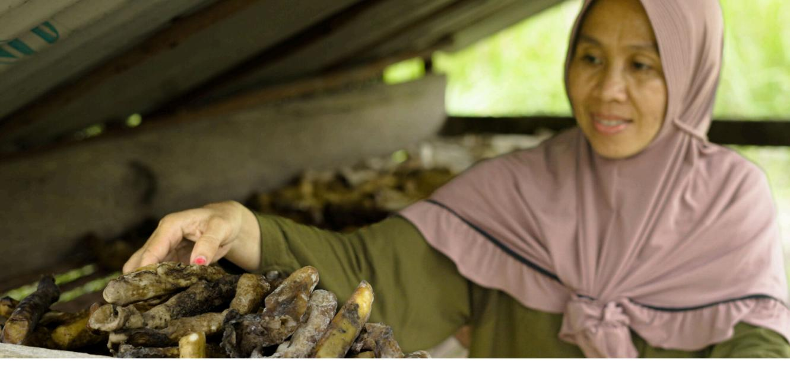

coordination and process ownership. A temporary advisory committee or working group (for example, a GEDSI working group or GEDSI Focal Point) can be established to conduct organizational analysis and develop strategies, while a permanent unit can be formed separately, or a staff member from each department can be assigned to the role. To ensure accountability, the GEDSI institutional structure and framework should take into account the following:

- 1. The structure or unit must have clear authority and be fully integrated into decision-making processes. In this way, it can undertake key responsibilities, such as developing strategies, creating competency plans, supporting method implementation, and conducting monitoring and evaluation to assess the progress of mainstreaming GEDSI.
- 2. The success of the GEDSI unit depends heavily on having sufÏcient resources and expertise. Therefore, it is essential to ensure that projects or organizations allocate adequate budgetary and human resources to the unit.
- 3. Regardless of its exact form, the unit or mechanism must have relevant expertise in methodology, gender, and social inclusion, and organizational development.
- 4. Smaller organizations, or those lacking internal expertise, can rely on support from external experts for a certain period of time. It is also important to allocate adequate time and financial support. Working hours must be set realistically and a dedicated budget should be established to cover the costs of consultants, training activities, the development of gender and social data surveys, and publications.
- 5. Diversity of business and organization scale should also be considered to allow adjustment, both as a fully integrated internal unit or advisory external unit for effective application across various business institutions.

# **5.3 GEDSI norms, culture, and practices**

GEDSI refers to the framework to promote gender equality and social inclusion through the identification and elimination of constraining factors. These factors include discriminatory norms, practices, and culture that impede marginalized groups to participate fully and benefit from development initiatives and services. While norms include community beliefs and stereotypes, practices refer to the deeply entrenched ways of doing things. Finally, culture encompasses collective values that foster an inclusive environment where all individuals, specifically women with diverse social identities, have equal access, opportunities, and voice.

| Norms Culture       | Practice                  |
|---------------------|---------------------------|
| ` GEDSI challenges  |                           |
| ` GEDSI requires an |                           |
| `                   | Cultivate an              |
| `                   | Promote a more            |
| `                   | Facilitate sustainable    |
|                     | ` Implement policies that |
|                     | ` Ensure all women of     |
|                     | ` Create clear and        |

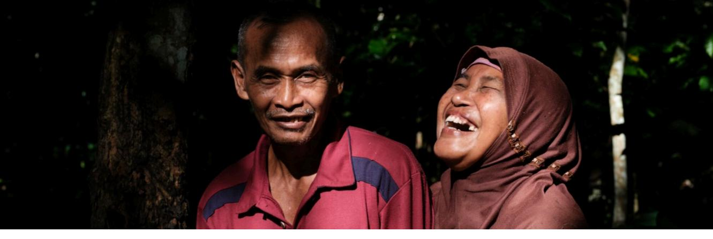

# Conclusion

The Gender Equality, Disability, and Social Inclusion (GEDSI) approach is a key foundation for sustainable agricultural development and commodity businesses, as this sector relies heavily on the contribution of various actors with unequal positions, roles, and access. Without integrating GEDSI, interventions risk perpetuating existing disparities across resource access, decision making, and benefit distribution - which ultimately undermines supply chain resilience. Conversely, adopting GEDSI allows companies and organizations to understand social realities comprehensively, identify hidden contributions (especially from women, youth, and marginalized groups), and devise a business strategy that is more adaptive, equitable, and relevant to the local context.

The advantages of applying GEDSI in sustainable agricultural businesses include improved productivity, higher commodity quality, supply stability, maintained business reputation, and market expansion that increasingly demand for sustainable and socially responsible practices. However, real challenges remain in the implementation of GEDSI, including deeply-embedded social norms, limited availability of disaggregated data, internal resistance, and the risk of unintended impacts such as increased workloads for women or heightened household tension. While these challenges are inevitable, they can be mitigated through contextual GEDSI analysis, a gradual approach, gender-aware risk management, capacity strengthening for teams and partners, and a reflective monitoring and learning system. In this way, GEDSI is not positioned as an additional burden but a strategy of risk management and long-term investment for business sustainability.

This guide urges all stakeholders, including the government, civil society organizations, supporting organizations, and especially private companies in sustainable agricultural commodities, to move beyond normative commitments toward implementing a dedicated, systematic, and measurable GEDSI framework. Adopting GEDSI as an integral part of a business strategy, governance, and partnership goes beyond strengthening business competitiveness; it ensures that the resulting growth is inclusive, equitable, and sustainable. Amidst the challenges of climate change, global market demand, and the need for farmers generational renewal, investing in GEDSI is an investment in the future of the agricultural value chains, making them collectively resilient for businesses, communities, and the environment alike.