# **REPORT**

An analysis of synergies between national regulations, applied certification and traceability for the rubber industry in VietNam with the EUDR

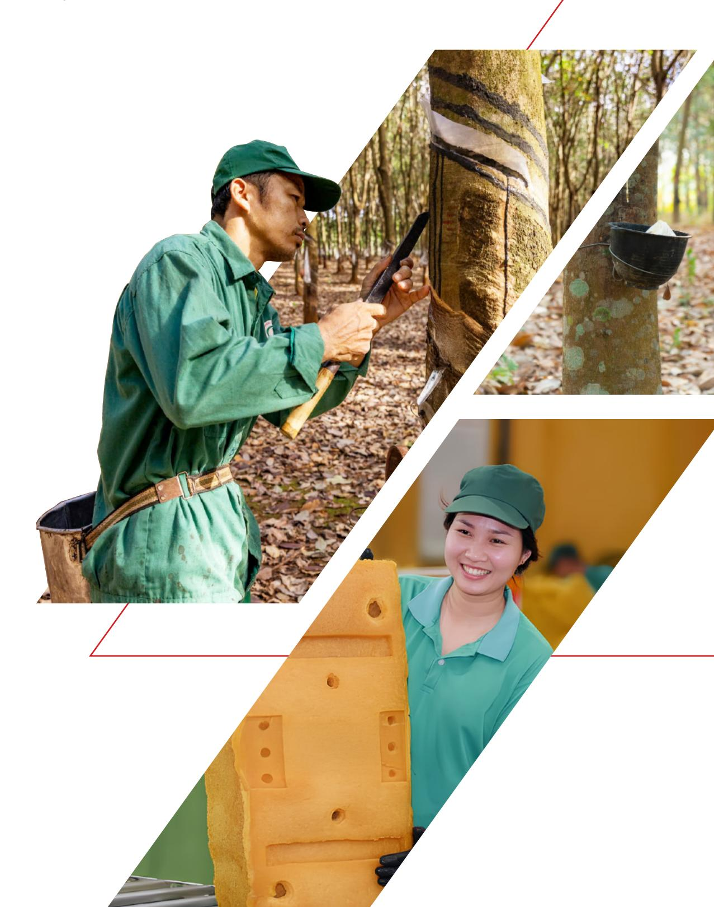

### An analysis of synergies between national regulations, applied certification, and traceability for the rubber industry in Viet Nam with the EUDR

The "EUDR Engagement" project in Southeast Asia is co-funded by the European Union and the Federal Republic of Germany. Deutsche Gesellschaft für Internationale Zusammenarbeit (GIZ) GmbH has been commissioned to implement it as part of the BMZ-funded global programme "Sustainability and Value Added in Agricultural Supply Chains", which is part of the special initiative "Transformation of Agricultural and Food Systems" by the German Federal Ministry for Economic Cooperation and Development.

*Disclaimer: This publication was co-funded by the European Union and BMZ. The content of this publication is the sole responsibility of the authors and does not necessarily reflect the views of the EU or BMZ. The information in this study, or upon which this study is based, has been obtained from sources the authors believe to be reliable and accurate. While reasonable eorts have been made to ensure that the contents of this publication are factually correct, GIZ does not accept responsibility for the accuracy or completeness of the contents of this publication. The mention of specific companies or products of manufacturers, whether or not these have been patented, does not imply that they have been endorsed or recommended by GIZ in preference to others of a similar nature that are not mentioned. The views expressed in this information product are those of the author(s) and do not necessarily reflect the views or policies of GIZ.*

# TABLE OF CONTENTS

| List of Tables                                                                 |                                                                                 | 05 |
|--------------------------------------------------------------------------------|---------------------------------------------------------------------------------|----|
| List of Figures                                                                |                                                                                 | 05 |
| List of abbreviations                                                          |                                                                                 | 05 |
| Executive Summary                                                              |                                                                                 | 07 |
| 
                                                                          |                                                                                 |    |
| CHAP 01                                                                        |                                                                                 |    |
| Introduction                                                                   | 1.1. Background                                                                 | 13 |
|                                                                                | 1.2. Research objective                                                         | 14 |
|                                                                                | 1.3. Research methodology and scope                                             | 15 |
| 
                                                                          |                                                                                 |    |
| CHAP 02                                                                        |                                                                                 |    |
| Overview of Viet Nam's rubber industry and supply chain                        | 2.1. Rubber industry overview: some key findings                                | 17 |
|                                                                                | 2.2. Viet Nam's rubber industry supply chain and key stakeholders               | 24 |
| 
                                                                          |                                                                                 |    |
| CHAP 03                                                                        |                                                                                 |    |
| Similarities and differences between the EUDR and Vietnamese legal regulations | 3.1. The EUDR in short                                                          | 28 |
|                                                                                | 3.2. Deforestation-free production                                              | 29 |
|                                                                                | 3.3. National legal framework                                                   | 32 |
|                                                                                | 3.4. Further potential sources of information for due diligence processes       | 37 |
| 
                                                                          |                                                                                 |    |
| CHAP 04                                                                        |                                                                                 |    |
| The current status of Viet Nam's rubber industry in relation to the EUDR       | 4.1. Challenges                                                                 | 47 |
|                                                                                | 4.1.1. Smallholders                                                             | 47 |
|                                                                                | 4.1.2. Raw rubber traders                                                       | 51 |
|                                                                                | 4.1.3. Enterprises involved in estate rubber growing, processing, and exporting | 53 |
|                                                                                | 4.1.4. Management agencies                                                      | 55 |
|                                                                                | 4.2. Some positive factors                                                      | 57 |

| Discussion, conclusions, and recommendations | 5.1. Discussion      | 64 |
|----------------------------------------------|----------------------|----|
|                                              | 5.2. Conclusion      | 66 |
|                                              | 5.3. Recommendations | 67 |
| References                                   |                      | 69 |
| Appendix                                     |                      | 72 |

### [CHAP 05](#page-62-0)

### LIST OF TABLES

### LIST OF FIGURES

### LIST OF ABBREVIATIONS

| Table 1 | Comparing definitions of deforestation-free production in Vietnamese and EUDR contexts                                     | 29 |
|---------|----------------------------------------------------------------------------------------------------------------------------|----|
| Table 2 | Relevant national legislation in Viet Nam in the EUDR context                                                              | 32 |
| Table 3 | Further potential sources of information                                                                                   | 37 |
| Table 4 | Checklist of existing information in Viet Nam supporting due diligence processes for the rubber sector in the EUDR context | 43 |

| Figure 1 | Export turnover and share of Viet Nam's rubber industry by product category (2023)              | 17 |
|----------|-------------------------------------------------------------------------------------------------|----|
| Figure 2 | Quantity (dry weight) and proportion of raw rubber used by Viet Nam's rubber industry (2023)    | 20 |
| Figure 3 | Proportion of rubber plantation area by ecological region (2023)                                | 21 |
| Figure 4 | Map of rubber plantation areas in Viet Nam (2021)                                               | 22 |
| Figure 5 | Overview diagram of the rubber industry supply chain and related actors in Vietnam in 2023/2024 | 26 |

| BMZ               | German Federal Ministry for Economic Cooperation and Development                                                                                                                |
|-------------------|---------------------------------------------------------------------------------------------------------------------------------------------------------------------------------|
| CoC               | Chains of custody                                                                                                                                                               |
| DAE               | Department of Agriculture and Environment                                                                                                                                       |
| EFI               | European Forestry Institute                                                                                                                                                     |
| EU                | European Union                                                                                                                                                                  |
| EUD               | European Delegation                                                                                                                                                             |
| EUDR              | European Union Deforestation-free Regulation                                                                                                                                    |
| FDI               | Foreign direct investment                                                                                                                                                       |
| FSC-FM            | Forest Stewardship Council – Forest Management                                                                                                                                  |
| FSM               | Sustainable forest management                                                                                                                                                   |
| GIZ               | Deutsche Gesellschaft für Internationale Zusammenarbeit                                                                                                                         |
| GSO               | General Statistics Office of Viet Nam                                                                                                                                           |
| Harmonised System | Harmonised commodity description and coding system, regulated in accordance with the import and export commodity classification system issued by the World Customs Organisation |
| ITC               | International Trade Center                                                                                                                                                      |
| LUR               | Land use right                                                                                                                                                                  |
| LURC              | Land Use Right Certificate                                                                                                                                                      |
| MAE               | Ministry of Agriculture and Environment                                                                                                                                         |
| PEFC              | Programme for the Endorsement of Forest Certification                                                                                                                           |
| PEFC-FM           | PEFC Forest Management Scheme                                                                                                                                                   |
| PPC               | Provincial People's Committee                                                                                                                                                   |
| PUC               | Production Unit Code                                                                                                                                                            |
| RSS               | RSS rubber                                                                                                                                                                      |
| SDGs              | Sustainable Development Goals                                                                                                                                                   |
| SVR               | SRV rubber                                                                                                                                                                      |

| SRD     | Center for Sustainable Rural Development                                                                         |
|---------|------------------------------------------------------------------------------------------------------------------|
| TCHQ    | Viet Nam Customs                                                                                                 |
| TEI     | Team Europe Initiative                                                                                           |
| UNDP    | United Nations Development Programme                                                                             |
| UNDRIP  | United Nations Declaration on the Rights of Indigenous Peoples                                                   |
| UN-REDD | United Nations Programme on Reducing Emissions from Deforestation and Forest Degradation in Developing Countries |
| USD     | US Dollar                                                                                                        |
| VCCI    | Vietnam Chamber of Commerce and Industry                                                                         |
| VFCO    | Viet Nam Forest Certification Office                                                                             |
| VFCS    | Viet Nam Forest Certification System                                                                             |
| VIFORES | Viet Nam Timber and Forest Products Association                                                                  |
| VRA     | Viet Nam Rubber Association                                                                                      |
| VRG     | Viet Nam Rubber Group                                                                                            |
| WWF     | World Wide Fund for Nature                                                                                       |

# Executive Summary

The rubber industry is one of Viet Nam's key economic sectors with an export-oriented focus. In 2023, the industry's total export turnover reached **USD 9.4 billion.**

*Of which,*

Rubber products were exported to more than 160 markets, with the EU being the third-largest market after China and the United States, **representing 7.8% of total export value, equivalent to USD 511 million in 2023.**

Viet Nam's rubber supply chain consists of multiple stakeholders involved in production, import, processing, and distribution/export. Rubber products, including natural rubber products, are sourced from two main types of plantation: large-scale and small-scale ones.

Natural rubber accounted for

**USD 2.9 billion** *(30,6%)*

Rubber products contributed

**USD 4.4 billion** *(46,3%)*

### **LARGE-SCALE RUBBER**

plantations account for around **46%** of the country's rubber-growing area and supply **37%** of raw materials. Most of these plantations are managed by state-owned enterprises under the **Viet Nam Rubber Group (VRG)**, the largest state-owned corporation in the sector.

plantations make up **54%** of the total rubber-growing area but contribute as much as **63%** of raw materials.

### **SMALL-SCALE RUBBER**

This sector is driven by around **265,000** households, the majority of which (nearly 87%) cultivate less than 3 hectares per household.

Input materials for Viet Nam's rubber processing industry are sourced both domestically and through significant imports from neighbouring countries. In 2023, Cambodia and Laos were the two largest suppliers, accounting for over 90% of Viet Nam's total rubber imports,

Raw rubber from smallholders is sold through traders or middlemen, with over 95% of smallholder latex passing through multiple intermediaries before reaching processors. This complicates traceability, especially as supplies may be mixed during various transactions.

### **0.15 million tons** raw rubber **0.93 million tons** raw rubber

*from Laos from Cambodia*

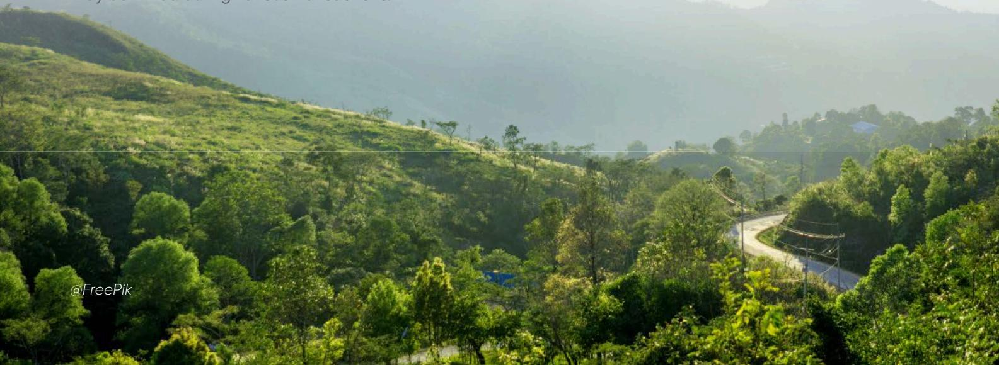

Rubber processing plants play a crucial role in the supply chain, converting raw materials into products such as block rubber, centrifuged rubber, and natural rubber*1* . These processors include state-owned, private, and foreign direct investment (FDI) enterprises. State-owned enterprises typically source raw materials from their own estate plantations, while private and FDI enterprises primarily rely on smallholder plantations. Aiming to stabilise supply and enhance traceability, some companies have established linkages with traders and groups of smallholders.

After preliminary processing, raw rubber is either exported or used domestically to produce finished products such as tyres, gloves, or other industrial goods. The production of rubber products, primarily led by private and FDI enterprises, generates higher added value. Both natural rubber and finished products are consumed locally or exported. For exports, Vietnamese enterprises typically partner with foreign importers rather than handling direct distribution overseas.

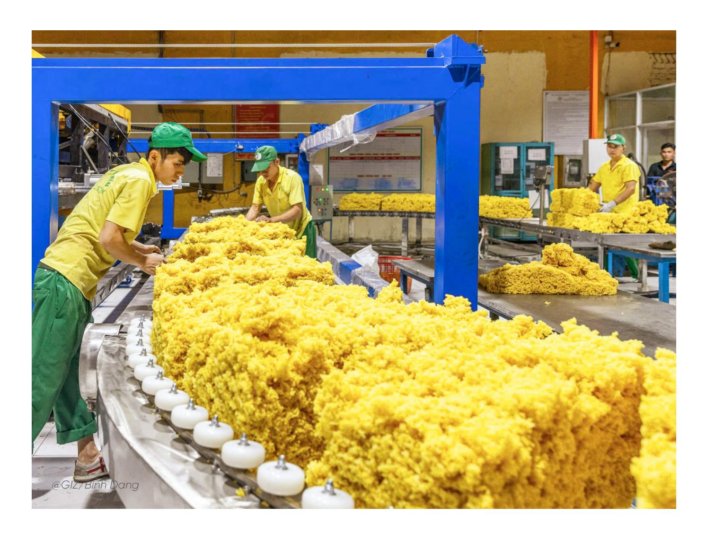

*In this report, "natural rubber" (NR) is a broad term referring to newly harvested rubber, including latex and coagulated latex (collectively known as "unprocessed NR"). It also encompasses rubber that has undergone processing into various forms such as block rubber (SVR), smoked sheet rubber (RSS), and concentrated latex, which are exportable by Viet Nam (collectively known as "processed NR").*

*In other words, "processed rubber" is derived from "unprocessed rubber." However, both serve as raw materials for manufacturing finished products (commonly referred to as "rubber products"), such as tyres, shoe soles, mattresses, and pillows. Collectively, they are categorised as "raw rubber".* 

The supply chain may face challenges aligning with the European Union Deforestation Regulation (EUDR). Issues include the small, fragmented, and dispersed nature of smallholder plantations, the involvement of multiple intermediaries in raw rubber transactions, and the lack of record-keeping practices. Additionally, the mixing of dierent sources complicates traceability. The majority of smallholder plantations lack geographical coordinates. Meanwhile, the absence of a clear forest and land use map (as of 31 December 2020) further hinders eorts to verify that smallholder rubber cultivation did not contribute to deforestation after the cut-o date of December 2020.

Businesses using imported raw materials from Cambodia and Laos also face additional risks from a lack of transparency about origin when dierent sources are mixed, including illegal tapping and stolen latex.

However, the Vietnamese rubber industry also has favourable conditions supporting alignment with the EUDR. Large forestry and export processing enterprises, with strong financial and technical capabilities, have invested in enterprise management systems and developed comprehensive databases. These investments help their businesses to easily meet new requirements, such as traceability and chain of custody (CoC) transparency.

Additionally, large and concentrated plantation areas with available equipment and human resources enable enterprises to quickly fulfill requirements related to boundary and coordinate determination, proving that they do not contribute to deforestation.

Viet Nam is a significant exporter of natural rubber, with China being its largest market from 2019 to 2023. Notably, China is also a major supplier of rubber products to the EU. This indicates that companies in China (as well as those in India and Malaysia, who have been large buyers of Vietnamese rubber) have used or will use Vietnamese rubber to manufacture goods for the EU market. This highlights the global impact of the EUDR on the rubber industry and underscores its influence in driving Viet Nam's supply chain actors to meet EUDR requirements.

In addition, some enterprises, intermediary agents, and smallholder households or groups have implemented partnership models to stabilise and shorten the supply chain from households to processing enterprises. These models adhere to appropriate sustainable forest management certification standards that align with EUDR requirements with financial and technical support from customers. While not yet widespread, these initiatives have shown positive results and potential for replication if given sucient technical and financial support.

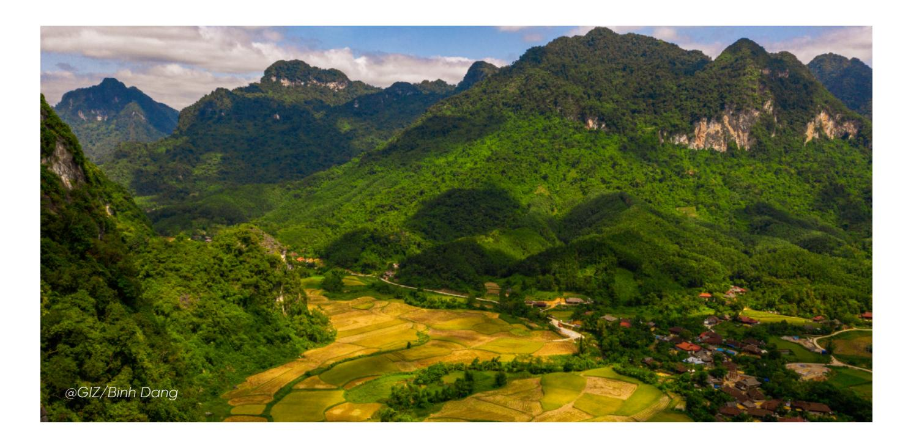

Private sector actors should promote customer engagement in supporting domestic processing manufacturers and their raw material suppliers, enabling them to be ready for EUDR application. These models will help reduce intermediaries; lower transaction costs; shorten the supply chain; and ensure a stable, transparent, and traceable supply flow. Additionally, standardised operational processes and pre-competitive information-sharing systems should be developed and implemented by the industry to ensure that all necessary data needed for EUDR compliance is fully transmitted along the CoC, maintaining traceability throughout the entire supply chain.

Specific support programmes by government and private sector actors should be established to help smallholders enhance their understanding of EUDR and improve their production and trading processes. These programmes should focus on upgrading production skills, ensuring better environmental and social standards, and increasing the transparency of the supply chains in which they participate.

Rubber dealers or intermediary traders purchasing latex from small rubber plantations also need awareness-raising activities and technical support to ensure traceability for the rubber latex they bring into the supply chain.

A mobile app for handheld devices, such as smartphones, should be developed to help smallholders and intermediate raw latex dealers update transaction information in real time. This could be led by either the Vietnamese government or private sector stakeholders, including technology companies, rubber processing enterprises, and industry associations. The government could facilitate development and ensure the accessibility of such an app. Ideally, this app should be free for smallholders, open-source, and with interoperable data formats while ensuring data privacy. Meanwhile, the private sector, especially rubber enterprises, could contribute with outreach through technical development, implementation, and ongoing maintenance of the app.

### Aiming to fully meet EUDR requirements in the Vietnamese rubber industry, the research team proposes the following solutions:

Vietnamese government actors, as well as private sector actors downstream in the supply chain, could promote multi-channel communication to enhance awareness and understanding of the EUDR, especially amongst local enterprises, local management ocials, traders, and smallholders at the provincial, district, and commune levels.

Public authorities could establish a national mechanism to enhance cooperation among local interested parties such as government bodies, business associations, processors, traders, and smallholder groups, leveraging their resources and strengths to contribute to Sustainable Development Goals (SDGs) and ensure alignment with EUDR requirements across the industry. Also, public-private partnerships can support smallholders with technical and financial resources, while processing companies can provide training and outreach on best practice for deforestation-free sourcing.

Viet Nam is already supported by initiatives such as the SAFE and EUDR ENG projects. These international initiatives and support programmes, especially in the context of the Team Europe Initiative (TEI) on deforestation-free value chains, oer valuable opportunities for cross-country collaboration and knowledge exchange for the rubber industry in Viet Nam. Focus should be on smallholder rubber farmers and intermediate raw rubber dealers, strengthening their capacity, improving access to resources, and involving them in the sustainable rubber supply chain to ensure long-term impact and alignment with Viet Nam's development goals.

A mechanism should be developed to encourage farmer outreach and partnership through groups of farmer households or partnerships among processors, traders, and households/household groups. This could be developed by both public authorities and private sector stakeholders in Viet Nam working together to foster collaboration and create further opportunities for smallholders to organise themselves and adopt more sustainable practices.

Audits for sustainability management certifications compatible with the EUDR present a valuable opportunity for private sector stakeholders to use synergies to provide and collect data relevant to the EUDR context. However, it is crucial to recognise that the EUDR does not consider any certification scheme a green light for compliance. Certain certification schemes might be helpful tools for data collection. Even so, they are not a substitute for the due diligence obligations of operators. Currently, widely recognised sustainability standards do not fully meet all EUDR requirements. If supply chain actors can ensure deforestation-free value chains in line with EUDR requirements through other eective means, and their customers do not specifically require a sustainability certification, obtaining one is unnecessary. This clarification should be widely communicated amongst Vietnamese supply chain actors to prevent misunderstanding.

Local authorities could facilitate the issuance of Land Use Right Certificates (LURCs) for rubber plantation areas stably used by households for a long time, free of disputes, and aligned with existing land use planning. The updated LURC format, which includes geographical coordinates, not only serves as legal proof of ownership but also helps reduce the costs of providing evidence for deforestation-free and legal commodity production in line with EUDR requirements. For eligible areas where LURCs cannot be immediately granted, the government could provide clear guidance and agree on alternative forms of ownership and land-use verification. This will prevent households from being excluded from the supply chain and mitigate potential negative socio-economic impacts on smallholder farmers.

Vietnamese regulatory agencies could expedite the development of a unified and synchronised land database and assign production codes to all rubber plantations and other crops. Additionally, a mechanism for sharing information on sourcing areas could be established to support stakeholders with legitimate and legal needs to ensure compliance with the national legislative framework for legal and deforestation-free commodity production.

Information on FDI companies in the rubber industry remains very limited, with Vietnamese customs

records on imports and exports being the only accessible source. Given their significant role in Viet Nam's rubber supply chain, greater transparency and active participation from these companies are essential for traceability along the value chain. Government stakeholders in Viet Nam should establish a mechanism to encourage coordination and information sharing among FDI companies, starting with European firms.

Government agencies and private sector stakeholders could establish a mechanism to encourage smallholders to proactively organise themselves into household groups—operating independently alongside the existing partnership model between smallholder farmers and enterprises under cooperatives or cooperative groups. This will enhance supply chain transparency, shorten distribution channels, and increase the capacities of stakeholders to produce deforestation-free commodities. Development institutions and non-governmental organisations can play a key role in supporting this initiative.

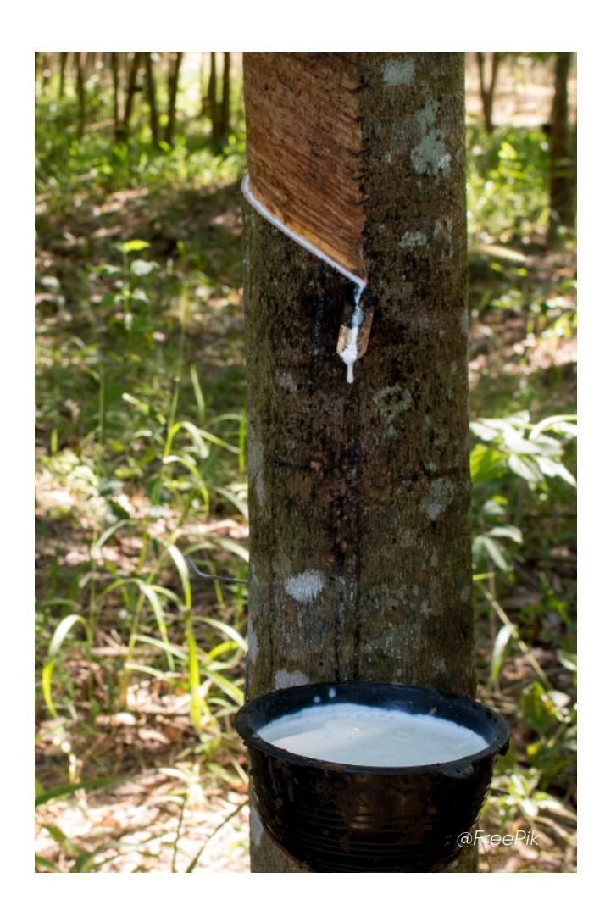

# CHAP 01

Introduction

[1.1. Background](#page-12-0) [1.2. Research objective](#page-13-0) 1.3. Research [methodology and scope](#page-14-0)

# 01. Introduction

### 1.1. Background

Nearly 90% of global deforestation is driven by the expansion of agricultural land, with a significant portion of agricultural products from deforested areas being traded internationally. To mitigate its contribution to deforestation and forest degradation, the EU adopted the EUDR.

This regulation aligns with various international declarations and policy objectives of the EU. Additionally, it supports the implementation of key global agreements, including the SDGs, the Paris Agreement, the Kunming-Montreal Global Biodiversity Framework, and the Glasgow Leaders' Declaration on Forests and Land Use, emphasising the urgent need for forest protection worldwide.

Under the EUDR, companies placing relevant products on or exporting them from the EU market (operators) must ensure, through due diligence measures, that these products are legally produced

and do not contribute to deforestation (or, in the case of wood, forest degradation) after December 2020. The EUDR applies to beef, cocoa, coee, natural rubber, palm oil, soy, and timber, as well as certain products derived from these materials. The regulation entered into force on 29 June 2023, and will be applied from 30 December 2025*2* . Of the commodities from Viet Nam most aected by this regulation, natural rubber products are grouped alongside coee and timber.

Natural rubber production and processing are key economic sectors in Viet Nam, significantly contributing to the country's export revenue. Europe is Viet Nam's third-largest export market for natural rubber products, behind China and the United States.

*On 17 December 2024, the European Parliament approved a one-year postponement of EUDR adoption, shifting the date from 30 December 2024 to 30 December 2025.*

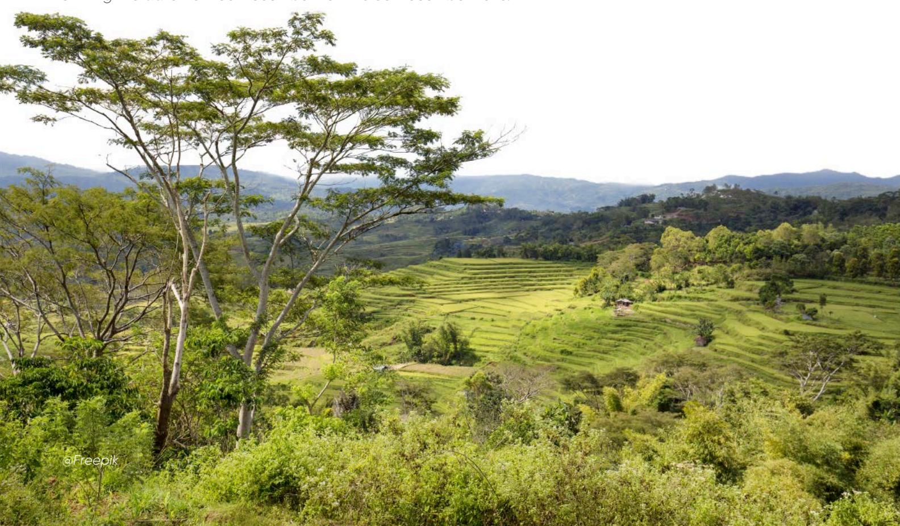

### 1.2. Research objective

The overall objective of this study is to assess the readiness of Viet Nam's rubber industry for EUDR application by the end of 2025. It aims to give an overview of the country's rubber industry and supply chain, enhancing understanding of the sector. Additionally, the study oers essential information to operators and traders for their due diligence statements.

THE STUDY HAS THE FOLLOWING SPECIFIC OBJECTIVES:

 *To provide an overview of Viet Nam's rubber industry and its supply chain, including production, processing, import, and export;*

1 *To identify areas of compatibility and gaps between national regulations and EUDR requirements, focusing on traceability and legality;* 2

 *To highlight current challenges and advantages in aligning with the EUDR;*

3 *To provide recommendations towards an EUDR-ready rubber industry for Viet Nam.* 4

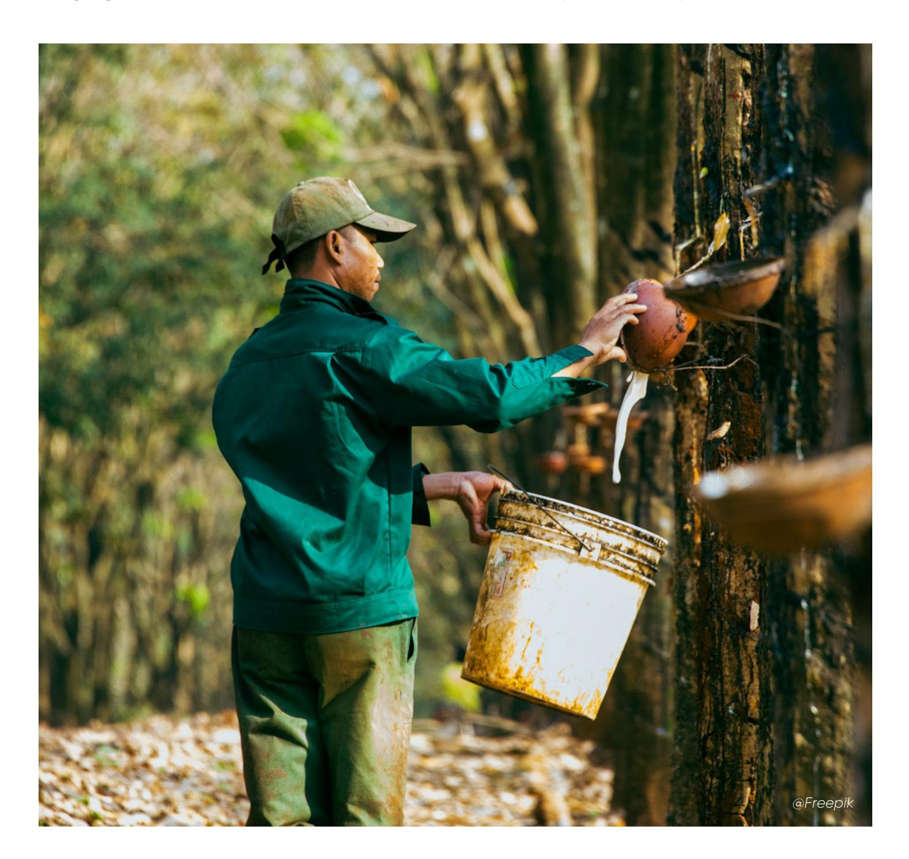

### 1.3. Research methodology and scope

This study utilises both secondary and primary data, with secondary data serving as the main source of information. Secondary data is drawn from ocial statistics provided by the General Statistics Oce (GSO), Viet Nam Customs, and Departments of Agriculture and Rural Development in provinces with rubber plantations. Additional sources include project reports, relevant research studies from organisations and individuals, as well as analysis and discussion findings and presentations from relevant events, seminars, and technical meetings.

The analysis of what is considered relevant national legislation within Viet Nam's legal framework in the context of the EUDR was conducted using methodology developed by the European Forestry Institute (EFI), which has previously been applied to the wood and coee industries.

Primary data for the study was gathered through surveys and direct interviews with various stakeholders, including government departments, rubber processors, exporters, raw latex traders, small rubber plantation households, and industry experts in Binh Duong province and Ho Chi Minh City. Additionally, online and telephone interviews were conducted with experts and enterprises in the industry.

A consultation meeting was held to present the key findings of the study and gather additional information and feedback from regulatory agencies, organisations, and individuals who contributed to the report. All activities were conducted between November and December 2024 and in January 2025. Appendix 17 provides a list of interviewees.

The Vietnamese rubber industry produces three main categories of output: raw rubber (natural rubber), rubber products, and rubber wood and its derivatives. However, under the EUDR, wood-related aspects fall within the regulatory scope for wood products. Therefore, this study focuses exclusively on the first two categories. Additionally, FDI enterprises are not covered in this report due to limited access to relevant information.

The report consists of five parts. The first part provides an overview of the context, objectives, methodology, and scope of the study. Part 2 presents a comprehensive view of the rubber industry and supply chain in Viet Nam, focusing on two product categories: natural rubber and further rubber products. This section covers the industry's role in the economy, export turnover to the EU market, key enterprises, and sources of raw rubber. It concludes with an overview of the supply chain and its key actors. Part 3 examines relevant national legislation in the Vietnamese context as stated in the EUDR, with a focus on traceability, deforestation-free requirements, legality, and due diligence. Part 4 analyses the current state of the industry, highlighting challenges and opportunities for supply chain actors to meet EUDR requirements for legality and deforestation-free production. The final section summarises key discussion points and oers recommendations to enhance the Vietnamese rubber industry's readiness to prepare for EUDR application across the supply chain.

# CHAP 02

Overview of Viet Nam's rubber industry and supply chain

17 [2.1. Rubber industry overview:](#page-16-0) some key findings

24 2.2. Viet Nam's rubber industry [supply chain and key](#page-23-0) stakeholders

## 02. Overview of Viet Nam's rubber industry and supply chain

### 2.1. Rubber industry overview: some key findings

The rubber industry is one of Viet Nam's key export-oriented economic sectors. According to the GSO, in 2023, the industry's total export turnover—including (i) natural rubber; (ii) rubber products*3* , and; (iii) rubber wood and its derivatives —reached USD 9.4 billion. The two main product categories covered in this report, natural rubber and rubber-based products, accounted for over USD 2.9 billion (30.6%) and USD 4.4 billion (46.3%), respectively (Figure 1)*4* . Together, these groups contributed more than 2% to Viet Nam's total export turnover of USD 354.7 billion in 2023*5* .

According to the Viet Nam Rubber Association (VRA), the industry aimed for an export turnover of USD 10.2 billion in 2024, a 7.9% increase on 2023. Among the key segments, rubber products are expected to generate the highest turnover, at USD 4.6 billion, followed by natural rubber (over USD 3.1 billion), and rubber wood (over USD 2.5 billion). Data from Viet Nam Customs*6* indicates that, in the first ten months of 2024, Viet Nam's total export turnover of natural rubber and rubber-based products was estimated at USD 6.6 billion. Of this, natural rubber accounted for USD 2.5 billion, while rubber products contributed USD 4.1 billion, equivalent to 64.7% of the annual target.

### EXPORT TURNOVER

Figure 1. Export turnover and share of Viet Nam's rubber industry

by product category (2023)

*Source: Viet Nam Customs data compiled by VRA.*

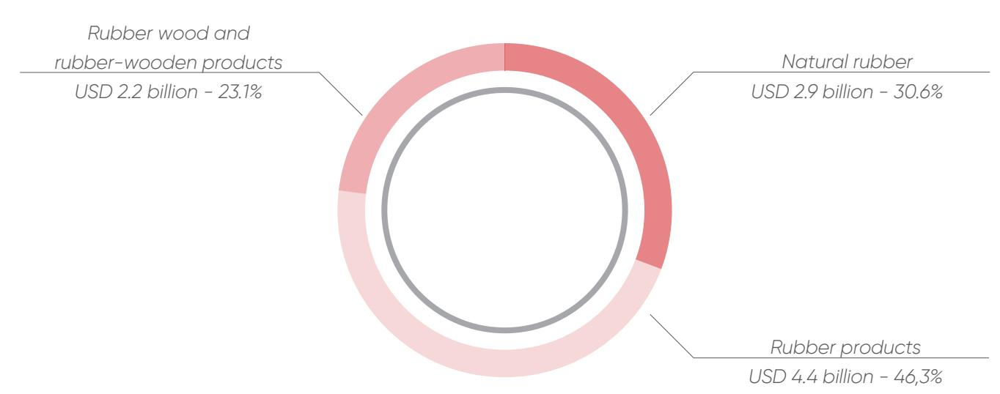

*See footnote 1.*

*4 VRA-compiled data from Viet Nam Customs.*

*5 Ministry of Industry and Trade (2024). Viet Nam Import and Export Report 2023. Industry and Trade Publishing House. Available at:*

*&lt;https://trungtamwto.vn/file/22934/bao-cao-xuat-nhap-khau-viet-nam-nam-2023.pdf>*

*6 VRA-compiled data from Viet Nam Customs, as indicated in the VRA presentation at the workshop: "Promoting Sustainable Natural Rubber Production, Investment, and Trade in Mainland Southeast Asia" in Vientiane, Laos 14-15 November 2024.*

From 2019 to 2023, Viet Nam exported rubber products to over 160 markets. The EU was Viet Nam's third-largest export market, behind China and the United States. In 2023, Viet Nam's rubber exports to the EU were valued at USD 511 million, accounting for 7.8% of the industry's total export turnover. Exports to China reached over USD 2.4 billion (36.1%), while exports to the United States totalled USD 1.6 billion (23.9%).

From 2019 to 2023, Viet Nam exported an average of 90,000 tons of natural rubber (HS 4001) annually to the EU, valued at around USD 140 million, along with rubber products worth about USD 350 million*7* . During this period, natural rubber exports to the EU declined, while exports of rubber products rose. In 2023, the top European importers of rubber products—including natural, synthetic*8* , and processed rubber—were Germany, the Netherlands, Spain, Italy, Poland, and France*9* . For detailed information, refer to Appendices 1–4.

### EXPORT MARKETS

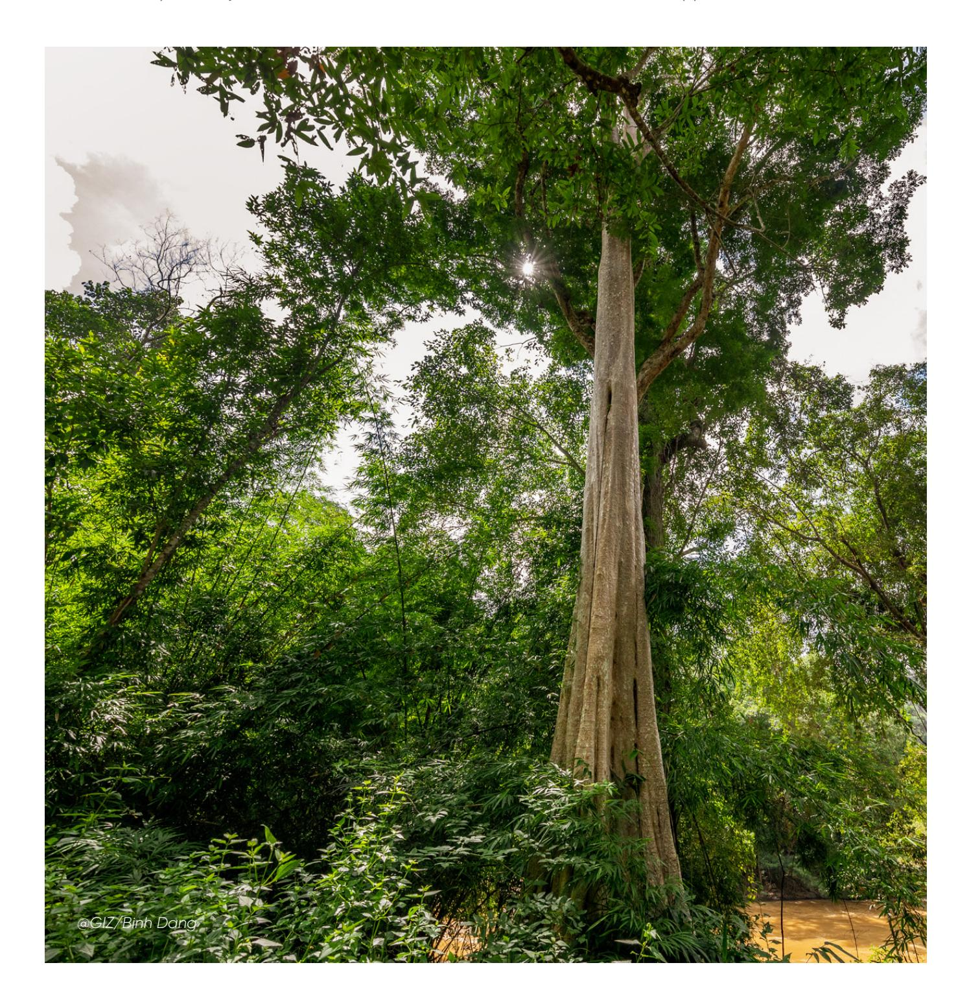

### RUBBER INDUSTRY ENTERPRISES AND EXPORTERS TO THE EU

The Vietnamese rubber industry comprises a diverse range of enterprises. These include small, medium, and large enterprises ranging from state-owned and private to FDI companies operating across all stages of the value chain—from production and cultivation to raw rubber trading, primary processing of natural rubber, rubber product manufacturing (finished goods), and import-export activities.

The VRG, a state-owned corporation, plays a key role in the Vietnamese rubber industry. It oversees 155 member companies, including 99 subsidiaries and 16 joint ventures. Among its subsidiaries, 63 companies specialise in rubber cultivation and processing, managing over 373,000 hectares of estate rubber plantations—about 260,000 hectares in Vietnam, over 87,000 hectares in Cambodia, and nearly 26,000 hectares in Laos. In 2023, VRG's subsidiaries accounted for 28.5% of Viet Nam's total rubber plantation area.

Appendix 5 provides an overview of enterprises in the Vietnamese rubber industry. Key highlights include:

Regarding exporting enterprises, data from Viet Nam Customs (compiled by Forest Trends*10*) indicates that, in 2023, Viet Nam had 166 enterprises exporting natural rubber and 6,315 exporting rubber products. Of these, 53 exported natural rubber to the EU, accounting for 32% of all natural rubber exporters. Meanwhile, 370 enterprises exported rubber products to the EU, representing nearly 6% of rubber product exporters. For detailed information, refer to Appendices 6 and 7.

- The Vietnamese rubber industry consists of thousands of enterprises, including state-owned, private, and FDI companies. These enterprises operate across the entire supply chain, from rubber cultivation and raw rubber trading to processing, importing, and exporting.
- Private enterprises play a significant role in processing, importing, and exporting, particularly in the processing segment, where they have the largest number of businesses and the highest processing capacity.
- Some enterprises engage in multiple activities simultaneously, including rubber cultivation, processing, and export.
- State-owned enterprises dominate rubber cultivation, holding the largest plantation area, and also play a key role in processing.
- While the highest number of private enterprises engage in rubber cultivation, their individual plantation areas are relatively small.
- FDI enterprises are primarily involved in the production, trade, and export of rubber products.

*Quang et al., 2024.*

*8 According to the FAQ document on the EUDR, section 2.2, products made from synthetic rubber are out of scope under the EUDR and the mix of synthetic and natural rubber are subject to due diligence requirements only for the natural rubber component.*

*Forest Trends-compiled data from Viet Nam Customs.*

*10 See more details at:*

*https://mkresourcesgovernance.org/2024/10/01/phien-hop-ky-thuat-ve-nganh-go-va-cao-su-chuan-bi-t hich-ung-eudr-thuc-trang-va-kien-nghi-tu-cong-dong-doanh-nghiep/* 

### SUPPLY OF INPUT MATERIALS

Viet Nam's rubber processing industry relies on raw rubber (latex/natural rubber) from both domestic and imported sources. According to data from the GSO and Viet Nam Customs, in 2023, the industry consumed nearly 2.47 million tons (dry weight) of natural rubber*11* . Of this, domestic rubber plantations supplied 1.27 million tons, accounting for 51% of the total natural rubber used in the processing industry. Meanwhile, imports from around 20 markets contributed 1.2 million tons, making up the remaining 49%.

Cambodia and Laos were the two largest sources of imported natural rubber for Viet Nam in 2023, supplying 38% and 6%, respectively, of the total raw materials used by the Vietnamese rubber processing industry (Figure 2). When considering imports alone, these two markets accounted for over 90% of Viet Nam's total natural rubber imports that year.

Viet Nam's domestic raw rubber supply comes from a total rubber plantation area of 911,200 hectares nationwide (2023, GSO). Smallholder rubber plantations managed by about 265,000 farming households (so-called smallholder rubber) cover 489,700 hectares and produce 800,000 tons of raw rubber (dry weight). The remaining 421,500 hectares are owned by around 160 state-owned, private, and FDI enterprises*12* (so-called estate rubber plantations), supplying 470,000 tons. In terms of proportion, in 2023, smallholder rubber plantations accounted for 54% of the area and 63% of the volume of raw rubber. Meanwhile, large-scale rubber plantations accounted for 46% of the area and 37% of the volume. The volume and proportion of raw rubber from smallholder plantations have increased continuously over the past 10 years (since 2014), showing that raw rubber from

smallholder farmers is increasingly important to the Vietnamese rubber processing industry.

A notable trend is the steady decline in Viet Nam's rubber plantation area over the years, from a peak of 985,600 hectares in 2015 to 911,200 hectares in 2023. On average, this area has decreased by over 9,000 hectares per year during the 2015–2023 period. This decline is primarily due to crop restructuring, as rubber plantations are converted to higher-value crops such as durian, avocado, cashew, or short-term cash crops. Additionally, some areas have been repurposed for urban expansion and the development of new industrial zones. Detailed data on Viet Nam's rubber plantation area, yield, and production over multiple years are provided in Appendices 9 to 16.

Figure 2. Quantity (dry weight) and proportion of raw rubber used by Viet Nam's rubber industry (2023) *Source: Aggregated data from GSO and Viet Nam Customs*

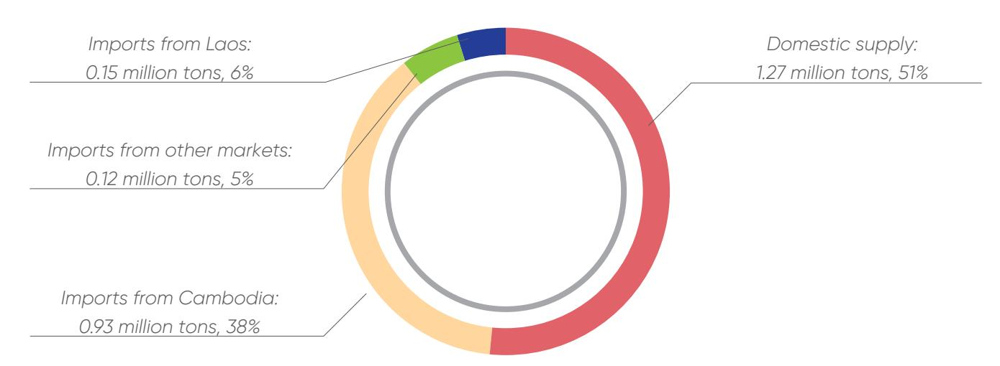

*11 The above data refers only to natural rubber and does not include other imported raw rubber, such as synthetic or artificial rubber.* 

*12 2019 data, compiled by VRA, Tran Thi Thuy Hoa et al. (2021).*

### DISTRIBUTION OF RUBBER PLANTATION AREAS ACROSS VIET NAM

Viet Nam has 32 provinces with rubber plantations, primarily distributed across five out of seven ecological regions: the Northern Mountainous region (seven provinces), the North Central region (six provinces), the Central Coast (seven provinces), the Central Highlands (five provinces), and the Southeast region (six provinces). Additionally, the Mekong Delta/Southwest region contributes one province.

The Southeast region has the largest rubber plantation area, accounting for 59% of the country's total rubber-growing area, followed by the Central Highlands with 25% (Figure 3). The country's leading provinces with the largest rubber plantation areas and the highest output are Binh Phuoc, Binh Duong, and Tay Ninh, respectively.

Figure 3. Proportion of rubber plantation area by ecological region (2023)

*Source: VRA-compiled data from the GSO and provincial Departments of Agriculture and Rural Development*

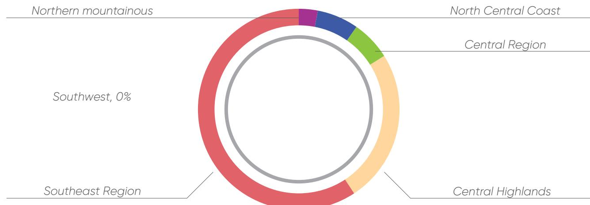

Figure 4. Map of rubber plantation areas in Viet Nam (2021)

*Source: VRA.13*

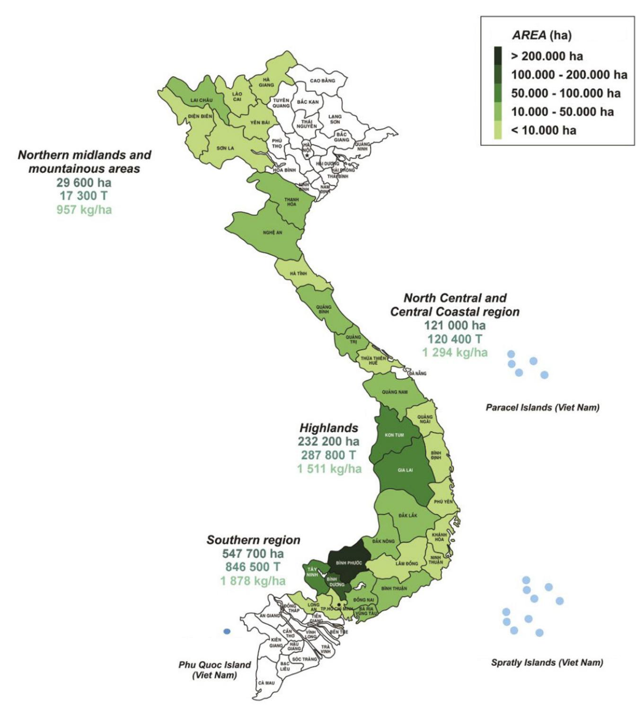

### SUSTAINABLE PLANTATION AREA MANAGEMENT AND CERTIFICATION

### TRENDS IN DOMESTIC RUBBER DEVELOPMENT

Enterprises with rubber plantations have developed sustainable forest management (FSM) plans in accordance with State guidelines. According to VRG data, 280,000 hectares of estate rubber plantations owned by VRG member companies have FSM plans approved14. No information is currently available regarding FSM plans for non-VRG areas.

As of 12 December 2024, around 127,600 hectares of rubber plantation areas in the country have been certified with Forest Stewardship Council - Forest Management (FSC-FM) and Programme for the Endorsement of Forest Certification Forest Management Scheme (PEFC-FM) sustainable forest management certificates:15, 16

As a result, in 2023, only 14.6% of the total rubber plantation area in the country had sustainable forest management certification.

- The PEFC-FM certified area covers about 124,000 hectares, including over 2,800 hectares of smallholder rubber plantations and 121,200 hectares of estate rubber plantations*17*. Of this, over 120,600 hectares of certified estate rubber plantations belong to VRG member companies*18* .

- The area certified by FSC-FM is nearly 6,400 hectares, including 4,900 hectares of small-holder rubber and 1,500 hectares of estate rubber plantations*19*. No areas managed by VRG member companies have been granted this type of certificate.

According to Viet Nam's project on developing key cash crops by 2030*20*, rubber trees are envisioned to be developed with specific goals for 2030:

Therefore, Viet Nam's rubber growing area is expected to decrease by about 60,000 - 110,000 hectares in 2030 compared to 2023. However, output is projected to increase by about 30,000 - 230,000 tons. Meanwhile, the area certified for FSM will double. Achieving higher output with a reduced plantation area will require significant improvements in crop productivity and latex quality.

- The rubber plantation area is maintained at around 800,000 to 850,000 hectares, with the Southeast region covering about 480,000 to 500,000 hectares, the Central Highlands region about 180,000 to 200,000 hectares, and the remaining 140,000 to 150,000 hectares distributed across provinces in the South-Central Coast, North Central, and Northwest regions.
- Raw rubber latex production reaches 1.3 to 1.5 million tons.
- The output of domestically processed rubber latex exceeds 40%.
- Rubber plantations are developed into estate plantations, with over 70% of the area managed through farmer-o-taker partnerships.
- The rubber area granted sustainable forest certification is between 250,000 and 300,000 hectares.
- 100% of Viet Nam's rubber latex and rubber wood are tracked using production codes to ensure full

traceability.

*14Presentation by the VRG Representative at the Vietnam Rubber Industry International Conference 2024*

*15A single unit holds both FSC-FM and PEFC-FM certifications for the same area of over 2,800 hectares.*

*16These certificates are valid for five years, with expiration dates ranging from 2026/27 to 2029.* 

*17 For more details, please visit: https://vfcs.org.vn/du-lieu-chung-nhan/* 

*18 Presentation by the VRG representative at the 2024 Viet Nam Rubber Industry International Conference dated 12 December 2024 in HCMC.*

*19 For more details, please visit:*

*https://app.powerbi.com/view?r=eyJrIjoiN2U3NGMyNWEtZTAxNS00MzVhLWExNmMtOThhZjdiYjQ4MWNkIiwidC I6IjEyNGU2OWRiLWVmNjUtNDk2Yi05NmE5LTVkNTZiZWMxZDI5MSIsImMiOjl9* 

### 2.2. Viet Nam's rubber industry supply chain and key stakeholders

The key characteristics of the Viet Nam rubber industry supply chain for 2023/2024 are summarised below.*21*:

The input materials for Viet Nam's rubber processing industry come from two sources: domestic rubber plantations and imports. As the world's fifth-largest rubber producer, Viet Nam supplies significant amounts of rubber latex and natural rubber for processing. The rubber cultivation stage involves a diverse range of stakeholders, including state-owned enterprises, private companies*22*, FDI enterprises, and smallholder farmers. Many rubber plantation enterprises operate their own processing factories, sourcing raw materials from their plantations, other enterprises, smallholders, and

### SUPPLY OF INPUT MATERIALS:

### HARVESTING AND PROCUREMENT OF RAW LATEX:

imports. Smallholders are playing an increasingly vital role in rubber cultivation and supplying raw latex to the processing industry.

Regarding import sources, Cambodia and Laos are the two largest suppliers among about 10 key markets exporting raw rubber to Viet Nam. Additionally, some Vietnamese enterprises have invested in rubber plantations in these countries, harvesting and exporting raw rubber to their parent companies in Viet Nam for domestic use or re-export.

Domestic raw latex extraction is carried out by rubber plantation owners, including enterprises and smallholders. Enterprises that own rubber plantations can either supply raw latex directly to their own processing facilities (a very common practice) or sell it to other processing enterprises, either directly or through trading companies.

The latex collected from smallholder rubber plantations can be sold directly to processing factories-mainly private enterprises and FDI companies, which often face challenges in accessing rubber-growing land due to limited land availabilityor sold through traders, dealers, or commercial enterprises. The majority of smallholder rubber, over 95% (and nearly 100% in some areas), is sold through traders. Some smallholder households also act as traders or dealers, purchasing latex from

neighbouring households and reselling it to processing factories or other traders. Depending on the locality, trader and dealer networks can have multiple tiers, and transactions between these levels are common.

Imported raw latex is purchased by commercial enterprises and supplied to domestic factories. In some cases, these enterprises import the latex and then resell it to other domestic commercial enterprises before it is supplied to processing factories, similar to how traders/dealers handle smallholder rubber latex. Additionally, Vietnamese enterprises investing in rubber plantations in Cambodia and Laos may supply raw latex to their parent companies in Viet Nam or resell it to other domestic commercial enterprises.

*20Decision No. 431/QD-BNN-TT dated 26 January 2024 of the Minister of Agriculture and Rural Development approving the project on developing key cash crops to 2030. Available at: <https://thuvienphapluat.vn/van-ban/Linh-vuc-khac/Quyet-dinh-431-QD-BNN-TT-2024-De-an-phat-tri en-cay-cong-nghiep-chu-luc-den-2030-602966.aspx>*

*21Hoa et al. (2018), Quang et al. (2021), and Quang et al. (2024), site survey in December 2024.*

*22Private enterprises may operate under a cooperative model.*

The primary processing of natural rubber, which produces processed commodities such as rubber blocks and rubber latex sheets, involves the participation of state-owned enterprises, private enterprises, and FDI companies, with private enterprises accounting for the largest share. These primary processing enterprises source raw rubber from both smallholder and estate rubber plantations, as well as imports. State-owned enterprises primarily rely on raw materials from estate plantations (though they are increasingly expanding to smallholder plantations due to rising raw material demand), while

### PRODUCTION OF RAW NATURAL RUBBER (PRIMARY PROCESSING):

### RUBBER PRODUCT PRODUCTION (DEEP PROCESSING):

Processed natural rubber products serve as inputs for deep processing, which produces finished products such as tyres, mattresses, pillows, and

### DISTRIBUTION/CONSUMPTION:

Rubber commodities produced in Viet Nam, including processed natural rubber and rubber products —sourced from domestic smallholder plantations, estate plantations, and imports—are consumed domestically and, notably, exported. Rubber processing enterprises, both primary and refined, can sell directly within the domestic market

through stores or distribution agents, or export directly to global markets. They may also sell to domestic and foreign trading companies. For exports, selling through importers in the destination country is the most common practice. Few enterprises manage their product distribution abroad directly, especially in the EU.

private and FDI enterprises mainly source from smallholder farmers. Some processing enterprises have developed partnerships with groups of smallholder households to increase purchasing power and stabilise the supply of raw materials.

The raw natural rubber commodities produced by the enterprise are used to manufacture rubber products. If the enterprise also operates a rubber product factory, it can also be directly exported to markets including the EU, sold to other rubber product factories, or supplied to commercial companies.

other high-value-added commodities. Private and FDI enterprises play a more prominent role in the deep processing stage.

### OTHER STAKEHOLDERS:

In addition to the key actors directly involved in the stages of the supply chain mentioned above, several agencies and organisations play a role—directly or indirectly—in the production and trade of rubber trees, raw rubber latex, and natural rubber commodities. These include state management agencies and both domestic and foreign technical support organisations. Some prominent agencies and organisations include:

- Central level: The Ministry of Agriculture and Environment (MAE) (Department of Crop Production and Plant Protection, Department of Forestry and Forest Protection, Department of Environment, National Agricultural Extension Center); the Ministry of Industry and Trade (Department of Import and Export, Department of Trade Promotion); the Ministry of Finance (General Department of Taxation, Vietnam Customs); VRG.

- Local level: Provincial People's Committees; the Department of Agriculture and Environment (Agricultural Development, Agricultural Extension Services, Forest Protection Sub-Department); the Department of Industry and Trade; the Department of Finance; District and Commune People's Committees (in areas with rubber plantations).

- Vietnam Rubber Association; Vietnam Chamber of Commerce and Industry (VCCI).

- Research/academia; Vietnam Rubber Research Institute; University of Technology.

- International organisations supporting the industry directly: Forest Trends, GIZ, EFI, WWF, Oxfam, CMO, Tropenbos International, PanNature, etc.

- Certification bodies: PEFC/VFCS, FSC, Preferred by Nature, GFA, etc.

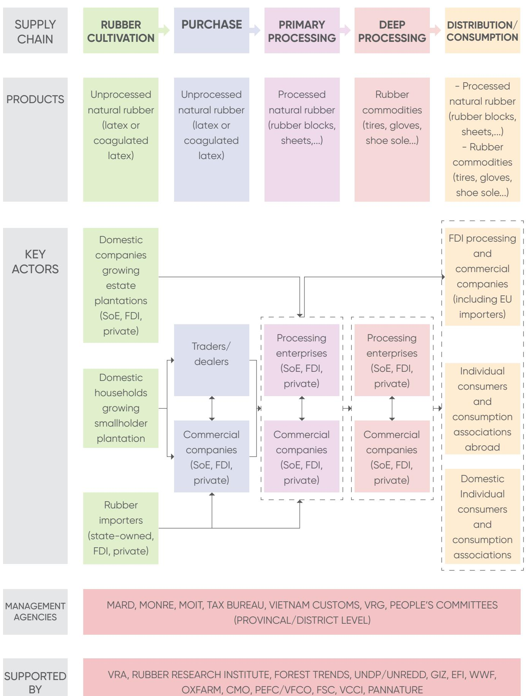

Figure 5. Overview of the rubber industry supply chain and related actors in Viet Nam, 2023 -2024 *Source: modified according to Quang et al. 2021, Quang et al 2024., and direct survey (December 2024).*

# CHAP 03

Similarities and di
erences between the EUDR and Vietnamese legal regulations

[3.1. The EUDR in short](#page-27-0) [3.2. Deforestation-free](#page-28-0) production [3.3. National legal framework](#page-31-0) [3.4. Further potential sources](#page-36-0)  of information for due diligence processes 28 29 32 37

## 03. Similarities and dierences between the EUDR and Vietnamese legal regulations

### 3.1. The EUDR in short

### THE EUDR IN SHORT

The EUDR's objective is to: (a) minimise the EU's contribution to global deforestation and forest degradation, thereby reducing global forest loss, and; (b) reduce the EU's contribution to greenhouse gas emissions and global biodiversity loss (Article 1(1)).

The EUDR requires that seven commodities, including livestock, cocoa, coee, palm oil, rubber, soy, and timber (Article 2(1)) can only be placed on the EU market if they meet three conditions: (a) they are deforestation-free; (b) they have been produced in accordance with the relevant legislation of the country of production, and; (c) they are covered by a due diligence statement (Article 3).

Operators and traders, as defined under the EUDR*23*, are obliged to fulfill their due diligence obligations if they want to place a product covered by the EUDR on the EU market for the first time or export them from there. The three-step due diligence process is as follows:

- First, operators must collect relevant information, including the geolocation of all areas of production. The geolocation of each plot only needs to be collected once using widely available and free technology.

- Secondly, they need to conduct a risk assessment based on the information collected.
- Thirdly, they must mitigate and manage risk when a non-negligible risk is identified. This should be confirmed by a due diligence statement and the geolocation of the plots of production submitted.

### DUE DILIGENCE STATEMENT (SEE ANNEX II OF THE EUDR):

A due diligence statement must be submitted to European customs authorities before import. It contains the geolocation of the plot of production as well as the information stated in Annex II of the EUDR.

Under the EUDR, only operators and traders are obliged to fulfill their due diligence obligations. However, there are also implications for other actors along the supply chain. In particular, smallholders and SMEs in the producing countries may be asked by business partners to provide information for due diligence purposes, and this needs to be transferred along the value chain. The EUDR itself gives various measures of support for producers on the ground. For example, in Article 12, companies are asked to support suppliers, particularly smallholders, through investments and capacity building as part of their risk mitigation measures.

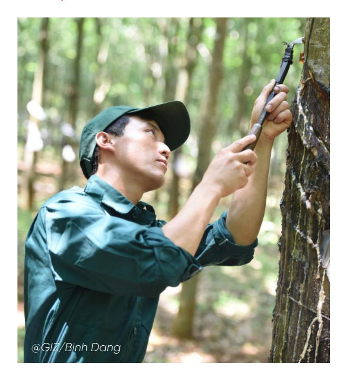

'Deforestation-free' means that the relevant products contain, have been fed with, or have been made using relevant commodities that were produced on land that has not been subject to deforestation after 31 December 2020. 'Forest', as defined under the EUDR, means land spanning more than 0.5 hectares with trees higher than 5 metres and a canopy cover of more than 10%, or trees able to reach those thresholds in situ, excluding land that is predominantly under agricultural or urban land use.

### 3.2. Deforestation-free production

Table 1. Comparing definitions of deforestation-free production in Vietnamese and EUDR contexts

| EUDR Viet Nam’s legal framework |           |           | Comparison and analysis  |
|---------------------------------|-----------|-----------|--------------------------|
| those thresholds in situ,       |           |           |                          |
| excluding land that is          |           |           |                          |
| predominantly under             |           |           |                          |
| and fauna,                      | fungi,    |           |                          |
| microorganisms, forest          | land,     |           |                          |
| mountain, submerged             | land,     |           |                          |
| flora; with an inter-regional   |           |           |                          |
| forests into three              | types:    |           |                          |
| use purposes,                   | including |           |                          |
| agricultural                    | land,     |           |                          |
| non-agricultural land,          | and       |           |                          |
| forests, comes                  | under     |           |                          |
|                                 |           | for       | agricultural or urban    |
|                                 |           | purposes; | according to Viet        |
|                                 |           | The       | dierence in definitions |
|                                 |           | Nam       | considers forest (e.g.,  |

*23&#x27;Operator' means any natural or legal person who, in the course of a commercial activity, places relevant products on the EU market or exports them; 'trader' means any person in the supply chain other than the operator who, in the course of a commercial activity, makes relevant products available on the EU market.*

| EUDR                               |                    | Viet Nam’s legal framework | Comparison and analysis       |
|------------------------------------|--------------------|----------------------------|-------------------------------|
| According to Article 2(3),         |                    |                            |                               |
| ‘deforestation’ means the          |                    |                            |                               |
| conversion of forest to            |                    |                            |                               |
| agricultural use, whether          |                    |                            |                               |
| According to Article 2(7), 'forest |                    |                            |                               |
| regenerating forests into          |                    |                            |                               |
| plantation forests or other        |                    |                            |                               |
| forest                             |                    | trees;                     | digging,                      |
|                                    | excavating,        | or                         | blasting;                     |
| flows;                             |                    | discharging                | toxic                         |
| without                            |                    | permission                 | from                          |
| by                                 | forest             | conditions,                | forest                        |
|                                    |                    |                            | The EU’s definition of        |
|                                    |                    |                            | conversion of forests to      |
|                                    |                    |                            | agricultural uses, while Viet |
|                                    |                    |                            | Nam’s definition of ‘illegal  |
|                                    |                    |                            | use will not be considered    |
|                                    |                    |                            | The EU definition of ‘forest  |
|                                    |                    |                            | definition of ‘forest         |
|                                    |                    |                            | planted forests, Viet Nam     |
| land where the relevant            |                    |                            |                               |
| four hectares used for the         |                    |                            |                               |
| production of the relevant         |                    |                            |                               |
| and longitude points to            |                    |                            |                               |
| statistics                         | and                | five-year                  | land                          |
| inventory                          | 24                 |                            |                               |
| Article                            | 4                  | of                         | Circular                      |
|                                    | 07/VBHN-BTNMT      |                            | outlines                      |
| writing.                           |                    | Periodic                   | inventory                     |
|                                    | grid of land plots | 25                         |                               |
|                                    |                    |                            | 'boundaries' and 'coordinate  |
|                                    |                    |                            | (eective from August 2024).  |
|                                    |                    |                            | LURCs do not include this     |

| EUDR Viet Nam’s legal framework |             |          | Comparison and analysis |
|---------------------------------|-------------|----------|-------------------------|
| “coordinates                    |             | of land  | plot                    |
| issuance/re-issuance            |             | of       | PUC’                    |
| issuance’                       | under       | Appendix | I                       |
| contain                         | coordinates |          | of                      |
| production” of the relevant     |             |          |                         |
| exploitation date, and the      |             |          |                         |
| rubber                          | plantation  | owners   | to                      |
| record                          | the         | date of  | latex                   |

*24Circular 07/VBHN-BTNMT, dated 28 February 2022, issued by MAE, provides regulations on land statistics, inventory, and land use status maps.*

*25Point 2(b), Article 7 of Circular 07 outlines the mandatory elements of the land inventory map, which include 'the boundaries and labels of land plots according to inventory criteria' and 'the perpendicular coordinate grid.' Point 2(c) specifies that each land plot on the inventory map must be labelled with 'the serial number of the land plot, the plot area, the land type code, and the codes for the land use object and land management object".*

### 3.3. National legal framework26

"Production in accordance with the relevant laws of the country of production" means the relevant commodities are produced in compliance with local laws on 'land use rights', 'environmental protection', 'third-party rights', 'labour rights', 'human rights under international law', 'Free, Prior, and Informed Consent (FPIC), including regulations under the United Nations Declaration on the Rights of Indigenous Peoples', and 'taxation, anti-corruption, trade, and customs regulations'. As stated in the ocial Guidance Document on the EUDR, only the applicable laws concerning the legal status of the area of production constitute relevant legislation pursuant to Article 2(40) of the EUDR. This means that, generally, the relevance of laws for the legality

requirement in Article 3(b) of the EUDR is not determined by the fact that they may apply generally during the production process of commodities or apply to the supply chains of relevant products and commodities, but by the fact that these laws specifically impact or influence the legal status of the area in which the commodities were produced. Additionally, Article 2(40) of the EUDR must be read in the light of the objectives of the EUDR as laid down in Article 1(1)(a) and (b), meaning that legislation is also relevant if its contents can be linked to halting deforestation and forest degradation in the context of the Union's commitment to address climate change and biodiversity loss.

Table 2. Relevant national legislation in Viet Nam in the EUDR context

| EUDR                      | Viet Nam’s legal framework |                  | Comparison and analysis   |
|---------------------------|----------------------------|------------------|---------------------------|
| 2(40)(a)) include laws on |                            |                  |                           |
| No.                       |                            | 2855/QD-BNN-KHCN |                           |
| identified                | as                         | multi-purpose    |                           |
| land                      | repurposing                | by               | a                         |
|                           | organisations              | and              | other                     |
| capital                   | contribution               | by               | a                         |
|                           |                            |                  | a rubber plantation is    |
|                           |                            |                  | land of perennial crop or |
|                           |                            |                  | decision by the local     |

*26The discussion on the relevant national legislative framework is limited due to the scope of this study and does not constitute a comprehensive or in-depth analysis of the overall legislative framework.*

| EUDR Viet Nam’s legal framework |               | Comparison and analysis |
|---------------------------------|---------------|-------------------------|
| land                            | without       | any of the              |
| Households                      | and           | individuals             |
| the                             | Commune       | People’s                |
| ‘Environmental protection’      |               |                         |
| deforestation and forest        |               |                         |
| The                             | Law on        | Environmental           |
| Protection                      | applies       | to many                 |
| dierent                        | entities,     | including               |
| on                              | fertiliser    | management              |
| waste                           | in accordance | with                    |
| environmental                   |               | protection              |
| and Quarantine                  |               | regulates the           |
| state.                          | Rubber        | plantation              |
| and                             | fertilisers   | in the                  |
| nomenclature                    |               | of permitted            |
| pesticides                      | 27            |                         |

*27Circular No. 09/2023/TT-BNNPTNT dated 24 October 2023 of MAE promulgating the list of pesticides permitted and prohibited for use in Vietnam; Decree No. 84/2019/ND-CP dated 14 November 2019 of the Government regulating fertilizer management.*

| EUDR                                     |                  | Viet Nam’s legal framework | Comparison and analysis  |
|------------------------------------------|------------------|----------------------------|--------------------------|
| and tenure aected by                    |                  |                            |                          |
| producing relevant                       |                  |                            |                          |
|                                          |                  |                            | Operators need to check  |
|                                          |                  |                            | potential risks during   |
| ‘Labour rights’ (Article 2 (40)(e)). The | 2019             | Labour                     | Code                     |
| rights,                                  |                  | obligations,               | and                      |
|                                          | responsibilities | of                         | employees                |
| lower                                    | than             | the                        | regional                 |
|                                          | minimum          | wage),                     | and enjoy                |
| equally;                                 | be               | equipped                   | with                     |
| by                                       | social           | insurance,                 | health                   |
| prohibits                                |                  | child                      | labour in                |
|                                          | conditions       | for                        | employing                |
| minors.                                  | Only             | children                   | aged                     |
| Labour,                                  |                  | Invalids,                  | and Social               |
|                                          |                  |                            | There may be a risk that |

| EUDR Viet Nam’s legal framework |             | Comparison and analysis      |
|---------------------------------|-------------|------------------------------|
| ‘Human rights protected         |             |                              |
| under international law’        |             |                              |
| of production of relevant       |             |                              |
| commodities or products,        |             |                              |
| reflected in the respective     |             |                              |
| and                             | citizens’   | rights in the                |
| political,                      | civil,      | economic,                    |
| be                              | recognised, | respected,                   |
| accordance                      |             | with the                     |
| gender                          |             | equality,                    |
| non-discrimination,             |             | equity,                      |
|                                 |             | smallholders hire workers    |
|                                 |             | underage labour, as          |
| informed consent (FPIC)’,       |             |                              |
| FPIC                            | has not     | been ocially                |
|                                 |             | not use the term 'indigenous |
|                                 |             | country’s population) as     |
| ‘Regulations on tax,            |             |                              |
| anti-corruption, trade, and     |             |                              |
| Circular                        |             | 111/2013/TT-BTC,             |
| agricultural                    |             | production,                  |
| forestry,                       | salt        | production,                  |
|                                 |             | databases and customs        |

The most important legal category concerning the legality requirement under the EUDR is LURs. The land administration system in Viet Nam is complex, with various land use modes through which producers—especially smallholders—can secure legal LURs. Several forms of documentation can be used to prove LURs, but the clearest and most secure evidence is the LURC. Regarding LURs, Viet Nam has specific regulations for cases with legal LURs. However, in practice, some smallholders lack full documentation proving their LURs, despite having cultivated their plantation steadily for many years. Moving forward, the government is interested in implementing policies to assist smallholders to obtain LURCs for eligible plantations, particularly those with no deforestation violations since 2020.

Viet Nam has established regulations on 'boundaries' and 'coordinate grids' for plantations. However, these regulations were not enforced until August 2024, meaning that most LUR documents lack this information.

For environmental, forestry, labour, and tax/import/export requirements, compliance and documentation are primarily enforced for larger enterprises. Smallholders, defined as individuals or households owning land or plantations that do not meet the size or revenue thresholds required for enterprise registration, are typically not subject to the same strict legal requirements. While smallholders are theoretically required to comply with certain laws, enforcement is often less stringent.

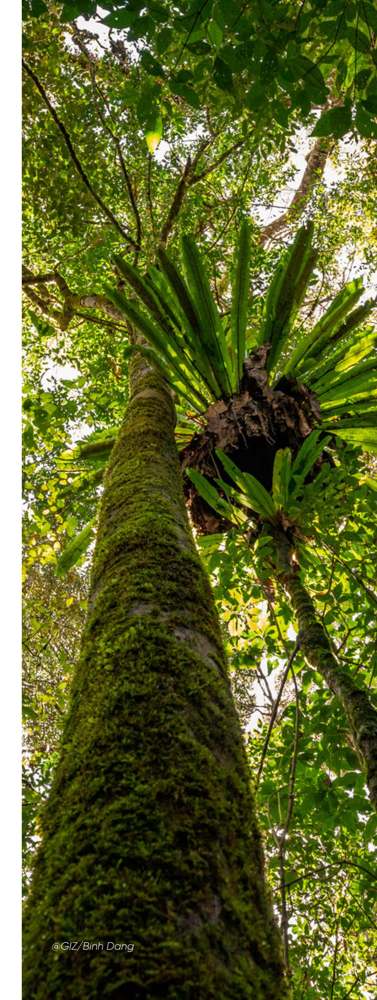

Operators are responsible for demonstrating their compliance with the EUDR to the EU competent authority through a due diligence statement. After gathering the necessary information, they must conduct a risk assessment and implement appropriate risk mitigation measures. Only if the risk identified based on the information collected is deemed negligible or absent can the product be placed on the EU market. This requires that operators can collect the information they need for their due diligence process. Without it, they cannot accurately assess risks and develop the necessary mitigation measures. In the context of risk mitigation, operators might also need to collect further information. The following table provides more detail on which information is potentially available on key aspects in the EUDR context for Viet Nam.

### 3.4. Further potential sources of information for due diligence processes

Table 3. Further potential sources of information*28*

| EUDR Relevant national legal    |     |               |           |
|---------------------------------|-----|---------------|-----------|
| forest rangers in the FRMS      |     |               |           |
| system, in accordance with      |     |               |           |
| Decision No.                    |     |               |           |
| 4539/QD-BNN-TCLN and            |     |               |           |
| Circular 33/2018/TT-BNNPTNT.    |     |               |           |
| level. Provincial forest status |     |               |           |
| maps are created using          |     |               |           |
| types of forest) have been      |     |               |           |
| planning database for the       |     |               |           |
| National                        |     | forest status | maps      |
| maps.                           |     | For digital   | maps,     |
| on                              | the | assessment    | above,    |
| operators                       |     | should        | take into |
| account                         |     | dierences    | in the    |

| EUDR                      | Relevant national legal |             |
|---------------------------|-------------------------|-------------|
| been                      | integrated              | into the    |
| database                  | of                      | the         |
|                           | Socio-Economic          | Development |
| published                 | under                   | Decision    |
|                           | 1558/QD-BNN-TCLN        | and is      |
| However,                  | the national            | forest      |
| Additionally,             | the                     | Forest      |
| Protection                | Department              | is          |
| system,                   | which is                | publicly    |
| tool                      | provides                | real-time   |
| geographic                | data                    | on          |
| deforestation             | areas                   | at the      |
| levels,                   | and allows              | users to    |
| download                  | vector                  | data        |
| peoples in the country of |                         |             |
| The                       | Vietnamese              | government  |
| n-toc),                   | but only                | at the      |
| of the                    | 2019 ethnic             | minority    |
| 53                        | ethnic groups           | and         |
|                           | economic regions 29     |             |

*29https://www.gso.gov.vn/wp-content/uploads/2020/07/01-Bao-cao-53-dan-toc-thieu-so-2019\_ban-in.pdf*

| EUDR                      | Relevant national legal |                              |
|---------------------------|-------------------------|------------------------------|
|                           | urban/rural areas 30    |                              |
| compiles                  | reports                 | on ethnic                    |
| It also                   | reports                 | on the                       |
| Target                    | Programme               | for                          |
| of                        | Ethnic Minority         | and                          |
| Mountainous               | Areas                   | for the                      |
| 2021-2030                 | period,                 | in                           |
| ‘The consultation and     |                         |                              |
| indigenous peoples in the |                         |                              |
| Vietnamese                | law                     | requires                     |
| (Article                  | 74) regulates           | public                       |
| and                       | Article 26              | of Decree                    |
|                           | 08/2022/ND-CP           | require                      |
| consultation              | with                    | local                        |
| communities               | and                     | individuals                  |
| projects                  | during                  | the                          |
| Environmental             |                         | Impact                       |
|                           |                         | not use the term 'indigenous |

*30https://www.gso.gov.vn/wp-content/uploads/2019/12/Ket-qua-toan-bo-Tong-dieu-tra-dan-so-vanha-o-2019.pdf*

| EUDR               |          | Relevant national legal |                         |
|--------------------|----------|-------------------------|-------------------------|
|                    |          | Circular                | 01/2022/TT-UBND         |
| based on objective | and      |                         |                         |
| producing the      | relevant |                         |                         |
| forest degradation | in the   |                         |                         |
|                    |          | level)                  | are responsible for     |
|                    |          | such                    | as forest fires, pests, |
|                    |          | encroachment,           | conversion of           |
|                    |          | People's                | Committees have         |
|                    |          | Forest                  | Resource Monitoring     |
|                    |          | annually,               | and the Forest          |

| EUDR                           | Relevant national legal |     |          |          |    |        |
|--------------------------------|-------------------------|-----|----------|----------|----|--------|
| falsification, lack of law     |                         |     |          |          |    |        |
| enforcement, violations of     |                         |     |          |          |    |        |
| conflict, or [the] presence of |                         |     |          |          |    |        |
| sanctions imposed by the UN    |                         |     |          |          |    |        |
| processing of the relevant     |                         |     |          |          |    |        |
| commodities were produced’     |                         |     |          |          |    |        |
|                                | MAE issued Decision     | No. |          |          |    |        |
|                                | 3156/QD-BNN-TT dated    | 19  |          |          |    |        |
|                                | temporary guidance on   | PUC |          |          |    |        |
| Regulation or of mixing with   |                         |     |          |          |    |        |
| or produced in areas where     |                         |     |          |          |    |        |
|                                |                         |     | actions; | however, |    | the    |
|                                |                         |     | crops    | related  | to | food   |
|                                |                         |     | been     | applied  | to | rubber |

# CHAP 04

The current status of [Viet Nam's rubber industry](#page-42-0) in relation to the EUDR 43

| 4.1. Challenges                                                                 | 47 |
|---------------------------------------------------------------------------------|----|
| 4.1.1. Smallholders                                                             | 47 |
| 4.1.2. Raw rubber traders                                                       | 51 |
| 4.1.3. Enterprises involved in estate rubber growing, processing, and exporting | 47 |
| 4.1.4. Management agencies                                                      | 55 |
| 4.2. Some positive factors                                                      | 57 |

This section outlines the current state of the rubber industry, highlighting the key obstacles and challenges that each actor in the supply chain must address in order to successfully prepare themselves for EUDR application. It also summarises favourable factors that could support future preparatory measures for the sector to benefit from the EUDR.

Table 4 summarises dierent categories of information to be collected in the EUDR context as well as where this information can be provided within Viet Nam's rubber product supply chain. As described in Section 2, the rubber supply chain in Viet Nam consists of smallholders (with smallholder plantations) and rubber-growing companies (with estate plantations) as the upstream actors. These are followed by local traders/intermediaries purchasing latex from smallholders and commercial enterprises importing raw rubber and by natural rubber processors (primary processing) and rubber products (deep processing). The chain ends with traders for domestic consumption or export (including to the EU). This table also lists the relevant state management agencies responsible for providing maps of national forest boundaries/status as of 31 December 2020, which are crucial for providing relevant information in the EUDR context. The upstream actors (smallholders and rubber-growing enterprises) have an interest in providing evidence and information on their plots of production to maintain or further achieve market access to the EU, with technical and financial support from their business partners and other actors along the value chain and beyond.

## 04. The current status of Viet Nam's rubber industry in relation to the EUDR

Table 4. Checklist of existing information in Viet Nam supporting due diligence processes for the rubber sector in the EUDR context

| Information/evidence | Requirements |      | Potential source of information |
|----------------------|--------------|------|---------------------------------|
|                      | X            | X    | X                               |
|                      | X X          | X    | X                               |
|                      | Legality     | Land |                                 |
| land on which it is  |              |      |                                 |

| Information/evidence | Requirements |      |   | Potential source of information |   |
|----------------------|--------------|------|---|---------------------------------|---|
| X                    | X            |      |   |                                 |   |
|                      | X            | X    | X |                                 |   |
|                      | X            | X    | X | X                               | X |
|                      | X            | X    | X | X                               | X |
| X                    | X            |      |   |                                 |   |
|                      |              | X    | X |                                 |   |
|                      |              | X    | X |                                 |   |
|                      |              |      | X | X                               | X |
|                      |              | X    | X |                                 |   |
|                      | Legality     | Land |   |                                 |   |

| Information/evidence     | Requirements |      | Potential source of information |
|--------------------------|--------------|------|---------------------------------|
|                          | Legality     | Land |                                 |
| the seller and the buyer |              |      |                                 |
|                          |              | X    | X                               |
|                          |              | X    | X                               |
|                          |              | X    | X X                             |
|                          |              |      | X X                             |
|                          | X X          |      |                                 |

*Disclaimer: According to the EUDR, operators and traders placing rubber and rubber products on the EU market are responsible for conducting due diligence and collecting relevant information to ensure compliance. The table above outlines potential sources of information within dierent levels of the rubber supply chain in Viet Nam. However, it should be noted that the actors listed are not ocially designated as responsible for providing such information under the EUDR. The identification of potential sources aims to illustrate where relevant data may exist within the supply chain in practice, rather than suggesting concrete responsibilities for specific actors, particularly smallholders. To facilitate compliance, it is essential that supply chain actors, including buyers and processors, support smallholders and other upstream stakeholders through technical and financial assistance, where necessary, to generate and obtain relevant information.*

| Information/evidence | Requirements |      | Potential source of information |
|----------------------|--------------|------|---------------------------------|
|                      | Legality     | Land |                                 |
|                      |              |      | X X                             |
|                      | X X          |      | X                               |

*Note: (\*) Raw rubber trading enterprises include local traders/intermediaries (such as rubber latex trading households), whether or not they have business licenses (registered business households or companies), as well as raw rubber importers.*

### 4.1. Challenges

### *4.1.1. Smallholder*

Since the collection and provision of information for due diligence relate to specific CoC along the supply chain, the following sections are organised by actor.

### **(a) Smallholder rubber is becoming increasingly important in Viet Nam's rubber processing industry. However, it involves hundreds of thousands of households, each with small, scattered plots that may grow various types of trees**

The proportion of rubber output in the total domestic supply has been steadily increasing over the past 10 years. According to 2023 data, smallholder rubber made up 54% of the country's total rubber area, contributing 63% of domestic raw rubber production. However, nearly 87% of the 265,000 households growing rubber nationwide managed less than 3 hectares each*31*. Each household owned one to three rubber plots and, in some cases, up to five plots, often scattered and interspersed with areas growing other crops. These plantations might contain a variety of trees, not just rubber*32*. Due to this fragmentation, along with the limited knowledge and technical capacity of farmers, latex transactions occur daily without providing the required information mandated by the EUDR (such as specific data on the amount of latex harvested from each plot). As a result, it is impossible to meet the traceability requirements for each transaction.

### **(b) Most smallholder plantations lack geolocation for their production plots**

Although most smallholder rubber plantations in Viet Nam have LURCs, these certificates do not include geolocation data. To meet EUDR requirements for traceability and deforestation-free production, collecting geolocation information is crucial. However, achieving this before the EUDR's ocial implementation could be challenging due to high costs, limited technical knowledge among households, and a lack of clear guidance from stakeholders.

As noted, the number of households involved in smallholder rubber is numerous with small, fragmented, and scattered growing areas. Therefore, collecting geolocation data for each plot is dicult for several reasons: (i) the limited technical capacity of households; (ii) lack of documentation verifying the legality of production (for example, LURCs); (iii) boundary disputes, and; (iv) plots where only part of the area is used for rubber. Field coordination often requires local cadastral ocials and cooperation from neighbouring landowners, making it complex and costly*33*. Additionally, the EUDR requirement for geographical coordinates of land plots/rubber plantations adds an extra eort to fieldwork. Specifically, plots under 4 hectares require point coordinates, while larger plots need multiple sets of coordinates, increasing the workload for data collection.

MAE issued Circular 10/2024/TT-BTNMT*34* on 31 July 2024, mandating the recording of the coordinates of plot peaks in LURCs*35* starting from 1 August 2024. However, this applies only to new certificates, leaving most older ones without this information. Although data on district-level land resources can provide plot coordinates, access to this information is limited due to a lack of sharing mechanisms.

*31This data is sourced from the 2016 Rural, Agricultural, and Fishery Census conducted by the GSO. There is no more recent ocial data available.*

*32Survey in Binh Phuoc, December 2024; information from the technical meeting organised by GIZ and the Department of International Cooperation in Ninh Binh, October 2024.*

*33According to calculations by a rubber enterprise in Binh Phuoc, the cost of completing a set of records to measure the area and geolocation for each smallholder plantation is about 1 to 2 million VND (based on a survey conducted in December 2024).*

Decision No. 3156/QD-BNN-TT*36* of MAE provides temporary guidance on PUC issuance and management. However, this document applies only to crops related to food safety, such as fruit trees, rice, and coee, and has not been extended to rubber trees.*37* As a result, PUC has not been implemented for the rubber industry, limiting support for rubber plantation owners' adaptation eorts with regards to the EUDR.

### **(c) Information about the EUDR is still "new" to most smallholders, many of whom are either not interested in or do not fully understand its requirements**

An interview with smallholders in early December 2024 revealed that, while most households have heard of the EUDR, they do not fully understand its purpose, their responsibilities, or its impact. Many are not concerned about EUDR requirements, as their transactions continue as usual without any noticeable changes. Some households confuse the EUDR with sustainable forest management certification, or view it as part of agricultural extension, forest management, or credit programmes, as it is sometimes mentioned in meetings related to these. This confusion is understandable, as by early December 2024, there has been limited communication and training on EUDR at the household level. Any eorts so far have been small-scale, often "integrated" into other activities or driven by certain processors promoting linkages with smallholders, covering only a fraction of the total households and rubber areas nationwide.

### **(d) Smallholders do not typically collect or store information on latex production and trade transactions**

Smallholder rubber farmers typically do not keep records of production activities, such as the date of tapping or the amount of latex collected, especially coagulated latex, which is sold only after accumulating enough over time. Without such records, households cannot track how much latex was collected on a given tapping day in a certain plot.

In terms of latex trading, smallholder rubber is usually sold to processing factories through raw latex local traders/intermediaries. When a transaction occurs, both the household and the trader record six types of information: (1) The name of the rubber plantation owner; (2) the date of the transaction; (3) density or content of latex; (4) the weight of the latex; (5) the unit price per kg of latex, and; (6) the total transaction value*38*. While this information is recorded, it is insucient for EUDR traceability requirements. For example, details of which specific plantation the latex came from are not collected. This hinders traceability because each household has several plantations.

This practice has been in place for a long time, as no parties have required more detailed information, except in cases where households participate in a sustainable forest management certification programme (to be discussed in the next section).

*34https://thuvienphapluat.vn/van-ban/Bat-dong-san/Thong-tu-10-2024-TT-BTNMT-ho-so-dia-chinh-Giaychung-nhan-quyen-su-dung-dat-608554.aspx*

*35Clause 8, Article 8 of Circular 10/2024/BTNMT states: "Information on land plot boundaries includes the shape, edge dimensions, and coordinates of the land plot vertices".*

*36https://thuvienphapluat.vn/van-ban/Linh-vuc-khac/Quyet-dinh-3156-QD-BNN-TT-2022-tai-lieu-huong-d an-cap-quan-ly-ma-so-vung-trong-528365.aspx* 

*37Discussion by ICD and the Department of Crop Production at the October 2024 technical meeting. (Source: https://mkresourcesgovernance.org/2024/10/01/phien-hop-ky-thuat-ve-nganh-go-va-cao-su-chuan-bi-t hich-ung-eudr-thuc-trang-va-kien-nghi-tu-cong-dong-doanh-nghiep/)*

*38Survey in Binh Phuoc, December 2024.*

### **(e) Latex from a smallholder can be sold to various buyers, but without an information-sharing mechanism, traceability of raw rubber becomes increasingly dicult down the supply chain**

Latex from a single smallholder is often supplied to multiple companies for reasons such as dissatisfaction with latex density measurements, uncompetitive prices, or logistical factors like dierent plantations being closer to various collection points. This can lead to latex from one household's multiple plantations being split across dierent traders. However, local traders/intermediaries lack a system for sharing information, making it impossible to track the total supply from a household or determine whether it exceeds the plantation's production capacity of a household in a given season*39* .

The six types of information recorded for each transaction (mentioned earlier) are only used between household and trader, and are not shared with others in the supply chain. This data is retained solely for payment purposes, either immediately after a transaction or after a month. However, once payment is made, the information is discarded. As a result, this information is not stored by households and traders or passed along, creating a "loss of traceability" as information is not systematically passed along the value chain. This also opens the door for households to mix latex from other sources, including potentially stolen latex, with their own, further complicating traceability eorts.

### **(f) Some smallholders (and enterprises) are not willing to share/provide information**

In some cases, when processors try to establish linkage models with companies and smallholders (integrating sustainable forest certification and EUDR alignment), they face resistance from smallholders and companies who are reluctant to share personal information (such as IDs, residence details, or LURCs). These parties fear that their personal information may be misused, potentially leading to harm*40*.

Similarly, when the CMO organisation approached local parties to collaborate on sustainable forest management certification for household groups with the involvement of processors and local traders/intermediaries, they encountered reluctance from both processors and traders to share information about their activities*41* .

### **(g) Smallholders hire workers based on verbal agreements, without formal contracts, and there is unclear information regarding the use of child or underage labour**

Most smallholders hire workers for tasks such as latex tapping; plantation maintenance (fertilising, weeding, spraying pesticides); and latex collection and transportation to purchasing points. These workers are typically hired informally, without a labour contract or formal agreement*42*. There are reports that some households may employ child labour, but this has not been verified.

*39Sharing of participants at the seminar organised by the EUDR - Forestry Network on 25 October: "How to comply with the EUDR - practical experience of rubber industry enterprises. (Source: https://mkresourcesgovernance.org/2024/10/25/toa-dam-lam-the-nao-de-dap-ung-eudr-bai-hoc-thuctien-tu-doanh-nghiep-nganh-cao-su/)*

*40CMO's representative presented at the workshop "Vietnam Rubber Industry 2025: Price Trends and Global Market Opportunities in the Context of EUDR" on 12 December 2024; on-site survey in Binh Phuoc, December 2024.*

*41CMO's representative presented at the workshop "Vietnam Rubber Industry 2025: Price Trends and Global Market Opportunities in the Context of EUDR" on 12 December 2024; on-site survey in Binh Phuoc, December 2024. 42On-site survey in Binh Phuoc, December 2024.*

### **(h) Some smallholders lack legal documents proving ownership of their rubber plantations, and the land is still disputed with unclear boundaries**

While most smallholders possess legal documents like LURCs or contracts for land lease, some lack proper documentation for their rubber plantations*43*:

- In some areas, land is lent or leased through verbal agreements among households and individuals, with no legal framework governing these transactions.
- The boundaries on LURCs do not always match the actual land boundaries.
- Some plantations have not been issued LURCs, despite long-term, stable, and legitimate use.
- A few cases involve ongoing land disputes.

Other cases include land being bought and sold multiple times, with missing or inconsistent transaction records, making it dicult to establish a basis for granting an LURC. Additionally, some people encroached on forest land for production decades ago, and as it has been used stably for a long time, the State reclassified it as agricultural land according to land use plans. Local authorities have reviewed and verified the land, and government inspectors have concluded it is eligible for use, but an LURC has not been granted.*44*

*43Nguyen Vinh Quang (2024). Description of Viet Nam's legal framework of relevance to smallholder rubber farmers. EFI*

*44On-site survey in Binh Phuoc, December 2024.*

### *4.1.2. Raw rubber traders*

**(a) Traders play a crucial role as intermediaries in the supply of smallholder rubber. While many traders are operating, their activities are often spontaneous, making them dicult to manage and monitor**

Local traders or intermediaries are Vietnamese individuals or households that purchase latex from smallholders. They often establish one or more collection points at their homes or near the rubber plantations to facilitate purchasing, reduce transportation time, and encourage nearby households to sell latex to them. They buy both liquid and coagulated latex from households, then resell it to other traders or raw rubber processors.

Local trading companies play a crucial role in the Vietnamese rubber supply chain, with over 95% of smallholder rubber entering the supply chain through this link. The number of traders involved in smallholder latex transactions is relatively large, with around 10 typically operating within a commune in rubber-growing areas, depending on the plantation area and the number of rubber-growing households. However, traders' activities are largely spontaneous. They can freely start or stop operations, change locations, or open new purchasing points. This flexibility makes it dicult for local management agencies to eectively oversee and regulate their activities.

Some traders have joined the processor - trader - smallholder linkage. However, the number of local traders participating in this model is still very small compared to the total number of local traders operating.

**(b) Raw rubber is bought and sold through multiple intermediary local traders. Transactions are not fully recorded, and information is not shared with each other or with other actors** 

Intermediary traders collecting raw latex from smallholders operate at multiple levels, buying and selling to one another. Small traders supply to larger dealers who, in turn, supply to even larger dealers, and so on. Similar to transactions between smallholders and traders, transactions between traders involve limited information, restricted to buying, selling, and payment details (the six groups of information described above). Transaction information between the two parties is not shared with third parties, partly to protect their business secrets. Some traders said they have never been asked for additional information and do not require sellers - whether smallholders or other supply chain actors - to provide any documents or information beyond the six specified details.

The household-trader-processor model aims to enhance information collection and storage, separate EUDR-compliant and non-compliant sources, and partially address the issue of "lost" information regarding the origin of raw materials.

**(c) Mixing raw materials from dierent sources, including those of unknown origin, without proper documentation is still common**

When latex is collected at a trader's purchasing point, the six required information groups are recorded, but the latex is often stored in large tanks, typically made of cement or metal. After the transaction is complete, the coagulated latex is transferred to storage. Local traders may sell directly to processors, but it is more common for them to trade with each other. Small traders sell to larger dealers who, in turn, sell to even larger dealers, eventually supplying the processors*45* .

This practice of mixing latex from various smallholders and trading between intermediary companies undermines the accuracy and traceability of information about the sources of raw materials.

*45On-site survey in Binh Phuoc, December 2024; Quang et al. (2021, 2024).*

### **(d) Labour use without labour contracts**

Traders hire labourers to help with collecting and transporting latex from household plantations to the purchasing/collection points or to manage those points. In many cases, these workers are not given formal labour contracts. Additionally, there is no available information regarding the potential use of child labour.

### **(e) Some local traders may not be ocially registered**

Large-scale traders collecting smallholder latex are typically registered as household businesses or established as companies. However, many small companies operate without formal registration. According to some sources*46*, unregistered traders cannot provide financial invoices to buyers. As a result, buyers (whether other traders or processors) must handle the necessary documentation themselves if they require complete financial records. If this is accurate, it compromises both the legality and traceability of transactions, making proper implementation dicult.

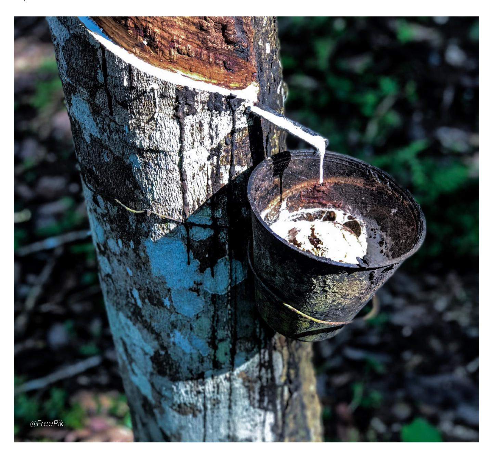

*46 Survey in Binh Phuoc and expert consultation, December 2024.*

### 4.1.3. Enterprises involved in estate rubber growing, processing, and exporting

**(a) Enterprises are unable to collect necessary information and integrate it into the production process to meet EUDR requirements**

While supporting processors to work with traders and smallholders, the CMO found that most enterprises, including those that both cultivate estate rubber and process it for export, are not equipped to collect information such as the geolocation of rubber plantations and link it to the production process for traceability as per the EUDR*47*. Interviews with enterprises in Binh Phuoc and Dak Lak revealed that, without external support, these enterprises "struggle" to adapt to EUDR requirements, as one representative described it. This challenge is mainly due to the novelty of the EUDR for these enterprises and the lack of specific guidance to help them prepare for EUDR application.

### **(b) The number of rubber enterprises actively working to meet the EUDR remains low**

Only a few large processors that export directly to the EU and their EU customers or importers requesting EUDR compliance are taking an interest. Customs data also reveals that the number of enterprises exporting rubber products to the EU is relatively small compared to the total number of rubber processing enterprises in the country, despite the EU market ranking third in export turnover for the industry in 2023.

A survey conducted by Forest Trends and the VRA showed that many exporters have not begun to prepare for EUDR application. It found that 35% of the responding enterprises, despite being involved in exporting rubber to the EU, have not yet started the necessary preparations to meet EUDR requirements*48*.

### **(c) Many enterprises are aware of the EUDR, but their understanding remains limited**

According to a 2024 survey by Forest Trends and the VRA, most enterprises exporting to the EU are aware of the EUDR, primarily through information from their customers—operators of rubber products. However, the survey indicates that the level of understanding of these regulations among exporting enterprises remains low. Only 14% said that they fully understand the EUDR, 41% believe they understand most of it, and 44% reported only a partial understanding*49*

**(d) Processors source raw rubber from a variety of suppliers. The more diverse these sources, the harder it becomes to fully trace the origin of the raw materials across the entire supply chain**

Most enterprises, whether state-owned or private, use raw rubber (latex) from multiple sources, including their own rubber plantations, other enterprises' rubber plantations, commercial raw rubber traders, local traders/intermediaries, and smallholders. As the number of suppliers increases and the sources become more varied, it becomes harder to accurately trace the origin of all purchased latex and raises the risk of failing to meet traceability requirements*50* .

*47 CMO's representative presented at the workshop "Vietnam Rubber Industry 2025: Price Trends and Global Market Opportunities in the Context of EUDR" on 12 December 2024; on-site survey in Binh Phuoc, December 2024.*

*48 The "Enterprises in the Rubber Industry Prepare to Comply with the EUDR" survey was conducted in August-September 2024, involving 30 enterprises that export directly to the EU market, including 15 state-owned enterprises and 15 private enterprises. (Source: https://mkresourcesgovernance.org/2024/10/01/phien-hop-ky-thuat-ve-nganh-go-va-cao-su-chuan-bi-thich-ung-eudr-thuc-trangva-kien-nghi-tu-cong-dong-doanh-nghiep/)*

*49 The "Enterprises in the Rubber Industry Prepare to Comply with the EUDR" survey was conducted in August-September 2024, involving 30 enterprises that export directly to the EU market, including 15 state-owned enterprises and 15 private enterprises. (Source: https://mkresourcesgovernance.org/2024/10/01/phien-hop-ky-thuat-ve-nganh-go-va-cao-su-chuan-bi-thich-ung-eudr-thuc-trangva-kien-nghi-tu-cong-dong-doanh-nghiep/).*

*50 The "Enterprises in the Rubber Industry Prepare to Comply with the EUDR" survey was conducted in August-September 2024, involving 30 enterprises that export directly to the EU market, including 15 state-owned enterprises and 15 private enterprises. (Source: https://mkresourcesgovernance.org/2024/10/01/phien-hop-ky-thuat-ve-nganh-go-va-cao-su-chuan-bi-thich-ung-eudr-thuc-trangva-kien-nghi-tu-cong-dong-doanh-nghiep/).*

**(e) Raw rubber imported from Cambodia and Laos is a key input for domestic processors. However, much of it is of unknown origin and lacks accompanying documentation, often being mixed with other sources, including illegally sourced or stolen latex**

In 2023, Cambodia and Laos were the most important suppliers of rubber, accounting for 44% of the total raw rubber supply for Viet Nam's processing industry. The rubber from these countries comes from various sources, including smallholders, state-owned enterprises, FDI, private, and military sectors. Like in Viet Nam, raw rubber is collected through a multi-level system of intermediary processors and traders before being exported*51*. However, there is a significant lack of traceability and legality in these supplies, with the mixing of dierent raw materials without proper documentation being widespread*52*.

In some rubber-growing areas in Laos, up to 20% of latex is stolen. Much of the natural rubber produced in Laos is exported to Viet Nam, including stolen rubber, as confirmed by some Vietnamese enterprises operating in Laos. This represents a considerable legal risk for Vietnamese enterprises using this imported rubber, as stolen rubber has no origin information, making traceability impossible*53* .

**(f) Private processing enterprises, which primarily rely on raw rubber from smallholders or imports, face greater challenges in complying with the EUDR compared to state-owned enterprises with estate rubber plantations**

Private enterprises investing in rubber processing often lack land to establish their own plantations, forcing them to rely on rubber supplied by smallholders or imported from countries like Cambodia and Laos. Due to ongoing issues with sources of smallholder and imported rubber, aligning the supply chains of these private enterprises with EUDR requirements is particularly challenging.

### **(g) There are some misconceptions about the EUDR**

Consultations with processors reveal that some believe the "EUDR is a type of sustainable management certificate" or that "obtaining a sustainable forest management certificate automatically ensures compliance with EUDR*54*."

These misconceptions are misleading for two reasons. Firstly, holding a sustainable forest management certificate does not guarantee EUDR compliance, as the EUDR does not recognise any specific certification. Secondly, sustainable forest certification standards (such as FSC-FM and VFCS/PEFC-FM) do not include all the information required by the EUDR, such as geolocation for plantations, FPIC guidance, or details on taxes and fees*55*. These certification bodies have announced updates to their standards to align with the EUDR. However, certified areas still do not fully meet its requirements. For instance, certification schemes might be helpful in gathering information, but are not a substitute for fulfilling due diligence obligations under the EUDR.

*51 To Xuan Phuc and Nguyen Quang Vinh (2023) Legality of natural rubber supply from Cambodia and Laos to Vietnam. Forest Trends.*

*52 To Xuan Phuc and Nguyen Quang Vinh (2023) Legality of natural rubber supply from Cambodia and Laos to Vietnam. Forest Trends.*

*53 The "Promoting Sustainable Production, Trade, and Investment of Natural Rubber in Mainland Southeast Asia" workshop, 14-15 November 2024, in Vientiane, Laos:* 

*(https://mkresourcesgovernance.org/2024/11/13/hoi-thao-thuc-day-san-xuat-thuong-mai-va-dau-tu-cao-su-thien-nhien-ben-vungtai-khu-vuc-dong-nam-a-dai-luc/).*

*54 Survey in Binh Phuoc, December 2024.*

*55 In-person interviews, December 2024.*

### *4.1.4. Management agencies*

### **(a) No Forest Status Map as of 31 December 2020**

### **(b) The rubber industry in Viet Nam is managed by multiple ministries. However, apart from MAE, other relevant ministries show limited interest in preparing to comply with the EUDR**

Although rubber trees producing latex are not linked to deforestation (as discussed in the 'Some Positive Factors' section), the EUDR regulates evidence for deforestation-free products, and the EU allows flexibility in selecting base maps for the 31 December 2020 map. However, there are no ocial forest cover/land use maps for that date in Viet Nam. MAE publishes annual national forest status data, but no accompanying map is provided. While the national forest status data is available, it does not specify the exact locations or coordinates of the forest areas. Additionally, the published data does not indicate the precise date (day and month) when the status

Eorts to prepare for EUDR application in Viet Nam, particularly in the timber, coee, and rubber industries, gained momentum at the central level in the last six months of 2024. However, this progress has been mainly seen within MAE and its departments, such as the Department of International Cooperation, the Department of Forestry and Forest Protection, and the Department of Crop Production and Plant Protection. Other directly involved ministries, such as the Ministry of Industry and Trade, have shown little interest or engagement in this process*58*. Additionally, the lack of a single state agency overseeing the entire rubber industry has created further challenges in preparing to meet EUDR requirements across the industry.

was recorded*56*. The absence of a formal map poses a challenge for Vietnamese exporters in meeting EUDR requirements. There are concerns about whether this can be resolved by 30 December 2025, when the EUDR will be applied.

There have been numerous discussions between relevant Vietnamese government agencies and the EU on the issue of how to create an enabling framework for operators/traders in this context*57*. This is beyond the control of actors in the rubber supply chain, as the publication of forest status falls under the jurisdiction of state management agencies.

*58 EFI survey, May 2024; face-to-face survey, December 2024; discussions in public-private partnership group* 

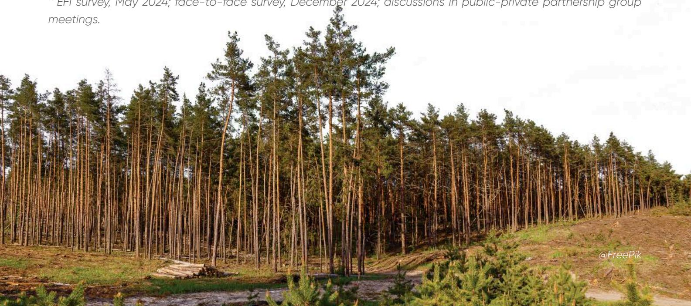

*56MAE publishes national forest status data annually, but no accompanying status map is provided. The 2020 forest status data was released in Decision 1558/QD-BNN-TCLN dated 13 April 2021. This decision stated '...status in 2020...' but did not specify the exact date or month when the data in the report was recorded.*

*57 The European Union Delegation to Vietnam (EUD) responded via the Q&A list on its website and directly during exchange sessions, dialogues, and workshops between the parties.*

### **(c) Local authorities have had limited access to information about the EUDR and show low levels of interest**

A survey of provincial departments, as well as district and commune authorities in Binh Phuoc province, revealed that although the province has designated a unit to handle EUDR-related matters, local management agencies only learned about the EUDR through national media channels (such as television and online news). As of December 2024, they had not undertaken any specific activities related to the EUDR. The only relevant document received by these authorities is the National Action Plan Framework aligned with EUDR (Document No. 5179/BNN-HTQT) issued by MAE. Many provincial agencies had not received any additional EUDR-related documents until the survey team shared materials provided by the EUDR engagement project. These were the first documents of this kind that they had seen.

Some provincial and district ocials in Binh Phuoc also expressed a lack of interest in rubber tree issues, stating that "enterprises in the rubber industry have been handling the industry's matters independently*59*."

### **(d) Lack of funding for implementation**

MAE issued Ocial Letter No. 5179/BNN-HTQT on 1 August 2023, outlining the Action Plan Framework in alignment with the EUDR. However, this document only details the activities that need to be implemented at both the central and local levels, without allocating specific funding for these activities. This lack of funding has been a key reason why few EUDR-related activities have been carried out in Binh Phuoc. This also explains the very low level of understanding of the EUDR among provincial, district, and commune ocials, as no training courses have been organised for them, and they have not been involved in any related activities*60* .

### **(e) Lack of specific guidance for EUDR compliance**

A company involved in rubber growing, processing, and exporting rubber reported challenges in aligning with EUDR requirements, citing the lack of detailed guidance for actors involved. Clear instructions from Vietnamese management agencies, particularly for processing and exporting enterprises, have not been published*61* .

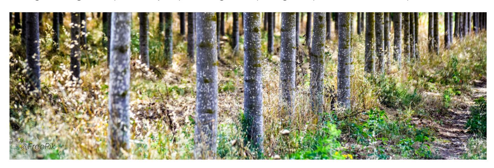

*59 Survey in Binh Phuoc, December 2024*

*60 Survey in Binh Phuoc, December 2024.*

*61 Survey in December 2024; interview with experts in December 2024; comments of participants at several seminars and the workshop organised by the Department of Forestry and Forest Protection from May to October 2024; the "Enterprises in the Rubber Industry Prepare to Comply with the EUDR" survey conducted in August-September 2024, involving 30 enterprises that export directly to the EU market, including 15 state-owned enterprises and 15 private enterprises. (Source: https://mkresourcesgovernance.org/2024/10/01/phien-hop-ky-thuat-ve-nganh-go-va-cao-su-chuan-bi-t hich-ung-eudr-thuc-trang-va-kien-nghi-tu-cong-dong-doanh-nghiep/)*

### 4.2. Some positive factors

### **(a) Some national agencies have stepped in and implemented activities**

Viet Nam is widely regarded as a leader in promoting EUDR alignment across industries covered by the regulation, including rubber. The government has directed relevant ministries and provincial People's Committees to achieve this goal. In 2023, MAE developed the National Action Plan Framework, establishing public-private partnerships and initiating collaborative activities*62*. Since mid-2024, the EUD and MAE have held technical meetings on EUDR implementation. MAE's Department of International Cooperation, Department of Crop Production and Plant Protection, and Department of Forestry and Forest Protection have engaged in technical consultations, organised communication activities, and shared updates via various channels, including seminars, training sessions, newsletters, and research.

These activities have received significant technical and financial support from governments and organisations such as the EU, Forest Trends, GIZ, UNDP, and EFI. In the second half of 2024, there were continuous publications, webinars, and meetings, which garnered positive feedback and active participation from stakeholders*63* .

The Department of International Cooperation, Department of Crop Production and Plant Protection, and Department of Forestry and Forest Protection, along with other stakeholders, are developing technical guidance documents for the rubber, wood, and coee industries. These documents will provide detailed templates of required information for supply chain actors and are expected to be trialled in early 2025*64* .

At the provincial level, several provinces have issued notifications on the EUDR, shared these with provincial and district levels, and established steering committees and focal points. Meanwhile, MAE issued Decision No. 1235/QD-BNN-HTQT on 4 May 2024 to form a joint working group to coordinate eorts to enhance the enabling environment for EUDR implementation. The Department of International Cooperation has also built a network on the Zalo and Google Group platforms to facilitate regular information-sharing on EUDR, particularly regarding the rubber industry. Additionally, VRG has partnered with VFCS to train 22 rubber companies holding PEFC-FM and PEFC-CoC certifications on reporting systems for due diligence and accountability in line with the EUDR*65* .

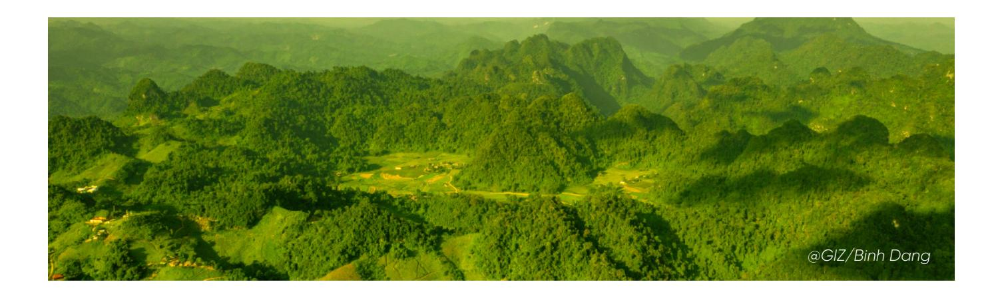

*62https://vneconomy.vn/viet-nam-da-san-sang-va-se-co-cach-tiep-can-phu-hop-voi-quy-dinh-eudr.htm ?utm\_source=chatgpt.com* 

*63Some activities and newsletter content related to the EUDR for all three industries: rubber, wood, and coee.* 

*64 Information shared by a representative of ICD, MAE.*

*65Presentation by VRG's representative at the workshop "Vietnam Rubber Industry 2025: Price Trends and Global Market Opportunities in the Context of EUDR" on 12 December 2024.*

The Vietnamese rubber industry has received significant support from Forest Trends over the past decade. In collaboration with VRA and other local organisations, Forest Trends has conducted various research activities, publishing reports, newsletters, and organising seminars on topics such as smallholder rubber, chain linkage models, and import-export information. Since 2023, Forest Trends and VRA have conducted additional studies and organised seminars connecting enterprises, smallholders, and management agencies in Viet Nam, Laos, and Cambodia (two of Viet Nam's largest sources of imported raw rubber), China, and other rubber-growing countries in the region to discuss EUDR-related issues and the rubber supply chain. The products and events from Forest Trends have contributed extensively to this report*66* .

### **(b) Support from international organisations**

GIZ and EFI have also provided technical and financial support for the rubber industry to align with EUDR requirements. For example, the EU and BMZ-funded project, "Engagement with Indonesia, Malaysia, Laos, Thailand, and Viet Nam to raise awareness of and promote a better understanding of the EU approach to reducing EU-driven deforestation and forest degradation (EUDR Engagement)", primarily focuses on raising awareness and understanding of the EUDR at the central level. This report is part of that project. The SAFE project is another support measure co-financed by the EU which also supports Viet Nam to prepare for the EUDR, particularly in the coee industry*67*. Additionally, EFI conducted a review of Viet Nam's policy framework for meeting EUDR requirements related to smallholders*68* .

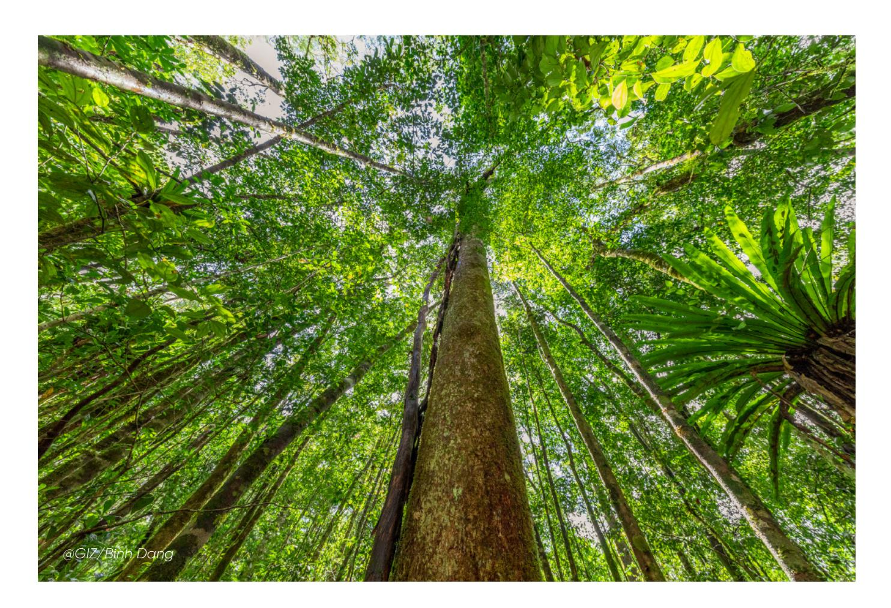

*66https://mkresourcesgovernance.org/category/cao-su/* 

*67https://www.giz.de/en/downloads/giz2024-en-sustainable-agriculture-for-forest-ecosystems.pdf*

*68One of the consultants who worked on this report was responsible for reviewing EFI's smallholder policy.*

### **(c) Rubber trees currently tapped for latex are not related to deforestation**

Rubber trees in Viet Nam, Cambodia, and Laos (Viet Nam's largest source of imported raw rubber) require an initial development stage of 7 to 10 years before they can be tapped for latex. This "construction stage" means that rubber trees cannot be tapped until their eighth year. As a result, rubber products sold to the EU by the end of 2025 will primarily use raw rubber from trees planted before 31 December 2020.

Therefore, there is no concern that products are linked to deforestation in these countries as of 31 December 2020. Latex collected after 2026 will need to be checked for the risk of deforestation, especially when production expands to new sites where deforestation occurred to establish plantations.

### **(d) Most rubber plantations have legal ownership documentation**

All estate plantations owned by rubber-growing companies typically have complete documentation proving their ownership or LURs, as most originated from state-owned farms. A few private-sector estate plantations also lease land from the state, ensuring legal ownership documents such as LURCs or Land Allocation Decisions.

For smallholder rubber, most plantations also possess full legal documentation, including LURCs or land lease/assignment contracts, with clear boundaries and no disputes. Only a small number lack legal documents.

### **(e) Existing infrastructure facilitates EUDR alignment for enterprises**

Enterprises involved in forest plantation, processing, and export have made significant investments in infrastructure, human resources, and equipment. They have established internal management systems and use software/applications to streamline management, update information, and store databases in a systematic manner, covering everything from planation management to processing and exporting activities.

Many enterprises, especially large-scale ones, hold ISO-9000/9001 and ISO-14000/14001 certifications, as well as sustainable forest management and CoC certifications like PEFC or FSC. Large, concentrated (estate) plantations also make it easier to gather relevant data, such as the geolocation of rubber plantations. With these advantages, enterprises can easily add the necessary data to comply with the EUDR*69,70* .,

### **(f) Transaction information is stored long-term by processors**

Enterprises with estate plantations often operate their own processing factories that use latex from their own plantations. As a result, they maintain detailed records on dates, areas and output of extraction, and latex quality. This enables enterprises to easily provide transaction information to customers upon request.

### **(g) Enterprises comply with labour law, labour rights, and environmental protection regulations**

All enterprises with estate plantations sign contracts with their employees. Many of these enterprises, especially those with processing factories, hold ISO 9001 (quality management) and ISO 14000 (environmental management) certifications, ensuring strong compliance with environmental protection regulations.

*69Source: Direct survey December 2024; VRA newsletter.*

*70 For example, Dong Nai Rubber Corporation Limited has developed a database and deployed the DNRC-GIS software system to monitor and manage its 32,000-ha rubber plantation. The company has also launched the DNRC-Traceability software system, a traceability platform that meets the requirements of the EUDR. Additionally, the company assists smallholders, traders, and other actors supplying latex by helping them collect the necessary information required by the EUDR through the DNRC – Traceability webapp software. (Source: Documents from the workshop "Vietnam Rubber Industry 2025: Price Trends and Global Market Opportunities in the Context of EUDR" on 12 December 2024).*

### **(h) Non-EU customers request EUDR-compliant rubber**

Recently, some VRG members and private enterprises have been receiving an increasing number of requests from customers outside the EU, including in China, India, and Malaysia*71*, to provide EUDR-compliant rubber. This growing interest indicates that enterprises, even in non-EU markets, are becoming more aware of the EUDR, despite its ocial implementation still being pending. Viet Nam exports a significant amount of rubber, particularly natural rubber, to China, which was its largest export market from 2019 to 2023*72*. China is also a major exporter of rubber products to the EU*73*. This suggests that companies in China, India, and Malaysia have used or will use rubber imported from Viet Nam to manufacture commodities for the EU market. These developments highlight the global impact of the EUDR on the rubber industry and underscore its influence in driving Viet Nam's supply chain to meet EUDR requirements*74* .

### **(i) Abundant and various digital platforms and software for information management**

Several software development companies have pioneered building apps/software to help enterprises collect, store, and generate appraisal reports. Additionally, some evaluation organisations oer their own software systems to support enterprises in these areas. This is especially beneficial for enterprises lacking reliable internal databases and management systems*75* .

### **(j) Several enterprises have pioneered EUDR compliance in their activities**

Several processing and exporting companies in Viet Nam have successfully implemented EUDR alignment. Notably, Dak Lak Rubber Investment Company was one of the first to export 21 containers of natural rubber to the EU. Its customers accepted the shipments as fully EUDR-compliant and paid an additional USD 150 to USD 200 per ton—equivalent to 10-15% of the per-ton value*76,77*. , These shipments used raw rubber sourced from over 1,200 hectares of the company's FSC-FM/CoC certified estate plantations*78*

*71Survey in December 2024; comments by VRG's representative at the workshop "Vietnam Rubber Industry 2025: Price Trends and Global Market Opportunities in the Context of EUDR" on 12 December 2024.*

*72 According to calculations by VRA and Forest Trends, Viet Nam's rubber exports to China reached USD 2.4 billion in 2023, accounting for 36% of the total rubber product export turnover that year.*

*73According to ITC data, China exported USD 4.6 billion worth of rubber products to the EU in 2022, making up 13.5% of its total rubber product export turnover that year.*

*74 Although the EUDR only requires multipoint coordinates for plots of 4 hectares or more, many EU customers/importers demand these coordinates for all plots, including those smaller than 4 hectares.*

*75 For example, CMO oers the CMO Empower and CMO Tracer software; Koltiva provides the KoltiTrace MIS platform; and Eco Technology 2A supports enterprises to build databases for growing areas and product CoC tracking software, such as app-nongho, which complies with EUDR regulations (on a SaaS platform). EcoTech2A is assisting Dong Phu Rubber, Dau Tieng Rubber, Loc Ninh Rubber, Tan Bien Rubber, Ea H'leo Rubber, and Phuoc Hoa Rubber companies under VRG with software and apps that meet EUDR requirements (in-person interview, January 2025).*

*76https://www.vra.com.vn/thong-tin-hoi-vien/dri-thang-lon-nho-du-an-trong-sau-rieng-xen-canh-voi-cay -cao-su.15742.html* 

*77Comments by a DRI representative at a webinar organised by Forest Trends on 25 October 2024: "Practical experience of rubber industry enterprises in compliance with EUDR" (https://mkresourcesgovernance.org/2024/10/25/toa-dam-lam-the-nao-de-dap-ung-eudr-bai-hoc-thuctien-tu-doanh-nghiep-nganh-cao-su/); and the workshop in Vientiane, Laos on 15 November 2024. (https://mkresourcesgovernance.org/2024/11/13/hoi-thao-thuc-day-san-xuat-thuong-mai-va-dau-tu-cao -su-thien-nhien-ben-vung-tai-khu-vuc-dong-nam-a-dai-luc/).*

*78 This area was certified with FSC-FM/CoC on 6 September 2024, valid until September 2029 (five years).*

Three VRG companies—Chu Se Kampong Thom Rubber, Dong Nai Rubber, and Dau Tieng Rubber—have also achieved EUDR compliance*79* . Dong Nai sold 767 tons, and Dau Tieng sold over 40 tons of EUDR-compliant natural rubber originating from their plantations, both at prices USD 250 higher per ton than non-compliant rubber*80* .

In addition, several private companies, including Mai Vinh, Lien Anh, Viet Sing, and Thuan Loi, have taken steps to meet EUDR requirements*81*. For example, Viet Sing sold nearly 1,000 tons of EUDR-compliant natural rubber, Mai Vinh sold over 600 tons, and Thien Hung sold over one ton by mid-December 2024. In particular, these companies primarily source their raw latex from smallholder rubber plantations, which face challenges meeting traceability requirements*82*. The ability to ensure the EUDR compliance of smallholder rubber will be discussed further in the next section. Significant amounts of EUDR-compliant natural rubber from these companies have been exported not only to the EU but also to China and India, who process rubber products for the EU market.

### **(k) Customer support for enterprises to align with EUDR requirements**

The success of the above enterprises in acquiring rubber plantations that meet EUDR requirements and selling compliant products is largely due to their investment in facilities, technology, and databases. These factors have enabled them, especially state-owned companies with estate plantations, to quickly meet EUDR requirements such as traceability and legal production. However, an essential factor in helping those pioneering enterprises—both smallholder and estate plantations— to achieve EUDR alignment is the support from their customers, the importers of rubber products*83*. These enterprises have received both technical and financial assistance from their customers, emphasising the crucial role of rubber buyers (especially those exporting to the EU market) in guiding and supporting processors to meet EUDR requirements. This support is particularly important as EUDR alignment remains a new challenge for many enterprises.

### **(l) Enterprise support through the linkage model may help smallholders meet EUDR requirements**

In recent years, several processors have developed linkage models with smallholders (processor - trader - household group)*84*. As EUDR implementation approaches, these models have gained momentum, particularly among enterprises that process rubber for export and source part or all of their rubber from smallholders. These models are often aligned with EUDR requirements and achieve sustainable forest management certification (FSC or PEFC/VFCS). Sustainable forest management certifications have been, and continue to be, updated to align their guidelines and standards with EUDR requirements. In these linkage models, processors provide technical and financial support through EUDR training, field trips for data collection (for example, plantation boundaries and geolocation), and guidance on recording and maintaining information, as well as on transporting and storing latex to ensure traceability and prevent mixing with untraceable materials. Some enterprises also encourage the long-term participation of households and traders by oering higher prices for latex or other rewards*85*. The conditions for participation in the linkage are typically based on long-term commitment, ensuring

*79https://vfcs.org.vn/tin-tuc/nganh-cao-su-viet-nam-chu-dong-dap-ung-quy-dinh-san-xuat-hang-hoa-k*

*hong-gay-mat-rung-cua-lien-minh-chau-au-eudr/* 

*80 Face-to-face interview, December 2024.*

*81 Face-to-face interview with experts, December 2024.*

*82 Face-to-face interview with CMO representative, Viet Sing Company, December 2024.*

*83 Face-to-face interview with experts, December 2024.*

*84Nguyen Vinh Quang et al. (2021), 'Linking Natural Rubber Consumption from Smallholders: Current Status and* 

*Policy Aspects,' VRA, RRIV, and Forest Trends.*

*85 For example, Viet Sing Company oers high prices for latex purchased from households and provides monthly bonuses to traders to encourage long-term cooperation (survey, December 2024).*

the legality of rubber plantations, and a willingness to share necessary information as required by the EUDR or certification bodies*86* .

Enterprises' support can be carried out by the enterprises themselves, through hired consultants, or in collaboration with customer support (as mentioned above).

This model is considered to have potential, as it can help collect relevant information from smallholders to meet EUDR requirements, including plantations' geolocation, and ensure the traceability of raw latex from smallholders with support from associated enterprises. As of December 2024, models were in place to help smallholders collect and provide the necessary information to comply with the EUDR, while also achieving FSC-FM and/or PEFC-FM sustainable forest management certification:

- Mai Vinh Rubber Company: 391 households across 4,957 ha in Binh Duong, Binh Phuoc, and Binh Thuan provinces met EUDR requirements. Of these, 187 households (1,057 ha) achieved FSC-FM certification for household groups*87* .

- Viet Sing Rubber Company: 390 households across 6,891 ha in Binh Phuoc and Tay Ninh provinces met EUDR requirements. Of these, 87 households (956 ha) achieved FSC-FM certification for household groups*88* .

- Thien Hung Rubber Company: 43 households across 1,031 ha in Binh Duong province met EUDR requirements*89* .

- Binh Duong Forestry Company: 673 households across 1,818 ha in Binh Phuoc province achieved FSC-FM certification for household groups*90* .

- Hoa Phat Forestry Company: 590 households across 2,219 ha in Binh Phuoc province achieved both FSC-FM and PEFC-FM certifications for household groups*91* .

- Lien Anh Rubber Company: Six households across 100 ha in Tay Ninh province achieved FSC certification for household groups*92* .

Thuan Loi Rubber Company is building a linkage model with household groups in Binh Phuoc to meet EUDR requirements, with results still to be announced.

*86 Direct survey in Binh Phuoc, December 2024.*

*87 Provided by CMO Vietnam.*

*88 Provided by CMO Vietnam.* 

*89 Provided by CMO Vietnam.* 

*90Report "FSC FM public report \_BINH DUONG Forestry BusinessMA 2024 VN." (https://fscglobal.my.salesforce-sites.com/servlet/servlet.FileDownload?file=00PUV00000KIgJr2AL)* 

*91 However, the FSC-FM certificate for this area has been suspended since 10 September 2024 due to "several serious non-compliances [being] detected". (Source: Report "PS1\_FM evaluation report\_FSC C191244\_20240910\_VI\_BINH PHUOC\_Hon Quan Group\_M1\_2024").*

*92 The total rubber area of Lien Anh Company certified by FSC-FM is 228 hectares, of which, 128 hectares is the company's area, not the area belonging to the smallholder group.*

# CHAP 05

Discussion, conclusions, and recommendations

64

66

67

[5.1. Discussion](#page-63-0)

[5.2. Conclusions](#page-65-0)

[5.3. Recommendations](#page-66-0)

## 05. Discussion, conclusions, and recommendations

### 5.1. Discussion

Current operational practices within the Vietnamese rubber industry supply chain do not require the same level of detail and strictness as the EUDR in terms of storing evidence or providing information across the entire supply chain to ensure traceability. This practice has been in place for a long time and does not violate existing legal regulations. However, preparing all supply chain actors to meet EUDR requirements will take time, as all parties need to understand the EUDR and its implications and prepare for the necessary changes to ensure deforestation-free rubber production.

While the EUDR does not place direct obligations on smallholders, they remain a critical part of the supply chain and are indirectly aected by the regulation. In particular, significant support is needed to help smallholders meet requests from buyers to collect EUDR-relevant information. Given their limited understanding of the regulation, as well as constraints in capacity, habits, and financial and technical resources, targeted assistance for smallholders is essential—especially to enhance their awareness and readiness to contribute to EUDR application throughout supply chains.

The EUDR is relatively new and stakeholder interest in the regulation remains low. Most smallholders, intermediate raw material dealers, and processors are not fully aware of the EUDR and its implications, do not fully understand its requirements, and are not yet prepared to meet them.

The model linking processors, traders, and households/groups of smallholders, along with sustainable management certificates, is an initiative with significant potential to help smallholders and traders prepare for EUDR application. As the information fields in certification standards are updated to align with EUDR requirements, meeting the requirements for a sustainable certificate brings only some of the households closer to EUDR alignment. The gaps in meeting EUDR requirements (within the sustainable certification standards) are expected to be fewer. The existing linkage models often benefit from external technical and financial support, particularly from European customers/importers, demonstrating the shared responsibility of all parties in the supply chain and the ability to leverage support resources to achieve common goals - especially supporting rubber smallholders and traders.

However, the current scale of households and traders participating in these linkage models, as well as the area of rubber smallholders under them, is still very small compared to the

Specifically, the number of households participating in linkage models (excluding enterprises still in implementation and those that have not published data) is only

### **nearly 490,000 hectares** of small rubber plantations

### **265.000** smallholders

**around 2,100**

**covering 17,000 hectares** of small rubber plantations

**1%** of rubber-planting households

**only 3.5%t** of the existing ≈ small rubber plantation area.

This represents less than

As sustainable forest management certification authorities update their guidelines and standards to align more fully with the EUDR, many software suppliers have developed solutions to eectively support the collection of data for databases and the formulation of EUDR-compliant assessment reports. However, the EUDR does not mandate the use of sustainability certification or specific software/apps.

Processors, particularly large companies and those within VRG, have established relatively strong internal management systems, utilising apps/software to streamline management, update processes, and systematically store data. This enables them to meet EUDR requirements more quickly and easily. In contrast, smallholders and traders, while essential links in the supply chain, face significant challenges in adapting to the EUDR due to ingrained habits, operational realities, and limited capacity. Processors that rely heavily on raw materials from a broad range of smallholders and imports, especially from Cambodia and Laos, face greater challenges in meeting EUDR requirements compared to other companies.

Several international support organisations, some

central management agencies, and large industry corporations have been actively working to prepare supply chain actors for the EUDR. However, the level of involvement, particularly from central management agencies - except for MAE and its subordinates - has fallen short of expectations. The one-year postponement in the implementation of the EUDR may be a contributing factor. However, time is running out, and the amount of work still to be done is substantial. The participation of local authorities at the provincial, district, and commune levels in implementing related activities remains very limited, with few communication and training initiatives taking place at the local level.

The number of processors exporting products that meet EUDR requirements is increasing, particularly among companies within the VRG. This is a positive sign for Viet Nam's progress in preparing for EUDR application. Additionally, the number of customers in non-EU markets accepting rubber products from Viet Nam that meet EUDR requirements is gradually rising. This is a promising development that can encourage domestic processors to accelerate their eorts to meet EUDR requirements and benefit from the regulation.

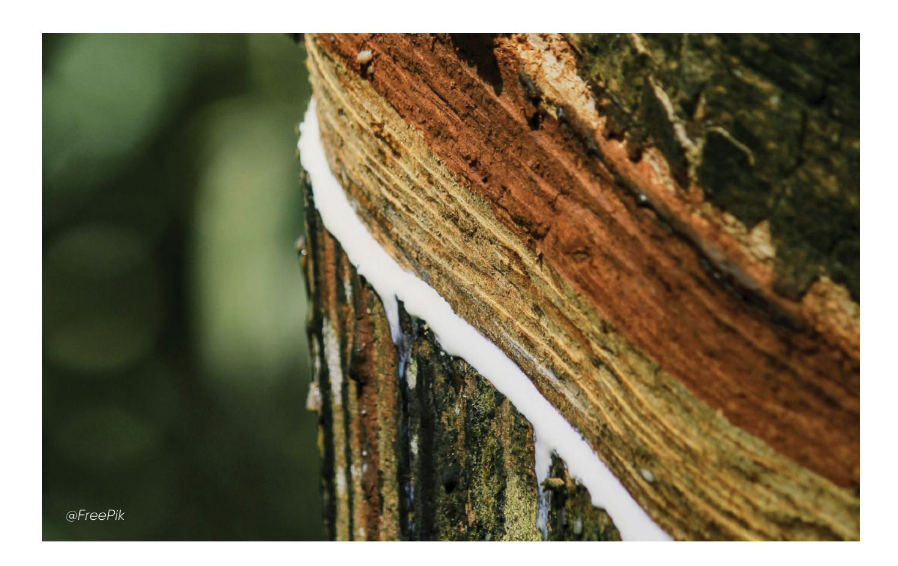

### 5.2. Conclusion

Viet Nam has taken the first steps to prepare supply chain actors for the EUDR. Since mid-2024, the government, MAE, and several international organisations have been promoting EUDR-related activities. However, the EUDR has, generally, not received enough attention from stakeholders, ranging from local authorities to supply chain participants. Understanding of the regulation among these groups is very limited. One reason for this is that dissemination and training activities related to the EUDR have been scarcely implemented at the provincial level, impacting most businesses, traders, and households. The lack of funding for implementation is a key factor contributing to this situation.

Estate plantations have complete documentation proving their ownership and the legality of production, with detailed and clear information on areas, boundaries, and geographic coordinates. However, the majority of small plantations owned by farmers lack geolocation data, except for a few areas supported by processing enterprises that provide technology, human resources, and financial assistance to collect the coordinates, following the linkage model between processors and traders. Additionally, some household-owned areas do not have documentation confirming their ownership and are still involved in boundary disputes.

Smallholders and traders who purchase raw latex play a crucial role in the Vietnamese rubber supply chain. These groups require external support to improve this situation and prepare for EUDR implementation.

Long and complex supply chains, which mix dierent sources of raw materials - including those of unclear legality, origin, and both domestic and imported theft - remain common. This situation increases the challenge of meeting the legality and deforestation-free requirements of the EUDR in the overall value chain.

Some of the initiatives being implemented to support EUDR readiness include enterprises collaborating with traders and smallholders to enhance supply chain transparency, shortening supply chains, and classifying raw material sources as EUDR-compliant or non-compliant during procurement. Sustainable forest management certification providers are revising their standards to align with the EUDR, thereby assisting enterprises in obtaining certification and facilitating EUDR compliance. Some enterprises have committed to supplying EUDR-compliant products to EU customers and importers. However, the number of enterprises, households, and rubber-growing areas participating in these initiatives remains small compared to the total number of these entities across the country.

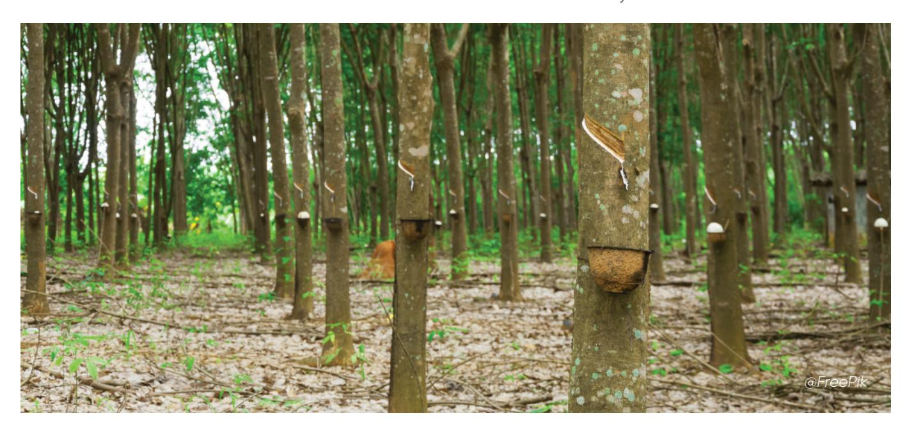

### 5.3. Recommendations

foster collaboration and create further opportunities for smallholders to organise themselves and adopt more sustainable practices.

Private sector actors should promote customer engagement in supporting domestic processing manufacturers and their raw material suppliers, enabling them to be ready for EUDR application. These models will help reduce intermediaries, lower transaction costs, shorten the supply chain, and ensure a stable, transparent, and traceable supply flow. Additionally, standardised operational processes and pre-competitive information-sharing systems should be developed and implemented by the industry to ensure that all necessary data needed for EUDR compliance is fully transmitted along the CoC, maintaining traceability throughout the entire supply chain.

Specific support programmes by government and private sector actors should be established to help smallholders enhance their understanding of the EUDR and improve their production and trading processes. These programmes should focus on upgrading production skills, ensuring better environmental and social standards, and increasing transparency in supply chains.

Rubber dealers or intermediary traders purchasing latex from small rubber plantations also need awareness-raising activities and technical support to ensure traceability for the rubber latex they bring into the supply chain.

A mobile app for handheld devices, such as smartphones, should be developed to help smallholders and intermediate raw latex dealers update transaction information in real time. This could be led by either the Vietnamese government or private sector stakeholders, including technology companies, rubber processing enterprises, and industry associations. The government could facilitate development and ensure the accessibility of such an app. Ideally, this app should be free of charge for smallholders, open-source, and with interoperable data formats while ensuring data privacy. Meanwhile, the private sector, especially

To fully meet the EUDR requirements for the Vietnamese rubber industry, given the challenges and advantages outlined above, the research team proposes the following solutions:

Vietnamese government bodies and private sector actors downstream in the supply chain could promote multi-channel communication to enhance awareness and understanding of the EUDR, especially amongst local enterprises, local management ocials, traders, and smallholders at the provincial, district, and commune levels.

Public authorities could establish a national mechanism to enhance cooperation among local interested parties such as government bodies, business associations, processors, traders, and smallholder groups, leveraging their resources and strengths to contribute to SDGs and ensure alignment with EUDR requirements across the industry. Furthermore, public-private partnerships could support smallholders with technical and financial resources, while processing companies could contribute to providing training and outreach on best practices for deforestation-free sourcing.

Viet Nam is already supported by initiatives such as the SAFE and EUDR ENG projects. These international initiatives and support programmes, especially in the context of the TEI on deforestation-free value chains, oer valuable opportunities for cross-country collaboration and knowledge exchange for the rubber industry in Viet Nam. Focus should be on smallholder rubber farmers and intermediate raw rubber dealers, strengthening their capacity, improving access to resources, and involving them in the sustainable rubber supply chain to ensure long-term impact and alignment with Viet Nam's development goals.

A mechanism should be developed to encourage the development of farmer outreach and partnership through groups of farmer households or partnerships among processors, traders, and households/ household groups. This mechanism could be developed by both public authorities and private sector stakeholders in Viet Nam, working together to rubber enterprises, could contribute with outreach through technical development, implementation, and ongoing maintenance of the app.

Participating in audits for sustainability management certifications compatible with the EUDR presents a valuable opportunity for private sector stakeholders to use synergies to provide and collect data relevant to the EUDR context. However, it is crucial to recognise that the EUDR does not consider any certification scheme a green light for EUDR compliance. While certain certification schemes might be helpful tools for data collection, they are not a substitute for the due diligence obligations of operators. Widely recognised sustainability standards do not fully meet all EUDR requirements. If supply chain actors can ensure deforestation-free value chains in line with EUDR requirements through other eective means, and their customers do not specifically require sustainability certification, obtaining such certification is unnecessary. This clarification should be widely communicated amongst Vietnamese supply chain actors to prevent misunderstanding.

Local authorities could facilitate the issuance of LURCs for rubber plantation areas that have been stably used by households for a long time, are free of disputes, and align with existing land use planning. The updated LURC format, which includes geographical coordinates, not only serves as legal proof of ownership but also helps reduce the costs of providing evidence for deforestation-free and legal commodity production in line with EUDR requirements. For eligible areas where LURCs cannot be immediately granted, the government could provide clear guidance and agree on alternative forms of ownership and land-use verification. This would prevent households from being excluded from the supply chain and mitigate potential negative socio-economic impacts on smallholder farmers.

Vietnamese regulatory agencies could expedite the development of a unified and synchronised land database and assign production codes to all rubber plantations and other crops. Additionally, a mechanism for sharing information on sourcing areas could be established to support stakeholders with legitimate and legal needs to ensure compliance

with the national legislative framework for legal and deforestation-free commodity production.

Information on FDI companies in the rubber industry remains very limited, with Vietnamese customs records on imports and exports being the only accessible source. Given their significant role in Viet Nam's rubber supply chain, greater transparency and active participation from these companies will be essential for traceability along the value chain. Government stakeholders should establish a mechanism to encourage coordination and information sharing from FDI companies, starting with European FDI firms.

Ensuring full traceability across the entire supply chain in a short period is challenging. Therefore, processors and exporters should ensure that EUDR-compliant and non-compliant products (including products of unknown origin) are not mixed along the value chain. Additionally, rubber latex is typically extracted when trees reach 7 to 8 years of age. This means that the latex used in rubber products exported to the EU until the end of 2026 is sourced from rubber trees planted before 31 December 2020. Therefore, the latex collected after 2026 will need to be cross-checked for potential risks of deforestation.

Government agencies and private sector stakeholders could establish a mechanism to encourage smallholders to organise themselves into household groups operating independently alongside the existing partnership model between smallholder farmers and enterprises under cooperatives or cooperative groups. This would enhance supply chain transparency, shorten distribution channels, and increase the capacities of stakeholders to produce deforestation-free commodities. Development institutions and non-governmental organisations can play a key role in supporting this initiative.

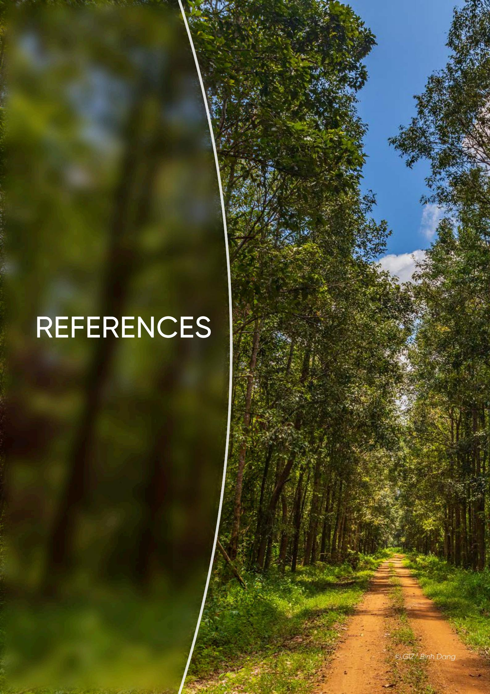

# REFERENCES

Ministry of Industry and Trade (2024). Vietnam Import and Export Report 2023. Industry and Trade Publishing House (https://trungtamwto.vn/file/22934/bao-cao-xuat-nhap-khau-viet-nam-nam-2023.pdf) MAE (2008). Decision No. 2855/QD-BNN-KHCN announcing the identification of rubber trees as multi-purpose trees MAE (2018). Decision No. 4539/QD-BNN-TCLN promulgating software to update forest changes MAE (2018). Circular No. 28/2018/TT-BNNPTNT regulating sustainable forest management MAE (2018). Circular No. 33/2018/TT-BNNPTNT regulating forest survey, inventory, and monitoring MAE (2021). Decision No. 1558/QD-BNN-TCLN announcing the national forest status in 2020 MAE (2022). Decision No. 3156/QD-BNN-TT promulgating temporary guidance on the issuance and management of growing area codes Ministry of Finance (2013). Circular No. 111/2013/TT-BTC guiding the implementation of the Law on Personal Income Tax, the Law Amending and Supplementing Certain Articles of the Law on Personal Income Tax, and Decree No. 65/2013/ND-CP detailing several provisions of the Law on Personal Income Tax MAE (2022). Circular No. 07/VBHN-BTNMT regulating land statistics, inventory, and mapping of current land use Government (2019). Decree No. 35 regulating administrative sanctions in the forestry sector Government (2022). Decree No. 08/2022/ND-CP detailing several provisions of the Law on Environmental Protection https://app.powerbi.com/view?r=eyJrIjoiN2U3NGMyNWEtZTAxNS00MzVhLWExNmMtOThhZjdiYjQ4MWNkIiwidC I6IjEyNGU2OWRiLWVmNjUtNDk2Yi05NmE5LTVkNTZiZWMxZDI5MSIsImMiOjl9 (Accessed 26 March 2024) https://chinhphu.vn/dan-toc (Accessed 23 March 2024) https://mkresourcesgovernance.org/2024/10/01/phien-hop-ky-thuat-ve-nganh-go-va-cao-su-chuan-bi-thi ch-ung-eudr-thuc-trang-va-kien-nghi-tu-cong-dong-doanh-nghiep/(Accessed 27 March 2024) https://mkresourcesgovernance.org/2024/10/01/phien-hop-ky-thuat-ve-nganh-go-va-cao-su-chuan-bi-thi ch-ung-eudr-thuc-trang-va-kien-nghi-tu-cong-dong-doanh-nghiep/(Accessed 23 March 2024) https://mkresourcesgovernance.org/2024/10/25/toa-dam-lam-the-nao-de-dap-ung-eudr-bai-hoc-thuc-ti en-tu-doanh-nghiep-nganh-cao-su/(Accessed 25 March 2024) https://mkresourcesgovernance.org/2024/11/13/hoi-thao-thuc-day-san-xuat-thuong-mai-va-dau-tu-cao-s u-thien-nhien-ben-vung-tai-khu-vuc-dong-nam-a-dai-luc/(Accessed 26 March 2024) https://thuvienphapluat.vn/van-ban/Bat-dong-san/Thong-tu-10-2024-TT-BTNMT-ho-so-dia-chinh-Giay-ch ung-nhan-quyen-su-dung-dat-608554.aspx (Accessed 25 March 2024) https://thuvienphapluat.vn/van-ban/Linh-vuc-khac/Quyet-dinh-3156-QD-BNN-TT-2022-tai-lieu-huong-dan -cap-quan-ly-ma-so-vung-trong-528365.aspx (Accessed 23 March 2024) https://vfcs.org.vn/du-lieu-chung-nhan/(Accessed 25 March 2024) https://vfcs.org.vn/du-lieu-chung-nhan/(Accessed 23 March 2024) https://vfcs.org.vn/tin-tuc/nganh-cao-su-viet-nam-chu-dong-dap-ung-quy-dinh-san-xuat-hang-hoa-kho ng-gay-mat-rung-cua-lien-minh-chau-au-eudr/(Accessed 23 March 2024) https://vneconomy.vn/viet-nam-da-san-sang-va-se-co-cach-tiep-can-phu-hop-voi-quy-dinh-eudr.htm?ut m\_source=chatgpt.com(Accessed 25 March 2024) https://www.gso.gov.vn/wp-content/uploads/201912/Ket-qua-toan-bo-Tong-dieu-tra-dan-so-va-nha-o -2019.pdf(Accessed 25 March 2024) https://www.gso.gov.vn/wp-content/uploads/2020/07/01-Bao-cao-53-dan-toc-thieu-so-2019\_ban-in.pdf(A ccessed 25 March 2024) https://www.vra.com.vn/thong-tin-hoi-vien/dri-thang-lon-nho-du-an-trong-sau-rieng-xen-canh-voi-cay-c ao-su.15742.html (Accessed 25 March 2024) https://www.vra.com.vn/thong-tin-hoi-vien/dri-thang-lon-nho-du-an-trong-sau-rieng-xen-canh-voi-cay-c ao-su.15742.html (Accessed 22 March 2024)

https://www.vra.com.vn/thong-tin/an-pham/danh-ba-doanh-nghiep-cao-su-viet-nam-2022-2023.15787.ht

ml (Accessed 24 March 2024) https://www.vra.com.vn/thong-tin/thong-ke-tong-quat/thong-ke-tong-quat-2023.15157.html(Accessed 25 March 2024) Nguyen Vinh Quang (2024). Description of Viet Nam's legal framework of relevance to smallholders. EFI. Nguyen Vinh Quang et al. (2018). Vietnam's rubber wood supply chain: Status and policies. VRA, VIFOREST, Forest Trends. Nguyen Vinh Quang et al. (2021). Linking natural rubber consumption from smallholders: Status and some policy issues. VRA, RRIV, Forest Trends. Nguyen Vinh Quang et al. (2024). Vietnam's rubber industry: Preparing to adapt to the EU deforestation regulation. Forest Trends. National Assembly (2013). Constitution of the Socialist Republic of Vietnam National Assembly (2013). Law on Plant Protection and Quarantine National Assembly (2017). Law on Forestry National Assembly (2019). Labour Code National Assembly (2019). Law on Public Investment National Assembly (2020). Law on Environmental Protection National Assembly (2024). Law on Land Decision No. 431/QD-BNN-TT dated 26 January 2024 of the Minister of MAE approving the project for the development of key industrial crops to 2030 (https://thuvienphapluat.vn/van-ban /Linh-vuc-khac/Quyet-dinh-431-QD-BNN-TT-2024-De-an-phat-trien-cay-cong-nghiep-chu-luc-den-2030- 602966.aspx) Workshop documents: "Promoting Sustainable Natural Rubber Production, Investment, and Trade in Mainland Southeast Asia" in Vientiane, Laos 14-15 November 2024 Prime Minister (2021). Decision No. 1719/QD-TTg approving the National Target Programme on Socio-economic Development in Ethnic Minority and Mountainous Areas for the Period 2021-2030, Phase I: 2021-2025 To Xuan Phuc and Nguyen Vinh Quang (2023). Legality of natural rubber supply from Cambodia and Laos to Viet Nam. Forest Trends Webinar discussion: "Farmers participating in export supply chains: Voices from the community" organised by the Department of Forestry and Forest Protection and Forest Trends on 22 November 2024 Tran Thi Thuy Hoa et al. (2021). Overview of the rubber industry: Key features and roles of small rubber plantations. VRA, RRIV, Forest Trends Tran Thi Thuy Hoa et al. (2018). Vietnam rubber industry: Status and solutions for sustainable development. VRA, Forest Trends, VIFOREST Committee for Ethnic Minorities (2022). Circular No. 01/2022/TT-UBDT regulating the process of monitoring and evaluating the implementation of the National Target Programme on Socio-economic Development in Ethnic Minority and Mountainous Areas for the Period 2021-2030, Phase I: 2021-2025 European Forestry Institute (2024). Assessment of the preparedness for EUDR of the Vietnamese Forestry Sector. UNDP VRA and Forest Trends (2024). Survey results: "Rubber industry enterprises prepare to adapt to EUDR". Conducted in August-September 2024 Webinar organised by FT on 25 October: "Practical experience of rubber industry enterprises in meeting EUDR" "Linking natural rubber consumption from smallholders: Current situation and some policy issues" (2021). Nguyen

Vinh Quang et al.

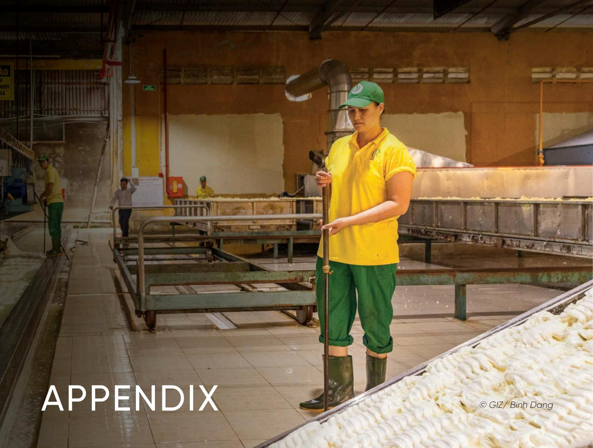

### Appendix 1. Viet Nam's rubber products export turnover, 2019 – 2023 (in million USD)

From 2019 to 2023, Viet Nam's rubber exports, including both natural and synthetic rubber*93*, experienced consistent annual growth, with an average growth rate exceeding 13% per year. Export turnover rose from USD 4.5 billion in 2019 to more than USD 7.2 billion in 2023. In 2023, synthetic rubber accounted for over 60% of the export share, while raw rubber represented nearly 40%.

*Source: Data from the General Department of Customs (Quang et al., 2024) and a presentation by Forest Trends (2024)94*

|  | Product          | 2019           | 2020           | 2021           | 2022           | 2023           | Proportion    |  |
|--|------------------|----------------|----------------|----------------|----------------|----------------|---------------|--|
|  |                  |                |                |                |                |                |               |  |
|  | Raw rubber       | 2,301.3        | 2,385,4        | 3,271,1        | 3,298,7        | 2,892,1        | 39,8%         |  |
|  | Synthetic rubber | 2,203.3        | 2,508,4        | 3,046,8        | 3,436,6        | 4,377,5        | 60,2%         |  |
|  | Total            | <b>4,504.6</b> | <b>4,893,8</b> | <b>6,317,9</b> | <b>6,735,0</b> | <b>7,269,6</b> | <b>100,0%</b> |  |

*93 According to the FAQ document on the EUDR, section 2.2, products made from synthetic rubber are out of scope under the EUDR and the mix of synthetic and natural rubber are subject to due diligence requirements only for the natural rubber component.*

*94Source:* 

*https://mkresourcesgovernance.org/2024/10/01/phien-hop-ky-thuat-ve-nganh-go-va-cao-su-chuan-bi-t hich-ung-eudr-thuc-trang-va-kien-nghi-tu-cong-dong-doanh-nghiep/* 

### Appendix 2. Export turnover of Viet Nam's key rubber products, 2019-2023 (in million USD)

Tyres (HS 4011) are Viet Nam's top rubber export, with the highest turnover. The export value of this product steadily increased each year from 2019 to 2023. The second and third largest export categories are two raw rubber products: natural mixed synthetic rubber (HS 400280) and natural rubber (HS 4001). Viet Nam is the second-largest exporter of natural rubber in the world (after Thailand).*95*

> *Source: Data from the General Department of Customs in a presentation by Forest Trends.96*

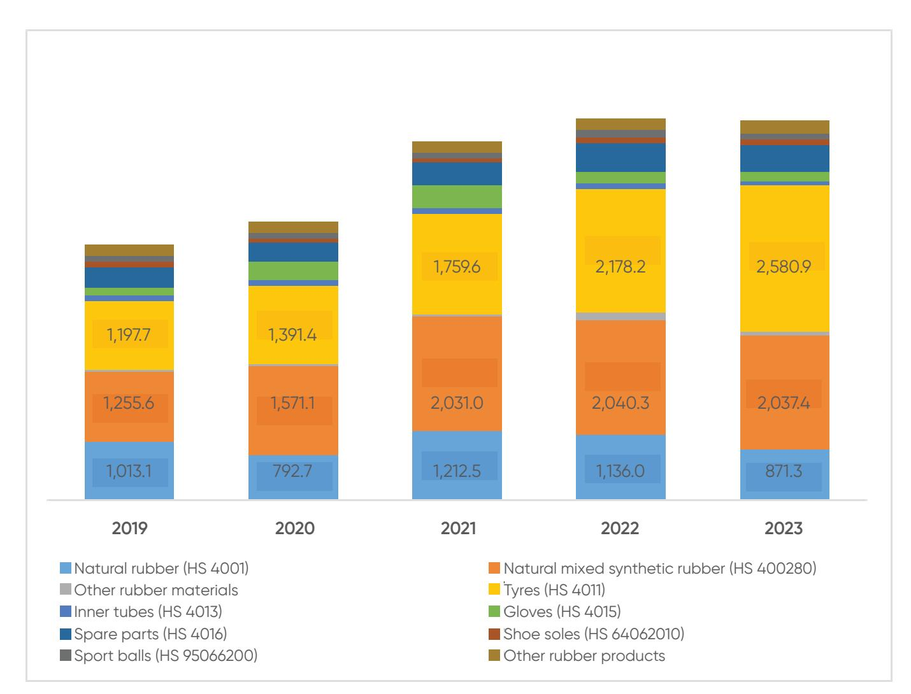

*95Source: https://www.vra.com.vn/thong-tin/thong-ke-tong-quat/thong-ke-tong-quat-2023.15157.html* 

*96Source:* 

*https://mkresourcesgovernance.org/2024/10/01/phien-hop-ky-thuat-ve-nganh-go-va-cao-su-chuan-bi-t hich-ung-eudr-thuc-trang-va-kien-nghi-tu-cong-dong-doanh-nghiep/* 

### Appendix 3. Export turnover of rubber products to Viet Nam's key markets, 2019-2023 (in million USD)

Between 2019 and 2023, Viet Nam exported rubber products to over 160 markets. The top three export destinations were China, the United States, and the EU. In 2023, Viet Nam's export value to China exceeded USD 2.4 billion (representing 36.1% of total export value); to the United States, it reached USD 1.6 billion (23.9%); and, to the EU, it amounted to USD 511 million (7.8%).

### Appendix 4. EU countries with the highest import turnover of natural rubber and rubber products from Viet Nam in 2023

*Source: Data from the General Department of Customs (Quang et al., 2024) and a presentation by Forest Trends (2024).97*

*Nguồn: Số liệu của TCHQ, tổng hợp từ Bài trình bày của ¥ại diện Forest Trends (2024).97*

|   |                | <b>Import of natural rubber</b> |                | <b>Natural rubber products</b> |
|---|----------------|---------------------------------|----------------|--------------------------------|
|   | <b>Country</b> | <b>Turnover (million USD)</b>   | <b>Country</b> | <b>Turnover (million USD)</b>  |
| 1 | Germany        | 37,5                            | Germany        | 92,0                           |
| 2 | Netherlands    | 14,2                            | Netherlands    | 55,1                           |
| 3 | Spain          | 12,2                            | Poland         | 38,2                           |
| 4 | Italy          | 11,5                            | Spain          | 36,8                           |
| 5 | France         | 5,1                             | Italy          | 32,3                           |

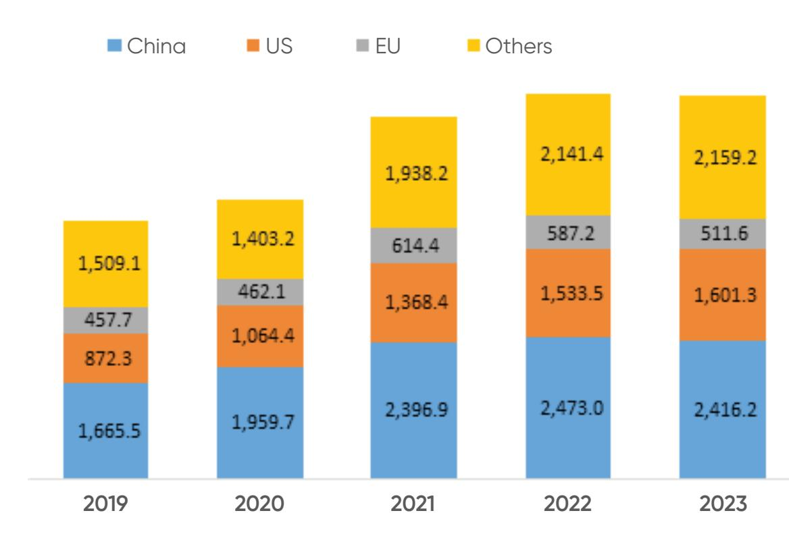

*97Source:* 

*https://mkresourcesgovernance.org/2024/10/01/phien-hop-ky-thuat-ve-nganh-go-va-cao-su-chuan-bi-t hich-ung-eudr-thuc-trang-va-kien-nghi-tu-cong-dong-doanh-nghiep/*

Appendix 5. Overview of enterprises involved in Viet Nam's rubber industry supply chain, 2019

| Involvement stage Private FDI Total Enterprises State-owned enterprises99 enterprises enterprises100 not classified Rubber production/planting 62 95 3 160 Number of enterprises 371,3 89,1 1,3 461,7 Plantation area (thousand hectare) Import of natural rubber (ocial) 14 73 46 133 Number of enterprises 12 67 3 82 |
|--------------------------------------------------------------------------------------------------------------------------------------------------------------------------------------------------------------------------------------------------------------------------------------------------------------------------|
| ◦ Of which, number of enterprises temporarily importing for re-export                                                                                                                                                                                                                                                    |
| ◦ Of which, number of enterprises producing rubber products Processing Number of enterprises Design capacity (thousand tons of raw rubber products per year) Export of natural rubber (HS 4001) Number of enterprises                                                                                                    |
| ◦ Of which, number of enterprises exporting                                                                                                                                                                                                                                                                              |
| ◦ Of which, number of enterprises processing latex and exporting                                                                                                                                                                                                                                                         |
| ◦ Of which, number of enterprises planting rubber, processing latex, and exporting Export of mixed synthetic rubber (HS 400280) Number of enterprises                                                                                                                                                                    |
| ◦ Of which, number of enterprises exporting                                                                                                                                                                                                                                                                              |
| ◦ Of which, number of enterprises processing latex and exporting                                                                                                                                                                                                                                                         |
| ◦ Of which, number of enterprises planting rubber, processing latex, and exporting Export of key rubber products Number of enterprises exporting tyres Number of enterprises exporting                                                                                                                                   |
| rubber components 101 Number of enterprises exporting shoe soles Number of enterprises exporting gloves                                                                                                                                                                                                                  |

### Appendix 6. Number of enterprises and export turnover of natural rubber to the EU in 2023, classified by enterprise type

| Enterprise type | Number of enterprises | Proportion of enterprises | Export turnover (million USD) | Proportion of turnover |
|-----------------|-----------------------|---------------------------|-------------------------------|------------------------|
| State           | 13                    | 24,5                      | 29,3                          | 31,3                   |
| Private         | 38                    | 71,7                      | 64,00                         | 68,5                   |
| FDI             | 2                     | 3,8                       | 0,16                          | 0,2                    |
| Total           | 53                    | 100,0                     | 93,4                          | 100,0                  |

| Enterprise type | Number of enterprises | Proportion of enterprises | Export turnover (million USD) | Proportion of turnover |
|-----------------|-----------------------|---------------------------|-------------------------------|------------------------|
| State           | 5                     | 1,4                       | 2,0                           | 0,6                    |
| Private         | 215                   | 58,1                      | 154,2                         | 40,8                   |
| FDI             | 150                   | 40,5                      | 221,5                         | 58,6                   |
| Total           | 370                   | 100,0                     | 377,7                         | 100,0                  |

*Source: Data from the General Department of Customs, compiled from the presentation by a Forest Trends representative (2024).103*

### Appendix 7. Number of enterprises and export turnover of rubber products to the EU in 2023, classified by enterprise type

*Source: Data from the General Department of Customs, compiled from the presentation by a Forest Trends representative (2024).104*

*98Source:* 

*https://mkresourcesgovernance.org/2024/10/01/phien-hop-ky-thuat-ve-nganh-go-va-cao-su-chuan-bi-t hich-ung-eudr-thuc-trang-va-kien-nghi-tu-cong-dong-doanh-nghiep/* 

*99State-owned enterprises include those under VRG and those managed by local authorities at the provincial level.*

*100 SPrivate enterprises include cooperative models.*

*101Rubber components encompass products such as gaskets, pads, rubber edges, rollers, etc.*

*102Tran Thi Thuy Hoa et al. (2021), Overview of the rubber industry: Key features and roles of small rubber plantations. VRA, Forest Trends, RRIV.*

*103Presented in the technical meeting on 1 October 2024. (Source:* 

*https://mkresourcesgovernance.org/2024/10/01/phien-hop-ky-thuat-ve-nganh-go-va-cao-su-chuan-bi-t hich-ung-eudr-thuc-trang-va-kien-nghi-tu-cong-dong-doanh-nghiep/)*

*104Presented in the technical meeting on 1 October 2024. (Source:* 

*https://mkresourcesgovernance.org/2024/10/01/phien-hop-ky-thuat-ve-nganh-go-va-cao-su-chuan-bi-t hich-ung-eudr-thuc-trang-va-kien-nghi-tu-cong-dong-doanh-nghiep/)*

### Appendix 8. Rubber plantation area and proportion in Viet Nam by estate and small plantation, 1990-2023

After peaking in 2015, Viet Nam's rubber plantation area has gradually declined in the subsequent years. In 2023, the total rubber planting area nationwide dropped to 911,200 hectares, the smallest area recorded between 2015 and 2023. Despite this decrease, Viet Nam still maintains the fifth-largest rubber plantation area in the world*105*.

Viet Nam's rubber plantations are managed by both enterprises (estate plantations) and individuals (small plantations). Enterprises involved in rubber planting typically operate large areas, ranging from several hundred to thousands of hectares, which are referred to as estate plantations. These enterprises include (i) state-owned enterprises, such as those under the VRG and those managed by local authorities; (ii) private enterprises, and; (iii) FDI enterprises*106*.

Small plantations are managed by individuals or households on their own land (usually covering less than 10 hectares per household). These plantations are often scattered in small plots around residential areas. According to the general survey of rural, agricultural, and fishery data by the GSO in 2016, there are around 265,000 smallholders in Viet Nam*107*.

*Source: Data from the GSO and the provincial DAE, as cited in Quang et al. (2018)108 and compiled by VRA.*

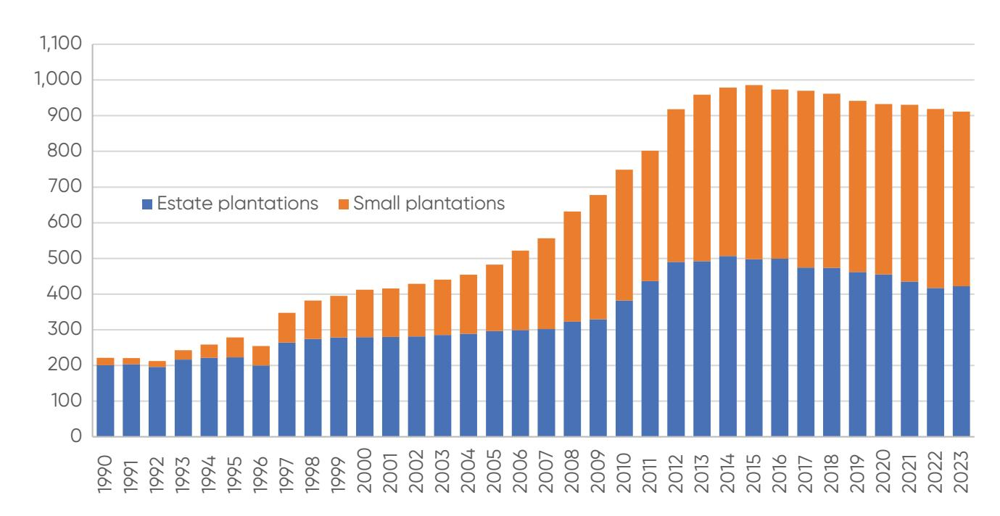

*The top five countries in the world by rubber plantation are Indonesia, Thailand, China, Malaysia, and Viet Nam (ANRPC, 2020).*

*106A small portion of rubber acreage is managed by enterprises under the Ministry of National Defense.*

*107There are no ocial statistics available to update this data.*

*108Nguyen Vinh Quang et al. (2018) Viet Nam's rubber wood supply chain: Status and policies. VRA, VIFOREST, FPA Binh Dinh, HAWA, Forest Trends.*

The area of small plantations has been growing at a faster rate than that of estate plantations and now accounts for an increasingly larger proportion of the country's total rubber area. Specifically, in 1990, estate plantations covered about 200,000 hectares, while small plantations covered only nearly 21,000 hectares (91% and 9%, respectively, of the country's total rubber area). By 2010, estate plantations had expanded to 382,000 hectares (51%), while small plantations reached 367,000 hectares (49%). By 2017, small plantations surpassed estate plantations by area, reaching 495,000 hectares (51% of the total rubber area), while estate plantations expanded to 475,000 hectares (49%). Since 2017, the proportion of small plantations has continued to rise, reaching its highest point in 2023 at 54%.

*Nguồn: Số liệu của TCTK, Cục Thống kê và Sở NN&MT các tỉnh trong Quang et al. 2018108 và VRA tổng hợp.*

*Source: Data from GSO, as cited in Nguyen Vinh Quang et al. (2021).110*

### Appendix 9. Number of smallholders and their proportion by rubber planting area, 2016

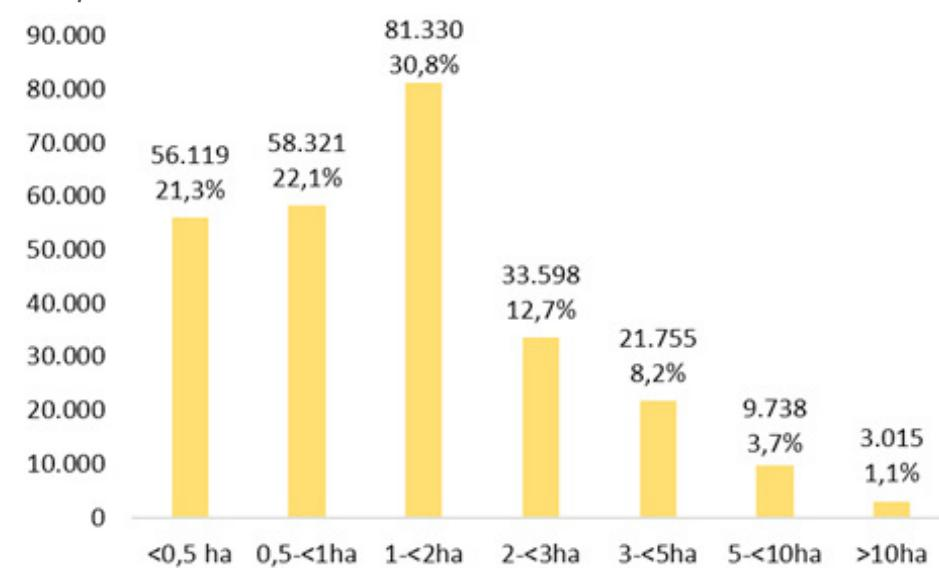

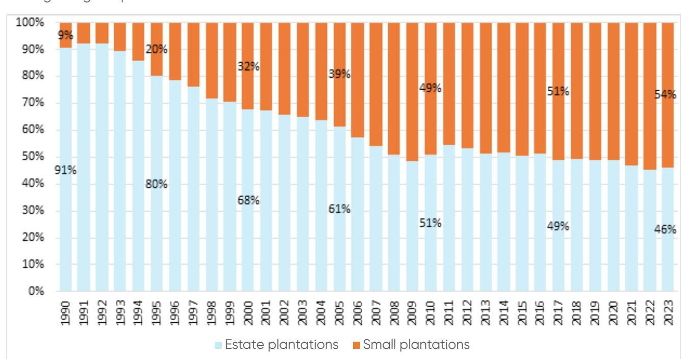

### Appendix 10. Viet Nam's latex output and proportion by estate and small plantations, 2015–2023 (thousand tons, dry weight)

Viet Nam's annual latex harvest area has consistently accounted for around 70% to 80% of the total rubber-planting area in recent years. Between 2015 and 2023, the country's annual latex output consistently exceeded 1 million tons (dry weight). Latex production showed steady growth during this period, with an average annual increase of over 4%. In 2022, total national output reached nearly 1.34 million tons, the highest level ever recorded. However, in 2023, rubber output decreased to 1.27 million tons, representing a 5.1% decline compared to 2022. This decrease is attributed to unfavourable weather conditions (unusual heat, storms, and floods), which damaged many harvested areas. Additionally, low market prices led some plantation owners to temporarily suspend or reduce the frequency of latex tapping, and some latex-producing areas were repurposed for other land uses. Despite this decline, Viet Nam remains the fourth-largest natural rubber producer globally (after Thailand, Indonesia, and the Ivory Coast)*111*. In 2023, Viet Nam's natural rubber output accounted for 9.1% of the world's total supply*112* .

Between 2015 and 2023, areas consistently supplied larger volumes of latex than estate plantation areas, with both volume and proportion steadily increasing. Specifically, rubber latex output from smallholders accounted for 57% to 63% of the total domestic latex supply. This trend is primarily due to the annual growth in small plantation areas, as well as significantly higher productivity on small plantations compared to estate plantations. In other words, smallholders' contribution to the raw rubber supply has become increasingly vital for Viet Nam's rubber processing and trading industry.

> *Source: GSO data in Tran Thi Thuy Hoa et al. (2018) and VRA-compiled.*

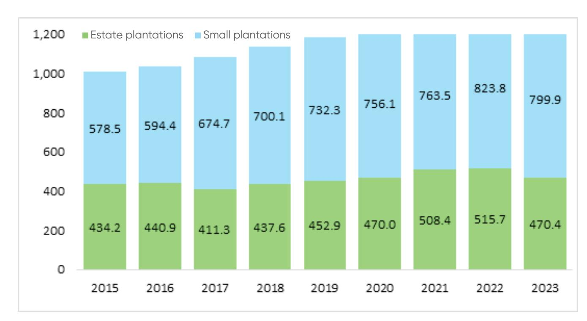

*111https://www.vra.com.vn/thong-tin/thong-ke-tong-quat/thong-ke-tong-quat-2023.15157.html* 

*112Compiled by the VRA O·ce from ANRPC data.*

*Source: GSO data in Tran Thi Thuy Hoa et al. (2018) and VRA-compiled.*

Appendix 11. Latex productivity in Viet Nam by estate and small plantations, 2015–2023 (tons dry weight/ha/year)

*Source: GSO data in Tran Thi Thuy Hoa et al. (2018) and VRA-compiled.*

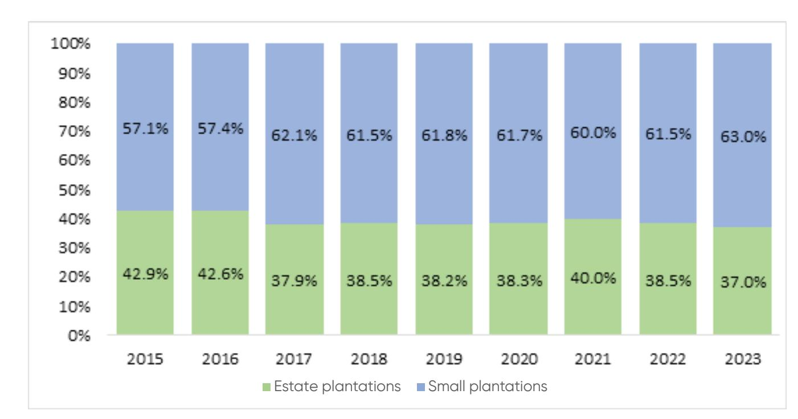

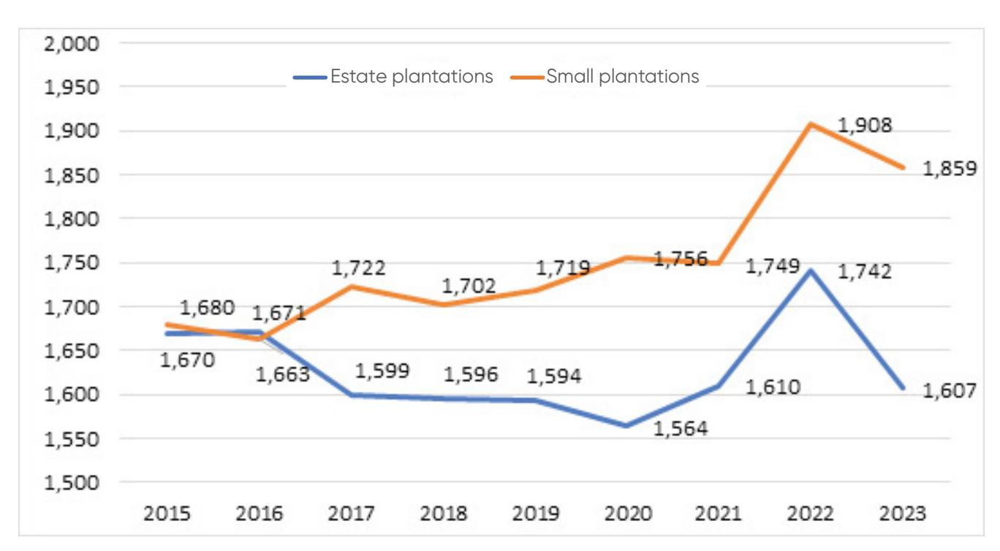

### Appendix 12. Import turnover of rubber products in Viet Nam, 2019 – 2023 (million USD)

Imported rubber has become an increasingly vital component of Viet Nam's rubber industry. From 2019 to 2022, Viet Nam's import turnover of rubber products, including both raw rubber and finished rubber products, grew steadily, rising from over USD 2.69 billion in 2019 to nearly USD 5 billion in 2022 (a more than 1.8-fold increase). However, in 2023, the import value dropped to nearly USD 2.9 billion, reflecting a sharp decline of over 41% compared to the previous year.

Between 2019 and 2023, raw rubber accounted for an average of over 56% of the total import turnover of rubber products in Viet Nam. The remaining 43% came from synthetic rubber.

### Appendix 13. Import turnover of Viet Nam's key rubber products, 2018-2022

From 2019 to 2023, Viet Nam imported rubber commodities (including raw rubber and rubber products) from over 90 markets. The top five suppliers, in terms of turnover, were Cambodia, China, Thailand, South Korea, and Japan. Together, these markets contributed to an average of more than 74% of Viet Nam's total annual import turnover in the rubber industry.

Additionally, Viet Nam imported rubber from 18 countries in Africa, although the import turnover from these nations was comparatively low in comparison with other supply sources. In 2022, the year with the highest import turnover from Africa during this period, Viet Nam's imports from the continent totalled just under USD 23 million.

Viet Nam imports a total of 22 rubber products, six of which fall under raw rubber, while 16 are categorised as rubber products. The top four most imported products are: natural rubber (HS 4001), synthetic rubber (HS 4002), rubber spare parts (HS 4016), and tyres (HS 4011). These four products consistently represented over 70% of Viet Nam's total annual import turnover between 2018 and 2022.

|  | Product          | 2019           | 2020           | 2021           | 2022           | 2023           | Proportion    |  |
|--|------------------|----------------|----------------|----------------|----------------|----------------|---------------|--|
|  |                  |                |                |                |                |                |               |  |
|  | Raw rubber       | 1,220,3        | 1,472,5        | 2,958,5        | 3,148,7        | 2,033,5        | 70,2%         |  |
|  | Synthetic rubber | 1,473,9        | 1,390,1        | 1,632,9        | 1,818,2        | 863,8          | 29,8%         |  |
|  | Total            | <b>2,694,2</b> | <b>2,862,6</b> | <b>4,591,3</b> | <b>4,966,9</b> | <b>2,897,3</b> | <b>100,0%</b> |  |

*Source: Data from the General Department of Customs, as cited in Quang et al. (2024), compiled by VRA.*

### Appendix 14. Import volume and value of Viet Nam's natural rubber (HS 4001), 2019-2023

Among the six categories of raw rubber products imported by Viet Nam, including natural rubber (HS 4001), synthetic/artificial rubber (HS 4002), natural mixed synthetic rubber (HS 400280), recycled rubber (HS 4003), waste rubber (HS 4004), and other mixed rubber (HS 4005), natural rubber (HS 4001) and synthetic/artificial rubber (HS 4002) represent the largest import values. Together, these two products account for more than 95% of total annual import value. However, it is important to note that synthetic/artificial rubber (HS 4002) is derived from petroleum and combined with various chemicals, not natural rubber. Therefore, within the context of this report related to the EUDR, the following section will focus solely on the volume, turnover, and supply of natural rubber (HS 4001).

Viet Nam's imports of natural rubber products primarily consist of technically specified rubber, centrifuged latex, and ribbed smoked sheet. The volume and import turnover of these products saw significant growth from 2019 to 2021. In 2022, import volume remained nearly equivalent to 2021 levels. However, in 2023, it declined sharply by more than 28% compared to the previous year.

*Source: Data from the General Department of Customs (Quang et al., 2024).113*

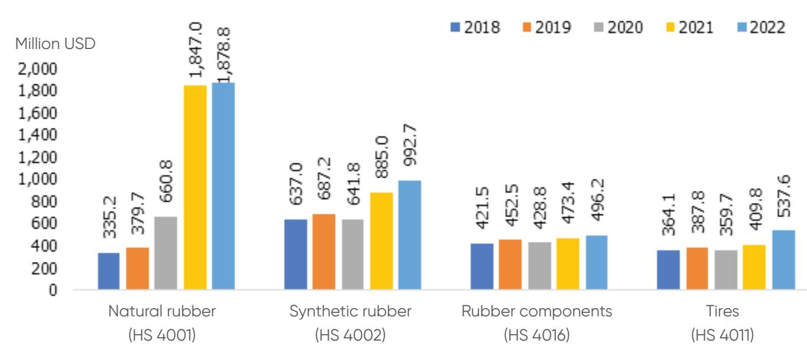

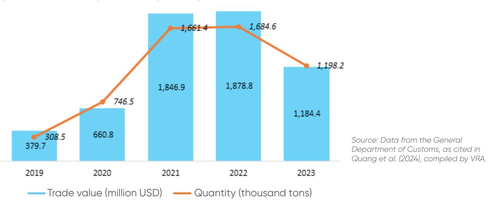

*113Nguyen Vinh Quang et al. (2024). "Vietnam's Rubber Industry: Preparing to Adapt to the EU Anti-Deforestation Regulation." Forest Trends.* 

### Appendix 15. Import volume of natural rubber (HS 4001) from Viet Nam's key suppliers, 2019-2023 (thousand tons, dry)

Between 2019 and 2023, Viet Nam imported natural rubber from around 20 countries. The largest suppliers of natural rubber were Cambodia, Laos, Thailand, Indonesia, and the Ivory Coast. Of these, Cambodia and Laos consistently maintained their positions as the two largest suppliers of natural rubber to Viet Nam throughout the period. In 2023, Cambodia supplied 77.9% and Laos supplied 12.3% of the total volume of natural rubber imported by Viet Nam. Together, Cambodia and Laos remain the most significant sources of imported natural rubber for Viet Nam.

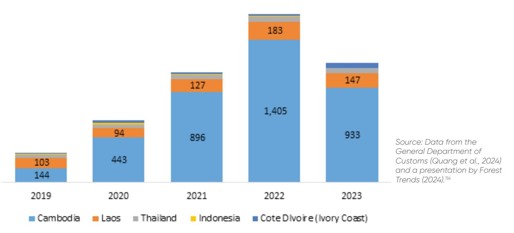

### Appendix 16. The proportion of natural rubber (HS 4001) imports from Viet Nam's key suppliers, 2019-2023

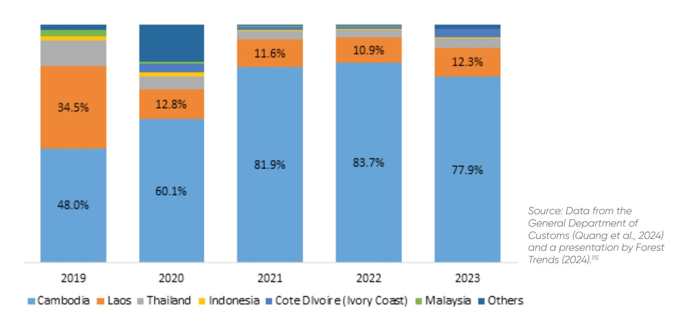

*114, 115 https://mkresourcesgovernance.org/2024/11/13/hoi-thao-thuc-day-san-xuat-thuong-mai-va-dau-tu-c ao-su-thien-nhien-ben-vung-tai-khu-vuc-dong-nam-a-dai-luc/* 

### Appendix 17. List of consulted parties

| No | Title                              | Organization / Location                                                                                                    |
|----|------------------------------------|----------------------------------------------------------------------------------------------------------------------------|
| 1  | Deputy Head of the Sub-department  | Binh Phuoc Sub-department of Crop Production and Plant Protection                                                          |
| 2  | Officer                            | Binh Phuoc Department of Crop Production and Plant Protection                                                              |
| 3  | Deputy Head of the Sub-department  | Binh Phuoc Forestry Sub-department                                                                                         |
| 4  | Officer                            | Binh Phuoc Forestry Department                                                                                             |
| 5  | Deputy Head of the Department      | Cooperative Economic Division, Binh Phuoc Department of Agriculture and Environment                                        |
| 6  | Head of Department                 | Agricultural Division of Phu Rieng District, Binh Phuoc                                                                    |
| 7  | Chair                              | Farmers' Association of Long Tan Commune, Phu Rieng District, Binh Phuoc                                                   |
| 8  | Latex purchasing trader            | Director of Toan Huyen Company, Long Tan Commune, Phu                                                                      |
| 9  | Smallholders                       | Rieng District, Binh Phuoc                                                                                                 |
| 10 | Smallholders                       | Long Tan Commune, Phu Rieng District, Binh Phuoc Province                                                                  |
| 11 | General Director                   | Long Tan Commune, Phu Rieng District, Binh Phuoc Province 
Linh Huong Rubber Company, Phu Rieng District, Binh Phuoc
 |
| 12 | Deputy Head of the Department      | Agricultural Division of Hon Quan District, Binh Phuoc                                                                     |
| 13 | Officer                            | Agricultural Division of Hon Quan District, Binh Phuoc                                                                     |
| 14 | President                          | Minh Tam Commune People's Committee, Hon Quan District, Binh Phuoc                                                         |
| 15 | Latex purchasing trader            | Minh Tam Commune, Hon Quan District, Binh Phuoc                                                                            |
| 16 | Latex purchasing trader            | Minh Tam Commune, Hon Quan District, Binh Phuoc                                                                            |
| 17 | Land Officer                       | Minh Tam Commune, Hon Quan District, Binh Phuoc                                                                            |
| 18 | Smallholders                       | Minh Tam Commune, Hon Quan District, Binh Phuoc                                                                            |
| 19 | Smallholders                       | Minh Tam Commune, Hon Quan District, Binh Phuoc                                                                            |
| 20 | Production Director                | Viet Sing Rubber Joint Stock Company, Hon Quan District, Binh Phuoc                                                        |
| 21 | Director                           | CMO Viet Nam (Binh Chanh District, Ho Chi Minh City)                                                                       |
| 22 | Deputy Head of Industry Department | Viet Nam Rubber Group (VRG), Ho Chi Minh City                                                                              |
| 23 | Officer                            | Viet Nam Rubber Group (VRG), Ho Chi Minh City                                                                              |
| 24 | Officer                            | Viet Nam Rubber Group (VRG), Ho Chi Minh City                                                                              |
| 25 | Vice Director                      | Viet Nam Forest Certification Office (VFCO)                                                                                |
| 26 | Deputy                             |                                                                                                                            |

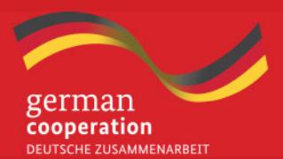

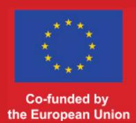

### **Published by the:**

Deutsche Gesellschaft für Internationale Zusammenarbeit (GIZ) GmbH

### **Registered oces:**

BONN AND ESCHBORN, FEDERAL REPUBLIC OF GERMANY Friedrich-Ebert-Allee 36+40

53113 Bonn, Germany

### **Imprint**

This publication was produced with the financial support of the European Union and the German Federal Ministry for Economic Cooperation and Development (BMZ). Its contents are the sole responsibility of GIZ and do not necessarily reflect the views of the EU or the BMZ.

**As at:** August 2025

### **Photo credits:**

© GIZ/ Binh Dang, @FreePik

All rights reserved. Licensed to the European Union and the German Federal Ministry for Economic Cooperation and Development under conditions.