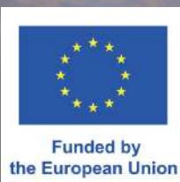
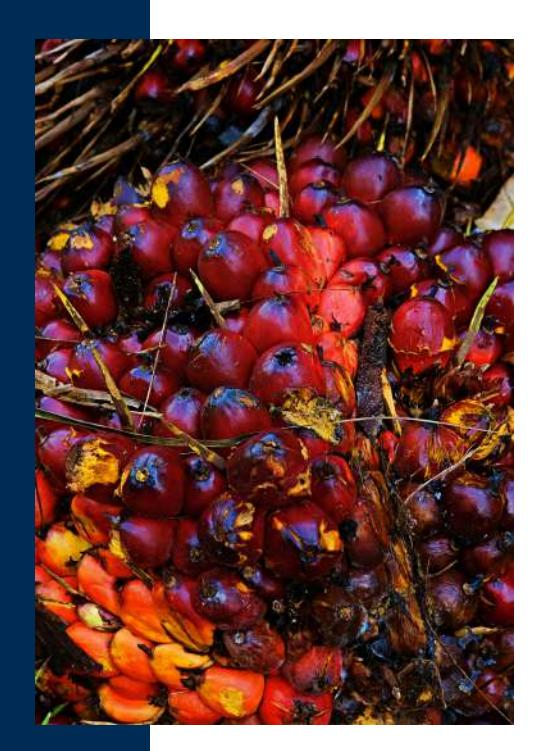
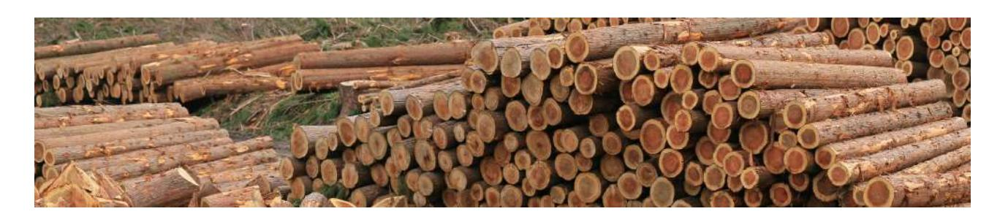
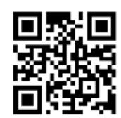

Through targeted capacity building, technical assistance, and stakeholder engagement, the project helps Indonesian stakeholders address traceability challenges, strengthen data collection, and support deforestation-free and legal products. The project promotes resilient, inclusive palm oil and timber value chains, contributing to environmental protection and sustainable economic growth.

# **ADVANCING TRACEABILITY, LEGALITY AND SUSTAINABILITY IN THE PALM OIL AND TIMBER SECTORS IN INDONESIA (ATLAS)**

# **Project Components**

| Project Title:       | Advancing Traceability Legality and Sustainability (ATLAS) |
|----------------------|------------------------------------------------------------|
| Implementing Entity: | International Trade Centre (UN/WTO)                        |
| Funded by:           | European Union                                             |
| Government Partners: | Ministry of Agriculture, Ministry of Forestry Indonesia    |
| Budget:              | 3,000,000 EUR                                              |
| Duration:            | July 2025- June 2028                                       |

## **Project Overview**

Strengthening traceability and legality across agricultural and forest-based supply chains is increasingly central to accessing EU and global markets and to building resilient, futureproof trade relationships aligned with shared green ambitions. Clear information on origin and legal compliance not only helps prevent deforestation, but also increases transparency, investor confidence, and opportunities for producers to integrate into sustainable value chains.

Indonesia continues to strengthen its approach with digital registration systems for independent palm oil smallholders and the establishment of a national timber legality assurance system. These initiatives provide a strong foundation for demonstrating deforestation-free and legal production. At the same time, many small producers continue to face practical challenges in meeting documentation, traceability, and market-entry requirements.

By building on and strengthening these national systems, the ATLAS project supports Indonesia's development and export priorities, enhances supply-chain resilience, and helps ensure that deforestation-free, legal, and inclusive products can compete successfully in the EU and global markets.

**Output 1:** Strengthened traceability in palm oil and timber supply chains through geolocation mapping and digital tools, with particular focus on enhancing smallholders' access to traceability tools. **Output 2:** Increased capacity of smallholders and Indonesian authorities to meet relevant standards. **Output 3:** Increased awareness and EU-Indonesia dialogue on the benefits and market opportunities of deforestation-free, legal, and traceable supply chains.

## **Project Objectives**

### **Overall Objectives**

## **Outputs**

The overall objective of the ATLAS project is to increase the capacity of public and private stakeholders—especially in the palm oil and timber sectors—in responding to traceability and legality requirements and raising awareness of deforestation-free production.

The ATLAS project is funded by the EU and is implemented in coordination with the European Commission and the EU Delegation to Indonesia. The project is delivered in close collaboration with the Ministry of Agriculture and the Ministry of Forestry of Indonesia. It engages with a wide range of stakeholders including other government agencies and their regional offices, NGOs, private sector, development organisations, research institutions and think tanks, as well as smallholder producers.

ATLAS is implemented by the International Trade Centre (ITC), the joint agency of the United Nations and the World Trade Organization, fully dedicated to fostering inclusive and sustainable growth and development through trade and international business development.

# **Project partners and stakeholders**

#### **Output 1 Strengthened traceability in palm oil and timber supply chains through geolocation mapping and digital tools, with particular focus on smallholders**

#### **Output 2 Increased capacity of smallholders and Indonesian authorities to meet relevant legislation and standards**

ATLAS seeks to address a key challenge in Indonesia's palm oil and timber sectors: the need for robust traceability systems that meet the EUDR traceability requirements. By strengthening geolocation mapping, integrating data into existing databases, linking databases and aligning traceability efforts with global standards, this output will enhance the ability of stakeholders to demonstrate EUDR readiness and access international markets.

### **Activities include:**

Identifying suitable tools for geolocation and traceability, assessing data formats and enhancing interoperability across tools and systems Engaging stakeholders to improve database integration and alignment with traceability requirements Promoting the transparency of existing tools and accessibility to smallholders

ATLAS focuses on empowering smallholders, Indonesian authorities and other supply chain actors with the knowledge, tools, and systems to meet market legality requirements. By providing targeted capacity building for palm oil and timber sectors stakeholders, the project aims to support legal production standards and strengthen Indonesia's position in international markets.

## **Activities include:**

Strengthening smallholder registration under e-STD-B in the palm oil sector through conducting socialisation events and collecting smallholder data to facilitate their registration Enhancing capacity for legal compliance in the timber sector building on the the EU-Indonesia FLEGT VPA

**Output 3**

**Increased awareness and EU-Indonesia dialogue on the benefits and opportunities of enhancing deforestation-free, legal, and traceable supply chains**

ATLAS builds technical awareness and enhances stakeholder engagement in Indonesia's palm oil and timber sectors to support EUDR readiness. The project facilitates structured technical engagement at the national level between relevant ministries, industry associations, and key supply chain actors, as well as between national entities and the EU.

### **Activities include:**

Facilitating awareness-raising sessions, roundtable discussions, and technical dialogues Developing and disseminating practical awareness-raising and capacity building materials Strengthening market linkages for deforestation-free palm oil and timber products

## **ATLAS Project Team - International Trade Centre**

**Mr. Mathieu Lamolle** Senior Advisor lamolle@intracen.org

**Ms. Hiswaty Hafid** National Coordinator, Palm Oil Sector hhiswaty@intracen.org

**Ms. Regina Taimasova-Bumbaca** Project Manager, Palm Oil Sector taimasova@intracen.org

**Mr. Febriangga Harmawan** National Administrator, Timber Sector fharmawan@intracen.org

**Ms. Michaela Summerer** Project Manager, Timber Sector msummerer@intracen.org

**For more information about the EUDR and ITC's work on Deforestation-Free Global Value Chains, please scan the QR code or click the link [here.](https://www.intracen.org/our-work/topics/sustainability/deforestation-free-global-value-chains/handbooks-on-the-EUDR)**

**Mr. Agus Setyarso** National Advisor, Timber Sector asetyarso@intracen.org

*This publication was funded by the European Union. Its contents are the sole responsibility of the International Trade Centre and do not necessarily reflect the views of the European Union.*