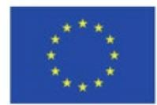

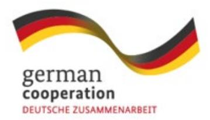

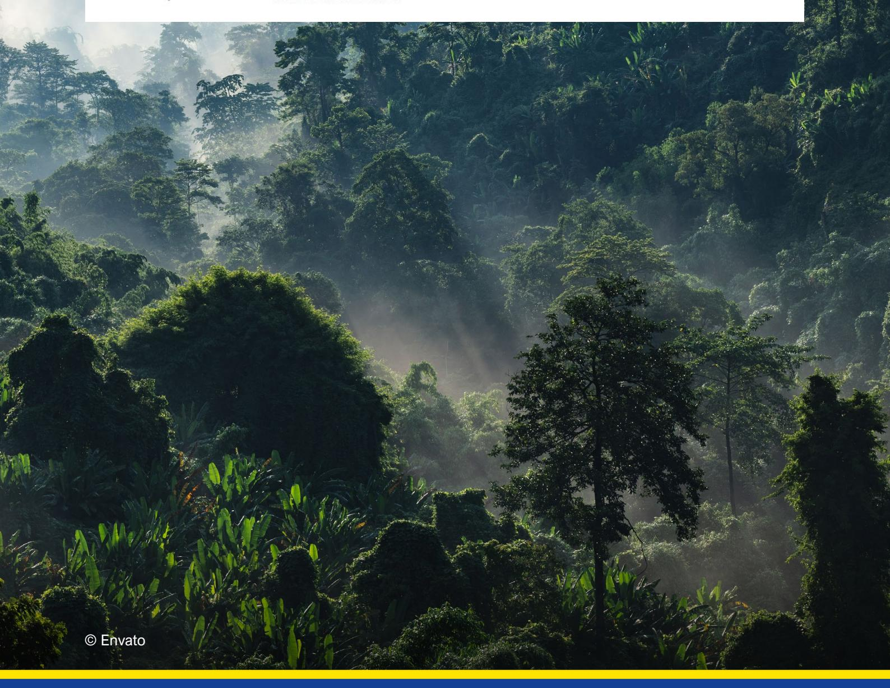

### **Risk Mitigation Measures for Forests and People under the EUDR**

This publication was produced with the Þnancial support of the European Union and the German Federal Ministry for Economic Cooperation and Development (BMZ). It was commissioned by Deutsche Gesellschaft für Internationale Zusammenarbeit (GIZ) GmbH in the context of the project "EUDR Engagement" and developed by a consortium led by AidEnvironment in partnership with Sangga Bumi Lestari. The content of this publication is the sole responsibility of the authors and does not necessarily reflect the views of the EU, BMZ or GIZ. The information in this study, or upon which this study is based, has been obtained from sources the authors believe to be reliable and accurate. While reasonable efforts have been made to ensure that the contents of this publication are factually correct, GIZ GmbH does not accept responsibility for the accuracy or completeness of the contents of this publication.

### Risk Mitigation Measures for Forests and People under the EUDR

A practical guide for action and collaboration across agricultural supply chains

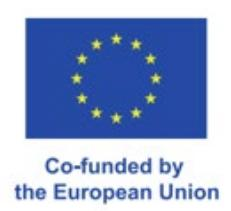

#### Disclaimer

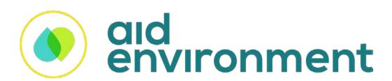

AidEnvironment is a not-for-proÞt foundation with 30 years of experience in sustainable value chain development, sustainability assessment, climate change, and ecosystem programs. AidEnvironment generates sustainability impacts in agricultural and forest landscapes across Asia, Africa, and Latin America

> Rita Raleira (AidEnvironment) Joana Faggin (AidEnvironment)

Okita Miraningrum Nur Atsari (Sangga Bumi Lestari)

Sri Wahyuni (Sangga Bumi Lestari)

The authors would like to thank: Franziska Rau (GIZ) • Joy Heitlinger (GIZ) • Anna Rother (GIZ) Tina Schneider (WRI) • Antonie Fountain (VOICE Network) • Bakary Traoré (IDEF) Claire Reboah (Proforest) • David D'Hollander (Proforest) • Indra Van Gisbergen (Fern) • Andrea Jost (GIZ) • Pascal Ripplinger (GIZ)

for their valuable inputs, insights, and constructive feedback during the development of this report.

Sangga Bumi Lestari is an Indonesian non-proÞt organisation that enhances ecological connectivity, conserves biodiversity, and supports sustainable development in some of Indonesia's at-risk forest landscapes.

Authors

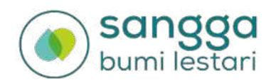

| 01 | List of Abbreviations                                              | 05 |
|----|--------------------------------------------------------------------|----|
|    | List of Figures                                                    | 06 |
|    | List of Tables                                                     | 06 |
| 02 | <b>Introduction</b>                                                | 07 |
| 03 | <b>Risk mitigation: Overview &amp; typology</b>                    | 09 |
|    | European deforestation regulation: Main obligations for companies  | 12 |
|    | Risk mitigation under the EUDR                                     | 16 |
|    | Typology of risk mitigation measures                               | 20 |
|    | Navigating individual and collective approaches in risk mitigation | 22 |
|    | Overview of risk mitigation measure categories                     | 26 |
|    | Capacity building                                                  | 27 |
|    | Certification                                                      | 28 |
|    | Forest management and conservation                                 | 29 |
|    | Landscape & jurisdictional approaches                              | 30 |
|    | Livelihood support                                                 | 31 |
|    | Traceability & transparency                                        | 32 |
| 04 | <b>Step-by-step guide</b>                                          | 33 |
|    | Capacity building for smallholders & cooperatives                  | 36 |
|    | Landscape/jurisdictional approach                                  | 36 |
| 05 | <b>Conclusion</b>                                                  | 39 |
|    | Bibliography                                                       | 42 |
|    | Annex 1 – Methods                                                  | 51 |

#### Table of contents

| <b>DFC</b>         | Deforestation-Free Commitment                                               |
|--------------------|-----------------------------------------------------------------------------|
| <b>DIASCA</b>      | Digital Integration of Agricultural Supply Chains Alliance                  |
| <b>EU</b>          | European Union                                                              |
| <b>EUDR</b>        | European Union regulation on deforestation-free products                    |
| <b>FAO</b>         | Food and Agriculture Organization of the United Nations                     |
| <b>FFS</b>         | Farmer Field School                                                         |
| <b>FPIC</b>        | Free, Prior, and Informed Consent                                           |
| <b>GISCO</b>       | German Initiative on Sustainable Cocoa                                      |
| <b>GIZ</b>         | Deutsche Gesellschaft für Internationale Zusammenarbeit                     |
| <b>HRDD</b>        | Human Rights Due Diligence                                                  |
| <b>ICS / IMS</b>   | Internal Control System / Internal Management System                        |
| <b>IP &amp; LC</b> | Indigenous Peoples and Local Communities                                    |
| <b>ISEAL</b>       | International Social and Environmental Accreditation and Labelling Alliance |
| <b>KPI</b>         | Key Performance Indicator                                                   |
| <b>Mha</b>         | Million hectares                                                            |
| <b>MRV</b>         | Monitoring, Reporting, and Verification                                     |
| <b>MSP</b>         | Multistakeholder Partnership                                                |
| <b>NDPE</b>        | No Deforestation, No Peat, No Exploitation                                  |
| <b>NGO</b>         | Non-Governmental Organisation                                               |
| <b>OECD</b>        | Organisation for Economic Co-operation and Development                      |
| <b>REDD+</b>       | Reducing Emissions from Deforestation and Forest Degradation                |
| <b>PES</b>         | Payments for Ecosystem Services                                             |
| <b>SME</b>         | Small and Medium-sized Enterprise                                           |
| <b>UN</b>          | United Nations                                                              |

#### I. List of Abbreviations

Global deforestation between 2015 and 2024 (Mha) in relation to expected progress toward 2030 zero deforestation goals. Main drivers of deforestation between 2015 and 2023 (Mha). Due Diligence requirements of the three-step process under the EUDR. Conceptual basis for the structure and typology of risk mitigation measures Step-by-Step Guide – Capacity Building for Smallholders & Cooperatives Step-by-Step Guide – Landscape Approach **Figure 1 Figure 2 Figure 3 Figure 4 Figure 5 Figure 6**

Structural Criteria: Goals, Scales, Entry Points, and Barriers Addressed Typology of risk mitigation measures: ProÞle of Capacity Building category Typology of risk mitigation measures: ProÞle of CertiÞcation category Typology of risk mitigation measures: ProÞle of Forest Management and Conservation category Typology of risk mitigation measures: ProÞle of Livelihood Support category Typology of risk mitigation measures: ProÞle of Landscape & Jurisdictional Approaches category Typology of risk mitigation measures: ProÞle of Traceability & Transparency category Overview of the categories of risk mitigation measures, including their characteristics under the structural criteria deÞned **Table 1 Table 2 Table 3 Table 4 Table 5 Table 6 Table 7 Table 8**

#### II. List of Figures

#### III. List of Tables

This is done by mitigating deforestation and legality risks through long-term, holistic strategies that not only contribute to compliance, but also support forest preservation, alongside the rights and livelihoods of smallholders and Indigenous Peoples and Local Communities (IP&LC).

While a wide array of risk management and, speciÞcally, risk mitigation strategies exist, this guide focuses on measures that have the dual purpose of reducing deforestation and forest degradation, as well as promoting the inclusion and rights of smallholders, cooperatives, and IP & LC. It is primarily intended for operators placing or exporting EUDR-relevant commodities on the EU market, although its insights may also assist other parties, such as EU Competent Authorities and traders.

This practical guide on risk mitigation measures aims to support companies in meeting the European Union Regulation on Deforestation-free Products (EUDR) due diligence obligations.

### Executive summary

The EUDR entered into force in June 2023 and will enter into application on 30 December 2026 for large and medium operators and 30 June 2027 for micro and small enterprises. For micro and small operators already covered by the EU Timber Regulation (EUTR), the entry into application will be 30 December 2026. The Regulation aims to minimise the EU's role in deforestation and forest degradation worldwide, therefore contributing to mitigate climate change, reduce greenhouse gas emissions and biodiversity loss.

Under the EUDR, companies must ensure that relevant products and commodities placed on the EU market, or exported from it, are produced legally and without deforestation and forest degradation.

To safeguard compliance with these requirements, companies must carry out a three-step due diligence procedure, involving information collection, risk assessment, and risk mitigation.

Where non-negligible risks are identiÞed, companies must undertake appropriate and proportional risk mitigation action. The EUDR takes a flexible, non-prescriptive approach to risk mitigation, requiring only that companies ensure effective reduction of the risk of deforestation and/or illegality to a negligible level, without specifying how risk mitigation measures should be designed or implemented.

Risk mitigation can take different forms. It can focus strictly on compliance and risk avoidance, with producers in high-risk areas being preventively cut-off. Alternatively, companies can take a more proactive

**What the guide provides:** An overview of EUDR obligations, highlighting the risk-mitigation measures required under its due-diligence rules.

> A step-by-step guide for two selected measures striving to provide a roadmap that turns strategy into operations:

- Capacity building of smallholders & cooperatives
- Landscape/jurisdictional approach

#### A typology of risk mitigation measures:

- 1. Capacity building
- 2. CertiÞcation
- 3. Forest management & conservation
- 4. Landscape/jurisdictional approaches
- 5. Livelihood support
- 6. Traceability & transparency

The typology highlights the analysis of each category against a set of structural and impact-oriented criteria.

approach by assessing risks more granularly and actively engaging with current or potential suppliers in high-risk regions through meaningful risk mitigation measures that also contribute to wider sustainability goals. This approach has the potential to not only help maintain and expand supplier bases, but also build on the wealth of experiences, projects, and initiatives developed over the last 15 to 20 years under voluntary zero-deforestation and zero-conversion commitments.

This Practical Guide sets out practical options for companies to apply and adapt to their supply chains and risk proÞle. It emphasises approaches that promote forest preservation and inclusivity, supporting vulnerable groups such as smallholders and IP & LC, and encourages moving away from mitigation measures based on disengagement.

According to the [Forest Declaration Assessment](https://forestdeclaration.org/wp-content/uploads/2025/10/Assessment2025.pdf)  [2025](https://forestdeclaration.org/wp-content/uploads/2025/10/Assessment2025.pdf), the world lost nearly 8.1 million hectares of forest in 2024, putting global efforts 63% off track from achieving zero deforestation by 2030 (Fig. 1), despite the international community committing (in the [Glasgow](https://webarchive.nationalarchives.gov.uk/ukgwa/20230418175226/https:/ukcop26.org/glasgow-leaders-declaration-on-forests-and-land-use/) [Leaders' Declaration on Forests and Land Use](https://webarchive.nationalarchives.gov.uk/ukgwa/20230418175226/https:/ukcop26.org/glasgow-leaders-declaration-on-forests-and-land-use/)), to halt deforestation by 2030. Over the past decade, permanent agriculture has driven approximately 86% of all forest loss, making it the dominant cause of deforestation worldwide (Fig. 2). These pressures not only accelerate biodiversity loss and carbon emissions but also jeopardise the livelihoods of smallholders and Indigenous Peoples & Local Communities (IP &

Global deforestation remains alarmingly high, threatening both ecosystems and livelihoods.

## Risk mitigation in sustainable development

LCs) who depend on forests for subsistence, income, and cultural identity. Supporting these groups, through land-tenure security, fair access to Þnance and markets, and sustainable production practices, is essential to reduce deforestation risks and build resilience in forest-risk commodity supply chains, recognised as both a climate priority and a commercial safeguard. Strengthening due diligence and investing in deforestation-free supply chains is increasingly viewed as a core risk-management strategy, helping companies meet emerging regulations like the EUDR, reduce reputational and Þnancial exposure, and maintain access to key markets.

In recent years, as a response to the rates of deforestation, there was an increase in the adoption of corporate Deforestation-Free Commitments (DFC) and No Deforestation, No Peat, No Exploitation (NDPE) policies, in several agri-food sectors such as palm oil, soy, and cocoa. These frameworks have helped shift industry attention toward proactive actions aiming at eliminating direct deforestation and addressing indirect risks across supply chains. Risk mitigation initiatives in forest-risk commodities can build on this momentum and move beyond approaches exclusively focused on avoiding harm to "forest-positive" actions that can generate positive outcomes for people, ecosystems, and the climate. This requires embedding responsible practices throughout supply chains and conducting due diligence as a means of continuous improvement.

**Figure 1** Global deforestation between 2015 and 2024 (Mha) in relation to expected progress toward 2030 zero deforestation goals.

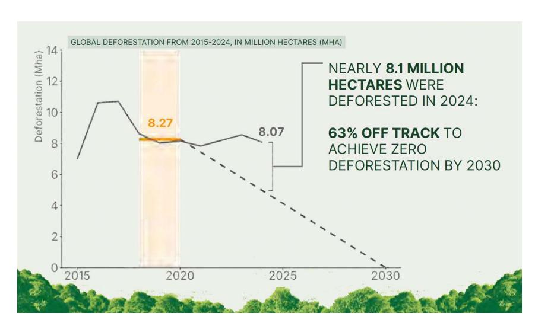

**Figure 2** Main drivers of deforestation between 2015 and 2023 (Mha).

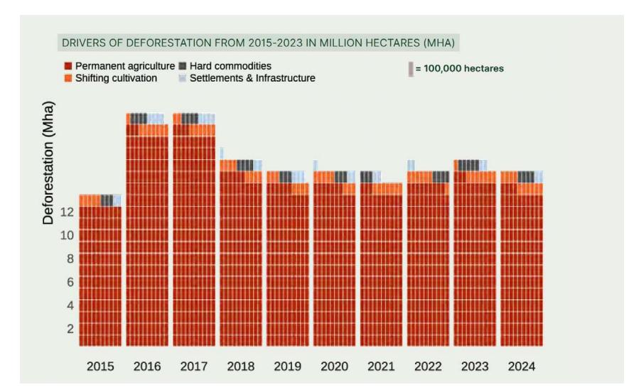

Source: [Forest Declaration Assessment 2025](https://forestdeclaration.org/wp-content/uploads/2025/10/Assessment2025.pdf)

Source: [Forest Declaration Assessment 2025](https://forestdeclaration.org/wp-content/uploads/2025/10/Assessment2025.pdf)

Risk mitigation is therefore an integral part of the due diligence process. In line with the spirit of due diligence emphasised in the United Nations Guiding Principles on Business and Human Rights (the "[Ruggie Principles"](https://digitallibrary.un.org/record/705860?v=pdf)) and the OECD [Guidelines for Multinational Enterprises,](https://www.oecd.org/content/dam/oecd/en/publications/reports/2023/06/oecd-guidelines-for-multinational-enterprises-on-responsible-business-conduct_a0b49990/81f92357-en.pdf) companies should move beyond merely meeting legal compliance through "check-the-box" exercises and, instead, embed respect for human rights and the environment into their policies, strategies, and practices. This ensures a proactive, continuous, and responsible approach to identifying, assessing, preventing, and mitigating risks and adverse impacts. Taking action on identiÞed risks is a logical and crucial follow-up step to risk identiÞcation and assessment process.

Operationalising risk mitigation involves a deliberate and systematic set of actions designed to prevent or reduce risks arising from a company's operations, supply chains, or business relationships. Effective risk mitigation also requires strategies that are tailored to speciÞc contexts, needs, and goals. According to the [OECD's Due Diligence Guidance](https://www.oecd.org/content/dam/oecd/en/publications/reports/2018/02/oecd-due-diligence-guidance-for-responsible-business-conduct_c669bd57/15f5f4b3-en.pdf), risk mitigation measures should be targeted and proportionate to adequately address the likelihood and severity of identiÞed risks.

Companies can adopt or engage in a range of mitigation measures depending on aspects such as their position in the supply chain and their implementation capacity. In forest-risk commodity sectors, measures range from compliance-focused approaches, such as audits and documentation/ information requests (aiming primarily at demonstrating the absence of risk), to more inclusive strategies addressing the root causes of non-compliance. The latter aligns with the Ruggie Principles' emphasis on responsibility and remedy, ensuring that "high-risk" suppliers or regions are not automatically excluded but are supported in building capacity and resilience.

Nonetheless, this does not preclude excluding non-compliant producers if deforestation, forest degradation, or illegal practices persist.

Inclusive risk mitigation approaches support the inclusion of vulnerable or under prepared suppliers while promoting the sustainable use and protection of forest resources. Rather than cutting off high-risk actors or regions, inclusive risk mitigation measures address underlying risk drivers and risk-facilitating factors. The OECD-FAO [Business Handbook on](https://openknowledge.fao.org/server/api/core/bitstreams/a8541ec7-c153-41de-8590-e9716d65aaaa/content)  [Deforestation and Due Diligence in Agricultural Supply](https://openknowledge.fao.org/server/api/core/bitstreams/a8541ec7-c153-41de-8590-e9716d65aaaa/content)  [Chains](https://openknowledge.fao.org/server/api/core/bitstreams/a8541ec7-c153-41de-8590-e9716d65aaaa/content) describes several relevant risk prevention and mitigation measures that have (or may potentially have) a strong inclusiveness component, such as:

- Improving awareness of regulatory requirements
- Providing Þnancial support and access to credit
- Developing responsible purchasing practices, including longer-term contracts and premium payments
- Offering capacity-building and training
- Providing access to forestry or due diligence experts
- Empowering local community members as forest monitors

Such inclusive approaches can foster stronger and more resilient supply chains by improving quality, efÞciency, and operational stability, while diversifying labour pools, reducing procurement risks, and increasing flexibility. They can also enhance reputational integrity and brand value by aligning business conduct with expectations on sustainability and human rights. Moreover, inclusive measures are often most effective when implemented through partnerships and multi-stakeholder collaborations, which help share costs, promote more meaningful participation, and can generate broader beneÞts.

1 Food and Agriculture Organization of the United Nations

Among the key priority areas outlined was the objective to "reduce the EU consumption footprint on land and encourage the consumption of products from deforestation-free supply chains in the EU" (p. 7). This Communication laid the foundation for the development of the EU Deforestation Regulation on Deforestation-free Products (EUDR), which aims to reduce the Union's contribution to greenhouse gas emissions and biodiversity loss by addressing the EU's consumption impact on forests worldwide.

The EUDR entered into force in June 2023. After a second postponement end of 2025, the EUDR will enter into application on December 30, 2026, and six months later for operators that are natural persons or micro or small enterprises.

In July 2019, the European Commission released the Communication titled "[Stepping up EU action](https://commission.europa.eu/document/download/492a2ce4-f4e3-4a1e-9566-664fca4efea8_en?filename=communication-eu-action-protect-restore-forests_en.pdf)  [to protect and restore the](https://commission.europa.eu/document/download/492a2ce4-f4e3-4a1e-9566-664fca4efea8_en?filename=communication-eu-action-protect-restore-forests_en.pdf)  [World's forests](https://commission.europa.eu/document/download/492a2ce4-f4e3-4a1e-9566-664fca4efea8_en?filename=communication-eu-action-protect-restore-forests_en.pdf)", reafÞrming its commitment to intensifying efforts against global deforestation.

## EU Regulation on Deforestation-free Products (EUDR): Main obligations for companies

- **a. Relevant commodities and products must be produced without causing deforestation and forest degradation.** Under the regulation, this means they must not have been produced on land where forest, as deÞned by the Food and Agriculture Organisation of the United Nations (FAO), was converted into agricultural land after 2020. For wood products speciÞcally, they must derive from wood harvested without inducing forest degradation after 2020.
- **b. Relevant commodities and products must have been produced in accordance with the relevant legislation of the country of production**, where relevant legislation is deÞned as the laws concerning the legal status of the area of production in terms of land rights, environmental protection, forest-related rules, third parties' rights, and others listed in [Art. 2, point 40](https://eur-lex.europa.eu/legal-content/EN/TXT/PDF/?uri=CELEX:32023R1115) of the Regulation.
- **c. Relevant commodities and products must be covered by a due diligence statement** ([Annex II](https://eur-lex.europa.eu/legal-content/EN/TXT/PDF/?uri=CELEX:32023R1115) of the Regulation), which shall include, among other information details, the country of production and the geolocation of all plots of land where the commodities and/or products at stake were produced.

The EUDR regulation establishes a set of obligations that relevant commodities and products (listed in [Annex](https://eur-lex.europa.eu/legal-content/EN/TXT/PDF/?uri=CELEX:32023R1115)  [I](https://eur-lex.europa.eu/legal-content/EN/TXT/PDF/?uri=CELEX:32023R1115) of the Regulation) must meet to be placed, made available, or exported from the EU market (Art. 3), speciÞcally:

3 Forest: Land spanning more than 0.5 hectares with trees higher than 5 meters and a canopy cover of more than 10 percent, or trees able to reach these thresholds in situ. It does not include land that is predominantly under agricultural or urban land use. [Global Forest Resources Assessment 2020 -](https://openknowledge.fao.org/server/api/core/bitstreams/531a9e1b-596d-4b07-b9fd-3103fb4d0e72/content)  [Terms and DeÞnitions](https://openknowledge.fao.org/server/api/core/bitstreams/531a9e1b-596d-4b07-b9fd-3103fb4d0e72/content)

2 The regulation has been amended in Dec 2025. This has included approved changes in its product scope where products under chapter 29 (printed materials) are no longer part of the list of relevant products.

In addition, the risk classiÞcation of the country of production under the regulation's country benchmarking system affects the due diligence obligations of companies. Operators sourcing from countries or parts of countries classiÞed as low risk may apply simpliÞed due diligence (Art. 13), which means they are not required to carry out risk assessment and risk mitigation steps, provided that they have not obtained, and are not otherwise aware of, any relevant information indicating a non-negligible risk of non-compliance.

The EUDR does not impose direct obligations on actors in third countries who do not themselves import relevant products into the EU market.

However, producers must still ensure that their goods are deforestation-free and legally

Regarding relevant commodities and products, the EUDR applies to more than 70 products consisting of or derived from cattle (beef and leather), cocoa, coffee, palm oil, natural rubber, soy, and wood. Current scientiÞc evidence identiÞes these commodities as the leading drivers of deforestation and forest degradation from agricultural expansion.

EUDR due diligence obligations depend on the position and role of the company in the supply chain, as well as on its size. In general, the full scope of due diligence obligations applies to operators, as the companies that place a EUDRrelevant product on the EU market for the Þrst time or export it from it. In the case of global supply chains, the operator is typically the importer into the EU as the entity responsible for compliance with the market requirements.

produced, collect geolocation data, and participate in a traceable supply chain if they wish to access the EU market. In addition, they may also be required by their buyers to provide information and documentation demonstrating compliance with the deforestation and legality standards set.

Article 8 of the Regulation deÞnes due diligence as a three-step process, including;

- (a) collection of information
- (b) risk assessment
- (c) risk mitigation

which together must ensure that relevant commodities and products pose no or only negligible risk of non-compliance. Figure 3, below, provides an overview of the various speciÞc categories according to these elements and their respective obligations under the EUDR.

4 Negligible risk, as deÞned under the EUDR, entails that, after thorough and any needed mitigation, there is no indication that a product is linked to deforestation or illegal production. In contrast, nonnegligible implies that, despite assessments and mitigation, there remains a reasonable indication that a product may not comply with deforestation-free or legality requirements.

Gathering comprehensive and veriÞable information on:

Accessing level of risk of non-compliance on the basis of the information collected, taking into account a set of criteria included in Art.10 of the Regulation, such as:

If the risk identiÞed is signiÞcant (non-negligible), efforts must be conducted to reduce or eliminate them before products are placed in or exported from the EU market. Risk mitigation measures that can be adopted are:

- Product name and code
- Product quantity
- Country of production
- Geolocation of all plots of land of production
- All relevant and veriÞable information conÞrming the product is deforestation free and produced legally

- Country of origin classiÞcation in the Regulation's country benchmarking
- Presence of forests and Indigenous Peoples and Local Communities (IP&LCs)
- Prevalence of deforestation and forest degradation
- Land rights claims
- Reliability and validity of the information gathered

- Requesting additional information
- Carrying out surveys and/or audits
- Supporting compliance by suppliers, in particular smallholders, through capacity building and investments

#### **Information collection (Article 9)**

#### **Risk assessment (Article 10)**

#### **Risk mitigation (Article 11)**

**Figure 3** Due dilligence requirements of the three-step process under the EUDR.

Source: Aidenvironment, based on [European](https://eur-lex.europa.eu/legal-content/EN/TXT/PDF/?uri=CELEX:32023R1115)  [Union Deforestation Regulation \(2023\)](https://eur-lex.europa.eu/legal-content/EN/TXT/PDF/?uri=CELEX:32023R1115)

Under the EUDR, operators must bring any identiÞed risk of deforestation, degradation, or illegality associated with a commodity or product down to a negligible level. It provides a mechanism to address identiÞed, non-negligible risks and can be operationalised through interventions such as capacity building or targeted investments. If a company identiÞes deforestation or illegality in the production of EUDR-relevant commodities or products, it should respond to the risks by taking the necessary steps to address the identiÞed impacts.

As mentioned, Article 11 of the regulation determines that companies must take appropriate measures to achieve no or only negligible non-compliance risk. The regulation leaves room for companies to deÞne which and how mitigation actions are

Risk mitigation is a core element of the EUDR due diligence requirements.

## Risk mitigation under the EUDR

implemented as long as they are proportional and adequate to the level and nature of the risk identiÞed. The absence of a Þxed set of actions, methods, and implementation framework allows for a flexibility that is crucial for companies to tailor their risk mitigation strategies to the complexity, needs and, conditions of their supply chains. Moreover, it allows for the measures taken to be catered to the timing of identiÞcation of the risk.

The choice of adequate risk mitigation measures depends signiÞcantly on the stage at which risks are identiÞed. There are three key moments when companies placing EUDR-relevant products on the EU market, or exporting them from it, are most likely to identify non-negligible risk of deforestation or illegal production.

#### **P R E - H A R V E S T**

#### **P O S T - H A R V E S T**

#### **• Strategic mapping of supply bases:**

This typically occurs early on, before or at the outset of formal relationships with suppliers are established, and well before products are placed on the EU market. At this stage, operators can mitigate risks by supporting producers, particularly smallholders, through capacity building and investment, for instance, and/or conduct independent audits.

#### **• Supplier onboarding:**

Once potential suppliers are identiÞed, they usually go through a process of onboarding which involves verifying whether the supplier meets regulatory, market, and company requirements. This implies assessing their standards, processes, and procedures and, if risks are identiÞed, operators can support them in reducing or eliminating said risks through tailored actions, including awareness raising.

#### **• Supply chain monitoring and veriÞcation:**

This stage usually takes place when the product has already been harvested, is progressing through the supply chain and on its way to the EU market. At this stage, if risk are identiÞed during monitoring processes, operators will likely prioritise actions such as requiring additional information from suppliers and producers or conducting spontaneous surveys.

Article 11 of the EUDR highlights some examples of mitigation measures that prioritise the inclusion of smallholders and vulnerable suppliers, underscoring inclusiveness as a key component of deforestation and forest degradation risk mitigation strategies. This suggests that companies are encouraged to adopt strategies and measures that go beyond

disengagement from risk-prone areas or suppliers and instead focus on constructive engagement to drive systemic change. Special attention should be given to production areas and supply chains where smallholders and cooperatives play a major role, as they are often the most vulnerable and least prepared to meet regulatory requirements.

Mitigation measures that integrate, for instance, capacity-building, technical assistance, and equitable engagement have the potential to not only help reduce forest degradation and deforestation-related risks but to also contribute to more resilient and inclusive production systems, which aligns more closely with the broader sustainability objectives of the regulation.

Several companies already have a wealth of experience supporting smallholder producers through projects developed in the context of voluntary zero-deforestation and no-conversion commitments or broader NDPE commitments. This experience and prior efforts are highly valuable in the context of EUDR implementation as they can be leveraged as effective risk mitigation measures and contribute to mandatory due diligence requirements.

Article 18 of the EUDR requires EU competent authorities to check operators and non-SME traders' due diligence systems, including their risk assessment and risk mitigation procedures.

This creates an incentive for companies to demonstrate their efforts in adopting measures that support producers, especially smallholders, in addressing root causes of non-compliance risks. This could influence penalty levels if violations occur despite mitigation efforts.

This guide encourages operators and non-SME traders to enhance best practices and scale up engagement with suppliers in ways that actively support producers. Long-term, inclusive risk mitigation measures, such as long-term contracts and sustained supply relationships, represent a shift away from risk avoidance through withdrawal from higher risk areas. Rather than leaving local communities and smallholders even more vulnerable, these measures promote wide-ranging impact, with the potential to drive both deforestation reduction and improved livelihoods in proven sourcing areas.

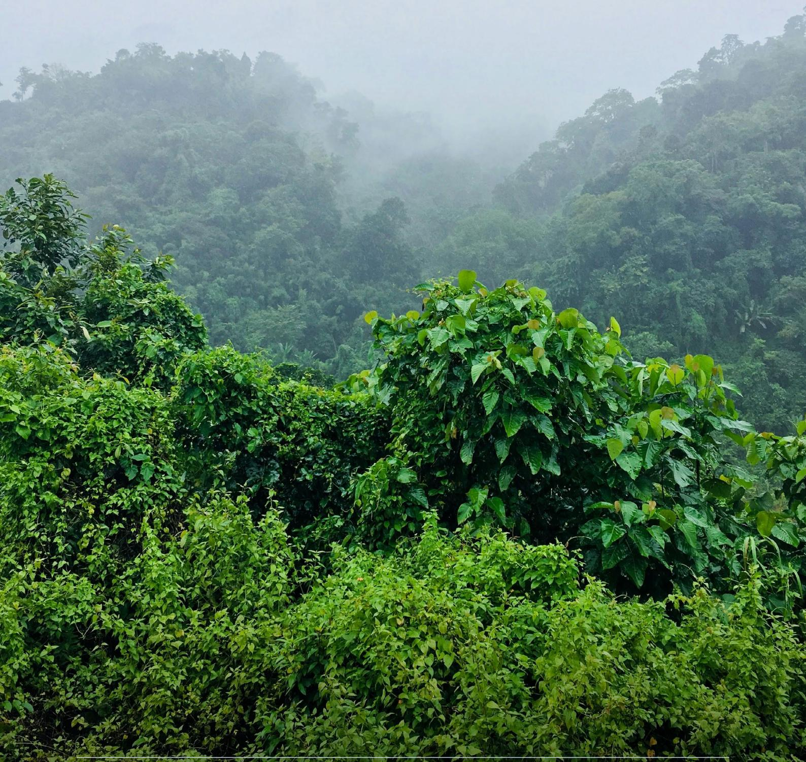

The categories deÞned pay particular attention to measures that address both deforestation risks and promote the inclusion of smallholders and/or the rights of IP & LC. The typology is organised into broad categories of measures (see Table 2 below), summarising main characteristics and relevant insights for companies considering risk mitigation options. These are subsequently detailed in the tables that follow.

While the typology is not exhaustive and does not cover all possible risk mitigation measures companies might deem suitable, it represents one way of organising a wide array of measures and should be seen as indicative rather than prescriptive. Furthermore, the boundaries between categories are porous: measures may overlap, complement, or reinforce one another, and effective strategies often combine actions across categories.

The list of deÞned criteria aims to create a comparable matrix for evaluating the identiÞed risks and goals of potential mitigation strategies.

## Typology of risk mitigation measures

For example, a jurisdictional approach may combine elements of capacity building, forest management and conservation, and livelihood support, while a certiÞcation scheme may embed aspects of forest management, capacity building, and traceability.

The categories of risk mitigation measures deÞned are:

- 1. Capacity building
- 2. CertiÞcation
- 3. Forest management and conservation
- 4. Landscape & jurisdictional approaches
- 5. Livelihood support
- 6. Traceability & transparency

To facilitate a meaningful overview of these categories, each has been analysed using a set of structural and impact-oriented criteria.

5 The risk mitigation categories listed herein are presented in alphabetical order. Their sequence does not imply any priority, relative importance, or hierarchical ranking.

The rationale for this structure is threefold:

**Figure 4** Elaborated: by AidEnvironment Conceptual basis for the structure of typology of risk mitigation meas

These two groups of criteria serve complementary purposes, offering a structured lens for navigating and comparing the different categories of risk mitigation measures presented. Their purpose is to enable users of this Practical Guide to identify relevant measures, compare them across key dimensions, and tailor interventions more effectively to their speciÞc needs and supply chain contexts.

Unlike the impact-oriented criteria, the structural criteria are organised into closed categories with predeÞned sub-categories or classiÞers. This structure provides a common classiÞcation framework that can be consistently applied across all the categories, facilitating comparison between design features.

Icons have been assigned to each classiÞer, allowing for a clearer and more straightforward reading of each measure. Table 1 below summarises the criteria and provides a detailed explanation of each deÞned criterion. This structure aims to enable companies to better disentangle and navigate the complexity of approaches, tailor them to risk proÞles, and integrate them into strategies that ensure compliance while contributing to long-term forest protection, strengthened livelihoods, and resilient supply chains.

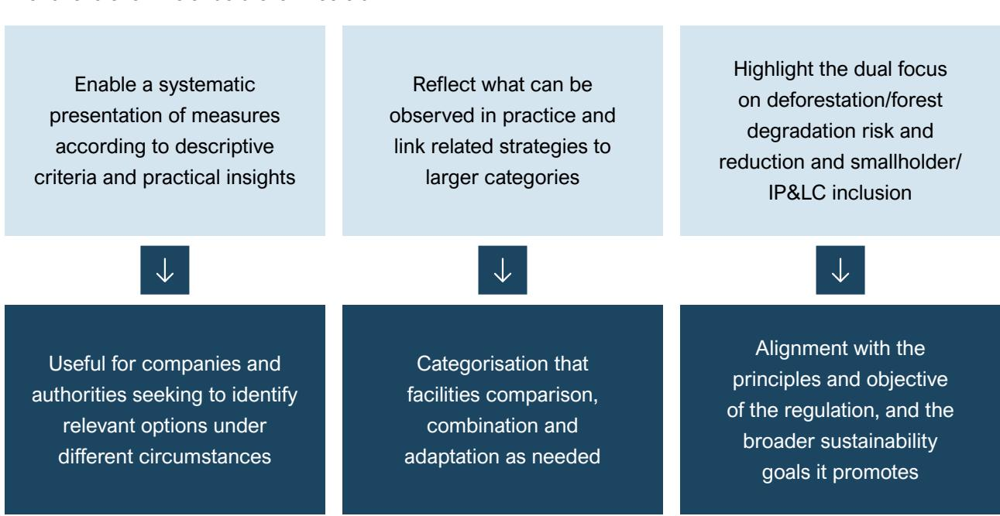

This flexibility allows companies to choose the approach(es) that best align with their operational realities, risk proÞles, and strategic goals.

Individual actions places full responsibility on companies for designing and implementing risk mitigation measures. This might be the preferred approach because it grants full control and quicker, more straightforward processes of decision-making and progress tracking. However, individual approaches often lead to the duplication of efforts when multiple companies operate in the same regions with overlapping supply bases.

In meeting the requirement to mitigate risks of non-compliance, the EUDR does not prescribe whether companies must act individually or collectively.

### Navigating individual & collective approaches in risk mitigation

This can increase Þnancial and administrative burdens, particularly for smallholders, who may have to respond to multiple parallel requests without additional beneÞts. Moreover, individual actions alone are often insufÞcient to address systemic issues such as land tenure and governance issues, as well as the rights of IP & LC, including land rights and Free, Prior, and Informed Consent (FPIC).

Collective action in risk mitigation can take multiple forms, such as sectoral, commodityspeciÞc, multi-stakeholder or pre-competitive/ industry-led initiatives, and jurisdictional or landscape approaches.

Despite differing modalities, all aim to pool resources and align incentives to address systemic risks beyond the reach of individual companies. Producing-country governments play a central role in the successful implementation of these measures by providing regulatory and governance frameworks (e.g., land-use planning, forest and environmental law enforcement, permitting systems), and facilitating alignment between public policy objectives and company actions. Additionally, they help avoid duplication, facilitate coordination and alignment of actions across jurisdictions and stakeholder groups, and, by linking collective initiatives such as multi-stakeholder partnerships (MSPs) to existing national or subnational structures, enable the inclusion of local authorities, producer organisations, and communities. This approach fosters local ownership and legitimacy, while enhancing the effectiveness of risk mitigation efforts and ensuring the institutional continuity and scale needed for sustained impact.

MSPs are a prominent form of collective action, bringing together different groups of stakeholders (e.g., companies, governments, civil society organisations, producers) under a shared governance framework to jointly design, Þnance, and implement mitigation measures, offering a way to address systemic issues that require the contribution and coordinated action of multiple stakeholders.

MSPs often enable the pooling of resources, sharing of data, and alignment of incentives across value chains, landscapes, and communities. They can support multiple actions in parallel, such as smallholder capacity building, collective traceability systems, and landscape-level governance, functioning as a platform through which speciÞc mitigation actions are implemented. For example, the German Initiative on Sustainable Cocoa (GISCO) promotes risk mitigation in the cocoa supply chain by advancing sustainable production standards, improving traceability, and fostering smallholder inclusion through the professionalisation of farmer organisations and the improvement of living conditions. Its subproject in Côte d'Ivoire, PRO-PLANTEURS, puts this into practice through capacity building, agroforestry, and cooperative strengthening. The Digital Integration of Agricultural Supply Chains Alliance (DIASCA) similarly addresses systemic risk by promoting interoperable digital public infrastructure (DPI) building blocks and open-source traceability solutions as a way to increase efÞciency and avoid the doubling of efforts that support EUDR compliance and promote smallholder inclusion.

By supporting compliance with legal frameworks such as the EUDR, MSPs can tackle systemic risks linked to land use governance, and deforestation drivers at sector level while promoting land tenure rights and reducing illegal land conversion, deforestation, and forest degradation. They enable economies of scale, shared learning, harmonised data collection and reporting, and reduced duplication, which are critical for companies as they can leverage shared systems and infrastructure rather than investing in their own parallel platforms. MSPs also provide a platform to protect and strengthen IP & LC rights, including land tenure, FPIC, and forest-use rights, by ensuring that the deforestation-free strategies implemented respect these rights. However, coordinating multiple stakeholders can slow decision-making and progress, power imbalances can undermine effectiveness and trust, and smallholders or communities may face challenges in participating meaningfully due to limited access to information or Þnance. Therefore, MSPs should be designed to promote inclusivity, ensuring that barriers for smallholder participation are minimised.

Individual actions such as livelihood support, traceability, and certiÞcation, can be implemented rapidly and directly by companies.

MSPs, however, are essential for addressing broader issues such as land use governance, smallholder aggregation, data standards and sharing, and regional monitoring. Both approaches are complementary rather than mutually exclusive. Companies can implement speciÞc mitigation measures individually while also engaging in MSPs to scale and embed these measures across sourcing regions. This report's typology of risk mitigation categories (Table 2) includes measures that can be implemented individually or catalysed through MSPs, allowing companies to align their mitigation strategies with their risk proÞles and objectives.

Ultimately, the choice between individual and collective approaches should not be viewed as an either/or decision. Companies can address issues within their direct control while engaging in MSPs to tackle complex, systemic risks requiring coordinated action. The flexibility of the EUDR allows both approaches to be combined to meet risk mitigation obligations and support more inclusive and sustainable supply chains.

#### **Impact-orientated criteria**

Dynamic dimensions of each cluster, focusing on how each measure functions or is expected to function in practice. They support a qualitative understanding of the measure's operational potential, real-world impact, and challenges to consider.

| Criteria                    | Explainer                                                                                                                                                                                                                                                                                                                                                                                                                                                                                                                                       |
|-----------------------------|-------------------------------------------------------------------------------------------------------------------------------------------------------------------------------------------------------------------------------------------------------------------------------------------------------------------------------------------------------------------------------------------------------------------------------------------------------------------------------------------------------------------------------------------------|
| Actions & activities        | Specific actions or interventions that can be undertaken to implement the risk mitigation measure at stake                                                                                                                                                                                                                                                                                                                                                                                                                                      |
| Focus on forests & legality | Indicates how the measure addresses critical risks related to deforestation, forest degradation, and/or legality, considering both smallholders and IP & LC rights, such as Free, Prior, and Informed Consent (FPIC).                                                                                                                                                                                                                                                                                                                           |
| Potential co-benefits       | Subdivided into environmental and social co-benefits, this criterion indicates whether a measure contributes to broader environmental and social outcomes, highlighting the main positive side effects that support environmental sustainability, as well as social justice and inclusion. It focuses on the extent to which they have helped address various forms of environmental degradation and social discrimination or exclusion, such as those affecting women, youth, Indigenous Peoples, and other marginalised or vulnerable groups. |
| Relevant & effectiveness    | Indicates the extent to which the measure achieves its intended goals by identifying documented findings on its effectiveness both in addressing specific risks and in delivering broader impact. This includes both positive outcomes that may result from the measure and any discrepancies between the intended and actual effects.                                                                                                                                                                                                          |
| Challenges & gaps           | Identifies the limitations, obstacles, or missing components that may hinder the successful implementation or effectiveness of the risk mitigation measure. It highlights areas where the measure may face practical barriers, such as gaps in coverage or capacity, that could undermine its impact or prevent it from addressing all relevant risks.                                                                                                                                                                                          |

### **Structural criteria**

#### Foundational characteristics of each cluster, outlining their design logic and allowing for cross-cutting comparison between clusters.

| Criteria | Explainer | Sub-categories/classiÞers            |                             |
|----------|-----------|--------------------------------------|-----------------------------|
|          |           | Economic Environmental Informational | Institutional Market access |
|          |           | Risk prevention/reduction            | Risk veriÞcation/monitoring |

**Table 1** Source: Elaborated by AidEnvironment Structural and impact-orientated criteria used to classify and access the different types of risk mitigation measured deifned

| Goal of intervention     | Scale of intervention                                                                                                                                                                                                                                | Supply chain entry point(s)                                                                                                                                                                                                 | Inclusion barriers addressed                                                                                                                                                                                                                                                                                                                                                                                                                                                                                                                                                                                                                                                                                                                                                                                                                                                                                                                                                                                                                                                                                                                                                                                                                                                                                                                                                                                                                                                                                                                                                                                                                                                                                                                                                                                                                                                                                                                                                                                                                                                                                                                                                                                                                                                                                                                                                                                                                                                                                                                                                                                                                                                                                                                                                                                                                                                                                                                                                                                                                                                                           |
|--------------------------|------------------------------------------------------------------------------------------------------------------------------------------------------------------------------------------------------------------------------------------------------|-----------------------------------------------------------------------------------------------------------------------------------------------------------------------------------------------------------------------------|--------------------------------------------------------------------------------------------------------------------------------------------------------------------------------------------------------------------------------------------------------------------------------------------------------------------------------------------------------------------------------------------------------------------------------------------------------------------------------------------------------------------------------------------------------------------------------------------------------------------------------------------------------------------------------------------------------------------------------------------------------------------------------------------------------------------------------------------------------------------------------------------------------------------------------------------------------------------------------------------------------------------------------------------------------------------------------------------------------------------------------------------------------------------------------------------------------------------------------------------------------------------------------------------------------------------------------------------------------------------------------------------------------------------------------------------------------------------------------------------------------------------------------------------------------------------------------------------------------------------------------------------------------------------------------------------------------------------------------------------------------------------------------------------------------------------------------------------------------------------------------------------------------------------------------------------------------------------------------------------------------------------------------------------------------------------------------------------------------------------------------------------------------------------------------------------------------------------------------------------------------------------------------------------------------------------------------------------------------------------------------------------------------------------------------------------------------------------------------------------------------------------------------------------------------------------------------------------------------------------------------------------------------------------------------------------------------------------------------------------------------------------------------------------------------------------------------------------------------------------------------------------------------------------------------------------------------------------------------------------------------------------------------------------------------------------------------------------------------|
| <b>Capacity building</b> | Reductions of resource and knowledge gaps, enabling the adoption of sustainable and deforestation-free practices. Part of smallholder engagement, ensuring participation in the design, governance, implementation, and monitoring of interventions. |                                                                                                                                                                                                                             |                                                                                                                                                                                                                                                                                                                                                                                                                                                                                                                                                                                                                                                                                                                                                                                                                                                                                                                                                                                                                                                                                                                                                                                                                                                                                                                                                                                                                                                                                                                                                                                                                                                                                                                                                                                                                                                                                                                                                                                                                                                                                                                                                                                                                                                                                                                                                                                                                                                                                                                                                                                                                                                                                                                                                                                                                                                                                                                                                                                                                                                                                                        |
| <b>Capacity building</b> |                                                                                                                                                                                       |     |                                                        |

### Overview of risk mitigation measure categories

| Goal of intervention Scale of intervention    | Supply chain entry point(s) Inclusion barriers addressed                     |
|-----------------------------------------------|------------------------------------------------------------------------------|
| Environmental                                 | Social                                                                       |
| Support deforestation reduction strategies    | : Capacity-building interventions (e.g., training, technical                 |
| Sustainable production practices:             | Capacity-building interventions enhance the adoption of good                 |
| Strengthen local governance                   | : Capacity-building at the local organisational level, including support for |
| Limited evidence of concrete impacts:         | The concrete effects on forest conservation and the decrease                 |
| Integrated approaches are crucial for success | : Success depends on coupling capacity-building with                         |

### Capacity building

Measures focused on reducing resource and knowledge gaps, enabling smallholders to adopt practices that lower deforestation risks and address livelihood needs. These empowerment measures are often part of smallholder engagement processes, which ensure their meaningful participation in the design, governance, implementation, and monitoring of interventions, including those related to reducing deforestation risk.

| Environmental                                                                                     | Social                                                                       |
|---------------------------------------------------------------------------------------------------|------------------------------------------------------------------------------|
| Support the reduction of deforestation and legality risks:                                        | CertiÞcation schemes can help reduce                                         |
| Socio-economic beneÞts for smallholders                                                           | : CertiÞcation schemes can lead to higher prices, but income                 |
| Limited and variable impact                                                                       | : The impact of certiÞcation on reducing deforestation depends on the amount |
| Bias and leakage : CertiÞed operations can sometimes look more effective because they are located |                                                                              |
| Inclusion of smallholders and cooperatives                                                        | : CertiÞcation can improve farmers' incomes, but the results                 |
| Goal of intervention Scale of intervention                                                        | Supply chain entry point(s) Inclusion barriers addressed                     |

#### CertiÞcation

CertiÞcation schemes, often based on Voluntary Sustainability Standards (VSS), help mitigate deforestation risks by setting, implementing and auditing environmental and social performance standards, including nodeforestation rules, ecosystem protection, labour rights, and supply chain traceability. They play a key role in supporting smallholders and IP&LCs by implementing interventions such as training, technical support, and Þnancial beneÞts, including premiums or stable prices.

| Environmental                                                            | Social                                                                           |
|--------------------------------------------------------------------------|----------------------------------------------------------------------------------|
| Deforestation reduction                                                  | : Participatory forest management can contribute to reducing deforestation,      |
| Land tenure and rights                                                   | : Community land rights and land use monitoring have been increasingly linked to |
| Increased land cover management and social cooperation                   | : Some PES programs have effectively                                             |
| Highly dependent on local and regional governance and political contexts | : While mean effects                                                             |
| Monitoring tools and impact assessments                                  | : There is a scarcity of rigorous evaluations of the impact                      |
| Casual effect on deforestation reduction                                 | : Alternative livelihoods are attractive but often lack robust                   |
| Goal of intervention Scale of intervention                               | Supply chain entry point(s) Inclusion barriers addressed                         |

#### Forest management & conservation

Measures focused on forest conservation help maintain existing forest cover and the ecosystem services it provides, such as carbon storage, biodiversity habitat, soil health, and water regulation. Aside from this, conserving forests helps reduce the risk of livelihood and food security collapse for forest-dependent communities.

| Environmental                                                                                                | Social                                                                                  |
|--------------------------------------------------------------------------------------------------------------|-----------------------------------------------------------------------------------------|
| Integrated initiatives are more successful across multiple objectives                                        | : They outperform sectoral ones by                                                      |
| Translates international sustainability goals into locally adapted and accepted objectives                   | : By involving                                                                          |
| Establishment of preferred sourcing regions and cost reduction                                               | : Better market access and long-term supply                                             |
| Addressing impacts : Grievance mechanisms provide credible channels for reporting and seek redress for       |                                                                                         |
| Monitoring impacts : Monitoring, reporting, and veriÞcation (MRV) systems remain bottlenecks, showing a need |                                                                                         |
| Smallholder readiness                                                                                        | : Some jurisdictional pilots have struggled with tenure gaps, capacity limits, and cost |
| Finance and incentive alignment                                                                              | : Sustained Þnance is a persistent challenge, with Þnancial viability depending on      |
| Political stability and no short term gains                                                                  | : Landscape and jurisdictional approach are directly dependent on the                   |
| Goal of intervention Scale of intervention                                                                   | Supply chain entry point(s) Inclusion barriers addressed                                |

#### Landscape & jurisdictional approaches

Collaborative strategies to land-use and governance at a deÞned scale that seek to balance conservation, production, and livelihoods. Landscape approaches operate within ecological boundaries, while jurisdictional approaches work within administrative borders, often led by governments. Both coordinate policies, enforcement, and investments, frequently through multistakeholder platforms, to address complex drivers of deforestation beyond single-company supply chains.

| Environmental                                         | Social                                                               |
|-------------------------------------------------------|----------------------------------------------------------------------|
| Income gains and conservation beneÞts                 | : Incentive-based and livelihood support measures can raise          |
| Reduction in deforestation through conditional Þnance | : Credit programs tied to environmental                              |
| BeneÞts tied to good design                           | : Well-targeted programs align payments with opportunity costs. When |
| Additional measures for income and environment        | : Direct buying and traceability can enhance                         |
| Limited evidence and critical add-ons                 | : The robust causal links between long-term purchasing               |
| Deforestation reduction depends on safeguards         | : Premiums and living income schemes improve incomes                 |
| Goal of intervention Scale of intervention            | Supply chain entry point(s) Inclusion barriers addressed             |

#### Livelihood support

Measures focused on aligning economic beneÞts with forest conservation by fostering the conditions that allow for the adoption of sustainable practices as viable alternatives to those that cause forest loss. They are essential for the long-term sustainability of communities, reducing the pressure to resort to unsustainable practices, such as deforestation, as a means of securing livelihoods and better living conditions.

| Environmental                                  | Social                                                             |
|------------------------------------------------|--------------------------------------------------------------------|
| Demonstrating deforestation-free production    | : Traceability systems are crucial in demonstrating                |
| Accountability across supply chains            | : Traceability enhances accountability for excluding deforestation |
| Inclusiveness across supply chains             | : Interoperable national and private traceability systems,         |
| Leakage and coverage gaps                      | : Traceability can be weakened when deforestation shifts elsewhere |
| High costs, incompatibility and exclusion risk | : High compliance and data costs caused by lack of                 |
| Addressing deforestation in the long term      | : Making supply chains more transparent does not                   |
| Goal of intervention Scale of intervention     | Supply chain entry point(s) Inclusion barriers addressed           |

#### Traceability & transparency

Involves tracking the origin of commodities within supply chains and publicly sharing relevant information in a clear and accessible manner. These measures enhance visibility, accountability, and the ability to identify and address environmental risks such as deforestation, as well as legal risks including land rights violations.

#### **Level of intervention**

Upstream (farmers, groups/cooperatives) with links to Midstream (buyers)

# Step-by-step guide

#### **Goal**

Reduce non compliance risks (deforestation, legality, Human Rights Due Diligence) by strengthening producers' capacity and systems.

#### (a) Capacity building for smallholders & cooperatives

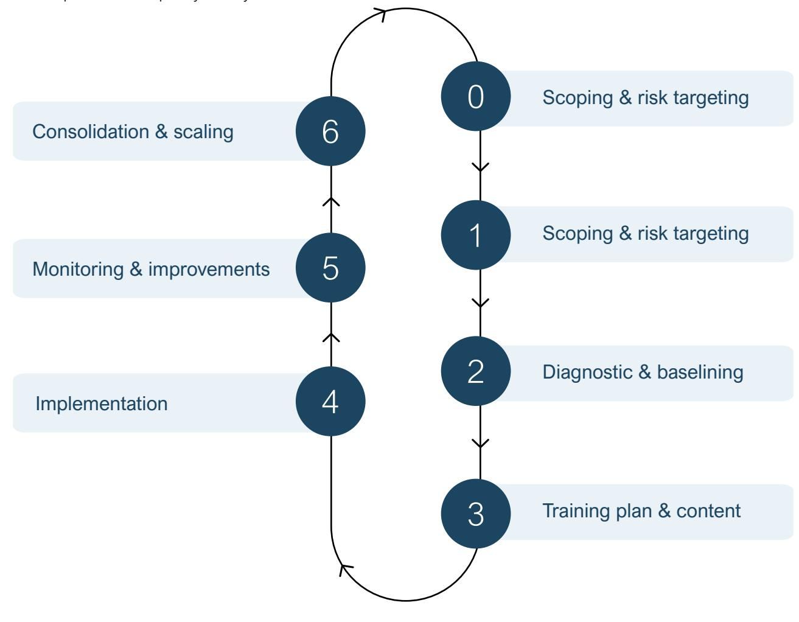

6 For practical training materials to support capacity-building activities with producers and cooperatives, see Training of trainers material on the EU Deforestation Regulation on Deforestation-free Products (EUDR), developed by GIZ EUDR Engagement and available at [https://zerodeforestationhub.eu/towards-deforestation-free-supply-chains](https://zerodeforestationhub.eu/towards-deforestation-free-supply-chains-guidebook-for-trainers/)[guidebook-for-trainers/](https://zerodeforestationhub.eu/towards-deforestation-free-supply-chains-guidebook-for-trainers/)

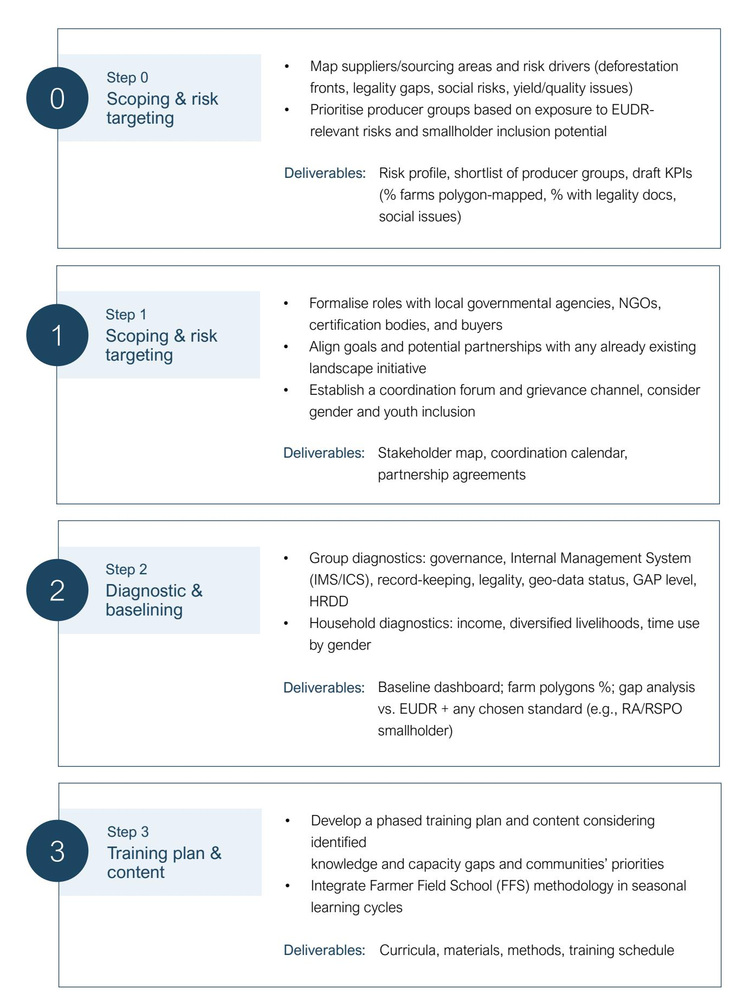

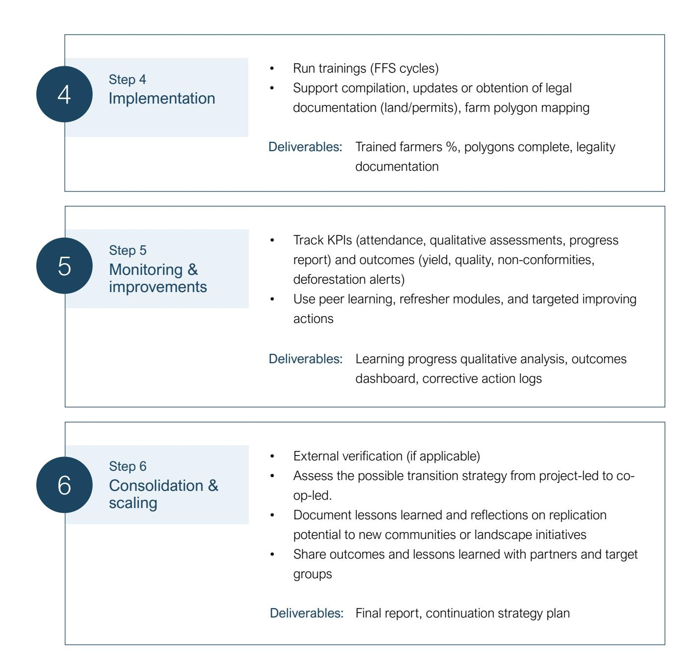

**Figure 5** Source: Elaborated by AidEnvironment based on Proforest (2022) and [ISEAL](https://www.isealalliance.org/sites/default/files/resource/2022-04/ISEAL_Effective%20Company%20Actions%20document%202022_V4.pdf) (2020). Other sources are listed in the bibiography section. Step-by-step guide – Capacity building for smallholders & cooperatives

# Step-by-step guide

#### (b) Landscape/jurisdictional approach

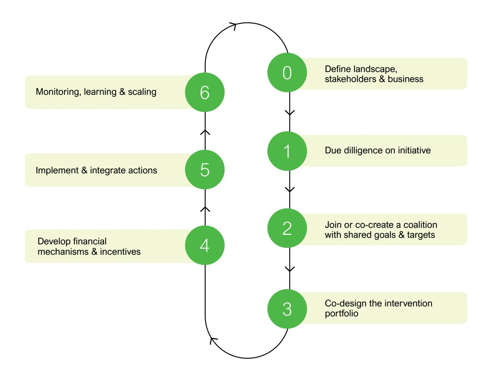

#### **Goal**

Reduce risk drivers beyond a single supply chain or supplier group, aligning multiple actors to shared goals.

#### **Level of intervention**

Landscape or jurisdictional levels, covering the supply chain from upstream to downstream. Also integrates cross-sectoral activities beyond commodity chains, potentially linked to other risk mitigation interventions, such as forest management, capacity building, or traceability.

**Figure 6** Step-by-step guide – Landscape/jurisdictional approach

• Formalise a coalition with aligned vision, goals, and targets

potentially shared by local government, producer organisations,

intermediates (mills/traders/buyers), NGOs, and IP&LCs • Develop common goals, shared vision and targets (e.g., NDPE compliance, forest protection areas, smallholder legality,

grievance mechanisms)

Coalition governance charter, including goals,

targets & KPIs frameworks

Deliverables:

Step 2

Join or co-create a coalition with shared goals & targets

• Assess existing initiatives (governance, stakeholder legitimacy,

governmental programs, MRV, Þnancing initiatives)

• Design an integration strategy identifying common goals and

integration challenges

Scorecard on existing initiatives and potential gains

and losses from integration strategies

Deliverables:

Step 1

Due dilligence on initiative

• Shortlist 1 to 3 priority areas/districts/states, overlaying the

company's supplier base with information on deforestation risk,

legality, and potential for smallholder inclusion

• Identify and map relevant stakeholders in the priority areas, including producer orgs, local authorities, civil society actors,

and IP & LC

Selection brief outlining criteria & expected outcomes (e.g., deforestation reduction, %

smallholder inclusion); Stakeholder mapping report; FPIC report IP&LC consultation and engagement

according to FPIC principles

Deliverables:

Step 0

DeÞne landscape, stakeholders & business

0

2

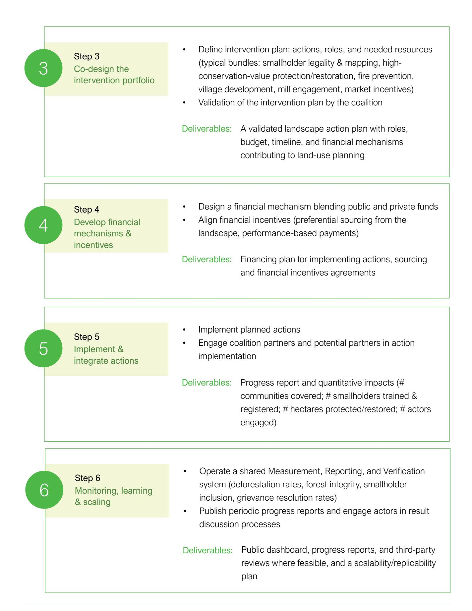

The implementation of the EUDR marks a signiÞcant shift in expectations for companies sourcing from forest-risk supply chains.

# Conclusion

It requires companies to conduct due diligence to ensure that deforestation, forest degradation, and illegality do not permeate their supply chains across production landscapes. Meeting these requirements requires both the identiÞcation and assessment of risks and the development of concrete mitigation strategies to reduce or eliminate non-negligible risks.

This guide seeks to support companies in their risk mitigation efforts by clarifying what constitutes risk mitigation in the context of the EUDR, presenting a typology of mitigation measures, and illustrating how these can be operationalised in practice. It highlights that risk mitigation is not only a regulatory requirement under the EUDR but also an essential component of the broader due diligence framework established under the UN Guiding Principles on Business and Human Rights and the OECD Guidelines for Multinational Enterprises. In this sense, effective risk mitigation should reflect the spirit of responsible business conduct, being preventive, continuous, and rooted in engagement rather than avoidance. Thus, the guide underscores that effective risk mitigation is not only a compliance exercise but also a means to build resilient, inclusive, and sustainable supply chains. Shifting from strategies of risk avoidance or disengagement to proactive risk mitigation is essential.

Avoidance strategies often lead to the exclusion of smallholders and vulnerable groups, exacerbating inequalities and undermining local livelihoods. In contrast, inclusive mitigation approaches put producers, especially smallholders, and communities at the centre and engage them in the process of improvement, creating pathways for compliance and long-term sustainability rather than withdrawal.

The typology of mitigation measures developed in this guide is neither exhaustive nor prescriptive. It serves as a stepping stone for companies seeking to strengthen their sustainability practices by examining their current mitigation approaches and identifying existing gaps. Through its practical framework and structured categories, the typology provides a basis for companies to engage more proactively and invest more strategically in mitigation as a critical element of compliance and responsible business conduct, while also supporting long-term progress in addressing deforestation risks and improving livelihoods across supply chains.

However, addressing these risks is complex, and many challenges cannot be resolved by individual companies acting in isolation. Even though individual actions remain crucial and are not discouraged,

systemic risks linked to, for example, land governance and poverty often require or beneÞt from coordinated responses. Collective action, particularly through multistakeholder partnerships, offers an effective pathway to scale impact, share costs, and address root causes across sourcing regions. Equally, producing-country governments play a crucial role by providing the legal and institutional framework, coordinating across jurisdictions, and fostering local-level engagement. In doing so, they create the enabling conditions for private-sector measures to succeed and support companies in aligning with national sustainability priorities and public policy objectives.

Advancing risk mitigation under the EUDR offers an opportunity to strengthen collaboration, promote inclusion, and build resilience within global supply chains. It is valuable to continue fostering dialogue and cooperation on this topic, exploring how EUDRrelated risk mitigation can serve as a catalyst to address underlying sustainability challenges in a more systematic and coordinated manner that not only ensures future-proof supply chains but also supports inclusion, equity, and meaningful participation of smallholders and IP & LC.

# Bibliography

- Accountability Framework Initiative. (2020). Operational guidance on the inclusion of smallholders in ethical supply chains. Accountability Framework Initiative. https://accountability-framework.org/Þleadmin/uploads/aÞ/ Documents/Operational\_Guidance/OG\_Smallholder\_Inclusion-2020-5.pdf
- Agarwal, B. (2009). Gender and forest conservation: The impact of women's participation in community forest governance. Ecological Economics, 68(11), 2785–2799. https://doi.org/10.1016/j. ecolecon.2009.04.025
- Alix-Garcia, J., et al. (2018). Payments for environmental services supported social capital while increasing land management. PNAS, 115(27), 7016-7021. https://doi.org/10.1073/pnas.1720873115
- Asher, K., & van Noordwijk, M. (2024). Linking income diversiÞcation, livelihoods, and deforestation outcomes among smallholders. Nature Sustainability, 7(4), 298–310. https://doi.org/10.1038/s41893-024- 01233-9
- Bitzer, V., & Schouten, G. (2023). Out of balance: Global–local tensions in multi-stakeholder partnerships and the emergence of rival initiatives in producing countries. Organization & Environment, 36(3), 387–410. https://doi.org/10.1177/10860266221117231
- Blot, S., & Hiller, T. (2022). Securing the position of smallholders in zero-deforestation supply chains: An assessment of the potential impact of the EU deforestation-free supply chains regulation on smallholder farms. Policy BrieÞng, Institute for European Environmental Policy. Retrieved from https://ieep.eu/wp-content/ uploads/2022/11/Securing-the-position-of-smallholders-in-zero-deforestation-supply-chains-IEEP-2022-1. pdf
- Börner, J., Baylis, K., Corbera, E., Ezzine-de-Blas, D., Honey-Rosés, J., Persson, U. M., & Wunder, S. (2017). The effectiveness of payments for environmental services. World Development, 96, 359–374. https:// doi.org/10.1016/j.worlddev.2017.03.020
- Bougas, L., Dufresne, M., & GrifÞn, M. (2021). Impact assessment on demand-side measures to address deforestation. World Resources Institute. https://circabc.europa.eu/ui/group/34861680-e799-4d7c-bbadda83c45da458/library/5d098237-8bab-48a6-a6c8-2a907d80c791/details?download=true
- Brandt, M., Franz, M., & Enders, M. (2024). Deforestation-free production and keeping smallholders in supply chains: Findings from organisations that already trace their supply chains. Global Environmental Change, 61, 102045. https://www.germanwatch.org/sites/default/Þles/germanwatch\_deforestation-free\_ production\_and\_keeping\_smallholders\_in\_supply\_chains\_2024.pdf

- Byerlee, D., Stevenson, J., & Villoria, N. (2014). Does intensiÞcation slow cropland expansion or encourage deforestation? Global Food Security, 3(2), 92–98. https://doi.org/10.1016/j.gfs.2014.04.001
- Carmenta, R., Coomes, D. A., DeClerck, F. A. J., Hart, A. K., Harvey, C. A., Milder, J., Reed, J., Vira, B., & Estrada-Carmona, N. (2020). Characterizing and evaluating integrated landscape initiatives. One Earth, 2(2), 174–187. https://doi.org/10.1016/j.oneear.2020.01.009
- Coleman, E. A., & Mwangi, E. (2013). Women's participation in forest management: A cross-country analysis. Global Environmental Change, 23(1), 193–205. https://doi.org/10.1016/j.gloenvcha.2012.10.005
- Corticeiro, S., Marques, A., & Ferreira, P. (2024). Forest certiÞcation and economic insights: A European perspective. Frontiers in Forests and Global Change, 7, Article 1464837. https://doi.org/10.3389/ ffgc.2024.1464837
- Dhingra, J., et al. (2025). Deforestation-Free Commodities: Investing in deforestation-free supply chains as a strategic imperative. Mobilising Finance for Forests (MFF). Retrieved from [https://www.fmo.nl/l/library/](https://www.fmo.nl/l/library/download/urn:uuid:0906bd1a-29d6-4dab-b7a6-b99f9f056cee/mff+deforestation-free+commodities.pdf?redirected=1763398600) [download/urn:uuid:0906bd1a-29d6-4dab-b7a6-b99f9f056cee/mff+deforestation-free+commodities.](https://www.fmo.nl/l/library/download/urn:uuid:0906bd1a-29d6-4dab-b7a6-b99f9f056cee/mff+deforestation-free+commodities.pdf?redirected=1763398600) [pdf?redirected=1763398600](https://www.fmo.nl/l/library/download/urn:uuid:0906bd1a-29d6-4dab-b7a6-b99f9f056cee/mff+deforestation-free+commodities.pdf?redirected=1763398600)
- Donkor, E., Owusu, V., Abdul-Rahaman, A., & Owusu-Sekyere, E. (2023). Effect of producer groups on smallholder cocoa productivity and efÞciency in Ghana. PLOS ONE, 18(5), e0285101. [https://doi.](http://doi.org/10.1371/journal.pone.0285101) [org/10.1371/journal.pone.0285101](http://doi.org/10.1371/journal.pone.0285101)
- Doswald, N., Murat, S. & Prowse, M. (2025). Effectiveness of certiÞcation and land tenure interventions to conserve forests: A systematic review. IEU learning paper (August). Independent Evaluation Unit, Green Climate Fund. Retrieved from https://ieu.greenclimate.fund/sites/default/Þles/document/250813-systematicreview-forest-conservation-top-web.pdf
- Duchelle, A. E., Herold, M., & de Sassi, C. (2015). Monitoring REDD+ Impacts: Cross Scale Coordination and Interdisciplinary Integration. In A. E. Latawiec, & D. Agol (Eds.), Sustainability Indicators in Practice (pp. 55-79). De Gruyter. [https://doi.org/10.1515/9783110450507-009](https://www.degruyterbrill.com/document/doi/10.1515/9783110450507-009/html)
- Eggen, L., Barlow, T., & Wibisono, F. (2024). Smallholder participation in zero-deforestation supply chain initiatives in the Indonesian palm oil sector: Challenges, opportunities, and limitations. Environmental Management, 63(5), 478–492. https://online.ucpress.edu/elementa/article/12/1/00099/200786/Smallholderparticipation-in-zero-deforestation
- Eisenbarth, S., Graham, L., & Rigterink, A. S. (2021). Can community monitoring save the commons? Evidence on forest use and displacement. Proceedings of the National Academy of Sciences of the United States of America, 118(29), e2015172118. https://doi.org/10.1073/pnas.2015172118
- Estrada-Carmona, N., et al. (2024). Reconciling conservation and development requires enhanced

integration and broader aims: A cross-continental assessment of landscape approaches. One Earth, 7(10), 1–16. https://doi.org/10.1016/j.oneear.2024.08.014

- European Commission Joint Research Centre (JRC). (2023). Sustainable practices in cocoa production: The role of producer organizations and training. Publications OfÞce of the European Union. Retrieved from https:// publications.jrc.ec.europa.eu/repository/handle/JRC133747
- European Union. (2023). Regulation (EU) 2023/1115 of the European Parliament and of the Council of 31 May 2023 on the making available on the Union market and the export from the Union of certain commodities and products associated with deforestation and forest degradation. OfÞcial Journal of the European Union. Retrieved from https://eur-lex.europa.eu/legal-content/EN/TXT/ PDF/?uri=CELEX:32023R1115
- Ethical Trading Initiative (ETI). (2024). Grievance mechanisms in agriculture: Synthesis report and recommendations for effective OGMs. ETI Reports. Retrieved from [https://www.ethicaltrade.org/resources](https://www.ethicaltrade.org/insights/resources)
- Fair Trade Advocacy OfÞce, Fern, IUCN NL, Solidaridad and Tropenbos International. (2021) Including smallholders in EU action to protect and restore the world's forests. BrieÞng paper. Retrieved from https:// www.fern.org/Þleadmin/uploads/fern/Documents/2021/BrieÞng-paper-Including-smallholders-EU-action-Þnal. pdf
- Hajjar, R., Engbring, G., & Kornhauser, K. (2021). The impacts of REDD+ on the social-ecological resilience of community forests. Environmental Research Letters, 16(2), 024001. https://doi.org/ 10.1088/1748-9326/ abd7ac
- Hurd, J. (2024, May 23). Tackling deforestation: 4 reasons companies should take a "landscape" approach. World Economic Forum. Retrieved from https://www.weforum.org/stories/2024/05/how-to-tackledeforestation-4-reasons-why-companies-should-take-a-landscape-approach/
- Intergovernmental Science-Policy Platform on Biodiversity and Ecosystem Services (IPBES). (2019). Global assessment report on biodiversity and ecosystem services. Retrieved from https://ipbes.net/globalassessment
- International Finance Corporation. (2019). Working with smallholders: A handbook for Þrms building sustainable supply chains. International Finance Corporation. Retrieved from https://openknowledge. worldbank.org/entities/publication/56454844-d3cd-58a2-8e91-9b4a2ea82c84
- ISEAL Alliance. (2022). Effective company actions: Version 4. ISEAL Alliance. https://www.isealalliance.org/ sites/default/Þles/resource/2022-04/ISEAL\_Effective%20Company%20Actions%20document%202022\_ V4.pdf
- ISEAL Alliance. (2024, April 24). A company roadmap for effective company landscape action and claims.

Jurisdictional Action Network. Retrieved from https://jaresourcehub.org/iseal-guidance/

- IUCN. (2013). Social protection in REDD+ initiatives: A review (Responsive Forest Governance Initiative Working Paper No. 12). International Union for Conservation of Nature. Retrieved from https://www.iucn.org/ resources/publication/social-protection-redd-initiatives-review
- Jayachandran, S., et al. (2017). Cash for carbon: A randomized trial of payments for ecosystem services in Uganda. Science, 357(6348), 267–273. https://doi.org/10.1126/science.aan0568
- Jayachandran, S., Kala, N., & De Laat, J. (2017). Community monitoring improves common pool resource management across contexts. Science, 357(6350), 278–281. https://doi.org/10.1126/science.aan2315
- Kadam, P., López-Barrera, F., Jha, S., & Mendez, V. E. (2025). Exploring the links between Forest Stewardship Council forest-management certiÞcations and biodiversity. Land, 14(1), 130. https://doi. org/10.3390/land14010130
- Kahsay, G. A., et al. (2023). Leadership accountability in community-based forest management: Experimental evidence in support of governmental oversight. Ecology & Society, 28(4), Article 20. https://doi. org/10.5751/ES-14469-280420
- Laplante, L. J. (2023). The Wild West of company-level grievance mechanisms: Drawing Normative Borders to Patrol the Privatization of Human Rights Remedies. Harvard International Law Journal, 64(2), 357–397. Retrieved from [https://ssrn.com/abstract=4529409](https://papers.ssrn.com/sol3/papers.cfm?abstract_id=4529409)
- Le, T. T., et al. (2024). Payments for ecosystem services programs: A global review of contributions towards sustainability. Heliyon, 10(1), Article e22361. https://doi.org/10.1016/j.heliyon.2023.e22361
- Le, V., Wunder, S., Börner, J., & Pham, T. T. (2024). Global evidence on the co-design and effectiveness of payments for ecosystem services: A systematic review. Heliyon, 10(2), e24411. https://doi.org/10.1016/j. heliyon.2024.e24411
- Macdonald, E., et al. (2024). Jurisdictional approaches to sustainable land use: State of knowledge and pathways for implementation. Frontiers in Forests and Global Change, 7, Article 279. https://doi. org/10.1016/j.ffgc.2024.100279
- McElwee, P., et al. (2021). Gender and payments for environmental services: Impacts of participation, beneÞt-sharing and conservation activities in Viet Nam. Oryx, 55(6), 844–852. https://doi.org/10.1017/ S0030605320000733
- Meemken, E.-M. (2020). Do Smallholder Farmers BeneÞt from Sustainability Standards? A systematic review and meta-analysis. Global Food Security, (26), 100373. https://doi.org/10.1016/j.gfs.2020.100373
- Meyfroidt, P., et al. (2020). Leakage of deforestation from protected areas and PES programs. Global

#### Environmental Change, 65, 102173. https://doi.org/10.1016/j.gloenvcha.2020.102173

- Miller, D. C., et al. (2020). Forest ecosystem services in agroforestry systems. Annual Review of Environment and Resources, 45, 503–529. https://doi.org/10.1146/annurev-environ-012220-020159
- Mombo, F., et al. (2014). Scope for introducing payments for ecosystem services as a strategy to reduce deforestation in the Kilombero wetlands catchment area. Forest Policy and Economics, 38, 81-89. https://doi. org/10.1016/j.forpol.2013.04.004
- MSI Integrity. (2020). Not Þt-for-purpose: The grand experiment of multi-stakeholder initiatives in corporate accountability. MSI Integrity. Retrieved from https://www.msi-integrity.org/not-Þt-for-purpose/
- Njoya, H. M., et al. (2025). Can cooperative membership foster compliance with new EU deforestation rules? Evidence from cocoa farmers in West Africa. Journal of Rural Studies. (In press). https://www.sciencedirect. com/journal/journal-of-rural-studies
- Nolte, C., Agrawal, A., & Barreto, P. (2013). Governance regime and location influence avoided deforestation success of protected areas in the Brazilian Amazon. Proceedings of the National Academy of Sciences of the United States of America, 110(13), 4956–4961. https://doi.org/10.1073/pnas.1214786110
- NYDF Assessment Partners. (2020). Balancing forests and development: Addressing infrastructure and extractive industries, promoting sustainable livelihoods. New York Declaration on Forests (NYDF). https:// forestdeclaration.org/wp-content/uploads/2021/10/2020NYDFReport.pdf
- OECD. (2021). Applying evaluation criteria thoughtfully. OECD Publishing. Retrieved from https://www.oecd. org/en/publications/applying-evaluation-criteria-thoughtfully\_543e84ed-en.html
- OECD/FAO. (2023). OECD-FAO business handbook on deforestation and due diligence in agricultural supply chains. OECD Publishing. Retrieved from https://www.oecd.org/en/publications/oecd-fao-businesshandbook-on-deforestation-and-due-diligence-in-agricultural-supply-chains\_c0d4bca7-en.html
- Oliveira, W. F., Souza, P., & Assunção, J. (2024). The impact of Brazil's ABC program credit on pasture recovery: Evidence from the Cerrado. Climate Policy Initiative / PUC-Rio. Retrieved from https://www. climatepolicyinitiative.org/wp-content/uploads/2024/08/Report-The-Impact-of-Brazils-ABC-Program-Crediton-Pasture-Recovery.pdf
- Ostfeld, R. S., Pimm, S. L., Chen, I.-C., & Wilcove, D. S. (2024). Developments in environmentally sustainable palm oil: Forest Þres and RSPO certiÞcation. Frontiers in Sustainable Food Systems, 8, Article 1398877. https://doi.org/10.3389/fsufs.2024.1398877
- Ota, L., Lidestav, G., Andersson, E., Page, T., Curnow, J., Nunes, L., … Herbohn, J. (2024). Reviewing gender roles, relations, and perspectives in small-scale and community forestry – implications for policy and

- practice. Forest Policy and Economics, 161, Article 103167. https://doi.org/10.1016/j.forpol.2024.103167
- Ota, T., et al. (2020). Community forestry and deforestation: Evidence from Cambodia. World Development, 126, 104743. https://doi.org/10.1016/j.worlddev.2019.104743
- Pfaff, A., et al. (2014). Protected areas' impacts on Brazilian Amazon deforestation: Examining conservation– development interactions to inform planning. PLOS ONE, 9(7), e103018. https://doi.org/10.1371/journal. pone.0103018
- Porter-Bolland, L., et al. (2012). Community managed forests and forest protected areas: An assessment of their conservation effectiveness across the tropics. Forest Ecology and Management, 268, 6–17. https://doi. org/10.1016/j.foreco.2011.05.034
- Proforest. (2020). Siak Pelalawan Landscape Programme: How companies collaborate and engage (PLP BrieÞng Note 3). Proforest. Retrieved from https://www.proforest.net/Þleadmin/uploads/proforest/Documents/ Publications/plp-brieÞng-note-3.pdf
- Proforest. (2023). Engaging with landscape initiatives: A practical guide for supply chain companies in Indonesia. Proforest. Retrieved from https://www.proforest.net/Þleadmin/uploads/proforest/Documents/ Publications/Engaging\_with\_landscapes\_initiative\_IDN\_\_2023.pdf
- Proforest. (2023). Aligning company and government action on deforestation: Global synthesis v3 (Nov 2023–Jan 2024). Proforest. Retrieved from https://www.proforest.net/Þleadmin/uploads/proforest/Photos/ Publications/Global\_Synthesis\_v3\_Nov\_2023\_11\_Jan\_2024.pdf
- Proforest & Landesa. (2023). Respecting rights of Indigenous Peoples and local communities in landscape initiatives: A guide for practitioners on minimum safeguards and evolving best practices. Proforest. Retrieved from https://www.proforest.net/Þleadmin/uploads/proforest/IPLCs\_in\_Landscape\_Initiatives.pdf
- Rau, F., & Langenberger, G. (2019, April). Reaching zero deforestation in supply chains why we need a jurisdictional approach. Rural 21, 9–11. Retrieved from https://www.sustainable-supply-chains.org/Þleadmin/ INA/Wissen\_Werkzeuge/Studien\_Leifaeden/Einsteiger/Rural\_21.pdf
- Rau, F., Ripplinger, P., & Rother, A. (2024). Traceability study: Data access and interoperability challenges under the EUDR. Zero Deforestation Hub. Retrieved from https://zerodeforestationhub.eu/wp-content/ uploads/2024/12/20241030\_Traceability-Study-global-part\_EUDR-Engagement\_Þnal.pdf
- RECOFTC. (2025). Empowering smallholders to comply with regulations targeting forest-risk commodities. RECOFTC. https://www.recoftc.org/sites/default/Þles/publications/resources/recoftc-0000479-0001-en.pdf
- Rights and Resources Initiative (RRI). (2020). Securing forest tenure rights for Indigenous Peoples and local communities. https://rightsandresources.org/en/publication/securing-forest-tenure-rights-indigenouspeoples-and-local-communities/

- Robinson, B. E., Holland, M. B., & Naughton-Treves, L. (2014). Does secure community forest tenure reduce deforestation? Proceedings of the National Academy of Sciences of the United States of America, 111(46), 16031–16036. https://doi.org/10.1073/pnas.1404465111
- Rohadi, D., Roshetko, J. M., & Atmadja, S. (2022). Smallholder inclusion in palm oil supply chains: Evidence gaps and a systematic map protocol. Environmental Evidence, 11, Article 27. https://doi.org/10.1186/ s13750-022-00287-1
- Santika, T., et al. (2017). Community forest management in Indonesia: Avoided deforestation in the context of anthropogenic and climate complexities. Global Environmental Change, 46, 60–71. https://doi. org/10.1016/j.gloenvcha.2017.08.002
- Silva, M., & Ruel, S. (2022). Inclusive purchasing and supply chain resilience capabilities: Lessons for social sustainability. Journal of Purchasing and Supply Management, 28(5), 100767. [https://doi.org/10.1016/j.](https://www.sciencedirect.com/science/article/abs/pii/S147840922200022X?via%3Dihub) [pursup.2022.100767](https://www.sciencedirect.com/science/article/abs/pii/S147840922200022X?via%3Dihub)
- Sills, E., et al. (2020). Investing in local capacity to respond to a federal environmental mandate: Forest and economic impacts of the Green Municipality Program in the Brazilian Amazon. World Development, 129, 104891. https://doi.org/10.1016/j.worlddev.2020.104891
- Snilsveit, B., et al. (2019). Incentives for climate mitigation in the land use sector: The effects of payment for environmental services on environmental and socioeconomic outcomes in low- and middle-income countries: A mixed-methods systematic review. Campbell Systematic Reviews, 15(3), Article e1045. https:// doi.org/10.1002/cl2.1045
- Smit, H., McNally, R., & Gijsenbergh, A. (2015). Implementing deforestation-free supply chains: CertiÞcation and beyond. SNV Netherlands Development Organisation. Retrieved from [https://www.snv.org/assets/](https://www.snv.org/assets/downloads/f/191310/4a65d16d03/implementing_deforestation-free_supply_chains.pdf?utm_source=chatgpt.com) [downloads/f/191310/4a65d16d03/implementing\\_deforestation-free\\_supply\\_chains.pdf](https://www.snv.org/assets/downloads/f/191310/4a65d16d03/implementing_deforestation-free_supply_chains.pdf?utm_source=chatgpt.com)
- Stockholm Environment Institute (SEI). (2024). Finding a place for smallholder farmers in the EU deforestation regulation. Policy Brief. Stockholm Environment Institute. Retrieved from https://www.sei.org/ publications/Þnding-a-place-for-smallholder-farmers-in-the-eu-deforestation-regulation/
- Tennhardt, L., Wünscher, T., & Engel, S. (2022). Direct incentives for conservation: Evidence from payments for ecosystem services and price premiums. Ecological Economics, 195, 107373. https://doi.org/10.1016/j. ecolecon.2022.107373
- UN-REDD Programme. (2021). Integrated land-use planning: Mapping & participatory approaches (case syntheses). UN-REDD. Retrieved from https://www.un-redd.org/sites/default/Þles/2021-10/ MappingAndParticipatoryApproaches\_ENG\_high%20res.pdf
- Wageningen Economic Research. (2018). Towards sustainable cocoa in Côte d'Ivoire: The impacts and

contribution of UTZ certiÞcation combined with services provided by companies (Report 2018-041). Wageningen University & Research. Retrieved from https://www.rainforest-alliance.org/wp-content/ uploads/2022/07/towards-sustainable-cocoa-in-cote-dIvoire.pdf

- Wanner, M. S. T. (2025). Unlocking the transformative potential of multi-stakeholder partnerships for sustainable development: Assessing perceived effectiveness and contributions to systemic change. World Development, 191, 12000920. https://doi.org/10.1016/j.worlddev.2025.12000920
- Weber, A.-K., & Partzsch, L. (2018). Barking up the right tree? NGOs and corporate power for deforestationfree supply chains. Sustainability, 10(11), 3869. [https://doi.org/10.3390/su10113869](https://www.mdpi.com/2071-1050/10/11/3869)
- West, T. A. P., et al. (2021). Equity and co-beneÞts in REDD+: A systematic review. Environmental Research Letters, 16(5), 053004. https://doi.org/10.1088/1748-9326/abe5a4
- Wilson, K., et al. (2018). Smallholder readiness for Roundtable on Sustainable Palm Oil (RSPO) jurisdictional certiÞcation of palm oil by 2025: Results from Þeld studies in Sabah's Telupid, Tongod, Beluran & Kinabatangan districts. Forever Sabah & RSPO. Retrieved from https://rspo.org/wp-content/uploads/ da2e2f349ea65870c3a0d85d337f82c4.pdf
- Wolff, S., & Schweinle, J. (2022). Effectiveness and economic viability of forest certiÞcation: A systematic review. Forests, 13(5), 798. https://doi.org/10.3390/f13050798
- World Resources Institute. (2023). Traceability and transparency in supply chains for agricultural and forest commodities. World Resources Institute. Retrieved from [https://www.wri.org/research/traceability-and](https://www.wri.org/research/traceability-and-transparency-supply-chains-agricultural-and-forest-commodities)[transparency-supply-chains-agricultural-and-forest-commodities](https://www.wri.org/research/traceability-and-transparency-supply-chains-agricultural-and-forest-commodities)
- Wunder, S., Börner, J., Ezzine-de-Blas, D., Feder, S., & Pagiola, S. (2020). Payments for ecosystem services: Past performance and pending potentials. Annual Review of Resource Economics, 12(1), 209–234. https:// doi.org/10.1146/annurev-resource-100518-094206
- Wunder, S., et al. (2024). Modest forest and welfare gains from initiatives for reduced emissions from deforestation and forest degradation. Communications Earth & Environment, 5, Article 394. https://doi. org/10.1038/s43247-024-01541-
- Zhunusova, A., Ikonnikov, A., & Dounko, S. (2022). Potential impacts of the proposed EU regulation on deforestation-free supply chains on smallholders, Indigenous Peoples, and local communities in producer countries outside the EU. Forest Policy and Economics, 143, 102817. [https://doi.org/10.1016/j.](https://www.sciencedirect.com/science/article/abs/pii/S1389934122001307?via%3Dihub) [forpol.2022.102817](https://www.sciencedirect.com/science/article/abs/pii/S1389934122001307?via%3Dihub)
- Ziegler, A. D., et al. (2012). Agroforestry, land use and conservation in Southeast Asia. Conservation Biology, 26(6), 1003–1006. https://doi.org/10.1111/j.1523-1739.2012.01924.x

To the right, we outline the three main steps for deÞning the typology structure: identifying existing risk mitigation measures, grouping them into broad categories, and establishing criteria for information collection. Together, these steps turn the typology into a tool that enables comparison across different risk mitigation strategies. Four interviews with experts served as quality checks for the structure developed.

IdentiÞcation of relevant programs and initiatives addressing deforestation risks, and promoting the inclusion of smallholders and IP&LCs within the supply chains of forest-risk agricultural commodities

Grouping and clustering the identiÞed risk mitigation measures according to common approaches, outlining pathways to mitigate deforestation risks.

Criteria for collecting information on the clusters of mitigation risk measures

- Structural criteria (goal, scale, entry point, barriers addressed)
- Impact-oriented criteria (actions, beneÞts to forests, co-beneÞts, relevance and effectiveness, challenges and gaps, and concrete examples)

#### **List of risk mitigation measures**

#### **Clusters of risk mitigation measures**

#### **Gathering and analysis of relevant information**

#### **Practical guide on risk mitigation measures**

#### 1. The Typology structure

## Annex 1 – Methods

**Figure 1** Methods for the development of the practical guide on risk mitigation measures

In recent years, the rise of Deforestation-Free Commitments (DFC) and No Deforestation, No Peat, and No Exploitation (NDPE) commitments has driven numerous initiatives aimed at eliminating direct deforestation and mitigating indirect risks within supply chains. These diverse initiatives, created to implement such commitments, offer an important starting point for cataloguing measures explicitly linked to deforestation risk mitigation strategies.

The initial step in developing the Practical Guide on Risk Mitigation Measures involved identifying relevant programs and initiatives through desk research. In this process, there was an intentional focus on measures employed to reduce deforestation and forest degradation, while promoting the inclusion of smallholder producers and respecting the rights of IP & LC in global agricultural supply chains. Risk mitigation actions that combine these two aspects have the potential to deliver positive results not only in forest conservation but also in engagement with suppliers/ relevant stakeholders in sourcing areas that could otherwise be abandoned if risk avoidance were the

he categorisation of the identiÞed risk mitigation measures was based on common approaches outlining pathways to mitigate deforestation risks. Once the list of measures and an initial set of categories was established, we cross-checked it through expert interviews. These interviews were conducted to validate the categories and structure, and to reÞne them based on the insights, suggestions, and comments provided by the consulted experts.

#### 1.1 List of risk mitigation measures

### 1.2 Categories of risk mitigation measures

preferred course of action. Therefore, the risk mitigation measures identiÞed and ultimately included in the guide meet the following assumptions:

- Explicit aim to prevent and/or reduce deforestation and forest degradation.
- Emphasis on inclusiveness, particularly of smallholders and IP&LC, in recognition of the importance of supporting producers and improving livelihoods in the context of forest conservation actions.
- The focus was on proactive and preventive mitigation actions. Reactive measures, such as suspending a supplier after a violation is detected, occur mostly once risks have already materialised. Since the EUDR's due diligence framework is designed to prevent non-compliant products from entering the EU market, the guide, and in particular the typology developed, prioritises mitigation measures implemented and/or applied before products are placed on the market and which are focused on reducing non-compliance risks to a negligible level.

The six categories that structure the practical guide are:

- 1. Capacity building
- 2. CertiÞcation
- 3. Forest management & conservation
- 4. Landscape & jurisdictional approaches
- 5. Livelihood support
- 6. Traceability & transparency

The Þnal step for creating a comparable matrix between the six different pathways or categories of risk mitigation measures was the establishment of criteria that allowed for the collection and synthesis of relevant information. The list of deÞned criteria aims to create a comparable matrix that can be used when considering the identiÞed risks and goals for potential mitigation strategies.

To deÞne relevant information, we established criteria according to emerging patterns, providing explanations, and validating our Þndings against additional sources and the expert interviews. Below, we list the set of criteria and explanations separated into two complementary groups.

#### Structural criteria:

- **• Goal of intervention:** IdentiÞcation of the intervention's goal in terms of risk management, considering those that are most relevant in the context of deforestation risk. ClassiÞers: risk avoidance (e.g., product segmentation, geographical exclusion), risk prevention/ reduction (e.g., traceability systems, supplier engagement, training and capacity building), and risk veriÞcation/monitoring (e.g., regular audits, remote sensing, third-party veriÞcation).
- **• Scale of intervention:** IdentiÞcation of the level at which the measure is applied, based on the scope of its implementation and impact. ClassiÞers: individual level (e.g., targeting single producers, farms or households), the group/ community level (e.g., cooperatives, Indigenous or local communities), the jurisdictional/regional level (e.g., district-wide initiatives or landscape programs), or at the national/global level (e.g., national policies, international standards).

#### 1.3 Gathering & analysis of relevant information

- **• Supply chain entry point(s):** IdentiÞcation of where along the supply chain a risk mitigation measure is applied, considering the actors involved and targeted and the actions taken. ClassiÞers include upstream (e.g., producers, farmers), midstream (e.g., processors, aggregators, traders), downstream (e.g., brands, retailers), or operate at a cross-cutting/systemic level (e.g., policy reform, multi-stakeholder initiatives).
- **• Inclusion barriers addressed:** IdentiÞcation of the key barriers to inclusion that the measure is designed to respond to and help address. ClassiÞers: economic (e.g., lack of Þnancial incentives, low income), environmental (e.g., degraded ecosystems, unsustainable land use), informational (e.g., lack of data, tools or awareness), institutional (e.g., weak governance, unclear land rights), or market access barriers (e.g,. inability to meet buyer requirements, exclusion due to compliance challenges).

#### Impact-oriented criteria:

- **• Potential actions/activities included:** IdentiÞcation of speciÞc actions or interventions that can be undertaken to implement the risk mitigation measure at stake.
- **• Focus on deforestation, forest degradation and legality risks:** Indicates how the measure addresses critical risks related to deforestation, forest degradation, and/or legality, considering both smallholders and IP & LC rights, such as Free, Prior, and Informed Consent (FPIC).
- **• Potential Co-BeneÞts:** Sub-divided into environmental and social co-beneÞts, this criterion indicates whether a measure contributes to

- broader environmental and social outcomes, highlighting the main positive side effects that support environmental sustainability, as well as social justice and inclusion. It focuses on the extent to which they have helped address various forms of environmental degradation and social discrimination or exclusion, such as those affecting women, youth, Indigenous Peoples, and other marginalised or vulnerable groups.
- **• Relevance & Effectiveness:** Indicates the extent to which the measure achieves its intended goals by identifying documented Þndings on its effectiveness both in addressing speciÞc risks and in delivering broader impact. This includes both positive outcomes that may emerge as a result of the measure and any discrepancies between the intended and actual effects.
- **• Challenges/Gaps:** IdentiÞes the limitations, obstacles, or missing components that may hinder the successful implementation or effectiveness of the risk mitigation measure. It highlights areas where the measure may face practical barriers, such as gaps in coverage or capacity, that could undermine its impact or prevent it from addressing all relevant risks.

A further limitation relates to the scarcity of quantitative success metrics. Most publicly available information focuses on outputs such as the number of smallholders engaged, the number of government institutions participating, or the scale of training and awareness campaigns conducted. While such Þgures help to illustrate reach and engagement, they do not provide sufÞcient evidence on outcomes and impacts, such as the actual reduction in deforestation rates or measurable improvements in land-use practices. Without reliable quantitative indicators, it is not straightforward to establish a causal link between the mitigation measures implemented and their effectiveness in reducing deforestation.

#### **(a) Breadth of categories of measures (b) Limited availability of quantitative date**

### 2. Limitations of the research

The categories identiÞed cover a vast spectrum of actions and activities, which in turn include numerous initiatives of differing scales, contexts, and objectives. This diversity makes it challenging to assess factors such as success conditions, recurring challenges, and implementation gaps with precision. For instance, what is considered a success factor in one commodity chain or country context may not be applicable in another. As such, our analysis will inevitably need to strike a balance between breadth and depth, acknowledging that some variation across measures cannot be fully captured within a single framework.

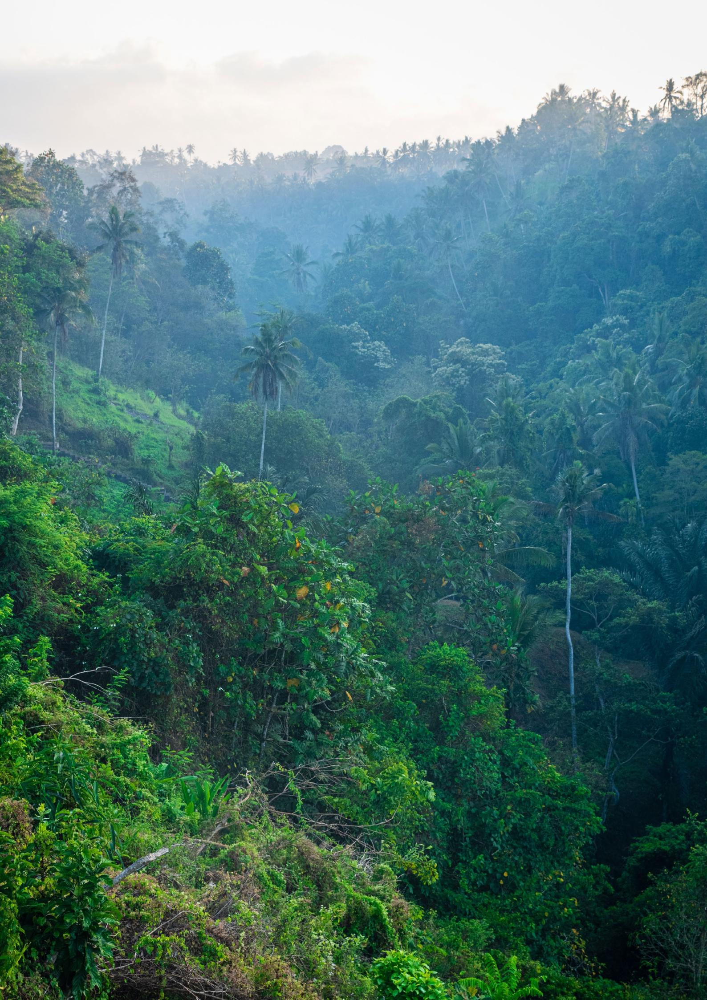

#### **Imprint**

This publication was produced with the Þnancial support of the European Union and the German Federal Ministry for Economic Cooperation and Development (BMZ). It was commissioned by Deutsche Gesellschaft für Internationale Zusammenarbeit (GIZ) GmbH in the context of the project "EUDR Engagement" and developed by a consortium led by AidEnvironment in partnership with Sangga Bumi Lestari. The content of this publication is the sole responsibility of the authors and does not necessarily reflect the views of the EU, BMZ or GIZ.

On behalf of the European Union and the German Federal Ministry for Economic Cooperation and Development (BMZ)

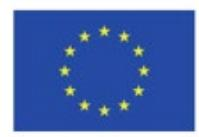

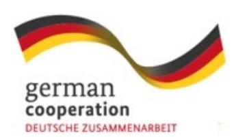

#### **Published by the**

Deutsche Gesellschaft für Internationale Zusammenarbeit (GIZ) GmbH

Registered ofÞces Bonn and Eschborn, Germany

EUDR Engagement project (Engagement with Indonesia, Malaysia, Laos, Thailand and Vietnam to raise awareness on and to promote better understanding of the EU approach to reducing EU-driven deforestation and forest degradation)

Friedrich-Ebert-Allee 36+40 53113 Bonn, Germany info@giz.de [www.giz.de/en](https://www.giz.de/en) 

#### **As of**

December 2025

#### **Photo credits**

© Envato

#### **Authors**

Rita Raleira (AidEnvironment) Joana Faggin (AidEnvironment) Okita Miraningrum Nur Atsari (Sangga Bumi Lestari) Sri Wahyuni (Sangga Bumi Lestari)

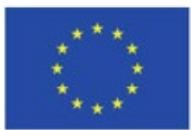

Co-funded by  
the European Union

german  
cooperation  
DEUTSCHE ZUSAMMENARBEIT

Implemented by

**giz** Deutsche Gesellschaft  
für Internationale  
Zusammenarbeit (GiZ) GmbH