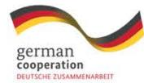

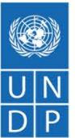

A Strategic Roadmap and Gaps  
and Opportunities Assessment

---

This project was funded by the Federal Ministry of Economic Cooperation and Development (BMZ) and implemented by the United Nations Development Program (UNDP) and the National Agriculture Export Development Board (NAEB) with the support of Deutsche Gesellschaft für Internationale Zusammenarbeit (GIZ) GmbH. The content of this publication is the sole responsibility of the authors and does not necessarily reflect the views of the GIZ GmbH or BMZ. The information in this report, or upon which this study is based, has been obtained from sources the authors believe to be reliable and accurate. While reasonable efforts have been made to ensure that the contents of this publication are factually correct, GIZ GmbH does not accept responsibility for the accuracy or completeness of the contents of this publication. The mention of specific companies, initiatives or products of manufacturers, whether these have been patented, does not imply that these have been endorsed or recommended by GIZ GmbH in preference to others of a similar nature that are not mentioned.

No claim is made to the completeness or exclusivity of the content. The information provided is no substitute for legal advice. It is non-binding and is not the subject of a legal advice contract. No guarantee is given that the judgments and opinions set out here will be followed in the event of a dispute.

United Nations Development Programme One UN Plaza, New York, NY 10017, USA Copyright © 2026. All rights reserved.

UNDP is the leading United Nations organization fighting to end the injustice of poverty, inequality, and climate change. Working with our broad network of experts and partners in 170 countries, we help nations to build integrated, lasting solutions for people and planet. Learn more at undp.org or follow @UNDP.

The views and recommendations expressed in this report do not necessarily represent those of the United Nations, United Nations Development Programme or their Member States.

Lead author: Joseph Mutware Seba

Contributing authors: Reint Bakema, Melissa Salazar

Review and comments: Sandrine Urujeni, Alexis Nkurunziza, Modeste Munezero and Leif Pedersen Institutional support: Rwanda National Agricultural and Export Development Board (NAEB) Design and production: Lucía Caldeiro

# **Table of Contents**

| EXECUTIVE SUMMARY.........................................................................................................................................                        | 4                                                                                                               |
|-----------------------------------------------------------------------------------------------------------------------------------------------------------------------------------|-----------------------------------------------------------------------------------------------------------------|
| 1. Introduction .........................................................................................................................................................6        |                                                                                                                 |
| 2.3 Concluding Remarks on the EU DD Requirements                                                                                                                                  | .............................................................................................11                 |
| 3. Review of National Legal and Institutional Framework against EU DD Regulations                                                                                                 | ..............................12                                                                                |
| 3.1 National Regulatory and Legal Framework                                                                                                                                       | ...........................................................................................................13   |
| 3.2 Key Institutions and Roles ........................................................................................................................................24         |                                                                                                                 |
| 3.3 Existing Efforts to Support the Implementation of EU Due Diligence Requirements                                                                                               | ...............................25                                                                               |
| 3.4 Conclusions.................................................................................................................................................................. | 27                                                                                                              |
| 4.2 Gaps and Opportunities in the Policy and Legal Framework..........................................................................                                            | 33                                                                                                              |
| 4.3 Gaps and Opportunities in Sustainable and Traceable Coffee......................................................................                                              | 34                                                                                                              |
| 4.5 Gaps and Opportunities in Decent Work and Living Wages...........................................................................                                             | 37                                                                                                              |
| 4.6 Gaps and Opportunities in Waste Management and Circular Economy......................................................                                                         | 37                                                                                                              |
| 5. Conclusions and Recommendations                                                                                                                                                | .............................................................................................................38 |
| 5.2 Recommendations from the Assessment                                                                                                                                           | 41                                                                                                              |
| ANNEX 1: Methodological approach ....................................................................................................................52                           |                                                                                                                 |
| ANNEX 2: List of references .................................................................................................................................55                   |                                                                                                                 |
| CSDDD ...................................................................................................................................................................57       |                                                                                                                 |
| ANNEX 4: Aligning of national laws and policies with EUDR and CSDDD                                                                                                               | .......................................................59                                                       |
| coffee sector ..........................................................................................................................................................65        |                                                                                                                 |

# **EXECUTIVE SUMMARY**

The European Union's Regulation on Deforestation-Free Products (EUDR) and the Corporate Sustainability Due Diligence Directive (CSDDD) will fundamentally reshape access to the EU coffee market. **While Rwanda is not legally bound by these regulations, companies placing coffee on the EU market are**. As the EU absorbs more than 60% of Rwanda's coffee exports, Rwanda's competitiveness in this market now depends on whether it can provide a **strong national enabling environment** that allows operators to meet their legal obligations efficiently and at scale.

This report assesses Rwanda's legal, policy, institutional, and operational readiness to support corporate compliance with EUDR and CSDDD with a specific focus on the coffee sector.

#### **Key Findings:**

- 1. **Strong legal baseline, limited enforceability -** Rwanda possesses a comprehensive body of environmental, land, labour, child protection, and anti-corruption law broadly aligned with EU due diligence principles. However, these frameworks do not yet translate into binding corporate due-diligence obligations.
- 2. **Traceability is advancing, but remains fragmented -** Digital traceability systems such as the Smart Kungahara System (SKS) demonstrate real progress, particularly at the farm and coffee-washing-station level. However, systems are fragmented, not fully interoperable, and not yet designed to generate a single, authoritative national compliance dataset aligned with EUDR requirements, including geolocation, legality verification, and deforestation-risk assessment.
- 3. **Smallholder exclusion is a systemic risk -** Over 90% of Rwanda's coffee is produced by smallholders. Many lack geolocation data, formal labour records, digital literacy, or access to finance. Without targeted public intervention, EUDR compliance costs risk excluding smallholders from EU-bound supply chains.
- 4. **Institutional coordination exists but lacks central authority -** Multiple institutions contribute to sustainability, traceability, and human-rights oversight. However, mandates overlap, data systems do not interoperate, and no single body is responsible for coordinating national due diligence readiness.
- 5. **Labour and grievance systems are not supply-chain-ready -** While Rwanda has functioning labour inspection and grievance mechanisms, these are not yet structured to meet supply-chain-level expectations under CSDDD, particularly regarding documentation, remediation tracking, and transparency.

#### **Strategic Implications for Government:**

Failure to address these gaps does not create legal exposure for Rwanda, but it **does create commercial risk**. EU buyers could reduce sourcing from origins where compliance costs are high, data reliability is uncertain, or smallholder inclusion cannot be demonstrated. Rwanda has made commendable progress in supporting corporate compliance with EU due diligence requirements and targeted reforms can further position it as a **high-trust origin**, strengthening price premiums, buyer loyalty and long-term market access.

#### **Priority Recommendations:**

- Develop a centralized national traceability and compliance platform.
- Strengthen institutional coordination and enforcement capacity through clearer mandates and adequate resourcing.
- Scale-up capacity-building and awareness programs for cooperatives, exporters, and farmers.
- Expand access to green and inclusive finance to support compliance investments.
- Enhance labour standards monitoring and establish transparent grievance mechanisms.
- Institutionalize multi-stakeholder dialogue to coordinate implementation and knowledge exchange.

# **ACRONYMS**

| BK        | Bank of Kigali                                                     |
|-----------|--------------------------------------------------------------------|
| CEPAR     | Coffee Exporters and Processors Association of Rwanda              |
| COSA      | Committee on Sustainability Assessment                             |
| CSDDD     | Corporate Sustainability Due Diligence Directive                   |
| CSOs      | Civil Society Organizations                                        |
| CWS       | Coffee Washing Station                                             |
| EIA       | Environmental Impact Assessment                                    |
| ESG       | Environmental, Social, and Governance                              |
| ESIA      | Environmental and Social Impact Assessment                         |
| ESMS      | Environmental and Social Management System                         |
| EU        | European Union                                                     |
| EUDD WG   | European Due Diligence Working Group                               |
| EUDR      | EU Regulation on Deforestation-Free Products                       |
| FONERWA   | Fonds National pour l’Environnement au Rwanda                      |
| FMES      | Forest Monitoring and Evaluation System                            |
| GIZ       | Deutsche Gesellschaft für Internationale Zusammenarbeit (GIZ) GmbH |
| ILO       | International Labour Organization                                  |
| ITC       | International Trade Centre                                         |
| LTR       | Land Tenure Regularization                                         |
| MARKUP    | Market Access Upgrade Programme                                    |
| MIFOTRA   | Ministry of Labour                                                 |
| MIGEPROF  | Ministry of Gender and Family Promotion                            |
| MINAGRI   | Ministry of Agriculture and Animal Resources                       |
| MINALOC   | Ministry of Local Government                                       |
| MINECOFIN | Ministry of Finance and Economic Planning                          |
| MoE       | Ministry of Environment                                            |
| MoU       | Memorandum of Understanding                                        |
| NAEB      | National Agricultural Export Development Board                     |
| NDCs      | Nationally Determined Contributions                                |
| NGOs      | Non-Governmental Organizations                                     |
| PSAC      | Promoting Smallholder Agro-Export Competitiveness                  |
| PSF       | Private Sector Federation                                          |
| PSTA5     | Fifth Strategic Plan for Agriculture Sector Transformation         |
| RDB       | Rwanda Development Board                                           |
| REMA      | Rwanda Environment Management Authority                            |
| RFA       | Rwanda Forestry Authority                                          |
| RIB       | Rwanda Investigation Bureau                                        |
| RRA       | Rwanda Revenue Authority                                           |
| RSB       | Rwanda Standard Board                                              |
| RTC       | Rwanda Trading Company                                             |
| RWACOF    | Rwanda Coffee Federation                                           |
| RWB       | Rwanda Water Board                                                 |
| SKS       | Smart Kungahara System                                             |
| TFEU      | Treaty on the Functioning of the EU                                |
| UNDP      | United Nations Development Programme                               |

# 1. Introduction

Rwanda's coffee sector supports around 400,000 smallholder farmers and is a major contributor to the economy, with an annual production of 20,000–22,0001 metric tons on roughly 42,429 hectares. Coffee exports in 2023/2024 earned USD 78.7 million2, with Europe accounting for over 61% of sales3—main destinations include Switzerland, the UK, Sweden, Italy, Germany, Finland, and Belgium. The US receives 13.9% and other regions 25.8%.4

Despite its reputation for top-quality specialty coffee, Rwanda's coffee sector faces various challenges including declining export volumes (down 17.9%) and values (down 32.1%)5, driven by global price volatility, climate change, and limited adoption of modern technology. Smallholders often struggle with aging trees, low yields, and limited access to inputs, finance, and resilient farming practices. Overcoming these issues is crucial in order to protect livelihoods, preserve Rwanda's premium brand, and maintain market access.

As part of its efforts to strengthen compliance and preparedness, the National Agricultural Export Development Board (NAEB), with support from the FIT for FAIR Project, advanced a comprehensive assessment of Rwanda's coffee sector readiness in relation to these two EU Due Diligence requirements. The assessment examined the country's legal, policy, and institutional frameworks across four key areas: social and human rights, environmental management, traceability and digital systems, and national coordination. It aimed to inform and support national actors in reinforcing Rwanda's compliance, competitiveness, and reputation as a key origin of sustainable and high-quality coffee. The findings of this assessment informed the work of the EU Due Diligence Multi-Stakeholder Working Group for the coffee sector (EUDD WG), contributing to the formulation of policy and technical recommendations to further strengthen the ongoing efforts of NAEB and the broader coffee sector.

The FIT for FAIR project is funded by the Federal Ministry of Economic Cooperation and Development (BMZ) and implemented by the United Nations Development Programme (UNDP) and the National Agriculture Export Development Board (NAEB) with the support of Deutsche Gesellschaft für Internationale Zusammenarbeit (GIZ) GmbH.

5 Ibid

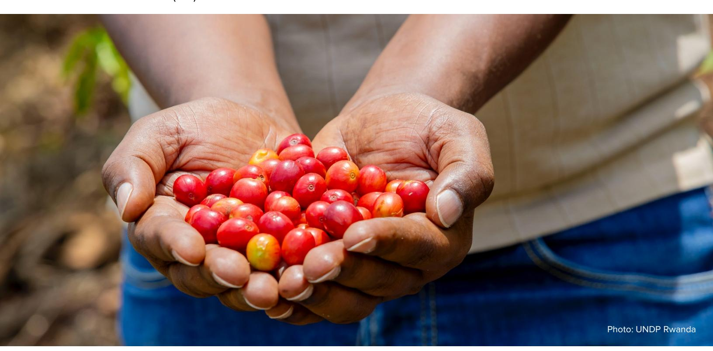

1 NAEB, Coffee Sector Development Strategy for Rwanda 2024-2029 (NAEB, June 2024)

2 NAEB, Annual Agricultural Export Performance Report 2023/2024 (NAEB, June 2024)

3 NAEB, Strategic Plan 2019-2024 (May 2019)

4 NAEB, Annual Agricultural Export Performance Report 2023/2024 (NAEB, June 2024)

# 2. The EU Due Diligence Regulations

Recently, the EU and its Member States have introduced the European Union's Regulation on Deforestation-Free Products (EUDR) and the Corporate Sustainability Due Diligence Directive (CSDDD). Both regulations are a cornerstone of the EU Green Deal6, aimed at embedding sustainability and human rights responsibilities into corporate governance. While the EUDR targets deforestation risks of specific commodities, the CSDDD imposes broader human rights and sustainability due diligence duties at the corporate level that apply to a wide range of companies.

#### **2.1 EU Regulation on Deforestation-Free Products (EUDR)**

The EUDR came into effect on June 29, 2023. Its enforcement date has been postponed twice. Currently7, the enforcement date for large companies is December 30, 2026, and for small and micro companies is June 30, 20278910.

The EUDR is a major step in the EU's efforts to reduce global deforestation and environmental harm linked to EU consumption. It targets key commodities including cattle, cocoa, coffee, palm oil, soy, timber, and natural rubber and certain derivatives, ensuring that goods placed on or exported from the EU market are deforestation-free and comply with relevant laws applicable in the origin countries.

Key obligations include:

**Article 3–5**: Products must be deforestation-free (not produced on land deforested after December 2020), produced in compliance with relevant legislation in the country of production, and be covered by a due diligence statement (incl. geolocation data of all plots of production).

**Articles 8–11**: Operators must collect information (incl. geolocation of all plots of production and information on legal production), assess risk of non-compliance, and mitigate any non-negligible risks of non-compliance to ensure products meet deforestation-free and legality requirements.

**Article 29**: Establishes a country risk classification (high, standard, low) impacting due diligence requirements.

**Article 30**: Highlights EU collaboration with producer countries for sustainable practices and stakeholder inclusion.

The EUDR embeds legal accountability into supply chains, advancing traceability, transparency, and sustainability. It supports climate goals by helping reduce deforestation, protect biodiversity, and drive responsible production in global trade.

6 The **European Green Deal** is the European Union's comprehensive strategy to make its economy sustainable and climate-neutral by **2050**. It is both a political vision and a policy framework that reshapes how Europe produces, consumes, and trades in order to address climate change, biodiversity loss, and environmental degradation. Under the new European Commission, many elements of the Green Deal are being revisited, including the EUDR and the CSDDD. 7 The final draft version of this report was created on 24 March 2026.

8 On 17 December 2025, the EU Parliament and Council reached an agreement on a one-year delay for large operators up to 30 December 2026 and for small operators on 30 June 2027. For DD requirements only the operator first placing the product on the EU market must carry out due diligence. The first downstream operator shall only collect and store the reference number of the DDS. For

small and micro-operators, a single, simplified one-off DDS shall be sufficient. 9 The adopted text is anticipated be published in the Official Journal of the EU to become legally binding before the current deadline of December 30, 2025.

10 The EC will present additional proposals for simplification of the EUDR before 30 April 2026.

## **2.2 Corporate Sustainability Due Diligence Directive (CSDDD)**

The Corporate Sustainability Due Diligence Directive (CSDDD) establishes a framework that requires large companies operating in, or with significant ties to, the EU to identify, prevent, mitigate, and address adverse human rights and environmental impacts across their operations, subsidiaries, and value chains.

Following legislative revisions adopted by the European Parliament on 16 December 2025 and formally approved by the Council on 24 February 2026, amendments to the Directive were published in the Official Journal of the European Union on 26 February 2026. The revised rules significantly reduce the scope of companies covered and adjust the implementation timeline.

Under the revised framework, the Directive applies to:

EU companies with more than 5,000 employees and a net worldwide turnover exceeding EUR 1.5 billion.

Non-EU companies generating more than EUR 1.5 billion turnover in the EU market.

Member States must transpose the Directive into national law by 26 July 2028, while the due diligence obligations for companies will apply from 26 July 2029.11

Key requirements include:

**Article 7:** Companies incorporate risk-based due diligence in policies and management systems.

**Article 8:** Companies identify and assess adverse impacts from operations, subsidiaries, and relevant business partners.

**Articles 9-11:** Companies take steps to prevent, mitigate, or end adverse impacts, prioritising the most severe impacts where necessary.

**Article 12:** Companies remediate if they cause or jointly cause actual harm.

**Article 13:** Companies engage effectively with stakeholders.

**Article 14:** Companies enable complaints about adverse impacts linked to their activities.

**Article 15:** Companies periodically review the effectiveness of measures addressing adverse impacts.

**Article 16:** Companies publish an annual statement on their due diligence processes.

The directive shifts sustainability from a voluntary practice to a legal obligation, promoting transparency, accountability, and ethical business practices throughout global supply chains.

11 As of the date of publication of this document.

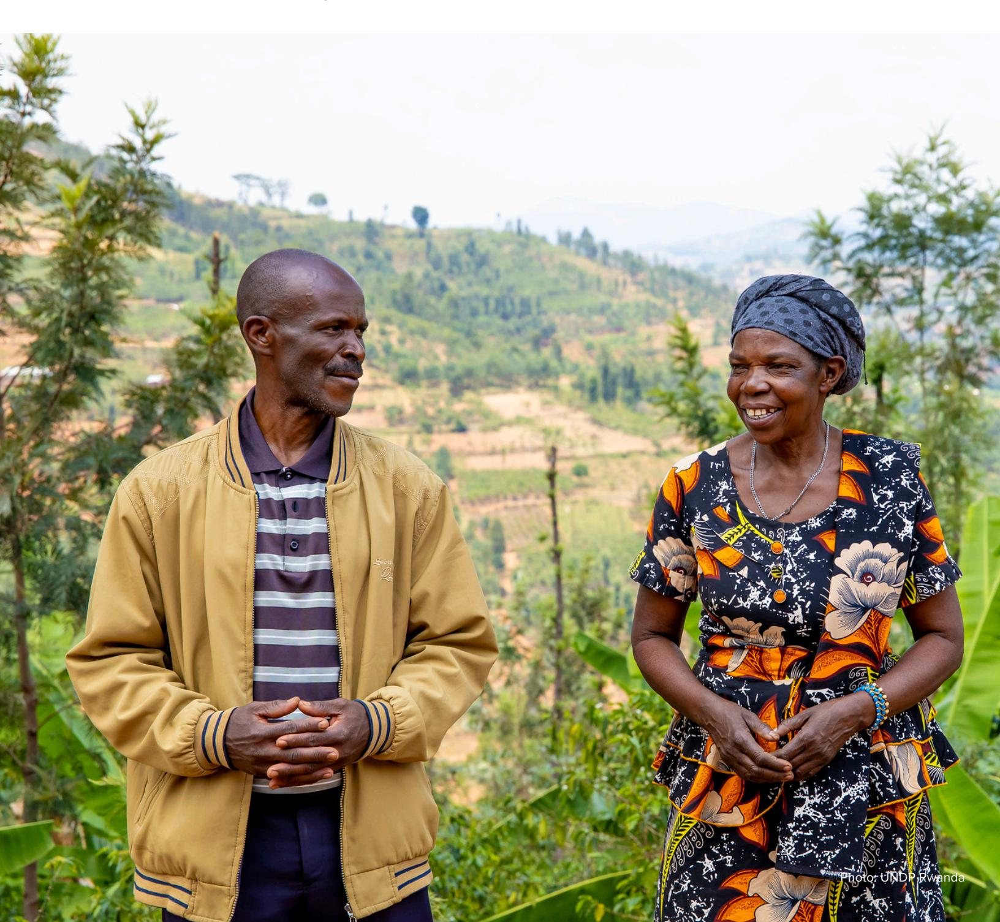

#### **2.3 Concluding Remarks on the EU DD Requirements**

Taken together, the EUDR and the CSDDD signal a decisive shift in the regulatory environment governing access to the European coffee market. These instruments move sustainability, legality, and human rights assurance from voluntary commitments to enforceable market requirements, with clear expectations on traceability, risk management, and documentation throughout the supply chain. While the obligations rest formally with companies, their practical implementation depends heavily on conditions in producer countries.

For Rwanda, this underscores the importance of assessing whether national laws, institutions, and systems provide a reliable foundation that enables market actors to meet these requirements efficiently and inclusively. Against this background, the following chapter examines Rwanda's legal and institutional readiness to support due diligence compliance in the coffee sector.

# **3.1 National Regulatory and Legal Framework**

This review groups Rwanda's laws and policies into main areas: environmental protection, forest management, biodiversity conservation, land use and labour rights, human and child protection, and rules on anti-corruption, trade, and tax compliance. It summarizes the relevant frameworks that help meet EU due diligence requirements and support Rwanda's integration into sustainable global coffee markets.

Additionally, the review classifies national laws and policies as strongly, moderately, weakly aligned with, or not applicable to EUDR and CSDDD based on the extent to which they reflect core due diligence principles, traceability requirements, environmental and social safeguards, enforcement mechanisms, and operational readiness. Instruments that explicitly embed mandatory due diligence obligations and enforceable compliance mechanisms are rated as strongly aligned. Those that support EUDR and CSDDD objectives indirectly or partially are rated as moderately aligned, while instruments with limited relevance or lacking enforceable due diligence elements are rated as weakly aligned or not applicable.

#### **3.1.1. Environment protection**

Rwanda has established a robust set of environmental policies and laws that regulate sustainable development, biodiversity conservation, and climate resilience. These topics are well aligned with the EUDR and CSDDD (see Table 1).

Table 1: Rwandan environmental laws and their relevance to EUDR and CSDDD

| Year | Focus         | Key elements/        |      |       |
|------|---------------|----------------------|------|-------|
|      |               |                      | EUDR | CSDDD |
| 2018 | Environmental |                      |      |       |
|      |               | audits; biodiversity |      |       |
|      |               | protection; creation |      |       |
| 2023 | Management    |                      |      |       |
| 2020 | Climate       |                      |      |       |
|      |               | by 2030; achieve     |      |       |

| 2022             | Low-carbon,                                         |
|------------------|-----------------------------------------------------|
|                  | land use; social                                    |
| 2019             | Vision for                                          |
|                  | resilience; forest                                  |
| 2023             | Sustainable                                         |
|                  | recycling; eco                                     |
| 2006             | Environmental                                       |
| Strong alignment | Moderate alignment No/weak alignment Not applicable |

#### **3.1.2 Forest management and biodiversity conservation**

Rwanda has implemented integrated forest, biodiversity, and land-use policies that support environmental governance and sustainable development, aligning with regulations like the EUDR and CSDDD. These coordinated frameworks promote legal, traceable, and sustainable production, involve all stakeholders, enable Rwanda to maintain export standards, and help companies comply with EU due diligence requirements (see Table 2).

Table 2: Rwandan forest, biodiversity, and land-use laws and their relevance to EUDR and CSDDD

| Law/policy/plan | Year | Focus      | Key elements/   |                  |      |       |
|-----------------|------|------------|-----------------|------------------|------|-------|
|                 |      |            |                 |                  | EUDR | CSDDD |
|                 | 2024 | Forest     |                 |                  |      |       |
|                 |      |            | transport; use; |                  |      |       |
|                 |      |            |                 | governance; risk |      |       |
|                 |      |            |                 | assessment; and  |      |       |
|                 | 2011 | Promoting  |                 |                  |      |       |
|                 |      | areas; and |                 |                  |      |       |

|                  | critical biological moderate for ecosystems resources; EUDR mainstreaming biodiversity into development planning; restoration and rehabilitation                                                                                                                                                                                                                                                                                                                                                                               |
|------------------|--------------------------------------------------------------------------------------------------------------------------------------------------------------------------------------------------------------------------------------------------------------------------------------------------------------------------------------------------------------------------------------------------------------------------------------------------------------------------------------------------------------------------------|
| 2013             | Conservation Legal/strategic Legally strong of biological frameworks; instrument for diversity; lawful/sustainable CSDDD; genetic use; community moderately resource participation; relevant for EUDR regulation ecosystem protection; fair benefit-sharing Biodiversity Zoning; Operationally and enforcement; strong for EUDR conservation community forest-risk policy engagement; control; not implementati sustainable corporate-facing on livelihoods; natural and do not capital accounting; regulate supply PES chains |
| 2024             | Integration of Improve soil Helpful but not trees in fertility; carbon regulatory; agriculture sequestration; moderate food security; practical value for community tree EUDR. Do not planting address (Umuganda); corporate risk increase forest systems or cover; reduce accountability deforestation                                                                                                                                                                                                                       |
| 2020             | Efficient Reduce land Limited direct water use for degradation; relevance to both agriculture reduce frameworks deforestation pressures; integrate sustainable irrigation in land management                                                                                                                                                                                                                                                                                                                                   |
| Strong alignment | Moderate alignment No/weak alignment Not applicable                                                                                                                                                                                                                                                                                                                                                                                                                                                                            |

#### **3.1.3 Land use rights**

Rwanda's land governance framework supports sustainable, transparent, and rights-based land management aligned with EU due diligence standards. They collectively advance sustainable land use, tenure security, and rights-based development, embedding transparency, stakeholder participation, and environmental safeguards that directly support corporate compliance with EUDR and CSDDD requirements (see table 3).

Table 3: Rwandan land-use and land-rights laws and their relevance to EUDR and CSDDD

| Year | Focus     | Key           |            |            |      |       |
|------|-----------|---------------|------------|------------|------|-------|
|      |           |               | Safeguards | Alignment/ |      |       |
|      |           |               |            |            | EUDR | CSDDD |
| 2019 | Efficient |               |            |            |      |       |
|      |           |               |            | ; helps    |      |       |
| 2021 | Secures   |               |            |            |      |       |
|      |           | use; transfer |            |            |      |       |
| 2008 | Formalise |               |            |            |      |       |

|                                             |      | human rights protection       | statutory systems                                           | moderate for CSDDD                                              |                                                                                                                                     |   |   |
|---------------------------------------------|------|-------------------------------|-------------------------------------------------------------|-----------------------------------------------------------------|-------------------------------------------------------------------------------------------------------------------------------------|---|---|
| <b>Revised national urbanization policy</b> | 2025 | Sustainable urban development | Densification; efficient land use; environmental protection | Social inclusion; climate resilience; proactive risk management | Limited relevance to forest protection or agricultural deforestation; not directly relevant to corporate supply chain due diligence | ● | ● |

Strong alignment Moderate alignment No/weak alignment Not applicable

#### **3.1.4 Labour rights, human rights, privacy, and child protection**

Rwanda's labour and human rights framework provides a robust foundation for upholding social justice, decent work, and human rights in alignment with the EU's due diligence frameworks. Collectively, these frameworks ensure that Rwanda's labour, land, and human rights governance systems uphold international standards of fairness, equity, and accountability, key principles underpinning the EU's corporate sustainability and human rights due diligence regulations (see table 4).

Table 4: Rwandan labour, human rights and privacy laws and their alignment to EUDR and CSDDD

| Law/plan   | Year | Focus           | Key elements/       |            |      |       |
|------------|------|-----------------|---------------------|------------|------|-------|
|            |      |                 |                     |            | EUDR | CSDDD |
| Labour law | 2023 | Fair; safe; and |                     |            |      |       |
|            |      |                 |                     | wages; and |      |       |
|            | 2015 | Safeguarding    |                     |            |      |       |
|            |      | equality; and   |                     |            |      |       |
|            | 2018 | Children’s      |                     |            |      |       |
|            |      |                 | healthcare; justice |            |      |       |

|                                  |                      |                            |                                                                                                                        | very limited relevance for EUDR                                                             |   |  |   |
|----------------------------------|----------------------|----------------------------|------------------------------------------------------------------------------------------------------------------------|---------------------------------------------------------------------------------------------|---|--|---|
| <b>Access to information law</b> | 2013                 | Public sector transparency | Establishes public access to government information; relevant when balancing transparency and personal-data protection | Strong relevance as transparency is central to due diligence obligations. moderate for EUDR | ● |  | ● |
| ● Strong alignment               | ● Moderate alignment | ● No/weak alignment        | ● Not applicable                                                                                                       |                                                                                             |   |  |   |

#### **3.1.5 Anti-corruption, trade, and tax compliance**

Rwanda has established a comprehensive governance, economic, and sectoral framework that supports compliance with international due diligence laws. Collectively, Rwanda's policies on corruption, taxation, competition, and sectors promote transparency and responsible business practices, supporting corporate compliance with EUDR and CSDDD. These frameworks equip businesses with the legal and strategic means to meet changing EU supply chain due diligence requirements (see table 5).

Table 5: Rwandan anti-corruption, trade and tax compliance laws and their alignment to EUDR and CSDD

| Policy/strategy | Year | Focus             | Key            |                |      |       |
|-----------------|------|-------------------|----------------|----------------|------|-------|
|                 |      |                   |                |                | EUDR | CSDDD |
|                 | 2012 | Prevent; detect;  |                |                |      |       |
|                 | 2023 | Tax compliance;   |                |                |      |       |
|                 |      |                   |                | governance and |      |       |
|                 | 2019 | Tax obligations   |                |                |      |       |
|                 | 2023 | Fair competition; |                |                |      |       |
|                 |      |                   |                | fairness; not  |      |       |
|                 |      |                   | agrihubs; food |                |      |       |

| Coffee sector 2024– development 2029  | Traceability; climate-smart monitoring;                         | agricultural practices and environmental/social risk mitigation Deforestation Supports sustainability;                                                                                                                             |                |
|---------------------------------------|-----------------------------------------------------------------|------------------------------------------------------------------------------------------------------------------------------------------------------------------------------------------------------------------------------------|----------------|
| strategy                              | practices mapping                                               | traceability; and digital farm forest-friendly practices                                                                                                                                                                           |                |
| NST2 2024–                            | Inclusive economic growth; sustainable agriculture              | Value chain Indirect relevance to development; deforestation digitalisation prevention; promotes sustainable and accountable economic transformation; supporting corporate environmental and social governance                     |                |
| 2022 Revised national export strategy | Trade Ethical competitiveness; practices; sustainability chains | Supports adoption of deforestation-free traceability in standards and export value traceability systems for export commodities; encourages companies to adopt sustainable export practices and meet social/environmental standards |                |
| Strong alignment                      | Moderate alignment                                              | No/weak alignment                                                                                                                                                                                                                  | Not applicable |

#### **3.1.6 Institutional framework for EU Due Diligence regulations in Rwanda**

Rwanda has established a strong institutional framework that supports the implementation of key principles from the EUDR and CSDDD within its coffee value chain. These global standards encourage environmental care, respect for human rights, and responsible corporate practices, principles that are deeply woven into Rwanda's governance and policies. Table 6 below lists various institutions involved in meeting the EU's due diligence requirements for the coffee industry. Institutional roles and responsibilities are detailed in Annex 3.

Table 6: Institutional frameworks for EU Due Diligence regulations in Rwanda

| No. | Institution EUDR CSDDD      |
|-----|-----------------------------|
| 1   | MINAGRI                     |
| 2   | NAEB                        |
| 3   | MoE                         |
| 4   | REMA                        |
| 5   | RFA                         |
| 6   | RWB                         |
| 7   | RSB                         |
| 8   | RDB                         |
| 9   | MINALOC                     |
| 10  | Districts                   |
| 11  | Associations & Cooperatives |
| 12  | Private sector              |
| 13  | Office of the Ombudsman     |
| 14  | RIB                         |
| 15  | RRA                         |
| 16  | MINECOFIN                   |
| 17  | MIFOTRA                     |
| 18  | MIGEPROF                    |
| 19  | NCC                         |
| 20  | NCHR                        |
| 21  | NCDA                        |
| 22  | Development Partners        |
| 23  | NGOs                        |

Core institutions like MINAGRI, NAEB, MoE, REMA, RFA, and the private sector lead sustainable production, traceability, and deforestation-free supply chains. Supporting entities such as RWB, RSB, RDB, MINALOC, and local governments focus on quality control, investment, and enforcement. Oversight institutions, including the Office of the Ombudsman, RIB, RRA, and MIFOTRA, play a key role in ensuring accountability, safeguarding labour rights, and preventing corruption in alignment with CSDDD. Development partners and NGOs provide technical support, training, and engage smallholders.

#### **3.2.1 Coordination and governance**

The Office of the Prime Minister and MINECOFIN lead policy to align sustainability and trade goals. Interministerial committees coordinate on environment, trade, and human rights, while local governments enforce policies. Platforms like the Public-Private Dialogue Frameworks and Sector Working Groups support collaboration and coherence.

#### **3.2.2 Monitoring and enforcement**

Organisations such as REMA and RFA use GIS and satellite technology to track environmental compliance, while MIFOTRA is responsible for upholding labour standards and workplace safety. Human rights and corporate integrity are monitored by NCHR, RIB, and the Ombudsman, and RRA is tasked with tax and trade compliance. Meanwhile, private companies are increasingly adopting traceability systems and voluntary sustainability certifications like Fairtrade and Rainforest Alliance, with both technical and financial support from development partners.

#### **3.2.3 Multi-stakeholder platforms**

Collaboration is facilitated by groups such as the Agriculture Sector Working Group (ASWG), Joint Action Development Forum (JADF), NAEB–Private Sector Dialogues, and the Coffee Research Collective, all of which promote innovation and policy alignment. The European Due Diligence Working Group (EUDD WG), part of the FIT for FAIR initiative, acts as a national platform to raise awareness about EU due diligence requirements and coordinate efforts to help supply chain actors comply and maintain access to the EU market.

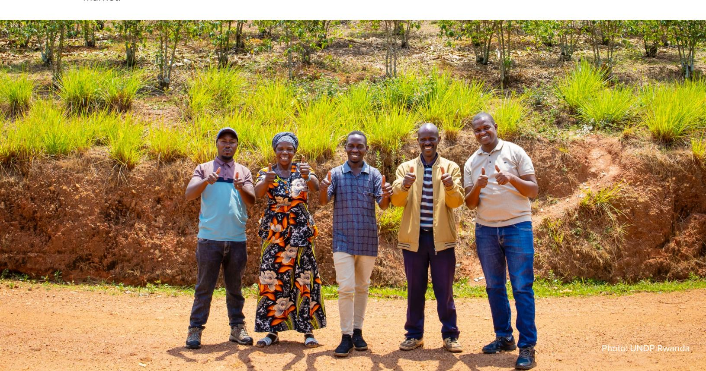

Rwanda has made significant progress in strengthening its agricultural export systems, especially in the coffee sector, to align with international standards. Through coordinated efforts involving government institutions, the private sector, and development partners, Rwanda is building a transparent, sustainable, and deforestation-free value chain. Central to these efforts is the development of a National Due Diligence Framework that integrates geolocation mapping, risk mitigation, and compliance verification mechanisms in line with national and international requirements. Existing legal and policy frameworks already incorporate key elements of the EU's due diligence obligations related to trade, labour, and environmental management.

#### **3.3.1 Traceability systems and digital solutions**

The Smart Kungahara System (SKS), run by NAEB and BK TechHouse, uses blockchain and GPS to collect data from over 378,000 farmers and 300 washing stations, enabling transparent, deforestation-free sourcing. Originally designed to monitor fertilizer distribution to coffee farmers, it has been expanded to include traceability features. The results of the 2025 Coffee Census by NAEB and CEPAR will provide detailed farm data that might be integrated into the SKS. Private exporters such as RWACOF, RTC, IMPEXCOR, Baho Coffee, and Sustainable Growers Rwanda have registered and mapped thousands of farms for certification and traceability using proprietary software. Fairtrade International supports 18 cooperatives in geospatial registration, mapping, and monitoring of their members.

#### **3.3.2 Human rights and environmental due diligence**

Rwanda enforces international labour and environmental standards through agencies like MIFOTRA, PSF, MoE, and REMA, upholding ILO conventions, UN principles, and Paris Agreement requirements. The 2019 single-use plastics ban shows Rwanda's commitment to strong environmental stewardship in line with EUDR goals.

#### **3.3.3 Corporate transparency and compliance systems**

Rwanda is promoting corporate transparency with digital business reporting (IFC, CMA, RSE, RDB) and integrating ESG principles into investments and operations. The Rwanda Development Board now requires EIAs and social safeguards for major investments, while REMA mandates environmental audits for compliance. RRA's tax reforms, such as the Electronic Invoicing System, improve traceability in export supply chains and support EU due diligence compliance.

#### **3.3.4 Afforestation and reforestation initiatives**

Rwanda aims for 30% forest cover by 2030, planting over 10 million trees annually and restoring 2 million hectares through national reforestation campaigns. Systems like FMES and Reforestation Tracker support real-time monitoring and seedling traceability. Private sector involvement, especially New Forests Company Rwanda, has rehabilitated 30,000+ hectares, supporting alignment with EUDR and CSDDD by reducing deforestation risks and demonstrating due diligence. The Green Fund (FONERWA) has raised over \$200 million to support reforestation, sustainable farming, and green energy.

#### **3.3.5 Sustainable agriculture and smallholder inclusion**

Initiatives such as the Promoting Smallholder Agro-Export Competitiveness (PSAC), ITC's MARKUP II, and the Coffee Value Chain Development Project help small farmers boost market competitiveness, increase access to buyers, and improve product traceability. Conservation agriculture and agroforestry promote sustainable land management, conserving biodiversity, and increasing climate resilience. Their agroforestry systems in coffee help to diversify farm income, maintain healthy soil, prevent erosion, and create more opportunities for farmers to earn sustainability certifications.

#### **3.3.6 Policy alignment and multi-stakeholder engagement**

The FIT for FAIR Project (GIZ, UNDP, NAEB) supported Rwandan coffee stakeholder in mapping and reviewing their legal framework and existing efforts to support corporate compliance with EU due diligence rules and is also setting up a multi-stakeholder platform to coordinate national compliance efforts (the EU Due Diligence Multi-Stakeholder Working Group).

#### **3.3.7 Grievance and redress mechanisms**

Rwanda's local *Abunzi* Committees and the Office of the Ombudsman offer accessible mediation services for issues concerning land, human rights, and governance. Additional mechanisms are in place to handle gender-based violence, child protection, and labour disputes, ensuring that remedies are available in accordance with CSDDD standards. Supported by UNDP, the Alternative Dispute Resolution (ADR) initiative promotes peaceful conflict management, thereby strengthening accountability and ethical governance throughout value chains.

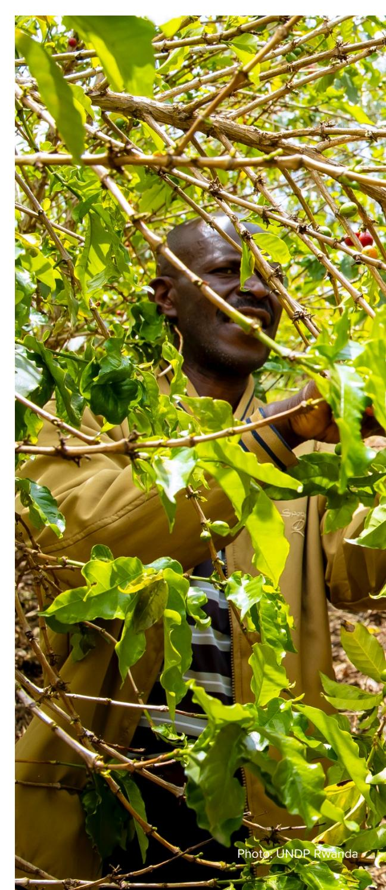

#### **3.4 Conclusions**

Rwanda has a comprehensive legal framework covering environmental protection, land use, labour rights, child protection, and governance (see table 7). These frameworks are broadly aligned with EU due diligence principles. However, implementation remains uneven, and existing laws do not yet translate into systematic, supply-chain-oriented due diligence practices.

Institutional responsibilities are distributed across multiple agencies (see Table 8), with limited formal coordination and data interoperability. Enforcement capacity at local level varies, and there is no explicit linkage between compliance with sustainability requirements and export eligibility. Further progress is needed in advancing corporate responsibility, integrating data systems, and mandating business-specific due diligence. Strengthening legal obligations, institutional capacities, and inter-agency coordination in

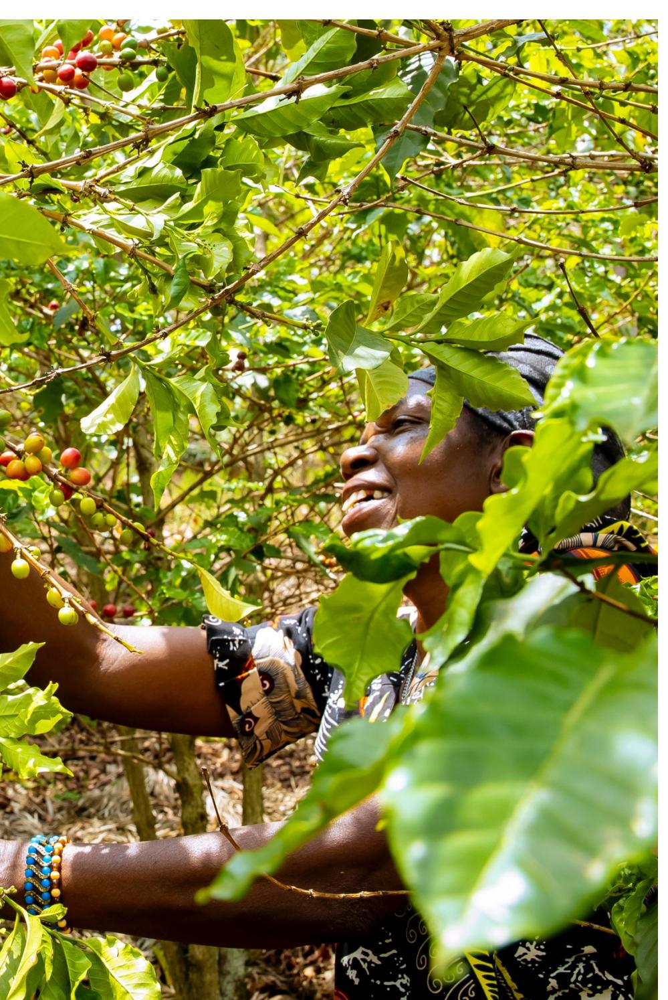

Rwanda will be essential to support coffee supply chain actors sourcing from the country and placing products on the European market in achieving full compliance with global standards.

Taken together, these findings indicate that Rwanda has a strong legal framework with the capacity to create a supportive, enabling environment for corporate compliance with EU Due Diligence regulations. Therefore, the country's primary challenge does not lie in the absence of laws or policies, but in the practical capacity to implement them in a manner that meets evolving supply-chain due diligence expectations. This underscores the importance of examining the operational, technical, and human resource capacities that determine how policies are translated into action at the sector level. By addressing this primary challenge, Rwanda has the opportunity to both further solidify its position as a preferred source of sustainable coffee and expand market access.

Table 7: Legal and institutional frameworks in relation to EU DD requirements

| Framework/area Strengths | Weaknesses Areas for improvement |
|--------------------------|----------------------------------|
| 2024);                   | Agroforestry Strategy            |
| (2018–2027);             | Updated NDC                      |
| (2020);                  | Green Growth and                 |
| (2022);                  | Forest Monitoring and            |
|                          | obligations; weak EIA            |
|                          | capacity; fragmented             |
|                          | diligence; enhance               |
|                          | monitoring; promote              |
| Land use rights          | Emphasises tenure security;      |
| (2019);                  | law no. 27/2021, Land            |
| (LTR);                   | National Land Use and            |
| (2020–2050);             | Urbanization                     |
|                          | risks; inconsistent              |
|                          | enforcement; limited             |
|                          | obligations; update              |
|                          | action plan; strengthen          |
| Transformation II (NST2, | 2024–                            |
|                          | sectors; lack of                 |
| (SKS);                   | GPS geolocation, block           |
| chain (INATrace);        | 300 Coffee                       |
|                          | export coverage; on             |

| Washing Stations;        | 378,000                       |
|--------------------------|-------------------------------|
| farmers registered;      | 60 of 79                      |
| traceability tools;      | collaboration                 |
| among NAEB;              | private sector;               |
| EU;                      | GIZ; Fairtrade International; |
| BK TechHouse;            | capacity                     |
|                          | export; many                  |
|                          | digital systems; lack of      |
|                          | actors; standardize           |
| Promotion of             | ESG principles                |
| Initiative; CMA;         | RSE; RDB                      |
|                          | promote ESG disclosure; RDB   |
| integrates ESG criteria; | RRA’s                         |
| by 2030;                 | FLR program                   |
| (New Forests Company);   | FMES                          |
| alignment with AFR100;   | Paris                         |
| Agreement;               | UN Decade on                  |
|                          | levels; reliance on           |
|                          | funding; strengthen           |
| coffee;                  | conservation                  |
| agriculture;             | multi-stakeholder             |
|                          | traceability; youth and       |
|                          | extension; blended            |
|                          | finance; formalize and        |
| FIT for FAIR Project;    | EUDD                          |
| Working Group;           | MoU between                   |
|                          | action; smallholders and      |
|                          | roadmaps; ensure              |
| MIGEPROF;                | MIFOTRA; RIB;                 |
|                          | low awareness; weak           |
|                          | mechanisms; digitalize        |
|                          | platforms; establish          |

Table 8: Strengths and weaknesses of public and private institutions in relation to EU DD requirements

| Category Strengths        | Weaknesses Areas for improvement                                            |
|---------------------------|-----------------------------------------------------------------------------|
| MINAGRI;                  | NAEB; RAB; REMA;                                                            |
| RFA; RDB strong technical |                                                                             |
|                           | ESG, gender, legal                                                          |
| Financing:                | Limited access to financial resources for smallholders, cooperatives, local |
| Digital infrastructure:   | Poor connectivity, interoperability and user interfaces.                    |
| Capacities                | : Technological and skills deficits.                                        |
| Coordination              | : Limited engagement in the sector between public and private               |

Chapter 4

# **Gaps and opportunities analysis**

## **4.1 Topics and Framework for the Gap Analysis**

To systematically identify strengths, gaps, and opportunities within Rwanda's national legal and policy frameworks, as well as ongoing initiatives to support corporate compliance with the EUDR and CSDDD, an analytical matrix (Table 9) was developed focusing on five thematic areas central to EU due diligence compliance:

Table 9: Analytical matrix for gap identification

| Thematic area | Key assessment focus                                                                          |
|---------------|-----------------------------------------------------------------------------------------------|
| 1.            | Legality (policy and legal                                                                    |
| 2.            | Sustainable and traceable                                                                     |
| 3.            | Smallholder integration Inclusion of smallholders in formal supply chains; access to finance, |
| 4.            | Decent work and living                                                                        |
| 5.            | Waste management and                                                                          |

This framework guided the identification of policy and institutional gaps, implementation constraints, and opportunities for strengthening Rwanda's enabling environment for corporate compliance with EU due diligence obligations.

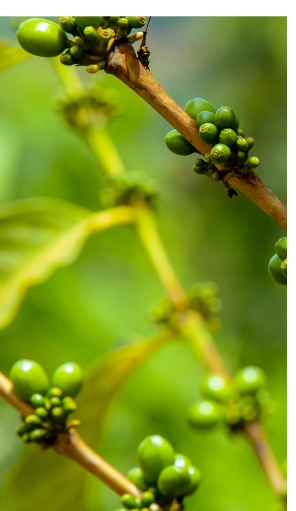

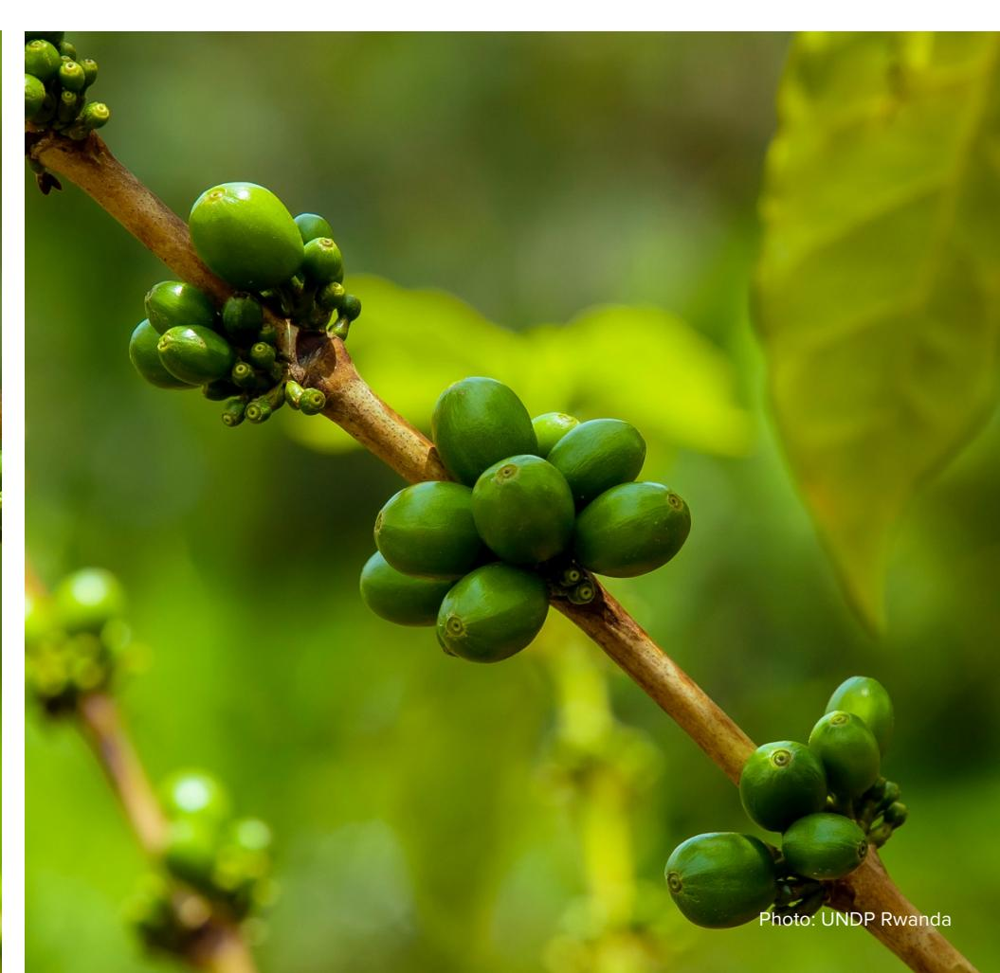

#### **Gaps**

#### **Awareness and understanding among private sector actors**

Despite Rwanda's supportive policy environment, many coffee exporters and cooperatives lack awareness and understanding of both national laws and EU due diligence requirements. Actors not engaged in certification schemes show limited familiarity with traceability, environmental risk mitigation, labour and human rights obligations under EUDR and CSDDD. Those involved in certifications such as Fairtrade, Rainforest Alliance, Organic, and C.A.F.E. Practices demonstrate higher understanding, particularly regarding traceability and labour standards. The prevailing knowledge gap impedes proactive compliance planning and increases the risk of market exclusion.

#### **Limited enforcement of existing policies**

While Rwanda has established robust legal frameworks for sustainable coffee production and worker protection, enforcement is irregular. The frequency of labour inspections can vary, particularly in rural areas, highlighting opportunities to further strengthen monitoring of labour and human rights standards. This gap can undermine protections under national labour laws and weaken the country's ability to meet international due diligence requirements. Strengthening monitoring frequency, coverage, and capacity is critical to safeguarding workers' rights and ensuring supply chain compliance.

#### **Insufficient institutional capacity**

Public institutions face financial and technical constraints that limit oversight and support for compliance. These gaps affect the ability to implement traceability systems, conduct risk assessments, provide guidance, and deliver capacity-building programs. Limited institutional capacity hinders the government's role in ensuring a strong enabling environment for corporate compliance with EU regulations.

#### **Coordination between public and private sector**

Coordination and communication between government entities and private sector actors are limited. Few formal mechanisms exist for joint planning, feedback, or information exchange, impeding the development of coherent sector-wide responses. A lack of clear protocols for mediating disputes between private certification bodies and regulatory authorities adds uncertainty and delays, potentially affecting market access and compliance efforts. Structured dialogue, clarified roles, and collaboration channels are essential for trust-building and unified sector governance.

#### **Opportunities**

Rwanda has comprehensive laws and policies promoting sustainability, environmental protection, and social safeguards. These provide legal clarity on land use, labour rights, and responsible resource management, all of which are essential for verifying compliance with EU due diligence and legal requirements. In order to best take advantage of this strong base, targeted institutional capacity building efforts and campaigns aimed at increasing the awareness of private sector actors would address the gaps and limitations outlined in this section, and thereby support the strengthening of the enabling environment for corporate compliance with EUDD regulations.

#### **Gaps**

#### **Limited digital infrastructure and tools**

Stakeholders highlight advances in building comprehensive traceability systems, combining farm-level geolocation mapping with improved data collection, documentation, and verification procedures, but face persistent challenges, including limited rural digital infrastructure such as, the connectivity needed to generate, transmit, and verify EUDR-required data at farm level (e.g., smartphones, GPS-enabled devices, or other appropriate apps), inconsistent data quality, and lack of interoperability between systems. These issues hinder consolidated, reliable reporting and the demonstration of compliance with EU traceability requirements.

#### **Fragmentation and lack of standardization**

Traceability efforts remain fragmented with discrepancies in data formats and collection methods. There is no national standard guiding geolocation data collection, storage, or sharing. Many smallholder and cooperative actors face financial and technical barriers to adopting digital traceability tools, and limited integration with national platforms prevents centralized verification and hinders the auditability of data. A coordinated national approach is necessary, including standardized protocols, investment in investment, and capacity-building initiatives.

#### **Opportunities**

Rwanda's Coffee Sector Development Strategy (2024-2029) focuses on improving quality, traceability, certification, and value addition through investments in coffee washing stations, laboratories, and compliance with export standards. Exporters and cooperatives, with help from partners such as Fairtrade and Root Capital, have introduced systems to collect geolocation data at the farm level. New technologies—including QR codes, mobile apps, and digital farm platforms—are being tested to move the sector toward complete supply chain transparency. Most exporters and cooperatives are already using internal control systems (ICS) for farmer registration, mapping plots, and keeping records. Widespread adoption of ICS and unified tools could boost Rwanda's ability to meet traceability requirements and compete in premium markets.

The country is working to expand national traceability protocols, align data collection methods, and upgrade up-country digital infrastructure. Platforms such as the planned Rwandan Coffee Platform and European Due Diligence Working Group (EUDD WG) can facilitate these processes by providing a coordinating platform for government, private sector, cooperatives, and development partners. These mechanisms provide opportunities to harmonize policies, develop practical compliance tools, and mobilize resources to support sustainable and traceable coffee value chains. Additionally, Rwanda is working on developing its own national traceability system, the Smart Kungahara System (SKS).

Rwanda benefits from active support from development partners, certification bodies, and EU buyers. Programs supporting traceability, farm mapping, labour standards, and due diligence audits are building a more resilient and regulation-ready sector. Scaling co-investment models, knowledge-sharing platforms, and pilot projects can extend benefits across the entire coffee sector.

#### **Gaps**

#### **Awareness and knowledge gaps**

Many smallholders, particularly those outside cooperatives, are unaware of EUDR and CSDDD requirements and how they can affect Rwanda's coffee sector, including traceability, environmental protection, and labour standards. This knowledge gap can prevent informed decision-making and participation in sustainable, traceable coffee value chains.

#### **Inadequate geolocation and traceability data**

Standardised and quality digital geolocation and compliance data is the basis for efficient and reliable coffee traceability and DD information provision. International experience has shown that merging existing databases of individual players usually fails because of incompatible database structures and unreliable datasets. Additionally, many farmers remain disconnected from cooperatives or service providers who have access to geo-location and traceability tools. Paper-based or informal land records are insufficient for the plot-level verification required under EU regulations.

#### **Weak organizational structures**

Many CWSs and cooperatives have weak governance, financial, and technical systems, procedures, and capacities to support corporate compliance. Weak institutional support impedes group traceability systems, farmer training, and aggregation of accurate production and labour data, restricting smallholders' market access.

#### **Limited technical capacity**

Smallholders often lack training on sustainable farming, labour standards, environmental conservation, and human rights in coffee value chains. Without capacity-building programs, coffee farmers cannot adopt production methods that meet EU Due Diligence requirements, potentially jeopardizing their inclusion in high-value markets.

#### **Limited access to finance**

Preparing for EUDR and CSDDD requires financial investments in training, documentation, traceability systems, and certifications. Many smallholders operate on thin margins and have limited access to affordable credit, increasing the risk of market exclusion.

#### **Informal labour practices**

Family labour and unregistered workers dominate smallholder operations. Informal agreements and limited record-keeping create compliance challenges with respect to labour rights, decent work, and the occupational safety standards required under CSDDD.

#### **Limited participation in certification schemes**

Smallholders' participation in coffee certifications remains low due to high costs, administrative burdens, and limited awareness, leaving many excluded from compliant value chains. Targeted support, subsidized costs, and cooperative-level enrolment can enhance access and compliance.

#### **Lack of targeted national programs**

While Rwanda has enabling legal frameworks, there are still limited practical programs that integrate farmers into compliant coffee supply chains, ensuring that their coffee can access the EU market. Tailored interventions addressing knowledge gaps, finance, technology access, and organizational weaknesses are critical to translating policy into action and promoting equitable participation in sustainable markets.

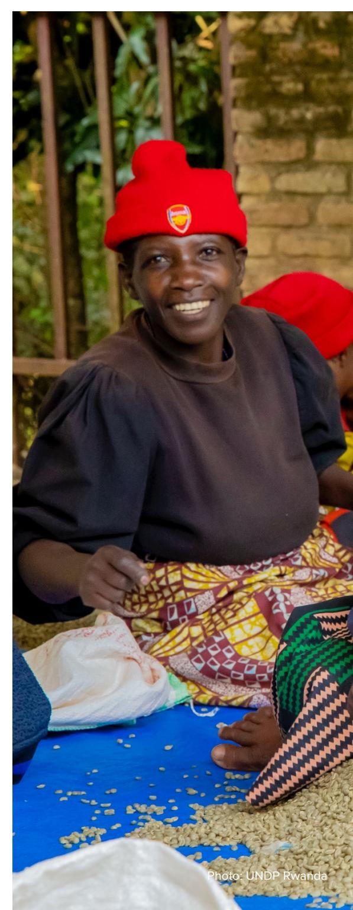

#### **Opportunities**

Smallholder farmers dominate Rwanda's coffee sector and their integration into traceable and sustainable supply chains for the preparation for EUDR and CSDDD corporate compliance is critical for smallholderinclusive supply chains.

Many international certification schemes for coffee are (largely) compliant with EUDR and CSDDD requirements, both in terms of production practices and traceability. They are potentially attractive to coffee farmers because of the attached premiums to certified coffees, despite the additional efforts and costs to enrol and comply. Active support to the roll-out of such schemes, through awareness and financial contributions to the necessary investments, especially at cooperative-level, shall boost farmers' income from coffee and country-wide compliance.

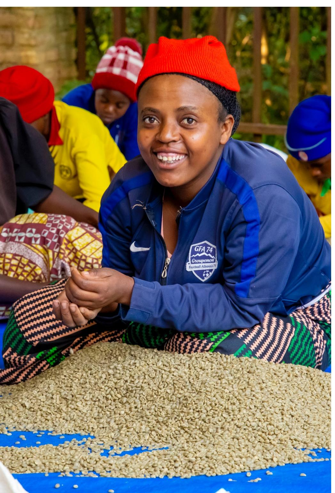

#### **4.5 Gaps and Opportunities in Decent Work and Living Wages**

#### **Gaps**

#### **Gaps regarding decent work and living wages**

Rwanda's labour laws provide a framework for the protection of workers' rights, including provisions related to fair compensation and safe working conditions. However, continued efforts to strengthen enforcement and monitoring, particularly in rural coffee-growing areas, are suggested to further enhance alignment with international due diligence expectations. The development of clear living-wage reference benchmarks and strengthened monitoring mechanisms would contribute to reinforcing worker protection and compliance throughout the coffee supply chain.

#### **Opportunities**

Rwanda's labour laws are designed to safeguard workers. In addition, international agencies and certification schemes are working on benchmark data for a living wage and living income for coffee farmers. Especially in certification schemes, premium pricing can boost farmer income. Further efforts to benchmark living wages and income are likely to have a positive impact on farmers' and workers' pay.

#### **4.6 Gaps and Opportunities in Waste Management and Circular Economy**

#### **Gaps**

#### **Adoption of waste management and circular economy practices in coffee processing**

Waste management and circular economy practices in coffee processing are regulated under existing frameworks, including those overseen by REMA and RWB. However, the assessment identified opportunities to further scale and standardize the adoption of these practices across coffee processing facilities

#### **Awareness of formal guidance**

Existing official government standards for sustainable coffee processing are not widely known, leaving producers without structured practices for eco-efficiency.

#### **Generic incentives**

While grants and green financing exist, these are not targeted to the coffee sector, limiting access to resources for eco-friendly technology adoption.

These gaps constrain companies' ability to demonstrate environmental protection in line with EU due diligence legislation, and therefore also potentially constrain their ability to be active in the EU market.

#### **Opportunities**

The EUDR and CSDDD require sustainable approaches to waste management and resource usage. Rwanda has advanced these goals with efforts such as its National Circular Economy Action Plan, though there are still areas for improvement.

The current policies and regulations for waste management could be further developed for the coffee sector, specifically with a view to CWS operations, coupled with investments in effluent treatment and the reuse of coffee pulp. FONERWA and Ireme Invest offer green financing options, which could be tailored more to the specific needs of the coffee sector.

Chapter 5

# **Conclusions and recommendations**

Rwanda's coffee sector is strategically positioned to support corporate compliance with evolving European Union due diligence regulations, including the EUDR and CSDDD, building on a strong foundation of legal, policy, and institutional frameworks. The country has made significant progress in developing laws and policies across environmental protection, forest governance, land tenure, labour rights, human rights, and child protection, reflecting a clear commitment to sustainability, social inclusion, and ethical trade. These policies, together with Rwanda's national land tenure regularization program and anti-corruption measures, provide an enabling environment to support companies sourcing coffee in meeting international compliance obligations. Notably, Rwanda has begun intensifying awareness-raising and training initiatives targeting both exporters and producers, helping to improve understanding of EU due diligence requirements across the coffee supply chain.

Significant strides have been made in traceability and compliance practices. Many exporters and cooperatives have begun collecting geolocation data at the farm level and adopting digital traceability tools, including QR-code systems, mobile applications, and internal control systems linked to certification schemes such as Fairtrade, Rainforest Alliance, and Organic. These efforts mark a critical step toward enabling transparency in the coffee supply chain and demonstrating deforestation-free sourcing. Similarly, public-private collaborations, CSO engagement, and donor-supported initiatives have fostered sector-wide initiatives in traceability, smallholder support, and environmental stewardship, highlighting Rwanda's capacity to innovate and implement sustainability practices across the coffee value chain.

Despite these achievements, several challenges remain. The assessment identified areas where enforcement of existing laws and corporate due diligence requirements could be further strengthened, particularly with regard to monitoring, verification, and reporting mechanisms. While Rwanda's land tenure systems are secure and inclusive, corporate accountability measures—such as mandatory ESG reporting frameworks, structured grievance redress mechanisms for land disputes, and formalized certification of land-use practices—are still evolving. Institutional coordination mechanisms could be further enhanced to reduce overlap, improve data interoperability, and strengthen inter-agency collaboration. Public institutions continue to face resource and capacity considerations, particularly in relation to ESG implementation, monitoring, and capacity-building programmes. Likewise, smallholders, cooperatives, and some privatesector actors remain underprepared, facing financial constraints, limited technical capacity, and insufficient digital literacy, which restrict their ability to adopt and maintain robust traceability and compliance systems. Fragmented data collection, the absence of standardized templates, and limited validation and verification processes further limit the credibility and usability of geolocation and other traceability information, which is essential for compliance with EU requirements.

Cross-cutting systemic barriers, such as limited digital infrastructure, financing constraints, and uneven implementation across actors in the coffee supply chain, pose additional risks to effective, inclusive compliance. Coordination mechanisms between government agencies, private actors, and certification bodies are not yet fully institutionalized, which may affect the coherence of a unified national approach to due diligence. Addressing these gaps will be important to enhance Rwanda's enabling environment for sustainable practices, and to sustain access to high-value European markets, which currently absorb over 60% of the country's coffee exports.

Nonetheless, Rwanda's coffee sector has substantial opportunities to accelerate corporate compliance readiness and enhance global competitiveness. Existing strengths, including a robust legal framework, progressive policy alignment with international standards, early adoption of digital traceability, active multistakeholder platforms, and strong engagement from development partners and ethical buyers, provide a foundation upon which to scale effective practices. Expanding internal control systems, harmonizing geolocation and traceability data collection, investing in digital infrastructure for smallholders, and strengthening cooperative governance will enable broader adoption of practices that are compliant with international due diligence regulations and standards.

Multi-stakeholder platforms, such as the planned Rwandan Coffee Platform and the European Due Diligence Multi-Stakeholder Working Group, provide mechanisms for policy dialogue, joint training programs, resource mobilization, and collective action—fostering sector-wide coherence and implementation capacity.

To consolidate Rwanda's position as a high-quality and competitive coffee-exporting country, continued investment is needed in institutional capacity-building, monitoring and evaluation systems, enforcement mechanisms, stakeholder engagement, and cross-sectoral coordination. Policy alignment should be complemented by operationalizing binding corporate due diligence provisions within environmental, forestry, land, labour, and human rights regulations. By addressing enforcement gaps, scaling traceability systems, enhancing smallholder inclusion, and fostering collaboration across the coffee supply chain, Rwanda can transform current momentum into sustainable, long-term compliance with international due diligence regulations. This will not only safeguard access to critical European markets but also strengthen Rwanda's coffee sector's resilience, competitiveness, and reputation in the global market.

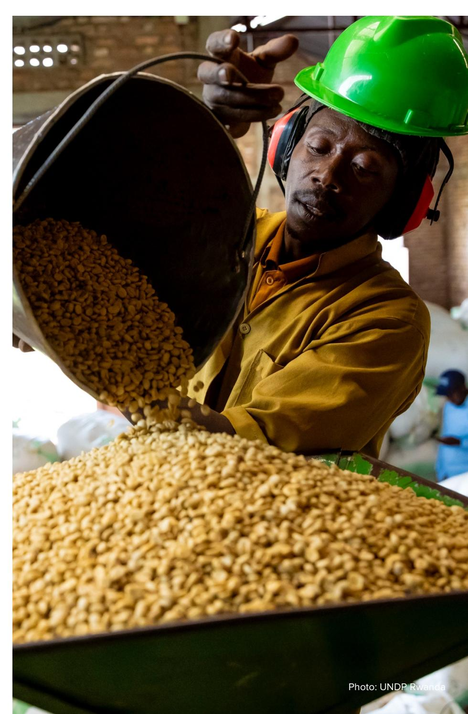

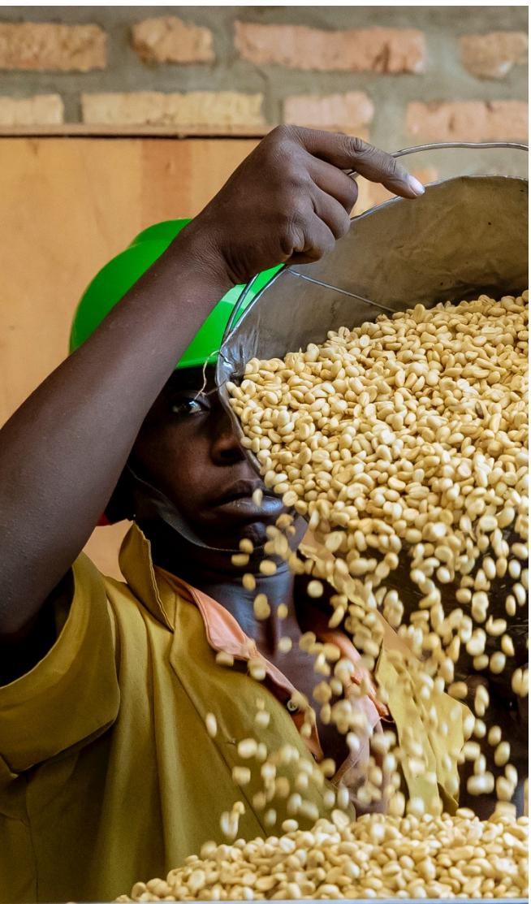

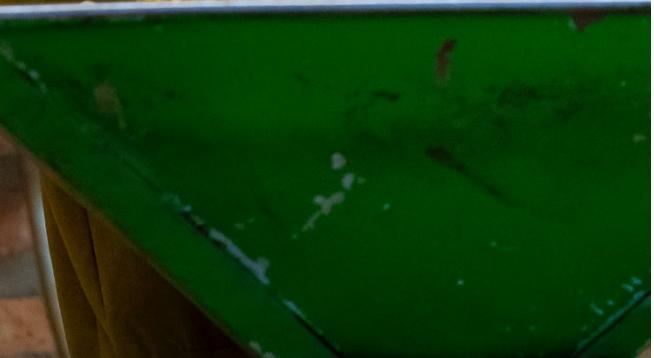

The following recommendations focus on systemic actions**.** They are intended to reduce compliance costs, prevent smallholder exclusion, and position Rwanda strategically.

#### **5.2.1 Strengthen the implementation of national regulatory and legal frameworks**

Rwanda has the opportunity to strengthen its legal and regulatory frameworks by formally mandating corporate due diligence obligations. This includes requiring coffee exporters, cooperatives, and large agribusinesses to assess, prevent, and report on environmental, social, and human rights risks within their coffee supply chains. Binding provisions on traceability, risk assessments, ESG reporting, and grievance mechanisms should be incorporated into environmental, forestry, land, labour, and human rights regulations. Strengthening enforcement mechanisms, harmonizing penalties, and aligning sanctions with international standards will be critical to ensure compliance and accountability.

#### **5.2.2 Build a central, interoperable national traceability backbone**

A national traceability backbone is essential. This does not require replacing existing systems but integrating them under a shared architecture aligned with EUDR requirements.

This backbone should:

- Support EUDR-required geolocation and legality verification
- Allow controlled data access for exporters and traders
- Avoid duplication of farm mapping by individual companies
- Comply fully with national data protection laws

#### **5.2.3 Establish or reinforce a national multi-stakeholder due diligence taskforce**

To ensure coordination and oversight, Rwanda should establish or strengthen a multi-stakeholder due diligence task force that integrates government ministries, private-sector actors, cooperatives, civil society, and development partners. This task force would serve as the institutional hub for aligning policies, harmonizing data collection standards, guiding enforcement, and supporting sector-wide compliance initiatives. Regular meetings, joint task teams, and public-private collaboration platforms will enhance dialogue, accountability, and collective problem-solving.

#### **5.2.4 Build specialized institutional capacity**

Public institutions require targeted capacity-building in ESG, legal compliance, and inclusive governance. This includes training staff in international regulatory frameworks, traceability systems, auditing, and risk assessment, as well as strengthening technical skills to support smallholders and cooperatives in complying with national due diligence regulations and international best practices. Dedicated budget lines within key ministries (e.g., MINAGRI, NAEB, REMA, RFA) and mobilization of donor or co-investment resources will ensure that these efforts are sustainable and impactful.

#### **5.2.5 Scale up smallholder and cooperative support**

To facilitate participation of smallholders and cooperatives, Rwanda should provide financial, technical, and digital literacy support. Blended finance solutions, including technical assistance facilities, risk-sharing funds, and digital finance mechanisms, can de-risk private investment in ESG compliance and traceability systems. Targeted support for farmer registration, plot mapping, record keeping, and certification will enhance sector-wide traceability, while technical training programs will empower smallholders to actively participate in responsible coffee supply chains.

#### **5.2.6 Operationalize ESG reporting and grievance mechanisms**

Mandatory ESG reporting and sector-specific grievance mechanisms are essential to ensure transparency, accountability, and the protection of human rights within the coffee supply chain. These systems should be integrated into cooperatives, exporter operations, and public monitoring frameworks, providing accessible channels for complaints, dispute resolution, and corrective action.

#### **5.2.7 Institutionalize monitoring, evaluation, and feedback systems**

Rwanda has the opportunity to establish centralized dashboards to track due diligence implementation, including traceability coverage, geolocation completeness, training progress, and compliance audits. These tools will enable continuous monitoring, data-driven decision-making, and feedback loops for both public institutions and private sector actors. Linking this system to EU reporting requirements will further streamline compliance and enforcement.

#### **5.2.8 Transition from donor dependency to national ownership**

To sustain long-term alignment with EU due diligence requirements, initiatives currently supported by donors should be fully integrated into national budgets, institutional mandates, and public-private partnerships. National ownership ensures continuity, strengthens traceability systems, improves land and resource governance, and enhances Rwanda's international reputation as a responsible sourcing origin. Investments in traceability and compliance systems will also increase producer resilience, attract sustainable investment, and reinforce the competitiveness of Rwandan coffee in global markets.

#### **5.2.9 Strategic collaboration with key partners**

Rwanda should continue leveraging partnerships with international buyers, certification bodies, development partners, and civil society. Collaborative efforts can support co-investment models, knowledge sharing, and national standardization of traceability, ESG practices, and compliance procedures. Multi-stakeholder platforms provide an opportunity to harmonize efforts, mobilize resources, and ensure inclusive participation of smallholders, cooperatives, and private sector actors across the coffee value chain. Through these comprehensive actions, Rwanda can establish a robust enabling environment that supports compliance with EUDR and CSDDD, strengthens the resilience and sustainability of its coffee sector, and enhances its position as a reliable and ethical supplier in global markets

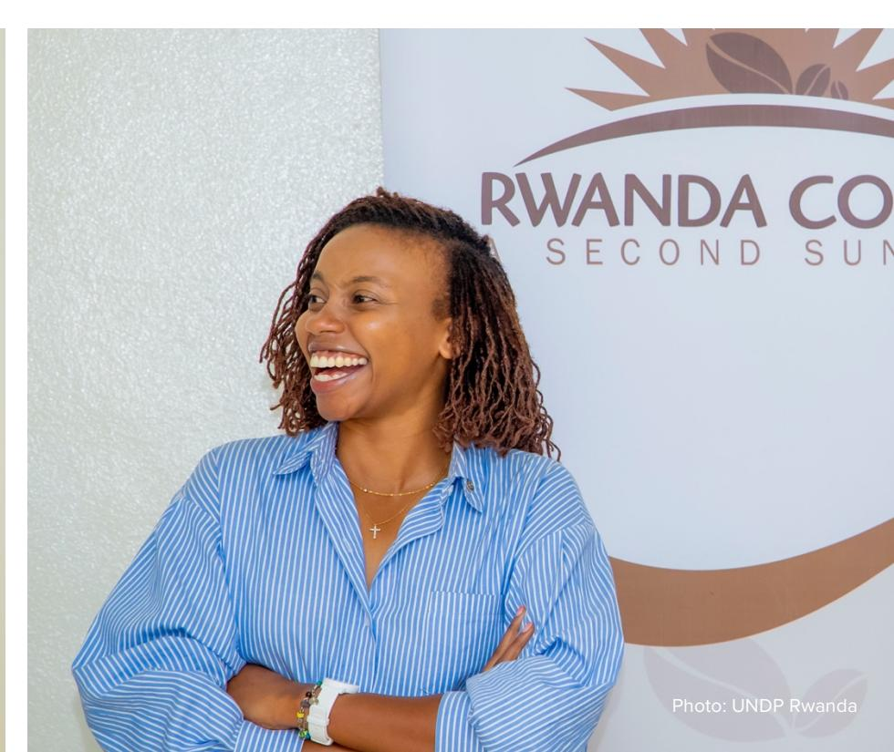

6. Roadmap of Policy and Technical Recommendations for

Aligning Rwanda's Coffee Sector with the EUDR and CSDDD

Rwanda's coffee sector has an opportunity to align with emerging EU due diligence and sustainability frameworks—such as the EUDR and CSDDD—to ensure sustainable, transparent, legally compliant, and deforestation-free coffee production and trade.

Creating a conducive legal and policy environment for EUDR and CSDDD corporate compliance, requires coordinated action across four key areas/principles underpinning EU due diligence regulations: **legality**, to create an enabling environment that supports adherence to regulatory standards; **traceability**, to guarantee full visibility and verification of coffee origins; **smallholder integration**, to ensure that small-scale farmers are empowered and included in value chains **and decent work, living wages, waste management and circular economy practices**, to uphold social and environmental responsibility.

Together, these areas form the foundation for a resilient, ethical, and market-accessible coffee value chain that meets both global sustainability expectations and local development priorities. Utilizing the findings from this assessment, the EU Due Diligence Multi-Stakeholder Working Group (EUDD WG)12 for the coffee sector selected the following priority topics for the roadmap and co-created a series of recommendations aimed at strengthening Rwanda's enabling environment, addressing existing gaps and challenges, and harnessing the opportunities created by these new due diligence requirements. The recommendations serve as the basis for both a sectoral discussion and a future implementation plan to strengthen Rwanda's coffee sector. The recommendations focus on the following areas:

#### **Legality**

The goal is to establish an enabling regulatory and institutional environment that supports all relevant supply chain actors in achieving compliance with EUDR, and CSDDD requirements. This includes harmonizing national frameworks, strengthening monitoring and reporting mechanisms, and enhancing stakeholder collaboration to ensure full legal conformity. By promoting transparent governance and responsible business conduct, the enabling regulatory and institutional environment will safeguard market access for coffee supply chain actors to the European markets.

#### **Traceability**

The goal is to establish and maintain a transparent, verifiable, and fully traceable coffee supply chain that complies with all relevant regulatory, ethical, and sustainability requirements under the EUDR and CSDDD. This includes implementing robust data collection and verification systems to ensure that every coffee batch can be traced from its origin at the farm level to the final consumer. Through digital traceability systems, land-use documentation, and traceability-enabled supplier risk assessment, the system will support due diligence, enable accountability, promote deforestation-free production, facilitate legality verification and legal sourcing, and strengthen trust among all stakeholders across the value chain.

#### **Smallholder integration**

Smallholders are not legally required to comply directly with EU due diligence legislation; however, they may be indirectly affected through requirements imposed on operators and traders placing products on the EU market. The goal is to design and implement a national support program that facilitates the participation of smallholder coffee farmers, who are not directly subject to the EUDR and CSDDD, in compliant systems through cooperative-led traceability structures, tailored capacity-building initiatives, and incentive-based mechanisms. This approach aims to enhance farmer participation in sustainable supply chains, and improve livelihoods while ensuring that smallholders are recognized as key contributors to responsible, deforestation-free, and legally compliant coffee production.

12 The EUDD WG was convened by NAEB and facilitated by UNDP through the FIT for FAIR initiative with the funding and technical support from the Deutsche Gesellschaft für Internationale Zusammenarbeit (GIZ) and the Sustainable Agricultural Supply Chains Initiative (SASI).

#### **Decent work and living wages & waste management (CSDDD)**

The goal is to support effective due diligence implementation through guidance, training, and capacity building to identify, prevent, and mitigate environmental and labour-related risks, including those related to waste management, resource use, and working conditions. These initiatives will promote decent working conditions, fair and living wages, and the integration of circular-economy principles across the coffee sector. By fostering responsible resource use, waste reduction, and equitable labour practices, the program supports compliance with the CSDDD and contributes to sustainable value creation throughout the supply chain.

Table 10: Roadmap for regulatory alignment with EUDR and CSDDD in Rwanda's coffee sector

|      | Recommendation | Action step |                                   | Proposed      |
|------|----------------|-------------|-----------------------------------|---------------|
| 1.   | Legality       |             |                                   |               |
| 1.1. | Establishment  |             |                                   |               |
|      | of a public   |             |                                   |               |
|      |                | 1.1.1.      | Establish a secretariat and       |               |
|      |                |             | multistakeholder platform –       |               |
|      |                |             |                                   | 3 months NAEB |
|      |                | 1.1.2.      | Convene regular                   |               |
|      |                |             | and workshops – facilitate        |               |
|      |                | 1.1.3.      | Facilitate joint capacity        |               |
|      |                |             | initiatives in collaboration with |               |
|      |                |             | stakeholders – organize           |               |
|      |                | 1.1.4.      | Engage development partners       |               |
|      |                |             | resource mobilization – secure    |               |
|      |                | 1.1.5.      | Publish an annual national        |               |
|      |                |             | compliance progress report –      |               |
| 1.2. | Conduct        |             |                                   |               |
|      |                | 1.2.1.      | Map all stakeholders and          |               |
|      |                |             | engagement strategy –             |               |
|      |                |             |                                   | 6 months NAEB |

| Recommendation Action step           | Proposed            |
|--------------------------------------|---------------------|
| 1.2.2. Design an awareness and       |                     |
| communication strategy               | –                   |
| particularly for                     | supply chain        |
| actors (such as,                     | farmers,            |
|                                      | 6 months NAEB       |
| 1.2.3. Implement awareness           |                     |
| platforms                            | – use citizens’     |
|                                      | Year 2 –            |
| 1.3. Strengthen the                  |                     |
| 1.3.1. Develop clear national        |                     |
| frameworks to provide                | clear,              |
| and CSDDD –                          | define roles,       |
| 1.3.2. Develop an action plan for    |                     |
| and CSDDD requirements               | –                   |
| 1.3.3. Roll out and monitor national |                     |
| level                                | – conduct training, |
| 1.4. Strengthen                      |                     |
| 1.4.1. Establish national and local  |                     |
| reference                            | – define structure, |

| Recommendation Action step | Proposed                          |
|----------------------------|-----------------------------------|
| 1.4.2.                     | Build technical capacity and      |
|                            | – provide training, operational   |
| 1.4.3.                     | Conduct regular monitoring,       |
|                            | progress – publish quarterly      |
| 2. Traceability            |                                   |
| 2.1. Support long         |                                   |
| 2.1.1.                     | Develop comprehensive             |
|                            | system - form a multi            |
|                            | Policy: 6                         |
| 2.1.2.                     | Design a long-term data           |
|                            | system (user friendly tool such   |
|                            | traceability system - establish a |
| 2.1.3.                     | Adopt a decentralized,            |
| 2.1.4.                     | Develop a budget for              |
|                            | 6 months NAEB                     |

|     | Recommendation          | Action step |                                 | Proposed   |                     |
|-----|-------------------------|-------------|---------------------------------|------------|---------------------|
|     |                         | 2.2.1.      | Develop a detailed action plan  |            |                     |
|     |                         |             | traceability system define      |            |                     |
|     |                         |             |                                 | 6 months   | NAEB                |
|     |                         | 2.2.2.      | Mobilize funding from donors,   |            |                     |
|     |                         |             | government budgets develop      |            |                     |
|     |                         |             |                                 | Continuous | NAEB, UNDP, GIZ, EU |
|     |                         | 2.2.3.      | Develop a long-term financing   |            |                     |
|     |                         |             | service fees define             |            |                     |
|     |                         |             |                                 | 24 months  | NAEB                |
| 3.  | Smallholder integration |             |                                 |            |                     |
| 3.1 | Reform and              |             |                                 |            |                     |
|     |                         | 3.1.1.      | Develop/Integrate content on    |            |                     |
|     |                         |             | Promoters, etc.) – update       |            |                     |
|     |                         |             |                                 | 6 months   | RAB/ MINAGRI        |
|     |                         | 3.1.2.      | Build the capacity of extension |            |                     |
|     |                         |             |                                 | 12 months  | MINAGRI             |
|     |                         | 3.1.3.      | Support implementation of       |            |                     |
|     |                         |             |                                 | 36 months  | NAEB                |

| Recommendation Action step |                               | Proposed  |                       |
|----------------------------|-------------------------------|-----------|-----------------------|
| 3.1.4.                     | Put in place an extension     |           |                       |
|                            |                               | 12 months | MINAGRI, NAEB, RCCF,  |
| 3.2.1                      | Support farmers to improve    |           |                       |
|                            | inputs, and sales – provide   |           |                       |
|                            |                               | 12 months | NAEB, CEPAR and RCCF  |
| 3.2.2                      | Partner with financial        |           |                       |
|                            | – develop accessible and low |           |                       |
|                            |                               | 12 months | RCCF                  |
| 3.2.3                      | Pilot and scale up            |           |                       |
|                            |                               | 12 months | RCCF, CEPAR, NAEB and |
| 3.2.4                      | Offer incentives such as      |           |                       |
|                            |                               | 36 months | NAEB, CEPAR, RCCF,    |
| 3.2.5                      | Provide tailored training on  |           |                       |
|                            |                               | 36 months | NAEB, CEPAR, RCCF and |
| 3.2.6                      | Design and launch a blended   |           |                       |
|                            |                               | 12 months | RCCF, CEPAR, NAEB and |
| 3.3 Establish a            |                               |           |                       |
| 3.3.1.                     | Build farm-level traceability |           |                       |
|                            | partnerships – develop        |           |                       |
|                            |                               | 36 months | NAEB, CEPAR, RCCF and |

| Recommendation | Action step Proposed                                                                |
|----------------|-------------------------------------------------------------------------------------|
| 4              | Decent work and living wages, living income, circular economy, and waste management |
| 4.1 Facilitate |                                                                                     |
| 4.1.1          | Assess the current labour                                                           |
|                | assessment – Macro & Micro                                                          |
|                | 6 months NAEB, MINAGRI,                                                             |
| 4.1.2          | Develop dedicated                                                                   |
|                | 12 months NAEB, CEPAR,                                                              |
| 4.1.3          | Partner with financial                                                              |
|                | products – collaborate with                                                         |
|                | 5 months NAEB, CEPAR,                                                               |
| 4.1.4          | Pilot sustainability-linked                                                         |
|                | financial literacy campaigns –                                                      |
|                | 12 months NAEB, CEPAR, FINANCIAL                                                    |
| 4.2 Awareness  |                                                                                     |
| 4.2.1.         | Disseminate information                                                             |
|                | 12 months NAEB, CEPAR, MINAGRI,                                                     |
| 4.2.2          | Conduct and organize                                                                |
|                | 12 months NAEB, Development                                                         |

| Recommendation Action step             | Proposed |                       |
|----------------------------------------|----------|-----------------------|
| 4.2.3 Develop training materials on    |          |                       |
| 3                                      | months   | NAEB, MINAGRI, CEPAR, |
| 4.3.1. Conduct a living income and     |          |                       |
| 12                                     | months   | NAEB, MIFOTRA,        |
| 4.3.2. Perform a living income/ living |          |                       |
| 12                                     | months   | NAEB, MIFOTRA,        |
| 4.3.3. Engage key value-chain actors   |          |                       |
| 12                                     | months   | NAEB, MIFOTRA,        |
| 4.3.4. Establish a robust monitoring   |          |                       |
| 12                                     | months   | NAEB, MIFOTRA,        |
| 4.3.5. Institutionalize continuous     |          |                       |
| 12                                     | months   | NAEB, MIFOTRA,        |

#### **ANNEX 1: Methodological approach**

The assessment of Rwanda's enabling environment for due diligence compliance in the coffee sector applied a mixed-methods, multi-layered, and participatory approach. The methodology was designed to evaluate how existing policies, legal frameworks, institutions, and ongoing initiatives support corporate compliance with EUDR and CSDDD requirements. It combined desk-based research, stakeholder consultations, key informant interviews, field visits, and structured engagement through the European Due Diligence Multi-Stakeholder Working Group (EUDD WG) for the coffee sector to ensure a comprehensive and evidence-based analysis.

#### **Analytical framework**

The analysis was guided by a structured analytical framework designed to ensure a systematic and objective assessment of Rwanda's readiness for EUDR and CSDDD compliance. The framework covers five core dimensions:

- 1. **Policy and legal frameworks**, examining national laws, policies, and regulations related to environmental protection, forest management, land use, human and labour rights, and corporate responsibility.
- 2. **Institutional frameworks**, assessing the mandates, coordination mechanisms, and capacities of public institutions responsible for implementation, enforcement, and oversight.
- 3. **Alignment efforts**, reviewing existing public and private initiatives that support traceability, transparency, smallholder inclusion, and due diligence capacity-building.
- 4. **Stakeholder engagement and inclusiveness**, evaluating the participation of public and private actors, cooperatives, civil society organisations, women, and youth.
- 5. **Gaps, challenges, and opportunities**, identifying systemic constraints, good practices, and practical entry points for strengthening compliance readiness.

Figure 1: Analytical framework

#### **Data collection process**

#### **Desk review and document analysis**

A desk-based review analysed policy, legal, and institutional frameworks for due diligence, covering national laws and regulations on environmental protection, land tenure, labour rights, anti-corruption, trade, tax compliance, transparency, and supply chain sustainability. The review also evaluated institutional alignment and enforcement with EU due diligence standards, using official documents, EU texts, company compliance records, and reports from NGOs and development partners.

#### **Stakeholder consultations and field visits**

Stakeholder consultations took place in July and August 2025, including visits to coffee farms and coffee washing stations. These consultations evaluated the sector's readiness for EUDR and CSDDD compliance, identified challenges, and pointed out policy and institutional gaps. Participants represented public institutions, private companies, civil society, and development partners. Annex 2 lists those consulted and their roles. The process ensured balanced input and practical perspectives.

#### **Key Informant Interviews (KIIs)**

Key Informant Interviews with public, private, and development stakeholders provided insights into Rwanda's legal and institutional preparedness. The discussions covered enforcement, compliance monitoring, resource constraints, and ongoing efforts like traceability systems, legal reforms, and capacitybuilding for EUDR and CSDDD alignment.

#### **European Due Diligence Working Group (EUDD WG) sessions**

Five EUDD Working Group workshops under the FIT for FAIR initiative brought together various public and private coffee sector stakeholders to discuss compliance challenges, best practices, and capacity needs regarding the EUDR and CSDDD. Insights from these discussions were used to assess Rwanda's progress against EU standards and set policy priorities.

#### **Ethical considerations**

All interviews and consultations were voluntary, with respondents informed of the study's purpose. Confidentiality and data protection were maintained as requested.

#### **ANNEX 2: List of references**

- 1. Bundestag/Germany Federal Parliament (2021). Act on Corporate Due Diligence Obligations for the Prevention of Human Rights Violations in Supply Chains, available at: [Act on Corporate Due Diligence](https://www.bmas.de/SharedDocs/Downloads/DE/Internationales/act-corporate-due-diligence-obligations-supply-chains.pdf?__blob=publicationFile&v=3)  [Obligations in Supply Chains Germany](https://www.bmas.de/SharedDocs/Downloads/DE/Internationales/act-corporate-due-diligence-obligations-supply-chains.pdf?__blob=publicationFile&v=3)
- 2. European Commission (2024). Directive (EU) 2024/1760 of the European Parliament and of the Council on Corporate Sustainability Due Diligence and amending Directive (EU) 2019/1937 and Regulation (EU) 2023/2859, available at: [Directive \(EU\) 2024/1760 of the European Parliament and of](https://eur-lex.europa.eu/legal-content/EN/TXT/PDF/?uri=OJ:L_202401760)  [the Council of 13 June 2024 on corporate sustainability due diligence and amending Directive \(EU\)](https://eur-lex.europa.eu/legal-content/EN/TXT/PDF/?uri=OJ:L_202401760)  [2019/1937 and Regulation \(EU\) 2023/2859Text with EEA relevance.](https://eur-lex.europa.eu/legal-content/EN/TXT/PDF/?uri=OJ:L_202401760)
- 3. European Commission (2023). Regulation (EU) 2023/1115 of the European Parliament and of the Council of 31 May 2023 on the making available on the Union market and the export from the Union of certain commodities and products associated with deforestation and forest degradation and repealing Regulation (EU) No 995/2010, available at: [Regulation \(EU\) 2023/ of the European Parliament and of](https://eur-lex.europa.eu/legal-content/EN/TXT/PDF/?uri=CELEX:32023R1115)  [the Council of 31 May 2023 on the making available on the Union market and the export from the](https://eur-lex.europa.eu/legal-content/EN/TXT/PDF/?uri=CELEX:32023R1115)  [Union of certain commodities and products associated with deforestation and forest degradation and](https://eur-lex.europa.eu/legal-content/EN/TXT/PDF/?uri=CELEX:32023R1115)  [repealing Regulation \(EU\) No 995/2010](https://eur-lex.europa.eu/legal-content/EN/TXT/PDF/?uri=CELEX:32023R1115)
- 4. MIFOTRA (2023). Law N° 027/2023 of 18/05/2023 amending the law n° 66/2018 of 30/08/2018 regulating labour in Rwanda. Published in Official Gazette n° Special of 30/05/2023. Kigali, Rwanda
- 5. MIGEPROF (2018). Law N°71/2018 of 31/08/2018 relating to the protection of the child. Published in Official Gazette no.37 bis of 10/09/2018. Kigali, Rwanda
- 6. MINAGRI (2024). Strategic Plan for Agriculture Transformation (PSTA5)-Building Resilient and Sustainable Agri-Food Systems. Kigali, Rwanda
- 7. MINAGRI (2020). Rwanda Irrigation Master Plan. Kigali, Rwanda
- 8. MNECOFIN (2023). Law N° 020/2023 of 31/03/2023 on Tax Procedures. Published in Official Gazette n° Special ter of 31/03/2023. Kigali, Rwanda
- 9. MINICOM (2023). Rwanda's Competition and Consumer Protection Policy. Kigali, Rwanda
- 10. MINICOM (2023). Revised National Export Strategy. Kigali, Rwanda
- 11. MININFRA (2025). Revised National Urbanization Policy. Kigali, Rwanda
- 12. MoE (2018). Law N°48/2018 of 13/08/2018 on Environment. Published in Official Gazette no Special of 21/09/2018. Kigali, Rwanda
- 13. MoE (2023). Law No 001/2023 of 13/01/2023 governing national parks and nature reserves, published in Official Gazette n° Special of 14/02/2023
- 14. MoE (2020): Rwanda's Updated Nationally Determined Contributions (NDC) under the Paris Agreement. Kigali, Rwanda.
- 15. MoE (2022). Revised Green Growth and Climate Resilience Strategy / National Strategy for Climate Change and Low Carbon Development. Kigali, Rwanda.
- 16. MoE (2019). National Environment and Climate Change Policy. Kigali, Rwanda
- 17. MoE (2024). Climate, Environment and Natural Resources (CENR's) Sector Strategic Plan 2024-20. Kigali, Rwanda
- 18. MoE (2023). National Circular Economy Action Plan and Roadmap. Kigali, Rwanda
- 19. MoE (2006). General Guidelines and Procedure for Environmental Impact Assessment (EIA). Kigali, Rwanda
- 20. MoE (2024). Law No. 046/2024 of 04/06/2024 governing forests and trees. Published in Official Gazette n° Special Bis of 07/06/2024. Kigali, Rwanda
- 21. MoE (2018). Updated Rwanda National Forestry Policy and the Forest Sector Strategic Plan (2018- 2024). Kigali, Rwanda
- 22. MoE (2018). Rwanda's National Agroforestry Strategy. Kigali, Rwanda
- 23. MoE (2013). Law N° 70/2013 of 02/09/2013 governing biodiversity in Rwanda. Published in Official Gazette n° 38 of 23/09/2013. Kigali, Rwanda
- 24. MoE (2011). Rwanda's Biodiversity Policy. Kigali, Rwanda
- 25. MoE (2005-2015). Rwanda's Protected Areas Management Plans (PAMs). Kigali, Rwanda
- 26. MoE (2024). Rwanda's Agroforestry and Tree Planting Practices Guidelines. Kigali, Rwanda
- 27. MoE (2019). Revised National Land Policy. Kigali, Rwanda

- 28. MoE (2021). Law N° 27/2021 of 10/06/2021 governing land. Published in Official Gazette n° Special of 10/06/2021. Kigali, Rwanda
- 29. MoE (2020). National Land Use and Development Master Plan (NLUDMP 2020-2050). Kigali, Rwanda
- 30. MoE (2008). Rwanda's Land Tenure Regularization (LTR) Program. Kigali, Rwanda
- 31. MoE (2015). Law N° 32/2015 of 11/06/2015, relating to Expropriation in the Public Interest. Published in Official Gazette n° Special of 20/12/2023. Kigali, Rwanda
- 32. NAEB (2024). Annual Agricultural Export Performance Report (FY 2023-2024). Kigali, Rwanda
- 33. NCHR (2017). National Human Rights Action Plan of Rwanda (2017-2020). Kigali, Rwanda
- 34. Office of the Ombudsman (2012). Rwanda Anti-Corruption Policy. Kigali, Rwanda
- 35. Republic of Rwanda (2015). The Constitution of the Republic of Rwanda of 2003 revised in 2015. Published in Official Gazette n° Special of 24/12/2015. Kigali, Rwanda
- 36. RRA (2019). The Rwanda Revenue Authority (RRA) Tax Compliance Certification. Kigali, Rwanda

#### **ANNEX 3: Institutional roles and responsibilities in supporting corporate compliance with EUDR and CSDDD**

| Institution | Category Role in supporting EUDR, and CSDDD compliance |
|-------------|--------------------------------------------------------|
| MINAGRI     | Public institution                                     |
| NAEB        | Public institution                                     |
| MoE         | Public institution                                     |
| REMA        | Public institution                                     |
| RFA         | Public institution                                     |
| RWB         | Public institution                                     |
| RSB         | Public institution                                     |
| RICA        | Public institution                                     |
| RDB         | Public institution                                     |
| MINALOC     | Public institution                                     |
| Districts   | Public institution                                     |
| Ombudsman   | Public institution                                     |
| RIB         | Public institution                                     |
| RRA         | Public institution                                     |
| MINECOFIN   | Public institution                                     |

|                                            |                                                                                      | Enforces labour rights, occupational health, and wage                                                                                                                                                                                                                                                                                                 |
|--------------------------------------------|--------------------------------------------------------------------------------------|-------------------------------------------------------------------------------------------------------------------------------------------------------------------------------------------------------------------------------------------------------------------------------------------------------------------------------------------------------|
| MIFOTRA                                    | Public institution                                                                   | compliance in the coffee sector; ensures decent working conditions (CSDDD).                                                                                                                                                                                                                                                                           |
| MIGEPROF                                   | Public institution                                                                   | ensures ethical and inclusive practices in supply chains (CSDDD).                                                                                                                                                                                                                                                                                     |
| NCC                                        | Public institution                                                                   | Monitors child labour and exploitation; ensures child                                                                                                                                                                                                                                                                                                 |
| NCHR                                       | Public institution                                                                   | compliance with human rights due diligence obligations (CSDDD).                                                                                                                                                                                                                                                                                       |
| NCDA Private producers & exporters CEPAR & | Public institution Private sector actor                                              | Develops child protection frameworks; monitors compliance Implement traceability systems, deforestation-free sourcing reporting (CSDDD).                                                                                                                                                                                                              |
| cooperatives Development partners NGOs     | Private sector actor Civil society/technical partner Civil society/technical partner | promote ethical sourcing, certification, and labour rights (EUDR, CSDDD). Provide technical and financial support; help develop traceability tools, ESG training, and compliance frameworks (EUDR, CSDDD). Conduct independent monitoring; build local capacity on sustainability and rights; advocate for compliance and transparency (EUDR, CSDDD). |

## **ANNEX 4: Aligning of national laws and policies with EUDR and CSDDD**

#### Table 2: Rwandan environmental laws and their relevance to EUDR and CSDDD

| Year          | Focus Key elements/ |
|---------------|---------------------|
|               | EUDR CSDDD          |
| 2018          | Environment         |
|               | protection; climate |
|               | resilience; aligned |
| 2023          | Management          |
| 2020          | Climate             |
| Revised green |                     |
| 2022          | Low-carbon,         |
|               | energy; land use;   |
| 2019          | Vision for          |
| 2023          | Sustainable         |
|               | recycling; eco     |
| 2006          | Environment         |

|                           |  |          |              |  |
|----------------------------------------|---------------|-----------------------|---------------------------|---------------|
| <b>environmental impact assessment</b> |  | screening of projects | stakeholder participation |  |

#### **Table 3: Rwandan forest, biodiversity and land-use laws and their relevance to EUDR and CSDDD**

| Law/policy/plan | Year | Focus      | Key elements/   |                  |      |       |
|-----------------|------|------------|-----------------|------------------|------|-------|
|                 |      |            |                 |                  | EUDR | CSDDD |
|                 | 2024 | Forest     |                 |                  |      |       |
|                 |      |            | transport; use; |                  |      |       |
|                 |      |            |                 | chains; EU       |      |       |
|                 | 2011 | Promoting  |                 |                  |      |       |
|                 |      | areas; and |                 |                  |      |       |
|                 |      |            |                 | legality; forest |      |       |
|                 |      |            |                 | protection; and  |      |       |

|      | restoration and rehabilitation                                                                                                                                                                                                                                                                                                    | preventive measures                                                                  |
|------|-----------------------------------------------------------------------------------------------------------------------------------------------------------------------------------------------------------------------------------------------------------------------------------------------------------------------------------|--------------------------------------------------------------------------------------|
| 2013 | Conservation of                                                                                                                                                                                                                                                                                                                   |                                                                                      |
|      | Legal/strategic biological frameworks; diversity; lawful/sustainable genetic use; community resource participation; regulation ecosystem protection; fair benefit-sharing Biodiversity Zoning; and enforcement; conservation community policy engagement; implementation sustainable livelihoods; natural capital accounting; PES | EU; German due diligence regulations EUDR environmental data reporting; transparency |
| 2024 | Integration of Improve soil trees in fertility; carbon agriculture sequestration; food security; community tree planting (Umuganda); increase forest cover; reduce deforestation                                                                                                                                                 | EUDR sustainable sourcing; ecosystem protection                                      |
| 2020 | Efficient water Reduce land use for degradation; agriculture reduce deforestation pressures; integrate sustainable irrigation in land management                                                                                                                                                                                  | EUDR requirements                                                                    |

**Table 4: Rwandan land-use and land-rights laws and their relevance to EUDR and CSDDD**

| Year | Focus     | Key |            |            |      |       |
|------|-----------|-----|------------|------------|------|-------|
|      |           |     | Safeguards | Alignment/ |      |       |
|      |           |     |            |            | EUDR | CSDDD |
| 2019 | Efficient |     |            |            |      |       |
| 2021 | Secures   |     |            |            |      |       |

|                                                      |             |                               |                                                                    | dispossession                                                              | social conflicts                                                        |   |   |
|------------------------------------------------------|-------------|-------------------------------|--------------------------------------------------------------------|----------------------------------------------------------------------------|-------------------------------------------------------------------------|---|---|
| <b>national land use and development master plan</b> | 2020 – 2050 | Sustainable spatial planning  | Environment al conservation; climate resilience; balanced land use | Social and environment al safeguards; stakeholder engagement; transparency | Consistent with EU due diligence requirements                           | ● | ● |
| <b>Land Tenure Regularization (LTR) Program</b>      | 2008        | Formalise land ownership      | Security of tenure; transparency; equity; human rights protection  | Transition from customary to statutory systems                             | Aligns with CSDDD, fair and responsible business practices              | ● | ● |
| <b>Revised national urbanization policy</b>          | 2025        | Sustainable urban development | Densification; efficient land use; environment al protection       | Social inclusion; climate resilience; proactive risk management            | Reinforces EU due diligence on social and environment al responsibility | ● | ● |

**Table 5: Rwandan labour, human rights and privacy laws and their alignment to EUDR and CSDDD**

| Law/plan Year Focus Key elements/ |                  |
|-----------------------------------|------------------|
|                                   | EUDR CSDDD       |
| Labour Law 2023 Fair, safe, and   |                  |
| contracts;                        | regulates        |
| leave;                            | prohibits        |
|                                   | CSDDD; human     |
|                                   | protection; risk |
| 2015 Safeguarding                 |                  |
| acquisition;                      | fair             |
| valuation;                        | dispute          |
| equality; and                     |                  |

|      | operationalisati on                                                                                                                                                                                                              |
|------|----------------------------------------------------------------------------------------------------------------------------------------------------------------------------------------------------------------------------------|
| 2018 | Children’s Prohibits abuse, UN Convention welfare and exploitation, child on the Rights of protection labour; ensures the Child;                                                                                                 |
|      | EUDR; CSDDD, access to education, protection of healthcare, justice vulnerable groups in value chains                                                                                                                            |
| 2013 | Public sector Establishes public EU Article 15 of transparency access to the TFEU and government article 42 of the information; Charter of relevant when Fundamental balancing rights. transparency and personal-data protection |

**Table 6: Rwandan anti-corruption, trade and tax laws and their relevance to EUDR and CSDDD**

| Policy/strategy | Year | Focus             | Key elements/ |      |       |
|-----------------|------|-------------------|---------------|------|-------|
|                 |      |                   |               | EUDR | CSDDD |
|                 | 2012 | Prevent, detect,  |               |      |       |
|                 | 2023 | Tax compliance;   |               |      |       |
|                 | 2019 | Tax obligations   |               |      |       |
|                 | 2023 | Fair competition; |               |      |       |

| <b>Coffee sector development strategy</b> | 2024–2029 | Traceability; climate-smart practices              | Deforestation monitoring; digital farm mapping         | EUDR, partial CSDDD                                  | ● | ● |
|-------------------------------------------|-----------|----------------------------------------------------|--------------------------------------------------------|------------------------------------------------------|---|---|
| <b>NST2</b>                               | 2024–2029 | Inclusive economic growth; sustainable agriculture | Value chain development; digitalisation                | Corporate due diligence (social, labour, governance) | ● | ● |
| <b>Revised national export strategy</b>   | 2022      | Trade competitiveness; sustainability              | Ethical practices; traceability in export value chains | CSDDD standards                                      | ● | ● |

#### **ANNEX 5: List of members of the EU Due Diligence Multi-Stakeholder Working Group (EUDD WG) for the coffee sector**

| SN | Category                | Company name           | Contact person            | Role   |
|----|-------------------------|------------------------|---------------------------|--------|
| 1  | Development partners    | GIZ                    | Randi Wagener             | Member |
| 2  | Fertilizers distributor | ONE ACRE FUND/Tubura   | Joel Arusha               | Member |
| 3  | Public                  | RAB Research -RAB      |                           |        |
|    |                         | Rubona Station         | Simon Martin MVUYEKURE    | Member |
| 4  | NGO                     | ARCOS                  | Bernard NDAYISHIMIYE      | Member |
| 5  | Development partners    | EU delegation          | Odette Mutangiza          | Member |
| 6  | Exporter                | BAHO COFFEE            |                           |        |
|    |                         | COMPANY LTD            | Christine Vuguziga        | Member |
| 7  | Public                  | NAEB                   | Alexis NKURUNZIZA         | Member |
| 8  | Public                  | MINAGRI                | Alice MUKAMUGEMA          | Member |
| 9  | Public                  | RFA (Rwanda Forestry   |                           |        |
|    |                         | Authority)             | Gasangwa Ivan             | Member |
| 10 | Exporter                |                        |                           |        |
|    |                         |                        | Sylver GANISHURI          | Member |
| 11 | Consultant (EUDR)       | MARKUPII               | Eric Rukwaya              | Member |
| 12 | Development partners    | ITC                    | Aurore Umubyeyi           | Member |
| 13 | Processing and export   | Muraho trading company | Julia Anbalagan           | Member |
| 14 | Producer, processor     |                        |                           |        |
|    | and exporter            | KIVUBELT COFFEE Ltd    | Claudine Kalila Kantengwa | Member |
| 15 | Certification system    | FAIRTRADE              | Michel Ruzindana          | Member |
| 16 | NGO                     | Sustainable Growers    | Aurore Kamikazi           | Member |
| 17 | Producer                | Abahuzamugambi ba      |                           |        |
|    |                         | Kawa – Maraba          | Biziyaremye Theophile     | Member |
| 18 | Producer                |                        |                           |        |
|    |                         |                        | Fulgence SEBAZUNGU        | Member |
| 19 | Producer                | DUKUNDEKAWA-Musasa     |                           |        |
|    |                         | Coop                   | Ernest Nshimiyimana       | Member |
| 20 | Producer                | Farmer- SG -           | TUK                       |        |
|    |                         | cooperative            | Agnes Nyinawumuntu        | Member |
| 21 | Development partners    | Starbucks FSC          | Aphrodis Ngendabanga      | Member |
| 22 | Exporter                | SUCAFINA/RWACOF        |                           |        |
|    |                         | Export                 | Celine NIWEMUGENI         | Member |
| 23 | Exporter                | CEPAR                  | Joseph Munyaneza          | Member |
| 24 | Traceability digital    | BK techhouse &         |                           |        |
|    |                         | INATrace               | Anne Laurette             | Member |
| 25 | Financial instutition   | ROOT CAPITAL           | Innocent Murwanashyaka    | Member |
| 26 | Public                  | NAEB                   | Faustin Kabashaa          | Member |

| 27 | Development partners | GIZ  | Nadine Umwali       | Member      |
|----|----------------------|------|---------------------|-------------|
| 28 | Consultant           | UNDP | Joseph Seba Mutware | National    |
| 29 | Consultant           | UNDP | Modeste Munezero    | WG          |
| 30 | Consultant           | UNDP | Mary Maina          | Facilitator |

United Nations Development Programme One UN Plaza New York, NY 10017, USA Copyright © UNDP 2026. All rights reserved.

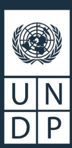

UNDP is the leading United Nations organization fighting to end the injustice of poverty, inequality, and climate change. Working with our broad network of experts and partners in 170 countries and territories, we help nations to build integrated, lasting solutions for people and planet.