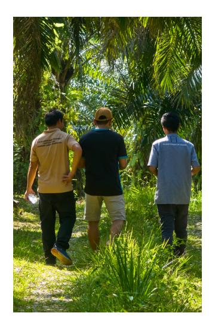

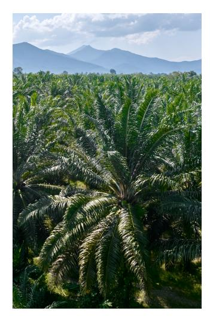

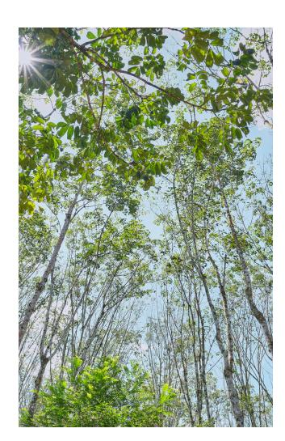

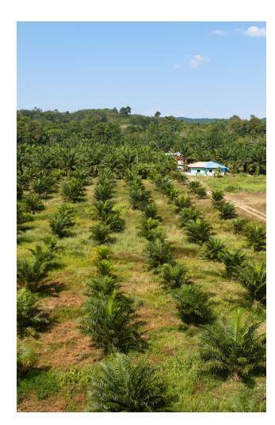

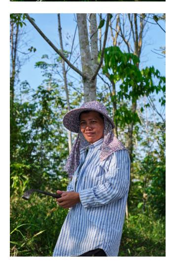

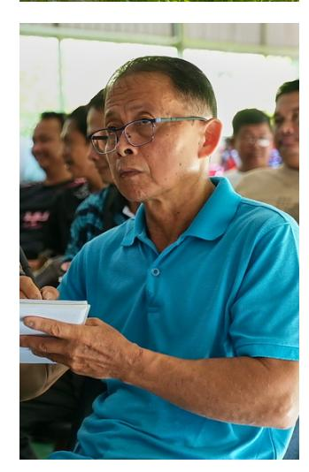

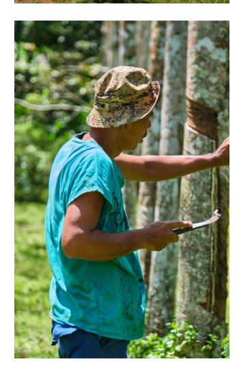

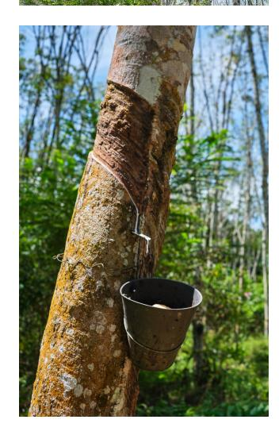

# **Analysis of Relevant National Legislation in the context of the EUDR for Commodities in Malaysia**

**(focus on rubber and timber sectors)**

Analysis of Relevant National Legislation in the context of the EUDR for Commodities in Malaysia (focus on rubber and timber sectors)

**Special thanks go to the Ministry of Plantations and Commodities and its agencies for the very constructive collaboration and information shared for this study.**

*Disclaimer: This publication was co-funded by the European Union and BMZ. The content of this publication is the sole responsibility of the authors and does not necessarily reflect the views of the EU, the BMZ or GIZ GmbH. The information in this study, or upon which this study is based, has been obtained from sources the authors believe to be reliable and accurate. While reasonable efforts have been made to ensure that the contents of this publication are factually correct, GIZ GmbH does not accept responsibility for the accuracy or completeness of the contents of this publication. The mention of specific companies or products of manufacturers, whether or not these have been patented, does not imply that these have been endorsed or recommended by GIZ GmbH in preference to others of a similar nature that are not mentioned. The views expressed in this information product are those of the author(s) and do not necessarily reflect the views or policies of GIZ GmbH.*

*The "EUDR Engagement" project in Southeast Asia is co-funded by the European Union (EU) and the Federal Republic of Germany. Deutsche Gesellschaft für Internationale Zusammenarbeit GmbH (GIZ) has been commissioned to implement it as part of the BMZ funded global program "Sustainability and Value Added in Agricultural Supply Chains", which is part of the special initiative "Transformation of Agricultural and Food Systems" by the German Federal Ministry for Economic Cooperation and Development (BMZ).*

| Introduction                                                                    | <b>10</b> |
|---------------------------------------------------------------------------------|-----------|
| <i>Relevant Legislation in Malaysia to Meet the Requirements Under the EUDR</i> | <b>15</b> |
| <i>Legal Gaps and Challenges</i>                                                | <b>55</b> |
| <i>Suggestions and Recommendations</i>                                          | <b>68</b> |
| <i>Conclusion</i>                                                               | <b>73</b> |

# **Table of Contents**

### **INTRODUCTION**

- 1. BACKGROUND AND SCOPE OF ANALYSIS
- 2. RESEARCH OBJECTIVES
- 3. METHODOLOGY
- 4. RELEVANT STAKEHOLDERS 10 11 12 12

| 1. BACKGROUND AND SCOPE OF ANALYSIS | 10 |
|-------------------------------------|----|
| 2. RESEARCH OBJECTIVES              | 11 |
| 3. METHODOLOGY                      | 12 |
| 4. RELEVANT STAKEHOLDERS            | 12 |

### **RELEVANT LEGISLATION IN MALAYSIA TO MEET THE REQUIREMENTS UNDER THE EUDR**

| 1. LAND-USE RIGHTS                                                           | 15 |
|------------------------------------------------------------------------------|----|
| 2. ENVIRONMENTAL PROTECTION                                                  | 20 |
| 3. THIRD PARTY RIGHTS AND THE PRINCIPLE OF FREE, PRIOR, AND INFORMED CONSENT | 21 |
| 4. LABOUR RIGHTS                                                             | 21 |
| 5. HUMAN RIGHTS                                                              | 27 |
| 6. ANTI - CORRUPTION                                                         | 28 |
| 7. FORESTRY RELATED REGULATIONS                                              | 30 |
| A. Peninsular Malaysia                                                       | 30 |
| (i) Timber Harvesting                                                        | 30 |
| (ii) Timber Processing                                                       | 32 |
| (iii) Export of timber and timber products                                   | 33 |
| B. Sabah                                                                     | 35 |
| (i) Timber Harvesting                                                        | 35 |
| (ii) Timber Processing                                                       | 37 |
| (iii) Export of timber and timber products                                   | 38 |
| C. Sarawak                                                                   | 40 |
| (i) Timber Harvesting                                                        | 40 |
| (ii) Timber Processing                                                       | 42 |
| (iii) Export of timber and timber products                                   | 43 |

# **TABLE OF CONTENT**

| 8. RUBBER RELATED REGULATIONS | 45 |
|-------------------------------|----|
| A. Peninsular Malaysia        | 45 |
| B. Sabah                      | 49 |
| C. Sarawak                    | 52 |

### **LEGAL GAPS AND CHALLENGES**

|                              | 56 1.DEFINITIONS 59 POWERS UNDER THE FEDERAL CONSTITUTION 60     |
|------------------------------|------------------------------------------------------------------|
| 4 . LAND USE AND LAND RIGHTS | 5. INDIGENOUS / NATIVE COMMUNITY RIGHTS                          |
| 5.1                          | Incorporating international convention/agreement                 |
| 5.2                          | Access to justice                                                |
| 5.3                          | Public participation 5.4 Access to information 5.5 The challenge |

### **SUGGESTIONS AND RECOMMENDATIONS**

| 1.To enable Malaysian supplier companies to effectively support EU Operators, the following suggestions and recommendations are proposed: | 68 |
|-------------------------------------------------------------------------------------------------------------------------------------------|----|
| 1.1 Implement Robust Legal Compliance and Traceability Systems                                                                            | 68 |
| 1.2 Support Clients with Conducting Regular Due Diligence                                                                                 | 68 |
| 1.3 Regular engagement with local communities                                                                                             | 68 |
| 1.4 Invest in Training and Capacity Building                                                                                              | 69 |
| 1.5 Collaborate with Technology Providers                                                                                                 | 69 |
| 1.6 Engage with Experts and Consultants                                                                                                   | 69 |

| 1.7 Strengthen Supplier Relationships                                                              | 69        |
|----------------------------------------------------------------------------------------------------|-----------|
| 1.8 Participate in Multi-Stakeholder Dialogues                                                     | 69        |
| 1.9 Proactively Monitor Deforestation Risks                                                        | 69        |
| 2. How government actors can support supply chain actors on meeting the EUDR legality requirements | 70        |
| 2.1 Standardize and Strengthen Certification Schemes and Regulations                               | 70        |
| 2.2 Enhance monitoring methods                                                                     | 71        |
| 2.3 Regular engagement with local communities                                                      | 71        |
| 2.4 Support for micro or smallholders                                                              | 71        |
| 2.5 Forest Reserves                                                                                | 71        |
| 2.6 Obtain international assistance                                                                | 72        |
| <b>CONCLUSION</b>                                                                                  | <b>73</b> |

### **CONCLUSION**

# **ABBREVIATION**

| <b>2030 Agenda</b>     | 2030 Agenda for Sustainable Development                                                      |
|------------------------|----------------------------------------------------------------------------------------------|
| <b>AMLA</b>            | Anti-Money Laundering, Anti-Terrorism Financing and Proceeds of Unlawful Activities Act 2001 |
| <b>APEC</b>            | Asia-Pacific Economic Cooperation                                                            |
| <b>CITES</b>           | Convention in International Trade in Endangered Species                                      |
| <b>COP</b>             | Conference of the Parties                                                                    |
| <b>DD</b>              | Due Diligence                                                                                |
| <b>EGILAT</b>          | Experts Group on Illegal Logging and Associated Trade                                        |
| <b>EU</b>              | European Union                                                                               |
| <b>EUDR</b>            | European Union Deforestation Regulation                                                      |
| <b>FDS</b>             | Forest Department Sarawak                                                                    |
| <b>FPIC</b>            | Principle of Free, Prior, and Informed Consent                                               |
| <b>FSC</b>             | Forest Stewardship Council                                                                   |
| <b>IACC</b>            | Implementing Agency Coordination Committee                                                   |
| <b>J. En. 12/1985</b>  | Johore National Forestry (States of Malaysia) (Adoption) Enactment                           |
| <b>JKM3PA</b>          | Sub-Committee Meeting on Mitigation of Legal Compliance in International Timber Trade        |
| <b>JUPEM</b>           | Department of Survey and Mapping in Malaysia                                                 |
| <b>K. En. 2/1986</b>   | Kedah National Forestry (States of Malaysia) (Adoption) Enactment 1985                       |
| <b>Kn. En. 11/1985</b> | Kelantan National Forestry (States of Malaysia) (Adoption) Enactment                         |
| <b>LAA</b>             | LAND Acquisition Act 1960                                                                    |
| <b>LDA</b>             | LAND Acquisition Act 1956                                                                    |
| <b>LIGS</b>            | Sabah Rubber Industry Board                                                                  |

| <b>List</b>            | <b>Federal List</b>                                                               |
|------------------------|-----------------------------------------------------------------------------------|
| <b>List II</b>         | <b>State List</b>                                                                 |
| <b>List III</b>        | <b>Concurrent List</b>                                                            |
| <b>List IIIA</b>       | <b>Supplementary matters for Sabah and Sarawak</b>                                |
| <b>M. En. 4/1985</b>   | <b>Malacca National Forestry (States of Malaysia) (Adoption) Enactment</b>        |
| <b>MACC</b>            | <b>Malaysian Anti-Corruption Commission</b>                                       |
| <b>MACC Act</b>        | <b>Malaysian Anti-Corruption Commission Act 2009</b>                              |
| <b>MINTRED</b>         | <b>Ministry of International Trade, Industry and Investment of Sarawak</b>        |
| <b>MPSO</b>            | <b>Malaysian Sustainable Palm Oil</b>                                             |
| <b>MRB</b>             | <b>Malaysian Rubber Board</b>                                                     |
| <b>MRC</b>             | <b>Malaysian Rubber Council</b>                                                   |
| <b>MSNR</b>            | <b>Malaysian Sustainable Natural Rubber</b>                                       |
| <b>MTC</b>             | <b>Malaysian Timber Council</b>                                                   |
| <b>MTCC</b>            | <b>Malaysian Timber Certification Council</b>                                     |
| <b>MTCS</b>            | <b>Malaysian Timber Certification Scheme</b>                                      |
| <b>MTIB</b>            | <b>Malaysian Timber Industry Board</b>                                            |
| <b>MyTLAS</b>          | <b>Malaysia Timber Legality Assurance System</b>                                  |
| <b>N.S. EN. 5/1986</b> | <b>Negeri Sembilan National Forestry (State of Malaysia) (Adoption) Enactment</b> |
| <b>NCR</b>             | <b>Native Customary Rights</b>                                                    |
| <b>NFA</b>             | <b>National Forestry Act 1984 (Act 313)</b>                                       |
| <b>NGO</b>             | <b>Non-Governmental Organisation</b>                                              |
| <b>NLC</b>             | <b>National Land Code 1965</b>                                                    |
| <b>NRES</b>            | <b>Ministry of Natural Resources and Environmental Sustainability</b>             |
| <b>OSA</b>             | <b>Official Secrets Act 1972</b>                                                  |

| <b>PAT-G</b>           | Rubber Transaction Authority Permit                                                                                                                              |
|------------------------|------------------------------------------------------------------------------------------------------------------------------------------------------------------|
| <b>PDPA</b>            | Personal Data Protection Act 2010                                                                                                                                |
| <b>PEFC</b>            | Programme for the Endorsement of Forest Certification                                                                                                            |
| <b>Pg. En.2/1986</b>   | Penang National Forestry (States of Malaysia) (Adoption) Enactment                                                                                               |
| <b>Phg. En. 6/1986</b> | Pahang National Forestry (States of Malaysia) (Adoption) Enactment                                                                                               |
| <b>Pk. En. 3/1985</b>  | Perak National Forestry (States of Malaysia) (Adoption) Enactment                                                                                                |
| <b>Ps. En. 1/1988</b>  | Perlis National Forestry (States of Malaysia) (Adoption) Enactment                                                                                               |
| <b>QR</b>              | Quick Response                                                                                                                                                   |
| <b>REDD+</b>           | Reducing Emissions from Deforestation and Forest Degradation, plus the conservation, sustainable management of forests, and enhancement of forest carbon stocks. |
| <b>SARIB</b>           | Sarawak Rubber Industry Board                                                                                                                                    |
| <b>SDG</b>             | Sustainable Development Goals                                                                                                                                    |
| <b>Sel. En. 5/1985</b> | Selangor National Forestry (States of Malaysia) (Adoption) Enactment                                                                                             |
| <b>SFC</b>             | Sarawak Forestry Corporation                                                                                                                                     |
| <b>SFD</b>             | Sabah Forestry Department                                                                                                                                        |
| <b>SOP</b>             | Standard Operating Procedures                                                                                                                                    |
| <b>STIDC</b>           | Sarawak Timber Industry Development Corporation                                                                                                                  |
| <b>STLVS</b>           | Sarawak Timber Legality Verification System                                                                                                                      |
| <b>SUHAKAM</b>         | Human Rights Commission of Malaysian                                                                                                                             |
| <b>TLAS</b>            | Timber Legality Assurance System                                                                                                                                 |
| <b>Tr. En. 1/1986</b>  | Terengganu National Forestry (States of Malaysia) (Adoption) Enactment                                                                                           |
| <b>UN-REDD</b>         | United Nations Programme on Reducing Emissions from Deforestation and Forest Degradation                                                                         |
| <b>UNDRIP</b>          | United Nations Declaration on the Rights of Indigenous People                                                                                                    |
| <b>UNFCCC</b>          | United Nations Framework Convention on Climate Change                                                                                                            |

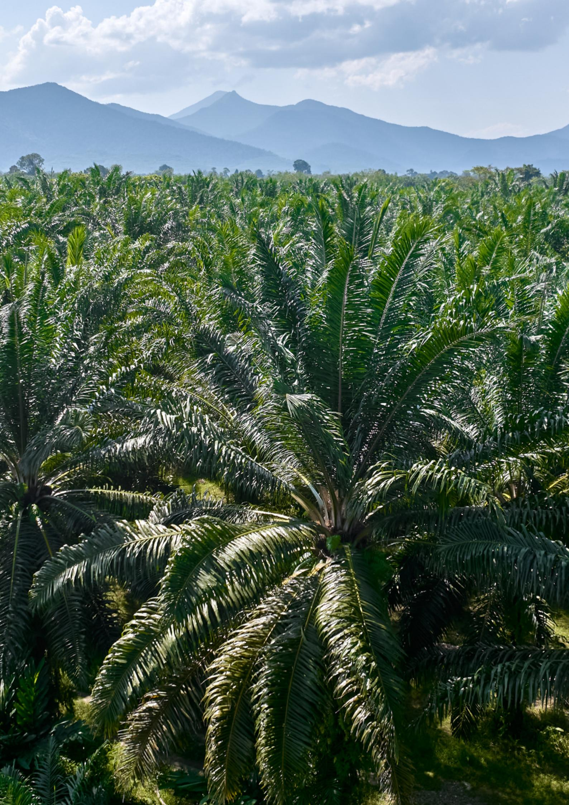

The European Union (EU) has adopted the European Deforestation Regulation (EUDR) to minimize the EU's contribution to deforestation and forest degradation worldwide. According to Article 3 of the regulation, relevant commodities and products can only be placed on the EU market or exported from there if: (a) they are deforestation-free; (b) they have been produced in accordance with the relevant legislation of the country of production; and (c) they are covered by a due diligence statement. The EUDR entered into force on 29 June 2023 and will enter into application for larger operators and traders on 30 December 2025, and for micro and small enterprises on 30 June 2026. The EUDR covers seven commodities, namely cattle, cocoa, coffee, oil palm, rubber, soya, and wood, as well as certain derived products (*Article 1*).

# **INTRODUCTION**

### **1. BACKGROUND AND SCOPE OF ANALYSIS**

A central component of the EUDR is the due diligence requirement, which mandates that both operators and traders assess their supply chains to ensure compliance with the regulation. Operators, defined under Article 2(15) as any natural or legal person engaged in a commercial activity, who places relevant products on the EU market or exports them from there, and traders, defined under Article 2(17) as anyone else in the supply chain who makes products available for sale on the EU market, must ensure their products comply with legal requirements and are deforestation-free. Article 2(16) clarifies that 'placing on the market' refers to the initial availability of a relevant commodity or product within the EU market. Furthermore, Article 7 stipulates that when relevant products are placed on the market by operators established in third countries, the 'operator' is considered to be also the first natural or legal person established in the EU who makes those products available.

As specified in Articles 3(b), 2(40), and in connection with Articles 8 and 9(1)(h), operators are required to verify that their products comply with the relevant national laws of the country of production. They must collect, organise, and retain information, documents, and data for five years from the date the products are placed on the market or exported. This information must provide clear and verifiable evidence of compliance with the laws of the production country.

In such a situation, there will be two operators within the meaning of the regulation – one established outside and one inside of the EU. This research will focus on the responsibilities of EU operators in relation to Malaysian legal requirements.

This study specifically examines Malaysian laws related to the timber and rubber industries to identify the key areas operators must consider for EUDR compliance. EUDR Article 2 (40) on 'relevant legislation of the country of production' specifies the areas of laws applicable in the country of production concerning the legal status of the area of production in terms of: (a) Land Use Rights, (b) Environmental Protection, (c) Forest-Related Rules, (d) Third-Party Rights, (e) Labor Rights, (f) Human Rights, (g) The Principle of Free, Prior, and Informed Consent (FPIC), and (h) Tax, Anti Corruption, Trade, and Customs Regulations. With the exception of Forest-Related Rules, Tax, Customs Regulations, and environmental protection, which have specific application to the timber and rubber industries in Malaysia, all the other due diligence requirements apply to both industries and thus will be considered together to avoid repetition.

This study clarifies which existing laws operators are required to follow to access the EU market. The goal is to provide guidance to help operators sourcing from Malaysia to meet EUDR due diligence requirements and reduce risks and inform policy makers in Malaysia on their options to enhance the enabling environment.

The research objectives of this study are:

- (i) To identify existing laws, statutes, regulations, certifications and standards, regulatory documents, and/or guidelines related to the rubber and timber sectors in Malaysia, which are of relevance in the EUDR related context.
- (ii)
- (iii)
- (iv)
- (v)
- (vi) To identify the key requirements and obligations imposed by the national and local regulations. To identify commonalities, overlaps, and gaps in the existing regulations as compared to the requirements under the EUDR, particularly in relation to the matters stated in *Article 2(40)* of the EUDR as well as provisions on traceability and data protection. To engage with the relevant governmental ministries and/or agencies with a view to ascertaining laws, statutes, regulations, certifications and standards, regulatory documents and/or guidelines that are relevant in the EUDR context, being developed but not yet publicly available, such as the Malaysian Sustainable Natural Rubber guidelines. To identify key challenges for operators to meet the EUDR's legality requirements in relation to rubber and timber exports. To provide preliminary recommendations based on the findings to guide decisionmakers or stakeholders on potential actions or policies to support and prepare supply chain actors for EUDR implementation.

### **2. RESEARCH OBJECTIVES**

The EUDR takes a flexible approach by listing a number of areas of law without specifying particular laws, as these differ from country to country and may be subject to amendments. However, only the applicable laws concerning the legal status of the area of production constitute relevant legislation pursuant to Article 2(40) of the EUDR. This means that generally the relevance of laws for the legality requirement in Article 3(b) of the EUDR is not determined by the fact that they may apply generally during the production process of commodities or apply to the supply chains of relevant products and relevant commodities. Instead, the relevance of legislation is determined by the fact that these laws specifically impact or influence the legal status of the area in which the commodities were produced.

Additionally, Article 2(40) of the EUDR must be read in the light of the objectives of the EUDR as laid down in Article 1(1)(a) and (b). That means that legislation is also relevant if its contents can be linked to halting deforestation and forest degradation.

#### **3. METHODOLOGY**

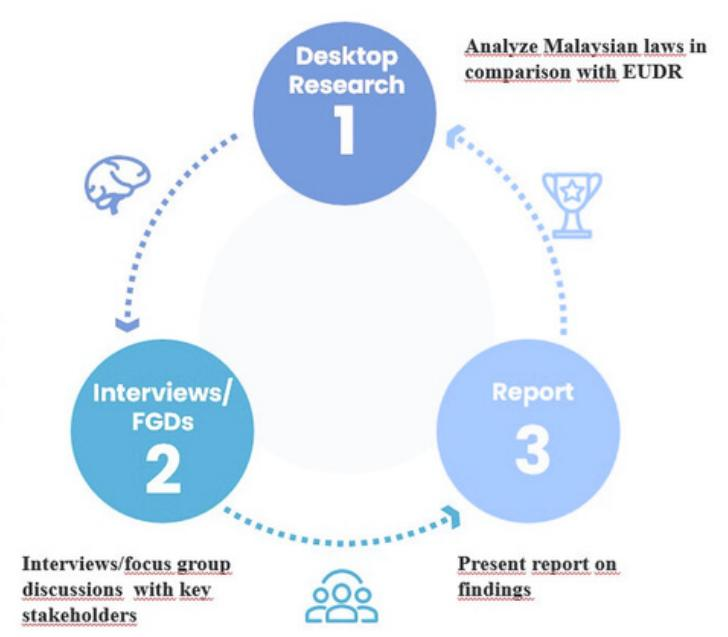

Study on Analysis of Available National Regulation as a Basis for Legality Requirements According to the EUDR for Commodities in Malaysia (focus on Rubber and Timber)

#### **4. RELEVANT STAKEHOLDERS**

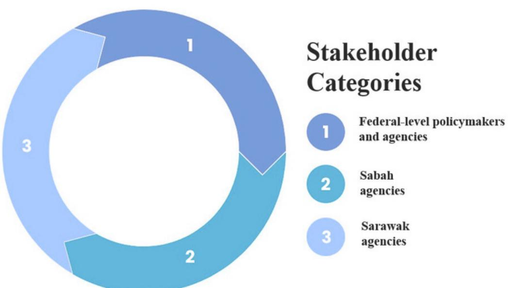

Government agencies at both the federal and state levels involved in the rubber and timber industries were identified as stakeholders due to their critical role in overseeing, regulating, and supporting the production of these commodities in Malaysia. The main production areas for rubber and timber are heavily influenced by policies and initiatives driven by these agencies. Their involvement spans land management, licensing, compliance monitoring, and enforcement of sustainability standards, making them indispensable to the governance and administration of these industries. As the commodities in question fall under the purview of both federal and state jurisdictions, the active engagement of these agencies is vital to ensure alignment with local laws and international market requirements, including compliance with regulatory frameworks like the EUDR.

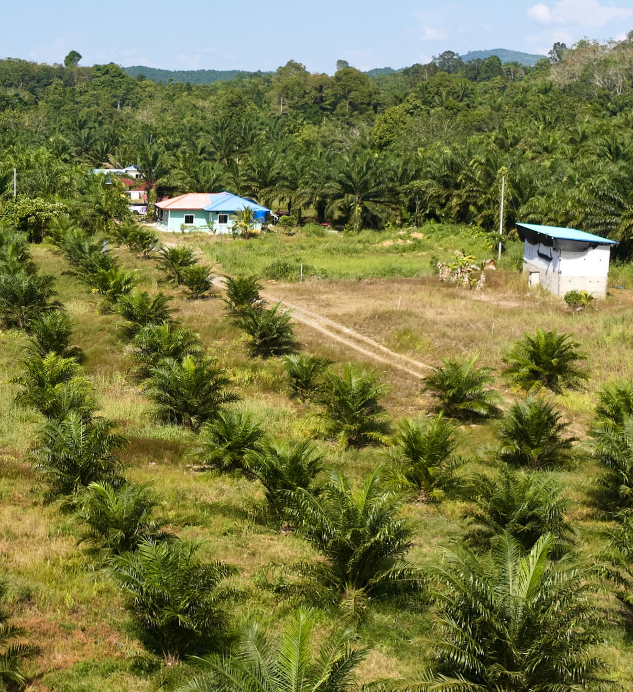

| Section/Provision (Important)      | Key Points to Check for DD |
|------------------------------------|----------------------------|
| Federal Government, State          |                            |
| Council, a national policy for the |                            |

"Relevant legislation of the country of production" under Article 2(40) refers to the laws in the country of production that govern the legal status of the production area. Additionally, Article 2(40) of the EUDR must be read in the light of the objectives of the EUDR as laid down in Article 1(1)(a) and (b). That means that legislation is also relevant if its contents can be linked to halting deforestation and forest degradation. The relevant legislative framework in the Malaysian context is provided below.

# **RELEVANT LEGISLATION IN MALAYSIA TO MEET THE REQUIREMENTS UNDER THE EUDR**

### **1. LAND-USE RIGHTS**

#### **Article 83**

Although land is a State matter, the Federal Government is allowed to acquire land for federal purposes with suitable remuneration.

None

#### **Article 92**

The King may declare an area as a development area if conducive to national interest.

None

#### **Article 161A(5)**

Constitutional guarantee for any State law in Sabah or Sarawak to provide for the reservation of land for natives or for alienation of land to them, or for giving preferential treatment as regards alienation of land by the State.

#### **Article 90**

Saves the existing law relating to customary land in Negeri Sembilan and Melaka and the existing law in Terengganu with respect to Malay holdings.

#### **Article 89**

State Government may declare a land as a Malay reservation. 'Malay reservation' is defined as 'land reserved for alienation to Malays or to natives of the State in which it lies'.

Does not apply to Sabah and Sarawak.

Operators must verify with suppliers that commercial activities, including rubber and timber production carried out on Malay Reserve Land are owned and operated only by Malays.

Operators must verify with suppliers that commercial activities, including timber and rubber production conducted on alienated and native customary land have the landowner's consent and the necessary approvals from the relevant authorities.

Operators must verify with suppliers that commercial activities, including rubber and timber production carried out on Malay Holdings land must be owned and operated by Malays in accordance with conditions under applicable state laws.

| National Land Code 1965 (NLC)                                     |                |           |               |                                     |
|-------------------------------------------------------------------|----------------|-----------|---------------|-------------------------------------|
| vests                                                             | and            | divests   | only          | upon                                |
| entry                                                             | of             | a         | lien-holder’s | caveat                              |
| interest                                                          | in             | the land  | and           | prohibits                           |
| Only applicable in Peninsular Malaysia of title. Land Acquisition | complied with. |           |               | disputes regarding land             |
| public                                                            |                | purposes, |               | economic                            |
|                                                                   | development,   | mining,   |               | agricultural,                       |
| purposes.                                                         |                | The       | landowner     | will be                             |
| Act 1960 (LAA) Only applicable in                                 |                |           |               | For Operators, no action is         |
| Peninsular Malaysia his land.                                     |                |           |               | government acquisition with chains. |

| Land Conservation                                                      |                               |            |           |
|------------------------------------------------------------------------|-------------------------------|------------|-----------|
| trees, plants, undergrowth, weeds,                                     |                               |            |           |
| Operators Act 1960                                                     | must                          | verify     | that      |
| suppliers Only applicable in                                           | have                          | obtained   | the       |
| clearing, Peninsular Malaysia land. Land                               | ensuring with the Act.        | compliance |           |
| accordance with any written law                                        |                               |            |           |
| For Operators, Development Act                                         |                               | no         | action is |
| required 1956 (LDA)                                                    | under                         | the        | LDA, but  |
| Malaysia                                                               | may                           | be subject | to        |
| compulsory Only applicable in                                          |                               | government |           |
| acquisition Peninsular Malaysia Aboriginal People Sections 6, 7 and 12 | with                          | notice,    | which     |
| aboriginal areas and reserves, but                                     |                               |            |           |
| require employing a specified                                          |                               |            |           |
| Operators Act 1954 Only applicable in Peninsular Malaysia              | must                          | verify     | with      |
| carried Sabah Land Section 15, 16 and 27                               | out with licence must be met. | the        | relevant  |
| trees, economically valuable plants,                                   |                               |            |           |
| Operators Ordinance 1930                                               | must                          | verify     | with      |
| timber Only applicable in Sabah burial                                 | and rubber rights (NCR).      | harvesting |           |

grounds, and rights of way. When these rights are recognized, the Government can compensate the claimant with money or land, with the affected land being considered surrendered if compensation is accepted. Compensation is determined according to the Land Acquisition Ordinance, following the procedures.

#### **Sarawak Land Code 1958 (Cap 81) Section 8 and 9**

Only applicable in Sarawak

Non-natives of Sarawak are generally prohibited from dealing with or acquiring rights over Native Area Land, Native Customary Land, or Interior Area Land.

However, non-natives may acquire rights or interests under specific exceptions, including:

- a) laws on mineral prospecting or forest produce extraction,
- b) if the non-native is subject to native personal law,
- c) if they hold a valid permit under relevant land rules,
- d) if they are deemed a native by the State Government, and
- e) if they are issued a licence to extract materials such as earth or gravel under the Land Code.

**Side note:** The definition of Native Customary Rights land under the MPSO Guidelines 2.2 and Conclusion affirms that it is primarily agricultural land recognised under the Sarawak Land Code, used by indigenous communities for subsistence and economic activities.

Operators must verify with suppliers that:

(i) all activities involving rubber on these lands can only be carried out by natives; and (ii) the extraction of timber and rubber wood from these lands is allowed, subject to the consent of the landowner and approval from the authority.

### **2. ENVIRONMENTAL PROTECTION**

In Malaysia, environmental protection is governed by a combination of laws, policies, and regulations designed to safeguard natural resources, promote sustainable development, and address pollution. Please find more details see under 'Rubber' and 'Legal Gaps and Challenges' sections below.

| Legislation Section/Provision (Important) |               |            |
|-------------------------------------------|---------------|------------|
| The Board may, following rules            |               |            |
| orders published in the Gazette           |               |            |
| requiring any person engaged in           |               |            |
| logging operations in previously          |               |            |
| logged forest areas or in areas           |               |            |
| Operators                                 | must          | ensure     |
| suppliers                                 | report        | logging    |
| activities                                | impacting     | the        |
| environment                               | and           | natural    |
| resources                                 | when carrying | out        |
| logging to commence after                 |               |            |
| considering the report submitted as       |               |            |
| (2) The person who intends to carry       |               |            |
| Operators                                 | must verify   | with       |
| suppliers                                 | that they     | have       |
| obtained                                  | written       | permission |
| commencing                                | any           | logging    |

#### **3. THIRD PARTY RIGHTS AND THE PRINCIPLE OF FREE, PRIOR, AND INFORMED CONSENT**

Please see under 'Legal Gaps and Challenges' section below.

#### **4. LABOUR RIGHTS**

| Legislation | Section/Provision (Important) | Key Points to Check for DD  |
|-------------|-------------------------------|-----------------------------|
|             | any offices, shops, ndustrial |                             |
|             | means any employment for the  |                             |
|             |                               | Operators must confirm with |

Additionally, agricultural training (by family members) could be considered as apprenticeship because these provisions stipulate that a child may be engaged in the employment in any undertaking carried out by his family and that the apprenticeship is to be approved by the Director General.

#### **Section 3:**

This section states that the Minister may prohibit any child or young person from being engaged in any employment as stated in section 2 if it would be detrimental to the interests of the child or young persons.

Operators must confirm with suppliers that the provisions of this law are complied with; in particular, that it is not detrimental to the interest of a child or young person (subject to the Director General's satisfaction).

### **Section 5 and 6:**

These provisions provide for the hours of work for both children and young persons.

A child, among others, cannot work for more than 3 consecutive hours without a break of at least 30 minutes, work more than 6 hours a day, etc.

A young person, among others, cannot work for more than 4 consecutive hours in a day without a break of at least 30 minutes, work more than 7 hours in any one day, etc

Operators must confirm with suppliers that the provisions of this law are complied with.

#### **Section 14(1)**

This section provides for the punishment for contravening any of the provisions under this Act. The person will be guilty of an offence and shall be liable on conviction to imprisonment for a term not exceeding 2 years or to a fine not exceeding RM 50, 000.00 or to both.

Subsequent offenders will be liable to imprisonment for a term not exceeding 5 years or to a fine not exceeding RM100,000.00 or to both

Operators must confirm with suppliers that there have been no recent offences by the Malaysian supplier. The penalties are only for Malaysian suppliers, but any contravention of this law would mean that EU operators would be unable to place any products on the EU market.

#### **Section 15:**

The provision provides that the Minister may make regulations in prescribing the form of license to be issued, the times by which children and young persons employed shall be entitled to take off from work for meals or rest periods and the procedure to be followed by any Board appointed under the Act.

Hence, the regulations contained in the Third Schedule shall have effect unless and until replaced or amended by the regulations made under this section.

Operators must confirm with suppliers that any provisions from regulations that have been replaced or amended under Section 1 are complied with.

#### **Third Schedule + Paragraph 3:**

These regulations expressly provide for the conditions of labour. It states that any child employed shall be produced by their employer for inspection at any time during working hours or at any other reasonable time upon the demand of DG, a Magistrate or any other person authorised on behalf of the the DG from relevant departments.

None.

| Section 60K | :          |                  |      |      |
|-------------|------------|------------------|------|------|
| This        | provision  | provides         | for  | the  |
| This        | provision  | states           | that | when |
| electricity | supply,    | ensure           | that | the  |
| These       | provisions | stipulate        | for  | the  |
| duties      | and        | responsibilities |      | of   |

separate accommodation to employees of the opposite gender, taking fire safety measure, among others.

The employees shall also maintain the accommodations provided for the employees.

#### **Labour Ordinance 1958 (Cap 76)**

Only applicable in Sarawak

#### **Section 73(2) and 73(3):**

This section provides for the types of employment that can be engaged by a child (below the age of 15) and young person (below the age of 18).

A child may be employed in light family work, licensed public entertainment, government-approved training programs, or as an apprentice under a written contract.

A young person may be employed in any work allowed for a child, suitable jobs in various workplaces, industrial undertakings, or on a vessel under a parent or guardian's care.

Operators must confirm with suppliers that the provisions of this law are complied with.

#### **Section 74:**

The Minister may prohibit a child or young person from any permitted employment under section 73, if it is deemed harmful to their interests.

Operators must confirm with suppliers that the provisions of this law are complied with.

#### **Section 74B and 74C:**

These provisions provide for the hours of work for both children and young persons.

A child, among others, cannot work for more than 3 consecutive hours without a break of at least 30 minutes, work more than 6 hours a day, etc.

Operators must confirm with suppliers that the provisions of this law are complied with.

A young person, among others, cannot work for more than 4 consecutive hours in a day without a break of at least 30 minutes, work more than 7 hours in any one day, etc

#### **Section 72(2) and 72(3):**

This section provides for the types of employment that can be engaged by a child (below the age of 15) and young person (below the age of 18).

A child may be employed in light family work, licensed public entertainment, government-approved training programs, or as an apprentice under a written contract.

A young person may be employed in any work allowed for a child, suitable jobs in various workplaces, industrial undertakings, or on a vessel under a parent or guardian's care.

#### **Labour Ordinance (Cap 67)**

Only applicable in Sabah

Operators must confirm with suppliers that the provisions of this law are complied with.

#### **Section 73:**

The Minister may prohibit a child or young person from any permitted employment under section 72, if it is deemed harmful to their interests.

Operators must confirm with suppliers that the provisions of this law are complied with.

#### **Section 73B and 73C:**

These provisions provide for the hours of work for both children and young persons.

A child, among others, cannot work for more than 3 consecutive hours without a break of at least 30 minutes, work more than 6 hours a day, etc.

A young person, among others, cannot

Operators must confirm with suppliers that the provisions of this law are complied with.

work for more than 4 consecutive hours in a day without a break of at least 30 minutes, work more than 7 hours in any one day, etc.

|                                                                                                     | Key Points to Check for DD                                                                                                                                                                                                                                                                                                                                                                                               |
|-----------------------------------------------------------------------------------------------------|--------------------------------------------------------------------------------------------------------------------------------------------------------------------------------------------------------------------------------------------------------------------------------------------------------------------------------------------------------------------------------------------------------------------------|
| Legislation Part II Federal Constitution Applicable throughout Malaysia Human Rights Commission Act | Section/Provision (Important) (Operator Focus) Article 5 None. Right to life and personal liberty Article 6 No slavery Article 7 No retrospective criminal laws and no double jeopardy Article 8 Equality Article 9 Freedom of movement Article 10 Freedom of speech and expression, assembly, and association Article 11 Freedom of religion Article 12 Right to education Article 13 Right to property Section 2 None. |
| Applicable                                                                                          | ‘Human rights’ is defined as the fundamental liberties provided in Part II of the Federal Constitution, and where it does not conflict with the                                                                                                                                                                                                                                                                          |
| throughout Malaysia                                                                                 | Federal Constitution, the rights enshrined under the Universal                                                                                                                                                                                                                                                                                                                                                           |

#### *5.* **HUMAN RIGHTS**

Declaration of Human Rights.

#### **Sections 3, 4, and 12**

Sets up the Human Rights Commission of Malaysia (SUHAKAM) to inquire into complaints regarding infringements of human rights

| Legislation Penal Code                                    | Section/Provision (Important) Section 161-164 |                | (Operator Focus)                                       |
|-----------------------------------------------------------|-----------------------------------------------|----------------|--------------------------------------------------------|
|                                                           |                                               |                | Operators to ensure that                               |
| Applicable throughout Malaysia                            |                                               |                | suppliers have standard                                |
|                                                           |                                               |                | report any wrongdoing                                  |
| both. Anti-Money                                          |                                               |                | immediately, to minimise potential criminal liability. |
| are                                                       | captured from                                 | 48             | pieces of                                              |
| relevant                                                  | law                                           | enforcement    | agency                                                 |
| overseeing                                                |                                               | investigations | into that                                              |
| laundering                                                | offence                                       | under          | the                                                    |
| provisions                                                | of                                            | AMLA has       | been                                                   |
| committed,                                                | the                                           | law            | enforcement                                            |
| the                                                       | investigation                                 | powers         | provided                                               |
| Laundering, Anti                                         |                                               |                | Operators to ensure that                               |
| Terrorism Financing and Proceeds of                       |                                               |                | suppliers have standard                                |
| Unlawful                                                  |                                               |                | report any wrongdoing                                  |
| Activities Act 2001 (AMLA) Applicable throughout Malaysia | under Section 31 of AMLA.                     |                | immediately, to minimise potential criminal liability. |

### **6. ANTI - CORRUPTION**

AMLA also gives wide powers to investigating officers, including the power to enter, inspect and search any property, premise or person without a warrant. AMLA also allows for the freezing, seizing and forfeiture of the subject matter or evidence of the crime, instrumentalities of the offence, and the proceeds of crime. There are also reporting obligations of 'reporting institutions' (for example financial institutions) to report transactions that exceed specified amounts or that are suspicious in nature. This helps authorities detect and investigate potential money laundering activities.

**Malaysian Anti-**

**Corruption Commission Act 2009 (MACC Act)**

Applicable

throughout Malaysia

There are four main offences stipulated: (i) soliciting or receiving a gratification or bribe; (ii) offering or giving a gratification or bribe; (iii) intending to deceive or false claims; and using an office or position for gratification or bribe, which is a form of abuse of power or position. MACC officers have wide investigation and enforcement powers, including the power to search, seize and forfeit property, inspect and obtain documents from any bank, intercept communications, and order the surrender of travel documents. The penalties for corruption offences are a maximum of 20 years' imprisonment, and fines of not less than five times the sum or value of the gratification, or RM10,000 whichever is the higher.

Operators to ensure that suppliers have standard operating procedures in place to deter, detect, minimise and report any wrongdoing immediately, to minimise potential criminal liability.

| Legislation Section/Provision (Important) Key Points to Check for DD |            |            |
|----------------------------------------------------------------------|------------|------------|
| supplier                                                             | possesses  | a valid    |
| harvesting                                                           | on         | permanent  |
| ringing, marking, lopping, tapping,                                  |            |            |
| reserved forest, thereby restricting                                 |            |            |
| unauthorized logging and timber                                      |            |            |
| suppliers                                                            | do not     | fell, cut, |
| or timber                                                            | from       | permanent  |
| reserved                                                             | forests    | unless     |
| supplier                                                             | has a      | forest     |
| management                                                           | plan       | or         |
| harvesting                                                           | plan,      | and        |
| reforestation                                                        | plan       | for        |
| harvesting                                                           | on         | permanent  |
| prepare a forest management or                                       |            |            |
| forest                                                               | management | or         |
| harvesting                                                           | plan       | and the    |

#### *7.* **FORESTRY RELATED REGULATIONS**

#### **A. Peninsular Malaysia**

#### *(i) Timber Harvesting*

Director's satisfaction from a date appointed by the Director, failing which, the Director may revoke the licence and require the licensee to pay the State Authority an amount equivalent to the State's estimated cost of implementing the plan.

Note: This Act shall not come into force in a State unless it has been adopted by a law made by the Legislature of the State pursuant to Clause (3) of Article 76 of the Federal Constitution.

This Act has been adopted by:

- (a) Johore National Forestry (States of Malaysia) (Adoption) Enactment (J. En. 12/1985);
- (b) Kedah National Forestry (States of Malaysia) (Adoption) Enactment 1985 (K. En. 2/1986);
- (c) Kelantan National Forestry (States of Malaysia) (Adoption) Enactment (Kn. En. 11/1985);
- (d) Malacca National Forestry (States of Malaysia) (Adoption) Enactment (M. En. 4/1985);
- (e) Negeri Sembilan National Forestry (States of Malaysia) (Adoption) Enactment (N.S. En.5/1986);
- (f) Pahang National Forestry (States of Malaysia) (Adoption) Enactment (Phg. En. 6/1986);
- (g) Penang National Forestry (States of Malaysia) (Adoption) Enactment (Pg. En.2/1986);
- (h) Perak National Forestry (States of Malaysia) (Adoption) Enactment (Pk. En. 3/1985);
- (i) Perlis National Forestry (States of Malaysia) (Adoption) Enactment (Ps. En. 1/1988);
- (j) Selangor National Forestry (States of Malaysia) (Adoption) Enactment (Sel. En. 5/1985);
- (k) Terengganu National Forestry (States of Malaysia) (Adoption) Enactment (Tr. En. 1/1986).

**Forest Rules of the respective States (Peninsular** Each state in Peninsular Malaysia has its own rules for timber harvesting, requiring a removal pass for forest produce cut or collected under licence. Operators must verify that the supplier has a valid removal pass.

**Malaysia comprises 12 states: Johor,**

**Kedah, Kelantan, Malacca, Negeri**

**Sembilan, Pahang, Perak, Perlis, Penang, Selangor, Terengganu and the Federal**

**Territories (Kuala Lumpur, Labuan,**

**Putrajaya))**

### *(ii) Timber processing*

| Legislation Section/Provision (Important) |           | Key Points to Check for DD |                     |
|-------------------------------------------|-----------|----------------------------|---------------------|
| wood-based industries,                    | which     |                            |                     |
| governs the establishment                 | and       |                            |                     |
| operation of timber-processing            |           |                            |                     |
| specific requirements for                 | licence   |                            |                     |
|                                           |           | directly                   | involved in timber  |
|                                           |           | must                       | ensure that timber  |
|                                           |           | products,                  | including timber    |
|                                           |           | supplier                   | has obtained the    |
|                                           |           | relevant                   | licenses, to ensure |
|                                           |           | compliance                 | with local          |
| Industrial Co                            |           |                            |                     |
| prescribed forms for                      | each      |                            |                     |
| manufacturing site, with                  | separate  |                            |                     |
| licenses required for                     | different |                            |                     |
|                                           |           | directly                   | involved in         |
|                                           |           | valid                      | licenses for each   |

|  | Side note: Alternatively, operators may use MyTLAS (Peninsular Malaysia) to verify timber product licences, as it covers all relevant legality requirements. |
|---------------|--------------------------------------------------------------------------------------------------------------------------------------------------------------|
|---------------|--------------------------------------------------------------------------------------------------------------------------------------------------------------|

| Legislation | Section/Provision (Important)   | Key Points to Check for DD   |
|-------------|---------------------------------|------------------------------|
|             | Industry Board for exports from |                              |
|             | 1. Fuel wood, wood in chips or  |                              |
|             |                                 | exportation of timber/timber |
|             |                                 | the local regulation and     |
|             |                                 | Side note : In some cases,   |
|             |                                 | licence, depending on the    |

### *(iii) Export of timber and timber products*

- 4. Hoopwood
- 5. Wood wool
- 6. Railways or tramway sleepers
- 7. Sawn timber
- 8. Veneer sheets
- 9. Wood (continuously shaped, including strips and friezes for parquet flooring)
- 10. Particleboard
- 11. Fibreboard
- 12. Plywood, veneered panel, and similar laminated wood
- 13. Densified wood
- 14. Wooden frames
- 15. Cask, barrels, vats, tub, and other coopers' products of wood, including staves
- 16. Tools, tool bodies, tool handles, broom or brush bodies and handles of wood; boot or shoe last and trees, of wood
- 17. Builders joinery and carpentry of wood
- 18. Tableware and kitchenware of wood
- 19. Wooden articles of furniture not falling in chapter 94
- 20. Other articles of wood
- 21. Bamboo
- 22. Rattan
- 23. Pre-fabricated buildings of wood
- 24. Packaging

#### **Paragraph 5 + Third Schedule Part II Item 4**

Timber products from Peninsular Malaysia, including fuel wood, hoopwood, sawn timber, veneer panel, plywood, and other listed items, require an export permit under

Operators must verify that the Malaysian exporter provides a valid export permit under the International Trade in Endangered Species Act 2008 issued by MTIB for all applicable timber products, as exportation of timber/timber

| Species Act 2008, issued by the                 |                              |                       |               |
|-------------------------------------------------|------------------------------|-----------------------|---------------|
| Malaysian Timber Industry Board.                |                              |                       |               |
|                                                 | chain,                       | confirming            | compliance    |
| with International Trade in                     | local market.                | regulations           | and           |
| Endangered Species Act 2008 (Read together with | Malaysian                    | exporter              | that all      |
| the                                             | required                     | permit,               | as            |
| Customs (Prohibition of Exports) Order 2023)    | exportation                  | of                    | timber/timber |
|                                                 | Side note                    | : Operator also needs |               |
| permit                                          | issued Management Authority. | by                    | the CITES     |

| Legislation | Section/Provision (Important)  | Key Points to Check for DD  |
|-------------|--------------------------------|-----------------------------|
|             | or removing timber in a Forest |                             |
|             |                                | the supplier is expressly   |
|             |                                | authorised to cut, collect, |

#### **B. Sabah** *(i) Timber Harvesting*

#### **Section 23**

Any person who removes timber from alienated land beyond its boundaries, unless expressly authorised, commits an offence and is guilty of violating this Enactment.

In addition, any person who cuts, collects, converts, fells, or removes timber from State land without express authorization commits an offence and is guilty of violating this enactment.

Operators must ensure that the supplier is expressly authorised to cut, collect, or remove timber from both alienated and State land.

#### **Section 24**

Licences for doing any acts prohibited by section 20 and 23 (i.e. harvesting timber) may be issued by the Chief Conservator or authorised personnel, subject to conditions and fees, with Cabinet approval required for acts in Forest Reserves or on State land

Operators must ensure the supplier obtains the necessary licenses for any activities mentioned on Forest Reserves and State land.

#### **Section 28A and 28B**

Unless otherwise exempted by the minister, before issuing a license for areas over 1,000 hectares in Forest Reserves or State land, the Chief Conservator requires a forest management, harvesting, and reforestation plan. License holders must implement these plans to the Chief Conservator's satisfaction. Failure to do so may result in license revocation, termination of the agreement, and a penalty equivalent to the cost of executing the plans.

Operators must verify that the supplier has a forest management, harvesting, and reforestation plan approved by the Chief Conservator for areas over 1,000 hectares in Forest Reserves or State land before a license is issued.

| Rule 12 Forest Rules 1969 |             |                   |        |    |     |
|---------------------------|-------------|-------------------|--------|----|-----|
| All timber cut, sawn,     | converted,  |                   |        |    |     |
| collected or removed      | (harvested) |                   |        |    |     |
| harvesting timber         |             | licensed Finance. | timber | as | per |

| Legislation   | Section/Provision (Important) |            | Key Points to Check for DD  |
|---------------|-------------------------------|------------|-----------------------------|
| (which        | includes                      | machines   | for                         |
| the           | licence if its                | conditions | are                         |
|               |                               |            | directly involved in timber |
| prescribed    | forms                         | for        | each                        |
| manufacturing | site,                         | with       | separate                    |
| licenses      | required                      | for        | different                   |
|               |                               |            | directly involved in        |
|               |                               |            | manufacturing, they must    |
|               |                               |            | suppliers within the supply |
|               |                               |            | each manufacturing site,    |
|               |                               |            | confirming compliance with  |

### *(ii) Timber Processing*

| Legislation | Section/Provision (Important)  | Key Points to Check for DD |
|-------------|--------------------------------|----------------------------|
|             | 1. Fuel wood, wood in chips or |                            |
|             | 9. Wood (continuously shaped,  |                            |
|             |                                | as exportation of          |
|             |                                | compliance with the local  |

#### *(iii) Export of timber and timber products*

| wood wood wood falling in chapter 94 21. Bamboo 22. Rattan 24. Packaging Item 4 |          |             |          |
|---------------------------------------------------------------------------------|----------|-------------|----------|
| hoopwood, sawn timber, veneer                                                   |          |             |          |
| sheets, plywood, and other listed                                               |          |             |          |
| Forestry Department (SFD). These                                                |          |             |          |
| International                                                                   |          | Trade       | in       |
| issued                                                                          | by       | Sabah       | Forestry |
| Department                                                                      |          | (SFD)       | for all  |
| with market. International Trade in                                             | local    | regulations | and      |
| Malaysian Endangered                                                            |          | exporter    | that all |
| imports Species Act 2008 (Read together with                                    | or       | exports     | of       |
| the Customs (Prohibition of Exports) Order 2023)                                | required | permit,     | as       |
| Side                                                                            | note:    | Operator    | must     |
| issued                                                                          | by       | the         | CITES    |

| Forest (Timber) Section 5 Enactment 2015        |                            |                |      |                                        |
|-------------------------------------------------|----------------------------|----------------|------|----------------------------------------|
| industry                                        | activities                 | as             | an   | exporter                               |
| this                                            | regulation                 | is             | an   | offence                                |
| punishable                                      | by                         | a              | fine | or/and                                 |
|                                                 |                            |                |      | Malaysian exporter is                  |
| Forest (Timber) (Registration) Regulations 2017 | imprisonment. Regulation 2 |                |      | legally conduct export activities.     |
| exporter                                        | without                    | being          |      | registered                             |
| according                                       | to                         | the Enactment, |      | and                                    |
|                                                 |                            |                |      | registration application is            |
|                                                 |                            |                |      | submitted to the Chief                 |
| Forest (Timber) Enactment 2015)                 |                            |                |      | Conservator in accordance regulations. |

| Legislation Section/Provision (Important) Key Points to Check for DD |            |              |
|----------------------------------------------------------------------|------------|--------------|
| certain activities within a forest                                   |            |              |
| injuring any tree or timber, or                                      |            |              |
| forest produce, including timber.                                    |            |              |
| However, exceptions to these                                         |            |              |
| acquired by succession, grant, or                                    |            |              |
| Operators                                                            | must       | verify with  |
| applicable                                                           | exceptions | to           |
| ensure                                                               | no         | unauthorised |

### *C. Sarawak*

### *(i) Timber Harvesting*

#### **Section 40**

While Sections 26 and 27 (above) prohibit unauthorised activities within forest reserves or protected forests, this provision confers specific powers to the Director of Forestry to control and regulate the taking of or dealing in forest produce. Under this provision, the Director of Forestry is empowered to:

- (1) Issue licences (subsection 1(a));
- (2) Call for tenders for rights to harvest forest produce (subsection 1(b));
- (3) Collect fees and payments, including for ecosystem services (subsection 1(c)); and
- (4) Authorise any other works or issue necessary orders for forest produce extraction or forest management (subsection 1(d)).

Therefore, any activity conducted under a valid licence issued by the Director under Section 40 constitutes an exception to the prohibitions in Sections 26 and 27. Such licenced activities are legally permissible, provided they adhere to the terms set out by the Director.

Operators must verify that the supplier holds a valid license issued by the Director of Forestry under Section 40 and ensure all activities strictly comply with its authorised terms.

#### **Forest Rules 1962**

#### **Rule 3, 4 and 7**

It restricts the felling of trees under a minimum girth to preserve younger or smaller trees and limits tree felling to dangerous, nuisance, or farmingrelated purposes with required written permission from designated officers. Proper authorisation is also required for casual workers to fell timber, specifying the work area, period, and allowable products.

Operators must verify that the supplier has obtained proper written authorisation for tree felling, complies with minimum diameter cutting limits and volume control, and ensures casual workers are approved with specified work details.

| National Parks Section 26 and Nature Reserves Ordinance 1998 |                            |                    | Operators need to verify with the supplier that no logging activities are carried out in |     |        |
|--------------------------------------------------------------|----------------------------|--------------------|------------------------------------------------------------------------------------------|-----|--------|
| damaging,                                                    | or removing plants         |                    |                                                                                          |     |        |
| plants of                                                    | geological, historical, or |                    |                                                                                          |     |        |
| (Cap.27) scientific interest.                                |                            | national reserves. | parks                                                                                    | and | nature |

### *(ii) Timber Processing*

| Legislation Section/Provision (Important) Key Points to Check for DD |                       |           |
|----------------------------------------------------------------------|-----------------------|-----------|
| directly                                                             | involved              | in timber |
| sawmills                                                             | have obtained         | a         |
| prescribed forms for each                                            |                       |           |
| manufacturing site, with separate                                    |                       |           |
| licences required for different                                      |                       |           |
| directly                                                             | involved              | in        |
| manufacturing,                                                       | they                  | must      |
| suppliers                                                            | within the            | supply    |
| each                                                                 | manufacturing         | site,     |
| confirming                                                           | compliance            | with      |
| Side note:                                                           | This only applies for |           |
| investments                                                          | with                  | paid-up   |

| Investments             |        | below        | this |
|-------------------------|--------|--------------|------|
| criteria                |        | must obtain  | a    |
| by                      | the    | Ministry     | of   |
| International           |        | Trade        | and  |
| punishable by fines and |        |              |      |
| the                     | entity | establishing | the  |

### *(iii) Export of timber and timber products*

| Legislation Section/Provision (Important) Key Points to Check for DD |          |             |         |
|----------------------------------------------------------------------|----------|-------------|---------|
| Sarawak Timber Industry                                              |          |             |         |
| issued                                                               | by       | Sarawak     | Timber  |
| Industry                                                             |          | Development |         |
| Corporation                                                          |          | (STIDC)     | for all |
| listed                                                               | timber   | products,   | as      |
| chain,                                                               | ensuring | compliance  |         |
| Side                                                                 | note:    | Operator    | must    |

|                           |         | availability | of CITES permit   |
|---------------------------|---------|--------------|-------------------|
|                           |         | issued       | by the Management |
| 1. Fuel wood, wood in     | chips   | or           |                   |
| 9. Wood (continuously     | shaped, |              |                   |
|                           |         | exporter     | from Sarawak      |
| endangered species listed | under   |              |                   |

| Corporation                                                              |                |              | (STIDC)      |
|--------------------------------------------------------------------------|----------------|--------------|--------------|
| obtained                                                                 | from           |              | endangered   |
| Side note:                                                               | The Management |              |              |
| is                                                                       | the Sarawak    |              | Forestry     |
| Industry Development Corporation permit. Forests Ordinance 2015 (Cap 71) | Corporation.   |              |              |
| Sarawak without a Certificate of                                         |                |              |              |
| Certificate, and exporting timber                                        |                |              |              |
| either of these certificates is an                                       |                |              |              |
| all                                                                      | timber         | (logs)       | exported     |
| by                                                                       | a valid        | Certificate  | of           |
| Inspection                                                               |                | and          | an Export    |
| Clearance                                                                |                | Certificate, | and          |
| ensure                                                                   | that           | the          | volume       |
| stated                                                                   | in             | the          | certificates |
| issued                                                                   | by             | the          | Forest       |

### **8. RUBBER RELATED REGULATIONS**

| Legislation | Section/Provision (Important)    | Key Points to Check for DD |
|-------------|----------------------------------|----------------------------|
|             | Establishes the Malaysian Rubber |                            |
|             | Board (MRB) which oversees the   |                            |
|             | rubber industry in Peninsular    |                            |

### **A. Peninsular Malaysia**

| Malaysian Rubber Regulation 3: Board (Licensing and Permit) Regulations 2014                                                                                              |                       |             |          |
|---------------------------------------------------------------------------------------------------------------------------------------------------------------------------|-----------------------|-------------|----------|
| or export rubber; buy and store                                                                                                                                           |                       |             |          |
| planting materials on mobile for                                                                                                                                          |                       |             |          |
| commercial purposes unless the                                                                                                                                            |                       |             |          |
| without a licence is an offence                                                                                                                                           |                       |             |          |
| punishable with a fine and                                                                                                                                                |                       |             |          |
| MRB [P.U.(A) 119/2014] and Malaysian Rubber Board (Licensing and Permit) Amendment) Regulations 2023 [P.U.(A) 155/2023] (together, ‘MRB Regulations’) imprisonment. None. | to products.          | handle      | rubber   |
| This provision is related to the                                                                                                                                          |                       |             |          |
| issuance of the license and the                                                                                                                                           |                       |             |          |
| licensee must comply with the                                                                                                                                             |                       |             |          |
| Operators                                                                                                                                                                 | must                  | understand  |          |
| verify                                                                                                                                                                    | and                   | ensure      | that     |
| suppliers                                                                                                                                                                 | comply                |             | with all |
| and                                                                                                                                                                       | permit                | holders     | shall    |
| comply                                                                                                                                                                    | with                  | the         | standard |
| the Regulation 7(1):                                                                                                                                                      | Malaysian activities. | Sustainable |          |

#### **Regulation 22(1):**

This provision states that no smallholder or rubber plantation operator, sell rubber unless he or it holds a Rubber Transaction Authority Permit.

Further, no person shall buy, store and sell rejected rubber gloves and scrap rubber gloves unless the person holds a PAT-G Permit, or export rubber consignments unless the person holds an Export Permit.

Operators must verify with the supplier on the two types of permits issued:

1.Rubber Transaction Authority Permit (PAT-G); and 2. Export Permit.

#### **Regulation 23 (read together with Regulations 27(1) and 28(1)):**

This provision highlights the application process for the permit (similar to the license application).

None.

### **Regulation 25 and 26:**

The Board shall issue for the permit in the form of card for the Rubber Transaction Authority Permit and the validity for the permit is not exceeding 3 years.

None.

#### **Regulation 28(1):**

A person shall not be eligible to apply for an Export Permit unless the person holds a license to export rubber issued under sub-regulation 5(1).

None.

#### **Regulation 29(1):**

The Board may impose any conditions upon issuance of a permit under regulation 24 and may, from time to time, amend the conditions imposed.

MRB permit holders (PAT-G) shall comply with the standard operating procedures (SOP) of the Sustainable Malaysian Natural Rubber (MSNR).

|                                                              | Regulation 40(1):                                               |             | written authority.                                            |
|--------------------------------------------------------------|-----------------------------------------------------------------|-------------|---------------------------------------------------------------|
| shall                                                        | convey, transport under regulation 41. Regulation 44(1) and 49: | or          | receive                                                       |
|                                                              |                                                                 |             | Operators must ensure                                         |
| Section 3 and 4 Industrial Co ordination Act 1975 (Act 156) | under the regulation.                                           |             | suppliers comply with this condition. manufacturing licences. |
| prescribed                                                   | forms                                                           | for         | each                                                          |
| manufacturing                                                | site,                                                           | with        | separate                                                      |
| licenses locations. Rubber Industry Smallholders Development | required Section 3A (c) and (e) :                               | for         | different None.                                               |
| These Authority Act 1972 (Act 85)                            | provisions                                                      | state       | that the                                                      |
| all                                                          | research                                                        | innovations | in the                                                        |
| smallholder                                                  | sector                                                          | as well     | as to                                                         |
| provide Environmental Quality                                | technical,                                                      |             | advisory,                                                     |
| These                                                        | provisions                                                      | provide     | for the                                                       |
| acceptable                                                   | conditions                                                      | for         | the                                                           |
| (Prescribed Premises) (Raw Natural Rubber) Regulations 1978  |                                                                 |             | the suppliers comply with listed in the Regulations.          |

| other products) or its associated Customs (Prohibition of (u), 46, 47, 48: Exports) Order |         |         |             |
|-------------------------------------------------------------------------------------------|---------|---------|-------------|
| export licenses/permits and this                                                          |         |         |             |
| ensures proper regulation of the The Malaysian                                            |         |         |             |
| MRB Sustainable SOP (‘MSNR’)                                                              | licence |         | and permit  |
| (SOP)                                                                                     | of      | the     | Sustainable |
| Malaysian                                                                                 | (MSNR). | Natural | Rubber      |

| Legislation | Section/Provision (Important)    | Key Points to Check for DD |
|-------------|----------------------------------|----------------------------|
|             | products, etc unless they hold a |                            |
|             |                                  | licence from the Rubber    |
|             | This section provides for the    |                            |

### **B. Sabah**

importation of rubber or raw rubber consignments unless they hold an import permit.

#### **Rubber Industry Board (Licensing and Permits) Regulations 2015**

#### **Regulation 3:**

This provision provides for the application process for license.

None.

#### **Regulation 12:**

This provision provides for the distinct mobile license. Only person(s) with this license shall purchase or sell rubber or raw rubber, within the specified place/location and quantity.

Operators must ensure that suppliers have the necessary licences.

#### **Regulation 14 and 15:**

This provision provides for the application for permits. Note that the application and issuance process for permit is similar to that of the licenses.

None.

#### **Regulation 18:**

The provision states that any rubber or raw rubber brought in from outside the state of Sabah must be physically checked and verified by the Enforcement officer.

Operators must ensure that suppliers comply with this provision to get the products physically checked.

#### **Regulation 19(1) and (3):**

These provisions state that no person shall convey, transport or receive rubber unless he holds a mobile license or has the written authority under regulation 20. In addition, no person can transport, convey or receive rubber planting materials unless he has the written authority.

Operators must ensure that suppliers have the necessary mobile license or written authority.

| Industrial Co Section 3 and 4 ordination Act 1975 (Act 156)   | Regulation 21(2): smallholdings or estate. |         | None.                                                |
|----------------------------------------------------------------|--------------------------------------------|---------|------------------------------------------------------|
| prescribed                                                     | forms                                      | for     | each                                                 |
| manufacturing                                                  | site,                                      | with    | separate                                             |
| licenses                                                       | required                                   | for     | different                                            |
| locations. Rubber Industry Regulation 27: Board (Licensing     |                                            |         | licences for manufacturing activities.               |
| and Permits) Regulations 2015 the Panel. Environmental Quality |                                            |         | suppliers either fulfill the licences.               |
| These                                                          | provisions                                 | provide | for the                                              |
| acceptable                                                     | conditions                                 | for     | the                                                  |
| other                                                          | products) or                               | its     | associated                                           |
| (Prescribed Premises) (Raw Natural Rubber) Regulations 1978    |                                            |         | the suppliers comply with listed in the Regulations. |

| <b>Customs (Prohibition of Exports) Order 2023</b> | <b>Third Schedule (Part 1) + Items 31(3) (u), 46, 47, 48:</b>                                                                                     | Operators must ensure that suppliers have the necessary export licences / permits. |
|----------------------------------------------------|---------------------------------------------------------------------------------------------------------------------------------------------------|------------------------------------------------------------------------------------|
|                                                    | The Sabah Rubber Industry Board (LIGS) is responsible for the issuance of Export licenses/permits to ensure proper regulation of rubber products. |                                                                                    |

| Legislation    | Section/Provision (Important) | Key Points to Check for DD    |
|----------------|-------------------------------|-------------------------------|
| presumption:   | (1) for export,               | the                           |
| the State      | (unless the                   | contrary is                   |
|                |                               | Side note: The harvesting and |
|                |                               | trade of rubberwood in        |
| directions,    |                               | appointments,                 |
| proclamations, | licences,                     | rights,                       |
|                |                               | Where applicable, operators   |
|                |                               | must ensure that suppliers    |

#### **C. Sarawak**

| prescribed     |               | forms      | for         | each                        |
|----------------|---------------|------------|-------------|-----------------------------|
|                | manufacturing | site,      | with        | separate                    |
| licenses       |               | required   | for         | different                   |
|                |               |            |             | licences for manufacturing  |
|                |               |            |             | This is only applicable for |
|                |               |            |             | investments with paid-up    |
|                |               |            |             | must obtain a manufacturing |
| Industrial Co |               |            |             |                             |
| acceptable     |               | conditions |             | for the                     |
| other          | products)     | or         | its         | associated                  |
|                |               |            |             | the suppliers comply with   |
| the            | mode          | and        | manner      | whereby                     |
| to             | determine     | and        | take        | necessary                   |
| guidelines     | and           |            | directions  | for the                     |
| protection     |               | and        | enhancement | of                          |
|                | environment   | such       | as land     | use,                        |
| extraction     | and           | removal    | of          | forest                      |
|                |               |            |             | Operators must ensure       |

| <b>Customs (Prohibition of Exports) Order 2023</b> | <b>Third Schedule (Part 1) + Items 31(3) (u), 46, 47, 48:</b>                                                                                        | Operators must ensure that suppliers have the necessary licences / permits. |
|----------------------------------------------------|------------------------------------------------------------------------------------------------------------------------------------------------------|-----------------------------------------------------------------------------|
|                                                    | Sarawak Rubber Industry Board (SARIB) is responsible for the issuance of Export licenses/permits to ensure proper regulation of the rubber products. |                                                                             |

# **LEGAL GAPS AND CHALLENGES**

From the legislation and regulatory framework discussed above, it would appear that there are no legal gaps in due diligence mechanisms in the timber and rubber industries in Malaysia.

Further, various initiatives have been undertaken by the relevant Malaysian ministries and agencies vis-à-vis the timber and rubber industries to ensure compliance, industry readiness, and sustainability in the Malaysian timber and rubber sectors, as follows:

### **(i) Timber industry**

The Malaysian Ministry and timber industry agencies, including the Malaysian Timber Industry Board (MTIB), the Malaysian Timber Council (MTC), and the Malaysian Timber Certification Council (MTCC), have conducted regular stakeholder meetings through the JKM3PA committee,¹ participated in international task forces and discussions with the EU, engaged with state forestry departments, and have been involved in certification programmes like the Programme for the Endorsement of Forest Certification (PEFC). The industry has also taken steps such as submitting official positions to the EU and forming coalitions on sustainable timber with other countries. These efforts aim to ensure compliance and sustainability in the timber sector.

#### **(ii) Rubber industry**

The Malaysian Rubber Council (MRC) and the Malaysian Rubber Board (MRB) have organized various initiatives to address the EUDR and promote the Malaysian Sustainable Natural Rubber (MSNR) SOP. As of 5 May 2025, the MSNR Trace System has been made mandatory for licence holders in the processing factory and rubber trade categories. MRC has conducted roundtable discussions, meetings with the European Commission, and industry engagements to navigate regulatory challenges. Meanwhile, MRB has focused on disseminating MSNR awareness through exhibitions, media outreach, briefings, conferences, and international collaborations. Key milestones include launching Malaysia's first MSNRcompliant rubber export and conducting nationwide awareness programs.

However, there are some challenges that operators and traders may face in Malaysia. Addressing these challenges presents an opportunity to enhance the efficiency and consistency of compliance verification with national laws, thereby supporting operators in meeting the EUDR's due diligence requirements. Strengthening these processes can also help reduce potential legal and reputational risks linked to sourcing timber and rubber from Malaysia. The key challenges are discussed below.

¹ Mesyuarat Jawatankuasa Kecil Mitigasi Pematuhan Perundangan Perdagangan Antarabangsa (JKM3PA) Industri Perkayuan is a meeting coordinated by the Ministry of Plantation and Commodities (KPK) which serves as a platform for cooperation and active involvement of ministry/agencies and stakeholders to ensure that the sustainability of the timber industry is in line with the Malaysian government's policies in facing new and existing international policies and regulations pertaining to the trade of timber products.

JKM3PA is chaired by the Senior Undersecretary of the Timber, Tobacco and Kenaf Industries Development Division (KTK) and is represented by members from the Ministry of Natural Resources And Environmental Sustainability (NRES), Strategic Planning and International Department, KPK, Forestry Department Peninsular Malaysia (FDPM), Sabah Forestry Department (SFD), Forest Department Sarawak (FDS), Sarawak Timber Industry Development Corporation (STIDC), Malaysian Timber Industry Board (MTIB), MTC and Malaysian Timber Certification Council (MTCC). Source: [https://mtc.com.my/images/publication/273/MTC\\_2023\\_Annual\\_Report\\_Final.pdf](https://mtc.com.my/images/publication/273/MTC_2023_Annual_Report_Final.pdf)

#### **1. DEFINITIONS**

| Definition EUDR Malaysia                           |                |         |
|----------------------------------------------------|----------------|---------|
| Deforestation Conversion of forest to agricultural |                |         |
| Deforestation                                      | is             | a human |
| industrial,                                        | mining,        | roads,  |
| dams,                                              | municipalities | and     |
| Forest Land spanning more than 0.5 hectares        |                |         |
| situ, excluding land that is                       |                |         |
| Ministry                                           | of             | Natural |
| Resources                                          |                | and     |
| predominantly                                      |                | under   |

#### **National Forestry Act 1984 (Act 313), Section 2**

Permanent reserved forest means any land constituted or deemed to have been constituted a permanent reserved forest under this Act.

#### **Environment Protection (Prescribed Activities) (Environmental Impact Assessment) Order 2005 (Sabah), Section 2**

Wetland forests means forests where land is either subject to inundation with saltwater and/or freshwater, or has a high water table and such forests include mangrove forests, brackish water forests, transitional forests, freshwater swamp forests and peat swamp forests.

#### **Forests Ordinance 2015 (Cap. 71) (Sarawak), Section 2.**

Permanent forests means all forests reserves, protected forests, communal forests, amenity forest, Government reserves and planted forests in the State.

| Smallholder The EUDR does not include a definition |               |
|----------------------------------------------------|---------------|
| Rubber                                             | Industry      |
| Smallholders                                       | Development   |
| Minister                                           | to declare a  |
| Malaysian                                          | Rubber Board  |
| (Licensing                                         | and Permit)   |
| Regulations                                        | 2014 [P.U.(A) |

The EUDR contains a fixed definition of forest, based on the internationally agreed definition of forests by the Food and Agriculture Organization (FAO) of the United Nations, and no mechanism to recognize other definitions of forests. Therefore, operators should be aware that the definitions used by their business partners upstream might differ, and ensure the information collected on deforestation and forest degradation is aligned both with the EUDR definitions and the Malaysian definitions where the national legal framework prohibits deforestation.

#### **2. DISCLOSING GEOGRAPHIC COORDINATES AND DATA PRIVACY**

In Malaysia, the main legislation that governs the protection of privacy is the Personal Data Protection Act 2010 ('PDPA'). The PDPA regulates the processing of data in commercial transactions. Part II of the PDPA lays down seven principles which data users are required to comply with, the failure of which attracts a penalty.² The PDPA operates under the general principle that data users must obtain the consent of data subjects prior to using their personal data.³ The PDPA is enforced by the Personal Data Commissioner who is appointed by the Minister in charge.⁴

'Personal data' is defined as any information 'that relates directly or indirectly to a data subject, who is identified or identifiable from that information or from that and other information in the possession of a data user, including any sensitive personal data and expression of opinion about the data subject'.⁵ 'Sensitive personal data' is defined to mean 'any personal data consisting of information as to the physical or mental health or condition of a data subject, his political opinions, his religious beliefs or other beliefs of a similar nature, the commission or alleged commission by him of any offence or any other personal data as the Minister may determine by order published in the Gazette'⁶.

Thus, the collection, processing and disclosure of geographic coordinates for timber and rubber harvesting plots as required by the EUDR can quite easily be fulfilled with the consent of the person authorised to use the land.

It should be noted, however, that the PDPA does not apply to the Federal and State Governments.⁷ For suppliers that are government owned or government linked, this may be a problem as the data may be seen as national security data that should be protected.

In this regard, we understand that under a circular issued by the Department of Survey and Mapping in Malaysia (JUPEM), geolocation data has been classified as 'Confidential' which cannot be shared with parties outside of Malaysia due to security and sovereignty issues. It should also be noted that the circular by JUPEM only binds civil servants, and does not apply in Sabah and Sarawak, which adds to the complexities of different territories having different requirements of disclosure.

However, the relevant ministry is working closely with JUPEM to find a way to ensure compliance with the EUDR without compromising Malaysia's national security.

² See Section 5(2) of the PDPA.

³ See generally Section 6 of the PDPA.

⁴ See Section 47 of the PDPA.

⁵ See Section 4 of the PDPA.

⁶ Ibid ⁷ See Section 3 of the PDPA

#### **3. THE FEDERAL-STATE DISTRIBUTION OF LEGISLATIVE AND EXECUTIVE POWERS UNDER THE FEDERAL CONSTITUTION**

In the context of EUDR application, there are multiple agencies and ministries involved in the entire supply chain of the timber and rubber industries. It is not yet clear whether traders and operators need the permission of any or all of these agencies and ministries before inputting the required information and data as required under the EUDR.

Malaysia practices federalism, in which there is a clear demarcation of legislative and executive powers between the Federal and State Governments. The distribution of legislative powers between the Federal and State Governments in Malaysia is provided for in *Chapter 1 of Part VI of the Federal Constitution*. The power to legislate necessarily includes having the responsibility for determining policy and controlling administration. Parliament has the power to legislate at the Federal level, on matters enumerated in the *Federal List (List I)*⁸. The Legislature of a State has the power to legislate at the State level, on matters enumerated in the *State List (List II)*.⁹ Parliament does, however, have the power to make laws in respect of any matter enumerated in the *State List* in certain situations¹⁰ as well as to authorise the Legislature of a State to make laws in respect of matters enumerated in the *Federal List*.¹¹

The distribution of the legislative powers between Federal and State as provided in the *Ninth Schedule of the Federal Constitution* is summarized in Table 1.¹⁵ Table 1 only contains the subject matters that deal either directly or indirectly with the subject matter under research in this report.

There is a third list known as the *Concurrent List (List III)* which enumerates matters that are within the legislative competence of both the Federal Parliament as well as the State Legislative Assemblies.¹² In the event of an inconsistency between Federal and State law, Federal law shall prevail.¹³ This means that Federal law takes precedence over State law in areas where the States may also legislate, for example in *List III*. It should also be mentioned that the Legislature of a State has residual powers to make laws on matters not enumerated in any Lists in the *Ninth Schedule*.¹⁴

⁸ See Article 73(a) and Article 74(1) read together with List I (Federal List) or List III (Concurrent List) in the Ninth Schedule of the Federal Constitution. ⁹ See Article 73(b) and Article 74(2) read together with List II (State List) or List III (Concurrent List) in the Ninth Schedule of the Federal Constitution. ¹⁰Article 76 of the Federal Constitution.

¹¹ Article 76A of the Federal Constitution. See for example the Electricity Ordinance 2007 (Cap 50) in Sarawak, where although electricity comes under Item 11(c) of List I (Federal List) of the Ninth Schedule of the Federal Constitution, the legislative powers were delegated to the State via F.L.N. 17 of 1964. ¹² See Article 74(1) and (2) read together with List III (Concurrent List) in the Ninth Schedule of the Federal Constitution.

¹³ Article 75 of the Federal Constitution.

¹⁴ Article 77 of the Federal Constitution.

¹⁵ Adapted from Ramalingam, *S. Federalism*. In Ashgar Ali Ali Mohamed & Muhammad Hassan Ahmad (Editors). (2022). *Constitutional Law in Malaysia*. Kuala Lumpur: Lexis Nexis.

#### **Table 1 Summary of distribution of legislative powers (Ninth Schedule, Federal Constitution)**

| List I (Federal List) List II (State List) | List III (Concurrent List)   |
|--------------------------------------------|------------------------------|
| 2. Land                                    | 3.Protection of wild animals |
| 3. Agriculture and forestry                | 9. Rehabilitation of mining  |
| 13. Native law and custom                  | 14. Agricultural and         |

The distribution of executive powers mirrors that of the distribution of legislative powers, i.e. the Federal Government executes Federal laws; the State Governments execute State laws.

Due to the division or distribution of legislative and executive powers between the Federal and State Governments, there are different laws, ministries and agencies involved in implementing and enforcing the relevant laws. There is often overlap and uncertainty in the jurisdiction, functions and powers of all actors involved. The presence of multiple sectors and multiple laws have resulted in complexity. Under the Federal-State structure, many federal level functions are duplicated, to some extent, at the state level. Government departments at the state level are divided into two categories: (i) state departments that report directly to the State Governments (for example, the State Legal Advisor's Office, the State Secretary Office, and the State Financial Office); and (ii) branches of federal departments that are accountable to the Federal Government (for example, State Department of Environment, State Wildlife Departments, and State Forestry Departments). Then there are also local authorities governing a municipal area and operate under the purview of the State Government. This administrative framework, while well-intentioned, can sometimes lead to fragmentation and complexity for the public at large.

States generally have absolute rights over State lands, including forested areas. States have a persistent conflict between protecting the environment and natural resources on the one hand; and developing the State for economic prosperity on the other hand. Since they have limited sources of revenue, there is always a conflict between exploitation and development. This has led to many permanent reserved forests to be degazetted as such, meaning that these forest areas can be cleared for agricultural or developmental purposes.

Unsustainable practices are another challenge that Malaysia faces.¹⁶ Enforcement of forestry regulations are usually undertaken by the respective State Forestry Departments. While these departments are committed to fulfilling their responsibilities, enhancing staffing and improving accessibility can further strengthen their enforcement capabilities and overall efficiency. Opportunities exist to further strengthen coordination and collaborative reporting among enforcement agencies, particularly in cross-border situations between states. While several states have proactively established councils and taskforces to address these challenges, enhancing inter-jurisdictional collaboration can help ensure more effective enforcement beyond state boundaries.

#### **4. LAND USE AND LAND RIGHTS**

¹⁶ Lee Qing He, Nur Faziera Yaakub, Mohd Hasmadi Ismail. (22 October 2024). *Malaysia's Commitment to Sustainable Forestry and Global Climate Initiatives*. Fakulti Perhutanan dan Alam Sekitar, Universiti Putra Malaysia. Retrieved from: https://forenv.upm.edu.my/article/malaysias\_commitment\_to\_sustainable\_forestry\_and\_global\_climate\_initiatives-82614; Chester Tay. (28 February 2023). *Sarawak Recorded Most Illegal Logging Cases in 2022, Says Putrajaya*. The Edge Malaysia. Retrieved from: https://theedgemalaysia.com/node/657061

### **5. INDIGENOUS / NATIVE COMMUNITY RIGHTS**

Article 13 of the Federal Constitution and the Land Acquisition Act 1960 allows the government to compulsorily acquire land with adequate compensation. This can sometimes lead to ownership or land-use disputes.

#### **5.1 Incorporating international convention/agreement**

Malaysia is a party to the following international conventions that are relevant to the EUDR:

| 1.  | Convention on |                                |                      |
|-----|---------------|--------------------------------|----------------------|
| 2.  | UN-REDD       | It is a United Nations         |                      |
| No. | International |                                |                      |
|     |               | Particulars of the Conventions | Date of Ratification |

| 3. International Tropical |          |           |
|---------------------------|----------|-----------|
| Timber Agreement          |          |           |
| It came into force on 7   |          |           |
| Malaysia                  | ratified | this      |
| agreement                 |          | on 28     |
| 4. 2030 Agenda for        |          |           |
| This agenda introduced 17 |          |           |
| Sustainable Development   |          |           |
| Indicators that cover 5   |          |           |
| dimensions namely People, |          |           |
| Nations                   |          | General   |
| United Nations            |          |           |
| Declaration on the        |          |           |
| To protect the rights of  |          |           |
| The                       | UNDRIP   | was       |
| adopted                   | by       | the UN    |
| General                   | Assembly | in        |
| favour,                   |          | including |

However in Malaysia, a treaty will become part of the law of Malaysia only when Parliament passes a statute, giving legal effect to the treaty in Malaysia. In other words, international law does not apply in Malaysia unless it is incorporated into domestic law. This position is clearly stated in several Federal Court cases.¹⁷

¹⁷ See for eg *Bato Bagi & Ors v Kerajaan Negeri Sarawak and another appeal* [2011] 6 MLJ 297 on the applicability of UNDRIP in Malaysia.

In Malaysia, apart from bringing a private action primarily in tort for environmental harm, a litigant may also bring an action in public law. However, an action in public law (primarily by way of judicial review proceedings) is plagued with many obstacles.

#### **5.2 Access to justice**

First, there are stringent rules of *locus standi*. Second, judicial review mechanism includes procedures that make it challenging for ordinary citizens to mount a claim in public interest litigation, especially for the disadvantaged or oppressed groups. For example, there is a timeframe of three months to file a judicial review application, from the date 'when the grounds of application first arose or when the decision is first communicated to the applicant'.¹⁸ This may give rise to ambiguous interpretations. Third, all internal processes must be exhausted before filing a judicial review application.¹⁹

There are very few laws providing for compulsory public participation, and therefore, FPIC rights. Existing provisions do not obligate the authorities to proactively seek participation, nor is public participation generally welcomed or considered seriously. For legislation that do provide for some form of public participation, the exact nature of how public participation is to be conducted is not clearly spelt out. Where they are spelt out, it is not known whether the authorities are bound to take into consideration the objections or comments of the public; or whether compliance with public participation is merely a perfunctory statutory obligation to be carried out without paying any attention to the voice of the public.²⁰

#### **5.3 Public participation**

Hence, although there is a right to be heard, once comments are submitted, there is no institutionalised feedback process. This is because there are no provisions that the public's voice must be taken into account in the final decision making, and the authorities are under no obligation to explain their reasons to the public.

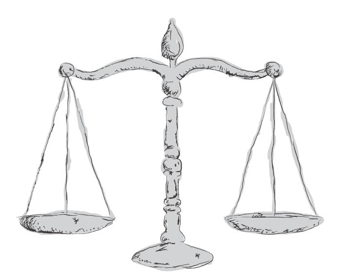

¹⁸ See Order 53 Rule 3(6) of the Rules of Court 2012 and *Damien Thaman Divean (Mewakili Pertubuhan Pelindung Khazanah Alam) & Anor v Majlis Eksekutif Negeri Selangor Darul Ehsan (Exco) & Ors* [2023] MLJU 188.

¹⁹ See *Zakaria bin Abdullah & Ors v Lembaga Perlesenan Tenaga Atom & Ors* [2013] 5 MLJ 206.

²⁰ In this regard, see *Mentari Housing Development Sdn Bhd & Anor v Abdul Ghapor Hussin & Ors* [2012] 5 MLJ 700.

*Article 10(1)(a) of the Federal Constitution* guarantees the freedom of speech and expression of Malaysian citizens. Implicit within this right is the right of access to information, because only when there is freedom to express ideas, exchange and disseminate information, can there be access to information.²¹ However, the Federal Constitution itself provides for Parliament to enact laws to restrict such freedom under the grounds of, amongst others, security of the Federation, public order, morality, defamation or incitement to offences.²² As a result of this, Parliament has in fact enacted numerous laws restricting the freedom of speech and expression, along with its corresponding right of access to information.

#### **5.4 Access to information**

In the context of the EUDR, the most pertinent legislation would be the Official Secrets Act 1972 ('OSA'). *Section 2* defines an 'official secret' as 'any document specified in the Schedule to the Act and any information and material relating thereto', as well as any other information, document or material that may be classified as 'Top Secret', 'Secret', 'Confidential' or 'Restricted', by designated Ministerial officials²³ or designated public officials.²⁴ The Schedule to the Act lists three categories of documents that are always considered 'official secret': (i) Cabinet records, records of decisions and deliberations including those of Cabinet committees; (ii) State Executive Council documents, records of decisions and deliberations including those of State Executive Council committees; and (iii) documents concerning national security, defence and international relations.²⁵

*Section 16A* provides that any certificate of secrecy issued by practically any public official is conclusive evidence that a document is in fact an official secret.²⁶ The Act does not provide for any minimum level of seniority for the public official who may be designated to classify information or documents. An executive decision on classifying the secrecy of information is beyond judicial enquiry. Any person who communicates any official secret faces criminal sanctions of not less than one year and not more than seven years imprisonment,²⁷ and the Government is armed with extensive powers which enhance its ability to detect infringements and secure convictions under the OSA.²⁸ Hence, it can be reasonably concluded that the amount of information subject to classification as an official secret is potentially unlimited.

²¹ See *Sivarasa Rasiah v Badan Peguam Malaysia & Anor* [2010] 2 MLJ 333, where it was held by the Federal Court at 343-344: 'Article 10 contains certain express and, by interpretive implication, other specific freedoms…The right to be derived from the express protection is the right to receive information, which is equally guaranteed.'

²² See Articles 10(2), (3) and (4) of the Federal Constitution.

²³ See Section 2(3) of the OSA.

²⁴ See Section 2B of the OSA.

²⁵ See also Section 2A of the OSA which allows the Minister to add to, delete from, or amend any provision in the Schedule, through an order published in the Gazette.

²⁶ See *Sharifah Sofia bt Syed Hussein (representing Hak Asasi Hidupan Liar Malaysia Global) & Ors v Pengarah Kepada Lembaga Kebajikan Haiwan [2022] 12 MLJ 37*, where the defendant in this case did not produce any certificate by a public officer certifying the documents sought were official secrets; thus the Court dismissed the claim that the documents were official secrets under the OSA.

²⁷ See Section 12 of the OSA.

²⁸ See Sections 18, 19, 20 and 23 of the OSA.

#### **5.5 The challenge**

A commodity originating from land that potentially infringes on indigenous or natives' rights fall foul of EUDR requirements. Therefore, as long as there is a pending dispute or litigation in court over NCR or indigenous rights over land use, the commodity cannot be placed on the EU market. Operators and traders must therefore always be aware of pending or even potential disputes over land rights when complying with due diligence requirements under the EUDR. For immediate purposes, operators and traders would have to conduct searches in the relevant courts to see if there are any such pending claims. A long-term solution would be to have consistent and frequent engagement with local communities to avoid this potential risk for commodities produced on native or indigenous land.

Again, in the context of the EUDR, geolocation or polygon coordinates may be classified as an 'official secret' that cannot be shared with outside parties due to security and sovereignty issues. However as mentioned earlier, the relevant ministry is working closely with JUPEM to find a way to ensure compliance with the EUDR without compromising Malaysia's national security.

One of the key challenges in Malaysia's efforts to prepare for EUDR application lies in the lack of adequate funding. Compliance with the EUDR mandates stringent measures to ensure legality, traceability, and enforcement in the production and export of commodities linked to deforestation. However, Malaysian domestic agencies such as the MRB can play an important role by creating enabling framework conditions, e.g. by contributing to collecting geolocation data, delineating polygons for relevant agricultural or forested sites, verifying supply chain compliance, and developing internal databases to capture the relevant due diligence information, such as the MSNR Trace system developed by the MRB. While the primary obligation under the EUDR rests with operators and traders, they remain bound by Malaysian laws; thus, if Malaysian regulations designate a domestic agency to oversee a particular industry, it becomes the agency's responsibility to ensure that the national legislative framework meets and complies with the EUDR, thereby facilitating the successful export of products under its framework. Some of the efforts that fall on domestic agencies' responsibilities include acquiring advanced technological tools, skilled personnel, and robust monitoring systems, all of which demand substantial financial resources. The lack of dedicated funding exacerbates existing challenges, limiting the capacity of agencies to establish comprehensive traceability systems or enforce regulations effectively.

#### **6 LACK OF FUNDING FOR CREATING AN ENABLING ENVIRONMENT FOR COMPLIANCE**

# **SUGGESTIONS AND RECOMMENDATIONS**

#### **1. To enable Malaysian supplier companies to effectively support EU Operators, the following suggestions and recommendations are proposed:**

#### **1.1 Implement Robust Legal Compliance and Traceability Systems**

Develop and integrate supply chain legality requirements and traceability mechanisms to track and ensure that all legal requirements such as permits and licences are valid and subsisting for commodities from their source to the end market. This includes complying with national mandatory certification schemes, national guidelines or other nonbinding regulations such as the Timber Legality Assurance System (TLAS), Sarawak Timber Legality Verification System (STLVS) and the Malaysian Timber Certification Scheme (MTCS) for timber, and the Malaysian Sustainable Natural Rubber (MSNR) SOP for rubber. The traceability mechanisms should include collecting and maintaining accurate geolocation data, and site polygons.

It is also essential for EU operators to engage in clearer and more effective communication with their counterparts here in Malaysia, and vice versa. Strengthening communication will help ensure that all legal requirements are properly understood and adhered to, facilitating smoother compliance and mutual cooperation. Apart from that, the relevant ministries and agencies in Malaysia will also continue to provide regular updates on EUDR to Malaysian operators or exporters to ensure that they are well informed.

#### **1.2 Support Clients by Conducting Regular Due Diligence**

Establish procedures to support clients in the role of an operator in their due diligence obligations to ensure that products meet EUDR standards. This includes verifying suppliers, collecting relevant information, conducting risk assessments, implementing risk mitigation measures in case of nonnegligible risk of deforestation or illegal production and documenting evidence to demonstrate compliance.

#### **1.3 Regular engagement with local communities**

Actively and regularly engage with local communities, including native, aboriginal, and indigenous groups, to ensure transparency and mutual understanding of their operations. This engagement is essential to inform these communities about planned activities, address concerns proactively, and foster trust. Furthermore, such consultations play a pivotal role in avoiding potential legal disputes related to land use rights, as they provide an opportunity to clarify boundaries, secure consent, and uphold the rights and traditions of these communities, ensuring that operations are both ethical and compliant with international standards.

#### **1.4 Invest in Training and Capacity Building**

Train staff and local suppliers on EUDR requirements and best practices for sustainable production, especially on risk mitigation strategies when identifying risks in the supply chain which can be mitigated through such investments. Awareness and education can help improve compliance across the supply chain.

### **1.5 Collaborate with Technology Providers**

Utilize digital technology such as satellite imagery, blockchain or QR codes, and geospatial mapping tools to monitor land use and demonstrate that production sites are not contributing to deforestation or illegal activities. However, financial constraints may be a hindrance especially for micro and small-scale operators. Financial support could be sought through green bonds, sustainability-linked loans, or other funding mechanisms to upgrade operations and ensure compliance.

### **1.6 Engage with Experts and Consultants**

Work with environmental experts, consultants, and NGOs who specialize in EUDR compliance to get guidance on meeting technical and legal requirements.

#### **1.7 Strengthen Supplier Relationships**

Collaborate closely with suppliers to ensure they understand and adhere to EUDR standards. Offer support to smaller suppliers who may lack resources to meet the requirements independently.

#### **1.8 Participate in Multi-Stakeholder Dialogues**

Join dialogues and initiatives with governments, NGOs, and international organizations to align practices with global standards and access knowledge-sharing opportunities.

### **1.9 Proactively Monitor Deforestation Risks**

Monitor and manage land use changes in production areas. Early detection of deforestation can help operators mitigate risks before non-compliance occurs.

#### **2. How government actors can support supply chain actors on meeting the EUDR legality requirements**

#### **2.1 Standardize and Strengthen Certification Schemes and Regulations**

- Set up a traceability system compatible with the EUDR. This can be achieved by aligning the Malaysian Timber Certification Scheme (MTCS) and the Timber Legality Assurance Systems (TLAS) with the EUDR requirements to increase market acceptance, with the same requirements throughout Malaysia to ensure uniformity and consistency. At the moment, all three regions i.e. Peninsular Malaysia, Sabah, and Sarawak, are strengthening their TLAS to align with the EU Timber Regulations (EUTR) and FLEGT requirements. The three systems are:
- 1. MyTLAS (Peninsular Malaysia)
- 2. Sabah TLAS (Sabah)
- 3. Sarawak Timber Legality Verification System (STLVS) (Sarawak) It would also be beneficial if all timber products adhere to globally recognized certifications like the Forest Stewardship Council (FSC) or the Programme for the Endorsement of Forest Certification (PEFC) and thereby increase the probability of Malaysian products to meet EUDR requirements. In this regard, it should be kept in mind certified products are not considered automatically as EUDR compliant; companies would still be required to conduct full due diligence nevertheless. Make the Malaysian Sustainable Natural Rubber (MSNR) SOP a compulsory requirement for all rubber exports. At the moment, it is included as a condition for the issuance of licences and permits, and as at 5 May 2025, the MSNR Trace System has been made mandatory for licence holders in the processing factory and rubber trade categories. This is definitely a step in the right direction, but it could be made into a legal requirement with enforcement powers and penalties for non-compliance. The MSNR should be made applicable throughout Malaysia. At present, the Sabah Rubber Industry Board (LIGS) and the Sarawak Rubber Industry Board (SARIB) are voluntarily adopting the MSNR, which is an indication that the MSNR could be nationally enforced.

#### **2.2 Enhance monitoring methods**

Enhanced monitoring methods, such as deploying more forest rangers, utilizing drones or satellite imagery can support efforts to detect and combat unsustainable practices. Encourage reports of unsustainable practices with proper legal protection and rewards for whistleblowers. Conduct more robust and regular federalstate engagements, collaborations, cooperation and coordination. In this regard, Malaysia is moving in the right direction to ensure legal timber trade by strengthening TLAS and actively participating in the *Asia-Pacific Economic Cooperation (APEC) Experts Group on Illegal Logging and Associated Trade (EGILAT)*. *Additionally, enforcement efforts are coordinated through the TLAS Implementing Agency Coordination Committee (IACC)* and periodic TLAS Independent Assessments conducted by third-party monitors.

#### **2.3 Regular engagement with local communities**

Actively and consistently engage with local communities, including indigenous, native, and aboriginal groups, to ensure they are well-informed about ongoing and planned operations within their territories. Such engagement is crucial for promoting transparency, addressing concerns, and building trust with these communities. Additionally, this process helps prevent legal conflicts related to land use rights by clarifying boundaries, respecting traditional practices, and securing consent, thereby ensuring that all activities align with ethical principles and international compliance standards. Provide stronger legal representation to enhance awareness and strengthen legal rights.

#### **2.4 Support for micro or smallholders**

Provide technical training for smallholders on sustainable rubber tapping and planting practices and geotapping and training funded by the EU. Offer subsidies and/or loans to help smallholders transition to sustainable practices. Encourage smallholders to form cooperatives to achieve economies of scale and afford certification costs. Educate smallholders and exporters on EUDR requirements, helping them adjust their practices proactively.

#### **2.5 Forest Reserves**

Increase the proportion of forests designated as permanent reserves and ensure they are strictly protected. Encourage plantations on degraded lands instead of natural forests to reduce deforestation. Incentivize plantations on degraded or abandoned agricultural land rather than converting forests and invest in forest restoration projects to offset historical deforestation (knowing that there is no compensation scheme under the EUDR but forest restoration pays off for climate and biodiversity). In Peninsular Malaysia, the State Governments could synchronise the information on de-*gazetting* forest areas with the Federal Forestry Department.

#### **2.6 Obtain international assistance**

Engage in talks with the EU to clarify expectations and align Malaysia's initiatives with EUDR guidelines. Obtain targeted financial assistance especially from the EU. Implementing the EUDR requires substantial investment in systems for legality verification, traceability, and enforcement, including the collection of geolocation data and mapping of relevant sites. Given the financial constraints faced by Malaysian domestic agencies, external funding from the EU would enable the development of robust monitoring infrastructure, the acquisition of advanced technologies, and the training of personnel needed to uphold the regulation's standards. By providing funding, the EU can help bridge resource gaps and ensure equitable participation in achieving deforestationfree supply chains. In this regard, Malaysian companies and smallholder associations should remind companies in the operator role of their obligation to conduct risk mitigation measures that could include capacity building for, and investments in smallholders to provide them with financial assistance.

# **CONCLUSION**

By and large, Malaysia's timber and rubber industries have demonstrated substantial preparedness for meeting the EUDR criteria. The existing legal and regulatory frameworks governing land use rights, environmental protection, labour and human rights, forestry and agricultural practices, and anticorruption efforts in Malaysia are generally aligned with the legality and traceability requirements outlined under the EUDR. Moreover, the proactive initiatives by federal and state agencies such as the Malaysian Timber Industry Board (MTIB), the Malaysian Rubber Board (MRB), and related agencies reflect a strong institutional commitment to ensuring deforestation-free, legal, and sustainable supply chains.

As the EUDR implementation deadline draws near, continued dialogue and capacitybuilding among Malaysian stakeholders encompassing government, industry actors, and civil society, will be critical. Large companies have a role to play in terms of supporting their suppliers, in particular smallholders. Closing the remaining legal and procedural gaps will not only facilitate market access for Malaysian commodities but also reinforce the country's leadership in sustainable natural resource governance on the global stage.

However, several critical areas warrant further improvement to ensure full and consistent compliance. These include the harmonisation of legal definitions (especially on 'forest' and 'deforestation'), enhanced access to geolocation data while addressing national security concerns, streamlined interagency coordination across federal and state jurisdictions, and stronger protections for indigenous and native community rights, including meaningful implementation of Free, Prior and Informed Consent (FPIC). Additionally, practical challenges related to administrative fragmentation, transparency, enforcement capacity, and access to justice remain pertinent and must be addressed through systemic reforms.

#### **Imprint**

*This publication was produced with the financial support of the European Union and the German Federal Ministry for Economic Cooperation and Development (BMZ). Its contents are the sole responsibility of GIZ and do not necessarily reflect the views of the EU or the BMZ.*

On behalf of the European Union and the German Federal Ministry for Economic Cooperation and Development (BMZ)

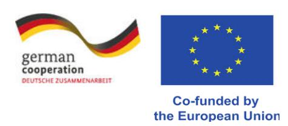

#### **Published by the**

Deutsche Gesellschaft für Internationale Zusammenarbeit (GIZ) GmbH

#### **Registered offices**

Bonn and Eschborn, Germany

EUDR Engagement project (Engagement with Indonesia, Malaysia, Laos, Thailand and Vietnam to raise awareness on and to promote better understanding of the EU approach to reducing EU-driven deforestation and forest degradation)

Friedrich-Ebert-Allee 36+40

53113 Bonn, Germany

info@giz.de

www.giz.de/en

#### **As at**

May 2025

#### **Photo credits**

EUDR Engagement/ Loh Teng Shui, Synergy Visual Communication

© GIZ

All rights reserved. Licensed to the European Union and the German Federal Ministry for Economic Cooperation and Development under conditions.

#### **Authors**

Sheila Ramalingam

Lim Jit Yeng

Lishanthan Kumar

Co-funded by  
the European Union