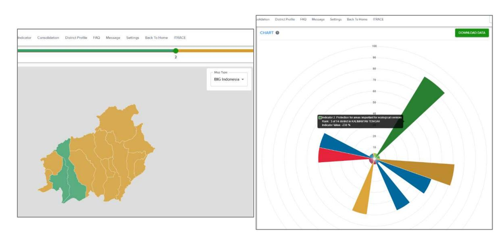
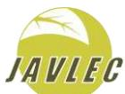

# **Strengthening sustainable oil palm plantation governance through the Revenue-Sharing Fund for Oil Palm Plantations (DBH Sawit)**

# **Key points**

- Funding constraints have been identified as a cause of persistently low productivity in smallholder oil palm plantations, missed ISPO certification targets, and slow issuance of cultivation registration certificates (STD-B) for oil palm smallholders.
- The Plantation Fund, State Budget (APBN), Regional Budget (APBD) and other official funding sources have not been effective in stimulating sustainable oil palm plantation development at the sub-national level.
- The issuance of Government Regulation No. 38, 2023 on Revenue-Sharing Fund for Palm Oil Plantations (*Dana Bagi Hasil* DBH Sawit) offers districts a potential means to strengthen sustainable palm oil production.
- To improve the effectiveness of the fund in addressing issues faced by oil palm smallholders and in improving sustainability in the palm oil sector more broadly, the following steps should be considered: o Strengthen institutional synergies in allocating funding and provide a holistic basis for fund allocation through use of district sustainability performance indicators. o Increase the 20% DBH Sawit funding ceiling for non-infrastructure activities to boost support for support economic, environmental, social and governancerelated goals in palm oil-producing districts. o Utilise objective and consistent data to determine oil palm plantation area and/or oil palm plantation land productivity to increase transparency in DBH Sawit funding allocation. o Broaden eligible activities for DBH Sawit funding to promote district transitions to sustainability and foster smallholder inclusion in supply chains for legal and deforestation-free palm oil.

# **Introduction**

Indonesia's total oil palm cover reached 17.3 million hectares in 20231 while the total area covered by plantation business licences (IUPs) reached 20.4 million hectares2 . The plantations are spread across 26 provinces, with the largest areas in Riau, West Kalimantan, Central Kalimantan, North Sumatra and East Kalimantan. Smallholder oil palm plantations account for 40.3% of the total area of oil palm plantations3,4 .

While smallholder oil palm plantations have benefits for local livelihoods and the local economy, Good Agricultural Practices (GAP) are seldom implemented5,6. Other factors similarly reduce the productivity of smallholder oil palm plantations, including poor seedling quality, low financial and technical capacity, weak institutions, and limited smallholder networks7 . Crude Palm Oil (CPO) production from smallholder plantations is low at around 2- 3 tonnes per hectare per year compared to 12-14 tonnes for large companies8 .

Oil palm smallholders also face land tenure legality issues that are often associated with the location of plantations within designated forest areas. Lack of evidence of land tenure legality hinders identification of the source of palm oil9 , which is an important part of supply chain traceability10. Land tenure legality is also required for issuance of cultivation registration certificates (*Surat Tanda Daftar Budidaya*, or STD-B) and for Indonesian Sustainable Palm Oil (ISPO) certification11 .

The role of national-level policy makers and local governments is crucial in solving these issues, as they have authority over oil palm sector governance and development of smallholder oil palm plantations12. While the central government has developed the National Action Plan for Sustainable Palm Oil (RAN-KSB) and followed up with Regional Action Plans for Sustainable Palm Oil (RAD-KSB), lack of funding has hindered implementation.

Currently, government funding to support independent oil palm smallholders is available through the Palm Oil Plantation Fund Management Agency (BPDPKS), the State Budget (APBN), the Regional Budget (APBD) and other official sources3 . However, these funds have not been able to lift oil palm smallholders to productivity levels approaching those in company-owned plantations13 and lack of funding for the development of sustainable smallholder oil palm plantations remains a major challenge3 .

This brief summarises information on the legal basis of the Revenue-Sharing Fund for Palm Oil Plantations (DBH Sawit) and provides suggestions on its implementation to better enable local governments to support sustainable palm oil production, smallholder inclusion and regional development. It is based on JAVLEC's five years of experience in assisting local governments and smallholders in Central Kalimantan and various relevant discussions at the national level.

# **Legal basis of DBH Sawit**

Government Regulation 38/2023 on Revenue-Sharing Fund for Oil Palm Plantations (DBH Sawit) provides a basis to reduce fiscal imbalances between the central and regional levels and between producing and non-producing regions, to address externalities and increase

equity7 . Implementation of the fund is regulated by Minister of Finance Regulation 91/2023 on the Management of Revenue-Sharing Fund for Palm Oil Plantations Regulation.

Funding for DBH Sawit is derived from export levies and duties on Crude Palm Oil and/or derivative products. The fund ceiling is determined by the Ministry of Finance based on the previous year's state revenue, but cannot be less than 4% of overall state revenue from export levies and duties on Crude Palm Oil and/or derivative products. The allocation of DBH Sawit is as follows:

- 1. 20% for provinces with palm oil-producing districts/municipalities;
- 2. 60% for palm oil-producing districts/municipalities;
- 3. 20% for districts/municipalities bordering palm oil-producing districts/municipalities.

The detailed amount of DBH Sawit funding allocated to provinces/districts/cities is determined based on the following factors:

- a) area of oil palm plantation land;
- b) productivity of oil palm plantation land; and/or
- c) other indicators determined by the Minister.

MoF Regulation 91/2023, Article 10, paragraphs 1-3 provides further information on allocation of funding:

- a) 50% of the ceiling based on the area of oil palm plantations in proportion to the national oil palm plantation area; and
- b) 50% of the ceiling based on the productivity of palm oil land, as per values in Table 1.

#### **Table 1. DBH Sawit allocation in relation to palm oil productivity**

| Category  | Productivity (Kg/Ha) |      | Allocation (%) |
|-----------|----------------------|------|----------------|
| Very low  | <                    | 1000 | 10             |
| Low       | 1000 -               | 2000 | 15             |
| Medium    | 2000 -               | 3000 | 20             |
| High      | 3000 -               | 4000 | 25             |
| Very high | ≥ 4000               |      | 30             |

In addition to the above, Articles 12 and 13 make provision for a 10% allocation based on the performance of provinces or districts/cities in terms of poverty reduction and availability of Regional Action Plans for Sustainable Palm Oil (RAD-KSB). According to the formula, palm oil-producing regions that contribute significantly to the state budget may not receive a large DBH allocation if performance levels are not met. Conversely, regions contributing less to the state budget can receive additional allocation based on performance. In general, however, larger amounts of funding go to areas with more oil palm land and higher productivity.

The use of DBH Sawit funds is specified in MoF Regulation 91/2023. Article 17, paragraph 1 stipulates that DBH Sawit funds are used to finance activities in the following areas:

- a) development and maintenance of road infrastructure at least 80% of the allocation of DBH Sawit per province and/or district/city
- b) other activities determined by the Minister a maximum of 20% of the DBH Sawit allocation per province and/or district/city.

'Other activities' as per Article 17, paragraph 1b are specified in Article 16 paragraph 5 as follows:

- a) data collection on smallholder oil palm plantations;
- b) preparation of Regional Action Plans for Sustainable Palm Oil (RAD-KSB);
- c) guidance and assistance for Indonesian Sustainable Palm Oil (ISPO) certification;
- d) forest and land rehabilitation; and
- e) social protection for palm oil plantation workers who are not yet registered as participants in social security programmes.

# **Recommendations**

## **1. Strengthen institutional synergies in implementing DBH Sawit and incentivising sustainability**

In determining funding allocations and activities eligible for support, the legal basis of DBH Sawit provides space for the development of institutional relationships and for the submission of inputs from relevant ministries. Although there is no requirement for the Minister of Finance to agree, government palm oil-related agencies can formulate inputs to guide DBH Sawit allocations and activities in palm oil-producing provinces or districts/cities, or in neighbouring districts/cities, so long as there is no conflict with existing regulations.

Regarding the funding allocation, 90% of funds are distributed based on the area and productivity of oil palm plantations, as noted above. The Minister of Finance has it within his power to determine 'other indicators' connected with local government performance to guide allocation of the remining 10%.

In MoF Regulation 91/2023, the Minister of Finance regulates 'other indicators' such as reduction in poverty levels and/or availability of Regional Action Plans for Sustainable Palm Oil (RAD-KSB). 'Other indicators' could, however, include other aspects of sustainability to provide a more holistic basis.

In this regard, the Ministry of National Development Planning (Bappenas) is currently promoting the Sustainable Jurisdiction Indicators (SJI) initiative. The SJI support district progress towards sustainability in the plantation sector by assessing performance against environmental, economic, social and governance pillars, which is visualised in an online data platform (see Figure 1).

Through integration with the SJI initiative, DBH allocation could better support and incentivise local governments in their progress towards sustainability. Districts performing well against an appropriate selection of indicators, or in need of additional support, could receive a larger DBH allocation than those with poor performance.

For example, DBH Sawit funding could be preferentially allocated towards districts with larger proportions of unregistered and/or uncertified smallholders, or where smallholders productivity is low and/or there are few smallholder associations/groups. Environmental indicators concerning forest protection and/or fire prevention could also be used to guide the allocation so that districts can be incentivised to reach national sustainability-related goals.

**Figure 1: The SJI data platform can show a district's overall progress towards sustainability (left), and specific progress against individual indicators (right), for potential use in determining DBH Sawit allocation**

## **2. Redirect a greater proportion of DBH Sawit for noninfrastructure activities**

To better support regional sustainability in the palm oil sector a fixed, or greater proportion of DBH Sawit funding could be allocated for activities that support economic, environmental, social and governance related goals in palm oil-producing districts.

Currently, a minimum of 80% of DBH funding can be allocated for infrastructure development and a maximum of 20% for 'other activities'. This could be revised, for example, to allow a *maximum* of 80% for infrastructure and a *minimum* of 20% for other activities, or another formulation proposed by palm oil-related agencies.

Collection of data on smallholder oil palm plantations is essential in accelerating STD-B issuance and is one of the eligible 'other activities' where 20% of the DBH Sawit allocation can be used. However, a maximum of 20% allocation constrains the rate of smallholder data collection. For example, in 2023 DBH Sawit funding for East Kotawaringin District was ~46 billion Rupiah and the maximum for 'other activities' was ~9.2 billion Rupiah. If the allocation

is equally divided among the five 'other activities' permitted under the DBH Sawit Regulation, funds for smallholder data collection amount to ~2 billion Rupiah (EUR 110,000) which is sufficient to cover only ~ 5,000 hectares of smallholder plantation area. There are 114,000 hectares of smallholder plantations in East Kotawaringin District to be recorded and mapped, and the above allocation means that it could take 20-30 years to complete smallholder data collection.

### **3. Ensure the availability of objective and consistent data**

Under the DBH Sawit regulation, oil palm plantation land area and/or oil palm plantation land productivity are required in determining allocation of DBH Sawit funding. To ensure understanding and transparency in how funding is allocated, the data used in assessing these factors should be made clear.

Currently, there are different sets of data used at different levels of government and in different ministries. Mutual agreement on the designated sources of information would ensure that allocations to districts objectively reflect the oil palm area and productivity and the consensus on data sources.

## **4. Eligible activities for DBH Sawit financing**

DBH Sawit could be put to greater use in improving the governance of oil palm plantations in Indonesia. In addition to infrastructure, MoF regulation 91/2023 regulates the use of DBH Sawit funds for 'other activities' to improve the governance of sustainable palm oil plantations. However, eligible activities for DBH Sawit financing could be broadened to promote district transitions to sustainability and foster smallholder inclusion in supply chains for legal, sustainable and deforestation-free palm oil.

The implementation of Regional Action Plans for Sustainable Palm Oil (RAD-KSB) can support improved oil palm plantation governance. Currently, DBH Sawit funding can be used for the *preparation* of RAD-KSB but not for *implementation*, which is covered by Regional Budget (APBD) and/or other legal and non-binding sources of funding. This funding goes to relevant technical agencies, but RAD-KSB activities may not appear in the agency budget and therefore may not receive support. Limited budget for RAD-KSB implementation provides a justification for the use of DBH Sawit funds. Among the many activities that are a part of RAD-KSB implementation, three are important to be financed by DBH Sawit:

#### **1. Strengthening of oil palm smallholder institutions**

ISPO certification mandates that smallholders should be part of a group, however, some 80% of independent smallholders are not affiliated with any farmer group (Gapoktan) or cooperative. Strong farmer institutions improve the bargaining position of farmers towards companies, but establishing and formalising farmer organisations requires substantial funding and facilitation. These costs are not currently covered by DBH Sawit.

#### **2. Prevention and mitigation of forest and land fires**

Numerous unscrupulous companies and planters continue to clear land for oil palm establishment through burning. This practice persists despite having been outlawed and despite government commitment to sustainable oil palm plantation governance. Land clearing through burning is a major cause of haze, a serious and recurrent environmental problem in Indonesia. With the additional funding from DBH Sawit, local governments can implement activities and develop facilities and infrastructure to support the prevention and suppression of forest and land fires.

#### **3. Increased synergy between local government institutions/agencies**

Lastly, DBH Sawit funding could be directed towards activities that promote synergy between district-level agencies. The implementation of RAD-KSB has not been hampered due to insufficient regional budget allocated to the RAD-KSB secretariat for cross-service and agency coordination, even though coordination is an important part of RAD-KSB implementation. As part of coordination efforts, funding can be used to synchronise data on sustainable plantation development and support monitoring, reporting and evaluation by the RAD-KSB secretariat.

# **Conclusion**

To accelerate sustainable oil palm plantation development, consideration should be given to providing funding for activities that are not fully accommodated elsewhere, for example through state budget (APBN), regional budget (APBD), the Palm Oil Plantation Fund Management Agency (BPDPKS) or other funding sources. In this context, Government Regulation 38/2023 on the Revenue-Sharing Fund for Oil Palm Plantations, or DBH Sawit, brings hope for local governments in in their efforts to improve oil palm plantation governance.

By supporting smallholder data collection and mapping, STD-B acceleration, smallholder ISPO certification, RAD-KSB implementation and other relevant activities, DBH Sawit can promote district transitions to sustainability and foster smallholder inclusion in supply chains for legal, sustainable and deforestation-free palm oil. By linking the allocation of funds to indicators of district sustainability performance, DBH Sawit can incentivise improved palm oil governance and strengthen the role of local governments in palm oil sector development.

# **References**

- 1. "Luas Tutupan Sawit Naik Menjadi 17,3 Juta Ha Berdasarkan Pemutakhiran BIG dan Kementan". Sawit Indonesia, 1 April 2024, available at [https://sawitindonesia.com/luas](https://sawitindonesia.com/luas-tutupan-sawit-naik-menjadi-173-juta-ha-berdasarkan-pemutakhiran-big-dan-kementan/)[tutupan-sawit-naik-menjadi-173-juta-ha-berdasarkan-pemutakhiran-big-dan-kementan/](https://sawitindonesia.com/luas-tutupan-sawit-naik-menjadi-173-juta-ha-berdasarkan-pemutakhiran-big-dan-kementan/)
- 2. Badan Pemeriksa Keuangan dan Pembangunan (BPKP). 2022. Hasil Audit Sawit Indonesia 2022.
- 3. Nurfatriani I, Rawati, Sari GK, Saputra W, Komarudin H. 2022. "Oil Palm Economic Benefit Distribution to Regions for Environmental Sustainability: Indonesia's Revenue Sharing Schema". Land 11(9).
- 4. Katadata, "Ini Provinsi dengan Perkebunan Kelapa Sawit Terbesar pada 2022", available at [https://databoks.katadata.co.id/datapublish/2023/05/11/ini-provinsi-dengan](https://databoks.katadata.co.id/datapublish/2023/05/11/ini-provinsi-dengan-perkebunan-kelapa-sawit-terbesar-pada-2022)[perkebunan-kelapa-sawit-terbesar-pada-2022](https://databoks.katadata.co.id/datapublish/2023/05/11/ini-provinsi-dengan-perkebunan-kelapa-sawit-terbesar-pada-2022)
- 5. Widyatmoko B, Dewi R. 2019. "Dynamics of Transmigration Policy as Supporting Policy of Palm Oil Plantation Development in Indonesia". Journal of Indonesian Social Sciences and Humanities 9(1).
- 6. Bakhtiar I, Suradiredja D, Santoso H, Saputra W. 2020. "Hutan Kita Bersawit: Gagasan Penyelesaian Untuk Perkebunan Kelapa Sawit Dalam Kawasan Hutan". Jakarta: Yayasan KEHATI.
- 7. Sari DW, Hidayat FN, Abdul I. 2021. "Efficiency of Land Use in Smallholder Palm Oil Plantations in Indonesia: A Stochastic Frontier Approach". Forest and Society 5(1).
- 8. Laporan Hasil Penelitian, Kondisi Kekinian Tata Kelola Sawit Indonesia, D.I.Yogyakarta: Hicon Law and Policy Strategic.
- 9. Arya Hadi Dharmawan, Nuva, Diyane Astriani Sudaryanti, Audina Amanda Prameswari, Rizka Amalia, Ahmad Dermawan, Info Brief No. 227, August 2018 (Bogor: Center for International Forestry Research (CIFOR), 2018).
- 10. Rival A, Montet D, Pioch D. 2016. "Certification, Labelling and Traceability of Palm Oil: Can We Build Confidence from Trustworthy Standards?" Oilseeds & Fats Crop and Lipids. doi: 10.1051/ocl/2016042.
- 11. Watts JD, Pasaribu K, Irawan S et al. 2021. "Challenges Faced by Smallholders in Achieving Sustainable Palm Oil Certification in Indonesia". World Development 145.
- 12. Choirul S, Hardiwinata, Wawan H et al. 2020. "Management of Palm Oil by the Government of Republic of Indonesia". Utopía y Praxis Latinoamericana 25(10).
- 13. Peitri H, Hendrawan D, Bahr T et al. 2023. "Replanting Challenges among Indonesian Oil Palm Smallholders: A Narrative Review". Environment, Development and Sustainability, available at<https://doi.org/10.1007/s10668-023-03527-z>

### **Additional resources**

Ichsan M, Saputra W, Permatasari A. 2021. "Oil Palm Smallholders on the Edge: Why Business Partnerships Need to be Redefined". SPOS Indonesia Policy Brief. Available at: [https://sposindonesia.org/wp-content/uploads/2021/07/28.-eng-Oil-palm-smallholders-on-the](https://sposindonesia.org/wp-content/uploads/2021/07/28.-eng-Oil-palm-smallholders-on-the-edge-Why-business-partnerships.pdf)[edge-Why-business-partnerships.pdf](https://sposindonesia.org/wp-content/uploads/2021/07/28.-eng-Oil-palm-smallholders-on-the-edge-Why-business-partnerships.pdf) 

Pramudya EP, Hospes O, Termeer CJAM. 2017. "Governing the Palm-Oil Sector through Finance: The Changing Roles of the Indonesian State". Bulletin Indonesian Economic Studies 55(1).

Cover photo: An oil palm smallholder transports fresh fruit bunches on a plantation in Central Kalimantan, Indonesia. **EFI.**

**Disclaimer.** This brief has been produced with the financial assistance of the European Union. The views expressed herein can in no way be taken to reflect the official opinion of the European Union.

