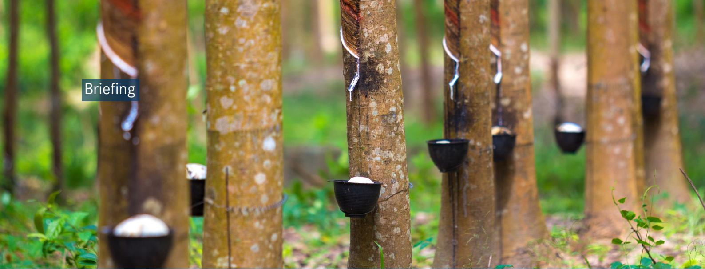
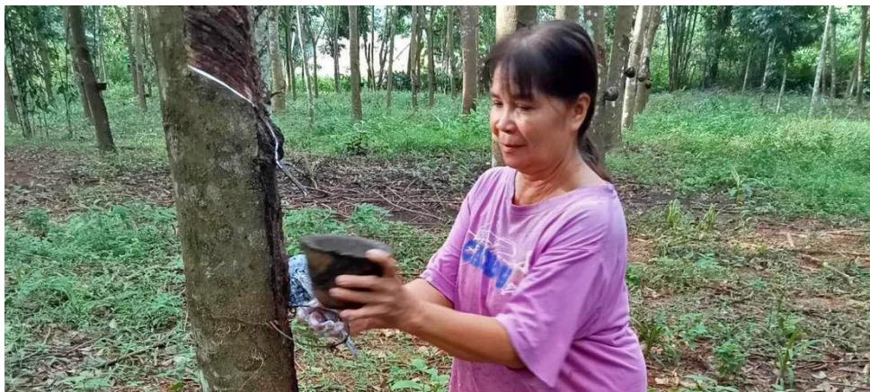
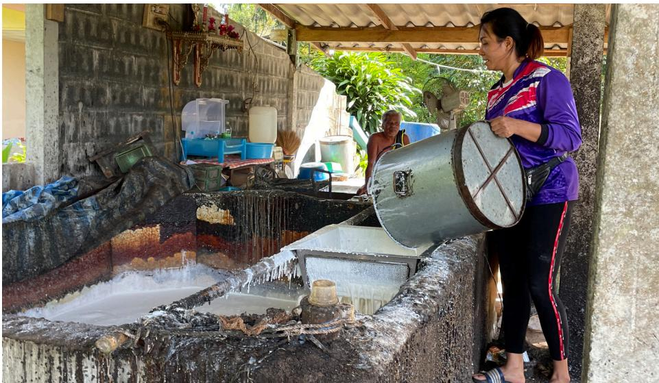

# Thailand's natural rubber producers are preparing for new market requirements

Thailand is the world's largest producer of natural rubber. In 2022, the country produced more than 4.7 million tonnes of natural rubber, accounting for around one-third of global rubber production. Since the Government launched a rubber promotion policy in 1989, natural rubber has become Thailand's leading agricultural export product.

Collecting latex from rubber trees.

Photo: Freepik/jcomp

The rubber industry in Thailand consists of three main segments: upstream production, intermediate processing, and downstream processing. Thailand is the world's leading upstream rubber producer, and an important exporter of intermediate rubber products such as concentrated latex and ribbed smoked sheets (used in tyres and automotive parts). The downstream segment, the final stage of processing rubber into products such as gloves and tyres, is less developed and mostly reliant on foreign investment and technology. However, the downstream segment of the Thai rubber industry is growing thanks to public support and emerging young entrepreneurs inspired by the development of the glove industry in Malaysia1.

China is Thailand's biggest natural rubber export market, followed by Malaysia for intermediate rubber products. Despite a significant drop in rubber prices globally, the value of natural rubber exports to the EU grew from USD 1.32 billion in 2019 to USD 2.19 billion in 20222.

In June 2023, the EU Regulation on Deforestation-Free Products (EUDR) entered into force. When it comes into application at the end of 2024, EU operators placing seven commodities on the EU market – including natural rubber and its derivatives such as gloves and tyres – will have to ensure that these products are deforestation-free and legal in the country of production. Given the importance of rubber for the economy and rural incomes, Thailand is making significant efforts to support EU operators' compliance with the EUDR and mitigate potential challenges for its farmers, traders and processors.

## Mapping natural rubber production

Thailand's National Rubber Committee has classified rubber plantation areas into two different types based on the cultivation period and the region where the plantation was established8. The original rubber plantation areas, the first type, are found in 14 provinces of the Southern region and three provinces of the Eastern region. These areas account for 64% of rubber cultivation and were mostly established on agricultural land previously used for fruit production. The newly opened rubber plantation areas, the second type, are found in 60 provinces in the Northern, Northeastern, Western, Central and Eastern regions and account for 36% of the cultivation area. In these areas, rubber was planted mainly on agricultural land originally used for cassava or sugar cane cultivation or paddy fields, but also in some logged-over forests.

Between 2017 and 2022, Thailand's total rubber cultivation area decreased by 4.5%. Cultivation in the original plantation areas declined due to limitations on the availability of land, temperature increases due to climate change, increased labour costs, natural disasters, and the widespread occurrence of leaf flow disease which decreases tree productivity9. However, rubber cultivation in the newly opened areas increased by 17.5% during the same period. This highlights that rubber plantations are generally moving towards the north and northeast of the country, which poses a deforestation risk in those regions.

A key step the Rubber Authority of Thailand (RAOT)8 is taking to support implementation of the EUDR is the mapping of production areas. RAOT has so far mapped more than 3.1 million hectares of rubber plantations, or 79% of the country's total rubber cultivation area, and collected geolocation information about 1.98 million rubber plots. Geolocation information about each plot is stored in a central database. The system developed and managed by RAOT can compare mapped rubber plantation areas with protected areas and forest areas. In doing so, RAOT intends to identify areas of rubber production, geolocate all plots of land and generate evidence about deforestation-free rubber production. Using a forest cover map based on EUDR/FAO definitions8 will be key to demonstrating that the rubber destined for the EU did not cause deforestation after the EUDR cut-off date of 31 December 2020.

Farmer tapping a rubber tree, Thailand.

Photo: Sumit Sriwisut

## Registering smallholder rubber farmers

Nearly all of Thailand's natural rubber – 90% – is produced by smallholders: there are 1.68 million smallholders engaged in rubber production on 3.9 million hectares of plantation area. This is significant from an economic and livelihood perspective, as almost 25% of all households engaged in the agricultural sector in Thailand are producing rubber. Smallholder plots tend to be small, with households cultivating 2.3 hectares on average. Profits from latex harvesting have declined substantially, and even turned negative, for rubber farmers in the past years. In the south of Thailand, the sharp decline in rubber

prices after 2011 almost halved the income of rubber-farming households. While the situation has recently improved, incomes are still much lower than 2011 levels7. The small-scale rubber sector in Thailand is fragmented.

Smallholders are organised into both formal and informal groups. Currently, there are a total of 958 such groups throughout the country. They are divided into 233 rubber farmer groups and 725 rubber plantation fund cooperatives supported by the Department of Cooperatives8. Informal farmer groups exist primarily for participation in auctions. Farmers don't have formal obligations towards each other in such groups. Cooperative members, however, have obligations and in return, receive funds and subsidised fertilisers. Thailand has 122,602 farmers who are cooperative members. Considering that Thailand has close to 1.7 million rubber farmers, the number of organised smallholders is limited.

As of March 2024, RAOT has registered more than 1.6 million farmers, as well as farmers' groups and rubber processing entities. As part of the registration, RAOT is collecting information about the farmers, the geolocation data of their plots of land and information about their products (see mapping section above).

One key challenge related to the registration of farmers is land tenure. The number of households who do not hold a land title for their rubber plantations is a concern and appears to be increasing, primarily in the newly opened areas. Having a land title is a prerequisite for registration by ROAT.

◀ Rubber is mixed in a collection centre, Thailand.

Photo: Wilfredo Lelis

## Traceability of natural rubber supply chains

These mapping and registration efforts are fundamental steps for providing the information needed by operators to conduct due diligence under the EUDR when placing rubber products on the EU market. But to achieve this, geolocation and legality information need to be passed on from one actor to the next along the entire supply chain.

In this context, traders play a critical role in Thailand and it will be important to include them in RAOT's registration systems. Rubber supply chains are complex, with several layers of traders between producers and processors, who are often located far apart. Traders mix rubber from different sources in collection centres and their supply chain transactions are often informal, which adds an extra layer of complexity. It will be important to identify incentives for traders to formally register in RAOT's systems allowing rubber collection centres to record inputs and outputs so that manufacturers can trace the raw material inputs back to the source.

## **Footnotes**

1 Motoko Kawano, 2018. Changing Resource-Based Manufacturing Industry: The Case of the Rubber Industry in Malaysia and Thailand. Springer. 2 Based on Eurostat for HS 40 (rubber and articles thereof). 3 https://www.raot.co.th/article\_attach/DOC041016-04102016093828.pdf ⁴ http://www.knit.or.th/web/wp-content/uploads/2022/01/rubbersupplychain.pdf 5 RAOT was established through the 2015 Rubber Authority of Thailand Act as a central organisation for the administration and management of the entire system of rubber in Thailand. RAOT has a central office in Bangkok and a strong presence at the regional, provincial and district levels through a network of offices and extension officers. 6 The EUDR defines forest as: "land spanning more than 0,5 hectares with trees higher than 5 metres and a canopy cover of more than 10%, or trees able to reach those thresholds in situ, excluding land that is predominantly under agricultural or urban land use." (Article 2, clause 4). 7 World Bank, 2022. Thailand Rural Income Diagnostic: Challenges and Opportunities for Rural Farmers. ⁸ https://www.nakhonlocal.go.th/datacenter/doc\_download/a\_060618\_162123.pdf ⁹ EFI analysed Thailand's legal framework of relevance to smallholder rubber farmers for the Global Platform for Sustainable Natural Rubber. It is available at https://sustainablenaturalrubber.org/

An effective national traceability system can support the inclusion of smallholders into rubber supply chains and prevent disruptions in the rubber trade from Thailand to Europe, and to other countries that process products for the European market such as Malaysia. Without a system in place, smallholder farmers who are not mapped and traders operating informally risk being excluded from European supply chains.

However, traceability is not only about geolocation information. Evidence of compliance with the laws and regulations applicable in Thailand shall be passed on together with evidence of deforestation-free production9. Land tenure or use rights for rubber plantations located in national reserved forests could be especially problematic, as it requires a permit to collect natural rubber from this type of public land. Assuring the legality of cultivating rubber on public lands, in particular in national reserved forests, will be necessary to ensure that only legal rubber products are placed on international markets.

Another challenge from a legal perspective is related to the employment of foreign workers in rubber plantations and processing facilities. The Thai rubber sector is heavily reliant on foreign workers from neighbouring countries. Ensuring that these workers have the appropriate permits and working conditions in compliance with Thai laws will be important.

# Capacity building and information sharing

The completion of RAOT's mapping and registration system and its subsequent implementation will require substantial capacity building nationwide. Millions of farmers, traders and processors will need to be able to provide the relevant information.

To build the capacity of local actors at a national scale, RAOT will need to engage its extension officers who support farmers, traders and processors in districts across Thailand. Extension officers could also play a role in validating the information in the RAOT registration systems. To effectively engage extension officers, RAOT will need to develop programmes and training materials.

Finally, Thailand could develop a centrally managed information-sharing platform to inform operators placing rubber and rubber products on the EU market on the legality and geolocation information of rubber, and potentially other commodities in the context of the EUDR. The platform could also be used to raise awareness among Thai stakeholders on the new market requirements.