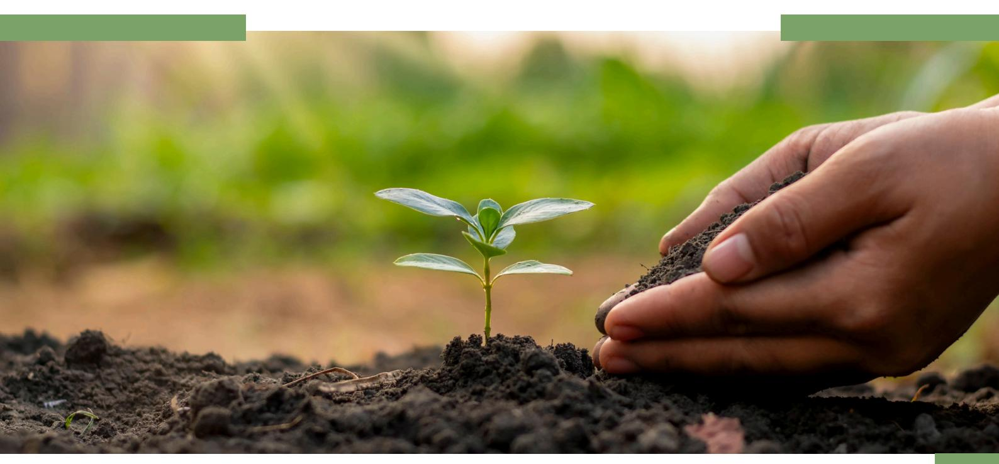
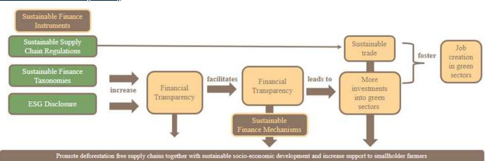
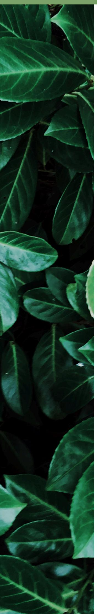

### FINANCE BRIEFING

# SUSTAINABLE FINANCE UPDATES

**Keeping you up to date with the latest developments in the Sustainable Finance space**

# **INTRODUCTION TO OUR FINANCE BRIEFING**

Dear reader, welcome to the first edition of the Finance Briefing. This first edition explains why sustainable finance is key to promoting deforestation-free supply chains, and the most important sustainable finance regulatory frameworks and financial mechanisms that we will be looking at in depth in the upcoming editions.

Each edition will feature one element of the regulatory framework (e.g. taxonomy, disclosure, etc) or financial mechanisms (e.g. blended finance, rural credit, etc), explaining the basic concepts and showcasing examples of good practices around the globe, how they promote deforestation-free supply chains, support smallholder farmers and/or promote gender-sensitivity or transformation.

### **LAUNCH OF OUR FINANCE BRIEFING CONCEPT**

This Finance Briefing is offered in the context of the SAFE – Sustainable Agriculture for Forest Ecosystems project, financed by the European Union (EU) and the German Federal Ministry for Economic Cooperation and Development (BMZ). SAFE is part of the Fund for the Promotion of Innovation in Agriculture (i4Ag) and implemented by Deutsche Gesellschaft für Internationale Zusammenarbeit (GIZ). The German Sustainable Finance Think Tank Climate & Company has been collaborating with the SAFE project on the topic of "Green Financing".

With the aim of providing information and facilitating learning on sustainable finance instruments for deforestation-free supply chains, gender aspects and their accessibility for smallholders, a new edition of the Finance Briefing elaborated by Climate & Company's experts will be released every other month.

**1**

The Finance Briefing will also present recommended further reading, podcasts, interviews, and upcoming events related to deforestation-free supply-chains with a special focus on sustainable finance. Have a good read!

Sustainable finance is key to promoting deforestation-free supply chains for two crucial reasons. Firstly, it facilitates access to financial resources essential for sustainable land use practices and technologies (e.g. monitoring, traceability systems, etc.), vital for small farmers reliant on borrowed or external capital. Secondly, financial institutions actively assess their support's potential deforestation impact, choosing to withdraw funding or refraining from commitment if there's a risk, thus redirecting capital to sustainable economic activities. Access to finance for producers who would like to produce sustainably is one dimension. The other dimension is financial institutions actively assessing if their financial support could lead to deforestation and either withdraw funding or to not commit to it in the first place.

Sustainable finance refers to the process of taking environmental, social and governance (ESG) considerations into account [when making investment decisions](https://finance.ec.europa.eu/sustainable-finance/overview-sustainable-finance_en), contributing to the development of a sustainable economy. Therefore, it comprises any financial service or product that [integrates sustainability criteria \(ESG\) into its characteristics.](https://www.giz.de/en/downloads/giz2022-pr-1.-O-mercado-de-finan%C3%A7as-sustent%C3%A1veis-no-Brasil.pdf) One example is the Sustainable Amazonian Credits [\(Créditos Sostenibles Amazónicos](https://www.banecuador.fin.ec/creditopersonas/creditomicroempresa/creditoproduccionsostenible/)) offered by BanEcuador to smallholder farmers and small and medium enterprises (SMEs) dedicated to the sustainable and deforestation-free production of coffee, cocoa, palm, and livestock in the Amazon region.

## WHY SUSTAINABLE FINANCE IS KEY TO PROMOTING DEFORESTATION-FREE SUPPLY CHAINS

Figure 1 presents a scheme that demonstrates how sustainable finance can contribute to achieving deforestation-free supply chains. Sustainable finance instruments enhance market transparency, as investment makers have more information on where they will invest or to whom they provide a loan, thereby facilitating the shift of capital flows from grey to green projects through the development of financial mechanisms. These solutions play a crucial role in supporting farmers, including smallholders and local communities, in the transition to deforestation-free supply chains and in complying with regulations such as the [EU Regulation on](https://eur-lex.europa.eu/legal-content/EN/TXT/PDF/?uri=CELEX:32023R1115) [Deforestation-free Products \(EUDR\).](https://eur-lex.europa.eu/legal-content/EN/TXT/PDF/?uri=CELEX:32023R1115)

# EXAMPLES OF THE SUSTAINABLE FINANCE REGULATORY FRAMEWORK

# **TAXONOMY**

In the field of sustainable finance, taxonomies serve as a classification system that aims to help investors understand whether an economic activity is environmentally sustainable. Consequently, integrating the AFOLU sector (Agriculture, Forest, and Land Use) into the taxonomy is important to facilitate investments aimed at implementing best practices that foster deforestation-free supply chains. We can use the [Colombian Green](https://www.taxonomiaverde.gov.co/webcenter/portal/TaxonomaVerde) [Taxonomy](https://www.taxonomiaverde.gov.co/webcenter/portal/TaxonomaVerde) as an example.

# **DISCLOSURE DUE DILIGENCE**

Disclosure frameworks and standards are key to increasing the transparency of firms' ESG performance, enabling better investment decisions and holding companies accountable for unsustainable practices. Different standards and frameworks have been developed, such as the [GRI,](https://www.globalreporting.org/) [ISSB](https://www.ifrs.org/issued-standards/ifrs-sustainability-standards-navigator/), [CDP,](https://www.cdp.net/en) and other. The importance of making deforestation-related disclosure requirements mandatory across supply chains is discussed in a [Climate & Company publication](https://climateandcompany.org/publications/comparative-analysis-of-upcoming-disclosure-standards-key-steps-to-raise-ambition-and-the-case-of-deforestation/).

Due diligence regulatory measures are emerging worldwide, reflecting a growing emphasis on environmental sustainability and responsible business practices. Within this global landscape, the EU's Green Deal stands out with its EU Regulation on Deforestation-Free Products (EUDR) and the Corporate Sustainability Due Diligence Directive (CSDDD). These laws are key in the fight against deforestation and the promotion of deforestation-free supply chains.

[Note: The upcoming editions of the Finance Briefing will delve into sustainable finance instruments and their role in supporting smallholder farmers to advance deforestation-free supply](https://www.banecuador.fin.ec/creditopersonas/creditomicroempresa/creditoproduccionsostenible/) [chains. Detailed discussions on these topics and examples of application in SAFE partner countries will be presented.](https://www.banecuador.fin.ec/creditopersonas/creditomicroempresa/creditoproduccionsostenible/)

|                                                                                                                                                                                           | EXAMPLES OF FINANCIAL SOLUTIONS                 |                                                                                                                                                                                          |
|-------------------------------------------------------------------------------------------------------------------------------------------------------------------------------------------|-------------------------------------------------|------------------------------------------------------------------------------------------------------------------------------------------------------------------------------------------|
| DEBT PRODUCTS Credit lines Green Bonds Social Bonds Sustainability Bonds Sustainability-linked Bonds Green Loans Social Loans Sustainability Loans Sustainability-linked Loans Debt Funds | EQUITY PRODUCTS Equity investments Equity funds | OTHER CAPITAL MARKET PRODUCTS Blended Finance Mechanisms Payment for Environmental Services (PES) Sustainable Supply Chain Finance (SSCF) Carbon markets Biodiversity credits Guarantees |
| Example: Créditos Sostenibles Amazónicos                                                                                                                                                  |                                                 | Examples: Blended Finance                                                                                                                                                                |
| (BanEcuador)                                                                                                                                                                              |                                                 | through the Tropical Asia Forest Fund 2 (TAFF2)                                                                                                                                          |

Financial solutions vary depending on the country, economic conditions, supply chain, etc. Some examples of financial mechanisms that can support smallholder farmers to promote deforestation-free supply chains are presented below. The categorisation was defined based on a literature review including a study published by the [Global Compact Network Brazil](https://go.pactoglobal.org.br/sustainablefinanceagro).

(a). [Practical Guide to Sustainable Finance in Agro - UN Global Compact in Brazil](https://go.pactoglobal.org.br/sustainablefinanceagro), (b). [Unlocking](https://sustainablefinanceasia.org/wp-content/uploads/2021/03/WWF-2021-Unlocking-Smallholder-Finance-for-Sustainable-Agriculture.pdf) [Smallholder Finance for Sustainable Agriculture in SE Asia - WWF Germany](https://sustainablefinanceasia.org/wp-content/uploads/2021/03/WWF-2021-Unlocking-Smallholder-Finance-for-Sustainable-Agriculture.pdf), (c). [Introduction to](https://unccelearn.org/course/view.php?id=139&page=overview) [Sustainable Finance \(E-Learning Course\) - UNCC](https://unccelearn.org/course/view.php?id=139&page=overview)

# SOME EXAMPLES OF SUSTAINABLE FINANCE MECHANISMS

#### **EVENTS IN MAY**

#### **READING**

# FURTHER READING & EVENTS

(a). [World Bank Land Conference 2024: Securing land tenure and access for climate action](https://www.worldbank.org/en/events/2023/10/05/land-conference-2024#2), (b). [Annual](https://ad-partnership.org/newsevents/registration-adpmsm-2024/) [Amsterdam Declarations Partnership Multi-Stakeholder Meeting \(ADP-MSM\)](https://ad-partnership.org/newsevents/registration-adpmsm-2024/), (c). [O Mercado e o Café](https://jornadacafecarbononeutro.com.br/wordpress/) [Carbono Neutro \(Painel – EUDR\)](https://jornadacafecarbononeutro.com.br/wordpress/), (d)[.Sustainable Investment Forum Europe 2024](https://events.climateaction.org/sustainable-investment-forum-europe/)

Disclaimer: This briefing is a partnership between Climate & Company and the SAFE (Sustainable Agriculture for Forest Ecosystems) project, financed by the European Union (EU) and the German Federal Ministry for Economic Cooperation and Development (BMZ). SAFE is part of the Fund for the Promotion of Innovation in Agriculture (i4Ag) and implemented by Deutsche Gesellschaft für Internationale Zusammenarbeit (GIZ). The aim of the collaboration is to identify and foster solutions to mobilise financial sources, especially for vulnerable groups, and enhance gender-transformative financial frameworks for investments in deforestation-free supply chains.

Its contents are the sole responsibility of Climate & Company and do not necessarily reflect the views of the EU or the Federal Ministry for Economic Cooperation and Development (BMZ). To learn more visit: [SAFE - Team Europe Initiative on Deforestation-free Value Chains](https://zerodeforestationhub.eu/) and [Climate and Company's](https://climateandcompany.org/projects/solutions-for-mobilising-financial-sources/) [dedicated project page.](https://climateandcompany.org/projects/solutions-for-mobilising-financial-sources/)

#### **EVENTS IN JUNE**

(a). [IUFRO World Congress - Forests & Society Towards 2050](https://iufro2024.com/)[, \(b\).](https://www.worldbank.org/en/events/2023/10/05/land-conference-2024#2) [Responsible Investor Europe](https://info.pei.group/ri-europe-24-agenda.html)[, \(c\).](https://www.worldbank.org/en/events/2023/10/05/land-conference-2024#2) [Nature-based Solutions Conference 2024,](https://www.naturebasedsolutionsoxford.org/) (d). [BID \(IDB\) Investor Sustainability Week,](https://idbinvest.org/en/sustainability/sustainability-week-2024) (e). [Latin](https://www.ieta.org/events/latin-america-climate-summit-lacs-2024/) [America Climate Summit- LACS](https://www.ieta.org/events/latin-america-climate-summit-lacs-2024/)