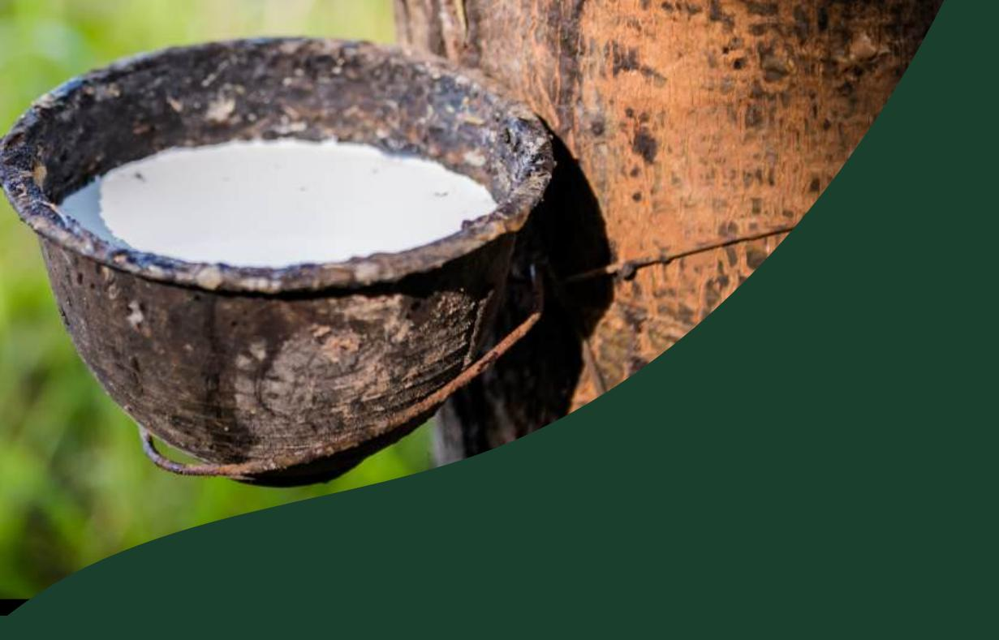
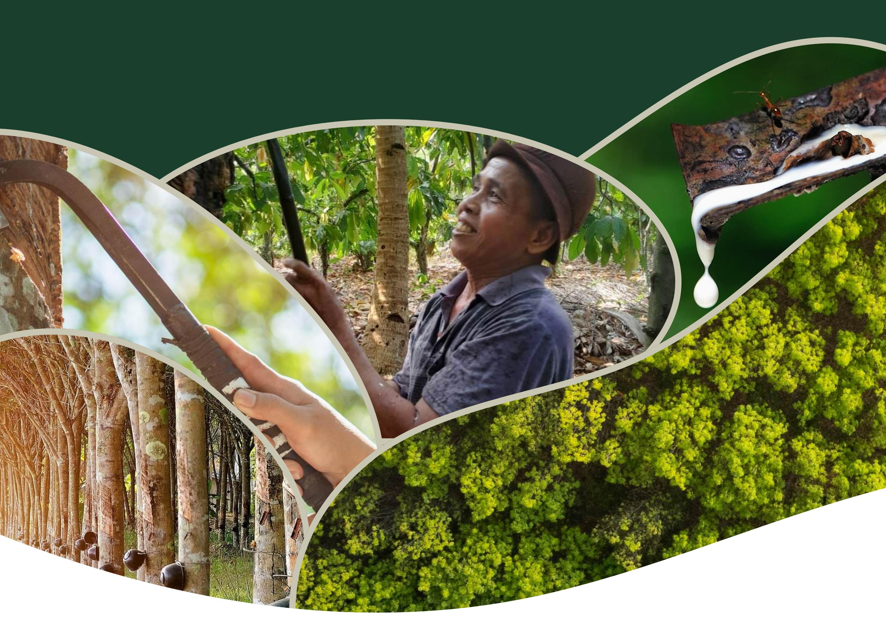
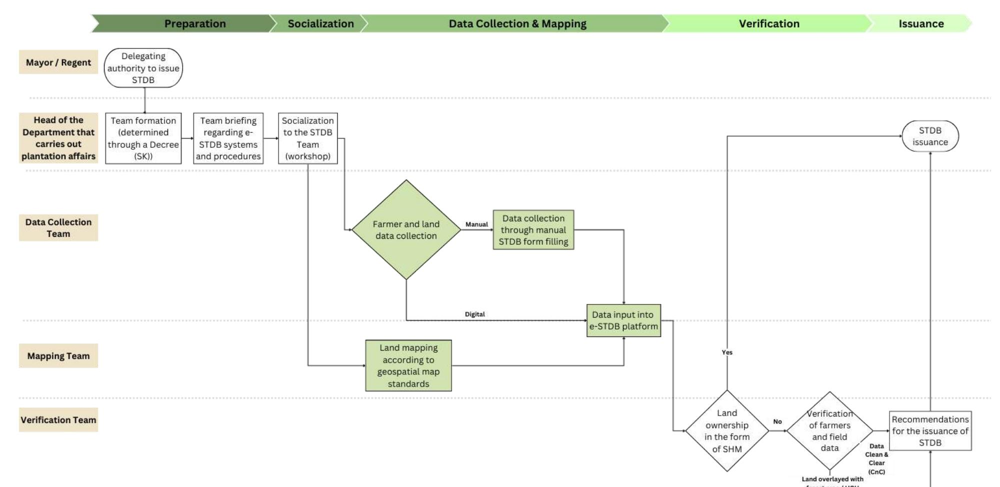

# **Technical Procedures and Collaboration of Parties in Accelerating the Smallholder Registration with STDB**

**Disclaimer: This publication was produced with the financial support of the European Union, the German Federal Ministry for Economic Cooperation and Development (BMZ) and the Ministry of Foreign Affairs of the Netherlands. Its contents are the sole responsibility of Nectary Sustainability Solutions and do not necessarily reflect the views of the European Union, the German Federal Ministry for Economic Cooperation and Development (BMZ) and the Ministry of Foreign Affairs of the Netherlands**

# **Technical Procedures and Collaboration of All Parties in Accelerating the Registration of** *Surat Tanda Daftar Usaha Perkebunan Untuk Budidaya* **(STDB)**

# **I. Objective**

This document serves as a guideline for implementing collaboration between the government and relevant parties to support the acceleration of STDB registration. The primary focus of this guideline is to provide an overview of the mechanism for sharing farmers' data collected by other parties for the STDB registration process.

# **II. Procedure**

# **2.1. Procedure's Reference**

This procedure description refers to the Decree (SK) of the Director General of Plantations Number: 37/Kpts/PI.400/03/2024 concerning Guidelines for Issuing *Surat Tanda Daftar Usaha Perkebunan Untuk Budidaya* (STDB) and the Decree of the Director General of Plantations Number: 123/Kpts/PI.400/12/2024 concerning Amendments to the Decree of the Director General of Plantations No. 37/Kpts/Pl.4OO/O3/2024 concerning Guidelines for Issuing *Surat Tanda Daftar Usaha Perkebunan Untuk Budidaya* (STDB).

# **2.2. Delegation of Authority**

The Regent/Mayor delegates the authority to issue STDB to the Head of the Department responsible for plantation affairs to form a Team at the Regency/City level.

# **2.3. Formation of Data Collection, Mapping, and Verification Team**

The Head of the Department responsible for plantation affairs shall appoint a Data Collection, Mapping, and Verification Team through a Head of Department Decree (SK Kepala Dinas).

This team is responsible for conducting data collection and/or receiving and following up on data collection results conducted by other parties, as well as conducting field verification before the STDB registration process is carried out through the designated system.

If the STDB data collection and mapping process involves a third party, a written agreement must be made between the Department and the Third Party, along with a Confidentiality Agreement signed by both parties. This Confidentiality Agreement can be found in Appendix 2.

### **2.3.1.Data Collection Team Structure**

The Data Collection Team may involve the following elements:

- a. Representatives from the Regency/City of the Department responsible for plantation affairs, who act as coordinators;
- b. Representatives from the Sub-district;
- c. Village Guidance Non-Commissioned Officers (Babinsa);
- d. Village Officials;
- e. Agricultural Extension Workers;
- f. Plantation Assistants;
- g. Management of Farmers' Group Cooperatives (Gapoktan)/Farmer Groups

**Data collection can also be carried out by other parties, such as cooperatives, companies, NGOs, or relevant partner institutions.** Data collection by other parties must refer to Attachment 1 of the Decree (SK) of the Director General of Plantations Number: 37/Kpts/PI.400/03/2024 concerning Guidelines for Issuing *Surat Tanda Daftar Usaha Perkebunan Untuk Budidaya* (STDB). **The distribution of farmer data refers to Appendix 1 of this document.**

### **2.3.2. Mapping Team Structure:**

The Mapping Team may involve the following elements:

- a. Representatives from the Regency/City of the Department responsible for plantation affairs, who act as coordinators;
- b. Agencies responsible for mapping, land, and forestry affairs.
- c. Representatives from the Sub-district;
- d. Village Guidance Non-Commissioned Officers (Babinsa);
- e. Village officials;
- f. Agricultural Extension Workers;
- g. Plantation Assistants.

**Mapping can also be carried out by other parties, such as cooperatives, companies, NGOs, or relevant partner institutions.**

# **2.3.3. Verification Team Structure:**

The Verification Team may involve the following elements:

- a. Representatives from the Regency/City of the Department responsible for plantation affairs, who act as coordinators;
- b. Agencies that handle mapping/land affairs/forestry/spatial planning.

- c. Representatives from the Sub-district.
- d. Village officials.
- e. Village Guidance Non-Commissioned Officers (Babinsa).
- f. Agricultural Extension Officers.
- g. Plantation Assistants.

### **2.3.4. Team Briefing**

The team formed by the Department will receive training covering data collection techniques, mapping, verification, STDB issuance, use of tools, understanding legal provisions, and the e-STDB system.

This training can be organized by the relevant technical agency or by a third party collaborating with the Department responsible for plantation affairs.

### **2.3.5. Socialization**

The socialization is carried out by the Directorate General of Plantations and/or the Department responsible for plantation affairs at the provincial and district/city levels, in the form of workshops for the STDB Team.

### **2.4. STDB Socialization to Farmers**

Prior to conducting data collection on smallholders, it is recommended that a socialization regarding the STDB be conducted. This outreach activity can be facilitated by a third party with support from village officials and the local government through relevant agencies. The purpose of this outreach is to provide smallholders with a comprehensive understanding of the definition, purpose, benefits, urgency, and advantages of STDB ownership.

In addition to providing information, this activity also serves as a forum for interactive dialogue between farmers, third parties, and the local government. It is hoped that through this activity, farmers will gain a deeper understanding and confidence in making decisions on registering themselves and their plantations in the STDB system.

The active participation of Village Apparatus and related agencies is expected to increase trust and provide a sense of security to farmers in the registration process, while also reflecting the Government's full support for the implementation of this program.

## **2.5. Data collection**

Data collection on smallholders and their land, whether carried out by the Data Collection Team or other parties using a census approach, includes the identity of the smallholders, information regarding their land, and data on their institutional status.

This data collection activity can be conducted through two methods:

- a. Digital: direct data input into the e-STDB platform
- b. Manual: The STDB form is physically completed, which will then be input into the e-STDB platform by officers or the STDB Team at the Department responsible for plantation affairs at the Regency/City level.

For details on the principles and provisions for data sharing between the Data Collection Team (if carried out by a Third Party) and the Service, please see Appendix 1.

## **2.6. Land Mapping**

Land mapping, whether carried out by the Mapping Team or another party, adheres to basic geospatial map standards at a minimum scale of 1:50,000 in the form of areas or polygons.

The Mapping Team will then upload the land polygon data to the e-STDB platform. If the mapping process involves a third party, the submission of the mapping results to the Verification Team must be conducted officially and documented.

# **2.7. STDB Verification and Issuance Process**

The Regent/Mayor delegates the authority to issue STDB to the Head of the Department responsible for plantation affairs.

The provisions for the verification and issuance process for STDB are as follows:

- **If the land is owned under a** *Sertifikat Hak Milik* **(SHM):** The Head of the Department responsible for plantation affairs can directly issue *Surat Tanda Daftar Usaha Perkebunan Untuk Budidaya* (STDB) for the land.
- **If the land does not have SHM status:** The Verification Team will verify the data on farmers and land/plantations that have been integrated into the e-STDB platform.
- **If the land is located in a forest area or within a** *Hak Guna Usaha* **(HGU) of a business entity, but the farmer has legal management of the area (for**

# **example through social forestry approval) from the relevant Ministry/Institution in accordance with the provisions of applicable laws and regulations:**

Therefore, the land cultivation status is declared valid for the names of the plantation owners listed in the approval attachment, and can be categorized as Management Rights status. The Verification Team will issue a recommendation for the issuance of *Surat Tanda Daftar Usaha Perkebunan untuk Budidaya* (STDB) as stipulated in the Decree (SK) of the Director General of Plantations Number: 123/Kpts/PI.400/12/2024 concerning Amendments to the Decree of the Director General of Plantations Number: 37/Kpts/Pl.400/03/2024 concerning Guidelines for Issuing *Surat Tanda Daftar Usaha Perkebunan untuk Budidaya* (STDB).

- **If the land is in a forest area or a business entity's HGU area, and the plantation owner does not have legal management of the area from the relevant ministry/institution:**

Therefore, the Verification Team will provide a recommendation not to issue the STDB.

- **If the verification data is declared Clean and Clear:**

The Verification Team will issue recommendations for the issuance of STDB.

After receiving the Verification Team's recommendation and the data is declared Clean and Clear, the Head of the Department responsible for plantation affairs will issue the STDB in accordance with applicable provisions.

# **III.Flow Chart**

# **IV. Definition**

- 1. STDB : *Surat Tanda Daftar Usaha Perkebunan untuk Budidaya*
- 2. SK : *Surat Keputusan* (Decree)
- 3. Babinsa : *Bintara Pembina Desa* (Village Development Non-Commissioned Officer)
- 4. Gapoktan : *Gabungan Kelompok Tani* (Farmers Group Association)
- 5. SHM : *Sertifikat Hak Milik* (Freehold Certificate)
- 6. HGU : *Hak Guna Usaha* (Land Use Rights Certificate)
- 7. Clean & Clear (CnC): If the plantation land is not located in a forest area, or if it is located in a forest area, it has obtained the relevant permit from the Ministry of Forestry.
- 8. SIMLUHTAN : *Sistem Informasi Manajemen Penyuluhan Pertanian* (Agricultural Extension Management Information System)

# **V. References**

- 1. Surat Keputusan (SK) Direktur Jenderal Perkebunan Nomor: 123/Kpts/PI.400/12/2024 tentang Perubahan atas Keputusan Direktur Jenderal Perkebunan No. 37/Kpts/Pl.4OO /O3/2024 tentang Pedoman Penerbitan Surat Tanda Daftar Usaha Perkebunan Untuk Budidaya (STDB)
- 2. Surat Keputusan (SK) Direktur Jenderal Perkebunan Nomor: 37/Kpts/PI.400/03/2024 tentang Pedoman Penerbitan Surat Tanda Daftar Usaha Perkebunan untuk Budidaya (STDB)
- 3. Undang-undang (UU) Nomor 27 Tahun 2022 tentang Perlindungan Data Pribadi

# **Appendix 1.**

# **Principles and Provisions for Data Sharing**

### I. Background

- To expedite the issuance of *Surat Tanda Daftar Usaha Perkebunan untuk Budidaya* (STDB), effective collaboration is required between various parties, including data owners, third parties, local governments, and the Ministry of Agriculture. Given the sensitive nature of the data collected and its protection by law, procedures for its collection, sharing, and use must be regulated formally and accountably.
- II. Objective Provide operational guidelines for the safe, legal, and efficient sharing of farmer and plantation data for the purpose of STDB registration and issuance.
- III. Principles and Provisions for Data Sharing Data sharing is a crucial process because due to the involvement of sensitive data that must be kept confidential and requires the consent of the data owner. Therefore, several fundamental principles must be followed by all parties involved. These principles are as follows:
  - 1. There is a written agreement between the Department that carries out plantation affairs in the Regency/City and the Third Party as a basis for cooperation, as stated in Appendix 1.
  - 2. Farmers must provide consent for the data previously collected by a third party to also be used for STDB submissions.
  - 3. The data collection process carried out remains in accordance with the rules written in the Decree (SK) of the Director General of Plantations Number: 37/Kpts/PI.400/03/2024 concerning Guidelines for Issuing Surat Tanda Daftar Usaha Perkebunan untuk Budidaya (STDB).
  - 4. The data collection process by Third Parties can be carried out in the following ways:
    - a. Manually, by filling out the data collection form distributed by the officer, or
    - b. Digital, through direct submission on the e-STDB platform. This requires an agreement between the Department that handles plantation affairs in the Regency/City and the Third Party, to grant access to the e-STDB application to the Third Party. Approval for granting access to the e-STDB platform is the authority of the Ministry of Agriculture.

- 5. If the data collection process is carried out digitally, the Third Party is obliged to follow the privacy and data security procedures owned by the Department, to maintain the confidentiality of the data being processed, in accordance with the provisions written in Law (UU) Number 27 of 2022 concerning Personal Data Protection.
- IV. Parties Involved in Data Sharing and Their Responsibilities This data sharing process involves five parties, namely: (1) Farmers as data owners, (2) Village Heads, (3) Departments that carry out plantation affairs in the Regency/City (Government) as STDB publishers, (4) Third parties that collect data from farmers, and (5) the Ministry of Agriculture which is authorized to provide access to input data through the e-STDB platform. All parties are required to carry out their responsibilities as follows:
  - 1. Farmers: provide correct data to the Third Party's Data Collection Team
  - 2. Village Head: provides a statement letter stating that the data collected from the Farmers is appropriate and has received approval from the Farmers for STDB registration, and provides support to Third Parties to carry out data collection, including providing assistance and input regarding legal issues that may arise in the process of collecting data on farmers.
  - 3. Third Party: conduct data collection and mapping in accordance with the data collection principles contained in the Decree (SK) of the Director General of Plantations Number: 37/Kpts/PI.400/03/2024 concerning Guidelines for Issuing *Surat Tanda Daftar Usaha Perkebunan untuk Budidaya* (STDB), and communicate to the Village and the relevant Service regarding conditions in the field, along with existing issues.
  - 4. The Service: carries out verification and issuance of STDB in accordance with the guidelines of the Decree (SK) of the Director General of Plantations Number: 37/Kpts/PI.400/03/2024 concerning Guidelines for Issuing *Surat Tanda Daftar Usaha Perkebunan untuk Budidaya* (STDB) and Decree (SK) of the Director General of Plantations Number: 123/Kpts/PI.400/12/2024 concerning Amendments to the Decree of the Director General of Plantations No. 37/Kpts/Pl.4OO/O3/2024 concerning Guidelines for Issuing P*Surat Tanda Daftar Usaha Perkebunan untuk Budidaya* (STDB)
  - 5. Ministry of Agriculture: provides access to input data through the e-STDB platform if requested by a Third Party

Several field activities can be carried out collaboratively and with shared resources. For example, outreach to farmers, data collection, and mapping can be carried out jointly by both third parties and the government, specifically, village officials and the district-level plantation office. A more detailed agreement regarding the division of

tasks and responsibilities of each party is necessary to ensure clarity regarding how the joint team will be led, managed, and monitored in the field.

### V. Shared Data

The data to be shared includes farmer data and plantation data in accordance with the information required in the data collection form, with the following details:

### 1. Farmer's Identity

- a. Name
- b. ID Number
- c. Place and Date of Birth
- d. Gender
- e. Education
- f. Province
- g. Sub-district
- h. Regency/City
- i. Village/Sub-district
- j. Address

### 2. Field's Description:

a. Plantation No.- …

b. Land Status

c. Land Number/Document\*

d. Land Area Based on Document

e. Cropping Pattern

f. Commodity g. Planted Area h. Planting Year i. Number of Trees j. Annual Production

k. Productivity l. Seed Origin m. Land Type n. Fertilizer Type

### o. Sales Partners 3. Information on farmer institutions

a. Name of the farmer's institution

b. Commodity of the farmer's institution

c. Group number in SIMLUHTAN d. Address of the farmer's institution

In the form of coordinate points (minimum 4), forming a polygon or map in the form of a .shp file.

- **\*** Farmer's data collection is carried out on farmers who have land management status, including the following:
  - *Sertifikat Hak Milik* (SHM);
  - *Girik/ Surat Kepemilikan Tanah* (SKT)/ *Surat Keterangan Ganti Rugi* (SKGR) /Management Rights;
  - Customary/traditional land; or
  - Other legal land management, one example is *Hak Guna Usaha* (HGU) *Perorangan*.

Farmer's data collection is carried out on individual farmers or groups who have land management status, with the following ownership or control criteria:

- 1. *Sertifikat Hak Milik* (SHM);
- 2. *Girik/ Surat Kepemilikan Tanah* (SKT)/ *Surat Keterangan Ganti Rugi* (SKGR) /Management Rights;
- 3. Customary/traditional land;

# VI. Data Sharing Procedures

This data sharing process can be done in three ways, namely:

- 1. Manual: Data is provided by a Third Party to the Department manually, in the form of a completed form and data of at least 4 coordinates that form a polygon.
- 2. Digital: Data can be provided by Third Parties to the Department digitally, in the form of Excel Files and .shp files
- 3. Direct input into the e-STDB Platform: Data can be directly input into the e-STDB platform by a Third Party.

# VII. Data Sharing Time

This data sharing will be carried out after the farmer and plantation data collection process, as well as plantation mapping by a Third Party, where the data will be submitted to the Verification Team from the Department for further processing.

# VIII. Farmer's Data Verification

The data verification process will refer to Procedure 2.6 and will be conducted by a Verification Team appointed by the Department responsible for plantation affairs. A third party will assist with answering questions that arise during the verification process.

### IX. STDB Issuance

The issuance of STDB by the Head of the Department that carries out plantation affairs will refer to Procedure point 2.6.

# **Appendix 2: Non-Disclosure Agreement Letter**

# **Confidentiality Agreement Letter Between Parties for Acceleration of STDB Registration**

On this day, [Date of Signature], the undersigned:

## THE FIRST PARTY:

Name : Position : Address :

Hereinafter referred to as the "FIRST PARTY".

# THE SECOND PARTY:

Name : Position : Address :

Hereinafter referred to as the "SECOND PARTY".

Both parties agreed to collaborate in the form of data sharing to encourage the acceleration of STDB registration, with the following provisions:

# TERMS OF AGREEMENT AND CONFIDENTIALITY:

# 1. Purpose of the Agreement

This agreement was made as a basis for collaboration between the two parties, especially in the data sharing process, in order to encourage the acceleration of STDB Cultivation registration in \_\_\_\_\_\_\_\_\_\_\_\_\_\_\_\_\_\_.

Accelerating STDB registration will provide benefits to farmers, including: proving the legality of plantation cultivation activities and recognition as plantation business actors; gaining access to various government assistance programs that require STDB ownership; and increasing product competitiveness and expanding market access.

# 2. Agreement Period

This agreement is valid from \_\_\_\_\_\_\_\_\_\_\_\_\_\_\_\_\_\_ to \_\_\_\_\_\_\_\_\_\_\_\_\_\_\_\_\_\_

Extension of this agreement is possible based on a written agreement from both parties before the expiration of the validity period.

### 3. Data Confidentiality

The Parties are obliged to maintain the privacy and security of shared data, and to ensure that data management (storage, distribution, and processing) is carried out in accordance with applicable laws and regulations, in particular Law (UU) Number 27 of 2022 concerning Personal Data Protection. Access to data is limited to authorized parties only, and data may not be disseminated for purposes other than those stated in this agreement without the written consent of the parties.

# 4. Description of Shared Data

The data shared includes farmer and land information based on the STDB data collection form. This data includes:

- a. Farmer's identity (name, NIK, address, and other relevant information)
- b. Field information (commodity type, land area, land status, etc.)
- c. Information on farmer institutions (membership of Farmer Groups, Gapoktan, or Cooperatives)
- d. Location of the field (including a minimum of 4 coordinate points and forming a polygon.

The sharing and management of this data must comply with applicable laws and regulations, in particular Law (UU) Number 27 of 2022 concerning Personal Data Protection and other provisions related to the right to access information. And comply with applicable regulations regarding personal data protection and access rights.

### 5. Data Sharing Method

This data sharing method can be done in three ways, namely:

- a. Manually. Data is provided by a third party to the Head of the Department responsible for plantation affairs in the form of a completed form, complete with data on at least 4 coordinates that form a polygon.
- b. Digitally. Data is provided by the Third Party to the Head of the Department that carries out plantation affairs in the form of Excel files and .shp (shapefile) files.
- c. Through the e-STDB platform. Data can be directly input into the e-STDB platform by a third party. This method requires a written agreement between the Head of the Department responsible for

plantation affairs and the third party. Access to enter data into the e-STDB platform falls under the authority of the Ministry of Agriculture.

### 6. Violations and sanctions

If there is an alleged violation of the data confidentiality provisions, then, 3 (three) working days from the time the alleged violation is discovered, the Parties are required to conduct a joint clarification within a maximum period of 5 (five) working days. If a violation is proven, the party committing the violation is required to take corrective and remedial action within an agreed time, including stopping data distribution and deleting data that has been distributed illegally.

Parties proven to have violated data confidentiality provisions may be subject to administrative sanctions, termination of cooperation, or legal action in accordance with applicable laws and regulations.

Hereby, both parties agree to carry out cooperation in accordance with the provisions stated in this agreement letter.

\_\_\_\_\_\_ , \_\_\_\_\_\_ 2025

The First Party The Second Party

Name Name Position Position