MAKING EUROPE WORK FOR PEOPLE & FORESTS

# CREATING A PLATFORM FOR COLLECTING AND VISUALISING SOCIAL AND HUMAN RIGHTS IMPACTS

LESSONS FROM BRAZIL

#### **Date:** November 2025

**Front cover:** The Xavante are Indigenous Peoples that live in the Cerrado. Photo: A Xavante woman, by Raissa

Azeredo/NINJA Media **Back cover:** The Amazon rainforest in Mato Grosso, Brazil by Octavio Campos Salles/Alamy **Designer:** Sylwia Niedaszkowska

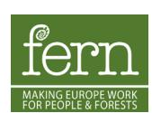

#### **Fern Office UK**

1C Fosseway Business Centre, Stratford Road,

Moreton in Marsh, GL56 9NQ, UK

#### **Fern office Brussels**

rue d'Edimbourg 26, 1050 Brussels, Belgium

#### **www.fern.org**

*This report was commissioned by Fern. This project was managed by Nicole Polsterer. All research and writing was conducted by Assoc Prof Dr Maria-Therese Gustafsson, Prof Dr Almut Schilling-Vacaflor, Dr Vivian Ribeiro and Dr Gabriela Russo Lopes. Edits were suggested by Nicole Polsterer and Richard Wainwright.* 

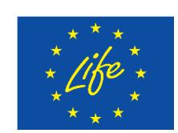

*This report was produced with financial support from the German Federal Ministry for Cooperation and Development (BMZ), implemented by Deutsche Gesellschaft für Internationale Zusammenarbeit (GIZ) GmbH, and the Climate, Infrastructure and Environment Executive Agency (CINEA) of the European Union. The views expressed can in no way be taken to reflect the views of Fern or the donors.*

# **Contents**

| Acronyms                                                               | 4  |
|------------------------------------------------------------------------|----|
| I. Introduction                                                        | 5  |
| II. Why do we need to visualise social and human rights impacts?       | 7  |
| III. Overview of existing databases and data sources                   | 9  |
| IV. Multi-stakeholder process and prioritisation of specific databases | 11 |
| Virtual and in-person meetings                                         | 11 |
| Data choices and scope of the Social Platform                          | 13 |
| Data representation and use                                            | 13 |
| Governance                                                             | 14 |
| V. The pilot Platform                                                  | 14 |
| Social conflicts                                                       | 15 |
| Deforestation and embargoes                                            | 16 |
| Production                                                             | 17 |
| Socioenvironmental profile                                             | 18 |
| User testing                                                           | 19 |
| VI. Key Lessons Learned                                                | 20 |
| VIII. References                                                       | 22 |
| VIV. Appendix. Participants at the five workshops                      | 23 |

# **Acronyms**

**ANA** National Water and Sanitation Agency (*Agência Nacional de Águas e Saneamento Básico*) **ANM** National Mining Agency (*Agência Nacional de Mineração*) **CPT** Pastoral Land Commission (*Comissão Pastoral da Terra*) **CSOs** Civil Society Organisations **EUDR** European Union Deforestation Regulation **FUNAI** National Indian Foundation (*Fundação Nacional dos Povos Indígenas*) **HREDD** Human Rights and Environmental Due Diligence **IBGE** Brazilian Institute of Geography and Statistics (*Instituto Brasileiro de Geografia e Estatística*) **IBAMA** Brazilian Institute of Environment and Renewable Natural Resources (*Instituto Brasileiro do Meio Ambiente e dos Recursos Naturais Renováveis*) **ICMBio** Chico Mendes Institute for Biodiversity Conservation (*Instituto Chico Mendes de Conservação da Biodiversidade*) **INCRA** National Institute for Colonization and Agrarian Reform (Instituto Nacional de Colonização e Reforma Agrária) **MTE** Ministry of Labour and Employment (*Ministério do Trabalho e Emprego*) **NGOs** Non-Governmental Organisations **PCTAF** Indigenous Peoples, Traditional Communities, and Family Farming (*Povos, Comunidades Tradicionais e Agricultura Familiar*) **RadarSIT** Labour Inspection Secretariat Transparency Platform (*Radar da Secretaria de Inspeção do Trabalho*) **SFB** Brazilian Forest Service (*Serviço Florestal Brasileiro*) **SUS** Unified Health System (*Sistema Único de Saúde*)

# **I. Introduction**

Deforestation is a multifaceted problem that is closely linked to other major sustainability challenges, including human rights impacts and the dispossession of Indigenous Peoples, traditional communities, and family farmers (PCTAFs) from the lands they inhabit and use (Schilling-Vacaflor & Gustafsson 2024; Merino & Gustafsson 2021). These territories cover around a quarter of Brazil's land area and are critical for biodiversity, freshwater resources, and global carbon storage (Garnett et al 2018; Sauer et al 2018). However, PCTAFs in the Amazon and Cerrado biomes often do not possess formal land titles and even local communities with demarcated lands have in many cases been affected by the expanding agribusiness, for example by losing access to lands, territories or water sources or by pesticide contamination (Baletti 2014; Russo Lopes et al. 2021). Furthermore, there are other human rights impacts, such as modern slavery, child labour or labour rights violations, that have been associated with agricultural supply chains in Brazil (Phillips & Sakamoto 2012; Brendão et al. 2024).

Robust data about biophysical impacts like deforestation and land-use change associated with agricultural supply chains are available in Brazil and in most countries worldwide (Gardner et al. 2019). Brazil has well-established public databases for assessing biophysical impacts—for example, deforestation data from the National Institute for Space Research (INPE), and a registry of embargoed lands due to environmental infractions maintained by the Brazilian Institute of Environment and Renewable Natural Resources (IBAMA). The civil society-led platform MapBiomas has even managed to integrate data from a large number of different databases into one user-friendly, open access platform detailing land use and land cover from 1985 to date (Souza et al. 2020). The initiative has already expanded to other countries, mainly in Latin America but also Indonesia. It is worth noting that similar integrated platforms about different human rights impacts do not yet exist. Indeed, important data about human rights impacts such as land conflicts, local communities' decreasing access to water, and the health impacts provoked by pesticide use or workers' rights violations in Brazil are still limited, patchy, fragmented and often not geo-refenced (Fern 2024; May & Ozinga 2021).

The lack of specific, updated and accessible data about human rights impacts makes it difficult to assess and monitor them properly. Such knowledge and data gaps have contributed to a neglect of the rights, needs and perspectives of Indigenous Peoples, traditional communities and family farmers, both in public policies in producing countries and in governance of transnational businesses. Furthermore, overlooking the rights and perspectives of PCTAFs in sustainability governance often leads to unintended negative consequences for such vulnerable rural actors. For instance, without a rights-based approach, conservation efforts in Brazil have contributed to practices of 'green grabbing', resulting in the dispossession of PCTAFs from their lands (Silva et al. 2023). Civil society organisations (CSOs), such as non-governmental organisations (NGOs), social movements, and grassroot organisations, have played a critical role in holding multinational companies to account for the harms their business activities cause to PCTAFs. Yet these efforts are too often weakened by the lack of reliable and accessible data about human rights impacts (Gustafsson and Schilling-Vacaflor, forthcoming).

Against this background, complementing, improving, systematising and triangulating existing data and knowledge in an open access and user-friendly manner is critical for empowering rightsholders and affected communities and their civil society allies. Such data is key not only for planning and ensuring the sustainable and just management of agricultural and food production, but also for shaping responsive policies, monitoring their impacts, and ultimately enhancing the capacity of rightsholders and affected communities to advocate for their needs.

To reduce knowledge and data gaps and create more visibility of human rights impacts, a group of Brazilian CSOs, supported by Fern, initiated a project in 2023 to develop a pilot Platform that aims to integrate different data about human rights impacts and related conflicts. After five stakeholder workshops, the systematisation of existing databases, a stakeholder survey, and a large number of interviews with CSOs, this initial process culminated in February 2025 with the launch of a first prototype: an interactive 'Social Platform' providing georeferenced data on rural and land conflicts.

The process does not stop here. A network of Brazilian CSOs, coordinated by Instituto Sociedade População Natureza (ISPN), is now working intensively to expand and refine the Platform with the aim of creating a publicly accessible, open-access tool that responds to the priorities and data needs of CSOs and rightsholders in Brazil.

This report provides an overview of the process behind the establishment of this Platform, showcases the pilot study that was developed, and presents lessons learned, which might also be relevant for similar initiatives to be developed in other countries.

The overarching aim is to:

y explore different uses of data on social and human rights impacts; y discuss existing data and identify gaps, with a focus on Brazil; y describe the pilot Platform conducted in Brazil; and y identify broader lessons for the creation of similar platforms in other countries.

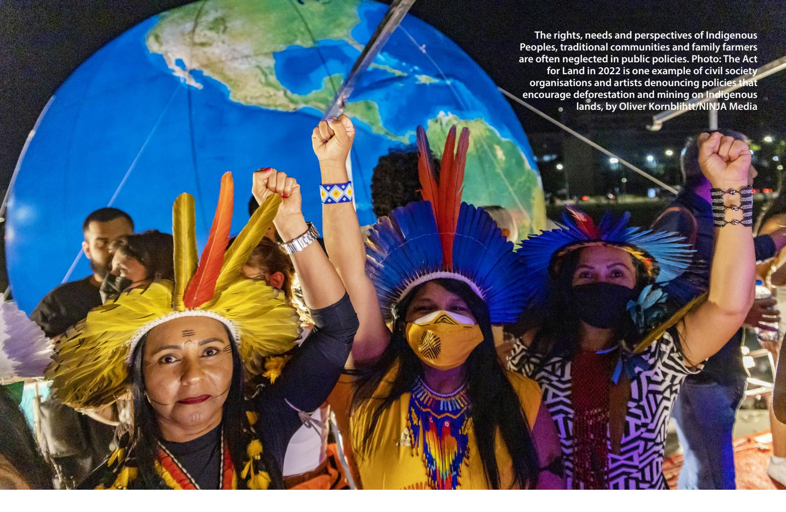

# **II. Why do we need to visualise social and human rights impacts?**

The production of agricultural commodities, such as beef, cocoa, coffee, corn, cotton, soybeans, palm oil, rubber, sugarcane and timber, has exacerbated problems of deforestation, biodiversity loss, decreasing water quality and quantity, and land use change in Brazil (Souza et al. 2020). To differing extent, these problems have been assessed and monitored. There have been different domestic and transnational public and private governance initiatives for addressing deforestation and other environmental problems associated with agricultural supply chains. Domestic examples of such initiatives are the Action Plan for the Prevention and Control of Deforestation in the Legal Amazon and in the Cerrado (*Plano de Prevenção e Controle do Desmatamento na Amazônia Legal, (PPCDAM) and Plano de Ação para a Prevenção e Controle do Desmatamento e das Queimadas no Cerrado*, (PPCerrado)) and Brazil's Forest Code and environmental legislation. There have also been market initiatives targeting global agricultural supply chains, such as the Soy Moratorium, the European Union Timber Regulation (EUTR), the European Union Deforestation Regulation (EUDR), and a variety of different sustainability certification standards (e.g. Roundtable on Sustainable Soy, ProTerra, Forest Stewardship Council, and Rainforest Alliance).

However, previous research has shown that the rights, perspectives and needs of PCTAFs have often been disregarded or deprioritised in the design and implementation of most existing sustainability governance instruments of global supply chains (Bastos Lima & Persson 2020; Schilling-Vacaflor 2023). With the aim of contributing to environmental justice and rights-based approaches of supply chain governance, it is of utmost importance to know and show the social and human rights impacts associated with global supply chains – alongside the biophysical ones.

Previous research has shown that deforestation, land speculation and the expansion of the agricultural frontier for large-scale and mainly export-oriented agriculture has been closely linked to social and human rights impacts such as land conflicts and land grabbing, pesticide pollution, reduced PCTAF access to clean water, violence against the defenders of lands and the environment, and violations of workers' rights, including child labour and modern slavery (Russo Lopes et al. 2021). What do we know about these risks and impacts? How can we synthesise fragmented knowledge and visualise existing data?

These questions and a wide variety of environmental and human rights organisations from Brazil guided the different stages and steps for developing a Platform for Collecting and Visualising Social and Human Rights Impacts ('Social Platform'). Fern also organised two online and three hybrid stakeholder workshops, the latter of which took place in Brazil. These organisations have had different perspectives on how to use this Social Platform. Some emphasised the importance of robust, systematised data on human rights impacts to support domestic policy reform. Others saw the platform as a means to generate data that could be used to hold multinational companies accountable. Several organisations highlighted the view that the Social Platform should be used as a tool that can complement initiatives such as the European Union-led **'Forest Observatory',** which monitors deforestation and forest degradation globally.

These different perspectives were reflected in stakeholder meetings throughout the Platform's development, where both domestic policy goals and transnational sustainability governance objectives were discussed. In these meetings, many organisations agreed that the Platform could be used for multiple purposes, supporting domestic and transnational advocacy strategies for upholding human rights in agricultural production and global supply chains, either separately or in combination.

**Domestic Brazilian context:** Public databases in Brazil have so far focused on selective topics, such as deforestation, cases of modern slavery, embargo lists for environmental infractions, and licenses for deforestation and irrigation. However, more comprehensive and better systematised data about human rights violations and conflicts could significantly strengthen domestic policymaking and civil society advocacy. For example, data on rural conflicts and violence against PCTAFs could inform policies aimed at advancing land titling and ensuring more effective, on-the-ground protection of lands and territories. Similarly, data on pesticide pollution and loss of access to clean water could be used to enhance environmental monitoring systems, particularly those tracking water quality and availability. These improvements would not only help hold companies accountable for negative social and environmental impacts, but also reinforce public oversight mechanisms.

Brazilian CSOs emphasised the need for an independent, CSO-led Social Platform, which focuses on the priorities and needs of Brazilian CSOs and rightsholders, rather than focusing on supporting corporate compliance with EU legislation.

**Governance with extraterritorial reach:** Multinational companies often disregard or only selectively assess social and human rights impacts, often with the argument that there is a lack of data. Recent Human Rights and Environmental Due Diligence (HREDD) laws — such as the German Supply Chain Due Diligence Act, the French Duty of Vigilance Law, and the EUDR — have increased the demand for diverse types of socio-environmental data on risks and impacts in global supply chains (for an overview see Gustafsson et al. 2023). These laws present an opportunity for gathering and systematising social and human rights data, which has been a long-standing demand of Brazilian CSOs. Such data can support CSOs in actively monitoring compliance with mandatory HREDD obligations and broader corporate sustainability commitments, and help hold irresponsible companies into account. To this end, they can use the data in dialogues with companies, advocacy campaigns, and the preparation and presentation of complaints or lawsuits at national, regional, or international levels.

## **EUDR article 2(40)**

Art 2(40) 'relevant legislation of the country of production' means the laws applicable in the country of production concerning the legal status of the area of production in terms of:

y land use rights; y environmental protection; y forest-related rules, including forest management and biodiversity conservation, where directly related to wood harvesting; y third parties' rights; y labour rights; y human rights protected under international law. y the principle of free, prior and informed consent (FPIC), including as set out in the UN Declaration on the Rights of Indigenous Peoples. y tax, anti-corruption, trade and customs regulations.

A civil society-led platform can also serve as a valuable resource for Competent Authorities in importing countries who are tasked with monitoring compliance with HREDD obligations. Moreover, the data can support companies themselves by offering deeper insights into risks and adverse impacts in their supply chains and helping them use their leverage more effectively to engage with rightsholders and improve conditions on the ground. At the same time, participants stressed that

this database must not turn into a "clearing house" in the sense of providing data that can be used as a compliance tool for companies. Rather, in a context in which there has been an explosion of digital technologies and where data providers have emerged and increasingly sell data about human rights risks and impacts, it is important that civil society also has ownership of its own tools, which strongly build on the voices and experiences of rightsholders ('ground-truthing of data'). This is critical for fostering more worker- and community-centred approaches to HREDD.

# **III. Overview of existing databases and data sources**

As a basis for the following discussions in the multi-stakeholder meetings for developing the Social Platform, the researchers Prof Dr Almut Schilling-Vacaflor (Friedrich-Alexander-University Erlangen-Nuremberg) and Assoc Prof Dr Maria-Therese Gustafsson (Stockholm University) explored and systematised existing data on social and human rights impacts in Brazil. They did so via desktop research and by carrying out interviews about existing and useful data sources with many CSOs and data scientists. Due to the fundamental importance of land and territorial rights and their close connection with deforestation and agricultural supply chains, the researchers started to make a more systematic search of existing data about this policy problem, by identifying data about:

y Land use and deforestation; y Indigenous Peoples and Quilombolas'1 land rights; y Community mapping initiatives; y Land and rural conflicts.

1 Quilombolas are members of Afro‑Brazilian communities formed by descendants of enslaved Africans who established autonomous settlements, known as quilombos. They hold constitutionally recognized collective land rights, yet often face significant challenges in securing these rights, making them central actors in land disputes and related social conflicts in Brazil.

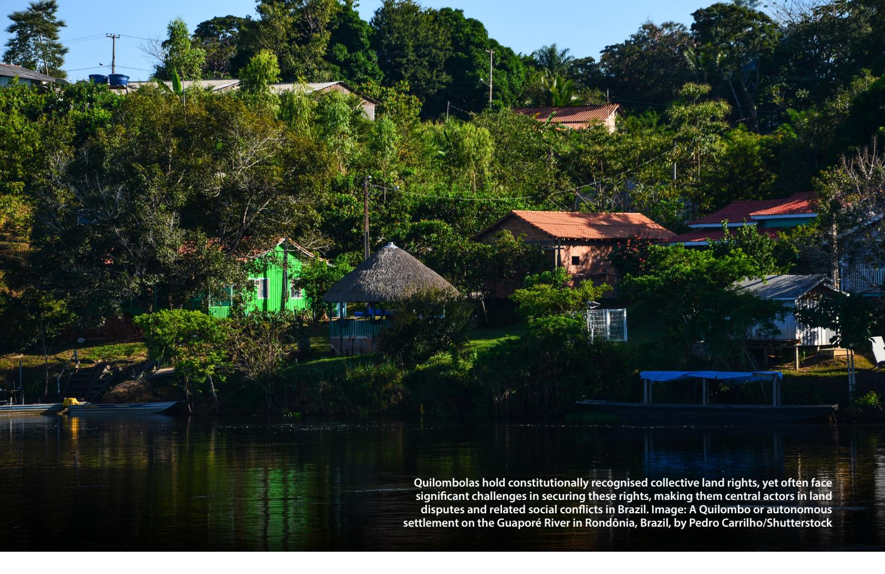

In addition, with the idea of expanding this Social Platform to include other social and human rights problems in the future, the researchers also aimed to explore additional data sources that would show the impacts of agricultural supply chains such as on modern slavery and labour rights violations, water rights, the right to a clean and healthy environment, health impacts, and violence and threats against the defenders of land, human rights and the environment. Figure 1 shows a list of databases that were identified in an initial search and used as a basis for the discussions in the first stakeholder workshop.

**Figure 1. List of identified data that could be potentially included in the Social Platform, with a focus on land and territorial rights of PCTAFs.**

## **Different types of data (databases and platforms)**

## **Other social impacts**

(List of modern slavery; SUS data on poisoning from pesticides; SUS data on violence; SMART lab about labor rights & and ANA/EMPRAPA's data on irrigation licenses)

## **Platforms**

(Atlas Agropecuário; Mapa dos Conflitos & Tamo de Olho)

**Lands and rural conflicts** (CPT data rural conflicts and Dataluta from UNESP)

**Land use and deforestation** (PRODES; DETER; Mapbiomas (Alert); CAR & IBGE)

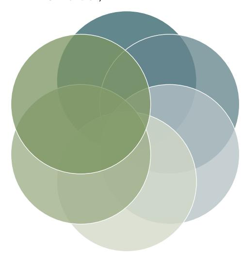

#### **Land rights, including those of PCTAFs over land**

(FUNAI; INCRA data on agrarian settlements; INCRA data on Quilombolas; data on public land and forests; Fundação Palmares; Censos & IBGE)

## **Mapping of communities**

(Platform of traditional communities (MPF); To no Mapa; New Social Cartography; and databases of UFPA & UFBA)

The identification and analysis of different data sources and platforms helped to get an overview of existing data and the way they are constructed (e.g., which data are georeferenced, and which data are available on a subnational level for all states and municipalities). The researchers presented short summaries of each of them (Fern 2024).

Furthermore, this data screening helped identify existing knowledge and data gaps. For instance, despite diverse exercises mapping communities without formal land titles in the Amazon and Cerrado, such data is still incomplete and fragmented. Future efforts to reduce these knowledge gaps and to guarantee PCTAFs the rights to live on and use the lands they inhabit should be a key priority in a rights-based approach to governing agricultural production and supply chains.

# **IV. Multi-stakeholder process and prioritisation of specific databases**

The aim of this initiative has been to develop the Social Platform in collaboration with a wide range of CSOs from Brazil, each contributing with diverse knowledge and skills related to social and human rights impacts. Grassroots organisations, including rightsholders themselves, were an important part of this effort, as their in-depth, context-sensitive insights are crucial for building a database that is both empowering and connected to local struggles. Large environmental NGOs were also invited, as they often possess strong technical expertise in gathering available data, skills in georeferencing and combining different datasets, and broad national and transnational networks. Investigative journalists also have been invited to the meetings, as they have played important roles in shedding light on human rights and environmental problems related to global supply chains. In addition, organisations that have been key allies of rightsholders, such as PCTAFs and workers, participated in the stakeholder workshops.

Many participants emphasised that bringing together these diverse organisations, which often work in silos with little interaction, created valuable shared spaces that strengthened civil society networking in Brazil.

## **VIRTUAL AND IN-PERSON MEETINGS**

Between 2023 and 2025, Fern organised a total of five stakeholder workshops — three in person and two online — to gather input from diverse civil society actors for the development of the Platform. Before the first in-person workshop, a virtual meeting was held in June 2023 to discuss the objectives of the Social Platform and reflect upon the data that were already identified, as well as additional data that might be added to the list. In these meetings, participants discussed the strengths and limitations of existing databases, as well as how different datasets could be combined to visualise land tenure rights and land conflicts involving PCTAFs in a single online interactive map. In addition to the in-person meetings, virtual meetings were organised to make sure that participants were updated about and could comment on the steps taken to develop the Social Platform.

The first in-person meeting was hosted by Oxfam in São Paulo on 16 November 2023. In preparation, Fern and consultants made a short survey with participants, asking them to rank databases they would prioritise including in the Social Platform. The responses provided insights into potentially promising and less promising data to be included and triangulated in a first pilot Platform. The aim was also to learn from the experiences of other platforms that work with social and human rights data. The platform "Atlas Agropecuario" was presented by Imaflora, the platform "Mapa dos Conflitos" by Agência Pública and 'Tamo de Olho' by WWF. The "Atlas Agropecuario" triangulates data on individual, collective and public land tenure rights. The "Mapa dos Conflictos" triangulates data on different rural conflicts and human rights impacts in the Amazon and "Tamo de Olho" aims to identify overlaps between deforestation, agricultural production and human rights impacts in selected local contexts. These datasets, along with others discussed during the meeting, are described in detail in the first policy report published on this topic (**Fern, 2024**).

The second in-person workshop took place on 16 April 2024 at the Instituto Socioambiental (ISA) in Brasília. At this meeting, researchers from the Diversa Socioenvironmental Consultancy, Dr Gabriela Russo Lopes and Dr Vivian Ribeiro presented a series of exploratory maps showcasing the spatialisation of social data at the municipal level across Brazil. Based on discussions in previous stakeholder workshops, the following datasets were selected to be included in the first pilot study: (1) conflicts over water, conflicts over land and violence against individuals from the Land Pastoral Commission (CPT); (2) slave labour from Brazil's Ministry of Work and Employment (MTE); (3)

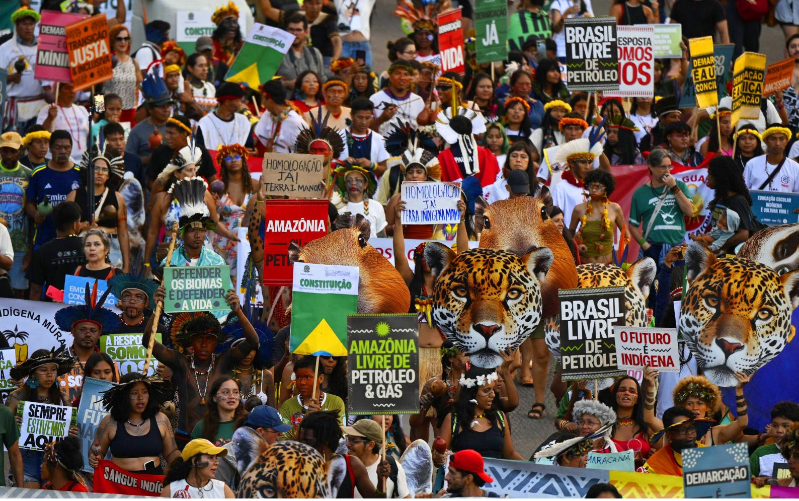

embargoes on illegal deforestation from the Brazilian Institute of Environment and Renewable Natural Resources (IBAMA), and deforestation and conversion of natural ecosystems from MapBiomas Alerta; and (4) data on agricultural production by the Brazilian Institute of Geography and Statistics (IBGE).

The exploratory analysis also produced a summary map that combined social and environmental data to show how these two dimensions are connected and to make visible patterns of socioenvironmental impacts throughout Brazil. The pilot study was received positively by the participants, who emphasised that the georeferenced visualisation of CPT data, in particular, represents a significant step forward and will be highly useful for the work of many CSOs from Brazil and beyond.

In the third in-person stakeholder workshop, held in February 2025 at ISA in Brasília, participants discussed the evolution of the exploratory spatialisation of social data into maps. This was first presented during the second in-person workshop, and is included in the pilot version of the Social Platform, which features key online interactive tools. This pilot Platform was developed through a collaboration between CPT, Mapbiomas and Diversa Socioambiental.

Participants generally perceived the pilot as a significant success. At the same time, several questions remained: Who should host the Social Platform? What additional data should be integrated? Should there be a coordinating group to govern the Platform's further development? There was also a discussion about whether coordinated advocacy efforts could be based on the data presented.

The Brazilian organisation ISPN offered to take on a leading role in this initiative and to draft proposals for securing third-party funding.

**Acampamento Terra Livre, the largest mobilisation of the Brazilian Indigenous movement, has been held every year since 2004. Image by Sipa USA/Alamy** 

Several key topics emerged repeatedly across the different meetings, which are important to consider when establishing a platform on social and human rights impacts. These are summarised below.

## **DATA CHOICES AND SCOPE OF THE SOCIAL PLATFORM**

Workshop participants discussed the advantages and disadvantages of including different types of data in the Social Platform. There was consensus on the importance of incorporating data such as CPT's rural conflict data, public data on modern slavery, and data about individual and collective land tenure rights. However, the use of other types of data, such as from projects that attempt to map and localise local communities without formal land titles was seen as more challenging. Participants agreed that a step-by-step approach to integrating the selected datasets would be the most appropriate way to expand the Social Platform.

**Recognising Data Gaps:** Many participants in this initiative stressed the importance of communicating that the absence of data about conflicts and impacts in certain areas should not be interpreted as the absence of these problems. Rather, it is important to acknowledge that existing datasets are incomplete and that certain subnational regions and issues are under-represented. Efforts shall be made to improve both the availability and accessibility of data.

**Expanding the Platform with Qualitative Case Studies:** Participants shared innovative ideas for further developing the Platform. These included, the integration of in-depth qualitative data and case studies, the creation of a database documenting grievances and complaints submitted by PCTAFs and their allies, and the development of an alert mechanism to flag ongoing human rights violations and conflicts requiring urgent action.

Keeping the Platform Updated: Participants stressed the importance of updating the Platform regularly, ideally at least once a year. In addition to annual data updates, it would be helpful to include short-time alerts about human rights violations, similar to the near-real time DETER data2 and MapBiomas Alert data on deforestation. While the pilot study has not yet included such alert mechanisms for human rights or social impacts, this could be a task for the future.

## **DATA REPRESENTATION AND USE**

**Layering and Triangulating Diverse Data Sources:** One of the key objectives when establishing a Social Platform was to synthesise data that are currently fragmented and dispersed. Following the model of MapBiomas, participants agreed that different datasets should not be merged into a single layer. Instead, multiple layers should be added to allow various data sources to be viewed together in a single map, without the need of harmonising all underlying concepts and indicators.

**Interactive and user-friendly:** Workshop participants agreed that the Social Platform should offer an interactive and user-friendly interface that works in an intuitive way. It should allow users to select different layers of data according to their specific needs and interests.

**Addressing Cross-Scalar Conflict Dynamics:** Participants across the workshops highlighted the challenge of geolocating social and human rights impacts, as they "are alive and dynamic". In many cases, conflicts are interconnected across different scales and places, actors move, exchange information, and conflicts evolve over time. Therefore, the scale dimension needs to be considered carefully. A methodological guide needs to be created to clarify how conflicts are defined, understood, and mapped.

2 DETER (Detecção de Desmatamento em Tempo Real) is a satellite-based system developed by Brazil's National Institute for Space Research (INPE) to provide near-real-time alerts on deforestation and forest degradation in the Amazon. It is designed to support environmental monitoring and enforcement efforts.

**Using Data as Indicators, Not Evidence:** Participants emphasised that much of the data showcased in the Social Platform cannot be used as evidence in legal cases. Rather, these data should be used as indicators of social and human rights impacts that require attention. In the cases of lawsuits, additional verification of incidents, for instance by the public prosecutor (Ministerio Público) or other agencies might be needed. Collaborations between the Social Platform and state agencies should be established in the future to strengthen its role in political and legal advocacy strategies.

## **GOVERNANCE**

**Local ownership:** Stakeholders emphasised that governance is just as important as data collection. Most participants agreed that Brazilian CSOs and rightsholders should lead the process to define which data are collected and how they are used, to ensure local ownership, legitimacy, and alignment with their priorities. Sufficient funding and institutional support are essential to ensuring the Social Platforms' operational capacity and long-term sustainability. Participants also highlighted the need to create a specific group of people and organisations committed to governing and coordinating the Platform.

**The importance of Free, Prior and Informed Consent (FPIC):** When data are collected through initiatives such as community mappings, the Social Platform should make sure that important requirements, such as FPIC of Indigenous Peoples, Quilombola communities and traditional communities have been fulfilled and respected. Data should not be visualised and shared without the consent of the affected stakeholders. In the case of the use of CPT data, potential problems related to FPIC and risks of negative repercussions for rural actors can be prevented by aggregating the data at the municipal level.

# **V. The pilot Platform**

Building on insights from previous stakeholder meetings, interviews, and a short survey, the first version of the pilot Platform incorporated the following datasets:

**Table 1. Data included in the pilot Platform.**

| Dimension            | Category          | Sub-Categories      | Source    | Timeframe |
|----------------------|-------------------|---------------------|-----------|-----------|
| Social conflict data | Rural Conflicts   | Conflicts over land |           |           |
|                      |                   |                     | CPT       | 2001-2023 |
| Environmental data   | Deforestation and |                     |           |           |
|                      |                   | Deforestation       | Mapbiomas | 1987-2023 |
|                      |                   |                     | IBAMA     | 1987-2023 |
| Production data      | Production        | Cattle herd size    |           |           |
|                      |                   |                     | IBGE      | 1987-2023 |

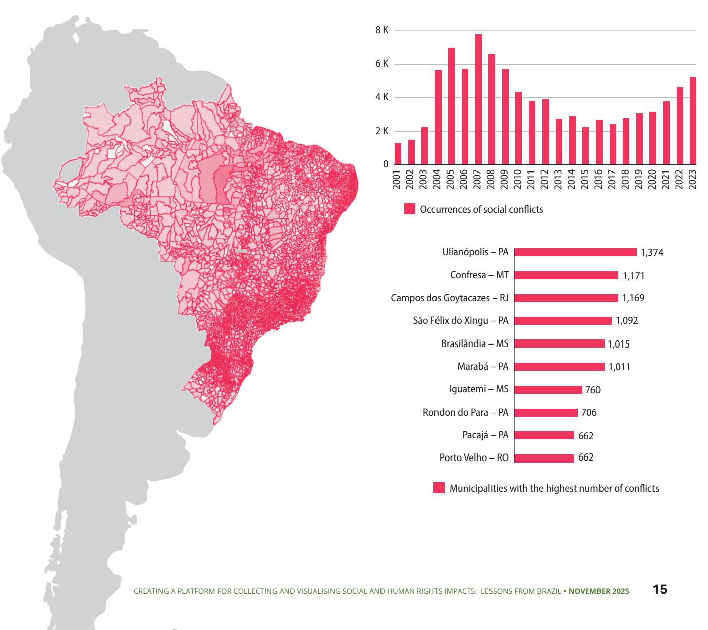

The pilot Platform draws on these datasets to organise the data into four main categories: social conflicts; environmental impacts; production; and socio-environmental analyses. The latter combines all sources of data to create a simple profile for specific jurisdictions (e.g., municipalities, states). This allows users to quickly compare patterns and identify areas where socio-environmental impacts are likely to be more severe. These can be explored at the municipal, state, or national level, with temporal resolution varying depending on the data source. The platform is available in English, Spanish, and Portuguese.

Below, we discuss in more detail each of the four categories of data included in this initial phase of the pilot Platform.

## **SOCIAL CONFLICTS**

Social conflict data is the first category presented on the pilot Platform. It includes the following subcategories: all conflicts, land conflicts, water conflicts, slave labour, and violence against individuals—which covers cases such as assassinations, attempted assassinations, death threats, and rape. Users of the platform can select the jurisdictional level (municipality, state, or national) and choose the time period of interest. The data is displayed in summary boxes with total figures, a time series bar graph, and a ranking of municipalities with the highest number of incidents during the selected period. See Figure 2 below for an example.

**Figure 2. Social conflicts data per municipality for the period 2001-2023.**

## **DEFORESTATION AND EMBARGOES**

Environmental data is the second dimension featured on the pilot Platform and is divided into three sub-categories: deforestation, embargoes for illegal deforestation, and other types of embargoes. Users can choose the jurisdictional level (municipality, state, or national) and select the time period of interest. The data is displayed as summary boxes with total values, a bar chart showing trends over time, and a ranking of municipalities with the highest number of cases during the selected period. See Figure 3 below for an example.

**Figure 3. Environmental data per municipality for the period 1987-2023.**

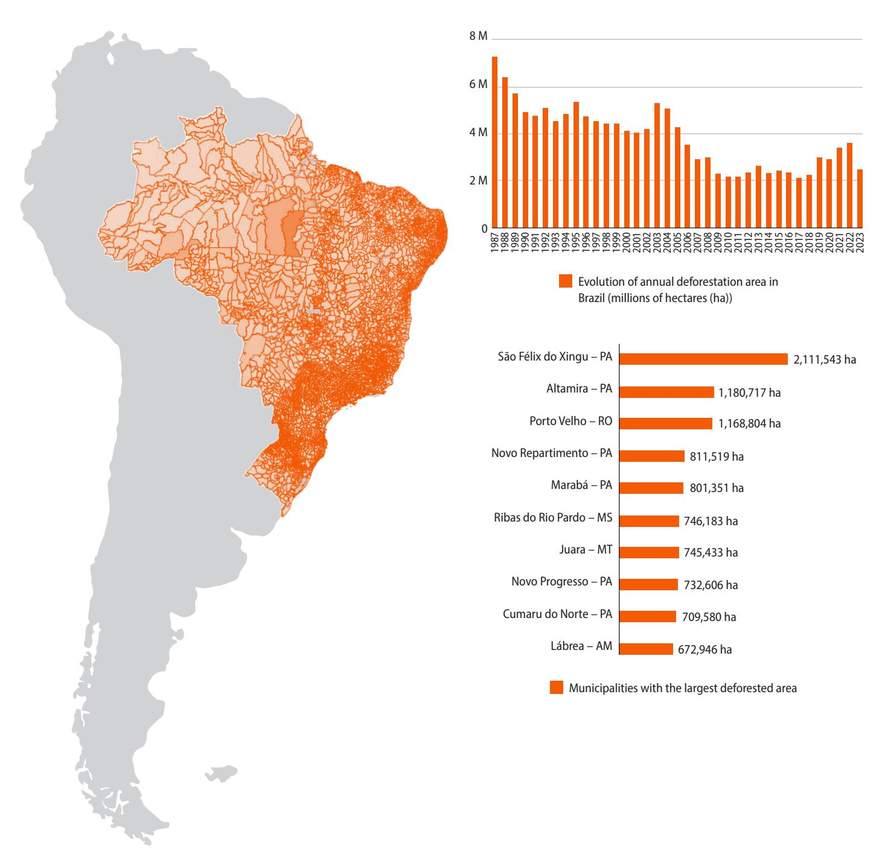

## **PRODUCTION**

Commodity production is the third category shown on the pilot Platform. It includes data on major agrifood commodities, such as rubber, cattle, cocoa, coffee, palm, and soybeans. Users can select the jurisdiction level (municipality, state, or national) and the time period of interest. The data is presented in summary boxes with total values, a bar graph showing trends over time, and a ranking of municipalities with the highest production during the chosen period. See Figure 4 below for an example.

**Figure 4. Agricultural production data per municipality for the period 1987-2023.**

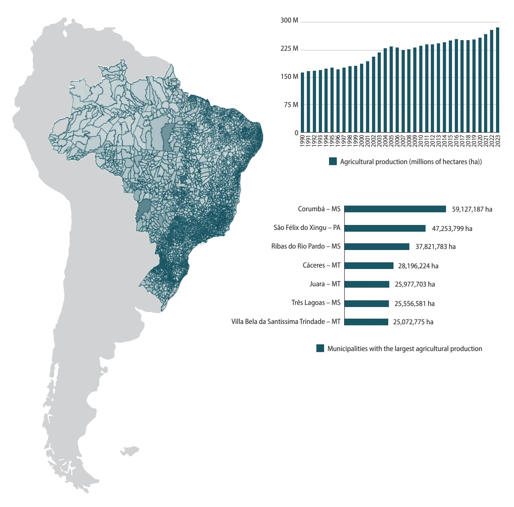

## **SOCIOENVIRONMENTAL PROFILE**

The socioenvironmental profile is the fourth and final category displayed on the pilot Platform. It combines data from the previous three categories into a single radar graph, where each axis represents a variable scored from 0 to 10 based on its relative intensity compared to the total number of occurrences. This visualisation helps users understand the situation within a jurisdiction without making categorical judgments. It highlights the overlap between social conflicts, deforestation and embargoes, and commodity production, rather than implying direct cause-andeffect relationships. Users can select the jurisdictional level (municipality, state, or national) and choose the time period. The results are presented as overlapping radar graphs and a table comparing totals for Brazil and the selected areas. See Figure 5 below for an example.

**Figure 5. Socio-environmental profile of Brazilian municipalities.**

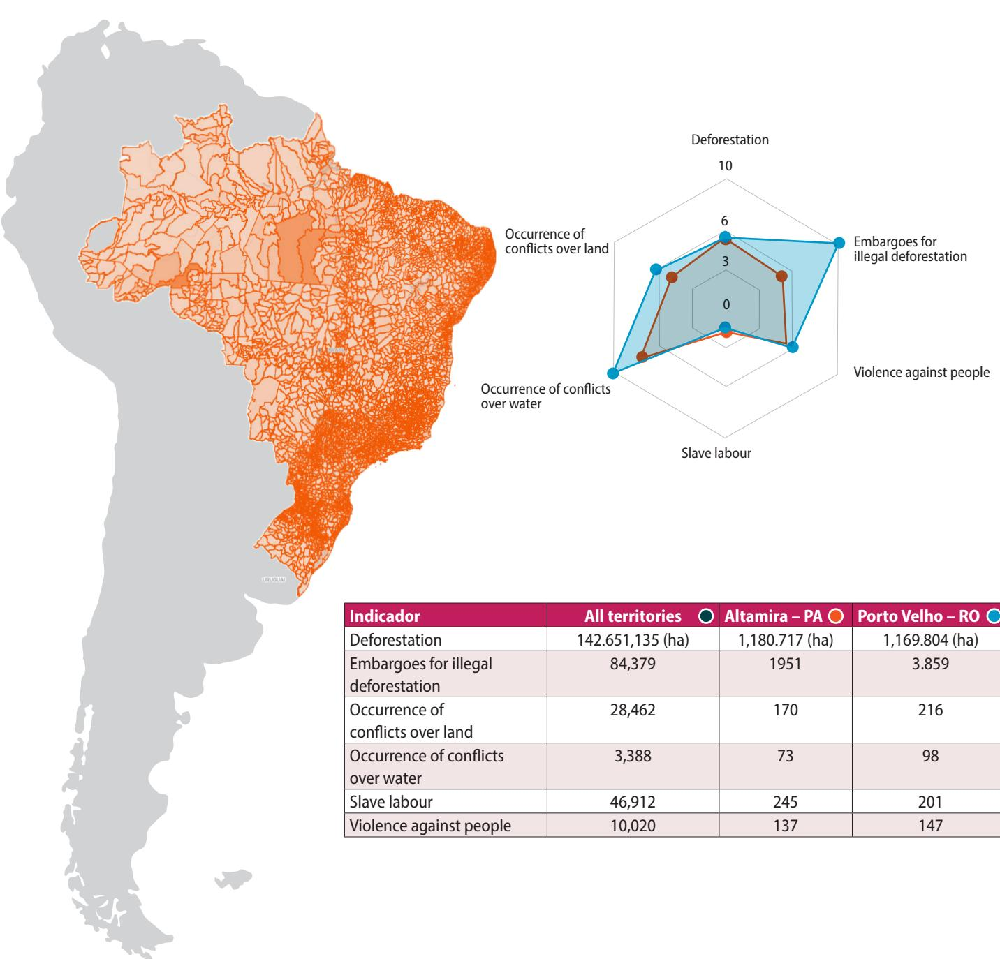

| Indicador Deforestation             | All territories 142.651,135 (ha) | Altamira – PA 1,180.717 (ha) | Porto Velho – RO 1,169.804 (ha) |
|-------------------------------------|----------------------------------|------------------------------|---------------------------------|
| Embargoes for illegal deforestation | 84,379                           | 1951                         | 3.859                           |
| Occurrence of conflicts over land   | 28,462                           | 170                          | 216                             |
| Occurrence of conflicts over water  | 3,388                            | 73                           | 98                              |
| Slave labour                        | 46,912                           | 245                          | 201                             |
| Violence against people             | 10,020                           | 137                          | 147                             |

## **USER TESTING**

The pilot Platform underwent its first round of user testing during the stakeholder workshop held in Brasília in February 2025. Representatives from various CSOs (see appendix) participated in the session, providing valuable feedback on the Platform's usability, functionality, and overall user experience.

Several improvements were suggested to enhance the clarity, depth, and utility of the data visualisation tool, such as explaining why the time periods differ across datasets and tabs, and making data sources more visible and explicit. Additionally, it was proposed to clarify the sampling effort carried out by CPT to help contextualise the information presented.

In terms of data presentation, it was proposed that the display of intensity on the map represented by a colour gradient (choropleth) should incorporate greater nuance, and units of measurement particularly in the Production tab—to improve interpretability. In addition, social conflict data should be shown in terms of area impacted, rather than (or in addition to) number of occurrences, and where possible, data presented in both absolute and relative terms to offer a more comprehensive view.

Another idea was to expand geographical detailing to include displaying information by biome, by major geographic regions (such as North, South, Southeast, Northeast, and Centre-West), and by specific territories like Matopiba and Amacro.3 It was suggested that the comparison function allow users to view more states and municipalities for broader analysis.

Finally, in terms of content, participants requested to incorporate additional variables such as gender and race/ethnicity. Information on soy crops and pasturelands from Mapbiomas could also be integrated, along with data on state-level embargoes. Furthermore, the inclusion of analyses on both legal and illegal deforestation would provide a more complete picture of environmental impacts. Below, Table 2 presents some other data sources that can be explored and potentially included in future versions of the Platform:

**Table 2. Potential future datasets for inclusion.** 

| Land Tenure Data                               | Labour Data                       | Environmental Data                     | Social Conflicts Data          | Other Types of Data |
|------------------------------------------------|-----------------------------------|----------------------------------------|--------------------------------|---------------------|
| Indigenous Lands (FUNAI)                       | Child Labour (MTE/RadarSIT)       | Rural Environmental Registry (SFB)     | Other types of conflicts (CPT) | Health data (SUS)   |
| Quilombola Lands (Fundação Palmeres            | Slave Labour (MTE/RadarSIT)       | Other types of embargos (IBAMA)        | Qualitative cases (CPT)        | Mining data (ANM)   |
| Conservation Units of Sustainable Use (ICMBio) | Labour Infractions (MTE/RadarSIT) | State-level embargoes (State agencies) |                                |                     |
| Land Reform Settlements (INCRA)                |                                   |                                        |                                |                     |

3 Amacro refers to the tri-border region between the states of Amazonas, Acre, and Rondônia in Brazil. It is part of a regional development initiative that overlaps with areas of high deforestation, socio-environmental conflict, and Indigenous territories.

# **VI. Key Lessons Learned**

This section summarises the lessons learned from the process to develop the Social Platform in Brazil, which might also inform similar initiatives in other countries. For drafting this section, Prof Dr Almut Schilling-Vacaflor and Dr Maria-Therese Gustafsson interviewed several participants that have participated in this initiative, asking them to provide feedback, share their own lessons learned and reflect upon the strengths, limitations and challenges encountered during this process.

Overall, participants viewed the initiative as an important success, highlighting its potential to enhance visibility, awareness, and empowerment of PCTAFs, and to support the protection of their rights in agricultural supply chains. At the same time, they shared important reflections on how future processes could be set up and strengthened.

## **1. Context-sensitiveness and inclusiveness**

Processes to develop social platforms need to be grounded in a deep understanding of national and local realities. Knowledge about data availability, local impacts, and civil society dynamics are highly relevant. Working closely with diverse local and national organisations (e.g., environmental and human rights NGOs, grassroots organisations, Indigenous Peoples' organisations and/or rightsholder representatives, trade unions, and investigative journalists) in an appropriate way, from the start, ensures the process is inclusive and builds on existing expertise and relationships.

## **2. Clarify scope and objectives early**

To make sure that participants are well-informed about the aims and scope of the initiative to be developed jointly, there needs to be clarity in relation to concrete goals and the planned work schedule. For instance, a clear idea about the purpose and possible content of a social platform can help define how different stakeholders and rightsholders can support the initiative, such as by contributing to collecting or sharing data. Such a clarification of roles and objectives can help to enhance the ownership of the participants and the division of tasks between different types of CSOs.

## **3. Acknowledge power imbalances and differences among CSOs**

While many CSOs share similar goals, their strategies and priorities often differ. Interviewees highlighted that the Social Platform must be designed as a tool that different groups can use in line with their own objectives and priorities. This means that CSOs using very different advocacy strategies can agree that a social platform is useful, while using the data in very different ways. The use of the data can differ depending on whether CSOs use insider strategies by collaborating with companies or outsider strategies by naming and shaming companies. It is also important to intermediate between CSOs with different types of knowledge and power, for instance by valuing local knowledge and experience to the same extent as technical or expert knowledge.

## **4. Governance and ownership**

A representative governance board should be established through a transparent and participatory process. Composed of CSOs, the board would be responsible for overseeing regular data updates, evaluating new datasets for inclusion, and ensuring that decisions reflect the priorities of both CSOs and rightsholders. Importantly, the governance structure must clearly define who owns the data, who makes decisions about what data is included or

excluded, and how these decisions are made. It is essential that grassroots organisations and rightsholders play a central role in this governance structure. The board should also maintain ongoing dialogue with other civil society actors and relevant state agencies to strengthen collaboration and alignment with advocacy efforts and policymaking.

## **5. Ensure funding transparency and continuity**

Many CSOs, notably rightsholders and local community organisations, operate with limited capacity. Clarity about available funding—for participation and specific tasks—can help organisations allocate time and resources, improve planning, and stay engaged throughout the process. This could allow CSOs to set aside human resources and time to contribute specific tasks to the development of a social platform, for instance by committing to collect a specific type of data and prepare them for the integration in the platform.

However, for smaller NGOs and rightsholder groups, long-term engagement may be difficult to sustain if future funding is uncertain. Ensuring not only transparency but also continuity and predictability of funding is therefore essential to support their lasting participation.

## **6. Prioritise rightsholder and grassroot participation**

Many existing platforms and data providers for social and human rights risks operate in a topdown manner. To get access to meaningful local data and to make sure that the initiative is empowering for affected groups, workers and collectives, they must be brought on board. These actors might also need additional (technical, financial, and logistical) support for participating in a meaningful way and that trust needs to be established. To foster trustful relationships, meetings should be facilitated by independent organisers, and communication must be ongoing and open. Moreover, participants stressed that formal and informal meetings in-between stakeholder workshops are essential to better understand the needs and interests of diverse actors involved. Since some participants may hesitate to share concerns in formal settings, informal dialogue can play a crucial role in surfacing different perspectives.

## **7. Create safe and inclusive spaces**

When bringing in external actors, such as experts or representatives from state agencies to the dialogue table, participants should be consulted and give their consent beforehand, to make sure that they feel comfortable with the presence of such actors.

## **8. Take a step-by-step approach**

When developing a social platform it makes sense to start working with a few selected databases. Once these are included in one interactive platform, the platform can build on this and be updated and grow.

# **VIII. References**

Baletti, B., 2014. Saving the Amazon? Sustainable soy and the new extractivism. *Environment and Planning A*, 46(1), pp.5-25. **[https://doi.org/10.1068/a45241](https://journals.sagepub.com/doi/10.1068/a45241)**

Bastos Lima, M. G., & Persson, U. M. (2020). Commodity-centric landscape governance as a doubleedged sword: The case of soy and the Cerrado Working Group in Brazil. *Frontiers in Forests and Global Change, 3*, 27. **[https://doi.org/10.3389/ffgc.2020.00027](https://www.frontiersin.org/journals/forests-and-global-change/articles/10.3389/ffgc.2020.00027/full)**

Brandão, J., Rausch, L., Munger, J., Naughton-Treves, L. and Gibbs, H.K., 2024. Behind the cattle industry: Modern slave labor used to produce Brazil's beef and leather. *Environmental Development*, 51, p.101000. **[https://doi.org/10.1016/j.envdev.2024.101000](linkinghub.elsevier.com/retrieve/pii/S2211464524000381)**

Fern. (2024). *Creating a forest and rights observatory: A Brazilian case study*. Brussels: Fern. **[https://www.fern.org/fileadmin/uploads/fern/Documents/2024/Fern\\_Creating\\_a\\_forest\\_and\\_](https://www.fern.org/fileadmin/uploads/fern/Documents/2024/Fern_Creating_a_forest_and_rights_observatory_a_Brazilian_case_study.pdf) rights\_observatory\_a\_Brazilian\_case\_study.pdf**

Gardner, T. A., Benzie, M., Börner, J., Dawkins, E., Fick, S., Garrett, R., Godar, J., Grimard, A., Lake, S., Larsen, R. K., Mardas, N., Parry, J., Sembres, T., Suavet, C., Strassburg, B. B. N., Trevisan, A., West, C., & Wolvekamp, P. (2019). Transparency and sustainability in global commodity supply chains. *World Development*, 121, 163–177. **[https://doi.org/10.1016/j.worlddev.2018.05.025](https://www.sciencedirect.com/science/article/pii/S0305750X18301736?via%3Dihub)**

Garnett, Stephen, Neil Burgess, John Fa, Álvaro Fernández-Llamazares, Zsolt Molnár, Cathy Robinson, James Watson et al. 2018. A Spatial Overview of the Global Importance of Indigenous Lands for Conservation. *Nature Sustainability* 1(7): 369. **<https://doi.org/10.1038/s41893-018-0100-6>**

Gustafsson, M. T., Schilling-Vacaflor, A., & Lenschow, A. (2023). The politics of supply chain regulations: Towards foreign corporate accountability in the area of human rights and the environment? *Regulation & Governance*, 17(4), 853–869. **[https://doi.org/10.1111/rego.12526](doi.org/10.1111/rego.12526)**

Gustafsson, M. T., & Schilling-Vacaflor, A. (forthcoming). Civil Society Strikes Back: How Global South Coalitions Are Shaping Corporate Accountability in the Age of Mandatory Due Diligence. *Global Environmental Politics.* 

May, P. H., & Ozinga, S. (2021). *A deforestation and rights observatory – A case study from Brazil*. Fern. **<https://www.fern.org/publications-insight/a-deforestation-and-rights-observatory-2446/>**

Merino, R., & Gustafsson, M. T. (2021). Localizing the indigenous environmental steward norm: The making of conservation and territorial rights in Peru. *Environmental Science & Policy*, 124, 627-634. **[https://doi.org/10.1016/j.envsci.2021.07.005](linkinghub.elsevier.com/retrieve/pii/S1462901121001908)**

Phillips, N. and Sakamoto, L., 2012. Global production networks, chronic poverty and 'slave labour'in Brazil. *Studies in Comparative International Development*, 47(3), pp.287-315. **[https://doi.org/10.1007/](https://doi.org/10.1007/s12116-012-9101-z) [s12116-012-9101-z](https://doi.org/10.1007/s12116-012-9101-z)**

Russo Lopes, G., Bastos Lima, M. G., & dos Reis, T. N. P. (2021). Maldevelopment revisited: Inclusiveness and social impacts of soy expansion over Brazil's Cerrado in Matopiba. *World Development*, 139, 105316. **[https://doi.org/10.1016/j.worlddev.2020.105316](https://www.sciencedirect.com/science/article/pii/S0305750X20304435?via%3Dihub)**

Sauer, S., 2018. Soy expansion into the agricultural frontiers of the Brazilian Amazon: The agribusiness economy and its social and environmental conflicts. Land use policy, 79, pp.326-338. **<https://doi.org/10.1007/s12116-012-9101-z>**

Schilling-Vacaflor, A., 2023. The sustainability governance of global supply chains: transnational approaches and the neglect of local development agendas. In Handbook on International Development and the Environment (pp. 281-295). Edward Elgar Publishing.

Schilling‑Vacaflor, A., & Gustafsson, M. T. (2024). Integrating human rights in the sustainability governance of global supply chains: Exploring the deforestation–land tenure nexus. Environmental Science & Policy, 154, Article 103690. **[https://doi.org/10.1016/j.envsci.2024.103690](doi.org/10.1016/j.envsci.2024.103690)**

Silva, A.A., Leite, A., De Castro, L.F.P. and Sauer, S., 2023. Green grabbing in the Matopiba agricultural frontier. The Institute of Development Studies and Partner Organisations.

Souza at. al. (2020) - Reconstructing Three Decades of Land Use and Land Cover Changes in Brazilian Biomes with Landsat Archive and Earth Engine. *Remote Sensing*, 12(17). **[https://doi.org/10.3390/](https://doi.org/10.3390/rs12172735) [rs12172735.](https://doi.org/10.3390/rs12172735)**

# **VIV. Appendix. Participants at the five workshops**

- 1. Adriana Ramos, Instituto Socioambiental (ISA)
- 2. Franziska Rau, Deutsche Gesellschaft für Internationale Zusammenarbeit (GIZ)
- 3. Gabriela Russo Lopes, Diversa Socioenvironmental Consultancy
- 4. Guilherme Eidt, Instituto Sociedade População e Natureza (ISPN)
- 5. Heidi Buzato, Imaflora
- 6. Helen Bellfield, Global Canopy
- 7. Isabel Figueiredo, Instituto Sociedade População e Natureza (ISPN)
- 8. José Benatti, Universidade Federal do Pará (UFPA)
- 9. Juliana Miranda, Observatório Matopiba
- 10. Mairon Bastos Lima, Stockholm Environment Institute (SEI)
- 11. Marcelo Elvira, WWF
- 12. Margareta Nilsson, the Tenure Facility
- 13. Marina Guyot, Imaflora
- 14. Mauricio Correia, Advogados de Trabalhadores Rurais no Estado da Bahia (AATR)
- 15. Patricia Pinho, Instituto de Pesquisa Ambiental da Amazônia (IPAM)
- 16. Rodrigo Bellezoni, Centro de Inteligência Territorial (CIT/UFMG)
- 17. Sandra Kishi, Ministério Público Federal (MPF)
- 18. Saskia Ozinga, Fern
- 19. Sérgio Sauer, Universidade de Brasília
- 20. Tasso Azevedo, MapBiomas
- 21. Tiago Reis, Global Canopy
- 22. Yuri Salmona, Instituto Cerrado

**Participants at first workshop on June 19 2023 (online)** 

#### **Participants at the second workshop on 16 November 2023**

- 1. Acácio Leite, Observatório dos Conflitos Socioambientais do Matopiba
- 2. Adriana Ramos, Instituto Socioambiental (ISA)
- 3. Almut Schilling-Vacaflor, FAU Erlangen-Nuremberg
- 4. Ana Crisostomo, WWF-Brasil
- 5. Ana Paula Valdiones, Instituto Centro de Vida (ICV)
- 6. Anderson Antonio Silva, Observatório Matopiba
- 7. Antonio Oviedo, Instituto Socioambiental (ISA)
- 8. Bianca Muniz, Agência Pública
- 9. Bianca Muniz, Agência Pública
- 10. Bruno Fonseca, Agência Pública
- 11. Camila Mikie, Conectas
- 12. Daniela Jerez, WWF-Brasil
- 13. Felipe Cerignoni, Imaflora
- 14. Francis Rocha, Observatório Matopiba
- 15. Franziska Rau, Deutsche Gesellschaft für Internationale Zusammenarbeit, GIZ
- 16. Gabriela Russo Lopes, Diversa Socioenvironmental Consultancy
- 17. Guadalupe Sátiro, University of Brasília
- 18. Gustavo Ferroni, Oxfam Brasil
- 19. Heidi Buzato, Imaflora
- 20. Isolete Wichinieski, Comissão Pastoral da Terra (CPT)
- 21. Jean Timmers, WWF-Brasil
- 22. Joana Faggin, AidEnvironment
- 23. Joice Bonfim, Campanha Nacional em Defesa do Cerrado
- 24. Jose Benatti, Federal University of Pará (UFPA)
- 25. Marcel Gomes, Repórter Brasil
- 26. Marco Garcia, AidEnvironment
- 27. Maria-Therese Gustafsson, Stockholm University
- 28. Nicole Polsterer, Fern
- 29. Olivia Zerbini, IPAM
- 30. Peter May, Universidade Federal Rural do Rio de Janeiro (UFRRJ)
- 31. Rafael Giovanelli, Instituto Escolhas
- 32. Saskia Ozinga, Fern
- 33. Tales Pinto, Comissão Pastoral da Terra (CPT)
- 34. Tasso Azevedo, Mapbiomas
- 35. Tomás Carvalho, Trase

### **Participants at third workshop on 16 April 2024**

- 1. Acacio Leite, Observatório dos Conflitos Socioambientais do Matopiba
- 2. Adriana Ramos, Instituto Socioambiental (ISA)
- 3. Almut Schilling-Vacaflor, FAU Erlangen-Nuremberg
- 4. Araê Claudinei Lombardi, Movimento pela Soberania Popular na Mineração (MAM)
- 5. Carla Guareschi, Instituto Igarapé
- 6. Carolina Stange Moulin, Secretariat for the Environment and Sustainable Development of the State of Goiás
- 7. Cecilia Viana, Climate and Land Use Alliance Brazil (CLUA)
- 8. Daniela Jerez, WWF-Brasil
- 9. Daniele Galvão de Sousa, Center for Climate Crime Analysis (CCCA)
- 10. Gabriela Russo Lopes, Diversa Socioenvironmental Consultancy
- 11. Guadalupe Sátiro, Universidad de Brasilia
- 12. Guilherme Eidt, Instituto Sociedade População e Natureza (ISPN)
- 13. Gustavo Cruz, INA
- 14. Gustavo Ferroni, Oxfam
- 15. Isabel Figueiredo, Instituto Sociedade População e Natureza (ISPN)
- 16. Laíssa Pollyana Carmo, Reporter Brazil
- 17. Luis Meneses, Global Canopy
- 18. Marcelo Elvira, Observatório do Código Florestal
- 19. Marco Garcia, AidEnvironment
- 20. Maria Eduarda Senna Mury, Center for Climate Crime Analysis (CCCA)
- 21. Maria-Therese Gustafsson, Stockholm University
- 22. Mariana Pontes Campos, Campanha Nacional em Defesa do Cerrado
- 23. Marina Comandulli, Global Canopy
- 24. Mikael Freitas, Center for Climate Crime Analysis (CCCA)
- 25. Nicole Polsterer, Fern 26.Rodrigo Bellezoni, Center for Territorial Intelligence (CIT)
- 27. Romulo Batista, Greenpeace
- 28. Ronilson Costa, Comissão Pastoral da Terra (CPT)
- 29. Sérgio Sauer, Universidade de Brasília
- 30. Sofia Barretto, Imaflora
- 31. Tatiana Oliveira, Inesc
- 32. Vivian Ribeiro, Stockholm Environment Institute
- 33. Zilma Maia, Secretaria de Estado de Meio Ambiente e Desenvolvimento Sustentável de Goiás

### **Participants at fourth workshop on 14th June 2024 (online)**

- 1. Acacio Zuniga Leite, Observatório dos Conflitos Socioambientais do Matopiba
- 2. Adriana Ramos, Instituto Socioambiental (ISA)
- 3. Almut Schilling-Vacaflor, FAU Erlangen-Nuremberg
- 4. Cecilia Viana, Climate and Land Use Alliance Brazil (CLUA)
- 5. Daniela Jerez, WWF-Brasil
- 6. Daniele Galvao, WRI Brasil, Universidade de Brasília
- 7. Gabriela Russo Lopes, Diversa Socioenvironmental Consultancy
- 8. Guilherme Eidt, Instituto Sociedade População e Natureza (ISPN)
- 9. Gustavo Ferroni, Oxfam
- 10. Isabel Figueiredo, Instituto Sociedade População e Natureza (ISPN)
- 11. Luis Meneses, Global Canopy
- 12. Marcelo Elvira, Observatório do Código Florestal
- 13. Maria-Therese Gustafsson, Stockholm University
- 14. Marina Comandulli, Global Canopy
- 15. Nicole Polsterer, Fern
- 16. Olivia Zerbini Benin, Ipam
- 17. Roberta del Giudice
- 18. Rodrigo Bellizoni, Center for Territorial Intelligence (CIT)
- 19. Sofia Bosque Barretto, Imaflora
- 20. Tales dos Santos Pinto, Comissão Pastoral da Terra (CPT)
- 21. Tasso Azevedo, Mapbiomas
- 22. Vivian Ribeiro, Diversa Socioenvironmental Consultancy

### **Participants at fifth workshop on 11 February 2025**

- 1. Acacio Leite, Observatório dos Conflitos Socioambientais do Matopiba
- 2. Adriana Ramos, Instituto Socioambiental (ISA)
- 3. Alice Thuault, Instituto Centro de Vida (ICV)
- 4. Almut Schilling-Vacaflor, FAU Erlangen-Nuremberg
- 5. Ana Carolina Crisostomo, WWF-Brasil
- 6. Antonio Oviedo, Instituto Socioambiental (ISA)
- 7. Carolina Comandulli, Full Circle Foundation
- 8. Cecilia Viana, CLUA
- 9. Daniel Silva, WWF-Brasil
- 10. Debora Lima, Tamo de Olho, Observatório Matopiba
- 11. Diego Costa, Mapbiomas
- 12. Fabio Martins, Campanha Nacional em Defesa do Cerrado
- 13. Felipe Moura, Deutsche Gesellschaft für Internationale Zusammenarbeit (GIZ)
- 14. Gabriela Russo Lopes, Diversa Socioenvironmental Consultancy
- 15. Guadalope Satiro, Observatório Matopiba.
- 16. Guilherme Eidt, Instituto Sociedade População e Natureza (ISPN)
- 17. Guillaume Tessier, Instituto Clima e Sociedade (ICS)
- 18. Isabel Figueiredo, Instituto Sociedade População e Natureza (ISPN)
- 19. Juliana Miranda, WWF-Brasil
- 20. Karina Melo, Articulação dos Povos Indígenas do Brasil (APIB)
- 21. Lais Brasileiro, Articulação dos Povos Indígenas do Brasil (APIB)
- 22. Marcelo Aguiar, Imaflora
- 23. Marcelo Elvira, Observatório do Código Florestal
- 24. Marcos Rosa, Mapbiomas
- 25. Maria-Therese Gustafsson, Stockholm University
- 26. Mariana Pontes Campos, Campanha Nacional em Defesa do Cerrado, Global Canopy
- 27. Marina Comandulli, Global Canopy
- 28. Marlina Bischoff, Deutsche Gesellschaft für Internationale Zusammenarbeit (GIZ)
- 29. Nicole Polsterer, Fern
- 30. Patricia Silva, Instituto Sociedade População e Natureza (ISPN)
- 31. Raisa Pina, Global Canopy
- 32. Raphael Pieroni, Earthsight
- 33. Ronilson Costa, Comissão Pastoral da Terra (CPT)
- 34. Sérgio Sauer, Universidade de Brasília
- 35. Tales dos Santos Pinto, Comissão Pastoral da Terra (CPT)
- 36. Tasso Azevedo, MapBiomas
- 37. Tiago Reis, Global Canopy
- 38. Vivian Ribeiro, Diversa Socioenvironmental Consultancy
- 39. Yuri Salmona, Instituto Cerrado

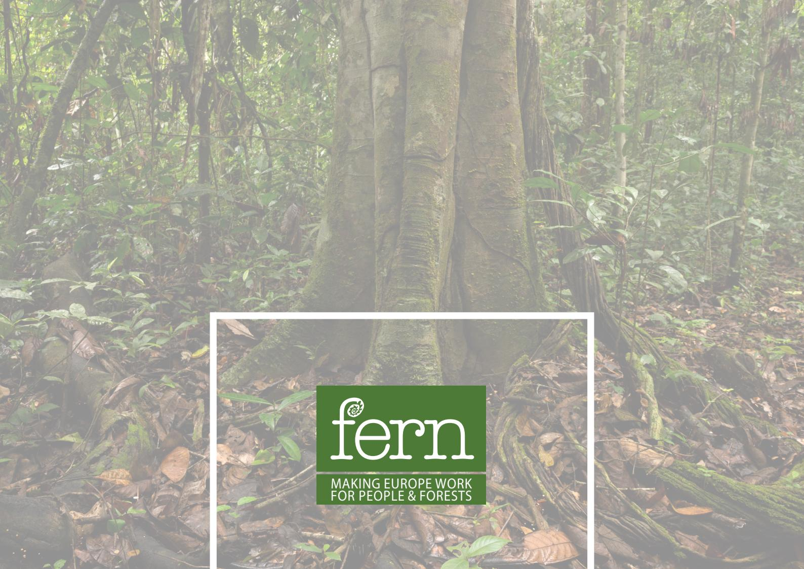

MAKING EUROPE WORK  
FOR PEOPLE & FORESTS

Fern is a non-governmental organisation (NGO) created in 1995 with the aim of ensuring European policies and actions support forests and people. Our work centres on forests and forest peoples' rights and the issues that affect them such as aid, consumption, trade, investment and climate change. All of our work is done in close collaboration with social and environmental organisations and movements across the world.

[www.fern.org](http://www.fern.org)

