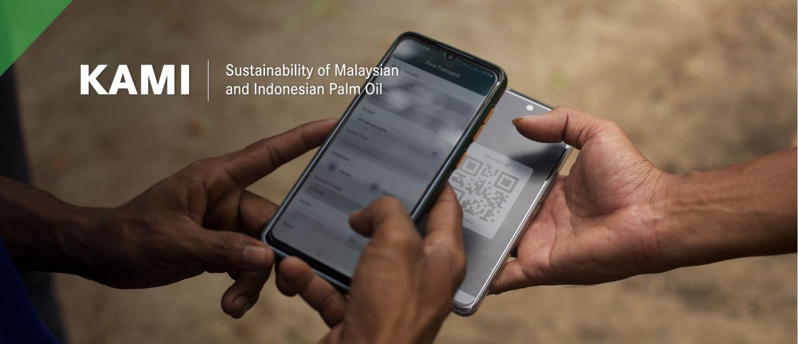

# **I-Trace App Guidelines**

For Smallholders, Collectors, and Palm Oil Smallholder Groups

## **Chapter 1: Introduction**

## **1.About I-Trace**

PT Surveyor Indonesia and EFI, through the European Union-funded KAMI Project, developed the I-Trace supply chain tracking app. Although it was originally developed for the palm oil sector, I-Trace is adaptable for various commodities across Indonesia. The app specifically addresses the needs of small-scale agricultural commodity producers in Indonesia to ensure their products comply with legal standards and deforestation-free market requirements. Featuring a simple and user-friendly design, I-Trace enables producers to easily upload geolocation data and documentation of land legality. It facilitates effective record-keeping, monitoring, and verification of supply chain activities for all stakeholders, including smallholders, cooperatives, collectors, mills, and refineries. I-Trace is designed to be used in the field and the office, offering both mobile and web versions. The app provides an intuitive interface accessible to smallholders and other stakeholders, irrespective of their digital literacy levels.

#### **Key features of the I-Trace mobile app:**

- **Geolocation mapping**: Facilitates the mapping, uploading, and storage of geolocation information in production areas.
- **Transaction recording**: This feature enables smallholder cooperatives and other supply chain actors to record transactions, including the sales and purchases of agricultural commodities. It allows users to track payments, quantities, and other essential data.
- **Traceability**: This policy supports the traceability of products from source (smallholders) to export, including the transfer of information regarding legal and deforestation-free production.
- **Integration with national systems**: Interoperability with government and national systems (e.g., the National Dashboard and e-STDB platform).
- **I-Trace web interface**: The web interface simplifies data management with features such as bulk data upload for land registration and geolocation information. The dashboard and monitoring interface deliver valuable insights into resource transactions and trends. This feature is particularly useful for cooperatives and organisations managing multiple smallholders, as it enhances operational efficiency.

## **2. I-Trace Testing**

I-Trace was developed as a desktop version in August 2023, followed by the mobile app launch in October 2023. Testing was conducted in Karang Tunggal Village, Parenggean District, Central Kalimantan Province. Javlec Indonesia coordinated the testing, which involved technical experts from the European Forest Institute (EFI) and app developers from PT Surveyor Indonesia.

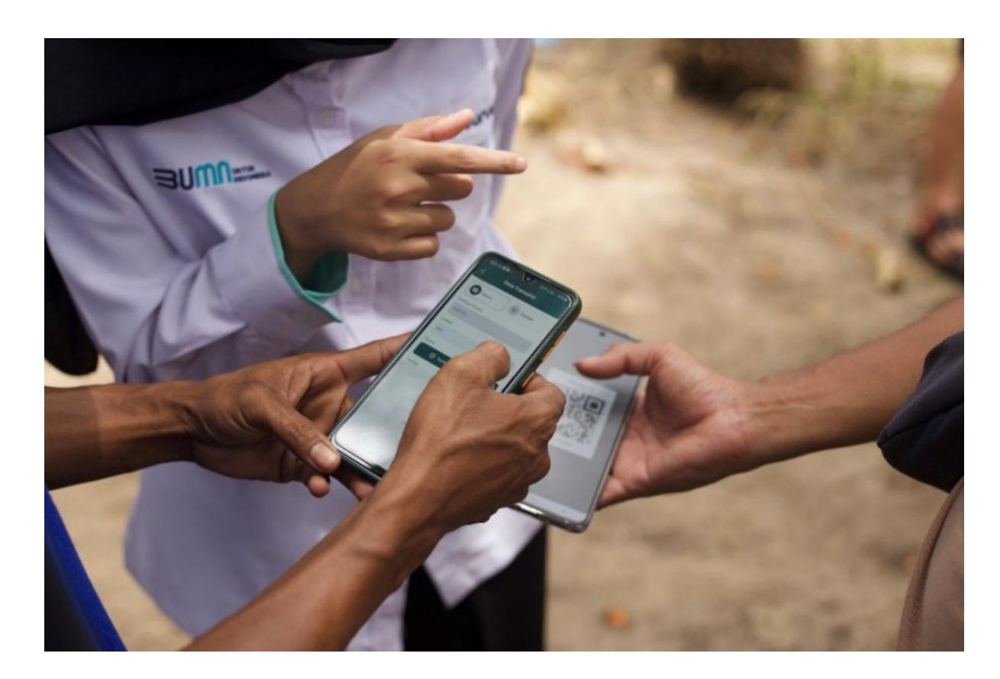

The testing primarily focused on the palm oil sector, covering all processes from field to mill. It involved independent smallholders from Karang Tunggal Village, members of the Tri Daya Cooperative, collectors, and various mills within the supply chain. The testing was conducted in two phases:

- **Phase I:** The Alpha version of the app underwent field testing in February 2024 to evaluate core functionality and identify bugs and other issues.
- **Phase II:** The Beta version underwent field testing in October 2024. Based on feedback from independent smallholders, Tri Daya cooperatives, collectors, and mills, improvements and enhancements were introduced. Various supply chain actors subsequently utilised the app for two months. During this phase, PT Surveyor Indonesia and Javlec Indonesia provided external support to ensure the app operated effectively and to collect input for future improvements.

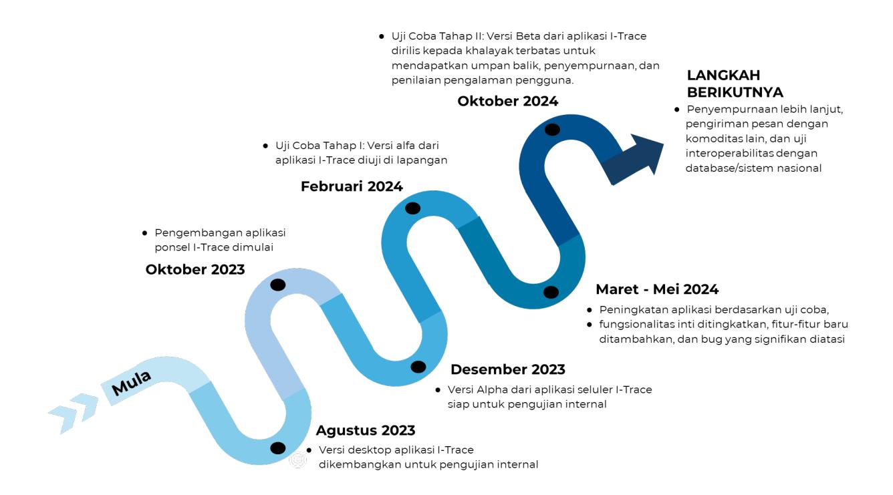

Figure 2: I-Trace development and testing timeline

## **3.About the I-Trace Guidebook**

The I-Trace Guidebook is designed to support the utilisation of the I-Trace traceability app. It offers step-by-step instructions and equips users with the knowledge needed to navigate the app's features, from land registration to monitoring and verification.

It is a crucial reference for stakeholders, including smallholders, cooperatives, and businesses, who aim to adopt legal, deforestation-free, and traceable practices in their operations. The I-Trace Guidebook ensures that users—especially small-scale smallholders—can maximise the app's potential to enhance traceability, meet evolving market requirements, and expand access to global markets.

## **Chapter 2: Getting started with I-Trace**

## **1. Installing I-Trace on mobile devices**

Scan the QR code to download I-Trace Version 1.0.0 (15) for Android.

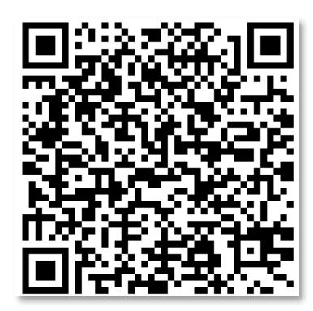

**App Center** Sign In

**iTrace-app**  
for Android by Rafi Fitra Alamsyah

**Latest release** :

**Version 1.0.0 (15)**  
Oct 21, 2024 at 10:05  
41.9 MB

**DOWNLOAD**

**Releases** Sort By: Build ↘

**Version 1.0.0 (14)**  
Aug 08, 2024 at 06:44 ↘

**Version 1.0.0 (13)**  
Aug 01, 2024 at 21:49 ↘

**Version 1.0.0 (12)**  
May 08, 2024 at 07:04 ↘

**Version 1.0.0 (11)**  
Apr 04, 2024 at 23:34 ↘

**Version 1.0.0 (10)**  
Apr 04, 2024 at 13:58 ↘

**Version 1.0.0 (9)**  
Apr 04, 2024 at 12:47 ↘

#### **1. Application interface**

Users will see the following page when opening the app for the first time.

The interface will show a Welcome page for users starting their journey with the app. Registered users will be prompted to enter their registered email and password. By selecting the "Stay signed in" option, users can remain signed in without having to repeatedly enter their email and password when opening the app in the future. If a user forgets their password, they can click to recover it.

**New users** or those who **do not have an account** can click **Register** in

.

## **2. Account sign-up**

To sign up for an account, new users should click **Register**, which will redirect them to the Terms and Conditions page. Users can review the various provisions applicable when using the app. Scroll down until the "Agree & Continue" button becomes active and can be clicked.

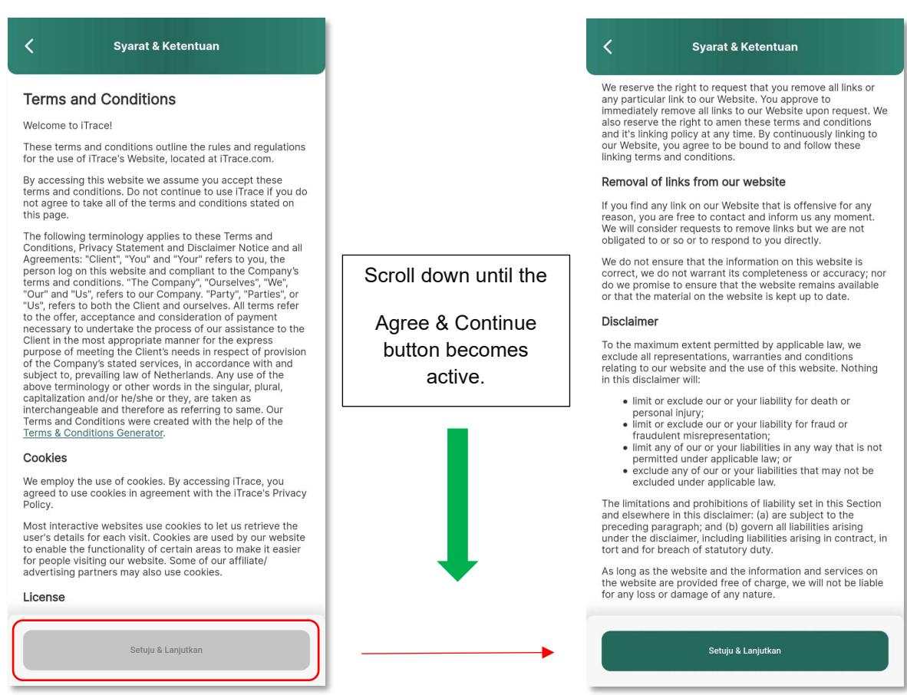

The screen is divided into two vertical sections. The left section is titled "Terms and Conditions" and contains text about the Tirace policy and the license section. The right section is titled "Syarat & Ketentuan" and contains text about the Tirace policy and the license section.

**Terms and Conditions**

Welcome to iTrace!

These terms and conditions outline the rules and regulations for the use of iTrace's Website, located at iTrace.com.

By accessing this website we assume you accept these terms and conditions. Do not continue to use iTrace if you do not agree to take all of the terms and conditions stated on this page.

The following terminology applies to these Terms and Conditions, Privacy Statement and Disclaimer Notice and all Agreements: "Client", "You" and "Your" refers to you, the person log on this website and compliant to the Company's terms and conditions. "The Company", "Ourselves", "We", "Our" and "Us", refers to our Company. "Party", "Parties", or "Us", refers to both the Client and ourselves. All terms refer to the offer, acceptance and consideration of payment necessary to undertake the process of our assistance to the Client in the most appropriate manner for the express purpose of meeting the Client's needs in respect of provision of the Company's stated services, in accordance with and subject to, prevailing law of Netherlands. Any use of the above terminology or other words in the singular, plural, capitalization and/or he/she or they, are taken as interchangeable and therefore as referring to same. Our Terms and Conditions were created with the help of the [Terms & Conditions Generator](#).

**Cookies**

We employ the use of cookies. By accessing iTrace, you agreed to use cookies in agreement with the iTrace's Privacy Policy.

Most interactive websites use coo

After clicking the "Agree & Continue" button, the app will offer several sign-up options, such as:

- **1.** Smallholder (Plantation Owner)
- **2.** Collector (Purchasing from Smallholders)
- **3.** Smallholders Organisation (Smallholders Group/Cooperative)
- **4.** Mill Manager (Processing Mill)
- **5.** Refinery Unit Manager
- **6.** Port Operator

#### **2.1. Account selection**

Users can select only one option from the list. After clicking "Continue," users will have the option to register as a:

- 1. **Smallholder (Only):** This option allows users to register solely as smallholders.
- 2. **Multi Actor:** This option allows users to register as both smallholders and collectors.

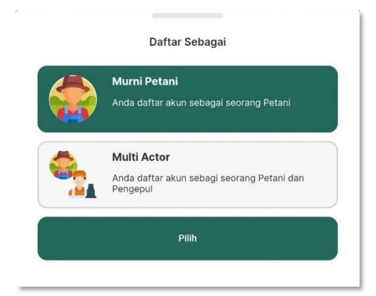

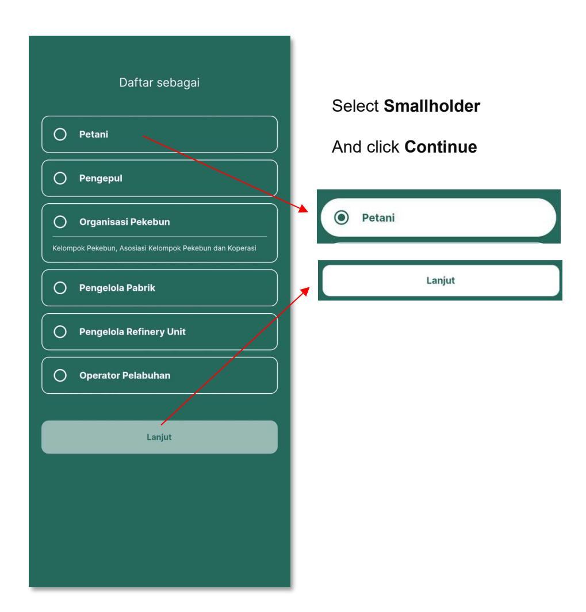

#### **2.2. Account information**

This page requires users to enter the following information:

- 1. Identity Number (User's National ID Card Number)
- 2. Name (matching with ID card)
- 3. **Email** address for registration. Each email address can only be used for the registration of one user account;
- 4. Residential address
- 5. Province of domicile;
- 6. District of domicile;
- 7. Smallholder Organisation (this is optional and can be left blank if the smallholder group or cooperative is not listed in the app)
- 8. Telephone/Mobile Number;
- 9. Password
- 10. Verify Password (enter the same password as above)

After filling out the information requested on this page, users can click the "Register" button at the bottom of the page.

#### **2.3. Registration verification**

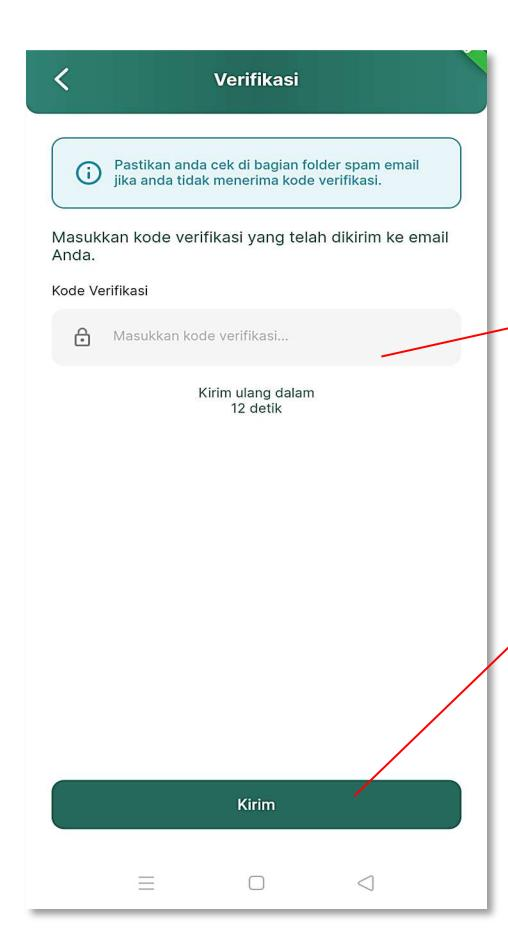

#### VERIFICATION OF SMALLHOLDER REGISTRATION

After registering, users will be directed to the **Verification** page.

Please enter the **Verification Code** sent to your registered **email**

Click the "**Submit**" button.

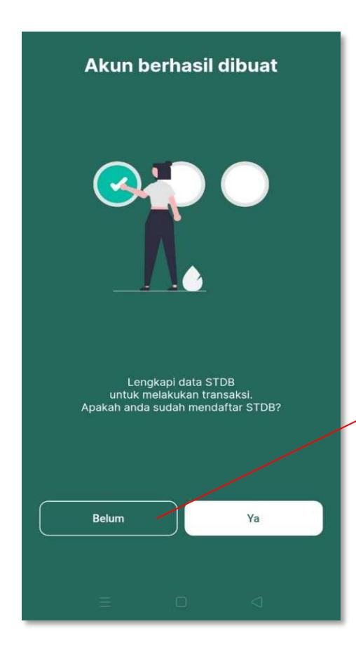

#### **ACCOUNT CREATED SUCCESSFULLY**

If the **verification** process is successful, you will be directed to the next page.

Please fill out the **STDB** data.

#### **3. Enter land legality information**

The land legality information entered should include the STDB number for the land. There are three options for providing this information:

- 1. **E-STDB**: Click this button if your land is registered on the Ministry of Agriculture's E-STDB website and has obtained an E-STDB number.
- 2. **STDB**: Click this button if you hold a physical STDB and number for the land.
- 3. **Do not have an STDB:** Click this button if your land does not have an STDB and is not registered in the E-STDB website.

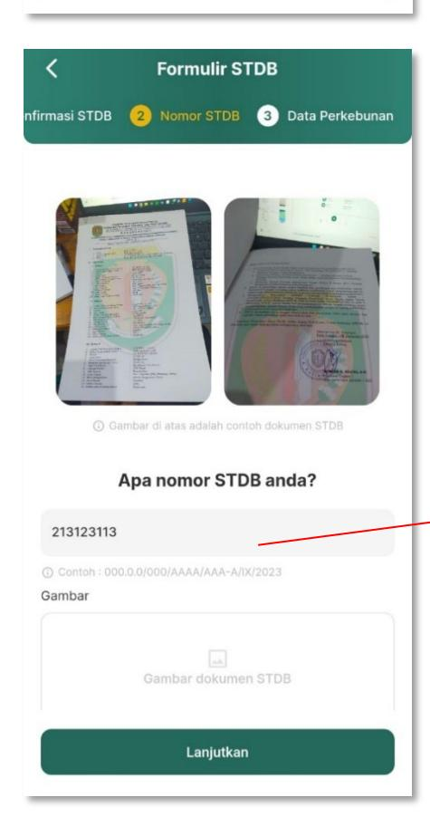

If you already hold an STDB/E-STDB, please enter the document number and upload a photo of the document.

#### **4. Plantation information for smallholders**

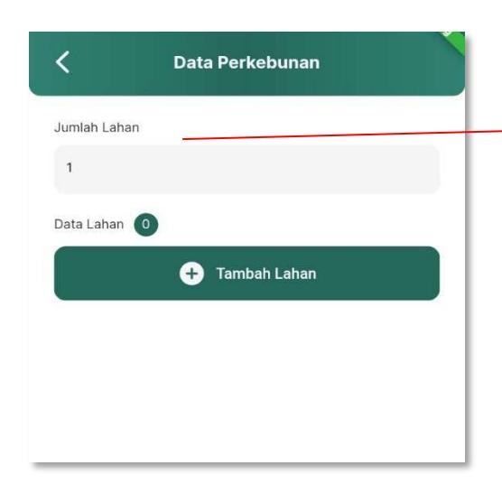

Fill out the details of the land/plantation to be registered. The following fields need to be filled out:

- 1. Land ownership status (select one)
  - Self-Owned
  - Owned by Another Party
- 2. Type of land certificate
  - Freehold Title (SHM)
  - SKT (Land Certificate / Letter from the Village/Sub-district Government)
- 3. Certificate Number of Land Certificate
- 4. Planting year for plantation commodities
- 5. Land area (in square meters)

Once all columns have been filled out, the next step is to enter the location of the plantation.

Please enter the area of your land, then click the **Add Land** button to enter complete information on your land.

![Screenshot of a smartphone showing the 'Tambah Lahan' section. It includes a bar below the title with a '<' icon and the text 'Nama Lahan'. Below that, there is a bar with the text 'Masukkan nama lahan...'. Below that, there is a bar with the text 'Status Kepemilikan'. Below that, there is a bar with the text 'Masukkan status kepemilikan...'. Below that, there is a bar with the text 'Jenis Sertifikat'. Below that, there is a bar with the text 'Pilih jenis sertifikat...'. Below that, there is a bar with the text 'Nomor Sertifikat'. Below that, there is a bar with the text 'Masukkan nomor sertifikat...'. Below that, there is a bar with the text 'Lokasi'. Below that, there is a bar with the text 'Masukkan lokasl...'. Below that, there is a bar with the text 'Usia Perkebunan (bulan)'. Below that, there is a bar with the text 'Masukkan usia perkebunan...'. Below that, there is a bar with the text 'Luas Lahan (m²)'. Below that, there is a bar with the text 'Masukkan luas lahan...'.]()

#### **5. Determining the geolocation of the plantation**

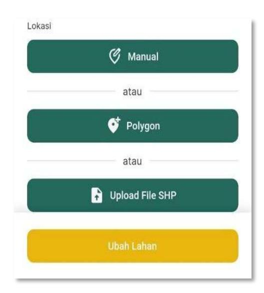

#### **a. Manual method**

The manual method allows users to enter plantation coordinates if they are available (e.g., from coordinates listed in the STDB document). This is a relatively accurate method for determining a location since the coordinates entered are the result of field mapping by GPS.

Each GPS coordinate is comprised of latitude and longitude coordinates. A minimum of 3 coordinate points is required. Additional coordinate points can be added as needed by clicking the "Add Location" button. Once all coordinate points for the plantation area have been entered, select "Save."

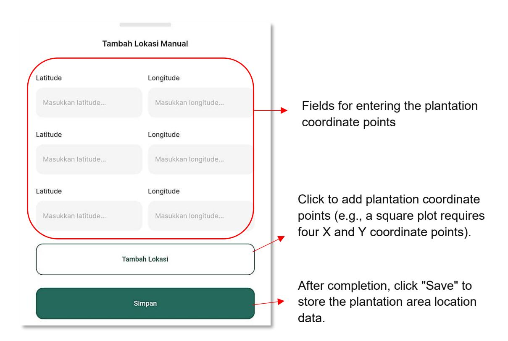

In this stage, the location of the plantation can be determined using one of three methods, namely:

#### **b. Polygon method**

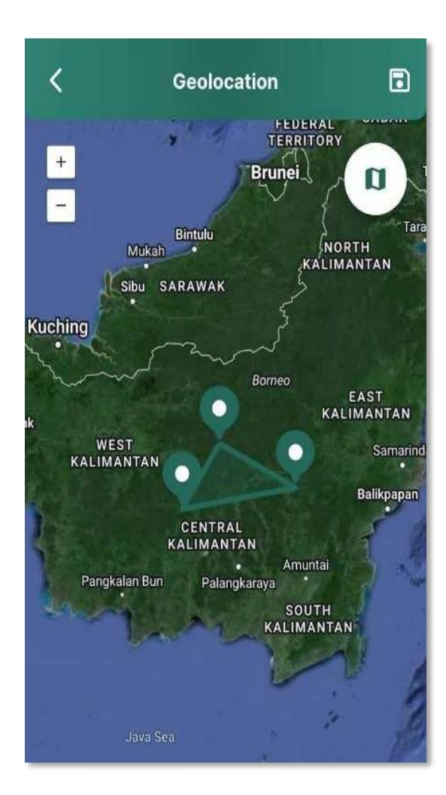

#### **c. Upload an SHP file**

Smallholders/users who already have polygon data in shapefile (shp) format can manually upload the data by uploading the plantation area shapefile to the app. The file must be saved as a ZIP folder in order to be uploaded.

Smallholders/users can map their land by directly locating it using the map displayed in the app and creating the plantation boundary points on the screen (click the boundary points on the map) to form a polygon representing the plantation area.

Note: The geolocations entered must be verified by the Admin to confirm the legality and deforestation-free status of the land before any transactions can be carried out.

#### **6. In-App features (smallholder account)**

#### **6.1. Homepage**

After successfully signing up, please log in to the app using the registered email and password. Upon successful login, users will be directed to the home page below.

The Welcome page for the "SMALLHOLDER" account provides various information required by users (as smallholders), with several key features, such as:

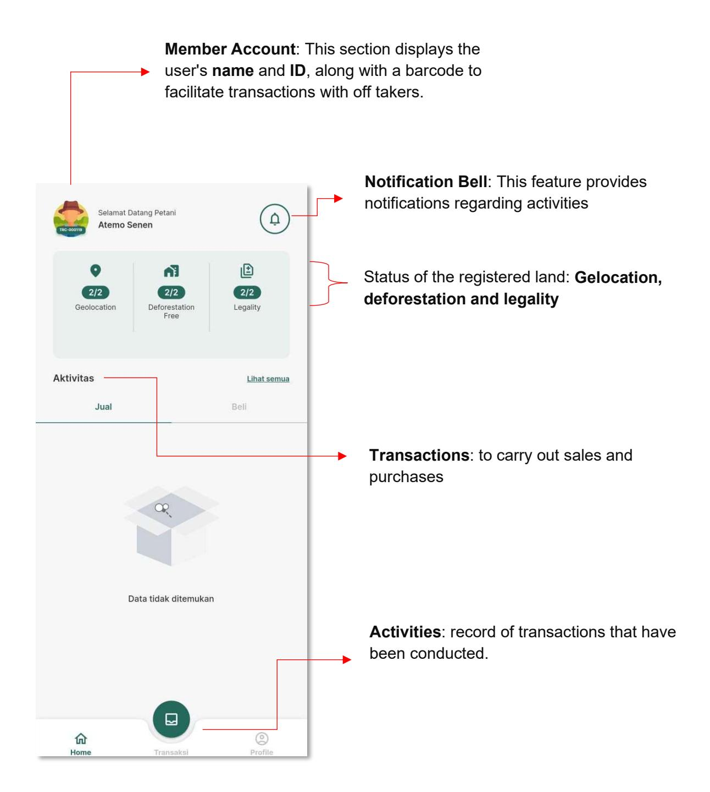

#### **6.2. Plantation status**

The home page shows three indicators of the status of the registered plantation, namely:

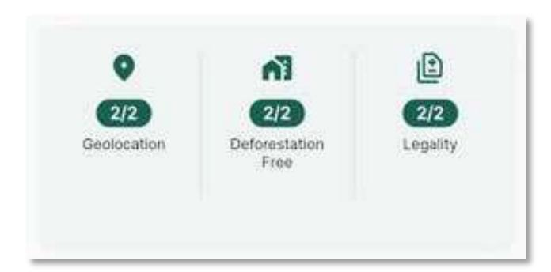

- 1. **Geolocation** (For example: 2/2) indicating that two out of two plantation plots registered in the app have been entered with their corresponding location coordinates. This indicator informs smallholders/users about the number of plantations that have been registered and the complete information that has been entered, including the coordinate points. The coordinate points of the plantation are essential for ensuring the traceability of fresh fruit bunches (FFB) during sales and purchase transactions, as well as deforestation-free and legality.
- 2. **Deforestation Free** (For example: 2/2) indicating that two out of two plantations registered in the app have obtained a deforestation-free declaration. This declaration aligns with the global policy established by the European Union's Deforestation Regulation, which prohibits deforestation during the land clearance of the plantation after the end of 2020. To obtain a deforestation-free declaration within this app, users only need to complete the plantation registration with the corresponding coordinate points. This will prompt the app developer team to conduct a verification process.
- 3. **Legality** (For example: 2/2) indicating that two out of two plantation plots registered in the app have met the legality requirements and are not located in forest areas. Similar to the deforestation-free status, users only need to complete the registration with coordinate points to obtain a legal declaration for the plantation registered in the app.

#### **6.3. Transactions**

Transactions involve the transfer of commodities from one user to another. Smallholders can engage in transactions with Collectors, Smallholder Groups/Cooperatives, and Processing Mills. Both parties can initiate purchase and sales transactions through in-person or remote meetings.

#### **a. Transaction initiation**

To initiate a transaction, select the transaction menu on the logo located at the bottom middle section of the main page. There are two options to choose from:

- i. Adding transactions with a barcode (scanning method) or
- ii. Adding transactions from previous transaction history (if you have conducted transactions before).

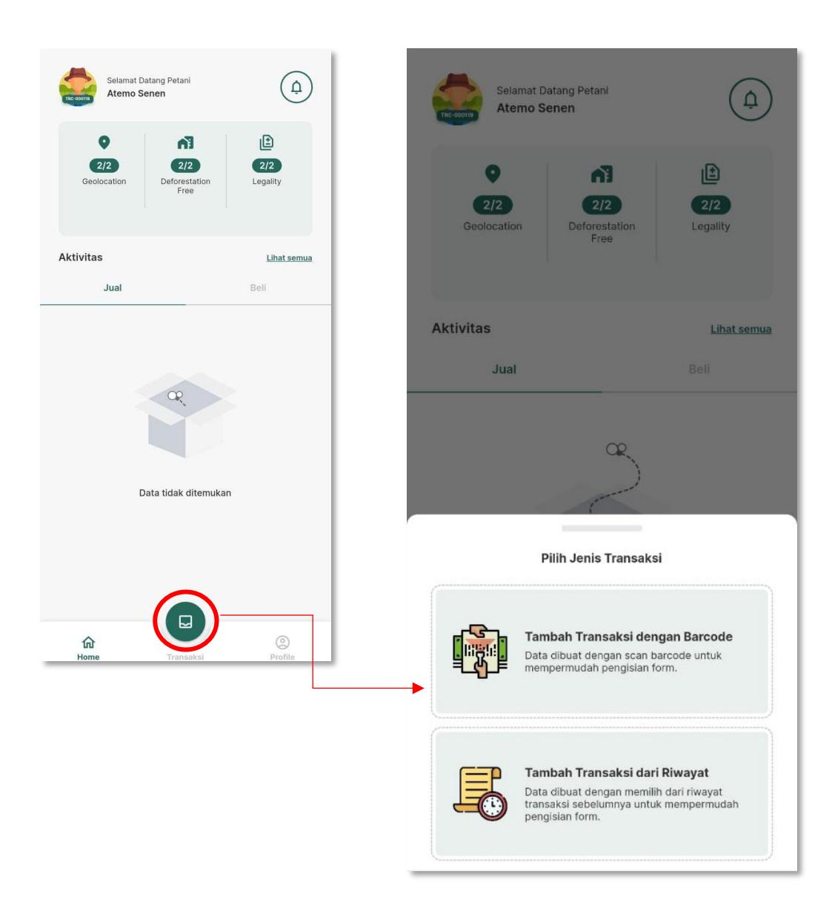

#### **i. Adding transactions with a barcode (scanning method)**

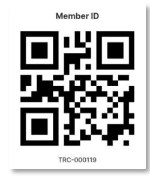

In-person transactions with the barcode scanning method.

Users can scan other users' barcodes to facilitate sales transactions or vice versa. To display the barcode for scanning, click the "Member Account" menu in the upper left corner of the main page.

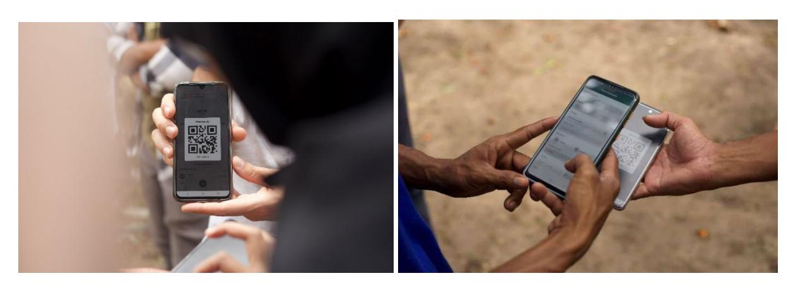

#### **ii. Adding transactions from previous transaction history**

After clicking the Transaction button, select "Add Transaction from History." A pop-up box will appear, listing the names of business actors with whom you have previously transacted.

#### **6.4. Inputting transaction data**

Afterward, users will be directed to the transaction data entry page.

![Screenshot of the Data Transaksi app showing the 'Nomor Transaksi' field with the value 'TR17120443829015'. The 'Partner' field shows 'Test Pengepul' with a checkmark. The 'Tanggal' field shows '02 April 2024' with a small icon. The 'Lahan' field shows '-'. The 'Nomor Truck' field shows 'B12345UX'. The 'Pengiriman' field contains a 'Dikirim' icon and a 'Diambil' icon. The 'Delivery Order' field shows 'Pilih delivery order...'. The 'Deskripsi Produk' field shows 'FFB/TBS'. The 'Jumlah' field shows '1500'. The 'Kg' field shows a checkmark.]()Several fields must be filled out on this page before proceeding with a transaction:

- 1. **Partner** or other destination account for the sales transaction
- 2. **Date** of sale transaction
- 3. **Land** (origin) of the FFB being sold
- 4. **Plate Number of Truck** used for transporting FFB sold to off-takers
- 5. **Shipping options** (choose one), i.e., delivered to the off-taker or picked up by the off-taker
- 6. **Delivery Order** (specifically for smallholders who have an FFB DO from the processing mill)
- 7. **Product Description** of the type of product being sold (generally from smallholders, in the form of fresh fruit bunches (FFB))
- 8. **Total weight** sold
- 9. Upload photos of the products being sold by taking photos directly through the app.

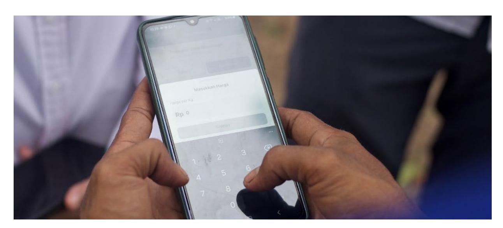

Figure x: Smallholders inputting the total weight sold

**Note: The DO number** is required in transactions with Processing Mills. It is typically recorded in conventional transactions involving the purchase and sales of fresh fruit bunches to the Processing Mill. The Processing Mill issues the DO number based on the approval granted to the external FFB supplier. When engaging in transactions with the Processing Mill through the app, users must also enter the DO number into the transaction record.

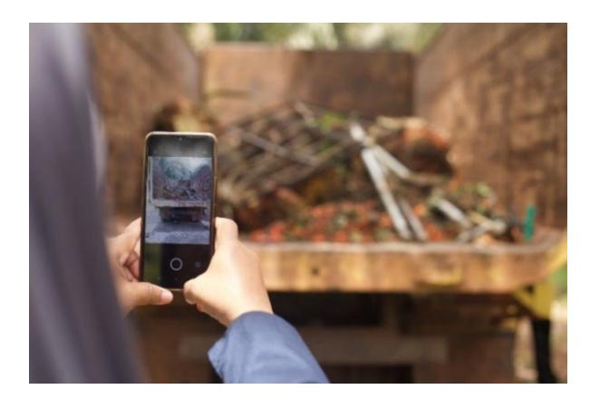

#### **6.5. Transaction notification and confirmation**

After completing all fields on the Transaction Data page, the transaction will await approval from the transaction partner's device.

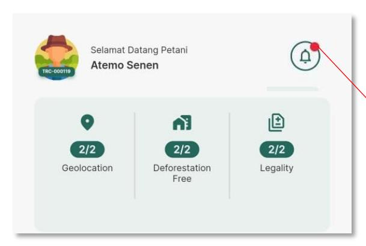

**The notification bell** will display the status of the transaction that has been initiated.

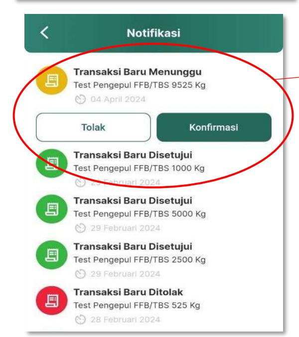

Select whether the transaction is approved or rejected by the transaction partner.

Note: Photos taken with mobile phones often contain metadata that provides critical information beyond the visual content, making them valuable for tracking and verification purposes. Common types of metadata include the date and time the photo was captured, as well as Geo-ID/Geotagging information such as latitude, longitude, and altitude.

#### **6.6. Generating Delivery Notes**

The Delivery Note is a document that contains critical information about transactions involving palm oil and derivative products between supply chain actors. It also provides details about the origin of the traded oil palm, including information on the legality and deforestation-free status of the land. The app automatically generates this document once a transaction between supply chain actors is completed.

| Delivery Note No: TR1713842120904 | 

 |
|-----------------------------------|---------------------------------------|
|                                   | 

 |
|                                   | 

 |
|                                   | 

 |
|                                   | 

 |
|                                   | 

 |
|                                   | 

 |
|                                   | 

 |
|                                   | 

 |
| <b>Delivery Note</b>              |                                       |
| <b>Information of trader</b>      |                                       |
| Nama                              | Amelia Petani Pengepul                |
| Member ID                         | TRC-000096                            |
| Asal Lahan                        | Lahan 1                               |
| Asal Kabupaten                    |                                       |
| Asal Provinsi                     |                                       |
| Nomor Truck                       | B1245UX                               |
| Tujuan Penjualan                  | Test Pengepul                         |
| Deskripsi Produk                  | FFB/TBS                               |
| Jumlah                            | 1000 Kg                               |
| Status Bebas Deforestasi          | ya                                    |
| Status Legalitas                  | ya                                    |
| <b>Information of receiver</b>    |                                       |
| Nama Penerima                     | Test Pengepul                         |
| Member ID                         | TRC-000002                            |
| Asal Kabupaten                    |                                       |
| Asal Provinsi                     |                                       |
|                                   |                                       |
|                                   |                                       |
|                                   |                                       |
|                                   |                                       |
|                                   |                                       |

#### **6.7. Plantation transaction history and records**

A valuable feature of this app enables smallholders to record their plantation transactions, which are stored for an extended period. Users can view their transaction history on the main page, as illustrated below.

#### **7. Profile features and other settings**

The Profile Features page provides several essential options to make changes and adjustments to the app, as detailed below.

#### **Account Settings comprises of:**

The image shows the 'Akun' app interface. The tab 'Akun' is the central content area, featuring a circular logo with the text 'TRC-000119' at the bottom. Below the logo, the text 'Atemo Senen' is printed in a smaller font. The interface is divided into three horizontal sections: a light gray bar at the top, a light gray bar in the middle, and a light gray bar at the bottom. The top section is labeled 'Pengaturan Akun'. The middle section contains two icons: a detail icon (a person with a hat) and a Detail Akun icon. The bottom section contains three icons: an edit icon, an email icon, and a ganti password icon.

| Pengaturan Akun | Detail Akun           | Edit Profile      | Ganti Password |
|-----------------|-----------------------|-------------------|----------------|
| Pengaturan Akun | Detail Akun           | Edit Profile      | Ganti Password |
| Feature         | Lahan                 | Map Trace         | Peta Offline   |
| Feature         | Download Peta Offline | Map Trace         | Peta Offline   |
| Tentang         | FAQ                   | Ketentuan Layanan | Hubungi Kami   |
| Hubungi Kami    | WhatsApp              |                   |                |

- 1. Account Details displaying user information. Users can add User Bio notes, photos, and videos.
- 2. Edit Profile to change username, address, or mobile number. Users can also add smallholder organisations if they are members of a group or cooperative registered with the app. (To register, users need to create a separate account for the smallholder organisation.)
- 3. Change the Password to change the login password by entering the current password and entering a new password.

#### **Features include:**

- 1. Land to add or delete land that has been registered in the app.
- 2. Map Trace to view the supply chain flow of transactions.
- 3. Offline Maps, namely geographic map data that has been downloaded and can be used in areas with no cellular network coverage.
- 4. Download Offline Maps to download offline maps when connected to a cellular network. Click "Exit" to exit from the account.

## **Chapter 3: Web-based desktop app**

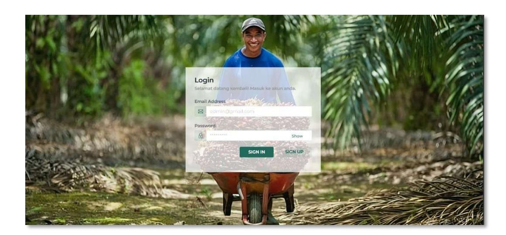

The web version of this app can be accessed via **<http://i-trace.sustainability.ptsi.co.id/login>**

While it may be less practical for field use, the web version is designed to assist supply chain actors working in an office, such as Group, Cooperative, and Mill Managers, in registering users more efficiently. The web version is particularly useful in the following scenarios:

- Supports cooperatives and smallholder groups in member registration through the 'bulk upload' function.
- Allows cooperative and group managers to view and monitor member transactions.
- Dashboard to view suppliers and off-takers within the supply base.

#### **1. Bulk upload feature**

The bulk upload feature is designed for smallholders who are members of smallholder groups or cooperatives. It allows users to input transaction data in large quantities at once.

Smallholder groups, cooperatives, or associations can facilitate the large-scale collective completion of member and geolocation data by facilitating the process.

The information required in the smallholder registration section—such as name, ID card number, address, land legality certificate number, STDB number, and geolocation information—is often already collected as part of the management of smallholder groups. The bulk upload feature simplifies the sign-up process on i-Trace for smallholders. It helps to reduce potential errors that may arise due to limited mapping skills among smallholders or users.

Cooperative group members can create accounts for all their members at once by entering the necessary data according to a **specially formatted table provided on the website.**

The screenshot displays the Admin taskboard with a transaction task in the middle section. The task is labeled "Transaction". The task is controlled by two buttons: "Import Transactions" and "Download Control". The task is active, showing a transaction with a trader name of Purwadi, a transaction date of 10 August 2024, a transport to DAYA, a transaction number of TR1723294455221, a product description of FFB/TBS, a quantity of 397 Kg, and a total of 790 Kg. The task is controlled by a search button and a member list at the bottom left.

### **2. Download feature and transaction menu display**

In addition to the bulk upload feature, users of the web-based app can also download transaction data, particularly for smallholder groups and cooperatives. This functionality is very useful for recording members' transaction activities, enabling smallholder groups/cooperatives to track the number of transactions carried out by members over specified periods.

This supports smallholder groups and cooperatives in their efforts to obtain sustainable plantation certification, which requires transparency in the harvest data from member plantations. The transaction data includes transaction number, transaction date, truck number, seller name, off-taker name, and transaction quantity (in kilograms).

Moreover, users from Smallholder Groups/Cooperatives and Processing Mills can directly monitor transaction data in real-time via their computer screens for inspection and supervision.

#### **3. Dashboard view**

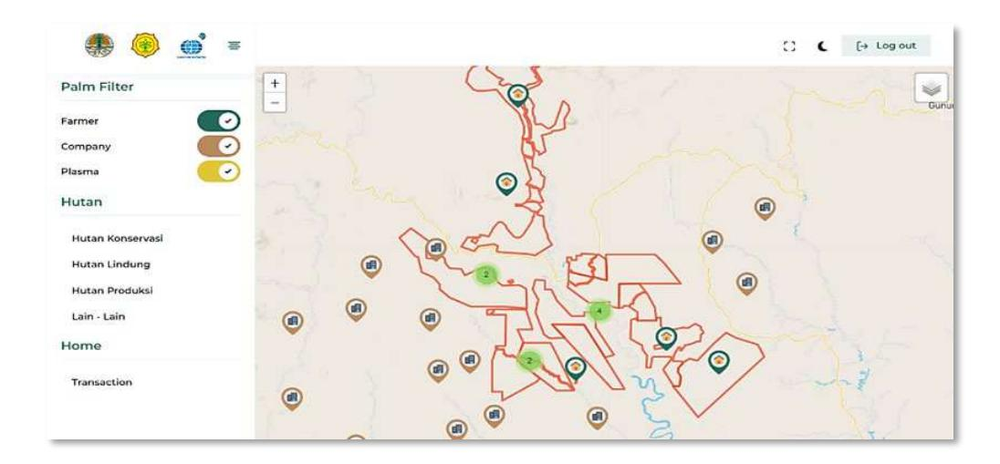

The dashboard view offers powerful tools to manage and optimise the supply chain, increasing transparency, decision-making, and operational efficiency. The dashboard provides a range of benefits by displaying the locations of plantations, suppliers, and offtakers within the landscape. Additional layers can be added, such as different forest categories, to assess mill procurement risks.

**Disclaimer:** This publication was prepared with financial support from the European Union. The views expressed in this report do not necessarily reflect the European Union's opinions.