# Cocoa with Purpose:

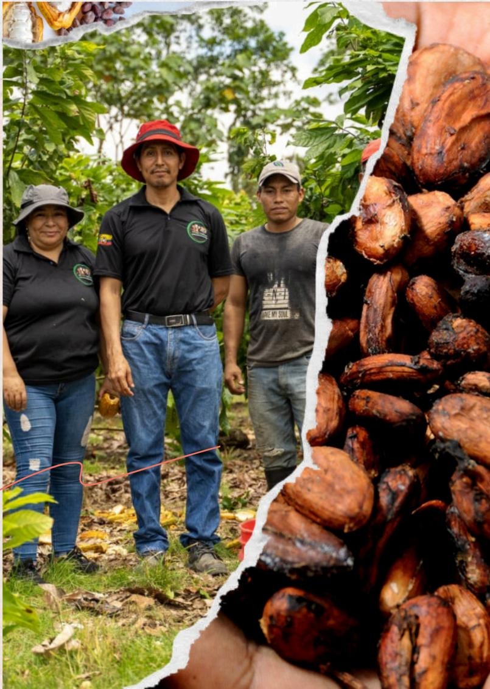

BUILDING SYSTEMS OF

# Due Diligence

FOR SMALLHOLDER COCOA FARMERS

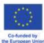

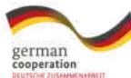

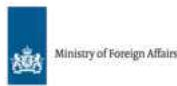

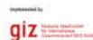

The EUDR regulation establishes that **certain products** (including **cocoa**) may enter the European Union as long as European importers can prove that they are **deforestation-free** and that they were **produced within the legal regulations** of the country of origin.

## **SAFE PROJECT**

### **EUDR REGULATION**

## **WE WORK WITH...**

# *Key Concepts*

The Sustainable Agriculture for Forest Ecosystems (SAFE) Ecuador project, implemented by the German non-profit enterprise GIZ, **works closely with smallholder farmer associations of smallholder farmers, supporting their adaptation to the European Union Deforestation Regulation (EUDR).** We seek to reduce deforestation and strengthen local capacities for more sustainable agricultural production. **We work with public and private actors linked to supply chains** in order to facilitate their adaptation to EUDR requirements, fostering knowledge sharing and **commitment for forest conservation.**

The due diligence practices supported by the project **SAFE** and detailed in this document have been developed in collaboration with **Preferred by Nature**, **Terra 360 Foundation**, **WWF Ecuador**, **Fundación Maquita**, **CODESPA** and other projects implemented by **GIZ**: **AgriChains**, **BioValor** and **ELKE**.

**Although the EUDR does not establish responsibilities for cocoa producers or exporters in Ecuador, its application in the European market will have implications for the entire supply chain, including the first mile actors and the origin of the products.**

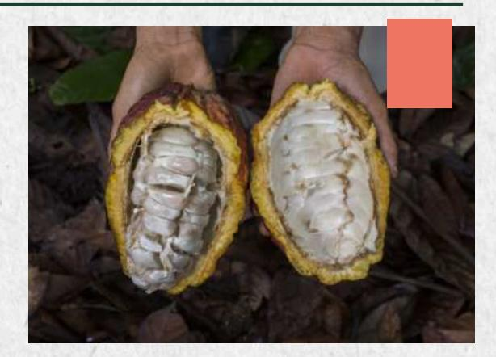

Despite these challenges, Ecuador is committed to sustainability and the promotion of organic and certified cocoa.

**Many smallholders are incorporating sustainability criteria into their production patterns**, adopting good agricultural practices and implementing **agroforestry systems**. These efforts contribute to forest conservation. Furthermore, the premium prices offered by markets that demand sustainable products enable smallholders to avoid the expansion of their plots into forested areas.

# *Cocoa production in Ecuador: An overview*

### **The European Union: an important market**

### **Forest Conservation**

**In this context, strengthening smallholders' organizations emerges as an effective strategy to reduce the vulnerability of cocoa smallholders, enhancing their production capacities and market access under improved conditions.**

Under EUDR requirements, many companies are seeking supply chains with lower deforestation risks, where implementing due diligence systems does not involve high costs. At first glance, working with numerous small suppliers makes compliance with EUDR more complex. This creates a disadvantage for cocoa smallholders, compared to larger suppliers.

Ecuador ranks as the third-largest exporter of cocoa beans globally, with its growth tripling over the past four years. Moreover, is the world's leading producer of fine aroma cocoa, which is highly esteemed internationally for crafting premium-quality chocolate.

**In 2024, Ecuadorian cocoa sales surpassed \$3,500 million with 41,4% of its exports in grain destined to the European Union.** 

### **Production**

The cocoa sector in Ecuador provides employment for approximately 410,000 people, with 71% being farmers, their families, and communities. **Around 85% of the cocoa is cultivated by smallholder farmers**, who primarily manage agricultural plots ranging from **0.5 to 2 hectares.**

**Family and smallholder farming systems make up the majority of cocoa producers**, who often face various limitations that result in a high degree of informality within the production process.

At least **80% of these smallholders rely on private intermediaries to market their harvests**. Many of them, and even more the **smallholders' associations, depend on supply chains of the European market.**

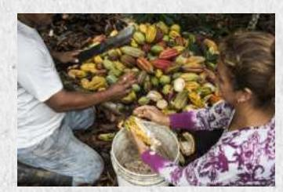

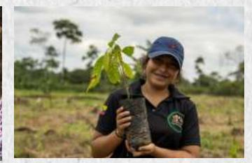

### **Challenge EUDR**

**Many smallholders in Ecuador fear a future exclusion from supply chains, which could lead to socioeconomic and environmental impacts adverse to the objectives the European Union seeks to achieve by implementing EUDR.**

# *In this scenario...*

**Ten organizations** of smallholder cocoa farmers in the Amazon and Coastal regions of Ecuador **are actively working to strengthen their structures and implement robust, adaptive, and sustainable due diligence processes.**

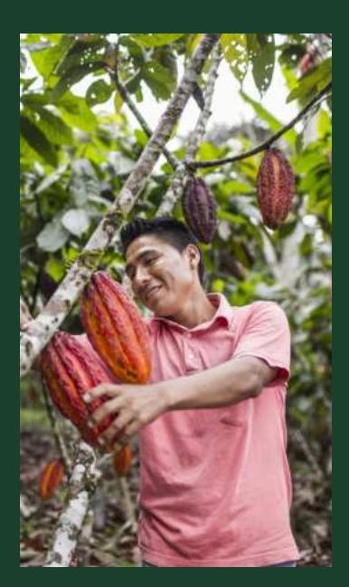

**These organizations are determined to demonstrate their ability to comply with EUDR regulations, meeting the requirement of zero deforestation and adhering to legal regulations. To achieve this, they are establishing processes that ensure traceability and transparency within their supply chains**, aiming to overcome the challenges posed by the informal nature of the supply chain.

The German non-profit enterprise GIZ and its partners provide technical assistance to help smallholder farmers establish efficient due diligence processes within their organizations.

### **Why is this important?**

**It offers tangible support to cocoa smallholders as they adapt to EUDR regulation.**

These producers are actively working to **enhance their competitiveness**, ensuring they remain attractive and reliable suppliers for European buyers.

UNOCACE Kallari FOMNSEAM UOPROCAE Aprocane Aprocash Aprocel Redescocpe Unión y Progreso 2 de Mayo

*Promoting sustainable production and linking it to a market that values these efforts and secures the livelihoods of cocoa smallholders is an effective way to protect forests and biodiversity in Ecuador.*

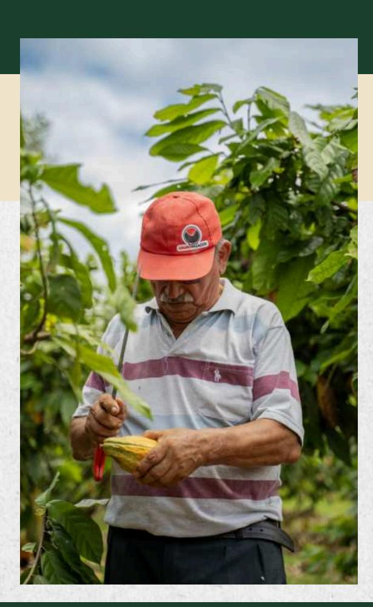

*The EUDR requires European operators to establish a due diligence system (DDS). This system consists of a set of procedures and measures designed to ensure that products do not contribute to deforestation and are in compliance with the law of the country of origin. A DDS involves assessing and mitigating risks related to deforestation and legal compliance within production areas.*

*We have worked with over 1,300 cocoa smallholders from 10 organizations located across five provinces in the country (Esmeraldas, Guayas, Los Ríos, Napo, and Sucumbíos):* 

**Of these smallholders, 30% are women, and 74% are adults aged between 30 and 65. Four organizations have implemented a basic traceability system. Other five organizations have adopted a digital traceability system. The majority of them produce within agroforestry systems and hold organic certifications, ensuring better forest protection. Although smallholders generally have limited knowledge regarding their land rights, no violations of legal regulations or human rights related to land use and ownership have been observed within these organizations.** 

In our journey, alongside these organizations of smallholders' organizations, we have encountered several common challenges.

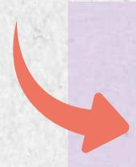

# Challenges for Small-Scale Producers

The fragmented nature of the cocoa supply chain complicates traceability and makes it more expensive.

The absence of land classification and accurate mapping can result in high costs for preventing, correcting, and proving false positives of deforestation in integrated or agroforestry production systems.

For cocoa smallholders, obtaining the geolocation of their plots and managing production data involves significant operational costs. Managing clear processes, documenting them, and handling digital information demand skills and resources that often exceed their capacities.

Compliance with tax obligations and other regulations is hindered by the low level of formalization in the rural sector, weak institutional management of land-related information, and a lack of economic incentives.

There are numerous uncertainties on how to determine whether cocoa smallholders' lands are deforested, due to the difficulty of accessing and cross-referencing information without the technical knowledge required for proper analysis.

In rural areas, weak or nonexistent formalization of economic activities is a widespread issue, including a lack of knowledge on labor laws and other regulations.

This shift is already evident in **buyers' expectations, as they increasingly inquire about their potential suppliers' ability to demonstrate** that their product is deforestation-free and complies with the laws of its country of origin.

# Step by Step: How do we support Smallholder Cocoa Farmers in adapting to EUDR?

1

## Socialization and Awareness on EUDR

Creating knowledge about the scope and implications for the various actors in the supply chain through **training guides, informational brochures, and practical workshops for producers, associations, and exporters.**

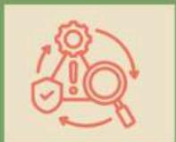

2

## Identifying gaps and conducting risk analysis in smallholders' organizations

to assess their level of preparedness and identify risks, using **tools developed** for:

- • Identifying risks and mitigation measures.
- • Analyzing the feasibility of meeting export conditions.
- • Assessing and strengthening organizational capacities.

3

## Mitigating identified risks through:

- • **Plans and roadmaps** with specific preventive and corrective actions.
- • **Training-of-trainers program** and **guide for traceability.**
- • **Trainings on** labor and tax-related topics.

Traceability: process of tracking and recording each stage of the product, from its origin to its final distribution ensuring transparency, quality and compliance at every step.

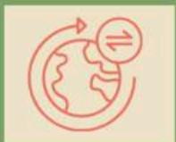

4

## Strengthening management and sustainability systems for Due Diligence sustainability

Improving information management, monitoring, and adaptation processes within the supply chains of **some of the stronger exporting organizations.**

5

## Feedback and dissemination to public entities

Sharing tools used and lessons learned during the process, as well as structural challenges still to be addressed.

Due diligence systems help demonstrate responsible sustainability processes and foster trust. **Exporting organizations aim to increase their competitiveness** with European buyers seeking to minimize risks in their supply chains.

# Government-led efforts

To support cocoa smallholders in this process, Ecuador's public institutions are coordinating their efforts and, together with the private sector, are seeking solutions to the challenges posed by the EUDR regulation on productive sectors. To this end, they have established the **Inter-Institutional Committee for Sustainable Production and Trade**, along with its subcommittees.

## Committee Members:

- • Ministry of Production, Foreign Trade, Investments, and Fisheries.
- • Ministry of Agriculture and Livestock.
- • Ministry of Environment, Water, and Ecological Transition.
- • Ministry of Labor.
- • Ministry of Foreign Affairs and Human Mobility.
- • AGROCALIDAD (Agency for Phytosanitary and Zoosanitary Regulation and Control).
- • SRI (Internal Revenue Service).

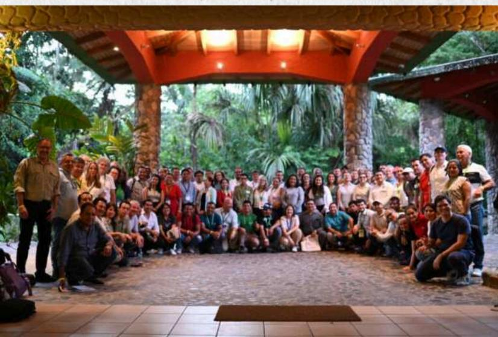

The relevant entities are coordinating to address structural issues. Drawing on the experiences of smallholders' organizations and the private sector, they aim to support and facilitate EUDR compliance through **positive initiatives** such as:

- • A list of legal regulations required for EUDR compliance.
- • A Forest-No Forest Map, with country-owned and more accurate data on deforestation and agricultural areas.
- • The Statal System, for recording and managing agricultural information.
- • BPA (Good Agricultural Practices) certification and AFC (Family Farming) registration, which can help simplify compliance with legal requirements.

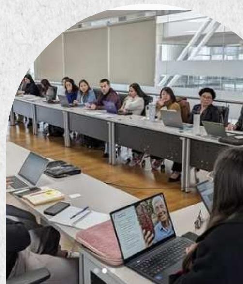

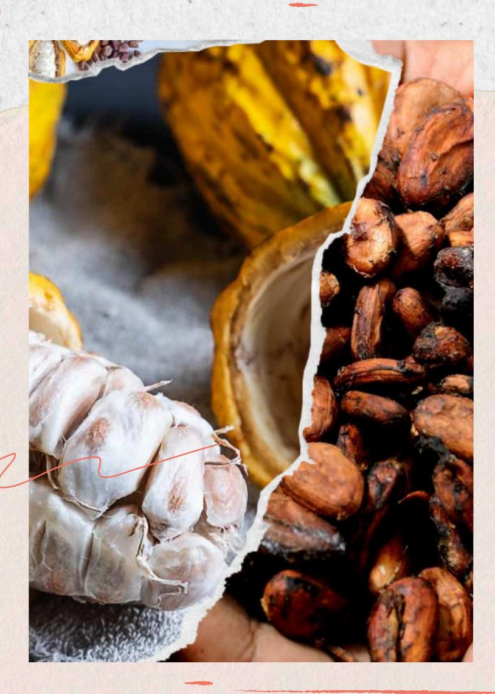

*These 10 organizations in Ecuador are showcasing their remarkable ability to adapt EUDR. They stand as proof that cocoa smallholders can continue to be attractive suppliers for the European Union.*

This Publication was created with the financial support of the European Union (EU), the German Federal Ministry for Economic Cooperation and Development (BMZ), and the Netherlands' Ministry of Foreign Affairs (BZ). Its contents are the sole responsibility of the authors and do not necessarily reflect the views of the EU, the BMZ, and the BZ. The reproduction and use of the contents of this publication are free, as long as their source is acknowledged. Photographs: @GIZ. / © Quito, 2024