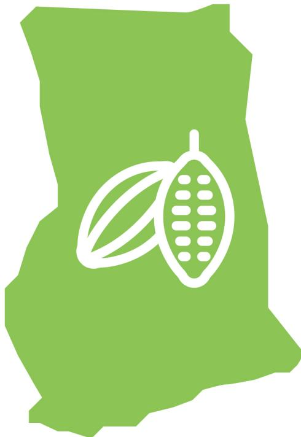

Support tool for due diligence on the legality of cocoa in the framework of the EUDR

# Module 1: Legal requirements relevant to cocoa produced in Ghana

May 2025

**Disclaimer.** This document has been produced with the financial support of the European Union. The opinions expressed herein cannot in any way be taken to reflect the official opinion of the European Union. This document aims to support the cocoa sector in its efforts to comply with the EU market requirements. Its content is indicative, not legally binding, and does not constitute legal advice. No guarantee is given as to the accuracy, completeness or timeliness of the content. The authors of this document accept no liability for any damage or loss arising from its use without appropriate legal advice. The authors welcome any comments and suggestions for improvement.

European Forest Institute, 2025

## **Table of contents**

| 1. Context                                                                                                          | 4                                                                                                                          |
|---------------------------------------------------------------------------------------------------------------------|----------------------------------------------------------------------------------------------------------------------------|
| Collaboration between Ghana and the European Union.........................................................         | 4                                                                                                                          |
| Supporting the due diligence of cocoa operators.................................................................... | 4                                                                                                                          |
| 2. Objectives and methodology                                                                                       | 6                                                                                                                          |
| General approach                                                                                                    | 6                                                                                                                          |
| Methodology for identifying relevant national requirements (Phase 1)....................................            | 7                                                                                                                          |
| Legal requirements relevant in the context of the EUDR                                                              | 7                                                                                                                          |
|                                                                                                                     | Legal requirements relevant in the national context of cocoa production............................ 8                      |
| 3. List of relevant legal requirements for cocoa produced in Ghana                                                  | 8                                                                                                                          |
| 3.1 Land-use rights                                                                                                 | 8                                                                                                                          |
| 3.4 Free, prior and informed consent (FPIC)                                                                         | .........................................................................15                                                |
| 3.5 Taxes, anti-corruption, trade and customs                                                                       | .......................................................................16                                                  |
| 3.7 Human rights*                                                                                                   | .................................................................................................................20        |
| 4. Consultations                                                                                                    | ........................................................................................................................23 |

# 1. Context

On May 31, 2023, the European Union (EU) adopted Regulation 2023/1115 on the placing on the EU market and export from the EU of certain commodities and products associated with deforestation and forest degradation (EUDR). This regulation requires operators and traders importing commodities at risk of deforestation into the EU to demonstrate that the products are traceable, deforestation free and legal. The scope of the regulation covers seven commodities: coffee, cocoa, rubber, palm oil, soy, beef and timber, as well as their by-products such as chocolate and cocoa paste. Initially due to come into force on 31 December 2024, the regulation will now enter into application on 31 December 2025 (and six months later for micro and small businesses).

Companies targeted by the regulation (operators and traders) will be obliged to carry out “due diligence” prior to exporting or placing their product on the market, in order to provide sufficient information to guarantee that the product carries no or negligible risk of non-compliance. Consequently, operators placing cocoa or cocoa-derived products on the EU market will have to ensure that they have been produced in accordance with the relevant legislation of the country of production (article 3), which is defined as concerning the legal status of the area of production. The EUDR adopts a flexible approach, listing several areas of law without specifying particular legal instruments, as these differ from country to country and may be subject to change (article 2.40).

In this context, understanding the legislative framework of the country of origin, identifying the legal requirements relevant to the commodities concerned, and determining the means of verifying their compliance can be a challenge not only for the operators responsible for due diligence, but also for the EU competent authorities responsible for controls, as well as for the various stakeholders involved.

## Collaboration between Ghana and the European Union

In 2021, Ghana and the European Union launched a policy dialogue aimed at supporting national objectives in terms of the economic, environmental and social sustainability of cocoa. This collaboration is being implemented through several technical partners, including the European Forest Institute (EFI), which is supporting Ghana in the development of an enabling framework to facilitate access of cocoa to the European market and promote transparency in supply chains.

## Supporting the due diligence of cocoa operators

Starting in June 2024, EFI led a stakeholder engagement process, with strategic and technical engagement of Ghana Cocoa Board (COCOBOD), to develop a tool to support the due diligence of operators wishing to place Ghanaian cocoa, or its by-products, on the EU market. The objective is to produce a national baseline of legal requirements relevant to cocoa production and trade within the framework of the EUDR. The tool aims to facilitate the work of

the various actors in the sector, guarantee fair access to information, reduce perceived risks and give a competitive edge to Ghanaian cocoa.

This tool was developed with the technical support of legal and due diligence experts from TaylorCrabbe and Preferred by Nature.

# **2. Objectives and methodology**

The tool aims to:

- 1. Identify all Ghanaian legal requirements relevant to cocoa production and trade for EUDR compliance
- 2. Provide due diligence recommendations for the verification of legal compliance, including through certification (ARS-1000 and voluntary certifications).

The tool was developed in two phases:

- Phase 1: Identification of Ghanaian legal requirements relevant to cocoa production and trade in the context of the EUDR.
- Phase 2: Development of due diligence recommendations for operators, based on an analysis of the level of implementation of relevant legal requirements and existing means of verification, including certification (ARS-1000 and voluntary certification standards)*.*

This report presents the results of phase 1 (Module 1).

## **General approach**

The aim of this tool is to promote a national and consensual vision of the legal requirements that apply to Ghanaian cocoa in the context of EUDR, in order to: i) support the harmonisation of operators' due diligence approaches; ii) encourage the simplification of procedures for upstream players in the supply chain (COCOBOD) likely to have to provide data to their customers; and iii) facilitate a better understanding of the national context by EU competent authorities in charge of controls. **It is important to note that the results provided are not legally binding, do not commit any actor concerned, and do not constitute legal advice**. It is the responsibility of operators placing cocoa, or its derivatives, on the EU market to identify the relevant legal requirements within the scope of Article 2(40) of the EUDR, and to adapt their due diligence to the risks identified. This tool provides recommendations that can support operators and other players in the industry in this direction.

Furthermore, the tool is likely to evolve over time and be updated due to several factors: potential legal reforms in Ghana, evolution of public or private certification standards, lessons learnt from the practical implementation of national due diligence recommendations, additional guidance provided by the European Commission or competent authorities, integration of best practices and technological advances, etc.

The tool was developed with national and international experts in law and due diligence, and through technical consultation with all the relevant national and international players in the cocoa sector: administrations and ministries, exporters, traders and chocolate makers, cooperatives and producer associations, certification bodies, civil society organisations and EU importing countries.

## **Methodology for identifying relevant national requirements (Phase 1)**

## **Legal requirements relevant in the context of the EUDR**

The EUDR defines the relevant legislation of the country of production according to two criteria:

- Requirements must concern the legal status of the area of production;
- Requirements concern seven areas of law [for agricultural products]: 1) land-use rights;
  - 2) environmental protection; 3) third parties' rights; 4) labour rights; 5) human rights protected under international law; 6) the principle of free, prior and informed consent, including as set out in the UN Declaration on the Rights of Indigenous Peoples and 7) tax, anti-corruption, trade and customs regulations.

On 2 October 2024, the European Commission (EC) published a guidance document on the implementation of the EUDR, which interprets the provisions of the regulation on the legality criteria. [1](#page-6-2) This document proposes to address the relevance of legal requirements through the following criteria:

- The requirements have a specific impact on the legal status of the area of production of the products [with the exception of trade and customs rules];
- The requirements must be linked to the objectives of the EUDR, i.e., halting deforestation and forest degradation in the context of the EU's commitment to address climate change and biodiversity loss.

Since all labour requirements, as well as certain human rights and third parties' rights, are not directly linked to the objectives of the EUDR, there is debate as to whether they would fall within the scope of the EUDR. On the other hand, the EC guidance would extend the scope of tax and anti-corruption legislation to downstream steps of value chains if these regulations contribute to combating deforestation. Similarly, trade and customs regulations would be relevant where they apply to in scope products, beyond the area of production.

It should be noted that the Commission guidance is not legally binding. As stated in the document itself, it does not replace, add to or modify the provisions of the EUDR, which sets out the legal obligations. Each EU Member State will adopt its own approach to control operators' compliance with the EUDR. Ultimately, only judges in each EU Member States have the power to interpret the regulation in a binding manner and determine the scope of the legality criterion. Nonetheless, the Commission's guidance is also aimed at facilitating the harmonised implementation of the regulation and the coordination between competent authorities (Article 15 of the EUDR).

**In line with the EC guidance, COCOBOD considers that only those legal requirements which concern the legal status of the area of production, and/or are linked to the objectives of the regulation, and/or determine the reliability of data are relevant to the** 

1 Latest update : [https://environment.ec.europa.eu/document/download/5dc7aa19-e58f-42a3-bbbe](https://environment.ec.europa.eu/document/download/5dc7aa19-e58f-42a3-bbbe-f0eb2e5a1d3a_en?filename=C_2025_2485_F1_ANNEX_EN_V3_P1_4056628.PDF)[f0eb2e5a1d3a\\_en?filename=C\\_2025\\_2485\\_F1\\_ANNEX\\_EN\\_V3\\_P1\\_4056628.PDF](https://environment.ec.europa.eu/document/download/5dc7aa19-e58f-42a3-bbbe-f0eb2e5a1d3a_en?filename=C_2025_2485_F1_ANNEX_EN_V3_P1_4056628.PDF)

**EUDR. These are requirements related to land-use rights, environmental protection, third parties' rights and FPIC, as well as those relating to tax, anti-corruption, trade and customs beyond the production area. But they recognise that the scope of the EUDR legality criteria is debated.**

In this context, this tool adopts **a precautionary approach**. It not only considers all the areas of law listed in article 2.40 that are linked to the environmental objectives of the EUDR, including taxation, trade and customs, but also covers requirements relating to human and labour rights.

The tool indicates with an asterisk those requirements which are not directly linked to the objectives of the EUDR. This exhaustive approach will enable end-users to choose the scope of their work according to their reading of the EUDR and the guidance provided. Under the EUDR, it is the operator who is responsible for carrying out due diligence to ensure that the products it places on the market present a negligible risk of illegality. It is therefore up to the operator to decide which legal requirements it wishes to include in its due diligence system.

## **Legal requirements relevant in the national context of cocoa production**

All existing legal texts and requirements in Ghana falling within the scope of the seven areas of law specified above were identified. Cocoa industry stakeholders, through consultation workshops (see section 4), then assessed their relevance to the specific case of small-scale cocoa production.

All legal requirements identified were *a priori* considered relevant unless it could be clearly identified that:

- The legal requirement does not relate to the cocoa farm or to third parties impacted by activities taking place on the farm [with the exception of trade and customs regulations].
- The legal requirement is not relevant in the context of small-scale, predominantly family cocoa production.
- The legal requirement is covered by other, more specific, requirements.

# **3. List of relevant legal requirements for cocoa produced in Ghana**

The tables below list the requirements considered as relevant and not relevant, and the justifications in case of non-relevance, applying the above criteria.

## **3.1 Land-use rights**

In Ghana, all lands have defined ownership, and therefore, activities on the land, including cocoa production, must be authorised by the landowner. Farmers, however, do not need documented land-use rights, such as holding a land title or written land-use right, to farm the land legally, oral permission from the landowner is sufficient. If the farmers own the land, they

must hold a land title certificate or have obtained the land through customary rights or acts of possession, such as verbal agreements. Cocoa farming is legally permitted in off-reserve areas. Almost all cocoa-producing lands are either owned by the farmers, leased to them, or governed by customary tenancy arrangements.

Land ownership and use rights by farmers are well-defined and respected, and cocoa farming in Ghana is predominantly subsistence-based and managed by smallholders rather than on a commercial scale. Land-use right conflicts are infrequent and, when they do occur, are generally resolved efficiently at the village level.

Cocoa farming within forest reserves is allowed only in specific areas known as “admitted farms.” If the cocoa farm is within an admitted area, farming activities must be confined to the authorised boundaries of these designated farms. Any incursion beyond the pre-designated area is illegal. Admitted farms in the forest reserves have contributed to environmental degradation. Some of these farms and settlements allowed in the forest reserves have expanded beyond their original permitted area where the reserves were constituted. There are estimated to be about 1830 admitted farms in Ghana with the smallest farm being about 0.06 hectares and the largest being about 645.5 hectares. The data on the exact number of farms in protected areas varies since some have ceased to exist, been destroyed by the Forestry Commission, or have now grown into entire communities. The primary record on these admitted farms is contained in the Reserve Settlement Commissioner’s Report on the constitution of forest reserves, which is not public. The report contains the name of the farm or owner of the farm and acreage or size of the farm, but not the exact location of the farm in the reserve.

|                       | Legal requirement                        | Legal text                                       | Relevance    |                         |
|-----------------------|------------------------------------------|--------------------------------------------------|--------------|-------------------------|
|                       | landowner or if the owner, the farmer    |                                                  |              |                         |
|                       |                                          | Sections 1, 5(1), (2), 6-8, 37 and 82(f)(g) Land |              |                         |
| Land-use rights       | The farmer has a land title or customary |                                                  |              |                         |
|                       |                                          | Section 36(h), 37 Land Act                       | Relevant     |                         |
| Expropriation         | If the land on which agricultural        |                                                  |              |                         |
|                       |                                          | Article 20.                                      |              |                         |
|                       |                                          |                                                  | Not relevant | : Since compulsory land |
| Land use & management |                                          |                                                  |              |                         |
|                       |                                          | Section 85(1) Land Use and Spatial Planning      |              |                         |
|                       |                                          | Section 2, 10 and 17 Forests Act                 | Relevant     |                         |

## 3.2 Environmental protection

Ghanaian law mandates that only registered and approved pesticides be used in farming, including cocoa farming. The Environmental Protection Authority (EPA) is responsible for registering pesticides. In cocoa farming, COCOBOD, through its Cocoa Diseases and Pest Control (CODAPEC) programme, provides farmers with pesticides for use on cocoa farms. This is only done for mapped farms in good conditions.2 COCOBOD maintains a list of approved pesticides for use in cocoa production for pesticide application beyond what CODAPEC provides, but it is not widely available to farmers.3 In addition, some Licensed Buying Companies, as part of their sustainable supply chain programmes, also distribute pesticides that are in the approved list of COCOBOD. Farmers who do not receive pesticides from COCOBOD or private companies usually cannot afford to buy any.4

The Environmental Assessment Regulations, L.I. 1652 of 1999 amended in 2002, require that all developmental activities likely to impact adversely on the environment be subject to environmental assessment. The requirement applies to agricultural activities that either involve the clearing of land: greater than 40 hectares in area or in an environmentally sensitive area. Smallholder cocoa farmers would therefore not be required to carry out an environmental impact assessment unless their activities are carried out in an environmentally sensitive area.5

---

2 Ghana Cocoa Board

[https://cocobod.gh/project/codapec#:~:text=COCOBOD%20introduced%20the%20CODAPEC%20programme,are%20considered%20under%20this%20exercise.&text=districts%20and%20communities.&text=A\)%20Capsid%20Control-, 1.,May%20and%20September/October%20respectively.&text=Black%20pod%20Control-, 1.,%2C%20July%20and%20August/October.](https://cocobod.gh/project/codapec#:~:text=COCOBOD%20introduced%20the%20CODAPEC%20programme,are%20considered%20under%20this%20exercise.&text=districts%20and%20communities.&text=A)%20Capsid%20Control-, 1.,May%20and%20September/October%20respectively.&text=Black%20pod%20Control-, 1.,%2C%20July%20and%20August/October.)

3 The Ghana Cocoa Board (COCOBOD) approved insecticides, imidacloprid, thiamethoxam and bifenthrin, for the control of cocoa mirids (Hemiptera: Miridae): Implications for insecticide-resistance development in Distantiella theobroma (Dist.) and Sahlbergella K. D. Ninsin, R. Adu-Acheampong 21–28. See at <https://www.ajol.info/index.php/gjas/article/view/174334>

4 In addition, the Cocoa Research Institute of Ghana (CRIG) tests and approves pesticides and insecticides (Section 1 of Pesticide Control and Management Act, 1996 (Act 528)) to use in cocoa farming on a regular basis based on the current list of active ingredients issued by the EU. In cocoa farming, COCOBOD maintains a list of approved pesticides based on CRIG's recommendations, which is circulated to farmers through the Extension Agents of the Cocoa Health and Extension Division of COCOBOD. The list is reviewed periodically based on the list of active ingredients approved by the EU.

5 According to Cocobod, the average size of cocoa farms is 2–3 hectares. A handful of cocoa farms are larger than 40 hectares. See:

<https://opecfund.org/news/ghana-is-cocoa-cocoa-is-ghana>; and

<https://anangtawiah.com/articles/details/The%20Ghana%20Cocoa%20Report%202024:%20Ghana%20Cocoa%20Farming%20Techniques:%20Traditional%20and%20Modern%20Approaches-201>

| Legal requirement Legal text                       | Relevance                                                                 |
|----------------------------------------------------|---------------------------------------------------------------------------|
| Pesticides Only registered and approved pesticides |                                                                           |
| Section                                            | 1 Pesticide Control and Management                                        |
| Fertilisers A person shall not import, manufacture |                                                                           |
| Section                                            | 68, 76 Plants and Fertilizer Act Not relevant : The legal prescription to |
|                                                    | manufacturers or distributors. This                                       |
|                                                    | compliance. There is no duty placed on                                    |
|                                                    | farmers regarding fertiliser use.                                         |
| Water Damming, diverting, abstraction, storing     |                                                                           |
| Sections                                           | 12, 13, 14 & 16 Water Resources                                           |
|                                                    | Not relevant : Stakeholder consultations                                  |
| Waste A person shall not manage or dispose of      |                                                                           |
| Section                                            | 56 Public Health Act Not relevant : This requirement is a general         |
|                                                    | public health protection, that still needs to                             |
|                                                    | instruments. It thus does not impose any                                  |
| Soil The President may authorise members           |                                                                           |
| Section                                            | 6 Land Planning and Soil                                                  |
|                                                    | Not relevant : No duty placed on the farmer.                              |

| Legal requirement Legal text                     | Relevance                                     |
|--------------------------------------------------|-----------------------------------------------|
| Conversion Forest conversion to agricultural use |                                               |
| Section 19 Forests Act                           | Relevant                                      |
|                                                  | Not relevant : There are hardly any naturally |
| Regulations 1 & 3                                |                                               |
|                                                  | Not relevant : Cocoa farming in Ghana is      |
|                                                  | only apply to cocoa farms that meet the 40-   |
|                                                  | hectare threshold.                            |
| Sections 5, 6, 7, 8 & 11 and Section             | 1 Wildlife                                    |
| Resources Management Act; Forest                 | Protection                                    |

## **3.3 Third parties' rights**

The majority of cocoa plantations are family-owned, and their operation is not likely to infringe the rights of third parties. The rights of third parties protected under Ghanaian law are all deemed not relevant in the context of family farming in the cocoa sector.

Lastly, the law requires the EPA to organise a public hearing if there is significant public concern over proposed agricultural activities, especially if they involve the dislocation, relocation, or resettlement of communities or have extensive environmental impacts. However, this requirement is generally deemed irrelevant for cocoa farming in Ghana, as it is primarily small-scale with farm sizes usually under 40 hectares, which do not necessitate Environmental Impact Assessments (EIAs).

| Legal requirement Legal text Relevance                  |                                 |
|---------------------------------------------------------|---------------------------------|
| Protected sites The protection of fetish groves, fetish |                                 |
| tradition in forest reserves is ensured.                |                                 |
| Article 26 Section 17(7) Constitution 1992              |                                 |
| Not relevant:                                           | Since cocoa farming can only    |
| be legally carried                                      | out in off reserves, this       |
| Article 41(k) Constitution 1992 Not relevant            | : There is a general legal duty |
| environment,                                            | and the state is also obligated |
| to take measures to safeguard it.                       | There is                        |
| Article 26 Constitution 1992                            |                                 |
| Sections 1, 18-23 Right to Information Act              |                                 |
| Not relevant                                            | : Since cocoa farming is not    |

| Legal requirement                  | Legal text Relevance                                                       |
|------------------------------------|----------------------------------------------------------------------------|
|                                    | Article 140 Constitution 1992 Not relevant : The provision states that the |
| Environmental Protection Authority | if                                                                         |
| agricultural                       | activity if it involved the                                                |
| and far-reaching                   | effect on the                                                              |
|                                    | Regulation 17                                                              |
|                                    | Not relevant : Cocoa farming in Ghana is                                   |
|                                    | only apply in the case of farms above 40 ha,                               |

## **3.4 Free, prior and informed consent (FPIC)**

There are no specific legal requirements on FPIC in Ghanaian law. This is because the concept of indigenous peoples is not enshrined in the legal framework of Ghana.

## **3.5 Taxes, anti-corruption, trade and customs**

*NB: This category is the only one mentioned in article 2(40) of the EUDR that potentially concerns entities in the entire chain of the country of production.*

Payment of taxes is a mandatory requirement under Ghanaian law. Land, value-added, corporate and export taxes, royalties and fees are paid. Again, other taxes such as property tax, stamp duty and income taxes are paid where applicable. Legal requirements related to trade restrictions are complied with. The law requires that the cocoa sold to COCOBOD be thoroughly dry and free of foreign material and that any exporter selling the cocoa for export holds a Cocoa Export Licence. The Criminal Offences Act criminalises all corrupt practices including bribery, fraud, conflict of interest among others. However, per the law corruption is only applicable where public officers are involved. Thus, it is required that cocoa farming and trade are carried out without the corruption of public officers.

| Legal requirement Legal text                         | Relevance                                              |
|------------------------------------------------------|--------------------------------------------------------|
| Taxes Property tax, stamp duty and income            |                                                        |
| LGA -Section                                         | 152                                                    |
| SDA - Section                                        | 1(1)                                                   |
| ITA - Section                                        | 1(1)                                                   |
|                                                      | Not relevant : these taxes and duties are              |
|                                                      | not specific to the cocoa sector.                      |
| Export levies Export levies were paid at the port of |                                                        |
| Section                                              | 1 Customs Act Not relevant : Cocoa beans production is |
| Restrictions The cocoa sold to COCOBOD is            |                                                        |
| Section                                              | 1 & 2 Cocoa Industry (Regulation) Act Relevant         |
| The exporter selling the cocoa for export            |                                                        |
| Regulation                                           | 1 & 3 Ghana Cocoa Board Export                         |
| Section                                              | 239 Criminal Offences Act Relevant                     |

### 3.6 Labour rights\*

*NB: Labour rights are listed in article 2(40) of the EUDR that defines the relevant legislation in the country of production. They come into play during the production process but are not directly linked to the objective of the EUDR to halt deforestation and forest degradation and protect biodiversity. Thus, **COCOBOD's interpretation is that they fall outside the scope of the EUDR. However, as a precautionary measure, this tool examines laws related to workers' rights, health and safety, and social inclusion, as indicated below.***

The cocoa sector in Ghana relies mainly on small-scale farming, often organised into family structures or via sharecropping agreements. Most cocoa farming in Ghana does not use “permanent workers” for work on the farm. The work on cocoa farms is seasonal in nature and the requirements for continuous service (a minimum of 200 workdays in a year), which would trigger most of the employee privileges in the **Labor Act 2003 (Act 651)** are not met. This Acts stipulates some rights for casual workers and temporary workers. However, “by-day workers” on cocoa farms would not meet the requirements to qualify as casual workers, since people working less than an average of 24 hours a week are excluded from that qualification. Sharecroppers are also expressly excluded from being qualified as “casual workers.” “By-day workers” cannot be qualified as temporary workers either, since these are defined under the Act as workers employed for a continuous period of at least one month and not employed for a work that is seasonal in character. Nonetheless, the Labour Act provides that all workers have the right to work under satisfactory, safe and healthy conditions, receive equal pay for equal work without distinction of any kind, have rest, leisure and reasonable limitation of working hours and periods of holidays with pay as well as remuneration for public holiday, and form or join a trade union.

| Legal requirement Legal text                         |               | Relevance                                    |
|------------------------------------------------------|---------------|----------------------------------------------|
| Workers’ rights are respected                        |               |                                              |
| Working hours Workers are granted a daily rest of at |               |                                              |
| Labour Act, Sections                                 |               | 41 & 42 Not relevant : Labour on cocoa farms |
|                                                      |               | consists mainly of family labour or          |
|                                                      |               | outside the scope of the Labour Act. Also,   |
| Constitution                                         | 1992, Article | 24 (2)                                       |
| Labour Act, Sections                                 |               | 20, 24 & 31                                  |
|                                                      |               | Not relevant : Labour on cocoa farms         |
| Constitution                                         | 1992, Article | 17.                                          |
| Labour Act, Sections                                 |               | 10(b), 18(1) 127.                            |
| Cocoa Farmers’ mandatory pension                     |               |                                              |
| Ghana Cocoa Board Act, Section                       |               | 26 Relevant                                  |
| Constitution                                         | 1992, Article | 24(1)                                        |
| Labour Act, Section                                  |               | 118                                          |
| Labour Act, Section                                  |               | 118 (2)(c) Relevant                          |
| Labour Act, Section                                  |               | 118 (2)(e)                                   |
| Labour Regulations, Regulation                       |               | 18                                           |

## **3.7 Human rights\***

*NB: Human rights are listed in article 2(40) of the EUDR that defines the relevant legislation in the country of production and cover, for instance, the human rights of indigenous people living in forests. However, in Ghana, there are no indigenous people living in forests, whose rights would be affected by cocoa farming. The main human rights issues are related to child labour and forced labour, which are not directly linked to the objective of the EUDR to halt deforestation and forest degradation and protect biodiversity. Thus, COCOBOD's interpretation is that they fall outside the scope of the EUDR. However, as a precautionary measure, this tool examines the laws related to child and forced labour, and women's rights, as indicated below.*

The Children's Act of Ghana, 1998 (Art. 560), distinguishes light work, which is authorised for children as of 13, from child labour and particularly worst forms of child labour, such as hazardous labour, which are strictly prohibited.

However, despite these legal standards, **child labour remains an issue in the cocoa sector, largely due to economic pressures on smallholder farms and limited resources for enforcement in rural areas.** 

Several sensitisation, prevention, remediation and mitigation activities are implemented through government initiatives, voluntary certification schemes, NGO programmes and corporate sustainability initiatives, to address child labour in the cocoa sector.

COCOBOD has developed a Cocoa Sector Child Labour Monitoring System, with support from GIZ and the International Cocoa Initiative. This cocoa sector monitoring system includes a risk assessment at community level that is linked to the National Child Labour Monitoring System for the reporting and referral of cases. It is also linked to the Ghana Cocoa Traceability System and could provide information on the risk of non-compliance with national laws related to child labour. A pilot has been conducted in Assim Fosu District, and COCOBOD is currently working on the roll-out to other districts.

The Labour Act also prohibits modern slavery and forced labour, and the stakeholders consulted as part of the development of this tool found that these requirements are generally well respected.

| Legal requirement                    | Legal text Relevance                                                   |
|--------------------------------------|------------------------------------------------------------------------|
|                                      | Children’s Act, 1998, Section 87. Relevant                             |
| Legal age                            | The minimum age for employment is                                      |
|                                      | Children’s Act, 1998, Sections 89 & 90                                 |
|                                      | Labour Act, Section 60                                                 |
|                                      | Labour Act, Section 58                                                 |
|                                      | Children’s Act, Section 91                                             |
| Night work                           | No child engages in night work (between                                |
| 8 p.m.                               | and 6 a.m.) on the cocoa farm.                                         |
|                                      | Children’s Act, 1998, Section 88 Not relevant : Work on cocoa farms is |
| Modern slavery or forced labour does | not occur                                                              |
|                                      | Labour Act, Section 69 Relevant                                        |

| Legal requirement Legal text                        |                  | Relevance                                |
|-----------------------------------------------------|------------------|------------------------------------------|
| Labour Act, Section                                 | 17               | Not-Relevant : “by-day workers” do not   |
| Forced labour No person shall be held in slavery or |                  |                                          |
| Constitution                                        | 1992, Article 16 |                                          |
| Labour Act, Section                                 | 116              |                                          |
| Criminal Offences Act, Section                      | 103              | Relevant                                 |
| against on grounds of gender, race,                 |                  |                                          |
| Constitution                                        | 1992, Article 17 | Not relevant : already addressed in more |

## 4. Consultations

The findings presented in this tool are based on extensive stakeholder consultations and bilateral meetings conducted to validate initial research and gather feedback on legal requirements for cocoa production and trade in Ghana.

One of the key engagements was a Stakeholder Engagement Workshop on Legal Requirements for Cocoa Production and Trade in Ghana. This multi-stakeholder event served as a platform for TaylorCrabbe to present the initial findings from a desk audit on the EUDR and its due diligence challenges. The workshop was attended by 21 stakeholders, including representatives from COCOBOD, industry players, civil society organisations and cocoa farmers. Participants provided valuable feedback on the legal and compliance issues surrounding the EUDR.

A second multi-stakeholder engagement was held to update stakeholders on the progress made in scoping the legal issues necessary for compliance with the EUDR and to explore how the ARS certification framework could be leveraged to demonstrate compliance with the EUDR's Due Diligence Framework. This session, attended by at least 36 participants, brought together representatives from COCOBOD, industry players, civil society organisations and cocoa farmers.

In addition to these broad stakeholder consultations, the consultants engaged in bilateral meetings with key stakeholders to delve deeper into specific regulatory and operational concerns. Several meetings were held with COCOBOD, including discussions with the management of the Cocoa Marketing Company. The team also conducted stakeholder interviews with senior policy figures at the Ministry of Lands and Natural Resources and senior management at the Forestry Commission, particularly on issues related to admitted farms. Further consultations were held with licensed buying companies, industry associations, and civil society organisations to gather diverse perspectives on the regulatory and compliance challenges posed by the EUDR. These engagements provided a comprehensive understanding of stakeholder concerns and helped refine the legal analysis presented in this tool.