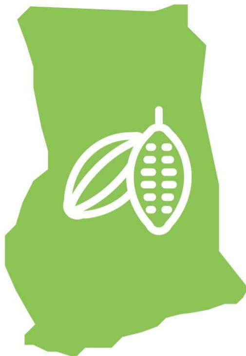
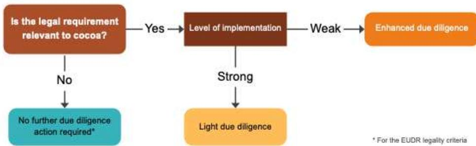
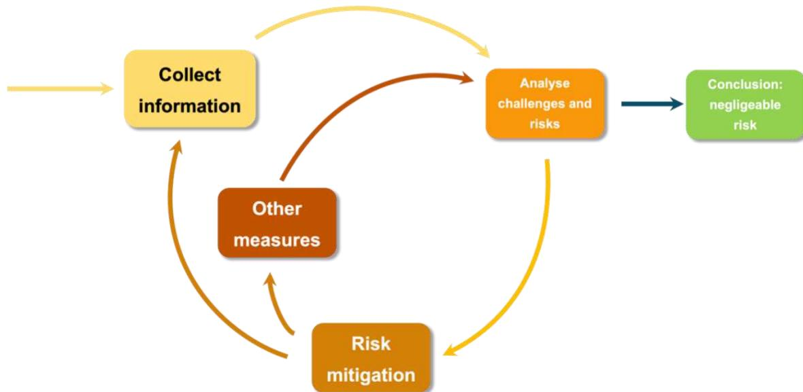

Support tool for due diligence on the legality of cocoa in the framework of the EUDR

# Module 2: Due diligence recommendations regarding the legality of cocoa produced in Ghana

July 2025

Implementing partners

Associated partners

**Disclaimer.** This document has been produced with the financial support of the European Union. The opinions expressed herein cannot in any way be taken to reflect the official opinion of the European Union. This document aims to support the cocoa sector in its efforts to comply with the EU market requirements. Its content is indicative, not legally binding, and does not constitute legal advice. No guarantee is given as to the accuracy, completeness or timeliness of the content. The authors of this document accept no liability for any damage or loss arising from its use without appropriate legal advice. The authors welcome any comments and suggestions for improvement.

European Forest Institute, 2025

## **Table of Contents**

| 1. Context                                                    | 5  |
|---------------------------------------------------------------|----|
| The European Union Deforestation Regulation                   | 5  |
| Collaboration between Ghana and the European Union            | 5  |
| Supporting the due diligence of operators in the cocoa sector | 6  |
| 2. Objectives and methodology                                 | 7  |
| Objectives of the tool                                        | 7  |
| General approach                                              | 7  |
| How to use these due diligence recommendations?               | 8  |
| Who are these recommendations aimed at?                       | 8  |
| What are these recommendations for?                           | 8  |
| Scope of recommendations                                      | 9  |
| Light or enhanced due diligence                               | 9  |
| The EUDR and certification                                    | 10 |
| production in Ghana                                           | 13 |
| 3.1: Land-Use Rights                                          | 13 |
| 3.2: Environmental protection                                 | 17 |
| 3.3: Third parties’ rights                                    | 19 |
| 3.4: Free, prior and informed consent                         | 19 |
| 3.5: Taxes, trade, customs and anti-corruption                | 20 |
| 3.6: Labour Rights*                                           | 23 |
| 3.7: Human Rights*                                            | 27 |
| production of cocoa covered by the ARS 1000 in Ghana          | 31 |
| 4.1: Land-Use Rights                                          | 32 |
| 4.2: Environmental protection                                 | 34 |
| 4.3: Third parties’ rights                                    | 35 |
| 4.4: Free, prior and informed consent                         | 35 |
| 4.5: Taxes, trade, customs and anti-corruption                | 36 |
| 4.6: Labour Rights*                                           | 37 |
| 4.7: Human Rights*                                            | 39 |
| certified cocoa (voluntary schemes) in Ghana                  | 41 |
| 5.1: Land-Use Rights                                          | 42 |

| 5.2: Environmental protection                                          | 44 |
|------------------------------------------------------------------------|----|
| 5.3: Third parties’ rights                                             | 45 |
| 5.4: Free, prior and informed consent                                  | 45 |
| 5.5: Taxes, trade, customs and anti-corruption                         | 46 |
| 5.6: Labour Rights*                                                    | 47 |
| 5.7: Human Rights*                                                     | 50 |
| Annex 1 – Detailed methodology                                         | 53 |
| Precautionary approach adopted by this tool                            | 53 |
| Definition of due diligence                                            | 53 |
| Annex 2 – Details on the ARS-1000                                      | 55 |
| Implementation of the standard in producing countries                  | 55 |
| Deployment in Ghana                                                    | 56 |
| Recognised Certificate Holders Entities                                | 56 |
| Bronze, Silver and Gold Levels                                         | 56 |
| Key requirements related to the certification system                   | 57 |
| Appendix 3 – Elements on the Rainforest Alliance and Fairtrade Systems | 58 |
| Information on Rainforest Alliance                                     | 58 |
| Information on Fairtrade                                               | 58 |

# 1. Context

## The European Union Deforestation Regulation

On 31 May 2023, the European Union (EU) adopted Regulation 2023/1115 on the placing on the EU market and export from the EU of certain commodities and products associated with deforestation and forest-risk commodity (EUDR). This regulation requires operators and traders importing forest-risk commodities into the EU to demonstrate that these products are traceable, deforestation-free and legal. The scope of application covers seven commodities: coffee, cocoa, rubber, palm oil, soya, cattle and wood, as well as derived products such as chocolate and cocoa paste. Entry into application is scheduled for 31 December 2025 (and 30 June 2026 for micro and small undertakings established as such before 31 December 2020).

Companies affected by the regulation (operators and traders) will be required to carry out “due diligence” prior to exporting or placing their products on the market, in order to gather sufficient information to ensure that the product carries no or a negligible risk of non-compliance. Consequently, operators placing cocoa or derived products on the EU market will have to ensure that these have been produced in accordance with the relevant legislation of the country of production (article 3), which is defined as concerning the legal status of the area of production. The EUDR takes a flexible approach, listing several areas of law without specifying particular legal instruments, as these differ from country to country and may be subject to change. These areas are [for agricultural commodities]:

- a) land-use rights
- b) environmental protection
- d) third parties’ rights
- e) labour rights
- f) human rights protected by international law
- g) the principle of free, prior and informed consent, including as set out in the UN Declaration on the Rights of Indigenous Peoples
- h) tax, anti-corruption, trade and customs regulations

In this context, understanding the legislative framework of the country of origin, identifying the legal requirements relevant to the commodity concerned, and determining the means of verifying compliance with these requirements are a challenge not only for the operators responsible for due diligence, but also for the competent authorities in the European Union responsible for controls, as well as for the various stakeholders involved.

## Collaboration between Ghana and the European Union

In 2021, Ghana and the European Union launched a policy dialogue aimed at supporting national objectives in terms of the economic, environmental and social sustainability of cocoa. This collaboration is being implemented through several technical partners, including the European Forest Institute (EFI), which is supporting Ghana in the development of an enabling framework to facilitate access of cocoa to the European market and promote transparency in supply chains.

## **Supporting the due diligence of operators in the cocoa sector**

Starting in June 2024, EFI led a stakeholder engagement process, with strategic and technical engagement with Ghana Cocoa Board (COCOBOD), to develop a tool to support the due diligence of operators wishing to place Ghanaian cocoa, or its by-products, on the EU market. The approach aims to promote a national and consensual vision of the legality requirements relevant within the framework of the EUDR in order to facilitate the work of the various actors in the sector, guarantee fair access to information, reduce perceived risks and give a competitive edge to Ghanaian cocoa.

This tool was developed with the technical support of legal and due diligence experts from TaylorCrabbe and Preferred by Nature.

# **2. Objectives and methodology**

## **Objectives of the tool**

The tool aims to:

- 1. Identify all Ghanaian legal requirements relevant to cocoa production and trade for EUDR compliance.
- 2. Provide due diligence recommendations for the verification of legal compliance, including through certification (ARS-1000 and voluntary certifications).

The tool was developed in two phases:

- Phase 1: Identification of Ghanaian legal requirements relevant to cocoa production and trade in the context of the EUDR.
- Phase 2: Development of due diligence recommendations for operators, based on an analysis of the level of implementation of relevant legal requirements and existing means of verification, including certification (ARS-1000 and voluntary certification standards)*.*

This module presents the results of phase 2. It is complementary to Module 1, titled "*Legal requirements relevant to cocoa produced in Ghana*."

#### **General approach**

The objective of this tool is to promote a national and consensual vision of the legal requirements that apply to Ghanian cocoa, in order to: i) support the harmonisation of operators' due diligence approaches; ii) encourage the simplification of procedures for upstream players in the supply chain likely to have to provide data to their customers; and iii) facilitate a better understanding of national contexts by the Competent Authorities of EU Member States in charge of controls. **It is important to note that the results provided are not legally binding, do not impose any obligation on the relevant parties, and do not constitute legal advice**. It is the responsibility of operators placing cocoa or its derived products on the EU market to identify the relevant legal requirements within the meaning of article 2(40) of the EUDR, and to adapt their due diligence to the risks identified. This tool provides guidance that can support operators and other industry stakeholders in this direction.

In addition, this tool is likely to evolve over time and be updated due to many factors: potential legal reforms in the country, guidance issued by the Ghanian government, evolution of public or private certification schemes, additional guidance provided by the European Commission or competent authorities, integration of best practices and technological advances, etc.

The tool was developed with support from national and international experts in law and due diligence, and through technical consultation with all the national and international players in the cocoa sector: government departments and ministries, exporters, traders and chocolate makers, cooperatives and producer associations, certification bodies, civil society organisations and importing countries in the European Union.

## **How to use these due diligence recommendations?**

#### **Who are these recommendations aimed at?**

These recommendations are intended for various stakeholders concerned with verifying the compliance of cocoa and derived products with the EUDR. They may be useful to:

- **Operators within the meaning of the EUDR**: any natural or legal person who, in the course of a commercial activity, places cocoa or derived products on the EU market or exports them.
- **Traders within the meaning of the EUDR**: any natural or legal person in the supply chain, other than the operator, who makes the products concerned available on the EU market.
- **Competent authorities of the EU**: authorities designated by the Member States to ensure compliance with the obligations of the EUDR.
- **Actors in the supply chain in Ghana**: producers, cooperatives, traders, exporters and other stakeholders involved in the production and marketing of cocoa, who must provide operators with the information, data and documents necessary for the implementation of due diligence.
- **Ghanaian public entities**: government administrations and bodies responsible for: regulating the cocoa sector (production and marketing); labour issues; land; forestry; the environment and sustainable development.
- **Civil society:** non-governmental organisations, associations and other actors playing a monitoring role, supporting producers and advocating to ensure the compliance of cocoa and its derived products with Ghanian legislation and international commitments.

#### **What are these recommendations for?**

These recommendations can be used in different ways and at different times depending on the actors involved.

**Operators and traders** can rely on these recommendations to set up and document their due diligence system, ensuring that the cocoa they trade complies with the EUDR requirements on legality. They can use them to identify the documents and information to be collected or other actions to be carried out with their suppliers in Ghana, and to assess the risks associated with their supply chain.

The **competent authorities of the EU** can use these recommendations as a standard for assessing the compliance of products placed on the market with the EUDR. They can also rely on these recommendations to harmonise their controls and interpret documents from Ghana.

**Actors in the supply chain** in Ghana can use these recommendations to understand the implications of the EUDR requirements for Ghanian cocoa and the expectations of European operators and traders subject to it. These recommendations can be used to structure and document the information to be provided. They can also help them anticipate the risks of non-compliance and adapt their agricultural and commercial practices.

**Ghanian public entities** can use these recommendations to support small producers in achieving compliance by providing them with better access to information on current regulations and buyer requirements. They can rely on these recommendations to make data more transparent and accessible, in particular by facilitating access to administrative documents, in order to help operators demonstrate the legality of cocoa.

**Civil society** can use these recommendations to monitor the application of Ghanian legal requirements by companies and the authorities. It can use them to conduct analyses and produce reports on the risks of non-compliance of Ghanian cocoa. It can also use them to raise awareness among producers, companies and consumers of the issues surrounding the legality of Ghanian cocoa.

## Scope of recommendations

Identification of the legal requirements relevant to the cocoa sector in Ghana

The recommendations presented in this document aim to address all the relevant legal requirements identified by the stakeholders in Module 1 (see *Legal requirements relevant to cocoa produced in Ghana*). These cover, in particular, all the legal areas listed in article 2.40 of the EUDR, in accordance with the precautionary approach adopted by the tool (see appendix 1), but for third parties' rights and free, prior and informed consent. This is because no legal requirement was deemed relevant to cocoa production in these two areas of law, as detailed in the first phase of the development of this tool. Nevertheless, a distinction is made between the requirements directly linked to the objectives of the EUDR and the others, which are marked with an asterisk. This flexible approach allows the user of the recommendations to adapt their due diligence actions according to their interpretation of the scope of the EUDR.

## Light or enhanced due diligence

This tool adopts a pragmatic approach, which aims to identify due diligence actions proportionate to the risks, in order to limit the burden on those involved in the sector. For each requirement deemed relevant to cocoa production and trade in Ghana, a level of implementation has been assessed. The level of implementation adopted by the tool is based on various elements, which we assessed at the time of the development of the tool, and which may evolve in the future: relevant literature, experts' knowledge of the sector, as well as field surveys and bilateral and multistakeholder consultations carried out as part of the development of the tool.

Where the level of implementation assessed for a requirement is high, the risk of non-compliance is considered low. Consequently, light due diligence actions are recommended. On the other hand, when the level of implementation for a requirement is low, the risk of non-compliance is considered significant. Consequently, enhanced due diligence is recommended.

However, this analysis is only indicative and has only been carried out at the country level. **It is the responsibility of the operators to carry out a risk analysis of non-compliance of their products for each shipment.** It is within this framework that the present recommendations provide a range of due diligence options. **These actions are neither prescriptive nor presented in any particular order. It is up to the operators to choose from these options according to the context, their knowledge of their supply chains and the identified risks for cocoa and its derived products.**

Cocoa certification schemes are voluntary public or private mechanisms aimed at guaranteeing that the production and marketing of cocoa respect certain environmental, social and economic standards. They can be set up by governments, international organisations, NGOs or private companies. This tool differentiates between so-called “conventional” cocoa and cocoa certified according to certain standards (details below). Conventional is defined here as “non-certified.”

### The EUDR and certification

Third-party certification and verification systems can play an important role in promoting sustainable agricultural and forestry practices and responsible sourcing. Different types of certifications exist, they can be implemented at the national level (ARS 1000) or be private and voluntary (e.g. Fairtrade, Rainforest Alliance...).

According to the EUDR, for the purposes of risk assessment, operators can take into account “information from certification schemes or other third-party verified schemes.”

The Commission also specifies that certification systems should not replace the operator’s responsibility for due diligence. In other words, private certifications can be a tool to help European operators carry out their due diligence to meet the criteria of legality, deforestation and traceability.

Operators must be able to justify why and how the certification systems meet the requirements of the EUDR. To this end, three elements should be taken into account:

- The coverage of the legal requirements relevant to the EUDR by the certification system (addressed in this tool).
- The robustness of the certification system (not addressed by this tool): in particular the scope of the certification (applicable to which actors in the value chain? To which products?), the governance (management of internal procedures and updates, for example), the accreditation processes of the control bodies; the qualification of auditors and the frequency of audits; the management of non-compliance, impartiality and the management of conflicts of interest, etc. This information should be regularly re-evaluated by the operator, particularly with regard to the requirements of the EUDR.
- Traceability and the absence of mixing with non-certified products (not addressed in this tool).

It should also be noted that the deforestation-free requirement is not covered by this tool, but can also be covered by certification systems. This tool focuses only on the legal requirements.

#### **Description of the certification systems covered by the tool**

Three certification systems are covered by the tool:

- **ARS-1000**: The African Standard for Sustainable Cocoa (ARS), published in June 2021 by the African Organization for Standardization (ORAN), aims to promote the production of sustainable cocoa beans. The standard is based on the principle of continuous improvement. It provides three different levels of certification (bronze, silver and gold) and addresses the social, economic and environmental aspects of sustainable cocoa.

The ARS consists of three parts:

- **ARS 1000-1:** Management Systems Requirements for Cocoa Farmers as Entities/Producer Groups/Producer Cooperatives and Performance
- **ARS 1000-2**: Requirements for the Quality and Traceability of Cocoa
- **ARS 1000-3**: Requirements for Cocoa Certification Schemes

Currently, the standard is being rolled out in **Ghana**. Ghana has developed and published a national implementation guid[e](#page-10-0)1 that takes into account their traditions, cultures, land tenure systems and specific legal frameworks.

More details on ARS-1000 are available in Annex 2. Section 4 provides specific due diligence recommendations for certified cocoa under ARS-1000.

This tool also examines the coverage by Rainforest Alliance and Fairtrade of the legal requirements deemed relevant to cocoa for EUDR compliance. These two certification schemes were selected because they are accredited against ISO 17065 standard, are

1 https://COCOBOD.gh/resources/ars

ISEAL members and the most widely used. However, operators may choose to rely on other certification schemes for their risk assessments.

- **Rainforest Alliance** is a private certification that focuses on the protection of land and forests in a way that advances the rights and prosperity of rural communities according to three main principles: social equity, environmental responsibility and economic viability of farming communities. It is aimed at small and large farms and organisations such as processors, importers or exporters, brands and distributors, particularly for cocoa. The Rainforest Alliance certification programme is making adjustments to align with the EUDR, with a few minor but crucial differences between their requirements. Adjustments are being made to ensure that the certification fully meets the requirements of the EUDR. This tool examines the coverage of legal requirements by the Rainforest Alliance standard including the voluntary EUDR module for farms.
- **Fairtrade** is a private fair-trade certification. Its specifications (particularly for cocoa) set out the requirements that actors in fair supply chains must meet, whether they are rural cooperatives, large farms or factories employing labour, or companies that buy and sell Fairtrade products. The Fairtrade specifications incorporate detailed social, economic and environmental criteria for production but also requirements for the trade of Fairtrade products. Fairtrade updated its Cocoa Standard (2022) that require Fairtrade certified producers to strengthen their deforestation prevention, monitoring, and mitigation to further align with the EUDR requirements.

More details on these two standards are available in Annex 3. Section 5 provides due diligence recommendations for certified cocoa under Rainforest Alliance's or Fairtrade's standards.

# **3. Due diligence recommendations on legal requirements relevant to conventional cocoa production in Ghana**

## **3.1: Land-Use Rights**

In Ghana, all lands have defined ownership, and therefore, activities on the land, including cocoa production, must be authorised by the landowner. Farmers, however, do not need documented land-use rights, such as holding a land title or written land-use right, to farm the land legally. Oral permission from the landowner is sufficient. If the farmers own the land, they must hold a land title certificate or have obtained the land through customary rights or acts of possession, such as verbal agreements. Cocoa farming is legally permitted in off-reserve areas. Almost all cocoa-producing lands are either owned by the farmers, leased to them, or governed by customary tenancy arrangements.

Land ownership and use rights by farmers are well-defined and respected, and cocoa farming in Ghana is predominantly subsistence-based and managed by smallholders rather than on a commercial scale. When conflicts occur, they are generally resolved efficiently at the village level.

Cocoa farming within forest reserves is allowed only in specific areas known as "admitted farms." If the cocoa is produced within an admitted farm, farming activities must be confined to the authorised boundaries of these designated farms. Any incursion beyond the pre-designated area is illegal. Admitted farms in the forest reserves have contributed to environmental degradation. Some of these farms and settlements allowed in the forest reserves have expanded beyond their original permitted area where the reserves were constituted. There are estimated to be about 1830 admitted farms in Ghana with the smallest farm being about 0.06 hectares and the largest being about 645.5 hectares. The data on the exact number of farms in protected areas varies since some have ceased to exist, been destroyed by the Forestry Commission, or have now grown into entire communities. The primary record on these admitted farms is contained in the Reserve Settlement Commissioner's Report on the constitution of forest reserves, which is not public. The report contains the name of the farm or owner of the farm and acreage or size of the farm, but not the exact location of the farm in the reserve.

#### **3.1.1. Requirements that may require light due diligence**

| Legal requirements | Context and levels of implementation and risk | Recommended due diligence actions                                |
|--------------------|-----------------------------------------------|------------------------------------------------------------------|
|                    |                                               | Please note: Compliance with this indicator may be shown with    |
|                    |                                               | If there is no indication of any land dispute, no additional due |

#### **3.1.2. Requirements for enhanced due diligence**

| Legal requirements | Context and levels of implementation and risk | Recommended due diligence actions                                   |
|--------------------|-----------------------------------------------|---------------------------------------------------------------------|
|                    |                                               | Please note: Aside the legality requirement, the EUDR also requires |
|                    |                                               | 994b o r contact the Forestry Commission)                           |

| Legal requirements                                 | Context and levels of implementation and risk                                                   | Recommended due diligence actions                                                                                                                                                                                                                                                                                                                                                                                                                                                                                                                                                                                                                                                                                                                                                                                                                                                                                                                                                                                                                                  |
|----------------------------------------------------|-------------------------------------------------------------------------------------------------|--------------------------------------------------------------------------------------------------------------------------------------------------------------------------------------------------------------------------------------------------------------------------------------------------------------------------------------------------------------------------------------------------------------------------------------------------------------------------------------------------------------------------------------------------------------------------------------------------------------------------------------------------------------------------------------------------------------------------------------------------------------------------------------------------------------------------------------------------------------------------------------------------------------------------------------------------------------------------------------------------------------------------------------------------------------------|
|  | 
Cocoa farming in forest reserves is carried out within the boundaries of admitted farms.
 | 
<b>Field verifications</b>
 <ul data-bbox="658 325 988 825"> <li data-bbox="658 325 988 375">● Field verifications may be required for those farms that are on the fringe of the protected area boundaries.</li> <li data-bbox="658 405 988 425">● If the farm is admitted, field verification to be carried out.</li> <li data-bbox="658 455 988 545">● For admitted farms with no boundary data, the first verification would involve boundary walks to confirm the farm surface area, checking it has not encroached on the forest reserve.</li> <li data-bbox="658 575 988 665">● For admitted farms with boundary data, the field verification would check that the entirety of the farm is located within the legally recognised boundaries of the admitted farm.</li> <li data-bbox="658 695 988 745">● Field verification may be conducted by an independent consultant, LBC or other intermediaries.</li> <li data-bbox="658 775 988 825">● Record these checks in the due diligence and management systems.</li> </ul> |
|                                                    |                                                                                                 | 
During consultations, stakeholders called on the Forestry Commission and COCOBOD to collaborate to develop and make publicly available maps of admitted farms.
                                                                                                                                                                                                                                                                                                                                                                                                                                                                                                                                                                                                                                                                                                                                                                                                                                                                                              |

## **3.2: Environmental protection**

Ghanaian law mandates that only registered and approved pesticides be used in farming, including cocoa farming. The Environmental Protection Authority (EPA) is responsible for registering pesticides. In cocoa farming, COCOBOD, through its Cocoa Diseases and Pest Control (CODAPEC) programme, provides farmers with pesticides for use on cocoa farms. This is only done for mapped farms in good conditions.[2](#page-16-1) COCOBOD maintains a list of approved pesticides for use in cocoa production for pesticide application beyond what CODAPEC provides, but it is not widely available to farmers[.](#page-16-2)3 In addition, some Licensed Buying Companies, as part of their sustainable supply chain programmes, also distribute pesticides. Farmers who do not receive pesticides from COCOBOD or private companies usually cannot afford to buy any.[4](#page-16-3)

The Environmental Assessment Regulations, L.I. 1652 of 1999 amended in 2002, require that all undertakings likely to impact adversely on the environment be subject to environmental assessment. The requirement applies to agricultural activities that either involve the clearing of land: greater than 40 hectares in area or in an environmentally sensitive area.

Smallholder cocoa farmers would therefore not be required to carry out an environmental impact assessment unless their activities are carried out in an environmentally sensitive area.[5](#page-16-4)

2 Ghana Cocoa Board

https://COCOBOD.gh/project/codapec#:~:text=COCOBOD%20introduced%20the%20CODAPEC%20programme,are%20considered%20under%20this%20exercis e.&text=districts%20and%20communities.&text=A)%20Capsid%20Control-, 1.,

May%20and%20September/October%20respectively.&text=Black%20pod%20Control-, 1.,%2C%20July%20and%20August/October.

3 The Ghana Cocoa Board (COCOBOD) approved insecticides, imidacloprid, thiamethoxam and bifenthrin, for the control of cocoa mirids (Hemiptera: Miridae): Implications for insecticide-resistance development in Distantiella theobroma (Dist.) and Sahlbergella

K. D. Ninsin, R. Adu-Acheampong 21–28. See a[t https://www.ajol.info/index.php/gjas/article/view/174334](https://www.ajol.info/index.php/gjas/article/view/174334)

4 In addition, the Cocoa Research Institute of Ghana (CRIG) tests and approves pesticides and insecticides (Section 1 of Pesticide Control and Management Act, 1996 (Act 528)) to use in cocoa farming on a regular basis based on the current list of active ingredients issued by the EU. In cocoa farming, COCOBOD maintains a list of approved pesticides based on CRIG's recommendations, which is circulated to farmers through the Extension Agents of the Cocoa Health and Extension Division of COCOBOD. The list is reviewed periodically based on the list of active ingredients approved by the EU.

5 According to COCOBOD, the average size of cocoa farms is 2–3 hectares. A handful of cocoa farms are larger than 40 hectares. See:

[https://opecfund.org/news/ghana-is-cocoa-cocoa-is-ghana;](https://opecfund.org/news/ghana-is-cocoa-cocoa-is-ghana) and

https://anangtawiah.com/articles/details/The%20Ghana%20Cocoa%20Report%202024:%20Ghana%20Cocoa%20Farming%20Techniques:%20Traditional%20an d%20Modern%20Approaches-201

#### **3.2.1. Requirements that may require light due diligence**

| Legal requirements                                                      | Context and levels of implementation and risk                                            | Recommended due diligence actions                                                                                                                                                                                                                                                                                                                                                                                                                                                                                                                                                                                                                                      |                                                                                                                                                                                                                                                                                                                                                                                                                                                                                                                                                                                                                                                                                                                                                                                                                                                                                                                                                                                                                                                                                                                                                                                                                                                             |
|-------------------------------------------------------------------------|------------------------------------------------------------------------------------------|------------------------------------------------------------------------------------------------------------------------------------------------------------------------------------------------------------------------------------------------------------------------------------------------------------------------------------------------------------------------------------------------------------------------------------------------------------------------------------------------------------------------------------------------------------------------------------------------------------------------------------------------------------------------|-------------------------------------------------------------------------------------------------------------------------------------------------------------------------------------------------------------------------------------------------------------------------------------------------------------------------------------------------------------------------------------------------------------------------------------------------------------------------------------------------------------------------------------------------------------------------------------------------------------------------------------------------------------------------------------------------------------------------------------------------------------------------------------------------------------------------------------------------------------------------------------------------------------------------------------------------------------------------------------------------------------------------------------------------------------------------------------------------------------------------------------------------------------------------------------------------------------------------------------------------------------|
| <b>Environmental requirements applicable to agricultural activities</b> |                                                                                          |                                                                                                                                                                                                                                                                                                                                                                                                                                                                                                                                                                                                                                                                        |                                                                                                                                                                                                                                                                                                                                                                                                                                                                                                                                                                                                                                                                                                                                                                                                                                                                                                                                                                                                                                                                                                                                                                                                                                                             |
|                        | 
Only registered and approved pesticides were appropriately used in cocoa farming.
 | 
Pesticides are commonly used in cocoa farms.
 
-These may be sourced directly on the local market or supplied by COCOBOD through its CODAPEC Programme and applied by trained applicators. This is also complemented by a round of spraying by farmers.
 
-Legal requirement states that only pesticides that are registered by the EPA may be used in the country.
 
-The use of pesticides shall be in line with the manufacturers' instructions.
 
-It is not very common to see unregistered pesticides on the market or used on farms.
 
-Pesticides applied under CODAPEC go through the formal registration processes with EPA.
 | 
<b>Please note:</b>
 
<i>PPE use is not covered here (it falls under labour rights).</i>
 
<i>There are no direct documents required by law at the producer level for this indicator. Demonstrating compliance would be through the actual on-farm practices.</i>
 
If the pesticides are provided and applied by CODAPEC, no further due diligence action recommended. Where farmers source chemicals on the open market and apply these on their own, there could be risks. Additional due diligence is recommended:
 
<b>Procedure(s) and process(es) implementation</b>
 <ul> <li>Obtain the list of approved chemicals for a fee from the Environmental Protection Agency (EPA).</li> <li>Provide the list to farmers' groups and LBCs.</li> <li>Periodically check for updates of the list and communicate it to farmers groups.</li> </ul> 
In all cases, 'nice to have' or additional measures to minimise risks:
 <ul> <li>Encourage farmers groups and LBCs to have a written and implemented procedure committing to good practice in chemical handling, including include training, the use of appropriate equipment and facilities.</li> <li>Provide simplified tools to farmers' groups and LBCs for</li></ul> |

#### **3.2.2. Requirements for enhanced due diligence**

| Legal requirements | Context and levels of implementation and risk | Recommended due diligence actions |
|--------------------|-----------------------------------------------|-----------------------------------|
|                    |                                               | See above, requirement 1.2.       |
|                    |                                               | See above, requirement 1.2.       |

**-**

## **3.3: Third parties' rights**

No requirement was found relevant within this area of law.

## **3.4: Free, prior and informed consent**

No requirement was found relevant within this area of law.

## **3.5: Taxes, trade, customs and anti-corruption**

*N.B. This category is the only one mentioned in article 2(40) of the EUDR that potentially concerns entities in the entire chain of the country of production.*

Payment of taxes is a mandatory requirement under Ghanaian law. Land, value-added, corporate and export taxes, royalties and fees are paid. Again, other taxes such as property tax, stamp duty and income taxes are paid where applicable. Legal requirements related to trade restrictions are complied with. The law requires that the cocoa sold to COCOBOD be thoroughly dry and free of foreign material and that any exporter selling the cocoa for export holds a Cocoa Export Licence. The Criminal Offences Act criminalises all corrupt practices including bribery, fraud, conflict of interest among others. However, per the law corruption is only applicable where public officers are involved. Thus, it is required that cocoa farming and trade are carried out without the corruption of public officers.

#### **3.5.1. Requirements that may require light due diligence.**

| Legal requirements                                                                               |                                                                                                                    | Context and levels of implementation and risk                                                                                                                                                                                                                                                                                                                                                                                                                                                                                                                                     | Recommended due diligence actions                                                                                            |
|--------------------------------------------------------------------------------------------------|--------------------------------------------------------------------------------------------------------------------|-----------------------------------------------------------------------------------------------------------------------------------------------------------------------------------------------------------------------------------------------------------------------------------------------------------------------------------------------------------------------------------------------------------------------------------------------------------------------------------------------------------------------------------------------------------------------------------|------------------------------------------------------------------------------------------------------------------------------|
| <b>Taxes &amp; fees are paid</b>                                                                 |                                                                                                                    |                                                                                                                                                                                                                                                                                                                                                                                                                                                                                                                                                                                   |                                                                                                                              |
|  ▲ | 
SME cocoa processing companies within Ghana are levied with a 35% 'import duty' for buying cocoa from LBCs.
 | 
Many cocoa processing companies operate in the Ghana Free Zone, where they obtain tax benefits if they export at least 70% of their production.
 
SME cocoa processing companies within Ghana are levied with a 35% 'import duty' for buying cocoa from LBCs. Those entities that are required to pay taxes, e.g. local processors, operate in a highly regulated sector with stringent audits.
                                                                                                                                                                       |  
Check for tax clearance certificates for entities exporting cocoa
 |
| <b>Customs and trade</b>                                                                         |                                                                                                                    |                                                                                                                                                                                                                                                                                                                                                                                                                                                                                                                                                                                   |                                                                                                                              |
|  ▲            | 
The cocoa sold to COCOBOD is thoroughly dry and free of foreign material.
                                   | <ul style="list-style-type: none;"> <li>• COCOBOD's Quality Control Company (QCC) ensures that only compliant products are moved within the supply chain.</li> <li>• Ghana's COCOBOD has an entire unit/company (Quality Control Company) that ensures that there are adequate quality control measures in place along the entire cocoa supply chain. This ensures that Ghana's cocoa is consistently considered as one of the top-quality products on the market. Compliance with quality parameters, especially for products destined for the EU tend to be maximum.</li> </ul> | 
No further due diligence action recommended.
                                                                          |

| Legal requirements                                                                                 |                                                                                                                                                                                                                                                                                   | Context and levels of implementation and risk                                                                                                                                                                                                                                                                                                                  | Recommended due diligence actions |
|----------------------------------------------------------------------------------------------------|-----------------------------------------------------------------------------------------------------------------------------------------------------------------------------------------------------------------------------------------------------------------------------------|----------------------------------------------------------------------------------------------------------------------------------------------------------------------------------------------------------------------------------------------------------------------------------------------------------------------------------------------------------------|-----------------------------------|
|                                                                                                    |                                                                                                                                                                                                                                                                                   | <ul> <li>All cocoa in the supply chain has to meet the relevant quality parameters at every stage of the process. This means that cocoa that is not compliant in respect to quality parameters would not be able to go through the supply chain. Risks of cocoa not complying with quality parameters being exported to the EU is thus negligeable.</li> </ul> |                                   |
|                                                                                                    |                                                                                                                                                                                                                                                                                   |                                                                                                                                                                                                                                                                                                                                                                |                                   |
| 
<b>Scale</b>
 
The exporter selling the cocoa for export holds a Cocoa Export Licence.
 | <ul> <li>Persons engaging in the external marketing of cocoa, aside from COCOBOD's Cocoa Marketing Company are required to hold an exporter licence.</li> <li>Entities that export cocoa would need the exporter licence to be able to transact business with COCOBOD.</li> </ul> | 
<b>Collection and documentation verification</b>
                                                                                                                                                                                                                                                                                                        |                                   |

#### **3.5.2. Requirements for enhanced due diligence**

There are no requirements for enhanced due diligence in this category.

| Legal requirements                               | Context and levels of implementation and risk                                         | Recommended due diligence actions                                                                                                                                                                                                                                                                                                                                                                                                                                                                                                                                                                                                                                                                                                                                                                                                                                                                                                                                                                     |                                                                                                                                                                                                                                                                                                                                                                                                                                                                                                                                                                                                                                                                                                                                                                                                                                                                                                                                                                                                                                                                                           |
|--------------------------------------------------|---------------------------------------------------------------------------------------|-------------------------------------------------------------------------------------------------------------------------------------------------------------------------------------------------------------------------------------------------------------------------------------------------------------------------------------------------------------------------------------------------------------------------------------------------------------------------------------------------------------------------------------------------------------------------------------------------------------------------------------------------------------------------------------------------------------------------------------------------------------------------------------------------------------------------------------------------------------------------------------------------------------------------------------------------------------------------------------------------------|-------------------------------------------------------------------------------------------------------------------------------------------------------------------------------------------------------------------------------------------------------------------------------------------------------------------------------------------------------------------------------------------------------------------------------------------------------------------------------------------------------------------------------------------------------------------------------------------------------------------------------------------------------------------------------------------------------------------------------------------------------------------------------------------------------------------------------------------------------------------------------------------------------------------------------------------------------------------------------------------------------------------------------------------------------------------------------------------|
|  | 
Cocoa farming and trade was carried out without corruption of public officers.
 | <ul> <li>Ghana ranks 70th least corrupt out of 180 countries assessed globally on the corruption perception index in 2023. It ranks as the 9th least corrupt country in Africa out of all the 54 countries assessed.</li> <li>Cocoa supply-chain-related corruption is generally not considered a highly material issue. Perceived compliance levels with this indicator are high and the risk of non-compliance are low to negligible.</li> <li>In Ghana, the cocoa sector is structured in such a way that the Ghana COCOBOD is the ultimate buyer of all the cocoa beans produced within the country.</li> <li>The country's cocoa sector is very strongly regulated and documented incidences of cocoa supply-chain-related corruption are rare.</li> <li>The key corruption/fraud-related issue in the cocoa sector is the smuggling of Ghanaian cocoa beans across land borders into neighbouring countries. This issue would not be relevant for cocoa being exported out of Ghana.</li> </ul> | 
<b>Procedure(s) and process(es) implementation</b>
 <ul style="list-style-type: none;"> <li> <ul> <li>Encourage LBCs and farmer groups to have a clear policy and associated procedures against corruption, fraud, bribery and conflict of interest.</li> <li>Encourage producer groups and LBCs to have a documented grievance procedure for raising issues related to corruption within their supply chains.</li> </ul> </li> </ul> 
<b>Collection and documentation verification</b>
 
On a sample basis, possibly collect:
 <ul> <li>Copies of anti-corruption policies and procedures</li> <li>Data on training records of supply chain actions on anti-corruption policies and procedures</li> <li>Records of all instances where corruption-related grievances have been raised.</li> </ul> 
<b>Field verifications</b>
 <ul> <li>Field checks may only become necessary where corruption-related grievances/concerns have been raised.</li> <li>Record these checks in the due diligence and</li></ul> |

## **3.6: Labour Rights\***

*NB: Labour rights are listed in article 2(40) of the EUDR that defines the relevant legislation in the country of production. However, they are not directly linked to the objective of the EUDR to halt deforestation and forest degradation. Thus, COCOBOD's interpretation is that they fall outside the scope of the EUDR.*

The cocoa sector in Ghana relies mainly on small-scale farming, often organised into family structures or via sharecropping agreements. Most cocoa farming in Ghana does not use "permanent workers" for work on the farm. The work on cocoa farms is seasonal in nature and the requirements for continuous service (a minimum of 200 workdays in a year), which would trigger most of the employee privileges in the **Labor Act 2003 (Act 651)** are not met. This Acts stipulates some rights for casual workers and temporary workers. However, "by-day workers" on cocoa farms would not meet the requirements to qualify as casual workers, since people working less than an average of 24 hours a week are excluded from that qualification. Sharecroppers are also expressly excluded from being qualified as "casual workers." "Byday workers" cannot be qualified as temporary workers either, since these are defined under the Act as workers employed for a continuous period of at least one month and not employed for a work that is seasonal in character. Nonetheless, the Labour Act provides that all workers have the right to work under satisfactory, safe and healthy conditions, receive equal pay for equal work without distinction of any kind, have rest, leisure and reasonable limitation of working hours and periods of holidays with pay as well as remuneration for public holiday, and form or join a trade union.

#### **3.6.1. Requirements that may require light due diligence**

The legal requirements below apply only in the case of **hired labour**. They are not applicable in many cases in the cocoa production sector, which is dominated by family farms. A first step in due diligence is to use a questionnaire to determine whether workers are employed in the supply area, and, if so, the nature of the employment relationship.

**Workers' rights are respected**

|  | 
Workers are not subject to discrimination based on sex, race, or against migrant workers and workers receive equal pay for equal work.
 <ul> <li>There is little mention of discrimination against various categories of workers in the cocoa sector in literature.</li> <li>Gender-based discrimination recorded in the cocoa sector relates to access to land for farming, access to capital, communal land preparation methods, and access to extension support.</li> <li>However, there is almost no mention of gender-based discrimination against workers on cocoa farms.</li> <li>Given that most of the work in cocoa farms is task-rated with specific fees, payments are made for the completion of the tasks regardless of who the labourer was.</li> <li>Recent reports have also found migrant labourers in the cocoa districts to be very satisfied with working conditions (Amfo et al. 2020)§</li> </ul> | <ul> <li>There is little mention of discrimination against various categories of workers in the cocoa sector in literature.</li> <li>Gender-based discrimination recorded in the cocoa sector relates to access to land for farming, access to capital, communal land preparation methods, and access to extension support.</li> <li>However, there is almost no mention of gender-based discrimination against workers on cocoa farms.</li> <li>Given that most of the work in cocoa farms is task-rated with specific fees, payments are made for the completion of the tasks regardless of who the labourer was.</li> <li>Recent reports have also found migrant labourers in the cocoa districts to be very satisfied with working conditions (Amfo et al. 2020)§</li> </ul> | 
<b>Please note: This indicator has no specific direct documentary requirement. It is also considered as a low-risk indicator, given the nature of labour used. The following may provide sources of information that, when combined, can be used to minimise the risk of non-compliance.</b>
 
Nice to have:
 
<b>Procedure(s) and process(es) implementation</b>
 
Encourage farmer groups and LBCs to have:
 |
|-----------------------------------------------------------------------------------------------------------------------------------------------------|-------------------------------------------------------------------------------------------------------------------------------------------------------------------------------------------------------------------------------------------------------------------------------------------------------------------------------------------------------------------------------------------------------------------------------------------------------------------------------------------------------------------------------------------------------------------------------------------------------------------------------------------------------------------------------------------------------------------------------------------------------------------------------------------------------------------------------------------------------------------------------------------------------------------------------------------|---------------------------------------------------------------------------------------------------------------------------------------------------------------------------------------------------------------------------------------------------------------------------------------------------------------------------------------------------------------------------------------------------------------------------------------------------------------------------------------------------------------------------------------------------------------------------------------------------------------------------------------------------------------------------------------------------------------------------------------------------------------------------------------------|-------------------------------------------------------------------------------------------------------------------------------------------------------------------------------------------------------------------------------------------------------------------------------------------------------------------------------------------------------------------------------------------------------------------------------------|
|-----------------------------------------------------------------------------------------------------------------------------------------------------|-------------------------------------------------------------------------------------------------------------------------------------------------------------------------------------------------------------------------------------------------------------------------------------------------------------------------------------------------------------------------------------------------------------------------------------------------------------------------------------------------------------------------------------------------------------------------------------------------------------------------------------------------------------------------------------------------------------------------------------------------------------------------------------------------------------------------------------------------------------------------------------------------------------------------------------------|---------------------------------------------------------------------------------------------------------------------------------------------------------------------------------------------------------------------------------------------------------------------------------------------------------------------------------------------------------------------------------------------------------------------------------------------------------------------------------------------------------------------------------------------------------------------------------------------------------------------------------------------------------------------------------------------------------------------------------------------------------------------------------------------|-------------------------------------------------------------------------------------------------------------------------------------------------------------------------------------------------------------------------------------------------------------------------------------------------------------------------------------------------------------------------------------------------------------------------------------|

6 [Bismark Amfo,](https://www.emerald.com/insight/search?q=Bismark%20Amfo) [James Osei Mensah,](https://www.emerald.com/insight/search?q=James%20Osei%20Mensah) [Robert Aidoo,](https://www.emerald.com/insight/search?q=Robert%20Aidoo) "Migrants' satisfaction with working conditions on cocoa farms in Ghana", International Journal of Social Economics, Dec 2020: https://www.emerald.com/insight/content/doi/10.1108/ijse-03-2020-0131/full/html?skipTracking=true

#### **3.6.2. Requirements for enhanced due diligence**

The legal requirements below apply only in the case of **hired labour**. They are not applicable in many cases in the cocoa production sector, which is dominated by family farms. A first step in due diligence is to use a questionnaire to determine whether workers are employed in the supply area, and, if so, the nature of the employment relationship.

| Operations and activities are safe                         |                                                                                          |                                                                                                                                                                                                                                                                                                                                                                                                                                                                                                                                                                                                                                                                                                                                                                                                                                                                                                              |                                                                                                                                                                                                                                                                                                                                                                                                                                                                                                                                                                                                                                                                                                                                                                                                                                                                                                                                                                                  |
|------------------------------------------------------------|------------------------------------------------------------------------------------------|--------------------------------------------------------------------------------------------------------------------------------------------------------------------------------------------------------------------------------------------------------------------------------------------------------------------------------------------------------------------------------------------------------------------------------------------------------------------------------------------------------------------------------------------------------------------------------------------------------------------------------------------------------------------------------------------------------------------------------------------------------------------------------------------------------------------------------------------------------------------------------------------------------------|----------------------------------------------------------------------------------------------------------------------------------------------------------------------------------------------------------------------------------------------------------------------------------------------------------------------------------------------------------------------------------------------------------------------------------------------------------------------------------------------------------------------------------------------------------------------------------------------------------------------------------------------------------------------------------------------------------------------------------------------------------------------------------------------------------------------------------------------------------------------------------------------------------------------------------------------------------------------------------|
|  | 
All workers have a constitutional duty &amp; right to work under safe conditions.
 | <ul> <li>Agriculture is generally considered to be a high-risk sector in terms of health and safety.</li> <li>Work in cocoa farms include the use of sharp objects like machetes for weeding and pod cracking; the use of toxic chemicals and the lifting of heavy loads.</li> <li>It is common to see workers without any personal protective equipment and who have not undergone any health and safety induction.</li> <li>It is the responsibility of the farm owner to ensure that every worker works under satisfactory, safe and healthy conditions.</li> <li>Where spraying is done as part of government effort, the pesticide applicators tend to be very well kit in appropriate protective clothing and equipment.</li> <li>However, it is common to see farmers applying pesticides without adequate training, protective equipment and facilities (Onwona Kwakye 2019).7</li> </ul> | 
<i>This indicator has no document required by regulations, and is generally considered an area with a risk of non-conformity.</i>
 
On the requirement related to chemicals handling, determine whether the pesticides are being applied by CODAPEC or by farmers. If the spraying is carried out by COCOBOD, there is a negligeable risk of non-compliance and no further due diligence action is recommended.
 
If pesticides are applied by farmers themselves, additional due diligence actions are recommended
 
<b>Procedure(s) and process(es) implementation</b> Strongly encourage farmer groups and LBCs to:
 <ul> <li>Have an overarching policy at the group or LBC level supported by procedures on health and safety and safe workplace practices.</li> <li>Hold periodic training on safe workplace practices and provide and use of personal protective equipment for workers.</li> </ul> 
These procedures should be documented.
 |

7 Onwona Kwakye, M., Mengistie, B., Ofosu-Anim, J. *et al.* Pesticide registration, distribution and use practices in Ghana. *Environ Dev Sustain* **21**, 2667–2691 (2019). https://doi.org/10.1007/s10668-018-0154-7

|  |  | 
Workers handling chemicals and machinery receive appropriate safety and health training.
 |  |  | 
Workers are provided with personal protective equipment.
 |  | 
Collection and documentation verification
 
Systematically collect:
 <ul> <li>Training records, including those provided by CHED.</li> <li>Records on the provision of PPEs and training on their handling.</li> </ul> 
<b>Field verifications</b>
 
LBCs and farmer groups are strongly encouraged to conduct periodic field checks involving:
 <ul> <li>Interviews with producers to assess general awareness on workplace safety.</li> <li>Direct observations on actual practices.</li> </ul> 
Record these checks in the due diligence and management systems.
 |
|--|------------------------------------------------------------|-------------------------------------------------------------------------------------------------|--|------------------------------------------------------------|-----------------------------------------------------------------|------------------------------------------------------------|------------------------------------------------------------------------------------------------------------------------------------------------------------------------------------------------------------------------------------------------------------------------------------------------------------------------------------------------------------------------------------------------------------------------------------------------------------------------------------------------------------------------------------------------------------------------------------------------|
|--|------------------------------------------------------------|-------------------------------------------------------------------------------------------------|--|------------------------------------------------------------|-----------------------------------------------------------------|------------------------------------------------------------|------------------------------------------------------------------------------------------------------------------------------------------------------------------------------------------------------------------------------------------------------------------------------------------------------------------------------------------------------------------------------------------------------------------------------------------------------------------------------------------------------------------------------------------------------------------------------------------------|

## **3.7: Human Rights\***

*N.B. This category is specifically listed in Article 2 of the EUDR but is not directly related to the objectives of the Regulation. Thus, COCOBOD's interpretation is that they fall outside the scope of the EUDR.*

Legal issues related to human rights in the cocoa sector mainly concern child labour and forced labour.

The Children's Act of Ghana, 1998 (Art. 560), distinguishes light work, which is authorised for children as of 13, from child labour and particularly worst forms of child labour, such as hazardous labour, which are strictly prohibited.

However, despite these legal standards, **child labour remains an issue in the cocoa sector, largely due to economic pressures on smallholder farms and limited resources for enforcement in rural areas.** 

Several prevention, remediation and mitigation activities are implemented through government initiatives, voluntary certification schemes, NGO programmes and corporate sustainability initiatives, to address child labour in the cocoa sector.

COCOBOD has developed a Cocoa Sector Child Labour Monitoring System, with support from GIZ and the International Cocoa Initiative. This cocoa sector monitoring system includes a risk assessment at community level that is linked to the National Child Labour Monitoring System for the reporting and referral of cases. It is also linked to the Ghana Cocoa Traceability System and could provide information on the risk of non-compliance with national laws related to child labour. A pilot has been conducted in Assim Fosu District, and COCOBOD is currently working on the roll-out to other districts.

The Labour Act also prohibits modern slavery and forced labour, and the stakeholders consulted as part of the development of this tool found that these requirements are generally well respected.

#### **3.7.1. Requirements that may require light due diligence**

| Legal requirements | Context and levels of implementation and risk | Recommended due diligence actions            |
|--------------------|-----------------------------------------------|----------------------------------------------|
|                    | areas (ICI ). 8                               |                                              |
|                    |                                               | Please note : This indicator has no document |

8 ICI Report on forced labour https://www.cocoainitiative.org/issues/forced-labour-cocoa

| Legal requirements                                                                                                                        | Context and levels of implementation and risk                                                                                                                                                                                                                                     | Recommended due diligence actions                                                                                                                                                                                                                                                                                                                                                                                                                                                                                                                                                                                                                                                                                                                                                                                                                                                                               |
|-------------------------------------------------------------------------------------------------------------------------------------------|-----------------------------------------------------------------------------------------------------------------------------------------------------------------------------------------------------------------------------------------------------------------------------------|-----------------------------------------------------------------------------------------------------------------------------------------------------------------------------------------------------------------------------------------------------------------------------------------------------------------------------------------------------------------------------------------------------------------------------------------------------------------------------------------------------------------------------------------------------------------------------------------------------------------------------------------------------------------------------------------------------------------------------------------------------------------------------------------------------------------------------------------------------------------------------------------------------------------|
| <b>Women's rights are respected as per international and national law</b>                                                                 |                                                                                                                                                                                                                                                                                   |                                                                                                                                                                                                                                                                                                                                                                                                                                                                                                                                                                                                                                                                                                                                                                                                                                                                                                                 |
|  | 
No person shall be the subject of indecent assault.
 
Harassment and exploitation are generic issues that may also be present in cocoa supply chains. However, there is little indication of cocoa specific sexual harassment or sexual exploitation from literature.
 | 
<b>Please note:</b> <i>There is no document required by regulations. Though it is not common in the supply chain, its impacts are severe when it happens.</i>
 
<b>Nice to have to further reduce risk:</b> <b>Procedure(s) and process(es) implementation</b>
 <ul> <li>Encourage LBCs and farmer groups to have a policy prohibiting sexual harassment and a procedure for reporting and addressing incidences of harassment.</li> <li>The procedure should provide for the reporting and investigating of grievances on potential harassment incidents.</li> <li>Scheduled periodic trainings on sexual harassment for farmers, their workers and other actors in the supply chain.</li> <li>Procedures from LBC may also include periodic field verification on the supplying farms.</li> </ul> 
In case of indication of cases of indecent assault, the procedure would be triggered.
 |

#### **3.7.2. Requirements for enhanced due diligence**

| Legal requirements                                        | Context and levels of implementation and risk                                                                                                                     | Recommended due diligence actions                                                                                                                                                                                                                                                                                                                  |                                                                                                                                                                                                                                                                                                                                             |
|-----------------------------------------------------------|-------------------------------------------------------------------------------------------------------------------------------------------------------------------|----------------------------------------------------------------------------------------------------------------------------------------------------------------------------------------------------------------------------------------------------------------------------------------------------------------------------------------------------|---------------------------------------------------------------------------------------------------------------------------------------------------------------------------------------------------------------------------------------------------------------------------------------------------------------------------------------------|
| <b>Child labour is not present</b>                        |                                                                                                                                                                   |                                                                                                                                                                                                                                                                                                                                                    |                                                                                                                                                                                                                                                                                                                                             |
|  | 
No person shall engage a child in exploitative labour. Labour is exploitative of a child if it deprives the child of its health, education or development.
 | <ul> <li>Cocoa farming is labour-intensive.</li> <li>Labour costs in the cocoa-growing areas tend to be high and it is common to find farmers relying on family labour (which may include children) or labour provided by other children.</li> </ul>                                                                                               | 
<b>Please note:</b> This indicator has no document required by regulations. It, however, presents a high risk of non-compliance. Different sources of information can be used to verify practices.
                                                                                                                                   |
|  | 
The minimum age for employment is fifteen years, and thirteen years for light work. For hazardous work, the minimum age is eighteen.
                       | <ul> <li>Child labour risks in Ghana's cocoa sector are widely reported on.</li> <li>While Ghanaian law permits light work by children, work done on cocoa farms would typically involve the handling of sharp tools, carrying of heavy loads and may interfere with the children's education. These would constitute hazardous labour.</li> </ul> | 
<b>Procedure(s) and process(es) implementation</b>
 <ul> <li>Ensure that the LBCs and Farmer groups have a Child Labour Monitoring and Remediation System (CLMRS), in place.</li> <li>These procedures should be documented.</li> <li>In case there is no LBC or Farmer group, consult the COCOBOD risk assessment system.</li> </ul> |
|  | 
No child is engaging in work on the cocoa farm that will expose him/her to physical or moral hazard.
                                                       | <ul> <li>Significant sensitization has taken place over the past decades on the issue of child labour, and the level of awareness of farmers is quite high. However, child labour is mainly poverty-driven and therefore may still occur.</li></ul>                                                                                                |                                                                                                                                                                                                                                                                                                                                             |

# **4. Due diligence recommendations relating to the legal requirements relevant to the production of cocoa covered by the ARS 1000 in Ghana**

This section applies to ARS 1000 certified cocoa (for more details, see Appendix 2 explaining the use of this certification in EUDR due diligence).

- **For all covered requirements, the due diligence to be performed is as follows**:

Collect the certification evidence from the cooperatives and the details (certificate number, date, bronze/silver/gold level, etc.).

Verify the certified status of the cocoa on the traceability documents (e.g. invoices).

*N.B.: Additionally, document the functioning of the system on the traceability of certified materials and the robustness of the audit and certification system (see Appendix 2).*

#### • **For partially covered requirements**:

Inquire about the actions implemented by the supplier to comply with the requirement and the compliance status in the audit reports and rely on the due diligence actions proposed for conventional cocoa (*section 3 above*).

#### • **-For requirements not covered:**

Rely on the due diligence actions proposed for conventional cocoa *(section 3 above*)

## 4.1: Land-Use Rights

In Ghana, all lands have defined ownership, and therefore, activities on the land, including cocoa production, must be authorised by the landowner. Farmers, however, do not need documented land-use rights, such as holding a land title or written land-use right, to farm the land legally. Oral permission from the landowner is sufficient. If the farmers own the land, they must hold a land title certificate or have obtained the land through customary rights or acts of possession, such as verbal agreements. Cocoa farming is legally permitted in off-reserve areas. Almost all cocoa-producing lands are either owned by the farmers, leased to them, or governed by customary tenancy arrangements.

Land ownership and use rights by farmers are well-defined and respected, and cocoa farming in Ghana is predominantly subsistence-based and managed by smallholders rather than on a commercial scale. When land-use right conflicts occur, they are generally resolved efficiently at the village level.

Cocoa farming within forest reserves is allowed only in specific areas known as “admitted farms.” If the cocoa is produced within an admitted farm, farming activities must be confined to the authorised boundaries of these designated farms. Any incursion beyond the pre-designated area is illegal. Admitted farms in the forest reserves have contributed to environmental degradation. Some of these farms and settlements allowed in the forest reserves have expanded beyond their original permitted area where the reserves were constituted. There are estimated to be about 1830 admitted farms in Ghana with the smallest farm being about 0.06 hectares and the largest being about 645.5 hectares. The data on the exact number of farms in protected areas varies since some have ceased to exist, been destroyed by the Forestry Commission, or have now grown into entire communities. The primary record on these admitted farms is contained in the Reserve Settlement Commissioner’s Report on the constitution of forest reserves, which is not public. The report contains the name of the farm or owner of the farm and acreage or size of the farm, but not the exact location of the farm in the reserve.

| Legal requirements | Coverage of requirements by ARS-1000 |            |                                      |
|--------------------|--------------------------------------|------------|--------------------------------------|
|                    | Bronze Level Silver Level            | Gold Level | References                           |
|                    | Covered Covered                      | Covered    | National Implementation Guide for GS |
|                    | Covered Covered                      | Covered    |                                      |
|                    |                                      | Covered    | National Implementation Guide for GS |

## **4.2: Environmental protection**

Ghanaian law mandates that only registered and approved pesticides be used in farming, including cocoa farming. The Environmental Protection Authority (EPA) is responsible for registering pesticides. In cocoa farming, COCOBOD, through its Cocoa Diseases and Pest Control (CODAPEC) programme, provides farmers with pesticides for use on cocoa farms. This is only done for mapped farms in good conditions.[9](#page-33-1) COCOBOD maintains a list of approved pesticides for use in cocoa production for pesticide application beyond what CODAPEC provides, but it is not widely available to farmers.[10](#page-33-2) In addition, some Licensed Buying Companies, as part of their sustainable supply chain programmes, also distribute pesticides. Farmers who do not receive pesticides from COCOBOD or private companies usually cannot afford to buy any.[11](#page-33-3)

The Environmental Assessment Regulations, L.I. 1652 of 1999 amended in 2002, require that all undertakings likely to impact adversely on the environment be subject to environmental assessment. The requirement applies to agricultural activities that either involve the clearing of land: greater than 40 hectares in area or in an environmentally sensitive area. Smallholder cocoa farmers would therefore not be required to carry out an environmental impact assessment unless their activities are carried out in an environmentally sensitive area.[12](#page-33-4)

9 Ghana Cocoa Board

https://COCOBOD.gh/project/codapec#:~:text=COCOBOD%20introduced%20the%20CODAPEC%20programme,are%20considered%20under%20this%20exercis e.&text=districts%20and%20communities.&text=A)%20Capsid%20Control-, 1.,

May%20and%20September/October%20respectively.&text=Black%20pod%20Control-, 1.,%2C%20July%20and%20August/October.

10 The Ghana Cocoa Board (COCOBOD) approved insecticides, imidacloprid, thiamethoxam and bifenthrin, for the control of cocoa mirids (Hemiptera: Miridae): Implications for insecticide-resistance development in Distantiella theobroma (Dist.) and Sahlbergella

K. D. Ninsin, R. Adu-Acheampong 21–28. See a[t https://www.ajol.info/index.php/gjas/article/view/174334](https://www.ajol.info/index.php/gjas/article/view/174334)

11 In addition, the Cocoa Research Institute of Ghana (CRIG) tests and approves pesticides and insecticides (Section 1 of Pesticide Control and Management Act, 1996 (Act 528)) to use in cocoa farming on a regular basis based on the current list of active ingredients issued by the EU. In cocoa farming, COCOBOD maintains a list of approved pesticides based on CRIG's recommendations, which is circulated to farmers through the Extension Agents of the Cocoa Health and Extension Division of COCOBOD. The list is reviewed periodically based on the list of active ingredients approved by the EU.

12 According to COCOBOD, the average size of cocoa farms is 2–3 hectares. A handful of cocoa farms are larger than 40 hectares. See:

[https://opecfund.org/news/ghana-is-cocoa-cocoa-is-ghana;](https://opecfund.org/news/ghana-is-cocoa-cocoa-is-ghana) and

https://anangtawiah.com/articles/details/The%20Ghana%20Cocoa%20Report%202024:%20Ghana%20Cocoa%20Farming%20Techniques:%20Traditional%20an d%20Modern%20Approaches-201

| Legal requirements Coverage of requirements by ARS-1000 |              |            |                              |
|---------------------------------------------------------|--------------|------------|------------------------------|
| Bronze Level                                            | Silver Level | Gold Level | References                   |
| Covered                                                 | Covered      | Covered    | National Implementation      |
| * High Risk                                             |              |            |                              |
|                                                         | * High Risk  |            |                              |
|                                                         |              | Covered    | National Implementation      |
|                                                         |              |            | Part 1: Clause 13.4 c) d) e) |
| * High Risk                                             |              |            |                              |
|                                                         | * High Risk  |            |                              |
|                                                         |              | Covered    | National Implementation      |
|                                                         |              |            | Part 1: Clause 13.4 c) f) h) |

## **4.3: Third parties' rights**

No requirement was found relevant within this area of law.

## **4.4: Free, prior and informed consent**

No requirement was found relevant within this area of law.

## **4.5: Taxes, trade, customs and anti-corruption**

N.B. *This category is the only one mentioned in article 2(40) of the EUDR that potentially concerns entities in the entire chain of the country of production.*

Payment of taxes is a mandatory requirement under Ghanaian law. Land, value-added, corporate and export taxes, royalties and fees are paid. Again, other taxes such as property tax, stamp duty and income taxes are paid where applicable. Legal requirements related to trade restrictions are complied with. The law requires that the cocoa sold to COCOBOD be thoroughly dry and free of foreign material and that any exporter selling the cocoa for export holds a Cocoa Export Licence. The Criminal Offences Act criminalises all corrupt practices including bribery, fraud, conflict of interest among others. However, per the law corruption is only applicable where public officers are involved. Thus, it is required that cocoa farming and trade are carried out without the corruption of public officers.

| Legal requirements Coverage of requirements by ARS-1000 |                                      |
|---------------------------------------------------------|--------------------------------------|
| Bronze Level Silver Level Gold Level References         |                                      |
| Covered Covered Covered                                 | National Implementation Guide for GS |
| ARS 1000 Part 1: Clause                                 | 11.3.9 &                             |
| ARS 1000 Part 2: Clause                                 | 14                                   |
| ARS 1000 Part 2: Clause                                 | 14                                   |

## **4.6: Labour Rights\***

*NB: Labour rights are listed in article 2(40) of the EUDR that defines the relevant legislation in the country of production. However, they are not directly linked to the objective of the EUDR to halt deforestation and forest degradation. Thus, COCOBOD's interpretation is that they fall outside the scope of the EUDR.*

The cocoa sector in Ghana relies mainly on small-scale farming, often organised into family structures or via sharecropping agreements. Most cocoa farming in Ghana does not use "permanent workers" for work on the farm. The work on cocoa farms is seasonal in nature and the requirements for continuous service (a minimum of 200 workdays in a year), which would trigger most of the employee privileges in the **Labor Act 2003 (Act 651)** are not met. This Acts stipulates some rights for casual workers and temporary workers. However, "by-day workers" on cocoa farms would not meet the requirements to qualify as casual workers, since people working less than an average of 24 hours a week are excluded from that qualification. Sharecroppers are also expressly excluded from being qualified as "casual workers." "Byday workers" cannot be qualified as temporary workers either, since these are defined under the Act as workers employed for a continuous period of at least one month and not employed for a work that is seasonal in character. Nonetheless, the Labour Act provides that all workers have the right to work under satisfactory, safe and healthy conditions, receive equal pay for equal work without distinction of any kind, have rest, leisure and reasonable limitation of working hours and periods of holidays with pay as well as remuneration for public holiday, and form or join a trade union.

| Legal requirements Coverage of requirements by ARS-1000 |                                                                      |
|---------------------------------------------------------|----------------------------------------------------------------------|
| Bronze Level Silver Level Gold Level References         |                                                                      |
| Covered Covered Covered                                 | National Implementation Guide for GS ARS 1000 Part 1:                |
|                                                         | Clauses 12.3 a) b) c) d) e) & 12.10 c)                               |
| Covered                                                 | National Implementation Guide for GS ARS 1000 Part 1:                |
| Clause                                                  | 12.9 a) et b)                                                        |
|                                                         | As part of the Recognised Entity that is the cooperative and not the |
| Covered                                                 | National Implementation Guide for GS ARS 1000 Part 1:                |
| Clause                                                  | 12.8 a) to f) ARS-1000-1                                             |
| Covered                                                 | National Implementation Guide for GS ARS 1000 Part 1:                |
| Clause                                                  | 12.8 a) to f) ARS-1000-1                                             |
| Covered                                                 | National Implementation Guide for GS ARS 1000 Part 1:                |
| Clause                                                  | 12.8 a) to f) ARS-1000-1                                             |

## **4.7: Human Rights\***

*N.B. This category is specifically listed in Article 2 of the EUDR but is not directly related to the objectives of the Regulation. Thus, COCOBOD's interpretation is that they fall outside the scope of the EUDR.*

Legal issues related to human rights in the cocoa sector mainly concern child labour and forced labour.

#### **Child labour:**

The Children's Act of Ghana, 1998 (Art. 560), distinguishes light work, which is authorised for children as of 13, from child labour and particularly worst forms of child labour, such as hazardous labour, which are strictly prohibited.

However, despite these legal standards, **child labour remains an issue in the cocoa sector, largely due to economic pressures on smallholder farms and limited resources for enforcement in rural areas.** 

Several prevention, remediation and mitigation activities are implemented through government initiatives, voluntary certification schemes, NGO programmes and corporate sustainability initiatives, to address child labour in the cocoa sector.

COCOBOD has developed a Cocoa Sector Child Labour Monitoring System, with support from GIZ and the International Cocoa Initiative. This cocoa sector monitoring system includes a risk assessment at community level that is linked to the National Child Labour Monitoring System for the reporting and referral of cases. It is also linked to the Ghana Cocoa Traceability System and could provide information on the risk of non-compliance with national laws related to child labour. A pilot has been conducted in Assim Fosu District, and COCOBOD is currently working on the roll-out to other districts.

#### **Forced labour:**

The Labour Act also prohibits modern slavery and forced labour, and the stakeholders consulted as part of the development of this tool found that these requirements are generally well respected.

| Legal requirements Coverage of requirements by ARS-1000 |              |              |                                                              |
|---------------------------------------------------------|--------------|--------------|--------------------------------------------------------------|
| Bronze Level                                            | Silver Level | Bronze Level | References                                                   |
| Covered                                                 | Covered      | Covered      | National Implementation Guide for GS ARS 1000 Part 1:        |
|                                                         |              |              | Clause 12.6 c)                                               |
| Covered                                                 | Covered      | Covered      | National Implementation Guide for GS ARS 1000 Part 1:        |
|                                                         |              |              | Clause 12.5; 12.6                                            |
| Covered                                                 | Covered      | Covered      | National Implementation Guide for GS ARS 1000 Part 1:        |
|                                                         |              |              | Clause 12.5; 12.6                                            |
|                                                         | Covered      | Covered      | National Implementation Guide for GS ARS 1000 Part 1:        |
|                                                         |              |              | Clause 12.7 b), c), d) e) f)                                 |
|                                                         | Covered      | Covered      | National Implementation Guide for GS ARS 1000 Part 1: Clause |
| Covered                                                 | Covered      | Covered      | National Implementation Guide for GS ARS 1000 Part 1:        |
|                                                         |              |              | Clause 12.3 a); b), c), d) ARS-1000-1                        |

# **5. Due diligence recommendations on the legal requirements relevant to the production of certified cocoa (voluntary schemes) in Ghana**

This section applies to cocoa certified by voluntary certification systems. For more details, see Annex 2, which provides details on the Rainforest Alliance and Fairtrade systems, as well as an explanation of their added value in the EUDR due diligence process).

#### **For all requirements covered by valid standards, the due diligence to be carried out is as follows:**

- Collect evidence on the certification system for which the supplier (producers, cooperatives, exporter) is a candidate, as well as the nature of its certificate (Check against the database of the certification body). Also consult the information on the supplier's certificate (certificate number, certificate issue date, etc. validity, certificate status, etc.).
- • Check the certification mentioned on the products marketed on the sales documents (invoices, specifications, delivery notes, etc.) and the certified status of the cocoa on the traceability documents (e.g. invoices).
- Consult the audit reports if available, check the absence of non-conformity relating to this with the relevant legal requirements. If there has been a non-conformity, check whether it has been lifted and as well as the processing times see when it was lifted. If the audit report is not accessible, obtain a confidentiality agreement with the supplier and the certification body to access the full report. Rainforest Alliance audit summaries can be viewed online, and the Rainforest Alliance publishes the list of EUDR-aligned certificate holders on its website: https://www.rainforest-alliance.org/business/certification/list-of-eudr-aligned-certificate-holders/

*N.B.: Additionally document the operation of the system on the traceability of certified materials and the robustness of the audit and certification system.*

#### • **For partially covered requirements**:

Inquire about the actions implemented by the supplier to comply with the requirement and the compliance status in the audit reports and rely on the due diligence actions proposed for conventional cocoa (*section 3 above*).

#### • **For requirements not covered**:

Rely on the due diligence actions proposed for conventional cocoa (*section 3 above*).

## **5.1: Land-Use Rights**

In Ghana, all lands have defined ownership, and therefore, activities on the land, including cocoa production, must be authorised by the landowner. Farmers, however, do not need documented land-use rights, such as holding a land title or written land-use right, to farm the land legally. Oral permission from the landowner is sufficient. If the farmers own the land, they must hold a land title certificate or have obtained the land through customary rights or acts of possession, such as verbal agreements. Cocoa farming is legally permitted in off-reserve areas. Almost all cocoa-producing lands are either owned by the farmers, leased to them, or governed by customary tenancy arrangements.

Land ownership and use rights by farmers are well-defined and respected, and cocoa farming in Ghana is predominantly subsistence-based and managed by smallholders rather than on a commercial scale. When land-use right conflicts occur, they are generally resolved efficiently at the village level.

Cocoa farming within forest reserves is allowed only in specific areas known as "admitted farms." If the cocoa farm is within an admitted area, farming activities must be confined to the authorised boundaries of these designated farms. Any incursion beyond the pre-designated area is illegal. Admitted farms in the forest reserves have contributed to environmental degradation. Some of these farms and settlements allowed in the forest reserves have expanded beyond their original permitted area where the reserves were constituted. There are estimated to be about 1830 admitted farms in Ghana with the smallest farm being about 0.06 hectares and the largest being about 645.5 hectares. The data on the exact number of farms in protected areas varies since some have ceased to exist, been destroyed by the Forestry Commission, or have now grown into entire communities. The primary record on these admitted farms is contained in the Reserve Settlement Commissioner's Report on the constitution of forest reserves, which is not public. The report contains the name of the farm or owner of the farm and acreage or size of the farm, but not the exact location of the farm in the reserve.

| Legal requirements RAINFOREST ALLIANCE FAIRTRADE |                         |
|--------------------------------------------------|-------------------------|
| Coverage References Coverage References          |                         |
| Covered Criteria 1.2.1; 5.8.2 Standard SA-S     |                         |
| SD-1 Farm Requirements Version 1.3               |                         |
| version                                          | 27.09.2023_v.2.6 - Only |
| Organizations                                    | 03.04.2019_v2.          |
| Covered ’Criterion 6.1.2 Standard SA-S-SD-1      |                         |
| Covered ’Criteria 3.2.30; 3.2.31 Fairtrade       |                         |
| Organizations                                    | 03.04.2019_v2.          |
| Since Jan 2024                                   | : Criterion 3.4.1       |
| version                                          | 27.09.2023_v.2.6        |

## **5.2: Environmental protection**

Ghanaian law mandates that only registered and approved pesticides be used in farming, including cocoa farming. The Environmental Protection Authority (EPA) is responsible for registering pesticides. In cocoa farming, COCOBOD, through its Cocoa Diseases and Pest Control (CODAPEC) programme, provides farmers with pesticides for use on cocoa farms. This is only done for mapped farms in good conditions.[13](#page-43-1) COCOBOD maintains a list of approved pesticides for use in cocoa production for pesticide application beyond what CODAPEC provides, but it is not widely available to farmers.[14](#page-43-2) In addition, some Licensed Buying Companies, as part of their sustainable supply chain programmes, also distribute pesticides. Farmers who do not receive pesticides from COCOBOD or private companies usually cannot afford to buy any.[15](#page-43-3)

The Environmental Assessment Regulations, L.I. 1652 of 1999 amended in 2002, require that all undertakings likely to impact adversely on the environment be subject to environmental assessment. The requirement applies to agricultural activities that either involve the clearing of land: greater than 40 hectares in area or in an environmentally sensitive area. Smallholder cocoa farmers would therefore not be required to carry out an environmental impact assessment unless their activities are carried out in an environmentally sensitive area.[16](#page-43-4)

13 Ghana Cocoa Board

https://COCOBOD.gh/project/codapec#:~:text=COCOBOD%20introduced%20the%20CODAPEC%20programme,are%20considered%20under%20this%20exercis e.&text=districts%20and%20communities.&text=A)%20Capsid%20Control-, 1.,

May%20and%20September/October%20respectively.&text=Black%20pod%20Control-, 1.,%2C%20July%20and%20August/October.

14 The Ghana Cocoa Board (COCOBOD) approved insecticides, imidacloprid, thiamethoxam and bifenthrin, for the control of cocoa mirids (Hemiptera: Miridae): Implications for insecticide-resistance development in Distantiella theobroma (Dist.) and Sahlbergella

K. D. Ninsin, R. Adu-Acheampong 21–28. See a[t https://www.ajol.info/index.php/gjas/article/view/174334](https://www.ajol.info/index.php/gjas/article/view/174334)

15 In addition, the Cocoa Research Institute of Ghana (CRIG) tests and approves pesticides and insecticides (Section 1 of Pesticide Control and Management Act, 1996 (Act 528)) to use in cocoa farming on a regular basis based on the current list of active ingredients issued by the EU. In cocoa farming, COCOBOD maintains a list of approved pesticides based on CRIG's recommendations, which is circulated to farmers through the Extension Agents of the Cocoa Health and Extension Division of COCOBOD. The list is reviewed periodically based on the list of active ingredients approved by the EU.

16 According to COCOBOD, the average size of cocoa farms is 2–3 hectares. A handful of cocoa farms are larger than 40 hectares. See:

[https://opecfund.org/news/ghana-is-cocoa-cocoa-is-ghana;](https://opecfund.org/news/ghana-is-cocoa-cocoa-is-ghana) and

https://anangtawiah.com/articles/details/The%20Ghana%20Cocoa%20Report%202024:%20Ghana%20Cocoa%20Farming%20Techniques:%20Traditional%20an d%20Modern%20Approaches-201

| Legal requirements RAINFOREST ALLIANCE |                                              | FAIRTRADE |                                            |
|----------------------------------------|----------------------------------------------|-----------|--------------------------------------------|
| Coverage                               | References                                   | Coverage  | References                                 |
| Covered                                | Criteria 1.2.1, 4.6.1; 4.6.2, 4.6.3 Standard |           |                                            |
|                                        | SA-S-SD-1 Farm Requirements Version 1.3      |           |                                            |
|                                        | Annex SA-S-SD-22 Annex Chapter 4             |           |                                            |
|                                        |                                              | Covered   | Criteria 3.2.15; 3.2.16 Fairtrade Standard |
|                                        |                                              |           | Organizations 03.04.2019_v2.               |
| Covered                                | Criteria 1.2.1, 6.1.1; 6.1.2 Standard SA-S  |           |                                            |
|                                        | SD-1 Farm Requirements Version 1.3           |           |                                            |
|                                        | (EUDR) - applicable from 15th Jan 2024       |           |                                            |
|                                        |                                              | Covered   | Criteria 3.2.30; 3.2.31 Fairtrade Standard |
|                                        |                                              |           | Organizations 03.04.2019_v2.               |
|                                        |                                              |           | Since Jan 2024 : Criteria 3.4.1; 3.4.2     |
|                                        |                                              |           | version 27.09.2023_v.2.6                   |
| Covered                                | Criteria 1.2.1; 6.1.2; 6.2.2; 6.4.1 Standard |           |                                            |
|                                        | SA-S-SD-1 Farm Requirements Version 1.3      |           |                                            |
|                                        |                                              | Covered   | Criteria 3.2.30; 3.2.35 Fairtrade Standard |
|                                        |                                              |           | Organizations 03.04.2019_v2.               |

## **5.3: Third parties' rights**

No requirement was found relevant within this area of law.

## **5.4: Free, prior and informed consent**

No requirement was found relevant within this area of law.

## **5.5: Taxes, trade, customs and anti-corruption**

N.B. *This category is the only one mentioned in article 2(40) of the EUDR that potentially concerns entities in the entire chain of the country of production.*

Payment of taxes is a mandatory requirement under Ghanaian law. Land, value-added, corporate and export taxes, royalties and fees are paid. Again, other taxes such as property tax, stamp duty and income taxes are paid where applicable. Legal requirements related to trade restrictions are complied with. The law requires that the cocoa sold to COCOBOD be thoroughly dry and free of foreign material and that any exporter selling the cocoa for export holds a Cocoa Export Licence. The Criminal Offences Act criminalises all corrupt practices including bribery, fraud, conflict of interest among others. However, per the law corruption is only applicable where public officers are involved. Thus, it is required that cocoa farming and trade are carried out without the corruption of public officers.

| Legal requirements | RAINFOREST ALLIANCE                        | FAIRTRADE |            |
|--------------------|--------------------------------------------|-----------|------------|
|                    | Coverage References                        | Coverage  | References |
|                    | Covered Criterion 1.2.1, Standard SA-S-SD |           |            |
|                    | 1 Farm Requirements Version 1.3            |           |            |

## **5.6: Labour Rights\***

*NB: Labour rights are listed in article 2(40) of the EUDR that defines the relevant legislation in the country of production. However, they are not directly linked to the objective of the EUDR to halt deforestation and forest degradation. Thus, COCOBOD's interpretation is that they fall outside the scope of the EUDR.*

The cocoa sector in Ghana relies mainly on small-scale farming, often organised into family structures or via sharecropping agreements. Most cocoa farming in Ghana does not use "permanent workers" for work on the farm. The work on cocoa farms is seasonal in nature and the requirements for continuous service (a minimum of 200 workdays in a year), which would trigger most of the employee privileges in the **Labor Act 2003 (Act 651)** are not met. This Acts stipulates some rights for casual workers and temporary workers. However, "by-day workers" on cocoa farms would not meet the requirements to qualify as casual workers, since people working less than an average of 24 hours a week are excluded from that qualification. Sharecroppers are also expressly excluded from being qualified as "casual workers." "Byday workers" cannot be qualified as temporary workers either, since these are defined under the Act as workers employed for a continuous period of at least one month and not employed for a work that is seasonal in character. Nonetheless, the Labour Act provides that all workers have the right to work under satisfactory, safe and healthy conditions, receive equal pay for equal work without distinction of any kind, have rest, leisure and reasonable limitation of working hours and periods of holidays with pay as well as remuneration for public holiday, and form or join a trade union.

| Legal requirements RAINFOREST ALLIANCE |                                      | FAIRTRADE |                                                  |
|----------------------------------------|--------------------------------------|-----------|--------------------------------------------------|
| Coverage                               | References                           | Coverage  | References                                       |
| Covered                                | Criteria 1.2.1; 5.2.2, 5.3.8; 5.3.3  |           |                                                  |
|                                        | Requirements Version 1.3             |           |                                                  |
|                                        |                                      | Covered   | Criteria 1.1.6; 3.3.1; 3.3.19 Fairtrade Standard |
|                                        |                                      |           | version 03.04.2019_v2                            |
|                                        | SD-1 Farm Requirements Version       | 1.3       |                                                  |
|                                        |                                      |           | Organizations 03.04.2019_v2.                     |
| Covered                                | Criteria 1.2.1, 5.6.2; 5.6.3; 5.6.4; |           |                                                  |
|                                        | Requirements Version 1.3             |           |                                                  |
|                                        |                                      | Covered   | Criteria 1.1.6; 3.3.29 - 3.3.36; 3.3.37-3.3.39   |
|                                        |                                      |           | Organisations version 03.04.2019_v2              |
|                                        |                                      |           | than 30 h/week and in the company for 1          |

| Legal requirements | RAINFOREST ALLIANCE |                                        | FAIRTRADE |                                                |
|--------------------|---------------------|----------------------------------------|-----------|------------------------------------------------|
|                    | Coverage            | References                             | Coverage  | References                                     |
|                    | Covered             | Criteria 1.2.1; 5.6.9; 5.6.15 Standard |           |                                                |
|                    |                     | Version 1.3                            |           |                                                |
|                    |                     |                                        | Covered   | Criteria 1.1.6; 3.3.34; 3.3.37 Fairtrade       |
|                    |                     |                                        |           | Organisations version 03.04.2019_v2            |
|                    |                     |                                        |           | than 30 h/week and in the company for 1        |
|                    | Covered             | Criteria 1.2.1, 5.6.1; 5.6.2; 5.6.3;   |           |                                                |
|                    |                     | Requirements Version 1.3               |           |                                                |
|                    |                     |                                        | Covered   | Criteria 1.1.6; 3.3.29 - 3.3.36; 3.3.37-3.3.39 |
|                    |                     |                                        |           | Organisations version 03.04.2019_v2            |
|                    |                     |                                        |           | than 30 h/week and in the company for 1        |

## **5.7: Human Rights\***

*N.B. This category is specifically listed in Article 2 of the EUDR but is not directly related to the objectives of the Regulation. Thus, COCOBOD's interpretation is that they fall outside the scope of the EUDR.*

Legal issues related to human rights in the cocoa sector mainly concern child labour and forced labour.

#### **Child labour:**

The Children's Act of Ghana, 1998 (Art. 560), distinguishes light work, which is authorised for children as of 13, from child labour and particularly worst forms of child labour, such as hazardous labour, which are strictly prohibited.

However, despite these legal standards, **child labour remains an issue in the cocoa sector, largely due to economic pressures on smallholder farms and limited resources for enforcement in rural areas.** 

Several prevention, remediation and mitigation activities are implemented through government initiatives, voluntary certification schemes, NGO programmes and corporate sustainability initiatives, to address child labour in the cocoa sector.

COCOBOD has developed a Cocoa Sector Child Labour Monitoring System, with support from GIZ and the International Cocoa Initiative. This cocoa sector monitoring system includes a risk assessment at community level that is linked to the National Child Labour Monitoring System for the reporting and referral of cases. It is also linked to the Ghana Cocoa Traceability System and could provide information on the risk of non-compliance with national laws related to child labour. A pilot has been conducted in Assim Fosu District, and COCOBOD is currently working on the roll-out to other districts.

#### **Forced labour:**

The Labour Act also prohibits modern slavery and forced labour, and the stakeholders consulted as part of the development of this tool found that these requirements are generally well respected.

| Legal requirements | RAINFOREST ALLIANCE |                                             | FAIRTRADE |                                               |
|--------------------|---------------------|---------------------------------------------|-----------|-----------------------------------------------|
|                    | Coverage            | References                                  | Coverage  | References                                    |
|                    | Covered             | Criteria 1.2.1; 5.1.1 ; 5.5.4 Standard SA  |           |                                               |
|                    |                     |                                             | Covered   | Criteria 1.1.6; 3.3.8 Fairtrade Standard for  |
|                    |                     |                                             |           | version 27.09.2023_v.2.6 ( applicable to      |
|                    |                     |                                             |           | d'Ivoire )                                    |
|                    | Covered             | Criteria 1.2.1; 5.1.1; 5.5.4 Standard SA-S |           |                                               |
|                    |                     | Annex 1 Glossary                            |           |                                               |
|                    |                     |                                             | Covered   | Criteria 1.1.6; 3.3.8 Fairtrade Standard for  |
|                    |                     |                                             |           | version 03.04.2019_v2                         |
|                    |                     |                                             |           | version 27.09.2023_v.2.6 ( applicable to      |
|                    |                     | SD-1 Farm Requirements Version 1.3          |           |                                               |
|                    |                     |                                             | Covered   | Criteria 1.1.6; 3.3.10 Fairtrade Standard for |
|                    |                     |                                             |           | version 03.04.2019_v2                         |

| Legal requirements | RAINFOREST ALLIANCE |                                             | FAIRTRADE |                                                 |
|--------------------|---------------------|---------------------------------------------|-----------|-------------------------------------------------|
|                    | Coverage            | References                                  | Coverage  | References                                      |
|                    | Covered             | Criteria 1.2.1, 5.3.2 Standard SA-S-SD-1    |           |                                                 |
|                    |                     | Farm Requirements Version 1.3               |           |                                                 |
|                    |                     |                                             | Covered   | Criteria 1.1.6; 3.3.5 Fairtrade Standard for    |
|                    |                     |                                             |           | version 03.04.2019_v2                           |
|                    | Covered             | Criteria 1.2.1, 5.3.2 Standard SA-S-SD-1    |           |                                                 |
|                    |                     |                                             | Covered   | Criteria 1.1.6; 3.3.5 Fairtrade Standard for    |
|                    |                     |                                             |           | version 03.04.2019_v2                           |
|                    | Covered             | Criteria 1.2.1, 5.1.1- 5.1.4 Standard SA-S |           |                                                 |
|                    |                     | SD-1 Farm Requirements Version 1.3          |           |                                                 |
|                    |                     |                                             | Covered   | Criteria 1.1.6; 3.3.3; 3.3.4 Fairtrade Standard |
|                    |                     |                                             |           | version 03.04.2019_v2                           |

# **Annex 1 – Detailed methodology**

## **Precautionary approach adopted by this tool**

On 15 April 2025, the European Commission (EC) published a guidance document on the implementation of the EUDR, which interprets the provisions of the regulation on the legality criteria. This document proposes to address the relevance of legal requirements through the following criteria:

- Requirements must specifically impact or influence the legal status of the area of production
- Requirements must be linked to the objectives of the EUDR, i.e. halting deforestation and forest degradation in the context of the EU's commitment to address climate change and biodiversity loss.

Since all labour requirements, as well as certain human rights and third parties' rights, are not directly linked to the objectives of the EUDR, there is debate as to whether they would fall within the scope of the EUDR. On the other hand, this guidance would extend the scope of tax and anti-corruption legislation to downstream steps of value chains if these regulations contribute to combating deforestation. Similarly, trade and customs regulations would be relevant where they apply to in scope products, beyond the area of production.

It should be noted that the Commission guidance is not legally binding. It does not replace, add to or modify the provisions of the EUDR. Each EU Member State will adopt its own approach to control operators' compliance with the EUDR. Ultimately, only judges in each EU Member States have the power to interpret the regulation in a binding manner and determine the scope of the legality criterion.

Against this background, **this tool adopts a precautionary approach**. It considers all the areas of law listed in Article 2.40 of the EUDR and includes all requirements deemed relevant in these seven areas. In addition, it also covers requirements relating to taxation, anti-corruption, trade and customs beyond the area of production.

The document indicates with an asterisk those requirements which are not directly linked to the objectives of the EUDR. This exhaustive approach will enable end users to choose the scope of application of their work according to their reading of the EUDR and the guidance provided.

## **Definition of due diligence**

Due diligence is a continuous and dynamic process aimed at identifying, assessing and mitigating the risks associated with sourcing activities (art. 8). It is not a fixed tool (checklist), but a dynamic mechanism that evolves according to new information or changes in risk, for example

substantiated concerns (art. 10 of the EUDR) and changes in the supply chain. Furthermore, due diligence is not a simple compilation of documents. When the operator collects documents, s/he must ensure the authenticity of these documents as well as the reliability and veracity of their content. Due diligence is also contextual, as it varies according to the specific characteristics of each operator, the nature of the product (beans, butter, etc.), its suppliers, the number of intermediaries, the sourcing area, etc. In addition, it must be carried out by the operator for each shipment within the framework of the EUDR.

*Figure 1: The steps of due diligence*

Regarding the role of the various parties in due diligence, it should be remembered that the operator assumes all risks related to non-compliance with the EUDR of products imported into the EU. It is the operator who has the obligation to carry out due diligence (article 4.3.), who is liable, and who can be sanctioned in case of non-compliance (article 25).

Nevertheless, the European Union has recognised that producing countries can facilitate the work of operators and competent authorities, in particular by providing information that allows for a better understanding of the applicable national laws (this is the purpose of Module 1 of the tool, which consists in a legal mapping of the requirements relevant to cocoa).

# **Annex 2 – Details on the ARS-1000**

The African Standard for Sustainable Cocoa 1000 Series (ARS 1000) was published in 2021 by the African Organization for Standardization (ARSO). It aims to promote the production of sustainable cocoa beans in Africa, and more specifically to support producers, ensure cocoa quality, address the issue of cocoa traceability and address the challenges of the worst forms of child labour and deforestation.

The standard is based on the principle of continuous improvement and addresses the social, economic and environmental aspects of sustainable cocoa. It consists of three parts:

**ARS 1000-1:** Management System Requirements for Cocoa Farmers

**ARS 1000-2**: Cocoa Quality and Traceability Requirements

**ARS 1000-3**: Cocoa Certification System Requirements

## **Implementation of the standard in producing countries**

The ARS-1000 is an African regional standard to be carried and implemented by cocoaproducing countries. The standard was developed with the aim that regulators in producing countries would be responsible for its implementation, through a government body or a dedicated national structure.

On the one hand, a handful of requirements of the ARS 1000-3 standard apply to the regulators of the producing countries themselves (requirement of independence from certification decisions, impartiality policy, Supervisory Board, competent staff).

On the other hand, several other requirements of the regional standard define the actions incumbent on the regulator in order to build a national certification system that will allow the application of the standard and its verification. In particular, the regulator must:

- Define the requirements and criteria applicable to the certification bodies that will be responsible for auditing the requirements applicable to cocoa production to the actors of the sector;
- Define what constitutes major non-conformity as well as corrective actions in case of non-compliance with the requirements;
- Establish and maintain a traceability system;
- Periodically evaluate the proper functioning of the National Certification System;
- Develop an implementation guide detailing the operation of the Certification Scheme for the actors of the system (producers, cooperatives, certification bodies).

## **Deployment in Ghana**

Currently, the ARS-1000 standard is being rolled out in Ghana.

As part of this deployment, Ghana has developed and published its National Operational Guide, which specifies the requirements of the standard (following the same themes), and which offers many frameworks and templates for documents useful for implementation at the level of actors in the sector. Other support documents such as technical sheets for technicians and producers and a training guide for producers were also made available.

At the time of writing, some elements of the national ARS 1000 certification system for Ghana are still under development and operationalisation.

## **Recognised Certificate Holders Entities**

The Recognised Entity is the actor that must comply with most of the requirements of the standard and is the holder of the certificate. It is provided in the system that the vast majority of Recognised Entities are legal entities bringing together several producers, and in particular cooperatives and groups of producers. It is possible for an individual producer to be registered as a Recognised Entity, but it is likely that this is very uncommon.

As a result, much of the standard focuses on elements of quality management and producer support. Recognised Entities must, in particular:

- Define a management policy;
- Develop Cocoa Development Plans for registered producers;
- Evaluate their own performance regularly;
- On the economic aspects, support producers on their management and accounting capacities, their access to financial products and their agronomic performance.

As far as the social and environmental requirements related to production practices in plantations are concerned, it is the Recognised Entity that is responsible for ensuring that they are respected and that they are implemented by producers. This includes conducting internal audits among producers, and they will be audited on their ability to ensure that producers are implementing these requirements. That being said, the audits carried out by the certification bodies always include visits and interviews with some of the producers registered with the audited Recognised Entity.

## **Bronze, Silver and Gold Levels**

As the ARS-1000 standard is based on a principle of continuous improvement, it provides for 3 different levels of certification, with the aim of ensuring that Recognised Entities, in particular cooperatives, gradually comply with all the requirements.

- Bronze level: 12 months after registration as a Recognised Entity, it is expected that it will pass its initial certification audit. Initial level corresponding to the satisfaction of twelve (12) requirements, i.e., 38% of the requirements of ARS 1000-1 and eleven (11)

requirements, i.e., 78% of the requirements of ARS 1000-2. After Farmer registration and before the initial certification audit, twelve (12) months the farmer as entity/farmer group/cooperative shall make a diagnosis of the farm.

- - Silver level: Intermediate level, corresponding to the satisfaction of twenty-nine (29) requirements, i.e., 90% of the requirements of ARS 1000-1, and eleven (11), i.e., 100% of the requirements of the ARS 1000-2 standard. Farmer as Entity/Farmer Group/Cooperative may choose to be initially certified to this Silver Level or do so Five (5) years after the Bronze Level Initial Certification Audit.
- - Gold level: Highest level, all requirements of ARS 1000-1 and ARS 1000-2 are met by the Farmer as Entity/Farmer Group/Cooperative. Farmer as Entity/Farmer Group/Cooperative may choose to be initially certified to this Gold Level or do so Five (5) years after the Silver Level Initial or Recertification Audit.

In principle, cooperatives should not/cannot remain at the same level for several cycles, nor be demoted from a higher level to a lower level. They will have an obligation of continuous improvement to reach the gold level and maintain it. The consequence of non-progression could therefore lead to a withdrawal of the certificate. The precise terms and conditions for the suspension and withdrawal of certificates are still being worked out.

## **Key requirements related to the certification system**

Part of the requirements of ARS 1000-3 relate to the requirements for bodies carrying out audits for the certification of producers and producer groups. These include audit cycles, the requirement to define appropriate audit procedures, recommended audit methods, the time frame for obtaining certificates, and the competence of auditors.

Deadlines for the completion of audits by certification bodies are provided for in the ARS 1000-3 standard (Appendix D) and the National Operational Guide. After an initial certification audit, Recognised Entities will be subject to an alternation of surveillance and recertification audits every 2.5 years (after two and a half years, a lighter, risk-based surveillance audit is performed, then two and a half years later a recertification audit, then again a surveillance audit, etc.). Unannounced audits can also be triggered.

If non-conformity is identified during an audit, Recognised Entities have a period of 3 months (initial audit or recertification) or 6 months (surveillance audits) to implement the corrective actions and demonstrate them. Otherwise, the certification body must withdraw the certificate.

Finally, the National Operational Guide also specifies the minimum deadlines for allocating audit time and the sampling procedure for the different types of audit. All types of audits must include a physical visit and interviews with a number of producers of the Recognised Entity.

# **Appendix 3 – Elements on the Rainforest Alliance and Fairtrade Systems**

## **Information on Rainforest Alliance**

Rainforest Alliance is a private certification that focuses on the protection of land and forests in a way that advances the rights and prosperity of rural communities according to three main principles: social equity, environmental responsibility and economic viability of farming communities. It is aimed at small and large farmers[17](#page-57-3), and organisations such as processors, importers, exporters, brands and distributors, particularly for cocoa.

The audit cycle runs over 3 years with an annual verification.

The Rainforest Alliance has set up systems to help producers and supply chain actors meet EUDR requirements. There are two types of certificates under the Rainforest Alliance: the Farms Certificate and the Supply Chain Certificate. A voluntary module, which is not imposed on producers, has been created with certain requirements aligned with the EUDR: polygons/geolocation points; anti-corruption; proof of payment of local fees, royalties and taxes at production plot level; forest conversion after 31 December 2020.

Only holders of the Farming Certificate (issued by the Rainforest Alliance) in the cocoa and coffee sector may choose to apply these additional requirements and include them in their audits in order to encourage stakeholders further down their supply chains to comply with the EUDR, and continue to sell their products on the European market.

Summaries of the audit reports of the farms including alignment with the EUDR module are published online: *[https://www.rainforest-alliance.org/business/certification/list-of-eudr-aligned](https://www.rainforest-alliance.org/business/certification/list-of-eudr-aligned-certificate-holders/)[certificate-holders/](https://www.rainforest-alliance.org/business/certification/list-of-eudr-aligned-certificate-holders/)*

## **Information on Fairtrade**

Fairtrade is a private fair-trade certification. Its specifications (particularly for small producers and for cocoa) establish the requirements that actors in fair supply chains must meet, whether they are rural cooperatives, large farms or factories employing labour, or companies that buy and sell Fairtrade products. The Fairtrade specifications incorporate detailed social, economic and environmental criteria.

After the first certification, the producer organisations are inspected at least twice every three years. In addition to these periodic surveillance audits, Flocert (the certification body in charge of the audits) regularly carries out unannounced audits.

17 [SA-S-SD-1-V1.3FR](https://www.rainforest-alliance.org/wp-content/uploads/2023/03/SA-S-SD-1-V1.3FR-Norme-2020-de-Rainforest-Alliance-Exigences-pour-les-Exploitations-Agricoles.pdf)

As part of the implementation of the EUDR, the Cocoa and Coffee standards have been adapted: collection of geolocation data, deadlines and deforestation, traceability…[18](#page-58-0)

18 [PowerPoint-Presentation](https://www.fairtrademaxhavelaar.ch/fileadmin/user_upload/publikationen/2024_03_Fairtrades_role_and_offer_to_business_to_support_compliance_with_the_EU_DR.pdf)