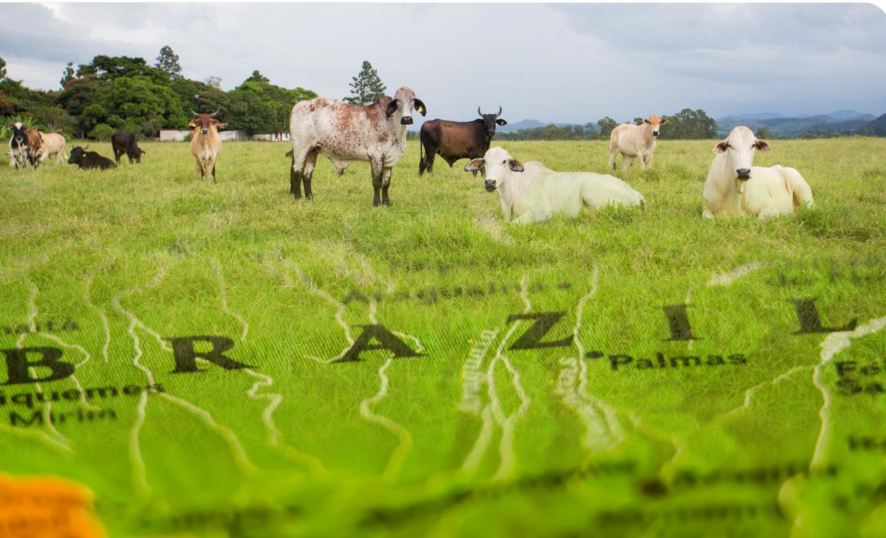
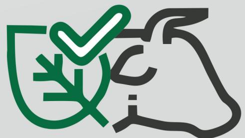
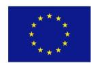
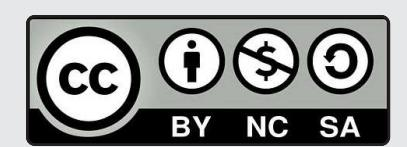
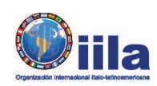
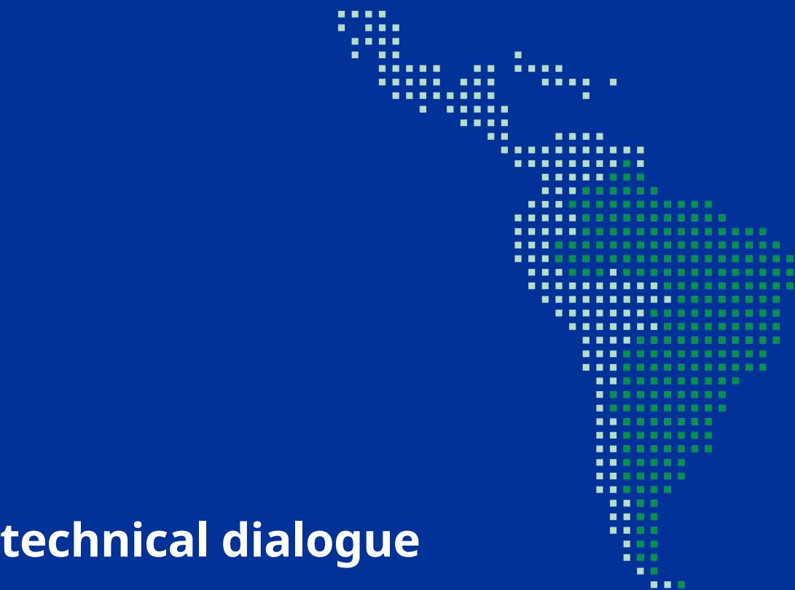
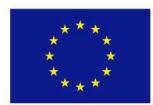

# Dialogues on sustainability and traceability of beef and leather value chains

This publication was funded by the European Union. Its contents are the sole responsibility of the authors and do not necessarily reflect the views of the European Union.

The original publication and any derivative works, which must be distributed with a licence that is the same as the one that applies to the original publication, may not be sold.

**Dialogues on sustainability and traceability of beef and leather value chains**

**Report coordinated by:** Andrea Monaco, senior programme manager, and Lorenzo Nalin, programme manager of AL-INVEST Verde.

## **Design and layout:** albantacreativos.com

January 2024

### **First technical dialogue**

The role of due diligence in the regularization of the meat and leather value chain in Brazil

### **Second technical dialogue**

Access to technology for sustainability in the beef and leather chain

### **Third technical dialogue**

The use of traceability tools to increase sustainability in the beef and leather chain **4**

**9**

**13**

# **First technical dialogue**

# **The role of due diligence in the regularization of the meat and leather value chain in Brazil**

March 09, 2022.

# **Executive summary**

The European Commission recently launched a proposal for a regulation that aims to minimize the import of deforestation and forest degradation products into the European Union. This proposal establishes rules for mandatory due diligence for importers who place certain products associated with deforestation and forest degradation on the European Union market, such as soy, beef, palm oil, timber, cocoa, and coffee, and some derived products such as leather chocolate and furniture. The aim is to ensure that only products not associated with deforestation and that meet the legality requirements according to the legislation of the country of origin are allowed on the European Union market.

The Organization for Economic Cooperation and Development (OECD) Guidelines recommend that importing companies conduct risk-based due diligence to avoid and address adverse impacts associated with their operations, supply chains, and other business relationships. The due diligence analysis should address actual or potential negative consequences (risks) related to human rights, including labour rights and labour relations, the environment, bribery and corruption, transparency, and consumer interests. The OECD argues that pre-compliance analysis helps companies anticipate, prevent or mitigate these impacts, thereby assisting the company in maximizing positive contributions to society, improving stakeholder relations, and protecting its reputation.

One of Brazil's significant challenges in meeting the criteria established in these different multilateral international relationship arrangements is deforestation, increasing since 2012. In that year, the rate was 4,571 km2, and in 2021 it reached more than 13,000 km2 (INPE, 2022). In the last three years, the accumulated deforestation in the Amazon biome was 56.6%, which corresponds to an area of 32,740 km2 (Alencar et al., 2022). Agriculture and cattle ranching is the leading economic sector with deforestation associated to their production chain. Between 1985 and 2020, the net loss of vegetation cover was 44.5 million hectares, of which 99% was used for agriculture and cattle ranching, where 83.6% of the forest area was converted to pasture and 13.6% to crops (MapBiomas, 2021).

However, scientific studies indicate that most of Brazil's agricultural production is deforestation-free since few producers are responsible for most deforestation. In fact, 2% of the Amazon and Brazilian savannah (Cerrado) private properties are responsible for 62% of illegal deforestation, where 20% of soybean exports and 17% of meat exports to the European Union must be contaminated by deforestation (Rajão, et al., 2020).

Recently a phenomenon has been intensifying and causing deforestation in the Amazon region: land grabbing in Undesignated Public Forests (FPND), which is the land category with the highest deforestation (28%), followed by rural properties (26%) and settlements (23%) (Alencar et al., 2021). Despite growing concern from international actors regarding deforestation for production purposes in private areas, protected areas, and indigenous lands, little attention is paid to FPNDs. FPNDs are especially problematic because of geospatial and cartographic information's almost non-existent enforcement and difficulty. Considering that the EU may unknowingly import products from FNDP, specific traceability efforts for this land classification are paramount.

In addition to environmental impacts from deforestation, labour and human rights violations can be audited in the process, following international conventions. In this context, it is necessary to dialogue to understand the challenges and opportunities in meeting the criteria and implementing due diligence in the meat and leather value chain, particularly to turn it into a tool that contributes to the sustainability of these chains and the reduction of deforestation.

In the technical dialogue held between actors linked to the meat and leather value chains in Brazil and the European Union in March 2022, it was discussed the importance and impact of the due diligence process in these value chains to comply with the rules established in the new European Union regulation on deforestation issues.

The dialogue was structured in three blocks. The first block provided the relevance and impact that due diligence in meat and leather value chains can have. The second block discussed the challenges linked to the due diligence process as a tool to promote sustainability in meat and leather value chains. The third block underlined opportunities, future actions, and possibilities of cooperation linked to implementing the due diligence process as a tool to promote sustainability in meat and leather value chains.

# **Main conclusions**

The following are the main discussions from the dialogue:

# **Relevance and the impact of the due diligence process**

y Due diligence serves to identify the risks by order of severity and the impacts related to a certain company activity and should also be used for planning practical actions to overcome challenges. y This tool might help to assess environmental and social risks related to a specific activity. This enables companies to assure the products' quality creating an advantage in the commercialization process. However, implementing a due diligence system brings costs for companies subject to this regulation. Therefore, it is necessary to identify solutions for companies to be able to implement due diligence process without reducing its profitability. y Some participants identified the need to address the legal frameworks of commodity-exporting countries and the regulations of consuming countries. In the context of Brazil, it is necessary to consider the fight against illegal deforestation, the issue of legal deforestation, and the standardization of requirements that do not consider the specificities of the chains.

## **Challenges associated with due diligence**

y Small and medium-sized companies may have challenges in financially supporting a due diligence process and will be vulnerable if they are not endorsed by any certification. y The goal of zero deforestation may generate polarization, lack of dialogue, and may still hurt the sovereignty of countries. y Mapping illegal deforestation property by property continues to be a challenge. y Regionalization of the discussion. Brazilian territory is vast and there are differences in its biomes. The new regulation needs to be sensitive to local geographic aspects without resulting in injustices. y Some companies already use tools and methodologies for risk analysis of the chains they work with, but the process is not complete. y The cost of conservation should be shared among the countries that benefit from the environmental services provided by native vegetation. y Concerning livestock specifically, a challenge lies in the individual traceability of animals from birth until the moment of slaughter. The implementation of strategies like traceability would take a long time to cover a large-scale territory such as Brazil.

y The legal insecurity caused by the lack of land regularization weakens producers and hinders the processes of due diligence. y The leather sector is dependent on the beef sector. The vast majority of slaughterhouses do not have monitoring systems, and tanneries are not capable of monitoring without data. y Due diligence and traceability can exclude producers/suppliers, and, therefore, it is necessary to create a mechanism for the regularization of producers and suppliers so that they can resupply the European Union. y If Brazil ceases to be a supplier (due to the "high risk" classification), no other country can supply leather at Brazil's level, directly affecting the leather industry. y Government certification: some actors stressed the right of sovereign Brazil to certify the good compliance of the rules by the producers; otherwise, the environmental legislation of the country becomes innocuous, and the national regulation is outsourced. It is necessary to recognize the Brazilian legislation for the formulation of an elaborate regulation. y Question of derived products: it is necessary to delimit to what extent the final product will be subject to this rule - because the initiative brings costs that are very difÏcult to measure and infinite impacts on the supply chain. The previous analysis of conformity should stay within the scope of primary products because it is possible to analyse them before they dissolve into other chains and processes.

### **Opportunities, future actions, and cooperation possibilities related to the implementation of the due diligence process**

y Expand the Sistema Brasileiro de Identificação e Certificação de Bovinos e Bubalinos -SISBOV (already existing), combining it with environmental monitoring such as CAR (already existing)1 . y Build public-private partnerships to develop due diligence and traceability systems. y Develop an Effectiveness of Payment Programs for Environmental Services2 . y Incentivize the production in agroforestry systems for small producersand

1 The Rural Environmental Registry - CAR is a nationwide electronic public registry, mandatory for all rural properties, to integrate environmental information from rural properties and possessions regarding Permanent Preservation Areas - APP, restricted use, Legal Reserve, forest remnants, and other forms of native vegetation, and consolidated areas, making up a database for control, monitoring, environmental and economic planning and combating deforestation. <https://www.car.gov.br/#/sobre>

2 Payment for Environmental Services (PES) is an economic instrument that, following the "protector-recipient" principle, rewards and encourages those who provide environmental services, improving the profitability of activities for the protection and sustainable use of natural reources. [https://inea.maps.arcgis.com/apps/MapSeries/index.html?appid=68ed6955a37e4c4a8ebda9f5c3eb4b2f\)](https://inea.maps.arcgis.com/apps/MapSeries/index.html?appid=68ed6955a37e4c4a8ebda9f5c3eb4b2f))

expand the production system of cattle-farming-forest integration for medium and large producers.

y Incentivize other ways of rural development such as environmental tourism. y In Brazil, the government disposes of data at the legal level to say whether deforestation is legal or illegal. Therefore, the government has to be directly involved in the implementation of verification mechanisms. y Improvement and expansion of compliance systems, such as the Selo Verde3 , implemented by the state of Pará, but for this to happen, the other states will need technical support. y Use of databases that are already available in Brazil, such as, for example, cross-referencing the CAR with the GTA4 to favour traceability. y Compensation system for producers who are producing with good practices and going beyond what the legislation asks. y Economic and financial arrangements capable of expanding the actions of industry, producers, and farmers, thus ensuring that all parties are supported to participate in the regularization process properly. y Resumption of the Amazon Fund's5 activities, since it was created to support measures against deforestation, but the freezing of resources prevents the allocation of financing to address various issues such as combating deforestation, developing traceability and supporting environmental services.

3 The green seal is a voluntary certification that identifies products, companies, and services that enhance sustainably. [https://www.researchgate.net/profile/Issa-Berchin/publication/296696198\\_ESTRATEGIAS\\_DO\\_](https://www.researchgate.net/profile/Issa-Berchin/publication/296696198_ESTRATEGIAS_DO_SETOR_AGRICOLA_BRASILEIRO_PARA_O_DESENVOLVIMENTO_DE_UMA_ECONOMIA_VERDE_NO_BRASIL/links/56d8b00308aee1aa5f802d02/ESTRATEGIAS-DO-SETOR-AGRICOLA-BRASILEIRO-PARA-O-DESENVOLVIMENTO-DE-UMA-ECONOMIA-VERDE-NO-BRASIL.pdf) [SETOR\\_AGRICOLA\\_BRASILEIRO\\_PARA\\_O\\_DESENVOLVIMENTO\\_DE\\_UMA\\_ECONOMIA\\_VERDE\\_NO\\_BRASIL/](https://www.researchgate.net/profile/Issa-Berchin/publication/296696198_ESTRATEGIAS_DO_SETOR_AGRICOLA_BRASILEIRO_PARA_O_DESENVOLVIMENTO_DE_UMA_ECONOMIA_VERDE_NO_BRASIL/links/56d8b00308aee1aa5f802d02/ESTRATEGIAS-DO-SETOR-AGRICOLA-BRASILEIRO-PARA-O-DESENVOLVIMENTO-DE-UMA-ECONOMIA-VERDE-NO-BRASIL.pdf) [links/56d8b00308aee1aa5f802d02/ESTRATEGIAS-DO-SETOR-AGRICOLA-BRASILEIRO-PARA-O-DESENVOLVI](https://www.researchgate.net/profile/Issa-Berchin/publication/296696198_ESTRATEGIAS_DO_SETOR_AGRICOLA_BRASILEIRO_PARA_O_DESENVOLVIMENTO_DE_UMA_ECONOMIA_VERDE_NO_BRASIL/links/56d8b00308aee1aa5f802d02/ESTRATEGIAS-DO-SETOR-AGRICOLA-BRASILEIRO-PARA-O-DESENVOLVIMENTO-DE-UMA-ECONOMIA-VERDE-NO-BRASIL.pdf)-[MENTO-DE-UMA-ECONOMIA-VERDE-NO-BRASIL.pdf](https://www.researchgate.net/profile/Issa-Berchin/publication/296696198_ESTRATEGIAS_DO_SETOR_AGRICOLA_BRASILEIRO_PARA_O_DESENVOLVIMENTO_DE_UMA_ECONOMIA_VERDE_NO_BRASIL/links/56d8b00308aee1aa5f802d02/ESTRATEGIAS-DO-SETOR-AGRICOLA-BRASILEIRO-PARA-O-DESENVOLVIMENTO-DE-UMA-ECONOMIA-VERDE-NO-BRASIL.pdf)

4 The Animal Transit Guide (GTA) is the ofÏcial document for animal transport in Brazil and contains essential information about traceability (origin, destination, purpose, species, vaccinations, among others). [https://](https://www.gov.br/pt-br/servicos/habilitar-se-para-emissao-da-guia-de-transito-animal) [www.gov.br/pt-br/servicos/habilitar-se-para-emissao-da-guia-de-transito-animal](https://www.gov.br/pt-br/servicos/habilitar-se-para-emissao-da-guia-de-transito-animal)

5 The Amazon Fund is managed by the National Bank for Economic and Social Development - BNDES. Its purpose is to raise donations for non-reimbursable investments in actions to prevent, monitor, and combat deforestation and to promote the conservation and sustainable use of the Legal Amazon. [http://www.fundo](https://www.fundoamazonia.gov.br/pt/home/)[amazonia.gov.br/pt/home/](https://www.fundoamazonia.gov.br/pt/home/)

# **Second technical dialogue**

# **Access to technology for sustainability in the beef and leather chain**

April 20, 2022.

# **Context**

The EU-Brazil Beef and Leather Value Chain Dialogue is gathering around the same table the main stakeholders in the European Union and in Brazil (importers, retailers, meatpackers, tanneries, exporters, ranchers, researchers, relevant associations and civil society organizations, etc.) to discuss the sustainability of beef and leather value chains in Brazil and MERCOSUR – in particular with regards to deforestation – and to identify relevant best practices or future initiatives, focusing in particular on these supply chains to the EU. The initiative is promoted by the European Union through the AL-INVEST Verde programme in collaboration with Amazon Environmental Research Institute (IPAM).

The opening roundtable took place on the 2nd and 3rd December of 2021. The first technical dialogue carried out on 9th March focused on the role of due diligence in the regularization of the meat and leather value chain in Brazil.

On 20 April, the second technical dialogue discussed the access to technology for sustainability in the beef and leather chain. The dialogue was structured in 3 blocks: the first block provided an overview and challenges of cattle ranching in the Amazon and the importance of access to technology to improve sustainability in the chain. The second block discussed existing technologies that can help improve productivity, sustainability, and transparency. The third block underlined actions to increase access to technologies to improve productivity, sustainability, transparency, and traceability in the chain. Below are the main conclusions of the dialogue.

# **Main conclusions**

The following are the main conclusions from the discussion in the second dialogue:

## **Block 1. Cattle ranching in the Brazilian Amazon**

Low livestock productivity characterizes 80% of the deforested area in the Amazon. Low productivity is often related to the production and management practices adopted in family farming – i.e., one that relies primarily on family members for labour and management. However, better pasture and cattle management practices

could potentially alter this scenario. Improvements in land management would be achievable if farmers had access to existing technologies and finance. Technical assistance together with access to credit are essential to implement resource-efÏcient practices and generate a balance between profitability and sustainability.

There is no one-size-fits-all approach to managing public policy for productivity improvement. Due to the heterogeneity of the Amazon lands, different types of products and management practices are in place; as a result, territorial approaches should find tailor-made solutions. For instance, an essential issue for productivity differential among Brazilian states is using nitrogenous fertilizers. Some states need to use them more than others to increase efÏciency and productive capacity.

As a general recommendation, some experts underlined the necessity to improve governance and develop a policy framework to create monetary and economic incentives towards sustainability in the supply chain. However, others argued that the policy framework reflects the market. National regulation and legal obligations are challenging to implement in many cases, and private standards not often recognize this. Data on recent global trends show a renewed consumer preference for more sustainable products and the willingness to pay a premium price for sustainable products, in mature and wealthy markets. The combination of higher demand and premium prices represents a good business case to improve sustainability and adopt better technology. Yet, small and medium farmers need credit and innovative financing, alongside technical assistance, to take advantage of the new global opportunities.

In contrast, representatives of the leather sector mention the difÏculty of increasing the use of better technology by paying a premium price as farmers are paid for the meat, not for the quality of the leather, as it is a by-product. It would be

challenging to establish a quality parameter for skin for calculating a premium price.

### **Block 2. Existing technologies that can help improve productivity, sustainability, and transparency**

There are technologies available. However, producers do not adopt them due to a lack of knowledge or means of implementing them. Some of the technologies mentioned were:

y Improving **animal feeding efÏciency** – through better management of pastures and use of leguminous plants. This will reduce the need to nitrogen fertilizers in the field, and will contribute to a better diet for the animal. y Using electric fences (most farmers do not use it, due to lack of energy and scepticism of implementing these fences). They cost less than a barb wire fence since fewer materials are required (i.e., posts, staples, and wire), and they take less time to install. However, power outages are frequent and animals must be trained from an early age. y **Intensification of production** is necessary because it makes it more productive and more profitable. This is a combination of improving pasture and nutritional management, improving access to water, and genetics, allowing for more cattle to be produced in less land. y **The professionalization of management** should focus on achieving long term returns by bringing new technology which makes sense for the region. Professionalization makes business more efÏcient, dynamic, and socially/ environmentally responsible. y The lack of access to technology in Amazonia starts with land registration. Indeed, the lack of land tenure (rights) among small farmers is one of the main issues that need to be solved.

Technology should focus on improving productivity (intensification, integration of Crop Livestock systems), Farm management, and data collection to know what is the challenge and be able to quantify the improvements, lastly there should be technology to promote the access to market and incentives for better products (meat and leather). Environmental stewardship is also a good business (i.e. access to clean water instead of water from rivers). Participants also highlighted the importance of focusing on improving the efÏciency of use of natural resources.

Several participants raised the point that, in the Amazon region, technical assistance to small and medium producers is needed to implement the above points. Technical assistance to producers should allow them to become more professional in producing.

Some players also argued about the "myth of technology". Indeed, the best tech technology is not the latest but the one that farmers can use - the most feasible in the territory. Policymakers should avoid conceiving the access to technology as a problem of big vs. small producers. Certain technologies are good to some producers but not good to others, even though they might have the same size.

Stakeholders recognized the crucial role for technologies to improve chain transparency. Indeed, traceability allows the understanding of which producers conform to the rules. However, from the dialogue emerged that the accuracy of information through the value chain link is vital for traceability systems no matter the technology used.

Traceability could be particularly challenging for the leather sector. Brazilian beef and leather value chains are not well integrated, and critical players need networking to develop effective traceability systems. Actors from the tannery industry mentioned three main technological challenges:

- 1. Tracing animals from their origin as meatpackers are not required to transfer information from the animal to the skin - only a few companies in Europe are doing it.
- 2. Ensuring that the information remains during tanning, a process that heavily relies on acids and chemicals.
- 3. Transferring the information on the animal's skin in every cut.

### **Block 3. Actions to increase access to technologies to improve productivity, sustainability, transparency and traceability in the chain**

This block reinforced the idea that technical assistance to small farmers has been shown to increase access to the existing technology. All commentators agreed on the vital role of rural credit and implementing technical assistance programmes. The Brazilian government should provide credit lines for farmers to contract private assistance from those companies that can transfer technology to small producers.

Technical assistance is rising in the Amazon region; however, it only covers around 8% of farmers. Considerable distances between farms make the assistance expensive. Still, to reduce costs, public-private partnerships and virtual exchanges are seen as feasible alternatives to reach more farmers.

Improving an appropriate technological environment to exchange information, for instance, through apps, is highly recommended. Sharing reliable information benefits traceability. Indeed, public-private partnerships should develop an architecture to guarantee a systematic approach for recollecting the information exchanged at each link. This architecture should consider that the recollection may occur manually on paper for some farmers.

# **Third technical dialogue**

# **The use of traceability tools to increase sustainability in the beef and leather chain**

May 18, 2022

# **Introduction**

On 18 May 2022, through the AL-INVEST Verde programme, the European Union, in partnership with IPAM (Amazon Environmental Research Institute), organized the third "Technical Dialogue on sustainability and traceability of the beef and leather value chains."

The dialogue virtually gathered more than 40 relevant actors representing institutions from Brazil and the European Union in the various sectors linked to these chains, such as the public sector, producers, exporters and distributors, civil society organizations and universities among others.

The Dialogue aimed to understand the challenges related to existing traceability tools and how they contribute to improving sustainability in the Brazilian leather and beef value chains. The Dialogue focused on the available traceability solutions, understanding their strengths and weaknesses. It also discussed actions to facilitate the implementation of these tools to improve the production process by promoting greater profitability, transparency, compliance with social and environmental criteria, and reducing deforestation.

## Main conclusions

Stakeholders coincided on the importance of traceability systems (TSs) for sanitary and health purposes. A survey conducted among participants underlined that within the scope of traceability, the possibility of monitoring animal health, food safety, and social and environmental aspects is the main reason to implement the system. Traceability experts from Brazil, Uruguay, and Europe also argued that TS promotes the chain's transparency and generates prompt responses to adverse issues, improving the overall risk management and resiliency of the chain. Moreover, experts strongly agreed on the crucial role of TS in implementing sustainability in the chain, i.e., promoting socio environmentally standards and good practices.

Participants coincided that proper traceability systems are essential for trade as they consent to comply with demanding international market requirements. A reliable and efficient traceability system also improves the quality of the product, generating trade opportunities, especially in premium market segments. Yet, considering traceability only a tool for export would be a mistake; indeed, the domestic market (and consumers) could also benefit from a well-developed traceability system. Moreover, it is also a powerful instrument to know the local territory.

Developing a unique national system for such a vast territory as Brazil is challenging, although not impossible. An IPAM research study, carried out within this initiative and presented during the dialogue, mapped twelve different traceability systems developed in Brazil, highlighting the strength and pitfalls of each one. The discussion underlined that such a heterogenous traceability environment would require national coordination in harmonizing standards and requirements. It would also require joint efforts from the public and private sectors and a shared intent among players. Within the public sector, better coordination among central government and states is desirable for scaling up existing pilot projects that have proved effective at the state level. As a result, public policies should discourage states from gaining more market share through a less transparent chain.

A survey carried out during the event emphasized the lack of infrastructure (e.g., mobile phone networks in rural areas), the absence of financial incentives, and the need for technical assistance as the main obstacles for medium and small farmers to participate in traceability systems. Still, solutions are available. Empirical evidence suggests those farmers who received technical assistance were able to raise productivity and adopt better practices. Also, GPS systems are an essential factor in overcoming connectivity problems caused by the lack of telecommunication infrastructures as they allow to upload information without requiring a stable connection to the internet.

Actors also suggested that for developing a proper tool, the traceability system should be simple and perceived as an added value by government and companies – something that is not always easy to achieve. Reliable data and a proper

protection right for information and data are complementary elements for TSs. Indeed, the survey conducted during the event underlined integrity, accuracy, and confidentiality of the information transferred as the main characteristics that a traceability system for the beef and leather value chain should have.

The dialogue focuses on research opportunities as well. Actors mentioned that matching currently available data from CAR and GTA allows overcoming the often-cited problem of indirect producer traceability. Yet, the accessibility to these data has decreased in recent years, a growing concern among chain researchers.

Finally, several stakeholders suggested that traceability is only part of the rather complex process of promoting sustainable practices in the beef and leather chains. Behind it, a set of clear rules – and a proper enforcement system – has to be defined. The socio-environmental criteria are to be thought along with the traceability system itself. In this sense, a significant challenge is coordinating and harmonizing definitions among states, countries, and importers.

## **Block 1. Overview and state of the art of existing traceability initiatives for the beef and leather chain**

The block presented bovine traceability systems in Brazil, Uruguay, and Europe.

For Brazil, an IPAM study conducted as part of this initiative mapped twelve traceability initiatives. These initiatives were developed in recent years and with the exception of SISBOV, all of them are post-2017. Mato Grosso and Pará are the States that have the largest number of traceability tools and programmes available – but not all initiatives disclose their areas of coverage. GTA, CAR, and Invoices (NFs) are among the documents required by most of the traceability initiatives mapped. The study found that there are initiatives explicitly aimed at indirect suppliers, indicating advances in the discussion. However, such a heterogeneous environment presents some challenges. For example, information is not readily available, as websites and online platforms lack objective details about operation, scope, objectives, technologies employed among others that guide traceability initiatives.

The study also highlights the challenge of disseminating the traceability measures employed to consumers. In addition, localized initiatives need scale and continuity to be effective, which has not yet been achieved. Finally, an important policy recommendation would be to expand the role of SISBOV in voluntary traceability arrangements. The bovine traceability system in Uruguay has been developed over 50 years, evolving from a collective traceability system to one of individual animal traceability. The system, produced in response to the need to guarantee high sanitary standards that allow access to “premium” markets, is mandatory for all producers and has been articulated with all the actors in the chain. The system is free of charge, despite the size of the producer; the monitoring devices are distributed free of charge to all producers. Uruguayan traceability benefits from

the country's widespread connectivity but also ensures manual data collection modalities to guarantee that all actors are included in the sample. Such an effective system resulted from a strong political will and the ability of the public sector to collaborate with the private sector. The latter has been particularly possible through a hybrid and innovative institution such as INAC - National Meat Institute - which includes government members, the unions, and large private producers in its most strategic bodies. Thus, the beef chain benefitted from an efficient and advanced TS. However, it is important to mention that Uruguay is a much smaller country than Brazil, with an area that is 2.1% of Brazil, and a much smaller cattle herd (5.1% of the herd), but even so the initiative shows the importance of strong political will and coordination between the public and private sectors.

In Europe, traceability was introduced over 30 years ago to avoid sanitary and health issues. It has two primary purposes, the health of animals and people. The system works through compulsory registration of all farmers, individual registration of animals from birth, animal passport, and registration of any movement, allowing for the localization and tracing of animals for veterinary purposes. The main benefits of the EU traceability system are the fight against any event for animal health and the prevention of outbreaks. As it was for Uruguay, the TS is compulsory and traces back product from the animal's birth through a bovine passport. The main challenge in implementing this system was the approval among the 27 member states. Nowadays, the European TS traces movements within and in-between member states. It consists of compulsory rules, legislation, implementing regulations, and official controls.

Finally, the debate among stakeholders also revealed that existing official live-stock traceability systems, including the one of the EU, are conceived to convey traceability information only along the food chain, but by-products do not enjoy the same treatment. Hides & skins lose their identity at the slaughterhouse and transfers of animal data onto the hides or skins is very rare.

## **Block 2. Challenges to promote traceability, particularly concerning socio-environmental criteria, and the benefits it can generate for the actors in the chain**

Traceability is valid only if applied to the whole chain, as all players can benefit from it and are pushed to improve management. The possibility to cross databases is fundamental to go beyond slaughterhouses and monitor all the chains; however, this is somehow challenging. For instance, some limitation comes from the GTA system, which is national, but managed at the state level.

Legal concerns were also discussed. During the dialogue emerged the necessity to protect both socio-environmental and personal rights. The data protection law is as vital as the right to land ownership; the government should focus on both issues to convince producers of the TSs potential.

Using a GPS, TS can overcome the problem created by the lack of infrastructure and access to the internet in rural areas. The European Galileo GPS was mentioned as an example that provides information using a simple cell phone with no need of mobile coverage. Uploading the information periodically - for instance, only on the few occasions rural farmers have access to the mobile network - guarantee the accomplishment of three crucial elements for traceability, namely: i) identifying the product (through barcode, number, or a unique identifier); ii) identifying where the product is; iii) knowing at what time the product is there.

### **Block 3. Discussion of how to improve traceability initiatives that contribute to the sustainability of the beef and leather value chain**

Discussants stressed the role of public policy in scaling up pilot projects and developing a national system. But this will require financial support, too, in particular, to increase connectivity.

Interoperability of the existing platforms is also an issue: systems should be able to talk to each other while ensuring the reliability of the information.

Looking forward, restoring accessibility of GTA data and connection to CAR has also been mentioned as an issue to address. For instance, Brazil has valuable data that could be used for national cross-checking exercises by combining datasets on animal movement records, sanitary, slaughterhouses, and imports from anywhere in the world.

The dialogue recognized the experience of the Selo Verde in Parà as a leading example. Yet, it was also added that traceability is not the one-fits-all solution for the sustainability of the beef and value chains. Several stakeholders pointed out the necessity of implementing clear rules and a proper enforcement system. In this sense, the harmonization of socio-environmental criteria among Brazilian states and importers could be an effective policy to implement along with the traceability system itself.

Throughout the dialogue, experts suggested municipalities and states must work together, under the coordination of the federal government, to scale up pilot projects at the national level. But it is not only a matter of public policy. Meatpackers should increase the effort in monitoring indirect suppliers. A sensibilization campaign for Brazilian consumers may also help improve their concerns about environmental issues, ultimately expanding the chain's pressure to be sustainable.

**Component 2 of AL-INVEST Verde is a consortium led by:**

AL-INVEST Verde is a European Union (EU) programme. Its global objective is to promote sustainable growth and job creation by supporting the transition towards a low-carbon, resource-efÏcient, and more circular economy in Latin America. Through Component 2, led by FIIAPP in consortium with IILA, the programme provides assistance for strengthening public policies and multi-stakeholder dialogues on sustainable agricultural and value chains, environmental and labour standards as well as sustainable trade and economic policy and regulatory frameworks.

**www.alinvest-verde.eu**