**AGRO BRASIL+SUSTENTÁVEL:** 

# **How to Demonstrate Compliance with the EUDR Using the Public Platform**

**Lessons from a Livestock Dry-Run**

**PRODUCTION: FUNDING: EXECUTING PARTNER:**

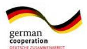

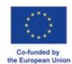

**JULY/2026**

#### **PUBLISHED BY:**

#### **Sustainable Agriculture for**

#### **Forest Ecosystems (SAFE)**

As a federal public utility enterprise, Deutsche Gesellschaft für Internationale Zusammenarbeit (GIZ) GmbH supports the Federal Government of Germany in its international cooperation objectives

#### **PUBLICATION COORDINATION**

#### **Ministry of Agriculture and Livestock (MAPA)**

Lara Line Pereira de Souza

Bruno Meireles Leite

Carlos Henrique Pizarro Borges

#### **Federal Data Processing Service (SERPRO)**

Giovanni de Oliveira Barreiros

Aline Cristina Cappele de Castro

**GIZ** Maria Olatz Cases Vega - SAFE Project Director

#### **REPORT PREPARATION**

#### **GIZ**

Malina Bischoff

#### **Olab**

James Allen

João Silva

Isabella Granero

#### **GRAPHIC PROJECT AND LAYOUT**

Estúdio Nono

This publication is a product of the SAFE project co-funded by the European Union, the German Federal Ministry for Economic Cooperation and Development (BMZ), and the Ministry of Foreign Affairs of the Netherlands. SAFE is part of the Fund for the Promotion of Innovation in Agriculture (i4Ag). In Brazil, it is implemented by Deutsche Gesellschaft für Internationale Zusammenarbeit (GIZ) GmbH in partnership with the Ministry of Agriculture and Livestock (MAPA). Its content is the sole responsibility of GIZ and does not necessarily reflect the views of the European Union, the German Federal Ministry for Economic Cooperation and Development (BMZ), the Ministry of Foreign Affairs of the Netherlands or the Government of Brazil. The selection of the company JBS to participate in this study was based on the recommendation of the Brazilian Association of Meat Exporting Industries (ABIEC) and served exclusively to implement the activities described in this report.

#### **FUNDING:**

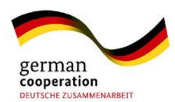

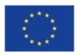

#### **EXECUTING PARTNER: PRODUCTION:**

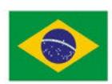

Implemented by

#### **LEGAL INFORMATION**

All indications, data, and results of this study have been compiled and carefully reviewed by the authors. Despite this, errors regarding the content may occur. Consequently, neither GIZ nor the authors can be held liable for any claim, loss, or damage, direct or indirect, resulting from the use of or reliance placed upon the information contained in this study that results, directly or indirectly, from errors, inaccuracies, or omissions of information.

The duplication or reproduction of the whole or parts of the study (including the transfer of data to media storage systems) as well as distribution for non-commercial purposes are permitted, provided that MAPA, GIZ, and Olab are cited as the source of the information. For other commercial uses, including the duplication, reproduction, or distribution of the whole or parts of this publication, MAPA, GIZ, and Olab must grant express authorization.

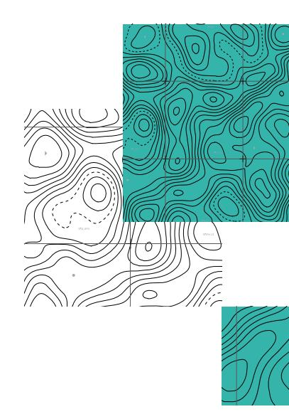

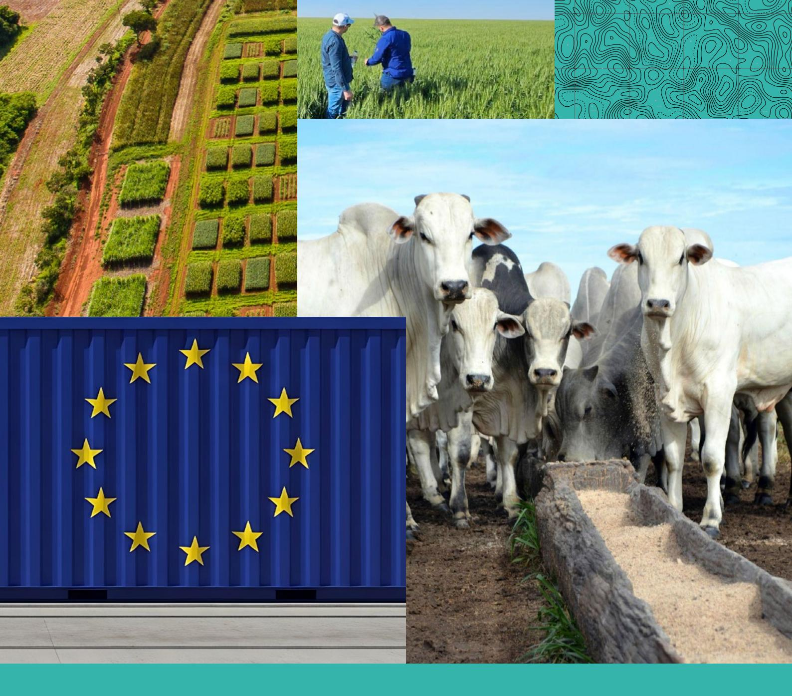

**How to Demonstrate Compliance with the EUDR Using the Public Platform**

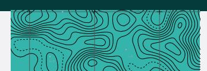

# **Executive Summary**

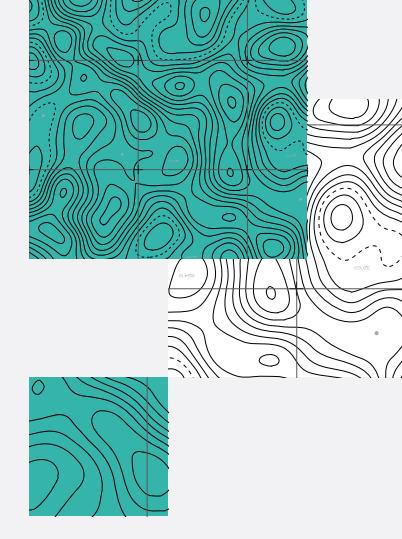

**This report was prepared with the primary objective of testing the application of the Agro Brasil+Sustentável (AB+S) Platform in ensuring compliance with the European Union Deforestation Regulation (EUDR), considering both practical and operational aspects and an analysis of the data and information the Platform currently verifies. The result of a highly collaborative process, this report serves as a snapshot of the AB+S platform in its current state, as it undergoes continuous development.** 

This strategic overview is crucial for enabling diverse stakeholders—from the production sector and government—to understand what AB+S already offers, while also highlighting the potential for incorporating new features to further consolidate its role as a key mechanism for demonstrating the compliance of Brazilian agricultural production.

## **Context**

Since 2024, the Brazilian government – led by the Secretary of Rural Development of the Ministry of Agriculture and Livestock (SDR/MAPA) – has been developing the **Agro Brasil+Sustentável Platform (AB+S)**. This is currently positioned as the **main official infrastructure for demonstrating the socio-environmental compliance of the Brazilian farming sector**. For this reason, the Platform is a critical and strategic mechanism for actors in the Brazilian productive sector to ensure compliance with the European Union Deforestation Regulation (EUDR).

**EUDR sets a new paradigm for due diligence for commodities exported to the European Union**, which must prove that they are deforestation-free and produced in accordance with the legislation in their countries of origin. Proving these requirements demands the structuring of a robust and complex due diligence system, coordinating a significant amount of data, documents, and information to demonstrate that the risks of non-compliance are negligible.

The entry into force of the EUDR is rapidly approaching, and a central question being asked by actors at the national level is: **How to use the AB+S Platform to demonstrate EUDR compliance**. This report seeks to answer these questions in two ways: practical and informational. **In practical terms, this involved carrying out a dry-run (pilot) of meat exportation** to Europe, evaluating the engagement of direct and indirect producers in the beef supply chain and the functionality of the platform. **The informational sphere combines EUDR requirements with compliance instruments available in Brazil and with the evidence that the platform is already able to deliver.**

## **Evaluating AB+S in a Practical Case: EUDR Dry-Run in the Livestock Supply Chain**

The implementation of a dry-run in the livestock supply chain required a number of steps, including **building a strong collaborative ecosystem**, involving supervision by GIZ (via the SAFE project), technical engagement by MAPA, coordination by Olab, and direct partnership with JBS, a meatpacker recommended by the Brazilian Association of Meat Exporting Industries (ABIEC).

### **Simplified summary of livestock dry-run methodology**

| DRY RUN MODEL                                                                                                                                       | SUPPLIERS                                                                                                              | TRACEABILITY                                                                                                   | SOCIOENVIRONMENTAL ANALYSIS                                                                                                                             |
|-----------------------------------------------------------------------------------------------------------------------------------------------------|------------------------------------------------------------------------------------------------------------------------|----------------------------------------------------------------------------------------------------------------|---------------------------------------------------------------------------------------------------------------------------------------------------------|
| Identification of indirect suppliers based on a direct supplier with a long history of trade with the meatpacking plant, to compose the sent batch. | Direct and indirect, with identification by the meatpacking plant and support from the direct supplier and their team. | Use of CAR and GTA, consolidated by the <i>Plataforma Pecuária Transparente</i> , made available by suppliers. | Performed by the AB+S Platform, through the socio-environmental qualification of the rural establishment and enablement of production areas for export. |

Formulation: Olab

In general, it was possible to identify that **the AB+S Platform has proven itself to be technically straightforward and functional**, allowing suppliers to quickly generate reports if the properties did not present any compliance issues. **The main obstacle to issuing such reports is not a technical one, but rather one of incentives**. Given the voluntary nature of the pilot program,

this resulted in relatively low participation levels. Other challenges identified throughout the pilot program were:

**▸ LINKING CPF AND CNPJ.** Suppliers highlighted the difficulty in demonstrating compliance for rural establishments with a CNPJ (Brazilian corporate tax ID), given the need for prior linking to a CPF (Brazilian individual tax ID) on the GOV.BR portal. This step-by-step process was not explicitly stated on the Platform, but was nonetheless resolved after technical support was provided by the Federal Data Processing Service (SERPRO) team. **▸ REPORTING NON-CONFORMITIES.** Some farms were unable to generate reports due to problems with the Rural Environmental Registry (CAR), but producers were unable to identify the specific problem or the necessary procedures for regularization. **▸ TECHNOLOGICAL CONGESTION FOR INDIVIDUALIZED ACCESS.** The need for each producer to access the system individually using GOV.BR portal credentials to send PDF reports to the meatpacker hindered scalability, emphasising the need to develop an API integration for mass data processing and reception, and report authentication. This was then developed by SERPRO. **▸ THE NEED FOR PRIVATE TRACEABILITY SYSTEMS.** AB+S has not yet been able to map the movement of cattle along the supply chain, requiring the use of complementary systems. In the case of the dry-run the Transparent Livestock Platform was used.

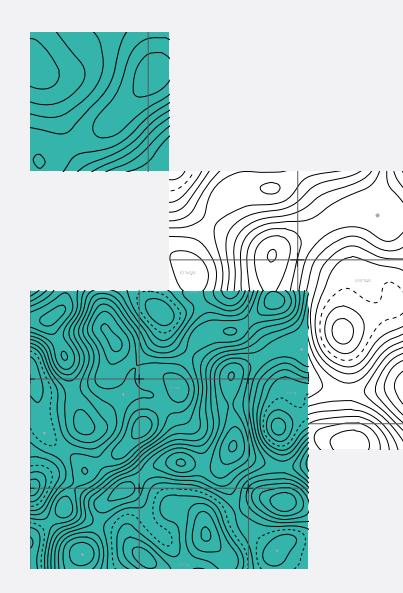

Despite the challenges faced, the pilot demonstrated that AB+S has a solid grounding to become a strategic tool for demonstrating compliance with EUDR once the regulation comes into effect. Among these conditions, it is worth mentioning:

**▸ CONSOLIDATION AND INSTITUTIONAL RECOGNITION.** The use of AB+S is a way to standardize verification criteria, reducing the need for the sector to rely on private suppliers who may generate different assessments. **▸ POTENTIAL FOR INTEGRATION WITH PRIVATE PROTOCOLS.** There is a great opportunity for AB+S to evolve to combine EUDR requirements with private purchasing policies already established by meat processing plants.

**▸ DIRECT COMMUNICATION BETWEEN KEY PLAYERS.** The dry-run fostered dialogue between strategic players in the livestock supply chain, including MAPA (Ministry of Agriculture, Livestock and Supply) and SERPRO (Brazilian Federal Data Processing Service), allowing for the mapping of operational bottlenecks in livestock farming and accelerating the planning of improvements. This reinforces the adaptive nature of AB+S, an essential condition for it to become increasingly aligned with the EUDR. **▸ IDENTIFICATION OF NON-COMPLIANCE ISSUES.** The fact that during the dry-run there were cases where AB+S reports were not issued is not entirely negative: it represents an opportunity for producers to regularize their situation before EUDR comes into effect.

## **Application of AB+S to EUDR Requirements**

With regard to information, it was possible to identify that **AB+S can provide a solid foundation for the due diligence system** to be structured by the operators, consolidating data in order to comply with basically all the requirements of Article 9. **This does not mean that the Platform, by itself, exempts operators from complying with EUDR requirements**. In addition to information on the socio-environmental compliance of rural businesses and their eligibility for exports, **operators still need to conduct a risk assessment and, if necessary, implement mitigation measures**. These actions are fundamental in the context of the EUDR, and **the operator must implement them regardless of whether or not specific data is available in AB+S**.

Among all the **compliance instruments** available in Brazil and identified by Olab in the report Laws of the Land the AB+S Platform conducts extensive mapping of them, especially **those that generate direct results regarding compliance or non-compliance, being called "evidence". Factors that indicate a need for more detail in risk assessment are called "risk factors".** It is important to emphasize that the operator must provide a detailed risk assessment even in a scenario where AB+S covers all mapped compliance instruments. This is because there are specific elements related to the production and territorial contexts of the supply chains.

#### **Overview of using AB+S to provide EUDR due diligence information**

**ART. 10**

RISK ASSESSMENT

**What does the EUDR request** 

**from the operator?**

• Verify and analyse the information collected in accordance with Art. 9, as well as other relevant information, to assess whether there is any risk of non-compliance with the EUDR.

**How can AB+S support?**

• AB+S reports provide information applicable to Art. 9, and their analyses must be detailed by the operator in the risk assessment, in accordance with their production and territorial context.

**ART. 11**

RISK MITIGATION

**What does the EUDR require** 

**from the operator?**

• If the assessment indicates potential non-compliances, the operator must adopt appropriate mitigation measures to reduce the risk to a negligible level.

**How can AB+S support?** • Risk mitigation measures must be implemented by the operator.

**AB+S PLATFORM**

**What input does it supply?** • Socio-environmental qualification reports for the rural establishment Report on the qualification of the production area for export

**How does it aid the process?** • Provides the conditions for the operator to begin its due diligence analyses • Provides input for the analyses under Art. 9

• Provides general evidence to support deforestation and legality requirements

**ART. 9**

DATA, INFORMATION, AND DOCUMENTS

**What does the EUDR require** 

**from the operator?**

• Evidence that the products comply with the requirements of Art. 3 (deforestation and legality).

**How can AB+S help?**

• Through the provision of reports analysing the rural property and the presence of deforestation

in production plots.

Source: Agro Brasil+Sustentável Platform. Formulation: Olab.

Where applicable, it is also the operator's responsibility to describe the processes for consulting peoples or organizations present in the production areas.

**EUDR DUE DILIGENCE SYSTEM**

#### **Summary of coverage analyses of the AB+S Platform to EUDR requirements**

| WHAT THE EUDR REQUIRES | WHAT IS AVAILABLE IN BRAZIL |                  |          |
|------------------------|-----------------------------|------------------|----------|
| Requirement            | Compliance Instrument       | Possible Results | Coverage |
| Deforestation          | PRODES                      | ◆ Evidence       | ●●●      |

### **Legality**

| Requirement              | Compliance Instrument                      | Possible Results Coverage |
|--------------------------|--------------------------------------------|---------------------------|
| Land Use Rights          | SNCR                                       | Risk Factor               |
|                          | CAR                                        | Evidence                  |
|                          | SIGEF-Geo                                  | Risk Factor               |
| Environmental Protection | CAR                                        | Evidence                  |
|                          | RL Liability                               | Risk Factor               |
|                          | Embargoes                                  | Evidence                  |
|                          | CNC Embargoes                              | Risk Factor               |
|                          | UCs                                        | Evidence                  |
|                          | APAs                                       | Risk Factor               |
|                          | Public Forests                             | Evidence                  |
|                          | Deforestation and ASV                      | Risk Factor               |
| Third Parties Rights     | CAR                                        | Evidence                  |
|                          | Indigenous Lands (Pre-homolog)             | Risk Factor               |
|                          | Indigenous Lands (Post-homolog)            | Evidence                  |
|                          | Quilombolas Lands (Pre-homolog)            | Risk Factor               |
|                          | Quilombolas Lands (Post-homolog)           | Evidence                  |
| Third Parties Rights     | "Dirty List" of Labor Analogous to Slavery | Evidence                  |
|                          | CEAC                                       | Risk Factor               |
|                          | CNDT                                       | Risk Factor               |

**Coverage** Totally Covered Partially Covered Not Covered by AB+S Not Covered by Report The only two instances of compliance instruments classified as evidence and not covered by AB+S relate to the legality requirement of "Tax, Anti-Corruption, Trade and Customs Regulation". **This reinforces how comprehensive the AB+S Platform already is**. In terms of mapping the information needed to ensure compliance with the EUDR, even with strong indications that AB+S is prepared to meet the EUDR requirements once the regulation comes into effect, **there is still room for it to be developed further** . The Platform has an evolutionary, adaptive, and cooperative character, so its construction is continuous and collaborative, involving various ministries.

| Labor Rights   | "Dirty List" of Labor Analogous to Slavery | Evidence         |          |
|----------------|--------------------------------------------|------------------|----------|
|                | CEAC                                       | Risk Factor      |          |
| FPIC Principle | Indigenous Lands                           | Evidence         |          |
|                | Environmental Licensing                    | Risk Factor      |          |
|                | CPF                                        | Evidence         |          |
|                | CNPJ                                       | Evidence         |          |
|                | CND and CPEND                              | Evidence         |          |
|                | CNEP                                       | Evidence         |          |
| Requirement    | Compliance Instrument                      | Possible Results | Coverage |

Source: Agro Brasil+Sustentável Platform. Formulation: Olab.

#### **Coverage** Totally Covered Partially Covered Not Covered by AB+S Not Covered by Report

## **Recommendations**

**The AB+S development process is highly collaborative**, and involved inter-ministerial dialogues and interactions with actors involved in production chains to gather technical input and feedback aligned with the practical reality of the agricultural sector. **The recommendations that are set out below are aimed at continuing the development of AB+S in this collaborative way**, so that the Platform becomes even more capable of supporting the Brazilian productive sector in providing compliance to EUDR.

**Recommendation 1: Foster dialogue and alignment with subnational and private systems.**

It is strategic to broaden the dialogue and interaction with subnational verification systems and corporate arrangements, reducing commercial uncertainties and analytical divergences in the eyes of European buyers.

**Recommendation 2: Provide conceptual support for the checks performed on the Platform and point out cases of non-compliance.**

AB+S must rigorously specify to users the criteria and sources that caused a blockage (detailing the land tenure steps or CAR liabilities identified) and actively instruct the producer on how to proceed with regularization.

#### **Recommendation 3: Develop interoperability and integration solutions with traceability systems.**

The agile development of interoperability solutions involving AB+S is fundamental to ensuring the effective integration of the Platform with corporate animal traceability systems.

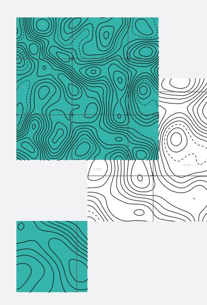

#### **Recommendation 4: Conduct training and engagement activities in the field.**

At this point, when AB+S has already consolidated its development path, it is important that the institutions responsible for the Platform intensify their dialogue with producers. The presence of MAPA and SERPRO in the field is a measure to create familiarity, demystify the use of GOV.BR, and anticipate this technological adaptation for rural producers, preparing them for the entry into force of EUDR.

# **Table of Contents**

- **[1. INTRODUCTION AND CONTEXT](#page-13-0)**
- **[2. THE AGRO BRASIL+SUSTENTÁVEL PLATFORM](#page-18-0)**
- **[3. ANALYSIS METHODOLOGY](#page-24-0) [3.1. Livestock Dry-Run Methodology](#page-25-0) [3.2. Metodologia de Análise dos Dados Disponíveis na AB+S](#page-29-0)**
- **4. EVALUATING AB+S IN A PRACTICAL CASE: [THE EUDR DRY-RUN IN THE LIVESTOCK SUPPLY CHAIN](#page-30-0) [4.1. Traceability Structures](#page-31-0) [4.2. Supplier Engagement for the](#page-34-0)  Generation of AB+S Reports [4.3. Results and Learnings](#page-35-0)**
- **[5. EUDR REQUIREMENTS](#page-38-0) [5.1. Due Diligence](#page-41-0) [5.2. Article 9: Information, Data, and Documents](#page-43-0) [5.3. Which EUDR Due Diligence](#page-48-0)  Requests Can AB+S Meet?**
- **6. APPLICATION OF AB+S FOR [THE EUDR DEFORESTATION REQUIREMENT](#page-52-0) [6.1. Available Information](#page-53-0) [6.2. Verification Procedures](#page-54-0) 6.3. Results and Discussion**
- **[7. APPLICATION OF AB+S TO EUDR](#page-55-0)  LEGALITY REQUIREMENTS [7.1. Land Use Rights](#page-59-0) [7.2. Environmental Protection](#page-66-0) [7.3. Third Parties Rights](#page-74-0) [7.4. Labor Rights](#page-80-0) [7.5. Human Rights](#page-85-0) [7.6. FPIC Principle](#page-86-0) [7.7. Tax, Anti-Corruption, Commercial,](#page-91-0)  and Customs Regulation**
- **[8. CONCLUSION](#page-94-0)**
- **[9. RECOMMENDATIONS](#page-100-0) 14 19 25 26 30 31 32 35 36 39 42 44 49 53 54 55 55 56 60 67 75 81 86 87 92 95 101**

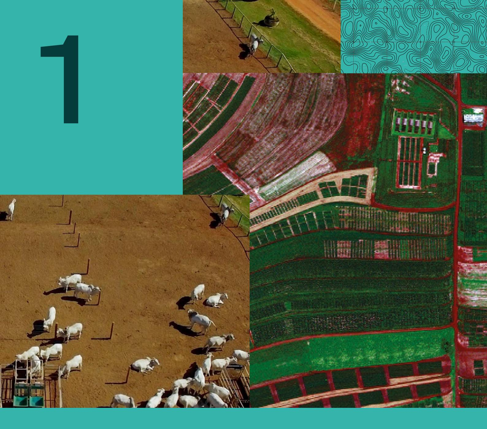

**How to Demonstrate Compliance with the EUDR Using the Public Platform**

# **Introduction and Context**

**AGRO BRASIL + SUSTENTÁVEL**

**The European Union Deforestation Regulation (EUDR) presents a new paradigm for trade relations between the European Union and commodity-exporting countries. The regulation is part of a broad strategy of the economic bloc, aiming to reduce its carbon emissions and its contribution to biodiversity loss globally. In this sense, the European Commission expects that, with the EUDR, citizens of the bloc decouple their consumption from the advance of deforestation and forest degradation around the world.** 

Published in 2023, the EUDR was scheduled to enter into force as of December 30, 2024. This expectation, however, did not materialize due to two postponements made by the European Commission to allow more time for companies, exporting countries, and Member States to implement the necessary structures to ensure compliance conditions with the regulation. These postponements reflect the inherent complexity of ensuring compliance with the EUDR. Demonstrating that products are deforestation-free—a central element of the regulation—is one component of the EUDR due diligence process, which also entails providing evidence that commodities are produced in compliance with the legislation of the country of origin, ensuring traceability, submitting geolocation data for all production plots, and issuing a due diligence statement.

This new scenario of due diligence demands has been catalyzing the development of new socio-environmental monitoring and traceability structures for agricultural production in producing countries, given the desire of exporting companies to maintain – or even increase – their trade relations with the European Union. This is also the case for Brazil. In recent years, the agricultural sector (traders, meatpacking plants, etc.) has been investing significantly in improving its systems to monitor the compliance of exported products across value chains. Despite reflecting a positive movement with the objective of showing that the Brazilian agricultural sector is fully capable of implementing deforestation-free chains and in compliance with multiple legal requirements, this process has two consequences:

**▸** This movement by exporting companies in Brazil implies a significant cost related to acquiring licenses for using private monitoring systems, as well as specialized services for customizing the generated data to meet EUDR requirements. These models require high initial investments but with a low marginal cost of reproduction, a characteristic that makes investments more suitable for companies operating on expanded scales1 . There is, therefore, a risk of imposing entry barriers on lower-volume exporters. **▸** The wide diversity of private monitoring systems, a phenomenon accentuated by the arrival of the EUDR, can be positive in competitive terms from the supply side2 , in a scenario of a new market emerging with new demands and relatively low entry costs. On the other hand, there is an absence of harmonization regarding what information is relevant and the analysis criteria to demonstrate compliance with the EUDR requirements. This creates an uncertainty scenario that may affect the risk perception by European Competent Authorities.

The solution to these two undesired effects of the creation of a new commercial requirements scenario by the EUDR lies in the development of government socio-environmental monitoring systems for agricultural production. As they are public goods, such systems imply more affordable economic conditions for their use, favoring rural producers and smaller-scale exporting companies. Furthermore, state determination regarding which data must be verified and what the verification criteria are is a way to reduce uncertainties in determining the compliance of agricultural products. In the context of the EUDR, the governments of the commodity origin countries play a leading role in this process: item 1.10 of the FAQ3 establishes the autonomy of production countries in defining the relevant legislation applicable to the legality requirement, so that if the product is legally marketable in the country of origin, it must be considered legal in the European Union.

In the Brazilian context, the development of government information systems applicable to traceability and socio-environmental monitoring of agricultural production is relatively recent. The main case is the Selo Verde Platform. Launched in 2022, with technical development carried out by the Federal University of Minas Gerais (UFMG), the platform is the first public tool for cross-referencing georeferenced socio-environmental information of rural properties in Brazil, using the Rural Environmental Registry (CAR)4 as a polygonal reference. Additionally, the platform provides product traceability, connecting origin and destination in the production chain.5 Despite providing a highly qualified digital structure for socio-environmental

verification of agricultural production – and highly applicable to EUDR requirements – the Selo Verde Platform is a state initiative and is not present in all Brazilian states: only Pará, Minas Gerais, and Espírito Santo currently have the platform in full conditions of use and with the possibility of public access (other states are in the process of implementation).

Considering that the EUDR has the potential to impact Brazilian production chains without geographical distinction, developing a public socio-environmental monitoring platform with national coverage becomes highly strategic. The main tool capable of supplying this need is the Agro Brasil+Sustentável Platform (AB+S). It is a digital platform with national coverage, aimed at organizing and providing subsidies so that the Brazilian agricultural sector can verify and demonstrate compliance with social and environmental requirements, ensuring transparency and credibility to market its products to markets that are becoming increasingly competitive and demanding.

The construction of the Agro Brasil+Sustentável Platform is led by the Secretariat of Rural Development of the Ministry of Agriculture and Livestock (SDR/MAPA), with technical support from the Brazilian Agricultural Research Corporation (Embrapa) and the Federal Data Processing Service (SERPRO). This development process occurs in a dynamic and adaptive manner. In addition to these three public bodies as main protagonists in the development of the Platform, there is a strong process of dialogue with other institutions and ministries responsible for administering the databases monitored by AB+S. This interaction aims to define and refine the scope and verification criteria for the socio-environmental qualification of rural establishments, thus contributing to the generation of analyses with cross-cutting alignment throughout the entire Brazilian government.

Another essential front for implementing the Platform is interaction with the productive sector. Since 2024, SDR/MAPA and SERPRO have been dialoguing intensely with key actors in Brazilian agricultural chains, collecting technical inputs to incorporate more features into AB+S. This has been occurring through a significant number of bilateral meetings and face-to-face technical seminars, with the presence of a large number of private sector stakeholders and civil society organizations.

This report is one of the results of the process described above. Fruit of the joint construction among various actors and direct interaction between MAPA and a meatpacking plant with support from GIZ and Olab, the report maps and analyzes the applicability of the Agro Brasil+Sustentável Platform in supporting the Brazilian productive sector to provide compliance with the EUDR. The analysis takes place in two distinct yet complementary spheres:

- **▸ PRACTICAL SPHERE:** It takes place from the implementation of a dry-run (pilot) of meat export to the European Union, with the purpose of evaluating the use of the AB+S Platform simulating an EUDR enforcement scenario. The dry-run involved interaction between MAPA and a meatpacking plant, the engagement of direct and indirect suppliers to generate reports on the Platform, and the use of complementary systems to guarantee product traceability. **▸ INFORMATIONAL SPHERE:** Considering the information and data currently mapped by the Platform, this part of the analysis sought to understand how the Platform can contribute to composing the due diligence system of operators who make their products available on the European market in compliance with the EUDR. For this purpose, a comparative analysis was performed, considering: (a) EUDR requirements;
  - (b) what information is available in Brazil; (c) what AB+S provides.

With the analyses, conclusions, and recommendations listed in this report, it is expected to provide relevant inputs for Brazil to continue evolving in its preparation to deliver the necessary compliance conditions for the EUDR, especially considering:

**▸** The support to the private sector in preparation for the future implementation of the European regulation; **▸** The contribution to the technical dialogue between Brazil and the European Union, and the strengthening of the national capacity to respond to international market demands; **▸** The advancement toward more understanding and mutual trust among actors in agricultural chains regarding how to comply with EUDR due diligence demands;

The opinions and positions expressed in this report are authored by Olab, and do not necessarily reflect the views of the Federal Government nor of European Union entities.

2

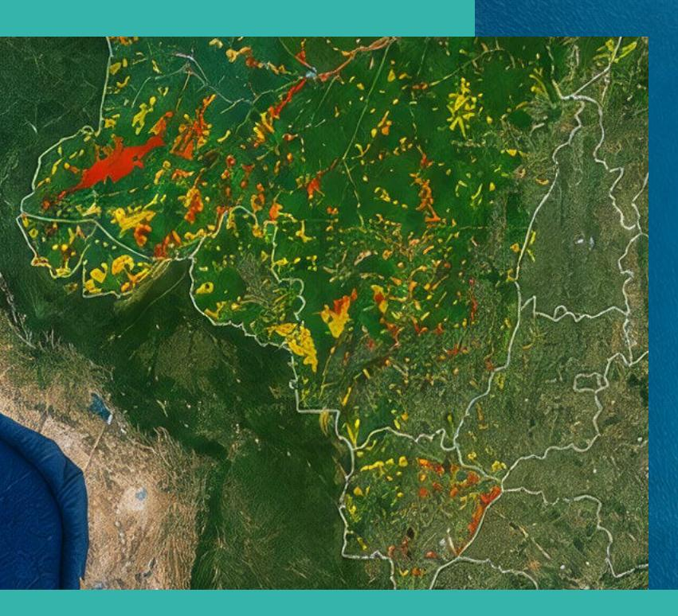

**How to Demonstrate Compliance with the EUDR Using the Public Platform**

# **The Agro Brasil+Sustentável Platform**

**AGRO BRASIL + SUSTENTÁVEL**

**The Agro Brasil+Sustentável Platform (AB+S) is a digital platform with national coverage, aimed at organizing and providing subsidies so that the Brazilian agricultural sector has the conditions to verify and demonstrate compliance with social and environmental requirements, ensuring transparency and credibility to market its products to strategic markets with growing demands**6 **. AB+S is one of the instruments of the Agro Brasil+Sustentável Program, instituted in December 2024 by MAPA Ordinance No. 745**7 **.** 

The implementation process of the Platform is led by the Secretariat8 of Rural Development of the Ministry of Agriculture and Livestock (SDR/MAPA) , with technical support from the Brazilian Agricultural Research Corporation (Embrapa) and the Federal Data Processing Service (Serpro), which is responsible for the digital architecture and development of the Platform9 . The first detailing of the AB+S structure was provided by SDI/MAPA Ordinance No. 721/202510 , which regulates the operational procedures of the Platform. Art. 3 of said ordinance outlines the objectives of Agro Brasil+Sustentável:

**▸** *"Electronically verify compliance by rural establishments with socioenvironmental requirements provided for in national legislation and, when necessary, integrating systems and information that promote the traceability of agricultural products, from the origin of inputs to their commercialization, as well as integrating private validations applied to production chains, enabling value and transparency, according to certification and good production practice requirements established by the Agro Brasil + Sustentável Program;*  **▸** *make available to the user the verification report of the socioenvironmental qualification of the rural establishment and the Report of eligibility for a discount in the Plano Safra;*  **▸** *enable the transformation of raw data into useful information for historical, territorial, and trend analyses that assist the public administration in decision-making in the formulation of public policies and in the definition of strategic actions and activities within the scope of the Agro Brasil + Sustentável Program; and*

**▸** *make consolidated information on Brazilian agricultural production available to public and private institutions, subject to express authorization from users registered on the AB+S Platform and responsible for the production of goods produced in the rural establishment."* 

It is important to mention that the development of the Platform has been occurring in a dynamic and adaptive manner. Since 2024, SDR/MAPA and SERPRO have been conducting intense engagement processes with relevant actors in agricultural production chains, and collecting technical inputs to incorporate more and more features into AB+S. This has been happening through a significant number of bilateral meetings and face-to-face technical seminars supported by GIZ, with the presence of a wide number of stakeholders from the private sector and civil society organizations.

As mentioned in item II of Article 3 of SDI/MAPA Ordinance No. 721/2025 , the Platform generates a socio-environmental qualification report of the rural establishment. With the qualification report and registration of a MAPA-recognized certification, producers can qualify for financing discounts under the Plano Safra. The report can also be used to generate evidence of EUDR compliance—which is fundamental to the scope of this report. This is done by checking a set of databases, initially listed in the Annex of SDI/MAPA Ordinance No. 721/2025, but which were subjected to continuous update processes to make the platform's analyses increasingly comprehensive.

To generate the socio-environmental qualification reports on the Agro Brasil+Sustentável Platform, the producer must comply with the following requirements, initially established by Art. 4 of SDI/ MAPA Ordinance No. 721/2025, but subsequently updated:

**▸** Have a registration in the GOV.BR portal; **▸** Be the owner of a rural establishment registered in the National Rural Registry System (SNCR), with a status other than canceled, linked to their Individual Taxpayer Registry (CPF) or to a National Corporate Taxpayer Registry (CNPJ) to which their CPF is linked as responsible in the GOV.BR11 portal ; **▸** The rural establishment registered in the SNCR must possess a Rural Environmental Registry (CAR) with an Active or Pending status, provided it is located in the same State (UF) and municipality.

If the owner possesses these data, they will be apt to perform a socio-environmental qualification analysis on the Platform. The databases consulted in this analysis are presented in Table 1.

#### **Set of databases used in the socio-environmental qualification analysis of the Agro Brasil+Sustentável Platform**

|            | DATABASE       | RESPONSIBLE      |                            |                             |
|------------|----------------|------------------|----------------------------|-----------------------------|
|            |                |                  | LEGAL BASIS                | VERIFICATION PROCESS        |
| Cadastral  | CPF            | Internal Revenue |                            |                             |
| Cadastral  | CNPJ           | Internal Revenue |                            |                             |
| Cadastral  | SNCR           | INCRA            | Law 5.868/1972             |                             |
| Geospatial | SIGEF-Geo      | INCRA            | Law 10.267/2001            |                             |
| Geospatial | CAR            | MGI              | Law 12.651/2012            |                             |
| Cadastral  | CAR            | MGI              | Law 12.651/2012            |                             |
| Cadastral  | Embargoes      | IBAMA and        |                            |                             |
| Geospatial | Embargoes      | IBAMA            | Law 12.651/2012            | Verification of whether the |
| Geospatial | Conservation   |                  |                            |                             |
|            |                | MMA              | Law 9.985/2000             | Verification on whether the |
| Geospatial | Public Forests | MAPA             |                            |                             |
| Cadastral  | List of Labor  |                  |                            |                             |
|            |                | MTE              | Interministerial Ordinance |                             |
| Geospatial | Indigenous     |                  |                            |                             |
|            |                | FUNAI            | Federal Const.             |                             |
| Geospatial | Quilombolas    |                  |                            |                             |
|            |                | INCRA            | Federal Const.             |                             |

At the end of 2025, a new feature was incorporated into the Agro Brasil+Sustentável Platform, complementary to the socioenvironmental qualification of the rural establishment: enabling the production area for export12. This feature seeks to provide a solution for analyzing deforestation on rural properties, a central requirement to provide compliance with the EUDR. To perform the enablement of a production area for export, the user must have previously performed (on the same day) the socio-environmental qualification of the rural establishment. Following this, when accessing this feature, the user can select the production chain corresponding to the exported product (livestock, soy, cocoa, coffee, palm oil, rubber, and wood) and draw production plots within the polygon of the establishment.

Once the plots are delimited, the Platform analyzes the overlap between these areas and deforestation alerts generated by the Satellite Deforestation Monitoring Program (PRODES), starting from 0.5 hectares. In the case of an absence of a deforestation record after 2020, the enablement of the production area for export is concluded successfully. The only exception to this logic is livestock, for which the Platform does not allow the drawing of plots, analyzing the incidence of deforestation across the total area of the property.

The platform enables the user to generate socio-environmental qualification reports from properties linked to their CPF, a CNPJ as well as properties in which they are a legal representative. From this data, all linked properties are checked in the National Rural Registry System (SNCR) database and the user chooses for which of them they must generate their qualification report. Once this report is generated, the user can perform the production area analysis for export. This, in turn, already considers the deforestation requirements of the EUDR, which will be explained later in this report.

Once qualified and enabled for export, the platform generates two files applicable to compliance with the EUDR: the compliance report with all EUDR requirements, generated from the union of the socioenvironmental qualification information of the rural establishment and the enablement of the production area for export – with a QR code for authenticating the analyses – and a GeoJSON file, which contains the coordinates of the property and plots, for the applicable chains. A visual representation of this process is presented in Figure 1.

#### **FIGURE 1**

**Flowchart for generating the socio-environmental qualification report and production area enablement for export on the Agro Brasil+Sustentável Platform**

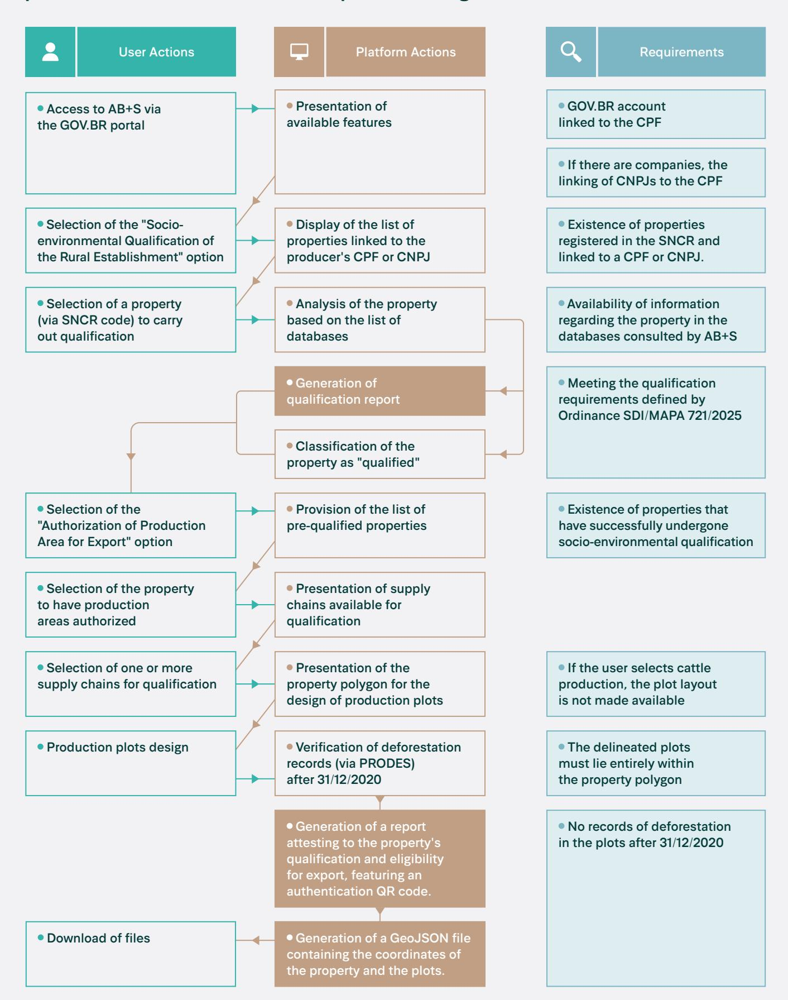

3

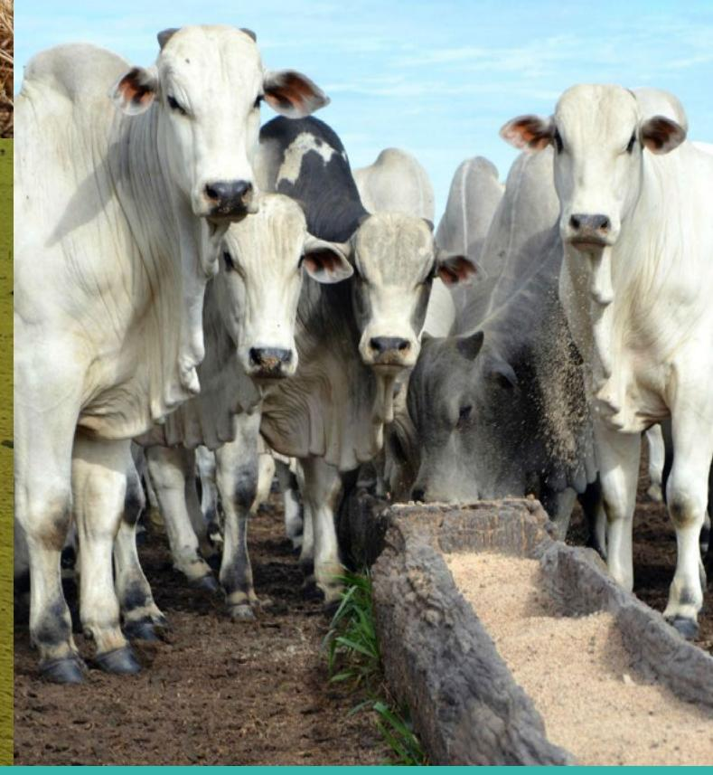

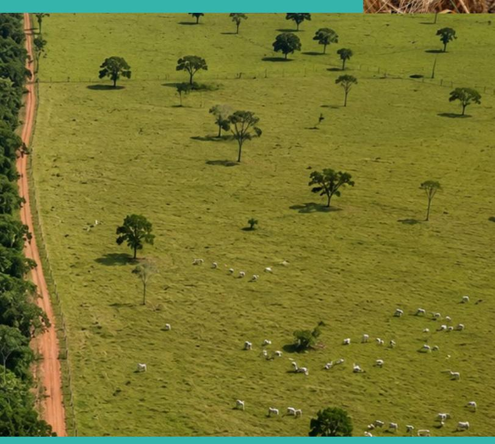

**How to Demonstrate Compliance with the EUDR Using the Public Platform**

# **Analysis Methodology**

**AGRO BRASIL + SUSTENTÁVEL**

**This report seeks to evaluate the applicability of the Agro Brasil+Sustentável Platform to the EUDR enforcement scenario based on two complementary fields of analysis: practical application and the robustness of the information provided, in light of EUDR requirements.** 

The field of practical application aims to understand how the AB+S Platform behaves in a use case under an EUDR enforcement scenario. For this purpose, a dry-run in the livestock chain was performed using the Platform. The second field – evaluating the information and data provided by AB+S – in turn, aims to understand how the Platform can contribute to composing the due diligence system of operators who make their products available on the European market, in compliance with the EUDR. For this, a comparative analysis was performed, considering: (a) what the EUDR requires; (b) what information is available in Brazil; (c) what AB+S provides.

#### **3.1.**

# **Livestock Dry-Run Methodology**

The dry-run consisted of executing a simulation of beef export to the European Union. The methodology had an adaptive character throughout the project, depending on the dynamism of interactions, and the fact that this dry-run was the first to use the Agro Brasil+Sustentável Platform as an instrument for providing information to subsidize the due diligence system required by the EUDR. The methodological design was structured under the premise that the production period of cattle encompasses the animal's entire life, from birth to slaughter. Due to this characteristic intrinsic to the livestock chain – which involves the transit of animals through cow-calf, stocker, and finishing properties (breeding, rearing, and fattening) – the evaluation required generating AB+S reports covering direct and indirect suppliers.

The success of the simulation depended on articulating a complex ecosystem of institutional and private actors,

each with a delimited and interdependent role. The actors involved in the process are presented below:

**▸ GIZ:** Through the SAFE project, acts as the contracting party of the project, performed supervision of interactions among actors, as well as the technical review of produced contents and the strategic validation of decision-making processes. **▸ MAPA:** Guaranteed the enablement of AB+S for the dry-run, providing technical support to actors, receiving generated reports for analysis, and capturing improvement feedback. **▸ OLAB:** Responsible for coordinating the process through engaging the necessary actors for implementing the dry-run, conducting bilateral and multilateral meetings, and formulating technical content and the final report. **▸ ABIEC:** The Brazilian Association of Meat Exporting Industries (ABIEC) was responsible for selecting and engaging with the partner meatpacking plant, in addition to monitoring the process. **▸ MEATPACKER:** the partner company for the pilot was JBS, which will be referred to as "meatpacker" or "meatpacking plant" during the report. Indicated by ABIEC, JBS was responsible for the process of supplier engagement, grouping them into a batch applicable for export to the Europeaan Union (which is in the process of being sent). Additionally, it made its traceability systems available to guarantee document integration. **▸ SUPPLIERS:** Engaged by the meatpacking plant, they were responsible for accessing AB+S, qualifying their properties, and issuing reports. Suppliers did not always issue reports directly, with cases where third parties (responsible for the suppliers' accounting or cattle brokers) were mobilized to generate them. **▸ SERPRO:** Performed constant technical support for the dry-run, providing instructions for registration in AB+S, collecting inputs for the development of the Platform, and contributing to technical analyses.

#### **FIGURE 2**

#### **Simplified representation of actors involved in the livestock dry-run**

The generation of reports occurred through a sequential and assisted process, since the architecture of the AB+S Platform requires that each producer access the system individually, using their GOV.BR portal credentials, or authorize (on the Platform itself) third parties to issue their reports. The first stage involved direct contact from the partner company with its direct suppliers, presenting the benefits of the platform and requesting the document's generation. At this point in the process, the meatpacking plant selected only one large-scale direct supplier, enabled to export to the European Union and possessing well-established relationships with indirect suppliers, facilitating contact and engagement for report generation. The interaction with the direct supplier took place through a representative who actively monitored the process and contributed to engaging indirect suppliers.

Formulation: Olab.

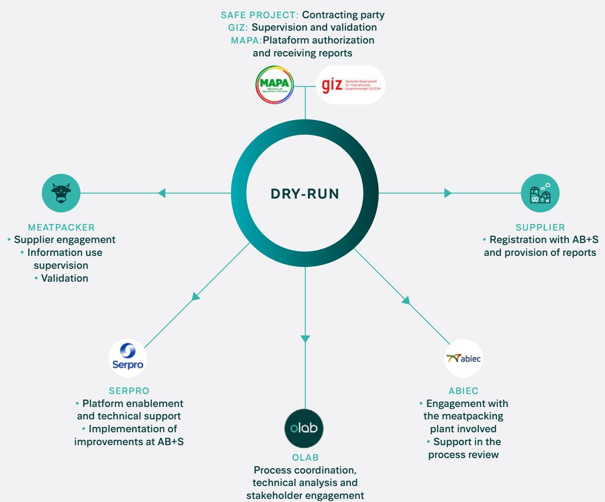

The second stage, focused on indirect suppliers, required the intermediation of the direct supplier so that the request reached the base of the chain. To overcome technological barriers and low initial engagement, actors involved in the project coordinated efforts that included providing manuals, conducting multiple online meetings for solving doubts, and creating a virtual chat for agile technical support. In this context, the role of the partner company was essential for the project's viability. Being the holder of the commercial relationship, only the company possessed the capacity to mobilize its supplier network. This engagement process was even more critical in a context where suppliers did not possess economic incentives nor a contractual obligation to send AB+S reports, given that it was only a simulation. For indirect producers — with whom the meatpacking plant does not have a contractual link —, the company had to mobilize trusted intermediary actors, such as accountants and cattle brokers, to enable submissions.

Additionally, the company enabled analytical integration by utilizing the *Plataforma Pecuária Transparente*, which consolidated Animal Transit Guides (GTA) and ensured traceability from birth to slaughter. The meatpacking plant also demonstrated the sector's power in inducing compliance by linking the emission of the AB+S report to its Cattle Origin Declaration (DOG). This process contributed to the meatpacking plant adopting the perspective of transforming, starting in 2027, checking on AB+S into a commercial prerequisite.

Beyond the platform's technical evaluation, it is understood that the dry-run can generate systemic benefits for the Brazilian agricultural sector, and specifically for the livestock chain. The tightening of relations with MAPA and SERPRO allowed the real pain points of the livestock chain to be mapped firsthand, accelerating the development of solutions. A technical summary of the dry run methodology is presented in Table 2.

#### **TABLE 2**

### **Simplified summary of the livestock dry-run methodology**

| DRY RUN MODEL | SUPPLIERS | TRACEABILITY      | SOCIOENVIRONMENTAL |
|---------------|-----------|-------------------|--------------------|
|               |           | by the Plataforma |                    |
|               |           | Transparente ,    |                    |

Formulation: Olab.

#### **3.2.**

# **Methodology for Analyzing Data Available in AB+S**

To evaluate the application of data currently available on the Agro Brasil+Sustentável Platform to EUDR requirements, this report will conduct a comparative analysis based on three layers that must be articulated to provide the necessary compliance evidence:

#### **▸ WHAT THE EUDR REQUIRES:**

Art. 3 of the EUDR points out that, for a product to be in compliance with the regulation, it is necessary that: (i) it is deforestation-free; (ii) it has been produced in compliance with the legislation of the production country; (iii) it is covered by a due diligence declaration. In this report, the analysis focus will be given to the first two requirements of Art. 3, evaluating how the AB+S Platform can provide evidence to attest compliance with these demands.

#### **▸ WHAT IS CURRENTLY AVAILABLE IN BRAZIL:**

Mapping the laws, databases, and monitoring systems currently existing in Brazil is fundamental, and must be done to evaluate their applicability for providing compliance evidence for the EUDR. This applicability is attained when available information is coordinated with EUDR requirements, a role fulfilled by the Agro Brasil+Sustentável Platform. The central reference used for surveying available information in Brazil is the report Laws of the Land: Mechanisms for Legal Compliance under the EUDR in Brazil13, produced by Olab in 2026, which already surveys the information. For this reason, the report will be used as a proxy, evaluating the possibilities of demonstrating compliance in Brazil.

#### **▸ WHAT AGRO BRASIL+SUSTENTÁVEL PROVIDES:**

The databases used by the Agro Brasil+Sustentável Platform to perform the socio-environmental qualification of the rural establishment are presented in Table 1. As mentioned, the main role of AB+S (in the context of the EUDR) is precisely to consolidate available information in Brazil in an articulated and responsive manner to the requirements of the European regulation. Thus, this report seeks to take one more step in the analytical construction process initiated in the report "Laws of the Land", seeking to understand the possibilities and operational limits of coordinating available information in Brazil to generate evidence of compliance with EUDR requirements.

Considering the sets of information outlined above, the analysis of the informational dimension of this report will be organized as follows: initially, an introductory chapter on EUDR requirements and how they articulate between declaration and due diligence system is presented. The following chapter, in turn, will analyze the coordination between EUDR requirements, available information in Brazil, and data provided by the Agro Brasil+Sustentável Platform.

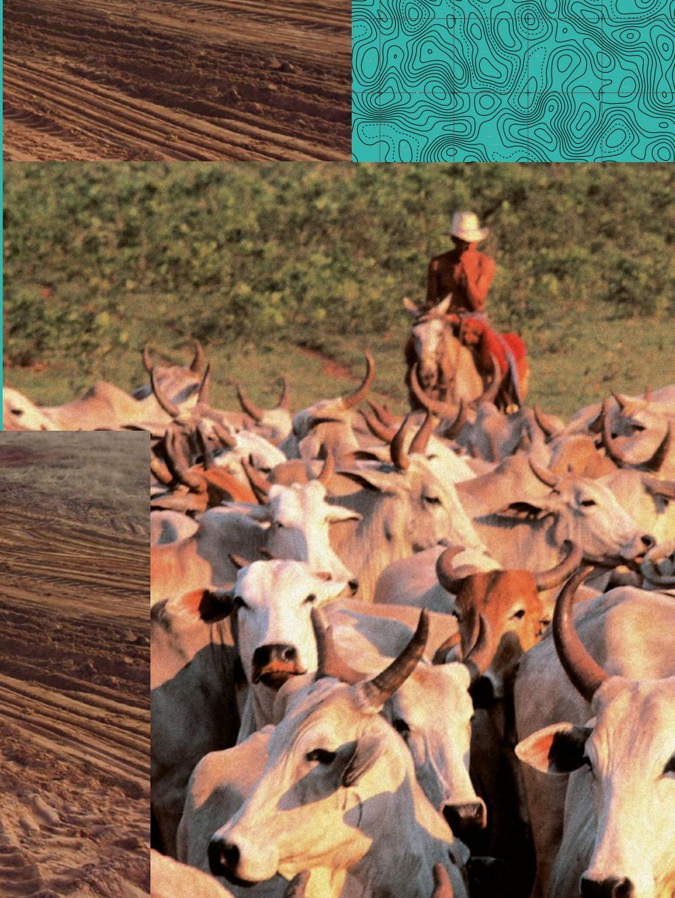

4

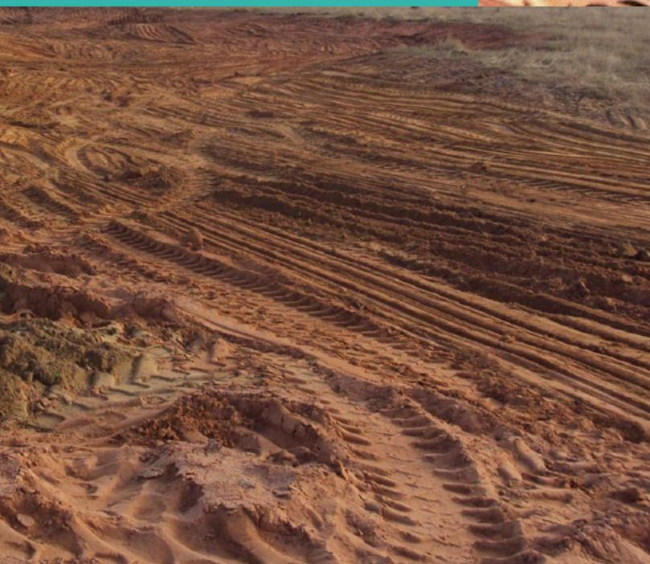

**How to Demonstrate Compliance with the EUDR Using the Public Platform**

# **Evaluating AB+S in a Practical Case: The EUDR Dry-Run in the Livestock Supply Chain**

**AGRO BRASIL + SUSTENTÁVEL** **As detailed in the methodology chapter, the primary objective of the dry-run in the livestock supply chain was to understand how AB+S performs in a practical application scenario under EUDR regulations. This chapter presents the dry-run, outlining its implementation process, the structures used to complement the AB+S Platform, and the key lessons learned from using AB+S within a complex value chain in a real-world scenario.**

#### **4.1.**

# **Structures for Traceability**

The AB+S Platform is not currently a traceability platform14 . Traceability is an essential component of agricultural and livestock supply chains—and even more strategic for the livestock sector given the need to identify the farms where an animal has been present from birth to slaughter. As will be shown in Chapter 5, the EUDR requires compliance with its legality and deforestation requirements across all farms throughout the value chain.

In this context, the AB+S Platform requires direct and indirect suppliers to individually carry out procedures for the socioenvironmental qualification of the farm and the authorization of production areas for export. Consequently, under the current setup, suppliers along the chain must generate their respective compliance reports via AB+S and submit them to the next supplier in the chain, who then passes them on to the slaughterhouse. The slaughterhouse, in turn, provides the information to the European Union operator, who is responsible for retaining the due diligence records for up to five years after the sale to accommodate potential verification requests from competent authorities.

As previously noted, the timeframe for analyzing farms under the EUDR must cover the entire production period15. Since an animal in the livestock supply chain passes through multiple farms, the analysis of each farm must cover the period ending when the animal leaves that specific property. An illustrative example—fictitious, not applicable to the dry run, and intended solely to illustrate the case presented—is shown in Figure 3.

#### **FIGURE 3**

#### **Illustrative example of animal life stages and AB+S report generation in the EUDR context.**

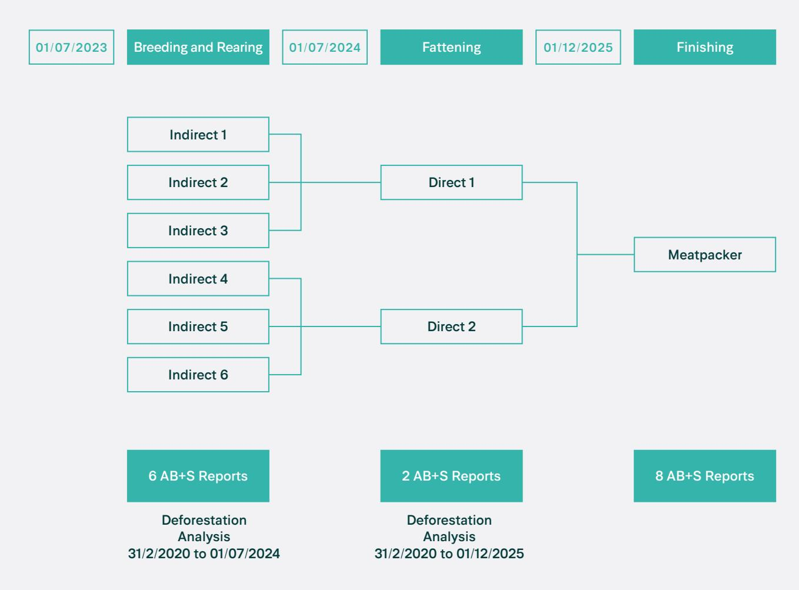

Formulation: Olab. Obs.: In accordance with Art. 1(2), and in line with the definition of "produced" in Art. 2(14), the EUDR does not apply to cattle (and derived products) born before the regulation entered into force—that is, before June 29, 2023 (Source: EUDR FAQ, 1.25).

To enable the verification of indirect suppliers, a traceability framework is required that creates a documentary link between suppliers along the supply chain. In the case of the dry run, the traceability architecture was built upon the combined use of the Animal Transit Permit (GTA) and the Rural Environmental Registry (CAR). The GTA is the official, mandatory document

for cattle transport in Brazil; its primary purpose is sanitary control, as it records the herd's movement history between establishments16. The CAR, in turn, is a public, self-declared registry that consolidates georeferenced information regarding the environmental and territorial aspects of rural properties. Further information on the CAR can be found in Chapter 6. Technical literature and industry studies indicate that crossreferencing GTA transit data with CAR spatial coordinates yields an "environmental snapshot" of the properties through which the cattle have passed17. This integration is considered a highly viable methodological strategy with great potential for scaling up traceability in the short term, as it enables socio-environmental monitoring not only of direct suppliers but—crucially—of the intricate network of indirect suppliers.

To facilitate traceability, the partner company utilized the *Plataforma Pecuária Transparente*18 (Transparent Livestock Platform), a free tool focused on cattle supplier management. The Platform performs rapid, fully automated socio-environmental analyses based on established sectoral compliance guidelines, such as Beef on Track Protocol. In the context of the dry run, the *Plataforma Pecuária Transparente* played a role in consolidating GTAs—information provided by suppliers via the Platform—thereby offering documentary support for cattle transit and establishing links between farms throughout the animal's life cycle (from rearing to fattening) and, consequently, the relationship between indirect and direct suppliers.

To complement the structuring of the movement history, the physical segregation of compliant batches at the source was ensured through the requirement of the Cattle Origin Declaration (DOG). The DOG is a verification document generated by mapping successive Animal Transport Permits (GTAs); it serves to attest to the links and commercial flow among all rural properties comprising the production cycle of a specific batch. The document features different levels of depth, with the "Type 1 and Type 2" model being the standard adopted for EUDR compliance, as it requires tracking the full life cycle (covering breeding, rearing, and fattening). The DOG acts as a risk mitigation tool, given that its issuance is contingent upon the prior socio-environmental compliance of the farms involved in the animal's journey. Thus, the declaration safeguards the chain of custody prior to shipment, ensuring that the slaughterhouse receives and processes only cattle that fully meet the requirements regarding legality and the absence of deforestation. With the EUDR in effect, the

integration of the DOG into AB+S analyses can be envisaged. It is also worth noting that the DOG can meet requirements beyond the EUDR, such as those of sectoral and/or commercial protocols.

#### **4.2.**

## **Supplier Engagement for the Generation of AB+S Reports**

As highlighted in the section on the dry-run methodology, the partner meatpacking plant served as the primary link to the suppliers. The company selected suppliers with whom it maintains solid business relationships and invited them to participate in the dry-run. A high-volume supplier—one with recurring business transactions with the company and authorization to export to the European Union—was engaged to generate the reports in the AB+S system. Due to the large scale of its operations, this supplier has its own internal team, with contact established through a third party responsible for accounting.

Prior to actual engagement, meetings were held with the partner company so it could learn how to access the AB+S system and generate the necessary reports; it was required to present the procedure to the direct supplier and conduct a test run before generating the final document. This engagement phase, led by the partner company with its supplier, was crucial in securing the participation of the supplier's representative in a meeting with representatives from MAPA and SERPRO. During that meeting, the report was generated in real-time, allowing for the clarification of any questions with the platform's technical staff.

This preliminary engagement facilitated knowledge transfer to the supplier regarding the AB+S Platform and enabled contact with indirect suppliers—a fundamental aspect of reporting to ensure traceability within the livestock supply chain. In addition to this engagement process, other activities were required to ensure that indirect suppliers entered their data into the platform. These included sharing a step-by-step manual on using the AB+S system and setting up a virtual chat to address specific questions from producers. Furthermore, additional online meetings were held to monitor the process.

As was the case with the direct supplier, mobilizing indirect suppliers involved the participation of third parties, such as accountants and livestock brokers. In this regard, the platform feature enabling third-party registration proved essential for generating the reports.

Despite this support structure, the dry run revealed substantial obstacles regarding producer participation. The primary challenge lay in the perception of the process as a bureaucratic burden competing with the demanding daily routine in the field. Since it was a trial run with no mandatory requirement at the time, suppliers often viewed generating the reports as a commercial "favor," highlighting the fragility of models that lack tangible incentives or compliance enforcement mechanisms. In addition to this initial resistance, there were technical hurdles, such as the inability of some suppliers to generate the reports. One supplier reported that their facility's socio-environmental qualification had been blocked, yet there was no clear understanding of the underlying cause or the steps required to achieve compliance.

#### **4.3.**

## **Results and Learnings**

Based on user feedback—from the direct supplier and the partner company interacting with indirect suppliers—the general view was that the AB+S Platform proved technically simple and functional, allowing reports to be generated in about two minutes, provided the properties showed no compliance issues. The main obstacle to the process was not technical in nature but rather related to incentives; given the pilot's voluntary nature, organic uptake was low. Faced with demanding operational routines in the field, the requirement for individual access via the GOV.BR portal meant that producers often perceived report generation as a bureaucratic burden and a mere commercial "favor." Consequently, reaching the furthest links in the supply chain proved highly dependent on intermediaries, such as accountants and livestock brokers. Other challenges encountered during the process are listed below:

**▸ LINKING CPF AND CNPJ.** Suppliers highlighted the difficulty of qualifying rural establishments linked to CNPJs (corporate tax IDs), given the need for CPF (individual tax ID) representation before the Federal Revenue Service. This required a prior link between the CPF and the CNPJ—a procedure that can be performed within the GOV.BR19 system. These steps were not explicitly detailed on the AB+S Platform, but the challenge was resolved following technical support from the SERPRO team. **▸ COMMUNICATION OF NON-COMPLIANCE.** During the testing phase, some farms were unable to generate reports due to issues with the Rural Environmental Registry (CAR), yet producers could not identify the specific problem. This highlighted

the need for the platform to clearly state the nature of the restriction—such as pending CAR issues, IBAMA embargoes, or deforestation flagged by PRODES—and to indicate the steps required for the producer to achieve compliance.

**▸ TECHNOLOGICAL BOTTLENECK REGARDING INDIVIDUAL ACCESS.** The requirement for each producer to access the system individually using GOV.BR portal credentials to submit PDF reports to the meatpacker hindered scalability, highlighting the need to develop an API (Application Programming Interface) integration for mass data processing and receipt, as well as for report authentication. Furthermore, stakeholders proposed developing a consent mechanism allowing the producer to authorize the meatpacker to access and generate their qualification status directly on the Platform. SERPRO is currently developing this feature, largely driven by the dialogue and insights gained during the dry-run, which underscored the importance of this technological improvement.

It is also worth noting the need for private systems to ensure traceability during the dry-run. The AB+S Platform is not a traceability system, nor does it aim to map animal movements throughout the supply chain. Consequently, another significant challenge involves the use of complementary systems; the *Pecuária Transparente* (Transparent Livestock) Platform was used for this dry-run. Another relevant point is that the dry-run involved a large-scale direct supplier with an extensive infrastructure capable of meeting the pilot's requirements and procedures. This scenario does not reflect the reality of all rural properties in Brazil; broader engagement with small and medium-sized producers is necessary to understand their perspectives on using the Platform.

Despite the challenges encountered, the pilot also demonstrated that the AB+S Platform is well-positioned to become an essential tool for proving compliance with the EUDR once the regulation comes into effect. Key factors supporting this include:

**▸ CONSOLIDATION AND INSTITUTIONAL RECOGNITION.**  The pilot demonstrated the strategic value of AB+S acting as an official government repository. This standardizes verification criteria and reduces the sector's reliance on private providers, which can yield conflicting assessments

**▸ POTENTIAL FOR INTEGRATION WITH PRIVATE PROTOCOLS.**  A strategic opportunity was identified for the platform to evolve and issue reports combining EUDR requirements with private purchasing policies already established by meatpackers—such as the Beef on Track Protocol. Furthermore, the AB+S infrastructure could be expanded to cover the entire national supply chain—going beyond just exports—thereby standardizing compliance processes for meatpackers and producers nationwide. **▸ DIRECT COMMUNICATION AMONG KEY STAKEHOLDERS.** The dry-run fostered dialogue between a strategic player in the cattle supply chain, MAPA, and SERPRO. This enabled the identification of actual operational bottlenecks in the cattle sector and accelerated the planning of integrations and improvements. This reinforces the platform's adaptive nature—an essential quality for ensuring that, through continuous improvement, it becomes increasingly aligned with the EUDR and the realities of supply chains. **▸ IDENTIFICATION OF NON-COMPLIANCE.** The fact that the dry-run recorded instances where AB+S reports could not be issued is not entirely negative; rather, it presents an opportunity for producers to regularize their status before the EUDR comes into force. With the exception of one case where the producer did not acknowledge the reason for the block, the platform accurately identified non-compliant properties—such as those with environmental liabilities due to deforestation detected after December 31, 2020, or issues linked to the Rural Environmental Registry (CAR).

5

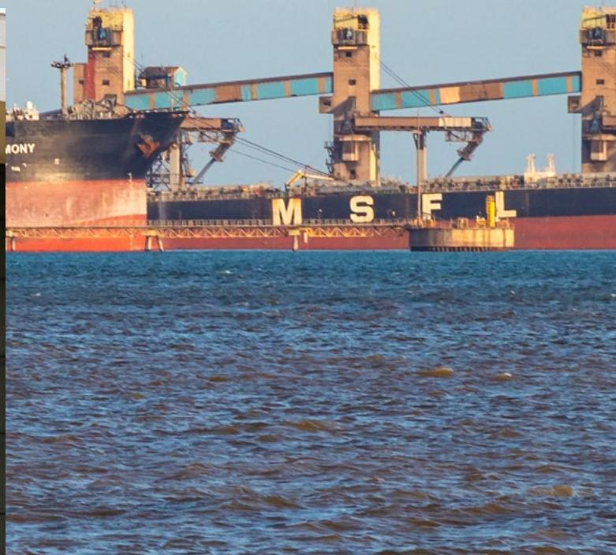

**How to Demonstrate Compliance with the EUDR Using the Public Platform**

# **EUDR Requirements**

**AGRO BRASIL + SUSTENTÁVEL**

**The European Union Deforestation Regulation**20 **(EUDR) is a regulation that forms part of a broad strategy of the European Union to reduce its emissions and its contribution to biodiversity loss. With the EUDR, there is an expectation by the European Commission that citizens of the economic bloc do not have their consumption as a contributing factor to the advance of deforestation and forest degradation globally**21 **.** 

This European strategy forms part of the framework of the European Green Deal. Launched by the President of the European Commission Ursula von der Leyen in 2019, the Deal aims to make Europe the first climate-neutral continent in the world, and establishes a target to reduce emissions by at least 50% by 2030, and attain climate neutrality by 205022. Guidelines for the materialization of these targets are provided by the European Climate Law23 .

Published in 2023, the EUDR was scheduled to enter into force as of December 30, 2024. This expectation, however, did not materialize. On December 18, 2024, a first postponement of the regulation was approved to December 30, 2025, with the purpose of allowing exporting countries, Member States, and involved companies to have more time to prepare to comply with their due diligence obligations24. A second postponement came on December 18, 2025, moving the entry into force of the EUDR to December 30, 2026, with an additional period of six more months for micro and small operators. The reason for this new postponement was grounded in concerns of Member States regarding their administrative obligations and the capacity of the EUDR information system to receive the huge volume of documents that will be sent when the regulation is in force25 .

From the entry into force of the EUDR, to make their products available on the European market, operators will have to comply with the following requirements presented in Article 3 of the regulation:

**▸** That products are deforestation-free; **▸** That products have been produced in compliance with relevant legislation in the production country; **▸** That products are covered by a due diligence declaration. The paths to comply with these requirements are outlined by the other articles of the EUDR. In the following sections, some essential components for the analysis of this report will be detailed. Among them, it is worth mentioning:

**▸ ART. 2:** presents definitions of relevant terms for understanding the implementation of the EUDR; **▸ ART. 9:** lists the data, information, and documents necessary to demonstrate the compliance of exported products; **▸ ART. 10:** introduces guidelines for the operator to perform a risk assessment of non-compliance, targeting exported products and the production country; **▸ ART. 11:** details risk mitigation measures to be taken by the operator if it is identified that there is a non-negligible risk of non-compliance; **▸ ART. 12:** coordinates guidelines from Articles 9, 10, and 11 in the due diligence system; **▸ ANNEX 2:** provides a template for constructing the due diligence declaration.

In addition to the legislative text of the EUDR itself, there are also two documents whose purpose is to support the implementation of the regulation, providing information to involved actors and detailing the necessary procedures to demonstrate compliance. These documents are:

**▸ FREQUENTLY ASKED QUESTIONS (FAQ):** gathers answers from the European Commission to questions from stakeholders impacted by the EUDR, providing clarity on relevant aspects of the regulation's implementation26 . **▸ GUIDANCE:** document that gathers practical information, detailing of terms, and other resources to support companies and Member States in implementing the EUDR27 .

The sections presented below utilize these documents as a basis to detail points of the EUDR applicable to this report, providing context and a foundation for the analyses performed.

#### **5.1.**

### **Due Diligence**

Compliance with EUDR requirements can be done in two parts: through the declaration and the due diligence system. Before understanding how this must be done, it is fundamental to present the actors involved in this process, as well as their respective responsibilities. Some of these actors will be mentioned repeatedly throughout the text, and their definitions are presented below:

**▸ PRODUCER.** The EUDR defines the act of "producing" as cultivating, harvesting, obtaining, or raising relevant commodities in the respective polygons of land. Except for rare exceptions (where they act as Micro or Small Primary Operators within the EU itself), primary producers located outside Europe do not fit directly into definitions of exporters, operators, or traders. Producers located in third countries do not possess direct obligations in the context of the EUDR, so that the burden of proving legality is not attributed to them. **▸ EXPORTER.** This refers to the company with legal headquarters in the country of origin, responsible for marketing produced commodities with the operator located in the European Union. The EUDR does not possess sanctioning power over the exporting company. Art. 7 of the EUDR establishes that when a legal entity established outside the EU makes products available on the European market, the first European legal entity to make these products available on the market becomes the operator. **▸ OPERATOR.** This refers to any natural or legal person who, in the course of a commercial activity, places relevant products for the first time on the European Union market. If the exporting company from the origin country is not in the European Union, the first European buyer to receive the cargo becomes the operator. It is on the operator that the main due diligence requirements of the EUDR fall, which must be fulfilled before products are made available on the bloc's market. Finally, an operator cannot delegate its legal responsibility under the EUDR. Even when hiring authorized representatives or using third-party certifications, sanctioning responsibility for violations of Art. 3 remains entirely with the operator. **▸ TRADER.** This refers to any natural or legal person in the supply chain, other than the Operator (or downstream Operator), who, in the course of a commercial activity, makes relevant products already placed on the European Union market available (example: retail companies, distributors, and other intermediaries). Traders must collect and retain, for at least five years, information about the direct

partners with whom they operate. Traders that are not small and medium-sized enterprises must register in the EU Information System and file reference numbers received from direct suppliers.

It is noted, therefore, that the main actor responsible for ensuring that products made available on the European market comply with the due diligence requirements of the EUDR is the operator. It is up to them to ensure that relevant information about the origin of products in the production country is transferred along the links of the chain so that compliance with EUDR requirements is demonstrated. Although Brazilian companies do not possess legal obligations nor a burden of proof of compliance under the EUDR, the established commercial agreement presupposes that sending products is done alongside relevant information for the operator (otherwise, the operator tends to look for other commercial origins that guarantee conditions for products to be made available on the European market). This commercial relevance of companies with legal headquarters is even more latent when they form part of a multinational group, which includes the Brazilian legal entity (exporter) and the European one (operator).

The due diligence declaration is the document to be sent together with exported cargoes to the European Union, a process that must be done by the operator in the EUDR Information System28 . The template for a due diligence declaration is presented in Annex 2 of the EUDR, which lists requirements such as:

**▸** Information about the operator; **▸** Information about exported products; **▸** Information about the production country; **▸** Information about the geolocation of all polygons where commodities were produced.

It is important to mention that the requirement for geolocation of production polygons is one of the factors of the EUDR that are decisive for the need to trace products back to their origin. This requirement is even more strategic in the livestock chain, given the characteristic of animal transit along their development until slaughter.

In addition to the due diligence declaration, the EUDR also requires, in its Article 12, that operators establish a due diligence system, with the purpose of ensuring that products commercialized with

the European Union comply with the requirements of Article 3. Operators must update this system annually, publicizing its results and compliance improvements. The annual report constructed from the due diligence system must contain:

**▸** A summary of information required in Article 9; **▸** The conclusions of the risk assessment required by Article 10, mitigation measures relating to Article 11, and a description of information and evidence necessary to assess risk; **▸** When applicable, a description of the consultation process with indigenous peoples, local communities, and other traditional land tenure rights holders or civil society organizations present in production areas.

Operators must maintain this due diligence information for at least five years, making it available to competent authorities in case of request.

#### **5.2.**

# **Article 9: Information, Data, and Documents**

Article 9 of the EUDR is central in due diligence analysis, since it establishes the entire set of information, data, and documents that demonstrate that products comply with requirements of Article 3 of the EUDR. With this in mind, it is requested that operators collect, organize, and store such information for five years from the date products are made available on the European market. This information must be provided to competent authorities upon request. The set of information, data, and documents requested in Art. 9 is presented below:

**▸** Description and trade name of commodities; **▸** Quantity of commodities; **▸** Country of production (and, when relevant, parts of the country); **▸** Geolocation of all polygons in which commodities were produced, as well as the production period; **▸** Name, address, and email of all suppliers; **▸** Conclusive and verifiable information that commodities are deforestation-free;

**▸** Conclusive and verifiable information that commodities were produced in accordance with relevant legislation in the production country.

Points (f) and (g) listed in Art. 9 are precisely those referred to in Art. 3, established as key criteria for a product's compliance with the EUDR. They are, therefore, the two key points of analysis in the next chapter. Thus, it is worth bringing here definitions of what the EUDR establishes as "deforestationfree" and "relevant legislation in the production country".

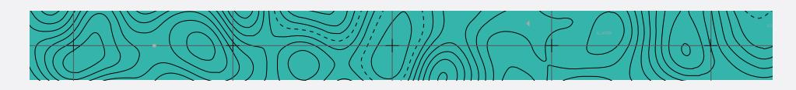

#### **5.2.1. Deforestation**

The first requirement of compliance with the EUDR, indicated in Article 3, is "that exported products are deforestation-free". To understand this requirement, it is necessary to resort to some definitions presented in Art. 2 of the EUDR.

**▸ DEFORESTATION:** the conversion of forests to agricultural use, whether of human origin or not; **▸ FOREST:** a plot of land extending over more than 0.5 hectares, with trees higher than 5 meters and a canopy cover degree of more than 10%; **▸ DEFORESTATION-FREE:** that products have been produced on land that has not been subject to deforestation after December 31, 2020

These three definitions provide a basis for the compliance analysis with the EUDR deforestation requirement, which will be discussed in the following chapter.

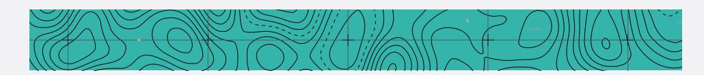

#### **5.2.2. Relevant Legislation in the Production Country**

Art. 2 (40) of the EUDR defines "relevant legislation in the country of production" as the set of laws applicable to define the legal status of the production area in terms of:

**▸** Land use rights; **▸** Environmental protection; **▸** Rules related to forests, including forest management and biodiversity conservation, when directly related to timber harvesting; **▸** Third-party rights; **▸** Labor rights; **▸** Human rights, protected by international law; **▸** The principle of Free, Prior and Informed Consent (FPIC), as established by the United Nations Declaration on the Rights of Indigenous Peoples; **▸** Tax, anti-corruption, commercial, and customs regulations.

Considering that the focus of the dry-run was beef export to the European Union, requirement (c) of legality (directed at timber production) is not an object of this analysis. To conclude the presentation of EUDR requirements, it is necessary to answer three fundamental questions: (1) What is the scope of analysis of the requirements?; (2) Who is responsible for defining what is relevant legislation in the production country?; (3) What compliance analysis period should be considered in due diligence systems? All questions have detailing provided by the EUDR Frequently Asked Questions (FAQ) document29 .

#### **5.2.3. Scope of the Requirements Analysis**

Requirements (f), of deforestation, and (g), of legality, of Art. 9 have distinct analysis scopes. This is explained by item 1.15 of the FAQ document. This divides a fictitious property into three areas:

**▸ AREA A:** the property; **▸ AREA B:** polygon within A, in which the commodity is produced; **▸ AREA C:** area within A, but not overlapping B.

The analysis scope of the deforestation requirement extends to Area B, where commodity production occurred. If, for example, Area C was deforested after 2020, this deforestation does not violate requirement (a) of Art. 3 of the EUDR, since its analysis scope is exclusive to the production polygon (Area B). The only commodity in the scope of the EUDR that differs from this criterion of polygon separation is cattle30, given that the animal moves over time.

On the other hand, the legality scope is applicable to the entire property (Area A). If, therefore, deforestation in Area C was illegal, then the legal status of Area A is compromised and, with this, Area B is also impacted, making the produced commodity non-compliant with requirement (b) of Art. 3 of the EUDR. ▸

The second question (who is responsible for defining relevant legislation) can be answered with evidence from topic 1.10 of the EUDR FAQ document, according to which:

*"If farmers are legally authorized to sell their products according to national laws (...), this would also mean that operators (or traders that are not SMEs) would meet the legality requirement when buying from those farmers."*

#### **BOX 1**

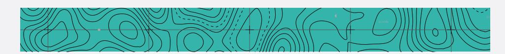

#### **How does this apply to AB+S?**

The reports generated by the Agro Brasil+Sustentável platform already consider this distinction of analysis scopes. The platform analyzes production legality at the moment of the "socio-environmental qualification of the rural establishment", and offers a module for "analysis of production area for export", in which the user can delimit production plots, specifying the area for verification of deforestation after 2020. The only case in which this is not applicable is cattle production, where the entire property is considered in deforestation analysis, respecting EUDR demands.

The passage points to the autonomy of production countries in defining relevant legislation, so that if the product is legally marketable in the country of origin, it must be considered legal in the European Union. The responsibility for proving legality lies with the operator (European importer), which has the due diligence to demonstrate that products comply with applicable laws in the country of origin. ▸

Finally, the third question (what compliance analysis period should be considered) is relevant for defining the temporal scope of due diligence. Art. 9 (d) of the EUDR establishes that operators must provide the geolocation of where commodities were produced, as well as the date or production period of such commodities. The definition of "production date" and "production period" is provided by item 1.25 of the EUDR FAQ, and again presents a differentiation between cattle and the rest of commodities:

**▸ CATTLE:** the production period refers to the totality of the animals' lives, from their birth until slaughter. In this case, the concept of "production date" is not applicable. **▸ OTHER COMMODITIES:** the production date refers to the moment of harvesting commodities, while the production period considers the duration of the production process. If more precise information is not available, it is possible to use the harvest period as a reference.

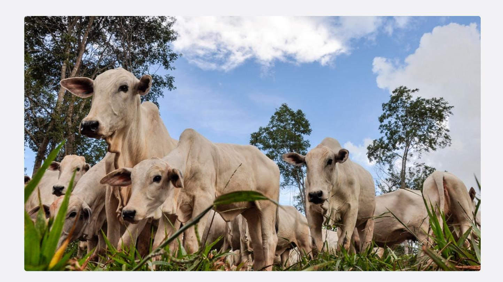

#### **BOX 2**

#### **How does this apply to AB+S?**

The production legality analysis, performed by AB+S in the socio-environmental qualification of the rural establishment, considers a verification scope defined by the Brazilian government. The definition process is collaborative, with strong dialogue with ministries and public bodies responsible for administering data sources verified by the Platform. Furthermore, it is worth mentioning that AB+S is a Platform of an evolutionary character, which is subjected to frequent updates to make it even more capable of performing qualified analyses of rural properties.

Another differential of the livestock chain, however, is the fact that animals pass through more than one farm during their entire lifespan. For this reason, an analysis covering the totality of the animal's life is required, aggregating information about the periods spent in each property, from birth until slaughter. ▸

#### **5.3.**

## **Which EUDR Due Diligence Requirements Can AB+S Meet?**

Before entering the analysis of EUDR requirements, it is important to close Chapter 4 of this report by connecting information generation flows of the AB+S Platform to due diligence demands made by the EUDR. This contextualization is relevant for generating an understanding of how to utilize reports produced by the Platform to support producing evidence of compliance with the EUDR. It is worth mentioning, however, that the Platform has been subjected to frequent improvement processes, so its capacity to meet EUDR due diligence requests can expand.

Another important disclaimer is the fact that, although users of the Platform are rural producers, the agent responsible for applying information generated by AB+S to EUDR requirements is the operator. Just as the operator is the destination of exported commodities, they are also the receptor of the AB+S report flow, being responsible for receiving information, storing it, and utilizing it to provide compliance with the EUDR through the declaration and due diligence system. AB+S reports, therefore, are transferred from the first to the last link of the custody chain, together with other information and documents essential for concluding the commercial process. A representation of the AB+S report flow along the custody chain is presented in Figure 4.

#### **BOX 3**

#### **How does this apply to AB+S?**

Considering the livestock chain, generating evidence for compliance with the EUDR requires generating reports that cover the entire life span of commercialized animals. With this in mind, it is necessary to obtain reports from all suppliers (direct and indirect) of an exported meat batch, so that each report must cover an analysis period that ends when animals leave the property. As mentioned previously, the requirement to obtain information from the birth farm requires full traceability of animals composing the exported batch. At the moment of this report's publication, traceability is not yet covered by AB+S, so systems and mechanisms complementary to the Platform are necessary to ensure all animals are traced back to origin.

#### **FIGURE 4**

#### **Schematic representation of report flows generated by AB+S along the custody chain**

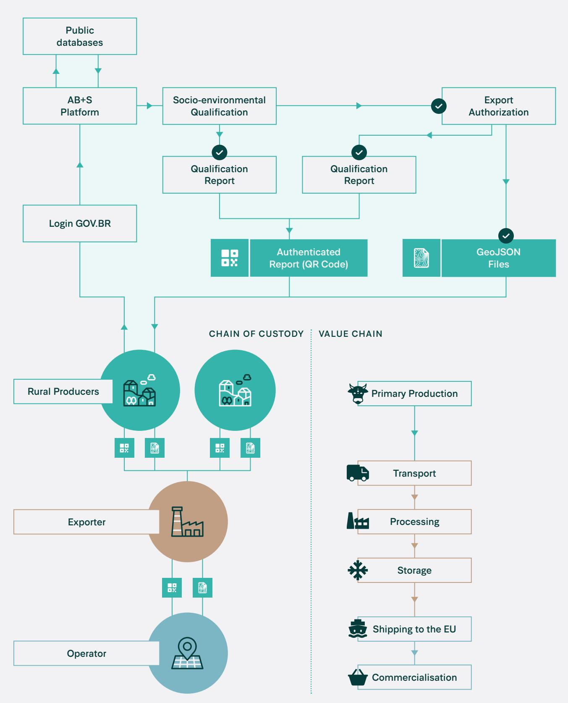

This requires a robust traceability structure, ensuring it is possible to link the ends of the custody chain, and thus verify information of rural properties. As informed in section 4.1 of this report, compliance with EUDR demands takes place through the due diligence declaration and due diligence system. The due diligence declaration is submitted in the EUDR Information System and contains info about the operator and exported products. Among this info, the geolocation of all production polygons (plots of land) of commodities must appear. Geolocation data can be generated by the AB+S Platform at the moment the user performs the drawing of plots for enabling production areas for export. One of the outputs provided by AB+S is a GeoJSON file with plot geolocations, which can be used in submitting data to the EUDR Information System.

Regarding the due diligence system, AB+S can also support the information generation process, mainly regarding those required by Article 9 of the EUDR, pointed out in section 4.2 of this report. In this sense, it is worth evaluating if socio-environmental compliance reports, allied to enabling production areas for export, can provide compliance evidence with points (f) and (g) of Art. 9 of the EUDR. The objective of the following chapters is to outline to what extent the AB+S Platform is capable of really fulfilling this proposal, and what must eventually be complemented by the operator.

The due diligence system must still be composed of risk assessment (Art. 10) and risk mitigation measures (Art. 11) and, when applicable, by a description of the consultation process with indigenous peoples, local communities, and other traditional land tenure rights holders or civil society organizations present in production areas. This information must be generated and monitored based on internal procedures of operators. The AB+S Platform does not propose to cover such analyses, given they are highly specific to each territorial and production context, not being subject to a federal and intersectoral standardization process. A summary of this overview of AB+S applicability and operators' assignments in providing due diligence information required by the EUDR is presented in Figure 5.

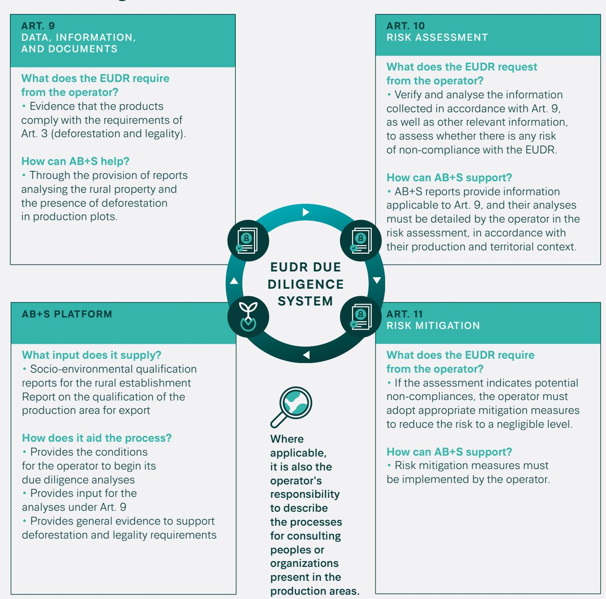

#### **FIGURE 5**

#### **Overview of using AB+S for providing EUDR due diligence information**

Information generated by the due diligence system to be instituted by operators must not be submitted in the EUDR Information System, but rather maintained by operators for up to five years, and made available to competent authorities upon request. Thus, socio-environmental compliance reports produced by AB+S do not need to be immediately sent to competent authorities.

Considering the information presented above, the objective of the following chapters is to analyze the capacity of AB+S to provide strategic evidence for composing due diligence documents requested by the EUDR.

Sources: EUDR and Agro Brasil+Sustentável Platform. Formulation: Olab.

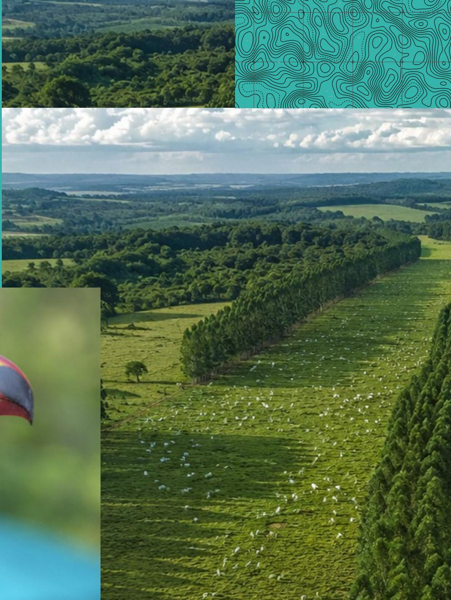

6

**How to Demonstrate Compliance with the EUDR Using the Public Platform**

# **Application of AB+S for the EUDR Deforestation Requirement**

**AGRO BRASIL + SUSTENTÁVEL**

#### **6.1.**

## **Available Information**

The main public monitoring system for deforestation in Brazil, administered by the National Institute for Space Research (INPE), is the Satellite Deforestation Monitoring Project (PRODES). PRODES has monitored deforestation occurrences in Brazil since 1988, initially considering clear-cut records in the Legal Amazon. Starting in 2016, monitoring expanded to the Cerrado biome and subsequently to all Brazilian biomes. The main objective of PRODES is to produce data on annual deforestation rates in the mentioned regions, subsidizing public policies implemented by the Federal Government. For this, the project analyzes satellite images of the LANDSAT class, with a spatial resolution of 20 to 30 meters, and a revisit rate of approximately 16 days. Studies point out that the accuracy rate provided by PRODES is about 95%31 .

As highlighted in the previous chapter, Art. 2 of the EUDR presents definitions applicable to deforestation monitoring to define compliance parameters with Art. 3(a):

**▸ DEFORESTATION:** the conversion of forests to agricultural use, whether of human origin or not; **▸ FOREST:** a plot of land extending over more than 0.5 hectares, with trees higher than 5 meters and a canopy cover degree of more than 10%; **▸ DEFORESTATION-FREE:** that products have been produced on land that has not been subject to deforestation after December 31, 2020.

To provide compliance, therefore, it is necessary that deforestation monitoring considers areas with at least 0.5 hectares. PRODES results began to be disclosed with a minimum area of 6.25 hectares to indicate deforestation. In order not to contaminate the historical series, data continue to consider this level, but updates allowed greater detailing of deforestation. Starting in 2016, INPE began to identify deforestation in polygons starting from 1 hectare, which became available on the TerraBrasilis Platform32. In 2025, however, the necessary change occurred. At the request of MAPA, INPE began to make available data and historical series of deforestation in polygons of 0.5 hectares, thus complying with EUDR requirements33. The main objective of this update is use by the Agro Brasil+Sustentável Platform.

#### **6.2.**

## **Verification Procedures**

As already presented in the introduction chapter to the Platform, AB+S provides compliance evidence for the deforestation requirement (Art. 3-a) of the EUDR through the feature of enabling production areas for export. The user, when accessing this feature, draws production plots within the establishment's polygon, submitting them to overlap analysis with deforestation records identified by PRODES, considering areas of at least 0.5 hectares and after December 31, 2020. For livestock, there is no enablement of plot drawing, with the entire property being checked.

#### **6.3.**

## **Results and Discussion**

Based on information presented above, it is possible to conclude that verification procedures provided by Agro Brasil+Sustentável are fully adherent and capable of providing evidence for compliance with the EUDR deforestation requirement. The Platform utilizes data from a public instrument of reference in the world, with almost forty years of application, and is capable of mapping deforestation records according to precision levels required by the EUDR.

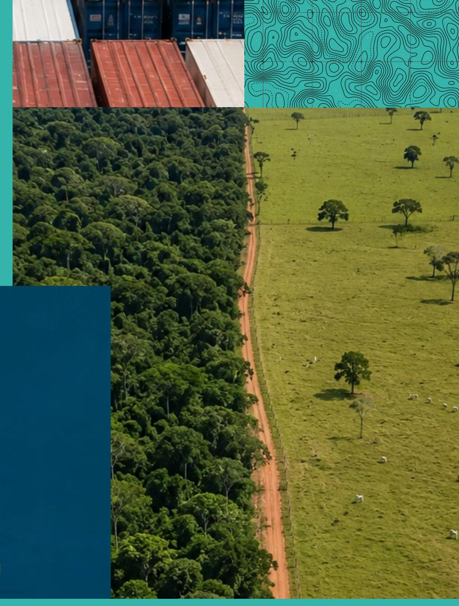

7

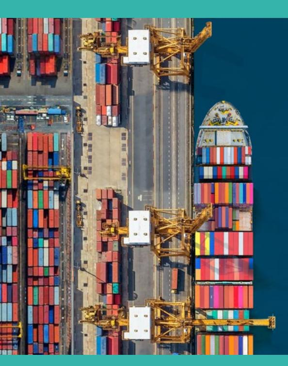

**How to Demonstrate Compliance with the EUDR Using the Public Platform**

# **Application of AB+S to EUDR Legality Requirements**

**AGRO BRASIL + SUSTENTÁVEL**

# **As presented in this report's methodology, analyses about the application of AB+S to provide compliance with EUDR requirements map three sets of information: (a) what the EUDR requires; (b) what is available in Brazil; (c) what AB+S provides.**

A prior mapping of available info in Brazil is made in the report "Laws of the Land: Mechanisms for Legal Compliance under the EUDR in Brazil"34, formulated by Olab with support from the Embassy of the Netherlands in Brazil, which will be used as a basis in constructing analyses. Adopting this reference approach to the report is done with the purpose of avoiding redundancies, given that Olab – responsible for this report – already performed mapping of this info. Furthermore, there were no significant changes in the understanding presented by Olab in the report "Laws of the Land", given that it was launched in February 2026 – a short space of time in relation to this report's publication.

The report Laws of the Land proposes utilizing the concept of "compliance instruments", defined as information that fulfills, simultaneously, the following conditions:

**▸** Be based on at least one legal provision; **▸** Be administered by a public institution; **▸** Be made publicly available, via database or document; **▸** Be capable of providing evidence for proving legality according to EUDR requirements, or giving support to risk assessment of non-compliance.

Compliance instruments are articulated in verification flowcharts, which present procedures with the purpose of evidencing if a commodity was produced in compliance with relevant Brazilian legislation. Each check of compliance instruments generates two sets of possible results:

**▸** Probably compliant or non-compliant: This refers to evidence of compliance or non-compliance provided directly by the instrument in question, without the need for a specific evaluation by the operator. **▸** Detail in risk assessment: The instrument does not directly evidence compliance or non-compliance because there are cases where only the info in itself is not sufficient. This generates a risk of non-compliance, which must be evaluated by the operator. Analyzing these risk factors is applicable precisely to the section of the due diligence system that has the same name: risk assessment.

The term "compliance instruments" will be applied to this report's analyses, since it proposes a category capable of encompassing, conceptually, a broad set of information that can be used to provide compliance evidence for the EUDR. This concept does not invalidate the form of information presentation made by the AB+S Platform (see Table 1), but complements it, introducing an analysis category that seeks to make them compatible with EUDR demands. Presenting compliance instruments will be done dividing them according to potential results generated by them in verification flowcharts. Those that generate results directly will be called "evidence", while those indicating a detailing in risk assessment will be denominated "risk factors".

The distinction between "evidence" and "risk factors" is fundamental for analysis. As outlined in section 4.3, the focus of the AB+S Platform in composing the due diligence system (see Figure 5) is providing information applicable to Article 9 requirements of the EUDR, with a focus on deforestation and legality. Information applicable to risk assessment is an assignment of the operator, as established by Art. 10 of the EUDR. It is important to highlight here that the operator must provide a detailed risk assessment even in a scenario where AB+S covers all mapped compliance instruments. This occurs due to the fact that there are specific elements of production and territorial contexts specific to supply chains. The recommendation for detailing this info in risk assessment, therefore, is not based on eventual absence of data in AB+S, but rather on the requirement made by the EUDR to all operators wishing to make their products available on the European market.

Still, risk assessment to be made by the operator can cover other dimensions not addressed by this report. In this sense, it is fundamental to reinforce that compliance instruments mapped and presented here are not exhaustive, and present possible paths of evidencing compliance with EUDR due diligence requirements. The scope defined for this analysis was compliance instruments at a federal level, and is applicable to agricultural chains in a general manner. It is possible that other compliance instruments exist that are applicable to production contexts (e.g., distinct production chains can have specific requirements) and territorial contexts (e.g., a state can have its own requirements going beyond those applicable to the whole national territory), or not directly linked to document availability (e.g., risk of triangulation, risk of data omission, risk of corruption, etc.). These specificities are not covered by the Platform (since it is a tool of the federal government) nor by the report "Laws of the Land" (as it also has scope compliance instruments applicable to the whole country and all agricultural chains). If understood necessary, it is up to operators to add specific information to their production and territorial contexts in risk assessment, with the purpose of demonstrating that the risk of non-compliance is null or negligible.

Made necessary disclaimers above, cross-referencing information provided by the AB+S Platform with compliance instruments mapped by the report "Laws of the Land" can generate four possible returns about the platform's coverage of the instrument in question:

**▸ FULLY COVERED:** Both the Platform and the report evaluate the compliance instrument, with alignment in verification processes. **▸ PARTIALLY COVERED:** The Platform and the report evaluate the compliance instrument, but verification processes are not aligned (considering criteria for compliance attribution, link with other compliance instruments, etc.). **▸ NOT COVERED BY AB+S:** AB+S does not analyze the compliance instrument in question. **▸ NOT COVERED BY THE REPORT:** The report does not analyze information brought by AB+S.

#### **7.1.**

# **Land Use Rights**

Compliance instruments available in Brazil and applicable to the Land Use Rights requirement of the EUDR, as well as their analysis by the Agro Brasil+Sustentável platform, are presented in Table 3.

#### **TABLE 3**

#### **Brazilian compliance instruments applicable to the land use rights requirement**

|           |       | LEGAL BASIS     | APPEARS |
|-----------|-------|-----------------|---------|
| SNCR      | INCRA | Law 5.868/1972  |         |
| CAR       | MGI   | Law 12.651/2012 |         |
| SIGEF-Geo | INCRA | Law 10.267/2001 |         |

Sources: Olab and Plataforma Agro Brasil+Sustentável. Formulation: Olab.

Table 3 evidences that compliance instruments mapped and identified as adherent to the Land Use Rights requirement are analyzed by the Agro Brasil+Sustentável Platform. This correspondence points not only to a solid verification capacity by the Platform, but also to a convergence of understandings about possibilities of legality proof. The point to analyze next is how these elements articulate in compliance verification procedures of rural establishments.

The correspondence of understandings about what info must be analyzed for the Land Use Rights requirement, identified in Table 3, does not necessarily indicate a full alignment on how to provide compliance to this requirement. It is still necessary to present acceptance criteria or lack thereof of these instruments by the AB+S Platform.

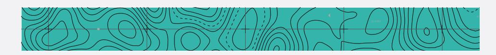

#### **7.1.1. Available Information and Verification Procedures**

### **National Rural Registration System (SNCR)**

Registration in the SNCR, instituted by Law 5.868/197235, is mandatory for owners, holders of useful domain, or possessors of rural properties that can be destined for agricultural activities or plant extraction. This obligatoriness is reflected in the analysis of the AB+S Platform, since the first prerequisite for socio-environmental qualification of the rural establishment is the existence of an SNCR code associated with the CPF authenticated on the Platform. In summary: without an SNCR code, socio-environmental qualification is unfeasible.

The verification of an SNCR code is treated as a central and indispensable element by the AB+S Platform during the dry-run phase. It serves as a significant compliance tool capable of demonstrating possession of the rural property. However, the EUDR does not directly require proof of possession, but rather proof of the right to use the land. Additionally, it is important to note that not all properties possess this code, and the practice of requiring it from producers is not widespread across the agricultural sector. This results in a lower level of awareness regarding its application compared to other identified instruments. Consequently, following engagement processes, MAPA is evaluating the possibility of making the EUDR service available without the mandatory SNCR requirement. On the other hand, the SNCR is INCRA's official tool for maintaining land registry data; thus, its adoption by AB+S ensures legal certainty within the context of national property rights requirements.

In this context, it is worth citing an inherent limitation of the SNCR (applicable to the Brazilian land system, in a broader context): the system does not capture lease contracts registered in notary offices, relating to temporary cessation of land use. Evaluation of this risk is the operator's responsibility in its production and territorial context, and a possible form of mitigation (if such risk is verified) is requesting additional documents from its supplier.

Considering factors presented above, the SNCR is classified as a "risk factor" in the context of compliance with the EUDR. Despite being fundamental in determining property rights – something that has high applicability in the national context – this registry is not essential to demonstrate compliance with the land use rights requirement required by the EUDR. The risk of non-compliance can be mitigated by presenting evidence of regularity in the Rural Environmental Registry (CAR).

### **Rural Environmental Registry (CAR)**

Instituted by the latest update of the Brazilian Forest Code (Law 12.651/201236), the CAR integrates environmental information of properties and rural possessions, generating a database for control, environmental and economic planning, monitoring, and combating deforestation. Checking the CAR is also central in the socio-environmental qualification process of the rural establishment made by the AB+S Platform, analyzing the following conditions:

**▸** The CAR must be situated in the same municipality as the registration in the SNCR (impeditive criterion); **▸** The CAR must have an "Active" or "Pending" status (impeditive criterion); **▸** Coincidence of CPFs between owners in the SNCR and CAR (not impeditive, only an alert).

A CAR with an "Active" status means that its registration was concluded37, and that obligations of updating registered info are being fulfilled. A CAR with a "Pending" status, in turn, receives this classification when there is incorrect declaration of information or when overlap of the property with areas of interest is identified (Indigenous Lands, Conservation Units, Union Lands, embargoed areas, areas considered impeditive or other rural properties)38 .

In the AB+S Platform, the CAR is checked in an integrated manner with the SNCR. There is, however, the possibility for the CAR to be used as a mechanism capable, by itself, of evidencing compliance with the land use rights requirement. According to paragraph 1 of the Forest Code, to register a property in the CAR, the following are necessary:

**▸** Identification of the owner or rural possessor; **▸** Proof of ownership or possession of the property; **▸** Identification of the rural property, containing geographical information of at least one binding point of the perimeter, and of remnants of native vegetation, APP, Restricted Use Areas, consolidated areas, and RL.

With this in mind, for the purpose of proving legality with the land use rights requirement, the CAR can generate necessary evidence. Additionally, it is important to consider that using the CAR is already a consolidated practice in the Brazilian agricultural sector, adding a higher level of knowledge associated with socio-environmental analysis processes.

Even though this subtle difference of understanding exists, the report "Laws of the Land" aligns with the AB+S Platform regarding CAR statuses considered apt to evidence compliance: "Active" and "Pending". For the purpose of proving land use rights, the "Active" status attributed to the CAR is a relevant and high-quality indicator. This status means that: (a) the property owner has de obligation of showing compliance with requirements of proving property or possession of the property; (b) until the moment of the verification, the responsible environmental institution did not point out any overlaps with areas of interest39; (c) there is no judicial or administrative decision pointing out any irregularity in the property. The CAR's Active status is attributed right after its registration, and is maintained as such while the analyses executed by the responsible environmental institutions do not identify any problems in that.

A CAR registration with "Pending" status, on the other hand, has necessarily undergone an analysis by the responsible environmental institution, which covers, in summary: (a) a check for overlaps with areas of interest; (b) a verification of compatibility between the area declared in the CAR polygon and the area declared in the documentation; and (c) an environmental check, considering Legal Reserve areas, Permanent Protection Areas, and the presence of deforestation within the polygon. If an issue is identified, the CAR status changes to "Pending," and the property owner is notified, with a period of approximately 60 to 90 days to rectify the registered information. If the issue is related to environmental laws, the regularization period is longer, though this falls outside the scope of the analysis regarding Land Use Rights. If the producer fails to resolve the overlap or documentation issues within the allotted time, the CAR status changes to "Suspended."

### **Land Management System (SIGEF)**

SIGEF is the third element adherent to the Land Use Rights requirement analyzed by the AB+S Platform. This system was created by INCRA, and originates from Law 6.015/197340 (Art. 176, inserted by Law 11.952/2009), with the purpose of subsidizing land governance in the national territory41. The system performs reception, validation, organization, regularization, and availability of georeferenced data of rural property parcels,

analyzing its overlap with others already existing in INCRA's database. If there is no overlap, the property appears in the base.

Contrary to what occurs with CAR and SNCR, registration in SIGEF is not an impeditive criterion for qualification of the rural establishment, since not all properties possess registration in SIGEF. Still, the platform performs checking of the establishment's geometry in INCRA's database – through the SNCR code, which is integrated into SIGEF 42 as a prerequisite for registration in the system – and, if this occurs, it is used for validating CAR geometry. This validation occurs from checking overlap between polygons: if there is any overlap (it does not need to be total), geometries are validated. If there is no overlap, there is an impediment to socio-environmental qualification. Given that not all properties possess registration in SIGEF and that absence of registration does not mean there is an irregularity with legislation, this compliance instrument is also classified as a risk factor. The risk can be reduced if it is demonstrated that the CAR polygon has no overlap with areas of interest.

The difference between the report Laws of the Land43 and the AB+S Platform takes place regarding the integration between geometries of CAR and SIGEF polygons. In AB+S, if the SIGEF polygon is available, it is used to validate CAR geometry, something that the report does not perform. The reason behind this lies in the difference between basic territorial units utilized for constructing CAR and SIGEF polygons44. In the CAR system, the geometric unit of reference is the rural property45, while SIGEF considers the registry parcel46 .

Considering these conceptual differences in data formation processes of SICAR and SIGEF, georeferenced modelling comparing polygons does not always generate an exact overlap. It is important to mention that SICAR and SIGEF are systems that obey distinct finalities (the first aims at environmental regularization, and the second at description of real estate boundaries for issuing titles and land regularization), and were not originally constructed to be compared.

This, however, does not mean that one system invalidates the other. Both are capable of providing compliance evidence with the land use rights requirement, but validation through checking overlap between both can bring inside the checking process risks that are external to it, inherent to the polygonal construction procedure47 .

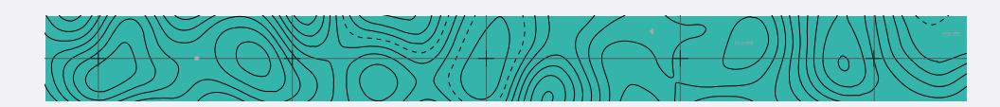

#### **7.1.2. Results and Discussion**

Checking legality applicable to the land use rights requirement of the EUDR demonstrated that the Agro Brasil+Sustentável Platform performs a comprehensive mapping of applicable and available compliance instruments in Brazil. With this, it is possible to say that the Platform presents a possible path for legality verification with the land use rights requirement. Still, it is important to make some considerations with the purpose of refining checking processes presented by the Platform. The main point of attention refers to using SIGEF geometry to validate the CAR polygon, applying overlap between both. One must consider, however, the difference of reference geometric units in constructing polygons. With this, validation through checking overlap between both can bring inside the checking process risks that are external to it, inherent to the polygonal construction procedure.

Another aspect to evaluate is the combined use of SNCR and CAR to evaluate property compliance. Since the requirement refers to land use rights, and not possession, CAR analysis by the platform can provide necessary evidence. A CAR with "Active" status indicates that: (a) the property owner was required to demonstrate compliance with the requirements for proving ownership or possession of the property; (b) the property does not possess overlap with areas of interest; and (c) there is no judicial or administrative decision pointing out any irregularity in the property. A CAR with a "Pending" status can also present the same conditions, provided the operator demonstrates absence of overlaps with areas of interest, a process that can be effected in risk assessment. It is important to note that registration in the aforementioned systems may vary if producers are located on federal lands, such as in rural settlements. In these cases, a case-by-case verification is required, depending on the land tenure and environmental regularization process.

Respecting conditions presented above, the CAR can be used as a central compliance instrument applicable to the land use rights requirement. Adopting this practice brings two other associated benefits: (a) the fact that the CAR has been adopted broadly by the productive sector in socio-environmental verification of properties, with broad knowledge associated with its use; (b) the fact that the CAR will be used as a verification instrument in other requirements, thus enabling centralization and coordination of analyses. A summary of this section's analysis is presented in Table 4.

#### **TABLE 4**

#### **Summary of comparative evaluation of compliance instruments and legality verification processes with the land use rights requirement**

|       |             | AB+S APPROACH MAPPED ALTERNATIVES COVERAGE |
|-------|-------------|--------------------------------------------|
| CAR   | Evidence    | CAR in the same                            |
| SNCR  | Risk Factor | Socio-environmental                        |
| SIGEF | Risk Factor | Absence of registration in                 |

Sources: Olab, Embassy of the Netherlands, and Agro Brasil+Sustentável Platform. Formulation: Olab.

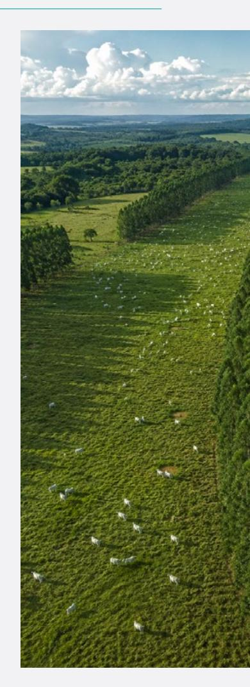

#### **BOX 4: MAIN LESSONS LEARNED**

**▸** AB+S presents a concrete path of land use rights verification, which can be further refined with punctual adjustments. **▸** It is important that AB+S evaluates limits and possibilities of including correspondence analysis between CAR and SIGEF polygons in the socio-environmental qualification of the rural enterprise, considering differences in polygon construction. **▸** The CAR (provided it is "Active" or "Pending") can be the main verification mechanism adhering to the land use rights requirement. If the CAR has a "Pending" status, detailing in risk assessment may be necessary, a responsibility of the operator. **▸** The SNCR is a relevant compliance instrument, but its applicability to the EUDR is not as essential as that of the CAR, given that the focus is land use rights, not property or possession. Still, no harm is seen in presenting it in a complementary manner. A mapping of adherence to the SNCR in Brazil can be interesting.

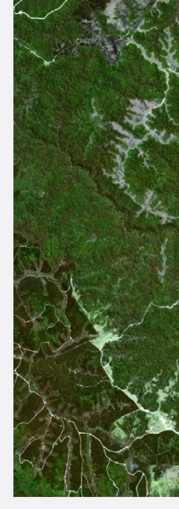

### **7.2. Environmental Protection**

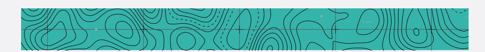

**7.2.1. Available Information and Verification Procedures** Compliance instruments available in Brazil and applicable to the Environmental Protection requirement of the EUDR, as well as their analysis by the Agro Brasil+Sustentável platform, are presented in Table 5.

#### **TABLE 5**

#### **Brazilian compliance instruments applicable to the environmental protection requirement**

| DATABASE                              | RESPONSIBLE |                 |         |
|---------------------------------------|-------------|-----------------|---------|
|                                       |             | LEGAL BASIS     | APPEARS |
| CAR                                   | MGI         | Law 12.651/2012 |         |
| Permanent Preservation Area (APP)     | SFB         |                 |         |
|                                       |             | Law 12.651/2012 | No      |
| Legal Reserve (RL)                    | SFB         |                 |         |
|                                       |             | Law 12.651/2012 | No      |
| Embargoes (IBAMA)                     | IBAMA       | Law 12.527/2011 |         |
| Embargoes (ICMBio)                    | ICMBio      | IN MMA, IBAMA,  |         |
| Certificate of No Record of Embargoes | IBAMA       |                 | No      |
| Conservation Units                    | MMA         | Law 9.985/2000  | Yes     |

Unlike the analysis of the Land Use Rights Requirement, Table 5 indicates the existence of certain compliance instruments that are not directly or explicitly analysed by the Agro Brasil+Sustentável Platform. It is necessary to assess, in the following subsection, whether this actually implies gaps in the Platform's verification processes.

#### **CAR, Permanent Preservation Area (APP) and Legal Reserve**

Analyzed in the land use rights requirement, the CAR remains fundamental for compliance analysis with the environmental protection requirement. In this second item of legality checking, the focus is on evaluating its use in providing information about environmental protection status in the rural property, based on determinations of the Forest Code (Law nº 12.651/201248). Consultation of the CAR provides information about location and areas of Legal Reserve and APP, as well as the difference between the size of these areas and minimum percentages of the property area established by the Forest Code49 .

Information on RL and APP is initially declared by the owner as a condition to obtain the CAR. After registration, state environmental organs initiate an analysis process of the info. Data from 2025 point out that 24% (compared to 15% in 2024) of rural properties registered in the CAR had had a beginning in analysis processes, with a considerable degree of inequality between states50 .

The analysis process is important to enable environmental regularization in the property (i.e., its adaptation to conservation demands of APP and RL provided for in the Forest Code). This, however, does not impede estimating the liability or excess of RL, a datum that is made available in the CAR consultation procedure itself. AB+S, when analyzing only CAR statuses, does not execute analysis of RL liability. It is important, however, to highlight that the eventual existence of such liability does not immediately indicate a violation of the law, given that there is a possibility of environmental regularization by the rural property owner. For this reason, RL liability must be treated as a risk factor.

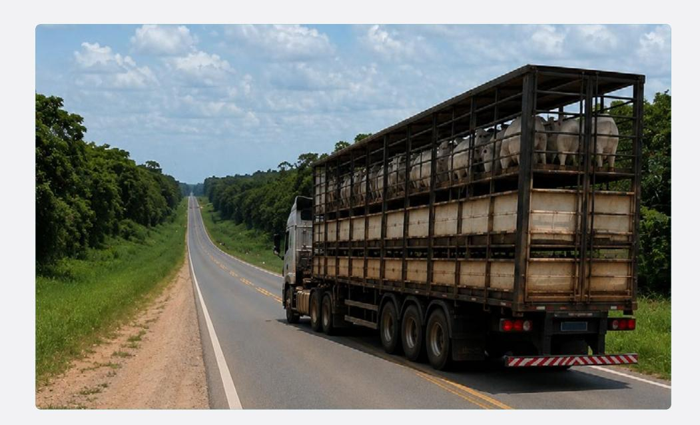

#### **Embargoes**

Regulated by Decree No. 6.514/2008, embargoes are one of the possible sanctions and cautionary measures applied by environmental organs in case of environmental violations, blocking execution of economic activities at the infraction location51. At a federal level, there are two organs responsible for instituting environmental embargoes: the Chico Mendes Institute for Biodiversity Conservation (ICMBio), responsible for inspecting activities in CUs, and the Brazilian Institute of Environment and Renewable Natural Resources (IBAMA), which inspects other areas. IBAMA, besides checking embargoes, presents the possibility of issuing a Certificate of No Record of Embargoes, a document generated for rural owners who do not possess embargoes linked to their CPF or CNPJ. The AB+S Platform performs mapping of federal embargoes encountered for the owner's CPF or CNPJ, both in IBAMA's and ICMBio's bases. Additionally, the Platform performs overlap analysis between the rural establishment area and areas embargoed by IBAMA. This checking is fundamental, since embargoes are a measure taken by inspecting organs as an effect of non-compliance with the law on the property. For this reason, embargoes are classified as evidence. It is important to highlight that the AB+S Platform considers only federal-level information. However, state agencies can also place embargoes on illegally deforested areas. Integrating this data would be a significant future step to complement the federal information.

The Certificate of No Pending Objections, in turn, is classified as a risk factor, given that its absence is not a direct indication of non-compliance, but rather only a risk, which can be mitigated by embargo analyses.

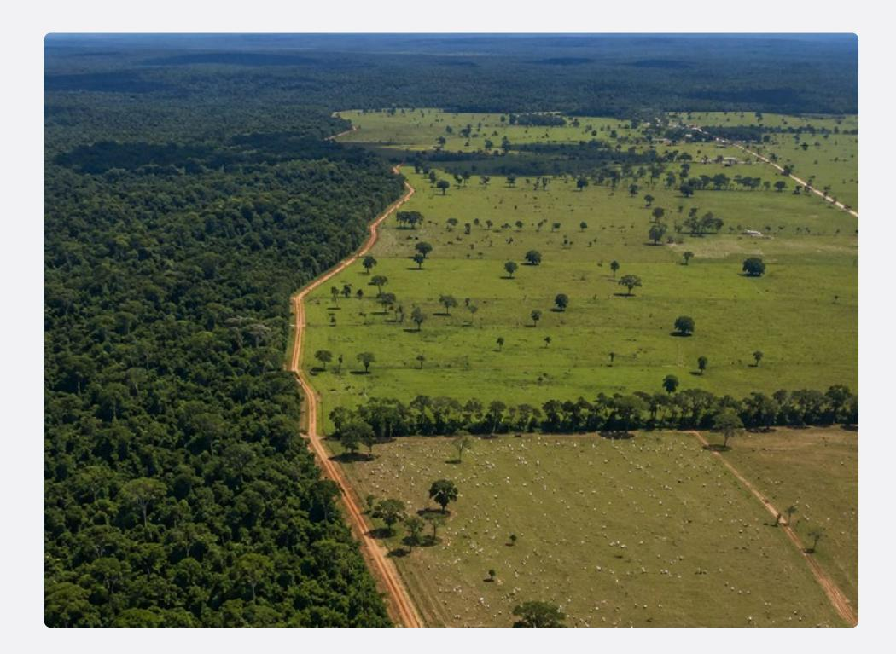

#### **Conservation Units**

Conservation Units (CUs) are regulated by Law nº 9.985/200052, which institutes the National System of CUs (SNUC). CUs are divided into two categories: Total Protection Units53 and Sustainable Use Units54 .

Sustainable Use Units have commercial exploration of products, byproducts, or services obtained from natural resources conditional on prior authorization and subject to payment by the explorer. Exceptions to this rule, as outlined by Art. 33 of Law No. 9.985/2000, are Environmental Protection Areas (APA) and Private Natural Heritage Reserves (RPPN). With this in mind, there is a possibility for commodity production in APAs through formulation of a management plan. For this reason, APAs are seen as a risk factor, so it can be important for operators to signal in risk assessment if some supplier of their commodities is produced in an APA in a regularized manner.

The current version of the AB+S Platform includes in its analysis verification of overlap between the rural establishment and Conservation Units. If any overlap is identified, the Platform emits an alert in the property's socio-environmental qualification report. This analysis is fundamental, since execution of agricultural activities in CUs is forbidden. For this reason, CUs are treated as evidence of compliance or non-compliance. Additionally, the Platform also proposes overlap analysis with polygons of the National Public Forests Registry, also classified as evidence. The only attention point to highlight is that overlap analysis with CUs in the AB+S Platform does not segment categories, in special APAs.

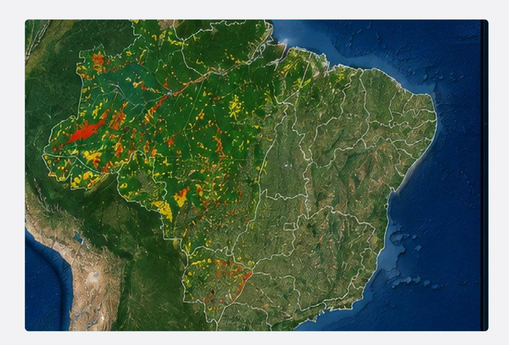

### **ASV and Ilegal Deforestation**

Checking the deforestation requirement is implemented by the AB+S Platform in a manner fully aligned with that established by Art. 3(a) of the EUDR, as discussed in Chapter 6 of this report. There is, however, the hypothesis to consider of deforestation occurrences (which can take place before 12/31/2020 and/or outside the production polygon, but on the property) violating what is established in Art. 3(b) of the EUDR, relating to its legality.

In this sense, Art. 26 of the Forest Code55 regulates processes of native vegetation suppression in rural properties. According to such article, from the Forest Code, native vegetation suppression *"will depend on registration of the property in the CAR (...) and on prior authorization from the competent state organ of Sisnama".* Vegetation Suppression Authorizations (ASV) are mechanisms through which state organs regulate and allow deforestation in rural properties. ASVs became mandatory from the Forest Code, which establishes the date of July 22, 2008, as a limit for unauthorized deforestation in other areas.

It is worth inquiring, therefore, if deforestation without an ASV occurred before the production period can affect the legal status of the rural establishment. Art. 16 of Decree 6.514/200856 - which regulates embargoes – establishes that embargoing an area in a certain property is a duty of inspecting agents if illegal deforestation or burning activities occurred57 .

Thus, it becomes evident that non-compliance with the law consolidates when the embargo – analyzed by AB+S – is instituted on the production area. Thus, the existence of deforestation on the property after July 22, 2008, must be treated as a risk factor, since it can lead to an embargo in the future. AB+S also performs this analysis in socio-environmental qualification, but not as an impeditive criterion. If there is any post-2008 deforestation, an alert is emitted in the qualification report.

Thus, it is recommendable that risk assessment verifies if deforestation occurred by presenting an ASV. If there was not, the risk of a future embargo becomes even higher, and a possible mitigation measure can be non-acquisition of commodities originating from the area.

Non-presentation of ASVs in the AB+S Platform occurs due to the absence of standardization between ASV registry systems existing at a state level. This scenario has been treated by the Federal Government, and culminated in the approval of CONAMA Resolution nº 510/202558. This determines that authorizations start to be issued by the National System for the Control of the Origin of Forest Products (SINAFLOR), or by programs integrated into the system. There is a perspective of integrating ASV data into the AB+S Platform, but considering only data generated after CONAMA Resolution No. 510/2025. This occurs given that ASVs issued before the Resolution are not registered in SINAFLOR, which hinders obtaining them by the AB+S Platform.

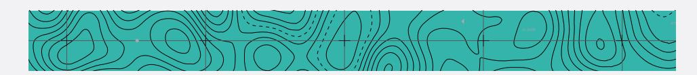

#### **7.2.2. Results and Discussion**

Analysis of the applicability of checks made by AB+S to the environmental protection requirement of the EUDR indicates again that the Platform covers all those compliance instruments classified as evidence: CAR, Embargoes, Conservation Units, and Public Forests. This checking path provided by the Platform provides a solid basis for the due diligence system, which can still be complemented by the operator with evaluation of risk factors: RL Liability, Certificate of No Record of Embargoes, APAs, deforestation, and ASV. A comparative synthesis of compliance instruments and their checking processes is presented in Table 6.

#### **TABLE 6**

#### **Summary of comparative evaluation of compliance instruments and legality verification processes with the environmental protection requirement**

|                       |             | AB+S APPROACH               | MAPPED ALTERNATIVES | COVERAGE    |
|-----------------------|-------------|-----------------------------|---------------------|-------------|
|                       | Evidence    | Analysis of CAR status      |                     |             |
| RL Liability          | Risk Factor | Not analyzed.               |                     | Not Covered |
| Embargoes             | Evidence    | Embargoes verification      |                     |             |
|                       | Risk Factor | Not analyzed.               | A Certificate of No |             |
| Conservation Units    | Evidence    | Verification of whether the |                     |             |
| APAs                  | Risk Factor | The overlap analysis        |                     |             |
| Deforestation and ASV | Risk Factor | Deforestation occurring     |                     |             |

#### **BOX 5: MAIN LESSONS LEARNED**

**▸** Although APAs are classified as a risk factor, AB+S can support suppliers by providing segmentation by type of CU to evaluate overlap with the rural establishment. This facilitates the risk assessment process by suppliers, enabling continuous monitoring. **▸** Although important, analyses such as Legal Reserve liability, deforestation, and ASV are classified as risk factors, applicable, therefore, to risk assessment. The operator can bring this data in a complementary manner to the AB+S Platform, which allows continuous monitoring of risks of future embargoes or cancellation of its suppliers' CARs. Additionally, this monitoring also allows the operator to signal these risks to its suppliers, encouraging them to adhere to regularization programs.

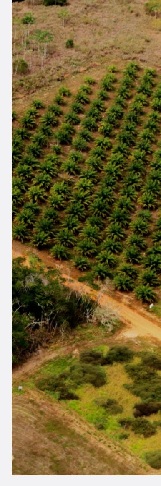

#### **7.3 Third Parties Rights**

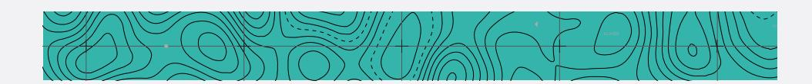

**7.3.1. Available Information and Verification Procedures** Compliance instruments available in Brazil and applicable to the Rights of Third Parties requirement of the EUDR, as well as their analysis by the AB+S Platform, are presented in Table 7.

#### **TABLE 7**

### **Brazilian compliance instruments applicable to the rights of third parties requirement**

|                   |       | LEGAL BASIS     | APPEARS IN AB+S? |
|-------------------|-------|-----------------|------------------|
| CAR               | MGI   | Law 12.651/2012 |                  |
| Indigenous Lands  | FUNAI | Const. Federal  |                  |
| Quilombolas Lands | INCRA | Const. Federal  |                  |

Sources: Olab and Plataforma Agro Brasil+Sustentável. Formulation: Olab.

As demonstrated in Table 7, Agro Brasil+Sustentável covers all compliance instruments mapped and applicable to the rights of third parties requirement of the EUDR. This cross-referencing of information must be analyzed more deeply, specifying checking processes. In this sense, the main focus of evaluation must be the stage of regularization processes of indigenous and quilombola lands used as an analytical window.

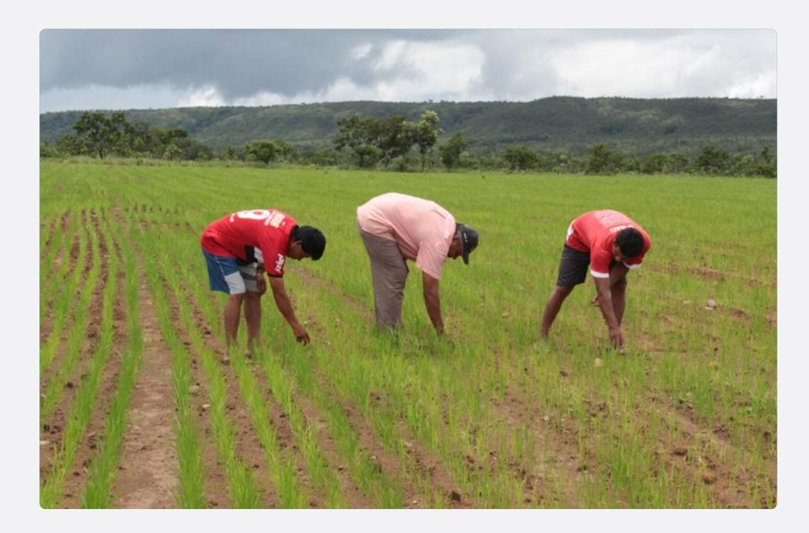

#### **Indigenous Lands**

Art. 231 of the Federal Constitution of 1988 recognizes that indigenous peoples possess original rights over lands they traditionally occupy59. To ensure this right is exercised, it is up to the Union to demarcate indigenous lands, besides protecting and making respected all assets of these peoples. The demarcation process is regulated by Decree No. 1.775/1996, being divided into five stages60, with provision for full participation of indigenous peoples. These stages are: (i) studies phase; (ii) delimitation phase; (iii) declaration phase; (iv) homologation phase; (v) regularization phase61 .

In its socio-environmental qualification analysis of the rural establishment, the AB+S Platform provides for verification of overlap between establishment geometry and indigenous lands. This checking considers all indigenous lands, regardless of the stage of the regularization process.

Overlap analysis with all types of indigenous lands is an essential process, since it allows a broad view of the property's status and supports mapping risks. An element to consider in the analysis, however, is that the territory regularization stage can determine if an establishment is or is not in compliance with legislation, and the central element of this analysis is precisely the restriction on non-indigenous occupants. This occurs in the homologation phase, when non-indigenous occupants are removed, with indemnifications established during the declaration phase. That is, if an indigenous land is homologated, there should no longer be non-indigenous occupants at the location, so that their permanence becomes illegal from then on. With this in

mind, it is possible to conclude that the compliance instrument constituted by indigenous lands is divided into two parts:

**▸ ILs PRE-HOMOLOGATION:** They are considered risk factors, since there is potential to become evidence of non-compliance in the future. It is recommended that the operator, during risk assessment, maps eventual cases of suppliers that have overlap with these indigenous lands and monitors their regularization processes. Additionally, as a risk mitigation measure, it is recommended that the operator ensures that indigenous occupants of the territory are consulted and express consent with agricultural activity at the location until homologation. **▸ ILs POST-HOMOLOGATION:** They are considered evidence of non-compliance, given that occupation by non-indigenous people becomes illegal with homologation.

### **Quilombola Lands**

Just as occurs with indigenous peoples, quilombola peoples have a guaranteed constitutional right over their territories. This is established by Art. 68 of the Act of Transitory Constitutional Provisions62, according to which remnants of quilombo communities occupying their lands must have the right to definitive property recognition. It is an assignment of the State to issue titles relating to property of quilombola territories.

The regularization process of quilombola territories is regulated by Decree nº 4.887/200363, which grants titling responsibility to INCRA. Titling of quilombola territories is done in stages64: (i) quilombola self-identification; (ii) formulation of the RTID65; (iii) publication of the RTID; (iv) recognition ordinance; (v) expropriation decree; (vi) titling66 .

The AB+S Platform provides for verification of overlap between rural property geometry and quilombola territory polygons, as part of socio-environmental qualification of the rural establishment. Just as in the checking of indigenous lands, there is no determination of a specific stage of the titling process as an impeditive window for property qualification.

The question to be analyzed here is similar to that placed for indigenous lands. It is fundamental to include all quilombola areas, but signalling of non-compliance must be based on the moment of the titling process that leads to expropriation of previous occupants. This occurs from the expropriation decree, which precedes titling.

Thus, a titled quilombola territory indicates that there are no longer occupants not belonging to the quilombola community that started to inhabit the location. It is, therefore, necessary to divide quilombola territories into two categories of result:

**▸ QUILOMBOLA TERRITORIES PRE-TITLING:** They are considered risk factors, given the tendency to become titled in the future, rendering unfeasible buying commodities from the referred area. Just as recommended for indigenous lands, it is interesting for the operator to map suppliers with overlap with quilombola territories, monitor regularization processes, and ensure that quilombola peoples occupying the territory are consulted and express consent. **▸ QUILOMBOLA TERRITORIES POST-TITLING:** They are classified as evidence of non-compliance, since after titling, occupation by non-quilombolas becomes an illegal activity.

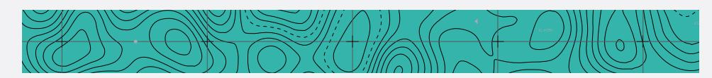

#### **7.3.2. Results and Discussion**

The Agro Brasil+Sustentável Platform maps compliance instruments available in Brazil and applicable to the legality requirement of rights of third parties, placed by the EUDR – indigenous lands and quilombola territories – from overlap analysis with the rural property polygon. The big point to discuss is the stage of regularization processes of these territories to be considered as a window to define non-compliance with legislation. A summary of analysis processes of compliance instruments applicable to the requirement is presented in Table 8.

**TABLE 8**

#### **Summary of comparative evaluation of compliance instruments and legality verification processes applicable to the rights of third parties requirement**

|              | AB+S APPROACH MAPPED ALTERNATIVES COVERAGE |
|--------------|--------------------------------------------|
| CAR Evidence | Geometric unit                             |
| Risk Factor  | Overlap analysis                           |
| Evidence     | Overlap with                               |
| Risk Factor  | Overlap analysis                           |
| Evidence     | Overlap with titled QLs                    |

#### **BOX 6: MAIN LESSONS LEARNED**

**▸** It can be important to indicate a phase of the regularization process of indigenous lands and quilombola territories as evidence of non-compliance, with arguments relating to the choice of such a stage. This report recommends homologation and titling as respective phases, but AB+S can determine other stages, provided it justifies them. The important thing is communicating the criterion clearly. This contributes to giving transparency to the verification process, reducing associated risks and uncertainties. **▸** Despite the importance of determining a specific phase of regularization processes as evidence of non-compliance, analyzing overlap with all indigenous and quilombola lands – as AB+S already does – is fundamental. This can support operators in their risk assessment and mitigation processes, ensuring they monitor the progress of regularization processes of these territories, as well as implementation of consultation procedures.

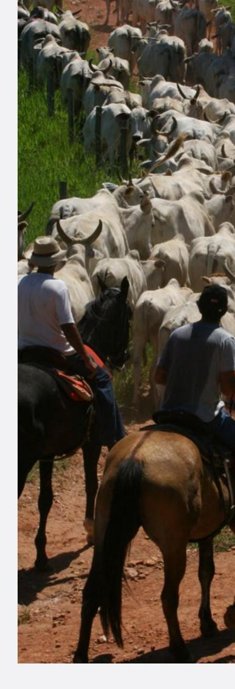

### **7.4. Labor Rights**

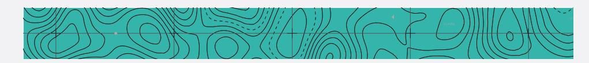

### **7.4.1. Available Information and Verification Procedures**

Compliance instruments available in Brazil applicable to the Labor Rights requirement of the EUDR, as well as their analysis by the Agro Brasil+Sustentável Platform, are presented in Table 9.

#### **TABLE 9**

#### **Brazilian compliance instruments applicable to the labor rights requirement**

|     | LEGAL BASIS                 | APPEARS IN AB+S? |
|-----|-----------------------------|------------------|
| MTE | Port. Interministerial MTE/ |                  |
| MTE | Port. Interministerial MTE/ |                  |
| TST | Law 12.440/2011             |                  |

Sources: Olab and Plataforma Agro Brasil+Sustentável. Formulation: Olab.

As pointed out in Table 9, two of the three compliance instruments indicated as potentially applicable to the labor rights requirement of the EUDR are not analyzed by the Agro Brasil+Sustentável Platform. Following this, it is worth evaluating checking processes, and verifying if this can generate any risk for generating compliance evidence for the EUDR.

### **"Dirty List" of Labor Analogous to Slavery**

The "Registry of Employers who have subjected workers to conditions analogous to slavery", known popularly as the "Dirty List of Labor Analogous to Slavery" presents all natural or legal persons condemned and fined for the crime of subjecting workers to conditions analogous to slavery67. This information is publicly made available by the Ministry of Labor and Employment (MTE), based on regulation given by Interministerial Portaria MTE, MDHC, and MIR nº 18/202468. According to the Portaria, the name of the employer or administrator remains disclosed in the registry for a period of two years, in which the Labor Inspection performs monitoring to verify regularity of working conditions. If there is a repeat offense, the employer remains for two more years in the Registry. Updating of the Registry must occur, at a minimum, every six months.

The AB+S Platform verifies the "Dirty List", so that if the producer's CPF or any CNPJ linked to them appears in the referred registry, socio-environmental qualification of the rural establishment is blocked. Based on presented information, it is imperative that presence in the "Dirty List" is classified as evidence of non-compliance, given that the practice of subjecting workers to conditions analogous to slavery is an extremely grave violation of the law.

#### **Registry of Employers Subject to Conduct Adjustment Agreements (CEAC)**

Provided for by Art. 6 of Portaria MTE/MDHC/MIR No. 18/2024, the CEAC is also a list of employers, but includes those who celebrated a Term of Conduct Adjustment (TAC) with the MTE, provided some requirements are fulfilled that reinforce the employer's commitment not to reincide in committing the crime of subjecting workers to conditions analogous to slave69 . Employers or administrators who celebrate a TAC or judicial agreement remain in the CEAC for a term of two years from their inclusion. If a repeat offense is registered, there is no possibility for celebration of a new TAC or judicial agreement.

The AB+S Platform does not consider the presence of employers in the CEAC as an element to be analyzed for generating the socioenvironmental qualification report of the rural establishment.

Presence of the producer's CPF or CNPJ in the CEAC does not indicate a situation of non-compliance with legislation, since the purpose of the registry is precisely to give conditions for the employer to adapt to legal demands. Still, registration of a natural or legal person in the CEAC means that this

person committed one or more violations of human and labor rights, which presents a significant risk of repeat offenses.

For reasons outlined above, the CEAC is classified as a risk factor, being recommended to operators that monitor presence of their suppliers in the registry, and follow their conduct adjustment processes with the MTE. It is worth highlighting, however, that using the CEAC is still recent and little diffused. In the latest update of the Registry, on 10/30/2025, only two agreements had been celebrated.

### **Labor Debt Negative Certificate (CNDT)**

The third compliance instrument potentially applicable to the labor rights requirement is the CNDT. This, instituted by Law nº 12.440/201170, aims to prove the non-existence of defaulted debts before the Labor Justice71. In summary: if the employer was condemned to pay obligations due to their workers and did not do so, they do not obtain the CNDT. If these obligations (debts) are guaranteed by sufficient attachment or have their enforceability suspended, the employer can obtain the Positive Certificate of Labor Debts (CPDT), which has the same effects as the CNDT. The validity term of the CNDT is one hundred and eighty days.

The AB+S Platform does not provide for checking the CNDT as a requirement for generating socio-environmental qualification reports of the rural establishment. In this sense, it has to be considered that the main finality of using the CNDT is qualifying employers to participate in public biddings72. With this in mind, it is possible to argue that using this instrument can deviate from its finality if applicable to transactions between goods. There is, however, a recommendation that this instrument also be utilized in real estate transactions, as a mechanism to give legal certainty to such businesses73 .

For reasons presented above, the CNDT is not classified as direct evidence of non-compliance with the labor rights requirement of the EUDR, but rather as a risk factor. Operators can monitor provision of the CNDT by their suppliers, given that it points out that the employer was not condemned by the Labor Justice for labor debts or, if they were, complied with their obligations provided for in Law. This is an important indicator of legal compliance and can be complementary in providing evidence for the EUDR requirement, given that only checking the existence of labor analogous to slavery is limited, and does not encompass important dimensions of labor rights.

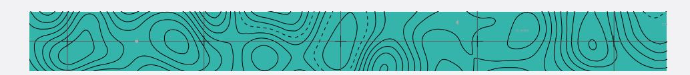

#### **7.4.2. Results and Discussion**

Analysis of the three compliance instruments potentially applicable to the labor rights requirement of the EUDR indicated that the AB+S Platform, despite considering only one of them – the "Dirty List" of labor analogous to slavery – evaluates precisely what is evidence of non-compliance. The other two presented by the report "Laws of the Land" (proxy for surveying available information in Brazil) are classified as risk factors: the CEAC and the CNDT. A summary view of evaluation processes is presented in Table 10.

#### **TABLE 10**

#### **Summary of comparative evaluation of compliance instruments and legality verification processes applicable to the labor rights requirement**

|             | AB+S APPROACH     | MAPPED                |
|-------------|-------------------|-----------------------|
| Evidence    | Performs analysis |                       |
| Risk Factor | Does not analyze. | Operators can map     |
| Risk Factor | Does not analyze. | Operators can request |

Sources: Olab, Embassy of the Netherlands, and Agro Brasil+Sustentável Platform. Formulation: Olab.

The "Dirty List" of labor analogous to slavery is the only area with a direct verification mechanism maintained by the government and applicable to the EUDR as direct evidence of non-compliance74. It is evident, however, that other dimensions of labor rights exist that can be monitored in a complementary manner by operators if it is understood that a non-negligible risk of violation exists. Differently from the analysis made by AB+S – which covers Art. 9 of the EUDR and proposes to be standardized for all sectors – risk assessment must be adapted to each production and territorial context, so that not all compliance instruments classified as risk factors can apply to all cases.

Regarding labor rights monitoring, this report proposes verification of two compliance instruments that can complement risk assessment: the CEAC and the CNDT. Other possible paths of labor rights verification applicable to risk assessment – depending on the production and territorial context – are identified by the report "Navegando pela conformidade com os direitos humanos no setor agropecuário brasileiro", formulated by Proforest75. When mapping a set of socio-environmental monitoring initiatives, the report identifies other possible paths of verification, such as:

**▸ ON-SITE AUDITS:** interviews, visual inspections, review of working conditions, etc. **▸ DOCUMENT ANALYSIS:** verification of legal registries, notifications from authorities, processes related to labor violations. **▸ EVIDENCE AND INDICATORS:** valid labor licenses, absence of forced labor indicators, etc.

These paths present verification possibilities of risk of violation of other dimensions of labor rights that do not possess compliance instruments in Brazil, due to absence of centralized public data and by confidentiality restrictions relating to secret information76. Among these dimensions, it is worth mentioning: child labor77, safety and health at work78, among others.

###  **7.5. Human Rights**

Compliance instruments available in Brazil and applicable to the Human Rights requirement are those already cited as adherent to the labor rights requirement: the "Dirty List" of labor analogous to slavery and the CEAC, already explored in the previous subsection. AB+S addresses the "Dirty List", the only instrument generating direct evidence of non-compliance, while the CEAC is classified as a risk factor. The absence of data providing a comprehensive human rights analysis in AB+S socio-environmental qualification reports cannot be classified as a critical point of the platform, but rather as a challenge to be mitigated at a broader level, considering info availability in Brazil.

Considering points placed above, the report "Laws of the Land" recommends that operators present, in risk assessment, complementary information about human rights policies in their supply chains to supply eventual gaps that may be signaled by Competent Authorities, thus giving more robustness to due diligence procedures. Another possibility is implementing a Human Rights Impact Assessment (HRIA), which consists of a systematic process to identify, prevent, and mitigate risks and adverse impacts on human rights in supply chains. In this sense, an important base to be followed is the UN booklet with Guiding Principles on Business and Human Rights 79 .

Additionally, it is worth reiterating recommendations made by the report "Navegando pela conformidade com os direitos humanos no setor agropecuário brasileiro", formulated by Proforest80, which presents practices that – depending on the territorial and production context – can be implemented by operators in their due diligence systems with the objective of evaluating and mitigating eventual risks. Among these paths, it is worth citing performing audits, document analysis, and consolidation of evidence and indicators.

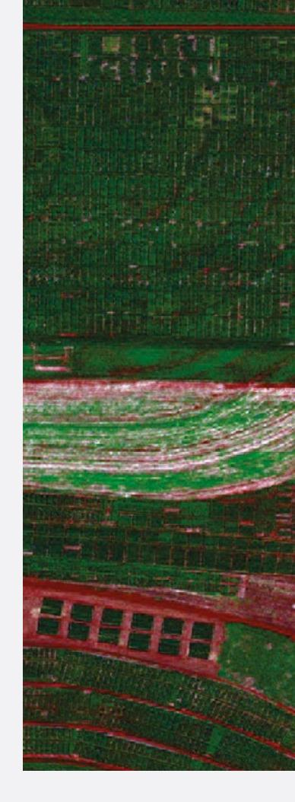

**7.6.**

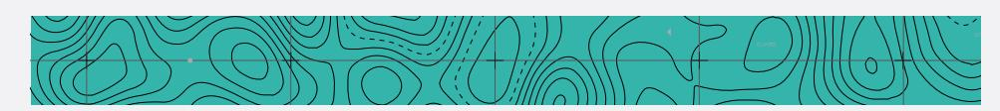

# **FPIC Principle**

**7.6.1. Available Information and Verification Procedures** Compliance instruments available in Brazil and potentially applicable to the requirement of the Free, Prior and Informed Consent (FPIC) Principle, as well as their analysis by the AB+S Platform, are presented in Table 11.

#### **TABLE 11**

#### **Brazilian compliance instrument applicable to the FPIC Principle requirement**

|                  |       | LEGAL BASIS          | APPEARS IN AB+S? |
|------------------|-------|----------------------|------------------|
| Indigenous Lands | FUNAI | Federal Constitution |                  |
|                  | FUNAI | Law 15.190/2025      |                  |

Sources: Olab and Plataforma Agro Brasil+Sustentável. Formulation: Olab.

The FPIC principle is the only EUDR requirement to cite a specific international standard to be followed: the United Nations Declaration on the Rights of Indigenous Peoples81 (Art. 10, Art. 19, Art. 28-1). In addition to being in this declaration, the FPIC principle is part of Convention No. 169 of the International Labor Organization (ILO), which treats Indigenous and Tribal Peoples82. This convention establishes obligatoriness of free, prior, and informed consultation with peoples potentially affected by legislative or administrative measures, works, actions, policies, or programs83. The Convention is a supralegal standard in Brazil, being in force by power of Decree nº 10.088/201984 .

There are two compliance instruments applicable to checking fulfillment of the FPIC principle: verification of overlap with indigenous lands – already explored in the section on third-party rights and covered by AB+S – and environmental licensing, not verified by the Platform. Still, environmental licensing is surrounded by uncertainties. All aspects relating to environmental licensing analysis applied to the FPIC principle, as well as factors that can point out non-compliance, are presented next.

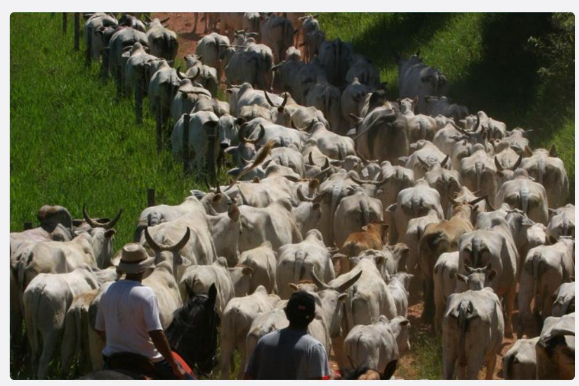

### **Environmental Licensing**

The environmental licensing process is regulated by Law nº 15.190/202585. Art. 9 of the referred Law lists some agricultural activities that, satisfied some conditions, are exempt from the licensing process. They are: (i) cultivation of species of agricultural interest, temporary, semi-perennial, and perennial; (ii) extensive and semi-intensive livestock; (iii) small-scale intensive livestock; (iv) research of an agricultural nature. Conditions that such activities must satisfy to be exempt from the environmental licensing process are linked to compliance with Forest Code demands (Law 12.651/201286):

**▸** Regularity of the property with registration in the CAR approved by the competent state organ, which does not have a vegetation deficit in RL or APP; **▸** The property being under regularization when fulfilled any of the following conditions: (a) adherence to the Environmental Regularization Program (PRA), during the entire period of fulfillment of obligations assumed

in it; (b) establishment of a commitment term with the competent organ for regularization of vegetation deficit in RL or APP when it is not the case of adherence to the PRA.

As analyzed in the section on land use rights (7.1), approval of the CAR is still little implemented in Brazil, and its finalization depends on absence of overlaps between the CAR polygon and areas of interest – among them, indigenous lands. Thus, if this condition is satisfied, risks of violation of the FPIC principle are reduced.

The environmental licensing process87 is conducted by a licensing authority88, which can be an organ or entity of the Union, states, DF, or municipalities89, integrating the National Environment System (SISNAMA). In addition to the licensing authority, the environmental licensing process can count on involved authorities, which are organs or entities that, in cases provided for in legislation, can manifest themselves in environmental licensing about impacts of the activity or enterprise on: (1) indigenous or quilombola lands; (2) guarded cultural heritage; (3) CUs.

The performance of involved authorities is strategic for guaranteeing compliance with ILO Convention No. 169. In the case of themes and processes involving indigenous peoples, the responsible institution is FUNAI. Its involvement is regulated by IN Funai nº 2/201590, which outlines procedural stages of its participation. These stages aim to guarantee not only a technical analysis of the enterprise's viability, but also that affected indigenous communities are consulted, through hearing processes adapted to the reality of environmental licensing procedures. This IN, however, is prior to the new legislation relating to environmental licensing. New INs have not yet been issued by FUNAI after approval of the new Law.

Thus, if involvement of FUNAI is verified, there is a significant indication that the activity in question impacts indigenous peoples. In these cases, it is recommended to verify if the environmental license was approved, respecting consultation procedures with involved indigenous peoples. If, however, involvement of FUNAI is not verified, one has an indication that agricultural activity did not infringe on the rights of indigenous peoples over occupied territory.

Given the conditions above, environmental licensing – if there is the presence of FUNAI – is an important compliance instrument, and the main official means of verification of compliance with the FPIC principle. On the other hand, non-provision of environmental licensing does not necessarily indicate a violation of the law, given

that agricultural activities can be exempt, provided conditions of regularity with the Forest Code are satisfied. For these reasons, environmental licensing is classified as a risk factor, being recommended that operators monitor in risk assessment the environmental licensing status of their suppliers.

The Agro Brasil+Sustentável Platform does not present verification of environmental licensing, but checks overlap between the property polygon and all indigenous lands, regardless of the regularization phase. This can support operators in making a first risk screening, identifying eventual cases of overlap with indigenous lands for a detailed monitoring of the consultation situation with territory occupants. If no overlap is identified, the risk of non-compliance with the FPIC principle is reduced, but not zeroed. It is necessary, therefore, that operators evaluate their production and territorial contexts to guarantee attainment of the "negligible risk" concept presented by the EUDR91 .

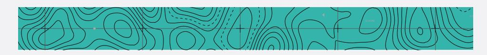

#### **7.6.2. Results and Discussion**

Verification of compliance instruments applicable to the requirement of the Free, Prior and Informed Consent (FPIC) principle can have subsidies generated by the Agro Brasil+Sustentável Platform, through verification of overlap with indigenous lands. Still, for structuring a robust due diligence system, this analysis must be complemented in risk assessment. The main form to verify this, within the Brazilian legal framework, is environmental licensing, with participation of FUNAI, responsible for guaranteeing that indigenous peoples potentially affected by agricultural activities are consulted and authorize their implementation in territories. A synthesis of these compliance instruments is presented in Table 12.

**TABLE 12**

#### **Summary of comparative evaluation of compliance instruments and legality verification processes adherent to the Free, Prior and Informed Consent (FPIC) Principle requirement**

|                  |             | AB+S APPROACH         | MAPPED ALTERNATIVES     | COVERAGE |
|------------------|-------------|-----------------------|-------------------------|----------|
| Indigenous Lands | Evidence    | Overlap check against |                         |          |
|                  | Risk Factor | No verification       | Verification of FUNAI's |          |

Sources: Olab and Plataforma Agro Brasil+Sustentável. Formulation: Olab.

#### **BOX 7: MAIN LESSONS LEARNED**

**▸** AB+S can evaluate the incorporation of environmental licensing as part of checking processes, through data from the National Environmental Licensing Portal92 (PNLA). Still, it is the operator's responsibility to guarantee conditions to demonstrate negligible risk of violation of the FPIC principle. **▸** There is great uncertainty as to application of official procedures guaranteeing compliance with the FPIC principle, despite the existence of environmental licensing. A possible advance in this sense can be the resolution project of the National Justice Council (CNJ), which establishes parameters for prior consultation with indigenous peoples and other traditional peoples and communities in judicial and administrative processes.93 However, concrete advances in this sense are still preliminary.

**7.7.**

## **Tax, Anti-Corruption, Commercial, and Customs Regulation**

#### **7.7.1. Available Information and Verification Procedures**

Compliance instruments potentially applicable to tax, anti-corruption, commercial, and customs regulation requirements of the EUDR, as well as their analysis by the AB+S Platform, are presented in Table 13.

#### **TABLE 13**

#### **Compliance instruments applicable to the tax, anti-corruption, commercial, and customs regulation requirement**

| <b>COMPLIANCE INSTRUMENT</b>                                                                                                       | <b>RESPONSIBLE INSTITUTION</b> | <b>LEGAL BASIS</b>                       | <b>APPEARS IN AB+S?</b> |
|------------------------------------------------------------------------------------------------------------------------------------|--------------------------------|------------------------------------------|-------------------------|
| Certificate of No Outstanding Debts regarding Federal Tax Credits and the Federal Government's Outstanding Debt (CND)              | RFB PGFN                    | Joint Ordinance RFB/ PGFN 1.751/2014  | No                      |
| Positive Certificate with the Effect of a Negative Certificate regarding Federal Tax Credits and Outstanding Federal Debts (CPEND) | RFB PGFN                    | Joint Ordinance RFB/ PGFN 1.751/2014  | No                      |
| National Registry of Punished Companies (CNEP)                                                                                     | RFB CGU                     | Law 12.846/2013 (Law Anti-Corruption) | No                      |

Sources: Olab, Embassy of the Netherlands, and Agro Brasil+Sustentável Platform. Formulation: Olab.

As indicated in Table 13, the AB+S Platform does not perform checking of any of the mapped compliance instruments. Following, checking processes will be detailed, with reflections on implementation possibilities by the Platform.

### **CND and CPEND**

The Negative Certificate of Debts relating to Federal Tax Credits and Union Active Debt (CND) was implemented by Joint Ordinance RFB/PGFN nº 1.751/201494, constituting proof of regularity before the National Treasury95. Its issuance is made by the Secretariat of Federal Revenue of Brazil (RFB) and by the Attorney General's Office of the National Treasury (PGFN). According to Art. 2 of the ordinance, the CND can be issued for free, in reference to passive subjects registered in the CPF, CNPJ, and in the Rural Property Tax Registry (Cafir) as owners or possessors of the property.

An alternative to the CND is the Positive Certificate with Negative Effects of Debts relating to Federal Tax Credits and Union Active Debt (CPEND), issued – among other non-applicable cases – when debts are guaranteed through assets or rights. Providing the CND or CPEND relating to the rural property, based on data consultation in Cafir, is recommended as a way to attest fiscal regularity with the National Treasury.

The AB+S Platform does not perform checking of the CND or CPEND, being recommended that the operator verifies it in a complementary manner. Providing the CND or CPEND points out that the rural property is in total fiscal and tax regularity with the RFB, so that this compliance instrument is classified as evidence.

### **CNEP**

The National Register of Punished Companies (CNEP) was instituted by Law nº 12.846/201396 (Anti-Corruption Law). Its objective is to gather and give publicity to sanctions applied by organs or entities of Executive, Legislative, and Judicial powers of all spheres of government (federal, state, and municipal). Applied sanctions refer to harmful acts against Public Administration practiced by legal persons (national or foreign) of private law.

The AB+S Platform does not monitor CNEP. With this in mind, complementary verification of this registry is again recommended to the operator, in order to restrict product purchase from suppliers that have been punished for practicing harmful acts against public administration. Presence of a CPF or CNPJ in CNEP is a relevant indication of Anti-Corruption Law violation, being opportune, for this reason, to classify CNEP as an instrument capable of providing direct evidence of compliance or non-compliance.

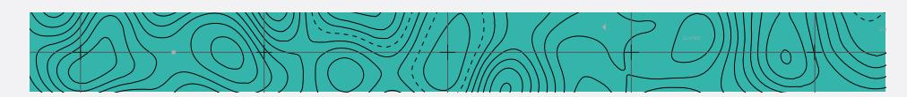

#### **7.7.2. Results and Discussion**

Analysis of compliance instruments applicable to tax, anti-corruption, commercial, and customs regulation requirements of the EUDR pointed to an absence of verification by the Agro Brasil+Sustentável Platform as part of socio-environmental qualification of the rural establishment. This, however, does not indicate that the platform does not perform any check. To produce reports, AB+S validates the following information in the Federal Revenue:

**▸** Individual registry (CPF); **▸** Corporate registry (CNPJ) and its representatives. **▸** A comparative synthesis of compliance instruments and their checking processes is presented in Table 14.

#### **TABLE 14**

**Summary of comparative evaluation of compliance instruments and legality verification processes with tax, anti-corruption, commercial, and customs regulation requirements** 

|               |          | AB+S APPROACH        | MAPPED ALTERNATIVES        | COVERAGE |
|---------------|----------|----------------------|----------------------------|----------|
| CPF           | Evidence | Validates individual |                            |          |
| CNPJ          | Evidence | Validates corporate  |                            |          |
| CND and CPEND | Evidence | Does not analyze.    | It is recommended that the |          |
| CNEP          | Evidence | Does not analyze.    | CNPJ research associated   |          |

Sources: Olab and Agro Brasil+Sustentável Platform. Formulation: Olab.

#### **BOX 8: MAIN LESSON LEARNED**

**▸** Because it is a public database of cadastral data, CNEP represents a type of information that can be included in the platform's verification. With this in mind, AB+S can evaluate its inclusion in qualification analysis of the rural enterprise.

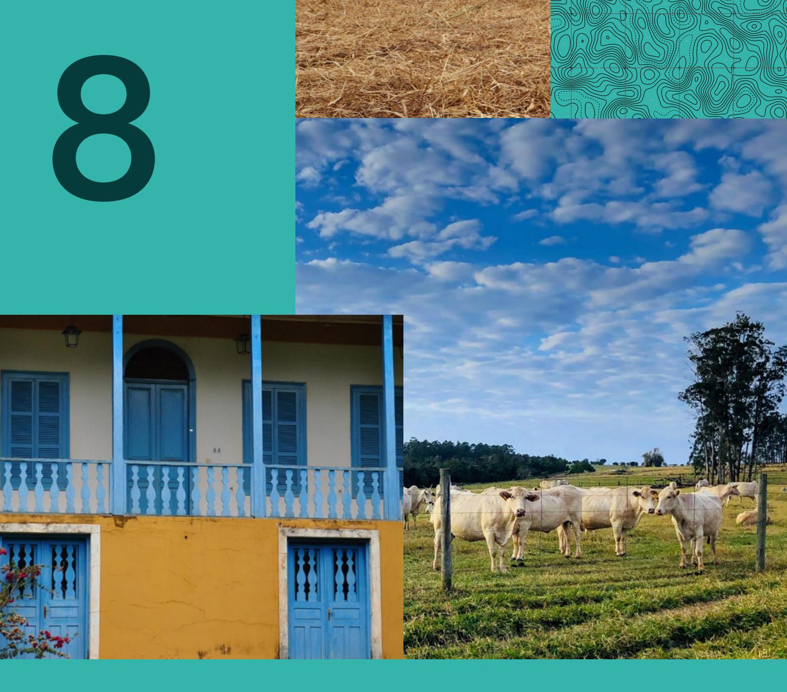

**How to Demonstrate Compliance with the EUDR Using the Public Platform**

# **Conclusion**

**AGRO BRASIL + SUSTENTÁVEL**

**Analyses made in Chapters 6 and 7 provided a specific view for each EUDR requirement (deforestation and legality), evaluating the applicability of information provided by the Agro Brasil+Sustentável Platform, compared with compliance instruments available in Brazil. The central point of analysis was verifying the capacity of AB+S to support operators in structuring a robust and applicable due diligence to the EUDR, from two main means:**

**▸** Providing geolocation of production polygons, which compose the due diligence declaration; **▸** Analysis of data and documents requested by Art. 9 of the EUDR, and that provide evidence that (a) commodities are deforestation-free; (b) commodities were produced in compliance with applicable national legislation.

This process is one of the components of the due diligence system. These two elements provide a solid base of due diligence, presenting valid information at a federal level and applicable to all production chains in scope. It is up to operators, therefore, to complement information provided by the AB+S Platform, bringing specific information to their production and territorial contexts comprising the EUDR due diligence framework:

**▸** Due diligence declaration: information about products, operator, and production country; **▸** Due diligence system: information composing risk assessment, risk mitigation measures and, when applicable, a description of the consultation process with peoples of traditional land tenure rights or civil society organizations present in production areas.

From the delimitation of coverage scope of the Agro Brasil+Sustentável Platform, as well as analyses made in Chapters 6 and 7, Table 15 presents a general analysis of coverage of the Agro Brasil+Sustentável Platform to EUDR requirements, considering available information in Brazil, based on mapping made by the report "Da Law à Lavoura", produced by Olab.

#### **TABLE 15**

#### **Summary of coverage analyses of the AB+S Platform to EUDR requirements**

| <b>WHAT THE EUDR REQUIRES</b> | <b>WHAT IS AVAILABLE IN BRAZIL</b> |                         |                 |
|-------------------------------|------------------------------------|-------------------------|-----------------|
| <b>Requirement</b>            | <b>Compliance Instrument</b>       | <b>Possible Results</b> | <b>Coverage</b> |
| Deforestation                 | PRODES                             | ◆ Evidence              | ●●●             |

### **Legality**

| Requirement              | Compliance Instrument                      | Possible Results Coverage |
|--------------------------|--------------------------------------------|---------------------------|
| Land Use Rights          | SNCR                                       | Risk Factor               |
|                          | CAR                                        | Evidence                  |
|                          | SIGEF-Geo                                  | Risk Factor               |
| Environmental Protection | CAR                                        | Evidence                  |
|                          | RL Liability                               | Risk Factor               |
|                          | Embargoes                                  | Evidence                  |
|                          | CNC Embargoes                              | Risk Factor               |
|                          | UCs                                        | Evidence                  |
|                          | APAs                                       | Risk Factor               |
|                          | Public Forests                             | Evidence                  |
|                          | Deforestation and ASV                      | Risk Factor               |
| Third Parties Rights     | CAR                                        | Evidence                  |
|                          | Indigenous Lands (Pre-homolog.)            | Risk Factor               |
|                          | Indigenous Lands (Post-homolog.)           | Evidence                  |
|                          | Quilombolas Lands (Pre-homolog.)           | Risk Factor               |
|                          | Quilombolas Lands (Post-homolog.)          | Evidence                  |
| Third Parties Rights     | "Dirty List" of Labor Analogous to Slavery | Evidence                  |
|                          | CEAC                                       | Risk Factor               |
|                          | CNDT                                       | Risk Factor               |

**Coverage** Totally Covered Partially Covered Not Covered by AB+S Not Covered by Report

| Requisito      | Instrumento de Conformidade                | Resultados Possíveis | Cobertura |
|----------------|--------------------------------------------|----------------------|-----------|
| Labor Rights   | "Dirty List" of Labor Analogous to Slavery | Evidence             |           |
|                | CEAC                                       | Risk Factor          |           |
| FPIC Principle | Indigenous Lands                           | Evidence             |           |
|                | Environmental Licensing                    | Risk Factor          |           |
|                | CPF                                        | Evidence             |           |
|                | CNPJ                                       | Evidence             |           |
|                | CND and CPEND                              | Evidence             |           |
|                | CNEP                                       | Evidence             |           |
| Requirement    | Compliance Instrument                      | Possible Results     | Coverage  |

#### **Coverage** Totally Covered Partially Covered Not Covered by AB+S Not Covered by Report

Source: Agro Brasil+Sustentável Platform. Formulation: Olab.

Information presented in Table 15 presents a relevant panorama of AB+S capacity to provide subsidies for compliance with the EUDR, especially in relation to those classified as direct "evidence" of compliance or non-compliance, applicable to Art. 9 demands (data, documents, and information). In relation to deforestation, the feature of enabling a production area for export, made available by the platform, aligns fully with the "deforestation-free" concept of the EUDR, and generates evidence based on the most reliable and adequate info source for mapping land use changes in Brazil: PRODES.

In terms of legality, AB+S also provides evidence applicable to a large part of EUDR requirements. The only two cases of compliance instruments classified as evidence and not covered by AB+S are referring to the legality requirement "Tax, Anti-Corruption, Commercial and Customs Regulation". In this case, it is recommended that operators present complementary information. It is important to reinforce here that the legality requirements of the EUDR do not possess a hierarchy between themselves. Although regulation treats mainly themes related to environmental impacts of agricultural activities, requirements such as land use rights and environmental protection are not more important than those of human rights, FPIC, and fiscal aspects. Recognition of this non-hierarchy is essential to provide information adherent to EUDR demands.

AB+S still maps some compliance instruments classified as "risk factors", which can support operators in structuring their risk assessments, a requirement placed by Art. 10 of the EUDR. Additionally, it is strategic that operators perform monitoring of risk factors, in an adequate manner to their production and territorial contexts. This monitoring must be done even if the AB+S Platform eventually comes to cover all information surveyed throughout the report, since the EUDR requires from the operator a comprehensive risk assessment of non-compliance. Reasons for this are:

**▸** These risks cannot always be covered by documents and formal databases generated by public institutions: there are risks of triangulation, corruption, data omission, etc. **▸** The coverage of the AB+S Platform is referring to compliance instruments applicable at a federal level and to all production chains covered by the Platform. There is info and documents that alter according to the territorial and production context in which the operator inserts themselves, and these specificities can be also possible sources of non-compliance risks.

In summary, the necessity of the operator to complement, in risk assessment, information provided by AB+S, is not derived from the absence of information made available on the platform, but rather from an intrinsic requirement of the EUDR, independently of the volume of documents provided and applicable to Article 9. Inputs generated in risk assessment, in turn, are fundamental for operators to develop risk mitigation actions, provided for in Art. 11 of the EUDR, and also components of the due diligence system.

The last datum that must be presented in the due diligence system is a summary of consultation processes with peoples claiming traditional rights over production areas. As demonstrated in the analysis, the AB+S Platform performs verification of overlap between these areas and indigenous and quilombola territories, a process that contributes to mapping possible points where land claims exist. This, however, does not reduce totally the risk that these disputes can still exist. The official means of performing consultation processes is provided for by environmental licensing processes, not provided by the Platform. In this sense, it still falls to the operator to provide complementary information about consultation processes, to complement the annual report of the due diligence system.

Execution of the dry-run in the livestock chain consolidated theoretical premises evaluated throughout this report, identifying in practice that the AB+S Platform has conditions to be used by operators in meeting info and document requirements of the EUDR. The pilot proved that the tool is capable of processing data and generating socio-environmental qualification reports in a few minutes, acting with technical precision in the systemic blocking of properties presenting indications of irregularity. Strategically, the experience validated AB+S potential to act as a centralized info source, standardizing compliance understandings.

Despite this, just as conceptual analysis pointed to the importance of complementary monitoring by the operator to guarantee risk assessment and mitigation, the dry-run identified that complementary systems are necessary to overcome the systemic challenge of traceability. To guarantee physical segregation and proof of cattle origin along its entire life cycle, synergy with private corporate tools demonstrated itself imperative, following the example of the *Plataforma Pecuária Transparente*, which enabled cross-referencing Animal Transit Guides (GTA) and Rural Environmental Registry (CAR) data.

Engaging this supplier network for report emission revealed itself as the most sensitive bottleneck of the operation, demonstrating that, in a voluntary model, adherence depends substantially on imposing commercial blocks by meatpacking plants and on strong articulation of local intermediary actors to reach indirect links in the production chain. Under the lens of improvement and large-scale adoption of AB+S as a compliance solution, the dry-run outlined that the current model of strictly individualized access via GOV.BR portal and manual generation of PDF files may not comport with the mass processing volume demanded by exporting agroindustry. For AB+S to transcend the testing phase and consolidate itself as the definitive due diligence infrastructure in Brazil, transition to system interoperability is important, in technical and operational terms. This lesson extracted from the dry-run reflected in SERPRO's performance, which has been developing a feature in AB+S to allow mass receiving of information generated by the Platform.

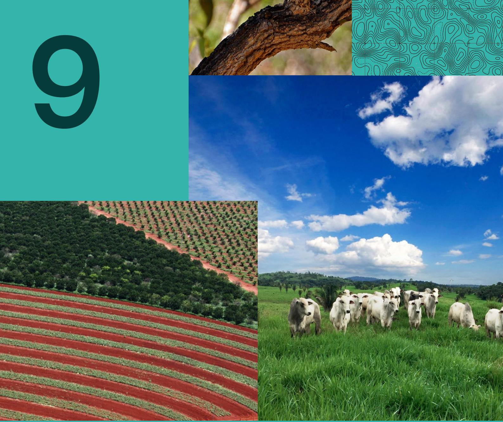

**How to Demonstrate Compliance with the EUDR Using the Public Platform**

# **Recommendations**

**AGRO BRASIL + SUSTENTÁVEL**

AB+S presents robust conditions to assist operators in structuring the declaration and due diligence system applicable to the EUDR. In the spirit of continuous improvement, opportunities of tool expansion are envisioned, contributing to making it an international reference in data consolidation and in guaranteeing compliance with regulation. This projection is backed by the platform's dynamic and adaptive character, which passes through constant improvements in order to deliver excellent services that boost Brazilian agricultural production. With this purpose of incorporating improvements continuously, recommendations below are presented:

#### **Recommendation 1**

# **Foster dialogue and alignment with subnational and private systems**

Mapping in this study had a focus on compliance instruments mapped at a federal level, which are currently the central scope of the AB+S Platform. There is, however, other information which can be required for fulfillment of state laws, which are not covered by the Platform. This does not necessarily mean a loss, given that the Platform is a tool of the federal government. Still, it is fundamental that its checking processes are aligned with those implemented by state verification systems of agricultural production info. This contributes to reduction of uncertainties and increase of trust in Brazilian information, especially in a context of agricultural product export. MAPA has performed this articulation role between ministries and agencies responsible for state data and will follow in this role to advance in information coverage by the platform. Additionally, it was highlighted along the dry-run process that AB+S represents a strategic opportunity for integration with private protocols. A possible development of the Platform takes place in the sense of cross-referencing and emitting reports combining EUDR demands with private sector purchase policies, as is the case of the Beef on Track Protocol.

**Recommendation 2:** 

# **Provide conceptual support for the checks performed on the Platform and point out cases of non-compliance**

Analysis of Chapters 6 and 7 pointed to the fact that the AB+S Platform maps a large part of compliance instruments capable of providing information applicable to Art. 9 demands of the EUDR. A possible evolution in the Platform's construction is evidencing, in a more detailed manner, criteria leading to pointing out compliance or non-compliance with the EUDR. Many of mapped instruments possess details provided for in law that lead to distinct analysis results, like for example the regularization process of indigenous and quilombola territories. This, depending on the regularization phase, can point to distinct risk degrees of non-compliance. Pointing out criteria and a more detailed description of analysis processes can give more robustness to evaluations made on the platform, contributing to reducing uncertainties.

This point identified in conceptual analysis of the AB+S Platform was also reinforced along interactions in the dry-run. It is important that the Platform improves communication of blocks to property qualifications. When a report is blocked, it is important that AB+S specifies the source of the problem, and indicates procedures necessary for property regularization. Just as the previous recommendation, MAPA follows in discussions to evaluate the possibility of including this information.

**Recommendation 3**

# **Develop interoperability and integration solutions with traceability systems**

The dry-run identified the importance of creating an Application Programming Interface (API) of authentication by SERPRO, allowing direct communication (system-to-system) between the platform and software of meatpacking plants. This would eliminate the operational bottleneck of the current manual model of emission and reception of PDF files, rendering feasible compliance validation at scale. Additionally, implementation of a feature is recommended in which the rural producer can grant a systemic authorization for the buyer (meatpacking plant) to access the platform and generate compliance qualifications directly in their name, respecting LGPD guidelines and facilitating engagement. Finally, it is worth also emphasizing the possibility to connect the AB+S Platform to private traceability systems, facilitating property qualification at the moment of emitting documents like the Cattle Origin Declaration (DOG).

#### **Recommendation 4:**

# **Conduct training and engagement activities in the field**

The dry-run demonstrated that many producers still had little (or no) knowledge about the AB+S Platform and its functioning. In this sense, it is recommended that institutions responsible for the Platform's development intensify communication and dialogue campaigns with producers, detailing what the Platform is, how to access it, what the benefits of its use are, etc. The presence of MAPA and SERPRO in the field – through face-to-face workshops in regions of Brazil and active participation in events of the productive sector – is an important measure to create familiarity, demystify using GOV.BR, and anticipate this technological adaptation for rural producers.

#### **REFERÊNCIAS**

**1** Zackievicz, M. **A economia do** *software* **e a digitalização da economia.** Revista Brasileira de Inovação. Campinas (SP), 14 (2), p. 313-336, July/December 2015. **2** Varian, H. **R.** Economics of Information Technology. University of California, Berkeley. 2003. **AVAILABLE AT:** https:[//people.ischool.berkeley.edu/~hal/Papers/mattioli/mattioli.html#tth\\_sEc2.](https://people.ischool.berkeley.edu/~hal/Papers/mattioli/mattioli.html#tth_sEc2) **3** European Commission. **FAQ on EUDR Implementation. AVAILABLE AT:** [https:](https://environment.ec.europa.eu/publications/faq-eudr-implementation_en)// [environment.ec.europa.eu/publications/faq-eudr-implementation\\_en](https://environment.ec.europa.eu/publications/faq-eudr-implementation_en) **4** Prizibisczki, C., **Soares, F.** Após um ano de testes, Pará formaliza plataforma de transparência de dados da pecuária. (o) eco. 28/04/2022. **AVAILABLE AT:** https:[//oeco.org.br/noticias/apos](https://oeco.org.br/noticias/apos-um-ano-de-testes-para-formaliza-plataforma-de-transparencia-de-dados-da-pecuaria/)[um-ano-de-testes-para-formaliza-plataforma-de-transparencia-de-dados-da-pecuaria/](https://oeco.org.br/noticias/apos-um-ano-de-testes-para-formaliza-plataforma-de-transparencia-de-dados-da-pecuaria/). **5** Selo Verde. **Selo Verde MG: Ciência e tecnologia em apoio à sustentabilidade ambiental da agropecuária. AVAILABLE AT:** https:[//seloverde.meioambiente.mg.gov.br/](https://seloverde.meioambiente.mg.gov.br/). **6** Ministério da Agricultura e Pecuária. **O que é a Plataforma Agro Brasil+Sustentável?**  21/01/2025. **AVAILABLE AT:** https:[//www.gov.br/agricultura/pt-br/assuntos/sustentabilidade/](https://www.gov.br/agricultura/pt-br/assuntos/sustentabilidade/programa-agro-brasil-sustentavel/o-que-e-a-plataforma-agro-brasil-sustentavel) [programa-agro-brasil-sustentavel/o-que-e-a-plataforma-agro-brasil-sustentavel.](https://www.gov.br/agricultura/pt-br/assuntos/sustentabilidade/programa-agro-brasil-sustentavel/o-que-e-a-plataforma-agro-brasil-sustentavel) **7** Ministério da Agricultura e Pecuária. **Portaria MAPA nº 745, de 20 de dezembro de 2024.**  Diário Oficial da União, Edição 246, Seção 1, Página 17. 23/12/2024. **AVAILABLE AT:** https:[//www.](https://www.in.gov.br/en/web/dou/-/portaria-mapa-n-745-de-20-de-dezembro-de-2024-603337646) [in.gov.br/en/web/dou/-/portaria-mapa-n-745-de-20-de-dezembro-de-2024-603337646](https://www.in.gov.br/en/web/dou/-/portaria-mapa-n-745-de-20-de-dezembro-de-2024-603337646). **8** Formerly known as the Secretariat for Innovation, Sustainable Development, Irrigation, and Cooperativism of the Ministry of Agriculture and Livestock (SDI/MAPA) **9** Proforest. **Mapeamento de Requisitos para a Plataforma Agro Brasil+Sustentável.** Coalizão Brasil Clima, Florestas e Agricultura. Maio de 2025. **AVAILABLE AT:** https:[//coalizaobr.com.br/wp-content/](https://coalizaobr.com.br/wp-content/uploads/2025/05/Mapeamento-de-Requisitos-para-a-Plataforma-Agro-Brasil-Sustentavel-AB-S.pdf) [uploads/2025/05/Mapeamento-de-Requisitos-para-a-Plataforma-Agro-Brasil-Sustentavel-AB-S.pdf](https://coalizaobr.com.br/wp-content/uploads/2025/05/Mapeamento-de-Requisitos-para-a-Plataforma-Agro-Brasil-Sustentavel-AB-S.pdf). **10** SDI/MAPA. **Portaria SDI/MAPA nº 721, de 2 de janeiro de 2025.** Diário Oficial da União. Edição 2, Seção 1, Página 22. 03/01/2025. **AVAILABLE AT:** https:[//www.in.gov.br/](https://www.in.gov.br/en/web/dou/-/portaria-sdi/mapa-n-721-de-2-de-janeiro-de-2025-605413320) [en/web/dou/-/portaria-sdi/mapa-n-721-de-2-de-janeiro-de-2025-605413320](https://www.in.gov.br/en/web/dou/-/portaria-sdi/mapa-n-721-de-2-de-janeiro-de-2025-605413320). **11** The process of linking a CNPJ to a GOV.BR account is described at: https://www. gov.br/governodigital/pt-br/acessibilidade-e-usuario/atendimento-gov.br/duvidas-naconta-gov.br/duvidas-na-vinculacao-de-cnpj-no-gov.br/como-vincular-cnpj. **12** MAPA. **Plataforma Agro Brasil + Sustentável disponibiliza serviço de habilitação de área de produção para exportação.** 24/12/2025. **AVAILABLE AT:** https:[//www.](https://www.gov.br/agricultura/pt-br/assuntos/noticias/plataforma-agro-brasil-sustentavel-disponibiliza-servico-de-habilitacao-de-area-de-producao-para-exportacao) [gov.br/agricultura/pt-br/assuntos/noticias/plataforma-agro-brasil-sustentavel](https://www.gov.br/agricultura/pt-br/assuntos/noticias/plataforma-agro-brasil-sustentavel-disponibiliza-servico-de-habilitacao-de-area-de-producao-para-exportacao)[disponibiliza-servico-de-habilitacao-de-area-de-producao-para-exportacao.](https://www.gov.br/agricultura/pt-br/assuntos/noticias/plataforma-agro-brasil-sustentavel-disponibiliza-servico-de-habilitacao-de-area-de-producao-para-exportacao) **13** Olab. **Laws of the Land: Mechanisms for Legal Compliance under the EUDR in Brazil.** Government of Netherlands. January 2026. **AVAILABLE AT:** [https://www.](https://www.olab.com.br/wp-content/uploads/2026/01/Lei_Lavoura_PT.pdf) [olab.com.br/wp-content/uploads/2026/01/Lei\\_Lavoura\\_PT.pdf.](https://www.olab.com.br/wp-content/uploads/2026/01/Lei_Lavoura_PT.pdf) **14** The platform is moving to integrate information from the Agricultural and Livestock Management Platform (PGA-SIGSIF), a new system used to carry out the procedures required to register animal-origin products from establishments registered with the Federal Inspection Service (SIF). **Once operational within the AB+S platform, it will be possible to connect to the Defense Service Registry and, consequently, to the GTA.** More information at: [https://www.gov.br/agricultura/pt-br/acesso-a-informacao/tecnologia](https://www.gov.br/agricultura/pt-br/acesso-a-informacao/tecnologia-da-informacao/sistemas/orgaos/mapa/animal/pga-sigsif-plataforma-de-gestao-agropecuaria-sigsif)[da-informacao/sistemas/orgaos/mapa/animal/pga-sigsif-plataforma-de-gestao-agropecuaria-sigsif.](https://www.gov.br/agricultura/pt-br/acesso-a-informacao/tecnologia-da-informacao/sistemas/orgaos/mapa/animal/pga-sigsif-plataforma-de-gestao-agropecuaria-sigsif) **15** *EUDR FAQ, 1.25: "For relevant products under the commodity "cattle", the time range of production refers to the lifetime of the animals from the moment the cattle were born until the time of slaughtering. If live cattle (...) are placed in the EU market (...), all geolocations until the first placing on the EU market will have to be collected and submitted with the due diligence statement (DDS) (...)".* **16** Froelich, G., **Stabile, M.,** Souza, M. L. Iniciativas de Rastreabilidade nas Cadeias de Valor da Carne Bovina e do Couro no Brasil. IPAM e AL-INVEST Verde. 2022. **AVAILABLE AT:** [https:](https://alinvest-verde.eu/wp-content/uploads/2023/02/Iniciativas_rastreabilidade_PORTU.pdf)// [alinvest-verde.eu/wp-content/uploads/2023/02/Iniciativas\\_rastreabilidade\\_PORTU.pdf](https://alinvest-verde.eu/wp-content/uploads/2023/02/Iniciativas_rastreabilidade_PORTU.pdf).

**17** Froelich, G., **Stabile, M.,** Souza, M. L. Iniciativas de Rastreabilidade nas Cadeias de Valor da Carne Bovina e do Couro no Brasil. IPAM e AL-INVEST Verde. 2022. **AVAILABLE AT:** [https:](https://alinvest-verde.eu/wp-content/uploads/2023/02/Iniciativas_rastreabilidade_PORTU.pdf)// [alinvest-verde.eu/wp-content/uploads/2023/02/Iniciativas\\_rastreabilidade\\_PORTU.pdf](https://alinvest-verde.eu/wp-content/uploads/2023/02/Iniciativas_rastreabilidade_PORTU.pdf). **18** More information at: https:[//www.pecuariatransparente.org.br/.](https://www.pecuariatransparente.org.br/) **19 AVAILABLE AT:** https:[//www.gov.br/governodigital/pt-br/acessibilidade-e-usuario/atendimento-gov.](https://www.gov.br/governodigital/pt-br/acessibilidade-e-usuario/atendimento-gov.br/duvidas-na-conta-gov.br/duvidas-na-vinculacao-de-cnpj-no-gov.br/como-vincular-cnpj) [br/duvidas-na-conta-gov.br/duvidas-na-vinculacao-de-cnpj-no-gov.br/como-vincular-cnpj.](https://www.gov.br/governodigital/pt-br/acessibilidade-e-usuario/atendimento-gov.br/duvidas-na-conta-gov.br/duvidas-na-vinculacao-de-cnpj-no-gov.br/como-vincular-cnpj) **20** European Parliament. **Regulation (EU) 2023/1115 of the European Parliament and of the Council.** 31/03/2023. **AVAILABLE AT:** https:[//eur-lex.europa.eu/](https://eur-lex.europa.eu/legal-content/EN/TXT/PDF/?uri=CELEX:02023R1115-20251226) [legal-content/EN/TXT/PDF/?uri=CELEX:02023R1115-20251226.](https://eur-lex.europa.eu/legal-content/EN/TXT/PDF/?uri=CELEX:02023R1115-20251226) **21** European Commission. **Regulation on Deforestation-free Products. AVAILABLE AT:** [https:](https://environment.ec.europa.eu/topics/forests/deforestation/regulation-deforestation-free-products_en)// [environment.ec.europa.eu/topics/forests/deforestation/regulation-deforestation-free-products\\_en.](https://environment.ec.europa.eu/topics/forests/deforestation/regulation-deforestation-free-products_en) **22** European Commission. **O Pacto Ecológico Europeu. AVAILABLE AT:** https:[//commission.](https://commission.europa.eu/strategy-and-policy/priorities-2019-2024/european-green-deal_en) [europa.eu/strategy-and-policy/priorities-2019-2024/european-green-deal\\_en](https://commission.europa.eu/strategy-and-policy/priorities-2019-2024/european-green-deal_en). **23** European Commission. **European Climate Law. AVAILABLE AT:** [https:](https://climate.ec.europa.eu/eu-action/european-climate-law_en)// [climate.ec.europa.eu/eu-action/european-climate-law\\_en](https://climate.ec.europa.eu/eu-action/european-climate-law_en). **24** European Council. **EU deforestation law: Council formally adopts its one-year postponement.** 18/12/2024. **AVAILABLE AT:** https:[//www.consilium.europa.eu/en/press/press](https://www.consilium.europa.eu/en/press/press-releases/2024/12/18/eu-deforestation-law-council-formally-adopts-its-one-year-postponement/)[releases/2024/12/18/eu-deforestation-law-council-formally-adopts-its-one-year-postponement/.](https://www.consilium.europa.eu/en/press/press-releases/2024/12/18/eu-deforestation-law-council-formally-adopts-its-one-year-postponement/) **25** European Council. **Deforestation: Council signs off targeted revision to simplify and postpone the regulation.** 18/12/2025. **AVAILABLE AT:** https:[//www.](https://www.consilium.europa.eu/en/press/press-releases/2025/12/18/deforestation-council-signs-off-targeted-revision-to-simplify-and-postpone-the-regulation/) [consilium.europa.eu/en/press/press-releases/2025/12/18/deforestation-council](https://www.consilium.europa.eu/en/press/press-releases/2025/12/18/deforestation-council-signs-off-targeted-revision-to-simplify-and-postpone-the-regulation/)[signs-off-targeted-revision-to-simplify-and-postpone-the-regulation/](https://www.consilium.europa.eu/en/press/press-releases/2025/12/18/deforestation-council-signs-off-targeted-revision-to-simplify-and-postpone-the-regulation/). **26** European Commission. **FAQ on EUDR Implementation.** 04/05/2026. **AVAILABLE AT:** https:[//environment.ec.europa.eu/publications/faq-eudr-implementation\\_en.](https://environment.ec.europa.eu/publications/faq-eudr-implementation_en) **27** European Commission. **Guidance Document for the Regulation on Deforestation-Free Products.** 04/05/2026. **AVAILABLE AT:** https:[//green-forum.ec.europa.eu/publications/](https://green-forum.ec.europa.eu/publications/guidance-document-regulation-eu-20231115-deforestation-free-products_en) [guidance-document-regulation-eu-20231115-deforestation-free-products\\_en](https://green-forum.ec.europa.eu/publications/guidance-document-regulation-eu-20231115-deforestation-free-products_en). **28** The EUDR Information System is a specialized online tool for creating and submitting Due Diligence Statements to demonstrate to competent authorities that your products comply with the regulation. **The system is available here:** https:**//eudr.webcloud.ec.europa.eu/tracesnt/login. 29** European Commission. **Frequently Asked Questions: Implementation of the EU Deforestation Regulation.** Version 4: April 2025. **30** EUDR, Art. **2(14): 'produced' means grown, harvested, obtained from or raised on relevant plots of land or, as regards cattle, on establishments. 31** INPE. **Monitoramento do Desmatamento da Floresta Amazônica Brasileira por Satélite. AVAILABLE AT:**<http://www.obt.inpe.br/OBT/assuntos/programas/amazonia/prodes>. **32 AVAILABLE AT:** [http://terrabrasilis.dpi.inpe.br/downloads/.](http://terrabrasilis.dpi.inpe.br/downloads/) **33** Mendes, K. **Novo mapa do Inpe vai ajudar exportadores a cumprir lei antidesmatamento da EU.** Mongabay. 12/02/2026. **AVAILABLE AT:** https:[//brasil.mongabay.com/2026/02/](https://brasil.mongabay.com/2026/02/novo-mapa-do-inpe-vai-ajudar-exportadores-a-cumprir-lei-antidesmatamento-da-ue/) [novo-mapa-do-inpe-vai-ajudar-exportadores-a-cumprir-lei-antidesmatamento-da-ue/](https://brasil.mongabay.com/2026/02/novo-mapa-do-inpe-vai-ajudar-exportadores-a-cumprir-lei-antidesmatamento-da-ue/). **34** Olab. **Laws of the Land: Mechanisms for Legal Compliance under the EUDR in Brazil.** Government of Netherlands. January 2026. **AVAILABLE AT:** [https:](https://www.olab.com.br/wp-content/uploads/2026/01/Lei_Lavoura_PT.pdf)// [www.olab.com.br/wp-content/uploads/2026/01/Lei\\_Lavoura\\_PT.pdf.](https://www.olab.com.br/wp-content/uploads/2026/01/Lei_Lavoura_PT.pdf) **35** Brasil. **Law nº 5.868, 1972 December 12. AVAILABLE AT:** [https:](https://www.planalto.gov.br/ccivil_03/leis/l5868.htm)// [www.planalto.gov.br/ccivil\\_03/leis/l5868.htm](https://www.planalto.gov.br/ccivil_03/leis/l5868.htm). **36** Brasil. **Law 12.651, 2012 May 25. AVAILABLE AT:** https:[//www.planalto.](https://www.planalto.gov.br/ccivil_03/_ato2011-2014/2012/lei/l12651.htm) [gov.br/ccivil\\_03/\\_ato2011-2014/2012/lei/l12651.htm](https://www.planalto.gov.br/ccivil_03/_ato2011-2014/2012/lei/l12651.htm).

**37** Article **29 of the Forest Code establishes that the following are required for the registration of a property in the CAR: (a) identification of the rural property owner or possessor; (b) proof of ownership or possession of the property; and (c) identification of the rural property, including geographic information for at least one perimeter reference point, as well as data on native vegetation remnants, Permanent Preservation Areas (APP), Restricted Use Areas, consolidated areas, and the Legal Reserve.** The "Active" status is maintained following the property analysis, provided the information regarding Permanent Preservation Areas (APP), Restricted Use Areas, Legal Reserves, and native vegetation remnants is found to be in compliance. **38** Two other CAR statuses: Suspended: this status is assigned by a judicial or administrative decision (duly justified) from the competent authority. **Cancelled: a status assigned when: (a) the declared information is wholly or partially false, misleading, or omissive; (b) deadlines established in notifications are not met; (c) there is a judicial or administrative decision (duly justified) from the competent authority. 39** Given that an overlap check involving Indigenous Lands, Quilombola Territories, and Conservation Units will be conducted subsequently, it is recommended that the analysis of this Requirement consider the overlap of the CAR with: (a) agrarian reform settlements, regulated by Law No. **8.629/1993; (b) undesignated public forests (Type B), regulated by Law No.** 11.284/2006 and analyzed via the AB+S Platform; and (c) other CAR polygons. **Polygon data regarding agrarian reform settlements can be found in INCRA's Land Tenure Database.** For undesignated public forests, the National Registry of Public Forests is available and also provides georeferenced information. **40** Brasil. **Law nº 6.015, de 31 de dezembro de 1973.** AVAILABLE AT: [https:](https://www.planalto.gov.br/ccivil_03/leis/l6015compilada.htm)// [www.planalto.gov.br/ccivil\\_03/leis/l6015compilada.htm](https://www.planalto.gov.br/ccivil_03/leis/l6015compilada.htm). **41** MAPA. **Manual técnico para georreferenciamento de imóveis rurais.** 2022. **AVAILABLE AT:** https:[//sigef.incra.gov.br/static/documentos/manual\\_geo\\_imoveis.pdf](https://sigef.incra.gov.br/static/documentos/manual_geo_imoveis.pdf). **42** INCRA. **Sistema de Gestão Fundiária tem novo procedimento de validação.**  23/06/2025. **AVAILABLE AT:** https:[//www.gov.br/incra/pt-br/assuntos/noticias/](https://www.gov.br/incra/pt-br/assuntos/noticias/sistema-de-gestao-fundiaria-tem-novo-procedimento-de-validacao) [sistema-de-gestao-fundiaria-tem-novo-procedimento-de-validacao](https://www.gov.br/incra/pt-br/assuntos/noticias/sistema-de-gestao-fundiaria-tem-novo-procedimento-de-validacao). **43** The Laws of the Land report presents two possible ways to demonstrate compliance with the Land Use Rights requirement. **The first is through the CAR, described above.**  The second involves a combination of the SNCR and SIGEF—a pairing equally capable of providing high-quality information: registration in the SNCR signifies that the owner has met all requirements regarding the property's registry and proof of land use rights, while SIGEF enrollment requires that the property has no parcels overlapping with previously registered ones. Thus, an alignment between the report and the platform is evident. **44** Oliveira, L. **Verificação da integração entre o Cadastro Ambiental Rural (CAR) e o Cadastro Nacional de Imóveis Rurais (CNIR) sob a ótica do Cadastro Territorial Multifinalitário.** Programa de Pós-Graduação em Planejamento Territorial e Desenvolvimento Socioambiental do Centro de Ciências Humanas e da Educação. Universidade do Estado de Santa Catarina. Florianópolis. 2018. **AVAILABLE AT:** https:[//www.udesc.br/](https://www.udesc.br/arquivos/faed/id_cpmenu/1341/1_DISSERTA__O_16521222043413_1341.pdf) [arquivos/faed/id\\_cpmenu/1341/1\\_DISSERTA\\_\\_O\\_16521222043413\\_1341.pdf.](https://www.udesc.br/arquivos/faed/id_cpmenu/1341/1_DISSERTA__O_16521222043413_1341.pdf) **45** Article **4 of the Land Statute (Law No. 4,504/1964) defines the concept of a rural property as a "rustic holding of contiguous area—regardless of location—intended for extractive, agricultural, livestock, or agro-industrial operations, whether through public development plans or private initiative."** Based on this concept, MMA Normative Instruction No. 2/2014, which regulates SICAR, defines the rural property as the reference unit for the Rural Environmental Registry (CAR) and establishes, in Article 32, that "owners or possessors of rural properties who hold more than one property or holding in a contiguous area must submit a single registration for these properties." In summary, the CAR allows multiple properties or holdings located in a contiguous area to be treated as a single property registration. **46** Within the scope of SIGEF, a rural property consists of a set of parcels, provided they are contiguous (without overlaps or gaps) and continuous (without interruption by another area under separate ownership). **47** For this reason, the report Laws of the Land presents two separate pathways for demonstrating compliance with land-use right requirements: (a) via the CAR; and (b) via a combination of the SNCR and SIGEF systems. **The report recommends prioritizing the CAR as the compliance instrument for two main reasons: (a) the CAR is widely used by the productive sector,** 

**with significant knowledge and expertise associated with its implementation; and (b) the CAR serves as a central mechanism for verifying the environmental protection requirements discussed subsequently, given that the analysis of Legal Reserves (RL) and Permanent Preservation Areas (APP) is part of the registry itself.**

**48** Brasil. **Law 12.651, May 25, 2012. AVAILABLE AT:** [https://www.planalto.](https://www.planalto.gov.br/ccivil_03/_ato2011-2014/2012/lei/l12651.htm) [gov.br/ccivil\\_03/\\_ato2011-2014/2012/lei/l12651.htm](https://www.planalto.gov.br/ccivil_03/_ato2011-2014/2012/lei/l12651.htm). **49** The Legal Reserve area is established by Article 12 of the Forest Code, which mandates that every rural property maintain an area covered by native vegetation, in accordance with minimum percentages relative to the property's total area. **These percentages are: (a) 80% for properties located in forest areas; (b) 35% for properties located in Cerrado areas; and (c) 20% for properties located in campos gerais (grasslands) and other regions of the country.** The protection regime for Permanent Preservation Areas (APPs) is determined by Articles 7, 8, and 9 of the Forest Code. According to Article 7, if a property contains vegetation situated within an APP, the owner must maintain it and is required to restore any vegetation that has been cleared. **50** Lopes, C. **L.,** Didonet, L., Corleto, A. F., Chiavari, J. Onde Estamos na Implementação do Código Florestal? Radiografia do CAR e do PRA nos Estados Brasileiros. Climate Policy Initiative. 2025. **AVAILABLE AT:** https:[//www.climatepolicyinitiative.](https://www.climatepolicyinitiative.org/wp-content/uploads/2025/12/Onde-Estamos-2025.pdf) [org/wp-content/uploads/2025/12/Onde-Estamos-2025.pdf](https://www.climatepolicyinitiative.org/wp-content/uploads/2025/12/Onde-Estamos-2025.pdf). **51** Brasil. **Decree nº 6.514, de 22 de julho de 2008. AVAILABLE AT:** https:[//www.](https://www.planalto.gov.br/ccivil_03/_ato2007-2010/2008/decreto/d6514.htm) [planalto.gov.br/ccivil\\_03/\\_ato2007-2010/2008/decreto/d6514.htm.](https://www.planalto.gov.br/ccivil_03/_ato2007-2010/2008/decreto/d6514.htm) **52** Brasil. **Law nº 9.985, de 18 de julho de 2000. AVAILABLE AT:** https:[//www.planalto.](https://www.planalto.gov.br/ccivil_03/leis/l9985.htm) [gov.br/ccivil\\_03/leis/l9985.htm](https://www.planalto.gov.br/ccivil_03/leis/l9985.htm). *Definition of Conservation Unit (Art. 2): "a territorial space and its environmental resources, including jurisdictional waters, possessing significant natural characteristics, legally established by the public authorities with conservation objectives and defined boundaries, under a special administrative regime to which appropriate protection guarantees apply."* **53** They aim to preserve nature, such that the use of natural resources must be strictly indirect. **The following belong to this category: Ecological Station, Biological Reserve, National Park, Natural Monument, and Wildlife Refuge. 54** They aim to reconcile nature conservation with the sustainable use of a portion of their natural resources. **The following belong to this category: Environmental Protection Area (APA); Area of Relevant Ecological Interest; National Forest; Extractive Reserve; Fauna Reserve; Sustainable Development Reserve; and Private Natural Heritage Reserve (RPPN). 55** Brasil. **Law 12.651, de 25 de maio de 2012. AVAILABLE AT:** https:[//www.](https://www.planalto.gov.br/ccivil_03/_ato2011-2014/2012/lei/l12651.htm) [planalto.gov.br/ccivil\\_03/\\_ato2011-2014/2012/lei/l12651.htm](https://www.planalto.gov.br/ccivil_03/_ato2011-2014/2012/lei/l12651.htm). **56** Brasil. **Decree nº 6.514, de 22 de julho de 2008.** AVAILABLE AT: https:[//www.](https://www.planalto.gov.br/ccivil_03/_ato2007-2010/2008/decreto/d6514.htm) [planalto.gov.br/ccivil\\_03/\\_ato2007-2010/2008/decreto/d6514.htm.](https://www.planalto.gov.br/ccivil_03/_ato2007-2010/2008/decreto/d6514.htm) **57** There are exogenous factors related to administrative processes (for example, a potential lack of speed on the part of the competent authority in identifying illegal deforestation and imposing an embargo) that may result in an area not being embargoed; however, it is understood that considering such factors falls outside the scope of the AB+S Platform. **58** Diário Oficial da União. **Resolução CONAMA nº 510, de 15 de setembro de 2025.** Edição 176. Seção 1. Página 71. **AVAILABLE AT:** https:[//conama.mma.](https://conama.mma.gov.br/?option=com_sisconama&task=arquivo.download&id=840) [gov.br/?option=com\\_sisconama&task=arquivo.download&id=840.](https://conama.mma.gov.br/?option=com_sisconama&task=arquivo.download&id=840) **59** Brasil. **Constituição da República Federativa do Brasil de 1988. AVAILABLE AT:** https:[//www.planalto.gov.br/ccivil\\_03/constituicao/constituicao.htm](https://www.planalto.gov.br/ccivil_03/constituicao/constituicao.htm). *Definition of "traditionally occupied lands," according to Article 231: "Lands traditionally occupied by Indigenous peoples are those inhabited by them on a permanent basis, those used for their productive activities, those essential for the preservation of the environmental resources necessary for their well-being, and those necessary for their physical and cultural reproduction, in accordance with their uses, customs, and traditions."* **60** FUNAI. **Indigenous Lands.** Sistema Indigenista de Informações. **AVAILABLE AT:** [http://](http://sii.funai.gov.br/funai_sii/informacoes_indigenas/visao/visao_terras_indigenas.wsp) [sii.funai.gov.br/funai\\_sii/informacoes\\_indigenas/visao/visao\\_terras\\_indigenas.wsp.](http://sii.funai.gov.br/funai_sii/informacoes_indigenas/visao/visao_terras_indigenas.wsp)

**61** According to FUNAI, in 2025 there was a total of 796 Indigenous Lands in Brazil. **Of these, 453 were regularized, 14 ratified, 67 declared, 37 delimited, and 164 were in the study phase.** The total area of Indigenous Lands that had undergone at least the delimitation phase was 117.36 million hectares, corresponding to more than 13% of the national territory FUNAI. Terras Indígenas: Dados Geoespaciais e Mapas. 2025. **AVAILABLE AT:** https:[//www.gov.br/funai/pt-br/atuacao/terras-indigenas/geoprocessamento-e-mapas.](https://www.gov.br/funai/pt-br/atuacao/terras-indigenas/geoprocessamento-e-mapas) **62** Brasil. **Constituição da República Federativa do Brasil de 1988. AVAILABLE AT:** https:[//www.planalto.gov.br/ccivil\\_03/constituicao/constituicao.htm.](https://www.planalto.gov.br/ccivil_03/constituicao/constituicao.htm) **63** Brasil. **Decree nº 4.887, de 20 de novembro de 2003. AVAILABLE AT:** https:[//www.planalto.gov.br/ccivil\\_03/decreto/2003/d4887.htm](https://www.planalto.gov.br/ccivil_03/decreto/2003/d4887.htm). **64** INCRA. **Passo a Passo da Titulação de Território Quilombola. AVAILABLE AT:** https:[//www.](https://www.gov.br/incra/pt-br/assuntos/governanca-fundiaria/passo_passo_quilombola_incra.png) [gov.br/incra/pt-br/assuntos/governanca-fundiaria/passo\\_passo\\_quilombola\\_incra.png.](https://www.gov.br/incra/pt-br/assuntos/governanca-fundiaria/passo_passo_quilombola_incra.png) **65** Technical Report on Identification and Delimitation. **66** Data from 2025 report the existence of 384 land titles issued to quilombola territories, which together cover an area of 1.16 million hectares (0.13% of the national territory). **Source: INCRA** Quadro atual da Política de Regularização de Territórios Quilombolas no INCRA. 2025. **AVAILABLE AT:** https:[//www.gov.](https://www.gov.br/incra/pt-br/assuntos/governanca-fundiaria/processosabertos.pdf) [br/incra/pt-br/assuntos/governanca-fundiaria/processosabertos.pdf](https://www.gov.br/incra/pt-br/assuntos/governanca-fundiaria/processosabertos.pdf). **67** Law No. **10.803/2003, which amends Article 149 of the Penal Code (Decree-Law No. 2.848/1940), defines the aforementioned crime as follows:** "Reducing a person to a condition analogous to slavery, whether by subjecting them to forced labor or an exhausting workday, subjecting them to degrading working conditions, or restricting, by any means, their freedom of movement due to a debt incurred with the employer or their representative." **AVAILABLE AT:** https:[//www.planalto.gov.br/ccivil\\_03/Leis/2003/L10.803.htm.](https://www.planalto.gov.br/ccivil_03/Leis/2003/L10.803.htm) **68** MTE, MDHC, MIR. **Portaria Interministerial nº 18, de 13 de setembro de 2024. AVAILABLE AT:** https:[//www.gov.br/trabalho-e-emprego/pt-br/assuntos/inspecao](https://www.gov.br/trabalho-e-emprego/pt-br/assuntos/inspecao-do-trabalho/portaria-interministerial-mte-mdhc-mir-n-18-2024.pdf)[do-trabalho/portaria-interministerial-mte-mdhc-mir-n-18-2024.pdf](https://www.gov.br/trabalho-e-emprego/pt-br/assuntos/inspecao-do-trabalho/portaria-interministerial-mte-mdhc-mir-n-18-2024.pdf). **69** The requirements are: (i) Waiver of any measure aimed at challenging, invalidating, or setting aside the legal effects of the infraction notices issued during the inspection in which labor analogous to slavery was identified; (ii) Payment of outstanding labor and social security obligations to the workers; (iii) Payment of compensation for moral damages to the workers; (iv) Reimbursement to the Federal Government of the unemployment insurance amounts due to the workers; (v) Payment to the Federal Government of 2% of the employer's gross revenue from the fiscal year preceding the execution of the Conduct Adjustment Agreement (TAC), with said funds allocated to the implementation of public policies aimed at assisting workers rescued from labor conditions analogous to slavery or those vulnerable to such exploitation; (vi) Formulation and implementation of continuous monitoring regarding respect for human and labor rights throughout the value chain. **70** Brasil. **Law nº 12.440, de 7 de julho de 2011. AVAILABLE AT:** [https:](https://www.planalto.gov.br/ccivil_03/_ato2011-2014/2011/lei/l12440.htm)// [www.planalto.gov.br/ccivil\\_03/\\_ato2011-2014/2011/lei/l12440.htm.](https://www.planalto.gov.br/ccivil_03/_ato2011-2014/2011/lei/l12440.htm) Altera o Art. 642-A da Consolidação das Leis do Trabalho (CLT). **71** Failure to obtain the CNDT occurs under two conditions: (i) non-compliance with obligations established in a judgment rendered by the Labor Courts or in court-approved labor settlements; (ii) non-compliance with obligations arising from agreements entered into before the Labor Prosecution Service or a Pre-litigation Conciliation Commission. **72** Tribunal Superior do Trabalho. **O que é CNDT. AVAILABLE AT:** https:[//www.tst.jus.br/o-que-e-cndt](https://www.tst.jus.br/o-que-e-cndt). **73** Corregedoria Nacional de Justiça. **Recomendação CNJ nº 03, de 15 de março de 2012. AVAILABLE AT:** https:[//atos.cnj.jus.br/files//recomendacao/](https://atos.cnj.jus.br/files//recomendacao/recomendacao_3_15032012_22102012214927.pdf) [recomendacao\\_3\\_15032012\\_22102012214927.pdf](https://atos.cnj.jus.br/files//recomendacao/recomendacao_3_15032012_22102012214927.pdf). **74** Proforest. **Navegando pela conformidade com os direitos humanos no setor agropecuário brasileiro.** GIZ. Fevereiro de 2026. **AVAILABLE AT:** https:[//www.proforest.net/fileadmin/uploads/](https://www.proforest.net/fileadmin/uploads/proforest/Photos/Publications/Human_Rights_on_Platform_AB___S_-_Policy_Brief_PT_BR.pdf) [proforest/Photos/Publications/Human\\_Rights\\_on\\_Platform\\_AB\\_\\_\\_S\\_-\\_Policy\\_Brief\\_PT\\_BR.pdf](https://www.proforest.net/fileadmin/uploads/proforest/Photos/Publications/Human_Rights_on_Platform_AB___S_-_Policy_Brief_PT_BR.pdf). **75** Proforest. **Navegando pela conformidade com os direitos humanos no setor agropecuário brasileiro.** GIZ. Fevereiro de 2026. **AVAILABLE AT:** https:[//www.proforest.net/fileadmin/uploads/](https://www.proforest.net/fileadmin/uploads/proforest/Photos/Publications/Human_Rights_on_Platform_AB___S_-_Policy_Brief_PT_BR.pdf) [proforest/Photos/Publications/Human\\_Rights\\_on\\_Platform\\_AB\\_\\_\\_S\\_-\\_Policy\\_Brief\\_PT\\_BR.pdf](https://www.proforest.net/fileadmin/uploads/proforest/Photos/Publications/Human_Rights_on_Platform_AB___S_-_Policy_Brief_PT_BR.pdf). **76** Proforest. **Navegando pela conformidade com os direitos humanos no setor agropecuário brasileiro.** GIZ. Fevereiro de 2026. **AVAILABLE AT:** https:[//www.proforest.net/fileadmin/uploads/](https://www.proforest.net/fileadmin/uploads/proforest/Photos/Publications/Human_Rights_on_Platform_AB___S_-_Policy_Brief_PT_BR.pdf) [proforest/Photos/Publications/Human\\_Rights\\_on\\_Platform\\_AB\\_\\_\\_S\\_-\\_Policy\\_Brief\\_PT\\_BR.pdf](https://www.proforest.net/fileadmin/uploads/proforest/Photos/Publications/Human_Rights_on_Platform_AB___S_-_Policy_Brief_PT_BR.pdf). **77** Statute of the Child and Adolescent (ECA). **Law No. 8.069/1990**. Furthermore, Brazil has ratified ILO Conventions 138 and 182, which address the minimum age for employment and the worst forms of child labor. Source: Proforest. Navegando pela conformidade com os Direitos Humanos no setor agropecuário brasileiro. GIZ. February 2026. **AVAILABLE AT:** [https://www.proforest.net/fileadmin/uploads/proforest/Photos/](https://www.proforest.net/fileadmin/uploads/proforest/Photos/Publications/Human_Rights_on_Platform_AB___S_-_Policy_Brief_PT_BR.pdf) [Publications/Human\\_Rights\\_on\\_Platform\\_AB\\_\\_\\_S\\_-\\_Policy\\_Brief\\_PT\\_BR.pdf.](https://www.proforest.net/fileadmin/uploads/proforest/Photos/Publications/Human_Rights_on_Platform_AB___S_-_Policy_Brief_PT_BR.pdf) **78** Ministry of Labor Regulatory Standard No. **31, on Occupational Safety and Health in Agriculture. Source: Proforest.** Navegando pela conformidade com os Direitos Humanos no setor agropecuário brasileiro. GIZ. February 2026. **AVAILABLE AT:** [https://www.proforest.net/fileadmin/uploads/](https://www.proforest.net/fileadmin/uploads/proforest/Photos/Publications/Human_Rights_on_Platform_AB___S_-_Policy_Brief_PT_BR.pdf) [proforest/Photos/Publications/Human\\_Rights\\_on\\_Platform\\_AB\\_\\_\\_S\\_-\\_Policy\\_Brief\\_PT\\_BR.pdf](https://www.proforest.net/fileadmin/uploads/proforest/Photos/Publications/Human_Rights_on_Platform_AB___S_-_Policy_Brief_PT_BR.pdf). **79** Brasil. **Princípios Orientadores sobre Empresas e Direitos Humanos – Implementando os Parâmetros "Proteger, Respeitar e Reparar" das Nações Unidas.** Ministério da Mulher, da Família e dos Direitos Humanos. 2019. **AVAILABLE AT:** [https://www.gov.](https://www.gov.br/mdh/pt-br/assuntos/noticias/2019/outubro/Cartilha_versoimpresso.pdf) [br/mdh/pt-br/assuntos/noticias/2019/outubro/Cartilha\\_versoimpresso.pdf](https://www.gov.br/mdh/pt-br/assuntos/noticias/2019/outubro/Cartilha_versoimpresso.pdf). **80** Proforest. **Navegando pela conformidade com os direitos humanos no setor agropecuário brasileiro.** GIZ. Fevereiro de 2026. **AVAILABLE AT:** [https://www.proforest.net/fileadmin/uploads/](https://www.proforest.net/fileadmin/uploads/proforest/Photos/Publications/Human_Rights_on_Platform_AB___S_-_Policy_Brief_PT_BR.pdf) [proforest/Photos/Publications/Human\\_Rights\\_on\\_Platform\\_AB\\_\\_\\_S\\_-\\_Policy\\_Brief\\_PT\\_BR.pdf](https://www.proforest.net/fileadmin/uploads/proforest/Photos/Publications/Human_Rights_on_Platform_AB___S_-_Policy_Brief_PT_BR.pdf). **81** Organização das Nações Unidas (ONU). **Declaração das Nações Unidas sobre os Direitos dos Povos Indígenas.** Rio de Janeiro. 2008. **AVAILABLE AT:** [https://](https://www.acnur.org/fileadmin/Documentos/portugues/BDL/Declaracao_das_Nacoes_Unidas_sobre_os_Direitos_dos_Povos_Indigenas.pdf) [www.acnur.org/fileadmin/Documentos/portugues/BDL/Declaracao\\_das\\_](https://www.acnur.org/fileadmin/Documentos/portugues/BDL/Declaracao_das_Nacoes_Unidas_sobre_os_Direitos_dos_Povos_Indigenas.pdf) [Nacoes\\_Unidas\\_sobre\\_os\\_Direitos\\_dos\\_Povos\\_Indigenas.pdf.](https://www.acnur.org/fileadmin/Documentos/portugues/BDL/Declaracao_das_Nacoes_Unidas_sobre_os_Direitos_dos_Povos_Indigenas.pdf) **82** OIT. **Convenção n° 169 da OIT sobre Povos Indígenas e Tribais.** 1989. **AVAILABLE AT:** [https://www.oas.org/dil/port/1989%20Conven%C3%A7%C3%A3o%20](https://www.oas.org/dil/port/1989 Conven%C3%A7%C3%A3o sobre Povos Ind%C3%ADgenas e Tribais Conven%C3%A7%C3%A3o OIT n %C2%BA 169.pdf) [sobre%20Povos%20Ind%C3%ADgenas%20e%20Tribais%20](https://www.oas.org/dil/port/1989 Conven%C3%A7%C3%A3o sobre Povos Ind%C3%ADgenas e Tribais Conven%C3%A7%C3%A3o OIT n %C2%BA 169.pdf) [Conven%C3%A7%C3%A3o%20OIT%20n%20%C2%BA%20169.pdf](https://www.oas.org/dil/port/1989 Conven%C3%A7%C3%A3o sobre Povos Ind%C3%ADgenas e Tribais Conven%C3%A7%C3%A3o OIT n %C2%BA 169.pdf). **83** ABRAMPA. **Diretrizes de Devida Diligência Ambiental para Compras de Produtos Brasileiros pela União Europeia Pautadas pelo Regulamento UE nº 1115/2023.** 2024. **AVAILABLE AT:** [https://abrampa.org.br/document/diretrizes-de-devida-diligencia-ambiental-para-compras-de](https://abrampa.org.br/document/diretrizes-de-devida-diligencia-ambiental-para-compras-de-produtos-brasileiros-pela-uniao-europeia-pautadas-pelo-regulamento-ue-no-1115-2023/)[produtos-brasileiros-pela-uniao-europeia-pautadas-pelo-regulamento-ue-no-1115-2023/.](https://abrampa.org.br/document/diretrizes-de-devida-diligencia-ambiental-para-compras-de-produtos-brasileiros-pela-uniao-europeia-pautadas-pelo-regulamento-ue-no-1115-2023/) **84** Brasil. **Decree nº 10.088, de 5 de novembro de 2019. AVAILABLE AT:** [https://www.](https://www.planalto.gov.br/ccivil_03/_Ato2019-2022/2019/Decreto/D10088.htm#art5) [planalto.gov.br/ccivil\\_03/\\_Ato2019-2022/2019/Decreto/D10088.htm#art5](https://www.planalto.gov.br/ccivil_03/_Ato2019-2022/2019/Decreto/D10088.htm#art5). **85** Brasil. **Law nº 15.190, de 8 de agosto de 2025. AVAILABLE AT:** [https://www.](https://www.planalto.gov.br/ccivil_03/_ato2023-2026/2025/lei/L15190.htm) [planalto.gov.br/ccivil\\_03/\\_ato2023-2026/2025/lei/L15190.htm.](https://www.planalto.gov.br/ccivil_03/_ato2023-2026/2025/lei/L15190.htm) **86** Brasil. **Law 12.651, de 25 de maio de 2012. AVAILABLE AT:** [https://www.](https://www.planalto.gov.br/ccivil_03/_ato2011-2014/2012/lei/l12651.htm) [planalto.gov.br/ccivil\\_03/\\_ato2011-2014/2012/lei/l12651.htm.](https://www.planalto.gov.br/ccivil_03/_ato2011-2014/2012/lei/l12651.htm) **87** The MMA makes information regarding the environmental licensing process available on the National Environmental Licensing Portal (PNLA) via the "Environmental Licensing Search" tool. **AVAILABLE AT:** [https://pnla.mma.gov.br/pesquisa-de-licenciamento-ambiental.](https://pnla.mma.gov.br/pesquisa-de-licenciamento-ambiental) **88** The licensing authority holds decision-making power regarding the licensing process and is responsible for the issuance, renewal, monitoring, and oversight of environmental licenses. **89** The division of competencies (including environmental licensing) among the Union, states, and municipalities is defined by Supplementary Law No. **140/2011. Additionally, Decree No. 8.437/2015 (Art. 2)** lists the activities and projects for which environmental licensing falls under the jurisdiction of the Union; agricultural and livestock activities are not included in this list.

**90** Funai. **Instrução Normativa nº 2, de 27 de março de 2015. AVAILABLE AT:** [https://www.gov.br/funai/pt-br/arquivos/conteudo/cglic/pdf/](https://www.gov.br/funai/pt-br/arquivos/conteudo/cglic/pdf/in-02-30-de-marco-de-2015-licenciamento-ambiental.pdf) [in-02-30-de-marco-de-2015-licenciamento-ambiental.pdf.](https://www.gov.br/funai/pt-br/arquivos/conteudo/cglic/pdf/in-02-30-de-marco-de-2015-licenciamento-ambiental.pdf) **91** EUDR, Art. **2(26):** *"'negligible risk' means the level of risk that applies to relevant commodities and relevant products, where, on the basis of a full assessment of product-specific and general information, and, where necessary, of the application of the appropriate mitigation measures, those commodities or products show no cause for concern as being not in compliance with Article 3, point (a) or (b)".* **92 AVAILABLE AT:** <https://pnla.mma.gov.br/pesquisa-de-licenciamento-ambiental>. **93** Proforest. **Navegando pela conformidade com os direitos humanos no setor agropecuário brasileiro.** GIZ. Fevereiro de 2026. **AVAILABLE AT:** [https://](https://www.proforest.net/fileadmin/uploads/proforest/Photos/Publications/Human_Rights_on_Platform_AB___S_-_Policy_Brief_PT_BR.pdf) [www.proforest.net/fileadmin/uploads/proforest/Photos/Publications/](https://www.proforest.net/fileadmin/uploads/proforest/Photos/Publications/Human_Rights_on_Platform_AB___S_-_Policy_Brief_PT_BR.pdf) [Human\\_Rights\\_on\\_Platform\\_AB\\_\\_\\_S\\_-\\_Policy\\_Brief\\_PT\\_BR.pdf](https://www.proforest.net/fileadmin/uploads/proforest/Photos/Publications/Human_Rights_on_Platform_AB___S_-_Policy_Brief_PT_BR.pdf). **94** Receita Federal. **Joint Ordinance RFB/BGFN, nº 1.751, October 7, 2014. AVAILABLE AT:** [https://normasinternet2.receita.fazenda.gov.](https://normasinternet2.receita.fazenda.gov.br/#/consulta/externa/56753/visao/multivigente) [br/#/consulta/externa/56753/visao/multivigente](https://normasinternet2.receita.fazenda.gov.br/#/consulta/externa/56753/visao/multivigente). **95** A Negative Clearance Certificate (CND) may be issued when: (i) there are no outstanding issues with the Federal Revenue Service of Brazil (RFB) regarding tax debts, registration data, or irregularities in declarations concerning social security information or the establishment of tax liabilities related to social security contributions; (ii) there are no outstanding issues with the RFB regarding entries in the Federal Government's Outstanding Debt Registry (DAU). **96** Brasil. **Law nº 12.846, August 1, 2013. AVAILABLE AT:** [https://www.](https://www.planalto.gov.br/ccivil_03/_ato2011-2014/2013/lei/l12846.htm) [planalto.gov.br/ccivil\\_03/\\_ato2011-2014/2013/lei/l12846.htm.](https://www.planalto.gov.br/ccivil_03/_ato2011-2014/2013/lei/l12846.htm)

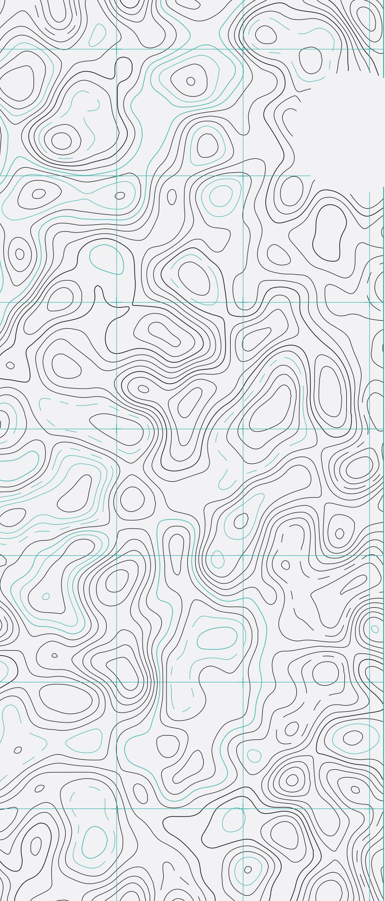

We are a strategic consultancy specialized in food systems, forests, and land use. Since 2011, we design and facilitate collective action processes and research aimed at fostering regenerative landscapes in Latin America.

More information at: olab.com.br

JAMES ALLEN Executive Director Email: james[@olab.com.br](http://www.olab.com.br/)

JOÃO SILVA Associate Consultant Email: joao.silva[@olab.com.br](http://www.olab.com.br/)

ISABELLA GRANERO Associate Consultant Email: isabella.granero@[olab.com.br](http://www.olab.com.br/)

PROJECT TEAM

**AGRO BRASIL+SUSTENTÁVEL:** 

# **How to Demonstrate Compliance with the EUDR Using the Public Platform**

**Lessons from a Livestock Dry-Run**

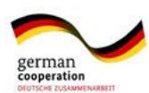

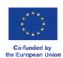

