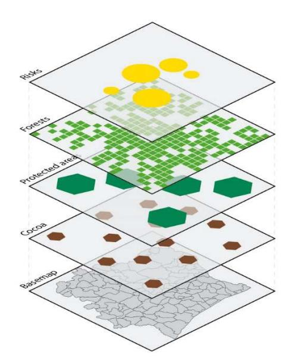
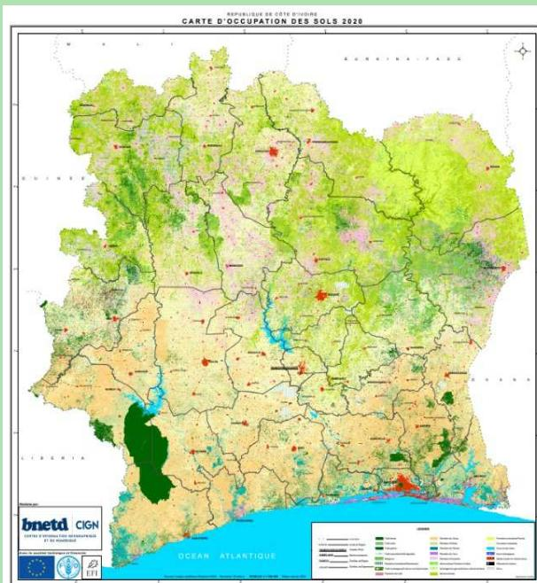
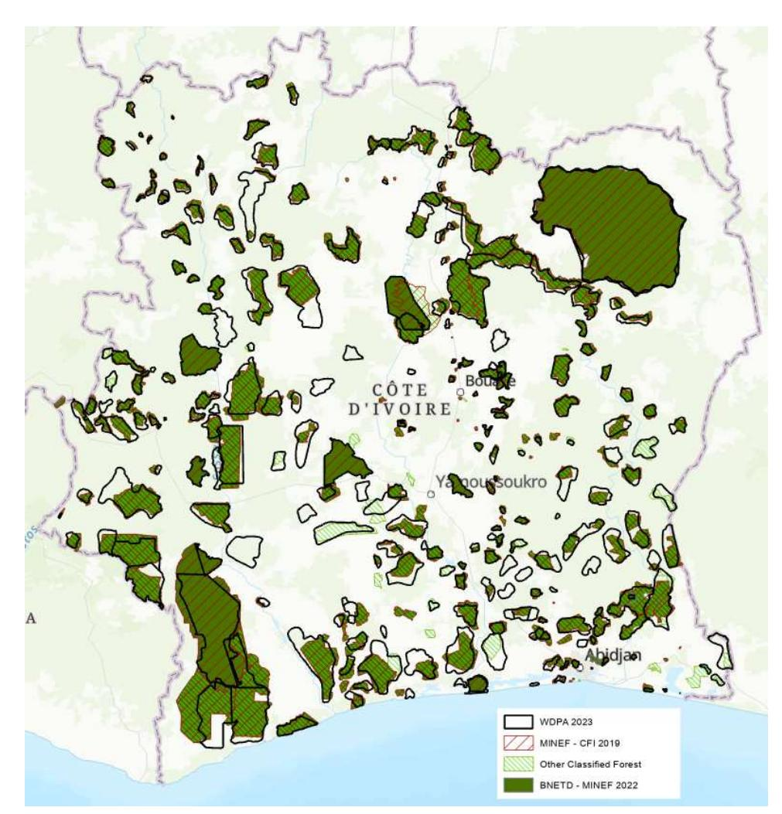
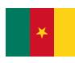
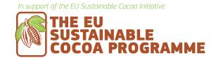
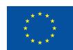
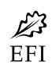

**Disclaimer.** The views and opinions expressed in this Insight are solely those of the authors and do not reflect the views of the Sustainable Cocoa Programme of the European Union or its funding organisations. The authors bear full responsibility for the content, analysis and recommendations presented herein and welcome any feedback on its content.

# **The role of spatial information for EUDR due diligence**

### **Key messages**

- Spatial information, coming from Earth observation technologies and Global Position Systems (GPS), is pivotal in facilitating both the due diligence of cocoa operators and the regulatory controls implemented by European Union (EU) Member States competent authorities under the EU Deforestation Regulation (EUDR).
- Forest cover data aligned with the FAO forest definition and the 2020 cut-off date would be a key source of information to assess risks of EUDR non-compliance.
- No single data set or map can provide sufficiently accurate information to be used as the sole source of data to determine cocoa's EUDR compliance. Operators should use and combine the best information at their disposal to determine the risk of noncompliance.
- Nationally produced data, when developed through robust methodologies aligned with the EUDR definitions, can serve as a primary source of information for compliance risk assessment.
- Protected areas boundary data is essential to assess compliance risks with national legal requirements related to land-use rights and the environment. As this data is part of producing countries' legal frameworks, access to this information through official government sources would facilitate operators' EUDR compliance risk assessment.
- When cocoa is produced in authorised agricultural areas within protected areas, the availability of accurate official evidence of legality remains a major challenge for due diligence.

# **Cocoa Insight** / March 2024

### **1. Introduction**

The EU Deforestation Regulation (EUDR)1 aims to reduce the risk that products and supply chains from several commodities associated with deforestation and forest degradation –  cattle, cocoa, coffee, oil palm, rubber, soya and wood – are placed on the EU market or exported from it.

Cocoa and its derived products fall under the scope of this regulation. Operators2 must therefore perform due diligence before placing cocoa or its derived products on the EU market. Due diligence consists of up to three steps: 1) information collection, 2) risk assessment, and 3) risk mitigation. In addition to information on the product and chain of custody, operators are required to collect:

- Geolocation information on the plot of production
- Evidence that cocoa is deforestation-free, meaning that it was not produced on lands deforested after 31 December 2020
- Evidence that cocoa was produced according to the laws of the producing country.

Based on this information and additional documentation, operators will need to assess the risk of non-compliance of cocoa with the requirements. In their risk assessment, operators must take into account, among other criteria: the presence of forests; the prevalence of deforestation and forest degradation in the sourcing area; the risk of mixing compliant and non-compliant products; and substantiated third party concerns. Where necessary, operators would then need to mitigate identified risks to a negligible level and document how that was done.

**Spatial information, coming from Earth observation technologies and Global Position Systems (GPS), can play an important role in the due diligence of operators and the controls by EU Member States competent authorities.** 

1 Regulation (EU) 2023/1115 of the European Parliament and of the Council of 31 May 2023 on the making available on the Union market and the export from the Union of certain commodities and products associated with deforestation and forest degradation and repealing Regulation (EU) No 995/2010.

2 As defined in the EUDR, an operator is any natural or legal person who, during a commercial activity, places relevant products on the market or exports them.

The following data could be used to determine if cocoa is EUDR compliant:

- 1. Cocoa farm geolocation of points or polygons can be done via GPS devices, mobile phones and digital GIS applications (polygons are required by the EUDR if the plot is above 4 hectares)
- 2. Forest cover data at the cut-off date
- 3. Protected area boundaries

Combining the cocoa farm geolocation with data on forest lands at the cut-off date can provide a first level of evidence that cocoa is deforestationfree. This can be layered with boundary maps of protected areas like national parks and forest reserves to determine whether cocoa was produced in accordance with the producer country's laws on land-use and protected areas.3

In addition, to assess and manage deforestation risks, in particular the risk of leakage4 , other types of data and tools could be used. These include, for instance:

- Recent land-use or land cover change maps
- Deforestation risk maps
- Forest disturbance alerts
- Remediation systems to address non-compliance.

**This Insight discusses considerations related to the availability and robustness of spatial data to assess the risks of deforestation and illegality, with a focus on forest cover and protected area boundary data.** 

3 The EUDR defines 'relevant legislation of the country of production' as 'the laws applicable in the country of production concerning the legal status of the area of production in terms of: (a) land-use rights; (b) environmental protection; (c) forestrelated rules, including forest management and biodiversity conservation, where directly related to wood harvesting; (d) third parties' rights; (e) labour rights; (f) human rights protected under international law; (g) the principle of free, prior and informed consent (FPIC), including as set out in the UN Declaration on the Rights of Indigenous Peoples; (h) tax, anti-corruption, trade and customs regulations'. Spatial data on protected areas, for instance, could provide insight into the legality of land-use and environmental requirements, but other data may be needed to assess the risk of non-compliance with other aspects of legality. In this context, we define leakage as the risk of cocoa not coming from the plot it was identified to.

# **2. Understanding and implementing the EUDR zero-deforestation requirement**

The EUDR requires operators to compile "adequately conclusive and verifiable" evidence that cocoa has not been produced in a forest area that was converted to agricultural use after 31 December 2020.

The EUDR uses an internationally recognised definition of forest from the Food and Agriculture Organization of the United Nations (FAO). It defines forest as "land spanning more than 0.5 hectares with trees higher than 5 metres and a canopy cover of more than 10%, or trees able to reach those thresholds in situ, excluding agricultural plantations and land that is predominantly under agricultural or urban land use". Agricultural use refers to "the use of land for the purpose of agriculture, including for agricultural plantations and setaside agricultural areas".

The definition of forest combines biophysical characteristics with the exclusion of lands under other predominant uses. The inclusion of 'in situ' means that forest areas that temporarily do not meet the thresholds but are expected to regenerate would be considered as forest. This applies unless another land use, such as agriculture, has been identified as the predominant use, for example in fallow lands. The EUDR does not define "set aside agricultural areas", nor the specific temporal bounds for what constitutes agricultural use.

**Forest cover data aligned with the FAO forest definition and the 2020 cut-off date would be a key source of information to assess risks of EUDR non-compliance**.

Remote sensing provides useful, transparent, accessible, and sometimes near-real time information that can support operators in complying with due diligence obligations. There are a multitude of datasets and platforms related to forest cover and tree canopy cover, ranging from freely available global and regional datasets, official nationally produced data, and service providers offering customised analyses using satellite imagery and unique proprietary methodologies.

#### **What spatial datasets regarding forest cover around year 2020 are openly and freely available at the global and regional levels?**

Several publicly available global data sources provide information on forests (table 1). Among the more commonly used are the Global Forest Change data from the Global Land Analysis and Discovery (GLAD) laboratory of the University of Maryland (known as Hansen data and available through the Global Forest Watch platform) and the tropical moist forest data from the Joint Research Centre (JRC) of the European Commission.

Two new datasets have been made available: the EU Forest Observatory Global Forest Cover 2020 map, produced by the JRC, and the Science Based Targets Network/World Resources Institute (WRI) Natural Lands map. They utilise the FAO definition of forest and cover the period of 2020. As such, they may be particularly useful for assessing the risk of non-compliance with the EUDR deforestation-free criteria.

**Table 1. Publicly available datasets on forest** 

| Dataset       | Provider    | Resolution    |               |        |              |
|---------------|-------------|---------------|---------------|--------|--------------|
|               |             |               | Variable      | Period | Aligned with |
|               | JRC         | 10            | Forest area   | 2020   | Yes**        |
| Natural Lands | WRI         | 30            | Natural       |        |              |
|               |             |               |               | 2020   | Yes**        |
|               | JAXA        | 25            | Forest area   | 2017–  |              |
|               | JRC         | 30 (available |               |        |              |
|               |             |               | Forest area   | 1990–  |              |
|               | GLAD/Hansen | 30            | Percentage of |        |              |
|               |             |               | Tree height   | 2020   | Needs        |
|               | WRI         | 10            | Percentage of |        |              |
|               |             |               |               | 2020   | Needs        |
| World Cover   | ESA-JRC     | 10            | Land Cover    | 2020–  |              |
|               | Copernicus  | 100           | Land Cover    | 2015–  |              |
| RADD          | Wageningen  |               |               |        |              |
|               |             | 10            | Deforestation |        |              |
| GLAD          | GLAD/Hansen | 30            | Deforestation |        |              |

\*\* aligned with the FAO biophysical criteria to define forests, with limitation on the representation of specific land uses (i.e. agricultural plantations)

In addition, some freely available satellite images may be processed:

- **Landsat 4** (1980) to Landsat 9 (2023, 30 metres resolution), accessible via the NASA portal, SEPAL and Google Earth Engine (GEE)
- **Sentinel 1** synthetic aperture radar data available since 2014 and **Sentinel 2 A & B** optical data with a spatial resolution of 10 metres available since 2015, accessible via COPERNICUS, SEPAL and GEE
- Norway's International Climate and Forest Initiative and **Planet'**s biannual mosaics from December 2015 to August 2020 and monthly five metre mosaics from September 2020, accessible via Planet, SEPAL and GEE for non-commercial uses

#### **What datasets regarding forest cover around year 2020 are available at national level?**

Nationally produced data, such as a national land cover and land-use map or a forest/nonforest map, can serve as a primary source of information and facilitate operator compliance with the EUDR (table 2). This data often provides greater accuracy than global products and may already be available through national systems.

While national data can serve as an important source of information for risk assessment, it may not be fully aligned with the EUDR requirements. National products may use the national definition of forest, which may differ from the FAO definition used in the EUDR. Further, data may not be available for 2020, given national data might have been prepared for other purposes than EUDR compliance risk assessment. Nevertheless, national data may be combined with existing global or regional products to capture a picture of forests as defined under the EUDR in the country in 2020.

**Table 2. National forest data availability in Côte d'Ivoire, Ghana and Cameroon** 

|                      | Reference map at cut-off date                                     | Forest definition                            | Data accessibility                                                                      | Comments                                                                                    |
|----------------------|-------------------------------------------------------------------|----------------------------------------------|-----------------------------------------------------------------------------------------|---------------------------------------------------------------------------------------------|
| <b>Côte d'Ivoire</b> | 2020 national land cover map (BNETD-CIGN) v.2                     | National definition and FAO definition       | The map is available to the public and the raster data can be downloaded 5 . | The map has been validated by the JRC, with an overall accuracy of 91% (IPCC nomenclature). |
| <b>Ghana</b>         | 2019 and 2021 national land cover maps (Forestry Commission RMSC) | Differs from FAO definition                  | Available for viewing, not for download                                                 | -                                                                                           |
| <b>Cameroon</b>      | 2020 national forest/non-forest map (MINFOF)                      | FAO definition (same as Cameroon definition) | The map is currently being developed and should be made publicly available in 2024      | Map development supported by FAO                                                            |

5 The map access address is: https://bit.ly/carte-ci-2020

#### **Box 1: Côte d'Ivoire's national 2020 land cover baseline map**

The Government of Côte d'Ivoire produced a 2020 national land cover map, which was developed by the national GIS Centre (BNETD/CIGN) with the technical and financial support of the EU Sustainable Cocoa Programme.

The second version of the map (February 2024) provides detailed information on 28 land-use classes that were defined and adopted consensually among public and private stakeholders. These classes also align to the classification of the Intergovernmental Panel on Climate Change (IPCC). The map is based on Sentinel 2 images from 2020 processed via the GEE platform, training data collected during two national field campaigns, as well as cocoa geolocation data from the cocoa-coffee sector.

The JRC conducted the external validation of the map in July 2023. An overall accuracy of 91% is achieved using the IPCC 6 class land cover legend.

The map is available to the public on an international platform and the data can be downloaded free of charge at https://bit.ly/carte-ci-2020..

Map 1: 2020 Land cover map of Côte d'Ivoire. Source: BNETD-CIGN (February 2024

#### **How can geospatial data be used to assess compliance with the deforestation-free criteria?**

The geolocation of cocoa plots could be layered over 2020 forest cover data to assess the risk of the plot being in an area that was forest before the cut-off date.

Existing forest cover datasets at global, regional or national levels were not developed with the purpose of assessing EUDR compliance. **These datasets vary in many important ways that affect their usability for due diligence**, including in: the definition of forest used; variable of interest such as the percentage of tree cover, which is not equivalent to forests; resolution; accuracy; and scale and coverage (both geographically and time range). When selecting data to assess compliance risk with the deforestation-free criteria, operators should therefore:

- Clarify the definition of forests used and potential implications of differences with the EUDR definitions (e.g. over or under-estimation of forest cover; status of agroforestry systems, etc.) when using existing land-use or forest cover maps.
- Ensure that agricultural trees are excluded from the forest classes.
- Be mindful of the 31 December 2020 cut-off date when selecting satellite images or building a satellite mosaic to analyse forest area. In the context of West Africa, it is advised to build mosaics6 during dry and raining seasons to understand the contrast between the various types of vegetation (phenological differences of forest types).

The accuracy of available data sources should also be considered. No single data set or map can provide sufficiently accurate information to be used as the sole source of data to determine cocoa's EUDR compliance. Sources of forest lands or land cover data might be available at jurisdictional, national, regional or global scales. Robust jurisdictional or national forest data usually offers higher accuracy, including for instance more accurate differentiation of forest from cocoa and other tree crops in cocoa-producing countries. When operators choose data to evaluate compliance risks, they must use and combine the best information at their disposal to determine the risk of non-compliance. They should therefore take into account:

- The accuracy of data provided for relevant land cover classes.
- The credibility and transparency of data, in particular if it has been independently validated and/or peer-reviewed, if methodologies are publicly available, and if the data is open source.
- Using robust national/jurisdictional data when it exists, as it can often provide higher accuracy compared to global products.
- Combining best available products to get an indication of forest areas in 2020 and increase the level of confidence in the data.

Sometimes, information products derived from Earth observation data might present limitations, such as errors of omission of forests (when forest is mistaken for another land class) or of commission (when another land class, such as agroforestry cocoa for instance, is mistaken for a forest). In other instances, a specific plot might match the definition of

6 A satellite image mosaic is a composition of several satellite images into a seamless and cohesive representation of a larger geographic area (e.g. a country).

forests, but in reality, is under set-aside agricultural use, such as fallow land. To address these limitations, operators might consider to:

- In case of doubt or low level of confidence in the data, conduct further analysis with the use of very high-resolution images (Planet, SPOT, etc.) and/or ground truthing.
- Document land uses, in particular in the case of fallow land, by working with suppliers, in cooperation with authorities and/or through audit processes.
- Extend data collection to pre-2020 when possible, to understand recent changes in the forest cover and help determine the land-use history of an area to determine if land was recently used for agricultural purposes.

## **3. Understanding and implementing the EUDR legality criteria related to land use**

In the context of the EUDR, cocoa must be produced in accordance with relevant legislation in the country of production, including on the rights to produce cocoa in the respective area. In many countries, including Cameroon, Côte d'Ivoire and Ghana, agricultural production is prohibited in protected areas. Farmers do not have rights to use land in protected areas for agriculture. Nonetheless, in Côte d'Ivoire and Ghana the State can grant permission for dedicated agricultural areas within protected areas. **Geospatial data, such as protected area boundaries, cadastre or spatially explicit permit data, is essential to assess compliance with land-use laws.** 

#### **What data is available on protected area boundaries?**

Many countries have produced national geospatial data to delineate the boundaries of protected areas. As this data is part of the country's legal framework, access to this information through official government sources would be the preferred option for compliance risk assessment. However, in some instances, this data may not be available to the public.

#### **Box 2: Cameroon's Forest Atlas**

In Cameroon, the Interactive Forest Atlas is a dynamic forestry monitoring system that provides credible, up-to-date information on the forestry sector in Cameroon. It includes a public database of reference data on, among other things, the boundaries of the permanent and non-permanent forest estate, timber logging and agro-industrial concessions, with shapefiles available for download.

The database is managed and updated by the Ministry of Forests and Fauna with WRI support.

It can be accessed at: [cmr.forest-atlas.org](https://cmr.forest-atlas.org/)

The **[World Database on Protected Areas](https://www.protectedplanet.net/en/thematic-areas/wdpa?tab=WDPA) (WDPA)** is managed by the United Nations Environment Programme's World Conservation Monitoring Centre (UNEP-WCMC), with support from the International Union for the Conservation of Nature (IUCN) and its World Commission on Protected Areas. It provides a publicly available global dataset of protected areas. It is the most up-to-date and complete source of information on protected areas at the global scale, updated with submissions from governments, non-governmental organisations, academia and industry.

Although it is the best global level data available on protected areas, it may not be complete or fully accurate for every country. While submitted by governments and other institutions, in most contexts, WDPA has not been officially endorsed as the trusted source of official national data. There may be discrepancies between official sources and the WDPA dataset for a country.

Map 2: Comparison of WDPA and national data on protected areas in Côte d'Ivoire (source: EFI, based on various datasets)

When comparing the available protected area boundary data from WDPA and the official Ministry information7 in Côte d'Ivoire, important discrepancies can be observed (see map 2). WDPA data identified a total of 8.6 million hectares of protected areas, including 5 million of classified forests.8 In contrast, data from the Ministry of Water and Forests shared with cocoa companies signatories of the Cocoa and Forest Initiative (CFI) reveals considerable differences in both size and location, identifying a total of 5.9 million hectares of protected areas, of which 3.9 million of classified forests. Additional boundaries of classified forests not captured by this dataset are used by other government services. These discrepancies might partially be because a large part of the borders of classified forests are not up-to-date, accurate or legally endorsed.

Similar issues might be observed in Ghana.

In addition, agriculture might be permitted in protected areas in certain circumstances. This is the case in Côte d'Ivoire and Ghana, where admitted agricultural areas exist within classified forests and forest reserves. **When and if sourcing from these areas, operators would need to access official evidence proving that farmers are allowed to produce cocoa in these areas.** Accessing spatial information about admitted agricultural areas might be a challenge as these are not included in the WDPA, and the accuracy of this information might be limited.

**Table 3. Availability of boundary maps of protected areas in Côte d'Ivoire, Ghana and Cameroon** 

| Availability of boundary map of protected areas                                                                                                                                                                                                                                                                                                     |                                                                                                                                                                                                                                                            | Availability of boundary map of admitted agricultural areas within protected areas                                             |
|-----------------------------------------------------------------------------------------------------------------------------------------------------------------------------------------------------------------------------------------------------------------------------------------------------------------------------------------------------|------------------------------------------------------------------------------------------------------------------------------------------------------------------------------------------------------------------------------------------------------------|--------------------------------------------------------------------------------------------------------------------------------|
| 
   
 | 
National parks and classified forest boundary maps available upon request to the Ministry in charge of the Environment and the Ministry of Forests and Water. They have been shared with signatories of the Cocoa &amp; Forests Initiative in 2019.
 | 
Boundaries of '<i>enclaves</i>' within classified forests are integrated in classified forests map, but not in the WDPA
 |
| 
   
   | 
National parks and forest reserve boundary maps are not publicly available. They have been shared by the Forestry Commission with signatories of the Cocoa &amp; Forests Initiative.
                                                                | 
Boundaries of admitted farms in forest reserves are unavailable outside the Forestry Commission
                         |

7 Protected area data used for the purpose of this comparison is that shared by the Ministry of Water and Forestry with signatories of the Cocoa & Forest Initiative in May 2019 and additional data provided by the Ministry of Environment and Sustainable Development.

WDPA: UNEP-WCMC (2023). Protected Area Profile for Côte d'Ivoire from the World Database on Protected Areas, October 2023. Available at: [www.protectedplanet.net](https://www.protectedplanet.net/) 

|  | 
Boundary maps of the permanent forest estate publicly available on the Forest Atlas (see Box 2).
 | 
No agriculture legally admitted in protected areas
 |
|-------------------------------------------------------|---------------------------------------------------------------------------------------------------------|-----------------------------------------------------------|
| 
<b>Cameroon</b>
                                |                                                                                                         |                                                           |

#### **How can geospatial data be used to assess noncompliance risk with the legality criteria related to land use?**

As a first step, geolocation of cocoa plots could be overlaid with protected area boundaries, and those plots located inside of protected areas would be considered at risk of noncompliance. Depending on the national context, this could be complemented with additional information from zoning or permit systems to provide additional evidence of compliance. A clear understanding of the national legal framework related to protected areas and land-use rights within them is needed to assess the legality of these cocoa plots.

This would have to be complemented by an assessment of compliance with other applicable legal requirements, in the areas of law outlined in the EUDR.

# **4. How to enhance collaboration towards improved access to robust and relevant spatial data?**

While the abundance of spatial data offers considerable potential to monitor and manage sustainability in supply chains and support due diligence under the EUDR, harnessing this potential remains a challenge. Many operators lack the capacity to process or access to such ample amounts of information. Fragmentation of data availability from different sources across platforms at varying resolutions and coverage, and lack of consensus on reference data further complicates its use. Different data, methodologies and definitions used in analyses can impact the robustness, consistency and comparability of results.

To overcome some of these limitations and harmonise efforts across the sector, producer countries along with cocoa operators and other stakeholders can build consensus and alignment on reference data and methodologies (see efforts undertaken by Ghana in box 3).

#### **Box 3: Ghana Cocoa Board Deforestation Risk Assessment Module**

The Ghana Cocoa Board (COCOBOD) is currently developing a digitised, national traceability system – the Ghana Cocoa Traceability System – that will provide physical and financial traceability from farm to port. This system is part of an integrated tool called the Cocoa Management System. It will encompass data on farmers and farmers' plots, chain

of custody and financial traceability information, as well as environmental and social data. It aims to support supply chain actors in demonstrating cocoa sustainability and strengthening policy and management decisions towards compliance with domestic and international market requirements.

As part of the cocoa traceability system, COCOBOD is developing a Deforestation Risk assessment Module. This module will link traceability information with land cover data, protected area boundaries, and other geographic information to conduct risk assessments and inform risk mitigation activities. The module will monitor compliance risks specifically related to EUDR requirements. It will provide information and risk assessment results to operators sourcing cocoa from Ghana for due diligence purposes.

The following recommended actions can help improve access to, and use of, robust and relevant spatial data to support EUDR compliance:

Recommendations to cocoa-producing countries:

- Make protected area boundary information, including admitted agricultural areas within protected areas, openly and freely available to supply chain actors and EU competent authorities, ideally in a central point of information. When relevant, distinguish those protected areas where agricultural production is allowed from those where it is prohibited.
- Improve the accuracy and reliability of protected area boundary data by updating boundaries and revising the legal framework when necessary (to provide further legal backing and clarity on land-use rights and environmental requirements).
- Develop and make available national and/or sub-national forest cover maps for 2020, aligned with definitions used in the EUDR, based on transparent methodologies and international best practices.

Recommendations to the EU:

- Provide guidance9 on the use of the definitions related to the zero-deforestation criteria, in particular: o Implications of "in situ" in the forest definition o Definition of set-aside agricultural areas
- Consider establishing a central point of information for access to spatial data (e.g. the EU Forest Observatory for forest and land cover change data), and collaborate with existing initiatives to enhance the role they could play in providing access to relevant information (e.g. IUCN for access to up-to-date protected area boundaries; Forest Data Partnership)

9 At the time of writing (October 2023) the European Commission was already working on providing guidelines on the definition of "agricultural use".

- Provide guidance or best practices for operators and supply chain actors on compiling, selecting and utilising data for due diligence, including considerations on data availability, quality and accuracy.

#### Recommendations to cocoa supply chain actors:

- When choosing data and/or service providers to assess EUDR compliance, ensure that these make use of data that is: aligned to EUDR requirements; based on transparent methodologies and international standards; and, ideally, peer-reviewed.
- Cross-check multiple sources of data to increase confidence in baseline information, and conduct additional checks in case of doubts.
- When available, use robust national/subnational forest cover data.
- Support mapping improvements, including on protected area boundaries and land cover data, through sustainability programmes, and share this data with government and other actors.
- Share polygon data with authorities to help to improve the accuracy of land use/land cover classification products.
- Seek alignment on methodologies and approaches to assess EUDR compliance risks and risk mitigation and make this information available to stakeholders.

One hundred percent accurate maps or a single best deforestation monitoring or risk assessment approach do not exist. They are based on imperfect data, varying interpretations, and different methodological choices. Transparency on these choices is required to make sense of available information and ensure credibility of sustainability monitoring systems. Furthermore, cooperation between and among public and private actors is needed to improve the quality and robustness of reference data.

**Disclaimer.** The views and opinions expressed in this Insight are solely those of the authors and do not reflect the views of the Sustainable Cocoa Programme of the European Union or its funding organisations. The authors bear full responsibility for the content, analysis and recommendations presented herein and welcome any feedback on its content.

The European Forest Institute is one of the implementing partners of the EU Sustainable Cocoa Programme in Côte d'Ivoire, Ghana and Cameroon. We are supporting producer countries in developing robust standards and tools to achieve traceable and deforestation-free cocoa. Information and publication of EFI's Sustainable Cocoa Programme can be found here:

<https://efi.int/partnerships/cocoa>

© European Forest Institute, 2023

