# **INDEPENDENT MONITORING**

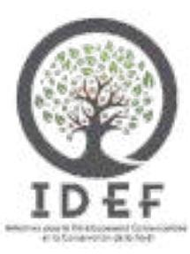

**Liberia: West Africa's future cocoa El Dorado Characteristics and journey of a bitter chocolate**

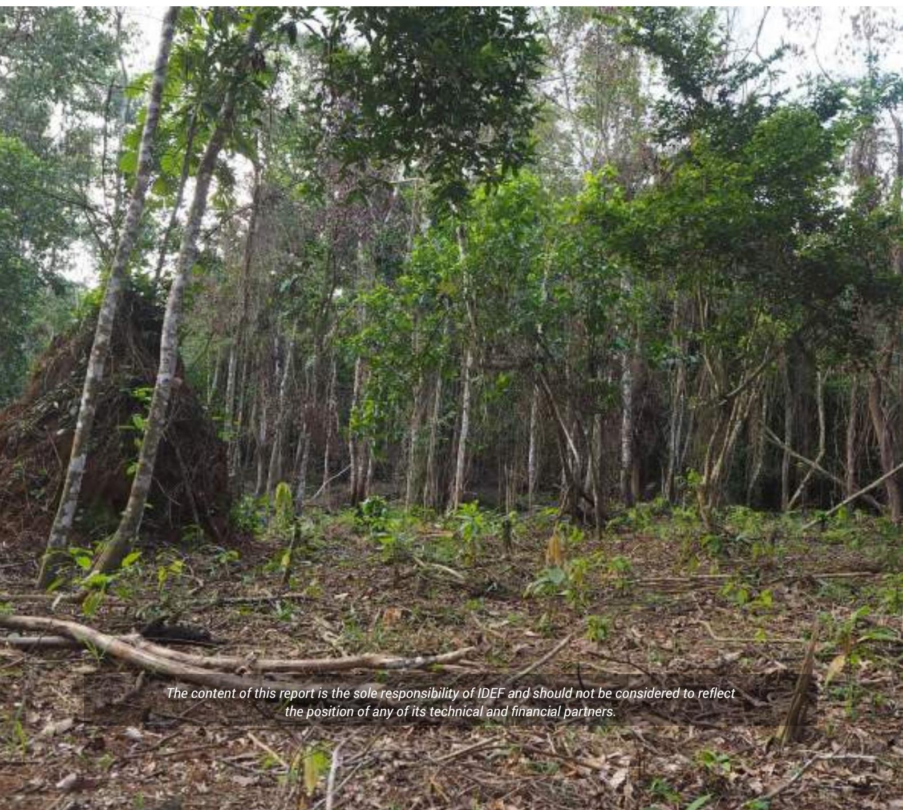

## **Summary**

This independent monitoring report is the result of field data collection and documentary analysis. IDEF, hereinafter referred to as "the observer", used resources gathered during previous field missions in Liberia and conducted a series of interviews with members of communities in three villages (Boundary, Bee Zohn and Jaybo), with local representatives of the Liberian Land Authority (LLA), the Forest Development Authority (FDA) and a dozen resource persons, including producers and people involved in the settlement of workers in the forests for cocoa production in Liberia.

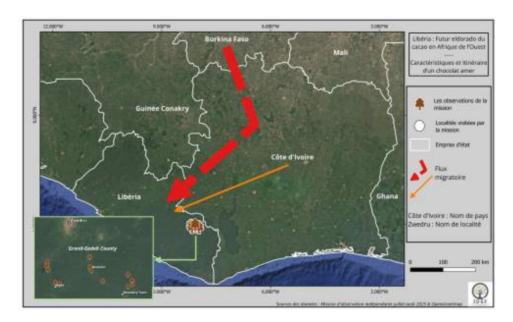

The field mission to collect data took place between July and August 2025. As shown on the map above, we visited the Liberian localities of Boundary, Bee Zohn and Jaybo, in the Grand Gedeh region. It provided an opportunity to gather new testimonies from Liberian communities and to visit booming cocoa plantations. Based on discussions and field visits, the independent monitoring confirms the following main observations:

- 1. **The exodus phenomenon documented in the [previous report of April 2024](https://ongidef.org/) is continuing and expanding rapidly.** There is a rush of people from Côte d'Ivoire to Liberia for agricultural work. According to the LLA, more than 38,000 people have been registered in the Grand Gedeh region alone, since 2020. Discussions with people who have arrived from Côte d'Ivoire confirm this trend. One of the actors with a good knowledge of the migration sector, who is himself involved in sending "workers" to Liberia, indicates that this figure is undoubtedly an underestimate and that a realistic count would be close to double the data available to the local authorities.

- 2. **Massive deforestation for cocoa continues and keeps pace with the arrival of migrant workers.** In the localities of Boundary and Jaybo, almost all families have granted their guests plots of forest to convert into cocoa plantations. While the areas generally ranged from six (06) to eight (08) hectares in the previous report, the minimum area granted by the communities of Boundary and Jaybo is 50 hectares. A majority of families grant plots of land range from 100 to 300 hectares. Migrants must pay a deposit of 500,000 CFA francs (763 EUR) to access the forest. The principle in this region is the same as that identified in the previous report: the parties use a "planted/shared" agreement1 , with the same confusion about the purpose of the sharing (production or planting) and the duration.
- 3. **In addition, witnessed uncontrolled deforestation, land clearing and cocoa production is often carried out by young people, many being most likely minors. This situation creates an environment conducive to human trafficking and exploitation.**

Based on these observations, the independent observer makes the following key recommendations to stakeholders:

## To the Liberian authorities:

- **•** Take swift and concrete action to preserve the forest by giving the local FDA services the means to monitor and sanction. This could, for example, involve strengthening the regulatory framework for forest and land management and introducing a moratorium on forest clearing for cocoa cultivation in Grand Gedeh County until traceability and mapping tools are put in place in the country.
- **•** Implement information and awareness-raising activities for communities on the consequences of massive and rapid deforestation for their livelihoods and the risks of land conflicts due to the lack of clarity surrounding the practice of planting/sharing.
- **•** Take action against situations involving child labour and/or human trafficking and exploitation by implementing field controls and organising community awareness-raising activities;
- **•** Seek collaboration with the European Union in the framework of the EU Deforestation Regulation, in order to put in place tools for traceability and mapping of deforestation areas, so as to ensure legally produced Liberian cocoa is compliant;
- **•** Work with the Ivorian authorities to combat cocoa smuggling across the border and to learn from Côte d'Ivoire's experience in organising its own cocoa sector.

## To the Ivorian authorities:

- **•** Implement a concrete and massive programme to support producers in renewing their plantations in order to prevent their migration;
- **•** Collaborate with the Liberian authorities to manage migrant flows and, above all, share experience in managing the cocoa sector in order to support the State of Liberia in better organising its cocoa sector.

1 The principle of planted/shared in cocoa production consists of a forest plot owner making a specific area of their plot available to a third party for the creation of a cocoa plantation. The practice is that, once production begins, the proceeds are shared between the two parties. In some cases, the share is based on the size of the plantation (e.g. 60/40). In other cases, it is based solely on the production from the plantation at each harvest.

## To the European Union:

- **•** Open discussions with Liberia, as it has done with Côte d'Ivoire, Ghana and other countries around the world, on the EUDR relevant issues;
- **•** Support the Liberian government in establishing a national traceability system and land use mapping in the country;
- **•** Accompany and support the implementation of the national traceability system currently underway in Côte d'Ivoire in order to encourage exporters to fully commit to the national traceability system, a mechanism that can curb cocoa leakage at the borders.

This report is intended for all actors in the cocoa supply chain. In particular, we believe that the Liberian and European authorities are well placed to take concrete and strong measures to address the massive destruction of Liberia's primary forest for the sake of cocoa. With the upcoming implementation of the EU DR, this situation appears to be a huge challenge. Côte d'Ivoire, as a neighbouring country that has experienced the management of migration flows that have led to the loss of almost all of its forest area, could also play a major role in finding a sustainable solution commensurate with the scale of the dynamics at work in Liberia.

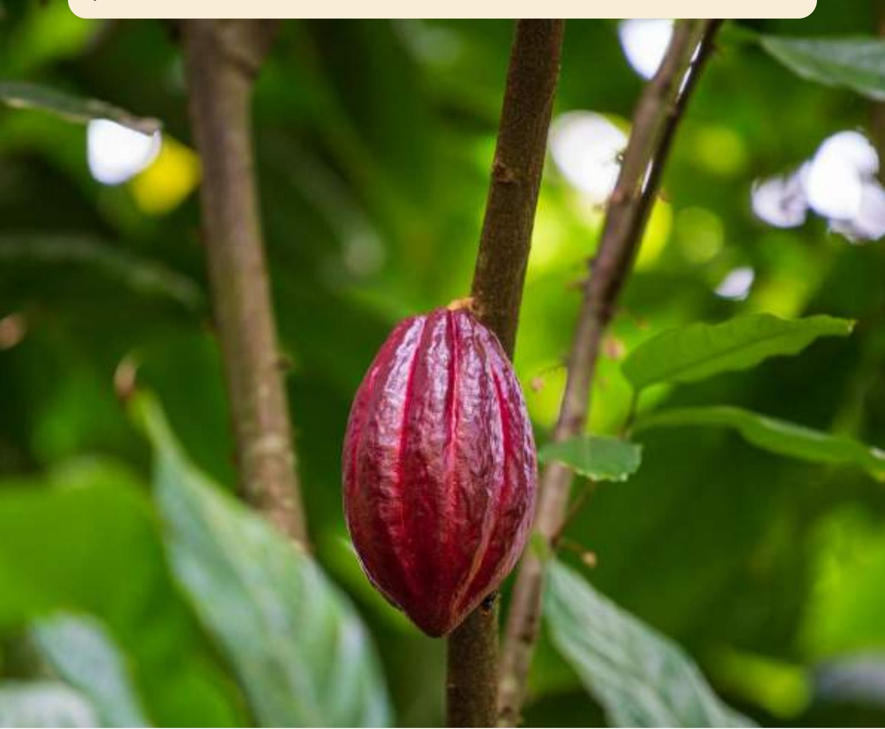

# **Introduction**

The European Regulation on products linked to deforestation and forest degradation (EUDR), adopted in 2023, is supposed to come into force on 31 December 2025. The aim of this regulation is to limit or even eliminate deforestation and forest degradation worldwide stemming from EU consumption. The EUDR requires tracing the source of crop production to the plot level.

In West Africa, the most important supply chain to monitor is undoubtedly that of cocoa, given that two countries in this region (Côte d'Ivoire and Ghana) account for nearly 50% of global production. In Côte d'Ivoire, in addition to the fact that the authorities are working to set up a national traceability system, the country's forest situation (only 2.9 million hectares, representing 9.2% of the national territory) means that there is little risk of large-scale deforestation for the benefit of cocoa in the coming years. However, this is not the case for some neighbouring countries such as Guinea and Liberia. As has been observed in the past within Côte d'Ivoire, with the shift of cocoa production from the east to the west of the country, we are increasingly seeing what could rightly be called an exodus of cocoa producers from Côte d'Ivoire to Liberia with the aim of converting primary forests into cocoa plantations.

Based on data from Global Forest Watch (GFW), between 2001 and 2022, Liberia lost 2.2 million hectares of forest, equivalent to a 23% decrease in vegetation cover since 2000. In 2022 alone, the country recorded a loss of 150,000 hectares of natural forest2 . The Liberian government plans to expand cocoa plantations by 25,000 hectares by 20303 .

Based on this data, [IDEF](https://ongidef.org/wp-content/uploads/2024/04/Rapport-dobservation-independante_Alerte-sur-la-deforestation-liee-au-cacao_FR_.pdf) conducted an independent monitoring mission between late 2023 and early 2024, which led to the publication of a report entitled "Alert on cocoa supply in Liberia4 ". This report highlighted the existence of an exodus of cocoa producers from Côte d'Ivoire to Liberia. This confirms other previous surveys reporting the displacement of thousands of people, as described in [this article](https://theconversation.com/quand-le-boom-du-cacao-au-liberia-pousse-a-la-deforestation-212576) published in The Conversation.

Although the publication of this report has shed light on this reality and thereby prompted concrete action, such as visits by European officials to Liberia, it seems that the scale and implications of this phenomenon, particularly its short-, medium- and long-term consequences, remain difficult to grasp, especially for the Liberian authorities. The latter seem to view this exodus as an opportunity for economic development without considering the serious consequences for Liberia's primary forest and the local communities that depend on it for their livelihoods.

Beyond the expected awareness of the Liberian authorities, the situation of deforestation in Liberia for the benefit of cocoa is also a challenge to the achievement of the EU's objectives. Thus, at a time when all stakeholders are preparing for the implementation of this major legislation for forest and preservation, this new report provides further data on the extent of deforestation for cocoa currently underway in Liberia and on the human rights issues involved, particularly child labour and human trafficking and exploitation in cocoa production in Liberia.

2 https://gfw.global/3FQjK3l

3 The National Agriculture Development Plan 2024-2030 outlines the Liberian government's plan to expand cocoa plantations: "25,000 ha of new cocoa farms established in five cocoa-producing counties over five years".

4 https://ongidef.org/wp-content/uploads/2024/04/Rapport-dobservation-independante\_Alerte-sur-la-deforestation-liee-aucacao\_FR\_.pdf (The future of cocoa in Liberia), IDEF and ID Cacao, April 2024

# **Results of field observations**

The mission made some key observations during its field monitoring work. These observations can be summarised in three main points: (1) the increase in the number of cocoa producers arriving in Liberia, mainly from Côte d'Ivoire; (2) the expansion of deforestation; and (3) the observation of cases of child labour.

The mission focused on the Grand Gedeh region. Although the entire country is affected by the wave of deforestation, there has been a major acceleration in the Grand Gedeh region, which borders Côte d'Ivoire. According to JRC data, this is the region in Liberia where deforestation is occurring at the fastest rate.

The figures speak for themselves. The rate of deforestation is highest in the south-eastern regions bordering Côte d'Ivoire. Between 2021 and 2023, for example, deforestation and forest degradation increased by 84% in Grand Gedeh. The data (testimonies and photos) contained in this report corroborate these figures.

## Zoom on the deforestation in the South East

|           | Liberia | Lofa | Bong | Nimba | Grand Gedeh | River Gee | Grand Kru | Maryland |
|-----------|---------|------|------|-------|-------------|-----------|-----------|----------|
| 2011-2014 | -24%    | 6%   | -46% | -34%  | -34%        | -48%      | -46%      | -36%     |
| 2015-2017 | 12%     | -2%  | 10%  | -9%   | 88%         | 107%      | 24%       | 37%      |
| 2018-2020 | -15%    | -25% | -22% | -10%  | 12%         | -8%       | -6%       | -21%     |
| 2021-2023 | -29%    | -29% | -57% | -43%  | 84%         | 3%        | -24%      | -36%     |

- Decrease in the rythm of deforestation in Liberia after 2020 except in Grand Gedeh and Maryland
- Between 2021 and 2022, deforestation and degradation has increased from 267% in Grand Gedeh!

### 1. **The exodus of cocoa producers from Côte d'Ivoire to Liberia continues and is intensifying.**

Discussions with Liberian communities have revealed important factors for understanding the migration flows of farmers from Côte d'Ivoire to Liberia. These farmers, who migrate to Liberia in search of fertile land for cocoa production, are ly Burkinabe and Ivorian. Because the majority of migrants are Burkinabe, all new arrivals are referred to as "the Burkinabees" by Liberian communities.

To get a sense of the scale of the movement, one need only take the tracks that lead to the Liberian countryside, as the independent monitoring mission did. A barely passable 23-kilometre road connects Zwedru, the regional capital of Grand Gedeh, to the village of Boundary, where many new arrivals have found plots of forest land to establish their cocoa plantations. In this village and all along the road leading to it, the constant stream of motorcyclists laden with all kinds of luggage (personal belongings, provisions, etc.) and sometimes with more than four people on a single motorbike shows that the population rush documented in the previous report published in April 2024 is continuing and growing.

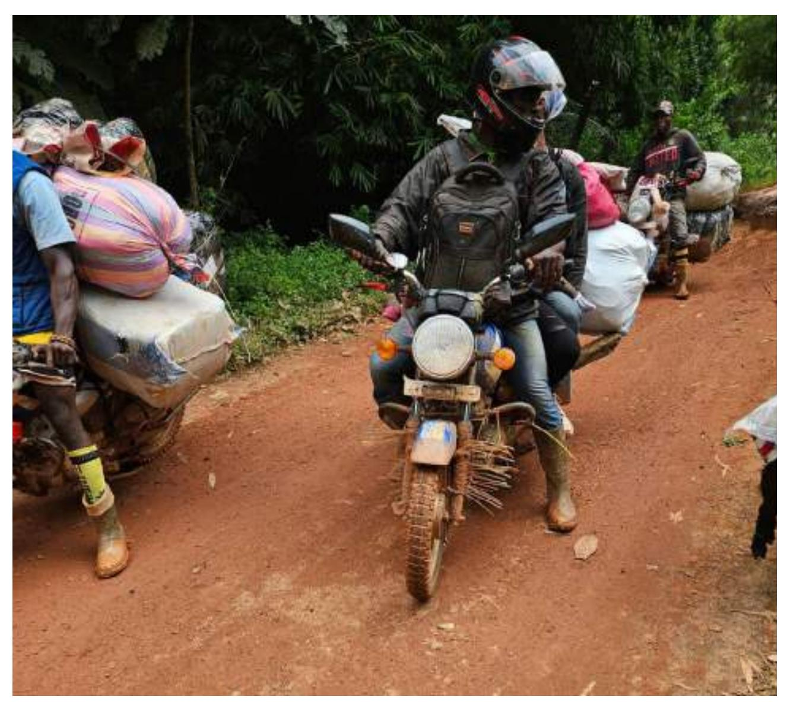

*Figure 1: Overview of motorcyclists transporting luggage and people, Zwedru-Boundary road, IDEF, July 2025*

According to the Liberia Land Authority (LLA) in the Grand Gedeh region, more than 38,000 people have been registered in the Grand Gedeh region alone since 2020 and the establishment of an identification register. Discussions with people who have arrived from Côte d'Ivoire confirm this trend.

Oumar Kaboré, one of the interviewees with a good knowledge of the migration sector because he himself is involved in sending "workers" to Liberia, indicates that this figure is undoubtedly an underestimate and that the true figure is likely to be close to double the data available to the local authorities. He explains:

*"I think there are more than 30,000 Burkinabè here. Not counting other ethnic groups. 30,000, I think that was maybe in 2023. Today, it's probably double that. If the Liberians told yo , that there are more than 38,000 today, that means you have to multiply that figure by two or even more. Because I alone have brought more than 1,000 people here since the beginning of the year, or they have come through me. Most of the people who arrive go straight into the forest. There isn't a single village in this region where there aren't any Burkinabè. What's more, I can say that there are more Burkinabè than Liberians in almost every village. My father is the leader of the Burkinabè. So it's up to us to settle any problems between a worker and their Liberian guardian."*

Oumar Kaboré, cocoa farmer in Liberia

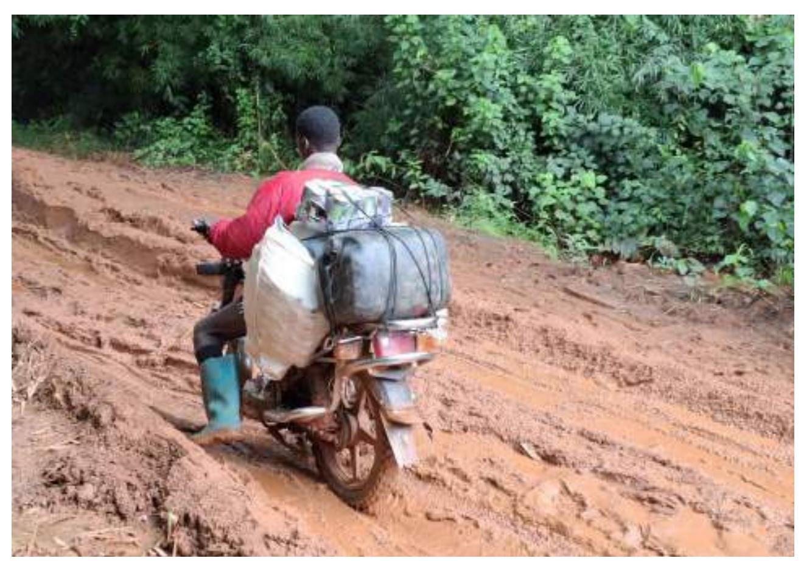

*Figure 2: A young motorcyclist transporting goods on a track, Bee-Zohn, IDEF, July 2025*

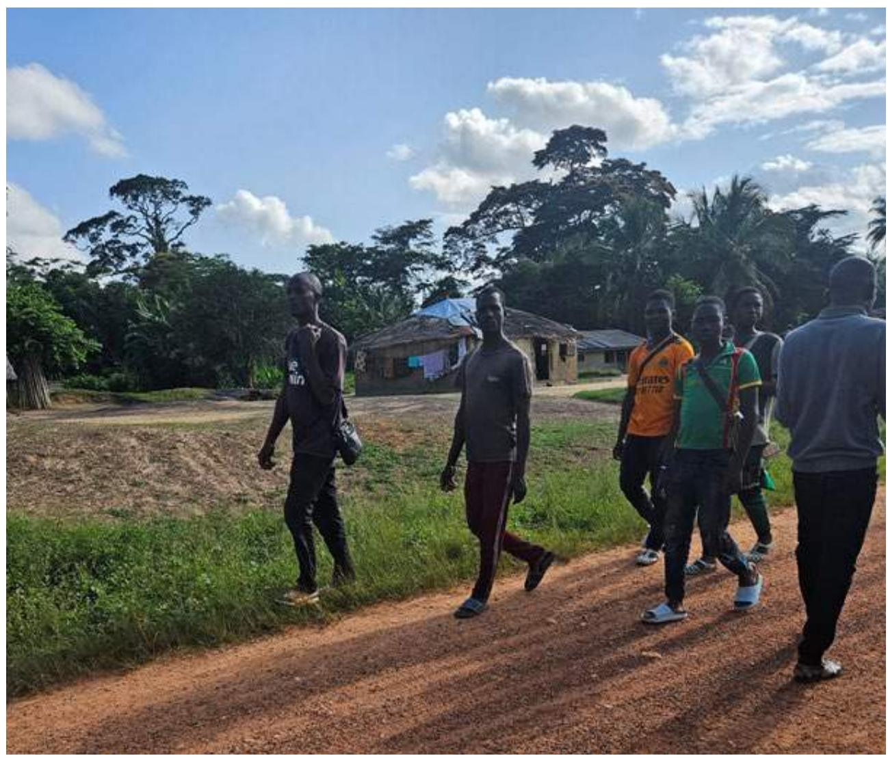

*Figure 3: A group of young workers, some of whom are likely minors, encountered in Boundary, IDEF, July 2025*

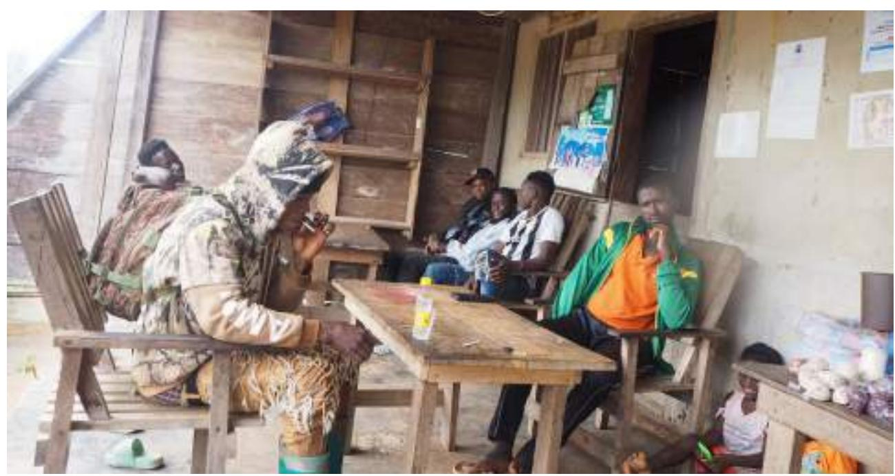

*Figure 4: Workers, some of whom are new arrivals (in the background), waiting for their guardian to arrive, Boundary, IDEF, July 2025*

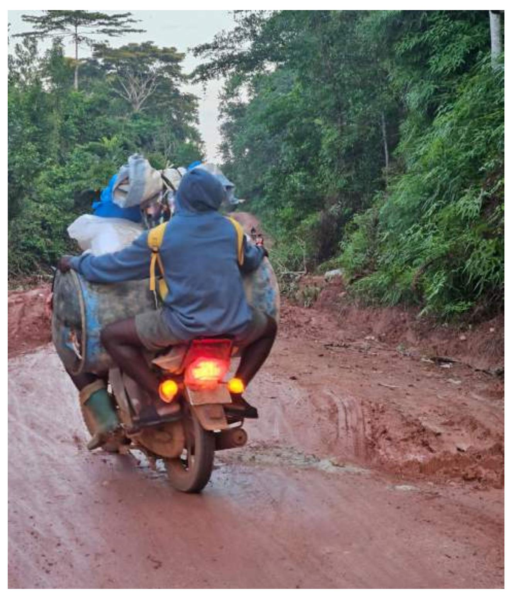

*Figure 5: A motorcyclist carrying luggage and a passenger on the Zwedru-Boundary road, IDEF, July 2025*

Despite the difficulties and harshness of Liberia's primary forest, there are no signs of a slowdown in the exodus. On the contrary, Olivier, Judicaël, and Emile, three young men we met on the road to Jaybo, will soon join the new arrivals. They are exploring the area to make sure that the forest really exists and that they will be able to access it. "*We came to see if the forest is real, and then we'll go back to Côte d'Ivoire to prepare ourselves before coming back to start a new cocoa plantation here,*" says one of them. They came mainly to talk to the man who will be their "tutor" and who has acquired several hectares of forest to share with new arrivals like these three young people.

### 2. **Massive deforestation for the benefit of the booming cocoa industry**

Deforestation in Liberia is alarming and worrying, particularly for the entire West African region. Liberia's forest cover officially accounts for around 68% of the national territory and more than half of West Africa's remaining tropical forests. This makes the country the lungs of the region. According to the FAO, most of the forests found in Liberia are primary or naturally regenerated forests. Global Forest Watch reports that between 2021 and 2024, 98% of tree cover loss in Liberia occurred in natural forests, with a total loss of 589,000 ha. Also according to Global Forest Watch data, 372 ha were subject to deforestation alerts in August 2025 alone, and 64% of these integrated deforestation alerts mainly concern two regions, namely Grand Gedeh (158 ha) and River Gee (80 ha).

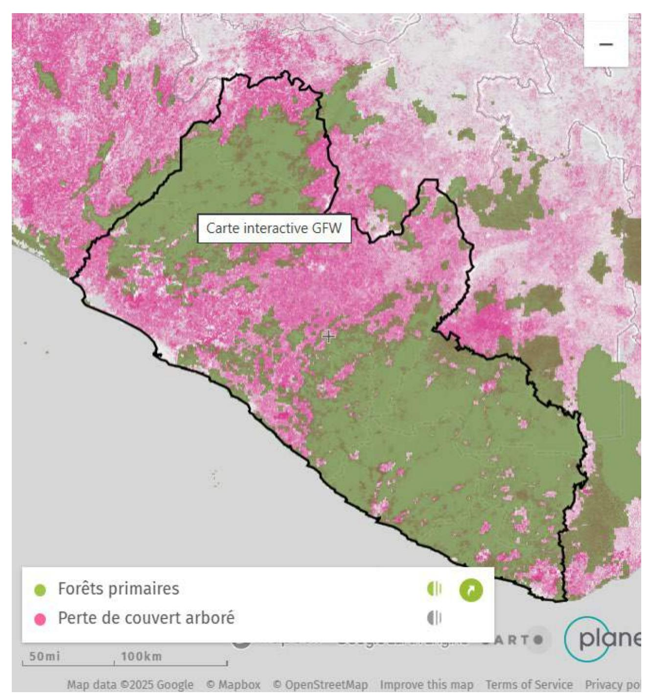

*Figure 6: Screenshot taken from Global Forest Watch, forest cover situation in Liberia, September 2025*

The majority (72.6%) of forests are on community land – no documentary evidence of customary ownership is required for members of the community in question to cultivate the land. In this region of Grand Gedeh, cocoa plantations are very extensive and the data collected during this mission indicate that the forests that have been cleared or are in the process of being cleared are located on community land. The Liberia Land Authority in the Grand Gedeh region estimates that nearly 500,000 hectares of primary forest have been cleared or are in the process of being cleared for cocoa since the mass arrivals began in 2020.

The Liberian communities give large amounts of forest land to new arrivals: on average between 50 and 100 hectares (or between 0.5 and 1 km in local jargon). Some families give up to 300 hectares. However, these plots of forest are not given directly to several individuals. A single individual with the financial means or already established in the area acquires them in large quantities and is responsible for bringing in thousands of interested parties, mainly young people, to occupy these plots, dividing them into 10 to 40 hectares ('*depending on age and labour capacity*') per person, according to a member of the Boundary community. This person is called '*the guardian*5 ' and is the sole contact or intermediary between the cocoa workers and the Liberian owner of the forest plot.

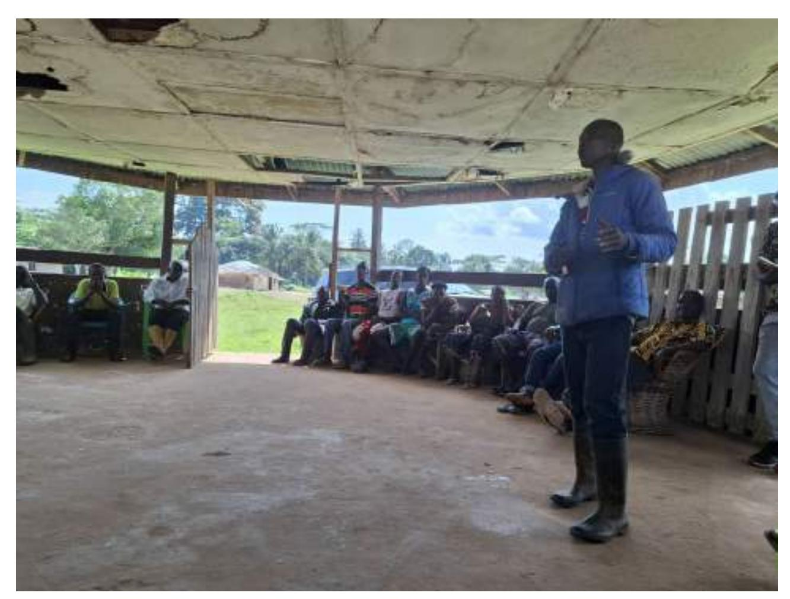

*Figure 7: A member of the community speaks, Boundary, IDEF, July 2025*

5 *The guardian* here refers to the intermediary to whom the Liberian owner grants large areas of forest. It is with this person that the agreement for planting/sharing is made. This person is called a guardian because he brings in workers to occupy the plots that have been granted to him. He is the guardian of the workers he has brought in and remains the sole interlocutor of the Liberian owner.

However, with regard to the acquisition and legal ownership of land, Liberian communities indicate that it is not permitted to legally sell land to a person who is not a Liberian national. Indeed, while the law recognises the principle that '*customary lands confer absolute control over their customary lands on communities: community members acting collectively constitute the supreme decision-making authority of the community with regard to customary lands*', the 1986 Liberian Constitution limits land ownership to Liberian citizens in Article 22(a). The Land Rights Act 2018 (LRA) reaffirms this restriction in Article 8(1), while specifying in Article 8(5) that '*However, any person may exercise rights (of use, possession) over the land, but not ownership, and only by virtue of a concession, lease or other title*'. Even under these conditions, there are still legal requirements that must be met if a community wishes to lease its land to a third party, whether a 'trustee' or any other person.

Indeed, the National Forestry Reform Law (NFRL) (2006) defines all forest resources as the property of the Republic of Liberia, and any removal of timber or forest cover must be authorised by a permit issued by the Forestry Development Authority (FDA).6 This applies regardless of the type of land ownership. To obtain authorisation to use land for other purposes (such as agriculture), a forest use permit is required.

If the land is community forest or customary land, the consent of the community must be obtained in accordance with the Community Rights Act (2009) and the Land Rights Act (2018).

While the Land Rights Act (2018) clearly stipulates that the existence, validity and enforceability of customary land do not depend on any title deed or official registration, the same does not apply to the right to lease customary land. Customary land cannot be leased to anyone until the community has organised itself, in particular by establishing and implementing rules for the functioning of a Community Land Development and Management Committee (CLDMC) and by drawing up a land use management plan.7 As part of this management plan, communities may designate agricultural land explicitly 'for medium- or large-scale agriculture, including [...] cash crop production, for an agreed period of years,' but the CLDMC must adopt procedures and conditions for leasing such large parcels of agricultural land.8 In addition, only community members acting collectively may approve the leasing of customary land to persons other than community members, as well as any lease of land exceeding fifty acres (20 to 24 ha), regardless of the lessee.9

If the land is community forest, the use of forest resources (e.g., clearing for cocoa production) requires the agreement of the community assembly, which may enter into a contract with third parties for timber harvesting. Another legal consideration in Grand Gedeh is whether the land overlaps with a protected area. For example, Grebo-Krahn National Park extends across Grand Gedeh and River Gee counties; any part of customary land that overlaps a protected area cannot be leased or granted.10

6 Section 5.1 of the NFRL

7 Sections 49 and 35 of the LRA.

8 Section 40 of the LRA.

9 Section 36 of the LRA.

10 Section 42(5) of the LRA.

However, in Boundary and Jaybo, the communities did not mention the existence of any community land development and management committees (CLDMCs). Land is leased to new workers. "The village does not sell the land and forest, but people work and share 50/50 of the production. Our family gave 100 hectares to one person," says Mr Do Kean. This suggests that the forest plots were leased to new cocoa producers without following the relevant regulatory provisions. In other words, the cocoa produced on these lands cannot meet the RDUE's legality criteria, as Liberian law on the matter has not been complied with.

The figure of 100 hectares granted by Mr DO Kean's family clearly illustrates the situation on the ground: an influx of people that is increasing due to the large size of the areas granted and large-scale deforestation, as can be seen in the observations below. In the three localities of Boundary, Jaybo and Bee-Zohn, the mission observed the existence of cocoa plantations estimated to be between 4 months and 3 years old. The relatively young age of the plantations in these localities shows that the exodus is in its expansion phase. The average size of the plantations created (12 ha) and the cleared areas (20 to 40 ha) indicate that in a few years (between 5 and 10 years), Liberia's primary forests will have given way to vast expanses of cocoa.

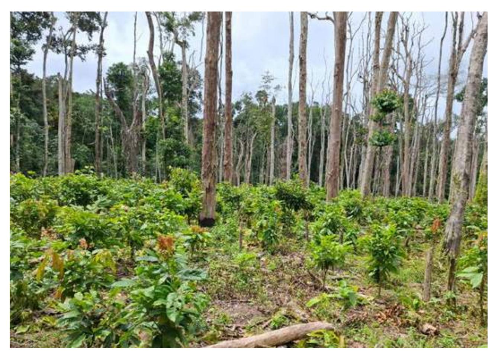

*Figure 8: A young 12-hectare cocoa plantation with dried-up trees, Boundary, IDEF, July 2025.*

Between cocoa plantations and primary forests, the contrast is stark. Primary forests are disappearing to make way for cocoa plantations. Large trees, perceived as the "enemy of cocoa", are dried out by setting them on fire. Cases of forest clearing are legion, and the rate of deforestation is staggering.

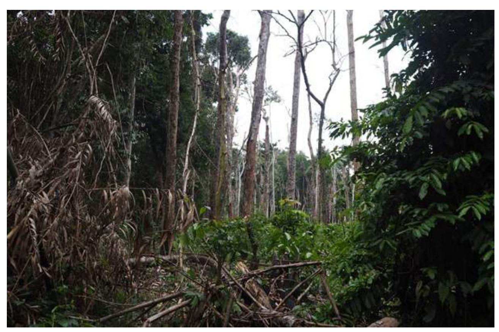

*Figure 9: Clearing land for a plantation in the middle of a forest in Boundary, IDEF, July 2025*

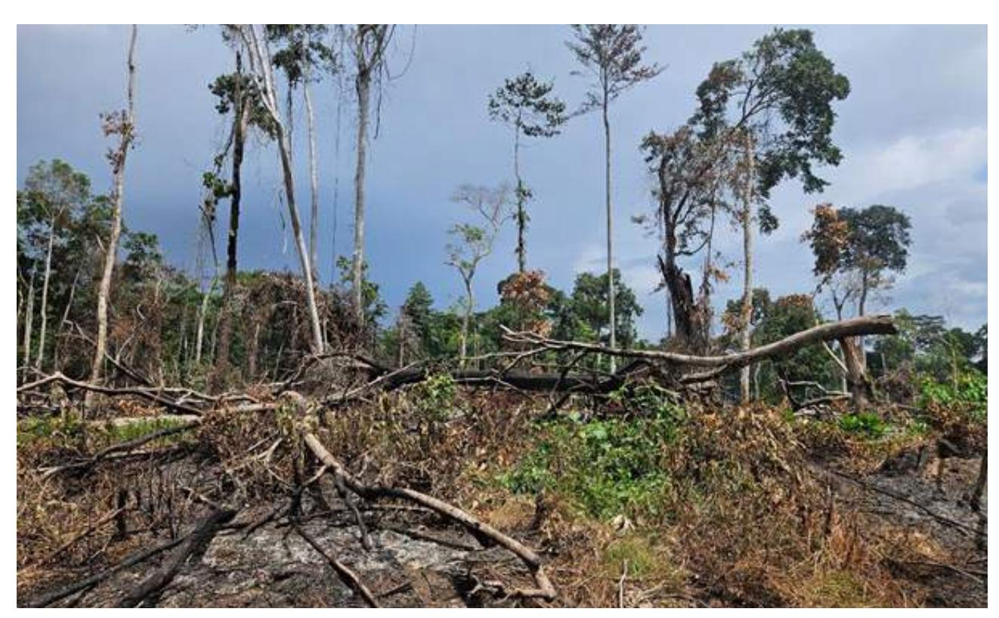

*Figure 10: Forest clearing followed by burning of the plot before planting cocoa, near Bee Zohn, IDEF, July 2025*

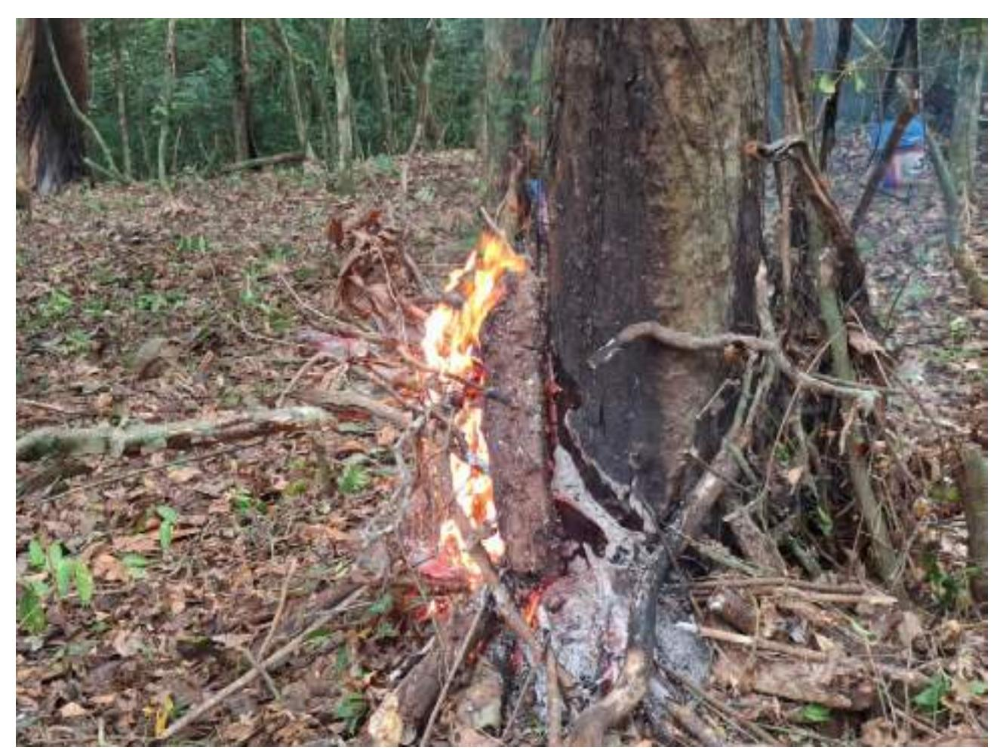

*Figure 11: Burning a tree after clearing in a primary forest, Bee-Zohn, IDEF, July 2025*

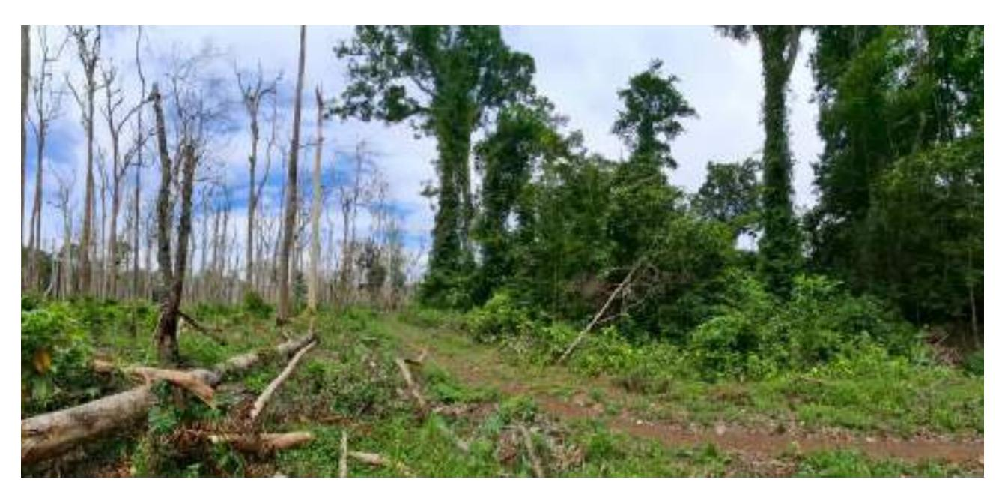

*Figure 12: A cocoa plantation on the left and a remnant of virgin forest on the right, Boundary, IDEF, July 2025*

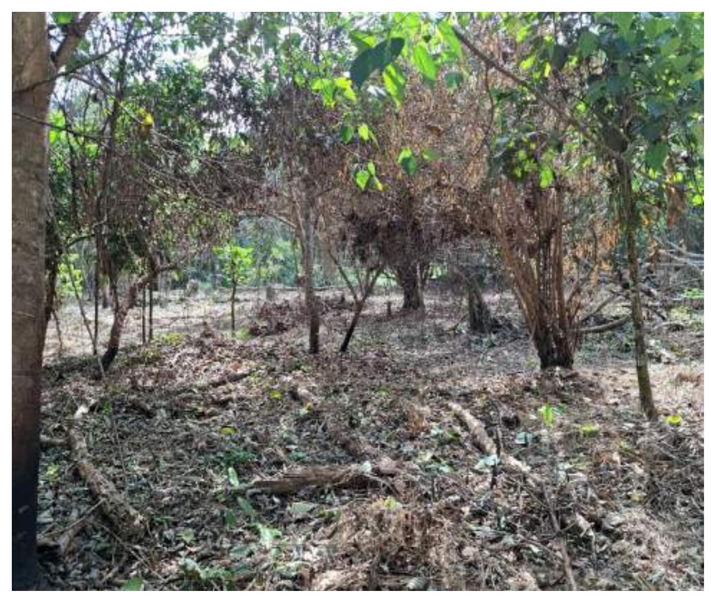

*Figure 13: New clearing of a primary forest, Jaybo, IDEF, July 2025*

Despite this alarming situation and the risk of conflict, given the regulatory confusion surrounding the allocation of forest plots and the lack of clarity regarding the purpose of sharing under the "planted/ shared" principle11, the observation on the ground is that the authorities are powerless, while some local communities seem to welcome the situation. Furthermore, arguments in favour of forest conservation are not well received. In Jaybo, one community member made this clear when he said: "*What you are doing is sabotaging our development. In Côte d'Ivoire, Houphouët12 brought in Burkinabés to work the land and develop the country.*"

Other reports mention significant social conflicts linked to the arrival of migrant workers and deforestation. A report published by the Liberian organisation Liberia Forest Media Watch13 mentions violence and inter-community conflicts. This suggests that the arrival of cocoa is a divisive issue between and within communities.

11 https://ongidef.org/wp-content/uploads/2024/04/Rapport-dobservation-independante\_Alerte-sur-la-deforestation-liee-aucacao\_FR\_.pdf (The new forestry law: a new opportunity for smallholders?), IDEF and ID Cacao, April 2024, box 1, pp. 10

12 Félix Houphouët Boigny, first President of the Republic of Côte d'Ivoire (1960-1993).

13 https://loggingoff.info/wp-content/uploads/2025/09/Liberia-Forest-Media-Watch-LFMW-Report.pdf

### **3. The use of child labour in cocoa production in Liberia is evident14**

The presence of many young people both on the field tracks and in the plantations clearly indicates that child labour is also a phenomenon in cocoa farming in Liberia. Some of them are aware of the situation and have understood that they should not reveal their real age when asked. This is the case, for example, of the young man in yellow in the photo below. He says he is 20 years old. This made his workmates (not visible in this photo) burst out laughing, as they also claim to be "*20 years old.*"

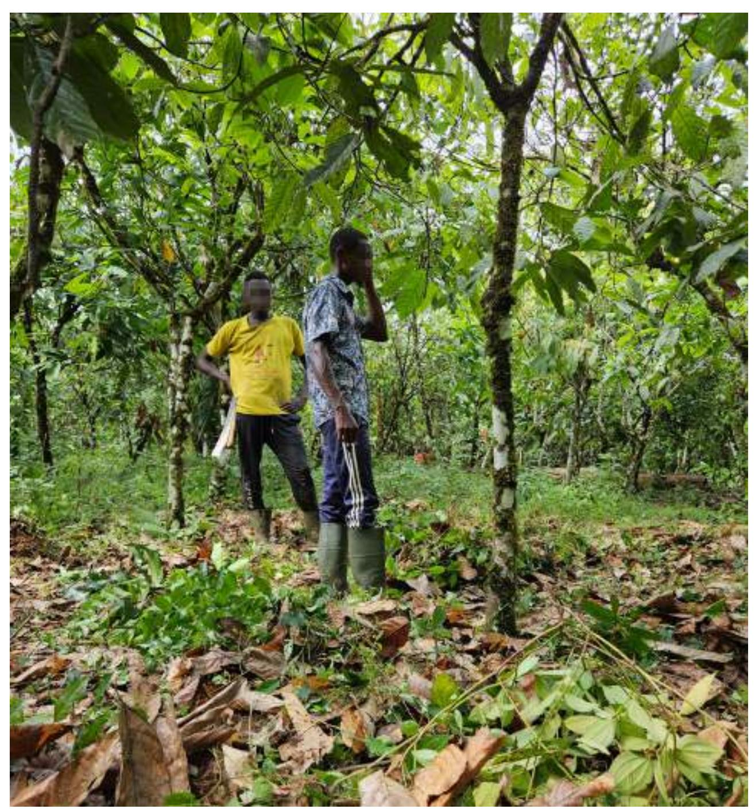

*Figure 14: A young man, probably a minor, working with a machete on a cocoa plantation, Yargaken, IDEF, January 2024*

14 We have chosen to blur the faces of individuals for ethical reasons. Given our belief that some of them are minors, we cannot display their faces completely. Unblurred photos are available upon request.

This is not an isolated case. It is a trend that can be observed in villages and on plantation tracks. It could even be a case of exploitation and human trafficking. According to Liberian communities, it is not these young people who are given plots of land by forest owners. As a member of the Boundary community explains, "*The forest plots are given to older people. We deal with them by agreeing on a total area of 50 or 100 hectares. After that, that person sends workers. And those are the young people you see here and on the roads on their way to the plantations. The bosses sometimes come when there are problems or to visit the workers.*"

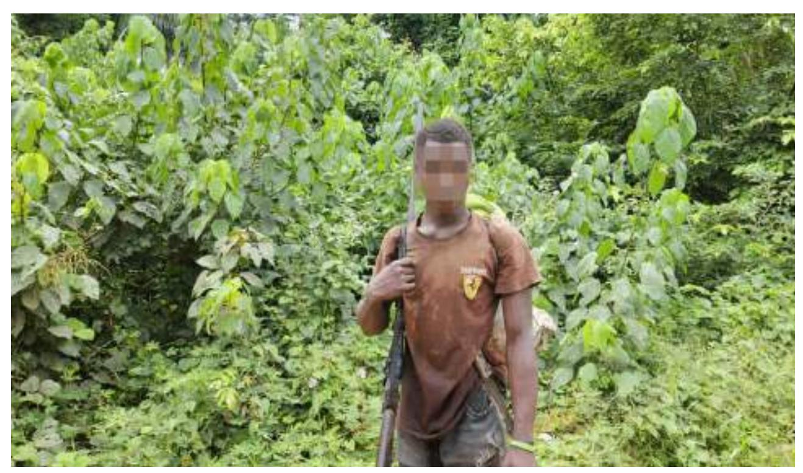

*Figure 15: A young cocoa farmer returning from the plantation, carrying a hunting rifle, Bee Zohn, IDEF, July 2025*

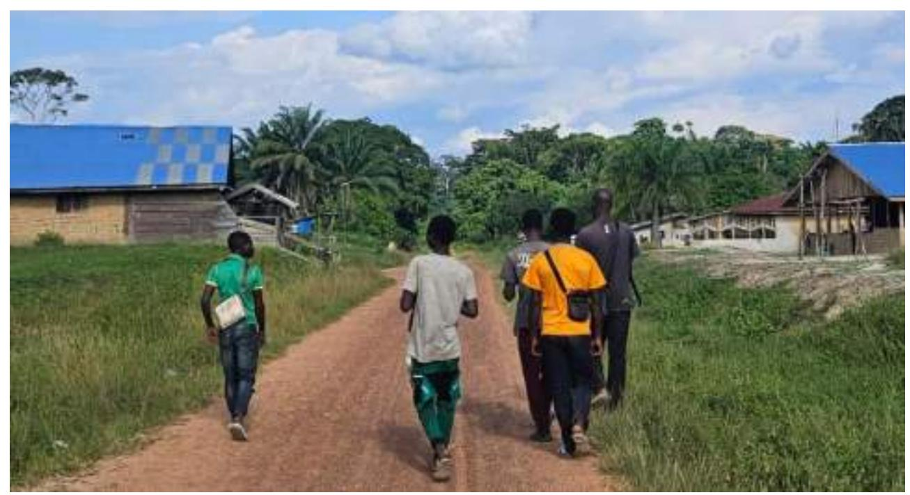

*Figure 16: A group of young workers, some of whom are probably minors, Boundary, IDEF, July 2025*

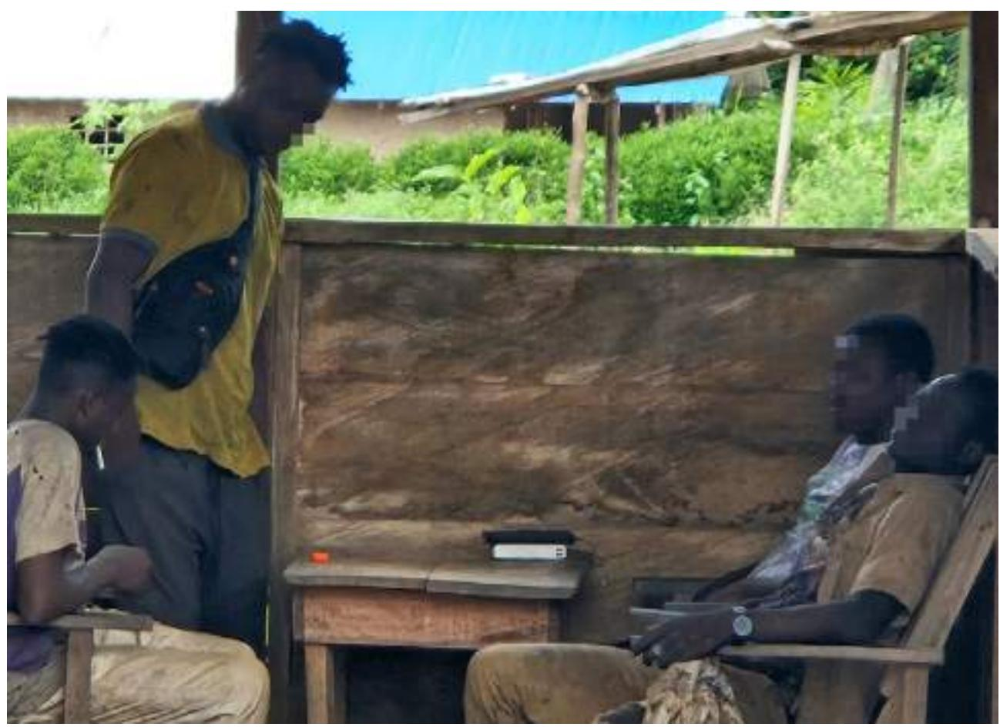

*Figure 17: A group of workers, some of whom are likely minors, sitting under a shed in Boundary, IDEF, July 2025*

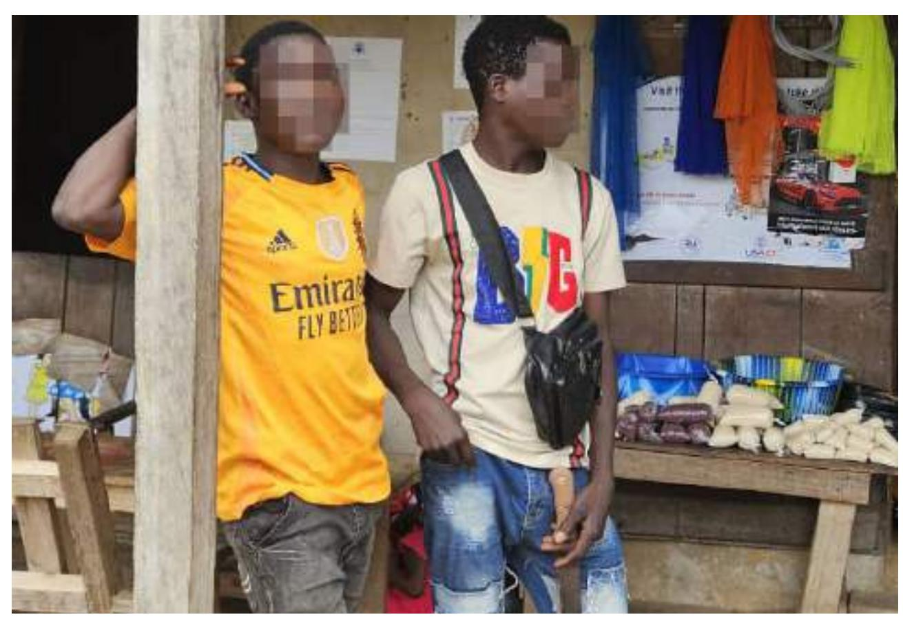

*Figure 18: Two young workers, probably minors, one of whom is holding a machete, standing in front of a shop in Boundary, IDEF, July 2025*

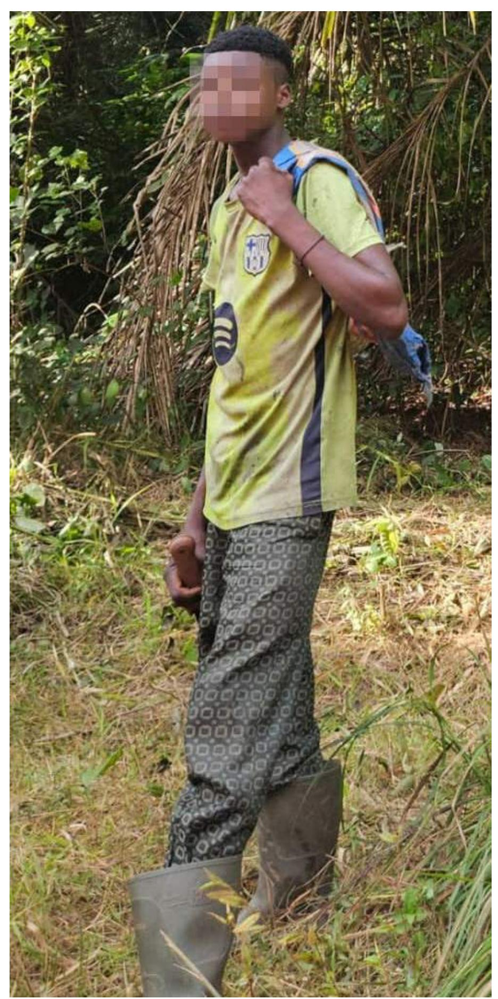

*Figure 19: A young cocoa farmer, probably a minor, Boundary, IDEF, July 2025*

All these young workers, sent by older individuals who negotiate plots with Liberian communities, receive no pay for their work clearing the forest and establishing cocoa plantations. One of them explains how the mentoring system works:

*"No, I don't get a monthly salary. My salary is my share after splitting it with the Liberian. I work for my guardian. He's the one who brought me here and gave me a place in the forest he took with the Liberians. I have 20 hectares to work. When the plantation is ready, we will share it with the Liberian. In my case, we will do 50/50. So the Liberian will take 10 hectares. My guardian will give me my share of the other 10 hectares. I don't know yet how many hectares I will have. But I know he will give me my share. Because it is thanks to him that I got a place here to plant. He paid the deposit with the Liberians. And if there is a problem, he will help me sort it out."*

Arriving in 2023, this young worker, probably a minor, says he has already cleared about 15 hectares. He has set himself a goal of clearing and planting 5 hectares of cocoa per year. He now has 5 hectares of forest left untouched, which he will "*tackle next year, after the January festival,*" he says with a smile.

Despite their apparent tenacity and determination, and their efforts to keep smiling, the strain of their work is evident on their faces and bodies. As in the image below, where one of them explains why the palm of his hand is so hard and covered in blisters. The numerous scars on his leg and arm are also visible.

"*It's the work. It's the machete. It's our life. We work in the fields. A new forest, to cut it down, is a lot of work. But it's our job. We have to do this to create the plantation and get our share.*" Would they have preferred to do something else if they had had the choice? He laughs at first before responding with this poignant sentence: "*I don't think I would have gone into plantation work. It's difficult. I could go to school. But here, school is the forest my guardian gave me. And my pen is the machete.*" There it is, the bitter taste of the chocolate that will be made with beans from these plantations currently being set up in Liberia

.

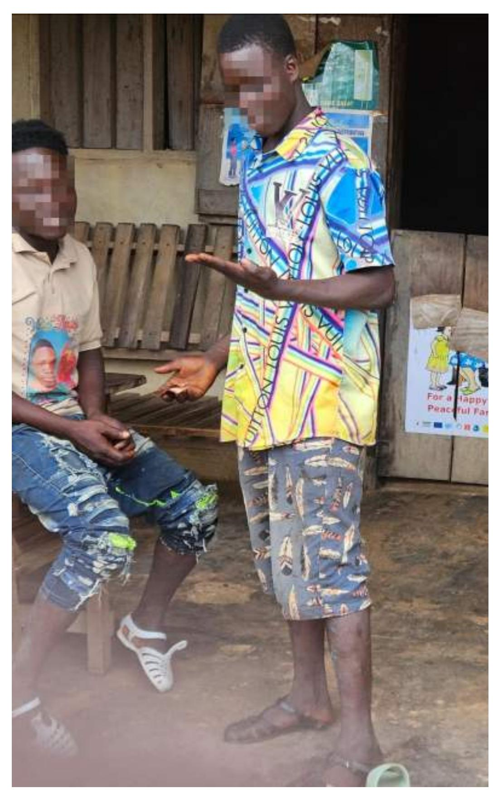

*Figure 20: Young worker, probably a minor, commenting on his palm with blisters, IDEF, July 2025*

# **Conclusion**

The migratory movement that began between 2018 and 2019 with a small group of producers from the eastern and south-western parts of Côte d'Ivoire in the form of "explorers" has grown since 2021 to become a mass exodus with increasingly visible adverse effects on Liberia's primary forests.

Based on official figures from local government services, in the Grand Gedeh region alone, it is estimated that nearly 500,000 hectares of primary forest have been cleared and converted into cocoa plantations since 2020. Some of these plantations are now in production, which should be reflected in the figures for the total volume of cocoa traded by Liberia within two to three years.

In addition to being the result of primary forest deforestation, cocoa in Liberia also appears to be linked to child labour and even human exploitation and trafficking. These are major challenges that the country will have to face in order to control its cocoa sector and make it a tool for future development, as local communities hope.

As such, the situation also poses a major challenge for Côte d'Ivoire as a neighbouring country and the world's leading cocoa producer, and for the European Union in terms of the EUDR. Indeed, cocoa trafficking has been observed between the two countries (see 2024 report and [other sources]), which risks tainting the Ivorian cocoa supply chain with deforestation and illegality. Côte d'Ivoire, with its experience and knowledge in the cocoa industry, and the European Union, with the EUDR as a tool, are levers for structuring a sustainable cocoa sector in Liberia that respects biodiversity and human rights.

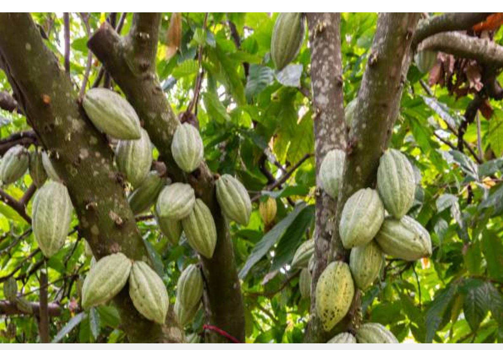

## **Recommendations**

Based on the observations and challenges highlighted in this report, the independent observer makes the following key recommendations to stakeholders:

## To the Liberian authorities

- **•** Take swift and concrete action to preserve the forest by giving the local FDA services the means to monitor and enforce sanctions. This could, for example, involve strengthening the regulatory framework for forest and land management and implementing a moratorium on forest clearing for cocoa cultivation in Grand Gedeh County until traceability and mapping tools are put in place in the country.
- **•** Implement information and awareness-raising activities for communities on the consequences of massive and rapid deforestation for their livelihoods and the risks of land conflicts due to the lack of clarity surrounding the practice of planting/sharing.
- **•** Give immediate prioritization to the formalisation of customary lands of the communities concerned in order to reduce current and future conflicts related to land ownership, through the Liberian Land Authority (LLA);
- **•** Seek collaboration with the European Union with a view to the entry into force of the EUDR in order to put in place traceability tools for compliance with the regulation;
- **•** Strengthen and systematically organise the monitoring and control of agricultural activities, particularly in relation to logging and cocoa planting, in order to limit illegal and unregulated deforestation;
- **•** Take action against situations involving child labour and/or human trafficking and exploitation by implementing field controls and organising community awareness-raising activities;
- **•** Collaborate with neighbouring countries, particularly Côte d'Ivoire, to jointly manage migration flows and control practices related to immigration and the exploitation of natural resources;
- **•** Work with the Ivorian authorities to combat cocoa smuggling across the border and also benefit from Côte d'Ivoire's experience in organising the marketing system, local actors (cooperative movement) and land management, in order to learn lessons for organising the cocoa sector in Liberia.

## To the Ivorian authorities

- **•** Strengthen cross-border cooperation with Liberia in order to better control and regulate migration flows;
- **•** Support the development of sustainable and responsible agricultural sectors by implementing a concrete and massive programme to support producers in renewing their plantations in order to cope with the exodus and by promoting agricultural practices that respect the environment and workers' rights;
- **•** Offer assistance to the Liberian authorities in managing migration flows and share its expertise in supply chain management, particularly in the cocoa sector, to enable the Liberian government to better structure and organise its cocoa industry;

## To the European Union

- **•** Engage in discussions with Liberia, similar to those it has held with Côte d'Ivoire, Ghana and other countries around the world, in order to address issues related to the EUDR;
- **•** Encourage the efforts of the Liberian and Ivorian authorities to strengthen forest governance, combat illegal deforestation and promote sustainable agriculture;
- **•** Support the implementation of the national traceability system currently being developed in Côte d'Ivoire as the sole system for cocoa traceability in Côte d'Ivoire;
- **•** Maintain the timetable for the entry into force of the EUDR and ensure that the competent authorities of Member States have robust control mechanisms in place for due diligence declarations.
- **•** Promote regional dialogue and partnership initiatives to jointly manage migration flows and ensure responsible management of natural resources.

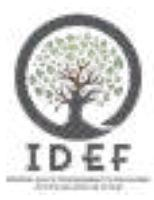

Initiatives pour le Développement communautaire et la conservation de la Forêt (IDEF)

Cocody-les-Deux-Plateaux, quartier Djibi, Ilot N°3471, Lot N°280,

2ème étage de l'immeuble en face du Stade d'Angré, BP 518 Abidjan 27

contact@ongidef.org

(+225) 27 22 50 10 61 (+225) 07 49 10 21 93