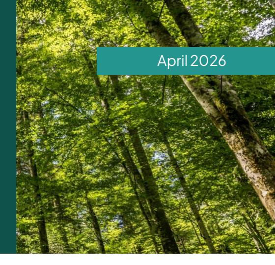

Technical facility on deforestation-free value chains

## EU Deforestation Regulation: Early responses in producer countries

Actors in producer countries across Africa, Asia, and Latin America are taking concrete steps to align with the EU Deforestation Regulation (EUDR), focusing on strengthening traceability systems, reviewing legal frameworks, and supporting smallholder inclusion. The EUDR aims to prevent products associated with deforestation and illegality from entering the EU market and will affect millions of farmers, traders, exporters, and other actors in key commodity sectors (cattle, cocoa, coffee, palm oil, rubber, soy, and wood). Early evidence from eight countries and five commodity sectors points to increased inter-institutional coordination, upgrading of data and traceability systems, and growing awareness among public and private stakeholders of deforestation and legality risks.

At the same time, significant challenges remain, particularly in ensuring that smallholders are not excluded from the EU market. Understanding how producer countries are responding ahead of the EUDR's application provides important insights into how the regulation may contribute to advancing the transition to deforestation-free and legal supply chains. This understanding is critical for informing policy refinement, implementation, and targeted support programming.

## Key ̻ndings

⎯ **Institutional coordination:** Governments have established new task forces and coordination mechanisms to address EUDR requirements, often involving multiple ministries and sector bodies. Examples include Thailand's High-Level Committee, Malaysia's Special Committee, Ethiopia's Intergovernmental Taskforce, and Colombia's Technical Roundtable. Existing sector platforms are also being repurposed for national coordination or bilateral dialogue with the EU. ⎯ **Traceability and data systems:** Most countries studied are reviewing and adapting national registration, traceability, mapping, and data systems to meet EUDR information requirements. Examples include Ghana's Cocoa Traceability System and 2020 EUDR forest map, Malaysia's mandatory palm oil certi̻cation system (MSPO) and GeoPALM portal, Indonesia's timber legality and sustainability system (SVLK+), and Ethiopia's Co̸ee Traceability Platform. These systems can help generate geolocation, legality, and deforestation risk information for EUbound exports. ⎯ **Legal assessments:** All countries studied have undertaken regulatory reviews to clarify the national laws applicable to commodity production and trade, considering EUDR requirements. These e̸orts have improved legal clarity for producers and buyers, and informed ongoing policy discussions and national reform processes. Nonetheless, unresolved issues remain—especially around land tenure and labour standards.

⎯ **Smallholder inclusion:** E̸orts to register farmers, map plots, and build capacity are underway across all countries studied, but risks of exclusion persist. In less centralised sectors (e.g., Cameroon cocoa, Lao PDR co̸ee), pilot projects and development partner support play a critical role. In more centralised and organised sectors (e.g., Ghana cocoa, Malaysia palm oil, Thailand rubber), national systems already cover large shares of producers and could help to generate geolocation and traceability information, needed data to demonstrate compliance with the EUDR. However, independent smallholders, those involved in indirect supply chains, and those with unclear land tenure remain at risk of being left behind. ⎯ **Private sector engagement:** The private sector is advancing internal traceability and compliance systems, especially larger companies and those with vertically integrated supply chains. Engagement varies across sectors and countries, with some companies piloting new tools and collaborating with government and development partners on national systems and shipment dry-runs. Smaller operators, however, often face capacity and resource constraints, leading to uneven preparedness.

## What it means for implementation

EUDR preparedness efforts can help maintain access to the EU market and strengthen sustainability credentials. However, the EUDR is reshaping supply chain relationships, and smallholders and informal actors face significant risks of exclusion where documentation, traceability, or land tenure conditions are not met. Targeted support and inclusive systems will be critical to ensure broad participation and avoid market segmentation. Robust and well-aligned national systems can significantly support inclusive compliance.

The EUDR is already contributing to greater transparency and dialogue on deforestation risks, legality, and supply chain governance in non-EU producer countries, as evidenced in increased institutional mobilisation, multi-stakeholder dialogue, and alignment of national and company systems with EUDR requirements. This momentum can be further reinforced through clear guidance on the role of national systems, acknowledgement of progress made in producer countries, and sustained investment in approaches that are both robust and inclusive of smallholders.

*A note on the assessment: The evidence is based on eight case studies with active development partner engagement (Cameroon, Ghana: cocoa; Colombia, Ethiopia, Lao PDR: coffee; Indonesia: wood; Malaysia: palm oil; Thailand: rubber). Findings may not be generalisable across all contexts. In addition, it remains difficult to attribute observed responses solely to the EUDR, given pre-existing sustainability initiatives and broader trade and policy dynamics.*

**Disclaimer.** This document has been produced by the European Forest Institute. Its content does not re̼ect the o̹cial opinion of funding organisations. Responsibility for the information therein lies entirely with the authors.