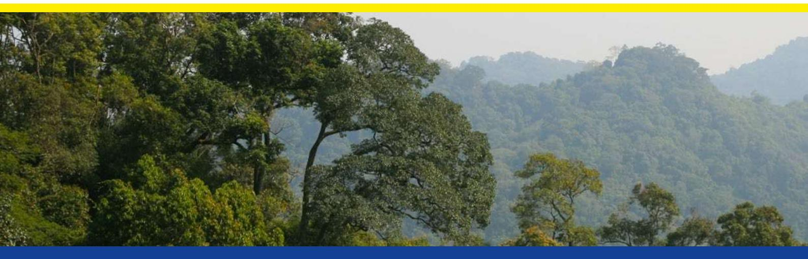
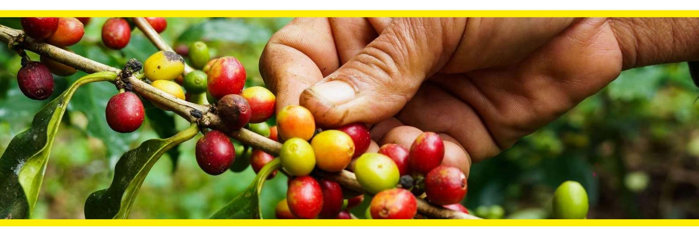
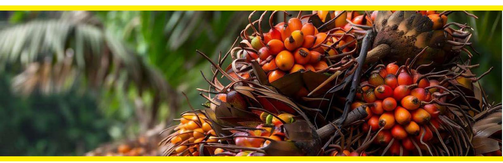
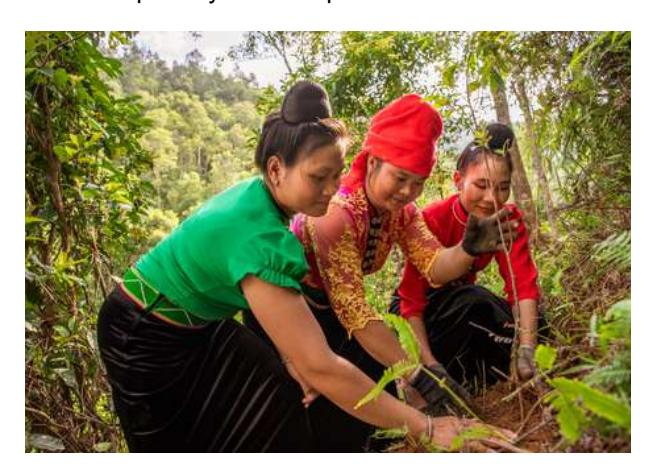
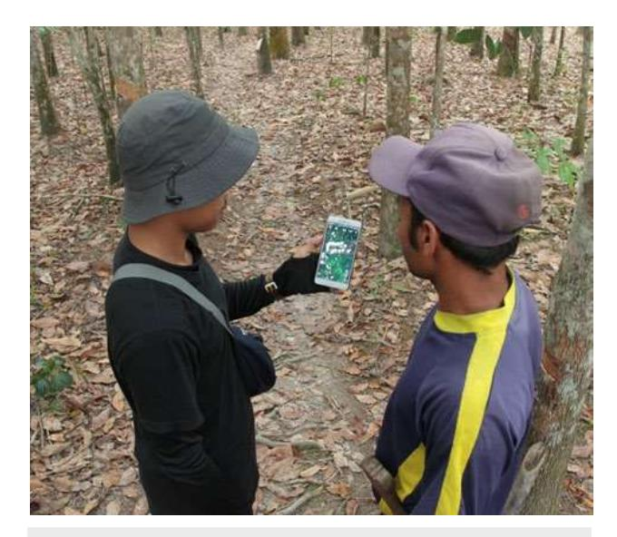

#### What is the EU Deforestation Regulation (EUDR)?

- The EUDR is a new EU regulation to minimize deforestation and forest degradation worldwide. Thereby, it aims at reducing the EU's contribution to climate change and biodiversity loss.
- The EUDR obliges persons that place relevant products on the EU market or export them from there to ensure that these products are produced legally and without causing deforestation or forest degradation.
- To this end, they must fulfill a three-step due diligence procedure.
- There are no direct legal obligations or penalties for countries or smallholders in third countries unless they import into the EU themselves.
- However, your clients that place relevant products on the EU market may ask for your assistance in providing the information and documents they must submit to fulfill EUDR requirements, such as the geolocation information on the place of production.

# EU Deforestation Regulation (EUDR):

What smallholders in third countries need to know

The EUDR will apply to larger companies from 30th December 2024 and to smaller and micro enterprises from mid-2025. After this date, the relevant commodities must fulfill the following criteria if they shall be placed on the EU market or exported from there:

- The product must be produced without deforestation or forest degradation after 31 December 2020.
- The product must be produced in accordance with relevant legislation of the country of production.

Forest as defined by FAO means land spanning more than 0,5 hectares with trees higher than 5 metres and a canopy cover of more than 10%, or trees able to reach those thresholds in situ (excludes land that is under agricultural or urban land use).

### Your benefits

- In case of violations of land rights, smallholders in third countries or their representatives can submit substantiated concerns to companies and EU competent authorities and can thereby fight for their land rights.
- A more transparent and traceable value chain can help smallholders in third countries to reach new markets and to focus on the sustainability of their products.
- Focusing on deforestation-free production can be an incentive to get a better price.
- Owning geolocation data gives smallholders a stronger, more independent position in the value chain, which can lead to fairer prices for smallholders, as it allows for more direct supply chains.
- Smallholders and smallholders' cooperatives can benefit from technical support or capacity building from business partners who depend on information exchange under the EUDR.
- The EUDR is expected to increase the demand for deforestation-free products and strengthen the level playing field for producers working to achieve deforestation-free supply chains.
- The EUDR improves the cooperation between the EU and its partner countries and supports their interests.
- The focus on geolocation to provide assurance on deforestation-free production is an incentive for smallholders which currently have difficulty to access certification.

The EUDR is only relevant for you if you produce the following commodities, and they enter the EU market:

Cattle

Coffee

Rubber

Cocoa

Oil palm

Soya

Wood

In addition, it is in your interest to collect the geolocation of your plots of production and share the geolocation with your business partners.

As a smallholder, your business partners may ask you for information on your land of production, especially where and if you produced your commodities deforestation-free and in accordance with the relevant legislation in your country.

### Deforestation-free production

#### For all agricultural commodities and timber:

Do not convert forest as defined by FAO into agricultural land after 31 December 2020.

- Agroforestry is considered as agricultural land. Therefore, you cannot place on the EU market products from land where forest was converted into agroforestry after 2020.

#### Only for timber products:

Do not degrade forest by timber harvesting.

This means that timber harvesting must not lead to structural changes in forest cover: no conversion of primary forest or naturally regenerating forest into plantation forest or other wooded land and no conversion from primary forest to planted forest.

#### Legal Production

You should respect the following laws in your country and, if possible, provide evidence for it:

- (a) land use rights;
- (b) environmental protection;
- (c) forest-related rules: incl. forest management and biodiversity conservation, where directly related to wood harvesting;
- (d) third parties' rights;
- (e) labour rights;
- (f) human rights protected under international law;
- (g) the principle of free, prior and informed consent (FPIC), including as set out in the UN Declaration on the Rights of Indigenous Peoples; also required, but less relevant for smallholders:
- (h) tax, anti-corruption, trade and customs regulations

Geolocation: geographical location of a plot of land described by means of latitude and longtitude coordinates

| Published by Deutsche Gesellschaft für              |                                                             |
|-----------------------------------------------------|-------------------------------------------------------------|
| Registered Bonn and Eschborn, Germany               |                                                             |
| Project EUDR Engagement (Engagement with Indonesia, |                                                             |
| Contact                                             | Directorate-General for Environment                         |
| Design/Layout                                       | Agentur Umbruch                                             |
| Photo credits                                       | Titel: © GIZ / Sebastian Koch; page 2: © iStock / superoke; |
| As at                                               | October 2024, Bonn                                          |

#### EUDR: Myths vs Reality

Myth: "EUDR imposes obligations on smallholders in third countries"

Reality: No legal obligations for smallholders in third countries outside the EU under the EUDR, and several benefits

Myth: "A farmer cannot cut down and sell one of their own trees"

Reality: Farms are generally agricultural land and hence out of the scope of EUDR

Myth: "Agroforestry and sustainable farming will be non-compliant"

Reality: respectful agroforestry and farming are promoted and do not conflict with the EUDR

#### How to provide geo-coordinates of production area?

- 1. Turn on the GPS signal on your phone and walk around the edges of your field where you produce the products that you sell to your buyer.
- 2. Download a digital application on your mobile phone or use mobile GPS devices. An app may be suggested by your business partner.
- 3. Make sure to collect:
  - If you are growing commodities on several plots that are more than 4 hectares in size, you would have to create a polygon for each one.
  - It is sufficient to collect the data once, unless your production area changes.
  - You can also build on national traceability systems and on efforts by cooperatives, certification bodies on geolocation data mapping if these meet the requirements.
  - If you do not export to the EU market directly, your business partner needs to verify and prove that the geo-location is correct.
  - No personal information is required for the collection of GPS data of plots of land.
  - If you do not have a land register entry or proof of land ownership, you can still carry out geolocalisation.
  - For fields < 4 ha, one geographical point, including latitude and longitude coordinates using at least 6 decimal digits is sufficient.
  - For fields > 4 ha, sufficient latitude and longitude coordinates to describe the shape of the plot of land. This is called a polygon.

## Look for traceable supply chains!