Co-funded by  
the European Union

IPB University  
— Bogor Indonesia —

## REPORT

### Study on EUDR Legality Requirements in The Context of Indonesia

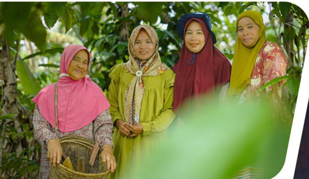

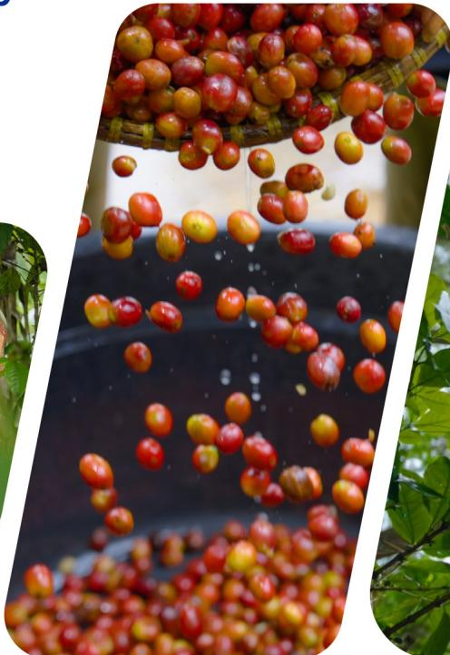

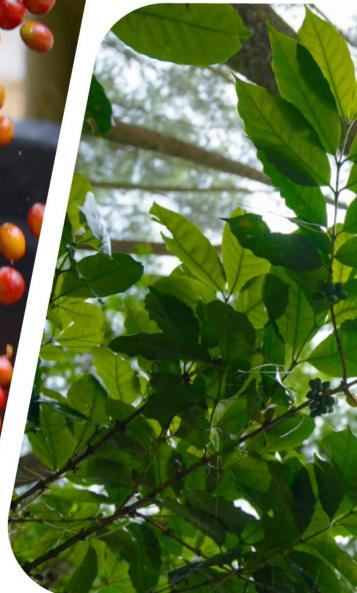

## **Published by**

Center for Regional Systems Analysis, Planning, and Development (CrestPent) IPB University

### **Authors**

Dr. Mujio,S.Pi, M.Si

Dr. Ahmad Solihin,.S.Pi, MH

## **Contributors**

Rindiani Agustina Rahayu, S. PWK

Retia Revany,S.Pi.M,Si

#### **Reviewer**

Silfi Iriyani, Environmental Policy, Resources EfÏciency Advisor, GIZ

#### **Layout**

Mohammad Furqon

### **Photo credits**

Perupadata, Canopy

Printed on 100% recycled paper

Jakarta, 2025

---

*Disclaimer*

*This publication was produced with the financial support of the European Union. Its contents are the sole responsibility of Center for Regional Systems Analysis, Planning, and Development (CrestPent) IPB and do not necessarily reflect the views of the European Union. The information in this study, or upon which the study is based, has been obtained from sources the authors believe to be reliable and accurate.*

*This report is the result of analysis and compilation of several inputs such as FGDs, seminars with various stakeholders, and from several journals and articles from the mass media.*

*This report is for informational purposes only and is not legally binding. The contents are not intended as legal or professional advice. While efforts have been made to ensure accuracy, no warranties or representations are made regarding the completeness or suitability of the information.*

*Operators and interested parties should refer to the EUDR legal text and the EUDR Guidance for official EU information on obligations to meet the requirements set out in the Regulation.*

*The authors and associated parties are not liable for any consequences arising from its use.*

---

# FOREWORD

This report was prepared as part of eΊorts to strengthen understanding of the legality requirements in the *European Union Deforestation Regulation* (EUDR) and its relevance to the regulatory framework in Indonesia.

This regulation requires compliance with legality, deforestation-free, and traceability aspects for key commodities traded in the European Union market. In this context, mapping and analyzing national and regional legal instruments is crucial, not only for technical compliance but also to ensure that the transition to sustainable production systems is inclusive, particularly for smallholder farmers and businesses in the upstream sector.

This report is the result of a study conducted by the Center for Regional Systems Analysis, Planning, and Development (Crespent)-IPB University, with joint funding from the European Union (EU) and the German Federal Ministry for Economic Cooperation and Development (BMZ). The study was conducted through legal analysis, focused group discussions, and multi-stakeholder consultations across sectors and regions.

It is hoped that this report will serve as an objective and comprehensive reference for the government, businesses, civil society organizations, research institutions, and international development partners in designing EUDR fulfilment strategies that are in line with the principles of social justice, environmental sustainability, and legal certainty in Indonesia.

We would like to express our appreciation to all parties who have contributed to the preparation of this report.

We hope that this document will enrich policy dialogue, encourage cross-actor collaboration, and become part of a joint solution in building legal, sustainable, and inclusive commodity governance.

Bogor, August 1st, 2025

Center for Regional Systems Analysis, Planning, and Development (Crespent) – IPB University

## **Prof. Dr. Baba Barus, M,Sc**

# EXECUTIVE SUMMARY

**The European Union Deforestation Regulation (EUDR)** aims to reduce EU consumption of products that contribute to deforestation and forest degradation. Companies placing relevant products on the EU market must ensure that their commodities are legally produced in accordance with their respective national laws and produced without deforestation after 2020.

This study aims to provide information on existing relevant Indonesian legislations to be considered by operators when doing their due diligence and provide references for supply chain actors to comply with relevant Indonesian regulations in the context of EUDR requirements. The scope of this study is the laws and regulations, both at the national and sub-national levels, that are relevant to the cocoa, coΊee, and natural rubber commodities, with additional coverage on the laws and regulations relevant to the timber sector.

The methodology used in this study involved desk review research, interviews, and focus group discussions with stakeholders. This study is of a quasi-academic, informative, and non-concluding nature. The EU does not provide any guidance on the specific laws and regulations operators and traders must follow in Indonesia. Per the regulation, it is for the operators to ensure that relevant laws and regulations in the country of production are respected in the context of their due diligence obligations and for the competent authorities conducting checks on operators to assess whether operators' due diligence system and relevant documentation are compliant with legal production of relevant products. As such, this legality study only serves to help guide the due diligence process; it is neither exhaustive nor binding.

As stated in the EUDR (Article 2 (40)), *"'relevant legislation of the country of production' means the laws applicable in the country of production concerning the legal status of the area of production in terms of: as (a) land use rights; (b) environmental protection; (c) forest-related rules, including forest management and biodiversity conservation, where directly related to wood harvesting; (d) third parties' rights; (e) labour rights; (f) human rights protected under international law; (g) the principle of free, prior and informed consent (FPIC), including as set out in the UN Declaration on the Rights of Indigenous Peoples; (h) tax, anti-corruption, trade and customs regulation".* Some key legislation to consider is as follows:

On **land use rights**, Indonesia follows a state-based land tenure system under Law No. 5/1960, where land is state-controlled but plantation actors can obtain cultivation rights (Hak Guna Usaha or HGU) for up to 35 years, extendable by another 25 years. These rights must be registered and can be revoked if the land is left unused. Plantation land use is subject to spatial planning obligations, with maximum limits defined by commodity type: rubber (23,000 ha), cocoa (13,000 ha), and coΊee (13,000 ha).

In terms of **environmental protection**, multiple laws impose clear obligations on plantation operators to safeguard biodiversity, mitigate environmental harm, and maintain sustainable land use. For example, Law No. 32/2009 and Law No. 22/2019 emphasise responsible cultivation and ecosystem protection. Environmental damage, especially through land clearing or fire, is addressed through Law No. 39/2014 and GR 22/2021. The use of agrochemicals, particularly pesticides, is tightly regulated, requiring registration with the Ministry of Agriculture under the ministry's Regulation 43/2019 and compliance with safety and training protocols. Waste management is governed under Law 32/2009 and GR 22/2021 while water and soil protection are addressed through Law 17/2019, Law 37/2014, and Law 41/1999.

The **forestry legal framework** is anchored in Law 41/1999 and supplemented by GR 23/2021 and Law 18/2013. It lays out comprehensive rules for sustainable forest management, zoning, rehabilitation, and biodiversity protection. Timber legality assurance in Indonesia is regulated through the Timber Legality Assurance System (SVLK), ensuring traceability and legal compliance throughout the supply chain. Indonesia also has a timber legality scheme with the European Union, the Voluntary Partnership Agreement part of the Forest Law Enforcement, Governance and Trade (FLEGT VPA). The EUDR states that "*To respect ongoing bilateral commitments and to preserve the progress achieved with partner countries that have an operating system in place (FLEGT licensing stage) and work, where relevant and agreed, with current VPA partners towards them reaching that stage, this Regulation should include a provision declaring that wood and wood products that are covered by a valid FLEGT license are deemed to comply with the legality requirement of Regulation".*

With respect to **third-party rights**, Law 39/2014 requires plantation companies to engage in inclusive and mutually beneficial partnerships with smallholders and local communities. Companies must allocate 20% of their cultivated area to community plantations and are obligated to provide social facilities and human resource development programs. These obligations are further supported by Law 19/2013 on the Protection and Empowerment of Farmers.

In the area of **labour rights**, law 1/1970 covers occupational safety and health, while Law 21/2000 guarantees unionisation rights and protection from discrimination. Workers are entitled to fair wages, social security, rest periods, maternity leave, and religious accommodations. Child labour is strictly prohibited, and special considerations are extended to workers with disabilities. On **human rights**, the 1945 Constitution and Law 39/1999 guarantee a range of rights, including the right to life, health, education, personal freedom, decent work, and protection for vulnerable groups such as women, children, and persons with disabilities.

The **rights of Indigenous Peoples** are constitutionally recognised and supported by national law. Indonesia legally acknowledges customary land rights, and unauthorised use of Indigenous land can result in heavy penalties, including imprisonment and fines. These rights align with the principle of Free, Prior, and Informed Consent (FPIC) under the United Nations Declaration on the Rights of Indigenous Peoples framework. The Reformasi period has also seen legislative progress inΌuenced by civil society advocacy, although eΊorts for full implementation and recognition are ongoing.

Indonesia's **tax and governance regulations** align with EUDR expectations around transparency, integrity, and anti-corruption. Taxes aΊecting plantation actors include income tax (PPh), VAT (PPN), and land/building tax (PBB), governed by Laws 6/1983, 7/1983, and 7/2021. Anti-corruption is addressed through Law 31/1999 and the role of the Corruption Eradication Commission (KPK), reinforced by public whistleblower protections under GR 43/2018. Trade and customs activities are regulated under Law 7/2014 and GR 29/2021, ensuring standards and licensing are met, particularly for exports. Timber exports are further governed by Presidential Decrees 48/1977 and 39/1979, which aim to stabilise domestic industry development.

**Data protection** is recognised as a constitutional right, codified in Law 27/2022. This law outlines data subject rights, including consent, access, correction, and deletion of personal data. Plantation geospatial data, including HGU maps, is considered public information based on Law 14/2008 and confirmed by a Supreme Court ruling, unless specifically exempted for national security.

Finally, Indonesia's framework for **traceability** is regulated through GR 26/2021 and Ministry of Agriculture Regulation 53/2018, requiring agricultural information systems that support traceability. For timber, Indonesia implements the SILK (Sistem Informasi Legalitas Kayu) platform under SVLK, which allows public access to data on timber legality and supply chain transparency.

In conclusion, while Indonesia's regulatory landscape presents a comprehensive framework for compliance with the EU Deforestation Regulation (EUDR), the complexity of overlapping laws, multiple responsible ministries, and varying land tenure systems pose significant challenges, particularly concerning land rights and Indigenous peoples' rights. Plantation business actors must prioritise legal land use verification, community consultation and respect customary land claims. Equally, due diligence processes must ensure traceability, inclusion of smallholders, and adherence to environmental and labour standards.

# Contents

| <b>FOREWORD .....</b>                                                                                                                                                | <b>iv</b> |
|----------------------------------------------------------------------------------------------------------------------------------------------------------------------|-----------|
| <b>EXECUTIVE SUMMARY .....</b>                                                                                                                                       | <b>v</b>  |
| <b>Contents.....</b>                                                                                                                                                 | <b>ix</b> |
| <b>LIST OF FIGURES .....</b>                                                                                                                                         | <b>x</b>  |
| <b>LIST OF TABLE .....</b>                                                                                                                                           | <b>x</b>  |
| <b>LIST OF ABBREVIATION .....</b>                                                                                                                                    | <b>xi</b> |
| <b>1.INTRODUCTION .....</b>                                                                                                                                          | <b>1</b>  |
| <b>2.METHODOLOGY .....</b>                                                                                                                                           | <b>3</b>  |
| <b>3.ASSESMENT OF RELEVANT INDONESIAN LAWS AND REGULATIONS WITH THE RULES REQUIRED IN THE EUDR.....</b>                                                      | <b>7</b>  |
| 3.1.Land Use Rights.....                                                                                                                                             | 7         |
| 3.2.Environmental Protection .....                                                                                                                                   | 10        |
| 3.3.Forestry Related Regulations .....                                                                                                                               | 17        |
| 3.4.Third Party Rights .....                                                                                                                                         | 20        |
| 3.5.Labour Rights .....                                                                                                                                              | 21        |
| 3.6.Human Rights Protected by International Law .....                                                                                                                | 23        |
| 3.7.Principles of Free, Prior, and Informed Consent (FPIC), Including in Accordance with the UN Declaration on the Rights of Indigenous Peoples (UNDRIP) ..... | 26        |
| 3.8.Taxation, Anticorruption, Trade and Customs Regulations .....                                                                                                 | 27        |
| 3.9.Data Privacy Protection Regulations.....                                                                                                                         | 32        |
| 3.10.Traceability .....                                                                                                                                              | 33        |
| <b>4.Pathways to Compliance: Recommendations for Producers .....</b>                                                                                             | <b>35</b> |
| 4.1.Recommendations for producers to comply with relevant Indonesian Legislation .....                                                                            | 35        |
| 4.2.Recommendations for Smallholder .....                                                                                                                            | 50        |
| 4.3.Conclusion .....                                                                                                                                                 | 58        |

| <b>BIBLIOGRAPHY</b> | <b>62</b> |
|---------------------|-----------|
| <b>ANNEX</b>        | <b>72</b> |

# LIST OF FIGURES

| Figure 1. Indonesian Regulations Related to Land Rights                            | 10 |
|------------------------------------------------------------------------------------|----|
| Biodiversity                                                                       | 12 |
| Figure 3 Indonesian Regulations Related to Chemical                                | 13 |
| Figure 4 Indonesian Regulations Related to waste                                   | 14 |
| Figure 5 Indonesian Regulations Related to water...............................    | 16 |
| Figure 6 Indonesian Regulations Related to Soil................................... | 17 |
| Figure 7 Indonesian Regulations Related to Forestry                                | 19 |
| Figure 8 Indonesian Regulations Related to Third Parties’ Rights                   | 20 |
| Figure 9 Indonesian Regulations Related to Labour Rights                           | 23 |
| Figure 11. Indonesian Regulations Related to Taxes and fees                        | 29 |
| ConΌict of Interest                                                                | 30 |
| Figure 13. Indonesian Regulations Related to Trade                                 | 31 |
| Data Privacy Protection                                                            | 33 |
| Figure 15. Indonesian Regulations Related to Traceability                          | 34 |
| Figure 16. Stages of granting STDB to smallholders                                 | 51 |
| registration for smallholders                                                      | 55 |

# LIST OF TABLE

| Regulation in Indonesia             | 3  |
|-------------------------------------|----|
| Table 2. Mapping of Indonesian Laws | 5  |
| business owners                     | 40 |

# LIST OF ABBREVIATION

| AMDAL | = Analisis Mengenai Dampak Lingkungan (Environmental         |
|-------|--------------------------------------------------------------|
| BKP   | = Barang Kena Pajak (Taxable Goods)                          |
| BPJS  | = Badan Penyelenggara Jaminan Sosial (the Social Security    |
| BTHL  | = Daily Agricultural Workers                                 |
| EUDR  | = EU Regulation on Deforestation-free Products               |
| FGD   | = Focus Group Discussion                                     |
| FPIC  | = Free Prior and Informed Consent (FPIC)                     |
| GR    | = Government Regulation                                      |
| HCV   | = High Conservation Value                                    |
| HGB   | = Hak Guna Bangunan (Right to Build)                         |
| HGU   | = Hak Guna Usaha (Right to Cultivate)                        |
| IGT   | = Informasi Geospasial Tematik (Thematic Geospatial          |
| IUP   | = Izin Usaha Perkebunan (Plantation Business Permit)         |
| IUP-B | = Izin Usaha Perkebunan untuk Budidaya (Plantation Business  |
| KLHS  | = Kajian Lingkungan Hidup Strategis (Strategic Environmental |
| KPK   | = Komisi Pemberantasan Korupsi (Corruption Eradication       |
| KSP   | = Government Cooperation                                     |
| MR    | = Minister Regulation                                        |
| NDC   | = Nationally Determined Contributions                        |
| PBB   | = Pajak Bumi dan Bangunan (Land and Building Tax)            |
| PD    | = Peraturan Daerah (Regional Regulation)                     |
| PI    | = Presindential Instruction                                  |

| PIAPS   | = Peta Indikatif Areal Perhutanan Sosial (Indicative Map of  |
|---------|--------------------------------------------------------------|
| PNBP    | = Penerimaan Negara Bukan Pajak (Non-Tax State Revenue)      |
| PP      | = Peraturan Pemerintah (Government Regulation)               |
| PPh     | = Pajak Penghasilan (Income Tax)                             |
| PPN     | = Pajak Pertambahan Nilai (Value Added Tax)                  |
| PR      | = Presidential Regulation                                    |
| SHM     | = Sertifikat Hak Milik (Certificate of Land Ownership)       |
| SIHHBK  | = Sistem Informasi Hasil Hutan Bukan Kayu (Non-Timber Forest |
| SIPNBP  | = Sistem Informasi Penerimaan Negara Bukan Pajak             |
| SIPUUH  | = Sistem Informasi Penatausahaan Hasil Hutan (Forest Product |
| SIUP    | = Surat Izin Usaha Perdagangan (Trading Business License)    |
| STD-B   | = Surat Tanda Daftar Budidaya (Registration Certificate for  |
| THR     | = Tunjangan Hari Raya (holiday allowance)                    |
| UKL-UPL | = Upaya Pengelolaan Lingkungan-Upaya Pemantauan              |
| UNDRIP  | = United Nations Declaration on the Rights of Indigenous     |
| VAT     | = Value-Added Tax                                            |

# 1. INTRODUCTION

The European Union Regulation on Deforestation Free Products, or EUDR has been in force since June 2023. Main objective of the EUDR is to reduce the EU's contribution to global deforestation and forest degradation and encourage the consumption and trade of deforestation-free products'. The EUDR states that, companies placing products on the EU market or export them from there must ensure that the products are produced legally in accordance with the **relevant laws and regulations in the country of production** (EUDR Art. 9 1 (d) and Art. 2 (28)) and without deforestation after the cut-oΊ date.

Commodities included in the EUDR and relevant for Indonesia are cocoa, coΊee, oil palm, natural rubber and timber/wood as well as some derived products. As far as legal production of commodities is concerned, the EUDR states that commodities need to be produced in accordance with national legislation in the country of production. Until now, eΊorts to analyze the extent of such coherence have not been carried out comprehensively in the Indonesian context.

This study was conducted to assess how well Indonesian regulations align with the European Union Deforestation Regulation (EUDR), specifically Article 3(b) and Article 2(40). The goal is to evaluate policy coherence and identify any gaps or actions that might be needed from a policy perspective to ensure compliance with the EUDR.With the EU regulation on deforestation-free products (EUDR), the EU aims to **minimise the EU's contribution to deforestation and forest degradation** worldwide and thereby to minimise its impact on its contribution to mitigate **climate change**, reduce **greenhouse gas emissions** and **biodiversity loss**.

The EUDR obliges companies to ensure through due diligence that relevant commodities and products placed on the EU market or exported from there are **produced without deforestation and, in the case of timber products, without forest degradation after 2020** and in **compliance with relevant legislation of the country of production**. It applies to cattle, cocoa, coΊee, oil palm, rubber, soya and wood as well as certain derived products. In the case of products imported into the EU , the company importing the relevant commodity or product takes the role of an operator and must fulfill due diligence obligations. The EUDR does not contain any direct obligations on companies further upstream.

The **benchmarking** of countries inside and outside the EU will direct checks on EU operators by EU competent authorities based on the level of risk of areas they source from. Countries assigned to a low risk category face reduced checks on operators sourcing from there by EU competent authorities as well as simplified due diligence obligations for operators. A high-risk profiling increases the number of checks on operators by the EU competent authorities.

As defined by Article 30 on "**cooperation with third countries**", the EU will work closely with partner countries on the consumption and production side to achieve the objectives of the Regulation. The regulation will enter into force from the end of 2025 for larger companies and from mid-2026 for small and medium enterprises (SMEs).The basis for determining whether a relevant commodity or relevant product has been produced **in accordance with the relevant legislation of the country of production** is the legislation of the country in which the commodity, or in the case of a product, the commodity contained in a relevant product was grown, harvested, obtained from or raised on relevant plots of land or, as regards cattle, in establishments.

The EUDR takes a Όexible approach by listing a number of areas of law without specifying particular laws, as these diΊer from country to country and may be subject to amendments. However, only the applicable laws **concerning the legal status of the area of production** constitute relevant legislation pursuant to Article 2(40) of the EUDR. This means that generally the relevance of laws for the legality requirement in Article 3(b) of the EUDR is not determined by the fact that they may apply generally during the production process of commodities or apply to the supply chains of relevant products and relevant commodities. Instead, the relevance of legislation is determined by the fact that these laws specifically impact or inΌuence the legal status of the area in which the commodities were produced.

Additionally, Article 2(40) of the EUDR must be read in the light of **the objectives of the EUDR** as laid down in Article 1(1)(a) and (b). That means that legislation is relevant if its contents can be linked to halting deforestation and forest degradation.

This study is of quasi-academic, informative and non-concluding nature. No prescription from the EU will be given regarding the specific laws and regulations in Indonesia that operators must abide by in Indonesia. Per the regulation, it is for the operators to ensure that relevant laws and regulations are respected in the context of their due diligence obligations and for the competent authorities conducting checks on operators to assess whether operators' due diligence system and relevant documentation demonstrate legal production of relevant products. As such, this legality study only serves to help guide the due diligence process.

Operators and interested parties should refer to the EUDR legal text and EUDR Guidance document for ofÏcial EU information on obligations to meet the requirements set out in the Regulation.

# 2. METHODOLOGY

This chapter provides an overview the methodology and analyses used in this study.

The study utilizes a combination of desktop research, interviews with key informants. Focus group discussion (FGD) with experts and stakeholders was also conducted to obtain feedback on the structure overview of the regulation.

As the first step, mapping process of relevant Indonesian laws and regulations was conducted. Normative Juridical and Comparative Juridical analyses were done to provide a comparison between the EUDR, especially Article 3(b), and relevant Indonesian laws and regulations. The outcome of this mapping exercise is limited to illustrating the current state of Indonesian regulations in relation to the EUDR, rather than assessing the level of compliance.

Based on the findings from the mapping process, a methodology and future steps are suggested for actors to comply with EUDR requirements regarding legality in the Indonesian context.

## 1. Objective 1 (Assessment of relevant legislation)

The data collected in this stage is the EUDR policy document, namely Regulation (EU) 2023/1115 of the European Parliament and of the Council of May 31, 2023 on the making available on the Union market and the export from the Union of certain commodities and products associated with deforestation and forest degradation. The EUDR Guidance Document are also consulted in the process. This EUDR policy is then elaborated using indicators applicable Laws and Regulations in Indonesia, as presented in Table 1.

**Table 1**. Criteria for each EUDR indicator and relevant with Law and Regulation in Indonesia

| No. EUDR Indicator          | Criteria                           |
|-----------------------------|------------------------------------|
| Soil is c                   | onserved and managed appropriately |
| timbe                       | r traceability system established  |
| The rights of third parties | are guaranteed by law              |
| Local Communities           | are supported and their rights are |

| No. | EUDR Indicator                                                                                                                                                                                    | Criteria                                                                                                                                                    |
|-----|---------------------------------------------------------------------------------------------------------------------------------------------------------------------------------------------------|-------------------------------------------------------------------------------------------------------------------------------------------------------------|
| 6   |                                                                                                                                          | <ul> <li>Human rights are respected and recognized</li> </ul>                                                                                               |
| 7   |                                                               | <ul> <li>The rights of <i>Indigenous Peoples</i> are known and respected recognized</li> </ul>                                                              |
| 8   |   | <ul> <li>Taxes and fees are paid.</li> <li>Corruption, fraud and conflict of interest are avoided</li> <li>Trade and procurement are responsible</li> </ul> |

This analysis has also taken into account Indonesian regulations on product traceability and data transparency for business entities. This involves examining legal frameworks that govern the traceability of products across the supply chain, ensuring that each step—from production to distribution—can be accurately tracked. Thus, products produced in Indonesia can be traced to their origin, and it can be ascertained that they are not products produced from illegal means.

Based on the criteria presented in Table 1, Indonesian laws and regulations are identified and mapped for the content of articles that are related to the EUDR indicators. Mapping of Indonesian laws using Table 2.

**Table 2.** Illustration of Mapping of Indonesian Laws and Regulations

|    |                                                          |     | Pres Minis Pro Re                                  |
|----|----------------------------------------------------------|-----|--------------------------------------------------------|
| No | EUDR Indicator                                           | Act | Gov iden terial vincial gent Reg tial Reg Reg Reg Reg |
| 1  | Land use rights                                          |     |                                                        |
| 2  | Environmental protection                                 |     |                                                        |
| 3  | Forest-related rules                                     |     |                                                        |
| 4  | Third parties’ rights;                                   |     |                                                        |
| 5  | Labour rights                                            |     |                                                        |
| 6  | Human rights                                             |     |                                                        |
| 7  | The principle of free, prior and informed consent (FPIC) |     |                                                        |
| 8  | Tax, anti corruption, trade and customs regulations.    |     |                                                        |
| 9  | Traceability                                             |     |                                                        |
| 10 | Data                                                     |     |                                                        |

The results of the comparative legal analysis were followed by an FGD/Workshop involving the government by its role and functions (relevant ministries), academics by their expertise and research experience, and non-government organizations by their focus activities.

# 2. Objective 2 (Possible Ways Forward)

Following the legal mapping of Indonesian regulations, a descriptive analysis is conducted on the articles of Indonesian law that contain the term "mandatory" and that impose legal sanctions—both criminal and administrative—on business actors who fail to comply. In other words, the provisions of these mandatory articles will be considered as relevant national legislation to be taken into account when checking the legality criterion under the EUDR. Recommendations on possible ways forward are provided for plantation business actors to conform with the Indonesian laws and regulations in the context of compliance to the EUDR requirements.

# 3. ASSESMENT OF RELEVANT INDONESIAN LAWS AND REGULATIONS WITH THE RULES REQUIRED IN THE EUDR

This chapter outlines the applicable national-level laws and regulations in Indonesia pertaining the plantation sector, especially for the cocoa, coΊee, and natural rubber commodities, with additional coverage on the timber sector, in relevance to the requirements of the EUDR. While this chapter highlights the most relevant aspects in the context of the complex and comprehensive legislative framework, more detailed information on identified relevant legislation can be found in the annex.

Regulations enacted at the regional level as a response to the national legislation are also quoted in the Annex.

# 3.1. Land Use Rights

There are two aspects related to Land use rights, namely:

## (1) Land tenure and management rights are secured

Based on Law No. 5/1960, the legal framework governing land use in Indonesia stipulates that all land is controlled by the state (Article 2(1)), which holds the authority to give land rights to individuals, either as sole owners or jointly with others, as well as to legal entities (Article 4(2)), allowing them to own and utilize land for specific purposes. One of the most significant land rights granted to plantation business actors is the **Right to Cultivate (Hak Guna Usaha/HGU),** a right that enables these entities to utilize state-controlled land for agricultural, fisheries, or livestock activities, including the establishment of plantations, for a legally defined period.

Indonesia imposes diΊerent rules between forestry and agriculture. In the forestry sector, timber produced can be sourced from state forests with forest product production status, including timber. This context is included in the forest area utilization section, where the utilization permit can be given to parties that meet the criteria and can apply the principles of sustainability throughout the process. In addition to state forests, forest timber can also come from private forests. Private forest is land that has legal rights from the state. Private forests are owned by individuals with the status of proprietary forests, not state forests.

There is currently a Minister of Environment and Forestry Regulation No. P.32/ Menlhk-Setjen/2015 on Private Forest which guarantees the rights of farmers who own private forest and produce timber from their land. Additionally, there is Regulation of the Minister of Forestry of the Republic of Indonesia Number: P.31/Menhut-II/2010 concerning Cost Standards for Performance Assessment of Sustainable Production Forest Management and Timber Legality Verification of Permit Holders or Private Forest Holders.

The transformation of regulations on timber legality in Indonesia, including from private forest, since 2009 until now has changed 62 times. and the current regulation is the Minister of Environment and Forestry Regulation Number 8 of 2021 concerning Forest Management and Preparation of Forest Management Plans, as well as Forest Utilization in Protected Forests and Production Forests. The current legal timber regulations in Indonesia have also been enacted by almost all local governments up to the district level, and most have also regulated the use of legal timber for government buildings.

In addition, for matters relating to the agricultural and plantation sectors, there are regulations relating to the licensing of business use rights which are regulated by Government Regulation (PP) No. 18/2021, where it is established that HGU can be granted for a maximum duration of 35 years and extended for an additional 25 years (Article 22, paragraph 1). In order to safeguard legal certainty and ensure the proper execution of plantation business activities, every plot of land used for such purposes, especially those requiring HGU, must be registered in accordance with the procedures outlined in Government Regulation No. 24/1997 which has been amended by Government Regulation Number 18/2021 on Management Rights, Land Rights, Housing Units, and Land Registration. This regulation serves to formalize and validate the legal use of the land by plantation companies.

Beyond the registration requirement, additional regulations, such as those found in Government Regulation No. 20 year 2021 , regulates the obligations of permit/ concession/business licence holders as well as rights holders, management rights holders, and basic land tenure holders; object of controlling abandoned areas and abandoned land; inventory of indicated abandoned areas and land; controlling abandoned areas and abandoned land. Furthermore, plantation business activities are specifically governed by the provisions set forth in Law No. 39/2014 amended by Law No. 6 of 2023 on Stipulating Government Regulation in Lieu of Law No. 2 of 2022 on Job Creation into Law, which grants HGU to plantation business actors (Article 11(1)) while also imposing certain restrictions on the total land area that can be used (Article 14(1)). These land area limitations are more precisely detailed in Government Regulation No. 26/2021, which sets the maximum and minimum allowable land usage for diΊerent commodities (Article 2), such as rubber, which may occupy a maximum of 23,000 hectares, cocoa with a maximum of 13,000 hectares, and coΊee with a similar upper limit of 13,000 hectares (Article 3(1)).

HGU is valid for 35 years and can be extended for 25 years and must be registered (Government Regulation No. 18/2021) . If not utilized, the land can be revoked (Government Regulation No. 20/2021). Plantation businesses are regulated by Law No. 39/2014 amended by Law No. 6/2023, with area limits for specific commodities as outlined in Government Regulation No. 52/2023.

## (2) Management planning and operations are conducted responsibly

The management of plantation businesses must comply with the provisions of Law No. 39/2014 amended by Law 6 year 2023, which mandates the obligation to cultivate land that has been **granted a permit**, with sanctions of land confiscation if it is not utilized. Furthermore, Law No. 22/2019 stipulates that the use of land for agricultural cultivation purposes must align with spatial and landuse planning (Article 12(1)), where plantation business activities fall under the space allocation group for the subsector of food crops, horticulture, plantations, and livestock (Article 12(2)).

For timber commodities, the Minister of Environment and Forestry Regulation Number 8 of 2021 concerning Forest Management and Preparation of Forest Management Plans, as well as Forest Utilization in Protected Forests and Production Forests also regulates planning, management, and protection of biodiversity and the environment (water, land), protection of community rights.

Similar to Law No. 39/2014, this law also includes provisions regarding the determination of the maximum land area allowed for agricultural cultivation businesses (Article 15(1)), as well as the obligation to protect, maintain, restore, and improve the functions of agricultural cultivation land (Article 18(2)). Additionally, there is a requirement to facilitate the development of community plantations in the surrounding areas, covering 20% of the total plantation land area being managed.

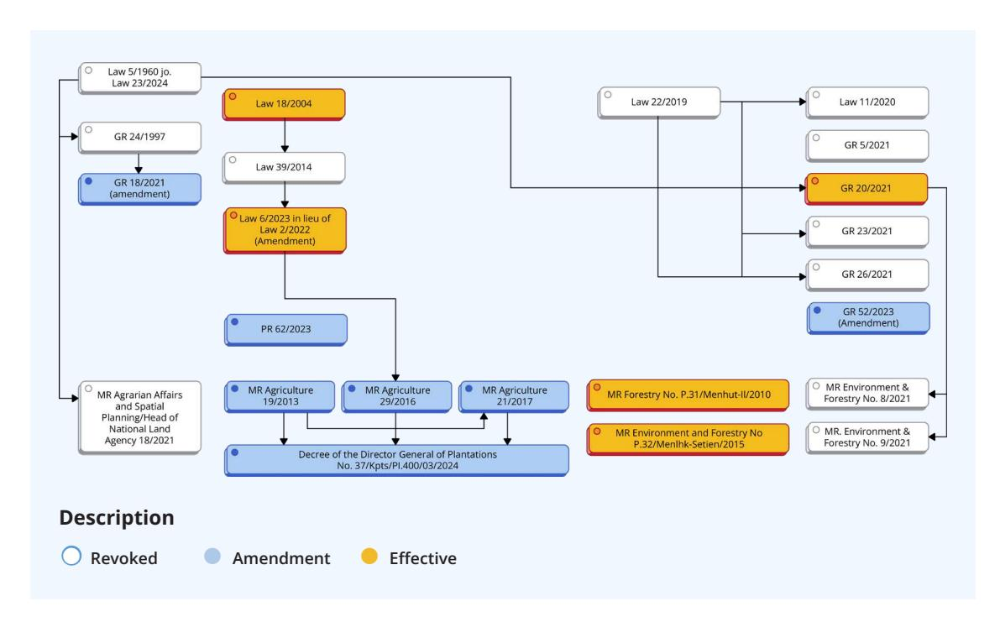

**Figure 1**. Indonesian Regulations Related to Land Rights

## 3.2. Environmental Protection

There are four indicators related to the Environmental ProtecƟon aspect, namely

## (1) Ecosystems and biodiversity values are identiƂed and protected

The protection of ecosystems and biodiversity, particularly in plantation enterprises, is a critical focus for the Indonesian government. This is stipulated in Law 22 Year 2019 on Sustainable agricultural cultivation system, which regulates development in agriculture through an agricultural cultivation system to achieve food sovereignty by taking into account the carrying capacity of the ecosystem, mitigation, and adaptation to climate change in order to realize an advanced, efÏcient, resilient, and sustainable agricultural system.

Furthermore, plantation business owners are legally required to mitigate and/ or prevent environmental damage (Article 53, paragraph 1 of Law 32/2009). If pollution occurs, they are obligated to restore the environmental functions (Article 54, paragraph 2 of Law No. 32/2009) and provide guarantee funds for environmental restoration (Article 55, paragraph 1 of Law 32/ 2009).

The obligation to protect ecosystems in the context of preventing environmental damage is enshrined in Law No. 39/2014. According to Article 32(1), this obligation includes implementing protective measures during land clearing and processing, ensuring that the environment is not adversely aΊected by these activities. Furthermore, Article 67 specifies that protection must also be carried out with respect to the use of planting media in plantation activities, highlighting the need for sustainable practices that do not degrade the soil or surrounding ecosystem. In addition to these provisions, the law also emphasizes the protection of plantation crops, which must be carried out by business actors, the central government, and regional governments. This collective responsibility involves continuous monitoring, observation, and management of plant disturbances or threats (Article 68).

The detailed provisions call for active cooperation between the private sector and government institutions to maintain the health of plantation crops, safeguard biodiversity, and mitigate any potential environmental impacts. This underscores the comprehensive approach required to not only cultivate plantations responsibly but also to ensure that the long-term sustainability of the surrounding environment is preserved.

The above provisions are further reinforced in the Job Creation Law, which mandates that plantation business owners must maintain the sustainability of environmental functions (Article 67, paragraph 1). In its implementation, GR 22/2021 specifies prohibitions for plantation business actors, including: (1) a prohibition on burning forests and/or land (Article 11); (2) an obligation to prevent environmental damage and/or pollution related to forest and/or land fires (Article 12); (3) an obligation to prevent forest and/or land fires within their business area (Article 13); and (4) a requirement to have adequate facilities and infrastructure to prevent forest and/or land fires within their business area (Article 14, paragraph 1).

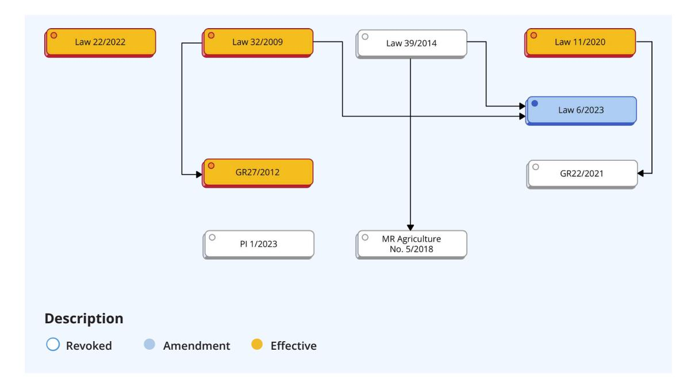

**Figure 2.** Indonesian Regulations Related to Ecosystems and Biodiversity

## (2) Chemicals are used responsibly with minimal negative impacts

In general, Law 32/2009 governs the obligations related to environmental protection eΊorts, including the regulation of chemical usage in plantation operations. This legislation establishes a framework requiring businesses, especially those in the agricultural sector, to adhere to environmental safeguards that ensure sustainable practices and minimize ecological harm. The law mandates responsible chemical usage to prevent pollution and protect biodiversity, soil health, and water quality.

This overarching mandate is further specified and implemented through Government Regulation 22/2021, which provides detailed guidelines for compliance. This regulation outlines specific standards and requirements for environmental quality management, emphasizing the need for businesses to observe strict limits on chemical use. It enforces adherence to approved environmental quality standards, safe chemical handling practices, and appropriate waste management protocols, ensuring that plantation activities align with Indonesia's commitment to environmental sustainability and public health.

Regarding the regulation of chemicals in plantation enterprises, it is not explicitly detailed in Law 32/2009. The law only states a general prohibition on actions that cause environmental pollution and/or destruction (Article 69, paragraph 1, letter a). However, long before this law was enacted, the Indonesian government had already established regulations concerning the use of chemicals in plantation businesses. Law No. 11 year 1962 which in 2023 was revoked with Law Number 17 year 2023 on Health.

Government Regulation 7/1973, as the implementing regulation, strictly governs the prohibition of pesticides that are not registered or authorized by the Minister of Agriculture. Further detailed regulation is provided in Minister Regulation of Agriculture 43/2019 on Pesticide Registration, which mandates that all individuals using pesticides must use those approved by the Minister (Article 2). Additionally, it prohibits the production, distribution, and use of pesticides, technical pesticide materials, and pesticides for export that lack a registration number and valid permit or whose registration has expired (Article 70, paragraph 1). Even users of restricted pesticides are required to undergo training. This implies that the use of chemicals in plantation enterprises must be authorized by the Minister of Agriculture.

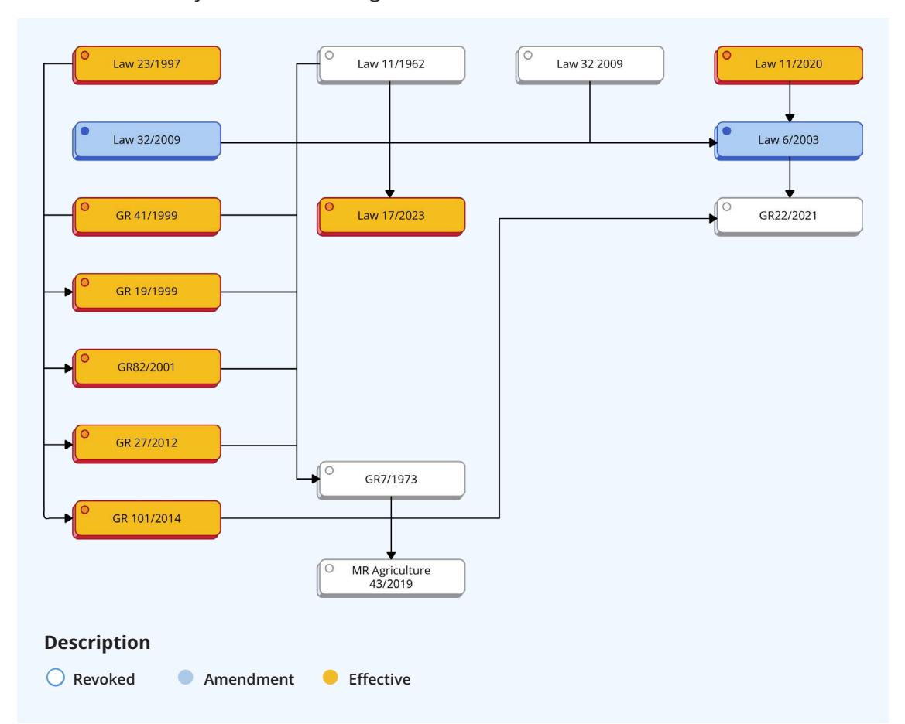

## (3) Waste is reduced and managed responsibly

Article 69, paragraph (1), letter (e) of Law 32/2009 stipulates that all individuals are prohibited from discharging waste into environmental media. However, waste disposal is permitted if it meets environmental quality standards and is authorized by the Minister, governor, or regent/mayor according to their respective jurisdictions. Article 20, paragraph (3) of Law 32/2009 provides an exception to this prohibition, allowing waste discharge into the environment if it complies with environmental quality standards and has received permission from the relevant authority, be it the Minister, governor, or regent/mayor, depending on their authority. Further details on the protection of the environment from waste disposal in accordance with quality standards are provided in Government Regulation No. 22/2021. This regulation supersedes numerous previous government regulations mandated by the Environmental Law, establishing comprehensive guidelines for maintaining environmental quality.

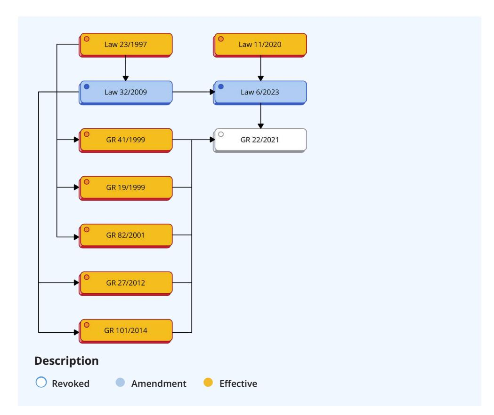

**Figure 4** Indonesian Regulations Related to waste

# (4) Water resources are protected and used efƂciently

The regulation for protecting water from plantation activities is outlined in Law 32/2009, which mandates environmental maintenance through natural resource conservation eΊorts (Article 57, paragraph (1), letter (a)). The explanatory section specifies that natural resource conservation includes, among other areas, the conservation of water resources, forest ecosystems, coastal and marine ecosystems, energy, peatland ecosystems, and karst ecosystems.

Additionally, Law Number 37/2014 on Soil and Water Conservation mandates the maintenance of soil functions on Prime Land, Critical Land, and Degraded Land within Protected Areas and Restored and Rehabilitated Cultivated Areas (Article 25, paragraph (1)). It further requires landowners to implement Soil and Water Conservation on all types of land use (Article 29, paragraph (1) and Article 30, paragraph (2)). Law Number 17/2019 reinforces the prohibition against polluting or damaging water sources, surrounding environments, and water resource infrastructure (Article 32) and forbids activities that could lead to water damage (Article 36).

Moreover, Law Number 22/2019 states that all agricultural land use must consider the suitability and capacity of the land and the preservation of the environment, with an emphasis on soil and water conservation (Article 12, paragraph (3)), and it requires adherence to water quality standards based on intended usage (Article 47, paragraph (1)). Additionally, the central and regional governments are tasked with regulating water use for agricultural cultivation (Article 47, paragraph (2)). The government is obligated to: (a) ensure water availability considering hydroclimatic, hydrological, and hydrogeological conditions; (b) prioritize water use for agricultural activities after fulfilling basic human needs; and (c) establish and regulate water allocation plans for agricultural use (Article 47, paragraph (3)).

More specific standards impacting water quality are set out in Government Regulation 22/2021 Furthermore, Government Regulation 18/2021 includes provisions for maintaining the conservation function of water body boundaries and other conservation functions (Article 27, letter (g)), which is further detailed in the Ministerial Regulation by the Ministry of Agrarian AΊairs and Spatial Planning/National Land Agency (Permen ATR/BPN), mandating that the control and use of water sources and other natural resources must uphold conservation functions (Article 22).

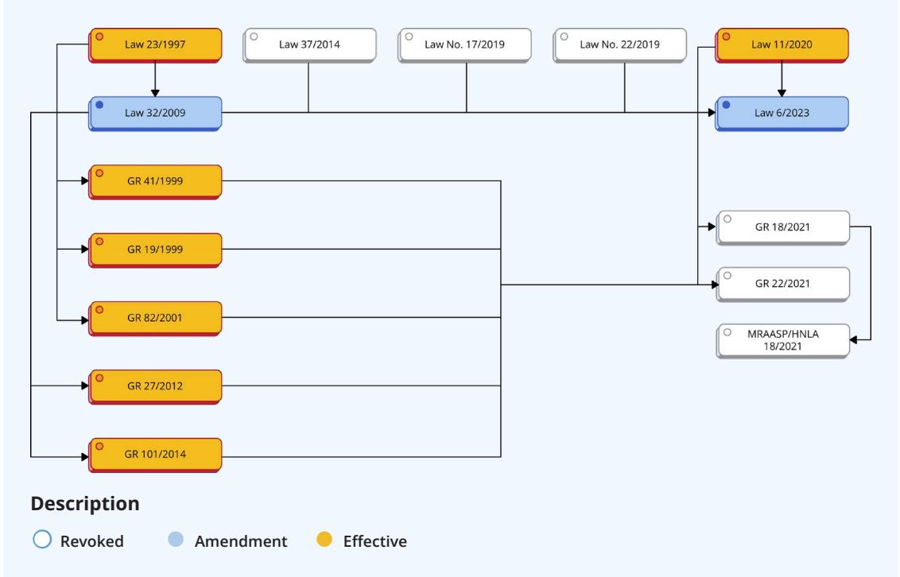

**Figure 5** Indonesian Regulations Related to Water

### (5) Soil is conserved and managed appropriately

The regulation on the protection of land utilized within plantation areas is intrinsically linked to Law 32/2009. Article 21, paragraph (3), letter (a) outlines the criteria for soil damage standards in biomass production. “Biomass production” here refers to the utilization of soil resources to generate biomass. Additionally, Article 69 specifies various prohibitions, including activities that lead to soil degradation.

In parallel, Law 41/1999 mandates that the use of privately owned forest land must be in accordance with the intended purpose of the land, as stated in Article 36, paragraph (1). Article 44, paragraph (1) reinforces the necessity of forest reclamation to restore and rehabilitate damaged land and forest vegetation to their optimal functional capacity. Furthermore, any party utilizing forest areas for non-forestry activities that alter soil surface and coverage is required to contribute a reclamation and rehabilitation guarantee fund (Article 45, paragraph (3)). This law is operationalized through Government Regulation No. 26/2020, which provides specific guidance on Forest Rehabilitation via reforestation and/or soil conservation techniques (Article 21).

In the context of sustainable agriculture, water, soil and environment protecƟon are sƟpulated in Law Number 22 Year 2019 in the arƟcle 12, arƟcle 13. Water and soil conservaƟon is also mandated to all agriculture actors in Indonesia.

Government RegulaƟon 22/2021 further speciĮes the environmental quality standards related to soil impacts, including those stemming from plantaƟon acƟviƟes. AddiƟonally, Government RegulaƟon 150/2000, derived from Law 23/1997 and unaīected by the Job CreaƟon Law, provides detailed criteria for assessing soil damage standards in biomass producƟon, excluding biomass itself. It also outlines prevenƟve measures, responses to soil degradaƟon, and protocols for soil condiƟon restoraƟon.

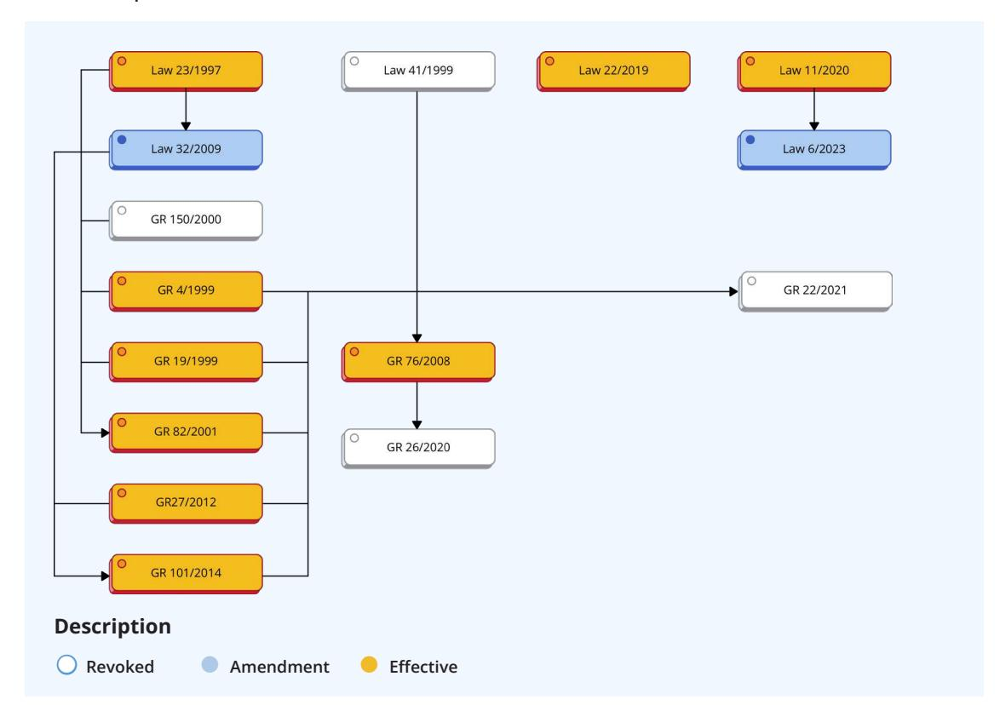

**Figure 6** Indonesian Regulations Related to Soil

# 3.3. Forestry Related Regulations

The Law of forestry in Indonesia, encompassing both the legality of permits and forest protection measures, is comprehensively detailed within the country's legal framework. Law 41/1999, along with its numerous implementing regulations, specifically addresses forestry management in great detail. As outlined in Article 10, forest management is aimed at maximizing sustainable, multifunctional benefits for public welfare. This objective is achieved through forestry planning, forest management, research and development, education and training, forestry extension services, and monitoring.

In terms of timber commodities, Indonesia has had rules and policies since 2000 which are included in the scope of Law Number 24 of 2000 concerning International Agreements. This law then became the main legal consideration for Indonesia when initiating an agreed commitment to participate in reducing deforestation and eradicating illegal logging in the form of Presidential Regulation Number 21 of 2014 concerning Ratification of the Voluntary Partnership Agreement Between The Republic Of Indonesia And The European Union On Forest Law Enforcement, Governance And Trade In Timber Products Into The European Union.

In terms of provisions on legal and sustainable timber, it is produced and regulated based on forest management objectives, especially in production forest areas. production forest areas in Indonesian regulations are areas whose status and function are to produce timber and non-timber. This utilization is very strictly regulated by the Indonesian government so that its sustainability is maintained. All regulations on production forests include responsibilities for environmental protection, protection and preservation of biodiversity, community empowerment, implementation of social and economic safeguards, and performance monitoring and evaluation.

Based on Indonesian Forestry statistics in 2023, in Indonesia there are 220 companies (PT) and small-scale business institutions (CV) in Industrial Plantation Forests spread across 6 islands (Sumatra, Nusa Tenggara, Kalimantan, Sulawesi, Maluku, Papua). The total area of Industrial Forest land with the status of state land is 7,903,919.13 hectares and an area of 286,237.06 hectares is not state land. The entire production series in this Industrial Plantation Forest is subject to legality rules, including derivative products that are required to be legally certified by TLAS.

In Law Number 41 year 1999, Article 21 further specifies that forest management activities include: (a) forest zoning and forest management planning; (b) forest utilization and the use of forest areas; (c) forest rehabilitation and reclamation; and (d) forest protection and nature conservation. In terms of permitting, several provisions were amended by the Job Creation Law, which are implemented through Government Regulation No. 23/2021. This regulation provides detailed guidance on: (a) Forestry Planning; (b) Changes to Forest Area Designation and Function; (c) Forest Area Utilization; (d) Forest Zoning and Forest Management Planning, as well as Forest Utilization; (e) Social Forestry Management; (f) Forest Protection; (g) Monitoring; and (h) Administrative Sanctions.

Additionally, the Indonesian government enacted Law 18/2013 to combat forest destruction, particularly illegal logging, unauthorized mining, and unlicensed plantation activities. This law addresses the severe impacts of forest destruction, including damage to social and cultural life, environmental degradation, and the increasingly organized and transnational nature of these activities.

This robust legislative framework underscores Indonesia's commitment to sustainable forest management and conservation, while seeking to mitigate the adverse eΊects of illegal activities on forests. By emphasizing both preventive measures and legal accountability, the framework aims to protect forest resources for present and future generations, supporting ecological integrity, social well-being, and economic resilience.

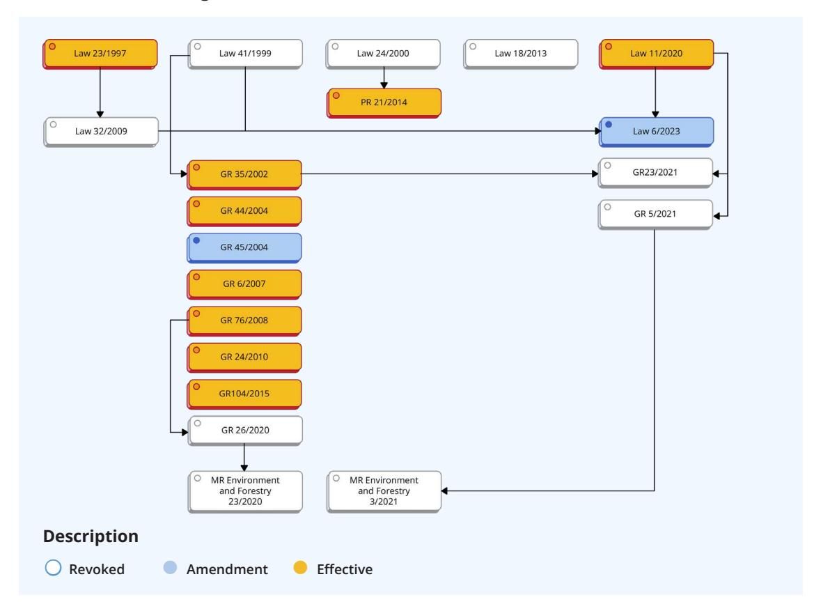

**Figure 7** Indonesian Regulations Related to Forestry

## 3.4. Third Party Rights

Further, Law 39/2014 emphasizes the involvement of plantation business actors and community participation, as stated in Article 5, paragraph (3). In line with these provisions, the implementation of empowerment initiatives, outlined in Article 57, paragraph (1), requires plantation companies to engage in mutually beneficial partnerships with smallholders, employees, and local communities in ways that are respectful, responsible, supportive, and interdependent. Additionally, plantation companies with business permits must facilitate the establishment of community plantations, covering 20% of the total land area under cultivation (Article 58, paragraph (1)). Moreover, plantation business owners are required to support surrounding communities through partnership programs, provision of social and economic facilities, and enhancement of human resource capacities (Article 69, paragraph (1)).

The empowerment and protection of communities are further reinforced in Law No. 19/2013 on the Protection and Empowerment of Farmers, which aims to improve the welfare of farmers, develop productive, efÏcient, and sustainable agricultural systems, and provide security for farming enterprises (Article 3).

The policy adjustments under the Job Creation Law, reΌected in Government Regulations 23/2021 and Government Regulations 26/2021, do not alter the government's commitment to protecting and empowering plantation business owners, including small-scale enterprises. These legislative frameworks collectively underscore the Indonesian government's dedication to balancing economic interests in the plantation sector with the social, economic, and environmental well-being of local communities.

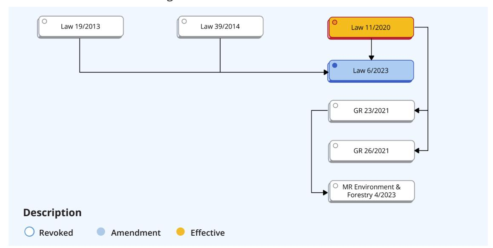

# 3.5. Labour Rights

The rights of workers have long been a focus of the Indonesian government. Under Law 1/1970 on Occupational Safety, workers are granted certain obligations and rights, including: (a) providing accurate information when requested by safety inspectors or experts; (b) wearing mandatory personal protective equipment; (c) complying with all prescribed occupational safety and health requirements; (d) requesting management to implement all mandatory safety and health measures; and (e) objecting to work in conditions where occupational safety and health requirements or personal protective equipment are deemed inadequate, except under specific conditions as determined by inspectors within accountable limits.

In addition, the manpower Law (Law 21/2000) explicitly outlines the rights of workers, including:

X Right to Unionize: Workers have the right to organize and participate in union activities during work hours as agreed by both parties or as specified in collective labor agreements (Article 29). They also have the right to form and join labor unions (Article 104). X Equal Rights without Discrimination: Workers are entitled to employment opportunities (Article 5), the right to acquire, enhance, and develop job competencies according to their talents, interests, and abilities through training (Article 11), the right to participate in job training in accordance with their job responsibilities (Article 12, paragraph 3), and job placement based on principles of openness, freedom, objectivity, fairness, and equality without discrimination (Article 32, paragraph 1). X Support for Persons with Disabilities: Job training for workers with disabilities must consider the type, degree of disability, and capabilities of the disabled worker (Article 19), and employers are required to provide appropriate protections based on the type and degree of the worker's disability (Article 67, paragraph 2). X Prohibition of Child Labor: The employment of children is prohibited (Article 68), as well as involving children in the worst forms of work (Article 74, paragraph 1). X Gender-Specific Provisions: Women are entitled to special working hours (Article 76), and female workers experiencing menstrual pain may not be required to work on the first and second days of menstruation (Article 81, paragraph 1). Additionally, women are entitled to 1.5 months of leave before and after childbirth and 1.5 months of leave following a miscarriage (Article 82). Nursing mothers must be given adequate time to breastfeed their children during work hours (Article 83).

X Working Hours: Employers are required to adhere to regulations on working hours (Article 77, paragraph 1), to provide rest periods and leave (Article 79, paragraph 1), and to recognize ofÏcial public holidays as non-working days (Article 85). X Right to Worship: Employers must provide sufÏcient opportunity for workers to perform religious obligations (Article 80). X Wages: Workers are entitled to receive an income that ensures a decent standard of living (Article 88, paragraph 1), and employers are prohibited from paying wages below the minimum wage (Article 90, paragraph 1). X Social Security: Workers and their families are entitled to labor social security (Article 99, paragraph 1). X Welfare Facilities: Employers are obligated to provide welfare facilities in accordance with the company's capabilities (Article 100).

Furthermore, Indonesian workers must be registered with the Social Security Administering Body, as required by Law 40/2004 on the National Social Security System (Article 13, paragraph 1). Additionally, more detailed worker rights are specified in Government Regulations 35/2021, GR 36/2021, GR 37/2021, GR 49/2023, and GR 28/2024.

These legislative frameworks collectively emphasize the Indonesian government's commitment to ensuring comprehensive protections and entitlements for workers, covering areas such as health and safety, union rights, equal treatment, support for disabled workers, prohibitions on child labor, gender-specific protections, work hours, wages, and social security. This legal infrastructure is designed to foster a safe, equitable, and supportive working environment that promotes the welfare and rights of the Indonesian labor force.

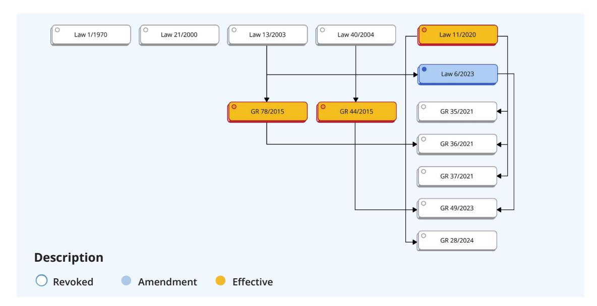

**Figure 9** Indonesian Regulations Related to Labour Rights

# 3.6. Human Rights Protected by International Law

Human rights in Indonesia are constitutionally embedded in the 1945 Constitution. Subsequently, Law 39/1999 on Human Rights was established, outlining specific rights, including those related to the plantation sector, as follows:

X Right to Life: Everyone has the right to life, to defend their life, and to improve their quality of life (Article 9, paragraph 1); the right to peace, security, happiness, and prosperity both physically and mentally (Article 9, paragraph 2); and the right to a good and healthy environment (Article 9, paragraph 3). X Right to Personal Development: Everyone has the right to the fulfillment of their basic needs to grow and develop properly (Article 11, paragraph 1), to protection in personal development, access to education, self-improvement, and enhancing their quality of life (Article 12); the right to develop and benefit from science, technology, arts, and culture (Article 13); the right to communicate and receive necessary information (Article 14, paragraph 1); and the right to seek, acquire, own, store, process, and convey information using all available means (Article 14, paragraph 2). They also have the right to advocate for their developmental rights, both individually and collectively, to build their society, nation, and state (Article 15) and the right to engage in social work and policy initiatives, form organizations for that purpose, including conducting education and raising funds (Article 16).

X Right to Justice: Individuals have the right to seek justice by submitting requests, complaints, and claims, in criminal, civil, or administrative cases and to be tried in a free and impartial judicial process (Article 17). X Right to Personal Freedom: No one shall be enslaved or subjected to servitude (Article 20); individuals have the right to physical and mental integrity, and thus cannot be used as research subjects without consent (Article 21). They also have the freedom to practice their religion and worship according to their faith (Article 22, paragraph 1); the freedom to hold and express political beliefs (Article 23, paragraph 1); the right to assemble, convene, and form associations for peaceful purposes (Article 24, paragraph 1); the right to establish political parties, NGOs, or other organizations to participate in governance (Article 24, paragraph 2); the right to express opinions publicly, including the right to strike (Article 25); the freedom to move, reside, and live within the Republic of Indonesia (Article 27, paragraph 1); the right to personal, familial, honor, dignity, and property protection (Article 29, paragraph 1); the right to security and protection from intimidation to act or refrain from acting (Article 30); protection from interference in one's residence (Article 31, paragraph 1); confidentiality in communication, including electronic communications (Article 32); freedom from torture, inhumane punishment, or degrading treatment (Article 33, paragraph 1); and protection from enforced disappearance and extrajudicial killings (Article 33, paragraph 2). X Right to Welfare: The right to own property individually or collectively for personal, family, national, and societal development (Article 36, paragraph 1); no one may be arbitrarily deprived of property (Article 36, paragraph 2); property has a social function (Article 36, paragraph 3); expropriation of property for public interest is only permitted with fair and immediate compensation (Article 37, paragraph 1); the right to decent work (Article 38, paragraph 1); freedom to choose a profession and fair labor conditions (Article 38, paragraph 2); the right to equal pay and employment terms (Article 38, paragraph 3); the right to fair wages to support family life (Article 38, paragraph 4); the right to form and join unions (Article 39); the right to adequate living standards and housing (Article 40); the right to social security for a decent living and personal development (Article 41, paragraph 1); special care for people with disabilities, the elderly, pregnant women, and children (Article 41, paragraph 2); and access to care, education, training, and special assistance at state expense for the elderly and people with physical or mental disabilities (Article 42). X Right to Participate in Governance: The right to vote and be elected in elections (Article 43, paragraph 1) and to express opinions, file petitions, complaints, or initiatives to the government (Article 44).

X Women's Rights: The right to education at all levels (Article 48); the right to choose, be elected, and be appointed to jobs and positions (Article 49, paragraph 1); special protection during employment concerning reproductive health (Article 49, paragraph 2); and specific legal protections related to reproductive health (Article 49, paragraph 3). X Children's Rights: The right to protection by parents, family, community, and the state (Article 52); the right to life, survival, and a standard of living from conception (Article 53, paragraph 1); the right to a name and citizenship status from birth (Article 53, paragraph 2); special care, education, training, and assistance from the state for children with physical or mental disabilities (Article 54); the right to worship, think, and express according to age and intellectual capacity under parental or guardian guidance (Article 55); the right to know, be raised, and cared for by one's parents (Article 56, paragraph 1); and the right to foster care if parents are deceased or legally unable to perform their duties (Article 57, paragraph 2). Children are also entitled to protection from violence, neglect, mistreatment, and sexual abuse under the care of parents, guardians, or others (Article 58); protection from involuntary separation from parents unless legally justified for the child's best interest (Article 59, paragraph 1); access to education (Article 60, paragraph 1); the right to receive, share, and impart information suited to age and intellectual capacity (Article 60, paragraph 2); the right to rest, socialize, and participate in recreational activities (Article 61); access to adequate healthcare and social security (Article 62); protection from involvement in warfare, armed conΌict, social unrest, and other violent events (Article 63); protection from economic exploitation and hazardous work (Article 64); protection from sexual exploitation, abduction, trafÏcking, and drug abuse (Article 65); protection from torture, cruel punishment, and inhumane treatment (Article 66, paragraph 1); exemption from capital punishment or life imprisonment (Article 66, paragraph 2); and protection from unlawful detention (Article 66, paragraph 3).

These provisions collectively represent Indonesia's commitment to protecting and fulfilling human rights across various sectors, with particular emphasis on vulnerable groups, ensuring that fundamental freedoms, social welfare, and justice are safeguarded for all citizens.

## 3.7. Principles of Free, Prior, and Informed Consent (FPIC), Including in Accordance with the UN Declaration on the Rights of Indigenous Peoples (UNDRIP)

The recognition and rights of indigenous people in Indonesia are firmly embedded in the 1945 Constitution, national laws, and other regulatory frameworks, reΌecting a significant commitment to honoring their cultural heritage, social systems, and traditional lands. This formal acknowledgment within Indonesia's legal system ensures that indigenous people are not only recognized but also aΊorded protections that enable them to exercise their rights in areas such as land use, natural resource management, and cultural preservation. By integrating these protections into national law, Indonesia underscores the importance of indigenous people as integral to the nation's identity and development, fostering a legal environment where their unique contributions are respected and safeguarded for future generations.

The use of customary land rights belonging to indigenous people for purposes such as electricity, energy and mineral resources, or plantations must be conducted through a deliberative process and include fair compensation. Furthermore, any violation of the procedures for converting indigenous land such as working on, using, occupying, or taking control of this land without proper authorization—can lead to severe penalties, including imprisonment of up to seven years and a fine of IDR 5 billion. These penalties apply not only to plantation business owners but also to government ofÏcials who grant such unauthorized permissions. This legal framework underscores the importance of respecting indigenous people land rights and ensures that any utilization of customary lands aligns with the principles of fairness and legality.

The government's eΊorts to recognize and protect indigenous people are embedded in several legislative regulations. This inclusion reΌects a legislative trend in post-New Order Indonesia, where indigenous people have been increasingly positioned within national laws, particularly those concerning land and other natural resources. On the other hand, this post-New Order, or Reformasi era, also represents a period of resurgence for indigenous communities within the legislative process. This legislative progress can also be seen as a result of civil society's advocacy for indigenous rights, though these eΊorts are still primarily in the early stages of legal recognition2 .

2 Kurnia Warman, Peta Perundang-undangan tentang Pengakuan Hak Masyarakat Hukum Adat. UNDP.

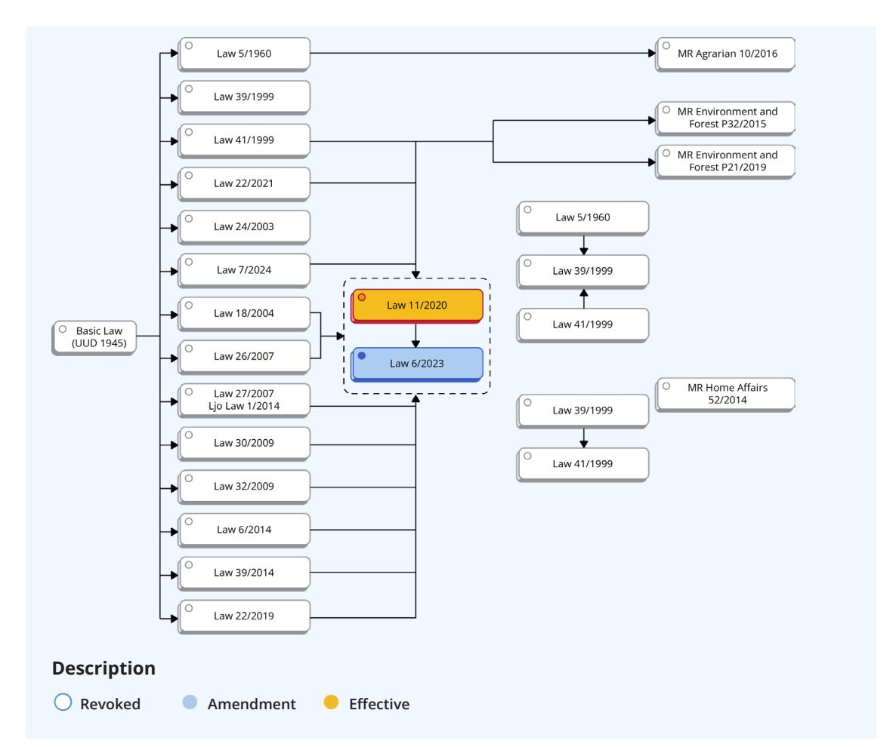

**Figure 10.** Indonesian RegulaƟons Related to *Free, Prior, and Informed Consent* 

## 3.8. Taxation, Anticorruption, Trade and Customs Regulations

The EUDR requires companies to adhere to high standards of transparency, accountability and integrity. This includes implementing eΊective policies to prevent corruption and ensuring that all trade and customs transactions are conducted in accordance with applicable laws.

## a. Taxes and fees

Taxes in the plantation business in Indonesia are regulated by various laws and regulations that cover diΊerent types of taxes that must be paid by business actors in the plantation sector, such as income tax (PPh), value-added tax (PPN), and land and building tax (PBB). According to Law 12/1985 on Land and Building Tax, as amended by Law No. 12 of 1994, taxpayers are defined as any individual or legal entity with a legitimate right to land, who benefits from the land, or who owns, controls, or benefits from a building (Article 4). This provision implies a direct tax obligation for plantation business ownerss, requiring them to contribute to land tax as part of their operational costs.

In addition to land tax, income and corporate taxes in Indonesia are governed by evolving tax laws, with the latest amendments introduced through the Job Creation Law (Law 6/2023). The foundational legal framework for taxation in Indonesia includes Law 6/1983 on General Provisions and Tax Procedures, Law 7/1983 on Income Tax, and Law 7/2021 on the Harmonization of Tax Regulations. These laws provide structured guidelines for assessing and collecting taxes, ensuring compliance and fairness in tax obligations across all economic sectors.

Income Tax Article 21 (commonly referred to as PPh 21) is a withholding tax on individual income, including salaries, wages, honorariums, allowances, and other forms of remuneration derived from employment, services, or other professional activities within the country. This tax directly impacts individual income earners, ensuring that their income contributions align with national revenue needs.

Unlike income tax, Value-Added Tax (VAT), or PPN, is an indirect tax applied to transactions involving taxable goods and services, regardless of the nature of the taxpayer, whether individual or corporate. Under this system, the seller is responsible for collecting, remitting, and reporting the VAT to the authorities. However, the ultimate burden of VAT falls on the end consumer, as it is incorporated into the final purchase price. This structure not only aids in streamlining tax collection but also ensures that consumer consumption directly contributes to government revenue. These various taxation mechanisms reΌect Indonesia's comprehensive approach to public revenue generation, balancing direct and indirect tax obligations to support economic growth, fund public services, and promote equitable tax contributions across diΊerent sectors of society.

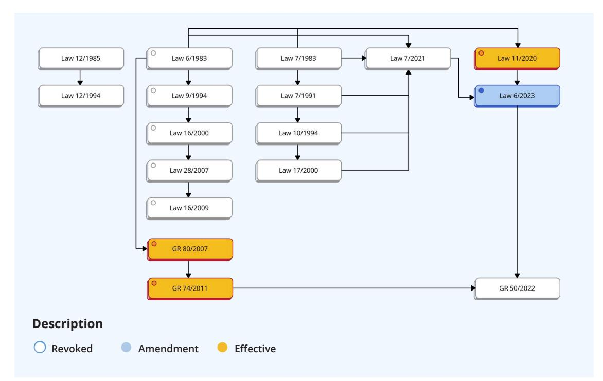

**Figure 11.** Indonesian Regulations Related to Taxes and fees

# b. Corruption, fraud and conƃict of interest

CorrupƟon and fraud in the plantaƟon business in Indonesia are regulated by various laws aimed at prevenƟng and eradicaƟng acƟons that harm the state's Įnances, workers' rights, and local communiƟes.

The Indonesian government has implemented a range of legal measures to combat corrupƟon, including the establishment of regulaƟons, the creaƟon of specialized agencies, and the adopƟon of a naƟonal anƟ-corrupƟon strategy. Eīorts to combat corrupƟon began in 1971 and were later strengthened through Law 31/1999 on the EradicaƟon of CorrupƟon Crimes, which provided a comprehensive legal framework to address corrupƟon oīenses. Building on this, Law 30/2002 established the CorrupƟon EradicaƟon Commission (KPK) as an independent agency tasked with coordinaƟng, supervising, monitoring, invesƟgaƟng, and prosecuƟng corrupƟon cases. The KPK also plays a crucial role in prevenƟng corrupƟon through educaƟon iniƟaƟves and anƟ-corrupƟon campaigns.

Further, the recent amendment to the Criminal Code (Law 1/2023) revised corrupƟon laws, sƟpulaƟng that any individual who unlawfully enriches themselves, others, or a corporaƟon at the expense of the state's Įnancial interests or the naƟonal economy shall be subject to life imprisonment or a prison term of a minimum of two years and a maximum of twenty years (ArƟcle 603). AddiƟonally, the Indonesian government acƟvely involves the public in eīorts to prevent and combat corrupƟon through **Government RegulaƟon 43/2018**. This regulaƟon encourages community parƟcipaƟon by providing channels for reporƟng corrupƟon and protecƟng whistleblowers and witnesses. By empowering ciƟzens to play an acƟve role in exposing corrupt pracƟces, the government fosters a culture of accountability and transparency. This approach recognizes the importance of public engagement in creaƟng a society intolerant of corrupƟon, where individuals and communiƟes can contribute directly to oversight and the integrity of governance processes. Through these inclusive measures, the government not only enhances its capacity to detect and address corrupƟon but also strengthens public trust in its commitment to ethical and responsible governance.

Through these legal frameworks, the Indonesian government underscores its commitment to a sustained and rigorous Įght against corrupƟon. By establishing independent oversight bodies like the KPK and conƟnually updaƟng legal provisions, Indonesia seeks to create a transparent, accountable governance system that safeguards public resources and promotes ethical governance. These eīorts represent a holistic approach to addressing corruption at all levels of government and across various sectors, aiming to build a resilient and corruption-free public administration.

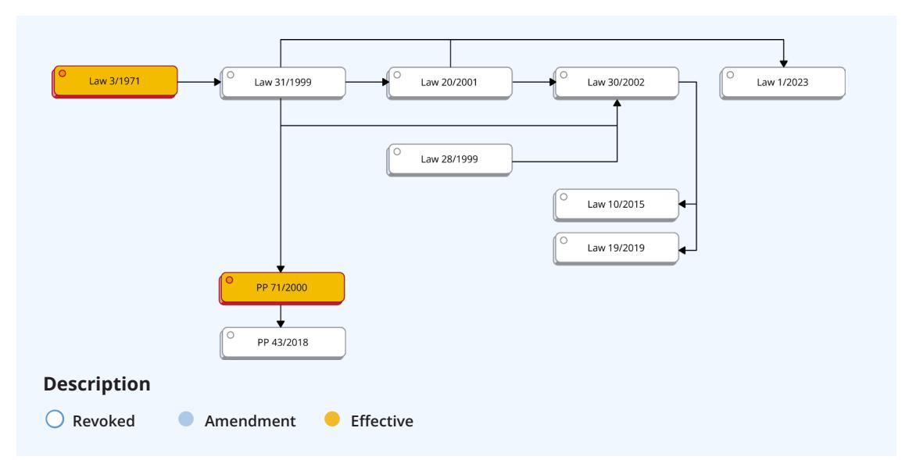

**Figure 12.** Indonesian Regulations Related to Corruption, Fraud and ConΌict of Interest

## c. Trade and customs regulations

Law 18/2004 on Plantations, Article 34, states that the marketing of plantation industry products must comply with trade-related legislation. Consequently, discussions on the trade of plantation products refer to Law 7/2014 on Trade, which is further detailed in Government Regulation 29 /2021 on Trade Administration. One of the regulation's key areas is foreign trade, which includes provisions for licensing, standards, and prohibitions and restrictions. Specifically, it outlines the following (Article 50 of Law 7/2014).:

- (1) Licensing: This includes approvals, registration, determination, and/or recognition.
- (2) Standards: Compliance with established trade standards.
- (3) Prohibitions and Restrictions: All goods may be exported or imported unless prohibited, restricted, or otherwise specified by law.

These prohibitions serve to protect national interests for reasons including: (a) National security or public interest protection, including social, cultural, and moral concerns; (b) Protection of intellectual property rights; and/or (c) safeguarding human health and safety, as well as the health of animals, fish, plants, and the environment. Through this framework, the Indonesian government seeks to ensure that plantation product trade aligns with national priorities, including the protection of public safety, environmental health, and cultural values. By establishing clear trade standards and controls, these laws and regulations contribute to a structured, regulated trade environment, balancing economic growth with responsible and sustainable practices.

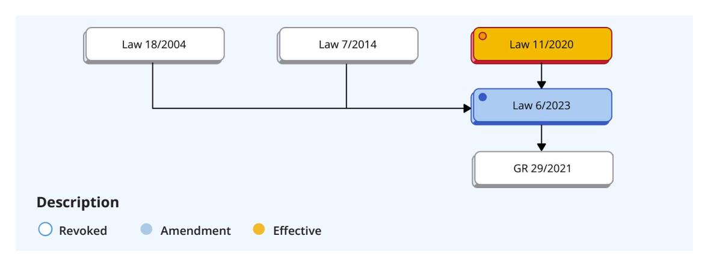

**Figure 13.** Indonesian Regulations Related to Trade

In the context of customs for timber, based on the regulatory database in Indonesia, for matters relating to timber exports from Indonesia to outside Indonesian jurisdiction, there are customs rules. up to now there are two rules regarding timber customs, namely Presidential Decree (Keppres) No. 48 of 1977 concerning Mandatory Savings of Holders of Righhts of Forest Operation and Timber Exporter. This presidential decree was later amended by Presidential Decree No. 39 of 1979. This Presidential Decree aims to further enhance the development of the domestic timber industry industry in the country and in view of the increasingly stable price of wood in the world market.

## 3.9. Data Privacy Protection Regulations

The protection of personal data is recognized as a fundamental human right under the 1945 Constitution of Indonesia. Article 28F states that every individual has the right to communicate and obtain information to develop their personal and social environment, as well as the right to seek, acquire, possess, store, process, and convey information through any available means. This protection is further expanded upon in Law 27/2022, addresses personal and corporation data.

According to Article 4 of this law, personal data is categorized into:

- (1) Specific Personal Data, which includes health information, biometric data, genetic data, criminal records, child data, personal financial data, and other data as stipulated by applicable laws.
- (2) General Personal Data, encompassing full name, gender, religion, marital status, and/or personal data that, when combined, can identify an individual.

Article 5 specifies that personal data subjects have the right to obtain information regarding the identity, legal basis, purpose of the request, and accountability of the party requesting their data. Within this context, plantation business owners, as personal data subjects, have the right to allow the use of their general data for activities such as export operations. Should a plantation business owners cease international trade activities, they may request the termination, deletion, or destruction of their personal data voluntarily (Article 8). This indicates that general personal data can be disclosed when necessary for business operations, especially if it pertains to general information.

Furthermore, Article 9 reinforces that personal data subjects maintain the right to withdraw their consent regarding the processing of their data. Article 74 of the law outlines that relevant parties must complete the establishment of a data management system by October 17, 2024. Since this deadline is imminent, a Government Regulation in Lieu of Law (Perpu) may be required to extend the timeline for finalizing the data management system, particularly to support plantation businesses exporting products such as cocoa, rubber, and coΊee to the European Union.

Meanwhile, information related to geospatial data is covered under **Law 4/2011**, where plantation maps are classified under Thematic Geospatial Information (IGT). Article 43, paragraph (1) states that Thematic Geospatial Information produced by government agencies and/or local governments is generally accessible to the public. However, certain IGT created by government entities may be restricted from public access (Article 43, paragraph (1)). In the explanatory section, "restricted access" refers to specific IGT that is excluded based on regulations governing public information transparency. It is well understood that restricted data often pertains to matters of national defense and security; therefore, IGT on plantations does not fall under classified state information and need not be confidential. This aligns with a Supreme Court ruling, which afÏrmed that administrative documents related to Right to Cultivate (Hak Guna Usaha/HGU) are not exempt from public disclosure, as stated in Article 17 of Law 14/2008 on Public Information Transparency.

This legislative framework underlines that while certain geospatial information may be withheld for security reasons, IGT related to plantation areas, including HGU documentation, does not fall within this category of restricted information. Consequently, public access to plantation geospatial data and associated HGU documents aligns with principles of transparency and accountability, reinforcing that such information should be available to the public unless explicitly exempted by law. This legal precedent further underscores Indonesia's commitment to maintaining openness in geospatial data where it does not compromise national security interests.

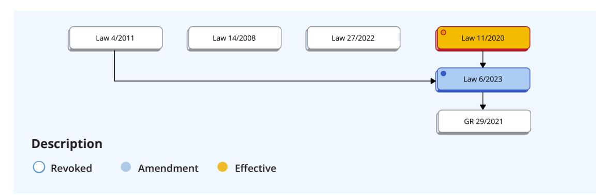

**Figure 14.** Indonesian Regulations Related to Data Privacy Protection

## 3.10. Traceability

Traceability for agricultural commodities are stipulated in Government Regulation Number 26 of 2021 concerning the Implementation of the Agricultural Sector, referring to the article 229 of information systems, it is also mandated that the creation of agricultural information systems must also meet the principle of easy traceability.

Minister of Agriculture Regulation No. 53/Permentan/KR/10/2018 on the Safety and Quality of Fresh Plant-Based Foods sets standards for the safety and quality of fresh plant products, including traceability requirements to ensure consumer protection. Furthermore, it is also regulated in the Regulation of the Minister of Trade of the Republic of Indonesia Number 23 Year 2023 concerning Export Policy and Regulation Article 15 and article 16 concerning Verification and Technical Grading of export goods

These combined regulations create a robust traceability framework aimed at safeguarding public health, with clear requirements for tracing food products along every stage of the supply chain. By implementing such standards, the Indonesian government establishes an information system for agriculture products to ensure coherence with traceability as a global market requirement.

As mentioned before, for timber products, TLAS ensuring that wood products and their raw materials are obtained or derived from sources whose origin and management meet the legality aspect. Timber is called legal when the timber's origin, logging permits, logging systems and procedures, transportation, processing, and trade or transfer can be proven to meet all legality requirement.

Traceability system for timber products, Indonesia has a variety of platforms to track the origin of timber and/or its derivative products. The traceability system is called the timber legality information system or SILK. The information system platform contains related features. Starting from the identity of the exporter, regulations, the identity of independent monitors, features in the form of a public dashboard. With these features, the public and interested parties can access information related to the legality of timber.

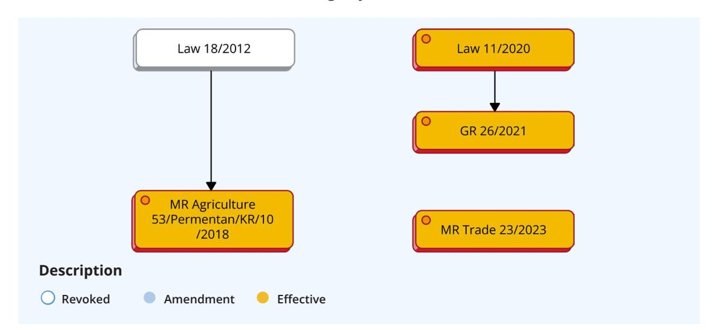

**Figure 15.** Indonesian Regulations Related to Traceability

# 4. Pathways to Compliance: Recommendations for Producers

This chapter outlines the recommendations for supply chain actors on how to ensure compliance with relevant national and sub-national legislation in Indonesia in the context of the EUDR. At the same time, operators can draw their conclusions on what aspects to watch out for when doing their due diligence process.

## 4.1. Recommendations for producers to comply with relevant Indonesian Legislation

The approach developed to ensure that plantation business actors comply with Indonesian regulations in accordance with the requirements of the European Union Deforestation Regulation (EUDR) involves identifying the legal obligations under Indonesian law. This section provides detailed information on the specific obligations that plantation business owners must adhere to, as mandated by the relevant regulations.

This proactive approach not only protects businesses from legal risks but also supports broader eΊorts to ensure that their activities do not contribute to deforestation or environmental degradation, which are key concerns under the EUDR.

## (1) Recommendations for Producer compliance with Land Use Rights arrangements

The following are recommendations for producers in order to comply with laws and regulations related to land use rights in Indonesia:

- a. Obtaining approval for land use in customary territories for plantation purposes.
- b. Adhering to the limitations on the total area designated for plantation use.
- c. Prohibiting the transfer of land rights over areas designated for plantation cultivation.
- d. Ensuring that at least 30 percent of the land rights area that is technically suitable for plantation crops is cultivated within a maximum of three years.

- (1) Ensuring that the entire land rights area that is technically suitable for plantation crops is cultivated within a maximum of six years

## (2) Recommendations on producer compliance with Environmental Protection regulations

To comply with the Environmental Protection laws and regulations in Indonesia, production activities should ensure the following:

- a. The obligation to implement procedures to prevent environmental damage during land clearing and processing activities.
- b. The obligation to establish procedures for preventing environmental pollution in the use of growing media for plantation crops.
- c. The obligation to safeguard plantation crops through the monitoring, observation, and control of plant pest organisms.
- d. The obligation to promptly report any outbreaks of plant pest organisms to the government.
- e. The obligation to maintain a minimum standard of facilities and infrastructure necessary for the eΊective control of plant pest organisms.
- f. The use of agricultural facilities, infrastructure, and/or methods that may pose a risk to human health or safety, or that may cause harm or damage to natural resources and/or the environment, is strictly prohibited

## (3) Recommendation on producer compliance with Forest-related regulations

To comply with the Forest-related regulations in Indonesia, production activities should ensure the following:

- a. The obligation to collaborate with local community cooperatives to promote community economic empowerment.
- b. The obligation to protect, maintain, and preserve the forests in which they operate.
- c. The obligation to allocate investment funds for forest conservation eΊorts.
- d. The obligation to carry out forest rehabilitation for protection and conservation purposes.

- e. The obligation to undertake reclamation and/or rehabilitation by the prescribed guidelines.
- f. The obligation to allocate investment funds for research and development, education and training, and forestry extension services

### (4) Recommendations for producer compliance with the Third parties' rights Regulation

Law No. 39/2014 on Plantations guarantees the rights of third parties, both communities and legal entities, as stipulated in Article 16, Articles 57 and 58. On the other hand, the third party rights on land and building included in agriculture sector is also regulated in the Government Regulation Number 18 Year 2021 in the article 39 and article 54. These regulations aim to guarantee the rights of a land title holder (HGU) to engage a third party in legally managing the land under the plantation land concession.

## (5) Recommendations for producers' compliance with the Labour Rights Regulation

In knowing the regulations related to the Labour Rights Regulation, the recommendations for producers are as follows:

- a. The obligation to provide appropriate protections for workers with disabilities, tailored to the type and degree of disability.
- b. The prohibition of child labor.
- c. The prohibition of employing pregnant women in work shifts between 23:00 and 07:00 if, according to a medical certificate, such work poses a risk to their health or the safety of their unborn child.
- d. The obligation for employers who employ female workers between 23:00 and 07:00 to provide nutritious food and drink, and to ensure decency and safety in the workplace.
- e. The obligation to provide shuttle transportation for female workers commuting between 23:00 and 05:00.
- f. The obligation to comply with working time provisions: (a) 7 hours per day and 40 hours per week for 6 working days, or (b) 8 hours per day and 40 hours per week for 5 working days.
- g. The obligation to employ workers beyond standard working hours only:
  - (a) with the worker's consent; and (b) for a maximum of 3 hours per day

and 14 hours per week for overtime work.

- h. The obligation to provide adequate rest and leave time to workers.
- i. The obligation to allow workers sufÏcient opportunities to observe religious practices as required by their faith.
- j. Specific obligations for female workers:
- k. Female workers who experience menstrual pain and notify the employer are not required to work on the first and second days of their menstrual period.
- l. Female workers are entitled to 1.5 months of maternity leave before childbirth and 1.5 months after childbirth, based on the assessment of an obstetrician or midwife.
- m. Female workers who suΊer a miscarriage are entitled to 1.5 months of leave, or as recommended by an obstetrician or midwife.
- n. Female workers who are breastfeeding are entitled to a reasonable time to breastfeed their children during working hours, if necessary.
- o. Workers are not required to work on legal holidays.
- p. Employers are obligated to implement an occupational safety and health management system that is integrated with the company's overall management system.
- q. Every worker has the right to earn an income that ensures a decent standard of living for themselves and their families, while the absolute minimum wage can diΊer for ech province/district.
- r. Every worker and their family have the right to access social security benefits.
- s. Every worker has the right to form and join a trade union or labor union

#### (6) Recommendations for producers' compliance with Human Rights Regulations Protected by International Law (Human Rights)

Plantation business activities must uphold fundamental rights, including the right to life, the right to freedom from torture, the right to personal liberty, freedom of thought and conscience, the right to practice religion, freedom from enslavement, the right to recognition as a person before the law, equality before the law, and protection from prosecution under retroactive laws. These rights, as outlined in Article 4 of Law No. 39/1999 on Human Rights, are inalienable and cannot be diminished under any circumstances or by any party

#### (7) Recommendations on producer compliance with the Free, Prior and Informed Consent (FPIC) Regulation, Including in Accordance with the UN Declaration on the Rights of Indigenous Peoples (UNDRIP).

The obligations for business actors are as follows

- a. ensure the principle of FPIC is being followed and implemented in practice
- b. Include indigenous people in capacity building measures and alignment eΊorts for EUDR
- c. Respect customary rights of indigenous people

Business actors should actively engage with civil society actors when collecting information on potential risks of non-compliance in areas of production where indigenous people raise their claims to land ownership and other customary rights.

## (8) Recommendations on producer compliance with Tax, anti-corruption, trade and customs regulations.

Some recommendations regarding producer compliance with Tax, anticorruption, trade and customs regulations are as follows:

### X **Taxes and fees are paid.**

Applicable taxes and fees have been paid in a timely manner and in accordance with legal requirements. Indicators of producers knowing this regulation are:

a. Required to have permits in the field of trade.

## X **Producers shall avoid Corruption, fraud and conΌict of interest**

Corruption, fraud and conΌicts of interest are avoided, while business integrity is ensured in accordance with best practices.

- a. Prohibition of oΊering or promising bribes to civil servants or state ofÏcials with the intent to inΌuence actions contrary to their ofÏcial duties .

## X **Producer conducts responsible trade and procurement practices.**

Trade and transport of materials, products and animals are conducted in accordance with legal requirements and respect the principles of fairness and transparency in contractual obligations. The following are indicators to see that producers are aware of these provisions:

- a. Required to have permits in the field of trade
- b. the obligation to register goods being traded
- c. the obligation to display the registration number on goods and/or their packaging

Based on the identification and inventory of obligations within Indonesian regulations, the compliance approach for plantation business actors is presented in the following table, as an example:

**Table 3.** An example compliance approach for plantation business owners

|    |                 | Relevant                                                                                                                                                                                                                                                                                         | Status                                                     |    |
|----|-----------------|--------------------------------------------------------------------------------------------------------------------------------------------------------------------------------------------------------------------------------------------------------------------------------------------------|------------------------------------------------------------|----|
| No | EUDR            |                                                                                                                                                                                                                                                                                                  | EUDR                                                       |    |
|    | Indicator       | Criteria Indonesian Regulations                                                                                                                                                                                                                                                                  | Article                                                    |    |
|    |                 | Obtaining approval for Article 12 (1)                                                                                                                                                                                                                                                            | Comply Article 2                                           | No |
| 1  | Land Use Rights | land use in customary Law 39/2014 territories for plantation purposes Article 14 (1) Adhering to the Law 39/2014 limitations on the total area designated for plantation use Prohibiting the transfer Article 63 (2) Law 39/2014 of land rights over areas designated for plantation cultivation | (40) point a Article 2 (40) point a Article 2 (40) point a |    |

|    |                          | Relevant                                                                                                                                                                                                                                                                                                                                                                                                                                                                                                                                                                   | Status                                               |    |
|----|--------------------------|----------------------------------------------------------------------------------------------------------------------------------------------------------------------------------------------------------------------------------------------------------------------------------------------------------------------------------------------------------------------------------------------------------------------------------------------------------------------------------------------------------------------------------------------------------------------------|------------------------------------------------------|----|
| No | EUDR                     |                                                                                                                                                                                                                                                                                                                                                                                                                                                                                                                                                                            | EUDR                                                 |    |
|    | Indicator                | Criteria Indonesian Regulations                                                                                                                                                                                                                                                                                                                                                                                                                                                                                                                                            | Article                                              |    |
|    |                          | Ensuring that at least Article 16 (1) 30 percent of the point a Law 39/2014 land rights area that is technically suitable for plantation crops is cultivated within a maximum of three years Ensuring that the entire Article 16 (1) point b Law land rights area that is technically suitable 39/2014 for plantation crops is cultivated within a maximum of six years                                                                                                                                                                                                    | Comply Article 2 (40) point a Article 2 (40) point a | No |
| 2  | Environmental Protection | The obligation Article 2, article 6, to implemented environment protection article 12, and conservation pasal 14, and agriculture in there are 33 sustainable agricultural other articles cultivation system in this law that regulate environmental protection and conservation agriculture. The obligation Article 32 (1) Law 39/2014 to implement procedures to prevent environmental damage during land clearing and processing activities. The obligation to estab Article 32 (2) lish procedures for pre Law 39/2014 venting environmental pollution in the use of | Article 2 (40) point b Article 2 (40) point b        |    |
|    |                          | growing media for plan  tation crops                                                                                                                                                                                                                                                                                                                                                                                                                                                                                                                                      |                                                      |    |

|                                                                        | Status Relevant                                                                                                                                                                                                                                                               |
|------------------------------------------------------------------------|-------------------------------------------------------------------------------------------------------------------------------------------------------------------------------------------------------------------------------------------------------------------------------|
| No EUDR                                                                | EUDR                                                                                                                                                                                                                                                                          |
| Indicator Criteria                                                     | Indonesian Article Regulations                                                                                                                                                                                                                                                |
| The obligation to                                                      | Comply No The obligation to safe Article 33 (1) Article 2 (40) guard plantation crops Law 39/2014 point b through the monitoring, observation, and control of plant pest organisms Article 34 Law Article 2 (40) 39/2014 point b promptly report any outbreaks of plant pest |
| organisms to the gov ernment                                           |  The obligation to main Article 35 (1) Article 2 (40)                                                                                                                                                                                                                       |
| tain a minimum stan                                                    |  Law 39/2014 point b dard of facilities and infrastructure necessary for the eΊective control of plant pest organisms. The use of agricultural Article 77 Law Article 2 (40) facilities, infrastructure, 39/2014 point b and/or methods that                                 |
| may pose a risk to hu prohibited                                       |  man health or safety, or that may cause harm or damage to natural resources and/or the environment, is strictly                                                                                                                                                             |
| 3 Forest-related The obligation to                                     | Article 30 Article 2                                                                                                                                                                                                                                                          |
| collabora te with local community cooperatives to economic empowerment | Law 41/1999 (40) point c promote community                                                                                                                                                                                                                                    |

|    | Status Relevant                                                                                                                                                                                                                                                                                                                                                                                                                                                                                                                                                    |
|----|--------------------------------------------------------------------------------------------------------------------------------------------------------------------------------------------------------------------------------------------------------------------------------------------------------------------------------------------------------------------------------------------------------------------------------------------------------------------------------------------------------------------------------------------------------------------|
| No | EUDR EUDR                                                                                                                                                                                                                                                                                                                                                                                                                                                                                                                                                          |
|    | Indicator Criteria Indonesian Article Regulations                                                                                                                                                                                                                                                                                                                                                                                                                                                                                                                  |
|    | Comply No The obligation to Article 32 Article 2 protect, maintain, and Law 41/1999 (40) point c preserve the forests in which they operate The obligation to Article 35 (1) Article 2 allocate investment Law 41/1999 (40) point c funds for forest conservation eΊorts The obligation to Article 43 (1) Article 2 carry out forest Law 41/1999 (40) point c rehabilitation for protection and conservation purposes The obligation Article 45 (1) Article 2 Law 41/1999 (40) point c to undertake reclamation and/or rehabilitation by the prescribed guidelines |
| 4  | Third parties’ The obligation to Law Number Article 2 39 Year 2014 (40) point ensure the rights of third parties, both article 16, 57 d communities and legal and 58 entities GR Number 18/2021 article 39, article 54                                                                                                                                                                                                                                                                                                                                             |
| 5  | Labour Rights The obligation to Article 67 (1) Article 2 Law 13/2003 (40) point e provide appropriate protections for workers with disabilities, tailored to the type and degree of disability                                                                                                                                                                                                                                                                                                                                                                     |

|    |           | Relevant                                                                                                                                                                                                                                                                                                                                                                                                                                                                                                                                                                                                                  | Status                                                                                             |    |
|----|-----------|---------------------------------------------------------------------------------------------------------------------------------------------------------------------------------------------------------------------------------------------------------------------------------------------------------------------------------------------------------------------------------------------------------------------------------------------------------------------------------------------------------------------------------------------------------------------------------------------------------------------------|----------------------------------------------------------------------------------------------------|----|
| No | EUDR      |                                                                                                                                                                                                                                                                                                                                                                                                                                                                                                                                                                                                                           | EUDR                                                                                               |    |
|    | Indicator | Criteria Indonesian Regulations                                                                                                                                                                                                                                                                                                                                                                                                                                                                                                                                                                                           | Article                                                                                            |    |
|    |           | The prohibition of Article 68 child labor Law 13/2003 The prohibition of Article 76 (1) Law 13/2003 employing pregnant women in work shifts between 23:00 and 07:00 if, according to a medical certificate, such work poses a risk to their health or the safety of their unborn child The obligation for Article 76 (2) Law 13/2003 employers who employ female workers between 23:00 and 07:00 to provide nutritious food and drink, and to ensure decency and safety in the workplace The obligation to Article 76 (4) Law 13/2003 provide shuttle transportation for female workers commuting between 23:00 and 05:00 | Comply Article 2 (40) point e Article 2 (40) point e Article 2 (40) point e Article 2 (40) point e | No |

|    |           | Relevant                                                                                                                                                                                                                                                                                                                                                                                                                                                                                                                                                                                                                                                              | Status                                                                                             |    |
|----|-----------|-----------------------------------------------------------------------------------------------------------------------------------------------------------------------------------------------------------------------------------------------------------------------------------------------------------------------------------------------------------------------------------------------------------------------------------------------------------------------------------------------------------------------------------------------------------------------------------------------------------------------------------------------------------------------|----------------------------------------------------------------------------------------------------|----|
| No | EUDR      |                                                                                                                                                                                                                                                                                                                                                                                                                                                                                                                                                                                                                                                                       | EUDR                                                                                               |    |
|    | Indicator | Criteria Indonesian Regulations                                                                                                                                                                                                                                                                                                                                                                                                                                                                                                                                                                                                                                       | Article                                                                                            |    |
|    |           | The obligation to Article 77 (2) comply with working Law 13/2003 time provisions: (a) 7 hours per day and 40 hours per week for 6 working days, or (b) 8 hours per day and 40 hours per week for 5 working days The obligation to Article 78 (1) Law 13/2003 employ workers beyond standard working hours only: (a) with the worker’s consent; and (b) for a maximum of 3 hours per day and 14 hours per week for overtime work The obligation to Article 79 (1) Law 13/2003 provide adequate rest and leave time to workers The obligation to allow Article 80 workers sufÏcient Law 13/2003 opportunities to observe religious practices as required by their faith | Comply Article 2 (40) point e Article 2 (40) point e Article 2 (40) point e Article 2 (40) point e | No |

|           | Status Relevant                                                                                                                                                                                                                                           |
|-----------|-----------------------------------------------------------------------------------------------------------------------------------------------------------------------------------------------------------------------------------------------------------|
| No EUDR   | EUDR                                                                                                                                                                                                                                                      |
| Indicator | Criteria Indonesian Article Regulations                                                                                                                                                                                                                   |
|           | Comply No Specific obligations for Article 80-83 Article 2 Law 13/2003 (40) point e female workers a.Female workers who experience menstrual pain and notify the employer are not required to work on the first and second days of their menstrual period |
| b.        | Female workers are entitled to 1.5 months of maternity leave before childbirth and 1.5 months after childbirth, based on the assessment of an obstetrician or midwife.                                                                                    |
| c.        | Female workers who suΊer a miscarriage are entitled to 1.5 months of leave, or as recommended by an obstetrician or midwife.                                                                                                                              |

|    |           | Relevant                                                                                                                                                                                                                                                                                                                                                                                                                                                                                                                                                                                                                                                                                     | Status                                                                                                                    |    |
|----|-----------|----------------------------------------------------------------------------------------------------------------------------------------------------------------------------------------------------------------------------------------------------------------------------------------------------------------------------------------------------------------------------------------------------------------------------------------------------------------------------------------------------------------------------------------------------------------------------------------------------------------------------------------------------------------------------------------------|---------------------------------------------------------------------------------------------------------------------------|----|
| No | EUDR      |                                                                                                                                                                                                                                                                                                                                                                                                                                                                                                                                                                                                                                                                                              | EUDR                                                                                                                      |    |
|    | Indicator | Criteria Indonesian Regulations                                                                                                                                                                                                                                                                                                                                                                                                                                                                                                                                                                                                                                                              | Article                                                                                                                   |    |
|    |           | Article 80-83 d.Female workers Law 13/2003 who are breastfeeding are entitled to a reasonable time to breastfeed their children during working hours, if necessary Article 80-85 Workers are not Law 13/2003 required to work on legal holidays Employers are Article 86 obligated to Law 13/2003 implement an occupational safety and health management system that is integrated with the company’s overall management system Every worker has Article 86 (1) Law 13/2003 the right to earn an income that ensures a decent standard of living for themselves and their families Every worker and Article 99 (1) Law 13/2003 their family has the right to access social security benefits | Comply Article 2 (40) point e Article 2 (40) point e Article 2 (40) point e Article 2 (40) point e Article 2 (40) point e | No |

|                                                | Status Relevant                                                                                                                                                                                                                                                                                                                                                                                |
|------------------------------------------------|------------------------------------------------------------------------------------------------------------------------------------------------------------------------------------------------------------------------------------------------------------------------------------------------------------------------------------------------------------------------------------------------|
| No                                             | EUDR EUDR                                                                                                                                                                                                                                                                                                                                                                                      |
|                                                | Indicator Criteria Indonesian Article Regulations                                                                                                                                                                                                                                                                                                                                              |
|                                                | Comply No Every worker has the Article 104 Article 2 (40) point e right to form and join (1) Law a trade union or labor 13/2003 union                                                                                                                                                                                                                                                          |
| 6                                              | Human Rights                                                                                                                                                                                                                                                                                                                                                                                   |
| Regulations Law                                | Law 39/1999 Article 2 including the right (40) point f to life, the right to Protected by freedom from torture, International the right to personal liberty, freedom of thought and conscience, the right to practice religion, freedom from enslavement, the right to recognition as a person before the law, equality before the law, and protection from prosecution under retroactive laws |
| 7 the Free, Prior, and Informed Consent (FPIC) | The obligation Article 12 (1) Article 2 Law 39/2014 (40) point g to engage in deliberations when seeking approval for the transfer of land and determining appropriate compensation                                                                                                                                                                                                            |

|                                            | Status Relevant                                                                                                                                                                                                                                                                      |
|--------------------------------------------|--------------------------------------------------------------------------------------------------------------------------------------------------------------------------------------------------------------------------------------------------------------------------------------|
| No EUDR                                    | EUDR                                                                                                                                                                                                                                                                                 |
| Indicator                                  | Criteria Indonesian Article Regulations                                                                                                                                                                                                                                              |
|                                            | Comply No The prohibition Article 12 (1) Article 2 against utilizing, Law 39/2014 (40) point g occupying, or controlling community land or customary land rights of Indigenous communities for plantation business purposes                                                          |
| 8 Tax, anti corruption, trade and customs | Taxes and fees are paid                                                                                                                                                                                                                                                              |
| a.                                         | required to register Article 2 (1) Article 2 Law 7/2021 (40) point h                                                                                                                                                                                                                 |
| b.                                         | required to pay or Article 10 (1) Article 2 remit taxes Law 6/1983 (40) point h Producers shall avoid Article 2 (40) point Corruption, fraud and conΌict of interest h Producer conducts Article 2 responsible trade (40) point and procurement h practices Article 24 (1) Article 2 |
| a.                                         | Required to have permits in the field Law 7/2014 (40) point of trade h                                                                                                                                                                                                               |
| b.                                         | the obligation to Pasal 33 (1) Article 2 Law 7/2014 (40) point register goods being traded h                                                                                                                                                                                         |

|    |           |    | Relevant                                                                                                  | Status                 |    |
|----|-----------|----|-----------------------------------------------------------------------------------------------------------|------------------------|----|
| No | EUDR      |    |                                                                                                           | EUDR                   |    |
|    | Indicator |    | Criteria Indonesian Regulations                                                                           | Article                |    |
|    |           |    |                                                                                                           | Comply                 | No |
|    |           | c. | the obligation Pasal 33 (2) Law 7/2014 to display the registration number on goods and/or their packaging | Article 2 (40) point h |    |

More detailed information on laws and regulations can be found in the Annex

## 4.2. Recommendations for Smallholder

According to the Guidelines for Issuing Plantation Business Registration Certificates for Cultivation (STD-B), plantation landowners holding a Certificate of Ownership (SHM) may receive immediate recommendations for STD-B issuance by the verification team if their land status is deemed "clean and clear." However, if the land status is under a *girik* certificate, landowners must submit an application accompanied by various supporting documents. This application process includes location verification and payment procedures, ultimately leading to the issuance of an SHM.

In contrast, for Indigenous people lands, a distinct process is followed. The boundaries of the Customary Land parcels of the Indigenous people must first undergo measurement and verification. This is followed by mapping the designated Customary Land parcels onto the ofÏcial land registration map. Each parcel is then assigned a Land Parcel Identification Number, specific to the administrative unit of the regency or city where it is located. Finally, these Customary Land parcels are formally recorded in the land register, ensuring the recognition and legal documentation of Indigenous people lands within the national land administration system. This structured approach reΌects a commitment to upholding land rights while maintaining clarity and legal certainty, particularly for diΊerent types of ownership and community lands under Indonesia's land management framework.

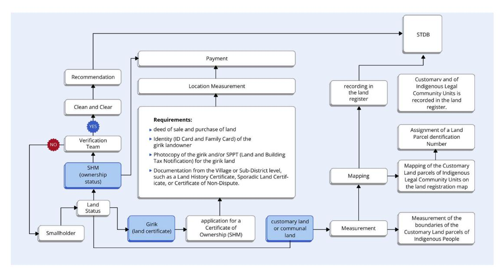

**Figure 16.** Stages of Granting STDB to Smallholders

Based on BPS data in 2023, the Plantation Plantation Area for rubber commodity is 3,546,200 ha, CoΊee Commodity is 1,268,900 and Cocoa Commodity is 1,410,900. Meanwhile, the area of smallholder plantation crops for Rubber is 3,248,800 ha. The coΊee commodity is 1,249,100 hectares and the Cocoa commodity is 1,405,800 hectares. This means that almost 90% of the plantation crop area for the three commodities above are smallholder plantations.

The above conditions will be a challenge for smallholders who seek to export to the EU and must produce in line with the EUDR requirements for deforestationfree and legal production by end of 2025. The following are the challenges smallholders face:

- a. Smallholders still lack geolocation and spatial/regional overlay knowledge/resources, etc.
- b. Productivity of smallholder plantations is still low on average
- c. Smallholders are still not yet incorporated in the farmer Institution and have a direct supply chain to factories.
- d. Inclusivity of smallholders in the supply chain, commodity supply chains from farmers to exporting companies are on average quite long,
- e. Smallholder data collection is still lacking in some areas
- f. Most do not yet have certification
- g. Land constraints are indicated to be in forest areas and overlap with HGU and other land rights.
- h. Seventh, Όuctuations in commodity prices received by farmers

Based on the above problems of smallholders, the following steps could be taken:

## a. Acceleration of Smallholder Development through STD-B

One of the activities that smallholders must prepare for the EUDR is to accelerate data collection through STDB. The issuance of STD-B is not categorized as licensing. STDB registration is conducted by the Regent/Mayor for smallholders with a land area of less than 25 (twenty-five) hectares. Plantation Business Registration Certificate for Cultivation (STDB) based on Regulation of the Minister of Agriculture No. 98/Permentan/ OT. 140/9/2013 is a cultivation certificate given to smallholders in which the STDB contains various information, namely information on the owner including name, place/date of birth, identity card number and address, plantation data including location/coordinate point of the plantation (village/sub-district), land ownership status (certificate of ownership/ *girik*/SKT/lease), ownership letter number, area, crop type, production per hectare/year, seed origin, number of trees, planting pattern (monoculture/ mixed with crops), fertilizer type, processing partner, soil type (mineral/peat/ mineral + peat), planting year and other businesses on the farm.

Based on the Ministry of Agriculture. Decree of the Director General of Plantations Number: 105/KPTS/PI.400/2/2018 on Guidelines for the Issuance of Plantation Business Registration Certificate for Cultivation (STD-B). The purpose of STDB for smallholders is to collect data on smallholder plantation ownership and other supporting information so that it can be used as a basis for policymaking:

- (1) Assist the Ministry of Agriculture in the distribution of government programs, such as fertilizer subsidy programs, seeds, and rejuvenation so that they are right on target.
- (2) Realizing sustainable business management of plantation crop cultivation owned by smallholders.
- (3) Assisting farmer Institutions and/or Village Institutions to increase the productivity and welfare of Smallholders.
- (4) Encouraging the realization of good agriculture practices at the smallholder level.
- (5) Ensuring that plantation-based natural resources are managed sustainably.

After going through the registration process, planters will receive a Cultivation Registration Certificate (STDB) which serves as proof of the legal administration of their plantation business. With this registration, it is expected that the plantation planning and monitoring process will become more eΊective and efÏcient. For the smallholders themselves, STD-B will help them get various coaching facilities from the government such as seed distribution programs, rejuvenation, marketing, and so on. STD-B is valid as long as the Plantation Plant Cultivation Business is still being conducted and there is no change in the specifications of the business being conducted. The following is the process of issuing STD-B:

- (1) Socialization and Preparation: Explaining the aims and objectives of STD-B data collection and registration activities as well as team formation.
- (2) Data Collection: Data collection of planters and farms.
- (3) Mapping : Boundary identification and designation and delimitation of land parcels and plantation areas on a working map.
- (4) Verification: Verification of data on planters and farms and analysis of overlapping maps of plantation parcels.
- (5) Issuance of STD-B

## Process of obtaining STDB for small farmers

Types of Plantation Businesses consist of: Plantation Plantation Cultivation Business; Plantation Product Processing Industry Business; and Plantation Business integrated between cultivation and plantation product processing industry. Plantation Business is conducted in the territory of Indonesia by Plantation Business Actors, in accordance with National, provincial, and district/ city Plantation Development Planning. (Article 3 Regulation of the Minister of Agriculture of the Republic of Indonesia Number 98/ Minister of Agriculture/ Ot.140/9/2013)

Plantation Plantation Cultivation Business with an area of less than 25 (twenty five) hectares shall be registered (STD-B) by the regent/mayor. (Article 5 of Regulation of the Minister of Agriculture of the Republic of Indonesia Number 98/ Regulation of the Minister of Agriculture/Ot.140/9/2013). Meanwhile, Cultivation of Plantation Crops with an area of 25 (twenty-five) hectares or more must have a Plantation Business Permit for Cultivation (IUP-B) (Article 8, Regulation of the Minister of Agriculture of the Republic of Indonesia Number 98/ Regulation of the Minister of Agriculture/Ot.140/9/2013).

One of the items that must be provided in the Plantation Crop Cultivation Business Registration (STD-B) is the land ownership status, which must be a Certificate of Land Ownership (SHM). In general, there are 3 (three) proofs of land ownership, namely (1) *Girik*/Certificate of Land Ownership (SKT)/ Certificate of Indemnity (SKGR) (2) Certification of Property Rights (SHM) and Customary Land Rights of Customary Law Communities.

X SHM is a strong evidence of land ownership and is legally recognised in Indonesia. By owning a SHM, the owner has full rights to use, control and enjoy the land and building. SHM does not have a specific time limit and can be inherited from generation to generation. In addition, due to SHM's status as full ownership, in addition to being inheritable, SHM can also be granted, traded, and can also be used as collateral for credit. Law No. 5/1960 on the Basic Regulation of Agrarian Principles (UUPA) X *Girik* is not a proof of land ownership, but evidence that the owner of the *girik* controls customary land and is the taxpayer of the land parcel along with the buildings on it if any. Thus, in principle, *girik* cannot be equated with a certificate of land rights as it exists today. **Article 96 paragraph (1)**  *jo*.**Article 76A** Permen ATR / Head of BPN 16/2021 written evidence of former customary land owned by individuals, one of which is in the form of *girik***, is declared invalid after 5 years from Government Regulation 18/2021**  *comes* **into eΊect**. Meanwhile, Government Regulation 18/2021 takes eΊect on 2 February 2021. This means that *girik* land must be registered **no later than 5 years from 2 February 2021, namely 2 February 2026**. X Land of Customary Law Communities' Ulayat Rights or referred to by other names, hereinafter referred to as Ulayat Land, is land that is in the control area of customary law communities which in reality still exists and is not attached to any land rights. Land administration of Customary Land Rights is carried out in the following stages 1) inventory and identification; 2) measurement and mapping; and 3) recording of Customary Land Register. (Article 4 of Regulation of the Minister of Agrarian and Spatial Planning/Head of the National Land Agency of the Republic of Indonesia Number 14 Year 2024)

Plantation Business Registration Certificate for Cultivation (STD-B) is given to farmers if the data and information of the smallholder's land is in a location that is in accordance with the designation of the Plantation business (not in the forest area) and does not overlap with other uses.

If there are cultivation areas that are not in accordance with the Plantation business designation (in forest areas) and overlap with other uses, then he is required for guidance and assistance by the local government. The Όowchart of Plantation business registration for smallholders can be seen in the figure below.

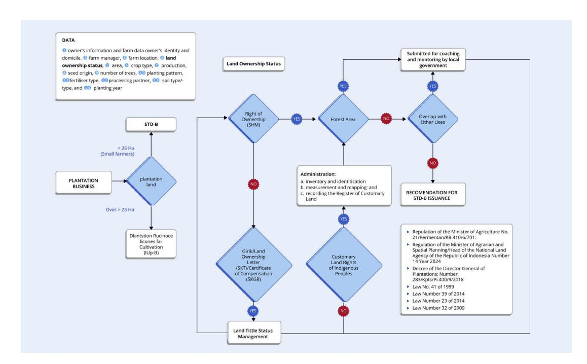

**Figure 17.** The Flowchart of Plantation Business Registration for Smallholders

## b. Encourage farmers to join plantation organizations or farmer groups.

Farmers joining farmer organizations. Farmer groups forming farmer cooperatives will be able to overcome several problems, including facilitating supply chain traceability, increasing productivity, guaranteeing commodity prices, and supplying agribusiness system inputs such as seeds, fertilizers, and so on. The underlying laws and regulations that encourage farmers to form groups include: Minister of Agriculture Regulation No. 273/Kpts/ot.160/4/2007 on Guidelines for Farmer Institutional Development and Minister of Agriculture Regulation No. 18/PERMENTAN/RC.040/4/2018 of 2018 on Guidelines for the Development of Farmer Corporation-Based Agricultural Areas

### c. Settlement of land conƃicts related to several smallholder plantation areas located in forest areas, with conƂrmation of land ownership status.

Regulated under Law No. 39/2014 on Plantations ("Plantation Law") are plantation business actors who conduct plantation business. Plantation business actors can be smallholders and/or plantation companies. Smallholders are not explicitly regulated in this Plantation Law.

The land used for the plantation business is not limited to land with the status of land use rights but can also be land with the status of property rights, building use rights, and/or use rights following the provisions of laws and regulations, as well as customary land rights.

## Parties Regulated in the Plantation Law

**Plantation** is all activities of managing natural resources, human resources, production facilities, tools and machinery, cultivation, harvesting, processing, and marketing related to Plantation Plants3 . The parties regulated in this Plantation Law are Plantation Business Actors. **Plantation Business Actors** are **planters** and/or Plantation companies that manage Plantation Business4 . Meanwhile, what is meant by planters are individual Indonesian citizens who conduct Plantation.

Business with a business scale that does not reach a certain scale5. What is meant by a certain scale is the scale of plantation business that is based on the area of business land, type of plant, technology, labor, capital and/or factory capacity which is required to have a business license6.

So, what is regulated in the Plantation Law is Plantation Business Actors who conduct plantation business. Plantation business actors can be smallholders and/or plantation companies. Smallholders are not explicitly regulated in this Plantation Law.

## Land Use Rights

Land use rights is the right to cultivate land directly controlled by the State, with a maximum period of 25 years, for agricultural, fishery, or livestock enterprise7 .

Land use rights is granted on land with an area of at least 5 hectares, provided that if the area is 25 hectares or more, it must use proper capital investment and good corporate techniques, in accordance with the times.8 Land use rights can be transferred and assigned to other parties9 .

3 Article 1 point 1 of the Plantation Law

4 Article 1 point 8 of the Plantation Law

5 Article 1 point 9 of the Plantation Law

6 Article 1 point 9 Regulation of the Minister of Agriculture Number 98/PERMENTAN/ OT.140/9/2013 of 2013 concerning Guidelines for Plantation Business Licensing

7 Article 28 paragraph (1) jo. Article 29 paragraph (1) of Law Number 5 of 1960 concerning Basic Regulations on Agrarian Principles ("UUPA")

8 Article 28 paragraph (2) of UUPA

9 Article 28 paragraph (3) UUPA

Those who can own a Cultivation Rights Title are10:

- a. Indonesian citizens;
- b. a legal entity established under Indonesian law and domiciled in Indonesia.

So, land use rights is the right to cultivate land directly controlled by the State, for a maximum period of 25 years, for agricultural, fishery, or livestock enterprises. What about plantations?

## Use of Plantation Land

**Plantation Land is a eld of Land used for Plantation Business11**.Plantation Business Actors may be granted land rights for Plantation Business in accordance with the provisions of laws and regulations12. Land rights required for Plantation businesses may be in the form of property rights, business use rights, building use rights, and/or use rights in accordance with the provisions of laws and regulations13 .

In the event that the Land required for the Plantation Business is the Land of Customary Rights of Customary Law Communities, Plantation Business Actors must conduct deliberations with Customary Law Communities holding Customary Rights to obtain approval regarding the transfer of Land and its rewards14. Rewards that can be given include money and/or share ownership15 .

So that the land used for the plantaƟon business is not limited to land with the status of land use rights only, but can also be land with the status of property rights, building use rights, and/or use rights following statutory

10 Article 30 paragraph (1) UUPA

11 Article 1 point 7 of the Plantation Law

12 Article 11 paragraph (1) of the Plantation Law

13 Article 11 paragraph (1) of the Plantation Law

14 Article 12 paragraph (1) of the Plantation Law 15 Article 12 paragraph (1) of the Plantation Law

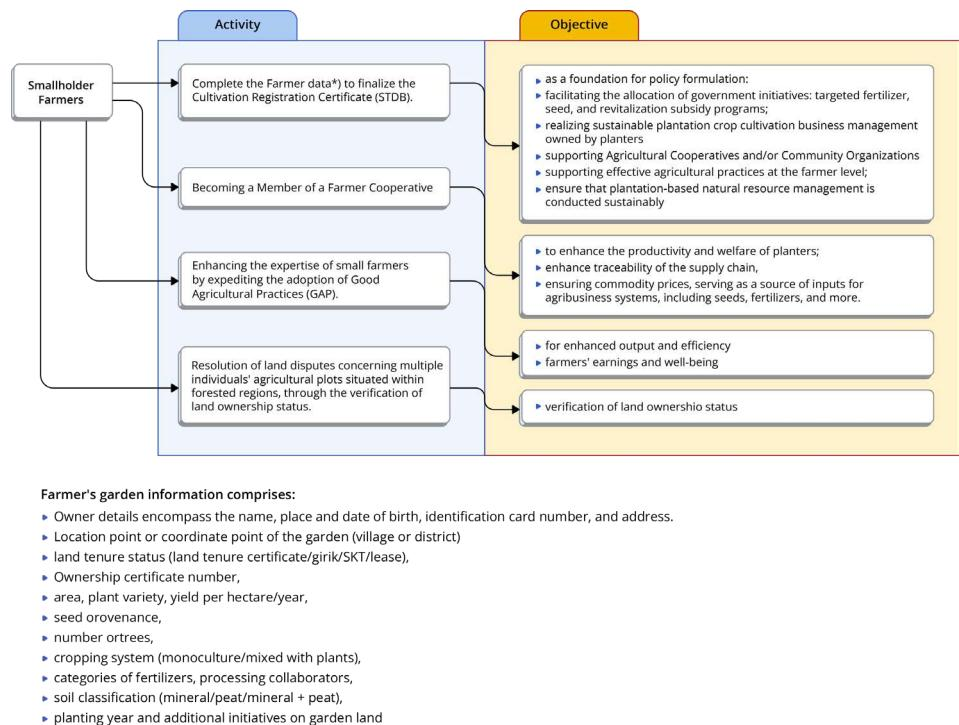

- Owner details encompass the name, place and date of birth, identification card number, and address.
- Location point or coordinate point of the garden (village or district)
- land tenure status (land tenure certificate/girlk/SKT/lease),
- Ownership certificate number,
- area, plant variety, yield per hectare/year,
- seed orovenance,
- number ortrees,
- cropping system (monoculture/mixed with plants),
- categories of fertilizers, processing collaborators,
- soil scalification (mineral/peat/mineral + peat),
- planting year and additional initiatives on garden land

## 4.3. Conclusion

While the legislative framework in Indonesia is comprehensive and very complex, with diΊerent laws and regulations existng and diΊerent ministries responsible for diΊerent thematic fields, two policy fields stand out in terms potential risk for non-compliance for commodities produced in the Indonesian context. When doing their due diligence exercise obligations, operators should therefore be aware on potential risks of non-compliance with regards to land rights and the protention of rights of indigenous peoples, specifically. As information is passed along the supply chain, business actors should also be aware of the potential risks associated. The main aspects are summarized as follows:

## (1) Land Rights

Plantation business actors are granted land rights for plantation operations in accordance with applicable laws and regulations. These rights include ownership rights, rights to cultivate (business use rights), rights to construct buildings (building use rights), and/or rights of utilization (use rights). Key considerations regarding land use rights include the following:

- a. Obtaining approval for land use in customary territories for plantation purposes requires a comprehensive consultation process with Indigenous

communities and relevant local authorities to ensure adherence to legal frameworks and respect for traditional land rights.

- b. Business actors must comply with the limitations on the total area designated for plantation use, ensuring that any expansion of plantation operations remains within the legal boundaries established by Government Regulations to prevent the overexploitation of land resources.
- c. The transfer of land rights over areas designated for plantation cultivation is strictly prohibited to safeguard the ownership and control of land by indigenous peoples or other legitimate owners, ensuring that the land remains dedicated to its intended agricultural use.
- d. At least 30 percent of the land rights area deemed technically suitable for plantation crops must be cultivated within a maximum of three years to promote efÏcient land utilization and prevent the underutilization of valuable agricultural resources.
- e. To ensure maximum productivity, the entire land rights area deemed suitable for plantation crops must be cultivated within a maximum of six years, ensuring full compliance with agricultural development plans and legal obligations.

Meanwhile, The regulation of land use, land utilization, and investment arrangements in the sectors of mining, plantations, and forest utilization is governed by Presidential Regulation No. 70/2023 concerning Land Allocation for Investment Arrangements. The enactment of Presidential Regulation No. 70/2023 is based on two key considerations, namely: (1) to enhance the eΊectiveness and efÏciency of resource utilization, promote equitable investment, and improve community welfare, it is essential to ensure fair and balanced land use management; and (2) the regulation of business licensing in the sectors of mining, plantations, and forest utilization for village-owned enterprises, regionally-owned enterprises, legal entities owned by community organizations, cooperatives, and small and medium enterprises is necessary for structured and sustainable economic development.

In its implementation, the President established the Task Force for Land Use and Investment Arrangement. This task force was formed to ensure the equitable management of land use, to streamline business licensing in the mining, plantation, and forest utilization sectors, and to enhance the eΊectiveness and efÏciency of natural resource optimization.

derived from the release of forest areas with forest cover exceeding 70% or with significant environmental protection potential at business locations must be preserved and designated as forest areas. Such land is prohibited from being used for business activities in the mining and plantation sectors. In contrast, Article 11 provides that land originating from the release of forest areas with forest cover below 70% or lacking environmental protection potential is categorized as abandoned land.

## (2) Rights of Indigenous people

The rights of indigenous peoples have been granted comprehensive and robust legal recognition through various laws and regulations, reΌecting the deep-rooted commitment of the Indonesian legal system to protect these communities. This strong legal recognition is primarily derived from the special consideration aΊorded to indigenous peoples in the Indonesian Constitution, particularly in the 1945 Constitution, which serves as the foundational legal document of the nation. In this context, Article 18B, paragraph (2), plays a pivotal role in afÏrming the State's commitment to indigenous rights, as it explicitly acknowledges the existence of customary law communities and their traditional rights. The article states: "The State recognizes and respects the units of customary law communities and their traditional rights," underscoring the legal and moral obligation of the State to ensure that these communities can continue to exercise their cultural practices, manage their lands, and maintain their identities within the framework of national law. This constitutional provision serves as the bedrock for subsequent legislation aimed at safeguarding the unique rights and autonomy of indigenous peoples in Indonesia.

Specifically, the support for indigenous peoples is regulated by Law No. 39 of 2014, and Law Number 22 year 2019. The recognition of the rights of indigenous peoples in Law No. 39 of 2014 on Plantations is elaborated in several articles that provide protection and respect for the rights of indigenous peoples, especially concerning land, natural resources, and customary practices. Here are some key points related to the recognition of indigenous peoples' rights in this law:

- **a. Recognition of Land and Natural Resource Rights**: Law No. 39 of 2014 recognizes the existence and rights of indigenous peoples over land and natural resources within their customary territories. This right includes the right to use, manage, and protect the natural resources on customary lands (ulayat lands) controlled by indigenous communities).
- **b. Recognition of Local Wisdom**: This law acknowledges the local wisdom of indigenous peoples, particularly in the sustainable management of natural resources. The law requires both the government and business

actors to consider local wisdom in the development of plantations and must not disregard or harm the rights of indigenous communities.

- **c. Free, Prior, and Informed Consent (FPIC):** In the implementation of plantation activities in customary areas, this law requires the prior consent of the relevant indigenous peoples before initiating activities that may aΊect their customary land. This aligns with the principle of FPIC, which ensures that indigenous peoples are provided with sufÏcient information and given the opportunity to approve or reject business activities in their territory freely and without coercion.
- **d. Prohibition of Unauthorized Seizure of Customary Land:** The law prohibits the unauthorized seizure or use of land controlled by indigenous peoples without their consent. This is intended to protect ulayat lands from unlawful appropriation or exploitation by external parties, including plantation companies.
- **e. Obligations of Business Actors to Protect Indigenous Peoples' Rights**: Plantation companies operating near indigenous territories are required to respect the rights of indigenous peoples, including the right to benefit from the management of natural resources in their customary areas.
- **f. Role of Government**: Both central and regional governments play a crucial role in recognizing and protecting the rights of indigenous peoples. The government is also obligated to ensure that indigenous peoples are involved in the planning and execution of plantation activities related to their customary lands.

# BIBLIOGRAPHY

Bengkulu. Governor of Bengkulu. Regional Regulation of Bengkulu Province Number 2 of 2013 on Plantation Business Licensing. Government of Bengkulu Province; 2013. Berau Regency. Regional Regulation of Berau Regency Number 3 of 2020 on Sustainable Plantation Development. Government of Berau Regency; 2020. Central Java. Regional Regulation of Central Java Province Number 2 of 2005 on Plantation Business Licensing. Government of Central Java Province; 2005. Central Kalimantan. Governor Regulation of Central Kalimantan Number 41 of 2014 on the Management of High Conservation Value Areas in Plantation Business in Central Kalimantan Province. Government of Central Kalimantan Province; 2016. Central Kalimantan. Regional Regulation of Central Kalimantan Province Number 1 of 2010 on Amendments to Regional Regulation of Central Kalimantan Province Number 16 of 2008 on Dayak Customary Institutions in Central Kalimantan. Government of Central Kalimantan Province; 2013. East Kalimantan Governor Regulation. East Kalimantan Governor Regulation Number 43 of 2021 on Management of Areas with High Conservation Value in Plantation Areas. East Kalimantan Province: Government of East Kalimantan; 2021. East Kalimantan. Governor of East Kalimantan Decree No. 100.3.3.1/K.242/2024 on the Establishment of the Peat Ecosystem Protection and Management Plan for 2024-2053 in East Kalimantan Province. Government of East Kalimantan; 2024. East Kalimantan. Governor Regulation of East Kalimantan Number 43 of 2021 on Management of Areas with High Conservation Value in Plantation Areas. Government of East Kalimantan; 2021. East Kalimantan. Regional Regulation of East Kalimantan Province Number 1 of 2015 on Guidelines for Recognition and Protection of Indigenous Law Communities in East Kalimantan Province. Government of East Kalimantan; 2016. FPIC Procedure for the UN-REDD Programme in Indonesia. (2010, March 17). Diambil kembali dari un-redd: https://www.un-redd.org/sites/ default/files/2021-09/Indonesia%20FPIC%20report%20%28Draft%29\_ Indonesia\_2010%20%28391563%29.pdf

Government of the Republic of Indonesia. Article 25 of Law Number 1 of 2024 on the Second Amendment to Law Number 11 of 2008 on Electronic Information and Transactions. 2024. Government of the Republic of Indonesia. Government Regulation (PP) Number 36 of 2021 on Wages. Jakarta: Ministry of Law and Human Rights; 2021. Government of the Republic of Indonesia. Government Regulation Number 57 of 2016 on Amendments to Government Regulation Number 71 of 2014 on Peat Ecosystem Protection and Management. 2016. Government of the Republic of Indonesia. Government Regulation Number 23 of 2021 on Forestry Administration. 2021. Government of the Republic of Indonesia. Government Regulation number 52/2023 on Amendments to Government Regulation Number 26/2021 on the Implementation of the Agricultural Sector Government of the Republic of Indonesia. Government Regulation Number 35 of 2021 on Fixed-Term Employment Agreements, Outsourcing, Working Hours and Rest Periods, and Termination of Employment. Jakarta: Ministry of Law and Human Rights; 2021. Government of the Republic of Indonesia. Government Regulation Number 37 of 2012 on the Implementation of the Job Loss Guarantee Program. Jakarta: Ministry of Law and Human Rights; 2012. Government of the Republic of Indonesia. Government Regulation Number 45 of 2021 on the Implementation of Geospatial Information. 2021. Government of the Republic of Indonesia. Government Regulation Number 5 of 2021 on the Implementation of Risk-Based Business Licensing. Government Regulation. 2021. Government of the Republic of Indonesia. Government Regulation Number 82 of 2019 on Amendments to Government Regulation Number 44 of 2015 on the Implementation of the Work Accident Insurance and Death Insurance Programs. 2019. Available from: https://peraturan.bpk.go.id/Home/ Details/127681/pp-no-82-tahun-2019 Government of the Republic of Indonesia. Government Regulation Number 88 of 2019 on Occupational Health. 2019. Available from: https://peraturan. bpk.go.id/Home/Details/128642/pp-no-88-tahun-2019 Government of the Republic of Indonesia. Government Regulation Number 29 of 2021 on the Implementation of Trade Sector. 2021.

Government of the Republic of Indonesia. Government Regulation Number 27 of 2012 on Environmental Permits. 2012. Government of the Republic of Indonesia. Government Regulation Number 22 of 2021 on the Implementation of Environmental Protection and Management. 2021. Government of the Republic of Indonesia. Government Regulation Number 61 of 2010 on the Implementation of Law No.14 of 2008 on Public Information Disclosure. 2010. Government of the Republic of Indonesia. Government Regulation Number 11/2010 on the Control and Utilization of Neglected Land. Government of the Republic of Indonesia. Government Regulation Number 18/2021 on Management Rights, Land Rights, Housing Units, and Land Registration. 2021. Government of the Republic of Indonesia. Law Number 1 of 1970 On Occupational Safety. Jakarta: Secretary of State; 1970. Government of the Republic of Indonesia. Law Number 12 of 1992 On Plant Cultivation Systems. 1992. Government of the Republic of Indonesia. Law Number 18 of 2013 on the Prevention and Eradication of Forest Destruction. 2013. Government of the Republic of Indonesia. Law Number 19 of 2014 on the Establishment of Government Regulation in Lieu of Law Number 1 of 2004 on Amendments to Law Number 41 of 1999 on Forestry. Jakarta; 2014. Government of the Republic of Indonesia. Law Number 22 of 2019 on Sustainable Agricultural Cultivation Systems. 2019. Government of the Republic of Indonesia. Law Number 26 of 2000 on Human Rights Courts. 2000. Government of the Republic of Indonesia. Law Number 3 of 2014 on Industry. 2014. Government of the Republic of Indonesia. Law Number 31 of 1999 on the Eradication of Corruption. 1999. Government of the Republic of Indonesia. Law Number 32/2024 on the Amendment of Law Number 5/1990 on Conservation of Living Natural Resources and their Ecosystems. 2024.

Government of the Republic of Indonesia. Law Number 39 of 2014 on Plantations. 2014. Government of the Republic of Indonesia. Law Number 4 of 2011 on Geospatial Information. 2011. Government of the Republic of Indonesia. Law Number 40 of 2004 on the National Social Security System. Jakarta: Secretary of State; 2004. Government of the Republic of Indonesia. Law Number 41 of 1999 on Forestry. 1999. Government of the Republic of Indonesia. Law Number 5 of 1990 on Conservation of Living Natural Resources and their Ecosystems. 1990. Government of the Republic of Indonesia. Law Number 7 of 2021 On Harmonization of Tax Regulations (HPP). 2021. Government of the Republic of Indonesia. Law of the Republic of Indonesia Number 36 of 2000 On the Establishment of Government Regulation in Lieu of Law No. 1 of 2000 On Free Trade Zones and Free Ports. Jakarta: Secretary of State; 2000. Government of the Republic of Indonesia. Law of the Republic of Indonesia Number 7 of 1996 On Food. 1996; (99). Government of the Republic of Indonesia. Law of the Republic of Indonesia Number 37 of 2014 on Soil and Water Conservation. 2014. Government of the Republic of Indonesia. Law of the Republic of Indonesia Number 3 of 2024 on the Second Amendment to Law Number 6 of 2014 on Villages. Jakarta: Secretary of State; 2024. Available from: https://peraturan. bpk.go.id/Details/283617/uu-no-3-tahun-2024 Government of the Republic of Indonesia. Law of the Republic of Indonesia Number 13 of 2003 on Manpower. Jakarta: President of the Republic of Indonesia; 2003. Government of the Republic of Indonesia. Law of the Republic of Indonesia Number 7 of 2014 on Trade. 2014, p. 1–56. Available from: https://peraturan. bpk.go.id/Home/Details/38584/uu-no-7-tahun-2014 Government of the Republic of Indonesia. Law of the Republic of Indonesia Number 32 of 2009 on Environmental Protection and Management. 2005. Government of the Republic of Indonesia. Law of the Republic of Indonesia Number 5 of 1960 on Basic Agrarian Principles. 2004.

Government of the Republic of Indonesia. Law of the Republic of Indonesia Number 14 of 2008 on Public Information Disclosure. 2008. Government of the Republic of Indonesia. Law of the Republic of Indonesia Number 27 of 2022 on Personal Data Protection. 2022. Available from: https://peraturan.bpk.go.id/Home/Details/229798/uu-no-27-tahun-2022 Government of the Republic of Indonesia. Presidential Regulation Number 186 of 2014 on Social Empowerment of Remote Indigenous Communities. 2018. Government of the Republic of Indonesia. Presidential Regulation Number 53 of 2021 on the National Human Rights Action Plan for 2021-2025. 2021. Government of the Republic of Indonesia. Presidential Regulation Number 60 of 2023 on the National Strategy on Business and Human Rights. 2023. Government of the Republic of Indonesia. Presidential Regulation Number 62 of 2023 On the Acceleration of Agrarian Reform Implementation. 2023; (181865):1–81. Government of the Republic of Indonesia. Presidential Regulation Number 88 of 2017 on the Settlement of Land Tenure in Forest Areas. 2017. Government of the Republic of Indonesia. Regulation of the Minister of Law and Human Rights of the Republic of Indonesia Number 16 of 2024 on Guidelines for Mainstreaming Human Rights in the Formation of Legislation. 2016. Government of the Republic of Indonesia. Regulation of the Minister of Agriculture Number 49/Permentan/OT.140/4/2014/ Technical Guidelines for Good CoΊee Cultivation. Minister of Agriculture Regulation; 2014. Head of the National Law Development Agency. Report on Legal Analysis and Evaluation On Farmer Protection and Empowerment (Law Number 19 of 2013). 2022. Ketapang Regency. Regional Regulation of Ketapang Regency Number 8 of 2020 on Recognition and Protection of Indigenous Law Communities. Government of Ketapang Regency; 2020. Landak Regency. Regional Regulation of Landak Regency Number 10 of 2008 on the Administration of Plantation Business with the Grace of God Almighty Regent. 2008. Minister of Agriculture Regulation. Minister of Agriculture Regulation No. 11 of 2015 on Traceability. Jakarta; 2015. Minister of Agriculture Regulation. Minister of Agriculture Regulation Number 05/PERMENTAN/KB.410/1/2018 on Opening and/or Processing of Plantation

Land Without Burning. 2016. Minister of Agriculture Regulation. Minister of Agriculture Regulation Number 48/Permentan/OT.140/4/2014 on Technical Guidelines for Good Cocoa Cultivation. Minister of Agriculture Regulation; 2014. Ministry of Agrarian AΊairs and Spatial Planning. Regulation of the Minister of Agrarian AΊairs and Spatial Planning/ Head of the National Land Agency of the Republic of Indonesia Number 18 of 2016 on Control of Agricultural Land Tenure. 2022. Ministry of Agrarian AΊairs and Spatial Planning/Head of BPN. Regulation of the Minister of Agrarian AΊairs and Spatial Planning/Head of the National Land Agency Number 18 of 2019 on Procedures for the Administration of Customary Land Rights of Indigenous Law Communities. Jakarta: Ministry of Agrarian AΊairs and Spatial Planning/Head of BPN; 2019. Ministry of Agrarian AΊairs and Spatial Planning/Head of BPN. Regulation of the Minister of Agrarian AΊairs and Spatial Planning/Head of the National Land Agency of the Republic of Indonesia Number 17 of 2021 on Procedures for Determining Destroyed Land. 2021. Ministry of Agriculture. Decree of the Director General of Plantations Number: 105/KPTS/PI.400/2/2018 on Guidelines for Issuing Plantation Business Registration Certificates for Cultivation (STD-B). 2008. Ministry of Agriculture. Regulation of the Minister of Agriculture Number 38 of 2020 on the Implementation of Palm Oil Plantation Certification. Jakarta; 2006. Ministry of Agriculture. Regulation of the Minister of Agriculture of the Republic of Indonesia Number 132/Permentan/OT.140/12/2013 on Good Rubber (Hevea Brasiliensis) Cultivation Guidelines. 2014. Ministry of Agriculture. Regulation of the Minister of Agriculture Number 21/ PERMENTAN/KB.410/6/2017 of 2017 the Second Amendment to Regulation of the Minister of Agriculture Number 98/Permentan/OT.140/9/2013 on Plantation Business Licensing Guidelines. Ministry of Agriculture. Regulation of the Minister of Agriculture Number 38 of 2020 on the Implementation of Palm Oil Plantation Certification. Jakarta; 2006. Ministry of Agriculture. Regulation of the Minister of Agriculture of the Republic

of Indonesia Number 132/Permentan/OT.140/12/2013 on Good Rubber

(Hevea Brasiliensis) Cultivation Guidelines. 2014. Ministry of Agriculture. Regulation of the Minister of Agriculture Number 21/ PERMENTAN/KB.410/6/2017 of 2017 the Second Amendment to Regulation of the Minister of Agriculture Number 98/Permentan/OT.140/9/2013 on Plantation Business Licensing Guidelines. Ministry of Environment and Forestry. Minister of Environment and Forestry Regulation Number 9 of 2021 on Social Forestry Management. 2021. Ministry of Environment and Forestry. National Peat Ecosystem Protection and Management Plan for 2020-2049. 2020, p. 112. Available from: http:// pkgppkl.menlhk.go.id/ Ministry of Environment and Forestry. Regulation of the Minister of Environment and Forestry of the Republic of Indonesia Number P.60/MENLHK/SETJEN/ KUM.1/10/2019 on Procedures for the Preparation, Establishment, and Amendment of the Peat Ecosystem Protection and Management Plan. 2019. Ministry of Environment and Forestry. Regulation of the Minister of Environment and Forestry of the Republic of Indonesia Number 4 of 2023 on Social Forestry Management in Forest Areas with Special Management. 2023. Ministry of Environment and Forestry. Regulation of the Minister of Environment and Forestry Number P.11/MENLHK/SETJEN/KUM.1/5/2020 on People's Plantations. 2020. Ministry of Environment and Forestry. Regulation of the Minister of Environment and Forestry of the Republic of Indonesia Number 8 of 2021 on Forest Planning and Preparation of Forest Management Plans, as well as the Utilization of Protected Forests and Production Forests. 2018. Ministry of Home AΊairs. Regulation of the Minister of Home AΊairs of the Republic of Indonesia Number 52 of 2014 on Guidelines for Recognition and Protection of Indigenous Law Communities. Jakarta: Minister of Home AΊairs; 2014. Ministry of Home AΊairs. Regulation of the Minister of Home AΊairs of the Republic of Indonesia Number 18 of 2018 on Village Community Institutions and Village Customary Institutions. Indonesia; 2018. Ministry of Law and Human Rights. Permenkumham No. 3 of 2021 on Paralegals in the Provision of Legal Aid. 2021.

Rights Number 25 of 2023 on Human Rights-Based Public Services. 2023. Available from: www.peraturan.go.id Ministry of Law and Human Rights. Regulation of the Minister of Law and Human Rights of the Republic of Indonesia Number 12 of 2019 on Geographical Indications, State Gazette of the Republic of Indonesia Number 694 of 2019. 2019. Ministry of Law and Human Rights. Regulation of the Minister of Manpower of the Republic of Indonesia Number 5 of 2021 on Procedures for the Implementation of the Occupational Accident Insurance Program, Death Insurance, and Old Age Insurance. Jakarta: Ministry of Law and Human Rights; 2021. Ministry of Trade. Decree of the Minister of Trade of the Republic of Indonesia Number 541 of 2023 on Reference Export Prices and Reference Prices for Agricultural and Forestry Products Subject to Export Duties. Jakarta; 2023. Ministry of Trade. Regulation of the Minister of Trade No. 12 of 2022 on the Third Amendment to the Regulation of the Minister of Trade Number 19 of 2021 on Export Policy and Regulation. 2022. Available from: http://jdih. kemendag.go.id/peraturan/detail/2213/2 Ministry of Trade. Regulation of the Minister of Trade Number 23 of 2023 on Export Policy and Regulation. 2023. Ministry of Trade. Regulation of the Minister of Trade of the Republic of Indonesia Number 23 of 2023 on Export Policy and Regulation. 2023. Available from: https://www.ncbi.nlm.nih.gov/books/NBK558907/ Nagan Raya Regency. Qanun of Nagan Raya Regency Number 1 of 2019 on the Management of Plantation Business in Nagan Raya Regency. 2019. National Law Development Agency (BPHN) Final Report of the Legal Analysis and Evaluation Working Group on Labor Legislation. Jakarta; 2018. p. 1–261. National Law Development Agency (BPHN) Final Report of the Legal Analysis and Evaluation Working Group on the Role of Non-Bank Financial Institutions in Enhancing the Creative Economy. 2019; p. 1–314. National Law Development Agency (BPHN) Report on Legal Analysis and Evaluation Related to Protection Against Monopolistic Practices and Unfair Business Competition. Jakarta; 2020. National Law Development Agency Analysis and Evaluation Center. Analysis and Evaluation of Law On the Enforcement of Corruption Crimes. 2023.

National Law Development Agency of the Ministry of Law and Human Rights of the Republic of Indonesia. Final Report of Legal Analysis and Evaluation Related to Plantation Governance. 2020. National Law Development Agency of the Ministry of Law and Human Rights of the Republic of Indonesia. Guidelines for Evaluation of Legislation. 2019. North Kalimantan. Regional Regulation of North Kalimantan Province Number 1 of 2019 on Empowerment of Indigenous Communities. Government of North Kalimantan; 2019. Nusa Tenggara. Regional Regulation of West Nusa Tenggara Province Number 11 of 2021 on Recognition, Respect, and Protection of Indigenous Law Community Units. 2008. Papua. Regional Regulation of Papua Province Number 3 of 2022 on Customary Villages. Papua Province: Government of Papua Province; 2022. Papua. Regional Regulation of Papua Province Number 5 of 2022 on Recognition and Protection of Indigenous Law Communities in Papua Province. 2021; p. 1–18. Paser Regency. Regional Regulation of Paser Regency Number 4 of 2019 on Recognition and Protection of Indigenous Law Communities. Government of Paser Regency; 2019. Perpajakan DDTC. (2024). Rekap Peraturan Pajak Hasil Perkebunan. Diambil kembali dari Perpajakan DDTC: https://perpajakan.ddtc.co.id/panduanpajak/rekap-peraturan/rekap-peraturan-pajak-hasil-perkebunan Riau Province. Governor Regulation No. 5 of 2019 on One Data One Map. 2019. Sanggau Regency. Regional Regulation of Sanggau Regency Number 1 of 2017 on Recognition and Protection of Indigenous Law Communities. Government of Sanggau Regency; 2017. Secretary of State. Law Number 19 of 1999 On the Ratification of ILO Convention No. 105 On The Abolition of Forced Labour. Jakarta: Secretary of State; 1999. Sintang Regency. Regional Regulation of Sintang Regency Number 12 of 2015 on Recognition and Protection of Indigenous Law Institutions and Indigenous Law Communities. Government of Sintang Regency; South Kalimantan. Regional Regulation of South Kalimantan Province Number 2 of 2023 on Recognition and Protection of Indigenous Law Communities. 2017.

South Kalimantan. Regional Regulation of South Kalimantan Province Number 4 of 2023 on Sustainable Plantation Development. Government of South Kalimantan Province; 2017. South Sulawesi. Regional Regulation of South Sulawesi Province Number 4 of 2019 On Groundwater Management and Utilization. Government of South Sulawesi Province; 2016. Tanah Bumbu Regency. Regional Regulation of Tanah Bumbu Regency Number 1 of 2019 on the Protection of People's Plantations. 2019. Tanah Bumbu Regency. Regional Regulation of Tanah Bumbu Regency Number 2 of 2024 on Recognition, Protection, and Empowerment of Indigenous Law Communities. Government of Tanah Bumbu Regency; 2016. West Java. Governor of West Java. Governor Regulation of West Java Number 44 of 2017 on CoΊee Business Development. 2013. West Java. Governor of West Java. Governor Regulation of West Java Number 44 of 2017 on CoΊee Business Development. 2013. West Kalimantan. Regional Regulation of Bengkayang Regency Number 3 of 2023 on Empowerment and Development of Indigenous Law Community Institutions. Government of Bengkayang Regency; 2023. West Kalimantan. Regional Regulation of West Kalimantan Province Number 6 of 2018 on Land-Based Sustainable Business Management. Government of West Kalimantan Province; 2018.

# ANNEX

| Category Of          |                                              |    |                                                                                                                                                                                                                         |
|----------------------|----------------------------------------------|----|-------------------------------------------------------------------------------------------------------------------------------------------------------------------------------------------------------------------------|
| Laws and Regulations | Criteria                                     |    | Relevant Laws And Regulations                                                                                                                                                                                           |
| Deforestation        | The prohibition of                           |    |                                                                                                                                                                                                                         |
|                      | forests and other ecosystems to be converted | 1. | Law Number 41/1999 on Forestry as amended by Law No.6/2023 damage.                                                                                                                                                      |
|                      |                                              | 2. | Law Number 18 Year 2013 on Prevention and Eradication of Forest Destruction, areas permit; Ministerial permit in forest areas; Article 19, prohibition of ordering, or unauthorised use of forest area. in forest areas |

| Category Of          |                                              |    |                                                                                                                                                                                                                                        |
|----------------------|----------------------------------------------|----|----------------------------------------------------------------------------------------------------------------------------------------------------------------------------------------------------------------------------------------|
| Laws and Regulations | Criteria                                     |    | Relevant Laws And Regulations                                                                                                                                                                                                          |
| Deforestation        | The prohibition of                           |    |                                                                                                                                                                                                                                        |
|                      | forests and other ecosystems to be converted | 3. | Law Number 32 of 2024 regarding the Resources and their Ecosystems: forest areas, and other areal of use. Resources and Ecosystems. compensation. of laws and regulations. including providing their funding. business licensing area. |

| Category Of          |                                                                 |    |                                                                                                            |
|----------------------|-----------------------------------------------------------------|----|------------------------------------------------------------------------------------------------------------|
| Laws and Regulations | Criteria                                                        |    | Relevant Laws And Regulations                                                                              |
| Deforestation        | The prohibition of forests and other ecosystems to be converted |    | business licence. Government Regulation.                                                                   |
| Land use rights      | Land tenure and                                                 |    |                                                                                                            |
|                      | management rights secured                                       | 1. | Law Number 5 Year 1960 Basic Regulation                                                                    |
|                      |                                                                 | 2. | Law Number 39 Year 2014 on Plantations as amended by Law No. 6/2023 rights and/or use rights). plantations |
|                      |                                                                 | 3. | Government Regulation Number 18 Year rights.                                                               |

| Category Of                     |                                                                                                                                                                                                                                                                                                                                                                                                                                                                                                                                |
|---------------------------------|--------------------------------------------------------------------------------------------------------------------------------------------------------------------------------------------------------------------------------------------------------------------------------------------------------------------------------------------------------------------------------------------------------------------------------------------------------------------------------------------------------------------------------|
| Criteria                        | Relevant Laws And Regulations                                                                                                                                                                                                                                                                                                                                                                                                                                                                                                  |
| Land use rights Land tenure and |                                                                                                                                                                                                                                                                                                                                                                                                                                                                                                                                |
| 4.                              | Presidential Regulation Number 62 Year 2023 on the Acceleration of Agrarian Reform Implementation Article 2 paragraph (1) acceleration of Agrarian Reform is carried out through strategies: asset legalisation, land redistribution, economic empowerment of agrarian reform subjects and community participation. Article 33, asset legalisation consists of certifying land owned by the community, certifying transmigration land rights, and administering customary land of customary law communities and communal land. |
| 5.                              | Nagan Raya District Regional Regulation Number 1 Year 2019 on Plantation Business Management Article 7 (1,2,3). This article discusses property rights, HGU, HGB, and/ or Hak Pakai in accordance with laws and regulations, transfer of customary land with prior consultation and transfer of land rights.                                                                                                                                                                                                                   |
| 1.                              | Law Number 39 Year 2014 on Plantations, namely Article 15: Plantation companies that have partnerships are prohibited from transferring rights to plantation business land.                                                                                                                                                                                                                                                                                                                                                    |
| 2.                              | Law Number 5 Year 1960 Basic Agrarian Principles Regulation: Article 16, there are several land rights, namely Ownership Right (Hak Milik), Right to Cultivate (HGU), Right to Build (HGB), Right to Use (Hak Pakai), Right to Lease (Hak Sewa), Right to Open Land (Hak Terbuka Tanah), Right to Harvest Forest Products (Hak Memung Hasil Hutan), and other rights. Article 32, HGU including the terms of granting it must be registered in accordance with the provisions, as a strong means of proof.                     |

| Category Of                     |                                                                                                                                                                                                                                                                                                                                                                                                                                                            |
|---------------------------------|------------------------------------------------------------------------------------------------------------------------------------------------------------------------------------------------------------------------------------------------------------------------------------------------------------------------------------------------------------------------------------------------------------------------------------------------------------|
| Criteria                        | Relevant Laws And Regulations                                                                                                                                                                                                                                                                                                                                                                                                                              |
| Land use rights Land tenure and |                                                                                                                                                                                                                                                                                                                                                                                                                                                            |
| 3.                              | Government Regulation Number 18 Year 2021 on Management Rights, Land Rights, Residential Units, and Land Registration, namely Article 4 to Article 15 which contains regulations related to land/land management rights, namely the subject of management rights, utilisation of management rights land; Article 19 to Article 83 which contains regulations related to the management of business use rights, building use rights and use rights on land. |
| 4.                              | Regulation of the Minister of Agrarian AΊairs and Spatial Planning/Head of the National Land Agency of the Republic of Indonesia Number 18 Year 2021 on Procedues for Determining Management Rights and Land Rights.                                                                                                                                                                                                                                       |
| 5.                              | Presidential Regulation Number 62 Year 2023 on the Acceleration of Agrarian Reform Implementation Article 1 Number 10 related to the explanation of Land Rights. Land Rights are rights obtained from legal relationships between rights holders and land, including space above land, and/or space below land to control, own, use, and utilise, as well as maintain land, space above land, and/or space below land.                                     |

| Category Of                     |                                                                                                                                                                                                                                                                                                                                                                                                                                                                                                                                                                                                                                                                                                                                                                                |
|---------------------------------|--------------------------------------------------------------------------------------------------------------------------------------------------------------------------------------------------------------------------------------------------------------------------------------------------------------------------------------------------------------------------------------------------------------------------------------------------------------------------------------------------------------------------------------------------------------------------------------------------------------------------------------------------------------------------------------------------------------------------------------------------------------------------------|
| Criteria                        | Relevant Laws And Regulations                                                                                                                                                                                                                                                                                                                                                                                                                                                                                                                                                                                                                                                                                                                                                  |
| Land use rights Land tenure and |                                                                                                                                                                                                                                                                                                                                                                                                                                                                                                                                                                                                                                                                                                                                                                                |
| 6.                              | Regulation of the Minister of Agriculture Number 21/PERMENTAN/KB.410/6/2017 the Second Amendment to Peraturan Menteri Regulation of the Minister of Agriculture Number 98/Permentan/OT.140/9/2013 on Plantation Business Licensing Guidelines. Article 5 Paragraph (1) Plantation Crop 25 (twenty five) hectares shall be registered by the regent/mayor. Article 5 Paragraph (2) Registration of Plantation Crop Cultivation Business as referred to in paragraph (1) at least contains information on the owner and farm data on the identity and domicile of the owner, farm manager, farm location, land ownership status, area, crop type, production, seed origin, number of trees, planting pattern, fertiliser type, processing partner, soil type, and planting year. |
| 7.                              | Decree of the Director General of Plantations No. 37/Kpts/PI.400/03/2024 on Guidelines for the Issuance of Plantation Business Registration Certificate for Cultivation (STD-B)                                                                                                                                                                                                                                                                                                                                                                                                                                                                                                                                                                                                |
| 1.                              | Law Number 39/2014 on Plantations as amended by Law No.6/2023Article 42, Plantation cultivation business activities and/ or plantation product processing business can only be carried out if the company has obtained land rights and business licences from the central government.                                                                                                                                                                                                                                                                                                                                                                                                                                                                                          |
| 2.                              | Presidential Regulation Number 62 Year 2023 on the Acceleration of Agrarian Reform Implementation Article 6, Plantation companies holding Forest Estate release approval decisions are required to allocate Estate release approval area for plantations that can be cultivated for the provision of TORA from Forest Estate.                                                                                                                                                                                                                                                                                                                                                                                                                                                  |

| Category Of                     |                                                                                                                                                                                                                                                                                                                                                                                                                                                                                                                                                                                                                                   |
|---------------------------------|-----------------------------------------------------------------------------------------------------------------------------------------------------------------------------------------------------------------------------------------------------------------------------------------------------------------------------------------------------------------------------------------------------------------------------------------------------------------------------------------------------------------------------------------------------------------------------------------------------------------------------------|
| Criteria                        | Relevant Laws And Regulations                                                                                                                                                                                                                                                                                                                                                                                                                                                                                                                                                                                                     |
| Land use rights Land tenure and |                                                                                                                                                                                                                                                                                                                                                                                                                                                                                                                                                                                                                                   |
| 1.                              | Law Number 39/2014 on Plantations as amended by Law No.6/2023Article 14 (1) and Article 58 Article 14 Paragraph (1) The Central Government determines the maximum area and minimum area of land use for Plantation Business. Article 58 Paragraph (1) Plantation Companies that have Plantation Business licences or Plantation Business licences for cultivation are obliged to facilitate the development of surrounding community the total plantation area cultivated by the Plantation Company.                                                                                                                              |
| 2.                              | Law Number 22 Year 2019 on Sustainable Agriculture Cultivation System Article 15 (1), the Central Government stipulates the maximum area of Land for Agriculture Cultivation Business.                                                                                                                                                                                                                                                                                                                                                                                                                                            |
| 3.                              | Law Number 5 Year 1960 Basic Agrarian Principles Regulation: Article 28, HGU is granted on a land area of at least 5 hectares, if the area is 25 hectares or more, it must use proper capital investment and good corporate techniques.                                                                                                                                                                                                                                                                                                                                                                                           |
| 4.                              | Government Regulation Number 18 Year 2021 on Management Rights, Land Rights, Residential Units, and Land Registration: Article 27 HGU holders are obliged to carry out agricultural, fishery, and livestock businesses in accordance with the designation and requirements for a maximum of 2 years after the rights are granted. Disclaimer: This obligation is imposed on limited liability companies, both privately owned and state-owned/region-owned enterprises for plantation business use rights with a minimum area of 250 (two hundred and fifty) hectares. This obligation is imposed upon the first granting of HGU. |

| Category Of          |                           |    |                                                                                    |
|----------------------|---------------------------|----|------------------------------------------------------------------------------------|
| Laws and Regulations | Criteria                  |    | Relevant Laws And Regulations                                                      |
| Land use rights      | Land tenure and           |    |                                                                                    |
|                      | management rights secured | 5. | Government Regulation Number 5 Year 2021 Licensing every 1 (one) year. management. |
|                      |                           | 6. | Government Regulation Number 52 Year 2023 hectares. nationally.                    |

| Category Of                     |                                                                                                                                                                                                                                                                                                                                                                                                                                                                                                                                                                                                                                                                                                                                                                                                                                                                                                                         |
|---------------------------------|-------------------------------------------------------------------------------------------------------------------------------------------------------------------------------------------------------------------------------------------------------------------------------------------------------------------------------------------------------------------------------------------------------------------------------------------------------------------------------------------------------------------------------------------------------------------------------------------------------------------------------------------------------------------------------------------------------------------------------------------------------------------------------------------------------------------------------------------------------------------------------------------------------------------------|
| Criteria Laws and Regulations   | Relevant Laws And Regulations                                                                                                                                                                                                                                                                                                                                                                                                                                                                                                                                                                                                                                                                                                                                                                                                                                                                                           |
| Land use rights Land tenure and |                                                                                                                                                                                                                                                                                                                                                                                                                                                                                                                                                                                                                                                                                                                                                                                                                                                                                                                         |
| 7. management rights secured    | Government Regulation Number 23 Year 2021 on the Implementation of Forestry Article 151 Paragraph 1 Limitation of Business Licensing for Forest Utilisation in Production Forests includes: a. limitation of area; b. limitation of number of Business Licenses; and c. location arrangement. Article 151 paragraph 3 Limitation of Business Licensing area as referred to in paragraph (1) letter a is given a maximum area of 50,000 Ha (fifty thousand hectares), except for the Papua region, which can be given a maximum area of 100,000 Ha (one hundred thousand hectares). Technical requirements for forest utilisation in protected forests and production forests based on Article 135 and Technical requirements and fulfilment of commitments as follows: (1) submission of environmental documents; (2) preparation of minutes of geographical coordinates of the area requested; and (3) payment of BPH. |
| 8.                              | Presidential Regulation Number 62 Year 2023 on the Acceleration of Agrarian Reform Implementation Article 19 Paragraph (1), Subjects of Agrarian Reform include: a. individuals; b. community groups with joint ownership rights; c. customary law communities; and d. legal entities. Further explanation is in Article 19 paragraphs (2), (3), (4), (5), and (6). Article 19 paragraph (3): Individuals as referred to in paragraph (1) letter a have jobs:                                                                                                                                                                                                                                                                                                                                                                                                                                                           |
|                                 | a. smallholder farmer who has a land area of 0.25 (zero point two five) hectares or smaller and or a farmer who leases land with an area of no more than 2 (two) hectares to be cultivated in agriculture as his source of livelihood;                                                                                                                                                                                                                                                                                                                                                                                                                                                                                                                                                                                                                                                                                  |

| Category Of                                               |                                                                                                                                                                                                                                                                                                                                                                                                                                                                                                   |
|-----------------------------------------------------------|---------------------------------------------------------------------------------------------------------------------------------------------------------------------------------------------------------------------------------------------------------------------------------------------------------------------------------------------------------------------------------------------------------------------------------------------------------------------------------------------------|
| Criteria Laws and Regulations                             | Relevant Laws And Regulations b.sharecroppers who work on or cultivate                                                                                                                                                                                                                                                                                                                                                                                                                            |
| Land use rights Land tenure and management rights secured | their own land that they do not own;                                                                                                                                                                                                                                                                                                                                                                                                                                                              |
|                                                           | c. farm labourers who work on or cultivate other people’s land for a wage;                                                                                                                                                                                                                                                                                                                                                                                                                        |
| 9.                                                        | Regulation of the Minister of Agriculture No. 98/Permentan/OT.140/9/2013 on the Guidelines for Plantation Business Licensing Article 8, Annex 5. Plantation Cultivation Businesses with an area of 25 (twenty-five) hectares or more are required to have an IUP-B. Based on Annex 5, the most extensive limit for granting IUP-B for 1 company or group of plantation companies, Rubber is 20 hectares, coΊee is 10 hectares, and kako is 10 hectares.                                           |
| 10.                                                       | Regulation of the Minister of Environment and Forestry Number 8 Year 2021 on Forest Management and Preparation of Forest Management Plans, as well as Forests in Protection Forests and Production Forests Article 97, The limitation of PBPH area as referred to in Article 96 ayai (l) letter a in Production Forests is given a maximum area of 50,000 Ha (fifty thousand hectares) except for the Papua region, it can be given a maximum area of 100,000 Ha (one hundred thousand hectares). |

| Category Of                                               |                                                                                                                                                                                                                                                                                                                                                                                                                                                                                                                                                                                                                                                                                                                                         |
|-----------------------------------------------------------|-----------------------------------------------------------------------------------------------------------------------------------------------------------------------------------------------------------------------------------------------------------------------------------------------------------------------------------------------------------------------------------------------------------------------------------------------------------------------------------------------------------------------------------------------------------------------------------------------------------------------------------------------------------------------------------------------------------------------------------------|
| Criteria Laws and Regulations                             | Relevant Laws And Regulations 11.Regulation of the Minister of Agrarian and                                                                                                                                                                                                                                                                                                                                                                                                                                                                                                                                                                                                                                                             |
| Land use rights Land tenure and management rights secured | Spatial Planning/Head of the National Land Agency of the Republic of Indonesia Number 18 Year 2016 on Control of Agricultural Land Tenure Article 3 (1,2,3,4). The extent of agricultural land tenure and ownership needs to be restricted to individuals and legal entities. Restrictions on agricultural land ownership for legal entities are in accordance with the decree granting the right. Restrictions on individual ownership of agricultural land with the following provisions:                                                                                                                                                                                                                                             |
|                                                           | a. Non-compact, a maximum area of 20 (twenty) hectares; b.Less dense, at most 12 (twelve) hectares;                                                                                                                                                                                                                                                                                                                                                                                                                                                                                                                                                                                                                                     |
|                                                           | c. Moderately dense, at most 9 (nine) hectares;                                                                                                                                                                                                                                                                                                                                                                                                                                                                                                                                                                                                                                                                                         |
|                                                           | d. Or very dense, at most 6 (six) hectares.                                                                                                                                                                                                                                                                                                                                                                                                                                                                                                                                                                                                                                                                                             |
| 12.                                                       | Regional Regulation of Central Java Province Number 2 Year 2005 concerning Licensing of Plantation Business in Central Java Article 3, Plantation Crop Cultivation Business as referred to in paragraph (1) consists of large-scale Plantation Cultivation Business that must be conducted by Plantation Companies and small-scale Plantation Cultivation Business that can be conducted by Smallholders. Article 4 (1,2,3) Plantation Crop Cultivation Business with land area of 25 ha (twenty five hectares) or more shall be required to have IUP, while the area below 25 ha shall be required to have SIUP. The Land Area of Plantation Crop Cultivation Business for one Company or Group of Companies is determined as follows: |

| Category Of          |                           |                                                                                                                                                                                                                                                                                                                                                                                                                                                                                                                                                                                                                                                                                                                                                                                                                                                                                                                                                                                                                                                                                                                                                                                                                                                                                                                                                                                                                                                                                                                                                                     |
|----------------------|---------------------------|---------------------------------------------------------------------------------------------------------------------------------------------------------------------------------------------------------------------------------------------------------------------------------------------------------------------------------------------------------------------------------------------------------------------------------------------------------------------------------------------------------------------------------------------------------------------------------------------------------------------------------------------------------------------------------------------------------------------------------------------------------------------------------------------------------------------------------------------------------------------------------------------------------------------------------------------------------------------------------------------------------------------------------------------------------------------------------------------------------------------------------------------------------------------------------------------------------------------------------------------------------------------------------------------------------------------------------------------------------------------------------------------------------------------------------------------------------------------------------------------------------------------------------------------------------------------|
| Laws and Regulations | Criteria                  | Relevant Laws And Regulations                                                                                                                                                                                                                                                                                                                                                                                                                                                                                                                                                                                                                                                                                                                                                                                                                                                                                                                                                                                                                                                                                                                                                                                                                                                                                                                                                                                                                                                                                                                                       |
| Land use rights      | Land tenure and           |                                                                                                                                                                                                                                                                                                                                                                                                                                                                                                                                                                                                                                                                                                                                                                                                                                                                                                                                                                                                                                                                                                                                                                                                                                                                                                                                                                                                                                                                                                                                                                     |
|                      | management rights secured | a. The maximum land area of plantation business is 20,000 hectares in one province, except sugarcane plantation business. b.The maximum size of sugarcane plantation is 60,000 hectares in one province. 13.Regional Regulation of Nagan Raya Regency 1 Year 2019 Plantation Business Management Agement Article 10 Paragraph (1), for plantation crop cultivation business, the area that is not required to have a plantation business permit is below 25 hectares, while for plantation product processing industry business that is not required to have a plantation business permit. Article 11 Paragraph 2 Plantation crop cultivation business with a land area of 0 to 25 (twenty five) hectares shall be registered by the Regent. Article 11 Paragraph 6 For Plantation Business with an area above 25 (twenty five) hectares up to 200 (two hundred) hectares, the plantation business permit is issued by the regent by attaching the requirements of the deed of establishment, location permit, environmental permit, recommendation for conformity with the provincial plantation development plan from the Governor, forest area release permit, if the requested area comes from a forest area, Cultivation Rights Title (if already has HGU), statement regarding work plan, processing of products, having human resources, infrastructure, and pest control system and land clearing without burning, implementing partnerships with employee planters and communities around the plantation, partnership statement letter from the applicant. |

| Category Of                     |                                                                                                                                                                                                                                                                                                                                                                                                                   |
|---------------------------------|-------------------------------------------------------------------------------------------------------------------------------------------------------------------------------------------------------------------------------------------------------------------------------------------------------------------------------------------------------------------------------------------------------------------|
| Criteria                        | Relevant Laws And Regulations                                                                                                                                                                                                                                                                                                                                                                                     |
| Land use rights Land tenure and |                                                                                                                                                                                                                                                                                                                                                                                                                   |
| 1.                              | Law Number 5 Year 1960 on Basic Agrarian Principles, Article 29, HGU for a maximum of 25 years with a note that if the company needs more time, it will be given 35 years.                                                                                                                                                                                                                                        |
| 2.                              | Government Regulation Number 23 Year 2021 on the Implementation of Forestry Article 150, Forest Utilisation Business License in Production Forests for a maximum period of 90 years and can be extended by ministerial evaluation.                                                                                                                                                                                |
| 3.                              | Minister of Environment and Forestry Regulation 9 of 2021 on Social Forestry Management Article 8 Paragraph 1, HD Management Approval, HKm Management Approval, and HTR Management Approval as referred to in Article 6 paragraph (2) shall be granted for a period of 35 (thirty-five) years and may be extended.                                                                                                |
| Land use rights Management      |                                                                                                                                                                                                                                                                                                                                                                                                                   |
| 1.                              | Law Number 39 Year 2014 on Plantations, the Law contains plantation regulations with the scope of : planning, land use, seeding, cultivation of plantation crops, plantation business, processing and marketing of products, research and development, data and information systems, human resource development, plantation business financing, investment, guidance and supervision and community participation. |
| 2.                              | Law Number 22 Year 2019 on Sustainable Agriculture Cultivation System as amended by Law No. 6/2023 Article 12 Paragraph 1 Law No.22/2019, Land utilisation for agricultural cultivation purposes is adjusted to the provisions of spatial planning and land use in accordance with the provisions of laws and regulations.                                                                                        |

| Category Of          |                                                   |    |                                                                                                                                                                               |
|----------------------|---------------------------------------------------|----|-------------------------------------------------------------------------------------------------------------------------------------------------------------------------------|
| Laws and Regulations | Criteria                                          |    | Relevant Laws And Regulations                                                                                                                                                 |
| Land use rights      | Management                                        |    |                                                                                                                                                                               |
|                      | planning and operations are conducted responsibly | 3. | Government Regulation Number 18 Year Land Registration.                                                                                                                       |
|                      |                                                   | 4. | Government Regulation Number 5 Year 2021 Business Licensing out business activities. Standard Certificate. the OSS system. Article 14 Paragraph (2) Standard Business Actors. |

| Category Of          |                                                              |    |                                                                                                                                    |
|----------------------|--------------------------------------------------------------|----|------------------------------------------------------------------------------------------------------------------------------------|
| Laws and Regulations | Criteria                                                     |    | Relevant Laws And Regulations                                                                                                      |
| Land use rights      | Management planning and operations are conducted responsibly |    | in the form of NIBs and permits. business activities.                                                                              |
|                      |                                                              | 5. | Minister of Agriculture Regulation No. 98/ Business Licensing Guidelines consists of IUP-B, IUP-P and IUP. authority.              |
|                      |                                                              | 6. | Regulation of the Minister of Environment and Community Plantation Forest by permits or management rights. granting of IUPHHK-HTR. |

| Category Of          |                                                   |    |                                                                                                                                                                                                                                                                       |
|----------------------|---------------------------------------------------|----|-----------------------------------------------------------------------------------------------------------------------------------------------------------------------------------------------------------------------------------------------------------------------|
| Laws and Regulations | Criteria                                          |    | Relevant Laws And Regulations                                                                                                                                                                                                                                         |
| Land use rights      | Management                                        |    |                                                                                                                                                                                                                                                                       |
|                      | planning and operations are conducted responsibly | 7. | Minister of Environment and Forestry Regulation Number 9 Year 2021 Partnerships. given in the form of conservation partnerships shall be given. partnerships shall be given. Social Forestry Areas (PIAPS). approval. partnership management. groups or cooperatives. |

| Category Of          |                                                              |    |                                                                                                                                                                |
|----------------------|--------------------------------------------------------------|----|----------------------------------------------------------------------------------------------------------------------------------------------------------------|
| Laws and Regulations | Criteria                                                     |    | Relevant Laws And Regulations                                                                                                                                  |
| Land use rights      | Management planning and operations are conducted responsibly |    | area extended.                                                                                                                                                 |
|                      |                                                              | 8. | Regional Regulation of Central Java Province Plantation Business in Central Java Companies must have an IUP. Smallholders must have SPUP. Plantation Business. |
|                      |                                                              | 9. | Bengkulu Provincial Regulation Number 2 the Head of Regency/City OfÏce.                                                                                        |

| Category Of                |                                                                                                                                                                                                                                                                                                                                                                                                                                                                                                                                                                                                                                                                                                                                                                    |
|----------------------------|--------------------------------------------------------------------------------------------------------------------------------------------------------------------------------------------------------------------------------------------------------------------------------------------------------------------------------------------------------------------------------------------------------------------------------------------------------------------------------------------------------------------------------------------------------------------------------------------------------------------------------------------------------------------------------------------------------------------------------------------------------------------|
| Criteria                   | Relevant Laws And Regulations Article 4 Paragraph (3) Plantation crop                                                                                                                                                                                                                                                                                                                                                                                                                                                                                                                                                                                                                                                                                              |
| Land use rights Management | cultivation business that has been registered as referred to in paragraph (1) shall be given a Plantation Cultivation Business Registration Certificate (STD-B).                                                                                                                                                                                                                                                                                                                                                                                                                                                                                                                                                                                                   |
| 10.                        | District Regulation of Nagan Raya Number 1 Year 2019 Plantation Business Management Article 11 Paragraph (3), Registered plantation crop cultivation business is given STD-B                                                                                                                                                                                                                                                                                                                                                                                                                                                                                                                                                                                       |
| 11.                        | District Regulation of Landak Number 10 of 2008 concerning Plantation Business Implementation Article 23 Paragraph (2) Plantation Cultivation Business with a land area of 25 (twenty-five) hectares or more must have a Plantation Business Licence. Article 23 Paragraph (3) Plantation Cultivation Business whose land area is subject to registration. Article 23 Paragraph (4) Plantation Business Permit shall be registered once a year and shall remain valid as long as there are activities in the field. Article 24 Paragraph (1) Plantation companies shall have Cultivation Rights Title for their own land. Article 24 Paragraph (2) Cultivation Rights of Way shall be granted by a decree granting rights by the Minister or a designated ofÏcial. |
| 1.                         | Law Number 14 Year 2008 on Public Information Disclosure Article 2 Paragraph (1) Every Public Information is open and accessible to every Public Information User. Article 2 Paragraph (2) Exempt Public Information is strict and limited.                                                                                                                                                                                                                                                                                                                                                                                                                                                                                                                        |

| Category Of                |                                                                                                                                                                                                                                                                                                                                                                                                                                                                                                                       |
|----------------------------|-----------------------------------------------------------------------------------------------------------------------------------------------------------------------------------------------------------------------------------------------------------------------------------------------------------------------------------------------------------------------------------------------------------------------------------------------------------------------------------------------------------------------|
| Criteria                   | Relevant Laws And Regulations                                                                                                                                                                                                                                                                                                                                                                                                                                                                                         |
| Land use rights Management |                                                                                                                                                                                                                                                                                                                                                                                                                                                                                                                       |
| 2.                         | Presidential Regulation of the Republic of Indonesia Number 39 of 2019 concerning One Data Indonesia, Article 36-Article 39 contains rules for data dissemination.                                                                                                                                                                                                                                                                                                                                                    |
| 3.                         | Decree of the Coordinating Minister for Economic AΊairs Number 178 of 2024 on the Steering Committee for the National Dashboard of Indonesian Sustainable Commodity Data and Information, and Decree of the Expert StaΊ for Connectivity, Service Development and Natural Resources of the Coordinating Ministry for Economic AΊairs Number B/DI/2/SA.II.M.EKON/05/2024 on the Expert Team and Technical Committee for the National Dashboard of Indonesian Sustainable Commodity Data and Information.               |
| 4.                         | Presidential Regulation (Perpres) Number 11 of 2021 concerning Cooperation between the Central Government and State-Owned Enterprises Article 1 paragraph (10) Cooperation between the Central Government and SOEs, hereinafter referred to as KPBUMN, is cooperation between the Central Government and SOEs in the Implementation of Basic Geospatial Information (IGD). Article 2 letter b KPBUMN is carried out with the aim of ensuring the availability and access to quality, up-to-date, and accountable IGD. |
| 5.                         | West Kalimantan Governor Regulation Number: 22 of 2016 concerning Guidelines for the Management of Public Information Services and Documentation within the West Kalimantan Provincial Government;                                                                                                                                                                                                                                                                                                                    |

| Category Of                |                                                                                                                                                                                                                                                                                                                                                                                                                                                                                                                                                                                                                                                                                                                                                                                                                                                                                                                             |
|----------------------------|-----------------------------------------------------------------------------------------------------------------------------------------------------------------------------------------------------------------------------------------------------------------------------------------------------------------------------------------------------------------------------------------------------------------------------------------------------------------------------------------------------------------------------------------------------------------------------------------------------------------------------------------------------------------------------------------------------------------------------------------------------------------------------------------------------------------------------------------------------------------------------------------------------------------------------|
| Criteria                   | Relevant Laws And Regulations                                                                                                                                                                                                                                                                                                                                                                                                                                                                                                                                                                                                                                                                                                                                                                                                                                                                                               |
| Land use rights Management |                                                                                                                                                                                                                                                                                                                                                                                                                                                                                                                                                                                                                                                                                                                                                                                                                                                                                                                             |
| 6.                         | Decree of the Governor of West Kalimantan Number: 7/DISKOMINFO/2020 on the Establishment of Information and Documentation Service Managers within the West Kalimantan Provincial Government;                                                                                                                                                                                                                                                                                                                                                                                                                                                                                                                                                                                                                                                                                                                                |
| 7.                         | Decree of the Head of the Plantation and Livestock Service OfÏce of West Kalimantan Province Number: 800/272/ DISBUNAK/2022 on the Assistant Information and Documentation OfÏcer (PPID) at the Plantation and Livestock Service OfÏce of West Kalimantan Province in 2022;                                                                                                                                                                                                                                                                                                                                                                                                                                                                                                                                                                                                                                                 |
| 1.                         | Law Number 5 of 1990 concerning the Conservation of Living Natural Resources and their Ecosystems: Article 2: Conservation of biological natural resources and their ecosystems are based on the preservation of the ability and utilisation of biological natural resources in their ecosystems in a harmonious and balanced manner. Article 3: Conservation of living natural resources and their ecosystems aims to realise the preservation of living natural resources and the balance of their ecosystems so that they can better support eΊorts to improve community welfare and the quality of human life. Article 4 (Law 32/2024): Conservation of biological natural resources and ecosystems is the responsibility and obligation of the Government, Regional Governments and the community. Article 5, Conservation of biological natural resources and ecosystems is carried out through activities including: |

| Category Of                                                        |                                                                                                                                                                                                                                                                                                                                                                                                                                                                                                                                                                                                                                                                                                                                                                                                                                                                                                                                                                                                                                                                                                                                                                                                                                                                                                                                                                                                                       |
|--------------------------------------------------------------------|-----------------------------------------------------------------------------------------------------------------------------------------------------------------------------------------------------------------------------------------------------------------------------------------------------------------------------------------------------------------------------------------------------------------------------------------------------------------------------------------------------------------------------------------------------------------------------------------------------------------------------------------------------------------------------------------------------------------------------------------------------------------------------------------------------------------------------------------------------------------------------------------------------------------------------------------------------------------------------------------------------------------------------------------------------------------------------------------------------------------------------------------------------------------------------------------------------------------------------------------------------------------------------------------------------------------------------------------------------------------------------------------------------------------------|
| Criteria Laws and Regulations                                      | Relevant Laws And Regulations                                                                                                                                                                                                                                                                                                                                                                                                                                                                                                                                                                                                                                                                                                                                                                                                                                                                                                                                                                                                                                                                                                                                                                                                                                                                                                                                                                                         |
| a. Protection of the Ecosystem and Environment biodiversity values | protection of life support systems;                                                                                                                                                                                                                                                                                                                                                                                                                                                                                                                                                                                                                                                                                                                                                                                                                                                                                                                                                                                                                                                                                                                                                                                                                                                                                                                                                                                   |
| b. identified and protected                                        | preservation of the diversity of plant and animal species and their ecosystems;                                                                                                                                                                                                                                                                                                                                                                                                                                                                                                                                                                                                                                                                                                                                                                                                                                                                                                                                                                                                                                                                                                                                                                                                                                                                                                                                       |
| c.                                                                 | sustainable utilisation of biological natural resources and their ecosystems.                                                                                                                                                                                                                                                                                                                                                                                                                                                                                                                                                                                                                                                                                                                                                                                                                                                                                                                                                                                                                                                                                                                                                                                                                                                                                                                                         |
| 2.                                                                 | Law Number 32 of 2024 regarding the Amendment to Law Number 5 of 1990 regarding the Conservation of Living Natural Resources and their Ecosystems: Article 8 Paragraph (5), Preservation Areas as referred to in paragraph (4) may originate from protected forest areas, production forest areas, and other areal of use. Article 9 Paragraph (1) Every person holding land rights in a Preservation Area shall maintain the continuity of the protection function of the area by conducting activities for the Conservation of Living Natural Resources and Ecosystems. Article 9 Paragraph (2) In the event that any Person holding a land right in a Preservation Area is not willing to carry out activities for the Conservation of Living Natural Resources and their Ecosystems as referred to in paragraph (1), the person concerned shall relinquish the land right by obtaining compensation. Article Paragraph (3) The mechanism for releasing land rights to obtain compensation as referred to in paragraph (21) shall be carried out in accordance with the provisions of laws and regulations. Article Paragraph (4) Every person who has a business licence in a Preservation Area is obliged to maintain the continuity of the protection function of the area by carrying out activities for the Conservation of Living Natural Resources and their Ecosystems, including providing their funding. |

| Category Of |                                                                                                                                                                                                                                                                                                                                                                                                                                                                                                                                                                                                                                                                                                                                                                                                              |
|-------------|--------------------------------------------------------------------------------------------------------------------------------------------------------------------------------------------------------------------------------------------------------------------------------------------------------------------------------------------------------------------------------------------------------------------------------------------------------------------------------------------------------------------------------------------------------------------------------------------------------------------------------------------------------------------------------------------------------------------------------------------------------------------------------------------------------------|
| Criteria    | Relevant Laws And Regulations Article Paragraph (5) Every person who has a business licence in the Preservation Area is obliged to adjust the management of the business licensing area. Article Paragraph (6) Every holder of business licence in the Preservation Area who does not implement the provisions as referred to in paragraph (5) shall be subject to administrative sanctions in the form of: a. written warning; b. temporary suspension of business activities; c. site closure; d. administrative fine; and/or e. revocation of business licence. Article Paragraph (7) Further provisions regarding the activities of Conservation of Living Natural Resources and Ecosystems in Preservation Areas as referred to in paragraphs (1) to (6) shall be regulated in a Government Regulation. |
| 3.          | East Kalimantan Governor Regulation No. 43 of 2021 on the Management of High Conservation Value Areas in Plantation Areas                                                                                                                                                                                                                                                                                                                                                                                                                                                                                                                                                                                                                                                                                    |
| 4.          | South Kalimantan Provincial Regulation Number 4 of 2023 concerning Sustainable Plantation Development Articles 90, 91, 92, 93, 94 Article 90 In the preparation of Plantation development planning, Plantation Business Actors must reserve areas that technically must be protected as conservation areas based on the identification of high conservation values by competent parties. Article 91 Plantation business actors are responsible for environmental management, conservation of natural resources, biodiversity, and socio-culture.                                                                                                                                                                                                                                                             |

| Category Of                                                                                                            |                                                                                                                                                                                                                                                                                                                                                                                                                                                                                                                                                                                           |
|------------------------------------------------------------------------------------------------------------------------|-------------------------------------------------------------------------------------------------------------------------------------------------------------------------------------------------------------------------------------------------------------------------------------------------------------------------------------------------------------------------------------------------------------------------------------------------------------------------------------------------------------------------------------------------------------------------------------------|
| Criteria Laws and Regulations Protection of the Ecosystem and Environment biodiversity values identified and protected | Relevant Laws And Regulations Article 92 Paragraph (1) Areas of high conservation value are lands that have very important biological, ecological, social or cultural values at site, regional, national or global levels, including the following characteristics:                                                                                                                                                                                                                                                                                                                       |
| a.                                                                                                                     | areas included in the category of protected areas in accordance with the provisions of laws and regulations; b.areas included in the indicative map for the postponement of new licences in accordance with the provisions of laws and regulations;                                                                                                                                                                                                                                                                                                                                       |
| c.                                                                                                                     | essential ecosystem areas that are not suitable for plantation development and are protected in accordance with the provisions of laws and regulations;                                                                                                                                                                                                                                                                                                                                                                                                                                   |
| d.                                                                                                                     | primary natural forests whose existence is important in the hydrological system and soil conservation;                                                                                                                                                                                                                                                                                                                                                                                                                                                                                    |
| e.                                                                                                                     | preservation of biodiversity;                                                                                                                                                                                                                                                                                                                                                                                                                                                                                                                                                             |
| f.                                                                                                                     | conservation of water sources and quality; g.and areas with high erosion potential. Article 92 Paragraph (2) For the protection and management of areas with high conservation value as referred to in paragraph (1) shall be included in the area of land rights of Plantation Companies. Article 92 Paragraph (3) Partnership plantations and independent plantations shall be obliged to maintain and preserve areas of high conservation value. Article 92 Paragraph (4) The criteria for areas of high conservation value shall be guided by the provisions of laws and regulations. |

| Category Of Laws and Regulations | Criteria                                                   | Relevant Laws And Regulations                                                                                                                                                                                                                                                                                                                                                                                                                                                                                                                                                                                                                                                                                                                                                                                                                                                                                                                                                                                                                                                                                                                                                                                                                                                                                                                                                                                                                                                                                                                                                                                                  |
|----------------------------------|------------------------------------------------------------|--------------------------------------------------------------------------------------------------------------------------------------------------------------------------------------------------------------------------------------------------------------------------------------------------------------------------------------------------------------------------------------------------------------------------------------------------------------------------------------------------------------------------------------------------------------------------------------------------------------------------------------------------------------------------------------------------------------------------------------------------------------------------------------------------------------------------------------------------------------------------------------------------------------------------------------------------------------------------------------------------------------------------------------------------------------------------------------------------------------------------------------------------------------------------------------------------------------------------------------------------------------------------------------------------------------------------------------------------------------------------------------------------------------------------------------------------------------------------------------------------------------------------------------------------------------------------------------------------------------------------------|
| Protection of the Environment    | Ecosystem and biodiversity values identified and protected | <ul> <li>• Article 93 Paragraph (1) The management of high conservation value areas includes:               <ul> <li>a. identification and preparation of management and monitoring plans; b. implementation of management and protection activities; and c. monitoring and reporting on the implementation of management and protection activities and the condition of high conservation value areas.</li> </ul> </li> <li>• Article 93 Paragraph (2) Identification of areas with high conservation values shall be conducted during environmental impact assessments and when planning the development of licensed Farms.</li> <li>• Article 93 Paragraph (3) Plantation Business Actors shall report the condition of areas with high conservation values to the IUP grantor and the Government and potentially affected communities.</li> <li>• Article 93 Paragraph (4) The Local Government shall conduct direct and indirect monitoring of the condition of high conservation value areas on a regular basis with data and information accessible to the public through official websites.</li> <li>• Article 93 Paragraph (5) Potentially affected communities and legal entities aimed at preserving the environment may make complaints and submit information in the management of high conservation values carried out by Plantation Companies.</li> <li>• Article 93 Paragraph (6) The Regional Government in accordance with its authority may invite potentially affected communities and legal entities aimed at preserving the environment to verify the management of high conservation values.</li> </ul> |

| Category Of                                                                                                            |                                                                                                                                                                                                                                                                                                                                                                                                                                                                                                                                                                                                                                                                                                                                                                                                                                                                          |
|------------------------------------------------------------------------------------------------------------------------|--------------------------------------------------------------------------------------------------------------------------------------------------------------------------------------------------------------------------------------------------------------------------------------------------------------------------------------------------------------------------------------------------------------------------------------------------------------------------------------------------------------------------------------------------------------------------------------------------------------------------------------------------------------------------------------------------------------------------------------------------------------------------------------------------------------------------------------------------------------------------|
| Criteria Laws and Regulations Protection of the Ecosystem and Environment biodiversity values identified and protected | Relevant Laws And Regulations Article 94 Paragraph (1) Plantation Companies shall protect high conservation value areas in accordance with the provisions of laws and regulations. Article 94 Paragraph (2) Protection activities as referred to in paragraph (1) include: a. maintenance activities of areas that are in good condition; and b. rehabilitation activities of damaged areas.                                                                                                                                                                                                                                                                                                                                                                                                                                                                             |
| 5.                                                                                                                     | Governor Regulation No. 41/2014 on the Management of High Conservation Value Areas in Plantation Businesses in Central Kalimantan Province Article 2, Article 3 (1,2,3), Article 10 (1,2) Article 2 Plantation business actors have environmental responsibility and conservation of natural resources and biodiversity. Article 3 Paragraph (1) As an implementation of the responsibilities as referred to in Article 2, every plantation business with an area of more than 25 (twenty-five) hectares is obliged to carry out the management of high conservation value areas in its business area. Article 3 Paragraph (2) Management of high conservation value areas as referred to in paragraph (1) includes: a.Develop management planning for high conservation value areas; b.Carry out management and protection activities of high conservation value areas; |
|                                                                                                                        | c. Report on the implementation of high conservation value area management Article 3 Paragraph (3) Plantation business actors are responsible for protecting HCV damage in KBKT within their plantation areas.                                                                                                                                                                                                                                                                                                                                                                                                                                                                                                                                                                                                                                                           |

| Category Of Laws and Regulations       | Criteria                                                   | Relevant Laws And Regulations                                                                                                                                                                                                                                                                                                                                                                                                                                                                                                                                                                                                                                                                                                                                                                                                                                                                                                                                                   |
|----------------------------------------|------------------------------------------------------------|---------------------------------------------------------------------------------------------------------------------------------------------------------------------------------------------------------------------------------------------------------------------------------------------------------------------------------------------------------------------------------------------------------------------------------------------------------------------------------------------------------------------------------------------------------------------------------------------------------------------------------------------------------------------------------------------------------------------------------------------------------------------------------------------------------------------------------------------------------------------------------------------------------------------------------------------------------------------------------|
| Protection of the Environment          | Ecosystem and biodiversity values identified and protected | <ul> <li>• Article 10 Paragraph (1) Plantation business licence holders are obliged to: a. implement KBKT management activities as stated in the KBKT Management Plan; b. make and submit KBKT management reports to the Governor or Regent/Mayor.</li> <li>• Article 10 Paragraph (2) The implementation of KBKT management activities as referred to in paragraph (1) letter a shall at the latest be carried out within 1 (one) year of obtaining the Cultivation Rights Title.</li> <li>• Article 10 Paragraph (3) The management reporting plan as referred to in paragraph (1) letter b, is submitted periodically every 1 (one) year.</li> </ul>                                                                                                                                                                                                                                                                                                                         |
| Preservation of Environmental Function |                                                            | <ol> <li>1. Law Number 32 Year 2009 on Environmental Protection and Management Article: <ul> <li>• Article 3 Paragraph (1) Every business and/or activity that does not have an important impact on the environment must fulfil the UKL-UPL standard.</li> <li>• Article 3 Paragraph (2) The fulfilment of the UKL-UPL standard as referred to in paragraph (1) is stated in a statement of environmental management capability.</li> <li>• Article 3 Paragraph (3) Based on the statement of environmental management capability as referred to in paragraph (2), the Central Government or Regional Government shall issue a Business Licence, or the approval of the Central Government or Regional Government.</li> <li>• Article 3 Paragraph (4) The Central Government determines the types of businesses and/or activities that must be equipped with UKL-UPL. (5) Further provisions regarding UKL-UPL are regulated in a Government Regulation.</li> </ul> </li> </ol> |

| Category Of |                                                                                                                                                                                                                                                                                                                                                                                                                                                                          |
|-------------|--------------------------------------------------------------------------------------------------------------------------------------------------------------------------------------------------------------------------------------------------------------------------------------------------------------------------------------------------------------------------------------------------------------------------------------------------------------------------|
| Criteria    | Relevant Laws And Regulations                                                                                                                                                                                                                                                                                                                                                                                                                                            |
| 2.          | Law Number 39/2014 on Plantations as amended by Law No.6/2023 Article 67 explains the obligations of plantation business actors in maintaining the preservation of environmental functions. Article 68 Plantation business actors must implement:                                                                                                                                                                                                                        |
|             | a. Environmental impact assessments or environmental management eΊorts; and b.Environmental monitoring eΊorts environmental risk analysis; and                                                                                                                                                                                                                                                                                                                           |
|             | c. Environmental monitoring. Article 69 (1,2,3) every plantation company is obliged to build infrastructure facilities in the plantation area and must meet the standards set by the central government. Article 70 Plantation companies that violate the provisions in article 69 are subject to administrative sanctions in the form of temporary suspension, temporary suspension from plantation business activities, or revocation of plantation business licences. |
| 3.          | Government Regulation Number 22 of 2021 on the Implementation of Environmental Protection and Management Article 3 paragraph (4) Environmental approval as referred to in paragraph (3) is carried out through: a. preparation of Amdal and Amdal feasibility test; or b. preparation of UKL-UPL Form and examination of UKL UPL Form. Article 4 Every Business and/or Activity plan that has an impact on the Environment must have: a. Amdal; b. UKL-UPL; or c. SPPL. |

| Category Of |                                                                                                                                                                                                                                                                                                                                                                                                                                                                                                                                                                                                                                                                                                                                                    |
|-------------|----------------------------------------------------------------------------------------------------------------------------------------------------------------------------------------------------------------------------------------------------------------------------------------------------------------------------------------------------------------------------------------------------------------------------------------------------------------------------------------------------------------------------------------------------------------------------------------------------------------------------------------------------------------------------------------------------------------------------------------------------|
| Criteria    | Relevant Laws And Regulations                                                                                                                                                                                                                                                                                                                                                                                                                                                                                                                                                                                                                                                                                                                      |
| 4.          | Government Regulation Number 27 Year 2012 on Environmental Permits Article 12 Paragraph (1) Every Business and/ or Activity that is required to have an Amdal or UKL-UPL must have an Environmental Permit. Article 12 Paragraph (2) Environmental Permit as referred to in paragraph (1) is obtained through stages of activities which include:                                                                                                                                                                                                                                                                                                                                                                                                  |
|             | a. preparation of Amdal and UKL-UPL; b.assessment of Amdal and UKL-UPL examination; and                                                                                                                                                                                                                                                                                                                                                                                                                                                                                                                                                                                                                                                            |
|             | c. application and issuance of Environmental Permit.                                                                                                                                                                                                                                                                                                                                                                                                                                                                                                                                                                                                                                                                                               |
| 5.          | Minister of Agriculture Regulation Number 48/Permentan/OT.140/4/2014 Year 2014 on Good Agriculture Practices (GAP on Cocoa)                                                                                                                                                                                                                                                                                                                                                                                                                                                                                                                                                                                                                        |
| 6.          | Regulation of the Minister of Agriculture of the Republic of Indonesia Number 05/Permentan/ Kb.410/1/2018 on Plantation land clearing and/or processing without burning: Article 4 Paragraph (1) Plantation Companies shall have a Work Plan for Plantation Land Clearing and/or Processing (RKPPLP) approved by the Head of the provincial or regency/city Service OfÏce in accordance with the authority before clearing and/or processing Plantation Land. Article 4 Paragraph (3) To obtain approval of the RKPPLP as referred to in paragraph (1), Plantation Companies shall submit a written application to the Head of the provincial or regency/city Service OfÏce in accordance with the authority equipped with requirements including: |

| Category Of                                                             |                                                                                                                                                                                                                                                                                                                                                                                                                                                                                                                           |
|-------------------------------------------------------------------------|---------------------------------------------------------------------------------------------------------------------------------------------------------------------------------------------------------------------------------------------------------------------------------------------------------------------------------------------------------------------------------------------------------------------------------------------------------------------------------------------------------------------------|
| Criteria Laws and Regulations                                           | Relevant Laws And Regulations                                                                                                                                                                                                                                                                                                                                                                                                                                                                                             |
| a. Protection of the Preservation of Environment Environmental Function | company profile; b.IUP-B, IUP-P, and/or IUP;                                                                                                                                                                                                                                                                                                                                                                                                                                                                              |
| c.                                                                      | annual RKPPLP;                                                                                                                                                                                                                                                                                                                                                                                                                                                                                                            |
| d.                                                                      | digital maps with a scale of 1:50,000 (one to fifty thousand) in printed maps and electronic files in accordance with statutory provisions;                                                                                                                                                                                                                                                                                                                                                                               |
| e.                                                                      | and statement of the ability to carry out clearing and/or processing of Plantation Land without burning in accordance with the provisions of laws and regulations.                                                                                                                                                                                                                                                                                                                                                        |
| 7.                                                                      | Nagan Raya District Regulation Number 1 Year 2019 Plantation Business Management: Article 12 paragraph 1 Plantation Companies that already have IUP-B, IUP-P, or IUP Article 12 paragraph 2 Plantation companies that have IUP-B, IUP-P or IUP in accordance with this regulation must complete the process of acquiring land rights in accordance with the laws and regulations in the land sector. Article 22 Every plantation business that is required to have an AMDAL or UKL-UPL must have an environmental permit. |
| 8.                                                                      | Regional Regulation of Prov. Bengkulu Province Number 2 Year 2013 on Plantation Business Licensing Article 38 The Minister provides guidance and supervision on the process and issuance of IUP-B, IUP-P, IUP by the Governor or Regent/Mayor. Article 40 Paragraph (1) letter d implements the results of studies recommended in the Environmental Impact Analysis (AMDAL) document, or Environmental Management EΊorts (UKL) and Environmental Monitoring EΊorts (UPL) in accordance with the Laws and Regulations.     |

| Category Of |                                                                                                                                                                                                                                                                                                                                                                                                                                                                                                                                                                                                                                                                                                                                                                                                                                                                                                                                                                                                                                                |
|-------------|------------------------------------------------------------------------------------------------------------------------------------------------------------------------------------------------------------------------------------------------------------------------------------------------------------------------------------------------------------------------------------------------------------------------------------------------------------------------------------------------------------------------------------------------------------------------------------------------------------------------------------------------------------------------------------------------------------------------------------------------------------------------------------------------------------------------------------------------------------------------------------------------------------------------------------------------------------------------------------------------------------------------------------------------|
| Criteria    | Relevant Laws And Regulations                                                                                                                                                                                                                                                                                                                                                                                                                                                                                                                                                                                                                                                                                                                                                                                                                                                                                                                                                                                                                  |
| 9.          | Regional Regulation of Landak Regency Number 10 Year 2008 concerning Plantation Business Implementation Article 22 Plantation companies are required to carry out an Environmental Impact Assessment before plantation activities commence, in accordance with applicable regulations. Article 23 Paragraph (1) After obtaining a Location Permit, plantation companies must have a Plantation Business Permit (IUP/ IUP-B/IUP-P) issued by the Regent before carrying out land acquisition activities. Article 36 letter i make an Environmental Impact Analysis Document (AMDAL) or Environmental Management Business (UKL) / Environmental Monitoring Business (UPL) in accordance with applicable laws and regulations. AMDAL document is made if the area of plantation development is greater than or equal to 10,000 hectares and UKL/UPL if less than 10,000 hectares. AMDAL or UKL/UPL documents are prepared by the company and assessed by a team coordinated by the Landak District Mining and Environmental Impact Control OfÏce. |
| 10.         | South Kalimantan Provincial Regulation Number 4 of 2023 concerning Sustainable Plantation Development Article 30 Paragraph (8) Plantation Business Actors prioritise the management and utilisation of biomass waste from Plantation Businesses in their IUP area for the development of new renewable energy, improvement and repair of Plantation land quality to ensure land fertility in the next planting cycle.                                                                                                                                                                                                                                                                                                                                                                                                                                                                                                                                                                                                                          |

| Category Of                                                                                                            |                                                                                                                                                                                                                                                                                                                                                                                                                                                                                                                                    |
|------------------------------------------------------------------------------------------------------------------------|------------------------------------------------------------------------------------------------------------------------------------------------------------------------------------------------------------------------------------------------------------------------------------------------------------------------------------------------------------------------------------------------------------------------------------------------------------------------------------------------------------------------------------|
| Criteria Laws and Regulations Protection of the Ecosystem and Environment biodiversity values identified and protected | Relevant Laws And Regulations Article 89 Paragraph (5) Plantation Companies must have an environmental permit in the context of environmental protection and management as a prerequisite for obtaining a business or activity licence. Article 89 Paragraph (6) The environmental permit as referred to in paragraph (5), shall be issued based on the environmental feasibility decision for Plantation Business Actors that are required to have AMDAL or UKL-UPL recommendation for those that are not required to have AMDAL. |
| 11. Ngada District Regulation Number 6 Year                                                                            | 2016 on the Protection of Flores Bajawa Arabica CoΊee as Speciality CoΊee Article 12 To increase the production and quality of AFB CoΊee, the relevant OPD is obliged to provide supporting facilities and infrastructure. AFB                                                                                                                                                                                                                                                                                                     |
| CoΊee facilities suc                                                                                                   | h as superior coΊee varieties, certain permitted, appropriate and environmentally friendly organic fertilisers; appropriate and environmentally friendly growth regulators; environmentally friendly Plant Disturbing Organism (OPT) control materials; and lats and machines that support the protection of AFB CoΊee. AFB CoΊee infrastructure must also fulfil technical requirements. Article 18 Areas that have been designated                                                                                               |
| as I                                                                                                                   | G Areas must be managed in an environmentally friendly manner. environmentally friendly.                                                                                                                                                                                                                                                                                                                                                                                                                                           |

| Category Of |                                                                                                                                                                                                                                                                                                                                                                                                                                                                                                                                                                                                                                           |
|-------------|-------------------------------------------------------------------------------------------------------------------------------------------------------------------------------------------------------------------------------------------------------------------------------------------------------------------------------------------------------------------------------------------------------------------------------------------------------------------------------------------------------------------------------------------------------------------------------------------------------------------------------------------|
| Criteria    | Relevant Laws And Regulations                                                                                                                                                                                                                                                                                                                                                                                                                                                                                                                                                                                                             |
| 1.          | Law Number 32 Year 2009 on Environmental Protection and Management Article 34 Paragraph (1) Every business and/ or activity that does not have a significant                                                                                                                                                                                                                                                                                                                                                                                                                                                                              |
|             | im pact on the Environment must fulfil the UKL-UPL standard. Article 34 Paragraph (2) Fulfilment of the UKL-UPL standard as referred to in paragraph (1) shall be stated in a statement of environmental management capability. Article 34 Paragraph (3) Based on the statement of environmental management capability as referred to in paragraph (2), the Central Government or Regional Government shall issue a Business Licence, or approval of the Central Government or Regional Government. Article 34 Paragraph (4) The Central Government determines the types of business and/or activities that must be equipped with UKL-UPL |
| 2.          | Law Number 37 Year 2014 on Soil and Water Conservation                                                                                                                                                                                                                                                                                                                                                                                                                                                                                                                                                                                    |
|             | a. Article 25 Paragraph (1) Maintenance of Soil Function is carried out on Prime Land, Critical Land, and Damaged Land in Protected Areas and Cultivated Areas that have been restored and improved.                                                                                                                                                                                                                                                                                                                                                                                                                                      |
| 3.          | Law Number 22 of 2019 on on Sustainable Agriculture Cultivation System as last amendement by Law No.6/2023 Article 47 Paragraph (2) The Central Government and Regional Governments, in accordance with their authorities, regulate the use of water for agricultural cultivation.                                                                                                                                                                                                                                                                                                                                                        |

| Category Of |                                                                                                                                                                                                                                                                                                                                                                                                                                                                                                                                                                                |
|-------------|--------------------------------------------------------------------------------------------------------------------------------------------------------------------------------------------------------------------------------------------------------------------------------------------------------------------------------------------------------------------------------------------------------------------------------------------------------------------------------------------------------------------------------------------------------------------------------|
| Criteria    | Relevant Laws And Regulations                                                                                                                                                                                                                                                                                                                                                                                                                                                                                                                                                  |
| 4.          | Government Regulation Number 22 of 2021 on the Implementation of Environmental Protection and Management Article 12 Paragraph (1) Land utilisation for agricultural cultivation purposes is adjusted to the stipulations of spatial planning and land use in accordance with the stipulations of laws and regulations. Article 12 Paragraph (3) The implementation of activities as referred to in paragraph (1) shall be carried out with due regard to the suitability and capability of the Land and environmental conservation, in particular soil and water conservation. |
| 5.          | Government Regulation Number 18 Year 2021 on Management Rights, Land Rights, Residential Units, and Land Registration Article 27 letter g, maintaining the conservation function of water body boundaries or other conservation functions.                                                                                                                                                                                                                                                                                                                                     |
| 6.          | Minister of Agriculture Regulation Number 48/Permentan/OT.140/4/2014 Year 2014 on Good Agriculture Practices (GAP on Cocoa) Guidelines for Cocoa Plant Cultivation                                                                                                                                                                                                                                                                                                                                                                                                             |
| 7.          | Minister of Agriculture Regulation Number 49/ MOA/OT.140/4/2014 of 2014 on Good Agriculture Practices (GAP on CoΊee) Technical Guidelines on CoΊee Cultivation                                                                                                                                                                                                                                                                                                                                                                                                                 |
| 8.          | Regulation of the Minister of Agriculture Number 132/Permentan/OT.140/12/2013 of 2013 on Guidelines for Good Rubber (Hevea Brasiliensis) Cultivation                                                                                                                                                                                                                                                                                                                                                                                                                           |
| 9.          | Regulation of the Minister of Agriculture of the Republic of Indonesia Number 05/Permentan/ Kb.410/1/2018 concerning Opening and/or processing of plantation land without burning                                                                                                                                                                                                                                                                                                                                                                                              |

| Category Of                                                                         |                                                                                                                                                                                                                                                                                                                                                                                                                          |
|-------------------------------------------------------------------------------------|--------------------------------------------------------------------------------------------------------------------------------------------------------------------------------------------------------------------------------------------------------------------------------------------------------------------------------------------------------------------------------------------------------------------------|
| Criteria Laws and Regulations                                                       | Relevant Laws And Regulations                                                                                                                                                                                                                                                                                                                                                                                            |
| 10. Protection of the Water resources are Environment protected and used efÏciently | Bengkulu Province Regional Regulation Number 2 Year 2013 concerning Plantation Business Licences Article 34 Paragraph (2) Plantation business actors are prohibited from conducting plantation development activities around water sources with a radius of up to:                                                                                                                                                       |
| a.                                                                                  | 500 (five hundred) metres from the edge of a reservoir or lake;                                                                                                                                                                                                                                                                                                                                                          |
| b.                                                                                  | 200 (two hundred) metres from the edge of springs and left and right of rivers in swamp areas;                                                                                                                                                                                                                                                                                                                           |
| c.                                                                                  | 100 (one hundred) metres from the left and right bank of a river;                                                                                                                                                                                                                                                                                                                                                        |
| d.                                                                                  | 50 (fifty) metres from the edge of a tributary; e.2 (two) times the depth from the edge of the ravine;                                                                                                                                                                                                                                                                                                                   |
| f.                                                                                  | and 130 (one hundred and thirty) times the highest and lowest tides from the shore. Article 34 Paragraph (3) Plantation Companies are prohibited from conducting plantation development activities with a minimum distance of: a. the nearest National road is 500 (five hundred) metres; b. the nearest Provincial road is 250 (two hundred fifty) metres; and c. the nearest Regency road is 100 (one hundred) metres. |
| 11.                                                                                 | Regional Regulation of Tanah Bumbu District Number 1 Year 2019 on the Protection of Smallholder Plantations Article 4 letter b, ecology, namely maintaining and improving soil and water conservation, carbon sinks, oxygen providers and buΊers for protected areas; and                                                                                                                                                |

| Category Of Laws and Regulations | Criteria                                 | Relevant Laws And Regulations                                                                                                                                                                                                                                                                                                                                                                                                                                                                                                                                                                                                                                                                                                                                                                                                                                                                                                                                                                                                                                                                                                                                                                                                                                                                                                                                                                                                                                                                                                                                                                                                                                                                                                                                                                                                |
|----------------------------------|------------------------------------------|------------------------------------------------------------------------------------------------------------------------------------------------------------------------------------------------------------------------------------------------------------------------------------------------------------------------------------------------------------------------------------------------------------------------------------------------------------------------------------------------------------------------------------------------------------------------------------------------------------------------------------------------------------------------------------------------------------------------------------------------------------------------------------------------------------------------------------------------------------------------------------------------------------------------------------------------------------------------------------------------------------------------------------------------------------------------------------------------------------------------------------------------------------------------------------------------------------------------------------------------------------------------------------------------------------------------------------------------------------------------------------------------------------------------------------------------------------------------------------------------------------------------------------------------------------------------------------------------------------------------------------------------------------------------------------------------------------------------------------------------------------------------------------------------------------------------------|
| Protection of the Environment    | Soils are properly converted and managed | <ol style="list-style-type: none;"> <li>1. Government Regulation Number 57 Year 2016 on the Amendment to Government Regulation Number 71 Year 2014 on the Protection and Management of Peat Ecosystems               <ul style="list-style-type: none;"> <li>• Article 8 Paragraph (3) The Minister shall determine the protection function of the Peat Ecosystem to be at least 30% (thirty percent) of the entire area of the Peat Hydrological Unit and located at the top of the Peat Dome and its surroundings.</li> <li>• Article 11 Paragraph (1) A Peat Ecosystem with a cultivation function may be converted into a Peat Ecosystem with a protection function.</li> <li>• Article 11 Paragraph (2) The change of function of a Peat Ecosystem as referred to in paragraph (1): a. shall be carried out by the Minister; or b. based on a proposal from the governor or regent/mayor in accordance with their authority to the Minister.</li> <li>• Article 25 Paragraph (1) The person in charge of a business and/or activity that utilises a Peat Ecosystem with a cultivation function that is required to have an environmental impact assessment or environmental management efforts and environmental monitoring efforts must obtain an environmental permit from the Minister, governor, and/or regent/mayor in accordance with their authority.</li> <li>• Article 26 Every person is prohibited from:                   <ol style="list-style-type: none;"> <li>a. clearing land in a Peat Ecosystem with a protection function;</li> <li>b. creating drainage channels that cause the Peat to dry out;</li> <li>c. burning Peat land; and/or d. carrying out other activities that result in the exceeding of the standard criteria for damage to the Peat Ecosystem.</li> </ol> </li> </ul> </li> </ol> |

| Category Of |                                                                                                                                                                                                                                                                                                                                                                                                                                                                                                                                                                            |
|-------------|----------------------------------------------------------------------------------------------------------------------------------------------------------------------------------------------------------------------------------------------------------------------------------------------------------------------------------------------------------------------------------------------------------------------------------------------------------------------------------------------------------------------------------------------------------------------------|
| Criteria    | Relevant Laws And Regulations Article 27 Paragraph (1) The person in charge of a business and/or activity that utilises a Peat Ecosystem and causes damage to the Peat Ecosystem inside or outside the business and/or activity area shall be obliged to carry out countermeasures in accordance with the obligations stated in the environmental permit. Article 33 Maintenance of the Peat Ecosystem is carried out through eΊorts to: a. reserve the Peat Ecosystem; and/or b. preserve the function of the Peat Ecosystem as a climate change impact controller.       |
| 2.          | Government Regulation Number 18 Year 2021 on Management Rights, Land Rights, Residential Units, and Land Registration Article 27 letter f, manages, maintains, and controls and maintains the function of high conservation value conservation areas, in the event that the conservation area is located in a business use right area.                                                                                                                                                                                                                                     |
| 3.          | Minister of Agriculture Regulation Number 48/Permentan/OT.140/4/2014 Year 2014 on Good Agriculture Practices (GAP on Cocoa) Guidelines for Cocoa Plant Cultivation                                                                                                                                                                                                                                                                                                                                                                                                         |
| 4.          | Government Regulation Number 22 of 2021 on the Implementation of Environmental Protection and Management Article 12 Paragraph (1) Land utilisation for agricultural cultivation purposes is adjusted to the provisions of spatial planning and land use in accordance with the provisions of laws and regulations. Article 12 Paragraph (3) The implementation of activities as referred to in paragraph (1) shall be carried out with due regard to the suitability and capability of the Land and environmental conservation, in particular soil and water conservation. |

| Category Of |                                                                                                                                                                                                                                                                                                                                                                                                                                                                                                                                                                                                                                                                    |
|-------------|--------------------------------------------------------------------------------------------------------------------------------------------------------------------------------------------------------------------------------------------------------------------------------------------------------------------------------------------------------------------------------------------------------------------------------------------------------------------------------------------------------------------------------------------------------------------------------------------------------------------------------------------------------------------|
| Criteria    | Relevant Laws And Regulations                                                                                                                                                                                                                                                                                                                                                                                                                                                                                                                                                                                                                                      |
| 5.          | Regulation of the Minister of Agriculture Number 49/Permentan/OT.140/4/2014 on Technical Guidelines for Good Agriculture Practices (GAP on CoΊee)                                                                                                                                                                                                                                                                                                                                                                                                                                                                                                                  |
| 6.          | Regulation of the Minister of Agriculture of the Republic of Indonesia Number 05/Permentan/ Kb.410/1/2018 on the Opening and/or processing of plantation land without burning Article 10 Paragraph (1) Biomass resulting from the clearing and/or processing of Plantation Land as referred to in Article 9 is prohibited from being burned. Article 10 Paragraph (2) The processing of biomass from the clearing and/or processing of Plantation Land as referred to in paragraph (1) can be utilised as compost or other materials whose utilisation does not conΌict with the prohibition of burning in accordance with the provisions of laws and regulations. |
| 7.          | Regulation of the Minister of Agriculture Number 132/Permentan/OT.140/12/2013 of 2013 concerning Guidelines for Good Rubber (Hevea Brasiliensis) Cultivation                                                                                                                                                                                                                                                                                                                                                                                                                                                                                                       |
| 8.          | Regulation of the Director General Number: P.1/KSDAE/BPE2/KSA.4/2/2021 Conservation of Natural Resources and Ecosystems, Article 7 Paragraph 4 ABKT criteria consist of:                                                                                                                                                                                                                                                                                                                                                                                                                                                                                           |
|             | a. High biodiversity; b.Landscape elements that are important for the dynamics of natural ecological processes;                                                                                                                                                                                                                                                                                                                                                                                                                                                                                                                                                    |
|             | c. Unique, rare, vulnerable and threatened ecosystems;                                                                                                                                                                                                                                                                                                                                                                                                                                                                                                                                                                                                             |
|             | d. Provider of ecosystem services;                                                                                                                                                                                                                                                                                                                                                                                                                                                                                                                                                                                                                                 |
|             | e. Social functions related to the fulfilment of basic needs of local communities;                                                                                                                                                                                                                                                                                                                                                                                                                                                                                                                                                                                 |

| Category Of |                                                                                                                                                                                                                                                                                                                                                                                                                                                                                                                                                           |
|-------------|-----------------------------------------------------------------------------------------------------------------------------------------------------------------------------------------------------------------------------------------------------------------------------------------------------------------------------------------------------------------------------------------------------------------------------------------------------------------------------------------------------------------------------------------------------------|
| Criteria    | Relevant Laws And Regulations                                                                                                                                                                                                                                                                                                                                                                                                                                                                                                                             |
|             | f. Cultural functions for customary rights communities and related local wisdom in the utilisation of resources and the environment; and/or                                                                                                                                                                                                                                                                                                                                                                                                               |
|             | g. High carbon stock.                                                                                                                                                                                                                                                                                                                                                                                                                                                                                                                                     |
| 9.          | Bengkulu Provincial Regulation Number 2 Year 2013 on Plantation Business Licensing Article 34 Paragraph (4) In the preparation of plantation development planning, it must reserve areas that technically must be protected as conservation areas based on the identification of high conservation values by competent parties.                                                                                                                                                                                                                           |
| 10.         | Berau District Regulation Number 3 Year 2020 on Sustainable Plantation Development Article 25 Paragraph (5) To maintain the quality and fertility of Plantation Land, Plantation Business Actors are required to conserve soil and water. Article 25 Paragraph (6) Plantation Business Actors prioritise the management and utilisation of waste biomass from Plantation Businesses in their IUP area for the development of new renewable energy, improvement and repair of Plantation Land quality to ensure land fertility in the next planting cycle. |

| Category Of |                                                                                                                                                                                                                                                                                                                                                                                                                                                                                                                                                                                                                                  |
|-------------|----------------------------------------------------------------------------------------------------------------------------------------------------------------------------------------------------------------------------------------------------------------------------------------------------------------------------------------------------------------------------------------------------------------------------------------------------------------------------------------------------------------------------------------------------------------------------------------------------------------------------------|
| Criteria    | Relevant Laws And Regulations                                                                                                                                                                                                                                                                                                                                                                                                                                                                                                                                                                                                    |
| 1.          | Law Number 41/1999 on Forestry as amended by Law No.6/2023 Article 20 Paragraph (1) Based on the results of the inventory as referred to in Article 13, and taking into account environmental factors and community social conditions, the Government shall prepare a forestry plan. Article 20 Paragraph (2) The forestry plan as referred to in paragraph (1) shall be prepared according to the planning period, geographical scale, and according to the main function of the forest area. Article 20 Paragraph (3) Further provisions as referred to in paragraphs (1) and (2) shall be regulated by Government Regulation. |
| 2.          | Law No. 24/2020 concerning International Agreements. This law then became the main legal consideration for Indonesia when initiating an agreed commitment to participate in reducing deforestation and eradicating illegal logging in the form of Presidential Regulation Number 21 of 2014 concerning Ratification of the Voluntary Partnership Agreement Between The Republic Of Indonesia And The European Union On Forest Law Enforcement, Governance And Trade In Timber Products Into The European Union.                                                                                                                  |
| 3.          | Government Regulation Number 23 Year 2021 on the Implementation of Forestry, which regulates Forestry Planning; Change of Forest Area Designation and Change of Forest Area Function; Use of Forest Area; Forest Management and Preparation of Forest Management Plan and Forest Utilisation; Social Forestry Management; Forest Protection; Supervision; and Administrative Sanctions.                                                                                                                                                                                                                                          |

| Category Of |                                                                                                                                                                                                                                                                                                                                                                                                                                                                                                                                                                                                                                          |
|-------------|------------------------------------------------------------------------------------------------------------------------------------------------------------------------------------------------------------------------------------------------------------------------------------------------------------------------------------------------------------------------------------------------------------------------------------------------------------------------------------------------------------------------------------------------------------------------------------------------------------------------------------------|
| Criteria    | Relevant Laws And Regulations                                                                                                                                                                                                                                                                                                                                                                                                                                                                                                                                                                                                            |
| 4.          | Minister of Environment and Forestry Regulation Number 4 Year 2023 on Social Forestry Management in Forest Areas with Special Management Article 23. Transformation of Social Forestry Forest Utilisation permit and recognition and protection of Forestry partnership into Social Forestry Management Agreement in KHDPK does not change the pattern of Forest Utilisation in accordance with the function of the Forest Area.                                                                                                                                                                                                         |
| 5.          | Regulation of the Governor of West Java Province Number 44 Year 2017 on CoΊee Business Development Article 12 Paragraph (3) Cultivation of coΊee plants in forest areas shall be conducted in accordance with the provisions of laws and regulations on forest utilisation and shall only be aimed at empowering forest village communities. Article 12 Paragraph (4) Cultivation of coΊee plants in forest area empowerment is carried out without eliminating the main function of the forest area, carried out in the permitted zoning, minimising the occurrence of land erosion and not disturbing existing forestry staple plants. |
| 1.          | Law Number 41/1999 on Forestry as amended by Law No.6/2023                                                                                                                                                                                                                                                                                                                                                                                                                                                                                                                                                                               |
| 2.          | Government Regulation Number 23 Year 2021 on the Implementation of Forestry Article 131 paragraph 2 Non-Timber Forest Product Collection Activities in Protected Forests are carried out with the following provisions:                                                                                                                                                                                                                                                                                                                                                                                                                  |

| Category Of |                                                                                                                                                                                                                                                                                                                                                                      |
|-------------|----------------------------------------------------------------------------------------------------------------------------------------------------------------------------------------------------------------------------------------------------------------------------------------------------------------------------------------------------------------------|
| Criteria    | Relevant Laws And Regulations                                                                                                                                                                                                                                                                                                                                        |
|             | a. non-timber forest products that are collected must be naturally available and/ or the result of rehabilitation; b.does not damage the environment;                                                                                                                                                                                                                |
|             | c. not reduce, alter, or eliminate its main function;                                                                                                                                                                                                                                                                                                                |
|             | d. and collecting non-timber forest products in accordance with the permitted quantity, weight or volume. Article 136 Forest utilisation in Protected Forests whose activities have no significant impact on the environment must meet the standards of environmental management eΊorts and environmental monitoring eΊorts in accordance with statutory provisions. |
| 3.          | Regulation of the Minister of Environment and Forestry Number 8 Year 2021 on Forest Management and Preparation of Forest Management Plans, as well as Forest Utilisation in Protected Forests and Production Forests                                                                                                                                                 |
| 4.          | Minister of Environment and Forestry Regulation Number 9 Year 2021 on Social Forestry Management Article 178 (4), Forestry staple plant species for Protection Forests and Conservation Forests must fulfil the following provisions: a. in the form of trees producing non-timber forest products; and b. can be woody trees and must not be cut down.              |
| 5.          | West Kalimantan Provincial Regulation Number 6 Year 2018 concerning Sustainable Land-Based Business Management Articles Article 6 Paragraph (1) Every area or land that will be burdened with a permit for land-based business activities must have a conservation area.                                                                                             |

| Category Of |                                                                                                                                                                                                                                                                                                                                                                                                                                                                                                                                                                                                                                              |
|-------------|----------------------------------------------------------------------------------------------------------------------------------------------------------------------------------------------------------------------------------------------------------------------------------------------------------------------------------------------------------------------------------------------------------------------------------------------------------------------------------------------------------------------------------------------------------------------------------------------------------------------------------------------|
| Criteria    | Relevant Laws And Regulations Article 6 Paragraph (2) Conservation areas as referred to in paragraph (1) shall be included in the Decree of the Governor or Regent/ Mayor regarding business licences. Article 6 Paragraph (3) The conservation area as referred to in paragraph (2) shall be licence area. Article 10 Paragraph (1) Business actors are responsible for the protection and management of conservation areas based on the principles as referred to in Article 9. Article 10 Paragraph (2) The regional government and/or regency/city government may provide assistance in eΊorts to protect and manage conservation areas. |
| 1.          | Law 22/2019 on Sustainable Agricultural Cultivation System. Regulates development in the agricultural sector through an agricultural cultivation system to achieve food sovereignty by taking into account the carrying capacity of the ecosystem, mitigation, and adaptation to climate change, in order to realize an advance, efÏcient, resilient, and sustainable agricultural system.                                                                                                                                                                                                                                                   |
| 2.          | Law 32/2009 on the obligations related to environmental protection eΊorts, including the regulation of chemical usage in plantation operations. Article 53 paragraph (1) Article 54 paragraph (2) Article 55 paragraph (1)                                                                                                                                                                                                                                                                                                                                                                                                                   |
| 3.          | Government Regulation Number 57 Year 2016 on the Amendment to Government Regulation Number 71 Year 2014 on the Protection and Management of Peat Ecosystems                                                                                                                                                                                                                                                                                                                                                                                                                                                                                  |

| Category Of Laws and Regulations | Criteria                                                       | Relevant Laws And Regulations                                                                                                                                                                                                                                                                                                                                                                                                                                                                                                                                                                                                                                                                                                                                                                                                                                                                                                                                                                                                                                                                                                                                                                                                                                                                                                                                                                                                                                                                                 |
|----------------------------------|----------------------------------------------------------------|---------------------------------------------------------------------------------------------------------------------------------------------------------------------------------------------------------------------------------------------------------------------------------------------------------------------------------------------------------------------------------------------------------------------------------------------------------------------------------------------------------------------------------------------------------------------------------------------------------------------------------------------------------------------------------------------------------------------------------------------------------------------------------------------------------------------------------------------------------------------------------------------------------------------------------------------------------------------------------------------------------------------------------------------------------------------------------------------------------------------------------------------------------------------------------------------------------------------------------------------------------------------------------------------------------------------------------------------------------------------------------------------------------------------------------------------------------------------------------------------------------------|
| Forestry Related Regulations     | Ecosystem and biodiversity values are identified and protected | <ul> <li>• Article 8 Paragraph (5), Preservation Areas as referred to in paragraph (4) may originate from protected forest areas, production forest areas, and other areas of use.</li> <li>• Article 9 Paragraph (1) Every Person holding a land right in a Preservation Area shall maintain the continuity of the protection function of the area by conducting activities for the Conservation of Living Natural Resources and their Ecosystems.</li> <li>• Article 9 Paragraph (2) In the event that any Person holding a land right in a Preservation Area is not willing to carry out activities for the Conservation of Living Natural Resources and their Ecosystems as referred to in paragraph (1), the person concerned shall relinquish the land right by obtaining compensation.</li> <li>• Article 9 Paragraph (3) The mechanism for releasing land rights to obtain compensation as referred to in paragraph (21) shall be carried out in accordance with the provisions of laws and regulations.</li> <li>• Article 9 Paragraph (4) Any Person who has a business licence in a Preservation Area shall be obliged to maintain the continuity of the protection function of the area by conducting activities for the Conservation of Living Natural Resources and their Ecosystems, including providing funding.</li> <li>• Article 9 Paragraph (5) Any person who has a business licence in a Preservation Area is obliged to adjust the management of the business licence area.</li> </ul> |

| Category Of |                                                                                                                                                                                                                                                                                                                                                                                                                                                                                                                                                                                                                                                       |
|-------------|-------------------------------------------------------------------------------------------------------------------------------------------------------------------------------------------------------------------------------------------------------------------------------------------------------------------------------------------------------------------------------------------------------------------------------------------------------------------------------------------------------------------------------------------------------------------------------------------------------------------------------------------------------|
| Criteria    | Relevant Laws And Regulations Article 9 Paragraph (6) Any holder of a business licence in the Preservation Area who does not implement the provisions as referred to in paragraph (5) shall be subject to administrative sanctions in the form of: a. written warning; b. temporary suspension of business activities; c. site closure; d. administrative fine; and/or e. revocation of business licence. Article 9 Paragraph (7) Further provisions regarding the activities of Conservation of Living Natural Resources and Ecosystems in Preservation Areas as referred to in paragraphs (1) to (6) shall be regulated in a Government Regulation. |
| 4.          | Government Regulation Number 57 Year 2016 on Amendments to Government Regulation Number 71 Year 2014 on the Protection and Management of Peat Ecosystems                                                                                                                                                                                                                                                                                                                                                                                                                                                                                              |
| 5.          | Minister of Environment and Forestry Regulation Number P.60/MENLHK/SETJEN/ KUM.1/10/2019 of 2019 on Procedures for Preparing, Establishing, and Amending Peat Ecosystem Protection and Management Plans                                                                                                                                                                                                                                                                                                                                                                                                                                               |
| 6.          | Decree of the Minister of Environment and Forestry Number 246 Year 2020 on the National Peat Ecosystem Protection Plan (RPPEG) Year 2020-2049                                                                                                                                                                                                                                                                                                                                                                                                                                                                                                         |
| 7.          | Decree of the Governor of East Kalimantan Province Number 100.3.3.1/K.242/2024 on the Determination of the Peat Ecosystem Protection and Management Plan for 2024- 2053 of East Kalimantan Province                                                                                                                                                                                                                                                                                                                                                                                                                                                   |
| 8.          | East Kalimantan Provincial Regulation Number 2 Year 2020 on Environmental Protection and Management Plan                                                                                                                                                                                                                                                                                                                                                                                                                                                                                                                                              |

| Category Of |                                                                                                                                                                                                                                                                                                                                                                                                                                                                                                                                                                                                                                                                                                                 |
|-------------|-----------------------------------------------------------------------------------------------------------------------------------------------------------------------------------------------------------------------------------------------------------------------------------------------------------------------------------------------------------------------------------------------------------------------------------------------------------------------------------------------------------------------------------------------------------------------------------------------------------------------------------------------------------------------------------------------------------------|
| Criteria    | Relevant Laws And Regulations                                                                                                                                                                                                                                                                                                                                                                                                                                                                                                                                                                                                                                                                                   |
| 9.          | Landak Regional Regulation No. 10 of 2008 on the Implementation of Plantation Businesses Article 26 Paragraph (1) Plantation companies whose land has potential timber and non-timber forest products that can be utilised must have a Timber Utilisation Permit and Non-Timber Forest Product Collection Permit and partner with small businesses and/or community planters. Article 26 Paragraph (2) Before carrying out plantation development activities, plantation companies are required to apply for Timber Utilisation Permits and Non-Timber Forest Product Collection Permits to the Regent. 10.Regional Regulation of South Sulawesi Province Number 2019 on Groundwater Management and Utilisation |
| 11.         | Governor Regulation of Central Kalimantan Province Number 41 Year 2014 concerning Management of High Conservation Value Areas in Plantation Business in Central Kalimantan Province                                                                                                                                                                                                                                                                                                                                                                                                                                                                                                                             |
| 12.         | East Kalimantan Governor Regulation Number 43 Year 2021 on the Management of High Conservation Value Areas in Plantation Areas 13.Governor Regulation (PERGUB) Number 41 Year 2014 on the Management of High Conservation Value Areas in Plantation Businesses in Central Kalimantan Province                                                                                                                                                                                                                                                                                                                                                                                                                   |
| 1.          | Law Number 41/1999 on Forestry as amended by Law No.6/2023: Article 1. Recognition of customary forests in Article 1 number 5. Article 4 paragraph (3) Forest tenure by the State continues to pay attention to the rights of customary law communities, as long as in reality they still exist and are recognised, and do not conΌict with national interests.                                                                                                                                                                                                                                                                                                                                                 |

| Category Of Laws and Regulations | Criteria | Relevant Laws And Regulations                                                                                                                                                                                                                                                                                                                                                                                                                                                                                                                                                                                                                                                                                                                                                                                                                                                                                                                                                                                                                                                                                                                                                                                                                                                                                                                                                                                                                                                                                                                                                                                                                                                                                                                                       |
|----------------------------------|----------|---------------------------------------------------------------------------------------------------------------------------------------------------------------------------------------------------------------------------------------------------------------------------------------------------------------------------------------------------------------------------------------------------------------------------------------------------------------------------------------------------------------------------------------------------------------------------------------------------------------------------------------------------------------------------------------------------------------------------------------------------------------------------------------------------------------------------------------------------------------------------------------------------------------------------------------------------------------------------------------------------------------------------------------------------------------------------------------------------------------------------------------------------------------------------------------------------------------------------------------------------------------------------------------------------------------------------------------------------------------------------------------------------------------------------------------------------------------------------------------------------------------------------------------------------------------------------------------------------------------------------------------------------------------------------------------------------------------------------------------------------------------------|
| Third Party Rights               |          | <ul> <li>• Article 5 paragraphs (1,2 3 and 4), namely the Government determines the status of forests (state forests and customary forests) and customary forests are determined as long as in reality the customary law communities concerned still exist and are recognised for their existence. If in its development the customary law community concerned no longer exists, then the customary forest management rights return to the Government.</li> <li>• Article 17 paragraph (2) The establishment of forest management areas at the management unit level is carried out by considering land characteristics, forest type, forest function, watershed conditions, socio-cultural, economic, local community institutions including customary law communities and Government administrative boundaries.</li> <li>• Article 67 paragraphs (1,2 and 3) Recognition of Indigenous Peoples</li> <li>• Article 68, 69, 70 Involvement of community roles in forest management</li> </ul> 
2. Law Number 39 Year 2014 on Plantation as amended by Law No.6/2023
 <ul> <li>• Article 1 letter (5) Ulayat Rights is the authority of customary law communities to jointly regulate the utilization of Land, territory, and natural resources in the territory of the customary law communities concerned which are the source of their lives and livelihoods. And letter (6) Customary Law Community is a group of people who have for generations settled in a certain geographical area in the Unitary State of the Republic of Indonesia due to ties to ancestral origins, strong relationships with land, territory, natural resources that have customary governance institutions and customary legal orders in their customary territories.</li> </ul> |

| Category Of Laws and Regulations | Criteria | Relevant Laws And Regulations                                                                                                                                                                                                                                                                                                                                                                                                                                                                                                                                                                                                                                                                                                                                                                                                                                                                                                                                                                                                                                                                                                                                                                                                                                                                                                                                                                                                                                                                                                                                                                                        |
|----------------------------------|----------|----------------------------------------------------------------------------------------------------------------------------------------------------------------------------------------------------------------------------------------------------------------------------------------------------------------------------------------------------------------------------------------------------------------------------------------------------------------------------------------------------------------------------------------------------------------------------------------------------------------------------------------------------------------------------------------------------------------------------------------------------------------------------------------------------------------------------------------------------------------------------------------------------------------------------------------------------------------------------------------------------------------------------------------------------------------------------------------------------------------------------------------------------------------------------------------------------------------------------------------------------------------------------------------------------------------------------------------------------------------------------------------------------------------------------------------------------------------------------------------------------------------------------------------------------------------------------------------------------------------------|
| Third Party Rights               |          | <ul> <li>Article 5 paragraph (3) explains that plantation planning as referred to in paragraph (2) is carried out by the central government and regional governments in accordance with their authority involving actors with community participation efforts.</li> <li>Article 12 paragraph (1) In the event that the Land required for Plantation Business is the Land of Customary Rights of Customary Law Communities, Plantation Business Actors must conduct deliberations with Customary Law Communities holding Customary Rights to obtain approval regarding the transfer of Land and its compensation and paragraph (2) Deliberations with Customary Law Communities holding Customary Rights as referred to in paragraph (1) shall be carried out in accordance with the provisions of laws and regulations.</li> <li>as amended by Law No.6/2023, Article 15 explains that plantation companies are prohibited from transferring land rights for plantation business which results in a business unit that is less than the minimum area as referred to in article 14.</li> <li>as amended by Law No.6/2023 Article 17 paragraph (1) Authorized officials are prohibited from issuing Plantation Business licenses on Land of Customary Rights of Indigenous Peoples. And paragraph (2) The provision of prohibition as referred to in paragraph (1) shall be exempted in the event that an agreement has been reached between the Customary Law Community and the Plantation Business Actor regarding the surrender of Land and its compensation as referred to in Article 12 paragraph (1).</li> </ul> |

| Category Of Laws and Regulations | Criteria | Relevant Laws And Regulations                                                                                                                                                                                                                                                                                                                                                                                                                                                                                                                                                                                                                                                                                                                                                                                                                                                                                                                                                                                                                                                                                                                                                                                                                                                                                                                                                                                                                                                                                                                                                                                                                                                     |
|----------------------------------|----------|-----------------------------------------------------------------------------------------------------------------------------------------------------------------------------------------------------------------------------------------------------------------------------------------------------------------------------------------------------------------------------------------------------------------------------------------------------------------------------------------------------------------------------------------------------------------------------------------------------------------------------------------------------------------------------------------------------------------------------------------------------------------------------------------------------------------------------------------------------------------------------------------------------------------------------------------------------------------------------------------------------------------------------------------------------------------------------------------------------------------------------------------------------------------------------------------------------------------------------------------------------------------------------------------------------------------------------------------------------------------------------------------------------------------------------------------------------------------------------------------------------------------------------------------------------------------------------------------------------------------------------------------------------------------------------------|
| Third Party Rights               |          | <ul> <li>Article 55 letter (b) Prohibition of working on, using, occupying, and/or controlling Community Land or Land of Customary Rights of Masyarakat Hukum Adat with the intention of Plantation Business;</li> <li>Article 81: The provision of respecting local wisdom is intended so that the application of technology for the development of Plantation Business in a region can synergize with local habits, traditions, customs, religion, and culture so that it can be accepted by the community in order to achieve optimal results.</li> <li>as amended by Law No.6/2023 Article 103 Any official who issues a Plantation Business license on the Land of Customary Rights of Indigenous Peoples as referred to in Article 17 paragraph (1) shall be punished with imprisonment of 5 (five) years or a maximum fine of Rp5,000,000,000.00 (five billion rupiah).</li> <li>Article 107 any person unlawfully working on, using, occupying, and/or controlling Community Land or Customary Land of Indigenous Peoples with the intention for Plantation Business shall be punished with imprisonment of 4 (four) years or a maximum fine of Rp4,000,000,000.00 (four billion rupiah).</li></ul> 
3. Law Number 3 Year 2024 on the second amendment to Law Number 6 Year 2014 on Villages
 <ul> <li>Article 4: One of the objectives of village regulation is to preserve and promote the customs, traditions and culture of the village community.</li> <li>Article 67: The village has the right to regulate and manage the interests of the local community based on the rights of origin, customs and socio-cultural values of the local community.</li></ul> |

| Category Of |                                                                                                                                                                                                                                                                                                      |
|-------------|------------------------------------------------------------------------------------------------------------------------------------------------------------------------------------------------------------------------------------------------------------------------------------------------------|
| Criteria    | Relevant Laws And Regulations                                                                                                                                                                                                                                                                        |
| 4.          | Law Number 32 Year 2024 on the Amendment to Law Number 5 Year 1990 on the Conservation of Natural Resources and Ecosystems : Article 37 paragraphs (3 and 4) Involvement of the participation of customary law communities in the conservation of biological natural resources and their ecosystems. |
| 5.          | Minister of Home AΊairs Regulation Number 52 Year 2014 on guidelines for the Recognition and Protection of Customary Law Communities                                                                                                                                                                 |
| 6.          | Permendagri Number 18 Year 2018 on Village Community Institutions and Village Customary Institutions                                                                                                                                                                                                 |
| 7.          | Regulation of the Minister of Agrarian AΊairs and Spatial Planning/Head of the National Land Agency of the Republic of Indonesia Number 18 of 2019 concerning Procedures for the Administration of Customary Land of Customary Law Community Units                                                   |
| 8.          | Regional Regulation of Central Kalimantan Province Number 1 Year 2010 Concerning Amendments to Regional Regulation of Central Kalimantan Province Number 16 Year 2008 Concerning Dayak Customary Institutions in Central Kalimantan                                                                  |
| 9.          | Paser District Regional Regulation Number 4 of the Year 2019 concerning the Recognition and Protection of Customary Law Communities                                                                                                                                                                  |
| 10.         | Bengkayang Regency Regional Regulation Number 3 Year 2023 concerning empowerment and guidance of indigenous peoples                                                                                                                                                                                  |

| Category Of |                                                                                                                                                                                                                                                                                                                                                                                                                                                                                                                                                                                                                                                                                                                                                                                                                                                                                                     |
|-------------|-----------------------------------------------------------------------------------------------------------------------------------------------------------------------------------------------------------------------------------------------------------------------------------------------------------------------------------------------------------------------------------------------------------------------------------------------------------------------------------------------------------------------------------------------------------------------------------------------------------------------------------------------------------------------------------------------------------------------------------------------------------------------------------------------------------------------------------------------------------------------------------------------------|
| Criteria    | Relevant Laws And Regulations                                                                                                                                                                                                                                                                                                                                                                                                                                                                                                                                                                                                                                                                                                                                                                                                                                                                       |
| 11.         | Papua Province Regional Regulation Number 3 Year 2022 concerning Customary Villages                                                                                                                                                                                                                                                                                                                                                                                                                                                                                                                                                                                                                                                                                                                                                                                                                 |
| 12.         | Papua Province Regional Regulation Number 5 Year 2022 concerning Recognition and Protection of Customary Law Communities in Papua Province 13.Regional Regulation of Tanah Bumbu Regency Number 2 Year 2024 on the Recognition, Protection and Empowerment of Customary Law Communities 14.Sintang District Regulation Number 12 Year 2015 on the Protection and Recognition of Customary Institutions and Customary Law Communities.                                                                                                                                                                                                                                                                                                                                                                                                                                                               |
| 1.          | Law Number 13 Year 2003 on Manpower Article 68 Employers are prohibited from employing children. Article 69 Paragraph (1) The provisions referred to in Article 68 may be exempted for children aged between 13 (thirteen) years and 15 (fifteen) years to perform light work as long as it does not interfere with physical, mental, and social development and health. Article 69 Paragraph (2) Employers who employ children in light work as referred to in paragraph (1) must fulfill the following requirements: a. written permission from parents or guardians; b. a work agreement between the employer and parents or guardians; c. a maximum working time of 3 (three) hours; d. performed during the day and does not interfere with school time; e. occupational safety and health; f. a clear working relationship; and g. receiving wages in accordance with applicable regulations. |

| Category Of Laws and Regulations | Criteria                                                                               | Relevant Laws And Regulations                                                                                                                                                                                                                                                                                                                                                                                                                                                                                                                                                                                                                                                                                                                                                                                                                                                                                                                                                                                                                                                                                                                                                                                                                                                                                                                                                                                                                                                                                                                                                                                                                                                                          |
|----------------------------------|----------------------------------------------------------------------------------------|--------------------------------------------------------------------------------------------------------------------------------------------------------------------------------------------------------------------------------------------------------------------------------------------------------------------------------------------------------------------------------------------------------------------------------------------------------------------------------------------------------------------------------------------------------------------------------------------------------------------------------------------------------------------------------------------------------------------------------------------------------------------------------------------------------------------------------------------------------------------------------------------------------------------------------------------------------------------------------------------------------------------------------------------------------------------------------------------------------------------------------------------------------------------------------------------------------------------------------------------------------------------------------------------------------------------------------------------------------------------------------------------------------------------------------------------------------------------------------------------------------------------------------------------------------------------------------------------------------------------------------------------------------------------------------------------------------|
| Labor/Workers Rights             | The absence of child labor and the employment of young workers are managed responsibly | <ul> <li>• Article 69 Paragraph (3) The provisions referred to in paragraph (2) letters a, b, f, and g are exempted for children who work in their family business.</li> <li>• Article 70 Paragraph (1) Children may perform work in a workplace which is part of the curriculum for education or training authorized by an authorized official.</li> <li>• Article 70 Paragraph (2) The child as referred to in paragraph (1) shall be at least 14 (fourteen) years of age.</li> <li>• Article 70 Paragraph (3) The work as referred to in paragraph (1) may be carried out on condition that: a. clear instructions are given on how to carry out the work as well as guidance and supervision in carrying out the work; and b. occupational safety and health protection is provided.</li> <li>• Article 71 Paragraph (1) Children may perform work to develop their talents and interests.</li> <li>• Article 71 Paragraph (2) Employers who employ children as referred to in paragraph (1) must fulfill the following conditions: a. under the direct supervision of parents or guardians; b. working time is no longer than 3 (three) hours a day; and c. working conditions and environment do not interfere with physical, mental, social development, and school time.</li> <li>• Article 71 Paragraph (3) Provisions concerning children working to develop their talents and interests as referred to in paragraph (1) and paragraph (2) shall be regulated by Ministerial Decree.</li> <li>• Article 72 In the event that children are employed together with adult workers/laborers, the children's workplace must be separated from the workplace of adult workers/laborers.</li> </ul> |

| Category Of Laws and Regulations | Criteria                                                                               | Relevant Laws And Regulations                                                                                                                                                                                                                                                                                                                                                                                                                                                                                                                                                                                                                                                                                                                                                                                                                                                                                                                                                                                                                                                                                                                                                                                                                                                                                                                                                                                                                                                                                                    |
|----------------------------------|----------------------------------------------------------------------------------------|----------------------------------------------------------------------------------------------------------------------------------------------------------------------------------------------------------------------------------------------------------------------------------------------------------------------------------------------------------------------------------------------------------------------------------------------------------------------------------------------------------------------------------------------------------------------------------------------------------------------------------------------------------------------------------------------------------------------------------------------------------------------------------------------------------------------------------------------------------------------------------------------------------------------------------------------------------------------------------------------------------------------------------------------------------------------------------------------------------------------------------------------------------------------------------------------------------------------------------------------------------------------------------------------------------------------------------------------------------------------------------------------------------------------------------------------------------------------------------------------------------------------------------|
| Labor/Workers Rights             | The absence of child labor and the employment of young workers are managed responsibly | <ul> <li>Article 73 Children shall be deemed to be working whenever they are in the workplace, unless it can be proven otherwise.</li> <li>Article 74 Paragraph (1) No one shall employ and engage children in the worst forms of labor.</li> <li>Article 74 Paragraph (2) The worst forms of employment referred to in paragraph (1) include: a. any work in the form of slavery or the like; b. any work that utilizes, provides, or offers children for prostitution, the production of pornography, pornographic performances, or gambling; c. any work that utilizes, provides, or involves children for the production and trade of intoxicants, narcotics, psychotropic substances, and other addictive substances; and/or d. any work that endangers the health, safety, or morals of children.</li> <li>Article 74 Paragraph (3) The types of work that endanger children's health, safety, or morals as referred to in paragraph (2) letter d shall be stipulated by Ministerial Decree.</li> <li>Article 75 Paragraph (1) The government is obliged to make efforts to overcome children who work outside employment.</li> <li>Article 75 Paragraph (2) The countermeasures referred to in paragraph (1) shall be regulated by Government Regulation.</li> </ul> 
2. Law Number 36 Year 2000 on Free Trade Areas and Free Ports. This law regulates the establishment of special areas in Indonesia that are free from the imposition of import duties, value added tax, sales tax on luxury goods, and excise.
 |

| Category Of                                                   |                                                                                                                                                                                                                                                                                                                                    |
|---------------------------------------------------------------|------------------------------------------------------------------------------------------------------------------------------------------------------------------------------------------------------------------------------------------------------------------------------------------------------------------------------------|
| Criteria Laws and Regulations                                 | Relevant Laws And Regulations                                                                                                                                                                                                                                                                                                      |
| 1. Modern slavery, forced or compulsory labor does not occur. | Law Number 13 Year 2003 concerning Manpower Article 32 paragraph (1) Placement of labor is carried out based on the principles of open, free, objective, and fair, and equal without discrimination.                                                                                                                               |
| 2.                                                            | Law Number 19 Year 1999 on the Ratification of ILO Convention No. 105 Concerning the Abolition of Forced Labor.                                                                                                                                                                                                                    |
| 1. Workers’ rights are respected                              | Law Number 13 year 2003 concerning labor Article 153 Paragraph (1) Employers are prohibited from terminating employment for any reason:                                                                                                                                                                                            |
| a.                                                            | The worker/labor is absent from work due to illness according to a doctor’s certificate for a period not exceeding 12 (twelve) months continuously; b.The worker/labor is unable to perform his/ her work due to fulfillment of obligations to the state in accordance with the provisions of the prevailing laws and regulations; |
| c.                                                            | The worker/labor performs worship ordered by his/her religion;                                                                                                                                                                                                                                                                     |
| d.                                                            | The worker/labor gets married;                                                                                                                                                                                                                                                                                                     |
| e.                                                            | A female worker/labor becomes pregnant, gives birth, miscarries, or breastfeeds her baby;                                                                                                                                                                                                                                          |
| f.                                                            | Workers/laborers have blood ties and/or marital ties with other workers/laborers in the same company, unless it has been regulated in a work agreement, company regulation, or collective labor agreement;                                                                                                                         |

| Category Of                      |                                                                                                                                                                                                                                                                                                                                                                                                                                                                                                                                                                                                                                                                                                                                                       |
|----------------------------------|-------------------------------------------------------------------------------------------------------------------------------------------------------------------------------------------------------------------------------------------------------------------------------------------------------------------------------------------------------------------------------------------------------------------------------------------------------------------------------------------------------------------------------------------------------------------------------------------------------------------------------------------------------------------------------------------------------------------------------------------------------|
| Criteria Laws and Regulations    | Relevant Laws And Regulations                                                                                                                                                                                                                                                                                                                                                                                                                                                                                                                                                                                                                                                                                                                         |
| g. Workers’ rights are respected | Workers/laborers establishing, becoming members of and/or managing trade unions/labor unions, workers/laborers conducting trade union/labor union activities outside of working hours, or within working hours upon agreement of the employer, or based on provisions stipulated in work agreements, company regulations, or collective labor agreements;                                                                                                                                                                                                                                                                                                                                                                                             |
| h.                               | Workers/laborers who complain to the authorities about the actions of employers who commit criminal crimes;                                                                                                                                                                                                                                                                                                                                                                                                                                                                                                                                                                                                                                           |
| i.                               | Because of diΊerences in understanding, religion, political sect, ethnicity, skin color, class, gender, physical condition, or marital status;                                                                                                                                                                                                                                                                                                                                                                                                                                                                                                                                                                                                        |
| 2.                               | Government Regulation Number 35 Year 2021 concerning Fixed-Term Employment Agreements, Outsourcing, Working Time and Rest Time, and Termination of Employment Relationships Article 4 Paragraph (1) Non-permanent contracts are based on: a. a period of time; or b. the completion of a certain work. Article 4 Paragraph (2) Non-permanent contracts cannot be made for permanent jobs. Article 5 Paragraph (1) PKWT based on a period of time as referred to in Article 4 paragraph (1) letter a shall be made for certain work, namely: a. work that is expected to be completed in a short period of time; b. seasonal work; or c. work related to new products, new activities, or additional products that are still being tested or explored. |

| Category Of Laws and Regulations | Criteria                                                                                                                                                                                                                                                                                                                                                                                                                                                                   | Relevant Laws And Regulations |
|----------------------------------|----------------------------------------------------------------------------------------------------------------------------------------------------------------------------------------------------------------------------------------------------------------------------------------------------------------------------------------------------------------------------------------------------------------------------------------------------------------------------|-------------------------------|
| Workers' rights are respected    | <ul> <li>Article 5 Paragraph (2) PKWT based on the completion of a certain job as referred to in Article 4 paragraph (1) letter b shall be made for certain jobs, namely: a. work that is completed once; or b. work that is temporary in nature.</li> </ul>                                                                                                                                                                                                               |                               |
| Workers' rights are respected    | <ul> <li>Article 5 Paragraph (3) In addition to certain work as referred to in paragraph (1) and paragraph (2)', non-permanent contracts may be made for certain other work of an irregular type and nature or activity.</li> </ul>                                                                                                                                                                                                                                        |                               |
| Workers' rights are respected    | <ul> <li>Article 5 Paragraph (6) Work which is expected to be completed within a short period of time as referred to in Article 5 paragraph (1) letter a shall be implemented for a maximum of 5 (five) years.</li> </ul>                                                                                                                                                                                                                                                  |                               |
| Workers' rights are respected    | <ul> <li>Article 8 Paragraph (1) PKWT based on the period as referred to in Article 5 paragraph (1) may be made for a maximum of 5 (five) years.</li> </ul>                                                                                                                                                                                                                                                                                                                |                               |
| Workers' rights are respected    | <ul> <li>Article 8 Paragraph (2) In the event that the term of a non-permanent contract as referred to in paragraph (1) is about to expire and the work to be performed has not been completed, an extension of the non-permanent contract may be made for a period in accordance with the agreement between the Employer and the Worker/Laborer, provided that the total term of the non-permanent contract and the extension shall not exceed 5 (five) years.</li> </ul> |                               |
| Workers' rights are respected    | <ul> <li>Article 8 Paragraph (3) The working period of the Worker/Labor in the event of an extension of the PKWT (Definite-term Employment Agreement) period as referred to in paragraph (2) shall continue to be calculated from the time the Employment Relationship is established based on the PKWT.</li> </ul>                                                                                                                                                        |                               |

| Category Of Laws and Regulations | Criteria                                                                                                                                                                                                                                                                                                                                                                                                                                                                                                                                                                                                                                                                                                                                                                                                                                                                                                                                                                                                                                                                                                                                                                                                                                                                                                                                                                                                                                                                                                                                                                                                                                                                                                                                          | Relevant Laws And Regulations |
|----------------------------------|---------------------------------------------------------------------------------------------------------------------------------------------------------------------------------------------------------------------------------------------------------------------------------------------------------------------------------------------------------------------------------------------------------------------------------------------------------------------------------------------------------------------------------------------------------------------------------------------------------------------------------------------------------------------------------------------------------------------------------------------------------------------------------------------------------------------------------------------------------------------------------------------------------------------------------------------------------------------------------------------------------------------------------------------------------------------------------------------------------------------------------------------------------------------------------------------------------------------------------------------------------------------------------------------------------------------------------------------------------------------------------------------------------------------------------------------------------------------------------------------------------------------------------------------------------------------------------------------------------------------------------------------------------------------------------------------------------------------------------------------------|-------------------------------|
| Workers' rights are respected    | <ul> <li>• Article 9 Paragraph (1) Non-permanent contracts based on the completion of a certain work as referred to in Article 5 paragraph (2) shall be based on an agreement between the parties as set out in a Work Agreement.</li> <li>• Article 9 Paragraph (2) The agreement of the parties as referred to in paragraph (1) shall contain: a. the scope and limits of a work declared completed; and b. the length of time for completion of the work adjusted to the completion of a work.</li> <li>• Article 9 Paragraph (3) In the event that certain work agreed in a PKWT can be completed faster than the agreed length of time as referred to in paragraph (2) letter b, the PKWT shall be terminated by operation of law upon completion of the work.</li> <li>• Article 9 Paragraph (4) In the event that the specific work agreed upon in a PKWT cannot be completed within the agreed length of time as referred to in paragraph (2) letter b, the term of the PKWT shall be extended until a certain time limit until the completion of the work.</li> <li>• Article 9 Paragraph (5) The period of employment of Workers/Laborers in the event of an extension of the term of a non-permanent contract as referred to in paragraph (4) shall continue to be calculated from the time the Employment Relationship is established based on the non-permanent contract.</li> <li>• Article 10 Paragraph (1) Non-permanent contracts that can be implemented for certain other jobs of an irregular type and nature or activity as referred to in Article 5 paragraph (3) are in the form of certain jobs that change in terms of time and volume of work and payment of wages for workers/laborers based on attendance.</li> </ul> |                               |

| Category Of                                                                                |                                                                                                                                                                                                                                                                                                                                                                                                                                                                                                                                                                                                                                                                                                                                                                                                                                                                                                                             |
|--------------------------------------------------------------------------------------------|-----------------------------------------------------------------------------------------------------------------------------------------------------------------------------------------------------------------------------------------------------------------------------------------------------------------------------------------------------------------------------------------------------------------------------------------------------------------------------------------------------------------------------------------------------------------------------------------------------------------------------------------------------------------------------------------------------------------------------------------------------------------------------------------------------------------------------------------------------------------------------------------------------------------------------|
| Criteria Laws and Regulations Workers’ rights are respected Discrimination does not occur. | Relevant Laws And Regulations Article 10 Paragraph (2) Non-permanent Work Agreements as referred to in paragraph (1) may be made with daily Work Agreements. Article 10 Paragraph (3) Daily Work Agreements as referred to in paragraph (2) shall be made provided that the Worker/ in 1 (one) month. Article 10 Paragraph (4) In the event that a Worker/Laborer works 21 (twenty-one) days or more for 3 (three) consecutive months or more, the daily Work Agreement as referred to in paragraph (2) shall become invalid and the Employment Relationship between the Employer and the Worker/Laborer shall by law be changed to PKWTT (Indefinite-term Employment Agreement). Law Number 13 year 2003 on labor Article 5 Every worker has equal opportunity without discrimination to obtain employment. Article 6 Every worker/laborer has the right to receive equal treatment without discrimination from employers. |
| 1. Workers are paid in a responsible manner                                                | Law Number 13 year 2003 on labor Article 88 Paragraph (1) Every worker/laborer is entitled to an income that meets a decent living for humanity. Article 88 Paragraph (2) To realize an income that meets a decent living for humanity as referred to in paragraph (1), the government shall establish a wage policy that protects workers/laborers. Article 88 Paragraph (3) Wage policies that protect workers/laborers as referred to in paragraph (2) include:                                                                                                                                                                                                                                                                                                                                                                                                                                                          |
|                                                                                            | a. Minimum wage; b.Wages for overtime work;                                                                                                                                                                                                                                                                                                                                                                                                                                                                                                                                                                                                                                                                                                                                                                                                                                                                                 |

| Category Of                                 |                                                                                                                                                                                                                                                                                                                                                                                                                                                                                                                                                                                                                                                                                                                                                                                                                                                                                                                                                                                                                                                                                   |
|---------------------------------------------|-----------------------------------------------------------------------------------------------------------------------------------------------------------------------------------------------------------------------------------------------------------------------------------------------------------------------------------------------------------------------------------------------------------------------------------------------------------------------------------------------------------------------------------------------------------------------------------------------------------------------------------------------------------------------------------------------------------------------------------------------------------------------------------------------------------------------------------------------------------------------------------------------------------------------------------------------------------------------------------------------------------------------------------------------------------------------------------|
| Criteria Laws and Regulations               | Relevant Laws And Regulations                                                                                                                                                                                                                                                                                                                                                                                                                                                                                                                                                                                                                                                                                                                                                                                                                                                                                                                                                                                                                                                     |
| c. Workers are paid in a responsible manner | Wages for absence from work due to absence;                                                                                                                                                                                                                                                                                                                                                                                                                                                                                                                                                                                                                                                                                                                                                                                                                                                                                                                                                                                                                                       |
| d.                                          | Wages for being absent from work due to other activities outside of work;                                                                                                                                                                                                                                                                                                                                                                                                                                                                                                                                                                                                                                                                                                                                                                                                                                                                                                                                                                                                         |
| e.                                          | Wages for exercising the right to rest time;                                                                                                                                                                                                                                                                                                                                                                                                                                                                                                                                                                                                                                                                                                                                                                                                                                                                                                                                                                                                                                      |
| f.                                          | Form and method of payment of wages;                                                                                                                                                                                                                                                                                                                                                                                                                                                                                                                                                                                                                                                                                                                                                                                                                                                                                                                                                                                                                                              |
| g.                                          | Fines and deductions from wages;                                                                                                                                                                                                                                                                                                                                                                                                                                                                                                                                                                                                                                                                                                                                                                                                                                                                                                                                                                                                                                                  |
| h.                                          | Matters that can be calculated with wages;                                                                                                                                                                                                                                                                                                                                                                                                                                                                                                                                                                                                                                                                                                                                                                                                                                                                                                                                                                                                                                        |
| i.                                          | Proportional wage structure and scale;                                                                                                                                                                                                                                                                                                                                                                                                                                                                                                                                                                                                                                                                                                                                                                                                                                                                                                                                                                                                                                            |
| j.                                          | Wages for severance pay; and                                                                                                                                                                                                                                                                                                                                                                                                                                                                                                                                                                                                                                                                                                                                                                                                                                                                                                                                                                                                                                                      |
| k.                                          | Wages for the calculation of income tax. Article 88 Paragraph (4) The government shall determine the minimum wage as referred to in paragraph (3) letter a based on the need for a decent living and with due regard to productivity and economic growth. Article 149 Paragraph (1) Workers/laborers or trade unions/labor unions and agencies responsible in the field of manpower who directly receive the notification letter of company closure (lock out) as referred to in Article 148 must provide a receipt by stating the day, date, and hour of receipt. Article 149 Paragraph (2) Before and during the lock out, the agency responsible for manpower shall have the authority to directly resolve the problem which has led to the lock out by bringing together and negotiating with the disputing parties. Article 149 Paragraph (3) In the event that the negotiations as referred to in paragraph (2) result in an agreement, a collective agreement shall be made and signed by the parties and an employee of the agency responsible for manpower as a witness. |

| Category Of Laws and Regulations         | Criteria | Relevant Laws And Regulations                                                                                                                                                                                                                                                                                                                                                                                                                                                                                                                                                                                                                                                                                                                                                                                                                                                                                                                                                                                                                                                                                                                                                                                                                                                                                                                                                                                                              |
|------------------------------------------|----------|--------------------------------------------------------------------------------------------------------------------------------------------------------------------------------------------------------------------------------------------------------------------------------------------------------------------------------------------------------------------------------------------------------------------------------------------------------------------------------------------------------------------------------------------------------------------------------------------------------------------------------------------------------------------------------------------------------------------------------------------------------------------------------------------------------------------------------------------------------------------------------------------------------------------------------------------------------------------------------------------------------------------------------------------------------------------------------------------------------------------------------------------------------------------------------------------------------------------------------------------------------------------------------------------------------------------------------------------------------------------------------------------------------------------------------------------|
| Workers are paid in a responsible manner |          | <ul> <li>• Article 149 Paragraph (4) In the event that the negotiations as referred to in paragraph (2) do not result in an agreement, the official of the agency responsible for manpower shall immediately refer the matter causing the lockout to the institution for settlement of industrial relations disputes.</li> <li>• Article 149 Paragraph (5) If the negotiations do not result in an agreement as referred to in paragraph (4), then on the basis of negotiations between the employer and the trade union/labor union, the lockout may be continued or temporarily stopped or stopped altogether.</li> <li>• Article 149 Paragraph (6) The notification as referred to in Article 148 paragraphs (1) and (2) shall not be required if:               <ul> <li>a. Workers/labourers or trade unions/labour unions violate strike procedures as referred to in Article 140;</li> <li>b. Workers/labourers or trade unions/labour unions violate normative provisions stipulated in work agreements, company regulations, collective labour agreements, or applicable laws and regulations.</li> </ul> </li> <li>• Article 99 Paragraph (1) Every worker/labourer and his/her family shall have the right to obtain labour social security.</li> <li>• Article 99 Paragraph (2) Labour social security as referred to in paragraph (1) shall be implemented in accordance with the prevailing laws and regulations.</li> </ul> |

| Category Of Laws and Regulations         | Criteria                                                                                                                                                                                                                                                                                                                                                                                                                                                                                                                                                                                                                                                                                                                                                                                                                                                                                                                                                                                                                                                                                                                                                                                                                                                                                                                                                                                                                                                                                                                                                                                          | Relevant Laws And Regulations                                                                                                                                                                                                                                                                                                                                                                                                                                               |
|------------------------------------------|---------------------------------------------------------------------------------------------------------------------------------------------------------------------------------------------------------------------------------------------------------------------------------------------------------------------------------------------------------------------------------------------------------------------------------------------------------------------------------------------------------------------------------------------------------------------------------------------------------------------------------------------------------------------------------------------------------------------------------------------------------------------------------------------------------------------------------------------------------------------------------------------------------------------------------------------------------------------------------------------------------------------------------------------------------------------------------------------------------------------------------------------------------------------------------------------------------------------------------------------------------------------------------------------------------------------------------------------------------------------------------------------------------------------------------------------------------------------------------------------------------------------------------------------------------------------------------------------------|-----------------------------------------------------------------------------------------------------------------------------------------------------------------------------------------------------------------------------------------------------------------------------------------------------------------------------------------------------------------------------------------------------------------------------------------------------------------------------|
| Workers are paid in a responsible manner | <ul> <li>Article 167 Paragraph (1) An employer may terminate the employment of a worker/labourer due to retirement age and if the employer has included the worker/labourer in a pension scheme whose contributions are fully paid by the employer, the worker/labourer shall not be entitled to severance pay in accordance with Article 156 paragraph (2), long service pay in accordance with Article 156 paragraph (3), but shall still be entitled to compensation pay in accordance with Article 156 paragraph (4).</li> <li>Article 167 Paragraph (2) In the event that the amount of guarantee or pension benefit received at once under the pension plan as referred to in paragraph (1) is less than the sum of severance pay of 2 (two) times the provisions of Article 156 paragraph (2) and long service pay of 1 (one) times the provisions of Article 156 paragraph (3), and compensation pay in accordance with the provisions of Article 156 paragraph (4), then the difference shall be paid by the employer.</li> <li>Article 167 Paragraph (3) In the event that the employer has included the worker/labourer in a pension plan whose contributions/premiums are paid by the employer and the worker/labourer, then what is taken into account with the severance pay is the pension whose premiums/ contributions are paid by the employer.</li> <li>Article 167 Paragraph (4) The provisions referred to in paragraph (1), paragraph (2), and paragraph (3) may be regulated otherwise in a work agreement, company regulation, or collective labour agreement.</li> </ul> | <ul> <li>Article 167 Paragraph (1) An employer may terminate the employment of a worker/labourer due to retirement age and if the employer has included the worker/labourer in a pension scheme whose contributions are fully paid by the employer, the worker/labourer shall not be entitled to severance pay in accordance with Article 156 paragraph (2), long service pay in accordance with Article 156 paragraph (3), but shall still be entitled to compen</li></ul> |

| Category Of |                                                                                                                                                                                                                                                                                                                                                                                                                                                                                                                                                                                                                                                                                                                                                                                                                      |
|-------------|----------------------------------------------------------------------------------------------------------------------------------------------------------------------------------------------------------------------------------------------------------------------------------------------------------------------------------------------------------------------------------------------------------------------------------------------------------------------------------------------------------------------------------------------------------------------------------------------------------------------------------------------------------------------------------------------------------------------------------------------------------------------------------------------------------------------|
| Criteria    | Relevant Laws And Regulations Article 167 Paragraph (5) In the event that an employer does not include workers/ labourers whose employment is terminated due to retirement age in the pension scheme, the employer shall be obliged to provide workers/labourers with severance pay amounting to 2 (two) times the provisions of Article 156 paragraph (2), long service pay of 1 (one) times the provisions of Article 156 paragraph (3) and compensation pay in accordance with the provisions of Article 156 paragraph (4). Article 167 Paragraph (6) The right to retirement benefits as referred to in paragraph (1), paragraph (2), paragraph (3), and paragraph (4) shall not deprive the worker/labourer of the right to compulsory old-age security in accordance with the applicable laws and regulations. |
| 2.          | Law Number 40 Year 2004 on the National Social Security System (SJSN) regulates social protection for all Indonesians. Here are some of the key points of this law: Social Security: Everyone has the right to social security to fulfil the basic needs of a decent life and improve their dignity. National Social Security System: A procedure for the implementation of social security programmes by several organisational bodies.                                                                                                                                                                                                                                                                                                                                                                             |
| 3.          | Government Regulation Number 36 Year 2021 concerning wages Article 4 paragraph (1) The Government shall establish a wage policy as one of the eΊorts to realise the right of workers/labourers to a decent livelihood for human beings. Article 4 paragraph (2) The wage policy as referred to in paragraph (1) is a national strategic programme                                                                                                                                                                                                                                                                                                                                                                                                                                                                    |

| Category Of Laws and Regulations         | Criteria | Relevant Laws And Regulations                                                                                                                                                                                                                                                                                                                                                                                                                                                                                                                                                                                                                                                                                                                                                                                                                                                                                                                                                                                                                                                                                                                                                                                                                                                                                                                                                                                                                                 |
|------------------------------------------|----------|---------------------------------------------------------------------------------------------------------------------------------------------------------------------------------------------------------------------------------------------------------------------------------------------------------------------------------------------------------------------------------------------------------------------------------------------------------------------------------------------------------------------------------------------------------------------------------------------------------------------------------------------------------------------------------------------------------------------------------------------------------------------------------------------------------------------------------------------------------------------------------------------------------------------------------------------------------------------------------------------------------------------------------------------------------------------------------------------------------------------------------------------------------------------------------------------------------------------------------------------------------------------------------------------------------------------------------------------------------------------------------------------------------------------------------------------------------------|
| Workers are paid in a responsible manner |          | <ul> <li>• Article 4 paragraph (3) Regional Governments in implementing wage policies must be guided by Central Government policies</li> <li>• Article 5 paragraph (1) The wage policy is stipulated as one of the efforts to realise the right of Workers/Labourers to a decent livelihood for humanity.</li> <li>• Article 5 Paragraph (2) The wage policy as referred to in paragraph (1) includes: a. Minimum wage; b. Wage structure and scale; c. Wages for overtime work; d. Wages for not coming to work and/or not performing work. Wages for not coming to work and/or not performing work for certain reasons; e. form and method of payment of Wages; f. matters that can be calculated with Wages; and g. Wages as the basis for calculating or paying rights or payments of rights. Wages as the basis for calculation or payment of other rights and obligations.</li> <li>• Article 26 paragraph (1) (1) Adjustments to the value of the minimum wage shall be made annually.</li> <li>• Article 26 paragraph (2) Adjustments to the value of the minimum wage shall be determined within a certain range of values between the upper and lower limits of the minimum wage in the region concerned.</li> <li>• Article 26 paragraph (3) The upper limit of the minimum wage as referred to in paragraph (2) is a reference to the highest minimum wage value that can be determined and is calculated using the following formula:</li> </ul> |

| Category Of Laws and Regulations         | Criteria                                                                                                                                                                                                                                                            | Relevant Laws And Regulations |
|------------------------------------------|---------------------------------------------------------------------------------------------------------------------------------------------------------------------------------------------------------------------------------------------------------------------|-------------------------------|
| Workers are paid in a responsible manner | <ul> <li>Article 26 paragraph (5) The value of a certain minimum wage as referred to in paragraph (2) shall be calculated based on the following minimum wage value adjustment formula:</li> </ul>                                                                  |                               |
|                                          | $\text{Batas bawah } UM_{(t)} = \text{Batas atas } UM_{(t)} \times 50\%$                                                                                                                                                                                            |                               |
|                                          | <ul> <li>Article 26 paragraph (6) The average consumption per capita, the average number of household members, and the average number of working household members in each household as referred to in paragraph (3) using data in the region concerned.</li> </ul> |                               |
|                                          | <ul> <li>Article 26 paragraph (6) The average</li> </ul>                                                                                                                                                                                                            |                               |
|                                          | $UM_{(t)} = UM_{(t)} + \left\{ \text{Max}(PE_{(t)}, \text{Inflas}_{(t)}) \times \left[ \frac{\text{Batas atas}_{(t)} - UM_{(t)}}{\text{Batas atas}_{(t)} - \text{Batas bawah}_{(t)}} \right] \times UM_{(t)} \right\}$                                              |                               |
|                                          | 
consumption per capita, the average number of household members, and the average number of working household members in each household as referred to in paragraph (3) using data in the region concerned.
                                                   |                               |
|                                          | <ul> <li>Article 26 paragraph (7) The value of economic growth or inflation used in the minimum wage value adjustment formula as referred to in paragraph (5) shall be the value of economic growth or inflation at the provincial level.</li> </ul>                |                               |
|                                          | <ul> <li>Article 26 paragraph (8) The data as referred to in paragraph (6) and paragraph (7) shall be sourced from the institution authorised in the field of statistics.</li> </ul>                                                                                |                               |

| Category Of Laws and Regulations         | Criteria | Relevant Laws And Regulations                                                                                                                                                                                                                                                                                                                                                                                                                                                                                                                                                                                                                                                                                                                                                                                                                                                                                                                                                                                                                                                                                                                                                                                                                                                                                                                                                                                                                                                                                                                                                                                                                                                                                                                            |
|------------------------------------------|----------|----------------------------------------------------------------------------------------------------------------------------------------------------------------------------------------------------------------------------------------------------------------------------------------------------------------------------------------------------------------------------------------------------------------------------------------------------------------------------------------------------------------------------------------------------------------------------------------------------------------------------------------------------------------------------------------------------------------------------------------------------------------------------------------------------------------------------------------------------------------------------------------------------------------------------------------------------------------------------------------------------------------------------------------------------------------------------------------------------------------------------------------------------------------------------------------------------------------------------------------------------------------------------------------------------------------------------------------------------------------------------------------------------------------------------------------------------------------------------------------------------------------------------------------------------------------------------------------------------------------------------------------------------------------------------------------------------------------------------------------------------------|
| Workers are paid in a responsible manner |          | <ul> <li>Article 63 (1) Wage deductions by the Employer may be made for the payment of: a. fines; b. compensation; c. advance payment of wages; d. house rent and/or rent of goods belonging to the Company leased by the Employer to the Worker/Labourer; e. debts or instalments of debts of the Worker/Labourer; and/or f. overpayment of wages.</li> <li>Article 63 paragraph (2) Wage Deductions as referred to in paragraph (1) letter a, letter b, and letter c shall be made in accordance with the Work Agreement, Company Regulation, or Collective Labour Agreement.</li> <li>Article 63 paragraph (3) Wage deductions as referred to in paragraph (1) letter d and letter e shall be made based on a written agreement or written agreement.</li> <li>Article 63 paragraph (4) Wage deductions as referred to in paragraph (1) letter f shall be made without the consent of the Worker/Labourer.</li> </ul> 
4. Government Regulation Number 37 of 2021 concerning the Implementation of the Job Loss Insurance Programme
 <ul> <li>Article 2 paragraph (1) Employers are obliged to include Workers/Labourers as Participants in the JKP programme.</li> <li>Article 2 paragraph (2) The JKP program as referred to in paragraph (1) is implemented to maintain a decent standard of living when the Worker/Labourer loses his/her job.</li> <li>Article 3 JKP as referred to in Article 2 shall be administered by BPJS Ketenagakerjaan and the Central Government.</li> <li>Article 4 paragraph (1) Participants consist of: a. Workers/Labourers who have been included by Employers in the social security programme; and b. Workers/Labourers who are newly registered by Employers in the social security programme.</li> </ul> |

| Category Of Laws and Regulations         | Criteria | Relevant Laws And Regulations                                                                                                                                                                                                                                                                                                                                                                                                                                                                                                                                                                                                                                                                                                                                                                                                                                                                                                                                                                                                                                                                                                                                                                                                                                                                                                                                                                                                                                                                                                                                                                                                                                                                                                                                                                    |
|------------------------------------------|----------|--------------------------------------------------------------------------------------------------------------------------------------------------------------------------------------------------------------------------------------------------------------------------------------------------------------------------------------------------------------------------------------------------------------------------------------------------------------------------------------------------------------------------------------------------------------------------------------------------------------------------------------------------------------------------------------------------------------------------------------------------------------------------------------------------------------------------------------------------------------------------------------------------------------------------------------------------------------------------------------------------------------------------------------------------------------------------------------------------------------------------------------------------------------------------------------------------------------------------------------------------------------------------------------------------------------------------------------------------------------------------------------------------------------------------------------------------------------------------------------------------------------------------------------------------------------------------------------------------------------------------------------------------------------------------------------------------------------------------------------------------------------------------------------------------|
| Workers are paid in a responsible manner |          | <ul> <li>• Article 4 paragraph (2) Participants as referred to in paragraph (1) must fulfil the following requirements: a. Indonesian citizen; b. has not reached the age of 54 (fifty four) years at the time of registration; and c. has a working relationship with the Employer.</li> <li>• Article 4 paragraph (3) In addition to the requirements as referred to in paragraph (2), participants must also meet the following conditions: a. Workers/Labourers who work in large businesses and medium businesses are included in the JKN, JKK, JHT, JP, and JKM programmes; and b. Workers/Labourers who work in micro businesses and small businesses are included in at least the JKN, JKK, JHT, and JKM programmes.</li> <li>• Article 4 paragraph (4) Participants of the JKN programme as referred to in paragraph (3) are wage earners in business entities. Article 5 paragraph (1) Workers/Labourers who have been included by Employers in the social security programmes as referred to in Article 4 as of the date of promulgation of this Government Regulation shall automatically become Participants.</li> <li>• Article 5 paragraph (2) Employers as referred to in paragraph (1) shall be given a certificate of participation in the social security programme by BPJS Ketenagakerjaan.</li> <li>• Article 5 paragraph (3) Workers/Labourers as referred to in paragraph (1) shall be given proof of participation in the JKP program by the BPJS Ketenagakerjaan.</li> <li>• Article 6 paragraph (1) Employers who register Workers/Labourers in the JKP program must submit the registration form that has been filled in completely and correctly to BPJS Ketenagakerjaan no later than 30 (thirty) days from the date the Worker/Labourer starts working.</li> </ul> |

| Category Of Laws and Regulations | Criteria                                 | Relevant Laws And Regulations                                                                                                                                                                                                                                                                                                                                                                                                                                                                                                                                                                                                                                                                                                                                                                                                                                                                                                                                                                                                                                                                                                                                                                                                                                                                                                                                                                                                                                                                                                                   |
|----------------------------------|------------------------------------------|-------------------------------------------------------------------------------------------------------------------------------------------------------------------------------------------------------------------------------------------------------------------------------------------------------------------------------------------------------------------------------------------------------------------------------------------------------------------------------------------------------------------------------------------------------------------------------------------------------------------------------------------------------------------------------------------------------------------------------------------------------------------------------------------------------------------------------------------------------------------------------------------------------------------------------------------------------------------------------------------------------------------------------------------------------------------------------------------------------------------------------------------------------------------------------------------------------------------------------------------------------------------------------------------------------------------------------------------------------------------------------------------------------------------------------------------------------------------------------------------------------------------------------------------------|
|                                  | Workers are paid in a responsible manner | <ul> <li>Article 6 paragraph (2) The registration form as referred to in paragraph (1) shall contain at least: a. population identification number; b. date of birth of the Worker/Labourer; and c. number and/or date of the start and end of the employment agreement.</li> <li>Article 6 paragraph (3) BPJS Ketenagakerjaan shall provide the membership number at the latest 1 (one) working day after the registration form is received completely and correctly and the first contribution is paid in full to BPJS Ketenagakerjaan.</li> <li>Article 6 paragraph (4) Employers as referred to in paragraph (1) shall be given a certificate of participation in the JKP programme by BPJS Ketenagakerjaan.</li> <li>Article 6 paragraph (5) Workers/Labourers as referred to in paragraph (1) are given proof of JKP program participation by the Employment BPJS.</li> <li>Article 7 Proof of participation in the JKP program for Workers/Labourers as referred to in Article 5 paragraph (3) and Article 6 paragraph (5) is integrated in 1 (one) social security program membership card at the BPJS Ketenagakerjaan.</li> <li>Article 8 paragraph (1) Workers/Labourers who have a working relationship with more than 1 (one) Employer, must be included in the JKP program by each Employer.</li> <li>Article 8 paragraph (2) Workers/Labourers as referred to in paragraph (1) after being registered as Participants, choose one company as a place of work which is registered in the JKP program to BPJS Employment.</li></ul> |

| Category Of |                                                                                                                                                                                                                                                                                                                                                                                                                                                                                                                                                                                                                                                                                                                                                                                                                                                                                                                          |
|-------------|--------------------------------------------------------------------------------------------------------------------------------------------------------------------------------------------------------------------------------------------------------------------------------------------------------------------------------------------------------------------------------------------------------------------------------------------------------------------------------------------------------------------------------------------------------------------------------------------------------------------------------------------------------------------------------------------------------------------------------------------------------------------------------------------------------------------------------------------------------------------------------------------------------------------------|
| Criteria    | Relevant Laws And Regulations                                                                                                                                                                                                                                                                                                                                                                                                                                                                                                                                                                                                                                                                                                                                                                                                                                                                                            |
| 5.          | Minister of Manpower Regulation Number 5 Year 2021 regulates the procedures for implementing the Work Accident Insurance, Death Insurance, and Old Age Insurance programmes. Some important points of this regulation are: Work Accident Insurance: This regulation regulates the guarantee for workers who experience work accidents. Death Guarantee: Workers who die due to work accidents also receive death benefits. Old Age Security: This regulation also regulates old-age security for workers.                                                                                                                                                                                                                                                                                                                                                                                                                |
| 1.          | Law Number 13 Year 2003 on Labour Article 86 paragraph (1) Every worker/ labourer has the right to obtain protection for: a. occupational safety and health; b. morals and decency; and c. treatment in accordance with human dignity and religious values. (2) To protect the safety of workers/ labourers in order to realise optimum work productivity, occupational safety and health eΊorts shall be implemented. (3) The protection referred to in paragraphs (1) and (2) shall be implemented in accordance with the prevailing laws and regulations. Article 87 paragraph (1) Every company is obliged to implement an occupational safety and health management system that is integrated with the company’s management system. (2) Provisions regarding the implementation of an occupational safety and health management system as referred to in paragraph (1) shall be regulated by Government Regulation. |
| 2.          | Law Number 21 Year 2000 on Trade Unions/ Labour Unions regulates the right of workers/ labourers to form trade unions freely and democratically in order to fight for their rights and interests. Trade unions are organisations formed from, by, and for workers/labourers both in companies and outside companies.                                                                                                                                                                                                                                                                                                                                                                                                                                                                                                                                                                                                     |

| Category Of |                                                                                                                                                                                                                                                                                                                                                                                                                                                                                                                                                                                                                                                                                                                                                                                                                                                                                                                                                                                                                                     |
|-------------|-------------------------------------------------------------------------------------------------------------------------------------------------------------------------------------------------------------------------------------------------------------------------------------------------------------------------------------------------------------------------------------------------------------------------------------------------------------------------------------------------------------------------------------------------------------------------------------------------------------------------------------------------------------------------------------------------------------------------------------------------------------------------------------------------------------------------------------------------------------------------------------------------------------------------------------------------------------------------------------------------------------------------------------|
| Criteria    | Relevant Laws And Regulations                                                                                                                                                                                                                                                                                                                                                                                                                                                                                                                                                                                                                                                                                                                                                                                                                                                                                                                                                                                                       |
| 3.          | Law Number 1 Year 1970 on Occupational Safety for workers in carrying out work. Some important points of this law are: (a) Safety Protection: Every worker is entitled to protection for his/her safety in performing work for the welfare of life and to increase national production and productivity. (b) Workplace: This law applies to all workplaces, whether on land, in the ground, on the surface of the water, in the water, or in the air, which are within the jurisdiction of the Republic of Indonesia. (c) Terms: Some of the terms used in this law include “workplace”, “management”, “employer”, and “occupational safety expert.”                                                                                                                                                                                                                                                                                                                                                                                |
| 4.          | Government Regulation Number 88 Year 2019 on Occupational Health regulates occupational health standards that must be met by workplace administrators or managers and employers in all workplaces. Here are some important points from this regulation: (a) Definition of Occupational Health: Occupational health is an eΊort aimed at protecting everyone who is in the workplace to live healthy and free from health problems and adverse eΊects caused by work. (b) Organisation of Occupational Health: This regulation stipulates four measures in the implementation of occupational health: 1) Prevention: Preventing occupational health risks and disorders. 2) Promotion: Encouraging healthy behaviour and occupational health awareness. 3) Treatment: Provide access to appropriate and prompt treatment. 4) Recovery: Facilitating recovery for workers who experience occupational health problems. (c) Community Participation: The community also has a role in supporting and fighting for occupational health. |

| Category Of Laws and Regulations             | Criteria                                                                                                                                                                                                                                                                                                                                                                                                                                                                                                                                                                                                                                                                                                                                                                                                                                                                                                                                                                                                                                                                                                                                                                                                                                                                                                                       | Relevant Laws And Regulations                                                                                                                                                                                                                                                                                                                                                                                                                   |
|----------------------------------------------|--------------------------------------------------------------------------------------------------------------------------------------------------------------------------------------------------------------------------------------------------------------------------------------------------------------------------------------------------------------------------------------------------------------------------------------------------------------------------------------------------------------------------------------------------------------------------------------------------------------------------------------------------------------------------------------------------------------------------------------------------------------------------------------------------------------------------------------------------------------------------------------------------------------------------------------------------------------------------------------------------------------------------------------------------------------------------------------------------------------------------------------------------------------------------------------------------------------------------------------------------------------------------------------------------------------------------------|-------------------------------------------------------------------------------------------------------------------------------------------------------------------------------------------------------------------------------------------------------------------------------------------------------------------------------------------------------------------------------------------------------------------------------------------------|
| Safe facilities, operations, and activities. | Safe facilities, operations, and activities.                                                                                                                                                                                                                                                                                                                                                                                                                                                                                                                                                                                                                                                                                                                                                                                                                                                                                                                                                                                                                                                                                                                                                                                                                                                                                   | (d) Guidance and Supervision: This regulation provides for guidance, supervision, and sanctions related to the implementation of occupational health.                                                                                                                                                                                                                                                                                           |
| 5.                                           | Government Regulation Number 82 Year 2019 on the Amendment to Government Regulation Number 44 Year 2015 on the Implementation of the Work Accident and Death Insurance Programme. Here are some important points of this change: (a) Compensation Benefits: PP 82/2019 increases the benefits of Work Accident Insurance (JKM) benefits provided to the beneficiaries of participants. The lump sum compensation for JKM is given at IDR 20 million, up from IDR 16.2 million previously. (b) Education Scholarship: Children of participants who died not due to work accidents now receive education scholarships. This scholarship is given to a maximum of 2 children with a total of up to IDR 147 million. (c) Home Care Services: PP 82/2019 adds home care services for participants who are unable to continue treatment at the hospital. The benefit value that can be provided for a year is a maximum of IDR 20 million. (d) Reimbursement of Transport Costs: This PP expands the reimbursement of transportation costs, including land, sea, and air transport for participants who experience work accidents. (e) Temporary Disability Benefit (STMB): For participants who are no longer able to work after a work accident, STMB is provided at 100% of wages for the first 6 months and the second 6 months. | Government Regulation Number 82 Year 2019 on the Amendment to Government Regulation Number 44 Year 2015 on the Implementation of the Work Accident and Death Insurance Programme. Here are some important points of this change: (a) Compensation Benefits: PP 82/2019 increases the benefits of Work Accident Insurance (JKM) benefits provided to the beneficiaries of participants. The lump sum compensation for JKM is given at IDR 20 mil |

| Category Of                                                         |                                                                                                                                                                                                                                                                                                                                                                                                                                                                                                                                                                                                                                                         |
|---------------------------------------------------------------------|---------------------------------------------------------------------------------------------------------------------------------------------------------------------------------------------------------------------------------------------------------------------------------------------------------------------------------------------------------------------------------------------------------------------------------------------------------------------------------------------------------------------------------------------------------------------------------------------------------------------------------------------------------|
| Criteria Laws and Regulations Employer-provided housing is safe and | Relevant Laws And Regulations Law No. 13 Year 2003 on Labour ArƟcle 156 Paragraph (4) Reimbursement of rights that                                                                                                                                                                                                                                                                                                                                                                                                                                                                                                                                      |
| should have been received as referred to in para hygienic.          |  graph (1) includes: a. annual leave that has not been taken and has not been forfeited; b. the cost or cost of returning home for the worker/ labourer and his/her family to the place where the worker/labourer was hired; c. housing reim bursement and medical treatment and care set long service award money for those who qualify; d. other maƩers sƟpulated in the work agree ment, company regulaƟon or collecƟve work agreement.                                                                                                                                                                                                           |
| Gender equality is                                                  |                                                                                                                                                                                                                                                                                                                                                                                                                                                                                                                                                                                                                                                         |
| maintained and pro                                                 |                                                                                                                                                                                                                                                                                                                                                                                                                                                                                                                                                                                                                                                         |
| 1. tected.                                                          | Law No. 13 Year 2003 on Labour amended by Law Number 2 Year 2023 Article 76 Paragraph (1) Female workers/ years old are prohibited from being employed between 23.00 hours and 07.00 hours. Article 76 Paragraph (2) Employers are prohibited from employing pregnant women workers/labourers who, according to a doctor’s certificate, are dangerous to the health and safety of their womb or themselves if they work between 23:00 and 07:00. Article 76 Paragraph (3) Employers who employ female workers/labourers between 23.00 and 07.00 shall: a. provide nutritious food and drink; and b. maintain decency and safety while at the workplace. |
| 2.                                                                  | Law Number 80 Year 1957 Concerning the Agreement on International Labour Organization Compensation No. 100 Concerning Equal Pay for Male and Female Workers for Work of Equal Value.                                                                                                                                                                                                                                                                                                                                                                                                                                                                    |

| Category Of                                                              |                                                                                                                                                                                                                                                                                                                                                                                                                                                                                                                                 |
|--------------------------------------------------------------------------|---------------------------------------------------------------------------------------------------------------------------------------------------------------------------------------------------------------------------------------------------------------------------------------------------------------------------------------------------------------------------------------------------------------------------------------------------------------------------------------------------------------------------------|
| Criteria Laws and Regulations                                            | Relevant Laws And Regulations                                                                                                                                                                                                                                                                                                                                                                                                                                                                                                   |
| 1. Human Rights Human rights are as Protected by respected International | Law Number 39 Year 1999 on Human Rights Article 1 General Provisions, namely:                                                                                                                                                                                                                                                                                                                                                                                                                                                   |
| 1). Law                                                                  | Human rights are a set of rights inherent in the nature and existence of human beings as creatures of God Almighty and are His gifts that must be respected, upheld and protected by the state, law, government, and every person for the sake of honour and protection of human dignity;                                                                                                                                                                                                                                       |
| 2).                                                                      | Basic human obligations are a set of obligations that if not implemented, do not allow the implementation and upholding of human rights.                                                                                                                                                                                                                                                                                                                                                                                        |
| 3).                                                                      | Discrimination is any restriction, harassment or exclusion that is directly or indirectly based on human distinction on the basis of religion, tribe, race, ethnicity, group, class, social status, economic status, gender, language, political beliefs, which results in the reduction, deviation or elimination of the recognition, exercise or use of human rights and basic freedoms in life both individually and collectively in the political, economic, legal, social, cultural and other aspects of life.             |
| 4).                                                                      | Torture is any intentional act that inΌicts severe pain or suΊering, whether physical or mental, on a person in order to obtain a confession or information from a person or from a third person, to punish him for an act that has been committed or is suspected of having been committed by a person or a third person, or for a reason based on any form of discrimination, if such pain or suΊering is inΌicted by, at the instigation of, with the consent of, or with the knowledge of any person and or public ofÏcial. |

| Category Of                                                                   |                                                                                                                                                                                                                                                                                                                                                                                                                                                                                                                                                                                                                                                                                                                                                                                                                                                                                                                                                        |
|-------------------------------------------------------------------------------|--------------------------------------------------------------------------------------------------------------------------------------------------------------------------------------------------------------------------------------------------------------------------------------------------------------------------------------------------------------------------------------------------------------------------------------------------------------------------------------------------------------------------------------------------------------------------------------------------------------------------------------------------------------------------------------------------------------------------------------------------------------------------------------------------------------------------------------------------------------------------------------------------------------------------------------------------------|
| Criteria Laws and Regulations                                                 | Relevant Laws And Regulations                                                                                                                                                                                                                                                                                                                                                                                                                                                                                                                                                                                                                                                                                                                                                                                                                                                                                                                          |
| 5). Human Rights Human rights are as Protected by respected International Law | A child is any human being under the age of 18 (eighteen) years and unmarried, including a child still in the womb if it is in his/her interest.                                                                                                                                                                                                                                                                                                                                                                                                                                                                                                                                                                                                                                                                                                                                                                                                       |
| 6).                                                                           | Human rights violation is any act of a person or group of people including state apparatus either intentionally or unintentionally or negligently, limiting, and or revoking the human rights of a person or group of people guaranteed by this Law, and not getting, or feared will not get a fair and correct legal settlement, based on the applicable legal mechanism.                                                                                                                                                                                                                                                                                                                                                                                                                                                                                                                                                                             |
| 7).                                                                           | The National Commission on Human Rights, hereinafter referred to as Komnas HAM, is an independent institution on the same level as other state institutions that functions to carry out human rights assessment, research, counselling, monitoring and mediation. Article 27 Paragraph (1) Every Indonesian citizen shall have the right to freely move, reside, and reside within the territory of the Republic of Indonesia. Article 27 Paragraph (2) Every Indonesian citizen shall have the right to leave and re-enter the territory of the Republic of Indonesia, in accordance with the provisions of laws and regulations. Article 28 Paragraph (1) Every person shall have the right to seek asylum to obtain political protection from another country. Paragraph (2) The right referred to in paragraph (1) shall not apply to those who commit non-political crimes or acts contrary to the purposes and principles of the United Nations. |

| Category Of                                                                  |                                                                                                                                                                                                                                                                                                  |
|------------------------------------------------------------------------------|--------------------------------------------------------------------------------------------------------------------------------------------------------------------------------------------------------------------------------------------------------------------------------------------------|
| Criteria Laws and Regulations                                                | Relevant Laws And Regulations                                                                                                                                                                                                                                                                    |
| 2. Human Rights Human rights are as Protected by respected International Law | Law Number 26 Year 2000 on Human Rights Courts on Human Rights Courts (HAM) was established to deal with gross human rights violations such as genocide and crimes against humanity. Here is a digest of this law:                                                                               |
| a.                                                                           | Establishment of the Human Rights Court: The Human Rights Court was established to prosecute gross human rights violations committed at home and abroad by Indonesian citizens. b.Types of Gross Human Rights Violations: The law categorises gross human rights violations into two main types: |
| c.                                                                           | Crime of Genocide: Acts aimed at the destruction or extermination of all or part of a national, racial, ethnic, or religious group.                                                                                                                                                              |
| d.                                                                           | Crimes Against Humanity: Widespread or systematic attacks against civilian populations, including murder, enslavement, displacement, and sexual violence.                                                                                                                                        |
| e.                                                                           | Powers of the Human Rights Court: The Human Rights Court has the authority to examine and decide cases of gross human rights violations, both domestic and foreign, committed by Indonesian citizens.                                                                                            |
| f.                                                                           | Protection and Legal Certainty: This law aims to provide protection, legal certainty, justice, and a sense of security for individuals and communities.                                                                                                                                          |
| 3.                                                                           | Law Number 41/1999 on Forestry as amended by Law No.6/2023 Article 69 Paragraph (1) The community is obliged to participate in maintaining and protecting forest areas from disturbance and destruction.                                                                                         |

| Category Of Laws and Regulations                                                                                                                                                                                                                                                                                                                                                                                                                                                                                                                                                                                                                                                                                                                                                                                                                                                                                                                                                                                                                                                                                                                                                                                                                                                                                                                                                                  | Criteria                   | Relevant Laws And Regulations                                                                                                                                                                                          |
|---------------------------------------------------------------------------------------------------------------------------------------------------------------------------------------------------------------------------------------------------------------------------------------------------------------------------------------------------------------------------------------------------------------------------------------------------------------------------------------------------------------------------------------------------------------------------------------------------------------------------------------------------------------------------------------------------------------------------------------------------------------------------------------------------------------------------------------------------------------------------------------------------------------------------------------------------------------------------------------------------------------------------------------------------------------------------------------------------------------------------------------------------------------------------------------------------------------------------------------------------------------------------------------------------------------------------------------------------------------------------------------------------|----------------------------|------------------------------------------------------------------------------------------------------------------------------------------------------------------------------------------------------------------------|
| Human Rights as Protected by International Law                                                                                                                                                                                                                                                                                                                                                                                                                                                                                                                                                                                                                                                                                                                                                                                                                                                                                                                                                                                                                                                                                                                                                                                                                                                                                                                                                    | Human rights are respected | <ul> <li>Article 69 Paragraph (2) In carrying out forest rehabilitation, the community may request assistance, services, and support from non-governmental organisations, other parties, or the government.</li> </ul> |
| 
4. Law Number 22 Year 2019 on Sustainable Agriculture Cultivation System
 <ul> <li>Article 5 Paragraph (1) In order to achieve the objectives of implementing a Sustainable Agricultural Cultivation System as referred to in Article 3, an Agricultural cultivation planning is organised.</li> <li>Article 5 Paragraph (2) Agricultural cultivation planning as referred to in paragraph (1) is an integral part of national development planning, regional development planning, and sectoral development planning.</li> <li>Article 5 Paragraph (3) Agricultural cultivation planning as referred to in paragraph (1) shall be carried out to design the sustainable development and expansion of agricultural cultivation.</li> <li>Article 5 Paragraph (4) Agricultural cultivation planning as referred to in paragraph (1) shall be prepared by the central Government and Regional Governments in accordance with their authority by involving the community.</li> <li>Article 5 Paragraph (5) Agricultural cultivation planning as referred to in paragraph (1) shall be organised at the national, provincial, and district/city levels.</li> <li>Article 5 Paragraph (6) Agricultural cultivation planning is stipulated in long-term development plans, medium-term development plans, and annual plans at the national, provincial, and district/municipal levels.</li> </ul> |                            |                                                                                                                                                                                                                        |

| Category Of |                                                                                                                                                                                                                                                                                                                                                                                                                                                                                                                                                                                                                                                                                                                          |
|-------------|--------------------------------------------------------------------------------------------------------------------------------------------------------------------------------------------------------------------------------------------------------------------------------------------------------------------------------------------------------------------------------------------------------------------------------------------------------------------------------------------------------------------------------------------------------------------------------------------------------------------------------------------------------------------------------------------------------------------------|
| Criteria    | Relevant Laws And Regulations                                                                                                                                                                                                                                                                                                                                                                                                                                                                                                                                                                                                                                                                                            |
| 5.          | Presidential Regulation Number 53 Year 2021 on the National Action Plan for Human Rights (RANHAM) Year 2021-2025. This RANHAM has two main objectives: (a) Guidelines for Human Rights Action: RANHAM serves as a guideline for ministries, institutions, and provincial and district/city governments in formulating, planning, implementing, and evaluating actions related to human rights. (b) Accelerated Activities: In addition, RANHAM also includes acceleration activities undertaken by ministries, agencies, and provincial and district governments. These activities take the form of special actions outside of routine activities.                                                                       |
| 6.          | Presidential Regulation Number 60 Year 2023 on the National Strategy for Business and Human Rights. Here are some important points from this regulation: (a) Obligations of Ministries/Institutions and Local Governments: This regulation establishes obligations for ministries/institutions and local governments to protect human rights in business activities. (b) Responsibilities of Business Actors: Business actors have the responsibility to respect human rights in business activities. (c) Access to Remedy for Victims of Alleged Human Rights Violations: The Presidential Regulation also regulates access to remedy for victims of alleged human rights violations that occur in business activities. |

| Category Of |                                                                                                                                                                                                                                                                                                                                                                                                                                                                                                                                                                           |
|-------------|---------------------------------------------------------------------------------------------------------------------------------------------------------------------------------------------------------------------------------------------------------------------------------------------------------------------------------------------------------------------------------------------------------------------------------------------------------------------------------------------------------------------------------------------------------------------------|
| Criteria    | Relevant Laws And Regulations                                                                                                                                                                                                                                                                                                                                                                                                                                                                                                                                             |
| 7.          | The Ministry of Law and Human Rights Regulation Number 16 Year 2024 on Guidelines for Mainstreaming Human Rights in the Formation of Laws and Regulations. This regulation provides guidance for State Institutions and OfÏcials Forming Legislation to pay attention to the content of human rights in the regulations made. Through this regulation, the government is committed to respecting, protecting, fulfilling, upholding, and advancing human rights (P5HAM) in the process of law formation                                                                   |
| 8.          | The Ministry of Law and Human Rights Regulation Number 25 Year 2023 regulates Human Rights-Based Public Services (P2HAM). In this regulation, the limitation of terms used in the regulation of P2HAM is established. The objectives of P2HAM are: (a) Realising public services that are guided by human rights principles. (b) Providing public services that are non-discriminatory, fast, precise, and of high quality. (c) Ensure certainty and satisfaction of service recipients and strengthen the accountability of the performance of public services provided. |
| 9.          | The Ministry of Law and Human Rights Regulation Number 12 Year 2019 regulates Geographical Indications.                                                                                                                                                                                                                                                                                                                                                                                                                                                                   |

| Category Of Laws and Regulations                                                                                                                                 | Criteria                                           | Relevant Laws And Regulations                                                                                                                                                                                                                                                                                                                                                                                                                                                                                                                                                                                                                                                                                                                                                                                                                                                                                                                                   |
|------------------------------------------------------------------------------------------------------------------------------------------------------------------|----------------------------------------------------|-----------------------------------------------------------------------------------------------------------------------------------------------------------------------------------------------------------------------------------------------------------------------------------------------------------------------------------------------------------------------------------------------------------------------------------------------------------------------------------------------------------------------------------------------------------------------------------------------------------------------------------------------------------------------------------------------------------------------------------------------------------------------------------------------------------------------------------------------------------------------------------------------------------------------------------------------------------------|
| Human Rights as Protected by International Law                                                                                                                   | Human rights are respected                         | 
10. The Ministry of Law and Human Rights Regulation Number 3 Year 2021 regulates Paralegals in Providing Legal Aid. These regulations are issued with the following considerations: (a) Every person has the right to fair recognition, guarantees, protection, and legal certainty as well as equal treatment before the law, including the poor. Therefore, access to justice is required so that their rights are fairly recognised, guaranteed and protected. (b) The provision of legal aid currently does not reach all Indonesians due to the limitations of legal aid organisers. Therefore, the role of paralegals is needed to increase the reach of legal aid.
                                                                                                                                                                                                                                                                                |
| Principles of Free, Prior, and Informed Consent (FPIC), Including in Accordance with the United Nations Declaration on the Rights of Indigenous Peoples (UNDRIP) | Indigenous Peoples' rights are known and respected | 
1. Law Number 22 of 2019 on Sustainable Agriculture Cultivation System as last amendement by Law No.6/2023
 <ul> <li>Law No. 22/2019 as last amendement by Law No.6/2023, Article 22 In the event that Land use in a certain area as referred to in Article 2l paragraph (1) is carried out by Business Actors on customary rights Land, Business Actors are required to conduct deliberations with customary law communities holding customary rights to obtain approval.</li> <li>Article 79 Every person who carries out the production, procurement, distribution, and use of Agricultural Cultivation Facilities shall: <ul> <li>fulfil safety standards in the process of production, storage, transportation, and use by taking into account the local wisdom of the local community; and b. pay attention to the Agricultural Cultivation System, the carrying capacity of natural resources, and environmental functions.</li> </ul> </li> </ul> |

| Category Of Laws and Regulations                                                                                                                                 | Criteria                                           | Relevant Laws And Regulations                                                                                                                                                                                                                                                                                                                                                                                                                                                                                                                                                                                                                                                                                                                                                                                                                                                                                                                                                                                                                                                                                                                                                                                                                                                                                                                                                                                                                                               |
|------------------------------------------------------------------------------------------------------------------------------------------------------------------|----------------------------------------------------|-----------------------------------------------------------------------------------------------------------------------------------------------------------------------------------------------------------------------------------------------------------------------------------------------------------------------------------------------------------------------------------------------------------------------------------------------------------------------------------------------------------------------------------------------------------------------------------------------------------------------------------------------------------------------------------------------------------------------------------------------------------------------------------------------------------------------------------------------------------------------------------------------------------------------------------------------------------------------------------------------------------------------------------------------------------------------------------------------------------------------------------------------------------------------------------------------------------------------------------------------------------------------------------------------------------------------------------------------------------------------------------------------------------------------------------------------------------------------------|
| Principles of Free, Prior, and Informed Consent (FPIC), Including in Accordance with the United Nations Declaration on the Rights of Indigenous Peoples (UNDRIP) | Indigenous Peoples' rights are known and respected | <ul> <li>Law No.6/2023 Article 86 Paragraph (2) The Central Government and Regional Governments in accordance with their authority are prohibited from granting permits for Agricultural Cultivation Businesses as referred to in paragraph (1) on the customary land rights of customary law communities.</li> <li>Law No. 22/2019 as last amendement by Law No.6/2023 Article 86 Paragraph (3) The provision of prohibition as referred to in paragraph (2) shall be exempted in the event that an agreement has been reached between the customary law community and the Business Actor.</li> <li>Article 126 Officials of the Central Government and Regional Governments who grant permits for Agricultural Cultivation Businesses on the land of customary rights of customary law communities without approval as referred to in Article 86 paragraph (2) and paragraph (3) shall be punished with a maximum imprisonment of 7 (seven) years and a maximum fine of Rp5,000,OO0,000.00 (five billion rupiah).</li> </ul> 
2. Law Number 39 Year 1999 on Human Rights
 <ul> <li>Article 6 Paragraph (1) In the context of upholding human rights, the differences and needs of customary law communities must be considered and protected by the law, society and the Government.</li> <li>Article 6 Paragraph (2) The cultural identity of customary law communities, including rights to customary land, shall be protected, in line with the times.</li> </ul> |

| Category Of Laws and Regulations                                                                                                                                        | Criteria                                                  | Relevant Laws And Regulations                                                                                                                                                                                                                                                                                                                                                                                                                                                                                                                                                                                                                                                                                                                                                                                                                                                                                                                                                                                                                                                                                                                                                                                                                                                                                                                                                                                                                                                                                                                                                                                       |
|-------------------------------------------------------------------------------------------------------------------------------------------------------------------------|-----------------------------------------------------------|---------------------------------------------------------------------------------------------------------------------------------------------------------------------------------------------------------------------------------------------------------------------------------------------------------------------------------------------------------------------------------------------------------------------------------------------------------------------------------------------------------------------------------------------------------------------------------------------------------------------------------------------------------------------------------------------------------------------------------------------------------------------------------------------------------------------------------------------------------------------------------------------------------------------------------------------------------------------------------------------------------------------------------------------------------------------------------------------------------------------------------------------------------------------------------------------------------------------------------------------------------------------------------------------------------------------------------------------------------------------------------------------------------------------------------------------------------------------------------------------------------------------------------------------------------------------------------------------------------------------|
| 
Principles of Free, Prior, and Informed Consent (FPIC), Including in Accordance with the United Nations Declaration on the Rights of Indigenous Peoples (UNDRIP)
 | 
Indigenous Peoples' rights are known and respected
 | <ul> <li>Law No. 22/2019 as last amendement by Article 18 Paragraph (1) Every person who is arrested, detained and prosecuted on suspicion of committing a criminal offence shall have the right to be presumed innocent, until his guilt is legally proven in a court hearing and shall be given all legal guarantees necessary for his defence, in accordance with statutory provisions.</li> <li>Article 18 Paragraph (2) Every person shall not be prosecuted for punishment or sentenced to punishment, except pursuant to a statutory provision which has existed prior to the commission of the criminal offence.</li> <li>Article 18 Paragraph (3) Whenever there is a change in legislation, the provision most favourable to the suspect shall apply. (4) Every person being examined shall be entitled to legal aid from the time of the investigation until a court decision has obtained permanent legal force. (5) Every person shall not be prosecuted a second time in the same case for an act for which a court decision has obtained permanent legal force.</li> </ul> 
3. Law Number 3 Year 2014 Article 31 on Industry
 <ul> <li>Article 9 paragraph (1) point B. The National Industrial Development Master Plan is prepared with at least attention to: (b) Industrial culture and local wisdom that grows in the community.</li> <li>Article 43 paragraph (2) (2) The development and utilisation of community creativity and innovation as referred to in paragraph (1) is carried out by empowering Industrial culture and / or local wisdom that grows in the community.</li> </ul> |

| Category Of |                                                                                                                                                                                                                                                                                                                                                                                                                                                                                                                                                                                                                                                                                                                                                                                                                                                                                                                                                                                                                                                                                                  |
|-------------|--------------------------------------------------------------------------------------------------------------------------------------------------------------------------------------------------------------------------------------------------------------------------------------------------------------------------------------------------------------------------------------------------------------------------------------------------------------------------------------------------------------------------------------------------------------------------------------------------------------------------------------------------------------------------------------------------------------------------------------------------------------------------------------------------------------------------------------------------------------------------------------------------------------------------------------------------------------------------------------------------------------------------------------------------------------------------------------------------|
| Criteria    | Relevant Laws And Regulations                                                                                                                                                                                                                                                                                                                                                                                                                                                                                                                                                                                                                                                                                                                                                                                                                                                                                                                                                                                                                                                                    |
| 4.          | Law Number 32 Year 2009 on Environmental Protection and Management as amended by Law No.6/2023, Article 63 Letter T, establish policies regarding the procedures for recognizing the existence of Indigenous Law Communities, Local Wisdom, and the rights of Indigenous Law Communities related to Environmental Protection and Management.                                                                                                                                                                                                                                                                                                                                                                                                                                                                                                                                                                                                                                                                                                                                                     |
| 5.          | Law Number 39/2014 on Plantations as amended by Law No.6/2023 Article 12 Paragraph (1) In the event that the land required for plantation business is customary land of indigenous peoples, plantation business actors shall conduct deliberations with indigenous peoples holding customary rights to obtain approval regarding the surrender of land and its compensation. as amended by Law No.6/2023, Article 17 Paragraph (1) Authorised ofÏcials are prohibited from issuing Plantation Business permits on Land of Customary Rights of Indigenous Peoples. as amended by Law No.6/2023, Article 103 Any ofÏcial who issues a Plantation Business licence on the land of Customary Rights of Indigenous Peoples as referred to in Article 17 paragraph 1 shall be punished with imprisonment for a maximum of 5 (five) years or a maximum fine of Rp. 5,000,000,000.00 (five billion rupiah). Article 107 Any person who unlawfully: point (b) works on, uses, occupies, and/or controls Community Land or Customary Land of Indigenous Peoples with the intention of Plantation Business. |

| Category Of |                                                                                                                                                                                                                                                                                                                                                                                                                                                                                                                                                                                                                                                                                                                                                                                                                                                                    |
|-------------|--------------------------------------------------------------------------------------------------------------------------------------------------------------------------------------------------------------------------------------------------------------------------------------------------------------------------------------------------------------------------------------------------------------------------------------------------------------------------------------------------------------------------------------------------------------------------------------------------------------------------------------------------------------------------------------------------------------------------------------------------------------------------------------------------------------------------------------------------------------------|
| Criteria    | Relevant Laws And Regulations                                                                                                                                                                                                                                                                                                                                                                                                                                                                                                                                                                                                                                                                                                                                                                                                                                      |
| 6.          | Law Number 41/1999 on Forestry Article 67 Paragraph (1) Customary law communities, insofar as in reality they still exist and their existence is recognised, are entitled to: a. collect forest products for the fulfilment of the daily needs of the customary community concerned; b. carry out forest management activities based on applicable customary law that is not contrary to the law; and c. receive empowerment in order to improve their welfare. Article 67 Paragraph (2) The confirmation of the existence and abolition of customary law communities as referred to in paragraph (1) shall be stipulated by Regional Regulation. Article 67 Paragraph (3) Further provisions as referred to in paragraphs (1) and (2) shall be regulated by Government Regulation.                                                                                |
| 7.          | Law Number 5 Year 1960 Basic Regulation on Agrarian Principles Article 2 Paragraph (1) On the basis of the provisions in Article 33 paragraph (3) of the Constitution and the matters referred to in Article 1, the earth, water, and airspace, including the natural resources contained therein, are at the highest level controlled by the State, as the organisation of the power of the entire people. Article 2 Paragraph (2) The right of control of the State referred to in paragraph (1) of this article confers authority to: a. regulate and organise the appropriation, use, supply and maintenance of the earth, water and airspace; b. determine and regulate legal relations between persons and the earth, water and airspace; c. determine and regulate legal relations between persons and legal acts concerning the earth, water and airspace. |

| Category Of Laws and Regulations                                                                                                                                 | Criteria                                           | Relevant Laws And Regulations                                                                                                                                                                                                                                                                                                                                                                                                                                                                                                                                                                                                                                                                                                                                                                                                                                                                                                                                                                                                                                                                                                                                                                                                                                                                                                                                                                                                                                                                                    |
|------------------------------------------------------------------------------------------------------------------------------------------------------------------|----------------------------------------------------|------------------------------------------------------------------------------------------------------------------------------------------------------------------------------------------------------------------------------------------------------------------------------------------------------------------------------------------------------------------------------------------------------------------------------------------------------------------------------------------------------------------------------------------------------------------------------------------------------------------------------------------------------------------------------------------------------------------------------------------------------------------------------------------------------------------------------------------------------------------------------------------------------------------------------------------------------------------------------------------------------------------------------------------------------------------------------------------------------------------------------------------------------------------------------------------------------------------------------------------------------------------------------------------------------------------------------------------------------------------------------------------------------------------------------------------------------------------------------------------------------------------|
| Principles of Free, Prior, and Informed Consent (FPIC), Including in Accordance with the United Nations Declaration on the Rights of Indigenous Peoples (UNDRIP) | Indigenous Peoples’ rights are known and respected | <ul> <li>Article 2 Paragraph (3) The authority derived from the State’s right of control referred to in paragraph (2) of this article shall be used to achieve the greatest prosperity of the people, in the sense of happiness, welfare and independence in an independent, sovereign, just and prosperous Indonesian legal society and State.</li> <li>Article 2(4) The State’s right of control mentioned above may be authorised to Swatantra regions and customary law communities, as long as necessary and not contrary to the national interest, in accordance with the provisions of a Government Regulation.</li> <li>Article 3 In view of the provisions in Articles 1 and 2, the implementation of hak ulayat and similar rights of customary law communities, as long as they still exist in reality, must be in such a way that it is in line with the national and State interests, which are based on national unity, and must not conflict with the Law and other higher regulations.</li></ul> 
8. Law Number 6 Year 2014 as amended by Law No.3/2024
 <ul> <li>Article 95 Paragraph (1) The Village Government and the Village community may establish a Village customary institution.</li> <li>Article 95 Paragraph (2) The Village customary institution as referred to in paragraph (1) is an institution that carries out customary functions and is part of the original composition of the Village which grows and develops on the initiative of the Village community.</li></ul> |

| Category Of Laws and Regulations                                                                                                                                 | Criteria                                           | Relevant Laws And Regulations                                                                                                                                                                                                                                                                                                                                                                                                                                                                                                                                                                                                                                                                                                                                                                                                                                                                                                                                                                                                                                                                                                                                                                                                                                                                                                                                                                                                                                                                                                                                                                                                           |
|------------------------------------------------------------------------------------------------------------------------------------------------------------------|----------------------------------------------------|-----------------------------------------------------------------------------------------------------------------------------------------------------------------------------------------------------------------------------------------------------------------------------------------------------------------------------------------------------------------------------------------------------------------------------------------------------------------------------------------------------------------------------------------------------------------------------------------------------------------------------------------------------------------------------------------------------------------------------------------------------------------------------------------------------------------------------------------------------------------------------------------------------------------------------------------------------------------------------------------------------------------------------------------------------------------------------------------------------------------------------------------------------------------------------------------------------------------------------------------------------------------------------------------------------------------------------------------------------------------------------------------------------------------------------------------------------------------------------------------------------------------------------------------------------------------------------------------------------------------------------------------|
| Principles of Free, Prior, and Informed Consent (FPIC), Including in Accordance with the United Nations Declaration on the Rights of Indigenous Peoples (UNDRIP) | Indigenous Peoples' rights are known and respected | <ul> <li>Article 95 Paragraph (3) The Village customary institution as referred to in paragraph (1) is tasked with assisting the Village Government and as a partner in empowering, preserving, and developing customs as a form of recognition of the customs of the Village community.</li> <li>Article 96 The Government, Provincial Regional Government, and Regency/ City Regional Government shall organise the customary law community unit and determine it to be a Customary Village.</li> <li>Article 97 Paragraph (1) The designation of a Customary Village as referred to in Article 96 shall fulfil the following conditions:               <ul> <li>the customary law community unit and its traditional rights are actually still alive, whether territorial, genealogical, or functional in nature;</li> <li>the customary law community unit and its traditional rights are considered in accordance with the development of society; and</li> <li>the customary law community unit and its traditional rights are in accordance with the principle of the Unitary State of the Republic of Indonesia.</li> </ul> </li> <li>Article 97 Paragraph (2) A surviving customary law community unit and its traditional rights as referred to in paragraph (1) letter a must have an area and at least fulfil one or a combination of the following elements:               <ul> <li>a. a community whose members have a common feeling in a group;</li> <li>b. customary government institutions;</li> <li>c. property and/or customary objects; and/or</li> <li>d. a set of customary legal norms.</li> </ul> </li> </ul> |

| Category Of Laws and Regulations                                                                                                                                 | Criteria                                           | Relevant Laws And Regulations                                                                                                                                                                                                                                                                                                                                                                                                                                                                                                                                                                                                                                                                                                                                                                                                                                                                                                                                                                                                                                                                                                                                                                                                                                                                                                                                                                                                                                                                                                                                                                                                                                                                                                                                                                                                                |
|------------------------------------------------------------------------------------------------------------------------------------------------------------------|----------------------------------------------------|----------------------------------------------------------------------------------------------------------------------------------------------------------------------------------------------------------------------------------------------------------------------------------------------------------------------------------------------------------------------------------------------------------------------------------------------------------------------------------------------------------------------------------------------------------------------------------------------------------------------------------------------------------------------------------------------------------------------------------------------------------------------------------------------------------------------------------------------------------------------------------------------------------------------------------------------------------------------------------------------------------------------------------------------------------------------------------------------------------------------------------------------------------------------------------------------------------------------------------------------------------------------------------------------------------------------------------------------------------------------------------------------------------------------------------------------------------------------------------------------------------------------------------------------------------------------------------------------------------------------------------------------------------------------------------------------------------------------------------------------------------------------------------------------------------------------------------------------|
| Principles of Free, Prior, and Informed Consent (FPIC), Including in Accordance with the United Nations Declaration on the Rights of Indigenous Peoples (UNDRIP) | Indigenous Peoples' rights are known and respected | <ul><li>Article 97 Paragraph (3) The unity of customary law communities and their traditional rights as referred to in paragraph (1) letter b shall be considered in accordance with the development of society if: a. its existence has been recognised under the applicable law as a reflection of the development of values which are considered ideal in today's society, both general and sectoral laws; and b. the substance of the traditional rights is recognised and respected by the members of the community unit concerned and the wider community and does not conflict with human rights.</li></ul> <ul><li>Article 97 Paragraph (4) A customary law community unit and its traditional rights as referred to in paragraph (1) letter c are in accordance with the principle of the Unitary State of the Republic of Indonesia if the customary law community unit does not interfere with the existence of the Unitary State of the Republic of Indonesia as a political unit and legal unit which: a. does not threaten the sovereignty and integrity of the Unitary State of the Republic of Indonesia; and b. the substance of its customary law norms is in accordance with and does not conflict with the provisions of laws and regulations.</li></ul> <ul><li>Article 98 Paragraph (1) Customary Villages shall be established by Regency/City Regional Regulation.</li></ul> <ul><li>Article 98 Paragraph (2) The establishment of a Customary Village after the stipulation of a Customary Village as referred to in paragraph (1) shall be carried out by taking into account the factors of the administration of the Village Government, the implementation of Village Development, the guidance of the Village community, and the empowerment of the Village community and supporting infrastructure.</li></ul> |

| Category Of Laws and Regulations                                                                                                                                 | Criteria                                           | Relevant Laws And Regulations                                                                                                                                                                                                                                                                                                                                                                                                                                                                                                                                                                                                                                                                                                                                                                                                                                                                                                                                                                                                                                                                                                                                                                                                                                                                                                                                                                                                                                                                                                                                                                                                                   |
|------------------------------------------------------------------------------------------------------------------------------------------------------------------|----------------------------------------------------|-------------------------------------------------------------------------------------------------------------------------------------------------------------------------------------------------------------------------------------------------------------------------------------------------------------------------------------------------------------------------------------------------------------------------------------------------------------------------------------------------------------------------------------------------------------------------------------------------------------------------------------------------------------------------------------------------------------------------------------------------------------------------------------------------------------------------------------------------------------------------------------------------------------------------------------------------------------------------------------------------------------------------------------------------------------------------------------------------------------------------------------------------------------------------------------------------------------------------------------------------------------------------------------------------------------------------------------------------------------------------------------------------------------------------------------------------------------------------------------------------------------------------------------------------------------------------------------------------------------------------------------------------|
| Principles of Free, Prior, and Informed Consent (FPIC), Including in Accordance with the United Nations Declaration on the Rights of Indigenous Peoples (UNDRIP) | Indigenous Peoples' rights are known and respected | <ul> <li>• Article 99 Paragraph (1) Mergers of Customary Villages may be conducted on the initiative and agreement of inter-Customary Villages.</li> <li>• Article 99 Paragraph (2) The Regency/City Government shall facilitate the implementation of the merger of Customary Villages as referred to in paragraph (1).</li> <li>• Article 100 Paragraph (1) The status of a Village may be changed into a Customary Village, a kelurahan may be changed into a Customary Village, a Customary Village may be changed into a Village, and a Customary Village may be changed into a kelurahan based on the initiative of the community concerned through a Village Deliberation and approved by the Regency/City Government.</li> <li>• Article 100 Paragraph (2) In the event that a Village is converted into an Indigenous Village, the Village's assets shall be transferred to the assets of the Indigenous Village, in the event that a kelurahan is converted into an Indigenous Village, the assets of the kelurahan shall be transferred to the assets of the Indigenous Village, in the event that an Indigenous Village is converted into a Village, the assets of the Indigenous Village shall be transferred to the assets of the Village, and in the event that an Indigenous Village is converted into a kelurahan, the assets of the Indigenous Village shall be transferred to the assets of the Regency/City Regional Government.</li> <li>• Article 101 Paragraph (1) The Government, Provincial Regional Governments, and Regency/City Regional Governments may organise the arrangement of Customary Villages.</li> </ul> |

| Category Of Laws and Regulations                                                                                                                                 | Criteria                                           | Relevant Laws And Regulations                                                                                                                                                                                                                                                                                                                                                                                                                                                                                                                                                                                                                                                                                                                                                                                                                                                                                                                                                                                                                                                                                                                                                                                                                                                                                                                                                                                                                                                                                                                                                                                                                                                                                                                                                                                                                                                                |
|------------------------------------------------------------------------------------------------------------------------------------------------------------------|----------------------------------------------------|----------------------------------------------------------------------------------------------------------------------------------------------------------------------------------------------------------------------------------------------------------------------------------------------------------------------------------------------------------------------------------------------------------------------------------------------------------------------------------------------------------------------------------------------------------------------------------------------------------------------------------------------------------------------------------------------------------------------------------------------------------------------------------------------------------------------------------------------------------------------------------------------------------------------------------------------------------------------------------------------------------------------------------------------------------------------------------------------------------------------------------------------------------------------------------------------------------------------------------------------------------------------------------------------------------------------------------------------------------------------------------------------------------------------------------------------------------------------------------------------------------------------------------------------------------------------------------------------------------------------------------------------------------------------------------------------------------------------------------------------------------------------------------------------------------------------------------------------------------------------------------------------|
| Principles of Free, Prior, and Informed Consent (FPIC), Including in Accordance with the United Nations Declaration on the Rights of Indigenous Peoples (UNDRIP) | Indigenous Peoples' rights are known and respected | <ul> <li>• Article 101 Paragraph (2) The arrangement of Customary Villages as referred to in paragraph (1) shall be stipulated in a Regional Regulation.</li> <li>• Article 101 Paragraph (3) The Regional Regulation as referred to in paragraph (2) shall be accompanied by an attachment to the boundary map.</li> <li>• Article 102 The Regional Regulation as referred to in Article 101 paragraph (2) shall be guided by the provisions as referred to in Article 7, Article 8, Article 14, Article 15, Article 16, and Article 17.</li> <li>• Article 103 The authority of the Customary Village based on the right of origin as referred to in Article 19 letter a includes:                             <ol type="a"> <li>a. regulation and implementation of government based on the original structure;</li> <li>b. regulation and management of ulayat or customary territory;</li> <li>c. preservation of the socio-cultural values of the Customary Village;</li> <li>d. settlement of customary disputes based on customary law applicable in the Customary Village in an area that is in line with the principles of human rights by prioritising deliberative settlement;</li> <li>e. organising peace hearings of the Customary Village judiciary in accordance with the principles of human rights;</li> <li>e. organising peace hearings of the Customary Village judiciary in accordance with the principles of human rights. the organisation of peace sessions of the Customary Village court in accordance with the provisions of laws and regulations;</li> <li>f. the maintenance of peace and order in the Customary Village community based on customary law applicable in the Customary Village; and</li> <li>g. the development of customary law life in accordance with the socio-cultural conditions of the Customary Village community.</li></ol></li></ul> |

| Category Of Laws and Regulations                                                                                                                                 | Criteria                                           | Relevant Laws And Regulations                                                                                                                                                                                                                                                                                                                                                                                                                                                                                                                                                                                                                                                                                                                                                                                                                                                                                                                                                                                                                                                                                                                                                                                                                                                                                                                                                                                                                                                                                                                              |
|------------------------------------------------------------------------------------------------------------------------------------------------------------------|----------------------------------------------------|------------------------------------------------------------------------------------------------------------------------------------------------------------------------------------------------------------------------------------------------------------------------------------------------------------------------------------------------------------------------------------------------------------------------------------------------------------------------------------------------------------------------------------------------------------------------------------------------------------------------------------------------------------------------------------------------------------------------------------------------------------------------------------------------------------------------------------------------------------------------------------------------------------------------------------------------------------------------------------------------------------------------------------------------------------------------------------------------------------------------------------------------------------------------------------------------------------------------------------------------------------------------------------------------------------------------------------------------------------------------------------------------------------------------------------------------------------------------------------------------------------------------------------------------------------|
| Principles of Free, Prior, and Informed Consent (FPIC), Including in Accordance with the United Nations Declaration on the Rights of Indigenous Peoples (UNDRIP) | Indigenous Peoples’ rights are known and respected | <ul> <li>Article 104 The implementation of authority based on the right of origin and local scale authority of the Customary Village as referred to in Article 19 letters a and b and Article 103 shall be regulated and managed by the Customary Village with due regard to the principle of diversity.</li> <li>Article 105 The implementation of assigned authorities and the implementation of other task authorities from the Government, Provincial Regional Government, or Regency/ City Regional Government as referred to in Article 19 letters c and d shall be administered by the Customary Village.</li> <li>Article 106 Paragraph (1) Assignments from the Government and/or Regional Governments to Customary Villages include the administration of Customary Village Administration, the implementation of Customary Village Development, the guidance of Customary Village communities, and the empowerment of Customary Village communities.</li> <li>Article 106 Paragraph (2) Assignments as referred to in paragraph (1) shall be accompanied by costs.</li> <li>Article 107 The regulation and administration of the Customary Village Administration shall be carried out in accordance with the rights of origin and customary laws applicable in the surviving Customary Village and in accordance with the development of the community and shall not conflict with the principles of the administration of the Customary Village Administration in the principle of the Unitary State of the Republic of Indonesia.</li> </ul> |

| Category Of Laws and Regulations                                                                                                                                        | Criteria                                                  | Relevant Laws And Regulations                                                                                                                                                                                                                                                                                                                                                                                                                                                                                                                                                                                                                                                                                                                                                                                                                                                                                                                                                                                                                                                                                                                                                                                                                                                                                                                                                                                                                                                                                                                                                                                                                                                                                                                                                                                   |
|-------------------------------------------------------------------------------------------------------------------------------------------------------------------------|-----------------------------------------------------------|-----------------------------------------------------------------------------------------------------------------------------------------------------------------------------------------------------------------------------------------------------------------------------------------------------------------------------------------------------------------------------------------------------------------------------------------------------------------------------------------------------------------------------------------------------------------------------------------------------------------------------------------------------------------------------------------------------------------------------------------------------------------------------------------------------------------------------------------------------------------------------------------------------------------------------------------------------------------------------------------------------------------------------------------------------------------------------------------------------------------------------------------------------------------------------------------------------------------------------------------------------------------------------------------------------------------------------------------------------------------------------------------------------------------------------------------------------------------------------------------------------------------------------------------------------------------------------------------------------------------------------------------------------------------------------------------------------------------------------------------------------------------------------------------------------------------|
| 
Principles of Free, Prior, and Informed Consent (FPIC), Including in Accordance with the United Nations Declaration on the Rights of Indigenous Peoples (UNDRIP)
 | 
Indigenous Peoples' rights are known and respected
 | <ul> <li>• Article 108 The Customary Village Administration shall organise the functions of the Consultative and Deliberative Assembly of the Customary Village in accordance with the original structure of the Customary Village or shall be newly formed in accordance with the initiative of the people of the Customary Village.</li> <li>• Article 109 The institutional structure, filling of positions, and term of office of the Head of an Indigenous Village based on customary law shall be stipulated in a Provincial regional regulation.</li> <li>• Article 110 Customary Village regulations shall be adjusted to the customary law and customary norms prevailing in the Customary Village to the extent that they do not conflict with the provisions of laws and regulations.</li> <li>• Article 111 Paragraph (1) Special provisions on Customary Villages as referred to in Articles 96 to 110 shall only apply to Customary Villages.</li> <li>• Article 111 Paragraph (2) Provisions on Villages shall also apply to Customary Villages to the extent not regulated in special provisions on Customary Villages.</li> </ul> 
9. The Constitutional Court (MK) Decision No. 35/PUU-X/2012 has important significance regarding Indigenous Forests in Indonesia. The following is the essence of the decision:
 
(a) Customary Forests: This decision confirms that Customary Forests are forests located in customary territories, no longer State Forests. Indigenous communities across Indonesia welcomed this decision by simultaneously installing signs in their customary territories.
 
(b) Petitioners: This decision relates to the petitions of the Indigenous Peoples Alliance of the Archipelago (AMAN), the Kenegerian Kuntu Customary Law Community Union,
 |

| Category Of Laws and Regulations                                                                                                                                 | Criteria                                           | Relevant Laws And Regulations                                                                                                                                                                                                                                                                                                                                                                                                                                                                                                                                                                                                                                                                                                                                                                                                                                                                                                                                                                                                                                                                                                                                                                                                                                                                                                                                                                                                                                                                                                                                                                                                                   |
|------------------------------------------------------------------------------------------------------------------------------------------------------------------|----------------------------------------------------|-------------------------------------------------------------------------------------------------------------------------------------------------------------------------------------------------------------------------------------------------------------------------------------------------------------------------------------------------------------------------------------------------------------------------------------------------------------------------------------------------------------------------------------------------------------------------------------------------------------------------------------------------------------------------------------------------------------------------------------------------------------------------------------------------------------------------------------------------------------------------------------------------------------------------------------------------------------------------------------------------------------------------------------------------------------------------------------------------------------------------------------------------------------------------------------------------------------------------------------------------------------------------------------------------------------------------------------------------------------------------------------------------------------------------------------------------------------------------------------------------------------------------------------------------------------------------------------------------------------------------------------------------|
| Principles of Free, Prior, and Informed Consent (FPIC), Including in Accordance with the United Nations Declaration on the Rights of Indigenous Peoples (UNDRIP) | Indigenous Peoples' rights are known and respected | and the Kasepuhan Cisitu Customary Law Community Union. Applicant I is a private legal entity fighting for the rights of indigenous peoples, while Applicant II and Applicant III are indigenous peoples who are potentially harmed.                                                                                                                                                                                                                                                                                                                                                                                                                                                                                                                                                                                                                                                                                                                                                                                                                                                                                                                                                                                                                                                                                                                                                                                                                                                                                                                                                                                                            |
|                                                                                                                                                                  |                                                    | <ol style="list-style-type: none;"> <li>10. Presidential Regulation Number 53 Year 2021                             <ul style="list-style-type: none;"> <li>• Article 1 Paragraph (1) In this Presidential Regulation, what is meant by Human Rights, hereinafter abbreviated as Human Rights, is a set of rights inherent in the nature and existence of human beings as creatures of God Almighty and are His gifts that must be respected, upheld, and protected by the state, law, government, and every person for the sake of honour and protection of human dignity.</li> <li>• Article 1 Paragraph (2). The National Action Plan on Human Rights, hereinafter abbreviated as RANHAM, is a document containing strategic objectives used as a reference for ministries, institutions, and provincial and district governments in order to implement respect, protection, fulfilment, enforcement, and promotion of human rights in Indonesia.</li> <li>• Article 1 Paragraph (3) Human rights actions are further elaboration of the RANHAM to be implemented by ministries, agencies, and provincial and district/city local governments.</li> <li>• Article 3 Paragraph (1) RANHAM as referred to in Article 2 contains strategic targets in order to implement respect, protection, fulfilment, enforcement, and promotion of human rights towards target groups:                                         <ol style="list-style-type: none;"> <li>a. women;</li> <li>b. children;</li> <li>c. persons with disabilities; and</li> <li>d. Indigenous Peoples.</li> </ol> </li> <li>• Indigenous Peoples Groups.</li> </ul> </li> </ol> |

| Category Of |                                                                                                                                                                                                                                                                                                                                                                                                                                                                                                                                                                                                                                                                                                                                                                                                                                                                                                                                                                                                                                                                                                                                                                                                        |
|-------------|--------------------------------------------------------------------------------------------------------------------------------------------------------------------------------------------------------------------------------------------------------------------------------------------------------------------------------------------------------------------------------------------------------------------------------------------------------------------------------------------------------------------------------------------------------------------------------------------------------------------------------------------------------------------------------------------------------------------------------------------------------------------------------------------------------------------------------------------------------------------------------------------------------------------------------------------------------------------------------------------------------------------------------------------------------------------------------------------------------------------------------------------------------------------------------------------------------|
| Criteria    | Relevant Laws And Regulations                                                                                                                                                                                                                                                                                                                                                                                                                                                                                                                                                                                                                                                                                                                                                                                                                                                                                                                                                                                                                                                                                                                                                                          |
| 11.         | Presidential Regulation Number 186 Year Article 1 Paragraph (2) Remote Indigenous Community, hereinafter abbreviated as KAT, is a group of people in certain numbers who are bound by geographical, economic, and/ or socio-cultural unity, and are poor, remote, and/or socio-economically vulnerable. Article 2 Social Empowerment of KAT is intended to develop their independence in order to fulfil their basic needs. Article 3 Social Empowerment of KAT aims to realise: a. protection of rights as citizens; b. fulfilment of basic needs; c. integration of KAT with the wider social system; and d. independence as citizens. Article 4 Paragraph (1) Social Empowerment of KAT is implemented based on KAT criteria. Article 4 Paragraph (2) KAT criteria as referred to in paragraph (1) include: a. limited access to basic social services; b. closed, hornogenous, and their livelihood depends on natural resources; c. marginal in rural and urban areas; and/or d. living in inter-state border areas, coastal areas, outer islands, and remote areas. Article 4 Paragraph (3) The Minister determines the location of KAT as the basis for implementing Social Empowerment of KAT. |
| 12.         | Minister of Home AΊairs Number 52 Year                                                                                                                                                                                                                                                                                                                                                                                                                                                                                                                                                                                                                                                                                                                                                                                                                                                                                                                                                                                                                                                                                                                                                                 |

| Category Of Laws and Regulations                                                                                                                                        | Criteria                                                  | Relevant Laws And Regulations                                                                                                                                                                                                                                                                                                                                                                                                                                                                                                                                                                                                                                                                                                                                                                                                                                                                                                                                                                                                                                                                                                                                                                                                                                                                                                                                                                                                                                                                                                                                                                                                                                          |
|-------------------------------------------------------------------------------------------------------------------------------------------------------------------------|-----------------------------------------------------------|------------------------------------------------------------------------------------------------------------------------------------------------------------------------------------------------------------------------------------------------------------------------------------------------------------------------------------------------------------------------------------------------------------------------------------------------------------------------------------------------------------------------------------------------------------------------------------------------------------------------------------------------------------------------------------------------------------------------------------------------------------------------------------------------------------------------------------------------------------------------------------------------------------------------------------------------------------------------------------------------------------------------------------------------------------------------------------------------------------------------------------------------------------------------------------------------------------------------------------------------------------------------------------------------------------------------------------------------------------------------------------------------------------------------------------------------------------------------------------------------------------------------------------------------------------------------------------------------------------------------------------------------------------------------|
| 
Principles of Free, Prior, and Informed Consent (FPIC), Including in Accordance with the United Nations Declaration on the Rights of Indigenous Peoples (UNDRIP)
 | 
Indigenous Peoples' rights are known and respected
 | <ul> <li>• Article 1 Paragraph (1) In this Ministerial Regulation what is meant by: (1) Customary Law Communities are Indonesian citizens who have distinctive characteristics, live in groups harmoniously in accordance with their customary laws, have ties to ancestral origins and or similarity of residence, there is a strong relationship with the land and environment, as well as a value system that determines economic, political, social, cultural, legal institutions and utilise a certain area for generations.</li> <li>• Article 1 Paragraph (2) Customary Territory is customary land in the form of land, water, and or waters along with the natural resources on it with certain boundaries, owned, utilised and preserved from generation to generation and in a sustainable manner to fulfil the needs of the community obtained through inheritance from their ancestors or ownership claims in the form of customary land or customary forest.</li> <li>• Article 1 Paragraph (3) Customary Law is a set of norms or rules, both written and unwritten, that live and apply to regulate human behaviour sourced from the cultural values of the Indonesian people, passed down from generation to generation, which are always obeyed and respected for justice and community order, and have legal consequences or sanctions.</li> <li>• Article 2 Governors and regents/mayors shall recognise and protect customary law communities.</li> <li>• Article 3 Paragraph (1) In conducting the recognition and protection of indigenous peoples, the regent/mayor shall form a Regency/Municipality Indigenous Peoples Committee.</li> </ul> |

| Category Of Laws and Regulations                                                                                                                                        | Criteria                                                  | Relevant Laws And Regulations                                                                                                                                                                                                                                                                                                                                                                                                                                                                                                                                                                                                                                                                                                                                                                                                                                                                                                                                                                                                                                                                                                                                                                                                                                                                                                                                                                                                                                                                                                                                                                                                                                                                                                        |
|-------------------------------------------------------------------------------------------------------------------------------------------------------------------------|-----------------------------------------------------------|--------------------------------------------------------------------------------------------------------------------------------------------------------------------------------------------------------------------------------------------------------------------------------------------------------------------------------------------------------------------------------------------------------------------------------------------------------------------------------------------------------------------------------------------------------------------------------------------------------------------------------------------------------------------------------------------------------------------------------------------------------------------------------------------------------------------------------------------------------------------------------------------------------------------------------------------------------------------------------------------------------------------------------------------------------------------------------------------------------------------------------------------------------------------------------------------------------------------------------------------------------------------------------------------------------------------------------------------------------------------------------------------------------------------------------------------------------------------------------------------------------------------------------------------------------------------------------------------------------------------------------------------------------------------------------------------------------------------------------------|
| 
Principles of Free, Prior, and Informed Consent (FPIC), Including in Accordance with the United Nations Declaration on the Rights of Indigenous Peoples (UNDRIP)
 | 
Indigenous Peoples' rights are known and respected
 | <ul> <li>• Article 3 Paragraph (2) The organisational structure of the Indigenous Peoples Committee as referred to in paragraph (1), consists of: a. Regional Secretary of the regency/municipality as chairman; b. Head of SKPD in charge of community empowerment as secretary; c. Head of Legal Section of the regency/municipality secretariat as member; d. Sub-district or other designation as member. Head of sub-district or other designation as a member; and e. Head of related SKPD in accordance with the characteristics of the customary law community as a member.</li> <li>• Article 3 The organisational structure of the Regency/City Indigenous Peoples Committee shall be stipulated by a Decree of the Regent/Mayor.</li> <li>• Article 4 Recognition and protection as referred to in Article 2 shall be carried out through the following stages: a. identification of Masyarakat Hukum Adat; b. verification and validation of Masyarakat Hukum Adat; and c. determination of Masyarakat Hukum Adat.</li> <li>• Article 5 Paragraph (2) Identification as referred to in paragraph (1) shall be conducted by examining: a. the history of the Masyarakat Hukum Adat; b. customary territory; c. customary law; d. customary property and/or objects; and e. customary institutions/government system.</li> <li>• Article 5 Paragraph (3) The results of the identification as referred to in paragraph (2) shall be verified and validated by the District/Municipality Indigenous Peoples Committee.</li> <li>• Article 5 Paragraph (4) The results of verification and validation as referred to in paragraph (3) shall be announced to the local Masyarakat Hukum Adat within 1 (one) month.</li> </ul> |

| Category Of Laws and Regulations                                                                                                                                        | Criteria                                                  | Relevant Laws And Regulations                                                                                                                                                                                                                                                                                                                                                                                                                                                                                                                                                                                                                                                                                                                                                                                                                                                                                                                                                                                                                                                                                                                                                                                                                                                                                                                                                                                                                                                                                                                                                                      |
|-------------------------------------------------------------------------------------------------------------------------------------------------------------------------|-----------------------------------------------------------|----------------------------------------------------------------------------------------------------------------------------------------------------------------------------------------------------------------------------------------------------------------------------------------------------------------------------------------------------------------------------------------------------------------------------------------------------------------------------------------------------------------------------------------------------------------------------------------------------------------------------------------------------------------------------------------------------------------------------------------------------------------------------------------------------------------------------------------------------------------------------------------------------------------------------------------------------------------------------------------------------------------------------------------------------------------------------------------------------------------------------------------------------------------------------------------------------------------------------------------------------------------------------------------------------------------------------------------------------------------------------------------------------------------------------------------------------------------------------------------------------------------------------------------------------------------------------------------------------|
| 
Principles of Free, Prior, and Informed Consent (FPIC), Including in Accordance with the United Nations Declaration on the Rights of Indigenous Peoples (UNDRIP)
 | 
Indigenous Peoples' rights are known and respected
 | <ul> <li>• Indigenous Peoples Committee shall submit recommendations to the Regent/Mayor based on the results of verification and validation as referred to in Article 5 paragraph (4).</li> <li>• Article 6 Paragraph (2) The Regent/Mayor shall determine the recognition and protection of indigenous peoples based on the recommendation of the Indigenous Peoples Committee by a Regional Head Decree.</li> <li>• Article 6 Paragraph (3) In the event that the indigenous law community is located in 2 (two) or more regencies/municipalities, the recognition and protection of the indigenous law community shall be stipulated by a Joint Decree of the Regional Heads.</li> <li>• Article 7 Paragraph (1) In the event that the Customary Law Community objects to the results of verification and validation as referred to in Article 5 paragraph (4), the customary law community may file an objection to the Committee for the Recognition and Protection of Customary Law Communities.</li> </ul> 
13.The Papua Provincial Regulation Number 5 Year 2022 on the Recognition and Protection of Customary Law Communities in Papua Province has several important points: (a) Recognition and Protection: This Provincial Regulation regulates the recognition and protection of customary law communities (MHA) in Papua Province. It aims to honour the rights of MHA and ensure their protection. (b) Terms Used: In its regulation, this Provincial Regulation uses terms such as suku, sub suku, klen, and marga to describe the existence of customary law communities.
 |

| Category Of Laws and Regulations                                                                                                                                 | Criteria                                           | Relevant Laws And Regulations                                                                                                                                                                                                                                                                                                                                                                                                                                                                                                                                                                                                                                                                                                                                                                                                                                                                                                                                                                                                                                                                                                                                                                                                                                                                                                                                                                                                                                                                                                                                                                                                                                                                                                                                                                                                        |
|------------------------------------------------------------------------------------------------------------------------------------------------------------------|----------------------------------------------------|--------------------------------------------------------------------------------------------------------------------------------------------------------------------------------------------------------------------------------------------------------------------------------------------------------------------------------------------------------------------------------------------------------------------------------------------------------------------------------------------------------------------------------------------------------------------------------------------------------------------------------------------------------------------------------------------------------------------------------------------------------------------------------------------------------------------------------------------------------------------------------------------------------------------------------------------------------------------------------------------------------------------------------------------------------------------------------------------------------------------------------------------------------------------------------------------------------------------------------------------------------------------------------------------------------------------------------------------------------------------------------------------------------------------------------------------------------------------------------------------------------------------------------------------------------------------------------------------------------------------------------------------------------------------------------------------------------------------------------------------------------------------------------------------------------------------------------------|
| Principles of Free, Prior, and Informed Consent (FPIC), Including in Accordance with the United Nations Declaration on the Rights of Indigenous Peoples (UNDRIP) | Indigenous Peoples' rights are known and respected | <ul> <li>Article 6 Paragraph (1) The district/city The West Nusa Tenggara Provincial Regulation Number 11 Year 2021 on the Recognition, Respect, and Protection of Customary Law Communities has several important points: (b) Characteristics of Customary Law Communities: This regulation recognises customary law communities as Indonesian citizens who live in groups in harmony in accordance with customary law, have ties to ancestral origins, and have a strong relationship with the land and environment. The value system within this unit determines economic, political, social, cultural, and legal institutions, and utilises certain areas for generations. (b) Empowerment and Protection: The Provincial Regulation aims to empower customary law communities and protect their traditional rights. These efforts are based on local wisdom and respect for the dignity of customs and ancestral traditions.</li></ul> 
14.The West Nusa Tenggara Provincial Regulation Number 11 Year 2021 on the Recognition, Respect, and Protection of Customary Law Communities has several important points: (b) Characteristics of Customary Law Communities: This regulation recognises customary law communities as Indonesian citizens who live in groups in harmony in accordance with customary law, have ties to ancestral origins, and have a strong relationship with the land and environment. The value system within this unit determines economic, political, social, cultural, and legal institutions, and utilises certain areas for generations. (b) Empowerment and Protection: The Provincial Regulation aims to empower customary law communities and protect their traditional rights. These efforts are based on local wisdom and respect for the dignity of customs and ancestral traditions.
 |

| Category Of |                                                                                                                                                                                                                                                                                                                                                                                                                                                                                                                                                                                                                                                                                                                                                                                                                                                                                                                                                                                                                                                                                                                                                                                                                                                                   |
|-------------|-------------------------------------------------------------------------------------------------------------------------------------------------------------------------------------------------------------------------------------------------------------------------------------------------------------------------------------------------------------------------------------------------------------------------------------------------------------------------------------------------------------------------------------------------------------------------------------------------------------------------------------------------------------------------------------------------------------------------------------------------------------------------------------------------------------------------------------------------------------------------------------------------------------------------------------------------------------------------------------------------------------------------------------------------------------------------------------------------------------------------------------------------------------------------------------------------------------------------------------------------------------------|
| Criteria    | Relevant Laws And Regulations                                                                                                                                                                                                                                                                                                                                                                                                                                                                                                                                                                                                                                                                                                                                                                                                                                                                                                                                                                                                                                                                                                                                                                                                                                     |
| 15.         | South Kalimantan Provincial Regulation Number 2 Year 2023 on the Recognition and Protection of Customary Law Communities has several important points: (a) General Provisions: This Provincial Regulation regulates the recognition and protection of customary law communities (MAH) in South Kalimantan Province. (b) Recognition of Customary Law Communities: This Provincial Regulation recognises MAH as an integral part of the territory of customary law communities. (c) Protection of Customary Law Communities: This Provincial Regulation aims to protect the traditional rights of MAH. (d) Empowerment of Customary Law Communities: This Provincial Regulation strengthens the role and involvement of MAHs in the management of territories and natural resources. (d) Dispute Resolution: This Provincial Regulation regulates dispute resolution mechanisms involving MAHs. (e) Information System: This Provincial Regulation covers the development of information systems related to MHAss. (f) Community Participation: This Provincial Regulation invites active community participation in implementation and monitoring. (f) Funding: This Provincial Regulation also regulates funding for the implementation of MAH-related policies. |
| 16.         | East Kalimantan Provincial Regulation Number 1 Year 2015 regulates the Guidelines for the Recognition and Protection of Customary Law Communities in East Kalimantan Province. In this regulation, it explains how the recognition and protection of customary law communities in the region. This regulation is important to maintain cultural diversity and the rights of indigenous peoples.                                                                                                                                                                                                                                                                                                                                                                                                                                                                                                                                                                                                                                                                                                                                                                                                                                                                   |

| Category Of Laws and Regulations                                                                                                                                 | Criteria                                           | Relevant Laws And Regulations                                                                                                                                                                                                                                                                                                                                                                                                                                                                                                                                                                                                                                                                                                                                                                                            |
|------------------------------------------------------------------------------------------------------------------------------------------------------------------|----------------------------------------------------|--------------------------------------------------------------------------------------------------------------------------------------------------------------------------------------------------------------------------------------------------------------------------------------------------------------------------------------------------------------------------------------------------------------------------------------------------------------------------------------------------------------------------------------------------------------------------------------------------------------------------------------------------------------------------------------------------------------------------------------------------------------------------------------------------------------------------|
| Principles of Free, Prior, and Informed Consent (FPIC), Including in Accordance with the United Nations Declaration on the Rights of Indigenous Peoples (UNDRIP) | Indigenous Peoples' rights are known and respected | 17.Central Kalimantan Provincial Regulation Number 1 Year 2010 concerning Amendments to the Regional Regulation of Central Kalimantan Province Number 16 Year 2008 concerning Dayak Customary Institutions in Central Kalimantan. In this regulation, some things to note are: Assistance to Kedamangan Institution Functionalists: This regulation stipulates that the Provincial Government is obliged to provide assistance through the Regional Budget to support the implementation of work programmes and operations of the National Dayak Customary Council in Central Kalimantan and the Provincial Dayak Customary Council.                                                                                                                                                                                     |
|                                                                                                                                                                  |                                                    | 18.North Kalimantan Provincial Regulation Number 1 of Year 2019 on the Empowerment of Indigenous Peoples. In this regulation, it regulates various aspects relevant to indigenous peoples in the North Kalimantan region                                                                                                                                                                                                                                                                                                                                                                                                                                                                                                                                                                                                 |
|                                                                                                                                                                  |                                                    | 19.Sanggau District Regulation Number 1 Year 2017 addressing the Recognition and Protection of Customary Law Communities. In this regulation, several things to note are: (a) General Provisions: This regulation provides definitions of region, regional government, regent, sub-district, village, kampung, recognition of customary law communities, protection of customary law communities, customs, customary forests, customary land, customary territories, customary institutions, communal land rights, customary courts, empowerment of customary law communities, and minor criminal offences. (b) Principles and Objectives: This Perda aims to recognise and protect the rights of customary law communities in Sanggau Regency. (c) Customary Territory and Recognition: Regulates customary territories |

| Category Of |                                                                                                                                                                                                                                                                                                                                                                                                                                                                                                                                                                                                             |
|-------------|-------------------------------------------------------------------------------------------------------------------------------------------------------------------------------------------------------------------------------------------------------------------------------------------------------------------------------------------------------------------------------------------------------------------------------------------------------------------------------------------------------------------------------------------------------------------------------------------------------------|
| Criteria    | Relevant Laws And Regulations and the process of recognising customary law communities. (d) Rights and Obligations of Indigenous Peoples: Explains the rights and obligations of indigenous peoples. (e) Empowerment of Customary Law Communities: Focuses on empowerment.                                                                                                                                                                                                                                                                                                                                  |
| 20.         | Ketapang District Regulation No. 8/2020 addresses the Recognition and Protection of Customary Law Communities. In this regulation, some things to note are: (a) General Provisions: This regulation regulates the principles, existence, and position of customary law communities, customary territories, customary institutions, customary law, and the recognition and protection of customary law communities. (b) Rights and Obligations of Customary Law Communities: Explains the rights and obligations of indigenous peoples. (c) Empowerment of Customary Law Communities: Focuses on empowerment |
| 1.          | Law Number 7 Year 2021 on Harmonisation of Taxation Regulations as last amended by Law No. 36/2008 This Law harmonises the laws governing: (i) General Provisions and Tax Procedures, (ii) Income Tax, (iii) Value Added Tax on Goods and Services and Sales Tax on Luxury Goods, (iv) Carbon Tax, (v) Excise, and (vi) regulation of taxpayer voluntary disclosure programmes.                                                                                                                                                                                                                             |
| 2.          | Law Number 39 Year 2007 on the Amendment to Law Number 11 Year 1995 on Excise. This law regulates various important aspects related to excise in Indonesia, namely, the purpose of the amendment, the imposition of excise, the expansion of excise objects, the administrative system, law enforcement,                                                                                                                                                                                                                                                                                                    |

| Category Of |                                                                                                                                                                                                                                                                                                                                                                                                                                                |
|-------------|------------------------------------------------------------------------------------------------------------------------------------------------------------------------------------------------------------------------------------------------------------------------------------------------------------------------------------------------------------------------------------------------------------------------------------------------|
| Criteria    | Relevant Laws And Regulations employee development, the abolition of appeal institutions, bookkeeping and auditing, the use of electronic documents, and excise revenue sharing.                                                                                                                                                                                                                                                               |
| 3.          | Minister of Finance Regulation Number 58 Year 2022 on the Appointment of Other Parties as Tax Collectors and Procedures for Collecting, Depositing, and/or Reporting Taxes Collected by Other Parties on Goods and/or Services Procurement Transactions through the Government Procurement Information System.                                                                                                                                 |
| 4.          | Minister of Finance Regulation Number 60 Year 2022 on Procedures for Appointment of Collector, Collection, Remittance, and Reporting of Value Added Tax on Utilisation of Intangible Taxable Goods and/or Taxable Services from Outside the Customs Area within the Customs Area through Electronic Trading System.                                                                                                                            |
| 5.          | Minister of Finance Regulation Number 61 Year 2022 on Value Added Tax on Self Building Activities                                                                                                                                                                                                                                                                                                                                             |
| 6.          | Minister of Finance Regulation Number 64 Year 2022 on Value Added Tax on Delivery of Certain Agricultural Products. Based on Minister of Finance Regulation (PMK) No. 64/ PMK.03/2022, VAT collection on the delivery of certain agricultural products from farmer selling price. The amount of VAT collection of the types of plantation commodities are explained in the Appendix to the Minister of Finance Regulation Number 64 Year 2022. |

| Category Of |                                                                                                                                                                                                                                                                                                                                                                                                                                                                                                         |
|-------------|---------------------------------------------------------------------------------------------------------------------------------------------------------------------------------------------------------------------------------------------------------------------------------------------------------------------------------------------------------------------------------------------------------------------------------------------------------------------------------------------------------|
| Criteria    | Relevant Laws And Regulations                                                                                                                                                                                                                                                                                                                                                                                                                                                                           |
| 1.          | Law Number 31 Year 1999 on the Eradication of Corruption as amended by Law No. 20/2001 , aims to eradicate corruption that harms state finances and the country’s economy.                                                                                                                                                                                                                                                                                                                              |
| 2.          | Law No. 28/1999 as amended by Law No. 19/2019                                                                                                                                                                                                                                                                                                                                                                                                                                                           |
| 3.          | Law No. 1/2006                                                                                                                                                                                                                                                                                                                                                                                                                                                                                          |
| 4.          | Law No. 5/1999 as amended by Law No. 6/2023                                                                                                                                                                                                                                                                                                                                                                                                                                                             |
| 5.          | Law No. 13/2006 as amended by Law No. 31/2014                                                                                                                                                                                                                                                                                                                                                                                                                                                           |
| 6.          | Government Regulation No. 43/2018                                                                                                                                                                                                                                                                                                                                                                                                                                                                       |
| 7.          | Presidential Regulation No. 87/2016                                                                                                                                                                                                                                                                                                                                                                                                                                                                     |
| 8.          | Law No. 17/2003 on State Finance                                                                                                                                                                                                                                                                                                                                                                                                                                                                        |
| 9.          | Law No. 7/2014 as amended by Law No. 6/2023                                                                                                                                                                                                                                                                                                                                                                                                                                                             |
| 1.          | Law Number 10 Year 1995 on Customs (State Gazette of the Republic of Indonesia Year 1995 Number 75, Supplement to State Gazette of the Republic of Indonesia Number 3612) as amended by Law Number 17 Year 2006 on the Amendment to Law Number 10 Year 1995 on Customs.                                                                                                                                                                                                                                 |
| 2.          | Law Number 7 Year 2014 on Trade Article 3 the objectives of trade regulation are to increase national economic growth; increase the use and trade of domestic products; increase business opportunities and create jobs; ensure the smooth distribution and availability of basic needs and essential goods; improve trade facilities, facilities, and infrastructure; increase partnerships between large businesses and cooperatives, micro, small, and medium enterprises, as well as the Government |

| Category Of Laws and Regulations | Criteria                           | Relevant Laws And Regulations                                                                                                                                                                                                                                                                                                                                                                                                                                                                                                                                                                                                                                                                                                                                                                                                                                                                                                                                                                                                                                                                                                                                                                                                                                                                                                                                                                                                                                     |
|----------------------------------|------------------------------------|-------------------------------------------------------------------------------------------------------------------------------------------------------------------------------------------------------------------------------------------------------------------------------------------------------------------------------------------------------------------------------------------------------------------------------------------------------------------------------------------------------------------------------------------------------------------------------------------------------------------------------------------------------------------------------------------------------------------------------------------------------------------------------------------------------------------------------------------------------------------------------------------------------------------------------------------------------------------------------------------------------------------------------------------------------------------------------------------------------------------------------------------------------------------------------------------------------------------------------------------------------------------------------------------------------------------------------------------------------------------------------------------------------------------------------------------------------------------|
|                                  | Responsible trade and procurement. | <ul> <li>and the private sector; increase the competitiveness of national products and businesses; improve the image of domestic products, market access and national exports; increase trade in creative economy-based products; increase consumer protection; increase the use of SNI; increase the protection of natural resources; and increase the supervision of goods and/or services traded.</li> <li>Article 4 paragraphs (1) and (2) related arrangements</li> <li>Article 38 related to Regulation by the Government on Foreign Trade activities through policies and controls in the fields of Export and Import</li> <li>Article 42 concerning Exports of Goods carried out by Business Actors who have been registered and designated as Exporters</li> <li>Article 49 concerning Export Licensing</li> <li>Articles 50 to 54 concerning export prohibitions and restrictions</li> <li>Article 54 (2) concerning one of the reasons the Government can limit the Export of Goods is to protect the preservation of natural resources;</li> <li>Article 57 (4) concerning one of the considerations for enforcing SNI or technical requirements for trade in goods is the aspect of security, safety, health, and the environment;</li> <li>Article 60 (4) concerning one of the considerations for the imposition of SNI or technical requirements for trade in services is the aspect of security, safety, health, and the environment;</li> </ul> |

| Category Of     |                                                                                                                                                                                                                                                                                                                    |
|-----------------|--------------------------------------------------------------------------------------------------------------------------------------------------------------------------------------------------------------------------------------------------------------------------------------------------------------------|
| Criteria        | Relevant Laws And Regulations                                                                                                                                                                                                                                                                                      |
| 3.              | Government Regulation Number 29 Year 2021 on the Administration of the Trade Sector. Article 5 Exporters are required to have an NIB, which is a Business Identification Number. Article 10 on the prohibition to export for the protection of health, safety of humans, animals, fish, plants and the environment |
| 4.              | Regulation of the Minister of Trade of the Republic of Indonesia Number 12 Year 2022 concerning the Third Amendment to the Regulation of the Minister of Trade Number 19 Year 2021 concerning Export Policy and Regulation.                                                                                        |
| 5.              | Regulation of the Minister of Trade of the Republic of Indonesia Number 23 Year 2023 Regarding Export Policy and Regulation                                                                                                                                                                                        |
| 6.              | Regulation of the Director General of Customs and Excise number Per - 9/Bc/2023 concerning Customs Administration in the Field of Exports                                                                                                                                                                          |
| Traceability 1. | Government Regulation Number 26 of 2021 concerning the Implementation of the Agricultural Sector, referring to the article 229 of information systems.                                                                                                                                                             |
| 2.              | Minister of Agriculture Regulation No. 53/ Permentan/KR/10/2018 on the Safety and Quality of Fresh Plant-Based Foods sets standards for the safety and quality of fresh plant products, including traceability requirements to ensure consumer protection                                                          |
| 3.              | Regulation of the Minister of Trade of the Republic of Indonesia Number 23 Year 2023 concerning Export Policy and Regulation Article 15 and article 16 concerning Verification and Technical Grading of export goods                                                                                               |

| Category Of Laws and Regulations    | Criteria        | Relevant Laws And Regulations                                                                                                                                                                                                                                                                                                                                                                                                                                                                                                                                                                                                                                                                                                                                                                                                                                                                                                                                                                                                                                                                                                                                                                                                                                                                                                                                                                     |
|-------------------------------------|-----------------|---------------------------------------------------------------------------------------------------------------------------------------------------------------------------------------------------------------------------------------------------------------------------------------------------------------------------------------------------------------------------------------------------------------------------------------------------------------------------------------------------------------------------------------------------------------------------------------------------------------------------------------------------------------------------------------------------------------------------------------------------------------------------------------------------------------------------------------------------------------------------------------------------------------------------------------------------------------------------------------------------------------------------------------------------------------------------------------------------------------------------------------------------------------------------------------------------------------------------------------------------------------------------------------------------------------------------------------------------------------------------------------------------|
| Data Privacy Protection Regulations | Data Protection | <ol style="list-style-type: none;"> <li>1. Personal data Protection Law (No. 27 of 2022) (The implementation regulation is still in harmonization)               <ul style="list-style-type: none;"> <li>• Art 9 - Personal Data Subjects shall have the right to withdraw consent to the processing of Personal Data</li> <li>• Art 20 para (2) letter a - explicit valid consent of the Personal Data Subject is required</li> <li>• Art 20 - The basis for processing Personal data must include: a. Explicit consent: b fulfilment of the Personal Data Subject's request; c. legal obligation of the Personal Data Controller, d. protection of the vital interests of the Personal Data Subject; e. performance of a task of public interest, public service, or exercise of the Personal Data Controller's authority.</li> <li>• Art 21 - The Personal Data Controller shall submit Information regarding: a. legitimacy; b. purposes of processing Personal Data; c. type and relevance of Personal Data; d. retention period of Personal Data documents; e. details of the information collected; f. timeframe, and g. rights of the Personal Data Subject.</li> <li>• Art 51 para (5) - The Personal Data Processor must obtain a written approval from the Personal Data Controller before involving other Personal Data Processors as referred to in paragraph</li> </ul> </li> </ol> |

| Category Of                                         |    |                                                |
|-----------------------------------------------------|----|------------------------------------------------|
| Criteria Laws and Regulations                       |    | Relevant Laws And Regulations                  |
| Data Protection Data Privacy Protection Regulations | 2. | Information and Transaction Law (No. Systems   |
|                                                     | 3. | Geospatial Information (GI) Law (No. 4 of 2011 |
|                                                     | 4. | Sustainable Farming System Law (No. 22         |

Co-funded by  
the European Union

**IPB University**  
— Bogor Indonesia —