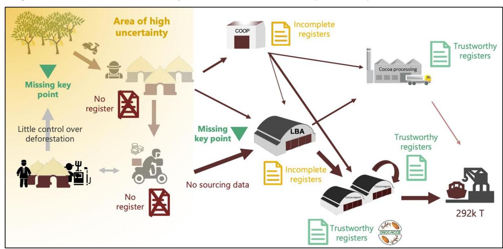
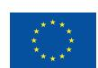

# **Preparedness check of Cameroon for the EU Deforestation Regulation**

Deforestation and forest degradation driven by agricultural expansion are growing at an alarming rate in tropical forest countries. As a major consumer of forest-risk commodities, the European Union (EU) has decided to take action to reduce the impact of its consumption of some of these commodities and products. The EU Deforestation Regulation (EUDR) came into force on 29 June 2023. Its main obligations will apply to all in-scope companies (other than micro-undertakings or small undertakings) from 30 December 2024, and to micro-undertakings or small undertakings from 30 June 2025. The Regulation will allow operators and traders to place on the EU market or exporting from the EU, a number of commodities (cattle, cocoa, coffee, palm oil, rubber, soya and wood) and their derived products, if they are "deforestation-free", have been produced in accordance with the relevant legislation of the country of production, and are covered by a due diligence statement including traceability information.

In parallel to the development of the EUDR, the EU initiated policy dialogues on sustainable cocoa with Côte d'Ivoire, Ghana and Cameroon in 2021. Support to these policy dialogues will continue to facilitate the implementation of the EUDR and support producing countries in addressing sustainability challenges. Structured dialogues will be put in place to support producing countries own strategies and frameworks to ensure sustainable commodity production and trade.

This preparedness check provides an overview of existing policies, tools and data in Cameroon that can support cocoa operators in their EUDR due diligence efforts. It also identifies outstanding challenges for compliance. To do so, this Insight provides a state of play – to be regularly updated – of the cocoa sector in Cameroon with regards to traceability, deforestation and legality and standards.

# **Cocoa Insight** / April 2024

## **1. Traceability requirements**

The EUDR requires that operators collect the following information, accompanied by evidence: the geolocation coordinates of all plots of land where commodities and products were produced (Art. 9 (1.d)),- for plots larger than 4 hectares, GPS polygons are required - (Art. 2(28)), the date or time range of production (Art. 9 (1.d)), and last supplier information (Art. 9 (1.e)).

## **1.1 State of play**

The **Roadmap for deforestation-free cocoa** in Cameroon (signed in January 2021 by various stakeholders, including national institutions) aims for 100% traceability of cocoa supplies from plot to port by the end of 2025. However, stakeholders express concerns about meeting this ambitious target, given the complexities of the value chain and the tight timeline.

In Cameroon, **farmers registration and cocoa plots mapping is undertaken by the cocoa industry**. The cocoa industry, through the Interprofessional Council of Cocoa and Coffee (CICC), is collectively building a database of cocoa farmers. By January 2024, the CICC had geolocated 42,100 plots belonging to 24,950 producers out of an estimated national total of 300,000. Non CICC members can now be registered, although they will not be entitled to receiving CICC professional cards. The CICC will receive support from the Sustainable Cocoa Programme to geolocate 22,000 additional producers and is open to data sharing. However, interventions in the English-speaking South West, which produces 30% of cocoa volumes, are currently on hold due to the ongoing crisis in that region.

In addition to this initiative, the Cocoa and coffee sectors development fund (FODECC) has launched a pilot operation of self-geolocation by farmers. The main objective is not to ensure product traceability but rather to facilitate access to inputs for cocoa and coffee growers based on surface areas. By 30 October 2023, FODDEC had registered 75,447 producers for 90,087 plots.

In Cameroon, **the definition of a national approach to cocoa traceability is still being debated between public and private actors**. Most cocoa traders have their own chain of custody traceability systems in place. Authorities and stakeholders have discussed the division of roles and responsibilities in the context of the multistakeholder dialogues organised in 2023 (Cocoa Talks). They have agreed that the cocoa regulator, the National Coffee and Cocoa Board (ONCC), would provide guidance and oversight on minimum technical requirements of private traceability, while CICC would invest in building the farmers' database, including beyond their members. ONCC would ultimately be managing this database.

## **1.2 Remaining challenges**

**It might still take a few years to reach full coverage of cocoa farmers in Cameroon**. Identification and geolocation (polygons) of cocoa plots by farmers are major tasks, which, according to the CICC, is estimated to cost around EUR 10 million for 500,000 plots.

Furthermore, only five or six sworn surveyors are able to carry out such an operation in Cameroon.

In addition, much remains to be done in terms of traceability upstream of Licensed Buying Agents (LBAs) and cooperatives. From the plot to these actors, transactions are mostly informal and therefore untraced. The sale of cocoa between producers and the first middlemen often circumvents formal rules and regulations. This sale to the first middlemen is known as coxing and concerns around 40% of the production. Many cooperatives are unevenly developed and often lack robust management systems. Formalising coxing and requesting LBAs to provide information on their suppliers have been identified as priorities by cocoa stakeholders, yet no clear plans to implement such objectives have been outlined at this stage.

Diagram of data collection and data reliability in the cocoa sector in Cameroon (Nitidæ, 2022)

Additionally, further consensus needs to be built on the division of responsibilities between public and private actors with regards to the management and access of farmers' data as well as traceability information. Defining a minimum level of data sharing by private traceability systems will be part of the elaboration of the national technical directive for sustainable cocoa, which is scheduled to start in June 2024.

## **2. Deforestation-free criteria**

The EUDR requires that operators collect adequately conclusive and verifiable information that relevant products are deforestation-free (Art. 2(13) and 9 (1.g)). Cocoa produced on lands converted from forests after 31 December 2020 would not be considered deforestation-free and would not conform with EU requirements. Forests are defined according to the Food and Agriculture Organization of the United Nations (FAO) definition (Art. 2(4)).

In this context, useful data and tools might include:

- Forest cover map at the cut-off date (31 December 2020)
- Permanent national forest monitoring system
- Deforestation alerts

## **2.1 State of play**

**There are discrepancies between the FAO forest definition and national approaches to defining forests**. The forest definition under the Forestry Law 94/01 does not set a size, canopy or tree height threshold. However, the Ministry of Forestry and Wildlife (MINFOF) recognises the national REDD+ definition, which includes criteria consistent with the FAO definition, except for tree height, which is not critical. However, agroforests meeting the thresholds of the REDD+ definition are considered forests, which is not aligned with the FAO definition.

Currently, **there is no operational and independent national forest monitoring system**. A number of national initiatives exists but they work separately and are not coordinated. However, there is consensus on the division of roles between the MINFOF and the Ministry of the Environment, Nature Protection and Sustainable Development, as outlined in the national REDD+ framework (2018).

The FAO Deforestation and Degradation Drivers project stands out as the most promising avenue for developing a national sustainable forest (and cocoa) monitoring system, and for providing **2020 national baseline forest cover data, which is currently not available**.

## **2.2 Remaining challenges**

With regards to the deforestation definition, the alignment of the Cameroonian and FAO definitions on biophysical criteria is a positive element, but critical questions remain about agroforestry development and forest restoration. Cocoa produced in new plantations in highly degraded forests may not meet the EUDR criteria, even with increased forest cover. Conversely, the conversion of agroforestry systems into full sun systems poses a risk, although EUDR compliant.

**A forest/non-forest map for 2020**, based on the REDD+ forest definition, is currently being updated with the support of FAO and the Joint Research Centre (JRC), in collaboration with the University of Yaoundé 1. A focal point has been named by the MINFOF to follow this work and this map should be made publicly available in the course of 2024.

While cocoa mapping is not required under the EUDR but could be useful to operators for other purposes. CICC also expressed the need to better assess the weight of cocoa farming in deforestation and forest degradation in Cameroon. CICC has agreed to share part of its database to support future related work by FAO, the JRC and the Botanic Laboratory of the University of Yaoundé, under the supervision of the MINFOF.

## **3. Legality criteria**

The EUDR requires that operators collect adequately conclusive and verifiable information that the relevant commodities were produced in accordance with the "relevant legislation of the country of production" (Art. 9 (1.h)).

Relevant legislation of the country of production is defined as 'the laws applicable in the country of production concerning the legal status of the area of production in terms of: landuse rights; environmental protection; forest-related rules, including forest management and biodiversity conservation, where directly related to wood harvesting; third parties' rights; labour rights; human rights protected under international law; the principle of free, prior and informed consent (FPIC), including as set out in the UN Declaration on the Rights of Indigenous Peoples; and tax, anti-corruption, trade and customs regulations' (Art. 2 (40)).

Consequently, operators who place cocoa or cocoa products on the EU market must ensure they have been produced in accordance with the relevant Cameroonian legal requirements applicable **to the cocoa plot**. It is our understanding that the EUDR legality criteria does not cover stages further down the cocoa supply chain, such as processing and transport.

Further guidance on the assessment of the legality criteria is expected from the European Commission before the entrance into application of the regulation on 30 December 2024. Yet stakeholders can already identify which national requirements concerning the relevant areas of law will be applicable, discuss the information, document and data required to demonstrate legality, as well as potential needs for clarification of the legal framework.

In this context, useful data and tools can include:

- Relevant legal texts
- Relevant list of information, documents and data that can serve to demonstrate legal compliance
- Official and updated boundaries of protected areas

### **3.1 State of play**

Below is an initial overview of the legal requirements relevant to the area of cocoa production as carried out by smallholder farmers in Cameroon. It is not a thorough evaluation of the applicable legal framework or its enforcement. A more in-depth analysis is essential to comprehensively map the relevant legal requirements across all the areas of law outlined in the EUDR and assess their implementation. This mapping would include identifying the relevant international treaties ratified by Cameroon and how they have been transposed into national law. This would enable evaluating the availability of documents, information and data that can demonstrate compliance.

#### **Land-use rights**

- In Cameroon, to grow cocoa, **you need to be able to prove some kind of land-use right**. Land registration, though mandated by law, is predominantly accessible to elites. This is because the process is centrally controlled, lengthy, costly and complex. The law further allows direct registration only to individuals born before 1974, excluding young people from land access. Most cocoa producers lack land titles, and the registration process is impractical for them.
- Unregistered land is left under State control. Any natural or legal person wishing to develop an unoccupied or exploited part of the National Estate, for example to establish a cocoa plantation must apply for it (Art. 4 of Decree of 17 April 1976) if this plantation has been established after 1974. Yet smallholder farmers typically do not pursue land concession applications, which is commonly used by foreign investors.
- In Cameroon, **it is prohibited to grow cocoa in the permanent forest estate** (including forest reserves, logging concessions, protected areas and council forests), unless the forest is declassified through a well regulated process. It is worth adding that declassifying a forest or a protected area entails the obligation to classify a comparable area elsewhere in the country. Boundary maps of the permanent forest estate publicly available on the Forest Atlas.1

#### **Forest conversion**

- Cocoa production in Cameroon is mostly done by smallholders in non-permanent forests, on land that might have been converted from forest in the past. **Conversion of forests in the non-permanent forest estate is allowed but with an authorisation**. In practice smallholders often do not comply with these provisions.

#### **Environmental protection**

- **There is no requirement for environmental impact assessment for smallholder farming.** Since most cocoa production is carried out by smallholders whose land area is smaller than 100 ha, the obligation to carry out an environmental impact assessment would not apply. Nonetheless, an obligation to carry out a strategic environmental and social assessment could apply in case of programmes aimed at encouraging the settlement of smallholders (Decree n° 2013/0171/PM).
- **The use of pesticides and fertilizers is regulated by Law No. 2003/003 of 21 April 2003 on plant protection.** Distributors must be registered in the Ministry of Agriculture and Rural Development (MINADER) database. In practice, however, most pesticide sellers found in local markets do not have any sales authorisation as required by the law nor are they listed in MINADER's database.

#### **Third-party rights**

- **Procedures to ensure effective participation of third parties to decisions affecting forests are not clearly defined.** Law No. 96/12 grants the right to information, especially regarding the environment, and allows public participation. Ordinance No 76/166 of 1976 outlines community involvement in decision making

through the Land Consultative Board, implying that investment activities require full consultation and participation of local communities. Decree 95/531/PM and several subsequent texts, notably Decision No. 1354/D/MINEF/CAB of 26 November 1999 establishing procedures for the classification of forests in the permanent national forest estate, require the participation of local communities in the process of forest classification and management. Concerns have been raised about possible coercion of stakeholder participation and that the process may resemble a procedural requirement without genuine engagement.

#### **Labour rights**

- The Cameroonian Labour Code contains provisions on minimum age, child labour, occupational health and safety and equal remuneration.2 Various national law instruments regulate these aspects. For a discussion of the legal framework regarding child labour, see the section below on human rights.
- Most labour relations among smallholder farmers are likely to be informal. Consequently, it falls upon the operator when exercising due diligence to assess whether this legal aspect poses any risk of non-compliance.

#### **Human rights**

#### **Child labour**

- Cameroon has ratified various international instruments dealing with child labour, including ILO Convention No. 182 on the Worst Forms of Child Labour and the Convention on the rights of the Child. The national legal framework also includes several instruments on this topic. The Cameroonian Labour Code sets the minimum age at 14 years old and Decree n° 17 (27 May 1969) describes hazardous child labour. Furthermore, order n° 062/CAB/PM of 2020 created the national committee on the fight against child labour.
- The Cameroonian Government has also been involved in the International Cocoa Initiative, a multistakeholder initiative that works to address child labour in the cocoa sector.
- As for the private sector, some cocoa companies have implemented corporate sustainability initiatives to address child labour in their supply chains. These often include monitoring and certification programmes to ensure that cocoa is produced without child labour.

#### **Other human rights**

- Cameroon is a party to United Nations Conventions on discrimination against women and racial discrimination. It is also a Party to the International Covenant on Economic, Social and Cultural Rights. The covenant has provisions on minimum wage, health and safety at work, and work hours.

2 Loi n° 92/007 du 14 août 1992 portant Code du Travail

#### **Free Prior and Informed Consent**

- Cameroon is a party to the African Charter on Human and Peoples' Rights, which, although not explicitly mentioning Free, Prior, and Informed Consent (FPIC), recognises crucial rights like self-determination and development, contributing to the principles of FPIC. The Charter also underscores the right to access information, an essential element of FPIC. In addition, Cameroon has a national directive on FPIC, although it applies only to REDD+ projects.
- However, cocoa production in Cameroon is carried out by smallholder farmers that is typically conducted on a small scale, whereas FPIC is more commonly associated with major projects that have significant impacts on communities. FPIC is therefore likely to be irrelevant to smallholders' cocoa production. Nonetheless, cocoa farming in forest areas could impact customary use rights of local communities, thus triggering the application of FPIC principles.

#### **Tax, anti-corruption trade and customs**

- Cocoa exports are subject to several costs, divided between different institutions. These include export royalties paid to the ONCC, the CICC, the FODDEC, the *Société Développement du Cacao* (SODECAO), the *Chambre d'Agriculture, des Pêches, de l'Élevage et des Forêts* (CAPEF), the Southwest Development Authority (SOWEDA) and the customs service.
- Exporters must provide a quality certificate from the ONCC. In addition, they must submit a stamped application to the Ministry of Trade, including a certified copy of the receipt for registration in the Trade Register, a certificate of compliance for "operational equipment" issued by the ONCC and a sworn undertaking to comply with ONCC rules.
- Provisions within the Penal Code address various forms of corruption, bribery and related offences. Cameroon has a National Anti-Corruption Strategy and Action Plan that outlines the government's commitment to fighting corruption. The National Anti-Corruption Commission (CONAC) is an independent body responsible for preventing and combating corruption. It investigates corruption cases and proposes measures to prevent corruption. Additionally, there are laws requiring public officials to declare their assets and liabilities to prevent illicit enrichment.
- The scope of the legality criteria is limited to the area of production. Further guidance from the European Commission is awaited to understand to what extent the legal framework relating to marketing, taxes and customs would apply to the entire value chain.

### **ARS-1000 and the Cameroonian technical directive**

The ARS-1000 was adopted on 15 June 2021 by members of the African Standards Organisation. Cameroon has approved the African standard ARS 1000 series and its translation in Cameroonian standards NC 647 to 649. Cameroon has decided to draw up a technical directive that will harmonise all cocoa production and marketing requirements. The European Union, through the Sustainable Cocoa Programme, is supporting the ONCC in drawing up this directive.

The technical directive can play a role in facilitating operators' due diligence under the EUDR and harmonising their due diligence approaches. However, although certification schemes are a source of information, they are not sufficient to ensure full compliance with the EUDR.

### **3.2 Remaining challenges**

Only a small share of the national cocoa production is produced in the permanent forest estate and is therefore illegal. The CICC has developed an online platform to provide the land tenure status of georeferenced plots and identify polygons located in the permanent forest estate. Based on this information, the CICC wishes to initiate discussions with MINADER/MINFOF to see how these situations can be regularised.

The legal framework related to land-use rights remains unclear and the potential requirement of having to demonstrate tenure or concession titles to be able to grow cocoa might represent a major challenge for EUDR compliance. Given that cocoa plots must be mapped according to cadastral principles, the CICC plans to use these cadastral plans to facilitate the official recognition of customary rights held by landowners/producers in the nonpermanent forest estate.

The table in annex summarises the potential compliance of cocoa based on the type of conversion the land it is produced on has been submitted to.

Cameroon's forestry law (1996) and land laws are currently being revised. It is unclear whether the revised laws will include the concept of zero-deforestation agriculture.. It is also unclear to what extent the revised laws will be able to fill the gaps in the current legal framework and ensure the full participation of all stakeholders in sustainable cocoa supply chains.

Overall, the legality of cocoa in Cameroon is complex and several aspects require in-depth analysis. Cocoa operators could benefit from **guidance on the applicable scope of legality** in the context of Cameroon, and relevant documents, data and information that can be collected to conduct due diligence and demonstrate legality. Such work will be undertaken in 2024 with the support of the EU Sustainable Cocoa Programme.

## **4. Conclusion**

This preparedness check offers an overview of the current policies, tools and data landscape in Cameroon related to traceability, the fight against deforestation, and legality that can support cocoa sector actors in navigating the complexity associated with demonstrating compliance with the due diligence obligations of the EUDR. The operationalisation of a national traceability ecosystem, in which roles, responsibilities, data access and cost sharing are well defined between public and private stakeholders is urgently needed. Cameroon, although still lacking an effective national forest monitoring system, is working towards the

production of a 2020 forest cover map that will be key to support operators' due diligence. Furthermore, the country provides a good example of forest and land-use transparency , thanks to the information available in its forestry atlas. Legal reform to clarify and simplify a number of relevant provisions for cocoa farmers would also facilitate operators' sustainable sourcing. Various actions currently being implemented or prepared with the support of the EU Sustainable Cocoa Programme will help improve the understanding of the issues (particularly in terms of legality) and improve traceability within the supply chain.

## **Annex: EUDR compliance table**

The table below summarises the potential compliance of cocoa with the EUDR based on **the land-use category** and **the type of land cover/use (on 31 December 2020)** of the plot where the cocoa was produced:

| Land use category              | Land cover/use               |   |                   |   |                             |                         |
|--------------------------------|------------------------------|---|-------------------|---|-----------------------------|-------------------------|
|                                |                              |   | Legality criteria | 1 |                             |                         |
|                                |                              |   |                   |   | Zero deforestation criteria | EU market placement     |
| Permanent Forest Estate Forest | 2                            |   |                   |   |                             |                         |
|                                |                              |   | Non-compliant     |   | Non-compliant               | Non-compliant           |
|                                | Agriculture                  |   | Non-compliant     |   | Compliant                   | Non-compliant           |
|                                | Forest 2                     |   |                   |   |                             |                         |
|                                |                              |   | Compliant 3       |   | Non-compliant               | Non-compliant           |
|                                | Agriculture                  |   | Compliant         |   | Compliant                   | Potentially compliant 1 |
| Rural domain                   | Forest 2                     |   | Compliant 4       |   | Non-compliant               | Non-compliant           |
|                                | Agriculture                  |   | Compliant         |   | Compliant                   | Potentially compliant 1 |
|                                | Other, including wooded land | 5 |                   |   |                             |                         |
|                                | grassland 6                  |   |                   |   |                             |                         |
|                                |                              |   | Compliant         |   | Compliant                   | Potentially compliant 1 |

1 Only with regards to land-use rights issues. Compliance also requires that cocoa be produced in accordance with other relevant legislation of Côte d'Ivoire (labour rights, environmental protection, tax and customs…) and that a due diligence statement covering the products be submitted by the operator.

2 In this table, forests are understood as per the FAO definition (land spanning more than 0.5 hectares with trees higher than 5 metres and a canopy cover of more than 10%, or trees able to reach those thresholds in situ)

3 The 2019 Forest code authorises agricultural production in highly degraded (>75%) classified forests under specific management rules (these are categorised as *Agro-forêts*). Nevertheless, cocoa plantations would only be authorized in agroforestry systems. Decree 2019-979 of 27 November 2019 provides (limited) guidance on the management modalities of agroforests and legal uncertainties remain.

4 The agricultural purpose of an *enclave* needs to be formalised into a legal text that specifies its boundaries as well as identifies agricultural plots. The legal recognition of *enclaves* and their boundary limitations are not available in all cases.

5 Other wooded lands are understood as per the FAO definition (land not classified as 'forest' spanning more than 0.5 hectares with trees higher than 5 metres and a canopy cover of 5 to 10%, or trees able to reach these thresholds in situ, or with a combined cover of shrubs, bushes and trees above 10 percent). In Côte d'Ivoire, these are mainly savanah areas. The potential inclusion of other wooded lands will be the subject of an evaluation conducted no longer than 1 year after entry into force of the EUDR

6The potential inclusion of grasslands will be the subject of an impact assessment conducted no longer than 2 years after entry into force of the EUDR

7 Forest conversion in the rural domain is subject to prior authorisation by the forest authority. In practice, this is not implemented.

.

**Disclaimer.** The views and opinions expressed in this Insight are solely those of EFI's Sustainable Cocoa Programme and do not reflect the views of the Sustainable Cocoa Programme of the European Union or its funding organisations. EFI's Sustainable Cocoa Programme bear full responsibility for the content, analysis and recommendations presented herein and welcome any feedback on its content.

The European Forest Institute is one of the implementing partners of the EU Sustainable Cocoa Programme in Côte d'Ivoire, Ghana and Cameroon. We are supporting producer countries in developing robust standards and tools to achieve traceable and deforestation-free cocoa. Information and publication of EFI's Sustainable Cocoa Programme can be found here: <https://efi.int/partnerships/cocoa>

© European Forest Institute, 2024

