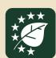

# EUDR Session Report

EUDR session during the 65 Inter-African Coffee Organization Annual General Assembly th

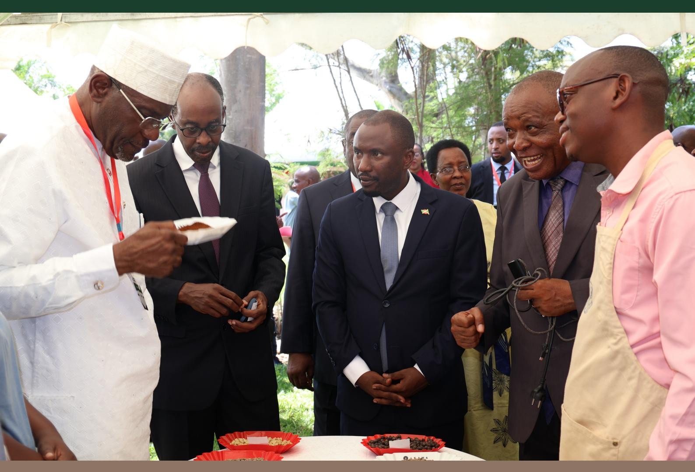

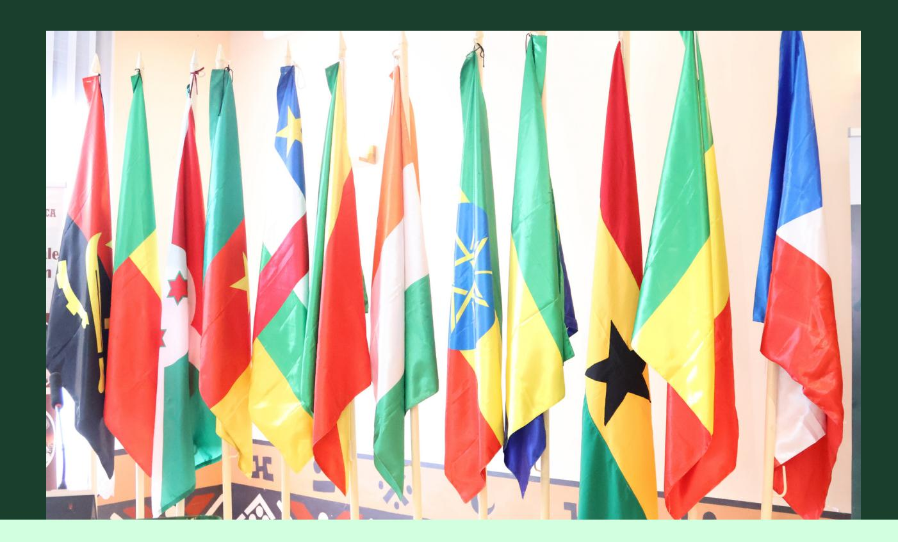

# Table of Contents

|                                            | Page |
|--------------------------------------------|------|
| Chapter 1: Introduction                    | 02   |
| Chapter 2: Presentations on Key Sub-Topics | 06   |
| Chapter 3: Closing Remarks                 | 12   |
| Chapter 4: Appendices                      | 13   |

# CHAPTER 1: INTRODUCTION

## 1.1 Background

This report highlights the activities and outcomes of the EUDR readiness sessions held during the 65th Inter African Coffee Annual General Assembly, which took place from 2nd to 3rd December 2025 in Bujumbura, Burundi. The session was organized by the GIZ SAFE project, following a request from IACO, as a follow-up to the TEI outreach conference held in Kampala in May 2025.

The workshop brought together delegates from IACO member states involved in coffee production, as well as representatives from civil society organizations, farmer groups, the private sector, and development partners from Burundi and other member countries. it provided a platform for stakeholders to exchange knowledge, share experiences, and discuss strategies to ensure compliance with the European Union Deforestation Regulation (EUDR).

**The Inter-African Coffee Organization (IACO)** unites coffee-producing countries across Africa to promote cooperation, policy dialogue, and sustainable development of the coffee sector. **The Annual General Assembly (AGA)** serves as the main forum for member states and partners to review progress, discuss strategic priorities, and strengthen collaboration in advancing Africa's coffee industry.

The 65th Assembly thus provided a timely and critical opportunity to advance EUDR readiness across the continent, ensuring that African coffee producers and stakeholders are well-positioned to meet regulatory requirements while promoting sustainable growth in the sector.

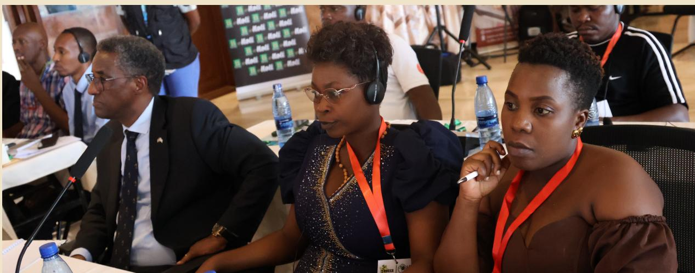

# **1.2 Conference objectives**

Facilitate discussions on EUDR readiness and its implications for African coffee-producing countries. **1.**

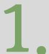

The purpose of the meeting was to leverage the IACO Annual General Assembly as a platform for sharing experiences, knowledge, and progress among African coffeeproducing countries in working towards **EUDR readiness.** This initiative aligns closely with the TEI outreach program under the SAFE project.

The specific objectives of the workshop were to:

Share country experiences, lessons learned, and best practices in achieving EUDR readiness.

Strengthen partnerships and collaboration to advance traceability, data governance, and sustainable coffee production. **3.**

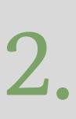

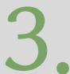

The workshop attracted **150 participants** from various African coffee-producing countries, represented by their respective national delegations.

In addition, a wide range of stakeholders from Burundi participated, including **IACO staff, private sector representatives, development partners such as GIZ SAFE, civil society organizations, and producer associations** like ADISCO and COCOCA (see Appendix 1 for the full list of participants.)

# **1.3 Composition of participants**

## 1.4 Official opening of the workshop

The workshop was officially opened by Hon Hassan Kibeya, Minister for Mineral resources, Energy, Trade Commerce and tourists who on behalf of Government of Burundi warmly welcomed delegates to Bujumbura for the second phase of the 65th Annual General Meeting of the Inter-African Coffee Organization, expressing honor in hosting this important gathering and extending greetings on behalf of President Evariste Ndayishimiye. Highlighting coffee's central role in Burundi's identity, economy, and cultural heritage, the speech emphasized the value of meeting in person to deepen cooperation following the first virtual phase.

The government thanked The Inter-African Coffee organization (IACO) Secretariat and Member States for their professionalism and commitment, noting the significance of discussions on key challenges such as climate resilience, market dynamics, and especially the European Union Deforestation Regulation (EUDR), which requires a united African response. The address concluded by inviting delegates to enjoy Burundi's hospitality and officially opening the second phase of the Assembly (see appendix 1).

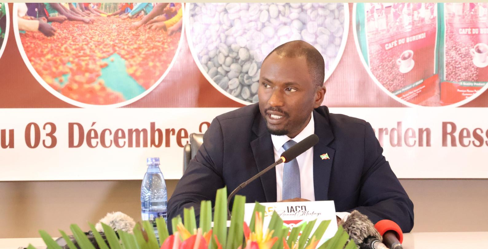

Hon. Hassan Kibeya, Minister for Energy and Mineral Resources Burundi

**This session, moderated by David Sengozi Kyeyune of GIZ, brought together an expert panel comprising Mr. Oscar Uwikunda, Director General of ODECA (Burundi); Dr. Javan Ngeywo, Assistant Director for Regulation & Compliance at the Agriculture and Food Authority–Coffee Directorate (Kenya); Hon. Dan T. Saryee, Director General of the Liberia Agriculture Commodity Regulatory Authority (Liberia); and Mr. Didan Sankoh, Director of the Produce Monitoring Board (Sierra Leone).**

Across the panel, it was evident that all countries are making deliberate efforts to implement activities that move their coffee sectors toward EUDR compliance. African coffee-producing nations are investing heavily in geo-mapping of farms, developing digital traceability systems, and establishing data-governance frameworks. However, legality assessments remain a major gap, and countries require additional support to meet this critical component of the regulation.

# CHAPTER 2: PRESENTATIONS ON KEY SUB-TOPICS

# **2.1 Setting the Scene**

David Kyeyune, Regional Advisor for the GIZ SAFE project, provided an overview of the workshop, emphasizing its purpose as a platform for exchange among African coffee-producing countries on EUDR readiness. He reiterated the importance of sharing knowledge and experiences to support the journey of making African coffee compliant with EUDR requirements.

He also summarized key aspects of the Team Europe Initiatives on deforestation-free value chains, including its structure and flagship projects. In addition, he presented an outline of the SAFE project, highlighting the countries covered under the initiative.

# **2.2 Pannel discussion: EUDR readiness in different African countries**

Most countries have developed national EUDR roadmaps with backing from development partners for example, Burundi is supported by the ITC MARKUP II Programme and the GIZ SAFE Project, while Kenya collaborates closely with EFI.

Kenya has made notable progress through government-led geo-mapping and digital data-collection initiatives led by Agriculture and Food Authority.

The country has built a notational digital traceability system that tracks coffee from the farm through processing to export, and a substantial portion of its coffee acreage has already been mapped.

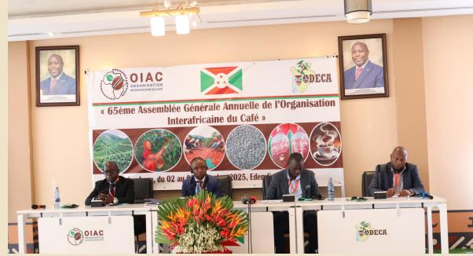

Burundi has also advanced significantly by investing in high-resolution geo-mapping using satellite imagery, field validation, and mobile applications—resulting in a robust geo-database linking farmers to washing stations and traceability workflows.

In contrast, Liberia urgently needs to establish a national traceability system and tighten controls over cross-border coffee flows, which currently poses risks to sector credibility and EUDR compliance.

## 2.3 Outcomes of TEI EUROTRIP and statement on the way forward

This session was led by Gilbert Nsabimaana who was one of the African delegates to Europe. He highlighted the backgrounds of the Eurotrip and shared the Africa's joint statement and way forward made during the visit. The delegates called for an inclusive and coordinated approach to EUDR implementation across Africa.

They propose establishing a continental EUDR Task Force, developing national road maps, and strengthening South-South collaboration. They also emphasize the need for technical and financial support, transparent EU risk classification, and proactive engagement with EU buyers and importers. Continuous monitoring and evaluation of progress is encouraged to ensure effective implementation.

## 2.4 Data governance and management – A case of Uganda

Dr Gerald Kyalo, the commissioner for coffee at Uganda's Ministry of Agriculture animal industry and fisheries presented the case of Uganda in data governance. He said that a 2025 study on Data Warehouse (DWH) governance proposed a national data governance structure that was fully endorsed by government and coffee stakeholders.

The agreed position is that the National Data Warehouse should be managed by the Ministry of Agriculture (MAAIF), serve as the central repository for all farm polygon and traceability data, and function as sector-wide infrastructure benefiting all actors.

It will also provide a secure, agile ecosystem with controlled access for users. He further went ahead and shared the National Data Warehouse (DWH) structure that Uganda has adopted. The Data Warehouse (DWH) operates under strict control mechanisms to ensure security and protect farmer information.

Access to the system is provided exclusively through approved Traceability Application Providers (TAPs), which are thoroughly vetted, tested, and certified by a Traceability Application Committee appointed by the EUDR Task Force.

The system does not share any farmer biodata; instead, it only releases polygon or plot-level information such as farm geolocation, yield, and variety linked through encrypted farm IDs. All personal farmer details remain securely with the Government for planning purposes.

Security is further strengthened through robust application programming interface (APIs) that enforce authentication and authorization while maintaining detailed logs. These APIs are fully traceable, allowing detection of any misuse or attempted data leakage. In addition, the DWH uses a tightly controlled data extraction interface supported by strong audit trails that are continuously monitored by dedicated IT teams to ensure transparency and accountability.

## 2.5 Uniform approach on Legality& uniform protocol for databases

Hannelore Beerlandt, Head of Operations at the International Coffee Organization, delivered the presentation by first providing a detailed explanation of EUDR, including the conditions operators must meet to become compliant and the role of producing countries.

She then focused on the EUDR legality requirements, highlighting key challenges: legal frameworks differ across countries and even regions within countries; informality complicates understanding and implementation of regulations; stakeholders have varying interpretations of legality and risk; documentation is often fragmented, inconsistent, or not digitized; and collecting information for all farmers is costly.

The International Coffee Organization's Coffee Public-Private Task Force (CPPTF) supports members in developing national legality tools, tailored to their needs and addressing EUDR legality requirements. These tools are created through a standardized, multistakeholder process following a methodology by the European Forest Institute, ensuring stakeholder agreement on risks, quality, inclusivity, and government validation.

#### **The tools typically include:**

- • A joint legal mapping of regulations on coffee
- • An assessment of their relevance
- • An initial risk assessment
- • Recommendations for due diligence and risk mitigation

On the topic of geo-reference of plots, a key EUDR requirement, Hannelore emphasized that proving deforestation-free coffee plots requires both precision and scale. Al-enhanced satellite layers combined with ground-truthing are necessary due to tree canopy coverage and the scale of operations. For traceability, coffee plots need to be linked to individual farmers and quality metrics. Harmonizing datasets and avoiding overlap of georeferenced are critical for effective implementation. This is why the ICO CPPTF supports National Databases of Unique Geo-references of Coffee Plots, according to guidelines on format and protocol for accuracy checks, currently being scoped (see annex).

## **2.6 Case study: EUDR readiness through traceability and remapping in Burundi (ADISCO)**

**The intervention of projects** presented by Fidèle Niyonizigiye, Deputy Secretary General and Director of Programs at ADISCO, illustrates a large-scale, operational response to the European Union Deforestation Regulation (EUDR) in the Burundian coffee sector. **Implemented in partnership between ADISCO, Broederjik Delen, ODECA, ITC, GIZ**, and with support from the European Union, the initiative aims to ensure full traceability of coffee exports down to the farm plot and to demonstrate the absence of deforestation after 31 December 2020. Given the fragmented structure of the Burundian coffee sector-affecting an estimated 800,000 farming households-the project was conceived as a national pilot that could serve both regulatory compliance and broader sector governance objectives.

Operationally, the project targeted two northern provinces and mobilized more than 150 field agents, trained through a cascading training model and supported by ADISCO supervisors. Over a six-week field campaign, approximately 55,000 coffee farmers were registered and close to 150,000 farm parcels were mapped using GPS polygons.

Data collection combined structured socio-economic and traceability questionnaires with precise geospatial mapping of plots, including surface area and production characteristics. Mobile data collection was conducted using KoboCollect (in Kirundi and French, with offline functionality) and also FAO's Open Foris Ground.

Beyond data collection, the project established a full end-to-end digital workflow for EUDR compliance. Data exported from Kobo and Ground were cleaned, deduplicated, and structured using the suite of tools developed by GeoRoots, to correct overlaps, eliminate duplicates, and ensure data quality. Farm polygons were then cross-referenced with satellite imagery and analyzed using FAO's WHISP to assess deforestation risk at plot level. The resulting datasets and risk analyses were made available through the ITC Deforestation-Free Trade Gateway (DFTG), providing secure access to ODECA, cooperatives, exporters, SMEs, and buyers. This enabled the generation of EUDR ready data while respecting data confidentiality and creating a functional bridge between public institutions and private sector actors.

### **Challenges encountered**

One of the primary challenges faced by the project relates to scale and operational complexity. Managing georeferenced data and traceability information for tens of thousands of producers and up to 150,000 plots across multiple provinces required significant logistical coordination, robust supervision mechanisms, and strong institutional governance. The need to align multiple actors-field agents, cooperatives, national authorities, and international partners-placed high demands on planning, quality control, and decision-making structures, particularly given the time-bound nature of EUDR requirements.

A second major challenge concerns technical capacity and operating conditions in rural areas. Ensuring consistent data quality required continuous training, close supervision, and post-collection data cleaning, as errors in GPS capture, overlaps, or farmer identification can undermine compliance assessments. Connectivity constraints in remote zones limited real-time data uploads, increasing reliance on offline workflows and delayed synchronization. While the use of open-source tools significantly reduced software costs, sustaining the system still requires ongoing resources for field agent remuneration, device maintenance, technical support, and institutional capacity building to ensure long-term ownership by national stakeholders such as ODECA.

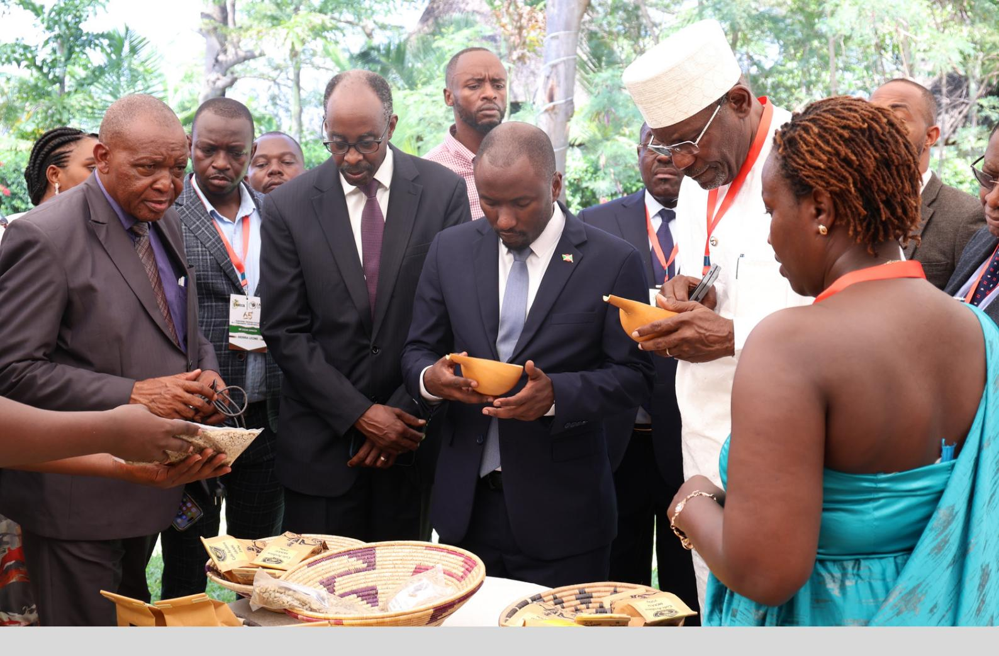

# Challenges faced by the coffee sector include:

**Scale and complexity:** Managing data and traceability for over half a million farmers across multiple provinces is logistically demanding. **Technical capacity:** Ensuring consistent and accurate georeferencing and data entry requires continuous training and supervision of field agents. **Connectivity issues:** Mobile data collection in remote areas can be hindered by poor internet coverage, affecting real-time data upload. **Farmer engagement:** Sustaining active participation and understanding of EUDR compliance requirements among smallholder farmers remains challenging. **Resource constraints:** While the solution is largely open-source, ongoing operational costs, device maintenance, and support for field agents require sustained funding.

# **2.6 EUDR learning community**

David Kyeyune of GIZ introduced the EUDR Learning Community, a regional coffee dialogue platform for Africa. Under the SAFE project, this learning community will bring together coffee actors across the continent to share knowledge and experiences aimed at helping the African coffee sector meet EUDR requirements.

The main objective is to create a dynamic space where stakeholders along the coffee supply chain can connect, exchange insights, foster collaboration, and learn from competent authorities, experts, and peers to support compliance with the EUDR regulation.

The initiative will be implemented in partnership with the Committee on Sustainability Assessment (COSA), the African Fine Coffees Association (AFCA), the Global Coffee Platform (GCP), the Kenya Coffee Platform, and the Uganda Coffee Platform, with implementation expected to begin early next year. It will engage not only countries under the SAFE project but also other member countries of IACO and ACRAM.

He encouraged participants to support the initiative by actively engaging in the learning forums and sharing lessons from their respective countries as they implement activities related to EUDR compliance.

The EU Head of Cooperation at the EUDR readiness session addressed government ministers, ambassadors, and private sector representatives about preparing African coffee value chains, particularly Burundi's, for the EU Deforestation Regulation (EUDR).

The EU remains one of the world's largest coffee markets, importing approximately 2.7 million tons valued at over 10 billion euros in 2023. For African producers like Burundi, coffee is a lifeline for millions of farming households and a pillar of national economies.

The EU has invested in programs across Africa to strengthen sustainability, productivity, and EUDR readiness through the Team Europe Initiative on deforestation-free value chains. Key programs include SAFE, supporting 19,000 households in Burundi; EU-DFTG, a regional initiative helping East African countries; and the Sustainable Coffee Initiative under the Global Gateway strategy (See appendix 1).

# **2.7 Remarks by Ana Maria Valdes, European Union Delegation in Burundi**

# Chapter 3: Closing remarks

The workshop was closed by the secretary general of the Inter-African Coffee Organization Ambassador Solomon Rutega.

He expressed his gratitude to the Ministry of Mineral Resources, Energy, Industry, Trade, and Tourism of Burundi, and to ODECA, for hosting the second phase of the 65th IACO Annual General Assembly in Bujumbura.

This marks the first time in 63 years that Burundi has hosted the Assembly, highlighting the country's commitment to advancing the Organisation's agenda and supporting African coffee development.

The address emphasizes the ongoing challenges facing the African coffee sector, including low productivity, limited financing, climate change, inadequate value addition infrastructure, and complex regulations.

IACO reaffirms its commitment to building an inclusive, resilient, and sustainable coffee industry through a multistakeholder approach that seeks practical solutions across the supply chain.

A key focus of the Assembly is the European Union Deforestation Regulation (EUDR). Delegates will discuss its implications for African coffee producers and exporters, aiming to identify strategies that ensure compliance, safeguard market access, and strengthen sustainability practices.

The speech also calls on member states, including coffee-consuming nations, to participate actively, thereby enhancing continental integration under the AfCFTA and expanding market opportunities.

In conclusion, the speaker urges delegates to engage in constructive, forwardlooking dialogue to address sector challenges and promote value addition, benefiting farmers, exporters, and consumers alike.

Gratitude is expressed once more to the hosts and partners, with a call for strengthened cooperation to position African coffee as a key contributor to both continental development and global trade.

# CHAPTER 4: APPENDICES

Appendix 1: Conference Program Appendix 2: Remarks by the Secretary General for IACO Appendix 3: Official Remarks from the Hon Minister Dr. Hassan Kibeya Appendix 4: Speech from the European Union Delegation Appendix 5: [ICO CPPTF - EUDR Joint Actions](https://zerodeforestationhub.eu/wp-content/uploads/2026/02/ICO-CPPTF-EUDR-Joint-Actions-x-IACO-GA-2-DEC-2025.pptx) Appendix 6: [Data Governance & Management - A Case of Uganda](https://zerodeforestationhub.eu/wp-content/uploads/2026/02/Data-Governance-Presentation-to-IACO-Burundi_GK.pptx) Appendix 7: [IACO - Workshop at Burundi - Collection of Geolocated Data for](https://zerodeforestationhub.eu/wp-content/uploads/2026/02/English-version-IACO-ITCGIZ-ADISCO-Burundi2.pdf) [Sustainable Coffee \('zero deforestation'\)](https://zerodeforestationhub.eu/wp-content/uploads/2026/02/English-version-IACO-ITCGIZ-ADISCO-Burundi2.pdf)

# **Appendix 1: Conference Program**

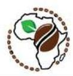

## SECOND PHASE OF THE 65TH IACO ANNUAL MEETINGS

| OPENING CEREMONY        |                                                                                  |                                                                                                                                                                                                                                     |                                                                                                                                                                                                                                                                                                                                                                                                                                                |
|-------------------------|----------------------------------------------------------------------------------|-------------------------------------------------------------------------------------------------------------------------------------------------------------------------------------------------------------------------------------|------------------------------------------------------------------------------------------------------------------------------------------------------------------------------------------------------------------------------------------------------------------------------------------------------------------------------------------------------------------------------------------------------------------------------------------------|
| SYMPOSIUM: EUDR SESSION |                                                                                  |                                                                                                                                                                                                                                     |                                                                                                                                                                                                                                                                                                                                                                                                                                                |
| TIME                    | Meeting                                                                          | Open to                                                                                                                                                                                                                             | Agenda                                                                                                                                                                                                                                                                                                                                                                                                                                         |
| 08:00 - 09 :00          | <i>Registration</i>                                                              |                                                                                                                                                                                                                                     |                                                                                                                                                                                                                                                                                                                                                                                                                                                |
| 09:00 - 11:00           | <b>Opening ceremony of the 65th IACO Annual Meetings</b>              | Representatives of the Burundi government, executives of IACO Member States, and associate members of ACRN, Members of the Diplomatic Corps, observers, members of ACRAM and AFCA, participants from the private and public sector. | Master of Ceremony: TBD  <b>Welcome Address by:</b> <ul><li>Mr. Oscar Uwikunda, Director General, Office Pour le Développement du Café (ODECA)</li></ul> <b>Remarks by:</b> <ul><li>Ambassador Solomon RUTEGA, Secretary General, IACO</li></ul> <b>Keynote Speech by</b> <ul><li>Honourable Minister of Mineral Resources, Energy, Industry, Trade and Tourism of the Republic of Burundi</li></ul>  <b>Family photo</b> |
| 11:00 – 11:30           | <b>Visit to the Exhibition stands Coffee Tasting and Coffee Break</b>        |                                                                                                                                                                                                                                     |                                                                                                                                                                                                                                                                                                                                                                                                                                                |
| TIME                    | Master of Ceremony: TBD                                                          | SESSIONS                                                                                                                                                                                                                            | AGENDA                                                                                                                                                                                                                                                                                                                                                                                                                                         |
| 11.30-11.35             | <b>Symposium: EUDR Session</b>                                               | Brief welcome remarks from EUD                                                                                                                                                                                                      | <ul><li>EU Delegation Burundi</li></ul>                                                                                                                                                                                                                                                                                                                                                                                                        |
| 11.35-11.45             |                                                                                  | Setting the Scene                                                                                                                                                                                                                   | <ul><li>Representatives from GIZ/ITC</li></ul>                                                                                                                                                                                                                                                                                                                                                                                                 |
| 11:45-12.45             | Representatives of the Burundi government, executives of IACO Member States, and | <b>Panel discussion:</b> EUDR readiness in different African countries                                                                                                                                                           | <b>Moderator:</b> <ul><li>Mr David Kyeyune, Regional Advisor Africa, GIZ</li></ul> <b>Panelists:</b> <ul><li>Mr. Oscar Uwikunda, Director General, ODECA, Burundi;</li><li>Dr. Javan Ngeywo, Assistant Director: Regulation &amp;</li></ul>                                                                                                                                                                                              |

# **Appendix 1: Conference Program**

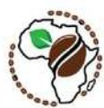

|             | associate members of ACRN, Members of the Diplomatic Corps, observers, members of ACRAM and AFCA, participants from the private and public sector                                                                                                                      |                                                                                                                                                                             | Compliance, Agriculture and Food Authority - Coffee Directorate, Kenya; <ul> <li>▪ <b>Hon Dan T Saryee</b>, Director General, Liberia Agriculture Commodity Regulatory Authority (LACRA) Liberia,</li> <li>▪ <b>Mr Didan Sankoh</b>, Director, Produce Monitoring Board, Sierra Leone;</li> <li>▪ Other heads of delegation and representatives from IACO Member Countries</li> </ul> |
|-------------|------------------------------------------------------------------------------------------------------------------------------------------------------------------------------------------------------------------------------------------------------------------------|-----------------------------------------------------------------------------------------------------------------------------------------------------------------------------|------------------------------------------------------------------------------------------------------------------------------------------------------------------------------------------------------------------------------------------------------------------------------------------------------------------------------------------------------------------------------------------|
| 12.45-13.00 | Outcomes of TEI EUROTRIP and statement on the way forward                                                                                                                                                                                                              | <ul> <li>▪ <b>Mr Gilbert Nsabimaana</b>- Eurotrip Burundi Delegate</li> </ul>                                                                                               |                                                                                                                                                                                                                                                                                                                                                                                          |
| 13.00-14.00 | <b>LUNCH</b>                                                                                                                                                                                                                                                           |                                                                                                                                                                             |                                                                                                                                                                                                                                                                                                                                                                                          |
| 14.00-14.45 | <b>Panel Session on EUDR</b>  Representatives of the Burundi government, executives of IACO Member States, and associate members of ACRN, Members of the Diplomatic Corps, observers, members of ACRAM and AFCA, participants from the private and public sector | Case studies on good practices for EUDR readiness (traceability and remapping) (ITC)                                                                                        | <ul> <li>▪ Deputy Secretary General and Director of Programs (ADISCO) in collaboration with Gregory from ITC</li> </ul>                                                                                                                                                                                                                                                                  |
| 14:45-15.00 | EUDR learning community and peer exchange                                                                                                                                                                                                                              | <ul> <li>▪ <b>Mr David Kyeyune</b>, Regional Advisor Africa, GIZ</li> </ul>                                                                                                 |                                                                                                                                                                                                                                                                                                                                                                                          |
| 15.00-15:45 | Data governance and management – A case of Uganda                                                                                                                                                                                                                      | <ul> <li>▪ <b>Dr. Gerald KYALO</b>, Commissioner for Coffee Production and Development, Ministry of Agriculture, Animal Industry and Fisheries (MAAIF) - virtual</li> </ul> |                                                                                                                                                                                                                                                                                                                                                                                          |
| 15:45-16.30 | uniform approach on legality& uniform protocol for databases                                                                                                                                                                                                           | <ul> <li>▪ Presentation by ICO Representative - virtual</li> </ul>                                                                                                          |                                                                                                                                                                                                                                                                                                                                                                                          |
| 16.30-16:45 | Closing remarks                                                                                                                                                                                                                                                        | <ul> <li>▪ <b>Ambassador Solomon RUTEGA</b>, Secretary General, IACO</li> </ul>                                                                                             |                                                                                                                                                                                                                                                                                                                                                                                          |
| 18.30-20.00 | <b>Welcome Cocktail</b>                                                                                                                                                                                                                                                |                                                                                                                                                                             |                                                                                                                                                                                                                                                                                                                                                                                          |

**Opening remarks by:**

**The Secretary General of the Inter-African Coffee Organisation, AU Specialized Agency for Coffee, (IACO-AU) 65th Annual General Assembly – Phase II Bujumbura, 2–3 December 2025**

**=====**

**Excellence,**

**Honourable Ministry of Mineral Resources, Energy, Industry, Trade, and**

**Tourism of Burundi, Chairman of IACO-AU;**

**The Director General the Office for the Development of Coffee in Burundi (ODECA),**

**Distinguished Delegates,**

**Distinguished Partners in the Coffee Sector,**

**Ladies and Gentlemen,**

It is with great honor that I address you today at the second phase of the 65th Annual General Assembly of the Inter-African Coffee Organisation, AU Specialized Agency for Coffee (IACO-AU), following the productive discussions held during the Technical Committees meeting, convened virtually from 18th to 19th November 2025.

Allow me first to extend my profound gratitude to the Ministry of Mineral

Resources, Energy, Industry, Trade, and Tourism of Burundi*,* under whose chairmanship this important phase of the Assembly is being conducted, and to the Office for the Development of Coffee in Burundi (ODECA), for their exemplary coordination and logistical support in hosting this gathering here in Bujumbura. This is the first time in 63 years as a member that Burundi is hosting the IACO Annual General Assembly and I wish to congratulate the Government of Burundi on this milestone. Your dedication ensures that the agenda of our Organisation continues to advance seamlessly.

### **Distinguished Delegates**, **Ladies and Gentlemen,**

As we commence this session of IACO's General Assembly, I wish to highlight the critical importance of the discussions that lie ahead in line with our vision which is the transformation of the African coffee sector through value addition at all levels of the supply chain.

## Appendix 2: Speech of the Secretary General IACO

The African coffee industry is still faced with a myriad of challenges such as low productivity, lack of financing, climate change inadequate value addition infrastructure and complex regulations just to name a few. IACO remains committed to an inclusive resilient and sustainable coffee sector and will continue to support a multistakeholder approach in exploring solutions for the African coffee sector.

As part of these efforts, a key topic today will be the implementation and implications of the **European Union Deforestation Regulation (EUDR)** for African coffee producers and exporters. The discussions will aim not only to understand the regulatory landscape but also to identify strategies through which our members can comply effectively, safeguard market access, and enhance the sustainability of African coffee.

Furthermore, I take this opportunity to reiterate a call to all Member States. The IACO-AU is not only a platform for coffee-producing nations but also an inclusive Organisation open to African coffee-consuming countries. By inviting participation from these states, we strengthen our collective voice, expand market opportunities for African coffee, and promote continental integration under the AFCFTA and in line with the vision of the African Union. I therefore urge all our members that have not deposited their instruments of ratification to do so expeditiously.

### **Distinguished Delegates, Ladies and Gentlemen,**

As we embark on this long journey of transformation through value addition, Let this Assembly serve as a united platform for frank, constructive, and forward-looking dialogue. Let us work together to address the challenges facing African coffee, from production and processing to trade and sustainability, and to identify practical solutions that benefit all stakeholders – farmers, exporters, and consumers alike.

In conclusion, I express my gratitude once again to our hosts, to all delegates, and to our partners who continue to support IACO-AU's mission. This organization belongs to all of us and nobody will build it except us. I look forward to productive deliberations, robust recommendations, and strengthened cooperation that will continue to position African coffee as a key contributor to continental development and global trade.

**Thank you.**

## **Appendix 3: Official Remarks from the Hon Minister Dr. Hassan Kibeya**

**65e Assemblée Générale Annuelle de l'Organisation Interafricaine du Café, Agence Spécialisée de l'Union Africaine pour le Café (OIAC-UA)**

### **PROJET DE DISCOURS D'OUVERTURE**

**Excellence Monsieur le Premier Ministre,  
Monsieur le Secrétaire Général de l'OIAC,  
Mesdames, Messieurs Représentants des Etats Membres de l'OIAC ;  
Mesdames, Messieurs Membres du Gouvernement du Burundi ;  
Monsieur le Directeur General de l'ODECA,  
Distingués Délégués, en vos rangs, grades et qualités,  
Mesdames et Messieurs les Membres du Corps Diplomatique,  
Honorables Parlementaires  
Distingués Invités  
Mesdames et Messieurs,  
Tout Protocole observé**

Permettez-moi de prime à bord, de rendre grâce à Dieu Tout-Puissant qui nous a permis de nous retrouver-ici pour partager ces bons moments dans la joie, la paix et la tranquillité dans cette belle ville de Bujumbura, Capitale Economique de notre beau Pays le Burundi.

Excellences distingués délégués,  
Mesdames et Messieurs,  
C'est avec un grand plaisir, un grand honneur et une profonde satisfaction que la République du Burundi vous souhaite la bienvenue à Bujumbura, pour la tenue de la deuxième phase de la 65e Assemblée Générale Annuelle de l'Organisation Interafricaine du Café, Agence Spécialisée de l'Union Africaine pour le Café (OIAC-UA).

Permettez-moi aussi, au nom de Son Excellence Monsieur Evariste Ndayishimiye, Président de la République, Chef de l'Etat, de son Gouvernement et du peuple burundais, de vous transmettre nos salutations les plus chaleureuses. Le Burundi est fier d'accueillir ici tous les délégués, partenaires et observateurs dans sa capitale économique, ville réputée pour l'hospitalité de ses habitants, la beauté de ses paysages autour du Lac Tanganyika et la richesse de ses traditions, ancrées dans la communauté, l'agriculture et l'unité culturelle.

Le café occupe une place particulière dans l'identité nationale burundaise et constitue une source de revenus significative pour nos vaillants producteurs. Cultivé dans les hauts plateaux, soigneusement entretenu par nos agriculteurs et reconnu pour sa qualité exceptionnelle sur la scène internationale, le café est à la fois un symbole et un moteur de développement pour notre pays.

### **Distingués Délégués, Mesdames et Messieurs,**

Cette 65e Assemblée Générale Annuelle qui a été organisée en deux phases, dont la première, de manière virtuelle, a permis aux Etats Membres de participer à des discussions techniques essentielles. Aujourd'hui, nous avons le plaisir de nous retrouver en présentiel pour la deuxième phase, ici à Bujumbura, afin d'approfondir nos échanges, de renforcer notre coopération et de définir collectivement l'orientation future de notre Organisation. Nous remercions tous les délégués ici présents pour leur participation active et leur engagement tout au long de ces deux phases.

## **Appendix 3: Official Remarks from the Hon Minister Dr. Hassan Kibeya**

Au nom du Gouvernement du Burundi, je voudrais exprimer notre sincère gratitude au Secrétariat de l'OIAC pour le professionnalisme et le dévouement dont il a fait preuve dans la préparation de ces travaux. Leur engagement constant a permis d'assurer la continuité des activités, de renforcer nos partenariats et de soutenir nos Etats Membres face aux défis émergents, qu'il s'agisse de la résilience climatique, de la dynamique des marchés mondiaux ou des évolutions réglementaires.

Je tiens également à saluer l'implication active de tous les Etats Membres. Vos contributions collectives continuent d'enrichir la mission de l'OIAC et de renforcer l'esprit de solidarité et de coopération qui caractérise notre Organisation.

### **Distingués Délégués, Mesdames et Messieurs,**

Les discussions qui se tiendront au cours de cette deuxième phase de l'Assemblée Générale Annuelle de l'Organisation Interafricaine du Café revêtent une importance capitale pour l'avenir du café africain.

Cette plateforme constitue une opportunité de faire le point sur nos progrès, d'explorer des approches innovantes et de renforcer les politiques permettant à nos agriculteurs, acteurs des filières et économies de prospérer. Parmi les sujets prioritaires figure le Règlement Européen sur la Déforestation (EUDR), enjeu majeur pour nos Etats Membres. Les échanges qui seront portées à ce sujet crucial, directement après cette cérémonie d'ouverture, nécessitent une approche unie, claire et déterminée afin de préserver la compétitivité du café africain tout en protégeant les moyens de subsistance de nos producteurs.

Je ne saurais conclure mon allocution sans vous réitérer encore une fois mes sincères remerciements et vous souhaiter un séjour utile et agréable dans notre bon Pays le Burundi tout en vous invitant à contempler la beauté de notre Pays et gouter aux saveurs et aux valeurs de la culture Burundaise.

C'est sur ces mots que, je déclare ouverte la deuxième phase de la 65e Assemblée Générale Annuelle de l'Organisation Interafricaine du Café, Agence Spécialisée de l'Union Africaine pour le Café.

Je vous remercie.

### **Appendix 4: Speech from the European Union Delegation**

EUROPEAN UNION

DELEGATION TO THE REPUBLIC OF Burundi

**Intervention by .......................**

**Head of Cooperation EU**

**At the "EUDR readiness Session during the IACO Annual General Assembly**

**December 02, 2025**

**Eden Graden Hotel, Bujumbura**

Monsieur le ministre des Ressources Minières, Energétiques, de l'Industrie, du Commerce et du Tourisme,

Madame la ministre de l'Environnement, de l'Agriculture et de l'Elevage,

Mesdames Messieurs les Représentants des autres ministères, départements et agences gouvernementales de tous les pays d'Europe et d'Afrique, Monsieur le Secrétaire Général de L'Organisation Interafricaine du Café (OIAC),

S.E. l'Ambassadeur du Royaume des Pays-Bas,

S.E. l'Ambassadeur de la République Fédérale d'Allemagne,

Mesdames, Messieurs les Représentants du secteur privé en Afrique, Mesdames, Messieurs les Représentants de la société civile,

Mesdames et Messieurs,

Tous protocoles observés

# Appendix 4: Speech from the European Union Delegation

C'est un plaisir pour la Délégation de l'Union Européenne de se joindre à vous ici à Bujumbura pour cette session importante sur la préparation des chaînes de valeur du café africain — et du Burundi en particulier — à la Réglementation de l'Union Européenne sur la Déforestation, la RDUE.

Permettez-moi de commencer par exprimer ma sincère gratitude aux organisateurs de cette session, à savoir l'ODECA, l'Organisation Interafricaine du Café (OIAC), la GIZ, et le Centre du Commerce International (ITC). Votre collaboration et votre leadership dans la convocation de cette discussion ne pourraient pas être plus opportuns. Je souhaite également reconnaître l'engagement continu de l'OIAC à défendre les intérêts des pays producteurs de café africains et à mobiliser une action collective sur les questions qui affectent le secteur.

Comme beaucoup d'entre vous le savent, l'Union Européenne reste l'un des plus grands marchés de café au monde. En 2023, l'UE a importé environ 2,7 millions de tonnes de café, évaluées à plus de 10 milliards d'euros. Pour les pays producteurs africains — y compris le Burundi — le café n'est pas seulement une marchandise ; c'est une bouée de sauvetage pour des millions de ménages agricoles et un pilier des économies nationales. Assurer que le café africain continue d'accéder à ce marché est donc d'une importance stratégique.

Au cours des dernières années, l'Union Européenne a investi dans des programmes à travers l'Afrique visant à renforcer la durabilité, la productivité, la qualité, et de plus en plus, la préparation à la RDUE. L'Initiative Team Europe sur les chaînes de valeur sans déforestation est un effort conjoint de l'UE et de ses États membres conçu pour soutenir les ambitions mondiales de découpler la production agricole de la déforestation en partenariat avec divers acteurs en Afrique. Cette initiative a été lancée il y a deux ans par l'UE, l'Allemagne, les Pays-Bas et la France, les autres pays membres ayant adhéré après.

Cette initiative est au cœur du cadre stratégique d'engagement avec les pays partenaires, établi par l'article 30 de la RDUE, en soutenant les gouvernements partenaires dans la création de conditions cadres favorables à l'action des entreprises pour minimiser la déforestation. Le Programme Sustainable Agriculture for Forest Ecosystems (SAFE) mis en œuvre par la GIZ soutient les pays producteurs des produits agricoles clés dans la lutte contre la déforestation, la conformité aux exigences RDUE, et la promotion des bonnes pratiques agricoles au profit de 19.000.00 ménages pour le Burundi.

Le Programme EU-DFTG (Deforestation-Free Trade Gateway) est une initiative régionale phare mise en œuvre par l'ITC et ses partenaires, soutenant les pays d'Afrique de l'Est — y compris le Burundi — dans l'amélioration de la qualité, la modernisation des processus, le renforcement des PME.

Sous la stratégie Global Gateway de l'UE, l'Initiative Café Durable soutient les secteurs du café dans plusieurs pays africains pour passer à des chaînes de valeur plus résilientes, intelligentes sur le plan climatique et transparentes, y compris le soutien à la conformité à la RDUE. Au Burundi, l'assistance de l'UE s'est concentrée sur l'amélioration de la qualité et des processus en pilotant la traçabilité et la tenue de registres au niveau des exploitations avec les coopératives, le renforcement des organisations de producteurs, et le soutien à la sensibilisation aux exigences de la RDUE.

# Appendix 4: Speech from the European Union Delegation

L'OIAC a été instrumentale dans la coordination du dialogue à l'échelle africaine sur la RDUE, facilitant les échanges techniques entre les États membres, mobilisant des partenariats avec des programmes financés par l'UE. Le Burundi a fait des progrès significatifs, y compris le pilotage des systèmes de géolocalisation et de traçabilité, le renforcement des coopératives, et l'augmentation de la sensibilisation. Cependant, des défis subsistent, tels que la fragmentation des petits exploitants, le financement limité pour l'agriculture durable et l'agroforesterie, les lacunes dans les données sur l'utilisation des terres et les forêts, et les contraintes de capacité parmi les PME.

Pour renforcer la préparation, quatre priorités se dégagent : accélérer la transformation numérique, améliorer les systèmes de traçabilité, renforcer les capacités des petits exploitants, et favoriser les partenariats pour une production de café durable. En abordant ces priorités, nous pouvons garantir que le café africain continue de prospérer sur le marché européen, bénéficiant à des millions de ménages agricoles et contribuant à la stabilité économique des pays producteurs de café.

Je vous remercie.

### **Published by:**

Deutsche Gesellschaft für Internationale Zusammenarbeit (GIZ) GmbH

### **Registered offices:**

Bonn and Eschborn, Germany Address Friedrich-Ebert-Allee 32 + 36 53113 Bonn, Germany +49 61 96 79-0 info@GIZ.de

### **Programme:**

Sustainable Agriculture for Forest Ecosystems (SAFE)

Secretariat of the Team Europe Initiative on Deforestation-Free Value Chains (TEI)

[www.deforestationhub.eu](https://www.deforestationhub.eu/)

### **Responsible:**

Dr. Elke Sümnick-Matthaei

elke.matthaei@giz.de

### **Photo credits:**

David Sengozi Kyeyune, GIZ

### **On behalf of:**

European Union, the German Federal Ministry for Economic Cooperation and Development - BMZ, and the Dutch Ministry of Foreign Affairs -MINBUZA

### **Year:**

November 2025

*This publication was produced with the financial support of the European Union, the German Federal Ministry for Economic Cooperation and Development (BMZ), and the Dutch Ministry of Foreign Affairs (MINBUZA). Its content is a documentation of the spoken and written statements from participants at the TEI outreach event Altamira Summit. All interpretation of the content is the sole responsibility of GIZ and does not necessarily reflect the views of the EU, the German or the Dutch Government.*

# About this Presentation