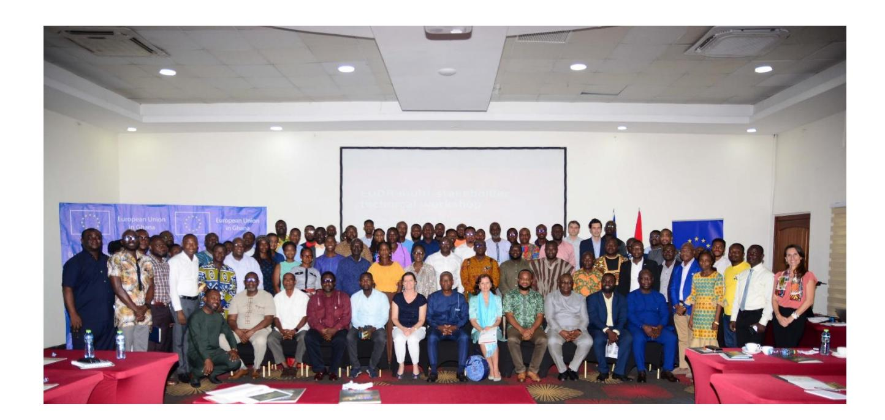
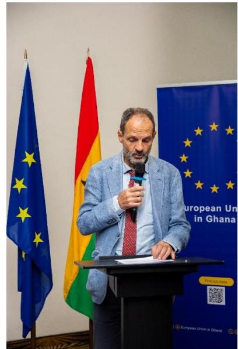
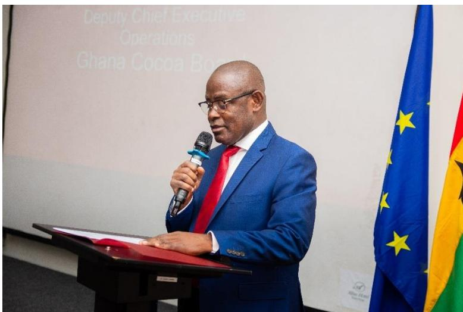
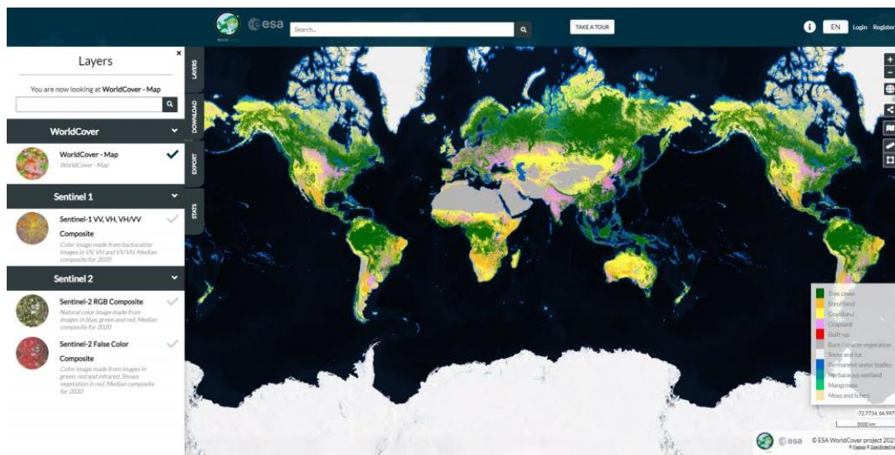

# **Technical Workshop Report How are Ghana and the EU preparing for EUDR implementation in the cocoa sector?**

**Alisa Hotel North Ridge 30th May 2024**

### **Table of Contents**

| 1.0. | Introduction                                               | 3  |
|------|------------------------------------------------------------|----|
| 2.0. | Workshop Opening                                           | 4  |
| 2.1. | Welcoming remarks from the EU Delegation in Ghana          | 4  |
| 2.2. | Welcoming remarks from Forestry Commission                 | 6  |
| 3.0. | Inputs and presentations to participants                   | 6  |
| 3.1. | Updates on the EU Regulation on Deforestation              | 6  |
| 3.2. | EU Observatory on Deforestation and Forest Degradation     | 7  |
| 3.3. | Updates on preparations of the Dutch Competent Authorities | 8  |
| 3.4. | Ghana’s Progress in Preparing for EUDR                     | 8  |
| 3.7. | Questions, Responses and Plenary Discussion                | 10 |
| 4.0. | Conclusion and Next Steps                                  | 15 |
| 4.1. | Remarks from the Ghana Civil Society Cocoa Platform        | 15 |
| 4.2. | Remarks from the Farmer Cooperatives                       | 15 |
| 4.3. | Closing Remarks                                            | 15 |
|      | ANNEX 1 – Workshop agenda                                  | 16 |

Disclaimer: This is a summary report of the workshop prepared by the European Forest Institute and Joshua Ahiaba (event moderator). The contents are the sole responsibility of the authors and do not necessarily reflect the views of the European Union. Questions or comments related to this summary report or the workshop should be directed to Fabienne Yver at [Fabienne.yver@efi.int.](mailto:Fabienne.yver@efi.int)

## **1.0. Introduction**

The Delegation of the European Union (EU) to Ghana hosted a half-day workshop entitled *How are Ghana and the EU preparing for EUDR implementation in the cocoa sector?*. The event was held on 30 May 2024 at the Alisa Hotel in Accra, and 99 participants attended the workshop. The event was moderated by Mr. Joshua Ahiaba and organized by the European Forest Institute (EFI).

This technical workshop aimed to clarify what the EU Deforestation Regulation requirements are and imply for the operators and supply chain actors in Ghana, to discuss the state of progress in terms of EUDR implementation preparedness, and support engagement between the EU and Ghana to ensure a successful transition to a sustainable, deforestation-free cocoa value chain.

Under the EUDR, which will apply from 30 December 2024, certain commodities (beef, cocoa, coffee, oil palm, rubber, soya and wood) and derived products may not be placed on the EU market unless they are traceable, “deforestation-free”, have been produced in accordance with the relevant legislation of the country of production, and are covered by a due diligence statement.

Ghana is the world's second-largest cocoa-producing country and exports about 62% of the cocoa it produces to the EU, so it is keen interest for cocoa sector stakeholders in the country to understand the EU's new due diligence requirements and prepare for the EUDR's implementation.

It is in line with this that the technical workshop was organized to bring together key stakeholders from the European Union, Ghanaian government including the Ghana Cocoa Board and Forestry Commission, private sector, farmer representatives, civil society, development partners and donors, and research and academia to discuss the EUDR and its potential impact on cocoa sector actors in Ghana, present progress by national public institutions on tools to support EUDR implementation, and discuss remain challenges and how to address them via collaboration among all cocoa stakeholders in promoting sustainable cocoa.

## 2.0. Workshop Opening

### 2.1. Welcoming remarks from the EU Delegation in Ghana

*Mr. Massimo Mina, Head of Cooperation*, welcomed all participants to the EUDR technical workshop. He noted we have a collective responsibility to protect forests to fight climate change, while at the same time maintaining and promoting a thriving and sustainable cocoa sector. The EUDR presents an opportunity to promote sustainable trade, free from deforestation and to, ultimately, support farmers' living income; this is based on the simple idea that demonstrated sustainability will attract higher prices.

The EU acknowledges the efforts and steps taken by the government of Ghana, including in the development of the Cocoa Management System, and the private cocoa traders to support the sustainability of the cocoa supply chain and to demonstrate that cocoa sold to the EU market is compliant with the EUDR.

The EU remains committed to provide Ghana with technical and financial support, and facilitate collaboration among the cocoa actors, through the EU Sustainable Cocoa Programme.

### Welcoming remarks from COCOBOD

*Dr. Emmanuel Adem Opoku, Deputy Chief Executive (Operations) from the Ghana Cocoa Board* started by expressing gratitude to the EU Delegation in Ghana and EFI for organizing this workshop to discuss how Ghana and the EU are preparing for the implementation of EUDR in the cocoa sector.

He welcomed the opportunity that the workshop provided to interrogate ideas, build consensus, and better understand the EU legislation on deforestation-free commodities.

He highlighted that even though the EUDR places the duty of care on the operator or trader, COCOBOD has decided to adopt a national approach towards compliance, including the development of national systems such as the Ghana Cocoa

Traceability System (GCTS), the Deforestation Risk Assessment Module, and the Child Labor Risk Assessment Module in preparation for the entry into application of the EUDR. COCOBOD's decision to adopt a national approach was influenced by the fact that COCOBOD, by law, is the sole seller of cocoa beans in Ghana and that such market requirements may become a barrier to

the export of cocoa beans if systems are not put in place. This may have dire consequences for COCOBOD and the Ghanaian economy as a whole if nothing is done.

He indicated that national systems will ensure that cocoa beans sold by COCOBOD are accompanied by all the mandatory information required under the EUDR to enable the operator to complete the due diligence statement, and it is their aim to provide it to the operator at a minimal cost. These national systems will eventually improve Ghana's competitiveness as an origin for EUDR compliant cocoa.

Mr. Opoku was pleased to report that Ghana has made giant strides in the development of these national systems, and he highlighted four main advances:

1. 1. GCTS - A major compliance requirement of EUDR is the existence of a first-mile traceability system that can provide the geolocations of plots of land on which cocoa is produced. Not only should the traceability data be real-time, but it must also be live. COCOBOD has invested heavily in providing a robust national traceability system. The GCTS is based on ground-truth data that is reliable and credible, and it will ensure that all cocoa produced in Ghana is traceable from the port of shipment to the plot of land. It is currently being implementing in three cocoa districts in Ghana, namely, Assin Fosu, Assin Breku, and New Edubiase.
2. 2. DRM - Another important obligation under the EUDR is that cocoa should be deforestation-free. With technical support from EFI, COCOBOD is developing a deforestation risk assessment model. The DRM will enable COCOBOD to track cocoa farms that have encroached protected forest reserves and conduct deforestation risk assessments of the plots of land used to produce cocoa. It will enable COCOBOD to provide evidence that the cocoa was produced on a plot of land that was not converted into forest after December 31, 2020.
3. 3. Child Labour Risk Assessment Module – To address the legality criteria of the EUDR, COCOBOD is developing a child labor risk assessment module that will provide evidence that human rights and labor rights laws in Ghana are respected in the production of cocoa and that cocoa is produced without child labor and forced labor.
4. 4. Cocoa Monitor - To ensure inclusiveness in the management of the cocoa sector, COCOBOD has established the Ghana Cocoa Monitor, which seeks to create a platform for multi-stakeholder dialogue and coordination of all sustainability projects in Ghana's cocoa landscape. With support from the EU, an independent consultant has been engaged to conduct stakeholder mapping and solicit the views of stakeholders on the Cocoa Monitor. This will pave the way for its launch and operationalization.

Avoiding duplication of efforts and harmonizing efforts towards shared and common goals will be needed to minimize costs, achieve effectiveness, and reduce the burden on stakeholders, including cocoa farmers.

To this end, he urged the EU to support the implementation of on-going regional and national efforts such as the Ghana Cocoa Traceability System (GCTS) and the African Regional Standard (ARS).

### **2.2. Welcoming remarks from Forestry Commission**

*Bright Owusu Sekyere, Manager, Forestry Commission,* noted the significance of the EUDR and its implementation for the forestry and cocoa sectors. This event marks a pivotal step towards ensuring sustainable practice that aligns with international standards that are safeguarding Ghana's forest while enhancing the livelihoods of our farmers, and he noted the participation of a wide set of stakeholders underscores the collective resolve in addressing the challenges and opportunities that come with the EUDR.

The EUDR is a landmark regulation because it does not only set high standards to satisfy environmental protection but also encourages producer countries like Ghana to adapt and enforce sustainable practices. He sees it as another opportunity for Ghana to demonstrate our commitment to preserve their rich forest while meeting the demands of global market.

He then reflected on the role of the Forestry Commission in EUDR implementation, sharing that the Forestry Commission has been at the forefront of efforts to manage and protect Ghana's forest resources sustainably. Their mandate includes regulating forest utilization, promoting reforestation and ensuring compliance with forest laws and policies.

He noted the Forestry Commission's satisfaction with COCOBOD acknowledging the efforts, contributions with the Forestry Commission Resource Management Support Centre in Kumasi and the Kwame Nkrumah University of Science and Technology and the several engagements and collaboration with COCOBOD on systems development and implementation, reforms, and verification.

### **3.0. Inputs and presentations to participants**

Several presentations were made to participants to provide an update on the status of implementation and preparation for the full rollout out of the EUDR.

### **3.1. Updates on the EU Regulation on Deforestation**

The section started with a short video summarizing the key elements of the EUDR. This video, [Unpacking the EU Deforestation Regulation for the cocoa sector \(youtube.com\),](https://www.youtube.com/watch?v=OYD2Nhzj410) was followed by a presentation from *Mr. Antoine Haouchine, International Relations Officer of the European Commission Directorate-General for Environment*. He discussed the main elements of the regulation: due diligence obligations for operators, non-discriminatory principle with rules applying to products imported to and exported from the EU, progressive scope, and cut-off date of 31 December 2020, to minimize disruption for smallholder farmers.

The presentation touched on key interventions for EUDR implementation for this year including the preparation of frequently asked questions, guiding documents and information system, and strengthening support to producer countries.

A FAQ document with over 80 Q&A has been developed on key aspects of the implementation for operators/traders and competent authorities. The Commission is also working on guidance documents to be published in the next months. Some key elements will include definition of agriculture use, legality, composite products, certification and due diligence. On the information

system, he noted several actions including continued development of the IT system, pilot testing with over 100 companies' participation, trainings and user information planned later in 2024. He also highlighted the EU Observatory on Deforestation developed by JRC and the development of the benchmarking methodology, which is expected to be based on objective factors, and seeks to help competent authorities in EU member states to focus scarce enforcement resources.

The EUDR will also include cooperation with third countries which includes both producing and consumer countries. These interventions would include public dialogue, diplomacy and technical assistance, active outreach to all stakeholders, and initiatives such as the Global Team Europe Initiative for Deforestation-free Value Chains and the Sustainable Cocoa Initiative.

### 3.2. EU Observatory on Deforestation and Forest Degradation

Ms. Astrid Verhegghen from the Joint Research Centre of the European Commission (JRC) gave a presentation on the global tools that have been developed by the JRC. She first explained that the role of the JRC is to provide independent scientific evidence to support EU policy, and as part of their support for the EUDR, they have developed the EU Observatory on Deforestation and Forest Degradation, which includes three aspects on 1) Global Forest Monitoring, 2) Production and Trade of Commodities and 3) Tools for Forest Monitoring. A new global forest cover map was developed for 2020 using a combination of existing global data. After briefly describing the methodology, she noted some limitations, such as the accuracy of a global product when used in specific areas, and highlighted that there will be some errors in Ghana. Therefore, the map should be used as only one piece of evidence when conducting due diligence.

More information on the global forest cover map and the Observatory can be found here:

<https://forest-observatory.ec.europa.eu> or <https://data.europa.eu/doi/10.2760/262532>

### **3.3. Updates on preparations of the Dutch Competent Authorities**

*Inge Tenniglo, Agricultural Counsellor forGhana and Nigeria from the Embassy of the Kingdom of Netherlands* gave a presentation on how the Dutch Competent Authorities (CAs) are preparing for the entry into application of the EUDR. As part of their goal to be ready to implement by 29 December 2024, the Dutch are working to transpose the EUDR into their legal framework to provide a basis for CAs to operate. They have also engaged in communication efforts with companies, NGOs, and other key stakeholders about the due diligence requirements and are conducting external outreach which will include dry runs of their system in three commodities origins.

They have designated the Netherlands Food and Consumer Product Safety Authority as the CA, and the Ministry of Agriculture and Food Quality is responsible for EUDR implementation, operating with a steering committee and core implementation team consisting. They have also budgeted 30 million euros for EUDR implementation for 2025-2029.

Ms. Tenniglo concluded by mentioning the ongoing interaction with the EU including the European Commission and other member states as well as international cooperation via the Team Europe Initiative and bilateral cooperation.

### **3.4. Ghana's Progress in Preparing for EUDR**

*Ms. Fabienne Yver, Technical Advisor on Sustainable Cocoa, EFI* presented an assessment of the state of play of Ghana's cocoa sector and preparedness for the EUDR in terms of traceability, deforestation and legality.

She first reviewed the requirements of the EUDR. The EUDR due diligence requires the submission of a due diligence statement prior to importation of product, affirming compliance with the deforestation-free and legality criteria and submission of the geolocation of the plots of production. She summarized the three main steps of the due diligence process: information collection (Article 9), risk assessment, and risk mitigation. She noted several data implications from traceability, deforestation-free, and legality requirements, specifically raising the types of data that would be needed in the due diligence process:

i. Traceability – plots points or polygon (if >4ha); chain of custody information;

ii. Deforestation-free – forest cover data on 2020 (using FAO definition);

iii. Legally produced – evidence that the laws of producer country have not been violated such as boundaries of protected areas and legally permittable cultivation areas.

She then presented the results of the preparedness check, highlighting key areas of progress and remaining challenges.

She concluded by noting that national information systems can be key tools to support operator due diligence, such as the development and sharing of national forest cover data for 2020, and noted that collaboration among stakeholders will be needed.

### **3.5. The Cocoa Monitor**

*Ms. Abena Otchere, Project Coordinator and Head of Cocoa Monitor secretariat, Ghana Cocoa Board* provided information about the planned platform for dialogue called the Cocoa Monitor. It will be a multistakeholder platform for stakeholders in the Ghanaian cocoa sector to build consensus on cocoa sustainability issues organized in a public private partnership arrangement. It is an initiative of COCOBOD and being supported by the European Union under the Sustainable Cocoa Initiative.

In addition to facilitating multistakeholder dialogue, the Monitor will coordinate cocoa interventions and sustainability programmes in the cocoa landscape. This is intended to prevent over concentration of interventions in some areas and to avoid duplication of interventions in the sector as much as possible. The monitor aims to bring all stakeholders and projects together to complement each other's effort in order to make efficient use of limited resources. The monitor will be independent and highly inclusive.

In collaboration with the EU, a consultant has been engaged to solicit views from stakeholders regarding the structure of the Monitor and areas that the monitor can consider. The consultant will identify stakeholders actively engaged in sustainable cocoa interventions and the projects being run by these stakeholders. Later, a Steering Committee will be formed as well as technical working groups to handle thematic topics.

### **3.6. The State of play of the Ghana Cocoa Traceability System: live demo**

Experts from Ghana Cocoa Board led by *Faruk Nyame* presented a live demonstration of the GCTS and introduced participants to what COCOBOD has been doing including the pilots that have been completed. With the GCTS and CMS 1,239,169 hectares have been mapped in a total hectarage of 1,373,756.01 and a total of 792,954 farmers. He mentioned that then Ghana Cocoa Board has established a Steering Committee to guide the implementation of the EUDR.

He noted that the GCTS is robust enough to meet the requirements of all relevant international regulations including the EUDR. In terms of geolocation, the Cocoa Management System has captured polygons of all cocoa farms, which are available for all farms whether below or above four hectares. A cleaning up process and further developing the system to collect polygons of new farms are what is left to do related to this aspect..

In terms of deforestation, the DRM gives evidence on the deforestation-free criteria. There are national and global data on forests, and Cocobod is doing simulations with this data. The Forestry Commission has good forest information on protected areas and what is currently being worked upon is data on the off reserves. The DRM will monitor farms, showing low and medium risks. Mr. Nyame noted the importance of a tool, such as the DRM, to do assessments before attributing deforestation to farmers. The next step will be to populate the system with forest data to fully run the DRM.

On legality, the focus is on child labor. With support from GIZ through ICI, a Child Labor Risk Assessment Module has been developed.

COCOBOD will engage in a process of national training and operationalization of the GCTS in all districts with GCTS coordinators being set up in district offices. COCOBOD will also follow closely

the set-up of the EU IT system and guidance provided to ensure alignment, but he called for the EU to provide as much information as possible before the cocoa season.

The COCOBOD team then gave live demonstrations of the various systems, including the Purchasing Clerk and DRM applications. They showed how the PC App enables the PC to onboard farmers that are registered in the GCTS, record the quantity of cocoa they are bringing, allocate which farm the cocoa comes from (when farmers have several farms, each farm has been attributed a different colour) and attribute a bar code to each bag. If the quantity is not sufficient to fill a bag, cocoa from different farmers can be placed into the bag, and this is recorded in the app. The app allows the PC to see whether the farm is classified as “sustainable” or “conventional”, based on the DRM results. When a truck driver comes to pick up the bags, each bag bar code is attributed to that driver and the plate number of the truck is entered on to the app. Once the cocoa arrives at the district depot, the delivery is also recorded onto the app, as the district depot staff also have access to the app. The app can also be used off-line, and the information is uploaded only once the user has access to the internet.

As for the DRM application, it enables checking whether a given cocoa farm is located in a protected area or not. COCOBOD does not yet have information on admitted farm boundaries, which would enable them to verify whether cocoa farms are actually admitted farms or not. Also, once the COCOBOD has access to a forest cover map at 2020 cut-off date, they will be able to assess the risk of non-compliance with the deforestation-free requirement of the EUDR.

### 3.7. Questions, Responses and Plenary Discussion

After the presentations, there was a time for questions and plenary discussion. The questions and discussion centered around:

- • Implications of the EUDR implementation for supply chain actors, such as farmers and purchasing clerks (PCs) and how to support them
- • EU’s commitment in terms of investments for EUDR implementation
- • Expectations of Cocobod and other stakeholders in the implementation of the EUDR
- • Stakeholder engagement including the alignment of new and existing platforms, involvement of all relevant stakeholders such as Traditional Authorities/House of Chiefs, and how stakeholders can join the Cocoa Monitor
- • Issues related to data including availability, access by different stakeholders, and protection

The table below provides the questions and suggestions raised during the plenary session and their responses.

| Question/Comment                                                                                                                                | To                       | Response                                                                                                                                                            |
|-------------------------------------------------------------------------------------------------------------------------------------------------|--------------------------|---------------------------------------------------------------------------------------------------------------------------------------------------------------------|
| <i><b>Does the land referred to here in the map exclude land that is earmarked for Agriculture, or it is mainly land by FAO definition?</b></i> | Joint Research Centre    | Global datasets were used in the entire process, so there may be errors in Ghana. One may find areas where there is agricultural use but seen as forest on the map. |
| <i><b>Has the data on protected areas in Ghana used for the map been updated</b></i>                                                            | Joint Research Institute | The global map did not include protected area information. It included forest cover.                                                                                |

| <b><i>recently or we are still using the very old ones?</i></b>                                                                                                                                                                                                                                                                                                                                                                 |                                                         |                                                                                                                                                                                                                                                                                                                                                                                                                                                                                                                                                                            |
|---------------------------------------------------------------------------------------------------------------------------------------------------------------------------------------------------------------------------------------------------------------------------------------------------------------------------------------------------------------------------------------------------------------------------------|---------------------------------------------------------|----------------------------------------------------------------------------------------------------------------------------------------------------------------------------------------------------------------------------------------------------------------------------------------------------------------------------------------------------------------------------------------------------------------------------------------------------------------------------------------------------------------------------------------------------------------------------|
| It has been indicated that Ghana has 1,373,756 hectares of cocoa farmland. Close of 500,000 hectares of this farmland is gone due to factors like swollen shot disease, etc. That means Ghana is left with 800,000 plus hectares. Over 300,000 farmers have lost their cocoa farms to the factors mentioned. <b><i>What is the investment that EU is willing to commit in addressing such challenges?</i></b>                   | European Union Commission                               |                                                                                                                                                                                                                                                                                                                                                                                                                                                                                                                                                                            |
| Cocoa Abrabopa has begun steps to comply with the EUDR. A remote deforestation assessment has been carried out in the field. The major reason found for deforestation was farmers' attempts to expand their farms for more income. <b><i>What is the compensation for farmers to comply with EUDR?</i></b> Will there be support to help farmers increase yields?                                                               | Ghana Cocoa Board                                       | Establishing a new farm does not necessarily mean one is causing deforestation. It depends on where the expansion is taking place. Productivity enhancement programs are being designed for farmers to enhance productivity and thus earn more income from the same piece of land.                                                                                                                                                                                                                                                                                         |
| Farmers sometimes leave lands to fallow for a number of years (15 to 20 years). Would these areas be considered forests?. How should farmers cope with the potential of not being able to convert this land for production? What provision are made under the EUDR for this situation?                                                                                                                                          | European Commission Directorate-General for Environment |                                                                                                                                                                                                                                                                                                                                                                                                                                                                                                                                                                            |
| It was mentioned that dryland has been created for commodities in Brazil and this is being planned for Cocoa in Ghana as well. Is there a timeline for this? Is this before the 30 th December 2024 or afterwards.                                                                                                                                                                                                   | Embassy of the Kingdom of the Netherlands               | This largely depends on the companies and the information needed. This is planned to take place before December 2024.                                                                                                                                                                                                                                                                                                                                                                                                                                                      |
| Could the Forestry Commission provide updated data including information on protected areas and forests? Some non-forest areas are still on the maps as protected areas. An example is the Assin Fosu Police Station, which is still on the map as a protected area.  One great threat that needs to be addressed is illegal mining (Galamsey). All stakeholders must rally behind the government to address this menace. | Forestry Commission  Ghana Cocoa Board            | By law, existing farms in a protected area or forest are designated as a farm and not part of the reserve. The farmer only has to inform the Forestry Commission should they want to go in there and farm. There are such Admitted farms that have developed into communities. The mandate of the Forestry Commission is not to prevent such development but to ensure that the boundaries are not extended.  Both COCOBOD and Forestry Commission are threatened by galamsey, so there is a collective responsibility to protect forest reserves and cocoa farmers. |
| <b><i>Suggestion</i></b> – It has been mentioned that there is going to be a platform to engage stakeholder on deforestation. It is suggested that this platform be aligned                                                                                                                                                                                                                                                     | Embassy of the Kingdom of the Netherlands               |                                                                                                                                                                                                                                                                                                                                                                                                                                                                                                                                                                            |

| with existing platforms within the sector/ecosystem.                                                                                                                                                                                                                                                                                     |                   |                                                                                                                                                                                                                                                                                                                                                                                                                                                                                              |
|------------------------------------------------------------------------------------------------------------------------------------------------------------------------------------------------------------------------------------------------------------------------------------------------------------------------------------------|-------------------|----------------------------------------------------------------------------------------------------------------------------------------------------------------------------------------------------------------------------------------------------------------------------------------------------------------------------------------------------------------------------------------------------------------------------------------------------------------------------------------------|
| <b>Suggestion</b> – We have gathered here as key stakeholders in the cocoa sector discussing EUDR and other important matters like Galamsey. One very cardinal stakeholder which we do not have here are the Traditional Authorities (House of Chiefs). Our Land tenure system is very complex, and they are needed is such discussions. | Ghana Cocoa Board |                                                                                                                                                                                                                                                                                                                                                                                                                                                                                              |
| It has been mentioned that a consultant has been engaged to carry out some work on the Cocoa Monitor. <b>Can stakeholders gathered here be well informed about who is the consultant/consortium?</b>                                                                                                                                     | Ghana Cocoa Board | This information will be made available to all stakeholders after the workshop. Moreover, the consultant will get in touch with most of the stakeholders gathered here.                                                                                                                                                                                                                                                                                                                      |
| As part of the work of the consultant mentioned in the presentation, <b>is there a conscious effort to link the Technical Thematic Areas to the Core Pillars of Ghana Cocoa Board to ascertain which organization is working towards which pillar in Cocoa Board?</b>                                                                    | Ghana Cocoa Board | The Monitor is a Multistakeholder Platform. It has does not only involve Cocobod. The consultant during engagement with stakeholders has to identify relevant issues, challenges etc. in the sector and cluster them into thematic topics. Cocobod is only one of the stakeholders.                                                                                                                                                                                                          |
| How open is the Cocoa Monitor Platform and how can interested stakeholders working in the sector join the Platform?                                                                                                                                                                                                                      | Ghana Cocoa Board | The consultant is currently undertaking a mapping exercise to identify the key stakeholders. Results will be presented in a bigger roundtable, and there will be consensus building on such questions/concerns.                                                                                                                                                                                                                                                                              |
| It was mentioned that at the PC level, farmers are supposed to identify their farms with color codes. <b>How does Cocobod intend to validate the information based on color coding presented by the farmer?</b>                                                                                                                          | Ghana Cocoa Board | Each farm will have an estimated yield record attached based on previous records. This will be a trigger to raise questions should values be unexpected, which could help in identifying farmers that may bring wrong information. A lot of sensitization is ongoing, and COCOBOD will continue to sensitize farmers on which farm is which color. The farmer will not even know whether his/her cocoa would be considered EUDR compliant, so they have no reason to try to beat the system. |
| It is obvious that the PCs will have more tasks in the implementation of the Regulation. <b>Are there any plans to compensate PCs for the extra work that EUDR will bring?</b>                                                                                                                                                           | Ghana Cocoa Board | There is actually no extra compensation for the PCs. Everyone along the supply chain has to do a little more than usual to meet the requirements.                                                                                                                                                                                                                                                                                                                                            |
| What is the current state related to training and training manuals? <b>Is Cocobod expecting more stakeholders to come onboard and contribute to it in any way? What is scale-up plan and when will it be rolled out?</b>                                                                                                                 | Ghana Cocoa Board | The manuals otherwise referred to as SOPs have been developed and soft copies given to all participants who were at Bunso for training and orientation. The manuals cover everything from Primary Evacuation to Secondary Evacuation. The soft copies are available and could be shared with all who are interested. Abridged versions have also been developed.                                                                                                                             |
| It was mentioned that some communities have been declared as Child Labor Compliant. <b>What goes into that? What</b>                                                                                                                                                                                                                     | Ghana Cocoa Board |                                                                                                                                                                                                                                                                                                                                                                                                                                                                                              |

| <b><i>makes a community Child Labor Complaint?</i></b>                                                                                                                                                                                                                                                                                                                                                                                                                                                |                   |                                                                                                                                                                                                                                                                                                                                                                                                                                                                                                                       |
|-------------------------------------------------------------------------------------------------------------------------------------------------------------------------------------------------------------------------------------------------------------------------------------------------------------------------------------------------------------------------------------------------------------------------------------------------------------------------------------------------------|-------------------|-----------------------------------------------------------------------------------------------------------------------------------------------------------------------------------------------------------------------------------------------------------------------------------------------------------------------------------------------------------------------------------------------------------------------------------------------------------------------------------------------------------------------|
| <b><i>For the DRM, are buffers considered? How close can a farm be to be classified as being at risk?</i></b>                                                                                                                                                                                                                                                                                                                                                                                         | Ghana Cocoa Board | There was a methodology designed for DRM, which was done in collaboration with the Forestry Commission and other stakeholders. The boundaries of a protected forest will have their pillars which indicate the boundaries. The boundaries should not be crossed for cocoa farming. There is a 15-page document explaining the methodology, and this available on request.  COCOBOD will need to get boundaries from the Forestry Commission, and there may be some ground truthing in case there are errors. |
| We have been informed that the data that COCOBOD has gathered is very robust and has captured majority of the farms, if not all. Cocobod is however encouraged to be more open to their stakeholders as far as data is concerned to enable stakeholders to appreciate the work done so far. <b><i>Has the service provider who designed the database handed over this data to Cocobod or it is still sitting with the service provider? What is the arrangement with the service provider?</i></b> | Ghana Cocoa Board | The database is now sitting with Cocobod. It is under the institution's control.  The data sits at the Cocobod's Data Centre.                                                                                                                                                                                                                                                                                                                                                                                   |
| <b>Could clarification be given about what data COCOBOD will have and what data the private sector will have access to? What are the requirements and what will the GCTS provide?</b>                                                                                                                                                                                                                                                                                                                 | Ghana Cocoa Board |                                                                                                                                                                                                                                                                                                                                                                                                                                                                                                                       |
| It is obvious from the Assin Fosu pilot mentioned in the presentations that all farms are Low and Medium Risk. <b><i>Is it the case that there are no farms considered High Risk?</i></b>                                                                                                                                                                                                                                                                                                             | Ghana Cocoa Board | The classification stems out of the methodology developed. The methodology indicated that, if there is not enough data to classify a farm as low or high, it is considered a medium one. So, there is the possibility for a farm to be in low today and after more information is acquired, it could be moved to another classification.                                                                                                                                                                              |
| <b><i>Is the EUDR only about deforestation or there are other underlying or hidden topics which have not been mentioned, i.e. human rights, etc.?</i></b>                                                                                                                                                                                                                                                                                                                                             | European Union    | The EUDR is mainly about deforestation. However, there are topics like child labor, which falls under the legality pillar of the EUDR, that are relevant and being discussed.                                                                                                                                                                                                                                                                                                                                      |
| <b>How is COCOBOD managing in relation to other market requirements (e.g. UK, CS3D)?</b>                                                                                                                                                                                                                                                                                                                                                                                                              | Ghana Cocoa Board | COCOBOD is focusing on EUDR given the timing of its application, but they are following what will be required under other regulations. The system will be flexible to respond to new needs.                                                                                                                                                                                                                                                                                                                           |

| It has mentioned that the available data is shared with the operators. <b>How can farmers, farmer-based organizations (FBOs) and LBCs access the available data (e.g. polygons) to enable the FBOs and LBCs align with Cocobod data? Will farmers or LBCs be able to access information for voluntary schemes/certification?</b>                                                                                   | Ghana Cocoa Board | The CMS will have different interfaces for different categories of stakeholders, and each stakeholder will have access to certain data. This will be in accordance with data protection regulations.  For example, LBCs can see on the portal whatever data their field officers have entered but not what others have entered.  Some data will only be available on request. |
|--------------------------------------------------------------------------------------------------------------------------------------------------------------------------------------------------------------------------------------------------------------------------------------------------------------------------------------------------------------------------------------------------------------------|-------------------|-------------------------------------------------------------------------------------------------------------------------------------------------------------------------------------------------------------------------------------------------------------------------------------------------------------------------------------------------------------------------------------------|
| In the PC Act, it is mentioned that each PC is attached to one Depot. <b>What happens to an LBC that has liquidity issues and cannot purchase cocoa? What happens to that PC?</b>                                                                                                                                                                                                                                  | Ghana Cocoa Board | For operational purposes, the PC must be allowed to float and not necessarily stick to one LBC. In such a situation, there should be a process to let the PC work with a new LBC with the originally attached LBC involved in the discussions.                                                                                                                                            |
| It has been mentioned several times in the opening statements and presentations that Cocobod is working in collaboration with the Forestry Commission. <b>What therefore is the reason why, until now, Forestry Commission has not released the forest data to Cocobod?</b>                                                                                                                                        | Ghana Cocoa Board | Sharing national data requires some processes, and this is ongoing. It is required by the data protection laws to go through such processes.                                                                                                                                                                                                                                              |
| There are two systems mentioned here, the Farmer Platform and Farm Management Platform. <b>Is there any support that Cocobod is giving to the farmers? How are we consolidating the support that civil society organizations, NGOs etc. are giving to farmers? How do we avoid duplication of efforts in the sector? Will the system capture information on what NGOs and others are doing to support farmers?</b> | Ghana Cocoa Board | It is for these reasons that the LBCs are going to play major roles in the entire process. It will therefore be required from all service providers to go through an approval process with Cocobod, and these service provisions would be delivered through an LBC.                                                                                                                       |
| <b>How ready are we in terms of logistics for the full implementation of the EUDR? What can we do to undertake all the steps quickly? How can we empower and resource all relevant stakeholders involved, LBCs etc?</b>                                                                                                                                                                                            | Ghana Cocoa Board | Cocobod is using a Training of Trainers approach to train and reach out to PCs in all districts. All districts have been asked to submit 5 names to be trained as trainers to understand the entire implementation process.  CMS and Traceability offices are being set up in the districts for farmers, and stakeholders who have issues can go there and seek for support.        |
| The preparations and state of affairs in Ghana for the implementation of the EUDR presented to participants of this workshop is very impressive. <b>Do we know how many of the farmers would not be EUDR ready as at today?</b>                                                                                                                                                                                    | Ghana Cocoa Board | That number is not known. It will only be possible to say by September 2024.                                                                                                                                                                                                                                                                                                              |
| <b>What data protection regulation is taken into account in the preparations and implementation of the EUDR?</b>                                                                                                                                                                                                                                                                                                   | European Union    | The Local/National Data Protection regulation of the producing country                                                                                                                                                                                                                                                                                                                    |

### **4.0. Conclusion and Next Steps**

### **4.1. Remarks from the Ghana Civil Society Cocoa Platform**

Nana Kwasi Banning Ackah, Coordinator for the Ghana Civil Society Cocoa Platform (GCCP), gave a brief statement on behalf of civil society.

He briefly explained what that the platform is a non-partisan, independent and membership based platform established by civil society actors in the cocoa sector to influence Ghana's cocoa sector through advocacy and multi-actor partnership. It comprises of civil society organizations, nongovernmental organizations, farmer associations, farmer-based organizations, community-based organizations, media and interested individuals.

One of the key interventions of the platform is knowledge sharing and awareness creation. The Farmer Cooperatives need this kind of knowledge for them to effectively engage their members. The Platform is also prioritizing research as one of its areas of focus. The Platform is also exploring monitoring, and the EU is currently supporting the Platform to undertake such monitoring activities.

As far as the implementation of the EUDR is concerned, the GCCP is trying to educate members especially the Farmer Cooperatives to provide a better understanding of the entire process. The Platform is ready to play its role in the successful implementation of the EUDR. Mr. Ackah ended by expressing appreciation to Cocobod for supporting the Platform.

### **4.2. Remarks from the Farmer Cooperatives**

The farmers expressed their appreciation to Cocobod for all the support given to them, including the mapping of their farms. They will continue to count on Cocobod for support, especially in the marketing of cocoa beans. They also appreciate the Ghana Civil Society Cocoa Platform for providing training and sensitization on emerging issues.

### **4.3. Closing Remarks**

Closing remarks were given by Paulina Rozycka on behalf of the EU Delegation. She thanked all participants for attending this all-important event. She mentioned that the questions asked, and the issues raised through active discussions indicate that the topic is of interest to everyone and that each one is committed to the process. It also indicates that there are still lots of issues to be tackled before the application date of the EUDR.

This is just the beginning of the dialogue. There will be more of such exchange in different forms to address the issues raised here.

## **ANNEX 1 – Workshop agenda**

| <b>8.30 - 9.00</b>   | Arrival of participants                                                                                                                                                                                                                                                                                                                                                  |
|----------------------|--------------------------------------------------------------------------------------------------------------------------------------------------------------------------------------------------------------------------------------------------------------------------------------------------------------------------------------------------------------------------|
| <b>9.00 - 9.15</b>   | <b>Welcoming:</b> <ul> <li>• Welcoming of participants and objectives of the session</li> <li>• Welcoming remarks from EU Delegation in Ghana – Head of Cooperation</li> <li>• Welcoming remarks from COCOBOD</li> <li>• Welcoming remarks from Forestry Commission</li> </ul>                                                                                           |
| <b>9.15 - 10.15</b>  | <b>Updates on the EU Regulation on Deforestation:</b> <ul> <li>• Summary of EUDR requirements (video)</li> <li>• Updates on the EUDR implementation preparation – European Commission DG Environment (online)</li> <li>• Updates on preparations of the Dutch Competent authorities – Embassy of the Kingdom of Netherlands</li> <li>• Q&amp;A and discussion</li> </ul> |
| <b>10.15 - 10.30</b> | <b>Implications of the EUDR for Ghana:</b> how to assess the country's preparedness? – European Forest Institute                                                                                                                                                                                                                                                         |
| <b>10.30 - 11.15</b> | <b>State of play of the Ghana Cocoa Traceability System:</b> <ul> <li>• Presentation of the system, farm mapping and farmer registration, results from pilot, live demo, roll-out plans – COCOBOD</li> <li>• Q&amp;A and discussion</li> </ul>                                                                                                                           |
| <b>11.15 - 11.30</b> | <b>Cocoa break</b>                                                                                                                                                                                                                                                                                                                                                       |
| <b>11.30 - 12.15</b> | <b>State of play of Ghana's forest data and deforestation risk assessment:</b> <ul> <li>• Presentation of available forest cover and protected area boundary data and deforestation monitoring - Forestry Commission</li> <li>• Presentation on GCTS's deforestation risk assessment approach - COCOBOD</li> <li>• Q&amp;A and discussion</li> </ul>                     |
| <b>12.15 - 13.00</b> | <b>How other cocoa stakeholders are preparing:</b> <ul> <li>• Civil society – Ghana Civil-society Cocoa Platform (GCCP)</li> <li>• Q&amp;A and discussion</li> </ul>                                                                                                                                                                                                     |
| <b>13.00 - 13.05</b> | <b>Summary of discussion and closing</b>                                                                                                                                                                                                                                                                                                                                 |
| <b>13.05 - 14.00</b> | <b>Lunch</b>                                                                                                                                                                                                                                                                                                                                                             |