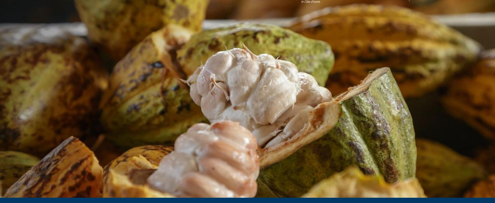
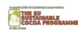

# **Preparedness check of Côte d'Ivoire's for the EU Deforestation Regulation (EUDR)**

## **September 2025**

Deforestation and forest degradation driven by agricultural expansion are growing at an alarming rate in tropical forest countries. As a major consumer of forest-risk commodities, the European Union (EU) has decided to take action to reduce the impact of its consumption of some of these commodities and products. The EU Deforestation Regulation (EUDR) came into force on 29 June 2023. Its main obligations will apply to all in-scope companies (other than micro or small undertakings) from 30 December 2025, and to micro or small undertakings from 30 June 2026. The regulation will allow operators and traders to place certain basic products (cattle, cocoa, coffee, palm oil, rubber, soya and timber) and derived products on the EU market or export them from the EU if they meet the "deforestation-free" criteria, have been produced in compliance with the relevant legislation of the country of production, and are covered by a declaration of due diligence including information on their traceability.

In parallel to the development of the EUDR, the EU has initiated policy dialogues on sustainable cocoa with Côte d'Ivoire, Ghana and Cameroon in 2021. These policy dialogues are intended to be maintained and strengthened to facilitate EUDR implementation and support cocoa producing countries in addressing sustainability challenges.

This analysis provides an overview of existing policies, tools and data in Côte d'Ivoire that could support cocoa operators' EUDR due diligence efforts. It also identifies outstanding challenges for the compliance of the Ivoirian cocoa supply chain. Although the responsibility for compliance rests solely with cocoa operators, producing countries, through the national policies and tools they have put in place, can play an essential role in facilitating due diligence. This document provides a regularly updated overview of the Ivorian cocoa sector in terms of traceability, deforestation and legality.

# *Cocoa Insight*

# **1. Traceability requirements**

The EUDR requires that operators collect the following information, accompanied by evidence: the geolocation coordinates of all plots of land where commodities and products were produced (Art. 9 (1.d)), —for plots larger than 4 hectares, GPS polygons are required— (Art. 2(28)), the date or time range of production (Art. 9 (1.d)), and last supplier information (Art. 9 (1.e)).

### **State of play**

**The Ivorian Government, through the Coffee-Cocoa Board, has geolocated cocoa plots at the national level.** Between 15 April 2019 and 31 December 2020, the Coffee-Cocoa Board carried out a census of cocoa farmers and their orchards, compiled in an *Atlas of Coffee and Cocoa Farmers and their Orchards.* The census included the mapping of cocoa plot polygons. The Coffee-Cocoa Board estimates that approximately 91% of farmers have been registered and periodically updates the database through its regional delegations. In December 2024, the Coffee-Cocoa Board identified 1.1 million farmers on more than 3.2 million hectares. Consolidation operations are ongoing to account for deceased farmers and those who have left the sector or transferred their farms.

**The Ivorian Government, through the Coffee-Cocoa Board, is currently working to operationalise a unified, mandatory national traceability system**, established by Decree No. 2023-723 of 13 September 2023 "establishing a national traceability system for coffee and cocoa," **covering the entire chain from farm to port.** This system is based on the registration of all farmers, the allocation of individual registration numbers and cards to farmers, and the labelling of cocoa bags at the first point of purchase. At each stage, digitised information on farmers, financial transactions and the supply chain is recorded. According to the Coffee-Cocoa Board, in December 2024, **890,545 producer cards** have been distributed out of **998,023 cards produced**, with nearly **100,000 additional cards in production**.

The rollout of the national traceability system is underway among **authorised field operators** (cooperatives and buyers). So far, **1,165 operators** have been integrated into the system out of a target of **2,000**, representing **58% coverage**. These cooperatives have purchased **15,205 tons of cocoa from 40,301 producers**, with digital payments totalling approximately **17 billion CFA francs**, processed via **TPEs (electronic payment terminals)**. The cocoa sold through this system is **traceable from farm to port**. Nationwide rollout of the traceability system will begin on 1 October 2025.

Most cocoa traders have chain of custody traceability systems in place. Within their traceability systems, most companies map the full plot polygon declared by the farmer. They also collect farmers' identification details, as well as additional socioeconomic and agronomic data, which is used to inform their sustainability programmes. **Yet, this information only covers part or all of companies' direct supply chain, and not their indirect supply chain**. According to the 2023 annual report of the Cocoa and Forest Initiative, 82% of cocoa sourced directly by companies is traceable from the farm to the first point of purchase. However, most cocoa (56%) comes from indirect supply chains or is not traceable due to a lack of information[1](#page-2-0) . The quality of this data varie[s](#page-2-1)2 and the methodologies and technical and financial capacities for collecting private data differ greatly from one exporter to another.

The national traceability system intends to solve the issue of indirect sourcing by capturing all the farmers exhaustively[3](#page-2-2) . **Once fully implemented and operational, the national traceability system is expected to provide all the information required under the EUDR in terms of geolocation and traceability**. This effort will be supported by the implementation of the African Regional Standard on sustainable cocoa (ARS-1000), which requires cocoa plot polygon. The ARS-1000 also aims at reinforcing cooperatives and integrating middlemen ("pisteurs") in the cooperative value chain.

## **Remaining challenges**

**The interoperability** of data on farmers and the geolocation of their plots between private systems and the Coffee-Cocoa Board database is necessary to ensure that farmers are identified by an individual registration number across different platforms. This requires **harmonisation of census approaches** between stakeholders and regular quality control. Reconciliation of data between private systems and the Coffee-Cocoa Board remains a challenge today. In July 2024, less than 25% of the farmer registration numbers assigned by the Coffee-Cocoa Board had been recorded by international exporters in their systems. In 2024, the professional exporters' group (GEPEX) began consolidating its members' databases to enable the Coffee-Cocoa Board to identify farmers who were not in its database. In addition, the Coffee-Cocoa Board wishes to set up a platform for the preidentification of farmers by cooperative societies to facilitate data updating.

The **issue of the robustness of traceability data** is essential and raises the question of **the data's update and verification**. The identification of farmers and geolocation involve multiple possibilities for error. Furthermore, stakeholders face difficulties in regularly updating the data, something that needs to be done at least before the start of the main season.

That said, work to build **the confidence of actors** in the sector in the national traceability system must continue. The system must be **credible and robust** so that it can be used for operators' due diligence. An interface for the national traceability system dedicated to exporters is currently being finalised. At present, the system does not include information on the sustainability of cocoa from other national tools, such as the 2020 land-use map or the Child Labour Monitoring and Tracking System (SOSTECI), which could support the implementation of ARS-1000 and the EUDR.

Integrating users into the **governance** of the national traceability system, with a clear definition of each party's roles and responsibilities in terms of data provision, access and cost sharing, would be one way of improving this confidence while providing concrete solutions to the issue of the system's **funding model**, which remains unknown. Good governance would also require the establishment of accountability mechanisms, such as periodic audits and independent data verification.

1 CÈcile Renier *et al* 2023 *Environ. Res. Lett.* 18 024030

2 Meridia and Rabobank, Cooperatives and the state of field data quality for EUDR compliance (2024)

3 Decree No. 2023-723 of 13 September 2023 establishing a national traceability system for coffee and cocoa

The **segregation** of compliant and non-compliant cocoa, required by both the EUDR and ARS-1000, also poses a major logistical challenge for Côte d'Ivoire. The operational aspects of how large-scale segregation will be carried out are still unknown. In particular, it is to be expected that some of the cocoa produced in Côte d'Ivoire will not comply with these standards (especially cocoa from protected areas). To ensure the reliability of the system, it is necessary to clarify how non-compliant cocoa will be handled and whether two parallel markets will be created.

# **2. Deforestation-free criteria**

The EUDR requires that operators collect adequately conclusive and verifiable information that relevant products are deforestation-free (Art. 2(13) and 9 (1.g)). Cocoa produced on lands converted from forests after 31 December 2020 would not be considered deforestation-free and would not conform with EU requirements. Forests are defined according to the FAO definition (Art. 2(4))3. In this context, useful data and tools for due diligence might include:

- Forest cover at the cut-off date (31 December 2020)
- Permanent national forest monitoring system
- Deforestation alerts

### **State of play**

**Several definitions of deforestation apply in the context of Côte d'Ivoire.** According to the Ivorian Forest Code, deforestation is only considered when it occurs in the State forest estate, while forest conversion is legal in the rural domain under certain conditions. In addition, Côte d'Ivoire has adopted the ARS-1000, which prohibits the sourcing of cocoa from primary forests converted after June 2021. The EUDR, meanwhile, prohibits the sourcing of cocoa for the EU market from forests (primary or secondary) converted after 31 December 2020.

**Deforestation-free cocoa frameworks exist in Côte d'Ivoire, but their impact has been limited.** As part of the REDD+ process, Côte d'Ivoire developed a deforestation-free agriculture policy in 2016. In 2017, the country engaged in the Cocoa & Forests Initiative, which includes a commitment by companies not to source cocoa produced on forest land that was converted to agriculture post-2018. Deforestation mitigation objectives were also integrated in the country's Nationally Determined Contribution to the Paris Agreement in 2022. The National Sustainable Cocoa Strategy is also grounded on the objective of restoring Côte d'Ivoire's forests. As outlined in the Strategy, the successful implementation of these commitments relies on the establishment of effective data and information systems for monitoring cocoa production and enforcing forest laws.

**Côte d'Ivoire has produced a national land-use map for 2020** with support from the EU Sustainable Cocoa Programme. This map is very useful for operators' due diligence, in particular for assessing the risks of non-compliance with the "deforestation-free" criteria, as it provides a mask of CÙte d'Ivoire's forests in 2020 according to the FAO definition. This work was carried out by the Geographic and Digital Information Centre (CIGN) of the National Bureau of Technical Studies and Development (*BNETD)*, a public body responsible for managing geographic information in CÙte d'Ivoire. The EU Joint Research Centre (JRC) carried out the independent validation of the map, whose accuracy was estimated at 91%. The map has been available free of charge to the public since March 2024 in a version adapted to the needs of businesses. [4](#page-4-0) This land-use map should be updated periodically to feed into a national forest monitoring system.

# **Remaining challenges**

Côte d'Ivoire has begun setting up a national forest monitoring and deforestation alert system, but it is not yet fully operational. The specifications for this system were approved by the government in March 2023 and the BNETD was designated as the managing body. Several steps have since been taken, including the development and publication of the land-use map for 2020 and the gradual development of certain modules of the system. Among the components currently being finalised are the module for generating alerts, the module for processing and verifying alerts, and the interfaces for consulting alerts, photo interpretation and field verification via a mobile application. At the same time, efforts have been made on the ground to strengthen patrols, in particular to dismantle or relocate illegal activities.

However, the effective deployment of the system remains constrained by limited financial resources.[5](#page-5-0) The establishment of a modular national system, based on transparent and consensual definitions and methodologies, and managed by the Ivorian Government, is essential to provide regular baseline data on land use and deforestation, inform public policy, and ensure the credibility of national efforts towards forest sustainability and protection.

In the absence of a fully functional and accessible national system, other sources of information are used by stakeholders and contradictory data circulates. This can create confusion about the state of CÙte d'Ivoire's forests, the extent of their degradation and the deforestation risk, which must be assessed as part of due diligence. In addition, access to **historical information on land-use changes is also limited.** However, this information is needed to characterise the agricultural use of a plot under the EUDR, particularly for fallow land. To date, there does not appear to be a clear timetable for updating the 2020 map.

Finance bill setting out the State budget for 2025

# **3. Legality criteria**

The EUDR requires that operators collect adequately conclusive and verifiable information that the relevant commodities were produced in accordance with the "relevant legislation of the country of production" (Art. 9 (1.h)).

The "relevant legislation of the country of production" refers to the laws applicable in the country of production concerning the **legal status of the area of production** in terms of (for agricultural products): land-use rights; environmental protection; third parties' rights; labour rights; human rights protected by international law; the principle of free, prior and informed consent (FPIC), including as set out in the United Nations Declaration on the Rights of Indigenous Peoples; and regulations in the areas of taxation, anti-corruption, trade and customs (Art. 2 (40)).

The European Commission published additional guidance on legality assessment in October 2024, which provides an interpretation of the scope of application of the legality criterion. However, this Commission guidance is not binding. Each EU Member State will adopt its own approach to verifying compliance with the EUDR at the level of its designated competent authority, and only national courts will be able to interpret the EUDR and therefore its scope of application in a binding manner.

## **State of play**

In 2024 and 2025, a study funded by the EU Sustainable Cocoa Programme supported stakeholders in the Ivorian cocoa sector to identify the relevant legal requirements in the context of cocoa production in Côte d'Ivoire and provided recommendations for due diligence by operators.

#### **Land-use rights**

**In Côte d'Ivoire, smallholders are not legally required to document their land-use rights for cocoa production**. Cocoa cultivation is permitted on all land unless explicitly prohibited. As a result, although farmers often have no proof of their land rights (land ownership, customary rights or even tenant or beneficiary contracts), the national legal framework does not require them to provide such proof in order to legally cultivate cocoa.

In Côte d'Ivoire, **cocoa cultivation is prohibited in national parks, reserves and classified forests**, with the exception of areas specifically designated for this purpose, known as "admitted agricultural areas". However, cocoa production encroaches on a significant portion of classified forests, raising concerns about the legality of a potentially significant portion of national cocoa production. The 2019 Forest Code authorises non-industrial cocoa cultivation in "agro-forests" – degraded classified forests whose status was created by the Forest Code – under certain management conditions. The legal framework for agro-forests is still being developed.

#### **Environmental protection**

**The use of pesticides and fertilisers in cocoa plantations is common and regulated by law.** The use of pesticides, in particular, is a major issue and can pose contamination risks for local communities and the environment, especially when unregistered products are used. The use of pesticides is closely linked to other environmental protection issues, such as soil and water protection and waste management.

**There is also an issue surrounding the conversion of forest land** in rural areas, which is subject by law to the provisions of a forest management plan or specific authorisation. However, this legal provision is rarely enforced, as it is largely unknown to local communities.

Cocoa plantations are on average less than 4 hectares in size. They are therefore exempt from the requirement to carry out an environmental and social impact assessment, which only applies to projects larger than 10 hectares.

### **Third parties' rights**

**The main relevant requirements relating to the protection of third parties' rights concern the prohibition of cocoa production on sacred sites and other archaeological and historical sites**. As cocoa plantations are mainly family-run, their operation is not likely to infringe on third parties' rights. Furthermore, although the legal framework recognises the fundamental rights of local communities, these requirements often take the form of very general provisions that are rarely translated into concrete measures by implementing regulations, rendering them irrelevant from a due diligence perspective. Certain requirements, particularly those relating to consultation with local communities in the context of environmental and social impact assessments, only apply above a certain threshold, which is generally not reached by cocoa plantations.

#### **Labour right[s](#page-7-0)6**

The cocoa sector in Côte d'Ivoire, which is essential to the national economy, relies largely on **small family plantations** and a network of informal local traders and small and medium-sized cooperatives responsible for the initial stages of supply, sorting, drying and sale of cocoa to traders and exporters.

Work on cocoa plantations is largely **carried out by family and village networks**, organised either by the owner or holders of customary land rights over the plot, or by the tenant farmer or beneficiary who uses the land free of charge. **These farming methods, which in most cases do not involve any subordinate relationship between landowners, farmers and field workers, therefore fall outside the scope of labour laws.**

However, in some cases, particularly when one or a few workers are employed on the plantation for a fixed period (usually several months or a year) and in return for a wage, **plot owners act as de facto employers. They must then comply with the 2015 Labour Code**, which covers all workers, including those in the agricultural sector, by ensuring decent working conditions. This code regulates

6 This category is specifically listed in Article 2 of the EUDR, but is not directly linked to the objectives of the Regulation.

working hours, freedom of association, health and safety, and imposes the guaranteed minimum agricultural wage (SMAG).

In practice, the application of these rules remains difficult due to the informal nature of labour relations, which are often undocumented, making it difficult to recognise the subordinate relationship. Local labour inspectorates are continuing their efforts to raise awareness among farmers of their legal obligations to improve the implementation of workers' rights in the cocoa sector[.](#page-8-0)7

#### **Human rights[8](#page-8-1)**

Human rights requirements in the cocoa sector mainly concern child labour and the absence of forced labour.

The Ivorian Labour Code prohibits the employment of minors under the age of 16, and Law No. 2010-272 prohibits the worst forms of child labour. **Child labou[r](#page-8-2)**9  **on cocoa plantations in CÙte d'Ivoire is a significant issue, although it is sometimes perceived and defined as a socialising activity.** The Ivorian legal framework distinguishes between light tasks, which are acceptable for children when they are safe, carried out under adult supervision and do not interfere with their schooling, and unacceptable forms of work. Dangerous tasks that affect health or education are classified as child labour and are strictly prohibited.

It should be noted that a national action plan to combat trafficking and child labour has been put in place, monitored by the National Supervisory Council (CNS), which is responsible for coordinating and evaluating actions on the ground. The CNS organises follow-up meetings, conducts field visits, produces annual reports and ensures compliance with national laws. It also manages the SOSTECI, a monitoring mechanism that identifies children in child labour, assesses the risks and ensures appropriate care.

#### **Free, prior and informed consent**

**Côte d'Ivoire does not have a legally binding framework for FPIC.** A few initiatives exist, particularly within the framework of REDD+, but these are only non-binding guidelines.

7 Assin H.A., Côte d'Ivoire-AIP/ The Nawa Labour Inspector raises awareness among coffee and cocoa producers in Liadji, [https://www.aip.ci/117962/cote-divoire-aip-linspecteur-de-travail-de-la-nawa-sensibilise-les-producteurs-cafe-cacao-de](https://www.aip.ci/117962/cote-divoire-aip-linspecteur-de-travail-de-la-nawa-sensibilise-les-producteurs-cafe-cacao-de-liadji/)[liadji/](https://www.aip.ci/117962/cote-divoire-aip-linspecteur-de-travail-de-la-nawa-sensibilise-les-producteurs-cafe-cacao-de-liadji/)

This category is specifically listed in Article 2 of the EUDR, but is not directly linked to the objectives of the Regulation. 9 According to the International Labour Organization (ILO), child labour is defined as any activity that deprives children of their childhood and their potential, harming their physical and mental development (references: ILO Conventions 138 and 182).

#### **Tax, anti-corruption, trade and customs regulations[10](#page-9-0)**

In Côte d'Ivoire, the main tax requirements differ depending on the tax system of each actor concerned. In particular, **smaller actors, such as producers and some cooperatives**, **are subject to few tax provisions** due to their tax system and the size of their plots. A withholding tax system applies to informal local traders and suppliers. Most other provisions, particularly corporate taxes, apply to larger actors in the chain, such as traders, processors and exporters.

In addition, a series of specific requirements apply to customs duties, the obtaining of mandatory approvals for actors in the sector and compliance with mandatory quality standards.

Finally, the 2013 ordinance against corruption contains obligations for actors in the sector. It should be noted that the digitisation of fund collection procedures by financial authorities has significantly improved the transparency of transactions in the cocoa trade in Côte d'Ivoire. Digital tools such as "SIVAT-C2" for the auctioning of cocoa for export, e-taxes for tax collection, and "SYDAM-World" for customs formalities significantly reduce the risk of corruption.

#### **The ARS-1000**

- The ARS-1000 Standard for Sustainable and Traceable Cocoa was adopted on 15 June 2021 by the members of the African Regional Standards Organisation. Côte d'Ivoire supported the drafting of the standard and developed a complementary national operational guide, which was officially adopted in May 2023.
- On 8 June 2022, the Ivorian Government issued a decree approving the ARS-1000 standard, making it mandatory from June 2024. The pilot phase is still ongoing.
- The ARS-1000 could facilitate, to some extent, operators' due diligence under the EUDR. However, certification cannot replace operators' due diligence obligations.
- The information collected and verified through ARS-1000, such as product traceability, environmental and social sustainability, and legality, could provide operators with relevant data for the risk assessment required by the EUDR.
- The ARS-1000 standard adequately covers requirements relating to land use, environmental protection, human rights and third parties' rights. In terms of labour rights, ARS-1000 only covers workers in the cooperative, not those of member producers. However, only one requirement not covered by ARS presents a significant risk of noncompliance, namely the obligation to provide decent housing for foreign workers. Given that the EUDR requires compliance at the level of the production plot, ARS 1000-certified cooperatives will have to provide proof of verification of this provision if foreign workers are employed on the plots.
- Regarding customs, taxation and trade aspects, ARS-1000 covers commercial elements deemed relevant, but not those related to customs or taxation. However, the study funded by the EU Sustainable Cocoa Programme estimated that the latter present a negligible risk of non-compliance.

10 This category is the only category in the EUDR that could potentially affect entities throughout the supply chain of the producing country, and not just at the level of the cocoa plot.

## **Remaining challenges**

Ensuring that cocoa sourced is legal requires having **access to accurate spatial data on protected area boundaries.**[11](#page-10-0) Yet, in Côte d'Ivoire, several datasets are available and are inconsistent. In addition, a significant share of classified forests also lacks legal backing. Furthermore, when sourcing from admitted agricultural areas within classified forests ("enclaves"), operators would need to access official evidence proving that farmers are allowed to produce cocoa in these areas. Accessing spatial information about admitted agricultural areas might be a challenge, as these are not publicly available, and the accuracy of this information might be limited. Updating and making publicly available legal and spatial reference data on forest boundaries and admitted agricultural areas would greatly mitigate operators' non-compliance risks and potentially avoid the unnecessary exclusion of farmers. Two projects to update the boundaries of classified forests and agroforests are currently being implemented[12](#page-10-1) under the supervision of the Ministry of Water and Forests.

In addition, the 2019 Forest Code introduced the category of agroforestry, where agriculture and forestry can coexist. Two decrees were issued in September 2024 to supplement the operational modalities for these agroforests. Decree No. 2024-800 of 5 September 2024 on the creation of agroforests in the State's private forest estate and the marketing of agricultural products from agroforests defines 67 agroforests. These are in addition to the three agroforests in Scio, Haute-Dodo and Rapides Grah, which were created by decrees 2023-728, 2023-729 and 2023-730 of 13 September 2023. **Non-industrial cocoa production and marketing by private operators are now authorised in 70 agroforests.** Committed to forest rehabilitation, these operators must establish a development plan within a maximum of two years from the signing of the concession. Decree No. 2024-832 of 18 September 2024 determining incentives for private sector operators participating in the sustainable development of agroforestry and the terms and conditions of such participation complements the legal framework of these agroforests. The practical arrangements for granting concessions and drawing up contracts are still being finalised by the Government, with no clear timetable.

The table in annex summarises the potential compliance of cocoa based on the type of conversion the land it is produced on has been submitted to.

11 For more information, please visit: [https://efi.int/sites/default/files/files/flegtredd/Sustainable-cocoa](https://efi.int/sites/default/files/files/flegtredd/Sustainable-cocoa-programme/Cocoa%20insights/EFI%20Cocoa%20Insight%201%20FR%20v2.pdf)[programme/Cocoa%20insights/EFI%20Cocoa%20Insight%201%20FR%20v2.pdf](https://efi.int/sites/default/files/files/flegtredd/Sustainable-cocoa-programme/Cocoa%20insights/EFI%20Cocoa%20Insight%201%20FR%20v2.pdf) 

12 The project to update 12 classified forests in the Tchologo region launched in May 2023, financed by the National Security Council (CNS) and implemented by ETBG Inter, and the project to update 72 classified forests/agroforests in cocoa production areas, financed by the SNCD and carried out by the ETBG Inter and ANE Sarl consortium.

# **4. Conclusion**

This overview of Côte d'Ivoire's preparedness for the EUDR presents the policies, tools and data currently implemented or available in Côte d'Ivoire on traceability, deforestation and legality in the cocoa sector.

The unified national traceability system, the availability of baseline data on forests and land use for 2020, the implementation of ARS-1000 and the development of a standard on cocoa legality are all tools that can play an important role in facilitating due diligence by operators and improving stakeholder confidence. In this sense, Côte d'Ivoire is an example to follow for many other producing countries.

However, the credibility and sustainability of CÙte d'Ivoire's national policies and tools for sustainability in the sector still need to be consolidated. This requires harmonising and verifying data on farmers and their orchards to ensure the use of unique identifiers, and improving the governance and transparency of the national system. In addition, the lack of national tools to monitor forest cover and respond quickly to deforestation alerts could hamper measures to mitigate deforestation risks. The provision of up-to-date and transparent data on the boundaries of classified forests and admitted farms, as well as the finalisation of the status of cocoa from agroforestry, are urgent tasks. Together, these measures could significantly reduce the perceived risks of cocoa sourced from CÙte d'Ivoire.

# **Appendix: EUDR compliance table**

The table below summarises the potential compliance of cocoa with the EUDR based on the land use category and land cover/land use type (as of 31 December 2020) of the plot where the cocoa was produced:

| Land use category         | Land use as of 31 December 2020 |                             |                            |
|---------------------------|---------------------------------|-----------------------------|----------------------------|
|                           | Legality criteria               | 1                           |                            |
|                           |                                 | Zero deforestation criteria | Placement on the EU market |
| Parks and reserves        | Forest 2 Non-compliant          | Non-compliant               | Non-compliant              |
|                           | Agriculture Non-compliant       | Compliant                   | Non-compliant              |
| Classified forests        | Forest 2 Non-compliant          | Non-compliant               | Non-compliant              |
|                           | Agriculture Non-compliant       | Compliant                   | Non-compliant              |
| Classified agroforestry 3 | Forest 2 Compliant 3            | Non-compliant               | Non-compliant              |
|                           | Agriculture Compliant 3         | Compliant                   | Potentially compliant 1, 3 |
| Admitted farm 4           |                                 |                             |                            |
|                           | Forest 2 Compliant              | Non-compliant               | Non-compliant              |
|                           | Agriculture Compliant           | Compliant                   | Potentially compliant 1    |
| Rural domain              | Forest 2 Compliant 7            | Non-compliant               | Non-compliant              |
|                           | Agriculture Compliant           | Compliant                   | Potentially compliant 1    |
|                           | Other wooded land 5             |                             |                            |
|                           | or grassland 6 Compliant        | Compliant                   | Potentially compliant 1    |

1 Only with regard to land use change issues. To be compliant, cocoa must also be produced in accordance with other relevant Ivorian legislation (labour rights, environmental protection, taxation and customs, etc.) and operators must submit a due diligence statement for the products concerned.

2 In this table, forests are defined according to the FAO definition (land of more than 0.5 hectares with trees more than 5 metres high and a canopy cover of more than 10%, or trees capable of reaching these thresholds in situ).

3 The 2019 Forest Code authorises agricultural production in classified forests that are highly degraded (>75%) according to specific management rules (these forests are classified as agroforestry). However, cocoa plantations would only be authorised in agroforestry systems. Decree 2019-979 of 27 November 2019 provides (limited) guidance on how to manage agroforests, but legal uncertainties remain.

4 The agricultural purpose of an admitted farm must be formalised in a legal text that prescribes its boundaries and identifies the agricultural plots. However, legal recognition of admitted farms and their boundaries is not systematically available.

5 Other wooded land is understood according to the FAO definition (land not classified as "forest" extending over more than 0.5 hectares with trees more than 5 metres high and 5-10% cover, or trees capable of reaching these thresholds in situ, or with a combined cover of shrubs, bushes and trees greater than 10%). In Côte d'Ivoire, these are mainly savannah areas. The possible inclusion of other wooded land will be assessed no later than one year after the entry into force of the EUDR.

6 The possible inclusion of grasslands will be subject to an impact assessment carried out no later than two years after the entry into force of the EUDR.

7 The conversion of forests within a rural domain is subject to prior authorisation by the forest authority. However, in practice, this provision is not implemented.

*Disclaimer: The views expressed in this Insight are solely those of the authors and do not reflect the views of the European Union Sustainable Cocoa Programme or the European Union. The authors bear full responsibility for the content, analysis and recommendations presented in this document and welcome any comments. The European*  Forest Institute is one of the implementing partners of the EU Sustainable Cocoa Programme in Côte d'Ivoire, *Ghana and Cameroon. We are supporting producer countries in developing robust standards and tools to achieve traceable and deforestation-free cocoa. Information and publications of the Sustainable Cocoa Programme are available at[: https://efi.int/partnerships/cocoa](https://efi.int/partnerships/cocoa)* 

