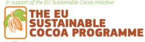
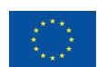
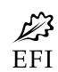

# **Preparedness check of Côte d'Ivoire for the EU Deforestation Regulation**

Deforestation and forest degradation driven by agricultural expansion are growing at an alarming rate in tropical forest countries. As a major consumer of forest-risk commodities, the European Union (EU) has decided to take action to reduce the impact of its consumption of some of these commodities and products. The EU Deforestation Regulation (EUDR) came into force on 29 June 2023. Its main obligations will apply to all in-scope companies (other than micro or small undertakings) from 30 December 2024, and to micro or small undertakings from 30 June 2025. The Regulation prohibits operators and traders from placing on the EU market or exporting from the EU, certain commodities (cattle, cocoa, coffee, oil palm, rubber, soya and wood) and derived products, unless they are "deforestation-free", have been produced in accordance with the relevant legislation of the country of production, and are covered by a due diligence statement including traceability information.

In parallel to the development of the EUDR, the EU initiated policy dialogues on sustainable cocoa with Côte d'Ivoire, Ghana and Cameroon in 2021. These policy dialogues are expected to be sustained and further developed to facilitate the implementation of the EUDR and support producing countries in addressing sustainability challenges.

This preparedness check aims at providing an overview of existing policies, tools and data in Côte d'Ivoire that could support cocoa operators' EUDR due diligence efforts, as well as identifying outstanding challenges for the compliance of the Ivoirian cocoa supply chain. While the responsibility for compliance lies solely with cocoa operators, national supply chain policies and tools can play an essential role in facilitating due diligence. This paper provides a state of play – to be regularly updated – of the supply chain when it comes to chain of custody traceability, deforestation and legality and standards.

# **Cocoa Insight** / March 2024

# **1. Traceability requirements**

The EUDR requires that operators collect the following information, accompanied by evidence: the geolocation coordinates of all plots of land where commodities and products were produced (Art. 9 (1.d)), for plots>4 hectares, GPS polygons are required (Art. 2(28)), the date or time range of production (Art. 9 (1.d)), and last supplier information (Art. 9 (1.e)).

# **1.1 State of play**

**The Ivorian Government, through the Coffee-Cocoa Board (CCC) has geolocated cocoa farms in the country**. Between 15 April 2019 and 31 December 2020, CCC carried out a census of cocoa farmers and their orchards, compiled in an 'Atlas of coffee-cocoa farmers and their orchards'. The census involved polygon mapping of cocoa plots. CCC estimates that about 91% of farmers have been captured and is updating the database periodically through its regional offices. The CCC regional delegations continuously update the census. In September 2023, the CCC identified more than 1 M cocoa farmers over more than 3.2 M ha.

**The Ivorian Government, through the CCC, is putting in place an integrated public traceability system from farm to port**. This is based on the registration of all farmers, the provision of individual registration numbers and farmers' cards, and the tagging of cocoa bags at the first point of purchase, with digitalised farmer, financial and supply chain information being registered at each step. According to the CCC, as of January 2024, 705,000 of the total 1,040,000 farmers had received their cards and 850,000 cards had been produced. The pilot phase is ongoing, and the system is planned to be operational by the end of 2024.

Most cocoa traders have chain of custody traceability systems in place. Within their traceability systems, most companies map the full plot polygon declared by the farmer. They also collect farmers' identification details, as well as additional socioeconomic and agronomic data, which is used to inform their sustainability programmes. **Yet, this information only covers part or all of companies' direct supply chain, and not their indirect supply chain.** In 2019, 354,000 farms have been mapped (polygons) by Cocoa & Forests Initiative signatory companies. Forty-four percent of Côte d'Ivoire's cocoa exports were traceable to a cooperative, and 22% to a farm. The bulk of cocoa (56%) is indirectly sourced or sourced by non-disclosing traders1 . The quality of private sector data might also be questionable2 .

The national traceability system intends to solve the issue of indirect sourcing by capturing all the farmers exhaustively. **Once fully implemented and operational, the national traceability system is expected to provide all the information required under the EUDR in terms of geolocation and traceability**. This effort will be supported by the implementation of the African Regional Standard on sustainable cocoa (ARS-1000), which

1 Cécile Renier *et al* 2023 *Environ. Res. Lett.* **18** 024030

2 Meridia et Rabobank, Cooperatives and the state of field data quality for EUDR compliance (2024)

requires cocoa plot polygon. The ARS-1000 also aims at reinforcing cooperatives and integrate middlemen ("pisteurs") in the cooperative value chain.

## **1.2 Remaining challenges**

Implementing a public data collection and registration system is deemed essential by Côte d'Ivoire to meet ARS-1000 and EUDR traceability requirements, especially for capturing data in companies' indirect supply chains. However, achieving full functionality of the national traceability system by the EUDR entry into application remains an ambitious goal.

**Building trust of supply chain actors in the credibility and robustness** of the national traceability system is of critical importance to ensure it is relied on for due diligence. At this stage, confidence from operators that the national system will adequately cater for their needs on time is not guaranteed. Nonetheless, private systems cannot guarantee traceability of the whole production for the reasons previously stated. Ensuring the use of the national unfied system is essential to avoid duplication of efforts from public and private actors, and additional burden on upstream actors such as cooperatives.

An urgent step is to ensure the reconciliation of farmer and cocoa plot geolocation data between private systems and the CCC farmers' database to ensure unique farmer and plot IDs on multiple platforms. Farmers' data is the backbone of the system. Therefore, ensuring the quality, verification and transparent access to this data by relevant actors are imperative for establishing trust and reliability in the system.

The **governance** of the national traceability system could benefit from the inclusion of system users in the system oversight, and clearer definition of roles and responsibilities in data supply, access and cost sharing. Sound governance would also require checks and balances be put in place, such as ensuring periodic audits and independent data verification.

Even with a fully operational national integrated traceability system, significant risks remain due to the complexity of the cocoa supply chain and the small-scale nature of many farmers. These challenges involve potential issues related to leakage, fraud and illegal border trafficking, especially when prices or quality standards differ from neighbouring countries like Liberia and Ghana. Robust and credible traceability and sustainability monitoring systems, involving third-party inputs and **accountability mechanisms** for law enforcement, liability and remediation, are necessary to identify and mitigate these risks effectively.

**Segregation** between compliant and non-compliant cocoa, required by both EUDR and ARS-1000, remains a major logistical challenge for Côte d'Ivoire. At this stage, operational aspects of how large-scale segregation will be undertaken is unknown. In particular, it can be expected that a share of cocoa produced in Côte d'Ivoire might not be compliant with these standards (in particular cocoa sourced in protected area). To instil confidence in the system, clarity is needed on how non-compliant cocoa will be dealt with, and if a two-tier market system for compliant and non-compliant cocoa will be set up.

# **2. Deforestation-free criteria**

The EUDR requires that operators collect adequately conclusive and verifiable information that relevant products are deforestation-free (Art. 2(13) and 9 (1.g)). Cocoa produced on lands converted from forests after 31 December 2020 would not be considered deforestation-free and would not conform with EU requirements. Forests are defined according to the FAO definition (Art. 2(4))3 .

In this context, useful data and tools for due diligence might include:

- Forest cover at the cut-off date (31 December 2020)
- Permanent national forest monitoring system
- Deforestation alerts

# **2.1 State of play**

**Multiple definitions of deforestation apply in the Côte d'Ivoire context.** Deforestation in the Ivorian Forest Code is only considered when occurring in the classified forest domain while forest conversion in the rural domain is legal under certain conditions. Côte d'Ivoire also adopted the ARS-1000, which prohibits sourcing cocoa from converted primary forests post June 2021. The EUDR prohibits sourcing cocoa for the EU market coming from (primary or secondary) forests converted after 31 December 2020.

**Deforestation-free cocoa frameworks exist in Côte d'Ivoire, but their impact has been limited.** As part of the REDD+ process, Côte d'Ivoire developed a deforestation-free agriculture policy in 2016. In 2017, the country engaged in the Cocoa & Forests Initiative, which includes a commitment by companies not to source cocoa produced on forest land that was converted to agriculture post-2018. Deforestation mitigation objectives were also integrated in the country's Nationally Determined Contribution to the Paris Agreement in 2022. The National Sustainable Cocoa Strategy is also grounded on the objectives of restoring Côte d'Ivoire's forests. As outlined in the Strategy, the successful implementation of these commitments relies on the establishment of effective data and information systems for monitoring cocoa production and enforcing forest laws.

**A baseline land cover map for 2020 was developed by Côte d'Ivoire** with the support of the EU Sustainable Cocoa Programme, in alignment with the EUDR requirements to be able to serve as input for risk assessment on compliance with the deforestation-free criterion. The map was validated by the EU (through the Joint Research Centre). The work has been entrusted to the National Geographical Information Centre of the Bureau National d'Etudes Techniques et de Développement. The latter is a public body responsible for managing geographical information in Côte d'Ivoire and is supervised by the Presidency. The map is freely and publicly available4 since March 2024 in a version suitable for companies to work

3 "land spanning more than 0,5 hectares with trees higher than 5 metres and a canopy cover of more than 10 %, or trees able to reach those thresholds in situ, excluding land that is predominantly under agricultural or urban land use"

with. This land covermap is expected to be updated every two years to feed into a national forest monitoring system.

## **2.2 Remaining challenges**

**Côte d'Ivoire currently lacks an operational forest monitoring and deforestation alert system,** despite national capacity and the endorsement of systems specification by the Government in March 2023. A modular national system, based on transparent and consensual definitions and methodologies, and managed by the Ivorian Government is needed to provide periodic reference data on land cover, inform policy making and enable forest law enforcement. Because of the lack of a unified system, definitions and methodology, conflicting data circulates, causing confusion about the state of Ivorian forests and the magnitude of their encroachment.

# **3. Legality criteria**

The EUDR requires that operators collect adequately conclusive and verifiable information that the relevant commodities were produced in accordance with the "relevant legislation of the country of production" (Art. 9 (1.h)).

Relevant legislation of the country of production means the laws applicable in the country of production concerning the **legal status of the area of production** in terms of: land-use rights; environmental protection; forest-related rules, including forest management and biodiversity conservation, where directly related to wood harvesting; third parties' rights; labour rights; human rights protected under international law; the principle of free, prior and informed consent (FPIC), including as set out in the UN Declaration on the Rights of Indigenous Peoples; and tax, anti-corruption, trade and customs regulations.' (Art. 2 (40)).

Consequently, operators who place cocoa or cocoa products on the EU market must ensure that they have been produced in accordance with the relevant Ivorian legislation applicable to the area of production. It is our understanding that the EUDR legality criteria does not cover the entire cocoa supply chain.

Further guidance on the assessment of the legality criteria is expected from the European Commission before the entry into application of the Regulation.5 Yet stakeholders can already identify which national requirements concerning the relevant areas of law will be applicable, discuss the information, document and data required to demonstrate legality, as well as potential needs for clarification of the legal framework.

In this context, useful data and tools might include:

- Relevant legal texts
- Relevant information, documents and data that can serve as evidence of legal compliance
- Official and up-to-date national park and classified forest boundaries

5 https://green-business.ec.europa.eu/implementation-eu-deforestation-regulation\_en

- Official and up-to-date boundaries of admitted agricultural areas (enclaves)
- Management plans of classified agroforests

## **3.1 State of play**

Below is an initial overview of the legal requirements relevant to the area of cocoa production as carried out by smallholder farmers in Côte d'Ivoire. It does not constitute a thorough evaluation of the applicable legal framework or its enforcement. A more in-depth analysis is essential to comprehensively map the relevant legal requirements across all the areas of law outlined in the EUDR and assess their implementation. This would include identifying the relevant international treaties ratified by Côte d'Ivoire and the degree to which they have been transposed into national law. This would enable evaluating the availability of documents, information and data that can substantiate compliance.

### **Land-use rights**

- **In Côte d'Ivoire, there are no legal requirements for smallholder farmers to demonstrate their rights to use the land to produce cocoa**. Cocoa production is allowed on any land where it is not prohibited. So, although farmers often do not possess proof of land-use rights, these are not required under the national legal framework. Yet a plantation authorisation might be needed from the Ministry of Agriculture.
- In Côte d'Ivoire, **it is prohibited to grow cocoa in parks, reserves and classified forests**, unless – for the latter – the area has been designated for that purpose ("enclaves"). Yet a significant share of classified forests is encroached by cocoa production. This raises concerns about a potentially significant portion of the national cocoa production possibly being illegal. The 2019 Forest Code authorised nonindustrial cocoa production in most degraded classified forests ( a new category called "agroforests"), under certain management rules.

### **Forest conversion**

- **The existing legal framework for forest conversion faces challenges related to its incompleteness and inadequate implementation.** The 2019 Forest Code requires prior authorisation from the Ministry of Water and Forests for any forest conversion within the national forest domain (Art. 45). Not all the implementing decrees to detail the conditions for conversion have been adopted. Decree 234 of 2020 addresses rules for the rural domain, mandating prior authorisation from the forest authority for forest conversion. However, no authorisation requests have been submitted. Indeed, the Forest Code addresses the issue of clearing in ecologically sensitive areas, defining these areas and stipulating that their management is governed by decree of the Council of Ministers. However, Decree no. 2021-583 does not mention land clearing among the activities disturbing these sensitive areas. In addition, the 2019 Forest Code introduces the notion of "redefinition of boundaries", without clearly defining it. It would therefore be necessary to clarify this notion to determine the conditions under which a forest could leave the private domain of the State. Decree 423 of 2020 sets out the rules applicable to the rural domain, requiring prior authorization from the forest authority for forest conversion. This decree aims to

limit the conversion of forests into agricultural land. It creates an authorization regime for any clearing of between 0.1 and 50 hectares and requires that at least 30% of the surface area be maintained. Nevertheless, it does not seem to be implemented in practice.

### **Environmental protection**

- **Agro-commodity production is subject to various environmental norms**. These are enshrined, among other legal instruments, in the Agricultural law n°2015-537 of 20 July 2015, in the law of 1989 on the use of pesticides, and Order No. 159 of 2004 prohibiting the use in agriculture of active substances used in the manufacture of plant protection products. A list of prohibited substances is available. Farmers will likely lack explicit proof of compliance with environmental norms, such as a certificate from an environmental inspectorate. Consequently, it falls upon the operator when exercising due diligence to assess whether this legal aspect poses any risk of noncompliance.
- **There is no requirement for environmental impact assessment for smallholder farming**. The Environment Code of October 1996 and the implementing decree of November 1996 only require an impact assessment for agricultural projects of more than 999 ha leading to deforestation or on semi-natural land.

## **Third-party rights**

- **Customary land and resource rights of local communities and indigenous peoples are recognised under the law.** Law No. 98–750 of 23 December 1998 relating to rural land recognises the right of indigenous and non-native communities to customary rural land, which may be transformed into a title deed. In addition, in January 2017, Côte d'Ivoire adopted a Rural Land Policy Declaration, which details the Government's orientations in terms of rural land management. It also established a Rural Land Agency, which aims to implement this policy by delimiting the territories and the communities, and by clarifying the related rights (Decree No 2016-590 of August 3, 2016, on the creation, attribution, organisation and operation of the Rural Land Agency). This Declaration was supplemented in June 2023 by a National Strategy for Securing Rural Land Tenure for the period 2023–2033. In addition, despite a clear legal framework for the resolution of land disputes, in practice, the limits of village lands are often unknown and customary rights are precarious because their content is not specifically defined.
- **Further investigation would be needed to clarify what provisions would apply to cocoa farmers in terms of access to information and grievance mechanisms.**  The Ivorian legal framework includes general provisions relating to information of public interest, but there are no provisions specific to the forest sector. The Environmental Code provides that everyone has the right to be informed about the state of the environment and participate in the procedures before making decisions likely to have harmful effects on the environment. The 2019 Forest Code aims to promote the active participation of civil society and local communities in sustainable forest management, but the law does not detail how this objective is to be achieved.

#### **Labour rights**

- Côte d'Ivoire's Labour Code of 2015 covers issues related to social security, minimum age and wages, working hours, and health and safety. For a discussion of the legal framework regarding child labour, see the section below on human rights.
- Most labour relations among smallholder farmers are likely to be informal. Consequently, it falls upon the operator when exercising due diligence to assess whether this legal aspect poses any risk of non-compliance.

### **Human rights**

### **Child labour**

- Côte d'Ivoire has ratified ILO Convention No. 182 on the Worst Forms of Child Labour and Convention No. 138 on the Minimum Age for Admission to Employment. The ILO defines child labour as work that robs children of their childhood, potential and dignity, posing risks to their physical and mental development. This includes work that is mentally, physically, socially, or morally dangerous and harmful, as well as anything that interferes with their education. While children may work on cocoa farms within their families, not all instances constitute child labour.
- The Labour code prohibits the employment of children younger than 16-year-old and Law n° 2010-272 prohibits the worst forms of child labour. Decree N° 2017-016 and 017 MEPS/CAB (2017) define hazardous child labour.
- Some cocoa companies have implemented corporate sustainability initiatives to address child labour in their supply chains. These often include monitoring and certification programmes to ensure that cocoa is produced without child labour.

#### **Other human rights**

- Côte d'Ivoire is a party to international conventions on racial discrimination, discrimination against women, and economic, social and cultural rights.

### **FPIC**

- National FPIC guidelines will be enshrined in a manual, which is currently being finalised in the context of the project PROMIRE (Promoting deforestation-free cocoa production to reduce emissions in Côte d'Ivoire).6 However, cocoa production by smallholder farmers is typically conducted on a small scale, whereas FPIC is more commonly associated with major projects that have significant impacts on communities. FPIC is therefore likely to be irrelevant to smallholders' cocoa production.

### **Tax, anti-corruption trade and customs**

- **Cocoa trade and customs are framed quite strictly in Côte d'Ivoire.** The Ordonnance n° 2011-481 of 28 December 2011 regulates the cocoa sector by listing the types of operators that can be authorised to purchase cocoa and setting the dates of the cocoa-harvesting seasons. Various implementing texts provide rules for

6 https://www.fao.org/3/cc6095fr/cc6095fr.pdf

the accreditation of supply chain actors, modalities of removal of accreditations, or cocoa quality characteristics.

- Côte d'Ivoire is a party to the United Nations Convention against Corruption, and to the African Convention on Preventing and Combating Corruption. Ordinance n° 2013-660 relating to the fight against corruption and assimilated corruption practices applies to public administration officers and private sector agents. Ordinance n° 2013-661 created the High Authority of Good Governance. The Ministry for the Promotion of Good Governance and Capacity Building in the Fight against Corruption was established in 2021. In their risk assessments under due diligence obligations of the EUDR, operators will need to consider the level of corruption in the sourcing country when selecting valid evidence of legal compliance.
- Côte d'Ivoire has been operating an Automated Customs Clearance System since 2009. It links the Customs with the Ministry of Trade and various government bodies and the CCC, thereby simplifying procedures and ensuring greater efficiency in collecting the duties and taxes payable.
- **The scope of the EUDR legality criteria is confined to the area of production**. Nevertheless, further guidance from the European Commission are expected to clarify to what extent requirements along the supply chain, including on trade, tax and customs, would apply.

## **ARS-1000**

- The ARS-1000 was adopted on 15 June 2021 by members of the African Standards Organisation. Côte d'Ivoire supported the drafting of the standard and developed a national operational guide, which complements the standard and was officially distributed in January 2024.
- On 8 June 2022, the Ivoirian Government published a decree approving the ARS standard, making it mandatory and setting out a 24-month timetable for its entry into force. This period covers a one-year pilot phase, which was launched in January 2024, and a national roll-out of another year.
- The ARS-1000 could play a role in facilitating operators' due diligence under the EUDR and harmonising their due diligence approaches. Indeed, the information collected and verified under ARS-1000 in terms of product traceability, environmental and social sustainability, and legality could provide operators with relevant data for the risk assessment required by the EUDR. However, the ARS-1000 certification is not sufficient to ensure full compliance with the EUDR and was not adopted for this purpose.

## **3.2 Remaining challenges**

Ensuring that cocoa sourced is legal requires having **access to accurate spatial data on protected area boundaries**7 . Yet, in Côte d'Ivoire, several datasets are available and are not consistent with each other. A significant share of classified forests also lacks legal backing. In addition, when sourcing from admitted agricultural areas within classified forests ("enclaves"), operators would need to access official evidence proving that farmers are allowed to produce cocoa in these areas. Accessing spatial information about admitted agricultural areas might be a challenge as these are not publicly available, and the accuracy of this information might be limited. Updating and making publicly available legal and spatial reference data on forest boundaries and admitted agricultural areas would greatly mitigate operators' non-compliance risks and potentially avoid the unnecessary exclusion of farmers.

**In addition, while the 2019 Forest Code created the category of classified agroforests, where agriculture and forests could co-exist, challenges persist in implementing a clear plan and managing associated risks**. So far, only the three forests of Scio, Haute Dodo and Rapide Grah have been officially recognised as agroforests (Decrees 2023-728, 2023-729, 2023-730 of 13 September 2023) but their management modalities are still to be detailed by the Minister in charge of Forests. **It remains unclear at which stage cocoa produced in classified agroforests would be considered legal.** 

The table in annex summarises the potential compliance of cocoa based on the type of conversion the land it is produced on has been submitted to.

Overall, the legality of cocoa in Côte d'Ivoire is complex and several aspects require in-depth analysis. Cocoa operators could benefit from **guidance on the applicable scope of legality** in the context of Côte d'Ivoire, and relevant documents, data and information that can be collected to provide evidence of legality and conduct due diligence.

# **4. Conclusion**

This preparedness check offers an overview of the current policies, tools and data landscape in Côte d'Ivoire related to traceability, deforestation, and legality that can support cocoa sector actors in navigating the complexity associated with demonstrating compliance with the due diligence obligations of the EUDR. The establishment of a national integrated traceability system and the production of reference 2020 forest and land use data can serve as a key support for operator due diligence through the provision of cocoa plot geolocation, chain of custody information and baseline information for deforestation risk assessment. However, challenges related to data reliability and use of the unique farmer ID on multiple platforms must be managed. In addition, the lack of national tools to monitor deforestation and react rapidly to cases of encroachment might hinder options to mitigate deforestation risks. Providing updated and transparent data on classified forest boundaries and

7 For more details, see EFI (2023) "[The role of spatial information for EUDR due diligence](https://efi.int/sites/default/files/files/flegtredd/Sustainable-cocoa-programme/Cocoa%20insights/EFI%20Cocoa%20Insight%201%20EN%20v2.pdf)", available at: https://efi.int/sites/default/files/files/flegtredd/Sustainable-cocoaprogramme/Cocoa%20insights/EFI%20Cocoa%20Insight%201%20EN.pdf

agricultural "enclaves", as well as clarifying the status of cocoa sourced from agroforests are two priorities that the Government of Côte d'Ivoire could fairly rapidly address and that could significantly reduce the perceived risks of sourcing cocoa from the country. Lastly, achieving clarity on the scope of legality under the EUDR and the information, data and documents that could be used to demonstrate legal compliance could further facilitate due diligence. Efforts in that direction will start early 2024.

# **Annex: EUDR compliance table**

The table below summarises the potential compliance of cocoa with the EUDR based on **the land use category** and **the type of land cover/use (on 31 December 2020)** of the plot where the cocoa was produced:

| Land use category      |   | Land cover/use               |                     |                             |                            |
|------------------------|---|------------------------------|---------------------|-----------------------------|----------------------------|
|                        |   |                              | Legality criteria 1 |                             |                            |
|                        |   |                              |                     | Zero deforestation criteria | EU market placement        |
| Parks and reserves     |   | Forest 2                     |                     |                             |                            |
|                        |   |                              | Non-compliant       | Non-compliant               | Non-compliant              |
|                        |   | Agriculture                  | Non-compliant       | Compliant                   | Non-compliant              |
| Classified forest      |   | Forest 2                     |                     |                             |                            |
|                        |   |                              | Non-compliant       | Non-compliant               | Non-compliant              |
|                        |   | Agriculture                  | Non-compliant       | Compliant                   | Non-compliant              |
| Classified agro-forest | 3 |                              |                     |                             |                            |
|                        |   | Forest 2                     | Compliant 3         | Non-compliant               | Non-compliant              |
|                        |   | Agriculture                  | Compliant 3         | Compliant                   | Potentially compliant 1, 3 |
| Enclave 4 within a     |   |                              |                     |                             |                            |
|                        |   | Forest 2                     | Compliant           | Non-compliant               | Non-compliant              |
|                        |   | Agriculture                  | Compliant           | Compliant                   | Potentially compliant 1    |
| Rural domain           |   | Forest 2                     | Compliant 7         | Non-compliant               | Non-compliant              |
|                        |   | Agriculture                  | Compliant           | Compliant                   | Potentially compliant 1    |
|                        |   | Other, including wooded land | 5                   |                             |                            |
|                        |   | or grassland 6               |                     |                             |                            |
|                        |   |                              | Compliant           | Compliant                   | Potentially compliant 1    |

1 Only with regards to land-use rights issues. Compliance also requires that cocoa be produced in accordance with other relevant legislation of Côte d'Ivoire (labour rights, environmental protection, tax and customs…) and that a due diligence statement covering the products be submitted by the operator.

2 In this table, forests are understood as per the FAO definition (land spanning more than 0.5 hectares with trees higher than 5 metres and a canopy cover of more than 10%, or trees able to reach those thresholds in situ)

3 The 2019 Forest code authorises agricultural production in highly degraded (>75%) classified forests under specific management rules (these are categorised as *Agro-forêts*). Nevertheless, cocoa plantations would only be authorized in agroforestry systems. Decree 2019-979 of 27 November 2019 provides (limited) guidance on the management modalities of agroforests and legal uncertainties remain.

4 The agricultural purpose of an *enclave* needs to be formalised into a legal text that specifies its boundaries as well as identifies agricultural plots. The legal recognition of *enclaves* and their boundary limitations are not available in all cases.

5 Other wooded lands are understood as per the FAO definition (land not classified as 'forest' spanning more than 0.5 hectares with trees higher than 5 metres and a canopy cover of 5 to 10%, or trees able to reach these thresholds in situ, or with a combined cover of shrubs, bushes and trees above 10 percent). In Côte d'Ivoire, these are mainly savanah areas. The potential inclusion of other wooded lands will be the subject of an evaluation conducted no longer than 1 year after entry into force of the EUDR

6The potential inclusion of grasslands will be the subject of an impact assessment conducted no longer than 2 years after entry into force of the EUDR

7 Forest conversion in the rural domain is subject to prior authorisation by the forest authority. In practice, this is not implemented.

.

**Disclaimer.** The views and opinions expressed in this Insight are solely those of EFI's Sustainable Cocoa Programme and do not reflect the views of the Sustainable Cocoa Programme of the European Union or its funding organisations. EFI's Sustainable Cocoa Programme bear full responsibility for the content, analysis and recommendations presented herein and welcome any feedback on its content.

The European Forest Institute is one of the implementing partners of the EU Sustainable Cocoa Programme in Côte d'Ivoire, Ghana and Cameroon. We are supporting producer countries in developing robust standards and tools to achieve traceable and deforestation-free cocoa. Information and publication of EFI's Sustainable Cocoa Programme can be found here: <https://efi.int/partnerships/cocoa>

© European Forest Institute, 2024

