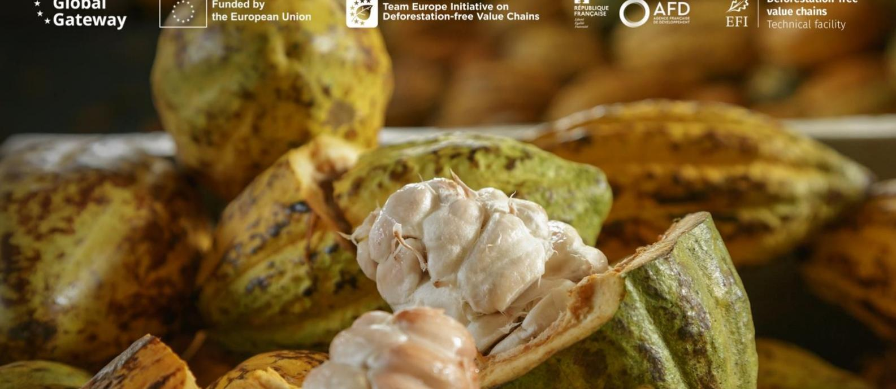
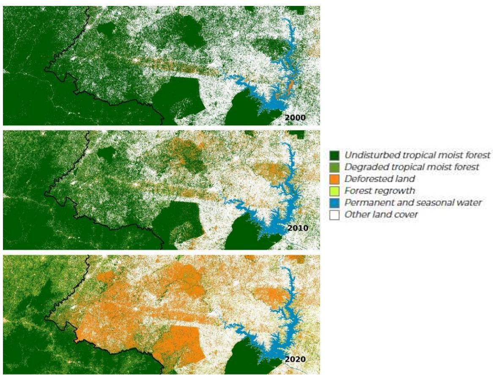
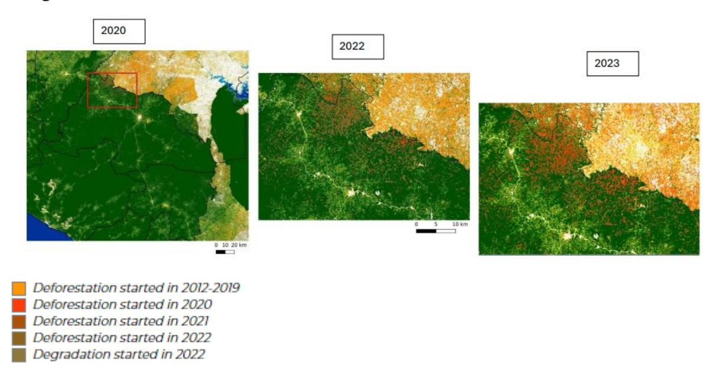
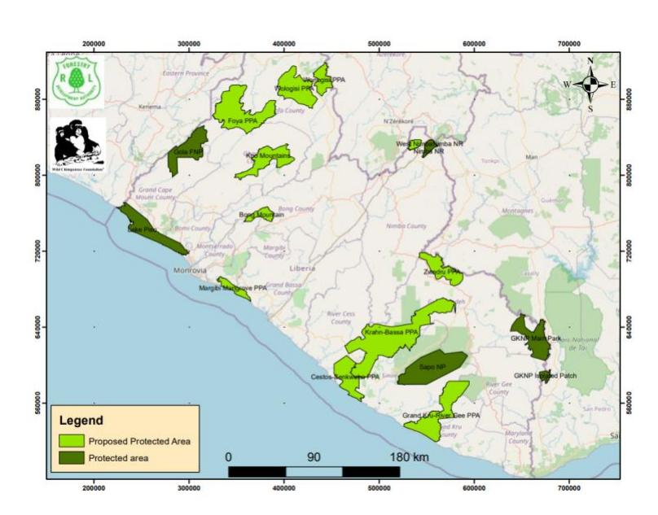
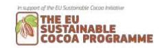
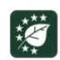
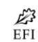

# **Preparedness check of Liberia for the EU Deforestation Regulation – March 2025**

Deforestation and forest degradation driven by agricultural expansion are growing at an alarming rate in tropical forest countries. As a major consumer of forest-risk commodities, the European Union (EU) has decided to take action to reduce the impact of its consumption of some of these commodities and products. The EU Deforestation Regulation (EUDR) came into force on 29 June 2023. Its main obligations will apply to all in-scope companies (other than micro or small undertakings) from 30 December 2025, and to micro or small undertakings from 30 June 20261 [.](#page-0-0) The Regulation prohibits operators and traders from placing on the EU market or exporting from the EU, certain commodities (cattle, cocoa, coffee, oil palm, rubber, soya and wood) and derived products, unless they are "deforestation-free", have been produced in accordance with the relevant legislation of the country of production, and are covered by a due diligence statement including traceability information.

This preparedness check aims at providing an overview of existing policies, tools and data in Liberia that could support cocoa operators' EUDR due diligence efforts, as well as identifying outstanding challenges for the compliance of the Liberian cocoa supply chain. While the responsibility for compliance lies solely with cocoa operators, national supply chain policies and tools can play an essential role in facilitating due diligence. This paper provides a state of play, as of February 2025, of the cocoa sector when it comes to chain of custody traceability, deforestation and legality and standards.

# Cocoa Insight

1 The legislation was initially scheduled to come into application on 30 December 2024. However, the EU approved a delay in its application by one year to give operators, traders, and authorities more time to prepare for its implementation.

### **1. Traceability requirements**

The EUDR requires that operators collect the following information, accompanied by evidence: the geolocation coordinates of all plots of land where commodities and products were produced (Art. 9 (1.d)), for plots>4 hectares, GPS polygons are required (Art. 2(28)), the date or time range of production (Art. 9 (1.d)), and last supplier information (Art. 9 (1.e)).

### **1.1 State of play**

**There is no national public cocoa traceability system in place in Liberia, nor national level farm mapping or cocoa farmer registration initiatives.** Traceability by the private sector is limited, particularly to small companies operating in the speciality market. Relatedly, certification is not widely adopted. There is more interest in organic certification than in Rainforest or Fairtrade certifications, but all are barely used.

The Liberian Government, along with the private sector, civil society, farmers' organisations and development partners, have committed to 100% traceability from farm to point of export by 2026 in a Roadmap to a Sustainable Cocoa Sector in Liberia. As part of this commitment, the Ministry of Agriculture intends to work with the private sector and producer organisations to produce traceability action plans, map cocoa farms and develop certification, quality control, and monitoring systems[.](#page-1-0)2

Yet, for the time being, there is only one project working on traceability and farmer identification (GROW 2 implemented by the United Nations Industrial Development Organization (UNIDO)). In addition, the World Bank International Finance Corporation is currently exploring options to develop a traceability ecosystem, that would offer an open traceability solution which might support the cocoa and other agricultural commodity sectors in Liberia.

**Besides traceability, there is a gap in farm mapping with currently no information available, and both public institutions and the private sector lack farm geolocation data**. A major challenge is determining who could take on the substantial costs associated with establishing farm geolocation and traceability systems. There are only a few exporters (8 registered and licenced to export according to LACRA), which are nationally based, relatively small, and have limited capacity to invest in such systems. This is in contrast to other cocoa countries where traceability is pulled by larger international exporters. Lessons could be drawn from the rubber sector, which has successfully geolocalised plots at a large scale.

#### **Cross-border flows**

**While there are no official statistics, cross-border flows of cocoa both leaving and entering Liberia are likely considerable.** Price is a key driver of those flows (the Ivorian fixed price of cocoa now being lower that the liberalized price of purchasing cocoa), but there are other factors influencing the farmer's decision as to which country to sell in. These include logistical considerations – such as

2 Roadmap to a Sustainable Cocoa Sector in Liberia, Liberia National Cocoa Public-Private Partnership Platform, 2021.

poor road conditions where for farmers at the borders with Sierra Leone, Guinea or Côte d'Ivoire, it is often more convenient to evacuate the cocoa from plot to the road leading to the border country than to bring it to the Monrovia port – and the need for the foreigner currency, especially if the farmer is a migrant that needs to remit money to his home-country.

**Cross-border flows are a concern for EUDR compliance due to potential gaps in chain of custody information, including cocoa plot geolocation.** Additionally, there is difficulty in verifying whether cocoa comes from areas deforested after the cut-off date or was legally produced, and there is a higher risk of mixing products of unknown origin or non-compliant ones. Besides, the cross-border flow of cocoa is also a concern for EUDR compliance in Côte d'Ivoire since the lack of traceability in Liberia is jeopardising the integrity of the national traceability system. Both countries have an interest in addressing the issue of cross-border cocoa flows**.** 

### **1.2 Remaining challenges**

- **Traceability systems are an exception in a very small number of companies and cooperatives**. Implementation costs including the mapping of cocoa plots, pose a barrier to expanding systems. Further, the limited participation in certification schemes means there is little to build off of in terms of traceability and risk mitigation.
- The **weak governance and high level of informality of the sector** with few well-structured cooperatives, mainly in the Nimba, Lofa and the Bong counties, and a considerable number of unlicensed buying agents complicates the deployment of traceability in the country.
- Exporters, who are generally small and mostly minor players in the international market, have limited power to act as levers to promote traceability, certification, or risk mitigation.
- However, **the EUDR can be an opportunity for the Liberian cocoa sector to become better structured, facilitate the professionalisation of the cooperatives, and develop targeted collaborative initiatives to support the transition to a modern and sustainable cocoa sector**. Characteristics of the supply chain could enable this transformation, in particular, the small size of the sector means that the number of cocoa farmers and plots that need to be mapped is manageable (around 37,000 farmers) and Liberian cocoa could become a niche market (especially for organic cocoa given the limited use of chemical inputs). Further, there is potential to harmonise private systems with common guidelines for traceability and farm mapping, for instance.
- **The main challenge is identifying who can provide the necessary guidance and leadership** to encourage collective action. The Roadmap on Sustainable Cocoa signed in 2021 might offer a good start to move the sector forward. However, its stagnation in implementation provides further evidence that governance challenges must be overcome.

### **2.Deforestation-free criteria**

The EUDR requires that operators collect adequately conclusive and verifiable information that relevant products are deforestation-free (Art. 2(13) and 9 (1.g)). Cocoa produced on lands converted from forests after 31 December 2020 would not be considered deforestation-free and would not conform with EU requirements. Forests are defined according to the FAO definition (Art. 2(4)[\)](#page-3-0)3 .

In this context, useful data and tools for due diligence might include:

- Forest cover at the cut-off date (31 December 2020)
- Permanent national forest monitoring system
- Deforestation alerts

### **2.1 State of play**

### **Definition of forest**

Liberia's National Forest Inventory (2018) defines forests as "an area of land that has canopy cover of minimum 30%, contains trees with a minimum of 5 metres height or the capacity to reach 5 metres, and covers a minimum of 1 hectare of land,… includes shifting cultivation in its fallow phase (as far as the threshold values are met), … and does not include land with predominant agricultural use (oil palm, rubber, cocoa, etc.)"[.](#page-3-1)4 **The national definition differs from the FAO definition used in the EUDR. Using the FAO definition might identify more forest areas, especially those between 0.5-1 hectare with 10-30% canopy cover, than the Liberian definition.** 

#### **Forest cover**

The National Forest Inventory estimated **6.6 million hectares of forest in the country in 2018. Meanwhile, the FAO Global Forest Resource Assessment estimated 7.6 million hectares in 2020**, which may reflect differences in definition and methodological approach.

### **Deforestation**

According to Global Forest Watch, in 2010, Liberia had 9.6 Mha of natural forest, extending over 97% of its land area. **From 2001 to 2023, Liberia lost 2.36 Mha of tree cover, equivalent to a 25% decrease in tree cover since 2000, and 1.35 Gt of CO₂ emissions**. Considerable tree cover loss has occurred in the cocoa belt in Bong, Nimba, and Lofa counties [\(globalforestwatch.org\)](https://www.globalforestwatch.org/dashboards/country/LBR/?category=forest-change) (table 1).

3"land spanning more than 0,5 hectares with trees higher than 5 metres and a canopy cover of more than 10 %, or trees able to reach those thresholds in situ, excluding land that is predominantly under agricultural or urban land use" 4 Liberia National Forest Inventory 2018/2019

**Table 1. Tree cover loss at the subnational level (administrative level 1, counties)** 

| Sub-national admin area 1 | Tree cover extent (2001) | Tree cover loss (2001-05) | Tree cover loss (2006-10) | Tree cover loss (2011-15) | Tree cover loss (2016-20) | Tree cover loss (2010-20) | Tree cover loss (2012-20) |
|---------------------------|--------------------------|---------------------------|---------------------------|---------------------------|---------------------------|---------------------------|---------------------------|
|                           |                          |                           | <i>ha</i>                 | <i>ha</i>                 | <i>ha</i>                 | <i>ha</i>                 | <i>ha</i>                 |
| Bomi                      | 202,228                  | 2,761                     | 8,903                     | 29,034                    | 67,074                    | 77,772                    | 38.5%                     |
| Maryland                  | 204,747                  | 5,017                     | 4,943                     | 15,282                    | 22,221                    | 47,463                    | 23.2%                     |
| Montserrado               | 154,598                  | 4,269                     | 7,551                     | 22,269                    | 35,342                    | 59,432                    | 38.4%                     |
| Nimba                     | 1,172,990                | 25,645                    | 27,422                    | 87,981                    | 156,139                   | 297,187                   | 25.3%                     |
| River Cess                | 524,516                  | 7,310                     | 12,028                    | 27,505                    | 42,828                    | 89,672                    | 17.1%                     |
| River Gee                 | 616,401                  | 3,834                     | 5,403                     | 9,356                     | 24,149                    | 42,742                    | 6.9%                      |
| Sinoe                     | 930,804                  | 7,480                     | 7,969                     | 24,133                    | 33,527                    | 73,108                    | 7.9%                      |
| Bong                      | 820,901                  | 19,268                    | 28,457                    | 111,572                   | 182,021                   | 341,318                   | 41.6%                     |
| Gbapolu                   | 922,087                  | 3,369                     | 15,126                    | 33,755                    | 50,028                    | 102,278                   | 11.1%                     |
| Grand Cape Mount          | 469,231                  | 3,407                     | 10,099                    | 32,003                    | 49,705                    | 95,214                    | 20.3%                     |
| GrandBassa                | 730,951                  | 15,410                    | 27,337                    | 71,301                    | 115,354                   | 229,403                   | 31.4%                     |
| GrandGedeh                | 1,022,346                | 6,531                     | 8,525                     | 14,158                    | 33,157                    | 62,372                    | 6.1%                      |
| GrandKru                  | 351,176                  | 6,191                     | 7,445                     | 17,404                    | 23,685                    | 54,726                    | 15.6%                     |
| Lofa                      | 1,006,717                | 5,946                     | 27,815                    | 82,559                    | 131,744                   | 248,063                   | 24.6%                     |
| Margibi                   | 255,020                  | 8,895                     | 13,146                    | 33,840                    | 41,722                    | 97,602                    | 38.3%                     |

Source: Tree cover loss – Hansen/UMD/Google/USGS/NASA via [Global Forest Watch](https://www.globalforestwatch.org/)

Deforestation occurred throughout the country; however, in recent years, while deforestation has slowed in most areas, the Southeast of the country has seen an acceleration in forest loss. Grand Gedeh County along the southeast border of Liberia with Ivory Coast has experienced an increase in the rate of deforestation since 2020 with a more than two time increase in deforestation from 2021 to 2022 (JRC, 2024).

#### **Table 2: Changes in deforested and degraded areas\*:**

\* Rates are calculated in comparison to the last period of 3 years

Source: JRC, 2024

Some illustrations from the Joint Research Centre of the European Union (JRC) highlight that deforestation in recent years is particularly alarming along the border with Côte d'Ivoire (figures 1 and 2) with an increase of the deforestation in this area.

|           | Liberia Lofa | Bong |      | Nimba | Grand Gedeh | River Gee | Grand Kru | Maryland |
|-----------|--------------|------|------|-------|-------------|-----------|-----------|----------|
| 2011-2014 | -24%         | 6%   | -46% | -34%  | -34%        | -48%      | -46%      | -36%     |
| 2015-2017 | 12%          | -2%  | 10%  | -9%   | 88%         | 107%      | 24%       | 37%      |
| 2018-2020 | -15%         | -25% | -22% | -10%  | 12%         | -8%       | -6%       | -21%     |
| 2021-2023 | -29%         | -29% | -57% | -43%  | 84%         | 3%        | -24%      | -36%     |

**Figure 1. Land cover changes in southeast Liberia along the Côte d'Ivoire border between 2000 and 2020** 

Source: JRC analysis based on the Tropical Moist Forest (TMF) data layer

**Figure 2. Deforestation and forest degradation changes in Liberia in 2020, 2022 and 2023 along the border with Côte d'Ivoire**

**Deforestation in the Southeast part of the country is partly driven by migration issues5 and cropsharing mechanisms such as the so-called "stranger father", when a Liberian farmer awards land to a migran[t](#page-6-1)6** , without financial contribution needed from the farmer. Since 2016, there has been a massive flow of migrants – bringing to Liberia their skills in cocoa agricultur[e](#page-6-2)7  – partly because of a decrease of production in neighbouring countries due to soil impoverishment, aging trees, and difficult access to land (Ruf 2023, 2024). This has led to massive land clearance in Liberia as well as an increase in cocoa production, yields and income of farmers.

This is possible because of the way Liberian farmers provide an access to the land to migrants, or "strangers". According to Ruf (2023), migrants get 10 ha of forests thanks to a "crop-sharing" contract with 6 ha of cocoa production for the migrant and 4 ha for the Liberian "stranger father". No contribution in cash is required which makes access to land (in this case, forests) fairly easy (especially in comparison to Côte d'Ivoire).

### **Addressing deforestation**

*Reference emission level and REDD+ process* 

Liberia initiated the REDD+ process in 2007, joined the Forest Carbon Partnership Facility (FCPF) in 2012, and adopted a national REDD+ strategy in 2016. The country's REDD+ programme aims to promote local livelihoods through sustainable forest management, biodiversity conservation, carbon emissions reduction and equitable benefit sharing8 [.](#page-6-3) Liberia completed the REDD+ readiness phase, including the development of a monitoring, reporting, and verification system (MRV) and an assessment of the forest reference level through the National Forest Inventory. Liberia submitted its forest reference emission level to the UNFCCC in December 2019. It underlines the role of agriculture (slash-and-burn), mining and commercial logging as large-scale drivers of deforestation and forest degradation. **No definition or assessment of the deforestation rate is provided in this document**.

In 2021, two emissions reduction programmes were launched: one in the northwest and a second in the southeast. **However, the whole national REDD+ process stopped with the closure of the FCPF project.** The team has dispersed to various national and international institutions, so it is not clear whether some capacity in remote sensing and forest monitoring remain in public agencies.

#### *Protection of forests*

Initiatives to promote forest protection are being implemented through the creation of new protected areas (figure 3). However, forest encroachment in the Southeast still remains a major concern despite the potential establishment of protected areas.

5 According to Ruf 2023, most migrants are young men, with little or no education. 88% of them are coming from Burkina Faso with only 7% of Ivorian nationality, and 5% from Mali, Guinea and other countries

6 Through this scheme migrants get 10 ha of forests thanks to a "crop-sharing" contract with 6 ha of cocoa production for the migrant and 4 ha for the Liberian "stranger father" (Ruf, 2023)

7 See Ruf 2023 "Dans l'échantillon de notre dernier travail de recherche, 66 % des migrants ont d'ailleurs déjà une petite plantation en Côte d'Ivoire (3 ha en valeur mÈdiane) et 25 % sont fils ou frËres de planteurs ª.

8 Presentation on the Status of Liberia's REDD+ Process, Environmental Protection Agency, 2022.

https://redd.unfccc.int/media/liberia\_status\_of\_redd\_\_in\_liberia\_xxx\_boon\_june\_2022.pdf

**Figure 3. Map of current and proposed protected areas** 

Source: Wild Chimpanzee Foundation

#### *Land-use planning*

Another means to slow down deforestation is by improved land-use management. The Land Authority Act (LAA 2016) gives the Liberia Land Authority (LLA) the mandate to promote, support, and ensure land-use planning. The LAA also mandates local government structures to support the development and implementation of land use plans. Based on these laws, the LLA in partnership with IDH has supported the development of Participatory Land Use Plans in some districts in the Southeast (Chedepo, Dugbe River, Jaedae, Putu and Shaw Boe) to take into account the different interests of all the stakeholders and try to establish sustainable land uses[.](#page-7-0)9

### **Availability of land cover data**

As part of REDD+ readiness activities, the Forestry Development Authority (FDA) commissioned Joint Venture Metria AB and Geoville GmBH to produce a **2015 land cover map.** The map includes three forest classes: >80%, 30–80%, and <30% canopy cover.[10](#page-7-1)

Also in 2015, the FDA partnered with the World Resources Institute to develop **the Liberia Forest Atlas, an online platform housing land cover and use data**. The platform combined national data with global land cover change data from the University of Maryland/Global Forest Watch, bringing greater transparency of land-use information. The [platform i](https://lbr.forest-atlas.org/)s no longer online following the closure of the project.

Additionally, NASA along with Conservation International and the Liberian Government through the Environmental Protection Agency (EPA) worked together to create "Ecosystem Extent Maps", land cover maps from 2000. These maps have been officially adopted by EPA as the basis for ecosystem

9 https://www.idhsustainabletrade.com/teams/liberia/

10 Using spatial analysis to support REDD+ land-use planning in Liberia, UN-REDD Programme, 2018.

accounting activities in the country**[11](#page-8-0). Land cover maps for 2015 and 2021**, containing 11 classes including mature dense forests, secondary forests, mixed vegetation (degraded forests), and plantations can be viewed on Google Earth Engine[12](#page-8-1) .

### **2.2 Remaining challenges**

- **National forest cover data for the year 2020, that could be used for EUDR due diligence, is unavailable in Liberia**. **There are currently no publicly available platforms to report on the extent of forest cover, forest change, or on deforestation risk that could help assess the risk of non-compliance with the EUDR deforestation-free criteria. There is also no official, publicly available national data on historical deforestation due to cocoa cultivation in Liberia or data on deforestation in general**.
- **Liberia does not have an operational national forest monitoring system (NFMS)**. **The lack of sustained funding and capacity hinders the establishment of a NFMS**. Historically, forest monitoring and mapping have been conducted via projects, such as REDD+, and have been largely piecemeal exercises without clear coordination between different mapping initiatives. The lack of continuity between projects has led to a loss of technical capacity within institutions as experts leave following project completion.
- Taking a longer-term view, a NFMS could provide baseline information on forests to facilitate due diligence for the EUDR, monitor risks of future deforestation and raise alerts, thereby supporting efforts to promote sustainable cocoa production and reduce deforestation. Like for the development of traceability systems, **one key challenge would be to identify the institution(s) able to develop, lead and implement a NFMS over the long run** with periodic updates to national forest data and maps. The current capacity of the Liberian Institute of Statistics and Geo-information (LISGIS), the FDA or the REDD+ team (if it were set up again) in this process is not clear but seems to be low.
- **The absence of a NFMS might hinder the government and the private sector's capacity to monitor and mitigate deforestation risks, in particular in the Southeast, and the ability of operators to comply with the EUDR.**
- The future conversion of forest lands under concessions might pose additional threat to forested areas. Half of the land area has been allocated to logging, agriculture, mining, and conservation concessions, but many of the industrial concessions have not been developed yet. The National REDD+ strategy identified exploitation of oil palm concessions, which could result in 160–352,000ha of deforestation, and timber (timber sales contracts covered 190,000 ha) as threats to forests.[13](#page-8-2)[14](#page-8-3) Regarding EUDR compliance, sensitization of land users will be needed to clarify that areas under concessions, especially those that are unexploited, may not be considered as agricultural areas if they meet the definition of forests and thus would come under the scope of the EUDR, with commodities produced in these areas not allowed in the EU if deforestation occurred after 2020.

11 [https://www.conservation.org/blog/new-nasa-maps-will-help-liberia-chart-course-for-a-sustainable-future;](https://www.conservation.org/blog/new-nasa-maps-will-help-liberia-chart-course-for-a-sustainable-future)

https://svs.gsfc.nasa.gov/4836

12 https://mangrovescience.earthengine.app/view/liberia-lcm-explorer-v1

13 [https://wwfint.awsassets.panda.org/downloads/deforestation\\_fronts\\_factsheet\\_\\_\\_liberia\\_\\_ivory\\_coast\\_\\_ghana.pdf](https://wwfint.awsassets.panda.org/downloads/deforestation_fronts_factsheet___liberia__ivory_coast__ghana.pdf) 

14 National Strategy for Reducing Emissions from Deforestation and Forest Degradation (REDD+) in Liberia, Forestry Development Authority REDD+ Implementation Unit, 2016.

## **3. Legality criteria**

The EUDR requires that operators collect adequately conclusive and verifiable information that the relevant commodities were produced in accordance with the "relevant legislation of the country of production" (Art. 9 (1.h)).

Relevant legislation of the country of production means the laws applicable in the country of production concerning the **legal status of the area of production** in terms of: land-use rights; environmental protection; forest-related rules, including forest management and biodiversity conservation, where directly related to wood harvesting; third parties' rights; labour rights; human rights protected under international law; the principle of free, prior and informed consent (FPIC), including as set out in the UN Declaration on the Rights of Indigenous Peoples; and tax, anticorruption, trade and customs regulations.' (Art. 2 (40)). It is our understanding that the EUDR legality criteria does not cover the entire cocoa supply chain.

The European Commission has published additional guidance regarding the legality criterion in October 2024, which interprets the provisions of the regulation on the legality criteria[15](#page-9-0). However, this guidance is not legally binding. The Competent Authority of each EU Member State will adopt its own approach to verify the EUDR compliance and only national judges will have the authority to interpret the EUDR and its scope of application.

Operators who place cocoa or cocoa products on the EU market must ensure that they have been produced in accordance with the relevant Liberian legislation applicable to the area of production. Stakeholders can already identify which national requirements concerning the relevant areas of law will be applicable, discuss the information, documents and data required to demonstrate legality, as well as potential needs for clarification of the legal framework.

In this context, useful data and tools might include:

- Relevant legal texts
- Relevant information, documents and data that can serve as evidence of legal compliance
- Official and up-to-date boundaries of protected areas
- Official and up-to-date boundaries of concessions

## **3.1 State of play**

Below is a preliminary analysis of the Liberian legal framework in the areas of law outlined in the EUDR. This analysis is desk-based and does not include any assessment of the level of implementation of the legal requirements identified.

15 The guidance document, published by the European Commission in October 2024, mentions that "only the applicable laws **concerning the legal status of the area of production** constitute relevant legislation pursuant to Article 2(40) of the EUDR". Additionally, it mentions that "legislation is also relevant if its contents can be linked to halting deforestation and forest degradation in the context of the Union's commitment to address climate change and biodiversity loss".

#### **Land-use rights**

Out of Liberia's total land area of 9.63 Mha, an estimated **7.0 Mha (72.6 %) is community land.[16](#page-10-0) Both public and community forest land may be leased for forestry and agriculture. No documentary evidence of customary ownership of the land is required to farm the land.**

The Land Rights Act of 2018 was hailed as one of the most progressive land reform laws in Africa. It recognises the legal rights of communities – and equal rights of individuals within the communities – to their ancestral lands, and to own and apply for deeds for their ancestral lands. The Liberia Land Authority adopted regulations for the registration and governance of customary land in November 2022. In 2023, an estimated 12 communities had received a customary deed with the remaining still engaging in the process at some stage[17](#page-10-1) .

The Land Rights Act provides a means to formalise pre-existing customary land governance in communities to give more formal, statutory rights to communities through the issuance of deeds to communities by implementing Community Self-Identification and customary land recognition. However, the Act also maintains preexisting land rights held privately. In implementing the Act, one of the primary challenges has been the overlapping claims between customary lands and lands that have been privately held, often by concessions given for agriculture, mining, or logging. Disputes arise when the boundaries of customary lands overlap with private land holdings.

Article 40(1) of the Land Rights Law states that every community member shall be entitled to carry out agricultural activities on a portion of the customary land designated by the community as an agricultural area. With the approval of the community membership, a community member or person may, by lease, mortgage or otherwise, use an agricultural area for medium to large or large-scale agriculture, including animal husbandry and cash-crop production, and for an agreed upon term of years. According to Article 43, "A portion of Customary Land shall be considered and used as forest land if it is not: (i) a residential area; an agricultural area; a cultural shrine or a Protected Area; and (ii) has timber as its primary cover".

Land property rights on community land are acquired through membership in, or affiliation with, a lineage or clan and governed by rules of customary tenure, which are typically patrilineal. **Land may be owned at the community level without a formal title**, with property often identified by reference to physical features like rivers, mountains, or valleys. Purchase of land under customary land tenure, mainly for agriculture purposes, is conducted through transfer of Tribal Land Certificates[18](#page-10-2) .

A non-community member, or stranger, can come and use land if they have been through the appropriate process and have secured the permission of the community – but the land still belongs to the community and the community has the fundamental right to withdraw consent. The stranger must first find someone in the town who will agree to be their "stranger-father" who is willing to speak for them, to make their case for them, but also to ensure that they manage the land and their

16 [https://rightsandresources.org/wp-content/uploads/Summary-of-2020-RRI-analyses-Liberia\\_Finall-3.pdf](https://rightsandresources.org/wp-content/uploads/Summary-of-2020-RRI-analyses-Liberia_Finall-3.pdf)

17 [https://www.land-links.org/wp-content/uploads/2023/12/Liberia-Final-Report\\_approved-508.pdf](https://www.land-links.org/wp-content/uploads/2023/12/Liberia-Final-Report_approved-508.pdf)

18[https://www.proforest.net/fileadmin/uploads/proforest/Documents/Publications/p04b\\_hcvguidance\\_liberia\\_march13.p](https://www.proforest.net/fileadmin/uploads/proforest/Documents/Publications/p04b_hcvguidance_liberia_march13.pdf)

presence according to the communities' rules. Not all clans will allow strangers to plant cocoa trees. The informal nature of "stranger-father" agreements can create ambiguity regarding land ownership and usage rights. Further analysis is thus required to determine whether a stranger's cocoa culture poses a risk of illegality or challenges the due diligence exercise.

#### **Is cocoa production prohibited within certain areas?**

**Cocoa production is prohibited in Protected Areas, or any forest land designated as high forest.** Under the Land Rights Act, "Protected areas" is a unique land-use category and includes all land designated by the government for protection or restricted use. Protected areas include "national forest", "nature reserve", "national park", "strict nature reserve", or other special categories for conservation purposes, all of which generally sit on government land. A protected area may be a "full-nature reserve" or a "partial nature reserve". A "full nature reserve" may not be a subject of a licence or permit to use or utilise in any way, including extraction of any resource.[19](#page-11-0) The Act for the Establishment of a Protected Forest Areas Network (2003) calls for the designation of "biologically representative" protected areas over at least 30% of forest area. The FDA is charged with proposing appropriate forest category for each new area.[20](#page-11-1) As of 2019, the total forested landscape covered by protected areas was about 449,861 hectares, which is about 10.5% of the total forested area of the country. These include four national parks and one multiple use reserve. For proposed protected areas, the estimate is 746,417 hectares or about 17.2% of the total forested area of the country.[21](#page-11-2)

The National Forestry Reform Law of Liberia prohibits cultivation, construction, or settlement in Protected Areas, or any forest land designated as high forest. The [Supplementary Act to](https://www.fao.org/faolex/results/details/en/c/LEX-FAOC003216) "an Act for the Conservation of the Forest of the Republic of Liberia" of April 1953 prohibits the cutting of trees or burning of an area to make a farm or plantation on Government Forest Reserves, National Park, Native Authority Forest, Communal Forests or Timber Concessions.

#### **Forest conversion**

**Liberia does not currently have a land-use policy, and the national classification of forests is incomplete, hindering coordinated and sustainable land use decisions, including forest conversion. The framework concerning transfer of customary land to commercial interests is also incomplete**.

According to the National Forestry Reform Law of 2006, Section 5.4, the FDA may award Timber Sale Contracts for the purpose of allowing forest land to be cleared for agriculture or for the establishment of plantations. However, the national classification of forests for conservation/protection, commercial, community or a combination of uses, has not yet been completed. Completing this classification is essential for the FDA to develop accurate maps and make informed decisions regarding forest conversion and conservation.

Nonetheless, there is no regulatory clarity on the transfer of customary claimed land into any other category of land, including "Tribal Certificate", concessions, private land, public land, and protected

19 Article 59(4) of the Land Rights Act

20 Using spatial analysis to support REDD+ land-use planning in Liberia, UN-REDD Programme, 2018.

21However, there are no updated map available.

areas. There is also a need to develop regulations and guidelines on leaseholds or the large-scale transfer of customary land to commercial interests, including agricultural outgrower schemes.

### **Environmental protection**

**Environmental impact assessment**: According to the Environmental Protection and Management Law of 2003, an environmental impact assessment is required for all agricultural projects of over 50 hectares and for agricultural projects requiring the resettlement of local communities. **Since cocoa cultivation in Liberia is mainly carried out at a small scale, this requirement would mostly not apply**.

The legal provisions governing phytosanitary products water use and biodiversity protection are in place, but we have not analysed their implementation.

**Pesticide and fertilisers:** The Liberia Fertilizer Regulatory Division Act of 2019 applies to all fertiliserrelated activities, including the registration and licensing of fertiliser dealers; and the storage and sale of fertilisers. Guiding principles of the activities related to fertilisers are truth-in-labelling; international standards recognition; and public participation and information. The Act also provides that manufacturers, importers and retailers of fertilisers have to be registered with the Liberia Fertilizer Regulatory Division.

Similarly, according to the Liberia Plant Pesticide Regulatory Services Bureau Act of 2019, pesticide manufacturers, importers, distributors, retailers, applicators, packaging and transporters are subject to licence issued by the Nation Council for Pesticide Regulation and Management.

**Water:** The Environmental Management and Protection Law regulates impacts of agriculture/forestry operations on water quality. The law requires the EPA to, in consultation with other line ministries, establish criteria for different water uses, such as industrial, household, and irrigation, and to develop procedures for measurement of water quality, including documentation of water analyses and monitoring of pollution. The law also imposes sanctions for discharge or application of poison, toxic noxious, obstructing matter, radioactive waste or other pollutants likely to cause harm to human health or aquatic environment. Sanctions include a fine or imprisonment.

**Habitat and species:** Numerous legal instruments provide for the protection of species in Liberia, the key ones being the New Wildlife and National Parks Act (NWNP, 1988), the National Wildlife Conservation and Protection Area Management Act (NWCPAML, 2014), the Environmental Management and Protection Law (EMPL, 2003), the Protected Area Network Law (PANL, 2003) and the National Forestry Reform Law (NFRL, 2006). Species on the IUCN Red List, and species addressed by international conventions such as Ramsar and CITES, are also protected under national laws.

### **Third parties' rights**

Public engagement in environmental governance is governed by various instruments. The National Forestry Reform Law of 2006 provides that before allocating any area designated in the National Forest Management Strategy for a proposed land use, the FDA is obligated to solicit feedback from the public and the Forestry Management Advisory Committee. This entails offering them an

opportunity to review and comment on a comprehensive draft of the report prior to its submission to the Board of Directors.

Furthermore, amendments to the Public Procurement and Concessions Act of 2005, specifically Article 90, underscore the importance of public engagement. Article 90 mandates that any entity seeking a concession must conduct stakeholder consultations prior to finalising bid documents for inclusion in the bid invitation. This ensures that the public is engaged and informed throughout the concession process. However, this provision would be triggered only in case of large concessions, not small-scale agriculture.

### **Labour rights**

The Decent Work Act of 2015 covers various aspects of employment relationships, ensuring the protection of workers' rights and well-being. It includes provisions on employment contracts, wages, including minimum wage, working hours and overtime, non-discrimination, occupational health and safety; leave entitlements, trade unions and collective bargaining.

**Not all requirements applying to permanent workers apply to seasonal workers. Most labour relations among smallholder farmers are likely to be informal. Consequently, it falls upon the operator when exercising due diligence to assess whether this legal aspect poses any risk of noncompliance**.

### **Human rights**

**Child labour: The Liberian legal framework on child labour is not very detailed, and enforcement measures do not have a deterrent effect**. Liberia is a party to the International Labour Organization (ILO) Convention on the Worst Forms of Child Labour (No. 182)[22](#page-13-0). Liberian Law permits children aged 13 and 14 to engage in light work if it does not interfere with school, or physically harm them.

The Decent Work Act of 2015 prohibits children below 16 years to be employed for more than seven hours in any day, or for more than 42 hours in any working week. The Act also prohibits the worst forms of child labour. However, (Section 6.5) sanctions violations are punished with a fine of L\$500 (USD 3.16). This fine is too small to stop employers from violating the Act and employing children. In addition, the Act does not clearly define hazardous activities, which hinders enforcement.

### **Other human rights**

Liberia is a Party to the Convention on the Elimination of All Forms of Discrimination against Women, the International Convention on the Elimination of All Forms of Racial Discrimination, the International Covenant on Economic, Social and Cultural Rights, the International Covenant on Civil and Political Rights, the International Convention on the Protection of the Rights of All Migrant Workers and Members of Their Families and Conventions on Minimum Age (Convention No. 138) (minimum age specified: 15 years) and on the Worst Forms of child Labour (Convention, No. 182).

22 See also section below on human rights.

### **Free, Prior and Informed Consent (FPIC)**

Liberia lacks a legal definition for indigenous people and has not ratified ILO Convention 169 on Indigenous and Tribal People. Nevertheless, the 1986 Constitution (Article 5), Public Land Sale Law (1973), and Community Rights Law (2009) provide safeguards for local communities' land and resource rights and include protection of cultural and archaeological sites. Article 5 of the Liberian Constitution acknowledges customary land ownership laws.

According to these laws, any surface use of customary land requires FPIC from the community. **The FDA cannot propose commercial use of forest areas without written consent from the Community Forestry Development Committee**.

Before offering concessions, the Authority must conduct preliminary consultations with affected communities, as stipulated in FDA Regulation on Tender, Award, and Administration of Forest Management Contracts, Timber Sale Contracts, and Major Forest Use Permits 104-07 Section 22. The Land Rights Act (Article 33) emphasises FPIC for surface use of customary land, excluding prior government-granted rights and the Government's mineral extraction rights.

The Regulation on Forest Land Use Planning (FDA Regulation 102-07 Section 61) mandates FPIC for commercial forest use, and the Chain Saw Milling Regulation (FDA Regulation No. 115-11) requires FPIC for chain saw milling permits in community forest areas or private land.

However, communities' understanding of their rights is hindered by low literacy levels and poor infrastructure, limiting access to information[23](#page-14-0) .

#### **Anti-corruption**

Liberia ratified both the Convention against Corruption in 2003 and the African Union Convention on Preventing and Combating Corruption in 2007.

Liberia ranked 145/180 among countries covered by the Corruption Perceptions Index[24](#page-14-1) (CPI) reported by Transparency International, one of the biggest decliners on the CPI.

**In their risk assessments under due diligence obligations of the EUDR, operators will need to consider the level of corruption in the sourcing country when selecting valid evidence of legal compliance**.

### **Tax, trade and customs**

The Liberia Revenue Authority (LRA) is responsible for administering taxes and customs duties in Liberia. It holds the most accurate and up-to-date information on tax regulations and customs procedures related to cocoa exports.[25](#page-14-2)

23 <https://www.fao.org/3/cc7992en/cc7992en.pdf#page=25&zoom=100,0,0>

24 The CPI ranks 180 countries and territories around the world by their perceived levels of public sector corruption, scoring on a scale of 0 (highly corrupt) to 100 (very clean). EC guidance on the EU Timber Regulation cite the CPI as one of the most commonly used indicators of corruption levels.

25 https://revenue.lra.gov.lr/

The Revenue Code of Liberia (2020) provides that income tax is imposed on taxable income from agricultural production (section 601).[26](#page-15-0)

Liberia's customs tariff schedule outlines the applicable duties and taxes for various goods, including cocoa. This document can be obtained from the customs department or the Ministry of Finance.

The scope of the legality criteria is confined to the area of production, and further assessment would be needed to understand to what extent requirements along the supply chain, including on trade and tax would apply.

### **3.2 Remaining challenges**

- The legal framework of the cocoa sector is not easy to capture, and it could be of interest to the Government to try to define guidance to support the cocoa sector in their due diligence process. This guidance could include the applicable scope of legality related to the area of production for cocoa in Liberia as well as the relevant documents, data and information that could be collected to provide evidence of legality.
- The Government might wish to use the EUDR as an opportunity to enforce the Land Rights Act (2018), meaning that plot geolocation would be linked to the establishment of land ownership/rights to the plot, such as with a deed. That could pose a risk since a lot of farmers are harvesting cocoa on community lands and disputes could arise in the overlap of private and community rights.
- Legal requirements should be strictly interpreted to avoid any attempt to instrumentalise the EUDR for other purposes. There is the risk that, for instance, in an effort to advance the implementation of the Land Rights Act or by mistaken interpretation, that land titles would be requested or provided along with the demarcation of plots in order to comply with the EUDR. That could pose a risk since a lot of farmers are harvesting cocoa on community lands and disputes could arise in the overlap of private and community rights. While the EUDR requires operators to submit plot geolocation information, it does not require that plot mapping be officially registered in national cadastres or via land titles. Clarity on the Liberian legal requirements and those presented by the EUDR are needed to reduce the potential for overlapping land rights claims driven by a desire to comply with EUDR requirements, which could undermine the country's efforts to implement these land-use laws. **Plot mapping should be disconnected from the provision of land deeds to avoid situations of overlapping land rights claims.**

26 https://revenue.lra.gov.lr/wp-content/uploads/2021/08/REVENUE-CODE-LIBERIA-REVENUE-CODE-AMENDEMENT-2020 min.pdf

### **4.Conclusion**

This preparedness check offers an overview of the current policies, tools and data landscape in Liberia related to traceability, deforestation, and legality that can support cocoa sector actors in navigating the complexity associated with demonstrating compliance with the due diligence obligations of the EUDR.

**While non-compliance with the EUDR could have a considerable impact on the sector given the importance of the EU market for Liberian cocoa, the EUDR can also be an opportunity to improve the structure, governance, and sustainability of the sector** and strategize how to access high-value niche markets (organic) and premium markets (sustainable and EUDR compliant). Current high prices for cocoa along with the sector's orientation towards the international market could allow for the realisation of greater value and income from the sector, which could in turn benefit the development of Liberia (with the rehabilitation of roads in the country) instead of as currently the value being captured by neighbouring countries through cross-border flows.

Revitalising production in the old cocoa belt (Nimba, Lofa, and Bong counties) through farm rehabilitation and productivity improvement efforts seems promising, especially given most deforestation occurred there prior to 2020. However, to better capture the full value of the sector, efforts are needed to:

- Monitor and control deforestation,
- Modernize cooperatives,
- Develop and implement traceability.

While this new paradigm for Liberian cocoa shows great potential, high ongoing deforestation in the southeast of the country jeopardizes any effort for modernizing and upgrading the sustainability of the cocoa sector, especially in the absence of robust traceability systems.

To move forward, a strong political commitment is needed to back up such a vision for the sector and to support collaboration among sector actors to develop and sustain traceability and sustainability monitoring. The current state of the sector provides an opportunity to harmonise across actors, allowing for better collaboration and synergizing and avoiding duplication and mismatches.

## **5.References**

- *Food and Agriculture Policy and Strategy of 2008*. Ministry of Agriculture, Government of Liberia. 2008.
- *Liberia, Agricultural Risk Assessment Study, Full Report*, Platform for Agricultural Risk Management, PARM, August 2018
- *Liberia National Forest Inventory 2018/2019*. https://www.forestcarbonpartnership.org/system/files/documents/Liberia%20National%20 Forest%20Inventory.pdf
- *Liberia's forest reference emission level submission to the UNFCCC*, December 2019
- *National Agriculture Census, extracts from LACRA*, LISGIS, 2024 (to be disclosed)
- *Participatory Land Use Plan for Shaw Boe County District*, January 2023, Proforest (and for the 4 other districts)
- *National Strategy for Reducing Emissions from Deforestation and Forest Degradation (REDD+) in Liberia*, Forestry Development Authority REDD+ Implementation Unit, 2016. https://redd.unfccc.int/media/liberia\_\_s\_-\_national\_redd\_\_strategy\_final.pdf
- *Recommendations for Liberia's Cocoa Sector Governance*, GROW Liberia, 2021. https://grow2liberia.com/recommendations-for-liberias-cocoa-sector-governance-2/
- *Regional Collaboration on Overcoming Binding Constraints on the Growth of Liberia's Cocoa Value Chain*, African Center for Economic Transformation, 2023. [https://acetforafrica.org/research-and-analysis/reports-studies/reports/regional](https://acetforafrica.org/research-and-analysis/reports-studies/reports/regional-collaboration-on-overcoming-binding-constraints-on-the-growth-of-liberias-cocoa-value-chain/)[collaboration-on-overcoming-binding-constraints-on-the-growth-of-liberias-cocoa-value](https://acetforafrica.org/research-and-analysis/reports-studies/reports/regional-collaboration-on-overcoming-binding-constraints-on-the-growth-of-liberias-cocoa-value-chain/)[chain/](https://acetforafrica.org/research-and-analysis/reports-studies/reports/regional-collaboration-on-overcoming-binding-constraints-on-the-growth-of-liberias-cocoa-value-chain/)
- *Roadmap to a Sustainable Cocoa Sector in Liberia, Liberia National Cocoa Public-Private Partnership Platform*, 2021. https://www.idhsustainabletrade.com/uploaded/2022/01/Liberia-Roadmap-4.3.pdf
- Ruf, F. *Quand le boom du cacao au Liberia pousse ‡ la dÈforestation*, September 2023
- Ruf, F. *Cacao 3/3. De la Côte d'Ivoire au Liberia. La boucle du cacao se déplace*. (Online 8 Jan, 2024) [https://revue-sesame-inrae.fr/cacao-3-3-de-la-cote-divoire-au-liberia-la-boucle-du](https://revue-sesame-inrae.fr/cacao-3-3-de-la-cote-divoire-au-liberia-la-boucle-du-cacao-se-deplace/)[cacao-se-deplace/](https://revue-sesame-inrae.fr/cacao-3-3-de-la-cote-divoire-au-liberia-la-boucle-du-cacao-se-deplace/)
- Steijn, J. *Strategic vision on cocoa value chain for GROW 2 programme and recommendations to guide the implementation of technical activities*, August 2023
- *The Status of Liberia's REDD+ Process*, Environmental Protection Agency, 2022. https://redd.unfccc.int/media/liberia\_status\_of\_redd\_\_in\_liberia\_xxx\_boon\_june\_2022.pdf
- Tyszler, M. *Cocoa Rehabilitation in the Liberian Cocoa Belt – addendum to the report*, Dr Helena Posthumus (KIT), Dr Marcelo Tyszler (KIT), February 2017
- UNIDO, *Promoting MSME development and employment opportunities in Liberia through a market system and cluster development approach in agro-industry value chains GROW – 2*, Project Document, 2023.
- *Using spatial analysis to support REDD+ land-use planning in Liberia*, UN-REDD Programme, 2018. [https://www.un-redd.org/sites/default/files/2021-](https://www.un-redd.org/sites/default/files/2021-10/LiberiaBriefing_HighResolution.pdf) [10/LiberiaBriefing\\_HighResolution.pdf](https://www.un-redd.org/sites/default/files/2021-10/LiberiaBriefing_HighResolution.pdf)
- *Value Chain Analysis in Liberia: Cocoa*. Ministry of Agriculture, 2022.

Cover photo: Raw pods on cococa beans. Credit: Narong / Adobe Stock

**Disclaimer.** The views and opinions expressed in this Insight are solely those of the authors and do not reflect the views of the Sustainable Cocoa Programme of the European Union or its funding organisations. The authors bear full responsibility for the content, analysis and recommendations presented herein and welcome any feedback on its content. The European Forest Institute is one of the implementing partners of the EU Sustainable Cocoa Programme in Côte d'Ivoire, Ghana and Cameroon. We are supporting producer countries in developing robust **Disclaimer.** The views and opinions expressed in this Insight are solely those of the authors and do not reflect the views of the Sustainable Cocoa Programme of the European Union or its funding organisations. The authors bear full responsibility for the content, analysis and recommendations presented herein and welcome any feedback on its content. The European Forest Institute is one of the implementing partners of the EU Sustainable Cocoa Programme in Côte d'Ivoire, Ghana and Cameroon. We are supporting producer countries in developing robust standards and tools to achieve traceable and deforestation-free cocoa. Information and publication of EFI's Sustainable Cocoa Programme can be found here: <https://efi.int/partnerships/cocoa>

standards and tools to achieve traceable and deforestation-free cocoa. Information and publication of EFI's Sustainable Cocoa Programme can be found here:<https://efi.int/partnerships/cocoa> © European Forest Institute, 2025

