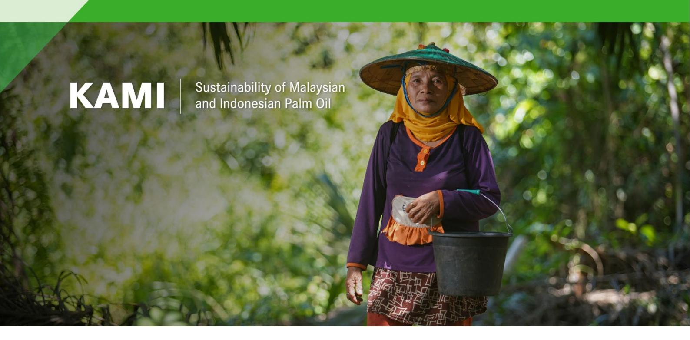

**EUDR relevant gender-related provisions in Indonesian and Malaysian legal frameworks for palm oil production**

# **Contents**

| 1.  |                                                                                                                                                   |
|-----|---------------------------------------------------------------------------------------------------------------------------------------------------|
| 2.  | Gender issues in palm oil production ..............................................................................................2              |
|     | 2.2 Employment vulnerability ..........................................................................................................3          |
|     | 2.4 Gender-based violence .............................................................................................................3          |
|     | 2.5 Lack of visibility .........................................................................................................................4 |
|     | 2.7 Limited access to other resources ............................................................................................5               |
|     | 2.8 Legal awareness .......................................................................................................................5      |
|     | 2.9 Social impacts ...........................................................................................................................5   |
| 3.  | The EUDR and gender considerations ...........................................................................................5                   |
| 4.  | Relevant Indonesian legal frameworks ...........................................................................................6                 |
| 4.1 | Land-use rights ......................................................................................................................6           |
| 4.2 | Environmental protection.......................................................................................................8                  |
| 4.3 | Third party rights....................................................................................................................9           |
| 4.4 | Labour rights..........................................................................................................................9          |
| 4.5 | Human rights .......................................................................................................................12            |
| 4.6 | Free, Prior and Informed Consent .......................................................................................15                        |
| 5.  | Relevant Malaysian legal framework ............................................................................................16                 |
| 5.1 | Land-use rights ....................................................................................................................17            |
| 5.2 | Environmental protection.....................................................................................................18                   |
| 5.3 | Third parties’ rights .............................................................................................................18             |
| 5.4 | Labour rights........................................................................................................................19           |
| 5.5 | Human rights .......................................................................................................................22            |
| 5.6 | Free, Prior and Informed Consent .......................................................................................23                        |
| 6.  | Conclusion.....................................................................................................................................23 |

# 1. Introduction

In Indonesia, women are estimated to make more than 80% of the labour force in the palm oil production cycle.1 In Malaysia, it is more challenging to find official figures of women in the palm oil workforce. According to records from several major palm oil companies, female employees accounted for 20-25% of the total plantation workforce in 2020. Around 9,000 women plantation workers were registered with the National Union of Plantation Workers in 2019. However, this does not include contract or casual workers, a large proportion of whom are women.2

This paper offers an initial overview of the gender-related aspects within the Indonesian and Malaysian legal frameworks governing palm oil production, focusing on areas pertinent to the EU Deforestation Regulation (EUDR). It also identifies gaps in the implementation of these legal frameworks, potentially leading to discrimination against women. It thus highlights potential grounds for claims of gender discrimination or other gender-related violations under Indonesian and Malaysian laws, which could prompt third parties to raise substantiated concerns with EU Competent Authorities. Such concerns could result in sanctions against the operators involved. Hence, the preparation for the EUDR application presents a valuable opportunity to initiate dialogues with stakeholders across palm oil supply chains in both countries. These dialogues would aim to enhance the enforcement and application of gender-related requirements. Furthermore, since the Indonesian Sustainable Palm Oil (ISPO) and the Malaysian Sustainable Palm Oil (MSPO) certification schemes are mandatory in Indonesia and Malaysia respectively, they could also provide avenues for bolstering the enforcement of gender-related requirements.

It is important to note that analysis for this paper was conducted internally within EFI and does not constitute a comprehensive legal analysis. Additionally, it has not undergone review or validation by stakeholders or legal experts within the respective countries.

## 2. Gender issues in palm oil production

The gender dimensions of palm oil production in Indonesia and Malaysia are complex and multifaceted. Some common gender-related issues include:

### 2.1 Occupational segregation

Women are often involved in the lower-skilled and lower-paid tasks within the palm oil industry, including difficult and dangerous jobs such as clearing land, carrying heavy loads and spraying chemicals like fertilisers and pesticides. The use of agrochemicals without appropriate protection can have particularly harmful health impacts on women including incidence of breast cancer, birth deformations, miscarriages, etc. Men dominate higher-

---

1 According to the Palm Oil Smallholders Union (SPKS), women make 86% of the labour force in the palm oil production cycle, working in supply chain activities such as fertilising, weeding, spraying, and collecting palm oil fruit.

2 Exploring the challenges faced by female executives in the Malaysian oil palm plantation industry: a qualitative study.

skilled and higher-paid positions such as harvesting the fresh fruit bunches and working in the processing mills. Supervisory and leadership roles are almost exclusively held by men.3

## 2.2 Employment vulnerability

Women are more often hired as temporary or 'casual' daily workers, with employment and pay not guaranteed and no access to employment benefits such as sick leave or maternity leave, while men receive nearly all the full-time permanent positions. Women have reported being dismissed from employment when becoming pregnant, causing many to hide pregnancies and continue working in potentially unsafe conditions.4 In addition, women also engage in significant unpaid labour, such as assisting their husbands in collecting loose oil palm fruits and other tasks for the husbands to meet their daily targets. Therefore, maternity protection, childcare and breastfeeding support, formal employment status, wider access to employee benefits, and job security, are among the common issues that need to be addressed in the industry.

## 2.3 Wage disparities

Women tend to earn less than men for similar work in the palm oil sector, contributing to economic disparities between genders. The few women who secure full-time employment are typically paid below the minimum wage.

## 2.4 Health and safety concerns

Women are frequently exposed to hazardous conditions without adequate protective measures, leading to health concerns. The use of agrochemicals – including herbicides, insecticides, fungicides and fertilisers – is common and can have harmful health impacts on women, who are often the ones administering them and rarely have access to protective equipment. Some have been associated with breast cancer, miscarriages and birth deformations.5 Additionally, plantations are often remote and isolated, with limited access to healthcare facilities.

## 2.4 Gender-based violence

During an investigation by the Associated Press, gender-based violence was identified as occurring within the sector in both Indonesia and Malaysia, including sexual harassment, abuse and rape, with victims often fearful of speaking out and those who do rarely seeing any recourse, even on plantations that are Roundtable on Sustainable Palm Oil (RSPO) certified.6

---

3 Buruh Siluman: The Making and Maintaining of Cheap and Disciplined Labour on Oil Palm Plantations in Indonesia.

4 Identifying the Human Rights Impacts of Palm Oil: Guidance for Financial Institutions and Down-stream Companies.

5 The Price of Indonesia's Palm Oil: Vulnerable and Exploited Women Workers.

6 Rape, abuses in palm oil fields linked to top beauty brands.

## 2.5 Lack of visibility

Gender issues are often overlooked in the palm oil sector, as women's participation in the sector is more limited and less visible than that of men. Although women are connected to palm oil production as plantation workers, farmers and local community members, they are often excluded from decision-making processes, such as negotiations between communities and companies or the government.7

## 2.6 Limited access to land

While both countries have made progress in recognising women's land rights, challenges persist and gender disparities often exist in practice. In Indonesia, women hold roughly 24% of agricultural land.8 In many parts of the country, especially in rural areas, customary land tenure systems often prevail. These systems can be influenced by patriarchal norms, limiting women's access to and control over land. However, there are some areas with matrilineal structures where land is traditionally passed from mother to daughter, such as in East Sumatra. The Indonesian Agrarian Law (*Undang-Undang Agraria*) recognises the rights of women to access and control land, but implementation can be uneven. Similarly, while legal provisions allow for joint land ownership by spouses, the practice may vary. Sometimes men may still be the primary landholders, affecting women's security and control over resources. Oil palm smallholder schemes in the country require the head of a household – mostly men – to register the land under their name. This gives men formal ownership of the plot and its related income, and they also become members of the oil palm cooperatives which have management and decision-making roles, while women are left out. However, independent smallholder plantations typically maintain existing land rights which are generally more gender equal.9

In Malaysia, the Land (Group Settlement Areas) Act 1960 (Revised 1994) underwent a significant amendment in 2002. This amendment, notably Section 15 (2a) of the Act, expanded ownership rights to include wives of settlers. Previously, only husbands were recognised as sole owners of settlement land under agreements with the Federal Land Development Authority. The amendment granted wives joint ownership rights to the land awarded to their husbands. Nonetheless, inheritance practices can favour male heirs, affecting women's rights to inherit and control land.

Some ethnic groups traditionally pass down property through female relatives. However, these practices are often disregarded in the absence of a formal will, in which case the closest male relative is recognised as the legal heir. This can deny women access rights to communal property. In addition, Islamic laws also followed in the country frequently give property rights to men, for example in the case of divorce.10

---

7 Gender Review from Indonesian Sustainable Palm Oil (ISPO).

8 BPS. 2019. Hasil Survei Pertanian antar Sensus (SUTAS). Bada Pusat Statistik. The 2018 data on distribution of agricultural holders by sex indicates that women held an estimated 24.04% of agricultural land compared to men's share of 75.96%. See also World Bank Gender Data Portal, according to which 12.7% of women were sole owners of land in 2017, and 15% owned land jointly.

9 Trade and entrepreneurship in Indonesia from a gender and development perspective.

10 Malaysia – Context and Land Governance.

## **2.7 Limited access to other resources**

In addition to challenges in access to land, limited access to credit is a common challenge for women in both countries. Without financial resources, women may struggle to purchase or invest in land. This hindrance to their independent farming makes it challenging for them to engage in more lucrative aspects of palm oil production.

## **2.8 Legal awareness**

Limited awareness among women of existing legal provisions regarding land rights and land tenure laws can be a barrier. Women may not be fully informed about their legal entitlements under tenure laws or may face challenges in asserting their rights.[11](#page-5-4)

## **2.9 Social impacts**

### **Migration**

The palm oil industry often leads to the in-migration of male workers, resulting in changes to traditional family structures and placing additional responsibilities on women in areas from which migration occurs. Additionally, palm oil production often concentrates large amounts of land for activities that provide little employment. As a result, it triggers rural unemployment and out-migration from rural areas. This causes the loss of shops, schools, health facilities, public transport, and other facilities women especially depend on for sustaining their families, further fuelling the migration to urban centres.

In Malaysia, migrants have historically made up a significant proportion of the palm oil sector workforce at around 60% in 2019, with around 2% of them women.[12](#page-5-5) Migrant women workers are prohibited from having children, therefore those who do become pregnant fear detention or deportation and can fall into a semi-legal status. Children born to migrant mothers in such conditions are stateless, often working on the plantations as well[.13](#page-5-6)

### **Gender stereotypes**

Due to entrenched 'traditional' gender roles, women remain the primary homemakers and caregivers. Therefore women employed in the palm oil sector, either permanently or casually, are still expected to engage in unpaid domestic work, including taking care of children, on top of their physical plantation work.

# **3.The EUDR and gender considerations**

Addressing these gender dimensions requires a comprehensive approach that involves various stakeholders, including governments, companies and civil society.

11 Inclusive and Gender-Aware Participatory Land Registration in Indonesia. 12 Women's Human Rights in the Changing World of Work: The case of women oil palm plantation workers in

Indonesia and Malaysia. 13 Gender-based impacts of labour migration, sustainability challenges and oil palm in Malaysia.

The EUDR is mostly gender blind. Its preamble (paragraph 6) contains one reference to gender equality.14 The operative text makes one reference to women, in relation to cooperation with third countries (article 30). In that article, it provides that “partnerships and cooperation shall allow the full participation of all stakeholders, including civil society, indigenous peoples, local communities, women, the private sector including microenterprises and other SMEs, and smallholders.”

Nonetheless, by imposing the respect of the national laws of producing countries in respect to land-use rights, labour rights, human rights, and free prior and informed consent, the EUDR could provide an avenue for reinforcing the implementation of the national legal requirements of Indonesia and Malaysia with relevance to gender. These requirements and their gender dimensions are detailed below for each of the two countries. Since the Indonesian Sustainable Palm Oil (ISPO) and the Malaysian Sustainable Palm Oil (MSPO) certification schemes are mandatory in Indonesia and Malaysia respectively, we also examine the treatment of gender issues in these standards.

ISPO and MSPO do not have any criteria specifically aimed at supporting women, but they do include gender in their categories for which discrimination is not permitted. Only the Roundtable on Sustainable Palm Oil (RSPO), which is voluntary, has a policy specifically aimed at protecting women from sexual harassment in the workplace, supporting their reproductive rights. RSPO also states the need to have a company policy specifically aimed at addressing gender-based abuses. All three standards have mandatory criteria prohibiting discrimination, but definitions of what constitutes discrimination vary widely. While RSPO requires publicly available equal opportunity policies, ISPO and MSPO require more generic commitments from companies, which are requested not to engage in or support discriminatory practices.15

## 4. Relevant Indonesian legal frameworks

This section examines international and national Indonesian legal instruments relevant to the palm oil sector, and the corresponding areas where gender dimensions could be applied.

### 4.1 Land-use rights

#### 4.1.1 Land tenure

**Basic Agrarian Law No. 5/1960** – Regulates land ownership and land use rights. It addresses various forms of land tenure, including state land, customary land and private land. It also protects legal recognition for indigenous and local communities’ customary land, through Community Land Titles (*Hak Ulayat*).

---

14 “The acceleration of climate change, biodiversity loss and environmental degradation, paired with tangible examples of their devastating effects on nature, human living conditions and local economies, have led to the recognition of the green transition as the defining objective of our time and a matter of gender equality and of intergenerational equity.”

15 Gender Review from Indonesian Sustainable Palm Oil (ISPO).

**Government Regulation No. 24/1997 on Land Registration** – Outlines procedures for obtaining land certificates, ensuring legal certainty and facilitating transactions.

**Government Regulation No. 5/2021 on the Implementation of Risk-Based Business Licensing (Online Single Submission)** – The required business licensing to engage in certain business activities is determined based on the level of risk of the activity. This regulation hinders community access to forest resources, as they compete with large companies for licences, risking displacement due to oil palm expansion.

**Gender dimensions** – Despite efforts to address smallholder farmers' land-use rights, slow formalisation and lack of recognition impede their participation in legal and sustainable palm oil supply chains. Formal land titling has direct consequences for women because the formalisation (land certification) process follows the state law and tends to be recorded under the name of men only.

Smallholder women are often subject to an additional layer of disadvantage due to a combination of community norms restricting their active participation in public spaces, as well as state and company concepts of gender where negotiation is via a 'representative' male head of the household.[16](#page-7-0)

By reinforcing statutory law, the EUDR could favour men and disadvantage women where customary law is less gender biased.

### **4.1.2 Business licensing in the agricultural sector**

Smallholders need to obtain a Plantation Business Registration Certificate. To do so, they must present land legality documents. The **Minister of Agriculture Regulation No. 38/2020** as a technical measure of **Presidential Regulation No. 44/2020** on the Implementation of Indonesian Sustainable Palm Oil (ISPO) Certification.

Farmers and companies are obligated to obtain an appropriate land-use permit (STD-B/IUP-B/IUP) from the local government before planting, and to comply with all relevant laws and regulations related to land use and environmental protection.

**Gender dimensions** – Most smallholders do not have, or have not applied for, a cultivation registration certificate (*Surat Tanda Daftar Budidaya*, or STD-B). Smallholder women are often subject to an additional layer of disadvantage, as described under 'land tenure'.

Oil palm expansion comes at the cost of reduced access to forest resources, the loss of subsistence agriculture and household control over food (rice) security, greater reliance on a cash economy, and environmental degradation, all of which disproportionately impact women.

16 Country Gender Assessment of Agriculture and the Rural Sector in Indonesia.

## **4.2 Environmental protection**

### **4.2.1 Environmental impact assessment**

**Law No. 32/2009 on the Implementation of Environmental Conservation and Management** and **Government Regulation No. 22/2021**

**Gender dimensions** – Implementing agencies of every project must consult the affected communities to formulate an EIA. However, the consultation procedures are sometimes neglected and several barriers affect community consultation. Inadequate consultation can lead to a lack of understanding of how environmental changes may disproportionately affect women. Environmental changes can lead to economic insecurity, and women, who often engage in subsistence farming or other resourcedependent activities, may face increased vulnerability.

Loss of access to natural resources or changes in environmental conditions can impact women's ability to earn a living and support their families.

### **4.2.2 Peat and mangrove protection**

**Presidential Instruction No. 5 of 2019** concerning Stopping the Granting of New Permits and Improving the Management of Primary Natural Forests and Peatlands.

**Law no. 57 of 2016** concerning the management and protection of peat.

**Presidential Regulation No. 120 of 2020** concerning the Peat and Mangrove Restoration Agency Job Creation Law (Act No. 11/2020).

**Gender dimensions** – The regulations have addressed some overlaps and inconsistencies within the laws and regulations related to land allocation. Nonetheless, forest and mangrove conversion permits are still being issued. This may disproportionately affect women, as they often engage in activities reliant on these ecosystems. They face potential loss of livelihoods due to declining fish stocks and disrupted agriculture. Additionally, the absence of ecosystem protection increases vulnerability to natural disasters, impacting women managing households in coastal areas. Water scarcity and contamination resulting from degraded mangroves affect women responsible for water sources.

### **4.2.3 Forest and biodiversity conservation**

**Convention on Biological Diversity** – Indonesia ratified this Convention, which was transposed into Indonesian law by Law No. 21 of 2004.

**Gender dimensions** – The conversion of forests to palm oil plantations can lead to more frequent flooding and increased erosion. The loss of forest habitat has resulted in increased competition with wildlife, which turn to crops as a food source. Crops are harder to cultivate and women must spend more time weeding, which gives them

less time for other responsibilities like fishing, securing other food sources for their families, or investing time in other income-generating activities.[17](#page-9-2)

#### **4.2.4 Hazardous pesticides and fertilisers**

**Convention on the Prior Informed Consent Procedure for Certain Hazardous Chemicals and Pesticides in International Trade** – Indonesia ratified this Convention, which was transposed into Indonesia law by **Law No. 10 of 2013**.

**Stockholm Convention on Persistent Organic Pollutants (POPs Convention)** – Indonesia ratified this Convention, which was transposed into Indonesian law by Law No. 19 of 2009.

**Decree of the Minister of Agriculture No. 39 on the Registration of Pesticides (PER/SR.330/7/2015)**

**International Code of Conduct on Pesticide Management** – adopted by Indonesia.

**Gender dimensions** – Most invisible workers, who do not get law protection insurance, are women. Since these women often work on palm oil treatment, this puts them in a risky position in terms of health, due to exposure to chemical fertilisers and pesticides.[18](#page-9-3)

## **4.3 Third party rights**

See the discussion of the consultation of local communities under the EIA (4.2.1) and landuse rights (4.1) sections.

## **4.4 Labour rights**

### **4.4.1 Fundamental principles and rights at work**

**Law No. 13/2013 on Manpower, amended by Government Regulation in lieu of Law No. 2/2022 on Job Creation** – Regulates all employment in Indonesia.

The International Labour Organization's **Declaration on Fundamental Principles and Rights at Work** is not binding, but Indonesia has transposed it into law through **Presidential Decree No. 83 of 1998**.

**Gender dimensions** – The Declaration comprises four core principles, and it addresses issues such as forced labour, child labour, non-discrimination and freedom of association. The gender dimensions of these principles are analysed in the following sections.

17 Palm oil production impacts livelihood and gender roles in East Kalimantan, Indonesia. 18 "Gender" in the palm oil industry and its RSPO label, World Rainforest Movement.

### **4.4.2 Freedom of association and right to organise**

**Freedom of Association and Protection of the Right to Organise Convention** – Ratified by Indonesia, transposed into Indonesian law by **Presidential Decree No. 83 of 1998**. Then strengthened by **Law No. 21 of 2000 concerning Trade Unions/Trade Union**.

**Right to Organise and Collective Bargaining Convention** – Transposed into law **Number 18 of 1956**.

**Gender dimensions** – Recognises the right of workers to form and join trade unions and engage in collective bargaining. In the palm oil sector, ensuring that women have the freedom to associate, join trade unions and collectively bargain for better working conditions is essential for promoting gender equality and addressing workplace issues. However, the majority of invisible workers, who do not get law protection insurance, are women. These women dominate the work of maintaining the plantation, but do not get sufficient rights fulfilment, especially in the right to form a union. Women are not quite represented in farmer group organisations.

If these legal provisions are breached in the production of palm oil and such a violation is documented, it could form the basis for a substantiated concern should this product be produced for export to the EU.

### **4.4.3 Forced labour**

**Forced Labour Convention of 1930** and its **2014 Protocol** – Indonesia ratified these two instruments, which were transposed into Indonesian law through **Nederland staatsblad 1932 No: 185**, **Nederland staatblad 1933 No: 34**, **staatblad 1933 No: 117**, and **Law No. 11 of 2013**.

**Abolition of Forced Labour Convention of 1957** – Indonesia ratified this Convention, which was transposed into **Law Number 19 of 1999**.

**Gender dimensions** – These legal instruments condemn forced or compulsory labour. In the palm oil sector, where instances of forced labour have been reported, including cases involving women, the principles of the Declaration can be applied to eliminate such practices and protect the rights of all workers.

If women are subject to forced labour in the production of palm oil in breach of these legal provisions and such a violation is documented, it could form the basis for a substantiated concern should this product be produced for export to the EU.

### **4.4.4 Child labour**

**The Minimum Age Convention** – Indonesia ratified this Convention, which was transposed into Indonesian law by **Law Number 20 of 1999**.

**The Worst Forms of Child Labour Convention** – Indonesia ratified this Convention, which was transposed into Indonesian law by **Law Number 1 of 2000**.

**Gender dimensions** – These legal instruments call for the elimination of child labour. In the palm oil industry, addressing child labour issues is crucial, and the provisions of these conventions can guide efforts to protect children, particularly girls, from exploitation in the sector.

If child labour occurs in the production of palm oil and such a violation is documented, it could form the basis for a substantiated concern should this product be produced for export to the EU.

### **4.4.5 Equal remuneration and discrimination**

**The Equal Remuneration Convention** – Indonesia ratified this Convention, which was transposed into Indonesian law by **Law Number 87 of 1957**.

**The Discrimination (Employment and Occupation) Convention** – Indonesia ratified this Convention, which was transposed into **Law Number 21 of 1999**.

**Plantation Law No. 18/2004** – Regulates plantations, including palm oil plantations.

The National Gender Mainstreaming Policy enacted in 2000 guides the National Long-term Development Plan 2005- 2025 which confirms the Indonesian Government's commitment to gender equality.

**Gender dimensions** – The two international conventions promote equal opportunities and treatment for all workers, regardless of gender. In the palm oil sector, where women may face discrimination in hiring, promotions or other aspects of employment, they can be applied to ensure gender equality.

The implementation of the Plantation Law may have gender implications in terms of employment practices, especially if there are disparities in wages or working conditions between men and women.

The Gender Equality Act forbids discrimination based on gender, sexual orientation, or gender identity and mandates that companies pay employees equally for equal work.

Research shows that formal jobs in the palm oil sector tend to be divided by gender. With high harvest targets, men often rely on their wives and families as 'shadow workers' to get the job done. Consequently, women workers are rendered invisible and uncompensated for their contributions to the sector.[19](#page-11-0)

In Indonesia, 70% of workers on the oil palm plantations are local casual workers, the majority of whom are women. As casual workers, they have limited access to workers' rights protection, besides having to deal with domestic responsibilities, including childcare.

Despite recent legal developments, female workers often lack rights fulfilment, such as obtaining social insurance, work equipment, maternity leave, decent and equal wages, good sanitation, and the lack of lactation facilities. Further, challenges related

19 Voices of women in palm oil.

to current social norms exist, for example, the assumption that gender-based wage inequality is common and normal in some cultural contexts.

#### **4.4.6 Health and safety**

#### **Law No. 1 of 1970 on Occupational Safety**

#### **Manpower Ministry decree number PER.08/MEN/VII/2010**

**Gender dimensions** – These legal instruments make it an offence when employers do not provide personal protective equipment (PPE) that is appropriate to the type of risk a worker is exposed to, free of charge. In practice, however, women are often not provided PPE when spraying fertilisers and pesticides (see also environmental law).

## **4.5 Human rights**

### **4.5.1 Right against discrimination**

Various international instruments ratified by Indonesia, as well as some national laws recognise the prohibition of discrimination against women.

**Universal Declaration of Human Rights** – Indonesia is a signatory and has transposed the Universal Declaration of Human Rights through **Law No. 39 of 1999 on Human Rights** in respecting and implementing the Universal Declaration on Human Rights (UDHR) of 1948. [20](#page-12-1)

**Gender dimensions** – The Declaration does not explicitly mention gender. However, the principles it outlines are meant to apply to all individuals, regardless of gender, and are interpreted and applied with a gender-sensitive perspective.

**International Covenant on Civil and Political Rights** – Ratified by Indonesia in 2006. It was transposed into Indonesia law through **Law No. 12 of 2015 concerning International Covenant on Civil Political Rights**.

**Gender dimensions** – Article 3 provides that States parties undertake to ensure the equal right of men and women to the enjoyment of all civil and political rights set forth in the present Covenant. And Article 26 promulgates the prohibition of discrimination on the ground of sex.

**International Covenant on Economic, Social and Cultural Rights** – Ratified by Indonesia in 2006 promulgates the prohibition of discrimination on the ground of sex. Transposed into Indonesian law by **Law Number 12 of 2005**.

**Gender dimensions** – Article 3: The States Parties to the present Covenant undertake to ensure the equal right of men and women to the enjoyment of all economic, social, and cultural rights set forth in the present Covenant.

20 Apa Saja Instrumen HAM Internasional yang Diratifikasi RI?

Article 7: Recognises the right of everyone to enjoy just and favourable conditions of work, which includes fair wages and equal remuneration for work of equal value without distinction of any kind, in particular women being guaranteed conditions of work not inferior to those enjoyed by men.

In practice however, without formal titles in their name (see section above on landuse rights), women cannot defend or reclaim land if their husband dies. Having reduced and unequal access to land means women have less access to certain livelihood opportunities. Furthermore, gender-based wage inequalities have been reported in the palm oil sector.[21](#page-13-0)

**International Convention on the Elimination of All Forms of Racial Discrimination** – Ratified by Indonesia in 1999. Transposed into Indonesian law by **Law No. 29 of 1999**.

**Gender dimensions** – While this Convention does not specifically address women's rights or indigenous peoples' rights, its provisions can have implications for these groups, as discrimination based on race can intersect with other forms of discrimination. It recognises that racial discrimination can disproportionately affect women who belong to racial or ethnic groups. Women may face intersecting forms of discrimination based on both gender and race.

**Declaration on the Rights of Persons Belonging to National or Ethnic, Religious and Linguistic Minorities** – Adopted without a vote by the United Nations General Assembly.

The provisions of the declaration have been transposed into national law through Indonesian **Law Number 40 of 2008**.

**Gender dimensions** – The Declaration does not explicitly focus on gender dimensions, but it acknowledges the potential intersectionality of discrimination and the importance of considering multiple identities, including gender.

**Convention on the Elimination of All Forms of Discrimination Against Women (CEDAW)** – Ratified by Indonesia in 1984. Transposed into Indonesian law by **Law No. 7 of 1984**.

**Gender dimensions** – The Convention aims to eliminate discrimination against women in all spheres of life. Provisions of relevance to the palm oil sector are:

Article 3: States must take appropriate measures to ensure the advancement of women to promote equality, including economic and social spheres. This could involve measures to address gender-based barriers to women's advancement, such as providing training, financial support, and addressing discriminatory practices.

Article 5: Calls for the elimination of stereotypes and cultural practices that perpetuate discrimination against women. This could be invoked to challenge gender

21 Gender Mainstreaming and Social Inclusion Opportunities in the Implementation of Indonesian Sustainable Palm Oil (ISPO) Certification.

stereotypes and cultural norms that may limit women's participation in certain roles within the palm oil sector.

Article 7: Women have a right to participate in political and public life, which can be relevant in advocating for women's voices in decision-making processes related to the palm oil industry.

Article 11: Women have the right to work and participate in employment opportunities on equal terms with men. In the palm oil sector, this means ensuring that women have equal access to employment, training and advancement opportunities, and that they are not subjected to discriminatory practices in hiring or promotions.

Article 11 also upholds women's right "to protection of health and to safety in working conditions, including the safeguarding of the function of reproduction". Women's work as sprayers exposes them to pesticide and fertilisers poisoning, affecting their reproductive health.

Article 14: Rural women have specific needs and may be engaged in agricultural activities. This could be relevant in ensuring that rural women have equal access to resources, credit, and technology in the palm oil sector.

**ISPO (criteria 4.4)** requests companies not to engage in or support any discriminatory practices.

In addition, **Permentan No. 38/2020 on the Indonesian Sustainable Palm Oil Certification System** regulates the criteria for non-discrimination based on gender in ISPO certification process and encourages the empowerment of more vulnerable parties.

If gender discrimination occurs in the production of palm oil in breach of the legal provisions outlined above and is documented, it could form the basis for a substantiated concern should this product be produced for export to the EU.

### **4.5.2 Rights of the child**

**Convention on the Rights of the Child** – Ratified by Indonesia in 1990. Transposed into Indonesian law by **Presidential Decree No. 36 of 1990**.

**Gender dimensions** – The Convention recognises and addresses the specific rights and needs of girls and boys. Article 2 emphasises the principle of non-discrimination, including discrimination based on gender. Article 28 recognises the right of the child to education, including promoting equal access to education for boys and girls.[22](#page-14-0)

### **4.5.3 Rights of persons with disabilities**

**Convention on the Rights of Persons with Disabilities** – Ratified by Indonesia in 2011. Transposed into Indonesian law through **Law Number 19 of 2011**.

22 Palm oil and children in Indonesia exploring the sector's impact on children's rights.

**Gender dimensions** – The Convention does not explicitly address gender dimensions, but it recognises that persons with disabilities, including women and girls, often face multiple forms of discrimination. It emphasises the importance of considering the intersectionality of disability and other factors, including gender.

If such a discrimination occurs in the production of palm oil in breach of these legal provisions and is documented, it could form the basis for a substantiated concern should this product be produced for export to the EU.

#### **4.5.4 Gender-based violence, organised crime and human trafficking**

**United Nations Convention against Transnational Organised Crime** and the supplementing **Palermo Protocol to Prevent, Suppress and Punish Trafficking in Persons Especially Women and Children** – Ratified by Indonesia in 2009. Indonesia adopted the Law 21 on the Eradication of the Criminal Act of Trafficking in Persons in 2007. The law provides that trafficking in persons, especially the trafficking of women and children, constitutes a crime which violates human dignity and respect and human rights.

**Gender dimensions** – The Palermo Protocol and Law 21 address trafficking in persons, with a focus on protecting women and children who are particularly vulnerable to exploitation. In the palm oil sector, where instances of human trafficking and forced labour have been reported, the Law’s principles can be applied to prevent, suppress, and punish trafficking offences, ensuring the protection of women and children. It underscores the need to protect and assist victims of trafficking, with a focus on the special needs of women and children. In the palm oil sector, this could involve establishing mechanisms to identify and support victims, including women who may be subjected to various forms of exploitation and abuse.

ISPO lacks indicators relating to harassment or violence against women, relying on Indonesian law to act as the guide.

If women are subject to human trafficking and forced labour in the production of palm oil in breach of these legal provisions and such violations are documented, it could form the basis for a substantiated concern should this product be produced for export to the EU.

## **4.6 Free, Prior and Informed Consent**

**United Nations Declaration on the Rights of Indigenous Peoples** – Indonesia signed the Declaration in 2007. However, the Government argues that the concept of Indigenous Peoples is not applicable, since most Indonesians (except for the Chinese) are Indigenous and have the right to the same rights. As a result, the Government has rejected calls for the specific needs of groups that identify themselves as Indigenous.

**Gender dimensions** – The Declaration does not explicitly focus on gender, but recognises the need to consider the intersecting forms of discrimination and oppression that indigenous women may face. Specific gender-relevant dimensions:

- ○ Right to FPIC protects the rights of indigenous women who may be disproportionately impacted by land acquisition and resource extraction.
- ○ Right of indigenous peoples to maintain, control, protect, and develop their cultural heritage: oil palm may lead to land-use changes that disrupt traditional practices, this provision is relevant to the cultural rights of indigenous women.
- ○ Right of indigenous peoples to the ownership, use, and control of their lands, territories, and resources: the land rights of indigenous women are crucial in the context of the palm oil sector.
- ○ Principle of non-discrimination: indigenous women must have equal access to resources and opportunities.
- ○ Full and effective participation of indigenous peoples in decision-making processes: indigenous women must have a voice in matters affecting their communities, including those related to the palm oil sector.
- ○ However, women are disproportionately impacted by oil palm development and the ensuing deforestation. A study in West Kalimantan showed that Dayak women are frequently excluded from leadership roles and public forums where decision-making takes place, and their interests are often underrepresented in these spaces.
- ○ If indigenous women are excluded from decision-making processes in relation to oil palm development in breach of these legal provisions and is documented, it could form the basis for a substantiated concern should this product be produced for export to the EU.

ISPO was amended in 2022 to include mention of Free, Prior and Informed Consent (FPIC) in the indicator and verifier of **criterion 1.1.2**. Additionally, while it stipulates the need for mutually agreed negotiation processes for land acquisition and compensation within its requirements, it currently faces challenges in effectively promoting equitable negotiations between large plantation companies and local communities. ISPO's current structure does not adequately enhance the negotiating power of local communities during these processes. Furthermore, ISPO acknowledges customary communities only if they receive support from local government, potentially exacerbating social tensions.23

**Gender dimensions** – Research indicates that in many cases, FPIC is not being adequately carried out, and that women in particular are excluded from the process. Women are excluded from participation during negotiations and contestations around land acquisition for the development of oil palm plantations.24

## 5. Relevant Malaysian legal framework

This section examines international and national legal instruments relevant to the Malaysian palm oil sector, and corresponding gender dimensions.

23 Sustainable palm oil as a public responsibility? On the governance capacity of Indonesian Standard for Sustainable Palm Oil (ISPO).

24 Spaces for participation and resistance: gendered experiences of oil palm plantation development.

## **5.1 Land-use rights**

### **5.1.1 Land tenure**

#### **National Land Code 1965 in Peninsular Malaysia**

#### **Sarawak Land Code 1958**

#### **Sabah Land Ordinance 1968**

Indigenous peoples of Peninsular Malaysia (Orang Asli) have a **common law** right to their customary lands.

**Gender dimensions** – Malaysia applies a system of land registration and there is rarely any controversy as to the tenure or the right of a person to land once registered and title/grant is issued. Conflicts may arise between the customary landrights of aborigines and registered landowners. MSPO provides strong and clear requirements regarding land tenure and land use assessments. Furthermore, it requires that where lands are encumbered by customary rights, "the company shall demonstrate that these rights are understood and are not being threatened or reduced."

Nonetheless, native customary land has been reportedly lost to plantations without compensation in Sabah and Sarawak. One study found that in 2007, there were at least 40 court cases filed against palm oil companies in Sarawak alone. [25](#page-17-1)

The imposition of registered land systems might further sideline women from decision-making processes related to land use and management. Women's voices may be underrepresented, limiting their ability to shape outcomes that directly affect their lives.

Disputes over land between customary land rights holders and registered landowners, such as plantations, can disrupt women's livelihoods, affecting their ability to sustain their families and communities.

Large-scale land conversions can lead to the displacement of entire communities. Women may bear the brunt of the social and economic disruptions caused by such displacement, including loss of homes, community structures, and support networks.

If palm oil is produced on land subject to tenure conflict, it could form the basis for a substantiated concern should this product be produced for export to the EU.

25 Land is Life: Land Rights and Palm Oil Development in Sarawak.

## **5.2 Environmental protection**

### **5.2.1 Forest conversion**

**National Land Code** – empowers the state authority to convert state land forests, which are not permanent reserved forests, into oil palm estates by categorising them as agricultural land. This decision does not need to take into consideration sustainability and there are no provisions for public consultations.

**Environmental Quality Act** – aims to minimise and mitigate environmental impact and not prevent or prohibit environmental damaging activities from happening. The EIA Order 2015 does not 'prevent' forest conversion or agricultural expansion from happening.

**Gender dimensions** – The conversion of forests into oil palm estates can impact traditional livelihoods that women might have had in the forested areas. If these areas are converted into monoculture plantations, it may limit the range of livelihood options available to women, potentially affecting their income and economic independence.

The lack of provisions for public consultations under the Land Code may limit women's participation in decision-making processes related to land-use changes.

The environmental consequences of large-scale conversion to oil palm plantations can have indirect effects on women's lives. Changes in water quality, loss of biodiversity, and soil degradation can impact the availability of resources women traditionally rely on for household needs, food and traditional medicine.

### **5.2.2 Pesticides and fertilisers**

**Stockholm Convention on Persistent Organic Pollutants** – Malaysia has signed but not ratified, so it is not bound by it.

**Pesticides Act 1974** and **Pesticides (Labelling) Regulations 1984**

**International Code of Conduct on Pesticide Management** – Adopted by Malaysia.

**Gender dimensions** – Women's work as sprayers exposes them to pesticide and fertiliser poisoning, affecting their reproductive health (see also section 4.4.1, the section on environmental protection and the section on health and safety).

If women are subject to chemical poisoning in breach of the Pesticide Act and related regulations in the production of palm oil, it could form the basis for a substantiated concern should this product be produced for export to the EU.

## **5.3 Third parties' rights**

Native Customary Rights (NCR) are protected as rights to property under Article 13 of the Federal Constitution. MSPO requires maps of an appropriate scale demonstrating the extent

of recognised customary rights to be made available. For NCR land to be converted into oil palm plantations, the rights holders must be consulted and must give their consent. For lands subject to overlapping claims, a grievance mechanism is available. Customary rights areas should be established through participatory mapping involving affected parties, including neighbouring communities and local authorities, and FPIC must be documented and observed.

The **Environmental Quality Act 1974** and the **Federal Orders on EIAs** – These require an Environmental Impact Assessment (EIA) for agricultural and forestry-related activities if above a threshold area. Only Second Schedule activities which include agriculture development (i.e. land developments covering 500 hectares or more and bringing forest into agricultural production) mandate public participation in EIA study and public display of the EIA report.

**Gender dimensions** – The lack of provisions for public consultations for some EIAs may limit women's participation in decision-making processes related to land-use changes (see also above, section 4.4.1 on the gender dimensions of public consultations on EIAs and below on forest conversion).

If palm oil is produced on land previously assessed through a flawed EIA, without the required consultations of women stakeholders, it could form the basis for a substantiated concern should this product be produced for export to the EU.

## 5.4 Labour rights

### 5.4.1 Fundamental principles and rights at work

Malaysia is a party to several ILO conventions, including the **Forced Labour Convention, 1930 (No. 29)**; the **Protocol of 2014 to the Forced Labour Convention**; the **Right to Organise and Collective Bargaining Convention, 1949 (No. 98)**; the **Equal Remuneration Convention, 1951 (No. 100)**; and the **Promotional Framework for Occupational Safety and Health Convention, 2006 (No. 187)**. It has denounced the Forced Labour Convention of 1957.

**Federal Constitution of Malaysia** prohibits slavery and forced labour (Article 6), prohibits discrimination based on gender (Article 8(2)) and guarantees the right to freedom of association (Article 10).

**Employment Act of 1955** is the fundamental legislation relating to employment in Malaysia. It sets forth minimum standards for working conditions and terms of service, including normal working hours, employment contracts, wage payments, rest periods, and termination notices. Many migrant workers are employed in the informal sector, e.g. in domestic work, which is not recognised as a form of work under the existing Employment Act 1955. However, the Immigration Act applies, as summarised below.

**Immigration Act of 1955** requires temporary migrant workers in certain sectors to undergo pregnancy testing as a condition for receiving and maintaining a work permit. Under section 8(3) of the Act, a pregnant women can be classified as a prohibited immigrant due to being

deemed unfit for employment based on mandatory pre-employment and annual medical screening. The medical screening is regulated by the Ministry of Health and includes pregnancy testing.

**Gender dimensions** – Using pregnancy as a factor in employment is a form of gender discrimination under Article 8(2) of the Malaysian Constitution, and in applying CEDAW (see sections 4.5.1 and 5.5.1.) in interpreting the Constitution, because of the fact that only a woman has capacity to become pregnant.

**Trade Unions Act of 1959** lays down provisions for the formation and operations of trade unions in Malaysia.

**Industrial Relations Act of 1967** is the legislation that governs workplace relations in Malaysia. It includes provisions for collective bargaining, trade union recognition claims, and representation in cases of unjust dismissal. The Act uses the term 'workmen/workman'. The Act does not include any provision prohibiting an employer from discriminating against an employee on the grounds of gender, religion, race or disability.

**Gender dimensions** – The Employment Act of 1955 covers issues such as contracts, wages, employment of women and decent working hours. It offers the right to maternity leave, and it is an offence to terminate the services of a female employee during her maternity leave other than for the closure of the employer's business. The 2023 Employment Act amendments increased the entitlement of paid maternity leave for working mothers from 60 to 98 days and introduced a paid paternity leave of seven days.

Nonetheless, in practice, women in the palm oil sector often are relegated to low-paid tasks like weeding, applying chemicals, and the vital work of hand-pollinating oil palms. They can also be subject to sexual exploitation.[26](#page-20-0)

A US Department of State report indicated that the men, women and children who come to Malaysia as migrant workers may be subjected to forced labour or debt bondage at the hands of their employers, employment agents or informal labour recruiters[.27](#page-20-1) The US Customs and Border Protection had orders to detain palm oil and palm oil products produced by FGV Holdings Berhad and Sime Darby and their subsidiaries because of sufficient information indicating the use of forced labour on their plantations in Malaysia.[28](#page-20-2)

Since a portion of palm oil workers in Malaysia are illegal migrants, the threat of deportation deprives them from their right to freely associate and join trade unions.

26 Gender and the Past and Future of Palm Oil. 27 2023 Trafficking in Persons Report: Malaysia. 28 U.S. Customs and Border Protection, "CBP Issues Withhold Release Order on Palm Oil Produced by Forced Labor in Malaysia"; U.S. Customs and Border Protection, "CBP Issues Detention Order on Palm Oil Produced with Forced Labour in Malaysia"; U.S. Customs and Border Protection, "Withhold Release Orders and Findings Lists".

If violations of these labour provisions occur in the production of palm oil, they could form the basis for a substantiated concern should this product be produced for export to the EU.

### **5.4.5 Health and safety**

**Occupational Safety and Health Act 1994 (or Act 514)** – Provides the legislative framework for the safety, health and welfare among all Malaysian workforces.

**Gender dimensions** – In palm oil plantations, women are exposed to pesticide and fertiliser poisoning. As sprayers, they must carry very heavy weights, causing strain. Employers do not provide them with PPE. See also section on pesticide use above.

If women are subject to chemical poisoning or are injured in the production of palm oil, it could form the basis for a substantiated concern should this product be produced for export to the EU.

#### **5.4.6 Equal remuneration and minimum wage**

**Equal Remuneration Convention (1951, No. 100)** – Ratified.

**Minimum Wage Fixing Convention** – entered into force in Malaysia in 2007.

**Minimum Wages Order of 2012**

**Gender dimensions** – Around 9,000 women plantation workers are registered with the National Union of Plantation Workers, but this is an underestimate as many are working as contract workers. There is no data of their actual numbers. Most of these women have little formal education and opportunity to obtain better jobs elsewhere. Legally they receive the minimum wage, but in reality, their take home pay is less with wages linked to productivity and deductions made by employers.[29](#page-21-0)

### **5.4.7 Discrimination and harassment**

**Malaysian Employment Act 1955** – Only covers workplace sexual harassment.

**Anti-Sexual Harassment Act** – Passed in 2022, although only some sections have come into force. Provides the right of redress for any person who has been sexually harassed in all aspects of everyday living.

**Gender dimensions** – The Employment Act was amended to allow women to work in any industrial or agricultural endeavour at night (something prohibited under the original Act). The Employment Act 2023 amendments request employers to display a notice to raise awareness on sexual harassment in the workplace.

MSPO states that "The management shall establish a policy and provide guidelines to prevent all forms of sexual harassment and violence at the workplace". However, reproductive rights are not specifically mentioned.

29 Migrant estate workers toil in tough conditions.

In 2020, the US banned the import of palm oil from a major Malaysian producer due to reports of child labour and sexual violence.[30](#page-22-1)

If women are subject to gender-based violence or harassment in the production of palm oil, it could form the basis for a substantiated concern should this product be produced for export to the EU.

## **5.5 Human rights**

### **5.5.1 Right against discrimination**

**UN Universal Declaration of Human Rights** – Malaysia is a signatory.

**Gender dimensions** – The Declaration does not explicitly mention gender. However, the principles it outlines are meant to apply to all individuals, regardless of gender, and are interpreted and applied with a gender-sensitive perspective.

A frequently reported practice with migrant workers in Malaysia, both women and men, is that their passports are withheld by employers, recruitment agencies or others. This is a breach of various international human rights agreements including the Universal Declaration of Human Rights. [31](#page-22-2) Additionally, the Malaysian Passport Act (Act 150, 1966) stipulates that it is illegal for anyone who is not a lawful authority to possess a passport that was issued for the use of some person other than themselves.

#### **Convention on the Elimination of All Forms of Discrimination Against Women (CEDAW)** – Ratified in 1995.

**Gender dimensions** – The CEDAW binds Malaysia to amend and eliminate laws and regulations that permit discrimination against women, e.g. Malaysian labour law (covered above) and immigration law, particularly in relation to health screening/pregnancy testing.

#### **Convention on the Rights of Persons with Disabilities (CRPD)**

**Gender dimensions** – For a discussion of the relevance of the CRPD to the palm oil sector, see section 4.5.3 above.

MSPO requests companies not to engage or support any discriminatory practices. There is no mention as to whether these policies should be made public or not. Although MSPO references gender in its non-discrimination policies, within its standards there is no acknowledgement of the need for specific indicators to be in place to protect women in the workplace.

If discrimination against women has occurred in the production of palm oil, it could form the basis for a substantiated concern should this product be produced for export to the EU.

30 US says it will block palm oil from large Malaysian producer. 31 1948 Universal Declaration of Human Rights, Articles 6 and 15.

### **5.5.2 Child labour**

Malaysia is a party to various international instruments addressing child labour: the **Convention on the Rights of the Child**; the **Minimum Age Convention, 1973 (No. 138)** (the minimum age specified is 15 years); and the **Worst Forms of Child Labour Convention, 1999 (No. 182)**. Several national legal instruments also regulate child labour, including the **Children and Young Persons (Employment) Act of 1966**.

**Gender dimensions** – These legal instruments call for the elimination of child labour. In the palm oil industry, the provisions of these conventions can guide efforts to protect children, particularly girls, from exploitation in the sector.

## **5.6 Free, Prior and Informed Consent**

### **5.6.1 Requirement for FPIC**

No specific law governs FPIC in the agricultural sector. Malaysia has endorsed the United Nations Declaration on the Rights of Indigenous People, but the provisions of the Declaration have not been transposed into the law. Legal provisions pertaining to FPIC are contained in the Access and Benefit Sharing Act 2017 at the Federal level, but it focuses on genetic resources and is not applicable to the agricultural sector.

MSPO provides straightforward guidelines on the FPIC process.

**Gender dimensions** – FPIC processes are essential to ensure the active and meaningful participation of women in decision making regarding the establishment or expansion of palm oil plantations. The MSPO guidelines on FPIC could be applied to recognise and address the specific concerns and perspectives of women within affected communities.

If palm oil is produced on land that was cultivated following FPIC procedures that excluded women, it could form the basis for a substantiated concern should this product be produced for export to the EU.

# **6.Conclusion**

This paper provides an overview of the gender dimensions of the applicable legal framework to palm oil production in Indonesia and Malaysia. While we have focused on gender issues, this preliminary work has underscored how these intersect with broader concerns such as human rights, labour rights, and health and safety.

Nonetheless, in the absence of a clear definition of legal palm oil, further work is needed to determine which laws and regulations are applicable in both countries and whether they are effectively enforced.

In navigating this complex landscape, it becomes evident that addressing gender disparities requires a comprehensive approach that encompasses not only legal frameworks but also

social, economic, and environmental factors. In this context, the potential for the EUDR to bolster the enforcement of gender-related requirements warrants further exploration and consideration.

# **References**

Apa Saja Instrumen HAM Internasional yang Diratifikasi RI? (*What Are the International Human Rights Instruments Ratified in Indonesia?*), December 2023, Tirto.id, <https://tirto.id/glAU>

Associated Press, September 2020, US says it will block palm oil from large Malaysian producer, [https://apnews.com/article/international-news-business-us-news-ap-top-news](https://apnews.com/article/international-news-business-us-news-ap-top-news-malaysia-e2258c8e29cf5dbc6906d14303614679)[malaysia-e2258c8e29cf5dbc6906d14303614679](https://apnews.com/article/international-news-business-us-news-ap-top-news-malaysia-e2258c8e29cf5dbc6906d14303614679) 

Associated Press, November 2020, Rape, abuses in palm oil fields linked to top beauty brands, [https://apnews.com/article/palm-oil-abuse-investigation-cosmetics-](https://apnews.com/article/palm-oil-abuse-investigation-cosmetics-2a209d60c42bf0e8fcc6f8ea6daa11c7)[2a209d60c42bf0e8fcc6f8ea6daa11c7](https://apnews.com/article/palm-oil-abuse-investigation-cosmetics-2a209d60c42bf0e8fcc6f8ea6daa11c7) 

BPS. 2019. Hasil Survei Pertanian antar Sensus (SUTAS). Bada Pusat Statistik. Also available at [www.bps.go.id/publication/2019/01/02/c7cb1c0a1db444e2cc726708/hasil](http://www.bps.go.id/publication/2019/01/02/c7cb1c0a1db444e2cc726708/hasil-survei-pertanian-antar-sensus--sutas--2018.html)[survei-pertanian-antar-sensus--sutas--2018.html](http://www.bps.go.id/publication/2019/01/02/c7cb1c0a1db444e2cc726708/hasil-survei-pertanian-antar-sensus--sutas--2018.html)

CIFOR-ICRAF Forest News, March 2017, Voices of women in palm oil, <https://forestsnews.cifor.org/48684/voices-of-women-in-palm-oil>

Colchester, M, W A Pang, W M Chuo and T Jalong, 2007, Land is Life: Land Rights and Palm Oil Development in Sarawak. Forest Peoples Programme and SawitWatch, Bogor.

FAO, 2019, Country Gender Assessment of Agriculture and the Rural Sector in Indonesia, <https://www.fao.org/3/ca6110en/CA6110EN.pdf>

Food Research, 2023, Exploring the challenges faced by female executives in the Malaysian oil palm plantation industry: a qualitative study,

[https://www.myfoodresearch.com/uploads/8/4/8/5/84855864/\\_12\\_\\_fr-kliafp11-](https://www.myfoodresearch.com/uploads/8/4/8/5/84855864/_12__fr-kliafp11-006_roslam.pdf) [006\\_roslam.pdf](https://www.myfoodresearch.com/uploads/8/4/8/5/84855864/_12__fr-kliafp11-006_roslam.pdf)

Geoforum 96(6):217-226, November 2018, Spaces for participation and resistance: gendered experiences of oil palm plantation development, DOI:10.1016/j.geoforum.2018.08.011

Hidayat, N.K., Offermans, A. & Glasbergen, P., 2018, Sustainable palm oil as a public responsibility? On the governance capacity of Indonesian Standard for Sustainable Palm Oil (ISPO). Agric Hum Values 35, 223–242,<https://doi.org/10.1007/s10460-017-9816-6>

Lan Mei, Helen Newing, Oda Almås Smith, Marcus Colchester and Angus McInnes, April 2022, Identifying the Human Rights Impacts of Palm Oil: Guidance for Financial Institutions and Down-stream Companies, Forest Peoples Programme, [https://globalcanopy.org/wp](https://globalcanopy.org/wp-content/uploads/2022/08/FPP-Palm-Oil-Report-FINAL52.pdf)[content/uploads/2022/08/FPP-Palm-Oil-Report-FINAL52.pdf](https://globalcanopy.org/wp-content/uploads/2022/08/FPP-Palm-Oil-Report-FINAL52.pdf)

Malaysia – Context and Land Governance, <https://landportal.org/book/narratives/2021/malaysia> Mongabay, October 2020, Palm oil production impacts livelihood and gender roles in East Kalimantan, Indonesia, [https://india.mongabay.com/2020/10/palm-oil-production-impacts](https://india.mongabay.com/2020/10/palm-oil-production-impacts-livelihood-and-gender-roles-in-east-kalimantan-indonesia/)[livelihood-and-gender-roles-in-east-kalimantan-indonesia/](https://india.mongabay.com/2020/10/palm-oil-production-impacts-livelihood-and-gender-roles-in-east-kalimantan-indonesia/)

New Straits Times op-ed, September 2018, Migrant estate workers toil in tough conditions, [https://www.nst.com.my/opinion/letters/2018/09/415872/migrant-estate-workers-toil-tough](https://www.nst.com.my/opinion/letters/2018/09/415872/migrant-estate-workers-toil-tough-conditions)[conditions](https://www.nst.com.my/opinion/letters/2018/09/415872/migrant-estate-workers-toil-tough-conditions) 

PAN Asia Pacific 2017: The Price of Indonesia's Palm Oil: Vulnerable and Exploited Women Workers,<https://files.panap.net/resources/The-Price-of-Indonesias-Palm-Oil.pdf>

Pesticides Action Network Asia Pacific (PANAP), October 2019, Women's Human Rights in the Changing World of Work: The case of women oil palm plantation workers in Indonesia and Malaysia,

[https://www.ohchr.org/sites/default/files/Documents/Issues/Women/WG/ChangingWorldofW](https://www.ohchr.org/sites/default/files/Documents/Issues/Women/WG/ChangingWorldofWork/CSOs/PANAP/PANAPSUBMISSIONONWomensHumanRightsintheChangingWorldofWork.docx) [ork/CSOs/PANAP/PANAPSUBMISSIONONWomensHumanRightsintheChangingWorldofWo](https://www.ohchr.org/sites/default/files/Documents/Issues/Women/WG/ChangingWorldofWork/CSOs/PANAP/PANAPSUBMISSIONONWomensHumanRightsintheChangingWorldofWork.docx) [rk.docx](https://www.ohchr.org/sites/default/files/Documents/Issues/Women/WG/ChangingWorldofWork/CSOs/PANAP/PANAPSUBMISSIONONWomensHumanRightsintheChangingWorldofWork.docx)

Ratnasari, M.Si, 2021, Gender Mainstreaming and Social Inclusion Opportunities in the Implementation of Indonesian Sustainable Palm Oil (ISPO) Certification,

[https://goodgrowthpartnership.org/wp-content/uploads/Report-on-Gender-Mainstreaming-in-](https://goodgrowthpartnership.org/wp-content/uploads/Report-on-Gender-Mainstreaming-in-ISPO_ENG.pdf)[ISPO\\_ENG.pdf](https://goodgrowthpartnership.org/wp-content/uploads/Report-on-Gender-Mainstreaming-in-ISPO_ENG.pdf) 

Reed, Raehanna, 2018, Gender-based impacts of labour migration, sustainability challenges and oil palm in Malaysia, [https://storage.googleapis.com/jnl-lse-j-tpsjpp](https://storage.googleapis.com/jnl-lse-j-tpsjpp-files/journals/1/articles/74/submission/proof/74-1-145-1-10-20190813.pdf)[files/journals/1/articles/74/submission/proof/74-1-145-1-10-20190813.pdf](https://storage.googleapis.com/jnl-lse-j-tpsjpp-files/journals/1/articles/74/submission/proof/74-1-145-1-10-20190813.pdf)

Sinaga, H., 2021, Buruh Siluman: The Making and Maintaining of Cheap and Disciplined Labour on Oil Palm Plantations in Indonesia. In: Backhouse, M., et al. Bioeconomy and Global Inequalities. Palgrave Macmillan, Cham. [https://doi.org/10.1007/978-3-030-68944-](https://doi.org/10.1007/978-3-030-68944-5_9) [5\\_9](https://doi.org/10.1007/978-3-030-68944-5_9) 

Strengthening Palm Oil Sustainability (SPOSI), Kehati, UKAid, March 2022, Gender Review from Indonesian Sustainable Palm Oil (ISPO), [https://sposindonesia.org/wp](https://sposindonesia.org/wp-content/uploads/2022/03/Review-Gender-ISPO-SPOS-INDONESIA_ENG.pdf)[content/uploads/2022/03/Review-Gender-ISPO-SPOS-INDONESIA\\_ENG.pdf](https://sposindonesia.org/wp-content/uploads/2022/03/Review-Gender-ISPO-SPOS-INDONESIA_ENG.pdf)

UNICEF, October 2016, Palm oil and children in Indonesia exploring the sector's impact on children's rights, <https://www.unicef.org/indonesia/media/4391/file>

United Nations Conference on Trade and Development, 2023, Trade and entrepreneurship in Indonesia from a gender and development perspective,

[https://unctad.org/system/files/official-document/ditc2023d3\\_en.pdf](https://unctad.org/system/files/official-document/ditc2023d3_en.pdf) 

United Nations Development Programme, November 2021, New Policy Brief on Gender in Indonesia's Sustainable Palm Oil Sector Calls for Stronger Women's Role, [https://www.undp.org/indonesia/press-releases/new-policy-brief-gender-indonesias](https://www.undp.org/indonesia/press-releases/new-policy-brief-gender-indonesias-sustainable-palm-oil-sector-calls-stronger-womens-role)[sustainable-palm-oil-sector-calls-stronger-womens-role](https://www.undp.org/indonesia/press-releases/new-policy-brief-gender-indonesias-sustainable-palm-oil-sector-calls-stronger-womens-role)

University of North Carolina Press blog, June 2021, Gender and the Past and Future of Palm Oil,<https://uncpressblog.com/2021/06/29/gender-and-the-past-and-future-of-palm-oil/>

U.S. Customs and Border Protection, 30 September 2020, CBP Issues Detention Order on Palm Oil Produced with Forced Labour in Malaysia, [https://www.cbp.gov/newsroom/national](https://www.cbp.gov/newsroom/national-media-release/cbp-issues-detention-order-palm-oil-produced-forced-labormalaysia)[media-release/cbp-issues-detention-order-palm-oil-produced-forced-labormalaysia](https://www.cbp.gov/newsroom/national-media-release/cbp-issues-detention-order-palm-oil-produced-forced-labormalaysia)

U.S. Customs and Border Protection, 30 December 2020, CBP Issues Withhold Release Order on Palm Oil Produced by Forced Labor in Malaysia,

[https://www.cbp.gov/newsroom/national-media-release/cbp-issues-withhold-release-order](https://www.cbp.gov/newsroom/national-media-release/cbp-issues-withhold-release-order-palm-oil-produced-forcedlabor)[palm-oil-produced-forcedlabor](https://www.cbp.gov/newsroom/national-media-release/cbp-issues-withhold-release-order-palm-oil-produced-forcedlabor) 

U.S. Customs and Border Protection, Withhold Release Orders and Findings Lists,

<https://www.cbp.gov/trade/forced-labor/withhold-release-orders-and-findings>

U.S. Department of State, 2023 Trafficking in Persons Report: Malaysia, <https://www.state.gov/reports/2023-trafficking-in-persons-report/malaysia/>

World Bank Gender Data Portal, <https://genderdata.worldbank.org/indicators/sg-own-ld/>

World Bank Land and Poverty Conference 2019, Inclusive and Gender-Aware Participatory Land Registration in Indonesia,

[https://www.researchgate.net/publication/335105174\\_INCLUSIVE\\_AND\\_GENDER-](https://www.researchgate.net/publication/335105174_INCLUSIVE_AND_GENDER-AWARE_PARTICIPATORY_LAND_REGISTRATION_IN_INDONESIA)[AWARE\\_PARTICIPATORY\\_LAND\\_REGISTRATION\\_IN\\_INDONESIA](https://www.researchgate.net/publication/335105174_INCLUSIVE_AND_GENDER-AWARE_PARTICIPATORY_LAND_REGISTRATION_IN_INDONESIA)

World Rainforest Movement, March 2021,"Gender" in the palm oil industry and its RSPO label, [https://www.wrm.org.uy/bulletin-articles/gender-in-the-palm-oil-industry-and-its-rspo](https://www.wrm.org.uy/bulletin-articles/gender-in-the-palm-oil-industry-and-its-rspo-label)[label](https://www.wrm.org.uy/bulletin-articles/gender-in-the-palm-oil-industry-and-its-rspo-label) 

Cover photo: Portrait of Partai, oil palm plantation worker in Sabintulung village, Kutai Kartanegara, East Kalimantan. Photo by Ricky Martin/CIFOR.

**Disclaimer.** This briefing has been produced with the financial assistance of the European Union. The views expressed herein can in no way be taken to reflect the official opinion of the European Union.