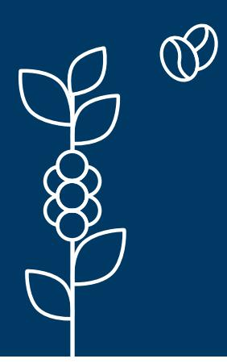
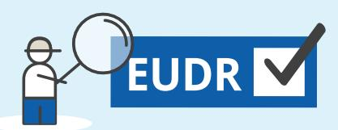
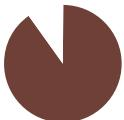

**EU**

**90 %of deforestation is driven by the expansion of agricultural land,** contributing to climate change, biodiversity loss, soil erosion and desertification, and hindering sustainable development

The EU is taking action to **minimise the risk that products associated with deforestation enter the EU market** and to increase the demand for deforestation-free products

The **EU Deforestation Regulation (EUDR)** requires companies to ensure that the products they place on the EU market or export from it are **legal and not associated with deforestation**

**Coffee, whether raw, roasted or decaffeinated**

**Husks and skins**

**Coffee substitutes containing coffee in any proportion**

**The EUDR does not create a country or product ban**

The EUDR is not discriminatory and will apply to selected products produced in, imported into and exported from the EU

Coffee represents **6% of EU-driven deforestation**

In 2022, most of this coffee came from **Latin America and the Caribbean** (53%) but also from **Southeast Asia** (27%), **East Africa** (12%) and **India** (5%)

**The EU imports 33% of coffee produced globally**

## **Unpacking the EU Deforestation Regulation for the coffee sector**

**UE**

**!**

**Due diligence** for companies

consists of **3 steps** :

Collect evidence that the product is traceable, deforestation-free

and legal

Assess risks of non-compliance

If risks have been identified, take

action to mitigate them

**1**

**2**

**3**

\*If companies buy coffee from a **low-risk country**, they only need to carry out the **first step** (except if there are doubts ñ then all 3

steps need to be undertaken)

| Operators        | will have to comply           |
|------------------|-------------------------------|
| with the EUDR    | from 30                       |
| December 2025    | (mid-2026 for                 |
| progress towards | coffee                        |
|                  | Deforestation = conversion of |
|                  | Global EUDR Factsheet 2024    |

Geolocation data must be transferred and preserved throughout every stage of the value chain, as European operators, who bear legal responsibility

for EUDR compliance, are required to include this data in their due diligence statements

A **benchmarking system** will categorise countries or regions according to **deforestation risk**. The frequency of EU Member

States' **checks will vary consequently** :

Frequency of checks:

Products from: Obligations:

| Deforestation-free coffee value chain                                                                                         |                                                                                                                                                                |
|-------------------------------------------------------------------------------------------------------------------------------|----------------------------------------------------------------------------------------------------------------------------------------------------------------|
| 1. Geolocation                                                                                                                |                                                                                                                                                                |
| 2. Coffee                                                                                                                     |                                                                                                                                                                |
|                                                                                                                               | 4. Coffee or                                                                                                                                                   |
|                                                                                                                               | 5. Importer or                                                                                                                                                 |
|                                                                                                                               | 6. EU dealer sells                                                                                                                                             |
| 3. Possible of coffee plots delivered to processing of first buyers, coffee into where it is kept derived segregated products | coffee and derived products manufacturer in are segregated the EU processes or derived products packages coffee or during export to consumers derived products |

**Disclaimer.** This factsheet has been produced by the European Forest Institute with the financial assistance of the European Union. The contents of this factsheet are the sole responsibility of the author and can under no circumstances be regarded as reflecting the position of the European Union. The information presented in this factsheet comes from the EUDR published in the EU Official Journal on 9 June 2023.

**simplified** due diligence**\*** 

full **3-step** due diligence process

full **3-step** due diligence process

**STANDARD** risk areas

**HIGH** risk areas

**LOW** risk areas

**9%**

**3%**

**1%**