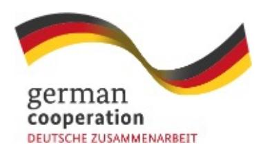

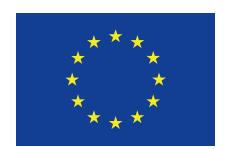

**Guidebook for Trainers** 

# **Towards deforestation-free supply chains**

**Introducing the EU Deforestation Regulation to smallholder farmers, small and medium-sized enterprises**

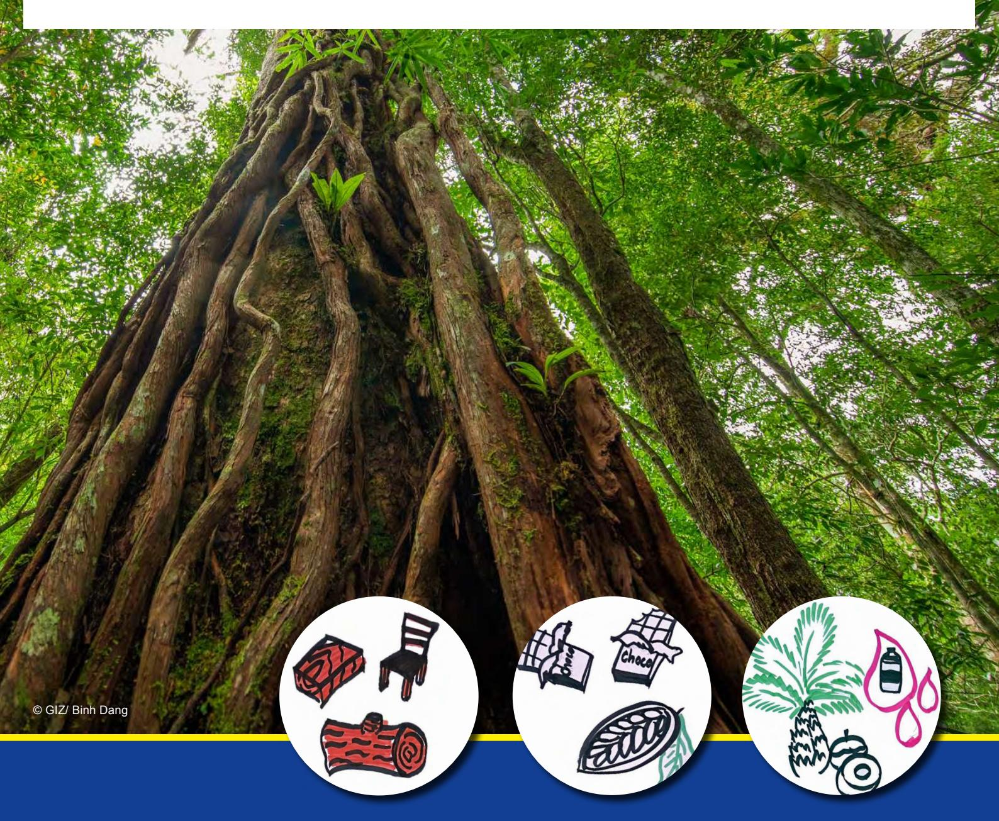

#### **DISCLAIMER**

This publication was co-funded by the European Union and BMZ. The content of this publication is the sole responsibility of the authors and does not necessarily reflect the views of the EU or the BMZ. The information in this guide, or upon which this guide is based, has been obtained from sources the authors believe to be reliable and accurate. While reasonable efforts have been made to ensure that the contents of this publication are factually correct, GIZ GmbH does not accept responsibility for the accuracy or completeness of the contents of this publication. The mention of specific companies or products of manufacturers, whether or not these have been patented, does not imply that these have been endorsed or recommended by GIZ GmbH in preference to others of a similar nature that are not mentioned. The views expressed in this information product are those of the authors and do not necessarily reflect the views or policies of GIZ GmbH or FAKT GmbH. Unless stated otherwise, all figures used in this report were created by FAKT internally. It is based on the status and information available as per March 2025.

As of October 2025, the European Commission therefore proposed a postponement by one year of the entry into application of the EUDR, to 2027. By the end of 2025, EU Co-Legislators (the European Council, and European Parliament) will consider the need for additional time and measures to strengthen the IT System, and guarantee the smooth entry into application of EUDR, to minimise uncertainty for authorities and operational difficulties for stakeholders in the EU and in third countries. Please check the latest on:

*[https://environment.ec.europa.eu/topics/forests/deforestation/regulation-deforestation-free-products\\_en](https://environment.ec.europa.eu/topics/forests/deforestation/regulation-deforestation-free-products)*

Meanwhile, the EU Delegations will continue our close cooperation and dialogues with third countries and stakeholders outside the EU to best use the time available to support their preparations.

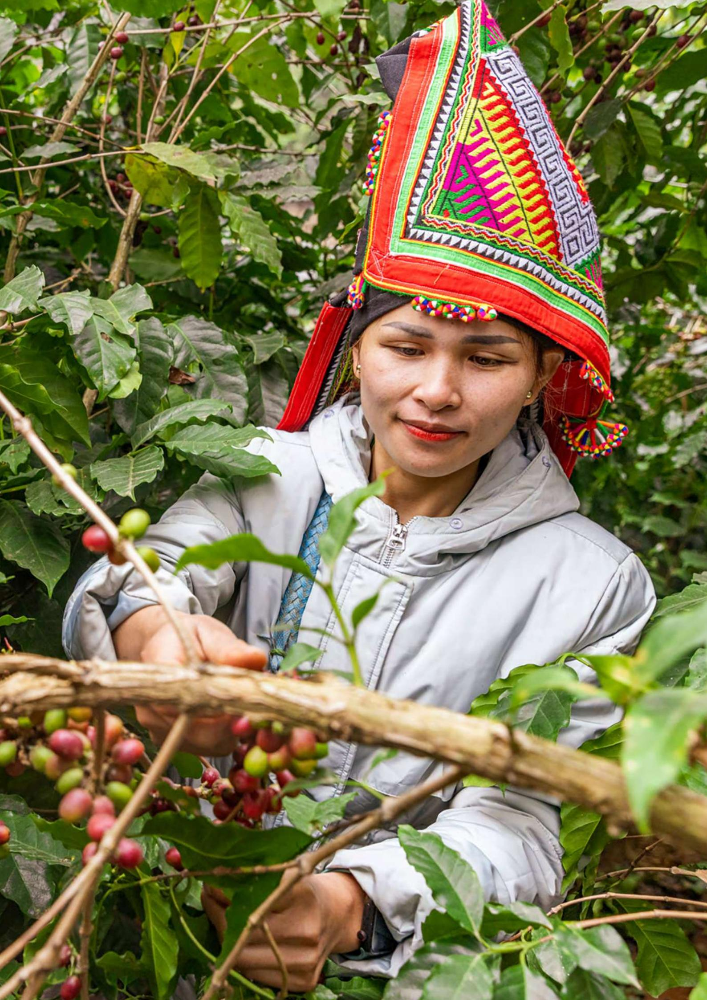

| Introduction                                                                                                                                                                                                                                                                                                                                                                                                                        | 7         |
|-------------------------------------------------------------------------------------------------------------------------------------------------------------------------------------------------------------------------------------------------------------------------------------------------------------------------------------------------------------------------------------------------------------------------------------|-----------|
| 
<b>Why are on the ground trainings on the EUDR needed?</b>
 
Objectives of the trainings
 
<b>What is the EUDR?</b>
 
Important background information for trainers: Key definitions and terms
 
Legal production
 
Potential benefits for smallholders under the EUDR for smallholder farmers and SMEs supplying to EU-based companies
 
Some EUDR requirements relevant for SMEs and farmers
 | 9         |
| <b>Methodology of the trainings</b>                                                                                                                                                                                                                                                                                                                                                                                                 | <b>18</b> |
| <b>Training for smallholder farmers</b>                                                                                                                                                                                                                                                                                                                                                                                             | <b>18</b> |
| Overview of the smallholder training sessions                                                                                                                                                                                                                                                                                                                                                                                       | 20        |
| Sample training agenda and facilitation plan                                                                                                                                                                                                                                                                                                                                                                                        | 21        |
| Step by step training guide and material per session                                                                                                                                                                                                                                                                                                                                                                                | 22        |
| Checklist for preparing the farmer training                                                                                                                                                                                                                                                                                                                                                                                         | 31        |
| <b>Training for SMEs</b>                                                                                                                                                                                                                                                                                                                                                                                                            | <b>32</b> |
| Overview of the SME training sessions                                                                                                                                                                                                                                                                                                                                                                                               | 33        |
| Sample training agenda and facilitation plan                                                                                                                                                                                                                                                                                                                                                                                        | 34        |
| Step by step training guide and material per session                                                                                                                                                                                                                                                                                                                                                                                | 35        |
| Checklist for preparing the SME training                                                                                                                                                                                                                                                                                                                                                                                            | 41        |
| <b>References and further reading</b>                                                                                                                                                                                                                                                                                                                                                                                               | <b>42</b> |

# **Table of Content**

| Additional background and content to be covered during the training, definitions and considerations under the EUDR | <b>44</b> |
|--------------------------------------------------------------------------------------------------------------------|-----------|
| Overarching Key messages                                                                                           | 44        |
| EUDR obligations                                                                                                   | 45        |
| Geolocation                                                                                                        | 45        |
| Labour rights                                                                                                      | 45        |
| Land rights                                                                                                        | 46        |
| Non-compliant products                                                                                             | 46        |
| Selected stakeholders in the EUDR context                                                                          | 46        |

| Additional training materials                           | 47 |
|---------------------------------------------------------|----|
| Questionnaire for baseline and endline of each training | 47 |
| Mapping training for EUDR                               | 49 |
| Palm oil supply chain                                   | 51 |
| Rubber supply chain                                     | 51 |
| EUDR Smallholder Factsheet                              | 52 |

**54**

# **ANNEX 1**

# **ANNEX 2**

# **ANNEX 3**

Relevant EUDR Thai definitions and terms on

Forest and Deforestation

# **Table of Content**

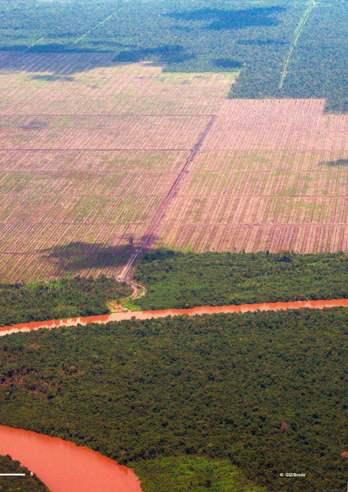

## **About this guide**

This guide aims to provide trainers with key information and teaching approaches for delivering trainings on the **EU Deforestation Regulation1 (EUDR)** to smallholder farmers and small and medium-sized enterprises (SMEs) in producing countries.

It is thus **designed for** trainers from public, private or civil society organisations that provide support to smallholder producer organisations and/ or SMEs2 in value chains relevant under the EUDR. This guide includes step-by-step instructional courses these trainers can deliver on the EUDR content relevant for smallholder farmers and SMEs in producing countries and how to address its potential implications at the level of SMEs and smallholder farmers.

This guide does not replace the individual study of the EUDR legal text and accompanying key documents, such as the FAQs or the Guidance. It can however inform interested trainers on how to implement trainings on the EUDR for SMEs and smallholders in the EUDR relevant commodity sectors, tailored to their specific needs, by providing key information on the EUDR as well as concrete step-to-step guidance for the actual implementation of training sessions.

This guide is especially useful for trainers with a background in agriculture, rural development or related fields, who have experience in planning, organising, and executing agricultural extension services, community development or agricultural innovations, as well as (training) experience with smallholders and stakeholders in sustainable agricultural supply chains, ideally EUDR relevant commodities.

Pictures in this guide can serve as inspiration for trainers on how to prepare their own training materials.

## **Note on the role and attitude of trainers**

Trainers need to have a sound knowledge of the EUDR but should not see themselves as masters or lecturers only, but **mainly as facilitators or "communication butlers" for the group.** Besides a thorough understanding of the EUDR and accompanying documents3 , they need specific facilitation skills and didactic competences to realise training sessions with the target groups covered. The success of a training course greatly **depends on good facilitation, which is both a skilful craft and a creative art**. Good facilitators bring a group together, develop and balance its potentials in a respectful way and build on the trainees existing knowledge and experience. They should be knowledgeable about the issues at stake but without showing this off. Asking or reformulating the right question at the right time and active listening are two of their most important tasks.

A participatory training workshop puts high demand on the trainer(s), who must lead the narrative, be adaptive to changes, responsive to trainees' needs and requests.

Thorough preparation of training venue and material, as well as a solid understanding of the exercises and their follow up discussions is essential to provide a training experience which is rewarding and useful for both trainers and trainees.

1 See **[https://green-business.ec.europa.eu/deforestation-regulation-implementation\\_en](https://green-business.ec.europa.eu/deforestation-regulation-implementation_en)**

2 Recommended reading: If you are interested in more information on important skills, competences and roles in the delivery of active learning trainings, you could read the following document: GIZ (2019). Integrating Ecosystem Services (IES) into Development Planning. Manual for trainers. Download **[http://aboutvalues.net/data/trainings/1\\_ies-manualtrainer.pdf](http://aboutvalues.net/data/trainings/1_ies-manualtrainer.pdf)**

3 I.e.the **[EUDR FAQs,](https://circabc.europa.eu/ui/group/34861680-e799-4d7c-bbad-da83c45da458/library/e126f816-844b-41a9-89ef-cb2a33b6aa56/details)** the **[EUDR Guidance Document,](https://eur-lex.europa.eu/legal-content/EN/TXT/?uri=CELEX%3A52024XC06789&qid=1731687748447)** the 3 factsheets for SME's, for smallholders and on EUDR, the "EUDR Myth-buster" and the Strategic Framework for International Cooperation Engagement on Deforestation as well as upcoming documents on the Benchmarking Methodology due to be made available before June 2025.

About 90% of global deforestation is caused by the expansion of agriculture. Humans transform ecosystems to grow more food, feed, fibres and bioenergy, some for domestic production, some for exports. Therefore, the EU has adopted the European Deforestation Regulation (EUDR). According to the regulation, companies that place relevant products on the EU market, produce or export them from there must ensure through due diligence that they are produced legally and without deforestation or forest degradation after 2020. The new EU regulation can therefore affect countries that export relevant commodities and derived products such as cattle, coffee, cocoa, soy, natural rubber, palm oil, and timber to the EU market.

Feedback from different stakeholders shows that the awareness about the EUDR and its implications for supply chain actors on the ground need to improve. To deliver on the potential of the European deforestation regulation, actors in the agricultural/forest spheres (public, private, civil society) need a solid understanding of the EUDR content relevant on the ground, and its potential benefits and implications for smallholders and SMEs in the targeted commodities. The herein presented trainings are practical tools to further support supply chain actors' capacities, especially SMEs and smallholders towards implementing the EUDR. Two training modules – one targeting SMEs and one targeting smallholders – have been designed and then tested in Thailand with pilot audiences.

The present guidebook serves as a source of information for trainers towards planning and conducting their own trainings. It was developed based on feedback from pilot trainings and diverse stakeholders from the government and private sectors on the ground and reÀects the status quo of knowledge on the EUDR and accompanying documents as of March 2025.

For trainers it is important to consider different training approaches and methods to ensure good training results. **Graphic 1** below offers an overview on different training methods and their potential success:

### **The Regulation should both:**

- **Minimise risk that products from supply chains associated with deforestation are placed on the EU market or exported from it, AND**
- **Increase EU demand for and trade in legal and 'deforestation-free' commodities and products.**

### **Different training methods**

**Participants learn best when trainers use different methods throughout a training session. A mix between sharing information through lectures/ inputs, practical exercise and discussing the respective topic among themselves generates the best training results.**

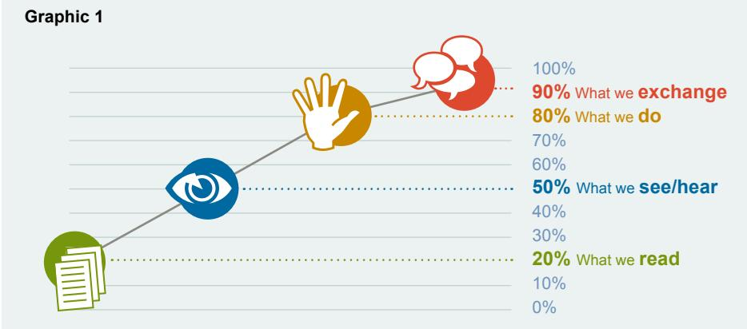

# **Why are on the ground trainings on the EUDR needed?**

# **Objectives of the trainings in this guidebook**

### **The speci¿c learning objectives ...**

 **... for trainers as multipliers on EUDR related knowledge are to offer or create:** A sound understanding on the intention and content of the EUDR, especially regarding the role and implications for SMEs and smallholders in producing countries, awareness on which key messages and content on the EUDR needs to be delivered to SMEs and smallholders in EUDR relevant commodity sectors, practical knowledge on bundle of methodological tools for adult learning, orientation on how to deliver main content relevant for SMEs and smallholders during training, by breaking down complex theory into accessible language, and knowledge on where to find answers on open questions on the EUDR as well as on main misunderstandings.

#### **... for smallholders are:**

 To increase awareness and understanding on the main content of the EUDR relevant for smallholders, to offer information on smallholder's rights and role in the EUDR context, as well as options for support by business partners and other actors in ensuring deforestationfree and legal commodity production, to facilitate a clear understanding on their position within the value chain and their role for fully traceable supply chains, to give guidance on which information will be asked for by business partners in the context of the EUDR and how to collect it, and to create awareness on (potential) implications of EUDR application on the ground.

#### **... for SMEs4 are:**

 To gain an increased understanding on the main content of the EUDR relevant for SMEs, to gain a clear understanding on their position in the value chain and their role for fully traceable supply chains, to understand their role in producing in the EUDR context as well as options for support by business partners and other actors for ensuring the Àow of information on deforestation-free and legal commodity production along the value chain, to understand which information will be asked for by business partners in the context of the EUDR and how to collect it, and to gain awareness on (potential) implications of EUDR application on the ground.

#### **Overall, the two training programmes presented in this guidebook aim to contribute to:**

- **• The system-wide transition towards deforestation-free value chains, and**
- **• the mainstreaming/dissemination of EUDR implications for SMEs and smallholder farmers into projects and programmes related to agriculture, forestry, rural development and food systems, and**
- **• enhancing smallholders' and SMEs' technical own capacities in preparing for EUDR application**

#### **The trainings are designed as an introduction to the EUDR and its main content.**

4 &quot;SMEs" in this context refer to small and medium-sized companies involved in the supply chain in the country of production up to the port of export.

The European Union is a unique political and economic partnership between 27 European countries, known as Member States5 , or EU countries. Together they cover much of the European continent. The EU is home to around 447 million people, which is around 6 % of the world's population. EU institutions (think "EU Government": European Commission, Council and Parliament) can agree on Regulations or Directives which becomes subsequently binding on EU Member States, companies and citizens.

In addition to their cultural and spiritual value, forests offer a large range of environmental, economic and social benefits that are fundamental for human life. They protect soils and entire ecosystems, provide clean air and prevent biodiversity loss, also playing a vital role in water purification and storage and in supporting the lives and economies of a large part of the global population.

Deforestation and forest degradation reduce carbon sinks and thereby contribute significantly to climate change, affect the water cycle and threaten the livelihoods of communities, including indigenous peoples and local communities. **The EUDR aims to reduce the impact of products purchased by Europeans on the world's forests, ultimately cutting down greenhouse gas emissions, safeguarding their adaptation potential and tackling the loss of biodiversity and ecosystem services.**

The EUDR is a regulation to reduce the EU's contribution to global deforestation and forest degradation, as well as to reduce the EU's contribution to greenhouse gas emissions and biodiversity loss on global level and entered into force in June 2023. It is an integral part of the EU Green Deal and is in line with the broader EU strategy to protect forests worldwide.

The EUDR obliges companies to ensure through due diligence that relevant commodities and products placed on the EU market or exported from there are **produced without deforestation and, in the case of timber products, without forest degradation after 2020** and in **compliance with relevant legislation of the country of productio**n. It applies to cattle, cocoa, coffee, oil palm, natural rubber, soya and wood as well as certain derived products. In the case of products imported into the EU, mainly the company importing the relevant commodity or product must fulfil due diligence and thereby assume the role of a so-called "operator". The EUDR does not contain any direct obligations on companies further upstream. The regulation will be applicable by end of 2025 for companies, and from mid 2026 for EU small and medium-sized enterprises (SMEs). In the EUDR terminology, an SME is a small- or medium-sized company established on an EU market with less than 250 employees and less than 40 million Euros annual turnover. When referring to SMEs in producing countries in this guide, small and medium-sized companies involved in the supply chain in the country of production up to the port of export are considered.

The **Regulation does not contain any binding obligations for producers directly**, but for companies placing relevant products on the EU market (operators) and companies trading with relevant products on the EU market (traders) (see section 1.1 for definitions of traders and operators). They will ask for specific information and require new data to exercise due diligence and to fill in and submit the **digital Due Diligence Statements** (DDS) for every shipment they produce, export or import.

**The affected commodities listed in the regulation and certain derived products may only be placed on the EU market or exported from there if they meet the following requirements (Art. 3):**

**• Deforestation-free:** Their production did not cause deforestation or forest degradation after 30th Dec 2020, regardless of whether the deforestation or forest degradation was legal according to the applicable legislation in the country of production and regardless of whether human-induced.

- **• Legally produced:** Their production occurred in accordance with relevant legislation of the country where the production took place (see further definition in section 1.2).
- **Due diligence:** They are covered by a due diligence statement, incl. geolocation data on the plot of production, that is based on corporate due diligence process, to be shared with EU competent authorities.

# **What is the EUDR?**

5Austria, Belgium, Bulgaria, Croatia, Republic of Cyprus, Czech Republic, Denmark, Estonia, Finland, France, Germany, Greece, Hungary, Ireland, Italy, Latvia, Lithuania, Luxembourg, Malta, Netherlands, Poland, Portugal, Romania, Slovakia, Slovenia, Spain and Sweden.

6 **[https://commission.europa.eu/strategy-and-policy/priorities-]( https://commission.europa.eu/strategy-and-policy/priorities-2019-2024/european-green-deal_en)[2019-2024/european-green-deal\\_en]( https://commission.europa.eu/strategy-and-policy/priorities-2019-2024/european-green-deal_en)**

# **Important background information for trainers: Key de¿nitions and terms**

Operators and traders must fulfill a three-step due diligence procedure: information collection, risk assessment and – in case the risk assessment reveals a non-negligible risk of deforestation or illegal production – risk mitigation measures. There are no direct legal obligations or penalties for countries or producers, including smallholders, in third countries unless they directly import into the EU themselves. However, buyers of smallholder farmers or clients of SMEs in producing countries may ask for assistance in providing the information and documents they must submit to fulfill EUDR requirements, such as the geolocation information on the plot of production.

An "operator" is defined in the EUDR as any natural or legal person who places on the EU market or exports from it relevant commodities or products in the course of a commercial activity. Here, placing on the market includes both selling products that were cultivated within the EU and importing products that were cultivated outside the EU. Hence, the company that places a relevant product on the EU market for the first time must fulfill due diligence. In the case of international supply chains with relevant commodities being imported into the EU, usually the importer is in the role of an operator and must fulfill due diligence.

To uniformly identify and describe products traded worldwide the Harmonized System (HS) is used as a standardized numerical method. It is used by countries around the world for purposes such as assessing duties and gathering statistics. Companies that transform a relevant product with a certain HS code into another product with a different HS code and offer it on the market for the first time are also considered operators. For example, a company that imports cocoa butter and another company that uses that cocoa butter to produce chocolate and places it on the market would both be considered operators.

The EUDR also includes obligations for so-called traders. However, under the EUDR, the traditional sense of the word trader, e.g. a multinational agricultural commodity trader, does not apply. In the EUDR, a "trader" is anyone further downstream in the supply chain other than the "operator" who offers relevant products on the EU market as part of their

business. This can be for money or for free, and it includes distributing or selling the products. Traders are people or companies who resell or distribute relevant products without being the first to put them on the EU market. For example, a company that buys chocolate from a manufacturer in the EU and then sells it to stores without changing the product would be considered a trader. As "traders" in the sense of the EUDR are always downstream of operators, these are companies established on the EU market.

The EUDR applies to certain products derived from the 7 relevant commodities and placed on the EU-market or exported from there: This means the EUDR applies to all relevant products produced in the EU, imported into the EU and products exported from the EU-market.

Under the EUDR (Art. 2 (4)) a **forest** is defined as land spanning over more than 0.5 hectares (area of trees described by the perimeter of canopy cover reaches 0.5 ha or beyond) with trees higher than 5 meters (average) and a canopy cover of more than 10 %. Land that is under agricultural production or urban land use is excluded i.e. not considered a forest.

**Graphic 2** (next page) shows, how this definition was displayed during the pilot training in Thailand.

A product is considered deforestation-free (Art. 2 (13)) if it was produced on land that has not been subject to deforestation after 31/12/2020. Wood must be harvested from areas where neither deforestation nor forest degradation have taken place after 31/12/2020. Under the EUDR, products that have been produced on areas converted from forest areas to agricultural use after 31/12/2020 cannot be made available in EU markets. Plantations of relevant commodities, e.g. rubber and palm oil, are considered as agricultural land. Agroforestry systems are not considered as forests but as agricultural land. This means that products originating from areas where forest was converted into agroforestry systems after 31/12/2020 cannot be placed on the EU market. Agroforestry systems already established before the cut-off date are not considered as a forest, but as agricultural land. Products originating from these agroforestry systems can be placed on the EU market.

# What is a forest?

> land spanning > 0.5ha  
+ trees higher than 5m  
+ conopy cover of > 10%

(excludes land under agriculture or urban land. we)

(FAO)

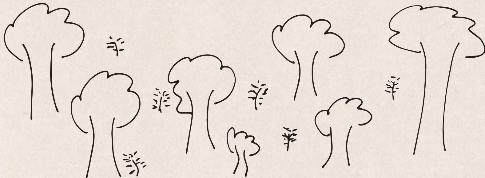

To be considered **degradation-free** (Art. 2 (7)), wood must have been harvested from the forest without degrading the forest after 31/12/2020 and without deforestation. Under the EUDR, structural changes to forest cover are not allowed and it is forbidden to convert primary forests or naturally regenerating forests into plantation forests or other wooded land or to convert primary forests into planted forests.

To prove that a product is deforestation- and degradation-free, the company must know the geolocation of the plot of production, it must be traceable along the supply chain and cannot be mixed with non-compliant commodities or relevant commodities of unknow origin. Therefore, the EUDR requires strict traceability along the value chain to prove that production is in line with the EUDR (Art. 2 (28) + Art. 9)).

# **Legal production7**

For products to be placed on the market, they must not only be deforestation-free but also legally produced, in accordance with the relevant legislation of the country of production. However, only the applicable laws concerning the legal status of the area of production constitute relevant legislation pursuant to Article 2(40) of the EUDR. Companies must collect documents and information that laws applicable in the country of production concerning the legal status of the area of production were complied with in terms of:

- **a) land use rights,**
- **b) environmental protection,**
- **c) forest-related rules: incl. forest management and biodiversity conservation, where directly related to wood harvesting,**
- **d) third parties' rights,**
- **e) labour rights,**
- **f) human rights protected under international law, and**
- **g) the principle of free, prior and informed consent (FPIC), including as set out in the UN Declaration on the Rights of Indigenous Peoples.**

Also required, but less relevant for smallholders:

**h) tax, anti-corruption, trade and customs regulations.**

**Graphic 3** – EUDR main elements as explained during the ToT in Bangkok

# **Potential bene¿ts for smallholders under the EUDR for smallholder farmers and SMEs supplying to EU-based companies**

Implementing the EUDR can offer the following opportunities and benefits for smallholder farmers:

### **Traceability:**

- Owning geolocation data gives smallholders a **stronger, more independent position in the value chain** which can lead to fairer prices for smallholders as it allows for more direct supply chains.
- A more transparent and traceable value chain can help smallholders to reach new markets and to focus on the sustainability of their products.
- Focusing on sustainable production can also lead to fairer prices for smallholders.
- **Geolocation data** can be reused in different software and applications facilitating enhanced crop prediction, production planning, and yield improvements.
- Geolocation data of the land of production can increase **market access** and increases **traceability** along the supply chain.

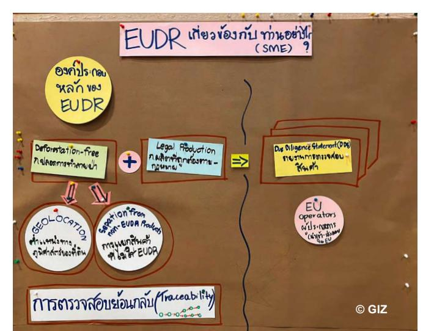

7Legality under the EUDR focuses on applicable laws concerning the legal status of the area of production and the regulation's primary objectives, rather than adherence to all laws throughout the entire value chain. More information in the EU Guidance document

#### **Legality:**

- Increased traceability can help **prevent the illegal purchasing of commodities** produced in forests that are protected by claiming another origin.
- The "legality aspect" can lead to improved l**abour- and human rights condition**s, through the obligation that the national laws concerning these aspects must be respected.
- In case **land use rights** apply in the production area the legality aspect can lead to improvements and increase in official land titles which may also lead to e.g. improving access to finance.

#### **Inclusion/strengthening of smallholders and marginalised groups:**

- The effects of **reduced deforestation** can bring both **environmental and social bene¿ts and therefore strengthen resilience towards climate change at local level**. Less fires and lower hydrogeological risk contribute to a more **stable microclimate and improved quality of life** of rural areas inhabitants, biodiversity included. Moreover, decreasing the incentive for deforestation would likely lead to **less cases of land grabbing, human rights violations, and displacement of indigenous and marginalized communities**.
- The right for Free, Prior and informed consent (FPIC) for **indigenous peoples** a well as their duly reasoned claims to use or ownership of areas used for the purpose of producing relevant commodities is anchored within the EUDR.
- In case of violations of land rights, smallholders or representatives can submit **substantiated concerns** to companies and EU competent authorities and can thereby defend land rights. Furthermore, they can provide a vehicle to report in case of non-compliance of operators with EUDR requirements (see Art. 2,3, 10 & 31 EUDR).
- The EU is strengthening the cooperation with partner countries, involving smallholders and promoting their interests.

#### **Socio-economic aspects:**

- **Increased transparency** regarding pricing and a lower number of intermediaries can **reduce underpayments**  and contribute to receiving **fairer prices and decent living for smallholders**. Better prices have been linked with **improved health** and **reduced child labour**, as well as providing a good **incentive for natural conservation**.
- Increase in **digital literacy rates** contributes to better connecting rural and urban areas.
- Fostering **digital payments in rural areas**, providing a record of transactions, can lead to better control over trade of agricultural goods and can help farmers to sell directly, more quickly for a higher price. This can also serve as a f**inancial incentive** for capacity building resulting in **improved quality of products** which is **remunerated**.

### **Technical support and capacity building:**

- Smallholders can benefit from technical support or capacity building from business partners who depend on information exchange and who should support smallholders as part of risk mitigation measures.
- During their risk assessment process, companies must consult and cooperate with indigenous groups and local communities. This could increase marginalised peoples' voices and outreach and make their claims heard. In case these consultations demonstrate that indigenous groups or local communities are disadvantaged, companies are obliged to undertake risk mitigation measures such as the ones described above.
- The EU is strengthening the cooperation with partner countries with regards to the EUDR, involving smallholders and promoting their interests.

# **Some EUDR requirements relevant for SMEs and farmers**

Operators and traders placing relevant products on the EU market or exporting from there are the ones responsible for EUDR compliance. However, to fulfill their due diligence obligations, some information, especially on the plot of land of production, might be required from producers in non-EU countries (ref. Art. 9 in EUDR). **The EUDR does not include any ¿nes or sanctions for smallholders who do not place relevant products on the EU market themselves.**

However, countries, companies, smallholders or SMEs have an interest in providing important information on the plot of production of EUDR relevant commodities to their business partners, as they might run the risk of being crowded out from EUDR relevant supply chains if they do not share the information with players further down the supply chain (e.g. operator directly or other business partners along the value chain), if the final product is being placed on the EU market in the end.

SMEs and smallholders in producing countries may thus be asked to collect geolocation information and to provide information on deforestation-free and legal production. No personal information is required, and all collection systems meant to support EUDR preparedness and compliance should be mindful of relevant national provisions in data protection, in the case of Thailand, for example, the Personal Data Protection Act (**"PDPA"**), which became law on May 28, 2019.

Where a risk of non-compliance with the provisions of the EUDR, hence a risk of deforestation or of illegal production, is identified, companies are required to implement risk mitigation measures (see overview on the due diligence process in Annex 1 of the EUDR). According to Article 11 of the EUDR these measures shall also include companies support smallholder farmers through capacity building and investments, amongst others. Examples of such capacity building measures or investments could be training farmers on sustainable and deforestation-free management, explaining the intention of the EUDR (reducing the deforestation footprint of the EU), explaining the requirements of plot/farm assessment and its technical implementation (polygon measurement) and technical support to safeguard the correct plot/farm assessment. Invest in long-term business relationships.

Towards this end, SMEs play a connecting role and might be asked by operators or traders in their supply chain to facilitate such support measures at the level of smallholder farmers.

Example of how to present "Legal Production" during the SME pilot training in Thailand

© FAKT/K. Linne

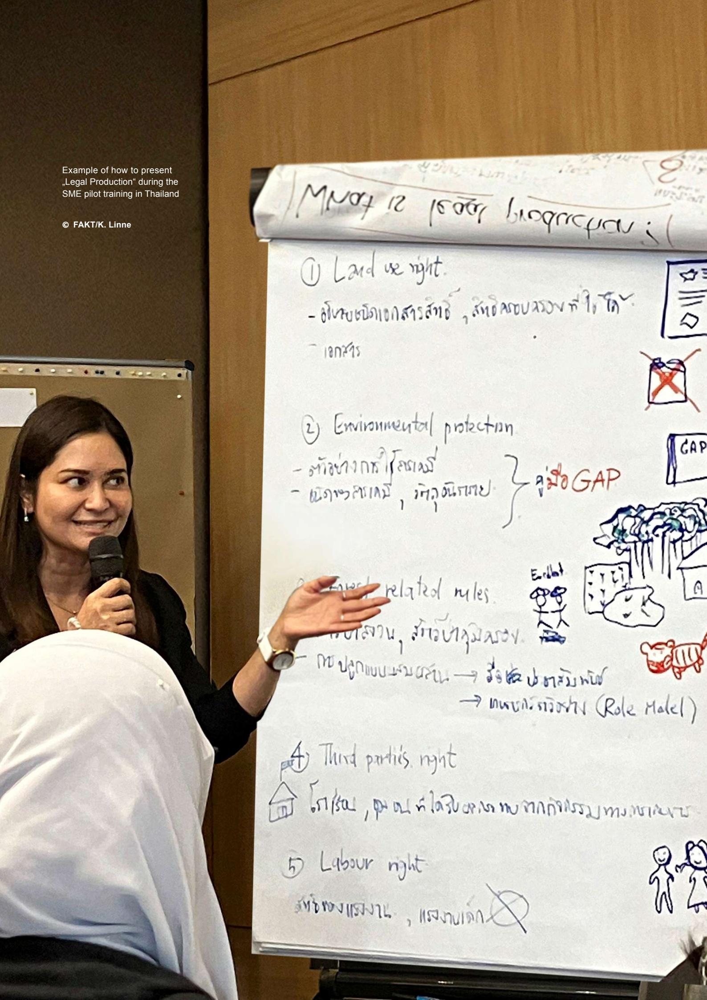

Must be present biography :

① Land use right.

- - อันสมชนอาเอกสารสำเร็จ, สำเร็จการบรรจบการให้, ให้
- - เอกสาร

② Environmental protection.

- - อาจสามารถใช้เอกสาร
- - เอกสารสามารถ, มีความสามารถ

GAP { อาจใช้ GAP

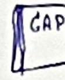

environmental related males.

การเล่น, อาจสามารถ

- - การปรุงการบรรจบสามารถ → จึงใช้ ประกาศนียบัตร
- → การบกเรียกสามารถ (Role Matel)

④ Third parties right

House โรก/รอบ, พ่อ แต่ ในสมัย เขา การทำการรวม การเขา เขา

⑤ Labour right

สามารถ แรงงาน, แรงงานเล็ก

# **Training for**

**smallholder farmers**

**SMEs**

# **Methodology of the trainings**

The use of the guidebook is targeted for training smallholders and SMEs on the EUDR and its potential benefits and implications.

Both trainings – the one for farmers and the one for SMEs – use a mixture of interactive inputs, open discussions and groupwork.

During group discussions, participants are encouraged to share their knowledge and learn from each other's experience. Throughout both trainings, the trainers are encouraged to integrate intersectional lenses such as gender equity, social inclusion and minority considerations. This can be done e.g. via working in separate gender and minority groups during group work sessions and/ or via catering for the different needs of women, men or minorities regarding venue or timing of the training (see indications in the training materials for both trainings as well in the section on preparing the trainings).

The **smallholder** training is designed as a **1-day-training**, the training for **SMEs** as a **half-day-training**. **Handout**

**Training**

**Timing**

**Materials**

The training provides an understanding of EUDR terms, definitions, and possible implications for smallholder farmers. It combines theoretical as well as practical elements. This training has a two-tiered approach: the first is to provide participants with a sound theoretical basis, the second is to allow participants to apply this knowledge through practical exercises and group work.

It consists of two main sessions (A and B) which are embedded in an introductory and closing session. Part A focuses on the background and definitions of the EUDR and part B on the traceability aspects and practical implications on the ground.

#### **The training is successful if:**

- **• Smallholders are informed about the EUDR and its possible implications for them,**
- **• smallholder farmers are aware of their rights and options for support under the EUDR and**
- **• smallholders know which information is needed to respond to needs/ requests from downstream supply chain actors regarding production in line with the EUDR.**

**To accomplish these objectives, at the end of the training, the participants need:**

- **• To have a better understanding on traceability for deforestation-free and legally produced products, and**
- **• to have an idea on how to collect geolocation data,and who to contact to receive support for collection and documentation of geolocation data,**
- **• to understand how their position in the value chain is essential for fully traceable supply chains.**

**A more detailed overview of the sessions and the respective objectives is presented in Table 1.**

# **Training for smallholder farmers**

| Session                                                        | Objectives                                                                                                                                                                                                                                                                                                                                                                                                                                                                                                                                                                                                                                                  | Slot description                                                                                                                                                                                                                                                |
|----------------------------------------------------------------|-------------------------------------------------------------------------------------------------------------------------------------------------------------------------------------------------------------------------------------------------------------------------------------------------------------------------------------------------------------------------------------------------------------------------------------------------------------------------------------------------------------------------------------------------------------------------------------------------------------------------------------------------------------|-----------------------------------------------------------------------------------------------------------------------------------------------------------------------------------------------------------------------------------------------------------------|
| <b>Intro</b>                                                   | <ul> <li>• Introduce trainees and trainers.</li> <li>• Become familiar with the overall learning goals, the training methodology and the schedule.</li> <li>• Clarify expectations.</li> <li>• Create good learning atmosphere.</li> <li>• Assess the current state of knowledge on the EUDR among participants (baseline)</li> </ul>                                                                                                                                                                                                                                                                                                                       | 
Official welcome words by smallholder organisation
 
 
Check-in, introductions of participants, expectations towards the trainings, baseline survey
 
 
Introduction to the training
                                                   |
| <b>Session A</b> EUDR background and definitions (theory)   | <ul> <li>• Farmers are geared to think about the links of their forests and agricultural production.</li> <li>• Farmers have an overview on the EUDR.</li> <li>• Farmers talk about the EUDR (terms, definitions, benefits, implications) in their own language.</li> <li>• Farmers understand which information from their production is relevant under the EUDR.</li> <li>• Trainers gain an understanding on the current farmer reality on relevant elements of the EUDR.</li> <li>• Trainers assess the knowledge on EUDR achieved at farmer level during the day.</li> <li>• Trainers address any misunderstandings/ fill information gaps.</li> </ul> | 
 
Exercise 1.1: Focus Group Discussion along guiding questions
 
 
Plenary discussions with flip chart visualisation (Option if possible: showing smallholder EUDR movie)
 
 
Exercise 1.2: Wrap up of the theory via "paper ball"
 |
| <b>Session B</b> Focus on traceability and geolocation data | <ul> <li>• Trainers are familiar with the agricultural production sites and potential deforestation risks deriving from it.</li> <li>• Farmers understand why geolocation data might be asked for.</li> <li>• Farmers/ farmer organisation gain an idea on how to organise geolocation data collection.</li> </ul>                                                                                                                                                                                                                                                                                                                                          | 
 
Plenary discussions
 
 
Exercise 1.3: Traceability
 
 
Optional: Field visit for exemplary geolocation data collection
                                                                                                           |
| <b>Closure</b>                                                 | <ul> <li>• Open questions are clarified.</li> <li>• Assessment of (new) state</li></ul>                                                                                                                                                                                                                                                                                                                                                                                                                                                                                                                                                                     |                                                                                                                                                                                                                                                                 |

\* Step-by-step guidance on the methodology for each session can be found in the next section "Training material"

## Table 1 – **Overview of the smallholder training**

\*\* Power point slides and/ or exemplary flipcharts for specific session can be found in Annex 2.

|                                            |                             | Session                                                                               | Methodology*                                                                                                                                                                                                                                                                                                                                                                                                                                                                            | Material**                                                                                                                                                                                                                           |
|--------------------------------------------|-----------------------------|---------------------------------------------------------------------------------------|-----------------------------------------------------------------------------------------------------------------------------------------------------------------------------------------------------------------------------------------------------------------------------------------------------------------------------------------------------------------------------------------------------------------------------------------------------------------------------------------|--------------------------------------------------------------------------------------------------------------------------------------------------------------------------------------------------------------------------------------|
| Intro                                      | 9:30 Uhr (30 min)        | Welcome procedure with Farmer Group                                                   | <ul> <li>Official welcome</li> <li>Overview on what will be done during the day</li> <li>Brief round of introductions</li> <li>Baseline assessment (survey)</li> </ul>                                                                                                                                                                                                                                                                                                                  | <ul> <li>Agenda of the day on flipchart</li> <li>Training objectives on flipchart</li> <li>Printed surveys specifying "baseline" or "ex-ante"</li> <li>Masking tape</li> <li>Markers</li> <li>Potentially: pens and paper</li> </ul> |
| Session A                                  | A1 10:00 Uhr (45 min) | Introduction to the EUDR and Exercise 1.1: Plenary discussion along guiding questions | <b>Potentially: show smallholder EUDR movie (if possible)</b> Guiding questions for the discussion: <ul> <li>To what extent is the EUDR relevant for smallholder farmers?</li> <li>What are potential benefits for smallholder farmers?</li> </ul>                                                                                                                                                                                                                                   | <b>Flipchart prepared with necessary inputs or power point</b> <ul> <li>Flipchart paper</li> <li>Masking tape</li> <li>Markers</li> </ul>                                                                                            |
|                                            | A2 10:45 Uhr (75 min) | EUDR implications on smallholder farmers. <i>Including discussion</i>              | <b>Plenary discussion with pre-prepared flip chart visualisation.</b> Topics and terms to cover during FGD: <ul> <li>Deforestation-free</li> <li>Legal production</li> <li>Bookkeeping and data management</li> <li>(Available) geolocation data (e.g. based on existing certification)</li> <li>Supply chain relation/ clarification of stakeholders</li> <li>EUDR and certification schemes</li> <li>EUDR and agroforestry</li> <li>Smallholders' rights under the EUDR</li> </ul> | Flipchart prepared with necessary inputs <input checked="" type="checkbox"/> power point                                                                                                                                             |
| <b>12:00 Uhr Lunch break (30 - 60 min)</b> |                             |                                                                                       |                                                                                                                                                                                                                                                                                                                                                                                                                                                                                         |                                                                                                                                                                                                                                      |
|                                            | A3 1:00 Uhr (30 min)  | Exercise 1.2: Wrap up of the theory - quiz ball                                       | Exercise where participants answer questions on topics covered in plenary                                                                                                                                                                                                                                                                                                                                                                                                               | <ul> <li>Sheets with 1 question each crumpled up into a "ball" for quiz ball</li> <li>Flipchart prepared with necessary inputs or power point</li> </ul>                                                                             |
| Session B                                  | B1 1:30 Uhr (60 min)  | Traceability input and Exercise 1.3                                                   | Input with flip chart visualisation or power point Exercise where participants represent a supply chain and must pass EUDR relevant information from one actor to the next Discussion on how to organise geolocation data collection in the specifi                                                                                                                                                                                                                                     |                                                                                                                                                                                                                                      |

## Table 2 – **Sample training agenda and facilitation plan sessions**

**SESSION: Introduction Welcome procedure with farmer group - baseline assessment**

#### **Tasks of the trainer:**

- Explain that we would like to assess to what extent the training is useful towards increasing knowledge, awareness and capacities on the EUDR. For this purpose, a short survey is used.
- No personal data is required on the survey. Results are completely anonymous.
- Hand out survey.
- Allow time (10-15min) for participants to fill in survey.
- Collect filled-in surveys and store in own bag.

# **Step by step training guide and material per session**

**30 minutes**

**Material** 

- **• Printed out survey** (see Annex 2)

## **Introduction to the EUDR and Focus Group Discussion based on guiding questions (Exercise 1.1)**

#### **Tasks of the trainer:**

- Introduce the session by stating that we will now look into the definition of the EUDR and its benefits for smallholder farmers.
- Go through your pre-prepared Àip chart paper OR the power point slides.
- Ask for questions/ comments after each slide and clarify as needed.
- Ask for questions/ comments after the end of the power point slides/ the end of the Àip charts.
- Stimulate a discussion along the following guiding questions:
  - To what extent do you think the EUDR is relevant for you as smallholder farmers?
  - What might be potential benefits of the EUDR for you as smallholder farmers?
- Close the session by summing up main discussion points and handing over a printed version of the power point slides and the EUDR Factsheet for smallholders to the farmer organisation management.

#### **Key messages to convey during this session:**

- **Smallholder farmers** have **no legal obligations under the EUDR**, no fines or sanctions for smallholders under the EUDR.
- **Companies** that market and trade relevant raw materials **in the EU** must prove compliance with the EUDR – i.e. deforestation-free and legal production – of relevant raw materials.
- The EUDR obliges companies to ensure through due diligence that relevant commodities and products placed on the EU market or exported from there are **produced without deforestation and, in the case of timber products, without forest degradation after 2020** and in **compliance with relevant legislation of the country of production.** It applies to cattle, cocoa, coffee, oil palm, rubber, soya and wood as well as certain derived products.
- The EUDR is **not protectionist** as it is **non-discriminatory**: It applies to relevant products that are produced in the EU, imported to the EU or exported from the EU market. Products grown and processed inside and outside the EU are treated equally. It applies to those commodities with the biggest impact on deforestation as shown by scientific evidence.
- Business partners may ask smallholders to demonstrate that he/she has produced his/her commodities deforestation-free and in accordance with the **relevant legislation in the country** (of production).

# SESSION: **No A1**

**45 minutes**

#### **Material**

(see separate slide deck and Annex 1)

- **• Flip chart paper prepared with the key messages OR**
- **• Power point slides 5 to 13**
- **• Annex 1: Additional background and content**

### **Potential bene¿ts of the EUDR for smallholders**

- A more transparent and traceable value chain can help smallholders to **reach new markets** and to focus on the sustainability of their products.
- Owning geolocation data gives smallholders a stronger, more independent position in the value chain which can lead to **fairer prices** for smallholders, as it allows for more direct supply chains. Focusing on deforestation-free production can also be an incentive to get a better price.
- The EUDR is expected to i**ncrease the demand for deforestation-free products** and strengthen the level playing field for producers working for deforestation-free supply chains.
- Transparency, traceability and sustainable production could lead to increased income for smallholders.
- Smallholders can benefit from **technical support or capacity building** from business partners who depend on information exchange. Companies should support smallholders in context of risk mitigation measures through capacity building and investments so small farmers can benefit from technical support from their business partners.
- In case of violations of land rights, smallholders or representatives can submit **substantiated concerns** to companies and EU competent authorities and can thereby fight for their **land rights**.
- If your area is at **risk of deforestation**, companies are obliged to undertake measures to minimize this risk. These measures include beneficial activities to you, such as support for producers through capacity building and investments.
- In their **risk assessment**, companies must consult and cooperate with **indigenous** groups and local communities. This could increase marginalised peoples' voices and outreach and make their claims heard. In case these consultations demonstrate that indigenous groups or local communities are disadvantaged, companies are obliged to undertake risk mitigation measures such as the ones described above.

Guaranteeing a sustainable and healthy environment to work and live in.

# SESSION: **No A1**

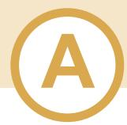

## **EUDR implications on smallholder farmers**

#### **Tasks of the trainer:**

- Introduce the session by stating that we will now look into implications of the EUDR for smallholder farmers.
- Go through your pre-prepared Àip chart paper OR the power point slides.
- Ask for questions/ comments after each topic and clarify as needed.
- Ask for questions/ comments after the end of the power point slides/ the end of the Àip charts.
- Close the session by summing up main discussion points and handing over a printed version of the power point slides to the farmer organisation management.

#### **Key messages to convey during this session:**

- **Legal production** = according to national law including land rights, labour rights, human rights and rights of indigenous peoples
- **Deforestation-free** = no conversion of forest to agricultural land (or agroforestry!) after 31/12/2020
- **Bookkeeping and data management** are a means to prepare for possible EUDR implications. When downstream suppliers ask for such data, it will thus already be available.
- **Traceability** of the product back to the plot of production is relevant to assess the deforestation risk. For this purpose, geolocation data is necessary in a specific format. Geo-coordinates may already exist for certified producers. Where they do not exist, this data will need to be collected to enable downstream supply chain actors comply with their EUDR obligations.
- **EUDR and certi¿cation schemes** are not the same. A certification scheme is voluntary. EUDR is mandatory legislation for all EU member states and its obligations are legally binding for companies that market and trade relevant raw materials in the EU. Compliance with a voluntary certification scheme, however, may offer benefits to deliver necessary data to downstream supply chain actors.
- The focus on geolocation to **provide assurance on deforestation-free production** is an incentive for smallholders which currently have difficulty to access certification. It may move the focus away from certification.
- **Certi¿cation schemes can help** to provide key information, which is also relevant under the EUDR, however a certification scheme is never a green line, companies always must do their due diligence.
- In case of rights violations, contact the EU competent authorities.

**75 minutes**

#### **Material**

#### (see separate slide deck and Annex 1)

- **• Flip chart paper prepared with the key messages OR**
- **• Power point slides 14 to 22 and 51 to 52**
- **• Annex 1: Additional background and content**

# SESSION: **No A2**

# **Wrap up of the theory: Quiz ball (Exercise 1.2)**

### **Tasks of the trainer:**

- Introduce the session by stating that we will now summarise the theory that we have covered during the previous session.
- Ask the participants to stand in a circle. The trainer throws the pre-prepared "ball" to one participant.
- The participant catching the ball opens the outer sheet, reads out the question and answers it.
- The rest of the participants and the trainer support until the answer is satisfactory.
- The participant then throws the "ball" to the next participant until all sheets are answered and the "ball" (question sheets) no longer exists.
- All questions and their answers will be displayed on Àipchart paper after the session.

#### **Question for the quiz ball:**

- What is the EUDR? *Correct answer: EU Deforestation Regulation (see slide 9 in separate slide deck)*
- What are the benefits of EUDR implementation for smallholder farmers? Or SMEs? *Correct answer: slides 49 + 50 in separate slide deck*
- What are the main implications for smallholder farmers? *Correct answer: slides 12 + 14 in separate slide deck*
- What does legal production mean in the context of the EUDR? *Correct answer: slides 33 + 34 in separate slide deck*
- What can smallholder farmers do to prepare for possible EUDR implications? *Correct answer: slide 18 in separate slide deck*
- Is a certified farmer producing in line with the EUDR? *Correct answer: Slide 51 in separate slide deck*
- What benefits do certification schemes offer regarding EUDR implementation at farmer level? *Correct answer: Slide 52 in separate slide deck*
- To what extent is the EUDR coming along with a premium as paid via (many) certification schemes? *Correct answer: The EUDR is not linked to a premium.*

# SESSION: **No A3**

#### **30 minutes**

#### **Material**

- **• Ball built from different sheets with one question per sheet.**
- **• Flip chart sheets or power point slides with answers to each question.**

#### **Commodities/products entering or leaving the European market are:**

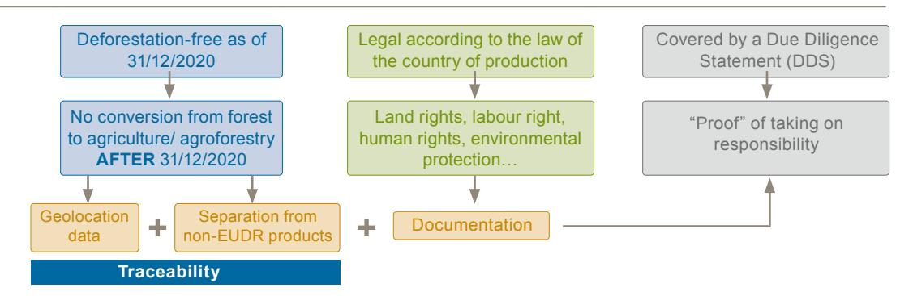

# **Traceability input and exercise (Exercise 1.3)**

#### **Tasks of the trainer:**

- Introduce supply chain traceability (see Annex 1).
- Ask the participants which information they consider relevant to pass on along the supply chain.
- Note down each information on a different card. Consider that each supply chain actor (farmer, aggregator, processor, trader etc.) must add their piece of information around Legal Production (geolocation data is only required to be collected at farmer level).
- In this way, compile an exemplary information package covering Legal Production and Geolocation Data (support participants as necessary to have a realistic information package).
- Ask for representatives to line up reÀecting an exemplary supply chain (see Annex 2).
- Ask for representatives to pass on the relevant information from farmer up to operator.
- Discuss results and clarify any open questions. Guiding questions for the discussion might be:
  - **–** What was surprising?
  - **–** To what extent do you consider this feasible? Where might challenges arise?
  - **–** How could geolocation data collection be organised in the specific context of the participants, for example:
    - Does geolocation data exist e.g., via an existing certification?
    - Does the farmer organisation count with agronomists who could structure and conduct the data collection for members?
    - To what extent could buyers be involved in the data collection process?
- Note down discussion results, including, as far as possible, a plan on how to conduct geolocation data collection

# SESSION: **No B1**

#### **60 minutes**

#### **Material**

#### (see separate slide deck and Annex 1, 2)

- **• Flipchart prepared with necessary inputs or power point slides 54 to 58 and 62 to 66**
- **• Exemplary information packages for traceability as**

#### **Key messages to convey during this session:**

- It is sufficient to collect the data **once**, unless the production area changes.
- The necessary geolocation data only concerns the production area of each of the relevant commodities – **not the entire farm**.
- **Smallholders** can lean on national traceability systems and on efforts by cooperatives, certification bodies on geolocation data mapping if these meet the requirements.
- If the product is not exported to the EU market directly, the business partner needs **to verify and prove that the geolocation is correct**.
- **No personal information** is required for the collection of GPS data.
- To fulfil the EUDR requirements on traceability, geolocation data from the plots of land, where the commodities are being produced is necessary **AND** these c**ommodities may not be mixed with other products** along the whole value chain so each batch can be traced with the relevant geolocations.
- Data tend to be considered a **competitive asset**, costly to produce and produced by different actors for different purposes. Therefore, data is often not shared, neither accessible nor usable by smallholders which reÀects a data ownership challenge.
- Smallholders must have access to their data so they can benefit from **data ownership and sovereignty**.

# SESSION: **No B1**

### **National Data Ownership Speci¿cs - Example: Thailand**

Personal Data Protection Act B.E. 2562 (2019) (English version) - OD Mekong Datahub **[\(opendevelopmentmekong.net](http://opendevelopmentmekong.net))** Summary of the Act: Data Protection Guide Thailand (multilaw.com)

- 1. The **collection of personal data must be limited to the extent necessary** in relation to the lawful purpose of the data controller.
- 2. The processing of the personal data shall comply with the lawful bases as prescribed in the Personal Data Protection Act, such as **consent, contractual obligation, and legitimate interest.**
- 3. When **transferring** the personal data to a **foreign country**, the destination country shall have **adequate personal data protection standards**.
- 4. The data controller and the data processor must provide appropriate **security measures** in relation to the process of the personal data.

#### **For Thai smallholders this means:**

- 1. It is not necessary to provide personal data for EUDR compliant production. Providing geolocation data and evidence of legal production is necessary.
- 2. Producing in line with the EUDR is a legitimate interest in the supply chain. Purchase agreements are a contractual obligation. Signing a purchase agreement smallholders should consent to the provision of geolocation data and evidence of legal production.
- 3. European data protection standards are adequate according to Thai requirements.
- 4. As no personal data is shared, security measures are not necessary in this regard.

Thai National Data Ownership Specifics

# OPTIONAL SESSION: **No B2**

**60 minutes**

**Material** 

#### (see Annex 2)

- **• Mapping training for EUDR and**
- **• mobile device fully charged with sufficient data volume and installed geolocation data application (e.g. Google Earth or the Ling App (in Thai)). Alternatively, applications with an offline function should be explored (e.g. GROUND)**

**Graphic 6** Supply chain as explained during farmer pilot training in Thailand

**Exemplary geolocation data collection in a nearby production site or other nearby speci¿ed location**

#### **Tasks for the trainer:**

- Define the production area you want to collect data for.
- You could demonstrate:
  - Polygon data collection taking at least four coordinates somewhere
  - nearby the training site, and/or
  - Point data nearby the training site
- For polygon data: Explain that it is important...
  - ...to walk in a straight line,
  - ...to walk right inside the boundary of the defined area (vs. on the road around the production site) and
  - ...to collect the same data for starting and end point to make sure, the polygon connects and thus covers a closed area.
- For point data: Explain that it is important to collect the data at the center of the defined plot.
- After the demonstration clarify any open questions.

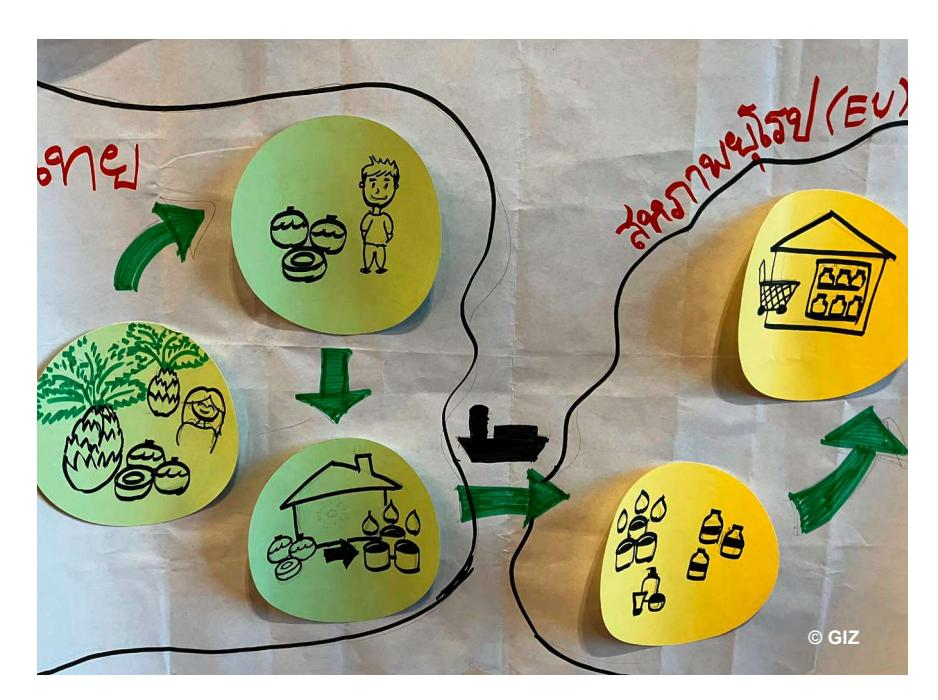

## **CLOSURE – Wrap up**

# **Tasks of the trainer:**

#### **Wrap up**

- Give a summary of the topics covered during the training (theory and practice). You may refer to some Àipcharts used and some discussion highlights.
- Ask for any open questions and clarify these as necessary.

#### **Individual written evaluation**

- Ask the participants to evaluate the training via a short questionnaire and hand out the survey sheets (see Annex 2). Highlight that this evaluation is anonymous, and no personal data should be indicated on the survey sheets.
- Collect all filled-in surveys.

### **Group evaluation via spider diagram and open feedback round**

- Prepare a Àip chart paper drawing 2 long lines:
  - **–** Left to right
  - **–** Bottom to top
- On each end of the lines write one of the following criteria to be rated
  - **–** Contents (To what extent could you follow each session through? Was the topic complex/easy?)
  - **–** Methodology (To what extent did you like the way the workshop was held/ the mix plenary discussion, inputs and practical exercise in the field?)
  - **–** Relevance of the topic (To what extent are the topics discussed relevant for you?)
  - **–** Duration (Is the training too short/too long?)
- Mark 10 points on each line from 0 to 10, starting always at the centre where all lines meet and going up to the end; in total you should now have 4 lines showing 10 points.
- Ask the participants to rate each criterion from 0 (bad performance) to 10 (good performance).
- Leave the room for 5 to 10 minutes to allow the participants to evaluate the session and enter when the participants are through with the evaluation.
- Revise the outcome in plenary.
- If there are specific criteria with a low score, ask for reasons and possible recommendations on how to improve and take notes on this feedback.
- Ask what the participants liked best.
- Ask the participants for any further feedback they may have on the training.
- Take notes on any further feedback received.
- Give thanks to the farmer organisation and the participants.
- Hand over to the organisation management for official closing words.

# SESSION: **CLOSURE**

**30 minutes**

#### **Material**

#### Material (see Annex 2):

- **• Evaluation survey (printed out)**
- **• Flipchart with prepared format for evaluation of the training**

## **Checklist for preparing the farmer training**

- Select the farmer organisation: Important considerations include the willingness of the leaders/ management to participate and the availability and willingness of participants.
- Prepare your own facilitation plan and agree on the process and agenda (timing: when to start, break and finish) with the farmer organisation.
- Look for an appropriate venue for the training: Consider the need for either the possibility of displaying Àipcharts or having a projector and power to use power point slides and potentially show the smallholder movie. Consider the option to include a demonstration of geolocation data collection. Consider sufficient space and seating opportunities for all participants. Consider accessibility for men, women and minorities as applicable. Consider necessary amenities for men, women and minorities as applicable.
- Select participants with the management of the organisation. Ideally you have 20 to 25 participants consisting of women, men, diverse, youth and minority representatives (as applicable).
- Organise inviting participants together with the organisation management.
- Prepare a budget for the training and agree on the budget with your superiors: Any transportation costs? Costs for buying/ printing/ preparing materials? Catering costs for all participants?
- Organise catering for the training as needed.
- Prepare all necessary training material: Flipcharts for each session or power point, smallholder movie as applicable, the geolocation data collection application on your own mobile device 1 printed version of the power point to be handed over to the farmer organisation individual survey for baseline (before the training) and for endline (after completion of the training).
- Optional for the geolocation data collection add-on: Together with the management of the organisation select digital leaders. Ensure they have (access to) a mobile device that they will bring along -sufficiently charged- for the training. Install the geolocation data collection application on these devices before the training. Explain the approach of the practical training session to the digital leaders. Be available for questions and further discussions before/after the training.

The training provides a contemporary understanding of EUDR terms, definitions and possible implications for SMEs. It combines theoretical as well as practical elements. This training provides participants with a sound theoretical basis and allows participants to apply this knowledge through practical exercises and group work. The first session (session A) focuses on a general introduction on the EUDR, while the second session (session B) has a specific focus on the traceability in the supply chain.

**These trainings are designed as an introduction to the EUDR. Its speci¿c (learning) objectives for SMEs are:**

- **• To gain a better understanding of traceable supply chains and their own role, and**
- **• to identify potential pitfalls in implementing elements of the EUDR and how to mitigate these.**

#### **Targeted SME training participants are (20-30 pax):**

- **• Representatives from private companies producing EUDR-listed products or providing trade service or any related service in exporting products to the EU, and**
- **• private companies with less than 200 employees. Participants can be managers, coordinators, or farm assistants, ideally with roles in traceability or organizing the supply chain.**

# **Training for SMEs**

| Session                                                             | Objectives                                                                                                                                                                                                                                                                                                   | Slot description                                                                                                                                                              |
|---------------------------------------------------------------------|--------------------------------------------------------------------------------------------------------------------------------------------------------------------------------------------------------------------------------------------------------------------------------------------------------------|-------------------------------------------------------------------------------------------------------------------------------------------------------------------------------|
| <b>Introduction</b>                                                 | <ul> <li>• Introduce trainees and trainers.</li> <li>• Become familiar with the overall learning goals, methodology and agenda of the day</li> <li>• Create good learning atmosphere.</li> <li>• Assess the current state of knowledge on the EUDR among participants (baseline)</li> </ul>                  | 
Official welcome
 
 
Check-in, introductions of participants, expectations towards the trainings, baseline survey
 
 
Self-awareness on the training
 |
| <b>Session A</b> EUDR, definitions and supply chain implications | <ul> <li>• Participants gain an overview on the background of the EUDR in an accessible way.</li> <li>• Participants are familiar with relevant EUDR terms and definitions.</li> <li>• Participants gain an understanding on the implications of the EUDR for themselves and how to handle these.</li> </ul> | 
Input and plenary discussions on the EUDR and its implications
 
 
Exercise 2.1: Plenary discussion on implications of the EUDR for Thai SMEs
                 |
| <b>Session B</b> Focus on traceability                           | <ul> <li>• Participants apply the EUDR in a fictional setting.</li> <li>• Participants understand the value of data and traceability.</li> <li>• Participants understand their role in EUDR implementation.</li> </ul>                                                                                       | 
Exercise 2.2: Group work - Traceability along your supply chain
                                                                                                        |
| <b>Closure</b>                                                      | <ul> <li>• Participants are aware of the topics and results of the day.</li> <li>• Open questions are clarified.</li> <li>• The training is evaluated.</li> <li>• The (new) state of knowledge is evaluated.</li> </ul>                                                                                      | 
Open feedback round and individual survey
 
 
Evaluation of the training via a spider diagram
                                                                 |

## **Table 3** – **Overview of the SME training sessions**

| Intro A1           | Session Methodology* Material** Official welcome words Official welcome, Agenda of the training (power point) 30 min objectives of the training, Overview on what will be done Objectives of the training check-in and introductions during the day (power point) Baseline assessment (survey) Baseline survey Potentially: facility (projector) to show smallholder movie Input plus plenary discussion to clarify Introduction to the EUDR requirements, terms and questions and comments Power point including terms such definitions, accompanying as “forest”, “deforestation”, “forest 60 min measures, implications degradation”, SME, “smallholder”, for SMEs in the producing “operator”, “deforestation-free”, country and due diligence “traceability” and “geolocation” process |
|--------------------|---------------------------------------------------------------------------------------------------------------------------------------------------------------------------------------------------------------------------------------------------------------------------------------------------------------------------------------------------------------------------------------------------------------------------------------------------------------------------------------------------------------------------------------------------------------------------------------------------------------------------------------------------------------------------------------------------------------------------------------------------------------------------------------------|
| Session A A2       | There will be Àip charts visible cover  ing these terms in English and Thai Flipchart Guiding questions for the discussion: Exercise 2.1: Markers Plenary discussion: Why is the EUDR relevant for you? What could be benefits of the EUDR Power point Implications of the EUDR for SMEs in the producing for smallholder farmers and SMEs? 30 min country Which opportunities does the EUDR present to SMEs in the producing country? How to prepare? Which barriers might be encountered? How could these be overcome? 15-30min Coffee break Supply chain and Group work to build a realistic supply chain Exercise 2.3:                                                                                                                                                                 |
| 60 - Session B B1  | 90 min information icons indicating where and how EUDR implica Group work (2-3 groups) Room for each group tions become relevant, which type of data - Traceability along your including a table is needed to collect from whom and pass supply chain on to whom and how to handle the product (labelling). Wrap up: Individual survey (endline) Individual (capacity) assessment (survey) Clarification of Evaluation format on Àipchart Training evaluation open questions                                                                                                                                                                                                                                                                                                               |
| 15 - Closure 5 min | 30 min Open feedback round Individual training survey Evaluation of the training via a spider diagram (contents, methodology, relevance, duration) … Closing words                                                                                                                                                                                                                                                                                                                                                                                                                                                                                                                                                                                                                          |

**Table 4** – **Sample training agenda and facilitation plan** 

## **SESSION: Introduction Introduction – Welcome, check in**

#### **Tasks of the trainer:**

- Set the scene by a few welcoming remarks.
- Give an overview on the training agenda and objectives.
- Ask everyone to introduce themselves and to state their expectations for the training:
  - **–** Name
  - **–** Institution
  - **–** What do you know about the EUDR
  - **–** Expectations for the training
  - **–** Take notes on expectations
- Explain that we would like to assess to what extent the training is useful towards increasing knowledge, awareness and capacities on the EUDR. For this purpose, a short survey is used.
- No personal data is required on the survey. Results are completely anonymous.
- Hand out survey.
- Allow time (8-10min) for participants to fill in survey.
- Collect filled-in surveys and store in own bag.

# **Step by step training guide and material per session**

**30 minutes**

**Material** 

**• Printed out survey** (see Annex 2)

## **Introduction to the EUDR**

#### **Tasks of the trainer:**

- Introduce the session by stating that we will now look into the official definition of the EUDR and its requirements, terms and definitions and accompanying measures.
- Go through the power point slides.
- Ask for questions/ comments after each slide and clarify as needed.
- Ask for questions/ comments after the end of the power point slides.
- Close the session by summing up main discussion points and handing over a printed version of the power point slides to the farmer organisation management.

#### **Key messages to convey during this session:**

- **Smallholder farmers** and SMEs in the producing country have no legal obligations under the EUDR, if they are not directly placing their products in the EU market.
- **Companies** that market and trade relevant raw materials **in the EU** must prove compliance with the EUDR – i.e. deforestation-free and legal production
  - of relevant raw materials.
- The EUDR is **not protectionist** as it is **non-discriminatory**: It applies to relevant products that are produced in the EU, imported to the EU or exported from the EU market. Products grown and processed inside and outside the EU are treated equally. It applies to those commodities with the biggest impact on deforestation as shown by scientific evidence.
- Business partners may ask smallholders to demonstrate that he/she has produced his/her commodities deforestation-free and in accordance with the **relevant legislation in the country** (of production).
- **• Role of smallholders**
  - **–** No direct obligations! May be asked to provide information on products
  - **–** Deforestation and degradation-free production
  - **–** Geolocation of plot of production
  - **–** Proof of legal production
- **• Role of SMEs**
  - **–** Collecting geolocation data from suppliers whose products (relevant commodities only) are destined for European markets.
  - **–** Collecting evidence of legal production from suppliers whose products (relevant commodities only) are destined for European markets.
  - **–** Keeping products destined for European markets separate from products not subject to the EUDR.

#### **60 minutes**

#### **Material**

#### (see separate slide deck and Annex 1)

- **• Annex 1: Additional background and content**
- **• Power point slides 5 to 23**
- **• Flipcharts covering the terms in English and national/ local language**

# SESSION: **No A1**

**Graphic 7–**EUDR relevant commodities prepared by trainers for farmers & SME trainings

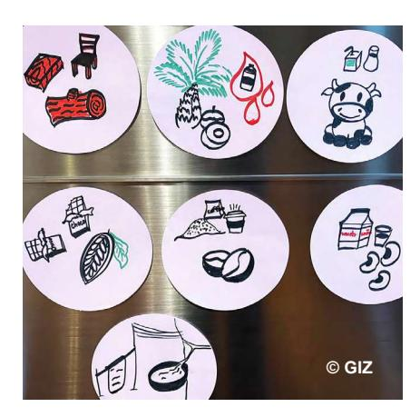

#### **30 minutes**

#### **Material**

#### (see separate slide deck and Annex 1)

- **• Annex 1: Additional background and content**
- **• Power point slides 17, 18 and 39**
- **• Flipchart**
- **• Markers**

# SESSION: **No A2**

# **Plenary discussion: Implications of the EUDR for SMEs (Exercise 2.1)**

#### **Tasks of the trainer:**

- Introduce the session indicating that we will now brainstorm on possible implications the EUDR may have for the SMEs
- Encourage an open discussion along the following guiding questions:
  - **–** Why is the EUDR relevant for you?
  - **–** What could be benefits of the EUDR for smallholder farmers and SMEs?
  - **–** Which opportunities does the EUDR present to SMEs in the producing country?
  - **–** How to prepare?
  - **–** Which barriers might be encountered?
  - **–** How could these be overcome?
- Note down the discussion points on Àipcharts.
- To wrap up the discussion go through the slides on potential implications of the EUDR for SMEs in the producing country.

#### **Key messages to convey during this session:**

- To deliver necessary information to your business partners you need to **engage with your suppliers**.
- Your suppliers may need **support** to be able to provide the relevant data on geolocation and legal production.
- You need to be able to receive and aggregate the data you receive from your suppliers. This implies **technical and IT capacities and facilities. Data security** regulations need to be considered in this regard.
- Your commodities are in line with the EUDR if they are **deforestation-free** i.e., the product was not produced on plot of land converted from forest into agricultural land after 31 December 2020.
  - **– Agroforestry**, e.g. production systems of coffee, is considered as **agricultural land.**
  - **–** You cannot place on the EU market products from land where forest was converted into agroforestry after 2020.
  - **–** You can place products on EU market from land which has been agroforest/agricultural land before 31 December 2020
- Your commodities are in line with the EUDR if they **are produced in accordance with relevant national legislation** of the country of production.
  - **– Traceable** to the plot of production **(geolocation data)** and not mixed with non-compliant commodities
  - **–** It is sufficient to collect the geolocation data **once**, unless your production area changes.
  - **–** No personal information is needed to collect geoinformation data.

#### **Tasks of the trainer:**

- Before the training, prepare a supply chain suitable for the training context exemplary supply chains can be found in Annex 2.
- Prepare single items per supply chain step (e.g. one item representing farming, one presenting the harvesting, one for transport etc.), i.e., cut up the provided supply chains into single steps (one graphic then represents on step along the supply chain).
- During the training, divide the participants into 2-3 groups (5-7 pax per group). There is no need to separate gender groups (and minority groups if applicable) at the level of the SMEs.
- Explain that each group will work building an exemplary supply chain.
- Tasks for the group work:
  - **–** With the provided items (see Annex 2) build a realistic supply chain.
  - **–** For each step in the supply chain each group writes on a card, which information is passed on from which actor to the next, i.e., they indicate which type of data is needed to collect from whom and pass on to whom.
  - **–** Then indicate how to handle the product (labelling) where they think special EUDR requirements apply.
  - **–** In plenary, results are presented by each group.
- Discuss the results in plenary:
  - **–** Where are differences/ overlaps in the presented results?
  - **–** What was easy?
  - **–** Where did difficulties occur?
- Clarify any open issues.

**60-90 minutes**  (10min introduction to the group work, 20min group work, 20+min presentation of results in plenary, 10-15min final discussion)

#### **Material**

(see separate slide deck and Annex 2)

- **• Power point slides 53 to 60**
- **• Flipchart**
- **• Markers**

# SESSION: **No B1**

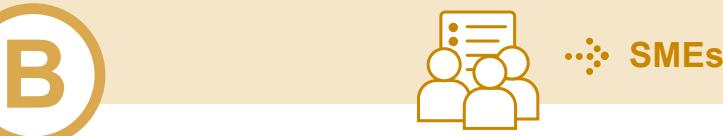

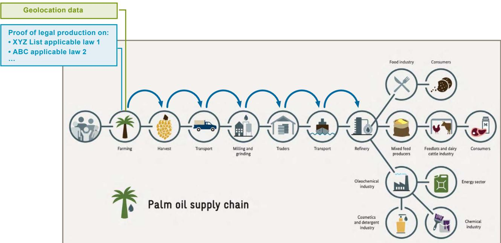

# SESSION: **No B1**

**Alternative Group work (2-3 groups) - Traceability along your supply chain "Human chain":**

- Prepare information packages per supply chain actors upfront (needed information on geolocation, legal production etc); whereby 1 item should be written on 1 card (see graphics 10 and 11).
- Ask for volunteers, each person represents 1 supply chain actor.
- Ask the volunteers to line up in front according to their location in the supply chain, for example: farmers, transporters, processors, exporters (see graphic 11).
- Each actor has their information package at hand. The actor presenting the farmers then hands their information to the next supply chain actor.
- This actor receives the farmer information and adds their respective information to add both information packages to the next supply chain actors and so on until the EU operator is reached.

**Graphic 11:**  Traceability along your supply chain "Human chain"

**Graphic 10:**  Information packages to be prepared

- **• Product quantity**
- **• Harvesting date and production period**
- **• Geolocation data**
- **• Contact information of all supply chain actors up to the EU Operator**
- **• Proof of legal production e.g.:**
  - **– Land rights**
  - **– Labour rights**
  - **– Environmental protection laws**
  - **– Forest related regulations**
  - **– Rights of indigenous peoples**
  - **– Tax compliance**
- **• Separation of products destined for EU markets from products destined for non-EU markets**

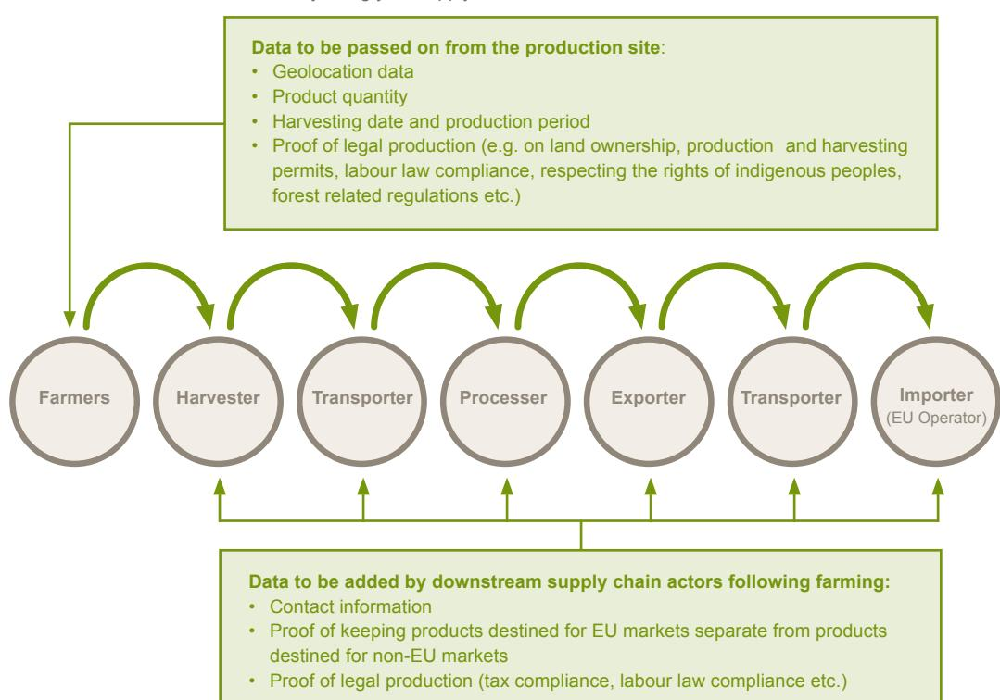

## **CLOSURE – Wrap up**

# **Tasks of the trainer:**

#### **Wrap up**

- Give a summary of the topics covered during the training (sessions A and B). You may refer to some Àipcharts used and some discussion highlights.
- Ask for any open questions and clarify these as necessary.

#### **Individual written evaluation**

- Ask the participants to evaluate the training via a short questionnaire and hand out the survey sheets (see Annex 2). Highlight that this evaluation is anonymous, and no personal data should be indicated on the survey sheets.
- Collect all filled-in surveys.

#### **Group evaluation via spider diagram and open feedback round**

- Prepare a Àip chart paper drawing 2 long lines:
  - **–** Left to right
  - **–** Bottom to top
- On each end of the lines write one of the following criteria to be rated (see Annex 2)
  - **–** Contents (To what extent could you follow each session through? Was the topic complex/easy?)
  - **–** Methodology (To what extent did you like the way the workshop was held/ the mix plenary discussion, inputs and practical exercise in the field?)
  - **–** Relevance of the topic (To what extent are the topics discussed relevant for you?)
  - **–** Duration (Is the training too short/too long?)
- Mark 10 points on each line from 0 to 10, starting always at the centre where all lines meet and going up to the end; in total you should now have 4 lines showing 10 points.
- Ask the participants to rate each criterion from 0 (bad performance) to 10 (good performance).
- Leave the room for 5 to 10 minutes to allow the participants to evaluate the session and enter when the participants are through with the evaluation.
- Revise the outcome in plenary.
- If there are specific criteria with a low score, ask for reasons and possible recommendations on how to improve and take notes on this feedback.
- Ask what the participants liked best.
- Ask the participants for any further feedback they may have on the training.
- Take notes on any further feedback received.
- Give thanks to the participants.
- Official close of the training.

# SESSION: **CLOSURE**

**15 - 30 minutes**

#### **Material**

#### Material (see Annex 2):

- **• Evaluation survey (printed out)**
- **• Flipchart with prepared format for evaluation of the training**

## **Checklist for preparing the SME training**

- Select participants: Important considerations include the willingness of the management to participate and the availability and willingness of participants. The selection is done jointly with the management of the SME. Ideally, you'll have a mixed group (women, men, minorities as applicable) of 20 - 30 participants.
- Prepare your own facilitation plan.
- Look for an appropriate venue for the training: Consider the need for displaying Àipcharts and having a projector and power to use power point slides and potentially showing the smallholder movie. Consider sufficient space and seating opportunities for all participants. Consider accessibility for men, women and minorities as applicable. Consider necessary amenities for men, women and minorities as applicable.
- Send out invitations to participants together with the SME management attaching the agenda of the training and indicating the venue.
- Prepare a budget for the training and agree on the budget with your superiors: Any transportation costs? Costs for buying/ printing/ preparing materials? Catering costs for all participants? Venue costs?
- Organise catering for the training as needed.
- Prepare all necessary training material: Flipcharts for each session/ power point, smallholder movie as applicable, 1 printed version of the power point to be handed over to each SME, individual survey for baseline (before the training) and for endline (after completion of the training).

Graphic 12: Adapted Spider Diagram evaluation from a climate change sensitization session in Vietnam

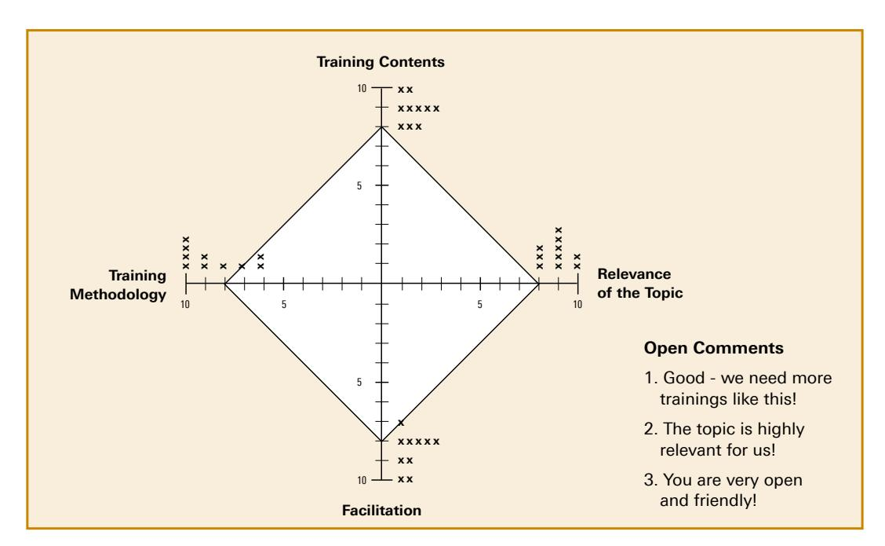

#### **References and further reading**

- **• [Final legal text of the EUDR in different languages](https://eur-lex.europa.eu/legal-content/EN/TXT/?uri=uriserv:OJ.L_.2023.150.01.0206.01.ENG&toc=OJ:L:2023:150:TOC)**
- **• [FAQs on EUDR \(04/2025\)](https://circabc.europa.eu/ui/group/34861680-e799-4d7c-bbad-da83c45da458/library/e126f816-844b-41a9-89ef-cb2a33b6aa56/details?download=true)**
- **• [Guidance Document \(04/2025\): further specific information on e.g. legality, definitions, certification](https://eur-lex.europa.eu/legal-content/EN/TXT/?uri=CELEX%3A52024XC06789&qid=1731687748447)**
- **• [EUDR Myths vs. Reality \(10/24\)](https://green-forum.ec.europa.eu/deforestation-regulation-implementation/eudr-myth-buster_en)**
- **• [Strategic Framework für International Cooperation Engagement \(Article 30\) & Principles for Benchmarking \(10/2024\)](https://eur-lex.europa.eu/legal-content/EN/TXT/?uri=CELEX%3A52024XC06604&qid=1731330497871)**
- **• [Press release & Proposal for a Regulation amending Deforestation Regulation as regards the date of application](https://green-forum.ec.europa.eu/publications/proposal-regulation-amending-deforestation-regulation-regards-date-application_en)**
- **• [Cocoa under the Deforestation Regulation](https://green-forum.ec.europa.eu/deforestation-regulation-implementation/cocoa-under-deforestation-regulation_en)**
- **• [Factsheet: EU Deforestation Regulation: An opportunity for smallholders](https://op.europa.eu/en/publication-detail/-/publication/13116422-7869-11ee-99ba-01aa75ed71a1)**
- **• [Factsheet: Obligations for SMEs operating under EUDR](https://green-forum.ec.europa.eu/deforestation-regulation-implementation/factsheet-smes_en)**
- **• [Movies on EUDR : Home Team Europe Initiative on Deforestation-free Value Chains](https://zerodeforestationhub.eu/)**
- **[European Commission Website on EUDR](https://environment.ec.europa.eu/topics/forests/deforestation/regulation-deforestation-free-products_en)**
- **• [Regulation on Deforestation-free products European Commission \(europa.eu\):](https://environment.ec.europa.eu/topics/forests/deforestation/regulation-deforestation-free-products_en) o [Scope Scope - European Commission \(europa.eu\)](https://green-forum.ec.europa.eu/nature-and-biodiversity/deforestation-regulation-implementation_en)  o [Timeline Timelines - European Commission \(europa.eu\)](https://green-forum.ec.europa.eu/nature-and-biodiversity/deforestation-regulation-implementation_en)  o [Due Diligence Due Diligence - European Commission \(europa.eu\)](https://green-forum.ec.europa.eu/nature-and-biodiversity/deforestation-regulation-implementation_en)  o [Traceability Traceability - European Commission \(europa.eu\)](https://green-forum.ec.europa.eu/nature-and-biodiversity/deforestation-regulation-implementation/traceability-and-geolocation-commodities-subject-eudr_en)  o [Definitions and obligation EUDR : Definitions and obligations - European Commission \(europa.eu\)](https://green-forum.ec.europa.eu/nature-and-biodiversity/deforestation-regulation-implementation_en)  o [Country Benchmarking Benchmarking & Partnerships - European Commission \(europa.eu\)](https://green-forum.ec.europa.eu/nature-and-biodiversity/deforestation-regulation-implementation/eudr-cooperation-and-partnerships_en)  o [Deforestation Regulation implementation - European Commission \(europa.eu\)](https://green-forum.ec.europa.eu/nature-and-biodiversity/deforestation-regulation-implementation_en)  o [FAQ EUDR: Helpdesk kontaktieren \(europa.eu\)](https://circabc.europa.eu/ui/group/34861680-e799-4d7c-bbad-da83c45da458/library/e126f816-844b-41a9-89ef-cb2a33b6aa56/details)**

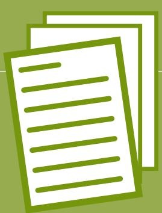

# **ANNEX 1**

Additional background and content to be covered during the training, definitions and considerations under the EUDR

# **ANNEX 2**

Additional training materials

# **ANNEX 3**

Relevant EUDR Thai definitions and terms on Forest and Deforestation

- **ANNEX 1: Additional background and content to be covered during the training, de¿nitions and considerations under the EUDR Overarching Key messages**
- The EU deforestation regulation puts requirements on companies placing on or exporting from EU market, not on countries or third country producers.
- While the EUDR does not formally recognize any national or non-governmental sustainability initiatives or certifications, companies are free to use and strongly build on these as part of their due diligence.
- When companies implement their due diligence obligations, they can also use national frameworks, instruments and initiatives in case they are helpful to ensure that products are produced legally and without deforestation and forest degradation.
- As the EUDR requires companies to ensure relevant commodities and products are produced legally and in deforestation-free manner, compliance with the EUDR should be in the joint interest of partner countries and the EU.
- Companies can build in their due diligence on the numerous instruments that were developed over the last decade to implement the voluntary zero deforestation commitments by several companies.
- The benchmarking aims to direct checks by EU competent authorities towards companies that source from riskier areas. It is not an import ban under the regulation.
- To comply with the EUDR and thereby ensure market access, producers must not convert forest as defined by the regulation into agricultural land after 2020 and must not degrade forest after 2020. In addition, they should respect relevant legislation of the country of production and submit the geocoordinates of the plot of production of relevant commodities to their buyer.
- The EU deforestation regulation obliges companies placing a relevant product on the EU market, trading it there or exporting it from the EU market to conduct due diligence. It does not impose any obligations on states or producers in third countries. Smallholders who do not place relevant products on the EU market themselves are under no direct legal obligations. However, they might be asked by their business partners, for example buyers, to provide information on their production, especially on the land of production.
- Risk mitigation measures by companies might include not only verification measures, but also capacity building for and investments into suppliers, in particular smallholders.
- In case of potential non-compliances by companies, e.g. land rights, individuals or organisations representing them can submit substantiated concerns to EU competent authorities that are obliged to assess the concern. In addition, information on potential non-compliances can be submitted directly to companies.
- The EUDR's traceability requirements might pose a challenge in some contexts but it also implies certain chances: This level of transparency could also lead to minimising other social and environmental sustainability challenges. In addition, it could be one piece of the puzzle to increase the income of farmers.

Implication: **Operators (in the EU)** shall not place relevant products on the market or export them without prior submission of a due diligence statement.

Implication: **Smallholders and SMEs** in the producing countries may be asked from business partners to provide information for due diligence purposes.

# **Geolocation**

Referring to the traceability of the products to the plot, geolocation data is needed for implementing the EUDR. The geolocation is the geographical location of a plot of land described using latitude and longitude coordinates corresponding to at least one point and using at least six decimal digits:

- A polygon (starting from 4 points) is required for land that is larger than 4 ha (25 Rai) or those with scattering plots
- A one-point geolocation data is required if the land is smaller than 4 ha.
- Each product batch can be traced with its geolocations and does not mix with non-compliant products.

GPS coordinates of production areas can be generated easily and for free. There is more than one format of geolocation datasets, be sure to check the format required by business partners and keep consistency.

Example of geolocation format: Decimal degrees (DD) 41.40338, 2.17403.

The business partner is the one to verify that the geolocation is correct. Unless the production area changes, it is sufficient to collect the data once. Farmers must have access to their data so they can benefit from data ownership and sovereignty.

## **Labour rights**

Labour rights protect workers while providing suitable terms and conditions for both workers and SMEs. Thai national labour law is different from agricultural labour law. Implication: Seasonal workers can work for 180 days continuously with a minimum of 3 days paid leave in Thailand. However, it does not apply to workers in fishery and timber.

| non-compliances to competent authorities    |                                |
|---------------------------------------------|--------------------------------|
| Three-step due diligence (Special rules for |                                |
| non-compliances to competent authorities    |                                |
| non-compliances                             | to competent authorities       |
| Documentation                               | of buyers and sellers          |
| non-compliances                             | to competent authorities       |
| SMEs                                        | established on EU market (<250 |

# **EUDR obligations**

Different types of actors along the supply chain have different obligations. These can be summarised as follows:

## **Land rights**

When land use rights are respected, the rights of those living in and protecting forests are, too. Where land registration is lacking, the geolocation can be used to verify risks of compliance on the plot of production.

Implication: Registries may not be necessary, if the product is produced legally under national law, such as producing on communal land.

In case of violations, smallholders or representatives can submit concerns to companies and EU competent authorities.

# **Non-compliant products**

Relevant commodities and relevant products shall not be placed or made available on the market or exported, unless all the following conditions are fulfilled:

- **a) they are deforestation-free;**
- **b) they have been produced in accordance with the relevant legislation of the country of production; and**
- **c) they are covered by a due diligence statement**

Operators shall not place relevant products on the market or export them without prior submission of a due diligence statement. Traders should be responsible for collecting and keeping information to ensure the transparency of the supply chain of relevant products. The responsibility for enforcing this Regulation lies with the EU Member States. Customs authorities (of EU Member States) should take appropriate action, such as to suspend or refuse a relevant commodity or relevant product if requested to do so based on the status of the due diligence statement in the information system.

| Terms in the EUDR  | Definition                                                                                                                                                                                                           | Examples                     | Obligations                                               |
|--------------------|----------------------------------------------------------------------------------------------------------------------------------------------------------------------------------------------------------------------|------------------------------|-----------------------------------------------------------|
| <b>Operator</b>    | Any natural or legal person who places relevant products on the market or exports them.                                                                                                                              | Import companies in the EU   | Undergo due diligence process                             |
| <b>Trader</b>      | Any person in the supply chain other than the operator who makes relevant products available on the EU market                                                                                                        | Supermarket chains in the EU | Link products to existing DDS                             |
| <b>Smallholder</b> | Producers who produce commodities like cocoa, coffee, palm oil, rubber, soya, and wood for the EU market.                                                                                                            | Rubber farmers in Thailand   | –                                                         |
| <b>SMEs</b>        | Enterprise which does not exceed the limits of at least two of the three following criteria: <ol><li>balance sheet total of EUR 20,000,000,</li> <li>net turnover of EUR 40,000,000</li> <li>250 employees</li></ol> | Service company in the EU    | Due Diligence as operator, link to existing DDS as trader |

# **Selected stakeholders**

# **in the EUDR context**

In the context of the EUDR several stakeholders need to be considered. In the following their respective definition and obligations are summed up:

Implication: In the context of the supply chain, producers can be a group of farmers, collectors and enterprises that are collectively engaging in the activities of growing, harvesting, obtaining from or raised on relevant plots of land or on establishments of the products. They are invited to coordinate each other on necessary information.

### **1. To what extent are you familiar with the EUDR?**

- a) I have not heard about the EUDR.
- b) I have heard about it but do not know what it is.
- c) I have an idea about the EUDR.
- d) I know what the EUDR is and how it relates to me.

### **2. What does EUDR stand for?**

- a) European Union Data Regulation
- b) European Union Deforestation Regulation
- c) European Union Diamonds Regulation
- d) I don't know.

### **3. Select the correct statement:**

- a) The EUDR is a new voluntary certification for deforestation-free products.
- b) The EUDR is mandatory for all relevant products that are produced in the EU, imported to the EU or exported from the EU market.
- c) The EUDR is a new regulation on selected commodities placed in the EU markets.
- d) Consumers can look for the EUDR logo on the package of the products.

### **4. Tick all commodities covered by the EUDR?**

- (more than one answer is correct)
- a) Palm oil
- b) Cocoa
- c) Wheat
- d) Natural Rubber
- i) Tea
- j) Coffee
- k) I don't know.
- e) Soya
- f) Cattle
- g) Wood
- h) Sugar

### **5. Deforestation-free means…**

- a) … products are made entirely from recycled materials as of 31/12/2020.
- b) … products were produced on land that has not been deforested after 31/12/2020.
- c) .. products were produced on land converted from forest to agroforestry systems after 31/12/2020.
- d) I don't know.

# **ANNEX 2: Additional training materials**

# **Questionnaire for baseline and endline of each training**

# Page 1

#### **6. Choose the correct statement.**

- a) The EUDR requires products entering or leaving the EU market to be deforestation-free, produced legally and be covered by a due diligence statement including geolocation data.
- b) The EUDR requires geolocation data only.
- c) The EUDR requires geolocation data, proof of legal production and proof of keeping EUDR products separate from non-EUDR products.

### **7. Traceability under the EU Deforestation Regulation covers....**

- a) ...geolocation data such as GPS coordinates of the production site
- b) ...geolocation data such as GPS coordinates of the production site and the separation of EUDR and non-EUDR products
- c) ...a declaration from suppliers
- d) ...land certification for the origin of products
- e) I don't know.

- **8. Under the EUDR smallholder farmers…**
  - a) …are responsible to file the Due Diligence Statement with the respective EU authority.
  - b) …may be sanctioned for non-compliance.
  - c) …have no legal obligations under the EUDR.
  - d) I don't know.

### **9. Who is responsible by law if the products from Thailand are not compliant with the EUDR?**

- a) Thai exporters
- b) Thai processing factory
- c) operators (the one who places the product on the EU market)
- d) EU consumer

### **10. How does the EUDR support the protection of land rights**

- a) Smallholders or representatives can submit substantiated concerns to companies and EU competent authorities
- b) smallholders or representatives can speak to their representative on district level
- c) Smallholder or representatives can file complaints
- d) There is no direct link between the EU and producing countries

## **Questionnaire for baseline and endline of each training**

## Page 2

## **EUDR Geolocation Mapping Training**

## **1. Preparation and Contextualization**

#### **a) Awareness**

- ► **Inform farmers/cooperatives about EUDR requirements.** 
  - Explain that when trading with the EU commodities (made from cocoa, coffee, cattle, timber, soy, palm oil, natural rubber and derived products which are imported to or exported from the EU) need to be produced without deforestation (cut-off date 31.12.2020) and produced legally.
  - Emphasize that owning data required for EUDR helps to secure access to valuable markets in the EU.
  - Support farmers to understand the clear benefits, such as potential price premiums or reliable buyers, so they're more likely to engage fully with the process.
  - Make farmers/cooperatives aware of the value of data and the importance of data ownership.
  - Highlight that the data belongs to the farmers/cooperatives, who can use it for their own records and decision-making.

## ► **Clarify the importance of ¿eld mapping:**

- Link the polygon collection directly to EUDR requirements
- Highlight the importance of polygons over mere geocoordinate points.
- Highlighting how accurate mapping can make their products eligible for export to the EU.

### ► **Data security**

- Explain that should be handled responsibly and in consensus with the farmers.
- Farmers should know how their data will be used and protected.

### **b) Adapt to the local reality:**

**► Understand smallholder practices in the region to determine how ¿eld boundaries are recognized locally. ► Identify existing mapping activities and try to integrate available maps. Some smallholders may not have of¿cial land titles or may use natural landmarks, which can be incorporated into the polygon mapping process. ► Identify potential people which are familiar with geospatial data. ► Be mindful of potential challenges like limited technology access (e.g. smartphones, GPS devices) or connectivity. Select tools that work ofÀine and are compatible with basic devices to make it easier for smallholders to use. ► Understand and respect local land-use practices, which may affect mapping accuracy and perceptions of land ownership. Tailor training to recognize these nuances, so mapping doesn't disrupt community relationships or local customs.**

### **c) Tool Selection with EUDR Compatibility:**

**► Choose tools that support EUDR-required data formats (such as geoJson, WGS84, 6 digits). ► Make sure the tools are user-friendly and accessible, even for those with limited technological experience.**

# **ANNEX 2: Mapping training for EUDR**

# **as developed by GIZ's Sustainable Agriculture Supply Chain Initiative (SASI) in November 2024**

## **2. Designing a training agenda**

- **a) Structure the training agenda to include both general and EUDR-speci¿c aspects:**
  - Explain basics of GPS mapping and the importance of collecting accurate field boundaries for traceability.
  - Introduce specific EUDR criteria, such as deforestation cut-off dates and importance of mapping.
  - Teach farmers how to use specific mapping tools to record and store polygons in a way that is compatible with EUDR requirements.
  - Use visual aids and simplified materials to explain the polygon collection process.

## **b) Create ¿eld exercises:**

- Design hands-on sessions where farmers can practice mapping polygons on their own fields or training plots, recording boundaries precisely to ensure compliance.
- Encourage peer support within groups to reinforce accuracy and skills.

# **3. Conducting the Training**

- **a) Conduct a live demonstration on using the mapping tool to collect geodata. This includes starting the polygon at a precise location, marking boundaries accurately, adding necessary vertices, and saving data.**
- **b) Organize ¿eld-based practice in small groups to allow farmers to mark their ¿eld boundaries. Supervise to ensure correct data collection and to address errors, helping farmers gain con¿dence in using the tool accurately.**

## **4. Data Quality Control for EUDR Compliance**

- **a) Show and discuss the results of the mapping exercise. For the exercise it is useful to use a tool, where the data can be directly uploaded in order to show the results of the collection work (computer or tablet required).**
- **b) After the practice, examine the collected polygon data. Check that the data includes necessary ¿elds and is free of common errors (e.g., overlapping, non-closed polygons).**
- **c) Offer constructive feedback. Explain common issues and how to correct them.**
- **d) Identify respective person to be responsible for data quality (e.g. at cooperative level).**

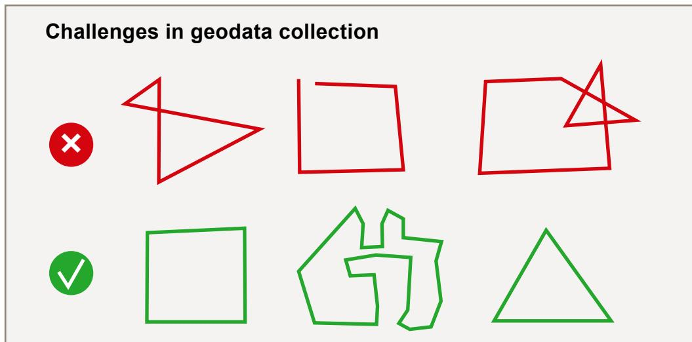

## **5. Post-Training Follow-Up**

- **a) It is recommended to identify 1-2 persons, which are responsible to manage the mapping process (e.g. at cooperative level) and to ensure data quality.**
- **b) Identify a few farmers/cooperative members who can act as "champions" to support others when mapping ¿elds independently.**
- **c) Create a communication channel (e.g., a WhatsApp group or local meetings) for ongoing support where farmers can ask questions or get help with polygon mapping.**
- **d) Arrange periodic follow-up sessions to ensure continued accuracy in mapping.**

# **Rubber supply chain**

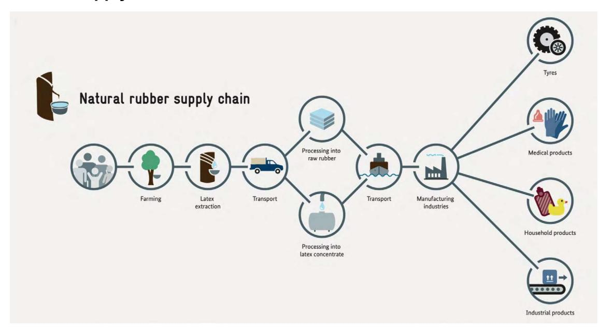

# **Palm oil supply chain**

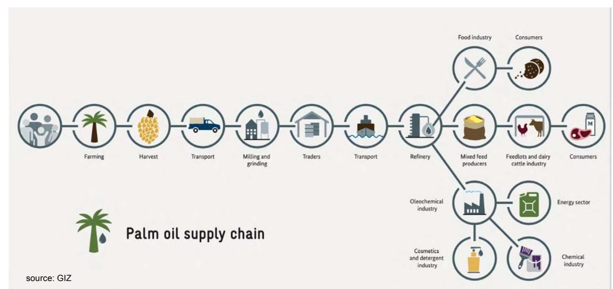

# **EUDR Smallholder Factsheet**

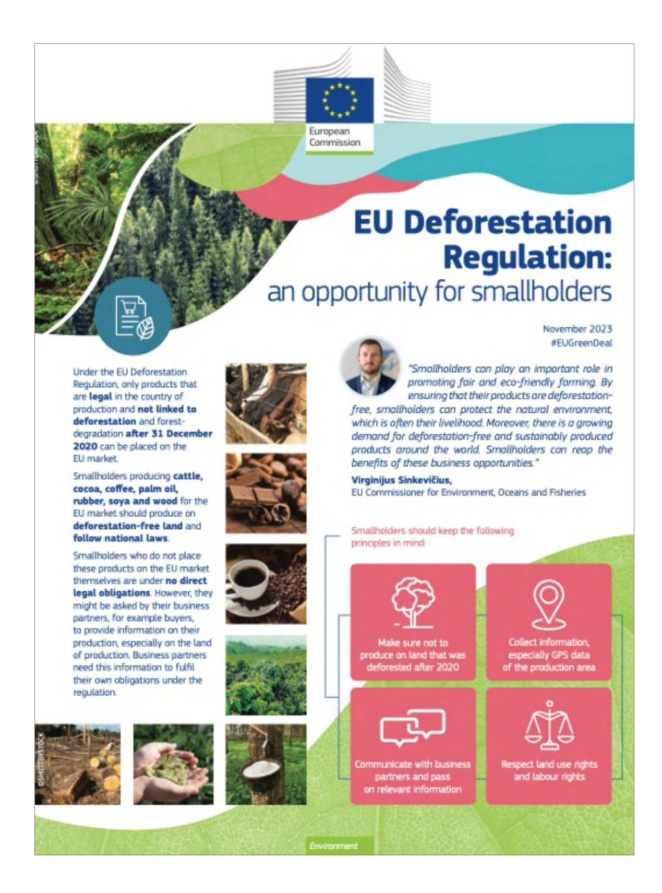

# **EUDR Smallholder Factsheet**

![A composite illustration featuring a large forest field with a standing sign that reads 'best practice example'. The top half of the illustration is a photograph of a woman holding a cocoa and a cocoa bean, with a sign that reads 'best practice example'. The bottom half is a composite of two sections: 'The EU Sustainable Cocoa Initiative' and 'The EU Sustainable Cocoa Talks bring together actors from around the cocoa supply chain with a focus on traceability and stakeholders' participation'. The top section contains a list of four items and a section on the right side for 'EU Deforestation Regulation' and 'BENEFITS'. The bottom section contains a list of four items and a section on the right side for 'CONTRIBUTION'.]()

### **'Forest' de¿nition (FAO):**

Definition of forest (article 2(4)), 'forest' means land spanning more than 0,5 hectares with trees higher than 5 metres and a canopy cover of more than 10 %, or trees able to reach those thresholds in situ, excluding land that is predominantly under agricultural or urban land use;

**'Deforestation'** (Article 2(3)), is defined as the conversion of forest to agricultural use, whether human-induced or not.

**'agricultural use'** means the use of land for the purpose of agriculture, including for agricultural plantations and set- aside agricultural areas, and for rearing livestock;

**'agricultural plantation'** means land with tree stands in agricultural production systems, such as fruit tree plantations, oil palm plantations, olive orchards and agroforestry systems where crops are grown under tree cover; it includes all plantations of relevant commodities other than wood; agricultural plantations are excluded from the definition of 'forest';

**'forest degradation'** means structural changes to forest cover, taking the form of the conversion of:

- A) primary forests or naturally regenerating forests into plantation forests or into other wooded land; or
- B) primary forests into planted forests;

**'primary forest'** means naturally regenerated forest of native tree species, where there are no clearly visible indications of human activities and the ecological processes are not significantly disturbed;

**'naturally regenerating forest'** means forest predominantly composed of trees established through natural regeneration; it includes any of the following:

- a) forests for which it is not possible to distinguish whether planted or naturally regenerated;
- b) forests with a mix of naturally regenerated native tree species and planted or seeded trees, and where the naturally regenerated trees are expected to constitute the major part of the growing stock at stand maturity;
- c) coppice from trees originally established through natural regeneration;
- d) naturally regenerated trees of introduced species;

**'planted forest'** means forest predominantly composed of trees established through planting and/or deliberate seeding, provided that the planted or seeded trees are expected to constitute more than 50 % of the growing stock at maturity; it includes coppice from trees that were originally planted or seeded;

**'plantation forest'** means a planted forest that is intensively managed and meets, at planting and stand maturity, all the following criteria: one or two species, even age class, and regular spacing; it includes short rotation plantations for wood, fibre and energy, and excludes forests planted for protection or ecosystem restoration, as well as forests established through planting or seeding, which at stand maturity resemble or will resemble naturally regenerating forests; EN L 150/220 Official Journal of the European Union 9.6.2023

**'other wooded land'** means land not classified as 'forest' spanning more than 0,5 hectares, with trees higher than 5 metres and a canopy cover of 5 to 10 %, or trees able to reach those thresholds in situ, or with a combined cover of shrubs, bushes and trees above 10 %, excluding land that is predominantly under agricultural or urban land use;

## **ANNEX 3:**

# **Key De¿nitions:**

# **ANNEX 3: Key De¿nitions:**

**'deforestation-free'** means:

- (a) that the relevant products contain, have been fed with or have been made using, relevant commodities that were produced on land that has not been subject to deforestation after 31 December, 2020; and
- (b) in the case of relevant products that contain or have been made using wood, that the wood has been harvested from the forest without inducing forest degradation after 31 December, 2020;

**'operator'** means any natural or legal person who, in the course of a commercial activity, places relevant products on the market or exports them;

placing on the market' means the first making available of a relevant commodity or relevant product on the Union market;

**'trader'** means any person in the supply chain other than the operator who, in the course of a commercial activity, makes relevant products available on the market;

'**plot of land'** means land within a single real-estate property, as recognised by the law of the country of production, which enjoys sufficiently homogeneous conditions to allow an evaluation of the aggregate level of risk of deforestation and forest degradation associated with relevant commodities produced on that land;

**'geolocation**' means the geographical location of a plot of land described by means of latitude and longitude coordinates corresponding to at least one latitude and one longitude point and using at least six decimal digits; for plots of land of more than four hectares used for the production of the relevant commodities other than cattle, this shall be provided using polygons with sufficient latitude and longitude points to describe the perimeter of each plot of land;

#### **'relevant legislation of the country of production'**

means the laws applicable in the country of production concerning the legal status of the area of production in terms of:

- (a) land use rights;
- (b) environmental protection;
- (c) forest-related rules, including forest management and biodiversity conservation, where directly related to wood harvesting;
- (d) third parties' rights;
- (e) labour rights;
- (f) human rights protected under international law;
- (g) the principle of free, prior and informed consent (FPIC), including as set out in the UN Declaration on the Rights of Indigenous Peoples;
- (h) tax, anti-corruption, trade and customs regulations.

#### **REFERENCES**

- FAQ Implementation of the EU Deforestation Regulation in Thai (unofficial)
- European Commission's (2024) EUDR Thai Fact Sheet (unofficial)
- DOAE Definition of Agriland http://www.agriinfo.doae.go.th/year56/definition/land.pdf

#### **Imprint**

**This publication was produced with the financial support of the European Union and the German Federal Ministry for Economic Cooperation and Development (BMZ). Its contents are the sole responsibility of GIZ and do not necessarily reflect the views of the EU or the BMZ.**

**On behalf of the European Union and the German Federal Ministry for Economic Cooperation and Development (BMZ)**

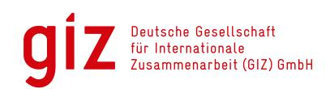

**The European Commission and German Ministry for Economic Cooperation and Development (BMZ) have commissioned Deutsche Gesellschaft für Internationale Zusammenarbeit (GIZ) to enhance and support smallholders' and other supply chain actors' technical capabilities regarding deforestation-free and legal supply chains in Indonesia, Malaysia, Laos, Thailand and Viet Nam. The "EUDR Engagement" project in Southeast Asia is co-funded by the European Union and the Federal Republic of Germany. GIZ has been commissioned to implement it as part of the BMZ funded global program "Sustainability and Value Added in Agricultural Supply Chains", which is part of the special initiative "Transformation of Agricultural and Food Systems" by the German Federal Ministry for Economic Cooperation and Development.** 

**The project is referred to as Engagement with Indonesia, Malaysia, Laos, Thailand and Viet Nam to raise awareness on and to promote better understanding of the EU approach to reducing EU-driven deforestation and forest degradation (EUDR Engagement). Within the scope of this project, trainings for smallholders and Small and Medium-sized Enterprises (SME) on the EUDR and requirements relevant for these actors have been developed and trainers have been trained to deliver these trainings.**

### **Published by the**

**Deutsche Gesellschaft für Internationale Zusammenarbeit (GIZ) GmbH Registered offices Bonn and Eschborn, Germany** 

**EUDR Engagement project (Engagement with Indonesia, Malaysia, Laos, Thailand and Vietnam to raise awareness on and to promote better understanding of the EU approach to reducing EU-driven deforestation and forest degradation)** 

**Rural Development and Agriculture Division G500 Friedrich-Ebert-Allee 32+ 36 53113 Bonn, Germany T +49 (0) 228 44 60 – 0 F +49 (0) 228 44 60 – 17 66**

#### **info@giz.de**

**www.giz.de/en**

### **Authors**

**Sector Project Sustainable Supply Chains (SV SA+) EUDR Engagement (Engagement with Indonesia, Malaysia, Laos, Thailand and Vietnam to raise awareness on and to promote better understanding of the EU approach to reducing EU-driven deforestation and forest degradation) Part of "Sustainable Agricultural Supply Chains Initiative" (SASI): Joy Heitlinger (GIZ), Wannobon Khuan-Arch (GIZ), Anna Rother, (GIZ), Kerstin Linne (external consultant under FAKT GmbH), Juejan Tangtermthong (external consultant under FAKT GmbH)**

#### **Design/layout**

**helfferich | gestaltung**

### **Photo credits**

**GIZ (Binh Dang/Brede) FAKT Consult (Kerstin Linne)**

#### **URL-links**

**Responsibility for the content of external websites linked in this publication always lies with their respective publishers. GIZ expressly dissociates itself from such content.**

#### **Copyright**

**CC-BY-NC-SA GIZ is responsible for the content of this publication. Bonn, March 2025**

**Page 47/48 Correct answers:**

1 – open

2b 3b

4a+b+d+e+f+j+g+h

5b

6a+d

7b

8c 9c