# **BEEF AND SOY DRY RUNS** EXPORTERS **FROM BRAZIL AND EUDR:**

**Traceability, Monitoring and Transparency Systems in the beef and soy supply chains in Brazil**

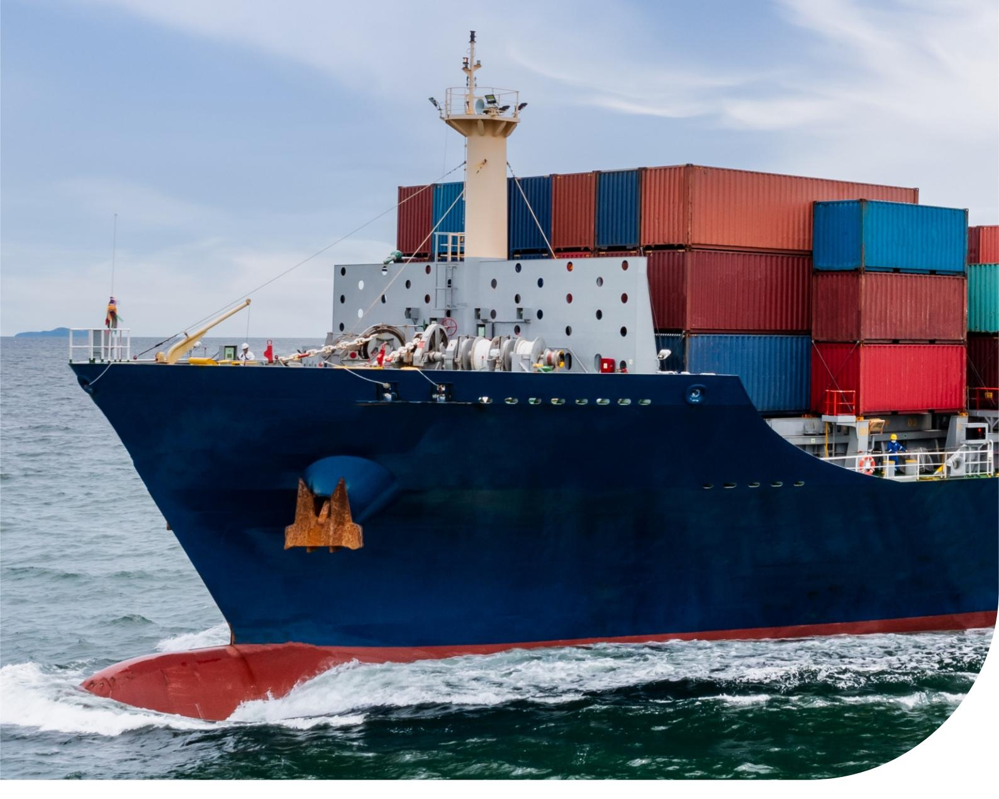

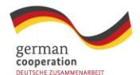

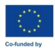

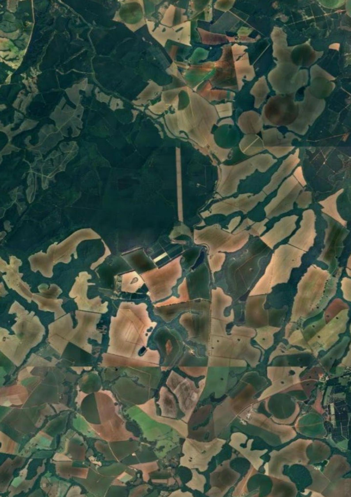

Traceability, Monitoring and Transparency Systems in the  
beef and soy supply chains in Brazil

# EXECUTIVE SUMMARY

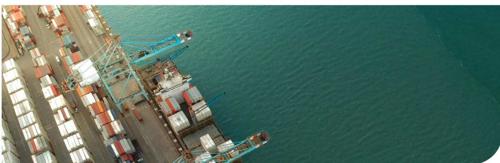

sectors, the Brazilian government and civil society, and the DelegaƟon of the European Union, in which it was possible to discuss the results of other dry runs and move forward using their lessons learned.

This publicaƟon presents the results of the dry runs and subsequent discussions, and it includes recommendaƟons for acƟons to be taken at the sectoral level by companies, naƟonally by the Brazilian government and internaƟonally by the European Commission and NaƟonal Competent AuthoriƟes. These acƟons have been discussed in various spaces such as sectoral associaƟons (Brazilian AssociaƟon of Vegetable Oil Industries - ABIOVE, Brazilian AssociaƟon of Meat ExporƟng Industries - ABIEC), private sector and civil society coaliƟons for advocacy with the Brazilian government (Brazilian CoaliƟon on Climate, Forests and Agriculture, notably the Traceability and Transparency Task Force) and cooperaƟon spaces mobilised by European governments (Brazil-Germany AgropoliƟcal Dialogue - APD, Amsterdam DeclaraƟon Partnership - ADP, amongst others).

| EUDR Criterion                                                             |      | Databases |      | InformaƟon Systems | Evidence of Compliance |
|----------------------------------------------------------------------------|------|-----------|------|--------------------|------------------------|
| GeolocaƟon, traceability and segregaƟon DeforestaƟon-free Legal Compliance |      | Soy       | Beef | Soy Beef           | Soy Beef               |
| Legend:                                                                    | High |           |      | Medium             | Low                    |

In preparaƟon for the implementaƟon of the European Union DeforestaƟon RegulaƟon (EUDR) and in seeking to ensure the compliance of their exports, companies, sectors and countries have been developing and improving systems. From four dry runs of the implementaƟon of EUDR for soy and caƩle products produced in Brazil, it was possible to analyse the current level of compliance, idenƟfy challenges and propose recommendaƟons both for private, sectoral and naƟonal systems in Brazil, as well as for the dialogue with NaƟonal Competent AuthoriƟes in the European Union.

The dry runs were supported by GIZ (SAFE and AgriChains programmes) and Al-INVEST Verde (European Union commission programme) and were developed by Proforest in partnership with the export companies. The analysed cases were a soy exporter based in Brazil, an operator in Europe and its supplier in Brazil, an exporƟng slaughterhouse and an exporƟng tannery, both based in Brazil. The results were presented and discussed with the companies individually and at events with representaƟves of the

Photo: Rafael de Campos/Pexels

### **GeolocaƟon, traceability and segregaƟon**

| Dry run results | Insights from discussions | AcƟons on a |                  |                |
|-----------------|---------------------------|-------------|------------------|----------------|
|                 |                           |             | naƟonal scale    | EU-wide acƟons |
|                 | in the Agro Brasil +      |             |                  |                |
|                 | Sustentável plaƞorm.      |             |                  |                |
|                 |                           |             | of Agro Brasil + |                |

### **DeforestaƟon-free**

| Dry run results | Insights from |                            |                  |                |
|-----------------|---------------|----------------------------|------------------|----------------|
|                 | discussions   | AcƟons on a sectoral scale | AcƟons on a na  |                |
|                 |               |                            | Ɵonal scale      | EU-wide acƟons |
|                 |               |                            | the Agro Brasil  |                |

### **Legal Compliance**

| Dry run results                                                                                                                                                 | Insights from discussions                                                                                                                                              | Actions for the sectors                                                                                                                                                                                       | Actions for the Brazilian government                                                                                                                                                            | Actions for governments in the EU                                                                                                                                                                                                                                                                   |
|-----------------------------------------------------------------------------------------------------------------------------------------------------------------|------------------------------------------------------------------------------------------------------------------------------------------------------------------------|---------------------------------------------------------------------------------------------------------------------------------------------------------------------------------------------------------------|-------------------------------------------------------------------------------------------------------------------------------------------------------------------------------------------------|-----------------------------------------------------------------------------------------------------------------------------------------------------------------------------------------------------------------------------------------------------------------------------------------------------|
| <b>Companies monitor and evidence compliance in a similar way.</b>                                                                                              | CAR validation is critical for legal compliance.  There is fear that the high rigour of Brazilian legislation will penalise the country for its compliance gaps. | Develop a cross-sectoral proposal of minimum criteria, databases and methodological procedures for legal compliance, including risk mitigation strategies for requirements with regulatory gaps or databases. | Use the <i>Agro Brasil + Sustentável</i> platform to integrate legal compliance databases for consolidated definition items and risk analysis databases for items with regulatory or data gaps. | Maintain dialogues to define minimum feasible criteria for legal compliance and complementary due diligence recommendations.  Promote and support continuous improvement approaches, prioritising long-term risk mitigation, sector transformation, and prevention of unjustified exclusions. |
| <b>There are common uncertainties about ensuring compliance (environmental protection), equivalence of legislation (Labour Rights), and regulations (FPIC).</b> | There are gaps in databases and legal definitions for FPIC, labour and third-party rights.                                                                             |                                                                                                                                                                                                               |                                                                                                                                                                                                 |                                                                                                                                                                                                                                                                                                     |

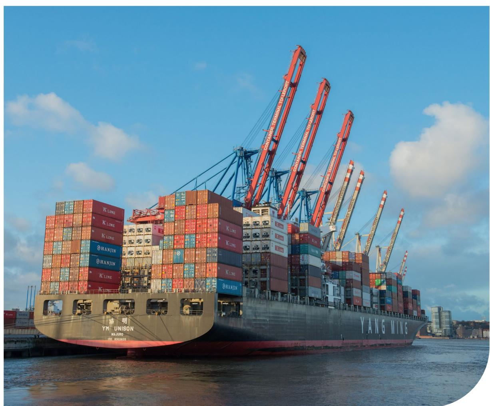

# SUMMARY

| EXECUTIVE SUMMARY                                | 4  |
|--------------------------------------------------|----|
| FIGURES                                          | 8  |
| ACRONYMS                                         | 9  |
| INTRODUCTION                                     | 11 |
| Context of beef in Brazil                        | 13 |
| SUPPLY CHAINS IN BRAZIL                          | 13 |
| Context of soy in Brazil                         | 14 |
| METHODOLOGY                                      | 16 |
| GEOLOCATION, TRACEABILITY AND SEGREGATION        | 18 |
| Beef                                             | 19 |
| Soy                                              | 20 |
| DEFORESTATION-FREE                               | 22 |
| CONFORMIDADE LEGAL                               | 24 |
| Land use rights                                  | 26 |
| Environmental protecƟon                          | 27 |
| related to wood harvesƟng                        | 27 |
| Third-party rights                               | 28 |
| Labour rights                                    | 28 |
| Human rights protected under internaƟonal law    | 29 |
| on the Rights of Indigenous Peoples              | 29 |
| Tax, anƟ-corrupƟon, trade and customs regulaƟons | 30 |
| CONCLUSIONS AND RECOMMENDATIONS                  | 31 |
| REFERENCE                                        | 33 |

Photo: Freepik

**Figure 1.** [Brazilian caƩle ranching in the extensive producƟon model. Source: Proforest.](#page-12-0) 13

**Figure 2.** [Soy harvest in Brazil. Source: Proforest.](#page-14-0) 15

**Figure 3.** Audience of the workshop " ["Brazil and the EUDR: from pilots to large-scale – a discussion of the](#page-16-0)  [pathways in which the EUDR has been tested in Brazil's beef, leather and soy supply chains", Brasilia/Brazil,](#page-16-0) [December 2024.](#page-16-0) 17

### FIGURES

### ACRONYMS

**ABIEC**  *Associação Brasileira das Indústrias Exportadoras de Carnes* (Brazilian AssociaƟon of Meat ExporƟng Industries) **ABIOVE**  *Associação Brasileira das Indústrias de Óleos Vegetais* (Brazilian AssociaƟon of Vegetable Oil Industries) **ADP** Amsterdam DeclaraƟons Partnership **APA** *Área de Proteção Ambiental* (Environmental ProtecƟon Area) **APD** Brazil-Germany AgropoliƟcal Dialogue **AQC** *Autorização de Queima Controlada* (Controlled Burning Permit) **ASV**  *Autorização para Supressão de Vegetação NaƟva ou Autorização para Desmatamento* (AuthorisaƟon for Suppression of NaƟve VegetaƟon or AuthorisaƟon for DeforestaƟon) **CAR** *Cadastro Ambiental Rural* (Rural Environmental Registry) **CCIR** *CerƟĮcado de Cadastro de Imóvel Rural* (Rural Property RegistraƟon CerƟĮcate) **EU** European Union **EUDR** *European Union DeforestaƟon RegulaƟon* (Regulamento sobre Produtos Livres de DesŇorestação) **FPIC** *Free, Prior and Informed Consent* **GTA** *Guia de Trânsito Animal* (Animal Transit Guidance) **IBAMA**  *InsƟtuto Brasileiro do Meio Ambiente e dos Recursos Naturais Renováveis* (Brazilian InsƟtute of the Environment and Renewable Natural Resources) **IGN:** *Indireto com GaranƟa de Nascimento* (Indirect with Birth Guarantee) **INCRA**  *InsƟtuto Nacional de Colonização e Reforma Agrária* (NaƟonal InsƟtute of ColonisaƟon and Agrarian Reform) **INPE** InsƟtuto Nacional de Pesquisas Espaciais (NaƟonal InsƟtute for Space Research) **MAPA** *Ministério da Agricultura e Pecuária* (Ministry of Agriculture and CaƩle) **NDA** *Non-Disclosure Agreement* **SME** Small and medium-sized enterprises **PRA** P*rograma de Regularização Ambiental* (Environmental RegularisaƟon Programme) **PRIMI**  *Programa de Rastreabilidade Individual e Monitoramento de Indiretos* (Individual Traceability and Indirect Monitoring Programme) **SIGEF** *Sistema de Gestão Fundiária* (Land Management System) **SISBOV**  *CerƟĮcado do Sistema Brasileiro de IdenƟĮcação Individual de Bovinos e Búfalos* (CerƟĮcate of the Brazilian System of Individual IdenƟĮcaƟon of CaƩle and Buīaloes) **TAC** T*ermo de Ajustamento de Conduta* (Conduct Adjustment Term) **TI** *Terra Indígena* (Indigenous Land) **TQ** *Território Quilombola* (Quilombola Territory) **UC** *Unidade de Conservação* (ConservaƟon Unit)

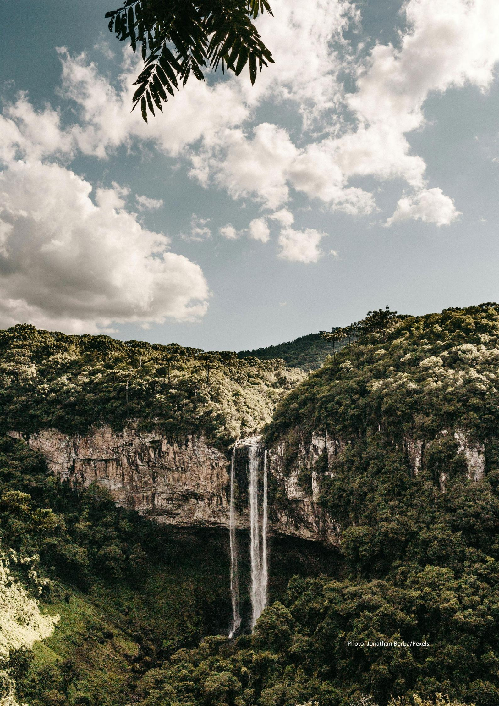

# INTRODUCTION

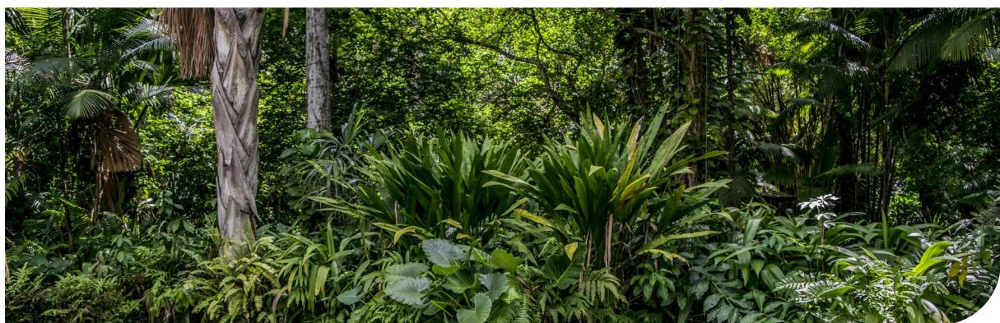

Photo:Turiano Neto/Pixabay

The [DeforestaƟon-Free Products RegulaƟon \(EUDR\)](https://eur-lex.europa.eu/legal-content/EN/TXT/?uri=CELEX%3A02023R1115-20241226)1 aims to minimise the European Union's (EU) contribuƟon to deforestaƟon and forest degradaƟon2 , greenhouse gas emissions and global biodiversity loss. Operators3 (and non-SME4 traders5 ) must implement a due diligence system in relaƟon to relevant commodiƟes6 and products7 , demonstraƟng that they are deforestaƟon-free and compliant with the laws and regulaƟons of the countries of origin when entering or leaving the European Union. The regulaƟon was published in May 2023 and will be in force from December 30, 2025 for large-scale operators and traders8 .

The due diligence system should include the collecƟon of informaƟon, data and documents relaƟng to the geolocaƟon of the establishment9 (caƩle) or plot of land10 (soy), evidence that the volume is deforestaƟon-free, and compliant with the applicable legislaƟon of the country of producƟon. The volume of relevant products must be deforestaƟon-free (as of 31/12/2020), evidenced by cross-referencing with reference maps and checking that the volume has been segregated from any non-compliant volume. According to Frequent Asked QuesƟons (FAQs) 11 , the operator (or non-SME trader) is legally responsible for geolocaƟon and legal informaƟon.

Thus, companies exporƟng from Brazil to the EU are indirectly aīected by the regulaƟon, as they are not responsible for due diligence, but must monitor their volumes and suppliers for socio-environmental and traceability criteria, in addiƟon to presenƟng evidence of segregaƟon throughout the supply chain. This requires, for example, the creaƟon, adaptaƟon or consolidaƟon of systems for monitoring, verifying and reporƟng on socio-environmental aspects of producƟon, traceability and segregaƟon of volumes.

In this transiƟon period, several insƟtuƟons are tesƟng the implementaƟon of EUDR to assess the impacts on their supply chains, both at the level of operators (and non-SME traders), and at the level of exporƟng

**1** Available at: [https://eur-lex.europa.eu/legal-content/EN/](https://eur-lex.europa.eu/legal-content/EN/TXT/?uri=CELEX%3A02023R1115-20241226) [TXT/?uri=CELEX%3A02023R1115-20241226](https://eur-lex.europa.eu/legal-content/EN/TXT/?uri=CELEX%3A02023R1115-20241226).

**2** Forest degradation (Art. 2): structural changes to forest cover, taking the form of the conversion of: (a) primary forests or naturally regenerating forests into plantation forests or into other wooded land; or (b) primary forests into planted forests. Note: forest degradation does not appear in the prohibition of Article 3 but appears in the geolocation requirement of Article 9 and in the risk assessment criteria of Article 10.

**3** Operators (Art. 2): any natural or legal person who, in the course of a commercial activity, places relevant products on the market or exports them.

**4** SMEs (Art. 2): micro, small and medium-sized undertakings as deƜned in Article 3 of Directive 2013/34/EU of the European Parliament and of the Council.

**5** Traders (Art. 2): any person in the supply chain other than the operator who, in the course of a commercial activity, makes relevant products available on the market.

**6** Relevant commodities (Art. 2): cattle, cocoa, coƛee, oil palm, rubber, soya and wood.

**7** Relevant products: products listed in Annex I that contain, have been fed with or have been made using relevant commodities.

**8** Its implementation was scheduled for December 30, 2024, but the EU Parliament decided to extend the date by 12 months due to pressure from many sectors and countries, asking for more time to develop structure/mechanisms to be able to deliver what was being required by the regulation. Thus, operators and non-SME traders must adapt by December 30, 2025. Available at: [EU deforestation law: Council formally adopts its one-year](https://www.consilium.europa.eu/en/press/press-releases/2024/12/18/eu-deforestation-law-council-formally-adopts-its-one-year-postponement/)  [postponement - Consilium](https://www.consilium.europa.eu/en/press/press-releases/2024/12/18/eu-deforestation-law-council-formally-adopts-its-one-year-postponement/)

**9** Establishment (Art. 2): any premises, structure, or, in the case of open-air farming, any environment or place, where livestock are kept, on a temporary or permanent basis.

**10** Plot of land (Art. 2): land within a single real-estate property, as recognised by the law of the country of production, which enjoys suƛiciently homogeneous conditions to allow an evaluation of the aggregate level of risk of deforestation and forest degradation associated with relevant commodities produced on that land.

**11** Available at: [https://circabc.europa.eu/ui/group/34861680](https://circabc.europa.eu/ui/group/34861680-e799-4d7c-bbad-da83c45da458/library/e126f816-844b-41a9-89ef-cb2a33b6aa56/details?download=true) [e799-4d7c-bbad-da83c45da458/library/e126f816-844b-41a9-](https://circabc.europa.eu/ui/group/34861680-e799-4d7c-bbad-da83c45da458/library/e126f816-844b-41a9-89ef-cb2a33b6aa56/details?download=true) [89ef-cb2a33b6aa56/details?download=true](https://circabc.europa.eu/ui/group/34861680-e799-4d7c-bbad-da83c45da458/library/e126f816-844b-41a9-89ef-cb2a33b6aa56/details?download=true)

companies. Proforest, with the support of GIZ12 (SAFE13 and AgriChains14 programmes) and AI-INVEST Verde (European Commission programme) 15, developed “Traceability, Monitoring and Transparency in the beef and soy chains in Brazil”, in which one of the workstreams consists of simulating the export of beef and soy in compliance with the requirements of EUDR.

Four dry runs were carried out: one of soy with an exporting company (supported by GIZ – AgriChains programme), one of soy with an operator and its Brazilian supplier, one of meat with an exporting slaughterhouse (supported by GIZ – SAFE programme) and one of leather with an exporting tannery (supported by AI-INVEST Verde). The partnership between Proforest and each company for the analysis of the information, data and documents of the dry run was covered by a Non-Disclosure Agreement and, therefore, what is contained in this Briefing Note is anonymous and this was validated with the companies

12 Available at: <https://www.giz.de/en/html/index.html>

13 Available at: <https://www.safeplatform.org/>

14 AgriChains: The Sustainability and Value Creation in Production Chains project is a cooperation between the global AgriChains program of the Deutsche Gesellschaft für Internationale Zusammenarbeit (GIZ) GmbH and the Government of Maranhão with resources from the Federal Ministry for Economic Cooperation and Development (BMZ) of Germany. Available at: <https://zerodeforestationhub.eu/projects/agrichains/>

15 Available at: [https://alinvest-verde.eu/pt\\_pt\\_ao90/](https://alinvest-verde.eu/pt_pt_ao90/)

before publication. The partner companies of this project received detailed reports of the respective dry runs in February 2025.

The objective of the dry runs was to evaluate the approaches and solutions of companies to meet the requirements of EUDR; identify the main challenges in the collection of information, data and documents; and provide support to exporters and operators in these approaches and solutions.

This publication presents the results of the dry runs, subsequent discussions and it includes recommendations for actions to be taken at the sectoral level by companies, nationally by the Brazilian government and internationally by the European Commission and National Competent Authorities (NCAs). These actions have been discussed in various spaces such as sectoral associations (Brazilian Association of Vegetable Oil Industries - ABIOVE, Brazilian Association of Meat Exporting Industries - ABIEC), private sector and civil society coalitions for advocacy with the Brazilian government (Brazilian Coalition on Climate, Forests and Agriculture, notably the Traceability and Transparency Task Force) and cooperation spaces mobilised by European governments (Brazil-Germany Agropolitical Dialogue - APD, Amsterdam Declaration Partnership - ADP, amongst others).

*The objective of the dry runs was to evaluate the approaches and solutions of companies to meet the requirements of EUDR; identify the main challenges in the collection of information, data and documents; and provide support to exporters and operators in these approaches and solutions.*

# SUPPLY CHAINS IN BRAZIL

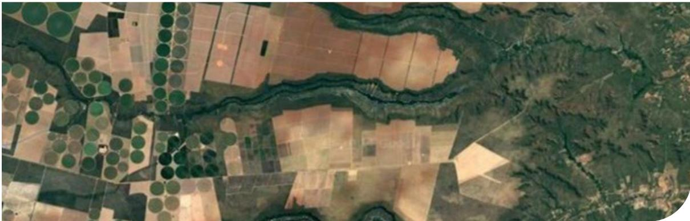

Brazil, as one of the world's largest agricultural powers, has two of its main economic assets in terms of exports in its beef and soy supply chains. These sectors together are responsible for more than US\$ 60 billion in annual revenue and responsible for millions of jobs in the country. In addition, Brazil is listed as one of the top five countries in terms of the production of these commodities. (Zu Ermgassen & Pereira, 2023) (Pereira & Bernasconi, 2025) (Aragão & Contini, 2021)(Aragão & Contini, 2021)

Soy and cattle production is directly related to deforestation and ecosystem conversion, with the Amazon and Cerrado biomes as its main targets of expansion in Brazil, depletion of local biodiversity and

waterways, and human rights violations. (TNFD, 2024; IPBES, 2019)

## Context of beef in Brazil

Brazil has historically remained one of the world leaders in the cattle sector, expanding its relevance and extension of production year by year. Exports of meat and other beef products represent about 3% of all Brazilian exports in 2023 and 6.3% of agricultural exports in the same period. Even with the increase in exports, the domestic market stands out, absorbing about 70% of the total produced nationally.(ABIEC, 2024)(GCTR, 2023)(ABIEC, 2024)

**Figure 1.** Brazilian cattle ranching in the extensive production model. Source: Proforest.

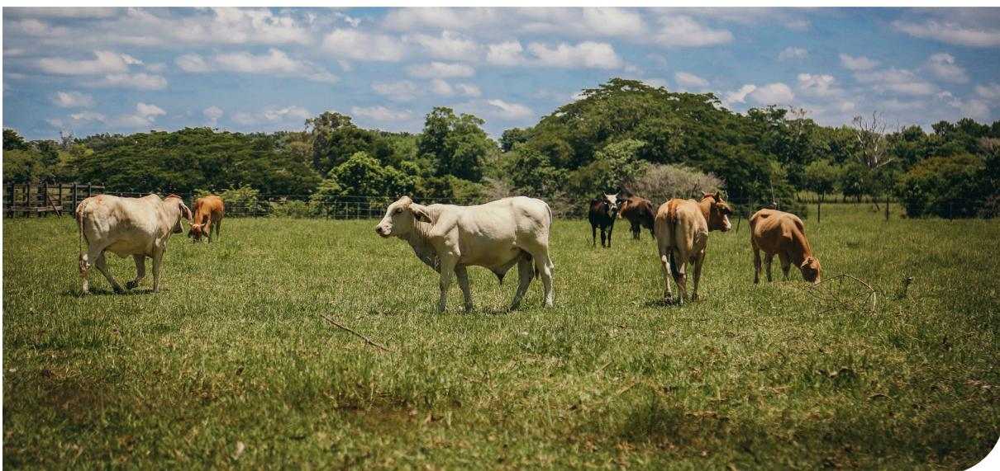

According to ABIEC (2024), Brazil exported 2,296,170 t of beef in 2023, a turnover of 10,558,929 thousand US\$. China, the USA, the European Union, Hong Kong and Chile remain the most relevant importers and together imported 1,634,992 t in 202316, about 71% of the total exported. The profile of cattle production in Brazil is dominated by pasture breeding, about 83% of cattle on pasture and 17% in confinement. (ABIEC, 2024)

The structure of the beef supply chain in Brazil is complex, involving several links, such as producers, slaughterhouses, distributors (wholesalers and retailers), final consumers (national and international) and various types of establishments through which the cattle pass until reaching the slaughterhouse. The complexity of the set of actors and types of facilities involved in the cattle life cycle affects the ability of companies to have full visibility of their supply chain, making room for “cattle laundering” and expansion of deforestation and conversion of ecosystems related to this production. (GCTR, 2023) (CDP, 2022)

Some of the national mechanisms to support the traceability, sustainability and segregation of the cattle sector include: Brazilian law and respective regulations such as the “Forest Code”17, the Certificate of the Brazilian System of Individual Identification of Cattle and Buffaloes (SISBOV)18, the Animal Transit Guidance19, Terms of Adjustment of Conduct signed with the Federal Public Prosecutor20s Office, Monitoring Protocol for Cattle Suppliers in the Amazon (Beef on Track)21, Voluntary Monitoring Protocol for Cattle Suppliers in the Cerrado (Cerrado Protocol)22, National Plan for Individual Identification of Cattle and Buffaloes23, Agro Brasil + Sustentável platform24, amongst others.

**16** Brazilian beef imports and percentage of total exported by Brazil in 2023: China (1,199,059 t, 52.22%), United States (138,669 t, 6.04%), Hong Kong (119,035 t, 5.18%), Chile (100,542 t, 4.38%), European Union (77,687 t, 3.38%), United Arab Emirates (76,901 t, 3.35%), Egypt (72,632 t, 3.16%), Russia (58,863 t, 2.56%), Philippines (56,222 t, 2.45%), Saudi Arabia (48,414 t, 2.11%) and Others (348,145 tons, 15.16%). Data available at: <https://www.abiec.com.br/publicacoes/beef-report-2024-perfil-da-pecuaria-no-brasil/>

**17** [https://www.planalto.gov.br/ccivil\\_03/\\_ato2011-2014/2012/lei/l12651.htm](https://www.planalto.gov.br/ccivil_03/_ato2011-2014/2012/lei/l12651.htm)

**18** <https://www.gov.br/agricultura/pt-br/assuntos/sanidade-animal-e-vegetal/saude-animal/cgtqa/dpc/sisbov>

**19** <https://www.gov.br/pt-br/servicos/habilitar-se-para-emissao-da-guia-de-transito-animal>

**20** <https://www.gov.br/corregedorias/pt-br/assuntos/perguntas-frequentes/termo-de-ajustamento-de-conduta-tac>

**21** <https://www.beefontrack.org/>

**22** <https://www.cerradoprotocol.net/>

**23** <https://www.gov.br/agricultura/pt-br/assuntos/sanidade-animal-e-vegetal/saude-animal/rastreabilidade-animal/PNIBVersofinalsemassinaturas.pdf>

**24** <https://agrobrasil.agricultura.gov.br/abs/home>

## Context of soy in Brazil

Brazil has been constantly developing in terms of soy production (Conab, 2025) and relevance in the world market (USDA, 2025), becoming the largest producer and exporter of soy (Conab, 2024). According to the data of the Ministry of Economy/ComexStat, analysed by the Coordination of Economics and Statistics of the Brazilian Association of Vegetable Oil Industries (ABIOVE), Brazil exported 98,815,000 t of soybean, 23,174,000 t of soy meal and 1,367,000 t of soy oil in 2024. In terms of revenue, the main export ports of soy in Brazil in 2024 were Paranaguá/SC (37%), Santos/SP (21%), Salvador/BA (10%), Rio Grande/RS (10%) and São Luís/MA (5%) (ABIOVE, 2025).

In terms of revenue from exports of soy, exports to China accounted for 41%, to the rest of Asia 33% and to the EU 14%. As for soy exported by Brazil in 2024, 1,962,065 t (69%) went to China, 480,595 t (17%) went to the rest of Asia, 168,781 t (6%) to the Middle East and 98,188 t (3%) to the EU. In the case of soy meal, Asia accounted for 58% and the EU 32% of the amount that was exported by Brazil in 2024. Soy oil exports went to India, the Americas, and Africa, while the EU did not import a significant volume of this product (ABIOVE, 2025).

The growing demand for soy is mainly related to the animal feed sector, which is part of many cattle supply chains around the world. Due to political considerations, the price and relevance of this commodity have increased significantly, which leads to a growing interest in expanding the areas where it is planted and, consequently, socio-environmental impacts associated with its production.

Soy production in Brazil is concentrated in the Cerrado and Atlantic Forest biomes25, about 75% of the planted area in 2023. Between 2018 and 2023, 84,346 ha of forest and non-forest native vegetation were converted to soy plantations in the Cerrado, while in the Atlantic Forest there were 7,887 ha and in the Pampa there were 46,656 ha. In addition to deforestation and conversion risks, soy production poses social and environmental risks related to the use of pesticides and agrochemicals, pollution of waterways, risks to biodiversity and the livelihoods of local communities. (MapBiomas, 2024)(TNFD, 2024)

**25** Area and percentage of total soy production in 2023 in the Brazilian biomes: Cerrado (19,371,410 ha, 48.58%), Atlantic Forest (10,577,403 ha, 26.53%), Amazon (5,893,005 ha, 14.78%), Pampa (4,015,935 ha, 10.07%), Caatinga (14,089 ha, 0.04%) and Pantanal (1,631 ha, 0.00%). Data available in MapBiomas Collection 9: <https://brasil.mapbiomas.org/>.

*The soy sector in Brazil has seen signiĮcant advances in traceability, being able to reach the producing farm and subsequent links in the supply chain.*

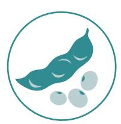

Soy traceability in Brazil is one of the biggest obstacles for actors at the end of the supply chain to adequately address the socio-environmental impacts which soy production is associated with. In Brazil, the soy supply hain involves a wide range of players and facilities, such as producers, intermediaries (cooperatives, warehouses, resellers, etc.), traders/crushers, manufacturers/brands, retailers/restaurants etc., and this structure makes it difficult to identify traceability along the supply chain.(WBCSD, 2023; Proforest, 2021)

The soy sector in Brazil has seen signiĮcant advances in traceability, being able to reach the producing farm and subsequent links in the supply chain. This is due to private traceability and monitoring iniƟaƟves, and public mechanisms and protocols, such as the Soy Moratorium. (WBCSD, 2023)

**Figure 2.** Soy harvest in Brazil. Source: Proforest.

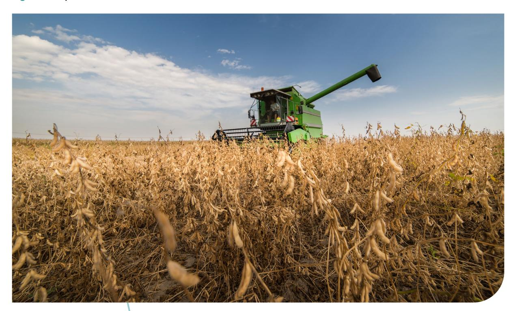

# METHODOLOGY

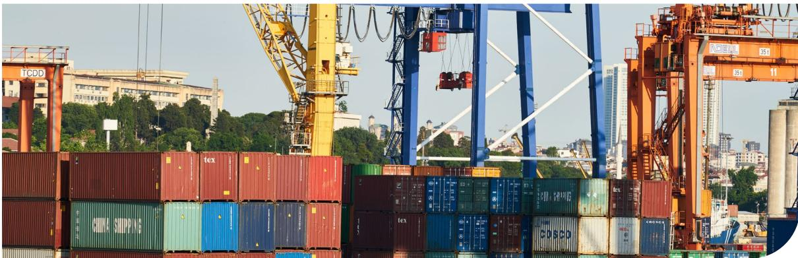

Photo:Engin Akyurt/Pixabay

In early 2024, a benchmarking exercise was carried out, identifying the ongoing EUDR dry runs for beef and soy in Brazil through public sources26. Twenty-eight companies/institutions were contacted to obtain more information, receiving responses from seventeen of them, proceeding with meetings with seven of them and, finally, selecting five to perform four dry runs. Institutions such as NGOs and sectoral organisations were also engaged to discuss the ongoing dry runs.

The selection of the contacted companies was based on their relevance in the beef and soy sectors that export directly to the EU, participation in sectoral discussion tables and a certain level of internal structure to develop an EUDR dry run. As regards the exporting companies, those that were selected were interested in assessing, updating, consolidating or even developing their procedures to comply with EUDR requirements. At this point, NDAs were signed with all the companies involved.

The dry runs started in July and ended in December 2024. This has led to challenges for tracking actual cargo shipments to the EU. Thus, only one dry run was based on a real shipment (soy), while the others relied on analysis of examples of evidence.

Three analysis parameters were defined: Geolocation, Traceability and Segregation; Deforestation -free; and Legal Compliance. These parameters guided the collection, storage and analysis of information, data and documents during the dry runs with Brazilian exporting companies. These methodological decisions were made based on the fact that, according to the

EUDR, the operator must implement a due diligence system, which includes the collection of information, data and documents necessary to comply with the requirements set out in Article 9, as well as to carry out risk assessments (Article 10), mitigation measures (Article 11) and *due diligence statements* (Annex II). The European Commission documents considered in the reviews include Regulation on Deforestation-Free Products (EUDR),27Guidance28, and Frequently Asked Questions (FAQs).29

The **first stage** of the dry runs consisted of understanding the supply chain of exporting companies and their respective approaches to meet the demands of operators. The companies' approaches and solutions boil down to: soy exporter #1 adapted its pre-existing certification system, ensuring a corridor from the plot of land to the final vessel for EUDR-compliant volumes and that the evidence expressed this compliance; soy exporter #2 maintains its monitoring system and it is up to the operator to demand the specifications of the volume, as well as what evidence must be collected, stored and made available; the slaughterhouse is adapting its traceability and segregation system, but has already adapted its social and environmental monitoring system to meet the requirements of the EUDR; the tannery intends to adapt its system to all EUDR requirement parameters. The slaughterhouse and tannery have visibility only of direct cattle suppliers.

**27** Available at: <https://eur-lex.europa.eu/legal-content/EN/TXT/?uri=CELEX%3A32023R1115&qid=1687867231461>

**28** Available at: <https://eur-lex.europa.eu/legal-content/EN/TXT/?uri=CELEX%3A52024XC06789&qid=1731687748447>

**29** Available at: <https://circabc.europa.eu/ui/group/34861680-e799-4d7c-bbad-da83c45da458/library/e126f816-844b-41a9-89ef-cb2a33b6aa56/details?download=true>

The **second stage** consisted of the analysis of protocols of the monitoring, veriĮcaƟon and reporƟng systems of socio-environmental criteria of producƟon, traceability and segregaƟon. Soy exporter #1 presented its own cerƟĮcaƟon protocol that included an annex of criteria to meet the EUDR requirements in terms of socioenvironmental, traceability and segregaƟon; soy exporter #2 and the tannery did not present oĸcial protocols, but verbal and wriƩen responses; and the slaughterhouse presented a protocol for socioenvironmental monitoring of suppliers focused on meeƟng EUDR requirements and responded verbally to quesƟons about segregaƟon and traceability.

The **third stage** consisted of the analysis of evidence (informaƟon, data and documents) that could be made available or that were made available to operators in terms of socio-environmental criteria, traceability and segregaƟon. Soy exporter #1 submiƩed a cerƟĮcate and a third-party veriĮcaƟon report in terms of system, volume, and chain of custody, both referring to a cargo that occurred during the project; soy exporter #2 presented an example of a socioenvironmental monitoring report for soy suppliers; the slaughterhouse presented examples of a due diligence declaraƟon, geolocaƟon, caƩle traceability document and a socio-environmental monitoring report; the tannery presented an example of a spreadsheet of its purchase control system that included geolocaƟons, a caƩle traceability document and self-declaraƟons of its suppliers (slaughterhouses) on socio-environmental criteria.

The **fourth stage** of this project was the workshop " "Brazil and the EUDR: from pilots to large-scale – a discussion of the pathways in which the EUDR has been tested in Brazil's beef, leather and soy supply chains". The event, which took place in Brasilia/ Brazil in December 2024, was aƩended by ninety representaƟves of companies, sector associaƟons, producers, governments, and civil society organisaƟons. The four dry runs led by Proforest were presented, as well as dry runs led by Olab and Amigos da Terra, and discussions were conducted on the challenges and next steps for private, sectoral, intersectoral and public iniƟaƟves to achieve EUDR compliance in the soy and caƩle supply chains in Brazil.

**Figure 3.** Audience of the workshop " "Brazil and the EUDR: from pilots to large-scale – a discussion of the pathways in which the EUDR has been tested in Brazil's beef, leather and soy supply chains", Brasilia/Brazil, December 2024.

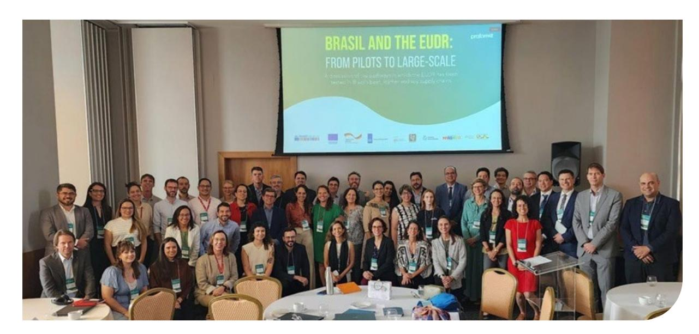

The monitoring systems for traceability and segregaƟon of volumes and the monitoring systems for socio-environmental criteria described in the following subtopics are classiĮed as internal or external. Internal systems were considered those that are operated by the exporƟng company itself, and external those that are operated by outsourced companies.

# GEOLOCATION, TRACEABILITY AND SEGREGATION

Photo: Freepik

Operators must carry out due diligence, which includes risk assessment (Art. 10) according to the required information (Art. 9), considering “the risk of circumvention of this Regulation or of mixing with relevant products of unknown origin or produced in areas where deforestation or forest degradation has occurred or is occurring” (Art. 10, item 2-j). The Guidance and FAQ reiterate that mixed volumes, even with mass balance, are not considered to be EUDR compliant. Volumes from deforestation-free sources should be segregated from those from non-deforestation-free sources even if their identity is not preserved, and therefore chains of custody with mass balance at any level of the supply chain are not considered EUDR compliant.

There is not yet a European Commission guide on evidence of segregation that will be accepted, but there is guidance on how certification or verification schemes can be used to support risk assessment. In soy dry runs, the use of segregated chain of custody certification schemes provided more robust evidence for segregation by presenting a protocol, clarity of which documents are available, and third-party auditing (chain of custody, volume, and monitoring systems). This criterion is where the additional costs for EUDR compliance are concentrated, as it requires practices that are not the most common in the market.

The EUDR includes geolocation as an information requirement (Art. 9) in terms of plot of land (soy) and establishments (birth to slaughter of cattle). The Guidance and FAQ reiterate that “traceability requirements apply to each batch of relevant commodities imported/exported/traded” and that this must be done before placing these products on the EU market or exporting them. In the case of cattle, the geolocation of an establishment can be

described by the latitude and longitude coordinates corresponding to at least one point and using at least six decimal digits. This definition of the EUDR refers to establishments that produce cattle and it is understood that the availability of the georeferenced polygon of the Rural Environmental Registry (CAR) meets this demand. In the case of soy, the geolocation of a plot of land larger than 4 ha must be made available in the form of a georeferenced polygon. If the plots are smaller than 4 ha, a point is sufficient. Operators (and non-SME traders) must make geolocation available in GeoJSON format, so it is possible that they will demand information from their suppliers in this format30.

The dry run companies (except for the tannery) can monitor and make the entire farm available through the CAR polygon, in addition to the plot of land (mandatory in soy production chains) or a point (mandatory in cattle production chains). The delivery of the polygon or CAR code is in line with Brazilian sectoral monitoring practices; ensures greater accuracy, since the evidence of traceability and segregation is related to the CAR; and provides more complete socio-environmental analyses according to Brazilian georeferenced databases. Operators (and non-SME traders) are legally responsible for this information and are advised in official documents to verify information such as geolocation.

In Brazil, scalable solutions identified as essential by the Traceability & Monitoring Task Force of the Brazilian Coalition on Climate, Forest and Agriculture31

30 The CAR, for example, is a polygon and is available in shapefile format. A point can be available through a pair of geographic coordinates or in one of the vector formats (shapefile, KMZ, KML, etc.). These formats are convertible to GeoJSON format.

31 Brazilian Coalition on Climate, Forests and Agriculture – Traceability and Transparency Task Force: <https://coalizaobr.com.br/forca-tarefa/rastreabilidade-e-transparencia/>

*Individual or unmixed batch traceability to the direct caƩle supplier is not suĸcient to meet the EUDR geolocaƟon requirement.*

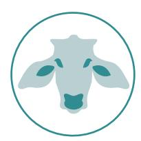

to move forward with a NaƟonal Traceability and Transparency system for soy and beef supply chains include individual caƩle traceability, caƩle traceability by batches, inclusion of the CAR in the soy invoice, deĮniƟon of a state registraƟon number per farm for soy, deĮniƟon of a unique registraƟon number for rural properƟes, and a compliance monitoring system. The implementaƟon of these acƟons can occur simultaneously and requires the strengthening of governance and support for the reintegraƟon of producers, for example.(Freire, Gonçalves, Denis, & Alarcon, 2024)

### **Beef**

The slaughterhouse presented a traceability and segregaƟon monitoring system based on batch traceability to the direct supplier of caƩle (aŌer slaughter, traceability becomes individual) and segregaƟon from the direct supplier of caƩle to shipment. Its system is external and auditable, and includes a monitoring protocol, purchase control system and the performance of the analyses are outsourced to the service provider. The database of this system includes the geolocaƟon of the establishment of the direct supplier of caƩle (CARs in shapeĮle format of direct suppliers of caƩle), Animal Transit Guidance (GTA) issued by the direct supplier of caƩle, CerƟĮcate of the Brazilian System of Individual IdenƟĮcaƟon of CaƩle and Buīaloes (SISBOV) and QR Code in the product that idenƟĮes the plant/unit and the date of slaughter. The evidence of traceability and segregaƟon that can be made available (via email or in the operator's system) is a due diligence statement that includes geolocaƟons, GTAs and QR Codes as aƩachments.

The tannery presented a traceability and segregaƟon monitoring system similar to that of the slaughterhouse, with caƩle also traced in batch to the slaughterhouses' direct supplier and raw material parts traced individually. The diīerence consists in the degree of visibility of the supply chain and the ability to engage caƩle suppliers, as the tannery collects informaƟon about caƩle suppliers as made available by the slaughterhouses. Its system is internal and auditable. GeolocaƟon consists of a pair of geographic coordinates for each establishment in a spreadsheet that links these direct caƩle suppliers to the slaughterhouses and is available via email.

Individual or unmixed batch traceability to the direct caƩle supplier is not suĸcient to meet the EUDR geolocaƟon requirement, which demands this informaƟon up to the farm of birth and that there is no mixing with non-compliant volumes for animals born aŌer June 29, 2023. The slaughterhouse plans to advance in traceability to the farm of birth through the combinaƟon of GTA and CAR and, in the future, in individual traceability through a private soluƟon, the Individual Traceability and Monitoring of Indirect Traceability Programme (PRIMI) with the Indirect ClassiĮcaƟon with Birth Guarantee (IGN). In addiƟon, it intends to allocate caƩle purchased from full-cycle suppliers (birth to sale to the slaughterhouse) to the EU market.

The cattle slaughtered by the dry run slaughterhouse and which is destined for the EU market already receive SISBOV certification and, therefore, were traced and segregated individually for a period of at least 90 days through “*brincagem*” (identification of each animal with an earring and barcode). This does not imply that this slaughterhouse has access to geolocation during this period and this represents only a portion of the animal’s life (30 months of life on average). Thus, the use of SISBOV certification as evidence of individual traceability and segregation would depend on each head of cattle identified still on the farm of birth, as well as the collection of the associated geolocations (and all these suppliers would have to comply with the EUDR’s “deforestation-free” and legal compliance requirements).

The traceability and batch segregation mechanism (including CAR codes in GTAs, for example) would be recommended as long as all direct and indirect suppliers involved comply with the requirements of the EUDR, as the EUDR does not accept mass balance. The challenge is to access GTAs, and their correlation with CARs, given that direct suppliers are not required by law to make previous GTAs available and may also not have access to these CARs, and accessing such documents requires the engagement of direct and indirect suppliers. Because these GTAs could cover more cattle than actually arrived at the slaughterhouse, the correlation between the product and all suppliers along the supply chain would flag up many farms where cattle have potentially passed, generating a large number of documents that would need to be analysed by the operator.

The advantage of adopting tools such as PRIMI (IGN) is the combination of traceability monitoring and individual segregation with socio-environmental monitoring, collecting and storing geolocations and evidence of deforestation-free and legal compliance. In addition, in the IGN category, the individual traceability of cattle and segregation from the farm of origin are guaranteed.

Individual traceability and segregation may be reflected in increased costs and selection of suppliers able to supply this volume in accordance with EUDR requirements, until the National Plan for Individual

Identification of Cattle and Buffaloes, launched by the Ministry of Agriculture and Cattle (MAPA) in December 202432, is implemented. Traders (and non-SME traders) are legally responsible for this information and may require evidence such as audits and certification to carry out their due diligence.

## Soy

The #1 soy exporter presented a traceability and segregation monitoring system based on preserved identity and segregation from the plot of land to the shipment. Its infrastructure is dedicated to volumes that comply with the requirements of its certification scheme, and it can ensure dedicated infrastructure for volumes that comply with EUDR requirements. Its certification system is internal and audited by a third party. The database of this system includes the geolocation of the plot of land in GeoJSON format (available through QR code or directly on the operator’s platform), Business Relationship Documents, Segregation Guarantee Documents in transshipment and Segregation Guarantee Documents at the port. The evidence consists of geolocation, certificate (referring to system, chain of custody and volume)33 and third-party verification report (sample audit). Both pieces of evidence were analysed in this dry run. The exporter can also make available the CAR of the rural properties referred to if required by the operator.

Soy exporter #2 presented a traceability monitoring system and batch segregation, without mixing from the plot of land if required by the operator sufficiently in advance for the infrastructure to be reserved for this volume. The database of this system includes

32 Available at: <https://www.gov.br/agricultura/pt-br/assuntos/noticias/ministro-favaro-lanca-plano-nacional-de-identificacao-individual-de-bovinos-e-bufalos>

33 It was observed in the EUDR dry run with soy exporter #2 that certificates could be made available referring only to the socio-environmental monitoring system, for example, without direct correlation with the volume of cargo sent to the operator. In the case of soy exporter #1, the certificate and the verification report referred to: the monitoring system for traceability, segregation and socio-environmental criteria listed in the internal protocol; the cargo shipped to the operator; and the chain of custody of this volume. It is understood that the certificate as evidence that the volume is tracked and segregated must meet these three parameters to ensure the correlation between the information and the cargo.

the geolocation of the plot and the rural property in shapefile format (available directly on the operator’s platform) and an invoice that identifies the registration number of the state registration corresponding to the property of origin of the grains34. The evidence includes the files mentioned for the database and a socio-environmental monitoring report that includes data on the rural property and supplier. In the case of this dry run, the operator demanded the rural property polygon (CAR) as geolocation instead of the plots of land.

In both soy dry runs, Proforest did not have access to the vector files and documents such as invoices. In addition, it was not possible to evaluate the identification of the plots of land or procedures that would enable tracking within the rural property. It is necessary that the volume of soy from a deforestation-free plot of land is segregated from the volume of soy from a deforested plot of land, for example. If the exporter only provides the CAR, or another polygon that represents the property, the entire area

of this polygon must be deforestation-free, but it is understood that they are independent polygons if only the plots are made available, and, therefore, in traceability it must be ensured that it is possible to identify the exact origin of the volume that reaches the operator or that is destined for the EU market.

It is understood through this study that the great challenge of traceability and segregation without mixing volumes is mainly further along the supply chain, that is, in the downstream links of the producers. There is the challenge of identifying the volume according to the plot of land, not just the rural property on which there are already sectoral traceability solutions, for example. However, there is a concentration of private efforts on the part of exporters to define how to operationalise these systems and what would be the possible evidence. This adaptation includes additional monetary costs and studies of what the impact would be in terms of carbon emissions, for example35.

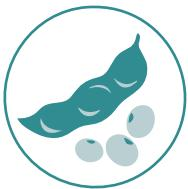

*there is a concentration  
of private efforts on  
the part of exporters  
to define how to  
operationalise these  
systems and what  
would be the  
possible  
evidence.*

34 The solution based on the assignment of a State Registration number per farm to ensure the identification of the origin of production is led by ABIOVE, the Brazilian Coalition and the Brazilian Government (Federal Revenue of Brazil). One of the operational difficulties for rural producers is the management of the issuance of invoices for various properties. (Freire, Gonçalves, Denis, & Alarcon, 2024)

35 One of the workstreams of the program “Traceability, Monitoring and Transparency Systems in the beef and soy chains in Brazil” is the calculation of carbon emissions in the logistics of transporting soy to meet the EUDR. The objective is to investigate whether and how changes in transport routes and infrastructure can impact the Greenhouse Gas (GHG) emissions associated with the transport and storage of soy, ranging from the farm gate to the port of destination, in compliance with EUDR requirements. This Proforest work front is supported by GIZ.

# DEFORESTATION-FREE

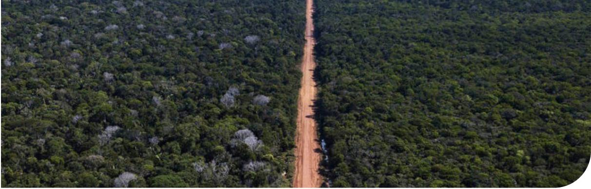

Photo: Autor desconhecido/CC BY-ND

Operators must ensure that relevant *commodities* and products are not placed or made available on the European Union market, as well as exported from it, if they are associated with deforestation (Art. 3). The EUDR defines deforestation as “conversion of forest to agricultural use, whether human-induced or not” (Art. 2, item 3), and forest as “land spanning more than 0,5 hectares with trees higher than 5 metres and a canopy cover of more than 10 %, or trees able to reach those thresholds in situ, excluding land that is predominantly under agricultural or urban land use” (Art. 2, item 4). The volume must be 100% deforestation-free, so legal deforestation in the plot of land is also not accepted.

When dealing with information requirements (Art. 9), the EUDR determines that the operator must collect, organise and keep conclusive and verifiable information indicating that the relevant products are not associated with deforestation.

Three exporting companies that participated in the dry runs monitor deforestation in a similar way and in line with Brazilian sectoral and intersectoral practices based on PRODES. This database is available on the Terra Brasilis Portal36, access is public, and the mapping of suppression and/or degradation of native vegetation (PRODES and DETER) only quantifies and spatialises the occurrences without analysis of legality. PRODES spatial data are used, for example, in the certification and sectoral agreements of agribusiness production chains (Soy Moratorium and the Cattle Conduct Adjustment Term - TAC for Meat), intergovernmental

agreements (United Nations Conference on Climate Change), National Inventory Reports of Greenhouse Gas Emissions and in monetary donations by the Amazon Fund. (INPEa, 2025)(INPEb, 2025)

Data from the PRODES programme is made available on an annual or biennial basis, while those from the DETER programme are published weekly. PRODES is made available with the focus on biomes (Amazon, Cerrado, Caatinga, Pantanal, Atlantic Forest and Pampa) and with the political focus on the Legal Amazon (which includes the Amazon biome and part of the Cerrado and Pantanal biomes). PRODES uses LANDSAT class satellite images (20 to 30 meters of spatial resolution and 16-day revisit rate) and the minimum area mapped by PRODES Legal Amazon is 6.25 hectares. (INPEa, 2025)

The EUDR applies to forests that, in Brazil, include types of native vegetation present in all biomes. Conversion of shrub and herbaceous vegetation, i.e. non-forest, is not yet foreseen in the EUDR. This means that the EUDR does not apply to non-arboreal native vegetation such as savannah, but this can still be included in revisions of the regulation (EUDR consideration 82 and item 4.13 of the FAQ). It will be necessary to specify a filtering of vegetation types if the objective is to meet only what is in this requirement and if the exporting company already blocks any volume from geolocations (establishments or plots of land) with overlapping PRODES polygons. Proforest recommends that all biomes be considered in deforestation analyses for any clear-cutting and that the conversion of shrub and herbaceous vegetation be monitored even if this incidence does not result in purchase blockages. (SFB, 2025)

36 Available at: <https://terrabrasilis.dpi.inpe.br/>. It is a web platform developed by INPE (National Institute for Space Research), with the collaboration of the Ministry of Environment and Climate Change (MMA) and the Brazilian Institute of the Environment and Renewable Natural Resources (IBAMA) and is part of the Permanent Interministerial Working Group for the reduction of deforestation rates in the legal Amazon.

(considering the cut-off date of July 22, 2008) imply that the supplier does not meet the EUDR requirement regarding legal compliance with the country of origin. This point is dealt with in the following topic.

In terms of monitoring systems, databases and methodological procedures for analysis and blocking of purchases, in these dry runs:

- ● The slaughterhouse presented a monitoring protocol that includes the PRODES database for all biomes and considers polygons with an intersection area greater than or equal to 0.5 ha with identification of clear-cutting of vegetation after July 22, 2008. The reviews apply only to direct cattle suppliers as described above. Its system is external and auditable, and the analysis is outsourced to the service provider. Its evidence consists of a Due Diligence Statement from the Meatpacking Company and a Social and Environmental Analysis Report (with identification of the supplier, rural property and CAR).
- ● The tannery presented a purchase control system that includes the collection of self-declarations from raw material suppliers (slaughterhouses). In this self-declaration, the slaughterhouse states that “direct cattle suppliers have not been involved in any form of deforestation in the Amazon biome since October 5, 2009, and indirect cattle suppliers have not been involved in any form of deforestation in the Amazon biome since August 1, 2019.” The tannery does not yet track indirect suppliers of cattle as previously discussed and its visibility of the establishments of direct suppliers is from points. Therefore, even if it performs analyses with the PRODES database, for example, it will be risk analyses37. The tannery’s evidence is the self-declaration that the slaughterhouse presented associated with its purchase control system.
- ● Soy exporter #1 presented a plot of land monitoring protocol focused on the EUDR that includes the PRODES Amazônia (cut-off date July/2008) and Cerrado (cut-off date 12/31/2020) base, and its verification report includes analyses based on DETER Amazônia e Cerrado and the Soy Moratorium. The analysis of the EUDR Protocol are focused on the plot of land, but the CAR of the rural property is analysed so that suppliers are eligible

for its certification. In the EUDR Protocol, the exporter also correlates the deforestation analysis with the Environmental Embargo List (federal and state level), but Proforest understands that this analysis does not aggregate more information than the overlap analysis with PRODES regarding the “deforestation-free” requirement, even though it is indicative of properties that may be configured as non-compliant. It was not possible to assess the methodological procedures of these analyses. Its system is internal and audited and the evidence consists of the EUDR Protocol verification report and respective certificate regarding the system, volume and chain of custody.

- ● Soy exporter #2 presented a monitoring report on the plots of land and respective CARs of rural properties, whose deforestation analyses include the PRODES of all biomes. It was not possible to assess the methodological procedures of these analyses. Its system is external and auditable, and the evidence consists of an automated report generated by a platform for socio-environmental analysis of rural properties.

In view of the compliance of geolocation (without deforestation and/or forest degradation after 12/31/2020), it is worth alerting exporting companies that a geolocation considered compliant in the analysis carried out with the PRODES database and certain methodological procedures may be considered as non-compliant in the due diligence analysis carried out by the operator, as this second analysis can be carried out with other databases and different methodological procedures. For example, the resolutions of the satellite images used in PRODES (20 to 30 m) and Global Forest Monitoring38 (10 m) differ from each other, and the minimum area of the PRODES polygon adopted in the analysis may lead to the exclusion of polygons that may appear in the operator’s due diligence. Such inconsistencies should be part of clarifications between exporter and operator, but do not necessarily mean an automatic non-compliance with the EUDR requirement.

PRODES and Global Forest Monitoring publish the data annually, so it is highlighted that a good practice to mitigate the risk of buying from non-compliant establishments or plots would be to use the DETER database, so that deforestation alerts are incorporated into the monitoring and possible blocking of purchases made by the Brazilian exporter.

37 It is considered that the compliance analysis requires the polygon of the entire property in the case of cattle raising, while the risk analysis can be carried out with only one point, as a radius of the possible area of the property is drawn.

38 <https://forest-observatory.ec.europa.eu/forest>

# CONFORMIDADE LEGAL

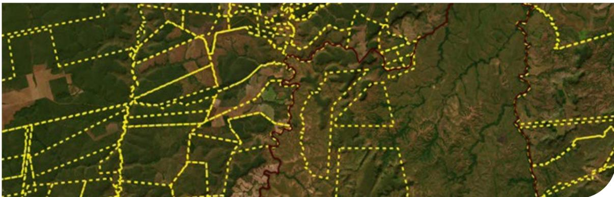

Operators must ensure that the relevant commodities and products that are placed or made available on the EU market, as well as exported from it, have been produced in accordance with the applicable legislation of the country of production (Art. 3). When dealing with information requirements (Art. 9), the EUDR determines that the operator must collect, organise and keep adequately “conclusive and verifiable information that the relevant commodities have been produced in accordance with the relevant legislation of the country of production, including any arrangement conferring the right to use the respective area for the purposes of the production of the relevant commodity”.

According to the EUDR, applicable legislation of the country of production refers to: Land use rights; Environmental protection; Forest-related rules, including forest management and biodiversity conservation, where directly related to wood harvesting; Third parties’ rights; Labour rights; Human rights protected under international law; The principle of Free, Prior and Informed Consent (FPIC), including as set out in the UN Declaration on the Rights of Indigenous Peoples; Tax, anti-corruption, trade and customs regulations (Art. 2).

In terms of monitoring systems, databases, and methodological procedures for analysing and blocking purchases, only one of the dry runs presented a protocol that correlates the legal compliance items with its criteria. Thus, in the following subtopics, there is an interpretation of what was presented in the other protocols and reports in terms of what can be correlated to the legal compliance items.

Three exporting companies that participated in the dry runs monitor socio-environmental aspects in a similar

way and in line with Brazilian sectoral and intersectoral practices based on public data, while one of them collects self-declarations from its suppliers, as it does not deal directly with geolocations. It should be noted that the slaughterhouse and the tannery do not yet trace the geolocations of establishments of indirect cattle suppliers, so the analyses described in this topic are limited to their direct suppliers.

In these dry runs:

- • The slaughterhouse presented an external and auditable system, with a monitoring protocol focused on EUDR, a purchase control system, the analyses are outsourced to the service provider company and apply to direct cattle suppliers. This protocol, although focused on EUDR, does not directly correlate its criteria to legal compliance items. Its evidence consists of a Due Diligence Statement from the Meatpacking Company and a Social and Environmental Analysis Report (with identification of the supplier, rural property and CAR).
- • The tannery presented a purchase control system that includes the collection of self-declarations from raw material suppliers (slaughterhouses). In this self-declaration, the slaughterhouse states that “the farms are not involved in slave labour, invasion of Indigenous lands or protected areas.” The slaughterhouses’ self-declarations about cattle suppliers have no evidence attached. The tannery does not yet trace indirect cattle suppliers as discussed in the previous section and its visibility of the establishments of direct suppliers is from georeferenced points. Therefore, even if it carries out analyses with national and subnational databases, for example, they will be risk analyses.

- • Soy exporter #1 presented an internal and audited system, a plot of land monitoring protocol focused on the EUDR, a system for controlling the purchase and carrying out the analysis under the responsibility of the exporting company itself. This EUDR Protocol correlates its criteria to EUDR legal compliance items. The evidence consists of the EUDR Protocol verification report and the respective certificate regarding the system, volume, and chain of custody.
- • Soy exporter #2 presented an external and auditable monitoring system, but the monitoring protocol and carrying out the analysis under the responsibility of a third-party platform. In the absence of a monitoring protocol, the information contained in the socio-environmental report generated on the outsourced platform was analysed, which does not correlate its criteria with the EUDR's legal compliance items.

The databases considered in the analyses described in the protocols, reports, and self-declarations analysed in the dry runs are common in the monitoring of supply chains in Brazil and are summarised in the CAR39, Conservation Units40, Indigenous Lands41, Quilombola Territories42, Environmental Embargo Lists43, vector layers of Environmental Embargoes44, Slave Labour Dirty List45, Agrarian Reform Settlements46, Rural Properties47 and Consultation of Negative Debt Certificate48.

The socio-environmental monitoring carried out by exporting companies, with the exception of the tannery, is based on the limits of the CAR. This means that the collection of information and evidence of legal compliance occurs at the scale of the rural property, although in some situations it is possible to analyse overlaps with plots as well. Thus, although the

geolocation requirement does not necessarily apply to rural properties, as in the case of soy with the plots of land, exporters carry out the legal compliance analysis based on rural properties. As previously discussed, this is a common sectoral and intersectoral practice and even more relevant than the use of geolocation alone to promote positive impacts on the territory.

It should be noted that, if in the risk assessment carried out by the operator in its own due diligence, the overlapping of georeferenced layers and the consultation of lists are repeated, it is possible that there will be different results due to the use of different methodological procedures such as the filter of the legal situation of the territories and classes of protected areas. This may occur because, for example, the exporter may have disregarded Indigenous Lands not yet declared or Sustainable Use Conservation Units as Environmental Protection Areas (APAs) in their legal compliance analyses. It is recommended that methodological procedures such as these filters be communicated between exporters and operators to avoid unnecessary blockages.

In the EUDR protocol for monitoring and verification of soy exporter #1, the analyses of these databases are repeated in several legal compliance items listed by the EUDR. The EUDR protocol of the slaughterhouse and the monitoring report of soy exporter #2 present these analyses without correlating them to the EUDR items and, therefore, in the interpretation of which analyses meet these items, the bases are also repeated, even though the combinations are different for each item. In other words, the same analyses would be responding to several items, which reveal a lack of clarity as to which laws and regulations these items refer. This occurs especially in the items third parties' rights, labour rights and human rights protected under international law.

In the following subtopics that describe the legal compliance items with the country of origin listed by the EUDR, it is possible to notice that the exporting companies showed the databases in the dry runs through protocols focused on the EUDR (with direct correlations with each item or not), social and environmental monitoring reports, and supplier self-declarations. However, in most of the material analysed, methodological procedures were not described, and this may make it difficult to identify inconsistencies if the operator double-checks the analyses.

39 <https://consultapublica.car.gov.br/publico/imoveis/index>

40 <https://dados.gov.br/dados/conjuntos-dados/unidadesdeconservacao>

41 <https://www.gov.br/funai/pt-br/atuacao/terras-indigenas/geoprocessamento-e-mapas>

42 <https://dados.gov.br/dados/conjuntos-dados/acervo-fundiario>

43 <https://servicos.ibama.gov.br/ctf/publico/areasembargadas/>

44 <https://pamgia.ibama.gov.br/geoservicos/>

45 <https://www.gov.br/trabalho-e-emprego/pt-br/noticias-e-conteudo/2024/Abril/mte-atualiza-o-cadastro-de-empregadores-que-submeteram-trabalhadores-a-condicoes-analogas-a-escravidao>

46 <https://dados.gov.br/dados/conjuntos-dados/acervo-fundiario>

47 <https://dados.gov.br/dados/conjuntos-dados/acervo-fundiario>

48 <https://www.gov.br/conecta/catalogo/apis/consultar-certidao-negativa-de-debito>

*nothing prevents the geolocaƟon of establishments made available to the operator from being the "Rural Property" layer of the CAR, for example, but the ideal would be to collect at least the CCIR of the supplier farm in terms of land use rights*

### **Land use rights49**

Soy exporter #1 protocol responds to the requirement of legal compliance in terms of land use rights based on the CAR of the rural property. The status of the CAR is analysed in the monitoring protocol of the slaughterhouse and in the report presented by soy exporter #2, but this report also includes the polygons of rural properƟes registered in the SIGEF (Land Management System), INCRA's database. The slaughterhouse even analyses the overlap between CARs. No possible correlaƟon was idenƟĮed with the informaƟon presented in the self-declaraƟons collected by the tannery.

It should be noted that, in Brazilian Federal Law No. 12,651/2012, Art. 29, paragraph 2 it is stated: "*The registraƟon will not be considered a Ɵtle for the purposes of recogniƟon of the right of ownership or possession, nor does it eliminate the need to comply with the provisions of ArƟcle 2 of Law No. 10,267, of August 28, 2001*".50 It should be noted that the CAR is an important mandatory tool, with the purpose of integraƟng the environmental informaƟon of rural properƟes and possessions, and that assessing their status is a common pracƟce today in the monitoring of agricultural suppliers in Brazil.

**49** The EUDR Guidance lists some examples that illustrate legal compliance with the country of origin in terms of land use rights: legislation on land transfer in particular for agricultural land or forests; legislation on land lease transaction.

However, the CAR is not responsible for aƩesƟng to the right to use the land, which is assigned to INCRA through the Rural Property RegistraƟon CerƟĮcate (CCIR) and georeferencing in the Land Management System (SIGEF). Thus, nothing prevents the geolocaƟon of establishments made available to the operator from being the "Rural Property" layer of the CAR, for example, but the ideal would be to collect at least the CCIR of the supplier farm in terms of land use rights, given that the SIGEF base is not yet complete51 .

The analysis of the overlapping of the rural property (which can be composed of several georeferenced parcels in the SIGEF) and the CAR is considered a good indicaƟon of legal compliance in terms of land use rights, as the laƩer must correspond to this set of parcels. It is understood that the analysis of the valid character of the CAR (acƟve or pending status) and the overlap with valid CARs of other properƟes is a fundamental complement in risk management, monitoring and blocking of suppliers, even though it may not deliver informaƟon on land use rights.

**50** Available at: [https://www.planalto.gov.br/ccivil\\_03/\\_ato2011-](https://www.planalto.gov.br/ccivil_03/_ato2011-2014/2012/lei/l12651.htm) [2014/2012/lei/l12651.htm](https://www.planalto.gov.br/ccivil_03/_ato2011-2014/2012/lei/l12651.htm)

**51** The National Strategy to Combat Corruption and Money Laundering (ENCCLA), for example, recommends: "When comparing the pros and cons of the systems, it can be concluded that, due to its reliability in terms of property limits, the SIGEF should be preponderant, but, in the absence of it, it is important to use the CAR as a reference, since, In addition to having a much broader scope, it is also applicable to the possession of real estate, and not only to property (which would not exclude, a priori, a large number of rural producers who, for some reason, do not own the ownership of the property)."

## Environmental protection

The protocol of soy exporter #1 responds to the requirement of legal compliance in terms of environmental protection based on the Environmental Embargo List (federal and state level), the supplier's CAR and its overlaps with Conservation Units (UCs). The slaughterhouse's protocol and the report of soy exporter #2 include these same databases, but in the slaughterhouse's protocol there is still a criterion for analysing changes in the CAR limits that may hide possible overlaps. The mention of the embargo list is a possible correlation between the information presented in the self-declarations collected by the tannery and this item of environmental protection.

It is understood that the analysis of overlap between CARs and the bases of Conservation Units, overlaps between CARs and vector layers of embargoes, consultations to embargo lists and analysis of the CAR situation, as mentioned above, may be sufficient to deliver legal compliance information in terms of environmental protection, in addition to being sectoral aligned practices in Brazil.

However, it is worth noting the description provided by the Guidance in 2024, which includes: *legislation on protected areas; legislation on nature protection and nature restoration; legislation on the protection and conservation of wildlife and biodiversity; legislation on endangered species; legislation on land development.* Thus, it is possible that the operator will demand more evidence in relation to the last three points, which could be sectoral aligned in Brazil on what could best deliver this information.

It should be noted that, although the EUDR's deforestation-free requirement establishes the cut-off date of 12/31/2020, Federal Law No. 12,651/2012, which provides for native vegetation in Brazil, establishes the date of 07/22/2008 to determine consolidated areas. This means that all deforestation and conversion of non-forest native vegetation considered illegal in Brazil according to this law and its regulations should be a factor blocking purchases to meet the requirement of legal compliance in terms of environmental protection. However, as highlighted in the Deforestation-Free section, the monitoring of the overlap of rural property with PRODES polygons does not include the legality parameter.

Some means to identify whether deforestation and conversion of non-forest native vegetation was illegal is to collect and analyse evidence such as Authorisation for Suppression of Native Vegetation or Authorisation for Deforestation (ASV) and Authorisation for Controlled Burning (AQC), both issued by government agencies. The analysis of these documents must consider factors such as the date of issuance (which must be prior to the occurrence of the PRODES polygon), the authorised quantitative area (which must be greater than or equal to the area of the occurrence) and the authorised location (which must correspond to the occurrence). It should be remembered that, even with these documents, the block remains if deforestation occurred after 12/31/2020, as the "Deforestation Free" requirement does not disregard legal occurrences.

The CAR duly analysed by the state agencies and the liabilities duly forwarded through the Environmental Regularisation Programem (PRA) would already be good indications of the first two points described in the Guidance, for example, as well as the analyses with protected areas and embargoes for the others. The advances in the analysis of the CAR and in the implementation of the PRA in the states are systematised annually in the "Radiography of the CAR and the PRA in the Brazilian States"52.

## Forest-related rules, including forest management and biodiversity conservation, where directly related to wood harvesting53

It is understood that this item of legal compliance does not apply to production that is not directly related to forest exploitation. The monitoring and verification protocol of soy exporter #1 correlated this item with analyses with the CAR databases, Conservation Units

52 Available at: <https://www.climatepolicyinitiative.org/pt-br/publication/onde-estamos-na-implementacao-do-codigo-florestal-radiografia-do-car-e-do-pra-nos-estados-brasileiros-edicao-2024/>

53 The EUDR Guidance lists some examples illustrating legal compliance with the country of origin in terms of Forest Standards, including forest management and biodiversity conservation, when directly related to forest exploitation: legislation on the protection and conservation of forests, and sustainable forest management; anti-deforestation legislation; rights to harvest timber within the legally gazetted boundaries.

*Social due diligence systems are examples of mechanisms that can be implemented by exporters to increase the visibility and miƟgaƟon of these risks in their supply chains.*

and Environmental Embargo Lists. It was decided not to make a similar correlaƟon with the other protocols and reports analysed.

### **Third-party rights**

The protocol of soy exporter #1 responds to the requirement of legal compliance in terms of thirdparty rights, lisƟng the CAR and its overlaps with ConservaƟon Units, Indigenous Lands, and Quilombola Territories. The slaughterhouse's protocol and the report of soy exporter #2 also include these same databases. The menƟon of invasion of Indigenous lands or protected areas is a possible correlaƟon with the informaƟon presented in the self-declaraƟons collected by the tannery.

It is understood that the above-menƟoned analyses may be suĸcient to deliver legal compliance informaƟon in terms of third-party rights based on sectoral/ intersectoral aligned pracƟces in Brazil, however, it is worth noƟng the descripƟon provided by the Guidance in 2024 which includes: *rights of use and possession aīected by the producƟon of the relevant commodiƟes and products and the tradiƟonal land use rights of Indigenous peoples and local communiƟes; this may include, for example, land recovery rights or usufruct rights.* In other words, the analyses may not fully assess the risk to third-party rights according to what this item includes in its deĮniƟon if, for example, less advanced legal situaƟons of the territories are not considered54 .

### **Labour rights**

Soy exporter #1 protocol responds to the legal compliance requirement in terms of labour rights based on the Slave Labour Dirty List and its own compliance mechanism/policy. The slaughterhouse protocol, the report of soy exporter #2 and the self-declaraƟon of the tannery supplier also include consultaƟons with the CPF/CNPJ of the supplier of origin on the Slave Labour Dirty List.

It is understood that analyses based on sectoral/ intersectorally aligned pracƟces in Brazil may be parƟally suĸcient to deliver legal compliance informaƟon in terms of labour rights. It should be noted that the register of employers who subjected

**54** Less advanced legal situations in the territories are those whose legal security is still fragile. In the case of Indigenous Lands, legal situations considered less advanced are those prior to the declaration and in the case of Quilombola Territories are those prior to the Expropriation Decree. Learn more about these situations at: [https://www.gov.br/funai/pt-br/atuacao/terras-indigenas/](https://www.gov.br/funai/pt-br/atuacao/terras-indigenas/demarcacao-de-terras-indigenas) [demarcacao-de-terras-indigenas](https://www.gov.br/funai/pt-br/atuacao/terras-indigenas/demarcacao-de-terras-indigenas) and [https://agenciagov.ebc.com.](https://agenciagov.ebc.com.br/noticias/202409/reconhecimento-e-protecao-das-comunidades-quilombolas) [br/noticias/202409/reconhecimento-e-protecao-das-comunidades](https://agenciagov.ebc.com.br/noticias/202409/reconhecimento-e-protecao-das-comunidades-quilombolas)[quilombolas.](https://agenciagov.ebc.com.br/noticias/202409/reconhecimento-e-protecao-das-comunidades-quilombolas)

workers to conditions analogous to slavery does not fully cover aspects of labour legislation and regulatory standards and more evidence may be required by the operator. Social due diligence systems are examples of mechanisms that can be implemented by exporters to increase the visibility and mitigation of these risks in their supply chains.

## Human rights protected under international law

The protocol of soy exporter #1 responds to the requirement of legal compliance in terms of human rights protected by International Law based on the Slave Labour Dirty List, its own compliance mechanism/policy, and cross-referencing of the CAR with Indigenous Lands and Quilombola Territories. The slaughterhouse protocol and the report of soy exporter #2 also include these analyses, except for the Mechanism/compliance policy itself. The self-declaration of the tannery supplier also includes consultations with the CPF/CNPJ of the supplier of origin on the Slave Labour Dirty List.

It is understood that these analyses based on sectoral/intersectoral aligned practices in Brazil seem partially sufficient to deliver legal compliance information in terms of human rights protected by international law, however, it is worth noting the description brought by the Guidance in 2024 that applies to: *people present in the production area of relevant commodities, to the extent relevant to the EUDR, taking into account its objectives, or to persons with rights to the area of production of relevant commodities or products, including rights of Indigenous peoples and local communities, if applicable or reflected in the respective national legislation; for example, rights to land, territories and resources, property rights, rights in relation to treaties, agreements and other constructive arrangements between Indigenous peoples and states.*

In Brazil, there is still no consolidated database for analyses in relation to local communities beyond Quilombola territories and agrarian reform settlements, for example. Although twenty-eight segments of traditional peoples and communities in Brazil are recognised, these data refer only to Quilombolas due to the availability of data. Over the last ten years, landless and Indigenous workers have been the main victims of murders and violence against people in the countryside. The notes made in the item on the rights of third parties are noted here.(IBGE, 2022)(CPT, 2024)

## The principle of free, prior and informed consent (FPIC), including as set out in the UN Declaration on the Rights of Indigenous Peoples

The protocol of soy exporter #1 responds to the legal compliance requirement in terms of FPIC by listing bases and procedures such as the Slave Labour Dirty List, Own Compliance Mechanism/Policy, and cross-referencing of the CAR with Indigenous Lands and Conservation Units. In the documents of the other exporting companies, there are analyses such as these, but it is understood that the company's monitoring of the application of the FPIC principle by suppliers depends on their knowledge and respect for the protocols established by Indigenous Peoples and traditional communities at the production sites.

Thus, it is understood that in this item the analysis in terms of overlap between CARs and official vector layers of Indigenous Lands and Quilombola Territories would not be applied to generate evidence of implementation of the FPIC principle, but of risk analyses suggesting that such implementation is not necessary. If these analyses do not consider, for example, less advanced legal situations or other traditional communities, then they may underestimate the risk and necessity of implementing the principle.

FPIC is a fundamental principle of human rights, especially aimed at ensuring the active participation of Indigenous Peoples, local communities, traditional communities and other groups in decisions about activities that may affect their customary and statutory rights, lands, resources, territories, livelihoods and food security.

In Brazil, the concept of Free, Prior and Informed Consent is formally recognised in international agreements such as Convention 169 of the International Labour Organisation (ILO) and the United Nations Declaration on the Rights of Indigenous Peoples (2007), and is supported by the 1988 Constitution through article 231 (recognition of land rights), in the Statute of the Indigenous Peoples (Law No. 6001/1973) and in the Environmental Licensing Law (Law No. 6938/1981). The lack of specific regulations, parameters and implementation guides, the resistance of economic interests and land conflicts make it difficult to fully implement it.

Photo: Fredox Carvalho/Pexels

### **Tax, anƟ-corrupƟon, trade and customs regulaƟons55**

Soy exporter #1 protocol responds to the legal compliance requirement in terms of tax, anƟcorrupƟon, trade and customs regulaƟons based on

the Mechanism/Compliance Policy itself; Debt discharge cerƟĮcate; CerƟĮcate of Responsibility with Debt SeƩlement Eīect. In the documents of the other export companies there are no analyses like these, but it is understood that in all dry runs the invoices are used in the traceability evidence and that they are documents that can be analysed in this compliance item. In any case, it is understood that invoices are not suĸcient to respond to compliance with anƟcorrupƟon regulaƟons and operators can complement due diligence with requests for anƟ-corrupƟon policies, procedures and evidence from their suppliers.

*It is worth noƟng the descripƟon provided by the Guidance in 2024: Further guidance as to the applicaƟon of the FPIC principle can e.g. be found through the UN Oĸce of the High Commissioner for Human Rights where it is noted that States must have consent as the objecƟve of consultaƟon before any of the following acƟons are taken:* 

- the undertaking of projects that aīect Indigenous Peoples' rights to land, territory and resources, including mining and other uƟlisaƟon or exploitaƟon of resources;
- the relocaƟon of Indigenous Peoples from their land or territories;
- resƟtuƟon or other appropriate redressing if lands have been conĮscated, taken, occupied or damaged without the Free, Prior and Informed Consent of Indigenous People who possessed it.

**55** The EUDR Guidance lists some examples illustrating legal compliance with the country of origin in terms of tax, anti-corruption, trade and customs regulations: Applicable laws concerning the relevant supply chains entering the Union market, or leaving it, if they have a speciƜc link to the objectives of the Regulation, or, in the case of trade and customs laws, if they speciƜcally concern the relevant sectors of agricultural or timber production.

# CONCLUSIONS AND RECOMMENDATIONS

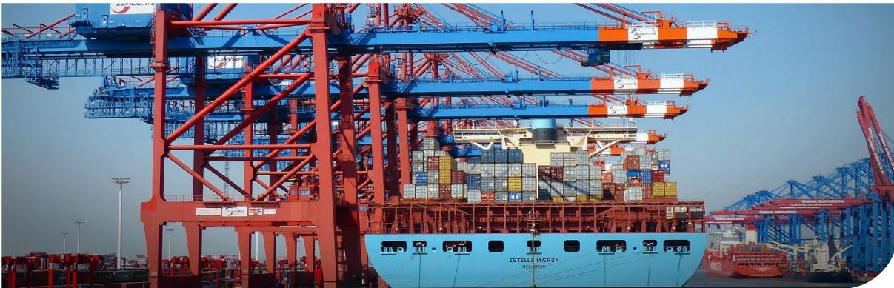

Photo: Wälz/Pixabay

Based on the four dry runs carried out in this project (two with soy exporters, one with a bovine meat exporter and one with a bovine leather exporter), some of the challenges and opportunities that Brazilian exporters of relevant commodities and products have been dealing with to adapt to the EUDR requirements were analysed in this report. The analyses were divided into four parameters: Geolocation, Traceability and Segregation; Deforestation-free; and Legal Compliance.

The challenges and opportunities raised range from adaptations in the supply chain itself and in monitoring, verification and reporting systems, with a focus on ensuring compliant volumes and on collecting, storing, analysing and making available information, data and documents that configure evidence that will be used by operators and non-SME traders in their due diligence. The analyses and discussions with peers showed that the challenges and opportunities of Brazilian exporters are shared with other Brazilian companies and that they extend to sectoral, intersectoral, national and National Competent Authorities (NCAs) initiatives of the European Union.

The deforestation-free requirement presented challenges that were considered low in terms of databases and monitoring systems, and medium in terms of evidence in dry runs of soy and cattle products. The use of the PRODES database in procurement control systems is common in the Brazilian soy and cattle ranching chains, and the analyses are made by biomes and may include non-forest native vegetation. The evidence analysed in the dry runs was supplier self-declarations, monitoring reports, third-party verification reports, and certificates. Possible differences in compliance between the analyses made by the exporter and the operator (or non-SME trader)

in their due diligence were discussed due to different databases and methodological procedures.

Also in relation to the deforestation-free requirement, the recommendations for actions at the sectoral scale include monitoring all deforestation and conversion of non-forest native vegetation with filters to meet this requirement and legal compliance with environmental protection, and to seek sectoral alignment between exporters and operators (and non-SME traders) on the bases and procedures of the analyses, as well as the format for the delivery of evidence. On a national scale, it is recommended to integrate information on surplus native vegetation and legal deforestation into the *Agro Brasil + Sustentável* platform, enabling incentives for producers. On the scale of NCAs, it is recommended to create a protocol that recognises PRODES in case of difference in compliance analyses.

The set of requirements for “geolocation, traceability and segregation” presented challenges that were considered high in terms of databases and medium in terms of evidence in dry runs of soy and cattle products. When it comes to monitoring systems, cattle ranching presented challenges considered high while soy cattle were considered medium. Private traceability and segregation solutions are already used, as is the case with certification in soy. While in soy the challenge consists in the correlation between volume and plot of land, and in traceability and segregation in transport, storage and processing, in the case of beef the challenge lies in identifying indirect suppliers of cattle.

Sectors and civil society, via the Brazilian Coalition, defend national solutions for traceability and segregation: validation of the CAR, inclusion of the CAR in the GTA for cattle ranching and in the Invoice

for soy, and individual identification in cattle raising. It is understood that there is potential for inclusion of these solutions in the *Agro Brasil + Sustentável* platform and that segregation can be reflected in cost and exclusion of suppliers. The recommendations for actions on the sectoral scale also include the search for sectoral alignment between exporters and operators (and non-SME traders) on the basis and procedures of the analysis, as well as a format for the delivery of evidence. In addition, it is recommended that the sectors improve individual solutions while contributing to national discussions.

Also in relation to the set of requirements “geolocation, traceability and segregation”, at the national level it is recommended that progress be made in national and subnational traceability and segregation programmes and systems, such as the individual identification of cattle and in compliance batches, in addition to the inclusion of the CAR in the Invoices. Progress in the validation of the CAR and the integration of the *Agro Brasil + Sustentável* platform are also actions considered essential to achieve compliance with these requirements. At the scale of NCAs, it is recommended to improve guidance on evidence and levels of assurance for segregation, as well as to recognise and support the advancement of national programmes and systems, and to consider a risk and continuous improvement approach to indirect supplier traceability.

The requirement of legal compliance with the country of production presented challenges considered high in terms of databases and evidence and medium in terms of monitoring system in dry runs of soy and beef products. The companies exporting the dry runs

monitor and evidence legal compliance in a similar way, using common bases such as the CAR, Conservation Units, Indigenous Lands, Quilombola Territories, embargo lists and the Slave Labour Dirty List.

CAR validation is considered critical to monitor and evidence legal compliance. Common uncertainties were observed about the guarantee of compliance, as in the item on environmental protection, about the equivalence of legislation between different items, and about regulations, as in the case of FPIC. The discussions also showed a fear that the high rigour of Brazilian legislation will penalise the country for its compliance gaps, given that national systems are based on proof of non-compliance, but do not have sufficient scale to ensure compliance.

Regarding the requirement of legal compliance with the country of production, at the sectoral scale of actions, a cross-sectoral proposal of minimum criteria and databases and methodological procedures is recommended, including risk mitigation strategies for requirements with a regulatory gap or databases. On a national scale, it is recommended to use the *Agro Brasil + Sustentável* platform to integrate legal compliance databases for items with a consolidated definition and bases for risk analysis for items with regulatory or data gaps. On the NCA scale, it is recommended to maintain dialogues to define minimum feasible criteria for legal compliance and complementary due diligence recommendations. It is also recommended to promote and support continuous improvement approaches, prioritising long-term risk mitigation, sector transformation, and prevention of unjustified exclusions.

# REFERENCE

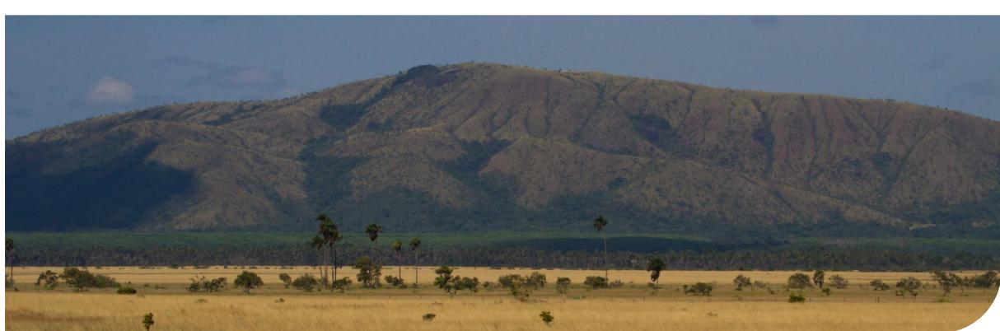

Foto: José Camargo/Pixabay

- ABIEC. (2024, August 23). *Beef Report 2024 | PerĮl da Pecuária no Brasil.* ABIEC. Retrieved from abiec: hƩps://www.abiec.com.br/publicacoes/ beef-report-2024-perĮl-da-pecuaria-no-brasil/ ABIOVE. (2025, January). *Relatório de Exportações*
- *Complexo Soja e Milho.* Retrieved from ABIOVE: hƩps://abiove.org.br/estaƟsƟcas/ Aragão, A., & ConƟni, E. (2021, June 01). *O AGRO NO BRASIL E NO MUNDO: UMA SÍNTESE DO PERÍODO DE 2000 A 2020.* Retrieved from EMBRAPA: hƩps://www.embrapa.br/documents/10180/62618376/O+AGRO+NO+BRA-SIL+E+NO+MUNDO.pdf/41e20155-5cd9-f4ad-7119-945e147396cb CDP. (2022). *CaƩle producƟon in Brazil: the role of traceability mechanisms for ensuring sustainable producƟon and forest protecƟon.* UK Pact. Conab. (2024, December). *BoleƟm LogísƟco mostra desempenho das exportações de soja e milho em 2023/24 e aponta tendência para 2024/25.* Retrieved from Conab - Companhia Nacional de Abastecimento: hƩps://www.conab.gov.br/ulƟmas-noƟcias/ Conab. (2025). *Portal de Informações Agropecuárias*
- *Conab.* Retrieved from Produção Agrícola > Safra - Série Histórica dos Grãos: hƩps:// portaldeinformacoes.conab.gov.br/safra-serie-historica-graos.html CPT. (2024). *Comissão Pastoral da Terra.* Retrieved from ConŇitos no Campo - Brasil 2023: https://www.cptnacional.org.br/publicacoes-2/ destaque/6746-conflitos-no-campo-brasil-2023 EU Comission. (2023, May 31). *REGULATION (EU) 2023/1115 OF THE EUROPEAN PARLIAMENT AND OF THE COUNCIL.* Retrieved from EUR-Lex: hƩps://eur-lex.europa.eu/legal-content/ EN/TXT/PDF/?uri=CELEX:32023R1115 Freire, I., Gonçalves, C., Denis, P., & Alarcon, C. (2024). *OpportuniƟes for deforestaƟon-free supply chains through producer-consumer country partnerships.* Retrieved from Proforest: https://www.proforest.net/pt/resources/ publications/opportunities-for-deforestation-free-supply-chains-through-producer-consumer-country-partnerships/ GCTR. (2023). *TRANSPARÊNCIA DA CADEIA BOVINA NO BRASIL - DESAFIOS E OPORTUNIDADES.* GCTR. IBGE. (2022). *Censo DemográĮco.* Retrieved from Ins-Ɵtuto Brasileiro de GeograĮa e EstaơsƟca: https://www.ibge.gov.br/estatisticas/sociais/ trabalho/22827-censo-demograĮco-2022.html INPEa. (2025). *TerraBrasilis*. Retrieved from TerraBrasilis: hƩps://terrabrasilis.dpi.inpe.br/

- INPEb. (2025). *Coordenação-Geral de Observação da Terra.* Retrieved from PRODES - Amazônia: http://www.obt.inpe.br/OBT/assuntos/programas/amazonia/prodes IPBES. (2019). *Global assessment report of the Intergovernmental Science-Policy Plaƞorm on Biodiversity and Ecosystem Services.* Bonn: IPBES secretariat. MapBiomas. (2024). *Coverage and transiƟons staƟs-Ɵcs by biomes - MapBiomas Brasil CollecƟon*
- *9.* Retrieved from MapBiomas: hƩps://data. mapbiomas.org/dataset.xhtml?persistentId=doi:10.58053/MapBiomas/7VJZWK Pereira, O., & Bernasconi, P. (2025, January 28). *Trase: Brazilian soy exports and deforestaƟon*. Retrieved from TRASE: hƩps://trase.earth/insights/brazilian-soy-exports-and-deforestaƟon Proforest. (2021, March). *Soy Toolkit BrieĮng Note 02.A | Key Points.* Retrieved from Soy Toolkit: https://static1.squarespace.com/static/5b-48c2572487fdd7f1f29d1c/t/5ea0431c2a-9c3a77e3f3d970/1587561245005/Soy+Toolkit\_ExecuƟve+Summay\_BN02A\_Traceability.pdf SFB. (2025). *Sistema Nacional de Informações Florestais.* Retrieved from Serviço Florestal Brasileiro: hƩps://snif.Ňorestal.gov.br/pt-br/conhecendosobre-florestas/168-tipologias-Ňorestais?modal=1&Ɵpo=tableau TNFD. (2024). *AddiƟonal sector guidance - Food and agriculture.* TNFD. USDA. (2025, February). *US Departament of Agriculture, Foreign Agricultural Service.* Retrieved from IPAD - InternaƟonal ProducƟon Assessment Division: hƩps://www.fas.usda.gov/ sites/default/Įles/2025-02/producƟon.pdf WBCSD. (2023). *SoŌ CommodiƟes Forum - 2023 Progress Report.* World Business Council for Sustainable . WWF Brasil. (n.d.). *MOST OF THE PROFITS FROM SOY GO ABROAD.* Retrieved from WWF: hƩps:// wwĩrnew.awsassets.panda.org/downloads/ wwĩr\_2022\_nt\_o-caso-da-soja\_english.pdf Zu Ermgassen, E., & Pereira, O. (2023, November 21). *Brazilian beef exports and deforestaƟon.* Retrieved from Trase: hƩps://trase.earth/insights/ brazilian-beef-exports-and-deforestaƟon

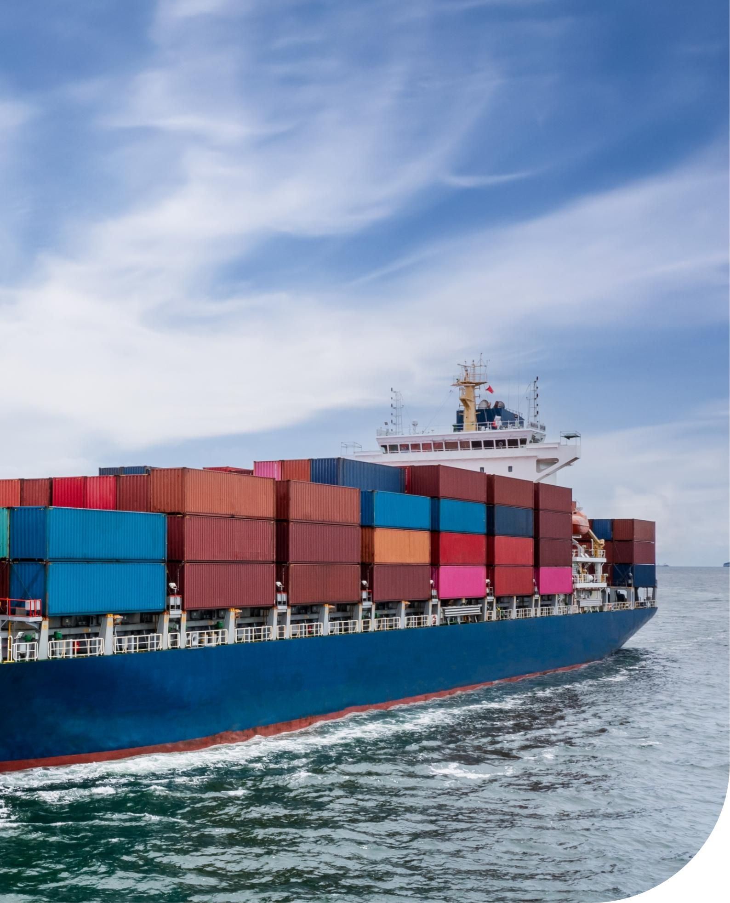

**proforest**