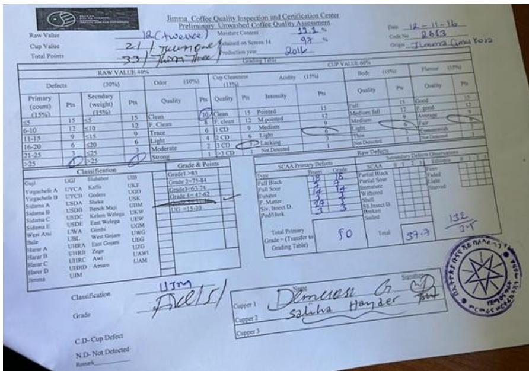
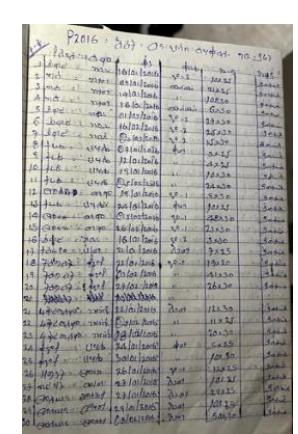
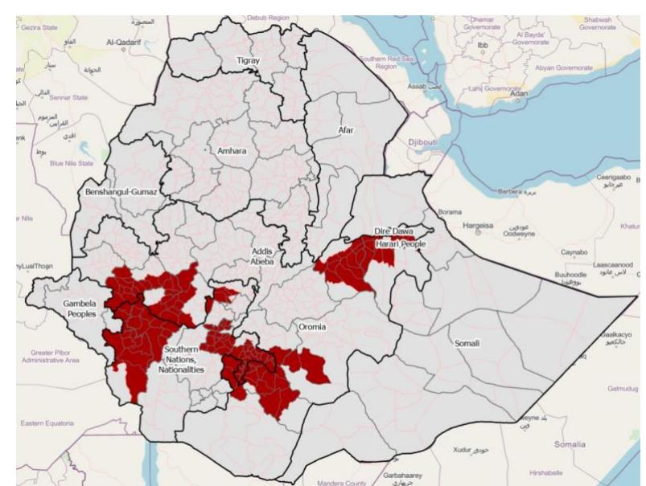

# **Ethiopian coffee and the EU Deforestation Regulation (EUDR): state of play, challenges and opportunities**

Ethiopia is renowned for its high-quality coffee, a critical export commodity that significantly contributes to the country's foreign exchange earnings and the livelihoods of millions of Ethiopian farmers. Ethiopia's coffee exports increased substantially in recent times. In May 2024, Ethiopia exported 690,000 bags of coffee, compared to 350,000 bags in May 2023.[1](#page-0-0) Ethiopia is the thirdlargest producer of Arabica coffee and the fifth-largest overall coffee producer in the world.2 More than half of the coffee produced in Ethiopia is consumed domestically, which shows the social and cultural importance of coffee in the country.

The growth in production and export is essential for the Ethiopian economy because coffee is the most important commodity exported by Ethiopia, accounting for 35% of foreign exchange earnings[.](#page-0-2)3 The European Union, the largest consumer of coffee worldwide, is Ethiopia's most important export market, accounting for more than 30% of coffee exports in 2022/2023.4 Coffee is also a critical commodity for rural livelihoods in Ethiopia. More than 5 million smallholder farmers produce coffee on an average of 0.5 hectares of land. Furthermore, an estimated 25% of the population in Ethiopia derives a significant part of their income from the coffee value chain.[5](#page-0-4)

# Coffee insight

1 Se[e https://www.icocoffee.org/documents/cy2023-24/cmr-0624-e.pdf](https://www.icocoffee.org/documents/cy2023-24/cmr-0624-e.pdf) 

Se[e https://apps.fas.usda.gov/psdonline/circulars/coffee.pdf](https://apps.fas.usda.gov/psdonline/circulars/coffee.pdf)

3 Ethiopian Coffee and Tea Authority (2024). *National Action Plan for the Implementation of Compliance Measures on* 

*EUDR*.

4 Ibid.

Ibid.

There is an intrinsic connection between coffee and forests in Ethiopia. Coffee is perceived as a forest-friendly commodity because coffee is cultivated following traditional practices with minimal use of fertilisers, and trees are seen by farmers as vital for providing shade to the Arabica coffee plants. While there are some concerns over its role in forest degradation in certain areas[6](#page-1-0) , coffee is not contributing significantly to deforestation in Ethiopia.[7](#page-1-1) The ongoing substitution of coffee with other crops, notably chat[8](#page-1-2) , mainly because of fewer farm management requirements but also competitive financial returns, poses a stronger risk to the forest, the economy, and Ethiopia's culture and society.

There is anecdotal evidence that coffee farmlands are gradually being substituted by Eucalyptus tree plantations with increasing local demands for timber. The potential exclusion of farmers from coffee value chains risks having the reverse effect of accelerating deforestation through incentivising the production of alternative crops such as chat[.](#page-1-3)9

The introduction of the EU Regulation on Deforestation (EUDR) is of concern to coffee supply chain actors in Ethiopia. Given the importance of the European market, the Ethiopian Government is taking steps to improve the information environment for EUDR compliance and ensure that trade and investment in Ethiopian coffee will continue to grow. Without any doubt, the EUDR poses traceability challenges in the short term. However, it also offers long-term opportunities to position the country as a sustainable producer of high-value coffee and improve the situation of farmers through more farming clusters and stronger cooperatives. Improving farmers' incomes will be critical to disincentivising the current practice of substituting coffee for alternative crops.

In this context, the European Forest Institute (EFI), through the Technical Facility on Deforestationfree Value Chains, a newly established instrument under the Team Europe Initiative (TEI) on Deforestation-free Value Chains, responded to a request of the EU Delegation in Ethiopia to conduct an 'EUDR Preparedness Check' of Ethiopia's coffee sector in late July 2024. EFI experts conducted a mission to assess the state of play of the coffee sector and identify the main opportunities and gaps concerning geolocation, traceability, forest monitoring, legal compliance and smallholder challenges.

This report provides an overview of available systems and information, and makes actionable recommendations for the Ethiopian Government and its partners to close existing gaps and turn the EUDR into an opportunity for the Ethiopian coffee sector, on issues related to:

- Geolocation and traceability
- Deforestation
- Legality
- Smallholder inclusion

For example, se[e Kafa: Project Area - NABU beyond borders](https://en.nabu.de/topics/regional-development/coffee-novation/forest-loss.html)

7 The analysis conducted by Enveritas through high-resolution satellite images and large-scale ground truthing identified not more than 20 coffee plots linked to recent deforestation (post 2020).

Chat is a plant native to Eastern and southeastern Africa. The leaves produce a stimulant effect when chewed. See Dube

(2014). *Why a shift from Coffee to Chat? A Study of the Kersa Woreda in Jimma Zone of South Western Ethiopia.* For example, see Binalfew (2017). *The Expansion of Production, Marketing, and Consumption of Chat in Ethiopia*. "Many parts of the Hararghe highlands […] are beginning to turn into a monoculture landscape with chat being the dominant crop planted and seen everywhere."

# **1. Traceability requirements**

The EUDR requires that operators collect the following information, accompanied by evidence: geolocation coordinates of all plots of land where commodities and products were produced (Art. 9 (1.d)) – for plots >4 hectares, GPS polygons are required (Art. 2(28)); the date or time range of production (Art. 9 (1.d)); and last supplier information (Art. 9 (1.e)).

#### **1.1 State of play**

In 2022, the Ethiopian Coffee and Tea Authority (ECTA) developed the Market Information Management System (MIMS), with support from German development agency GIZ. The MIMS is a tracking system that allows ECTA to track the movement of coffee beans from the primary coffee transaction posts at the district level (Woreda) to export. The system registers and monitors in realtime (daily updates) the volume, type (washed or dried) and quality grade of coffee movements, the exporter, the supplier, the truck's plate number and the driver transporting the cash crop to the ports.

EFI learned about MIMS at ECTA's headquarters and saw how trucks are sealed at the primary control centers in the districts (Woredas). Originally developed to prevent theft along the value chain, the MIMS also ensures that coffee graded for quality in inspection centers is exported. Conversations with government officials revealed that the MIMS is valued and used at the highest government level because it assists in determining whether export targets are met.

**Picture 1: Screen view of data in the MIMS**

While the accuracy and functionality of the MIMS have not been evaluated, it is considered as an extremely valuable starting point for tracing coffee along the value chain in the context of the EUDR. Currently, access to the MIMS is restricted to high-level government officials, and traceability is only possible to the primary transaction posts at the district level. The Woredas (districts) are effectively the lowest point in the value chain to which coffee can be systematically traced as of now.

**Picture 2: Quality inspection by local authorities provides detailed information about the coffee**

ECTA is working to collect geolocation data of coffee plots across the country and link the data to the MIMS to extend its coverage and traceability to the plot level. ECTA has compiled data of about 200,0000 ha of coffee as of July 2024 in collaboration with various supply chain actors. Collecting farmers' geolocation data in a short period is a challenge given the fragmentation of production base into millions of very small plots (the vast majority under 1ha).

Unions, through their primary cooperatives, are actively collecting geolocation data of their member farmers. Several unions have hired students to use tools such as KoboToolbox in the field to collect geolocation data. Some unions have support from international organisations to hire external service providers to digitalise their supply chains. Generally, the cost of collecting data is a hurdle for cooperatives (at least EUR 2-4 per single point, but some have indicated much higher costs when accounting for indirect costs such as training).

Larger commercial farms interviewed started preparing earlier, and most have already collected geolocation data of their coffee plots. Larger entities have contiguous coffee plots, more resources and integrated operational systems that make it easier to collect and transfer such data.

**Picture 3: A local agent hired by a cooperative using KoboToolbox walking the boundaries of a polygon**

#### **Segregation and traceability for primary cooperatives and washing/drying stations**

The EUDR requires the segregation of EUDR-compliant products from others. Traceability is a means to establish that such segregation is ensured, and to remove the risk of mixing EUDR-compliant products with products of unknown origin. Physical segregation of products at the level of large supply chain actors, exporters, unions, etc., is possible, but impractical at the level of smaller actors such as individual primary cooperatives, and washing or drying stations in Ethiopia. Indeed, it is beyond the capacity of these local actors to establish separate warehouses or separate installations in washing or drying stations to physically segregate products.

The only viable approach at the local level is to ensure that all the coffee handled at a given washing or drying station or cooperative is EUDR compliant (no mixing with non-compliant coffee or that of unknown origin). The production from a given primary cooperative or station could then be considered as one single 'batch' of EUDR-compliant products[10](#page-4-0), provided that all suppliers' plots are properly mapped and checked for deforestation and legality. These batches still have to be linked to specific sets of plots properly geolocalised, i.e. all the plots from which these batches were sourced. But this information generally already exists in the purchase records of cooperatives and washing stations, though often not in digital format.

| EIRR GEOLOGICAL DATA COLLECTION SHEET |                      |     |     |             |       |             |                 |           |
|---------------------------------------|----------------------|-----|-----|-------------|-------|-------------|-----------------|-----------|
| Site                                  | Dates Name           | Oil | Sed | Likely      | Value | Few Seen    | Geological Feat |           |
|                                       |                      |     |     |             |       |             | Latitude        | Longitude |
|                                       | 5 January Atean Grob |     | M   | Balano Grob | 0.9   | 7.948-0.854 | 3.3-6.4-9       | 16.0-20.1 |
|                                       | 4 January Atean Grob | CRS | M   | Balano Grob | 0.9   | 7.947-0.854 | 3.3-6.4-9       | 16.0-20.1 |
|                                       | 4 January Atean Grob | CRS | M   | Balano Grob | 0.9   | 7.950-0.854 | 3.3-6.4-9       | 16.0-20.1 |
|                                       | 4 January Atean Grob | CRS | M   | Balano Grob | 0.5   | 7.949-0.854 | 3.3-6.4-9       | 16.0-20.1 |
|                                       | 4 January Atean Grob | CRS | M   | Balano Grob | 0.5   | 7.946-0.854 | 3.3-6.4-9       | 16.0-20.1 |
|                                       | 4 January Atean Grob | CRS | M   | Balano Grob | 0.5   | 7.945-0.854 | 3.3-6.4-9       | 16.0-20.1 |
|                                       | 4 January Atean Grob | CRS | M   | Balano Grob | 0.5   | 7.945-0.854 | 3.3-6.4-9       | 16.0-20.1 |
|                                       | 4 January Atean Grob | CRS | M   | Balano Grob | 0.5   | 7.945-0.854 | 3.3-6.4-9       | 16.0-20.1 |
|                                       | 4 January Atean Grob | CRS | M   | Balano Grob | 0.5   | 7.945-0.854 | 3.3-6.4-9       | 16.0-20.1 |
|                                       | 4 January Atean Grob | CRS | M   | Balano Grob | 0.5   | 7.945-0.854 | 3.3-6.4-9       | 16.0-20.1 |
|                                       | 4 January Atean Grob | CRS | M   | Balano Grob | 0.5   | 7.945-0.854 | 3.3-6.4-9       | 16.0-20.1 |
|                                       | 4 January Atean Grob | CRS | M   | Balano Grob | 0.5   | 7.945-0.854 | 3.3-6.4-9       | 16.0-20.1 |

The priority for primary cooperatives and washing stations would thus be to digitise their existing records of purchase transactions to maintain up-to-date lists of farmers and plots, enriched with plots geodata for those who haven't yet collected that information, contributing to their seasonal 'batch' of EUDR-compliant products (see pictures 4 and 5 below). For these local actors, the need to go further and invest – or be enrolled – in more sophisticated traceability systems (e.g. QR code scanning solutions for first-mile transactions) is not evident and the added value of this investment should be considered carefully, given the aggregation in batches that happens at the level of primary cooperatives or washing/drying stations.

**Picture 5: Primary cooperative's record of geolocation data per coffee plot**

**Picture 4: A paper-based record of farmer-to-cooperative coffee purchase transactions (book of primary cooperative)**

10 This batching approach is different from a mass balance approach. In the mass balance approach, mixing between compliant and non-compliant products happens. The mass balance approach is not permitted under the EUDR.

#### **Bringing some clarity on the 'declaration in excess' approach**

All supply chain actors consulted, including cooperative unions, exporters and buyers, were looking for more clarity on the issue of using a 'territorial approach' to traceability, which had been largely debated in Ethiopia under the leadership of ECTA. The approach was initially proposed at the national level (MoU ECTA-Enveritas) through a wall-to-wall national mapping of coffee plantations overlaid with data on deforestation since the EUDR cut-off date. The aim of this approach was to 'declare' the whole country as deforestation free after 'remediating'[11](#page-5-0) the few non-compliant coffee plots detected through the mapping exercise and verified on the ground. Supply chain actors have heard mixed messages about the validity of this approach for EUDR compliance, and have been demanding clarity on the issue. The EUDR guidance doesn't contemplate this concept of a 'territorial approach', but refers – in the EUD[R Frequently Asked Questions](https://circabc.europa.eu/ui/group/34861680-e799-4d7c-bbad-da83c45da458/library/e126f816-844b-41a9-89ef-cb2a33b6aa56/details) – to 'declaration in excess' in certain circumstances.

While the debate is evolving, it is important to clarify the difference between the two concepts:

o 'territorial approach': this is effectively a strategy that the Ethiopian authorities adopted to address deforestation in the coffee sector, with wall-to-wall national mapping of coffee plantations, deforestation, field verifications, remediation and compensation protocols for farmers to remove non-compliant coffee plots. o 'declaration in excess': this may be the decision of an operator to declare a set of plots larger than just the plots that contributed to a particular shipment, especially when this operator is unable to discard any mixing from this larger set of plots. However, in doing so, the operator assumes the responsibility for verifying the compliance of all declared plots.

A frequent confusion between the two concepts is due to the erroneous idea that declaration in excess could be done by the operator using the boundaries of a territory or jurisdiction checked for deforestation (i.e. the limits of a particular region, or even of the entire country) in its due diligence statement, supposedly removing the need to submit detailed lists of geolocation data for individual plots. The EUDR FAQ clarified that a polygon cannot be used to trace the perimeter of a random land area that might include plots of land only in some of its parts.

Further guidance on the conditions under which operators may declare 'in excess' is awaited from the European Commission at the time of this report. It is already clear that the larger the scale at which the 'declaration in excess' is used, the riskier it will be for operators, as the number of plots to check – and the risk of error – increases. This risk is understood by many supply chain actors, who now seem to converge towards a practical concept of declaration in excess at a much finer level than initially debated in Ethiopia: at the level of districts (Woredas)[12](#page-5-1), noting that there are 670 rural districts in Ethiopia (and 12 regions). The Woreda is the first level at which traceability information is already systematically available in Ethiopia (from the MIMS information system described earlier).[13](#page-5-2)

11 'Remediation' implies restoring these coffee plots into forests. In practice, for the moment, the Government is buying the production from these farmers and removing it from the market.

12 Not a single polygon of the district boundaries, but the comprehensive list of coffee plots located in this district. Clarity on this remains very much needed for various supply chain actors in Ethiopia.

13 Some operators will be able to go to a finer level, at the level of primary cooperatives, washing or drying stations.

**Figure 6: Map of Ethiopia's subdivisions: 12 regions (dark lines) and 670 rural districts (Woredas - red lines). Main coffee-growing regions are highlighted.** 

### **1.2 Recommendations**

Main recommendation:

➢ **Build a national online platform of EUDR-relevant information** bringing together (1) coffee traceability data (MIMS) with (2) coffee plots geolocation data (integration with land-use certificates database) and (3) polygons of Participatory Forest Management (PFM) with forest coffee and other relevant datasets described further below: (4) forest and deforestation data (EFD maps) and (5) environmental impact assessments for large coffee plantations (EPA reports).

Timing: most of these separate information systems are managed under the same authority – the Ministry of Agriculture – which could give an immediate mandate to an internal task force to build such data integration internally. The digital platform does not need to be built from scratch but could be built around the existing MIMS – with immediately available technical assistance from longstanding ECTA partners (EU CAfE project and GiZ). Data access modalities would be a key topic for discussion with stakeholders in the next sessions of the national coffee platform.

Other recommendations for the short term:

➢ **Conduct an independent evaluation of the MIMS system** to enhance its profile and credibility with the private sector. ECTA is already confident about the robustness of the system; an external evaluation could help private actors to develop such confidence and buy-in. Publishing the evaluation report would be of value to operators in case of controls by EU Competent Authorities. It may become a useful element supporting their due diligence.

➢ **Enable systematic market differentiation for forest coffee** by enriching the existing ECTA dispatch form with a section indicating whether the coffee is collected from a PFM area, and when it is the case, whether it is semi-forest or wild coffee. ECTA may consider to detail the dispatch form further to track all main production types (not just semi-forest and wild, but also garden and plantations). The market differentiation could add more value to Ethiopian coffee. ➢ **Produce a technical paper on modalities of 'declaration in excess' at the local level** (Woreda, cooperative, washing station) to improve understanding among supply chain actors on the approach, and what it can mean in the Ethiopian context. The paper could describe real situations through case studies, and outline the information/data implications and risks associated to them, including the most recent guidance available on the topic. ➢ **Establish (and communicate on) a process of continuous improvement of coffee plots geolocation datasets** compiled by ECTA, cooperatives unions and the land department, and develop a protocol to reduce common errors. Large datasets of plots geolocation data generally come with errors – this is not specific to the coffee sector – and with respect to due diligence, it is key to be able to demonstrate a process of continuous improvement. Communicate on progress made on the basis of simple indicators (e.g. number of plots updated, % of errors, etc.) to increase confidence in the data by market actors. Coordination between government departments would be key to avoiding the duplication of efforts in collecting and assessing geolocation data. ➢ **Run a trial test of due diligence declarations** on a few different coffee shipments exported from Ethiopia, with operators relying on different types of due diligence and information systems. The feasibility depends on the availability and willingness of one or several EU Member States' Competent Authorities to participate. The test is not expected to provide compliance validation, but to improve mutual understanding and confidence in the practical application of the EUDR. This may be part of a wider dialogue between Competent Authorities and coffee stakeholders in Ethiopia.

# **2. Deforestation-free criteria**

The EUDR requires that operators collect adequately conclusive and verifiable information that relevant products are deforestation free (Art. 2(13) and 9 (1.g)). Coffee produced on lands converted from forests after 31 December 2020 will not be considered deforestation free and will not comply with EU requirements. 'Forests' are defined according to the United Nations Food and Agriculture Organization (FAO) definition (Art. 2(4))3.

### **2.1 State of play**

Coffee in Ethiopia is 100% Arabica coffee and is grown under shade (over 50-60% canopy cover in many areas). The establishment of 'Participatory Forest Management' over large tracks of remaining forests in the 1990s, allowing for coffee production without disturbing the canopy, is believed to

have played a critical role in significantly reducing deforestation in the country. Nowadays, competition from other crops not grown under shade – especially chat and maize – is posing new threats to remaining forests. This explains why coffee is seen as a 'forest-friendly' rather than 'forest-risk' commodity in Ethiopia. [14](#page-8-0) Furthermore, there is growing concern that failing to meet the EUDR requirements in time could lead to the opposite intended effect of the regulation, i.e. more, not less, deforestation in Ethiopia.

Actual deforestation for coffee plantations is believed to have been rare in recent years. According to Enveritas' analysis, not more than 20 deforested plots were detected since 2020 with planted coffee.[15](#page-8-1) While coffee has been playing a very small or possibly negligible role in deforestation, at least in recent years, and might even contribute to stabilising the forest frontier under pressure from other crops, its role in forest degradation is subject to more debate. This might be particularly the case for the expansion of so-called 'semi-forest' coffee into higher altitude areas due to climate change, with coffee planted under the canopy of natural forests and gradually replacing its natural understory vegetation. This is different from the 'wild coffee' collected from natural forests where it naturally grows without any agricultural management.[16](#page-8-2)

|                                         | <b>The four coffee production systems in Ethiopia</b> |                                                                                                                     |                                                                          |
|------------------------------------------------------|--------------------------------------------------------------------|----------------------------------------------------------------------------------------------------------------------------------|--------------------------------------------------------------------------|
| Commercial plantation coffee                         | Home-garden coffee                                                 | Semi-forest coffee                                                                                                               | Wild coffee                                                              |
| Coffee trees are intensively managed on large farms. | Coffee trees are planted around a homestead.                       | Coffee is harvested from semi-wild plants in forest fragments. Farmers thin the canopy and manage the undergrowth. 17 | Coffee trees are growing naturally in the forest without any management. |

The forest definition used in the EUDR[18](#page-8-4) combines both land-cover and land-use aspects. Semi-forest coffee areas in Ethiopia would still meet the land-cover criteria of this forest definition (trees higher than 5 meters are maintained and the canopy cover is generally well above the 10% threshold), but it is much less straightforward on the land-use criterion which excludes "land that is predominantly under agricultural or urban land use." This eventually comes down to the interpretation of the concept of "predominant land use"[19](#page-8-5). A key question that will require further reflection and

14 This viewpoint was heard not just from supply chain actors but also from forest and environmental protection authorities, research institutes and cooperation agencies.

15 The extent to which the Enveritas' data captures areas of 'semi-forest' coffee – the hardest to detect from remote sensing - remains to be verified.

16 The difference between semi-forest coffee and wild coffee is that planting and management of coffee plants is central to the former and absent in the latter. Confusion arises with the term "forest coffee" which is sometimes used indistinctly to refer to one or the other system, or even both in comparison to other coffee growing types (garden coffee; commercial plantations).

17 Raf Aerts, Kitessa Hundera, Gezahegn Berecha, Pieter Gijbels, Marieke Baeten, Maarten Van Mechelen, Martin Hermy, Bart Muys, Olivier Honnay (2011). *Semi-forest coffee cultivation and the conservation of Ethiopian Afromontane rainforest fragments*. Forest Ecology and Management, Volume 261, Issue 6, pages 1034-1041.

18 'Forest' means "land spanning more than 0,5 hectares with trees higher than 5 metres and a canopy cover of more than 10 %, or trees able to reach those thresholds *in situ*, excluding land that is predominantly under agricultural or urban land use."

19 Further guidance from the European Commission is expected on this issue and agroforestry systems.

clarification is whether coffee under the semi-forest management practice in Ethiopia is the predominant land use in all cases, or only when situated outside a Participatory Forest Management area.

#### **The specific case of 'wild coffee': a non-timber forest product**

About 10% of coffee production in Ethiopia is estimated[20](#page-9-0) to originate from picking in natural forests where coffee naturally grows, without any agricultural management practice. Yields are naturally much lower – by a factor of 10 – compared to areas under management. This situation is unique to Ethiopia's forests, home to the origins of the world's coffee domestication. No other coffeeproducing country has a significant part of its coffee collected from natural forests. Collected as a non-timber forest product, it doesn't easily fit into the EUDR categories foreseen for agricultural products and 'commodities'. For instance, there is no agricultural plot to be found for this production, but the plots of sections of Participatory Forest Management areas which are full of forests, generate some coffee production, and yet are deforestation free. Understanding of this specific context by operators, service providers, and EU Competent Authorities would be important to avoid unintended consequences on this niche market segment, which is vital to some marginal communities and believed to play a critical role in valuing natural forests and stabilising the forest frontier.

Official data on forest cover and deforestation has recently been updated in Ethiopia by the Ethiopia Forest Development (EFD) office with the collaboration of internationally recognised expert organisations (CIAT and CIFOR-ICRAF). Deforestation alerts are publicly available[21](#page-9-1) but the national forest cover map, available for the years 2018 and 2023, has not yet been publicly disclosed. With an accuracy of 94%[22](#page-9-2), this national forest map would in principle be much more reliable for Ethiopia than data coming from globally available products.[23](#page-9-3)

Its accuracy could be further improved if large datasets on coffee plantations that are becoming available in Ethiopia could be used to refine the forest map – it is believed that a significant part of the area inaccurately classified as forest in the EFD map (part of the 6% error margin) would actually be coffee plantations (in the 'semi-forest' management system). A data-sharing agreement between ECTA and EFD could thus be mutually beneficial: a large sample of ECTA's coffee plot database would enable EFD to produce an updated forest map with even higher accuracy, which could in turn enable ECTA's coffee information system to include deforestation analysis for supply chain actors.

The EFD forest cover data is based on Ethiopia's national forest definition, which is not the same as the one of the EUDR: the former uses a threshold of 20% of canopy cover while the latter takes a 10% threshold. However, this discrepancy is believed to have no real significance for the coffee

20 From conversation with ECTA and other stakehdolers.

21 [http://www.terra-i.org/terra-i/data/data-terra-i\\_ethiopia.html](http://www.terra-i.org/terra-i/data/data-terra-i_ethiopia.html)

22 According to CIAT who has been involved in the ground-truthing work.

23 Global forest mapping products rarely surpass 80% accuracy for a given context.

sector in Ethiopia, as coffee grows in humid parts of the country where all forests would be well above a 20% canopy cover (any forest between 10% and 20% canopy cover in Ethiopia would be found in dryer regions of the country, not in the coffee producing areas).[24](#page-10-0)

#### **2.2 Recommendations**

Short term:

➢ **Publish Ethiopia's forest map** (2018 and 2023), harnessing existing data from the Ethiopia Forest Development Office (EFD). A map published by the EFD would enhance transparency and become a national resource useful beyond the EUDR.

Medium term:

➢ **Further improve the accuracy of Ethiopia's forest map** using a large sample of coffee plots. This would require a data-sharing agreement between ECTA and EFD. The accuracy assessment of the improved map should be made publicly available to support its credibility.

# **3. Legality criteria**

#### **3.1 State of play**

Given that the Constitution of Ethiopia states that the State and the people own all land, and that Proclamation 456/2005 establishes that "peasant farmers/pastoralists engaged in agriculture for a living shall be given rural land free of charge", there is arguably little risk that smallholder farmers are using land illegally.

Ethiopia's agricultural land registration system is among the world's largest land registration projects and is fully implemented with support from the World Bank. The land registration system in Ethiopia includes the name of the rightful owner and the object of the right. The implementation of land registration is a highly participatory process, with the majority of the land demarcation input from the local community. [25](#page-10-1) The benefit of a smallholder having a land certificate is that it provides greater security to the smallholder, and indicates that the Government has verified that there are no contesting claims to the land, due to the participatory process during registration.

There have been two stages of land registration in Ethiopia. Under stage 1, farmers received simple certificates with no geo-referencing or mapping of land parcels. Stage 1 certificates are widespread, and farmers interviewed by EFI all had their stage 1 certificates. The more permanent second-stage

24 Another discrepancy between forest definitions is on the minimum tree height but on this one, the Ethiopia forest definition is more stringent than the EUDR (2m for the former instead of 5m for the latter).

25 Azadi, Hossein et al. (2021). *Impacts of the Land Tenure System on Sustainable Land Use in Ethiopia.*

certificates "seek to rectify the weaknesses in the stage 1 land certification, particularly the need to geo-reference and map individual parcels to avoid or minimise boundary disputes."

Stage 2 certificates include geolocation data. In the past five years, the Ministry of Agriculture issued certificates for 31 million plots (out of an estimated 50 million farm plots presumed to be agriculturally productive in Ethiopia). Of the 31 million plots, 27 million are included in the digital information system managed by the Government. [27](#page-11-1)

In the next five years, the Ministry of Agriculture intends to complete the issuance of certificates and the development of the land database. It will also develop data-sharing policies and a fee structure for accessing the database. Furthermore, the Government is planning to provide citizens with national IDs linked to the land database. Currently, most farmers have IDs issued by sub-districts (Kebeles) but no national IDs.

Stage 2 certificates would be very useful for EUDR information requirements but unfortunately, most farmers in coffee areas don't have them yet because other crops were prioritised. Prioritising the issuance and digitisation of stage 2 certificates in coffee-growing areas is highly recommended.

Another important issue related to the legality of coffee production is child labour. Ethiopia has made significant efforts to implement the Convention on the Rights of the Child (CRC) since ratifying it in 1991. Specific provisions that promote and protect children's rights are included in the Constitution, the revised Family Code (2010), and the Criminal Code (2004).

In addition to the CRC, Ethiopia has also ratified the ILO Convention 182 on the Worst Forms of Child Labour (1999) and the ILO Convention 138 on Minimum Age of Employment (1973). The Labour Proclamation No.1156/2019, which remains in force as of March 2023, prohibits employment (for wage or profit) of any person less than 15 years of age. It permits the legal employment of children 15 to 17 years old (referred to as 'young workers'), provided they perform non-hazardous activities and work for a maximum of seven working hours per day (compared to the eight working hours for adults).

While several online sources indicate that child labour remains a concern in Ethiopia[28](#page-11-2), interviews with the authorities, the private sector, cooperatives and farmers consistently denied the existence of child labour in coffee production. This mixed picture points to:

- 1. A general misunderstanding and lack of awareness about child labour and related legislation in Ethiopia.
- 2. The widespread practice among families of bringing their children to the coffee plantations and encouraging them to help with simple tasks. Interviews confirmed this common

26 Bezu, Sosina and Holden, Stein (2014). *Demand for second-stage land certification in Ethiopia: Evidence from household panel data*. Land Use Policy Volume 41, November 2014, Pages 193-205.

27 Figures from meetings with the Ministry of Agriculture and the Land Department.

28 For example, Galdo, Jose et al. (2019). He Said, She Said: Child Labor Measurement in Ethiopia. GLM|LIC Working Paper No. 46.

practice, but it is unclear when children are helping their parents (during or outside of school hours) and what they are asked to do (for example, are children handling dangerous tools?).

It would be important for the Government, civil society organisations, unions and cooperatives to join hands to raise awareness about child labour and related legislation in Ethiopia.

#### **3.2 Recommendations**

Short to medium term:

➢ **Prioritise the issuance of stage 2 land use certificates in coffee-growing regions** to speed up geolocation data collection at scale. As an immediate step towards this goal, ECTA should share a list of priority Woredas – from where coffee is most exported to the EU – with the relevant department in the Ministry of Agriculture. Issuing stage 2 land certificates would provide clarity and assurance to coffee buyers about the legal status of the land of production. Moreover, it would support current efforts by ECTA and cooperatives to geolocate coffee plots. Ideally, there should be one data collection effort in coffee-growing regions serving both the purpose of issuing stage 2 certificates and extending the traceability of MIMS to the plots of production. The land certificates database and the MIMS could be at least partially integrated, given the importance of coffee for the Ethiopian economy.

Medium term:

➢ **Raise awareness about child labour and existing laws** by developing communications materials and organising workshops from the national to the local level. Coffee-growing regions should be prioritised and awareness-raising efforts should focus on local authorities, primary cooperatives and commercial coffee plantations. ➢ **Review the legislative framework on child labour** to address gaps and unclear areas. ILO and other international organisations could provide support and should be engaged. For example, as noted by UNICEF, the "introduction of 'light work' to legislation allowing 13- and 14-year-olds to work in non-hazardous settings, as permitted under ILO convention No. 138, may reduce pressure on the Government to enforce the ambitious target of allowing no work until the age of 15."[29](#page-12-0)

# **4. Smallholders**

Ethiopia has a well-established system of unions and cooperatives, with more than 400 cooperative unions and more than 100,000 primary cooperatives in different sectors. More than 28 million individuals are members of cooperatives, of which more than 60% are farmers and 33% percent are women. Cooperatives are widespread in coffee-producing regions, although not all cooperatives are active. According to the Federal Cooperative Agency, there are 25 unions and 2,129 primary

29 UNICEF (2020). *Child Labour Analysis in Ethiopia*.

cooperatives producing coffee. Close to two million individual farmers are members of coffee cooperatives, of which more than 300,000 are females.

Cooperatives and unions play an important role in organising farmers and strengthening their position. Unions can export coffee directly, and the largest ones have demonstrated the capacity to organise primary cooperatives to achieve third-party certification such as Rainforest Alliance, Fairtrade and organic certification. As explained earlier in this report, unions and cooperatives play an important role in collecting geolocation information of farmers who are members of primary cooperatives. Moreover, third-party certification lowers risks related to legality and promotes good agricultural practices. In addition to better linking farmers to markets, cooperatives can be useful in the rollout of social welfare or other support programmes when government agencies do not have the resources to reach remote farmers.

While the more established unions and cooperatives are functioning well, interviews with the authorities and cooperative leaders show that much more could be done to tackle fragmentation in the Ethiopian coffee sector. Many cooperatives are inactive, and the active ones can't accommodate more members. Financing is a major concern: cooperatives don't pay upfront when they collect their members' produce, therefore some farmers prefer to sell to individual traders instead of cooperatives despite being members. Banks can provide loans to cooperatives but tend to only release the money after harvesting, which is a challenge for cooperatives.

The Government is introducing reforms to tackle the challenges that cooperatives are facing. At the local level, cooperative agencies are promoting the establishment of new cooperatives and building capacity for making business plans and marketing. They are also auditing cooperative finances to understand their profitability and recommend actions that provide more value to cooperative members.

At the national level, the Government is reforming the governance of cooperatives and encouraging the merger of smaller cooperatives. Reforms aim to create advisory boards comprising universities and companies that can advise the boards of cooperatives and establish cooperative banks whose shareholders would be the cooperatives themselves.

#### **4.1 Recommendations**

Short to medium term (2024-2025):

➢ **Strengthen smaller cooperatives and unions, and support the clustering of coffee farmers.** Cooperative agencies at the local level could partner with ECTA and community development organisations to provide extension services to cooperatives. Cooperatives need support to manage their finances, market their coffee, and optimise their organisational structures and operations to accommodate new farmers. Inactive cooperatives need to be re-activated and restructured to be attractive for farmers and stay active. Finally, some farmers are clustering outside of the cooperative system to sell directly to buyers but don't get enough support from extension services to form groups. Support for clustering at the local level would ensure that

farmers are organised and can better respond to market requirements. Commercial farms could be encouraged to support and buy coffee from surrounding farmers' communities.

#### Medium term (2025):

➢ **Accelerate reforms to the framework governing cooperatives**. The Government has an instrumental role in ensuring cooperatives function properly. It should provide some oversight of cooperatives to maximise benefits to farmers, but not influence nor interfere in their operations. Efforts by the Cooperative Agency to reform the national governance of cooperatives should be accelerated, with a stronger emphasis on international best practices and lessons learned from other producing countries. Many cooperatives are fragmented and should be aggregated. Efforts to create a cooperative league representing the interests of all cooperatives in Ethiopia should be accelerated. Taskforces could be established including government officials and cooperative leaders to study the governance of cooperatives in countries with strong and well-functioning cooperatives. International exchanges could be promoted through, for example, the East Africa Farmers Association.

# **5.Conclusion**

This preparedness check made an overview of the state of play of the coffee value chain regarding traceability, deforestation, legality and smallholder inclusion. For each of these areas, it described challenges and provided ideas and recommendations for addressing them. EFI's mission to Ethiopia from 16–27 July 2024 was an invaluable source of information for this report. All recommendations, including potential phases and lead agencies for executing them, are found in Annex 1.

Moving forward, it would be important to improve the enabling environment for EUDR compliance in Ethiopia. This could be done by realising opportunities in four areas: (1) making available data and information that already exists but which is currently inaccessible to operators, (2) strengthening efforts to bridge the data gaps, (3) strengthening the credibility of national information systems and building trust with market actors, and (4) addressing legality and supply chain fragmentation.

All recommendations, including potential phases and lead agencies for executing them, are organised according to these four areas in Annex 1.

# **Annex 1: Recommendations**

Opportunities to improve the enabling environment for EUDR compliance in Ethiopia in four areas: (1) making available data and information that already exists but which is currently inaccessible to operators, (2) strengthening efforts to bridge the data gaps, (3) strengthening the credibility of national information systems and building the trust from market actors, and (4) addressing legality and supply chain fragmentation.

The following table highlights some opportunities where it was felt that attention was missing. Other highly relevant interventions are not mentioned here when they already are a priority of stakeholders (e.g. speeding up plot geolocation data collection in priority districts with ECTA).

|                                               |                                                                                                                    | Involvement                                                                                                                                                                                            |
|-----------------------------------------------|--------------------------------------------------------------------------------------------------------------------|--------------------------------------------------------------------------------------------------------------------------------------------------------------------------------------------------------|
| Recommendation                                |                                                                                                                    | Phase Type of of coffee                                                                                                                                                                                |
|                                               | Build a national online platform of relevant information for EUDR bringing together: (1) coffee traceability data  | recommendation Lead Comments stakeholder platform To inform and engage in                                                                                                                              |
| (MIMS 30                                      | ), (2) forest and deforestation data (EFD (3) coffee plots geolocation data (integration with land                | 31 maps), Short The platform could be built around 1. Harnessing Ministry of particular on term the existing MIMS (not from existing data Agriculture data sharing                                    |
| forest coffee (EFD), (5) environmental impact | use certificates database), (4) polygons of PFM 32                                                                 | with (start) scratch). and access modalities                                                                                                                                                           |
| assessments for large coffee plantations (EPA | 33                                                                                                                 | reports) ECTA may consider to detail the                                                                                                                                                               |
| Enable systematic                             | market differentiation for forest                                                                                  | dispatch form further to track all                                                                                                                                                                     |
| coffee                                        | by enriching the existing ECTA dispatch form with                                                                  | main production types (not just Short 2. Bridging data                                                                                                                                                |
| forest or wild coffee.                        | a section indicating whether the coffee is collected from a PFM area, and when it is the case, whether it is semi | ECTA To inform semi-forest and wild, but also term gaps garden and plantations). The market differentiation would add more value to the Ethiopian coffee. ECTA with a Publishing the evaluation report |
| Run an sector.                                | independent evaluation of the MIMS system enhance its credibility and buy-in from the private                      | to Short 3. Building credible third To inform and would be of value to operators in term credibility party engage case of controls by EU Competent organisation Authorities. It may become a useful  |

30 Market Information Management System

31 Ethiopian Forestry Development

32 Participatory Forest Management

33 Environment Protection Authority

|                                                             | element supporting their due diligence.                                                                                                                                                                                                                                                                                                                                                                                                                     |
|-------------------------------------------------------------|-------------------------------------------------------------------------------------------------------------------------------------------------------------------------------------------------------------------------------------------------------------------------------------------------------------------------------------------------------------------------------------------------------------------------------------------------------------|
| Produce a technical paper on modalities of '                | declaration It would address the strong need for                                                                                                                                                                                                                                                                                                                                                                                                            |
| in excess                                                   | ' at local level (Woreda, cooperative, washing                                                                                                                                                                                                                                                                                                                                                                                                              |
|                                                             | credibility ECTA To inform and Short 3. Building more information and clear up term engage station) to bring clarity to supply chain actors. confusion. Ethiopia A map published by the EFD would                                                                                                                                                                                                                                                          |
| 5 Publish Ethiopia's forest map                             | (2018 and 2023) Short 1. Harnessing Forest enhance transparency and become a To inform term existing data Development national resource useful beyond the Office EUDR. Ethiopia Forest The accuracy assessment of the Development                                                                                                                                                                                                                          |
| 6 Further improve the using a large sample of coffee plots. | accuracy of Ethiopia's forest map Medium 2. Bridging data improved map should be made Office, with a To inform term gaps publicly available to support its data-sharing credibility. agreement with ECTA. The feasibility depends on the availability and willingness of one or                                                                                                                                                                            |
| Run a                                                       | trial test of due diligence declarations on a few                                                                                                                                                                                                                                                                                                                                                                                                           |
| information systems.                                        | several EU Member S tates’ To inform and Competent Authorities to engage, in participate. The test is not expected Short 3. Building To be particular to provide compliance validation, term credibility determined. exporters and but to improve mutual buyers in the understanding and confidence in the test practical application of the EUDR. This may be part of a wider dialogue between Competent Authorities and coffee stakeholders in Ethiopia. |

|          | Immediate need: ECTA to share a list                                                                                                                                                                                                                                                                                                                                                                                                                                                                                                                                                                                                                          |
|----------|---------------------------------------------------------------------------------------------------------------------------------------------------------------------------------------------------------------------------------------------------------------------------------------------------------------------------------------------------------------------------------------------------------------------------------------------------------------------------------------------------------------------------------------------------------------------------------------------------------------------------------------------------------------|
|          | Prioritise the issuance of stage 2 land-use certificates in of priority Woredas - from where coffee-growing regions to speed up geolocation data Medium 2. Bridging data Ministry of                                                                                                                                                                                                                                                                                                                                                                                                                                                                         |
|          | Agriculture To inform coffee is most exported to the EU - term gaps with the relevant department in the Woredas supplying the EU market. Ministry of Agriculture. Coordination between government departments would be key to Ministry of Establish (and communicate on) a process of avoiding a duplication of efforts in Agriculture continuous improvement of coffee plots geolocation collecting and assessing geolocation Medium 3. Building with support                                                                                                                                                                                               |
| datasets | compiled by ECTA, cooperatives unions and the To inform data. Large geolocation datasets term credibility from a third land department, and develop a protocol to reduce generally come with errors and to party common errors. better support due diligence, it is organisation key to be able to demonstrate a process of continuous improvement. Prioritise coffee-growing regions and Develop communications materials and organise Ministry of Medium 4. Legality and To inform and focus on local authorities, primary workshops from the national to the local level to raise Labor and term fragmentation engage cooperatives and commercial coffee |
|          | awareness about child labour and existing laws. Skills plantations. Focus on the definitions of light Ministry of                                                                                                                                                                                                                                                                                                                                                                                                                                                                                                                                             |
| 11       | Review the legislative framework on child labour to Medium 4. Legality and work and hazardous work. ILO and Labor and To inform address gaps and unclear areas. term fragmentation other international organisations Skills could provide support. Prioritise extension services and re Cooperative activate inactive cooperatives. Short 4. Legality and the clustering of coffee farmers through extension Agency and To inform Encourage commercial farms to buy term fragmentation coffee from surrounding farmers’ services and community development organisations. ECTA communities. Based on international best                                    |
| 13       | Accelerate reforms to the framework governing Medium 4. Legality and Cooperative practices and lessons learned.                                                                                                                                                                                                                                                                                                                                                                                                                                                                                                                                              |
|          | Agency To inform cooperatives. term fragmentation Accelerate efforts to create a cooperative league.                                                                                                                                                                                                                                                                                                                                                                                                                                                                                                                                                          |

# **Annex 2: Institutions and organisations consulted**

| Government                                                                                                               |                                                                                                              |
|--------------------------------------------------------------------------------------------------------------------------|--------------------------------------------------------------------------------------------------------------|
| Ministry of Agriculture (MoA)                                                                                            | Minister, department managers, and technical staff at HQ.                                                    |
| Ethiopian Coffee and Tea Authority                                                                                       | Director, project managers, and technical staff at HQ and in the field.                                      |
| Jimma Agricultural Research Center                                                                                       | Director and technical staff.                                                                                |
| Rural Land Administration                                                                                                | Director and technical staff.                                                                                |
| Environmental Protection Agency                                                                                          | Director and technical staff.                                                                                |
| Ethiopian Forest Development                                                                                             | Director and technical staff.                                                                                |
| Ministry of Finance                                                                                                      | State Minister, department managers and technical staff.                                                     |
| Ethiopia Cooperative Agency Unions and cooperatives                                                                      | Director and technical staff at HQ and in the field.                                                         |
| Oromia Coffee Farmers’ Cooperative Union                                                                                 | General Manager, department managers, and technical staff at HQ. Primary cooperatives visited in Jimma area. |
| Yirgacheffe Coffee Farmers Cooperative Union                                                                             | General Manager, department managers, and technical staff at HQ.                                             |
| Sidama Coffee Farmers Cooperative Union Private Sector Rainforest Alliance, and AgUnity, Enveritas GIZ, UNDP, and UNIDO. | General Manager, department managers, and technical staff at HQ.                                             |

**Disclaimer.** This publication has been produced with the financial assistance of the European Union. The views expressed herein can in no way be taken to reflect the official opinion of the European Union.

© European Forest Institute, 2025