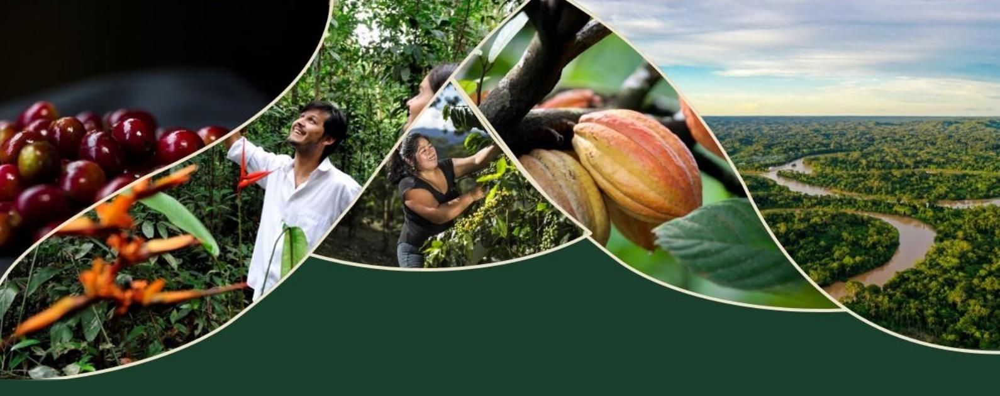

# **ALTAMIRA SUMMIT**

Executive Summary

3 - 7/11/2025

ALTAMIRA, PARÁ, BRAZIL

# THE EVENT

This report is the **executive summary** of the technical report **of the Altamira Summit**. The document presents an overview of the technical input presented during the event, main aspects discussed in working groups and panel discussions, the objectives and key highlights of each session.

The **Altamira Summit was a global outreach event under the framework of the Team Europe Initiative on Deforestation-Free Value Chains**, held between November 3rd and 7th, 2025, in Altamira, Pará, Brazil. It **brought together 120 participants from public, private, civil society and academic sectors from 25 countries** for a week of global learning on sustainable, deforestation-free value chains.

Among the 23 countries represented at the event were: Argentina, Belgium, Bolivia, Brazil, Cameroon, Colombia, Côte d'Ivoire, Ecuador, Germany, Ghana, Indonesia, Italy, Kenya, Malaysia, Netherlands, Paraguay, Peru, Democratic Republic of Congo, Spain, Uganda, Uruguay, Vietnam, and Zambia.

It was planned and organized by the Zero Deforestation Hub - the secretariat of the Team Europe Initiative (TEI) on Deforestation-Free Value Chains - and the Sustainable Agriculture for Forest Ecosystems (SAFE) project - flagship of the TEI -, with support from the Brazilian Ministry of Agriculture (MAPA) and the Municipality of Altamira. The official Pre-COP30 event took place a week prior to the global climate negotiations in Belém, and was a **strategic forum for dialogue, knowledge exchange, and cross-regional collaboration** to advance sustainable agriculture and efforts to decoupling deforestation from agricultural commodities.

Furthermore, the Summit formed part of the 2025 Partners for Change (P4C) event series, which links global agendas with on-the-ground transformation efforts. These thematic activities will culminate in a 2026 network meeting in Berlin, contributing to a P4C 2030 Position Paper that sets shared priorities for food security and sustainable agri-food systems in the post-SDG context.

**40**

Event hours

**120**

Participants involved

**25**

Countries represented

## Methodological approach

The event combined **plenary sessions, field-based learning, and participatory group work to promote inclusive dialogue and effective knowledge exchange among a multilingual and culturally diverse group of participants**. English was the official working language, with simultaneous interpretation provided in Portuguese, Spanish, and French.

The first day focused on **welcoming and registering participants, distributing materials, establishing group agreements,** and officially opening the event in a plenary setting.

The official opening of the event included the welcoming from **important representatives from the local government of Altamira, the Brazilian Government of the Ministry of Agriculture (MAPA), government representatives from Germany, the Netherlands, the European Commission, the German international development cooperation (GIZ) and the P4C Network,** contextualizing the importance of the deforestation-free agenda and sustainability transition in international agriculture and forest policies.

The second day was dedicated to **technical presentations on the TEI, its partners, and key frameworks such as the EUDR and the P4C Network**, followed by opportunities for questions and discussion.

On the third day, participants joined **field visits to local farming families involved in deforestation-free agricultural and livestock value chains**, organized in small groups with project leads and translators.

The fourth day emphasized **collaborative learning through small-group work, using participatory methodologies such as fishbowl and world café** formats to foster dialogue and collective reflection.

The final day, held in the morning, focused on **sharing key learnings and envisioning future pathways for deforestation-free value chains.**

# EXECUTIVE SUMMARY

## From dialogue to action: advancing deforestation-free value chains

The Altamira Summit demonstrated that meaningful progress toward deforestation-free and legally compliant value chains is already underway across regions, sectors, and commodities. Country experiences, combined with practical insights from the technical sessions, confirmed that the **EU Regulation on Deforestation-Free Products (EUDR) can function as a catalyst for transformation** — provided it is implemented pragmatically, inclusively, and in close cooperation with producer countries.

## Country progress: diverse pathways, shared direction

Country examples highlighted that while starting points differ, a **common direction toward traceability, legality, and sustainability is emerging**. Brazil showcased advanced institutional readiness through integrated public platforms such as AgroBrasil+Sustentável, new deforestation reduction targets in the Amazon and Cerrado, and sectoral preparedness in soy, beef, cocoa, and livestock. Brazil's experience illustrated how national digital infrastructure, market engagement, and policy continuity can reinforce each other.

Peru demonstrated rapid progress through the creation of a multisectoral EUDR working group, a national strategy, and the mapping of more than 115,000 producers using simple digital tools. Ecuador advanced participatory geolocation approaches for smallholders, aligning public and private initiatives such as "Mi finca, mi huella".

Indonesia highlighted both commitment and remaining challenges, particularly regarding geolocation of smallholders, while calling for recognition of existing sustainability systems such as RSPO. Vietnam strengthened national traceability systems for coffee and rubber, while Zambia advanced sustainability in the timber sector. Ghana, Côte d'Ivoire, Cameroon, Uganda, and the DRC **demonstrated how national forest monitoring, cocoa traceability, and pilot geolocation systems can reduce risks of exclusion and improve data quality**.

Across regions, countries emphasized that capacity building, proportionality, and access to finance are critical to ensure that smallholders and SMEs can comply with EUDR requirements without being pushed out of formal markets.

## Key learnings from technical sessions

**The EUDR Readiness session confirmed that compliance depends on the existence of robust Due Diligence Systems.** Several Dry-Runs conducted in many countries revealed that companies often focus heavily on deforestation risk while underestimating legality risks. Participants agreed that legality cannot be assessed through aggregated national statistics alone; instead, cross-referencing multiple data sources and maps is essential to demonstrate negligible risk, as required under the EUDR. Sector-specific realities—such as palm oil bulk shipments or agroforestry cocoa systems—require tailored approaches to avoid false positives and unnecessary segregation.

**The Legality session highlighted the complexity of fragmented legal frameworks.** Experiences from Colombia and Malaysia illustrated both the challenge and the opportunity: legality risk assessment is not a box-ticking exercise, but a strategic investment to harmonize sectoral approaches and strengthen governance. Tools such as the Legality Due Diligence Navigator support operators and authorities in applying a risk-based approach, while national platforms integrating multiple databases, as in Brazil, increase transparency and confidence.

**The Digital Public Infrastructure (DPI) session demonstrated that interoperable, open-source systems are key enablers of scale and trust.** Country cases showed that national land-cover maps and traceability systems—such as those in Côte d'Ivoire, Ghana, Cameroon, Uganda, and Brazil—often provide more accurate, EUDR-aligned data than global datasets. Strong DPI reduces transaction costs, supports competent authorities, and creates a shared factual basis for risk assessment.

## Private sector engagement and smallholder inclusion

Discussions on private sector engagement emphasized that companies play a central role in operationalizing deforestation-free value chains. In countries such as Brazil, Peru, Malaysia, and Colombia, **private actors are leading experimental shipments, investing in traceability systems, and coordinating across supply chains.** At the same time, participants warned that overly rigid data requirements may push producers into informality or shift compliance costs unfairly onto smallholders. Economic viability and market incentives remain essential.

Smallholder inclusion, gender equity, and social inclusion emerged as non-negotiable elements of sustainable value chains. Experiences from Ecuador, Bolivia, Brazil, and Southeast Asia showed that **participatory approaches to geolocation, strengthened land rights for women, and institutional gender policies improve data quality, trust, and long-term sustainability.**

## Insights from the field trips

The field trips to cattle and cocoa producers in the Xingu region highlighted the central role of families, associations, and cooperatives in advancing sustainable and deforestation-free production systems. Direct exchanges with producers showed the importance of **starting with simple, practical steps and avoiding overburdening farmers with EUDR complexity**, while prioritizing capacity building and organizational support. Integrated approaches that address livelihoods, access to finance, and natural resource management are essential, as **producers face significant economic constraints and unequal market access**, particularly between conventional and organic systems. Participants observed that organic and agroforestry production systems deliver strong environmental and productivity benefits and should be rewarded with premium prices. The visits also underscored the leadership role of women and the lesson that preserving forests enhances long-term productivity, resilience, and farmer entrepreneurship.

## Roles of key sectors

The Summit clarified complementary roles across sectors:

- ● Governments are responsible for providing coherent and participatory policy frameworks, harmonizing regulations, investing in public data and digital infrastructure, and aligning international support measures.
- ● The private sector drives innovation, traceability, and market access, invests in training and technology, and helps scale deforestation-free production beyond individual supply chains.
- ● Civil society supports capacity building, acts as a watchdog, fosters inclusion, and advocates for smallholders and environmental integrity.
- ● Academia and research institutions translate complex regulatory requirements into practical guidance, generate evidence, and facilitate multi-actor dialogue.

## Final outlook

The Altamira Summit concluded with a shared understanding that **many technical solutions already exist, but their impact depends on coordination, trust, and inclusive implementation**. If aligned across countries and sectors, the EUDR can enable scalable, competitive, and socially inclusive deforestation-free value chains, contributing not only to forest protection but also to resilient livelihoods and sustainable development.

# ABOUT THIS PUBLICATION

## Published by:

Deutsche Gesellschaft für Internationale Zusammenarbeit (GIZ) GmbH

## Registered offices:

Bonn and Eschborn, Germany  
Address  
Friedrich-Ebert-Allee 32 + 36  
53113 Bonn, Germany  
+49 61 96 79-0  
info@GIZ.de

## Programme:

Sustainable Agriculture for Forest Ecosystems (SAFE)  
Secretariat of the Team Europe Initiative on Deforestation-Free Value Chains (TEI)  
[www.deforestationhub.eu](http://www.deforestationhub.eu)

## Responsible:

Dr. Elke Sümnick-Matthaei  
[elke.matthaei@giz.de](mailto:elke.matthaei@giz.de)

## Concept:

MIRÁ Design de Organizações

## Design/Layout:

MIRÁ Design de Organizações

## Photo credits:

GIZ

## On behalf of:

European Union, the German Federal Ministry for Economic Cooperation and Development - BMZ, and the Dutch Ministry of Foreign Affairs -MINBUZA

## Year:

November 2025

*This publication was produced with the financial support of the European Union, the German Federal Ministry for Economic Cooperation and Development (BMZ), and the Dutch Ministry of Foreign Affairs (MINBUZA). Its content is a documentation of the spoken and written statements from participants at the TEI outreach event Altamira Summit. All interpretation of the content is the sole responsibility of GIZ and does not necessarily reflect the views of the EU, the German or the Dutch Government.*