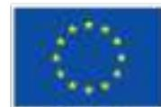

Co-funded by  
the European Union

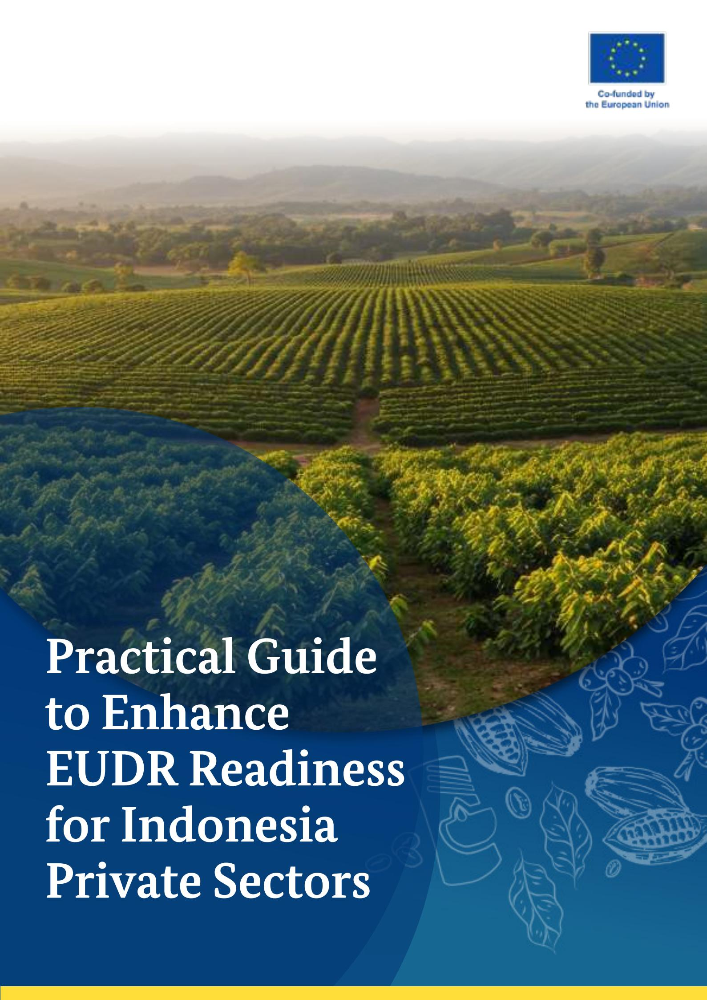

# Practical Guide to Enhance EUDR Readiness for Indonesia Private Sectors

#### **Published by**

PT Koltiva

#### **Authors**

Meg Phillips

Andre Dani Mawardhi

Rahmad Nanda

Danella Austraningsih

#### **Reviewer**

Theresa Sila Wikaningtyas

Anna Rother

Franzika Rau

Sander Happaerts

Eloise O'Caroll

#### **Layout and Design**

Gary Aiman

Jakarta, 2025

#### *DISCLAIMER*

*This publication is jointly funded by the European Union and German Federal Ministry for Economic Cooperation and Development (BMZ) and conducted by Koltiva. The content of this publication is Koltiva's sole responsibility and does not necessarily re\$ect the views of the EU or BMZ. The information in this study, or on which this research is based, has been obtained from sources that the authors believe are reliable and accurate.*

*This document has been developed based on the analysis of a variety of relevant sources, including but not limited to the legal text on the EUDR, EUDR Guidance, EUDR FAQ, as well as the results of previously conducted focus group discussions (FGDs) and other events organized by the EUDR Engagement project and other stakeholders EU-funded projects (e.g., KAMI, SAFE). It also refers to other knowledge products that are publicly available and relevant. This document re\$ects the most current information at the time of writing, which does not yet include the European Commission's proposal of 21 October 2025 for targeted simpli7cation measures, which are being negotiated between the European Parliament and the Council of the European Union.*

*The purpose of this document is to provide stakeholders with practical steps to prepare for EU Deforestation Regulation (EUDR) implementation. It is intended to be a one-time resource and does not include provisions for future updates.*

# **Table of Content**

|               | Introduction          |                 | 03                          |
|---------------|-----------------------|-----------------|-----------------------------|
| Introduction  |                       | to              | EUDR for the Private Sector |
| EUDR          | Due                   | Diligence       | Process                     |
| Regulation’s  |                       | Scope           | and Goals                   |
| EUDR          | Due                   | Diligence       | Framework                   |
| Case          | Studies               | and             | Best Practices              |
| Collaborating |                       | with            | Farmers,                    |
| Regulatory    |                       | Bodies,         | and Stakeholders            |
| Purpose       | of the                | Practical       | Guide                       |
| How           | to Use                |                 |                             |
| What          | is the EUDR?          |                 |                             |
| Why           | EUDR Matters          | for             | Global Companies            |
| Role          | of Certi1cation       | Schemes         | under the EUDR              |
| Data          | Collection            |                 |                             |
| Risk          | Assessment            |                 |                             |
| Risk          | Mitigation            |                 |                             |
| Due           | Diligence             | Statement       | (DDS)                       |
| Internal      | Company               | Governance      |                             |
| Supplier      | Engagement            |                 | & Outreach                  |
| Traceability  | &                     | Data Collection |                             |
| Risk          | Assessments           | and             | Mitigation                  |
| Ongoing       | Monitoring            |                 | & Validation                |
| Case          | 1                     |                 |                             |
| Case          | 2                     |                 |                             |
| Case          | 3                     |                 |                             |
| Case          | 4                     |                 |                             |
| Annex         | 1                     |                 |                             |
| Annex         | 2                     |                 |                             |
| Annex         | 3                     |                 |                             |
| Why Annex     | partnerships Glossary | matter?         |                             |

## **Introduction**

### **Purpose of the Practical Guide How to Use**

#### **01. Flexible Approach**

Each chapter can be read independently or used as a reference guide. It is suitable for large-scale manufacturers and processors, and some points may also apply to small cooperatives and aggregators.

### **02. Practical Tools & Tips**

Look for highlight boxes offering important notes, references to checklists, and suggested templates in the annex.

### **03. Adapt As Needed**

Since EUDR compliance may evolve over time, readers should treat this guide as a living document—adapting the recommended processes to their speci1c operational context.

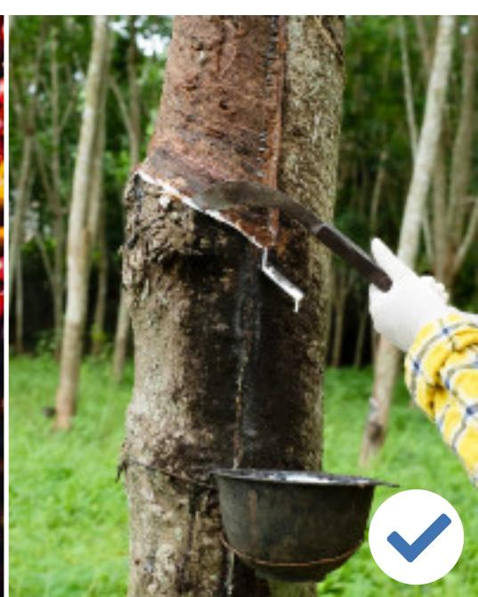

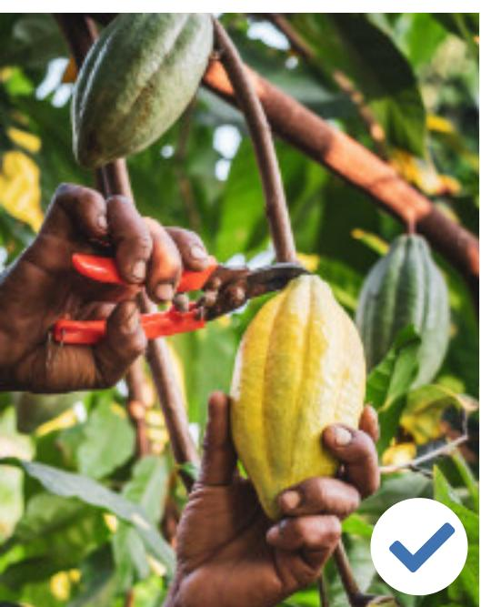

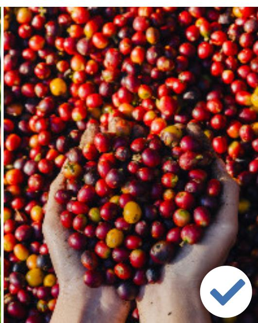

This guide is designed to support Indonesian private sector actors who are not directly bound by EUDR obligations, ranging from large-scale manufacturers and processors to small cooperatives and aggregators in responding to their clients' requests. By clearly outlining the key EUDR requirements, this practical guide provides step-by-step guidance to help companies prepare for its implementation and meeting their buyers' requests while promoting deforestation-free and legally compliant commodity production.

Introduce the EUDR's main provisions and how they impact Indonesian **cocoa, coffee, and rubber** supply chains. Offer a clear framework of best practices and practical tools to help companies prepare for EUDR application and maintain market access to the EU. Support supply chain actors in better understanding land legality, geolocation data, and risk mitigation measures.

### **Key Objectives**

# **Introduction to EUDR for the Private Sector**

## What is the EUDR?

Why EUDR Matters for Global Companies

Role of Certification Schemes under the EUDR

### **What is the EUDR?**

This regulation officially came into force on 29 June 2023 and is set to become fully applicable from 30 December 2025 (or 30 June 2026 for Small and Medium Enterprises/ SMEs), providing businesses with a transitional period to adapt to their requirements². Please note that only SMEs that place goods on the EU market, whether or not they are "in" the EU.

The EUDR (EU Regulation on Deforestation-free Products) formally established as Regulation (EU) 2023/1115, is a mandatory regulation aimed at reducing the EU's contribution to global deforestation and forest degradation¹. Adopted on 31 May 2023, the EUDR marks a signi1cant step in aligning trade practices with the EU's broader commitments to climate change mitigation, biodiversity preservation, and sustainable development.

Operators de1ned under Article 2(15) as any natural or legal person who, during a commercial activity, places relevant products on the EU market or exports them. Traders are de1ned in Article 2(17) as any person in the supply chain other than the operator who, during a commercial activity, makes relevant products available on the EU market.

1.) [The EU Deforestation-Free Products Regulation 2023/1115](https://eur-lex.europa.eu/legal-content/EN/TXT/PDF/?uri=CELEX:32023R1115) 2.) [The Amendment 2024/3234 of the EUDR 2023/1115](https://eur-lex.europa.eu/legal-content/EN/TXT/PDF/?uri=OJ:L_202403234) 3.) The complete list of products within scope are available in [Annex 1](https://eur-lex.europa.eu/legal-content/EN/TXT/HTML/?uri=CELEX:32023R1115#d1e32-243-1) of the regulation 4.) For wood and wood products, the EUDR speci1cally includes requirements to ensure they are not linked to forest degradation (for example, the conversion of primary or naturally regenerating forests into plantations). Wood products that are accompanied by a valid FLEGT (Forest Law Enforcement, Governance and Trade) licence are considered to have ful1lled the EUDR legality requirement

### **The EUDR applies to 7 commodities**³ **and certain derived products**

4

**Rubber Cocoa Soy Palm Oil Timber Coffee Cattle**

The EUDR applies to **operators** and **traders** who place products on the EU market or export them from there.

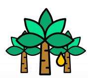

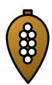

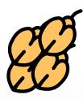

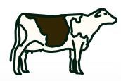

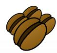

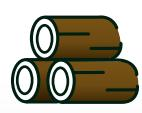

**Operators and traders placing products on the EU market or exporting them from there must ensure the products are:**

**Deforestation-Free Produced in Accordance with National Legislative Framework**

**Covered by a Due Diligence Statement**

Produced on land that has not been deforested after 31 December 2020, and in the case of wood, also forest-degradation free.

Adhering to relevant national legislation of the country of production.

Demonstrating no more than a negligible risk of non-compliance, including providing geolocation data for all plots of land.

Other actors, such as smallholders and enterprises doing business in producing countries only as well as third country government actors do not formally have any obligations under the EUDR.

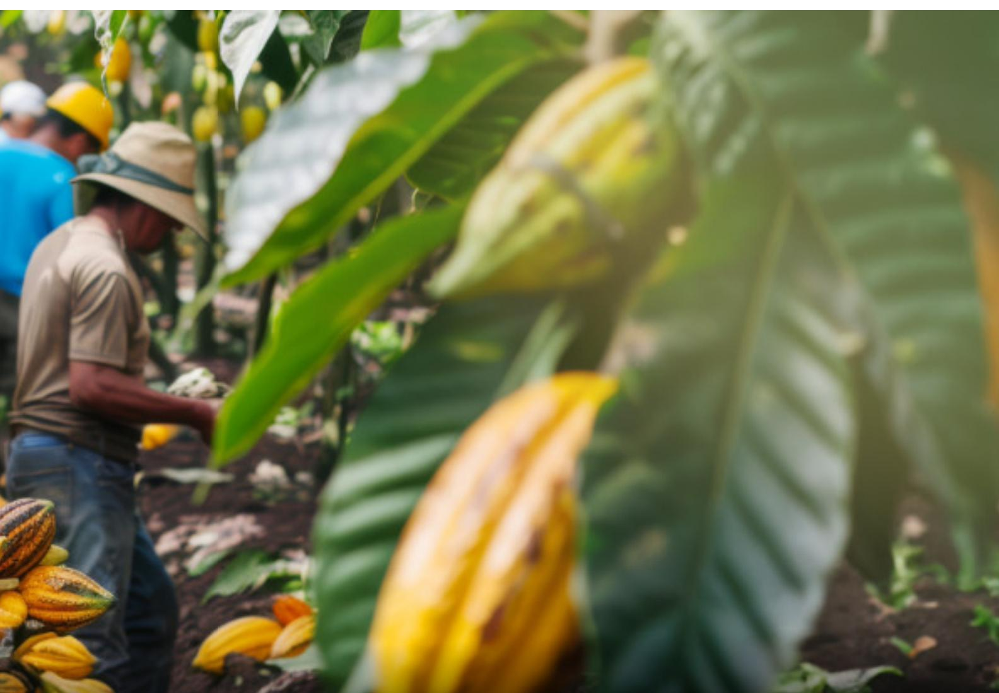

### **Why EUDR Matters for Global Companies**

### **A. Environmental Responsibility and Long-Term Sustainability**

### **B. Market Access and Competitiveness**

### **E. Opportunities for Collaboration and Innovation**

### **D. Supply Chain Risk Management**

The EUDR supports global efforts to halt deforestation, promote responsible and legally veri1ed sourcing, and uphold human rights. By aligning with the regulation, companies contribute to climate change mitigation and the preservation of natural resources, helping secure long-term sustainability for their supply base.

The EUDR sets strict requirements to ensure products entering the EU are deforestation-free and legally produced. For private companies, meeting these requirements is essential to maintain access to the EU market and remain competitive against other suppliers who can demonstrate full compliance.

By preparing for the EUDR, companies can strengthen collaboration with smallholders and suppliers through capacity building and data sharing. This creates opportunities for innovation in traceability, transparency, and sustainable production practices.

Implementing EUDR-aligned systems helps companies identify and reduce risks related to deforestation, illegality, and human rights violations in their supply chains. This reduces the chance of future disruptions, penalties, or product rejections.

### **C. Reputation and Brand Value**

Consumers and investors are increasingly demanding sustainable and responsible sourcing. Compliance with the EUDR shows a company's commitment to environmental and social responsibility, strengthening its reputation and brand value in global markets.

Certi1cation schemes such as RSPO, FSC, ISPO, and RA can be valuable tools within the due diligence process mandated by the EUDR.

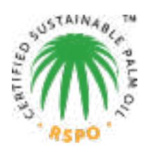

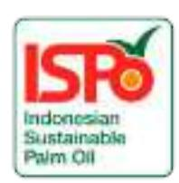

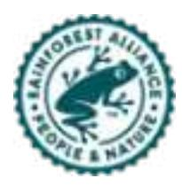

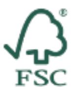

**Certi?cation does not guarantee compliance with the EUDR requirements, but companies must always ful?ll their due diligence obligations.** Therefore, certi1cation should be regarded as a complementary tool that supports, rather than replaces, the comprehensive due diligence measures required by the EUDR. Certi1cation or third-party veri1cation can be integrated into the information gathering process for risk assessment and risk mitigation. However, the responsibility for ensuring compliance remains with the operator. Certi1cation can help demonstrate traceability, assess potential risks, and provide documented evidence of responsible sourcing.

## **Role of Certi?cation Schemes under the EUDR**

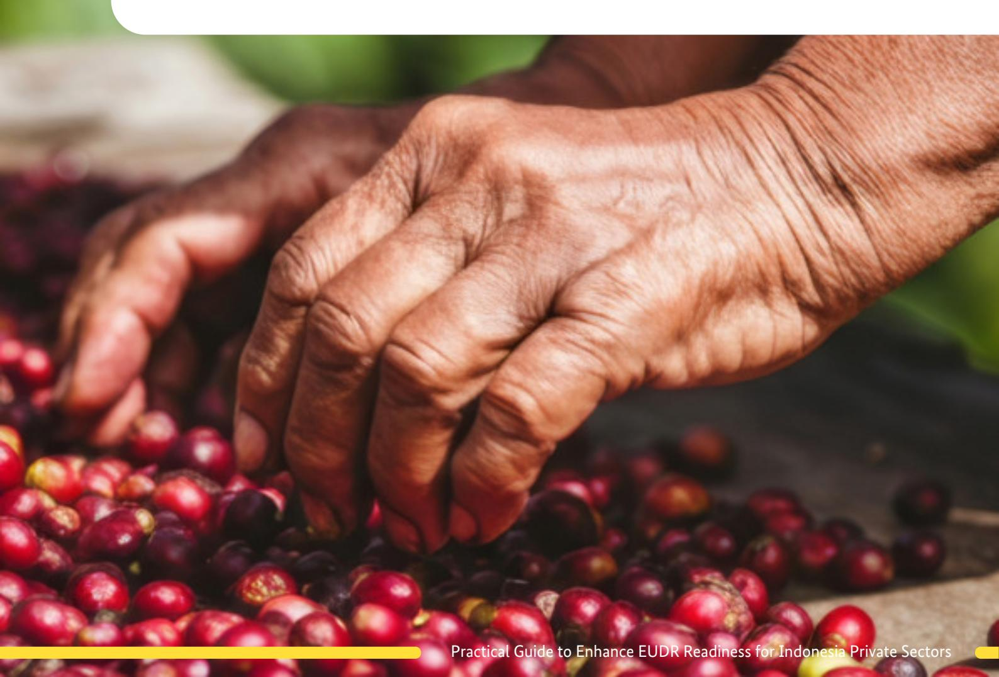

# **EUDR Due Diligence Process**

Data Collection

Risk Assessment

Risk Mitigation

Due Diligence Statement (DDS)

The EUDR de1nes companies' due diligence obligations and the steps that need to be conducted. Due diligence is mandatorily carried out by operators who place the products on the EU market/export from it. The due diligence process includes four key steps.

### **01. Data Collection**

### **02. Risk Assessment**

The companies must collect relevant information about these commodities and products in accordance with Article 9, including:

According to article 10 of the regulation, based on the information collected, operators shall do a risk assessment to check if the products they intend to place on the EU market or export from there could be non-compliant with the EUDR. The risk assessment shall be done by covering certain criteria, i.e.

**Basic product details**, such as name, quantity, country of production, production date or time range, supplier, and buyer information. **Geolocation of all plots of land where the commodity is produced.** Plots greater than 4 hectares require a polygon (outline of the plot made with a series of GPS points), while plots less than 4 hectares require at least a single GPS point. Both are required in GeoJSON format. **Veri?able evidence that the products are deforestation-free and legally produced** (not originating from land deforested after 31 December 2020) and produced in accordance with relevant national legislation.

| Country risk        |                     |
|---------------------|---------------------|
| classi?cation check |                     |
|                     | Supply chain        |
| Rights of           |                     |
| indigenous people   |                     |
| Deforestation       | and                 |
| degradation         | risk                |
|                     | FLEGT license (wood |
|                     | products only)      |
|                     | Governance &        |
|                     | legal risks         |

(\*) Operator is any natural or legal person who, in the course of a commercial activity, places relevant products on the EU market or exports them. In the case of supply chains from Indonesia, the importer into the EU market is the operator.

## **03. Risk Mitigation**

When instances of non-negligible risk occur, companies must have adequate mitigation measures, policies, controls and procedures to ensure production is aligned with EUDR requirements, achieving no or negligible risk of deforestation-free and legal production. This can include:

Operators\* placing the product on the EU market for the 1rst time must submit a DDS via the EU Information System (TRACES). A DDS document must include the company name, HS Code, scienti1c name, quantity, country of production, geolocation of production plots, and a statement assuming responsibility.

Independent audit function to check internal policies and procedures

Requesting additional documentation or other veri1cation surveys

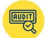

Support suppliers, in particular smallholders and SME suppliers, through capacity building and investments, to meet EUDR requirements.

## **04. Due Diligence Statement (DDS)**

# **Regulation's Scope and Goals**

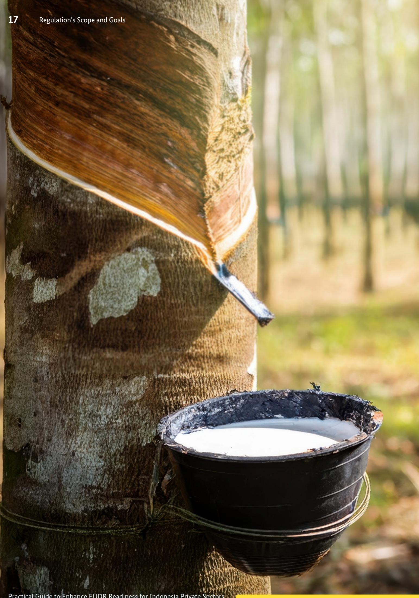

Because EUDR's main legal obligations fall on operators (companies 1rst placing regulated products on the EU market) and traders within the EU, many Indonesian businesses may not be "operators" themselves. However, in practice, EU buyers may require Indonesian suppliers to provide detailed information to support due diligence. Businesses should identify which of these categories they fall under to understand what kind of information or support they may be asked to provide in practice, even though of1cial EUDR obligations apply only to operators and traders.

| Companies Selling          |              |                 |                                    |
|----------------------------|--------------|-----------------|------------------------------------|
| Directly to the EU         |              |                 |                                    |
| Large Indonesian           |              |                 |                                    |
| Companies Supplying        |              |                 |                                    |
| (Not an Operator, but      |              |                 |                                    |
| potentially requested to   |              |                 |                                    |
| support compliance)        |              |                 |                                    |
| Small Suppliers &          |              |                 |                                    |
| Cooperatives Supplying     |              |                 |                                    |
| Local Exporters            |              |                 |                                    |
| (Not an Operator, but      |              |                 |                                    |
| must support traceability) |              |                 |                                    |
| Cocoa                      | Processor    | in              | Java                               |
| selling                    | directly     | to its          | EU                                |
| based                      | af1liate     | company.        |                                    |
| These                      | businesses   |                 | export                             |
| their                      | processed    | or              | raw                                |
| materials                  |              | directly to     | the                                |
| EU,                        | making       | them            | subject to                         |
| EUDR                       | obligations. |                 |                                    |
| Rubber                     | Processing   |                 | Factory in                         |
| Kalimantan                 | that         | sources         | from                               |
| multiple                   | local        | intermediaries, |                                    |
| processes                  | latex        | into            | sheet                              |
| rubber,                    | and sells    | to an           | Asia                              |
| based                      | tire         | manufacturers   | that                               |
| then                       | on-sells to  | the EU.         |                                    |
| A coffee                   | cooperative  |                 | in                                 |
| Sumatra                    | buys         | coffee          |                                    |
| cherries                   | from         | hundreds        | of                                 |
| small                      | farmers      | and sells       | dry                                |
| beans                      | to a larger  |                 | Indonesia                         |
| based                      | coffee       | roaster.        |                                    |
|                            |              |                 | Submit Due Diligence Statements    |
|                            |              |                 | (DDS) to the EU per shipment.      |
|                            |              |                 | Implement full risk assessments.   |
|                            |              |                 | Ensure traceability to plot level. |
|                            |              |                 | Support suppliers in providing     |
|                            |              |                 | key information on plots of        |
|                            |              |                 | May be requested for basic data    |
|                            |              |                 | such as name, quantity,            |
|                            |              |                 | production date or time range.     |
|                            |              |                 | Can help collect and provide       |
|                            |              |                 | plot geolocation data from local   |
|                            |              |                 | Provide information that helps     |
|                            |              |                 | buyers assess deforestation risks. |
|                            |              |                 | Provide GPS data for farms,        |
|                            |              |                 | often with support from buyers.    |
|                            |              |                 | Provide land legality information  |
|                            |              |                 | on plots of production, often      |
|                            |              |                 | with assistance from buyers.       |
|                            |              |                 | Avoid mixing unveri1ed or high    |
|                            |              |                 | risk supply with EUDR-aligned      |
| Company Type               | Example      |                 | Likely Requirements                |

# **EUDR Due Diligence Framework**

### Internal Company Governance

Supplier Engagement & Outreach

Traceability & Data Collection

Risk Assessments and Mitigation

Ongoing Monitoring & Validation

# **01 Develop EUDR-Aligned Policies**

**Review and Revise Policies:** Conduct a thorough assessment of your organization's current policies, including the Code of Conduct and procurement guidelines. Identify areas where updates are necessary to reNect current best practices and regulatory requirements.

**Establish Legality Requirements:** Ensure that procurement guidelines mandate compliance with land tenure laws, labor regulations, and environmental legislation relevant to the regions from which you source materials. Include speci1c legal frameworks that govern these areas to guide suppliers in their processes.

**Integrate Deforestation-Free Standards:** Develop and incorporate clear criteria for deforestation-free sourcing directly into your procurement policies. This should include veri1able de1nitions of what constitutes deforestation-free materials and specify the consequences for non-compliance.

Implement a system to anonymize sensitive information by utilizing unique farmer ID codes in place of individual names whenever feasible. This approach helps protect the identity of individuals while enabling the necessary data collection and analysis.

Share personal data with third parties only when absolutely necessary, ensuring that such actions are fully aligned with the objectives of the EUDR. This careful consideration of information sharing helps protect the rights of individuals.

Ground all data management practices in the principles of the General Data Protection Regulation (GDPR) and some national regulations (i.e., Law No. 27 of 2022 on Personal Data Protection (PDP Law) and Government Regulation (GR) No. 71 of 2019 on the Implementation of Electronic Systems and Transactions (PSTE) Regulation), including data minimization (only collecting data that is essential for speci1c purposes) and purpose limitation (ensuring that data is used solely for the intended objectives).

# **02 Ensure Data Protection & Privacy**

### **Why it matters?**

An organized internal framework guarantees that EUDR tasks are systematically addressed, reNecting your company's commitment to responsible, deforestation-free, and legal sourcing. This proactive approach not only helps to meet regulatory requirements but also reinforces your commitment to sustainable practices in the supply chain.

### **Internal Company Governance**

# **03 Train Internal Teams**

**Organize engaging workshops or informative webinars focused on the following key topics:** A comprehensive overview of the EUDR and its legal implications for compliance. Essential data requirements, including accurate geolocation information and the necessary legal documentation to ensure adherence to regulations. Identi1cation of potential risks and detailed escalation procedures to address any compliance concerns effectively.

Additionally, incorporate this training into the onboarding process for relevant new hires to equip them with vital knowledge from the outset.

# **04 Create an Internal Communication Plan**

Designate a speci1c individual to take on the responsibility of brie1ng staff and keeping them informed.

Prepare concise internal memos or engaging slides that clearly articulate the following: A thorough explanation of the EUDR, its objectives, and how it relates to environmental sustainability and responsible sourcing.

The signi1cance of the EUDR for your organization and the opportunities it brings with it, emphasizing enhanced reputation, sustained EU market access, and strengthened supply chain sustainability. The roles and responsibilities of each team within the organization, showing how their efforts collectively prepare the company for EUDR application and contribute to the overall success of the company.

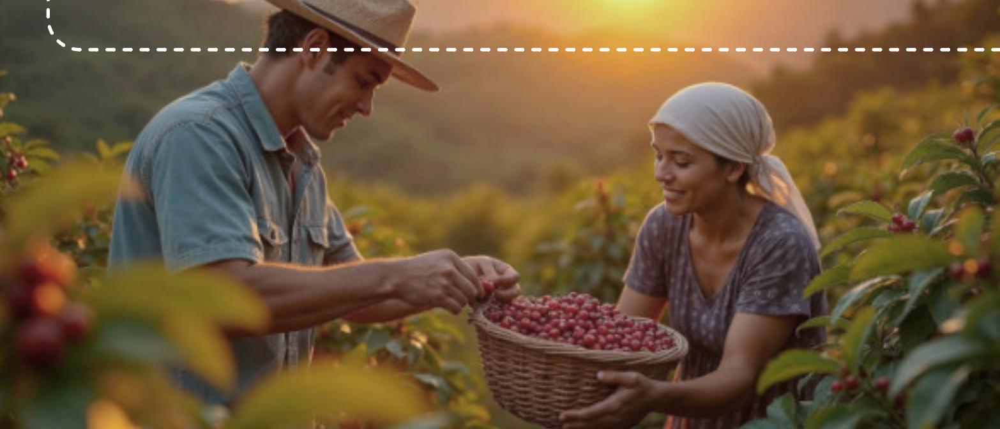

# **05 Establish Minimum Governance Measures**

#### **Maintain and Organize Relevant**

**Records:** Ensure meticulous upkeep of essential documents, including geolocation maps and legal land ownership records, to facilitate easy access and clarity.

#### **Serve as a Liaison with Auditors or**

**Authorities:** Effectively represent and communicate on behalf of the organization with auditors or relevant authorities as needed, ensuring transparency and adherence to regulatory requirements.

**Coordinate Data Collection and Communication with Suppliers:** Actively oversee the systematic gathering of data, building strong lines of communication with suppliers to enhance collaboration and streamline processes.

**Set Up a Grievance Mechanism:** Establish a simple and accessible grievance channel (such as a con1dential hotline or anonymous feedback form) to allow suppliers, workers, and community members to report potential non-compliance, land conNicts, or environmental issues safely and without fear of retaliation.

Points 2-5 could be effectively implemented within small-scale companies (small suppliers and cooperatives that support local exporters). While these entities may not have formal obligations under the EUDR, their involvement can signi1cantly contribute to the overall implementation of its principles and strengthen sustainability along the supply chains.

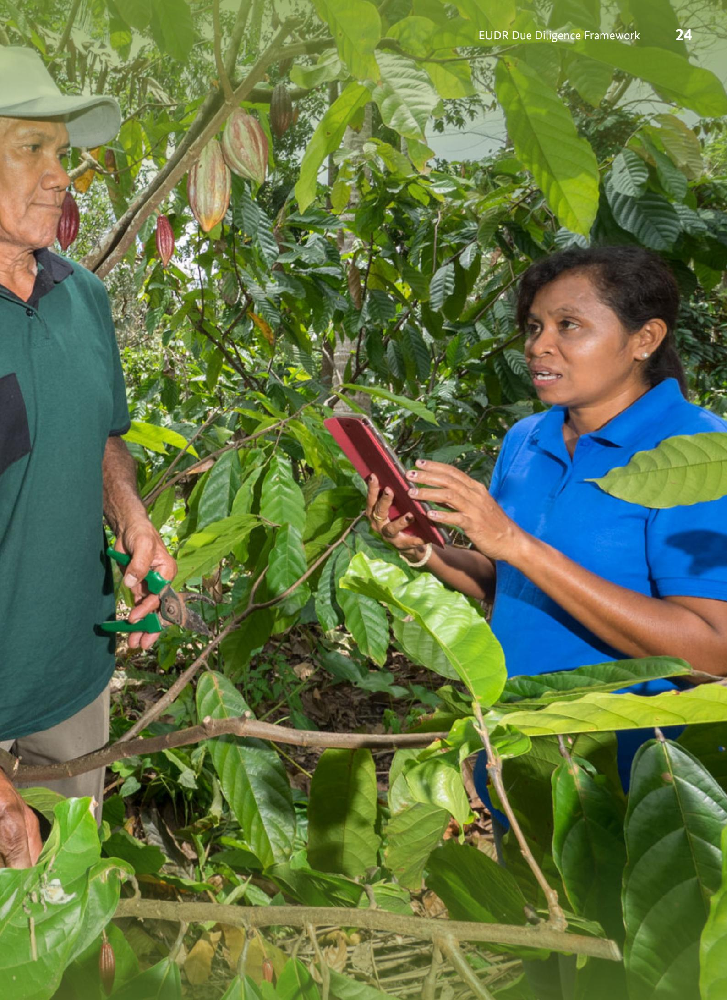

Utilize formal communication channels to explain what EU buyers may require under the EUDR, while also highlighting the bene1ts for suppliers, such as stronger business relationships, access to premium markets, and improved sustainability practices.

Additionally, ensure that open communication channels are available for suppliers to raise questions or concerns, reinforcing a collaborative approach.

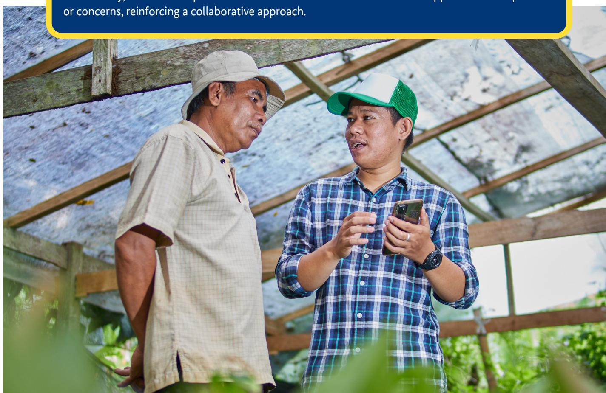

# **01 Communicate EUDR Expectations Clearly to Suppliers**

Send detailed letters or emails that thoroughly explain the requirements and implications of the EUDR, ensuring that all relevant parties are well-informed.

Where appropriate, revise supplier relationship contracts to include shared sustainability and traceability expectations, ensuring that these provisions remain practical, fair, and do not create additional barriers for suppliers.

Provide concise one-pagers or information booklets in local languages that outline key points of the EUDR, making the information accessible and understandable for suppliers.

Organize in-person or online workshops dedicated to educating suppliers about critical topics such as traceability, legal compliance, and commitments to deforestation-free practices, thus equipping them with the necessary knowledge and skills.

### **Why it matters?**

Open and transparent communication with farmers, cooperatives, and suppliers not only strengthens data accuracy and builds trust but also ensures that everyone is aligned in supporting deforestation-free and legal production.

This collaborative approach reduces risks, enhances ef1ciency, and helps suppliers bene1t from long-term market access opportunities with EU buyers.

### **Supplier Engagement & Outreach**

Develop a comprehensive and respectful communication strategy to effectively convey the needs of the EUDR to smallholders and local aggregators.

### **03 Create an External Communication Plan for Farmers and Local Collectors**

**Identify Key Messengers:** Empower 1eld of1cers, cooperative leaders, and extension workers as credible voices to facilitate understanding and foster trust within the community.

**Implement Accessible Communication Methods:** Organize inclusive group meetings that encourage dialogue, leverage popular platforms for timely updates, and conduct regular village visits to create personal connections and enhance community engagement.

**Utilize Clear and Culturally Relevant Language:** Craft messages using straightforward, culturally sensitive language complemented by engaging visual materials such as posters and Nyers, ensuring the information resonates with the local audience.

Develop a readiness checklist, covering:

Conduct an assessment to identify any gaps in capacity related to the above criteria. Where necessary, offer targeted support or technical assistance aimed at enhancing compliance and improving production methods in alignment with best practices.

# **02 Conduct Supplier Readiness Assessments**

**Geolocation Capabilities:** Ensure the ability to accurately provide GPS coordinates for each plot of land, facilitating precise tracking and monitoring of locations.

**Compliance Records:** Maintain comprehensive records that reNect adherence to social and environmental regulations, showcasing commitment to sustainable practices and community welfare.

**Deforestation-Free Veri?cation:** Gather credible evidence demonstrating that land has been managed in a deforestation-free manner since December 31, 2020. This may include satellite imagery, third-party certi1cations, or written statements from relevant authorities.

**Legality Documentation:** Compile and present legal documents that con1rm land ownership or tenure rights, establishing clear and undeniable claims to the property.

**Data Availability and Collection Systems:** Assess the availability, accessibility, and quality of relevant data (e.g., farmer pro1les, production volumes, delivery records) and evaluate existing systems or tools used to collect, store, and update this information.

"By sharing GPS data and information about your plot, you can demonstrate that your land is free from recent deforestation and your products can continue to reach international buyers, helping secure stable market access and long-term business relationships."

For EUDR compliance, operators must provide accurate geolocation data of farm plots used to produce regulated commodities. However, for smallholders and village collectors, this may be a new or sensitive request. To build trust and gain cooperation, it is crucial to explain why this data matters, how it will be used, and what protections are in place.

Below are several key messages (not of1cial recommendations, only examples) that can be used in dialogues, training sessions, or communication materials:

# **04 Explain the Importance of Plot-Level Data**

"This information is essential for business partners to comply with European Union regulations, ensuring that your products remain eligible for export to the EU market."

"We only require the geographical coordinates of your farming plot, ensuring that your home location and privacy are respected and remain con1dential."

### **Why it matters?**

Well-organized traceability records serve as vital proof that your product originates from sustainable sources, free from deforestation (and degradation for timber products).

This meticulous documentation not only reinforces ethical sourcing practices but also ensures continued access to lucrative EU markets.

Data collectors are usually 1eld staff, cooperative enumerators, or company-appointed agents who visit farms and collect information (e.g., GPS coordinates, land documents, production data). These data collectors act on behalf of the company or cooperative that is implementing traceability and due diligence systems. Companies do not "own" farmers' personal data outright, but they hold and use it under farmers' consent for the purpose of EUDR compliance and supply chain traceability.

Use digital tools to trace every product batch back to its origin without necessarily building a new system from scratch. Companies, especially smaller enterprises, are encouraged to leverage existing, cost-effective, or open-source solutions that can be adapted to their scale and capacity.

**Implement powerful mapping technologies:** to systematically collect, analyze, and store comprehensive land-use and geographical location data, providing an in-depth understanding of the agricultural landscape.

**Use existing platforms and DPI solutions:** Explore national or district-level traceability platforms, government-provided Digital Public Infrastructure (DPI), or shared industry systems to avoid duplicating efforts and reduce costs. Use free or affordable GPS and mapping apps to collect geolocation data ef1ciently can be considered.

**Digital Mapping Applications:** Take advantage of accessible GPS applications, to ef1ciently gather detailed plot data, empowering farmers with accurate information about their land.

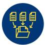

**Blockchain Technology(optional for advanced operations):** Leverage an immutable digital ledger to securely record every transaction, enhancing traceability and ensuring accountability throughout the supply chain.

**Establish a Digital or Spreadsheet-Based Master Traceability System:** Create a centralized system that seamlessly links farmers, individual plots, and corresponding product batches, enabling transparent tracking that fosters trust and enhances operational ef1ciency.

# **01 Implement Traceability Systems Using Digital Tools**

### **Traceability & Data Collection**

**02 Collect Accurate Geolocation Data** To accurately document the precise location of each production area, follow these guidelines: For small plots (<4 ha): Capture a single GPS point located at the center of the 1eld. This point serves as a representative marker for the entire area.

For larger plots (>4 ha): Collect multiple GPS points along the perimeter to delineate the 1eld boundary. This series of points will create a polygon that accurately reNects the shape and dimensions of the plot.

# **04 Maintain Basic but Robust Record-Keeping**

Keep detailed purchase and sales logs that meticulously link each delivery to a speci1c farmer or aggregator, ensuring clarity and accountability that in line with data protection.

Implement a robust batch code system designed to accurately track the origin of every product, enhancing traceability throughout the supply chain. For instance, a typical entry might read as below sample (not of1cial recommendations, but only an example):

**Batch-002 | Farmer: Suparman | Village X | Plot #12 | Date: 5 July 2025**

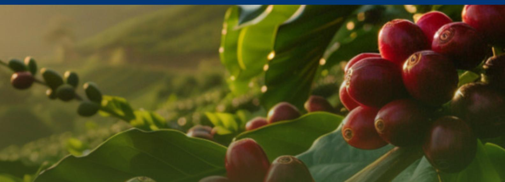

Guarantee complete traceability from the cultivation plot to the farmer and onwards to the buyer, meticulously documenting each stage of the transaction process to uphold transparency and trust among all parties involved.

# **03 Verify Land-Use and Data Accuracy**

Ensure that the data accurately represents the current status of land use and demonstrates a deforestation-free condition.

Utilize advanced satellite imagery tools, such as Google Earth and Global Forest Watch website and monitoring tools such as WHISP and EUFO (EU Forest Observatory), to conduct a thorough visual analysis for any signs of recent forest loss or degradation. Where feasible, engage third-party veri1cation services or perform regular audits to authenticate the accuracy of plot data and land documentation, ensuring credibility and transparency in the assessment process. Correlate geolocation data with of1cial land-use classi1cations or tenure documents, if available, to enhance the accuracy and reliability of the land-use information.

To ensure safety and compliance throughout the supply chain, it is crucial to keep and noncompliant products separated. This separation can be achieved through physical barriers or by implementing rigorous documentation practices that enhance traceability and minimize the risk of contamination.

**Implementation Strategies:**

# **05 Implement Product Segregation**

**Color Coded System:** Utilize vibrant, color-coded tags, bags, or bins to distinctly categorize compliant and non-compliant materials. This visual differentiation aids in quick identi1cation and reduces the chances of mix-ups.

**Advanced Monitoring Tactics:** For more sophisticated operations, establish a practice of cross-referencing delivered volumes against farm sizes to detect any anomalies. For example, if a farm measuring only one hectare supplies an unusually large volume of product, this discrepancy can serve as a red Nag, prompting further investigation into potential compliance issues.

**Clear Labeling of Documentation:** Ensure that all associated documentation is marked clearly and according to this system. Labeling should be precise, indicating the compliance status and any relevant notes to provide immediate context.

Points 2-5 could be effectively implemented within small-scale companies (small suppliers and cooperatives that support local exporters). While these entities may not have formal obligations under the EUDR, their involvement can signi1cantly contribute to the overall implementation of its principles and strengthen sustainability along the supply chains.

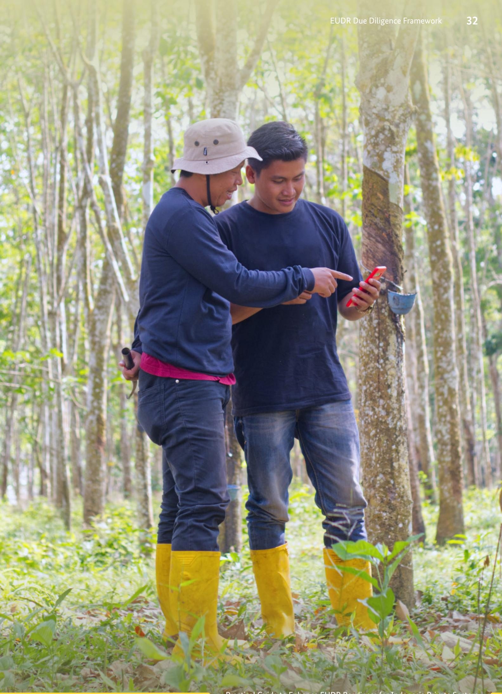

### **Why it matters?**

An effective risk-management process is essential, as it allows you to identify and address potential issues at an early stage. This proactive approach not only safeguards the integrity of your operations but also prevents your entire supply chain from being deemed "non-compliant." By incorporating thorough assessments and continuous monitoring, you can navigate challenges before they escalate, ensuring a smoother and more reliable supply chain.

Evaluate each supplier by considering key factors such as geographic location, adherence to legal standards, and their historical impact on deforestation. Utilize the following risk indicators for a comprehensive assessment:

# **01 Classify Suppliers by Risk Level**

**Proximity to High-Risk Areas:** Analyze how close the supplier is to regions known for their environmental vulnerability, such as forest frontiers and protected ecological zones.

**Compliance Record:** Review any documented history of non-compliance with environmental and social regulations or the presence of insuf1cient documentation that raises red Nags.

### **Create a simple supplier risk matrix**

**Deforestation History:** Investigate the supplier's past actions regarding land use and any instances of deforestation associated with their operations.

**Land Title Clarity:** Examine the clarity and legitimacy of land titles, along with the availability of detailed plot-level data to ensure transparency in land use.

### **Risk Assessments and Mitigation**

| Farmer A            |                             |
|---------------------|-----------------------------|
| Farmer B            |                             |
|                     | Complete EUDR docs          |
|                     | Farm located in forest      |
|                     | Keep sourcing               |
|                     | Further review              |
| Supplier Risk Level | Reasons of Risk Action Step |

**Identify Missing Elements:** Conduct a detailed assessment to pinpoint speci1c gaps, such as the absence of critical GPS data or necessary legal documentation pertaining to land ownership.

**Establish a Timeline:** Set a clear and structured timeline, typically ranging from 30 to 60 days, for addressing and closing these compliance gaps. If certain gaps cannot be closed within the timeline (for example, formal land title issuance that requires longer government processes), downgrade the supplier to a conditional or probationary status, document the reason for delay, and agree on interim risk mitigation steps (e.g., closer monitoring, partial sourcing suspension, or support for document processing).

**Assign Responsibilities:** Clearly delineate responsibilities among stakeholders, specifying who will be tasked with collecting the required data and who will be responsible for submitting documentation to ensure accountability and ef1ciency.

**Track Progress:** Implement a system for monitoring progress and set a date to revisit the status of the corrective actions after the established timeframe. This will help gauge compliance and make necessary adjustments.

# **02 Develop and Implement Corrective Action Plans (CAPs)**

For medium- or high-risk suppliers, it is essential to develop a comprehensive Corrective Action Plan (CAP) aimed at rectifying any compliance de1ciencies. Collaborate closely with the supplier to ensure a thorough approach:

All points on risk assessment and mitigation could be effectively implemented within small-scale companies (small suppliers and cooperatives that support local exporters). While these entities may not have formal obligations under the EUDR, their involvement can signi1cantly contribute to the overall implementation of its principles and strengthen sustainability along the supply chains.

# **03 Communicate and Collaborate with Buyers and Supplier**

**Please ensure that buyers are promptly informed in the following scenarios:**

When a supplier or farmer is considering expansion or is currently operating on land that is environmentally sensitive, which could have signi1cant implications for local ecosystems. In the event that GPS monitoring indicates any encroachments into areas designated for environmental protection, raising concerns about potential violations of conservation efforts. If any issues related to land legality, environmental protection, or social responsibility are identi1ed, highlighting the necessity for compliance and ethical practices in land use.

#### **Additionally, it's essential to work closely with buyers on the following initiatives:**

Conducting thorough satellite veri1cations or on-site inspections to con1rm the situation. Engaging in joint training sessions or implementing corrective action plans to address potential issues. Ensuring that documentation and templates are aligned for consistency and compliance. Establishing an anonymized grievance mechanism (such as a con1dential phone line or suggestion box) to allow workers, farmers, or local stakeholders to safely report concerns or potential violations without fear of retaliation.

### **Why it matters?**

Consistent updates and thorough evaluations ensure that your records remain precise and reliable, effectively tackle emerging risks in a timely manner, and foster unwavering con1dence among both buyers and regulatory authorities.

Utilize satellite-based systems or trusted third-party platforms to receive timely alerts regarding the risks of deforestation or alterations in land use.

Assign a dedicated team member to routinely monitor these alerts on a weekly or monthly basis, ensuring they Nag any signi1cant 1ndings such as:

In cases where areas are Nagged, take prompt action by reaching out to the supplier for clari1cation or, when feasible, conducting on-site 1eld veri1cations to assess the situation 1rsthand.

**Sign up for industry newsletters:** Engage with reputable sources that provide timely updates on policy changes and best practices. **Regularly check of?cial channels** for the latest legislation and guidance pertaining to the EUDR (e.g. from EU (The Directorate-General for Environment) DG ENV Newsletter).

**Join informative webinars:** Participate in online sessions hosted by experts who can offer insights into the implementation of the EUDR and its implications for your sector. **Align with organizations** such as the Roundtable on Sustainable Palm Oil (RSPO), Rainforest Alliance, and GPSNR, which offer valuable resources and updates tailored to your industry.

Stay informed about the evolving EUDR framework and any speci1c regulations or enforcement policies relevant to different countries.

# **02 Review and Update Due Diligence Systems Regularly**

# **01 Establish Continuous Monitoring Systems**

Recent forest loss in proximity to supplier plots

Indicators of 1res or land clearance activities

Notable changes in land cover and vegetation patterns

### **Ongoing Monitoring & Validation**

**Consistently Update Supplier Records:** Establish a straightforward register, such as a spreadsheet or logbook, dedicated to tracking changes in supplier information over time. An effective log should include updates on new farm plots, any expansions in operations, or details regarding suppliers who have ceased their business with you.

Additionally, don't forget to request geolocation data immediately to ensure accurate mapping and easy accessibility of their farming sites. This organized and proactive approach will help maintain clear communication and foster strong relationships within your supply chainIn cases where areas are Nagged, take prompt action by reaching out to the supplier for clari1cation or, when feasible, conducting on-site 1eld veri1cations to assess the situation 1rsthand.

When onboarding a new supplier or farmer, it's important to gather essential information such as their name, location, and contact details promptly.

**03 Maintain and Update Supplier Records**

Points 3 and 4 could be effectively implemented within small-scale companies (small suppliers and cooperatives that support local exporters). While these entities may not have formal obligations under the EUDR, their involvement can signi1cantly contribute to the overall implementation of its principles and strengthen sustainability along the supply chains..

Revise your data collection forms by adding new 1elds for critical information like land tenure, polygon size, or consent dates to ensure completeness.

Enhance the format of your purchase records by establishing direct links between batch IDs and GPS coordinates, creating an integrated and interoperable traceability system.

Elevate the training of your 1eld staff by addressing the speci1c challenges identi1ed, ensuring they are equipped to handle similar situations in the future.

Maintain a concise "improvement log" to document each modi1cation you've implemented, noting the date and details of the change. This will serve as a valuable reference for continuous improvement and accountability.

Leverage buyer feedback and comprehensive audits to 1ne-tune your internal processes and data management systems effectively. **04 Apply Continuous Improvement Based on Feedback**

When a buyer identi1es a gap in your data (such as missing information on farm size or inconsistencies in recorded data), respond promptly and decisively:

# **Collaborating with Farmers, Regulatory Bodies, and Stakeholders**

## Why partnerships matter?

Ensuring EUDR compliance requires shared responsibility across the supply chain. Private sector actors, particularly exporters, processors, and traders, play a critical role in building bridges between downstream market demands and upstream realities at the farm level. Collaboration is not only encouraged; it is essential for scalable compliance

### **Why partnerships matter?**

**Smallholders** often lack access to legal clarity, digital tools, and traceability systems.

**Government agencies** can help validate land legality, provide information on relevant regulatory framework, and support on regulatory interpretation.

**NGOs and cooperatives** can act as intermediaries for farmer engagement and training.

**Pre-competitive collaboration** with other private sector actors reduces duplication and cost.

### **Buyer-Supplier Incentive Model**

### **Interoperable Traceability Collaboration**

### **Aggregator-led Partnership**

Exporters work with cooperatives to collect farm geolocation data using GPS tools. Cooperatives support data entry; government helps verify land legality

Traders offer long-term contracts, training, and price incentives to farmer groups in return for full traceability and legal land status

Local companies and authorities form joint working groups to align data formats, conduct joint outreach, and link with national traceability systems

Companies co-develop or share digital traceability systems to reduce farmer burden and standardize data, especially in multi-tiered supply chains like rubber

### **Public-Private Working Group**

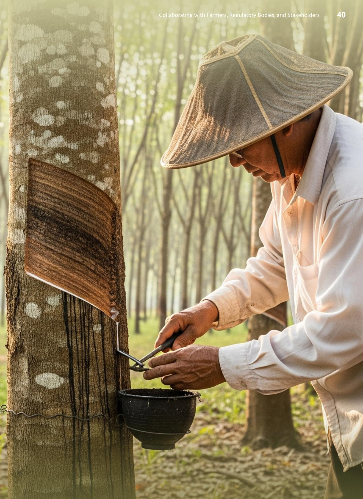

# **Case Studies and Best Practices**

Case 1: Strengthening Geolocation Accuracy in Remote Cocoa Regions

Case 2: Reducing Product Mixing in Rubber Collection Points

Case 3: Cooperative-Based Due Diligence Monitoring

Case 4: Joint Land Verification with Local Government

A medium-sized cocoa exporter working in a remote region faced major challenges in meeting EUDR geolocation requirements. Most smallholder farmers lacked formal land ownership documents, and many plots were poorly mapped or undocumented. This created high risk scores in the company's EUDR risk assessment and reduced their marketability to EU buyers.

### **Actions Taken**

- The company trained local village facilitators to collect farm GPS points using ofNine mobile applications, overcoming internet connectivity issues.
- They partnered with a local NGO to cross-check submitted coordinates against national forest boundary maps and of1cial spatial data.
- They created simple visual plot maps linked to farmer IDs and purchase records.

### **Results/Outcomes**

- Geolocation coverage improved from less than 30% to over 80% within one season.
- The number of suppliers classi1ed as "high-risk" dropped signi1cantly.
- EU buyers acknowledged the improved traceability system and increased purchase volumes.

### **Lessons Learned**

Local facilitators and community-based data collectors can be powerful allies in achieving geolocation compliance, especially in remote or low-connectivity areas.

### **Strengthening Geolocation Accuracy in Remote Cocoa Regions** *Case 1:*

These anonymized case studies highlight practical solutions, creative partnerships, and lessons learned from both successes and setbacks.

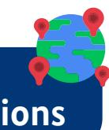

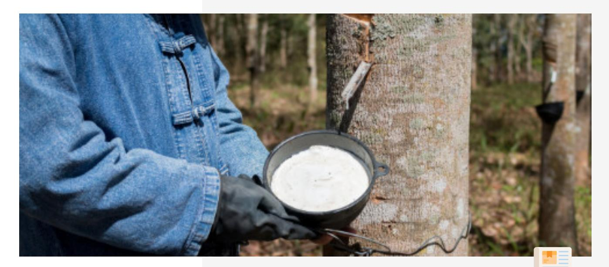

A rubber processing company in Sumatra collected rubber from multiple villages at central collection points. The absence of a system to separate EUDR-compliant and non-compliant batches led to accidental mixing, making it impossible to verify origins and putting the company's exports at risk of rejection by EU buyers.

### **Actions Taken**

- The company introduced a simple color-coded tagging system for each incoming batch to mark compliance status.
- Separate storage areas were set up for tagged batches.
- Data on tagged batches was uploaded to a donor-supported digital platform that tracked collection and delivery.

#### **Results/Outcomes**

- Incidents of product mixing dropped to near zero.
- Transparency in supply chain handling improved, building buyer con1dence.
- The system was replicated in other districts through shared training and platform access.

### **Lessons Learned**

Low-cost operational controls, when paired with digital tracking, can dramatically improve traceability and reduce EUDR non-compliance risks.

### **Reducing Product Mixing in Rubber Collection Points**

### *Case 2:*

A coffee buyer struggled to monitor and verify due diligence across hundreds of scattered smallholders, especially on land legality and potential deforestation risks near protected areas. External audits were slow and costly.

### **Actions Taken**

- The buyer signed a formal agreement with a farmer cooperative to act as an implementing partner.
- The cooperative maintained a live farmer database with updated plot coordinates, delivery logs, and legality documents.
- The buyer used this data to build a simple risk dashboard that Nagged farms near conservation zones or with inconsistent data.

### **Results/Outcomes**

- The buyer reduced external audit costs by 40% through targeted risk-based inspections.
- Response time to potential deforestation risks improved from several weeks to just days.
- Farmers trusted the cooperative more, increasing participation and data accuracy.

### **Lessons Learned**

Delegating due diligence monitoring to trusted local cooperatives strengthens compliance systems while reducing costs and increasing local ownership.

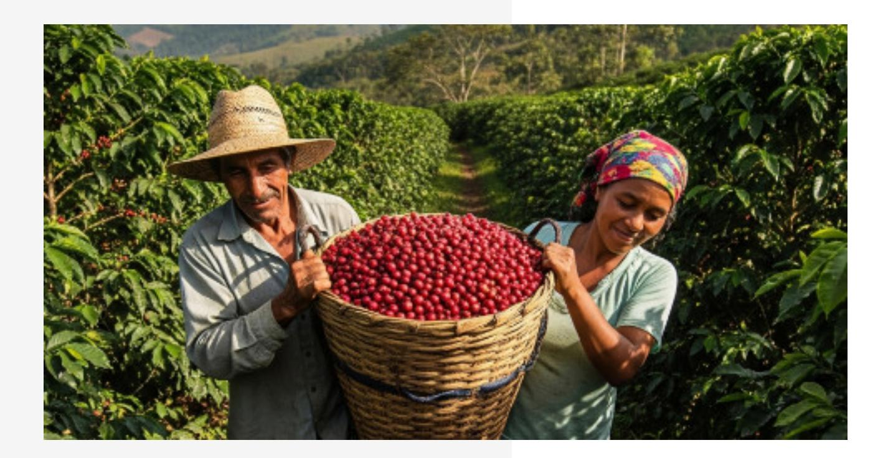

### **Cooperative-Based Due Diligence Monitoring** *Case 3:*

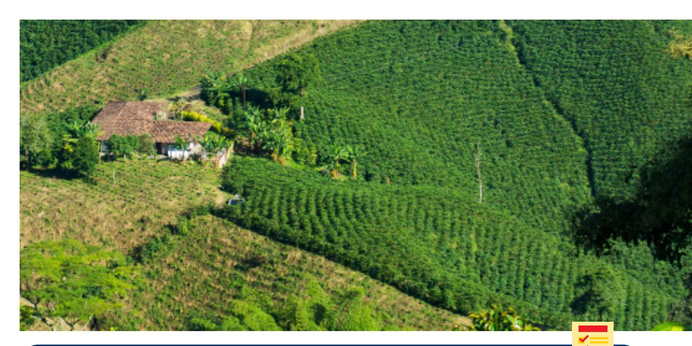

Exporters in Sulawesi preparing for EUDR faced widespread uncertainty about land legality. Many smallholders provided unclear or incomplete land documents, which risked being Nagged as noncompliant by EU buyers.

### **Actions Taken**

- The exporters formed a working group and coordinated directly with the district land of1ce.
- They jointly veri1ed smallholders' land documents and compared them with government spatial data layers.
- The veri1ed results were stored in a shared traceability system and linked to farm geolocation data.

### **Results/Outcomes**

- Over 90% of supplier plots were veri1ed within three months, well ahead of the planned timeline.
- Legal uncertainty was reduced, and buyers were assured of compliance.
- The approach improved trust and collaboration between local authorities and the private sector.

### **Lessons Learned**

Government collaboration is essential to resolving land legality gaps and accelerates compliance preparation for EUDR.

### **Joint Land Veri?cation with Local Government**

### *Case 4:*

### **Glossary**

| Aggregator                |              |              |               |                |              |              |             |                     |                      |
|---------------------------|--------------|--------------|---------------|----------------|--------------|--------------|-------------|---------------------|----------------------|
| Authorised representative |              |              |               |                |              |              |             |                     |                      |
| Batch ID/Batch Code       |              |              |               |                |              |              |             |                     |                      |
| DDS (Due Diligence        |              |              |               |                |              |              |             |                     |                      |
| Due Diligence             |              |              |               |                |              |              |             |                     |                      |
| EUDR (European Union      |              |              |               |                |              |              |             |                     |                      |
| Deforestation Regulation) |              |              |               |                |              |              |             |                     |                      |
| Forest Degradation        |              |              |               |                |              |              |             |                     |                      |
| Forest-Related Rules      |              |              |               |                |              |              |             |                     |                      |
| An                        | entity       | or           | cooperative   | that           | collects     |              | commodities | from                | multiple             |
|                           | smallholders |              | and supplies  | them           | to           | processors   | or          | exporters.          |                      |
| Any                       |              | natural or   | legal         | person         | established  | in           | the EU      | who,                | in accordance        |
| with                      |              | Article 6,   | has received  | a              | written      | mandate      |             | from an             | operator or from     |
| a                         | trader       | to act       | on its        | behalf in      | relation     | to           | speci1ed    | tasks               | with regard to       |
| the                       |              | operator’s   | or the        | trader’s       | obligations  |              | under       | this                | Regulation.          |
| A                         | unique       |              | identi1cation | number         | assigned     | to           | a           | speci1c             | volume of            |
| Deforestation             | product,     | used         | to link it    | back to        | its          | origin.      |             |                     |                      |
| The                       |              | conversion   | of forest     | to             | agricultural | or           | other       | non-forest          | land use,            |
|                           | whether      |              | human-induced | or             | natural.     |              |             |                     |                      |
| A                         |              | requirement  | under         | the EUDR       | meaning      |              | that the    |                     | commodity was not    |
|                           | produced     | on           | land          | deforested     | after 31     |              | December    | 2020.               |                      |
| A Statement)              | formal       | declaration  |               | submitted      | by           | operators    | to          | the EU              | system               |
|                           | (TRACES)     |              | con1rming     | that their     | products     |              | are         | deforestation-free, | legal,               |
| and                       |              | compliant.   |               |                |              |              |             |                     |                      |
| A                         | legal        | obligation   | under         | the            | EUDR for     |              | operators   | to collect          | data, assess         |
| risks,                    | and market.  | mitigate     |               | non-compliance |              | before       | placing     | products            | on the EU            |
|                           | Regulation   | (EU)         | 2023/1115     | that           | prohibits    |              | placing     |                     | deforestation-linked |
| Forest                    | products     | on the       | EU            | market or      | exporting    |              | them        | from it.            |                      |
| Land                      |              | spanning     | more          | than 0,5       | hectares     | with         | trees       | higher              | than                 |
| 5                         | metres       | and a        | canopy        | cover of       | more         | than         | 10 %,       | or trees            | able to reach        |
|                           | those        | thresholds   | in situ,      | excluding      | land         | that         | is          | predominantly       | under                |
|                           | agricultural | or           | urban         | land use.      |              |              |             |                     |                      |
|                           | Structural   | changes      | to            | forest         | cover,       | taking       | the form    | of the              | conversion of:       |
| 1.                        | (a)          | primary      | forests or    | naturally      |              | regenerating |             | forests             | into plantation      |
|                           | forests      | or           | into other    | wooded         | land;        | or           |             |                     |                      |
| 2.                        | (b)          | primary      | forests       | into planted   |              | forests.     |             |                     |                      |
|                           | National     | legal        | requirements  |                | speci1cally  |              | linked to   | forest              | use, forest          |
| Geolocation               | conversion,  | and          | timber        | harvesting,    | as           | referred     | to          | under               | EUDR.                |
|                           | Precise      | geographical |               | coordinates    |              | (latitude    | and         | longitude)          | of farm plots        |
|                           | where        | commodities  | are           | produced.      |              |              |             |                     |                      |

| Indigenous Peoples’ Rights |               |           |               |                 |            |           |               |             |              |              |
|----------------------------|---------------|-----------|---------------|-----------------|------------|-----------|---------------|-------------|--------------|--------------|
| Legality Documentation     |               |           |               |                 |            |           |               |             |              |              |
| Risk Assessment            |               |           |               |                 |            |           |               |             |              |              |
| Risk Mitigation            |               |           |               |                 |            |           |               |             |              |              |
| Rights                     | of            |           | indigenous    | communities     | that       | may       | be            | affected    | by land      | use,         |
|                            | including     | free,     | prior,        | and informed    | consent    |           | (FPIC).       |             |              |              |
|                            | Documents     |           | proving       | land ownership, |            | tenure,   | or use        | rights,     | as           | well as      |
|                            | environmental |           | permits       | (e.g. SPPL)     | and        | tax       | compliance    |             | certi1cates. |              |
| Any                        | natural       | or        | legal         | person who,     | in the     | course    | of a          |             | commercial   | activity,    |
| places                     |               | relevant  | products      | on the          | EU market  |           | or exports    |             | them.        |              |
| A                          | series of     | GPS       | points        | connected       | to form    |           | the full      | boundary    | of           | a plot of    |
| land,                      | required      |           | for plots     | larger          | than 4     | hectares. |               |             |              |              |
| The                        | process       | of        | evaluating    | the             | likelihood | that      | a             | supplier or |              | product      |
| might                      | be            |           | non-compliant | with            | EUDR       |           | requirements. |             |              |              |
|                            | Actions       | taken     | to reduce     | identi1ed       | risks,     | such      | as            | additional  |              | audits, 1eld |
|                            | veri1cations, | or        | supplier      | training.       |            |           |               |             |              |              |
| Any                        | entity        | that      | provides      | commodities     | or         | raw       | materials     | to          | an           | operator     |
| or                         | trader,       | including |               | cooperatives    | and        |           | aggregators.  |             |              |              |
| The                        | ability       | to        | track a       | product         | through    | every     | stage         | of          | production   | and          |
|                            | supply,       | from      | farm to       | 1nal buyer.     |            |           |               |             |              |              |
| Any                        | person        | in        | the supply    | chain           | other      | than      | the           | operator    | who,         | in the       |
| course                     | of            | a         | commercial    | activity,       | makes      |           | relevant      | products    |              | available on |
| the                        | EU            | market.   | Traders       | as de1ned       | by the     |           | EUDR are      | always      |              | downstream   |
| of                         | operators,    |           | meaning       | companies       | active     |           | within the    | EU.         |              |              |

# **Annex**

Annex 1. Example of Regular Self-Monitoring Form Template

Annex 2. List of Government Offices and NGO Resources

Annex 3. Recommended Sources and References on EUDR for Private Sectors

### **Annex 1. Example of Regular Self-Monitoring Form Template**

Example form that private sectors and their producers can use to record and track farm activities, inputs, harvest, and sales on a regular basis. It helps them stay organized, maintain accurate records, and support traceability and EUDR compliance.

|                                                          | Notes/Follow-up           |
|----------------------------------------------------------|---------------------------|
| Area Indicator Yes/No Thematic                           | Data Action Checked       |
| Each batch has a unique code (e.g.,                      |                           |
| Total volume/quantity is available                       |                           |
| The production or harvest date is clearly                |                           |
| stated and traceable                                     |                           |
| The coordinates for the production area                  |                           |
| are available                                            |                           |
| Land was not deforested after Dec 31,                    |                           |
| Production area not located within                       |                           |
| protected forest, conservation, or HCV                   |                           |
| Supplier holds valid land ownership,                     |                           |
| lease, or cultivation rights (e.g., SHM,                 |                           |
| IPPKH, HGU, SKT, etc)                                    |                           |
| Boundaries of the production area are                    |                           |
| demarcated, and match the coordinates                    |                           |
| Land is not under conNict or overlapping                 |                           |
| Supporting Evidence Collected (e.g,                      |                           |
| Satellite map, land use map, photos, etc.)               |                           |
| Required environmental documents                         |                           |
| available (AMDAL, UKL-UPL, or SPPL)                      |                           |
| No use of burning for land preparation                   |                           |
| Proper management of waste and                           |                           |
| efNuents (if applicable)                                 |                           |
| Workers have legal status and are not                    |                           |
| minors (no child labor)                                  |                           |
| Compliance with national minimum                         |                           |
| wage and working hour laws                               |                           |
| Availability of PPE and occupational                     |                           |
| safety procedures                                        |                           |
| Communities and customary landowners                     |                           |
| were consulted before land acquisition                   |                           |
| or expansion, with consent properly                      |                           |
| Customary or indigenous communities’                     |                           |
| land rights are identi1ed and respected                  |                           |
| All shipments accompanied by legal                       |                           |
| documents (delivery note, invoice,                       |                           |
| Compliance with tax obligation                           |                           |
| Products from the farm and supplier can                  |                           |
| be linked to a buyer or batch                            |                           |
| Labels or separation practices are in                    |                           |
| place to avoid mixing                                    |                           |
| Farmer or supplier participates in a                     |                           |
| sustainability certi1cation scheme                       |                           |
| Risk mitigation is conducted (if no                      |                           |
| compliance issues are detected)                          |                           |
| Records reviewed in the last 1–2 months                  |                           |
| Yes                                                      | No                        |
| Yes                                                      | No                        |
| Yes                                                      | No                        |
| Yes                                                      | No                        |
| Yes                                                      | No Write date of planting |
|                                                          | State the land            |
|                                                          | document type here        |
|                                                          | Not obligatory nor green  |
|                                                          | lane under EUDR           |
| Yes                                                      | No                        |
| Yes                                                      | No                        |
| Yes                                                      | No                        |
| Yes                                                      | No                        |
| Yes                                                      | No                        |
| Yes                                                      | No                        |
| Yes                                                      | No                        |
| Yes                                                      | No                        |
| Yes                                                      | No                        |
| Yes                                                      | No                        |
| Yes                                                      | No                        |
| Yes                                                      | No                        |
| Yes                                                      | No                        |
| Yes                                                      | No                        |
| Yes                                                      | No                        |
| Yes                                                      | No                        |
| Yes                                                      | No                        |
| Yes                                                      | No                        |
| Yes                                                      | No                        |
| Yes                                                      | No                        |
| Basic Identi1cation LOT2025-001) Deforestation-Free      | here                      |
| Land Tenure and                                          |                           |
| Land Use Rights area submitted claims                    |                           |
| Environmental and                                        |                           |
| Forestry Compliance                                      |                           |
| Labor and Social Compliance documented                   |                           |
| Transport and Trade Documentation manifest) Certi1cation |                           |
| Monitoring & Updates                                     |                           |

### **Annex 2. List of Government Of?ces and NGO Resources**

This list provides contact information for government agencies and NGOs that can support private sectors with technical advice, training, for EUDR compliance.

| Agency                         | Website Email Phone                          |
|--------------------------------|----------------------------------------------|
| Ministry of Trade of the       |                                              |
| Republic of Indonesia          |                                              |
| Ministry of Economic Affairs   |                                              |
| of the Republic of Indonesia   |                                              |
| Ministry of Agriculture of the |                                              |
| Republic of Indonesia          |                                              |
| Directorate General of         |                                              |
| Ministry of Forestry of the    |                                              |
| Republic of Indonesia          |                                              |
| Forest Watch Indonesia         |                                              |
| Forest Stewardship Council     |                                              |
| Indonesia (FSC)                |                                              |
| World Resources Institute      |                                              |
| (WRI) Indonesia                |                                              |
| Website                        | Kementerian                                  |
| Perdagangan                    | RI                                           |
|                                | contact.us@kemendag.go.id +62-21-3858171     |
| Website                        | Kementerian                                  |
| Koordinator                    | Bidang                                       |
| Perekonomian                   | RI                                           |
|                                | ppid@ekon.go.id +62-21-3521885               |
| Website                        | Kementerian                                  |
| Pertanian                      | RI                                           |
|                                | layanan-ip@pertanian.go.id +62-851-7965-7867 |
| Website                        | Direktorat                                   |
| Jenderal                       | Perkebunan                                   |
|                                | ditjenbun@pertanian.go.id +62-21-7816-109    |
| Website                        | Forest Watch                                 |
|                                | fwibogor@fwi.or.id +62-251-8333-308          |
| Website                        | Forest                                       |
| Stewardship                    | Council                                      |
|                                | info@id.fsc.org +62-21-2598 5065             |
| Website                        | WRI                                          |
|                                | indonesiaof1ce@wri.org +62-21- 22775816      |

### **Annex 3. Recommended Sources and References on EUDR for Private Sectors**

This annex lists practical sources and references, including educational videos in Bahasa Indonesia and translated documents, to help private sectors better understand and prepare for the EUDR (link attached on the text).

### **1. Educational Videos in Bahasa Indonesia**

### **2. Documents and Practical Guides**

#### **A. Introduction of EUDR – Kaoem Telapak Channel**

#### **A. Guidance Document**

#### **B. Frequently Asked Questions – Version 4**

#### **C. Of?cial EUDR Translation – Satya Bumi**

#### **D. General Understanding & Implementation Guide – Daemeter**

*Basic explanation of the regulation.*

*English version of the of7cial EUDR guidance documents.*

*Technical explanation and practical interpretation for supply chain actors, including farmers.*

*Full translated version of the EUDR regulation in Bahasa Indonesia.*

*Technical explanation and practical interpretation for supply chain actors, including farmers.*

